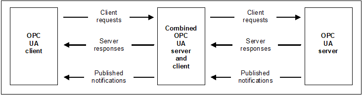
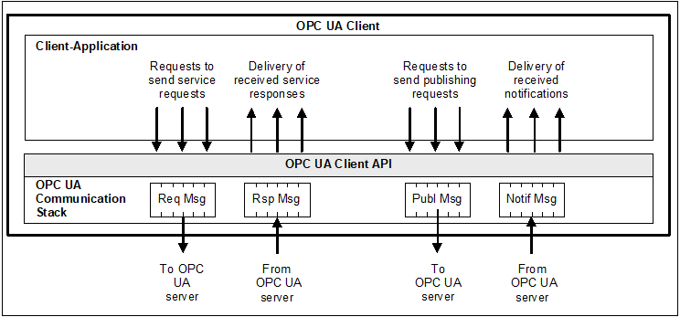
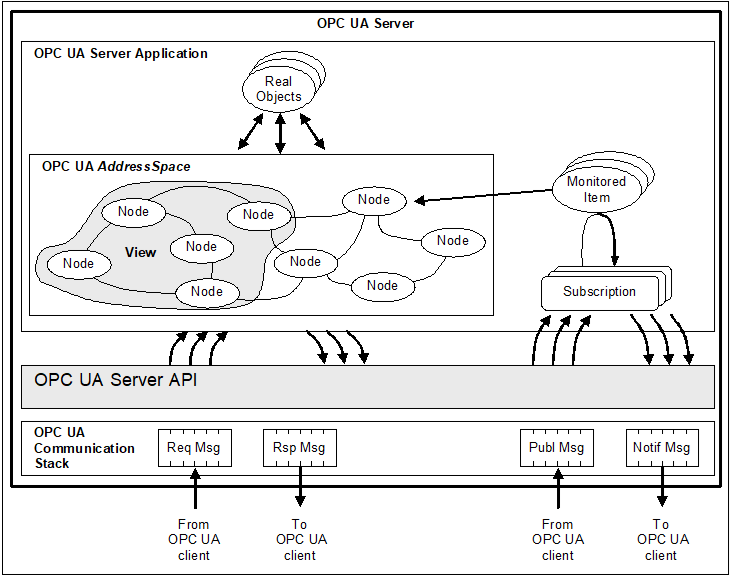
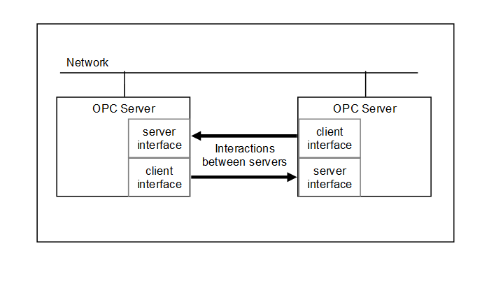
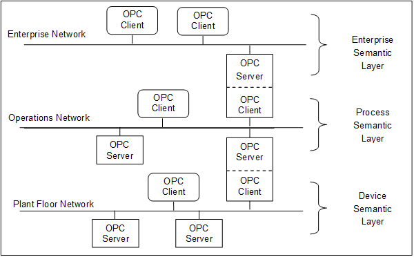
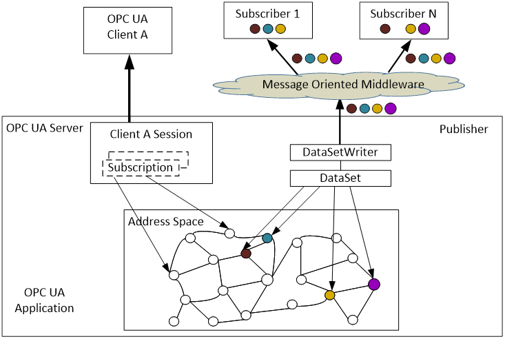
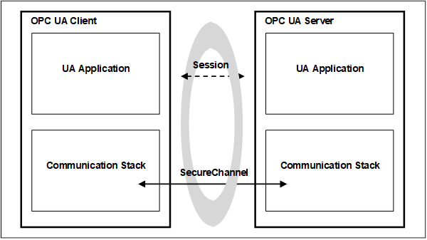

## 1 Scope  

OPC Unified Architecture (OPC UA) is a platform-independent standard designed to facilitate seamless information exchange in industrial automation and other domains. It provides a comprehensive framework for modelling information, secure communication, and ensuring interoperability between diverse systems and devices.  

This part of OPC 10000 introduces the fundamental concepts and provides a high-level overview of the OPC Unified Architecture. It covers key architectural principles, fundamental models such as the AddressSpace Model and the Security Model, and the roles of core OPC UA components like Clients and Servers. It is intended for developers, system integrators, and anyone needing a high-level understanding of OPC UA. This part of the specification focuses on providing a conceptual foundation and does not delve into detailed implementation specifics or protocol mappings, which are covered in other parts of the OPC 10000 series.  

This part provides the foundational knowledge necessary to understand the subsequent parts of the OPC 10000 series, which delve into specific aspects of the architecture, such as security (Part 2), the AddressSpace model (Part 3), and Services (Part 4). Each of the other parts is briefly explained along with a suggested reading order.  

## 2 Terms, definitions, and abbreviated terms  

### 2.1 Terms and definitions  

For the purposes of this document, the following terms apply.  

ISO and IEC maintain terminology databases for use in standardization at the following addresses:  

* IEC Electropedia: available at [https://www.electropedia.org/](https://www.electropedia.org/)  

* ISO Online browsing platform: available at [https://www.iso.org/obp](https://www.iso.org/obp)  

#### 2.1.1 AddressSpace  

collection of information that a *Server* makes visible to its *Clients*  

Note 1 to entry: See [OPC 10000-3](/§UAPart3) for a description of the contents and structure of the *Server* AddressSpace.  

#### 2.1.2 Aggregate  

function that calculates derived values from *Raw data*  

Note 1 to entry: Raw data may be from a historian or buffered real time data. Common Aggregates include averages over a given time range, minimum over a time range and maximum over a time range.  

#### 2.1.3 Alarm  

type of Event associated with a state condition that typically requires acknowledgement  

Note 1 to entry: See [OPC 10000-9](/§UAPart9) for a description of Alarms.  

#### 2.1.4 Attribute  

primitive characteristic of a Node  

Note 1 to entry: All Attributes are defined by OPC UA, and may not be defined by *Clients* or *Servers* . Attributes are the only elements in the AddressSpace permitted to have data values.  

#### 2.1.5 Broker  

intermediary program module that routes *NetworkMessages* from *Publishers* to *Subscribers*  

Note 1 to entry: *Brokers* are building blocks of *Message Oriented Middleware* .  

#### 2.1.6 Certificate  

digitally signed data structure that contains a public key and an identity  

Note 1 to entry: Certificates are used to identity for example *Clients* , *Servers* , users, and certificate authorities.  

#### 2.1.7 Client  

software application that sends *Messages* to OPC UA *Servers* conforming to the *Services* specified in this set of specifications  

#### 2.1.8 ClientServer  

OPC UA variant of the client-server messaging pattern  

#### 2.1.9 Condition  

generic term that is an extension to an *Event*  

Note 1 to entry: A *Condition* represents the conditions of a system or one of its components and always exists in some state.  

#### 2.1.10 Communication Stack  

layered set of software modules between the application and the hardware that provides various functions to encode, encrypt and format a *Message* for sending, and to decode, decrypt and unpack a *Message* that was received  

#### 2.1.11 Complex Data  

data that is composed of elements of more than one primitive data type, such as a structure  

#### 2.1.12 DataSet  

list of named data values  

Note 1 to entry: A *DataSet* typically consists of *Event* fields or *Variable* values  

#### 2.1.13 DataSetMessage  

payload of a *NetworkMessage* created from a *DataSet*  

Note 1 to entry:  The *DataSetMessage* is an immutable payload of the *NetworkMessage* handed off to the *Message Oriented Middleware* (transport layer) for delivery by the *Publisher* . The *Subscriber* receives the *DataSetMessage* as the payload of a *NetworkMessage* from the *Publisher* with additional headers that may be supplied by the *Message Oriented Middleware* along the way.  

#### 2.1.14 Discovery  

process by which *Client* obtains information about *Server* s, including endpoint and security information  

#### 2.1.15 Event  

generic term used to describe an occurrence of some significance within a system or system component  

#### 2.1.16 EventNotifier  

special *Attribute* of a *Node* that signifies that a *Client* may subscribe to that particular *Node* to receive *Notifications* of *Event* occurrences  

#### 2.1.17 Information Model  

organizational framework that defines, characterizes, and relates information resources of a given system or set of systems.  

Note 1 to entry: The core AddressSpace model supports the representation of Information Models in the AddressSpace. See [OPC 10000-5](/§UAPart5) for a description of the base OPC UA Information Model.  

#### 2.1.18 Message  

data unit conveyed between *Client* and *Server* that represents a specific *Service* request or response  

#### 2.1.19 Message Oriented Middleware  

infrastructure supporting sending and receiving *NetworkMessages* between distributed systems  

Note 1 to entry: An OPC UA *Application* may support different types of *Message Oriented Middleware* infrastructures and protocols like AMQP, MQTT, or UDP with IP multicast. Other types like DDS or XMPP can also be integrated into the OPC UA *PubSub* model.  

#### 2.1.20 Method  

callable software function that is a component of an *Object*  

#### 2.1.21 MonitoredItem  

*Client*\-defined entity in the *Server* used to monitor Attributes or *EventNotifiers* for new values or Event occurrences and that generates Notifications for them  

#### 2.1.22 NetworkMessage  

*DataSetMessages* and header to facilitate delivery, routing, security, and filtering  

Note 1 to entry: The *Publisher* hands off the *NetworkMessage* to the *Message Oriented Middleware* (transport layer) to deliver *DataSetMessages* to the *Subscribers* .  

Note 2 to entry: The term message is used with various connotations in the messaging world. The *Publisher* might like to think of the message as an immutable payload handed off to the *Message Oriented Middleware* for delivery. The *Subscriber* often thinks of the message as not only that immutable payload from the sender, but also various annotations supplied by the *Message Oriented Middleware* along the way. To avoid confusion the term *DataSetMessage* is used to mean the message as supplied by the *Publisher* for a *DataSet* and the term *NetworkMessage* is used to mean the *DataSetMessage* plus sections for annotation at the head and tail of the *DataSetMessage* .  

#### 2.1.23 Node  

fundamental component of an AddressSpace  

#### 2.1.24 NodeClass  

class of a Node in an AddressSpace  

Note 1 to entry: NodeClasses define the metadata for the components of the OPC UA object model. They also define constructs, such as Views, that are used to organize the AddressSpace.  

#### 2.1.25 Notification  

generic term for data that announces the detection of an Event or of a changed Attribute value; Notifications are sent in NotificationMessages.  

#### 2.1.26 NotificationMessage  

Message published from a Subscription that contains one or more Notifications  

#### 2.1.27 Object  

Node that represents a physical or abstract element of a system  

Note 1 to entry: Objects are modelled using the OPC UA Object Model. Systems, subsystems, and devices are examples of Objects. An Object may be defined as an instance of an ObjectType.  

#### 2.1.28 Object Instance  

synonym for Object  

Note 1 to entry: Not all Objects are defined by ObjectTypes.  

#### 2.1.29 ObjectType  

Node that represents the type definition for an Object  

#### 2.1.30 OPC UA Application  

*Client* , which calls OPC UA *Services* , ** or a *Server* , which performs those *Services* , or an OPC UA *Publisher* or an OPC UA *Subscriber.*  

#### 2.1.31 Profile  

specific set of capabilities to which a *Server* may claim conformance.  

Note 1 to entry: Each *Server* may claim conformance to more than one Profile  

Note 2 to entry: The set of capabilities are defined in [OPC 10000-7](/§UAPart7)  

#### 2.1.32 Program  

executable Object that, when invoked, immediately returns a response to indicate that execution has started, and then returns intermediate and final results through Subscriptions identified by the *Client* during invocation  

#### 2.1.33 Publisher  

entity sending *NetworkMessages* to a *Message Oriented Middleware*  

Note 1 to entry: A Publisher can be a native OPC UA Application or an application that only has knowledge about the Message Oriented Middleware and the rules for encoding the NetworkMessages and DataSetMessages.  

#### 2.1.34 PubSub  

OPC UA variant of the publish subscribe messaging pattern  

#### 2.1.35 Reference  

explicit relationship (a named pointer) from one Node to another  

Note 1 to entry: The Node that contains the Reference is the source *Node* , and the referenced Node is the target Node. All References are defined by ReferenceTypes.  

#### 2.1.36 ReferenceType  

Node that represents the type definition of a Reference  

Note 1 to entry: The ReferenceType specifies the semantics of a Reference. The name of a ReferenceType identifies how source Nodes are related to target Nodes and generally reflects an operation between the two, such as "A contains B".  

#### 2.1.37 Secure Channel  

in OPC UA, a communication path established between an OPC UA *Client* and *Server* that have authenticated each other using certain OPC UA services and for which security parameters have been negotiated and applied  

#### 2.1.38 Server  

software application that implements and exposes the *Services* specified in this set of specifications  

#### 2.1.39 Service  

*Client*\-callable operation in a *Server*  

Note 1 to entry: *Services* are defined in [OPC 10000-4](/§UAPart4) . A *Service* is similar to a method call in a programming language or an operation in a Web services WSDL contract.  

#### 2.1.40 Service Set  

group of related *Services*  

#### 2.1.41 Session  

logical long-running connection between a *Client* and a *Server.*  

Note 1 to entry: A *Session* maintains state information between *Service* calls from the *Client* to the *Server* .  

#### 2.1.42 Subscriber  

entity receiving *DataSetMessages* from a *Message Oriented Middleware*  

Note 1 to entry: A *Subscriber* can be a native OPC UA *Application* or an application that has just knowledge about the *Message Oriented Middleware* and the rules for decoding the *NetworkMessages* and *DataSetMessages* . A *Subscription* in the OPC UA *ClientServer* model has a different meaning than the *Subscriber* in the *PubSub* model.  

#### 2.1.43 Subscription  

*Client*\-defined endpoint in the *Server,* used to return Notifications to the *Client*  

Note 1 to entry: *Subscription* is a generic term that describes a set of Nodes selected by the *Client* (1) that the *Server* periodically monitors for the existence of some condition, and (2) for which the *Server* sends Notifications to the *Client* when the condition is detected.  

#### 2.1.44 Underlying System  

hardware or software platforms that exist as an independent entity. *UA Applications* are dependent on an entity's existence in order to perform UA services. However, the entity is not dependent on *UA Applications* .  

Note 1 to entry: Hardware and software platforms include physical hardware, firmware, operating system, networking, nonUA applications, as well as other *UA Applications* . A Distributed Control System, PLC/Device, and UA Server are examples of an *Underlying System* .  

#### 2.1.45 Variable  

*Node* that contains a value  

#### 2.1.46 View  

specific subset of the AddressSpace that is of interest to the *Client* .  

### 2.2 Abbreviated terms  

A&E Alarms and Events  

AMQP Advanced Message Queuing Protocol  

API Application Programming Interface  

COM Component Object Model  

DA Data Access  

DCS Distributed Control System  

DDS Data Distribution Service  

HDA Historical Data Access  

HMI Human-Machine Interface  

JSON JavaScript Object Notation  

LDAP Lightweight Directory Access Protocol  

MES Manufacturing Execution System  

MQTT Message Queue Telemetry Transport  

OAuth2 Open Authorization  

OPC Open Platform Communications  

PLC Programmable Logic Controller  

SCADA Supervisory Control And Data Acquisition  

UA Unified Architecture  

UADP UA Datagram Protocol  

WSDL Web Services Definition Language  

XML Extensible Markup Language  

XMPP Extensible Messaging and Presence Protocol  

## 3 Structure of the OPC UA series  

### 3.1 Specification organization  

The OPC UA specification is organized as a multi-part series to provide a modular and extensible framework. This structure allows for focused development and maintenance of specific aspects of the technology, while ensuring overall coherence. The parts are broadly categorized into core concepts, information models, services, mappings, profiles, and domain-specific applications. Parts 1 through 5 describe core concepts of OPC UA, therefore, readers are encouraged to read Parts 1 through 5 of the specification before reading the other Parts.  

### 3.2 Specification parts  

 **At the time of publication of this document, the OPC 10000 series is composed of the following parts:**   

* Part 1 (OPC 10000-1) - Overview and Concepts  

Part 1 (this part) presents the concepts and overview of OPC UA.  

* Part 2 ( [OPC 10000-2](/§UAPart2) ) - Security Model  

Part 2 describes the model for securing interactions between *OPC UA* *Applications* .  

* Part 3 ( [OPC 10000-3](/§UAPart3) ) - Address Space Model  

Part 3 describes the contents and structure of the *Server's* *AddressSpace* .  

* Part 4 ( [OPC 10000-4](/§UAPart4) ) - Services  

Part 4 specifies the *Services* provided by *Servers* .  

* Part 5 ( [OPC 10000-5](/§UAPart5) ) - Information Model  

Part 5 specifies the types and their relationships defined for *Servers* .  

* Part 6 ( [OPC 10000-6](/§UAPart6) ) - Mappings  

Part 6 specifies the mappings to transport protocols and data encodings supported by OPC UA.  

* Part 7 ( [OPC 10000-7](/§UAPart7) ) - Profiles  

Part 7 specifies the *Profiles* that are available for *OPC* *UA Applications.* These *Profiles* provide groupings of functionality that can be used for conformance level certification. *OPC UA Applications* will be tested against the *Profiles* .  

* Part 8 ( [OPC 10000-8](/§UAPart8) ) - Data Access  

Part 8 specifies the use of OPC UA for data access.  

* Part 9 ( [OPC 10000-9](/§UAPart9) ) - Alarms and Conditions  

Part 9 specifies use of OPC UA support for access to *Alarms* and *Conditions* . The base system includes support for simple *Events* ; this specification extends that support to include support for *Alarms* and *Conditions* .  

* Part 10 ( [OPC 10000-10](/§UAPart10) ) - Programs  

Part 10 specifies OPC UA support for access to *Programs* .  

* Part 11 ( [OPC 10000-11](/§UAPart11) ) - Historical Access  

Part 11 specifies use of OPC UA for historical access. This access includes both historical data and historical *Events* .  

* Part 12 ( [OPC 10000-12](/§UAPart12) ) - Discovery and Global Services  

Part 12 specifies how *Discovery* *Servers* operate in different scenarios and describes how UA *Clients* and *Servers* should interact with them. ** It also defines *Information Models* for *Certificate* management *,* key credential ** management, ** and ** authorization services.  

* Part 13 ( [OPC 10000-13](/§UAPart13) ) - Aggregates  

Part 13 specifies how to compute and return aggregates like minimum, maximum, average etc. *Aggregates* can be used with current and historical data.  

* Part 14 ( [OPC 10000-14](/§UAPart14) ) - PubSub  

Part 14 specifies the OPC Unified Architecture (OPC UA) *PubSub* communication model. The *PubSub* communication model defines an OPC UA publish subscribe pattern in addition to the *ClientServer* pattern defined by the *Services* in [OPC 10000-4](/§UAPart4) .  

* Part 15 ( [OPC 10000-15](/§) ) - Safety  

Part 15 extends OPC UA to fulfil the requirements of functional safety as defined in the [IEC 61508](/§IEC61508) series of standards and in [IEC 61784-3:2017](/§IEC61784) .  

* Part 16 ( [OPC 10000-16](/§) ) - State Machines  

Part 16 specifies the basic infrastructure to model state machines.  

* Part 17 ( [OPC 10000-17](/§) ) - Alias Names  

Part 17 specifies a manner of configuring and exposing an alternate well-defined name for any OPC UA *Node* in a *Server* or system.  

* Part 18 ( [OPC 10000-18](/§) ) - Role-Based Security  

Part 18 specifies the basic infrastructure to model role-based access control (RBAC)  

* Part 19 ( [OPC 10000-19](/§) ) - Dictionary References  

Part 19 specifies the basic infrastructure to reference from an OPC UA Information Model to external dictionaries like IEC Common Data Dictionary or ECLASS.  

* Part 20 ( [OPC 10000-20](/§) ) - File Transfer  

Part 20 specifies the basic infrastructure to model file transfers and file systems.  

* Part 21 ( [OPC 10000-21](/§) ) - Device Onboarding  

Part 21 specifies the life cycle of Devices and Composites and mechanisms to verify their authenticity, set up their security and maintain their configuration.  

* Part 22 ( [OPC 10000-22](/§) ) - Base Network Model  

Part 22 specifies an OPC UA Information Model for a basic set of network related components to be used in more specific *Information Models* .  

* Part 23 ( [OPC 10000-23](/§) ) - Common ReferenceTypes  

Part 23 specifies common types of references between *Nodes.*  

* Part 24 ( [OPC 10000-24](/§) ) - Scheduler  

Part 24 specifies an OPC UA information model to expose and configure the dates and times specific actions are executed by the OPC UA *Server* .  

* Part 25 ( [OPC 10000-25](/§UAPart25) ) - Object Serialization  

Part 25 specifies an OPC UA information model to configure and expose a merged compact representation of the selected subtree of a root *Node* .  

* Part 26 ( [OPC 10000-26](/§UAPart26) ) - LogObject  

Part 26 specifies an OPC UA information model for a set of *Objects* and *Events* that can be used to collect diagnostic information in a system.  

## 4 Overview  

### 4.1 Scope  

OPC UA is applicable to components in all industrial domains, such as industrial sensors and actuators, control systems, Manufacturing Execution Systems and Enterprise Resource Planning Systems, including the Industrial Internet of Things (IIoT), Machine To Machine (M2M) and others. It is designed to enable seamless information exchange and to support command and control functionalities for diverse industrial processes, spanning from device-level communication to enterprise-wide and cloud integration.  

OPC UA defines a common infrastructure model to facilitate this information exchange. OPC UA specifies the following:  

* the information model to represent structure, behaviour and semantics;  

* the message model to interact between applications;  

* the communication model to transfer the data between end-points;  

* the conformance model to guarantee interoperability between systems.  

### 4.2 General  

OPC UA is a platform-independent standard that enables various systems and devices to communicate securely and reliably. It employs mechanisms for authentication, encryption, and integrity checks to ensure the identity of *OPC UA Applications* as well as identification of users and protect against attacks.  

Using the *ClientServer* model, OPC UA defines sets of *Services* that *Servers* provide, and it utilizes both OPC UA-defined and vendor-defined data types, along with flexible object models, to facilitate interoperability and dynamic information discovery by *Clients* . Supporting a variety of communication protocols and data encodings, such as TCP, HTTPS, WebSockets, XML/text, UA Binary, and JSON, OPC UA allows for trade-offs between portability and efficiency to suit different application requirements. *Servers* can provide access to both current and historical data, as well as *Alarms* and *Events* to notify *Clients* of important changes.  

In addition to the *ClientServer* model, OPC UA also supports information transfer from *Publishers* to *Subscribers* using the *PubSub* model.  

### 4.3 Design goals  

OPC UA provides a consistent, integrated *AddressSpace* and service model. This allows a single *Server* to integrate data, *Alarms* and *Events* , and history into its *AddressSpace* , and to provide access to them using an integrated set of *Services* . These *Services* also include an integrated security model.  

OPC UA also allows *Servers* to provide *Clients* with type definitions for the *Objects* accessed from the *AddressSpace* . This allows *Information Models* to be used to describe the contents of the *AddressSpace* . OPC UA allows data to be exposed in many different formats, including binary structures and XML or JSON documents. The format of the data may be defined by OPC, other standard organizations or vendors. Through the *AddressSpace* , *Clients* can query the *Server* for the metadata that describes the format for the data. In many cases, *Clients* with no pre-programmed knowledge of the data formats will be able to determine the formats at runtime and properly utilize the data.  

OPC UA adds support for many relationships between *Nodes* instead of being limited to just a single hierarchy. In this way, a *Server* may present data in a variety of hierarchies tailored to the way a set of *Clients* would typically like to view the data. This flexibility, combined with support for type definitions, makes OPC UA applicable to a wide array of problem domains. As illustrated in [Figure 1](/§\_Ref402707464) , OPC UA is not targeted at just the SCADA, PLC and DCS interface, but also as a way to provide greater interoperability between higher level functions.  

  

Figure 1 - OPC UA target applications  

OPC UA is designed to provide robustness of published data. A major feature of all OPC servers is the ability to publish data and *Event* *Notifications* . OPC UA provides mechanisms for *Clients* to quickly detect and recover from communication failures associated with these transfers without having to wait for long timeouts provided by the underlying protocols.  

OPC UA is designed to support a wide range of *Servers* , from plant floor PLCs to enterprise *Servers* . These *Servers* are characterized by a broad scope of size, performance, execution platforms and functional capabilities. Therefore, OPC UA defines a comprehensive set of capabilities, and *Servers* may implement a subset of these capabilities. To promote interoperability, OPC UA defines subsets, referred to as *Profiles* , to which *Servers* may claim conformance. *Clients* can then discover the *Profiles* of a *Server* , and tailor their interactions with that *Server* based on the *Profiles* . *Profiles* are defined in [OPC 10000-7](/§UAPart7) .  

The OPC UA is layered to isolate the core design from the underlying computing technology and network transport. This allows OPC UA to be mapped to future technologies as necessary, without negating the basic design. Mappings and data encodings are described in [OPC 10000-6](/§UAPart6) . Several data encodings are defined:  

* XML/text,  

* UA Binary,  

* JSON.  

In addition, several protocols are defined:  

* OPC UA TCP,  

* HTTPS,  

* WebSockets.  

*OPC UA Applications* that support multiple transports and encodings will allow the end users to make decisions about trade-offs between performance and compatibility at the time of deployment, rather than having these trade-offs determined by the OPC vendor at the time of product definition.  

OPC UA is designed as the migration path for OPC clients and servers that are based on Microsoft COM technology (OPC Classic). Care has been taken in the design of OPC UA so that existing data exposed by OPC COM servers (DA, HDA and A&E) can easily be mapped and exposed via OPC UA. Vendors may choose migrating their products natively to OPC UA or use external wrappers to convert from OPC COM to OPC UA and vice-versa. Each of the specifications of OPC Classic developed by OPC Foundation defined its own address space model and its own set of *Services* . OPC UA unifies the previous models into a single integrated address space with a single set of *Services* .  

OPC UA *PubSub* opens new application fields for OPC UA. The following are some example uses for *PubSub* :  

* Configurable peer to peer communication between controllers and between controllers and HMIs. The peers are not directly connected and do not even need to know about the existence of each other. The data exchange often requires a fixed time-window; it may be point-to-point or a multi-point connection.  

* Asynchronous workflows. For example, an order processing application can place an order on a message queue or an enterprise service bus. From there it can be processed by one or more workers.  

* Logging to multiple systems; for example, sensors or actuators can write logs to a monitoring system, an HMI, an archive application for later querying, and so on.  

* *Servers* representing services or devices can stream data to applications hosted in the cloud. For example, backend servers, big data analytics for system optimization and predictive maintenance.  

*PubSub* is not bound to a particular messaging system. Rather it can be mapped to various different systems as illustrated with two examples:  

* *PubSub* with UDP may be well-suited in production environments for frequent transmissions of small amounts of data. It also allows data exchange in one-to-one and one-to-many configurations.  

* The use of established messaging protocols (e.g. the ISO/IEC AMQP 1.0 protocol or the MQTT 5.0 protocol) with JSON data encoding supports the cloud integration path and readily allows handling of the information in modern stream and batch analytics systems.  

### 4.4 Integrated models and services  

#### 4.4.1 Security model  

##### 4.4.1.1 General  

OPC UA security is concerned with the authentication of *Clients* and *Servers* , the authentication of users, the integrity and confidentiality of their communications, and the verifiability of claims of functionality. It does not specify the circumstances under which various security mechanisms are required. That specification is crucial, but it is made by the designers of the system at a given site and may be specified by other standards.  

Rather, OPC UA provides a security model, described in [OPC 10000-2](/§UAPart2) , in which security measures can be selected and configured to meet the security needs of a given installation. This model includes security mechanisms and parameters. In some cases, the mechanism for exchanging security parameters is defined, but the way that applications use these parameters is not. This framework also defines a minimum set of security *Profiles* that all *OPC UA Applications* support, a subset of which can be enabled in each installation. *Profiles* are defined in [OPC 10000-7](/§UAPart7) .  

##### 4.4.1.2 Discovery and Session establishment  

Application level security relies on a secure communication channel that is active for the duration of the application *Session* and ensures the integrity of all *Messages* that are exchanged. This means users need to be authenticated only once, when the application *Session* is established. The mechanisms for discovering *Servers* and establishing secure communication channels and application *Sessions* are described in [OPC 10000-4](/§UAPart4) and [OPC 10000-6](/§UAPart6) . Additional information about the *Discovery* process is described in [OPC 10000-12](/§UAPart12) .  

When a *Session* is established, the *Client* and *Server* applications negotiate a secure communications channel. Digital ( [X.509](/§X509) ) *Certificates* are utilized to identify the *Client* and *Server* . The *Server* further authenticates the user and authorizes subsequent requests to access *Objects* in the *Server* .  

##### 4.4.1.3 Auditing  

OPC UA includes support for security audit trails with traceability between *Client* and *Server* audit logs. If a security-related problem is detected at the *Server* , the associated *Client* audit log entry can be located and examined. OPC UA also provides the capability for *Servers* to generate *Event* *Notifications* that report auditable *Events* to *Clients* capable of processing and logging them. OPC UA defines security audit parameters that can be included in audit log entries and in audit *Event Notifications* . [OPC 10000-5](/§UAPart5) defines the data types for these parameters. Not all *Servers* and *Clients* provide all of the auditing features. *Profiles,* found in [OPC 10000-7](/§UAPart7) , indicate which features are supported.  

##### 4.4.1.4 Transport security  

OPC UA security complements the security infrastructure provided by most web service capable platforms.  

Transport level security can be used to encrypt and sign *Messages* . Encryption and signatures protect against disclosure of information and protect the integrity of *Messages* . Encryption capabilities are provided by the underlying communications technology used to exchange *Messages* between *OPC UA Applications* . [OPC 10000-7](/§UAPart7) defines the encryption and signature algorithms to be used for a given *Profile* .  

#### 4.4.2 Integrated AddressSpace model  

The set of *Objects* and related information that the *Server* makes available to *Clients* is referred to as its *AddressSpace* . The OPC UA *AddressSpace* represents its contents as a set of *Nodes* connected by *References* .  

Primitive characteristics of *Nodes* are described by *Attributes* . *Attributes* are the only elements of a *Server* that have data values. Data types that define attribute values may be simple or complex.  

*Nodes* in the *AddressSpace* are typed according to their use and their meaning. *NodeClasses* define the metadata for the OPC UA *AddressSpace* . [OPC 10000-3](/§UAPart3) defines the OPC UA *NodeClasses* .  

The *Base NodeClass* defines *Attributes* common to all *Node* s, allowing identification, classification, and naming. Each *NodeClass* inherits these *Attributes* and may additionally define its own *Attributes* .  

To promote interoperability of *Clients* and *Servers* , the OPC UA *AddressSpace* is structured hierarchically with the top levels the same for all *Servers* . Although *Nodes* in the *AddressSpace* are typically accessible via the hierarchy, they may have *References* to each other, allowing the *AddressSpace* to represent an interrelated network of *Node* s. The model of the *AddressSpace* is defined in [OPC 10000-3](/§UAPart3) .  

*Servers* may subset the *AddressSpace* into *Views* to simplify *Client* access. Subclause [5.3.4.3](/§\_Ref136776602) describes *AddressSpace* *Views* in more detail.  

#### 4.4.3 Integrated object model  

The OPC UA Object Model provides a consistent, integrated set of *NodeClasses* for representing *Objects* in the *AddressSpace* . This model represents *Objects* in terms of their *Variables,* *Events* and *Methods* , and their relationships with other *Objects* . [OPC 10000-3](/§UAPart3) describes this model.  

The OPC UA object model allows *Servers* to provide type definitions for *Objects* and their components. Type definitions may be subclassed. They also may be common or they may be system-specific. *ObjectTypes* may be defined by standards organizations, vendors, or end-users.  

This model allows data, *Alarms* and *Events* , and their history to be integrated into a single *Server* . For example, *Servers* are able to represent a temperature transmitter as an *Object* that is composed of a temperature value, a set of alarm parameters, and a corresponding set of alarm limits.  

#### 4.4.4 Integrated services  

The interface between *Clients* and *Servers* is defined as a set of *Services.* These *Services* are organized into logical groupings called *Service Sets* . *Service Sets* are discussed in clause [6](/§\_Ref115187897) and specified in [OPC 10000-4](/§UAPart4) .  

OPC UA *Services* provide two capabilities to *Clients* . They allow *Clients* to issue requests to *Servers* and receive responses from them. They also allow *Clients* to subscribe to *Servers* for *Notifications* . *Notifications* are used by the *Server* to report occurrences such as *Alarms* , data value changes, *Events* , and *Program* execution results.  

OPC UA *Messages* may be encoded as text (XML or JSON) or in binary format for efficiency purposes. They may be transferred using multiple underlying transports, for example TCP or HTTP. *Servers* may provide different encodings and transports as defined by [OPC 10000-6](/§UAPart6) .  

### 4.5 Sessions  

OPC UA *ClientServer* interaction requires a stateful model. The state information is maintained inside an application *Session* . Examples of state-information are *Subscriptions* , user credentials and continuation points for operations that span multiple requests.  

*Sessions* are defined as logical connections between *Clients* and *Servers* . *Servers* may limit the number of concurrent *Sessions* based on resource availability, licensing restrictions, or other constraints. Each *Session* is independent of the underlying communications protocols. Failures of these protocols do not automatically cause the *Session* to terminate. *Sessions* terminate based on *Client* or *Server* request, or based on inactivity of the *Client* . The inactivity time interval is negotiated during *Session* establishment.  

## 5 Systems concepts  

### 5.1 ClientServer overview  

The OPC UA systems architecture models *Clients* and *Servers* as interacting partners. Each system may contain multiple *Clients* and *Servers* . Each *Client* may interact concurrently with one or more *Servers* , and each *Server* may interact concurrently with one or more *Clients* . This model enables *Clients* to access data, invoke *Services* , and receive *Events* from *Servers* . An application can embody both *Server* and *Client* functionalities, allowing it to exchange information with other *Servers* and Clients as described in [5.3.7](/§\_Ref79199669) .  

*Clients* and *Servers* are described in [5.2](/§\_Ref443921572) and [5.3](/§\_Ref443921603) . [Figure 2](/§\_Ref69099230) illustrates the architecture that includes a combined *Server* and *Client* .  

  

Figure 2 - OPC UA system architecture  

### 5.2 OPC UA Clients  

The OPC UA *Client* architecture models the *Client* endpoint of *ClientServer* interactions. [Figure 3](/§\_Ref69096485) illustrates the major elements of a typical *Client* and how they relate to each other.  

  

Figure 3 - OPC UA Client architecture  

The *Client* Application utilizes a *Client* API to initiate OPC UA *Service* requests and receive responses from *Servers* . The Communication Stack handles the conversion of *Client* API calls into messages and manages the underlying communication with the *Server* . The *Services* defined for OPC UA are described in clause [6](/§\_Ref115187897) , and specified in [OPC 10000-4](/§UAPart4) .  

Note that the " *Client* API" is an internal interface that isolates the *Client* application code from an OPC UA Communication Stack. The OPC UA Communication Stack converts *Client* API calls into *Messages* and sends them through the underlying communications entity to the *Server* at the request of the *Client* application. The OPC UA Communication Stack also receives response and *NotificationMessages* from the underlying communications entity and delivers them to the *Client* application through the *Client* API.  

### 5.3 OPC UA Servers  

#### 5.3.1 General  

The OPC UA *Server* architecture models the *Server* endpoint of client/server interactions. [Figure 4](/§\_Ref69878697) illustrates the major elements of the *Server* and how they relate to each other.  

  

Figure 4 - OPC UA Server architecture  

#### 5.3.2 Real objects  

Real objects are physical or software objects that are accessible by the *Server* application or that it maintains internally. Examples include physical devices (e.g. sensors, actuators, motors) and diagnostics counters.  

#### 5.3.3 Server application  

The *Server* application is the code that implements the function of the *Server* . It uses the *Server* API to send and receive OPC UA *Messages* from *Clients* . Note that the " *Server* API" is an internal interface that isolates the *Server* application code from an OPC UA Communication Stack.  

#### 5.3.4 OPC UA AddressSpace  

##### 5.3.4.1 AddressSpace Nodes  

The *AddressSpace* is modelled as a set of *Nodes* accessible by *Clients* using OPC UA *Services* (interfaces and methods). *Nodes* in the *AddressSpace* are used to represent real objects, their definitions and their *References* to each other.  

##### 5.3.4.2 AddressSpace organization  

[OPC 10000-3](/§UAPart3) contains the details of the meta model "building blocks" used to create an *AddressSpace* out of interconnected *Nodes* in a consistent manner. *Servers* are free to organize their *Nodes* within the *AddressSpace* as they choose. The use of *References* between *Nodes* permits *Servers* to organize the *AddressSpace* into hierarchies, a full mesh network of *Node* s, or any possible mix.  

[OPC 10000-5](/§UAPart5) defines OPC UA *Nodes* and *References* and their expected organization in the *AddressSpace* . Some *Profiles* will not require that all of the UA *Nodes* be implemented.  

##### 5.3.4.3 AddressSpace Views  

A *View* is a subset of the *AddressSpace* . *Views* are used to restrict the *Nodes* that the *Server* makes visible to the *Client* , thus restricting the size of the *AddressSpace* for the *Service* requests submitted by the *Client* . The default *View* is the entire *AddressSpace* . *Servers* may optionally define other *Views* . *Views* hide some of the *Nodes* or *References* in the *AddressSpace* . *Views* are visible via the *AddressSpace* and *Clients* are able to browse *Views* to determine their structure. *Views* are often hierarchies, which are easier for *Clients* to navigate and represent in a tree.  

##### 5.3.4.4 for information models  

The OPC UA *AddressSpace* supports *Information Models* . This support is provided through:  

* *Node* *References* that allow *Objects* in the *AddressSpace* to be related to each other.  

* *ObjectType* *Nodes* that provide semantic information for real *Objects* (type definitions).  

* *ObjectType* *Nodes* to support subclassing of type definitions.  

* Data type definitions exposed in the *AddressSpace* that allow industry specific data types to be used.  

* Industry groups can define how their specific information models are to be represented in *Server* *AddressSpace* .  

#### 5.3.5 Subscription entities  

##### 5.3.5.1 MonitoredItems  

*MonitoredItems* are entities in the *Server* created by the *Client* that monitor *AddressSpace* *Nodes* and, indirectly, their real-world counterparts. When they detect a data change or an event/alarm occurrence, they generate a *Notification* that is transferred to the *Client* by a *Subscription* .  

##### 5.3.5.2 Subscriptions  

A *Subscription* is an endpoint in the *Server* that publishes *Notifications* to *Clients* . *Clients* control the rate at which publishing occurs by sending Publish *Messages* .  

#### 5.3.6 OPC UA Service interface  

##### 5.3.6.1 General  

The *Services* defined for OPC UA are described in clause [6](/§\_Ref115187993) , and specified in [OPC 10000-4](/§UAPart4) .  

##### 5.3.6.2 Request/response Services  

Request/response *Services* are *Services* invoked by the *Client* through the OPC UA *Service* Interface to perform a specific task on one or more *Nodes* in the *AddressSpace* and to return a response.  

##### 5.3.6.3 Subscription Services  

The *Publish* *Service* is invoked through the OPC UA *Service* Interface for the purpose of periodically sending *Notifications* to *Clients* . Notifications include *Events* , *Alarms* , data changes and *Program* outputs.  

#### 5.3.7 Server to Server interactions  

*Server* to *Server* interactions in the *ClientServer* model are interactions in which one *Server* acts as a *Client* of another *Server* . *Server* to *Server* interactions allow for the development of servers that:  

1. exchange information with each other on a peer-to-peer basis, this could include redundancy or remote *Servers* that are used for maintaining system wide type definitions (see [Figure 5](/§\_Ref69805203) ),  

are chained in a layered architecture of *Servers* to provide:  

aggregation of data from lower-layer *Servers* ,  

higher-layer data constructs to *Clients* , and  

concentrator interfaces to *Clients* for single points of access to multiple underlying *Servers* .  

  

[Figure 5](/§\_Ref69805203) illustrates interactions between *Servers* .  

  

Figure 5 - Peer-to-peer interactions between Servers  

Similar peer-to-peer interactions can also be accomplished using the OPC UA *PubSub* model where each peer *Application* is both a *Publisher* and a *Subscriber* .  

[Figure 6](/§\_Ref69782711) extends the previous example and illustrates the chaining of *Servers* together for vertical access to data in an enterprise.  

  

Figure 6 - Chained Server example  

### 5.4 Redundancy  

OPC UA provides the data structures and services by which *Redundancy* may be achieved in a standardized manner.  Redundancy may be used for high availability, fault tolerance and load balancing. [OPC 10000-4](/§UAPart4) formally defines *Client* , *Server* and *Network Redundancy* .  Whether and what *Redundancy* is supported by an OPC UA *Application* is defined by its *Profiles* . *Profiles* are described in [OPC 10000-7](/§UAPart7) .  

Required *Client* and *Server* behaviours are associated with two distinct modes of *Server Redundancy* , transparent and non-transparent. The *Client* and *Server* responsibilities when using either transparent or non-transparent redundancy are defined in [OPC 10000-4](/§UAPart4) .  

*Servers* that support non-transparent redundancy can also support client-controlled load balancing. The health of a *Server* including its ability to *Service* requests is collectively defined as *ServiceLevel* . See [OPC 10000-5](/§UAPart5) for a formal definition of *ServiceLevel* . [OPC 10000-4](/§UAPart4) defines four distinct *ServiceLevel* sub-ranges and example usage.  

### 5.5 Publish-Subscribe  

The Publish-Subscribe ( *PubSub* ) communication model in OPC UA offers an alternative to the *ClientServer* model, enabling efficient and/or decoupled communication. With *PubSub,*  *OPC UA Applications* do not directly exchange requests and responses. Instead, *Publishers* send messages to a *Message Oriented Middleware* , without knowledge of what, if any, *Subscribers* there may be. Similarly, *Subscribers* express interest in specific types of data, and process messages that contain this data, without knowledge of what *Publishers* there are.  

*Message* *Oriented Middleware* is software or hardware infrastructure supporting sending and receiving messages between distributed systems. It depends on the *Message Oriented Middleware* how this distribution is implemented.  

To cover a large number of use cases, OPC UA *PubSub* supports two largely different *Message Oriented Middleware* variants. These are:  

* A broker-less form, where the *Message Oriented Middleware* is the network infrastructure that is able to route datagram-based messages. *Subscribers* and *Publishers* use datagram protocols like UDP multicast.  

* A broker-based form, where the *Message Oriented Middleware* is a *Broker* . *Subscribers* and *Publishers* use standard messaging protocols like AMQP or MQTT to communicate with the *Broker* . All messages are published to specific queues (e.g. topics, nodes) that the *Broker* exposes and *Subscribers* can listen to these queues. The *Broker* may translate messages from the formal messaging protocol of the *Publisher* to the formal messaging protocol of the *Subscriber* .  

*PubSub* is used to communicate messages between different system components without these components having to know each other's identity.  

A *Publisher* is pre-configured with what data to send. There is no connection establishment between *Publisher* and *Subscriber* .  

The knowledge about who *Subscribers* are and the forwarding of published data to the *Subscribers* is off-loaded to the *Message Oriented Middleware* . The *Publisher* does not know or even care if there is one or many *Subscribers* . Effort and resource requirements for the *Publisher* are predictable and do not depend on the number of *Subscribers* .  

[OPC 10000-14](/§UAPart14) describes the details of the OPC UA *PubSub* model.  

### 5.6 Synergy of models  

OPC UA *PubSub* and *ClientServer* models are complementary and can be combined and used synergistically. The OPC UA *Information Model* is the foundation for both. A typical scenario involves using *ClientServer* interactions for configuration, control, and on-demand data access, while *PubSub* is used for efficient, high-speed dissemination of real-time data. For instance, a *Client* application might use *ClientServer* to configure a *Server* and set up *PubSub* connections. Subsequently, the *Server/Publisher* publishes real-time data updates using *PubSub* , and the *Client/Subscriber* subscribes to this data stream for continuous monitoring.  

*OPC* *PubSub* can easily be integrated into *Servers* and *Clients* . Quite typically, a *Publisher* will be a *Server* (the owner of information) and a *Subscriber* is often a *Client* . Above all, the *PubSub* *Information Model* for configuration promotes the configuration of *Publishers* and *Subscribers* using the OPC UA *ClientServer* model.  

[Figure 7](/§\_Ref471458833) depicts a single OPC UA *Application* that acts as both a *Server* and a *Publisher* .  

  

Figure 7 - Integrated ClientServer and PubSub models  

Nevertheless, the *PubSub* communication does not require such a role dependency. I.e., *Clients* can be *Publishers* and *Servers* can be *Subscribers* . In fact, there is no necessity for *Publishers* or *Subscribers* to be either a *Server* or a *Client* to participate in *PubSub* communications.  

### 5.7 Global Services  

#### 5.7.1 General  

OPC Unified Architecture is highly decentralized and is mostly concerned with the standardization of the independent interactions between UA *Applications* (i.e. between *Clients* and *Servers* and between *Publishers* and *Subscribers* ). However, as the number of *Applications* in a given system grows, there are advantages to having some information centralized and interactions that are uniform among all *Applications* in a system. For example, if a system consists of one *Server* and one or more *Clients* , it is reasonable for the *Server* to be configured with the usernames and passwords of all users that can access the *Server* . If instead a system has hundreds of *Servers,* then it becomes unmanageable for each *Server* to independently store and maintain the usernames and passwords for all users of the system. For scenarios like this, the Unified Architecture includes certain centralized, global components to provide consistency and alleviate administration burden.  

Ideally all *Applications* should work with all the defined global services when they are present in a system, but *Applications* that wish to utilize a particular global service need to be designed and built to do so. Keep in mind that the use of the global services in a system is always optional, so *Applications* should not be written to require their presence.  

#### 5.7.2 Discovery Services  

Discovery Services enable OPC UA Applications to locate other OPC UA Applications. For example, a *Client* application can use a Local *Discovery* *Server* (LDS) to find *Servers* on the local network. In a larger, more complex network, a Global *Discovery* *Server* (GDS) might be used to discover Servers across different network segments. The *Client* sends a Discovery request, and the Discovery *Server* responds with a list of available *Servers* and their connection details.  

OPC UA defines three levels of dedicated *Discovery* *Servers* :  

1. Local *Discover* *Servery* (LDS)  

1. Local *Discovery* *Server* with multicast extension (LDS-ME)  

1. Global *Discovery* *Server* (GDS)  

[OPC 10000-12](/§UAPart12) describes how to use the *Discovery* services ** with dedicated *Discovery* *Servers.*  

#### 5.7.3 Certificate management  

OPC UA *Applications* rely on Digital ( [X.509](/§X509) ) *Certificates* as the basis for trust. In systems it is highly desirable to assign and manage the *Certificates* used by the *Applications* centrally as they all need periodic maintenance (e.g., updates to trust lists and revocation lists, *Certificate* renewals, etc.). [OPC 10000-12](/§UAPart12) describes the centralize *Certificate* management services.  

#### 5.7.4 KeyCredential management  

Some OPC UA *Applications* may need to access external entities (e.g. authorization services, *Brokers* , etc.) that require an identifier and a secret (called a "key credential") to be presented for access. The assignment and management of key credentials can be centralized using the services described in [OPC 10000-12](/§UAPart12) .  

#### 5.7.5 Authorization services  

The authorization services described in [OPC 10000-12](/§UAPart12) allows OPC UA *Applications* to delegate the user authentication, user management and the assignment of users to roles (see [OPC 10000-18](/§) **)**   

#### 5.7.6 Device Onboarding  

Historically, devices with network connectivity have been allowed to communicate as soon as they are plugged into the network. For enhanced security, many networks will now require that physical network devices be uniquely identified and authorized to communicate on the network before any additional network based provisioning can be done. For example, the assignment of a *Certificate* using the *Certificate* management services as described in [5.7.3](/§\_Ref156394254) .  

[OPC 10000-21](/§) **** *Applications* can be installed, updated, and provisioned with *Certificates* over the network.  

#### 5.7.7 Alias Names  

In large systems unique well-known names are often assigned to a piece of equipment, a measurement, or a control artifact. Such user-assigned names are often referred to as "Tag Names". When a Node in a *Server* represents an entity with an assigned Tag Name, the Tag Name is often used as the Name or Description attribute for that *Node* , but short of browsing all *Nodes* in all *Servers* , there is no easy way to find a *Node* with a particular Name or Description. [OPC 10000-17](/§) **** *Node* in a *Server* and a centralized way to look up that *Node* by its alias name.  

#### 5.7.8 Security Key Service (SKS)  

OPC UA *Publishers* and *Subscribers* utilize a security key service (SKS) to secure the messages sent between them. The SKS is responsible for managing the keys used to publish or consume the secured messages. The SKS may be implemented directly by a *Publisher,* or it may be centralized where a single SKS is used by a group of *Publishers* and *Subscribers* in a system. The SKS is described in [OPC 10000-14](/§UAPart14) .  

## 6 Client/Server Service Sets  

### 6.1 General  

OPC UA *Services* are organized into logical groupings called *Service Sets* . Each *Service Se* t defines a collection of related *Services* that enable *Clients* to access specific aspects of a *Server's* functionality. The *Service Sets* and their *Services* are specified in [OPC 10000-4](/§UAPart4) . These *Service Sets* are fundamental to the *ClientServer* interaction model, providing *Clients* with the means to discover *Servers* , establish secure communication, access and manipulate data, subscribe to events, and perform other operations. The availability of specific *Service Sets* and the *Services* within them depends on the *Profiles* supported by the *Server* . *Profiles* are described in [OPC 10000-7](/§UAPart7) .  

### 6.2 Discovery Service Set  

This *Service* *Set* defines *Services* used to discover *Servers* that are available in a system. It also provides a manner in which clients can read the security configuration required for connection to the *Server* . The *Discovery* *Services* are implemented by individual *Servers* and by dedicated *Discovery* *Servers* .  Well known dedicated *Discovery* *Servers* provide a way for *Clients* to discover all registered *Servers* . [OPC 10000-12](/§UAPart12) describes how to use the *Discovery* *Services* with dedicated *Discovery* *Servers.*  

### 6.3 SecureChannel Service Set  

This *Service* *Set* defines *Services* used to open a communication channel that ensures the confidentiality and integrity of all *Messages* exchanged with the *Server* . The base concepts for UA security are defined in [OPC 10000-2](/§UAPart2) .  

The *SecureChannel* *Services* are unlike other *Services* because they are typically not implemented by the *OPC* *UA Application* directly. Instead, they are provided by the communication stack that the *OPC* *UA Application* is built on. *OPC UA Applications* simply need to verify that a *SecureChannel* is active whenever it receives a *Message* . [OPC 10000-6](/§UAPart6) describes how the *SecureChannel* *Services* are implemented with different types of communication stacks.  

A *SecureChannel* is a long-running logical connection between a single *Client* and a single *Server* . This channel maintains a set of keys that are known only to the *Client* and *Server* and that are used to authenticate and encrypt *Messages* sent across the network. The *SecureChannel* *Services* allow the *Client* and *Server* to securely negotiate the keys to use.  

The exact algorithms used to authenticate and encrypt *Messages* are described in the security policies for a *Server* . These policies are exposed via the *Discovery* *Service Set* . A *Client* selects the appropriate endpoint that supports the desired security policy by the *Server* when it creates a *SecureChannel* .  

When a *Client* and *Server* are communicating via a *SecureChannel* they verify that all incoming *Messages* have been signed and/or encrypted according to the security policy. A UA application is expected to ignore any *Message* that does not conform to the security policy for the channel.  

A *SecureChannel* is separate from the *UA Application Session* ; however, a single *UA Application* *Session* may only be accessed via a single *SecureChannel* . This implies that the *UA application* is able to determine what *SecureChannel* is associated with each *Message* . A communication stack that provides a *SecureChannel* mechanism but that does not allow the application to know what *SecureChannel* was used for a given *Message* cannot be used to implement the *SecureChannel Service Set* .  

The relationship between the *UA Application* *Session* and the *SecureChannel* is illustrated in [Figure 8](/§\_Ref130140149) . The UA applications use the communication stack to exchange *Messages* . First, the *SecureChannel* *Services* are used to establish a *SecureChannel* between the two communication stacks, allowing them to exchange *Messages* in a secure way. Second, the UA applications use the *Session* *Service Set* to establish a *UA application* *Session* .  

  

Figure 8 - SecureChannel and Session Services  

### 6.4 Session ServiceSet  

This *Service Set* defines *Services* used to establish an application-layer connection in the context of a *Session* on behalf of a specific user.  

### 6.5 NodeManagement Service Set  

The NodeManagement Service Set allows Clients to add, modify, and delete Nodes in the AddressSpace. These Services provide an interface for the configuration of Servers.  

### 6.6 View ServiceSet  

*Views* are publicly defined, *Server*\-created subsets of the *AddressSpace* . The entire *AddressSpace* is the default *View* , and therefore, the *View Services* are capable of operating on the entire *AddressSpace* . Future versions of this specification may also define *Services* to create *Client* defined *Views* .  

The *View* *Service Set* allows *Clients* to discover *Nodes* in a *View* by browsing. Browsing allows *Clients* to navigate up and down the hierarchy, or to follow *References* between *Nodes* contained in the *View* . In this manner, browsing also allows *Clients* to discover the structure of the *View* .  

### 6.7 Attribute Service Set  

The *Attribute Service Set* is used to read and write *Attribute* values. *Attributes* are primitive characteristics of *Nodes* that are defined by OPC UA. They may not be defined by *Clients* or *Servers* . *Attributes* are the only elements in the *AddressSpace* permitted to have data values. A special *Attribute* , the *Value Attribute* is used to define the value of *Variables* .  

### 6.8 Method Service Set  

*Methods* represent the function calls of *Objects* . They are defined in [OPC 10000-4](/§UAPart4) . *Methods* are invoked and return after completion, whether successful or unsuccessful. Execution times for *Methods* may vary, depending on the function they are performing.  

The *Method Service Set* defines the means to invoke *Methods* . A *Method* is always a component of an *Object* . Discovery is provided through the browse *Services* . *Clients* discover the *Methods* supported by a *Server* by browsing for the owning *Objects* that identify their supported *Methods* .  

Because *Methods* may control some aspect of plant operations, method invocation may depend on environmental or other conditions. This may be especially true when attempting to re-invoke a *Method* immediately after it has completed execution. Conditions that are required to invoke the *Method* may not yet have returned to the state that permits the *Method* to start again. In addition, some *Methods* may be capable of supporting concurrent invocations, while others may have a single invocation executing at a given time.  

### 6.9 MonitoredItem Service Set  

The *MonitoredItem Service Set* is used by the *Client* to create and maintain *MonitoredItems* . *MonitoredItems* monitor *Variables* , *Attributes* and *EventNotifiers* . They generate *Notifications* when they detect certain conditions. They monitor *Variables* for a change in value or status; *Attributes* for a change in value; and *EventNotifiers* for newly generated *Alarm* and *Event* reports.  

Each *MonitoredItem* identifies the item to monitor and the *Subscription* to use to periodically publish *Notifications* to the *Client* (see [6.10](/§\_Ref106091688) ). Each *MonitoredItem* also specifies the rate at which the item is to be monitored (sampled) and, for *Variables* and *EventNotifiers* , the filter criteria used to determine when a *Notification* is to be generated. Filter criteria for *Attributes* are specified by their *Attribute* definitions in [OPC 10000-4](/§UAPart4) .  

The sample rate defined for a *MonitoredItem* may be faster than the publishing rate of the *Subscription* . For this reason, the *MonitoredItem* may be configured to either queue all Notifications or to queue only the latest *Notification* for transfer by the *Subscription* . In this latter case, the queue size is one.  

*MonitoredItem Services* also define a monitoring mode. The monitoring mode is configured to disable sampling and reporting, to enable sampling only, or to enable both sampling and reporting. When sampling is enabled, the *Server* samples the item. In addition, each sample is evaluated to determine if a *Notification* should be generated. If so, the *Notification* is queued. If reporting is enabled, the queue is made available to the *Subscription* for transfer.  

Finally, *MonitoredItems* can be configured to trigger the reporting of other *MonitoredItems* . In this case, the monitoring mode of the items to report is typically set to sampling only, and when the triggering item generates a *Notification* , any queued *Notifications* of the items to report are made available to the *Subscription* for transfer.  

### 6.10 Subscription Service Set  

The *Subscription Service Set* is used by the *Client* to create and maintain *Subscriptions* . *Subscriptions* are entities that periodically publish *NotificationMessages* for the *MonitoredItem* assigned to them (see [6.9](/§\_Ref134708132) ). The *NotificationMessage* contains a common header followed by a series of *Notifications* . The format of *Notifications* is specific to the type of item being monitored (i.e. *Variables* , *Attributes* , and *EventNotifiers* ).  

Once created, the existence of a *Subscription* is independent of the *Client's Session* with the *Server* . This allows one *Client* to create a *Subscription* , and a second, possibly a redundant *Client* , to receive *NotificationMessages* from it.  

To protect against non-use by *Clients* , *Subscriptions* have a configured lifetime that *Clients* periodically renew. If any *Client* fails to renew the lifetime, the lifetime expires and the *Subscription* is closed by the *Server* . When a *Subscription* is closed, all *MonitoredItems* assigned to the *Subscription* are deleted.  

*Subscriptions* include features that support detection and recovery of lost *Messages* . Each *NotificationMessage* contains a sequence number that allows *Clients* to detect missed *Messages* . When there are no *Notifications* to send within the keep-alive time interval, the *Server* sends a keep-alive *Message* that contains the sequence number of the next *NotificationMessage* sent. If a *Client* fails to receive a *Message* after the keep-alive interval has expired, or if it determines that it has missed a *Message* , it can request the *Server* to resend one or more *Messages* .  

  

  

Bibliography  

IEC 61508 (all parts), *Functional safety of electrical/electronic/programmable electronic safety-related systems*  

[https://www.iec.ch/functionalsafety/standards/](https://www.iec.ch/functionalsafety/standards/)  

IEC 61784-3:2017, Industrial communication networks - Profiles - Part 3: Functional safety fieldbuses - General rules and profile definitions  

https://webstore.iec.ch/publication/61165/  

" https://webstore.iec.ch/publication/61165/  

OPC 10000-2, *OPC Unified Architecture - Part 2: Security Model*  

[http://www.opcfoundation.org/UA/Part2/](http://www.opcfoundation.org/UA/Part2/)  

OPC 10000-3, *OPC Unified Architecture - Part 3: Address Space Model*  

[http://www.opcfoundation.org/UA/Part3/](http://ww3/opcfoundation.org/UA/Part3/)  

OPC 10000-4, *OPC Unified Architecture - Part 4: Services*  

[http://www.opcfoundation.org/UA/Part4/](http://www.opcfoundation.org/UA/Part4/)  

OPC 10000-5, *OPC Unified Architecture - Part 5: Information Model*  

[http://www.opcfoundation.org/UA/Part5/](http://www.opcfoundation.org/UA/Part5/)  

OPC 10000-6, *OPC Unified Architecture - Part 6: Mappings*  

[http://www.opcfoundation.org/UA/Part6/](http://www.opcfoundation.org/UA/Part6/)  

OPC 10000-7, *OPC Unified Architecture - Part 7: Profiles*  

[http://www.opcfoundation.org/UA/Part7/](http://www.opcfoundation.org/UA/Part7/)  

OPC 10000-8, *OPC Unified Architecture - Part 8: Data Access*  

[http://www.opcfoundation.org/UA/Part8/](http://www.opcfoundation.org/UA/Part8/)  

OPC 10000-9, *OPC Unified Architecture - Part 9: Alarms and Conditions*  

[http://www.opcfoundation.org/UA/Part9/](http://www.opcfoundation.org/UA/Part9/)  

OPC 10000-10, *OPC Unified Architecture - Part 10: Programs*  

[http://www.opcfoundation.org/UA/Part10/](http://www.opcfoundation.org/UA/Part10/)  

OPC 10000-11, *OPC Unified Architecture - Part 11: Historical Access*  

[http://www.opcfoundation.org/UA/Part11/](http://www.opcfoundation.org/UA/Part11/)  

OPC 10000-12, *OPC Unified Architecture - Part 12: Discovery and Global Services*  

[http://www.opcfoundation.org/UA/Part12/](http://www.opcfoundation.org/UA/Part12/)  

OPC 10000-13, *OPC Unified Architecture - Part 13: Aggregates*  

[http://www.opcfoundation.org/UA/Part13/](http://www.opcfoundation.org/UA/Part13/)  

OPC 10000-14, *OPC Unified Architecture - Part 14: PubSub*  

[http://www.opcfoundation.org/UA/Part14/](http://www.opcfoundation.org/UA/Part14/)  

OPC 10000-15, *OPC Unified Architecture - Part 15: Safety*  

[http://www.opcfoundation.org/UA/Part15/](http://www.opcfoundation.org/UA/Part15/)  

OPC 10000-16, *OPC Unified Architecture - Part 16: State Machines*  

[http://www.opcfoundation.org/UA/Part16/](http://www.opcfoundation.org/UA/Part16/)  

OPC 10000-17, *OPC Unified Architecture - Part 17: Alias Names*  

[http://www.opcfoundation.org/UA/Part17/](http://www.opcfoundation.org/UA/Part17/)  

OPC 10000-18, *OPC Unified Architecture - Part 18: User Authorization*  

[http://www.opcfoundation.org/UA/Part18/](http://www.opcfoundation.org/UA/Part18/)  

OPC 10000-19, *OPC Unified Architecture - Part 19: Dictionary References*  

[http://www.opcfoundation.org/UA/Part19/](http://www.opcfoundation.org/UA/Part19/)  

OPC 10000-20, *OPC Unified Architecture - Part 20: File Transfer*  

[http://www.opcfoundation.org/UA/Part20/](http://www.opcfoundation.org/UA/Part20/)  

OPC 10000-21, *OPC Unified Architecture - Part 21: Device Onboarding*  

[http://www.opcfoundation.org/UA/Part21/](http://www.opcfoundation.org/UA/Part21/)  

OPC 10000-22, *OPC Unified Architecture - Part 22: Base Network Model*  

[http://www.opcfoundation.org/UA/Part22/](http://www.opcfoundation.org/UA/Part22/)   

OPC 10000-23, *OPC Unified Architecture - Part 23: Common ReferenceTypes*  

[http://www.opcfoundation.org/UA/Part23/](http://www.opcfoundation.org/UA/Part23/)  

OPC 10000-24, *OPC Unified Architecture - Part 24: Scheduler*  

[http://www.opcfoundation.org/UA/Part24/](http://www.opcfoundation.org/UA/Part24/)  

OPC 10000-25, *OPC Unified Architecture - Part 24: Scheduler*  

 http://www.opcfoundation.org/UA/Part24/  

OPC 10000-26, *OPC Unified Architecture - Part 24: Scheduler*  

 http://www.opcfoundation.org/UA/Part24/  

X.509, X.509 *Information technology - Open Systems Interconnection - The Directory: Public-key and attribute certificate frameworks*  

[https://www.itu.int/rec/T-REC-X.509](https://www.itu.int/rec/T-REC-X.509)  

\_\_\_\_\_\_\_\_\_\_\_  

