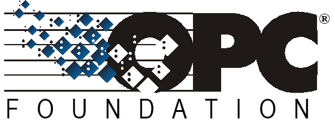

  

|    | ** !OPC UA Specification** |
|---|---|
  
| **OPC 10000-10** ||
|---|---|
|  **OPC Unified Architecture**   **Part 10 : Programs**     **Release 1\.05.00**   **2021-10-15**       ||
  

  

  

||||||
|---|---|---|---|---|
|Specification Type:|Industry Standard Specification||Comments:|Report or view errata: http://www.opcfoundation.org/errata|
||||||
|DocumentNumber| **OPC 10000-10**  ||||
|Title:|OPC Unified Architecture Part 10 : Programs||Date:|2021-10-15|
||||||
|Version:|Release 1\.05.00||Software:|MS-Word|
||||Source:|OPC 10000-10 - UA Specification Part 10 - Programs 1.05.00.docx|
||||||
|Author:|||Status:|Release|
||||||
  

  

  

  

 **CONTENTS**   

1 Scope  1  

2 Normative references  1  

3 Terms, definitions and conventions  1  

3\.1 Terms and definitions  1  

3\.2 Abbreviations  2  

4 Concepts  2  

4\.1 General  2  

4\.2 Programs  3  

4\.2.1 Overview  3  

4\.2.2 Security considerations  4  

4\.2.3 Program Finite State Machine  4  

4\.2.4 Program states  5  

4\.2.5 State transitions  6  

4\.2.6 Program state transition stimuli  6  

4\.2.7 Program Control Methods  6  

4\.2.8 Program state transition effects  7  

4\.2.9 Program result data  7  

4\.2.10 Program lifetime  8  

5 Model  8  

5\.1 General  8  

5\.2 ProgramStateMachineType  9  

5\.2.1 Overview  9  

5\.2.2 ProgramStateMachineType Properties  11  

5\.2.3 ProgramStateMachineType components  12  

5\.2.4 ProgramStateMachineType causes (Methods)  15  

5\.2.5 ProgramStateMachineType effects (Events)  16  

5\.2.6 AuditProgramTransitionEventType  18  

5\.2.7 FinalResultData  18  

5\.2.8 ProgramDiagnostic2 DataType  18  

5\.2.9 ProgramDiagnostic2Type VariableType  19  

Annex A (informative)  Program example  21  

A.1 Overview  21  

A.2 DomainDownload Program  21  

A.2.1 General  21  

A.2.2 DomainDownload states  21  

A.2.3 DomainDownload transitions  22  

A.2.4 DomainDownload Methods  23  

A.2.5 DomainDownload Events  24  

A.2.6 DomainDownload model  24  

  

 **FIGURES**   

  

Figure 1 - Automation facility control  3  

Figure 2 - Program illustration  4  

Figure 3 - Program states and transitions  5  

Figure 4 - Program Type  9  

Figure 5 - Program FSM References  12  

Figure 6 - ProgramStateMachineType causes and effects  15  

Figure A.1 - Program example  21  

Figure A.2 - DomainDownload state diagram  22  

Figure A.3 - DomainDownloadType partial state model  28  

Figure A.4 - Ready To Running model  30  

Figure A.5 - Opening To Sending To Closing model  32  

Figure A.6 - Running To Suspended model  33  

Figure A.7 - Suspended To Running model  34  

Figure A.8 - Running To Halted - Aborted model  35  

Figure A.9 - Suspended To Aborted model  35  

Figure A.10 - Running To Completed model  36  

Figure A.11 - Sequence of operations  37  

  

 **TABLES**   

  

Table 1 - Program Finite State Machine  4  

Table 2 - Program states  5  

Table 3 - Program state transitions  6  

Table 4 - Program Control Methods  7  

Table 5 - ProgramStateMachineType  10  

Table 6 - ProgramStateMachineType Attribute values for child Nodes  11  

Table 7 - ProgramStateMachineType Additional References  13  

Table 8 - ProgramStateMachineType causes  15  

Table 9 - ProgramTransitionEventType  17  

Table 10 - AuditProgramTransitionEventType  18  

Table 11 - ProgramDiagnostic2DataType structure  19  

Table 12 - ProgramDiagnostic2DataType definition  19  

Table 13 - ProgramDiagnostic2Type VariableType  19  

Table A.1 - DomainDownload states  23  

Table A.2 - DomainDownloadType  25  

Table A.3 - TransferStateMachineType  25  

Table A.4 - TransferStateMachineType Attribute values for child Nodes  26  

Table A.5 - Finish State Machine Type  26  

Table A.6 - FinishStateMachineType Attribute values for child Nodes  27  

Table A.7 - DomainDownloadType Property Attributes variable values  27  

Table A.8 - TransferStateMachineType Additional References  28  

Table A.9 - Start Method additions  30  

Table A.10 - StartArguments  31  

Table A.11 - IntermediateResults Object  32  

Table A.12 - Intermediate result data Variables  33  

Table A.13 - FinalResultData  35  

  

 **UNIFIED ARCHITECTURE -**   

 **FOREWORD**   

This specification is the specification for developers of OPC UA applications. The specification is a result of an analysis and design process to develop a standard interface to facilitate the development of applications by multiple vendors that shall inter-operate seamlessly together.  

 **Copyright © 2006-2021, OPC Foundation, Inc.**   

 **AGREEMENT OF USE**   

COPYRIGHT RESTRICTIONS  

Any unauthorized use of this specification may violate copyright laws, trademark laws, and communications regulations and statutes. This document contains information which is protected by copyright. All Rights Reserved. No part of this work covered by copyright herein may be reproduced or used in any form or by any means--graphic, electronic, or mechanical, including photocopying, recording, taping, or information storage and retrieval systems--without permission of the copyright owner.  

OPC Foundation members and non-members are prohibited from copying and redistributing this specification. All copies must be obtained on an individual basis, directly from the OPC Foundation Web siteH [TUhttp://www.opcfoundation.orgUT](http://www.opcfoundation.org/) H.  

PATENTS  

The attention of adopters is directed to the possibility that compliance with or adoption of OPC specifications may require use of an invention covered by patent rights. OPC shall not be responsible for identifying patents for which a license may be required by any OPC specification, or for conducting legal inquiries into the legal validity or scope of those patents that are brought to its attention. OPC specifications are prospective and advisory only. Prospective users are responsible for protecting themselves against liability for infringement of patents.  

WARRANTY AND LIABILITY DISCLAIMERS  

WHILE THIS PUBLICATION IS BELIEVED TO BE ACCURATE, IT IS PROVIDED "AS IS" AND MAY CONTAIN ERRORS OR MISPRINTS. THE OPC FOUDATION MAKES NO WARRANTY OF ANY KIND, EXPRESSED OR IMPLIED, WITH REGARD TO THIS PUBLICATION, INCLUDING BUT NOT LIMITED TO ANY WARRANTY OF TITLE OR OWNERSHIP, IMPLIED WARRANTY OF MERCHANTABILITY OR WARRANTY OF FITNESS FOR A PARTICULAR PURPOSE OR USE. IN NO EVENT SHALL THE OPC FOUNDATION BE LIABLE FOR ERRORS CONTAINED HEREIN OR FOR DIRECT, INDIRECT, INCIDENTAL, SPECIAL, CONSEQUENTIAL, RELIANCE OR COVER DAMAGES, INCLUDING LOSS OF PROFITS, REVENUE, DATA OR USE, INCURRED BY ANY USER OR ANY THIRD PARTY IN CONNECTION WITH THE FURNISHING, PERFORMANCE, OR USE OF THIS MATERIAL, EVEN IF ADVISED OF THE POSSIBILITY OF SUCH DAMAGES.  

The entire risk as to the quality and performance of software developed using this specification is borne by you.  

RESTRICTED RIGHTS LEGEND  

This Specification is provided with Restricted Rights. Use, duplication or disclosure by the U.S. government is subject to restrictions as set forth in (a) this Agreement pursuant to DFARs 227.7202-3(a); (b) subparagraph (c)(1)(i) of the Rights in Technical Data and Computer Software clause at DFARs 252.227-7013; or (c) the Commercial Computer Software Restricted Rights clause at FAR 52.227-19 subdivision (c)(1) and (2), as applicable. Contractor / manufacturer are the OPC Foundation,. 16101 N. 82nd Street, Suite 3B, Scottsdale, AZ, 85260-1830  

COMPLIANCE  

The OPC Foundation shall at all times be the sole entity that may authorize developers, suppliers and sellers of hardware and software to use certification marks, trademarks or other special designations to indicate compliance with these materials. Products developed using this specification may claim compliance or conformance with this specification if and only if the software satisfactorily meets the certification requirements set by the OPC Foundation. Products that do not meet these requirements may claim only that the product was based on this specification and must not claim compliance or conformance with this specification.  

Trademarks  

Most computer and software brand names have trademarks or registered trademarks. The individual trademarks have not been listed here.  

GENERAL PROVISIONS  

Should any provision of this Agreement be held to be void, invalid, unenforceable or illegal by a court, the validity and enforceability of the other provisions shall not be affected thereby.  

This Agreement shall be governed by and construed under the laws of the State of Minnesota, excluding its choice or law rules.  

This Agreement embodies the entire understanding between the parties with respect to, and supersedes any prior understanding or agreement (oral or written) relating to, this specification.  

ISSUE REPORTING  

The OPC Foundation strives to maintain the highest quality standards for its published specifications; hence they undergo constant review and refinement. Readers are encouraged to report any issues and view any existing errata here: H [TUhttp://www.opcfoundation.org/errataUT](http://www.opcfoundation.org/errata) H  

