## 1 Scope  

This part of OPC 10000 defines the *Information Model* associated with *Programs* in OPC Unified Architecture (OPC UA). This includes the description of the *NodeClasses,* standard *Properties, Methods* and *Events* and associated behaviour and information for *Programs* .  

The complete *AddressSpace* model including all *NodeClasses* and *Attributes* is specified in [OPC 10000-3](/§UAPart3) . The *Services* such as those used to invoke the *Methods* used to manage *Programs* are specified in [OPC 10000-4](/§UAPart4) .  

## 2 Normative references  

The following documents, in whole or in part, are normatively referenced in this document and are indispensable for its application. For dated references, only the edition cited applies. For undated references, the latest edition of the referenced document (including any amendments and errata) applies.  

OPC 10000-1, *OPC Unified Architecture - Part 1: Overview and Concepts*  

http://www.opcfoundation.org/UA/Part1/  

OPC 10000-3, *OPC Unified Architecture - Part 3: Address Space Model*  

http://www.opcfoundation.org/UA/Part3/  

OPC 10000-4, *OPC Unified Architecture - Part 4: Services*  

http://www.opcfoundation.org/UA/Part4/  

OPC 10000-5, *OPC Unified Architecture - Part 5: Information Model*  

http://www.opcfoundation.org/UA/Part5/  

OPC 10000-7, *OPC Unified Architecture - Part 7: Profiles*  

http://www.opcfoundation.org/UA/Part7/  

OPC 10000-16, *OPC Unified Architecture - Part 16: State Machines*  

[http://www.opcfoundation.org/UA/Part16/](http://www.opcfoundation.org/UA/Part16/)  

  

## 3 Terms, definitions and conventions  

### 3.1 Terms and definitions  

For the purposes of this document, the terms and definitions given in [OPC 10000-1](/§UAPart1) , [OPC 10000-3](/§UAPart3) , as well as the following apply.  

#### 3.1.1 Function  

programmatic task performed by a *Server* or device, usually accomplished by computer code execution  

#### 3.1.2 Finite State Machine  

sequence of states and valid state transitions along with the causes and effects of those state transitions that define the actions of a *Program* in terms of discrete stages  

#### 3.1.3 ProgramStateMachineType  

type definition of a *Program* and is a subtype of the *FiniteStateMachineType*  

#### 3.1.4 Program Control Method  

*Method* having specific semantics designed for the control of a *Program* by causing a state transition  

#### 3.1.5 Program Invocation  

unique *Object* instance of a *Program* existing on a *Server*  

Note 1 to entry: A *Program Invocation* is distinguished from other *Object* instances of the same *ProgramStateMachineType* by the object node's unique browse path.  

### 3.2 Abbreviations  

DA Data Access  

FSM Machine  

HMI Human Machine Interfaces  

UA Unified Architecture  

## 4 Concepts  

### 4.1 General  

Integrated automation facilities manage their operations through the exchange of data and the coordinated invocation of system *Functions* as illustrated in [Figure 1](/§\_Ref273042017) . *Services* are required to perform the data exchanges and to invoke the *Functions* that constitute system operation. These *Functions* may be invoked through Human Machine Interfaces, cell controllers, or other supervisory control and data acquisition type systems.  UA defines *Methods* and *Programs* as an interoperable way to advertise, discover, and request these *Functions* . They provide a normalizing mechanism for the semantic description, invocation, and result reporting of these *Functions* . Together *Methods* and *Programs* complement the other  UA *Services* and *ObjectTypes* to facilitate the operation of an automation environment using a client-server hierarchy.  

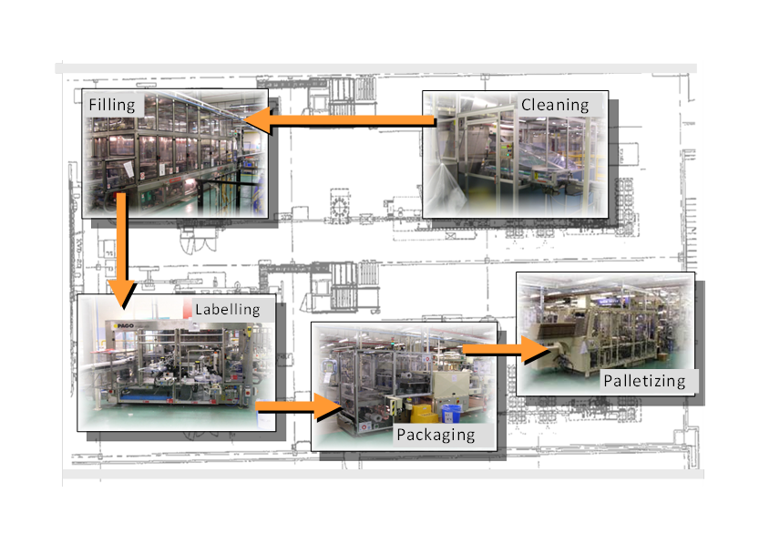  

Figure 1 - Automation facility control  

*Methods* and *Programs* model *Functions* typically have different scopes, behaviours, lifetimes, and complexities in *Servers* and the underlying systems. These *Functions* are not normally characterized by the reading or writing of data which is accomplished with the  UA A *ttribute* service set.  

*Methods* represent basic *Functions* in the *Server* that can be invoked by a *Client* . *Programs,* by contrast, ** model more complex and stateful functionality in the system. For example, a method call may be used to perform a calculation or reset a counter. A *Program* is used to run and control a batch process, execute a machine tool part program, or manage a domain download. *Methods* and their invocation mechanism are described in [OPC 10000-3](/§UAPart3) and [OPC 10000-4](/§UAPart4) .  

This standard describes the extensions to, or specific use of, the core capabilities defined in [OPC 10000-5](/§UAPart5) and [OPC 10000-16](/§UAPart16) as required for *Programs* .  

### 4.2 Programs  

#### 4.2.1 Overview  

*Programs* are complex *Functions* in a *Server* or underlying system that can be invoked and managed by a *Client* . *Programs* can represent any level of functionality within a system or process in which *Client* control or intervention is required and progress monitoring is desired. [Figure 2](/§\_Ref273042130) illustrates the model.  

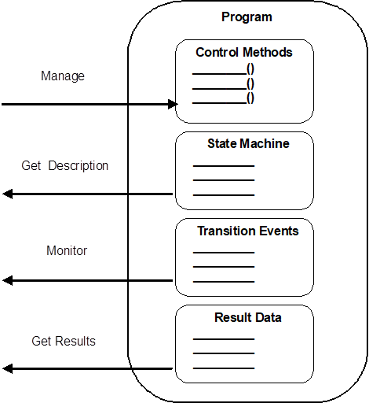  

Figure 2 - Program illustration  

*Programs* are stateful and transition through a prescribed sequence of states as they execute. Their behaviour is defined by a *Program* *Finite State Machine (PFSM)* . The elements of the PFSM describe the phases of a *Program's* execution in terms of valid transitions between a set of states, the stimuli or causes of those transitions, and the resultant effects of the transitions.  

#### 4.2.2 Security considerations  

Since *Programs* can be used to perform advanced control algorithms or other actions, their use should be restricted to personnel with appropriate access rights. It is recommended that *AuditUpdateMethodEvents* are generated to allow monitoring the number of running *Programs* in addition to their execution frequency.  

#### 4.2.3 Machine  

The states, transitions, causes and effects that compose the *Program Finite State Machine* are listed in [Table 1](/§\_Ref146359298) and illustrated in [Figure 3](/§\_Ref144113395) .  

Table 1 - Program   Machine  

| **No.** | **Transition name** | **Cause** | **From state** | **To state** | **Effect** |
|---|---|---|---|---|---|
|1|HaltedToReady|Reset Method|Halted|Ready|Report Transition 1 Event/Result|
|2|ReadyToRunning|Start Method|Ready|Running|Report Transition 2 Event/Result|
|3|RunningToHalted|Halt Method or Internal (Error)|Running|Halted|Report Transition 3 Event/Result|
|4|RunningToReady|Internal|Running|Ready|Report Transition 4 Event/Result|
|5|RunningToSuspended|Suspend Method|Running|Suspended|Report Transition 5 Event/Result|
|6|SuspendedToRunning|Resume Method|Suspended|Running|Report Transition 6 Event/Result|
|7|SuspendedToHalted|Halt Method|Suspended|Halted|Report Transition 7 Event/Result|
|8|SuspendedToReady|Internal|Suspended|Ready|Report Transition 8 Event/Result|
|9|ReadyToHalted|Halt Method|Ready|Halted|Report Transition 9 Event/Result|
  

  

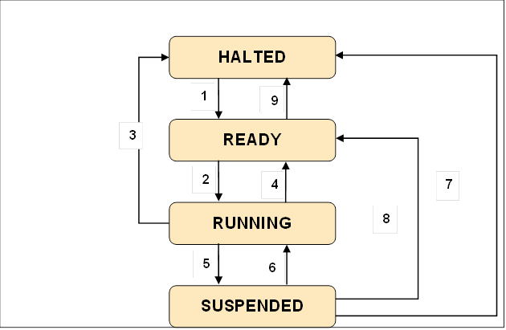  

Figure 3 - Program states and transitions  

#### 4.2.4 Program states  

A standard set of base states is defined for *Programs* as part of the *Program Finite State Machine.* These states represent the stages in which a *Program* can exist at an instant in time as viewed by a *Client* . This state is the *Program's* current state. All *Programs* shall support this base set. A *Program* may or may not require a *Client* action to cause the state to change. The states are formally defined in [Table 2](/§\_Ref273042569) .  

Table 2 - Program states  

| **State** | **Description** |
|---|---|
  
| **Ready** |The *Program* is properly initialized and may be started.|
|---|---|
  
| **Running** |The *Program* is executing making progress towards completion.|
|---|---|
  
| **Suspended** |The *Program* has been stopped prior to reaching a terminal state but may be resumed.|
|---|---|
  
| **Halted** |The *Program* is in a terminal or failed state, and it cannot be started or resumed without being reset.|
|---|---|
  

  

The set of states defined to describe a *Program* can be expanded. *Program* substates can be defined for the base states to provide more resolution of a process and to describe the cause and effect(s) of additional stimuli and transitions. Standards bodies and industry groups may extend the base *Program Finite State Model* to conform to various industry models. For example, the Halted state can include the substates "Aborted" and "Completed" to indicate if the *Function* achieved a successful conclusion prior to the transition to Halted. Transitional states such as "Starting" or "Suspending" might also be extensions of the Running state, for example.  

#### 4.2.5 State transitions  

A standard set of state transitions is defined for the *Machine.* These transitions define the valid changes to the *Program's* current state in terms of an initial state and a resultant state. The transitions are formally defined in [Table 3](/§\_Ref273042592) .  

Table 3 - Program state transitions  

| **Transition no.** | **Transition name** | **Initial state** | **Resultant state** |
|---|---|---|---|
|1|HaltedToReady|Halted|Ready|
|2|ReadyToRunning|Ready|Running|
|3|RunningToHalted|Running|Halted|
|4|RunningToReady|Running|Ready|
|5|RunningToSuspended|Running|Suspended|
|6|SuspendedToRunning|Suspended|Running|
|7|SuspendedToHalted|Suspended|Halted|
|8|SuspendedToReady|Suspended|Ready|
|9|ReadyToHalted|Ready|Halted|
  

  

#### 4.2.6 Program state transition stimuli  

The stimuli or causes for a *Program's* state transitions can be internal to the *Server* or external. The completion of machining steps, the detection of an alarm condition, or the transmission of a data packet are examples of internal stimuli. *Methods* are an example of external stimuli. Standard *Methods* are defined which act as stimuli for the control of a *Program* .  

#### 4.2.7 Program Control Methods  

*Clients* manage a *Program* by calling *Methods.* The *Methods* impact a *Program's* behaviour by causing specified state transitions. The state transitions dictate the actions performed by the *Program* . This standard defines a set of standard *Program* *Control* *Methods* . These *Methods* provide sufficient means for a *Client* to run a *Program* .  

[Table 4](/§\_Ref144627392) lists the set of defined *Program Control Methods.* Each *Method* causes transitions from specified states and shall be called when the *Program* is in one of those states.  

Individual *Programs* can optionally support any subset of the *Program Control Methods.* For example, some *Programs* may not be permitted to suspend and so would not provide the *Suspend* and *Resume Methods.*  

*Programs* can support additional user defined *Methods.* User defined *Methods* shall not change the behaviour of the base *Program Finite State Machine* .  

Table 4 - Program Control Methods  

| **Method Name** | **Description** |
|---|---|
|Start|Causes the *Program* to transition from the Ready state to the Running state.|
|Suspend|Causes the *Program* to transition from the Running state to the Suspended state.|
|Resume|Causes the *Program* to transition from the Suspended state to the Running state.|
|Halt|Causes the *Program* to transition from the Ready, Running or Suspended state to the Halted state.|
|Reset|Causes the *Program* to transition from the Halted state to the Ready state.|
  

  

All *Program Control Methods* are defined with their *BrowseName* on the *ProgramStateMachineType* with the *OptionalPlaceholder ModellingRule* . As defined in [OPC 10000-3](/§UAPart3) , this rule allows the inclusion of *Arguments* to these Methods on sub-types or on instances *.* For example, a Start *Method* may include an options argument that specifies dynamic options used to determine some program behaviour. The *Method* *Call* service specified in [OPC 10000-4](/§UAPart4) defines a return status. This return status indicates the success of the *Program Control Method* or a reason for its failure.  

#### 4.2.8 Program state transition effects  

A *Program's* state transition generally has a cause and also yields an effect. The effect is a by product of a *Program* state transition that can be used by a *Client* to monitor the progress of the *Program* . Effects can be internal or external. An external effect of a state transition is the generation of an *Event* notification. Each *Program* state transition is associated with a unique *Event* . These *Events* reflect the progression and trajectory of the *Program* through its set of defined states. The internal effects of a state transition can be the performance of some programmatic action such as the generation of data.  

#### 4.2.9 Program result data  

##### 4.2.9.1 Overview  

Result data is generated by a running *Program.* The result data can be intermediate or final. Result data may be associated with specific *Program* state transitions.  

##### 4.2.9.2 Intermediate result data  

Intermediate result data is transient and is generated by the *Program* in conjunction with non- terminal state transitions. The data items that compose the intermediate results are defined in association with specific *Program* state transitions. Their values are relevant only at the transition level.  

Each *Program* state transition can be associated with different result data items. Alternately, a set of transitions can share a result data item. Percentage complete is an example of intermediate result data. The value of percentage complete is produced when the state transition occurs and is available to the *Client* .  

*Clients* acquire intermediate result data by subscribing to *Program* state transition *Events* . The *Events* specify the data items for each transition. When the transition occurs, the generated *Event* conveys the result data values captured to the subscribed *Clients* . If no *Client* is monitoring the *Program* , intermediate result data may be discarded.  

##### 4.2.9.3 Terminal result data  

Terminal result data is the final data generated by the *Program* as it ceases execution. Total execution time, number of widgets produced, and fault condition encountered are examples of terminal result data. When the *Program* enters the terminal state, this result data can be conveyed to the *Client* by the transition *Event* . Terminal result data is also available within the *Program* to be read by a *Client* after the program stops. This data persists until the *Program* Instance is rerun or deleted.  

##### 4.2.9.4 Monitoring Programs  

*Clients* can monitor the activities associated with a *Program's* execution. These activities include the invocation of the management *Methods* , the generation of result data, and the progression of the *Program* through its states. *Audit Events* are provided for *Method Calls* and state transitions. These *Events* allow a record to be maintained of the *Clients* that interacted with any *Program* and the *Program* state transitions that resulted from that interaction.  

#### 4.2.10 Program lifetime  

##### 4.2.10.1 Overview  

*Programs* can have ** different lifetimes. Some *Programs* may always be present on a *Server* while others are created and removed. Creation and removal can be controlled by a *Client* or may be restricted to local means.  

A *Program* can be *Client* creatable. If a *Program* is *Client* creatable, then the *Client* can add the *Program* to the *Server* . The *Object* *Create* *Method* defined in [OPC 10000-3](/§UAPart3) , is used to create the *Program* instance. The initial state of the *Program* can be Halted or Ready *.* Some *Programs* , for example, may require that a resource becomes available after its creation and before it is ready to run. In this case, it would be initialized in the Halted state and transition to Ready when the resource is delivered.  

A *Program* can be *Client* removable. If the *Program* is *Client* removable, then the *Client* can delete the *Program* instance from the *Server* . The *DeleteNodes* *Service* defined in [OPC 10000-4](/§UAPart4) is used to remove the *Program* Instance. The *Program* shall be in a Halted state to be removed. A *Program* may also be auto removable. An auto removable *Program* deletes itself when execution has terminated.  

##### 4.2.10.2 Program instances  

*Programs* can be multiple instanced or single instanced. A *Server* can support multiple instances of a *Program* if these *Program* Instances ** can be run in parallel *.* For example *,* the *Program* may define a *Start* *Method* that has an input argument to specify which resource is acted upon by its *Functions* . Each instance of the *Program* is then started designating use of different resources. The *Client* can discover all instances of a *Program* that are running on a *Server* . Each instance of a *Program* is uniquely identified on the *Server* and is managed independently by the *Client* .  

##### 4.2.10.3 Program recycling  

*Programs* can be run once or run multiple times (recycled). A *Program* that is run once will remain in the Halted ** state indefinitely once it has run. The normal course of action would be to delete it following the inspection of its terminal results.  

Recyclable *Programs* may have a limited or unlimited cycle count. These *Programs* may require a reset step to transition from the Halted state to the Ready state. This allows for replenishing resources or reinitializing parameters prior to restarting the *Program* . The *Program Control Method* " *Reset"* triggers this state transition and any associated actions or effects.  

## 5 Model  

### 5.1 General  

The *Program* model extends the *FiniteStateMachineType and* basic *ObjectType* models presented in [OPC 10000-16](/§UAPart16) *.* Each *Program* has a *Type Definition* that is the subtype of the *FiniteStateMachineType.* The *ProgramStateMachineType* describes the *Finite State Machine* model supported by any *Program Invocation* of that type *.* The *ProgramStateMachineType* also defines the property set that characterizes specific aspects of that *Program's* behaviour such as lifetime and recycling as well as specifying the result data that is produced by the *Program* .  

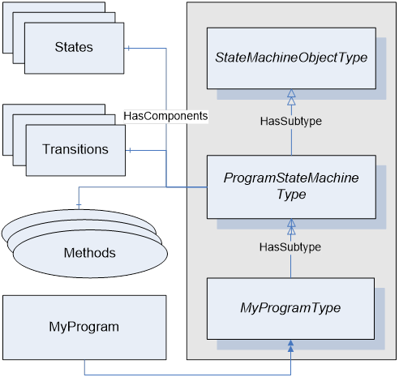  

Figure 4 - Program Type  

The base *ProgramStateMachineType* defines the standard *Finite State Machine* specified for all *Programs* . This includes the states, transitions, and transition causes ( *Methods* ) and effects ( *Events* ). Subtypes of the base *ProgramStateMachineType* can be defined to extend or more specifically characterize the behaviour of an individual *Program* as illustrated with "MyProgramType" in [Figure 4](/§\_Ref144521344) .  

### 5.2 ProgramStateMachineType  

#### 5.2.1 Overview  

The additional properties and components that compose the *ProgramStateMachineType* are listed in [Table 5](/§\_Ref303807446) . No *ProgramStateMachineType* specific semantics are assigned to the other base *ObjectType* or *FiniteStateMachineType Attributes* or *Properties* .  

Table 5 - ProgramStateMachineType  

| **Attribute** | **Value** |
|---|---|
||Includes all attributes specified for the FiniteStateMachineType|
|BrowseName|ProgramStateMachineType|
|IsAbstract|False|
|||
  
| **References** | **NodeClass** | **BrowseName** | **Data Type** | **TypeDefinition** | **Other** |
|---|---|---|---|---|---|
|HasProperty|Variable|Creatable|Boolean|PropertyType||
|HasProperty|Variable|Deletable|Boolean|PropertyType|M|
|HasProperty|Variable|AutoDelete|Boolean|PropertyType|M|
|HasProperty|Variable|RecycleCount|Int32|PropertyType|M|
|HasProperty|Variable|InstanceCount|UInt32|PropertyType||
|HasProperty|Variable|MaxInstanceCount|UInt32|PropertyType||
|HasProperty|Variable|MaxRecycleCount|UInt32|PropertyType||
|||||||
|HasComponent|Variable|ProgramDiagnostic|ProgramDiagnostic2DataType|ProgramDiagnostic2Type|O|
|||||||
|HasComponent|Object|Halted||StateType||
|HasComponent|Object|Ready||StateType||
|HasComponent|Object|Running||StateType||
|HasComponent|Object|Suspended||StateType||
|||||||
|HasComponent|Object|HaltedToReady||TransitionType||
|HasComponent|Object|ReadyToRunning||TransitionType||
|HasComponent|Object|RunningToHalted||TransitionType||
|HasComponent|Object|RunningToReady||TransitionType||
|HasComponent|Object|RunningToSuspended||TransitionType||
|HasComponent|Object|SuspendedToRunning||TransitionType||
|HasComponent|Object|SuspendedToHalted||TransitionType||
|HasComponent|Object|SuspendedToReady||TransitionType||
|HasComponent|Object|ReadyToHalted||TransitionType||
|||||||
|HasComponent|Method|Start|||OP|
|HasComponent|Method|Suspend|||OP|
|HasComponent|Method|Reset|||OP|
|HasComponent|Method|Halt|||OP|
|HasComponent|Method|Resume|||OP|
|||||||
|HasComponent|Object|FinalResultData||BaseObjectType|O|
  
| **Conformance Units** |
|---|
|Program Basic|
  

  

The component *Variables* of the *ProgramStateMachineType* have additional *Attributes* defined in [Table 6](/§\_Ref53493741) .  

Table 6 - ProgramStateMachineType Attribute values for child Nodes  

| **BrowsePath** | **Value Attribute** |
|---|---|
Halted|StateNumber||11|
Ready|StateNumber||12|
Running|StateNumber||13|
Suspended|StateNumber||14|
HaltedToReady|TransitionNumber||1|
ReadyToRunning|TransitionNumber||2|
RunningToHalted|TransitionNumber||3|
RunningToReady|TransitionNumber||4|
RunningToSuspended|TransitionNumber||5|
SuspendedToRunning|TransitionNumber||6|
SuspendedToHalted|TransitionNumber||7|
SuspendedToReady|TransitionNumber||8|
ReadyToHalted|TransitionNumber||9|
  

  

  

#### 5.2.2 ProgramStateMachineType Properties  

The *Creatable* *Property* is a boolean that specifies if *Program* *Invocations* of this *ProgramStateMachineType* can be created by a *Client* . If False, these *Program* *Invocations* are persistent or may only be created by the *Server* .  

The *Deletable* *Property* is a boolean that specifies if a *Program* *Invocation* of this *ProgramStateMachineType* can be deleted by a *Client* . If False, these *Program* *Invocations* can only be deleted by the *Server* .  

The *AutoDelete* *Property* is a boolean that specifies if *Program* *Invocations* of this *ProgramStateMachineType* are removed by the *Server* when execution terminates. If False, these *Program* *Invocations* persist on the *Server* until they are deleted by the *Client* . When the *Program* *Invocation* is deleted, any result data associated with the instance is also removed.  

The *RecycleCount* *Property* is an unsigned integer that specifies the number of times a *Program* *Invocation* of this type has been recycled or restarted from its starting point (not resumed). Note that the Reset Method may be required to prepare a *Program* to be restarted.  

The *MaxRecycleCount* *Property* is an integer that specifies the maximum number of times a *Program* *Invocation* of this type can be recycled or restarted from its starting point (not resumed). If the value is less than 0, then there is no limit to the number of restarts. If the value is zero, then the Program may not be recycled or restarted.  

The *InstanceCount* *Property* is an unsigned integer that specifies the number of *Program Invocations* of this type that currently exist.  

The *MaxInstanceCount* *Property* is an integer that specifies the maximum number of *Program Invocations* of this type that can exist simultaneously on this *Server* . If the value is less than 0, then there is no limit.  

#### 5.2.3 ProgramStateMachineType components  

##### 5.2.3.1 Overview  

The *ProgramStateMachineType* components consist of a set of *References* to the *Object* instances of *StateTypes* , *TransitionTypes* , *EventTypes* and the *Methods* that collectively define the *Program* *FiniteStateMachine.*  

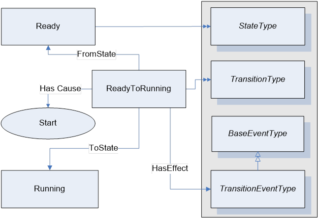  

Figure 5 - Program  References  

[Figure 5](/§\_Ref144541448) illustrates the component *References* that define the associations between two of the *ProgramStateMachineType's* states, Ready and Running. The complementary ReferenceTypes have been omitted to simplify the illustration.  

##### 5.2.3.2 ProgramStateMachineType states  

The state *Objects* are instances of the *StateType* defined in [OPC 10000-16](/§UAPart16) . Each state is assigned a unique *StateNumber* value defined in [Table 6](/§\_Ref53493741) . Subtypes of the *ProgramStateMachineType* can add references from any state to a subordinate or nested *StateMachine Object* to extend the *FiniteStateMachine* .  

The ** Halted ** state is the idle state for a *Program* . It can be an initial state or a terminal state. As an initial state, the *Program* *Invocation* cannot begin execution due to conditions at the *Server* . As a terminal state, Halted can indicate either a failed or completed *Program* . A subordinate state or result can be used to distinguish the nature of the termination. The Halted state references four *Transition* *Objects* , which identify the allowed state transitions to the Ready state and from the Ready, Running, and Suspended states.  

The Ready state indicates that the *Program* is prepared to begin execution. *Programs* that are ready to begin upon their creation may transition immediately to the Ready state. The Ready state references four *Transition Objects,* which identify the allowed state transitions to the Running and Halted states and from the Halted and Ready states.  

The Running state indicates that the *Program* is actively performing its *Function* . The Running state references five *Transition Objects,* which identify the allowed state transitions to the Halted, Ready, and Suspended states and from the Ready and Suspended states.  

The Suspended state indicates that the *Program* has stopped performing its *Function* , but retains the ability to resume the *Function* at the point at which it was executing when suspended. The Suspended state references four *Transition* *Objects* , which identify the allowed state transitions to the Ready, Running, and Halted state and from the Ready ** state.  

##### 5.2.3.3 ProgramStateMachineTypetransitions  

*ProgramStateMachineType* Transitions are instances of the *TransitionType* defined in [OPC 10000-16](/§UAPart16) which also includes the definitions of the ToState, FromState, HasCause, and HasEffect references used. [Table 7](/§\_Ref144609527) specifies the transitions defined for the *ProgramStateMachineType.* Each transition is assigned a unique *TransitionNumber* defined in [Table 6](/§\_Ref53493741) .  

Table 7 - ProgramStateMachineType Additional References  

| **SourceBrowsePath** | **Reference Type** | **Is Forward** | **TargetBrowsePath** |
|---|---|---|---|
|HaltedToReady|ToState|True|Ready|
||FromState|True|Halted|
||HasCause|True|Reset|
||HasEffect|True|ProgramTransitionEventType|
||HasEffect|True|AuditProgramTransitionEventType|
|||||
|ReadyToRunning|ToState|True|Running|
||FromState|True|Ready|
||HasCause|True|Start|
||HasEffect|True|ProgramTransitionEventType|
||HasEffect|True|AuditProgramTransitionEventType|
|||||
|RunningToHalted|ToState|True|Halted|
||FromState|True|Running|
||HasCause|True|Halt|
||HasEffect|True|ProgramTransitionEventType|
||HasEffect|True|AuditProgramTransitionEventType|
|||||
|RunningToReady|ToState|True|Ready|
||FromState|True|Running|
||HasEffect|True|ProgramTransitionEventType|
||HasEffect|True|AuditProgramTransitionEventType|
|||||
|RunningToSuspended|ToState|True|Running|
||FromState|True|Suspended|
||HasCause|True|Suspend|
||HasEffect|True|ProgramTransitionEventType|
||HasEffect|True|AuditProgramTransitionEventType|
|||||
|SuspendedToRunning|ToState|True|Running|
||FromState|True|Suspended|
||HasCause|True|Resume|
||HasEffect|True|ProgramTransitionEventType|
||HasEffect|True|AuditProgramTransitionEventType|
|||||
|SuspendedToHalted|ToState|True|Halted|
||FromState|True|Suspended|
||HasCause|True|Halt|
||HasEffect|True|ProgramTransitionEventType|
||HasEffect|True|AuditProgramTransitionEventType|
|||||
|SuspendedToReady|ToState|True|Ready|
||FromState|True|Suspended|
||HasCause|True|Reset|
||HasEffect|True|ProgramTransitionEventType|
||HasEffect|True|AuditProgramTransitionEventType|
|||||
|ReadyToHalted|ToState|True|Halted|
||FromState|True|Ready|
||HasCause|True|Halt|
||HasEffect|True|ProgramTransitionEventType|
||HasEffect|True|AuditProgramTransitionEventType|
  

  

The *HaltedToReady* transition specifies the transition from the Halted to Ready states. It may be caused by the *Reset* *Method.*  

The *ReadyToRunning* transition specifies the transition from the Ready to *Running* states. It is caused by the *Start* *Method.*  

The *RunningToHalted* transition specifies the transition from the *Running* to Halted states. It is caused by the *Halt* *Method.*  

The *RunningToReady* transition specifies the transition from the Running to Ready states. The *RunningToSuspended* transition specifies the Transition from the Running to Suspended states. It is caused by the *Suspend* *Method.*  

The *SuspendedToRunning* transition specifies the transition from the Suspended to Running states. It is caused by the *Resume* *Method.*  

The *SuspendedToHalted* transition specifies the transition from the Suspended to Halted states. It is caused by the *Halt* *Method.*  

The *SuspendedToReady* transition specifies the transition from the Suspended to Ready states. It is caused internally *.*  

The *ReadyToHalted* transition specifies the transition from the Ready to Halted states. It is caused by the *Halt* *Method.*  

Two *HasEffect* *References* are specified for each *Program* transition. These effects are *Events* of *ProgramTransitionEventType* and *AuditProgramTransitionEventType* defined in [5.2.5](/§\_Ref181071965) *.* The *ProgramTransitionEventType* notifies *Clients* of the *Program* transition and conveys result data. The *AuditProgramTransitionEventType* is used to audit transitions that result from *Program Control Methods* .  

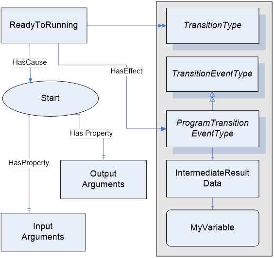  

Figure 6 - ProgramStateMachineType causes and effects  

#### 5.2.4 ProgramStateMachineType causes (Methods)  

##### 5.2.4.1 Overview  

The *ProgramStateMachineType* includes references to the Causes of specific *Program* state transitions. These causes refer to *Method* instances *. Programs* that ** do not support *a Program Control Method* will omit the Causes reference to that *Method* from the *ProgramStateMachineType* references. If a *Method's Causes* reference is omitted from the *ProgramStateMachineType* then a *Client* cannot cause the associated state transition. The *Method* instances referenced by the *ProgramStateMachineType* identify the *InputArguments* and *OutputArguments* required for the *Method* calls to *Program* *Invocations* of that *ProgramStateMachineType* . [Table 8](/§\_Ref273042624) specifies the *Methods* defined as Causes for *ProgramStateMachineTypes* . [Figure 6](/§\_Ref273606986) illustrates the *References* associating the components and *Properties* of *Methods* and *Events* with Program transitions *.*  

Table 8 - ProgramStateMachineType causes  

| **BrowseName** | **References** | **Target BrowseName** | **Value** | **Target TypeDefinition** | **NOTES** |
|---|---|---|---|---|---|
  
| **Causes** |
|---|
|Start|HasProperty|InputArguments||PropertyType|Optional|
||HasProperty|OutputArguments||PropertyType|Optional|
|||||||
|Suspend|HasProperty|InputArguments||PropertyType|Optional|
||HasProperty|OutputArguments||PropertyType|Optional|
|||||||
|Resume|HasProperty|InputArguments||PropertyType|Optional|
||HasProperty|OutputArguments||PropertyType|Optional|
|||||||
|Halt|HasProperty|InputArguments||PropertyType|Optional|
||HasProperty|OutputArguments||PropertyType|Optional|
|||||||
|Reset|HasProperty|InputArguments||PropertyType|Optional|
||HasProperty|OutputArguments||PropertyType|Optional|
|||||||
  

  

The *Start* *Method* causes the *ReadyToRunning* *Program* transition.  

The *Suspend* *Method* causes the *RunningToSuspended Program* transition.  

The *Resume* *Method* causes the *SuspendedToRunning Program* transition.  

The *Halt* *Method* causes the *RunningToHalted, SuspendedToHalted, or ReadyToHalted   Program* transition ** depending on the ** current state ** of the *Program* .  

The *Reset* *Method* causes the *HaltedToReady Program* transition.  

##### 5.2.4.2 Standard attributes  

The *Executable* *Method* attribute indicates if a method can currently be executed. For *Program Control Methods* , this means that the owning *Program* has a current state ** that supports the transition caused by the *Method.*  

##### 5.2.4.3 Standard properties  

*Methods* can reference a set of *InputArguments.* For each *ProgramStateMachineType* , a set of *InputArguments* may be defined for the supported *Program Control Methods* . The data passed in the arguments supplements the information required by the *Program* to perform its *Function* . All calls to a *Program Control Method* for each *Program Invocation* of that *ProgramStateMachineType* shall pass the specified arguments.  

*Methods* can reference a set of *OutputArguments* . For each *ProgramStateMachineType* , a set of *OutputArguments* is defined for the supported *Program Control Methods* . All calls to a *Program Control Method* for each *Program Invocation* of that *ProgramStateMachineType* shall pass the specified arguments.  

#### 5.2.5 ProgramStateMachineType effects (Events)  

##### 5.2.5.1 Overview  

The *ProgramStateMachineType* includes component references to the Effects of each of the *Program's* state transitions. These Effects ** are *Events.* Each *Transition* shall have a *HasEffect* *Reference* to a *ProgramTransitionEventType* and can have an *AuditProgramTransitionEventType.* When the transition occurs, *Event* notifications of the referenced type are generated for subscribed *Clients.* The *Program* *Invocation* may serve as the *EventNotifier* for these *Events* or an owning *Object* or the *Server Object* may provide the notifications *.*  

*ProgramTransitionEventTypes* provide the means for delivering result data and confirming state transitions for subscribed *Clients* on each defined *Program State Transition.* The *AuditProgramTransitionEventType* allows the auditing of changes to the *Program* 's state in conjunction with *Client* *Method* *Calls.*  

##### 5.2.5.2 ProgramTransitionEventType  

The *ProgramTransitionEventType* is a subtype of the *TransitionEventType* . It is used with *Programs* to acquire intermediate or final results or other data associated with a state transition. A *Program* can have a unique *ProgramTransitionEventType* definition for any transition. Each *ProgramTransitionEventType* specifies the *IntermediateResult* data specific to the designated state transition on that *ProgramStateMachineType* . Each transition can yield different intermediate result data. [Table 9](/§\_Ref144806928) specifies the *ProgramTransitionEventType* .  

[Table 9](/§\_Ref144806928) identifies the *ProgramTransitionEventTypes* that are specified for *ProgramStateMachineTypes* .  

Table 9 - ProgramTransitionEventType  

| **Attribute** | **Value** |
|---|---|
|BrowseName|ProgramTransitionEventType|
|IsAbstract|True|
  
| **References** | **NodeClass** | **BrowseName** | **DataType** | **TypeDefinition** | **ModellingRule** |
|---|---|---|---|---|---|
|Subtype of the base *TransitionEventType* defined in [OPC 10000-16](/§UAPart16) .|
|HasComponent|Variable|IntermediateResult|BaseDataType|BaseDataVariableType|Mandatory|
  
| **Conformance Units** |
|---|
|Program Basic|
  

  

*TransitionNumber* identifies the *Program* transition that triggered the *Event* .  

*FromStateNumber* identifies the state before the *Program* transition.  

*ToStateNumber* identifies the state after the *Program* transition.  

The *IntermediateResult* is an *Object* that aggregates a set of *Variables* whose values are relevant for the *Program* at the instant of the associated transition. The *ObjectType* for the *IntermediateResult* specifies the collection of *Variables* using a set of *HasComponent* *References* .  

 ****   

#### 5.2.6 AuditProgramTransitionEventType  

The AuditProgramTransitionEventType is a subtype of the AuditUpdateStateEventType. It is used with Programs to provide a means to audit the Program State *transitions* associated with any Client invoked Program Control Method. Servers shall generate AuditProgramTransitionEvents if auditing is supported.  

[Table 10](/§\_Ref144886151) specifies the definition of the *AuditProgramTransitionEventType.*  

Table 10 - AuditProgramTransitionEventType  

| **Attribute** | **Value** |
|---|---|
|BrowseName|AuditProgramTransitionEventType|
|IsAbstract|True|
  
| **References** | **NodeClass** | **BrowseName** | **DataType** | **TypeDefinition** | **ModellingRule** |
|---|---|---|---|---|---|
|Subtype of the *AuditUpdateStateEventType* defined in [OPC 10000-16](/§UAPart16) .|
|HasProperty|Variable|TransitionNumber|UInt32|PropertyType|Mandatory|
  
| **Conformance Units** |
|---|
|Program Auditing|
  

  

This *EventType* inherits all *Properties* of the *AuditUpdateStateEventType* defined in [OPC 10000-5](/§UAPart5) , except as noted below.  

The *Status* *Property,* specified in [OPC 10000-5](/§UAPart5) ,, identifies whether the state transition resulted from a Program Control Method call (set *Status* to ) or not (set *Status* to FALSE).  

The *SourceName* specified in [OPC 10000-5](/§UAPart5) , identifies the *Method* causing the *Program* transition when it is the result of a *Client* invoked *ProgramControlMethod* . The *SourceName* is prefixed with "Method/" and the name of the *ProgramControlMethod* , "Method/Start" for example.  

The *ClientUserId Property,* specified in [OPC 10000-5](/§UAPart5) , identifies the user of the *Client* that issued the *Program Control Method* if it is associated with this *Program* state transition.  

The *ActionTimeStamp Property,* specified in [OPC 10000-5](/§UAPart5) "AuditEventType", identifies when the time the *Program* state transition that resulted in the *Event* being generated occurred.  

The *TransitionNumber* *Property* is a *Variable* that identifies the transition that triggered the *Event* .  

#### 5.2.7 FinalResultData  

The *FinalResultData* *ObjectType* specifies the *VariableTypes* that are preserved when the *Program* has completed its *Function* . The *ObjectType* includes *a HasComponent* for a *VariableType* of each *Variable* that comprises the final result data.  

#### 5.2.8 ProgramDiagnostic2 DataType  

This structure contains elements that chronicle the *Program Invocation's* activity and can be used to aid in the diagnosis of *Program* problems.  

Note The original ProgramDiagnosticDataType had flaws. To avoid collisions with existing implementations, a new version with name ProgramDiagnostic2DataType has been created.  

Its composition is defined in [Table 11](/§\_Ref96333599) .  

Table 11 - ProgramDiagnostic2DataType structure  

| **Name** | **Type** | **Description** |
|---|---|---|
|ProgramDiagnostic2DataType|structure||
|createSessionId|NodeId|The *CreateSessionId* contains the *SessionId* of the *Session* on which the call to the *Create* *Method* was issued to create the *Program Invocation* .|
|createClientName|String|The *CreateClientName* is the name of the *Client* of the *Session* that created the *Program Invocation* .|
|invocationCreationTime|UtcTime|The *InvocationCreationTime* identifies the time the *Program Invocation* was created.|
|lastTransitionTime|UtcTime|The *LastTransitionTime* identifies the time of the last *Program* state transition that occurred.|
|lastMethodCall|String|The *LastMethodCall* identifies the last *Program* *Method* called on the *Program Invocation* .|
|lastMethodSessionId|NodeId|The *LastMethodSessionId* contains the *SessionId* of the *Session* on which the last *Program* *Control* *Method* call to the *Program Invocation* was issued.|
|lastMethodInputArguments|Argument[]|The *LastMethodInputArguments* provides the input arguments on the last *Program* *Method* call.|
|lastMethodOutputArguments|Argument[]|The *LastMethodOutputArguments* provides the output arguments on the last *Program* *Method* call.|
|lastMethodInputValues|BaseDataType[]|The *LastMethodInputValues* preserves the values of the input arguments on the last *Program* *Method* call. The size and order of this list matches the size and order of the *lastMethodInputArguments* field.|
|lastMethodOutputValues|BaseDataType[]|The *LastMethodOutputValues* preserves the values of the output arguments on the last *Program* *Method* call. The size and order of this list matches the size and order of the *lastMethodOutputArguments* field.|
|lastMethodCallTime|UtcTime|The *LastMethodCallTime* identifies the time of the last Method call to the *Program Invocation* .|
|lastMethodReturnStatus|StatusCode|The *LastMethodReturnStatus* preserves the value of the return status ** for the last *Program Control Method* requested for *this Program Invocation.*|
  

  

Its representation in the *AddressSpace* is defined in [Table 12](/§\_Ref129505573) .  

Table 12 - ProgramDiagnostic2DataType definition  

| **Attribute** | **Value** |
|---|---|
|BrowseName|ProgramDiagnostic2DataType|
|IsAbstract|False|
  
| **References** | **NodeClass** | **BrowseName** | **DataType** | **TypeDefinition** | **Other** |
|---|---|---|---|---|---|
|Subtype of Structure defined in [OPC 10000-5](/§UAPart5) .|
  
| **Conformance Units** |
|---|
|Program Basic|
  

  

#### 5.2.9 ProgramDiagnostic2Type VariableType  

This *VariableType* aggregates simple *Variables* using simple *DataTypes* that reflect the elements of the ProgramDiagnosticDataType structure. Its *DataVariables* have the same semantic as defined in in [5.2.8](/§\_Ref361763023) .  

Note The original ProgramDiagnosticType VariableType had the same flaws as the structure. To avoid collisions with existing implementations, a new version with name ProgramDiagnostic2Type has been created.  

The *VariableType* is formally defined in [Table 13](/§\_Ref149549247) .  

Table 13 - ProgramDiagnostic2Type VariableType  

| **Attribute** | **Value** |
|---|---|
|BrowseName|ProgramDiagnostic2Type|
|DataType|ProgramDiagnostic2DataType|
|ValueRank|\-1 (Scalar)|
|IsAbstract|False|
  
| **References** | **NodeClass** | **BrowseName** | **DataType / TypeDefinition** | **ModellingRule** |
|---|---|---|---|---|
|Subtype of the BaseDataVariableType defined in [OPC 10000-5](/§UAPart5) .|
|HasComponent|Variable|CreateSessionId|NodeId|Mandatory|
|HasComponent|Variable|CreateClientName|String|Mandatory|
|HasComponent|Variable|InvocationCreationTime|UtcTime|Mandatory|
|HasProperty|Variable|LastTransitionTime|UtcTime|Mandatory|
|HasComponent|Variable|LastMethodCall|String|Mandatory|
|HasComponent|Variable|LastMethodSessionId|NodeId|Mandatory|
|HasComponent|Variable|LastMethodInputArguments|Argument[]|Mandatory|
|HasComponent|Variable|LastMethodOutputArguments|Argument[]|Mandatory|
|HasComponent|Variable|LastMethodInputValues|BaseDataType[]|Mandatory|
|HasComponent|Variable|LastMethodOutputValues|BaseDataType[]|Mandatory|
|HasComponent|Variable|LastMethodCallTime|UtcTime|Mandatory|
|HasComponent|Variable|LastMethodReturnStatus|StatusCode|Mandatory|
  
| **Conformance Units** |
|---|
|Program Basic|
  

  

  

## Annex A (informative)Program example  

### A.1 Overview  

This example illustrates the use of a *Program* to manage a domain download into a control system as depicted in [Figure A.1](/§\_Ref157491288) . The download requires the segmented transfer of control operation data from a secondary storage device to the local memory within a control system.  

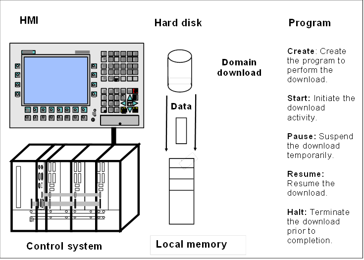  

Figure A. 1 - Program example  

The domain download has a source and a target location which are identified when the download is initiated. Each time a segment of the domain is successfully transferred the *Client* is notified and informed of the amount of data that has been downloaded. The *Client* is also notified when the download is finished. The percentage of the total data received is reported periodically while the download continues. If the download fails, the cause of the failure is reported. At the completion of the download, the performance information is kept at the *Server* .  

### A.2 DomainDownload Program  

#### A.2.1 General  

The *Client* uses the "DomainDownload" *Program* to manage and monitor the download of a domain at the *Server* .  

#### A.2.2 DomainDownload states  

The basic state model for the DomainDownload *Program* is presented in [Figure A.2](/§\_Ref303808400) . The *Program* has three primary states, Ready, Running, and Halted which are aligned with the standard states of a *ProgramStateMachineType* . Additionally, the *DomainDownloadType* extends the *ProgramStateMachineType* by defining subordinate *State Machines* for the *Program's* Running and Halted states. The subordinate states describe the download operations in greater detail and allow the *Client* to monitor the activity of the download at a finer resolution.  

An instance ( *Program* *Invocation* ) of a DomainDownload *Program* is created by the *Client* each time a download is to be performed. The instance exists until explicitly removed by the *Client* . The initial state of the *Program* is Ready and the terminal state is Halted. The DomainDownload can be temporarily suspended and then resumed or aborted. Once halted, the program may not be restarted.  

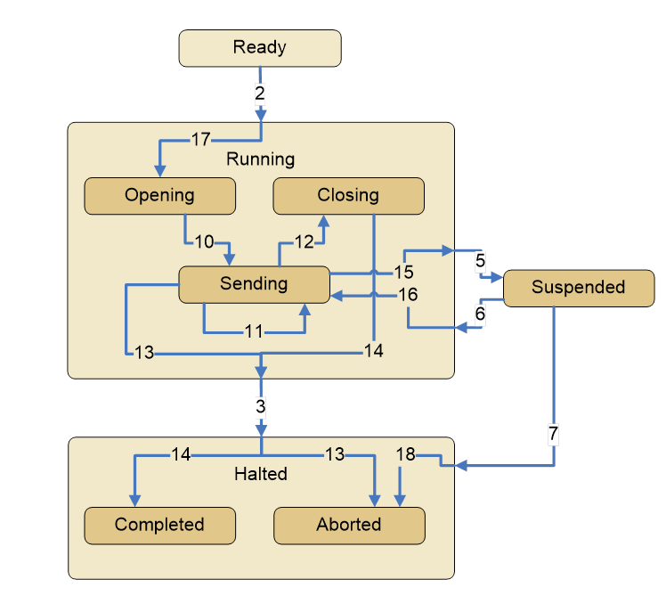  

Figure A. 2 - DomainDownload state diagram  

The sequence of state transitions is illustrated in [Figure A.2](/§\_Ref303808400) . Once the download is started, The *Program* progresses to the Opening state. After the source of the data is opened, a sequence of transfers occurs in the Sending state.  When the transfer completes the *Objects* are closed in the Closing state. If the transfer is terminated before all of the data is downloaded or an error is encountered then the download is halted and the *Program* transitions to the Aborted state; otherwise the *Program* halts in the Completed state. The states are presented in [Table A.1](/§\_Ref157504917) along with the state transitions.  

#### A.2.3 DomainDownload transitions  

The valid state transitions specified for the DomainDownload *Program* are specified in ** [Table A.1](/§\_Ref157504917) *.* Each of the transitions defines a start state and end state for the transition and is identified by a unique number. Five of the transitions are from the base *ProgramStateMachineType* and retain the transition identifier numbers specified for *Programs* . The additional transitions relate the base *Program* states with the subordinate states defined for the DomainDownload. These states have been assigned unique transition identifier numbers that distinguish them from the base *Program* transition identifiers. In cases where transitions occur between substates and the *Program's* base states, two transitions are specified. One transition identifies the base state change and a second substate change. For example, ReadyToRunning and ToOpening occur at the same time.  

Table A.1 also specifies the defined states, causes for the transitions, and the effects of each transition. *Program* *Control Methods* are used by the *Client* to "run" the DomainDownload. The *Methods* cause or trigger the specified transitions. The transition effects are the specified *EventTypes* which notify the *Client* of *Program* activity.  

Table A. 1 - DomainDownload states  

| **No.** | **Transition name** | **Cause** | **From State** | **To State** | **Effect** |
|---|---|---|---|---|---|
|2|ReadyToRunning|Start Method|Ready|Running|Report Transition 2 Event/Result|
|3|RunningToHalted|Halt Method/Error or Internal.|Running|Halted|Report Transition 3 Event/Result|
|5|RunningToSuspended|Suspend Method|Running|Suspended|Report Transition 5 Event/Result|
|6|SuspendedToRunning|Resume Method|Suspended|Running|Report Transition 6 Event/Result|
|7|SuspendedToHalted|Halt Method|Suspended|Halted|Report Transition 7 Event/Result|
|10|OpeningToSending|Internal|Opening|Sending|Report Transition 10 Event/Result|
|11|SendingToSending|Internal|Sending|Sending|Report Transition 11 Event/Result|
|12|SendingToClosing|Internal|Sending|Closing|Report Transition 12 Event/Result|
|13|SendingToAborted|Halt Method/Error|Opening|Aborted|Report Transition 13 Event/Result|
|14|ClosingToCompleted|Internal|Closing|Completed|Report Transition 14 Event/Result|
|15|SendingToSuspended|Suspend Method|Sending|Suspended|Report Transition 16 Event/Result|
|16|SuspendedToSending|Resume Method|Suspended|Sending|Report Transition 17 Event/Result|
|18|SuspendedToAborted|Halt Method|Suspended|Aborted|Report Transition 18 Event/Result|
|17|ToOpening|Internal|Ready|Opening|Report Transition 19 Event/Result|
  

  

#### A.2.4 DomainDownload Methods  

##### A.2.4.1 General  

Four standard *Program* *Methods* are specified for running the DomainDownload *Program, Start, Suspend, Resume, and Halt.* No additional *Methods* are specified *.* The ** base behaviours of these *Methods* are defined by the *ProgramStateMachineType.* The *Start* *Method* initiates the download activity and passes the source and destination locations for the transfer. The *Suspend* *Method* is used to pause the activity temporarily. The *Resume* *Method* reinitiates the download, when paused. The *Halt* *Method* aborts the download. Each of the *Methods* causes a *Program* state transition and a substate transition. The specific state transition depends on the current state at the time the *Method* is called. If a *Method* *Call* is made when the DomainDownload is in a state for which that *Method* has no associated transition, the *Method* returns an error status indicating invalid state for the *Method* .  

##### A.2.4.2 Method Arguments  

The *Start Method* specifies three input arguments to be passed when it is called: Domain Name, DomainSource, and DomainDestination. The other *Methods* require no input arguments. No output arguments are specified for the DomainDownload *Methods* . The resultant error status for the *Program* is part of the *Call Service.*  

#### A.2.5 DomainDownload Events  

##### A.2.5.1 General  

A *ProgramTransitionEventType* is specified for each of the DomainDownload *Program* transitions. The *EventTypes* trigger a specific *Event* notification to the *Client* when the associated state transition occurs in the running *Program* Instance. The *Event* notification identifies the transition. The SendingToSending state transition also includes intermediate result data.  

##### A.2.5.2 Event information  

The SendingToSending *Program* transition *Event* relays intermediate result data to the *Client* along with the notification. Each time the transition occurs, data items describing the amount and percentage of data transferred are sent to the *Client* .  

##### A.2.5.3 Final result data  

The DomainDownload *Program* retains final result data following a completed or aborted download. The data includes the total transaction time and the size of the domain. In the event of an aborted download, the reason for the termination is retained.  

#### A.2.6 DomainDownload model  

##### A.2.6.1 Overview  

The  UA model for the DomainDownload *Program* is presented in Clause [A.2.6.2](/§\_Ref33177552) . Collectively they define the components that constitute this *Program* . For clarity, the figures present a progression of portions of the model that complement the contents of the tables and illustrate the *Program's* composition.  

The type definition for the DomainDownload *Program* precisely represents the behaviour of the *Program* in terms of  UA components. These components can be browsed by a *Client* to interpret or validate the actions of the *Program* .  

##### A.2.6.2 DomainDownloadType  

The DomainDownloadType is a subtype derived from the *ProgramStateMachineType* . It specifies the use or non-use of optional *ProgramStateMachineType* components, valid extensions such as subordinate *State Machines* , and constrained attribute values applied to instances of DomainDownload *Programs* .  

[Table A.2](/§\_Ref157589360) specifies the optional and extended components defined by the DomainDownload Type. Note the references to two sub *State Machine Types* , *TransferStateMachine* and *FinishStateMachine* . The DomainDownloadType omits references to the *Reset Program Control Method* and its associated state transition (HaltedToReady), which it does not support.  

Table A. 2 - DomainDownloadType  

| **Attribute** | **Value** |
|---|---|
||Includes all non-optional attributes specified for the *ProgramStateMachineType*|
|BrowseName|DomainDownloadType|
|IsAbstract|False|
  
| **References** | **NodeClass** | **BrowseName** | **DataType** | **TypeDefinition** | **ModellingRule** |
|---|---|---|---|---|---|
|HasComponent|Object|TransferStateMachine||StateMachineType|Mandatory|
|HasComponent|Object|FinishStateMachine||StateMachineType|Mandatory|
|HasComponent|Variable|ProgramDiagnostic||ProgramDiagnostic2Type|Mandatory|
|HasComponent|Object|ReadyToRunning||TransitionType||
|HasComponent|Object|RunningToHalted||TransitionType||
|HasComponent|Object|RunningToSuspended||TransitionType||
|HasComponent|Object|SuspendedToRunning||TransitionType||
|HasComponent|Object|SuspendedToHalted||TransitionType||
|HasComponent|Method|Start|||Mandatory|
|HasComponent|Method|Suspend|||Mandatory|
|HasComponent|Method|Halt|||Mandatory|
|HasComponent|Method|Resume|||Mandatory|
|HasComponent|Object|FinalResultData||BaseObjectType|Mandatory|
  

  

[Table A.3](/§\_Ref157591504) specifies the *Transfer State Machine type* that is a sub *State Machine* of the DomainDownload *Program Type* . This definition identifies the *StateTypes* that compose the substates for the *Program's* Running *StateType* .  

Table A. 3 - TransferStateMachineType  

| **Attribute** | **Value** |
|---|---|
||Includes all attributes specified for the FiniteStateMachineType|
|BrowseName|TransferStateMachineType|
|IsAbstract|False|
  
| **References** | **NodeClass** | **BrowseName** | **DataType** | **TypeDefinition** | **ModellingRule** |
|---|---|---|---|---|---|
|HasComponent|Object|Opening||StateType||
|HasComponent|Object|Sending||StateType||
|HasComponent|Object|Closing||StateType||
|||||||
|HasComponent|Object|ReadyToOpening||TransitionType||
|HasComponent|Object|OpeningToSending||TransitionType||
|HasComponent|Object|SendingToClosing||TransitionType||
|HasComponent|Object|SendingToAborted||TransitionType||
|HasComponent|Object|SendingToSuspended||TransitionType||
|HasComponent|Object|SuspendedToSending||TransitionType||
|||||||
|HasComponent|Method|Start|||Mandatory|
|HasComponent|Method|Suspend|||Mandatory|
|HasComponent|Method|Halt|||Mandatory|
|HasComponent|Method|Resume|||Mandatory|
  

  

[Table A.3](/§\_Ref157591504) specifies the *StateTypes* associated with the Transfer State Machine Type. All of these states are substates of the *Running* state of the base *ProgramStateMachineType* .  

The Opening state is the preparation state for the domain download.  

The Sending state is the activity state for the transfer in which the data is moved from the source to destination.  

The Closing state is the cleanup phase of the download.  

The component *Variables* of the *TransferStateMachineType* have additional *Attributes* defined in Table A.4.  

Table A. 4 - TransferStateMachineType Attribute values for child Nodes  

| **Source Path** | **Value Attribute** | **Description Attribute** |
|---|---|---|
  
| **Statenumbers** |
|---|
Opening|StateNumber||1||
Sending|StateNumber||2||
Closing|StateNumber||3||
| **Transitionnumbers** |
ReadyToOpening|TransitionNumber||1||
OpeningToSending|TransitionNumber||2||
SendingToClosing|TransitionNumber||3||
SendingToAborted|TransitionNumber||4||
SendingToSuspended|TransitionNumber||5||
SuspendedToSending|TransitionNumber||6||
|---|
  

  

[Table A.5](/§\_Ref157591662) specifies the *Finish State Machine Type* that is a sub *State Machine* of the DomainDownload *ProgramStateMachineType* . This definition identifies the *StateTypes* that compose the substate for the *Program's* Halted *StateType* .  

Table A. 5 - Finish State Machine Type  

| **Attribute** | **Value** |
|---|---|
||Includes all attributes specified for the FiniteStateMachineType|
|BrowseName|FinishStateMachineType|
|IsAbstract|False|
|||
  
| **References** | **NodeClass** | **BrowseName** | **Data**   **Type** | **TypeDefinition** | **Modelling**   **Rule** |
|---|---|---|---|---|---|
|||||||
|HasComponent|Object|Completed||StateType||
|HasComponent|Object|Aborted||StateType||
  

  

The Aborted state is the terminal state that indicates an incomplete or failed domain download operation.  

The Completed state ** is the terminal state that indicates a successful domain download.  

The component *Variables* of the *FinishStateMachineType* have additional *Attributes* defined in Table A.6.  

Table A. 6 - FinishStateMachineType Attribute values for child Nodes  

| **Source Path** | **Value Attribute** | **Description Attribute** |
|---|---|---|
  
| **Statenumbers** |
|---|
Aborted|StateNumber||8||
Completed|StateNumber||9||
  

  

[Table A.7](/§\_Ref157589675) specifies the constraining behaviour of a DomainDownload.  

Table A. 7 - DomainDownloadType Property Attributes variable values  

| **NodeClass** | **BrowseName** | **Data**   **Type** | **Data Value** | **Modelling**   **Rule** |
|---|---|---|---|---|
|Variable|Creatable|Boolean|True||
|Variable|Deletable|Boolean|True|Mandatory|
|Variable|AutoDelete|Boolean|False|Mandatory|
|Variable|RecycleCount|Int32|0|Mandatory|
|Variable|InstanceCount|UInt32|PropertyType||
|Variable|MaxInstanceCount|UInt32|500||
|Variable|MaxRecycleCount|UInt32|0||
  

  

A DomainDownload *Program* *Invocation* can be created and also destroyed by a *Client* . The *Program Invocation* will not delete itself when halted, but will persist until explicitly removed by the *Client* . A DomainDownload *Program Invocation* cannot be reset to restart. The *Server* will support up to 500 concurrent DomainDownload *Program Invocation* s.  

[Figure A.3](/§\_Ref157847032) presents a partial DomainDownloadType model that illustrates the association between the states and the DomainDownload, Transfer, and Finish State Machines. Note that the current state number for the sub *State Machines* is only valid when the DomainDownload active base state references the sub *State Machine* , Running for the Transfer current state and Halted for the Finish current state.  

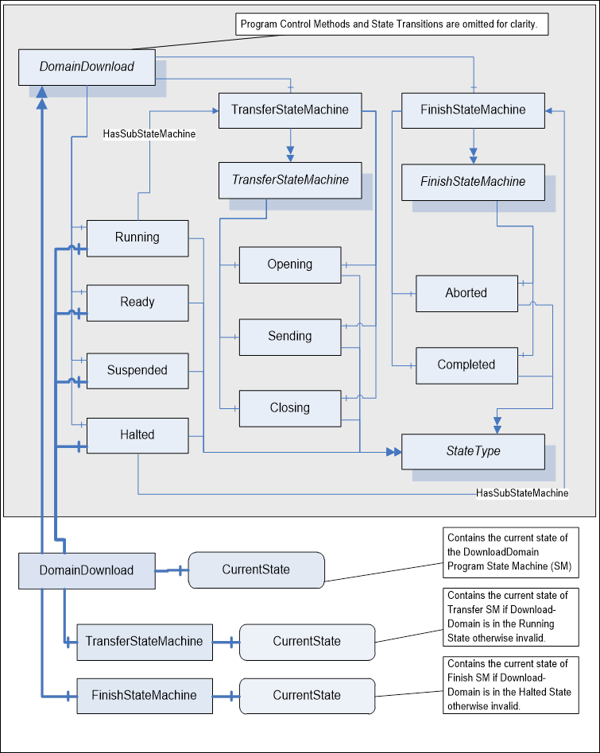  

Figure A. 3 - DomainDownloadType partial state model  

[Table A.8](/§\_Ref157747766) specifies the *ProgramTransitionTypes* that are defined in addition to the *ProgramTransitionTypes* specified for *Programs* in ** [Table 7](/§\_Ref144609527) *.* These ** types ** associate the Transfer and Finish sub *State Machine* states with the states of the base *Program.*  

Table A. 8 - TransferStateMachineType Additional References  

| **Source Path** | **Reference Type** | **Is Forward** | **Target Path** |
|---|---|---|---|
|||||
|ToSending|ToState|True|Sending|
||FromState|True|Opening|
||HasCause|True|Start|
||HasEffect|True|ProgramTransitionEventType|
||HasEffect|True|AuditProgramTransitionEventType|
|||||
|SendingToSending|ToState|True|Sending|
||FromState|True|Sending|
||HasEffect|True|ProgramTransitionEventType|
|||||
|SendingToClosing|ToState|True|Closing|
||FromState|True|Sending|
||HasEffect|True|ProgramTransitionEventType|
|||||
|SendingToAborted|ToState|True|Aborted|
||FromState|True|Sending|
||HasCause|True|Halt|
||HasEffect|True|ProgramTransitionEventType|
||HasEffect|True|AuditProgramTransitionEventType|
|||||
|ClosingToCompleted|ToState|True|Completed|
||FromState|True|Closing|
||HasEffect|True|ProgramTransitionEventType|
|||||
|SendingToSuspended|ToState|True|Suspended|
||FromState|True|Sending|
||HasCause|True|Suspend|
||HasEffect|True|ProgramTransitionEventType|
||HasEffect|True|AuditProgramTransitionEventType|
|||||
|SuspendedToSending|ToState|True|Sending|
||FromState|True|Suspended|
||HasCause|True|Resume|
||HasEffect|True|ProgramTransitionEventType|
||HasEffect|True|AuditProgramTransitionEventType|
|||||
|SuspendedToAborted|ToState|True|Aborted|
||FromState|True|Suspended|
||HasCause|True|Halt|
||HasEffect|True|ProgramTransitionEventType|
||HasEffect|True|AuditProgramTransitionEventType|
|||||
|ReadyToOpening|ToState|True|Opening|
||FromState|True|Ready|
||HasCause|True|Start|
||HasEffect|True|ProgramTransitionEventType|
||HasEffect|True|AuditProgramTransitionEventType|
  

  

[Figure A.4](/§\_Ref303808600) through [Figure A.10](/§\_Ref303808615) illustrate portions of the DomainDownloadType model. In each figure, the referenced tates, *Methods* , transitions, and *EventTypes* are identified for one or two state transitions.  

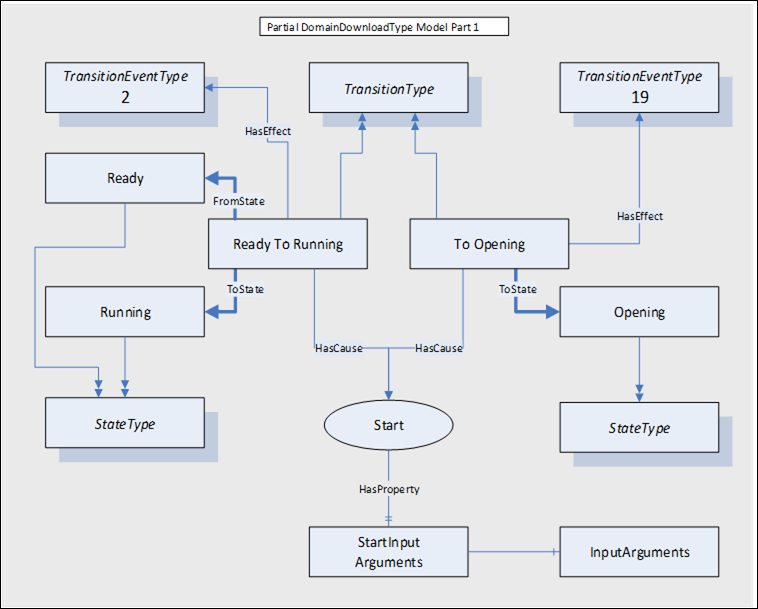  

Figure A. 4 - Ready To Running model  

[Figure A.4](/§\_Ref303808600) illustrates the model for the ReadyToRunning *Program* transition. The transition is caused by the *Start Method* . The *Start Method* requires three input arguments. The *Method* *Call* service is used by the *Client* to invoke the *Start Method* and pass the arguments. When successful, the *Program* *Invocation* enters the Running state and the subordinate Transfer Opening state. The *Server* issues two *Event* notifications, ReadyToRunning (2), and ToOpening (19).  

Table A. 9 - Start Method additions  

| **Attribute** | **Value** |
|---|---|
|BrowseName|Start|
|IsAbstract|False|
  
| **References** | **NodeClass** | **BrowseName** | **DataType** | **TypeDefinition** | **ModellingRule** |
|---|---|---|---|---|---|
|HasProperty|Variable|InputArguments|Argument[]|PropertyType||
  

  

[Table A.9](/§\_Ref157854278) specifies that the *Start* *Method* for the *DomainDownloadType* requires input arguments. [Table A.10](/§\_Ref157853363) identifies the *Start* *Arguments* required.  

Table A. 10 - StartArguments  

| **Name** | **Type** | **Value** |
|---|---|---|
|Argument 1|structure||
|name|String|SourcePath|
|dataType|NodeId|StringNodeId|
|valueRank|Int32|\-1 (-1 = scalar)|
|arrayDimensions|UInt32[]|null|
|description|LocalizedText|The source specifier for the domain|
|Argument 2|structure||
|Name|String|DestinationPath|
|dataType|NodeId|StringNodeId|
|valueRank|Int32|\-1  (-1 = scalar)|
|arrayDimensions|UInt32[]|null|
|description|LocalizedText|The destination specifier for the domain|
|Argument 3|structure||
|name|String|DomainName|
|dataType|NodeId|StringNodeId|
|arrayDimensions|UInt32[]|null|
|valueRank|Int32|\-1  (-1 = scalar)|
|description|LocalizedText|The name of the domain|
||||
  

  

[Figure A.5](/§\_Ref303808683) illustrates the model for the Opening To Sending and the Sending to Closing *Program* transitions. As specified in the transition table, these state transitions require no *Methods* to occur, but rather are driven by the internal actions of the *Server* . *Events* are generated for each state transition (10 to 12), when they occur.  

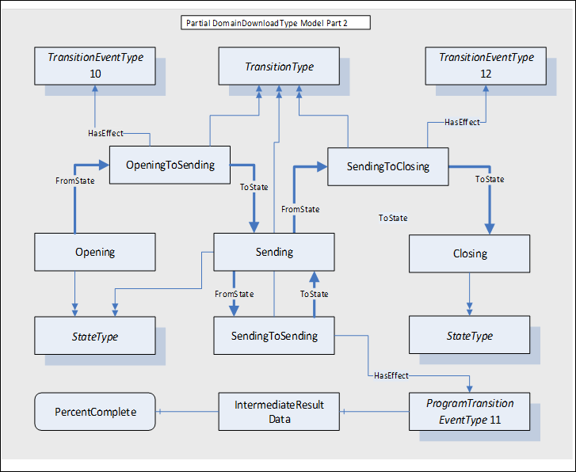  

  

Figure A. 5 - Opening To Sending To Closing model  

Notice that a state transition can initiate and terminate at the same state (Sending). In this case the transition serves a purpose. The *ProgramTransitionEventType* effect referenced by   the SendingToSending state transition has an *IntermediateResultData* *Object* *Reference* . The *IntermediateResultData* *Object* serves to identify two *Variables* whose values are obtained each time the state transition occurs. The values are sent to the *Client* with the *Event* notification. [Table A.11](/§\_Ref273043270) defines the *IntermediateResults* *ObjectType* and Table A.12 defines the *Variables* of the *ObjectType* .  

Table A. 11 - IntermediateResults Object  

| **Attribute** | **Value** |
|---|---|
||Includes all attributes specified for the ObjectType|
|BrowseName|IntermediateResults|
|IsAbstract|False|
|||
  
| **References** | **NodeClass** | **BrowseName** | **Data**   **Type** | **TypeDefinition** | **Modelling**   **Rule** |
|---|---|---|---|---|---|
|HasComponent|Variable|AmountTransferred|Long|VariableType|Mandatory|
|HasComponent|Variable|PercentageTransferred|Long|VariableType|Mandatory|
|||||||
  

  

Table A. 12 - Intermediate result data Variables  

| **Intermediate Result Variables** | **Type** | **Value** |
|---|---|---|
|Variable 1|Structure||
|Name|String|AmountTransferred|
|dataType|NodeId|StringNodeId|
|description|LocalizedText|Bytes of domain data transferred.|
|Variable 2|Structure||
|Name|String|PercentageTransferred|
|dataType|NodeId|StringNodeId|
|description|LocalizedText|Percentage of domain data transferred.|
  

  

The model for the Running To Suspended state transition is illustrated in **** . The cause for this transition is the *Suspend Method.* The *Client* can pause the download of domain data to the control. The transition from Running to Suspended invokes the *Event* generation for *TransitionEventTypes* 5 and 16. Note that there is no longer a valid current state for the Transfer State Machine.  

  

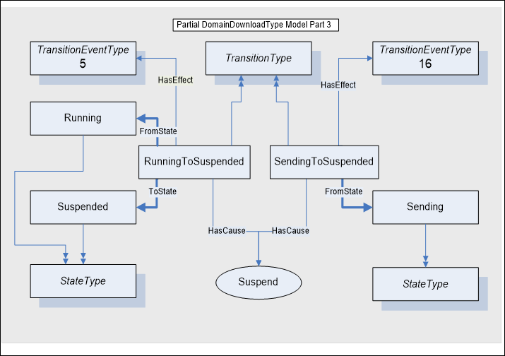  

  

Figure A. 6 - Running To Suspended model  

The model for the SuspendedToRunning state transition is illustrated in [Figure A.7](/§\_Ref303808759) . The cause for this transition is the *Resume Method.* The *Client* can resume the download of domain data to the control. The transition from Suspended to Running generates the *Event* for *TransitionEventTypes* 6 and 17. Now that the Running state is active, the Sending state of the Transfer State Machine is again specified for the *CurrentStateNumber* .  

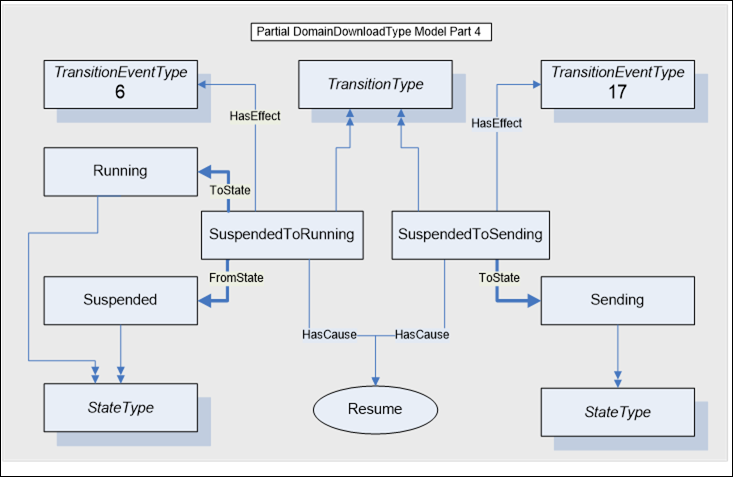  

  

Figure A. 7 - Suspended To Running model  

The model for the Running To Halted state transition for an abnormal termination of the domain download is illustrated in **[Figure A](/§\_Ref157866654)** *Halt Method.* The *Client* can terminate the download of domain data to the control. The transition from Running To Halted generates the *Event* for *TransitionEventTypes* 3 and 15. The *TransitionEventType* 15 indicates the transition from the Sending state as the Running State ends and then to the Aborted state as the Halted state is entered.  

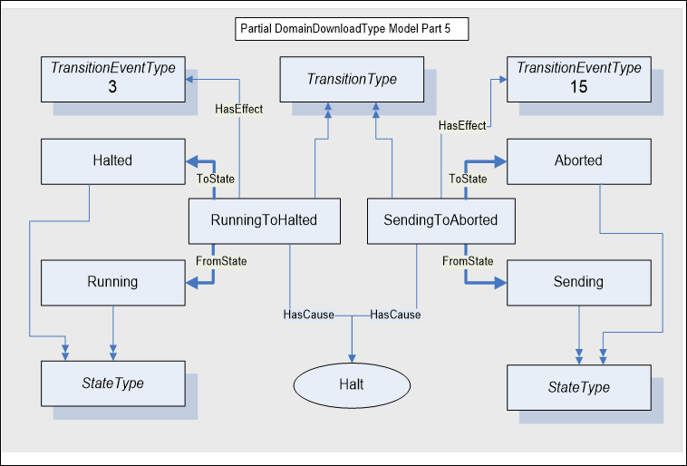  

Figure A. 8 - Running To Halted - Aborted model  

[Figure A.9](/§\_Ref157867545) illustrates the model for the Suspended To Halted state transition for an abnormal termination of the domain download. The cause for this transition is the *Halt Method.* The *Client* can terminate the download of domain data to the control while it is suspended. The transition from SuspendedToHalted invokes the *Event* notifiers for *TransitionEventTypes* 7 and 18.  

  

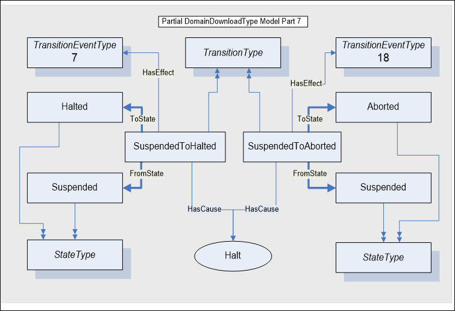  

Figure A. 9 - Suspended To Aborted model  

The model for the Running To Completed state transition for a normal termination of the domain download is illustrated in [Figure A.10](/§\_Ref303808615) . The cause for this transition is internal. The transition from Closing To Halted generates the Event for *TransitionEventTypes* 3 and 14. The *TransitionEventType* 14 indicates the transition from the Closing state as the Running state ends and then to the Completed state as the Halted state is entered.  

The DomainDownloadType includes a component reference to a *FinalResultData* *Object* . This *Object* references *Variables* that persists information about the domain download once it has completed. This data can be read by *Clients* who are not subscribed to *Event* notifications. The result data is described in [Table A.13](/§\_Ref273043395) .  

Table A. 13 - FinalResultData  

| **Attribute** | **Value** |
|---|---|
||Includes all attributes specified for the ObjectType|
|BrowseName|FinalResultData|
|IsAbstract|False|
|||
  
| **References** | **NodeClass** | **BrowseName** | **Data**   **Type** | **TypeDefinition** | **Modelling**   **Rule** |
|---|---|---|---|---|---|
|HasComponent|Variable|DownloadPerformance|Double|BaseDataVariableType|Mandatory|
|HasComponent|Variable|FailureDetails|String|BaseDataVariableType|Mandatory|
  

  

The Domain Download net transfer data rate and detailed reason for aborted downloads is retained as final result data for each *Program Invocation* .  

*DownloadPerformance* provides the data rate in seconds for domain data transferred.  

*FailureDetails* provides a descriptive reason for an abort.  

  

  

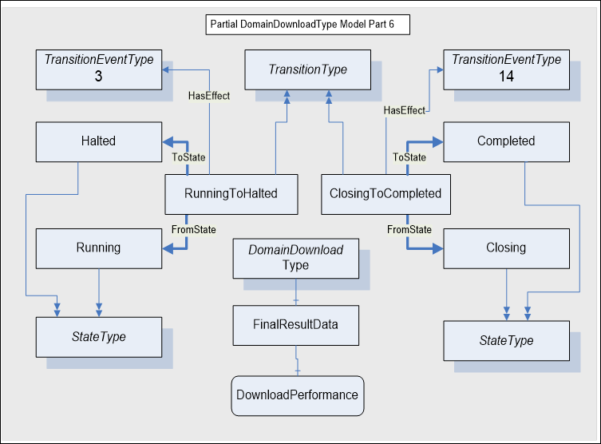  

  

Figure A. 10 - Running To Completed model  

##### A.2.6.3 Sequence of operations  

[Figure A.11](/§\_Ref157876536) illustrates a normal sequence of service exchanges between a *Client* and *Server* that would occur during the life cycle of a DomainDownloadType *Program Invocation* .  

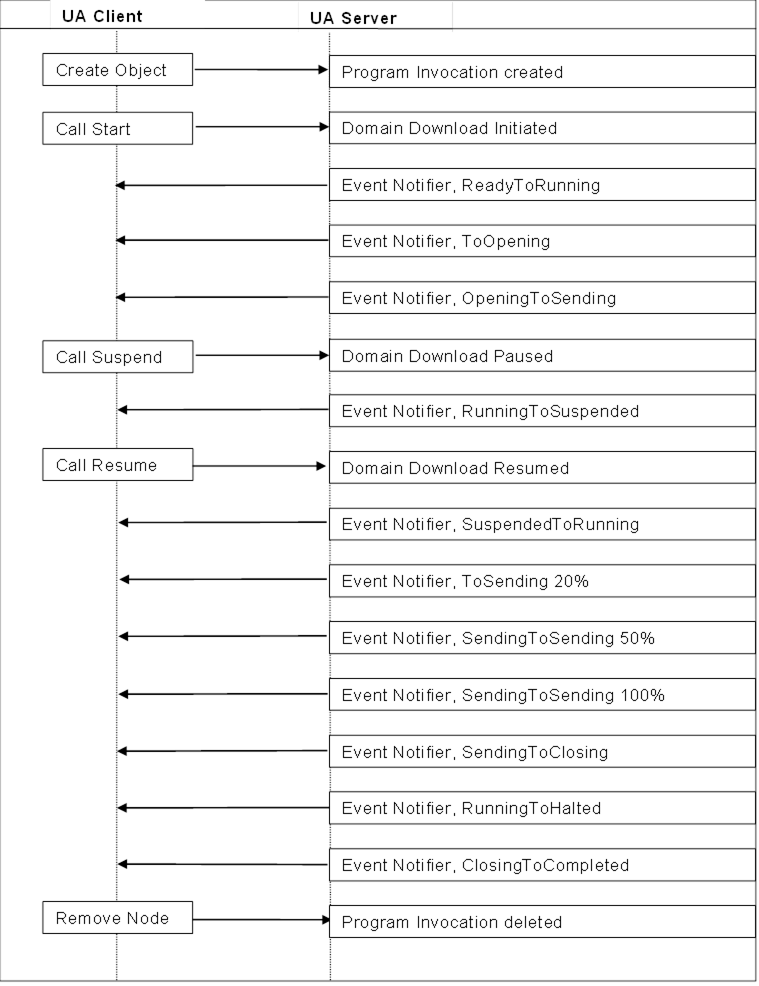  

Figure A. 11 - Sequence of operations  

\_\_\_\_\_\_\_\_\_\_\_\_  

