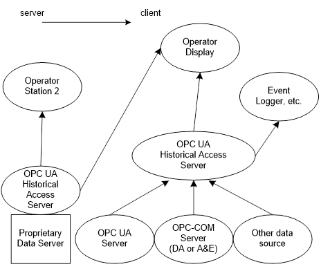
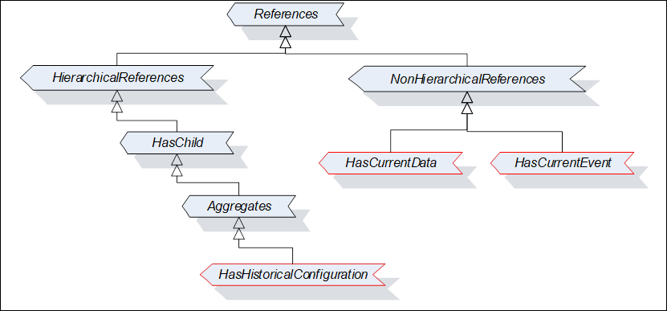
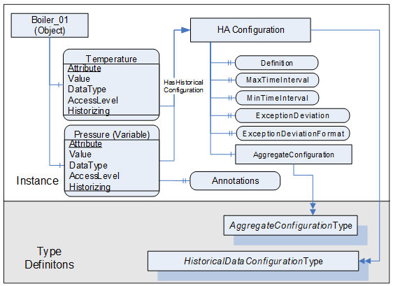
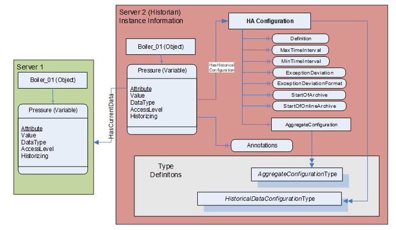
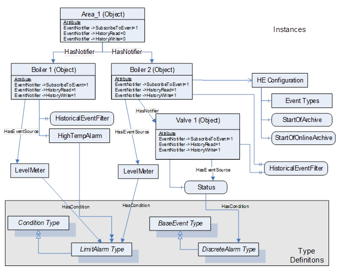
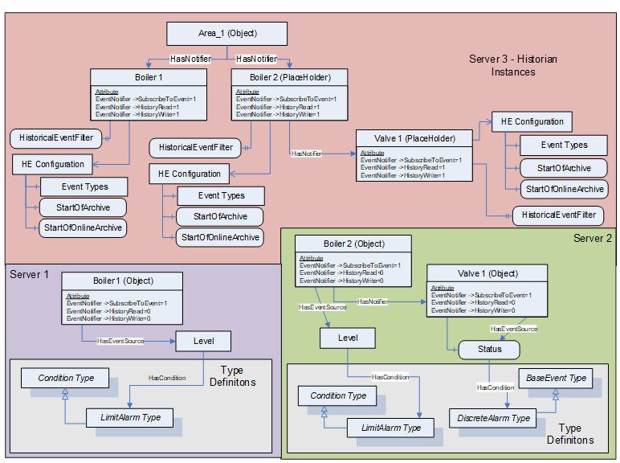
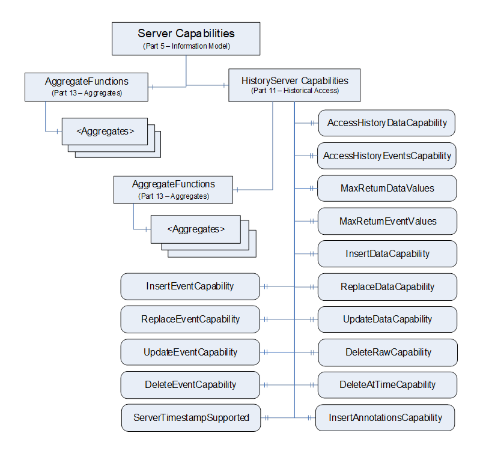
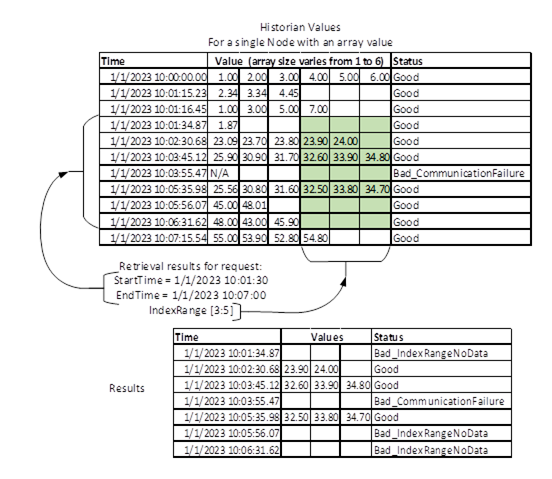
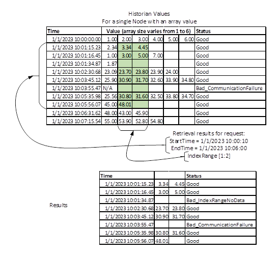

## 1 Scope  

This document is part of the OPC Unified Architecture standards series and defines the *Information Model* associated with Historical Access (HA). It particularly includes additional and complementary descriptions of the *NodeClasses* and *Attributes* needed for Historical Access, additional standard *Properties* , and other information and behaviour.  

The complete *AddressSpace* Model including all *NodeClasses* and *Attributes* is specified in [OPC 10000-3](/§) . The predefined *Information* *Model* is defined in [OPC 10000-5](/§) . The *Services* to detect and access historical data and events, and description of the *ExtensibleParameter* types are specified in [OPC 10000-4](/§) .  

This document includes functionality to compute and return *Aggregates* like minimum, maximum, average etc. The *Information* *Model* and the concrete working of *Aggregates* are defined in [OPC 10000-13](/§) .  

Conventions for Historical Access Clients are informatively provided in [Annex A](/§\_Ref177557573) .  

## 2 Normative references  

The following documents, in whole or in part, are normatively referenced in this document and are indispensable for its application. For dated references, only the edition cited applies. For undated references, the latest edition of the referenced document (including any amendments and errata) applies.  

OPC 10000-1, OPC Unified Architecture - Part 1: Overview and Concepts  

[http://www.opcfoundation.org/UA/Part1/](http://www.opcfoundation.org/UA/Part1/)  

OPC 10000-3, OPC Unified Architecture - Part 3: Address Space Model  

[http://www.opcfoundation.org/UA/Part3/](http://www.opcfoundation.org/UA/Part3/)  

OPC 10000-4, OPC Unified Architecture - Part 4: Services  

[http://www.opcfoundation.org/UA/Part4/](http://www.opcfoundation.org/UA/Part4/)  

OPC 10000-5, OPC Unified Architecture - Part 5: Information Model  

[http://www.opcfoundation.org/UA/Part5/](http://www.opcfoundation.org/UA/Part5/)  

OPC 10000-7, OPC Unified Architecture - Part 7: Profiles  

[http://www.opcfoundation.org/UA/Part7/](http://www.opcfoundation.org/UA/Part7/)  

OPC 10000-8, OPC Unified Architecture - Part 8: Data Access  

[http://www.opcfoundation.org/UA/Part8/](http://www.opcfoundation.org/UA/Part8/)  

OPC 10000-13, OPC Unified Architecture - Part 13: Aggregates  

[http://www.opcfoundation.org/UA/Part13/](http://www.opcfoundation.org/UA/Part13/)  

## 3 Terms, definitions, and abbreviations  

### 3.1 Terms and definitions  

For the purposes of this document, the terms and definitions given in [OPC 10000-1](/§UAPart1) , [OPC 10000-3](/§UAPart3) , [OPC 10000-4](/§UAPart4) , [OPC 10000-13](/§UAPart13) and the following apply.  

#### 3.1.1 Annotation  

metadata associated with an item at a given instance in time  

Note 1 to entry: An *Annotation* is metadata that is associated with an item at a given instance in time.  

#### 3.1.2 BoundingValues  

values associated with the starting and ending time  

Note 1 to entry: *BoundingValues* are the values that are associated with the starting and ending time of a *ProcessingInterval* specified when reading from the historian. *BoundingValues* may be required by *Clients* to determine the starting and ending values when requesting *RawData* over a time range. If a *RawData* value exists at the start or end point, it is considered the bounding value even though it is part of the data request. If no *RawData* value exists at the start or end point, then the *Server* will determine the boundary value, which may require data from a data point outside of the requested range. See [4.6](/§\_Ref130175917) for details on using *BoundingValues* .  

#### 3.1.3 Historian  

application storing time series data and/or time series events  

#### 3.1.4 HistoricalNode  

*Object* , *Variable* , *Property* or *View* in the *AddressSpace* where a *Client* can access historical data or *Events*  

Note 1 to entry: A *HistoricalNode* is a term used in this document to represent any *Object* , *Variable, Property* or *View* in the *AddressSpace* for which a *Client* can read and/or update historical data or *Events* . The terms " *HistoricalNodes's* history" or "history of a *HistoricalNodes* " will refer to the time series data or *Events* stored for this *HistoricalNode* . The term *HistoricalNode* refers to both *HistoricalDataNodes* and HistoricalEventNodes.  

#### 3.1.5 HistoricalDataNode  

*Variable* or *Property* in the *AddressSpace* where a *Client* can access historical data  

Note 1 to entry: A *HistoricalDataNode* represents any Variable or Property in the *AddressSpace* for which a *Client* can read and/or update historical data. " *HistoricalDataNode* history" or "history of a *HistoricalDataNode* " refers to the time series data stored for this *HistoricalNode* . Examples of such data are:  

* device data (like temperature sensors)  

* calculated data  

* status information (open/closed, moving)  

* dynamically changing system data (like stock quotes)  

* diagnostic data  

The term *HistoricalDataNodes* is used when referencing aspects of the standard that apply to accessing historical data only.  

#### 3.1.6 HistoricalEventNode  

*Object* or *View* in the *AddressSpace* for which a *Client* can access historical *Events*  

Note 1 to entry: " *HistoricalEventNode's* history" or "history of a *HistoricalEventNode* " refers to the time series *Events* stored in some historical system. Examples of such data are:  

* *Notifications*  

* system *Alarms*  

* operator action *Events*  

* system triggers (such as new orders to be processed)  

The term *HistoricalEventNode* is used when referencing aspects of the standard that apply to accessing historical *Events* only.  

#### 3.1.7 ModifiedValues  

*HistoricalDataNode **'** * value that has been changed (or manually inserted or deleted) after it was stored in the historian  

Note 1 to entry: For some *Servers* , a lab data entry value is not a *modified value* , but if a user corrects a lab value, the original value would be considered a *modified value* , and would be returned during a request for *ModifiedValues* . Also manually inserting a value that was missed by a standard collection system can be considered a *modified value* . Unless specified otherwise, all historical *Services* operate on the current, or most recent, value for the specified *HistoricalDataNode* at the specified timestamp. Requests for *ModifiedValues* are used to access values that have been superseded, deleted or inserted. It is up to a system to determine what is considered a *modified value* . Whenever a *Server* has modified data available for an entry in the historical collection it shall set the *ExtraData* bit in the *StatusCode.*  

#### 3.1.8 RawData  

data that is stored within the historian for a *HistoricalDataNode*  

Note 1 to entry: The data can be all data collected for the *DataValue* or it can be some subset of the data depending on the historian and the storage rules invoked when the item's values were saved.  

#### 3.1.9 StartTime/EndTime  

bounds of a history request which define the time domain  

Note 1 to entry: For all requests, a value falling at the end time of the time domain is not included in the domain, so that requests made for successive, contiguous time domains will include every value in the historical collection exactly once.  

#### 3.1.10 TimeDomain  

interval of time covered by a particular request, or response  

Note 1 to entry: In general, if the start time is earlier than or the same as the end time, the time domain is considered to begin at the start time and end just before the end time; if the end time is earlier than the start time, the time domain still begins at the start time and ends just before the end time, with time "running backward" for the particular request and response. In both cases, any value which falls exactly at the end time of the *TimeDomain* is not included in the *TimeDomain* . See the examples in [4.6](/§\_Ref128987221) . *BoundingValues* effect the time domain as described in [4.6](/§\_Ref128987221) .  

All timestamps which can legally be represented in a *UtcTime* *DataType* are valid timestamps, and the *Server* may not return an invalid argument result code due to the timestamp being outside of the range for which the *Server* has data. See [OPC 10000-3](/§) for a description of the range and granularity of this *DataType* . *Servers* are expected to handle out-of-bounds timestamps gracefully, and return the proper *StatusCodes* to the *Client.*  

#### 3.1.11 StructuredHistoryData  

structured data stored in a history collection where parts of the structure are used to uniquely identify the data within the data collection  

Note 1 to entry: Most historical data applications assume only one current value per timestamp. Therefore, the timestamp of the data is considered the unique identifier for that value. Some data or meta data such as *Annotations* can permit multiple values to exist at a single timestamp. In such cases the *Server* would use one or more parameters of the *StructuredHistoryData* entry to uniquely identify each element within the history collection. *Annotations* are examples of *StructuredHistoryData* .  

### 3.2 Abbreviated terms  

DA Data Access  

HA Historical Access  

HDA Historical Data Access  

UA Unified Architecture  

## 4 Concepts  

### 4.1 General  

This document defines the handling of historical time series data and historical *Event* data in the OPC Unified Architecture (in a Historian). Included is the specification of the representation of historical data and *Events* in the *AddressSpace.*  

### 4.2 Data architecture  

A *Server* supporting Historical Access provides *Clients* with transparent access to different historical data and/or historical *Event* sources (e.g., process *Historians* , event *Historians* , etc.).  

The historical data or *Events* can be in a proprietary data collection, database or a short-term buffer within memory. A *Server* supporting Historical Access will provide historical data and *Events* for all or a subset of the available *Variables* , *Objects, Properties* or *Views* within the *Server* *AddressSpace* .  

[Figure 1](/§\_Ref136615672) illustrates how the *AddressSpace* of a UA *Server* can consist of a broad range of different historical data and/or historical *Event* sources.  

  

Figure 1 - Possible OPC UA Server supporting Historical Access  

  

The *Historian* can be implemented as a standalone OPC UA *Server* that collects data from another OPC UA *Server* or another data source. The *Historian* can also just aggregate historical data from underlying *Historians* . The *Client* that references the OPC UA *Server* supporting Historical Access for historical data can be simple trending packages that desire values over a given time frame or they can be complex reports that require data in multiple formats.  

There are general requirements for *Historians* , but *Historians* can vary in functionality. A consistent requirement for all *Historians* is that they store Historical data including a timestamp. All historical data should include status information for each value, but a *Historian* can compress this to only storing status information that indicates a problem (Bad status) and/or status change, instead of storing a status for every time series data item. The status of historical data can be complex. What is required is that the values returned as part of the timeseries raw data match the data that would have been observed if the *Value* was subscribed to at that point in time.  

Historical *Events* are more complicated. In a stream of *Events* each Event can have a different list of fields. *EventTypes* are defined in a hierarchical manner, where each *EventType* inherits fields from its parent type and can add additional fields. Some of these additional fields can be mandatory and are required to understand or process the given *EventType* . A *Historian* that stores *Events* , shall be configurable to store all mandatory fields for any *EventTypes* that it historizes. If it receives for storage an *EventType* that it does not support all mandatory fields for, it can store it as one of its supertype *EventTypes* (one that it does support all mandatory fields for), but then it shall not claim that it supports historizing of that *EventType* (see [5.4.3](/§\_Ref125565215) ). The *Historian* shall also provide information about the fields that are currently being historized (see [5.4.3](/§\_Ref125565215) ).  

### 4.3 Historians and interruption of data collection  

When an *Historian* is collecting and storing data, the data collection can be interrupted. The interruption can have been for collecting the current values of data or for an event stream. The interruption can have been due to an interruption in the source of a value or an interruption of the forwarding of historical data from an underlying *Historian* . The interruption can also have been due to an action that stopped the collection of *HistoricalData* or historical *Events* . Some of these interruptions can recover with no loss of data, others can result in data gaps. The *Historian* shall report any gaps when a client is accessing the stored historical data with an error code of *Bad* \_ *DataLost* .  

For example, if a subscription for data breaks, and the historian recovers the subscription after several minutes, it can check the *SourceTimestamp* of the initial values in the subscription. If the initial value *SourceTimestamp* matches the last stored value *SourceTimestamp* , then no data was lost and nothing needs to be stored indicating the given *HistoricalDataNode* 's data collection was interrupted. But if the *SourceTimestamp* of the initial value is later than the *SourceTimestamp* of the last stored value, then the historian has no way of knowing if any data was lost and it shall record a bad status for the value with the timestamp of when the connection was broken.  

For *Event* collection, in addition to what is described for a data collection the following also has to be addressed. If a *Subscription* for *Event* is interrupted for long enough that the *Subscription* buffer reports an overflow (instance of *EventQueueOverflowEventType* ), then the *Event* storage shall report this error. This can be accomplished by storing the instance of *EventQueueOverflowEventType* event or by recording a *Bad* \_ *DataLost.* If the lost data is indicated by *EventQueueOverflowEventType* , this event shall always be returned for any filter, just as it is in an *Event* *Subscription* .  

### 4.4 Modification of Historical Data/Events  

A *Historian* collects values (data or *Events* ) and provides long term storage of these values. Occasionally data that is collected is incorrect. It can be incorrect for many reasons, such as a failed sensor, or failed communication or even an out of calibration sensor. Sometimes the correct values are obtained from another source and the historical value is updated from this source. In many *Historians* , the act of updating a historical value needs to be tracked. This specification provides two aspects for tracking:  

* Recording the original value and information related to who made the change (see [6.9](/§\_Ref121430189) for *HistoryUpdateDetails* ).  

* Generating an audit event describing the history edit action (see [5.8](/§\_Ref121430142) ).  

Some *Historians* obtain data from other sources (for example not an OPC UA *Subscription* ). This data can be from lab data analysis package or other off-line activities. This data is typically provided in bulk and with *SourceTimestamps* that are in the past. For this type of data, even though it can be inserted using an *HistoryUpdateDetails* service call, the *Historian* does not have to create a modification record for the initial insertion.  

Modification of *Events* is different than modification of data, in that in a single event stream there can be many *Events* with the same *Timestamp* . *Events* need to be identified by their EventId. The *EventId* is generated as part of normal *Event* processing in a *Server* and is used to correlate actions related to the *Event* . For example, when an Alarm (which is represented by an *Event)* is acknowledged, the acknowledgement is related to the specific *EventId* that represent that event is time. A *Historian* that historizes *Events* shall store the *EventId* that it receives; Modification of *Events* shall not allow modification to *EventIds.*  

### 4.5 Timestamps  

The nature of OPC UA Historical Access requires that a single timestamp reference be used to relate the multiple data points, and the *Client* can request which timestamp will be used as the reference. See [OPC 10000-4](/§) for details on the *TimestampsToReturn* enumeration. An OPC UA *Server* supporting Historical Access will treat the various timestamp settings as described below. A HistoryRead with invalid settings will be rejected with Bad\_TimestampsToReturnInvalid (see [OPC 10000-4](/§) ).  

For *HistoricalDataNodes* , the *SourceTimestamp* is used to determine which historical data values are to be returned.  

The request is in terms of *SourceTimestamp* but the reply could be in *SourceTimestamp* , *ServerTimestamp* or both timestamps. If the reply has the *Server* timestamp the timestamps could fall outside of the range of the requested time.  

SOURCE  Return the *SourceTimestamp* .  

SERVER  Return the *ServerTimestamp* .  

BOTH  Return both the *SourceTimestamp* and *ServerTimestamp* .  

NEITHER  This is not a valid setting for any HistoryRead accessing *HistoricalDataNodes.*  

Any reference to timestamps in this context throughout this document will represent either *ServerTimestamp* or *SourceTimestamp* as dictated by the type requested in the HistoryRead *Service* . Some *Servers* may not support historizing both *SourceTimestamp* and *ServerTimestamp* , but it is expected that all *Servers* will support historizing *SourceTimestamp* (see [OPC 10000-7](/§) for details on *Server* *Profiles* ).  

If a request is made requesting both *ServerTimestamp* and *SourceTimestamp* and the *Server* is only collecting the *SourceTimestamp,* the *Server* shall return Bad\_TimestampNotSupported. Some *Historians* can aggregate data from underlying *Historians.* These *Servers* can have a mix of data, some with *ServerTimestamp* some without. The *Historian* may not know if a *HistoricalDataNode* supports *ServerTimestamps* . As a result of this uncertainty, the Bad\_TimestampNotSupported ** can be returned on the service level or at the operation level.  

For HistoricalEventNodes this parameter does not apply. This parameter is ignored since the entries returned are dictated by the *Event* Filter. See [OPC 10000-4](/§) for details.  

### 4.6 Bounding Values and time domain  

When accessing *HistoricalDataNodes via* the *HistoryRead Service* , requests can set a flag, returnBounds, indicating that *BoundingValues* are requested. For a complete description of the *Extensible* *Parameter* *HistoryReadDetails* that include *StartTime* , *EndTime* and NumValuesPerNode, see [6.5](/§\_Ref150152567) . The concept of Bounding Values and how they affect the time domain that is requested as part of the *HistoryRead* request is further explained in 4.4. Subclause 4.4 also provides examples of *TimeDomains* to further illustrate the expected behaviour.  

When making a request for historical data using the *HistoryRead* *Service* , the required parameters include at least two of these three parameters: startTime, endTime and *numValuesPerNode* . What is returned when *BoundingValues* are requested varies according to which of these parameters are provided. For a *Historian* that has values stored at 5:00, 5:02, 5:03, 5:05 and 5:06, the data returned when using the Read Raw functionality is given by [Table 1](/§\_Ref135728093) . In the table, FIRST stands for a tuple with a value of null, a timestamp of the specified *StartTime* , and a *StatusCode* of Bad\_BoundNotFound. LAST stands for a tuple with a value of null, a timestamp of the specified *EndTime* , and a StatusCode of Bad\_ *BoundNotFound* .  

In some cases, attempting to locate bounds, particularly FIRST or LAST points, can be resource intensive for *Servers* . Therefore, how far back or forward to look in history for Bounding Values is *Server* dependent, and the *Server* search limits can be reached before a bounding value can be found. There are also cases, such as reading *Annotations* or *Attribute* data where Bounding Values may not be appropriate. For such use cases it is permissible for the *Server* to return a *StatusCode* of *Bad\_BoundNotSupported.*  

Table 1 - Bounding Value examples  

| **Start Time** | **End Time** | **numValuesPerNode** | **Bounds** | **Data Returned** |
|---|---|---|---|---|
|5:00|5:05|0|Yes|5:00, 5:02, 5:03, 5:05|
|5:00|5:05|0|No|5:00, 5:02, 5:03|
|5:01|5:04|0|Yes|5:00, 5:02, 5:03, 5:05|
|5:01|5:04|0|No|5:02, 5:03|
|5:05|5:00|0|Yes|5:05, 5:03, 5:02, 5:00|
|5:05|5:00|0|No|5:05, 5:03, 5:02|
|5:04|5:01|0|Yes|5:05, 5:03, 5:02, 5:00|
|5:04|5:01|0|No|5:03, 5:02|
|4:59|5:05|0|Yes|FIRST, 5:00, 5:02, 5:03, 5:05|
|4:59|5:05|0|No|5:00, 5:02, 5:03|
|5:01|5:07|0|Yes|5:00, 5:02, 5:03, 5:05, 5:06, LAST|
|5:01|5:07|0|No|5:02, 5:03, 5:05, 5:06|
|5:00|5:05|3|Yes|5:00, 5:02, 5:03|
|5:00|5:05|3|No|5:00, 5:02, 5:03|
|5:01|5:04|3|Yes|5:00, 5:02, 5:03|
|5:01|5:04|3|No|5:02, 5:03|
|5:05|5:00|3|Yes|5:05, 5:03, 5:02|
|5:05|5:00|3|No|5:05, 5:03, 5:02|
|5:04|5:01|3|Yes|5:05, 5:03, 5:02|
|5:04|5:01|3|No|5:03, 5:02|
|4:59|5:05|3|Yes|FIRST, 5:00, 5:02|
|4:59|5:05|3|No|5:00, 5:02, 5:03|
|5:01|5:07|3|Yes|5:00, 5:02, 5:03|
|5:01|5:07|3|No|5:02, 5:03, 5:05|
|5:00|UNSPECIFIED|3|Yes|5:00, 5:02, 5:03|
|5:00|UNSPECIFIED|3|No|5:00, 5:02, 5:03|
|5:00|UNSPECIFIED|6|Yes|5:00, 5:02, 5:03, 5:05, 5:06, LASTa|
|5:00|UNSPECIFIED|6|No|5:00, 5:02, 5:03, 5:05, 5:06|
|5:07|UNSPECIFIED|6|Yes|5:06, LAST|
|5:07|UNSPECIFIED|6|No|NODATA|
|UNSPECIFIED|5:06|3|Yes|5:06,5:05,5:03|
|UNSPECIFIED|5:06|3|No|5:06,5:05,5:03|
|UNSPECIFIED|5:06|6|Yes|5:06,5:05,5:03,5:02,5:00, FIRSTb|
|UNSPECIFIED|5:06|6|No|5:06, 5:05, 5:03, 5:02, 5:00|
|UNSPECIFIED|4:48|6|Yes|5:00, FIRST|
|UNSPECIFIED|4:48|6|No|NODATA|
|4:48|4:48|0|Yes|FIRST,5:00|
|4:48|4:48|0|No|NODATA|
|4:48|4:48|1|Yes|FIRST|
|4:48|4:48|1|No|NODATA|
|4:48|4:48|2|Yes|FIRST,5:00|
|5:00|5:00|0|Yes|5:00,5:02c|
|5:00|5:00|0|No|5:00|
|5:00|5:00|1|Yes|5:00|
|5:00|5:00|1|No|5:00|
|5:01|5:01|0|Yes|5:00, 5:02|
|5:01|5:01|0|No|NODATA|
|5:01|5:01|1|Yes|5:00|
|5:01|5:01|1|No|NODATA|
|a The timestamp of LAST cannot be the specified End Time because there is no specified End Time. In this situation the timestamp for LAST will be equal to the previous timestamp returned plus one second. b The timestamp of FIRST cannot be the specified End Time because there is no specified Start Time. In this situation the timestamp for FIRST will be equal to the previous timestamp returned minus one second. c When the Start Time = End Time (there is data at that time), and Bounds is set to True, the start bounds will equal the Start Time and the next data point will be used for the end bounds.|
  

  

### 4.7 Changes in AddressSpace over time  

*Clients* use the browse *Services* of the *View* *Service* *Set* to navigate through the *AddressSpace* to discover the *HistoricalNodes* and their characteristics. These *Services* provide the most current information about the *AddressSpace* . It is possible and probable that the *AddressSpace* of a *Server* will change over time (i.e. *TypeDefinitions* can change; *NodeIds* can be modified, added or deleted).  

*Server* developers and administrators need to be aware that modifying the *AddressSpace* can impact a *Client's* ability to access historical information. If the history for a *HistoricalDataNodes* is still required, but the *HistoricalDataNodes* is no longer historized, then the *Object* should be maintained in the *AddressSpace* , with the appropriate *AccessLevel* *Attribute* and *Historizing* *Attribute* settings (see [OPC 10000-3](/§) for details on access levels).  

If the *HistoricalConfiguration* of a *HistoricalDataNode* in the *AddressSpace* is changed and audit events are supported, an audit *Event* of *AuditHistoryConfigurationChangeEventType* shall be generated.  

A *Historian* shall expose the *Historizing* attribute on any nodes that are currently collecting historical data. They shall also set the *AccessLevel* *HistoryRead* and optionally the *HistoryWrite* bits for *HistoricalNodes* (those with *Historical* data).  

If a *HistoricalConfiguration* *Object* is added to or deleted from a *Server* or a *Reference* to a *HistoricalConfiguration* *Object* is added to or deleted from a *Node* , a *GeneralModelChangeEvent* shall be generated. If an *Annotation* *Property* is added to or deleted from a *Node* , a *GeneralModelChangeEvent* shall be generated.  

## 5 Historical Information Model  

### 5.1 HistoricalNodes  

#### 5.1.1 General  

The Historical Access model defines additional *Properties* that are applicable for both *HistoricalDataNodes* and HistoricalEventNodes *.*  

#### 5.1.2 Annotations Property  

The *DataVariable* or *Object* that has *Annotation* data will add the *Annotations Property* as shown in [Table 2](/§\_Ref114297294) .  

Table 2 - Annotations Property  

| **Name** | **Use** | **Data Type** | **Description** |
|---|---|---|---|
|Annotations|O|Annotation|The *Annotations* *Property* is used to indicate that the history collection exposed by a *HistoricalDataNode supports Annotation* data. *Annotation* *DataType* is defined in [6.6.6](/§\_Ref487036926) .|
  
| **ConformanceUnits** |
|---|
|[Historical Access Annotations](https://profiles.opcfoundation.org/conformanceunit/2276)|
  

  

Since it is not allowed for *Properties* to have *Properties* , the *Annotations* *Property* is only available for *DataVariables* or *Objects* .  

The *Annotations* *Property* shall be present on every *HistoricalDataNode that supports* modifications, deletions, or additions of *Annotations* whether or not *Annotations* currently exist. *Annotation* data is accessed using the standard *HistoryRead* functions. *Annotations* are modified, inserted or deleted using the standard *HistoryUpdate* functions and the *UpdateStructuredDataDetails* structure. The presence of the *Annotations* *Property* does not indicate the presence of *Annotations* on the *HistoricalDataNode.*  

A *Server* shall add the *Annotations* *Property* to a *HistoricalDataNode* only if ** it will also support *Annotations* on that *HistoricalDataNode* . See [OPC 10000-4](/§) for adding *Properties* to *Nodes* . A *Server* shall remove all *Annotation* data if it removes the *Annotations* *Property* from an existing *HistoricalDataNode* .  

An *Annotation* can be accessed in two manners. It can be accessed via *ReadAnnotationDataDetails* or *ReadRawModifiedDetails* structure in the *HistoryRead* service.  

The *ReadAnnotationDataDetails* is described in [6.5.6](/§\_Ref121425890) . The *ReadAnnotationDataDetails* contains an element *reqTimes* that is a list of *Timestamps* . These *Timestamps* can be obtained from an invocation of the *HistoryRead* service call with a *ReadRawModifiedDetails* parameter for the *HistoricalDataNode* of the *Annotations* *Property* . In the returned *dataValues* array, values with the *ExtraData* flag set ** provide the *SourceTimestamp.*  

The *ReadRawModifiedDetails* structure is described in [6.5.3](/§\_Ref121425981) . For the *ReadRawModifiedDetails* , *Annotation* is returned by passing an instance of the *Annotation* *Property* *NodeId* as the *NodeId* in the *NodesToRead* parameter.  

*Annotation* data does not have a separate *HistoricalDataConfigurationType* object instance. The historical configuration defined on the parent node applies to the *Annotations* *Property* .  

As with all *HistoricalNodes* , modifications, deletions or additions of *Annotations* will raise the appropriate historical audit *Event* with the corresponding *NodeId* .  

### 5.2 HistoricalDataNodes  

#### 5.2.1 General  

The Historical Data model defines additional *ObjectTypes and Objects* . These descriptions also include required use cases for *HistoricalDataNodes.*  

#### 5.2.2 HistoricalDataConfigurationType  

The Historical Access Data model extends the standard type model by defining the *HistoricalDataConfigurationType.* This *Object* defines the general characteristics of a *Node* that defines the historical configuration of any *HistoricalDataNode* that is defined to contain history. It is formally defined in [Table 3](/§\_Ref243896345) .  

*Instances* of the *HistoricalDataConfigurationType* use the standard *BrowseName* as defined in [5.2.4](/§\_Ref129412931) .  

Table 3 - HistoricalDataConfigurationType definition  

| **Attribute** | **Value** |
|---|---|
|BrowseName|HistoricalDataConfigurationType|
|IsAbstract|False|
  
| **References** | **NodeClass** | **BrowseName** | **DataType** | **TypeDefinition** | **ModellingRule** |
|---|---|---|---|---|---|
|HasComponent|Object|AggregateConfiguration|\--|AggregateConfigurationType|Mandatory|
|HasComponent|Object|AggregateFunctions|\--|FolderType|Optional|
|HasProperty|Variable|Stepped|Boolean|PropertyType|Mandatory|
|HasProperty|Variable|Definition|String|PropertyType|Optional|
|HasProperty|Variable|MaxTimeInterval|Duration|PropertyType|Optional|
|HasProperty|Variable|MinTimeInterval|Duration|PropertyType|Optional|
|HasProperty|Variable|ExceptionDeviation|Double|PropertyType|Optional|
|HasProperty|Variable|ExceptionDeviationFormat|ExceptionDeviationFormat|PropertyType|Optional|
|HasProperty|Variable|StartOfArchive|UtcTime|PropertyType|Optional|
|HasProperty|Variable|StartOfOnlineArchive|UtcTime|PropertyType|Optional|
|HasProperty|Variable|ServerTimestampSupported|Boolean|PropertyType|Optional|
|HasProperty|Variable|MaxTimeStoredValues|Duration|PropertyType|Optional|
|HasProperty|Variable|MaxCountStoredValues|UInt32|PropertyType|Optional|
  
| **ConformanceUnits** |
|---|
|Historical Access Exception Storage|
|Historical Access Periodic Storage|
|Historical Access Default HistoricalData Configuration|
|Historical Access Archive Period|
  

  

*AggregateConfiguration Object* represents the browse entry point for information on how the *Server* treats *Aggregate* specific functionality such as handling *Uncertain data* . This *Object* is required to be present even if it contains no *Aggregate* configuration *Objects* . *Aggregates* are defined in [OPC 10000-13](/§) .  

*AggregateFunctions* is an entry point to browse to all *Aggregate* capabilities supported by the *Server* for Historical Access. All *HistoryAggregates* supported by the *Server* should be able to be browsed starting from this *Object* . *Aggregates* are defined in [OPC 10000-13](/§) .  

The *Stepped Variable* specifies whether the historical data was collected in such a manner that it should be displayed as *SlopedInterpolation* (sloped line between points) or as *SteppedInterpolation* (vertically-connected horizontal lines between points) when *RawData* is examined. This *Property* also effects how some *Aggregates* are calculated. A value of True indicates the stepped interpolation mode. A value of False indicates *SlopedInterpolation* mode. The default value is False.  

The *Definition Variable* is a vendor-specific, human readable string that specifies how the value of this *HistoricalDataNode* is calculated. Definition is non-localized and will often contain an equation that can be parsed by certain *Clients* .  

Example:  *Definition* ::= "(TempA - 25) + TempB"  

The *MaxTimeInterval* *Variable* specifies the maximum interval between data points in the history repository regardless of their value change (see [OPC 10000-3](/§) for definition of *Duration* ).  

The *MinTimeInterval* *Variable* specifies the minimum interval between data points in the history repository regardless of their value change (see [OPC 10000-3](/§) for definition of *Duration* ).  

If MaxTimeInterval=MinTimeInterval and they do not equal 0 then data is collected based on a periodic sampling rate at the defined interval.  

The *ExceptionDeviation* *Variable* specifies the minimum amount that the data for the *HistoricalDataNodes* shall change in order for the change to be reported to the history database.  

The *ExceptionDeviationFormat* *Variable* specifies how the ExceptionDeviation is determined. Its values are defined in [Table 4](/§\_Ref147909678) .  

The *StartOfArchive* *Variable* specifies the date before which there is no data in the archive either online or offline.  

The *StartOfOnlineArchive* *Variable* specifies the date of the earliest data in the online archive.  

The presence of the optional *Variable* *ServerTimestampSupported* indicates the *Server* supports the storage of *ServerTimestamps* . A value of True indicates the *Server* (and this configuration) stores *ServerTimestamps* in addition to *SourceTimestamp* . The default is False.  

The MaxTimeStoredValues is the maximum time period that is available for historical data. This is set if the historian is a circular buffer based on time (e.g. it stores the last 6 hours of data).  

The MaxCountStoredValues is the maximum number of values that can be stored for a single point assigned to this configuration.  

Typically, either MaxTimeStoredValues or MaxCountStoredValues is provided, if both are provided the smaller of the two applies. E.g. if 3 hours are specified and 10,000 values, then for a slowly changing point the 3 hour would be the cut off, but for a point that change more than once a second the 10,000 values would be encountered first.  

Table 4 - ExceptionDeviationFormat Items  

| **Name** | **Value** | **Description** |
|---|---|---|
|ABSOLUTE\_VALUE|0|*ExceptionDeviation* is an absolute *Value* .|
|PERCENT\_OF\_VALUE|1|*ExceptionDeviation* is a percentage of *Value* .|
|PERCENT\_OF\_RANGE|2|*ExceptionDeviation* is a percentage of *InstrumentRange* ( *InstrumentRange* is defined in [OPC 10000-8](/§) ).|
|PERCENT\_OF\_EU\_RANGE|3|*ExceptionDeviation* is a percentage of *EURange* ( *EURange* is defined in [OPC 10000-8](/§) ).|
|UNKNOWN|4|*ExceptionDeviation* type is *Unknown* or not specified.|
  

  

Its representation in the AddressSpace is defined in [Table 58](/§\_Ref46498546) .  

Table 5 - ExceptionDeviationFormat definition  

| **Attribute** | **Value** |
|---|---|
|BrowseName|ExceptionDeviationFormat|
|IsAbstract|False|
  
| **References** | **NodeClass** | **BrowseName** | **DataType** | **TypeDefinition** | **Other** |
|---|---|---|---|---|---|
|Subtype of the 0:Enumeration type defined in [OPC 10000-5](/§UAPart5)|
|0:HasProperty|Variable|0:EnumStrings|0:LocalizedText []|0:PropertyType||
  
| **Conformance Units** |
|---|
|Historical Access Exception Storage|
  

  

#### 5.2.3 Attributes  

Subclause 5.2.6 lists the *Attributes* of *Variables* that have particular importance for historical data. They are specified in detail in [OPC 10000-3](/§) .  

* AccessLevel  

* Historizing  

  

#### 5.2.4 Historical Data Configuration Object  

This *Object* is used as the browse entry point for information about *HistoricalDataNode* configuration. The content of this *Object* is already defined by its type definition in [Table 3](/§\_Ref243896345) . It is formally defined in [Table 6](/§\_Ref129412658) . If a *HistoricalDataNode* has configuration defined then one instance shall have a *BrowseName* of 'HA Configuration'. Additional configurations can be defined with different *BrowseNames* . It is highly recommended that display names for historical configuration historical configuration are chosen that clearly describe the historical configuration e.g. "1 Second Collection", "Long Term Configuration", etc. All historical configuration *Objects* shall be referenced using the *HasHistoricalConfiguration* *ReferenceType* .  

Table 6 - Historical Access configuration definition  

| **Attribute** | **Value** |
|---|---|
|BrowseName|HA Configuration|
  
| **References** | **NodeClass** | **BrowseName** | **DataType** | **TypeDefinition** | **ModellingRule** |
|---|---|---|---|---|---|
|HasTypeDefinition|Object Type|HistoricalDataConfigurationType|Defined in [Table 3](/§\_Ref243896345)|
||
  

  

### 5.3 References  

#### 5.3.1 Overview  

[Figure 2](/§\_Ref130471970) illustrate the references defined by this specification (outlined in red). Each reference type is described in their own sections.  

  

Figure 2 - ReferenceType hierarchy  

  

#### 5.3.2 HasHistoricalConfiguration ReferenceType  

This *ReferenceType* is a concrete *ReferenceType* that can be used directly. It is a subtype of the *Aggregates ReferenceType* and will be used to refer from a Historical *Node* to one or more *HistoricalDataConfigurationType Objects* or *HistoricalEventConfigurationType Objects* .  

The semantic indicates that the target *Node* is "used" by the source *Node* of the *Reference* . Its representation in the *AddressSpace* is specified in [Table 7](/§\_Ref216770749) .  

Table 7 - HasHistoricalConfiguration ReferenceType  

| **Attributes** | **Value** |
|---|---|
|BrowseName|HasHistoricalConfiguration|
|InverseName|HistoricalConfigurationOf|
|Symmetric|False|
|IsAbstract|False|
  
| **References** | **NodeClass** | **BrowseName** | **Comment** |
|---|---|---|---|
|The subtype of Aggregates *ReferenceType* is defined in [OPC 10000-5](/§) .|
  
| **ConformanceUnits** |
|---|
|[Historical Access Read Raw](https://profiles.opcfoundation.org/conformanceunit/2665)|
|[Historical Access Time Instance](https://profiles.opcfoundation.org/conformanceunit/3020)|
|[Historical Access Aggregates](https://profiles.opcfoundation.org/conformanceunit/3574)|
|[Historical Access Events](https://profiles.opcfoundation.org/conformanceunit/2947)|
  

  

#### 5.3.3 HasCurrentData ReferenceType  

This *ReferenceType* is a concrete *ReferenceType* that can be used directly. It is a subtype of the *NonHierarchicalReferences ReferenceType* and will be used to refer from a *HistoricalDataNode* to a Node that is the source of the data being historized by the Source Node. Typically, this node is an external node in another *Server* .  

Its representation in the *AddressSpace* is specified in [Table 8](/§\_Ref130424623) . The *Source* node of this reference type shall be a *HistoricalDataNode.* The *Target* node shall be any *Variable* or *Property*  

Table 8 - HasCurrentData ReferenceType  

| **Attributes** | **Value** |
|---|---|
|BrowseName|HasCurrentData|
|InverseName|HasHistoricalData|
|Symmetric|False|
|IsAbstract|False|
  
| **References** | **NodeClass** | **BrowseName** | **Comment** |
|---|---|---|---|
|The subtype of NonHierarchicalReferences *ReferenceType* is defined in [OPC 10000-5](/§) .|
  
| **ConformanceUnits** |
|---|
|Historical Access HasCurrentData|
||
  

  

#### 5.3.4 HasCurrentEvent ReferenceType  

This *ReferenceType* is a concrete *ReferenceType* that can be used directly. It is a subtype of the *NonHierarchicalReferences ReferenceType* and will be used to relate HistoricalEventNode to a Node that is the source of the data being historized. Typically, this node is an external node in another *Server* .  

Its representation in the *AddressSpace* is specified in [Table 9](/§\_Ref139142669) . The *Source* node of this reference type shall be a *HistoricalEventNode.* The *Target* node shall be any *Object* or *View* that has the *EventNotifier Attribute* set to TRUE.  

Table 9 - HasCurrentEvent ReferenceType  

| **Attributes** | **Value** |
|---|---|
|BrowseName|HasCurrentEvent|
|InverseName|HasHistoricalEvent|
|Symmetric|False|
|IsAbstract|False|
  
| **References** | **NodeClass** | **BrowseName** | **Comment** |
|---|---|---|---|
|The subtype of NonHierarchicalReferences *ReferenceType* is defined in [OPC 10000-5](/§) .|
  
| **ConformanceUnits** |
|---|
|Historical Access HasCurrentEvent|
||
  

  

### 5.4 HistoricalEventNodes  

#### 5.4.1 General  

The Historical *Event* model defines additional *Properties* . These descriptions also include required use cases for *HistoricalEventNodes.*  

Historical Access of *Events* uses an *EventFilter* . It is important to understand the differences between applying an *EventFilter* to current *Event* *Notifications* , and historical *Event* retrieval.  

In real time monitoring *Events* are received via *Notifications* when subscribing to an *EventNotifier* . The *EventFilter* provides the filtering and content selection of *Event* *Subscriptions* . If an *Event* *Notification* conforms to the filter defined by the *where* parameter of the *EventFilter* , then the *Notification* is sent to the *Client* .  

In historical *Event* retrieval the *EventFilter* represents the filtering and content selection used to describe what parameters of *Events* are available in history. These may or may not include all of the parameters of the real-time *Event* , i.e. not all fields available when the *Event* was generated can have been stored in history.  

The *HistoricalEventFilter* can change over time so a *Client* can specify any field for any *EventType* in the *EventFilter* . If a field is not stored in the historical collection, then the field is set to null when it is referenced in the *selectClause* or the *whereClause* .  

#### 5.4.2 HistoricalEventFilter Property  

A *HistoricalEventNode* that has *Event* history available shall provide the *Property* . This *Property* is formally defined in [Table 10](/§\_Ref244351644) .  

Table 10 - Standard Historical Events Properties  

| **Name** | **Use** | **Data Type** | **Description** |
|---|---|---|---|
|HistoricalEventFilter|M|EventFilter|A filter used by the *Server* to determine which *Event* fields are available in history. It also includes a where clause that indicates the types of *Events* or restrictions on the *Events* that are available via the *HistoricalEventNode.* The *HistoricalEventFilter* *Property* can be used as a guideline for what *Event* fields the *Historian* is currently storing. But this field may have no bearing on what *Event* fields the *Historian* is capable of storing or what was stored in the past.|
  
| **ConformanceUnits** |
|---|
|[Historical Access Events](https://profiles.opcfoundation.org/conformanceunit/2947)|
||
  

  

#### 5.4.3 HistoricalEventConfigurationType  

The Historical Access Event model extends the standard type model by defining the *HistoricalEventConfigurationType.* This *Object* defines the general characteristics of a *Node* that defines the historical configuration of any *HistoricalEventNode* that is defined to contain history. It is formally defined in [Table 11](/§\_Ref123554163) .  

Instances of this type shall be referenced by a *HistoricalEventNode* using the *HasHistoricalConfiguration* *ReferenceType* where the source node is the *HistoricalEventNode* and the destination node is the instance.  

Table 11 - HistoricalEventConfigurationType definition  

| **Attribute** | **Value** |
|---|---|
|BrowseName|HistoricalEventConfigurationType|
|IsAbstract|False|
  
| **References** | **NodeClass** | **BrowseName** | **DataType** | **TypeDefinition** | **ModellingRule** |
|---|---|---|---|---|---|
|HasComponent|Object|EventTypes|\--|FolderType|Mandatory|
|HasProperty|Variable|StartOfArchive|UtcTime|PropertyType|Optional|
|HasProperty|Variable|StartOfOnlineArchive|UtcTime|PropertyType|Optional|
|HasProperty|Variable|SortByEventFields|SimpleAttributeOperand[]|PropertyType|Optional|
  
| **ConformanceUnits** |
|---|
|[Historical Access Events](https://profiles.opcfoundation.org/conformanceunit/2947)|
  

  

*EventTypes* is an entry point to browse to all *EventTypes* that can be stored by the *Historian* . For all *EventTypes* listed in this folder, all mandatory items in the listed type shall be capable of being stored as part of the *Event* history. It is recommended that all optional properties that are supported by the *EventType* can also be stored as part of the *Event* history.  

The *StartOfArchive* *Variable* specifies the date before which there is no *Event* data in the archive either online or offline.  

The *StartOfOnlineArchive* *Variable* specifies the date of the earliest *Event* data in the online archive.  

The optional *SortByEventFields* *Variable* describes the event fields which a *Server* supports for use with the *ReadEventDetailsSorted* *Structure* defined in [6.5.2.5](/§\_Ref161747780) . When it is present it shall include at least the event fields *Time* , *SourceName* and *Severity* of the *BaseEventType* *Type* defined in [OPC 10000-5](/§UAPart5) .  

#### 5.4.4 HistoricalEventNodeAttributes  

The *Attributes* of *Objects* or *Views* that have importance for historical *Events* are specified in detail in [OPC 10000-3](/§) . The following *Attributes* are particularly important for a *HistoricalEventNode:*  

* *EventNotifier* *OptionSet* bits:  

* *HistoryRead* 2 Indicates if the history of the *Events* is readable. (0 means not readable, 1 means readable).  

* *HistoryWrite* 3 Indicates if the history of the *Events* is writable. (0 means not writable, 1 means writable).  

The *EventNotifier Attribute* is used to indicate if the *Node* can be used to read and/or update historical *Events* .  

### 5.5 External History sources  

#### 5.5.1 General  

Many *Historians* will collect information from internal nodes or from some underlying system. The collected information can be obtained using non-OPC UA communication. This type of historical configuration is vendor specific.  

Some *Historians* collect information from other OPC UA *Servers.* The *Historian* can mirror the point in their own information models and use the *HasCurrentData* or the *HasCurrentEvent* *Reference* to indicate the source node for the data or *Event* . Mirroring *Variables* is typically simple. *Variables* usually do not have complex structure or nested *Variables* under them. For *Events* , the source of *Events* can be the *Server* *Node* or some higher level *Object* and replicating that *Object* or entire *Server* and the complex structure under it would not make sense.  

#### 5.5.2 External Historical Event Node  

Instances of this *ObjectType* are used in a *Historian* to indicate the historical collection related details of an event stream that is being sourced from another OPC UA *Server* . An instance of this *ObjectType* shall include a *HasCurrentEvent* reference to the remote *Server* *Object* that is the source of the *Events* that are being collected.  

Table 12 - HistoricalExternalEventSourceType definition  

| **Attribute** | **Value** |
|---|---|
|BrowseName|HistoricalExternalEventSourceType|
|IsAbstract|False|
  
| **References** | **NodeClass** | **BrowseName** | **DataType** | **TypeDefinition** | **ModellingRule** |
|---|---|---|---|---|---|
|HasProperty|Variable|Server|String|PropertyType|Optional|
|HasProperty|Variable|EndpointUrl|String|PropertyType|Optional|
|HasProperty|Variable|SecurityMode|MessageSecurityMode|PropertyType|Optional|
|HasProperty|Variable|SecurityPolicyUri|String|PropertyType|Optional|
|HasProperty|Variable|IdentityTokenPolicy|UserTokenPolicy|PropertyType|Optional|
|HasProperty|Variable|TransportProfileUri|String|PropertyType|Optional|
|HasProperty|Variable|HistoricalEventFilter|EventFilter|PropertyType|Mandatory|
  
| **ConformanceUnits** |
|---|
|Historical Access External Event Source|
  

  

All instances of *HistoricalExternalEventSourceType* shall set the *Object* *Attributes* bits as described in [5.4.4](/§\_Ref134547902) .  

An instance of this *ObjectType* can also have a *HasHistoricalConfiguration* to an instance of *HistoricalEventConfigurationType* , if it does not then the *Server* level default configuration shall apply.  

The following optional information can be provided to describe how the Historian connects to receive the event stream:  

* *Server* is a URI that represents a logical name for a *Server* that is the source of the event stream (see [OPC 10000-4](/§UAPart4) *ServerUri* for additional details).  

* *EndpointUrl* is a *String* that provides the URL for the *Endpoint* used for the connection.  

* *SecurityMode* is a *MessageSecurityMode* enumeration that describes the type of security to apply to the messages in this connection.  

* *SecurityPolicyUri* a string that describes the URI for *SecurityPolicy* used when securing messages for this connection.  

* *IdentityTokenPolicy* is the type of *UserIdentity* token that is used for this connection.  

* *TransportProfileUri* is a string that describes the URI of the transport profile use for this connection.  

*HistoricalEventFilter* is mandatory and is defined in [5.4.2](/§\_Ref134561300)  

### 5.6 Example Object Models in Historian Servers (informative)  

#### 5.6.1 Overview  

Subclause 5.6 provides examples of *Historian* instance configuration. It includes both *HistoricalData* and *HistoricalEvent* configuration, both internally collected data and externally sourced data.  

#### 5.6.2 HistoricalDataNodes Address Space Model  

*HistoricalDataNodes* are always a part of other *Nodes* in the *AddressSpace.* They are never defined by themselves. A simple example of a container for *HistoricalDataNodes* would be a "Folder Object".  

[Figure 3](/§\_Ref136465981) illustrates the basic *AddressSpace* Model of *DataVariables* that includes History.  

  

Figure 3 - Historical Variable with Historical Data Configuration and Annotations  

  

Each *HistoricalDataNode* with history shall have the *Historizing* *Attribute* (see [OPC 10000-3](/§) *)* defined and can reference a *HistoricalAccessConfiguration Object* . In the case where the HistoricalDataNode is itself a *Property* then the *HistoricalDataNode* inherits the values from the parent node of the *Property* .  

Not every *Variable* in the *AddressSpace* could contain history data. To see if history data is available, a *Client* will look for the HistoryRead/Write states in the *AccessLevel* *Attribute* (see [OPC 10000-3](/§) for details on use of this *Attribute* ).  

[Figure 3](/§\_Ref136465981) only shows a subset of *Attributes* and *Properties* . Other *Attributes* that are defined for *Variables* in [OPC 10000-3](/§) , can also be available.  

#### 5.6.3 Historical data  

The following example illustrates a *Historian* that obtains values for a *HistoricalData* node from another *Server.*  

  

 **Figure 4\- Example Historizing External Data Source**   

  

The Pressure *Variable* has a custom historical configuration. It also has one or more *Annotations* associated with it, as indicated by the Annotations property. This configuration has no aggregates configured (the *AggregateConfiguration* is empty). Since there are no aggregates, a value for *Stepped* is not provided and thus defaults to false.  

#### 5.6.4 HistoricalEventNodes Address Space Model  

*HistoricalEventNode Objects* or *Views* in the *AddressSpace* that expose historical *Events* . These *Nodes* are identified via the *EventNotifier Attribute* , and provide some historical subset of the *Events* generated by the *Server* .  

Each *HistoricalEventNode* is represented by an *Object* or View with a specific set of Attributes. The *HistoricalEventFilter Property* specifies the fields available in the history.  

Not every *Object* or *View* in the *AddressSpace* can be a *HistoricalEventNode* . To qualify as *HistoricalEventNode* , a *Node* must contain historical *Events* . To see if historical *Events* are available, a *Client* will look for the HistoryRead/HistoryWrite states in the *EventNotifier Attribute* . See [OPC 10000-3](/§) for details on the use of this *Attribute.*  

[Figure 5](/§\_Ref139142755) illustrates the basic *AddressSpace* Model of an *Event* model that includes History.  

  

Figure 5 - Representation of an Event with History in the AddressSpace  

  

#### 5.6.5 Historical Events  

[Figure 6](/§\_Ref139142918) provides an illustration of information related to *Event* sources that are in a *Historian* , where the events are being source from external *Servers* .  

  

 **Figure 6\- Event History configuration example**   

  

### 5.7 Exposing supported functions and capabilities  

#### 5.7.1 General  

OPC UA *Servers* can support several different functionalities and capabilities. The following standard *Objects* are used to expose these capabilities in a common fashion, and there are several standard defined concepts that can be extended by vendors. The *Objects* are outlined in [OPC 10000-1](/§) .  

  

Figure 7 - Server and HistoryServer Capabilities  

  

#### 5.7.2 HistoryServerCapabilitiesType  

The *ServerCapabilitiesType Objects* for any OPC UA *Server* supporting Historical Access shall contain a *Reference* to a *HistoryServerCapabilitiesType* *Object* .  

The content of this *BaseObjectType* is already defined by its type definition in [OPC 10000-5](/§) . The *Object* extensions are formally defined in [Table 13](/§\_Ref130201169) .  

These properties are intended to inform a *Client* of the general capabilities of the *Server* . They do not guarantee that all capabilities will be available for all *Nodes* . For example, not all *Nodes* will support *Events* , or in the case of an aggregating *Server* where underlying *Servers* may not support *Insert* or a particular *Aggregate* . In such cases the *HistoryServerCapabilities* *Property* would indicate the capability is supported, and the *Server* would return appropriate *StatusCodes* for situations where the capability does not apply.  

Table 13 - HistoryServerCapabilitiesType Definition  

| **Attribute** | **Value** |
|---|---|
|BrowseName|HistoryServerCapabilitiesType|
|IsAbstract|False|
  
| **References** | **NodeClass** | **Browse Name** | **Data Type** | **Type Definition** | **Modelling Rule** |
|---|---|---|---|---|---|
|HasProperty|Variable|AccessHistoryDataCapability|Boolean|PropertyType|Mandatory|
|HasProperty|Variable|AccessHistoryEventsCapability|Boolean|PropertyType|Mandatory|
|HasProperty|Variable|MaxReturnDataValues|UInt32|PropertyType|Mandatory|
|HasProperty|Variable|MaxReturnEventValues|UInt32|PropertyType|Mandatory|
|HasProperty|Variable|InsertDataCapability|Boolean|PropertyType|Mandatory|
|HasProperty|Variable|ReplaceDataCapability|Boolean|PropertyType|Mandatory|
|HasProperty|Variable|UpdateDataCapability|Boolean|PropertyType|Mandatory|
|HasProperty|Variable|DeleteRawCapability|Boolean|PropertyType|Mandatory|
|HasProperty|Variable|DeleteAtTimeCapability|Boolean|PropertyType|Mandatory|
|HasProperty|Variable|InsertEventCapability|Boolean|PropertyType|Mandatory|
|HasProperty|Variable|ReplaceEventCapability|Boolean|PropertyType|Mandatory|
|HasProperty|Variable|UpdateEventCapability|Boolean|PropertyType|Mandatory|
|HasProperty|Variable|DeleteEventCapability|Boolean|PropertyType|Mandatory|
|HasProperty|Variable|InsertAnnotationCapability|Boolean|PropertyType|Mandatory|
|HasComponent|Object|AggregateFunctions|\--|FolderType|Mandatory|
|HasProperty|Variable|*ServerTimestampSupported*|Boolean|PropertyType|Optional|
  
| **ConformanceUnits** |
|---|
|[Historical Access Read Raw](https://profiles.opcfoundation.org/conformanceunit/2665)|
|[Historical Access Time Instance](https://profiles.opcfoundation.org/conformanceunit/3020)|
|[Historical Access Aggregates](https://profiles.opcfoundation.org/conformanceunit/3574)|
|[Historical Access Events](https://profiles.opcfoundation.org/conformanceunit/2947)|
  

  

All UA *Servers* that support Historical Access shall include an instance of *HistoryServerCapabilitiesType* as part of its *ServerCapabilities* .  

The *AccessHistoryDataCapability* *Variable* defines if the *Server* supports access to historical data values. A value of True indicates the *Server* supports access to the history for *HistoricalDataNodes* , a value of False indicates the *Server* does not support access to the history for *HistoricalDataNodes* . The default value is False. At least one of *AccessHistoryDataCapability* or *AccessHistoryEventsCapability* shall have a value of True for the *Server* to be a valid OPC UA *Server* supporting Historical Access.  

The *AccessHistoryEventsCapability* *Variable* defines if the server supports access to historical *Events* . A value of True indicates the server supports access to the history of *Events* , a value of False indicates the *Server* does not support access to the history of *Events* . The default value is False. At least one of *AccessHistoryDataCapability* or *AccessHistoryEventsCapability* shall have a value of True for the *Server* to be a valid OPC UA *Server* supporting Historical Access.  

The *MaxReturnDataValues* *Variable* defines the maximum number of values that can be returned by the *Server* for each *HistoricalDataNode* accessed during a request. A value of 0 indicates that the *Server* forces no limit on the number of values it can return. It is valid for a *Server* to limit the number of returned values and return a continuation point even if *MaxReturnDataValues* = 0. For example, it is possible that although the *Server* does not impose any restrictions, the underlying system can impose a limit that the *Server* is not aware of. The default value is 0.  

Similarly, the *MaxReturnEventValues* specifies the maximum number of *Events* that a *Server* can return for a *HistoricalEventNode* .  

The *InsertDataCapability* *Variable* indicates support for the Insert capability. A value of True indicates the *Server* supports the capability to insert new data values in history, but not overwrite existing values. The default value is False.  

The *ReplaceDataCapability Variable* indicates support for the Replace capability. A value of True indicates the *Server* supports the capability to replace existing data values in history, but will not insert new values. The default value is False.  

The *UpdateDataCapability* *Variable* indicates support for the Update capability. A value of True indicates the *Server* supports the capability to insert new data values into history if none exists, and replace values that currently exist. The default value is False.  

The *DeleteRawCapability* *Variable* indicates support for the delete raw values capability. A value of True indicates the *Server* supports the capability to delete *RawData* values in history. The default value is False.  

The *DeleteAtTimeCapability* *Variable* indicates support for the delete at time capability. A value of True indicates the *Server* supports the capability to delete a data value at a specified time. The default value is False.  

The *InsertEventCapability* *Variable* indicates support for the Insert capability. A value of True indicates the *Server* supports the capability to insert new *Events* in history. An insert is not a replace. The default value is False.  

The *ReplaceEventCapability Variable* indicates support for the Replace capability. A value of True indicates the *Server* supports the capability to replace existing *Events* in history. A replace is not an insert. The default value is False.  

The *UpdateEventCapability* *Variable* indicates support for the Update capability. A value of True indicates the *Server* supports the capability to insert new *Events* into history if none exists, and replace values that currently exist. The default value is False.  

The *DeleteEventCapability* *Variable* indicates support for the deletion of *Events* capability. A value of True indicates the *Server* supports the capability to delete *Events* in history. The default value is False.  

The *InsertAnnotationCapability* *Variable* indicates support for *Annotations* . A value of True indicates the *Server* supports the capability to insert *Annotations* . Some *Servers* that support Inserting of *Annotations* will also support editing and deleting of *Annotations* . The default value is False.  

*AggregateFunctions* is an entry point to browse to all *Aggregate* capabilities supported by the *Server* for Historical Access. All *HistoryAggregates* supported by the *Server* should be able to be browsed starting from this *Object* . *Aggregates* are defined in [OPC 10000-13](/§) . If the *Server* does not support *Aggregates* the *Folder* is left empty.  

The *ServerTimestampSupported* indicates the *Server* supports the storage of *ServerTimestamps* . If this *Variable* is not present, the *Server* does not support storage of ServerTimestamps.  

#### 5.7.3 Default configuration  

This specification defines a manner of exposing the configuration associated with a *HistoricalNode* (both *HistoricalDataNode* and *HistoricalEventNode* ), but this configuration is not required for all nodes. If the configuration of individual nodes is not provided for all nodes, the *Historian* shall expose a default instance under the *Server* *Object.* If *HistoricalDataNodes* exist without a referenced configuration, an *Object* with a *BrowseName* of " *DefaultHAConfiguration* " shall be exposed. If *HistoricalEventNodes* exist without configuration, an object with a *BrowseName* of " *DefaultHEConfiguration* " shall be exposed. For any *Node* that does not have a referenced historical configuration but does support history, the default appropriate configuration shall be applied ( *DefaultHAConfiguration* for *Variables, DefaultHEConfiguration* for *Objects)* .  

A *Client* shall assume the default configuration for any *HistoricalNode* that does not reference a historical configuration.  

The *DefaultHAConfiguration* object is defined in [Table 14](/§\_Ref20220998) .  

 **Table 14\- DefaultHAConfiguration definition**   

| **Attribute** | **Value** |
|---|---|
|BrowseName|DefaultHAConfiguration|
|||
  
| **References** | **NodeClass** | **BrowseName** | **DataType** | **TypeDefinition** |
|---|---|---|---|---|
|OrganizedBy by the *Server* Object defined in [OPC 10000-5](/§UAPart5)|
|HasTypeDefinition|ObjectType|HistoricalDataConfigurationType|Defined in [5.2.2](/§\_Ref125565055)|
  
| **ConformanceUnits** |
|---|
|Historical Access Default HA Configuration|
  

  

The *DefaultHEConfiguration* object is defined in [Table 15](/§\_Ref125565157) .  

 **Table 15\- DefaultHEConfiguration definition**   

| **Attribute** | **Value** |
|---|---|
|BrowseName|DefaultHEConfiguration|
|||
  
| **References** | **NodeClass** | **BrowseName** | **DataType** | **TypeDefinition** |
|---|---|---|---|---|
|OrganizedBy by the *Server* Object defined in [OPC 10000-5](/§UAPart5)|
|HasTypeDefinition|ObjectType|HistoricalEventConfigurationType|Defined in [5.4.3](/§\_Ref125565215)|
  
| **ConformanceUnits** |
|---|
|Historical Access Default HE Configuration|
  

  

### 5.8 Historical Audit Events  

#### 5.8.1 General  

*AuditEvents* are generated as a result of an action taken on the *Server* by a *Client* of the *Server* . For example, in response to a *Client* issuing a write to a *Variable* , the *Server* would generate an *AuditEvent* describing the *Variable* as the source and the user and *Client* *Session* as the initiators of the *Event* . Not all *Servers* support auditing, but if a *Server* supports auditing, then it shall support audit *Events* as described in [OPC 10000-7](/§) to determine if a *Server* supports auditing. *Servers* shall generate *Events* of the *AuditHistoryUpdateEventType* or a sub-type of this type for all invocations of the *HistoryUpdate* *Service* on any *HistoricalNode* . See [OPC 10000-3](/§) and [OPC 10000-5](/§) for details on the *AuditHistoryUpdateEventType* model. In the case where the *HistoryUpdate* *Service* is invoked to insert Historical *Events* , the *AuditHistoryEventUpdateEventType* *Event* shall include the EventId of the inserted *Event* and a description that indicates that the *Event* was inserted. In the case where the *HistoryUpdate* *Service* is invoked to delete records, the *AuditHistoryDeleteEventType* or one of its sub-types shall be generated. See [6.8](/§\_Ref204961397) for details on updating historical data or *Events* .  

In particular using the Delete raw or Delete modified functionality shall generate an *AuditHistoryRawModifyDeleteEventType Event* or a sub-type of it. Using the Delete at time functionality shall generate an *AuditHistoryAtTimeDeleteEventType Event* or a sub-type of it. Using the Delete *Event* functionality shall generate an *AuditHistoryEventDeleteEventType Event* or a sub-type of it. All other updates shall follow the guidelines provided in the *AuditHistoryUpdateEventType* model.  

#### 5.8.2 AuditHistoryEventUpdateEventType  

This is a subtype of AuditHistoryUpdateEventType and is used for categorization of History *Event* update related *Events* . This type follows all the behaviour of its parent type. Its representation in the *AddressSpace* is formally defined in [Table 16](/§\_Ref244426661) .  

Table 16 - AuditHistoryEventUpdateEventType definition  

| **Attribute** | **Value** |
|---|---|
|BrowseName|AuditHistoryEventUpdateEventType|
|IsAbstract|True|
  
| **References** | **NodeClass** | **BrowseName** | **DataType** | **TypeDefinition** | **ModellingRule** |
|---|---|---|---|---|---|
|Subtype of the *AuditHistoryUpdateEventType* defined in [OPC 10000-3](/§) , i.e. it has *HasProperty* *References* to the same *Nodes* .|
|HasProperty|Variable|UpdatedNode|NodeId|PropertyType|Mandatory|
|HasProperty|Variable|PerformInsertReplace|PerformUpdateType|PropertyType|Mandatory|
|HasProperty|Variable|Filter|EventFilter|PropertyType|Mandatory|
|HasProperty|Variable|NewValues|HistoryEventFieldList [ ]|PropertyType|Mandatory|
|HasProperty|Variable|OldValues|HistoryEventFieldList [ ]|PropertyType|Mandatory|
  
| **ConformanceUnits** |
|---|
|Historical Access Event Audit Events|
  

  

This *EventType* inherits all *Properties* of the *AuditHistoryUpdateEventType* . Their semantic is defined in [OPC 10000-3](/§) .  

The *UpdateNode* identifies the *Attribute* that was written on the *SourceNode* .  

The *PerformInsertReplace* enumeration reflects the parameter on the *Service* call.  

The *Filter* reflects the *Event* filter passed on the call to select the *Events* that are to be updated.  

The *NewValues* identify the value that was written to the *Event* .  

The *OldValues* identify the value that the *Events* contained before the update. It is acceptable for a *Server* that does not have this information to report a null value. In the case of an insert it is expected to be a null value.  

Both the *NewValues* and the *OldValues* will contain *Events* with the appropriate fields, each with appropriately encoded values.  

#### 5.8.3 AuditHistoryValueUpdateEventType  

This is a subtype of *AuditHistoryUpdateEventType* and is used for categorization of history value update related *Events* . This type follows all the behaviour of its parent type. Its representation in the *AddressSpace* is formally defined in [Table 17](/§\_Ref248029792) .  

Table 17 - AuditHistoryValueUpdateEventType definition  

| **Attribute** | **Value** |
|---|---|
|BrowseName|AuditHistoryValueUpdateEventType|
|IsAbstract|True|
  
| **References** | **NodeClass** | **BrowseName** | **DataType** | **TypeDefinition** | **ModellingRule** |
|---|---|---|---|---|---|
|Subtype of the *AuditHistoryUpdateEventType* defined in [OPC 10000-3](/§) , i.e. it has *HasProperty* *References* to the same *Nodes* .|
|HasProperty|Variable|UpdatedNode|NodeId|PropertyType|Mandatory|
|HasProperty|Variable|PerformInsertReplace|PerformUpdateType|PropertyType|Mandatory|
|HasProperty|Variable|NewValues|DataValue[]|PropertyType|Mandatory|
|HasProperty|Variable|OldValues|DataValue[]|PropertyType|Mandatory|
  
| **ConformanceUnits** |
|---|
|Historical Access Data Audit Events|
  

  

This *EventType* inherits all *Properties* of the *AuditHistoryUpdateEventType* . Their semantic is defined in [OPC 10000-3](/§) .  

The *UpdatedNode* identifies the *Attribute* that was written on the *SourceNode* .  

The *PerformInsertReplace* enumeration reflects the parameter on the *Service* call.  

The *NewValues* identify the value that was written to the *Event* .  

The *OldValues* identify the value that the *Event* contained before the write. It is acceptable for a *Server* that does not have this information to report a null value. In the case of an insert it is expected to be a null value.  

Both the *NewValues* and the *OldValues* will contain a value in the *DataType* and encoding used for writing the value.  

#### 5.8.4 AuditHistoryAnnotationUpdateEventType  

This is a subtype of *AuditHistoryUpdateEventType* and is used the insertion or change of an annotation. This type follows all the behaviour of its parent type. Its representation in the *AddressSpace* is formally defined in [Table 18](/§\_Ref486935999) .  

Table 18 - AuditHistoryAnnotationUpdateEventType definition  

| **Attribute** | **Value** |
|---|---|
|BrowseName|AuditHistoryAnnotationUpdateEventType|
|IsAbstract|True|
  
| **References** | **NodeClass** | **BrowseName** | **DataType** | **TypeDefinition** | **ModellingRule** |
|---|---|---|---|---|---|
|Subtype of the *AuditHistoryUpdateEventType* defined in [OPC 10000-3](/§) , i.e. it has *HasProperty* *References* to the same *Nodes* .|
|HasProperty|Variable|PerformInsertReplace|PerformUpdateType|PropertyType|Mandatory|
|HasProperty|Variable|NewValues|Annotation[]|PropertyType|Mandatory|
|HasProperty|Variable|OldValues|Annotation[]|PropertyType|Mandatory|
  
| **ConformanceUnits** |
|---|
|Historical Access Annotation Audit Events|
||
  

  

This *EventType* inherits all *Properties* of the *AuditHistoryUpdateEventType* . Their semantic is defined in [OPC 10000-3](/§) .  

The *PerformInsertReplace* enumeration reflects the corresponding parameter on the *Service* call.  

The *NewValues* identify the *Annotation* that was written. In the case of a remove, it is expected to be a null value.  

The *OldValues* identify the value that the *Annotation* contained before the write. It is acceptable for a *Server* that does not have this information to report a null value in the case of an update. In the case of an insert it is expected to be a null value.  

Both the *NewValues* and the *OldValues* will contain a value in the *DataType* and encoding used for writing the value.  

#### 5.8.5 AuditHistoryDeleteEventType  

This is a subtype of *AuditHistoryUpdateEventType* and is used for categorization of history delete related *Events* . This type follows all the behaviour of its parent type. Its representation in the *AddressSpace* is formally defined in [Table 19](/§\_Ref248029952) .  

Table 19 - AuditHistoryDeleteEventType definition  

| **Attribute** | **Value** |
|---|---|
|BrowseName|AuditHistoryDeleteEventType|
|IsAbstract|True|
  
| **References** | **NodeClass** | **BrowseName** | **DataType** | **TypeDefinition** | **ModellingRule** |
|---|---|---|---|---|---|
|Subtype of the *AuditHistoryUpdateEventType* defined in [OPC 10000-3](/§) , i.e. it has *HasProperty* *References* to the same *Nodes* .|
|HasProperty|Variable|UpdatedNode|NodeId|PropertyType|Mandatory|
|HasSubtype|ObjectType|AuditHistoryRawModifyDeleteEventType||||
|HasSubtype|ObjectType|AuditHistoryAtTimeDeleteEventType||||
|HasSubtype|ObjectType|AuditHistoryEventDeleteEventType||||
  
| **ConformanceUnits** |
|---|
|Historical Access Delete Raw Audit Events|
  

  

This *EventType* inherits all *Properties* of the *AuditUpdateEventType* . Their semantic is defined in [OPC 10000-3](/§) .  

The *UpdatedNode property* identifies the *NodeId* that was used for the delete operation.  

#### 5.8.6 AuditHistoryRawModifyDeleteEventType  

This is a subtype of *AuditHistoryDeleteEventType* and is used for categorization of history delete related *Events* . This type follows all the behaviour of its parent type. Its representation in the *AddressSpace* is formally defined in [Table 20](/§\_Ref248030658) .  

Table 20 - AuditHistoryRawModifyDeleteEventType definition  

| **Attribute** | **Value** |
|---|---|
|BrowseName|AuditHistoryRawModifyDeleteEventType|
|IsAbstract|True|
  
| **References** | **NodeClass** | **BrowseName** | **DataType** | **TypeDefinition** | **ModellingRule** |
|---|---|---|---|---|---|
|Subtype of the *AuditHistoryDeleteEventType* defined in [Table 19](/§\_Ref248029952) , i.e. it has *HasProperty* *References* to the same *Nodes* .|
|HasProperty|Variable|IsDeleteModified|Boolean|PropertyType|Mandatory|
|HasProperty|Variable|StartTime|UtcTime|PropertyType|Mandatory|
|HasProperty|Variable|EndTime|UtcTime|PropertyType|Mandatory|
|HasProperty|Variable|OldValues|DataValue[]|PropertyType|Mandatory|
  
| **ConformanceUnits** |
|---|
|Historical Access Audit Delete Raw|
  

  

This *EventType* inherits all *Properties* of the *AuditHistoryDeleteEventType* . Their semantic is defined in [5.8.5](/§\_Ref248291597) .  

The *IsDeleteModified* reflects the isDeleteModified parameter of the call.  

The *StartTime* reflects the starting time parameter of the call.  

The *EndTime* reflects the ending time parameter of the call.  

The *OldValues* identify the value that history contained before the delete. A *Server* should report all deleted values. It is acceptable for a *Server* that does not have this information to report a null value. The *OldValues* will contain a value in the *DataType* and encoding used for writing the value.  

#### 5.8.7 AuditHistoryAtTimeDeleteEventType  

This is a subtype of *AuditHistoryDeleteEventType* and is used for categorization of history delete related *Events* . This type follows all the behaviour of its parent type. Its representation in the *AddressSpace* is formally defined in [Table 21](/§\_Ref248030690) .  

Table 21 - AuditHistoryAtTimeDeleteEventType definition  

| **Attribute** | **Value** |
|---|---|
|BrowseName|AuditHistoryAtTimeDeleteEventType|
|IsAbstract|True|
  
| **References** | **NodeClass** | **BrowseName** | **DataType** | **TypeDefinition** | **ModellingRule** |
|---|---|---|---|---|---|
|Subtype of the *AuditHistoryDeleteEventType* defined in [Table 19](/§\_Ref248029952) , i.e. it has *HasProperty* *References* to the same *Nodes* .|
|HasProperty|Variable|ReqTimes|UtcTime[]|PropertyType|Mandatory|
|HasProperty|Variable|OldValues|DataValue[]|PropertyType|Mandatory|
  
| **ConformanceUnits** |
|---|
|Historical Access Audit Delete At Time|
  

  

This *EventType* inherits all *Properties* of the *AuditHistoryDeleteEventType* . Their semantic is defined in [5.8.8](/§\_Ref248030736) .  

The *ReqTimes* reflect the request time parameter of the call.  

The *OldValues* identifies the value that history contained before the delete. A *Server* should report all deleted values. It is acceptable for a *Server* that does not have this information to report a null value. The *OldValues* will contain a value in the *DataType* and encoding used for writing the value.  

#### 5.8.8 AuditHistoryEventDeleteEventType  

This is a subtype of *AuditHistoryDeleteEventType* and is used for categorization of history delete related *Events* . This type follows all the behaviour of its parent type. Its representation in the *AddressSpace* is formally defined in [Table 22](/§\_Ref248030768) .  

Table 22 - AuditHistoryEventDeleteEventType definition  

| **Attribute** | **Value** |
|---|---|
|BrowseName|AuditHistoryEventDeleteEventType|
|IsAbstract|True|
  
| **References** | **NodeClass** | **BrowseName** | **DataType** | **TypeDefinition** | **ModellingRule** |
|---|---|---|---|---|---|
|Subtype of the *AuditHistoryDeleteEventType* defined in [Table 19](/§\_Ref248029952) , i.e. it has *HasProperty* *References* to the same *Nodes* .|
|HasProperty|Variable|EventIds|ByteString[]|PropertyType|Mandatory|
|HasProperty|Variable|OldValues|HistoryEventFieldList|PropertyType|Mandatory|
  
| **ConformanceUnits** |
|---|
|Historical Access Audit Delete Events|
  

  

This *EventType* inherits all *Properties* of the *AuditHistoryDeleteEventType* . Their semantic is defined in [5.8.5](/§\_Ref248291668) .  

The *EventIds* reflect the EventIds parameter of the call.  

The *OldValues* identify the value that history contained before the delete. A *Server* should report all deleted values. It is acceptable for a *Server* that does not have this information to report a null value. The *OldValues* will contain an *Event* with the appropriate fields, each with appropriately encoded values.  

#### 5.8.9 AuditHistoryConfigurationChangeEventType  

This is a subtype of *AuditEventType* and is used for categorization of history configuration changes. This type follows all the behaviour of its parent type. Its representation in the *AddressSpace* is formally defined in [Table 22](/§\_Ref248030768) .  

Table 23 - AuditHistoryConfigurationChangeEventType definition  

| **Attribute** | **Value** |
|---|---|
|BrowseName|AuditHistoryConfigurationChangeEventType|
|IsAbstract|True|
  
| **References** | **NodeClass** | **BrowseName** | **DataType** | **TypeDefinition** | **ModellingRule** |
|---|---|---|---|---|---|
|Subtype of the *AuditEventType* defined in [OPC 10000-5](/§UAPart5) , i.e. it has *HasProperty* *References* to the same *Nodes* .|
  
| **ConformanceUnits** |
|---|
|Historical Access Audit Configuration Change Events|
  

  

This *EventType* inherits all *Properties* of the *AuditEventType* . Their semantic is defined in [OPC 10000-5](/§UAPart5) .  

#### 5.8.10 AuditHistoryBulkInsertEventType  

This is a subtype of *AuditEventType* and is used for tracking a bulk insertion of *HistoricalData* or *HistoricalEvents* into a *Historian* . This *Event* should not be generated for a given *Node* more frequently than once per minute, even if inserts occur more frequently.  

This type follows all the behaviour of its parent type. Its representation in the *AddressSpace* is formally defined [Table 24](/§\_Ref135732862) .  

Table 24 - AuditHistoryBulkInsertEventType definition  

| **Attribute** | **Value** |
|---|---|
|BrowseName|AuditHistoryBulkInsertEventType|
|IsAbstract|True|
  
| **References** | **NodeClass** | **BrowseName** | **DataType** | **TypeDefinition** | **ModellingRule** |
|---|---|---|---|---|---|
|Subtype of the *AuditEventType* defined in [OPC 10000-5](/§UAPart5) , i.e. it has *HasProperty* *References* to the same *Nodes* .|
|HasProperty|Variable|UpdatedNode|NodeId|PropertyType|Mandatory|
|HasProperty|Variable|StartTime|UtcTime|PropertyType|Mandatory|
|HasProperty|Variable|EndTime|UtcTime|PropertyType|Mandatory|
  
| **ConformanceUnits** |
|---|
|Historical Access Audit BulkInsert Events|
  

  

This *EventType* inherits all *Properties* of the *AuditEventType* . Their semantic is defined in [OPC 10000-5](/§UAPart5) .  

*UpdatedNode* is the *NodeId* that had a bulk insert of historical information. It can be a *HistoricalDataNode* or a *HistoricalEventNode* .  

*StartTime* is the oldest time of the block that was inserted.  

*EndTime* is the newest time of the block that was inserted.  

  

## 6 Historical Access specific usage of Services  

### 6.1 General  

[OPC 10000-4](/§) specifies all *Services* needed for OPC UA Historical Access . In particular:  

* The Browse Service Set or Query Service Set to detect *HistoricalNodes* and their configuration.  

* The *HistoryRead* and *HistoryUpdate* Services of the Attribute Service Set to read and update history of *HistoricalDataNodes.*  

The *HistoryRead* service has the following parameters (see [OPC 10000-4](/§) for details):  

* *historyReadDetails*  

* *timestampsToReturn*  

* *releaseContinuationPoints*  

* *nodesToRead []*  

* * nodeId*  

* * indexRange*  

* * dataEncoding*  

* *continuationPoint*  

The *HistoryReadDetails* is an extensible parameter that can be any of the parameters defined in [Table 27](/§\_Ref112552204) . Each of these parameters are described in detail in [6.5](/§\_Ref150152567) . The other parameters listed above can have special requirements described in [6.5](/§\_Ref150152567) .  

The return parameter for the HistoryRead service has the following parameter:  

* results []  

*  statusCode  

*  continuationPoint  

*  historyData  

The *historyData* parameter is an extensible parameter that is defined in [6.6](/§\_Ref121424968) . The other return parameters can have special meanings assigned either in [6.6](/§\_Ref121424968) or in [6.5](/§\_Ref150152567) .  

### 6.2 Historical Nodes StatusCodes  

#### 6.2.1 Overview  

Subclause 6.2 defines additional codes and rules that apply to the *StatusCode* when used for *HistoricalDataNodes* .  

The general structure of the *StatusCode* is specified in [OPC 10000-4](/§) . It includes a set of common operational result codes which also apply to historical data and/or *Events* .  

#### 6.2.2 Operation level result codes  

In OPC UA Historical Access the *StatusCode* is used to indicate the conditions under which a *Value* or *Event* was stored, and thereby can be used as an indicator of its usability. Due to the nature of historical data and/or *Events* , additional information beyond the basic quality and call result code needs to be conveyed to the *Client* , for example, whether the value is actually stored in the data repository, whether the result was *Interpolated* , whether all data inputs to a calculation were of good quality, etc.  

In the following, [Table 25](/§\_Ref128988066) contains codes with Bad severity indicating a failure; [Table 26](/§\_Ref128988118) contains Good (success) codes.  

It is important to note that these are the codes that are specific for OPC UA Historical Access and supplement the codes that apply to all types of data and are therefore defined in [OPC 10000-4](/§) , [OPC 10000-8](/§) and [OPC 10000-13](/§) .  

Table 25 - Bad operation level result codes  

| **Symbolic Id** | **Description** |
|---|---|
|Bad\_NoData|No data exists for the requested time range or *Event* filter.|
|Bad\_BoundNotFound|No data found to provide upper or lower bound value.|
|Bad\_BoundNotSupported|Bounding Values are not applicable or the *Server* has reached its search limit and will not return a bound.|
|Bad\_DataLost|Data is missing due to collection started/stopped/lost.|
|Bad\_DataUnavailable|Expected data is unavailable for the requested time range due to an un-mounted volume, an off-line historical collection, or similar reason for temporary unavailability.|
|Bad\_EntryExists|The data or *Event* was not successfully inserted because a matching entry exists.|
|Bad\_NoEntryExists|The data or *Event* was not successfully updated because no matching entry exists.|
|Bad\_TimestampNotSupported|The *Client* requested history using a *TimestampsToReturn* the *Server* does not support. For example requested *ServerTimestamp* when *Server* only supports *SourceTimestamp* .|
|Bad\_InvalidArgument|One or more arguments are invalid or missing.|
|Bad\_AggregateListMismatch|The list of Aggregates does not have the same length as the list of operations.|
|Bad\_AggregateConfigurationRejected|The *Server* does not support the specified AggregateConfiguration for the Node.|
|Bad\_AggregateNotSupported|The specified Aggregate is not valid for the specified *Node.*|
|Bad\_ArgumentsMissing|See [OPC 10000-4](/§) for the description of this result code.|
|Bad\_TypeDefinitionInvalid|See [OPC 10000-4](/§) for the description of this result code.|
|Bad\_SourceNodeIdInvalid|See [OPC 10000-4](/§) for the description of this result code.|
|Bad\_OutOfRange|See [OPC 10000-4](/§) for the description of this result code.|
|Bad\_NotSupported|See [OPC 10000-4](/§) for the description of this result code.|
|Bad\_IndexRangeInvalid|See [OPC 10000-4](/§) for the description of this result code.|
|Bad\_NotWritable|See [OPC 10000-4](/§) for the description of this result code.|
  

  

Table 26 - Good operation level result codes  

| **Symbolic Id** | **Description** |
|---|---|
|Good\_NoData|No data exists for the requested time range or *Event* filter.|
|Good\_EntryInserted|The data or *Event* was successfully inserted into the historical database|
|Good\_EntryReplaced|The data or *Event* field was successfully replaced in the historical database|
|Good\_DataIgnored|The *Event* field was ignored and was not inserted into the historical database.|
  

  

It may be noted that there are both Good and Bad Status codes that deal with cases of no data or missing data. In general, *Good\_NoData* is used for cases where no data was found when performing a simple 'Read' request. *Bad\_NoData is* used in cases where some action is requested on an interval and no data could be found. The distinction exists if users are attempting an action on a given interval where they would expect data to exist, or would like to be notified that the requested action could not be performed.  

*Good\_NoData* is returned for cases such as:  

* *ReadEventDetails* where *startTime* = *endTime*  

* *ReadEventDetails* data is requested and does not exist  

* *ReadRawModifiedDetails* where data is requested and does not exist  

*Bad\_NoData* is returned for cases such as:  

* *ReadEventDetails* data is requested and underlying historian does not support the requested field  

* *ReadProcessed* where data is requested and does not exist  

* Any Delete requests where data does not exist  

The above use cases are illustrative examples. Detailed explanations on when each status code is returned are found in [6.5](/§\_Ref240103729) and [6.8](/§\_Ref204961397) .  

#### 6.2.3 Semantics changed  

The *StatusCode* in addition contains an informational bit called *Semantics Changed* (see [OPC 10000-4](/§) ).  

UA *Servers* that implement OPC UA Historical Access should not set this bit; rather they should propagate the *StatusCode* which has been stored in the data repository. The *Client* should be aware that the returned data values can have this bit set.  

### 6.3 Continuation Points  

The *continuationPoint* parameter in the *HistoryRead* *Service* is used to mark a point from which to continue the history read if not all values could be returned in one response. The value is opaque for the *Client* and is only used to maintain the state information for the *Server* to continue from. For *HistoricalDataNode* requests, a *Server* can use the timestamp of the last returned data item if the timestamp is unique. This can reduce the need in the *Server* to store state information for the *ContinuationPoint* .  

The *Client* specifies the maximum number of results per operation in the request *Message* . A *Server* shall not return more than this number of results but it can return fewer results. The *Server* allocates a *ContinuationPoint* if there are more results to return. The *Server* can return fewer results due to buffer issues or other internal constraints. It can also be required to return a *ContinuationPoint* due to *HistoryRead* parameter constraints. If a request is taking a long time to calculate and is approaching the timeout time, the *Server* can return partial results with a *ContinuationPoint* . This can be done if the calculation is going to take more time than the *Client* timeout. In some cases, it can take longer than the *Client* timeout to calculate even one result. Then the *Server* can return zero results with a *ContinuationPoint* that allows the *Server* to resume the calculation on the next *Client* read call. For additional discussions regarding *ContinuationPoints* and *HistoryRead* please see the individual extensible *HistoryReadDetails* parameter in [6.5](/§\_Ref150152567) .  

If the *Client* specifies a *ContinuationPoint* , then the *HistoryReadDetails* parameter and the *TimestampsToReturn* parameter shall be the same as in the original call. It is permissible to change the *dataEncoding* parameter with each request. If the *HistoryReadDetails* parameter or *TimestampsToReturn* parameter change the *Server* can ignore the updated parameters, it can detect any changes to the parameters and report an error or it can process the request as if it was a new request. The exact behaviour is *Server* specific.  

If the *Client* specifies a *ContinuationPoint* that is no longer valid, then the *Server* shall return a *Bad* \_ *ContinuationPointInvalid* error.  

If the *releaseContinuationPoints* parameter is set in the request the *Server* shall not return any data and shall release all *ContinuationPoints* passed in the request.  

If the *ContinuationPoint* for an operation is missing or invalid then the *StatusCode* for the operation shall be *Bad* \_ *ContinuationPointInvalid.*  

### 6.4 Arrays, index ranges and substrings  

*Historians* are not required to be able to store arrays. Optional *ConformanceUnits* exist to indicate if they support storage of arrays. If a *Historian* does store arrays, it may not support returning an index range in an array, it may only provide the entire array. *ConformanceUnits* are provided to indicate if a *Historian* supports index ranges. For *ReadProcessedDetails,* some *Aggregates* do not support arrays (see [6.5.4](/§\_Ref136936839) for details).  

If the *Historian* does not support index ranges, but an *indexRange* parameter is provided, then the *Server* shall return *Bad* \_ *NotSupported* .  

If a *Historian* supports index ranges, the size of the array can change over the time period being retrieved (see [Figure 8](/§\_Ref127370758) for an illustration). For retrieval of index ranges of values, all records that exist in the requested time period are returned. For any Value that does not have any values in the requested index range a status of *Bad* \_ *IndexRangeNoData* is returned. In the illustration the top table indicates the data that was collected by the *Historian* . The time interval covered by the historical *ReadRawModifiedDetails* request is labelled in the figure as well as the *indexRange* that was requested [not all parameters for the request are illustrated]. The results box indicates the timestamps, values and statuses that are returned. It is important to understand that a record is returned for all recorded timestamps, some just indicate a bad status. The status returned can be the bad status that was stored when the data was collected (e.g. *Bad* \_ *CommunicationFailure* ) or it can be the result of processing the request for the index range (i.e. *Bad* \_ *IndexRangeNoData* ).  

  

 **Figure 8\- History Array example**   

  

[Figure 9](/§\_Ref127385246) provides a second illustration where a different time interval is selected as well as a different index range. This index range [1:2] contains more data and thus less *Bad* \_ *IndexRangeNoData* is returned.  

  

 **Figure 9\- Historian Array Illustration 2**   

  

*Historians* that store strings may not be able to return substring of stored strings, they can restrict retrieval to the entire string. *ConformanceUnits* are provided to indicate if the *Historian* supports processing of substrings for historical retrieval.  

All processing for substrings, follow the same rules as for arrays (see *NumericRange* in [OPC 10000-4](/§UAPart4) ).  

### 6.5 HistoryReadDetails parameters  

#### 6.5.1 Overview  

The *HistoryRead* *Service* defined in [OPC 10000-4](/§) can perform several different functions. The *HistoryReadDetails* parameter is an *Extensible Parameter* that specifies which function to perform and the details that are specific to that function. See [OPC 10000-4](/§) for the definition of *Extensible* *Parameter* . [Table 27](/§\_Ref112552204) lists the symbolic names of the valid *Extensible Parameter* structures. Some structures will perform different functions based on the setting of its associated parameters. For simplicity the functionality of each structure is listed. For example, text such as 'using the Read modified functionality' refers to the function the *HistoryRead* *Service* performs using the *Extensible* *Parameter* structure ReadRawModifiedDetails with the isReadModified Boolean parameter set to TRUE.  

Table 27 - HistoryReadDetails parameter Symbolic Names  

| **Symbolic Name** | **Functionality** | **Description** |
|---|---|---|
|ReadEventDetails|Read event|This structure selects a set of *Events* from the history database by specifying a filter and a time domain for one or more *Objects* or *Views* . See [6.5.2.1](/§\_Ref204956605) . When this parameter is specified, the *Server* returns a *HistoryEvent* structure for each operation (see [6.6.4](/§\_Ref271010131) ).|
|ReadEventDetails2|Read event|This structure selects a set of *Events* from the history database by specifying a filter and a time domain for one or more *Objects* or *Views* . See [6.5.2.1](/§\_Ref204956605) . When this parameter is specified, the *Server* returns a *HistoryEvent* structure for each operation (see [6.6.4](/§\_Ref271010131) ).|
|ReadEventDetails2|Read event modified|This structure selects a set of modified *Events* from the history database by specifying a filter and a time domain for one or more *Objects* or *Views* . See [6.5.2.3](/§\_Ref139147974) When this parameter is specified, the *Server* returns a *HistoryModifiedEvent* structure for each operation (see [6.6.4](/§\_Ref271010131) ).|
|ReadRawModifiedDetails|Read raw|This structure selects a set of values from the history database by specifying a time domain for one or more *Variables* . See [6.5.3.1](/§\_Ref233523776) . When this parameter is specified, the *Server* returns a *HistoryData* structure for each operation (see [6.6.2](/§\_Ref271010107) ).|
|ReadRawModifiedDetails|Read modified|This parameter selects a set of *ModifiedValues* from the history database by specifying a time domain for one or more *Variables.* See [6.5.3.1](/§\_Ref233523776) . When this parameter is specified, the *Server* returns a *HistoryModifiedData* structure for each operation (see [6.6.3](/§\_Ref271010080) ).|
|ReadProcessedDetails|Read processed|This structure selects a set of *Aggregate* values from the history database by specifying a time domain for one or more *Variables* . See [6.5.4.1](/§\_Ref233523836) . When this parameter is specified, the *Server* returns a *HistoryData* structure for each operation (see [6.6.2](/§\_Ref271010107) )|
|ReadAtTimeDetails|Read at time|This structure selects a set of raw or interpolated values from the history database by specifying a series of timestamps for one or more *Variables* . See [6.5.5.1](/§\_Ref233523860) . When this parameter is specified, the *Server* returns a *HistoryData* structure for each operation (see Clause [6.6.2](/§\_Ref271010107) ).|
|ReadAnnotationDataDetails|Read Annotation Data|This structure selects a set of *Annotation Data* from the history database by specifying a series of timestamps for one or more *Variables* . See [6.5.6.1](/§\_Ref487025844) . When this parameter is specified, the *Server* returns an *Annotation* structure for each operation (see Clause [6.6.6](/§\_Ref487036926) ).|
  

  

The *HistoryReadDetails Structure* definition in the *AddressSpace* is shown in [Table 28](/§\_Ref139120890) . The *Structure* is an abstract supertype and contains no fields.  

Table 28 - HistoryReadDetails definition  

| **Attribute** | **Value** |
|---|---|
|BrowseName|HistoryReadDetails|
|IsAbstract|True|
  
| **References** | **NodeClass** | **BrowseName** | **DataType** | **TypeDefinition** | **Other** |
|---|---|---|---|---|---|
|Subtype of the Structure defined in [OPC 10000-3](/§UAPart3)|
  
| **Conformance Units** |
|---|
|[Historical Access Read Raw](https://profiles.opcfoundation.org/conformanceunit/2947)|
  

  

#### 6.5.2 ReadEventDetails structure  

##### 6.5.2.1 ReadEventDetails structure details  

[Table 29](/§\_Ref130293886) defines the *ReadEventDetails* structure. This parameter is only valid for *Objects* that have the *EventNotifier Attribute* set to TRUE (see [OPC 10000-3](/§) ). At least two of the three parameters, *numValuesPerNode* , *startTime* , and *endTime* shall be specified.  

Table 29 - ReadEventDetails Structure  

| **Name** | **Type** | **Description** |
|---|---|---|
|ReadEventDetails|Structure|Specifies the details used to perform an *Event* history read.|
|numValuesPerNode|Counter|The maximum number of Events returned for any *Node* over the time range. If only one time is specified, the time range shall extend to return this number of Events. The default value of 0 indicates that there is no maximum.|
|startTime|UtcTime|Beginning of period to read. The default value of *DateTime.MinValue* indicates that the *startTime* is unspecified.|
|endTime|UtcTime|End of period to read. The default value of *DateTime.MinValue* indicates that the endTime is unspecified.|
|Filter|EventFilter|A filter used by the *Server* to determine which HistoricalEventNode should be included. This parameter shall be specified and at least one *EventField* is required. The *EventFilter* parameter type is an *Extensible parameter* type. It is defined and used in the same manner as defined for monitored data items which are specified in [OPC 10000-4](/§) . This filter also specifies the *EventFields* that are to be returned as part of the request.|
  

  

Its representation in the *AddressSpace* is defined in [Table 30](/§\_Ref46498488) .  

Table 30 - ReadEventDetails definition  

| **Attribute** | **Value** |
|---|---|
|BrowseName|ReadEventDetails|
|IsAbstract|False|
  
| **References** | **NodeClass** | **BrowseName** | **DataType** | **TypeDefinition** | **Other** |
|---|---|---|---|---|---|
|Subtype of the HistoryReadDetails defined in [Table 28](/§\_Ref139120890)|
  
| **Conformance Units** |
|---|
|[Historical Access Events](https://profiles.opcfoundation.org/conformanceunit/2947)|
  

  

##### 6.5.2.2 Read Event functionality  

The *ReadEventDetails* structure is used to read the *Events* from the history database for the specified time domain for one or more *HistoricalEventNodes* . The ReadEventDetails2 can also be used. The *Events* are filtered based on the filter structure provided. This filter includes the *EventFields* that are to be returned. For a complete description of filter refer to [OPC 10000-4](/§UAPart4) .  

The *startTime* and *endTime* are used to filter on the Time field for *Events* .  

The time domain of the request is defined by *startTime* , *endTime* , and numValuesPerNode; at least two of these shall be specified. If *endTime* is less than *startTime* , or *endTime* and *numValuesPerNode* alone are specified then the data will be returned in reverse order with later/newer data provided first as if time were flowing backward. If all three are specified then the call shall return up to numValuesPerNode results going from *startTime* to *endTime* , in either ascending or descending order depending on the relative values of *startTime* and *endTime* . If numValuesPerNode is 0 then all of the Events in the range are returned. The default value of *startTime* , *endTime* or *numValuesPerNode* is used to indicate not specified.  

It is specifically allowed for the *startTime* and the *endTime* to be identical. This allows the *Client* to request the *Event(s)* at a single instance in time. When the *startTime* and *endTime* are identical then time is presumed to be flowing forward. If no data exists at the time specified then the *Server* shall return the *Good\_NoData StatusCode* .  

The standard *ContinuationPoint* rules (see [6.3](/§\_Ref121351746) ) apply. In addition, the following *ContinuationPoint* rule applies to ReadEventDetails. If a *startTime* , *endTime* and *numValuesPerNode* are all provided, and if more than *numValuesPerNode* *Events* exist within that time range for a given *Node* , then only *numValuesPerNode* *Events* per *Node* are returned along with a *ContinuationPoint* .  

For an interval in which no data exists, the corresponding *StatusCode* shall be Good\_NoData.  

*The filter* parameter ** is used to determine which historical *Events* and their corresponding fields are returned. It is possible that the fields of an *EventType* are available for real time updating, but not available from the *Historian* . In this case a *StatusCode* value will be returned for any *Event* field that cannot be returned. The value of the *StatusCode* shall be *Bad\_NoData* .  

When reading *Events,* *TimestampsToReturn* only applies to *Event* fields that are of type *DataValue* . If the requested *TimestampsToReturn* is not supported for an *Event* field then the returned value of the Event field is the *Bad\_TimestampNotSupported StatusCode* .  

##### 6.5.2.3 ReadEventDetails2 structure details  

[Table 29](/§\_Ref130293886) defines the *ReadEventDetails2* structure. The structure is a subtype of *ReadEventDetails* . This subtype only adds the *readModified* *Boolean* . The description provided in [6.5.2.2](/§\_Ref125412124) applies when *readModified* *Boolean* is set to FALSE. This updated structure can be used for all event retrieval operations.  

*ReadEventDetails2* is only valid for *Objects* that have the *EventNotifier Attribute* set to TRUE (see [OPC 10000-3](/§) ). At least two of the three parameters, *numValuesPerNode* , *startTime* , and *endTime* shall be specified.  

Table 31 - ReadEventDetails2 Structure  

| **Name** | **Type** | **Description** |
|---|---|---|
|ReadEventDetails2|Structure|Specifies the details used to perform an *Event* history read.|
|readModified|Boolean|TRUE for Read Modified functionality|
  

  

Its representation in the *AddressSpace* is defined in [Table 30](/§\_Ref46498488) .  

Table 32 - ReadEventDetails2 definition  

| **Attribute** | **Value** |
|---|---|
|BrowseName|ReadEventDetails2|
|IsAbstract|False|
  
| **References** | **NodeClass** | **BrowseName** | **DataType** | **TypeDefinition** | **Other** |
|---|---|---|---|---|---|
|Subtype of the ReadEventDetails|
  
| **Conformance Units** |
|---|
|[Historical Access Modified Events](https://profiles.opcfoundation.org/conformanceunit/2947)|
  

  

##### 6.5.2.4 Read modified functionality  

When this structure is used for reading *ModifiedEvents* ( *isReadModified* is set to TRUE), it reads the *ModifiedEvents* , modification type, the user identifier, and the timestamp of the modification from the history database for the specified time domain for one or more *HistoricalDataNodes* . If there are multiple replaced *Events* the *Server* shall return all of them. The *updateType* specifies what *Event* is returned in the modification record. If the *updateType* is INSERT the *Event* is the new *Event* that was inserted. If the *updateType* is anything else the *Event* is the old *Event* that was changed. See [6.9](/§\_Ref420407458) *HistoryUpdateDetails* parameter for details on what *updateTypes* are available.  

The purpose of this function is to read *Events* from history that have been *Modified.*  

The *startTime* and *endTime* are used to filter on the Time field for *Events* .  

The domain of the request is defined by *startTime* , *endTime* , and *numValuesPerNode* ; at least two of these shall be specified. If endTime is less than *startTime* , or *endTime* and *numValuesPerNode* alone are specified, then the data shall be returned in reverse order with the later data coming first. If all three are specified then the call shall return up to numValuesPerNode results going from StartTime to *EndTime* , in either ascending or descending order depending on the relative values of *StartTime* and *EndTime* . If *numValuesPerNode* is 0 then all of the Events in the range are returned.  

It is specifically allowed for the *startTime* and the *endTime* to be identical. This allows the *Client* to request the *Event(s)* at a single instance in time. When the *startTime* and *endTime* are identical then time is presumed to be flowing forward. If no Events exists at the time specified then the *Server* shall return the *Good\_NoData StatusCode* .  

The standard *ContinuationPoint* rules (see [6.3](/§\_Ref121351746) ) apply. In addition, the following *ContinuationPoint* rule applies to ReadEventDetails. If a *startTime* , *endTime* and *numValuesPerNode* are all provided, and if more than *numValuesPerNode* *Events* exist within that time range for a given *Node* , then only *numValuesPerNode* *Events* per *Node* are returned along with a *ContinuationPoint* .  

For an interval in which no Events exists, the corresponding *StatusCode* shall be Good\_NoData.  

*The filter* parameter ** is used to determine which historical *Events* and their corresponding fields are returned. It is possible that the fields of an *EventType* are available for real time updating, but not available from the *Historian* . In this case a *StatusCode* value will be returned for any *Event* field that cannot be returned. The value of the *StatusCode* shall be *Bad\_NoData* .  

When reading *Events,* *TimestampsToReturn* only applies to *Event* fields that are of type *DataValue* . If the requested *TimestampsToReturn* is not supported for an *Event* field then the returned value of the Event field is the *Bad\_TimestampNotSupported StatusCode* .  

##### 6.5.2.5 ReadEventDetailsSorted structure details  

[Table 33](/§\_Ref157680286) defines the *ReadEventDetailsSorted* structure. The structure is a subtype of the *ReadEventDetails* *Structure* defined in [6.5.2](/§\_Ref112553034) , adding a *SortClause* used to define the order in ** which events will be returned by the *Server* . The *Server* shall use the *SortClause* to determine how the filtered rows shall be sorted before the results are returned.  

Table 33 - ReadEventDetailsSorted Structure  

| **Name** | **Type** | **Description** |
|---|---|---|
|ReadEventDetailsSorted|Structure|Specifies the details used to perform an *Event* history read.|
|SortClause|SortRuleElement[]|Sorting rules for the filtered notification that match the *EventFilter* . The priority of the ordering is evaluated by using the position of the elements in this array, starting with the first element.|
  

  

Its representation in the *AddressSpace* is defined in [Table 34](/§\_Ref157680299) .  

Table 34 - ReadEventDetailsSorted definition  

| **Attribute** | **Value** |
|---|---|
|BrowseName|ReadEventDetailsSorted|
|IsAbstract|False|
  
| **References** | **NodeClass** | **BrowseName** | **DataType** | **TypeDefinition** | **Other** |
|---|---|---|---|---|---|
|Subtype of the ReadEventDetails defined in [6.5.2](/§\_Ref112553034)|
  
| **Conformance Units** |
|---|
|[Historical Access Sorted Events](https://profiles.opcfoundation.org/conformanceunit/2947)|
  

  

#### 6.5.3 ReadRawModifiedDetails structure  

##### 6.5.3.1 ReadRawModifiedDetails structure details  

[Table 35](/§\_Ref112552312) defines the *ReadRawModifiedDetails* structure. Two of the three parameters, numValuesPerNode, *startTime* , and *endTime* shall be specified.  

Table 35 - ReadRawModifiedDetails structure  

| **Name** | **Type** | **Description** |
|---|---|---|
|ReadRawModifiedDetails|Structure|Specifies the details used to perform a "raw" or "modified" history read.|
|isReadModified|Boolean|TRUE for Read Modified functionality, FALSE for Read Raw functionality. Default value is FALSE.|
|startTime|UtcTime|Beginning of period to read. Set to default value of *DateTime.MinValue* if no specific start time is specified.|
|endTime|UtcTime|End of period to read. Set to default value of *DateTime.MinValue* if no specific end time is specified.|
|numValuesPerNode|Counter|The maximum number of values returned for any *Node* over the time range. If only one time is specified, the time range shall extend to return this number of values. The default value 0 indicates that there is no maximum.|
|returnBounds|Boolean|A Boolean parameter with the following values: TRUE Bounding Values should be returned FALSE All other cases|
  

  

Its representation in the *AddressSpace* is defined in [Table 30](/§\_Ref46498488) .  

Table 36 - ReadRawModifiedDetails definition  

| **Attribute** | **Value** |
|---|---|
|BrowseName|ReadRawModifiedDetails|
|IsAbstract|False|
  
| **References** | **NodeClass** | **BrowseName** | **DataType** | **TypeDefinition** | **Other** |
|---|---|---|---|---|---|
|Subtype of the HistoryReadDetails defined in [Table 28](/§\_Ref139120890)|
  
| **Conformance Units** |
|---|
|[Historical Access Read Raw](https://profiles.opcfoundation.org/conformanceunit/2665)|
|[Historical Access Modified Values](https://profiles.opcfoundation.org/conformanceunit/2929)|
  

  

##### 6.5.3.2 Read raw functionality  

When this structure is used for reading *Raw* Values (isReadModified is set to FALSE), it reads the values, qualities, and timestamps from the history database for the specified time domain for one or more *HistoricalDataNodes* . This parameter is intended for use by a *Client* that wants the actual data saved within the historian. The actual data can be compressed or can be all *RawData* collected for the item depending on the historian and the storage rules invoked when the item values were saved. When returnBounds is TRUE, the Bounding Values for the time domain are returned. The optional Bounding Values are provided to allow the *Client* to interpolate values for the start and end times when trending the actual data on a display.  

The time domain of the request is defined by *startTime* , *endTime* , and *numValuesPerNode* ; at least two of these shall be specified. If endTime is less than *startTime* , or *endTime* and *numValuesPerNode* alone are specified then the data will be returned in reverse order, with later data coming first as if time were flowing backward. If *numValuesPerNode* is not specified (set to 0), then all the values in the range are returned. A default value of *DateTime.MinValue* (see [Table 35](/§\_Ref112552312) ) is used to indicate when *startTime* or *endTime* is not specified. When only startTime (or only endTime) and numValuePerNode is specified, the provided time is used as a starting point and the requested number of values is returned.  

The standard *ContinuationPoint* rules (see [6.3](/§\_Ref121351746) ) apply. In addition, the following *ContinuationPoint* rule applies to *ReadRawModifiedDetails* If a *startTime* , *endTime* and *numValuesPerNode* are all provided and if more than *numValuesPerNode* values exist within that time range for a given *Node* then only *numValuesPerNode* values per *Node* shall be returned along with a *ContinuationPoint* .  

It is specifically allowed for the *startTime* and the *endTime* to be identical. This allows the *Client* to request just one value. When the *startTime* and *endTime* are identical then time is presumed to be flowing forward. It is specifically not allowed for the *Server* to return a Bad\_InvalidArgument *StatusCode* if the requested time domain is outside of the *Server* 's range. Such a case shall be treated as an interval in which no data exists.  

If Bounding Values are requested and a non-zero *numValuesPerNode* was specified then any Bounding Values returned are included in the *numValuesPerNode* count. If *numValuesPerNode* is 1 then only the start bound is returned (the end bound if the reverse order is needed). If *numValuesPerNode* is 2 then the start bound and the first data point are returned (the end bound if reverse order is needed). When Bounding Values are requested and no bounding value is found then the corresponding *StatusCode* entry will be set to Bad\_BoundNotFound, a timestamp equal to the start or end time as appropriate, and a value of null. How far back or forward to look in history for Bounding Values is *Server* dependent.  

For an interval in which no data exists, if Bounding Values are not requested, then the corresponding *StatusCode* shall be Good\_NoData. If Bounding Values are requested and one or both exist, then the result code returned is Success and the bounding value(s) are returned.  

For cases where there are multiple values for a given timestamp, all but the most recent are considered to be *ModifiedValues* and the *Server* shall return the most recent value. If the *Server* returns a value which hides other values at a timestamp then it shall set the *ExtraData* bit in the *StatusCode* associated with that value. The additional values can be retrieved with the isReadModified flag set to true, see [6.5.3.3](/§\_Ref270597789) . If the *Server* contains additional information regarding a value, such as Annotations, then the ExtraData bit shall also be set.  

If the requested TimestampsToReturn is not supported for a *Node* , the operation shall return the *Bad\_TimestampNotSupported StatusCode* .  

##### 6.5.3.3 Read modified functionality  

When this structure is used for reading *ModifiedValues* (isReadModified is set to TRUE), it reads the ModifiedValues, *StatusCodes* , timestamps, modification type, the user identifier, and the timestamp of the modification from the history database for the specified time domain for one or more *HistoricalDataNodes* . If there are multiple replaced values the *Server* shall return all of them. The updateType specifies what value is returned in the modification record. If the updateType is INSERT the value is the new value that was inserted. If the updateType is anything else the value is the old value that was changed. See [6.9](/§\_Ref420407458) *HistoryUpdateDetails* parameter for details on what updateTypes are available.  

The purpose of this function is to read values from history that have been *Modified.* The returnBounds parameter shall be set to FALSE for this case, otherwise the *Server* returns a *Bad\_InvalidArgument StatusCode* .  

The domain of the request is defined by *startTime* , *endTime* , and *numValuesPerNode* ; at least two of these shall be specified. If endTime is less than *startTime* , or *endTime* and *numValuesPerNode* alone are specified, then the data shall be returned in reverse order with the later data coming first. If all three are specified then the call shall return up to numValuesPerNode results going from StartTime to *EndTime* , in either ascending or descending order depending on the relative values of *StartTime* and *EndTime* . If *numValuesPerNode* is 0 then all of the values in the range are returned. If the *Server* cannot return all *ModifiedValues* for a given timestamp in a single response then it shall return ModifiedValues with the same timestamp in subsequent calls.  

The standard *ContinuationPoint* rules (see [6.3](/§\_Ref121351746) ) apply. In addition, the following *ContinuationPoint* rule applies to *ReadRawModifiedDetails* . If more than *numValuesPerNode* values exist within that time range for a given *Node* then only *numValuesPerNode* values per *Node* are returned along with a *ContinuationPoint* .  

If a value has been modified multiple times then all values for the time are returned. This means that a timestamp can appear in the array more than once. The order of the returned values with the same timestamp should be from the most recent to oldest modification timestamp, if *startTime* is less than or equal to *endTime* . If *endTime* is less than *startTime* , then the order of the returned values will be from the oldest modification timestamp to the most recent. It is *Server* dependent whether multiple modifications are kept or only the most recent.  

If the requested TimestampsToReturn is not supported for a *Node* then the operation shall return the *Bad\_TimestampNotSupported StatusCode* .  

#### 6.5.4 ReadProcessedDetails structure  

##### 6.5.4.1 ReadProcessedDetails structure details  

[Table 37](/§\_Ref112552313) defines the structure of the ReadProcessedDetails structure.  

Table 37 - ReadProcessedDetails structure  

| **Name** | **Type** | **Description** |
|---|---|---|
|ReadProcessedDetails|Structure|Specifies the details used to perform a "processed" history read.|
|startTime|UtcTime|Beginning of period to read.|
|endTime|UtcTime|End of period to read.|
|ProcessingInterval|Duration|Interval between returned *Aggregate* values. The value 0 indicates that there is no *ProcessingInterval* defined.|
|aggregateType[]|NodeId|The *NodeId* of the HistoryAggregate object that indicates the list of *Aggregates* to be used when retrieving the processed history. See [OPC 10000-13](/§) for details.|
|AggregateConfiguration|Aggregate Configuration|*Aggregate* configuration structure.|
| useServerCapabilitiesDefaults|Boolean|As described in [OPC 10000-4](/§) *AggregateFilter* *Structure* . (also see *AggregateConfiguration* settings defined in [OPC 10000-13](/§) , and as described in *HistorianConfiguration* *Objects* (see [5.2.2](/§\_Ref127876780) ).|
| TreatUncertainAsBad|Boolean|As described in [OPC 10000-13](/§) .|
| PercentDataBad|Byte|As described in [OPC 10000-13](/§) .|
| PercentDataGood|Byte|As described in [OPC 10000-13](/§) .|
| UseSlopedExtrapolation|Boolean|As described in [OPC 10000-13](/§) .|
  

  

See [OPC 10000-13](/§) for details on possible *NodeId* values for the *aggregateType* parameter.  

Its representation in the *AddressSpace* is defined in [Table 30](/§\_Ref46498488) .  

Table 38 - ReadProcessedDetails definition  

| **Attribute** | **Value** |
|---|---|
|BrowseName|ReadProcessedDetails|
|IsAbstract|False|
  
| **References** | **NodeClass** | **BrowseName** | **DataType** | **TypeDefinition** | **Other** |
|---|---|---|---|---|---|
|Subtype of the HistoryReadDetails defined in [Table 28](/§\_Ref139120890)|
  
| **Conformance Units** |
|---|
|Historical Access Aggregates|
  

  

##### 6.5.4.2 Read processed functionality  

This structure is used to compute *Aggregate* values, qualities, and timestamps from data in the history database for the specified time domain for one or more *HistoricalDataNodes* . The time domain is divided into intervals of duration *ProcessingInterval* . The specified *Aggregate* Type is calculated for each interval ** beginning with *startTime* by using the data within the next *ProcessingInterval* .  

For example, this function can provide hourly statistics such as Maximum, Minimum, and Average for each item during the specified time domain when *ProcessingInterval* is 1 hour.  

The domain of the request is defined by *startTime* , *endTime* , and *ProcessingInterval* . All three shall be specified. If *endTime* is less than *startTime* then the data shall be returned in reverse order with the later data coming first. If *startTime* and *endTime* are the same then the *Server* shall return *Bad\_InvalidArgument* as there is no meaningful way to interpret such a case. If the *ProcessingInterval* is specified as 0 then *Aggregates* shall be calculated using one interval starting at *startTime* and ending at *endTime* .  

The aggregateType[] parameter allows a *Client* to request multiple *Aggregate* calculations per requested NodeId. If multiple *Aggregates* are requested then a corresponding number of entries are required in the NodesToRead array.  

For example, to request Min *Aggregate* for *NodeId* FIC101, FIC102, and both Min and Max *Aggregates* for *NodeId* FIC103 would require *NodeId* FIC103 to appear twice in the NodesToRead array request parameter.  

|||
|---|---|
|aggregateType[]|NodesToRead[]|
|Min|FIC101|
|Min|FIC102|
|Min|FIC103|
|Max|FIC103|
  

  

If the array of *Aggregates* does not match the array of *NodesToRead* then the *Server* shall return a *StatusCode* of *Bad\_AggregateListMismatch.*  

The aggregateConfiguration parameter allows a *Client* to override the *Aggregate* configuration settings supplied by the AggregateConfiguration *Object* on a per call basis. See [OPC 10000-13](/§) for more information on *Aggregate* configurations. If the *Server* does not support the ability to override the *Aggregate* configuration settings, then it shall return a *StatusCode* of *Bad\_* *AggregateConfigurationRejected.* If the *Aggregate* is not valid for the *Node* then the *StatusCode* shall be *Bad\_AggregateNotSupported.*  

The values used in computing the *Aggregate* for each interval shall include any value that falls exactly on the timestamp at the beginning of the interval, but shall not include any value that falls directly on the timestamp ending the interval. Thus, each value shall be included only once in the calculation. If the time domain is in reverse order, then we consider the later timestamp to be the one beginning the subinterval, and the earlier timestamp to be the one ending it. Note that this means that simply swapping the start and end times will not result in getting the same values back in reverse order as the intervals ** being requested in the two cases are not the same.  

The standard *ContinuationPoint* rules (see [6.3](/§\_Ref121351746) ) apply.  

Refer to [OPC 10000-13](/§) for handling of *Aggregate* specific cases. Not all *Aggregates* can be applied to arrays, for example calculated value *Aggregates* can not be performed on arrays (e.g. *Minimum* , *Maximum* , *Average* …). Any *Aggregate* that can not be applied to an array, shall report *Bad* \_ *NotSupported* for the operation result associated with the given *NodeId* .  

#### 6.5.5 ReadAtTimeDetails structure  

##### 6.5.5.1 ReadAtTimeDetails structure details  

[Table 39](/§\_Ref112552316) defines the ReadAtTimeDetails structure.  

Table 39 - ReadAtTimeDetails structure  

| **Name** | **Type** | **Description** |
|---|---|---|
|ReadAtTimeDetails|Structure|Specifies the details used to perform an "at time" history read.|
|reqTimes []|UtcTime|The entries define the specific timestamps for which values are to be read.|
|useSimpleBounds|Boolean|Use SimpleBounds to determine the value at the specific timestamp.|
  

  

Its representation in the *AddressSpace* is defined in [Table 30](/§\_Ref46498488) .  

Table 40 - ReadAtTimeDetails definition  

| **Attribute** | **Value** |
|---|---|
|BrowseName|ReadAtTimeDetails|
|IsAbstract|False|
  
| **References** | **NodeClass** | **BrowseName** | **DataType** | **TypeDefinition** | **Other** |
|---|---|---|---|---|---|
|Subtype of the HistoryReadDetails defined in [Table 28](/§\_Ref139120890)|
  
| **Conformance Units** |
|---|
|Historical Access Time Instance|
  

  

##### 6.5.5.2 Read at time functionality  

The ReadAtTimeDetails structure reads the values and qualities from the history database for the specified timestamps for one or more *HistoricalDataNodes* . This function is intended to provide values to correlate with other values with a known timestamp. For example, a *Client* may need to read the values of sensors when lab samples were collected.  

The order of the values and qualities returned shall match the order of the timestamps supplied in the request.  

When no value exists for a specified timestamp, a value shall be *Interpolated* from the surrounding values to represent the value at the specified timestamp. The interpolation will follow the same rules as the standard *Interpolated* *Aggregate* as outlined in [OPC 10000-13](/§) .  

If the useSimpleBounds flag is True and Interpolation is required then *simple bounding values* will be used to calculate the data value. If useSimpleBounds is False and Interpolation is required then *interpolated bounding values* will be used to calculate the data value. See [OPC 10000-13](/§UAPart13) for the definition of *simple bounding values* and *interpolated bounding values* .  

If a value is found for the specified timestamp, then the *Server* will set the *StatusCode InfoBits* to be Raw. If the value is *Interpolated* from the surrounding values, then the *Server* will set the *StatusCode InfoBits* to be *Interpolated.*  

The standard *ContinuationPoint* rules (see [6.3](/§\_Ref121351746) ) apply.  

If the requested TimestampsToReturn is not supported for a *Node* , then the operation shall return the *Bad\_TimestampNotSupported StatusCode* .  

#### 6.5.6 ReadAnnotationDataDetails structure  

##### 6.5.6.1 ReadAnnotationDataDetails structure details  

[Table 41](/§\_Ref487008456) defines the *ReadAnnotationDataDetails* structure. This request is passed using the *NodeId* of a node that has an *Annotations* *Property* .  

Table 41 - ReadAnnotationDataDetails Structure  

| **Name** | **Type** | **Description** |
|---|---|---|
|ReadAnnotationDataDetails|Structure|Specifies the details used to perform an "at time" history read.|
|reqTimes []|UtcTime|The entries define the specific timestamps for which values are to be read.|
  

  

Its representation in the *AddressSpace* is defined in [Table 42](/§\_Ref139148108)  

Table 42 - ReadAnnotationDataDetails definition  

| **Attribute** | **Value** |
|---|---|
|BrowseName|ReadAnnotationDataDetails|
|IsAbstract|False|
  
| **References** | **NodeClass** | **BrowseName** | **DataType** | **TypeDefinition** | **Other** |
|---|---|---|---|---|---|
  
| **Subtype of the HistoryReadDetails defined in [Table 28](/§\_Ref139120890)** |
|---|
  
| **Conformance Units** |
|---|
|Historical Access Annotations|
  

  

##### 6.5.6.2 Read Annotation Data functionality  

The ReadAnnotationDataDetails structure reads the *Annotation Data* from the history database for the specified timestamps for one or more *HistoricalDataNodes* . It will return any annotation that is associated with the given *HistoricalDataNodes* . The ExtraData bit can indicate that an annotation is present at the given time (it can also indicate that data has been modified at the given time). *Annotations* can also be returned by ReadRawModifiedDetails using the *Annotations* *Property* as the *NodeId* .  

The order of the *Annotations Data* returned shall match the order of the timestamps supplied in the request.  

If *Annotation Data* is not supported for a *HistoricalDataNodes* then the *StatusCode* shall be *Bad\_HistoryOperationUnsupported.*  

The standard *ContinuationPoint* rules (see [6.3](/§\_Ref121351746) ) apply.  

#### 6.5.7 SortRuleElement structure details  

[Table 43](/§\_Ref157680232) defines the *SortRuleElement* structure. This structure is used by the *ReadEventDetailsSorted* *Structure* *DataType* defined in [6.5.2.5](/§\_Ref161747780) . It is used to define the order in which events are returned from the *Server* .  

Table 43 - SortRuleElement Structure  

| **Name** | **Type** | **Description** |
|---|---|---|
|SortRuleElement|Structure|Sorting rule definition that shall be applied to the filtered records.|
|sortOrder|SortOrderType|Defines ascending or descending sort of the field. Null values are ordered first before other values when using ascending order and last when using descending order.|
|eventField|SimpleAttributeOperand|Specifies the event fields on which the filtered results shall be sorted. Valid fields shall be in the *SortByEventFields* *Property* of *HistoricalEventConfigurationType* defined ** in [5.4.3](/§\_Ref161842202) .|
  

  

Its representation in the *AddressSpace* is defined in [Table 44](/§\_Ref157680249) .  

Table 44 - SortRuleElement definition  

| **Attribute** | **Value** |
|---|---|
|BrowseName|SortRuleElement|
|IsAbstract|False|
  
| **References** | **NodeClass** | **BrowseName** | **DataType** | **TypeDefinition** | **Other** |
|---|---|---|---|---|---|
|Subtype of *Structure* defined in [OPC 10000-3](/§UAPart3)|
  
| **Conformance Units** |
|---|
|[Historical Access Sorted Events](https://profiles.opcfoundation.org/conformanceunit/2947)|
  

  

#### 6.5.8 SortOrderType Enumeration  

[Table 45](/§\_Ref157681315) defines the *SortOrderType* enumeration.  

Table 45 - SortOrderType Items  

| **Name** | **Value** | **Description** |
|---|---|---|
|Ascending|0|Ascending Order.|
|Descending|1|Descending Order.|
  

  

Its representation in the *AddressSpace* is defined in [Table 46](/§\_Ref157681334) .  

Table 46 - SortOrderType definition  

| **Attribute** | **Value** |
|---|---|
|BrowseName|SortOrderType|
|IsAbstract|False|
  
| **References** | **NodeClass** | **BrowseName** | **DataType** | **TypeDefinition** | **Other** |
|---|---|---|---|---|---|
|Subtype of the Enumeration type defined in [OPC 10000-5](/§UAPart5)|
|HasProperty|Variable|EnumStrings|LocalizedText []|PropertyType||
  
| **Conformance Units** |
|---|
|[Historical Access Sorted Events](https://profiles.opcfoundation.org/conformanceunit/2947)|
  

  

  

### 6.6 HistoryData parameters returned  

#### 6.6.1 Overview  

The *HistoryRead* *Service* returns different types of data depending on whether the request asked for the value *Attribute* of a *Node* or the history *Events* of a *Node* . The historyData is an *Extensible Parameter* whose structure depends on the functions to perform for the *HistoryReadDetails* parameter. See [OPC 10000-4](/§UAPart4) for details on *Extensible Parameters* .  

#### 6.6.2 HistoryData type  

[Table 47](/§\_Ref130307935) defines the structure of the *HistoryData* used for the data to return in a *HistoryRead* .  

Table 47 - HistoryData structure  

| **Name** | **Type** | **Description** |
|---|---|---|
  
| **HistoryData** | **Structure** | **This structured datatype is a subtype of Structure defined in [OPC 10000-3](/§UAPart3)** |
|---|---|---|
|dataValues[]|DataValue|An array of values of history data for the *Node* . The size of the array depends on the requested data parameters.|
  

  

Its representation in the *AddressSpace* is defined in [Table 30](/§\_Ref46498488) .  

Table 48 - HistoryData definition  

| **Attribute** | **Value** |
|---|---|
|BrowseName|HistoryData|
|IsAbstract|False|
  
| **References** | **NodeClass** | **BrowseName** | **DataType** | **TypeDefinition** | **Other** |
|---|---|---|---|---|---|
|Subtype of the Structure defined in [OPC 10000-3](/§UAPart3)|
  
| **Conformance Units** |
|---|
|Historical Access Aggregates|
|Historical Access Time Instance|
|Historical Access Read Raw|
  

  

#### 6.6.3 HistoryModifiedData type  

[Table 49](/§\_Ref303792289) defines the structure of the *HistoryModifiedData* used for the data to return in a *HistoryRead* when IsReadModified = True. This DataType is a subtype of HistoryData.  

Table 49 - HistoryModifiedData structure  

| **Name** | **Type** | **Description** |
|---|---|---|
|HistoryModifiedData|Structure|This structured datatype is a subtype of HistoryData (see [6.6.2](/§\_Ref124750604) )|
|modificationInfos[]|ModificationInfo||
| modificationTime|UtcTime|The time the modification was made. Support for this field is optional. A null shall be returned if it is not defined.|
| updateType|HistoryUpdateType|The modification type for the item.|
| userName|String|The name of the user that made the modification. Support for this field is optional. A null shall be returned if it is not defined.|
  

  

Its representation in the *AddressSpace* is defined in [Table 50](/§\_Ref139151859)  

Table 50 - HistoryModifiedData definition  

| **Attribute** | **Value** |
|---|---|
|BrowseName|HistoryModifiedData|
|IsAbstract|False|
  
| **References** | **NodeClass** | **BrowseName** | **DataType** | **TypeDefinition** | **Other** |
|---|---|---|---|---|---|
|Subtype of the HistoryData defined in [OPC 10000-3](/§UAPart3)|
  
| **Conformance Units** |
|---|
|[Historical Access Modified Values](https://profiles.opcfoundation.org/conformanceunit/2929)|
|Historical Access Annotations|
  

  

#### 6.6.4 HistoryEvent DataType  

[Table 51](/§\_Ref203930502) defines the HistoryEvent parameter used for Historical *Event* reads.  

The HistoryEvent defines a table structure that is used to return *Event* fields to a *Historical Read* . The structure is in the form of a table consisting of one or more *Events* , each containing an array of one or more fields. The selection and order of the fields returned for each *Event* are identical to the selected parameter of the *EventFilter* .  

Table 51 - HistoryEvent structure  

| **Name** | **Type** | **Description** |
|---|---|---|
|HistoryEvent|Structure|This structured datatype is a subtype of Structure defined in [OPC 10000-3](/§UAPart3)|
|Events []|HistoryEventFieldList|The list of *Events* being delivered.|
| eventFields []|BaseDataType|List of selected *Event* fields. This will be a one-to-one match with the fields selected in the *EventFilter* .|
  

  

Its representation in the *AddressSpace* is defined in [Table 52](/§\_Ref139151874) .  

Table 52 - HistoryEvent definition  

| **Attribute** | **Value** |
|---|---|
|BrowseName|HistoryEvent|
|IsAbstract|False|
  
| **References** | **NodeClass** | **BrowseName** | **DataType** | **TypeDefinition** | **Other** |
|---|---|---|---|---|---|
|Subtype of the Structure defined in [OPC 10000-3](/§UAPart3)|
  
| **Conformance Units** |
|---|
|Historical Access Events|
|Historical Access Modified Events|
  

  

#### 6.6.5 HistoryModifiedEvent DataType  

[Table 49](/§\_Ref303792289) defines the structure of the *HistoryEvent* parameter ** used for Historical event reads when the readModified = True.  

The HistoryModifyEvent defines a table structure that is used to return *Event* fields along with modification information to a *Historical Read* . The structure is in the form of a table consisting of one or more *Events* , each containing an array of one or more fields. The selection and order of the fields returned for each *Event* are identical to the selected parameter of the *EventFilter* .  For each *Event* a *modificationInfo* record is also returned.  

Table 53 - HistoryModifiedEvent structure  

| **Name** | **Type** | **Description** |
|---|---|---|
|HistoryModifiedEvent|Structure|This structured datatype is a subtype of HistoryEvent|
|modificationInfos[]|ModificationInfo|List of modifications (one record for each Event)|
|modificationTime|UtcTime|The time the modification was made. Support for this field is optional. A null shall be returned if it is not defined.|
|updateType|HistoryUpdateType|The modification type for the item.|
|userName|String|The name of the user that made the modification. Support for this field is optional. A null shall be returned if it is not defined.|
  

  

Its representation in the *AddressSpace* is defined in [Table 54](/§\_Ref139151889) .  

Table 54 - HistoryModifiedEvent definition  

| **Attribute** | **Value** |
|---|---|
|BrowseName|HistoryModifiedEvent|
|IsAbstract|False|
  
| **References** | **NodeClass** | **BrowseName** | **DataType** | **TypeDefinition** | **Other** |
|---|---|---|---|---|---|
|Subtype of the HistoryEvent|
  
| **Conformance Units** |
|---|
|Historical Access Modified Events|
  

  

#### 6.6.6 Annotation DataType  

[Table 47](/§\_Ref130307935) defines the structure of the *Annotation* used for the data to return in a *HistoryRead* .  

This *DataType* describes *Annotation* structure information for the history data items. Its elements are defined in [Table 55](/§\_Ref94579380) .  

Table 55 - Annotation Structure  

| **Name** | **Type** | **Description** |
|---|---|---|
|Annotation|Structure||
|message|String|*Annotation* message or text.|
|userName|String|The user that added the *Annotation* , as supplied by the underlying system.|
|annotationTime|UtcTime|The time the *Annotation* was added. This will probably be different than the *SourceTimestamp.*|
  

  

Its representation in the *AddressSpace* is defined in [Table 56](/§\_Ref139151904) .  

Table 56 - Annotation definition  

| **Attribute** | **Value** |
|---|---|
|BrowseName|Annotation|
|IsAbstract|False|
  
| **References** | **NodeClass** | **BrowseName** | **DataType** | **TypeDefinition** | **Other** |
|---|---|---|---|---|---|
|Subtype of the Structure defined in [OPC 10000-3](/§UAPart3)|
  
| **Conformance Units** |
|---|
|Historical Access Annotations|
  

  

### 6.7 HistoryUpdateType Enumeration  

[Table 57](/§\_Ref303792408) defines the HistoryUpdate enumeration.  

Table 57 - HistoryUpdateType Items  

| **Name** | **Value** | **Description** |
|---|---|---|
|INSERT|1|Data was inserted.|
|REPLACE|2|Data was replaced.|
|UPDATE|3|Data was inserted or replaced.|
|DELETE|4|Data was deleted.|
  

  

Its representation in the AddressSpace is defined in [Table 58](/§\_Ref46498546) .  

Table 58 - HistoryUpdateType definition  

| **Attribute** | **Value** |
|---|---|
|BrowseName|HistoryUpdateType|
|IsAbstract|False|
  
| **References** | **NodeClass** | **BrowseName** | **DataType** | **TypeDefinition** | **Other** |
|---|---|---|---|---|---|
|Subtype of the 0:Enumeration type defined in [OPC 10000-5](/§UAPart5)|
|0:HasProperty|Variable|0:EnumValues|0:EnumValueType []|0:PropertyType||
  
| **Conformance Units** |
|---|
|Historical Access Modified Events|
|[Historical Access Modified Values](https://profiles.opcfoundation.org/conformanceunit/2929)|
  

  

### 6.8 PerformUpdateType Enumeration  

[Table 59](/§\_Ref303792728) defines the PerformUpdateType enumeration.  

Table 59 - PerformUpdateType Items  

| **Name** | **Value** | **Description** |
|---|---|---|
|INSERT|1|Data was inserted.|
|REPLACE|2|Data was replaced.|
|UPDATE|3|Data was inserted or replaced.|
|REMOVE|4|Data was deleted.|
  

  

Its representation in the AddressSpace is defined in [Table 58](/§\_Ref46498546) .  

Table 60 - PerformUpdateType definition  

| **Attribute** | **Value** |
|---|---|
|BrowseName|PerformUpdateType|
|IsAbstract|False|
  
| **References** | **NodeClass** | **BrowseName** | **DataType** | **TypeDefinition** | **Other** |
|---|---|---|---|---|---|
|Subtype of the 0:Enumeration type defined in [OPC 10000-5](/§UAPart5)|
|0:HasProperty|Variable|0:EnumValues|0:EnumValueType []|0:PropertyType||
  
| **Conformance Units** |
|---|
|Historical Access Insert Value|
|Historical Access Delete Value|
|Historical Access Update Value|
|Historical Access Replace Value|
  

  

### 6.9 HistoryUpdateDetails parameter  

#### 6.9.1 Overview  

The *HistoryUpdate* *Service* defined in [OPC 10000-4](/§) can perform several different functions. The *historyUpdateDetails* parameter is an *Extensible Parameter* that specifies which function to perform and the details that are specific to that function. See [OPC 10000-4](/§UAPart4) for the definition of *Extensible* *Parameter* . [Table 61](/§\_Ref112121377) lists the symbolic names of the valid *Extensible* *Parameter* structures. Some structures will perform different functions based on the setting of its associated parameters. For simplicity a functionality of each structure is listed. For example, text such as 'using the Replace data functionality' refers to the function the *HistoryUpdate* *Service* performs using the *Extensible* *Parameter* structure *UpdateDataDetails* with the performInsertReplace enumeration parameter set to REPLACE.  

Table 61 - HistoryUpdateDetails parameter Symbolic Names  

| **Symbolic Name** | **Functionality** | **Description** |
|---|---|---|
|UpdateDataDetails|Insert data|This function inserts new values into the history database at the specified timestamps for one or more *HistoricalDataNodes* The *Variable* 's value is represented by a composite value defined by the *DataValue* data type.|
|UpdateDataDetails|Replace data|This function replaces existing values into the history database at the specified timestamps for one or more *HistoricalDataNodes* . The *Variable* 's value is represented by a composite value defined by the *DataValue* data type.|
|UpdateDataDetails|Update data|This function inserts or replaces values into the history database at the specified timestamps for one or more *HistoricalDataNodes* . The *Variable* 's value is represented by a composite value defined by the *DataValue* data type.|
|UpdateStructureDataDetails|Insert data|This function inserts new *StructuredHistoryData* or *Annotations* into the history database at the specified timestamps for one or more *HistoricalDataNodes* . The *Variable* 's value is represented by a composite value defined by the *DataValue* data type.|
|UpdateStructureDataDetails|Replace data|This function replaces existing *StructuredHistory Data* or *Annotations* into the history database at the specified timestamps for one or more *HistoricalDataNodes* . The *Variable* 's value is represented by a composite value defined by the *DataValue* data type.|
|UpdateStructureDataDetails|Update data|This function inserts or replaces *StructuredHistoryData* or *Annotations* into the history database at the specified timestamps for one or more *HistoricalDataNodes* . The *Variable* 's value is represented by a composite value defined by the *DataValue* data type.|
|UpdateStructureDataDetails|Remove data|This function removes *StructuredHistoryData* or *Annotations* from the history database at the specified timestamps for one or more *HistoricalDataNodes* . The *Variable* 's value is represented by a composite value defined by the *DataValue* data type.|
|UpdateEventDetails|Insert events|This function inserts new *Events* into the history database for one or more *HistoricalEventNodes* .|
|UpdateEventDetails|Replace events|This function replaces values of fields in existing *Events* into the history database for one or more *HistoricalEventNodes* .|
|UpdateEventDetails|Update events|This function inserts new *Events* or replaces existing *Events* in the history database for one or more *HistoricalEventNodes* .|
|DeleteRawModifiedDetails|Delete raw|This function deletes all values from the history database for the specified time domain for one or more *HistoricalDataNodes* .|
|DeleteRawModifiedDetails|Delete modified|Some historians can store multiple values at the same Timestamp. This function will delete specified values and qualities for the specified timestamp for one or more *HistoricalDataNodes* .|
|DeleteAtTimeDetails|Delete at time|This function deletes all values in the history database for the specified timestamps for one or more *HistoricalDataNodes* .|
|DeleteEventDetails|Delete event|This function deletes *Events* from the history database for the specified filter for one or more *HistoricalEventNodes* .|
  

  

The *HistoryUpdate* *Service* is used to update or delete, *DataValues, Annotations* or *Events* . For simplicity the term "entry" will be used to mean either *DataValue, Annotation,* or *Event* depending on the context in which it is used. Auditing requirements for History *Services* are described in [OPC 10000-4](/§) . This description assumes the user issuing the request and the *Server* that is processing the request support the capability to update entries. See [OPC 10000-3](/§) for a description of *Attributes* that expose the support of Historical Updates.  

If the *HistoryUpdate* *Service* is called with two or more of *DataValues* , *Events* or *Annotations* in the same call the *Server* operational limits *MaxNodesPerHistoryUpdateData* and *MaxNodesPerHistoryUpdateEvents* (defined in [OPC 10000-5](/§) ) can be ignored. The *Server* can return the service result code *Bad\_TooManyOperations* if it is not able to handle the combination of *DataValues* , *Events or Annotations* . It is recommended to call the *HistoryUpdate* *Service* individually with *DataValues* , *Events* or *Annotations* .  

[Table 62](/§\_Ref139120369) defines the HistoryUpdateDetails structure.  

Table 62 - HistoryUpdateDetails Structure  

| **Name** | **Type** | **Description** |
|---|---|---|
|HistoryUpdateDetails|Structure||
||||
  

  

Its representation in the *AddressSpace* is defined in [Table 63](/§\_Ref139102429) .  

Table 63 - HistoryUpdateDetails definition  

| **Attribute** | **Value** |
|---|---|
|BrowseName|HistoryUpdateDetails|
|IsAbstract|True|
  
| **References** | **NodeClass** | **BrowseName** | **DataType** | **TypeDefinition** | **Other** |
|---|---|---|---|---|---|
|Subtype of the *Structure* *DataType* defined in [OPC 10000-3](/§UAPart3)|
  
| **Conformance Units** |
|---|
|Historical Access Update Value|
  

  

#### 6.9.2 UpdateDataDetails structure  

##### 6.9.2.1 UpdateDataDetails structure details  

[Table 64](/§\_Ref112569985) defines the UpdateDataDetails structure.  

Table 64 - UpdateDataDetails Structure  

| **Name** | **Type** | **Description** |
|---|---|---|
|UpdateDataDetails|Structure|The details for insert, replace, and insert/replace history updates.|
|nodeId|NodeId|Node id of the *Object* to be updated.|
|performInsertReplace|PerformUpdateType|This enumeration determines which action of Insert, Replace, or Update is performed. The Delete enumerated value is not allowed and will result in a Bad\_InvalidArgument error.|
|updateValues[]|DataValue|New values to be inserted or to replace.|
  

  

Its representation in the *AddressSpace* is defined in [Table 65](/§\_Ref124754087) .  

Table 65 - UpdateDataDetails definition  

| **Attribute** | **Value** |
|---|---|
|BrowseName|UpdateDataDetails|
|IsAbstract|False|
  
| **References** | **NodeClass** | **BrowseName** | **DataType** | **TypeDefinition** | **Other** |
|---|---|---|---|---|---|
|Subtype of the *HistoryUpdateDetails* *DataType* defined in [Table 62](/§\_Ref139120369) .|
  
| **Conformance Units** |
|---|
|Historical Access Insert Value|
|Historical Access Delete Value|
|Historical Access Update Value|
|Historical Access Replace Value|
||
  

  

##### 6.9.2.2 Insert data functionality  

Setting performInsertReplace = INSERT inserts entries into the history database at the specified timestamps for one or more *HistoricalDataNodes* . If an entry exists at the specified timestamp, then the new entry shall not be inserted; instead the *StatusCode* shall indicate *Bad\_EntryExists* .  

This function is intended to insert new entries at the specified timestamps, e.g., the insertion of lab data to reflect the time of data collection.  

If the *Time* does not fall within range that can be stored then the related *operationResults entry* shall indicate *Bad\_OutOfRange.*  

##### 6.9.2.3 Replace data functionality  

Setting performInsertReplace = REPLACE replaces entries in the history database at the specified timestamps for one or more *HistoricalDataNodes* . If no entry exists at the specified timestamp, then the new entry shall not be inserted; otherwise, the *StatusCode* shall indicate *Bad\_NoEntryExists* .  

This function is intended to replace existing entries at the specified timestamp, e.g., correct lab data that was improperly processed, but inserted into the history database.  

##### 6.9.2.4 Update data functionality  

Setting performInsertReplace = UPDATE inserts or replaces entries in the history database for the specified timestamps for one or more *HistoricalDataNodes* . If the item has an entry at the specified timestamp, then the new entry will replace the old one. If there is no entry at that timestamp, then the function will insert the new data.  

A *Server* can create a *modified value* for a value being replaced or inserted (see [3.1.7](/§\_Ref315384763) ) however it is not required.  

This function is intended to unconditionally insert/replace values and qualities, e.g., correction of values for bad sensors.  

Good as a *StatusCode* for an individual entry is allowed when the *Server* is unable to say whether there was already a value at that timestamp. If the *Server* can determine whether the new entry replaces an entry that was already there, then it should use Good\_EntryInserted or Good\_EntryReplaced to return that information.  

If the *Time* does not fall within range that can be stored then the related *operationResults entry* shall indicate *Bad\_OutOfRange.*  

#### 6.9.3 UpdateStructureDataDetails structure  

##### 6.9.3.1 UpdateStructureDataDetails structure details  

[Table 64](/§\_Ref112569985) defines the UpdateStructureDataDetails structure.  

Table 66 - UpdateStructureDataDetails Structure  

| **Name** | **Type** | **Description** |
|---|---|---|
|UpdateStructureDataDetails|Structure|The details for Structured Data History updates.|
|nodeId|NodeId|Node id of the *Object* to be updated.|
|performInsertReplace|PerformUpdateType|Value determines which action of insert, replace, or update is performed.|
|updateValues[]|DataValue|New values to be inserted, replaced or removed. Such as *Annotation* data for *Annotations* .|
  

  

Its representation in the *AddressSpace* is defined in [Table 67](/§\_Ref124754175) .  

Table 67 - UpdateStructureDataDetails definition  

| **Attribute** | **Value** |
|---|---|
|BrowseName|UpdateStructureDataDetails|
|IsAbstract|False|
  
| **References** | **NodeClass** | **BrowseName** | **DataType** | **TypeDefinition** | **Other** |
|---|---|---|---|---|---|
|Subtype of the *HistoryUpdateDetails* *DataType* defined in [Table 62](/§\_Ref139120369) .|
  
| **Conformance Units** |
|---|
|Historical Access Structured Data Replace|
|Historical Access Structured Data Update|
|Historical Access Structured Data Insert|
  

  

##### 6.9.3.2 Specified Uniqueness of StructuredHistoryData  

StructuredHistoryData *provides metadata describing an entry in the history database. The Server shall define what uniqueness means for each* StructuredHistoryData *structure type. For example, a Server can only allow one* Annotation *per timestamp which means the timestamp is the unique key for the structure.* Another *Server* can allow *Annotations* to exist per user, so a combination of a username and timestamp can be used as the unique key for the structure. In 6.8.3.3, 6.8.3.4, 6.8.3.5, and 6.8.3.6 the terms ' *StructuredHistoryData* exists' and 'at the specified parameters' means a matching entry has been found at the specified timestamp using the *Server's* criteria for uniqueness.  

In the case where the Client wishes to replace a parameter that is part of the uniqueness criteria, then the resulting StatusCode would be *Bad\_NoEntryExists* . The Client shall remove the existing structure and then Insert the new structure.  

##### 6.9.3.3 Insert functionality  

Setting performInsertReplace = INSERT inserts *StructuredHistoryData* such as *Annotations* into the history database at the specified parameters for one or more *Properties* of *HistoricalDataNodes.*  

If a *StructuredHistoryData* entry already exists at the specified parameters the *StatusCode* shall indicate *Bad\_EntryExists* .  

If the *Time* does not fall within range that can be stored then the related *operationResults entry* shall indicate *Bad\_OutOfRange.*  

##### 6.9.3.4 Replace functionality  

Setting performInsertReplace = REPLACE replaces *StructuredHistoryData* such as *Annotations* in the history database at the specified parameters for one or more *Properties* of *HistoricalDataNodes.*  

If a *StructuredHistoryData* entry does not already exist at the specified parameters, then the *StatusCode* shall indicate *Bad\_NoEntryExists* .  

##### 6.9.3.5 Update functionality  

Setting performInsertReplace = UPDATE inserts or replaces *StructuredHistoryData* such as *Annotations* in the history database at the specified parameters for one or more *Properties* of *HistoricalDataNodes.*  

If a *StructureHistoryData* entry already exists at the specified parameters then it is deleted and the value provided by the *Client* is inserted. If no existing entry exists then the new entry is inserted.  

If an existing entry was replaced successfully then the *StatusCode* shall be Good\_EntryReplaced. *If a new entry was created* the *StatusCode* shall be Good\_EntryInserted. If the *Server* cannot determine whether it replaced or inserted an entry then the *StatusCode* shall be Good.  

If the *Time* does not fall within range that can be stored then the related *operationResults entry* shall indicate *Bad\_OutOfRange.*  

##### 6.9.3.6 Remove functionality  

Setting performInsertReplace = REMOVE removes *StructuredHistoryData* such as *Annotations* from the history database at the specified parameters for one or more *Properties* of *HistoricalDataNodes.*  

If a *Structure History Data* entry exists at the specified parameters it is deleted. If *StructuredHistoryData* does not already exist at the specified parameters, then the *StatusCode* shall indicate *Bad\_NoEntryExists* .  

#### 6.9.4 UpdateEventDetails structure  

##### 6.9.4.1 UpdateEventDetails structure detail  

[Table 68](/§\_Ref188800245) defines the UpdateEventDetails structure.  

Table 68 - UpdateEventDetails Structure  

| **Name** | **Type** | **Description** |
|---|---|---|
|UpdateEventDetails|Structure|The details for insert, replace, and insert/replace history *Event* updates.|
|nodeId|NodeId|Node id of the *Object* to be updated.|
|performInsertReplace|PerformUpdateType|Value determines which action of insert, replace, or update is performed. The Delete enumeration value is not allow and will result in a *Bad\_InvalidArgument* error.|
|filter|EventFilter|If the history of *Notification* conforms to the *EventFilter* , the history of the *Notification* is updated.|
|eventData[]|HistoryEventFieldList|List of *Event* *Notifications* to be inserted or updated (see [6.6.4](/§\_Ref354474817) for HistoryEventFieldList definition).|
  

  

Its representation in the *AddressSpace* is defined in [Table 69](/§\_Ref124754236) .  

Table 69 - UpdateEventDetails definition  

| **Attribute** | **Value** |
|---|---|
|BrowseName|UpdateEventDetails|
|IsAbstract|False|
  
| **References** | **NodeClass** | **BrowseName** | **DataType** | **TypeDefinition** | **Other** |
|---|---|---|---|---|---|
|Subtype of the *HistoryUpdateDetails* *DataType* defined in [Table 62](/§\_Ref139120369) .|
  
| **Conformance Units** |
|---|
|Historical Access Replace Event|
|Historical Access Update Event|
|Historical Access Insert Event|
  

  

##### 6.9.4.2 Insert event functionality  

This function is intended to insert new entries, e.g., backfilling of historical *Events* .  

Setting performInsertReplace = INSERT inserts entries into the *Event* history database for one or more *HistoricalEventNodes* . The *whereClause* parameter of the *EventFilter* shall be empty. The *selectClause* shall, as a minimum, provide the following *Event* fields: *EventType,* and *Time* . It is also recommended that the *SourceNode* and the *SourceName* fields are provided.  

If one of the required fields is not provided then the *statusCode* shall indicate *Bad\_ArgumentsMissing* . If the historian does not support archiving the specified *EventType* then the *statusCode* shall indicate *Bad\_TypeDefinitionInvalid* . If the *SourceNode* is not a valid source for *Events* then the related *operationResults entry* shall indicate *Bad\_SourceNodeIdInvalid.* If the *Time* does not fall within a range that can be stored then the related *operationResults entry* shall indicate *Bad\_OutOfRange.* The *selectClause* shall include all mandatory fields that are configured to be stored for the *EventType* . If the *selectClause* does not include a mandatory field ** then the *statusCode* shall indicate *Bad\_ArgumentsMissing.* If the *selectClause* specifies fields which are not valid for the *EventType* or cannot be saved by the *Historian* then the related *operationResults* entry ** shall indicate *Good\_DataIgnored* . Additional information about the ignored fields shall be provided through *DiagnosticInformation* related to the *operationResults* . The *symbolicId* contains the index of each ignored field separated with a space and the *localizedText* contains the symbolic names of the ignored fields.  

The *EventId* is a *Server* generated opaque value and a *Client* cannot assume that it knows how to create unique *EventIds* . A *Server* shall automatically generate an *EventId* when not provided by the *Client* . If a *Client* does specify the *EventId* in the *selectClause* and it matches an existing *EventId* then the *statusCode* shall indicate *Bad\_EntryExists* .  

If any errors occur while processing individual fields then the related o *perationResults entry* shall indicate *Bad\_InvalidArgument* and the invalid fields shall be indicated in the *DiagnosticInformation* related to the *operationResults entry* .  

The *IndexRange* parameter of the *SimpleAttributeOperand* is not valid for insert operations and the *StatusCode* shall specify Bad\_ *IndexRangeInvalid* if one is specified.  

A *Client* can instruct the *Server* to choose a suitable default value for a field by specifying a value of null. If the *Server* is not able to select a suitable default then the corresponding entry in the *operationResults* array for the affected *Event* shall be *Bad* \_ *InvalidArgument* .  

##### 6.9.4.3 Replace event functionality  

This function is intended to replace fields in existing *Event* entries, e.g., correct *Event* data that contained incorrect data due to a bad sensor.  

Setting performInsertReplace = REPLACE replaces entries in the *Event* history database for the specified *EventIds* for one or more *HistoricalEventNodes* . The *selectClause* parameter of the *EventFilter* shall specify the *EventId* *Property* and the *eventData* shall contain the *EventId* which will be used to find the *Event* to be replaced. If no entry exists matching the specified *EventId* then no replace operation will be performed; instead, the *operationResults* *entry* for the *eventData* entry shall indicate *Bad\_NoEntryExists* . The *whereClause* parameter of the *EventFilter* shall be empty.  

If the *selectClause* specifies fields which are not valid for the *EventType* or cannot be saved or changed by the historian then the *operationResults entry* for the affected *Event* shall indicate *Good\_DataIgnored* . Additional information about the ignored fields shall be provided through *DiagnosticInformation* related to the *operationResults* . The symbolicId contains the index of each ignored field separated with a space and the localizedText contains the symbolic names of the ignored fields.  

If fatal errors occur while processing individual fields then the *operationResults* *entry* for the affected Event shall indicate *Bad\_InvalidArgument* and the invalid fields shall be indicated in the *DiagnosticInformation* related to the *operationResults entry* . **  

##### 6.9.4.4 Update event functionality  

This function is intended to unconditionally insert/replace *Events* .  

Setting performInsertReplace = UPDATE inserts or replaces entries in the *Event* history database for the specified filter for one or more *HistoricalEventNodes* .  

The *Server* will, based on its own criteria, attempt to determine if the *Event* already exists; if it does exist then the *Event* will be deleted and the new *Event* will be inserted (retaining the *EventId* ). If the *EventID* was provided then the *EventID* will be used to determine if the *Event* already exists. If the *Event* does not exist then a new *Event* will be inserted, including the generation of a new *EventId,* if the provided *EventId* does not match the unique requirements in the *Server* for *EventIds* .  

All of the restrictions, behaviours, and errors specified for the Insert functionality (see [6.9.4.2](/§\_Ref204527285) ) also apply to this function.  

If an existing *Event* entry was replaced successfully then the related *operationResults entry* shall be Good\_EntryReplaced. *If a new* Event *entry was created then* the related *operationResults entry* shall be Good\_EntryInserted. If the *Server* cannot determine whether it replaced or inserted an entry then the related *operationResults entry* shall be Good.  

#### 6.9.5 DeleteRawModifiedDetails structure  

##### 6.9.5.1 DeleteRawModifiedDetails structure detail  

[Table 70](/§\_Ref111516156) defines the DeleteRawModifiedDetails structure.  

Table 70 - DeleteRawModifiedDetails Structure  

| **Name** | **Type** | **Description** |
|---|---|---|
|DeleteRawModifiedDetails|Structure|The details for delete raw and delete modified history updates.|
|nodeId|NodeId|Node id of the *Object* for which history values are to be deleted.|
|isDeleteModified|Boolean|TRUE for MODIFIED, FALSE for RAW. Default value is FALSE.|
|startTime|UtcTime|Beginning of period to be deleted.|
|endTime|UtcTime|End of period to be deleted.|
  

  

Its representation in the *AddressSpace* is defined in [Table 71](/§\_Ref124754385) .  

Table 71 - DeleteRawModifiedDetails definition  

| **Attribute** | **Value** |
|---|---|
|BrowseName|DeleteRawModifiedDetails|
|IsAbstract|False|
  
| **References** | **NodeClass** | **BrowseName** | **DataType** | **TypeDefinition** | **Other** |
|---|---|---|---|---|---|
|Subtype of the *HistoryUpdateDetails* *DataType* defined in [Table 62](/§\_Ref139120369) .|
  
| **Conformance Units** |
|---|
|Historical Access Delete Value|
  

  

These functions are intended to be used to delete data that has been accidentally entered into the history database, e.g., deletion of data from a source with incorrect timestamps. Both *startTime* and *endTime* shall be defined. The *startTime* shall be less than the *endTime* , and values up to but not including the *endTime* are deleted. It is permissible for *startTime* = *endTime* , in which case the value at the *startTime* is deleted.  

##### 6.9.5.2 Delete raw functionality  

Setting isDeleteModified = FALSE deletes all *Raw* entries from the history database for the specified time domain for one or more *HistoricalDataNodes* .  

If no data is found in the time range for a particular *HistoricalDataNode* , then the *StatusCode* for that item is Bad\_NoData.  

##### 6.9.5.3 Delete modified functionality  

Setting isDeleteModified = TRUE deletes all *Modified* entries from the history database for the specified time domain for one or more *HistoricalDataNodes* .  

If no data is found in the time range for a particular *HistoricalDataNode* , then the *StatusCode* for that item is Bad\_NoData.  

#### 6.9.6 DeleteAtTimeDetails structure  

##### 6.9.6.1 DeleteAtTimeDetails structure detail  

[Table 72](/§\_Ref112569824) defines the structure of the DeleteAtTimeDetails structure.  

Table 72 - DeleteAtTimeDetails Structure  

| **Name** | **Type** | **Description** |
|---|---|---|
|DeleteAtTimeDetails|Structure|The details for delete raw history updates.|
|nodeId|NodeId|Node id of the *Object* for which history values are to be deleted.|
|reqTimes []|UtcTime|The entries define the specific timestamps for which values are to be deleted.|
  

  

Its representation in the *AddressSpace* is defined in [Table 30](/§\_Ref46498488) .  

Table 73 - DeleteAtTimeDetails definition  

| **Attribute** | **Value** |
|---|---|
|BrowseName|DeleteAtTimeDetails|
|IsAbstract|False|
  
| **References** | **NodeClass** | **BrowseName** | **DataType** | **TypeDefinition** | **Other** |
|---|---|---|---|---|---|
|Subtype of the *HistoryUpdateDetails* *DataType* defined in [Table 62](/§\_Ref139120369) .|
  
| **Conformance Units** |
|---|
|Historical Access Delete Value|
  

  

##### 6.9.6.2 Delete at time functionality  

The DeleteAtTime structure deletes all raw values, *ModifiedValues* , and *Annotations* in the history database for the specified timestamps for one or more *HistoricalDataNodes* .  

This parameter is intended to be used to delete specific data from the history database, e.g., lab data that is incorrect and cannot be correctly reproduced.  

#### 6.9.7 DeleteEventDetails structure  

##### 6.9.7.1 DeleteEventDetails structure detail  

[Table 74](/§\_Ref382983784) defines the structure of the DeleteEventDetails structure.  

Table 74 - DeleteEventDetails Structure  

| **Name** | **Type** | **Description** |
|---|---|---|
|DeleteEventDetails|Structure|The details for delete raw and delete modified history updates.|
|nodeId|NodeId|Node id of the *Object* for which history values are to be deleted.|
|eventIds []|ByteString|An array of *EventIds* to identify which *Events* are to be deleted.|
  

  

Its representation in the *AddressSpace* is defined in [Table 30](/§\_Ref46498488) .  

Table 75 - DeleteEventDetails definition  

| **Attribute** | **Value** |
|---|---|
|BrowseName|DeleteEventDetails|
|IsAbstract|False|
  
| **References** | **NodeClass** | **BrowseName** | **DataType** | **TypeDefinition** | **Other** |
|---|---|---|---|---|---|
|Subtype of the *HistoryUpdateDetails* *DataType* defined in [Table 62](/§\_Ref139120369) .|
  
| **Conformance Units** |
|---|
|Historical Access Delete Event|
  

  

##### 6.9.7.2 Delete event functionality  

The DeleteEventDetails structure deletes all *Event* entries from the history database matching the *EventId* for one or more *HistoricalEventNodes* .  

If no Events are found that match the specified filter for a *HistoricalEventNode* , then the *StatusCode* for that Node is Bad\_NoData.  

## Annex A (informative)Client conventions  

### A.1 How clients can request timestamps  

The OPC HDA COM based specifications allowed a *Client* to programmatically request historical time periods as absolute time (Jan 01, 2006 12:15:45) or a string representation of relative time (NOW -5M). The OPC UA specification does not allow for using a string representation to pass date/time information using the standard *Services* .  

OPC UA *Client* applications that wish to visually represent date/time in a relative string format shall convert this string format to UTC DateTime values before sending requests to the UA *Server* . It is recommended that all OPC UA *Clients* use the syntax defined in Clause A.1 to represent relative times in their user interfaces.  

The format for the relative time is:  

keyword+/-offset+/-offset…  

where keyword and offset are as specified in [Table A.1](/§\_Ref382912725) and Table [A.2](/§\_Ref177563045) below. Whitespace is ignored. The time string shall begin with a keyword. Each offset shall be preceded by a signed integer that specifies the number and direction of the offset. If the integer preceding the offset is unsigned then the value of the preceding sign is assumed (beginning default sign is positive). The keyword refers to the beginning of the specified time period. DAY means the timestamp at the beginning of the current day (00:00 hours, midnight). MONTH means the timestamp at the beginning of the current month, etc.  

For example, "DAY -1D+7H30M" could represent the start time for data requested for a daily report beginning at 7:30 in the morning of the previous day (DAY = the first timestamp for today, -1D would make it the first timestamp for yesterday, +7H would take it to 7 a.m. yesterday, +30M would make it 7:30 a.m. yesterday (the + on the last term is carried over from the last term)).  

Similarly, "MONTH-1D+5H" would be 5 a.m. on the last day of the previous month, "NOW-1H15M" would be an hour and fifteen minutes ago, and "YEAR+3MO" would be the first timestamp of April 1 this year.  

Resolving relative timestamps is based upon what Microsoft has done with Excel, thus for various questionable time strings we have these results:  

10-Jan-2001 + 1 MO = 10-Feb-2001  

29-Jan-1999 + 1 MO = 28-Feb-1999  

31-Mar-2002 + 2 MO = 30-May-2002  

29-Feb-2000 + 1 Y = 28-Feb-2001  

In handling a gap in the calendar (due to different numbers of days in the month, or in the year), when one is adding or subtracting months or years:  

Month: If the answer falls in the gap then it is backed up to the same time of day on the last day of the month.  

Year: If the answer falls in the gap (February 29) then it is backed up to the same time of day on February 28.  

Note that the above does not hold true for cases of adding or subtracting weeks or days, but only for adding or subtracting months or years which can have different numbers of days in them.  

Note that all keywords and offsets are specified in uppercase.  

Table A. 1 - Time keyword definitions  

| **Keyword** | **Description** |
|---|---|
|NOW|The current UTC time as calculated on the *Server* .|
|SECOND|The start of the current second.|
|MINUTE|The start of the current minute.|
|HOUR|The start of the current hour.|
|DAY|The start of the current day.|
|WEEK|The start of the current week.|
|MONTH|The start of the current month.|
|YEAR|The start of the current year.|
  

  

Table A. 2 - Time offset definitions  

| **Offset** | **Description** |
|---|---|
|S|Offset from time in seconds.|
|M|Offset from time in minutes.|
|H|Offset from time in hours.|
|D|Offset from time in days.|
|W|Offset from time in weeks.|
|MO|Offset from time in months.|
|Y|Offset from time in years.|
  

  

### A.2 Determining the first or last historical data point  

In some cases, *Servers* are required to return the newest or oldest available data point for a historical *Node;* Clause A.2 recommends the way that a *Client* should request this information so that Servers can optimize this call, if desired. Although there are multiple calls that could return the first/oldest data value, the recommended practice will be to use the *StartOfArchive Property* .  

If this *Property* isn't available then use the following query using ReadRawModifiedDetails parameters to get the first/oldest value:  

returnBounds=false  

numValuesPerNode=1  

startTime=DateTime.MinValue+1 second  

endTime= DateTime.MinValue  

  

If the last or most recent value in history is required use the following query:  

returnBounds=false  

numValuesPerNode=1  

startTime=DateTime.MinValue  

endTime= DateTime.MaxValue  

  

The *DateTime.MinValue* indicates that no specific time is specified. This is a special value that a Server must be aware of (see [Table 27](/§\_Ref112552204) ).  

\_\_\_\_\_\_\_\_\_\_\_\_\_\_  

