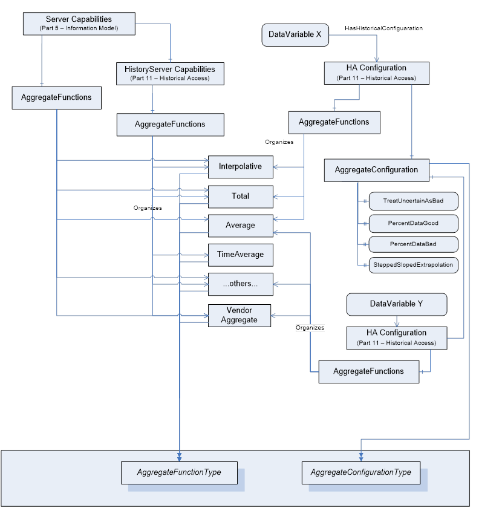
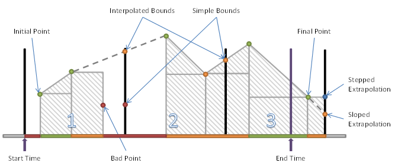
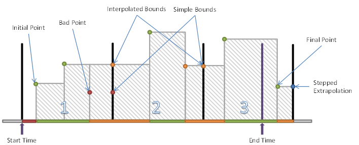
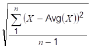
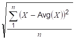

## 1 Scope  

This specification is part of the overall OPC Unified Architecture specification series and defines the information model associated with Aggregates.  

## 2 Normative references  

The following documents, in whole or in part, are normatively referenced in this document and are indispensable for its application. For dated references, only the edition cited applies. For undated references, the latest edition of the referenced document (including any amendments and errata) applies.  

OPC 10000-1 *, OPC Unified Architecture - Part 1: Overview and Concepts*  

[http://www.opcfoundation.org/UA/Part1/](http://www.opcfoundation.org/UA/Part1/)  

OPC 10000-3, *OPC Unified Architecture - Part 3: Address Space Model*  

[http://www.opcfoundation.org/UA/Part3/](http://www.opcfoundation.org/UA/Part3/)  

OPC 10000-4, *OPC Unified Architecture - Part 4: Services*  

[http://www.opcfoundation.org/UA/Part4/](http://www.opcfoundation.org/UA/Part4/)  

OPC 10000-5, *OPC Unified Architecture - Part 5: Information Model*  

[http://www.opcfoundation.org/UA/Part5/](http://www.opcfoundation.org/UA/Part5/)  

OPC 10000-8, *OPC Unified Architecture - Part 8: Data Access*  

[http://www.opcfoundation.org/UA/Part8/](http://www.opcfoundation.org/UA/Part8/)  

OPC 10000-11, *OPC Unified Architecture - Part 11: Historical Access*  

[http://www.opcfoundation.org/UA/Part11/](http://www.opcfoundation.org/UA/Part11/)  

## 3 Terms, definitions, and abbreviated terms  

### 3.1 Terms and definitions  

For the purposes of this document, the terms and definitions given in [OPC 10000-1](/§UAPart1) , [OPC 10000-3](/§UAPart3) , [OPC 10000-4](/§UAPart4) , and [OPC 10000-11](/§UAPart11) as well as the following apply.  

#### 3.1.1 ProcessingInterval  

timespan for which derived values are produced based on a specified *Aggregate*  

Note 1 to entry: The total time domain specified for ReadProcessed is divided by the *ProcessingInterval* . For example, performing a 10-minute Average over the time range 12:00 to 12:30 would result in a set of three intervals of *ProcessingInterval* length, with each interval having a start time of 12:00, 12:10 and 12:20 respectively. ** The rules used to determine the interval *Bounds* are discussed in [5.4.2.2](/§\_Ref255885268) .  

#### 3.1.2 Interpolated data  

data that is calculated from data samples **  

Note 1 to entry: Data samples may be historical data or buffered real time data. An *interpolated* value is calculated from the data points on either side of the requested timestamp.  

#### 3.1.3 EffectiveEndTime  

time immediately before *endTime*  

Note 1 to entry: All *Aggregate* calculations include the *startTime* but exclude the *endTime* . However, it is sometimes necessary to return an *Interpolated* End Bound as the value for an *Interval* with a timestamp that is in the *interval* . *Servers* are expected to use the time immediately before *endTime* where the time resolution of the *Server* determines the exact value (do not confuse this with hardware or operating system time resolution). For example, if the *endTime* is 12:01:00, the time resolution is 1 second, then the *EffectiveEndTime* is 12:00:59. See [5.4.2.4](/§\_Ref318145685) .  

If time is flowing backwards, *Servers* are expected to use the time immediately after *endTime* where the time resolution of the *Server* determines the exact value.  

#### 3.1.4 Extrapolated data  

data constructed from a discrete data set but is outside of the discrete data set **  

Note 1 to entry: It is similar to the process of interpolation, which constructs new points between known points, but its result is subject to greater uncertainty. *Extrapolated* data is used in cases where the requested time period falls farther into the future than the data available in the underlying system. See example in [Table 1](/§\_Ref233528264) .  

#### 3.1.5 SlopedInterpolation  

simple linear interpolation  

Note 1 to entry: Compare to curve fitting using linear polynomials. See example in [Table 1](/§\_Ref233528264) .  

#### 3.1.6 SteppedInterpolation  

Interpolation holding the last data point constant or interpolating the value based on a horizontal line fit **  

Note 1 to entry: Consider the following Table 1 of raw and *Interpolated* / *Extrapolated* values:  

Table 1 - Interpolation examples  

| **Timestamp** | **Raw Value** | **Sloped Interpolation** | **Stepped Interpolation** |
|---|---|---|---|
|12:00:00|10|||
|12:00:05||15|10|
|12:00:08||18|10|
|12:00:10|20|||
|12:00:15||25|20|
|12:00:20|30|||
  
||| **SlopedExtrapolation** | **SteppedExtrapolation** |
|---|---|---|---|
|12:00:25||35|30|
|12:00:27||37|30|
  

  

#### 3.1.7 bounding values  

values at the *startTime* and *endTime* needed for *Aggregates* to compute the result  

Note 1 to entry: If *Raw data* does not exist at the *startTime* and *endTime* a value shall be estimated. There are two ways to determine *Bounding Values* for an interval. One way (called *Interpolated Bounding Values* ) uses the first non-Bad data points found before and after the timestamp to estimate the bound. The other (called *Simple Bounding Values* ) uses the data points immediately before and after the boundary timestamps to estimate the bound even if these points are Bad. Subclauses [3.1.8](/§\_Ref364944818) and [3.1.9](/§\_Ref364944831) describe the two different approaches in more detail.  

In all cases the *TreatUncertainAsBad* (see [4.2.1.2](/§\_Ref246227644) ) flag is used to determine whether Uncertain values are Bad or non-Bad.  

If a Raw value was not found and a non-Bad bounding value exists the *Aggregate* Bits (see [5.3.3](/§\_Ref271578020) ) are set to 'Interpolated'.  

When calculating *bounding values* , the value portion of *Raw data* that has Bad status is set to null. This means the value portion is not used in any calculation and a null is returned if the raw value is returned. The status portion is determined by the rules specified by the bound or *Aggregate* .  

The *Interpolated Bounding Values* approach (see [3.1.8](/§\_Ref364944818) ) is the same as what is used in Classic OPC Historical Data Access (HDA) and is important for applications such as advanced process control where having useful values at all times is important. The *Simple Bounding Values* approach (see [3.1.9](/§\_Ref364944831) ) is new in this standard and is important for applications which shall produce regulatory reports and cannot use estimated values in place of Bad data.  

#### 3.1.8 interpolated bounding values  

*bounding values* determined by a calculation using the nearest Good value  

Note 1 to entry: *Interpolated Bounding Values* using *SlopedInterpolation* are calculated as follows:  

* if a non-Bad Raw value exists at the timestamp then it is the bounding value;  

* find the first non-Bad Raw value before the timestamp;  

* find the first non-Bad Raw value after the timestamp;  

* draw a line between before value and after value;  

* use point where the line crosses the timestamp as an estimate of the bounding value.  

The calculation can be expressed with the following formula:  

Vbound = (Tbound - Tbefore)x( Vafter - Vbefore)/( Tafter - Tbefore) + Vbefore  

where Vx is a value at 'x' and Tx is the timestamp associated with Vx.  

If no non-Bad values exist before the timestamp the *StatusCode* is Bad\_NoData. The *StatusCode* is *Uncertain\_DataSubNormal* if any Bad values exist between the before value and after value. If either the before value or the after value are Uncertain the *StatusCode* is *Uncertain\_DataSubNormal* . If the after value does not exist the before value shall be extrapolated using *SlopedExtrapolation* or *SteppedExtrapolation* .  

The period of time that is searched to discover the Good values before and after the timestamp is *Server* dependent, but if a Good value is not found within some reasonable time range then the *Server* will assume it does not exist. The *Server* as a minimum should search a time range which is at least the size of the ProcessingInterval.  

*Interpolated Bounding Values* using *SlopedExtrapolation* are calculated as follows:  

* find the first non-Bad Raw value before timestamp;  

* find the second non-Bad Raw value before timestamp;  

* draw a line between these two values;  

* extend the line to where it crosses the timestamp;  

* use the point where the line crosses the timestamp as an estimate of the bounding value.  

The formula is the same as the one used for *SlopedInterpolation* .  

The *StatusCode* is always *Uncertain\_DataSubNormal* . If only one non-Bad raw value can be found before the timestamp then *SteppedExtrapolation* is used to estimate the bounding value.  

*Interpolated Bounding Values* using *SteppedInterpolation* are calculated as follows:  

* if a non-Bad Raw value exists at the timestamp then it is the bounding value;  

* find the first non-Bad Raw value before timestamp;  

* use the value as an estimate of the bounding value.  

The *StatusCode* is *Uncertain\_DataSubNormal* if any Bad values exist between the before value and the timestamp. If no non-Bad *Raw data* exists before the timestamp then the *StatusCode* is Bad\_NoData. If the value before the timestamp is Uncertain the *StatusCode* is *Uncertain\_DataSubNormal* . The value after the timestamp is not needed when using *SteppedInterpolation* ; however, if the timestamp is after the end of the data then the bounding value is treated as extrapolated and the *StatusCode* is *Uncertain\_DataSubNormal* .  

*SteppedExtrapolation* is a term that describes *SteppedInterpolation* when a timestamp is after the last value in the history collection.  

#### 3.1.9 simple bounding values  

*bounding values* determined by a calculation using the nearest value **  

Note 1 to entry: *Simple Bounding Values* using *SlopedInterpolation* are calculated as follows:  

* if any Raw value exists at the timestamp then it is the bounding value;  

* find the first Raw value before timestamp;  

* find the first Raw value after timestamp;  

* if the value after the timestamp is Bad then the before value is the bounding value;  

* draw a line between before value and after value;  

* use point where the line crosses the timestamp as an estimate of the bounding value.  

The formula is the same as the one used for *SlopedInterpolation* in Clause [3.1.5](/§\_Ref364945019) .  

If a Raw value at the timestamp is Bad the *StatusCode* is Bad\_NoData. If the value before the timestamp is Bad the *StatusCode* is Bad\_NoData. If the value before the timestamp is Uncertain the *StatusCode* is *Uncertain\_DataSubNormal* . If the value after the timestamp is Bad or Uncertain the *StatusCode* is *Uncertain\_DataSubNormal* .  

*Simple Bounding Values* using *SteppedInterpolation* are calculated as follows:  

* if any Raw value exists at the timestamp then it is the bounding value;  

* find the first Raw value before timestamp;  

* if the value before timestamp is non-Bad then it is the bounding value.  

If a Raw value at the timestamp is Bad the *StatusCode* is Bad\_NoData. If the value before the timestamp is Bad the *StatusCode* is Bad\_NoData. If the value before the timestamp is Uncertain the *StatusCode* is *Uncertain\_DataSubNormal* .  

If either bounding time of an interval is beyond the last data point then the *Server* may use extrapolation or return an error.  If extrapolation is used by the server the type [ *SteppedExtrapolation* or *SloppedExtrapolation* ] of extrapolation is server specific.  

In some Historians, the last Raw value does not necessarily indicate the end of the data. Based on the Historian's knowledge of the data collection mechanism, i.e. frequency of data updates and latency, the Historian may extend the last value to a time known by the Historian to be covered. When calculating *Simple Bounding Values* the Historian will act as if there is another Raw value at this timestamp.  

In the same way, if the earliest time of an interval starts before the first data point in history and the latest time is after the first data point in history, then the interval will be treated as if the interval extends from the first data point in history to the latest time of the interval and the *StatusCode* of the interval will have the Partial bit set (see [5.3.3.2](/§\_Ref318145896) ).  

The period of time that is searched to discover the values before and after the timestamp is *Server* dependent, but if a value is not found within some reasonable time range then the *Server* will assume it does not exist. The *Server* as a minimum should search a time range which is at least the size of the ProcessingInterval.  

### 3.2 Abbreviated terms  

DA Data Access  

HA Historical Access (access to historical data or events)  

HDA Historical Data Access  

UA Unified Architecture  

## 4 Aggregate information model  

### 4.1 General  

[OPC 10000-3](/§UAPart3) and [OPC 10000-5](/§UAPart5) standards define the representation of *Aggregate* historical or buffered real time data in the OPC Unified Architecture. ** This includes the definition of *Aggregates* used in processed data retrieval and in historical retrieval. ** This definition includes both standard *Reference* types and *Object* types.  

### 4.2 Aggregate Objects  

#### 4.2.1 General  

##### 4.2.1.1 Overview  

OPC UA *Servers* can support several different functionalities and capabilities. ** The following standard *Objects* are used to expose these capabilities in a common fashion, and there are several standard defined concepts that can be extended by vendors. **  

##### 4.2.1.2 AggregateConfigurationType  

The *AggregateConfigurationType* defines the general characteristics of a *Node* that defines the *Aggregate* configuration of any *Variable* or *Property* . *AggregateConfiguration* *Object* represents the browse entry point for information on how the *Server* treats *Aggregate* specific functionality such as handling Uncertain data. It is formally defined in [Table 2](/§\_Ref233528274) .  

Table 2 - AggregateConfigurationType Definition  

| **Attribute** | **Value** |
|---|---|
|BrowseName|AggregateConfigurationType|
|IsAbstract|False|
  
| **References** | **NodeClass** | **BrowseName** | **DataType** | **TypeDefinition** | **ModellingRule** |
|---|---|---|---|---|---|
|Subtype of the *BaseObjectType* defined in [OPC 10000-5](/§UAPart5)|
|HasProperty|Variable|TreatUncertainAsBad|Boolean|PropertyType|Mandatory|
|HasProperty|Variable|PercentDataBad|Byte|PropertyType|Mandatory|
|HasProperty|Variable|PercentDataGood|Byte|PropertyType|Mandatory|
|HasProperty|Variable|UseSlopedExtrapolation|Boolean|PropertyType|Mandatory|
  
| **Conformance Units** |
|---|
|Aggregate Master Configuration|
  

  

The *TreatUncertainAsBad* *Variable* indicates how the *Server* treats data returned with a *StatusCode* severity *Uncertain* with respect to *Aggregate* calculations. ** A value of True indicates the *Server* considers the severity equivalent to Bad, a value of False indicates the *Server* considers the severity equivalent to Good, unless the *Aggregate* definition says otherwise. The default value is True. Note that the value is still treated as Uncertain when the *StatusCode* for the result is calculated.  

The *PercentDataBad Variable* indicates the minimum percentage of Bad data in a given interval required for the *StatusCode* *for the given interval for processed data request* to be set to Bad. ( *Uncertain* is treated as defined above.) ** Refer to [5.4.3](/§\_Ref143529325) for details on using this *Variable* when assigning *StatusCodes* . For details on which *Aggregates* use the *PercentDataBad Variable* , see the definition of each *Aggregate* . The default value is 100.  

The *PercentDataGood Variable* indicates the minimum percentage of *Good* data in a given interval required for the *StatusCode* *for the given interval for the processed data requests* to be set to Good. Refer to [5.4.3](/§\_Ref143529325) for details on using this *Variable* when assigning *StatusCodes* . For details on which *Aggregates* use the *PercentDataGood Variable* , see the definition of each *Aggregate* . The default value is 100.  

The following calculations are used to detemine the *StatusCode* which will be used to calculate the value of the aggregate.  Refer to 5.4.3 for details on using these *Variables* when assigning *StatusCodes* . The *PercentDataGood* and *PercentDataBad* shall follow the following relationship *PercentDataGood* ≥ (100 - *PercentDataBad* ). If they are equal the result of the *PercentDataGood* calculation is used. If the values entered for *PercentDataGood* and *PercentDataBad* do not result in a valid calculation (e.g. Bad = 80; Good = 0) the result will have a StatusCode of Bad\_AggregateInvalidInputs  The StatusCode Bad\_AggregateInvalidInputs  will be returned if the value of *PercentDataGood* or *PercentDataBad* exceed 100.  

The *UseSlopedExtrapolation Variable* indicates how the *Server* interpolates data when no boundary value exists (i.e. extrapolating into the future from the last known value). ** A value of False indicates that the *Server* will use a *SteppedExtrapolation* format, and hold the last known value constant. ** A value of True indicates the *Server* will project the value using *UseSlopedExtrapolation* mode. ** The default value is False. ** For *SimpleBounds* this value is ignored.  

#### 4.2.2 AggregateFunction Object  

##### 4.2.2.1 General  

This *Object* is used as the browse entry point for information about the *Aggregates* supported by a *Server* . The content of this *Object* is already defined by its type definition. All *Instances* of the *FolderType* use the standard *BrowseName* of 'AggregateFunctions'. The *HasComponent* *Reference* is used to relate a *ServerCapabilities* *Object* and/or any *HistoryServerCapabilitiesType* *Object* to an *AggregateFunction* *Object* .  AggregateFunctions is formally defined in [Table 3](/§\_Ref389485703) .  

Table 3 - Aggregate Functions Definition  

| **Attribute** | **Value** |
|---|---|
|BrowseName|AggregateFunctions|
  
| **References** | **Node**   **Class** | **BrowseName** | **DataType** | **TypeDefinition** | **ModellingRule** |
|---|---|---|---|---|---|
|HasTypeDefinition|Object Type|*FolderType*|Defined in [OPC 10000-5](/§UAPart5)|
  
| **Conformance Units** |
|---|
|Historical Access Aggregates|
  

  

Each *ServerCapabilities* and *HistoryServerCapabilitiesType* *Object* shall reference an *AggregateFunction* *Object* . In addition, each *HistoricalConfiguration* *Object* belonging to a *HistoricalDataNode* may reference an *AggregateFunction* *Object* using the *HasComponent* *Reference* .  

##### 4.2.2.2 AggregateFunctionType  

This *ObjectType* defines an *Aggregate* supported by a UA *Server* . This *Object* is formally defined in [Table 4](/§\_Ref134948705) .  

Table 4 - AggregateFunctionType Definition  

| **Attribute** | **Value** |
|---|---|
|BrowseName|AggregateFunctionType|
|IsAbstract|False|
  
| **References** | **Node**   **Class** | **BrowseName** | **DataType** | **TypeDefinition** | **Mod.Rule** |
|---|---|---|---|---|---|
|Subtype of the *BaseObjectType* defined in [OPC 10000-5](/§UAPart5)|
  
| **Conformance Units** |
|---|
|Historical Access Aggregates|
  

  

For the *AggregateFunctionType* , the *Description* *Attribute* (inherited from the *Base NodeClass* ) *,* is mandatory. ** The *Description* *Attribute* provides a localized description of the *Aggregate* .  

[Table 5](/§\_Ref112552315) specifies the *BrowseName* and *Description* *Attributes* for the standard *Aggregate Objects* . The description is the localized "en" text. For other locales it shall be translated.  

Table 5 - Standard AggregateType Nodes  

| **BrowseName** | **Description** |
|---|---|
  
|| **Interpolation Aggregate** |
|---|---|
|Interpolative|At the beginning of each interval, retrieve the calculated value from the data points on either side of the requested timestamp.|
|Average|Retrieve the average value of the data over the interval.|
|TimeAverage|Retrieve the time weighted average data over the interval using *Interpolated Bounding Values* .|
|TimeAverage2|Retrieve the time weighted average data over the interval using *Simple Bounding Values.*|
|Total|Retrieve the total (time integral) of the data over the interval using *Interpolated Bounding Values.*|
|Total2|Retrieve the total (time integral) of the data over the interval using *Simple Bounding Values* .|
|Minimum|Retrieve the minimum raw value in the interval with the timestamp of the start of the interval.|
|Maximum|Retrieve the maximum raw value in the interval with the timestamp of the start of the interval.|
|MinimumActualTime|Retrieve the minimum value in the interval and the timestamp of the minimum value.|
|MaximumActualTime|Retrieve the maximum value in the interval and the timestamp of the maximum value.|
|Range|Retrieve the difference between the minimum and maximum value over the interval.|
|Minimum2|Retrieve the minimum value in the interval including the *Simple Bounding Values.*|
|Maximum2|Retrieve the maximum value in the interval including the *Simple Bounding Values.*|
|MinimumActualTime2|Retrieve the minimum value with the actual timestamp including the *Simple Bounding Values.*|
|MaximumActualTime2|Retrieve the maximum value with the actual timestamp including the *Simple Bounding Values.*|
|Range2|Retrieve the difference between the Minimum2 and Maximum2 value over the interval.|
|Count|Retrieve the number of raw values over the interval.|
|DurationInStateZero|Retrieve the time a Boolean or numeric was in a zero state using *Simple Bounding Values* .|
|DurationInStateNonZero|Retrieve the time a Boolean or numeric was in a non-zero state using *Simple Bounding Values* .|
|NumberOfTransitions|Retrieve the number of changes between zero and non-zero that a Boolean or numeric value experienced in the interval.|
|Start|Retrieve the value at the beginning of the interval.|
|End|Retrieve the value at the end of the interval.|
|Delta|Retrieve the difference between the Start and End value in the interval.|
|StartBound|Retrieve the value at the beginning of the interval using *Simple Bounding Values* .|
|EndBound|Retrieve the value at the end of the interval using *Simple Bounding Values* .|
|DeltaBounds|Retrieve the difference between the StartBound and EndBound value in the interval using *Simple Bounding Values* .|
|DurationGood|Retrieve the total duration of time in the interval during which the data is Good.|
|DurationBad|Retrieve the total duration of time in the interval during which the data is Bad.|
|PercentGood|Retrieve the percentage of data (0 to 100) in the interval which has Good *StatusCode* .|
|PercentBad|Retrieve the percentage of data (0 to 100) in the interval which has Bad *StatusCode* .|
|WorstQuality|Retrieve the worst *StatusCode* of data in the interval.|
|WorstQuality2|Retrieve the worst *StatusCode* of data in the interval including the *Simple Bounding Values* .|
|AnnotationCount|Retrieve the number of *Annotations* in the interval (applies to Historical *Aggregates* only).|
|StandardDeviationSample|Retrieve the standard deviation for the interval for a sample of the population (n-1).|
|VarianceSample|Retrieve the variance for the interval as calculated by the StandardDeviationSample.|
|StandardDeviation Population|Retrieve the standard deviation for the interval for a complete population (n) which includes *Simple Bounding Values* .|
|VariancePopulation|Retrieve the variance for the interval as calculated by the StandardDeviationPopulation which includes *Simple Bounding Values* .|
  

  

### 4.3 MonitoredItem AggregateFilter  

#### 4.3.1 MonitoredItem AggregateFilter Defaults  

The default values used for *MonitoredItem* *Aggregates* are the same as those used for historical *Aggregates* . They are defined in [4.2.1.2](/§\_Ref246227644) . For additional information on *MonitoredItem* *AggregateFilter* see [OPC 10000-4](/§UAPart4) .  

#### 4.3.2 MonitoredItem Aggregates and Bounding Values  

When calculating *MonitoredItem* *Aggregates* that require the use of *Bounding Values* , the bounds may not be known. The calculation is done in the same manner as a historical read with the Partial Bit set. The historian may wait some amount of time (normally no more than one processing interval) before calculating the interval to allow for any latency in data collection and reduce the use of the Partial Bit.  

A historical read done after data collection and the data from the *MonitoredItem* over the same interval may not be the same.  

### 4.4 Exposing Supported Functions and Capabilities  

[Figure 1](/§\_Ref252869469) outlines a possible representation of *Aggregate* information in the *AddressSpace* . ** In this example, although the *Server* at the highest level may support *Aggregate* functionality for Interpolative, Total, Average, and others, *DataVariable* X only supports Interpolative, Total and Average, while *DataVariable* Y supports Average, a vendor defined *Aggregate* and other (unstated) *Aggregates.*  

  

Figure 1 - Representation of Aggregate Configuration information in the AddressSpace  

## 5 Aggregate specific usage of Services  

### 5.1 General  

[OPC 10000-4](/§UAPart4) specifies all Services needed for OPC UA *Aggregates* . In particular:  

* The Browse Service Set or Query Service Set to detect *Aggregates* and their configuration.  

* The HistoryRead Service of the Attribute Service Set to read the aggregated history of the HistoricalNode s.  

* The CreateMonitoredItems Service allows specifying a filter for each MonitoredItem to read aggregated data.  

### 5.2 Aggregate data handling  

#### 5.2.1 Overview  

The *HistoryRead* service defined in [OPC 10000-4](/§UAPart4) can perform several different functions. The *historyReadDetails* parameter is an *Extensible Parameter* that specifies which function to perform. ** The *ReadProcessedDetails* structure is used to read aggregated data for *HistoricalDataNodes* .  

The *CreateMonitoredItems* *Service* allows specifying a filter for each *MonitoredItem* . The *MonitoringFilter* is an extensible parameter whose structure depends on the type of item being monitored. The *AggregateFilter* structure is used to obtain aggregated data for a subscription.  

#### 5.2.2 ReadProcessedDetails structure overview  

ReadProcessedDetails structure is formally detailed in [OPC 10000-11](/§UAPart11) . [Table 6](/§\_Ref112552313) outlines the components of the ReadProcessedDetails structure for the purposes of discussion in this document.  

Table 6 - ReadProcessedDetails  

| **Name** | **Description** |
|---|---|
|ReadProcessedDetails|Specifies the details used to perform a "processed" history read.|
|startTime|Beginning of period to read.|
|endTime|End of period to read.|
|processingInterval|Interval between returned *Aggregate* values. **|
|aggregateType[]|The *NodeIds* of the *AggregateFunction* *Objects* . *AggregateFunction* *Objects* indicate the list of *Aggregates* to be used when retrieving processed history. **|
|aggregateConfiguration|*Aggregate* configuration structure.|
| useServerDefaults|If True the *Server* 's default values are used and any values specified for the other parameters are ignored.|
| treatUncertainAsBad|See [4.2.1.2](/§\_Ref246227644) .|
| percentDataBad|See [4.2.1.2](/§\_Ref246227644) .|
| percentDataGood|See [4.2.1.2](/§\_Ref246227644) .|
| useSlopedExtrapolation|See [4.2.1.2](/§\_Ref246227644) .|
  

  

#### 5.2.3 AggregateFilter structure overview  

The *AggregateFilter* defines the *Aggregate* function that should be used to calculate the values to be returned. ** The *AggregateFilte* r is formally defined in [OPC 10000-4](/§UAPart4) . [Table 7](/§\_Ref165187582) outlines the components of the *AggregateFilter* structure for the purposes of discussion in this document.  

Table 7 - AggregateFilter structure  

| **Name** | **Description** |
|---|---|
|AggregateFilter||
|startTime|Beginning of period to calculate the *Aggregate* the first time.|
|aggregateType|The *NodeIds* of the *AggregateFunction* *Objects* that indicates the list of *Aggregates* to be used when retrieving processed data.|
|processingInterval|The period to be used to compute the *Aggregate* .|
|aggregateConfiguration|This parameter allows *Clients* to override the *Aggregate* configuration settings supplied by an *AggregateConfiguration* *Object* on a per monitored item basis.|
| useServerDefaults|If True the *Server* 's default values are used and any values specified for the other parameters are ignored.|
| treatUncertainAsBad|See [4.2.1.2](/§\_Ref246227644) .|
| percentDataBad|See [4.2.1.2](/§\_Ref246227644) .|
| percentDataGood|See [4.2.1.2](/§\_Ref246227644) .|
| useSlopedExtrapolation|See [4.2.1.2](/§\_Ref246227644) .|
  

  

### 5.3 Aggregates StatusCodes  

#### 5.3.1 Overview  

Subclause 5.3 defines additional codes and rules that apply to the *StatusCode* when used for *Aggregates* .  

The general structure of the *StatusCode* is specified in [OPC 10000-4](/§UAPart4) . ** It includes a set of common operational result codes which also apply to *Aggregates.*  

#### 5.3.2 Operation level result codes  

In OPC UA *Aggregates* the *StatusCode* is used to indicate the conditions under which a value or *Event* was stored, and thereby can be used as an indicator of its usability. Due to the nature of aggregated data, additional information beyond the basic quality and call result code needs to be conveyed to the client. ** For example, whether or not the result was *Interpolated* , were all data inputs to a calculation of Good quality, etc. **  

In the following, [Table 8](/§\_Ref128988066) contains codes with Bad severity indicating a failure; [Table 9](/§\_Ref128988101) contains codes with *Uncertain* severity indicating that the value has been retrieved under sub-normal conditions. It is important to note, that these are the codes that are specific for OPC UA *Aggregates* and that they supplement the codes that apply to all types of data; they are therefore defined in [OPC 10000-4](/§UAPart4) , [OPC 10000-8](/§UAPart8) and [OPC 10000-11](/§UAPart11) .  

Table 8 - Bad operation level result codes  

| **Symbolic Id** | **Description** |
|---|---|
|Bad\_AggregateListMismatch|The requested number of *Aggregates* does not match the requested number of *NodeIds* . ** When multiple *Aggregates* are requested, a corresponding *NodeId* is required for each *AggregateFunction* .|
|Bad\_AggregateNotSupported|The requested *AggregateFunction* is not supported by the *Server* for the specified *Node* .|
|Bad\_AggregateInvalidInputs|The *Aggregate* value could not be derived due to invalid data inputs, errors attempting to perform data conversions or similar situations.|
  

  

Table 9 - Uncertain operation level result codes  

| **Symbolic Id** | **Description** |
|---|---|
|Uncertain\_DataSubNormal|The value is derived from raw values and has less than the required number of Good values.|
  

  

#### 5.3.3 Aggregate Information Bits  

##### 5.3.3.1 General  

These bits are set only when obtaining *Aggregate* data. They indicate where the data value came from and provide information that affects how the client uses the data value. [Table 10](/§\_Ref128288255) lists the bit settings which indicate the data location (i.e. is the value stored in the underlying data repository, or is the value the result of data aggregation). ** These bits are mutually exclusive.  

Table 10 - Data location  

| **StatusCode** | **Description** |
|---|---|
|Raw|A *Raw data* value.|
|Calculated|A data value which was calculated.|
|Interpolated|A data value which was interpolated.|
  

  

In the case where *Interpolated* data is requested, and there is an actual raw value for that timestamp, the *Server* should set the 'Raw' bit in the *StatusCode* of that value.  

[Table 11](/§\_Ref128288381) lists the bit settings which indicate additional important information about the data values returned.  

Table 11 - Additional information  

| **StatusCode** | **Description** |
|---|---|
|Partial|A calculated value that is not based on a complete interval. See [5.3.3.2](/§\_Ref318146097) .|
|Extra Data|If a *Server* chooses to set this bit, it indicates that a *Raw data* value supersedes other data at the same timestamp.|
|Multiple Values|Multiple values match the *Aggregate* criteria (i.e. multiple minimum values or multiple worst quality at different timestamps within the same *ProcessingInterval* ).|
  

  

The conditions under which these information bits are set depend on how the data has been requested and state of the underlying data repository. **  

##### 5.3.3.2 Partial Information bit  

*Partial* bit is used to indicate that the interval is not a complete interval and that a client may receive a different value for the *Aggregate* if it re-fetches the interval with the same parameters.  

The *Partial* bit will be set in the following examples:  

Assume for these examples the first stored point in the collection is 1:01:10 and the last stored point in the collection is 1:31:20. Older data may exist but is unavailable or offline at the time of the query. Newer data may be available but has not yet been stored in the history collection.  

* The interval that overlaps the beginning of the history collection. If the start time is 1:00:00 and end time is 1:10:00 and the interval is 2 minutes then the first interval would have a *Partial* bit set since it has no data for the first 70 seconds. The *Partial* bit will always be set for the first interval with data if the start time of the interval is before the first data value of the data collection. For intervals prior to the interval with a *Partial* bit, these intervals will be flagged Bad\_NoData.  

* The interval that overlaps the latest point stored in the history collection. The last point in the collection is 1:31:20 and the historian was not shut down and is still running. A 6-minute interval that started at 1:30:00 would have the *Partial* bit set because the historian is expecting data, but just has not yet received anything. The *Partial* bit will always be set for the last interval with data if the end time of the interval is after the last data value stored in the data collection. Intervals entirely after the interval with a *Partial* bit will be flagged Bad\_NoData. For those *Aggregates* with extrapolation, the *Partial* bit may be set. See the *Aggregate* specific characteristics for more details.  

* If the start/end time does not result in an even interval and there is additional data beyond the end time then the last interval will have a *Partial* bit. If the start time is 1:00:00 and end time is 1:20:00 and the interval is 6 minutes then the last interval is just 2 minutes long and will have the *Partial* bit set. Extrapolation does not apply in this case.  

The *Partial* bit may be set with the *Calculated* bit when the *Calculated* bit is always set for the specific *Aggregate* .  

### 5.4 Aggregate details  

#### 5.4.1 General  

The purpose of subclause 5.4  is to detail the requirements and behaviour for OPC UA *Servers* supporting *Aggregates* . The intent is to standardize the *Aggregates* so users can reliably predict the results of an *Aggregate* computation and understand its meaning. If users require custom functionality in the *Aggregates* , those *Aggregates* should be written as custom vendor defined *Aggregates* .  

The standard *Aggregates* shall be as consistent as possible, meaning that each *Aggregate's* behaviour shall be similar to every other *Aggregate's* behaviour where input parameters, *Raw data* , and boundary conditions are similar. Where possible, the *Aggregates* should deal with input and preconditions in a similar manner.  

Subclause 5.4 is divided up into two parts. Subclause 5.4.2 deals with *Aggregate* characteristics and behaviour that are common to all *Aggregates* . Subclause 5.4.3 deals with the characteristics and behaviour of *Aggregates* that are aggregate-specific.  

#### 5.4.2 Common characteristics  

##### 5.4.2.1 Description  

Subclause 5.4.2 deals with *Aggregate* characteristics and behaviour that are common to all *Aggregates.*  

##### 5.4.2.2 Generating intervals  

To read Historical *Aggregates* , OPC clients shall specify three time parameters:  

* startTime (Start)  

* endTime (End)  

* *ProcessingInterval* (Int)  

The OPC *Server* shall use these three parameters to generate a sequence of time intervals and then calculate an *Aggregate* for each interval. ** Subclause 5.4.2.2 specifies, given the three parameters, which time intervals are generated. ** [Table 12](/§\_Ref144879490) provides information on the intervals for each Start and End time combination. ** The range is defined to be |End - Start|.  

All *Aggregates* return a timestamp of the start of the ** interval unless otherwise noted for the particular *Aggregate* .  

Table 12 - History Aggregate interval information  

| **Start/End Time** | **Interval** | **Resulting intervals** |
|---|---|---|
|*Start* = *End*|*Int* = Anything|No intervals. ** Returns a Bad\_InvalidArgument *StatusCode* , regardless of whether there is data at the specified time or not.|
|*Start* \< *End*|*Int* = 0 or *Int* ≥ *Range*|One interval, starting at *Start* and ending at *End* . ** Includes *Start* , excludes *End* , i.e., *[Start, End).*|
|*Start* \< *End*|*Int ≠* 0 *, Int* \< *Range, Int* divides *Range* evenly.|*Range/Int* intervals. Intervals are *[Start, Start + Int), [Start + Int, Start + 2* x *Int),..., [End - Int, End).*|
|*Start* \< *End*|*Int ≠* 0 *, Int* \< *Range, Int* does not divide *Range* evenly.|*Range/Int* intervals. Intervals are *[Start, Start + Int), [Start + Int, Start + 2* x *Int),..., [Start + (* *Range/Int* *\- 1)* x *Int, Start +* *Range/Int* x *Int), [Start +* *Range/Int* x *Int, End).* In other words, the last interval contains the "rest" that remains in the range after taking away *Range/Int* intervals of size *Int* .|
|*Start* \> *End*|*Int* = 0 or *Int* ≥ *Range*|One interval, starting at *Start* and ending at *End* . ** Includes *Start* , excludes *End* , i.e.,[ *Start* , *End* ). ** a|
|*Start* \> *End*|*Int ≠* 0 *, Int* \< *Range, Int* divides *Range* evenly.|*Range/Int* intervals. Intervals are *[Start, Start- Int), [Start- Int, Start - 2* x *Int),..., [End + Int, End).* a|
|*Start* \> *End*|*Int ≠* 0 *, Int* \< *Range, Int* does not divide *Range* evenly.|*Range/Int* intervals. Intervals are *[Start, Start - Int), [Start -Int,Start - 2* x *Int),...,* *[Start - (* *Range/Int* *\- 1)* x *Int , Start -* *Range/Int* x *Int), [Start -* *Range/Int* x *Int , End).* In other words, the last interval contains the "rest" that remains in the range after taking away *Range/Int* intervals of size *Int* starting at Start. a|
|a In this case time is running backwards on the intervals.|
  

  

The calculation of all *Aggregates* when time flows backwards is the same as when time flows forwards with the exception that the 'early time' is excluded from the interval and the 'late time' is included. In most cases this means the value will be the same except the timestamps are shifted by one *ProcessingInterval* . E.g. when time flows forward the value at T = n is the same as the value at T = n + 1 when time flows backward.  

Note that when determining *Aggregates* with *MonitoredItem* , the interval is simply the *ProcessingInterval* parameter as defined in the *AggregateFilter* structure. ** See [OPC 10000-4](/§UAPart4) for more details.  

##### 5.4.2.3 Data types  

[Table 13](/§\_Ref270541636) outlines the valid *DataType* for each *Aggregate* . ** Some *Aggregates* are intended for numeric data types - i.e. integers or real/floating point numbers. Dates, strings, arrays, etc. are not supported. ** Other *Aggregates* are intended for digital data types - i.e. Boolean or enumerations. ** In addition some *Aggregates* may return results with a different DataType than those used to calculate the *Aggregate* . ** [Table 13](/§\_Ref270541636) also outlines the data type returned for each *Aggregate* .  

Table 13 - Standard History Aggregate Data Type information  

| **BrowseName** | **Valid Data Type** | **Result ** Data Type** |
|---|---|---|
  
|| **Interpolation Aggregate** ||
|---|---|---|
|Interpolative|Numeric|Raw Data Type|
  
|| **Data Averaging Aggregates** ||
|---|---|---|
|Average|Numeric|Double|
|TimeAverage|Numeric|Double|
|TimeAverage2|Numeric|Double|
|Total|Numeric|Double|
|Total2|Numeric|Double|
  
|| **Data Variation Aggregates** ||
|---|---|---|
|Minimum|Numeric|Raw data type|
|Maximum|Numeric|Raw data type|
|MinimumActualTime|Numeric|Raw data type|
|MaximumActualTime|Numeric|Raw data type|
|Range|Numeric|Raw data type|
|Minimum2|Numeric|Raw data type|
|Maximum2|Numeric|Raw data type|
|MinimumActualTime2|Numeric|Raw data type|
|MaximumActualTime2|Numeric|Raw data type|
|Range2|Numeric|Raw data type|
  
|| **Counting Aggregates** ||
|---|---|---|
|AnnotationCount|All|Integer|
|Count|All|Integer|
|DurationInStateZero|Numeric or Boolean|Duration|
|DurationInStateNonZero|Numeric or Boolean|Duration|
|NumberOfTransitions|Numeric or Boolean|Integer|
  
|| **Time Aggregates** ||
|---|---|---|
|Start|All|Raw data type|
|End|All|Raw data type|
|Delta|Numeric|Raw data type|
|StartBound|All|Raw data type|
|EndBound|All|Raw data type|
|DeltaBounds|Numeric|Raw data type|
  
|| **Data Quality Aggregates** ||
|---|---|---|
|DurationGood|All|Duration|
|DurationBad|All|Duration|
|PercentGood|All|Double|
|PercentBad|All|Double|
|WorstQuality|All|*StatusCode*|
|WorstQuality2|All|*StatusCode*|
  
|| **Statistical Aggregates** ||
|---|---|---|
|StandardDeviationSample|Numeric|Double|
|VarianceSample|Numeric|Double|
|StandardDeviationPopulation|Numeric|Double|
|VariancePopulation|Numeric|Double|
  

##### 5.4.2.4 Time calculation issues  

The following issues may come up when calculating *Aggregates* that include time as part of the calculation.  

* All *Aggregate* calculations include the *startTime* but exclude the *endTime* . However, it is sometimes necessary to return an *Interpolated* End Bound as the value for an *Interval* with a timestamp that is in the *Interval* . *Servers* are expected to use the time immediately before *endTime* where the time resolution of the *Server* determines the exact value (do not confuse this with hardware or operating system time resolution). For example, if the *endTime* is 12:01:00, the time resolution is 1 second, then the *EffectiveEndTime* is 12:00:59. If the *Server* time resolution is 1 millisecond the *EffectiveEndTime* is 12:00:59.999.  

If time is flowing backwards, *Servers* are expected to use the time immediately after *endTime* where the time resolution of the *Server* determines the exact value.  

* If there is one data point in the *Interval* and it falls on the *StartTime* the time duration used in calculations is one unit of the time resolution of the *Server* .  

#### 5.4.3 Specific aggregated data handling  

##### 5.4.3.1 General  

When accessing aggregated data using the *HistoryRead* or the *CreateMonitoredItems* *Service* , the following rules are used to handle specific *Aggregate* use cases.  

If *ProcessingInterva* l is 0, the *Server* shall create one *Aggregate* value for the entire time range. ** This allows *Aggregates* over large periods of time. ** A value with a timestamp equal to *endTime* will be excluded from that *Aggregate* , just as it would be excluded from an interval with that ending time. If the *ProcessingInterval* of 0 is passed in the *MonitoredItemFilter* it shall be revised to a suitable non-zero value *.*  

The timestamp returned with the *Aggregate* shall be the time at the beginning of the interval, except where the *Aggregate* specifies a different timestamp. **  

If a requested timestamp is set to anything but the source timestamp the operation shall return the *Bad\_TimestampToReturnInvalid StatusCode* . If a requested timestamp is not supported in any other way for a *HistoricalDataNode* , the operation shall return the *Bad\_TimestampNotSupported StatusCode* . For *MonitoredItem* the *Server* shall not return past data if a requested timestamp is not supported by the history collection.  

##### 5.4.3.2 StatusCode calculation  

###### 5.4.3.2.1 General  

*StatusCodes* for an *Aggregate* value shall take into account the values used to calculate them. In addition, the configuration parameters *PercentDataGood* and *PercentDataBad* allow the client to control how this calculation is done if supported by the *Server* .  

If an *Aggregate* operates on raw values (e.g. Average) the calculation is done by counting values. If an *Aggregate* operates on raw values but can also return a *Bounding Value* then the *Bounding Values* are included in the count when computing the *StatusCode* . If an *Aggregate* does any sort of a time weighted calculation (e.g. TimeAverage or TimeAverage2) then the *StatusCode* calculation shall also be time weighted.  

For purposes of calculating time weighted *StatusCodes* each interval shall be divided into regions of Good or Bad data. Creating these regions requires that the *bounding values* be calculated for each interval and the type of bounding value depends on the *Aggregate* .  

Use the following to determine the *StatusCode* of a given aggregate. If *TreatUncertainAsBad* = False then Uncertain regions are included with the Good regions when calculating the above ratios, if the *TreatUncertainAsBad* = True then the Uncertain regions are included as Bad regions. If no Bad regions are in the interval then the *StatusCode* for the interval is Good. For any intervals containing regions where the *StatusCodes* are Bad *,* the total duration of all *Bad* regions is calculated and divided by the width of the interval. The resulting ratio is multiplied by 100 and compared to the *PercentDataBad* parameter. The *StatusCode* for the interval is Bad if the ratio is greater than or equal to the *PercentDataBad* parameter. For any interval which is not Bad, the total duration of all Good regions is then calculated and divided by the width of the interval. The resulting ratio is multiplied by 100 and compared to the *PercentDataGood* parameter. The *StatusCode* for the interval is Good if the ratio is greater than or equal to the *PercentDataGood* parameter. If for an interval neither ratio applies then that interval is *Uncertain\_DataSubNormal* .  

If there is no data in the interval and the interval is inside the range [start of data, end of data] and the *Aggregate* return data type is raw data type then the *StatusCodes* for the interval will be Bad\_NoData unless an alternate status code is defined for a specific *Aggregate* .  

The width of an interval is the *ProcessingInterval* unless it is a partial interval (i.e. has the Partial bit set). In these cases, the width is the time used when calculating the partial interval.  

Subclauses [5.4.3.2.2](/§\_Ref389486121) and [5.4.3.2.3](/§\_Ref389486138) include diagrams that illustrate a request and data series. The colour of the time axis indicates the status for different regions. Red indicates Bad, green indicates Good and orange indicates Uncertain. These examples assume *TreatUncertainAsBad* = False.  

###### 5.4.3.2.2 Sloped Interpolation and Simple Bounding Values  

Figure 2 illustrates a data series for *Variable* with Stepped = False and an *Aggregate* that uses *Simple Bounding Values* . The request being processed has a Start Time that falls before the first point in the series and an End Time that does not fall on an integer multiple of the *ProcessingInterval* .  

  

Figure 2 - Variable with Stepped = False and Simple Bounding Values  

The first interval has four regions:  

* the period before the first data point;  

* the period between the first and second where *SlopedInterpolation* can be used;  

* the period between the second and third point where *SteppedInterpolation* is used;  

* the period after the Bad point where no data exists.  

A region is Uncertain if a region ends in a Bad or Uncertain value and *SlopedInterpolation* is used. The end point has no effect on the region if *SteppedInterpolation* is used.  

The second interval has three regions:  

* the period before the first Good data point where no data exists;  

* the period between the first and second where *SlopedInterpolation* can be used;  

* the period between the second point and the bound calculated with *SlopedInterpolation* .  

The third interval has three regions:  

* the period between the simple bound and the first data point;  

* the period between the first point and an interpolated point that falls on the end time;  

* the period after the end time which is ignored.  

This is a partial region and the data after the end time is not used, however, if sloped interpolation is used and the point after the endpoint is Uncertain then the region between the last point and the end time will be Uncertain.  

###### 5.4.3.2.3 Stepped Interpolation and Interpolated Bounding Values  

Figure 3 illustrates a data series for *Variable* with Stepped = True and an *Aggregate* that uses *Interpolated Bounding Values* . The request being processed has a Start Time that falls before the first point in the series and an End Time that does not fall on an integer multiple of the *ProcessingInterval* .  

  

Figure 3 - Variable with Stepped = True and Interpolated Bounding Values  

The first interval has three regions:  

* the period before the first data point;  

* the period between the first and second where *SteppedInterpolation* is used;  

* the period between the second and the interpolated end bound.  

The Bad point is ignored because of the interpolated end bound but this does create Uncertain regions. If *SlopedInterpolation* was used the Uncertain region would start at the second point. In this case, it only starts when the first Bad value is ignored.  

The second interval has three regions:  

* the period between the start bound and the first data point;  

* the period between the first and second where *SteppedInterpolation* is used;  

* the period between the second and the interpolated end bound.  

The third interval has three regions:  

* the period between the interpolated bound and the first data point;  

* the period between the first point and an interpolated point that falls on the end time;  

* the period after the end time which is ignored.  

This is a partial region and the data after the end time is not used.  

##### 5.4.3.3 Description  

Subclause [5.4.3.3](/§\_Ref389486359) deals with *Aggregate* specific characteristics and behaviour that is specific to a particular *Aggregate* .  

Each subclause has a table which formally expresses the *Aggregate* behaviour (including any exceptions). The meaning of each of the fields in the table is described in [Table 14](/§\_Ref282496834) .  

Description of [Table 14](/§\_Ref282496834) :  

* The first column is the common name for the item.  

* The second column includes a description of the item and a list of the valid selections with for the item including a description of each selection.  

* The second part of the table describes how the status associated with the *Aggregate* calculation is computed.  

* The last part of the table lists what behaviour is expected from the *Aggregate* for some common special cases. These behaviours require text descriptions so there is no list of valid selections.  

Table 14 - Aggregate table description  

| **Aggregate Characteristics** |
|---|
|Type|The type of *Aggregate* . \<Interpolated | Calculated | Raw\>  Interpolated: See definition for Interpolated. Calculated: Computed from defined calculation. Raw: Selects a raw value from within an interval.|
|Data Type|The data type of the result. \<Double | Int32 | Same as Source\>|
|Use Bounds|How the *Aggregate* deals with bounds. \<None | Interpolated | Simple\>  None: Bounds do not apply to the *Aggregate* . Interpolated: Uses Interpolated Bounds. Simple: Uses Simple Bounds.|
|Timestamp|What is the time stamp of the resulting *Aggregate* value: \< *startTime* | *endTime* | Raw\>  *startTime* : The time at the start of the interval. *endTime* :  The time at the end of the interval. Raw: The time associated with a value in the interval.|
||
  
| **StatusCode Calculations** |
|---|
|Calculation Method|How the status code is calculated: \<PercentValues | PercentTime | Custom\>  PercentValues: Based on percentage of value counts. PercentTime: Based on percentage of time interval. Custom: Specific to the *Aggregate* (description included).|
|Partial |For partial intervals does the *Aggregate* set this bit \<Set Sometimes | Not Set\>  It may also describe any special cases for setting this bit|
|Calculated|Describes the usage of the calculated bit. \<Set Always | Set Sometimes | Not Set\>  Set Always: The bit is always set. Set Sometimes: The bit is sometimes set (describes when). Not Set: The bit is never set.|
|Interpolated|Describes the usage of the interpolated bit. \<Set Always | Set Sometimes | Not Set\>  Set Always: The bit is always set. Set Sometimes: The bit is sometimes set (describes when). Not Set: The bit is never set.|
|Raw|Describes the usage of the Raw bit. \<Set Always | Set Sometimes | Not Set\>  Set Always: The bit is always set. Set Sometimes: The bit is sometimes set (describes when). Not Set: The bit is never set.|
|Multi Value|Describes the usage of the multi value bit. \<Set Sometimes | Not Set\>  Set Sometimes: The bit is used (see [OPC 10000-11](/§UAPart11) ). Not Set: The bit is never set.|
||
  
| **StatusCode Common Special Cases** |
|---|
|Before Start of Data|If the entire interval is before the start of data.|
|After End of Data|If the entire interval is after the end of data (as determined by the Historian).|
|Start Bound  Not Found|If the starting bound is not found for the earliest interval and it is not partial, then what, if any, special processing should be done.|
|End Bound Not Found|If the ending bound is not found for the latest interval and it is not partial, then what, if any, special processing should be done.|
|Bound Bad|If the Bounding value is Bad, then what, if any, special processing should be done.|
|Bound Uncertain|If the Bounding value is uncertain, then what, if any, special processing should be done.|
  

  

##### 5.4.3.4 Interpolative  

The Interpolative *Aggregate* defined in [Table 15](/§\_Ref389486450) returns the *Interpolated Bounding Value* (see [3.1.8](/§\_Ref364944818) ) for the *startTime* of each interval.  

When searching for Good values before or after the bounding value, the time period searched is *Server* specific, but the *Server* should search a time range which is at least the size of the *ProcessingInterval* .  

Table 15 - Interpolative Aggregate summary  

| **Interpolated Aggregate Characteristics** |
|---|
|Type|Interpolated|
|Data Type|Same as Source|
|Use Bounds|Interpolated|
|Timestamp|StartTime|
||
  
| **StatusCode Calculations** |
|---|
|Calculation Method|Custom Good if no Bad values skipped and Good values are used, Uncertain if Bad values skipped or if Uncertain values are used. If no starting value then *Bad* \_ *NoData* . See description of Interpolated Bounds (see [3.1.8](/§\_Ref364944818) ) for more details|
|Partial bit|Not Set|
|Calculated bit|Not Set|
|Interpolated bit|Set Sometimes Always set except for when the Raw bit is set|
|Raw bit|Set Sometimes If a value exists with the exact time of interval Start|
|Multi Value bit|Not Set|
||
  
| **StatusCode Common Special Cases** |
|---|
|Before Start of Data|Return *Bad\_NoData*|
|After End of Data|Return extrapolated value (see [3.1.8](/§\_Ref364944818) ) (sloped or stepped according to settings) Status code is *Uncertain\_DataSubNormal* .|
|Start Bound  Not Found|*Bad\_NoData* .|
|End Bound  Not Found|*See "After End of Data"*|
|Bound Bad|Does not return a Bad bound except as noted above|
|Bound Uncertain|Returned *Uncertain\_DataSubNormal* if any Bad value(s) was/were skipped to calculate the bounding value.|
  

  

##### 5.4.3.5 Average  

The Average *Aggregate* defined in [Table 16](/§\_Ref389486477) adds up the values of all Good *Raw data* for each interval, and divides the sum by the number of Good values. If any non-Good values are ignored in the computation, the *Aggregate* *StatusCode* will be determined using the *StatusCode* Calculation (see [5.3](/§\_Ref364945480) ). This *Aggregate* is not time based so the PercentGood/PercentBad applies to the number of values in the interval.  

Table 16 - Average Aggregate summary  

| **Average Aggregate Characteristics** |
|---|
|Type|Calculated|
|Data Type|Double|
|Use Bounds|None|
|Timestamp|StartTime|
|||
  
| **StatusCode Calculations** |
|---|
|Calculation Method|PercentValues|
|Partial |Not Set|
|Calculated|Set Always|
|Interpolated|Not Set|
|Raw|Not Set|
|Multi Value|Not Set|
||
  
| **StatusCode Common Special Cases** |
|---|
|Before Start of Data|Bad\_NoData|
|After End of Data|Bad\_NoData|
|No Start Bound|Bounds not used|
|No End Bound|Bounds not used|
|Bound Bad|Bounds not used|
|Bound Uncertain|Bounds not used|
  

  

##### 5.4.3.6 TimeAverage  

The TimeAverage *Aggregate* defined in [Table 17](/§\_Ref389486524) uses *Interpolated Bounding Values* (see [3.1.8](/§\_Ref364944818) ) ** to find the value of a point at the beginning and end of an interval. Starting at the starting bounding value a straight line is drawn between each value in the *interval* ending at the ending bounding value (see examples for illustrations). The area under the lines is divided by the length of the *ProcessingInterval* to yield the average. Note that this calculation always uses a sloped line between points; TimeAverage2 uses a stepped or sloped line depending on the value of the Stepped *Property* for the *Variable* .  

If one or more Bad Values exist in the interval then they are omitted from the calculation and the *StatusCode* is set to *Uncertain\_DataSubNormal* . Sloped lines are drawn between the Good values when calculating the area.  

The time resolution used in this calculation is *Server* specific.  

Table 17 - TimeAverage Aggregate summary  

| **TimeAverage Aggregate Characteristics** |
|---|
|Type|Calculated|
|Data Type|Double|
|Use Bounds|Interpolated|
|Timestamp|StartTime|
||
  
| **StatusCode Calculations** |
|---|
|Calculation Method|Custom Good if no Bad values skipped and Good values are used, Uncertain if Bad values are skipped or if Uncertain values are used|
|Partial |Set Sometimes If an interval is not a complete interval|
|Calculated|Set Always|
|Interpolated|Not Set|
|Raw|Not Set|
|Multi Value|Not Set|
||
  
| **StatusCode Common Special Cases** |
|---|
|Before Start of Data|Bad\_NoData|
|After End of Data|Value extrapolated, Uncertain status|
|No Start Bound|Calculate Partial Interval|
|No End Bound|Extrapolate data, Uncertain status|
|Bound Bad|NA|
|Bound Uncertain|NA|
  

  

##### 5.4.3.7 TimeAverage2  

The TimeAverage2 *Aggregate* defined in [Table 18](/§\_Ref389486697) uses *Simple Bounding Values* (see [3.1.9](/§\_Ref364944831) ) to find the value of a point at the beginning and end of an interval. Starting at the starting bounding value a straight line is drawn between each value in the interval ending at the ending bounding value (see examples for illustrations). ** The area under the lines is divided by the length of the *ProcessingInterval* to yield the average. Note that this calculation uses a stepped or sloped line depending on what the value of the Stepped *Property* for the *Variable* ; TimeAverage always uses a sloped line between points.  

The time resolution used in this calculation is *Server* specific.  

If any non-Good data exists in the interval, this data is omitted from the calculation and the time interval is reduced by the duration of the non-Good data; i.e. if a value was Bad for 1 minute in a 5-minute interval then the TimeAverage2 would be the area under the 4-minute period of Good values divided by 4 minutes. If a sub-interval ends at a Bad value then only the Good starting value is used to calculate the area of sub-interval preceding the Bad value.  

The *Aggregate* *StatusCode* will be determined using the *StatusCode* Calculation (see [5.3](/§\_Ref364945198) ).  

Table 18 - TimeAverage2 Aggregate summary  

| **TimeAverage2 Aggregate Characteristics** |
|---|
|Type|Calculated|
|Data Type|Double|
|Use Bounds|Simple|
|Timestamp|StartTime|
||
  
| **StatusCode Calculations** |
|---|
|Calculation Method|PercentTime|
|Partial |Set Sometimes If an interval is not a complete interval|
|Calculated|Set Always|
|Interpolated|Not Set|
|Raw|Not Set|
|Multi Value|Not Set|
||
  
| **StatusCode Common Special Cases** |
|---|
|Before Start of Data|Bad\_NoData|
|After End of Data|Bad\_NoData|
|No Start Bound|Bound is Bad\_NoData and treated as any other Bad value in the interval|
|No End Bound|Bound is Bad\_NoData and treated as any other Bad value in the interval|
|Bound Bad|Treated as any other Bad value in the interval|
|Bound Uncertain|Treated as any other Uncertain value in the interval|
  

  

##### 5.4.3.8 Total  

The Total *Aggregate* defined in [Table 19](/§\_Ref389486720) performs the following calculation for each interval:  

Total = TimeAverage x *ProcessingInterval* (seconds)  

where: TimeAverage is the result from the TimeAverage *Aggregate* , using the *ProcessingInterval* supplied to the Total call.  

The resulting units would be normalized to seconds, i.e. [TimeAverage Units] x seconds.  

The *Aggregate* *StatusCode* will be determined using the *StatusCode* Calculation (see [5.3](/§\_Ref364945209) ).  

Note that this calculation always uses a *SlopedInterpolation* between points; Total2 uses a *Stepped Attribute* or *SlopedInterpolation* depending on the value of the *Stepped Attribute* for the *Variable* .  

Table 19 - Total Aggregate summary  

| **Total Aggregate Characteristics** |
|---|
|Type|Calculated|
|Data Type|Double|
|Use Bounds|Interpolated|
|Timestamp|StartTime|
||
  
| **StatusCode Calculations** |
|---|
|Calculation Method|Custom Good if no Bad values are skipped and Good values are used, Uncertain if Bad values are skipped or if Uncertain values are used|
|Partial |Set Sometimes If an interval is not a complete interval|
|Calculated|Set Always|
|Interpolated|Not Set|
|Raw|Not Set|
|Multi Value|Not Set|
||
  
| **StatusCode Common Special Cases** |
|---|
|Before Start of Data|Bad\_NoData|
|After End of Data|Value extrapolated, Uncertain status|
|No Start Bound|Calculate Partial Interval|
|No End Bound|Extrapolate data, Uncertain status|
|Bound Bad|NA|
|Bound Uncertain|NA|
  

  

##### 5.4.3.9 Total2  

The Total2 *Aggregate* defined in [Table 20](/§\_Ref389486742) performs the following calculation for each interval:  

Total2 = TimeAverage2 x *ProcessingInterval* of Good data (seconds)  

where TimeAverage2 **** *Aggregate* , using the *ProcessingInterval* supplied to the Total2 call.  

The interval of Good data is the sum of all sub-intervals where non-Bad data exists; i.e. if a value was Bad for 1 minute in a 5-minute interval then the interval of Good data would be the 4-minute period.  

The resulting units would be normalized to seconds, i.e. [TimeAverage2 ****   

The *Aggregate* *StatusCode* will be determined using the *StatusCode* Calculation (see [5.3](/§\_Ref364945219) ).  

Table 20 - Total2 Aggregate summary  

| **Total2 Aggregate Characteristics** |
|---|
|Type|Calculated|
|Data Type|Double|
|Use Bounds|Simple|
|Timestamp|StartTime|
||
  
| **StatusCode Calculations** |
|---|
|Calculation Method|PercentTime|
|Partial |Set Sometimes If an interval is not a complete interval|
|Calculated|Set Always|
|Interpolated|Not Set|
|Raw|Not Set|
|Multi Value|Not Set|
||
  
| **StatusCode Common Special Cases** |
|---|
|Before Start of Data|Bad\_NoData|
|After End of Data|Bad\_NoData|
|No Start Bound|Value for Bound is Bad\_NoData and is treated like any other Bad quality value in the calculation (ignored)|
|No End Bound|Value for Bound is Bad\_NoData and is treated like any other Bad quality value in the calculation (ignored)|
|Bound Bad|Value is treated like any other Bad quality value in the calculation (ignored)|
|Bound Uncertain|Value is treated like any other non-Good quality value in the calculation (ignored)|
  

  

##### 5.4.3.10 Minimum  

The Minimum *Aggregate* defined in [Table 21](/§\_Ref389486767) retrieves the minimum Good raw value within the interval, and returns that value with the timestamp at the start of the interval. Note that if the same minimum exists at more than one timestamp the MultipleValues *bit is set.*  

Unless otherwise indicated, *StatusCodes* are Good, Calculated. If the minimum value is on the start time the status code will be Good, Raw.  If only Bad quality values are available then the status is returned as *Bad\_NoData* .  

The timestamp of the *Aggregate* will always be the start of the interval for every *ProcessingInterval* .  

Table 21 - Minimum Aggregate summary  

| **Minimum Aggregate Characteristics** |
|---|
|Type|Calculated|
|Data Type|Same as Source|
|Use Bounds|None|
|Timestamp|StartTime|
||
  
| **StatusCode Calculations** |
|---|
|Calculation Method|Custom If no Bad values then the Status is Good. If Bad values exist then the Status is *Uncertain\_SubNormal.* If an Uncertain value is less than the minimum Good value the Status is *Uncertain\_SubNormal* .|
|Partial |Set Sometimes If an interval is not a complete interval|
|Calculated|Set Sometimes If the Minimum value is not on the StartTime of the interval or if the Status was set to *Uncertain\_SubNormal* because of non-Good values in the interval|
|Interpolated|Not Set|
|Raw|Set Sometimes If Minimum value is on the StartTime of the interval|
|Multi Value|Set Sometimes If multiple Good values exist with the Minimum value|
||
  
| **StatusCode Common Special Cases** |
|---|
|Before Start of Data|Bad\_NoData|
|After End of Data|Bad\_NoData|
|No Start Bound|Not Applicable|
|No End Bound|Not Applicable|
|Bound Bad|Not Applicable|
|Bound Uncertain|Not Applicable|
  

  

##### 5.4.3.11 Maximum  

The Maximum *Aggregate* defined in [Table 22](/§\_Ref389486784) retrieves the maximum Good raw value within the interval, and returns that value with the timestamp at the start of the interval. Note that if the same maximum exists at more than one timestamp the MultipleValues *bit is set.*  

Unless otherwise indicated, *StatusCodes* are Good, Calculated. If the maximum value is on the interval start time the status code will be Good, Raw. ** If only Bad quality values are available then the status is returned as *Bad\_NoData* .  

The timestamp of the *Aggregate* will always be the start of the interval for every *ProcessingInterval* .  

Table 22 - Maximum Aggregate summary  

| **Maximum Aggregate Characteristics** |
|---|
|Type|Calculated|
|Data Type|Same as Source|
|Use Bounds|None|
|Timestamp|StartTime|
||
  
| **StatusCode Calculations** |
|---|
|Calculation Method|Custom If no Bad values then the Status is Good. If Bad values exist then the Status is *Uncertain\_SubNormal.* If an Uncertain value is greater than the maximum Good value the Status is *Uncertain\_SubNormal*|
|Partial |Set Sometimes If an interval is not a complete interval|
|Calculated|Set Sometimes If the Maximum value is not on the *startTime* of the interval or if the Status was set to *Uncertain\_SubNormal* because of non-Good values in the interval|
|Interpolated|Not Set|
|Raw|Set Sometimes If Maximum value is on the *startTime* of the interval|
|Multi Value|Set Sometimes If multiple Good values exist with the Maximum value|
||
  
| **StatusCode Common Special Cases** |
|---|
|Before Start of Data|Bad\_NoData|
|After End of Data|Bad\_NoData|
|No Start Bound|Not Applicable|
|No End Bound|Not Applicable|
|Bound Bad|Not Applicable|
|Bound Uncertain|Not Applicable|
  

  

##### 5.4.3.12 MinimumActualTime  

The MinimumActualTime *Aggregate* defined in [Table 23](/§\_Ref389486807) retrieves the minimum Good raw value within the interval, and returns that value with the timestamp at which that value occurs. Note that if the same minimum exists at more than one timestamp, the oldest one is retrieved and the *Aggregate Bits are* set to MultipleValues. **  

Table 23 - MinimumActualTime Aggregate summary  

| **MinimumActualTime Aggregate Characteristics** |
|---|
|Type|Calculated|
|Data Type|Same as Source|
|Use Bounds|None|
|Timestamp|Time of Minimum|
||
  
| **StatusCode Calculations** |
|---|
|Calculation Method|Custom If no Bad values then the Status is Good. If Bad values exist then the Status is *Uncertain\_SubNormal.* If an Uncertain value is less than the minimum Good value the Status is *Uncertain\_SubNormal*|
|Partial |Set Sometimes If an interval is not a complete interval|
|Calculated|Set Sometimes If the Status was set to *Uncertain\_SubNormal* because of non-Good values in the interval|
|Interpolated|Not Set|
|Raw|Set Sometimes If a Good minimum value is returned|
|Multi Value|Set Sometimes If multiple Good values exist with the Minimum value|
||
  
| **StatusCode Common Special Cases** |
|---|
|Before Start of Data|Bad\_NoData|
|After End of Data|Bad\_NoData|
|No Start Bound|Not Applicable|
|No End Bound|Not Applicable|
|Bound Bad|Not Applicable|
|Bound Uncertain|Not Applicable|
  

  

##### 5.4.3.13 MaximumActualTime  

The MaximumActualTime *Aggregate* defined in [Table 24](/§\_Ref389486852) is the same as the MinimumActualTime *Aggregate* , except that the value is the maximum raw value within the interval. Note that if the same maximum exists at more than one timestamp, the oldest one is retrieved and the *Aggregate Bits are* set to MultipleValues.  

Table 24 - MaximumActualTime Aggregate summary  

| **MaximumActualTime Aggregate Characteristics** |
|---|
|Type|Calculated|
|Data Type|Same as Source|
|Use Bounds|None|
|Timestamp|Time of Maximum|
||
  
| **StatusCode Calculations** |
|---|
|Calculation Method|Custom If no Bad values then the Status is Good. If Bad values exist then the Status is *Uncertain\_SubNormal.* If an Uncertain value is greater than the maximum Good value the Status is *Uncertain\_SubNormal*|
|Partial |Set Sometimes If an interval is not a complete interval|
|Calculated|Set Sometimes If the Status was set to *Uncertain\_SubNormal* because of non-Good values in the interval|
|Interpolated|Not Set|
|Raw|Set Sometimes If a Good maximum value is returned|
|Multi Value|Set Sometimes If multiple Good values exist with the maximum value|
||
  
| **StatusCode Common Special Cases** |
|---|
|Before Start of Data|Bad\_NoData|
|After End of Data|Bad\_NoData|
|No Start Bound|Not Applicable|
|No End Bound|Not Applicable|
|Bound Bad|Not Applicable|
|Bound Uncertain|Not Applicable|
  

  

##### 5.4.3.14 Range  

The Range *Aggregate* defined in [Table 25](/§\_Ref389486885) finds the difference between the maximum and minimum Good raw values in the interval. If only one *Good* value exists in the interval, the range is zero. Note that the range is always zero or positive. If non-Good values are ignored when finding the minimum or maximum values or if Bad values exist then the status is *Uncertain\_DataSubNormal.*  

Table 25 - Range Aggregate summary  

| **Range Aggregate Characteristics** |
|---|
|Type|Calculated|
|Data Type|Same as Source|
|Use Bounds|None|
|Timestamp|StartTime|
||
  
| **StatusCode Calculations** |
|---|
|Calculation Method|Custom If no Bad values then the Status is Good. If Bad values exist then the Status is *Uncertain\_SubNormal.* If an Uncertain value is greater than the maximum or less than the minimum Good value the Status is *Uncertain\_SubNormal*|
|Partial |Set Sometimes If an interval is not a complete interval|
|Calculated|Set Always|
|Interpolated|Not Set|
|Raw|Not Set|
|Multi Value|Not Set|
||
  
| **StatusCode Common Special Cases** |
|---|
|Before Start of Data|Bad\_NoData|
|After End of Data|Bad\_NoData|
|No Start Bound|Not Applicable|
|No End Bound|Not Applicable|
|Bound Bad|Not Applicable|
|Bound Uncertain|Not Applicable|
  

  

##### 5.4.3.15 Minimum2  

The Minimum2 *Aggregate* defined in [Table 26](/§\_Ref389486901) retrieves the minimum Good value for each interval as defined for ** Minimum except that *Simple Bounding Values* are included. ** The *Simple Bounding Values* for the interval are found according to the definition of *Simple Bounding Values* (see [3.1.9](/§\_Ref364944831) ). ** Any Bad values are ignored in the computation. The *Aggregate* *StatusCode* will be determined using the *StatusCode* Calculation (see [5.3](/§\_Ref364945480) ) for time based *Aggregates* . If a bounding value is returned then the status will indicate, Raw, Calculated or Interpolated.  

If *TreatUncertainAsBad* is false and an Uncertain raw value is the minimum then that Uncertain value is used. Uncertain values are ignored otherwise.  

If sloped interpolation is used and the End bound is the minimum value then End bound is used as the Minimum with the timestamp set to the *startTime* of the interval. The End bound is ignored in all other cases.  

Table 26 - Minimum2 Aggregate summary  

| **Minimum2 Aggregate Characteristics** |
|---|
|Type|Calculated|
|Data Type|Same as Source|
|Use Bounds|Simple|
|Timestamp|StartTime|
||
  
| **StatusCode Calculations** |
|---|
|Calculation Method|PercentTime|
|Partial |Set Sometimes If an interval is not a complete interval|
|Calculated|Set SometimesSet unless the StartBound is the Minimum|
|Interpolated|Set Sometimes If an Interpolated bound is the Minimum|
|Raw|Set Sometimes If a raw value is the Minimum.|
|Multi Value|Set Sometimes If more than one Good values exist with the same|
||
  
| **StatusCode Common Special Cases** |
|---|
|Before Start of Data|Bad\_NoData|
|After End of Data|Bad\_NoData|
|No Start Bound|Treat the beginning value as Bad\_NoData and compute the *Aggregate*|
|No End Bound|Treat the ending value as Bad\_NoData and compute the *Aggregate*|
|Bound Bad|Use as value and compute the *Aggregate* as defined|
|Bound Uncertain|Use as value and compute the *Aggregate* as defined|
  

  

##### 5.4.3.16 Maximum2  

The Maximum2 *Aggregate* defined in [Table 27](/§\_Ref389486915) retrieves the maximum Good value for each interval as defined for ** Maximum except that *Simple Bounding Values* are included. ** The *Simple Bounding Values* for the interval are found according to the definition of *Simple Bounding Values* (see [3.1.9](/§\_Ref364944831) ). ** Any Bad values are ignored in the computation. The *Aggregate* *StatusCode* will be determined using the *StatusCode* Calculation (see [5.3](/§\_Ref364945480) ) for time based *Aggregates* . If a bounding value is returned then the status will indicate, Raw, Calculated or Interpolated.  

If *TreatUncertainAsBad* is false and an Uncertain raw value is the maximum then that Uncertain value is used. Uncertain values are ignored otherwise.  

If sloped interpolation is used and the End bound is the maximum value then End bound is used as the maximum with the timestamp set to the *startTime* of the interval. The End bound is ignored in all other cases.  

Table 27 - Maximum2 Aggregate summary  

| **Maximum2 Aggregate Characteristics** |
|---|
|Type|Calculated|
|Data Type|Same as Source|
|Use Bounds|Simple|
|Timestamp|StartTime|
||
  
| **StatusCode Calculations** |
|---|
|Calculation Method|PercentTime|
|Partial |Set Sometimes If an interval is not a complete interval|
|Calculated|Set Sometimes Set unless the StartBound is the Maximum|
|Interpolated|Set Sometimes If an Interpolated bound is the Maximum|
|Raw|Set Sometimes If a raw value is the Maximum.|
|Multi Value|Set Sometimes If more than one Good values exist with the same|
||
  
| **StatusCode Common Special Cases** |
|---|
|Before Start of Data|Bad\_NoData|
|After End of Data|Bad\_NoData|
|No Start Bound|Treat the beginning value as Bad\_NoData and compute the *Aggregate*|
|No End Bound|Treat the ending value as Bad\_NoData and compute the *Aggregate*|
|Bound Bad|Use as value and compute the *Aggregate* as defined|
|Bound Uncertain|Use as value and compute the *Aggregate* as defined|
  

  

##### 5.4.3.17 MinimumActualTime2  

The MinimumActualTime2 *Aggregate* defined in [Table 28](/§\_Ref389486934) retrieves the minimum Good value for each interval as defined for ** MinimumActualTime except that *Simple Bounding Values* are included. ** The *Simple Bounding Values* for the interval are found according to the definition of *Simple Bounding Values* (see [3.1.9](/§\_Ref364944831) ). ** Any Bad values are ignored in the computation. The *Aggregate* *StatusCode* will be determined using the *StatusCode* Calculation (see [5.3](/§\_Ref364945480) ) for time based *Aggregates* . If a bounding value is returned then the status will indicate, Raw, Calculated or Interpolated.  

If *TreatUncertainAsBad* is false and an Uncertain raw value is the minimum then that Uncertain value is used. Uncertain values are ignored otherwise.  

If sloped interpolation is used and the End bound is the minimum value then End bound is used as the minimum with the timestamp set to the *EffectiveEndTime* of the interval. The End bound is ignored in all other cases.  

Table 28 - MinimumActualTime2 Aggregate summary  

| **MinumumActualTime2 Aggregate Characteristics** |
|---|
|Type|Calculated|
|Data Type|Same as Source|
|Use Bounds|Simple|
|Timestamp|Time of minimum|
||
  
| **StatusCode Calculations** |
|---|
|Calculation Method|PercentTime|
|Partial |Set Sometimes If an interval is not a complete interval|
|Calculated|Not Set|
|Interpolated|Set Sometimes If an Interpolated bound is the Minimum|
|Raw|Set Sometimes If a raw value is the Minimum|
|Multi Value|Set Sometimes If more than one Good values exist with the same value|
||
  
| **StatusCode Common Special Cases** |
|---|
|Before Start of Data|Bad\_NoData|
|After End of Data|Bad\_NoData|
|No Start Bound|Treat the beginning value as Bad\_NoData and compute the *Aggregate*|
|No End Bound|Treat the ending value as Bad\_NoData and compute the *Aggregate*|
|Bound Bad|Use as value and compute the *Aggregate* as defined|
|Bound Uncertain|Use as value and compute the *Aggregate* as defined|
  

  

##### 5.4.3.18 MaximumActualTime2  

The MaximumActualTime2 *Aggregate* defined in [Table 29](/§\_Ref389486951) retrieves the maximum Good value for each interval as defined for ** MaximumActualTime except that *Simple Bounding Values* are included. ** The *Simple Bounding Values* for the interva *l* are found according to the definition of *Simple Bounding Values* (see [3.1.9](/§\_Ref364944831) ). ** Any Bad values are ignored in the computation. The *Aggregate* *StatusCode* will be determined using the *StatusCode* Calculation (see [5.3](/§\_Ref364945480) ) for time based *Aggregates* . If a bounding value is returned then the status will indicate, Raw, Calculated or Interpolated.  

If *TreatUncertainAsBad* is false and an Uncertain raw value is the maximum then that Uncertain value is used. Uncertain values are ignored otherwise.  

If sloped interpolation is used and the End bound is the maximum value then End bound is used as the maximum with the timestamp set to the EffectiveEndTime of the interval. The End bound is ignored in all other cases.  

Table 29 - MaximumActualTime2 Aggregate summary  

| **MaximumActualTime2 Aggregate Characteristics** |
|---|
|Type|Calculated|
|Data Type|Same as Source|
|Use Bounds|Simple|
|Timestamp|Time of maximum|
||
  
| **StatusCode Calculations** |
|---|
|Calculation Method|PercentTime|
|Partial |Set Sometimes If an interval is not a complete interval|
|Calculated|Not Set|
|Interpolated|Set Sometimes If an Interpolated bound is the Maximum|
|Raw|Set Sometimes If a raw value is the Maximum|
|Multi Value|Set Sometimes If more than one value is equal to the Maximum|
||
  
| **StatusCode Common Special Cases** |
|---|
|Before Start of Data|Bad\_NoData|
|After End of Data|Bad\_NoData|
|No Start Bound|Treat the beginning value as Bad\_NoData and compute the *Aggregate*|
|No End Bound|Treat the ending value as Bad\_NoData and compute the *Aggregate*|
|Bound Bad|Use as value and compute the *Aggregate* as defined|
|Bound Uncertain|Use as value and compute the *Aggregate* as defined|
  

  

##### 5.4.3.19 Range2  

The Range2 *Aggregate* defined in [Table 30](/§\_Ref389487001) finds the difference between the maximum and minimum values in the interval as returned by the Minimum2 and Maximum2 *Aggregates* . Note that the range is always zero or positive.  

Table 30 - Range2 Aggregate summary  

| **Range2 Aggregate Characteristics** |
|---|
|Type|Calculated|
|Data Type|Same as Source|
|Use Bounds|Simple (used in Minimum2 and Maximum2 calculations)|
|Timestamp|StartTime|
||
  
| **StatusCode Calculations** |
|---|
|Calculation Method|Custom If Minimum2 or Maximum2 are Bad then the status is Bad\_NoData. If Minimum2 or Maximum2 are Uncertain then the status is *Uncertain\_DataSubNormal* . Good otherwise|
|Partial |Set Sometimes If an interval is not a complete interval|
|Calculated|Set Always|
|Interpolated|Not Set|
|Raw|Not Set|
|Multi Value|Not Set|
||
  
| **StatusCode Common Special Cases** |
|---|
|Before Start of Data|Bad\_NoData|
|After End of Data|Bad\_NoData|
|No Start Bound|Handled by Minimum2 and Maximum2|
|No End Bound|Handled by Minimum2 and Maximum2|
|Bound Bad|Handled by Minimum2 and Maximum2|
|Bound Uncertain|Handled by Minimum2 and Maximum2|
  

  

##### 5.4.3.20 AnnotationCount  

The AnnotationCount *Aggregate* defined in [Table 31](/§\_Ref389487039) returns a count of all *Annotations* in the interval.  

The *StatusCodes* are Good, Calculated.  

Table 31 - AnnotationCount Aggregate summary  

| **AnnotationCount Aggregate Characteristics** |
|---|
|Type|Calculated|
|Data Type|Int32 (negative values are not allowed)|
|Use Bounds|None|
|Timestamp|StartTime|
||
  
| **StatusCode Calculations** |
|---|
|Calculation Method|Custom Good unless the interval is before the start of data or after the end of data|
|Partial |Set Sometimes If an interval is not a complete interval|
|Calculated|Set Always|
|Interpolated|Not Set|
|Raw|Not Set|
|Multi Value|Not Set|
||
  
| **StatusCode Common Special Cases** |
|---|
|Before Start of Data|Bad\_NoData|
|After End of Data|Bad\_NoData|
|No Start Bound|Does not apply|
|No End Bound|Does not apply|
|Bound Bad|Does not apply|
|Bound Uncertain|Does not apply|
  

  

##### 5.4.3.21 Count  

The Count *Aggregate* defined in [Table 32](/§\_Ref389487070) retrieves a count of all the raw values within an interval. If one or more raw values are non-Good, they are not included in the count, and the *Aggregate* *StatusCode* is ** determined using the *StatusCode* Calculation (see [5.4.3](/§\_Ref143529325) ) for non-time based *Aggregates* . ** If no Good data exists for an interval, the count is zero.  

Unless otherwise indicated, *StatusCodes* are Good, Calculated.  

Table 32 - Count Aggregate summary  

| **Count Aggregate Characteristics** |
|---|
|Type|Calculated|
|Data Type|Int32 (negative values are not allowed)|
|Use Bounds|None|
|Timestamp|StartTime|
||
  
| **StatusCode Calculations** |
|---|
|Calculation Method|PercentValues|
|Partial |Set Sometimes If an interval is not a complete interval|
|Calculated|Set Always|
|Interpolated|Not Set|
|Raw|Not Set|
|Multi Value|Not Set|
||
  
| **StatusCode Common Special Cases** |
|---|
|Before Start of Data|Bad\_NoData|
|After End of Data|Bad\_NoData|
|No Start Bound|Does not apply|
|No End Bound|Does not apply|
|Bound Bad|Does not apply|
|Bound Uncertain|Does not apply|
  

  

##### 5.4.3.22 DurationInStateZero  

The DurationInStateZero *Aggregate* defined in [Table 33](/§\_Ref389487122) returns the time *Duration* during the interval that the *Variable* was in the zero state. The *Simple Bounding Values* for the interval are used to determine initial value (start time \< end time) or ending value (if start time \> end time). ** If one or more raw values are non-Good, they are not included in the *Duration* , and the *Aggregate* *StatusCode* is determined using the *StatusCode* Calculation (see [5.3](/§\_Ref364945480) ) for time based *Aggregates* . *Duration* is in milliseconds. ** Unless otherwise indicated, *StatusCodes* are Good, Calculated.  

Table 33 - DurationInStateZero Aggregate summary  

| **DurationInStateZero Aggregate Characteristics** |
|---|
|Type|Calculated|
|Data Type|Duration|
|Use Bounds|Simple|
|Timestamp|StartTime|
||
  
| **StatusCode Calculations** |
|---|
|Calculation Method|PercentTime|
|Partial |Set Sometimes If an interval is not a complete interval|
|Calculated|Set Always|
|Interpolated|Not Set|
|Raw|Not Set|
|Multi Value|Not Set|
||
  
| **StatusCode Common Special Cases** |
|---|
|Before Start of Data|Bad\_NoData|
|After End of Data|Bad\_NoData|
|No Start Bound|Treat the beginning value as Bad\_NoData and compute the *Aggregate*|
|No End Bound|Treat the ending value as Bad\_NoData and compute the *Aggregate*|
|Bound Bad|Use as value and compute the *Aggregate* as defined|
|Bound Uncertain|Use as value and compute the *Aggregate* as defined|
  

  

##### 5.4.3.23 DurationInStateNonZero  

The DurationInStateNonZero *Aggregate* defined in [Table 34](/§\_Ref389487141) returns the time *Duration* during the interval that the *Variable* was in the one state. The *Simple Bounding Values* for the interval are used to determine initial value (start time \< end time) or ending value (if start time \> end time). If one or more raw values are non-Good, they are not included in the *Duration* , and the *Aggregate* *StatusCode* is determined using the *StatusCode* Calculation (see [5.3](/§\_Ref364945480) ) for time based *Aggregates* .  

*Duration* is in milliseconds. ** Unless otherwise indicated, *StatusCodes* are Good, Calculated.  

Table 34 - DurationInStateNonZero Aggregate summary  

| **DurationInStateNonZero Aggregate Characteristics** |
|---|
|Type|Calculated|
|Data Type|Duration|
|Use Bounds|Simple|
|Timestamp|StartTime|
||
  
| **StatusCode Calculations** |
|---|
|Calculation Method|PercentTime|
|Partial |Set Sometimes If an interval is not a complete interval|
|Calculated|Set Always|
|Interpolated|Not Set|
|Raw|Not Set|
|Multi Value|Not Set|
||
  
| **StatusCode Common Special Cases** |
|---|
|Before Start of Data|Bad\_NoData|
|After End of Data|Bad\_NoData|
|No Start Bound|Treat the beginning value as Bad\_NoData and compute the *Aggregate*|
|No End Bound|Treat the ending value as Bad\_NoData and compute the *Aggregate*|
|Bound Bad|Use as value and compute the *Aggregate* as defined|
|Bound Uncertain|Use as value and compute the *Aggregate* as defined|
  

  

##### 5.4.3.24 NumberOfTransitions  

The NumberOfTransitions *Aggregate* defined in [Table 35](/§\_Ref389487163) returns a count of the number of transition the *Variable* had during the interval. ** If one or more raw values are Bad, they are not included in the count, and the *Aggregate* *StatusCode* is determined using the *StatusCode* Calculation (see [5.3](/§\_Ref364945480) ) for non-time based *Aggregates* .  

The earliest transition shall be calculated by comparing the earliest non-Bad value in the interval to the previous non-Bad value. A transition occurred if no previous non-Bad value exists or if the earliest non-Bad value is different. The *endTime* is not considered part of the interval, so a transition occurring at the *endTime* is not included.  

Unless otherwise indicated, *StatusCodes* are Good, Calculated.  

Table 35 - NumberOfTransitions Aggregate summary  

| **NumberOfTransitions Aggregate Characteristics** |
|---|
|Type|Calculated|
|Data Type|Int32 (negative values are not allowed)|
|Use Bounds|Custom, a non-Bad value prior to the interval is used|
|Timestamp|StartTime|
||
  
| **StatusCode Calculations** |
|---|
|Calculation Method|PercentValues|
|Partial |Set Sometimes If an interval is not a complete interval|
|Calculated|Set Always|
|Interpolated|Not Set|
|Raw|Not Set|
|Multi Value|Not Set|
||
||
  
| **StatusCode Common Special Cases** |
|---|
|Before Start of Data|Bad\_NoData|
|After End of Data|Bad\_NoData|
|No Start Bound|Treat the beginning value as Bad\_NoData and compute the *Aggregate*|
|No End Bound|Treat the ending value as Bad\_NoData and compute the *Aggregate*|
|Bound Bad|Use as value and compute the *Aggregate* as defined|
|Bound Uncertain|Use as value and compute the *Aggregate* as defined|
  

  

##### 5.4.3.25 Start  

The Start *Aggregate* defined in [Table 36](/§\_Ref389487525) retrieves the earliest raw value within the interval, and returns that value and status with the timestamp at which that value occurs. If no values are in the interval then the *StatusCode* is *Bad\_NoData* .  

Table 36 - Start Aggregate summary  

| **Start Aggregate Characteristics** |
|---|
|Type|Calculated|
|Data Type|Same as Source|
|Use Bounds|None|
|Timestamp|Time of Raw Value|
||
  
| **StatusCode Calculations** |
|---|
|Calculation Method|Custom The raw value status is returned|
|Partial |Set Sometimes If an interval is not a complete interval|
|Calculated|Not Set|
|Interpolated|Not Set|
|Raw|Always|
|Multi Value|Not Set|
||
  
| **StatusCode Common Special Cases** |
|---|
|Before Start of Data|Bad\_NoData|
|After End of Data|Bad\_NoData|
|No Start Bound|Does not apply|
|No End Bound|Does not apply|
|Bound Bad|Does not apply|
|Bound Uncertain|Does not apply|
  

  

##### 5.4.3.26 End  

The End *Aggregate* defined in [Table 37](/§\_Ref389487540) retrieves the latest raw value within the interval, and returns that value and status with the timestamp at which that value occurs. If no values are in the interval then the *StatusCode* is *Bad\_NoData* .  

Table 37 - End Aggregate summary  

| **End Aggregate Characteristics** |
|---|
|Type|Calculated|
|Data Type|Same as Source|
|Use Bounds|None|
|Timestamp|Time of Raw Value|
||
  
| **StatusCode Calculations** |
|---|
|Calculation Method|Custom The raw value status is returned|
|Partial |Set Sometimes If an interval is not a complete interval|
|Calculated|Not Set|
|Interpolated|Not Set|
|Raw|Always|
|Multi Value|Not Set|
||
  
| **StatusCode Common Special Cases** |
|---|
|Before Start of Data|Bad\_NoData|
|After End of Data|Bad\_NoData|
|No Start Bound|Does not apply|
|No End Bound|Does not apply|
|Bound Bad|Does not apply|
|Bound Uncertain|Does not apply|
  

  

##### 5.4.3.27 Delta  

The Delta *Aggregate* defined in [Table 38](/§\_Ref389487554) retrieves the difference between the earliest and latest Good raw values in ** the interval *.* The *Aggregate* is negative if the latest value is less than the earliest value. The status is *Uncertain\_DataSubNormal* if non-Good values are skipped while looking for the first or last values. The status is *Good* otherwise. The status is *Bad\_NoData* if no Good raw values exist.  

Table 38 - Delta Aggregate summary  

| **Delta Aggregate Characteristics** |
|---|
|Type|Calculated|
|Data Type|Same as Source|
|Use Bounds|None|
|Timestamp|StartTime|
||
  
| **StatusCode Calculations** |
|---|
|Calculation Method|Custom *Uncertain\_DataSubNormal* if non-Good values are skipped while looking for the first or last values|
|Partial |Set Sometimes If an interval is not a complete interval|
|Calculated|Set Always |
|Interpolated|Not Set|
|Raw|Not Set|
|Multi Value|Not Set|
||
  
| **StatusCode Common Special Cases** |
|---|
|Before Start of Data|Bad\_NoData|
|After End of Data|Bad\_NoData|
|No Start Bound|Does not apply|
|No End Bound|Does not apply|
|Bound Bad|Does not apply|
|Bound Uncertain|Does not apply|
  

  

##### 5.4.3.28 StartBound  

The StartBound *Aggregate* defined in [Table 39](/§\_Ref389487576) returns the value and status at the *StartTime* for the interval by calculating the *Simple Bounding Values* for the interval (see [3.1.9](/§\_Ref364944831) ).  

Table 39 - StartBound Aggregate summary  

| **StartBound Aggregate Characteristics** |
|---|
|Type|Calculated|
|Data Type|Same as Source|
|Use Bounds|Simple|
|Timestamp|StartTime|
||
  
| **StatusCode Calculations** |
|---|
|Calculation Method|Custom The status of the start bound.|
|Partial |Set Sometimes If an interval is not a complete interval|
|Calculated|Not Set|
|Interpolated|Set Sometimes If the bound is interpolated|
|Raw|Set Sometimes If a value exists at the start time|
|Multi Value|Not Set|
||
  
| **StatusCode Common Special Cases** |
|---|
|Before Start of Data|Bad\_NoData|
|After End of Data|Bad\_NoData|
|No Start Bound|Bad\_NoData|
|No End Bound|Does not apply|
|Bound Bad|Same as bound|
|Bound Uncertain|Same as bound|
  

  

##### 5.4.3.29 EndBound  

The EndBound *Aggregate* defined in [Table 40](/§\_Ref389487593) returns the value and status at the *EndTime* for the interval ** by calculating the *Simple Bounding Values* for the interval (see [3.1.9](/§\_Ref364944831) ).  

The timestamp returned is always the start of the interval and Calculated bit is set.  

Table 40 - EndBound Aggregate summary  

| **EndBound Aggregate Characteristics** |
|---|
|Type|Calculated|
|Data Type|Same as Source|
|Use Bounds|Simple|
|Timestamp|StartTime|
||
  
| **StatusCode Calculations** |
|---|
|Calculation Method|Custom The status of the end bound.|
|Partial |Set Sometimes If an interval is not a complete interval|
|Calculated|Set Always|
|Interpolated|Not Set|
|Raw|Not Set|
|Multi Value|Not Set|
||
  
| **StatusCode Common Special Cases** |
|---|
|Before Start of Data|Bad\_NoData|
|After End of Data|Bad\_NoData|
|No Start Bound|Does not apply|
|No End Bound|Bad\_NoData|
|Bound Bad|Same as bound|
|Bound Uncertain|Same as bound|
  

  

##### 5.4.3.30 DeltaBounds  

The DeltaBounds *Aggregate* defined in [Table 41](/§\_Ref389487615) returns the difference between the *StartBound* and the *EndBound* *Aggregates* with the exception that both the start and end shall be Good. If the end value is less than the start value, the result will be negative. If the end value is the same as the start value the result will be zero. If the end value is greater than the start value, the result will be positive. If one or both values are Bad the return status will be *Bad\_NoData* . If one or both values are Uncertain the status will be *Uncertain\_DataSubNormal* .  

Table 41 - DeltaBounds Aggregate summary  

| **DeltaBounds Aggregate Characteristics** |
|---|
|Type|Calculated|
|Data Type|Same as Source|
|Use Bounds|Simple|
|Timestamp|StartTime|
||
  
| **StatusCode Calculations** |
|---|
|Calculation Method|Custom Good if both bounds are Good *Uncertain\_DataSubNormal* if either bound is uncertain Bad\_NoData if either bound is Bad|
|Partial |Set Sometimes If an interval is not a complete interval|
|Calculated|Set Always|
|Interpolated|Not Set|
|Raw|Not Set|
|Multi Value|Not Set|
||
  
| **StatusCode Common Special Cases** |
|---|
|Before Start of Data|Bad\_NoData|
|After End of Data|Bad\_NoData|
|No Start Bound|Bad\_NoData|
|No End Bound|Bad\_NoData|
|Bound Bad|Bad\_NoData|
|Bound Uncertain|Uncertain\_DataSubNormal|
  

  

##### 5.4.3.31 DurationGood  

The DurationGood *Aggregate* defined in [Table 42](/§\_Ref389487797) divides the interval into regions of Good and non-Good data. Each region starts with a data point in the interval. If that data point is Good the region is Good. The *Aggregate* is the sum of the duration of all Good regions expressed in milliseconds.  

The status of the first region is determined by finding the first data point at or before the start of the interval. If no value exists, the first region is Bad.  

Each *Aggregate* is returned with timestamp of the start of the interval. *StatusCodes* are Good, Calculated.  

Table 42 - DurationGood Aggregate summary  

| **DurationGood Aggregate Characteristics** |
|---|
|Type|Calculated|
|Data Type|Duration|
|Use Bounds|Uses status of bounding value|
|Timestamp|StartTime|
||
  
| **StatusCode Calculations** |
|---|
|Calculation Method|Custom *StatusCode* is always *Good* , *Calculated*|
|Partial |Set Sometimes If an interval is not a complete interval|
|Calculated|Set Always|
|Interpolated|Not Set|
|Raw|Not Set|
|Multi Value|Not Set|
||
  
| **StatusCode Common Special Cases** |
|---|
|Before Start of Data|Bad\_NoData|
|After End of Data|Bad\_NoData|
|No Start Bound|No special handing required|
|No End Bound|No special handing required|
|Bound Bad|No special handing required|
|Bound Uncertain|No special handing required|
  

  

##### 5.4.3.32 DurationBad  

The DurationBad *Aggregate* defined in [Table 43](/§\_Ref389487815) divides the interval into regions of Bad and non-Bad data. Each region starts with a data point in the interval. If that data point is Bad the region is Bad. The *Aggregate* is the sum of the duration of all Bad regions expressed in milliseconds.  

The status of the first region is determined by finding the first data point at or before the start of the interval. If no value exists, the first region is Bad.  

Each *Aggregate* is returned with timestamp of the start of the interval. *StatusCodes* are Good, Calculated.  

Table 43 - DurationBad Aggregate summary  

| **DurationBad Aggregate Characteristics** |
|---|
|Type|Calculated|
|Data Type|Duration|
|Use Bounds|Uses status of bounding value|
|Timestamp|StartTime|
||
  
| **StatusCode Calculations** |
|---|
|Calculation Method|Custom *StatusCode* is always *Good, Calculated*|
|Partial |Set Sometimes If an interval is not a complete interval|
|Calculated|Set Always|
|Interpolated|Not Set|
|Raw|Not Set|
|Multi Value|Not Set|
||
  
| **StatusCode Common Special Cases** |
|---|
|Before Start of Data|Bad\_NoData|
|After End of Data|Bad\_NoData|
|No Start Bound|No special handing required|
|No End Bound|No special handing required|
|Bound Bad|No special handing required|
|Bound Uncertain|No special handing required|
  

  

##### 5.4.3.33 PercentGood  

The PercentGood *Aggregate* defined in [Table 44](/§\_Ref389487841) performs the following calculation:  

PercentGood = DurationGood / *ProcessingInterval* x 100  

where:  

DurationGood is the result from the DurationGood *Aggregate* , calculated using the *ProcessingInterval* supplied to *PercentGood* call.  

 *ProcessingInterval* is the duration of interval.  

If the last interval is a partial interval then the duration of the partial interval is used in the calculation. Each *Aggregate* is returned with timestamp of the start of the interval. *StatusCodes* are Good, Calculated.  

Table 44 - PercentGood Aggregate summary  

| **PercentGood Aggregate Characteristics** |
|---|
|Type|Calculated|
|Data Type|Double (percent)|
|Use Bounds|Simple (used in DurationGood calculation)|
|Timestamp|StartTime|
||
  
| **StatusCode Calculations** |
|---|
|Calculation Method|Custom Always Good|
|Partial |Set Sometimes If an interval is not a complete interval|
|Calculated|Set Always|
|Interpolated|Not Set|
|Raw|Not Set|
|Multi Value|Not Set|
||
  
| **StatusCode Common Special Cases** |
|---|
|Before Start of Data|Bad\_NoData|
|After End of Data|Bad\_NoData|
|No Start Bound|No special handing required|
|No End Bound|No special handing required|
|Bound Bad|No special handing required|
|Bound Uncertain|No special handing required|
  

  

##### 5.4.3.34 PercentBad  

The PercentBad *Aggregate* defined in [Table 45](/§\_Ref389487861) performs the following calculation:  

PercentBad = DurationBad / *ProcessingInterval* x 100  

where:  

DurationBad is the result from the DurationBad *Aggregate* , calculated using the *ProcessingInterval* supplied to *PercentBad* call.  

 *ProcessingInterval* is the duration of interval.  

If the last interval is a partial interval then the duration of the partial interval is used in the calculation. Each *Aggregate* is returned with timestamp of the start of the interval. *StatusCodes* are Good, Calculated.  

Table 45 - PercentBad Aggregate summary  

| **PercentBad Aggregate Characteristics** |
|---|
|Type|Calculated|
|Data Type|Double (percent)|
|Use Bounds|Simple (used in DurationBad calculation)|
|Timestamp|StartTime|
||
  
| **StatusCode Calculations** |
|---|
|Calculation Method|Custom Always Good.|
|Partial |Set Sometimes If an interval is not a complete interval|
|Calculated|Set Always|
|Interpolated|Not Set|
|Raw|Not Set|
|Multi Value|Not Set|
||
  
| **StatusCode Common Special Cases** |
|---|
|Before Start of Data|Bad\_NoData|
|After End of Data|Bad\_NoData|
|No Start Bound|No special handing required|
|No End Bound|No special handing required|
|Bound Bad|No special handing required|
|Bound Uncertain|No special handing required|
  

  

##### 5.4.3.35 WorstQuality  

The WorstQuality *Aggregate* defined in [Table 46](/§\_Ref389487882) returns the worst status of the raw values in the interval where a Bad status is worse than Uncertain, which is worse than Good. No distinction is made between the specific reasons for the status. The server shall ignore the TreatUncertainAsBad for this aggregate.  

If multiple values exist with the worst quality the MultipleValues bit is set. If multiple values exist with the worst quality but different StatusCodes then the StatusCode of the first value is returned.  

This *Aggregate* returns the worst *StatusCode* as the value of the *Aggregate* .  

The timestamp is always the start of the interval. The *StatusCodes* are Good, Calculated.  

Table 46 - WorstQuality Aggregate summary  

| **WorstQuality Aggregate Characteristics** |
|---|
|Type|Calculated|
|Data Type|StatusCode|
|Use Bounds|None|
|Timestamp|StartTime|
||
  
| **StatusCode Calculations** |
|---|
|Calculation Method|Custom Always Good|
|Partial |Set Sometimes If an interval is not a complete interval|
|Calculated|Set Always|
|Interpolated|Not Set|
|Raw|Not Set|
|Multi Value|Used|
||
  
| **StatusCode Common Special Cases** |
|---|
|Before Start of Data|Bad\_NoData|
|After End of Data|Bad\_NoData|
|No Start Bound|No special handing required|
|No End Bound|No special handing required|
|Bound Bad|No special handing required|
|Bound Uncertain|No special handing required|
  

  

##### 5.4.3.36 WorstQuality2  

The WorstQuality2 *Aggregate* defined in [Table 47](/§\_Ref389487900) returns the worst status of the raw values in the interval where a Bad status is worse than Uncertain, which is worse than Good. No distinction is made between the specific reasons for the status. The server shall ignore the TreatUncertainAsBad for this aggregate.  

The start bound calculated using *Simple Bounding Values* (see [3.1.9](/§\_Ref364944831) ) is always included when determining the worst quality.  

If multiple values exist with the worst quality the MultipleValues bit is set. If multiple values exist with the worst quality but different StatusCodes then the StatusCode of the first value is returned.  

This *Aggregate* returns the worst *StatusCode* as the value of the *Aggregate* .  

The timestamp is always the start of the interval. The *StatusCodes* are Good, Calculated.  

Table 47 - WorstQuality2 Aggregate summary  

| **WorstQuality2 Aggregate Characteristics** |
|---|
|Type|Calculated|
|Data Type|StatusCode|
|Use Bounds|Simple|
|Timestamp|StartTime|
||
  
| **StatusCode Calculations** |
|---|
|Calculation Method|Custom Always Good|
|Partial |Set Sometimes If an interval is not a complete interval|
|Calculated|Set Always|
|Interpolated|Not Set|
|Raw|Not Set|
|Multi Value|Used|
||
  
| **StatusCode Common Special Cases** |
|---|
|Before Start of Data|Bad\_NoData|
|After End of Data|Bad\_NoData|
|No Start Bound|No special handing required|
|No End Bound|No special handing required|
|Bound Bad|No special handing required|
|Bound Uncertain|No special handing required|
  

  

##### 5.4.3.37 StandardDeviationSample  

The StandardDeviationSample *Aggregate* defined in [Table 48](/§\_Ref389487918) uses the formula:  

  

where X is each Good raw value in the interval, Avg(X) is the average of the Good raw values, and n is the number of Good raw values in the interval.  

For every interval where n = 1, a value of 0 is returned.  

If any non-Good values were ignored, the *Aggregate* quality is uncertain/subnormal.  

All interval *Aggregates* return timestamp of the start of the interval. Unless otherwise indicated, qualities are *Good, Calculated* .  

This calculation is for a sample population where the calculation is done on a subset of the full set  of data. Use *StandardDeviationPopulation* to calculate the standard deviation of a full set of data (see [5.4.3.39](/§\_Ref389488047) ). An example would be when the underlying data is sampled from the data source versus stored on an exception basis.  

Table 48 - StandardDeviationSample Aggregate summary  

| **StandardDeviationSample Aggregate Characteristics** |
|---|
|Type|Calculated|
|Data Type|Double|
|Use Bounds|None|
|Timestamp|StartTime|
||
  
| **StatusCode Calculations** |
|---|
|Calculation Method|Custom Always Good|
|Partial |Set Sometimes If an interval is not a complete interval|
|Calculated|Set Always|
|Interpolated|Not Set|
|Raw|Not Set|
|Multi Value|Not Set|
||
  
| **StatusCode Common Special Cases** |
|---|
|Before Start of Data|Bad\_NoData|
|After End of Data|Bad\_NoData|
|No Start Bound|No special handing required|
|No End Bound|No special handing required|
|Bound Bad|No special handing required|
|Bound Uncertain|No special handing required|
  
| **Conformance Units** |
|---|
|Aggregates StandardDeviationSample|
  

  

##### 5.4.3.38 VarianceSample  

The VarianceSample *Aggregate* defined in [Table 49](/§\_Ref389488178) retrieves the square of the standard deviation. Its behaviour is the same as the *StandardDeviationSample* *Aggregate* . Unless otherwise indicated, qualities are *Good, Calculated* .  

This calculation is for a sample population where the calculation is done on a subset of the full population. Use *VariancePopulation* to calculate the variance of a full set of data ( [5.4.3.40](/§\_Ref318147103) ).  

Table 49 - VarianceSample Aggregate summary  

| **VarianceSample Aggregate Characteristics** |
|---|
|Type|Calculated|
|Data Type|Double|
|Use Bounds|None|
|Timestamp|StartTime|
||
  
| **StatusCode Calculations** |
|---|
|Calculation Method|Custom Always Good|
|Partial |Set Sometimes If an interval is not a complete interval|
|Calculated|Set Always|
|Interpolated|Not Set|
|Raw|Not Set|
|Multi Value|Not Set|
||
  
| **StatusCode Common Special Cases** |
|---|
|Before Start of Data|Bad\_NoData|
|After End of Data|Bad\_NoData|
|No Start Bound|No special handing required|
|No End Bound|No special handing required|
|Bound Bad|No special handing required|
|Bound Uncertain|No special handing required|
  

  

##### 5.4.3.39 StandardDeviationPopulation  

The StandardDeviationPopulation *Aggregate* defined in [Table 50](/§\_Ref389488216) uses the formula:  

  

where X is each Good raw value in the interval, Avg(X) is the average of the Good raw values, and n is the number of Good raw values in the interval.  

For every interval where n = 1, a value of 0 is returned.  

If any non-Good values were ignored, the *Aggregate* quality is uncertain/subnormal.  

All interval *Aggregates* return timestamp of the start of the interval. Unless otherwise indicated, qualities are *Good, Calculated* .  

This calculation is for a full population where the calculation is done on the full set of data. Use *StandardDeviationSample* to calculate the standard deviation of a subset of the full population ( [5.4.3.37](/§\_Ref318147126) ). An example would be when the underlying data is collected on an exception basis versus sampled from the data source.  

Table 50 - StandardDeviationPopulation Aggregate summary  

| **StandardDeviationPopulation Aggregate Characteristics** |
|---|
|Type|Calculated|
|Data Type|Double|
|Use Bounds|None|
|Timestamp|StartTime|
||
  
| **StatusCode Calculations** |
|---|
|Calculation Method|Custom Always Good|
|Partial |Set Sometimes If an interval is not a complete interval|
|Calculated|Set Always|
|Interpolated|Not Set|
|Raw|Not Set|
|Multi Value|Not Set|
||
  
| **StatusCode Common Special Cases** |
|---|
|Before Start of Data|Bad\_NoData|
|After End of Data|Bad\_NoData|
|No Start Bound|No special handing required|
|No End Bound|No special handing required|
|Bound Bad|No special handing required|
|Bound Uncertain|No special handing required|
  

  

##### 5.4.3.40 VariancePopulation  

The VariancePopulation *Aggregate* defined in [Table 51](/§\_Ref389488374) retrieves the square of the standard deviation. Its behaviour is the same as the *StandardDeviationPopulation* *Aggregate* . Unless otherwise indicated, qualities are *Good, Calculated* .  

This calculation is for a full population where the calculation is done on the full set of data. Use *VarianceSample* to calculate the variance of a subset of the full population ( [5.4.3.38](/§\_Ref318147154) ).  

Table 51 - VariancePopulation Aggregate summary  

| **VariancePopulation Aggregate Characteristics** |
|---|
|Type|Calculated|
|Data Type|Double|
|Use Bounds|None|
|Timestamp|StartTime|
||
  
| **StatusCode Calculations** |
|---|
|Calculation Method|Custom Always Good|
|Partial |Set Sometimes If an interval is not a complete interval|
|Calculated|Set Always|
|Interpolated|Not Set|
|Raw|Not Set|
|Multi Value|Not Set|
||
  
| **StatusCode Common Special Cases** |
|---|
|Before Start of Data|Bad\_NoData|
|After End of Data|Bad\_NoData|
|No Start Bound|No special handing required|
|No End Bound|No special handing required|
|Bound Bad|No special handing required|
|Bound Uncertain|No special handing required|
  

## Annex A (informative)  

### A.1 Aggregate Examples  

#### A.1.1 Aggregate Examples CSV  

The *Aggregate* examples are produced programatically with the resulting output as a CSV file.  

The CSV file released with this version of the standard can be found here:  

[http://www.opcfoundation.org/UA/schemas/1.05/AggregateExamples.csv](http://www.opcfoundation.org/UA/schemas/1.05/AggregateExamples.csv)  

NOTE The latest CSV that is compatible with this version of the standard can be found here:  

http://www.opcfoundation.org/UA/schemas/AggregateExamples.csv  

" http://www.opcfoundation.org/UA/schemas/AggregateExamples.csv  

\_\_\_\_\_\_\_\_  

