## 1 Scope  

This part of OPC Unified Architecture (OPC UA) defines the *PubSub* communication model. It defines an OPC UA publish subscribe pattern which complements the client ** server pattern defined by the *Services* in [OPC 10000-4](/§UAPart4) . See [OPC 10000-1](/§UAPart1) for an overview of the two models and their distinct uses.  

*PubSub* allows the distribution of data and events from an OPC UA information source to interested observers inside a device network as well as in IT and analytics cloud systems.  

This document consists of  

* a general introduction of the *PubSub* concepts,  

* a definition of the *PubSub* configuration parameters,  

* mapping of *PubSub* concepts and configuration parameters to messages and transport protocols,  

* and a PubSub configuration model.  

Not all OPC UA *Applications* will need to implement all defined message and transport protocol mappings. [OPC 10000-7](/§UAPart7) defines the *Profile* that dictate which mappings need to be implemented in order to be compliant with a particular *Profile* .  

## 2 Normative references  

The following documents, in whole or in part, are normatively referenced in this document and are indispensable for its application. For dated references, only the edition cited applies. For undated references, the latest edition of the referenced document (including any amendments and errata) applies.  

OPC 10000-1: *OPC Unified Architecture - Part 1: Overview and Concepts*  

[http://www.opcfoundation.org/UA/Part1/](http://www.opcfoundation.org/UA/Part1/)  

OPC 10000-2: *OPC Unified Architecture - Part 2: Security Model*  

[http://www.opcfoundation.org/UA/Part2/](http://www.opcfoundation.org/UA/Part2/)  

OPC 10000-3: *OPC Unified Architecture - Part 3: Address Space Model*  

[http://www.opcfoundation.org/UA/Part3/](http://www.opcfoundation.org/UA/Part3/)  

OPC 10000-4: *OPC Unified Architecture - Part 4: Services*  

[http://www.opcfoundation.org/UA/Part4/](http://www.opcfoundation.org/UA/Part4/)  

OPC 10000-5: *OPC Unified Architecture - Part 5: Information Model*  

[http://www.opcfoundation.org/UA/Part5/](http://www.opcfoundation.org/UA/Part5/)  

OPC 10000-6: *OPC Unified Architecture - Part 6: Mappings*  

[http://www.opcfoundation.org/UA/Part6/](http://www.opcfoundation.org/UA/Part6/)  

OPC 10000-7: *OPC Unified Architecture - Part 7: Profiles*  

[http://www.opcfoundation.org/UA/Part7/](http://www.opcfoundation.org/UA/Part7/)  

OPC 10000-8: *OPC Unified Architecture - Part 8: Data Access*  

[http://www.opcfoundation.org/UA/Part8/](http://www.opcfoundation.org/UA/Part8/)  

OPC 10000-12: *OPC Unified Architecture - Part 12: Discovery and Global Services*  

[http://www.opcfoundation.org/UA/Part12/](http://www.opcfoundation.org/UA/Part12/)  

OPC 10000-20: *OPC Unified Architecture - Part 20: File Transfer*  

[http://www.opcfoundation.org/UA/Part20/](http://www.opcfoundation.org/UA/Part20/)  

OPC 10000-22: *OPC Unified Architecture - Part 22: Base Network Model*  

[http://www.opcfoundation.org/UA/Part22/](http://www.opcfoundation.org/UA/Part22/)  

ISO/IEC 19464:2014, *Advanced Message Queuing Protocol (AMQP) v1.0 specification*  

ISO/IEC 20922:2016, *Message Queuing Telemetry Transport (MQTT) v3.1.1*  

*Message Queuing Telemetry Transport (MQTT) Version 5*  

[http://docs.oasis-open.org/mqtt/mqtt/v5.0](http://docs.oasis-open.org/mqtt/mqtt/v5.0)  

IETF RFC 8259, *The JavaScript Object Notation (JSON) Data Interchange Format*  

[http://www.ietf.org/rfc/rfc8259.txt](http://www.ietf.org/rfc/rfc8259.txt)  

## 3 Terms, definitions and abbreviated terms  

### 3.1 Terms and definitions  

For the purposes of this document, the terms and definitions given in [OPC 10000-1](/§UAPart1) , [OPC 10000-3](/§UAPart3) , and [OPC 10000-4](/§UAPart4) , as well as the following apply.  

#### 3.1.1 Action  

an operation that is executed by a *Responder* when it receives a request message sent by a *Requestor*  

Note 1 to entry: An *Action* is similar to a *Method* that can be invoked via *PubSub* .  

#### 3.1.2 DataSetClass  

template declaring the content of a *DataSet*  

Note 1 to entry: A *DataSetClass* is used to type *DataSets* for use in several *Publishers* and for filtering in *Subscribers* .  

#### 3.1.3 DataSetMetaData  

data describing the content and semantic of a *DataSet*  

#### 3.1.4 DataSetReader  

entity receiving *DataSetMessages* from a *Message Oriented Middleware*  

### 3.2 Note 1 to entry: A DataSetReader is the component that extracts a DataSetMessage from a NetworkMessage received from the Message Oriented Middleware and decodes the DataSetMessage to a DataSet for further processing in the Subscriber.  

#### 3.2.1 DataSetWriter  

entity creating *DataSetMessages* from *DataSets* and publishing them through a *Message Oriented Middleware*  

### 3.3 Note 1 to entry: A DataSetWriter encodes a DataSet to a DataSetMessage and includes the DataSetMessage into a NetworkMessage for publishing through a Message Oriented Middleware.  

#### 3.3.1 Requestor  

an entity that initiates an *Action* by sending a request to a *Responder*  

Note 1 to entry: The *Requestor* uses metadata provided by the *Responder* to build request ** messages ( *ActionRequest* ) and to parse response ** messages ( *ActionResponse* ).  

#### 3.3.2 Responder  

an entity that executes an *Action* when a request is received from a *Requestor*  

### 3.4 Note 1 to entry: The Responder publishes metadata describing the Actions that it supports.  

Note 2 to entry: The *Responder* sends a response to *Requestor* when the *Action* completes.  

#### 3.4.1 PublishedDataSet  

configuration of application-data to be published as *DataSet*  

Note 1 to entry: A *PublishedDataSet* can be a list of monitored *Variables* or an *Event* selection.  

#### 3.4.2 SecurityGroup  

grouping of security settings and security keys used to access messages from a *Publisher*  

Note 1 to entry: A *SecurityGroup* is an abstraction that represents the security settings and security keys that can be used to access messages from a *Publisher* . A *SecurityGroup* is identified with a unique identifier called the *SecurityGroupId* . The *SecurityGroupId* is unique within the *Security Key Service* .  

#### 3.4.3 SubscribedDataSet  

configuration for dispatching of received *DataSets*  

Note 1 to entry: A *SubscribedDataSet* can be a mapping of *DataSet* fields to *Variables* in the *Subscriber AddressSpace* .  

### 3.5 Abbreviated terms  

AMQP Advanced Message Queuing Protocol  

AS Authorization Service  

CTL Certificate Trust List  

DSCP Differentiated Services Code Point  

DTLS Datagram Transport Layer Security  

HMI Human Machine Interface  

IGMP Internet Group Management Protocol  

MIME Multipurpose Internet Mail Extensions  

MLD Multicast Listener Discovery  

MQTT MQ Telemetry Transport  

MTU Maximum Transmission Unit  

PCP Priority Code Point  

QoS Quality of Service  

SKS Security Key Service  

TSN Time Sensitive Networking  

UA Unified Architecture  

UADP UA Datagram Protocol  

UDP User Datagram Protocol  

URI Uniform Resource Identifier  

URL Uniform Resource Locator  

VID VLAN Identifier  

## 4 Overview  

### 4.1 Fields of application  

In *PubSub* the participating OPC UA *Applications* with their roles as *Publishers* and *Subscribers* are decoupled. The number of *Subscribers* receiving data from a *Publisher* does not influence the *Publisher* . This makes *PubSub* suitable for applications where location independence and/or scalability are required.  

The following are some example uses for *PubSub* :  

* Configurable peer-to-peer communication between controllers and between controllers and HMIs. The peers are not directly connected and do not even need to know about the existence of each other. The data exchange often requires a fixed time-window; it may be point-to-point connection or data distribution to many receivers.  

* Asynchronous workflows. For example, an order processing application can place an order on a message queue or an enterprise service bus. From there it can be processed by one or more workers.  

* Logging to multiple systems. For example, sensors or actuators can write logs to a monitoring system, an HMI, an archive application for later querying, and so on.  

* OPC UA *Servers* representing services or devices can stream data to applications hosted in the cloud. For example, backend servers, big data analytics for system optimization and predictive maintenance.  

### 4.2 Abstraction layers  

*PubSub* is designed to be flexible and is not bound to a particular messaging system. All components and activities are first described abstractly in Clause [5](/§\_Ref471857214) and do not represent a specification for implementation. The concrete communication parameters are specified in Clause [6](/§\_Ref462847659) . The concrete transport protocol mappings and message mappings are specified in Clause [7](/§\_Ref502872169) .  

Defined with these abstraction layers, *PubSub* can be used to transport different types of information through networks with different characteristics as illustrated with two examples:  

* *PubSub* with UDP transport and binary encoded messages may be well-suited in production environments for frequent transmission of small amounts of data. It also allows data exchange in one-to-one and one-to-many configurations.  

* The use of established standard messaging protocols like MQTT with JSON data encoding supports the cloud integration path and readily allows handling of the information in modern stream and batch analytics systems.  

### 4.3 Decoupling by use of middleware  

In *PubSub* the participating OPC UA *Applications* can assume the roles *Publisher* and *Subscriber* . *Publishers* are the sources of data, while *Subscribers* consume that data. Communication in *PubSub* is message-based. *Publishers* send messages to a *Message Oriented Middleware* , without knowledge of what, if any, *Subscribers* there may be. Similarly, *Subscribers* express interest in specific types of data, and process messages that contain this data, without knowledge of what *Publishers* there are.  

*Message* *Oriented Middleware* is software or hardware infrastructure that supports sending and receiving messages between distributed systems. The implementation of this distribution depends on the *Message Oriented Middleware* .  

[Figure 1](/§\_Ref460935940) illustrates that *Publishers* and *Subscribers* only interact with the *Message Oriented Middleware* which provides the means to forward the data to one or more receivers.  

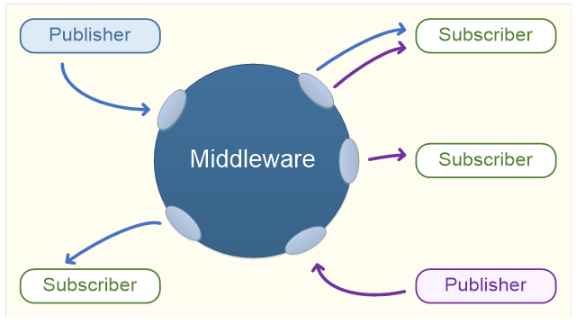  

Figure 1 - Publish Subscribe model overview  

To cover a large number of use cases, OPC UA *PubSub* supports two largely different *Message Oriented Middleware* variants:  

* a broker-less form, where the *Message Oriented Middleware* is the network infrastructure that is able to route datagram-based messages. *Subscribers* and *Publishers* use datagram protocols like UDP;  

* a broker-based form, where the core component of the *Message Oriented Middleware* is a message *Broker* . *Subscribers* and *Publishers* use standard messaging protocols like MQTT to communicate with the *Broker* . All messages are published to specific queues (e.g. topics, nodes) that the *Broker* exposes and *Subscribers* can listen to these queues. The *Broker* may translate messages from the formal messaging protocol of the *Publisher* to the formal messaging protocol of the *Subscriber* .  

### 4.4 Synergy of models  

*PubSub* and *Client Server* are both based on the OPC UA *Information Model* . *PubSub* therefore can easily be integrated into OPC UA *Servers* and OPC UA *Clients* . Quite typically, a *Publisher* will be an OPC UA *Server* (the owner of information) and a *Subscriber* is often an OPC UA *Client* . Above all, the *PubSub* *Information Model* for configuration (see [9](/§\_Ref497838497) ) promotes the configuration of *Publishers* and *Subscribers* using the OPC UA *Client Server* model.  

Nevertheless, the *PubSub* communication does not require such a role dependency. I.e., OPC UA *Clients* can be *Publishers* and OPC UA *Servers* can be *Subscribers* . In fact, there is no necessity for *Publishers* or *Subscribers* to be either an OPC UA *Server* or an OPC UA *Client* to participate in *PubSub* communications.  

More details on how *Subscriptions* in the *Client* *Server* communication model compare to *PubSub* are described in [Annex C](/§\_Ref28421088) .  

## 5 PubSub Concepts  

### 5.1 General  

Clause [5](/§\_Ref471857214) describes the general OPC UA *PubSub* concepts.  

The *DataSet* constitutes the payload of messages provided by the *Publisher* and consumed by the *Subscriber* . The *DataSet* is described in [5.2](/§\_Ref451847416) . The mapping to messages is described in [5.3](/§\_Ref462848042) . The participating entities like *Publisher* and *Subscriber* are described in [5.4](/§\_Ref460490396) .  

The abstract communication parameters are described in Clause [6](/§\_Ref462847659) .  

The mapping of this model to concrete message and transport protocol mappings is defined in Clause [7](/§\_Ref502873276) .  

The OPC UA *Information Model* for *PubSub* configuration in Clause [9](/§\_Ref497838497) specifies the standard *Objects* in an OPC UA *AddressSpace* used to create, modify and expose an OPC UA *PubSub* configuration.  

[Figure 2](/§\_Ref452383558) provides an overview of the *Publisher* and *Subscriber* entities. It illustrates the flow of messages from a *Publisher* to one or more *Subscribers* . The *PubSub* communication model supports many other scenarios; for example, a *Publisher* may send a *DataSet* to multiple *Message Oriented Middleware* and a *Subscriber* may receive messages from multiple *Publishers* .  

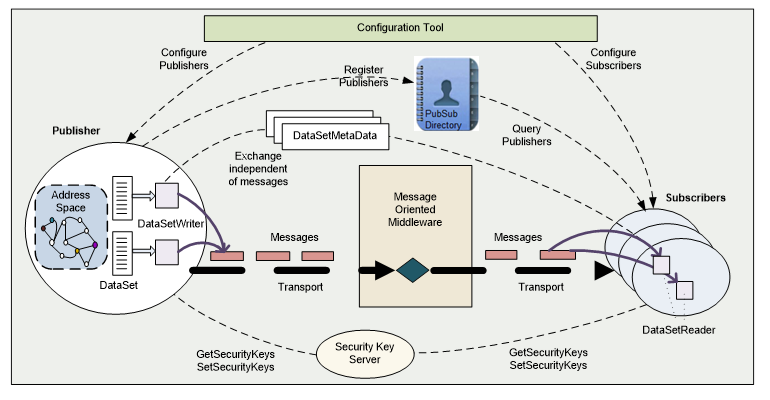  

Figure 2 - Publisher and Subscriber entities  

*Publishers* and *Subscribers* are loosely coupled. They often will not even know each other. Their primary relation is the shared understanding of specific types of data ( *DataSets* ), the publish characteristics of messages that include these data, and the *Message Oriented Middleware* .  

The "messages" in [Figure 2](/§\_Ref452383558) represent *NetworkMessages* . Each *NetworkMessage* includes header information (e.g. identification and security data) and one or more *DataSetMessages* (the payload). The *DataSetMessages* may be signed and encrypted in accordance with the configured message security. A *Security Key Server* is responsible for the distribution of the security keys needed for message security. In addition, the transport may supply security for certain protocol mappings.  

Each *DataSetMessage* is created from a *DataSet* . A component of a *Publisher* called *DataSetWriter* generates a continuous sequence of *DataSetMessages* . Syntax and semantics of *DataSets* are described by *DataSetMetaData* . The selection of information for a *DataSet* in the *Publisher* and the data acquisition parameters are called *PublishedDataSet* . *DataSet* , *DataSetMetaData* and *PublishedDataSet* are detailed in [5.2](/§\_Ref451847416) .  

*Publishers* and *Subscribers* are typically configured through a configuration tool. The configuration can be done through a generic OPC UA *PubSub* configuration tool using the *PubSub* configuration *Information Model* defined in Clause [9](/§\_Ref497838497) or through product-specific configuration tools. To support the *PubSub* configuration *Information Model* , *Publishers* and *Subscribers* must be also OPC UA *Server* .  

NOTE The PubSub directory is an optional entity that allows *Publishers* to advertise their *PublishedDataSets* and their communication parameters. This directory functionality is planned for a future version of this document.  

### 5.2 DataSet  

#### 5.2.1 General  

A *DataSet* can be thought of as a list of name and value pairs representing an *Event* or a list of *Variable Values* .  

A *DataSet* can be created from an *Event* or from a sample of *Variable Values* . The configuration of this application-data collector is called *PublishedDataSet* . *DataSet* fields can be defined to represent any information, for example, they could be internal *Variables* in the *Publisher* , *Events* from the *Publisher* or collected by the *Publisher* , network data, or data from sub-devices.  

*DataSetMetaData* described in [5.2.3](/§\_Ref458169352) defines the structure and content of a *DataSet* .  

For publishing, a *DataSet* will be encoded into a *DataSetMessage* . One or more *DataSetMessages* are combined to form the payload of a *NetworkMessage* .  

[Figure 3](/§\_Ref452533594) illustrates the use of *DataSets* for publishing.  

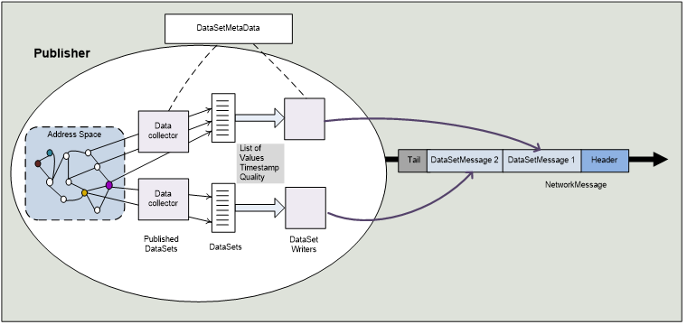  

Figure 3 - DataSet in the process of publishing  

A *PublishedDataSet* is similar to either an *Event MonitoredItem* or a list of data *MonitoredItems* in the *Client Server* *Subscription* model. Similar to an *Event MonitoredItem* , a *PublishedDataSet* can select a list of *Event* fields. Similar to data *MonitoredItems* , the *PublishedDataSet* can contain a list of *Variables* .  

A *DataSet* does not define the mechanism to encode, secure and transport it. A *DataSetWriter* handles the creation of a *DataSetMessage* for a *DataSet* . The *DataSetWriter* contains settings for the encoding and transport of a *DataSetMessage* . Most of these settings depend on the selected *Message Oriented Middleware* .  

The configuration of *DataSets* and the way the data is obtained for publishing can be configured using the *PubSub* configuration model defined in [8.2](/§\_Ref494174362) or with vendor-specific configuration tools.  

#### 5.2.2 DataSetClass  

*DataSets* can be individual for a *Publisher* or they can be derived from a *DataSetClass* . Such a *DataSetClass* acts as template declaring the content of a *DataSet* . The *DataSetClass* is identified by a globally unique id - the *DataSetClassId* (see [6.2.3.3](/§\_Ref461084562) ).  

The *DataSetMetaData* is identical for all *PublishedDataSets* that are configured based on this *DataSetClass* . The *DataSetClassId* shall be in the corresponding field of the *DataSetMetaData* .  

When all *DataSetMessages* of a *NetworkMessage* are created from *DataSets* that are instances of the same *DataSetClass,* the *DataSetClassId* of this class can be provided in the *NetworkMessage* header.  

#### 5.2.3 DataSetMetaData  

*DataSetMetaData* describes the content and semantics of a *DataSet* . The structure description includes overall *DataSet* attributes (e.g. name and version) and a set of fields with their name and data type. The order of the fields in the *DataSetMetaData* shall match the order of values in the published *DataSetMessages* .  

The *DataSetMetaDataType* is defined in [6.2.3.2.3](/§\_Ref451027005) .  

Example description (simplified, in pseudo-language):  

Name:  " **Temperature-Sensor Measurement**   

Fields:  [1] Name= **DeviceName**   

   [2] Name= **Temperature**   

*Subscribers* use the *DataSetMetaData* for decoding the values of a *DataSetMessage* to a *DataSet* . *Subscribers* may use name and data type for further processing or display of the published data.  

Each *DataSetMessage* also includes the version of the *DataSetMetaData* that it complies with. This allows *Subscribers* to verify if they have the corresponding *DataSetMetaData* . The related *ConfigurationVersionDataType* is defined in [6.2.3.2.6](/§\_Ref425674914) .  

*DataSetMetaData* may be specific to a single *PublishedDataSet* or identical for all *PublishedDataSets* that are configured based on a *DataSetClass* (see [5.2.2](/§\_Ref494175692) ).  

There are multiple options for *Subscribers* to get the initial *DataSetMetaData* :  

* The *Subscriber* is an OPC UA *Client* and is able to get the necessary configuration information from the *PubSub* configuration model (see [9.1.4.2.1](/§\_Ref434342388) ) provided by the *Publisher* or from a configuration server.  

* The *Subscriber* supports the OPC UA configuration *Methods* defined in the *PubSub* configuration model.  

* The *Subscriber* receives the *DataSetMetaData* as *NetworkMessage* from the *Publisher* . This may require an option for the *Subscriber* to request this *NetworkMessage* from the *Publisher* .  

* The *Subscriber* is configured with product-specific configuration means.  

There are multiple options to exchange the *DataSetMetaData* between *Publisher* and *Subscriber* if the configuration changes.  

* The *DataSetMetaData* is sent as a *NetworkMessage* from the *Publisher* to the *Subscriber* before *DataSetMessages* with changed content are sent. The used *Message Oriented Middleware* should ensure reliable delivery of the message. The mapping for the *Message Oriented Middleware* defines a way for the *Subscriber* to get the *DataSetMetaData* . The *Subscriber* goes to an error state if it has not received the new *DataSetMetaData* that matches the *ConfigurationVersion* of the received *DataSetMessage* .  

* The *Subscriber* is automatically updated via the OPC UA configuration *Methods* defined in the *PubSub* configuration model when the *DataSet* in the *Publisher* is updated.  

* The *Subscriber* is an OPC UA *Client* and is able to obtain the update from the *Publisher* or a configuration server via the information exposed by the *PubSub* configuration model.  

* The *Subscriber* is updated with product-specific configuration means when the *DataSet* in the *Publisher* is changed.  

### 5.3 Messages  

#### 5.3.1 General  

The term message is used with various intentions in the messaging world. It sometimes only refers to the payload (the application data) and sometimes to the network packet that also includes protocol-, security-, or encoding-specific data. To avoid confusion, this document formally defines the term *DataSetMessage* to mean the application data (the payload) supplied by the *Publisher* and the term *NetworkMessage* to mean the message handed off and received from a specific *Message Oriented Middleware* . *DataSetMessages* are embedded in *NetworkMessages* . [Figure 4](/§\_Ref490729003) shows the relationship of these message types.  

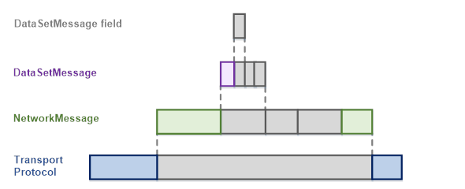  

Figure 4 - OPC UA PubSub message layers  

The transport protocol-specific headers and definitions are described in [7.3](/§\_Ref463039180) .  

Subclauses [5.3.2](/§\_Ref500186999) to [5.3.4](/§\_Ref28358586) provide an abstract definition of *DataSetMessage* and *NetworkMessage* . The concrete structure depends on the message mapping and is described in [7.2](/§\_Ref494178587) .  

*DataSetMessages* are just one of the possible *MessageTypes* transported within a *NetworkMessage.* The different *MessageTypes* are defined in [7.2](/§\_Ref494178587) .  

#### 5.3.2 DataSetMessage field  

A *DataSetMessage* field is the representation of a *DataSet* field in a *DataSetMessage* .  

A *DataSet* field contains the actual value as well as additional information about the value like status and timestamp.  

A *DataSet* field can be represented as a *DataValue* , as a *Variant* or as a *RawData* in the *DataSetMessage* field. The representation depends on the *DataSetFieldContentMask* defined in [6.2.4.2](/§\_Ref495515956) and the message mappings defined in [7.2](/§\_Ref494178587) .  

The representation as a *DataValue* is used if value, status and timestamp are included in the *DataSetMessage* .  

The representation as *Variant* is used if value or bad status should be included in the *DataSetMessage* .  

The representation as *RawData* is the most efficient format and is used if a common status and timestamp per DataSet is sufficient.  

#### 5.3.3 DataSetMessage  

A *DataSetMessage* is created from a *DataSet* . It consists of a header and the encoded fields of the *DataSet* .  

Depending on the configured *DataSetMessageContentMask* , a *DataSetMessage* may exist in different forms and with varying detail. *DataSetMessages* do not contain any information about the data acquisition or information source in the *Publisher* .  

Additional header information includes:  

 ***DataSetWriterId *** *DataSetWriter* and indirectly the *PublishedDataSet.*  

 ***Sequence number *** *DataSetMessage* . Can be used to verify the ordering and to detect missing messages.  

 ***Timestamp *** *DataSetMessage* was obtained.  

 ***Version *** *DataSetMetaData.*  

 ***Status *** *DataSetMessage.*  

 ***Keep alive *** *DataSetMessages* are sent for a configured time period, a keep alive *DataSetMessage* is sent to signal the *Subscribers* that the *Publisher* is still alive.  

*DataSetMessages* are either sent cyclicly or acyclicly in a publishing interval. Acyclic *DataSets* are sent as event *DataSetMessages* . Cyclic *DataSets* can create at most one *DataSetMessages* per interval. Acyclic *DataSets* can create multiple event *DataSetMessages* per interval.  

For cyclic *DataSets* , some encodings differentiate between key frame *DataSetMessages* and delta frame *DataSetMessages.* A key frame *DataSetMessage* includes ** values for ** all fields of the *DataSet.* A delta frame *DataSetMessage* only contains the subset that changed since the previous *DataSetMessage* .  

A key frame *DataSetMessage* is sent after a configured number of *DataSetMessages* .  

The *DataSetMetaData* as data contract defines the fields contained in the *DataSetMessage* . The header settings for *DataSetMessage* and *NetworkMessage* define the communication contract between *Publisher* and *Subscriber* .  

A heartbeat *DataSetMessage* is a key frame that only contains header information. It is used to indicate that the *Publisher* is still alive without sending payload. A heartbeat *DataSetMessage* is not created from a *DataSet* .  

#### 5.3.4 NetworkMessage  

The *NetworkMessage* is a container for messages of different *MessageTypes* defined in [7.2](/§\_Ref494178587) .  

A *NetworkMessage* can contain an array of *DataSetMessages* and includes information shared between *DataSetMessages* . This information consists of:  

 ***PublisherId Identifies the** * .  

 ***Security data Only available for encodings that support message security. The relevant information is specified in the message mapping.***   

 ***Promoted fields Selected fields out of the* DataSet *also sent in the header.***   

 ***Payload *** *DataSetMessages.*  

The payload, consisting of the *DataSetMessages* will be encrypted in accordance with the configured message security. Individual fields of a *DataSetMessage* can be marked as being "promoted fields". Such fields are intended for filtering or routing and therefore are never encrypted. How and where the values for promoted fields are inserted depends on the *NetworkMessage* format and the used protocol. The *NetworkMessage* header is not encrypted to enable efficient filtering.  

#### 5.3.5 Message security  

Message security in *PubSub* concerns integrity and confidentiality of the published message payload. The base concepts for OPC UA security are defined in [OPC 10000-2](/§UAPart2) . The level of security can be:  

* No security  

* Signing but no encryption  

* Signing and encryption  

Message security is end-to-end security (from *Publisher* to *Subscriber* ) and requires common knowledge of the cryptographic keys necessary to sign and encrypt on the *Publisher* side as well as validate signature and decrypt on the *Subscriber* side.  

The keys used for message security are managed in the context of a *SecurityGroup* . The basic concepts of a *SecurityGroup* are described in [5.3.7](/§\_Ref463358545) .  

This standard defines a general distribution framework for cryptographic keys. This framework is introduced in [5.4.5](/§\_Ref462772283) .  

All parameters that are relevant for message security are described in [6.2.5](/§\_Ref498367264) . These parameters are independent of any *Broker* level transport security.  

The message security for *PubSub* is independent of the transport protocol mapping and is completely defined by OPC UA.  

#### 5.3.6 Transport security  

The transport security is specific to the transport protocol mapping. This could be TLS for broker-based middleware and DTLS for broker-less middleware.  

When using a broker-based middleware (see [5.4.6.2.2](/§\_Ref459031042) ), confidentiality and integrity can be ensured with the transport security between *Publishers* and the *Broker* as well as *Subscribers* and the *Broker* . The *Broker* level security in addition requires all *Publishers* and *Subscribers* to have credentials that grant them access to a *Broker* resource.  

Transport security may be hop-by-hop security with some risk of man-in-the-middle attacks. It also requires trusting the *Broker* since the *Broker* can read the messages.  

Transport security and message security may be used together to reduce the risk of man-in-the-middle attacks.  

#### 5.3.7 SecurityGroup  

A *SecurityGroup* is an abstraction that represents the message security settings and security keys for a subset of *NetworkMessages* exchanged between *Publishers* and *Subscribers* . The security keys are used to encrypt and decrypt *NetworkMessages* and to generate and check signatures on a *NetworkMessage* .  

A *Security Key Service* (SKS) manages *SecurityGroups* and maintains a mapping between *Roles* and their access *Permissions* for a *SecurityGroup* . This mapping defines if a *Publisher* or *Subscriber* has access to the security keys of a *SecurityGroup* . The SKS is described in more detail in [5.4.5](/§\_Ref462357898) .  

A *SecurityGroup* is identified with a unique identifier called the *SecurityGroupId* . It is unique within the SKS. A *Publisher* for its *PublishedDataSets* needs to know the *SecurityGroupId* . For *Subscribers* the *SecurityGroupId* is distributed as metadata together with the *DataSetMetaData* . The metadata for a *SecurityGroupId* includes the *EndpointDescription* of the responsible SKS. Publishers and Subscribers use the *EndpointDescription* to access the SKS and the *SecurityGroupId* to obtain the security keys for a *SecurityGroup* .  

#### 5.3.8 Topics  

A *Topic* is a string associated with a *NetworkMessage* that can be used to logically organize *NetworkMessages* published to a *Message Oriented Middleware* . *Topics* are most commonly used with *Broker*\-based middleware where the filtering is done by the *Broker* . However, *Topics* can be used with *Broker*\-less middleware where the filtering is done by the *Subscriber* .  

*Topics* have a hierarchical structure with different *Topic* levels separated by a delimiter like '/'. For example:  

opcua/json/status/FlowController1  

Mappings to different implementation technologies may add additional constraints.  

A *Topic* for *NetworkMessages* containing *DataSetMessages* is typically used as *QueueName* for the broker-based communication configuration.  

### 5.4 Entities  

#### 5.4.1 Publisher  

##### 5.4.1.1 General  

The *Publisher* is the *PubSub* entity that sends *NetworkMessages* to a *Message Oriented Middleware* . It represents a certain information source, for example, a control device, a manufacturing process, a weather station, or a stock exchange.  

Commonly, a *Publisher* is also an OPC UA *Server* . For the abstract *PubSub* concepts, however, it is an arbitrary entity and should not be assumed to be an individual or even a specific network node (an IP or a MAC address) or a specific application. A *Publisher* may consist of one or more network nodes sending messages and management node(s) responding to discovery probe messages and providing an OPC UA *Server* for configuration and diagnostics.  

[Figure 5](/§\_Ref452537982) illustrates a *Publisher* with data collection, encoding and message sending.  

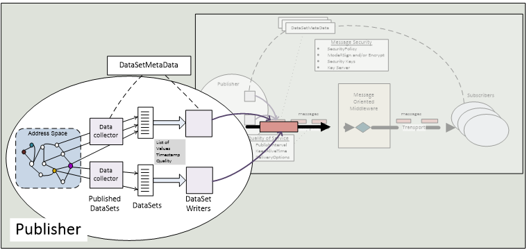  

Figure 5 - Publisher details  

A single *Publisher* may support multiple *PublishedDataSets* and multiple *DataSetWriters* to one or more *Message Oriented Middleware* . A *DataSetWriter* is a logical component of a *Publisher* . See [5.4.1.2](/§\_Ref458171447) for further information about the *DataSet* writing process.  

If the *Publisher* is an OPC UA *Server* , it can expose the *Publisher* configuration in its *AddressSpace* . This information may be created through product-specific configuration tools or through the OPC UA defined *Methods* . The OPC UA *Information Model* for *PubSub* configuration is specified in Clause [9](/§\_Ref497838497) .  

##### 5.4.1.2 Message sending  

[Figure 6](/§\_Ref452849662) illustrates the process inside a *Publisher* when creating and sending messages and the parameters required to accomplish it. The components, like *DataSet* collection or *DataSetWriter* should be considered abstract. They may not exist in every *Publisher* as independent entities. However, comparable processes need to exist to generate the OPC UA *PubSub* messages.  

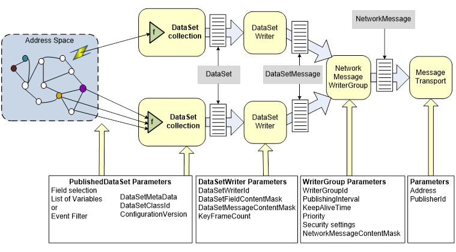  

  

Figure 6 - Publisher message sending sequence  

The sending process is guided by different parameters for different logical steps. The parameters define for example when and how often to trigger the sending sequence and the encoding and security of the messages. The PubSub communication parameters are defined in Clause [6](/§\_Ref462847659) .  

The first step is the collection of data ( *DataSet* ) to be published. The configuration for such a collection is called *PublishedDataSet* . The *PublishedDataSet* also defines the *DataSetMetaData* . Collection is a generic expression for various different options, like monitoring of *Variables* in an OPC UA *Server AddressSpace* , processing OPC UA *Events* , or for example reading data from network packets. In the end, the collection process produces values for the individual fields of a *DataSet* . The two concrete *PublishedDataSet* options with standard OPC UA configuration are *PublishedDataItems* for *Variable* base collection and *PublishedEvents* for *Event* based collection.  

In the next step, a *DataSetWriter* takes the *DataSet* and creates a *DataSetMessage* . *DataSetMessages* from *DataSetWriters* in one *WriterGroup* can be inserted into a single *NetworkMessage* . The creation of a *DataSetMessage* is guided by the following parameters:  

* The *DataSetFieldContentMask* (see [6.2.4.2](/§\_Ref495515956) ) controls which attributes of a value shall be encoded.  

* The *DataSetMessageContentMask* (see [6.3.1.3.2](/§\_Ref494354861) ) controls which header fields shall be encoded.  

* The *KeyFrameCount* (see [6.2.4.3](/§\_Ref494234143) ) greater than or equal to 1 controls whether a key frame or a delta frame *DataSetMessage* is to be created. A *KeyFrameCount* of 0 is used for non-cyclic *PublishedDataSets,* like *PublishedEvents* .  

The resulting *DataSetMessage* is passed on to the next step together with the *DataSetWriterId* (see [6.2.4.1](/§\_Ref494235089) ), the *DataSetClassId* (see [6.2.3.3](/§\_Ref461084562) ), the *ConfigurationVersion* of the *DataSetMetaData* (see [6.2.3.2.6](/§\_Ref425674914) ), and a list of values that match the configured propagated fields.  

Next is the creation of the *NetworkMessage* . It uses the data provided from the previous step together with the *PublisherId* (see [6.2.7.1](/§\_Ref452866764) ) defined on the *PubSubConnection* . The structure of this message is protocol specific. If the *SecurityMode* (see [6.2.5.2](/§\_Ref494359882) ) requires message security, the *SecurityGroupId* (see [6.2.5.3](/§\_Ref452867788) ) is used to fetch the *SecurityPolicy* and the security keys from the SKS (see [5.4.5](/§\_Ref462357898) ). This information is used to encrypt and/or sign the *NetworkMessage* as required by the *SecurityMode* .  

The final step is delivery of the *NetworkMessage* to the *Message Oriented Middleware* through the configured *Address* .  

#### 5.4.2 Subscriber  

##### 5.4.2.1 General  

*Subscribers* are the consumers of *NetworkMessages* from the *Message Oriented Middleware* . They may be OPC UA *Clients* , OPC UA *Servers* or applications that are neither *Client* nor *Server* but only understand the structure of OPC UA *PubSub* messages. [Figure 7](/§\_Ref452537891) illustrates a *Subscriber* with filtering, decoding and dispatching of *NetworkMessages* .  

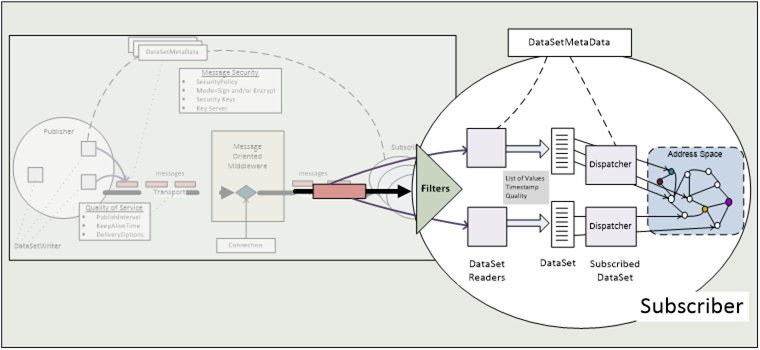  

Figure 7 - Subscriber details  

To determine for which *DataSetMessages* and on which *Message Oriented Middleware* to subscribe, the *Subscriber* need to be configured and/or use discovery mechanisms.  

*Subscribers* shall be prepared to receive messages that they do not understand or are irrelevant. Each *NetworkMessage* provides unencrypted data in the *NetworkMessage* header to support identifying and filtering of relevant *Publishers,* *DataSetMessages* , *DataSetClasses* or other relevant message content (see [5.3](/§\_Ref452539814) ).  

If a *NetworkMessage* is signed or signed and encrypted, the *Subscriber* will need the proper security keys (see [5.3.5](/§\_Ref460934982) ) to verify the signature and decrypt the relevant *DataSetMessages* .  

Once a *DataSetMessage* has been selected as relevant, it will be forwarded to the corresponding *DataSetReader* for decoding into a *DataSet* . See [5.4.2.2](/§\_Ref459365438) for further information about this *DataSet* reading process. The resulting *DataSet* is then further processed or dispatched in the *Subscriber* .  

If the *Subscriber* is an OPC UA *Server* , it can expose the reader configuration in its *AddressSpace* . This information may be created through product-specific configuration tools or through the OPC UA defined configuration model. The OPC UA *Information Model* for *PubSub* configuration is specified in Clause [9](/§\_Ref497838497) .  

##### 5.4.2.2 Message reception  

[Figure 8](/§\_Ref452850746) illustrates the process inside a *Subscriber* when receiving, decoding and interpreting messages and the parameter model required for accomplishing it. As for the *Publisher* , the components should be considered abstract.  

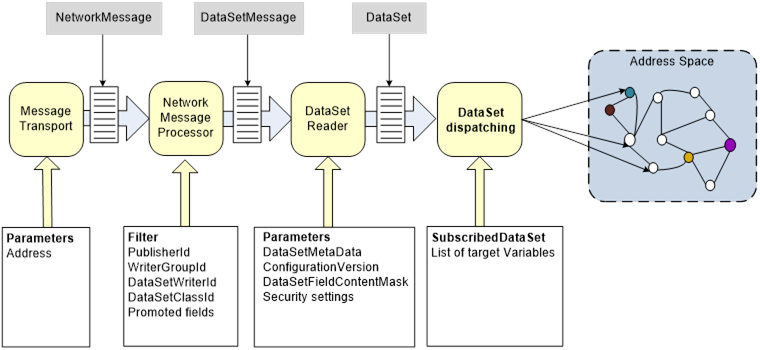  

  

Figure 8 - Subscriber message reception sequence  

The *Subscriber* need to select the required *Message Oriented Middleware* and establish a connection to it using the provided *Address* . Such a connection may simply be a multi-cast address when using OPC UA UDP or a connection to a message *Broker* when using MQTT. Once subscribed, the *Subscriber* will start listening. The sequence starts when a *NetworkMessage* is received. The *Subscriber* may have configured filters (like a *PublisherId, DataSetWriterId* or a *DataSetClassId* ) so that it can drop all messages that do not match the filter.  

Once a *NetworkMessage* has been accepted, it is decrypted and decoded. The security parameters are the same as for the *Publisher* .  

Each *DataSetMessage* of interest is passed on to a *DataSetReader* . Here, the *DataSetMetaData* is used to decode the *DataSetMessage* content to a *DataSet* . The *DataSetMetaData* in particular provides the complete field syntax including the name, data type, and other relevant *Properties* like engineering units. Version information that exists in both the *DataSetMessage* and the *DataSetMetaData* allows the *Subscriber* to detect version changes. If a major change occurs, the *Subscriber* needs to get an updated *DataSetMetaData* .  

Any further processing is application-specific. For example, an additional dispatching step may map the received values to *Nodes* in the *Subscribers* OPC UA *AddressSpace* . The configuration for such a dispatching is called *SubscribedDataSet* . The two concrete *SubscribedDataSet* options with standard OPC UA configuration are *TargetVariables* and *SubscribedDataSetMirror* . The configuration of *TargetVariables* allows the dispatching of *DataSetMessage* fields to existing *Variables* in the *Subscribers* OPC UA *AddressSpace* . The configuration of *SubscribedDataSetMirror* is used if the received *DataSet* fields should be represented as *Variables* in the *Subscribers* OPC UA *AddressSpace* but the *Variables* do not exist and must be created as part of the *Subscriber* configuration.  

#### 5.4.3 Actions  

*Actions* allow a request response message exchange pattern to be used via a *Message Oriented Middleware* . The entities involved in *Actions* are shown in [Figure 9](/§\_Ref150455382) .  

Actions are operations executed by a *Responder* when it receives a request message sent by a *Requestor* . An *Action* could be a *Method* in an OPC UA *Address Space* or business logic in an OPC UA *PubSub* application.  

The *ActionMetaData* consists of the *DataSetMetaData* for the request message, the *DataSetMetaData* for the response message and a list of *Action* targets that share the same request and response parameters. An example is a *Method* defined on an *ObjectType* that can be called on different *Object* instances. In this case the *Method* on the *ObjectType* is the *Action* and the *Methods* on the different *Object* instances are the *Action* targets. The *ActionMetaData* as a contract is provided by the *Responder* and used by the *Requestor* to execute *Actions* on the *Responder* .  

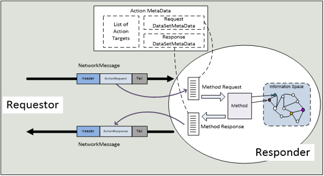  

Figure 9\- Action execution sequence  

The content of the *ActionMetaData* and the mapping to *Methods* is defined in [6.2.3.10](/§\_Ref169012534) . The *ActionMetaData* message for UADP message mapping is defined in [7.2.4.6.11](/§\_Ref150457490) . The *ActionMetaData* message for JSON message mapping is definied in [7.2.5.5.7](/§\_Ref141975814) .  

The information flow, sequence diagrams and status handling for *Actions* is defined in [6.2.11.2](/§\_Ref167368047) .  

The *Action* request and response messages for UADP message mapping are definied in [7.2.4.5.9](/§\_Ref150425805) and [7.2.4.5.10](/§\_Ref150458833) . The Action *NetworkMessage* , request and response messages for JSON message mapping are defined in [7.2.5.6](/§\_Ref169012933) .  

The MQTT *Topic* levels for *Action* messages are defined in [7.3.4.7.9](/§\_Ref161527879) , [7.3.4.7.10](/§\_Ref161527886) , [7.3.4.7.11](/§\_Ref161527902) and [7.3.4.7.12](/§\_Ref161527896) .  

#### 5.4.4 Configuration Tool  

An OPC UA *Application* can be pre-configured to send messages as a *Publisher* but commonly it is required to configure the information to be included into messages and also the frequency the messages are sent.  

*Subscribers* can use discovery mechanisms to find *Publishers* and to get the *DataSetMetaData* necessary to understand the messages. One example are HMI applications where the configuration can be done inside the *Subscriber* . But if the Subscriber is a device, it is expected that a configuration tool is required to configure the *Subscriber* functionality in the device.  

The *PubSubConfigurationDataType* and the other configuration *Structures* defined in Clause [6](/§\_Ref462847659) can be used to prepare an offline *PubSub* configuration that can be stored in a binary file using the *UABinaryFileDataType* . Such a configuration can be used to configure *Publishers* and *Subscribers* if they do not have a online configuration interface or are configured through product-specific configuration tools.  

If *Publishers* and *Subscribers* are also OPC UA *Servers* , they can provide the *PubSub* configuration *Information Model* defined in Clause [9](/§\_Ref497838497) . This model can be used by generic *PubSub* configuration tools *.*  

A typical use case is controller to controller or machine to machine communication where both communication partners have a pre-configured list of input and output data *Variables* and a generic configuration tool establishes the communication by selecting the *Variables* to be published in the *Publisher* and then configures the *Subscriber* to receive the messages from the *Publisher* and to select the target *Variables* in the *Subscriber* .  

#### 5.4.5 Security Key Service  

##### 5.4.5.1 General  

A *Security Key Service* (SKS) provides keys for message security that can be used by the *Publisher* to sign and encrypt *NetworkMessages* and by the *Subscriber* to verify the signature of *NetworkMessages* and to decrypt them.  

The SKS is responsible for managing the keys used to publish or consume *PubSub* *NetworkMessages* . Separate keys are associated with each *SecurityGroupId* in the system. The *GetSecurityKeys Method* exposed by the SKS shall be called to receive necessary key material for a *SecurityGroupId* . *GetSecurityKeys* can return more than one key. In this case the next key can be used when the current key is outdated without calling *GetSecurityKeys* for every key needed. The *PubSubKeyServiceType* defined in [8.2](/§\_Ref458519606) specifies the *GetSecurityKeys Method* .  

The *GetSecurityKeys Method* can be implemented by a *Publisher* or by a central SKS. In both cases, the well-known *NodeIds* for the *PublishSubscribe Object* and the related *GetSecurityKeys Method* are used to call the *GetSecurityKeys* *Method* . The *PublishSubscribe Object* is defined in [8.3.2](/§\_Ref450685722) .  

The *SetSecurityKeys* *Method* is typically used by a central SKS to push the security keys for a *SecurityGroup* into a *Publisher* or *Subscriber* . The *Method* is exposed by *Publishers* or *Subscribers* that have no OPC UA *Client* functionality. The *Method* is part of the *PublishSubscribeType* defined in [9.1.3.2](/§\_Ref472957312) .  

##### 5.4.5.2 SecurityGroup Management  

The SKS is the entity with knowledge of *SecurityGroups* and it maintains a mapping between *Roles* and *SecurityGroups* . The related *User Authorization* model is defined in [OPC 10000-3](/§UAPart3) . The *User Authorization* model defines the mapping of identities to *Roles* and the mechanism to set *Permissions* for *Roles* on a *Node* . The *Permissions* on a *SecurityGroup* *Object* is used to determine if a *Role* has access to the keys for the *SecurityGroup* .  

An example for setting up a *SecurityGroup* and the configuration of affected *Publishers* and *Subscribers* is shown in [Figure 10](/§\_Ref462866546) .  

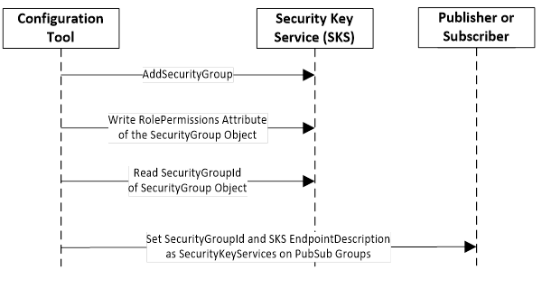  

Figure 10 - SecurityGroup management sequence  

To secure *NetworkMessages* , the *NetworkMessages* shall be secured with keys provided in the context of a SecurityGroup. A *SecurityGroup* is created on a SKS using the *Method* *AddSecurityGroup* .  

To limit access to the *SecurityGroup* and therefore to the security keys, *Permissions* shall be set on the *SecurityGroup* *Object* . This requires the management of *Roles* and *Permissions* in the SKS.  

To set the *SecurityGroup* relation on the *Publishers* and *Subscribers* , the *SecurityGroupId* and the SKS *EndpointDescriptions* are configured in a *PubSub* group.  

##### 5.4.5.3 Key acquisition handshakes  

The *Publisher* or *Subscriber* use keys provided by an SKS to secure messages exchanged via the *Message Oriented Middleware* . The handshake to pull the keys from a SKS is shown in [Figure 11](/§\_Ref432219823) . The handshake to push the keys from an SKS to *Publishers* and *Subscribers* is shown in [Figure 12](/§\_Ref472957903) .  

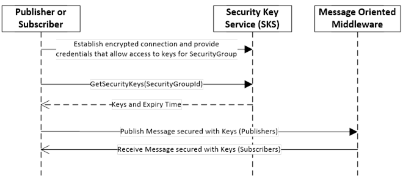  

Figure 11 - Handshake used to pull keys from SKS  

To pull keys, the *Publisher* or *Subscriber* creates an encrypted connection and provides credentials that allow it access to the *SecurityGroup* . Then it passes the identifier of the *SecurityGroup* to the *GetSecurityKeys Method* that verifies the *identity* and returns the keys used to secure messages for the *PubSubGroup* . The *GetSecurityKeys* *Method* is defined in [8.3.2](/§\_Ref450682155) .  

The access to the *GetSecurityKeys* *Method* may use *SessionlessInvoke* *Service* calls. These calls typically use an *Access Token* that is retrieved from an *Authorization Service* . Both concepts are defined in [OPC 10000-4](/§UAPart4) .  

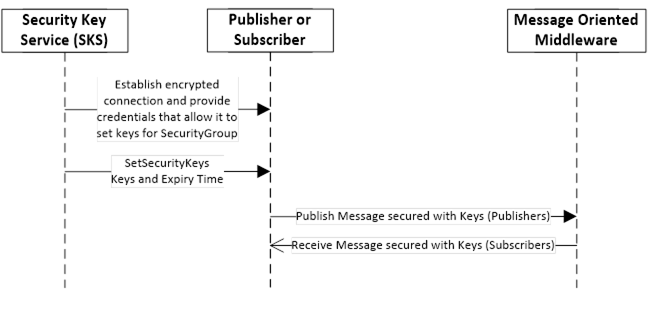  

Figure 12 - Handshake used to push keys to Publishers and Subscribers  

To push keys, the SKS creates an encrypted connection to a *Publisher* or *Subscriber* and provides credentials that allow it to provide keys for a *SecurityGroup* . Then it passes the identifier of the *SecurityGroup* and the keys used to secure messages for the *SecurityGroup* to the *SetSecurityKeys Method* . The *SetSecurityKeys* *Method* is defined in [9.1.3.3](/§\_Ref469231105) .  

If the initial pull or push fails, the affected *PubSub* components like *WriterGroup* or *DataSetReader* stay in the *PreOperational* state. If the updates fail and the *PubSub* components do not have up to date key material, the state of the affected components change to *Error* . For both pull and push, the *Client* executing the key exchange needs to retry the key exchange at a faster rate than the key lifetime.  

##### 5.4.5.4 Authorization Services and Security Key Service  

Access to the SKS can be managed by an *Authorization Service* as shown in [Figure 13](/§\_Ref468983962) .  

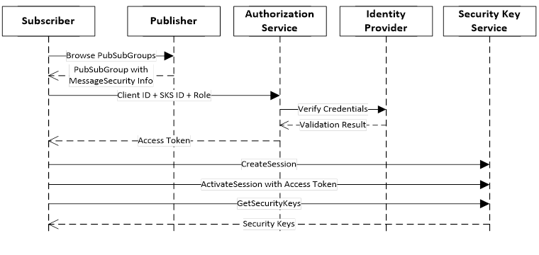  

Figure 13 - Handshake with a Security Key Service  

The SKS is a *Server* that exposes a *Method* called *GetSecurityKeys* . The *Access Token* is used to determine if the calling application is allowed to access the keys. One way to do this would be to check the *Permissions* assigned to the *SecurityGroup Object* identified by the *GetSecurityKeys* *Method* arguments. *Publishers* and *Subscribers* can request keys if the *Access* *Token* they provide ** is mapped to *Roles* that have been granted *Permission* to *Browse* the *SecurityGroup Object.*  

#### 5.4.6 Message Oriented Middleware  

##### 5.4.6.1 General  

*Message Oriented Middleware* as used in this document is any infrastructure supporting sending and receiving *NetworkMessages* between distributed applications. OPC UA does not define a *Message Oriented Middleware* , rather it uses protocols that allow connecting, sending and receiving data. The transport protocol mappings for *PubSub* are described in [7.3](/§\_Ref463039180) .  

This document describes two general types of *Message Oriented Middleware* to cover a large number of use cases. The two types, broker-less and broker-based middleware, are described in [5.4.6.2](/§\_Ref459106669) and [5.4.6.3](/§\_Ref503214385) .  

##### 5.4.6.2 Broker-less Middleware  

###### 5.4.6.2.1 General  

With this option, OPC UA *PubSub* relies on the network infrastructure to deliver *NetworkMessage* s to one or more receivers. Network devices - like network routers, switches, or bridges - are typically used for this purpose.  

One example is a switched network and the use of UDP with unicast or multicast messages shown in [Figure 14](/§\_Ref462837065) .  

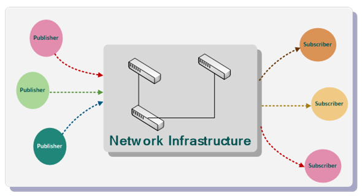  

Figure 14 - PubSub using network infrastructure  

Advantages of this model include:  

* Only requires standard network equipment and no additional software components like a *Broker* .  

* Message delivery is assumed to be direct without software intermediaries and therefore provides reduced latency and overhead.  

* UDP protocol supports multiple subscribers using multicast addressing.  

###### 5.4.6.2.2 Broker-less model with OPC UA UDP  

[Figure 15](/§\_Ref408975726) depicts the applications, entities and messages involved in peer-to-peer communication using UDP as a protocol that does not require a *Broker* .  

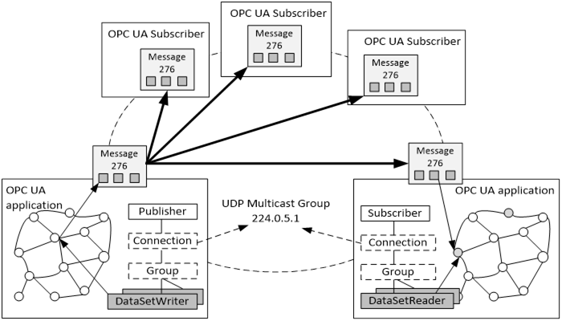  

Figure 15 - UDP Multicast overview  

The *PublishSubscribe Object* contains a connection *Object* for each address like an IP multicast address. The connection can have one or more groups with *DataSetWriters* . A group can publish *DataSets* at the defined publishing interval.  

In each publishing interval, a *DataSet* is collected for a *PublishedDataSet* which can be a list of sampled data items in the *Publisher* OPC UA *Address Space* . For each *DataSet* a *DataSetMessage* is created. The *DataSetMessages* are sent in a *NetworkMessage* to the IP multicast address.  

OPC UA *Applications* like HMI applications would use the values of the *DataSetMessage* that they are interested in.  

An OPC UA *Application* that maps data fields from UADP *DataSetMessages* to internal *Variables* can be configured through the *DataSetReader Object* and dispatcher in the *Subscriber* . The configuration of a *DataSetReader* defines how to decode the DataSetMessage to a *DataSet* . The *SubscribedDataSet* defines which field in the *DataSet* is mapped to which *Variable* in the OPC UA *Application* .  

With OPC UA UDP there is no guarantee of timeliness, delivery, ordering, or duplicate protection. The sequence numbers in *DataSetMessages* provide a solution for ordering and duplicate detection. The reliability is improved by the option to send the complete *DataSet* in every *DataSetMessage* or with the option to repeat *NetworkMessages* .  

Other transport protocol mappings used with the broker-less model could provide guarantee of timeliness, delivery, ordering, or duplicate protection.  

##### 5.4.6.3 Broker-based Middleware  

###### 5.4.6.3.1 General  

This option assumes a messaging *Broker* in the middle as shown in [Figure 16](/§\_Ref462837081) . No application is speaking directly to other applications. All the communication is passed through the *Broker* . The *Broker* routes the *NetworkMessages* to the right applications based on business criteria ("queue name", "routing key", "topic" etc.) rather than on physical topology (IP addresses, host names).  

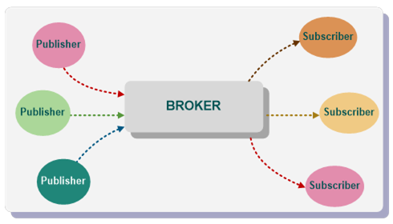  

Figure 16 - PubSub using broker  

Advantages of this model (partly depending on used *Broker* and its configuration) include:  

* *Publisher* and *Subscriber* do not have to be directly addressable. They can be anywhere as long as they have access to the *Broker* .  

* Fan out can be handled to a very large list of *Subscribers* , multiple networks or even chained *Brokers* or scalable *Brokers* .  

* *Publisher* and *Subscriber* lifetimes do not have to overlap. The *Publisher* application can push *NetworkMessages* to the *Broker* and terminate. The *NetworkMessages* will be available for the *Subscriber* application later.  

* *Publisher* and *Subscriber* can use different messaging protocols to communicate with the *Broker* .  

In addition, the *Broker* model is to some extent resistant to the application failure. So, if the application is buggy and prone to failure, the *NetworkMessages* that are already in the *Broker* will be retained even if the application fails.  

###### 5.4.6.3.2 Broker-based model  

[Figure 17](/§\_Ref426871156) depicts the applications, entities and messages involved in typical communication scenarios with a *Broker* . It requires use of messaging protocols that a *Broker* understands, like  MQTT defined in [ISO/IEC 20922:2016](/§MQTT) . In this model the *Message Oriented Middleware* will be a *Broker* that relays *NetworkMessages* from *Publishers* to *Subscribers* . The *Broker* may also be able to queue messages and send the same message to multiple *Subscribers* .  

Note that the *Broker* functionality is outside the scope of this document. In terms of the messaging protocols, the *Broker* is a messaging server (the OPC UA *Publisher* and the OPC UA *Subscriber* are messaging clients). The messaging protocols define how to connect to a messaging server and what fields in a message influence the *Broker* functionality.  

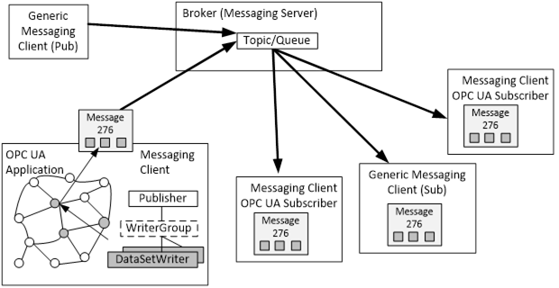  

Figure 17 - Broker overview  

An OPC UA *Publisher* that publishes data may be configured through the *PubSub* configuration model. It contains one connection *Object* per *Broker* . The *Broker* is configured through an URL in the connection. The connection can have one or more groups which identify specific queues or topics. Each group may have one or more *DataSetWriters* that format a *DataSet* as required for the messaging protocol. A *DataSet* can be collected from a list of *Event* fields and/or selected *Variables* . Such a configuration is called *PublishedDataSet* .  

Each *DataSet* is sent as a separate *DataSetMessage* serialized with a format that depends on the *DataSetWriter* . One *DataSetMessage* format is the JSON message mapping which represents the *DataSet* in a format which *Subscribers* can understand without knowledge of OPC UA. Another *DataSetMessage* format is the UADP message mapping.  

Message confidentiality and integrity with the *Broker* based communication model can be ensured at two levels:  

* transport security between *Publishers* or *Subscribers* and the *Broker,* or  

* message security as end-to-end security between *Publisher* and *Subscriber* .  

The *Broker* level security requires all *Publishers* and *Subscribers* to have credentials that grant them access to the necessary queue or topic. In addition, all communication with the *Broker* uses transport level security to ensure confidentiality. The security parameters are specified on the connection and group.  

The message security provided by the *Publisher* is only defined for the UADP message mapping.  

##### 5.4.6.4 QoS configuration  

OPC UA *Applications* may demand Quality of Service (QoS) for the transport of *NetworkMessages* . These QoS requirements have to be fulfilled by the broker-less *Message Oriented Middleware* and therefore need to be mapped to concrete network technologies like TSN, Deterministic Networking (DetNet) or differentiated services (DiffServ). This mapping should be hidden to the application engineer from a PubSub perspective but may be monitored or configurable via the information model of [OPC 10000-22](/§UAPart22) .  

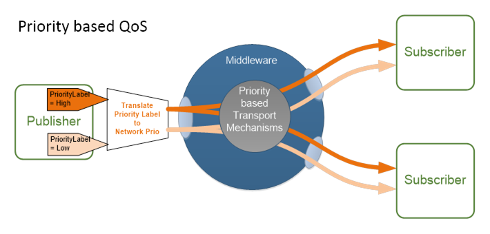  

Figure 18 - Message Oriented Middleware providing QoS  

QoS requirements of an OPC UA *Applications* shall be configurable with OPC UA means and without dependencies to the underlying network technology. Hiding network details from the application simplifies to migrate OPC UA *Applications* from one network technology to another or to interconnect OPC UA *Applications* over different network technologies.  

QoS requirements can be fulfilled by different network mechanisms and may require different QoS control mechanisms in the network depending on the requested level of QoS.  

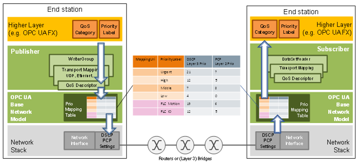  

Figure 19 - Mapping of priority-based QoS  

As shown in [Figure 18](/§\_Ref79576004) and [Figure 19](/§\_Ref79576009) the *PriorityLabel* from a *WriterGroup* , *DataSetReader* or *PubSubConnection* *TransportSettings* will be translated into actual values to be used on the wire. Together with the optional *QosCategory* the *PriorityLabel* will be present in the mapping table for the network interface used to transmit the data. If the combination of *QosCategory* and *PriorityLabel* is not present in the mapping table, the communication cannot be established. The reference from the network interface to the mapping table is defined in [OPC 10000-22](/§UAPart22) .  

Standard values for *QosCategory* with the according required structures in the *DatagramQos* array are defined in [Table 118](/§\_Ref86747238) . This list can be extended by specifications built on top of OPC UA *PubSub* . Each *QosCategory* will be described in detail by a list of measurable QoS KPIs like assured bandwidth or maximum latency in the parameter *DatagramQos* .  

## 6 PubSub communication parameters  

### 6.1 Overview  

*PubSub* defines different configuration parameters for the various *PubSub* components. They define the behaviour of *Publisher* and *Subscriber* . The parameters are grouped by component and are partitioned into 'common', 'message mapping', and 'transport protocol mapping'.  

The common parameters are defined in [6.2](/§\_Ref496695580) . The parameters for the different message mappings are defined in [6.3](/§\_Ref497838448) . The parameters for the different transport protocol mappings are defined in [6.4](/§\_Ref496698306) .  

The application of communication parameters for concrete message and transport protocol mappings is defined in Clause [7](/§\_Ref502873305) .  

Configuration of these parameters can be performed through the OPC UA *Information Model* for *PubSub* configuration defined in Clause [9](/§\_Ref497838497) or through vendor-specific mechanisms. The parameter groupings in this clause define the parameters and also define *Structures* used to represent the parameters of the groupings. These *Structures* are used in the *PubSub* configuration model described in Clause [9](/§\_Ref497838497) but they can also be used for offline configuration or vendor-specific configuration mechanisms.  

[Figure 20](/§\_Ref462837500) depicts the different components and their relation to each other. The *WriterGroup* , *DataSetWriter* and *PublishedDataSet* components define the data acquisition for the *DataSets* , the message generation and the sending on the *Publisher* side. These parameters need to be known on the *Subscriber* side to configure *DataSetReaders* and to filter and process *DataSetMessages* .  

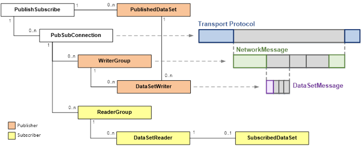  

Figure 20 - PubSub component overview  

[Figure 20](/§\_Ref462837500) shows the following components:  

* *PublishedDataSet* contains the *DataSetMetaData* describing the content of the *DataSets* produced by the *PublishedDataSet* and the corresponding data acquisition parameters.  

* *DataSetWriter* parameters are necessary for creating *DataSetMessages* . Each *DataSetWriter* is bound to a single *PublishedDataSet* . A *PublishedDataSet* can have multiple *DataSetWriters* .  

* *WriterGroup* parameters are necessary for creating a *NetworkMessage* . Each writer group can have one or more *DataSetWriters* . Some of these parameters are used for creating the *DataSetMessages* . They are grouped here since they are the same for all *DataSetMessages* in a single *NetworkMessage* .  

* *PubSubConnection* parameters represent settings needed for the transport protocol. One connection can have a number of writer groups and reader groups.  

* *ReaderGroup* is used to group a list of *DataSetReaders* and contains a few shared settings for them. It is not symmetric to a *WriterGroup* and it is not related to a particular *NetworkMessage* . The *NetworkMessage* related filter settings are on the *DataSetReaders* .  

* *DataSetReader* parameters represent settings for filtering of received *NetworkMessages* and *DataSetMessages* as well as settings for decoding of the *DataSetMessages* of interest.  

* *SubscribedDataSet* parameters define the processing of the decoded *DataSet* in the *Subscriber* for one *DataSetReader* .  

* *PublishSubscribe* is the overall management of the *PubSub* groupings. It contains a list of *PublishedDataSets* and a list of *PubSubConnections* .  

The different PubSub mapping specific parameter groupings are shown in [Figure 21](/§\_Ref496698709) .  

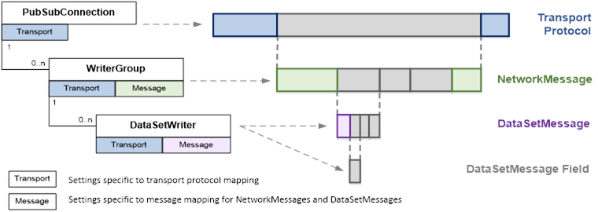  

Figure 21 - PubSub mapping specific parameters overview  

Transport protocol mapping specific parameters may be defined for the *PubSubConnection* , the *WriterGroup* or the *DataSetWriter* .  

Message mapping specific parameters are defined for the *NetworkMessages* on the *WriterGroup* and for the *DataSetMessages* on the *DataSetWriter* .  

### 6.2 Common configuration parameters  

#### 6.2.1 PubSubState state machine  

The *PubSubState* is used to expose and control the operation of a *PubSub* component. It is an enumeration of the possible states. The enumeration values are described in [Table 1](/§\_Ref154235244) .  

Table 1 - PubSubState values  

| **Name** | **Value** | **Description** |
|---|---|---|
|Disabled|0|The *PubSub* component is configured but currently disabled.|
|Paused|1|The *PubSub* component is enabled but currently paused by a parent component. The parent component is either *Disabled* or *Paused* .|
|Operational|2|The *PubSub* component is operational.|
|Error|3|The *PubSub* component is in an error state.|
|PreOperational|4|The *PubSub* component is enabled but currently in the process to execute the steps necessary to enter the *Operational* state.|
  

  

[Figure 22](/§\_Ref450681500) depicts the *PubSub* components that have a *PubSub* state and their parent-child relationship. State changes of children are based on changes of the parent state. The root of the hierarchy is the *PublishSubscribe* component.  

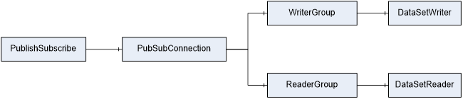  

Figure 22 - PubSub component state dependencies  

[Figure 23](/§\_Ref450679176) describes the formal state machine with the possible transitions.  

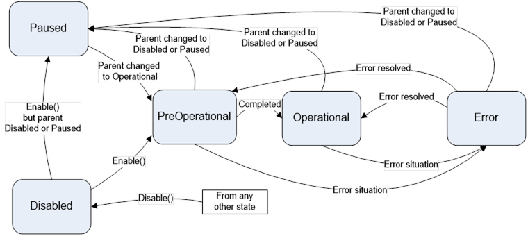  

Figure 23 - PubSubState state machine  

[Table 2](/§\_Ref450679858) formally defines the transitions of the state machine.  

Table 2 - PubSubState state machine  

| **Source State** | **Target State** | **Trigger Description** |
|---|---|---|
|Disabled|Paused|The component was successfully enabled but the parent component is in the state Disabled or *Paused* .|
|Disabled|PreOperational|The component was successfully enabled.|
|Paused|Disabled|The component was successfully disabled.|
|Paused|PreOperational|The state of the parent component changed to *Operational* .|
|PreOperational|Operational|The component completed the steps necessary to enter the *Operational* state. These steps include setup of network communication and security keys. If the PubSub component is a *DataSetReader* , the state shall change to *Operational* after the first key frame or event *DataSetMessage* was received.|
|PreOperational|Disabled|The component was successfully disabled.|
|PreOperational|Paused|The state of the parent component changed to *Disabled* or *Paused* .|
|PreOperational|Error|There is a pending error situation for the related *PubSub* component.|
|Operational|Disabled|The component was successfully disabled.|
|Operational|Paused|The state of the parent component changed to *Disabled* or *Paused* .|
|Operational|Error|There is a pending error situation for the related *PubSub* component.|
|Error|Disabled|The component was successfully disabled.|
|Error|Paused|The state of the parent component changed to *Disabled* or *Paused* .|
|Error|Operational|The error situation was resolved for the related *PubSub* component.|
|Error|PreOperational|The error situation was resolved for the related *PubSub* component.|
  

  

The *PubSubState* representation in the *AddressSpace* is defined in [Table 3](/§\_Ref83209871) .  

Table 3 - PubSubState definition  

| **Attribute** | **Value** |
|---|---|
|BrowseName|PubSubState|
|IsAbstract|False|
  
| **References** | **Node Class** | **BrowseName** | **DataType** | **TypeDefinition** | **Others** |
|---|---|---|---|---|---|
|Subtype of Enumeration defined in [OPC 10000-5](/§UAPart5)|
|HasProperty|Variable|EnumStrings|LocalizedText []|PropertyType||
  
| **Conformance Units** |
|---|
|PubSub Model Base|
  

  

#### 6.2.2 PubSub configuration properties  

The *PubSub* components have configuration property lists as *KeyValuePair* arrays. These optional configuration properties extend the configuration parameters defined for the different *PubSub* components.  

The configuration properties are mainly used as protocol or product specific parameters influencing the behaviour of the PubSub application. These properties may contain information that should not be visible outside the configuration tools and PubSub applications. Therefore the properties shall not be included in the *PubSubConnectionDataType* , *WriterGroupDataType* and *DataSetWriterDataType* when sent in discovery messages.  

The configuration are defined in different sections in the scope where they are used. The properties that can be applied to all PubSub components are defined in [Table 4](/§\_Ref86742396) .  

The *NamespaceIndex* of the *QualifiedName* in the *KeyValuePair* for properties defined in this document shall be 0. The *Name* of the *QualifiedName* is the property key from [Table 4](/§\_Ref86742396) . The *DataType* of the *Value* in the *KeyValuePair* shall be the *DataType* defined in [Table 4](/§\_Ref86742396) .  

[Table 4](/§\_Ref86742396) formally defines the general *PubSub* configuration properties.  

Table 4 - General PubSub configuration properties  

| **Key** | **DataType** | **Description** |
|---|---|---|
|0:NotPersisted|Boolean|Indicates if the component configuration is persisted. If this property is not present the default value is false and the component configuration is persisted.|
|0:ErrorDelay|Duration|A time delay in milliseconds from the time the first error is detected until transitioning to the *PubSubState Error* .|
  

  

#### 6.2.3 PublishedDataSet parameters  

##### 6.2.3.1 Overview  

A *PublishedDataSet* defines the content of a *DataSetMessage* and the configuration of the information source for a *DataSet* . See [5.2](/§\_Ref451847416) for the introduction to *DataSets* , [5.3](/§\_Ref462848042) for the introduction to *DataSetMessages* and [5.4.1.2](/§\_Ref458171447) for an introduction to the different source options and the parameters for sending of *DataSetMessages* .  

The content of a *DataSetMessage* is defined by the *DataSetMetaData.* This information is required for interoperability between *Publisher* and *Subscriber* . See [6.2.3.2](/§\_Ref494362471) .  

The information source is only necessary for the configuration of the *Publisher* . The standard configuration options are published data items for cyclic *DataSets* as defined in [6.2.3.7](/§\_Ref74050932) and published events for acyclic *DataSets* as defined in [6.2.3.8](/§\_Ref74050946) . OPC UA *Applications* can provide *PublishedDataSets* where the information source is application specific. The custom *PublishedDataSet* source *DataType* defined in [6.2.3.9](/§\_Ref74078283) indicates if the *DataSet* is cyclic or acyclic. Cyclic *DataSets* are sent as key frame or delta frame *DataSetMessages* . Acyclic *DataSets* are sent as event *DataSetMessages* .  

##### 6.2.3.2 DataSetMetaData  

###### 6.2.3.2.1 General  

*DataSetMetaData* describe the content and semantic of a *DataSet* . The order of the fields in the *DataSetMetaData* shall match the order of *DataSet* fields when they are included in the published *DataSetMessages* . The *DataSetMetaDataType* is defined in [6.2.3.2.3](/§\_Ref451027005) .  

###### 6.2.3.2.2 DataTypeSchemaHeader  

The *DataSetMetaData* is a subtype of *DataTypeSchemaHeader* . The *DataTypeSchemaHeader* provides OPC UA *DataType* definitions used in the *DataSetMetaData* . The *DataTypeSchemaHeader* is defined in [OPC 10000-5](/§UAPart5) .  

The *DataTypeSchemaHeader* provides information that is required when the *DataSetMetaData* is used outside the scope of an OPC UA *Server e.g* when sent in PubSub messages or when the *PubSubConfiguration* is exchanged with the *UABinaryFileDataType* . This information includes a namespace array and *DataType* descriptions. OPC UA namespace defined DataTypes are not included in the *PubSubConfiguration* .  

The *DataTypeSchemaHeader* of the *DataSetMetaData* shall be populated with the necessary information. This includes all namespaces and *DataTypes* that are potentially contained in the associated *DataSetMessages* . *DataTypes* defined in the OPC UA namespace ( *NamespaceIndex* 0) that are not built-in types or the abstract types *Number* , *UInteger* , *Integer* or *Enumeration* shall be included in the *DataSetMetaData* .  

A *Publisher* should keep the namespaces array in the *DataSetMetaData* unchanged even if the order of namespaces is changed in the OPC UA *Server* of the *Publisher* . A change of the namespace array in the *DataSetMetaData* requires a change to the *MajorVersion* in the *DataSetMetaData* .  

The *Subscriber* must map namespace indices in received messages if the data is processed in the context of an OPC UA *Server* information model e.g. if the values are written to target *Variables* . This affects encoding *NodeIds* in *ExtensionObjects* but also all other namespace indices in *NodeIds* and *BrowseNames* contained in the messages. If the *Subscriber* receives *Structure* *DataTypes* where the target *Variables* *DataTypes* have the same structure but different *DataType* *NodeIds* , the *Subscriber* must verify the consistency of the layout at start-up and must map the complete encoding *NodeId* when receiving the data.  

If the *DataSetMetaData* is created outside the *Publisher* , the same mapping may be required in the *Publisher* .  

###### 6.2.3.2.3 DataSetMetaDataType  

This *Structure DataType* is a subtype of *DataTypeSchemaHeader* and is used to provide the metadata for a *DataSet* . The *DataSetMetaDataType* is formally defined in [Table 5](/§\_Ref433696037) .  

Table 5 - DataSetMetaDataType structure  

| **Name** | **Type** | **Description** |
|---|---|---|
|DataSetMetaDataType|Structure|Subtype of *DataTypeSchemaHeader* defined in [OPC 10000-5](/§UAPart5) .|
|Name|String|Name of the *DataSet* .|
|Description|LocalizedText|Description of the *DataSet* . The default value is a null or empty *LocalizedText* .|
|Fields|FieldMetaData[]|The metadata for the fields in the *DataSet* . The *FieldMetaData* *DataType* is defined in [6.2.3.2.4](/§\_Ref433698324) .|
|DataSetClassId|Guid|This field provides the globally unique identifier of the class of *DataSet* if the *DataSet* is based on a *DataSetClass* . In this case, this field shall match the *DataSetClassId* of the concrete *DataSet* configuration. If the *DataSets* are not created from a class, this field is null.|
|ConfigurationVersion|Configuration VersionDataType|The configuration version for the current configuration of the *DataSet.*|
  

  

Its representation in the AddressSpace is defined in [Table 6](/§\_Ref399178532) .  

Table 6 - DataSetMetaDataType definition  

| **Attributes** | **Value** |
|---|---|
|BrowseName|DataSetMetaDataType|
|IsAbstract|False|
|Subtype of DataTypeSchemaHeader defined in [OPC 10000-5](/§UAPart5) .|
|Conformance Units|
|PubSub Parameters Discovery|
  

  

###### 6.2.3.2.4 FieldMetaData  

This *Structure DataType* is used to provide the metadata for a field in a *DataSet* . The *FieldMetaData* is formally defined in [Table 7](/§\_Ref433696014) .  

Table 7 - FieldMetaData structure  

| **Name** | **Type** | **Description** |
|---|---|---|
|FieldMetaData|Structure||
|Name|String|Name of the field. The name shall be unique in the *DataSet* .|
|Description|LocalizedText|Description of the field. The default value shall be a null or empty *LocalizedText* .|
|FieldFlags|DataSetFieldFlags|Flags for the field.|
|BuiltInType|Byte|The built-in data type of the field. The possible built-in type values are defined in [OPC 10000-6](/§UAPart6) . All data types are transferred in *DataSetMessages* as one of the built-in data types. In most cases the identifier of the *DataType* *NodeId* matches the built-in type. The following special cases need to be handled in addition: (1) Abstract types always have the built-in type *Variant* since they can result in different concrete types in a *DataSetMessage* . The *dataType* field may provide additional restrictions e.g. if the abstract type is *Number* . Abstract types shall not be used in UADP message mapping if the field is represented as *RawData* set by the *DataSetFieldContentMask* defined in [6.2.4.2](/§\_Ref495515956) . (2) *Enumeration DataTypes* are encoded as *Int32* . The *Enumeration* strings are defined through a *DataType* referenced through the *dataType* field. (3) *Structure* and *Union DataTypes* are encoded as *ExtensionObject* . The encoding rules are defined through a *DataType* referenced through the *dataType* field. (4) *DataTypes* derived from built-in types have the *BuiltInType* of the corresponding base DataType. The concrete subtype is defined through the *dataType* field. (5) *OptionSet DataTypes* are either encoded as one of the concrete *UInteger* *DataTypes* or as an instance of an *OptionSetType* in an *ExtensionObject* .|
|DataType|NodeId|The *NodeId* of the *DataType* of this field. If the *DataType* is an *Enumeration* or an *OptionSet* , the semantic of the *Enumeration DataType* is provided through the *enumDataTypes* field of the *DataSetMetaData* base type *DataTypeSchemaHeader* . If the *DataType* is a *Structure* or *Union* , the encoding and decoding description of the *Structure DataType* is provided through the *structureDataTypes* field of the *DataSetMetaData* base type *DataTypeSchemaHeader* .|
|ValueRank|Int32|Indicates whether the *dataType* is an array and how many dimensions the array has. It may have the following values: n \> 1: the *dataType* is an array with the specified number of dimensions. OneDimension (1): The *dataType* is an array with one dimension. OneOrMoreDimensions (0): The *dataType* is an array with one or more dimensions. Scalar (−1): The *dataType* is not an array. Any (−2): The *dataType* can be a scalar or an array with any number of dimensions. ScalarOrOneDimension (−3): The *dataType* can be a scalar or a one dimensional array. NOTE All *DataTypes* are considered to be scalar, even if they have array-like semantics like *ByteString* and *String* . Only a concrete valueRank with values n=-1 or n\>0 shall be used for UADP message mapping if the field is represented as *RawData* set by the *DataSetFieldContentMask* defined in [6.2.4.2](/§\_Ref495515956) .|
|ArrayDimensions|UInt32[]|This field specifies the maximum supported length of each dimension. If the maximum is unknown the value shall be 0. The number of elements shall be equal to the value of the v *alueRank* *field* . This field shall be null or empty if v *alueRank* ≤ 0. The maximum number of elements of an array transferred on the wire is 2.147.483.647 (max Int32). It is the total number of elements in all dimensions based on the UA Binary encoding rules for arrays.|
|MaxStringLength|UInt32|If the *dataType* field is a *String* , *LocalizedText* (the text field) or *ByteString* then this field specifies the maximum supported length of the data in number of bytes. If the maximum is unknown the value shall be 0. If the dataType field is not a *String, LocalizedText* or *ByteString* the value shall be 0. If the *valueRank* is greater than 0 this field applies to each element of the array.|
|DataSetFieldId|Guid|The unique ID for the field in the *DataSet* . The ID is generated when the field is added to the list. A change of the position of the field in the list shall not change the ID.|
|Properties|KeyValuePair[]|List of *Property* values providing additional semantic for the field. If at least one *Property* value changes, the *MajorVersion* of the *ConfigurationVersion* shall be updated. The *Property* in the *FieldMetaData* shall correctly describe the *Field Value* in the *DataSetMessages* . For example if the *Property* is *EngineeringUnits* , the unit of the *Field* *Value* shall match the unit of the *FieldMetaData* . The *KeyValuePair* DataType is defined in [OPC 10000-5](/§UAPart5) . For this field the key in the *KeyValuePair* structure is the *BrowseName* of the *Property* and the value in the *KeyValuePair* structure is the *Value* of the *Property* . If the *DataSetMessage* field has a *Variable* as source, the *NodeId* of the source *Variable* can be included in the *Properties* with the key *SourceNode* and the *Variable* *NodeId* as value. The namespace of the *NodeId* shall be added to the namespaces in the *DataSetMetaData* .|
  

  

Its representation in the AddressSpace is defined in [Table 8](/§\_Ref83224437) .  

Table 8 - FieldMetaData definition  

| **Attributes** | **Value** |
|---|---|
|BrowseName|FieldMetaData|
|IsAbstract|False|
|Subtype of Structure defined in [OPC 10000-5](/§UAPart5) .|
|Conformance Units|
|PubSub Parameters Discovery|
  

  

###### 6.2.3.2.5 DataSetFieldFlags  

This *DataType* defines flags for DataSet fields.  

The *DataSetFieldFlags* is formally defined in [Table 9](/§\_Ref498640836) .  

Table 9 - DataSetFieldFlags Values  

| **Value** | **Bit No.** | **Description** |
|---|---|---|
|PromotedField|0|The flag indicates if the field is promoted to the *NetworkMessages* or transport protocol header. Setting this flag increases the size of the *NetworkMessages* since information from the *DataSetMessage* body is also promoted to the header. Depending on the used security, the header including the field may be unencrypted. Promoted fields are always included in the header even if the *DataSetMessage* payload is a delta frame and the *DataSet* field is not included in the delta frame. In this case the last sent value is sent in the header. The order of the fields in the *DataSetMetaData* promoted to the header shall match the order of the fields in the header unless the header includes field names.|
  

  

The *DataSetFieldFlags* representation in the *AddressSpace* is defined in [Table 10](/§\_Ref498640842) .  

Table 10 - DataSetFieldFlags definition  

| **Attribute** | **Value** |
|---|---|
|BrowseName|DataSetFieldFlags|
|IsAbstract|False|
  
| **References** | **Node Class** | **BrowseName** | **DataType** | **TypeDefinition** | **Others** |
|---|---|---|---|---|---|
|Subtype of UInt16 defined in [OPC 10000-5](/§UAPart5)|
|HasProperty|Variable|OptionSetValues|LocalizedText []|PropertyType||
  
| **Conformance Units** |
|---|
|PubSub Parameters Discovery|
  

  

###### 6.2.3.2.6 ConfigurationVersionDataType  

This *Structure DataType* is used to indicate configuration changes in the information published for a *DataSet* . The *ConfigurationVersionDataType* is formally defined in [Table 11](/§\_Ref408836417) .  

Table 11 - ConfigurationVersionDataType structure  

| **Name** | **Type** | **Description** |
|---|---|---|
|ConfigurationVersionDataType|Structure||
|MajorVersion|VersionTime|The *majorVersion* reflects the time of the last major change of the *DataSet* content. The *VersionTime* *DataType* is defined in [OPC 10000-4](/§UAPart4) . To assure interoperability, the *Subscriber* shall use *DataSetMetaData* for decoding with a *majorVersion* that matches the *majorVersion* in *DataSetMessages* sent by the *Publisher* . Removing fields from the *DataSet* content, reordering fields, adding fields in between other fields or a *DataType* change in fields shall result in an update of the *majorVersion* . If at least one *Property* value of a *DataSetMetaData* field changes, the *majorVersion* shall be updated. If the namespaces in the *DataTypeSchemaHeader* change, the *majorVersion* shall be updated. There can be situations where older configurations of a *Publisher* are loaded and changed with product-specific configuration tools. In this case the *majorVersion* shall be updated if the configuration tool is not able to verify if the change only extends the configuration and does not change the existing content. Additional criteria for changing *majorVersion* or *minorVersion* are defined in this document.|
|MinorVersion|VersionTime|The *minorVersion* reflects the time of the last change. Only the *minorVersion* shall be updated if fields are added at the end of the *DataSet* content. If the *majorVersion* is updated, the *minorVersion* is updated to the same value as *majorVersion* .|
  

  

Its representation in the AddressSpace is defined in [Table 12](/§\_Ref83224438) .  

Table 12 - ConfigurationVersionDataType definition  

| **Attributes** | **Value** |
|---|---|
|BrowseName|ConfigurationVersionDataType|
|IsAbstract|False|
|Subtype of Structure defined in [OPC 10000-5](/§UAPart5) .|
|Conformance Units|
|PubSub Parameters Discovery|
  

  

##### 6.2.3.3 DataSetClassId  

*DataSetMetaData* may be specific to a single *Publisher* and a single selection of information or universal, e.g. defined by a standards organization or by a plant operator as a *DataSetClass* . *DataSets* that conform to such a *DataSetClass* are identified with a *DataSetClassId* .  

The *DataSetClassId* is the globally unique identifier ( *Guid* ) of a *DataSetClass* . It is included in the *DataSetMetaData* . The *NetworkMessageContentMask* controls the availability of the *DataSetClassId* in the *NetworkMessage* .  

##### 6.2.3.4 ExtensionFields  

The *ExtensionFields* parameter ** allows the configuration of fields with values to be included in the *DataSet* when the existing *AddressSpace* of the *Publisher* does not provide the necessary information. The *ExtensionFields* are represented as an array of *KeyValuePair Structures* .  

##### 6.2.3.5 PublishedDataSetDataType  

This *Structure DataType* represents the *PublishedDataSet* parameters. The *PublishedDataSetDataType* is formally defined in [Table 13](/§\_Ref497341759) .  

Table 13 - PublishedDataSetDataType structure  

| **Name** | **Type** | **Description** | **AllowSubtypes** |
|---|---|---|---|
|PublishedDataSetDataType|Structure|||
|Name|String|Name of the *PublishedDataSet* . It is recommended to use a human readable name. The name of the *PublishedDataSet* shall be unique in the *Publisher* .||
|DataSetFolder|String[]|Optional path of the *DataSet* folder used to group *PublishedDataSets* where each entry in the *String* array represents one level in a *DataSet* folder hierarchy. If no grouping is needed the parameter is a null or empty *String* array.||
|DataSetMetaData|DataSetMetaDataType|Defined in [6.2.3.2](/§\_Ref494362471) .||
|ExtensionFields|KeyValuePair[]|Defined in [6.2.3.4](/§\_Ref497339390) .||
|DataSetSource|PublishedDataSetSourceDataType|Defined in [6.2.3.6](/§\_Ref497339381) . If the parameter is null, the source creates cyclic *DataSets* . This is equal to a *PublishedDataSetCustomSourceDataType* with *cyclicDataSet* set to true.|True|
  

  

Its representation in the AddressSpace is defined in [Table 14](/§\_Ref83224439) .  

Table 14 - PublishedDataSetDataType definition  

| **Attributes** | **Value** |
|---|---|
|BrowseName|PublishedDataSetDataType|
|IsAbstract|False|
|Subtype of Structure defined in [OPC 10000-5](/§UAPart5) .|
|Conformance Units|
|PubSub Parameters PublishedDataSet|
  

  

##### 6.2.3.6 PublishedDataSetSourceDataType  

The *PublishedDataSetSourceDataType Structure* is an abstract base type without fields for the definition of the *PublishedDataSet* source. Its representation in the *AddressSpace* is defined in [Table 15](/§\_Ref497341765) .  

Table 15 - PublishedDataSetSourceDataType definition  

| **Attributes** | **Value** |
|---|---|
|BrowseName|PublishedDataSetSourceDataType|
|IsAbstract|True|
|Subtype of Structure defined in [OPC 10000-5](/§UAPart5) .|
|Conformance Units|
|PubSub Parameters PublishedDataSet|
  

  

##### 6.2.3.7 Published Data Items  

###### 6.2.3.7.1 PublishedData  

The parameter *PublishedData* defines the content of a *DataSet* created from *Variable Values* and therefore the content of the *DataSetMessage* sent by a *DataSetWriter* . The sources of the *DataSet* fields are defined through an array of *PublishedVariableDataType* .  

The index into the array has an important role for *Subscribers* and for configuration tools. It is used as a handle to reference the *Value* in *DataSetMessages* received by *Subscribers* . The index may change after configuration changes. Changes are indicated by the *ConfigurationVersion* of the *DataSet* and applications working with the index shall always check the *ConfigurationVersion* before using the index.  

The length of the *PublishedData* array shall match the length of the fields array in the corresponding *DataSetMetaData* .  

If an entry of the *PublishedData* references one of the *ExtensionFields* , the *substituteValue* shall contain the *QualifiedName* of the *ExtensionFields* entry. All other fields of this *PublishedVariableDataType* array element shall be null or empty.  

The *DataType* *PublishedVariableDataType* represents the configuration information for one Variable. The *PublishedVariableDataType* is formally defined in [Table 16](/§\_Ref399176826) .  

Table 16 - PublishedVariableDataType structure  

| **Name** | **Type** | **Description** |
|---|---|---|
|PublishedVariableDataType|Structure||
|PublishedVariable|NodeId|The *NodeId* of the published *Variable* . Some transport protocols require knowledge on the message receiver side about the DataType, ValueRank and ArrayDimensions to be able to decode the message content. This information is provided through the *DataSetMetaData* provided for the *DataSet* .|
|AttributeId|IntegerId|Id of the *Attribute* to publish e.g. the *Value Attribute* . This shall be a valid *Attribute* id. The *Attributes* are defined in [OPC 10000-3](/§UAPart3) . The *IntegerId DataType* is defined in [OPC 10000-4](/§UAPart4) . The *IntegerIds* for the *Attributes* are defined in [OPC 10000-6](/§UAPart6) .|
|SamplingIntervalHint|Duration|A recommended rate of acquiring new values for change or deadband evaluation. A *Publisher* should use this value as hint for setting the internal sampling rate. The value 0 indicates that the *Server* should use the fastest practical rate. The value -1 indicates that the default sampling interval defined by the *PublishingInterval* of the *WriterGroup* is requested. Any negative number is interpreted as -1.|
|DeadbandType|UInt32|A value that defines the *Deadband* type and behaviour. Value    Description  *None*    No *Deadband* calculation should be applied.  *Absolute*   AbsoluteDeadband (This type is specified in        [OPC 10000-4](/§UAPart4) )  *Percent*   PercentDeadband (This type is specified in        [OPC 10000-8](/§UAPart8) ).|
|DeadbandValue|Double|The deadband value for the corresponding *DeadbandType* . The meaning of the value depends on *DeadbandType* .|
|IndexRange|NumericRange|This parameter is used to identify a single element of an array, or a single range of indexes for arrays. The *NumericRange* type and the logic for *IndexRange* are defined in [OPC 10000-4](/§UAPart4) .|
|SubstituteValue|BaseDataType|The SubstituteValue is the value that is included in the *DataSet* if the *StatusCode* of the *DataValue* is Bad. In this case the *StatusCode* is set to Uncertain\_SubstituteValue. This Value shall match the *DataType* and *ValueRank* of the *PublishedVariable* since *DataSetWriters* may depend on a valid *Value* with the right *DataType* that matches the *ConfigurationVersion* . If the *SubstituteValue* is Null, the *StatusCode* of the *DataValue* is processed. The handling of the *SubstituteValue* is defined in [6.2.11](/§\_Ref455004572) .|
|MetaDataProperties|QualifiedName [ ]|This parameter specifies an array of *Properties* to be included in the *FieldMetaData* created for this *Variable* . It shall be used to populate the *properties* element of the resulting field in the *DataSetMetaData* .|
  

  

Its representation in the AddressSpace is defined in [Table 17](/§\_Ref83224440) .  

Table 17 - PublishedVariableDataType definition  

| **Attributes** | **Value** |
|---|---|
|BrowseName|PublishedVariableDataType|
|IsAbstract|False|
|Subtype of Structure defined in [OPC 10000-5](/§UAPart5) .|
|Conformance Units|
|PubSub Parameters PublishedDataSet|
  

  

###### 6.2.3.7.2 PublishedDataItemsDataType  

This *Structure DataType* is used to represent *PublishedDataItems* specific parameters. It is a subtype of the *PublishedDataSetSourceDataType* defined in [6.2.3.6](/§\_Ref497339381) .  

The *PublishedDataItemsDataType* is formally defined in [Table 18](/§\_Ref497341786) .  

Table 18 - PublishedDataItemsDataType structure  

| **Name** | **Type** | **Description** |
|---|---|---|
|PublishedDataItemsDataType|Structure|Subtype of *PublishedDataSetSourceDataType* defined in [6.2.3.6](/§\_Ref497339381) .|
|PublishedData|PublishedVariableDataType[]|Defined in [6.2.3.7.1](/§\_Ref426309771) .|
  

  

Its representation in the AddressSpace is defined in [Table 19](/§\_Ref83224441) .  

Table 19 - PublishedDataItemsDataType definition  

| **Attributes** | **Value** |
|---|---|
|BrowseName|PublishedDataItemsDataType|
|IsAbstract|False|
|Subtype of *PublishedDataSetSourceDataType* defined in [6.2.3.6](/§\_Ref497339381) .|
|Conformance Units|
|PubSub Parameters PublishedDataSet|
  

  

##### 6.2.3.8 Published Events  

###### 6.2.3.8.1 EventNotifier  

The parameter *EventNotifier* defines the *NodeId* of the *Object* in the event notifier tree of the OPC UA *Server* from which *Events* are collected.  

###### 6.2.3.8.2 SelectedFields  

The parameter *SelectedFields* defines the selection of *Event* fields contained in the *DataSet* generated for an *Event* and sent through the *DataSetWriter* . The *SimpleAttributeOperand* *DataType* is defined in [OPC 10000-4](/§UAPart4) . The *DataType* of the selected *Event* field in the *EventType* defines the *DataType* of the *DataSet* field. *Event* fields can be null or the field value can be a *StatusCode* . The encoding of *Event* based *DataSetMessages* shall be able to handle these cases. *ExtensionFields* defined for the instance of the *PublishedEventsType* can be included in the *SelectedFields* by specifying the *PublishedEventsType* *NodeId* as typeId in the *SimpleAttributeOperand* and the *BrowseName* of the extension field in the *browsePath* of the *SimpleAttributeOperand* .  

The index into the list of entries in the *SelectedFields* has an important role for *Subscribers.* It is used as handle to reference the *Event* field in *DataSetMessages* received by *Subscribers* . The index may change after configuration changes. Changes are indicated by the *ConfigurationVersion* and applications working with the index shall always check the *ConfigurationVersion* before using the index. If a change of the *SelectedFields* adds additional fields, the *MinorVersion* of the *ConfigurationVersion* shall be updated. If a change of the *SelectedFields* removes fields, the *MajorVersion* of the *ConfigurationVersion* shall be updated. The *ConfigurationVersionDataType* and the rules for setting the version are defined in [6.2.3.2.6](/§\_Ref425674914) .  

###### 6.2.3.8.3 Filter  

The parameter *Filter* defines the filter applied to the *Events* . It allows the reduction of the *DataSets* generated from *Events* through a filter. The *ContentFilter DataType* is defined in [OPC 10000-4](/§UAPart4) .  

###### 6.2.3.8.4 PublishedEventsDataType  

This *Structure DataType* is used to represent *PublishedEvents* specific parameters. It is a subtype of the *PublishedDataSetSourceDataType* defined in [6.2.3.6](/§\_Ref497339381) .  

The *PublishedEventsDataType* is formally defined in [Table 20](/§\_Ref497341792) .  

Table 20 - PublishedEventsDataType structure  

| **Name** | **Type** | **Description** |
|---|---|---|
|PublishedEventsDataType|Structure|Subtype of *PublishedDataSetSourceDataType* defined in [6.2.3.6](/§\_Ref497339381) .|
|EventNotifier|NodeId|Defined in [6.2.3.8.1](/§\_Ref497340627) .|
|SelectedFields|SimpleAttributeOperand[]|Defined in [6.2.3.8.2](/§\_Ref497340634) .|
|Filter|ContentFilter|Defined in [6.2.3.8.3](/§\_Ref497340641) .|
  

  

Its representation in the AddressSpace is defined in [Table 21](/§\_Ref83224442) .  

Table 21 - PublishedEventsDataType definition  

| **Attributes** | **Value** |
|---|---|
|BrowseName|PublishedEventsDataType|
|IsAbstract|False|
|Subtype of *PublishedDataSetSourceDataType* defined in [6.2.3.6](/§\_Ref497339381) .|
|Conformance Units|
|PubSub Parameters PublishedDataSet Events|
  

  

##### 6.2.3.9 Custom PublishedDataSet source  

###### 6.2.3.9.1 CyclicDataSet  

The *CyclicDataSet* with *DataType Boolean* defines the type of *DataSetMessages* created by the *PublishedDataSet* .  

If *CyclicDataSet* is false, event *DataSetMessages* are sent acyclicly and a related *DataSetWriter* shall use a *KeyFrameCount* of 0.  

If *CyclicDataSet* is true, key frame or delta frame *DataSetMessages* are sent and a related *DataSetWriter* shall use a *KeyFrameCount* that is greater than or equal to 1.  

###### 6.2.3.9.2 PublishedDataSetCustomSourceDataType  

This *Structure DataType* is used to represent custom *PublishedDataSet* source specific parameters. It is a subtype of the *PublishedDataSetSourceDataType* defined in [6.2.3.6](/§\_Ref497339381) .  

The *DataType* can be used directly if no further information is exposed for the source. OPC UA *Applications* shall use *DataTypes* derived from *PublishedDataSetSourceDataType* if they want to provide custom information about the source e.g. product specific configuration options.  

The *PublishedDataSetCustomSourceDataType* is formally defined in [Table 22](/§\_Ref74307430) .  

Table 22 - PublishedDataSetCustomSourceDataType structure  

| **Name** | **Type** | **Description** |
|---|---|---|
|PublishedDataSetCustomSourceDataType|Structure|Subtype of *PublishedDataSetSourceDataType* defined in [6.2.3.6](/§\_Ref497339381) .|
|CyclicDataSet|Boolean|Defined in [6.2.3.9.1](/§\_Ref74078219) .|
  

  

Its representation in the AddressSpace is defined in [Table 23](/§\_Ref83224443) .  

Table 23 - PublishedDataSetCustomSourceDataType definition  

| **Attributes** | **Value** |
|---|---|
|BrowseName|PublishedDataSetCustomSourceDataType|
|IsAbstract|False|
|Subtype of *PublishedDataSetSourceDataType* defined in [6.2.3.6](/§\_Ref497339381) .|
|Conformance Units|
|PubSub Parameters PublishedDataSet Custom|
  

  

##### 6.2.3.10 Published Action  

###### 6.2.3.10.1 General  

Published *Action* defines the signature of an *Action* as a combination of *ActionRequest* and *ActionResponse* messages and a list of targets with an optional mapping to OPC UA *Methods* .  

The *Action* targets, *ActionRequest* and *ActionResponse* information is the input to the *ActionMetaData* .  

The parameter *RequestDataSetMetaData* defines the content of the *ActionRequest* .  

The *DataSetMetaData* parameter of the *PublishedDataSet* defines the content of the *ActionResponse* .  

The parameter *ActionTargets* provides a list of *Action* targets with the same signatures that can be executed based on the published *Action* definition.  

###### 6.2.3.10.2 RequestDataSetMetaData  

The parameter *RequestDataSetMetaData* defines the payload of *ActionRequest* messages.  

The payload of the ActionResponse messages is defined by the *DataSetMetaData* parameter of the *PublishedDataSetDataType* . The fields *Name* and *ConfigurationVersion* of the *DataSetMetaData* and the *RequestDataSetMetaData* in one *PublishedDataSet* shall be identical.  

###### 6.2.3.10.3 ActionTargets  

The parameter *ActionTargets* defines the list of *Action* targets that can be invoked with the signature defined by the *ActionMetaData* .  

The *DataType* *ActionTargetDataType* represents the configuration information for one *Action* target. The *ActionTargetDataType* is formally defined in [Table 24](/§\_Ref141973791) .  

Table 24 - ActionTargetDataType structure  

| **Name** | **Type** | **Description** |
|---|---|---|
|ActionTargetDataType|Structure||
|ActionTargetId|UInt16|The numeric identifier assigned to the *Action* target which is unique within one *ActionMetaData* . It is used to address the *Action* target in combination with the *PublisherId* and the *DataSetWriterId* .|
|Name|String|Name of the *Action* target.|
|Description|LocalizedText|Description of the *Action* target. The default value is a null or empty *LocalizedText* .|
  

  

Its representation in the AddressSpace is defined in [Table 25](/§\_Ref141973790) .  

Table 25 - ActionTargetDataType definition  

| **Attributes** | **Value** |
|---|---|
|BrowseName|ActionTargetDataType|
|IsAbstract|False|
|Subtype of Structure defined in [OPC 10000-5](/§UAPart5) .|
|Conformance Units|
|PubSub Parameters PublishedDataSet Action|
  

  

###### 6.2.3.10.4 PublishedActionDataType  

This *Structure DataType* is used to represent *PublishedAction* specific parameters. It is a subtype of the *PublishedDataSetSourceDataType* defined in [6.2.3.6](/§\_Ref497339381) .  

The *PublishedActionDataType* is formally defined in [Table 26](/§\_Ref141956978) .  

Table 26 - PublishedActionDataType structure  

| **Name** | **Type** | **Description** |
|---|---|---|
|PublishedActionDataType|Structure|Subtype of *PublishedDataSetSourceDataType* defined in [6.2.3.6](/§\_Ref497339381) .|
|RequestDataSetMetaData|DataSetMetaDataType|Defined in [6.2.3.10.2](/§\_Ref141974938) .|
|ActionTargets|ActionTargetDataType[]|Defined in [6.2.3.10.3](/§\_Ref141974954) .|
  

  

Its representation in the AddressSpace is defined in [Table 27](/§\_Ref141956977) .  

Table 27 - PublishedActionDataType definition  

| **Attributes** | **Value** |
|---|---|
|BrowseName|PublishedActionDataType|
|IsAbstract|False|
|Subtype of *PublishedDataSetSourceDataType* defined in [6.2.3.6](/§\_Ref497339381) .|
|Conformance Units|
|PubSub Parameters PublishedDataSet Action|
  

  

###### 6.2.3.10.5 ActionMethods  

The parameter *ActionMethods* defines a list of *Object* and *Method* pairs as source for the *Action* defined in the parameter *ActionMethods* .  

The *DataType* *ActionMethodDataType* represents the configuration information for one *Object* and *Method* pair. The *ActionMethodDataType* is formally defined in [Table 28](/§\_Ref141973789) .  

Table 28 - ActionMethodDataType structure  

| **Name** | **Type** | **Description** |
|---|---|---|
|ActionMethodDataType|Structure||
|ObjectId|NodeId|The *NodeId* shall be that of the *Object* on which the *Method* is invoked. The NodeId of an *ObjectType* is valid as *ObjectId* if the *Method* is only defined on the *ObjectType* . The namespace of the *NodeId* shall be added to the namespaces in the *RequestDataSetMetaData* .|
|MethodId|NodeId|*NodeId* of the *Method* to invoke. If the *ObjectId* is the *NodeId* of an *Object* , it is allowed to use the *NodeId* of a *Method* that is the target of a *HasComponent* *Reference* from the *ObjectType* of the *Object* . The namespace of the *NodeId* shall be added to the namespaces in the *RequestDataSetMetaData* .|
  

  

Its representation in the AddressSpace is defined in [Table 29](/§\_Ref141973788) .  

Table 29 - ActionMethodDataType definition  

| **Attributes** | **Value** |
|---|---|
|BrowseName|ActionMethodDataType|
|IsAbstract|False|
|Subtype of Structure defined in [OPC 10000-5](/§UAPart5) .|
|Conformance Units|
|PubSub Parameters PublishedDataSet Action|
  

  

###### 6.2.3.10.6 PublishedActionMethodDataType  

This *Structure DataType* is used to represent *Action* source *Method* information for *PublishedAction* . It is a subtype of the *PublishedActionDataType* defined in [6.2.3.10.4](/§\_Ref161532236) .  

The *PublishedActionMethodDataType* is formally defined in [Table 30](/§\_Ref161533017) .  

Table 30 - PublishedActionMethodDataType structure  

| **Name** | **Type** | **Description** |
|---|---|---|
|PublishedActionMethodDataType|Structure|Subtype of *PublishedActionDataType* defined in [6.2.3.10.4](/§\_Ref161532236) .|
|ActionMethods|ActionMethodDataType[]|Defined in [6.2.3.10.5](/§\_Ref141974960) . If the *Action* targets are mapped to OPC UA *Methods* , the size and order of the array shall match the *ActionTargets* array in the *PublishedActionDataType* base type.|
  

  

Its representation in the AddressSpace is defined in [Table 31](/§\_Ref161533018) .  

Table 31 - PublishedActionMethodDataType definition  

| **Attributes** | **Value** |
|---|---|
|BrowseName|PublishedActionMethodDataType|
|IsAbstract|False|
|Subtype of *PublishedActionDataType* defined in [6.2.3.10.4](/§\_Ref161532236) .|
|Conformance Units|
|PubSub Parameters PublishedDataSet Action|
  

  

#### 6.2.4 DataSetWriter parameters  

##### 6.2.4.1 DataSetWriterId  

The *DataSetWriterId* with *DataType UInt16* defines the unique ID of the *DataSetWriter* for a *PublishedDataSet* . It is used to select *DataSetMessages* for a *PublishedDataSet* on the *Subscriber* side.  

It shall be unique across all *DataSetWriters* for a *PublisherId* .  

All values, except for 0, are valid *DataSetWriterIds* . The value 0 is defined as null value.  

The *DataSetWriterId* shall be within the range 0x0001 - 0x7FFF for external assignment by configuration tools, and 0x8000 - 0xFFFF for internal assignment like through the *Method* *CloseAndUpdate* of the *PubSubConfigurationType* .  

##### 6.2.4.2 DataSetFieldContentMask  

A *DataSet* field consists of a value and related metadata. In most cases the value comes with status and timestamp information.  

This *DataType* defines flags to include *DataSet* field related information like status and timestamp in addition to the value in the *DataSetMessage* . The parameter is not relevant for heartbeat messages but should be configured according to the header layout requirements.  

The *DataSetFieldContentMask* is formally defined in [Table 32](/§\_Ref496547350) .  

The handling of bad status for different field representations is defined in [Figure 24](/§\_Ref463388503) , [Table 34](/§\_Ref455004331) and [Table 35](/§\_Ref191558786) .  

Table 32 - DataSetFieldContentMask Values  

| **Value** | **Bit No.** | **Description** |
|---|---|---|
|*DataSet* fields can be represented as RawData, Variant or DataValue as described in [5.3.2](/§\_Ref500186999) . If none of the bits are set, the fields are represented as *Variant* . If the *RawData* bit is set for UADP message mapping, the fields are represented as *RawData* and all other bits are ignored. For JSON message mapping the bit is used as an option in *VerboseEncoding* . If one of the bits 0 to 4 is set, the fields are represented as *DataValue* .|
|StatusCode|0|The *DataValue* structure field *StatusCode* is included in the *DataSetMessage* s. If this bit is set, the fields are represented as *DataValue* .|
|SourceTimestamp|1|The *DataValue* structure field *SourceTimestamp* is included in the *DataSetMessage* s. If this bit is set, the fields are represented as *DataValue* .|
|ServerTimestamp|2|The *DataValue* structure field *ServerTimestamp* is included in the *DataSetMessage* s. If this bit is set, the fields are represented as *DataValue* .|
|SourcePicoSeconds|3|The *DataValue* structure field *SourcePicoSeconds* is included in the *DataSetMessage* s. If this bit is set, the fields are represented as *DataValue* . This bit is ignored if the *SourceTimestamp* bit is not set.|
|ServerPicoSeconds|4|The *DataValue* structure field *ServerPicoSeconds* is included in the *DataSetMessage* s. If this bit is set, the fields are represented as *DataValue* . This bit is ignored if the *ServerTimestamp* bit is not set.|
|RawData|5|If this bit is set for UADP message mapping, the fields of the *DataSet* are encoded without additional information like timestamp, status or *DataType* information. The details of the representation are defined for the message mappings.All other field related bits shall be ignored if this bit is set.. If this bit is set for JSON message mapping, it is used as an option in *VerboseEncoding* and it can be combined with the other bits.|
  

  

The *DataSetFieldContentMask* representation in the *AddressSpace* is defined in [Table 33](/§\_Ref496547340) .  

Table 33 - DataSetFieldContentMask definition  

| **Attribute** | **Value** |
|---|---|
|BrowseName|DataSetFieldContentMask|
|IsAbstract|False|
  
| **References** | **Node Class** | **BrowseName** | **DataType** | **TypeDefinition** | **Others** |
|---|---|---|---|---|---|
|Subtype of UInt32 defined in [OPC 10000-5](/§UAPart5)|
|HasProperty|Variable|OptionSetValues|LocalizedText []|PropertyType||
  
| **Conformance Units** |
|---|
|PubSub Parameters Discovery|
  

  

The *DataSetFieldContentMask* defines different options that influence the information flow from *Publisher* to *Subscriber* in the case of a Bad Value Status or other error situations. [Figure 24](/§\_Ref463388503) depicts the parameters and the information flow from *DataSet* field to *DataSetMessage* creation on the *Publisher* side and the decoded DataSet field on the Subscriber side. The *DataSetFieldContentMask* controls the representation of the DataSet fields in a *DataSetMessage* .  

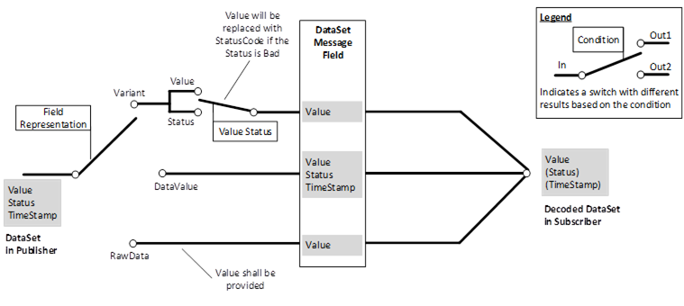  

Figure 24 - PubSub information flow dependency to field representation  

The representation of the *DataSet* fields in a *DataSetMessage* on the *Publisher* side and the decoding back to the *DataSet* fields on the *Subscriber* side is defined in [Table 34](/§\_Ref455004331) for UADP message mapping and in [Table 35](/§\_Ref191558786) for JSON message mapping. The representation on the *Publisher* side depends on the field representation defined in the *DataSetFieldContentMask* .  

Table 34 - UADP DataSetMessage field representation options  

| **DataSet Publisher** | **Field** | **DataSetMessage** | **DataSet Subscriber** |
|---|---|---|---|
  
| **Value** | **Status** || **Value** | **Value Status** | **Header Status** | **Value** | **Status** |
|---|---|---|---|---|---|---|---|
|Value 1|Good\_\*|Variant|Value 1|N/A|Good|Value 1|Good|
|Value 1|Uncertain\_\*||Value 1 Uncertain\_\* (b)||Good|Value 1 (b)|Uncertain\_\* (b)|
|Null|Bad\_\*||Bad\_\* (c)||Good|Null|Bad\_\* (c)|
|Value 1|Good\_\*|DataValue|Value 1|Good\_\*|Good|Value 1|Good\_\*|
|Value 1|Uncertain\_\*||Value 1|Uncertain\_\*|Good|Value 1|Uncertain\_\*|
|Null|Bad\_\*||Null|Bad\_\*|Good|Null|Bad\_\*|
|Value 1|Good\_\*|RawData|Value 1|N/A|Good|Value 1|Good|
|Value 1|Uncertain\_\*||Value 1 (d)||Uncertain (d)|Value 1|Uncertain|
|Null|Bad\_\*||Default value for DataType (e)||Uncertain\_ SubNormal (e)|Default value for DataType|Uncertain\_ SubNormal|
|All fields Bad\_\*||Default value for DataType (e)||Bad (e)|Null|Bad|
|The header status is set to a bad code in a fatal error situation.|Bad\_\*|Null|Bad\_\*|
|(a) If no specific *StatusCode* is used, the grouping into severity *Good* , *Uncertain* or *Bad* is used. In this case, the resulting *Status* matches the input *Status* . (b) If the status is uncertain in variant encoding, the value and the status are encoded as *DataValue* . (c) A bad status is transferred instead of a value for the variant encoding. (d) If the status for one or more fields is uncertain in raw filed encoding, the header status shall be set to *Uncertain* . (e) If the worst status for some fields is bad, the header status shall be set to *Uncertain\_SubNormal* . If the status for all fields is bad, the header status shall be set to *Bad* . The value in message is set to the default value for the *DataType* .|
  

  

Table 35 - JSON DataSetMessage field representation options  

| **DataSet Publisher** | **Field** | **DataSetMessage** | **DataSet Subscriber** |
|---|---|---|---|
  
| **Value** | **Status** || **Value** | **Value Status** | **Header Status** | **Value** | **Status** |
|---|---|---|---|---|---|---|---|
|Value 1|Good\_\*|Variant (d)|Value 1|N/A|Good|Value 1|Good|
|Value 1|Uncertain\_\*||Value 1||Uncertain (b)|Value 1|Uncertain (b)|
|Null|Bad\_\*||Bad\_\* (c)||Good|Null|Bad\_\* (c)|
|Value 1|Good\_\*|DataValue (d)|Value 1|Good\_\*|Good|Value 1|Good\_\*|
|Value 1|Uncertain\_\*||Value 1|Uncertain\_\*|Good|Value 1|Uncertain\_\*|
|Null|Bad\_\*||Null|Bad\_\*|Good|Null|Bad\_\*|
|The header status is set to a bad code in a fatal error situation.|Bad\_\*|Null|Bad\_\*|
|(a) If no specific *StatusCode* is used, the grouping into severity *Good* , *Uncertain* or *Bad* is used. In this case, the resulting *Status* matches the input *Status* . (b) A uncertain status is ignored on the field level and results in a header status of *Uncertain* . (c) A bad status is transferred instead of a value for the variant encoding. (d) The RawData bit only affects the presence of *UaType* and *UaTypeId* .|
  

  

##### 6.2.4.3 KeyFrameCount  

The *KeyFrameCount* with *DataType UInt32* is the multiplier of the *PublishingInterval* that defines the maximum number of times the *PublishingInterval* expires before a key frame message with values for all published *Variables* is sent. The delta frame *DataSetMessages* contains just the changed values. If no changes exist, the delta frame *DataSetMessage* shall not be sent. If the *KeyFrameCount* is set to 1, every message contains a key frame.  

For *PublishedDataSets* that provide cyclic updates of the *DataSet* , the value shall be greater than or equal to 1. *PublishedDataItems* or custom sources with *CyclicDataSet* set to true provide cyclic updates.  

For non-cyclic *PublishedDataSets* that provide acyclic event based *DataSets* , the value shall be 0. *PublishedEvents* or custom sources with *CyclicDataSet* set to false provide acyclic updates.  

For a heartbeat *DataSetMessage* , the value shall be 1.  

##### 6.2.4.4 DataSetWriterProperties  

The *DataSetWriterProperties* parameter is an array of *DataType* *KeyValuePair* that specifies additional properties for the configured *DataSetWriter* . The *KeyValuePair* *DataType* is defined in [OPC 10000-5](/§UAPart5) and consists of a *QualifiedName* and a value of *BaseDataType* .  

The mapping of the name and value to concrete functionality may be defined by transport protocol mappings, future versions of this document or vendor-specific extensions.  

##### 6.2.4.5 DataSetWriter definition  

###### 6.2.4.5.1 DataSetWriterDataType  

This *Structure DataType* is used to represent the *DataSetWriter* parameters. The *DataSetWriterDataType* is formally defined in [Table 36](/§\_Ref494369052) .  

Table 36 - DataSetWriterDataType structure  

| **Name** | **Type** | **Description** | **Allow Subtypes** |
|---|---|---|---|
|DataSetWriterDataType|Structure|||
|Name|String|The name of the *DataSetWriter* . The name shall be unique across the *WriterGroup* . It is recommended to use a human readable name.||
|Enabled|Boolean|The enabled state of the *DataSetWriter* .||
|DataSetWriterId|UInt16|Defined in [6.2.4.1](/§\_Ref494235089) .||
|DataSetFieldContentMask|DataSetFieldContentMask|Defined in [6.2.4.2](/§\_Ref495515956) .||
|KeyFrameCount|UInt32|Defined in [6.2.4.3](/§\_Ref494234143) .||
|DataSetName|String|The name of the corresponding *PublishedDataSet* . If the *DataSetWriter* is used to create heartbeat *DataSetMessages* , the *dataSetName* shall be null or empty.||
|DataSetWriterProperties|KeyValuePair[]|Defined in [6.2.4.4](/§\_Ref505528463) .||
|TransportSettings|DataSetWriterTransportDataType|Transport mapping specific *DataSetWriter* parameters. The abstract base type is defined in [6.2.4.5.2](/§\_Ref494369397) . The concrete subtypes are defined in the subclauses for transport mapping specific parameters. If no concrete subtype is defined for the transport mapping, the field shall be null.|True|
|MessageSettings|DataSetWriterMessageDataType|*DataSetMessage* mapping specific *DataSetWriter* parameters. The abstract base type is defined in [6.2.4.5.3](/§\_Ref496715098) . The concrete subtypes are defined in the subclauses for message mapping specific parameters. If no concrete subtype is defined for the message mapping, the field shall be null.|True|
  

  

Its representation in the AddressSpace is defined in [Table 37](/§\_Ref83224444) .  

Table 37 - DataSetWriterDataType definition  

| **Attributes** | **Value** |
|---|---|
|BrowseName|DataSetWriterDataType|
|IsAbstract|False|
|Subtype of Structure defined in [OPC 10000-5](/§UAPart5) .|
|Conformance Units|
|PubSub Parameters Discovery|
  

  

###### 6.2.4.5.2 DataSetWriterTransportDataType  

This *Structure DataType* is an abstract base type for transport mapping specific *DataSetWriter* parameters. The abstract *DataType* does not define fields.  

The *DataSetWriterTransportDataType* *Structure* representation in the *AddressSpace* is defined in [Table 38](/§\_Ref494369054) .  

Table 38 - DataSetWriterTransportDataType definition  

| **Attributes** | **Value** |
|---|---|
|BrowseName|DataSetWriterTransportDataType|
|IsAbstract|True|
|Subtype of Structure defined in [OPC 10000-5](/§UAPart5) .|
|Conformance Units|
|PubSub Parameters Discovery|
  

  

###### 6.2.4.5.3 DataSetWriterMessageDataType  

This *Structure DataType* is an abstract base type for message mapping specific *DataSetWriter* parameters. The abstract *DataType* does not define fields.  

The *DataSetWriterMessageDataType Structure* representation in the *AddressSpace* is defined in [Table 39](/§\_Ref494369053) .  

Table 39 - DataSetWriterMessageDataType definition  

| **Attributes** | **Value** |
|---|---|
|BrowseName|DataSetWriterMessageDataType|
|IsAbstract|True|
|Subtype of Structure defined in [OPC 10000-5](/§UAPart5) .|
|Conformance Units|
|PubSub Parameters Discovery|
  

  

#### 6.2.5 Shared PubSubGroup parameters  

##### 6.2.5.1 General  

The parameters are shared between *WriterGroup* and *ReaderGroup* .  

The parameters are related to *PubSub NetworkMessage* security. See [5.4.5](/§\_Ref462357898) for an introduction of PubSub security and Clause [8](/§\_Ref497341134) for the definition of the PubSub Security Key Service.  

##### 6.2.5.2 SecurityMode  

The *SecurityMode* indicates the level of security applied to the *NetworkMessages* published by a *WriterGroup* or received by a *ReaderGroup* . The *MessageSecurityMode* *DataType* is defined in [OPC 10000-4](/§UAPart4) .  

##### 6.2.5.3 SecurityGroupId  

The *SecurityGroupId* with *DataType String* is the identifier for a *SecurityGroup* in the *Security Key Server* . It is unique within a SKS.  

The parameter is null if the *SecurityMode* is *NONE* .  

If the *SecurityMode* is not *NONE* the *SecurityGroupId* identifies the *SecurityGroup* . The *SecurityGroup defines the SecurityPolicy* and the security keys used for the *NetworkMessage* security. The *PubSubGroup* defines the *SecurityMode* for the *NetworkMessages* sent by the group.  

##### 6.2.5.4 SecurityKeyServices  

*SecurityKeyServices* is an array of the *DataType EndpointDescription* and *defines* one or more *Security Key Servers* (SKS) that manage the security keys for the *SecurityGroup* assigned to the *PubSubGroup* . The *EndpointDescription DataType* is defined in [OPC 10000-4](/§UAPart4) .  

The parameter is null if the *SecurityMode* is *NONE* .  

Each element in the array is an *Endpoint* for an SKS that can supply the security keys for the *SecurityGroupId* . Multiple *Endpoints* exist because an SKS may have multiple redundant instances. If the SKS supports non-transparent redundancy, each *Server* in the redundant set shall have one entry in the array.  

The use of the *EndpointDescription* parameters for the SKS selection are defined in [Table 40](/§\_Ref82973885) . The main key for the identification of the SKS is the *ApplicationUri* .  

The *ApplicationUri* is used in the different *Server* discovery mechanisms to get the OPC UA endpoint information necessary to connect to the SKS.  

The combination of *SecurityGroupId* and SKS *ApplicationUri* is the unique key for a *SecurityGroup* in a *PubSub* application.  

Table 40 - SecurityKeyService parameter content  

| **Field** | **Type** | **Definition for the values** |
|---|---|---|
|EndpointUrl|String|Shall be null or empty.|
|Server|ApplicationDescription|The *ApplicationDescription* *DataType* is defined in [OPC 10000-4](/§UAPart4) .|
|ApplicationUri|String|The *ServerUri* of the SKS.|
|ProductUri|String|Can be null or empty.|
|ApplicationName|LocalizedText|Can be null or empty.|
|ApplicationType|Enum ApplicationType|SERVER The security keys are pulled from the SKS using the *Method*  *GetSecurityKeys* . CLIENT The security keys are pushed from the SKS to the *PubSub* application using the *Method* *SetSecurityKeys* . CLIENTANDSERVER Invalid value. DISCOVERYSERVER Invalid value. If the SKS information is sent as part of a discovery announcement message for a *WriterGroup* , the *ApplicationType* shall be set to SERVER even if the *Publisher* is configured for push.|
|GatewayServerUri|String|Shall be null or empty.|
|DiscoveryProfileUri|String|Shall be null or empty.|
|DiscoveryUrls []|String|A list of URLs for the *DiscoveryEndpoints* provided by the SKS.|
|ServerCertificate|ApplicationInstance Certificate|Shall be null or empty.|
|SecurityMode|MessageSecurityMode|The value shall be SIGNANDENCRYPT.|
|SecurityPolicyUri|String|ApplicationType SERVER The URI for *SecurityPolicy* to use to connect to the SKS. If the URI is null or empty, the pull access shall use the best available security policy that is also supported by the pull *Client* . ApplicationType CLIENT Shall be null or empty.|
|UserIdentityTokens []|UserTokenPolicy|ApplicationType SERVER The user identity tokens that should be used to connect to the SKS. The default is ANONYMOUS if the array is empty. For ANONYMOUS the authorization for accessing the keys is based on the application authentication. If the *UserTokenType* is USERNAME, a *KeyCredentialConfigurationType* instance is used to configure user name and password. The *ResourceUri* of the *KeyCredentialConfigurationType* instance shall match the *ApplicationUri* of the SKS. The *ProfileUri* of the *KeyCredentialConfigurationType* instance shall be "http://opcfoundation.org/UA-Profile/Security/UserToken/Server/UserNamePassword". The *KeyCredentialConfigurationType* is defined in [OPC 10000-12](/§UAPart12) . The *UserTokenPolicies* are defined in [OPC 10000-4](/§UAPart4) . ApplicationType CLIENT The array shall be null or empty.|
|TransportProfileUri|String|Can be null or empty.|
|SecurityLevel|Byte|Shall be 0.|
  

  

##### 6.2.5.5 MaxNetworkMessageSize  

The *MaxNetworkMessageSize* with *DataType* *UInt32* indicates the maximum size in bytes for *NetworkMessages* created by the *WriterGroup* . It refers to the size of the complete *NetworkMessage* including padding and signature without any additional headers added by the transport protocol mapping. If the size of a *NetworkMessage* exceeds the *MaxNetworkMessageSize,* the behaviour depends on the message mapping.  

The transport protocol mappings defined in [7.3](/§\_Ref463039180) may define restrictions for the maximum value of this parameter.  

NOTE The value for the *MaxNetworkMessageSize* should be configured in a way that ensures that *NetworkMessages* together with additional headers added by the transport protocol are still smaller than or equal than the transport protocol MTU.  

##### 6.2.5.6 GroupProperties  

The *GroupProperties* parameter is an array of *DataType* *KeyValuePair* that specifies additional properties for the configured group. The *KeyValuePair* *DataType* is defined in [OPC 10000-5](/§UAPart5) and consists of a *QualifiedName* and a value of *BaseDataType* .  

The mapping of the name and value to concrete functionality may be defined by transport protocol mappings, future versions of this document or vendor-specific extensions.  

##### 6.2.5.7 PubSubGroup structure  

This *Structure DataType* is an abstract base type for *PubSubGroups* . The *PubSubGroupDataType* is formally defined in [Table 41](/§\_Ref494373925) .  

Table 41 - PubSubGroupDataType structure  

| **Name** | **Type** | **Description** |
|---|---|---|
|PubSubGroupDataType|Structure||
|Name|String|The name of the *PubSubGroup* . The name shall be unique across all writer groups and reader groups of a *PubSubConnection* . It is recommended to use a human readable name.|
|Enabled|Boolean|The enabled state of the *PubSubGroup* .|
|SecurityMode|MessageSecurityMode|Defined in [6.2.5.2](/§\_Ref494359882) .|
|SecurityGroupId|String|Defined in [6.2.5.3](/§\_Ref452867788) .|
|SecurityKeyServices|EndpointDescription[]|Defined in [6.2.5.4](/§\_Ref494371872) .|
|MaxNetworkMessageSize|UInt32|Defined in [6.2.5.5](/§\_Ref94122835) .|
|GroupProperties|KeyValuePair[]|Defined in [6.2.5.6](/§\_Ref505527856) .|
  

  

The *PubSubGroupDataType Structure* representation in the *AddressSpace* is defined in [Table 42](/§\_Ref494373926) .  

Table 42 - PubSubGroupDataType definition  

| **Attributes** | **Value** |
|---|---|
|BrowseName|PubSubGroupDataType|
|IsAbstract|True|
|Subtype of Structure defined in [OPC 10000-5](/§UAPart5) .|
|Conformance Units|
|PubSub Parameters Discovery|
  

  

#### 6.2.6 WriterGroup parameters  

##### 6.2.6.1 WriterGroupId  

The *WriterGroupId* with *DataType UInt16* is an identifier for the *WriterGroup* and shall be unique across all *WriterGroups* for a *PublisherId.* All values, except for 0, are valid. The value 0 is defined as null value.  

The *WriterGroupId* shall be within the range 0x0001 - 0x7FFF for external assignment by configuration tools, and 0x8000 - 0xFFFF for internal assignment like through the *Method* *CloseAndUpdate* of the *PubSubConfigurationType* .  

##### 6.2.6.2 PublishingInterval  

The *PublishingInterval* with the *DataType Duration* defines the interval in milliseconds for publishing *NetworkMessages* and the embedded *DataSetMessages* created by the related *DataSetWriters* .  

Negative values are invalid. If the *PublishingInterval* is 0, the *KeyFrameCount* of all *DataSetWriters* in the *WriterGroup* shall be 0.  

For cyclic *PublishedDataSets* one *DataSet* is produced for one *PublishedDataSet* in a *PublishingInterval* . If no new *DataSet* is available in a *PublishingInterval* , then either the previous *DataSetMessage* is resent or no *DataSetMessage* is sent.  

In the case non-cyclic *PublishedDataSets* like *Event* based *DataSets* , this may result in zero to many *DataSetMessages* produced for one *PublishedDataSet* in a *PublishingInterval* . All *Events* that occur between two *PublishingIntervals* shall be buffered until the next *NetworkMessage* is sent. If the number of Events exceeds the buffer capability of the DataSetWriter, an *Event* of type *EventQueueOverflowEventType* is inserted as last entry into the buffer and all *Events* that do not fit into the buffer are discarded.  

The *Duration DataType* is a subtype of *Double* and allows configuration of intervals smaller than a millisecond.  

##### 6.2.6.3 KeepAliveTime  

The *KeepAliveTime* with *DataType Duration* defines the time in milliseconds until the *Publisher* sends a keep alive *DataSetMessage* in the case where no *DataSetMessage* was sent in this period by a *DataSetWriter* . The minimum value shall equal the *PublishingInterval* but shall be larger than 0.  

##### 6.2.6.4 Priority  

The *Priority* with *DataType Byte* defines the relative priority of the *WriterGroup* to all other *WriterGroups* across all *PubSubConnections* of the *Publisher* .  

If more than one *WriterGroup* needs to be processed, the priority number defines the order of processing. The highest priority is processed first.  

The lowest priority is zero and the highest is 255.  

##### 6.2.6.5 LocaleIds  

The *LocaleIds,* with DataType *LocaleId,* defines a list of locale ids in priority order for localized strings for all *DataSetWriters* in the *WriterGroup* . The first *LocaleId* in the list has the highest priority.  

If the *Publisher* sends a localized *String* , the *Publisher* shall send the translation with the highest priority that it can. If it does not have a translation for any of the locales identified in this list, then it shall send the *String* value that it has and include the *LocaleId* with the *String* . If no locale id is configured, the *Publisher* shall use any that it has. See [OPC 10000-3](/§UAPart3) for more detail on *LocaleId* .  

##### 6.2.6.6 HeaderLayoutUri  

The *HeaderLayoutUri* , with *DataType String* , defines the selection of a well defined configuration for a subset of the PubSub communication parameters. The affected subset is defined by the header layout.  

A null or empty *String* is defined as no layout selected.  

If a layout is selected, all affected parameters shall be set to the values defined for the layout.  

Available layouts and the corresponding URI *Strings* are defined in [Annex A](/§\_Ref1981270) .  

##### 6.2.6.7 WriterGroup structures  

###### 6.2.6.7.1 WriterGroupDataType  

This *Structure DataType* is used to represent the configuration parameters for *WriterGroups* . It is a subtype of *PubSubGroupDataType* defined in [6.2.5.7](/§\_Ref513109642) .  

The *WriterGroupDataType* is formally defined in [Table 43](/§\_Ref494373335) .  

Table 43 - WriterGroupDataType structure  

| **Name** | **Type** | **Description** | **Allow Subtypes** |
|---|---|---|---|
|WriterGroupDataType|Structure|Subtype of PubSubGroupDataType defined in [6.2.5.7](/§\_Ref513109642) .||
|WriterGroupId|UInt16|Defined in [6.2.6.1](/§\_Ref494283544) .||
|PublishingInterval|Duration|Defined in [6.2.6.2](/§\_Ref496716573) .||
|KeepAliveTime|Duration|Defined in [6.2.6.3](/§\_Ref494361922) .||
|Priority|Byte|Defined in [6.2.6.4](/§\_Ref494361969) .||
|LocaleIds|LocaleId[]|Defined in [6.2.6.5](/§\_Ref494362003) .||
|HeaderLayoutUri|String|Defined in [6.2.6.6](/§\_Ref525309687) .||
|TransportSettings|WriterGroupTransportDataType|Transport mapping specific *WriterGroup* parameters. The abstract base type is defined in [6.2.6.7.2](/§\_Ref496716494) . The concrete subtypes are defined in the subclauses for transport mapping specific parameters. If no concrete subtype is defined for the transport mapping, the field shall be null.|True|
|MessageSettings|WriterGroupMessageDataType|*NetworkMessage* mapping specific *WriterGroup* parameters. The abstract base type is defined in [6.2.6.7.3](/§\_Ref496716495) . The concrete subtypes are defined in the subclauses for message mapping specific parameters. If no concrete subtype is defined for the message mapping, the field shall be null.|True|
|DataSetWriters|DataSetWriterDataType[]|The DataSetWriters contained in the *WriterGroup* . The *DataSetWriter* parameters are defined in [6.2.3.10.5](/§\_Ref494371923) .||
  

  

The *WriterGroupDataType Structure* representation in the *AddressSpace* is defined in [Table 44](/§\_Ref494373349) .  

Table 44 - WriterGroupDataType definition  

| **Attributes** | **Value** |
|---|---|
|BrowseName|WriterGroupDataType|
|IsAbstract|False|
  
| **References** | **NodeClass** | **BrowseName** | **IsAbstract** |
|---|---|---|---|
|Subtype of PubSubGroupDataType defined in [6.2.5.7](/§\_Ref513109642) .|
|Conformance Units|
|PubSub Parameters Discovery|
  

  

###### 6.2.6.7.2 WriterGroupTransportDataType  

This *Structure DataType* is an abstract base type for transport mapping specific *WriterGroup* parameters. The abstract *DataType* does not define fields.  

The *WriterGroupTransportDataType Structure* representation in the *AddressSpace* is defined in [Table 45](/§\_Ref496716497) .  

Table 45 - WriterGroupTransportDataType definition  

| **Attributes** | **Value** |
|---|---|
|BrowseName|WriterGroupTransportDataType|
|IsAbstract|True|
|Subtype of Structure defined in [OPC 10000-5](/§UAPart5) .|
|Conformance Units|
|PubSub Parameters Discovery|
  

  

###### 6.2.6.7.3 WriterGroupMessageDataType  

This *Structure DataType* is an abstract base type for message mapping specific *WriterGroup* parameters. The abstract *DataType* does not define fields.  

The *WriterGroupMessageDataType Structure* representation in the *AddressSpace* is defined in [Table 46](/§\_Ref496716498) .  

Table 46 - WriterGroupMessageDataType definition  

| **Attributes** | **Value** |
|---|---|
|BrowseName|WriterGroupMessageDataType|
|IsAbstract|True|
|Subtype of Structure defined in [OPC 10000-5](/§UAPart5) .|
|Conformance Units|
|PubSub Parameters Discovery|
  

  

#### 6.2.7 PubSubConnection parameters  

##### 6.2.7.1 PublisherId  

The *PublisherId* is a unique identifier for a *Publisher* within a *Message Oriented Middleware* . It can be included in sent *NetworkMessage* for identification or filtering. The value of the *PublisherId* is typically shared between *PubSubConnections* but the assignment of the *PublisherId* is vendor specific.  

The *PublisherId* parameter is only relevant for the *Publisher* functionality inside a *PubSubConnection* . The filter setting on the *Subscriber* side is contained in the *DataSetReader* parameters.  

Valid *DataTypes* are *UInteger* and *String* . A zero *UInteger* and a Null or empty *String* are invalid *PublisherIds* .  

The default *PublisherId* for datagram transport protocols has a *DataType* of *UInt64* . If the default *PublisherId* is created by the OPC UA *Application* , it is recommended to set the first 6 bytes with the MAC address of one of the network interfaces and to set the two remaining bytes to the OPC UA *Server* port of the OPC UA *Application* .  

The default *PublisherId* for broker based transports equals the *PublisherId* for datagram transport protocols but the *DataType* is *UInt64* for UADP message mapping and *String* for JSON message mapping. For the *String* , the *UInt64* value is converted to a *String* . The *PublisherId* may be used in message headers, as part of a *QueueName* or as a client identifier for the broker connection. In these cases the size of the *PublisherId* and the characters used in the *PublisherId* may have limitations or impact to the communication performance.  

The default *PublisherId* is used if it is not assigned by a configuration tool.  

##### 6.2.7.2 TransportProfileUri  

The *TransportProfileUri* parameter with *DataType String* indicates the transport protocol mapping and the message mapping used.  

The possible *TransportProfileUri* values are defined as URI of the transport protocols defined as *PubSub* transport *Facet* in [OPC 10000-7](/§UAPart7) .  

##### 6.2.7.3 Address  

The *Address* parameter contains the network address information for the communication middleware. The different *Structure DataTypes* used to represent the *Address* are defined in [6.2.7.5.3](/§\_Ref498687363) .  

##### 6.2.7.4 ConnectionProperties  

The *ConnectionProperties* parameter is an array of *DataType* *KeyValuePair* that specifies additional properties for the configured connection. The *KeyValuePair* type is defined in [OPC 10000-5](/§UAPart5) and consists of a *QualifiedName* and a value of *BaseDataType* .  

The mapping of the namespace, name, and value to concrete functionality may be defined by transport protocol mappings or vendor-specific extensions.  

The *NamespaceIndex* of the *QualifiedName* in the *KeyValuePair* for properties defined in this document shall be 0. The *Name* of the *QualifiedName* is the property name from [Table 47](/§\_Ref130087995) . The *DataType* of the *Value* in the *KeyValuePair* shall be the *DataType* defined in [Table 47](/§\_Ref130087995) .  

[Table 47](/§\_Ref130087995) formally defines the *ConnectionProperties* .  

Table 47 - ConnectionProperties  

| **Key** | **DataType** | **Description** |
|---|---|---|
|0:SksPullRetryInterval|Duration|The interval the *PubSub* application shall use to retry pulling keys after an error appeared. The *PubSub* application shall have a default value for the retry interval in the case this value is not configured.|
  

  

##### 6.2.7.5 PubSubConnection structure  

###### 6.2.7.5.1 PubSubConnectionDataType  

This *Structure DataType* is used to represent the configuration parameters for *PubSubConnections* . The *PubSubConnectionDataType* is formally defined in [Table 48](/§\_Ref495504496) .  

Table 48 - PubSubConnectionDataType structure  

| **Name** | **Type** | **Description** | **Allow Subtypes** |
|---|---|---|---|
|PubSubConnectionDataType|Structure|||
|Name|String|The name of the *PubSubConnection* . The name shall be unique across a *PubSubConfiguration* . It is recommended to use a human readable name.||
|Enabled|Boolean|The enabled state of the *PubSubConnection* .||
|PublisherId|BaseDataType|Defined in [6.2.7.1](/§\_Ref452866764) .||
|TransportProfileUri|String|Defined in [6.2.7.2](/§\_Ref495502576) .||
|Address|NetworkAddressDataType|Defined in [6.2.7.3](/§\_Ref495502612) . The *NetworkAddressDataType* is defined in [6.2.7.5.3](/§\_Ref498687363) .|True|
|ConnectionProperties|KeyValuePair[]|Defined in [6.2.7.4](/§\_Ref505461726) .||
|TransportSettings|ConnectionTransportDataType|Transport mapping specific *PubSubConnection* parameters. The abstract base type is defined in [6.2.7.5.2](/§\_Ref496725527) . The concrete subtypes are defined in the subclauses for transport mapping specific parameters. If no concrete subtype is defined for the transport mapping, the field shall be null.|True|
|WriterGroups|WriterGroupDataType[]|The *WriterGroups* contained in the *PubSubConnection* . The *WriterGroup* is defined in [6.2.6](/§\_Ref495503815) .||
|ReaderGroups|ReaderGroupDataType[]|The *ReaderGroups* contained in the *PubSubConnection* . The *ReaderGroup* is defined in [6.2.8](/§\_Ref495504123) .||
  

  

Its representation in the AddressSpace is defined in [Table 49](/§\_Ref83224445) .  

Table 49 - PubSubConnectionDataType definition  

| **Attributes** | **Value** |
|---|---|
|BrowseName|PubSubConnectionDataType|
|IsAbstract|False|
|Subtype of Structure defined in [OPC 10000-5](/§UAPart5) .|
|Conformance Units|
|PubSub Parameters Discovery Extended|
  

  

###### 6.2.7.5.2 ConnectionTransportDataType  

This *Structure DataType* is an abstract base type for transport mapping specific *PubSubConnection* parameters. The abstract *DataType* does not define fields.  

The *ConnectionTransportDataType Structure* representation in the *AddressSpace* is defined in [Table 50](/§\_Ref497331612) .  

Table 50 - ConnectionTransportDataType definition  

| **Attributes** | **Value** |
|---|---|
|BrowseName|ConnectionTransportDataType|
|IsAbstract|True|
|Subtype of Structure defined in [OPC 10000-5](/§UAPart5) .|
|Conformance Units|
|PubSub Parameters Discovery Extended|
  

  

###### 6.2.7.5.3 NetworkAddressDataType  

Subtypes of this abstract *Structure DataType* are used to represent network address information. The *NetworkAddressDataType* is formally defined in [Table 51](/§\_Ref500187861) .  

Table 51 - NetworkAddressDataType structure  

| **Name** | **Type** | **Description** |
|---|---|---|
|NetworkAddressDataType|Structure||
|NetworkInterface|String|The name of the network interface used for the communication relation. The default value is an empty *String* . In this case the network interface used is determined by the address provided by the subtypes of this *Structure* . The name can be an IP address, MAC address or the system specific name of the interface.|
  

  

The *NetworkAddressDataType Structure* representation in the *AddressSpace* is defined in [Table 52](/§\_Ref500187868) .  

Table 52 - NetworkAddressDataType definition  

| **Attributes** | **Value** |
|---|---|
|BrowseName|NetworkAddressDataType|
|IsAbstract|True|
|Subtype of Structure defined in [OPC 10000-5](/§UAPart5) .|
|Conformance Units|
|PubSub Parameters Discovery Extended|
  

  

###### 6.2.7.5.4 NetworkAddressUrlDataType  

This *Structure DataType* is used to represent network address information in the form of an URL *String* . The *NetworkAddressUrlDataType* is formally defined in [Table 53](/§\_Ref500187876) .  

Table 53 - NetworkAddressUrlDataType structure  

| **Name** | **Type** | **Description** |
|---|---|---|
|NetworkAddressUrlDataType|Structure|Subtype of NetworkAddressDataType defined in [6.2.7.5.3](/§\_Ref498687363) .|
|Url|String|The address string for the communication relation in the form on an URL *String* .|
  

  

The *NetworkAddressUrlDataType Structure* representation in the *AddressSpace* is defined in [Table 54](/§\_Ref500187882) .  

Table 54 - NetworkAddressUrlDataType definition  

| **Attributes** | **Value** |
|---|---|
|BrowseName|NetworkAddressUrlDataType|
|IsAbstract|False|
  
| **References** | **NodeClass** | **BrowseName** | **IsAbstract** |
|---|---|---|---|
|Subtype of NetworkAddressDataType defined in [6.2.7.5.3](/§\_Ref498687363) .|
|Conformance Units|
|PubSub Parameters Discovery Extended|
  

  

#### 6.2.8 ReaderGroup parameters  

##### 6.2.8.1 General  

The *ReaderGroup* does not add parameters to the shared PubSubGroup parameters.  

The *ReaderGroup* is used to group a list of *DataSetReaders* . It is not symmetric to a *WriterGroup* and it is not related to a particular *NetworkMessage* . The *NetworkMessage* related filter settings are on the *DataSetReaders* .  

##### 6.2.8.2 ReaderGroup structures  

###### 6.2.8.2.1 ReaderGroupDataType  

This *Structure DataType* is used to represent the configuration parameters for *ReaderGroups* . The *ReaderGroupDataType* is formally defined in [Table 55](/§\_Ref497840496) .  

Table 55 - ReaderGroupDataType structure  

| **Name** | **Type** | **Description** | **Allow Subtypes** |
|---|---|---|---|
|ReaderGroupDataType|Structure|Subtype of PubSubGroupDataType defined in [6.2.5.7](/§\_Ref513109642) .||
|TransportSettings|ReaderGroupTransportDataType|Transport mapping specific *ReaderGroup* parameters. The abstract base type is defined in [6.2.8.2.2](/§\_Ref497329759) . The concrete subtypes are defined in the subclauses for transport mapping specific parameters. If no concrete subtype is defined for the transport mapping, the field shall be null.|True|
|MessageSettings|ReaderGroupMessageDataType|*NetworkMessage* mapping specific *ReaderGroup* parameters. The abstract base type is defined in [6.2.8.2.3](/§\_Ref497329772) . The concrete subtypes are defined in the subclauses for message mapping specific parameters. If no concrete subtype is defined for the message mapping, the field shall be null.|True|
|DataSetReaders|DataSetReaderDataType[]|The DataSetReaders contained in the ReaderGroup. The DataSetReader is defined in [6.2.9](/§\_Ref495505117) .||
  

  

The *ReaderGroupDataType* *Structure* representation in the *AddressSpace* is defined in [Table 56](/§\_Ref497840505) .  

Table 56 - ReaderGroupDataType definition  

| **Attributes** | **Value** |
|---|---|
|BrowseName|ReaderGroupDataType|
|IsAbstract|False|
  
| **References** | **NodeClass** | **BrowseName** | **IsAbstract** |
|---|---|---|---|
|Subtype of PubSubGroupDataType defined in [6.2.5.7](/§\_Ref513109642) .|
|Conformance Units|
|PubSub Parameters Discovery Extended|
  

  

###### 6.2.8.2.2 ReaderGroupTransportDataType  

This *Structure DataType* is an abstract base type for transport mapping specific *ReaderGroup* parameters. The abstract *DataType* does not define fields.  

The *ReaderGroupTransportDataType Structure* representation in the *AddressSpace* is defined in [Table 57](/§\_Ref497331613) .  

Table 57 - ReaderGroupTransportDataType definition  

| **Attributes** | **Value** |
|---|---|
|BrowseName|ReaderGroupTransportDataType|
|IsAbstract|True|
  
| **References** | **NodeClass** | **BrowseName** | **IsAbstract** |
|---|---|---|---|
|Subtype of Structure defined in [OPC 10000-5](/§UAPart5) .|
|Conformance Units|
|PubSub Parameters Discovery Extended|
  

  

###### 6.2.8.2.3 ReaderGroupMessageDataType  

This *Structure DataType* is an abstract base type for message mapping specific *ReaderGroup* parameters. The abstract *DataType* does not define fields.  

The *ReaderGroupMessageDataType Structure* representation in the *AddressSpace* is defined in [Table 58](/§\_Ref497331614) .  

Table 58 - ReaderGroupMessageDataType definition  

| **Attributes** | **Value** |
|---|---|
|BrowseName|ReaderGroupMessageDataType|
|IsAbstract|True|
  
| **References** | **NodeClass** | **BrowseName** | **IsAbstract** |
|---|---|---|---|
|Subtype of Structure defined in [OPC 10000-5](/§UAPart5) .|
|Conformance Units|
|PubSub Parameters Discovery Extended|
  

  

#### 6.2.9 DataSetReader parameters  

##### 6.2.9.1 PublisherId  

The parameter *PublisherId* defines the *Publisher* to receive *NetworkMessages* from.  

If the value is null, the parameter shall be ignored and all received *NetworkMessages* pass the *PublisherId* filter.  

Valid *DataTypes* are *UInteger* and *String* .  

##### 6.2.9.2 WriterGroupId  

The parameter *WriterGroupId* with *DataType UInt16* defines the identifier of the corresponding *WriterGroup* .  

The default value 0 is defined as null value, and means this parameter shall be ignored.  

##### 6.2.9.3 DataSetWriterId  

The parameter *DataSetWriterId* with *DataType UInt16* defines the *DataSet* selected in the *Publisher* for the DataSetReader.  

If the value is 0 (null), the parameter shall be ignored and all received *DataSetMessages* pass the *DataSetWriterId* filter.  

##### 6.2.9.4 DataSetMetaData  

The parameter *DataSetMetaData* provides the information necessary to decode *DataSetMessages* from the *Publisher* . If the *DataSetMetaData* changes in the *Publisher* and the *MajorVersion* was changed, the *DataSetReader* needs an update of the *DataSetMetaData* for further operation. If the update cannot be retrieved in the duration of the *MessageReceiveTimeout* , the *State* of the *DataSetReader* shall change to *Error* . The related *PublishedDataSet* is defined in [6.2.3](/§\_Ref169009107) . The *DataSetMetaDataType* is defined in [6.2.3.2.3](/§\_Ref451027005) . The options for retrieving the update of the *DataSetMetaData* are described in [5.2.3](/§\_Ref458169352) .  

The *Subscriber* must map namespace indices in received messages if the data is processed in the context of an OPC UA *Server* information model e.g. if the values are written to target *Variables* . This affects encoding *NodeIds* in *ExtensionObjects* but also all other namespace indices in *NodeIds* and *BrowseNames* contained in the messages. If the *Subscriber* receives *Structure* *DataTypes* where the target *Variables* *DataTypes* have the same structure but different *DataType* *NodeIds* , the *Subscriber* must verify the consistency of the layout at start-up and must map the complete encoding *NodeId* when receiving the data.  

The *Subscriber* should verify that the target *Variables* can handle array and string sizes if the *Subscriber* has limits and the *DataSetMetaData* contains size information. This includes *ArrayDimensions* and *MaxStringLength* information in the *FieldMetaData* and the *StructureFields* of *Structure* *DataTypes* . The verification should be executed at the start-up of the *DataSetReader* and when the *DataSetMetaData* is updated *.* The *DataSetReader* should go into *Error* state if the verification fails.  

If the *DataSetMetaData* contains an empty fields array, the *DataSetReader* is configured to receive heartbeat *DataSetMessages* . For heartbeat *DataSetMessages* the *majorVersion* and *minorVersion* in the *configurationVersion* shall always be 0 in the configuration and in the *DataSetMessages* .  

##### 6.2.9.5 DataSetFieldContentMask  

The parameter *DataSetFieldContentMask* with *DataType DataSetFieldContentMask* indicates the fields of a *DataValue* included in the *DataSetMessages* . The parameter shall be ignored for heartbeat messages.  

The *DataSetFieldContentMask* DataType is defined in [6.2.4.2](/§\_Ref495515956) .  

##### 6.2.9.6 MessageReceiveTimeout  

The parameter *MessageReceiveTimeout* is the maximum acceptable time between two *DataSetMessages* . The time starts when the state of the *DataSetReader* changes to *Operational* . If there is no new *DataSetMessage* received within this period, the *DataSetReader* *State* shall be changed to *Error* until the next *DataSetMessage* is received. The *DataSetMessages* that reset the period include keep-alive and heartbeat messages. A *DataSetMessage* is considered new if the sequence number increments or if a new keep-alive message is received. If no sequence number is contained in the *DataSetMessage* , each received *DataSetMessage* is considered new.  

The *MessageReceiveTimeout* is related to the *Publisher* side parameters *PublishingInterval* , *KeepAliveTime* and *KeyFrameCount* .  

##### 6.2.9.7 KeyFrameCount  

The *KeyFrameCount* with *DataType UInt32* is the multiplier of the *PublishingInterval* that defines the maximum number of times the *PublishingInterval* expires before a key frame message, with all field values, is received.  

For *DataSets* that provide cyclic updates, the value shall be greater than or equal to 1. For non-cyclic *DataSets,* like *PublishedEvents,* that provide event based *DataSets* , the value shall be 0.  

##### 6.2.9.8 HeaderLayoutUri  

The *HeaderLayoutUri* , with *DataType String* , defines the selection of a well defined configuration for a subset of the PubSub communication parameters. The affected subset is defined by the header layout.  

A null or empty *String* is defined as no layout selected.  

If a layout is selected, all affected parameters shall be set to the values defined for the layout.  

Available layouts and the corresponding URI *Strings* are defined in [Annex A](/§\_Ref1981270) .  

##### 6.2.9.9 SecurityMode  

The parameter is defined in [6.2.5.2](/§\_Ref494359882) .  

This parameter overwrites the corresponding setting on the *ReaderGroup* if the value is not *INVALID* .  

##### 6.2.9.10 SecurityGroupId  

The parameter is defined in [6.2.5.3](/§\_Ref452867788) .  

The parameter shall be null if the *SecurityMode* is *INVALID* .  

##### 6.2.9.11 SecurityKeyServices  

The parameter is defined in [6.2.5.4](/§\_Ref494371872) .  

The parameter shall be null if the *SecurityMode* is *INVALID* .  

The parameter is only used to overwrite the *SecurityKeyServices* parameter of the *ReaderGroup* if the SKS is different for the *DataSetReader* .  

##### 6.2.9.12 DataSetReaderProperties  

The *DataSetReaderProperties* parameter is an array of *DataType* *KeyValuePair* that specifies additional properties for the configured *DataSetReader* . The *KeyValuePair* *DataType* is defined in [OPC 10000-5](/§UAPart5) and consists of a *QualifiedName* and a value of *BaseDataType* .  

The mapping of the name and value to concrete functionality may be defined by transport protocol mappings, future versions of this document or vendor-specific extensions.  

##### 6.2.9.13 DataSetReader structure  

###### 6.2.9.13.1 DataSetReaderDataType  

This *Structure DataType* is used to represent the *DataSetReader* parameters. The *DataSetReaderDataType* is formally defined in [Table 59](/§\_Ref495510525) .  

Table 59 - DataSetReaderDataType structure  

| **Name** | **Type** | **Description** | **Allow Subtypes** |
|---|---|---|---|
|DataSetReaderDataType|Structure|||
|Name|String|The name of the DataSetReader. The name shall be unique across a *ReaderGroup* . It is recommended to use a human readable name.||
|Enabled|Boolean|The enabled state of the DataSetReader.||
|PublisherId|BaseDataType|Defined in [6.2.9.1](/§\_Ref495511752) .||
|WriterGroupId|UInt16|Defined in [6.2.9.2](/§\_Ref495511824) .||
|DataSetWriterId|UInt16|Defined in [6.2.9.3](/§\_Ref495513431) .||
|DataSetMetaData|DataSetMetaDataType|Defined in [6.2.9.4](/§\_Ref498525980) . If the *DataSetReaderDataType* is provided as part of a create or update operation and the subscribedDataSet contains a *StandaloneSubscribedDataSetRefDataType* , this field shall be null and shall be replaced with the *DataSetMetaDataType* contained in the referenced *StandaloneSubscribedDataSetDataType* .||
|DataSetField ContentMask|DataSetField ContentMask|Defined in [6.2.9.5](/§\_Ref495513459) .||
|MessageReceiveTimeout|Duration|Defined in [6.2.9.6](/§\_Ref495516261) .||
|KeyFrameCount|UInt32|Defined in [6.2.9.7](/§\_Ref525312042) .||
|HeaderLayoutUri|String|Defined in [6.2.9.8](/§\_Ref525654226) .||
|SecurityMode|MessageSecurityMode|Defined in [6.2.9.9](/§\_Ref495509058) .||
|SecurityGroupId|String|Defined in [6.2.9.10](/§\_Ref495509121) .||
|SecurityKeyServices|EndpointDescription[]|Defined in [6.2.9.11](/§\_Ref495509173) .||
|DataSetReaderProperties|KeyValuePair[]|Defined in [6.2.9.12](/§\_Ref505528647) .||
|TransportSettings|DataSetReaderTransportDataType|Transport-specific DataSetReader parameters. The abstract base type is defined in [6.2.9.13.2](/§\_Ref495509701) . The concrete subtypes are defined in the subclauses for transport mapping specific parameters. If no concrete subtype is defined for the transport mapping, the field shall be null.|True|
|MessageSettings|DataSetReaderMessageDataType|DataSetMessage mapping specific DataSetReader parameters. The abstract base type is defined in [6.2.9.13.3](/§\_Ref497331045) . The concrete subtypes are defined in the subclauses for message mapping specific parameters. If no concrete subtype is defined for the message mapping, the field shall be null.|True|
|SubscribedDataSet|SubscribedDataSetDataType|The SubscribedDataSet specific parameters. The abstract base type and the concrete subtypes are defined in [6.2.10](/§\_Ref497333297) . If the *DataSetReader* is configured to receive heartbeat *DataSetMessages* , the field shall be null. The *StandaloneSubscribedDataSetDataType* subtype shall not be used in this structure field.|True|
  

  

Its representation in the AddressSpace is defined in [Table 60](/§\_Ref83224446) .  

Table 60 - DataSetReaderDataType definition  

| **Attributes** | **Value** |
|---|---|
|BrowseName|DataSetReaderDataType|
|IsAbstract|False|
|Subtype of Structure defined in [OPC 10000-5](/§UAPart5) .|
|Conformance Units|
|PubSub Parameters Discovery Extended|
  

  

###### 6.2.9.13.2 DataSetReaderTransportDataType  

This *Structure DataType* is an abstract base type for transport-specific *DataSetReader* parameters. The *DataSetReaderTransportDataType* is formally defined in [Table 61](/§\_Ref495510538) .  

Table 61 - DataSetReaderTransportDataType structure  

| **Name** | **Type** | **Description** |
|---|---|---|
|DataSetReaderTransportDataType|Structure||
  

  

The *DataSetReaderTransportDataType* *Structure* representation in the *AddressSpace* is defined in [Table 62](/§\_Ref495510558) .  

Table 62 - DataSetReaderTransportDataType definition  

| **Attributes** | **Value** |
|---|---|
|BrowseName|DataSetReaderTransportDataType|
|IsAbstract|True|
|Subtype of Structure defined in [OPC 10000-5](/§UAPart5) .|
|Conformance Units|
|PubSub Parameters Discovery Extended|
  

  

###### 6.2.9.13.3 DataSetReaderMessageDataType  

This *Structure DataType* is an abstract base type for message mapping specific *DataSetReader* parameters. The *DataSetReaderMessageDataType* is formally defined in [Table 63](/§\_Ref497331615) .  

Table 63 - DataSetReaderMessageDataType structure  

| **Name** | **Type** | **Description** |
|---|---|---|
|DataSetReaderMessageDataType|Structure||
  

  

The *DataSetReaderMessageDataType* *Structure* representation in the *AddressSpace* is defined in [Table 64](/§\_Ref497331616) .  

Table 64 - DataSetReaderMessageDataType definition  

| **Attributes** | **Value** |
|---|---|
|BrowseName|DataSetReaderMessageDataType|
|IsAbstract|True|
|Subtype of Structure defined in [OPC 10000-5](/§UAPart5) .|
|Conformance Units|
|PubSub Parameters Discovery Extended|
  

  

#### 6.2.10 SubscribedDataSet parameters  

##### 6.2.10.1 SubscribedDataSetDataType  

This *Structure DataType* is an abstract base type for *SubscribedDataSet* parameters. A *SubscribedDataSet* defines the metadata for the subscribed *DataSet* and the information for the processing of *DataSetMessages* . See [5.4.2.2](/§\_Ref459365438) for an introduction to the processing options for received *DataSetMessages* .  

The *SubscribedDataSetDataType* is formally defined in [Table 65](/§\_Ref497342128) .  

Table 65 - SubscribedDataSetDataType structure  

| **Name** | **Type** | **Description** |
|---|---|---|
|SubscribedDataSetDataType|Structure||
  

  

The *SubscribedDataSetDataType* *Structure* representation in the *AddressSpace* is defined in [Table 66](/§\_Ref497342129) .  

Table 66 - SubscribedDataSetDataType definition  

| **Attributes** | **Value** |
|---|---|
|BrowseName|SubscribedDataSetDataType|
|IsAbstract|True|
|Subtype of Structure defined in [OPC 10000-5](/§UAPart5) .|
|Conformance Units|
|PubSub Parameters Discovery Extended|
  

  

##### 6.2.10.2 TargetVariables  

###### 6.2.10.2.1 General  

The *SubscribedDataSet* option *TargetVariables* defines a list of *Variable* mappings between received *DataSet* fields and target *Variables* in the *Subscriber AddressSpace* . The *FieldTargetDataType* is defined in [6.2.10.2.3](/§\_Ref488607777) . Target *Variables* shall only be used once within the same *TargetVariables* list.  

###### 6.2.10.2.2 TargetVariablesDataType  

This *Structure DataType* is used to represent *TargetVariables* specific parameters. It is a subtype of the *SubscribedDataSetDataType* defined in [6.2.10.1](/§\_Ref497334096) .  

The *TargetVariablesDataType* is formally defined in [Table 67](/§\_Ref497342130) .  

Table 67 - TargetVariablesDataType structure  

| **Name** | **Type** | **Description** |
|---|---|---|
|TargetVariablesDataType|Structure||
|TargetVariables|FieldTargetDataType[]|Defined in [6.2.10.2.3](/§\_Ref488607777) .|
  

  

Its representation in the AddressSpace is defined in [Table 68](/§\_Ref83224447) .  

Table 68 - TargetVariablesDataType definition  

| **Attributes** | **Value** |
|---|---|
|BrowseName|TargetVariablesDataType|
|IsAbstract|False|
|Subtype of *SubscribedDataSetDataType* defined in [6.2.10.1](/§\_Ref497334096) .|
|Conformance Units|
|PubSub Parameters SubscribedDataSet|
  

  

###### 6.2.10.2.3 FieldTargetDataType  

This *DataType* is used to provide the metadata for the relation between a field in a *DataSetMessage* and a target *Variable* in a *DataSetReader* . The *FieldTargetDataType* is formally defined in [Table 69](/§\_Ref415521657) .  

Table 69 - FieldTargetDataType structure  

| **Name** | **Type** | **Description** |
|---|---|---|
|FieldTargetDataType|Structure||
|DataSetFieldId|Guid|The unique ID of the field in the *DataSet* . The fields and their unique IDs are defined in the *DataSetMetaData Structure* .|
|ReceiverIndexRange|NumericRange|Index range used to extract parts of an array out of the received data. It is used to identify a single element of an array, or a single range of indexes for arrays for the received *DataSet* field. If a range of elements is specified, the values are returned as a composite. The first element is identified by index 0 (zero). The *NumericRange* type is defined in [OPC 10000-4](/§UAPart4) . This parameter is null if the specified Attribute is not an array. However, if the specified Attribute is an array, and this parameter is null, then the complete array is used. The resulting data array size of this *NumericRange* shall match the resulting data array size of the *writeIndexRange* *NumericRange* setting. If the resulting array size is one and the target node *ValueRank* is scalar, the value shall be applied as scalar value.|
|TargetNodeId|NodeId|The *NodeId* of the *Variable* to which the received *DataSetMessage* field value is written.|
|AttributeId|IntegerId|Id of the *Attribute* to write e.g. the *Value Attribute* . This shall be a valid *AttributeId* . The Attributes are defined in [OPC 10000-3](/§UAPart3) . The *IntegerId DataType* is defined in [OPC 10000-4](/§UAPart4) . The *IntegerIds* for the *Attributes* are defined in [OPC 10000-6](/§UAPart6) .|
|WriteIndexRange|NumericRange|The index range used for writing received data to the target node. It is used to identify a single element of an array, or a single range of indexes for arrays for the write operation to the target *Node* . If a range of elements is specified, the values are written as a composite. The first element is identified by index 0 (zero). The *NumericRange* type is defined in [OPC 10000-4](/§UAPart4) . This parameter is null if the specified *Attribute* is not an array. However, if the specified *Attribute* is an array, and this parameter is null, then the complete array is used.|
|OverrideValueHandling|OverrideValueHandling|The value is used to define the override value handling behaviour if the State of the *DataSetReader* is not *Operational* or if the corresponding field in the *DataSet* contains a *Bad* *StatusCode* . The handling of the *OverrideValue* in different scenarios is defined in [6.2.11](/§\_Ref455004572) . The *OverrideValueHandling* enumeration *DataType* is defined in [6.2.10.2.4](/§\_Ref457990316) .|
|OverrideValue|BaseDataType|This value is used if the *OverrideValueHandling* is set to *OverrideValue* and the State of the *DataSetReader* is not *Operational* or if the corresponding field in the *DataSet* contains a *Bad* *StatusCode* . The handling of the *OverrideValue* in different scenarios is defined in [6.2.11](/§\_Ref455004572) . This Value shall match the *DataType* of the target *Node* . If a *writeIndexRange* is configured, the Value shall match the resulting size of the *writeIndexRange* . For example if the *writeIndexRange* is "5:7", the overrideValue must be an array with length 3.|
  

  

Its representation in the AddressSpace is defined in [Table 70](/§\_Ref83224448) .  

Table 70 - FieldTargetDataType definition  

| **Attributes** | **Value** |
|---|---|
|BrowseName|FieldTargetDataType|
|IsAbstract|False|
|Subtype of Structure defined in [OPC 10000-5](/§UAPart5) .|
|Conformance Units|
|PubSub Parameters SubscribedDataSet|
  

  

###### 6.2.10.2.4 OverrideValueHandling  

The *OverrideValueHandling* is an enumeration that specifies the possible options for the handling of Override values. The possible enumeration values are described in [Table 71](/§\_Ref457990024) .  

Table 71 - OverrideValueHandling values  

| **Name** | **Value** | **Description** |
|---|---|---|
|Disabled|0|The override value handling is disabled.|
|LastUsableValue|1|In the case of an error, the last usable value is used. If no last usable value is available, the default value for the data type is used.|
|OverrideValue|2|In the case of an error, the configured override value is used.|
  

  

The *OverrideValueHandling* representation in the *AddressSpace* is defined in [Table 72](/§\_Ref83224449) .  

Table 72 - OverrideValueHandling definition  

| **Attribute** | **Value** |
|---|---|
|BrowseName|OverrideValueHandling|
|IsAbstract|False|
  
| **References** | **Node Class** | **BrowseName** | **DataType** | **TypeDefinition** | **Others** |
|---|---|---|---|---|---|
|Subtype of Enumeration defined in [OPC 10000-5](/§UAPart5)|
|HasProperty|Variable|EnumStrings|LocalizedText []|PropertyType||
  
| **Conformance Units** |
|---|
|PubSub Parameters SubscribedDataSet|
  

  

##### 6.2.10.3 SubscribedDataSetMirror  

###### 6.2.10.3.1 General  

The *SubscribedDataSet* option *SubscribedDataSetMirror* defines an *Object* in the *Subscriber AddressSpace* with a mirror *Variable* for each *DataSet* field in the received *DataSetMessages* .  

###### 6.2.10.3.2 ParentNodeName  

This parameter with *DataType String* defines the *BrowseName* and *DisplayName* of the parent *Node* for the *Variables* representing the fields of the subscribed *DataSet* .  

###### 6.2.10.3.3 RolePermissions  

This parameter with *DataType* *RolePermissionType* defines the value of the *RolePermissions* Attribute to be set on the parent Node. This value is also used as *RolePermissions* for all *Variables* of the *DataSet* mirror.  

###### 6.2.10.3.4 SubscribedDataSetMirrorDataType  

This *Structure DataType* is used to represent *SubscribedDataSetMirror* specific parameters. It is a subtype of the *SubscribedDataSetDataType* defined in [6.2.10.1](/§\_Ref497334096) .  

The *SubscribedDataSetMirrorDataType* is formally defined in [Table 73](/§\_Ref497342131) .  

Table 73 - SubscribedDataSetMirrorDataType structure  

| **Name** | **Type** | **Description** |
|---|---|---|
|SubscribedDataSetMirrorDataType|Structure||
|ParentNodeName|String|Defined in [6.2.10.3.1](/§\_Ref497334422) .|
|RolePermissions|RolePermissionType[]|Defined in [6.2.10.3.3](/§\_Ref497334428) .|
  

  

Its representation in the AddressSpace is defined in [Table 74](/§\_Ref83224450) .  

Table 74 - SubscribedDataSetMirrorDataType definition  

| **Attributes** | **Value** |
|---|---|
|BrowseName|SubscribedDataSetMirrorDataType|
|IsAbstract|False|
|Subtype of *SubscribedDataSetDataType* defined in in [6.2.10.1](/§\_Ref497334096) .|
|Conformance Units|
|PubSub Parameters SubscribedDataSet Mirror|
  

  

##### 6.2.10.4 StandaloneSubscribedDataSetRefDataType  

This *Structure DataType* references a standalone subscribed *DataSet* . It is a subtype of the *SubscribedDataSetDataType* defined in [6.2.10.1](/§\_Ref497334096) .  

The *StandaloneSubscribedDataSetRefDataType* is formally defined in [Table 75](/§\_Ref38360979) .  

Table 75 - StandaloneSubscribedDataSetRefDataType structure  

| **Name** | **Type** | **Description** |
|---|---|---|
|StandaloneSubscribedDataSetRefDataType|Structure||
|DataSetName|String|The name of the corresponding standalone subscribed *DataSet* .|
  

  

Its representation in the AddressSpace is defined in [Table 76](/§\_Ref83224451) .  

Table 76 - StandaloneSubscribedDataSetRefDataType definition  

| **Attributes** | **Value** |
|---|---|
|BrowseName|StandaloneSubscribedDataSetRefDataType|
|IsAbstract|False|
|Subtype of SubscribedDataSetDataType defined in [6.2.10.1](/§\_Ref497334096) .|
|Conformance Units|
|PubSub Parameters SubscribedDataSet Standalone|
  

  

##### 6.2.10.5 StandaloneSubscribedDataSetDataType  

This *Structure DataType* is define a standalone subscribed *DataSet* . It is a subtype of the *SubscribedDataSetDataType* defined in [6.2.10.1](/§\_Ref497334096) .  

The *StandaloneSubscribedDataSetDataType* is formally defined in [Table 77](/§\_Ref42609218) .  

Table 77 - StandaloneSubscribedDataSetDataType structure  

| **Name** | **Type** | **Description** | **Allow Subtypes** |
|---|---|---|---|
|StandaloneSubscribedDataSetDataType|Structure|||
|Name|String|Name of the standalone *SubscribedDataSet* . It is recommended to use a human readable name. The name of the standalone *SubscribedDataSet* shall be unique in the *Subscriber* .||
|DataSetFolder|String[]|Optional path of the *SubscribedDataSet* folder used to group *SubscribedDataSets* where each entry in the *String* array represents one level in a folder hierarchy. If no grouping is needed the parameter is a null or empty *String* array.||
|DataSetMetaData|DataSetMetaDataType|Defined in [6.2.9.4](/§\_Ref498525980) . A *Publisher* must be configured to send *DataSetMessages* that comply with the *DataSetMetaData* in the standalone subscribed *DataSet* .||
|SubscribedDataSet|SubscribedDataSet DataType|The SubscribedDataSet specific parameters. The abstract base type and the concrete subtypes are defined in [6.2.10](/§\_Ref497333297) . The *StandaloneSubscribedDataSetDataType* and the *StandaloneSubscribedDataSetRefDataType* subtypes shall not be used in this structure field.|True|
  

  

Its representation in the AddressSpace is defined in [Table 78](/§\_Ref83224452) .  

Table 78 - StandaloneSubscribedDataSetDataType definition  

| **Attributes** | **Value** |
|---|---|
|BrowseName|StandaloneSubscribedDataSetDataType|
|IsAbstract|False|
|Subtype of SubscribedDataSetDataType defined in [6.2.10.1](/§\_Ref497334096) .|
|Conformance Units|
|PubSub Parameters SubscribedDataSet Standalone|
  

  

#### 6.2.11 Information flow and status handling  

##### 6.2.11.1 Published data items  

The configuration model defines different parameters that influence the information flow from *Publisher* to *Subscriber* in the case of a Bad Value Status or other error situations. [Figure 25](/§\_Ref456863071) depicts the parameters and the information flow inside a *Publisher* and inside a *Subscriber* .  

The parameters and behaviour relevant for the encoding of a *DataSetMessage* on the *Publisher* side and the decoding of the *DataSetMessage* on the *Subscriber* side are defined in [6.2.4.2](/§\_Ref495515956) together with the *DataSetFieldContentMask* .  

  

Figure 25 - PubSub information flow  

The mapping of source value and status to the *DataSet* in the *Publisher* depends on the substitute value. The dependencies are defined in [Table 79](/§\_Ref455004291) .  

Table 79 - Source to message input mapping  

| **Source** | **Substitute**   **Value** | **DataSet Publisher side** |
|---|---|---|
| **Value** | **Status** (a)|| **Value** | **Status** (a)|
|Value 1|Good\_\*|Value 2 |Value 1|Good\_\*|
|Value 1|Uncertain\_\*||Value 1|Uncertain\_\*|
|Ignored|Bad\_\*||Value 2|Uncertain\_SubstituteValue|
|Value 1|Good\_\*|Null|Value 1|Good\_\*|
|Value 1|Uncertain\_\*||Value 1|Uncertain\_\*|
|Ignored|Bad\_\*||Null|Bad\_\*|
|(a) If no specific *StatusCode* is used, the grouping into severity Good, Uncertain or Bad is used. In this case, the resulting Status matches the input Status. (b) Any error that happens during processing of source value e.g. *DataType* does not match *DataSetField* should be treated like a *Bad* *StatusCode* received from the source.|
  

  

The mapping of the decoded *DataSet* on the *Subscriber* side to the value and status of the target *Variable* depends on the override value. The dependencies are defined in [Table 80](/§\_Ref455004320) .  

Table 80 - Message output to target mapping  

| **Decoded DataSet Subscriber** | **Override Value Handling Enum** | **Override**   **Value** | **Reader**   **State** | **Target** |
|---|---|---|---|---|
| **Value** | **Status** (a)|||| **Value** | **Status** (a)|
|Value 1|Good\_\*|OverrideValue |Value 2|Operational|Value 1|Good\_\*|
|Value 1|Uncertain\_\*||||Value 1|Uncertain\_\*|
|Ignored|Bad\_\*||||Value 2|Good\_LocalOverride|
|Value 1|Good\_\*|LastUsableValue|Ignored||Value 1|Good\_\*|
|Value 1|Uncertain\_\*||||Value 1|Uncertain\_\*|
|Ignored|Bad\_\*||||LastValue **(b)** |Uncertain\_LastUsableValue|
|Value 1|Good\_\*|Disabled|Ignored||Value 1|Good\_\*|
|Value 1|Uncertain\_\*||||Value 1|Uncertain\_\*|
|Ignored|Bad\_\*||||Null|Bad\_\*|
|No message received. The target values are updated once after a reader state change.|OverrideValue|Value 2|Disabled Paused|Value 2|Good\_LocalOverride|
||LastUsableValue|Ignored||LastValue **(b)** |Uncertain\_LastUsableValue|
||Disabled|Ignored||Null|Bad\_OutOfService|
||OverrideValue|Value 2|Error|Value 2|Good\_LocalOverride|
||LastUsableValue|Ignored||LastValue **(b)** |Uncertain\_LastUsableValue|
||Disabled|Ignored||Null|Bad\_NoCommunication|
|(a) If no specific *StatusCode* is used, the grouping into severity Good, Uncertain or Bad is used. In this case, the resulting Status matches the input Status. (b) The last value is either the last received value or the default value for the data type if there was never a value received before.|
  

  

If one of the target *Variables* in the *SubscribedDataSet* does not allow writing of the *StatusCode* and the *OverrideValueHandling* is set to *Disabled* , the *DataSetReader* shall indicate the configuration error by setting the *DataSetReader* state to *Error* . In all other configurations of *OverrideValueHandling* when the target *Variable* does not allow writing of the *StatusCode* , only the *Value* is transferred to the target *Variable* .  

If a target *Variable* in the *SubscribedDataSet* does not allow writing of timestamp, any received timestamp shall not be used and only the received value shall be written to the target *Variable* .  

##### 6.2.11.2 Actions  

###### 6.2.11.2.1 ActionState  

The *ActionState* is used to indicate the current state of an *Action* execution. It is an enumeration of the possible states. The enumeration values are described in [Table 81](/§\_Ref150459900) .  

Table 81 - ActionState values  

| **Name** | **Value** | **Description** |
|---|---|---|
|Idle|0|The *Action* is waiting for activation by a Requestor|
|Executing|1|The *Action* is managing an Action execution.|
|Done|2|The *Action* was completed,The related return values of the last *Action* call are available|
  

  

The *ActionState* representation in the *AddressSpace* is defined in [Table 82](/§\_Ref150460459) .  

Table 82 - ActionState definition  

| **Attribute** | **Value** |
|---|---|
|BrowseName|ActionState|
|IsAbstract|False|
  
| **References** | **Node Class** | **BrowseName** | **DataType** | **TypeDefinition** | **Others** |
|---|---|---|---|---|---|
|Subtype of Enumeration defined in [OPC 10000-5](/§UAPart5)|
|HasProperty|Variable|EnumStrings|LocalizedText []|PropertyType||
  
| **Conformance Units** |
|---|
|PubSub Parameters PublishedDataSet Action|
  

  

###### 6.2.11.2.2 Action execution sequence  

The *Action* execution sequence and the related *ActionMetaData* for an *Action* execution through a reliable transport protocol like MQTT is described in [Figure 26](/§\_Ref168917947) .  

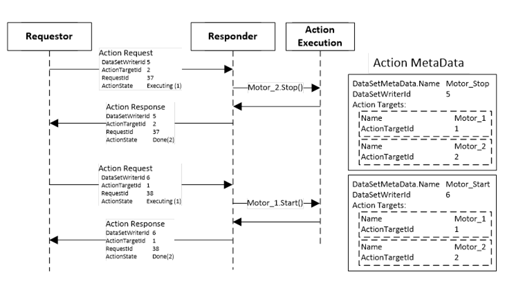  

Figure 26\- Action execution sequence reliable transport  

The *RequestId* is unique within the context of a *RequestorId* and *CorrelationData* . Each *Action* request in a single *NetworkMessage* has a different *RequestId* . Multiple *NetworkMessages* with the same *RequestorId* and *CorrelationData* may be sent.  

Multiple *Responses* may be sent in the same *NetworkMessage* if the corresponding requests have the same *RequestorId* and *CorrelationData* . The grouping of requests in *NetworkMessages* does not affect the grouping of *Responses* into *NetworkMessages* .  

The *Action* execution sequence for an *Action* execution through a non-reliable transport protocol like UDP is described in [Figure 27](/§\_Ref166157312) . The related ActionMetaData is described in [Figure 26](/§\_Ref168917947) . It shows the use of the *ActionState* for a non-reliable transport protocol. The request and response messages are send in the *PublishingInterval* of the *Responder* as long as the *ActionState* requires the exchange of messages for a *Action* execution.  

The state changes for *Action* execution are defined in [Table 83](/§\_Ref166167844) for the *Requestor* and in [Table 84](/§\_Ref166167845) for the *Responder* .  

Table 83 - Action execution state changes Requestor  

| **Current State** | **Condition** | **Event** | **State for next message** |
|---|---|---|---|
|Idle|Start Action execution|Requestor sends Request Message with ActionState = Executing.|Executing|
|Executing|PublishingInterval expired and no Done or Executing received from Responder.|Requestor sends Request Message again with ActionState = Executing.|Executing|
|Executing|Received Done from Responder|Requestor sends Request Message with ActionState = Idle|Idle|
|Done|PublisihingInterval expire and no Idle received.|Requestor sends Request Message again with ActionState = Idle.|Idle|
|Done|Received Idle from Responder|None||
  

  

Table 84 - Action execution state changes Responder  

| **Current State** | **Condition** | **Event** | **State for next message** |
|---|---|---|---|
|Idle|Receives RequestMessage for a new combination of RequestorId, CorrelationData and RequestId.|Begins processing Action.|Executing|
|Executing|PublishingInterval expired and Action execution is still in progress.|Responder sends Response Message with ActionState = Executing, Status = Good and the payload is empty.|Executing|
|Executing|Action execution completed.|Responder sends Response Message with ActionState = Done, Status = Action result and payload provided for Good and Uncertain Status and payload is empty for Bad Status.|Done|
|Done|PublishingInterval expired and did not receive Idle from Requestor yet|Responder sends Response Message again with ActionState = Done until Idle is received from the *Requestor* or the time duration defined by the *TimeoutHint* request parameter ends.|Done|
|Done|Received Idle from Requestor|None||
  

  

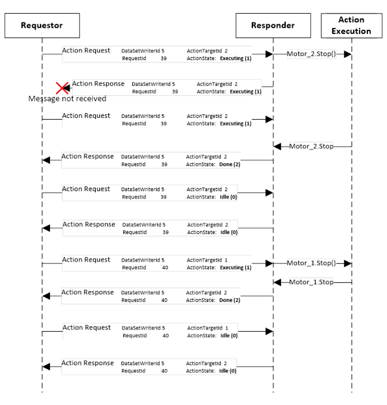  

Figure 27 - Action execution sequence non-reliable transport  

Errors during the execution of an *Action* are reported in the *Status* of the *Action* response message.  

For some errors such as decoding errors for the request message, addressing errors or failing security checks, the *Responder* does not produce a response message. Therefore the *Requestor* should have an internal timeout setting to stop waiting for a response message.  

###### 6.2.11.2.3 Action specific use of parameters  

The Action specific use of PubSub configuration parameters is defined in [Table 85](/§\_Ref166166703) .  

Note that the reliability of the protocol depends on the QoS levels supported by the protocol. Any Broker-based middleware that is using a QoS of AtLeastOnce or greater is reliable (see [6.4.2.5.4](/§\_Ref501566279) ). Broker-less middle is not reliable if it does not support any DatagramQoS (see [6.4.1.2.6](/§\_Ref82954545) ).  

Table 85 - Action specific use of parameters  

| **PubSubComponent** | **Parameter** | **Description** |
|---|---|---|
|PubSubConnectionDataType|ReaderGroups|Readers are not used for Actions.|
||
|WriterGroupDataType|PublishingInterval|The value is 0 for reliable transport protocols. The value shall be larger than 0 for non-reliable transport protocols. The *Requestor* and *Responder* resends *Action* messages that have not been acknowledged by the receiver with this frequency.|
||KeepAliveTime|This value is not used and set to 0.|
||HeaderLayoutUri|For JSON messages the JSON-NetworkMessage header layout URI is used (see [A.3.4](/§\_Ref167368045) ). For UADP messages this value is UADP-Dynamic header layout URI is used (see [A.2.2](/§\_Ref167368046) ).|
||
|BrokerWriterGroupTransportDataType|QueueName|The address that the *Requestor* uses to send requests to the *Responder* .|
||RequestedDelivery Guarantee|Shall be AtLeastOnce or better|
||
|UadpWriterGroupMessageDataType|SamplingOffset|Always -1.|
||NetworkMessageContentMask|Bit 0: PublisherId is always 1|
||
|JsonWriterGroupMessageDataType|NetworkMessageContentMask|Bit 0: NetworkMessageHeader is always 1. Bit 1: DataSetMessageHeader is always 1. Bit 2: SingleDataSetMessage is always 0. Bit 3: PublisherId is always 1 Bit 5: ReplyTo is is always 0.|
||
|DataSetWriterDataType|DataSetFieldContentMask|Always 0.|
||KeyFrameCount|Always 0.|
||DataSetName|The name of the ActionMetaData.|
||
|UadpDataSetWriterMessageDataType|DataSetMessageContentMask|Bit 1: PicoSeconds is always 0. Bit 2: Status is always 1, however, it is not sent in requests.|
||
|JsonDataSetWriterMessageDataType|DataSetMessageContentMask|Bit 2: SequenceNumber is always 0. Bit 4: Status is always 1, however, it is not sent in requests. Bit 5: MessageType is always 0. Bit 8: PublisherId is always 0|
||
|DatagramWriterGroupTransport2DataType|MessageRepeatCount|Always 0|
||MessageRepeatDelay|Always 0|
||
|BrokerDataSetWriterTransportDataType|QueueName|Not used.|
||RequestedDelivery Guarantee|Not used.|
||MetaDataQueueName|The address used to send ActionMetaData Messages.|
  

  

#### 6.2.12 PubSubConfiguration  

##### 6.2.12.1 PubSubConfigurationDataType  

This *Structure DataType* is used to represent the *PubSub* configuration of an OPC UA *Application* . The *PubSubConfigurationDataType* is formally defined in [Table 86](/§\_Ref497342132) .  

Table 86 - PubSubConfigurationDataType structure  

| **Name** | **Type** | **Description** |
|---|---|---|
|PubSubConfigurationDataType|Structure||
|PublishedDataSets|PublishedDataSetDataType[]|The *PublishedDataSets* contained in the configuration. The *PublishedDataSetDataType* is defined in [6.2.3.5](/§\_Ref146114615) .|
|Connections|PubSubConnectionDataType[]|The *PubSubConnections* contained in the configuration. The *PubSubConnectionDataType* is defined in [6.2.7](/§\_Ref497341659) . The connection includes *WriterGroups* and *ReaderGroups* .|
|Enabled|Boolean|The enabled state of the *PubSub* configuration. This *Enable* state corresponds to the PubSub *Status* of the *PublishSubscribe* *Object* .|
  

  

Its representation in the AddressSpace is defined in [Table 87](/§\_Ref83224453) .  

Table 87 - PubSubConfigurationDataType definition  

| **Attributes** | **Value** |
|---|---|
|BrowseName|PubSubConfigurationDataType|
|IsAbstract|False|
|Subtype of Structure defined in [OPC 10000-5](/§UAPart5) .|
|Conformance Units|
|PubSub Parameters Configuration|
  

  

If the *PubSub* configuration is stored in a file, the *UABinaryFileDataType* and the related definitions in [OPC 10000-5](/§UAPart5) shall be used to encode the file content. The structure of the *UABinaryFileDataType* file with typical values for a PubSub configuration is described in [Table 88](/§\_Ref503300910) .  

Table 88 - PubSubConfiguration file content  

| **Field** | **Type** | **Typical Values** |
|---|---|---|
|Namespaces|String[]|Namespace URIs for namespace indices used in the body. Examples are *NodeIds* contained in *PublishedDataSets* . The OPC UA namespace is skipped. The *DataTypes* used for configuration are defined in the OPC UA namespace.|
|structureDataTypes|StructureDescription[]|Null or empty *DataTypes* used for configuration are defined by OPC UA. The *DataTypes* used in *DataSetMetaData* are described in the *DataTypeSchemaHeader* of the associated *DataSetMetaData* . This field is only used if *KeyValuePairs* for configuration properties contain *Structure DataTypes* not defined by OPC UA.|
|enumDataTypes|EnumDescription[]|Null or empty *DataTypes* used for configuration are defined by OPC UA. The *DataTypes* used in *DataSetMetaData* are described in the *DataTypeSchemaHeader* of the associated *DataSetMetaData* . This field is only used if *KeyValuePairs* for configuration properties contain *Structure DataTypes* not defined by OPC UA.|
|simpleDataTypes|SimpleTypeDescription[]|Null or empty *DataTypes* used for configuration are defined by OPC UA. The *DataTypes* used in *DataSetMetaData* are described in the *DataTypeSchemaHeader* of the associated *DataSetMetaData* . This field is only used if *KeyValuePairs* for configuration properties contain *Structure DataTypes* not defined by OPC UA.|
|schemaLocation|String|Null or empty|
|fileHeader|KeyValuePair[]|Null or empty|
|Body|BaseDataType|*PubSubConfigurationDataType* *Structure* The *PubSub* configuration represented by the *PubSubConfigurationDataType* .|
  

  

##### 6.2.12.2 SecurityGroupDataType  

This *Structure DataType* is used to represent the configuration of a *SecurityGroup* in a *PubSub* configuration of an OPC UA *Application* .  

If the *SecurityPolicyUri* or the *KeyLifetime* of an existing *SecurityGroup* are modified, all existing keys of the *SecurityGroup* are invalidated. The behaviour is described for the *InvalidateKeys* *Method* in [8.4.2](/§\_Ref75343192) .  

The *SecurityGroupDataType* is formally defined in [Table 89](/§\_Ref42637866) .  

Table 89 - SecurityGroupDataType structure  

| **Name** | **Type** | **Description** |
|---|---|---|
|SecurityGroupDataType|Structure||
|Name|String|Name of the *SecurityGroup.*|
|SecurityGroupFolder|String[]|Optional path of the *SecurityGroupFolders* used to group *SecurityGroups* where each entry in the *String* array represents one level in a folder hierarchy. If no grouping is needed the parameter is a null or empty *String* array.|
|KeyLifetime|Duration|The lifetime of a key in milliseconds. If the last available key expires and the *Publisher* does not receive a new key in two times the *KeyLifetime* it shall go into *Error* state and shall stop sending messages secured with the expired key. If a *Subscriber* receives messages for a key longer than two times the *KeyLifetime* it shall stop processing messages with the expired key.|
|SecurityPolicyUri|String|The *SecurityPolicy* used for the *SecurityGroup* .|
|MaxFutureKeyCount|UInt32|The maximum number of future keys returned by the *Method GetSecurityKeys* .|
|MaxPastKeyCount|UInt32|The maximum number of historical keys stored by the SKS.|
|SecurityGroupId|String|The identifier for the *SecurityGroup* . The *SecurityGroupId* shall match the *Name* field.|
|RolePermissions|RolePermissionType[]|The permissions that apply to the security key access through *GetSecurityKeys* for the SecurityGroup.|
|GroupProperties|KeyValuePair[]|Specifies additional properties for the security group.|
  

  

Its representation in the AddressSpace is defined in [Table 90](/§\_Ref83224454) .  

Table 90 - SecurityGroupDataType definition  

| **Attributes** | **Value** |
|---|---|
|BrowseName|SecurityGroupDataType|
|IsAbstract|False|
|Subtype of Structure defined in [OPC 10000-5](/§UAPart5) .|
|Conformance Units|
|PubSub Parameters Configuration2|
  

  

##### 6.2.12.3 PubSubKeyPushTargetDataType  

This *Structure DataType* is used to represent the configuration of a *PubSubKeyServicePushTarget* in a *PubSub* configuration of an OPC UA *Application* . The *PubSubKeyPushTargetDataType* is formally defined in [Table 91](/§\_Ref82803283) .  

Table 91 - PubSubKeyPushTargetDataType structure  

| **Name** | **Type** | **Description** |
|---|---|---|
|PubSubKeyPushTargetDataType|Structure||
|ApplicationUri|String|*ApplicationUri* of the *Server* that is the target of a push.|
|PushTargetFolder|String[]|Optional path of the *PubSubKeyPushTargetFolder* used to group the push targets where each entry in the *String* array represents one level in a folder hierarchy. If no grouping is needed the parameter is a null or empty *String* array.|
|EndpointUrl|String|URL of the Endpoint of the Server that is the target of a push.|
|SecurityPolicyUri|String|The security policy the SKS shall use to establish a *SecureChannel* to the push target.|
|UserTokenType|UserTokenPolicy|The type of user toke to be used for the connection to the push target. The default is *Anonymous* .|
|RequestedKeyCount|UInt16|The number of keys that are to be pushed on each update. The minimum setting for this is three|
|RetryInterval|Duration|The interval the *SKS* shall use to retry pushing keys after an error appeared|
|PushTargetProperties|KeyValuePair[]|Specifies additional properties for the push target|
|SecurityGroups|String[]|List of security groups related to the push target|
  

  

Its representation in the AddressSpace is defined in [Table 92](/§\_Ref83224455) .  

Table 92 - PubSubKeyPushTargetDataType definition  

| **Attributes** | **Value** |
|---|---|
|BrowseName|PubSubKeyPushTargetDataType|
|IsAbstract|False|
|Subtype of Structure defined in [OPC 10000-5](/§UAPart5) .|
|Conformance Units|
|PubSub Parameters Configuration2|
  

  

##### 6.2.12.4 PubSubConfiguration2DataType  

This *Structure DataType* is used to represent the extended *PubSub* configuration of an OPC UA *Application* . It is a subtype of the *PubSubConfigurationDataType* defined in [6.2.12.1](/§\_Ref42638455) .  

The *PubSubConfiguration2DataType* is formally defined in [Table 93](/§\_Ref42638940) .  

Table 93 - PubSubConfiguration2DataType structure  

| **Name** | **Type** | **Description** |
|---|---|---|
|PubSubConfiguration2DataType|Structure|Subtype of PubSubConfigurationDataType defined in [6.2.12.1](/§\_Ref42638455) .|
|SubscribedDataSets|StandaloneSubscribed DataSetDataType[]|The standalone *SubscribedDataSets* contained in the configuration. The *StandaloneSubscribedDataSetDataType* is defined in [6.2.10.5](/§\_Ref42638507) .|
|DataSetClasses|DataSetMeta DataType[]|DataSetClasses supported by the *Publisher* .|
|DefaultSecurityKeyServices|EndpointDescription[]|The default SecurityKeyServices used for the PubSub configuration. The value is as default if not overwritten in the groups or DataSetReaders. The general definition for the SecurityKeyServices parameter is in [6.2.5.4](/§\_Ref494371872) .|
|SecurityGroups|SecurityGroupDataType[]|The *SecurityGroups* contained in the configuration. The SecurityGroupDataType ** is defined in [6.2.12.2](/§\_Ref42638520) .|
|PubSubKeyPushTargets|PubSubKeyPushTarget DataType[]|The *PubSubKeyPushTargets* contained in the configuration. The PubSubKeyPushTargetDataType is defined in [6.2.12.3](/§\_Ref82803284) .|
|ConfigurationVersion|VersionTime|The *ConfigurationVersion* reflects the time of the last change.|
|ConfigurationProperties|KeyValuePair[]|The *configurationProperties* is an array of *DataType* *KeyValuePair* that specifies additional properties for the PubSub configuration. The *KeyValuePair* type is defined in [OPC 10000-5](/§UAPart5) and consists of a QualifiedName and a value of *BaseDataType* . The mapping of the namespace, name, and value to concrete functionality may be defined by transport protocol mappings, future versions of this document or vendor-specific extensions.|
  

  

Its representation in the AddressSpace is defined in [Table 94](/§\_Ref83224456) .  

Table 94 - PubSubConfiguration2DataType definition  

| **Attributes** | **Value** |
|---|---|
|BrowseName|PubSubConfiguration2DataType|
|IsAbstract|False|
|Subtype of *PubSubConfigurationDataType* defined in [6.2.12.1](/§\_Ref42638455) .|
|Conformance Units|
|PubSub Parameters Configuration2|
  

  

### 6.3 Message mapping configuration parameters  

#### 6.3.1 UADP message mapping  

##### 6.3.1.1 UADP NetworkMessage Writer  

###### 6.3.1.1.1 Relationship of Timing parameters  

The *PublishingInterval* , the *SamplingOffset* the *PublishingOffset* and the timestamp in the *NetworkMessage* header shall use the same time base.  

If an underlying network provides a synchronized global clock, this clock shall be used as the time base for the *Publisher* and *Subscriber* .  

The beginning of a *PublishingInterval* shall be a multiple of the *PublishingInterval* relative to the start of the time base. The reference start time of the *PublishingInterval* can be calculated by using the following formula:  

 **Start of periodic execution =**   

 **current time + PublishingInterval - (current time MODULO PublishingInterval)**   

Current time is the number of nanoseconds since the start of epoch used by the reference clock.  

*PublishingInterval* is the duration in nanoseconds.  

Start of periodic execution ** is the number of nanoseconds since the start of epoch which is the next possible start of a *PublishingInterval.*  

[Figure 28](/§\_Ref501022241) shows an example how to select the possible start of a *PublishingInterval* .  

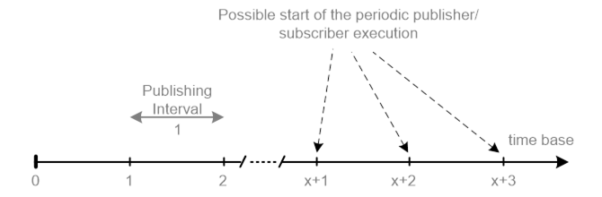  

Figure 28 - Start of the periodic publisher execution  

The different timing offsets inside a *PublishingInterval* cycle on *Publisher* and *Subscriber* side are shown in [Figure 29](/§\_Ref495441076) . The *SamplingOffset* and *PublishingOffset* are defined as parameters of the UADP *WriterGroup* . The *ReceiveOffset* and the *ProcessingOffset* are defined as parameters of the UADP *DataSetReader* in [6.3.1.4](/§\_Ref495441452) .  

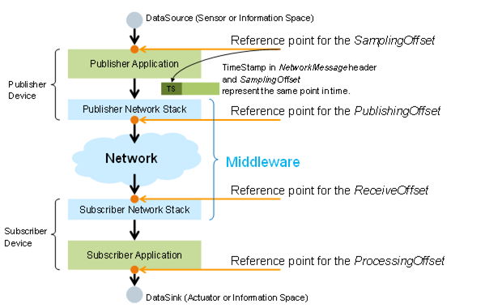  

Figure 29 - Timing offsets in a PublishingInterval  

###### 6.3.1.1.2 GroupVersion  

The *GroupVersion* with *DataType* *VersionTime* reflects the time of the last layout change of the content of the *NetworkMessages* published by the *WriterGroup* . The *VersionTime* *DataType* is defined in [OPC 10000-4](/§UAPart4) . The *GroupVersion* changes when one of the following parameters is modified:  

* *NetworkMessageContentMask* of this *WriterGroup* ;  

* *Offset* of any *DataSetWriter* in this *WriterGroup* ;  

* *MinorVersion* of the *DataSet* of any *DataSetWriter* in this *WriterGroup* ;  

* *DataSetFieldContentMask* of any *DataSetWriter* in this *WriterGroup* ;  

* *DataSetMessageContentMask* of any *DataSetWriter* in this *WriterGroup* ;  

* *DataSetWriterId* of any *DataSetWriter* in this *WriterGroup* .  

The *GroupVersion* is valid for all *NetworkMessages* resulting from this *WriterGroup* .  

###### 6.3.1.1.3 DataSetOrdering  

The *DataSetOrdering* defines the ordering of the *DataSetMessages* in the *NetworkMessages* . Possible values for *DataSetOrdering* are described in [Table 95](/§\_Ref480532506) . The default value is *Undefined* .  

The *DataSetOrderingType* is an enumeration that specifies the possible options for the ordering of *DataSetMessages* inside and across *NetworkMessages* . The possible enumeration values are described in [Table 95](/§\_Ref480532506) .  

Table 95 - DataSetOrderingType values  

| **Name** | **Value** | **Description** |
|---|---|---|
|Undefined|0|The ordering of *DataSetMessages* is not specified.|
|AscendingWriterId|1|*DataSetMessages* are ordered ascending by the value of their corresponding *DataSetWriterIds* .|
|AscendingWriterIdSingle|2|*DataSetMessages* are ordered ascending by the value of their corresponding *DataSetWriterIds* and only one *DataSetMessage* is sent per *NetworkMessage* .|
  

  

If *DataSetOrdering* is *Undefined* any ordering between DataSets and their distribution into *NetworkMessages* is allowed. Ordering and distribution even may change between each *PublishingInterval* . If *DataSetOrdering* is set to *AscendingWriterId,* the *Publisher* shall fill up each *NetworkMessage* with *DataSets* with an ascending order of the related *DataSetWriterIds* as long as the accumulated *DataSet* sizes will not exceed the *MaxNetworkMessageSize* . The different options are shown in [Figure 30](/§\_Ref494320527) .  

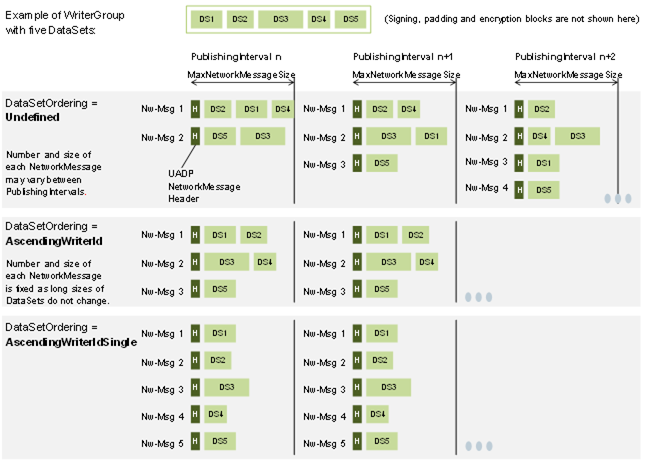  

Figure 30 - DataSetOrdering and MaxNetworkMessageSize  

The *DataSetOrderingType* representation in the *AddressSpace* is defined in [Table 96](/§\_Ref83209415) .  

Table 96 - DataSetOrderingType definition  

| **Attribute** | **Value** |
|---|---|
|BrowseName|DataSetOrderingType|
|IsAbstract|False|
  
| **References** | **Node Class** | **BrowseName** | **DataType** | **TypeDefinition** | **Others** |
|---|---|---|---|---|---|
|Subtype of Enumeration defined in [OPC 10000-5](/§UAPart5)|
|HasProperty|Variable|EnumStrings|LocalizedText []|PropertyType||
  
| **Conformance Units** |
|---|
|PubSub Parameters UADP|
  

  

###### 6.3.1.1.4 NetworkMessageContentMask  

The parameter *NetworkMessageContentMask* defines the optional header fields to be included in the *NetworkMessages* produced by the *WriterGroup* . The *DataType* for the UADP *NetworkMessage* mapping is *UadpNetworkMessageContentMask* .  

The *DataType* *UadpNetworkMessageContentMask* is formally defined in [Table 97](/§\_Ref469331429) .  

Table 97 - UadpNetworkMessageContentMask values  

| **Value** | **Bit No.** | **Description** |
|---|---|---|
|PublisherId|0|The *PublisherId* is included in the *NetworkMessage* s.|
|GroupHeader|1|The GroupHeader is included in the *NetworkMessages* .|
|WriterGroupId|2|The *WriterGroupId* field is included in the *GroupHeader* . The flag is only valid if Bit 1 is set.|
|GroupVersion|3|The *GroupVersion* field is included in the *GroupHeader* . The flag is only valid if Bit 1 is set.|
|NetworkMessageNumber|4|The *NetworkMessageNumber* field is included in the *GroupHeader* . The field is required if more than one NetworkMessage is needed to transfer all DataSets of the group. The flag is only valid if Bit 1 is set.|
|SequenceNumber|5|The *SequenceNumber* field is included in the *GroupHeader* . The flag is only valid if Bit 1 is set.|
|PayloadHeader|6|The *PayloadHeader* is included in the *NetworkMessages* .|
|Timestamp|7|The sender timestamp is included in the *NetworkMessage* s.|
|PicoSeconds|8|The sender *PicoSeconds* portion of the timestamp is included in the *NetworkMessage* s. This flag is ignored if the *Timestamp* flag is not set.|
|DataSetClassId|9|The *DataSetClassId* is included in the *NetworkMessage* s. The *NetworkMessage* can only contain *DataSetMessages* with the same *DataSetClassId* . If *DataSetMessages* have different *DataSetClassIds* they must be sent in individual *NetworkMessages* .|
|PromotedFields|10|The *PromotedFields* are included in the *NetworkMessage* s.|
  

  

The *UadpNetworkMessageContentMask* representation in the *AddressSpace* is defined in [Table 98](/§\_Ref469331441) .  

Table 98 - UadpNetworkMessageContentMask definition  

| **Attribute** | **Value** |
|---|---|
|BrowseName|UadpNetworkMessageContentMask|
|IsAbstract|False|
  
| **References** | **Node Class** | **BrowseName** | **DataType** | **TypeDefinition** | **Others** |
|---|---|---|---|---|---|
|Subtype of UInt32 defined in [OPC 10000-5](/§UAPart5)|
|HasProperty|Variable|OptionSetValues|LocalizedText []|PropertyType||
  
| **Conformance Units** |
|---|
|PubSub Parameters UADP|
  

  

###### 6.3.1.1.5 SamplingOffset  

The *SamplingOffset* with the *DataType Duration* defines the time in milliseconds for the offset of creating the *NetworkMessage* in the *PublishingInterval* cycle.  

Any negative value indicates that the optional parameter is not configured. In this case the *Publisher* shall calculate the time before the *PublishingOffset* that is necessary to create the *NetworkMessage* in time for sending at the *PublishingOffset* .  

The *Duration* *DataType* is a subtype of *Double* and allows configuration of intervals smaller than a millisecond.  

###### 6.3.1.1.6 PublishingOffset  

The *PublishingOffset* is an array of *DataType Duration* that defines the time in milliseconds for the offset in the *PublishingInterval* cycle of sending the *NetworkMessage* to the network.  

Any negative value indicates that the *PublishingOffset* is not configured and the timing inside the *PublishingInterval* is application specific.  

The *Duration* *DataType* is a subtype of *Double* and allows configuration of intervals smaller than a millisecond.  

[Figure 31](/§\_Ref494283888) depicts how the different variations of *PublishingOffset* settings affect sending of multiple *NetworkMessages* .  

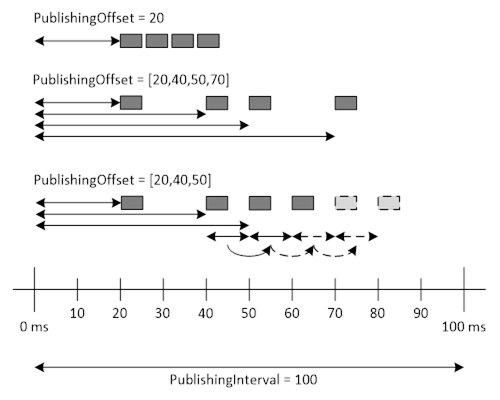  

Figure 31 - PublishingOffset options for multiple NetworkMessages  

If all *DataSets* of a group are transferred with a single *NetworkMessage* , the scalar value or the first value in the array defines the offset for sending the *NetworkMessage* relative to the start of the *PublishingInterval* cycle. If the *DataSets* of a group are sent in a series of *NetworkMessages* , the values in the array define the offsets of sending the *NetworkMessages* relative to the start of the *PublishingInterval* cycle. If a scalar value is configured, the first *NetworkMessage* is sent at the offset and the following *NetworkMessages* are sent immediately after each other. If more *NetworkMessages* are available for sending than offset values in the array, the offset for the remaining *NetworkMessages* is extrapolated from the last two offset values in the array.  

The *PublishingInterval* , the *SamplingOffset* the *PublishingOffset* and the timestamp in the *NetworkMessage* header shall use the same time base.  

###### 6.3.1.1.7 UadpWriterGroupMessageDataType structure  

This *Structure DataType* is used to represent the UADP *NetworkMessage* mapping specific WriterGroup parameters. It is a subtype of *WriterGroupMessageDataType* defined in [6.2.6.7.3](/§\_Ref496716495) .  

The *UadpWriterGroupMessageDataType* is formally defined in [Table 99](/§\_Ref494371721) .  

Table 99 - UadpWriterGroupMessageDataType structure  

| **Name** | **Type** | **Description** |
|---|---|---|
|UadpWriterGroupMessageDataType|Structure|Subtype of *WriterGroupMessageDataType* defined in [6.2.6.7.3](/§\_Ref496716495)|
|GroupVersion|VersionTime|Defined in [6.3.1.1.2](/§\_Ref494283614) .|
|DataSetOrdering|DataSetOrderingType|Defined in [6.3.1.1.3](/§\_Ref494280564) .|
|NetworkMessageContentMask|UadpNetworkMessageContentMask|Defined in [6.3.1.1.4](/§\_Ref469331286) .|
|SamplingOffset|Duration|Defined in [6.3.1.1.5](/§\_Ref494283748) .|
|PublishingOffset|Duration[]|Defined in [6.3.1.1.6](/§\_Ref494283837) .|
  

  

Its representation in the AddressSpace is defined in [Table 100](/§\_Ref83224457) .  

Table 100 - UadpWriterGroupMessageDataType definition  

| **Attributes** | **Value** |
|---|---|
|BrowseName|UadpWriterGroupMessageDataType|
|IsAbstract|False|
|Subtype of *WriterGroupMessageDataType* defined in [6.2.6.7.3](/§\_Ref496716495) .|
|Conformance Units|
|PubSub Parameters UADP|
  

  

##### 6.3.1.2 UADP ReaderGroup Parameters  

There are no UADP specific message mapping parameters defined for the *ReaderGroup* .  

##### 6.3.1.3 UADP DataSetMessage Writer  

###### 6.3.1.3.1 General  

The configuration of the *DataSetWriters* in a *WriterGroup* can result in a fixed *NetworkMessage* layout where all *DataSets* have a static position between *NetworkMessages* .  

In this case the parameters *NetworkMessageNumber* and *DataSetOffset* provide information about the static position of the *DataSetMessage* in a *NetworkMessage* *Subscribers* can rely on. If the value of one of the two parameters is 0, the position is not guaranteed to be static.  

NOTE A *Publisher* can only provide valid values for the parameters *NetworkMessageNumber* and *DataSetOffset* if the message mapping allows keeping the value for these *Properties* constant unless the configuration of the *WriterGroup* is changed.  

###### 6.3.1.3.2 DataSetMessageContentMask  

The *DataSetMessageContentMask* defines the flags for the content of the *DataSetMessage* header. The UADP message mapping specific flags are defined by the *UadpDataSetMessageContentMask DataType.*  

The *UadpDataSetMessageContentMask* *DataType* is formally defined in [Table 101](/§\_Ref425675885) .  

Table 101 - UadpDataSetMessageContentMask Values  

| **Value** | **Bit No.** | **Description** |
|---|---|---|
|Timestamp|0|If this flag is set, a timestamp shall be included in the *DataSetMessage* header.|
|PicoSeconds|1|If this flag is set, a *PicoSeconds* timestamp field shall be included in the *DataSetMessage* header. This flag is ignored if the *Timestamp* flag is not set.|
|Status|2|If this flag is set, the *DataSetMessage* status is included in the *DataSetMessage* header. The rules for creating the *DataSetMessage* status are defined in [Table 34](/§\_Ref455004331) .|
|MajorVersion|3|If this flag is set, the *ConfigurationVersion.MajorVersion* is included in the *DataSetMessage* header.|
|MinorVersion|4|If this flag is set, the *ConfigurationVersion.MinorVersion* is included in the *DataSetMessage* header.|
|SequenceNumber|5|If this flag is set, the DataSetMessageSequenceNumber is included in the DataSetMessage header.|
  

  

The *UadpDataSetMessageContentMask* representation in the *AddressSpace* is defined in [Table 102](/§\_Ref455006511) .  

Table 102 - UadpDataSetMessageContentMask definition  

| **Attribute** | **Value** |
|---|---|
|BrowseName|UadpDataSetMessageContentMask|
|IsAbstract|False|
  
| **References** | **Node Class** | **BrowseName** | **DataType** | **TypeDefinition** | **Others** |
|---|---|---|---|---|---|
|Subtype of UInt32 defined in [OPC 10000-5](/§UAPart5)|
|HasProperty|Variable|OptionSetValues|LocalizedText []|PropertyType||
  
| **Conformance Units** |
|---|
|PubSub Parameters UADP|
  

  

###### 6.3.1.3.3 ConfiguredSize  

The parameter *ConfiguredSize* with the *DataType UInt16* defines the fixed size in bytes a *DataSetMessage* uses inside a *NetworkMessage* . The default value is 0 and it indicates a dynamic length. If a *DataSetMessage* would be smaller in size (e.g. because of the current values that are encoded) the *DataSetMessage* is padded with bytes with value zero. In case it would be larger, the *Publisher* shall set bit 0 of the *DataSetFlags1* to false to indicate that the *DataSetMessage* is not valid.  

NOTE The parameter *ConfiguredSize* can be used for different reasons. One reason is the reservation of space inside a *NetworkMessage* by setting *ConfiguredSize* to a higher value than the assigned *DataSet* actually requires. Modifications (e.g. extensions) of the *DataSet* would then not change the required bandwidth on the network which reduces the risk of side effects. Another reason would be to maintain predictable network behaviour even when using a volatile field *DataTypes* like *String* or *ByteString* .  

###### 6.3.1.3.4 NetworkMessageNumber  

The parameter *NetworkMessageNumber* with the *DataType UInt16* is the number of the *NetworkMessage* inside a *PublishingInterval* in which this *DataSetMessage* is published. The default value is 0 and indicates that the number of the *NetworkMessage* is not fixed.  

The *NetworkMessage* shall have a fixed layout if the *PayloadHeader* flag in the *NetworkMessageContentMask* is false.  

If the *NetworkMessage* layout is fixed and all *DataSetMessages* of a *WriterGroup* fit into one single *NetworkMessage* , the value of *NetworkMessageNumber* shall be 1. If the *DataSetMessages* of a *WriterGroup* are distributed or chunked over more than one *NetworkMessage* , the first *NetworkMessage* in a *PublishingInterval* shall be generated with the value 1, the following *NetworkMessages* shall be generated with incrementing *NetworkMessageNumbers* . To avoid a roll-over the number of *NetworkMessages* generated from one *WriterGroup* within one *PublishingInterval* is limited to 65535.  

###### 6.3.1.3.5 DataSetOffset  

The parameter *DataSetOffset* with the *DataType UInt16* is the offset in bytes inside a *NetworkMessage* at which the *DataSetMessage* is located, relative to the beginning of the *NetworkMessage* .  

The default value 0 indicates that the position of the *DataSetMessage* in a *NetworkMessage* is not fixed. If the *DataSetWriter* is disabled and the *DataSetOffset* is not 0, the valid flag of the *DataSetFlags1* in the *DataSetMessage* header at the offset shall be false.  

This parameter should be set if the *PayloadHeader* flag in the *NetworkMessageContentMask* is false and therefore the *NetworkMessage* has a fixed layout.  

###### 6.3.1.3.6 UadpDataSetWriterMessageDataType structure  

This *Structure DataType* is used to represent UADP DataSetMessage mapping specific *DataSetWriter* parameters. It is a subtype of the *DataSetWriterMessageDataType* defined in [6.2.4.5.3](/§\_Ref496715098) .  

The *UadpDataSetWriterMessageDataType* is formally defined in [Table 103](/§\_Ref494369055) .  

Table 103 - UadpDataSetWriterMessageDataType structure  

| **Name** | **Type** | **Description** |
|---|---|---|
|UadpDataSetWriterMessageDataType|Structure|Subtype of *DataSetWriterMessageDataType* defined in [6.2.4.5.3](/§\_Ref496715098)|
|DataSetMessageContentMask|UadpDataSetMessageContentMask|Defined in [6.3.1.3.2](/§\_Ref494354861) .|
|ConfiguredSize|UInt16|Defined in [6.3.1.3.3](/§\_Ref496703011) .|
|NetworkMessageNumber|UInt16|Defined in [6.3.1.3.4](/§\_Ref495427462) .|
|DataSetOffset|UInt16|Defined in [6.3.1.3.5](/§\_Ref494369563) .|
  

  

Its representation in the AddressSpace is defined in [Table 104](/§\_Ref83224458) .  

Table 104 - UadpDataSetWriterMessageDataType definition  

| **Attributes** | **Value** |
|---|---|
|BrowseName|UadpDataSetWriterMessageDataType|
|IsAbstract|False|
|Subtype of *DataSetWriterMessageDataType* defined in [6.2.4.5.3](/§\_Ref496715098) .|
|Conformance Units|
|PubSub Parameters UADP|
  

  

##### 6.3.1.4 UADP DataSetMessage Reader  

###### 6.3.1.4.1 GroupVersion  

The parameter *GroupVersion* with *DataType VersionTime* defines the expected value in the field *GroupVersion* in the header of the *NetworkMessage* . The default value 0 is defined as null value, and means this parameter shall be ignored.  

###### 6.3.1.4.2 NetworkMessageNumber  

The parameter *NetworkMessageNumber* with *DataType UInt16* is the number of the *NetworkMessage* inside a *PublishingInterval* in which this *DataSetMessage* is published. The default value 0 is defined as null value, and means this parameter shall be ignored.  

The *NetworkMessage* shall have a fixed layout if the *PayloadHeader* flag in the *NetworkMessageContentMask* is false.  

###### 6.3.1.4.3 DataSetOffset  

The parameter *DataSetOffset* with *DataType UInt16* defines the offset in bytes for the *DataSetMessage* inside the corresponding *NetworkMessage* relative to the beginning of the *NetworkMessage* . The default value 0 is defined as null value, and means that the position of the *DataSetMessage* in a *NetworkMessage* is not fixed.  

This parameter should be set if the *PayloadHeader* flag in the *NetworkMessageContentMask* is false and therefore the *NetworkMessage* has a fixed layout.  

###### 6.3.1.4.4 DataSetClassId  

The parameter *DataSetClassId* with *DataType Guid* defines a *DataSet* class related filter. If the value is null, the *DataSetClassId* filter is not applied.  

###### 6.3.1.4.5 Network Message ContentMask  

The *NetworkMessageContentMask* with *DataType UadpNetworkMessageContentMask* indicates the optional header fields included in the received *NetworkMessages* .  

The *UadpNetworkMessageContentMask* *DataType* is defined in [6.3.1.1.4](/§\_Ref469331286) .  

###### 6.3.1.4.6 DataSetMessage ContentMask  

The *DataSetMessageContentMask* with the *DataType UadpDataSetMessageContentMask* indicates the optional header fields included in the *DataSetMessages* .  

The *UadpDataSetMessageContentMask* DataType is defined in [6.3.1.3.2](/§\_Ref494354861) .  

###### 6.3.1.4.7 PublishingInterval  

The *PublishingInterval* with *DataType Duration* indicates the rate the *Publisher* sends *NetworkMessages* related to the *DataSet* . The start time for the periodic execution of the *Subscriber* shall be calculated according to [6.3.1.1.1](/§\_Ref501037276) .  

###### 6.3.1.4.8 ReceiveOffset  

The *ReceiveOffset* with *DataType Duration* defines the time in milliseconds for the offset in the *PublishingInterval* cycle for the expected receive time of the *NetworkMessage* for the *DataSet* from the network.  

Any negative value indicates that the *ReceiveOffset* is not configured and the timing inside the *PublishingInterval* is not defined.  

###### 6.3.1.4.9 ProcessingOffset  

The *ProcessingOffset* with *DataType Duration* defines the time in milliseconds for the offset in the *PublishingInterval* cycle when the received DataSet need to be processed by the application in the *Subscriber* .  

The different timing offsets inside a *PublishingInterval* cycle on the *Publisher* and *Subscriber* sides are shown in [Figure 29](/§\_Ref495441076) .  

Any negative value indicates that the *ProcessingOffset* is not configured and the timing inside the *PublishingInterval* is application specific.  

###### 6.3.1.4.10 UadpDataSetReaderMessageDataType  

This *Structure DataType* is used to represent UADP message mapping specific *DataSetReader* parameters. It is a subtype of the *DataSetReaderMessageDataType* defined in [6.2.9.13.3](/§\_Ref497331045) .  

The *UadpDataSetReaderMessageDataType* is formally defined in [Table 105](/§\_Ref495514511) .  

Table 105 - UadpDataSetReaderMessageDataType structure  

| **Name** | **Type** | **Description** |
|---|---|---|
|UadpDataSetReaderMessageDataType|Structure|Subtype of *DataSetReaderMessageDataType* defined in [6.2.9.13.3](/§\_Ref497331045) .|
|GroupVersion|VersionTime|Defined in [6.3.1.4.1](/§\_Ref495513413) .|
|NetworkMessageNumber|UInt16|Defined in [6.3.1.4.2](/§\_Ref495513419) .|
|DataSetOffset|UInt16|Defined in [6.3.1.4.3](/§\_Ref495513424) .|
|DataSetClassId|Guid|Defined in [6.3.1.4.4](/§\_Ref495513437) .|
|Network Message ContentMask|UadpNetworkMessageContentMask|Defined in [6.3.1.4.5](/§\_Ref495513444) .|
|DataSetMessage ContentMask|UadpDataSetMessageContentMask|Defined in [6.3.1.4.6](/§\_Ref495513451) .|
|PublishingInterval|Duration|Defined in [6.3.1.4.7](/§\_Ref495513466) .|
|ReceiveOffset|Duration|Defined in [6.3.1.4.8](/§\_Ref495513471) .|
|ProcessingOffset|Duration|Defined in [6.3.1.4.9](/§\_Ref495513476) .|
  

  

Its representation in the AddressSpace is defined in [Table 106](/§\_Ref83224459) .  

Table 106 - UadpDataSetReaderMessageDataType definition  

| **Attributes** | **Value** |
|---|---|
|BrowseName|UadpDataSetReaderMessageDataType|
|IsAbstract|False|
|Subtype of *DataSetReaderMessageDataType* defined in [6.2.9.13.3](/§\_Ref497331045) .|
|Conformance Units|
|PubSub Parameters UADP|
  

  

#### 6.3.2 JSON message mapping  

##### 6.3.2.1 JSON NetworkMessage Writer  

###### 6.3.2.1.1 NetworkMessageContentMask  

The parameter *NetworkMessageContentMask* defines the optional header fields to be included in the *NetworkMessages* produced by the *WriterGroup* . The *DataType* for the JSON *NetworkMessage* mapping is *JsonNetworkMessageContentMask* .  

The *DataType* *JsonNetworkMessageContentMask* is formally defined in [Table 107](/§\_Ref497331617) .  

Table 107 - JsonNetworkMessageContentMask values  

| **Value** | **Bit No.** | **Description** |
|---|---|---|
|NetworkMessageHeader|0|The JSON *NetworkMessage* header is included in the *NetworkMessages* . If this bit is false, bits 3 and 4 shall be 0.|
|DataSetMessageHeader|1|The JSON *DataSetMessage* header is included in each *DataSetMessage* . If this bit is false then the *DataSetMessage* header is not included and the header related bits in *DataSetMessageContentMask* for the *DataSetWriters* are ignored (see [6.3.2.3.1](/§\_Ref496728157) ). Bits in the *DataSetMessageContentMask* related to the payload (like *FieldEncoding1 and FieldEncoding2)* are applied.|
|SingleDataSetMessage|2|Each JSON *NetworkMessage* contains only one *DataSetMessage* .|
|PublisherId|3|The *PublisherId* is included in the *NetworkMessage* s.|
|DataSetClassId|4|The *DataSetClassId* is included in the *NetworkMessage* s. The *NetworkMessage* can only contain *DataSetMessages* with the same *DataSetClassId* . If *DataSetMessages* have different *DataSetClassIds* they must be sent in individual *NetworkMessages* .|
|ReplyTo|5|Not used.|
|WriterGroupName|6|The WriterGroup name is included in the *NetworkMessage* s.|
  

  

The *JsonNetworkMessageContentMask* representation in the *AddressSpace* is defined in [Table 108](/§\_Ref497331618) .  

Table 108 - JsonNetworkMessageContentMask definition  

| **Attribute** | **Value** |
|---|---|
|BrowseName|JsonNetworkMessageContentMask|
|IsAbstract|False|
  
| **References** | **Node Class** | **BrowseName** | **DataType** | **TypeDefinition** | **Others** |
|---|---|---|---|---|---|
|Subtype of UInt32 defined in [OPC 10000-5](/§UAPart5)|
|HasProperty|Variable|OptionSetValues|LocalizedText []|PropertyType||
  
| **Conformance Units** |
|---|
|PubSub Parameters JSON|
  

  

###### 6.3.2.1.2 JsonWriterGroupMessageDataType structure  

This *Structure DataType* is used to represent the JSON *NetworkMessage* mapping specific *WriterGroup* parameters. It is a subtype of *WriterGroupMessageDataType* defined in [6.2.6.7.3](/§\_Ref496716495) .  

The *JsonWriterGroupMessageDataType* is formally defined in [Table 109](/§\_Ref497331619) .  

Table 109 - JsonWriterGroupMessageDataType structure  

| **Name** | **Type** | **Description** |
|---|---|---|
|JsonWriterGroupMessageDataType|Structure|Subtype of *WriterGroupMessageDataType* defined in [6.2.6.7.3](/§\_Ref496716495) .|
|NetworkMessageContentMask|JsonNetworkMessageContentMask|Defined in [6.3.2.1.1](/§\_Ref496728113) .|
  

  

Its representation in the AddressSpace is defined in [Table 110](/§\_Ref83224460) .  

Table 110 - JsonWriterGroupMessageDataType definition  

| **Attributes** | **Value** |
|---|---|
|BrowseName|JsonWriterGroupMessageDataType|
|IsAbstract|False|
|Subtype of *WriterGroupMessageDataType* defined in [6.2.6.7.3](/§\_Ref496716495) .|
|Conformance Units|
|PubSub Parameters JSON|
  

  

##### 6.3.2.2 JSON ReaderGroup Parameters  

There are no JSON specific message mapping parameters defined for the *ReaderGroup* .  

##### 6.3.2.3 JSON DataSetMessage Writer  

###### 6.3.2.3.1 DataSetMessageContentMask  

The *DataSetMessageContentMask* defines the flags for the content of the *DataSetMessage* header. The JSON message mapping specific flags are defined by the *JsonDataSetMessageContentMask DataType.*  

The *JsonDataSetMessageContentMask DataType* is formally defined in [Table 111](/§\_Ref497331620) .  

Table 111 - JsonDataSetMessageContentMask values  

| **Value** | **Bit No.** | **Description** |
|---|---|---|
|DataSetWriterId|0|If this flag is set, a DataSetWriterId shall be included in the *DataSetMessage* header.|
|MetaDataVersion|1|If this flag is set, the *ConfigurationVersion* is included in the *DataSetMessage* header.|
|SequenceNumber|2|If this flag is set, the *DataSetMessageSequenceNumber* is included in the DataSetMessage header.|
|Timestamp|3|If this flag is set, a timestamp shall be included in the *DataSetMessage* header.|
|Status|4|If this flag is set, an overall status is included in the *DataSetMessage* header.|
|MessageType|5|If this flag is set, the message type is included in the *DataSetMessage* header.|
|DataSetWriterName|6|If this flag is set, a *DataSetWriterName* shall be included in the *DataSetMessage* header.|
|FieldEncoding1|7|The definition of field encoding configuration through the bits *FieldEncoding1* and *FieldEncoding2* is defined in [Table 112](/§\_Ref178242917) .|
|PublisherId|8|The *PublisherId* is included in the *DataSetMessage* s. This bit shall be false if the NetworkMessageHeader is active.|
|WriterGroupName|9|The *WriterGroup* name is included in the *DataSetMessage* s. If the *WriterGroup* name is included in the *NetworkMessage* header, it shall not be included in the *DataSetMessage* s.|
|MinorVersion|10|If this flag is set, the *MinorVersion* field of the *ConfigurationVersion* is included in the *DataSetMessage* header.|
|FieldEncoding2|11|The definition of field encoding configuration through the bits *FieldEncoding1* and *FieldEncoding2* is defined in [Table 112](/§\_Ref178242917) .|
  

  

The definition of field encoding configuration through the bits *FieldEncoding1* and *FieldEncoding2* is defined in [Table 112](/§\_Ref178242917) .  

Table 112 - Field endcoding configuration  

| **FieldEncoding1** | **FieldEncoding2** | **Description** |
|---|---|---|
|False|True|The JSON *VerboseEncoding* is used for the *DataSetMessage* field encoding.|
|True|True|The JSON *CompactEncoding* is used for the *DataSetMessage* field encoding. The *RawData* bit of the DataSetFieldContentMask shall be ignored.|
|False|False|The deprecated JSON *NonReversibleEncoding* is used for the *DataSetMessage* field encoding. The *RawData* bit of the DataSetFieldContentMask shall be ignored.|
|True|False|The deprecated JSON *ReversibleFieldEncoding* is used for the *DataSetMessage* field encoding. The *RawData* bit of the DataSetFieldContentMask shall be ignored.|
  

  

The *JsonDataSetMessageContentMask* representation in the *AddressSpace* is defined in [Table 113](/§\_Ref497331621) .  

Table 113 - JsonDataSetMessageContentMask definition  

| **Attribute** | **Value** |
|---|---|
|BrowseName|JsonDataSetMessageContentMask|
|IsAbstract|False|
  
| **References** | **Node Class** | **BrowseName** | **DataType** | **TypeDefinition** | **Others** |
|---|---|---|---|---|---|
|Subtype of UInt32 defined in [OPC 10000-5](/§UAPart5)|
|HasProperty|Variable|OptionSetValues|LocalizedText []|PropertyType||
  
| **Conformance Units** |
|---|
|PubSub Parameters JSON|
  

  

###### 6.3.2.3.2 JsonDataSetWriterMessageDataType structure  

This *Structure DataType* is used to represent JSON *DataSetMessage* mapping specific *DataSetWriter* parameters. It is a subtype of the *DataSetWriterMessageDataType* defined in [6.2.4.5.3](/§\_Ref496715098) .  

The *JsonDataSetWriterMessageDataType* is formally defined in [Table 114](/§\_Ref497331622) .  

Table 114 - JsonDataSetWriterMessageDataType structure  

| **Name** | **Type** | **Description** |
|---|---|---|
|JsonDataSetWriterMessageDataType|Structure|Subtype of *DataSetWriterMessageDataType* defined in [6.2.4.5.3](/§\_Ref496715098) .|
|DataSetMessageContentMask|JsonDataSetMessageContentMask|Defined in [6.3.2.3.1](/§\_Ref496728157) .|
  

  

Its representation in the AddressSpace is defined in [Table 115](/§\_Ref83224461) .  

Table 115 - JsonDataSetWriterMessageDataType definition  

| **Attributes** | **Value** |
|---|---|
|BrowseName|JsonDataSetWriterMessageDataType|
|IsAbstract|False|
|Subtype of *DataSetWriterMessageDataType* defined in [6.2.4.5.3](/§\_Ref496715098) .|
|Conformance Units|
|PubSub Parameters JSON|
  

  

##### 6.3.2.4 JSON DataSetMessage Reader  

###### 6.3.2.4.1 Network Message ContentMask  

The *NetworkMessageContentMask* with *DataType JsonNetworkMessageContentMask* indicates the optional header fields included in the received *NetworkMessages* . The *JsonNetworkMessageContentMask* *DataType* is defined in [6.3.2.1.1](/§\_Ref496728113) .  

###### 6.3.2.4.2 DataSetMessage ContentMask  

The *DataSetMessageContentMask* with the *DataType JsonDataSetMessageContentMask* indicates the optional header fields included in the *DataSetMessages* .  

The *JsonDataSetMessageContentMask* DataType is defined in [6.3.2.3.1](/§\_Ref496728157) .  

###### 6.3.2.4.3 JsonDataSetReaderMessageDataType structure  

This *Structure DataType* is used to represent JSON *DataSetMessage* mapping specific *DataSetReader* parameters. It is a subtype of the *DataSetReaderMessageDataType* defined in [6.2.9.13.3](/§\_Ref497331045) .  

The *JsonDataSetReaderMessageDataType* is formally defined in [Table 116](/§\_Ref497331623) .  

Table 116 - JsonDataSetReaderMessageDataType structure  

| **Name** | **Type** | **Description** |
|---|---|---|
|JsonDataSetReaderMessageDataType|Structure|Subtype of *DataSetReaderMessageDataType* defined in [6.2.9.13.3](/§\_Ref497331045) .|
|NetworkMessageContentMask|JsonNetworkMessageContentMask|Defined in [6.3.2.4.1](/§\_Ref497331232) .|
|DataSetMessageContentMask|JsonDataSetMessageContentMask|Defined in [6.3.2.4.2](/§\_Ref497331240) .|
  

  

Its representation in the AddressSpace is defined in [Table 117](/§\_Ref83224462) .  

Table 117 - JsonDataSetReaderMessageDataType definition  

| **Attributes** | **Value** |
|---|---|
|BrowseName|JsonDataSetReaderMessageDataType|
|IsAbstract|False|
|Subtype of *DataSetReaderMessageDataType* defined in [6.2.9.13.3](/§\_Ref497331045) .|
|Conformance Units|
|PubSub Parameters JSON|
  

  

###### 6.3.2.4.4 DataSetClassId  

The parameter *DataSetClassId* with *DataType Guid* defines a *DataSet* class related filter. If the value is null or the parameter is not set, the *DataSetClassId* filter is not applied.  

The parameter is configured in the *DataSetReaderProperties* with the *Key* 0: *DataSetClassId* .  

### 6.4 Transport Protocol mapping configuration parameters  

#### 6.4.1 Datagram Transport Protocol  

##### 6.4.1.1 Quality of service parameters  

###### 6.4.1.1.1 QosCategory and DatagramQos  

The *QosDataTypes* defined in the following chapters are used in the *DatagramQos* parameter in different datagram specific transport protocol mapping settings.  

The *DatagramQos* contains an array of *QosDataTypes* . The array is null or empty if no QoS related parameters are set.  

The *DatagramQos* parameter is always combined with a *QosCategory* parameter. Depending on the content of the *QosCategory String* , different elements need to be present within the *DatagramQos* array.  

The specific processing of the *QosCategory* and *DatagramQos* content is described in [5.4.6.4](/§\_Ref79570248) .  

Standard *QosCategory* values are defined in [Table 118](/§\_Ref86747238) .  

Table 118 - Standard QosCategory values  

| **QosCategory** | **Description** |
|---|---|
|Null or empty |This category indicates best-effort is used. *DatagramQos* shall be null or empty. |
|Opc.qos.cat://priority|This category indicates priority is used. *DatagramQos* shall contain one element of *TransmitQosPriorityDataType* or *ReceiveQosPriorityDataType* and optionally further elements which may be omitted.|
  

  

###### 6.4.1.1.2 QosDataType structure  

This *Structure DataType* is an abstract base type for *Structures* with QoS related parameters. The *QosDataType* is formally defined in [Table 119](/§\_Ref29493149) .  

Table 119 - QosDataType structure  

| **Name** | **Type** | **Description** |
|---|---|---|
|QosDataType|Structure||
  

  

The *QosDataType* *Structure* representation in the *AddressSpace* is defined in [Table 120](/§\_Ref29493167) .  

Table 120 - QosDataType definition  

| **Attributes** | **Value** |
|---|---|
|BrowseName|QosDataType|
|IsAbstract|True|
|Subtype of Structure defined in [OPC 10000-5](/§UAPart5) .|
|Conformance Units|
|PubSub Parameters QoS|
  

  

###### 6.4.1.1.3 TransmitQosDataType  

This *Structure DataType* is an abstract base type for *Structures* with transmit QoS related parameters. The *TransmitQosDataType* is formally defined in [Table 121](/§\_Ref40197051) .  

Table 121 - TransmitQosDataType structure  

| **Name** | **Type** | **Description** |
|---|---|---|
|TransmitQosDataType|Structure||
  

  

The *TransmitQosDataType* *Structure* representation in the *AddressSpace* is defined in [Table 122](/§\_Ref40197058) .  

Table 122 - TransmitQosDataType definition  

| **Attributes** | **Value** |
|---|---|
|BrowseName|TransmitQosDataType|
|IsAbstract|True|
|Subtype of QosDataType defined in [6.4.1.1.2](/§\_Ref114493269) .|
|Conformance Units|
|PubSub Parameters QoS|
  

  

###### 6.4.1.1.4 TransmitQosPriorityDataType  

####### 6.4.1.1.4.1 PriorityLabel  

The *PriorityLabel* with *DataType* *String* specifies the priority of the according sender. The network stack will use the *PriorityLabel* to look up the priority settings for the transport protocol headers.  

The priority labels defined by OPC UA should have the following form:  

opc.qos.lbl://\<label\>  

Example values are "opc.qos.lbl://low" or "opc.qos.lbl://high". The mapping is described in [5.4.6.4](/§\_Ref79570248) .  

Note: This version does not define concrete labels. The engineering process needs to provide them and also build up the PriorityMappingTable in [OPC 10000-22](/§UAPart22) accordingly.  

####### 6.4.1.1.4.2 TransmitQosPriorityDataType structure  

This *Structure DataType* is used to represent the priority lable specific transmit QoS parameters. It is a subtype of the *TransmitQosDataType* defined in [6.4.1.1.3](/§\_Ref40202704) .  

The *TransmitQosPriorityDataType* is formally defined in [Table 123](/§\_Ref40199785) .  

Table 123 - TransmitQosPriorityDataType structure  

| **Name** | **Type** | **Description** |
|---|---|---|
|TransmitQosPriorityDataType|Structure|Subtype of *TransmitQosDataType* defined in [6.4.1.1.3](/§\_Ref40202704) .|
|PriorityLabel|String|Defined in [6.4.1.1.4.1](/§\_Ref40213019) .|
  

  

Its representation in the AddressSpace is defined in [Table 124](/§\_Ref83224463) .  

Table 124 - TransmitQosPriorityDataType definition  

| **Attributes** | **Value** |
|---|---|
|BrowseName|TransmitQosPriorityDataType|
|IsAbstract|False|
|Subtype of *TransmitQosDataType* defined in [6.4.1.1.3](/§\_Ref40202704) .|
|Conformance Units|
|PubSub Parameters QoS|
  

  

###### 6.4.1.1.5 ReceiveQosDataType  

This *Structure DataType* is an abstract base type for *Structures* with receive QoS related parameters. The *ReceiveQosDataType* is formally defined in [Table 125](/§\_Ref40197805) .  

Table 125 - ReceiveQosDataType structure  

| **Name** | **Type** | **Description** |
|---|---|---|
|ReceiveQosDataType|Structure||
  

  

The *ReceiveQosDataType* *Structure* representation in the *AddressSpace* is defined in [Table 126](/§\_Ref40197806) .  

Table 126 - ReceiveQosDataType definition  

| **Attributes** | **Value** |
|---|---|
|BrowseName|ReceiveQosDataType|
|IsAbstract|True|
|Subtype of QosDataType defined in [6.4.1.1.2](/§\_Ref114493269) .|
|Conformance Units|
|PubSub Parameters QoS|
  

  

###### 6.4.1.1.6 ReceiveQosPriorityDataType  

####### 6.4.1.1.6.1 PriorityLabel  

The *PriorityLabel* with *DataType* *String* specifies the priority of the according sender.  

Futher details are defined in [6.4.1.1.4.1](/§\_Ref40213019) .  

####### 6.4.1.1.6.2 ReceiveQosPriorityDataType structure  

This *Structure DataType* is used to represent the priority lable specific receive QoS parameters. It is a subtype of the *ReceiveQosDataType* defined in [6.4.1.1.5](/§\_Ref40202705) .  

The *ReceiveQosPriorityDataType* is formally defined in [Table 127](/§\_Ref40202702) .  

Table 127 - TransmitQosPriorityDataType structure  

| **Name** | **Type** | **Description** |
|---|---|---|
|ReceiveQosPriorityDataType|Structure|Subtype of *ReceiveQosDataType* defined in [6.4.1.1.5](/§\_Ref40202705) .|
|PriorityLabel|String|Defined in [6.4.1.1.6.1](/§\_Ref40213081) .|
  

  

Its representation in the AddressSpace is defined in [Table 128](/§\_Ref83224464) .  

Table 128 - ReceiveQosPriorityDataType definition  

| **Attributes** | **Value** |
|---|---|
|BrowseName|ReceiveQosPriorityDataType|
|IsAbstract|False|
|Subtype of *ReceiveQosDataType* defined in [6.4.1.1.5](/§\_Ref40202705) .|
|Conformance Units|
|PubSub Parameters QoS|
  

  

##### 6.4.1.2 Datagram PubSubConnection  

###### 6.4.1.2.1 DiscoveryAddress  

The *DiscoveryAddress* parameter contains the network address information used for the discovery probe and announcement messages. The different *Structure DataTypes* used to represent the Address are defined in [6.2.7.5.3](/§\_Ref498687363) .  

###### 6.4.1.2.2 DatagramConnectionTransportDataType structure  

This *Structure DataType* is used to represent the datagram specific transport mapping parameters for *PubSubConnections* . It is a subtype of the *ConnectionTransportDataType* defined in [6.2.7.5.2](/§\_Ref496725527) .  

The *DatagramConnectionTransportDataType* is formally defined in [Table 129](/§\_Ref501055178) .  

Table 129 - DatagramConnectionTransportDataType structure  

| **Name** | **Type** | **Description** | **Allow Subtypes** |
|---|---|---|---|
|DatagramConnectionTransportDataType|Structure|Subtype of *ConnectionTransportDataType* defined in 6.2.6.4.||
|DiscoveryAddress|NetworkAddressDataType|Defined in [6.4.1.2.1](/§\_Ref501054822) . The *NetworkAddressDataType* is defined in [6.2.7.5.3](/§\_Ref498687363) .|True|
  

  

Its representation in the AddressSpace is defined in [Table 130](/§\_Ref83224465) .  

Table 130 - DatagramConnectionTransportDataType definition  

| **Attributes** | **Value** |
|---|---|
|BrowseName|DatagramConnectionTransportDataType|
|IsAbstract|False|
|Subtype of *ConnectionTransportDataType* defined in [6.2.7.5.2](/§\_Ref496725527) .|
|Conformance Units|
|PubSub Parameters Datagram|
  

  

###### 6.4.1.2.3 DiscoveryAnnounceRate  

The *DiscoveryAnnounceRate* with *DataType UInt32* defines the interval in seconds used for cyclic sending of discovery announcement messages related to this connection.  

The default value is 0 and defines that discovery announcement messages are only sent as response to discovery probe messages.  

###### 6.4.1.2.4 DiscoveryMaxMessageSize  

The *DiscoveryMaxMessageSize* with *DataType UInt32* indicates the maximum size in bytes for *NetworkMessages* created for discovery. It refers to the size of the complete *NetworkMessage* including padding and signature without any additional headers added by the transport protocol mapping. If the size of a *NetworkMessage* exceeds the *DiscoveryMaxMessageSize,* the behaviour depends on the message mapping.  

The default value is 0 and defines that the default size for the transport protocol ist used. The default size is defined for the transport protocol mappings in [7.3](/§\_Ref463039180) .  

NOTE The value for the *DiscoveryMaxMessageSize* should be configured in a way that ensures that *NetworkMessages* together with additional headers added by the transport protocol are still smaller than or equal than the transport protocol MTU.  

###### 6.4.1.2.5 QosCategory  

Selects the general category of QoS the *PubSubConnection* requires. Further details are defined in [6.4.1.1.1](/§\_Ref86746778) .  

The parameter shall be null or empty if no QoS related parameters are set.  

###### 6.4.1.2.6 DatagramQos  

The *DatagramQos* parameter contains QoS related parameters for the *PubSubConnection* as array of *QosDataType* *Structures* . The abstract *DataType* is defined in [6.4.1.1.2](/§\_Ref114493269) . The concrete subtypes are used to represent different QoS settings for transmit and receive that can be combined in the array.  

The array shall not contain multiple instances of a concrete subtype e.g. transmit *PriorityLabel* entry.  

The parameter shall be null or empty if no QoS related parameters are set.  

###### 6.4.1.2.7 DatagramConnectionTransport2DataType structure  

This *Structure DataType* is used to represent the datagram specific transport mapping parameters for a *PubSubConnection* .  

It is a subtype of the *DatagramConnectionTransportDataType* defined in [6.4.1.2.2](/§\_Ref2717853) .  

The *DatagramConnectionTransport2DataType* is formally defined in [Table 131](/§\_Ref43456782) .  

Table 131 - DatagramConnectionTransport2DataType structure  

| **Name** | **Type** | **Description** | **Allow Subtypes** |
|---|---|---|---|
|DatagramConnectionTransport2DataType|Structure|Subtype of *ConnectionTransportDataType* defined in 6.2.6.4.||
|DiscoveryAnnounceRate|UInt32|Defined in [6.4.1.2.3](/§\_Ref43456783) .||
|DiscoveryMaxMessageSize|UInt32|Defined in [6.4.1.2.4](/§\_Ref43456784) .||
|QosCategory|String|Defined in [6.4.1.2.5](/§\_Ref79570350) .||
|DatagramQos|QosDataType[]|Defined in [6.4.1.2.6](/§\_Ref82954545) .|True|
  

  

Its representation in the AddressSpace is defined in [Table 132](/§\_Ref83224466) .  

Table 132 - DatagramConnectionTransport2DataType definition  

| **Attributes** | **Value** |
|---|---|
|BrowseName|DatagramConnectionTransport2DataType|
|IsAbstract|False|
|Subtype of *DatagramConnectionTransportDataType* defined in [6.4.1.2.2](/§\_Ref2717853) .|
|Conformance Units|
|PubSub Parameters Datagram|
  

  

##### 6.4.1.3 Datagram WriterGroup  

###### 6.4.1.3.1 MessageRepeatCount  

The *MessageRepeatCount* with *DataType Byte* defines how many times every *NetworkMessage* is repeated. The default value is 0 and disables the repeating.  

###### 6.4.1.3.2 MessageRepeatDelay  

The *MessageRepeatDelay* with *DataType Duration* defines the time between *NetworkMessage* repeats in milliseconds. The parameter shall be ignored if the parameter *MessageRepeatCount* is set to 0.  

###### 6.4.1.3.3 DatagramWriterGroupTransportDataType structure  

This *Structure DataType* is used to represent the datagram specific transport mapping parameters for *WriterGroups* . It is a subtype of the *WriterGroupTransportDataType* defined in [6.2.6.7.2](/§\_Ref496716494) .  

The *DatagramWriterGroupTransportDataType* is formally defined in [Table 133](/§\_Ref497331624) .  

Table 133 - DatagramWriterGroupTransportDataType structure  

| **Name** | **Type** | **Description** |
|---|---|---|
|DatagramWriterGroupTransportDataType|Structure|Subtype of *WriterGroupTransportDataType* defined in [6.2.6.7.2](/§\_Ref496716494) .|
|MessageRepeatCount|Byte|Defined in [6.4.1.3.1](/§\_Ref494284018) .|
|MessageRepeatDelay|Duration|Defined in [6.4.1.3.2](/§\_Ref494284034) .|
  

  

Its representation in the AddressSpace is defined in [Table 134](/§\_Ref83224467) .  

Table 134 - DatagramWriterGroupTransportDataType definition  

| **Attributes** | **Value** |
|---|---|
|BrowseName|DatagramWriterGroupTransportDataType|
|IsAbstract|False|
|Subtype of *WriterGroupTransportDataType* defined in [6.2.6.7.2](/§\_Ref496716494) .|
|Conformance Units|
|PubSub Parameters Datagram|
  

  

###### 6.4.1.3.4 Address  

The *Address* parameter contains the network address information for the communication middleware related to the *WriterGroup* . The different *Structure DataTypes* used to represent the *Address* are defined in [6.2.7.5.3](/§\_Ref498687363) .  

The parameter shall be null if an address is not set at this level. If the parameter is set, it overwrites the *Address* on the *PubSubConnection* .  

###### 6.4.1.3.5 QosCategory  

Selects the general category of QoS the *WriterGroup* requires. Further details are defined in [6.4.1.1.1](/§\_Ref86746778) .  

The parameter shall be null or empty if no QoS related parameters are set.  

###### 6.4.1.3.6 DatagramQos  

The *DatagramQos* parameter contains QoS related parameters for the *WriterGroup* as array of *TransmitQosDataType* *Structures* . The abstract *TransmitQosDataType* is defined in [6.4.1.1.3](/§\_Ref40202704) . The concrete subtypes are used to represent different QoS settings that can be combined in the array.  

The array shall not contain multiple instances of a concrete subtype e.g. transmit *PriorityLabel* entry.  

The parameter shall be null or empty if no QoS related parameters are set.  

###### 6.4.1.3.7 DiscoveryAnnounceRate  

The *DiscoveryAnnounceRate* with *DataType UInt32* defines the interval in seconds used for cyclic sending of discovery announcement messages related to the WriterGroup.  

The default value is 0 and defines that discovery announcement messages are only sent as response to discovery probe messages.  

###### 6.4.1.3.8 Topic  

The *Topic* parameter with *DataType* *String* contains the unique name of the data stream produced by the *WriterGroup* within a *Message Oriented Middleware* .  

A unique default name can be created by combining the *PublisherId* with the *WriterGroupId* using '.' As separator.  

###### 6.4.1.3.9 DatagramWriterGroupTransport2DataType structure  

This *Structure DataType* is used to represent the datagram specific transport mapping parameters for *WriterGroups* . It is a subtype of the *DatagramWriterGroupTransportDataType* defined in [6.4.1.3.3](/§\_Ref29497786) .  

The *DatagramWriterGroupTransportDataType* is formally defined in [Table 135](/§\_Ref29497791) .  

Table 135 - DatagramWriterGroupTransport2DataType structure  

| **Name** | **Type** | **Description** | **Allow Subtypes** |
|---|---|---|---|
|DatagramWriterGroup Transport2DataType|Structure|Subtype of DatagramWriterGroupTransportDataType defined in [6.4.1.3.3](/§\_Ref29497786) .||
|Address|NetworkAddressDataType|Defined in [6.4.1.3.4](/§\_Ref29497787) .|True|
|QosCategory|String|Defined in [6.4.1.3.5](/§\_Ref83206965) .||
|DatagramQos|TransmitQosDataType[]|Defined in [6.4.1.3.6](/§\_Ref82954546) .|True|
|DiscoveryAnnounceRate|UInt32|Defined in [6.4.1.3.7](/§\_Ref43458815) .||
|Topic|String|Defined in [6.4.1.3.8](/§\_Ref29498829) .||
  

  

Its representation in the AddressSpace is defined in [Table 136](/§\_Ref83224468) .  

Table 136 - DatagramWriterGroupTransport2DataType definition  

| **Attributes** | **Value** |
|---|---|
|BrowseName|DatagramWriterGroupTransport2DataType|
|IsAbstract|False|
|Subtype of *DatagramWriterGroupTransportDataType* defined in [6.4.1.3.3](/§\_Ref29497786) .|
|Conformance Units|
|PubSub Parameters Datagram|
  

  

##### 6.4.1.4 Datagram ReaderGroup parameters  

There are no datagram-specific transport mapping parameters defined for the *ReaderGroup* .  

##### 6.4.1.5 Datagram DataSetWriter parameters  

There are no datagram-specific transport mapping parameters defined for the *DataSetWriter* .  

##### 6.4.1.6 Datagram DataSetReader  

###### 6.4.1.6.1 Address  

The *Address* parameter contains the network address information for the communication middleware related to the *DataSetReader* . The different *Structure DataTypes* used to represent the *Address* are defined in [6.2.7.5.3](/§\_Ref498687363) .  

The parameter shall be null if an address is not set at this level. If the parameter is set, it overwrites the *Address* on the *PubSubConnection* .  

###### 6.4.1.6.2 QosCategory  

Selects the general categorty of QoS the *DataSetReader* requires. Further details are defined in [6.4.1.1.1](/§\_Ref86746778) .  

The parameter shall be null or empty if no QoS related parameters are set.  

###### 6.4.1.6.3 DatagramQos  

The *DatagramQos* parameter contains the QoS related parameters for the *DataSetReader* as array of *ReceiveQosDataType* *Structures* . The abstract *ReceiveQosDataType* is defined in [6.4.1.1.5](/§\_Ref40202705) . The concrete subtypes are used to represent different QoS settings that can be combined in the array.  

The array shall not contain multiple instances of a concrete subtype e.g. receive *PriorityLabel* entry.  

The parameter shall be null or empty if no QoS related parameters are set.  

###### 6.4.1.6.4 Topic  

The *Topic* parameter with *DataType* *String* contains the unique name of the data stream from the *Publisher* that contains the *DataSetMessages* of interest for the *DataSetReader* . The *Topic* is defined by the *Publisher* .  

###### 6.4.1.6.5 DatagramDataSetReaderTransportDataType structure  

This *Structure DataType* is used to represent the datagram transport mapping parameters for *DataSetReaders* . It is a subtype of the *DataSetReaderTransportDataType* defined in [6.2.9.13.2](/§\_Ref495509701) .  

The *DatagramDataSetReaderTransportDataType* is formally defined in [Table 137](/§\_Ref29497792) .  

Table 137 - DatagramDataSetReaderTransportDataType structure  

| **Name** | **Type** | **Description** | **Allow Subtypes** |
|---|---|---|---|
|DatagramDataSetReaderTransportDataType|Structure|Subtype of *DataSetReaderTransportDataType* defined in [6.2.9.13.2](/§\_Ref495509701) .||
|Address|NetworkAddressDataType|Defined in [6.4.1.6.1](/§\_Ref29497788) .|True|
|QosCategory|String|Defined in [6.4.1.6.2](/§\_Ref83206991) .||
|DatagramQos|ReceiveQosDataType[]|Defined in [6.4.1.6.3](/§\_Ref82954547) .|True|
|Topic|String|Defined in [6.4.1.6.4](/§\_Ref29497790) .||
  

  

Its representation in the AddressSpace is defined in [Table 138](/§\_Ref83224469) .  

Table 138 - DatagramDataSetReaderTransportDataType definition  

| **Attributes** | **Value** |
|---|---|
|BrowseName|DatagramDataSetReaderTransportDataType|
|IsAbstract|False|
|Subtype of *DataSetReaderTransportDataType* defined in [6.2.9.13.2](/§\_Ref495509701) .|
|Conformance Units|
|PubSub Parameters Datagram|
  

  

##### 6.4.1.7 DTLS PubSubConnection parameters  

###### 6.4.1.7.1 ClientCipherSuite  

The parameter *ClientCipherSuite* defines the DTLS 1.3 cipher suite that is used for data security of the PubSub communication. Supported cipher suites are described in Part 7. This is the cipher suite sent from the client-side in the DTLS handshake.  

Note that the cipher suite describes the data encryption and data authenticity algorithms used. Key agreement and certificate signature algorithms are designated via the OPC UA Client Server Security Policy.  

The client cipher suite is configured at the *PubSubConnection* level. This parameter denotes the single cipher suite that the DTLS client will offer in the DTLS handshake. This cipher suite must match a cipher suite entry configured in *ServerCipherSuites* for the server side of the DTLS handshake. If this variable is not configured (e.g. set to the null string) then for a given *PubSubConnection* the device is meant to act as a server.  

###### 6.4.1.7.2 ServerCipherSuites  

The parameter *ServerCipherSuites* defines the DTLS 1.3 cipher suite(s) that are used for data security of the PubSub communication. Supported cipher suites are described in [OPC 10000-7](/§UAPart7) . This is a list of cipher suites that the server will accept if offered by a client. In DTLS PubSub a client will only offer one cipher suite. The server will then either accept that one cipher suite as it is listed in *ServerCipherSuites* or reject it if it is not included in *ServerCipherSuites* .  

Note that the cipher suite describes the data encryption and data authenticity algorithms used. Key agreement and certificate signature algorithms are designated via the OPC UA Client Server Security Policy.  

###### 6.4.1.7.3 ZeroRTT  

The *ZeroRTT* parameter is a *DataType Boolean.* This parameter describes whether or not the zero round-trip-time feature of DTLS 1.3 is enabled. If this parameter is not set then it defaults to *False* . Note that using the Zero Round-Trip-Time feature has implications for security, as PubSub data will be sent before full authentication occurs. It is the responsibility of the user to decide whether or not this is acceptable.  

###### 6.4.1.7.4 CertificateGroupId  

The *CertificateGroupId* parameter is the NodeId of the CertificateGroup used for the DTLS Tranpsort. This includes the Certificate and TrustList that are to be used for establishing DTLS sessions. Note that the CertificateGroup used for DTLS may be restricted via profile, see Part 7 for more information on the profiles support DTLS.  

###### 6.4.1.7.5 VerifyClientCertificate  

The *VerifyClientCertificate* parameter is a *DataType Boolean* . This parameter describes whether or not the client certificate will be requested and verified by the server as part of the DTLS handshake. If this parameter is not set then it defaults to *True* .  

###### 6.4.1.7.6 DtlsPubSubConnectionDataType  

This *Structure DataType* is used to represent additional DTLS specific datagram transport mapping parameters for *PubSubConnections* .  

The *DtlsPubSubConnectionDataType* is formally defined in [Table 139](/§\_Ref152776261) .  

Table 139 - DtlsPubSubConnectionDataType structure  

| **Name** | **Type** | **Description** |
|---|---|---|
|DtlsPubSubConnectionDataType|Structure||
|ClientCipherSuite|String|Defined in [6.4.1.7.1](/§\_Ref152776815) .|
|ServerCipherSuites|String []|Defined in [6.4.1.7.2](/§\_Ref152776821) .|
|ZeroRTT|Boolean|Defined in [6.4.1.7.3](/§\_Ref152776826) .|
|CertificateGroupId|NodeId|Defined in [6.4.1.7.4](/§\_Ref152776835) .|
|VerifyClientCertificate|Boolean|Defined in [6.4.1.7.5](/§\_Ref152776849) .|
  

  

Its representation in the AddressSpace is defined in [Table 140](/§\_Ref152776249) .  

Table 140 - DtlsPubSubConnectionDataType definition  

| **Attributes** | **Value** |
|---|---|
|BrowseName|DtlsPubSubConnectionDataType|
|IsAbstract|False|
|Subtype of Structure defined in [OPC 10000-5](/§UAPart5) .|
|Conformance Units|
|PubSub Parameters Datagram DTLS|
  

  

#### 6.4.2 Broker Transport Protocol  

##### 6.4.2.1 Broker quality of service Enumeration  

The *BrokerTransportQualityOfService* Enumeration *DataType* is formally defined in [Table 141](/§\_Ref15585087) .  

The mapping of quality of service to the broker transport specific implementation is defined in [7.3.4.5](/§\_Ref501090711) for MQTT.  

Table 141 - BrokerTransportQualityOfService values  

| **Name** | **Value** | **Description** |
|---|---|---|
|NotSpecified|0|The value is not specified and the value of the parent object shall be used.|
|BestEffort|1|The transport shall make the best effort to deliver a message. Worst case this means data loss or data duplication are possible.|
|AtLeastOnce|2|The transport guarantees that the message shall be delivered at least once, but duplication is possible. Readers shall de-duplicate based on message id or sequence number.|
|AtMostOnce|3|The transport guarantees that the message shall be sent once, but if it is lost it is not sent again.|
|ExactlyOnce|4|The transport handshake guarantees that the message shall be delivered to the broker exactly once and not more or less.|
  

  

The *BrokerTransportQualityOfService* representation in the *AddressSpace* is defined in [Table 142](/§\_Ref83224470) .  

Table 142 - BrokerTransportQualityOfService definition  

| **Attribute** | **Value** |
|---|---|
|BrowseName|BrokerTransportQualityOfService|
|IsAbstract|False|
  
| **References** | **Node Class** | **BrowseName** | **DataType** | **TypeDefinition** | **Others** |
|---|---|---|---|---|---|
|Subtype of Enumeration defined in [OPC 10000-5](/§UAPart5)|
|HasProperty|Variable|EnumStrings|LocalizedText []|PropertyType||
  
| **Conformance Units** |
|---|
|PubSub Parameters Broker|
  

  

##### 6.4.2.2 Broker PubSubConnection  

###### 6.4.2.2.1 ResourceUri  

The *ResourceUri* parameter of *DataType String* enables the transport implementation to look up a configured key from the corresponding *KeyCredentialConfigurationType* instance defined in [OPC 10000-12](/§UAPart12) to use for authenticating access to the *Broker* at the connection level or for queues configured below the connection.  

The *ResourceUri* should uniquely identify a user and broker combination in a *Publisher* . An example for such a Uri is "mqtts://myuser@mydomain.com:8883".  

If null or empty, no authentication or anonymous authentication shall be assumed as default unless authentication settings are provided on a subordinated *WriterGroup* or a *DataSetWriter* to authenticate access to individual queues.  

###### 6.4.2.2.2 AuthenticationProfileUri  

The parameter *AuthenticationProfileUri* of *DataType String* allows the selection of the authentication protocol used by the transport implementation. This maps to the *ProfileUri* *Property* in the *KeyCredentialConfigurationType* instance selected through the *ResourceUri* and *AuthenticationProfileUri* *Strings* .  

A set of possible *AuthenticationProfileUris* are in the *Profile* http://opcfoundation.org/UA-Profile/Server/KeyCredentialManagement. One example for MQTT user name and password is the URI "http://opcfoundation.org/UA-Profile/Authentication/mqtt-username".  

This parameter is optional. If more than one *ProfileUri* describing the protocol to use for authentication is configured and this value is null or empty, the transport will choose one. If the transport cannot fine a suitable authentication mechanism in the *ProfileUri* array, the transport sets the *State* of the *PubSubConnection* is set to *Error* .  

###### 6.4.2.2.3 BrokerConnectionTransportDataType structure  

This *Structure DataType* is used to represent the broker-specific transport mapping parameters for the *PubSubConnection* . It is a subtype of the *ConnectionTransportDataType* defined in [6.2.7.5.2](/§\_Ref496725527) .  

The *BrokerConnectionTransportDataType* is formally defined in [Table 143](/§\_Ref501561352) .  

Table 143 - BrokerConnectionTransportDataType structure  

| **Name** | **Type** | **Description** |
|---|---|---|
|BrokerConnectionTransportDataType|Structure|Subtype of the *ConnectionTransportDataType* defined in 6.2.6.4.|
|ResourceUri|String|Defined in [6.4.2.2.1](/§\_Ref501567625) .|
|AuthenticationProfileUri|String|Defined in [6.4.2.2.2](/§\_Ref501565063) .|
  

  

Its representation in the AddressSpace is defined in [Table 144](/§\_Ref83224471) .  

Table 144 - BrokerConnectionTransportDataType definition  

| **Attributes** | **Value** |
|---|---|
|BrowseName|BrokerConnectionTransportDataType|
|IsAbstract|False|
|Subtype of *ConnectionTransportDataType* defined in [6.2.7.5.2](/§\_Ref496725527) .|
|Conformance Units|
|PubSub Parameters Broker|
  

  

##### 6.4.2.3 Broker WriterGroup  

###### 6.4.2.3.1 QueueName  

The *QueueName* parameter with *DataType String* specifies the queue in the *Broker* that receives *NetworkMessages* sent by the *Publisher* . This could be the name of a queue or topic defined in the *Broker* .  

###### 6.4.2.3.2 ResourceUri  

The *ResourceUri* property of *DataType String* allows the transport implementation to look up the configured key from the corresponding *KeyCredentialConfigurationType* instance defined in [OPC 10000-12](/§UAPart12) to use for authenticating access to the specified queue.  

If this *String* is not null or empty, it overrides the *ResourceUri* of the *PubSubConnection* authentication settings.  

###### 6.4.2.3.3 AuthenticationProfileUri  

The parameter *AuthenticationProfileUri* of *DataType String* allows the selection of the authentication protocol used by the transport implementation for authenticating access to the specified queue. This maps to the *ProfileUri* *Property* in the *KeyCredentialConfigurationType* instance selected through the *ResourceUri* and *AuthenticationProfileUri* *Strings* .  

A set of possible *AuthenticationProfileUris* are in the *Profile* http://opcfoundation.org/UA-Profile/Server/KeyCredentialManagement.  

If this *String* is not null or empty, it overrides the *AuthenticationProfileUri* of the *PubSubConnection* transport settings defined in [6.4.2.2.2](/§\_Ref501565063) .  

###### 6.4.2.3.4 RequestedDeliveryGuarantee  

The *RequestedDeliveryGuarantee* parameter with *DataType* *BrokerTransportQualityOfService* specifies the delivery guarantees that shall apply to all *NetworkMessages* published by the *WriterGroup* unless otherwise specified on the *DataSetWriter* transport settings. The *DataType* *BrokerTransportQualityOfService* is defined in [6.4.2.1](/§\_Ref501564598) .  

The value *NotSpecified* is not allowed on the *WriterGroup* . If the selected delivery guarantee cannot be applied, the *WriterGroup* shall set the state to *Error* .  

###### 6.4.2.3.5 BrokerWriterGroupTransportDataType structure  

This *Structure DataType* is used to represent the broker-specific transport mapping parameters for *WriterGroups* . It is a subtype of the *WriterGroupTransportDataType* defined in [6.2.6.7.2](/§\_Ref496716494) .  

The *BrokerWriterGroupTransportDataType* is formally defined in [Table 145](/§\_Ref497331625) .  

Table 145 - BrokerWriterGroupTransportDataType structure  

| **Name** | **Type** | **Description** |
|---|---|---|
|BrokerWriterGroupTransportDataType|Structure|Subtype of *WriterGroupTransportDataType* defined in [6.2.6.7.2](/§\_Ref496716494) .|
|QueueName|String|Defined in [6.4.2.3.1](/§\_Ref496732034) .|
|ResourceUri|String|Defined in [6.4.2.3.2](/§\_Ref501565059) .|
|AuthenticationProfileUri|String|Defined in [6.4.2.3.3](/§\_Ref501565060) .|
|RequestedDeliveryGuarantee|BrokerTransportQualityOfService|Defined in [6.4.2.3.4](/§\_Ref501565062) .|
  

  

Its representation in the AddressSpace is defined in [Table 146](/§\_Ref83224472) .  

Table 146 - BrokerWriterGroupTransportDataType definition  

| **Attributes** | **Value** |
|---|---|
|BrowseName|BrokerWriterGroupTransportDataType|
|IsAbstract|False|
|Subtype of *WriterGroupTransportDataType* defined in [6.2.6.7.2](/§\_Ref496716494) .|
|Conformance Units|
|PubSub Parameters Broker|
  

  

##### 6.4.2.4 Broker ReaderGroup Parameters  

There are no broker specific transport mapping parameters defined for the *ReaderGroup* .  

##### 6.4.2.5 Broker DataSetWriter  

###### 6.4.2.5.1 QueueName  

The *QueueName* parameter with *DataType String* specifies the queue in the *Broker* that receives *NetworkMessages* sent by the *Publisher* for the DataSetWriter. This could be the name of a queue or topic defined in the *Broker* . This parameter is only valid if the *NetworkMessages* from the *WriterGroup* for this *DataSetWriter* contain only *DataSetMessages* from this *DataSetWriter* .  

If this *String* is not null or empty, it overrides the *QueueName* of the *WriterGroup* transport settings.  

###### 6.4.2.5.2 ResourceUri  

The *ResourceUri* property of *DataType String* allows the transport implementation to look up the configured key from the corresponding *KeyCredentialConfigurationType* instance defined in [OPC 10000-12](/§UAPart12) to use for authenticating access to the specified queue.  

If this *String* is not null or empty, it overrides the *ResourceUri* of the *WriterGroup* authentication settings.  

###### 6.4.2.5.3 AuthenticationProfileUri  

The parameter *AuthenticationProfileUri* of *DataType String* allows the selection of the authentication protocol used by the transport implementation for authenticating access to the specified queue. This maps to the *ProfileUri* *Property* in the *KeyCredentialConfigurationType* instance selected through the *ResourceUri* and *AuthenticationProfileUri* *Strings* .  

A set of possible *AuthenticationProfileUris* are in the *Profile* http://opcfoundation.org/UA-Profile/Server/KeyCredentialManagement.  

If this *String* is not null or empty, it overrides the *AuthenticationProfileUri* of the *WriterGroup* transport settings.  

###### 6.4.2.5.4 RequestedDeliveryGuarantee  

The *RequestedDeliveryGuarantee* parameter with *DataType* *BrokerTransportQualityOfService* specifies the delivery guarantees that shall apply to all messages published by the *DataSetWriter* . The *DataType* *BrokerTransportQualityOfService* is defined in [6.4.2.1](/§\_Ref501564598) .  

If the value is not *NotSpecified* , it overrides the *RequestedDeliveryGuarantee* of the *WriterGroup* transport settings. Overriding the *WriterGroup* setting is only valid if the *DataSetWriter* also overrides the *QueueName* .  

If the selected delivery guarantee cannot be applied, the *DataSetWriter* shall set the state to *Error* .  

###### 6.4.2.5.5 MetaDataQueueName  

For message mappings like UADP, the *Subscriber* needs access to the *DataSetMetaData* to process received *DataSetMessages* . The Publisher can provide the *DataSetMetaData* through a dedicated queue.  

The parameter *MetaDataQueueName* with the *DataType* *String* specifies the *Broker* queue that receives messages with *DataSetMetaData* sent by the *Publisher* for this *DataSetWriter* . This could be the name of a queue or topic defined in the *Broker* .  

###### 6.4.2.5.6 MetaDataUpdateTime  

Specifies the interval in milliseconds with Data Type Duration at which the Publisher shall send the DataSetMetaData to the MetaDataQueueName. A value of 0 or any negative value shall be interpreted as infinite interval.  

The broker transport shall publish all messages with an expiration time that is equal to or greater than this value.  

If the update time is infinite, a broker transport shall attempt to negotiate message retention if possible. In this case the *DataSetMetaData* is only sent if the *ConfigurationVersion* of the corresponding *DataSetMetaData* is changed and *DataSetWriters* shall try to negotiate *AtLeastOnce* or *ExactlyOnce* delivery guarantees with the broker for any *DataSetMetaData* sent to ensure metadata is available to readers.  

The *DataSetWriterProperties* settings apply also to *DataSetMetaData* sent to the queue named through the *MetaDataQueueName* parameter.  

###### 6.4.2.5.7 BrokerDataSetWriterTransportDataType structure  

This *Structure DataType* is used to represent the broker-specific transport mapping parameters for *DataSetWriters* . It is a subtype of the *DataSetWriterTransportDataType* defined in [6.2.4.5.2](/§\_Ref496732310) .  

The *BrokerDataSetWriterTransportDataType* is formally defined in [Table 147](/§\_Ref497331626) .  

Table 147 - BrokerDataSetWriterTransportDataType structure  

| **Name** | **Type** | **Description** |
|---|---|---|
|BrokerDataSetWriterTransportDataType|Structure|Subtype of *DataSetWriterTransportDataType* defined in [6.2.4.5.2](/§\_Ref496732310) .|
|QueueName|String|Defined in [6.4.2.5.1](/§\_Ref496732214) .|
|ResourceUri|String|Defined in [6.4.2.5.2](/§\_Ref501566253) .|
|AuthenticationProfileUri|String|Defined in [6.4.2.5.3](/§\_Ref501566266) .|
|RequestedDeliveryGuarantee|BrokerTransportQualityOfService|Defined in [6.4.2.5.4](/§\_Ref501566279) .|
|MetaDataQueueName|String|Defined in [6.4.2.5.5](/§\_Ref496732222) .|
|MetaDataUpdateTime|Duration|Defined in [6.4.2.5.6](/§\_Ref496732228) .|
  

  

Its representation in the AddressSpace is defined in [Table 148](/§\_Ref83224473) .  

Table 148 - BrokerDataSetWriterTransportDataType definition  

| **Attributes** | **Value** |
|---|---|
|BrowseName|BrokerDataSetWriterTransportDataType|
|IsAbstract|False|
|Subtype of *DataSetWriterTransportDataType* defined in [6.2.4.5.2](/§\_Ref496732310) .|
|Conformance Units|
|PubSub Parameters Broker|
  

  

##### 6.4.2.6 Broker DataSetReader  

###### 6.4.2.6.1 QueueName  

The *QueueName* parameter with *DataType String* specifies the queue in the *Broker* where the *DataSetReader* can receive *NetworkMessages* with the DataSet of interest sent by the *Publisher* . This could be the name of a queue or topic defined in the *Broker* .  

###### 6.4.2.6.2 ResourceUri  

The *ResourceUri* property of *DataType String* allows the transport implementation to look up the configured key from the corresponding *KeyCredentialConfigurationType* instance defined in [OPC 10000-12](/§UAPart12) to use for authenticating access to the specified queue.  

If this *String* is not null or empty, it overrides the *ResourceUri* of the *PubSubConnection* authentication settings.  

###### 6.4.2.6.3 AuthenticationProfileUri  

The parameter *AuthenticationProfileUri* of *DataType String* allows the selection of the authentication protocol used by the transport implementation for authenticating access to the specified queue. This maps to the *ProfileUri* *Property* in the *KeyCredentialConfigurationType* instance selected through the *ResourceUri* and *AuthenticationProfileUri* *Strings* .  

A set of possible *AuthenticationProfileUris* are in the *Profile* http://opcfoundation.org/UA-Profile/Server/KeyCredentialManagement.  

If this *String* is not null or empty, it overrides the *AuthenticationProfileUri* of the *PubSubConnection* transport settings defined in [6.4.2.2.2](/§\_Ref501565063) .  

###### 6.4.2.6.4 RequestedDeliveryGuarantee  

The *RequestedDeliveryGuarantee* parameter with *DataType* *BrokerTransportQualityOfService* specifies the delivery guarantees the *DataSetReader* negotiates with the broker for all messages received. The *DataType* *BrokerTransportQualityOfService* is defined in [6.4.2.1](/§\_Ref501564598) .  

The value *NotSpecified* is not allowed on the *DataSetReader* . If the selected delivery guarantee cannot be applied, the *DataSetReader* shall set the state to *Error* .  

###### 6.4.2.6.5 MetaDataQueueName  

The parameter *MetaDataQueueName* with the *DataType String* specifies the *Broker* queue that provides messages with *DataSetMetaData* sent by the *Publisher* for the *DataSet* of interest. This could be the name of a queue or topic defined in the *Broker* .  

###### 6.4.2.6.6 BrokerDataSetReaderTransportDataType structure  

This *Structure DataType* is used to represent the broker-specific transport mapping parameters for *DataSetReaders* . It is a subtype of the *DataSetReaderTransportDataType* defined in [6.2.9.13.2](/§\_Ref495509701) .  

The *BrokerDataSetReaderTransportDataType* is formally defined in [Table 149](/§\_Ref497331627) .  

Table 149 - BrokerDataSetReaderTransportDataType structure  

| **Name** | **Type** | **Description** |
|---|---|---|
|BrokerDataSetReaderTransportDataType|Structure|Subtype of *DataSetReaderTransportDataType* defined in [6.2.9.13.2](/§\_Ref495509701) .|
|QueueName|String|Defined in [6.4.2.6.1](/§\_Ref496732658) .|
|ResourceUri|String|Defined in [6.4.2.6.2](/§\_Ref501567114) .|
|AuthenticationProfileUri|String|Defined in [6.4.2.6.3](/§\_Ref501567123) .|
|RequestedDeliveryGuarantee|BrokerTransportQualityOfService|Defined in [6.4.2.6.4](/§\_Ref501567130) .|
|MetaDataQueueName|String|Defined in [6.4.2.6.5](/§\_Ref496732662) .|
  

  

Its representation in the AddressSpace is defined in [Table 150](/§\_Ref83224474) .  

Table 150 - BrokerDataSetReaderTransportDataType definition  

| **Attributes** | **Value** |
|---|---|
|BrowseName|BrokerDataSetReaderTransportDataType|
|IsAbstract|False|
|Subtype of *DataSetReaderTransportDataType* defined in [6.2.9.13.2](/§\_Ref495509701) .|
|Conformance Units|
|PubSub Parameters Broker|
  

  

  

## 7 PubSub mappings  

### 7.1 General  

Clause [7](/§\_Ref502872169) specifies the mapping between the *PubSub* concepts described in clause [5](/§\_Ref471857214) and the *PubSub* configuration parameters defined in clause [6](/§\_Ref462847659) to concrete message mappings and transport protocol mappings that can be used to implement them.  

*DataSetMessage* mappings, *NetworkMessage* mappings and transport protocol mappings are combined together to create transport profiles defined in [OPC 10000-7](/§UAPart7) . All *PubSub* applications shall implement at least one transport profile.  

### 7.2 Message mappings  

#### 7.2.1 General  

Message mappings specify a specific structure and encoding for *NetworkMessages* . Such a structure represents the payload for transport protocol mappings like UDP, MQTT or Ethernet.  

Different mappings are defined for different use cases.  

#### 7.2.2 MessageTypes  

*MessageTypes* define the structure and semantics of *NetworkMessages* . *NetworkMessages* with different *MessageTypes* are necessary to support the discovery of *Publisher* configuration information and the reporting of live data and events.  

The defined *MessageTypes* are listed in [Table 151](/§\_Ref89399649) .  

Table 151 - PubSub MessageTypes  

| **MessageType** | **Description** |
|---|---|
|DataSetMessage|Application data or events supplied by the *Publisher* as *DataSet* .|
|DataSetMetaData|Discovery message with content and semantics of a *DataSetMessage*|
|ApplicationDescription|Discovery message with OPC UA application description and capabilities of the *Publisher* .|
|ServerEndpoints|Discovery message with the OPC UA server endpoints of the Publisher.|
|Status|Discovery message with the current operational status of the *PubSubConnection* .|
|PubSubConnection|Discovery message with the *PubSubConnection* configured in the *Publisher* including *WriterGroups* and *DataSetWriters* for data and events.|
|ActionRequest|Action execution request message sent by the Requestor of the Action to a Responder.|
|ActionResponse|Result of an Action execution sent by the Responder of the Action to the Requestor.|
|ActionMetaData|Discovery message with Metadata describing the Action request and response for a Requestor.|
|ActionResponder|Discovery message with the *Responder* related *PubSubConnection* information for *Actions* configured in the Publisher including WriterGroups and DataSetWriters for Actions.|
  

  

Each message mapping defines the structure of each supported *MessageType* . The mechanism for identifying the *MessageType* associated with a *NetworkMessage* is specific to the message mapping. The mapping to UADP messages is defined in [7.2.4.2](/§\_Ref146471441) . The mapping to JSON messages is defined in [7.2.5.2](/§\_Ref146471770) .  

The discovery messages are required to send discovery information from the *Publishers* to the *Subscribers* that do not have out of band knowledge about available *Publishers* .  

A *Message Oriented Middleware* where retained messages are supported can use a known addressing schema for queues or topics to provide discovery messages to *Subscribers* . Such a *Topic* tree is defined for the MQTT transport protocol mapping in [7.3.4.7](/§\_Ref146472961) . The mapping of *MessageTypes* for Topics is defined in [7.3.4.7.2](/§\_Ref146472938) .  

The UADP message mapping defines also discovery probe messages to request discovery information in a *Message Oriented Middleware* where retained messages are not available.  

#### 7.2.3 SequenceNumber in headers  

*SequenceNumber* fields are defined in different headers of the UADP or JSON Message Mapping.  

A *SequenceNumber* is a monotonically increasing number assigned to messages headers represented by an unsigned integer of width N which is further specified in [Table 152](/§\_Ref525233123) . The *SequenceNumber* starts at 0 and shall be incremented by exactly one for each message.  

Receivers need to be aware of sequence numbers roll over (change from the largest possible value to 0).  

To determine whether a received message is newer than the last processed message the following formula shall be used:  

(received sequence number -1 - last processed sequence number) modulo 2^N  

For the resulting value there is an upper bound and a lower bound depending on the bit width of the sequence number.  

Results below the lower bound indicate that the received message is newer than the last processed message and it shall be processed.  

Results above the upper bound indicate that the received message is older than (or same as) than the last processed message and it shall be ignored unless reordering of messages is required.  

Other results are invalid and the message shall be ignored.  

The lower bound is given as 2^(N-2).  

The upper bound is given as 2^N - 2^(N-2).  

Table 152 - Values for different sequence number sizes  

| **DataType** | **Name** | **Value** | **Description** |
|---|---|---|---|
|UInt16|Formula|(New-1-Last) modulo 65.536||
||Lower bound|16\.384|2^14|
||Upper bound|49\.152|2^16-2^14|
|UInt32|Formula|(New-1-Last) modulo 4.294.967.296||
||Lower bound|1\.073.741.824|2^30|
||Upper bound|3\.221.225.472|2^32-2^30|
  

  

*Subscribers* shall discard the records they keep for sequence numbers if they do not receive messages for two times the message receive timeout to deal with *Publishers* or brokers that are out of service and were not able to continue from the last used *SequenceNumber* .  

#### 7.2.4 UADP message mapping  

##### 7.2.4.1 General  

The UADP message mapping uses optimized OPC UA Binary encoding defined in [OPC 10000-6](/§UAPart6) and provides message security for OPC UA PubSub. The available protocol mappings are defined in [7.3](/§\_Ref463039180) .  

The UADP message mapping defines different optional header fields, variations of field settings and different *DataSetMessage* types and data encodings. Available layouts with standard settings and the corresponding URI *Strings* for UADP are defined in [A.2](/§\_Ref128034075) .  

Some optional fields like timestamps provide information that is not necessary for the processing of the messages on the *Subscriber* side. Other optional fields like *PublisherId* , *DataSetWriterId* or sizes of *DataSetMessages* are typically necessary for the processing of messages in generic *Subscribers* . If such fields are not present, the *Subscriber* must know the missing information from the *DataSetReader* configuration. One scenario is that a *Publisher* is sending *NetworkMessages* with a fixed layout of the payload. In this case the *DataSetWriterId* , the offset and size of the *DataSetMessages* is known from the *DataSetReader* configuration. The identification is done in this case by the group header with the *WriterGroupId* and *NetworkMessageNumber* . The UADP-Periodic-Fixed header layout for this scenario is defined in [A.2.1](/§\_Ref128033941) .  

The flexibility of the optional fields is necessary to support different use cases but it also allows the configuration of invalid combinations. To reduce the number of combinations used in common use cases, [Annex A](/§\_Ref1981270) defines standard UADP header layouts with defined settings for common use cases. Custom configurations can be used but they should be limited to applications that do not fall into these use cases.  

A *Publisher* should support all variations it allows through configuration. The required set of features is defined through profiles in [OPC 10000-7](/§UAPart7) .  

A *Subscriber* shall be able to process all possible *NetworkMessages* and shall be able to skip information the *Subscriber* is not interested in. The *Subscriber* may not support all security policies. The capabilities related to processing different *DataSet* encodings is defined in [OPC 10000-7](/§UAPart7) .  

The fields in the following protocol definition tables are encoded using the OPC UA Binary encoding rules defined in [OPC 10000-6](/§UAPart6) including arrays. If the brackets for an array are not empty, the length field is omitted from the encoding and the length information is provided through additional definitions.  

##### 7.2.4.2 MessageType mapping  

The mapping of *MessageTypes* to UADP *NetworkMessage* type and the reference to the detailed definition is listed in [Table 153](/§\_Ref129735328) .  

Table 153 - UADP MessageType mapping  

| **MessageType** | **UADP NetworkMessage type** | **Specification Reference** |
|---|---|---|
|DataSetMessage|DataSetMessage payload|Defined in [7.2.5.3](/§\_Ref496109836) and [7.2.5.4](/§\_Ref495346309) .|
|DataSetMetaData|Discovery DataSetMetaData announce|Defined in [7.2.4.6.4](/§\_Ref473582659) .|
|ApplicationDescription|Discovery Application description announce|Defined in [7.2.4.6.5](/§\_Ref43467170) .|
|ServerEndpoints|Discovery Publisher Endpoints announce|Defined in [7.2.4.6.6](/§\_Ref146817355) .|
|Status|Discovery status announce|Defined in [7.2.4.6.7](/§\_Ref146816266) .|
|PubSubConnection|Discovery PubSubConnection configuration announce|Defined in [7.2.4.6.8](/§\_Ref146817354) .|
|ActionRequest|Action request message|Defined in [7.2.4.5.9](/§\_Ref150425805) .|
|ActionResponse|Action response message|Defined in [7.2.4.5.10](/§\_Ref150458833) .|
|ActionMetaData|Discovery *ActionMetaData* announce|Defined in [7.2.4.6.11](/§\_Ref150457490) .|
|ActionResponder|Discovery *ActionResponder* configuration announce|Defined in [7.2.4.6.10](/§\_Ref150457496) .|
  

  

The discovery announce messages are required to send discovery information from the *Publishers* to the *Subcribers* . The probe messages are used for broker-less transport protocols like UDP or a *Message Oriented Middleware* where retained messages are not available.  

##### 7.2.4.3 Error handling  

The PubSub communication parameters defined in Clause [6](/§\_Ref462847659) provide the settings for mapping information from the *Publisher* into *DataSetMessages* , settings to send them in *NetworkMessages* to the *Subscribers* and settings to process the *DataSetMessages* on the *Subscriber* side.  

The error handling for the status codes in *DataSetMessage* headers and *DataSetMessage* fields is defined in [6.2.11](/§\_Ref455004572) and [6.2.4.2](/§\_Ref495515956) . This handling of information flows and status codes assumes that the configuration between *Publisher* and *Subscriber* is in sync.  

In several combinations of settings for the *DataSetMessages* and *NetworkMessages* , a *Subscriber* is able to process received messages without further knowledge of the *Publisher* side configuration. But most Subscribers need at least the *DataSetMetaData* to be able to process the received *DataSetMessages* .  

The *Publisher* side configuration implies two types of contracts necessary for the Subscriber to process messages. The one type of contract is the *DataSetMetaData* describing the content of a *DataSetMessage* . The other type of contract provides the communication settings like the *DataSetWriterId* or offsets inside *NetworkMessages* . Both type of contracts provide version information that can be included into the *DataSetMessages* and *NetworkMessages* .  

Several settings in the contracts have corresponding flags or version fields in the messages and a *Subscriber* can detect mismatches between the contract and the received messages.  

The error handling depends on the *Subscriber* applications. *Subscribers* that are configured to process certain *DataSetMessages* often work with a known contract and they will typically drop messages that do not comply with the contract. At the same time they will try to get an update of the contract and will try to adjust its own settings to the updated contract if this is possible. Some changes may need manual reconfiguration of the Subscriber.  

But Subscribers may also work without a known contract or may accept some differences between the contract and the actual message layout without dropping messages.  

One exception is the security configuration. A *Subscriber* shall drop all messages where the configured *SecurityMode* has a lower number than the received *SecurityMode* . E.g. if the *Subscriber* is configured for *SecurityMode* *SIGN* it shall drop messages with *NONE* . A *Subscriber* may process messages with a higher *SecurityMode* e.g. it is allowed to process messages with *SecurityMode* *SIGN* if it is configured for *NONE* .  

##### 7.2.4.4 NetworkMessage  

###### 7.2.4.4.1 General  

The UADP *NetworkMessage* header and other parts of the *NetworkMessage* are shown in [Figure 32](/§\_Ref408404963) .  

When using security, the payload and the *Padding* field are encrypted and after that, the whole *NetworkMessage* is signed if signing and encryption is active. The *NetworkMessage* shall be signed without being encrypted if only the signing is active.  

The UADP *NetworkMessage* does not provide the total message size. It is expected that the message size is known from the transport protocol mapping. If the transport protocol mapping does not provide the size of the payload, an additional size information must be added in front of the UADP *NetworkMessage* for that transport protocol.  

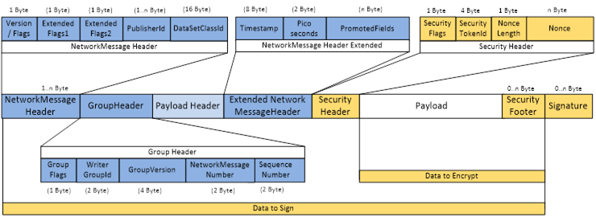  

Figure 32 - UADP NetworkMessage  

###### 7.2.4.4.2 NetworkMessage layout  

The encoding of the UADP *NetworkMessage* is specified in [Table 154](/§\_Ref408404919) .  

The *NetworkMessageContentMask* setting of the *Publisher* controls the flags in the fields *UADPFlags* and *ExtendedFlags1* . The *SecurityMode* setting of the *Publisher* controls the security enabled flag of the *ExtendedFlags1* . The setting of the flags shall not change until the configuration of the *Publisher* is changed.  

Table 154 - UADP NetworkMessage  

| **Name** | **Type** | **Description** |
|---|---|---|
|UADPVersion|Bit[0-3]|Bit range 0-3: Version of the UADP NetworkMessage. The *UADPVersion* for this specification version is 1.|
|UADPFlags|Bit[4-7]|Bit 4: *PublisherId* enabled If the PublisherId is enabled, the type of PublisherId is indicated in the ExtendedFlags1 field. If the *PublisherId* is enabled is false, the *ExtendedFlags1* *PublisherId Type* flags shall be false. Bit 5: *GroupHeader* enabled Bit 6: *PayloadHeader* enabled Bit 7: *ExtendedFlags1* enabled The bit shall be false, if ExtendedFlags1 is 0.|
|ExtendedFlags1|Byte|The *ExtendedFlags1* shall be omitted if bit 7 of the *UADPFlags* is false. If the field is omitted, the *Subscriber* shall handle the related bits as false. Bit range 0-2: *PublisherId* Type 000  The *PublisherId* is of *DataType* *Byte*   This is the default value if *ExtendedFlags1* is omitted 001  The *PublisherId* is of *DataType* *UInt16* 010  The *PublisherId* is of *DataType* *UInt32* 011  The *PublisherId* is of *DataType* *UInt64* 100  The *PublisherId* is of *DataType* *String* 101  Reserved 11x  Reserved Reserved values shall not be used by the sender and the receiver shall skip messages when reserved values are received. The *PublisherId* Type shall be ignored if bit 4 of the *UADPFlags* is false. Bit 3: *DataSetClassId* enabled Bit 4: *SecurityHeader* enabled If this flag is enabled, the NetworkMessage header includes the *SecurityHeader* , otherwise the *SecurityHeader* is omitted. If the *SecurityMode* in the configuration is *SIGN* or *SIGNANDENCRYPT* , this flag shall be set. Bit 5: *Timestamp* enabled Bit 6: PicoSeconds enabled This bit shall be false if the Timestamp bit is false. Bit 7: *ExtendedFlags2* enabled The bit shall be false, if ExtendedFlags2 is 0.|
|ExtendedFlags2|Byte|The *ExtendedFlags2* shall be omitted if bit 7 of the *ExtendedFlags1* is false. If the field is omitted, the *Subscriber* shall handle the related bits as false. Bit 0: Chunk message defined in in [7.2.4.4.4](/§\_Ref434242503) . Bit 1: *PromotedFields* enabled If Promoted fields are enabled, the number of *DataSetMessages* in the  *Network* Message shall be one. Bit range 2-4: UADP *NetworkMessage* type 000  *NetworkMessage* with *DataSetMessage* payload defined in    [7.2.4.4.4](/§\_Ref448842066) . If the *ExtendedFlags2* field is not provided, this is the   default *NetworkMessage* type. 001  *NetworkMessage* with discovery probe defined in [7.2.4.5.4](/§\_Ref448842655) . 010  *NetworkMessage* with discovery announcement payload   defined in [7.2.4.6](/§\_Ref151561003) . 011  Reserved 1xx Reserved Reserved values shall not be used by the sender and the receiver shall skip messages when reserved values are received. Bit 5: *ActionHeader* enabled Bit 6: Reserved Bit 7: Reserved for further extended flag fields Reserved bits shall be set to false by the sender and the receiver shall skip messages where the reserved bits are not false.|
|PublisherId|Byte[\*]|The *PublisherId* shall be omitted if bit 4 of the *UADPFlags* is false. The Id of the *Publisher* that sent the data. Valid *DataTypes* are *UInteger* and *String* . The DataType is indicated by bits 0-2 of the *ExtendedFlags1* . A *Subscriber* can skip *NetworkMessages* from *Publishers* it does not expect *NetworkMessages* from. PublisherIds are only equal if they have the same DataTypes and equal values. For *ActionRequest* and *ActionResponse* messages, the *PublisherId* of the *Responder* is used for request and response.|
|DataSetClassId|Guid|The *DataSetClassId* associated with the *DataSets* in the NetworkMessage. All DataSetMessages in the NetworkMessage shall have the same DataSetClassId. The *DataSetClassId* shall be omitted if bit 3 of the *ExtendedFlags1* is false.|
|GroupHeader||The group header shall be omitted if bit 5 of the *UADPFlags* is false.|
|GroupFlags|Byte|Bit 0: Writer *GroupId* enabled Bit 1: *GroupVersion* enabled Bit 2: *NetworkMessageNumber* enabled Bit 3: *SequenceNumber* enabled Bits 4-6: Reserved Bit 7: Reserved for further extended flag fields Reserved bits shall be set to false by the sender and the receiver shall skip messages where the reserved bits are not false.|
|WriterGroupId|UInt16|Unique id for the *WriterGroup* in the *Publisher.* A *Subscriber* can skip *NetworkMessages* from *WriterGroups* it does not expect *NetworkMessages* from. This field shall be omitted if bit 0 of the *GroupFlags* is false.|
|GroupVersion|VersionTime|Version of the header and payload layout configuration of the *NetworkMessages* sent for the group. This field shall be omitted if bit 1 of the *GroupFlags* is false.|
|NetworkMessage Number|UInt16|Unique number of a *NetworkMessage* across the combination of *PublisherId* and *WriterGroupId* within one *PublishingInterval* . The number is needed if the *DataSetMessages* for one group are split into more than one *NetworkMessage* in a *PublishingInterval* . The value 0 is invalid. This field shall be omitted if bit 2 of the *GroupFlags* is false.|
|SequenceNumber|UInt16|Sequence number for each new *NetworkMessage* as defined in [7.2.3](/§\_Ref525233178) . This field shall be omitted if bit 3 of the *GroupFlags* is false.|
|PayloadHeader|Byte [\*]|The payload header depends on the UADP *NetworkMessage* type flags defined in the *ExtendedFlags2* bit range 2-4. The default is *DataSetMessage* if the *ExtendedFlags2* field is not enabled. The PayloadHeader shall be omitted if bit 6 of the *UADPFlags* is false. The *PayloadHeader* is not contained in the payload but it is contained in the unencrypted *NetworkMessage* header since it contains information necessary to filter *DataSetMessages* on the *Subscriber* side. If the payload header is not present for *DataSetMessages* , the *Subscriber* must know the number and size of *DataSetMessages* from the *DataSetReader* configuration. The group header is the default option to provide a reference to this information in the *NetworkMessage* . In this case the number and size of the *DataSetMessages* is known from the *DataSetReader* configuration for the combination of *WriterGroupId* and *NetworkMessageNumber* .|
|Timestamp|DateTime|The time the NetworkMessage was created. The *Timestamp* shall be omitted if bit 5 of *ExtendedFlags1* is false. The *PublishingInterval* , the *SamplingOffset* the *PublishingOffset* and the *Timestamp* and *PicoSeconds* in the *NetworkMessage* header shall use the same time base.|
|PicoSeconds|UInt16|Specifies the number of 10 picosecond (1,0 e-11 seconds) intervals which shall be added to the *Timestamp* . The *PicoSeconds* field stores the difference between a high-resolution timestamp with a resolution of 10 picoseconds and the Timestamp field value which only has a 100 ns resolution. The *PicoSeconds* field shall contain values less than 10 000. The decoder shall treat values greater than or equal to 10 000 as the value '9999'. The *PicoSeconds* shall be omitted if bit 6 of *ExtendedFlags1* is false.|
|PromotedFields||The *PromotedFields* shall be omitted if bit 1 of the *ExtendedFlags2* is false. If the *PromotedFields* are provided, the number of *DataSetMessages* in the *Network* Message shall be one.|
|Size|UInt16|Total size in *Bytes* of the *Fields* contained in the *PromotedFields* .|
|Fields|BaseDataType[ ]|Array of promoted fields. The size, order and *DataTypes* of the fields depend on the settings in the *FieldMetaData* of the *DataSetMetaData* associated with the *DataSetMessage* contained in the *NetworkMessage* .|
|SecurityHeader||The security header shall be omitted if bit 4 of the *ExtendedFlags1* is false.|
|SecurityFlags|Byte|Bit 0: *NetworkMessage* Signed Bit 1: *NetworkMessage* Encrypted The configuration options for MessageSecurityMode are *NONE* , *SIGN* and *SIGNANDENCRYPT* . Therefore bit 0 shall be true if bit 1 is true. Bit 2: SecurityFooter enabled Bit 3: Force key reset This bit is set if all keys will be made invalid. It is set until the new key is used. The *Publisher* needs to give *Subscribers* a reasonable time to request new keys. The minimum time is five times the *KeepAliveTime* configured for the corresponding PubSub group. This flag is typically set if all keys are invalidated to exclude *Subscribers* , who no longer have access to the keys. Bit range 4-7: Reserved Reserved bits shall be set to false by the the sender and the receiver shall skip messages where the reserved bits are not false.|
|SecurityTokenId|IntegerId|The ID of the security token that identifies the security key in a *SecurityGroup* . The relation to the *SecurityGroup* is done through *DataSetWriterIds* contained in the *NetworkMessage* . If bit 1 and 2 of the *SecurityFlags* are 0, the *SecurityTokenId* shall be 0.|
|NonceLength|Byte|The length of the Nonce used to initialize the encryption algorithm. If bit 1 and 2 of the *SecurityFlags* are 0, the *NonceLength* shall be 0.|
|MessageNonce|Byte [NonceLength]|A number used exactly once for a given security key. For a given security key a unique nonce shall be generated for every *NetworkMessage* . The rules for constructing the *MessageNonce* are defined for the UADP Message Security in [7.2.4.4.3](/§\_Ref443452372) .|
|SecurityFooterSize|UInt16|The size of the *SecurityFooter* . The security footer size shall be omitted if bit 2 of the *SecurityFlags* is false.|
|ActionHeader||The *Action* header shall be omitted if bit 5 of the *ExtendedFlags2* is false. The header shall be enabled for *ActionRequest* and *ActionResponse NetworkMessages.* The Action execution sequences and execution related request and response message values are defined in [6.2.11.2](/§\_Ref167368047) .|
|ActionFlags|Byte|Bit 0: If enabled, the *NetworkMessage* is a *ActionRequest* . If disabled, the   *NetworkMessage* is a *ActionResponse* Bit 1: ResponseAddress enabled Bit 2: CorrelationData enabled Bit 3: RequestorId enabled Bit 4: TimeoutHint enabled Bits 5-6: Reserved Bit 7: Reserved for further extended flag fields Reserved bits shall be set to false by the sender and the receiver shall skip messages where the reserved bits are not false.|
|ResponseAddress|String|The address used to send the *Response* messages. This value shall be omitted for *Response* messages. The handling of the ResponseAddress and default values are defined for the different transport protocol mappings.|
|CorrelationData|ByteString|Data provided by the *Requestor* in the *Request* message that is returned to the *Requestor* in the *Response* message.|
|RequestorId|BaseDataType|The *PublisherId* of the *Requestor.*|
|TimeoutHint|Duration|The timeout used by the *Requestor* to wait for a *Response* messages and by the *Responder* to stop processing the request. This value is mandatory for the *Request* message. This value is not used for *Response* messages.|
|Payload|Byte [\*]|The payload depends on the UADP *NetworkMessage* Type flags defined in the *ExtendedFlags2* bit range 2-4 and on the *Chunk* flag defined in the. *ExtendedFlags2* bit 0.|
|SecurityFooter|Byte [\*]|Optional security footer shall be omitted if bit 2 of the *SecurityFlags* is false. The content of the security footer is defined by the *SecurityPolicy* .|
|Signature|Byte [\*]|The signature of the *NetworkMessage* .|
  

  

###### 7.2.4.4.3 UADP message security  

####### 7.2.4.4.3.1 General  

The security algorithms used and the length of the *KeyNonce* for the UADP *NetworkMessage* depend on the selected *SecurityPolicy* . The algorithms are defined by *SymmetricEncryptionAlgorithm* and *SymmetricSignatureAlgorithm* in [OPC 10000-7](/§UAPart7) *.* The nonce length is part of the *SymmetricEncryptionAlgorithm* .  

The keys used to encrypt and sign messages are extracted from the key data returned from the *GetSecurityKeys* method (see [8.3.2](/§\_Ref450682155) ). This *Method* returns a sequence of key data with a length that depends on the *SecurityPolicyUri* , which is also returned by the *Method* . The layout of the key data is defined in [Table 155](/§\_Ref456132283) .  

Table 155 - Layout of the key data for UADP message security  

| **Name** | **Type** | **Description** |
|---|---|---|
|SigningKey|Byte [SymmetricSignatureAlgorithm Key Length]|Signing key part of the key data returned from *GetSecurityKeys* . The SymmetricSignatureAlgorithm is defined in the SecurityPolicy.|
|EncryptingKey|Byte [SymmetricEncryptionAlgorithm Key Length]|Encryption key part of the key data returned from *GetSecurityKeys* . The SymmetricEncryptionAlgorithm is defined in the SecurityPolicy.|
|KeyNonce|Byte [SymmetricEncryption Nonce Length]|Nonce part of the key data returned from *GetSecurityKeys* .|
  

  

####### 7.2.4.4.3.2 AES-CTR  

The layout of the MessageNonce for AES-CTR mode is defined in [Table 156](/§\_Ref463023362) .  

Table 156 - Layout of the MessageNonce for AES-CTR  

| **Name** | **Type** | **Description** |
|---|---|---|
|Random|Byte [4]|The random part of the MessageNonce. This number does not need to be a cryptographically random number, it can be pseudo-random.|
|SequenceNumber|UInt32|Sequence number for the *MessageNonce* as defined in [7.2.3](/§\_Ref525233178) . The sequence number is reset to 1 after the key and *SecurityTokenId* are updated in the *Publisher* .|
  

  

The message encryption and decryption with AES-CTR mode uses a secret and a counter block. The secret is the *EncryptingKey* from the key data defined in [Table 155](/§\_Ref456132283) . The layout and content of the counter block is defined in [Table 157](/§\_Ref456132637) .  

Table 157 - Layout of the counter block for UADP message security for AES-CTR  

| **Name** | **Type** | **Description** |
|---|---|---|
|KeyNonce|Byte [4]|The KeyNonce portion of the key data returned from *GetSecurityKeys* .|
|MessageNonce|Byte [8]|The first 8 bytes of the *Nonce* in the *SecurityHeader* of the *NetworkMessage* . For AES-CTR mode the length of the *SecurityHeader Nonce* shall be 8 Bytes.|
|BlockCounter|Byte [4]|The counter for each encrypted block of the NetworkMessage. The counter is a 32-bit big endian integer (the opposite of the normal encoding for UInt32 values in OPC UA. This convention comes from the AES-CTR RFC). The counter starts with 1 at the first block. The counter is incremented by 1 for each block.|
  

  

AES-CTR mode takes the counter block and encrypts it using the encrypting key. The encrypted key stream is then logically XORed with the data to encrypt or decrypt. The process is repeated for each block in plain text. No padding is added to the end of the plain text. AES-CTR does not change the size of the plain text data and can be applied directly to a memory buffer containing the message.  

The signature is calculated on the entire *NetworkMessage* including any encrypted data. The signature algorithm is specified by the *SecurityPolicyUri* in [OPC 10000-7](/§UAPart7) .  

When a *Subscriber* or a *Publisher* receives a *NetworkMessage* , it shall verify the signature before processing the payload. If verification fails, it drops the *NetworkMessage* .  

Other *SecurityPolicy* may specify different key lengths or cryptography algorithms.  

###### 7.2.4.4.4 UADP Chunk NetworkMessage  

If a *NetworkMessage* payload with a *DataSetMessage* need to be split across multiple *NetworkMessages,* the chunks are sent in multiple *NetworkMessages* . The *PayloadHeader* of each *NetworkMessage* contains the payload header defined in [Table 158](/§\_Ref458639607) . The *Payload* of each *NetworkMessage* contains the payload defined in [Table 159](/§\_Ref443081880) . A chunk *NetworkMessage* can only contain chunked payload of one *DataSetMessage* .  

If a *NetworkMessage* payload with a discovery announcement message has to be split across multiple *NetworkMessages* the chunks are sent with the payload defined in [Table 159](/§\_Ref443081880) . The payload header is disabled for discovery probe and discovery announcement *NetworkMessages* .  

Table 158 - Chunked NetworkMessage payload header  

| **Name** | **Type** | **Description** |
|---|---|---|
|DataSetWriterId|UInt16|DataSetWriterId contained in the *NetworkMessage* . The *DataSetWriterId* identifies the *PublishedDataSet* and the *DataSetWriter* responsible for sending Messages for the *DataSet* . A *Subscriber* can skip *DataSetMessages* from *DataSetWriters* it does not expect *DataSetMessages* from.|
  

  

Table 159 - Chunked NetworkMessage payload fields  

| **Name** | **Type** | **Description** |
|---|---|---|
|MessageSequenceNumber|UInt16|Sequence number of the payload as defined for the *NetworkMessage* type like *DataSetMessageSequenceNumber* in a *DataSetMessage* . *NetworkMessages* may be received out of order. In this case, a chunk for the next payload can be received before the last chunk of the previous payload was received. If the next sequence number is received by a *Subscriber* that can handle only one payload, the chunks of the previous payload are skipped if they are not completely received yet.|
|ChunkOffset|UInt32|The byte offset position of the chunk in the complete *NetworkMessage* payload. The last chunk is detected if *ChunkOffset* plus the size of the current chunk equals *TotalSize* . All chunks, except for the last one shall have the same size. The size of all chunks other than the last one can be used to calculate the number of expected chunks. The reassembled *NetworkMessage* payload can be processed after all chunks are received. Depending on the transport protocol mapping, the chunks may be received out of order and the last chunk may be received before all other chunks are received.|
|TotalSize|UInt32|Total size of the *NetworkMessage* payload in bytes.|
|ChunkData|ByteString|The pieces of the original *DataSetMessage* or the discovery announcement message are copied into the chunk until the maximum size allowed for a single *NetworkMessage* is reached minus space for the signature. The data copied into next chunk starts with the byte after the last byte copied into current chunk. A *DataSetMessage* or discovery announcement message is completely received when all chunks are received and the message can be processed completely.|
  

  

##### 7.2.4.5 DataSetMessage  

###### 7.2.4.5.1 General  

The UADP *DataSet* payload header and other parts of the *NetworkMessage* are shown in [Figure 33](/§\_Ref449993084) .  

Different types of *DataSetMessage* can be combined in on *NetworkMessage* .  

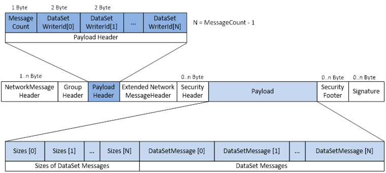  

Figure 33 - UADP DataSet payload  

###### 7.2.4.5.2 DataSet payload header  

The encoding of the UADP *DataSet* payload header is specified in [Table 160](/§\_Ref449993001) . The payload header is unencrypted. This header shall be omitted if bit 6 of the *UADPFlags* is false.  

  

Table 160 - UADP DataSet payload header  

| **Name** | **Type** | **Description** |
|---|---|---|
|Count|Byte|Number of *DataSetMessages* contained in the *NetworkMessage* . The *NetworkMessage* shall contain at least one *DataSetMessage* if the *NetworkMessage* type is *DataSetMessage* payload.|
|DataSetWriterIds|UInt16 [Count]|List of *DataSetWriterIds* contained in the *NetworkMessage* . The size of the list is defined by the *Count* . The *DataSetWriterId* identifies the *PublishedDataSet* and the *DataSetWriter* responsible for sending Messages for the *DataSet* . A *Subscriber* can skip *DataSetMessages* from *DataSetWriters* it does not expect *DataSetMessages* from.|
  

  

###### 7.2.4.5.3 DataSet payload  

The *DataSet* payload is defined in [Table 161](/§\_Ref458635177) . The payload is encrypted.  

Table 161 - UADP DataSet payload  

| **Name** | **Type** | **Description** |
|---|---|---|
|Sizes|UInt16 [Count]|List of byte sizes of the *DataSetMessages* . The size of the list is defined by the *Count* in the *DataSet* payload header. If the payload size exceeds 65535, the *DataSetMessages* shall be allocated to separate *NetworkMessages* . If a single *DataSetMessage* exceeds the payload size it shall be split into *Chunk NetworkMessages* . This field shall be omitted if count is one or if bit 6 of the *UADPFlags* is false.|
|DataSetMessages|DataSetMessage [Count]|*DataSetMessages* contained in the *NetworkMessage* . The size of the list is defined by the *Count* in the *DataSet* payload header. The type of encoding used for the *DataSetMessages* is defined by the *DataSetWriter* . The encodings for the *DataSetMessage* are defined in [7.2.4.5.4](/§\_Ref434239718) .|
  

  

###### 7.2.4.5.4 DataSetMessage header  

The *DataSetMessage* header structure and the relation to other parts in a *NetworkMessage* is shown in [Figure 34](/§\_Ref434237365) .  

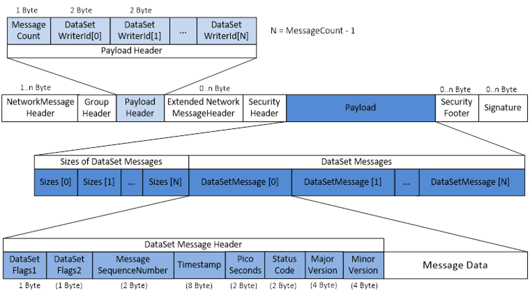  

Figure 34 - DataSetMessage header structure  

The encoding of the *DataSetMessage* header structure is specified in [Table 162](/§\_Ref434237383) .  

The *DataSetFieldContentMask* and the *DataSetMessageContentMask* settings of the *DataSetWriter* control the flags in the fields *DataSetFlags1* and *DataSetFlags2* . The setting of the flags shall not change until the configuration of the *DataSetWriter* is changed.  

Table 162 - DataSetMessage header structure  

| **Name** | **Type** | **Description** |
|---|---|---|
|DataSetFlags1|Byte|Bit 0: DataSetMessage is valid.  If this bit is set to false, the rest of this *DataSetMessage* is considered invalid,  and shall not be processed by the *Subscriber* . Bit range 1-2: Field Encoding 00  The *DataSet* fields are encoded as Variant   The *Variant* can contain a *StatusCode* instead of the expected *DataType* if   the status of the field is Bad.   The *Variant* can contain a DataValue with the value and the statusCode if   the status of the field is Uncertain. 01  RawData Field Encoding   The RawData field encoding is defined in [7.2.4.5.11](/§\_Ref2256108) . 10  DataValue Field Encoding   The *DataSet* fields are encoded as *DataValue* . This option is set if the     *DataSet* is configured to send more than the Value. 11  Reserved Reserved values shall not be used by the sender and the receiver shall skip messages when reserved values are received. Bit 3: *DataSetMessageSequenceNumber* enabled Bit 4: *Status* enabled Bit 5: *ConfigurationVersionMajorVersion* enabled Bit 6: *ConfigurationVersionMinorVersion* enabled Bit 7: *DataSetFlags2* enabled The bit shall be false, if DataSetFlags2 is 0.|
|DataSetFlags2|Byte|The *DataSetFlags2* shall be omitted if bit 7 of the *DataSetFlags1* is false. If the field is omitted, the *Subscriber* shall handle the related bits as false. Bit range 0-3: UADP *DataSetMessage* type 0000 Data Key Frame (see [7.2.4.5.5](/§\_Ref434242739) )   If the *DataSetFlags2* field is not provided, this is the default      *DataSetMessage* type. 0001 Data Delta Frame (see [7.2.4.5.6](/§\_Ref500945276) ) 0010 Event (see [7.2.4.5.7](/§\_Ref434242747) ) 0011 Keep Alive (see [7.2.4.5.8](/§\_Ref434242751) ) 0101 ActionRequest (see [7.2.4.5.9](/§\_Ref150425805) ) 0110 ActionResponse (see [7.2.4.5.10](/§\_Ref150458833) ) 0111 Reserved 1xxx Reserved Reserved values shall not be used by the sender and the receiver shall skip messages when reserved values are received. Bit 4: *Timestamp* enabled Bit 5: *PicoSeconds* included in the *DataSetMessage* header This bit shall be false if the Timestamp bit is false. Bit 6: Reserved Bit 7: Reserved for further extended flag fields Reserved bits shall be set to false by the Publisher and Subscribers shall skip messages where the reserved bits are not false.|
|DataSetMessage SequenceNumber|UInt16|Sequence number for each new *DataSetMessage* as defined in [7.2.3](/§\_Ref525233178) . The field shall be omitted if Bit 3 of *DataSetFlags1* is false.|
|Timestamp|UtcTime|The time the *DataSetMessage* was created. The *Timestamp* shall be omitted if Bit 4 of *DataSetFlags2* is false.|
|PicoSeconds|UInt16|Specifies the number of 10 picoseconds (1,0 e-11 seconds) intervals which shall be added to the *Timestamp* . The *PicoSeconds* field stores the difference between a high-resolution timestamp with a resolution of 10 picoseconds and the Timestamp field value which only has a 100 ns resolution. The *PicoSeconds* field shall contain values less than 10 000. The decoder shall treat values greater than or equal to 10 000 as the value '9.999'. The field shall be omitted if Bit 5 of *DataSetFlags2* is false.|
|Status|UInt16|The overall status of the DataSetMessage. The dependencies to the status of *DataSet* fields are defined in [Table 34](/§\_Ref455004331) . This is the high order 16 bits of the *StatusCode* *DataType* representing the numeric value of the *Severity* and *SubCode* of the *StatusCode* *DataType* . The field shall be omitted if Bit 4 of *DataSetFlags1* is false.|
|ConfigurationVersion MajorVersion|VersionTime|The major version of the configuration version of the DataSet used as consistency check with the *DataSetMetaData* available on the *Subscriber* side. The field shall be omitted if Bit 5 of *DataSetFlags1* is false.|
|ConfigurationVersion MinorVersion|VersionTime|The minor version of the configuration version of the DataSet used as consistency check with the *DataSetMetaData* available on the *Subscriber* side. The field shall be omitted if Bit 6 of *DataSetFlags1* is false.|
  

  

###### 7.2.4.5.5 Data Key Frame DataSetMessage  

The data key frame *DataSetMessage* data and related headers are shown in [Figure 35](/§\_Ref434242894) .  

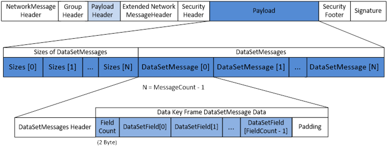  

Figure 35 - Data Key Frame DataSetMessage data  

The encoding of the data key frame *DataSetMessage* structure is specified in [Table 163](/§\_Ref434242918) .  

If the key frame is a heartbeat *DataSetMessage* , only the header is encoded but the following structure shall not be encoded into the *DataSetMessage* . Generic *Subscribers* can detect heartbeat *DataSetMessages* if the *DataSetMessage* size equals the header size. If the *DataSetMessage* size is not part of the payload header, the *DataSetMessage* offset configuration is required on *Subscriber* side to identify a heartbeat *DataSetMessage* .  

Table 163 - Data Key Frame DataSetMessage structure  

| **Name** | **Type** | **Description** |
|---|---|---|
|FieldCount|UInt16|Number of fields of the *DataSet* contained in the *DataSetMessage* . The *FieldCount* shall be omitted if *RawData* field encoding is set in the *EncodingFlags* defined in [7.2.4.5.4](/§\_Ref434239718) .|
|DataSetFields|BaseDataType [FieldCount]|The field values of the DataSet. The field encoding depends on the *DataSetFlags1.Field Encoding* of the *DataSetMessage* Header defined in [7.2.4.5.4](/§\_Ref434239718) . The default encoding is *Variant* if bit 1 and 2 are not set. The detailed rules for creating the *DataSetMessage* status and DataSetFields content are defined in [Table 34](/§\_Ref455004331) .|
|Padding|Byte [\*]|Optional padding added if the encoded DataSetMessage is smaller than the *ConfiguredSize* . The *DataSetMessage* is padded with bytes with value zero.|
  

  

###### 7.2.4.5.6 Data Delta Frame DataSetMessage  

The data delta frame *DataSetMessage* data and the related headers are shown in [Figure 36](/§\_Ref434242895) .  

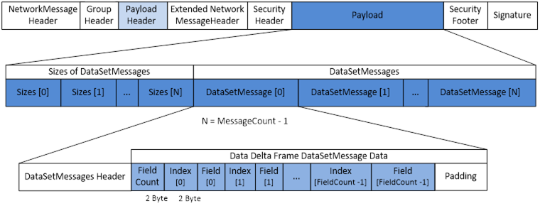  

Figure 36 - Data Delta Frame DataSetMessage  

The information for a single value in delta frame messages is larger because of the additional index necessary for sending just changed data. The *Publisher* shall send a key frame message if the delta frame message is larger than a key frame message.  

The encoding of the data delta frame *DataSetMessage* structure is specified in [Table 164](/§\_Ref434242910) .  

Table 164 - Data Delta Frame DataSetMessage structure  

| **Name** | **Type** | **Description** |
|---|---|---|
|FieldCount|UInt16|Number of fields of the DataSet contained in the *DataSetMessage* .|
|DeltaFrameFields|Structure [FieldCount]|The subset of field values of the DataSet contained in the delta frame.|
|FieldIndex|UInt16|The index of the Field in the DataSet. The index is based on the field position in the *DataSetMetaData* with the configuration version defined in the *ConfigurationVersion* field. A *Publisher* shall use an index only once in a *DataSetMessage* .|
|FieldValue|BaseDataType|The field values of the DataSet. The field encoding depends on the *DataSetFlags1.Field Encoding* of the *DataSetMessage* Header defined in [7.2.4.5.4](/§\_Ref434239718) . The default encoding is Variant if bit 1 and 2 are not set.|
|Padding|Byte [\*]|Optional padding added if the encoded DataSetMessage is smaller than the *ConfiguredSize* . The *DataSetMessage* is padded with bytes with value zero.|
  

  

###### 7.2.4.5.7 Event DataSetMessage  

The *Event DataSetMessage* data and the related headers are shown in [Figure 37](/§\_Ref434242896) .  

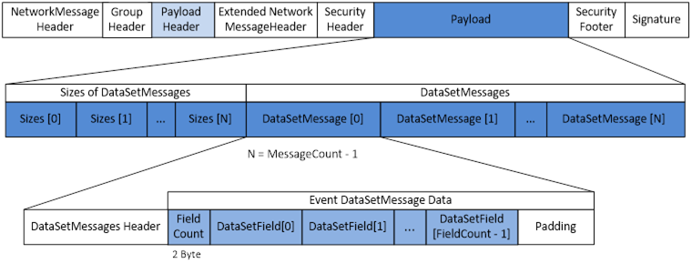  

Figure 37 - Event DataSetMessage  

The encoding of the *Event* *DataSetMessage* structure is specified in [Table 165](/§\_Ref434242902) .  

Table 165 - Event DataSetMessage structure  

| **Name** | **Type** | **Description** |
|---|---|---|
|FieldCount|UInt16|Number of fields of the *DataSet* contained in the *DataSetMessage* .|
|DataSetFields|BaseDataType [FieldCount]|The field values of the DataSet. The fields of Event *DataSetMessages* shall be encoded as Variant. The Field Encoding *DataSetFlags1* of the *DataSetMessage* header (bit 1 and 2) defined in [7.2.4.5.4](/§\_Ref434239718) shall be set to false.|
|Padding|Byte [\*]|Optional padding added if the encoded DataSetMessage is smaller than the *ConfiguredSize* . The *DataSetMessage* is padded with bytes with value zero.|
  

  

###### 7.2.4.5.8 KeepAlive message  

The keep-alive message does not add any additional fields. The message and the related headers are shown in [Figure 38](/§\_Ref449995283) .  

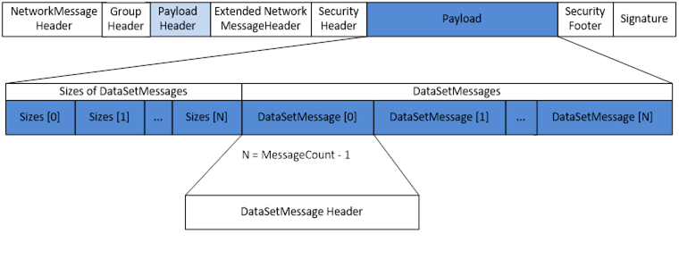  

Figure 38 - KeepAlive message  

If the sequence number is contained in the header, the sequence number provides the next expected sequence number for the *DataSetWriter* .  

###### 7.2.4.5.9 Action request message  

The encoding of the *Action* request *DataSetMessage* structure is specified in [Table 166](/§\_Ref150458230) .  

Table 166 - Action request message structure  

| **Name** | **Type** | **Description** |
|---|---|---|
|ActionTargetId|UInt16|The numeric identifier assigned to the *Action* target which is unique within one *ActionMetaData* . It is used to address the *Action* in combination with the *PublisherId* and the *DataSetWriterId* defined by the Responder.|
|RequestId|UInt16|Request identifier provided by the *Requestor* in the *Request* message that is returned to the *Requestor* in the *Response* message.|
|ActionState|Byte|Specifies the expected *Action* state on *Responder* side. The *ActionState* enumeration value is encoded as *Byte* . The details for the use of this value and the relation to other values for a *Action* execution is defined in [6.2.11.2](/§\_Ref167368047) .|
|FieldCount|UInt16|Number of fields of the *DataSet* contained in the *DataSetMessage* .|
|DataSetFields|BaseDataType [FieldCount]|The field values of the *ActionRequest* DataSet. The fields of *ActionRequest DataSetMessages* shall be encoded as Variant or RawData.|
|Padding|Byte [\*]|Optional padding added if the encoded DataSetMessage is smaller than the *ConfiguredSize* . The *DataSetMessage* is padded with bytes with value zero.|
  

  

###### 7.2.4.5.10 Action response message  

The encoding of the *Action* response *DataSetMessage* structure is specified in [Table 167](/§\_Ref150458231) .  

Table 167 - Action response message structure  

| **Name** | **Type** | **Description** |
|---|---|---|
|ActionTargetId|UInt16|The numeric identifier assigned to the *Action* target which is unique within one *ActionMetaData* . It is used to address the *Action* in combination with the *PublisherId* and the *DataSetWriterId* defined by the Responder.|
|RequestId|UInt16|Request identifier provided by the *Requestor* in the *Request* message that is returned to the *Requestor* in the *Response* message.|
|ActionState|Byte|The current state of this currently running *Action* . The *ActionState* enumeration value is encoded as *Byte* . The details for the use of this value and the relation to other values for a *Action* execution is defined in [6.2.11.2](/§\_Ref167368047) .|
|FieldCount|Uint16|Number of fields of the *DataSet* contained in the *DataSetMessage* .|
|DataSetFields|BaseDataType [FieldCount]|The field values of the *ActionResponse* DataSet. The fields of *ActionResponse* *DataSetMessages* shall be encoded as Variant or RawData.|
|Padding|Byte [\*]|Optional padding added if the encoded DataSetMessage is smaller than the *ConfiguredSize* . The *DataSetMessage* is padded with bytes with value zero.|
  

  

###### 7.2.4.5.11 RawData field encoding  

The encoding of the *DataSetMessage* fields is handled like a *Structure DataType* where the *DataSet* fields are handled like *Structure* fields and fields with *Structure DataType* are handled like nested structures but in addition the fields are padded to the maximum size indicated by *ArrayDimensions* or *MaxStringLength* . The padding only applies to *RawData* field encoding.  

All restrictions for the encoding of *Structure DataTypes* also apply to the *RawData Field Encoding* .  

A *DataSet* field is encoded in the *DataType* and *ValueRank* specified in the *DataSetMetaData* for the *DataSet* . The following special handling shall be applied to ensure a fixed offset of the fields in the *DataSetMessage* .  

* If the *DataType* of a *DataSet* field or a *Structure* field is *String* or *ByteString* and the actual size is smaller than the maximum possible size indicated by the *MaxStringLength* , the field shall be padded with bytes with value zero.  

* If the *ValueRank* is *OneDimension* (1) or n\>1 and the actual size of a dimension in *ArrayDimensions* is smaller than the maximum possible size indicated by the dimensions, the field shall be padded with bytes with value zero for each dimension.  

* If the *DataSet* field or *Structure* field is a *Structure* with optional fields, the *EncodingMask* is encoded followed by all fields. Any optional field that is not present is encoded as padding with bytes with value zero. The size of the padding equals to the size needed to encode the field if it were present.  

* If the *DataSet* field or *Structure* field is a *Union* , the encoding of the selected field is padded with bytes with value zero to the size of the longest *Union* field, when encoded using the rules in this chapter. The case when no field is selected is treated as if there was an encoded field whose encoded size is zero.  

* If the *DataSet* field or *Structure* field is an *OptionSet* , the length of the two *ByteStrings* in the *OptionSet* *Structure* is defined by highest bit number in the *OptionSet* definition.  

The following restrictions apply to the *RawData* field encoding.  

* Fields shall have *MaxStringLength* defined in the *FieldMetaData* if the *DataType* is *String* or *ByteString* . Fields shall have *arrayDimensions* defined in the *FieldMetaData* if valueRank has a value of n \> 0. This includes *Structure* fields with such *DataTypes* or *ValueRank* .  

* *DataSet* fields and *Structure* fields shall not have an abstract *DataType* and shall not allow subtypes.  

* *DataSet* fields and *Structure* fields shall have a concrete valueRank with values -1 or n \> 0.  

* *DataSet* fields and *Structure* fields shall not have the *builtInType* *NodeId* , *ExpandedNodeId* , *QualifiedName* , *LocalizedText* , *XmlElement, DiagnosticInfo* or *DataValue* .  

* *RawField* encoding shall only be applied to *Data Key Frame DataSetMessages* .  

* *Structure* *DataTypes* shall not have a field that contains the same *Structure* *DataType* directly or indirectly.  

The *DataSetMessage* valid bit 0 in *DataSetFlags1* shall be set to false if the fields do not fulfil these requirements at the time the *DataSetMessage* is created.  

##### 7.2.4.6 Discovery messages  

###### 7.2.4.6.1 General  

Discovery announcement messages are sent from the *Publisher* to the *Subscribers* and they can be sent through any *Message Oriented Middleware* and protocol mapping.  

Discovery announcement messages are used to inform *Subscribers* about configuration changes in the *Publisher* . They are sent by the *Publisher* in the case of a configuration change. A Publisher can also be configured to send the discovery announcement messages periodically. A *Message Oriented Middleware* may be able to persist the latest announcement message for *Subscribers* .  

Discovery probe messages are sent from *Subscriber* to *Publisher* and they are limited to *Message Oriented Middleware* and protocol mappings that support such a back channel. A discovery probe is typically answered with one or more discovery announcement messages.  

Depending on the used *Message Oriented Middleware* and the protocol mapping, it may be possible and required for the *Subscriber* to request discovery announcement messages by sending discovery probe messages. One use case is a non reliable transport where the *Subscriber* did not receive the message or the *Subscriber* was not available at the time the *Publisher* sent the discovery announcement. Another use case is the collection of initial knowledge about a *Publisher* . Some discovery announcement messages may only be sent as result of a discovery probe message.  

###### 7.2.4.6.2 Discovery scope for Datagram transport protocols  

Discovery in a global scope requires unique *PublisherIds* . *Publishers* shall use the default *PublisherIds* as defined in [6.2.7.1](/§\_Ref452866764) for the following discovery messages.  

* OPC UA *Application* information announcement  

* *Publisher* endpoint announcement  

* *PubSubConnection* configuration announcement  

These messages use the standard discovery address if defined for the transport protocol mapping like the IANA registered IPv4 multicast address for UDP.  

Other announcements below *PubSubConnection* level can use different *PublisherIds* for different transport protocol mappings. Such *PubSubConnection* specific *PublisherIds* could be two *Byte* *PublisherIds* for the *Ethernet* transport protocol mapping. These *PublisherIds* are known from the payload of the *PubSubConnection* configuration announcement messages.  

###### 7.2.4.6.3 Discovery announcement header  

The NetworkMessage flags used with the discovery announcement messages shall use the following bit values.  

* *UADPFlags* bits 5 and 6 shall be false, bits 4 and 7 shall be true  

* *ExtendedFlags1* bits 3, 5 and 6 shall be false, bit 4 and 7 shall be true  

* *ExtendedFlags2* bit 1 shall be false and the *NetworkMessage* type shall be discovery announcement  

The setting of the flags ensures a known value for the first three bytes plus the PublisherId in the *NetworkMessage* , except for the *Chunk* bit 0 in ExtendedFlags2. The actual security settings for the *NetworkMessage* are indicated by the *SecurityHeader* .  

The encoding of the discovery announcement ** header structure is specified in [Table 168](/§\_Ref473582658) .  

Table 168 - Discovery announcement header structure  

| **Name** | **Type** | **Description** |
|---|---|---|
|AnnouncementType|Byte|The following types of discovery announcement messages are defined. 0 Reserved 1 Publisher Endpoints message (see [7.2.4.6.6](/§\_Ref146817355) ) 2 DataSetMetaData message (see [7.2.4.6.4](/§\_Ref473582659) ) 3 DataSetWriter configuration message (see [7.2.4.6.9](/§\_Ref500757693) ) 4 PubSubConnection configuration message (see [7.2.4.6.8](/§\_Ref146817354) ) 5 OPC UA Application information message (see [Table 169](/§\_Ref146817353) ) 6 ActionResponder configuration message (see [7.2.4.6.10](/§\_Ref150457496) ) 7 ActionMetaData announce message (see [7.2.4.6.11](/§\_Ref150457490) )|
|SequenceNumber|UInt16|Sequence number, incremented by exactly one, for each discovery announcement sent in the scope of a *PublisherId* .|
  

  

The encoding of the OPC UA *Application* information announcement ** message structure is specified in [Table 169](/§\_Ref146817353) .  

Table 169 - OPC UA Application information announcement message structure  

| **Name** | **Type** | **Description** |
|---|---|---|
|ApplicationInformationType|UInt16|The following types of application information are defined. 0 Reserved 1 Application description (see [7.2.4.6.5](/§\_Ref43467170) ) 2 Status (see [7.2.4.6.7](/§\_Ref146816266) )|
  

  

###### 7.2.4.6.4 DataSetMetaData  

The encoding of the *DataSet* metadata message structure is specified in [Table 170](/§\_Ref434242899) . It contains the current layout and *DataSetMetaData* for the *DataSet* .  

The *ConfigurationVersion* in the *DataSetMessage* header shall match the *ConfigurationVersion* in the *DataSetMetaData* .  

The *Publisher* shall send this message without a corresponding discovery probe if the *DataSetMetaData* changed for the *DataSet* .  

Table 170 - DataSetMetaData announcement message structure  

| **Name** | **Type** | **Description** |
|---|---|---|
|DataSetWriterId|UInt16|*DataSetWriterId* of the *DataSet* described with the *MetaData* .|
|MetaData|DataSetMetaDataType|The current *DataSet* metadata for the *DataSet* related to the *DataSetWriterId* . The *DataSetMetaDataType* is defined in [6.2.3.2.3](/§\_Ref433731728) .|
|statusCode|StatusCode|Status code indicating the capability of the *Publisher* to provide *MetaData* for the DataSetWriterId.|
  

  

###### 7.2.4.6.5 ApplicationDescription  

The encoding of the OPC UA *Application* description message fields for *ApplicationInformationType* equals 1 is specified in [Table 171](/§\_Ref82982672) . It contains the *ApplicationDescription* and the capabilities.  

Table 171 - ApplicationInformationType application description fields  

| **Name** | **Type** | **Description** |
|---|---|---|
|ApplicationDescription|ApplicationDescription|*ApplicationDescription* for the OPC UA Application. The *ApplicationDescription DataType* is defined in [OPC 10000-4](/§UAPart4) .|
|Capabilities|String[]|The list of capability identifiers for the application. The allowed capability identifiers are defined in [OPC 10000-12](/§UAPart12) .|
  

  

###### 7.2.4.6.6 ServerEndpoints  

The encoding of the available *Server* *Endpoints* of a *Publisher* is specified in [Table 172](/§\_Ref500758687) .  

Table 172 - Publisher Endpoints announcement message structure  

| **Name** | **Type** | **Description** |
|---|---|---|
|Endpoints|EndpointDescription[]|The OPC UA *Server* *Endpoints* of the *Publisher* . The *EndpointDescription* is defined in [OPC 10000-4](/§UAPart4) . The field is encoded as *Array* with number of elements encoded as *Int32* value.|
|statusCode|StatusCode|Status code indicating the capability of the *Publisher* to provide *Endpoints* .|
  

  

###### 7.2.4.6.7 Status  

The encoding of the status message fields for *ApplicationInformationType* equals 2 is specified in [Table 173](/§\_Ref129991413) .  

Table 173 - ApplicationInformationType status fields  

| **Name** | **Type** | **Description** |
|---|---|---|
|IsCyclic|Boolean|If TRUE the Publisher periodically updates the status. If FALSE the Middleware is responsible for detecting changes to the status.|
|Status|PubSubState|The current state of the *PubSubConnection* . This value is mandatory.|
|NextReportTime|UtcTime|When the Publisher expects to send the next update. The field is present if IsCyclic=TRUE. The field is not present if IsCyclic=FALSE.|
|Timestamp|UtcTime|When the message was sent to the *Middleware* . The field is present if IsCyclic=TRUE. The field is not present if IsCyclic=FALSE.|
  

  

*IsCyclic* is set to FALSE if a *PublisherId* is used exclusively by a single application and the *Message Oriented Middleware* can detect when *Publishers* go offline. In these cases, the *Publisher* sends updates only when its state changes and the *Message Oriented Middleware* will send an update with *PubSubState* *Error* if the *Publisher* goes offline.  

If *IsCyclic* is set to TRUE the *Publisher* only reports while they are *Operational* . The *NextReportTime* indicates when the *Publisher* will send an update. If the *Subscriber* does not receive updates and the *NextReportTime* is in the past, the *Subscriber* assumes the *PubSubState* *Error* .  

###### 7.2.4.6.8 PubSubConnection  

The encoding of the *PubSubConnection* configuration announcement ** message structure is specified in [Table 174](/§\_Ref43467155) . It contains an array of *PubSubConnections* configured in the OPC UA *Application* .  

Table 174 - PubSubConnection configuration announcement message structure  

| **Name** | **Type** | **Description** |
|---|---|---|
|PubSubConnections|PubSubConnectionDataType []|PubSubConnections configured for the OPC UA Application. The PubSubConnectionDataType is defined in [6.2.7.5.1](/§\_Ref43467157) . The *ReaderGroup* lists in *PubSubConnectionDataType* shall be empty. The *WriterGroup* list shall be contained, if the *IncludeWriterGroups* is true in the PubSubConnection information probe message. The *DataSetWriter* lists in the *WriterGroups* shall be contained, if the IncludeDataSetWriters is true in the PubSubConnection information probe message. The configuration properties shall not be included in the *PubSubConnectionDataType* , *WriterGroupDataType* and *DataSetWriterDataType* .|
  

  

###### 7.2.4.6.9 DataSetWriter configuration announcement message  

The encoding of the *DataSetWriter* configuration data message structure is specified in [Table 175](/§\_Ref500757694) . It contains the current configuration of the *WriterGroup* and the *DataSetWriter* for the *DataSet* .  

The *Publisher* shall send this message without a corresponding discovery probe if the configuration of the *WriterGroup* changed.  

Table 175 - DataSetWriter configuration announcement message structure  

| **Name** | **Type** | **Description** |
|---|---|---|
|DataSetWriterIds|UInt16[]|*DataSetWriterIds* contained in the configuration information. The field is encoded as *Array* with number of elements encoded as *Int32* value.|
|DataSetWriterConfig|WriterGroupDataType|The current *WriterGroup* and *DataSetWriter* settings for the *DataSet* related to the *DataSetWriterId* . The *WriterGroupDataType* is defined in [6.2.6.7](/§\_Ref500758023) . The field *DataSetWriters* of the *WriterGroupDataType* shall contain only the entry for the requested or changed *DataSetWriters* in the *WriterGroup* . The configuration properties shall not be included in the *WriterGroupDataType* and *DataSetWriterDataType* .|
|statusCodes|StatusCode[]|Status codes indicating the capability of the *Publisher* to provide configuration information for the *DataSetWriterIds* . The size of the array shall match the size of the *DataSetWriterIds* array.|
  

  

###### 7.2.4.6.10 ActionResponder configuration announcement message  

The encoding of the *ActionResponder* configuration announcement ** message structure is specified in [Table 176](/§\_Ref150458228) . It contains an array of *PubSubConnections* configured in the OPC UA *Application* .  

Table 176 - ActionResponder configuration announcement message structure  

| **Name** | **Type** | **Description** |
|---|---|---|
|ActionResponder|PubSubConnectionDataType []|ActionResponder configured for the OPC UA Application. The PubSubConnectionDataType is defined in [6.2.7.5.1](/§\_Ref43467157) . Only DataSetWriters used for *Actions* are included. All *WriterGroups* and DataSetWriters not used for *Actions* shall be excluded. The *ReaderGroup* lists in *PubSubConnectionDataType* shall be empty. The *WriterGroup* list shall be contained, if the *IncludeWriterGroups* is true in the PubSubConnection information probe message. The *DataSetWriter* lists in the *WriterGroups* shall be contained, if the IncludeDataSetWriters is true in the PubSubConnection information probe message. The configuration properties shall not be included in the *PubSubConnectionDataType* , *WriterGroupDataType* and *DataSetWriterDataType* .|
  

  

###### 7.2.4.6.11 ActionMetaData announcement message  

The encoding of the *ActionMetaData* message structure is specified in [Table 177](/§\_Ref150458229) .  

The *Responder* shall send this message without a corresponding discovery probe if the configuration of the *Action* changed.  

Table 177 - ActionMetaData announcement message structure  

| **Name** | **Type** | **Description** |
|---|---|---|
|DataSetWriterId|UInt16|*DataSetWriterId* of the *Actions* described with the *MetaData* .|
|ActionTargets|ActionTargetDataType[]|The set of *Action* targets that may be executed. If an *Action* target is mapped to a *Method* of an *Object* in an OPC UA *Server* , then the related *Object* and *Method* are defined by the corresponding entry in the *ActionMethods* array. The *ActionTargetId* in the *ActionTargetDataType* is used to address the *Method* referenced by the *ActionMethodDataType* .|
|Request|DataSetMetaDataType|The structure and content of the *ActionRequest* message. The name of the *Action* is defined by the Name field in the *DataSetMetaDataType.*|
|Response|DataSetMetaDataType|The structure and content of the *ActionResponse* message. The fields *Name* and *ConfigurationVersion* of the *Request* and the *Response* *DataSetMetaDataType* shall have equal values.|
|ActionMethods|ActionMethodDataType[]|The optional array of *Action* sources. If the source information is provided, the array shall match the size and order of the ActionTargets. The namespace URIs for the NamespaceIdex in the *NodeIds* shall be contained in the *Request DataSetMetaData* .|
  

  

###### 7.2.4.6.12 UADP discovery probe NetworkMessage  

####### 7.2.4.6.12.1 General  

The *NetworkMessage* flags used with the discovery probe messages shall use the following bit values.  

* *UADPFlags* bits 5 and 6 shall be false, bits 4 and 7 shall be true  

* *ExtendedFlags1* bits 3, 5 and 6 shall be false, bits 4 and 7 shall be true  

* *ExtendedFlags2* bit 2 shall be true, all other bits shall be false  

The setting of the flags ensures a known value for the first three bytes plus the PublisherId in the *NetworkMessage* on the *Publisher* as receiver. The actual security settings for the *NetworkMessage* are indicated by the *SecurityHeader* .  

####### 7.2.4.6.12.2 Traffic reduction  

A variety of rules are used to reduce the amount of traffic on the network in the case of multicast or broadcast communication.  

A *Subscriber* should cache configuration information for *PublisherId* and *DataSetWriterIds* of interest.  

If a *Subscriber* requires information from *Publishers* after a startup or version change detection, discovery probes shall be randomly delayed in the range of 100 ms to 500 ms. The probe shall be skipped if the information is already received during this time or another *Subscriber* sent already a probe and the announcement to this probe is used.  

A *Subscriber* shall wait for a announcement at least 500 ms. As long as not all announcements are received, the Subscriber requests the missing information. It should double the time period between following probes until all needed announcements are received or denied. The maximum period is *Subscriber* specific.  

A *Publisher* shall delay subsequent announcements for a combination of probe type and identifier like the *DataSetWriterId* for at least 500 ms. Duplicate probes, that have not yet been responded to, shall be discarded by the *Publisher* . The maximum delay is *Publisher* specific.  

If the *Publisher* receives discovery probes for different *DataSetWriters* in one *WriterGroup* , the *Publisher* shall send one aggregated discovery announcement.  

####### 7.2.4.6.12.3 Discovery probe header  

The encoding of the discovery probe ** header structure is specified in [Table 178](/§\_Ref500779046) .  

Table 178 - Discovery probe header structure  

| **Name** | **Type** | **Description** |
|---|---|---|
|ProbeType|Byte|The following types of discovery probe messages are defined. 0 Reserved 1  *Publisher* information probe message (see [7.2.4.6.12.4](/§\_Ref500779315) ) 2 FindApplications probe message. The message type does not have additional fields. The *PublisherId* is set to NULL.|
  

  

####### 7.2.4.6.12.4 Publisher information probe message  

The encoding of the *Publisher* information probe message structure is specified in [Table 179](/§\_Ref500779047) .  

Table 179 - Publisher information probe message structure  

| **Name** | **Type** | **Description** |
|---|---|---|
|InformationType|Byte|The following types of *Publisher* information probes are defined. 0 Reserved 1  *Publisher Server Endpoints* No additional fields are defined. The information is provided with the Publisher Endpoints announcement message defined in [7.2.4.6.4](/§\_Ref500758685) . 2  *DataSetMetaData* The settings for this *InformationType* are defined in [Table 180](/§\_Ref83049360) . The information is provided with the *DataSetMetaData* announcement message defined in [7.2.4.6.4](/§\_Ref473582659) . 3  *DataSetWriter* configuration The settings for this *InformationType* are defined in [Table 180](/§\_Ref83049360) . The information is provided with the *DataSetWriter* configuration announcement message defined in [7.2.4.6.9](/§\_Ref500757693) . 4  *WriterGroup* configuration The settings for this *InformationType* are defined in [Table 181](/§\_Ref83049359) The information is provided with the *DataSetWriter* configuration announcement message defined in [7.2.4.6.9](/§\_Ref500757693) . 5  *PubSubConnections* configuration The settings for this *InformationType* are defined in [Table 182](/§\_Ref82982097) The information is provided with the PubSubConnection configuration announcement message defined in [7.2.4.6.7](/§\_Ref43467174) .|
  

  

The additional field for *DataSetWriter* related *InformationType* in a *Publisher* information probe message are specified in [Table 180](/§\_Ref83049360) .  

Table 180 - DataSetWriter settings for Publisher information probe  

| **Name** | **Type** | **Description** |
|---|---|---|
|DataSetWriterIds|UInt16[]|List of *DataSetWriterIds* the information is requested for. The field is encoded as *Array* with number of elements encoded as *Int32* value. For *DataSetMetaData* probes, the *Publisher* sends one discovery announcement *NetworkMessage* for each requested *DataSetWriterId* . For *DataSetWriter* configuration probes, the *DataSetWriters* that belong to one *WriterGroup* are sent together in one *DataSetWriter* configuration message. If more than one *WriterGroup* is affected, this results in a *DataSetWriter* configuration message per *WriterGroup* .|
  

  

The additional fields for *WriterGroup* related *InformationType* in a *Publisher* information probe message are specified in [Table 181](/§\_Ref83049359) .  

Table 181 - WriterGroup settings for Publisher information probe  

| **Name** | **Type** | **Description** |
|---|---|---|
|WriterGroupId|UInt16|This option allows a *Publisher* information probe for a WriterGroup and the contained DataSetWriters if only the *WriterGroupId* is known from *NetworkMessages* . For *WriterGroup* configuration probes, the *DataSetWriters* that belong to the *WriterGroup* are sent together in one *DataSetWriter* configuration message.|
|IncludeDataSetWriters|Boolean|Flag indicating if the *DataSetWriter* should be contained in the *PubSubConnection* configuration announcement ** message.|
  

  

The additional fields for *PubSubConnection* configuration in a *Publisher* information probe message are specified in [Table 182](/§\_Ref82982097) .  

Table 182 - PubSubConnections settings for Publisher information probe  

| **Name** | **Type** | **Description** |
|---|---|---|
|TransportProfileUris|String []|Filter criteria for the PubSubConnections to return in the PubSubConnection configuration announce message. If TransportProfileUris are set, only *PubSubConnection* with matching *TransportProfileUri* shall be returned. If the TransportProfileUris is null or empty, all *PubSubConnections* are returned.|
|IncludeWriterGroups|Boolean|Flag indicating if the *WriterGroups* should be contained in the *PubSubConnection* configuration announcement ** message.|
|IncludeDataSetWriters|Boolean|Flag indicating if the *DataSetWriters* should be contained in the *PubSubConnection* configuration announcement ** message. This flag is ignored if *IncludeWriterGroups* is false. Setting this flag increases the size of the *PubSubConnection* configuration announcement ** message and it is more likely that max message sizes are exceeded.|
  

  

#### 7.2.5 JSON message mapping  

##### 7.2.5.1 General  

The JSON message mapping uses the OPC UA JSON encoding defined in [OPC 10000-6](/§UAPart6) . If an *ExtensionObject* is encoded, the *TypeId* shall be the *DataType* *NodeId* of the contained structure.  

JSON is a format that uses human readable text. It is defined in [IETF RFC 8259](/§JSON) .  

The JSON based message mapping allows OPC UA *Applications* to interoperate with web and enterprise software that use this format and do not understand OPC UA specific encodings.  

The JSON message mapping defines different optional header fields, variations of field settings and different message types. Available layouts with standard settings and the corresponding URI *Strings* for JSON are defined in [A.3](/§\_Ref128034131) .  

##### 7.2.5.2 MessageType mapping  

The mapping of *MessageTypes* to JSON *NetworkMessage* *MessageTypes* and the reference to the detailed definition is listed in [Table 183](/§\_Ref129732012) .  

Table 183 - JSON NetworkMessage MessageType mapping  

| **MessageType** | **JSON NetworkMessage MessageType** | **Specification Reference** |
|---|---|---|
|DataSetMessage|ua-data|Defined in [7.2.5.3](/§\_Ref496109836) and [7.2.5.4](/§\_Ref495346309) .|
|DataSetMetaData|ua-metadata|Defined in [7.2.5.5.2](/§\_Ref129732087) .|
|ApplicationDescription|ua-application|Defined in [7.2.5.5.3](/§\_Ref129734642) .|
|ServerEndpoints|ua-endpoints|Defined in [7.2.5.5.4](/§\_Ref129734643) .|
|Status|ua-status|Defined in [7.2.5.5.5](/§\_Ref129991005) .|
|PubSubConnection|ua-connection|Defined in [7.2.5.5.6](/§\_Ref146187832) .|
|ActionRequest|ua-action-request|Defined in [7.2.5.6.2](/§\_Ref141975823) .|
|ActionResponse|ua-action-response|Defined in [7.2.5.6.3](/§\_Ref141975853) .|
|ActionMetaData|ua-action-metadata|Defined in [7.2.5.5.7](/§\_Ref141975814) .|
|ActionResponder|ua-action-responder|Defined in [7.2.5.5.8](/§\_Ref161953623) .|
  

  

##### 7.2.5.3 NetworkMessage containing DataSetMessages  

Each JSON *NetworkMessage* can contain one or more JSON *DataSetMessages* . The JSON *NetworkMessage* is a JSON object with the fields defined in [Table 184](/§\_Ref495339014) .  

Table 184 - JSON NetworkMessage definition  

| **Name** | **Type** | **Description** |
|---|---|---|
|MessageId|String|A globally unique identifier for the message. The unique identifier can be created by converting a *Guid* to a *String* or through another algorithm that creates a unique string. This value is always present.|
|MessageType|String|This value shall be "ua-data" for *NetworkMessages* containing *DataSetMessages* . This value is always present.|
|PublisherId|String|A unique identifier for the *Publisher* . It identifies the source of the message. The presence of the value depends on the setting in the *JsonNetworkMessageContentMask* . The source is the *PublisherId* on a *PubSubConnection* (see [6.2.7.1](/§\_Ref452866764) ). If the *PublisherId* is a *UInteger* , the *UInteger* value is converted to a *String* without leading zeros.|
|WriterGroupName|String|The name of the *WriterGroup* which created the *NetworkMessage* . The presence of the value depends on the setting in the *JsonNetworkMessageContentMask* .|
|DataSetClassId|String|The *DataSetClassId* associated with the *DataSets* in the *NetworkMessage* . The *DataSetClassId* is a *Guid* and shall be converted to a *String* . The presence of the value depends on the setting in the *JsonNetworkMessageContentMask* . If specified, all *DataSetMessages* in the *NetworkMessage* shall have the same *DataSetClassId* . The source is the *DataSetClassId* on the *PublishedDataSet* (see [6.2.3.3](/§\_Ref461084562) ) associated with the *DataSetWriters* that produced the *DataSetMessages.*|
|Messages|\*|A JSON array of JSON *DataSetMessages* (see [7.2.5.4](/§\_Ref495346309) ) or a JSON object if *SingleDataSetMessage* is set. This value is always present.|
  

  

All fields with a concrete *DataType* defined are encoded using *CompactEncoding* OPC UA JSON *Data Encoding* defined in [OPC 10000-6](/§UAPart6) .  

The fields in the JSON *NetworkMessage* are controlled by the *NetworkMessageContentMask* of the JSON *NetworkMessage* mapping ** (see [6.3.2.1.1](/§\_Ref496728113) ).  

If the *NetworkMessageHeader* bit of the *NetworkMessageContentMask* is not set, the *NetworkMessage* is the contents of the *Messages* field (e.g. a JSON array of *DataSetMessages* ).  

If the *DataSetMessageHeader* bit of the *NetworkMessageContentMask* is not set, the content of the *Messages* field is an array of content from the *Payload* field for each *DataSetMessage* (see [7.2.5.4](/§\_Ref495346309) ).  

If the *SingleDataSetMessage* bit of the *NetworkMessageContentMask* is set, the content of the *Messages* field is a JSON object containing a single *DataSetMessage* .  

If the *NetworkMessageHeader* and the *DataSetMessageHeader* bits are not set ** and *SingleDataSetMessage* bit is set, the *NetworkMessage* is a JSON object containing the set of name/value pairs defined for a single *DataSet* .  

If the JSON encoded *NetworkMessage* size exceeds the *Broker* limits the message is dropped and a *PubSubTransportLimitsExceeded* *Event* is reported.  

##### 7.2.5.4 DataSetMessage  

###### 7.2.5.4.1 Message content  

A *DataSetMessage* is produced by a *DataSetWriter* and contains list of name/value pairs which are specified by the *PublishedDataSet* associated with the *DataSetWriter* . The contents of the *DataSetMessage* are formally described by a *DataSetMetaData Object.* A *DataSetMessage* is a JSON object with the fields defined in [Table 185](/§\_Ref495423669) .  

A key frame *DataSetMessage* or an event based *DataSetMessage* contains name and value for all fields of the *DataSet* .  

A delta frame *DataSetMessage* contains only name and value for the changed fields.  

*DataSetWriters* may periodically provide keep-alive messages which are *DataSetMessages* without any *Payload* field.  

Table 185 - JSON DataSetMessage definition  

| **Name** | **Type** | **Description** |
|---|---|---|
|DataSetWriterId|UInt16|An identifier for *DataSetWriter* which created the *DataSetMessage* . The presence of the value depends on the setting in the *JsonDataSetMessageContentMask* . It is unique within the scope of a *Publisher* .|
|DataSetWriterName|String|The name of the *DataSetWriter* which created the *DataSetMessage* . The presence of the value depends on the setting in the *JsonDataSetMessageContentMask* .|
|PublisherId|String|A unique identifier for the *Publisher* . It identifies the source of the message. The presence of the value depends on the setting in the *JsonDataSetMessageContentMask* . The source is the *PublisherId* on a *PubSubConnection* (see [6.2.7.1](/§\_Ref452866764) ). If the *PublisherId* is a *UInteger* , the *UInteger* value is converted to a *String* without leading zeros. The value shall be omitted if the *NetworkMessage* header is present.|
|WriterGroupName|String|The name of the *WriterGroup* which created the *DataSetMessage* . The presence of the value depends on the setting in the *JsonDataSetMessageContentMask* . The value shall be omitted if the *WriterGroupName* is contained in the *NetworkMessage* header.|
|SequenceNumber|UInt32|Sequence number for each new *DataSetMessage* as defined in [7.2.3](/§\_Ref525233178) *.* The presence of the value depends on the setting in the *JsonDataSetMessageContentMask* . For the *DataSetMessage* *MessageType* "ua-keepalive", the sequence number provides the next expected sequence number for the *DataSetWriter* .|
|MetaDataVersion|ConfigurationVersionDataType|The version of the *DataSetMetaData* which describes the contents of the *Payload* . The presence of the value depends on the setting in the *JsonDataSetMessageContentMask* .|
|MinorVersion|VersionTime|The minor version of the *DataSetMetaData* which describes the contents of the *Payload* . The presence of the value depends on the setting in the *JsonDataSetMessageContentMask* . The value shall be omitted if the *MetaDataVersion* is contained in the *DataSetMessage* header.|
|Timestamp|DateTime|The time the *DataSetMessage* was created *.* The presence of the value depends on the setting in the *JsonDataSetMessageContentMask* .|
|Status|StatusCode|The overall status of the *DataSetMessage.* The dependencies to the status of *DataSet* fields are defined in [Table 35](/§\_Ref191558786) . The presence of the value depends on the setting in the *JsonDataSetMessageContentMask* .|
|MessageType|String|Possible values are "ua-keyframe", "ua-deltaframe", "ua-event" and "ua-keepalive". The presence of the value depends on the setting in the *JsonDataSetMessageContentMask* . If the MessageType is "ua-keepalive" but the DataSetMessage header is disabled in *JsonDataSetMessageContentMask* , this results in an empty JSON object sent for the *DataSetMessage* .|
|Payload|Object|A JSON object containing the name-value pairs specified by the *PublishedDataSet* . The format of the value depends on the *DataType* of the field and the flags specified by the *DataSetFieldContentMask.* The detailed rules for creating the *DataSetMessage* status and DataSet field content are defined in [Table 35](/§\_Ref191558786) . For *MessageType* "ua-event", only *Variant* or *RawData* encoding shall be allowed. If bits for *DataValue* encoding are set, the *Variant* encoding shall be used. This value is always present.|
  

  

All fields with a concrete *DataType* are encoded using *VerboseEncoding* if *FieldEncoding1* is FALSE and *CompactEncoding* if *FieldEncoding1* is TRUE. See the OPC UA JSON Data encodings defined in [OPC 10000-6](/§UAPart6) .  

The fields in the *DataSetMessage* are specified by the *DataSetFieldContentMask* in the *DataSetWriter* parameters.  

The format of the field values in the *Payload* depend on the setting of the *DataSetFieldContentMask, the FieldEncoding1* and the *FieldEncoding2* flag in the *DataSetMessageContentMask* . The resulting JSON encoding is defined in [Table 112](/§\_Ref178242917) . The *FieldEncoding2* flag should always be set to true to omit the deprecated JSON encodings.  

If the *DataSetFieldContentMask* is 0x0 or 0x20 (only the *RawData* flag is set), the *DataSetMessage* fields are encoded as *Variant* . Otherwise the fields are encoded as *DataValue* . If the *MessageType* is "ua-event", the *DataSetFieldContentMask* shall be 0x0 or 0x20.  

###### 7.2.5.4.2 VerboseEncoding  

[OPC 10000-6](/§UAPart6) defines two *DataEncodings* : *CompactEncoding* and *VerboseEncoding* . They have the same structure except *VerboseEncoding* includes default values.  

The main use case for the *VerboseEncoding* is the payload of *DataSetMessages* . The *VerboseEncoding* and the following rules for *DataSet* field encoding ensure that *Subscribers* without OPC UA knowledge get messages without OPC UA specific information for normal use cases. At the same time, the rules for special cases and abstract data types ensure that OPC UA aware *Subscribers* can fully reverse the payload to OPC UA *DataTypes* if they have access to the *DataSetMetaData* of the *Publisher* . The rules for the special cases are defined in [7.2.5.4.3](/§\_Ref202278699) . *VerboseEncoding* is the recommended default encoding for *DataSetMessages.*  

This specification defines a *DataSet* field encoding for the *VerboseEncoding* which simplifies the encoding of *Variants* and *ExtensionObjects* by omitting *UaType* and *UaTypeId* fields with concrete *DataType* defined in the *FieldMetaData* . In this case the *Variants* at the top level are collapsed. Therefore the *DataSet* fields in a *DataSetMessage* for *VerboseEncoding* are encoded like the fields of a *Structure* where the fields are described by the *FieldMetaData* . This includes fields with *Enumeration* *DataTypes* which are encoded using verbose *Enumeration* with the definition in the *FieldMetaData* .  

The additional simplification for *VerboseEncoding* only applies to the first level of the *DataSet* fields. For the nested fields in structure *DataSet* fields, the rules of *VerboseEncoding* defined in [OPC 10000-6](/§UAPart6) apply.  

The following example shows a *DataSetMessage* with *VerboseEncoding* and *DataSet* fields without field specific status and timestamps.  

\{  

"PublisherId":"MyPublisher",  

"DataSetWriterId":102,  

"SequenceNumber":25460,  

"MinorVersion":672341762,  

"Timestamp":"2021-09-27T18:45:19.555Z",  

"Payload":  

\{  

"LocationName":"Building A",  

"Coordinate":  

\{  

"X":1,  

"Y":0.2  

\}  

\}  

\}  

The following example shows a *DataSetMessage* with *VerboseEncoding* and *DataSet* fields with field specific status and timestamps. *Status* is omitted if the *Code* is 0.  

\{  

"PublisherId":"MyPublisher",  

"DataSetWriterId":102,  

"SequenceNumber":68468,  

"MinorVersion":672341762,  

"Timestamp":"2021-09-27T18:45:19.555Z",  

"Payload":  

\{  

"LocationName":  

\{  

"Value":"Building A",  

"Status":\{"Code":1073741824,"Symbol":"Uncertain"\},  

"SourceTimestamp":"2021-09-27T11:32:38.349925Z"  

\},  

"Coordinate":  

\{  

"Value":  

\{  

"X":1,  

"Y":0.2  

\},  

"SourceTimestamp":"2021-09-27T11:32:38.349925Z"  

\}  

\}  

\}  

  

###### 7.2.5.4.3 VerboseEncoding and abstract type handling  

By default, *DataSet* fields can only be decoded to the original *DataType* by inferring the schema from the JSON message or if the *DataSetMetaData* describing the *DataSet* fields is available (i.e. from the *DataSetMetaData* messages).  

Additional information in the payload is required to fully reverse the payload to the original *DataTypes* for *DataSet* fields in the following cases where the *DataSetMetaData* is insufficient to unambiguously decode the messages.  

* *DataSet* fields *with BuiltInType ExtensionObject and a value which is a subtype of the DataType* in the *FieldMetaData. The UaTypeId is needed to decode the value.*  

* *DataSet* fields ** with *BuiltInType Variant.* The *UaType* is needed to decode the value.  

* *DataSet* fields with abstract *ValueRank* values of *Any* (-2) or *OneOrMoreDimensions* (0)  

Note that the same problem exists when a field of a nested *Structure* has *DataType* *BaseDataType* or *AllowSubTypes* =TRUE.  

If *RawData* =FALSE, then the *Publisher* always includes the full *Variant* with the *UaType* or *ExtensionObject with* *UaTypeId* when encoding these fields at the top level or within a nested *Structure* .  

If *RawData* =TRUE the Publisher will encode the *Variant* but not include the *UaTypeId* and *UaType* which means OPC UA *DataSetReaders* are not able to determine the *DataTypes* of the original values. If *DataSetMetaData* contains abstract types and *RawData* =TRUE is configured, OPC UA *DataSetReaders* may go into *Error* state.  

[Table 186](/§\_Ref191560590) provides examples of *Variant* *VerboseEncoding* field encoding with the different RawData settings. The *ValueRank* configured for the *DataSet* field is *Scalar* if no other *ValueRank* is mentioned in the description.  

[Table 187](/§\_Ref199232153) provides examples of *DataValue* *VerboseEncoding* field encoding for RawData=FALSE. For RawData=TRUE the UaType and UaTypeId fields are skipped as shown in [Table 186](/§\_Ref191560590) .  

Table 186 - DataSet field Variant VerboseEncoding examples  

| **Description** | **DataType** | **RawData = TRUE** | **RawData = FALSE** |
|---|---|---|---|
|Simple scalar Int32|Int32|1234|1234|
|Simple scalar String|String|"Apple"|"Apple"|
|BaseDataType|BaseDataType|\{ "Value": "Apple" \}|\{ "UaType": 12, "Value": "Apple" \}|
|Structure, no subtypes used|Structure X Int32 Y String|\{ "X": 1234, "Y": "Ring" \}|\{ "X": 1234, "Y": "Ring" \}|
|Structure using subtype of the DataType in the FieldMetaData|Structure X Int32 Y String Z Double|\{ "X": 1234, "Y": "Ring", "Z": 4.56 \}|\{ "UaTypeId": "i=3456", "X": 1234, "Y": "Ring", "Z": 4.56 \} (a)|
|Nested structure with BaseDataType field|Structure X Int32 S Structure  A    Double  B    BaseDataType|\{ "X": 1234, "S": \{  "A": 7.8,  "B": \{   "Value":"Apple"  \} \} \}|\{ "X": 1234, "S": \{  "A": 7.8,  "B": \{   "UaType": 12,   "Value":"Apple"  \} \} \}|
|Nested structure with AllowSubtypes = FALSE|Structure X Int32 S Structure  A    Double  B    String|\{ "X": 1234, "S": \{  "A": 7.8,  "B": "Apple" \} \}|\{ "X": 1234, "S": \{  "A": 7.8,  "B": "Apple" \} \}|
|Nested structure with AllowSubtypes = TRUE|Structure X Int32 S Structure allow ST  A    Double  B    String|\{ "X": 1234 "S": \{  "A": 7.8,  "B": "Apple" \} \}|\{ "X": 1234 "S": \{  "UaTypeId": "i=5678",  "A": 7.8,  "B": "Apple" \} \} (a)|
|ValueRank = OneDimension|Int32 [ ]|[1,2,3,4]|[1,2,3,4]|
|ValueRank = TwoDimensions|Int32 [ ] [ ]|\{ "Value": [1,2,3,4], "Dimensions": [2,2] \}|\{ "Value": [1,2,3,4], "Dimensions": [2,2] \}|
|ValueRank = ScalarOrOneDimension|Int32|11|11|
|ValueRank = ScalarOrOneDimension|Int32 [ ]|[1,2,3,4]|[1,2,3,4]|
|ValueRank = OneOrTwoDimensions|Int32 [ ]|\{ "Value": [1,2,3,4] \}|\{ "Value": [1,2,3,4] \}|
|ValueRank = OneOrTwoDimensions|Int32 [ ] [ ]|\{ "Value": [1,2,3,4], "Dimensions": [2,2] \}|\{ "Value": [1,2,3,4], "Dimensions": [2,2] \}|
|ValueRank = Any|Int32|\{ "Value": 11 \}|\{ "Value": 11 \}|
|ValueRank = Any|Int32 [ ]|\{ "Value": [1,2,3,4] \}|\{ "Value": [1,2,3,4] \}|
|ValueRank = Any|Int32 [ ] [ ]|\{ "Value": [1,2,3,4], "Dimensions": [2,2] \}|\{ "Value": [1,2,3,4], "Dimensions": [2,2] \}|
|Structure with array|Structure X Int32 [ ] Y String|\{ "X": [1,2,3,4], "Y": "Ring" \}|\{ "X": [1,2,3,4], "Y": "Ring" \}|
|Structure with multidimensional array|Structure X Int32 [ ] [ ] Y String|\{ "X": \{  "Array": [1,2,3,4]  "Dimensions":[2,2] \}, "Y": "Ring" \}|\{ "X": \{  "Array": [1,2,3,4]  "Dimensions":[2,2] \}, "Y": "Ring" \}|
|Enumeration|ServerStatusDataType|"Suspended\_3"|"Suspended\_3"|
|(a) The *NodeIds* used in the example for *UaTypeId* are fictional *NodeIds* out of the OPC UA namespace to reduce the string length for readability of the examples.|
  

  

Table 187 - DataSet field DataValue VerboseEncoding examples  

| **Description** | **DataType** | **RawData = FALSE** |
|---|---|---|
|Simple scalar Int32|Int32|\{ "Value": 1234, "SourceTimestamp": "2025-05-26T11:20:07.951Z" \}|
|Simple scalar String|String|\{ "Value": "Apple", "SourceTimestamp": "2025-05-26T11:20:07.951Z" \}|
|BaseDataType|BaseDataType|\{ "UaType": 12, "Value": "Apple", "SourceTimestamp": "2025-05-26T11:20:07.951Z" \}|
|Structure, no subtypes used|Structure X Int32 Y String|\{ "Value": \{  "X": 1234,  "Y": "Ring", \} \}|
|Structure using subtype of the DataType in the FieldMetaData|Structure X Int32 Y String Z Double|\{ "Value": \{  "UaTypeId": "nsu=http://xy.de/types;i=123",  "X": 1234,  "Y": "Ring",  "Z": 4.56 \} \}|
  

  

##### 7.2.5.5 Discovery Messages  

###### 7.2.5.5.1 General  

The JSON message mapping defines optional discovery messages. The main purpose is the exchange of additional information not contained in the *DataSetMessages* like *Properties* for the *DataSet* fields.  

###### 7.2.5.5.2 DataSetMetaData  

*DataSetMetaData* describe the content of *DataSetMessages* published by a *DataSetWriter* . More specifically, it specifies the names and data types of the values that shall appear in the *Payload* of a *DataSetMessage.*  

When the *DataSetMetaData* of a *DataSet* changes, the *DataSetWriter* may be configured to publish the updated value through the mechanism defined by the transport protocol mapping.  

The *DataSetWriterId* and *Version* fields in a *DataSetMessage* are used to correlate a *DataSetMessage* with a *DataSetMetaData.*  

A *NetworkMessage* with *MessageType* *DataSetMetaData* is a JSON object with the fields defined in [Table 188](/§\_Ref495514384) .  

Table 188 - JSON DataSetMetaData definition  

| **Name** | **Type** | **Description** |
|---|---|---|
|MessageId|String|A globally unique identifier for the message. This value is mandatory.|
|MessageType|String|This value shall be "ua-metadata". This value is mandatory.|
|PublisherId|String|A unique identifier for the *Publisher* . It identifies the source of the message. This value is mandatory.|
|DataSetWriterId|UInt16|An identifier for *DataSetWriter* which published the *DataSetMetaData* . This value is mandatory. It is unique within the scope of a *Publisher* .|
|WriterGroupName|String|The name of the *WriterGroup* which created the *NetworkMessage* . This value is mandatory.|
|DataSetWriterName|String|The name of the DataSetWriter. This value is mandatory.|
|Timestamp|UtcTime|When the message was first sent to the middleware. This value is mandatory.|
|MetaData|DataSetMetaDataType|The metadata as defined in [6.2.3.2.3](/§\_Ref433731728) . This value is mandatory.|
  

  

*All fields are encoded using CompactEncoding OPC UA JSON Data Encoding defined in* [OPC 10000-6](/§UAPart6) *.*  

###### 7.2.5.5.3 ApplicationDescription  

A *NetworkMessage* with *MessageType* *ApplicationDescription* is a JSON object with the fields defined in [Table 189](/§\_Ref110775336) .  

*All fields are encoded using CompactEncoding OPC UA JSON Data Encoding defined in* [OPC 10000-6](/§UAPart6) *.*  

Table 189 - JSON ApplicationDescription definition  

| **Name** | **Type** | **Description** |
|---|---|---|
|MessageId|String|A globally unique identifier for the message. This value is mandatory.|
|MessageType|String|This value shall be "ua-application". This value is mandatory.|
|PublisherId|String|The *Publisher* that sent the message. This value is mandatory.|
|Timestamp|UtcTime|When the message was first sent to the middleware. This value is mandatory.|
|Description|ApplicationDescription|The ApplicationDescription *Structure* is described in OPC 10000-4.|
|ServerCapabilities|String []|The set of *Server* capabilities supported by the *Server* associated with the *Publisher* . The set of allowed Server capabilities are defined in [OPC 10000-12](/§UAPart12) . This value is mandatory.|
  

  

###### 7.2.5.5.4 ServerEndpoints  

A *NetworkMessage* with *MessageType* *ServerEndpoints* is a JSON object with the fields defined in [Table 190](/§\_Ref110776028) .  

*All fields are encoded using CompactEncoding OPC UA JSON Data Encoding defined in* [OPC 10000-6](/§UAPart6) *.*  

Table 190 - JSON ServerEndpoints definition  

| **Name** | **Type** | **Description** |
|---|---|---|
|MessageId|String|A globally unique identifier for the message. This value is mandatory.|
|MessageType|String|This value shall be "ua-endpoints". This value is mandatory.|
|PublisherId|String|The *Publisher* that sent the message. This value is mandatory.|
|Timestamp|UtcTime|When the message was first sent to the middleware. This value is mandatory.|
|Endpoints|EndpointDescription []|The list of Server *Endpoints* of the OPC UA *Application* . The *EndpointDescription Structure* is described in OPC 10000-4. This value is mandatory.|
  

  

###### 7.2.5.5.5 Status  

A *NetworkMessage* with *MessageType* *Status* is a JSON object with the fields defined in [Table 191](/§\_Ref129991569) .  

Table 191 - JSON Status definition  

| **Name** | **Type** | **Description** |
|---|---|---|
|MessageId|String|A globally unique identifier for the message. This value is mandatory.|
|MessageType|String|This value shall be "ua-status". This value is mandatory.|
|PublisherId|String|The *Publisher* that sent the message. This value is mandatory.|
|Timestamp|UtcTime|When the message was sent to the *Middleware* . Mandatory if IsCyclic=TRUE. The field is omitted if IsCyclic=FALSE.|
|IsCyclic|Boolean|If TRUE the Publisher periodically updates the status. If FALSE the Middleware is responsible for detecting changes to the status.|
|Status|PubSubState|The current state of the *PubSubConnection* . This value is mandatory.|
|NextReportTime|UtcTime|When the Publisher is expected to send the next update. Mandatory if IsCyclic=TRUE. The field is omitted if IsCyclic=FALSE.|
  

  

*IsCyclic* is set to FALSE if a *PublisherId* is used exclusively by a single application and the *Message Oriented Middleware* can detect when *Publishers* go offline. In these cases, the *Publisher* sends updates only when its state changes and the *Message Oriented Middleware* will send an update with *PubSubState* *Error* if the *Publisher* goes offline. The status message from the *Message Oriented Middleware* does not contain the *Timestamp* .  

If *IsCyclic* is set to TRUE the *Publisher* only reports when it is *Operational* . The *NextReportTime* indicates when the *Publisher* is expected to send an update. If the *Subscriber* does not receive updates and the *NextReportTime* is a reasonable time in the past, the *Subscriber* assumes the *PubSubState* *Error* .  

*All fields are encoded using CompactEncoding OPC UA JSON Data Encoding defined in* [OPC 10000-6](/§UAPart6) *.*  

###### 7.2.5.5.6 PubSubConnection  

A *NetworkMessage* with *MessageType* *PubSubConnection* is a JSON object with the fields defined in [Table 192](/§\_Ref129991577) .  

*All fields are encoded using CompactEncoding OPC UA JSON Data Encoding defined in* [OPC 10000-6](/§UAPart6) *.*  

Table 192 - JSON PubSubConnection definition  

| **Name** | **Type** | **Description** |
|---|---|---|
|MessageId|String|A globally unique identifier for the message. This value is mandatory.|
|MessageType|String|This value shall be "ua-connection". This value is mandatory.|
|PublisherId|String|The *Publisher* that sent the message. This value is mandatory.|
|Timestamp|UtcTime|When the message was first sent to the *Middleware* . This value is mandatory.|
|Connection|PubSubConnectionDataType|The *PubSubConnectionDataType Structure* is defined in [6.2.7.5.1](/§\_Ref43467157) . The *ReaderGroup* lists and the *Address* in *PubSubConnectionDataType* shall be empty. The configuration properties shall not be included in the *PubSubConnectionDataType* , *WriterGroupDataType* and *DataSetWriterDataType* . This value is mandatory.|
  

  

###### 7.2.5.5.7 ActionMetaData  

A *NetworkMessage* with *MessageType* *ActionMetaData* is a JSON object with the fields defined in [Table 193](/§\_Ref141976318) .  

*All fields are encoded using CompactEncoding OPC UA JSON Data Encoding defined in* [OPC 10000-6](/§UAPart6) *.*  

Table 193 - JSON ActionMetaData definition  

| **Name** | **Type** | **Description** |
|---|---|---|
|MessageId|String|A globally unique identifier for the message. This value is mandatory.|
|MessageType|String|This value shall be "ua-action-metadata". This value is mandatory.|
|PublisherId|String|The *Publisher* that sent the message. This value is mandatory.|
|DataSetWriterId|UInt16|An identifier for *DataSetWriter* which published the ** metadata. This value is mandatory. It is unique within the scope of a *Publisher* .|
|DataSetWriterName|String|The name of the DataSetWriter. This value is optional. The presence of the value depends on the setting in the *JsonDataSetMessageContentMask* .|
|Timestamp|UtcTime|When the message was first sent to the *Middleware* . This value is mandatory.|
|ActionTargets|ActionTargetDataType[]|The set of Action targets that may be executed. If an *Action* target is mapped to a *Method* of an *Object* in an OPC UA *Server* , then the related *Object* and *Method* are defined by the corresponding entry in the *ActionMethods* array. The *ActionTargetId* in the *ActionTargetDataType* is used to address the *Method* referenced by the *ActionMethodDataType* .|
|Request|DataSetMetaDataType|The structure and content of the *ActionRequest* message. The name of the *Action* is defined by the Name field in the *DataSetMetaDataType.*|
|Response|DataSetMetaDataType|The structure and content of the *ActionResponse* message. The fields *Name* and *ConfigurationVersion* of the *Request* and the *Response* *DataSetMetaDataType* shall have equal values.|
|ActionMethods|ActionMethodDataType[]|The optional array of *Action* sources. If the source information is provided, the array shall match the size and order of the ActionTargets.|
  

  

###### 7.2.5.5.8 ActionResponder  

A *NetworkMessage* with *MessageType* *ActionResponder* is a JSON object with the fields defined in [Table 193](/§\_Ref141976318) .  

*All fields are encoded using CompactEncoding OPC UA JSON Data Encoding defined in* [OPC 10000-6](/§UAPart6) *.*  

Table 194 - JSON ActionResponder definition  

| **Name** | **Type** | **Description** |
|---|---|---|
|MessageId|String|A globally unique identifier for the message. This value is mandatory.|
|MessageType|String|This value shall be "ua-action-responder". This value is mandatory.|
|PublisherId|String|The *Publisher* that sent the message. This value is mandatory.|
|Timestamp|UtcTime|When the message was first sent to the *Middleware* . This value is mandatory.|
|Connection|PubSubConnectionDataType|The *PubSubConnectionDataType Structure* is defined in [6.2.7.5.1](/§\_Ref43467157) . Only DataSetWriters used for *Actions* are included. All *WriterGroups* and DataSetWriters not used for *Actions* shall be excluded. The *ReaderGroup* lists in *PubSubConnectionDataType* shall be empty. The configuration properties shall not be included in the *PubSubConnectionDataType* , *WriterGroupDataType* and *DataSetWriterDataType* . This value is mandatory.|
  

  

##### 7.2.5.6 NetworkMessage containing Action messages  

###### 7.2.5.6.1 Action NetworkMessage  

Each JSON Action *NetworkMessage* can contain one or more JSON *Request* or *Response* messages. A JSON *Action* *NetworkMessage* is a JSON object with the fields defined in [Table 195](/§\_Ref161533019) .  

*All fields are encoded using CompactEncoding OPC UA JSON Data Encoding defined in* [OPC 10000-6](/§UAPart6) *.*  

Table 195 - JSON Action NetworkMessage definition  

| **Name** | **Type** | **Description** |
|---|---|---|
|MessageId|String|A globally unique identifier for the message. This value is mandatory.|
|MessageType|String|This value shall be "ua-action-request" *Request* messages or "ua-action-response" for *Response* messages. This value is mandatory.|
|PublisherId|String|The *PublisherId* of the *Responder* for the "ua-action-request" and "ua-action-response" message. This value is mandatory.|
|Timestamp|UtcTime|When the message was first sent to the *Middleware* . This value is mandatory.|
|ResponseAddress|String|The address used to send the *Response* messages. The handling of the ResponseAddress and default values are defined for the different transport protocol mappings. This value is mandatory for *Request* messages. This value shall be omitted for *Response* message.|
|CorrelationData|ByteString|Data provided by the *Requestor* in the *Request* message that is returned to the *Requestor* in the *Response* message. The value may be provided in the *Request* message. The value shall be provided in the *Response* message if it was included in the *Request* message.|
|RequestorId|String|The *PublisherId* of the *Requestor* for the "ua-action-request" and "ua-action-response" message. This value is mandatory.|
|TimeoutHint|Duration|The timeout used by the *Requestor* to wait for a *Response* messages and by the *Responder* to stop processing the request. This value is mandatory for the *Request* message. This value is not used for *Response* messages.|
|Message|\*|A JSON array of JSON *ActionRequest* or JSON *ActionResponse* messages. This value is mandatory.|
  

  

It contains one or more *ActionRequest* or *ActionResponse* messages with a layout defined by the *Request* and *Response* fields in the *ActionMetaData* .  

The *Action* execution sequences and execution related request and response message values are defined in [6.2.11.2](/§\_Ref167368047) .  

###### 7.2.5.6.2 ActionRequest  

A *NetworkMessage* with *MessageType* "ua-action-request" contains a JSON array with *ActionRequest* messages. A *ActionRequest* message is a JSON object with the fields defined in [Table 196](/§\_Ref150433358) .  

*All fields are encoded using CompactEncoding OPC UA JSON Data Encoding defined in* [OPC 10000-6](/§UAPart6) *.*  

Table 196 - JSON ActionRequest definition  

| **Name** | **Type** | **Description** |
|---|---|---|
|DataSetWriterId|UInt16|An identifier for *DataSetWriter* in the *Responder* which creates the *Response* . This value is mandatory. It is unique within the scope of a *Responder* .|
|ActionTargetId|UInt16|The numeric identifier assigned to the *Action* target which is unique within one *ActionMetaData* . This value is mandatory. It is used to address the *Action* target in combination with the *PublisherId* and the *DataSetWriterId* .|
|DataSetWriterName|String|The name of the *DataSetWriter* which created the *DataSetMessage* . The presence of the value depends on the setting in the *JsonDataSetMessageContentMask* .|
|WriterGroupName|String|The name of the *WriterGroup* which created the *DataSetMessage* . The presence of the value depends on the setting in the *JsonDataSetMessageContentMask* . The value shall be omitted if the *WriterGroupName* is contained in the *NetworkMessage* header.|
|MetaDataVersion|ConfigurationVersionDataType|The version of the *ActionMetaData Request* which describes the contents of the *Payload* . The presence of the value depends on the setting in the *JsonDataSetMessageContentMask* .|
|MinorVersion|VersionTime|The minor version of the *ActionMetaData Request* which describes the contents of the *Payload* . The presence of the value depends on the setting in the *JsonDataSetMessageContentMask* . The value shall be omitted if the *MetaDataVersion* is contained in the *DataSetMessage* header.|
|Timestamp|DateTime|The time the *Request* was created *.* The presence of the value depends on the setting in the *JsonDataSetMessageContentMask* .|
|MessageType|String|"ua-action-request" The presence of the value depends on the setting in the *JsonDataSetMessageContentMask* .|
|RequestId|UInt16|Data provided by the *Requestor* in the *Request* message that is returned to the *Requestor* in the *Response* message.|
|ActionState|ActionState|Specifies the expected *Action* state on *Responder* side. The details for the use of this value and the relation to other values for a *Action* execution is defined in [6.2.11.2](/§\_Ref167368047) .|
|Payload|Object|A JSON object containing the name-value pairs specified by the *ActionMetaData* . The format of the value depends on the *DataType* of the field and the flags specified by the *DataSetFieldContentMask.* Only *Variant* or *RawData* encoding shall be allowed. If bits for *DataValue* encoding are set, the *Variant* encoding shall be used.|
  

  

The encoding rules defined in [7.2.5.4](/§\_Ref495346309) for *DataSetMessages* also apply to the *ActionRequest* message. The *DataValue* encoding shall not be used in *ActionRequest* message. The *RawData* flag shall be FALSE for *ActionRequest* messages.  

###### 7.2.5.6.3 ActionResponse  

A *NetworkMessage* with *MessageType* "ua-action-response" contains a JSON array with *ActionResponse* messages. An *ActionResponse* message is a JSON object with the fields defined in [Table 197](/§\_Ref150433379) .  

*All fields are encoded using CompactEncoding OPC UA JSON Data Encoding defined in* [OPC 10000-6](/§UAPart6) *.*  

Table 197 - JSON ActionResponse definition  

| **Name** | **Type** | **Description** |
|---|---|---|
|DataSetWriterId|UInt16|An identifier for *DataSetWriter* which created the *Response* . This value is mandatory. It is unique within the scope of a *Responder* .|
|ActionTargetId|UInt16|The numeric identifier assigned to the *Action* target which is unique within one *ActionMetaData* . This value is mandatory. It is used to address the *Action* target in combination with the *PublisherId* and the *DataSetWriterId* .|
|DataSetWriterName|String|The name of the *DataSetWriter* which created the *DataSetMessage* . The presence of the value depends on the setting in the *JsonDataSetMessageContentMask* .|
|WriterGroupName|String|The name of the *WriterGroup* which created the *DataSetMessage* . The presence of the value depends on the setting in the *JsonDataSetMessageContentMask* . The value shall be omitted if the *WriterGroupName* is contained in the *NetworkMessage* header.|
|MetaDataVersion|ConfigurationVersionDataType|The version of the *ActionMetaData Response* which describes the contents of the *Payload* . The presence of the value depends on the setting in the *JsonDataSetMessageContentMask* .|
|MinorVersion|VersionTime|The minor version of the *ActionMetaData Response* which describes the contents of the *Payload* . The presence of the value depends on the setting in the *JsonDataSetMessageContentMask* . The value shall be omitted if the *MetaDataVersion* is contained in the *DataSetMessage* header.|
|Timestamp|DateTime|The time the *DataSetMessage* was created *.* The presence of the value depends on the setting in the *JsonDataSetMessageContentMask* .|
|Status|StatusCode|The overall result of the *Action Response.* The value shall be present.|
|MessageType|String|"ua-action-response". The presence of the value depends on the setting in the *JsonDataSetMessageContentMask* .|
|RequestId|UInt16|Data provided by the *Requestor* in the *Request* message that is returned to the *Requestor* in the *Response* message.|
|ActionState|ActionState|The current state of this currently running *Action* . The details for the use of this value and the relation to other values for a *Action* execution is defined in [6.2.11.2](/§\_Ref167368047) .|
|Payload|Object|A JSON object containing the name-value pairs specified by the *ActionMetaData* . The format of the value depends on the *DataType* of the field and the flags specified by the *DataSetFieldContentMask.* Only *Variant* or *RawData* encoding shall be allowed. If bits for *DataValue* encoding are set, the *Variant* encoding shall be used. The value shall be present.|
  

  

The encoding rules defined in [7.2.5.4](/§\_Ref495346309) for *DataSetMessages* also apply to the *ActionResponse* message. The *DataValue* encoding shall not be used in *ActionResponse* message. The *RawData* flag shall be FALSE for *ActionResponse* messages.  

### 7.3 Transport Protocol Mappings  

#### 7.3.1 General  

Subclause [7.3](/§\_Ref463039180) lists the standard protocols that have been selected for this document and their possible combinations with message mappings.  

#### 7.3.2 OPC UA UDP  

##### 7.3.2.1 General  

OPC UA UDP is a simple UDP based protocol that is used to transport UADP *NetworkMessages* .  

A *PubSubConnection* for UDP shall have a unique *Address* across all *PubSubConnections* of an OPC UA *Application* .  

If the *Address* specifies a domain name then the resolution to an IP address requires access to a domain name resolution service (e.g., the DNS protocol) that maps the domain name onto a usable network address. [OPC 10000-7](/§UAPart7) defines *Profiles* for different name resolution protocols that *Publisher* or *Subscriber* may support.  

For OPC UA UDP it is recommended to limit the *MaxNetworkMessageSize* plus additional headers to a MTU size. The number of frames used for a UADP *NetworkMessage* influences the probability that UADP *NetworkMessages* get lost.  

Note: The MaxNetworkMessageSize that fits into one MTU is maximum 1472 Byte for IPv4 and 1452 Byte for IPv6. The additional headers have a size of 22 Byte for Ethernet, 20 Byte for IPv4 or 40 Byte for IPv6 and 8 Byte for UDP. This is based on IETF RFC 8200 for IPv6, RFC 791 for IPv4 and RFC 768 for UDP.  

For OPC UA UDP the *MaxNetworkMessageSize* plus additional headers shall be limited to 65535 Byte.  

The transport of a UADP *NetworkMessage* in a UDP packet is defined in [Table 198](/§\_Ref473135474) .  

Table 198 - UADP message transported over UDP  

| **Name** | **Description** |
|---|---|
|Frame Header|The frame header.|
|IP Header|The IP header for the frame contains information like source IP address and destination IP address. IPv4 and IPv6 addresses can be used. The size of the IP header depends on the used version.|
|UDP Header|The UDP header for the frame contains the source port, destination port, length and checksum. Each field is two byte long. The total size of the UDP header is 8 byte.|
|UADP NetworkMessage|The UADP NetworkMessage is sent as UDP data.|
|Frame Footer|The frame footer.|
  

  

The IANA registered IPv4 multicast address for discovery is 224.0.2.14. It shall only be used for OPC UA discovery purposes. The recommended port for discovery is 4840. Therefore the default *DiscoveryAddress* has the following form:  

opc.udp://224.0.2.14  

The default *DiscoveryMaxMessageSize* for UDP is 4096 bytes.  

##### 7.3.2.2 UDP multicast and broadcast  

The transport protocol URL for UDP multicast and broadcast communication is configured on a *PubSubConnection* for *Publisher* and *Subscriber* . The *Address* parameter for a *PubSubConnection* is defined in [6.2.7.3](/§\_Ref495502612) .  

The *Url* field in the *Address* is used as destination address for *NetworkMessages* sent as UDP datagram. The *Address* is also used to receive UDP datagrams from the multicast IP address. All *DataSetWriters* and *DataSetReaders* that send to and receive from the multicast IP address shall be configured on one *PubSubConnection* . The *Address* parameter for *WriterGroup* datagram *TransportSettings* shall be null. If an *Address* is configured on a *WriterGroup* , the *WriterGroup* *PubSubState* shall be *Error* . The *NetworkInterface* field in the *Address* is required if more than one network interface is available.  

The syntax of the UDP transport protocol URL used in the *Address* has the following form:  

opc.udp://\<address\>[:\<port\>]  

The address is either an multicast or broadcast IP address or a registered name like a domain name that can be resolved to a multicast or broadcast IP address. It is the destination of the UDP datagram.  

The IANA registered OPC UA port for UDP communication is 4840. This is the default and recommended port for broadcast and multicast communication. Alternative ports may be used.  

It is recommended to use switches with IGMP and MLD support to limit the distribution of multicast traffic to the interested participants.  

Note: The Internet Group Management Protocol (IGMP) is a standard protocol used by hosts to report their IP multicast group memberships for IPv4 and needs to be implemented by any host that wishes to receive IP multicast datagrams. IGMP messages are used by multicast routers to learn which multicast groups have members on their attached networks. IGMP messages are also used by switches capable of supporting "IGMP snooping" whereby the switch listens to IGMP messages and only sends the multicast *NetworkMessages* to ports that have joined the multicast group. The corresponding protocol for IPv6 is the Multicast Listener Discovery (MLD).There are different versions of IGMP and MLD:   - IGMP V1 is defined in IETF RFC 1112.   - IGMP V2 is defined in IETF RFC 2236.   - IGMP V3 is defined in IETF RFC 3376.  

\- IGMP V3 and MLD V2 are defined in IETF RFC 4604.  

IETF RFC 2236 and IETF RFC 3376 discuss host and router requirements for interoperation with older IGMP versions.If OPC UA devices make extensive use of IP multicast for UDP transport, consistent IGMP and MLD usage by OPC UA devices is essential in order to create well-functioning OPC UA *Application* networks.  

OPC UA *Applications* shall issue an IGMP membership report message (V1, V2 or V3 as appropriate) for IPv4 or a MLD membership report message for IPv6 when enabling a PubSub connection on which they will receive UDP multicast *NetworkMessages* .  

##### 7.3.2.3 UDP unicast  

For UDP unicast, the address information for the *Subscriber* is configured on the *PubSubConnection* and the address information for the *Publisher* is configured on the *WriterGroup* .  

The receive port for UDP unicast communication is configured on a *PubSubConnection* . The *Address* parameter for a *PubSubConnection* is defined in [6.2.7.3](/§\_Ref495502612) . All *NetworkMessages* for one port are received through one *PubSubConnection.* The filtering and assignment of *NetworkMessages* for the Subscriber is done based on the *PublisherId* . The hostname for the Url in the *PubSubConnection Address* parameter is set to 'localhost' since the source address is not used for filtering. The *NetworkInterface* field in the *Address* is not required and is only configured if the *Subscriber* should listen only on the configured interface. If the *NetworkInterface* is null or empty, the *Subscriber* should listen on all interfaces.  

The syntax of the Url field in the *PubSubConnection Address* parameter has the following form:  

opc.udp://localhost[:\<port\>]  

The destination address is configured on the datagram *TransportSettings* of a *WriterGroup* . The *Address* parameter for a *WriterGroup* datagram *TransportSetting* is defined in [6.4.1.3.4](/§\_Ref29497787) . The *Address* parameter for *WriterGroup* datagram *TransportSettings* shall be configured. If no *Address* is configured on a *WriterGroup* , the *WriterGroup* *PubSubState* shall be *Error* . The *NetworkInterface* field in the *Address* is not required and should be null or empty and shall be ignored.  

The syntax of Url field in the *WriterGroup* datagram *TransportSettings* *Address* parameter has the following form:  

opc.udp://\<host\>[:\<port\>]  

The host is either an unicast IP address or a registered name like a hostname or domain name that can be resolved to a unicast IP addresses. The IP address and the port are the destination of the UDP datagram.  

The syntax is also used for the *ResponseAddress* in the *ActionHeader* of *ActionRequest* messages. If the *ResponseAddress* is not provided, the sender IP address and port of the *ActionRequest* is used.  

The IANA registered OPC UA port for UDP communication is 4840. This is the default and recommended port for unicast communication. Alternative ports may be used.  

##### 7.3.2.4 DTLS  

###### 7.3.2.4.1 General  

The DTLS option is provided mainly for use in high speed device to device communication where hardware may be particularly optimized for DTLS (for either the DTLS handshake and/or the DTLS record layer). This option supports DTLS 1.3, previous versions of DTLS are not supported. Note in DTLS application data (OPC UA PubSub) and handshake messages are multiplexed on the same channel which could have an impact on applications requiring a high level of determinism. Certificates are required for the DTLS Transport, and in order to manage these certificates the DTLS Transport requires the OPC UA GDS *CertificateManager.* Pull Management or Push Management of certificates shall be supported by any *Publisher* or *Subscriber* that supports the DTLS Transport (see Part 12 for more information on the *CertificateManager* ). DTLS makes use of the same *Certificates* and *Trust* *List* that are used for OPC UA *Client* *Server* communication, as well as the same procedure for validation of the certificates (see Part 4 "Determining if a Certificate is Trusted" for more information on this). That is, the *DefaultApplicationGroup Object* is used as the *Certificate* and *TrustList* for DTLS communication. A separate certificate group may optionally be used for the DTLS transport. See Part 7 for information on what certificate types may be used for DTLS.  

DTLS is not supported for broker-based PubSub transports.  

When DTLS Transport is used the DTLS handshake sets up a secure session prior to the PubSub data exchange. In this case either the *Subscriber* or the *Publisher* acts as the DTLS Client, with the other one acting as the DTLS Server. Once a DTLS session is established between two endpoints PubSub data is then sent. Different Reader/Writer groups will use the same DTLS session to send data betweent two endpoints. DTLS allows for authentication of just the server or of the client and the server; both cases are supported and can be configured via the *VerifyClientCertificate* parameter. The high level data flow for a *Subscriber* acting as the DTLS client is shown in [Figure 39](/§\_Ref152777841) and [Figure 40](/§\_Ref152777849) shows the high level data flow for a *Publisher* acting as the DTLS client. Note these figures are shown for illustrative purposes, precise details of messages may differ depending on configuration options.  

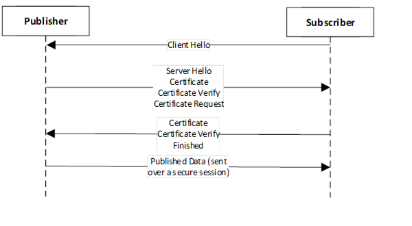  

Figure 39 - Subscriber as DTLS Client  

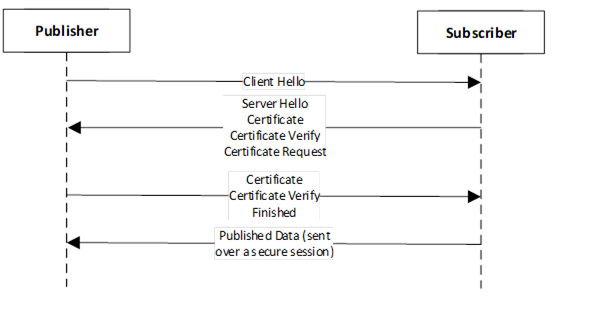  

Figure 40 - Publisher as DTLS Client  

Addressing for DTLS is similar to UADP unicast.  

The receive address for DTLS unicast communication is configured on a *PubSubConnection* . The *Address* parameter for a *PubSubConnection* is defined in [6.2.7.3](/§\_Ref495502612) .  

The syntax of the URL used in the *PubSubConnection Address* parameter has the following form:  

opc.dtls://localhost:\<port\>  

The send address is configured on the datagram *TransportSettings* of a *WriterGroup* . The *Address* parameter for a datagram *TransportSetting* is defined in [6.4.1.3.4](/§\_Ref29497787) .  

The syntax of the URL used in the datagram *TransportSettings* *Address* parameter has the following form:  

opc.dtls://\<host\>:\<port\>  

The host is either a unicast IP address or a registered name like a hostname or domain name that can be resolved to a unicast IP address. The IP address and the port are the destination of the DTLS UDP datagram.  

The IANA registered OPC UA port for PubSub over DTLS is 4843. This is the default and recommended port for any PubSub communication using DTLS. Alternative ports may be used.  

###### 7.3.2.4.2 Limitations of the DTLS Transport  

The DTLS transport does not support multicast of PubSub, and therefore can only be used for unicast communication. If multicast is needed other transports should be used. By definition the DTLS transport is only providing transport security, no notion of user level or application level security is provided. There are other OPC UA mechanisms which provide this, but by itself DTLS does not provide security at the user or application layer.  

###### 7.3.2.4.3 Connection Properties  

The DTLS transport supports the ability to use different cipher suites for a given PubSub Connection. This is configured via the *ConnectionProperties* of the *PubSubConnectionDataType* structure. A default value is configured in the *ConfigurationProperties* of the *PubSubConfiguration* . The properties are defined through the *KeyValuePair* array in the *ConnectionProperties* . The *NamespaceIndex* of the *QualifiedName* in the *KeyValuePair* shall be 0 for DTLS standard properties. The *Name* of the *QualifiedName* is constructed from a prefix and the DTLS property name with the following syntax. The intended use is for the DTLS client to include a single cipher suite in the handshake, which is the cipher suite to be used for that connection. To facilitate this, the DTLS server may have a list of cipher suites that are accepted if sent by a DTLS client in the handshake.  

The *NamespaceIndex* of the *QualifiedName* in the *KeyValuePair* for properties defined in this document shall be 0. The *Name* of the *QualifiedName* is the property key from [Table 202](/§\_Ref38400707) . The *DataType* of the *Value* in the *KeyValuePair* shall be the *DataType* defined in [Table 202](/§\_Ref38400707) .  

[Table 202](/§\_Ref38400707) formally defines the DTLS configuration properties  

Table 199 - OPC UA DTLS standard properties  

| **Key** | **DataTypes** | **Description** |
|---|---|---|
|0:DtlsConnectionSettings|DtlsPubSubConnectionDataType|The DTLS configuration for the *PubSubConnection* or *WriterGroup* . The *DtlsPubSubConnectionDataType* is defined in [6.4.1.7.6](/§\_Ref154091261) .|
|0:DtlsClientCipherSuite|String|Cipher suite for the *PubSubConnection* or *WriterGroup* . The *ClientCipherSuite* is defined in [6.4.1.7.1](/§\_Ref154090532) .|
  

  

#### 7.3.3 OPC UA Ethernet  

OPC UA Ethernet is a simple Ethernet based protocol using EtherType 0xB62C that is used to transport UADP *NetworkMessages* as payload of the Ethernet II frame without IP or UDP headers.  

The syntax of the Ethernet transporting protocol URL used in the *Address* parameter defined in [6.2.7.3](/§\_Ref495502612) has the following form:  

opc.eth://\<host\>[:\<VID\>[.PCP]]  

The host is a MAC address, an IP address or a registered name like a hostname. The format of a MAC address is six groups of hexadecimal digits, separated by hyphens (e.g. 01-23-45-67-89-ab). A system may also accept hostnames and/or IP addresses if it provides means to resolve it to a MAC address (e.g. DNS and Reverse-ARP).  

The VID is the VLAN ID as number.  

The PCP is the Priority Code Point as one digit number. This optional parameter is typically configured as part of the QoS settings on the network interface and not of the address.  

The transport of a UADP *NetworkMessage* in an Ethernet II frame is defined in [Table 200](/§\_Ref498640854) .  

Table 200 - UADP message transported over Ethernet  

| **Name** | **Description** |
|---|---|
|Frame Header|The frame header with an EtherType of 0xB62C.|
|UADP NetworkMessage|The UADP NetworkMessage is sent as Ethernet payload.|
|Frame Footer|The frame footer.|
  

  

For OPC UA Ethernet the *MaxNetworkMessageSize* and the *DiscoveryMaxMessageSize* plus additional headers shall be limited to an Ethernet frame size of 1522 Byte.  

Note: The *MaxNetworkMessageSize* is typically 1500 Byte since the additional headers have a size of 22 Byte and it consists of 6 Byte destination address, 6 Byte source address, 2 Byte EtherType, 4 Byte frame check sequence and optionally 4 Byte VLAN tag. This is based on Q-tagged frames defined in IEEE Std 802.3-2018.  

The IANA registered OPC UA EtherType for UADP communication is 0xB62C.  

#### 7.3.4 MQTT  

##### 7.3.4.1 General  

MQTT is an open standard application layer protocol for *Message Oriented Middleware* . MQTT is often used with a *Broker* that relays messages between applications that cannot communicate directly.  

*Publishers* send MQTT messages to MQTT brokers. *Subscribers* subscribe to MQTT brokers for messages. A *Broker* may persist messages so they can be delivered even if the *Subscriber* is not online. *Brokers* may also allow messages to be sent to multiple *Subscribers* .  

The MQTT protocol defines a binary protocol used to send and receive messages from and to topics. The body is an opaque binary blob that can contain any data serialized using an encoding chosen by the application.  

There are currently two versions of the MQTT protocol in use, version 3.1.1 and version 5.0. Version 5.0 expands on version 3.1.1 by adding support for connection and message properties. This enables advanced routing scenarios at the broker level in particular when using encrypted payloads.  

This document defines two possible encodings for the message body: the binary encoded *DataSetMessage* defined in [7.2.3](/§\_Ref463016249) and a JSON encoded *DataSetMessage* defined in [7.2.4.6.9](/§\_Ref463017146) .  

MQTT version 3.1.1 does not provide a mechanism for specifying the encoding of the MQTT message which means the *Subscribers* need to be configured in advance with knowledge of the expected encoding. As a consequence, *Publishers* should only publish *NetworkMessages* using a single encoding to a unique MQTT topic name.  

MQTT version 5.0 adds the encoding and the message type information to the message and connection header and therefore allows *Subscribers* to detect the encoding and the message mapping. No additional information is added to the meta data messages *.*  

MQTT Publisher and Subscriber transport profiles for full and minimal support are defined in [OPC 10000-7](/§UAPart7) .  

Message security is primarily provided by a TLS connection between the *Publisher* or *Subscriber* and the MQTT server; however, this requires that the MQTT server be trusted. For that reason, it may be necessary to provide end-to-end message security. Applications that require end-to-end message security with MQTT need to use the UADP *NetworkMessages* and binary message encoding defined in [7.2.3](/§\_Ref463016249) . JSON encoded message bodies need to rely on the security mechanisms provided by MQTT and the MQTT broker.  

##### 7.3.4.2 Address  

The syntax of the MQTT transporting protocol URL used in the *Address* parameter defined in [6.2.7.3](/§\_Ref495502612) has the following form:  

mqtts://\<domain name\>[:\<port\>][/\<path\>]  

The protocol prefix mqtts provides transport security. The default port is 8883.  

mqtt://\<domain name\>[:\<port\>][/\<path\>]  

The protocol prefix without transport security is mqtt. The default port is 1883.  

wss://\<domain name\>[:\<port\>][/\<path\>]  

The protocol prefix for MQTT over secure Web Sockets is wss. The default port is 443.  

##### 7.3.4.3 Authentication  

MQTT supports the use of Username/Password authentication in the initial CONNECT packet. Aside from password credentials, implementations can use this mechanism to pass any form of secret, such as an authentication token. However, if CONNECT authentication is used, the connection should be secured.  

MQTT version 5.0 also supports enhanced authentication, whereby clients can specify the desired SASL authentication method during initial CONNECT and finish the secret exchange with the broker using subsequent AUTH packets, or reauthenticate on an existing connection.  

Authentication shall be performed according to the configured *AuthenticationProfileUri* of the *PubSubConnection* , *DataSetWriterGroup* , *DataSetWriter* or *DataSetReader* entities.  

If no authentication information is provided in the form of *ResourceUri* and *AuthenticationProfileUri* , SASL Anonymous is implied.  

If the authentication profile specifies SASL PLAIN authentication, a separate connection for each authentication setting is required.  

##### 7.3.4.4 Connection properties  

The MQTT transport mapping for version 3.1.1 only supports the connection property ClientID using a KeyValuePair. Any other configured setting in the connection properties shall be silently discarded.  

If the ClientID is not configured, the *PublisherId* is used as ClientID. If the *PublisherId* has a *UInteger* *DataType* , the *UInteger* value is converted to a *String* for the ClientID.  

MQTT version 5.0 allows *Publishers* and *Subscribers* to provide MQTT connection properties as part of opening the connection.  

The connection properties apply to any connection created as part of the *PubSubConnection* , or subordinate configuration entities, such as the *WriterGroup* and the *DataSetWriter* .  

The properties are defined through the *KeyValuePair* array in the *ConnectionProperties* . The *NamespaceIndex* of the *QualifiedName* in the *KeyValuePair* shall be 0.  

[Table 201](/§\_Ref130089184) formally defines the *ConnectionProperties* used for MQTT connection configuration.  

Table 201 - MQTT ConnectionProperties  

| **Key** | **DataType** | **Description** |
|---|---|---|
|0:MqttVersion|String|Defines the MQTT version to use for the MQTT connection. Possible values are "3.1.1", "5.0" and "BestAvailable". The default value is BestAvailable.|
|0:MqttTopicPrefix|String|The \<Prefix\> part of the Topic convention defined in [7.3.4.7.1](/§\_Ref130089236) . The default value is "opcua"|
  

  

For MQTT properties, the *Name* of the *QualifiedName* is constructed from a prefix "connection" followed by a hyphen and the MQTT property name with the following syntax.  

Name = connection-\<MQTT property name\>  

[Table 202](/§\_Ref38400707) defines the MQTT standard connection properties.  

Table 202 - OPC UA MQTT standard connection property configuration  

| **MQTT property name** | **OPC UA DataTypes** | **MQTT data types** |
|---|---|---|
|ClientID|String|UTF-8 Encoded String|
|Receive Maximum|UInt16|Two Byte Integer|
|Maximum Packet Size|UInt32|Four Byte Integer|
|Session Expiry Interval|UInt32|Four Byte Integer|
|Topic Alias Maximum|UInt16|Two Byte Integer|
|Request Response Information|Boolean|Byte|
|Request Problem Information|Boolean|Byte|
  

  

Any name not in the [Table 202](/§\_Ref38400707) is assumed to be a MQTT User Property.  

When a field is added to the header as a MQTT User Property the value is encoded as UTF-8 encoded String *.* If the value is not a *String* , then it is encoded using the *VerboseEncoding* OPC UA JSON *Data Encoding* rules in [OPC 10000-6](/§UAPart6) .  

##### 7.3.4.5 RequestedDeliveryGuarantee  

The *BrokerTransportQualityOfService* values map to MQTT publish and subscribe QoS settings as follows:  

* AtMostOnce and BestEffort is mapped to MQTT QoS 0.  

* AtLeastOnce is mapped to MQTT QoS 1.  

* ExactlyOnce is mapped to MQTT QoS 2.  

##### 7.3.4.6 Transport Limits and Keep Alive  

If the *KeepAliveTime* is set on a *WriterGroup* , a value slightly higher than the configured value of the group in seconds should be set as MQTT Keep Alive ensuring that the connection is disconnected if the keep alive message was not sent by any writer in the specified time. If multiple *WriterGroups* are configured, the group with the highest *KeepAliveTime* setting is used for the calculation.  

The implementation chooses packet and message size limits depending on the capabilities of the OS or of the capabilities of the device the application is running on. They can be made configurable through configuration model extensions or by other means.  

##### 7.3.4.7 Topics  

###### 7.3.4.7.1 General  

MQTT messages are sent to *Topics* which provide context and other information about the message. *Topics* are hierarchical paths that allow *Subscribers* to use wildcards to select multiple *Topics* . Therefore, *Topics* are most useful when they follow a predictable pattern. This clause defines the *Topic* conventions for use with the MQTT mapping. All *Publishers* shall be able to support these conventions.  

A *Topic* has the following general pattern:  

\<Prefix\>/\<Encoding\>/\<MqttMessageType\>/\<PublisherId\>/[\<WriterGroup\>[/\<DataSetWriter\>]]  

  

Where *Topic* levels are:  

* \<Prefix\> is a system defined prefix that provides a scope for the *PublisherIds* ;The default value is 'opcua'.  

* \<Encoding\> specifies the encoding of messages sent to the *Topic* ('json', 'uadp', etc);  

* \<MqttMessageType\> specifies the content of the messages published to the *Topic* as defined in [7.3.4.7.2](/§\_Ref146472938) ;  

* \<PublisherId\> uniquely identifies a *Publisher* within the scope of the prefix;  

* \<WriterGroup\> is the name of a *WriterGroup* within the *Publisher* ;  

* \<DataSetWriter\> is the name of a *DataSetWriter* within the *WriterGroup* ;  

The \<Prefix\> should be one *Topic* level, however, system designers may break \<Prefix\> into multiple *Topic* levels. Note that using multiple *Topic* levels prevents *Subscribers* from automatically discovering *Publishers* in the system unless they are preconfigured with the \<Prefix\> used for the system.  

The possible values for the \<Encoding\> are 'json' or 'uadp' based on the message mappings defined in [7.2.3](/§\_Ref129987211) and [7.2.4.6.9](/§\_Ref129987225) .  

When *Publishers* are configured to publish to an MQTT *Broker* they shall have *PublisherId* assigned that can be used as *Topic* level.  

The *Topic* levels that appear after the \<PublisherId\> depend on the \<MqttMessageType\>.  

When these *Topic* conventions are used the wildcards in [Table 203](/§\_Ref129783029) may be used:  

Table 203 - Examples of MQTT Wildcards  

| **Wildcard** | **Notes** |
|---|---|
|opcua/json/status/\#|Subscribes to the status of all *Publishers* in the "opcua" scope. This allows the *Subscriber* to detect when *Publishers* come online or disappear.|
|opcua/json/metadata/\#|Subscribes to the metadata of all *Publishers* in the "opcua" scope. This allows the *Subscriber* to detect changes to metadata.|
|opcua/json/data/device-one/\#|Subscribes to all data produced by *Publisher* "device-one" in the "opcua" scope.|
|opcua/json/data/+/+/diagnostic|Subscribes to all *Publishers* that offer a "diagnostic" writer.|
  

  

The MQTT *Topic* syntax places restrictions on what characters may be used in a *Topic* level. Specifically, *Topic* levels are any UTF-8 string that:  

* Does not start with a $  

* Does not include /, + or \#  

* Does not include non-printable characters or whitespace other than the space character (U+0020).  

###### 7.3.4.7.2 MessageType mapping  

\<MqttMessageType\> *Topic* levels exist for each *MessageType* defined in [7.2.2](/§\_Ref129783030) . Additional information like requirements for RETAIN for each *Topic* level is provided in [Table 204](/§\_Ref129783028) . The handling of RETAIN messages is defined in [7.3.4.8](/§\_Ref502667006) .  

The requirements for topic access permissions are defined in [Table 205](/§\_Ref161527837) .  

Table 204 - MQTT Topic level MessageType mapping  

| **MessageType** | **MqttMessageType** | **RETAIN** | **Required** | **Specification Reference** |
|---|---|---|---|---|
|DataSetMessage|data|False|Yes|Defined in [7.3.4.7.3](/§\_Ref129987263) . A system specific *Topic* may be used instead The RETAIN false is the default setting.|
|DataSetMetaData|metadata|True|Yes|Defined in [7.3.4.7.4](/§\_Ref129987278) . A system specific *Topic* may be used instead.|
|ApplicationDescription|application|True|No|Defined in [7.3.4.7.5](/§\_Ref129987284) .|
|ServerEndpoints|endpoints|True|No|Defined in [7.3.4.7.6](/§\_Ref129987291) .|
|Status|status|True|Yes|Defined in [7.3.4.7.7](/§\_Ref129991127) .|
|PubSubConnection|connection|True|Yes|Defined in [7.3.4.7.8](/§\_Ref129991133) .|
|ActionRequest|action-request|False|Yes|Defined in [7.3.4.7.9](/§\_Ref161527879) . A system specific Topic may be used instead|
|ActionResponse|action-response|False|No|Defined in [7.3.4.7.10](/§\_Ref161527886) . The ActionResponse topic can be specified by the Requestor.|
|ActionMetaData|action-metadata|True|Yes|Defined in [7.3.4.7.12](/§\_Ref161527896) . A system specific Topic may be used instead|
|ActionResponder|action-responder|True|Yes|Defined in [7.3.4.7.11](/§\_Ref161527902) .|
  

  

Table 205 - MQTT Topic level access permissions  

| **MqttMessageType** | **Publisher** | **Subscriber** | **Description** |
|---|---|---|---|
|data|Write|Read|*Variables* and *Events* from an OPC UA applications acting as *Publisher* have *RolePermissions* . Such *RolePermissions* have no affect after *DataSetMessages* are sent to the MQTT broker. It is therefore recommended to synchronize *Roles* used to configure read permissions to the topics with the *Roles* required to access the information in the *Publisher* OPC UA application.|
|metadata|Write|Read||
|application|Write|Read|The information published with this message type is similar to discovery information provided with OPC UA Client Server discovery. This information is normally not restricted for read access.|
|endpoints|Write|Read||
|status|Write|Read||
|connection|Write|Read||
|action-request|Read|Write|*Publisher* is the *Responder* and *Subscriber* is the *Requestor* . The topic with message type *action-request* is defined by the *Responder* with its *PublisherId* but the *Requestors* must have write permission to the topic. Only the Responder should be able to read from the topic.|
|action-response|Write|Read|*Publisher* is the *Responder* and *Subscriber* is the *Requestor* . If the *Responder* specifies the response topic it must be ensured that the *Responder* has Write access to this topic. The Requestor should either use unique random correlation data or should use a private response topic where only the Requestor is able to read from.|
|action-metadata|Write|Read||
|action-responder|Write|Read||
  

  

###### 7.3.4.7.3 data Topic level  

The data *Topic* has the form:  

\<Prefix\>/\<Encoding\>/data/\<PublisherId\>/\<WriterGroup\>[/\<DataSetWriter\>]  

  

The \<PublisherId\> *Topic* level is the *PublisherId* for the application sending the messages.  

The \<WriterGroup\> *Topic* level is the name of a *WriterGroup* within the *Publisher* .  

The \<DataSetWriter\> *Topic* level is the name of a *DataSetWriter* within the *WriterGroup* . If no *QueueName* is specified at the *DataSetWriter* level then the *QueueName* in *WriterGroup TransportSettings* is used and the *DataSetWriter* name is not part of the *Topic.*  

The *data Topic* level is the default if the system owner does not have their own *Topic* tree. The *Topic* actually used is specified in the *Connection Message* as *QueueName* in the *DataSetWriter* or *WriterGroup* *TransportSettings* .  

The messages are instances of the *DataSetMessage MessageType* (see [7.2.2](/§\_Ref129783030) ).  

The corresponding *PubSubConnection Messag* e is sent to the *Topic* with the same \<Prefix\>, \<Encoding\> and \<PublisherId\>. The *PubSubConnection* specifies the *WriterGroups* and *DataSetWriters* for a *Publisher* .  

###### 7.3.4.7.4 metadata Topic level  

The metadata *Topic* has the form:  

\<Prefix\>/\<Encoding\>/metadata/\<PublisherId\>/\<WriterGroup\>/\<DataSetWriter\>  

  

The \<PublisherId\> *Topic* level is the *PublisherId* for the application sending the messages.  

The \<WriterGroup\> *Topic* level is the name of a *WriterGroup* within the *Publisher.*  

The \<DataSetWriter\> *Topic* level the name of a *DataSetWriter* within the *WriterGroup* .  

The metadata *Topic* is the default if the system owner does not have their own *Topic* tree. The *Topic* actually used is specified in the *Connection Message* as *MetaDataQueueName* in the *DataSetWriter* *TransportSettings* .  

The messages are instances of the *DataSetMetaData MessageType* (see [7.2.2](/§\_Ref129783030) ).  

The corresponding *PubSubConnection Messag* e is sent to the *Topic* with the same \<Prefix\>, \<Encoding\> and \<PublisherId\>. The *PubSubConnection* specifies the *WriterGroups* and *DataSetWriters* for a *Publisher* .  

###### 7.3.4.7.5 application Topic level  

The application *Topic* has the form:  

\<Prefix\>/\<Encoding\>/application/\<PublisherId\>  

  

The \<PublisherId\> *Topic* level is the *PublisherId* for the application sending the messages.  

The messages are instances of the *ApplicationDescription MessageType* (see [7.2.2](/§\_Ref129783030) ).  

###### 7.3.4.7.6 endpoints Topic level  

The endpoints *Topic* has the form:  

\<Prefix\>/\<Encoding\>/endpoints/\<PublisherId\>  

  

The \<PublisherId\> *Topic* level is the *PublisherId* for the application sending the messages.  

The messages are instances of the *ServerEndpoints MessageType* (see [7.2.2](/§\_Ref129783030) ).  

###### 7.3.4.7.7 status Topic level  

The status *Topic* has the form:  

\<Prefix\>/\<Encoding\>/status/\<PublisherId\>  

  

The \<PublisherId\> *Topic* level is the *PublisherId* for the application sending the messages.  

The messages are instances of the *Status MessageType* (see [7.2.2](/§\_Ref129783030) ).  

A *Publisher* that is exclusively using a *PublisherId* shall register a *Status* message as an MQTT Will message when it creates the connection to the MQTT *Broker* . This message is sent automatically if the *Publisher* loses its connection with the MQTT *Broker* . The IsCyclic shall be FALSE in this case. The *PubSubState* value of the Will message shall be *Error* .  

If a single MQTT client connection has multiple *PubSubConnections* (like for different encodings), not more than one *PubSubConnection* can register a *Status* message as MQTT Will message. All other *PubSubConnections* shall use cyclic *Status* messages.  

###### 7.3.4.7.8 connection Topic level  

The connection *Topic* has the form:  

\<Prefix\>/\<Encoding\>/connection/\<PublisherId\>  

  

The \<PublisherId\> *Topic* level is the *PublisherId* for the application sending the messages. This value shall be the same as the *PublisherId* in *PubSubConnection* provided in the message.  

The *PublisherId* in the *PubSubConnection* uniquely identifies the *Publisher* within the scope defined by the \<Prefix\>.  

The *TransportProfileUri* in the *PubSubConnection* specifies the \<Encoding\> used for all messages for the combination of \<Encoding\>/\<PublisherId\>. [Table 206](/§\_Ref110778586) specifies the mapping between a *TransportProfileUri* and the encoding.  

Table 206 - TransportProfileUri encodings  

| **URI** | **Encoding** |
|---|---|
|[http://opcfoundation.org/UA-Profile/Transport/pubsub-mqtt-json](http://opcfoundation.org/UA-Profile/Transport/pubsub-mqtt-json)|json|
|[http://opcfoundation.org/UA-Profile/Transport/pubsub-mqtt-uadp](http://opcfoundation.org/UA-Profile/Transport/pubsub-mqtt-uadp)|uadp|
  

  

The messages are instances of the *PubSubConnection MessageType* (see [7.2.2](/§\_Ref129783030) ).  

###### 7.3.4.7.9 action-request Topic level  

The action-request *Topic* has the form:  

\<Prefix\>/\<Encoding\>/action-request/\<Responder\>/\<WriterGroup\>  

  

The \<Responder\> *Topic* level is the *PublisherId* for the *Responder* of the *Actions* .  

The \<WriterGroup\> *Topic* level is the name of a *WriterGroup* .  

The *action-request Topic* level is the default if the system owner does not have their own *Topic* tree. The *Topic* actually used is specified in the *Responder* message as *QueueName* in the *WriterGroup* *TransportSettings* .  

The messages are instances of the *ActionRequest MessageType* (see [7.2.2](/§\_Ref129783030) ).  

The corresponding *Responder* message is sent to the *Topic* with the same \<Prefix\>, \<Encoding\> and \<Responder\>. The *PubSubConnection* specifies the *WriterGroups* and *DataSetWriters* for a *Responder* .  

###### 7.3.4.7.10 action-response Topic level  

The action-response *Topic* has the form:  

\<Prefix\>/\<Encoding\>/action-response/\<Responder\>/\<WriterGroup\>  

  

The \<Responder\> *Topic* level is the *PublisherId* for the *Responder* of the *Actions* .  

The \<WriterGroup\> *Topic* level is the name of a *WriterGroup* .  

The *action-response Topic* level is the default if the *ResponseAddress* is not provided in the *ActionRequest* .  

The messages are instances of the *ActionResponse MessageType* (see [7.2.2](/§\_Ref129783030) ).  

The corresponding *Responder* message is sent to the *Topic* with the same \<Prefix\>, \<Encoding\> and \<Responder\>. The *PubSubConnection* specifies the *WriterGroups* and *DataSetWriters* for a *Responder* .  

###### 7.3.4.7.11 action-responder Topic level  

The action-responder *Topic* has the form:  

\<Prefix\>/\<Encoding\>/action-responder/\<Responder\>  

  

The \<Responder\> *Topic* level is the *PublisherId* for the *Responder* of the *Actions* . This value shall be the same as the *PublisherId* in *PubSubConnection* provided in the message.  

The *PublisherId* in the *PubSubConnection* uniquely identifies the *Publisher* within the scope defined by the \<Prefix\>. If it is a String, it should be as short as possible since long *Topic* names degrade performance.  

The messages are instances of the *PubSubConnection MessageType* (see [7.2.2](/§\_Ref129783030) ).  

###### 7.3.4.7.12 action-metadata Topic level  

The action-metadata *Topic* has the form:  

\<Prefix\>/\<Encoding\>/action-metadata/\<Responder\>/\<WriterGroup\>/\<DataSetWriter\>  

  

The \<Responder\> *Topic* level is the *PublisherId* for the *Responder* of the *Action* .  

The \<Group\> *Topic* level is the name of a *WriterGroup.*  

The \<Writer\> *Topic* level the name of a *DataSetWriter* .  

The action-metadata *Topic* is the default if the system owner does not have their own *Topic* tree. The *Topic* actually used is specified in the *Responder* message as *MetaDataQueueName* in the *DataSetWriter* *TransportSettings* .  

The messages are instances of the *ActionMetaData MessageType* (see [7.2.2](/§\_Ref129783030) ).  

The corresponding *PubSubConnection Messag* e is sent to the *Topic* with the same \<Prefix\>, \<Encoding\> and \<PublisherId\>. The *PubSubConnection* specifies the *WriterGroups* and *DataSetWriters* for a *Publisher* .  

##### 7.3.4.8 Message header  

The default setting for the MQTT RETAIN flag are defined in [Table 204](/§\_Ref129783028) . [Table 208](/§\_Ref38401844) defines an option to change the RETAIN flag setting for *DataSetMessages* .  

A *Publisher* shall send all RETAIN discovery messages at start up of the *Publisher* . A *Publisher* shall update affected RETAIN topics if the *Publisher* configuration changes. A *Publisher* shall clear RETAIN topics if the discovery element is deleted from the *Publisher* configuration like reset the metadata topic if the related *DataSetWriter* is removed. A *Publisher* shall subscribe to its own discovery message topics at start-up and clear all topics that do not match the current *Publisher* configuration.  

*Publishers* using MQTT version 3.1.1 shall clear RETAIN topics when they shut down.  

*Publishers* using MQTT version 5.0 shall set the Message Expiry Interval on RETAIN topics and shall send a new RETAIN message before the interval expires.  

The MQTT version 3.1.1 protocol does not support message headers. Any promoted field or additional fields defined on the *WriterGroup* or *DataSetWriter* other than RETAIN are not sent as MQTT message properties.  

MQTT version 5.0 defines a number of standard message properties. These include properties explicitly defined in the MQTT specification, as well as the MQTT User Property which is a key-value pair of UTF-8 strings. The MQTT User Property is intended to provide a means of transferring application layer name-value tags whose meaning and interpretation are known only by the application programs responsible for sending and receiving them. They are used here to specify *PubSub* properties not directly supported by the MQTT protocol.  

[Table 207](/§\_Ref38401832) describes how these properties shall be populated when a MQTT version 5.0 message is constructed.  

Table 207 - OPC UA MQTT message properties  

| **MQTT property name** | **MQTT property type** | **MQTT property value** |
|---|---|---|
|UAMessageType|User Property|Valid values are "ua-\<MqttMessageType\>" where the MqttMessageTypes are defined in [7.3.4.7.2](/§\_Ref161867308) .|
|Content Type|Standard|The MIME type for the message body. The MIME types are specified in the message body subsections [7.3.4.9.1](/§\_Ref38402509) and [7.3.4.9.2](/§\_Ref38402519) .|
  

The MQTT message header shall include additional fields defined on the *PubSubConnection* , *WriterGroup* or *DataSetWriter* through the *KeyValuePair* array in the *WriterGroupProperties* and *DataSetWriterProperties* . The *NamespaceIndex* of the *QualifiedName* in the *KeyValuePair* shall be 0. The *Name* of the *QualifiedName* is constructed from a message prefix and the MQTT property name with the following syntax.  

Name = \<MqttMessageType\>-\<MQTT property name\>  

The Name of the key in the KeyValuePair shall have a prefix "message" followed by a hyphen and the MQTT property name.  

[Table 208](/§\_Ref38401844) defines the MQTT standard message properties.  

Table 208 - OPC UA MQTT standard message property configuration  

| **MQTT property name** | **OPC UA DataTypes** | **MQTT data types** | **Description** |
|---|---|---|---|
|RETAIN|Boolean|RETAIN bit in the header|RETAIN configuration for DataSetMessages.|
|Message Expiry Interval|UInt32|Four Byte Integer|Not available as message property for MQTT 3.1.1.|
  

  

Any name not in the [Table 208](/§\_Ref38401844) is assumed to be a MQTT User Property.  

When a field is added to the header as a MQTT User Property the value is encoded as UTF-8 encoded String *.* If the value is not a *String* , then it is encoded using the *VerboseEncoding* OPC UA JSON *Data Encoding* rules in [OPC 10000-6](/§UAPart6) . Promoted fields can only be sent for fields which are assumed to be a MQTT User Property and if the *NetworkMessage* contains only one *DataSetMessage* . The MQTT message header shall include additional promoted fields of the *DataSet* as a list of MQTT User Property name-value pairs. *DataSet* fields with the *PromotedField* flag set in the *FieldMetaData* *fieldFlags* are copied into the MQTT header. The *FieldMetaData Structure* is defined in [6.2.3.2.4](/§\_Ref433698324) . For a UADP message mapping the promoted fields are also included in the UADP *NetworkMessage* . *Promoted* fields shall always be included in the header even if the *DataSetMessage* body is a delta frame and the *DataSet* field is not included in the delta frame. In this case the last known value is sent in the header.  

##### 7.3.4.9 Message body  

###### 7.3.4.9.1 JSON message mapping  

A JSON body is encoded as defined for the JSON message mapping defined in [7.2.4.6.9](/§\_Ref463017146) .  

When sending a MQTT Version 5.0 message the MQTT ContentType property shall be set to application/json when sending uncompressed JSON messages.  

JSON messages can become quite large. In order to save bandwidth and to reduce message size, on MQTT Version 5.0 the MQTT Content Type property allows to select a compression type as encoding for a JSON message.  

When sending a gzip (RFC 1952) compressed JSON message on MQTT Version 5.0 the MQTT ContentType property shall be set to application/json+gzip. If a *Subscriber* receives messages without MQTT ContentType from MQTT Version 3.1.1 *Publishers* it may require manual configuration.  

###### 7.3.4.9.2 UADP message mapping  

A UADP body is encoded as defined for the UADP message mapping defined in [7.2.3](/§\_Ref463016249) .  

It is expected that the software used to receive UADP *NetworkMessage* can process the body without needing to know how it was transported.  

If the encoded MQTT message size exceeds the *Broker* limits, it is broken into multiple chunks as described in [7.2.4.4.4](/§\_Ref434242503) .  

When sending such message over MQTT Version 5.0 the *ContentType* property shall be set to application/opcua+uadp.  

## 8 PubSub Security Key Service model  

### 8.1 Overview  

Clause [8](/§\_Ref28418502) specifies the OPC UA *Information Model* for a *Security Key Service* (SKS). The functionality and behaviour of an SKS is described in [5.4.5](/§\_Ref462357898) . It defines the distribution framework for cryptographic keys used for message security. A *Publisher* or *Subscriber* can pull the keys from the SKS or the SKS can push the keys to the *Publisher* or *Subscriber* . The sequences for pull and push are described in [5.4.5.3](/§\_Ref82790768) .  

The SKS can be a network service used to manage keys for all *Publishers* and *Subscribers* or it can be part of a *Publisher* to manage the keys for the *NetworkMessages* sent by this *Publisher* .  

[Figure 41](/§\_Ref497335317) depicts the *ObjectTypes* and their components used to represent the SKS functionality in the *PublishSubscribe* Object.  

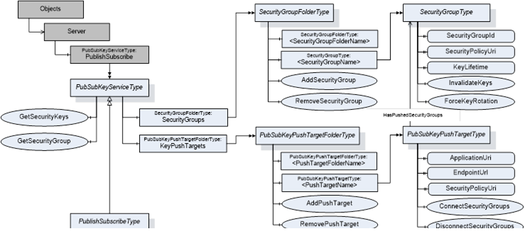  

Figure 41 - PublishSubscribe Object Types overview  

The *PublishSubscribe* *Object* is the root node for all *PubSub* related configuration *Objects* . It is an instance of the *PubSubKeyServiceType* or the *PublishSubscribeType* and a component of the *Server Object* .  

The *PubSubKeyServiceType* defines the *Method* for pull access to security keys and the related management of *SecurityGroups.* This *ObjectType* is used for the *PublishSubscribe* *Object* if only the *Security Key Service* functionality is provided. If the *PubSub* configuration functionality is provided, the *PublishSubscribeType* is used instead.  

A *SecurityGroup* manages keys used for securing *PubSub* *NetworkMessages* . The *SecurityGroups* are organized by the *SecurityGroupFolderType* and represented by instances of the *SecurityGroupType* .  

A *PubSubKeyPushTarget* is a *Server* to which the SKS should push keys. Each push target is related to a list of *SecurityGroups* . **  

The push targets are organized by the *PubSubKeyPushTargetFolderType* and represented by instances of the *PubSubKeyPushTargetType* . These instances are used by the *SKS* to push the security keys for related *SecurityGroups* into the *Publisher* or *Subscriber* .  

The *PublishSubscribeType* contains the entry points for the PubSub configuration model defined in clause [9](/§\_Ref497838497) .  

### 8.2 PublishSubscribe Object  

To provide interoperability between *Publishers,* *Subscribers, Security Key Services* and configuration tools, all *PubSub* related *Objects* shall be exposed through an *Object* called "PublishSubscribe" that is of the type *PubSubKeyServiceType* or a subtype. This *Object* shall be a component of the *Server* *Object* . It is formally defined in [Table 209](/§\_Ref408223848) .  

Table 209 - PublishSubscribe Object definition  

| **Attribute** | **Value** |
|---|---|
|BrowseName|PublishSubscribe|
  
| **References** | **NodeClass** | **BrowseName** | **DataType** | **TypeDefinition** | **ModellingRule** |
|---|---|---|---|---|---|
|ComponentOf the *Server* *Object* defined in [OPC 10000-5](/§UAPart5) .|
|HasTypeDefinition|ObjectType|PubSubKeyServiceType||||
|Conformance Units|
|PubSub Model SKS|
  

  

### 8.3 PubSubKeyServiceType  

#### 8.3.1 PubSubKeyServiceType definition  

The *PubSubKeyServiceType* is formally defined in [Table 210](/§\_Ref350150372) .  

Table 210 - PubSubKeyServiceType definition  

| **Attribute** | **Value** |
|---|---|
|BrowseName|PubSubKeyServiceType|
|IsAbstract|False|
  
| **References** | **NodeClass** | **BrowseName** | **DataType** | **TypeDefinition** | **ModellingRule** |
|---|---|---|---|---|---|
|Subtype of BaseObjectType defined in [OPC 10000-5](/§UAPart5) .|
|HasComponent|Method|GetSecurityKeys|Defined in [8.3.2](/§\_Ref450682155) .|Optional|
|HasComponent|Method|GetSecurityGroup|Defined in [8.3.3](/§\_Ref115797403) .|Optional|
|HasComponent|Object|SecurityGroups||SecurityGroupFolderType|Optional|
|HasComponent|Object|KeyPushTargets||PubSubKeyPushTargetFolderType|Optional|
|Conformance Units|
|PubSub Model SKS|
  

  

The *PubSubKeyServiceType ObjectType* is a concrete type and can be used directly.  

The *SecurityGroups* folder organizes the *Objects* representing the *SecurityGroup* configuration.  

The *KeyPushTargets* folder organizes the *Objects* representing the *PubSubKeyPushTarget* configuration.  

#### 8.3.2 GetSecurityKeys Method  

This *Method* is used to retrieve the security keys for a *SecurityGroup* .  

This *Method* is required to access the security keys of a *PubSubGroup* where the *SecurityGroup* manages the security keys for *PubSubGroups* . The *PubSubGroup* *Object* contains the *SecurityGroupId* that shall be passed to this *Method* in order to access the keys for the *PubSubGroup* . Note that multiple *PubSubGroups* can share a *SecurityGroupId* .  

The configuration parameter *RolePermissions* contained in the *SecurityGroupDataType* controls the access to the security keys for the *SecurityGroupId* . If the user used to call this *Method* does not have the *Call Permission* set for the *RolePermissions* parameter for the related *SecurityGroupType* *Object* , the *Server* shall return *Bad\_UserAccessDenied* for this *Method* . The *SecurityGroupType* is defined in [8.4](/§\_Ref503379165) .  

Encryption is required for this *Method* . The *Method* shall return *Bad\_SecurityModeInsufficient* if the communication is not encrypted.  

The information necessary to access the *Server* that implements the *GetSecurityKeys Method* for the *SecurityGroup* is also contained in the *SecurityKeyServices* setting ** of *WriterGroup, ReaderGroup and DataSetReader* .  

The *GetSecurityKeys Method* can be implemented by a *Publisher* or by a central SKS. In both cases, the well-known *NodeIds* for the *PublishSubscribe Object* and the related *GetSecurityKeys Method* are used to call the *GetSecurityKeys* *Method* .  

If the *Publisher* implements the *GetSecurityKeys Method* and the related *SecurityGroup* management, the keys are made invalid immediately after a *SecurityGroup* is removed or keys for a *SecurityGroup* are revoked.  

If a central SKS implements the *GetSecurityKeys Method* and the related *SecurityGroup* management, the keys are no longer valid after a *SecurityGroup* is removed or keys for a *SecurityGroup* are revoked. However, *Subscribers* shall be prepared for *Publishers* using invalid keys until they have called the *GetSecurityKeys Method* .  

*Publishers* using a central SKS shall call *GetSecurityKeys* always with *StartingTokenId* set to 0 and shall call the *Method* at a period of half the *KeyLifetime* . They can still request more than one key to bridge longer unavailability time of the SKS.  

*Subscribers* should use a *StartingTokenId* of 0 the first time they call *GetSecurityKeys* . Subsequent call to request older or future keys can use specific *StartingTokenIds.*  

 **Signature**   

 **GetSecurityKeys**   

[in] String  SecurityGroupId,  

[in] IntegerId  StartingTokenId,  

[in] UInt32  RequestedKeyCount,  

[out] String  SecurityPolicyUri,  

[out] IntegerId  FirstTokenId,  

[out] ByteString[] Keys,  

[out] Duration  TimeToNextKey,  

[out] Duration  KeyLifetime  

);  

  

| **Argument** | **Description** |
|---|---|
|SecurityGroupId|The identifier for the *SecurityGroup* . It shall be unique within the *Security Key Service* .|
|StartingTokenId|The current token and the related current key is requested by passing 0. It can be a *SecurityTokenId* from the past to get a key valid for previously sent messages. If the *StartingTokenId* is unknown, the oldest available tokens are returned.|
|RequestedKeyCount|The number of requested keys which should be returned in the response. If 0 is requested, no future keys are returned. If the caller requests a number larger than the *Security Key Service* permits, then the SKS shall return the maximum it allows.|
|SecurityPolicyUri|The URI for the set of algorithms and key lengths used to secure the messages. The *SecurityPolicies* are defined in [OPC 10000-7](/§UAPart7) .|
|FirstTokenId|The *SecurityTokenId* of the first key in the array of returned keys. The *SecurityTokenId* appears in the header of messages secured with a *Key* . It starts at 1 and is incremented by 1 each time the *KeyLifetime* elapses even if no keys are requested. If the *SecurityTokenId* increments past the maximum value of *UInt32* it restarts at 1. If the caller has key material from previous *GetSecurityKeys Method* calls, the *FirstTokenId* is used to match the existing list with the fetched list and to eliminate duplicates. If the *FirstTokenId* is unknown, the existing list shall be discarded and replaced.|
|Keys|An ordered list of keys that are used when the *KeyLifetime* elapses *.* If the current key was requested, the first key in the array is used to secure the messages *.* This key is used according to the SecurityPolicy identified by the *SecurityPolicyUri* and the protocol associated with the *PubSubGroup(s)* . Further details are defined in [7.2.4.4.3](/§\_Ref443452372) . The *SecurityTokenId* associated with the first key in the list is the *FirstTokenId* . All following keys have a *SecurityTokenId* that is incremented by 1 for every key returned.|
|TimeToNextKey|The time, in milliseconds, before the current key ** is expected to expire. The current *SecurityTokenId* equals the *FirstTokenId* and the current key is the first one in the returned *Keys* if the passed *StartingTokenId* is 0. Therefore the *Method* shall be called with *StartingTokenId* set to 0 if there is no previous knowledge about the current key. If a *Publisher* uses this *Method* to get the keys from a SKS, the *TimeToNextKey* and *KeyLifetime* are used to calculate the time the *Publisher* shall use the next key. The *TimeToNextKey* defines the time when to switch from the current key to the next key and the *KeyLifetime* defines when to switch from one future key to the next future key. For a *Subscriber* the *TimeToNextKey* and *KeyLifetime* are used to calculate the time the *Subscriber* expects that the *Publishers* use the next key. Due to network latency, out of order delivery and the use of keys for several *Publishers* , a *Subscriber* needs to expect some overlap time where *NetworkMessages* are received that are using the previous or the next key. *TimeToNextKey* and *KeyLifetime* are also used to calculate the time until *Publisher* and *Subscriber* shall fetch new keys.|
|KeyLifetime|The lifetime of a key in milliseconds. The returned keys may expire earlier if the keys are discarded for some reason. An unplanned key rotation is indicated in the *NetworkMessage* header before the next key is used to give the *Subscriber* some time to fetch new keys. If the *CurrentTokenId* in the message is not recognized the receiver shall call this *Method* again to get new keys.|
  

 **Method Result Codes**   

| **ResultCode** | **Description** |
|---|---|
|Bad\_NotFound|The *SecurityGroupId* is unknown.|
|Bad\_UserAccessDenied|The caller is not allowed to request the keys for the *SecurityGroup* .|
|Bad\_SecurityModeInsufficient|The communication channel is not using encryption.|
  

  

[Table 211](/§\_Ref115413801) specifies the *AddressSpace* representation for the *GetSecurityKeys Method* .  

Table 211 - GetSecurityKeys Method AddressSpace definition  

| **Attribute** | **Value** |
|---|---|
|BrowseName|GetSecurityKeys|
  
| **References** | **NodeClass** | **BrowseName** | **DataType** | **TypeDefinition** | **ModellingRule** |
|---|---|---|---|---|---|
|HasProperty|Variable|InputArguments|Argument[]|PropertyType|Mandatory|
|HasProperty|Variable|OutputArguments|Argument[]|PropertyType|Mandatory|
  
| **ConformanceUnits** |
|---|
|PubSub Model SKS|
  

  

#### 8.3.3 GetSecurityGroup Method  

This *Method* provides a direct lookup of the *NodeId* of a *SecurityGroupType Object* based on a *SecurityGroupId* . It is used by a security administration tool to get the *SecurityGroup* *Object* for configuration of access permissions for the keys.  

The *SecurityGroupId* is the identifier for the *SecurityGroup* in *Publishers* , *Subscribers* and the key *Server* . This *Method* returns the *NodeId* of the corresponding *SecurityGroup* *Object* *Node* providing the configuration and diagnostic options for a *SecurityGroup* .  

 **Signature**   

 **GetSecurityGroup**   

[in] String SecurityGroupId,  

[out] NodeId SecurityGroupNodeId  

);  

  

| **Argument** | **Description** |
|---|---|
|SecurityGroupId|The *SecurityGroupId* of the *SecurityGroup* to lookup.|
|SecurityGroupNodeId|The *NodeId* of the *SecurityGroupType Object* .|
  

  

 **Method Result Codes**   

| **ResultCode** | **Description** |
|---|---|
|Bad\_NoMatch|The SecurityGroupId cannot be found in the *Server* .|
  

  

[Table 212](/§\_Ref115413803) specifies the *AddressSpace* representation for the *GetSecurityGroup Method* .  

Table 212 - GetSecurityGroup Method AddressSpace definition  

| **Attribute** | **Value** |
|---|---|
|BrowseName|GetSecurityGroup|
  
| **References** | **NodeClass** | **BrowseName** | **DataType** | **TypeDefinition** | **ModellingRule** |
|---|---|---|---|---|---|
|HasProperty|Variable|InputArguments|Argument[]|PropertyType|Mandatory|
|HasProperty|Variable|OutputArguments|Argument[]|PropertyType|Mandatory|
  
| **ConformanceUnits** |
|---|
|PubSub Model SKS|
  

  

### 8.4 SecurityGroupType  

#### 8.4.1 SecurityGroupType definition  

The *SecurityGroupType* is formally defined in [Table 213](/§\_Ref450684515) .  

The configuration parameter *RolePermissions* contained in the *SecurityGroupDataType* controls the access to the security keys for the *SecurityGroup* through the *Method GetSecurityKeys* . The *GetSecurityKeys* *Method* is defined in [8.3.2](/§\_Ref450682155) . The *Permission* to access the keys is different to the *Permission* necessary to modify the configuration of *SecurityGroups* .  

Table 213 - SecurityGroupType definition  

| **Attribute** | **Value** |
|---|---|
|BrowseName|SecurityGroupType|
|IsAbstract|False|
  
| **References** | **NodeClass** | **BrowseName** | **DataType** | **TypeDefinition** | **ModellingRule** |
|---|---|---|---|---|---|
|Subtype of BaseObjectType defined in [OPC 10000-5](/§UAPart5) .|
|HasProperty|Variable|SecurityGroupId|String|PropertyType|Mandatory|
|HasProperty|Variable|KeyLifetime|Duration|PropertyType|Mandatory|
|HasProperty|Variable|SecurityPolicyUri|String|PropertyType|Mandatory|
|HasProperty|Variable|MaxFutureKeyCount|UInt32|PropertyType|Mandatory|
|HasProperty|Variable|MaxPastKeyCount|UInt32|PropertyType|Mandatory|
|HasComponent|Method|InvalidateKeys|Defined in [8.4.2](/§\_Ref75343192) .|Optional|
|HasComponent|Method|ForceKeyRotation|Defined in [8.4.3](/§\_Ref75343200) .|Optional|
|Conformance Units|
|PubSub Model SKS|
  

  

The *Property SecurityGroupId* contains the identifier for the *SecurityGroup* used in the key exchange *Methods GetSecurityKeys* and *SetSecurityKeys* in the *PubSubGroupType* .  

The *Property KeyLifetime* defines the lifetime of a key in milliseconds.  

The *Property SecurityPolicyUri* is the identifier for a *SecurityPolicy* . *SecurityPolicies* define the set of algorithms and key lengths used to secure the messages exchanged in the context of the *SecurityGroup* . The *SecurityPolicies* are defined in [OPC 10000-7](/§UAPart7) .  

The *Property MaxFutureKeyCount* defines the maximum number of future keys returned by the *Method GetSecurityKeys* .  

The *Property MaxPastKeyCount* defines the maximum number of historical keys stored by the SKS. The historical keys are necessary to allow *Subscribers* to request keys for older *NetworkMessages* .  

#### 8.4.2 InvalidateKeys Method  

This *Method* invalidates the current and all future keys of this *SecurityGroup* . The keys will be replaced by new keys; indicated by a new current *SecurityTokenId* . The new current *SecurityTokenId* shall be incremented beyond the *SecurityTokenId* of the last invalidated future key.  

If the *SecurityGroup* is related to one or more *PubSubKeyPushTargets* , the *SKS* shall push the new set of keys to all related *PubSubKeyPushTargets* .  

The *Client* shall be authorized to modify the configuration for the *SKS* functionality and shall use at least a signed communication channel when invoking this *Method* on the *Server* .  

 **Signature**   

 **InvalidateKeys**   

  

 **Method Result Codes**   

| **ResultCode** | **Description** |
|---|---|
|Bad\_UserAccessDenied|The *Session* user is not allowed invalidate the keys on this *SecurityGroup* .|
|Bad\_SecurityModeInsufficient|The communication channel is not using signing.|
  

  

[Table 214](/§\_Ref115413873) specifies the *AddressSpace* representation for the *InvalidateKeys Method* .  

Table 214 - InvalidateKeys Method AddressSpace definition  

| **Attribute** | **Value** |
|---|---|
|BrowseName|InvalidateKeys|
  
| **ConformanceUnits** |
|---|
|PubSub Model SKS|
  

  

#### 8.4.3 ForceKeyRotation Method  

This *Method* forces a key update prior to expiration of *KeyLifetime* , i.e. it initiates an unplanned key rotation *.* The future keys of this *SecurityGroup* remain valid.  

*InvalidateKeys* makes all keys invalid immediately and most likely this causes communication interruptions. The *ForceKeyRotation Method* allows faster rotation of keys without breaking communication e.g. for removing applications from a UDP multicast group.  

If the *SecurityGroup* is related to one or more *PushTargets* , the *SKS* shall push an updated set of keys to all *PushTargets* .  

The *Client* shall be authorized to modify the configuration for the *SKS* functionality and shall use at least a signed communication channel when invoking this *Method* on the *Server* .  

 **Signature**   

 **ForceKeyRotation**   

  

 **Method Result Codes**   

| **ResultCode** | **Description** |
|---|---|
|Bad\_UserAccessDenied|The *Session* user is not allowed force key rotation on this *SecurityGroup* .|
|Bad\_SecurityModeInsufficient|The communication channel is not using signing.|
  

  

[Table 215](/§\_Ref115413942) specifies the *AddressSpace* representation for the *ForceKeyRotation Method* .  

Table 215 - ForceKeyRotation Method AddressSpace definition  

| **Attribute** | **Value** |
|---|---|
|BrowseName|ForceKeyRotation|
  
| **ConformanceUnits** |
|---|
|PubSub Model SKS|
  

  

### 8.5 SecurityGroupFolderType  

#### 8.5.1 SecurityGroupFolderType definition  

The *SecurityGroupFolderType* is formally defined [Table 216](/§\_Ref450684505) .  

Table 216 - SecurityGroupFolderType definition  

| **Attribute** | **Value** |
|---|---|
|BrowseName|SecurityGroupFolderType|
|IsAbstract|False|
  
| **References** | **NodeClass** | **BrowseName** | **DataType** | **TypeDefinition** | **ModellingRule** |
|---|---|---|---|---|---|
|Subtype of FolderType defined in [OPC 10000-5](/§UAPart5) .|
|||||||
|Organizes|Object|\<SecurityGroupFolderName\>||SecurityGroup FolderType|OptionalPlaceholder|
|HasComponent|Object|\<SecurityGroupName\>||SecurityGroupType|OptionalPlaceholder|
|HasComponent|Method|AddSecurityGroup|Defined in [8.5.2](/§\_Ref450684456) .|Mandatory|
|HasComponent|Method|RemoveSecurityGroup|Defined in [8.5.3](/§\_Ref450684463) .|Mandatory|
|HasComponent|Method|AddSecurityGroupFolder|Defined in [8.5.4](/§\_Ref83283915) .|Optional|
|HasComponent|Method|RemoveSecurityGroupFolder|Defined in [8.5.5](/§\_Ref83283921) .|Optional|
|HasProperty|Variable|SupportedSecurityPolicyUris|String[]|PropertyType|Optional|
|Conformance Units|
|PubSub Model SKS|
  

  

The *SecurityGroupFolderType ObjectType* is a concrete type and can be used directly.  

Instances of the *SecurityGroupFolderType* can contain *SecurityGroup Objects* or other instances of the *SecurityGroupFolderType* . This can be used to build a tree of folder *Objects* used to organize the configured *SecurityGroups* .  

The *SecurityGroup Objects* are added as components to the instance of the *SecurityGroupFolderType* . A *SecurityGroup Object* is referenced only from one folder. If the folder is deleted, all referenced *SecurityGroup Objects* are deleted with the folder.  

The *SupportedSecurityPolicyUris* *Property* contains a *String* array with the *SecurityPolicyUris* supported by the SKS. The Property shall be provided at the root *SecurityGroupFolder* . The default *SecurityPolicyUri* is the first array element.  

#### 8.5.2 AddSecurityGroup Method  

This *Method* is used to add *a SecurityGroupType Object* to the *SecurityGroupFolderType Object* or to return an existing *Object* if the parameters match the configuration of an existing *Object* .  

The *Client* shall be authorized to modify the configuration for the *SKS* functionality and shall use at least a signed communication channel when invoking this *Method* on the *Server* .  

 **Signature**   

 **AddSecurityGroup**   

[in] String SecurityGroupName,  

[in] Duration KeyLifetime,  

[in] String SecurityPolicyUri,  

[in] UInt32 MaxFutureKeyCount,  

[in] UInt32 MaxPastKeyCount,  

[out] String SecurityGroupId,  

[out] NodeId SecurityGroupNodeId  

);  

  

| **Argument** | **Description** |
|---|---|
|SecurityGroupName|Name of the *SecurityGroup* to add.|
|KeyLifetime|The lifetime of a key in milliseconds. If 0 is passed in, the SKS sets the default *KeyLifetime* . If the requested value exceeds the limits defined by the SKS, the value is adjusted by the SKS. The caller should get the revised value by reading the *KeyLifetime* of the created *SecurityGroup* .|
|SecurityPolicyUri|The *SecurityPolicy* used for the *SecurityGroup* . If a null or empty *String* is passed in, the SKS sets the default *SecurityPolicyUri* . If the *SecurityPolicyUri* is not known to the SKS, Bad\_InvalidArgument shall be returned.|
|MaxFutureKeyCount|The maximum number of future keys returned by the *Method GetSecurityKeys* . If 0 is passed in, the SKS sets the default *MaxFutureKeyCount* . If the requested value exceeds the limits defined by the SKS, the value is adjusted by the SKS. The caller should get the revised value by reading the *MaxFutureKeyCount* of the created *SecurityGroup* .|
|MaxPastKeyCount|The maximum number of historical keys stored by the SKS. If the requested value exceeds the limits defined by the SKS, the value is adjusted by the SKS. The caller should get the revised value by reading the *MaxPastKeyCount* of the created *SecurityGroup* .|
|SecurityGroupId|The identifier for the *SecurityGroup* . The *SecurityGroupId* shall match the *SecurityGroupName* .|
|SecurityGroupNodeId|The *NodeId* of the added *SecurityGroupType Object* .|
  

  

 **Method Result Codes**   

| **ResultCode** | **Description** |
|---|---|
|Bad\_NodeIdExists|A *SecurityGroup* with the name already exists but the arguments do not match the existing object.|
|Good\_DataIgnored|A *Object* with the configuration already exists and was returned without adding a new *Object* .|
|Bad\_InvalidArgument|The *SecurityPolicyUri* is not supported by the SKS.|
|Bad\_UserAccessDenied|The *Session* user is not allowed to configure the object.|
|Bad\_SecurityModeInsufficient|The communication channel is not using signing.|
  

  

[Table 217](/§\_Ref115414010) specifies the *AddressSpace* representation for the *AddSecurityGroup Method* .  

Table 217 - AddSecurityGroup Method AddressSpace definition  

| **Attribute** | **Value** |
|---|---|
|BrowseName|AddSecurityGroup|
  
| **References** | **NodeClass** | **BrowseName** | **DataType** | **TypeDefinition** | **ModellingRule** |
|---|---|---|---|---|---|
|HasProperty|Variable|InputArguments|Argument[]|PropertyType|Mandatory|
|HasProperty|Variable|OutputArguments|Argument[]|PropertyType|Mandatory|
  
| **ConformanceUnits** |
|---|
|PubSub Model SKS|
  

  

#### 8.5.3 RemoveSecurityGroup Method  

This *Method* is used to remove a *SecurityGroupType Object* from the *SecurityGroupFolderType Object* .  

The *Client* shall be authorized to modify the configuration for the *SKS* functionality and shall use at least a signed communication channelwhen invoking this *Method* on the *Server* .  

See [8.3.2](/§\_Ref450682155) for details on the lifetime of keys previously issued for this *SecurityGroup* .  

 **Signature**   

 **RemoveSecurityGroup**   

[in] NodeId SecurityGroupNodeId  

);  

  

| **Argument** | **Description** |
|---|---|
|SecurityGroupNodeId|*NodeId* of the *SecurityGroupType Object* to remove from the *Server*|
  

 **Method Result Codes**   

| **ResultCode** | **Description** |
|---|---|
|Bad\_NodeIdUnknown|The *SecurityGroupNodeId* is unknown.|
|Bad\_NodeIdInvalid|The *SecurityGroupNodeId* is not a *NodeId* of a *SecurityGroupType Object* .|
|Bad\_UserAccessDenied|The *Session* user is not allowed to delete the *SecurityGroupType Object* .|
|Bad\_SecurityModeInsufficient|The communication channel is not using signing.|
  

  

[Table 218](/§\_Ref115414877) specifies the *AddressSpace* representation for the *RemoveSecurityGroup Method* .  

Table 218 - RemoveSecurityGroup Method AddressSpace definition  

| **Attribute** | **Value** |
|---|---|
|BrowseName|RemoveSecurityGroup|
  
| **References** | **NodeClass** | **BrowseName** | **DataType** | **TypeDefinition** | **ModellingRule** |
|---|---|---|---|---|---|
|HasProperty|Variable|InputArguments|Argument[]|PropertyType|Mandatory|
  
| **ConformanceUnits** |
|---|
|PubSub Model SKS|
  

  

#### 8.5.4 AddSecurityGroupFolder Method  

This *Method* is used to add a *SecurityGroupFolderType Object* to a *SecurityGroupFolderType Object* .  

The *Client* shall be authorized to modify the configuration for the *PubSub* functionality when invoking this *Method* on the *Server* .  

 **Signature**   

 **AddSecurityGroupFolder**   

[in] String Name,  

[out] NodeId SecurityGroupFolderNodeId  

);  

  

| **Argument** | **Description** |
|---|---|
|Name|Name of the *Object* to create.|
|SecurityGroupFolderNodeId|*NodeId* of the created *SecurityGroupFolderType Object* .|
  

 **Method Result Codes**   

| **ResultCode** | **Description** |
|---|---|
|Bad\_BrowseNameDuplicated|A folder *Object* with the name already exists.|
|Bad\_InvalidArgument|The *Server* is not able to apply the *Name* . The *Name* may be too long or may contain invalid characters.|
|Bad\_UserAccessDenied|The *Session* user is not allowed to add a folder.|
  

  

[Table 219](/§\_Ref115414956) specifies the *AddressSpace* representation for the *AddSecurityGroupFolder Method* .  

Table 219 - AddSecurityGroupFolder Method AddressSpace definition  

| **Attribute** | **Value** |
|---|---|
|BrowseName|AddSecurityGroupFolder|
  
| **References** | **NodeClass** | **BrowseName** | **DataType** | **TypeDefinition** | **ModellingRule** |
|---|---|---|---|---|---|
|HasProperty|Variable|InputArguments|Argument[]|PropertyType|Mandatory|
|HasProperty|Variable|OutputArguments|Argument[]|PropertyType|Mandatory|
  
| **ConformanceUnits** |
|---|
|PubSub Model SKS|
  

  

#### 8.5.5 RemoveSecurityGroupFolder Method  

This *Method* is used to remove a *SecurityGroupFolderType Object* from the parent *SecurityGroupFolderType Object* .  

A successful removal of the *SecurityGroupFolderType Object* removes ** recursively all contained *SecurityGroupType Objects* and all contained *SecurityGroupFolderType Objects* .  

The *Client* shall be authorized to modify the configuration for the *PubSub* functionality when invoking this *Method* on the *Server* .  

 **Signature**   

 **RemoveSecurityGroupFolder**   

[in] NodeId SecurityGroupFolderNodeId  

);  

  

| **Argument** | **Description** |
|---|---|
|SecurityGroupFolderNodeId|*NodeId* of the *SecurityGroupFolderType Object* to remove from the *Server* .|
  

 **Method Result Codes**   

| **ResultCode** | **Description** |
|---|---|
|Bad\_NodeIdUnknown|The *SecurityGroupFolderNodeId* is unknown.|
|Bad\_UserAccessDenied|The *Session* user is not allowed to delete the folder.|
  

  

[Table 220](/§\_Ref115415014) specifies the *AddressSpace* representation for the *RemoveSecurityGroupFolder Method* .  

Table 220 - RemoveSecurityGroupFolder Method AddressSpace definition  

| **Attribute** | **Value** |
|---|---|
|BrowseName|RemoveSecurityGroupFolder|
  
| **References** | **NodeClass** | **BrowseName** | **DataType** | **TypeDefinition** | **ModellingRule** |
|---|---|---|---|---|---|
|HasProperty|Variable|InputArguments|Argument[]|PropertyType|Mandatory|
  
| **ConformanceUnits** |
|---|
|PubSub Model SKS|
  

  

### 8.6 PubSubKeyPushTargetType  

#### 8.6.1 PubSubKeyPushTargetType definition  

The *PubSubKeyPushTargetType* is formally defined in [Table 221](/§\_Ref75194819) .  

An instance of this *ObjectType* includes all information required to establish a secure connection to the *Server* that is the target of a push operation as described in [5.4.5.3](/§\_Ref82790768) . If any of the connection information changes, the *PubSubKeyPushTarget* must be removed and a new *PubSubKeyPushTarget* with updated connection information must be added.  

Table 221 - PubSubKeyPushTargetType definition  

| **Attribute** | **Value** |
|---|---|
|BrowseName|PubSubKeyPushTargetType|
|IsAbstract|False|
  
| **References** | **NodeClass** | **BrowseName** | **DataType** | **TypeDefinition** | **ModellingRule** |
|---|---|---|---|---|---|
|Subtype of BaseObjectType defined in [OPC 10000-5](/§UAPart5) .|
|HasPushed SecurityGroup|Object|\<SecurityGroupName\>||SecurityGroupType|Optional Placeholder|
|HasProperty|Variable|ApplicationUri|String|PropertyType|Mandatory|
|HasProperty|Variable|EndpointUrl|String|PropertyType|Mandatory|
|HasProperty|Variable|SecurityPolicyUri|String|PropertyType|Mandatory|
|HasProperty|Variable|UserTokenType|UserTokenPolicy|PropertyType|Mandatory|
|HasProperty|Variable|RequestedKeyCount|UInt16|PropertyType|Mandatory|
|HasProperty|Variable|RetryInterval|Duration|PropertyType|Mandatory|
|HasProperty|Variable|LastPushExecutionTime|DateTime|PropertyType|Mandatory|
|HasProperty|Variable|LastPushErrorTime|DateTime|PropertyType|Mandatory|
|HasComponent|Method|ConnectSecurityGroups|Defined in [8.6.3](/§\_Ref75759818)|Mandatory|
|HasComponent|Method|DisconnectSecurityGroups|Defined in [8.6.4](/§\_Ref75759825)|Mandatory|
|HasComponent|Method|TriggerKeyUpdate|Defined in [8.6.5](/§\_Ref75759831)|Mandatory|
|Conformance Units|
|PubSub Model SKS Push|
  

  

The *Property ApplicationUri* is the *ApplicationUri* of the *Server* that is the target of a push. The push operation shall fail if the *ApplicationUri* of the connected target Server does not match this parameter.  

The *Property* *EndpointUrl* is the URL of the *Endpoint* of the *Server* that is the target of a push.  

The *Property SecurityPolicyUri* is a *String* that contains the security policy the SKS shall use to establish a *SecureChannel* to the *PubSubKeyPushTarget* . The *MessageSecurityMode* shall always be *SignAndEncrypt* .  

The *Property UserTokenType* contains the type of user toke to be used for the connection to the *PubSubKeyPushTarget* . The default is *Anonymous* and authorization is accomplished in this case with the application identity of the SKS.  

The *Property* *RequestedKeyCount* is the number of keys that are to be pushed on each update. The minimum setting for this is three.  

The *Property RetryInterval* defines the interval the *SKS* shall use to retry pushing keys after an error appeared.  

The *Property LastPushExecutionTime* indicates the time the last push operation was executed successfully on the *PubSubKeyPushTarget* . A null *DateTime* value indicates that no successful push was executed.  

The *Property LastPushErrorTime* indicates the last time a push operation failed on the *PubSubKeyPushTarget* . A null *DateTime* value indicates that no error has occurred.  

#### 8.6.2 Behaviour  

The first push is started at the time a *SecurityGroup* is assigned to the *PubSubKeyPushTarget* . The assignment is done with the *Method* *ConnectSecurityGroups* or with a successful update of the *PubSubKeyPushTargets* with *PubSubConfigurationType CloseAndUpdate* . The sequence for push is described in [5.4.5.3](/§\_Ref82790768) .  

In a period of half the *KeyLifetime* of a *SecurityGroup* , the SKS shall open a secure communication to each related *PubSubKeyPushTargets* and shall call *SetSecurityKeys* to push the security keys for a *SecurityGroup* into a *Publisher* or *Subscriber* . The SKS shall push the previous security key, the current key, and at least one future key to bridge longer unavailability time of the SKS. If it is not possible to push security keys to a *PubSubKeyPushTarget* due to errors in establishing the communication or due to errors returned from the *SetSecurityKeys* *Method* call, the SKS shall retry pushing the security keys in a period of *RetryInterval* . If multiple future security keys are pushed, it is up to the SKS to define when security keys are pushed, but at a minimum it shall be at the half *KeyLifetime* of the current key when only one future key is remaining.  

Since the SKS is unaware of the state of a *PubSubKeyPushTarget* , it is recommended for a *PubSubKeyPushTarget* to persist security keys. This allows the *PubSubKeyPushTarget* to continue secured PubSub communication after a power cycle, as long as the outage time is smaller than the time covered with *currentKey* and *FutureKeys* . If keys are not persisted, it may take up to half the *KeyLifetime* to get the first set of security keys. The *PubSubKeyPushTargets* persisting security keys shall have an understanding of time (either synchronized or battery backup) allowing them to determine whether the current key is still valid to use, or whether to use a future key ** following a power interruption.  

#### 8.6.3 ConnectSecurityGroups  

This *Method* connects instances of *SecurityGroupType* to this *PubSubKeyPushTarget* . This indicates that the *SKS* shall use the push model to distribute the keys of the *SecurityGroup* to the *PubSubKeyPushTarget* .  

The SKS shall push keys following this assignment. If an assignment does already exist, the entry is ignored.  

If the assignment for a *SecurityGroup* already exists, a Good\_EntryReplaced should be returned for that *SecurityGroup* and a new push of the existing keys shall be triggered to the push target.  

The *Client* shall be authorized to modify the configuration for the *SKS* functionality and shall use at least a signed communication channel when invoking this *Method* on the *Server* .  

 **Signature**   

 **ConnectSecurityGroups**   

[in] NodeId[]  SecurityGroupIds,  

[out] StatusCode[] ConnectResults  

);  

  

| **Argument** | **Description** |
|---|---|
|SecurityGroupIds|The *NodeIds* of the *SecurityGroups* to connect to the *PushTarget* .|
|ConnectResults|The result codes for the SecurityGroups to connect.|
  

  

 **Method Result Codes**   

| **ResultCode** | **Description** |
|---|---|
|Bad\_UserAccessDenied|The *Session* user is not allowed to connect *SecurityGroups* to the push target.|
|Bad\_SecurityModeInsufficient|The communication channel is not using signing.|
  

  

 **Operation Result Codes**   

| **ResultCode** | **Description** |
|---|---|
|Good\_EntryReplaced|The PushTarget was already assigned to the SecurityGroup, a new push was triggered|
|Bad\_NodeIdUnknown|A *SecurityGroupNodeId* is unknown.|
|Bad\_NodeIdInvalid|A *SecurityGroupNodeId* is not a *NodeId* of a *SecurityGroupType Object* .|
  

  

[Table 222](/§\_Ref115415310) specifies the *AddressSpace* representation for the *ConnectSecurityGroups Method* .  

Table 222 - ConnectSecurityGroups Method AddressSpace definition  

| **Attribute** | **Value** |
|---|---|
|BrowseName|ConnectSecurityGroups|
  
| **References** | **NodeClass** | **BrowseName** | **DataType** | **TypeDefinition** | **ModellingRule** |
|---|---|---|---|---|---|
|HasProperty|Variable|InputArguments|Argument[]|PropertyType|Mandatory|
|HasProperty|Variable|OutputArguments|Argument[]|PropertyType|Mandatory|
  
| **ConformanceUnits** |
|---|
|PubSub Model SKS Push|
  

  

#### 8.6.4 DisconnectSecurityGroups Method  

This *Method* disconnects instances of *SecurityGroupType* from this *PubSubKeyPushTarget* . This indicates that the *SKS* shall stop using the push model to distribute the keys of those *SecurityGroups* to the *PubSubKeyPushTarget* .  

The *Client* shall be authorized to modify the configuration for the *SKS* functionality and shall use at least a signed communication channel when invoking this *Method* on the *Server* .  

 **Signature**   

 **DisconnectSecurityGroups**   

[in] NodeId[]  SecurityGroupIds,  

[out] StatusCode[] DisconnectResults  

);  

  

| **Argument** | **Description** |
|---|---|
|SecurityGroupIds|The *NodeIds* of the *SecurityGroups* to disconnect.|
|DisconnectResults|The result codes for the SecurityGroups to disconnect.|
  

  

 **Method Result Codes**   

| **ResultCode** | **Description** |
|---|---|
|Bad\_UserAccessDenied|The *Session* user is not allowed to disconnect *SecurityGroups* from the push target.|
|Bad\_SecurityModeInsufficient|The communication channel is not using signing.|
  

  

 **Operation Result Codes**   

| **ResultCode** | **Description** |
|---|---|
|Bad\_NodeIdUnknown|A *SecurityGroupNodeId* is unknown.|
|Bad\_NodeIdInvalid|A *SecurityGroupNodeId* is not a *NodeId* of a *SecurityGroupType Object* .|
  

  

[Table 223](/§\_Ref115415381) specifies the *AddressSpace* representation for the *DisconnectSecurityGroups Method* .  

Table 223 - DisconnectSecurityGroups Method AddressSpace definition  

| **Attribute** | **Value** |
|---|---|
|BrowseName|DisconnectSecurityGroups|
  
| **References** | **NodeClass** | **BrowseName** | **DataType** | **TypeDefinition** | **ModellingRule** |
|---|---|---|---|---|---|
|HasProperty|Variable|InputArguments|Argument[]|PropertyType|Mandatory|
|HasProperty|Variable|OutputArguments|Argument[]|PropertyType|Mandatory|
  
| **ConformanceUnits** |
|---|
|PubSub Model SKS Push|
  

  

#### 8.6.5 TriggerKeyUpdate Method  

This *Method* triggers a key update of all *SecurityGroups* related to the *PubSubKeyPushTarget* . The SKS shall push the new set of keys for all related *SecurityGroups* , even if not currently scheduled.  

The *Client* shall be authorized to modify the configuration for the *SKS* functionality and shall use at least a signed communication channel when invoking this *Method* on the *Server* .  

 **Signature**   

 **TriggerKeyUpdate**   

  

 **Method Result Codes**   

| **ResultCode** | **Description** |
|---|---|
|Bad\_UserAccessDenied|The *Session* user is not allowed to trigger a key update on this push target.|
|Bad\_SecurityModeInsufficient|The communication channel is not using signing.|
  

  

#### 8.6.6 HasPushedSecurityGroup  

The *HasPushedSecurityGroup ReferenceType* is a concrete *ReferenceType* that can be used directly. It is a subtype of the *HierarchicalReferences* *ReferenceType* .  

The *SourceNode* of *References* of this type shall be an *Object* of *ObjectType* *PubSubKeyPushTargetType* or an *ObjectType* that is a subtype of *PubSubKeyPushTargetType* defined in [8.6.1](/§\_Ref82804393) .  

The *TargetNode* of this *ReferenceType* shall be an *Object* of the *ObjectType* *SecurityGroupType* defined in [8.4.1](/§\_Ref82804404) .  

*Servers* shall provide the inverse *Reference* that relates a *SecurityGroup Object* back to a *PubSubKeyPushTargetType* Object.  

The representation of the *HasPushedSecurityGroup ReferenceType* in the *AddressSpace* is specified in [Table 224](/§\_Ref82804842) .  

Table 224 - HasPushedSecurityGroup ReferenceType  

| **Attributes** | **Value** |
|---|---|
|BrowseName|HasPushedSecurityGroup|
|InverseName|HasPushTarget|
|Symmetric|False|
|IsAbstract|False|
  
| **References** | **NodeClass** | **BrowseName** | **Comment** |
|---|---|---|---|
|Subtype of HierarchicalReferences defined in [OPC 10000-5](/§UAPart5) .|
|Conformance Units|
|PubSub Model SKS Push|
  

  

[Table 225](/§\_Ref115415453) specifies the *AddressSpace* representation for the *TriggerKeyUpdate Method* .  

Table 225 - TriggerKeyUpdate Method AddressSpace definition  

| **Attribute** | **Value** |
|---|---|
|BrowseName|TriggerKeyUpdate|
  
| **ConformanceUnits** |
|---|
|PubSub Model SKS Push|
  

  

### 8.7 PubSubKeyPushTargetFolderType  

#### 8.7.1 PubSubKeyPushTargetFolderType definition  

The *PubSubKeyPushTargetFolderType* is formally defined [Table 226](/§\_Ref82799692) .  

Table 226 - PubSubKeyPushTargetFolderType definition  

| **Attribute** | **Value** |
|---|---|
|BrowseName|PubSubKeyPushTargetFolderType|
|IsAbstract|False|
  
| **References** | **NodeClass** | **BrowseName** | **DataType** | **TypeDefinition** | **ModellingRule** |
|---|---|---|---|---|---|
|Subtype of FolderType defined in [OPC 10000-5](/§UAPart5) .|
|Organizes|Object|\<PushTargetFolderName\>||PubSubKeyPushTargetFolderType|OptionalPlaceholder|
|HasComponent|Object|\<PushTargetName\>||PubSubKeyPushTargetType|OptionalPlaceholder|
|HasComponent|Method|AddPushTarget|Defined in [8.7.2](/§\_Ref75759838)|Mandatory|
|HasComponent|Method|RemovePushTarget|Defined in [8.7.3](/§\_Ref75759848)|Mandatory|
|HasComponent|Method|AddPushTargetFolder|Defined in [8.7.4](/§\_Ref83283888) .|Optional|
|HasComponent|Method|RemovePushTargetFolder|Defined in [8.7.5](/§\_Ref83283896) .|Optional|
|Conformance Units|
|PubSub Model SKS Push|
  

  

Instances of the *PubSubKeyPushTargetFolderType* can contain *PubSubKeyPushTarget Objects* or other instances of the *PubSubKeyPushTargetFolderType* . This can be used to build a tree of folder *Objects* used to organize the configured *PubSubKeyPushTargets* .  

The *PubSubKeyPushTarget Objects* are added as components to the instance of the *PubSubKeyPushTargetFolderType* . A *PubSubKeyPushTargets* is referenced only from one folder. If the folder is deleted, all referenced *PubSubKeyPushTargets* are deleted with the folder.  

#### 8.7.2 AddPushTarget Method  

This *Method* is used to add *a PubSubKeyPushTarget* to a *PubSubKeyPushTargetFolder* or to return an existing *Object* if the parameters match the configuration of an existing *Object* .  

The *Client* shall be authorized to modify the configuration for the *SKS* functionality and shall use at least a signed communication channel when invoking this *Method* on the *Server* .  

 **Signature**   

 **AddPushTarget**   

[in] String  ApplicationUri,  

[in] String  EndpointUrl,  

[in] String  SecurityPolicyUri,  

[in] UserTokenPolicy UserTokenType,  

[in] UInt16  RequestedKeyCount,  

[in] Duration  RetryInterval,  

[out] NodeId  PushTargetId  

);  

  

| **Argument** | **Description** |
|---|---|
|ApplicationUri|*ApplicationUri* of the *Server* that is the target of the key push. The *ApplicationUri* is used as name of the resulting *PubSubKeyPushTarget* object.|
|EndpointUrl|URL of the *Endpoint* of the *Server* that is the target of the key push|
|SecurityPolicyUri|Security policy the SKS shall use to establish a secure connection to the *PushTarget*|
|UserTokenType|The user token type used for the push. The default is *Anonymous* .|
|RequestedKeyCount|The number of keys to push on each call|
|RetryInterval|Interval the *SKS* shall use to retry pushing keys after an error appeared|
|PushTargetId|The *NodeId* of the added *PubSubKeyPushTarget* *Object* .|
  

  

 **Method Result Codes**   

| **ResultCode** | **Description** |
|---|---|
|Bad\_NodeIdExists|A *PushTarget* with the ApplicationUri already exists but the arguments do not match the existing object.|
|Good\_DataIgnored|A *Object* with the configuration already exists and was returned without adding a new *Object* .|
|Bad\_InvalidArgument|One of the input arguments is invalid. The InputArgumentResult provides further details.|
|Bad\_UserAccessDenied|The *Session* user is not allowed to configure the object.|
|Bad\_SecurityModeInsufficient|The communication channel is not using signing.|
  

  

[Table 227](/§\_Ref87994881) specifies the *AddressSpace* representation for the *AddPushTarget Method* .  

Table 227 - AddPushTarget Method AddressSpace definition  

| **Attribute** | **Value** |
|---|---|
|BrowseName|AddPushTarget|
  
| **References** | **NodeClass** | **BrowseName** | **DataType** | **TypeDefinition** | **ModellingRule** |
|---|---|---|---|---|---|
|HasProperty|Variable|InputArguments|Argument[]|PropertyType|Mandatory|
|HasProperty|Variable|OutputArguments|Argument[]|PropertyType|Mandatory|
  
| **ConformanceUnits** |
|---|
|PubSub Model SKS Push|
  

  

#### 8.7.3 RemovePushTarget Method  

This *Method* is used to remove a *PubSubKeyPushTarget* from the *PushTargetFolder* .  

The *Client* shall be authorized to modify the configuration for the *SKS* functionality and shall use at least a signed communication channel when invoking this *Method* on the *Server* .  

 **Signature**   

 **RemovePushTarget**   

[in] NodeId PushTargetId  

);  

  

| **Argument** | **Description** |
|---|---|
|PushTargetId|*NodeId* of the *PushTargetType Object* to remove from the *Server*|
  

 **Method Result Codes**   

| **ResultCode** | **Description** |
|---|---|
|Bad\_NodeIdUnknown|The PushTargetId is unknown.|
|Bad\_NodeIdInvalid|The PushTargetId is not a *NodeId* of a *PubSubKeyPushTarget* *Object* .|
|Bad\_UserAccessDenied|The *Session* user is not allowed to delete the *PushTargetType Object* .|
|Bad\_SecurityModeInsufficient|The communication channel is not using signing.|
  

  

[Table 228](/§\_Ref115408087) specifies the *AddressSpace* representation for the *RemovePushTarget Method* .  

Table 228 - RemovePushTarget Method AddressSpace definition  

| **Attribute** | **Value** |
|---|---|
|BrowseName|RemovePushTarget|
  
| **References** | **NodeClass** | **BrowseName** | **DataType** | **TypeDefinition** | **ModellingRule** |
|---|---|---|---|---|---|
|HasProperty|Variable|InputArguments|Argument[]|PropertyType|Mandatory|
  
| **ConformanceUnits** |
|---|
|PubSub Model SKS Push|
  

  

#### 8.7.4 AddPushTargetFolder Method  

This *Method* is used to add a *PubSubKeyPushTargetFolderType Object* to a *PubSubKeyPushTargetFolderType Object* .  

The *Client* shall be authorized to modify the configuration for the *PubSub* functionality when invoking this *Method* on the *Server* .  

 **Signature**   

 **AddPushTargetFolder**   

[in] String Name,  

[out] NodeId PushTargetFolderNodeId  

);  

  

| **Argument** | **Description** |
|---|---|
|Name|Name of the *Object* to create.|
|PushTargetFolderNodeId|*NodeId* of the created *PubSubKeyPushTargetFolderType Object* .|
  

 **Method Result Codes**   

| **ResultCode** | **Description** |
|---|---|
|Bad\_BrowseNameDuplicated|A folder *Object* with the name already exists.|
|Bad\_InvalidArgument|The *Server* is not able to apply the *Name* . The *Name* may be too long or may contain invalid characters.|
|Bad\_UserAccessDenied|The *Session* user is not allowed to add a folder.|
  

  

[Table 229](/§\_Ref115408135) specifies the *AddressSpace* representation for the *AddPushTargetFolder Method* .  

Table 229 - AddPushTargetFolder Method AddressSpace definition  

| **Attribute** | **Value** |
|---|---|
|BrowseName|AddPushTargetFolder|
  
| **References** | **NodeClass** | **BrowseName** | **DataType** | **TypeDefinition** | **ModellingRule** |
|---|---|---|---|---|---|
|HasProperty|Variable|InputArguments|Argument[]|PropertyType|Mandatory|
|HasProperty|Variable|OutputArguments|Argument[]|PropertyType|Mandatory|
  
| **ConformanceUnits** |
|---|
|PubSub Model SKS Push|
  

  

#### 8.7.5 RemovePushTargetFolder Method  

This *Method* is used to remove a *PubSubKeyPushTargetFolderType Object* from the parent *PubSubKeyPushTargetFolderType Object* .  

A successful removal of the *PubSubKeyPushTargetFolderType Object* removes ** recursively all contained *PubSubKeyPushTargetType Objects* and all contained *PubSubKeyPushTargetFolderType Objects* .  

The *Client* shall be authorized to modify the configuration for the *PubSub* functionality when invoking this *Method* on the *Server* .  

 **Signature**   

 **RemovePushTargetFolder**   

[in] NodeId PushTargetFolderNodeId  

);  

  

| **Argument** | **Description** |
|---|---|
|PushTargetFolderNodeId|*NodeId* of the *PubSubKeyPushTargetFolderType Object* to remove from the *Server* .|
  

 **Method Result Codes**   

| **ResultCode** | **Description** |
|---|---|
|Bad\_NodeIdUnknown|The *PushTargetFolderNodeId* is unknown.|
|Bad\_UserAccessDenied|The *Session* user is not allowed to delete the folder.|
  

  

[Table 230](/§\_Ref115408211) specifies the *AddressSpace* representation for the *RemovePushTargetFolder Method* .  

Table 230 - RemovePushTargetFolder Method AddressSpace definition  

| **Attribute** | **Value** |
|---|---|
|BrowseName|RemovePushTargetFolder|
  
| **References** | **NodeClass** | **BrowseName** | **DataType** | **TypeDefinition** | **ModellingRule** |
|---|---|---|---|---|---|
|HasProperty|Variable|InputArguments|Argument[]|PropertyType|Mandatory|
  
| **ConformanceUnits** |
|---|
|PubSub Model SKS Push|
  

  

### 8.8 Security Key Service Roles  

A SKS should support the well-known *Roles* for SKS which are defined in [Table 231](/§\_Ref466032569) . The *NodeIds* for the well-known Roles are defined in [OPC 10000-6](/§UAPart6) .  

Table 231 - Well-Known SKS Roles  

| **BrowseName** | **Suggested Permissions** |
|---|---|
|SecurityKeyServerAdmin|This *Role* allows an administrator to manage *SecurityGroups* and *PushTargets* on a SKS. This includes executing methods related to management of *SecurityGroups* and *PushTargets* on an SKS.|
|SecurityKeyServerAccess|This *Role* allows a *PubSub* *Application* to access an SKS to pull keys. It is the default *Role* for pull but it is expected that different custom *Roles* are used for different *SecurityGroups* .|
|SecurityKeyServerPush|This *Role* allows an SKS to push security keys to *PubSub* *Applications* . This includes executing methods related to PubSub security.|
  

  

## 9 PubSub configuration model  

### 9.1 Common configuration model  

#### 9.1.1 General  

[Figure 42](/§\_Ref429689128) depicts the *ObjectTypes* of the message and transport protocol mapping independent part of the *PubSub* configuration model, their main components and their relations.  

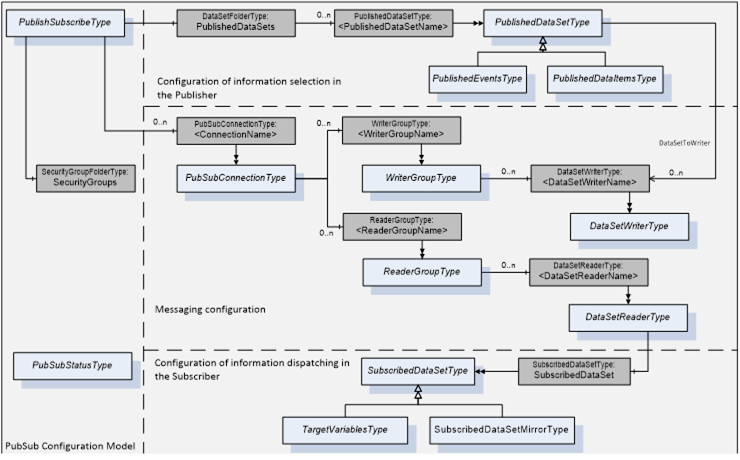  

Figure 42 - PubSub configuration model overview  

An instance of the *PublishSubscribeType* with the name *PublishSubscribe* represents the root *Object* for all *PubSub* related *Objects* . It manages a list of *PubSubConnectionType* *Objects* and the *PublishedDataSetType Objects* through the *PublishedDataSets* folder.  

On the *Publisher* side, a *PublishedDataSet* represents the information to publish and the *DataSetWriter* represents the transport settings for creating *DataSetMessages* for delivery through a *Message Oriented Middleware* .  

On the *Subscriber* side, a *DataSetReader* represents the transport settings for receiving *DataSetMessages* from a *Message Oriented Middleware* and the *SubscribedDataSet* represents the information to dispatch the received *DataSets* in the *Subscriber* .  

The configuration can be done through *Methods* or product-specific configuration tools. The *DataSetFolderType* can be used to organize the *PublishedDataSetType Objects* in a tree of folders.  

[Figure 43](/§\_Ref456954656) shows an example configuration with the root *Object PublishSubscribe* that is a component of the *Server Object* .  

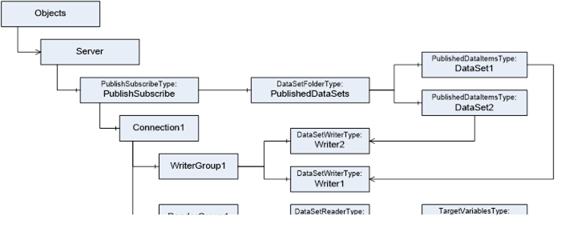  

Figure 43 - PubSub example Objects  

The example defines two *PublishedDataSets* published through one connection and one group and one *DataSetReader* used to subscribe one *DataSet* .  

[Figure 44](/§\_Ref430542239) depicts the information flow and the related *ObjectTypes* from the *PubSub Information M* odel. The boxes in the lower part of the figure are examples for blocks necessary to implement the information flow in a *Publisher* .  

  

Figure 44 - PubSub information flow  

The *PublishedDataSetType* represents the selection and configuration of *Variables* or *Events* . An *Event* notification or a snapshot of the *Variables* comprises a *DataSet* . A *DataSet* is the content of a *DataSetMessage* created by a *DataSetWriter* . Examples of concrete *PublishedDataSetTypes* are *PublishedEventsType* and *PublishedDataItemsType* . An instance of *PublishedDataSetType* has a list of *DataSetWriters* used to produce *DataSetMessages* sent via the *Message Oriented Middleware* . The *DataSetMetaData* describes the content of a *DataSet* .  

Instances of the *PubSubConnectionType* represent settings associated with *Message Oriented Middleware* . A connection manages a list of *WriterGroupType* *Objects* and transport protocol mapping specific parameters.  

Instances of the *WriterGroupType* contain instances of *DataSetWriter* *Objects* that share settings such as security configuration, encoding or timing of *NetworkMessages* . A group manages a list of *DataSetWriterType* Objects that define the payload of the *NetworkMessages* created from the group settings.  

*DataSetWriters* represent the configuration necessary to create *DataSetMessages* contained as payload in *NetworkMessages* .  

*DataSetReaders* represent the configuration necessary to receive and process *DataSetMessages* on the *Subscriber* side.  

*NetworkMessages* are sent through a transport like MQTT or OPC UA UDP. Other transport protocols can be added as subtypes without changing the base model.  

The definition of the *PubSub* related *ObjectTypes* does not prescribe how the instances are created or configured or how dynamic the configuration can be. A *Publisher* may have a preconfigured number of *PublishedDataSets* and *DataSetWriters* where only protocol-specific settings can be configured. If a *Publisher* allows dynamic creation of *Objects* like *DataSets* and *DataSetWriters* , this can be done through product-specific configuration tools or through the standardized configuration *Methods* defined in this document.  

#### 9.1.2 Configuration behaviours  

*Publishers* and *Subscribers* may be configurable through vendor-specific engineering tools or with the *PubSubConfiguration Object* and parameters described in this document. This allows a standard OPC UA Client based configuration tool to configure an OPC UA *Server* that is a *Publisher* and/or *Subscriber* .  

The latest configuration shall be persisted by the OPC UA *Server* and shall be available after a restart of the OPC UA *Server* . *PubSub* components are not persisted, if the component has the optional *NotPersisted* property set with a value of true. The *PubSub* configuration properties are defined in [6.2.2](/§\_Ref86742868) .  

Add, modify and remove operations for all PubSub configuration elements including *DataSets* and security key exchange configuration can be executed in one atomic write operation through the *PubSubConfiguration Object* . It allows also read access to the complete PubSub configuration. Both read and write access are handled through *FileType* functionality. The related functionality is defined in [9.1.3.7](/§\_Ref84781870) .  

Modifications of the *PubSub* configuration can happen through different mechanisms like *FileType* access or sequences of *Method* calls defined in other information models. The *PubSub* application should ensure that all mechanisms coordinate access to the configuration. The coordination should not immediately fail parallel access. It should delay access in the range of timeout settings for *Method* calls.  

The online PubSub configuration was updated in OPC UA 1.05 to the atomic update capability through the *PubSubConfiguration* *Object* . This option replaced the deprecated individual PubSub configuration *Methods* .  

Configuration changes with the deprecated Methods must be applied in a batch to avoid inconsistencies between different configuration parameters. The mechanism to apply changes in a batch operation is to allow changes through parameter write only when the related *Object* has the *Status Disabled* and to apply the new configuration settings when the *Status* is changed to *Operational* . Therefore write operations to configuration parameters should be rejected with *Bad\_InvalidState* if the *Status* is not *Disabled.*  

#### 9.1.3 Types for the PublishSubscribe Object  

##### 9.1.3.1 Overview  

[Figure 45](/§\_Ref456880149) depicts the *PublishSubscribeType* and the components used to represent the *PublishSubscribe* Object.  

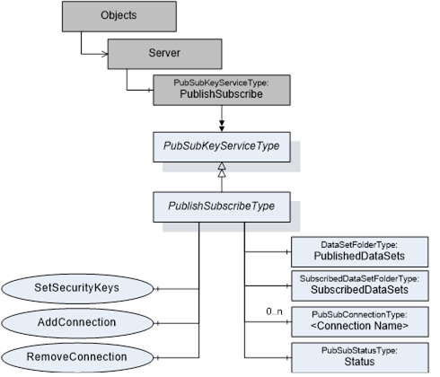  

Figure 45 - PublishSubscribe Object Types overview  

The *PublishSubscribe* *Object* is the root node for all *PubSub* related configuration *Objects* . It is an instance of the *PublishSubscribeType* and a component of the *Server Object* .  

The *PublishSubscribeType* contains the entry point for *PublishedDataSet* configuration, the entry point for *PubSub* connections. In addition, it provides *Methods* for connection management.  

##### 9.1.3.2 PublishSubscribeType  

An instance of this *ObjectType* represents the root *Object* for all *PubSub* related configuration and metadata *Objects* . The one instance of this *ObjectType* that represents the root *Object* is defined in [8.3.2](/§\_Ref450685722) . The *ObjectType* is formally defined in [Table 232](/§\_Ref462853078) .  

Table 232 - PublishSubscribeType definition  

| **Attribute** | **Value** |
|---|---|
|BrowseName|PublishSubscribeType|
|IsAbstract|False|
  
| **References** | **Node Class** | **BrowseName** | **DataType** | **TypeDefinition** | **Modelling Rule** |
|---|---|---|---|---|---|
|Subtype of PubSubKeyServiceType defined in [8.2](/§\_Ref458519606) .|
|||||||
|HasPubSub Connection|Object|\<ConnectionName\>||PubSubConnectionType|Optional Placeholder|
|HasComponent|Method|SetSecurityKeys|Defined in [9.1.3.3](/§\_Ref469231105) .|Optional|
|HasComponent|Method|AddConnection|Deprecated *Method* described in [9.1.3.4](/§\_Ref436338051) .|Optional|
|HasComponent|Method|RemoveConnection|Deprecated *Method* described in [9.1.3.5](/§\_Ref498378429) .|Optional|
|HasComponent|Object|PublishedDataSets||DataSetFolderType|Mandatory|
|HasComponent|Object|SubscribedDataSets||SubscribedDataSetFolderType|Optional|
|HasComponent|Object|PubSubConfiguration||PubSubConfigurationType|Optional|
|HasComponent|Object|Status||PubSubStatusType|Mandatory|
|HasComponent|Object|Diagnostics||PubSubDiagnosticsRootType|Optional|
|HasComponent|Object|PubSubCapablities||PubSubCapabilitiesType|Optional|
|HasComponent|Object|DataSetClasses||FolderType|Optional|
|HasProperty|Variable|SupportedTransportProfiles|String[]|PropertyType|Mandatory|
|HasProperty|Variable|DefaultDatagramPublisherId|UInt64|PropertyType|Optional|
|HasProperty|Variable|ConfigurationVersion|VersionTime|PropertyType|Optional|
|HasProperty|Variable|DefaultSecurityKeyServices|Endpoint Description[]|PropertyType|Optional|
|HasProperty|Variable|ConfigurationProperties|KeyValuePair []|PropertyType|Optional|
|Conformance Units|
|PubSub Model Base|
  

  

The *PublishSubscribeType ObjectType* is a concrete type and can be used directly.  

The configured connection *Objects* are added as components to the instance of the *PublishSubscribeType* . Connection *Objects* may be configured with product-specific configuration tools or added and removed through the *Methods AddConnection* and *RemoveConnection* . The *PubSubConnectionType* is defined in [9.1.5.2](/§\_Ref425686405) . The *HasPubSubConnection* *ReferenceType* is defined in [9.1.3.6](/§\_Ref430705325) .  

The *PublishedDataSets Object* contains the configured *PublishedDataSets* . The *DataSetFolderType* is defined in [9.1.4.5.1](/§\_Ref430545339) . The *DataSetFolderType* can be used to build a tree of *DataSetFolders* .  

The *SubscribedDataSets Object* contains the configured *SubscribedDataSets* . The *SubscribedDataSetFolderType* is defined in [9.1.9.4](/§\_Ref38354196) . The *SubscribedDataSetFolderType* can be used to build a tree of *SubscribedDataSetFolders* .  

The *PubSubConfiguration Object* provides read and write access to the PubSub configuration through a *PubSubConfigurationType* with is a subtype of *FileType* . The read access is to the complete configuration. The write access allows add, modify and delete operations to the existing PubSub configuration. The *PubSubConfigurationType* and the related DataTypes are defined in [9.1.3.7](/§\_Ref84781870) .  

The *Status Object* provides the current operational status of the *PublishSubscribe* functionality. The *PubSubStatusType* is defined in [9.1.10](/§\_Ref422740226) . The state machine for the status and the relation to other *PubSub Objects* like *PubSubConnection* , *PubSubGroup* , *DataSetWriter* and *DataSetReader* are defined in [6.2.1](/§\_Ref496563089) .  

The *Diagnostics Object* provides the current diagnostic information for the *PublishSubscribe Object* . The *PubSubDiagnosticsRootType* is defined in [9.1.11.7](/§\_Ref473574760) .  

The *SupportedTransportProfiles Property* provides a list of *TransportProfileUris* supported by the *Server* . The *TransportProfileUris* are defined in [OPC 10000-7](/§UAPart7) .  

The default unique *PublisherId* is provided through the *Property* *DefaultDatagramPublisherId* . Further details for the *PublisherId* are defined in [6.2.7.1](/§\_Ref452866764) . The *DefaultDatagramPublisherId* can be used by configuration tools to assign a unique *PublisherId* when adding *PubSubConnections* with datagram transports or broker based transports. It is also used when the *PublishedId* is automatically assigned by the PubSub application or returned in *ReserveIds* .  

The *ConfigurationVersion* represents the time of the last configuration change.  

The *DefaultSecurityKeyServices* provide the default *SecurityKeyServices* used for the *PubSub* configuration. The value is used as default if not overwritten in the groups or *DataSetReaders* . The general definition for the *SecurityKeyServices* parameter is in [6.2.5.4](/§\_Ref494371872) .  

The *ConfigurationProperties* is an array of *DataType* *KeyValuePair* that specifies additional properties for the *PubSub* configuration. The *KeyValuePair* type is defined in [OPC 10000-5](/§UAPart5) and consists of a *QualifiedName* and a value of *BaseDataType* . The mapping of the namespace, name, and value to concrete functionality may be defined by transport protocol mappings, future versions of this document or vendor-specific extensions.  

The *PubSubCapabilities* *Objects* provides the PubSub capablitiy information. The *PubSubCapabilitiesType* *ObjectType* is defined in [9.1.12](/§\_Ref43471325) .  

The *DataSetClasses Folder* allows a Server to expose *DataSetClasses* supported. These *DataSetClasses* can be used to create *PublishedDataSets* . The *Folder* would also be used by standard information models to include standardized *DataSetClasses* into their namespace.  

The *DataSetClasses Folder* references a list of *Variables* where the *Value* of a *Variable* represents a *DataSetClass* . For each *Variable* , the *Name* field of the *BrowseName* equals the *Name* in the *DataSetMetaData* . The *Object* is formally defined in [Table 233](/§\_Ref42634887) .  

Table 233 - PublishSubscribeType Additional Subcomponents  

| **BrowsePath** | **References** | **NodeClass** | **BrowseName** | **DataType** | **TypeDefinition** | **Others** |
|---|---|---|---|---|---|---|
|DataSetClasses|HasComponent|Variable|\<DataSetName\>|DataSetMetaDataType|BaseDataVariableType|OptionalPlaceholder|
  

  

##### 9.1.3.3 SetSecurityKeys  

This *Method* is used to push the security keys for a *SecurityGroup* into a *Publisher* or *Subscriber* . It is used if *Publisher* or *Subscriber* have no OPC UA *Client* functionality.  

Encryption is required for this *Method* . The *Method* shall return *Bad\_SecurityModeInsufficient* if the communication is not encrypted.  

The OPC UA *Client* calling this *Method* shall be the SKS application with the *ApplicationUri* that matches the *ApplicationUri* in the *SecurityKeyServices* parameter of the *WriterGroup* , *ReaderGroup* or *DataSetReader* objects using the *SecurityGroupId* .  

 **Signature**   

 **SetSecurityKeys**   

[in] String  SecurityGroupId,  

[in] String  SecurityPolicyUri,  

[in] IntegerId  CurrentTokenId,  

[in] ByteString  CurrentKey,  

[in] ByteString[] FutureKeys,  

[in] Duration  TimeToNextKey,  

[in] Duration  KeyLifetime  

);  

  

| **Argument** | **Description** |
|---|---|
|SecurityGroupId|The identifier for the *SecurityGroup* .|
|SecurityPolicyUri|The URI for the set of algorithms and key lengths used to secure the messages. The *SecurityPolicies* are defined in [OPC 10000-7](/§UAPart7) .|
|CurrentTokenId|The *SecurityTokenId* that appears in the header of messages secured with the *CurrentKey* . It starts at 1 and is incremented by 1 each time the *KeyLifetime* elapses even if no keys are requested. If the *CurrentTokenId* increments past the maximum value of *UInt32* it restarts at 1. If the *PubSub Object* has key material from previous *SetSecurityKeys Method* calls, the *CurrentTokenId* is used to match the existing list with the available list and to eliminate duplicates. If the CurrentTokenId is unknown, the existing list shall be discarded and replaced.|
|CurrentKey|The current key used to secure the messages *.* This key is not used directly since the protocol associated with the *PubSubGroup(s)* specifies an algorithm to generate distinct keys for different types of cryptography operations.|
|FutureKeys|An ordered list of future keys that are used when the *KeyLifetime* elapses *.* The *SecurityTokenId* associated with the first key in the list is 1 more than the *CurrentTokenId* . All following keys have a SecurityTokenId that is incremented by 1 for every key returned.|
|TimeToNextKey|The time, in milliseconds, before the *CurrentKey* is expected to expire. If a *Publisher* receives the keys from a SKS through this *Method* , the *TimeToNextKey* and *KeyLifetime* are used to calculate the time the *Publisher* shall switch to the next key. The *TimeToNextKey* defines the time when to switch from *CurrentKey* to *FutureKeys* and the *KeyLifetime* defines when to switch from one future key to the next future key. For a *Subscriber* the *TimeToNextKey* and *KeyLifetime* are used to calculate the time the *Subscriber* expects that the *Publishers* use the next key. Due to network latency, out of order delivery and the use of keys for several *Publishers* , a *Subscriber* needs to expect some overlap time where *NetworkMessages* are received that are using the previous or the next key.|
|KeyLifetime|The lifetime of a key in milliseconds.|
  

 **Method Result Codes**   

| **ResultCode** | **Description** |
|---|---|
|Bad\_NotFound|The *SecurityGroupId* is unknown.|
|Bad\_UserAccessDenied|The caller is not allowed to set the keys for the SecurityGroup.|
|Bad\_SecurityModeInsufficient|The communication channel is not using encryption.|
  

  

[Table 234](/§\_Ref115408298) specifies the *AddressSpace* representation for the *SetSecurityKeys Method* .  

Table 234 - SetSecurityKeys Method AddressSpace definition  

| **Attribute** | **Value** |
|---|---|
|BrowseName|SetSecurityKeys|
  
| **References** | **NodeClass** | **BrowseName** | **DataType** | **TypeDefinition** | **ModellingRule** |
|---|---|---|---|---|---|
|HasProperty|Variable|InputArguments|Argument[]|PropertyType|Mandatory|
  
| **ConformanceUnits** |
|---|
|PubSub Model Base|
  

  

##### 9.1.3.4 AddConnection Method (Deprecated)  

This deprecated *Method* is used to add a new *PubSubConnection Object* to the *PublishSubscribe Object* .  

The *Client* should be authorized to modify the configuration for the *PubSub* functionality when invoking this *Method* on the *Server* .  

 **Signature**   

 **AddConnection**   

[in] PubSubConnectionDataType Configuration,  

[out] NodeId    ConnectionId  

);  

  

| **Argument** | **Description** |
|---|---|
|Configuration|Configuration parameters for the *PubSubConnection* . The parameters and the *PubSubConnectionDataType* are defined in [6.2.7](/§\_Ref497341659) .|
|ConnectionId|The *NodeId* of the new connection.|
  

  

 **Method Result Codes**   

| **ResultCode** | **Description** |
|---|---|
|Bad\_InvalidArgument|The *Server* is not able to apply the name. The name may be too long or may contain invalid characters.|
|Bad\_BrowseNameDuplicated|An *Object* with the name already exists.|
|Bad\_ResourceUnavailable|The *Server* has not enough resources to add the *PubSubConnection Object* .|
|Bad\_UserAccessDenied|The *Session* user is not allowed to create a *PubSubConnection Object* .|
  

  

[Table 235](/§\_Ref115409182) specifies the *AddressSpace* representation for the *AddConnection Method* .  

Table 235 - AddConnection Method AddressSpace definition  

| **Attribute** | **Value** |
|---|---|
|BrowseName|AddConnection|
  
| **References** | **NodeClass** | **BrowseName** | **DataType** | **TypeDefinition** | **ModellingRule** |
|---|---|---|---|---|---|
|HasProperty|Variable|InputArguments|Argument[]|PropertyType|Mandatory|
|HasProperty|Variable|OutputArguments|Argument[]|PropertyType|Mandatory|
  
| **ConformanceUnits** |
|---|
|PubSub Model Base|
  

  

##### 9.1.3.5 RemoveConnection Method (Deprecated)  

This deprecated *Method* is used to remove a *PubSubConnection Object* from the *PublishSubscribe Object* .  

A successful removal of the *PubSubConnection Object* removes all associated groups, *DataSetWriter* and *DataSetReader* *Objects* . Before the *Objects* are removed, their state is set to *Disabled* .  

The *Client* should be authorized to modify the configuration for the *PubSub* functionality when invoking this *Method* on the *Server* .  

 **Signature**   

 **RemoveConnection**   

[in] NodeId ConnectionId  

);  

  

| **Argument** | **Description** |
|---|---|
|ConnectionId|*NodeId* of the *PubSubConnection Object* to remove from the *Server*|
  

 **Method Result Codes**   

| **ResultCode** | **Description** |
|---|---|
|Bad\_NodeIdUnknown|The *ConnectionId* is unknown.|
|Bad\_UserAccessDenied|The *Session* user is not allowed to delete the *PubSubConnection Object* .|
  

  

[Table 236](/§\_Ref115409254) specifies the *AddressSpace* representation for the *RemoveConnection Method* .  

Table 236 - RemoveConnection Method AddressSpace definition  

| **Attribute** | **Value** |
|---|---|
|BrowseName|RemoveConnection|
  
| **References** | **NodeClass** | **BrowseName** | **DataType** | **TypeDefinition** | **ModellingRule** |
|---|---|---|---|---|---|
|HasProperty|Variable|InputArguments|Argument[]|PropertyType|Mandatory|
  
| **ConformanceUnits** |
|---|
|PubSub Model Base|
  

  

##### 9.1.3.6 HasPubSubConnection  

The *HasPubSubConnection ReferenceType* is a concrete *ReferenceType* that can be used directly. It is a subtype of the *HasComponent* *ReferenceType* .  

The *SourceNode* of *References* of this type shall be the *PublishSubscribe Object* defined in [8.3.2](/§\_Ref430103049) .  

The *TargetNode* of this *ReferenceType* shall be an *Object* of type *PubSubConnectionType* defined in [9.1.5.2](/§\_Ref425686405) .  

*Servers* shall provide the inverse *Reference* that relates a *PubSubConnection Object* back to the *PublishSubscribe* Object.  

The representation of the *HasPubSubConnection ReferenceType* in the *AddressSpace* is specified in [Table 237](/§\_Ref430543573) .  

Table 237 - HasPubSubConnection ReferenceType  

| **Attributes** | **Value** |
|---|---|
|BrowseName|HasPubSubConnection|
|InverseName|PubSubConnectionOf|
|Symmetric|False|
|IsAbstract|False|
  
| **References** | **NodeClass** | **BrowseName** | **Comment** |
|---|---|---|---|
|Subtype of HasComponent defined in [OPC 10000-5](/§UAPart5) .|
|Conformance Units|
|PubSub Model Base|
  

  

##### 9.1.3.7 Modification of PubSub configuration  

###### 9.1.3.7.1 PubSubConfigurationType  

This *ObjectType* represents a *FileType* the can be used to access a PubSub configuration. The *PubSubConfigurationType* is formally defined in [Table 238](/§\_Ref84746059) .  

The *PubSubConfigurationType* file is a UA Binary encoded stream containing an instance of *UABinaryFileDataType* that contains a *PubSubConfiguration2DataType* or subtype as *Body* . The *UABinaryFileDataType* is defined in [OPC 10000-5](/§UAPart5) . The *PubSubConfiguration2DataType* is defined in [6.2.12.4](/§\_Ref84779494) . The indices of the namespaces in the *PubSubConfiguration2DataType* and the *Namespaces* in the *DataTypeSchemaHeader* of the *UABinaryFileDataType* shall match the *NamespaceArray* in the OPC UA *Server* for a *Session* with the *Server* .  

The *FileType* functionality is used instead of passing the *PubSubConfiguration2DataType* to read and write *Methods* to overcome potential limitations of communication buffers for OPC UA *Service* calls. It is expected that the *PubSubConfiguration2DataType* is used internally in *Client* and *Server* and that the *FileType* is only used to be able to transfer large configurations.  

The *Open* *Method* shall not support modes other than *Read* (0x01), *Write* \+ *EraseExisting* (0x06) and *Read* \+ *Write* (0x03).  

When a *Client* opens the file for writing the *Server* will not actually update the PubSub configuration until the *CloseAndUpdate* *Method* is called. Simply calling *Close* will discard the updates.  

When a *Client* opens the file for reading and writing, the Client shall follow the following steps.  

* Read the existing configuration with the *FileType Read Method* .  

* Set the position to the beginning of the file with the *FileType* *SetPosition Method* .  

* Write the changes with the *FileType Write Method* .  

* Apply the changes with the *CloseAndUpdate Method* .  

Access to the *PubSub* configuration may be used by multiple *Clients* in parallel. Read access can be done in parallel but open with the *Write* flag set requires exclusive access. Therefore *Clients* that have the file open should minimize the time the file is open to the currently required actions. The *Client* shall close the file as soon as it completes the sequence of actions needed to read or write the file. *Clients* with a user interface shall not keep the file open for user configuration. Such *Clients* should read and close the file to initialize the user interface. If the user changes should be written to the *PubSub* configuration, the *Client* should open the file with *Read* \+ *Write* (0x03), read the file, compare the version information and then write the changes if the version matches the version from the intial read.  

Table 238 - PubSubConfigurationType definition  

| **Attribute** | **Value** |
|---|---|
|BrowseName|PubSubConfigurationType|
|IsAbstract|False|
  
| **References** | **NodeClass** | **BrowseName** | **DataType** | **TypeDefinition** | **ModellingRule** |
|---|---|---|---|---|---|
|Subtype of FileType defined in [OPC 10000-20](/§UAPart20) .|
|HasComponent|Method|ReserveIds|Defined in [9.1.3.7.5](/§\_Ref85783439) .|Mandatory|
|HasComponent|Method|CloseAndUpdate|Defined in [9.1.3.7.6](/§\_Ref85053525) .|Mandatory|
|Conformance Units|
|PubSub Model Base|
  

  

###### 9.1.3.7.2 PubSubConfigurationRefMask  

This *OptionSet* defines flags indicating the *PubSubConfigurationRefDataType* options *.* The value of the mask is null, if none of the bits is set.  

The *PubSubConfigurationRefDataType* is used to reference a configuration element in a *PubSubConfiguration2DataType* structure. The *PubSubConfigurationRefDataType* indicates the element type referenced and defines the operation to be executed for the referenced configuration element. The possible element operations are *ElementAdd* , *ElementMatch* , *ElementModify* and *ElementRemove* .  

Only one of the reference bits shall be set. If more than one of these bits are set, the operation shall fail.  

The *PubSubConfigurationRefMask* values are formally defined in [Table 239](/§\_Ref83395188) .  

Table 239 - PubSubConfigurationRefMask values  

| **Value** | **Bit No.** | **Description** |
|---|---|---|
|ElementAdd|0|If this bit is set, the referenced elements is added to the PubSub configuration. If the name of the element is null or empty a name is assigned. If the *PublisherId* is null, the default *PublisherId* for the transport profile is assigned. If *WriterGroupId* or *DataSetWriterId* are null, unique IDs are assigned. If this bit is set, the *ElementModify* and *ElementRemove* bits shall be false. If more than one of these bits are set, the operation shall fail.|
|ElementMatch|1|If this bit is set, the Id and name shall be null and a matching element is searched. This is used to add children to an existing parent configuration object. This flag can be combined with the *ElementAdd* flag to either use an existing element or to add the element if it does not exist. Match shall only be applied for *ReferenceConnection* , *ReferenceWriterGroup* and *ReferenceReaderGroup* . For all other references the match shall fail with Bad\_InvalidArgument. Match applied to *ReferenceWriterGroup* shall return Bad\_InvalidState if the *GroupHeader* is active for the *WriterGroup* . For the *PubSubConnectionDataType* , the following structure fields are used for the match, the others are ignored. * *TransportProfileUri* * *Address* * *TransportSettings* For the *WriterGroupDataType* , the following structure fields are used for the match, the others are ignored. * *SecurityMode* * *SecurityGroupId* * *SecurityKeyServices* * *MaxNetworkMessageSize* * *PublishingInterval* * *KeepAliveTime* * *Priority* * *HeaderLayoutUri* * *TransportSettings* * *MessageSettings* For the *ReaderGroupDataType* , the following structure fields are used for the match, the others are ignored. * *SecurityMode* * *SecurityGroupId* * *SecurityKeyServices* * *MaxNetworkMessageSize* * *TransportSettings* * *MessageSettings* For the *ConnectionProperties* and *GroupProperties* only the entries are compared for the match that are provided in the element to match. Additional properties contained in the existing configuration are ignored.|
|ElementModify|2|If this bit is set, the referenced element will be modified. The related element in the current PubSub configuration is referenced with matching the name of the elements. If no matching name is found, the element operation shall fail.|
|ElementRemove|3|If this bit is set, the referenced element will be removed. The related element in the current PubSub configuration is referenced with matching the name of the elements. If no matching name is found, the element operation shall fail. A successful removal of the referenced element shall include the removal of all associated child elements.|
|ReferenceWriter|4|The element operation is applied to the referenced *DataSetWriter* .|
|ReferenceReader|5|The element operation is applied to the referenced *DataSetReader* .|
|ReferenceWriterGroup|6|The element operation is applied to the referenced *WriterGroup* .|
|ReferenceReaderGroup|7|The element operation is applied to the referenced *ReaderGroup* .|
|ReferenceConnection|8|The element operation is applied to the referenced *PubSubConnection* .|
|ReferencePubDataset|9|The element operation is applied to the referenced *PublishedDataSet* .|
|ReferenceSubDataset|10|The element operation is applied to the referenced *SubscribedDataSet* .|
|ReferenceSecurityGroup|11|The element operation is applied to the referenced *SecurityGroup* . The access to the security groups may require different user credentials than access to the communication configuration elements.|
|ReferencePushTarget|12|The element operation is applied to the referenced *PubSubKeyServerPushTarget* . The access to the push target configuration may require different user credentials than access to the communication configuration elements.|
  

  

The *PubSubConfigurationRefMask* representation in the *AddressSpace* is formally defined in [Table 240](/§\_Ref84496887) .  

Table 240 - PubSubConfigurationRefMask definition  

| **Attribute** | **Value** |
|---|---|
|BrowseName|PubSubConfigurationRefMask|
|IsAbstract|False|
  
| **References** | **NodeClass** | **BrowseName** | **DataType** | **TypeDefinition** | **ModellingRule** |
|---|---|---|---|---|---|
|Subtype of the UInt32 type defined in [OPC 10000-5](/§UAPart5) .|
|0:HasProperty|Variable|OptionSetValues|LocalizedText[]|PropertyType||
  
| **ConformanceUnits** |
|---|
|PubSub Model Base|
  

  

###### 9.1.3.7.3 PubSubConfigurationRefDataType  

The *PubSubConfigurationRefDataType* allows to reference an element contained in the *PubSubConfiguration2DataType Structure* .  

The *PubSubConfigurationRefDataType* is formally defined in [Table 241](/§\_Ref83395802) .  

Table 241 - PubSubConfigurationRefDataType structure  

| **Name** | **Type** | **Description** |
|---|---|---|
|PubSubConfigurationRefDataType|Structure||
|ConfigurationMask|PubSubConfigurationRefMask|Specifies the add, match, modify or remove element operation and the type of configuration element that is referenced.|
|ElementIndex|UInt16|Specifies the index into the *DataSetWriters* , *DataSetReaders* , *PublishedDataSets* , *SubscribedDataSets* , *SecurityGroups* or *PubSubKeyPushTargets* array of the *PubSubConfiguration* depending on the bits *ReferenceWriter* , *ReferenceReader* , *ReferencePubDataset* , *ReferenceSubDataset* , *ReferenceSecurityGroup* or *ReferencePushTarget* . If this index is not used for referencing, it shall be set to 0.|
|ConnectionIndex|UInt16|Specifies the index within the *Connections* array of the *PubSubConfiguration* if the connection, group, reader or writer bits is set. If *ReferenceConnection* is true, the add, modify or remove element operation is applied. If *ReferenceConnection* is false, the name of the connection is used to identify the matching connection in the current PubSub configuration. If this index is not used for referencing, it shall be set to 0.|
|GroupIndex|UInt16|If the *ReferenceReaderGroup* and/or *ReferenceReader* bits are true, it speficies the index within the *ReaderGroups* array of the related connection. If *ReferenceReaderGroup* is true, the add, modify or remove element operation is applied. If *ReferenceReaderGroup* is false, the name of the *ReaderGroup* is used to identify the matching group in the current PubSub configuration. If the *ReferenceWriterGroup* and/or *ReferenceWriter* bits are true, it specifies the index within the *WriterGroups* array of the related connection. If *ReferenceWriterGroup* is true, the add, modify or delete bit is applied. If *ReferenceReaderGroup* is false, the name of the *ReaderGroup* is used to identify the matching group in the current PubSub configuration. If this index is not used for referencing, it shall be set to 0.|
  

  

The *PubSubConfigurationRefDataType* representation in the *AddressSpace* is formally defined in [Table 242](/§\_Ref83395818) .  

Table 242 - PubSubConfigurationRefDataType definition  

| **Attribute** | **Value** |
|---|---|
|BrowseName|PubSubConfigurationRefDataType|
|IsAbstract|False|
  
| **References** | **NodeClass** | **BrowseName** | **DataType** | **TypeDefinition** | **ModellingRule** |
|---|---|---|---|---|---|
|Subtype of *Structure* defined in [OPC 10000-5](/§UAPart5) .|
  
| **ConformanceUnits** |
|---|
|PubSub Model Base|
  

  

###### 9.1.3.7.4 PubSubConfigurationValueDataType  

The *PubSubConfigurationValueDataType* allows to indicate specific values contained in *PubSubConfiguration* elements.  

The *PubSubConfigurationValueDataType* is formally defined in [Table 243](/§\_Ref83395863) .  

Table 243 - PubSubConfigurationValueDataType structure  

| **Name** | **Type** | **Description** |
|---|---|---|
|PubSubConfigurationValueDataType|Structure||
|ConfigurationElement|PubSubConfigurationRefDataType|Refers to a configuration element in the related *PubSubConfiguration2DataType* *Structure.*|
|Name|String|The name of the referenced PubSub configuration element.|
|Identifier|BaseDataType|The identifier value used for the referenced element in the *PubSub* *NetworkMessages* . The value is only provided if the element is a *PubSubConneciton* , *WriterGroup* or *DataSetWriter* . The value is null otherwise. If *ConfigurationElement* references a *PubSubConnection* , *Identifier* will contain the value of the *PublisherId* . If *ConfigurationElement* references a *WriterGroup* , *Identifier* will contain the value of the *WriterGroupId* . If *ConfigurationElement* references a *DataSetWriter* , *Identifier* will contain the value of the *DataSetWriterId* .|
  

  

The *PubSubConfigurationValueDataType* representation in the *AddressSpace* is formally defined in [Table 244](/§\_Ref83395880) .  

Table 244 - PubSubConfigurationValueDataType definition  

| **Attribute** | **Value** |
|---|---|
|BrowseName|PubSubConfigurationValueDataType|
|IsAbstract|False|
  
| **References** | **NodeClass** | **BrowseName** | **DataType** | **TypeDefinition** | **ModellingRule** |
|---|---|---|---|---|---|
|Subtype of *Structure* defined in [OPC 10000-5](/§UAPart5) .|
  
| **ConformanceUnits** |
|---|
|PubSub Model Base|
  

  

###### 9.1.3.7.5 ReserveIds Method  

This *Method* reserves unique *WriterGroupIds* and *DataSetWriterIds* to allow *PubSub* configuration applications to apply unique Ids to new *PubSub* configuration elements when preparing a update to the *PubSub* configuration. It also returns the related default *PublisherId* . See [6.2.7.1](/§\_Ref452866764) for more details on *PublisherId* and default values.  

The ID shall be returned from the range 0x8000 - 0xFFFF for internal assignment. The Server shall ensure that the IDs returned are not used in the current *PubSub* configuration or are not reserved yet.  

When a *Client* reserves IDs, these reservations are valid while the *Session* is open. The reserved IDs can only be used for configuration modifications through the same *Session* . The reservation is only valid until the ID is used in the configuration or until the *Session* is closed. The IDs can be re-used if a *PubSub* component that uses the ID is deleted.  

The *Client* shall be authorized to modify the configuration for the *PubSub* functionality when invoking this *Method* on the *Server* .  

 **Signature**   

 **ReserveIds**   

[in] String  TransportProfileUri,  

[in] UInt16  NumReqWriterGroupIds,  

[in] UInt16  NumReqDataSetWriterIds,  

[out] BaseDataType DefaultPublisherId,  

[out] UInt16[]  WriterGroupIds,  

[out] UInt16[]  DataSetWriterIds  

);  

  

| **Argument** | **Description** |
|---|---|
|TransportProfileUri|Transport protocol and message mapping profile scope for the ID request.|
|NumReqWriterGroupIds|The number of requested Ids for *WriterGroups* .|
|NumReqDataSetWriterIds|The number of requested Ids for *DataSetWriters.*|
|DefaultPublisherId|The default *PublisherId* of the *Server* for the requested *TransportProfileUri* .|
|WriterGroupIds|The reserved Ids for *WriterGroups* for the requested *TransportProfileUri* .|
|DataSetWriterIds|The reserved Ids for *DataSetWriters* for the requested *TransportProfileUri*|
  

 **Method Result Codes**   

| **ResultCode** | **Description** |
|---|---|
|Bad\_UserAccessDenied|The *Session* user is not allowed to modify the PubSub configuration.|
|Bad\_ResourceUnavailable|The requested number of Ids cannot be reserved. The maximum number of *WriterGroups* and *DataSetWriters* are exposed in the *PubSubCapabilities Object* .|
  

  

[Table 245](/§\_Ref115409333) specifies the *AddressSpace* representation for the *ReserveIds Method* .  

Table 245 - ReserveIds Method AddressSpace definition  

| **Attribute** | **Value** |
|---|---|
|BrowseName|ReserveIds|
  
| **References** | **NodeClass** | **BrowseName** | **DataType** | **TypeDefinition** | **ModellingRule** |
|---|---|---|---|---|---|
|HasProperty|Variable|InputArguments|Argument[]|PropertyType|Mandatory|
|HasProperty|Variable|OutputArguments|Argument[]|PropertyType|Mandatory|
  
| **ConformanceUnits** |
|---|
|PubSub Model Base|
  

  

###### 9.1.3.7.6 CloseAndUpdate Method  

This *Method* closes the file and applies the changes to the PubSub configuration as defined in the *ConfigurationReferences* argument. It can only be called if the file was opened for writing. If the *Close* *Method* is called any cached data is discarded and the PubSub configuration is not changed.  

The file content shall be a *UABinaryFileDataType* with a *PubSubConfiguration2DataType* as *Body* . The *ConfigurationReferences* argument specifies the configuration elements to add, modify or remove. Configuration elements in *PubSubConfiguration2DataType* that are not referenced by *ConfigurationReferences* may be used indirectly as parent elements for referencing. In this case only the name of the element is relevant and all other fields of the element are ignored. Configuration elements in *PubSubConfiguration2DataType* not referenced and not used as parent elements are ignored.  

Remove element operations shall be processed before any other operations are processed. The *PubSubConfiguration2DataType* may contain duplicate names for cases where elements are removed and added with the same name.  

The top-level fields in the *PubSubConfiguration2DataType* are not referenced in *ConfigurationReferences* argument. Most of them are only relevant for the read case.  

* The *Enable* field is ignored.  

* The *DataSetClasses* field is ignored.  

* The *DefaultSecurityKeyServices* field is ignored if the array is null or empty. If the array contains entries, the existing *DefaultSecurityKeyServices* are replaced with the new configuration.  

* The *ConfigurationVersion* field is ignored. The *ConfigurationVersion* is updated to the current time after successful execution of *CloseAndUpdate* .  

* The *ConfigurationProperties* field is merged with the existing *ConfigurationProperties* . If a key is provided with a value, the key is either inserted or it replaces the value of an existing key. If a key is provided with a null value, the key is deleted if it exists.  

The *Client* shall be authorized to modify the configuration for the *PubSub* functionality when invoking this *Method* on the *Server* .  

 **Signature**   

 **CloseAndUpdate**   

[in] UInt32     FileHandle,  

[in] Boolean     RequireCompleteUpdate,  

[in] PubSubConfigurationRefDataType[] ConfigurationReferences,  

[out] Boolean     ChangesApplied,  

[out] StatusCode[]    ReferencesResults,  

[out] PubSubConfigurationValueDataType[] ConfigurationValues,  

[out] NodeId[]     ConfigurationObjects  

);  

  

| **Argument** | **Description** |
|---|---|
|FileHandle|The handle of the previously opened file.|
|RequireCompleteUpdate|If true, the modification is only applied if the all changes can be applied to all objects.|
|ConfigurationReferences|References to the PubSub configuration elements in the written file that should be added, modified or removed.|
|ChangesApplied|If true, one or more changes were applied. If *RequireCompleteUpdate* was set to false, the *ReferencesResults* argument indicates if referenced configuration elements failed. If false, no changes were applied. The detailed errors are provided in the *ReferencesResults* argument.|
|ReferencesResults|Results of the add, modify, match or remove operation for the referenced element. The length and order of the array shall match the *ConfigurationReferences* array.|
|ConfigurationValues|The assigned names and identifiers for the elements where empty names or null identifiers where provided in the elements. The values are only provided for elements with the bits *ElementAdd* or *ElementMatch* set and where a name and identifier was assigned.|
|ConfigurationObjects|NodeIds of the related *Objects* to referenced If NodeIds are returned, the length and order of the array shall match the *ConfigurationReferences* array. If the Server does not support the creation of NodeIds, the array is null or empty.|
  

 **Method Result Codes**   

| **ResultCode** | **Description** |
|---|---|
|Bad\_TypeMismatch|The file content is not a *UABinaryFileDataType* with a *PubSubConfiguration2DataType* as *Body* .|
|Bad\_InvalidArgument|The file handle is not valid.|
|Bad\_InvalidState|The file was not opened for writer access.|
|Bad\_UserAccessDenied|The *Session* user is not allowed to modify the PubSub configuration.|
|Bad\_NothingToDo|The ConfigurationReferences array is null or empty.|
  

 **Element Result Codes**   

| **ResultCode** | **Description** |
|---|---|
|Bad\_BrowseNameDuplicated|An element with the name already exists. The element cannot be added.|
|Bad\_NoMatch|An element with the name does not exist or there is no element with matching parameters. The element cannot be matched, modified or removed.|
|Bad\_NotFound|One of the parent elements does not exist or was not added or matched. The element cannot be processed.|
|Bad\_InvalidArgument|The element reference is invalid or has invalid index entries.|
|Bad\_ResourceUnavailable|The maximum number of supported elements is reached.|
|Bad\_InvalidState|A *WriterGroup* with active GroupHeader was references with *ElementMatch.*|
|Bad\_UserAccessDenied|The user has not the rights to access the element.|
  

  

[Table 246](/§\_Ref115409387) specifies the *AddressSpace* representation for the *CloseAndUpdate Method* .  

Table 246 - CloseAndUpdate Method AddressSpace definition  

| **Attribute** | **Value** |
|---|---|
|BrowseName|CloseAndUpdate|
  
| **References** | **NodeClass** | **BrowseName** | **DataType** | **TypeDefinition** | **ModellingRule** |
|---|---|---|---|---|---|
|HasProperty|Variable|InputArguments|Argument[]|PropertyType|Mandatory|
|HasProperty|Variable|OutputArguments|Argument[]|PropertyType|Mandatory|
  
| **ConformanceUnits** |
|---|
|PubSub Model Base|
  

  

#### 9.1.4 Published DataSet model  

##### 9.1.4.1 Overview  

A *PublishedDataSet* defines the content of a *DataSetMessage* and the configuration of the information source for a *DataSet* . See [5.2](/§\_Ref451847416) for the introduction to *DataSets* , [5.3](/§\_Ref462848042) for the introduction to *DataSetMessages* and [5.4.1.2](/§\_Ref458171447) for an introduction to the different source options and the parameters for sending of *DataSetMessages* .  

[Figure 46](/§\_Ref425682146) depicts the *ObjectTypes* of the published *DataSet* model and their components.  

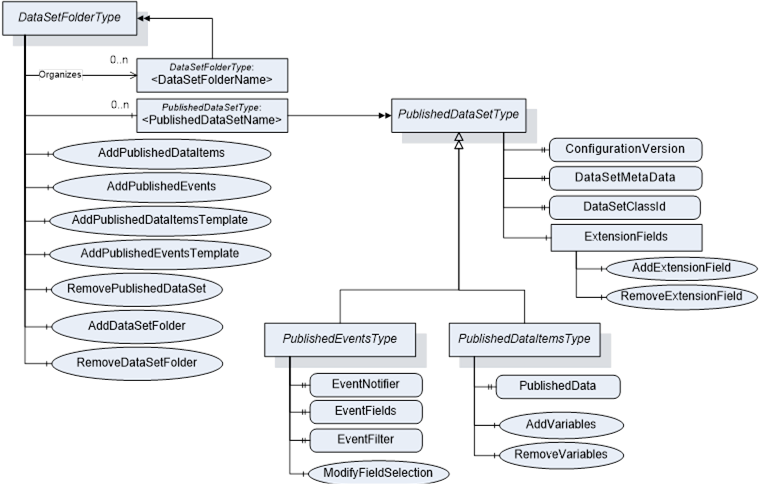  

Figure 46 - Published DataSet overview  

Instances of the *DataSetFolderType* are used to organize *PublishedDataSetType Objects* in a tree of *DataSetFolders* . The configuration can be made through *Methods* or can be made by product-specific configuration tools.  

The *PublishedDataSetType* defines the information necessary for a *Subscriber* to understand and decode *DataSetMessages* received from the *Publisher* for a *DataSet* and to detect changes of the *DataSet* semantic and metadata.  

The types derived from the *PublishedDataSetType* define the source of information for a *DataSet* in the OPC UA *Server* *AddressSpace* like *Variables* or *Events* .  

##### 9.1.4.2 Published DataSet  

###### 9.1.4.2.1 PublishedDataSetType  

This *ObjectType* is the base type for *PublishedDataSets* . It defines the metadata and the configuration version of the *DataSets* sent as *DataSetMessages* through *DataSetWriters* .  

The *PublishedDataSetType* is the base type for configurable *DataSets* . Derived types like *PublishedDataItemsType* and *PublishedEventsType* define how to collect the *DataSet* to be published. For *PublishedDataItemsType* this is a list of monitored *Variables* used to create cyclic *DataSets* . For *PublishedEventsType* this is an *Event* selection used to create acyclic *DataSets* . The list of monitored Variables or the list of selected *EventFields* defines the content and metadata of the *PublishedDataSetType Object* .  

If the content of the *DataSet* is defined by a product-specific configuration and the source of the *DataSet* is not known, the *PublishedDataSetType* can be used directly to expose the custom *PublishedDataSet* in the *AddressSpace* of the *Publisher* . If the *Variable* *CyclicDataSet* is not present, the custom *PublishedDataSet* shall create cyclic *DataSets* .  

The *PublishedDataSetType* is formally defined in [Table 247](/§\_Ref408225524) .  

Table 247 - PublishedDataSetType definition  

| **Attribute** | **Value** |
|---|---|
|BrowseName|PublishedDataSetType|
|IsAbstract|False|
  
| **References** | **NodeClass** | **BrowseName** | **DataType** | **TypeDefinition** | **ModellingRule** |
|---|---|---|---|---|---|
|Subtype of BaseObjectType defined in [OPC 10000-5](/§UAPart5) .|
|DataSetToWriter|Object|\<DataSetWriterName\>||DataSetWriterType|Optional Placeholder|
|HasProperty|Variable|ConfigurationVersion|Configuration VersionDataType|PropertyType|Mandatory|
|HasProperty|Variable|DataSetMetaData|DataSetMeta DataType|PropertyType|Mandatory|
|HasProperty|Variable|DataSetClassId|Guid|PropertyType|Optional|
|HasProperty|Variable|CyclicDataSet|Boolean|PropertyType|Optional|
|HasComponent|Object|ExtensionFields||ExtensionFieldsType|Optional|
|Conformance Units|
|PubSub Model Base|
  

  

The *PublishedDataSetType* *ObjectType* is a concrete type and can be used directly. It can be used to expose a *PublishedDataSet* where the data collection is not visible in the *AddressSpace* .  

The *Object* has a list of *DataSetWriters* . A *DataSetWriter* sends *DataSetMessages* created from *DataSets* through a *Message Oriented Middleware* . The link between the *PublishedDataSet* *Object* and a *DataSetWriter* shall be created when an instance of the *DataSetWriterType* is created. The *DataSetWriterType* is defined in [9.1.7.2](/§\_Ref476855707) . If a *DataSetWriter* is created for the *PublishedDataSet* , it is added to the list using the *ReferenceType* *DataSetToWriter* . The *DataSetToWriter ReferenceType* is defined in [9.1.4.2.5](/§\_Ref456792065) . If a *DataSetWriter* for the *PublishedDataSet* is removed from a group, the *Reference* to this *DataSetWriter* shall also be removed from this list. The group model is defined in [9.1.6](/§\_Ref440394626) .  

The *Property* *ConfigurationVersion* is related to configuration of the *DataSet* produced by the *PublishedDataSet* *Object* . The *PublishedDataSet* parameters affecting the version are defined in the concrete types derived from this base type. The *Property* value shall match the *ConfigurationVersion* in the *DataSetMetaData Property.* The *ConfigurationVersionDataType* and the rules for setting the version are defined in [6.2.3.2.6](/§\_Ref425674914) .  

The *Property* *DataSetMetaData* provides the information necessary to decode *DataSetMessages* on the *Subscriber* side if the *DataSetMessages* are not self-describing. The information in this *Property* is automatically updated if the *ConfigurationVersion* is changed based on *DataSet* configuration change. The *DataSetMetaDataType* is defined in [6.2.3.2.3](/§\_Ref451027005) . The *Name* field in the *DataSetMetaDataType* shall match the name of the *PublishedDataSetType* *Object* if the *DataSetMetaData* is not based on a *DataSetClass* .  

The *MajorVersion* part of the *ConfigurationVersion* contained in the *DataSetMessage* needs to match the *ConfigurationVersion* of the *DataSetMetaData available on the Subscriber* side.  

The *DataSetClassId* is the globally unique identifier for a *DataSetClass* . The optional *Property* shall be present if the *DataSetClassId* of the *DataSetMetaData* is not null. If the *DataSetClassId* is not null, the *Publisher* shall reject any configuration changes that change the *DataSetMetaData* . The *Property* value shall match the *DataSetClassId* in the *DataSetMetaData Property.*  

The *Property* *CyclicDataSet* provides the information if the *DataSets* created by the *PublishedDataSet* are cyclic or acyclic. If the *Property* is provided by an instance of *PublishedDataSetType* , the *Value* shall be true. If the *Property* is provided by an instance of *PublishedEventsType* , the *Value* shall be false.  

The *ExtensionFields* *Object* allows the configuration of fields with values to be included in the *DataSet* in case the existing *AddressSpace* of the *Publisher* does not provide the necessary information. The extension fields are added as *Properties* to the *ExtensionFields Object.* For *PublishedDataItemsType* base *PublishedDataSets* , an extension field is included as a *Variable* in the published *DataSet* . For *PublishedEventsType* base *PublishedDataSets* , an extension field is included into the *SelectedFields* for the *DataSet* .  

###### 9.1.4.2.2 ExtensionFieldsType  

The *ExtensionFieldsType* is formally defined in [Table 248](/§\_Ref450811396) . It allows the configuration of fields with values to be included in the *DataSet* in case the existing *AddressSpace* of the *Publisher* does not provide the necessary information.  

Table 248 - ExtensionFieldsType definition  

| **Attribute** | **Value** |
|---|---|
|BrowseName|ExtensionFieldsType|
|IsAbstract|False|
  
| **References** | **NodeClass** | **BrowseName** | **DataType** | **TypeDefinition** | **ModellingRule** |
|---|---|---|---|---|---|
|Subtype of BaseObjectType defined in [OPC 10000-5](/§UAPart5) .|
|||||||
|HasProperty|Variable|\<ExtensionFieldName\>|BaseDataType|PropertyType|OptionalPlaceholder|
|HasComponent|Method|AddExtensionField|Defined in [9.1.4.2.3](/§\_Ref456798561) .|Mandatory|
|HasComponent|Method|RemoveExtensionField|Defined in [9.1.4.2.4](/§\_Ref456798569) .|Mandatory|
|Conformance Units|
|PubSub Model Base|
  

  

The *ExtensionFieldsType* *ObjectType* is a concrete type and can be used directly.  

The configured list of extension fields is exposed through *Properties* and managed through the *Methods AddExtensionField* and *RemoveExtensionField* . An *ExtensionField* is not automatically included in the *DataSet* . The *ExtensionField* can be added to the *DataSet* after creation.  

Metadata that normally appear in message headers can be included in the body by adding extension fields with well-known *QualifiedNames* . These well-known *QualifiedNames* are shown in [Table 249](/§\_Ref450875003) . The qualifying namespace is the OPC UA namespace.  

Table 249 - Well-Known Extension Field Names  

| **Name** | **Type** | **Description** |
|---|---|---|
|PublisherId|BaseDataType|The *PublisherId* from the *Connection* *Object* .|
|DataSetName|String|The *Name* from the *DataSetMetaData* .|
|DataSetClassId|Guid|The *DataSetClassId* from the *DataSetMetaData* .|
|MajorVersion|UInt32|The MajorVersion from the ConfigurationVersion|
|MinorVersion|UInt32|The MinorVersion from the ConfigurationVersion|
|DataSetWriterId|BaseDataType|The *DataSetWriterId* from the *DataSetWriterTransport* *Object* .|
|MessageSequenceNumber|UInt16|The sequence number from the *DataSetMessage* .|
  

  

If a well-known name is used, the value placed in the message body is dynamically generated from the current settings. The value set in the *AddExtensionField* *Method* is ignored. Subtypes of *DataSetWriterTransportType* may extend this list.  

###### 9.1.4.2.3 AddExtensionField Method  

This *Method* is used to add *a Property* to the *Object ExtensionFields* .  

The *Client* shall be authorized to modify the configuration for the *PubSub* functionality when invoking this *Method* on the *Server* .  

 **Signature**   

 **AddExtensionField**   

[in] QualifiedName FieldName,  

[in] BaseDataType FieldValue,  

[out] NodeId  FieldId  

);  

  

| **Argument** | **Description** |
|---|---|
|FieldName|Name of the field to add.|
|FieldValue|The value of the field to add.|
|FieldId|The *NodeId* of the added field *Property* .|
  

  

 **Method Result Codes**   

| **ResultCode** | **Description** |
|---|---|
|Bad\_NodeIdExists|A field with the name already exists.|
|Bad\_InvalidArgument|The *Server* is not able to apply the *Name* . The *Name* may be too long or may contain invalid characters.|
|Bad\_UserAccessDenied|The *Session* user is not allowed to configure the *Object* .|
  

  

[Table 250](/§\_Ref115409463) specifies the *AddressSpace* representation for the *AddExtensionField Method* .  

Table 250 - AddExtensionField Method AddressSpace definition  

| **Attribute** | **Value** |
|---|---|
|BrowseName|AddExtensionField|
  
| **References** | **NodeClass** | **BrowseName** | **DataType** | **TypeDefinition** | **ModellingRule** |
|---|---|---|---|---|---|
|HasProperty|Variable|InputArguments|Argument[]|PropertyType|Mandatory|
|HasProperty|Variable|OutputArguments|Argument[]|PropertyType|Mandatory|
  
| **ConformanceUnits** |
|---|
|PubSub Model Base|
  

  

###### 9.1.4.2.4 RemoveExtensionField Method  

This *Method* is used to remove *a Property* from the *Object ExtensionFields* .  

The *Client* shall be authorized to modify the configuration for the *PubSub* functionality when invoking this *Method* on the *Server* .  

 **Signature**   

 **RemoveExtensionField**   

[in] NodeId  FieldId  

);  

  

| **Argument** | **Description** |
|---|---|
|FieldId|The *NodeId* field *Property* to remove.|
  

  

 **Method Result Codes**   

| **ResultCode** | **Description** |
|---|---|
|Bad\_NodeIdUnknown|A field with the *NodeId* does not exist.|
|Bad\_NodeIdInvalid|The *FieldId* is not a *NodeId* of a *Property* of the *ExtensionFieldsType Object* .|
|Bad\_UserAccessDenied|The *Session* user is not allowed to configure the *Object* .|
  

  

[Table 251](/§\_Ref115409527) specifies the *AddressSpace* representation for the *RemoveExtensionField Method* .  

Table 251 - RemoveExtensionField Method AddressSpace definition  

| **Attribute** | **Value** |
|---|---|
|BrowseName|RemoveExtensionField|
  
| **References** | **NodeClass** | **BrowseName** | **DataType** | **TypeDefinition** | **ModellingRule** |
|---|---|---|---|---|---|
|HasProperty|Variable|InputArguments|Argument[]|PropertyType|Mandatory|
  
| **ConformanceUnits** |
|---|
|PubSub Model Base|
  

  

###### 9.1.4.2.5 DataSetToWriter  

The *DataSetToWriter ReferenceType* is a concrete *ReferenceType* that can be used directly. It is a subtype of the *HierarchicalReferences* *ReferenceType* .  

The *SourceNode* of *References* of this type shall be an *Object* of *ObjectType* *PublishedDataSetType* or an *ObjectType* that is a subtype of *PublishedDataSetType* defined in [9.1.4.2.1](/§\_Ref434342388) .  

The *TargetNode* of this *ReferenceType* shall be an *Object* of the *ObjectType* *DataSetWriterType* defined in [9.1.7.1](/§\_Ref422778671) .  

Each *DataSetWriter* *Object* shall be the *TargetNode* of exactly one *DataSetToWriter Reference* .  

*Servers* shall provide the inverse *Reference* that relates a *DataSetWriter Object* back to a *PublishedDataSetType* Object.  

The representation of the *DataSetToWriter ReferenceType* in the *AddressSpace* is specified in [Table 252](/§\_Ref128900663) .  

Table 252 - DataSetToWriter ReferenceType  

| **Attributes** | **Value** |
|---|---|
|BrowseName|DataSetToWriter|
|InverseName|WriterToDataSet|
|Symmetric|False|
|IsAbstract|False|
  
| **References** | **NodeClass** | **BrowseName** | **Comment** |
|---|---|---|---|
|Subtype of HierarchicalReferences defined in [OPC 10000-5](/§UAPart5) .|
|Conformance Units|
|PubSub Model Base|
  

  

##### 9.1.4.3 Published Data Items  

###### 9.1.4.3.1 PublishedDataItemsType  

The *PublishedDataItemsType* is used to select a list of OPC UA *Variables* as the source for the creation of *DataSets* sent through one or more *DataSetWriters* .  

The *PublishedDataItemsType* is formally defined [Table 253](/§\_Ref422748340) .  

Table 253 - PublishedDataItemsType definition  

| **Attribute** | **Value** |
|---|---|
|BrowseName|PublishedDataItemsType|
|IsAbstract|False|
  
| **References** | **NodeClass** | **BrowseName** | **DataType** | **TypeDefinition** | **ModellingRule** |
|---|---|---|---|---|---|
|Subtype of PublishedDataSetType defined in [9.1.4.2](/§\_Ref426498182) .|
|HasProperty|Variable|PublishedData|PublishedVariable DataType[]|PropertyType|Mandatory|
|HasComponent|Method|AddVariables|Defined in [9.1.4.3.2](/§\_Ref415518952) .|Optional|
|HasComponent|Method|RemoveVariables|Defined in [9.1.4.3.3](/§\_Ref415518957) .|Optional|
|Conformance Units|
|PubSub Model PublishedDataSet|
  

  

The *PublishedDataItemsType* *ObjectType* is a concrete type and can be used directly.  

The *PublishedData* is defined in [6.2.3.7.1](/§\_Ref426309771) . Existing entries in the array can be changed by writing the new settings to the *Variable Value* . A new *Value* shall be rejected with Bad\_OutOfRange if the array size would be changed. Entries in the array can be added and removed with the *Methods AddVariables* and *RemoveVariables* .  

The index into the list of entries in the *PublishedData* has an important role for *Subscribers* and for configuration tools. It is used as a handle to reference the entry in configuration actions like *RemoveVariables* or the *Value* in *DataSetMessages* received by *Subscribers* . The index may change after configuration changes. Changes are indicated by the *ConfigurationVersion* and applications working with the index shall always check the *ConfigurationVersion* before using the index.  

###### 9.1.4.3.2 AddVariables Method  

This *Method* is used to add *Variables* to the *PublishedData Property* . The *PublishedData* contains a list of published *Variables* of a *PublishedDataItemsType Object* . The information provided in the input Arguments and information available for the added Variables is also used to create the content of the *DataSetMetaData* *Property* . The mapping to the *DataSetMetaData* is described for the input *Arguments* .  

*Variables* shall be added at the end of the list in *PublishedData* . This ensures that *Subscribers* are only affected by the change if they are interested in the added *Variables* .  

If at least one *Variable* was added to the *PublishedData* , the *MinorVersion* of the *ConfigurationVersion* shall be updated. The *ConfigurationVersionDataType* and the rules for setting the version are defined in [6.2.3.2.6](/§\_Ref425674914) .  

The *Client* shall be authorized to modify the configuration for the *PubSub* functionality when invoking this *Method* on the *Server* .  

 **Signature**   

 **AddVariables**   

[in] ConfigurationVersionDataType  ConfigurationVersion,  

[in] String[]     FieldNameAliases,  

[in] Boolean[]     PromotedFields,  

[in] PublishedVariableDataType[]  VariablesToAdd,  

[out] ConfigurationVersionDataType  NewConfigurationVersion,  

[out] StatusCode[]    AddResults  

);  

  

| **Argument** | **Description** |
|---|---|
|ConfigurationVersion|Configuration version of the *DataSet* . The configuration version shall match the entire current configuration version of the *Object* when the *Method* call is processed. If it does not match, the result Bad\_InvalidState shall be returned. The *ConfigurationVersionDataType* is defined in [6.2.3.2.6](/§\_Ref425674914) .|
|FieldNameAliases|The names assigned to the selected *Variables* for the fields in the *DataSetMetaData* and in the *DataSetMessages* for tagged message encoding. The size and the order of the array shall match the *VariablesToAdd* . The string shall be used to set the name field in the *FieldMetaData* that is part of the *DataSetMetaData* .|
|PromotedFields|The flags indicating if the corresponding field is promoted to the *DataSetMessage* header. The size and the order of the array shall match the *VariablesToAdd* . The flag is used to set the *PromotedField* flag in the *fieldFlags* parameter in the *FieldMetaData* .|
|VariablesToAdd|Array of *Variables* to add to *PublishedData* and the related configuration settings. Successfully added variables are appended to the end of the list of published variables configured in the *PublishedData Property* . Failed variables are not added to the list. The *PublishedVariableDataType* is defined in [6.2.3.7.1](/§\_Ref426309771) . The parameters *builtInType* , *dataType* , *valueRank* and *arrayDimensions* of the *FieldMetaData* are filled from corresponding *Variable Attributes* .|
|NewConfigurationVersion|Returns the new configuration version of the *PublishedDataSet* .|
|AddResults|The result codes for the variables to add. Variables exceeding the maximum number of items in the *Object* are rejected with Bad\_TooManyVariables.|
  

  

 **Method Result Codes**   

| **ResultCode** | **Description** |
|---|---|
|Bad\_NothingToDo|An empty list of variables was provided.|
|Bad\_InvalidState|The configuration version did not match the current state of the object.|
|Bad\_NotWritable|The *DataSet* is based on a *DataSetClass* and the size of the *PublishedData* array cannot be changed.|
|Bad\_UserAccessDenied|The *Session* user is not allowed to configure the object.|
  

  

 **Operation Result Codes**   

| **ResultCode** | **Description** |
|---|---|
|Bad\_NodeIdInvalid|See [OPC 10000-4](/§UAPart4) for the description of this result code.|
|Bad\_NodeIdUnknown|See [OPC 10000-4](/§UAPart4) for the description of this result code.|
|Bad\_IndexRangeInvalid|See [OPC 10000-4](/§UAPart4) for the description of this result code.|
|Bad\_IndexRangeNoData|See [OPC 10000-4](/§UAPart4) for the description of this result code. If the *ArrayDimensions* have a fixed length that cannot change and no data exists within the range of indexes specified, Bad\_IndexRangeNoData is returned in *AddVariables* . Otherwise, if the length of the array is dynamic, the *Publisher* shall insert this status in a *DataSet* if no data exists within the range.|
|Bad\_TooManyVariables|The *Publisher* has reached its maximum number of items for the *PublishedDataItemsType* object.|
  

  

[Table 254](/§\_Ref115409633) specifies the *AddressSpace* representation for the *AddVariables Method* .  

Table 254 - AddVariables Method AddressSpace definition  

| **Attribute** | **Value** |
|---|---|
|BrowseName|AddVariables|
  
| **References** | **NodeClass** | **BrowseName** | **DataType** | **TypeDefinition** | **ModellingRule** |
|---|---|---|---|---|---|
|HasProperty|Variable|InputArguments|Argument[]|PropertyType|Mandatory|
|HasProperty|Variable|OutputArguments|Argument[]|PropertyType|Mandatory|
  
| **ConformanceUnits** |
|---|
|PubSub Model PublishedDataSet|
  

  

###### 9.1.4.3.3 RemoveVariables Method  

This *Method* is used to remove *Variables* from the *PublishedData* list. It contains the list of published *Variables* of a *PublishedDataItemsType Object* .  

A caller shall read the current Values of *PublishedData* and *ConfigurationVersion* prior to calling this *Method* , to ensure the use of the correct index of the *Variables* that are being removed.  

If at least one *Variable* was successfully removed from the *PublishedData* , the *MajorVersion* of the *ConfigurationVersion* shall be updated. The *ConfigurationVersionDataType* and the rules for setting the version are defined in [6.2.3.2.6](/§\_Ref425674914) .  

The order of the remaining *Variables* in the *PublishedData* shall be preserved.  

The *Client* shall be authorized to modify the configuration for the *PubSub* functionality when invoking this *Method* on the *Server* .  

 **Signature**   

 **RemoveVariables**   

[in] ConfigurationVersionDataType  ConfigurationVersion,  

[in] UInt32[]     VariablesToRemove,  

[out] ConfigurationVersionDataType  NewConfigurationVersion,  

[out] StatusCode[]    RemoveResults  

);  

  

| **Argument** | **Description** |
|---|---|
|ConfigurationVersion|Configuration version of the *DataSet* . The configuration version and the indices passed through *VariablesToRemove* shall match the entire current configuration version of the *Object* when the *Method* call is processed. If it does not match, the result Bad\_InvalidState shall be returned. The *ConfigurationVersionDataType* is defined in [6.2.3.2.6](/§\_Ref425674914) .|
|VariablesToRemove|Array of indices of Variables to remove from the list of *Variables* configured in *PublishedData* of the *PublishedDataItemsType* . This matches the list of fields configured in the *DataSetMetaData* of the *PublishedDataSetType* .|
|NewConfigurationVersion|Returns the new configuration version of the *DataSet* .|
|RemoveResults|The result codes for each of the variables to remove.|
  

  

 **Method Result Codes**   

| **ResultCode** | **Description** |
|---|---|
|Bad\_NothingToDo|An empty list of variables was provided.|
|Bad\_InvalidState|The configuration version did not match the current state of the *Object* .|
|Bad\_UserAccessDenied|The *Session* user is not allowed to configure the *Object* .|
  

  

 **Operation Result Codes**   

| **ResultCode** | **Description** |
|---|---|
|Bad\_InvalidArgument|The passed index was invalid.|
  

  

[Table 255](/§\_Ref115409703) specifies the *AddressSpace* representation for the *RemoveVariables Method* .  

Table 255 - RemoveVariables Method AddressSpace definition  

| **Attribute** | **Value** |
|---|---|
|BrowseName|RemoveVariables|
  
| **References** | **NodeClass** | **BrowseName** | **DataType** | **TypeDefinition** | **ModellingRule** |
|---|---|---|---|---|---|
|HasProperty|Variable|InputArguments|Argument[]|PropertyType|Mandatory|
|HasProperty|Variable|OutputArguments|Argument[]|PropertyType|Mandatory|
  
| **ConformanceUnits** |
|---|
|PubSub Model PublishedDataSet|
  

  

##### 9.1.4.4 Published Events  

###### 9.1.4.4.1 PublishedEventsType  

This *PublishedDataSetType* is used to configure the collection of OPC UA *Events* .  

The *PublishedEventsType* is formally defined in [Table 256](/§\_Ref408963443) .  

Table 256 - PublishedEventsType definition  

| **Attribute** | **Value** |
|---|---|
|BrowseName|PublishedEventsType|
|IsAbstract|False|
  
| **References** | **NodeClass** | **BrowseName** | **DataType** | **TypeDefinition** | **ModellingRule** |
|---|---|---|---|---|---|
|Subtype of PublishedDataSetType defined in [9.1.4.2.1](/§\_Ref434342388) .|
|HasProperty|Variable|EventNotifier|NodeId|PropertyType|Mandatory|
|HasProperty|Variable|SelectedFields|SimpleAttributeOperand[]|PropertyType|Mandatory|
|HasProperty|Variable|Filter|ContentFilter|PropertyType|Mandatory|
|HasComponent|Method|ModifyFieldSelection|Defined in [9.1.4.4.2](/§\_Ref443452087) .|Optional|
|Conformance Units|
|PubSub Model PublishedDataSet Events|
  

  

The *PublishedEventsType* *ObjectType* is a concrete type and can be used directly.  

The *EventNotifier* is defined in [6.2.3.8.1](/§\_Ref497340627) .  

The *SelectedFields* is defined in [6.2.3.8.2](/§\_Ref497340634) .  

The index into the list of entries in the *SelectedFields* has an important role for *Subscribers.* It is used as handle to reference the *Event* field in *DataSetMessages* received by *Subscribers* . The index may change after configuration changes. Changes are indicated by the *ConfigurationVersion* and applications working with the index shall always check the *ConfigurationVersion* before using the index. If a change of the SelectedFields adds additional fields, the *MinorVersion* of the *ConfigurationVersion* shall be updated. If a change of the *SelectedFields* removes fields, the *MajorVersion* of the *ConfigurationVersion* shall be updated. The *Property* *ConfigurationVersion* is defined in the base *ObjectType* *PublishedDataSetType* .  

The *Filter* is defined in [6.2.3.8.3](/§\_Ref497340641) . A change of the *Filter* does not affect the *ConfigurationVersion* since the content of the *DataSet* does not change.  

###### 9.1.4.4.2 ModifyFieldSelection Method  

This *Method* is used to modify the event field selection of a *PublishedEventsType Object* .  

The *Client* shall be authorized to modify the configuration for the *PubSub* functionality when invoking this *Method* on the *Server* .  

 **Signature**   

 **ModifyFieldSelection**   

[in] ConfigurationVersionDataType  ConfigurationVersion,  

[in] String[]     FieldNameAliases,  

[in] Boolean[]     PromotedFields,  

[in] SimpleAttributeOperand[]  SelectedFields  

[out] ConfigurationVersionDataType  NewConfigurationVersion  

);  

  

| **Argument** | **Description** |
|---|---|
|ConfigurationVersion|Configuration version of the *DataSet* . The configuration version shall match the entire current configuration version of the *Object* when the *Method* call is processed. If it does not match, the result Bad\_InvalidState shall be returned. The *ConfigurationVersionDataType* is defined in [6.2.3.2.6](/§\_Ref425674914) .|
|FieldNameAliases|The names assigned to the selected fields in the *DataSetMetaData* and in the *DataSetMessages* for tagged message encoding. The size and the order of the array shall match the *SelectedFields* . The string is used to set the name field in the *FieldMetaData* that is part of the *DataSetMetaData* .|
|PromotedFields|The flags indicating if the corresponding field is promoted to the *DataSetMessage* header. The size and the order of the array shall match the *SelectedFields* . The flag is used to set the corresponding field in the *FieldMetaData* that is part of the *DataSetMetaData* .|
|SelectedFields|The selection of *Event* fields contained in the *DataSet* generated for an *Event* and sent through the *DataSetWriter* . The *SimpleAttributeOperand* *DataType* is defined in [OPC 10000-4](/§UAPart4) . A change to the selected fields requires a change of the *ConfigurationVersion* .|
|NewConfigurationVersion|Return the new configuration version of the *DataSet* .|
  

  

 **Method Result Codes**   

| **ResultCode** | **Description** |
|---|---|
|Bad\_InvalidState|The configuration version did not match the current state of the *Object* .|
|Bad\_EventFilterInvalid|The event filter is not valid.|
|Bad\_UserAccessDenied|The *Session* user is not allowed to configure the *Object* .|
  

  

[Table 257](/§\_Ref115409780) specifies the *AddressSpace* representation for the *ModifyFieldSelection Method* .  

Table 257 - ModifyFieldSelection Method AddressSpace definition  

| **Attribute** | **Value** |
|---|---|
|BrowseName|ModifyFieldSelection|
  
| **References** | **NodeClass** | **BrowseName** | **DataType** | **TypeDefinition** | **ModellingRule** |
|---|---|---|---|---|---|
|HasProperty|Variable|InputArguments|Argument[]|PropertyType|Mandatory|
|HasProperty|Variable|OutputArguments|Argument[]|PropertyType|Mandatory|
  
| **ConformanceUnits** |
|---|
|PubSub Model PublishedDataSet Events|
  

  

##### 9.1.4.5 DataSet Folder  

###### 9.1.4.5.1 DataSetFolderType  

The *DataSetFolderType* is formally defined in [Table 258](/§\_Ref430544858) .  

Table 258 - DataSetFolderType definition  

| **Attribute** | **Value** |
|---|---|
|BrowseName|DataSetFolderType|
|IsAbstract|False|
  
| **References** | **NodeClass** | **BrowseName** | **DataType** | **TypeDefinition** | **ModellingRule** |
|---|---|---|---|---|---|
|Subtype of FolderType defined in [OPC 10000-5](/§UAPart5) .|
|||||||
|Organizes|Object|\<DataSetFolderName\>||DataSetFolderType|OptionalPlaceholder|
|HasComponent|Object|\<PublishedDataSetName\>||PublishedDataSetType|OptionalPlaceholder|
|HasComponent|Method|AddPublishedDataItems|Defined in [9.1.4.5.2](/§\_Ref425684456) .|Optional|
|HasComponent|Method|AddPublishedEvents|Defined in [9.1.4.5.3](/§\_Ref425684461) .|Optional|
|HasComponent|Method|AddPublishedDataItemsTemplate|Defined in [9.1.4.5.4](/§\_Ref498550988) .|Optional|
|HasComponent|Method|AddPublishedEventsTemplate|Defined in [9.1.4.5.5](/§\_Ref498551002) .|Optional|
|HasComponent|Method|RemovePublishedDataSet|Defined in [9.1.4.5.6](/§\_Ref458517151) .|Optional|
|HasComponent|Method|AddDataSetFolder|Defined in [9.1.4.5.7](/§\_Ref498551009) .|Optional|
|HasComponent|Method|RemoveDataSetFolder|Defined in [9.1.4.5.8](/§\_Ref498551016) .|Optional|
|Conformance Units|
|PubSub Model Base|
  

  

The *DataSetFolderType ObjectType* is a concrete type and can be used directly.  

Instances of the *DataSetFolderType* can contain *PublishedDataSets* or other instances of the *DataSetFolderType* . This can be used to build a tree of *Folder Objects* used to group the configured *PublishedDataSets* .  

The *PublishedDataSetType Objects* are added as components to the instance of the *DataSetFolderType* . An instance of a *PublishedDataSetType* is referenced only from one *DataSetFolder* . If the *DataSetFolder* is deleted, all referenced *PublishedDataSetType* *Objects* are deleted with the folder.  

*PublishedDataSetType Objects* may be configured with product-specific configuration tools or added and removed through the *Methods AddPublishedDataItems* , *AddPublishedEvents* and *RemovePublishedDataSet* . The *PublishedDataSetType* is defined in [9.1.4.2.1](/§\_Ref434342388) .  

###### 9.1.4.5.2 AddPublishedDataItems Method  

This *Method* is used to create a *PublishedDataSets Object* of type *PublishedDataItemsType* and to add it to the *DataSetFolderType Object* . The configuration parameters provided with this *Method* are further described in the *PublishedDataItemsType* defined in [9.1.4.3.1](/§\_Ref438111736) and the *PublishedDataSetType* defined in [9.1.4.2](/§\_Ref438111750) .  

The settings in the *VariablesToAdd* are used to configure the data acquisition for the *DataSet* and are used to initialize the *PublishedData Property* of the *PublishedDataItemsType* .  

The *DataSetMetaData* of the *PublishedDataSetType* is created from meta-data of the *Variables* referenced in *VariablesToAdd* and the settings in *FieldNameAliases* and *FieldFlags* .  

The *Client* shall be authorized to modify the configuration for the *PubSub* functionality when invoking this *Method* on the *Server* .  

 **Signature**   

 **AddPublishedDataItems**   

[in] String     Name,  

[in] String[]     FieldNameAliases,  

[in] DataSetFieldFlags[]   FieldFlags,  

[in] PublishedVariableDataType[]  VariablesToAdd,  

[out] NodeId     DataSetNodeId,  

[out] ConfigurationVersionDataType  ConfigurationVersion,  

[out] StatusCode[]    AddResults  

);  

  

| **Argument** | **Description** |
|---|---|
|Name|Name of the *Object* to create.|
|FieldNameAliases|The names assigned to the selected *Variables* for the fields in the *DataSetMetaData* and in the *DataSetMessages* for tagged message encoding. The size and the order of the array shall match the *VariablesToAdd* . The string shall be used to set the name field in the *FieldMetaData* that is part of the *DataSetMetaData* . The name shall be unique in the *DataSet* .|
|FieldFlags|The field flags assigned to the selected *Variables* for the fields in the *DataSetMetaData* . The size and the order of the array shall match the *VariablesToAdd* . The flag is used to set the corresponding field in the *FieldMetaData* that is part of the *DataSetMetaData* .|
|VariablesToAdd|Array of Variables to add to PublishedData and the related configuration settings. Successfully added variables are appended to the end of the list of published variables configured in the *PublishedData Property* . Failed variables are not added to the list. The *PublishedVariableDataType* is defined in [6.2.3.7.1](/§\_Ref426309771) .|
|DataSetNodeId|*NodeId* of the created *PublishedDataSets Object* .|
|ConfigurationVersion|Returns the initial configuration version of the *DataSet* .|
|AddResults|The result codes for the variables to add. Variables exceeding the maximum number of items in the *Object* are rejected with Bad\_TooManyMonitoredItems.|
  

  

 **Method Result Codes**   

| **ResultCode** | **Description** |
|---|---|
|Bad\_InvalidState|The current state of the *Object* does not allow a configuration change.|
|Bad\_BrowseNameDuplicated|A data set *Object* with the name already exists.|
|Bad\_UserAccessDenied|The *Session* user is not allowed to configure the *Object* .|
|Bad\_InvalidArgument|The *Server* is not able to apply the *Name* . The *Name* may be too long or may contain invalid characters.|
  

  

 **Operation Result Codes**   

| **ResultCode** | **Description** |
|---|---|
|Bad\_NodeIdInvalid|See [OPC 10000-4](/§UAPart4) for the description of this result code.|
|Bad\_NodeIdUnknown|See [OPC 10000-4](/§UAPart4) for the description of this result code.|
|Bad\_IndexRangeInvalid|See [OPC 10000-4](/§UAPart4) for the description of this result code.|
|Bad\_IndexRangeNoData|See [OPC 10000-4](/§UAPart4) for the description of this result code. If the *ArrayDimensions* have a fixed length that cannot change and no data exists within the range of indexes specified, Bad\_IndexRangeNoData is returned in *AddVariables* . Otherwise if the length of the array is dynamic, the *Publisher* shall insert this status in a *DataSet* if no data exists within the range.|
|Bad\_TooManyMonitoredItems|The *Server* has reached its maximum number of items for the PublishedDataItemsType object.|
|Bad\_DuplicateName|The passed field name alias already exists.|
  

  

[Table 259](/§\_Ref115409841) specifies the *AddressSpace* representation for the *AddPublishedDataItems Method* .  

Table 259 - AddPublishedDataItems Method AddressSpace definition  

| **Attribute** | **Value** |
|---|---|
|BrowseName|AddPublishedDataItems|
  
| **References** | **NodeClass** | **BrowseName** | **DataType** | **TypeDefinition** | **ModellingRule** |
|---|---|---|---|---|---|
|HasProperty|Variable|InputArguments|Argument[]|PropertyType|Mandatory|
|HasProperty|Variable|OutputArguments|Argument[]|PropertyType|Mandatory|
  
| **ConformanceUnits** |
|---|
|PubSub Model PublishedDataSet|
  

  

###### 9.1.4.5.3 AddPublishedEvents Method  

This *Method* is used to add a *PublishedEventsType Object* to the *DataSetFolderType Object* . The configuration parameters provided with this *Method* are further described in the *PublishedEventsType* defined in [9.1.4.4.1](/§\_Ref438111792) and the *PublishedDataSetType* defined in [9.1.4.2](/§\_Ref438111750) .  

The settings in the *EventNotifier, SelectedFields* and *Filter* are used to configure the data acquisition for the *DataSet* and are used to initialize the corresponding *Properties* of the *PublishedEventsType* .  

The *DataSetMetaData* of the *PublishedDataSetType* is created from metadata of the selected *Event* fields and the settings in *FieldNameAliases* and *FieldFlags* .  

The *Client* shall be authorized to modify the configuration for the *PubSub* functionality when invoking this *Method* on the *Server* .  

 **Signature**   

 **AddPublishedEvents**   

[in] String    Name,  

[in] NodeId    EventNotifier,  

[in] String[]    FieldNameAliases,  

[in] DataSetFieldFlags[]  FieldFlags,  

[in] SimpleAttributeOperand[] SelectedFields,  

[in] ContentFilter   Filter,  

[out] ConfigurationVersionDataType ConfigurationVersion,  

[out] NodeId    DataSetNodeId  

);  

  

| **Argument** | **Description** |
|---|---|
|Name|Name of the *DataSet Object* to create.|
|EventNotifier|The *NodeId* of the *Object* in the event notifier tree of the OPC UA *Server* from which *Events* are collected.|
|FieldNameAliases|The names assigned to the selected fields in the *DataSetMetaData* and in the *DataSetMessages* for tagged message encoding. The size and the order of the array shall match the *SelectedFields* . The string is used to set the name field in the *FieldMetaData* that is part of the *DataSetMetaData* .|
|FieldFlags|The field flags assigned to the selected fields in the *DataSetMetaData* . The size and the order of the array shall match the *SelectedFields* . The flag is used to set the corresponding field in the *FieldMetaData* that is part of the *DataSetMetaData* .|
|SelectedFields|The selection of Event Fields contained in the *DataSet* generated for an *Event* and sent through the *DataSetWriter* . The *SimpleAttributeOperand* *DataType* is defined in [OPC 10000-4](/§UAPart4) .|
|Filter|The filter applied to the *Events* . It allows the reduction of the *DataSets* generated from *Events* through a filter like filtering for a certain *EventType* . The *ContentFilter DataType* is defined in [OPC 10000-4](/§UAPart4) .|
|ConfigurationVersion|Returns the initial configuration version of the *PublishedDataSets* .|
|DataSetNodeId|*NodeId* of the created *PublishedDataSets Object* .|
  

  

 **Method Result Codes**   

| **ResultCode** | **Description** |
|---|---|
|Bad\_InvalidState|The current state of the *Object* does not allow a configuration change.|
|Bad\_NodeIdExists|A data set *Object* with the name already exists.|
|Bad\_NodeIdUnknown|The *Event* notifier node is not known in the *Server* .|
|Bad\_EventFilterInvalid|The *Event* filter is not valid.|
|Bad\_UserAccessDenied|The *Session* user is not allowed to configure the *Object* .|
|Bad\_InvalidArgument|The *Server* is not able to apply the *Name* . The *Name* may be too long or may contain invalid characters.|
  

  

[Table 260](/§\_Ref115409927) specifies the *AddressSpace* representation for the *AddPublishedEvents Method* .  

Table 260 - AddPublishedEvents Method AddressSpace definition  

| **Attribute** | **Value** |
|---|---|
|BrowseName|AddPublishedEvents|
  
| **References** | **NodeClass** | **BrowseName** | **DataType** | **TypeDefinition** | **ModellingRule** |
|---|---|---|---|---|---|
|HasProperty|Variable|InputArguments|Argument[]|PropertyType|Mandatory|
|HasProperty|Variable|OutputArguments|Argument[]|PropertyType|Mandatory|
  
| **ConformanceUnits** |
|---|
|PubSub Model PublishedDataSet Events|
  

  

###### 9.1.4.5.4 AddPublishedDataItemsTemplate Method  

This *Method* is used to create a *PublishedDataSets Object* of type *PublishedDataItemsType* and to add it to the *DataSetFolderType Object* . The configuration parameters provided with this *Method* are further described in the *PublishedDataItemsType* defined in [9.1.4.3.1](/§\_Ref438111736) and the *PublishedDataSetType* defined in [9.1.4.2](/§\_Ref438111750) .  

The *Client* shall be authorized to modify the configuration for the *PubSub* functionality when invoking this *Method* on the *Server* .  

 **Signature**   

 **AddPublishedDataItemsTemplate**   

[in] String     Name,  

[in] DataSetMetaDataType   DataSetMetaData,  

[in] PublishedVariableDataType[]  VariablesToAdd,  

[out] NodeId     DataSetNodeId,  

[out] StatusCode[]    AddResults  

);  

  

| **Argument** | **Description** |
|---|---|
|Name|Name of the *Object* to create.|
|DataSetMetaData|The *DataSetMetaData* predefined by the caller. The initial setting shall not be changed by the *Publisher* . If the *dataSetClassId* of the *DataSetMetaData* is not null, the *DataSetClassId* *Property* of the *PublishedDataSetType* shall be created and initialized with the *dataSetClassId* value *.* The name of the *PublishedDataSet* *Object* is defined by the name in the *DataSetMetaData* .|
|VariablesToAdd|Array of variable settings for the data acquisition for the fields in the *DataSetMetaData* . The size of the array shall match the size of the *fields* array in the *DataSetMetaData* . The *substituteValue* in the *VariablesToAdd* entries shall be configured. For failed variables the *publishedVariable* field of entry in the resulting *PublishedData* *Property* shall be set to a null *NodeId* . If there is no *Variable* available for a field in the *DataSetMetaData* the *publishedVariable* field for the entry shall be set to a null NodeId. The *PublishedVariableDataType* is defined in [6.2.3.7.1](/§\_Ref426309771) .|
|DataSetNodeId|*NodeId* of the created *PublishedDataSets Object* .|
|AddResults|The result codes for the variables to add.|
  

  

 **Method Result Codes**   

| **ResultCode** | **Description** |
|---|---|
|Bad\_InvalidState|The current state of the *Object* does not allow a configuration change.|
|Bad\_BrowseNameDuplicated|A data set *Object* with the name already exists.|
|Bad\_UserAccessDenied|The *Session* user is not allowed to configure the *Object* .|
|Bad\_InvalidArgument|The *VariablesToAdd* parameter does not match the array size of the fields in the *DataSetMetaData* or the configuration of the *VariablesToAdd* contains invalid settings.|
|Bad\_TooManyMonitoredItems|The *Object* cannot be created since the number of items in the *PublishedDataSet* exceeds the capabilities of the *Publisher* .|
  

  

 **Operation Result Codes**   

| **ResultCode** | **Description** |
|---|---|
|Bad\_NodeIdInvalid|See [OPC 10000-4](/§UAPart4) for the description of this result code.|
|Bad\_NodeIdUnknown|See [OPC 10000-4](/§UAPart4) for the description of this result code.|
|Bad\_IndexRangeInvalid|See [OPC 10000-4](/§UAPart4) for the description of this result code.|
|Bad\_IndexRangeNoData|See [OPC 10000-4](/§UAPart4) for the description of this result code. If the *ArrayDimensions* have a fixed length that cannot change and no data exists within the range of indexes specified, Bad\_IndexRangeNoData is returned in *AddVariables* . Otherwise if the length of the array is dynamic, the *Publisher* shall insert this status in a *DataSet* if no data exists within the range.|
|Bad\_TooManyMonitoredItems|The *Server* has reached its maximum number of items for the PublishedDataItemsType *Object* .|
|Bad\_DuplicateName|The passed field name alias already exists.|
  

  

[Table 261](/§\_Ref115409990) specifies the *AddressSpace* representation for the *AddPublishedDataItemsTemplate Method* .  

Table 261 - AddPublishedDataItemsTemplate Method AddressSpace definition  

| **Attribute** | **Value** |
|---|---|
|BrowseName|AddPublishedDataItemsTemplate|
  
| **References** | **NodeClass** | **BrowseName** | **DataType** | **TypeDefinition** | **ModellingRule** |
|---|---|---|---|---|---|
|HasProperty|Variable|InputArguments|Argument[]|PropertyType|Mandatory|
|HasProperty|Variable|OutputArguments|Argument[]|PropertyType|Mandatory|
  
| **ConformanceUnits** |
|---|
|PubSub Model PublishedDataSet|
  

  

###### 9.1.4.5.5 AddPublishedEventsTemplate Method  

This *Method* is used to add a *PublishedEventsType Object* to the *DataSetFolderType Object* . The configuration parameters provided with this *Method* are further described in the *PublishedEventsType* defined in [9.1.4.4.1](/§\_Ref438111792) and the *PublishedDataSetType* defined in [9.1.4.2](/§\_Ref438111750) .  

The *Client* shall be authorized to modify the configuration for the *PubSub* functionality when invoking this *Method* on the *Server* .  

 **Signature**   

 **AddPublishedEventsTemplate**   

[in] String    Name,  

[in] DataSetMetaDataType  DataSetMetaData,  

[in] NodeId    EventNotifier,  

[in] SimpleAttributeOperand[] SelectedFields,  

[in] ContentFilter   Filter,  

[out] NodeId    DataSetNodeId  

);  

  

| **Argument** | **Description** |
|---|---|
|Name|Name of the *Object* to create.|
|DataSetMetaData|The *DataSetMetaData* predefined by the caller. The initial setting shall not be changed by the *Publisher* . If the *dataSetClassId* of the *DataSetMetaData* is not null, the *DataSetClassId* *Property* of the *PublishedDataSetType* shall be created and initialized with the *dataSetClassId* value. The name of the *PublishedDataSet* *Object* is defined by the name in the *DataSetMetaData* .|
|EventNotifier|The *NodeId* of the *Object* in the event notifier tree of the OPC UA *Server* from which *Events* are collected.|
|SelectedFields|The selection of Event Fields contained in the *DataSet* generated for an *Event* and sent through the *DataSetWriter* . The size of the array shall match the size of the fields array in the *DataSetMetaData* . If there is no *Event* field available for a field in the *DataSetMetaData* the *browsePath* field for the *SimpleAttributeOperand* entry shall be set to null. The *SimpleAttributeOperand* *DataType* is defined in [OPC 10000-4](/§UAPart4) .|
|Filter|The filter applied to the *Events* . It allows the reduction of the *DataSets* generated from *Events* through a filter like filtering for a certain *EventType* . The *ContentFilter DataType* is defined in [OPC 10000-4](/§UAPart4) .|
|DataSetNodeId|*NodeId* of the created *PublishedDataSets Object* .|
  

  

 **Method Result Codes**   

| **ResultCode** | **Description** |
|---|---|
|Bad\_InvalidState|The current state of the *Object* does not allow a configuration change.|
|Bad\_NodeIdExists|A *DataSet* *Object* with the name already exists.|
|Bad\_NodeIdUnknown|The *Event* notifier node is not known in the *Server* .|
|Bad\_EventFilterInvalid|The *Event* filter is not valid.|
|Bad\_UserAccessDenied|The *Session* user is not allowed to configure the *Object* .|
|Bad\_InvalidArgument|The *Server* is not able to apply the *Name* . The *Name* may be too long or may contain invalid characters.|
  

  

[Table 262](/§\_Ref115410090) specifies the *AddressSpace* representation for the *AddPublishedEventsTemplate Method* .  

Table 262 - AddPublishedEventsTemplate Method AddressSpace definition  

| **Attribute** | **Value** |
|---|---|
|BrowseName|AddPublishedEventsTemplate|
  
| **References** | **NodeClass** | **BrowseName** | **DataType** | **TypeDefinition** | **ModellingRule** |
|---|---|---|---|---|---|
|HasProperty|Variable|InputArguments|Argument[]|PropertyType|Mandatory|
|HasProperty|Variable|OutputArguments|Argument[]|PropertyType|Mandatory|
  
| **ConformanceUnits** |
|---|
|PubSub Model PublishedDataSet Events|
  

  

###### 9.1.4.5.6 RemovePublishedDataSet Method  

This *Method* is used to remove a *PublishedDataSetType Object* from the *DataSetFolderType Object* .  

A successful removal of the *PublishedDataSetType Object* removes all associated *DataSetWriter* *Objects* . Before the *Objects* are removed, their state is changed to *Disabled* .  

The *Client* shall be authorized to modify the configuration for the *PubSub* functionality when invoking this *Method* on the *Server* .  

 **Signature**   

 **RemovePublishedDataSet**   

[in] NodeId DataSetNodeId  

);  

  

| **Argument** | **Description** |
|---|---|
|DataSetNodeId|*NodeId* of the *PublishedDataSets* *Object* to remove from the *Server* . The *DataSetId* is either returned by the *AddPublishedDataItems* or *AddPublishedEvents* *Methods* or can be discovered by browsing the list of configured *PublishedDataSets* in the *PublishSubscribe Object* .|
  

 **Method Result Codes**   

| **ResultCode** | **Description** |
|---|---|
|Bad\_NodeIdUnknown|The *DataSetNodeId* is unknown.|
|Bad\_NodeIdInvalid|The *DataSetNodeId* is not a NodeId of a ** published *DataSet* .|
|Bad\_UserAccessDenied|The *Session* user is not allowed to delete a *PublishedDataSetType* .|
  

  

[Table 263](/§\_Ref115410150) specifies the *AddressSpace* representation for the *RemovePublishedDataSet Method* .  

Table 263 - RemovePublishedDataSet Method AddressSpace definition  

| **Attribute** | **Value** |
|---|---|
|BrowseName|RemovePublishedDataSet|
  
| **References** | **NodeClass** | **BrowseName** | **DataType** | **TypeDefinition** | **ModellingRule** |
|---|---|---|---|---|---|
|HasProperty|Variable|InputArguments|Argument[]|PropertyType|Mandatory|
  
| **ConformanceUnits** |
|---|
|PubSub Model PublishedDataSet|
  

  

###### 9.1.4.5.7 AddDataSetFolder Method  

This *Method* is used to add a *DataSetFolderType Object* to a *DataSetFolderType Object* .  

The *Client* shall be authorized to modify the configuration for the *PubSub* functionality when invoking this *Method* on the *Server* .  

 **Signature**   

 **AddDataSetFolder**   

[in] String Name,  

[out] NodeId DataSetFolderNodeId  

);  

  

| **Argument** | **Description** |
|---|---|
|Name|Name of the *Object* to create.|
|DataSetFolderNodeId|*NodeId* of the created *DataSetFolderType Object* .|
  

 **Method Result Codes**   

| **ResultCode** | **Description** |
|---|---|
|Bad\_BrowseNameDuplicated|A folder *Object* with the name already exists.|
|Bad\_InvalidArgument|The *Server* is not able to apply the *Name* . The *Name* may be too long or may contain invalid characters.|
|Bad\_UserAccessDenied|The *Session* user is not allowed to add a folder.|
  

  

[Table 264](/§\_Ref115410412) specifies the *AddressSpace* representation for the *AddDataSetFolder Method* .  

Table 264 - AddDataSetFolder Method AddressSpace definition  

| **Attribute** | **Value** |
|---|---|
|BrowseName|AddDataSetFolder|
  
| **References** | **NodeClass** | **BrowseName** | **DataType** | **TypeDefinition** | **ModellingRule** |
|---|---|---|---|---|---|
|HasProperty|Variable|InputArguments|Argument[]|PropertyType|Mandatory|
|HasProperty|Variable|OutputArguments|Argument[]|PropertyType|Mandatory|
  
| **ConformanceUnits** |
|---|
|PubSub Model PublishedDataSet|
  

  

###### 9.1.4.5.8 RemoveDataSetFolder Method  

This *Method* is used to remove a *DataSetFolderType Object* from the parent *DataSetFolderType Object* .  

A successful removal of the *DataSetFolderType Object* removes ** all associated *PublishedDataSetType Objects* and their associated *DataSetWriter* *Objects* . Before the *Objects* are removed, their state is changed to *Disabled.*  

The *Client* shall be authorized to modify the configuration for the *PubSub* functionality when invoking this *Method* on the *Server* .  

 **Signature**   

 **RemoveDataSetFolder**   

[in] NodeId DataSetFolderNodeId  

);  

  

| **Argument** | **Description** |
|---|---|
|DataSetFolderNodeId|*NodeId* of the *DataSetFolderType Object* to remove from the *Server* .|
  

 **Method Result Codes**   

| **ResultCode** | **Description** |
|---|---|
|Bad\_NodeIdUnknown|The *DataSetFolderNodeId* is unknown.|
|Bad\_UserAccessDenied|The *Session* user is not allowed to delete a data set.|
  

  

[Table 265](/§\_Ref115410470) specifies the *AddressSpace* representation for the *RemoveDataSetFolder Method* .  

Table 265 - RemoveDataSetFolder Method AddressSpace definition  

| **Attribute** | **Value** |
|---|---|
|BrowseName|RemoveDataSetFolder|
  
| **References** | **NodeClass** | **BrowseName** | **DataType** | **TypeDefinition** | **ModellingRule** |
|---|---|---|---|---|---|
|HasProperty|Variable|InputArguments|Argument[]|PropertyType|Mandatory|
  
| **ConformanceUnits** |
|---|
|PubSub Model PublishedDataSet|
  

  

#### 9.1.5 Connection model  

##### 9.1.5.1 Overview  

[Figure 47](/§\_Ref425682290) depicts the *ObjectType* for the *PubSub* connection model and its components and the relations to other parts of the model.  

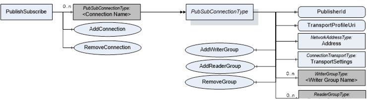  

Figure 47 - PubSubConnectionType overview  

##### 9.1.5.2 PubSubConnectionType  

This *ObjectType* is a concrete type for *Objects* representing *PubSubConnections* . A *PubSubConnection* is a combination of protocol selection, protocol settings and addressing information. The *PubSubConnectionType* is formally defined in [Table 266](/§\_Ref408225257) .  

Table 266 - PubSubConnectionType definition  

| **Attribute** | **Value** |
|---|---|
|BrowseName|PubSubConnectionType|
|IsAbstract|False|
  
| **References** | **Node Class** | **BrowseName** | **DataType** | **TypeDefinition** | **ModellingRule** |
|---|---|---|---|---|---|
|Subtype of BaseObjectType defined in [OPC 10000-5](/§UAPart5) .|
|||||||
|HasProperty|Variable|PublisherId|BaseDataType|PropertyType|Mandatory|
|HasComponent|Variable|TransportProfileUri|String|SelectionListType|Mandatory|
|HasProperty|Variable|ConnectionProperties|KeyValuePair[]|PropertyType|Mandatory|
|HasComponent|Object|Address||NetworkAddressType|Mandatory|
|HasComponent|Object|TransportSettings||ConnectionTransportType|Optional|
|HasWriterGroup|Object|\<WriterGroupName\>||WriterGroupType|OptionalPlaceholder|
|HasReaderGroup|Object|\<ReaderGroupName\>||ReaderGroupType|OptionalPlaceholder|
|HasComponent|Object|Status||PubSubStatusType|Mandatory|
|HasComponent|Object|Diagnostics||PubSubDiagnostics ConnectionType|Optional|
|HasComponent|Method|AddWriterGroup|Deprecated *Method* described in [9.1.5.3](/§\_Ref469220915) .|Optional|
|HasComponent|Method|AddReaderGroup|Deprecated *Method* described in [9.1.5.4](/§\_Ref415518759) .|Optional|
|HasComponent|Method|RemoveGroup|Deprecated *Method* described in [9.1.5.5](/§\_Ref498379146) .|Optional|
|Conformance Units|
|PubSub Model Base|
  

  

The *PublisherId* is defined in [6.2.7.1](/§\_Ref452866764) .  

The *TransportProfileUri* is defined in [6.2.7.2](/§\_Ref495502576) . The *Property* is initialized with the default transport protocol for the *Address* during the creation of the connection. The *SelectionValues* *Property* of the *SelectionListType* shall contain the list of supported *TransportProfileUris* . The *SelectionListType* is defined in [OPC 10000-5](/§UAPart5) .  

The *ConnectionProperties* is defined in [6.2.7.4](/§\_Ref505461726) .  

The *Address* is defined in [6.2.7.3](/§\_Ref495502612) . The abstract *NetworkAddressType* is defined in [9.1.5.3](/§\_Ref33907799) . The default type used for concrete instances is the *NetworkAddressUrlType* defined in [9.1.5.7](/§\_Ref33907819) . It represents the *Address* in the form of a URL *String* .  

The transport protocol mapping specific settings are provided in the optional *Object* *TransportSettings* . The *ConnectionTransportType* is defined in [9.1.5.8](/§\_Ref498379898) . The *Object* shall be present if the transport protocol mapping defines specific parameters.  

The configured *WriterGroup* and *ReaderGroup Objects* are added as components to the instance of the *PubSubConnectionType* . *PubSubGroup Objects* may be configured with product *\-* specific configuration tools or added and removed through the OPC UA *Methods AddWriterGroup, AddReaderGroup* and *RemoveGroup* .  

The *Status Object* provides the current operational status of the connection. The *PubSubStatusType* is defined in [9.1.10](/§\_Ref422740226) . The state machine for the status and the relation to other *PubSub Objects* like *PublishSubscribe* , *PubSubGroup* , *DataSetWriter* and *DataSetReader* are defined in [6.2.1](/§\_Ref496563089) .  

The *Diagnostics Object* provides the current diagnostic information for a *PubSubConnectionType* *Object* . The *PubSubDiagnosticsConnectionType* is defined in [9.1.11.8](/§\_Ref473574844) .  

##### 9.1.5.3 AddWriterGroup Method (Deprecated)  

This deprecated *Method* is used to add a new *WriterGroup* *Object* to an instance of the *PubSubConnection* .  

The *Client* should be authorized to modify the configuration for the *PubSub* functionality when invoking this *Method* on the *Server* .  

 **Signature**   

 **AddWriterGroup**   

[in] WriterGroupDataType Configuration,  

[out] NodeId   GroupId  

);  

  

| **Argument** | **Description** |
|---|---|
|Configuration|Configuration parameters for the *WriterGroup* . The parameters and the *WriterGroupDataType* are defined in [6.2.6](/§\_Ref495503815) .|
|GroupId|The *NodeId* of the new *WriterGroup Object* .|
  

  

 **Method Result Codes**   

| **ResultCode** | **Description** |
|---|---|
|Bad\_InvalidArgument|The *Server* is not able to apply the *GroupName* . The name may be too long or may contain invalid characters.|
|Bad\_BrowseNameDuplicated|An *Object* with the name already exists in the connection.|
|Bad\_ResourceUnavailable|The *Server* does not have enough resources to add the group.|
|Bad\_UserAccessDenied|The *Session* user does not have rights to create the group.|
  

  

[Table 267](/§\_Ref115410533) specifies the *AddressSpace* representation for the *AddWriterGroup Method* .  

Table 267 - AddWriterGroup Method AddressSpace definition  

| **Attribute** | **Value** |
|---|---|
|BrowseName|AddWriterGroup|
  
| **References** | **NodeClass** | **BrowseName** | **DataType** | **TypeDefinition** | **ModellingRule** |
|---|---|---|---|---|---|
|HasProperty|Variable|InputArguments|Argument[]|PropertyType|Mandatory|
|HasProperty|Variable|OutputArguments|Argument[]|PropertyType|Mandatory|
  
| **ConformanceUnits** |
|---|
|PubSub Model Base|
  

  

##### 9.1.5.4 AddReaderGroup Method (Deprecated)  

This deprecated *Method* is used to add a new *ReaderGroup* *Object* to an instance of the *PubSubConnection* .  

The *Client* should be authorized to modify the configuration for the *PubSub* functionality when invoking this *Method* on the *Server* .  

 **Signature**   

 **AddReaderGroup**   

[in] ReaderGroupDataType Configuration,  

[out] NodeId   GroupId  

);  

  

| **Argument** | **Description** |
|---|---|
|Configuration|Configuration parameters for the *ReaderGroup* . The parameters and the *ReaderGroupDataType* are defined in [6.2.8](/§\_Ref498379548) .|
|GroupId|The *NodeId* of the new *ReaderGroup Object* .|
  

  

 **Method Result Codes**   

| **ResultCode** | **Description** |
|---|---|
|Bad\_InvalidArgument|The *Server* is not able to apply the *GroupName* . The name may be too long or may contain invalid characters.|
|Bad\_BrowseNameDuplicated|An *Object* with the name already exists in the connection.|
|Bad\_ResourceUnavailable|The *Server* does not have enough resources to add the group.|
|Bad\_UserAccessDenied|The *Session* user does not have rights to create the group.|
  

  

[Table 268](/§\_Ref115410743) specifies the *AddressSpace* representation for the *AddReaderGroup Method* .  

Table 268 - AddReaderGroup Method AddressSpace definition  

| **Attribute** | **Value** |
|---|---|
|BrowseName|AddReaderGroup|
  
| **References** | **NodeClass** | **BrowseName** | **DataType** | **TypeDefinition** | **ModellingRule** |
|---|---|---|---|---|---|
|HasProperty|Variable|InputArguments|Argument[]|PropertyType|Mandatory|
|HasProperty|Variable|OutputArguments|Argument[]|PropertyType|Mandatory|
  
| **ConformanceUnits** |
|---|
|PubSub Model Base|
  

  

##### 9.1.5.5 RemoveGroup Method (Deprecated)  

This deprecated *Method* is used to remove a *PubSubGroup Object* from the connection.  

A successful removal of the *PubSubGroup Object* removes all associated *DataSetWriter* or *DataSetReader* *Objects* . Before the *Objects* are removed, their state is set to *Disabled* .  

The *Client* should be authorized to modify the configuration for the *PubSub* functionality when invoking this *Method* on the *Server* .  

 **Signature**   

 **RemoveGroup**   

[in] NodeId GroupId  

);  

  

| **Argument** | **Description** |
|---|---|
|GroupId|*NodeId* of the group to remove from the connection|
  

 **Method Result Codes**   

| **ResultCode** | **Description** |
|---|---|
|Bad\_NodeIdUnknown|The *GroupId* is unknown.|
|Bad\_UserAccessDenied|The *Session* user does not have rights to delete the group.|
  

  

[Table 269](/§\_Ref115410803) specifies the *AddressSpace* representation for the *RemoveGroup Method* .  

Table 269 - RemoveGroup Method AddressSpace definition  

| **Attribute** | **Value** |
|---|---|
|BrowseName|RemoveGroup|
  
| **References** | **NodeClass** | **BrowseName** | **DataType** | **TypeDefinition** | **ModellingRule** |
|---|---|---|---|---|---|
|HasProperty|Variable|InputArguments|Argument[]|PropertyType|Mandatory|
  
| **ConformanceUnits** |
|---|
|PubSub Model Base|
  

  

##### 9.1.5.6 NetworkAddressType  

An instance of a subtype of this abstract *ObjectType* represents network address information. The *NetworkAddressType* is formally defined in [Table 270](/§\_Ref33907631) .  

Table 270 - NetworkAddressType definition  

| **Attribute** | **Value** |
|---|---|
|BrowseName|NetworkAddressType|
|IsAbstract|True|
  
| **References** | **NodeClass** | **BrowseName** | **DataType** | **TypeDefinition** | **ModellingRule** |
|---|---|---|---|---|---|
|Subtype of BaseObjectType defined in [OPC 10000-5](/§UAPart5) .|
|HasComponent|Variable|NetworkInterface|String|SelectionListType|Mandatory|
|Conformance Units|
|PubSub Model Base|
  

  

The *NetworkInterface* *Variable* allows the selection of the network interface used for the communication relation. The network interface can be listed by name, by IP address or a combination of name and IP address. The *SelectionValues* *Property* of the *SelectionListType* shall contain the list of available network interfaces as application-specific strings. The Value of the Variable contains the selected network interface as *String* . The *SelectionListType* is defined in [OPC 10000-5](/§UAPart5) . The *Object* may allow providing additional *Strings* not defined in the *SelectionValues* . In this case the *NotRestrictToList* *Property* of the *SelectionListType* is set to true.  

##### 9.1.5.7 NetworkAddressUrlType  

An instance of this *ObjectType* represents network address information in the form of a URL *String* . The *NetworkAddressUrlType* is formally defined in [Table 271](/§\_Ref33907650) .  

Table 271 - NetworkAddressUrlType definition  

| **Attribute** | **Value** |
|---|---|
|BrowseName|NetworkAddressUrlType|
|IsAbstract|False|
  
| **References** | **NodeClass** | **BrowseName** | **DataType** | **TypeDefinition** | **ModellingRule** |
|---|---|---|---|---|---|
|Subtype of NetworkAddressType defined in [9.1.5.3](/§\_Ref33907799) .|
|HasComponent|Variable|Url|String|BaseDataVariableType|Mandatory|
|Conformance Units|
|PubSub Model Base|
  

  

The *URL Variable* contains the address string for the communication middleware or the communication relation. The syntax of the URL is defined by the transport protocol.  

##### 9.1.5.8 ConnectionTransportType  

This *ObjectType* is the abstract base type for *Objects* representing transport protocol mapping specific settings ** for *PubSubConnections* . The *ConnectionTransportType* is formally defined in [Table 272](/§\_Ref498641178) .  

Table 272 - ConnectionTransportType definition  

| **Attribute** | **Value** |
|---|---|
|BrowseName|ConnectionTransportType|
|IsAbstract|True|
  
| **References** | **NodeClass** | **BrowseName** | **DataType** | **TypeDefinition** | **ModellingRule** |
|---|---|---|---|---|---|
|Subtype of BaseObjectType|
|Conformance Units|
|PubSub Model Base|
  

  

##### 9.1.5.9 HasWriterGroup  

The *HasWriterGroup* *ReferenceType* is a concrete *ReferenceType* that can be used directly. It is a subtype of the *HasComponent* *ReferenceType* .  

The *SourceNode* of *References* of this type shall be an instance of the *PubSubConnectionType* defined in [9.1.5.2](/§\_Ref425686405) .  

The *TargetNode* of this *ReferenceType* shall be an instance of the *WriterGroupType* defined in [9.1.6.3](/§\_Ref469220446) .  

*Servers* shall provide the inverse *Reference* that relates a *WriterGroup Object* back to a *PubSubConnectionType* Object.  

The representation of the *HasWriterGroup* *ReferenceType* in the *AddressSpace* is specified in [Table 273](/§\_Ref9372118) .  

Table 273 - HasWriterGroup ReferenceType  

| **Attributes** | **Value** |
|---|---|
|BrowseName|HasWriterGroup|
|InverseName|IsWriterGroupOf|
|Symmetric|False|
|IsAbstract|False|
  
| **References** | **NodeClass** | **BrowseName** | **Comment** |
|---|---|---|---|
|Subtype of HasComponent defined in [OPC 10000-5](/§UAPart5) .|
|Conformance Units|
|PubSub Model Base|
  

  

##### 9.1.5.10 HasReaderGroup  

The *HasReaderGroup* *ReferenceType* is a concrete *ReferenceType* that can be used directly. It is a subtype of the *HasComponent* *ReferenceType* .  

The *SourceNode* of *References* of this type shall be an instance of the *PubSubConnectionType* defined in [9.1.5.2](/§\_Ref425686405) .  

The *TargetNode* of this *ReferenceType* shall be an instance of the *ReaderGroupType* defined in [9.1.6.6](/§\_Ref469220469) .  

*Servers* shall provide the inverse *Reference* that relates a *ReaderGroup Object* back to a *PubSubConnectionType* Object.  

The representation of the *HasReaderGroup* *ReferenceType* in the *AddressSpace* is specified in [Table 274](/§\_Ref9372128) .  

Table 274 - HasReaderGroup ReferenceType  

| **Attributes** | **Value** |
|---|---|
|BrowseName|HasReaderGroup|
|InverseName|IsReaderGroupOf|
|Symmetric|False|
|IsAbstract|False|
  
| **References** | **NodeClass** | **BrowseName** | **Comment** |
|---|---|---|---|
|Subtype of HasComponent defined in [OPC 10000-5](/§UAPart5) .|
|Conformance Units|
|PubSub Model Base|
  

  

#### 9.1.6 Group model  

##### 9.1.6.1 Overview  

[Figure 48](/§\_Ref425682434) depicts the *ObjectType* for the *PubSub* group model and its components and the relations to other parts of the model.  

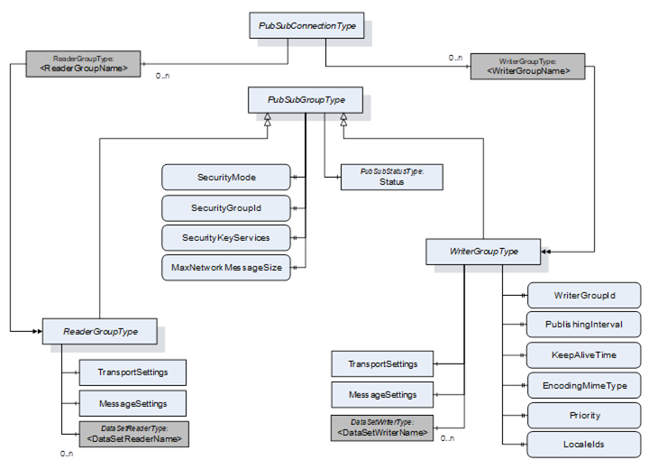  

Figure 48 - PubSubGroupType overview  

##### 9.1.6.2 PubSubGroupType  

This *ObjectType* is the abstract base type for *Objects* representing communication groupings ** for *PubSub* connections. The *PubSubGroupType* is formally defined in [Table 275](/§\_Ref422740251) .  

Table 275 - PubSubGroupType definition  

| **Attribute** | **Value** |
|---|---|
|BrowseName|PubSubGroupType|
|IsAbstract|True|
  
| **References** | **Node Class** | **BrowseName** | **DataType** | **TypeDefinition** | **Modelling Rule** |
|---|---|---|---|---|---|
|Subtype of BaseObjectType defined in [OPC 10000-5](/§UAPart5) .|
|HasProperty|Variable|SecurityMode|MessageSecurityMode|PropertyType|Mandatory|
|HasProperty|Variable|SecurityGroupId|String|PropertyType|Optional|
|HasProperty|Variable|SecurityKeyServices|EndpointDescription[]|PropertyType|Optional|
|HasProperty|Variable|MaxNetworkMessageSize|UInt32|PropertyType|Mandatory|
|HasProperty|Variable|GroupProperties|KeyValuePair[]|PropertyType|Mandatory|
|HasComponent|Object|Status||PubSubStatusType|Mandatory|
|Conformance Units|
|PubSub Model Base|
  

  

The *SecurityMode* is defined in [6.2.5.2](/§\_Ref494359882) .  

The *SecurityGroupId* is defined in [6.2.5.3](/§\_Ref452867788) . If the *SecurityMode* is not *NONE* , the *Property* shall provide the *SecurityGroupId* . The value of the *Property* is null or the *Property* is not present if the *SecurityMode* is *NONE* .  

The *SecurityKeyServices* parameter is defined in [6.2.5.4](/§\_Ref452867831) . If the *SecurityMode* is not *NONE* , the *Property* shall provide the list of *Security Key Services* for the *SecurityGroupId* .  

The *MaxNetworkMessageSize* is defined in [6.2.5.5](/§\_Ref94122835) .  

The *GroupProperties* is defined in [6.2.5.6](/§\_Ref505527856) .  

The *Status Object* provides the current operational status of the group. The *PubSubStatusType* is defined in [9.1.10](/§\_Ref422740226) . The state machine for the status and the relation to other *PubSub Objects* like *PubSubConnection* , *DataSetWriter* and *DataSetReader* are defined in [6.2.1](/§\_Ref496563089) .  

##### 9.1.6.3 WriterGroupType  

Instances of *WriterGroupType* contain settings for a group of *DataSetWriters* . The *WriterGroupType* is formally defined in [Table 276](/§\_Ref498641179) .  

Table 276 - WriterGroupType definition  

| **Attribute** | **Value** |
|---|---|
|BrowseName|WriterGroupType|
|IsAbstract|False|
  
| **References** | **Node Class** | **BrowseName** | **DataType** | **TypeDefinition** | **ModellingRule** |
|---|---|---|---|---|---|
|Subtype of PubSubGroupType defined in [9.1.6.2](/§\_Ref442782876)|
|HasProperty|Variable|WriterGroupId|UInt16|PropertyType|Mandatory|
|HasProperty|Variable|PublishingInterval|Duration|PropertyType|Mandatory|
|HasProperty|Variable|KeepAliveTime|Duration|PropertyType|Mandatory|
|HasProperty|Variable|Priority|Byte|PropertyType|Mandatory|
|HasProperty|Variable|LocaleIds|LocaleId[]|PropertyType|Mandatory|
|HasProperty|Variable|HeaderLayoutUri|String|PropertyType|Mandatory|
|HasComponent|Object|TransportSettings||WriterGroupTransportType|Optional|
|HasComponent|Object|MessageSettings||WriterGroupMessageType|Optional|
|HasDataSetWriter|Object|\<DataSetWriterName\>||DataSetWriterType|OptionalPlaceholder|
|HasComponent|Object|Diagnostics||PubSubDiagnostics WriterGroupType|Optional|
|HasComponent|Method|AddDataSetWriter|Deprecated *Method* described in [9.1.6.4](/§\_Ref422740175) .|Optional|
|HasComponent|Method|RemoveDataSetWriter|Deprecated *Method* described in [9.1.6.5](/§\_Ref498428487) .|Optional|
|Conformance Units|
|PubSub Model Base|
  

  

The *WriterGroupId* is defined in [6.2.6.1](/§\_Ref494283544) .  

The *PublishingInterval* is defined in [6.2.6.2](/§\_Ref496716573) .  

The *KeepAliveTime* is defined in [6.2.6.3](/§\_Ref494361922) .  

The *Priority* is defined in [6.2.6.4](/§\_Ref494361969) .  

The *LocaleIds* parameter is defined in [6.2.6.5](/§\_Ref494362003) .  

The *HeaderLayoutUri* is defined in [6.2.6.6](/§\_Ref525309687) .  

The transport protocol mapping specific setting settings are provided in the optional *Object* *TransportSettings* . The *WriterGroupTransportType* is defined in [9.1.6.7](/§\_Ref498429059) . The *Object* shall be present if the transport protocol mapping requires specific settings.  

The message mapping specific setting settings are provided in the optional *Object* *MessageSettings* . The *WriterGroupMessageType* is defined in [9.1.6.8](/§\_Ref498429048) . The *Object* shall be present if the message mapping defines specific parameters.  

The configured *DataSetWriterType* *Objects* are added as components to the instance of the group. *DataSetWriterType* *Objects* may be configured with product *\-* specific configuration tools or through OPC UA *Methods AddDataSetWriter* and *RemoveDataSetWriter* . The *DataSetWriterType* is defined in [9.1.7.1](/§\_Ref422778671) . The *ReferenceType* *HasDataSetWriter* is defined in [9.1.6.6](/§\_Ref450572477) .  

The *Diagnostics Object* provides the current diagnostic information for a *WriterGroupType* *Object* . The *PubSubDiagnosticsWriterGroupType* is defined in [9.1.11.9](/§\_Ref473575059) .  

##### 9.1.6.4 AddDataSetWriter Method (Deprecated)  

This deprecated *Method* is used to add a new *DataSetWriterType* *Object* to an instance of the *WriterGroup* . A successful creation of the *DataSetWriter* shall also create a *Reference* from the related *PublishedDataSet* *Object* to the created *DataSetWriter* .  

The *Client* should be authorized to modify the configuration for the *PubSub* functionality when invoking this *Method* on the *Server* .  

 **Signature**   

 **AddDataSetWriter**   

[in] DataSetWriterDataType Configuration,  

[out] NodeId   DataSetWriterNodeId  

);  

  

| **Argument** | **Description** |
|---|---|
|Configuration|Configuration parameters for the *DataSetWriter* . The parameters and the *DataSetWriterDataType* are defined in [6.2.3.10.5](/§\_Ref494371923) .|
|DataSetWriterNodeId|The *NodeId* of the new DataSetWriter Object.|
  

  

 **Method Result Codes**   

| **ResultCode** | **Description** |
|---|---|
|Bad\_InvalidArgument|The *Server* is not able to apply the name. The name may be too long or may contain invalid characters.|
|Bad\_DataSetIdInvalid|The *DataSet* specified for the *DataSetWriter* creation is invalid.|
|Bad\_BrowseNameDuplicated|An *Object* with the name already exists in the group.|
|Bad\_ResourceUnavailable|The *Server* has not enough resources to add the *DataSetWriter* .|
|Bad\_UserAccessDenied|The *Session* user does not have rights to create the *DataSetWriter* .|
  

  

[Table 277](/§\_Ref115410919) specifies the *AddressSpace* representation for the *AddDataSetWriter Method* .  

Table 277 - AddDataSetWriter Method AddressSpace definition  

| **Attribute** | **Value** |
|---|---|
|BrowseName|AddDataSetWriter|
  
| **References** | **NodeClass** | **BrowseName** | **DataType** | **TypeDefinition** | **ModellingRule** |
|---|---|---|---|---|---|
|HasProperty|Variable|InputArguments|Argument[]|PropertyType|Mandatory|
|HasProperty|Variable|OutputArguments|Argument[]|PropertyType|Mandatory|
  
| **ConformanceUnits** |
|---|
|PubSub Model Base|
  

  

##### 9.1.6.5 RemoveDataSetWriter Method (Deprecated)  

This deprecated *Method* is used to remove a *DataSetWriter Object* from the group. The state of the *DataSetWriter* is set to *Disabled* before removing the *Object* . A successful removal of the *DataSetWriter* shall also delete the *Reference* from the related *PublishedDataSetType* *Object* to the removed *DataSetWriter* .  

The *Client* should be authorized to modify the configuration for the *PubSub* functionality when invoking this *Method* on the *Server* .  

 **Signature**   

 **RemoveDataSetWriter**   

[in] NodeId DataSetWriterNodeId  

);  

  

| **Argument** | **Description** |
|---|---|
|DataSetWriterNodeId|*NodeId* of the DataSetWriter to remove from the group.|
  

 **Method Result Codes**   

| **ResultCode** | **Description** |
|---|---|
|Bad\_NodeIdUnknown|The *DataSetWriterNodeId* is unknown.|
|Bad\_NodeIdInvalid|The *DataSetWriterNodeId* is not a *NodeId* of a *DataSetWriter* .|
|Bad\_UserAccessDenied|The *Session* user is not allowed to delete a *DataSetWriter* .|
  

  

[Table 278](/§\_Ref115411180) specifies the *AddressSpace* representation for the *RemoveDataSetWriter Method* .  

Table 278 - RemoveDataSetWriter Method AddressSpace definition  

| **Attribute** | **Value** |
|---|---|
|BrowseName|RemoveDataSetWriter|
  
| **References** | **NodeClass** | **BrowseName** | **DataType** | **TypeDefinition** | **ModellingRule** |
|---|---|---|---|---|---|
|HasProperty|Variable|InputArguments|Argument[]|PropertyType|Mandatory|
  
| **ConformanceUnits** |
|---|
|PubSub Model Base|
  

  

##### 9.1.6.6 HasDataSetWriter  

The *HasDataSetWriter* *ReferenceType* is a concrete *ReferenceType* that can be used directly. It is a subtype of the *HasComponent* *ReferenceType* .  

The *SourceNode* of *References* of this type shall be an instance of the *WriterGroupType* defined in [9.1.6.3](/§\_Ref469220446) .  

The *TargetNode* of this *ReferenceType* shall be an instance of the *DataSetWriterType* defined in [9.1.7.1](/§\_Ref422778671) .  

*Servers* shall provide the inverse *Reference* that relates a *DataSetWriter Object* back to a *WriterGroupType* Object.  

The representation of the *HasDataSetWriter ReferenceType* in the *AddressSpace* is specified in [Table 279](/§\_Ref431843348) .  

Table 279 - HasDataSetWriter ReferenceType  

| **Attributes** | **Value** |
|---|---|
|BrowseName|HasDataSetWriter|
|InverseName|IsWriterInGroup|
|Symmetric|False|
|IsAbstract|False|
  
| **References** | **NodeClass** | **BrowseName** | **Comment** |
|---|---|---|---|
|Subtype of HasComponent defined in [OPC 10000-5](/§UAPart5) .|
|Conformance Units|
|PubSub Model Base|
  

  

##### 9.1.6.7 WriterGroupTransportType  

This *ObjectType* is the abstract base type for *Objects* representing transport protocol mapping specific settings ** for *WriterGroups* . The *WriterGroupTransportType* is formally defined in [Table 280](/§\_Ref498641180) .  

Table 280 - WriterGroupTransportType definition  

| **Attribute** | **Value** |
|---|---|
|BrowseName|WriterGroupTransportType|
|IsAbstract|True|
  
| **References** | **NodeClass** | **BrowseName** | **DataType** | **TypeDefinition** | **ModellingRule** |
|---|---|---|---|---|---|
|Subtype of BaseObjectType|
|Conformance Units|
|PubSub Model Base|
  

  

##### 9.1.6.8 WriterGroupMessageType  

This *ObjectType* is the abstract base type for *Objects* representing message mapping specific settings ** for *WriterGroups* . The *WriterGroupMessageType* is formally defined in [Table 281](/§\_Ref498641181) .  

Table 281 - WriterGroupMessageType definition  

| **Attribute** | **Value** |
|---|---|
|BrowseName|WriterGroupMessageType|
|IsAbstract|True|
  
| **References** | **NodeClass** | **BrowseName** | **DataType** | **TypeDefinition** | **ModellingRule** |
|---|---|---|---|---|---|
|Subtype of BaseObjectType|
|Conformance Units|
|PubSub Model Base|
  

  

##### 9.1.6.9 ReaderGroupType  

This *ObjectType* is a concrete type for *Objects* representing *DataSetReader* groupings ** for *PubSub* connections. The *ReaderGroupType* is formally defined in [Table 282](/§\_Ref15585088) .  

Table 282 - ReaderGroupType definition  

| **Attribute** | **Value** |
|---|---|
|BrowseName|ReaderGroupType|
|IsAbstract|False|
  
| **References** | **Node Class** | **BrowseName** | **Data Type** | **TypeDefinition** | **ModellingRule** |
|---|---|---|---|---|---|
|Subtype of PubSubGroupType defined in [9.1.6.2](/§\_Ref442782876)|
|HasDataSetReader|Object|\<DataSetReaderName\>||DataSetReaderType|OptionalPlaceholder|
|HasComponent|Object|Diagnostics||PubSubDiagnostics ReaderGroupType|Optional|
|HasComponent|Object|TransportSettings||ReaderGroupTransportType|Optional|
|HasComponent|Object|MessageSettings||ReaderGroupMessageType|Optional|
|HasComponent|Method|AddDataSetReader|Deprecated *Method* described in [9.1.6.10](/§\_Ref425685692) .|Optional|
|HasComponent|Method|RemoveDataSetReader|Deprecated *Method* described in [9.1.6.11](/§\_Ref498428590) .|Optional|
|Conformance Units|
|PubSub Model Base|
  

  

The configured *DataSetReaderType* *Objects* are added as components to the instance of the group. *DataSetReaderType* *Objects* may be configured with product *\-* specific configuration tools or through OPC UA *Methods AddDataSetReader* and *RemoveDataSetReader* . The *DataSetReaderType* is defined in [9.1.8.1](/§\_Ref425686640) . The *ReferenceType* *HasDataSetReader* is defined in [9.1.6.12](/§\_Ref431843450) .  

The *Diagnostics Object* provides the current diagnostic information for a *ReaderGroupType* *Object* . The *PubSubDiagnosticsReaderGroupType* is defined in [9.1.11.10](/§\_Ref473575085) .  

The transport protocol mapping specific setting settings are provided in the optional *Object* *TransportSettings* . The *ReaderGroupTransportType* is defined in [9.1.6.13](/§\_Ref498429104) . The *Object* shall be present if the transport protocol mapping defines specific parameters.  

The message mapping specific setting settings are provided in the optional *Object* *MessageSettings* . The *ReaderGroupMessageType* is defined in [9.1.6.14](/§\_Ref498429110) . The *Object* shall be present if the message mapping defines specific parameters.  

##### 9.1.6.10 AddDataSetReader Method (Deprecated)  

This deprecated *Method* is used to add a new *DataSetReaderType* *Object* to an instance of the *ReaderGroup* .  

The *Client* should be authorized to modify the configuration for the *PubSub* functionality when invoking this *Method* on the *Server* .  

 **Signature**   

 **AddDataSetReader**   

[in] DataSetReaderDataType Configuration,  

[out] NodeId   DataSetReaderNodeId  

);  

  

| **Argument** | **Description** |
|---|---|
|Configuration|Configuration parameters for the *DataSetWriter* . The parameters and the *DataSetReaderDataType* are defined in [6.2.9](/§\_Ref498429660) .|
|DataSetReaderNodeId|The *NodeId* of the new *DataSetReader* Object.|
  

  

 **Method Result Codes**   

| **ResultCode** | **Description** |
|---|---|
|Bad\_InvalidArgument|The *Server* is not able to apply the name. The name may be too long or may contain invalid characters.|
|Bad\_BrowseNameDuplicated|An *Object* with the name already exists in the group.|
|Bad\_ResourceUnavailable|The *Server* does not have enough resources to add the *DataSetReader* .|
|Bad\_UserAccessDenied|The *Session* user does not have rights to create the *DataSetReader* .|
  

  

[Table 283](/§\_Ref115411278) specifies the *AddressSpace* representation for the *AddDataSetReader Method* .  

Table 283 - AddDataSetReader Method AddressSpace definition  

| **Attribute** | **Value** |
|---|---|
|BrowseName|AddDataSetReader|
  
| **References** | **NodeClass** | **BrowseName** | **DataType** | **TypeDefinition** | **ModellingRule** |
|---|---|---|---|---|---|
|HasProperty|Variable|InputArguments|Argument[]|PropertyType|Mandatory|
|HasProperty|Variable|OutputArguments|Argument[]|PropertyType|Mandatory|
  
| **ConformanceUnits** |
|---|
|PubSub Model Base|
  

  

##### 9.1.6.11 RemoveDataSetReader Method (Deprecated)  

This deprecated *Method* is used to remove a *DataSetReader Object* from the group. The state of the *DataSetReader* is set to *Disabled* before the *Object* is removed.  

The *Client* should be authorized to modify the configuration for the *PubSub* functionality when invoking this *Method* on the *Server* .  

 **Signature**   

 **RemoveDataSetReader**   

[in] NodeId DataSetReaderNodeId  

);  

  

| **Argument** | **Description** |
|---|---|
|DataSetReaderNodeId|*NodeId* of the *DataSetReader* to remove from the group.|
  

 **Method Result Codes**   

| **ResultCode** | **Description** |
|---|---|
|Bad\_NodeIdUnknown|The *DataSetReaderNodeId* is unknown.|
|Bad\_NodeIdInvalid|The *DataSetReaderNodeId* is not a NodeId of a *DataSetReader* .|
|Bad\_UserAccessDenied|The *Session* user does not have rights to delete the *DataSetReader* .|
  

  

[Table 284](/§\_Ref115412630) specifies the *AddressSpace* representation for the *RemoveDataSetReader Method* .  

Table 284 - RemoveDataSetReader Method AddressSpace definition  

| **Attribute** | **Value** |
|---|---|
|BrowseName|RemoveDataSetReader|
  
| **References** | **NodeClass** | **BrowseName** | **DataType** | **TypeDefinition** | **ModellingRule** |
|---|---|---|---|---|---|
|HasProperty|Variable|InputArguments|Argument[]|PropertyType|Mandatory|
  
| **ConformanceUnits** |
|---|
|PubSub Model Base|
  

  

##### 9.1.6.12 HasDataSetReader  

The *HasDataSetReader* *ReferenceType* is a concrete *ReferenceType* that can be used directly. It is a subtype of the *HasComponent* *ReferenceType* .  

The *SourceNode* of *References* of this type shall be an instance of the *ReaderGroupType* defined in [9.1.6.6](/§\_Ref469220469) .  

The *TargetNode* of this *ReferenceType* shall be an instance of the *DataSetReaderType* defined in [9.1.8.1](/§\_Ref425686640) .  

*Servers* shall provide the inverse *Reference* that relates a *DataSetReader Object* back to a *ReaderGroupType* Object.  

The representation of the *HasDataSetReader* *ReferenceType* in the *AddressSpace* is specified in [Table 285](/§\_Ref431843340) .  

Table 285 - HasDataSetReader ReferenceType  

| **Attributes** | **Value** |
|---|---|
|BrowseName|HasDataSetReader|
|InverseName|IsReaderInGroup|
|Symmetric|False|
|IsAbstract|False|
  
| **References** | **NodeClass** | **BrowseName** | **Comment** |
|---|---|---|---|
|Subtype of HasComponent defined in [OPC 10000-5](/§UAPart5) .|
|Conformance Units|
|PubSub Model Base|
  

  

##### 9.1.6.13 ReaderGroupTransportType  

This *ObjectType* is the abstract base type for *Objects* representing transport protocol mapping specific settings ** for *ReaderGroups* . The *ReaderGroupTransportType* is formally defined in [Table 286](/§\_Ref498641182) .  

There is currently no transport protocol mapping specific setting defined.  

Table 286 - ReaderGroupTransportType definition  

| **Attribute** | **Value** |
|---|---|
|BrowseName|ReaderGroupTransportType|
|IsAbstract|True|
  
| **References** | **NodeClass** | **BrowseName** | **DataType** | **TypeDefinition** | **ModellingRule** |
|---|---|---|---|---|---|
|Subtype of BaseObjectType|
|Conformance Units|
|PubSub Model Base|
  

  

##### 9.1.6.14 ReaderGroupMessageType  

This *ObjectType* is the abstract base type for *Objects* representing message mapping specific settings ** for *ReaderGroups* . The *ReaderGroupMessageType* is formally defined in [Table 287](/§\_Ref498641183) .  

There is currently no message mapping specific setting defined.  

Table 287 - ReaderGroupMessageType definition  

| **Attribute** | **Value** |
|---|---|
|BrowseName|ReaderGroupMessageType|
|IsAbstract|True|
  
| **References** | **NodeClass** | **BrowseName** | **DataType** | **TypeDefinition** | **ModellingRule** |
|---|---|---|---|---|---|
|Subtype of BaseObjectType|
|Conformance Units|
|PubSub Model Base|
  

  

#### 9.1.7 DataSetWriter model  

##### 9.1.7.1 Overview  

[Figure 49](/§\_Ref455147916) depicts the *ObjectType* for the *PubSub* *DataSetWriter* model and its components and the relations to other parts of the model.  

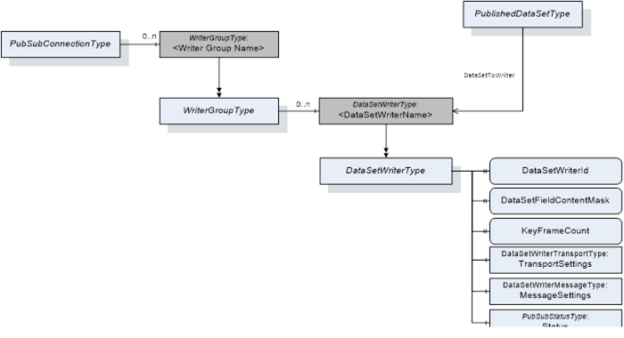  

Figure 49 - DataSet Writer model overview  

##### 9.1.7.2 DataSetWriterType  

An instance of this *ObjectType* represents the configuration for a *DataSetWriter* . The *DataSetWriterType* is formally defined [Table 288](/§\_Ref422746810) .  

A *DataSetWriter* that creates *DataSetMessages* based on a *PublishedDataSet* shall reference the related *PublishedDataSet* with an inverse *DataSetToWriter Reference* .  

A *DataSetWriter* that creates heartbeat *DataSetMessages* shall not have a reference to a *PublishedDataSet* .  

Table 288 - DataSetWriterType definition  

| **Attribute** | **Value** |
|---|---|
|BrowseName|DataSetWriterType|
|IsAbstract|False|
  
| **References** | **NodeClass** | **BrowseName** | **DataType** | **TypeDefinition** | **Modelling Rule** |
|---|---|---|---|---|---|
|Subtype of BaseObjectType defined in [OPC 10000-5](/§UAPart5)|
|HasProperty|Variable|DataSetWriterId|UInt16|PropertyType|Mandatory|
|HasProperty|Variable|DataSetField ContentMask|DataSetField ContentMask|PropertyType|Mandatory|
|HasProperty|Variable|KeyFrameCount|UInt32|PropertyType|Optional|
|HasProperty|Variable|DataSetWriterProperties|KeyValuePair[]|PropertyType|Mandatory|
|HasComponent|Object|TransportSettings||DataSetWriterTransportType|Optional|
|HasComponent|Object|MessageSettings||DataSetWriterMessageType|Optional|
|HasComponent|Object|Status||PubSubStatusType|Mandatory|
|HasComponent|Object|Diagnostics||PubSubDiagnostics DataSetWriterType|Optional|
|Conformance Units|
|PubSub Model Base|
  

  

The *DataSetWriterId* is defined in [6.2.4.1](/§\_Ref494235089) .  

The *DataSetFieldContentMask* is defined in [6.2.4.2](/§\_Ref495515956) .  

The *KeyFrameCount* is defined in [6.2.4.3](/§\_Ref494234143) . The *Property* shall be present for *PublishedDataSets* that provide cyclic updates of the *DataSet* .  

The *DataSetWriterProperties* is defined in [6.2.4.4](/§\_Ref505528463) .  

The transport protocol mapping specific setting settings are provided in the optional *Object* *TransportSettings* . The *DataSetWriterTransportType* is defined in [9.1.7.3](/§\_Ref425686992) . The *Object* shall be present if the transport protocol mapping defines specific parameters.  

The message mapping specific setting settings are provided in the optional *Object* *MessageSettings* . The *DataSetWriterMessageType* is defined in [9.1.7.4](/§\_Ref498430949) . The *Object* shall be present if the message mapping defines specific parameters.  

The *Status Object* provides the current operational status of the *DataSetWriter* . The *PubSubStatusType* is defined in [9.1.10](/§\_Ref422740226) . The state machine for the status and the relation to other *PubSub Objects* like *PubSubConnection* and *PubSubGroup* is defined in [6.2.1](/§\_Ref496563089) .  

The *Diagnostics Object* provides the current diagnostic information for a *DataSetWriterType* *Object* . The *PubSubDiagnosticsDataSetWriterType* is defined in [9.1.11.11](/§\_Ref473575230) .  

##### 9.1.7.3 DataSetWriterTransportType  

This *ObjectType* is the abstract base type for *Objects* defining protocol-specific transport settings of *DataSetMessages* . The *DataSetWriterTransportType* is formally defined [Table 289](/§\_Ref455006767) .  

Table 289 - DataSetWriterTransportType definition  

| **Attribute** | **Value** |
|---|---|
|BrowseName|DataSetWriterTransportType|
|IsAbstract|True|
  
| **References** | **NodeClass** | **BrowseName** | **DataType** | **TypeDefinition** | **ModellingRule** |
|---|---|---|---|---|---|
|Subtype of BaseObjectType defined in [OPC 10000-5](/§UAPart5)|
|Conformance Units|
|PubSub Model Base|
  

  

##### 9.1.7.4 DataSetWriterMessageType  

This *ObjectType* is the abstract base type for *Objects* representing message mapping specific settings ** for *DataSetWriters* . The *DataSetWriterMessageType* is formally defined in [Table 290](/§\_Ref498641184) .  

Table 290 - DataSetWriterMessageType definition  

| **Attribute** | **Value** |
|---|---|
|BrowseName|DataSetWriterMessageType|
|IsAbstract|True|
  
| **References** | **NodeClass** | **BrowseName** | **DataType** | **TypeDefinition** | **ModellingRule** |
|---|---|---|---|---|---|
|Subtype of BaseObjectType defined in [OPC 10000-5](/§UAPart5)|
|Conformance Units|
|PubSub Model Base|
  

  

#### 9.1.8 DataSetReader model  

##### 9.1.8.1 Overview  

[Figure 50](/§\_Ref455148903) depicts the *ObjectType* for the *PubSub* *DataSetReader* model and its components and the relations to other parts of the model.  

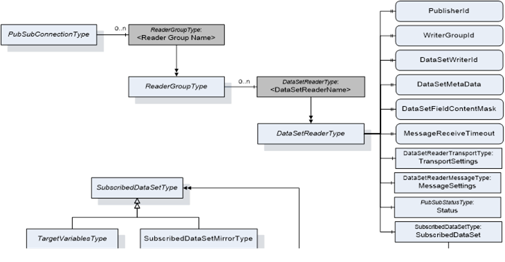  

Figure 50 - DataSet Reader model overview  

##### 9.1.8.2 DataSetReaderType  

This *ObjectType* defines receiving behaviour of *DataSetMessages* and the decoding to *DataSets* . The *DataSetReaderType* is formally defined in [Table 291](/§\_Ref28420144) .  

The *SubscribedDataSetType* defined in [9.1.9.1](/§\_Ref449563792) describes the processing of the received *DataSet* in a *Subscriber* .  

Table 291 - DataSetReaderType definition  

| **Attribute** | **Value** |
|---|---|
|BrowseName|DataSetReaderType|
|IsAbstract|False|
  
| **References** | **Node Class** | **BrowseName** | **DataType** | **TypeDefinition** | **Modelling Rule** |
|---|---|---|---|---|---|
|Subtype of BaseObjectType defined in [OPC 10000-5](/§UAPart5)|
|HasProperty|Variable|PublisherId|BaseDataType|PropertyType|Mandatory|
|HasProperty|Variable|WriterGroupId|UInt16|PropertyType|Mandatory|
|HasProperty|Variable|DataSetWriterId|UInt16|PropertyType|Mandatory|
|HasProperty|Variable|DataSetMetaData|DataSetMetaDataType|PropertyType|Mandatory|
|HasProperty|Variable|DataSetFieldContentMask|DataSetFieldContentMask|PropertyType|Mandatory|
|HasProperty|Variable|MessageReceiveTimeout|Duration|PropertyType|Mandatory|
|HasProperty|Variable|KeyFrameCount|UInt32|PropertyType|Mandatory|
|HasProperty|Variable|HeaderLayoutUri|String|PropertyType|Mandatory|
|HasProperty|Variable|SecurityMode|MessageSecurityMode|PropertyType|Optional|
|HasProperty|Variable|SecurityGroupId|String|PropertyType|Optional|
|HasProperty|Variable|SecurityKeyServices|EndpointDescription[]|PropertyType|Optional|
|HasProperty|Variable|DataSetReaderProperties|KeyValuePair[]|PropertyType|Mandatory|
|HasComponent|Object|TransportSettings||DataSetReader TransportType|Optional|
|HasComponent|Object|MessageSettings||DataSetReader MessageType|Optional|
|HasComponent|Object|Status||PubSubStatusType|Mandatory|
|HasComponent|Object|Diagnostics||PubSubDiagnostics DataSetReaderType|Optional|
|HasComponent|Object|SubscribedDataSet||Subscribed DataSetType|Mandatory|
|HasComponent|Method|CreateTargetVariables|Defined in [9.1.8.5](/§\_Ref462752301) .|Optional|
|HasComponent|Method|CreateDataSetMirror|Defined in [9.1.8.6](/§\_Ref462752308) .|Optional|
|Conformance Units|
|PubSub Model Base|
  

  

The *Properties* *PublisherId, WriterGroupId, DataSetWriterId* and *DataSetClassId* define filters for received *NetworkMessages* . If the value of the *Property* is set, it is used as filter and all messages that do not match the filter are dropped.  

The *PublisherId* is defined in [6.2.9.1](/§\_Ref495511752) .  

The *WriterGroupId* is defined in [6.2.9.2](/§\_Ref495511824) .  

The *DataSetWriterId* is defined in [6.2.9.3](/§\_Ref495513431) .  

The *DataSetMetaData* is defined in [6.2.9.4](/§\_Ref498525980) . If the *DataSetReader* receives an updated *DataSetMetaData* , the *DataSetReader* shall update the *Property* *DataSetMetaData* .  

The *DataSetFieldContentMask* is defined in [6.2.9.5](/§\_Ref495513459) .  

The *MessageReceiveTimeout* is defined in [6.2.9.6](/§\_Ref495516261) .  

The *KeyFrameCount* is defined in [6.2.9.7](/§\_Ref525312042) .  

The *HeaderLayoutUri* is defined in [6.2.9.8](/§\_Ref525654226) .  

The *SecurityMode* is defined in [6.2.9.9](/§\_Ref495509058) . If present or if the value is not *INVALID* , it overwrites the settings on the group.  

The *SecurityGroupId* is defined in [6.2.9.10](/§\_Ref495509121) .  

The *SecurityKeyServices* is defined in [6.2.9.11](/§\_Ref495509173) .  

The *DataSetReaderProperties* is defined in [6.2.9.12](/§\_Ref505528647) .  

The transport protocol mapping specific setting settings are provided in the optional *Object* *TransportSettings* . The *DataSetReaderTransportType* is defined in [9.1.8.3](/§\_Ref443702750) . The *Object* shall be present if the transport protocol mapping defines specific parameters.  

The message mapping specific setting settings are provided in the optional *Object* *MessageSettings* . The *DataSetReaderMessageType* is defined in [9.1.8.4](/§\_Ref498431247) . The *Object* shall be present if the message mapping defines specific parameters.  

The *Status Object* provides the current operational state of the *DataSetReader* . The *PubSubStatusType* is defined in [9.1.10](/§\_Ref422740226) . The state machine for the status and the relation to other *PubSub Objects* like *PubSubConnection* and *PubSubGroup* are defined in [6.2.1](/§\_Ref496563089) .  

The *Diagnostics Object* provides the current diagnostic information for a *DataSetReaderType* *Object* . The *PubSubDiagnosticsDataSetReaderType* is defined in [9.1.11.12](/§\_Ref473575286) .  

The *SubscribedDataSet* *Object* contains the metadata for the subscribed *DataSet* and the information for the processing of a *DataSetMessage* . The *SubscribedDataSetType* and the available subtypes are defined in [9.1.9](/§\_Ref38366409) . If the *DataSetReader* is configured to receive heartbeat *DataSetMessages* , the *Object* shall be of the base type *SubscribedDataSetType* .  

##### 9.1.8.3 DataSetReaderTransportType  

This *ObjectType* is the abstract base type for *Objects* defining the transport protocol-specific parameters for *DataSetReaders* . The *DataSetReaderTransportType* is formally defined in [Table 292](/§\_Ref426317797) .  

Table 292 - DataSetReaderTransportType definition  

| **Attribute** | **Value** |
|---|---|
|BrowseName|DataSetReaderTransportType|
|IsAbstract|True|
  
| **References** | **NodeClass** | **BrowseName** | **DataType** | **TypeDefinition** | **ModellingRule** |
|---|---|---|---|---|---|
|Subtype of BaseObjectType defined in [OPC 10000-5](/§UAPart5)|
|Conformance Units|
|PubSub Model Base|
  

  

##### 9.1.8.4 DataSetReaderMessageType  

This *ObjectType* is the abstract base type for *Objects* representing message mapping specific settings ** for *DataSetReaders* . The *DataSetReaderMessageType* is formally defined in [Table 293](/§\_Ref498641185) .  

Table 293 - DataSetReaderMessageType definition  

| **Attribute** | **Value** |
|---|---|
|BrowseName|DataSetReaderMessageType|
|IsAbstract|True|
  
| **References** | **NodeClass** | **BrowseName** | **DataType** | **TypeDefinition** | **ModellingRule** |
|---|---|---|---|---|---|
|Subtype of BaseObjectType defined in [OPC 10000-5](/§UAPart5)|
|Conformance Units|
|PubSub Model Base|
  

  

##### 9.1.8.5 CreateTargetVariables Method  

This *Method* is used to initially set the *SubscribedDataSet* to *TargetVariablesType* and to create the list of target *Variables* of a *SubscribedDataSetType* .  

The *Client* shall be authorized to modify the configuration for the *PubSub* functionality when invoking this *Method* on the *Server* .  

 **Signature**   

 **CreateTargetVariables**   

[in] ConfigurationVersionDataType  ConfigurationVersion,  

[in] FieldTargetDataType[]   TargetVariablesToAdd,  

[out] StatusCode[]    AddResults  

);  

  

| **Argument** | **Description** |
|---|---|
|ConfigurationVersion|Configuration version of the *DataSet* . The configuration version passed through *CreateTargetVariables* shall match the current configuration version in *DataSetMetaData Property* . If it does not match, the result Bad\_InvalidState shall be returned. The *ConfigurationVersionDataType* is defined in [6.2.3.2.6](/§\_Ref425674914) .|
|TargetVariablesToAdd|The list of target *Variables* to write received *DataSet* fields to. The *FieldTargetDataType* is defined in [6.2.10.2.3](/§\_Ref488607777) . The succeeded targets are added to the *TargetVariables Property* .|
|AddResults|The result codes for the *Variables* to connect.|
  

  

 **Method Result Codes**   

| **ResultCode** | **Description** |
|---|---|
|Bad\_NothingToDo|An empty list of *Variables* was provided.|
|Bad\_InvalidState|The *DataSetReader* is not configured yet or the *ConfigurationVersion* does not match the version in the *Publisher* .|
|Bad\_UserAccessDenied|The *Session* user is not allowed to configure the *Object* .|
  

  

 **Operation Result Codes**   

| **ResultCode** | **Description** |
|---|---|
|Bad\_NodeIdInvalid|See [OPC 10000-4](/§UAPart4) for the description of this result code. This status code is related to the *TargetNodeId* .|
|Bad\_NodeIdUnknown|See [OPC 10000-4](/§UAPart4) for the description of this result code. This status code is related to the *TargetNodeId* .|
|Bad\_AttributeIdInvalid|See [OPC 10000-4](/§UAPart4) for the description of this result code. This status code is related to the *AttributeId* .|
|Bad\_NoMatch|This status code indicates that the *DataSetFieldId* is invalid.|
|Bad\_IndexRangeInvalid|See [OPC 10000-4](/§UAPart4) for the description of this result code. This status code indicates either an invalid *ReceiverIndexRange* or an invalid *WriterIndexRange* or if the two settings result in a different size.|
|Bad\_IndexRangeNoData|See [OPC 10000-4](/§UAPart4) for the description of this result code. If the *ArrayDimensions* have a fixed length that cannot change and no data exists within the range of indexes specified, Bad\_IndexRangeNoData is returned in *AddDataConnections* .|
|Bad\_TooManyMonitoredItems|The *Server* has reached its maximum number of items for the *DataSetReader* object.|
|Bad\_InvalidState|The TargetNodeId is already used by another connection.|
|Bad\_TypeMismatch|The *Server* shall return a Bad\_TypeMismatch error if the data type of the *DataSet* field is not the same type or subtype as the target *Variable DataType* . Based on the *DataType* hierarchy, subtypes of the *Variable DataType* shall be accepted by the *Server* . A *ByteString* is structurally the same as a one dimensional array of *Byte* . A *Server* shall accept a *ByteString* if an array of *Byte* is expected.|
  

  

[Table 294](/§\_Ref115412703) specifies the *AddressSpace* representation for the *CreateTargetVariables Method* .  

Table 294 - CreateTargetVariables Method AddressSpace definition  

| **Attribute** | **Value** |
|---|---|
|BrowseName|CreateTargetVariables|
  
| **References** | **NodeClass** | **BrowseName** | **DataType** | **TypeDefinition** | **ModellingRule** |
|---|---|---|---|---|---|
|HasProperty|Variable|InputArguments|Argument[]|PropertyType|Mandatory|
|HasProperty|Variable|OutputArguments|Argument[]|PropertyType|Mandatory|
  
| **ConformanceUnits** |
|---|
|PubSub Model SubscribedDataSet|
  

  

##### 9.1.8.6 CreateDataSetMirror Method  

This *Method* is used to set the *SubscribedDataSet* to *SubscribedDataSetMirrorType* used to represents the fields of the *DataSet* as *Variables* in the *Subscriber Address Space* . This *Method* creates an *Object* below the *SubscribedDataSet* and below this *Object* it creates a *Variable* *Node* for every field in the *DataSetMetaData* . The detailed rules for the Object creation are defined in [9.1.9.3](/§\_Ref58356254) .  

If the *SubscribedDataSet* already has a specific subtype, this subtype is replaced with a *SubscribedDataSetMirrorType* instance.  

The *Client* shall be authorized to modify the configuration for the *PubSub* functionality when invoking this *Method* on the *Server* .  

 **Signature**   

 **CreateDataSetMirror**   

[in] String   ParentNodeName,  

[in] RolePermissionType[] RolePermissions,  

[out] NodeId   ParentNodeId  

);  

  

| **Argument** | **Description** |
|---|---|
|ParentNodeName|This parameter defines the BrowseName and DisplayName of the parent *Node* for the *Variables* representing the fields of the subscribed *DataSet* .|
|RolePermissions|Value of the *RolePermissions* Attribute to be set on the parent Node. This value is also used as *RolePermissions* for all *Variables* of the *DataSet* mirror.|
|ParentNodeId|*NodeId* of the created parent *Node* .|
  

  

 **Method Result Codes**   

| **ResultCode** | **Description** |
|---|---|
|Bad\_InvalidState|The *DataSetReader* is not configured yet or the *ConfigurationVersion* does not match the version in the *Publisher* .|
|Bad\_UserAccessDenied|The *Session* user is not allowed to configure the *Object* .|
  

  

[Table 295](/§\_Ref115412805) specifies the *AddressSpace* representation for the *CreateDataSetMirror Method* .  

Table 295 - CreateDataSetMirror Method AddressSpace definition  

| **Attribute** | **Value** |
|---|---|
|BrowseName|CreateDataSetMirror|
  
| **References** | **NodeClass** | **BrowseName** | **DataType** | **TypeDefinition** | **ModellingRule** |
|---|---|---|---|---|---|
|HasProperty|Variable|InputArguments|Argument[]|PropertyType|Mandatory|
|HasProperty|Variable|OutputArguments|Argument[]|PropertyType|Mandatory|
  
| **ConformanceUnits** |
|---|
|PubSub Model SubscribedDataSet Mirror|
  

  

#### 9.1.9 Subscribed DataSet model  

##### 9.1.9.1 SubscribedDataSetType  

This *ObjectType* defines the metadata for the subscribed *DataSet* and the information for the processing of *DataSetMessages* . See [5.4.2.2](/§\_Ref459365438) for an introduction to the processing options for received *DataSetMessages* .  

The *SubscribedDataSetType* is formally defined in [Table 296](/§\_Ref443702470) .  

Table 296 - SubscribedDataSetType definition  

| **Attribute** | **Value** |
|---|---|
|BrowseName|SubscribedDataSetType|
|IsAbstract|False|
  
| **References** | **NodeClass** | **BrowseName** | **DataType** | **TypeDefinition** | **ModellingRule** |
|---|---|---|---|---|---|
|Subtype of BaseObjectType defined in [OPC 10000-5](/§UAPart5)|
|Conformance Units|
|PubSub Model Base|
  

  

##### 9.1.9.2 Target Variables  

###### 9.1.9.2.1 TargetVariablesType  

This *ObjectType* defines the metadata for the subscribed *DataSet* and the information for the processing of *DataSetMessages* . The *TargetVariablesType* is formally defined in [Table 297](/§\_Ref501487804) .  

Table 297 - TargetVariablesType definition  

| **Attribute** | **Value** |
|---|---|
|BrowseName|TargetVariablesType|
|IsAbstract|False|
  
| **References** | **NodeClass** | **BrowseName** | **DataType** | **TypeDefinition** | **ModellingRule** |
|---|---|---|---|---|---|
|Subtype of SubscribedDataSetType defined in [9.1.9.1](/§\_Ref449563792) .|
|HasProperty|Variable|TargetVariables|FieldTarget DataType[]|PropertyType|Mandatory|
|HasComponent|Method|AddTargetVariables|Defined in [9.1.9.2.2](/§\_Ref415521801) .|Optional|
|HasComponent|Method|RemoveTargetVariables|Defined in [9.1.9.2.3](/§\_Ref415521809) .|Optional|
|Conformance Units|
|PubSub Model SubscribedDataSet|
  

  

The *TargetVariables* is defined in [6.2.10.2](/§\_Ref498929836) .  

###### 9.1.9.2.2 AddTargetVariables Method  

This *Method* is used to add target *Variables* to an existing list of target *Variables* of a *TargetVariablesType Object* .  

The *Client* shall be authorized to modify the configuration for the *PubSub* functionality when invoking this *Method* on the *Server* .  

 **Signature**   

 **AddTargetVariables**   

[in] ConfigurationVersionDataType  ConfigurationVersion,  

[in] FieldTargetDataType[]   TargetVariablesToAdd,  

[out] StatusCode[]    AddResults  

);  

  

| **Argument** | **Description** |
|---|---|
|ConfigurationVersion|Configuration version of the *DataSet* . The configuration version passed through *AddDataConnections* shall match the current configuration version in *DataSetMetaData Property* . If it does not match, the result Bad\_InvalidState shall be returned. The *ConfigurationVersionDataType* is defined in [6.2.3.2.6](/§\_Ref425674914) .|
|TargetVariablesToAdd|The list of target *Variables* to write received *DataSet* fields to. The *FieldTargetDataType* is defined in [6.2.10.2.3](/§\_Ref488607777) . The succeeded connections are added to the *TargetVariables Property* .|
|AddResults|The result codes for the *Variables* to connect.|
  

  

 **Method Result Codes**   

| **ResultCode** | **Description** |
|---|---|
|Bad\_NothingToDo|An empty list of *Variables* was provided.|
|Bad\_InvalidState|The *DataSetReader* is not configured yet or the *ConfigurationVersion* does not match the version in the *Publisher* .|
|Bad\_UserAccessDenied|The *Session* user is not allowed to configure the *Object* .|
  

  

 **Operation Result Codes**   

| **ResultCode** | **Description** |
|---|---|
|Bad\_NodeIdInvalid|See [OPC 10000-4](/§UAPart4) for the description of this result code.|
|Bad\_NodeIdUnknown|See [OPC 10000-4](/§UAPart4) for the description of this result code.|
|Bad\_IndexRangeInvalid|See [OPC 10000-4](/§UAPart4) for the description of this result code. This status code indicates either an invalid ReceiverIndexRange or an invalid WriterIndexRange or if the two settings result in a different size.|
|Bad\_IndexRangeNoData|See [OPC 10000-4](/§UAPart4) for the description of this result code. If the *ArrayDimensions* have a fixed length that cannot change and no data exists within the range of indexes specified, Bad\_IndexRangeNoData is returned in *AddDataConnections* .|
|Bad\_TooManyMonitoredItems|The *Server* has reached its maximum number of items for the DataSetReader object.|
|Bad\_InvalidState|The TargetNodeId is already used by another target *Variable* .|
|Bad\_TypeMismatch|The *Server* shall return a Bad\_TypeMismatch error if the data type of the *DataSet* field is not the same type or subtype as the target *Variable DataType* . Based on the *DataType* hierarchy, subtypes of the *Variable DataType* shall be accepted by the *Server* . A *ByteString* is structurally the same as a one dimensional array of *Byte* . A *Server* shall accept a *ByteString* if an array of *Byte* is expected.|
  

  

[Table 298](/§\_Ref115412902) specifies the *AddressSpace* representation for the *AddTargetVariables Method* .  

Table 298 - AddTargetVariables Method AddressSpace definition  

| **Attribute** | **Value** |
|---|---|
|BrowseName|AddTargetVariables|
  
| **References** | **NodeClass** | **BrowseName** | **DataType** | **TypeDefinition** | **ModellingRule** |
|---|---|---|---|---|---|
|HasProperty|Variable|InputArguments|Argument[]|PropertyType|Mandatory|
|HasProperty|Variable|OutputArguments|Argument[]|PropertyType|Mandatory|
  
| **ConformanceUnits** |
|---|
|PubSub Model SubscribedDataSet|
  

  

###### 9.1.9.2.3 RemoveTargetVariables Method  

This *Method* is used to remove entries from the list of target *Variables* of a *TargetVariablesType Object* .  

The *Client* shall be authorized to modify the configuration for the *PubSub* functionality when invoking this *Method* on the *Server* .  

 **Signature**   

 **RemoveTargetVariables**   

[in] ConfigurationVersionDataType  ConfigurationVersion,  

[in] UInt32[]     TargetsToRemove,  

[out] StatusCode[]    RemoveResults  

);  

  

| **Argument** | **Description** |
|---|---|
|ConfigurationVersion|Configuration version of the *DataSet* . The configuration version passed through *RemoveTargetVariables* shall match the current configuration version in *DataSetMetaData Property* . If it does not match, the result Bad\_InvalidState shall be returned. The *ConfigurationVersionDataType* is defined in [6.2.3.2.6](/§\_Ref425674914) .|
|TargetsToRemove|Array of indices of connections to remove from the list of target Variables.|
|RemoveResults|The result codes for the connections to remove.|
  

  

 **Method Result Codes**   

| **ResultCode** | **Description** |
|---|---|
|Bad\_NothingToDo|An empty list of *Variables* was provided.|
|Bad\_InvalidState|The *DataSetReader* is not configured yet or the *ConfigurationVersion* does not match the version in the *DataSetMetaData* .|
|Bad\_UserAccessDenied|The *Session* user is not allowed to configure the *Object* .|
  

  

 **Operation Result Codes**   

| **ResultCode** | **Description** |
|---|---|
|Bad\_InvalidArgument|The provided index is invalid.|
  

  

[Table 299](/§\_Ref115412999) specifies the *AddressSpace* representation for the *RemoveTargetVariables Method* .  

Table 299 - RemoveTargetVariables Method AddressSpace definition  

| **Attribute** | **Value** |
|---|---|
|BrowseName|RemoveTargetVariables|
  
| **References** | **NodeClass** | **BrowseName** | **DataType** | **TypeDefinition** | **ModellingRule** |
|---|---|---|---|---|---|
|HasProperty|Variable|InputArguments|Argument[]|PropertyType|Mandatory|
|HasProperty|Variable|OutputArguments|Argument[]|PropertyType|Mandatory|
  
| **ConformanceUnits** |
|---|
|PubSub Model SubscribedDataSet|
  

  

##### 9.1.9.3 SubscribedDataSetMirrorType  

This *ObjectType* defines the information for the processing of *DataSetMessages* as mirror Variables. For each field of the *DataSet* a mirror *Variable* is created in the *Subscriber AddressSpace* . The *SubscribedDataSetMirrorType* is formally defined in [Table 300](/§\_Ref443702745) .  

Table 300 - SubscribedDataSetMirrorType definition  

| **Attribute** | **Value** |
|---|---|
|BrowseName|SubscribedDataSetMirrorType|
|IsAbstract|False|
  
| **References** | **NodeClass** | **BrowseName** | **DataType** | **TypeDefinition** | **ModellingRule** |
|---|---|---|---|---|---|
|Subtype of SubscribedDataSetType defined in [9.1.9.1](/§\_Ref449563792) .|
|Conformance Units|
|PubSub Model SubscribedDataSet Mirror|
  

  

An *Object* of this type shall reference a mirror *Object* with *HasComponent* where the name of the *Object* is based on the *ParentNodeName* . The *Method* *CreateDataSetMirror* can be used to set the *SubscribedDataSet* into the mirror mode.  

The mirror *Object* shall reference *Variables* for each *DataSet* field in the *DataSetMetaData* with *HasComponent* . The name, *DataType* , *ValueRank* and *ArrayDimensions* of the Variables shall match the settings for the corresponding *DataSet* field in the *DataSetMetaData* .  

A *Variable* representing a field of the *DataSet* shall be created with the following rules  

* TypeDefinition is *BaseDataVariableType* or a subtype.  

* The *Reference* from the parent *Node* to the *Variable* is of type *HasComponent* .  

* The initial *AccessLevel* of the *Variables* is *CurrentRead* .  

* The *RolePermissions* is derived from the parent *Node* .  

* The other *Attribute* values are taken from the *FieldMetaData* .  

* The *properties* in the *FieldMetaData* are created as *Properties* of the *Variable* .  

The *DataTypes* are created in the *Subscriber* from the *DataSetMetaData* if they do not exist. The *NamespaceUri* of the created *DataTypes* shall match the namespace contained in the *DataSetMetaData* .  

##### 9.1.9.4 Subscribed DataSet Folder  

###### 9.1.9.4.1 SubscribedDataSetFolderType  

The *SubscribedDataSetFolderType* is formally defined in [Table 301](/§\_Ref38353688) .  

Table 301 - SubscribedDataSetFolderType definition  

| **Attribute** | **Value** |
|---|---|
|BrowseName|SubscribedDataSetFolderType|
|IsAbstract|False|
  
| **References** | **NodeClass** | **BrowseName** | **DataType** | **TypeDefinition** | **ModellingRule** |
|---|---|---|---|---|---|
|Subtype of FolderType defined in [OPC 10000-5](/§UAPart5) .|
|Organizes|Object|\<SubscribedDataSetFolderName\>||SubscribedDataSetFolderType|OptionalPlaceholder|
|HasComponent|Object|\<StandaloneSubscribedDataSetName\>||StandaloneSubscribedDataSetType|OptionalPlaceholder|
|HasComponent|Method|AddSubscribedDataSet|Defined in [9.1.9.4.2](/§\_Ref38981329)|Optional|
|HasComponent|Method|RemoveSubscribedDataSet|Defined in [9.1.9.4.3](/§\_Ref38981340)|Optional|
|HasComponent|Method|AddDataSetFolder|Defined in [9.1.9.4.4](/§\_Ref38982276) .|Optional|
|HasComponent|Method|RemoveDataSetFolder|Defined in [9.1.9.4.5](/§\_Ref38982284) .|Optional|
|Conformance Units|
|PubSub Model SubscribedDataSet Standalone|
  

  

The *SubscribedDataSetFolderType ObjectType* is a concrete type and can be used directly.  

Instances of the *SubscribedDataSetFolderType* can contain *StandaloneSubscribedDataSets* or other instances of the *SubscribedDataSetFolderType* . This can be used to build a tree of *Folder Objects* used to group the configured *StandaloneSubscribedDataSets* .  

The StandaloneSubscribedDataSetType Objects are added as components to the instance of the SubscribedDataSetFolderType. An instance of a StandaloneSubscribedDataSetType is referenced only from one SubscribedDataSetFolder. If the SubscribedDataSetFolder is deleted, all referenced StandaloneSubscribedDataSetType Objects are deleted with the folder.  

StandaloneSubscribedDataSetType Objects may be configured with product-specific configuration tools or added and removed through the Methods AddSubscribedDataSet and RemoveSubscribedDataSet.  

###### 9.1.9.4.2 AddSubscribedDataSet Method  

This *Method* is used to add a new standalone subscribed *DataSet Object* to an instance of the *DataSet Folder* .  

The *Client* shall be authorized to modify the configuration for the *PubSub* functionality when invoking this *Method* on the *Server* .  

 **Signature**   

 **AddSubscribedDataSet**   

[in] StandaloneSubscribedDataSetDataType SubscribedDataSet,  

[out] NodeId    SubscribedDataSetNodeId  

);  

  

| **Argument** | **Description** |
|---|---|
|SubscribedDataSet|The standalone subscribed *DataSet* to add.|
|SubscribedDataSetNodeId|The *NodeId* of the new standalone subscribed *DataSet* Object.|
  

  

 **Method Result Codes**   

| **ResultCode** | **Description** |
|---|---|
|Bad\_InvalidArgument|The *Server* is not able to apply the name. The name may be too long or may contain invalid characters.|
|Bad\_BrowseNameDuplicated|An *Object* with the name already exists in the folder.|
|Bad\_ResourceUnavailable|The *Server* does not have enough resources to add the subscribed *DataSet* .|
|Bad\_UserAccessDenied|The *Session* user does not have rights to create the subscribed *DataSet* .|
  

  

[Table 302](/§\_Ref115413064) specifies the *AddressSpace* representation for the *AddSubscribedDataSet Method* .  

Table 302 - AddSubscribedDataSet Method AddressSpace definition  

| **Attribute** | **Value** |
|---|---|
|BrowseName|AddSubscribedDataSet|
  
| **References** | **NodeClass** | **BrowseName** | **DataType** | **TypeDefinition** | **ModellingRule** |
|---|---|---|---|---|---|
|HasProperty|Variable|InputArguments|Argument[]|PropertyType|Mandatory|
|HasProperty|Variable|OutputArguments|Argument[]|PropertyType|Mandatory|
  
| **ConformanceUnits** |
|---|
|PubSub Model SubscribedDataSet Standalone|
  

  

###### 9.1.9.4.3 RemoveSubscribedDataSet Method  

This *Method* is used to remove a standalone subscribed *DataSet Object* from a subscribed *DataSet Folder* . If a *DataSetReader* is connected, the *DataSetReader* is removed too.  

The *Client* shall be authorized to modify the configuration for the *PubSub* functionality when invoking this *Method* on the *Server* .  

 **Signature**   

 **RemoveSubscribedDataSet**   

[in] NodeId SubscribedDataSetNodeId  

);  

  

| **Argument** | **Description** |
|---|---|
|SubscribedDataSetNodeId|*NodeId* of the standalone subscribed *DataSet* to remove from the folder.|
  

 **Method Result Codes**   

| **ResultCode** | **Description** |
|---|---|
|Bad\_NodeIdUnknown|The *SubscribedDataSetNodeId* is unknown.|
|Bad\_NodeIdInvalid|The *SubscribedDataSetNodeId* is not a NodeId of a ** standalone subscribed *DataSet* .|
|Bad\_UserAccessDenied|The *Session* user does not have rights to delete the *Object* .|
  

  

[Table 303](/§\_Ref115413113) specifies the *AddressSpace* representation for the *RemoveSubscribedDataSet Method* .  

Table 303 - RemoveSubscribedDataSet Method AddressSpace definition  

| **Attribute** | **Value** |
|---|---|
|BrowseName|RemoveSubscribedDataSet|
  
| **References** | **NodeClass** | **BrowseName** | **DataType** | **TypeDefinition** | **ModellingRule** |
|---|---|---|---|---|---|
|HasProperty|Variable|InputArguments|Argument[]|PropertyType|Mandatory|
  
| **ConformanceUnits** |
|---|
|PubSub Model SubscribedDataSet Standalone|
  

  

###### 9.1.9.4.4 AddDataSetFolder Method  

This *Method* is used to add a *SubscribedDataSetFolderType Object* to a *SubscribedDataSetFolderType Object* .  

The *Client* shall be authorized to modify the configuration for the *PubSub* functionality when invoking this *Method* on the *Server* .  

 **Signature**   

 **AddDataSetFolder**   

[in] String Name,  

[out] NodeId DataSetFolderNodeId  

);  

  

| **Argument** | **Description** |
|---|---|
|Name|Name of the *Object* to create.|
|DataSetFolderNodeId|*NodeId* of the created *SubscribedDataSetFolderType Object* .|
  

 **Method Result Codes**   

| **ResultCode** | **Description** |
|---|---|
|Bad\_BrowseNameDuplicated|A folder *Object* with the name already exists.|
|Bad\_InvalidArgument|The *Server* is not able to apply the *Name* . The *Name* may be too long or may contain invalid characters.|
|Bad\_UserAccessDenied|The *Session* user is not allowed to add a folder.|
  

  

[Table 304](/§\_Ref115413245) specifies the *AddressSpace* representation for the *AddDataSetFolder Method* .  

Table 304 - AddDataSetFolder Method AddressSpace definition  

| **Attribute** | **Value** |
|---|---|
|BrowseName|AddDataSetFolder|
  
| **References** | **NodeClass** | **BrowseName** | **DataType** | **TypeDefinition** | **ModellingRule** |
|---|---|---|---|---|---|
|HasProperty|Variable|InputArguments|Argument[]|PropertyType|Mandatory|
|HasProperty|Variable|OutputArguments|Argument[]|PropertyType|Mandatory|
  
| **ConformanceUnits** |
|---|
|PubSub Model SubscribedDataSet Standalone|
  

  

###### 9.1.9.4.5 RemoveDataSetFolder Method  

This *Method* is used to remove a *SubscribedDataSetFolderType Object* from the parent *SubscribedDataSetFolderType Object* .  

A successful removal of the *SubscribedDataSetFolderType Object* removes ** all associated *StandaloneSubscribedDataSetType Objects* and their associated *DataSetReader* *Objects* . Before the *Objects* are removed, their state is changed to *Disabled* .  

The *Client* shall be authorized to modify the configuration for the *PubSub* functionality when invoking this *Method* on the *Server* .  

 **Signature**   

 **RemoveDataSetFolder**   

[in] NodeId DataSetFolderNodeId  

);  

  

| **Argument** | **Description** |
|---|---|
|DataSetFolderNodeId|*NodeId* of the *SubscribedDataSetFolderType Object* to remove from the *Server* .|
  

 **Method Result Codes**   

| **ResultCode** | **Description** |
|---|---|
|Bad\_NodeIdUnknown|The *DataSetFolderNodeId* is unknown.|
|Bad\_UserAccessDenied|The *Session* user is not allowed to delete the folder.|
  

  

[Table 305](/§\_Ref115413793) specifies the *AddressSpace* representation for the *RemoveDataSetFolder Method* .  

Table 305 - RemoveDataSetFolder Method AddressSpace definition  

| **Attribute** | **Value** |
|---|---|
|BrowseName|RemoveDataSetFolder|
  
| **References** | **NodeClass** | **BrowseName** | **DataType** | **TypeDefinition** | **ModellingRule** |
|---|---|---|---|---|---|
|HasProperty|Variable|InputArguments|Argument[]|PropertyType|Mandatory|
  
| **ConformanceUnits** |
|---|
|PubSub Model SubscribedDataSet Standalone|
  

  

##### 9.1.9.5 StandaloneSubscribedDataSetType  

This *ObjectType* represents a *Subscriber* defined standalone *DataSet* . A standalone subscribed *DataSet* can exist without *DataSetReader* and is used to define a *DataSet* from the *Subscriber* side. A *DataSetReader* can be configured and connected to the standalone *DataSet* if a *Publisher* provides the *DataSetMessages* defined by the *DataSetMetaData* in the standalone *DataSet* . The *StandaloneSubscribedDataSetType* is formally defined in [Table 306](/§\_Ref38356285) .  

Table 306 - StandaloneSubscribedDataSetType definition  

| **Attribute** | **Value** |
|---|---|
|BrowseName|StandaloneSubscribedDataSetType|
|IsAbstract|False|
  
| **References** | **Node Class** | **BrowseName** | **DataType** | **TypeDefinition** | **Modelling Rule** |
|---|---|---|---|---|---|
|Subtype of BaseObjectType defined in [OPC 10000-5](/§UAPart5)|
|HasComponent|Object|SubscribedDataSet||Subscribed DataSetType|Mandatory|
|HasProperty|Variable|DataSetMetaData|DataSetMetaDataType|PropertyType|Mandatory|
|HasProperty|Variable|IsConnected|Boolean|PropertyType|Mandatory|
|Conformance Units|
|PubSub Model SubscribedDataSet Standalone|
  

  

The *SubscribedDataSetType* defined in [9.1.9.1](/§\_Ref449563792) describes the processing of the received *DataSet* in a *Subscriber* .  

The *DataSetMetaData* is defined in [6.2.9.4](/§\_Ref498525980) . A *Publisher* must be configured to send *DataSetMessages* that comply with the *DataSetMetaData* in the standalone subscribed *DataSet* .  

The *IsConnected* *Property* with *DataType* *Boolean* indicates if the standalone subscribed *DataSet* is connected to a *DataSetReader* . A standalone subscribed *DataSet* can only be connected to one *DataSetReader* . If a *DataSetReader* is connected, the *DataSetReader* *Object* shall share the *Nodes* *SubscribedDataSet* and *DataSetMetaData* with the *StandaloneSubscribedDataSet* *Object* . The relation between standalone *SubscribedDataSet* and the connected *DataSetReader* is provided in both directions through the inverse *References* from the *SubscribedDataSet* *Object* .  

#### 9.1.10 PubSub Status Object  

##### 9.1.10.1 PubSubStatusType  

This *ObjectType* is used to indicate and change the status of a *PubSub* *Object* like *PubSubConnection,* *DataSetWriter* or *DataSetReader* . The *PubSubStatusType* is formally defined in [Table 307](/§\_Ref426317764) .  

Table 307 - PubSubStatusType definition  

| **Attribute** | **Value** |
|---|---|
|BrowseName|PubSubStatusType|
|IsAbstract|False|
  
| **References** | **NodeClass** | **BrowseName** | **DataType** | **TypeDefinition** | **ModellingRule** |
|---|---|---|---|---|---|
|Subtype of BaseObjectType defined in [OPC 10000-5](/§UAPart5) .|
|HasComponent|Variable|State|PubSubState|BaseDataVariableType|Mandatory|
|HasComponent|Method|Enable|Defined in [9.1.10.2](/§\_Ref422738049) .|Optional|
|HasComponent|Method|Disable|Defined in [9.1.10.3](/§\_Ref422738062) .|Optional|
|Conformance Units|
|PubSub Model Base|
  

  

The *State Variable* provides the current operational state of the *PubSub Object* . The default value is *Disabled* . The *PubSubState* *Enumeration* and the related state machine are defined in [6.2.1](/§\_Ref496563089) .  

The *State* may be changed with product-specific configuration tools or with the *Methods* *Enable* and *Disable* .  

##### 9.1.10.2 Enable Method  

This *Method* is used to enable a configured *PubSub* *Object* . The related state machine and the transitions triggered by a successful call to this *Method* are defined in [6.2.1](/§\_Ref496563089) .  

The *Server* shall reject *Enable Method* calls if the current *State* is not *Disabled* .  

The *Client* shall be authorized to modify the configuration for the *PubSub* functionality when invoking this *Method* on the *Server* .  

 **Signature**   

 **Enable**   

  

 **Method Result Codes**   

| **ResultCode** | **Description** |
|---|---|
|Bad\_InvalidState|The state of the *Object* is not disabled.|
|Bad\_UserAccessDenied|The *Session* user is not allowed to configure the *Object* .|
  

  

[Table 308](/§\_Ref115413795) specifies the *AddressSpace* representation for the *Enable Method* .  

Table 308 - Enable Method AddressSpace definition  

| **Attribute** | **Value** |
|---|---|
|BrowseName|Enable|
  
| **ConformanceUnits** |
|---|
|PubSub Model Base|
  

  

##### 9.1.10.3 Disable Method  

This *Method* is used to disable a *PubSub* *Object* . The related state machine and the transitions triggered by a successful call to this *Method* are defined in [6.2.1](/§\_Ref496563089) .  

The *Server* shall reject *Disable Method* calls if the current *State* is *Disabled* .  

The *Client* shall be authorized to modify the configuration for the *PubSub* functionality when invoking this *Method* on the *Server* .  

 **Signature**   

 **Disable**   

  

 **Method Result Codes**   

| **ResultCode** | **Description** |
|---|---|
|Bad\_InvalidState|The state of the *Object* is not operational.|
|Bad\_UserAccessDenied|The *Session* user is not allowed to configure the *Object* .|
  

  

[Table 309](/§\_Ref115413797) specifies the *AddressSpace* representation for the *Disable Method* .  

Table 309 - Disable Method AddressSpace definition  

| **Attribute** | **Value** |
|---|---|
|BrowseName|Disable|
  
| **ConformanceUnits** |
|---|
|PubSub Model Base|
  

  

##### 9.1.10.4 Status Object  

*PubSub ObjectTypes* that require a status *Object* add a component with the *BrowseName* Status.  

#### 9.1.11 PubSub Diagnostics Objects  

##### 9.1.11.1 General  

The following types are used to expose diagnostics information in the *PubSub* information model. Each level of the *PubSub* hierarchy shall contain its own diagnostics element in a standardized format. An overview over the proposed diagnostics architecture is given in [Figure 51](/§\_Ref473554142) .  

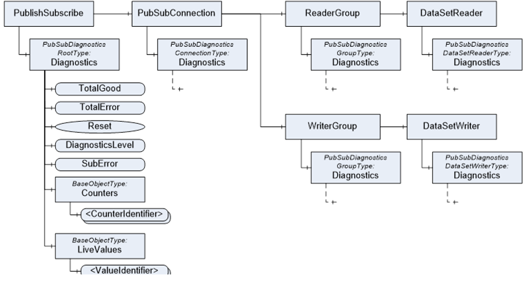  

Figure 51 - PubSub Diagnostics overview  

[Figure 52](/§\_Ref462692410) shows the structure of a *Variable* which holds a diagnostics counter with defined *Properties* . The *PubSubDiagnosticsCounterType* is formally defined in [9.1.11.5](/§\_Ref473553445) .  

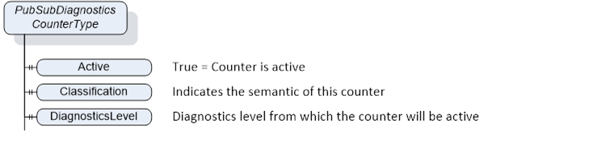  

Figure 52 - PubSubDiagnosticsCounterType  

##### 9.1.11.2 PubSubDiagnosticsType  

The *PubSubDiagnosticsType* is the base type for the diagnostics objects and is formally defined in [Table 310](/§\_Ref464125615) .  

Table 310 - PubSubDiagnosticsType  

| **Attribute** | **Value** |
|---|---|
|BrowseName|PubSubDiagnosticsType|
|IsAbstract|True|
  
| **References** | **Node Class** | **BrowseName** | **DataType** | **TypeDefinition** | **Modelling Rule** |
|---|---|---|---|---|---|
|Subtype of BaseObjectType defined in [OPC 10000-5](/§UAPart5) .|
|HasComponent|Variable|DiagnosticsLevel|DiagnosticsLevel|BaseDataVariableType|Mandatory|
|HasComponent|Variable|TotalInformation|UInt32|PubSubDiagnosticsCounterType|Mandatory|
|HasComponent|Variable|TotalError|UInt32|PubSubDiagnosticsCounterType|Mandatory|
|HasComponent|Method|Reset|Defined in [9.1.11.3](/§\_Ref473550390) .|Mandatory|
|HasComponent|Variable|SubError|Boolean|BaseDataVariableType|Mandatory|
|HasComponent|Object|Counters||BaseObjectType|Mandatory|
|HasComponent|Object|LiveValues||BaseObjectType|Mandatory|
|Conformance Units|
|PubSub Model Diagnostics|
  

  

The *DiagnosticsLevel Variable* configures the current diagnostics level used for the *Object* . The *DiagnosticsLevel DataType* is defined in [9.1.11.4](/§\_Ref473551455) .  

The *TotalInformation* *Variable* provides the sum of all diagnostics counters with classification *Information* .  

The *TotalError* *Variable* provides the sum of all diagnostics counters with classification *Error* .  

The *SubError Variable* indicates if any statistics *Object* of the next *PubSub* layer *Objects* shows a value \> 0 in *TotalError* .  

The *Object Counters* contains all diagnostics counters for the diagnostics *Object* . The counters use the *VariableType PubSubDiagnosticsCounterType* defined in [9.1.11.5](/§\_Ref473553445) . The counter *Variables* of the *PubSubDiagnosticsType* are defined in [Table 311](/§\_Ref463967998) .  

Table 311 - Counters for PubSubDiagnosticsType  

| **BrowseName** | **Modelling Rule** | **Diagnostics**   **Level** | **Class** | **Description** |
|---|---|---|---|---|
|StateError|Mandatory|Basic|Error|PubSubState state machine defined in [6.2.1](/§\_Ref496563089) changed to *Error* state|
|StateOperationalByMethod|Mandatory|Basic|Information|State changed to *Operational* state triggered by *Enable Method* call.|
|StateOperationalByParent|Mandatory|Basic|Information|State changed to *Operational* state triggered by an operational parent|
|StateOperationalFromError|Mandatory|Basic|Information|State changed from *Error* to *Operational* .|
|StatePausedByParent|Mandatory|Basic|Information|State changed to *Paused* state triggered by a paused or disabled parent.|
|StateDisabledByMethod|Mandatory|Basic|Information|State changed to *Disabled* state triggered by *Disable Method* call.|
  

  

The *Object LiveValues* contains all live values of the diagnostics *Object* . If not further specified, the live values *Variables* use the *VariableType* *BaseDataVariableType* .  

The nodes in the *Objects* *Counters* and *LiveValues* may be activated/deactivated by the parameter *DiagnosticsLevel* in the *PubSubDiagnosticsType* .  

The value of a node in the *Object* *Counters* shall be set to 0 whenever the counter changes from inactive to active.  

The *Server* should dynamically remove inactive nodes from the *Address Space* in order to avoid confusion of the user by long lists of counters where only a few of them might be active. In case inactive nodes cannot be removed from the *Address Space* the *Server* shall set the *StatusCode* of the *Variable Value* to *Bad\_OutOfService.*  

##### 9.1.11.3 Reset Method  

This *Method* is used to set all counters in the *Object* diagnostics counters to the initial value.  

The *Client* shall be authorized to modify the configuration for the *PubSub* functionality when invoking this *Method* on the *Server* .  

 **Signature**   

 **Reset**   

  

 **Method Result Codes**   

| **ResultCode** | **Description** |
|---|---|
|Bad\_UserAccessDenied|The *Session* user is not allowed to configure the *Object* .|
  

  

[Table 312](/§\_Ref115413799) specifies the *AddressSpace* representation for the *Reset Method* .  

Table 312 - Reset Method AddressSpace definition  

| **Attribute** | **Value** |
|---|---|
|BrowseName|Reset|
  
| **ConformanceUnits** |
|---|
|PubSub Model Diagnostics|
  

  

##### 9.1.11.4 DiagnosticsLevel  

*PubSub* diagnostics are intended to assure users about the correct operation of a *PubSub* system and to help in the discovery of potential faults. Depending on the situation, not all diagnostic *Objects* might be needed, and on the other hand providing them requires resources. As a result, diagnostic objects are assigned to different diagnostic levels. Only diagnostic *Objects* belonging to the currently set diagnostic level or a more severe level shall be provided. This mechanism provides the user with the ability to select a suitable diagnostic configuration depending on the application.  

The *DiagnosticsLevel* is an enumeration that specifies the possible diagnostics levels. The possible enumeration values are described in [Table 313](/§\_Ref464123386) .  

Table 313 - DiagnosticsLevel values  

| **Value** | **Value** | **Description** |
|---|---|---|
|Basic|0|Diagnostic objects from this level cannot be disabled, and thus objects from this level are the minimum diagnostic feature set that can be expected on any device that supports *PubSub* diagnostics at all.|
|Advanced|1|Diagnostic objects related to exceptional behaviour are contained in the *Advanced* diagnostic level.|
|Info|2|The *Info* diagnostic level contains high-level diagnostic objects related to the normal operation of a *PubSub* system.|
|Log|3|Diagnostic objects for the detailed logging of the operation of a *PubSub* system are contained in the *Log* diagnostic level.|
|Debug|4|Diagnostic objects with debug information specific to a given implementation of *PubSub* are contained in the *Debug* diagnostic level. As this level is intended for implementation-specific diagnostics, no such objects are specified by the document.|
  

  

##### 9.1.11.5 PubSubDiagnosticsCounterType  

The *PubSubDiagnosticsCounterType* is formally defined in [Table 314](/§\_Ref464121820) .  

Table 314 - PubSubDiagnosticsCounterType  

| **Attribute** | **Value** |
|---|---|
|BrowseName|PubSubDiagnosticsCounterType|
|IsAbstract|False|
|ValueRank|\-1 (-1 = 'Scalar')|
|DataType|UInt32|
  
| **References** | **NodeClass** | **BrowseName** | **DataType** | **TypeDefinition** | **ModellingRule** |
|---|---|---|---|---|---|
|Subtype of BaseDataVariableType defined in [OPC 10000-5](/§UAPart5) .|
|HasProperty|Variable|Active|Boolean|PropertyType|Mandatory|
|HasProperty|Variable|Classification|PubSubDiagnostics Counter Classification|PropertyType|Mandatory|
|HasProperty|Variable|DiagnosticsLevel|DiagnosticsLevel|PropertyType|Mandatory|
|HasProperty|Variable|TimeFirstChange|DateTime|PropertyType|Optional|
|Conformance Units|
|PubSub Model Diagnostics|
  

  

The *Value* shall be reset to 0 when the *Method Reset* of the parent *PubSubDiagnosticsType Object* is called.  

The *Value* shall be incremented by 1 for each corresponding event.  

The *Value* shall not be incremented anymore when the maximum is reached (0xFFFFFFFF).  

If the maximum is reached and a new event occurs, the *SourceTimestamp* of the *Value* shall be updated, even if the *Value* does not change. The *Property Active* indicates if the counter is active.  

The *Property Classification* indicates whether this counter counts errors or other events according to *PubSubDiagnosticsCounterClassification* defined in [9.1.11.6](/§\_Ref473553444) .  

The *Property DiagnosticsLevel* indicates the diagnostics level the counter belongs to. The *DiagnosticsLevel* is defined in [9.1.11.4](/§\_Ref473551455) .  

The *Property* *TimeFirstChange* contains the *Server* time when the counter value changed from 0 to 1. If the counter value is 0 the *Value* is null.  

##### 9.1.11.6 PubSubDiagnosticsCounterClassification  

The *PubSubDiagnosticsCounterClassification* is an enumeration that specifies the possible diagnostics counter classifications. The possible enumeration values are described in [Table 315](/§\_Ref464213411) .  

Table 315 - PubSubDiagnosticsCounterClassification values  

| **Name** | **Value** | **Description** |
|---|---|---|
|Information|0|The semantic of this diagnostics counter indicates expected events, which are not considered as errors.|
|Error|1|The semantic of this diagnostics counter indicates errors.|
  

  

##### 9.1.11.7 PubSubDiagnosticsRootType  

The *PubSubDiagnosticsRootType* defines the diagnostic information for the *PublishSubscribe Object* and is formally defined in [Table 316](/§\_Ref473574099) .  

Table 316 - PubSubDiagnosticsRootType  

| **Attribute** | **Value** |
|---|---|
|BrowseName|PubSubDiagnosticsRootType|
|IsAbstract|False|
  
| **References** | **NodeClass** | **BrowseName** | **DataType** | **TypeDefinition** | **ModellingRule** |
|---|---|---|---|---|---|
|Subtype of PubSubDiagnosticsType defined in [9.1.11.2](/§\_Ref473573741) .|
|HasComponent|Object|LiveValues||BaseObjectType|Mandatory|
|Conformance Units|
|PubSub Model Diagnostics|
  

  

The *Object LiveValues* contains all live values of the diagnostics *Object* . If not further specified, the live values *Variables* use the *VariableType* *BaseDataVariableType* . The live values *Variables* of the *PubSubDiagnosticsRootType* are defined in [Table 317](/§\_Ref473578645) .  

Table 317 - LiveValues for PubSubDiagnosticsRootType  

| **BrowseName** | **Modelling Rule** | **Diagnostics**   **Level** | **DataType** | **Description** |
|---|---|---|---|---|
|ConfiguredDataSetWriters|Mandatory|Basic|UInt16|Number of configured *DataSetWriters* on this *Server*|
|ConfiguredDataSetReaders|Mandatory|Basic|UInt16|Number of configured *DataSetReaders* on this *Server*|
|OperationalDataSetWriters|Mandatory|Basic|UInt16|Number of *DataSetWriters* with state Operational|
|OperationalDataSetReaders|Mandatory|Basic|UInt16|Number of *DataSetReaders* with state Operational|
  

  

##### 9.1.11.8 PubSubDiagnosticsConnectionType  

The *PubSubDiagnosticsConnectionType* defines the diagnostic information for a *PubSubConnectionType* *Object* and is formally defined in [Table 318](/§\_Ref473578646) .  

Table 318 - PubSubDiagnosticsConnectionType  

| **Attribute** | **Value** |
|---|---|
|BrowseName|PubSubDiagnosticsConnectionType|
|IsAbstract|False|
  
| **References** | **NodeClass** | **BrowseName** | **DataType** | **TypeDefinition** | **ModellingRule** |
|---|---|---|---|---|---|
|Subtype of PubSubDiagnosticsType defined in [9.1.11.2](/§\_Ref473573741) .|
|HasComponent|Object|LiveValues||BaseObjectType|Mandatory|
|Conformance Units|
|PubSub Model Diagnostics|
  

  

The *Object LiveValues* contains all live values of the diagnostics *Object* . If not further specified, the live values *Variables* use the *VariableType* *BaseDataVariableType* . The live values *Variables* of the *PubSubDiagnosticsConnectionType* are defined in [Table 319](/§\_Ref473578647) .  

Table 319 - LiveValues for PubSubDiagnosticsConnectionType  

| **BrowseName** | **Modelling Rule** | **Diagnostics**   **Level** | **DataType** | **Description** |
|---|---|---|---|---|
|ResolvedAddress|Mandatory|Basic|String|Resolved address of the connection (e.g. IP Address)|
  

  

##### 9.1.11.9 PubSubDiagnosticsWriterGroupType  

The *PubSubDiagnosticsWriterGroupType* defines the diagnostic information for a *WriterGroupType* *Object* and is formally defined in [Table 320](/§\_Ref473578648) .  

Table 320 - PubSubDiagnosticsWriterGroupType  

| **Attribute** | **Value** |
|---|---|
|BrowseName|PubSubDiagnosticsWriterGroupType|
|IsAbstract|False|
  
| **References** | **NodeClass** | **BrowseName** | **DataType** | **TypeDefinition** | **ModellingRule** |
|---|---|---|---|---|---|
|Subtype of PubSubDiagnosticsType defined in [9.1.11.2](/§\_Ref473573741) .|
|HasComponent|Object|Counters||BaseObjectType|Mandatory|
|HasComponent|Object|LiveValues||BaseObjectType|Mandatory|
|Conformance Units|
|PubSub Model Diagnostics|
  

  

The *Object Counters* contains all diagnostics counters for the diagnostics *Object* . The counters use the *VariableType PubSubDiagnosticsCounterType* defined in [9.1.11.5](/§\_Ref473553445) . The counter *Variables* of the *PubSubDiagnosticsWriterGroupType* are defined in [Table 321](/§\_Ref464125757) .  

Table 321 - Counters for PubSubDiagnosticsWriterGroupType  

| **BrowseName** | **Modelling Rule** | **Diagnostics**   **Level** | **Class** | **Description** |
|---|---|---|---|---|
|Inherited counters from *PubSubDiagnosticsType*|
|SentNetworkMessages|Mandatory|Basic|Information|Sent *NetworkMessages*|
|FailedTransmissions|Mandatory|Basic|Error|Error on *NetworkMessage* transmission|
|EncryptionErrors|Optional|Advanced|Error|Error on signing or encrypting *NetworkMessage*|
  

  

The *Object LiveValues* contains all live values of the diagnostics *Object* . If not further specified, the live values *Variables* use the *VariableType* *BaseDataVariableType* . The live values *Variables* of the *PubSubDiagnosticsWriterGroupType* are defined in [Table 322](/§\_Ref464125768) .  

Table 322 - LiveValues for PubSubDiagnosticsWriterGroupType  

| **BrowseName** | **Modelling Rule** | **Diagnostics**   **Level** | **DataType** | **Description** |
|---|---|---|---|---|
|ConfiguredDataSetWriters|Mandatory|Basic|UInt16|Number of configured DataSetWriters in this group|
|OperationalDataSetWriters|Mandatory|Basic|UInt16|Number of DataSetWriters with state Operational|
|SecurityTokenID|Optional|Info|UInt32|Currently used SecurityTokenID|
|TimeToNextTokenID|Optional|Info|Duration|Time until the next key change is expected|
  

  

##### 9.1.11.10 PubSubDiagnosticsReaderGroupType  

The *PubSubDiagnosticsReaderGroupType* defines the diagnostic information for a *ReaderGroupType* *Object* and is formally defined in [Table 323](/§\_Ref473578649) .  

Table 323 - PubSubDiagnosticsReaderGroupType  

| **Attribute** | **Value** |
|---|---|
|BrowseName|PubSubDiagnosticsReaderGroupType|
|IsAbstract|False|
  
| **References** | **NodeClass** | **BrowseName** | **DataType** | **TypeDefinition** | **ModellingRule** |
|---|---|---|---|---|---|
|Subtype of PubSubDiagnosticsType defined in [9.1.11.2](/§\_Ref473573741) .|
|HasComponent|Object|Counters||BaseObjectType|Mandatory|
|HasComponent|Object|LiveValues||BaseObjectType|Mandatory|
|Conformance Units|
|PubSub Model Diagnostics|
  

  

The *Object Counters* contains all diagnostics counters for the diagnostics *Object* . The counters use the *VariableType PubSubDiagnosticsCounterType* defined in [9.1.11.5](/§\_Ref473553445) . The counter Variables of the *PubSubDiagnosticsReaderGroupType* are defined in [Table 324](/§\_Ref473578650) .  

Table 324 - Counters for PubSubDiagnosticsReaderGroupType  

| **BrowseName** | **Modelling Rule** | **Diagnostics**   **Level** | **Class** | **Description** |
|---|---|---|---|---|
|Inherited counters from *PubSubDiagnosticsType*|
|ReceivedNetworkMessages|Mandatory|Basic|Information|Received and processed *NetworkMessages*|
|ReceivedInvalidNetwork Messages|Optional|Advanced|Error|Invalid format of *NetworkMessage* Header|
|DecryptionErrors|Optional|Advanced|Error|Decryption or signature check errors|
  

  

The *Object LiveValues* contains all live values of the diagnostics *Object* . If not further specified, the live values *Variables* use the *VariableType* *BaseDataVariableType* . The live values *Variables* of the *PubSubDiagnosticsReaderGroupType* are defined in [Table 325](/§\_Ref473578651) .  

Table 325 - LiveValues for PubSubDiagnosticsReaderGroupType  

| **BrowseName** | **Modelling Rule** | **Diagnostics**   **Level** | **DataType** | **Description** |
|---|---|---|---|---|
|ConfiguredDataSetReaders|Mandatory|Basic|UInt16|Number of configured DataSetReaders in this group|
|OperationalDataSetReaders|Mandatory|Basic|UInt16|Number of DataSetReaders with state Operational|
  

  

##### 9.1.11.11 PubSubDiagnosticsDataSetWriterType  

The *PubSubDiagnosticsDataSetWriterType* defines the diagnostic information for a *DataSetWriterType* *Object* and is formally defined in [Table 326](/§\_Ref473578652) .  

Table 326 - PubSubDiagnosticsDataSetWriterType  

| **Attribute** | **Value** |
|---|---|
|BrowseName|PubSubDiagnosticsDataSetWriterType|
|IsAbstract|False|
  
| **References** | **NodeClass** | **BrowseName** | **DataType** | **TypeDefinition** | **ModellingRule** |
|---|---|---|---|---|---|
|Subtype of PubSubDiagnosticsType defined in [9.1.11.2](/§\_Ref473573741) .|
|HasComponent|Object|Counters||BaseObjectType|Mandatory|
|HasComponent|Object|LiveValues||BaseObjectType|Mandatory|
|Conformance Units|
|PubSub Model Diagnostics|
  

  

The *Object Counters* contains all diagnostics counters for the diagnostics *Object* . The counters use the *VariableType PubSubDiagnosticsCounterType* defined in [9.1.11.5](/§\_Ref473553445) . The counter Variables of the *PubSubDiagnosticsDataSetWriterType* are defined in [Table 327](/§\_Ref473578974) .  

Table 327 - Counters for PubSubDiagnosticsDataSetWriterType  

| **BrowseName** | **Modelling Rule** | **Diagnostics**   **Level** | **Class** | **Description** |
|---|---|---|---|---|
|Inherited counters from *PubSubDiagnosticsType*|
|FailedDataSetMessages|Mandatory|Basic|Error|Number of failed *DataSetMessages*|
  

  

The *Object LiveValues* contains all live values of the diagnostics *Object* . If not further specified, the live values *Variables* use the *VariableType* *BaseDataVariableType* . The live values *Variables* of the *PubSubDiagnosticsDataSetWriterType* are defined in [Table 328](/§\_Ref473578973) .  

Table 328 - LiveValues for PubSubDiagnosticsDataSetWriterType  

| **BrowseName** | **Modelling Rule** | **Diagnostics**   **Level** | **DataType** | **Description** |
|---|---|---|---|---|
|MessageSequenceNumber|Optional|Info|UInt16|Sequence number of last *DataSetMessage*|
|StatusCode|Optional|Info|StatusCode|Status of last *DataSetMessage*|
|MajorVersion|Optional|Info|UInt32|*MajorVersion* used for *DataSet*|
|MinorVersion|Optional|Info|UInt32|*MinorVersion* used for *DataSet*|
  

  

##### 9.1.11.12 PubSubDiagnosticsDataSetReaderType  

The *PubSubDiagnosticsDataSetReaderType* defines the diagnostic information for a *DataSetReaderType* *Object* and is formally defined in [Table 329](/§\_Ref473578653) .  

Table 329 - PubSubDiagnosticsDataSetReaderType  

| **Attribute** | **Value** |
|---|---|
|BrowseName|PubSubDiagnosticsDataSetReaderType|
|IsAbstract|False|
  
| **References** | **NodeClass** | **BrowseName** | **DataType** | **TypeDefinition** | **ModellingRule** |
|---|---|---|---|---|---|
|Subtype of PubSubDiagnosticsType defined in [9.1.11.2](/§\_Ref473573741) .|
|HasComponent|Object|Counters||BaseObjectType|Mandatory|
|HasComponent|Object|LiveValues||BaseObjectType|Mandatory|
|Conformance Units|
|PubSub Model Diagnostics|
  

  

The *Object Counters* contains all diagnostics counters for the diagnostics *Object* . The counters use the *VariableType PubSubDiagnosticsCounterType* defined in [9.1.11.5](/§\_Ref473553445) . The counter Variables of the *PubSubDiagnosticsDataSetReaderType* are defined in [Table 330](/§\_Ref473578972) .  

Table 330 - Counters for PubSubDiagnosticsDataSetReaderType  

| **BrowseName** | **Modelling Rule** | **Diagnostics**   **Level** | **Class** | **Description** |
|---|---|---|---|---|
|Inherited counters from *PubSubDiagnosticsType*|
|FailedDataSetMessages|Mandatory|Basic|Error|e.g. because of unknown *MajorVersion*|
|DecryptionErrors|Optional|Advanced|Error||
  

  

The *Object LiveValues* contains all live values of the diagnostics *Object* . If not further specified, the live values *Variables* use the *VariableType* *BaseDataVariableType* . The live values *Variables* of the *PubSubDiagnosticsDataSetReaderType* are defined in [Table 331](/§\_Ref473578971) .  

Table 331 - LiveValues for PubSubDiagnosticsDataSetReaderType  

| **BrowseName** | **Modelling Rule** | **Diagnostics**   **Level** | **DataType** | **Description** |
|---|---|---|---|---|
|MessageSequenceNumber|Optional|Info|UInt16|SequenceNumber of last *DataSetMessage*|
|StatusCode|Optional|Info|StatusCode|Status of last *DataSetMessage*|
|MajorVersion|Optional|Info|UInt32|*MajorVersion* of available *DataSetMetaData*|
|MinorVersion|Optional|Info|UInt32|*MinorVersion* of available *DataSetMetaData*|
|SecurityTokenID|Optional|Info|UInt32|Currently used SecurityTokenID|
|TimeToNextTokenID|Optional|Info|Duration|Time until the next key change is expected|
  

  

#### 9.1.12 PubSub Capabilities  

##### 9.1.12.1 PubSubCapabilitiesType  

This *ObjectType* is used to indicate the configuration capabilities of the *PubSub* functionality in the OPC UA *Application* .  

The *PubSubCapabilitiesType* is formally defined in [Table 332](/§\_Ref43460362) .  

Table 332 - PubSubCapabilitiesType definition  

| **Attribute** | **Value** |
|---|---|
|BrowseName|PubSubCapabilitiesType|
|IsAbstract|False|
  
| **References** | **NodeClass** | **BrowseName** | **DataType** | **TypeDefinition** | **ModellingRule** |
|---|---|---|---|---|---|
|Subtype of BaseObjectType defined in [OPC 10000-5](/§UAPart5) .|
|HasProperty|Variable|MaxPubSubConnections|UInt32|PropertyType|Mandatory|
|HasProperty|Variable|MaxWriterGroups|UInt32|PropertyType|Mandatory|
|HasProperty|Variable|MaxReaderGroups|UInt32|PropertyType|Mandatory|
|HasProperty|Variable|MaxDataSetWriters|UInt32|PropertyType|Mandatory|
|HasProperty|Variable|MaxDataSetReaders|UInt32|PropertyType|Mandatory|
|HasProperty|Variable|MaxFieldsPerDataSet|UInt32|PropertyType|Mandatory|
|HasProperty|Variable|MaxDataSetWritersPerGroup|UInt32|PropertyType|Optional|
|HasProperty|Variable|MaxSecurityGroups|UInt32|PropertyType|Optional|
|HasProperty|Variable|MaxPushTargets|UInt32|PropertyType|Optional|
|HasProperty|Variable|MaxPublishedDataSets|UInt32|PropertyType|Optional|
|HasProperty|Variable|MaxStandaloneSubscribedDataSets|UInt32|PropertyType|Optional|
|HasProperty|Variable|MaxNetworkMessageSizeDatagram|UInt32|PropertyType|Optional|
|HasProperty|Variable|MaxNetworkMessageSizeBroker|UInt32|PropertyType|Optional|
|HasProperty|Variable|SupportSecurityKeyPull|Boolean|PropertyType|Optional|
|HasProperty|Variable|SupportSecurityKeyPush|Boolean|PropertyType|Optional|
|HasProperty|Variable|SupportSecurityKeyServer|Boolean|PropertyType|Optional|
|Conformance Units|
|PubSub Model Base|
  

  

The maximum numbers of objects related to configuration capabilities are expected to be configurable in the OPC UA *Application* but the capability to operate all configured objects at the same time depends on different parameters like timing settings and it is not ensured that any combination of enabled objects in the configuration can be executed.  

The *MaxPubSubConnections* *Variable* defines the maximum number of *PubSubConnections* that can be configured for the OPC UA *Application* . A value of 0 indicates that the OPC UA *Application* forces no limit on the number of connections.  

The *MaxWriterGroups Variable* defines the maximum number of *WriterGroups* that can be configured for the OPC UA *Application* . A value of 0 indicates that the OPC UA *Application* forces no limit on the number of *WriterGroups* .  

The *MaxReaderGroups Variable* defines the maximum number of *ReaderGroups* that can be configured for the OPC UA *Application* . A value of 0 indicates that the OPC UA *Application* forces no limit on the number of *ReaderGroups* .  

The *MaxDataSetWriters Variable* defines the maximum number of *DataSetWriters* that can be configured for the OPC UA *Application* . A value of 0 indicates that the OPC UA *Application* forces no limit on the number of *DataSetWriters* .  

The *MaxDataSetReaders Variable* defines the maximum number of *DataSetReaders* that can be configured for the OPC UA *Application* . A value of 0 indicates that the OPC UA *Application* forces no limit on the number of *DataSetReaders* .  

The *MaxFieldsPerDataSet Variable* defines the maximum number of *fields* that can be configured for a *PublishedDataSet* . A value of 0 indicates that the OPC UA *Application* forces no limit on the number of fields.  

The *MaxDataSetWritersPerGroup Variable* defines the maximum number of *DataSetWriters* that can be configured in one *WriterGroup* . A value of 0 indicates that the OPC UA *Application* forces no limit on the number of *DataSetWriters* in one *WriterGroup* .  

The *MaxSecurityGroups Variable* defines the maximum number of *SecurityGroups* that can be configured. A value of 0 indicates that the OPC UA *Application* forces no limit on the number of *SecurityGroups* .  

The *MaxPushTargets Variable* defines the maximum number of *PushTargets* that can be configured. A value of 0 indicates that the OPC UA *Application* forces no limit on the number of *PushTargets* .  

The *MaxPublishedDataSets Variable* defines the maximum number of *PublishedDataSets* that can be configured. A value of 0 indicates that the OPC UA *Application* forces no limit on the number of *PublishedDataSets* .  

The *MaxStandaloneSubscribedDataSets Variable* defines the maximum number of *StandaloneSubscribedDataSets* that can be configured. A value of 0 indicates that the OPC UA *Application* forces no limit on the number of *StandaloneSubscribedDataSets* .  

The *MaxNetworkMessageSizeDatagram Variable* defines the maximum number of bytes ** that can be configured as *MaxNetworkMessageSize* for *NetworkMessages* sent or received through datagram transport protocol mappings. A value of 0 indicates that the OPC UA *Application* forces no limit on the maximum size.  

The *MaxNetworkMessageSizeBroker Variable* defines the maximum number of bytes ** that can be configured as *MaxNetworkMessageSize* for *NetworkMessages* sent or received through broker transport protocol mappings. A value of 0 indicates that the OPC UA *Application* forces no limit on the maximum size.  

The *SupportSecurityKeyPull* *Variable* indicates if the OPC UA *Application* is able to pull *PubSub* security keys from a SKS.  

The *SupportSecurityKeyPush* *Variable* indicates if the OPC UA *Application* is able to accept *PubSub* security keys pushed from a SKS.  

The *SupportSecurityKeyServer* *Variable* indicates if the OPC UA *Application* is able to act as a Security Key Server and to manage *SecurityGroups* .  

##### 9.1.12.2 Supported configuration properties  

The *PubSub* components have *KeyValuePair* arrays for additional configuration property lists. These optional configuration properties extend the configuration parameters defined for the different *PubSub* components.  

A configuration property is described by *Variables* with the following information:  

* *BrowseName* of the *Variable* is used as *Key* for the property.  

* *DataType* of the *Variable* defines the *DataType* of the *Value* in the *KeyValuePair.*  

* *Value* of the *Variable* provides the default value for the property.  

* *Description* of the *Variable* provides additional information.  

* *Properties* like *EURange* or *EngineeringUnits* can be used to provide value ranges and units.  

The configuration property descriptions are referenced from the related configuration properties *Node* with the *HasKeyValueDescription ReferenceType* defined in [OPC 10000-5](/§UAPart5) .  

The *SourceNode* of *References* of this type shall be one of the following Nodes:  

* ConfigurationProperties *Property* of the *PublishSubscribeType*  

* *ConnectionProperties Property* of the *PubSubConnectionType* or of instances of the *PubSubConnectionType*  

* *GroupProperties Property* of the *GroupType* or of instances of the *WriterGroupType* or *ReaderGroupType*  

* *DataSetWriterProperties Property* of the *DataSetWriterType* or of instances of the *DataSetWriterType*  

* *DataSetReaderProperties Property* of the *DataSetReaderType* or of instances of the *DataSetReaderType*  

* *GroupProperties* *Property* of the *SecurityGroupType*  

* *PushTargetProperties* *Property* of the *PushTargetType*  

#### 9.1.13 PubSub Status Events  

##### 9.1.13.1 PubSubStatusEventType  

This *EventType* is a base type for events which indicate an error or status change associated with a *PubSubConnectionType* , *PubSubGroupType* , *DataSetWriterType* or *DataSetReaderType Object* . The *PubSubStatusEventType* is formally defined in [Table 333](/§\_Ref443422415) .  

Table 333 - PubSubStatusEventType definition  

| **Attribute** | **Value** |
|---|---|
|BrowseName|PubSubStatusEventType|
|IsAbstract|True|
  
| **References** | **NodeClass** | **BrowseName** | **DataType** | **TypeDefinition** | **ModellingRule** |
|---|---|---|---|---|---|
|Subtype of SystemEventType defined in [OPC 10000-5](/§UAPart5) .|
|HasProperty|Variable|ConnectionId|NodeId|PropertyType|Mandatory|
|HasProperty|Variable|GroupId|NodeId|PropertyType|Mandatory|
|HasProperty|Variable|State|PubSubState|PropertyType|Mandatory|
|Conformance Units|
|PubSub Model Status Event|
  

  

This *EventType* inherits all *Properties* of the *SystemEventType* . Their semantic is defined in [OPC 10000-5](/§UAPart5) .  

The *SourceNode* is the *NodeId* of the *PubSubConnectionType* , *PubSubGroupType* , *DataSetWriterType* or *DataSetReaderType Object* associated with the *Event* .  

The *SourceName* is the *BrowseName* of the *SourceNode* .  

The *ConnectionId Property* is the *NodeId* of the *PubSubConnectionType Object* associated with the source of the status *Event* .  

The *GroupId Property* is the *NodeId* of the *PubSubGroupType Object* associated with the source of the status *Event* . The *GroupId* is Null if a *PubSubConnection* is the source of the *Event.*  

The *State Variable* is the current state of the *Status Object* associated with the *SourceNode* of the status *Event* .  

##### 9.1.13.2 PubSubTransportLimitsExceedEventType  

This *EventType* indicates that a *NetworkMessage* could not be published because it exceeds the limits of transport. The *PubSubTransportLimitsExceedEventType* is formally defined in [Table 334](/§\_Ref443423380) .  

Table 334 - PubSubTransportLimitsExceedEventType definition  

| **Attribute** | **Value** |
|---|---|
|BrowseName|PubSubTransportLimitsExceedEventType|
|IsAbstract|True|
  
| **References** | **NodeClass** | **BrowseName** | **DataType** | **TypeDefinition** | **ModellingRule** |
|---|---|---|---|---|---|
|Subtype of PubSubStatusEventType ** defined in [9.1.13.2](/§\_Ref443423505) .|
|HasProperty|Variable|Actual|UInt32|PropertyType|Mandatory|
|HasProperty|Variable|Maximum|UInt32|PropertyType|Mandatory|
|Conformance Units|
|PubSub Model Diagnostics Events|
  

  

This *EventType* inherits all *Properties* of the *PubSubStatusEventType* .  

The *Actual Property* has the size in bytes of the actual *NetworkMessage* .  

The *Maximum Property* has the maximum size of *NetworkMessages* in bytes allowed by the transport.  

##### 9.1.13.3 PubSubCommunicationFailureEventType  

This *EventType* indicates that a *NetworkMessage* could not be published because of a communication failure. The *PubSubCommunicationFailureEventType* is formally defined in [Table 335](/§\_Ref443424075) .  

Table 335 - PubSubCommunicationFailureEventType definition  

| **Attribute** | **Value** |
|---|---|
|BrowseName|PubSubCommunicationFailureEventType|
|IsAbstract|True|
  
| **References** | **NodeClass** | **BrowseName** | **DataType** | **TypeDefinition** | **ModellingRule** |
|---|---|---|---|---|---|
|Subtype of PubSubStatusEventType ** defined in [9.1.13.2](/§\_Ref443423505) .|
|HasProperty|Variable|Error|StatusCode|PropertyType|Mandatory|
|Conformance Units|
|PubSub Model Diagnostics Events|
  

  

This *EventType* inherits all *Properties* of the *PubSubStatusEventType* .  

The *Message* *Event* field inherited from *BaseEventType* has a localized description of the error.  

The *Error Property* has the *StatusCode* associated with the error.  

### 9.2 Message Mapping configuration model  

#### 9.2.1 UADP Message mapping  

##### 9.2.1.1 UadpWriterGroupMessageType  

This *ObjectType* represents UADP message mapping specific parameters for a *WriterGroup* . The *UadpWriterGroupMessageType* is formally defined in [Table 336](/§\_Ref408822769) .  

Table 336 - UadpWriterGroupMessageType definition  

| **Attribute** | **Value** |
|---|---|
|BrowseName|UadpWriterGroupMessageType|
|IsAbstract|False|
  
| **References** | **NodeClass** | **BrowseName** | **DataType** | **TypeDefinition** | **ModellingRule** |
|---|---|---|---|---|---|
|Subtype of WriterGroupMessageType defined in [9.1.6.8](/§\_Ref498429048) .|
|HasProperty|Variable|GroupVersion|VersionTime|PropertyType|Mandatory|
|HasProperty|Variable|DataSetOrdering|DataSetOrderingType|PropertyType|Mandatory|
|HasProperty|Variable|NetworkMessage ContentMask|UadpNetworkMessageContentMask|PropertyType|Mandatory|
|HasProperty|Variable|SamplingOffset|Duration|PropertyType|Optional|
|HasProperty|Variable|PublishingOffset|Duration[]|PropertyType|Mandatory|
|Conformance Units|
|PubSub Model UADP|
  

  

The *GroupVersion* is defined in [6.3.1.1.2](/§\_Ref494283614) .  

The *DataSetOrdering* is defined in [6.3.1.1.3](/§\_Ref494280564) .  

The *NetworkMessageContentMask* is defined in [6.3.1.1.4](/§\_Ref494281487) .  

The *SamplingOffset* is defined in [6.3.1.1.5](/§\_Ref494283748) .  

The *PublishingOffset* is defined in [6.3.1.1.6](/§\_Ref494283837) .  

##### 9.2.1.2 UadpDataSetWriterMessageType  

This *ObjectType* represents UADP message mapping specific parameters for a *DataSetWriter* . The *UadpDataSetWriterMessageType* is formally defined in [Table 337](/§\_Ref408852848) .  

Table 337 - UadpDataSetWriterMessageType definition  

| **Attribute** | **Value** |
|---|---|
|BrowseName|UadpDataSetWriterMessageType|
|IsAbstract|False|
  
| **References** | **NodeClass** | **BrowseName** | **DataType** | **TypeDefinition** | **ModellingRule** |
|---|---|---|---|---|---|
|Subtype of DataSetWriterMessageType defined in [9.1.7.4](/§\_Ref498430949) .|
|HasProperty|Variable|DataSetMessageContentMask|UadpDataSetMessage ContentMask|PropertyType|Mandatory|
|HasProperty|Variable|ConfiguredSize|UInt16|PropertyType|Mandatory|
|HasProperty|Variable|NetworkMessageNumber|UInt16|PropertyType|Mandatory|
|HasProperty|Variable|DataSetOffset|UInt16|PropertyType|Mandatory|
|Conformance Units|
|PubSub Model UADP|
  

  

The *DataSetMessageContentMask* is defined in [6.3.1.3.2](/§\_Ref494354861) .  

The *ConfiguredSize* is defined in [6.3.1.3.2](/§\_Ref495427450) .  

The *NetworkMessage* is defined in [6.3.1.3.4](/§\_Ref495427462) .  

The *DataSetOffset* is defined in [6.3.1.3.5](/§\_Ref494369563) .  

##### 9.2.1.3 UadpDataSetReaderMessageType  

This *ObjectType* represents UADP message mapping specific parameters for a *DataSetReader* . The *UadpDataSetWriterMessageType* is formally defined in [Table 338](/§\_Ref415521645) .  

Table 338 - UadpDataSetReaderMessageType definition  

| **Attribute** | **Value** |
|---|---|
|BrowseName|UadpDataSetReaderMessageType|
|IsAbstract|False|
  
| **References** | **Node Class** | **BrowseName** | **DataType** | **TypeDefinition** | **Modelling Rule** |
|---|---|---|---|---|---|
|Subtype of DataSetReaderMessageType defined in [9.1.8.4](/§\_Ref498431247) .|
|HasProperty|Variable|GroupVersion|VersionTime|PropertyType|Mandatory|
|HasProperty|Variable|NetworkMessageNumber|UInt16|PropertyType|Mandatory|
|HasProperty|Variable|DataSetOffset|UInt16|PropertyType|Mandatory|
|HasProperty|Variable|DataSetClassId|Guid|PropertyType|Mandatory|
|HasProperty|Variable|NetworkMessageContentMask|UadpNetworkMessage ContentMask|PropertyType|Mandatory|
|HasProperty|Variable|DataSetMessageContentMask|UadpDataSetMessage ContentMask|PropertyType|Mandatory|
|HasProperty|Variable|PublishingInterval|Duration|PropertyType|Mandatory|
|HasProperty|Variable|ReceiveOffset|Duration|PropertyType|Mandatory|
|HasProperty|Variable|ProcessingOffset|Duration|PropertyType|Mandatory|
|Conformance Units|
|PubSub Model UADP|
  

  

The *GroupVersion* is defined in [6.3.1.4.1](/§\_Ref495513413) .  

The *NetworkMessageNumber* is defined in [6.3.1.4.2](/§\_Ref495513419) .  

The *DataSetOffset* is defined in [6.3.1.4.3](/§\_Ref495513424) .  

The *DataSetClassId* is defined in [6.3.1.4.4](/§\_Ref495513437) . The initial value is null.  

The *NetworkMessageContentMask* is defined in [6.3.1.4.5](/§\_Ref495513444) .  

The *DataSetMessageContentMask* is defined in [6.3.1.4.6](/§\_Ref495513451) .  

The *PublishingInterval* is defined in [6.3.1.4.7](/§\_Ref495513466) .  

The *ReceiveOffset* is defined in [6.3.1.4.8](/§\_Ref495513471) .  

The *ProcessingOffset* is defined in [6.3.1.4.9](/§\_Ref495513476) .  

#### 9.2.2 JSON Message mapping  

##### 9.2.2.1 JsonWriterGroupMessageType  

This *ObjectType* represents JSON message mapping specific parameters for a *WriterGroup* . The *JsonWriterGroupMessageType* is formally defined in [Table 339](/§\_Ref498641186) .  

Table 339 - JsonWriterGroupMessageType definition  

| **Attribute** | **Value** |
|---|---|
|BrowseName|JsonWriterGroupMessageType|
|IsAbstract|False|
  
| **References** | **NodeClass** | **BrowseName** | **DataType** | **TypeDefinition** | **ModellingRule** |
|---|---|---|---|---|---|
|Subtype of WriterGroupMessageType defined in [9.1.6.8](/§\_Ref498429048) .|
|HasProperty|Variable|NetworkMessage ContentMask|JsonNetworkMessageContentMask|PropertyType|Mandatory|
|Conformance Units|
|PubSub Model JSON|
  

  

The *NetworkMessageContentMask* is defined in [6.3.2.4.1](/§\_Ref497331232) .  

##### 9.2.2.2 JsonDataSetWriterMessageType  

This *ObjectType* represents UADP message mapping specific parameters for a *DataSetWriter* . The *JsonDataSetWriterMessageType* is formally defined in [Table 340](/§\_Ref498641187) .  

Table 340 - JsonDataSetWriterMessageType definition  

| **Attribute** | **Value** |
|---|---|
|BrowseName|JsonDataSetWriterMessageType|
|IsAbstract|False|
  
| **References** | **NodeClass** | **BrowseName** | **DataType** | **TypeDefinition** | **ModellingRule** |
|---|---|---|---|---|---|
|Subtype of DataSetWriterMessageType defined in [9.1.7.4](/§\_Ref498430949) .|
|HasProperty|Variable|DataSetMessageContentMask|JsonDataSetMessage ContentMask|PropertyType|Mandatory|
|Conformance Units|
|PubSub Model JSON|
  

  

The *DataSetMessageContentMask* is defined in [6.3.2.3.1](/§\_Ref496728157) .  

##### 9.2.2.3 JsonDataSetReaderMessageType  

This *ObjectType* represents UADP message mapping specific parameters for a *DataSetReader* . The *JsonDataSetReaderMessageType* is formally defined in [Table 341](/§\_Ref498641188) .  

Table 341 - JsonDataSetReaderMessageType definition  

| **Attribute** | **Value** |
|---|---|
|BrowseName|JsonDataSetReaderMessageType|
|IsAbstract|False|
  
| **References** | **Node Class** | **BrowseName** | **DataType** | **TypeDefinition** | **Modelling Rule** |
|---|---|---|---|---|---|
|Subtype of DataSetReaderMessageType defined in [9.1.8.4](/§\_Ref498431247) .|
|HasProperty|Variable|NetworkMessageContentMask|JsonNetworkMessage ContentMask|PropertyType|Mandatory|
|HasProperty|Variable|DataSetMessageContentMask|JsonDataSetMessage ContentMask|PropertyType|Mandatory|
|Conformance Units|
|PubSub Model JSON|
  

  

The *NetworkMessageContentMask* is defined in [6.3.2.4.1](/§\_Ref497331232) .  

The *DataSetMessageContentMask* is defined in [6.3.2.4.2](/§\_Ref497331240) .  

### 9.3 Transport Protocol Mapping configuration model  

#### 9.3.1 Datagram Transport Protocol mapping  

##### 9.3.1.1 DatagramConnectionTransportType  

This *ObjectType* represents datagram transport protocol mapping specific parameters for a *PubSubConnection* . The *DatagramConnectionTransportType* is formally defined in [Table 342](/§\_Ref501112151) .  

Table 342 - DatagramConnectionTransportType definition  

| **Attribute** | **Value** |
|---|---|
|BrowseName|DatagramConnectionTransportType|
|IsAbstract|False|
  
| **References** | **NodeClass** | **BrowseName** | **DataType** | **TypeDefinition** | **ModellingRule** |
|---|---|---|---|---|---|
|Subtype of ConnectionTransportType defined in [9.1.5.8](/§\_Ref498379898) .|
|HasComponent|Object|DiscoveryAddress||NetworkAddressType|Mandatory|
|HasProperty|Variable|DiscoveryAnnounceRate|UInt32|PropertyType|Optional|
|HasProperty|Variable|DiscoveryMaxMessageSize|UInt32|PropertyType|Optional|
|HasProperty|Variable|QosCategory|String|PropertyType|Optional|
|HasProperty|Variable|DatagramQos|QosDataType[]|PropertyType|Optional|
|Conformance Units|
|PubSub Model Datagram|
  

  

The *DiscoveryAddress* is defined in [6.4.1.2.1](/§\_Ref501112113) .  

The *DiscoveryAnnounceRate* is defined in [6.4.1.2.3](/§\_Ref43456783) .  

The *DiscoveryMaxMessageSize* is defined in [6.4.1.2.4](/§\_Ref43456784) .  

The *QosCategory* is defined in [6.4.1.2.5](/§\_Ref43456785) .  

The *DatagramQos* is defined in [6.4.1.2.6](/§\_Ref82954545) .  

##### 9.3.1.2 DatagramWriterGroupTransportType  

This *ObjectType* represents datagram transport protocol mapping specific parameters for a *WriterGroup* . The *DatagramWriterGroupTransportType* is formally defined in [Table 346](/§\_Ref425753031) .  

Table 343 - DatagramWriterGroupTransportType definition  

| **Attribute** | **Value** |
|---|---|
|BrowseName|DatagramWriterGroupTransportType|
|IsAbstract|False|
  
| **References** | **NodeClass** | **BrowseName** | **DataType** | **TypeDefinition** | **ModellingRule** |
|---|---|---|---|---|---|
|Subtype of WriterGroupTransportType defined in [9.1.6.7](/§\_Ref498429059) .|
|HasProperty|Variable|MessageRepeatCount|Byte|PropertyType|Optional|
|HasProperty|Variable|MessageRepeatDelay|Duration|PropertyType|Optional|
|HasComponent|Object|Address||NetworkAddressType|Optional|
|HasProperty|Variable|QosCategory|String|PropertyType|Optional|
|HasProperty|Variable|DatagramQos|TransmitQosDataType[]|PropertyType|Optional|
|HasProperty|Variable|DiscoveryAnnounceRate|UInt32|PropertyType|Optional|
|HasProperty|Variable|Topic|String|PropertyType|Optional|
|Conformance Units|
|PubSub Model Datagram|
  

  

The *MessageRepeatCount* is defined in [6.4.1.3.1](/§\_Ref494284018) .  

The *MessageRepeatDelay* is defined in [6.4.1.3.2](/§\_Ref494284034) .  

The *Address* is defined in [6.4.1.3.4](/§\_Ref29497787) . The abstract *NetworkAddressType* is defined in [9.1.5.3](/§\_Ref33907799) . The default type used for concrete instances is the *NetworkAddressUrlType* defined in [9.1.5.7](/§\_Ref33907819) . It represents the *Address* in the form of a URL *String* .  

The *QosCategory* is defined in [6.4.1.3.5](/§\_Ref29498797) .  

The *DatagramQos* is defined in [6.4.1.3.6](/§\_Ref82954546) .  

The *DiscoveryAnnounceRate* is defined in [6.4.1.3.7](/§\_Ref43458815)  

The *Topic* is defined in [6.4.1.3.8](/§\_Ref29498829) .  

##### 9.3.1.3 DatagramDataSetWriterTransportType  

There is no datagram-specific transport protocol mapping parameter defined for the *DataSetWriter* .  

##### 9.3.1.4 DatagramDataSetReaderTransportType  

This *ObjectType* represents datagram transport protocol mapping specific parameters for a *DataSetReader* . The *DatagramDataSetReaderTransportType* is formally defined in [Table 344](/§\_Ref29500821) .  

Table 344 - DatagramDataSetReaderTransportType definition  

| **Attribute** | **Value** |
|---|---|
|BrowseName|DatagramDataSetReaderTransportType|
|IsAbstract|False|
  
| **References** | **NodeClass** | **BrowseName** | **DataType** | **TypeDefinition** | **ModellingRule** |
|---|---|---|---|---|---|
|Subtype of *DataSetReaderTransportType* defined in [9.1.8.3](/§\_Ref443702750) .|
|HasComponent|Object|Address||NetworkAddressType|Optional|
|HasProperty|Variable|QosCategory|String|PropertyType|Optional|
|HasProperty|Variable|DatagramQos|ReceiveQosDataType[]|PropertyType|Optional|
|HasProperty|Variable|Topic|String|PropertyType|Optional|
|Conformance Units|
|PubSub Model Datagram|
  

  

The *Address* is defined in [6.4.1.6.1](/§\_Ref29497788) . The abstract *NetworkAddressType* is defined in [9.1.5.3](/§\_Ref33907799) . The default type used for concrete instances is the *NetworkAddressUrlType* defined in [9.1.5.7](/§\_Ref33907819) . It represents the *Address* in the form of a URL *String* .  

The *QosCategory* is defined in [6.4.1.6.2](/§\_Ref29497789) .  

The *DatagramQos* is defined in [6.4.1.6.3](/§\_Ref82954547) .  

The *Topic* is defined in [6.4.1.6.4](/§\_Ref29497790) .  

#### 9.3.2 Broker Transport Protocol mapping  

##### 9.3.2.1 BrokerConnectionTransportType  

This *ObjectType* represents broker transport protocol mapping specific parameters for a *PubSubConnection* . The *BrokerConnectionTransportType* is formally defined in [Table 345](/§\_Ref501567536) .  

Table 345 - BrokerConnectionTransportType definition  

| **Attribute** | **Value** |
|---|---|
|BrowseName|BrokerConnectionTransportType|
|IsAbstract|False|
  
| **References** | **NodeClass** | **BrowseName** | **DataType** | **TypeDefinition** | **ModellingRule** |
|---|---|---|---|---|---|
|Subtype of ConnectionTransportType defined in [9.1.5.8](/§\_Ref498379898) .|
|HasProperty|Variable|ResourceUri|String|PropertyType|Mandatory|
|HasProperty|Variable|AuthenticationProfileUri|String|PropertyType|Mandatory|
|Conformance Units|
|PubSub Model Broker|
  

  

The *ResourceUri* is defined in [6.4.2.2.1](/§\_Ref501567625) .  

The *AuthenticationProfileUri* is defined in [6.4.2.2.2](/§\_Ref501565063) .  

##### 9.3.2.2 BrokerWriterGroupTransportType  

This *ObjectType* represents broker transport protocol mapping specific parameters for a *WriterGroup* . The *BrokerWriterGroupTransportType* is formally defined in [Table 346](/§\_Ref425753031) .  

Table 346 - BrokerWriterGroupTransportType definition  

| **Attribute** | **Value** |
|---|---|
|BrowseName|BrokerWriterGroupTransportType|
|IsAbstract|False|
  
| **References** | **Node Class** | **BrowseName** | **DataType** | **TypeDefinition** | **Modelling Rule** |
|---|---|---|---|---|---|
|Subtype of WriterGroupTransportType defined in [9.1.6.7](/§\_Ref498429059) .|
|HasProperty|Variable|QueueName|String|PropertyType|Mandatory|
|HasProperty|Variable|ResourceUri|String|PropertyType|Mandatory|
|HasProperty|Variable|AuthenticationProfileUri|String|PropertyType|Mandatory|
|HasProperty|Variable|RequestedDeliveryGuarantee|BrokerTransportQualityOfService|PropertyType|Mandatory|
|Conformance Units|
|PubSub Model Broker|
  

  

The *QueueName* is defined in [6.4.2.3.1](/§\_Ref496732034) .  

The *ResourceUri* is defined in [6.4.2.3.2](/§\_Ref501565059) .  

The *AuthenticationProfileUri* is defined in [6.4.2.3.3](/§\_Ref501565060) .  

The *RequestedDeliveryGuarantee* is defined in [6.4.2.3.4](/§\_Ref501565062) .  

##### 9.3.2.3 BrokerDataSetWriterTransportType  

This *ObjectType* represents broker transport protocol mapping specific parameters for a *DataSetWriter* . The *BrokerDataSetWriterTransportType* is formally defined in [Table 347](/§\_Ref443074602) .  

Table 347 - BrokerDataSetWriterTransportType definition  

| **Attribute** | **Value** |
|---|---|
|BrowseName|BrokerDataSetWriterTransportType|
|IsAbstract|False|
  
| **References** | **Node Class** | **BrowseName** | **DataType** | **TypeDefinition** | **Modelling Rule** |
|---|---|---|---|---|---|
|Subtype of DataSetWriterTransportType ** defined in [9.1.7.3](/§\_Ref425686992) .|
|HasProperty|Variable|QueueName|String|PropertyType|Mandatory|
|HasProperty|Variable|MetaDataQueueName|String|PropertyType|Mandatory|
|HasProperty|Variable|ResourceUri|String|PropertyType|Mandatory|
|HasProperty|Variable|AuthenticationProfileUri|String|PropertyType|Mandatory|
|HasProperty|Variable|RequestedDeliveryGuarantee|BrokerTransportQualityOfService|PropertyType|Mandatory|
|HasProperty|Variable|MetaDataUpdateTime|Duration|PropertyType|Mandatory|
|Conformance Units|
|PubSub Model Broker|
  

  

The *QueueName* is defined in [6.4.2.5.1](/§\_Ref496732214) .  

The *ResourceUri* is defined in [6.4.2.5.2](/§\_Ref501566253) .  

The *AuthenticationProfileUri* is defined in [6.4.2.5.3](/§\_Ref501566266) .  

The *RequestedDeliveryGuarantee* is defined in [6.4.2.5.4](/§\_Ref501566279) .  

The *MetaDataQueueName* is defined in [6.4.2.5.5](/§\_Ref496732222) .  

The *MetaDataUpdateTime* is defined in [6.4.2.5.6](/§\_Ref496732228) .  

This type extends the list of well-known extension field names defined in [Table 249](/§\_Ref450875003) with the names defined in [Table 348](/§\_Ref450876304) .  

Table 348 - Broker Writer well-known extension field names  

| **Name** | **Type** | **Description** |
|---|---|---|
|QueueName|String|The *Broker* queue destination for Data messages.|
|MetaDataQueueName|String|The *Broker* queue destination for metadata messages.|
  

  

##### 9.3.2.4 BrokerDataSetReaderTransportType  

This *ObjectType* represents broker transport protocol mapping specific parameters for a *DataSetReader* . The *BrokerDataSetReaderTransportType* is formally defined in [Table 349](/§\_Ref443707314) .  

Table 349 - BrokerDataSetReaderTransportType definition  

| **Attribute** | **Value** |
|---|---|
|BrowseName|BrokerDataSetReaderTransportType|
|IsAbstract|False|
  
| **References** | **NodeClass** | **BrowseName** | **DataType** | **TypeDefinition** | **ModellingRule** |
|---|---|---|---|---|---|
|Subtype of DataSetReaderTransportType defined in [9.1.8.3](/§\_Ref443702750) .|
|HasProperty|Variable|QueueName|String|PropertyType|Mandatory|
|HasProperty|Variable|ResourceUri|String|PropertyType|Mandatory|
|HasProperty|Variable|AuthenticationProfileUri|String|PropertyType|Mandatory|
|HasProperty|Variable|RequestedDeliveryGuarantee|BrokerTransportQualityOfService|PropertyType|Mandatory|
|HasProperty|Variable|MetaDataQueueName|String|PropertyType|Mandatory|
|Conformance Units|
|PubSub Model Broker|
  

  

The *QueueName* is defined in [6.4.2.6.1](/§\_Ref496732658) .  

The *ResourceUri* is defined in [6.4.2.6.2](/§\_Ref501567114) .  

The *AuthenticationProfileUri* is defined in [6.4.2.6.3](/§\_Ref501567123) .  

The *RequestedDeliveryGuarantee* is defined in [6.4.2.6.4](/§\_Ref501567130) .  

The *MetaDataQueueName* is defined in [6.4.2.6.5](/§\_Ref496732662) .  

## Annex A (normative)Header Layouts  

### A.1 General  

The header content and message layouts for both *NetworkMessages* and *DataSetMessages* in different message mappings were designed to be flexible and to support different use cases by enabling or disabling individual fields within the headers. The header layouts only apply to *NetworkMessages* with *DataSetMessages* .  

While this flexibility makes it possible to support many different use cases with PubSub, the number of possible header field combinations also increases the effort needed for the implementation and verification. On the other hand, within a given application domain or for different use cases some configurations might be more appropriate than others. The header layouts described in this section intend to find a reasonable set of header options to provide a compromise between flexibility, interoperability and optimized support for different use cases.  

Custom configurations for the possible header field combinations can be used but they should be limited to applications that do not fall into the use cases described for the following layouts.  

### A.2 UADP Header Layouts  

#### A.2.1 Message headers for periodic data with fixed layout  

##### A.2.1.1 Motivation  

One of the use cases for PubSub is the cyclic exchange of real-time data. In such a use case, the layout of the data that needs to be transferred is the same in every *PublishingInterval* . When the message layout is the same in every *PublishingInterval* , and the *Subscriber* knows this in advance, several optimizations are possible:  

* Both *Publisher* and the *Subscriber* can be optimized for sending and receiving messages with a fixed layout, therefore offsets of send/receive fields can be pre-calculated based on the configuration.  

* Certain encodings may result in varying size of *DataSetMessages* , which requires extra fields in the messages to allow the *Subscriber* to parse these messages. These extra fields can be omitted when the size of the *DataSetMessages* is constant.  

The header layout described in this section is optimized for this use case.  

##### A.2.1.2 Overview  

The basic assumption for these header layouts is that the data layout in the published messages is static. This implies the following:  

* Each *NetworkMessage* contains the same number of *DataSetMessages*  

* The sequence of the *DataSetMessages* within a *NetworkMessage* is the same in every *PublishingInterval*  

* The layout of the fields within every *DataSetMessage* is the same in every *PublishingInterval*  

*Note:* These assumptions have to be fulfilled by appropriate configuration of the *Publisher* .  

*Subscribers* have to know the static message layout in advance. This means all fields in the headers which would be required for ad-hoc parsing of messages with dynamic layout can be omitted (e.g. *PayloadHeader* or *Sizes* ).  

Finally, a *Subscriber* needs an easy way to verify that a received message matches the expected message layout. Fields of the *NetworkMessage* header and the *GroupHeader* will be used for this purpose.  

*PublisherId* and *WriterGroupId* identify the *WriterGroup* . The *NetworkMessageNumber* is important for *WriterGroups* which distribute their *DataSets* over more than one *NetworkMessage* , and the *GroupVersion* allows the *Subscriber* to verify the expected layout of the *DataSetMessages* and their *DataSet* fields.  

##### A.2.1.3 Header layout URI  

The header layout URI for the fixed layout for periodic data as specified in [A.2.1.4](/§\_Ref15891658) , [A.2.1.5](/§\_Ref535440764) , [A.2.1.6](/§\_Ref15891677) and [A.2.1.7](/§\_Ref15891687) is  

http://opcfoundation.org/UA/PubSub-Layouts/UADP-Periodic-Fixed  

##### A.2.1.4 Header layout for NetworkMessages  

A UADP *NetworkMessage* header shall contain the following fields according to this header layout:  

* *Version* / *Flags*  

* *ExtendedFlags1*  

* *PublisherId*  

* *GroupFlags*  

* *WriterGroupId*  

* *GroupVersion*  

* *NetworkMessageNumber*  

* *SequenceNumber*  

Additional restrictions:  

* The datatype for the *PublisherId* shall be *UInt16* or *UInt64*  

The *NetworkMessage* header layout is shown in [Figure A.1](/§\_Ref519242072) .  

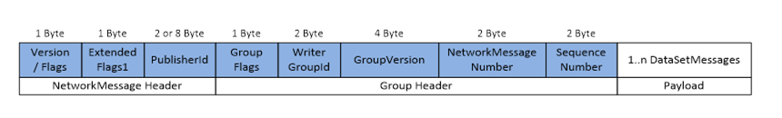  

Figure A. 1 - UADP NetworkMessage header layout  

[Table A.1](/§\_Ref519242114) shows the configuration for the *NetworkMessage* header.  

Table A. 1 - UADP NetworkMessage header layout  

| **Name** | **Type** | **Restrictions** |
|---|---|---|
|UADPVersion|Bit[0-3]|The version shall be 1|
|UADPFlags|Bit[4-7]|Bit 4: *PublisherId* enabled = 1 Bit 5: *GroupHeader* enabled = 1 Bit 6: *PayloadHeader* enabled = 0 Bit 7: *ExtendedFlags1* enabled = 1|
|ExtendedFlags1|Byte|Bit range 0-2: *PublisherId* Type with one of the two following options 001  The *PublisherId* is of *DataType* *UInt16* 011  The *PublisherId* is of *DataType* *UInt64* Bit 3: *DataSetClassId* enabled = 0 Bit 4: *SecurityHeader* enabled = 0 Bit 5: *Timestamp* enabled = 0 Bit 6: *PicoSeconds* enabled = 0 Bit 7: *ExtendedFlags2* enabled = 0|
|PublisherId|UInt16 or UInt64|Configured value for the PubSubConnection. The datatype shall be UInt16 or UInt64.|
|GroupHeader|||
|GroupFlags|Byte|Bit 0: Writer *GroupId* enabled = 1 Bit 1: *GroupVersion* enabled = 1 Bit 2: *NetworkMessageNumber* enabled = 1 Bit 3: *SequenceNumber* enabled = 1 Bits 4-6: 0 Bit 7: 0|
|WriterGroupId|UInt16|Configured value for the WriterGroup.|
|GroupVersion|VersionTime|Configured value for the WriterGroup.|
|NetworkMessage Number|UInt16|Configured value for the WriterGroup.|
|SequenceNumber|UInt16|Defined by [Table 154](/§\_Ref408404919) .|
  

  

[Table A.2](/§\_Ref532477612) defines the values for the configuration parameters representing this layout.  

Table A. 2 - Values for configuration parameters  

| **Parameter** | **Value** |
|---|---|
|UadpNetworkMessageContentMask|0x0000003F  This value results of the following options: Bit 0: *PublisherId* enabled = 1 Bit 1: *GroupHeader* enabled = 1 Bit 2: *WriterGroupId* enabled = 1 Bit 3: *GroupVersion* enabled = 1 Bit 4: *NetworkMessageNumber* enabled = 1 Bit 5: *SequenceNumber* enabled = 1|
  

  

When a *PubSubConnection* is created by using the *Method* *AddConnection()* the element *PublisherId* contained in the argument *PubSubConnectionDataType* shall be of the datatype *UInt16* or *UInt64* .  

##### A.2.1.5 Header layout for NetworkMessages with integrity (signing)  

UADP messages may be signed to ensure integrity. In this case the *SecurityHeader* and the *Signature* have to be added to the message. See clause [7.2.4.4.3](/§\_Ref443452372) for a complete description of the signing mechanism.  

This header layout is basically the same as the header layout defined in [A.2.1.4](/§\_Ref15891599) but with additional security level 'signing but no encryption'.  

The *NetworkMessage* header layout with signing is shown in [Figure A.2](/§\_Ref153360553) .  

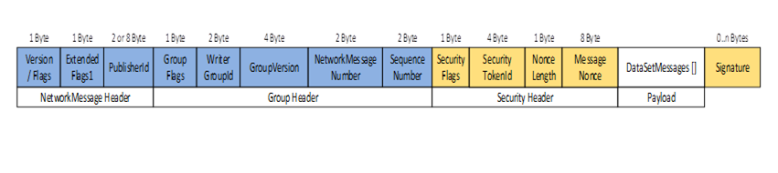  

Figure A. 2 - UADP NetworkMessage header layout with integrity (signing)  

  

[Table A.3](/§\_Ref534583998) shows the configuration for the *NetworkMessage* header with signing. The table contains only the added or modified rows from [Table A.1](/§\_Ref519242114) .  

Table A. 3 - UADP NetworkMessage header layout with integrity (signing)  

| **Name** | **Type** | **Restrictions** |
|---|---|---|
|ExtendedFlags1|Byte|Bit 4: *SecurityHeader* enabled = 1|
|SecurityHeader|||
|SecurityFlags|Byte|Bit 0: *NetworkMessage* Signed enabled = 1 Bit 1: *NetworkMessage* Encryption enabled = 0 Bit 2: *SecurityFooter* enabled = 0 Bit 3: Force key reset enabled = 0 Bit range 4-7: Reserved|
|SecurityTokenId|IntegerId|The ID of the security token that identifies the security key in a *SecurityGroup* .|
|NonceLength|Byte|8|
|MessageNonce|Byte[8]|A number used exactly once for a given security key.|
  

  

##### A.2.1.6 Header layout for NetworkMessages with integrity and confidentiality (signing and encryption)  

UADP messages may be signed and encrypted. In this case the *SecurityHeader* and the *Signature* have to be added to the message. See clause [7.2.4.4.3](/§\_Ref443452372) for a complete description of the security mechanisms.  

This header layout is basically the same as the header layout defined in [A.2.1.4](/§\_Ref15891599) but with additional security level 'signing and encryption'.  

The *NetworkMessage* header layout with signing is shown in [Figure A.3](/§\_Ref153361545) .  

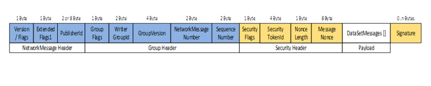  

Figure A. 3 - UADP NetworkMessage header layout with integrity and confidentiality  

[Table A.4](/§\_Ref7164655) shows the configuration for the *NetworkMessage* header with signing and encryption. The table contains only the added or modified rows from [Table A.1](/§\_Ref519242114) .  

Table A. 4 - UADP NetworkMessage header layout with integrity and confidentiality  

| **Name** | **Type** | **Restrictions** |
|---|---|---|
|ExtendedFlags1|Byte|Bit 4: *SecurityHeader* enabled = 1|
|SecurityHeader|||
|SecurityFlags|Byte|Bit 0: *NetworkMessage* Signed enabled = 1 Bit 1: *NetworkMessage* Encryption enabled = 1 Bit 2: *SecurityFooter* enabled = 0 Bit 3: Force key reset enabled = 0 Bit range 4-7: Reserved|
|SecurityTokenId|IntegerId|The ID of the security token that identifies the security key in a *SecurityGroup* .|
|NonceLength|Byte|8|
|MessageNonce|Byte[8]|A number used exactly once for a given security key.|
  

  

##### A.2.1.7 Header layout for DataSetMessages  

A UADP *DataSetMessage* header shall consist of the following fields according to this header layout:  

* *DataSetFlags1*  

* *DataSetMessageSequenceNumber*  

* *Status*  

Additional restrictions:  

* Fields within the payload use *RawData Field Encoding*  

* Only data key frame *DataSetMessages* are supported  

The *DataSetMessage* header layout is shown in [Figure A.4](/§\_Ref519243253) .  

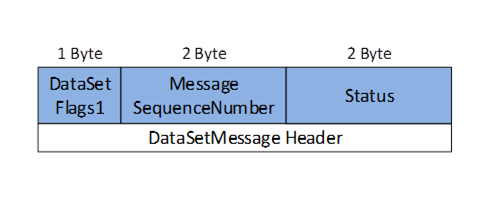  

Figure A. 4 - UADP DataSetMessage header layout  

[Table A.5](/§\_Ref519243305) shows the configuration for the *DataSetMessage* header.  

Table A. 5 - UADP DataSetMessage header layout  

| **Name** | **Type** | **Restrictions** |
|---|---|---|
|DataSetFlags1|Byte|Bit 0: Indicates whether this *DataSetMessage* is valid Bit range 1-2: Field Encoding 01   *RawData Field Encoding* Bit 3: *DataSetMessageSequenceNumber* enabled = 1 Bit 4: *Status* enabled Bit 5: *ConfigurationVersionMajorVersion* enabled = 0 Bit 6: *ConfigurationVersionMinorVersion* enabled = 0 Bit 7: *DataSetFlags2* enabled = 0|
|DataSetMessageSequenceNumber|UInt16|Defined by [Table 162](/§\_Ref434237383) .|
|StatusCode|UInt16|Defined by [Table 162](/§\_Ref434237383) .|
  

  

[Table A.6](/§\_Ref532478975) defines the values for the configuration parameters representing this layout.  

Table A. 6 - Values for configuration parameters  

| **Parameter** | **Value** |
|---|---|
|KeyFrameCount|1|
|UadpDataSetMessageContentMask|0x00000024  This value results of the following options: Bit 2: *StatusCode* enabled = 1 Bit 5: *SequenceNumber* enabled = 1 |
|DataSetFieldContentMask|0x00000020  This value results of the following options: Bit 5: *RawData*|
|DataSetOrdering|*AscendingWriterId* or *AscendingWriterIdSingle*|
  

  

##### A.2.1.8 Example fixed message layout without security  

[Figure A.5](/§\_Ref535440475) shows an example for a UADP *NetworkMessage* with fixed layout as defined in [A.2.1.3](/§\_Ref534581675) and [A.2.1.7](/§\_Ref535440704) .  

The configuration ensures that every *NetworkMessage* sent has the same layout of header fields and also the same layout of *DataSet* fields. This allows a highly efficient encoding and decoding of the message because the offset of all fields is constant and can be pre-calculated. The *Payload Header* ( *Count* and *Sizes* for the *DataSetMessages* and *DataSetWriterIds* ) is deactivated and the *Subscriber* has to retrieve this information through the *DataSetMetaData* , *DataSetWriter* and *WriterGroup* settings.  

The configuration has to ensure that the size of each *DataSetMessage* is constant. This can be achieved by avoiding *DataSet* fields of types with variable size, or by using the parameter *ConfiguredSize* . In this example it is assumed that DataSetMessage[1] and DataSetMessage[W-1] are using *RawData* field encoding and all *DataSet* fields are from constant size, so the total length of theses *DataSetMessages* can be calculated from the *DataSetMetaData* . For DataSetMessage[0] in this example the *Subscriber* does not have to calculate the total length but it should take it from the parameter *ConfiguredSize* . This allows to provide spare bytes for future extension of DataSetMessage[0] without effect on the size of the complete *NetworkMessage* or the position of other *DataSetMessages* in this *NetworkMessage* .  

By setting-specific values for *KeyFrameCount* and *DataSetOrdering* (see [Table A.6](/§\_Ref532478975) ) it is guaranteed that the number of *DataSetMessages* and their order inside the *NetworkMessage* is the same in every *NetworkMessage* that is sent.  

  

Figure A. 5 - Example for fixed message layout without security  

##### A.2.1.9 Example fixed message layout with integrity  

[Figure A.6](/§\_Ref535440488) shows an example for a UADP *NetworkMessage* with fixed layout and security activated (signing, no encryption) as defined in [A.2.1.5](/§\_Ref535440764) and [A.2.1.7](/§\_Ref535440704) .  

The layout of all header fields and *DataSet* fields is constant like described in [A.2.1.8](/§\_Ref535442893) . Additional to this the *SecurityHeader* is activated for signing (but no encryption).  

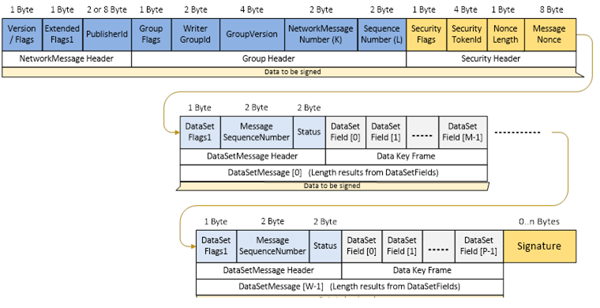  

Figure A. 6 - Example for fixed message layout without signature  

#### A.2.2 Message headers for Events and Data with dynamic layout  

##### A.2.2.1 Motivation  

In *PubSub* use cases with dynamically changing message layouts or Event based DataSetMessages, the number and ordering of *DataSetMessages* within different *NetworkMessages* can change arbitrarily. The header layouts described in this section are intended for use cases with dynamic *DataSets* and ad-hoc identification of *DataSetMessages* .  

##### A.2.2.2 Overview  

With the header layout described in this section, the *NetworkMessage* header only identifies the *Publisher* and the contained *DataSetMessages* . In contrast to the fixed layout, more header fields are enabled in the *DataSetMessage* header with this header layout but the *GroupHeader* is deactivated.  

##### A.2.2.3 Header layout URI  

The header layout URI for the dynamic layout as specified in [A.2.2.4](/§\_Ref15892807) , [A.2.2.5](/§\_Ref15892815) , [A.2.2.6](/§\_Ref15892822) and [A.2.2.7](/§\_Ref15892833) is  

http://opcfoundation.org/UA/PubSub-Layouts/UADP-Dynamic  

##### A.2.2.4 Header layout for NetworkMessages  

A UADP *NetworkMessage* header shall consist of the following fields according to this header layout:  

* *Version* / *Flags*  

* *ExtendedFlags1*  

* *PublisherId*  

* *PayloadHeader*  

Additional restrictions:  

* The datatype for the *PublisherId* shall be *UInt64*  

*Note:* For the *PublisherId* the *DataType* *UInt64* was selected because it allows a simple way for a *Publisher* to generate unique *PublisherIds* by using the local MAC address (48 bit) as part of the *PublisherId* .  

The *NetworkMessage* header layout is shown in [Figure A.7](/§\_Ref519496212) .  

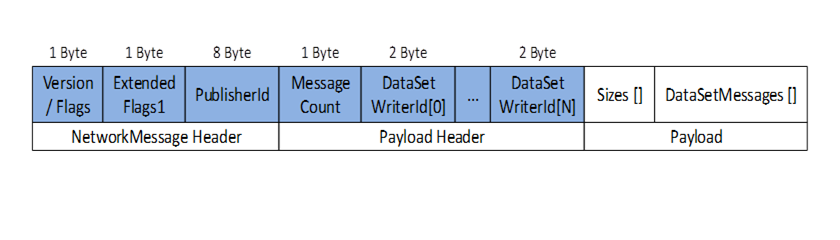  

Figure A. 7 - UADP NetworkMessage header layout  

[Table A.7](/§\_Ref519496297) shows the configuration for the *NetworkMessage* header.  

Table A. 7 - UADP NetworkMessage header layout  

| **Name** | **Type** | **Restrictions** |
|---|---|---|
|UADPVersion|Bit[0-3]|The version shall be 1|
|UADPFlags|Bit[4-7]|Bit 4: *PublisherId* enabled = 1 Bit 5: *GroupHeader* enabled = 0 Bit 6: *PayloadHeader* enabled = 1 Bit 7: *ExtendedFlags1* enabled = 1|
|ExtendedFlags1|Byte|Bit range 0-2: *PublisherId* Type 011  The *PublisherId* is of *DataType* *UInt64* Bit 3: *DataSetClassId* enabled = 0 Bit 4: *SecurityHeader* enabled = 0 Bit 5: *Timestamp* enabled = 0 Bit 6: *PicoSeconds* enabled = 0 Bit 7: *ExtendedFlags2* enabled = 0|
|PublisherId|UInt64|Configured value for the PubSubConnection. The datatype shall be UInt64.|
|PayloadHeader|Byte[\*]|Defined by [Table 160](/§\_Ref449993001) .|
  

  

[Table A.8](/§\_Ref532479067) defines the values for the configuration parameters representing this layout.  

Table A. 8 - Values for configuration parameters  

| **Parameter** | **Value** |
|---|---|
|UadpNetworkMessageContentMask|0x00000041  This value results of the following options: Bit 0: *PublisherId* enabled = 1 Bit 6: *PayloadHeader* enabled = 1|
  

  

When a *PubSubConnection* is created by using the *Method* *AddConnection()* the element *PublisherId* contained in the argument *PubSubConnectionDataType* shall be of the *DataType* *UInt64* .  

##### A.2.2.5 Header layout for NetworkMessages with integrity (signing)  

UADP messages may be signed to ensure integrity. In this case a security header and a signature have to be added to the message. See clause [7.2.4.4.3](/§\_Ref443452372) for a complete description of the signing mechanism.  

This header layout is basically the same as the header layout defined in [A.2.2.4](/§\_Ref15892783) but with additional security level 'Signing but no encryption'. The *NetworkMessage* header layout with signing is shown in [Figure A.8](/§\_Ref153361580) .  

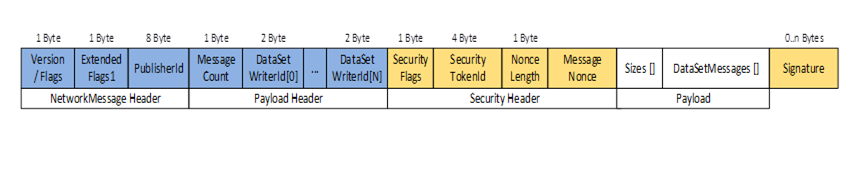  

Figure A. 8 - UADP NetworkMessage header layout with integrity (signing)  

[Table A.9](/§\_Ref535398272) shows the configuration for the *NetworkMessage* header with signing. The table contains only the added or modified rows from [Table A.7](/§\_Ref519496297) .  

Table A. 9 - UADP NetworkMessage header layout with integrity (signing)  

| **Name** | **Type** | **Restrictions** |
|---|---|---|
|ExtendedFlags1|Byte|Bit 4: *SecurityHeader* enabled = 1|
|SecurityHeader|||
|SecurityFlags|Byte|Bit 0: *NetworkMessage* Signed enabled = 1 Bit 1: *NetworkMessage* Encryption enabled = 0 Bit 2: *SecurityFooter* enabled = 0 Bit 3: Force key reset enabled = 0 Bit range 4-7: Reserved|
|SecurityTokenId|IntegerId|The ID of the security token that identifies the security key in a *SecurityGroup* .|
|NonceLength|Byte|The length of the Nonce used to initialize the encryption algorithm.|
|MessageNonce|Byte[NonceLength]|A number used exactly once for a given security key.|
  

  

##### A.2.2.6 Header layout for NetworkMessages with integrity and confidentiality (signing and encryption)  

UADP messages may be signed and encrypted. In this case the *SecurityHeader* and the *Signature* have to be added to the message. See clause [7.2.4.4.3](/§\_Ref443452372) for a complete description of the security mechanisms.  

This header layout is basically the same as the header layout defined in [A.2.2.4](/§\_Ref15893112) but with additional security level 'Signing and encryption'. The *NetworkMessage* header layout with signing and encryption is shown in [Figure A.9](/§\_Ref153361611) .  

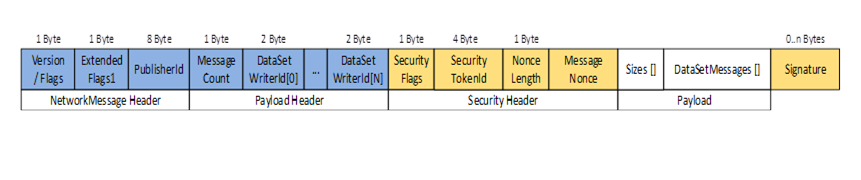  

Figure A. 9 - UADP NetworkMessage header layout with integrity and confident  

[Table A.10](/§\_Ref7167545) shows the configuration for the *NetworkMessage* header with signing and encryption. The table contains only the added or modified rows from [Table A.7](/§\_Ref519496297) .  

Table A. 10 - UADP NetworkMessage header layout with integrity and confidentiality  

| **Name** | **Type** | **Restrictions** |
|---|---|---|
|ExtendedFlags1|Byte|Bit 4: *SecurityHeader* enabled = 1|
|SecurityHeader|||
|SecurityFlags|Byte|Bit 0: *NetworkMessage* Signed enabled = 1 Bit 1: *NetworkMessage* Encryption enabled = 1 Bit 2: *SecurityFooter* enabled = 0 Bit 3: Force key reset enabled = 0 Bit range 4-7: Reserved|
|SecurityTokenId|IntegerId|The ID of the security token that identifies the security key in a *SecurityGroup* .|
|NonceLength|Byte|The length of the Nonce used to initialize the encryption algorithm.|
|MessageNonce|Byte[NonceLength]|A number used exactly once for a given security key.|
  

  

##### A.2.2.7 Header layout for DataSetMessages  

A UADP *DataSetMessage* header shall consist of the following fields according to this header layout:  

* *DataSetFlags1*  

* *DataSetFlags2*  

* *DataSetMessageSequenceNumber*  

* *Timestamp*  

* *Status*  

* *MinorVersion*  

Additional remarks:  

* Fields can use any encoding  

* All types of *DataSetMessages* (Data Key Frame, Data Delta Frame, Event, etc.) are supported  

The *DataSetMessage* header layout is shown in [Figure A.10](/§\_Ref519497000)  

  

Figure A. 10 - UADP DataSetMessage header layout  

[Table A.11](/§\_Ref519497155) shows the configuration for the *DataSetMessage* header.  

Table A. 11 - UADP DataSetMessage header layout  

| **Name** | **Type** | **Description** |
|---|---|---|
|DataSetFlags1|Byte|Bit 0: Indicates whether this *DataSetMessage* is valid Bit range 1-2: Field Encoding \<anything\>Bit 3: *DataSetMessageSequenceNumber* enabled = 1 Bit 4: *Status* enabled = 1 Bit 5: *ConfigurationVersionMajorVersion* enabled = 0 Bit 6: *ConfigurationVersionMinorVersion* enabled = 1 Bit 7: *DataSetFlags2* enabled = 1|
|DataSetFlags2|Byte|Bit range 0-3: UADP *DataSetMessage* type \<anything\> Bit 4: *Timestamp* enabled = 1 Bit 5: *PicoSeconds* enabled = 0 (not included in the *DataSetMessage* header)|
|DataSetMessageSequenceNumber|UInt16|Defined by [Table 162](/§\_Ref434237383) .|
|Timestamp|UtcTime|Defined by [Table 162](/§\_Ref434237383) .|
|StatusCode|UInt16|Defined by [Table 162](/§\_Ref434237383) .|
|MinorVersion|VersionTime|Defined by [Table 162](/§\_Ref434237383) .|
  

  

[Table A.12](/§\_Ref534365779) defines the values for the configuration parameters representing this layout.  

Table A. 12 - Values for configuration parameters  

| **Parameter** | **Value** |
|---|---|
|UadpDataSetMessageContentMask|0x00000035  This value results of the following options: Bit 0: *Timestamp* enabled = 1 Bit 2: *Status* enabled = 1 Bit 4: *MinorVersion* enabled = 1 Bit 5: *SequenceNumber* enabled = 1|
|DataSetFieldContentMask|\<anything\>|
  

  

##### A.2.2.8 Example dynamic message layout with different DataSetMessage types  

[Figure A.11](/§\_Ref535440508) shows an example for a UADP *NetworkMessage* with dynamic layout. As defined in [A.2.2.3](/§\_Ref535397677) and [A.2.2.7](/§\_Ref535440821) only the layout of the *NetworkMessage* header and the *DataSetMessage* header is fixed. The number, the type, the length, and the order of *DataSetMessages* can vary from one *NetworkMessage* to the next.  

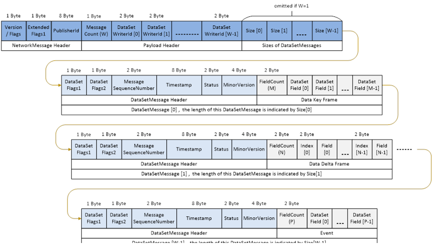  

Figure A. 11 - Example for dynamic message layout without security  

### A.3 JSON Header Layouts  

#### A.3.1 DataSets for examples  

The following DataSets are used for the following JSON message examples.  

[Table A.13](/§\_Ref127552084) shows the field for example DataSet1.  

Table A. 13 - DataSet1 fields  

| **Field Name** | **DataType** | **ValueRank** |
|---|---|---|
|Active|Boolean|Scalar|
|Temperature|Double|Scalar|
|Counter|UInt32|Scalar|
|AdditionalInfo|String|Scalar|
  

  

[Table A.14](/§\_Ref82503341) shows the field for example DataSet2.  

Table A. 14 - DataSet2 fields  

| **Field Name** | **DataType** | **ValueRank** |
|---|---|---|
|LocationName|String|Scalar|
|Coordinate|MyStruct|Scalar|
|X|Float|Scalar|
|Y|Float|Scalar|
|Measurements|Int32|Array|
  

  

[Table A.15](/§\_Ref82503348) shows the field for example DataSet3.  

Table A. 15 - DataSet3 fields  

| **Field Name** | **DataType** | **ValueRank** |
|---|---|---|
|BooleanValue|Boolean|Scalar|
|Int32Value|Int32|Scalar|
|Int64Value|Int64|Scalar|
|UInt32Value|UInt32|Scalar|
|UInt64Value|UInt64|Scalar|
|DoubleValue|Double|Scalar|
|DateTimeValue|DateTime|Scalar|
|StringValue|String|Scalar|
|GuidValue|Guid|Scalar|
|StatusCodeValue|StatusCode|Scalar|
|LocalizedTextValue|LocalizedText|Scalar|
|ByteStringValue|ByteString|Scalar|
|NodeIdValue|NodeId|Scalar|
|QualifiedNameValue|QualifiedName|Scalar|
  

  

The following example shows the *DataSetMetaData* message for DataSet1.  

\{  

"MessageId": "66D65CA4-92EE-4195-9867-E6E27794B692",  

"MessageType": "ua-metadata",  

"PublisherId": "MyPublisher",  

"DataSetWriterId": 101,  

"MetaData": \{  

"Name": "DataSet1",  

"Fields": [  

\{  

"Name": "Active",  

"FieldFlags": 0,  

"BuiltInType": 1,  

"DataType": "i=1",  

"ValueRank": -1,  

"MaxStringLength": 0,  

"DataSetFieldId": "f355bfe8-d5c0-4073-aa89-c8d9d9f8c0c4"  

\},  

\{  

"Name": "Temperature",  

"FieldFlags": 0,  

"BuiltInType": 11,  

"DataType": "i=11",  

"ValueRank": -1,  

"MaxStringLength": 0,  

"DataSetFieldId": "4b91e1cc-61f5-411a-9fb3-ea9087d2154c"  

\},  

\{  

"Name": "Counter",  

"FieldFlags": 0,  

"BuiltInType": 7,  

"DataType": "i=7",  

"ValueRank": -1,  

"MaxStringLength": 0,  

"DataSetFieldId": "885d0b3b-8a83-41ae-882a-3a528041140f"  

\},  

\{  

"Name": "AdditionalInfo",  

"FieldFlags": 0,  

"BuiltInType": 12,  

"DataType": "i=12",  

"ValueRank": -1,  

"MaxStringLength": 0,  

"DataSetFieldId": "b020c4a8-c427-4d33-83ea-b0f437a9c6ea"  

\}  

],  

"DataSetClassId": "e95258a4-0b50-41b0-9f37-505e90565584",  

"ConfigurationVersion": \{"MajorVersion": 672338910, "MinorVersion": 672341762\}  

\},  

"DataSetWriterName": "Writer101"  

\}  

The following example shows the *DataSetMetaData* message for DataSet2.  

\{  

"MessageId": "66D65CA4-92EE-4195-9867-E6E27794B692",  

"MessageType": "ua-metadata",  

"PublisherId": "MyPublisher",  

"DataSetWriterId": 102,  

"MetaData": \{  

"StructureDataTypes": [  

\{  

"DataTypeId": "nsu=http://test.org/UA/Data/;s=CoordinateDataType",  

"Name": "nsu=http://test.org/UA/Data/;CoordinateDataType",  

"StructureDefinition": \{  

"DefaultEncodingId": "nsu=http://test.org/UA/Data/;i=24351",  

"BaseDataType": "i=22",  

"StructureType": 0,  

"Fields": [  

\{  

"Name": "X",  

"Description": \{"Text": "The X coordinate."\},  

"DataType": "i=10",  

"ValueRank": -1,  

"MaxStringLength": 0,  

"IsOptional": false  

\},  

\{  

"Name": "Y",  

"Description": \{"Text": "The Y coordinate."\},  

"DataType": "i=10",  

"ValueRank": -1,  

"MaxStringLength": 0,  

"IsOptional": false  

\}  

]  

\}  

\}  

],  

"Name": "DataSet2",  

"Fields": [  

\{  

"Name": "LocationName",  

"FieldFlags": 0,  

"BuiltInType": 12,  

"DataType": "i=12",  

"ValueRank": -1,  

"MaxStringLength": 0,  

"DataSetFieldId": "8968e376-e281-47bf-b621-e1fb710c8954"  

\},  

\{  

"Name": "Coordinate",  

"FieldFlags": 0,  

"BuiltInType": 22,  

"DataType": "nsu=http://test.org/UA/Data/;s=CoordinateDataType",  

"ValueRank": -1,  

"MaxStringLength": 0,  

"DataSetFieldId": "4a1a1f3c-76c0-46ac-92bd-b02bfbe59dcf"  

\},  

\{  

"Name": "Measurements",  

"FieldFlags": 0,  

"BuiltInType": 6,  

"DataType": "i=6",  

"ValueRank": 1,  

"MaxStringLength": 0,  

"DataSetFieldId": "7d177014-32de-421e-a0a3-bc48ede8ac9d"  

\}  

],  

"DataSetClassId": "4f457b18-32f8-48a5-a6f0-18ae5ebdc7f4",  

"ConfigurationVersion": \{"MajorVersion": 672338910, "MinorVersion": 672341762\}  

\},  

"DataSetWriterName": "Writer102"  

\}  

#### A.3.2 JSON message headers for minimal messages  

##### A.3.2.1 Motivation  

One of the use cases for PubSub is the publication of data to IT applications through a topic or message queue where the IT application does not have any knowledge about OPC UA. In such a use case, the messages that are sent to the message queue can only contain one *DataSetMessage* and there should be no OPC UA specific information or header.  

The header layout described in this section is optimized for this use case.  

This header layout cannot be used for *Actions* .  

##### A.3.2.2 Overview  

A minimal message has the following settings:  

* Each *NetworkMessage* contains one *DataSetMessage*  

* The *NetworkMessage* header is not included  

* The *DataSetMessage* header is not included  

* The DataSet field encoding is set to *VerboseEncoding* with *RawData* .  

##### A.3.2.3 Header layout URI  

The header layout URI for the mimimal layout as specified in [A.3.2.4](/§\_Ref127552481) is  

http://opcfoundation.org/UA/PubSub-Layouts/JSON-Minimal  

##### A.3.2.4 Configuration parameters  

[Table A.16](/§\_Ref127552806) defines the values for the *WriterGroup* configuration parameters representing this layout.  

Table A. 16 - Values for WriterGroup configuration parameters  

| **Parameter** | **Value** |
|---|---|
|JsonNetworkMessageContentMask|0x4  This value results of the following options: Bit 0: NetworkMessageHeader = 0 Bit 1: DataSetMessageHeader = 0 Bit 2: SingleDataSetMessage  = 1 Bit 3: PublisherId   = 0 Bit 4: DataSetClassId  = 0 Bit 5: ReplyTo   = 0 Bit 6: WriterGroupName  = 0|
  

  

[Table A.17](/§\_Ref82504967) defines the values for the *DataSetWriter* configuration parameters representing this layout.  

Table A. 17 - Values for DataSetWriter configuration parameters  

| **Parameter** | **Value** |
|---|---|
|JsonDataSetMessageContentMask|0x800 This value results of the following options: Bit 0: DataSetWriterId  = 0 Bit 1: MetaDataVersion  = 0 Bit 2: SequenceNumber  = 0 Bit 3: Timestamp   = 0 Bit 4: Status   = 0 Bit 5: MessageType   = 0 Bit 6: DataSetWriterName  = 0 Bit 7: FieldEncoding1  = 0 Bit 8: PublisherId   = 0 Bit 9: WriterGroupName  = 0 Bit 10: MinorVersion  = 0 Bit 11: FieldEncoding2  = 1|
|DataSetFieldContentMask|0x20 Bit 0: StatusCode   = 0 Bit 1: SourceTimestamp  = 0 Bit 2: ServerTimestamp  = 0 Bit 3: SourcePicoSeconds  = 0 Bit 4: ServerPicoSeconds  = 0 Bit 5: RawData   = 1|
|KeyFrameCount|configurable|
  

  

##### A.3.2.5 Examples  

Example for DataSet1.  

\{  

"Active":true,  

"Temperature":25.5,  

"Counter":0,  

"AdditionalInfo":"The system is running normally (1)"  

\}  

Example for DataSet2.  

\{  

"LocationName":"Building A",  

"Coordinate":  

\{  

"X":0,  

"Y":0.2  

\},  

"Measurements":  

[  

20030,  

20020,  

20010  

]  

\}  

Example for DataSet3.  

\{  

"BooleanValue":false,  

"Int32Value":0,  

"Int64Value":"1",  

"UInt32Value":1,  

"UInt64Value":"1",  

"DoubleValue":0.5,  

"DateTimeValue":"2021-09-14T07:14:30Z",  

"StringValue":"String 1",  

"GuidValue":"ebfc352a-3142-4b99-9bbe-89a517d6a77e",  

"StatusCodeValue":  

\{  

"Code":2147483648,  

"Symbol":"Bad"  

\},  

"LocalizedTextValue":  

\{  

"Locale":"en"  

"Text":"Localized text 1"  

\},  

"ByteStringValue":"AAEC",  

"NodeIdValue":"nsu=http://test.org/UA/Data/Instance;s=Pipe001.Valve001.Input",  

"QualifiedNameValue":"nsu=http://test.org/UA/Data/;PipeX001"  

\}  

#### A.3.3 JSON message headers for single DataSetMessage  

##### A.3.3.1 Motivation  

One of the use cases for PubSub is the publication of data to IT applications through a message queue where one DataSet is related to one message queue.  

The IT application does not need to have knowledge about OPC UA but OPC UA specific header may be used for the message processing.  

In such a use cases, the messages sent to a message queue can only contain one DataSetMessage but a OPC UA specific header is provided.  

The header layout described in this section is optimized for this use case.  

This header layout cannot be used for *Actions* .  

##### A.3.3.2 Overview  

A single DataSet message has the following settings:  

* Each *NetworkMessage* contains one *DataSetMessage*  

* The *NetworkMessage* header is not included  

* The *DataSetMessage* header is included, the header fields can be configured  

* The DataSet field encoding can be configured  

##### A.3.3.3 Header layout URI  

The header layout URI for the single DataSetMessage layout as specified in [A.3.3.4](/§\_Ref128321288) is  

http://opcfoundation.org/UA/PubSub-Layouts/JSON-DataSetMessage  

##### A.3.3.4 Configuration parameters  

[Table A.18](/§\_Ref128321284) defines the values for the WriterGroup configuration parameters representing this layout.  

Table A. 18 - Values for WriterGroup configuration parameters  

| **Parameter** | **Value** |
|---|---|
|JsonNetworkMessageContentMask|0x6 This value results of the following options: Bit 0: NetworkMessageHeader = 0 Bit 1: DataSetMessageHeader = 1 Bit 2: SingleDataSetMessage  = 1 Bit 3: PublisherId   = 0 Bit 4: DataSetClassId  = 0 Bit 5: ReplyTo   = 0 Bit 6: WriterGroupName  = 0|
  

  

[Table A.19](/§\_Ref128321285) defines the values for the DataSetWriter configuration parameters representing this layout.  

Table A. 19 - Values for DataSetWriter configuration parameters  

| **Parameter** | **Value** |
|---|---|
|JsonDataSetMessageContentMask|The mask allows the following options: Bit 0: DataSetWriterId  = 1 Bit 1: MetaDataVersion  = 0 Bit 2: SequenceNumber  = 1 Bit 3: Timestamp   = 1 Bit 4: Status   = 1 Bit 5: MessageType   configurable (default is 0) Bit 6: DataSetWriterName  configurable (default is 0) Bit 7: FieldEncoding1  = 0 Bit 8: PublisherId   = 1 Bit 9: WriterGroupName  configurable (default is 0) Bit 10: MinorVersion  = 1 Bit 11: FieldEncoding2  = 1|
|DataSetFieldContentMask|Configurable (default is 0) The value shall be 0 or 0x20 if the *MessageType* is "ua-event".|
|KeyFrameCount|Configurable If the KeyFrameCount is not 1, the *MessageType* bit shall be true.|
  

  

##### A.3.3.5 Examples  

Example for DataSet1 with all configurable *JsonDataSetMessageContentMask* flags set to false and no flags set for *DataSetFieldContentMask* .  

\{  

"PublisherId":"MyPublisher",  

"DataSetWriterId":101,  

"SequenceNumber":68468,  

"MinorVersion":672341762,  

"Timestamp":"2021-09-27T18:45:19.555Z",  

"Payload":  

\{  

"Active":true,  

"Temperature":25.5,  

"Counter":0,  

"AdditionalInfo":"The system is running normally (1)"  

\}  

\}  

Example for DataSet2 with all configurable *JsonDataSetMessageContentMask* flags set to true and no flags set for *DataSetFieldContentMask* .  

\{  

"PublisherId":"MyPublisher",  

"DataSetWriterId":102,  

"SequenceNumber":25460,  

"MinorVersion":672341762,  

"Timestamp":"2021-09-27T18:45:19.555Z",  

"Status":\{"Code":1073741824\},  

"MessageType":"ua-keyframe",  

"WriterGroupName":"WriterGroup1",  

"DataSetWriterName":"Writer102",  

"Payload":  

\{  

"LocationName":"Building A",  

"Coordinate":  

\{  

"X":1,  

"Y":0.2  

\},  

"Measurements":  

[  

20030,  

20020,  

20010  

]  

\}  

\}  

Example for DataSet1 with all configurable *JsonDataSetMessageContentMask* flags set to false and with *SourceTimestamp* and *StatusCode* flags set in the *DataSetFieldContentMask* . The *Status* is omitted if the *Code* is 0.  

\{  

"PublisherId":"MyPublisher",  

"DataSetWriterId":101,  

"SequenceNumber":68468,  

"MinorVersion":672341762,  

"Timestamp":"2021-09-27T18:45:19.555Z",  

"Payload":  

\{  

"Active":  

\{  

"Value":true,  

"Status":\{"Code":1073741824,"Symbol":"Uncertain"\},  

"SourceTimestamp":"2021-09-27T11:32:38.349925Z"  

\},  

"Temperature":  

\{  

"Value":25.5,  

"SourceTimestamp":"2021-09-27T11:32:38.349925Z"  

\},  

"Counter":  

\{  

"Value":0,  

"SourceTimestamp":"2021-09-27T11:32:38.349925Z"  

\},  

"AdditionalInfo":  

\{  

"Value":"The system is running normally (1)",  

"SourceTimestamp":"2021-09-27T11:32:38.349925Z"  

\}  

\}  

\}  

#### A.3.4 JSON message headers for multiple DataSetMessages  

##### A.3.4.1 Motivation  

One of the use cases is streaming of multiple different data and event DataSets through a single message queue for further processing in cloud applications.  

Another use case is the execution of *Actions* .  

The header layout described in this section is optimized for this use case.  

In general this header layout is the most flexible option and should be used if only one header layout is preferred.  

##### A.3.4.2 Overview  

A minimal message has the following settings:  

* Each *NetworkMessage* contains an array of *DataSetMessages*  

* The *NetworkMessage* header is included, the header fields can be configured  

* The *DataSetMessage* header is included, the header fields can be configured  

* The DataSet field encoding can be configured  

##### A.3.4.3 Header layout URI  

The header layout URI for the multiple DataSetMessages layout as specified in [A.3.4.4](/§\_Ref128321289) is  

http://opcfoundation.org/UA/PubSub-Layouts/JSON-NetworkMessage  

##### A.3.4.4 Configuration parameters  

[Table A.20](/§\_Ref128321286) defines the values for the WriterGroup configuration parameters representing this layout.  

Table A. 20 - Values for WriterGroup configuration parameters  

| **Parameter** | **Value** |
|---|---|
|JsonNetworkMessageContentMask|The mask allows the following options: Bit 0: NetworkMessageHeader = 1 Bit 1: DataSetMessageHeader = 1 Bit 2: SingleDataSetMessage  = 0 Bit 3: PublisherId   = 1 Bit 4: DataSetClassId  configurable (default is 0) Bit 5: ReplyTo   configurable (default is 0) Bit 6: WriterGroupName  configurable (default is 0)|
  

  

[Table A.21](/§\_Ref128321287) defines the values for the DataSetWriter configuration parameters representing this layout.  

Table A. 21 - Values for DataSetWriter configuration parameters  

| **Parameter** | **Value** |
|---|---|
|JsonDataSetMessageContentMask|The mask allows the following options: Bit 0: DataSetWriterId  = 1 Bit 1: MetaDataVersion  = 0 Bit 2: SequenceNumber  = 1 The *SequenceNumber* is always omitted for Action messages. Bit 3: Timestamp   = 1 Bit 4: Status   = 1 The *Status* is omitted for *ActionRequest* messages. Bit 5: MessageType   configurable (default is 0) Bit 6: DataSetWriterName  configurable (default is 0) Bit 7: FieldEncoding1  = 0 Bit 8: PublisherId   = 0 Bit 9: WriterGroupName  configurable (default is 0) Bit 10: MinorVersion  = 1 Bit 11: FieldEncoding2  = 1|
|DataSetFieldContentMask|Configurable (default is 0) The value shall be 0 or 0x20 if the *MesageType* is "ua-event".|
|KeyFrameCount|Configurable If the KeyFrameCount is not 1, the *MessageType* bit shall be true.|
  

  

##### A.3.4.5 Examples  

Example for DataSet1, DataSet2 and DataSet3 with all configurable *JsonNetworkMessageContentMask* and *JsonDataSetMessageContentMask* flags set to false and no flags set for *DataSetFieldContentMask* .  

\{  

"MessageId":"9279c0b3-da88-45a4-af74-451cebf82db0",  

"MessageType":"ua-data",  

"PublisherId":"MyPublisher",  

"Messages":  

[  

\{  

"DataSetWriterId":101,  

"SequenceNumber":68468,  

"MinorVersion":672341762,  

"Timestamp":"2021-09-27T18:45:19.555Z",  

"Payload":  

\{  

"Active":true,  

"Temperature":25.5,  

"Counter":0,  

"AdditionalInfo":"The system is running normally (1)"  

\}  

\},  

\{  

"DataSetWriterId":102,  

"SequenceNumber":25460,  

"MinorVersion":672341762,  

"Timestamp":"2021-09-27T18:45:19.555Z",  

"Status":\{"Code":1073741824\},  

"Payload":  

\{  

"LocationName":"Building A",  

"Coordinate":\{"X":0,"Y":0.2\},  

"Measurements":[20030,20020,20010]  

\}  

\},  

\{  

"DataSetWriterId":103,  

"SequenceNumber":66915,  

"MinorVersion":672341762,  

"Timestamp":"2021-09-27T18:45:19.555Z",  

"Payload":  

\{  

"BooleanValue":false,  

"Int32Value":0,  

"Int64Value":"1",  

"UInt32Value":1,  

"UInt64Value":"1",  

"DoubleValue":0.5,  

"DateTimeValue":"2021-09-14T07:14:30Z",  

"StringValue":"String 1",  

"GuidValue":"ebfc352a-3142-4b99-9bbe-89a517d6a77e",  

"StatusCodeValue":  

\{  

"Code":2147483648,  

"Symbol":"Bad"  

\},  

"LocalizedTextValue":  

\{  

"Locale":"en"  

"Text":"Localized text 1"  

\},  

"ByteStringValue":"AAEC",  

"NodeIdValue":"nsu=http://test.org/UA/Data/Instance;s=Pipe001.Valve001.Input",  

"QualifiedNameValue":"nsu=http://test.org/UA/Data/;PipeX001"  

\}  

\}  

]  

\}  

## Annex B (informative)Additional Transport Protocol Mappings  

### B.1 Overview  

OPC UA defines a generic PubSub model where the different message mappings can be bound to different underlying transport protocols. This annex provides transport mappings to other *Message Oriented Middleware* protocols not part of the normative part of PubSub specification.  

The mappings in this informative annex are intended to be complete and interoparable but the OPC Foundation does not intend to provide compliance testing for these mappings at this time.  

### B.2 Kafka  

#### B.2.1 General  

OPC UA defines a generic PubSub model that can be bound to different underlying protocols. This section describes how OPC UA PubSub can be bound to Kafka, a distributed streaming platform that allows publishers and subscribers to exchange messages through topics. Kafka is widely used for data integration, stream processing, and event-driven applications.  

The transport protocol binding of OPC UA to Kafka is based on the following assumptions and conventions:  

* Kafka brokers are used to manage the topics and partitions, and to store the messages.  

* Kafka producers are used to publish OPC UA NetworkMessages to Kafka topics. Topics must be created in the broker before they can be used by producers.  

* Kafka consumers are used to subscribe to Kafka topics and receive OPC UA *NetworkMessages* .  

* Kafka topics are configured throgh *QueueNames* in *WriterGroups* , *DataSetWriters* and *DataSetReaders* .  

A [Broker](https://reference.opcfoundation.org/search/54?t=Broker) may persist messages so they can be delivered even if the subscriber is not online.  

Kafka security is applied at the transport level, using the SSL/TLS or SASL mechanisms supported by Kafka. The Kafka security configuration is independent of the OPC UA security configuration and can be used to provide an additional layer of protection.  

The OPC UA PubSub transport protocol mapping for Kafka enables the integration of OPC UA PubSub with Kafka-based systems, and the use of Kafka as a reliable and scalable transport for OPC UA PubSub.  

#### B.2.2 TransportProfileUri  

The TransportProfileUri for Kafka transport protocol mapping with UADP message mapping is  

http://opcfoundation.org/UA-Profile/Transport/pubsub-kafka-uadp  

The TransportProfileUri for Kafka transport protocol mapping with JSON message mapping is  

http://opcfoundation.org/UA-Profile/Transport/pubsub-kafka-json  

#### B.2.3 Address  

The syntax of the Kafka transporting protocol URL used in the *Address* parameter defined in [6.2.7.3](/§\_Ref495502612) has the following form:  

kafka://\<domain name\>[:\<port\>]  

The default port is 9092. The protocol prefix above provides transport security using TLS.  

#### B.2.4 Authentication  

Authentication is performed according to the configured *AuthenticationProfileUri* of the *PubSubConnection* , *DataSetWriterGroup* , *DataSetWriter* or *DataSetReader* entities.  

If no authentication information is provided in the form of *ResourceUri* and *AuthenticationProfileUri* , SASL Anonymous is implied.  

For simple username/password authentication SASL PLAIN is used.  

#### B.2.5 Message body  

##### B.2.5.1 JSON message mapping  

A JSON body is encoded as defined for the JSON message mapping defined in [7.2.4.6.9](/§\_Ref463017146) .  

The optional Kafka header with ContentType key can be set to application/json when sending uncompressed JSON messages.  

When sending a gzip (RFC 1952) compressed JSON message on Kafka the optional Kafka header with ContentType key can be set to application/json+gzip.  

##### B.2.5.2 UADP message mapping  

A UADP body is encoded as defined for the UADP message mapping defined in [7.2.3](/§\_Ref463016249) .  

It is expected that the software used to receive UADP *NetworkMessage* can process the body without needing to know how it was transported.  

When sending such message the optional Kafka header with ContentType key can be set to application/opcua+uadp.  

### B.3 AMQP  

#### B.3.1 General  

The Advanced Message Queuing Protocol (AMQP) is an open standard application layer protocol for *Message Oriented Middleware* . AMQP is often used with a *Broker* that relays messages between applications that cannot communicate directly.  

*Publishers* send AMQP messages to AMQP endpoints. Subscribers listen to AMQP endpoints for incoming messages. If a *Broker* is involved it may persist messages so they can be delivered even if the subscriber is not online. *Brokers* may also allow messages to be sent to multiple Subscribers.  

The AMQP protocol defines a binary encoding for all messages with a header and a body. The header allows applications to insert additional information as name-value pairs that are serialized using the AMQP binary encoding. The body is an opaque binary blob that can contain any data serialized using an encoding chosen by the application.  

This document defines two possible message mappings for the AMQP message body: the UADP message mapping defined in [7.2.3](/§\_Ref463016249) and a JSON message mapping defined in [7.2.4.6.9](/§\_Ref463017146) . AMQP *Brokers* have an upper limit on message size. The limit is defined by the AMQP field max-message-size. The mechanism for handling *NetworkMessages* that exceed the *Broker* limits depends on the *MessageMapping* . For *MessageMappings* that support chunking, the *NetworkMessage* is broken into multiple chunks. The chunk size plus the AMQP header should not exceed the AMQP max-message-size. For *MessageMappings* that do not support chunking, the *NetworkMessages* exceeding the maximum size mut be skipped. Diagnostic information for such error scenarios are provided through the *Events* of the type *PubSubTransportLimitsExceedEventType* defined in [9.1.13.2](/§\_Ref443423505) and through the *FailedTransmissions* counter of the *PubSubDiagnosticsWriterGroupType* defined in [9.1.11.9](/§\_Ref473575059) .  

Security with AMQP is primary provided by a TLS connection between the *Publisher* or *Subscriber* and the AMQP *Broker* , however, this requires that the AMQP *Broker* be trusted. For that reason, it may be necessary to provide end-to-end security. Applications that require end-to-end security with AMQP need to use the UADP *NetworkMessages* and binary message encoding defined in [7.2.4.4](/§\_Ref427529263) . JSON encoded message bodies rely on the security mechanisms provided by AMQP and the AMQP *Broker* .  

#### B.3.2 Address  

The syntax of the AMQP transporting protocol URL used in the *Address* parameter defined in [6.2.7.3](/§\_Ref495502612) has the following form:  

amqps://\<domain name\>[:\<port\>][/\<path\>]  

The default port is 5671. The protocol prefix above provides transport security.  

amqp://\<domain name\>[:\<port\>][/\<path\>]  

The default port is 5672.  

The syntax for an AMQP URL over Web Sockets has the following form:  

wss://\<domain name\>[:\<port\>][/\<path\>]  

The default port is 443.  

#### B.3.3 Authentication  

Authentication is performed according to the configured *AuthenticationProfileUri* of the *PubSubConnection* , *DataSetWriterGroup* , *DataSetWriter* or *DataSetReader* entities.  

If no authentication information is provided in the form of *ResourceUri* and *AuthenticationProfileUri* , SASL Anonymous is implied.  

If the authentication profile specifies SASL PLAIN authentication, a separate connection for each new Authentication setting is required.  

#### B.3.4 Connection properties  

AMQP allows sending properties as part of opening the connection, session establishment and link attach.  

The connection properties apply to any connection, session or link created as part of the *PubSubConnection* , or subordinate configuration entities, such as *WriterGroup* and *DataSetWriter* .  

The properties are defined through the *KeyValuePair* array in the ConnectionProperties *WriterGroupProperties* and *DataSetWriterProperties* . The *NamespaceIndex* of the *QualifiedName* in the *KeyValuePair* is 0 for AMQP standard properties. The *Name* of the *QualifiedName* is constructed from a prefix and the AMQP property name with the following syntax.  

Name = \<target prefix\>-\<AMQP property name\>  

The target prefix can have the following values:  

* Connection;  

* session;  

* link.  

The *Value* of the *KeyValuePair* is converted to an AMQP data type using the rules defined in [Table B.3](/§\_Ref443420422) . If there is no rule defined for a data type, the property is not included.  

The connection properties are intended to be used sparingly to optimize interoperability with existing broker endpoints.  

#### B.3.5 RequestedDeliveryGuarantee  

A writer negotiates the delivery guarantees for its link using the snd-settle-mode settlement policy (settled, unsettled, mixed) it will use, and the desired rcv-settle-mode (first, second) of the broker.  

Vice versa, the reader negotiates delivery guarantees using its rcv-settle-mode (first, second) and the desired snd-settle-mode (settled, unsettled) of the broker.  

This matches to the *BrokerTransportQualityOfService* values as follows:  

* *AtMostOnce* or BestEffort - messages are pre-settled at the sender endpoint and not sent again. Messages may be lost in transit. This is the default setting.  

* *AtLeastOnce*\- messages are received and settled at the receiver without waiting for the sender to settle.  

* *ExactlyOnce - messages are received, the sender settles and then the receiver settles.*  

#### B.3.6 Transport Limits and Keep Alive  

If the *KeepAliveTime* is set on a *WriterGroup* , a value slightly higher than the configured value of the group should be used as AMQP idle time-out of the AMQP connection ensuring that the connection is disconnected if the keep alive message was not sent by any writer. Otherwise, if no *KeepAliveTime* is specified, the implementation should set a reasonable default value.  

When setting the maximum message sizes for the Link, the *MaxNetworkMessageSize* of the *PubSubGroup* is used. If this value is 0, the implementation chooses a reasonable maximum.  

Other limits are up to the implementation and depend on the capabilities of the OS or on the capabilities of the device the *Publisher* or *Subscriber* is running on, and can be made configurable through configuration model extensions or by other means.  

#### B.3.7 Message header  

The AMQP message header has a number of standard fields which are called properties in the AMQP specification. [Table B.1](/§\_Ref209366511) describes how these fields are populated when an AMQP message is constructed.  

Table B. 1 - AMQP standard header fields  

| **Field Name** | **Source** |
|---|---|
|message-id|A globally unique value per message.|
|Subject|Valid values are ua-data or ua-metadata.|
|Content-type|The MIME type for the message body. The MIME types are specified in the message body subclauses [B.3.8.1](/§\_Ref502871225) and [B.3.8.3](/§\_Ref502871232) .|
  

  

The subject ** defines the type of the message contained in the AMQP body. A value of "ua-data" specifies the body contains a UADP or JSON *NetworkMessage* . A value of "ua-metadata" specifies a body that contains a UA Binary or JSON encoded *DataSetMetaData* *Message* . The content-type specifies the whether the message is binary or JSON data.  

The AMQP message header includes additional fields defined on the *WriterGroup* or *DataSetWriter* through the *KeyValuePair* array in the *WriterGroupProperties* and *DataSetWriterProperties* . The *NamespaceIndex* of the *QualifiedName* in the *KeyValuePair* is 0 for AMQP standard message properties. The *Name* of the *QualifiedName* is constructed from a message prefix and the AMQP property name with the following syntax.  

Name = message-\<AMQP property name\>  

[Table B.2](/§\_Ref501350615) defines the AMQP standard message properties.  

Table B. 2 - OPC UA AMQP standard header QualifiedName Name mappings  

| **AMQP standard property name** | **OPC UA DataType** | **AMQP data type** | **Note** |
|---|---|---|---|
|To|String|\*||
|user-id|ByteString|binary||
|reply-to|String|string||
|correlation-id|ByteString|\*||
|absolute-expiry-time|Duration|timestamp|The absolute-expiry-time is calculated by adding the message-absolute-expiry-time ( *Duration* ) from the *DataSetWriterProperties* to the current time of the *DataSetMessage* creation.|
|Group-id|String|string||
|reply-to-group-id|String|string||
|creation-time|Boolean|timestamp|The creation-time is set to the current time of the *DataSetMessage* creation if the message-creation-time ( *Boolean* ) in the *DataSetWriterProperties* is True, or else if the value is False or if the property is not configured, the AMQP property is not set.|
|Content-encoding|String|symbol||
  

  

Any name not in the table is assumed to be an application property. In this case the namespace provided as part of the *QualifiedName* is the *ApplicationUri* .  

The AMQP message header includes additional promoted fields of the *DataSet* as a list of name-value pairs. *DataSet* fields with the *PromotedField* flag set in the *FieldMetaData* *fieldFlags* are copied into the AMQP header. The *FieldMetaData* *Structure* is defined in [6.2.3.2.4](/§\_Ref433698324) . Promoted fields are always included in the header even if the *DataSetMessage* body is a delta frame and the *DataSet* field is not included in the delta frame. In this case the last known value is sent in the header.  

When a field is added to the header it is converted to an AMQP data type using the rules defined in [Table B.3](/§\_Ref443420422) . If there is no rule defined for the data type, the field are not included.  

Table B. 3 - OPC UA AMQP header field conversion rules  

| **OPC UA DataType** | **Conversion Rules to AMQP data types.** |
|---|---|
|Boolean|AMQP 'boolean' type.|
|Sbyte|AMQP 'byte' type.|
|Byte|AMQP 'ubyte' type.|
|Int16|AMQP 'short' type.|
|UInt16|AMQP 'ushort' type.|
|Int32|AMQP 'int' type.|
|UInt32|AMQP 'uint' type.|
|Int64|AMQP 'long' type.|
|UInt64|AMQP 'ulong' type.|
|Float|AMQP 'float' type.|
|Double|AMQP 'double' type.|
|String|AMQP 'string' type.|
|ByteString|AMQP 'binary' type.|
|DateTime|AMQP 'timestamp' type. This conversion may result in loss of precision on some platforms. The rules for dealing with the loss of precision are described in [OPC 10000-6](/§UAPart6) .|
|Guid|AMQP 'uuid' type.|
|QualifiedName|The QualifiedName is encoded as an AMQP 'string' type using the QualifiedName String encoding defined in [OPC 10000-6](/§UAPart6) .|
|LocalizedText|Not supported and the related field is discarded.|
|NodeId|If the NamespaceIndex = 0 the value is encoded as an AMQP 'string' type using the format for a NodeId defined in [OPC 10000-6](/§UAPart6) . If the NamespaceIndex \> 0 the value is converted to an ExpandedNodeId with a NamespaceUri and is encoded as an AMQP 'string' type using the format for an ExpandedNodeId defined in [OPC 10000-6](/§UAPart6) .|
|ExpandedNodeId|If the NamespaceUri is not provided the rules for the NodeId are used. If the NamespaceUri is provided the value is encoded as an AMQP 'string' type using the format for an ExpandedNodeId defined in [OPC 10000-6](/§UAPart6) .|
|StatusCode|AMQP 'uint' type.|
|Variant|If the value has a supported datatype it uses that conversion; otherwise it is not supported and the related field is discarded.|
|Structure|Not supported and the related field is discarded.|
|Structure with option fields|Not supported and the related field is discarded.|
|Array|Not supported and the related field is discarded.|
|Union|Not supported and the related field is discarded.|
  

  

#### B.3.8 Message body  

##### B.3.8.1 General  

The message body is encoded in the AMQP bare-message application-data section as an AMQP 'binary' value.  

##### B.3.8.2 JSON message mapping  

A JSON body is encoded as defined for the JSON message mapping defined in [7.2.4.6.9](/§\_Ref463017146) .  

The corresponding MIME type is application/json.  

##### B.3.8.3 UADP message mapping  

A UADP body is encoded as defined for the UADP message mapping defined in [7.2.3](/§\_Ref463016249) .  

The corresponding MIME type is application/opcua+uadp.  

If the encoded AMQP message size exceeds the *Broker* limits it is broken into multiple chunks as described in [7.2.4.4.4](/§\_Ref434242503) .  

## Annex C (informative)Client Server vs. Publish Subscribe  

### C.1 Overview  

OPC UA *Applications* represent software or devices that provide information to other OPC UA *Applications* or consume information from other OPC UA *Applications* .  

[Annex C](/§\_Ref28421270) contrasts the *Subscription* functionality available in the *Client* *Server* communication model with the data distribution mechanism of *PubSub* . See [OPC 10000-1](/§UAPart1) for an overview of the complete functionality available with the *Client* *Server* model.  

### C.2 Client Server Subscriptions  

In the *Client* *Server* communication model the application exposing information consisting of physical and software objects is the OPC UA *Server* and the application operationg upon this information is the OPC UA *Client* .  

The information provided by an OPC UA *Server* is organized in the *Server* *Address Space* . *Services* like *Read* , *Write* and *Browse* are available with a request/response pattern used by OPC UA *Clients* to access information provided by an OPC UA *Server* .  

Every *Client* creates individual *Sessions* , *Subscriptions* and *MonitoredItems* which are not shared with other *Clients* . In other words, the data that is published only goes to the *Client* that created the *Subscription* .  

*Sessions* are used to manage the communication relationship between *Client* and *Server* . *MonitoredItems* represent the settings used to subscribe to *Events* and *Variable Value* data changes from the OPC UA *Server Address Space* . *MonitoredItems* are grouped in *Subscriptions* .  

The entities used by OPC UA *Clients* to subscribe to information from an OPC UA *Server* are illustrated in [Figure C.1](/§\_Ref15745856) .  

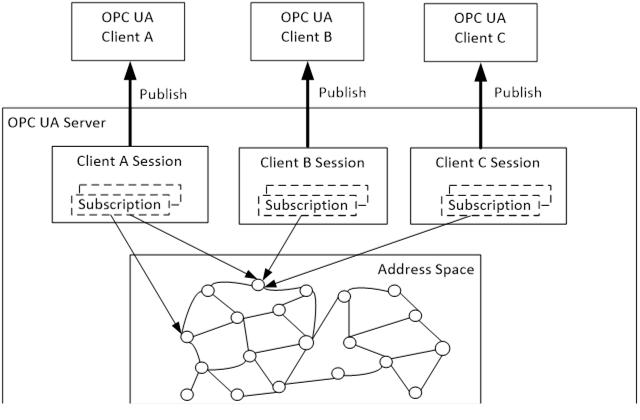  

Figure C. 1 - Subscriptions in OPC UA Client Server model  

In this model the *Client* is the active entity. It chooses what *Nodes* of the *Server* *AddressSpace* and what *Services* to use. *Subscriptions* are created or deleted on the fly. The published data only goes to the *Client* that created a *Subscription* .  

The *Client Server* *Subscription* model provides reliable delivery using buffering, acknowledgements, and retransmissions. This requires resources in the *Server* for each connected *Client* .  

Resource-constrained *Servers* limit the number of parallel *Client* connections, *Subscriptions,* and *MonitoredItems* . Similar limitations can also occur in the *Client* . *Clients* that continuously need data from a larger number of *Servers* also consume significant resources.  

### C.3 Publish-Subscribe  

With *PubSub* , OPC UA *Applications* do not directly exchange requests and responses. Instead, *Publishers* send messages to a *Message Oriented Middleware* , without knowledge of what, if any, *Subscribers* there may be. Similarly, *Subscribers* express interest in specific types of data, and process messages that contain this data, without knowledge of what *Publishers* there are.  

[Figure C.2](/§\_Ref496556079) illustrates that *Publishers* and *Subscribers* only interact with the *Message Oriented Middleware* which provides the means to forward the data to one or more receivers.  

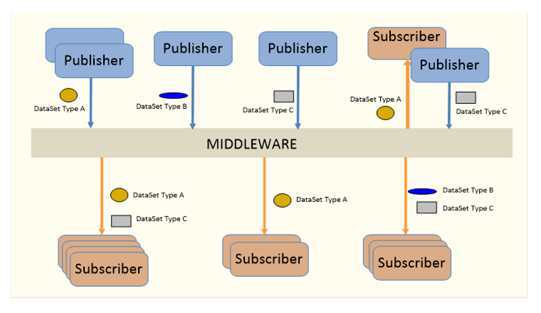  

Figure C. 2 - Publish Subscribe model overview  

*PubSub* is used to communicate messages between different system components without these components having to know each other's identity.  

A *Publisher* is pre-configured with what data to send. There is no connection establishment between *Publisher* and *Subscriber* .  

The identity of the *Subscribers* and the forwarding of published data to the *Subscribers* is the responsibility of the *Message Oriented Middleware* . The *Publisher* does not know or even care if there is one or many *Subscribers* . Effort and resource requirements for the *Publisher* are predictable and do not depend on the number of *Subscribers* .  

### C.4 Synergy of models  

*PubSub* and *Client Server* are both based on the OPC UA *Information Model* . *PubSub* therefore can easily be integrated into OPC UA *Servers* and OPC UA *Clients* . Quite typically, a *Publisher* will be an OPC UA *Server* (the owner of information) and a *Subscriber* is often an OPC UA *Client* . Above all, the *PubSub* *Information Model* for configuration (see [9](/§\_Ref497838497) ) promotes the configuration of *Publishers* and *Subscribers* using the OPC UA *Client Server* model.  

Nevertheless, the *PubSub* communication does not require such a role dependency. In other words, OPC UA *Clients* can be *Publishers* and OPC UA *Servers* can be *Subscribers* . In fact, there is no necessity for *Publishers* or *Subscribers* to be either an OPC UA *Server* or an OPC UA *Client* to participate in *PubSub* communications.  

\_\_\_\_\_\_\_\_\_\_\_\_\_  

