## 1 Scope  

This part of the OPC Unified Architecture defines an Information Model. The Information Model describes the basic infrastructure to model state machines.  

## 2 Normative references  

The following documents, in whole or in part, are normatively referenced in this document and are indispensable for its application. For dated references, only the edition cited applies. For undated references, the latest edition of the referenced document (including any amendments and errata) applies.  

OPC 10000-1, *OPC Unified Architecture - Part 1: Concepts*  

[http://www.opcfoundation.org/UA/Part1/](http://www.opcfoundation.org/UA/Part1/)  

OPC 10000-3, *OPC Unified Architecture - Part 3: Address Space Model*  

[http://www.opcfoundation.org/UA/Part3/](http://www.opcfoundation.org/UA/Part3/)  

OPC 10000-4, *OPC Unified Architecture - Part 4: Services*  

[http://www.opcfoundation.org/UA/Part4/](http://www.opcfoundation.org/UA/Part4/)  

OPC 10000-5, *OPC Unified Architecture - Part 5: Information Model*  

[http://www.opcfoundation.org/UA/Part5/](http://www.opcfoundation.org/UA/Part5/)  

OPC 10000-6, *OPC Unified Architecture - Part 6: Mappings*  

[http://www.opcfoundation.org/UA/Part6/](http://www.opcfoundation.org/UA/Part6/)  

OPC 10000-7, *OPC Unified Architecture - Part 7: Profiles*  

[http://www.opcfoundation.org/UA/Part7/](http://www.opcfoundation.org/UA/Part7/)  

OPC 10000-9, *OPC Unified Architecture - Part 9: Alarms and conditions*  

[http://www.opcfoundation.org/UA/Part9/](http://www.opcfoundation.org/UA/Part9/)  

OPC 10000-10, *OPC Unified Architecture - Part 10: Programs*  

[http://www.opcfoundation.org/UA/Part10/](http://www.opcfoundation.org/UA/Part10/)  

## 3 Terms, definitions, abbreviated terms and conventions  

### 3.1 Terms and definitions  

For the purposes of this document, the terms and definitions given in [OPC 10000-1](/§UAPart1) , [OPC 10000-3](/§UAPart3) , and [OPC 10000-5](/§UAPart5) apply.  

## 4 State Machine Model  

### 4.1 General  

This document describes the basic infrastructure to model state machines. It defines *ObjectTypes* , *VariableTypes* and *ReferenceTypes* and explains how they should be used.  

This document is an integral part of this standard, that is, the types defined in this document shall be used as defined. However, it is not required but strongly recommended that a *Server* uses these types to expose its state machines. The defined types may be subtyped to refine their behaviour.  

When a *Server* exposes its state machine using the types defined in this document, it might only provide a simplified view on its internal state machine, hiding for example substates or putting several internal states into one exposed state.  

The scope of the state machines described in this document is to provide an appropriate foundation for state machines needed for [OPC 10000-9](/§UAPart9) and [OPC 10000-10](/§UAPart10) . It does not provide more complex functionality of a state machine like parallel states, forks and joins, history states, choices and junctions, etc. However, the base state machine defined in this document can be extended to support such concepts.  

The following clauses describe examples of state machines, define state machines in the context of this document and define the representation of state machines in OPC UA. Finally, some examples of state machines, represented in OPC UA, are given.  

### 4.2 Examples of finite state machines  

#### 4.2.1 Simple state machine  

The following example provides an overview of the base features that the state machines defined in this specification will support. In the following, a more complex example is given, that also supports sub-state machines.  

[Figure 1](/§\_Ref114466674) gives an overview over a simple state machine. It contains the three states "State1", "State2" and "State3". There are transitions from "State1" to "State2", "State2" to "State2", etc. Some of the transitions provide additional information with regard to what causes (or triggers) the transition, for example the call of "Method1" for the transition from "State1" to "State2". The effect (or action) of the transition can also be specified, for example the generation of an *Event* of the "EventType1" in the same transition. The notation used to identify the cause is simply listing it on the transition, the effect is prefixed with a "/". More than one cause or effect are separated by a ",". Not every transition has to have a cause or effect, for example the transition between "State2" and "State3".  

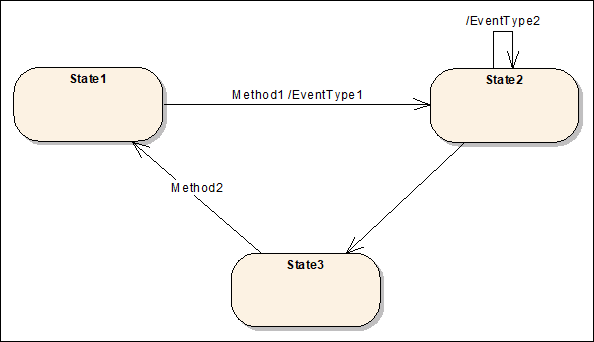  

Figure 1 - Example of a simple state machine  

For simplicity, the state machines described in this specification will only support causes in form of specifying *Methods* that have to be called and effects in form of *EventTypes* of *Events* that are generated. However, the defined infrastructure allows extending this to support additional different causes and effects.  

#### 4.2.2 State machine containing substates  

[Figure 2](/§\_Ref33077681) shows an example of a state machine where "State6" is a sub-state-machine. This means, that when the overall state machine is in State6, this state can be distinguished to be in the sub-states "State7" or "State8". Sub-state-machines can be nested, that is, "State7" could be another sub-state-machine.  

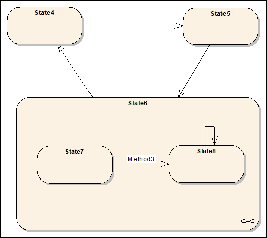  

Figure 2 - Example of a state machine having a sub-machine  

### 4.3 Definition of state machine  

The infrastructure of state machines defined in this specification only deals with the basics of state machines needed to support [OPC 10000-9](/§UAPart9) and [OPC 10000-10](/§UAPart10) . The intention is to keep the base simple but extensible.  

For the state machines defined in this specification we assume that state machines are typed and instances of a type have their states and semantics specified by the type. For some types, this means that the states and transitions are fixed. For other types the states and transitions may be dynamic or unknown. A state machine where all the states are specified explicitly by the type is called a finite state machine.  

Therefore, we distinguish between *StateMachineType* and *StateMachine* and their subtypes like *FiniteStateMachineType* . The *StateMachineType* specifies a description of the state machine, that is, its states, transitions, etc., whereas the *StateMachine* is an instance of the *StateMachineType* and only contains the current state.  

Each *StateMachine* contains information about the current state. If the *StateMachineType* has *SubStateMachines* , the *StateMachine* also contains information about the current state of the *SubStateMachines* . *StateMachines* which have their states completely defined by the type are instances of a *FiniteStateMachineType* .  

Each *FiniteStateMachineType* has one or more *States* . For simplicity, we do not distinguish between different *States* like the start or the end states.  

Each *State* can have one or more *SubStateMachines* .  

Each *FiniteStateMachineType* may have one or more *Transitions* . A *Transition* is directed and points from one *State* to another *State* .  

Each *Transition* can have one or more *Causes* . A *Cause* leads a *FiniteStateMachine* to change its current *State* from the source of the *Transition* to its target. In this specification we only specify *Method* calls to be *Causes* of *Transitions* . *Transitions* do not have to have a *Cause* . A *Transition* can always be caused by some server-internal logic that is not exposed in the *AddressSpace* .  

Each *Transition* can have one or more *Effects* . An *Effect* occurs if the *Transition* is used to change the *State* of a *StateMachine* . In this specification we only specify the generation of *Events* to be *Effects* of a *Transition* . A *Transition* is not required to expose any *Effects* in the *AddressSpace.*  

Although this specification only specifies simple concepts for state machines, the provided infrastructure is extensible. If needed, special *States* can be defined as well as additional *Causes* or *Effects* .  

### 4.4 Representation of state machines in the AddressSpace  

#### 4.4.1 Overview  

The types defined in this specification are illustrated in [Figure 3](/§\_Ref33077716) . The *MyFiniteStateMachineType* is a minimal example which illustrates how these *Types* can be used to describe a *StateMachine* . See [OPC 10000-9](/§UAPart9) and [OPC 10000-10](/§UAPart10) for additional examples of *StateMachines* .  

  

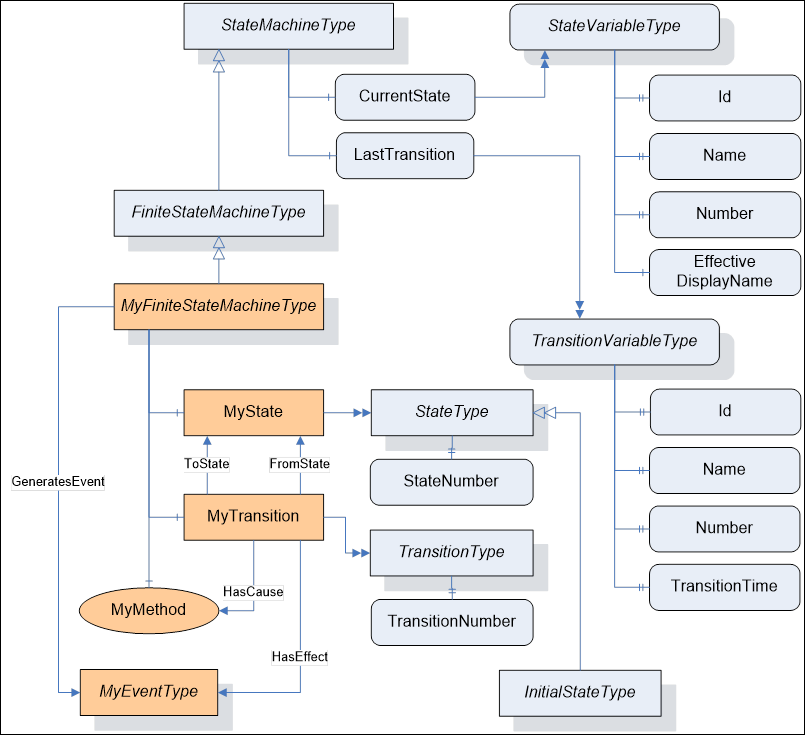  

Figure 3 - The StateMachine Information Model  

#### 4.4.2 StateMachineType  

The *StateMachineType* is the base *ObjectType* for all *StateMachineTypes* . It defines a single *Variable* which represents the current state of the machine. An instance of this *ObjectType* shall generate an *Event* whenever a significant state change occurs. The *Server* decides which state changes are significant. *Servers* shall use the *GeneratesEvent* *ReferenceType* to indicate which *Event(s)* could be produced by the *StateMachine* .  

Subtypes may add *Methods* which affect the state of the machine. The *Executable* *Attribute* is used to indicate whether the *Method* is valid given the current state of the machine. The generation of *AuditEvents* for *Methods* is defined in [OPC 10000-4](/§UAPart4) . A *StateMachine* may not be active. In this case, the *CurrentState* and *LastTransition Variables* shall have a status equal to *Bad\_StateNotActive* (see [Table 19](/§\_Ref33078422) ).  

Subtypes may add components which are instances of *StateMachineTypes* . These components are considered to be sub-states of the *StateMachine* . *SubStateMachines* are only active when the parent machine is in an appropriate state.  

*Events* produced by *SubStateMachines* may be suppressed by the parent machine. In some cases, the parent machine will produce a single *Event* that reflects changes in multiple *SubStateMachines* .  

*FiniteStateMachineType* is a subtype of *StateMachineType* that provides a mechanism to explicitly define the states and transitions. A *Server* should use this mechanism if it knows what the possible states are and the state machine is not trivial. The *FiniteStateMachineType* is defined in [4.4.6](/§\_Ref33078720) .  

The *StateMachineType* is formally defined in [Table 1](/§\_Ref17727931) .  

 **Table 1\- StateMachineType definition**   

| **Attribute** | **Value** |
|---|---|
|BrowseName|StateMachineType|
|IsAbstract|False|
| **References** | **NodeClass** | **BrowseName** | **DataType** | **TypeDefinition** | **ModellingRule** |
|Subtype of the BaseObjectType defined in [OPC 10000-5](/§UAPart5)|
|HasSubtype|ObjectType|FiniteStateMachineType|Defined in [4.4.6](/§\_Ref33078906)|
|HasComponent|Variable|CurrentState|LocalizedText|StateVariableType|Mandatory|
|HasComponent|Variable|LastTransition|LocalizedText|TransitionVariableType|Optional|
| **Conformance Units** |
|Base Info State Machine Instance|
  

  

*CurrentState* stores the current state of an instance of the *StateMachineType* . *CurrentState* provides a human readable name for the current state which may not be suitable for use in application control logic. Applications should use the *Id Property* of *CurrentState* if they need a unique identifier for the state.  

*LastTransition* stores the last transition which occurred in an instance of the *StateMachineType* . *LastTransition* provides a human readable name for the last transition which may not be suitable for use in application control logic. Applications should use the *Id Property* of *LastTransition* if they need a unique identifier for the transition.  

#### 4.4.3 StateVariableType  

The *StateVariableType* is the base *VariableType* for *Variables* that store the current state of a *StateMachine* as a human readable name.  

The *StateVariableType* is formally defined in [Table 2](/§\_Ref33077859) .  

 **Table 2\- StateVariableType definition**   

| **Attribute** | **Value** |
|---|---|
|BrowseName|StateVariableType|
|DataType|LocalizedText|
|ValueRank|−1 (−1 = Scalar)|
|IsAbstract|False|
| **References** | **NodeClass** | **BrowseName** | **DataType** | **TypeDefinition** | **ModellingRule** |
|Subtype of the *BaseDataVariableType* defined in [OPC 10000-5](/§UAPart5)|
|HasSubtype|VariableType|FiniteStateVariableType|Defined in [4.4.7](/§\_Ref33078936)|
|HasProperty|Variable|Id|BaseDataType|PropertyType|Mandatory|
|HasProperty|Variable|Name|QualifiedName|PropertyType|Optional|
|HasProperty|Variable|Number|UInt32|PropertyType|Optional|
|HasProperty|Variable|EffectiveDisplayName|LocalizedText|PropertyType|Optional|
|HasProperty|Variable|ContinuationOptions|DescriptionNodeIdDataType[]|PropertyType|Optional|
|HasProperty|Variable|ExtendedInformation|LocalizedText|PropertyType|Optional|
|HasProperty|Variable|VendorCode|String|PropertyType|Optional|
| **Conformance Units** |
|Base Info State Machine Instance|
  

  

*Id* is a name which uniquely identifies the current state within the *StateMachineType* . A subtype may restrict the *DataType* .  

*Name* is a *QualifiedName* which uniquely identifies the current state within the *StateMachineType* .  

*Number* is an integer which uniquely identifies the current state within the *StateMachineType* .  

*EffectiveDisplayName* contains a human readable name for the current state of the state machine after taking the state of any *SubStateMachines* in account. There is no rule specified for which state or sub-state should be used. It is up to the *Server* and will depend on the semantics of the *StateMachineType* .  

*ContinuationOptions* is an array of options that indicate possible next steps or actions that can be taken from the current state. Each option is represented as a description and a *NodeId* . The description is a human-readable description of the action, and the optional *NodeId* represents a *Node* that is involved in the continuation (e.g., a *Method* that can be invoked to transition to a new state).  

*ExtendedInformation* provides additional, more detailed information about the current state or the available continuation options. The exact nature of this information depends on the specific implementation and use case.  

*VendorCode* is an additional, vendor-specific identifier. It can be used to provide vendor-specific information about the current state or the available continuation options.  

*StateMachines* produce *Events* which may include the current state of a *StateMachine* . In that case *Servers* shall provide the *Name* , *Number* and *EffectiveDisplayName* of the *StateVariableType* in the *Event* , even if they are not provided on the instances in the *AddressSpace* .  

#### 4.4.4 DescriptionNodeIdDataType  

This structure contains the description and optionally a *NodeId* . It is used to provide a human-readable description of something plus optionally the *NodeId* in case the something is represented in the *AddressSpace* . The structure is defined in [Table 3](/§\_Ref169162623) .  

 **Table 3\- DescriptionNodeIdDataType Structure**   

| **Name** | **Type** | **Description** |
|---|---|---|
|DescriptionNodeIdDataType|structure||
|Description|0:LocalizedText|The human-readable description of something.|
|NodeId|0:NodeId|Optionally provided NodeId, in case the referenced something is represented as Node in the AddressSpace.|
  

  

Its representation in the *AddressSpace* is defined in [Table 4](/§\_Ref76309315) .  

 **Table 4\- DescriptionNodeIdDataType Definition**   

| **Attribute** | **Value** |
|---|---|
|BrowseName|DescriptionNodeIdDataType|
|IsAbstract|False|
|Description|A human-readable description of something plus optionally the NodeId in case the something is represented in the AddressSpace|
| **References** | **NodeClass** | **BrowseName** | **DataType** | **TypeDefinition** | **Other** |
|Subtype of Structure defined in [OPC 10000-5](/§UAPart5)|
| **Conformance Units** |
|Base Info State Machine DescriptionNodeIdDataType|
  

  

#### 4.4.5 TransitionVariableType  

The *TransitionVariableType* is the base *VariableType* for *Variables* that store a *Transition* that occurred within a *StateMachine* as a human readable name.  

The *SourceTimestamp* for the value specifies when the *Transition* occurred. This value may also be exposed with the *TransitionTime* *Property* .  

The *TransitionVariableType* is formally defined in [Table 5](/§\_Ref33077888) .  

 **Table 5\- TransitionVariableType definition**   

| **Attribute** | **Value** |
|---|---|
|BrowseName|TransitionVariableType|
|DataType|LocalizedText|
|ValueRank|−1 (−1 = Scalar)|
|IsAbstract|False|
| **References** | **NodeClass** | **BrowseName** | **DataType** | **TypeDefinition** | **ModellingRule** |
|Subtype of the *BaseDataVariableType* defined in [OPC 10000-5](/§UAPart5)|
|HasSubtype|VariableType|FiniteTransitionVariableType|Defined in [4.4.8](/§\_Ref33078981)|
|HasProperty|Variable|Id|BaseDataType|PropertyType|Mandatory|
|HasProperty|Variable|Name|QualifiedName|PropertyType|Optional|
|HasProperty|Variable|Number|UInt32|PropertyType|Optional|
|HasProperty|Variable|TransitionTime|UtcTime|PropertyType|Optional|
|HasProperty|Variable|EffectiveTransitionTime|UtcTime|PropertyType|Optional|
| **Conformance Units** |
|Base Info State Machine Instance|
  

  

*Id* is a name which uniquely identifies a *Transition* within the *StateMachineType* . A subtype may restrict the *DataType* .  

*Name* is a *QualifiedName* which uniquely identifies a transition within the *StateMachineType* .  

*Number* is an integer which uniquely identifies a transition within the *StateMachineType* .  

*TransitionTime* specifies when the transition occurred *.*  

*EffectiveTransitionTime* specifies the time when the current state or one of its substates was entered. If, for example, a StateA is active and - while active - switches several times between its substates SubA and SubB, then the *TransitionTime* stays at the point in time where StateA became active whereas the *EffectiveTransitionTime* changes with each change of a substate.  

#### 4.4.6 FiniteStateMachineType  

The *FiniteStateMachineType* is the base *ObjectType* for *StateMachines* that explicitly define the possible *States* and *Transitions* . Once the *States* and *Transitions* are defined subtypes shall not add new *States* and *Transitions* (see [4.4.19](/§\_Ref33081822) ). *Subtypes* may add causes or effects.  

The *States* of the machine are represented with instances of the *StateType ObjectType.* Each *State* shall have a *BrowseName* which is unique within the *StateMachine* and shall have a *StateNumber* which shall also be unique across all *States* defined in the *StateMachine* . Be aware that *States* in a *SubStateMachine* may have the same *StateNumber* or *BrowseName* as *States* in the parent machine. A concrete subtype of *FiniteStateMachineType* shall define at least one *State* .  

A *StateMachine* may define one *State* which is an instance of the *InitialStateType* . This *State* is the *State* that the machine goes into when it is activated.  

The *Transitions* that may occur are represented with instances of the *TransitionType* . Each *Transition* shall have a *BrowseName* which is unique within the *StateMachine* and may have a *TransitionNumber* which shall also be unique across all *Transitions* defined in the *StateMachine* .  

The initial *State* for a *Transition* is a *StateType Object* which is the target of a *FromState* *Reference* . The final *State* for a *Transition* is a *StateType Object* which is the target of a *ToState* *Reference* . The *FromState* and *ToState* *References* shall always be specified.  

A *Transition* may produce an *Event* . The *Event* is indicated by a *HasEffect* *Reference* to a subtype of *BaseEventType* . The *StateMachineType* shall have *GeneratesEvent* *References* to the targets of a *HasEffect* *Reference* for each of its *Transitions* .  

A *FiniteStateMachineType* may define *Methods* that cause a transition to occur. These *Methods* are targets of *HasCause* *References* for each of the *Transitions* that may be triggered by the *Method* . The *Executable* *Attribute* for a *Method* is used to indicate whether the current *State* of the machine allows the *Method* to be called.  

A *FiniteStateMachineType* may have sub-state-machines which are represented as instances of *StateMachineType* *ObjectTypes* . Each *State* shall have a *HasSubStateMachine* *Reference* to the *StateMachineType* *Object* which represents the child *States* . The *SubStateMachine* is not active if the parent *State* is not active. In this case the *CurrentState* and *LastTransition Variables* of the *SubStateMachine* shall have a status equal to *Bad\_StateNotActive* (see [Table 19](/§\_Ref33078422) ).  

The *FiniteStateMachineType* is formally defined in [Table 6](/§\_Ref33077969) .  

 **Table 6\- FiniteStateMachineType definition**   

| **Attribute** | **Value** |
|---|---|
|BrowseName|FiniteStateMachineType|
|IsAbstract|True|
| **References** | **NodeClass** | **BrowseName** | **DataType** | **TypeDefinition** | **ModellingRule** |
|Subtype of the StateMachineType defined in [4.4.2](/§\_Ref33079031)|
|HasComponent|Variable|CurrentState|LocalizedText|FiniteStateVariableType|Mandatory|
|HasComponent|Variable|LastTransition|LocalizedText|FiniteTransitionVariableType|Optional|
|HasComponent|Variable|AvailableStates|NodeId[]|BaseDataVariableType|Optional|
|HasComponent|Variable|AvailableTransitions|NodeId[]|BaseDataVariableType|Optional|
| **Conformance Units** |
|Base Info Finite State Machine Instance|
|Base Info Available States and Transitions|
  

  

In some *Servers* an instance of a StateMachine may restrict the *States* and / or *Transitions* that are available. These restrictions may result from the internal design of the instance. For example, the *StateMachine* for an instrument's limit alarm which only supports Hi and HiHi and can not produce a Low or LowLow. An instance of a *StateMachine* may also dynamically change the available *States* and/or *Transitions* based on its operating mode. For example, when a piece of equipment is in a maintenance mode the available *States* may be limited to some subset of the *States* available during normal operation.  

The *AvailableStates* *Variable* provides a *NodeId* list of the *States* that are present in the *StateMachine* instance. The list may change during operation of the *Server* .  

The *AvailableTransitions* *Variable* provides a *NodeId* list of the *Transitions* that are present in the *StateMachine* instance. The list may change during operation of the *Server* .  

An example of a FiniteStateMachine type is shown in [Figure 4](/§\_Ref33079069) .  

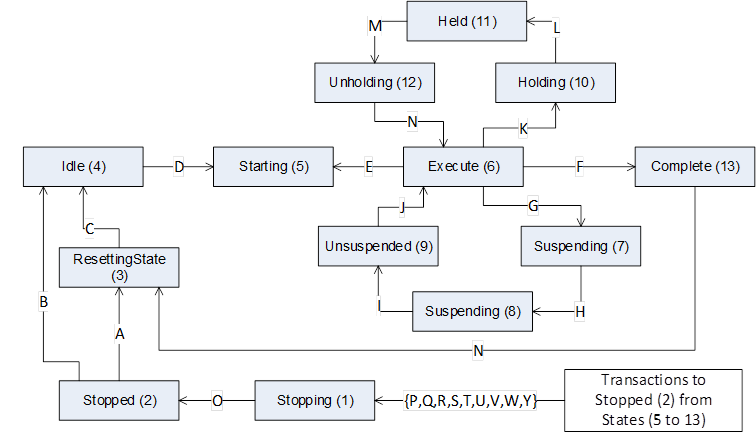  

Figure 4 - Example of a FiniteStateMachine type  

An example instance of the type is shown in [Figure 5](/§\_Ref33078004) . In this example the *States* \{7,8,9\} and the *Transitions* \{G,H,I,J\} are not available in this instance.  

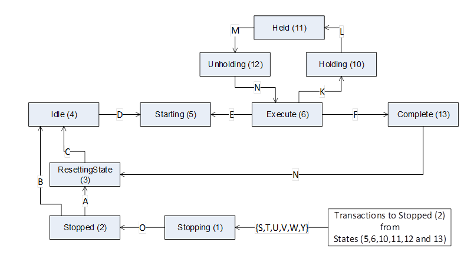  

Figure 5 - Example of a FiniteStateMachine instance  

#### 4.4.7 FiniteStateVariableType  

The *FiniteStateVariableType* is a subtype of *StateVariableType* and is used to store the current state of a Finite *StateMachine* as a human readable name.  

The *FiniteStateVariableType* is formally defined in [Table 7](/§\_Ref33078097) .  

 **Table 7\- FiniteStateVariableType definition**   

| **Attribute** | **Value** |
|---|---|
|BrowseName|FiniteStateVariableType|
|DataType|LocalizedText|
|ValueRank|−1 (−1 = Scalar)|
|IsAbstract|False|
| **References** | **NodeClass** | **BrowseName** | **DataType** | **TypeDefinition** | **ModellingRule** |
|Subtype of the *StateVariableType* defined [4.4.3](/§\_Ref33079118)|
|HasProperty|Variable|Id|NodeId|PropertyType|Mandatory|
| **Conformance Units** |
|Base Info Finite State Machine Instance|
  

  

*Id* is inherited from the *StateVariableType* and overridden to reflect the required *DataType* . This value shall be the *NodeId* of one of the *State Objects* of the *FiniteStateMachineType.* If the *FiniteStateMachine* is subtyped, it shall be the *NodeId* of the *State* defined on the supertype, i.e., where the *State* is defined the first time in the type hierarchy.  

The *Name Property* is inherited from *StateVariableType.* Its *Value* shall be the *BrowseName* of one of the *State Objects* of the *FiniteStateMachineType* .  

The *Number Property* is ** inherited from *StateVariableType.* Its *Value* shall be the *StateNumber* for one of the *State Objects* of the *FiniteStateMachineType* .  

#### 4.4.8 FiniteTransitionVariableType  

The *FiniteTransitionVariableType* is a subtype of *TransitionVariableType* and is used to store a *Transition* that occurred within a *FiniteStateMachine* as a human readable name.  

The *FiniteTransitionVariableType* is formally defined in [Table 8](/§\_Ref33078134) .  

 **Table 8\- FiniteTransitionVariableType definition**   

| **Attribute** | **Value** |
|---|---|
|BrowseName|FiniteTransitionVariableType|
|DataType|LocalizedText|
|ValueRank|−1 (−1 = Scalar)|
|IsAbstract|False|
| **References** | **NodeClass** | **BrowseName** | **DataType** | **TypeDefinition** | **ModellingRule** |
|Subtype of the TransitionVariableType ** defined in [4.4.5](/§\_Ref33079141)|
|HasProperty|Variable|Id|NodeId|PropertyType|Mandatory|
| **Conformance Units** |
|Base Info Finite State Machine Instance|
  

  

*Id* is inherited from the *TransitionVariableType* and overridden to reflect the required *DataType* . This value shall be the *NodeId* of one of the *Transition Objects* of the *FiniteStateMachineType* . ** If the *FiniteStateMachine* is subtyped, it shall be the *NodeId* of the *Transition* defined on the supertype, i.e., where the *Transition* is defined the first time in the type hierarchy.  

The *Name* *Property* is inherited from the *TransitionVariableType.* Its *Value* shall be the *BrowseName* of one of the *Transition Objects* of the *FiniteStateMachineType* .  

The *Number Property* is ** inherited from the *TransitionVariableType.* Its *Value* shall be the *TransitionNumber* for one of the *Transition Objects* of the *FiniteStateMachineType* .  

#### 4.4.9 StateType  

*States* of a *FiniteStateMachine* are represented as *Objects* of the *StateType.* Each *Object* of the *StateType* or one of its subtypes shall be referenced from the *ObjectType* *FiniteStateMachineType* or one of its subtypes using a *HasComponent* *Reference* or a subtype of *HasComponent* and shall not have a *ModellingRule* as they are not applied on the instances.  

The *StateType* is formally defined in [Table 9](/§\_Ref33078163) .  

 **Table 9\- StateType definition**   

| **Attribute** | **Value** |
|---|---|
|BrowseName|StateType|
|IsAbstract|False|
| **References** | **NodeClass** | **BrowseName** | **DataType** | **TypeDefinition** | **ModellingRule** |
|Subtype of the BaseObjectType defined in [OPC 10000-5](/§UAPart5)|
|HasProperty|Variable|StateNumber|UInt32|PropertyType|Mandatory|
|HasSubtype|ObjectType|InitialStateType|Defined in [4.4.10](/§\_Ref33079186)|
|HasSubtype|ObjectType|ChoiceStateType|Defined in [4.6.2](/§\_Ref33079242)|
| **Conformance Units** |
|Base Info Finite State Machine Instance|
  

  

#### 4.4.10 InitialStateType  

The *InitialStateType* is a subtype of the *StateType* and is formally defined in [Table 10](/§\_Ref33079318) . An *Object* of the *InitialStateType* represents the *State* that a *FiniteStateMachine* enters when it is activated. Each *FiniteStateMachine* can have at most one *State* of type *InitialStateType* , but a *FiniteStateMachine* does not have to have a *State* of this type.  

A *SubStateMachine* goes into its initial state whenever the parent state is entered. However, a state machine may define a transition that goes directly to a state of the *SubStateMachine* . In this case the *SubStateMachine* goes into that *State* instead of the initial *State* . The two scenarios are illustrated in [Figure 6](/§\_Ref33079550) . The transition from "State5" to "State6" causes the *SubStateMachine* to go into the initial *State* ("State7"), however, the transition from "State4" to "State8" causes the parent machine to go to "State6" and the *SubStateMachine* will go to "State8".  

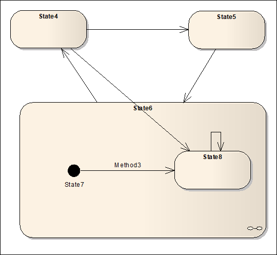  

Figure 6 - Example of an initial State in a sub-machine  

If no initial state for a *SubStateMachine* exists and the *State* having the *SubStateMachine* is entered directly, then the *State* of the *SubStateMachine* is server-specific.  

 **Table 10\- InitialStateType definition**   

| **Attribute** | **Value** |
|---|---|
|BrowseName|InitialStateType|
|IsAbstract|False|
| **References** | **NodeClass** | **BrowseName** | **DataType** | **TypeDefinition** | **ModellingRule** |
|Subtype of the *StateType* defined in [4.4.9](/§\_Ref33076422)|
| **Conformance Units** |
|Base Info Finite State Machine Instance|
  

  

#### 4.4.11 TransitionType  

*Transitions* of a *FiniteStateMachine* are represented as *Objects* of the *ObjectType* *TransitionType* formally defined in [Table 11](/§\_Ref98238438) . Each *Object* of the *TransitionType* or one of its subtypes shall be referenced from the *ObjectType* *FiniteStateMachineType* or one of its subtypes using a *HasComponent* *Reference* or a subtype of *HasComponent* and shall not have a *ModellingRule* as they are not applied on the instances.  

Each valid *Transition* shall have exactly one *FromState* *Reference* and exactly one *ToState* *Reference* , each pointing to an *Object* of the *ObjectType* *StateType* .  

Each *Transition* can have one or more *HasCause* *References* pointing to the cause that triggers the *Transition* .  

Each *Transition* can have one or more *HasEffect* *References* pointing to the effects that occur when the *Transition* was triggered.  

 **Table 11\- TransitionType definition**   

| **Attribute** | **Value** |
|---|---|
|BrowseName|TransitionType|
|IsAbstract|False|
| **References** | **NodeClass** | **BrowseName** | **DataType** | **TypeDefinition** | **ModellingRule** |
|Subtype of the BaseObjectType defined in [OPC 10000-5](/§UAPart5)|
|HasProperty|Variable|TransitionNumber|UInt32|PropertyType|Mandatory|
| **Conformance Units** |
|Base Info Finite State Machine Instance|
  

  

#### 4.4.12 FromState  

The *FromState* *ReferenceType* is a concrete *ReferenceType* and can be used directly. It is a subtype of *NonHierarchicalReferences* .  

The semantic of this *ReferenceType* is to point from a *Transition* to the starting *State* the *Transition* connects.  

The *SourceNode* of this *ReferenceType* shall be an *Object* of the *ObjectType* *TransitionType* or one of its subtypes. The *TargetNode* of this *ReferenceType* shall be an *Object* of the *ObjectType* *StateType* or one of its subtypes.  

The representation of the *FromState* *ReferenceType* in the *AddressSpace* is specified in [Table 12](/§\_Ref33078212) .  

 **Table 12\- FromState ReferenceType**   

| **Attributes** | **Value** |
|---|---|
|BrowseName|FromState|
|InverseName|ToTransition|
|Symmetric|False|
|IsAbstract|False|
| **References** | **NodeClass** | **BrowseName** | **Comment** |
|||||
| **Conformance Units** |
|Base Info Finite State Machine Instance|
  

  

#### 4.4.13 ToState  

The *ToState* *ReferenceType* is a concrete *ReferenceType* and can be used directly. It is a subtype of *NonHierarchicalReferences* .  

The semantic of this *ReferenceType* is to point from a *Transition* to the ending *State* the *Transition* connects.  

The *SourceNode* of this *ReferenceType* shall be an *Object* of the *ObjectType* *TransitionType* or one of its subtypes. The *TargetNode* of this *ReferenceType* shall be an *Object* of the *ObjectType* *StateType* or one of its subtypes.  

*References* of this *ReferenceType* may be only exposed uni-directional. Sometimes this is required, for example, if a *Transition* points to a *State* of a sub-machine.  

The representation of the *ToState* *ReferenceType* in the *AddressSpace* is specified in [Table 13](/§\_Ref33078236) .  

 **Table 13\- ToState ReferenceType**   

| **Attributes** | **Value** |
|---|---|
|BrowseName|ToState|
|InverseName|FromTransition|
|Symmetric|False|
|IsAbstract|False|
| **References** | **NodeClass** | **BrowseName** | **Comment** |
|||||
| **Conformance Units** |
|Base Info Finite State Machine Instance|
  

  

#### 4.4.14 HasCause  

The *HasCause* *ReferenceType* is a concrete *ReferenceType* and can be used directly. It is a subtype of *NonHierarchicalReferences* .  

The semantic of this *ReferenceType* is to point from a *Transition* to something that causes the *Transition* . In this specification we only define *Methods* as *Causes* . However, the *ReferenceType* is not restricted to point to *Methods* . The referenced Methods can, but do not have to point to a Method of the StateMachineType. For example, it is allowed to point to a server-wide restart Method leading the state machine to go into its initial state.  

The *SourceNode* of this *ReferenceType* shall be an *Object* of the *ObjectType* *TransitionType* or one of its subtypes. The *TargetNode* can be of any *NodeClass* .  

The representation of the *HasCause* *ReferenceType* in the *AddressSpace* is specified in [Table 14](/§\_Ref33078257) .  

 **Table 14\- HasCause ReferenceType**   

| **Attributes** | **Value** |
|---|---|
|BrowseName|HasCause|
|InverseName|MayBeCausedBy|
|Symmetric|False|
|IsAbstract|False|
| **References** | **NodeClass** | **BrowseName** | **Comment** |
|||||
| **Conformance Units** |
|Base Info Finite State Machine Instance|
  

  

#### 4.4.15 HasEffect  

The *HasEffect ReferenceType* is a concrete *ReferenceType* and can be used directly. It is a subtype of *NonHierarchicalReferences* .  

The semantic of this *ReferenceType* is to point from a *Transition* to something that will be effected when the *Transition* is triggered. In this specification we only define *EventTypes* as *Effects* . However, the *ReferenceType* is not restricted to point to *EventTypes* .  

The *SourceNode* of this *ReferenceType* shall be an *Object* of the *ObjectType* *TransitionType* or one of its subtypes. The *TargetNode* can be of any *NodeClass* .  

If the *TargetNode* is an *EventType* , each time the *Transition* is triggered (either by a *Client* or internally in the *Server* ) an *Event* of that *EventType* or a subtype shall be generated.  

The representation of the *HasEffect* *ReferenceType* in the *AddressSpace* is specified in [Table 15](/§\_Ref33078273) .  

 **Table 15\- HasEffect ReferenceType**   

| **Attributes** | **Value** |
|---|---|
|BrowseName|HasEffect|
|InverseName|MayBeEffectedBy|
|Symmetric|False|
|IsAbstract|False|
| **References** | **NodeClass** | **BrowseName** | **Comment** |
|||||
| **Conformance Units** |
|Base Info Finite State Machine Instance|
  

  

#### 4.4.16 HasSubStateMachine  

The *HasSubStateMachine ReferenceType* is a concrete *ReferenceType* and can be used directly. It is a subtype of *NonHierarchicalReferences* .  

The semantic of this *ReferenceType* is to point from a *State* to an instance of a *StateMachineType* which represents the sub-states for the *State* .  

The *SourceNode* of this *ReferenceType* shall be an *Object* of the *ObjectType* *StateType* . The *TargetNode* shall be an *Object* of the *ObjectType* *StateMachineType* or one of its subtypes. Each *Object* can be the *TargetNode* of at most one *HasSubStateMachine Reference* .  

The *SourceNode* (the state) and the *TargetNode* (the *SubStateMachine* ) shall belong to the same *StateMachine* . Therefore, the *SourceNode* shall be referenced from the *ObjectType* *FiniteStateMachineType* or one of its subtypes and the *TargetNode* shall be referenced from the same *ObjectType* , both using a *HasComponent* *Reference* or a subtype of *HasComponent* .  

The representation of the *HasSubStateMachine ReferenceType* in the *AddressSpace* is specified in [Table 16](/§\_Ref33078293) .  

 **Table 16\- HasSubStateMachine ReferenceType**   

| **Attributes** | **Value** |
|---|---|
|BrowseName|HasSubStateMachine|
|InverseName|SubStateMachineOf|
|Symmetric|False|
|IsAbstract|False|
| **References** | **NodeClass** | **BrowseName** | **Comment** |
|||||
| **Conformance Units** |
|Base Info Finite State Machine Instance|
  

  

#### 4.4.17 TransitionEventType  

The *TransitionEventType* is a subtype of the *BaseEventType* . It can be used to generate an *Event* identifying that a *Transition* of a *StateMachine* was triggered. It is formally defined in [Table 17](/§\_Ref33078308) .  

 **Table 17\- TransitionEventType**   

| **Attribute** | **Value** |
|---|---|
|BrowseName|TransitionEventType|
|IsAbstract|True|
| **References** | **NodeClass** | **BrowseName** | **DataType** | **TypeDefinition** | **ModellingRule** |
|Subtype of the base *BaseEventType* defined in [OPC 10000-5](/§UAPart5)|
|HasComponent|Variable|Transition|LocalizedText|TransitionVariableType|Mandatory|
|HasComponent|Variable|FromState|LocalizedText|StateVariableType|Mandatory|
|HasComponent|Variable|ToState|LocalizedText|StateVariableType|Mandatory|
| **Conformance Units** |
|Base Info Finite State Machine Instance|
  

  

The *TransitionEventType* inherits the *Properties* of the *BaseEventType* .  

The inherited *Property* *SourceNode* shall be filled with the *NodeId* of the *StateMachine* instance where the *Transition* occurs. If the *Transition* occurs in a *SubStateMachine* , then the *NodeId* of the *SubStateMachine* has to be used. If the Transition occurs between a *StateMachine* and a *SubStateMachine* , then the *NodeId* of the *StateMachine* has to be used, independent of the direction of the *Transition* .  

*Transition* identifies the *Transition* that triggered the *Event* .  

*FromState* identifies the *State* before the *Transition* .  

*ToState* identifies the *State* after the *Transition* .  

#### 4.4.18 AuditUpdateStateEventType  

The *AuditUpdateStateEventType* is a subtype of the *AuditUpdateMethodEventType* . It can be used to generate an *Event* identifying that a *Transition* of a *StateMachine* was triggered. It is formally defined in [Table 18](/§\_Ref33078332) .  

 **Table 18\- AuditUpdateStateEventType**   

| **Attribute** | **Value** |
|---|---|
|BrowseName|AuditUpdateStateEventType|
|IsAbstract|True|
| **References** | **NodeClass** | **BrowseName** | **DataType** | **TypeDefinition** | **ModellingRule** |
|Subtype of the *AuditUpdateMethodEventType* defined in [OPC 10000-5](/§UAPart5)|
|HasProperty|Variable|OldStateId|BaseDataType|PropertyType|Mandatory|
|HasProperty|Variable|NewStateId|BaseDataType|PropertyType|Mandatory|
| **Conformance Units** |
|Auditing UpdateStates|
  

  

The *AuditUpdateStateEventType* inherits the *Properties* of the *AuditUpdateMethodEventType* .  

The inherited *Property* *SourceNode* shall be filled with the *NodeId* of the *StateMachine* instance where the *State* changed. If the *State* changed in a *SubStateMachine* , then the *NodeId* of the *SubStateMachine* has to be used.  

The *SourceName* for *Events* of this type should be the effect that generated the event (e.g. the name of a Method). If the effect was generated by a *Method* call, the *SourceName* should be the name of the *Method* prefixed with "Method/".  

*OldStateId* reflects the *Id* of the state prior the change.  

*NewStateId* reflects the new *Id* of the state after the change.  

#### 4.4.19 Special Restrictions on subtyping StateMachines  

In general, all rules on subtyping apply for *StateMachine* types as well. Some additional rules apply for *StateMachine* types.  

*States* and *Transitions* are not instantiated, this information is only provided on the *ObjectType* . They have no *ModellingRule* , and thus, also the inheritance of *States* and *Transitions* is not defined. Therefore, the following rules apply for subtyping *StateMachines* . Each *State* and *Transition* defined on the supertype shall be available on the subtype as well. That is, for each *State* defined on the supertype another *Node* of the same *ObjectType* having the same *BrowseName* and the same *StateNumber* shall be defined on the subtype. For each *Transition* defined on the supertype another *Node* of the same *ObjectType* having the same *BrowseName* and the same *TransitionNumber* shall be defined on the subtype. All references defining the *StateMachine* ( *HasCause* , *HasEffect* , *FromState* , *ToState* , *HasSubStateMachine, HasGuard* ) shall be replicated in the subtype as well. If *InstanceDeclarations* are referenced (e.g., *Methods* used to trigger *Transitions* ) either the *InstanceDeclaration* of the supertype is referenced or the *InstanceDeclaration* is overridden, and in the latter case the overridden *InstanceDeclaration* of the subtype shall be referenced.  

If a StateMachine type is not abstract, subtypes of it shall not change the behaviour of it. That means, that in this case a subtype shall not add *States* and it shall not add *Transitions* between its *States* . However, a subtype may add *SubStateMachines* , it may add *Transitions* from the *States* to the *States* of the *SubStateMachine* , and it may add *Causes* and *Effects* to a *Transition* . In addition, a subtype of a *StateMachine* type shall not remove *States* or *Transitions* .  

#### 4.4.20 Specific StatusCodes for StateMachines  

In [Table 19](/§\_Ref33078422) specific *StatusCodes* used for *StateMachines* are defined.  

 **Table 19\- Specific StatusCodes for StateMachines**   

| **Symbolic Id** | **Description** |
|---|---|
|Bad *\_* StateNotActive|The accessed state is not active.|
  

  

### 4.5 Examples of StateMachines in the AddressSpace  

#### 4.5.1 StateMachineType using inheritance  

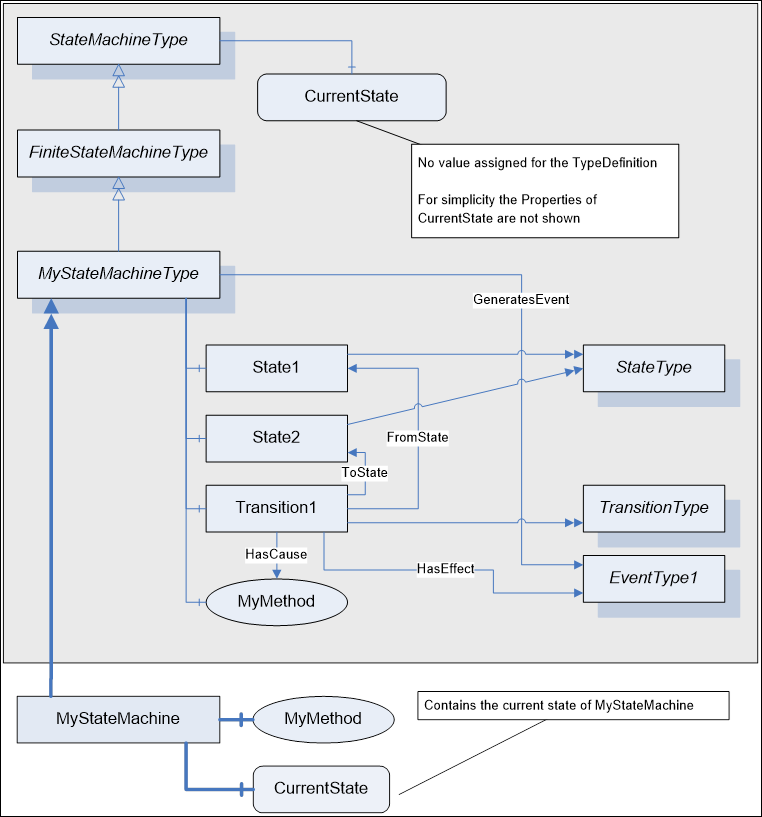  

Figure 7 - Example of a StateMachineType using inheritance  

In [Figure 7](/§\_Ref33079898) an example of a *StateMachine* is given using the Notation defined in [OPC 10000-3](/§UAPart3) . First, a new *StateMachineType* is defined, called "MyStateMachineType", inheriting from the base *FiniteStateMachineType* . It contains two *States* , "State1" and "State2" and a *Transition* "Transition1" between them. The *Transition* points to a *Method* "MyMethod" as the *Cause* of the *Transition* and an *EventType* "EventType1" as the *Effect* of the *Transition* .  

Instances of "MyStateMachineType" can be created, for example "MyStateMachine". It has a *Variable* "CurrentState" representing the current *State* . The "MyStateMachine" *Object* only includes the *Nodes* which expose information specific to the instance.  

#### 4.5.2 StateMachineType with a SubStateMachine using inheritance  

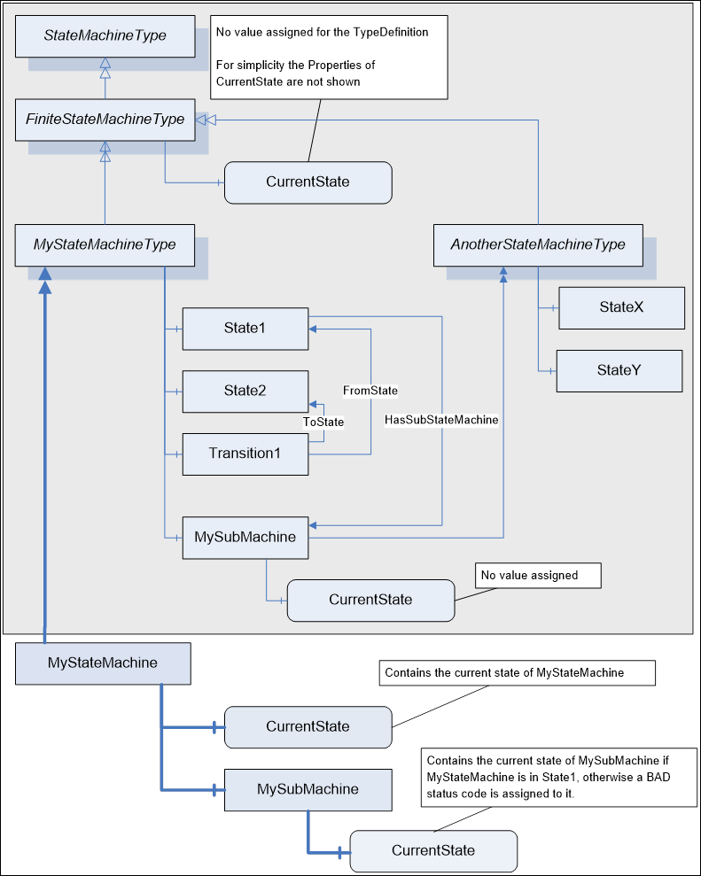  

Figure 8 - Example of a StateMachineType with a SubStateMachine using inheritance  

[Figure 8](/§\_Ref33079935) gives an example of a *StateMachineType* having a *SubStateMachine* for its "State1". For simplicity no effects and causes are shown, as well as type information for the *States* or *ModellingRules* .  

The "MyStateMachineType" contains an *Object* "MySubMachine" of type "AnotherStateMachineType" representing a *SubStateMachine* . The "State1" references this *Object* with a *HasSubStateMachine* *Reference* , thus it is a *SubStateMachine* of "State1". Since "MySubMachine" is an *Object* of type "AnotherStateMachineType" it has a *Variable* representing the current *State* . Since it is used as an *InstanceDeclaration* , no value is assigned to this *Variable* .  

An *Object* of "MyStateMachineType", called "MyStateMachine" has *Variables* for the current *State* , but also has an *Object* "MySubMachine" and a *Variable* representing the current state of the *SubStateMachine* . Since the *SubStateMachine* is only used when "MyStateMachine" is in "State1", a client would receive a *Bad\_StateNotActive* *StatusCode* when reading the *SubStateMachine* *CurrentState* *Variable* if "MyStateMachine" is in a different *State* .  

#### 4.5.3 StateMachineType using containment  

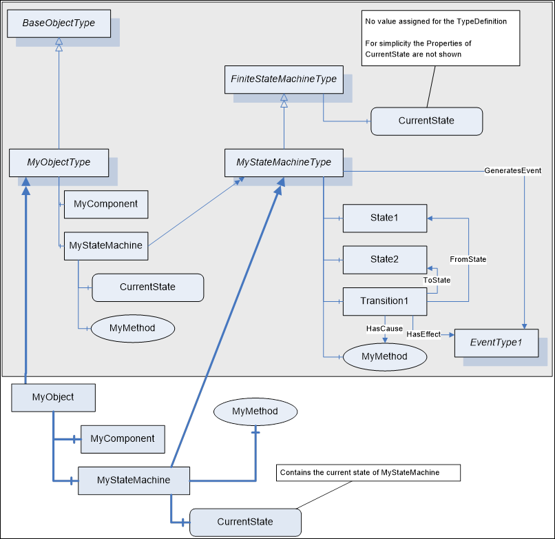  

Figure 9 - Example of a StateMachineType using containment  

[Figure 9](/§\_Ref33079965) gives an example of an *ObjectType* not only representing a *StateMachine* but also having some other functionality. The *ObjectType* "MyObjectType" has an *Object* "MyComponent" representing this other functionality. But it also contains a *StateMachine* "MyStateMachine" of the type "MyStateMachineType". *Objects* of "MyObjectType" also contain such an *Object* representing the StateMachine and a *Variable* containing the current state of the StateMachine, as shown in the Figure.  

#### 4.5.4 Example of a StateMachine having Transition to SubStateMachine  

The *StateMachines* shown so far only had *Transitions* between *States* on the same level, that is, on the same *StateMachine* . Of cause, it is possible and often required to have *Transitions* between *States* of the *StateMachine* and *States* of its *SubStateMachine* .  

Because a *SubStateMachine* can be defined by another *StateMachineType* and this type can be used in several places, it is not possible to add a bi-directional *Reference* from one of the shared *States* of the *SubStateMachine* to another *StateMachine* . In this case it is suitable to expose the *FromState* or *ToState* *References* uni-directional, that is, only pointing from the *Transition* to the *State* and not being able to browse to the other direction. If a *Transition* points from a *State* of a *SubStateMachine* to a *State* of another sub-machine, both, the *FromState* and the *ToState* *Reference* , are handled uni-directional.  

A Client shall be able to handle the information of a *StateMachine* if the *ToState* and *FromState* *References* are only exposed as forward *References* and the inverse *References* are omitted.  

[Figure 10](/§\_Ref33079995) gives an example of a state machine having a transition from a sub-state to a state.  

  

Figure 10 - Example of a StateMachine with Transitions from sub-states  

In [Figure 11](/§\_Ref33080060) the representation of this example as *StateMachineType* in the *AddressSpace* is given. The "Transition1", part of the definition of "MyStateMachineType", points to the "StateX" of the *StateMachineType* "AnotherStateMachineType". The *Reference* is only exposed as forward *Reference* and the inverse *Reference* is omitted. Thus, there is no *Reference* from the "StateX" of "AnotherStateMachineType" to any part of "MyStateMachineType" and "AnotherStateMachineType" can be used in other places as well.  

  

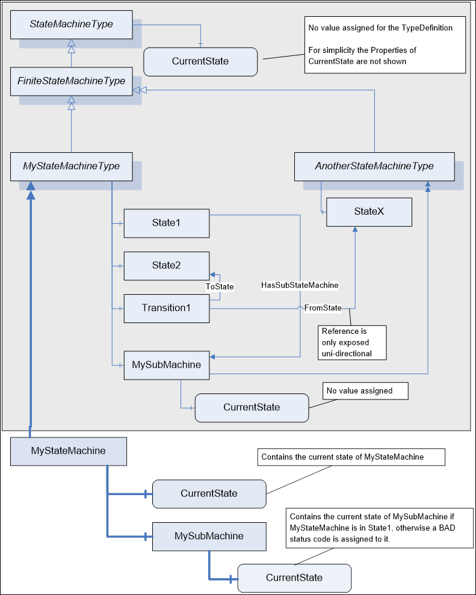  

Figure 11 - Example of a StateMachineType having Transition to SubStateMachine  

#### 4.5.5 Example of a StateMachine adding a SubStateMachine on a Subtype  

When a subtype of *FiniteStateMachineType* having *States* extends the *StateMachine* , it is not allowed to add additional *States* , but instead *SubStateMachines* can be added to existing *States* .  

The example in [Figure 12](/§\_Ref57733924) shows a very simple *StateMachine* with two *States* .  

  

Figure 12 - Example of a StateMachine with two States  

In [Figure 13](/§\_Ref57733993) the *StateMachine* of [Figure 12](/§\_Ref57733924) is extended by adding two substates to "State1".  

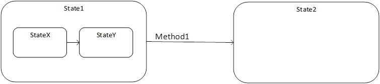  

Figure 13 - Example of a StateMachine extended with two Substates  

In [Figure 14](/§\_Ref60828021) the *StateMachine* of [Figure 13](/§\_Ref57733993) is extended by adding two substates to "State2", and an effect on the Transition between "State1" and "State2".  

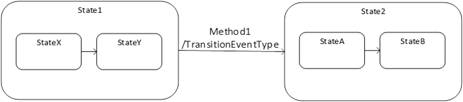  

Figure 14 - Example of a StateMachine extended with another two Substates  

In [Figure 15](/§\_Ref57811973) the representation of this example as *StateMachineType* in the *AddressSpace* is given. The "MyStateMachineType" defines the *StateMachine* of [Figure 12](/§\_Ref57733924) , and the "MySubStateMachineType" is a subtype and extends the *StateMachine* with a *SubStateMachine* as defined in [Figure 13](/§\_Ref57733993) . The "MySubSubStateMachineType" is another subtype as defined in [Figure 14](/§\_Ref60828021) .  

The States and Transitions of "MyStateMachineType" are replicated to "MySubStateMachineType" and "MySubSubStateMachineType". Since "Method1" is not overridden, the "Transition1" of all three types is referencing the Method of "MyStateMachineType". In "MySubStateMachineType", a SubStateMachine for "State1" was added, and in "MySubSubStateMachineType" a SubStateMachine for "State2". In addition, "MySubSubStateMachineType" adds an effect to "Transition1".  

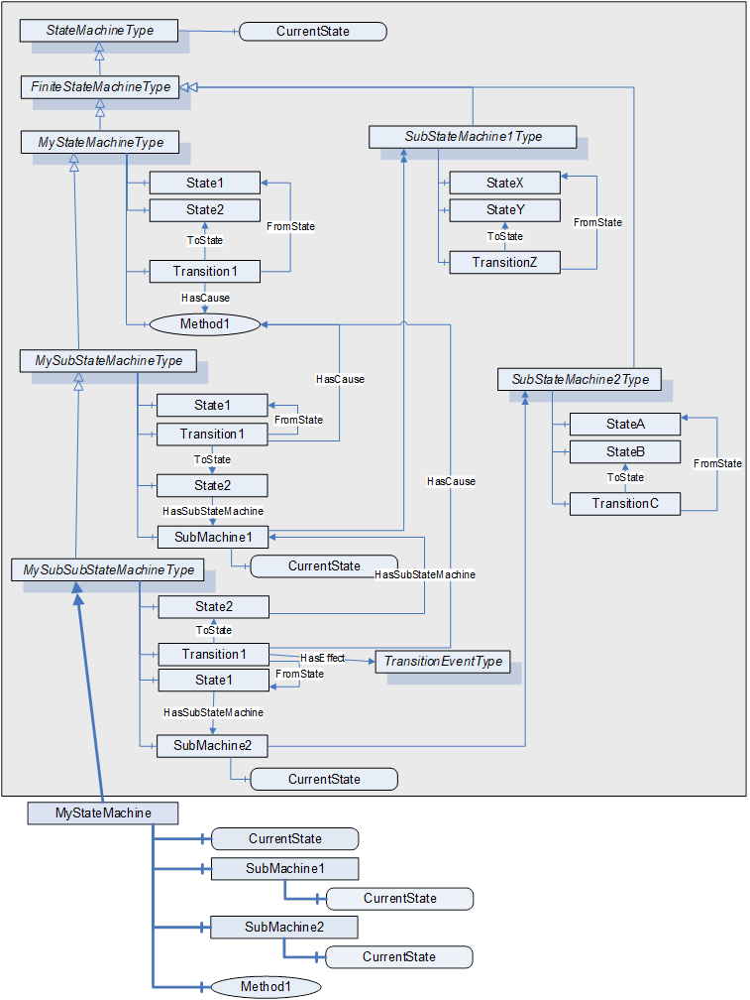  

Figure 15 - Example of a StateMachineType adding SubStateMachines in Subtypes  

### 4.6 StateMachine Extensions for ChoiceStates and Guards  

#### 4.6.1 Overview  

This section describes extensions to the *StateMachine* model allowing choices and guards on *StateMachines* .  

#### 4.6.2 ChoiceStateType  

The *ChoiceStateType* is a subtype of the *StateType* and is formally defined in [Table 20](/§\_Ref51189834) . An *Object* of the *ChoiceStateType* represents a pseudo state that is directly exited when it is entered. The *Guards* defined on the *Transitions* from the *ChoiceState* determine which *Transition* is used. The *Guards* shall be defined in a way that at least one *Guard* is true and a *Transition* can be determined. If this is not the case, the *StateMachine* is non-well formed. To avoid this, the specific *ElseGuardVariableType* can be used, which is only "true" if all other *Guards* on a *ChoiceState* are "false". If several *Guards* are "true", only one of those *Transitions* is used. The algorithm to determine the *Transition* is server-specific.  

A sample *StateMachine* using a *ChoiceState* is given in [Figure 16](/§\_Ref33080668) . It provides a simplified representation of a robot. When the *StateMachine* is in the S1\_Initial state, calling the Load() *Method* loads a program to the robot and triggers the *Transition* into the *ChoiceState* (CS). In the *ChoiceState* the *Guards* are validated and in case the robot is on the correct position for the loaded program (validated by the guard OnPath = True) the *State* S3\_Ready is entered. In case the robot is not in the correct position (Else) the S2\_Loaded State is entered. In that *State* , the Prepare() *Method* puts the robot in the correct position, and triggers the *Transition* to S3\_Ready. If the robot is ready, it can be started. While it is running, it can be stopped. If the program is finished, the robot goes back to either the loaded or ready state, depending on its position, using the *ChoiceState* , again.  

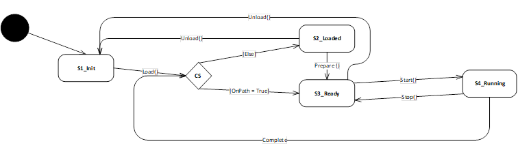  

Figure 16 - Example of a ChoiceState  

As the *ChoiceState* is directly exited after it is entered there shall be no trigger (using the *HasCause* *ReferenceType* or a subtype) defined on any leaving *Transition* ( *Transitions* referencing the *ChoiceState* with the *FromState* *Reference* or a subtype).  

 **Table 20\- ChoiceStateType**   

| **Attribute** | **Value** |
|---|---|
|BrowseName|ChoiceStateType|
|IsAbstract|False|
| **References** | **NodeClass** | **BrowseName** | **DataType** | **TypeDefinition** | **ModellingRule** |
|Subtype of the State *Type* defined in [4.4.9](/§\_Ref33076422)|
| **Conformance Units** |
|Base Info Choice States|
  

  

#### 4.6.3 HasGuard  

The *HasGuard* *ReferenceType* is a concrete *ReferenceType* and can be used directly. It is a subtype of *HasComponent* .  

The semantic of this *ReferenceType* is to point from a *Transition* to a *Guard* . The *Guard* indicates if the *Transition* can be used or not (see *GuardVariableType* ). A *Transition* can only be used, if the *Guard* is "True". A *Transition* can point to several *Guards* . In that case, all *Guards* need to be "True" before the *Transition* can be used. If there is no *Guard* , the *Transition* can always be used (considered as if all *Guards* are "True").  

The *SourceNode* of this *ReferenceType* shall be an *Object* of the *ObjectType* *TransitionType* or one of its subtypes. The *TargetNode* shall be a *Variable* of the *VariableType* *GuardVariableType* or one of its subtypes.  

The representation of the *HasGuard* *ReferenceType* in the *AddressSpace* is specified in [Table 21](/§\_Ref33078513) .  

 **Table 21\- HasGuard ReferenceType**   

| **Attribute** | **Value** |
|---|---|
|BrowseName|HasGuard|
|InverseName|GuardOf|
|Symmetric|False|
|IsAbstract|False|
| **References** | **NodeClass** | **BrowseName** | **DataType** | **TypeDefinition** | **ModellingRule** |
|Subtype of the HasComponent ReferenceType defined in **** |
| **Conformance Units** |
|Base Info Choice States|
  

  

#### 4.6.4 GuardVariableType  

The *GuardVariableType* provides the information of a *Guard* of a *Transition* in a *StateMachine* . A *Guard* indicates, if the *Transition* can be used or not. The *Guard* defines a semantic that can be evaluated to "True" or "False". Only if the semantic is "True", the *Transition* connected via a *HasGuard* *Reference* can be used. The value of the *GuardVariableType* provides the semantic of the *Guard* in a human-readable way, that can be used to display the *StateMachine* .  

This base *GuardVariableType* does not define a machine-readable semantic of the *Guard* . The calculation, if the *Guard* is "True" or "False" is server-specific. Subtypes of this *VariableType* do define concrete machine-readable semantics.  

The *GuardVariableType* is formally defined in [Table 22](/§\_Ref33078526) .  

 **Table 22\- GuardVariableType definition**   

| **Attribute** | **Value** |
|---|---|
|BrowseName|GuardVariableType|
|DataType|LocalizedText|
|ValueRank|−1 (−1 = Scalar)|
|IsAbstract|False|
| **References** | **NodeClass** | **BrowseName** | **DataType** | **TypeDefinition** | **ModellingRule** |
|Subtype of the BaseDataVariableType defined in [OPC 10000-5](/§UAPart5)|
|HasSubtype|VariableType|ElseGuardVariableType|Defined in [4.6.6](/§\_Ref535594246)|
|HasSubtype|VariableType|ExpressionGuardVariableType|Defined in [4.6.5](/§\_Ref535594261)|
| **Conformance Units** |
|Base Info Choice States|
  

  

#### 4.6.5 ExpressionGuardVariableType  

The *ExpressionGuardVariableType* provides, in addition to the human-readable semantic from its *GuardVariableType* , a machine interpretable representation on the semantic.  

The *ExpressionGuardVariableType* is formally defined in [Table 23](/§\_Ref33078561) .  

 **Table 23\- ExpressionGuardVariableType definition**   

| **Attribute** | **Value** |
|---|---|
|BrowseName|ExpressionGuardVariableType|
|DataType|LocalizedText|
|ValueRank|−1 (−1 = Scalar)|
|IsAbstract|False|
| **References** | **NodeClass** | **BrowseName** | **DataType** | **TypeDefinition** | **ModellingRule** |
|Subtype of the GuardVariableType defined in [4.6.4](/§\_Ref535591767)|
|HasProperty|Variable|Expression|ContentFilter|PropertyType|Mandatory|
| **Conformance Units** |
|Base Info Choice States|
  

  

The mandatory *Property* *Expression* provides a *ContentFilter* , that shall be evaluated on the Object the StateMachine belongs to. This is a machine-readable semantic of the *Guard* . If the *ContentFilter* evaluates to "True", the *Guard* is "True", otherwise the *Guard* is "False".  

The *ContentFilter* for *ExpressionGuardVariableType* is restricted to basic operators (see [OPC 10000-4](/§UAPart4) for details).  

The *ContentFilter* can reference any *Variables* defined on the *StateMachineType* and are validated on the instance of the *StateMachine* . If the definition of the *Variable* is not owned directly by the *StateMachine* but for example some other type, the *StateMachine* instance shall reference that Variable.  

#### 4.6.6 ElseGuardVariableType  

The *ElseGuardVariableType* is a specialization of the *GuardVariableType* defining a concrete semantic for the *Guard* . The value of the *Guard* should always be \{"en", "Else"\} or a translation of this. The *ElseGuardVariableType* shall only be used on pseudo states like the *ChoiceStateType* . That means, that it shall only be referenced from Transitions having such a *StateType* as *SourceNode* . The *ElseGuardVariableType* shall only be used once for each State. That means, that each State shall at most have one *Transition* (referenced as *SourceNode* ) referencing an *ElseGuardVariableType* . The *ElseGuardVariableType* shall be the only *Guard* of a *Transition* . That means, if a *Transition* references an instance of an *ElseGuardVariableType* , it shall not reference any other *Guards* .  

The semantic of the *ElseGuardVariableType* is, that if a pseudo state is reached and no other Transition exists on the State where all its *Guards* are validated to "True", this Guards validates to "True" and thus its *Transition* is used.  

The *ElseGuardVariableType* is formally defined in [Table 24](/§\_Ref33078599) .  

 **Table 24\- ElseGuardVariableType definition**   

| **Attribute** | **Value** |
|---|---|
|BrowseName|ElseGuardVariableType|
|DataType|LocalizedText|
|ValueRank|−1 (−1 = Scalar)|
|IsAbstract|False|
| **References** | **NodeClass** | **BrowseName** | **DataType** | **TypeDefinition** | **ModellingRule** |
|Subtype of the GuardVariableType defined in [4.6.4](/§\_Ref535591767)|
| **Conformance Units** |
|Base Info Choice States|
  

  

### 4.7 Example of a StateMachine using a ChoiceState and Guards  

Taking the sample *StateMachine* of [Figure 16](/§\_Ref33080668) its representation in the OPC UA *AddressSpace* is shown in [Figure 17](/§\_Ref33080537) as RobotStateMachineType. The *Transition* T2 between the *ChoiceState* and S2\_Loaded has the Guard "Else" of *ElseGuardVariableType* and the *Transition* T3 between the *ChoiceState* and S3\_Ready has the *Guard* "OnPathTrue" having an "Expression" *Property* (not shown in the figure). The *ContentFilter* of the Expression references to the ProgramLoaded *Variable* of the RobotStateMachineType. When the *ChoiceState* is entered on an instance of the RobotStateMachineType like MyStateMachine in [Figure 17](/§\_Ref33080537) , the concrete *Variable* of the instance is used to evaluate the *ContentFilter* . The value of the Expression is in the sample an array with one entry, using the *FilterOperator* Equal\_0 and the filterOperands are the SimpleOperand OnPath and the Literal value "True".  

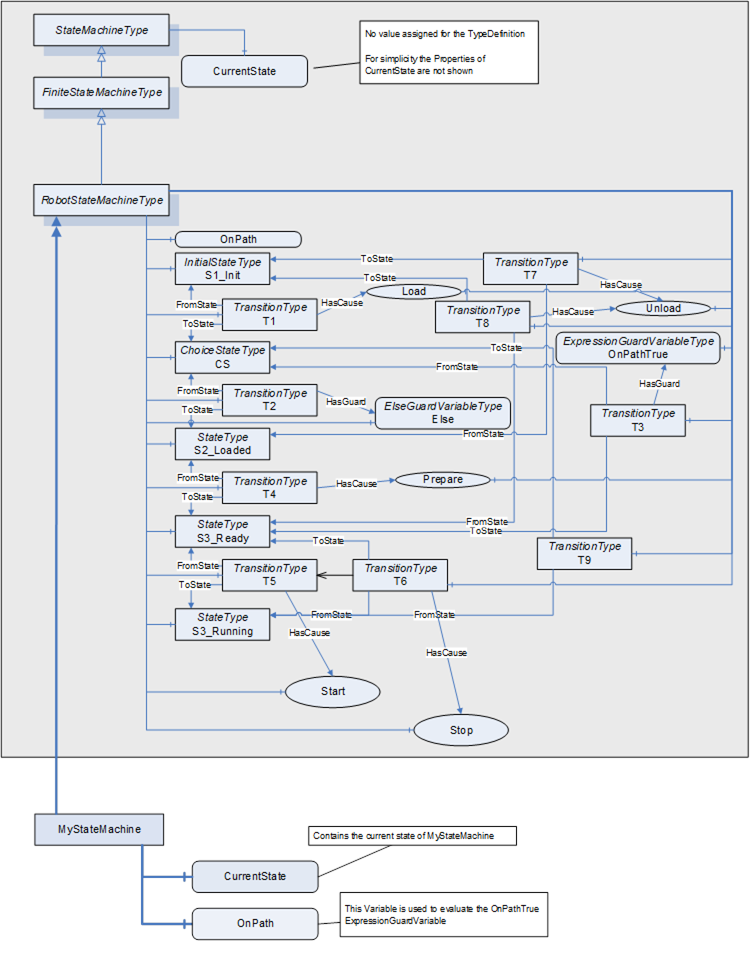  

Figure 17 - Example of a StateMachine using ChoiceState and Guards  

\_\_\_\_\_\_\_\_\_\_  

