## 1 Scope  

This part of the OPC UA Standard provides a definition of *AliasNames* functionality. *AliasNames* provide a manner of configuring and exposing an alternate well-defined name for any *Node* in the system. This is analogous to the way domain names are used as an alias to IP addresses in IP networks. Like a DNS Server, an OPC UA *Server* that supports *AliasNames* provides a lookup *Method* that will translate an *AliasName* to a *NodeId* of the related *Node* on a *Server* . An aggregating *Server* can collect these *AliasNames* from multiple *Servers* and provide a lookup *Method* to allow *Client* applications to discover *NodeIds* on a system wide basis. An aggregating *Server* could also define *AliasNames* for *Nodes* in other *Servers* that do not support *AliasNames.* A GDS may be constructed that would automatically aggregate all *AliasNames* that are defined on any *Server* that has registered with the GDS. In this case the GDS also provides the lookup mechanism for *Clients* at a well-known endpoint and address. Examples for the use of AliasNames are in [Annex A](/§\_Ref172721279) . The GDS functionality for *AliasNames* is formally defined in [Annex B](/§\_Ref20155769) .  

## 2 Normative references  

The following referenced documents are indispensable for the application of this specification. For dated references, only the edition cited applies. For undated references, the latest edition of the referenced document (including any amendments and errata) applies.  

OPC 10000-1, *OPC Unified Architecture - Part 1: Overview and Concepts*  

[http://www.opcfoundation.org/UA/Part1/](http://www.opcfoundation.org/UA/Part1/)  

OPC 10000-3, *OPC Unified Architecture - Part 3: Address Space Model*  

[http://www.opcfoundation.org/UA/Part3/](http://www.opcfoundation.org/UA/Part3/)  

OPC 10000-4, *OPC Unified Architecture - Part 4: Services*  

[http://www.opcfoundation.org/UA/Part4/](http://www.opcfoundation.org/UA/Part4/)  

OPC 10000-5, *OPC Unified Architecture - Part 5: Information Model*  

[http://www.opcfoundation.org/UA/Part5/](http://www.opcfoundation.org/UA/Part5/)  

OPC 10000-7, *OPC Unified Architecture - Part 7: Profiles*  

[http://www.opcfoundation.org/UA/Part7/](http://www.opcfoundation.org/UA/Part7/)  

OPC 10000-12, *OPC Unified Architecture - Part 12: Discovery and Global Services*  

[http://www.opcfoundation.org/UA/Part12/](http://www.opcfoundation.org/UA/Part12)  

OPC 10000-14, *OPC Unified Architecture - Part 14: PubSub*  

 http://www.opcfoundation.org/UA/Part14/  

## 3 Terms, definitions and abbreviated terms  

### 3.1 Terms and definitions  

For the purposes of this document, the terms and definitions given in [OPC 10000-1](/§UAPart1) , [OPC 10000-3](/§UAPart3) , [OPC 10000-4](/§UAPart4) , [OPC 10000-5](/§UAPart5) , [OPC 10000-7](/§UAPart7) , [OPC 10000-12](/§UAPart12) , and [OPC 10000-14](/§UAPart14) apply.  

All used terms are *italicized* in the specification.  

#### 3.1.1 AliasName  

alternate well-defined name for any *Node* in the system  

### 3.2 Abbreviated terms  

  

GDS Global Discovery Server  

  

## 4 Use cases  

### 4.1 Complex configuration  

For systems that are large and complex, engineering is often done in multiple tools and by multiple individuals. The separate configurations are required to work together, but resolving the references between these different configurations can be a significant task. A common solution to simplify this task is a naming convention for the items that are being referenced. Providing an automatic lookup capability for these names would greatly simplify configuration. Each system can specify its own names and configurations can be built to just use the names, without having to know the exact address of the items. The exact address would include the address of the *Server* , the address of the tag in the *Server* , the required protocol for connecting to the *Server* , security settings etc. OPC UA defines a GDS that can provide information about what *Servers* are available in a system and how to connect to them, but it does not currently provide information about the tags that are available in a given *Server* .  

  

### 4.2 Automatic reconfiguration  

In a system where many smaller *Servers* exist and these *Servers* could be dynamic, in that new *Servers* can appear and disappear. Configuration could move between *Servers* . The automatic resolution of where a specific piece of information is located would greatly simplify these systems.  

  

### 4.3 Cloud based system  

Much like the previous use case, a cloud-based system, where *Servers* can be spun up in a new cloud system or adjusted and split based on loading to multiple *Servers* . The automatic resolution of where a specific piece of information is located would greatly simplify these systems.  

  

### 4.4 Aggregated systems  

In systems where many simple devices exist, any given simple device could not have the ability to provide name resolution, yet these systems can be much like systems in one of the previous use cases. In a system such as this an aggregating *Server* could exist, where the aggregating *Server* would provide the names as well as the lookup for the underlying *Server* . This aggregating *Server* could also provide other functionality such as aggregation of values, but it could only provide the name definitions and resolutions. The underlying *Server* could have no knowledge of the name.  

## 5 AliasNames Information Model overview  

The *AliasNames* functionality (illustrated in [Figure 1](/§\_Ref19041616) ) defines a number of *ObjectTypes* , *Methods* , *DataTypes* and *References* . [Figure 2](/§\_Ref18992396) illustrates an example of the *Object* model defined for *AliasNames* .  

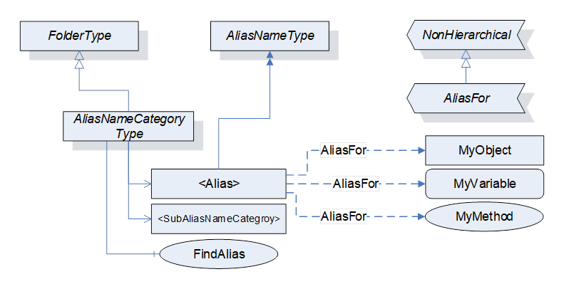  

Figure 1 - AliasNames Overview  

  

The model also includes some well-known fixed instances. The key functionality of *AliasNames* is to reference the information that an AliasName is assigned to. These can be any *Node* . The *AliasNames* can be grouped according to types of functionality. The OPC Foundation defines some initial groups, but the groups can be extended by companion specifications, vendors or end users to meet their needs.  

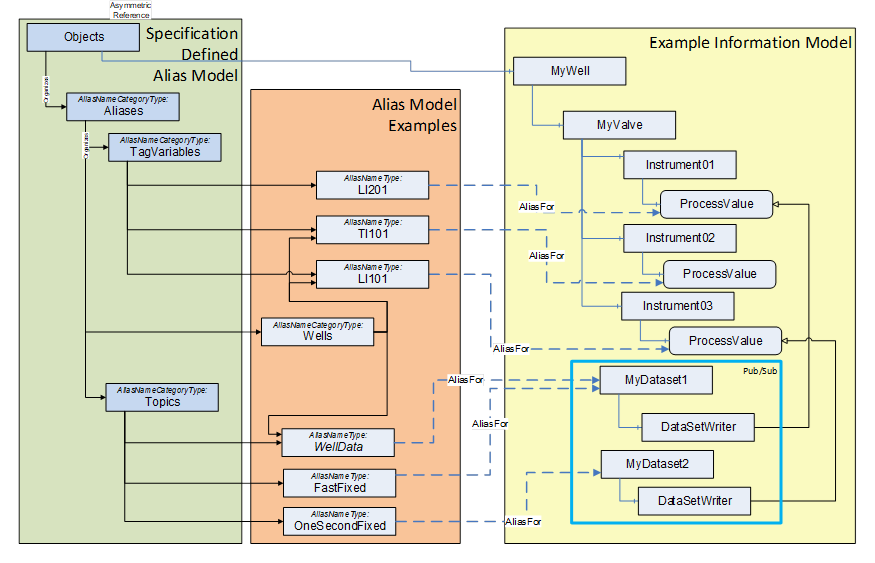  

 **Figure 2\- AliasNames Example**   

  

## 6 OPC UA ObjectTypes  

### 6.1 Overview  

An overview of this object model is provided in Clause [5](/§\_Ref24885546) . [Figure 1](/§\_Ref19041616) illustrates the overall *AliasName* Object Model  

### 6.2 AliasNameType ObjectType Definition  

Instances of the *AliasNameType* *ObjectType* provide alternate names for *Nodes* . The *AliasNameType* is formally defined in [Table 1](/§\_Ref96249224) .  

Table 1 - AliasNameType Definition  

| **Attribute** | **Value** |
|---|---|
|BrowseName|AliasNameType|
|IsAbstract|False|
  
| **References** | **NodeClass** | **BrowseName** | **DataType** | **TypeDefinition** | **ModellingRule** |
|---|---|---|---|---|---|
|Subtype of the BaseObjectType defined in [OPC 10000-5](/§UAPart5)|
  
| **ConformanceUnits** |
|---|
|AliasName Base|
  

  

This *ObjectType* has no *Properties* or *Variables* . The *BrowseName* of the *Object* is used as the alias name. The string part of the *BrowseName* shall be the *DisplayName* with an empty locale id and ** no other locale shall be provided. This *Object* shall have at least one *AliasFor* *Reference* (or sub-type).  

A *Client* shall always ignore the namespace associated with an *AliasName* for comparison with other *AliasNames* .  

The *AliasName* *Object's* *BrowseName* shall not be modified once it is defined. If an *AliasName* needs to be changed, it is considered as a deletion of the old *AliasName* and the addition of new *AliasName* . This requirement allows *AggregatingServers* to detect new *AliasNames* .  

### 6.3 AliasNameCategoryType ObjectType Definition  

#### 6.3.1 Definition  

*AliasNameCategoryType* instances are used to organize the *AliasNameType* instances that a *Server* defines. They can also include instances of *AliasNameCategoryType* to allow hierarchical groupings of *AliasNames* . It includes a mandatory *Method* for finding instances of *AliasNameType* in the *AliasName* hierarchy, starting at this instance of *AliasNameCategoryType* . For example, if the *Method* call is made on the *Aliases* *AliasNameCategoryType* instance (see [9.2](/§\_Ref19038039) ), it would apply the AliasNameSearchPattern to all *AliasNames* that are defined under *TagVariables* , *Topics* and any other *AliasNameCategoryType* instance in the hierarchy.  

The *AliasNameCategoryType* is a subtype of FolderType and is formally defined in [Table 2](/§\_Ref19038245) .  

Table 2 - AliasNameCategoryType Definition  

| **Attribute** | **Value** |
|---|---|
|BrowseName|AliasNameCategoryType|
|IsAbstract|False|
  
| **References** | **NodeClass** | **BrowseName** | **DataType** | **TypeDefinition** | **ModellingRule** |
|---|---|---|---|---|---|
|Subtype of the *FolderType* from [OPC 10000-5](/§UAPart5)|
|Organizes|Object|\<Alias\>||AliasNameType|OptionalPlaceholder|
|Organizes|Object|\<SubAliasNameCategories\>||AliasNameCategoryType|OptionalPlaceholder|
|HasComponent|Method|FindAlias|Defined in [6.3.2](/§\_Ref19038345)|Mandatory|
|HasProperty|Variable|LastChange|VersionTime|PropertyType|Optional|
  
| **ConformanceUnits** |
|---|
|AliasName Base|
  

  

The list of *AliasNames* that an *Object* contains could be dynamic. For example, *AliasNames* could be added in an aggregating *Server* as underlying *Servers* become available or could be removed if a *Server* is no longer available.  

\<Alias\> represents any number of instances of *AliasNameType.* Each instance shall have at least one *AliasFor* *Reference* to a *Node* . Multiple \< *Alias* \> instances can point to the same *Node.*  

\<SubAliasNameCategories\> allows the nesting or structuring of *AliasNames* into hierarchical groupings.  

An \<Alias\> can appear in more than one place in the hierarchy of *AliasNameCategories* .  

*LastChange* is the most recent time for any of the following activities:  

* The last time an *AliasName* was added to or deleted from the *AliasNameCategory* ,  

* The last time an *AliasNameCategory* was added or deleted,  

* The last time the referenced *Nodes* of an *AliasName* in the *AliasNameCategory* changed.  

For *AliasNameCategoryType* instances that are nested, the value of *LastChange* shall always be the latest *VersionTime* of all *Organized* *AliasName* and *AliasNameCategories* .  

The *LastChange* shall be persisted. A *Client* that detects a *LastChange* that is older than what it has cached, shall clear all cached *AliasNameCategories* and related *AliasNames* .  

#### 6.3.2 FindAlias Method  

The *FindAlias* *Method* allows a *Client* to obtain the list of *Nodes* that match the provided *AliasName* search string. The signature of this *Method* is specified below, the arguments are defined in [Table 3](/§\_Ref18985459) .  

  

 **Signature**   

FindAlias(  

[in]  String AliasNameSearchPattern,  

[in]  NodeId   ReferenceTypeFilter,  

[out] AliasNameDataType[]   AliasNodeList  

);  

Table 3 - FindAlias Method Arguments  

| **Argument** | **Description** |
|---|---|
|AliasNameSearchPattern|A string that can contain wild cards, use to find a list of *AliasNames* (see [OPC 10000-4](/§UAPart4)\- "Wildcard Characters" table for supported wildcards, see the "Like" *FilterOperator* in [OPC 10000-4](/§UAPart4) for more details)|
|ReferenceTypeFilter|A *NodeId* that represent a *ReferenceType* (i.e. AliasFor or one of its subtypes) that restricts the search. Any *ReferenceType* includes all subtypes of that *ReferenceType.*|
|AliasNodeList|The returned list of *AliasNameDataType* . If no *Nodes* match the search string or have the appropriate *ReferenceType* , the list shall be empty.|
  

  

*Method* result codes are defined in ****   

Table 4 - FindAlias Method Error Codes  

| **Result Code** | **Description** |
|---|---|
|Bad\_InvalidArgument |The input string is not a valid search string|
|Bad\_UserAccessDenied|The current user does not have the rights required.|
|Bad\_ResponseToLarge|The response was too large to be returned, try new filter and repeat find|
  

  

The *Method* is formally defined in [Table 5](/§\_Ref18985657) .  

Table 5 - FindAlias Method AddressSpace definition  

| **Attribute** | **Value** |
|---|---|
|BrowseName|FindAlias|
  
| **References** | **Node Class** | **BrowseName** | **DataType** | **TypeDefinition** | **ModellingRule** |
|---|---|---|---|---|---|
|HasProperty|Variable|InputArguments|Argument[]|PropertyType|Mandatory|
|HasProperty|Variable|OutputArguments|Argument[]|PropertyType|Mandatory|
  

  

It is important to note that there could be more than one entry for every *AliasName* . Multiple *Servers* could provide a *Node* that represents an equivalent object (such as a temperature sensor). An aggregating Server could also provide the *Node* . This *Method* will return the *AliasNames* in order of preference. That is the *Server* will return what it recommends as the best match first followed by the next best match etc. The criteria for ordering are *Server* specific. The criteria could be based on the *ServerStatus* of the *Server* that contains the referenced *Node* , it could be load balancing of *Servers,* it could be for off-loading of small device *Servers* , or it could be some other algorithm.  

*Clients* should use the first usable entry in the list.  

## 7 OPC UA DataTypes  

### 7.1 Overview  

The following *DataTypes* are defined for the *AliasNames* model.  

### 7.2 AliasNameDataType  

This *DataType* defines a structure that ** can ** contain an array of *ExpandedNodeId* for a single *AliasName* . Its elements are defined in [Table 6](/§\_Ref19038546) . It will always have at least one entry in the *ReferencedNodes* array.  

Table 6 - AliasNameDataType DataType structure  

| **Name** | **Type** | **Description** |
|---|---|---|
|AliasNameDataType|Structure||
|AliasName|QualifiedName|The *AliasName* ( *BrowseName* of the *Node* )|
|ReferencedNodes|ExpandedNodeId[]|The *Nodes* referenced by the *AliasName*|
  

  

Its representation in the *AddressSpace* is defined in [Table 7](/§\_Ref194391093) .  

Table 7 - AliasNameDataType Definition  

| **Attribute** | **Value** |
|---|---|
  
| **BrowseName** |AliasNameDataType|
|---|---|
  
| **References** | **Node Class** | **BrowseName** | **DataType** | **TypeDefinition** | **Modelling Rule** |
|---|---|---|---|---|---|
|Subtype of the *Structure* defined in [OPC 10000-5](/§UAPart5)|
  
| **Conformance Units** |
|---|
|AliasName Base|
  

  

## 8 Reference Types  

### 8.1 Overview  

The following *References* are defined for the *AliasNames* model.  

### 8.2 AliasFor ReferenceType  

This reference is a subtype of *NonHierarchicalReferences* .  

The semantic of this *ReferenceType* is to link *AliasNameType* instances to the *Nodes* they represent. The inverse reference is not required, i.e. the *Nodes* might not have a reference back to instance of *AliasNameType.*  

The *SourceNode* of *References* of this type shall be an *Object* of type *AliasNameType* .  

The *TargetNode* of this *ReferenceType* can be of any *NodeClass.*  

[Figure 2](/§\_Ref18992396) provides an illustration of how this *ReferenceType* is used. It is defined in [Table 8](/§\_Ref16854066) .  

Table 8 - AliasFor Definition  

| **Attributes** | **Value** |
|---|---|
|BrowseName|AliasFor|
|InverseName|HasAlias|
|Symmetric|False|
|IsAbstract|False|
  
| **References** | **NodeClass** | **BrowseName** | **Comment** |
|---|---|---|---|
|Subtype of NonHierarchicalReferences ReferenceType defined in [OPC 10000-5](/§UAPart5)|
  
| **ConformanceUnits** |
|---|
|AliasName Base|
  

  

## 9 Instances  

### 9.1 Overview  

The following standard *Objects* are defined for maintaining the hierarchical structure of *AliasNameCategories* in a *Server* . *Server* vendors are free to add additional instances of *AliasNameCategoryType* under this hierarchy.  

### 9.2 Aliases  

The *Aliases Node* is formally defined in [Table 9](/§\_Ref20220998) .  

Table 9 - Aliases definition  

| **Attribute** | **Value** |
|---|---|
|BrowseName|Aliases|
|||
  
| **References** | **NodeClass** | **BrowseName** | **DataType** | **TypeDefinition** |
|---|---|---|---|---|
|OrganizedBy by the Objects Folder defined in [OPC 10000-5](/§UAPart5)|
|HasTypeDefinition|ObjectType|AliasNameCategoryType|Defined in [6.3](/§\_Ref19038894)|
|HasProperty|Variable|LastChange|VersionTime|PropertyType|
  
| **ConformanceUnits** |
|---|
|AliasName Hierarchy|
  

  

This is the root folder for all alias related *Objects* . It can contain instances of *AliasNameType Objects* and / or instances of *AliasNameCategoryType* *Objects* .  

The *LastChange* *Property* , which is optional in the *AliasNameCategoryType* , shall be present for the root *Aliases* instance. This property shall reflect the last time any changes to AliasName occurred (see [6.3](/§\_Ref19038894) ).  

### 9.3 TagVariables  

*TagVariables* is an instance of *AliasNameCategoryType* . *TagVariables* shall restrict instances of *AliasNameType* to those that have an *AliasFor* *References* that point to *Variables.* The *TagVariables* instance is formally defined in [Table 10](/§\_Ref20118447) .  

Table 10 - TagVariables definition  

| **Attribute** | **Value** |
|---|---|
|BrowseName|TagVariables|
  
| **References** | **NodeClass** | **BrowseName** | **DataType** | **TypeDefinition** |
|---|---|---|---|---|
|OrganizedBy by the Aliases defined in [9.2](/§\_Ref19038039)|
|HasTypeDefinition|ObjectType|AliasNameCategoryType|Defined in [6.3](/§\_Ref19038894)|
  
| **ConformanceUnits** |
|---|
|AliasName Category Tags|
  

  

This is the root folder for *AliasNameType* instances that contain an *AliasFor* reference to *Variables.* It can contain additional *AliasNameCategoryType* *Objects* , which could be used to create a hierarchy. A single instance of *AliasNameType* can exist in more than one location in the Alias hierarchy.  

### 9.4 Topics  

*Topics* is an instance of *AliasNameCategoryType* . *Topics* shall restrict instances of *AliasNameType* to only have *AliasFor* *References* that point to *PublishedDataSetType* (or subtypes) instances (PublishedDataSetType is defined in [OPC 10000-14](/§UAPart14) ). The *Topics Node* instance is formally defined in [Table 11](/§\_Ref19039559) .  

Table 11 - Topics definition  

| **Attribute** | **Value** |
|---|---|
|BrowseName|Topics|
  
| **References** | **NodeClass** | **BrowseName** | **DataType** | **TypeDefinition** |
|---|---|---|---|---|
|OrganizedBy by the Aliases defined in [9.2](/§\_Ref19038039)|
|HasTypeDefinition|ObjectType|AliasNameCategoryType|Defined in [6.3](/§\_Ref19038894)|
  
| **ConformanceUnits** |
|---|
|AliasName Category Topics|
  

  

It can contain additional *AliasNameCategoryType* *Objects* , which could be used to create a hierarchy or other structure. A single instance of *AliasNameType* can exist in more than one location in the hierarchy, but all instances in the *Topics* hierarchy must point to an instance of a *PublishedDataSetType* .  

## Annex A (informative): Examples  

### A.1 Overview  

A number of examples are provided to help illustrate how *AliasNames* function. This includes a *Client* using an *AliasName* *Server* , inside of a *Server* , in an aggregating *Server* and in a GDS.  

### A.2 AliasNames used within a single Server  

[Figure A.1](/§\_Ref169278543) illustrates how this model can be used inside of a *Server* . This sample includes multiple instances of *AliasNameCategoryType* . The figure illustrates that *Objects* could be referenced by more than one instance of *AliasNameType* .  

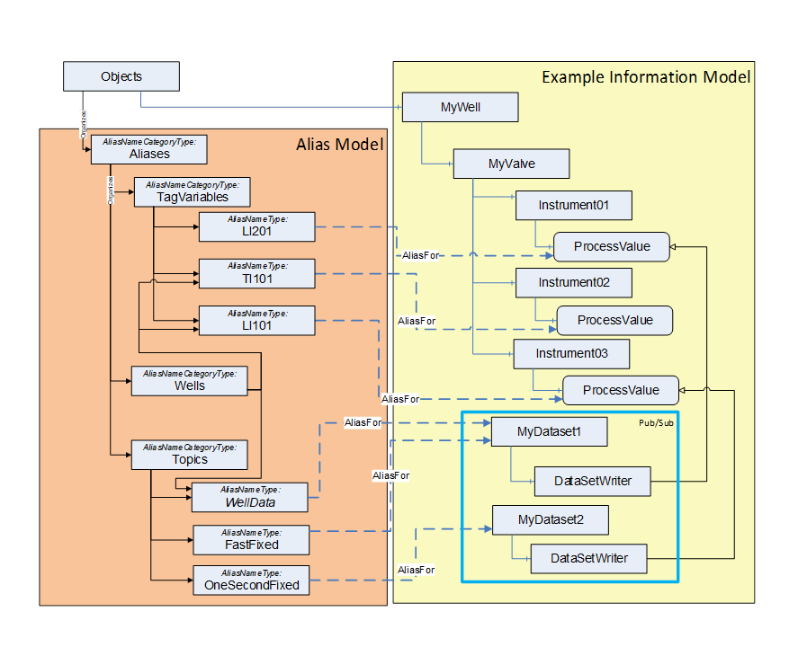  

Figure A. 1 - AliasNames in a Server example  

  

The figure describes an information model for a well. This model contains a number of other *Objects* , which have *Variables* that are to be available via a standardized naming scheme. The model also includes a configuration for a *Pub/Sub* dataset that provides the *Variables* defined in the well.  

The *AliasName* model includes the standard organization items that are required in this document. In addition, the model also defines an extra organizational item for grouping the well information. The example illustrates *AliasNames* that are both *TagVariables* and *Topics* .  

### A.3 AliasNames in an aggregating Server  

An aggregating *Server* would have much the same structure as the *Server* in the first example, with the exception that in the aggregating *Server* the target *Nodes* referenced by the AliasFor *Reference* could be in other *Servers* . [Figure A.2](/§\_Ref169278577) provides an illustration of an example aggregating *Server* . The *Server* could have a much more complex *AddressSpace* than provided in the example.  

  

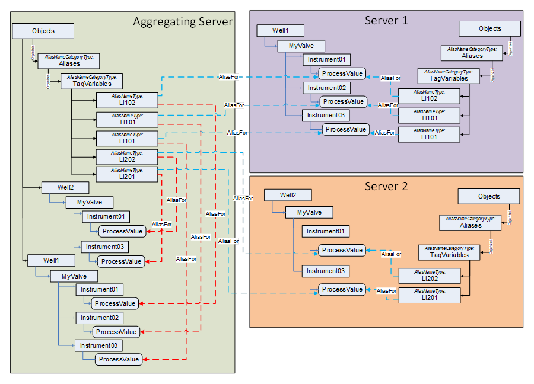  

Figure A. 2 - Aggregating AliasNames Server example  

  

The aggregating *Server* has a choice in that it could just provide the link to the underlying *Node* (blue lines) or it could provide a link to the replicated *Node* in the aggregated *Server's* *AddressSpace* (red lines).  

### A.4 Standalone AliasNames Server  

 **The standalone *AliasNames* *Server* illustrated in [Figure](/§\_Ref169278625) A.3 provides a list of *AliasNames* that reference *Nodes* in multiple separate *Servers* . This type of configuration could be used for *Servers* that do not have the resources to manage *AliasNames* on their own. It could also be used in a system where the configuration of *AliasNames* occurs after the devices that are represented by the *Servers* have already been deployed or if a *Server* just does not have support for *AliasNames* . The standalone *AliasNames* *Server* can function as a lookup *Server* for all of the *AliasNames* defined in the system. It is the responsibility of the standalone *AliasNames* *Server* to ensure that the mapping of *AliasNames* to actual *Nodes* is correct.**   

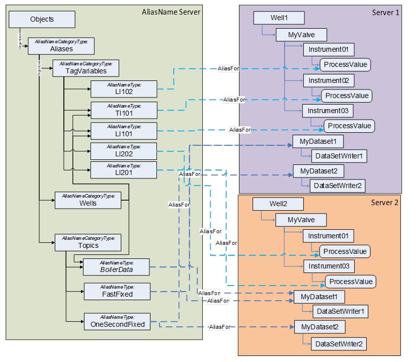  

Figure A. 3 - AliasNames Server example  

  

### A.5 Aggregating Server with a collection of Aggregates  

An aggregating *Server* as shown in [Figure A.4](/§\_Ref169278755) could also collect all of the *AliasNames* defined in underlying *Servers* and just build a composite list of these *AliasNames* . Since all of the *AliasNames* are required to exist under the mandatory *Aliases* *Object* , it is simple for a *Server* to browse the *AddressSpace* and build a list. The aggregating *Server* would be required to merge all *AliasNames* listed under the well-known *Objects* . Some information models could define their own well known *AliasNameCategoryType* *Objects* , which would then also need to be merged. An aggregating *Server* could easily have the same *AliasNames* with multiple *NodeIds* . For example, if a temperature sensor were to be connected to two *Servers* for redundancy, the same *AliasName* TI101 could exist in both *Servers* . The aggregating *Server* would simple report two *ExpandedNodeIds* to any *Client* that requested TI101.  

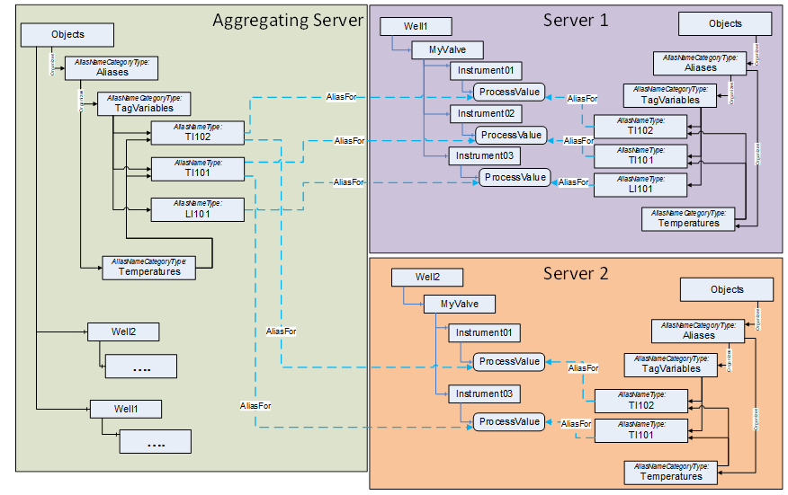  

Figure A. 4 - Aggregating AliasNames Server example  

  

In the above example, if the Temperatures *AliasNameCategoryType* instance were defined locally in the *Server* and not defined in a standard namespace then two instances of the Temperatures *AliasNameCategoryType* will exist in the aggregating *Server* with different namespaces.  

### A.6 GDS  

The GDS could include additional optional behaviour which this example illustrates. What is required is the availability of all *AliasNames* in the mandatory *TagVariables* and *Topics* folder, but a GDS could also choose to replicate or even merge the additional *AliasNameCategoryType* instances from the *Servers* that have registered. [Figure A.5](/§\_Ref169278776) provides an illustration of a GDS that merged the *AliasNameCategory* instance into a tree. It is required that *AliasNameCategories* be aggregated by the GDS, but the structure of these categories is not defined.  

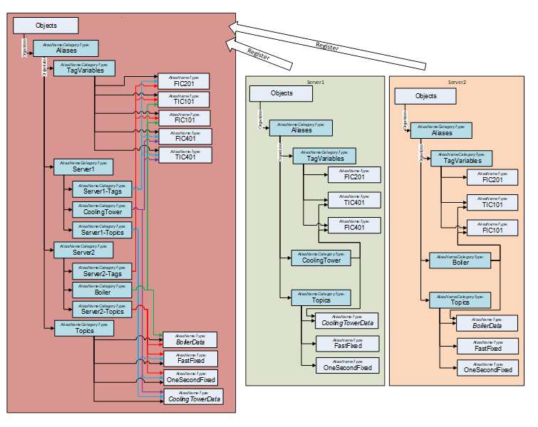  

Figure A. 5 - GDS with merged AliasNames example  

  

For additional information about a GDS and *AliasNames* see [Annex B](/§\_Ref20155769) .  

### A.7 Client use of an AliasName Server  

*AliasNames* allow a *Client* to find *TagVariables* or *Topics* easily. Many industrial systems assign tags to specific measurement or sensors. These tags follow established nomenclatures. An example tag is TI101, which is a temperature indicator at a specific location in a plant. The example nomenclature is defined in [ANSI/ISA-S5.1-1984 (R 1992)](/§ANSI) , but this specification does not provide or even suggest any nomenclature. A *Client* could be configured to display or use the information provided by the sensor TI101, but the actual address/location of this sensor is often not known when the *Client* is configured. *AliasNames* can be used to resolve this tag to the actual sensor in the system.  

The *Client,* on start-up or when it needs to access the tag, would call *FindAlias* on a local *Server* , aggregating *Server* or GDS depending on how a system is configured. A *Client* could select which *AliasName* source to call via a configuration setting. The *FindAlias* *Method* call would return a list of all *ExpandedNodeIds* that the *AliasName* *References* . It is important to note that there could be more than one *Node* referenced by an *AliasName* and that the *Client* must be prepared for this. The first *Node* in the list of referenced *Nodes* returned by *FindAlias* *Method* is the *Node* that the *Server* feels is the best match for the requested tag. The returned list could also return more than one instance of *AliasNameType* and each could have their own list of referenced *Nodes* . If the *Method* call was on a GDS or aggregating *Server* , the *Client* would need to read the *ServerArray* to resolve which *Server* the *ExpandedNodeId* was referencing. This would be the last piece of information that a *Client* would need to be able to follow a normal connection pattern to obtain values from the *Node* .  

*AliasName* could also be configured to provide other information, such as Pub/Sub information, but again it would only be the information that is needed to initially subscribe to an item.  

## Annex B GDS functionality (normative)  

### B.1 Overview  

A Global Discovery Server (GDS) that supports *AliasNames,* provides *AliasNames* functionality, but the target *Nodes* referenced are in other *Servers.* The *AliasNames* are aggregated from the *Servers* that have registered with the GDS that expose the "Alias" capability (for information on capabilities see [OPC 10000-12](/§UAPart12) ). Additional examples on aggregating *AliasNames* can be found in the aggregating *Server* example - [A.3](/§\_Ref19041937) . A GDS implementation also requires additional behaviour. This section describes automatic behaviour that is required by all implementations of a GDS that supports *AliasNames* . An example of a GDS that supports AliasNames is illustrated in [Figure B.1](/§\_Ref172752990) .  

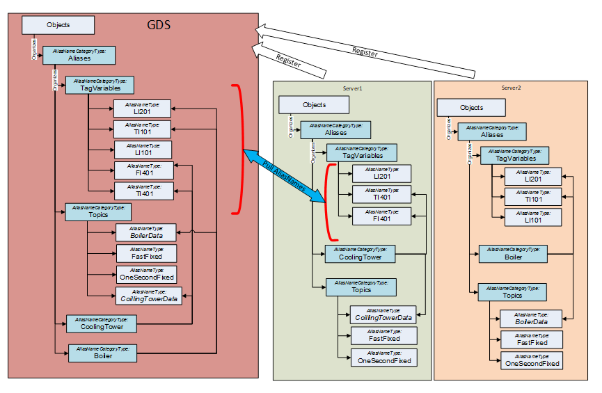  

Figure B. 1 - Example GDS aggregating AliasNames  

  

The following sections describe this required behaviour:  

* When a *Server* registers with the GDS, the GDS shall merge the *AliasNames* of the registering *Server* into a master *AliasNames* list on the GDS.  

* Pull all *AliasNameCategory* instances, merge any that have identical *Name* part of the *BrowseNames* .  

* The GDS will provide the *ExpandedNodeId* of all of the referenced *NodeIds* and the *ServerUri* of the *Server* containing the *NodeId* .  

The details of the expected behaviour of a GDS that supports *AliasNames* is described in [B.2](/§\_Ref172753057) , [B.3](/§\_Ref172753062) and [B.4](/§\_Ref172753065) .  

### B.2 Register a Server  

A GDS that includes support for *AliasNames* shall automatically aggregate all instances of *AliasNameType* that are available in any *Server* that has registered with the GDS. If the same *AliasName* is registered from different *Servers* , the GDS shall combine the *AliasName* within its *Alias* structure. The GDS shall add the *ServerUri* of the registered *Server* into its *ServerArray* Property. It shall provide a single merged tree list for any of the well-known *AliasNameCategoryType* *Objects* defined in [9.3](/§\_Ref19061836) (i.e. *TagVariables* or *Topics* ). The organization of the actual structure of the *AliasNameCategoryType* hierarchy is specific to the GDS vendor and/or the configuration of the GDS, but all *AliasNameCategoryType* instances shall be aggregated into the GDS. This hierarchy allows for a single instance of the *AliasNameType* to appear in more than one location in the tree. [Figure B.2](/§\_Ref169278841) illustrates the process a GDS that supports *AliasNames* would follow.  

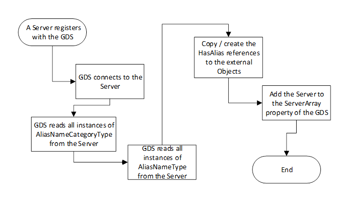  

Figure B. 2 - Server Registration Process  

  

[Note: a GDS could encounter a large list of *AliasNames* and it is important that an efficient storage of *AliasName* is provided to allow for fast *AliasName* resolution ( *FindAlias* )]  

### B.3 Unregister a Server  

The GDS should automatically remove any instances of *AliasNameType* and *AliasNameCategoryType* that are associated with an unregistered *Server* . However, the *AliasName* instance or *AliasNameCategory* instance could be from multiple *Servers* and should only be removed if all of the *Servers* that referenced it have been removed. The GDS shall remove any *AliasFor* *References* that point to the unregistered *Server* . The GDS shall delete the *ServerUri* of the unregistered *Server* from the *ServerArray* Property. [Figure B.3](/§\_Ref169278857) illustrate the unregister process in a GDS.  

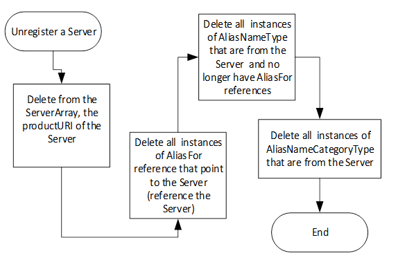  

Figure B. 3 - Unregister Server Process  

  

### B.4 Disconnect between a Client and an AliasName Server  

When a *Client* that uses aliased *Nodes* detects a communication problem with the *Server* , the *Client* can return to the GDS and request a new *AliasNodeList* for the *AliasName* . The original *Server* could recover and again be listed in the GDS, but the *Client* is not required to switch back. [Figure B.4](/§\_Ref169278877) provides an overview of this process.  

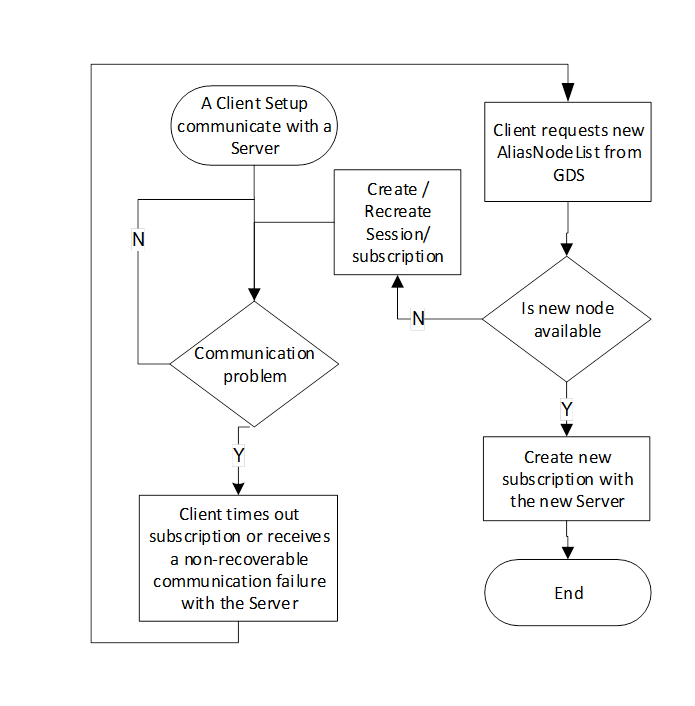  

Figure B. 4 - Example Client Process for Server subscription with errors  

  

It is important to remember that the *FindAlias* *Method* will return a list of *NodeIds* (and *Servers* ) that meet the requested *AliasName* search string. It is up to the *Client* to determine if the *NodeId* that is returned is the same *Server* or on a different *Server* or if the next *NodeId* should be used instead of the first.  

Bibliography  

ANSI/ISA-S5.1-1984 (R 1992), *Instrumentation Symbols and Identification*  

[https://webstore.ansi.org/standards/isa/isa1984r1992](https://webstore.ansi.org/standards/isa/isa1984r1992)  

\_\_\_\_\_\_\_\_\_\_  

