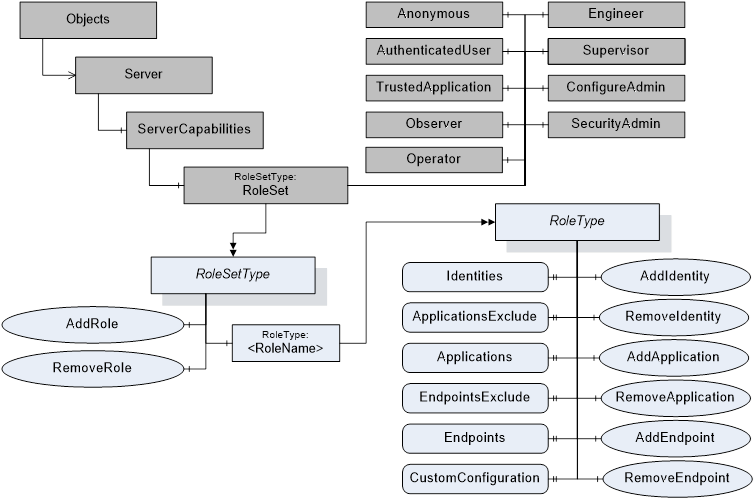
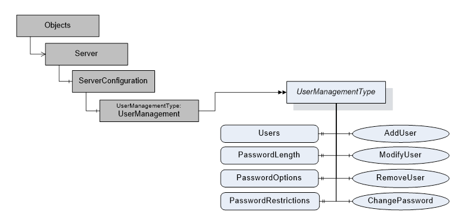

## 1 Scope  

This part of the OPC Unified Architecture defines an Information Model. The Information Model describes the basic infrastructure to model role-based security.  

## 2 Normative references  

The following documents, in whole or in part, are normatively referenced in this document and are indispensable for its application. For dated references, only the edition cited applies. For undated references, the latest edition of the referenced document (including any amendments and errata) applies.  

OPC 10000-1, *OPC Unified Architecture - Part 1: Concepts*  

[http://www.opcfoundation.org/UA/Part1/](http://www.opcfoundation.org/UA/Part1/)  

OPC 10000-3, *OPC Unified Architecture - Part 3: Address Space Model*  

[http://www.opcfoundation.org/UA/Part3/](http://www.opcfoundation.org/UA/Part3/)  

OPC 10000-4, *OPC Unified Architecture - Part 4: Services*  

[http://www.opcfoundation.org/UA/Part4/](http://www.opcfoundation.org/UA/Part4/)  

OPC 10000-5, *OPC Unified Architecture - Part 5: Information Model*  

[http://www.opcfoundation.org/UA/Part5/](http://www.opcfoundation.org/UA/Part5/)  

OPC 10000-6, *OPC Unified Architecture - Part 6: Mappings*  

[http://www.opcfoundation.org/UA/Part6/](http://www.opcfoundation.org/UA/Part6/)  

OPC 10000-7, *OPC Unified Architecture - Part 7: Profiles*  

[http://www.opcfoundation.org/UA/Part7/](http://www.opcfoundation.org/UA/Part7/)  

OPC 10000-8, *OPC Unified Architecture - Part 8: Data Access*  

[http://www.opcfoundation.org/UA/Part8/](http://www.opcfoundation.org/UA/Part8/)  

OPC 10000-12, *OPC Unified Architecture - Part 12: Discovery and Global Services*  

[http://www.opcfoundation.org/UA/Part12/](http://www.opcfoundation.org/UA/Part12/)  

## 3 Terms, definitions, abbreviated terms and conventions  

### 3.1 Terms and definitions  

For the purposes of this document, the terms and definitions given in [OPC 10000-1](/§UAPart1) , [OPC 10000-3](/§UAPart3) and [OPC 10000-5](/§UAPart5) apply.  

  

## 4 Role Model  

### 4.1 General  

OPC UA defines a standard approach for implementing role-based security. *Servers* may choose to implement part or all of the mechanisms defined here. The OPC UA approach assigns *Permissions* to *Roles* for each *Node* in the *AddressSpace* . *Clients* are then granted *Roles* when they create a *Session* based on the information provided by the *Client* .  

*Roles* are used to separate authentication (determining who a *Client* is with a user token and *Client* application identity) from authorization ( *Permissions* determining what the *Client* is allowed to do). By separating these tasks *Servers* can allow centralized services to manage user identities and credentials while the *Server* only manages the *Permissions* for *Roles* on its *Nodes* .  

[OPC 10000-3](/§UAPart3) defines the possible *Permissions* and the representation as *Node Attributes* .  

[Figure 1](/§\_Ref497335317) depicts the *ObjectTypes* , *Objects* and their components used to represent the *Role* management.  

  

Figure 1 - Role management overview  

### 4.2 RoleSetType  

#### 4.2.1 RoleSetType definition  

The *RoleSet* *Object defined in* [OPC 10000-5](/§UAPart5) is a *RoleSetType* which is formally defined in [Table 1](/§\_Ref17727931) .  

 **Table 1\- RoleSetType definition**   

| ***Attribute*** | ***Value*** |
|---|---|
|BrowseName|RoleSetType|
|IsAbstract|False|
| **References** | ***Node* Class** | **BrowseName** | **DataType** | **TypeDefinition** | **Modelling Rule** |
|Subtype of *BaseObjectType* defined in [OPC 10000-5](/§UAPart5)|
|HasComponent|Object|\<RoleName\>||RoleType|OptionalPlaceholder|
|HasComponent|Method|AddRole|Defined in [4.2.2](/§\_Ref468968238) .|Mandatory|
|HasComponent|Method|RemoveRole|Defined in [4.2.3](/§\_Ref468968256) .|Mandatory|
| **Conformance Units** |
|Base Info ServerType|
  

  

The *AddRole* *Method* allows configuration *Clients* to add a new *Role* to the *Server* .  

The *RemoveRole* *Method* allows configuration *Clients* to remove a *Role* from the *Server* .  

#### 4.2.2 AddRole Method  

This *Method* is used to add a *Role* to the *RoleSet Object* defined in [4.3](/§\_Ref211330056) *.*  

The combination of the NamespaceUri and *RoleName* parameters are used to construct the *BrowseName* for the new *Node* . The BrowseName shall be unique within the *RoleSet Object* .  

If the optional *Properties* *EndpointsExclude* and *ApplicationsExclude* are available on the *Role* *Object* created with this *Method* , the initial values of the *EndpointsExclude* and *ApplicationsExclude* Properties shall be TRUE.  

The *Client* shall use an encrypted channel and shall provide user credentials with administrator rights like *SecurityAdmin Role* when invoking this *Method* on the *Server* .  

[OPC 10000-3](/§UAPart3) defines well-known *Roles* . If this *Method* is to be used to add a well-known *Role* , the name of the *Role* from [OPC 10000-3](/§UAPart3) shall be used together with the OPC UA namespace URI. The *Server* shall use the *NodeIds* for the well-known *Roles* in this case. The *NodeIds* for the well-known *Roles* are defined in [OPC 10000-6](/§UAPart6) .  

 **Signature**   

 **AddRole**   

[in] String  RoleName,  

[in] String  NamespaceUri,  

[out] NodeId  RoleNodeId  

);  

  

| **Argument** | **Description** |
|---|---|
|RoleName|The name of the *Role* .|
|NamespaceUri|The *NamespaceUri* qualifies the *RoleName* . If this value is null or empty then the resulting *BrowseName* will be qualified by the *Server's* *NamespaceUri* .|
|RoleNodeId|The *NodeId* assigned by the *Server* to the new *Node* .|
  

  

 **Method Result Codes**   

| **ResultCode** | **Description** |
|---|---|
|Bad\_InvalidArgument|The *RoleName* or NamespaceUri is not valid.  

The text associated with the error shall indicate the exact problem.|
|Bad\_NotSupported|The *Server* does not allow more *Roles* to be added.|
|Bad\_UserAccessDenied|The caller does not have the necessary *Permissions* .|
|Bad\_SecurityModeInsufficient|The *SecureChannel* is not encrypted.|
|Bad\_AlreadyExists|The *Role* already exists in the *Server* .|
|Bad\_ResourceUnavailable|The *Server* does not have enough resources to add the role.|
  

  

The *AddRole* *Method* representation in the *AddressSpace* is formally defined in [Table 2](/§\_Ref211325856) .  

 **Table 2\- AddRole Method AddressSpace definition**   

| **Attribute** | **Value** |
|---|---|
|BrowseName|AddRole|
| **References** | **Node Class** | **BrowseName** | **DataType** | **TypeDefinition** | **Other** |
|0:HasProperty|Variable|0:InputArguments|0:Argument[]|0:PropertyType|M|
|0:HasProperty|Variable|0:OutputArguments|0:Argument[]|0:PropertyType|M|
| **ConformanceUnits** |
|Security Role Server Management|
  

  

#### 4.2.3 RemoveRole Method  

This *Method* is used to remove a *Role* from the *RoleSet Object.*  

The *RoleNodeId* is the *NodeId* of the *Role Object* to remove.  

The *Server* may prohibit the removal of some *Roles* because they are necessary for the *Server* to function.  

If a *Role* is removed all *Permissions* associated with the *Role* shall be deleted. Ideally these changes should take effect immediately; however, some lag may occur.  

The *Client* shall use an encrypted channel and shall provide user credentials with administrator rights like *SecurityAdmin Role* when invoking this *Method* on the *Server* .  

 **Signature**   

 **RemoveRole**   

[in] NodeId RoleNodeId  

);  

  

| **Argument** | **Description** |
|---|---|
|RoleNodeId|The *NodeId* of the *Role Object* .|
  

  

 **Method Result Codes**   

| **ResultCode** | **Description** |
|---|---|
|Bad\_NodeIdUnknown|The specified *Role* *Object* does not exist.|
|Bad\_NotSupported|The *Server* does not allow the *Role Object* to be removed.|
|Bad\_UserAccessDenied|The caller does not have the necessary *Permissions* .|
|Bad\_SecurityModeInsufficient|The *SecureChannel* is not encrypted.|
|Bad\_RequestNotAllowed|The specified Role Object cannot be removed.|
  

  

The *RemoveRole* *Method* representation in the *AddressSpace* is formally defined in [Table 3](/§\_Ref211325870) .  

 **Table 3\- RemoveRole Method AddressSpace definition**   

| **Attribute** | **Value** |
|---|---|
|BrowseName|RemoveRole|
| **References** | **Node Class** | **BrowseName** | **DataType** | **TypeDefinition** | **Other** |
|0:HasProperty|Variable|0:InputArguments|0:Argument[]|0:PropertyType|M|
| **ConformanceUnits** |
|Security Role Server Management|
  

  

### 4.3 RoleSet  

The *RoleSet Object* defined in [Table 4](/§\_Ref51333312) is used to publish all *Roles* supported by the *Server* .  

 **Table 4\- RoleSet definition**   

| ***Attribute*** | ***Value*** |
|---|---|
|BrowseName|RoleSet|
| **References** | ***Node* Class** | **BrowseName** | **DataType** | **TypeDefinition** | **Modelling Rule** |
|ComponentOf the *ServerCapabilities* *Object* defined in [OPC 10000-5](/§UAPart5)|
|HasTypeDefinition|ObjectType|RoleSetType||||
|HasComponent|Object|Anonymous||RoleType||
|HasComponent|Object|AuthenticatedUser||RoleType||
|HasComponent|Object|TrustedApplication||RoleType||
|HasComponent|Object|Observer||RoleType||
|HasComponent|Object|Operator||RoleType||
|HasComponent|Object|Engineer||RoleType||
|HasComponent|Object|Supervisor||RoleType||
|HasComponent|Object|ConfigureAdmin||RoleType||
|HasComponent|Object|SecurityAdmin||RoleType||
| **Conformance Units** |
|Security Role Server Base 2|
  

  

*Servers* should support the well-known *Roles* which are defined in [OPC 10000-3](/§UAPart3) .  

The default *Identities* for the *Anonymous* *Role* shall be *Identities* with the *criteriaType* *IdentityCriteriaType.Anonymous* and the *criteriaType* *IdentityCriteriaType.AuthenticatedUser* . The *Anonymous Role* is the default *Role* which is always assigned to all *Sessions* . The *Anonymous* *Role* is the default *Role* which is always assigned to all Sessions.  

The default *Identities* for the *AuthenticatedUser Role* shall be an identity with the *criteriaType* *IdentityCriteriaType.AuthenticatedUser* .  

The default *Identities* for the *TrustedApplication Role* shall be an identity with the *criteriaType* *IdentityCriteriaType.TrustedApplication* .  

A *Server* shall not allow changes to the *Roles Anonymous, AuthenticatedUser* and *TrustedApplication* .  

A *Server* shall not allow the deletion of the well-known *Roles Anonymous* and *AuthenticatedUser* *TrustedApplication* .  

The additional definition for the conformance units of the instances is defined in [Table 5](/§\_Ref65609805) .  

 **Table 5\- RoleSet Additional Conformance Units**   

| **BrowsePath** | **Conformance Units** |
|---|---|
|ConfigureAdmin|Security Role Well Known|
|SecurityAdmin|Security Role Well Known|
|Anonymous|Security Role Well Known Group 2|
|AuthenticatedUser|Security Role Well Known Group 2|
|TrustedApplication|Security Role TrustedApplication|
|Observer|Security Role Well Known Group 3|
|Operator|Security Role Well Known Group 3|
|Engineer|Security Role Well Known Group 3|
|Supervisor|Security Role Well Known Group 3|
  

  

### 4.4 RoleType  

#### 4.4.1 RoleType definition  

Each *Role* *Object* has the *Properties* and *Methods* defined by the *RoleType* which is formally defined in [Table 6](/§\_Ref33101027) .  

 **Table 6\- RoleType definition**   

| ***Attribute*** | **Value** |
|---|---|
|BrowseName|RoleType|
|IsAbstract|False|
| **References** | ***Node* Class** | **BrowseName** | **DataType** | **TypeDefinition** | **Modelling Rule** |
|Subtype of BaseObjectType|
|||||||
|HasProperty|Variable|Identities|IdentityMapping  

RuleType []|PropertyType|Mandatory|
|HasProperty|Variable|ApplicationsExclude|Boolean|PropertyType|Optional|
|HasProperty|Variable|Applications|String []|PropertyType|Optional|
|HasProperty|Variable|EndpointsExclude|Boolean|PropertyType|Optional|
|HasProperty|Variable|Endpoints|EndpointType []|PropertyType|Optional|
|HasProperty|Variable|CustomConfiguration|Boolean|PropertyType|Optional|
|HasComponent|Method|AddIdentity|Defined in [4.4.5](/§\_Ref63178920) .|Optional|
|HasComponent|Method|RemoveIdentity|Defined in [4.4.6](/§\_Ref450710556) .|Optional|
|HasComponent|Method|AddApplication|Defined in [4.4.7](/§\_Ref63178931) .|Optional|
|HasComponent|Method|RemoveApplication|Defined in [4.4.8](/§\_Ref63178942) .|Optional|
|HasComponent|Method|AddEndpoint|Defined in [4.4.9](/§\_Ref63178952) .|Optional|
|HasComponent|Method|RemoveEndpoint|Defined in [4.4.10](/§\_Ref63178964) .|Optional|
| **Conformance Units** |
|Base Info ServerType|
  

  

The *Properties* and *Methods* of the *RoleType* contain sensitive security related information and shall only be browseable, readable, writeable and callable by authorized administrators through an encrypted channel.  

The configuration of the *Roles* is done through *Method* calls. The only exceptions are the *ApplicationsExclude* and *EndpointsExclude* *Properties* . The two *Properties* are configured with the *Write* *Service* . All other *Properties* are configured with the corresponding *Method* calls. The *CurrentWrite* bit of the *AccessLevel* *Attribute* for the *Properties* *Identities* , *Applications* and *Endpoints* shall be FALSE.  

If the configuration of a *Role* is changed, the *Role* assignment to active *Session* shall be re-evaluated and applied.  

The *Identities* *Property* specifies the currently configured rules for mapping a *UserIdentityToken* to the *Role* . If no user identity is configured for the Role, the *Identities* *Property* value is an empty array. If this *Property* is an empty array and *CustomConfiguration* is not *TRUE* , then the *Role* cannot be granted to any *Session* .  

The *Role* shall only be granted to the *Session* if all of the following conditions are true:  

* The *UserIdentityToken* complies with *Identities.*  

* The *Applications Property* is not configured or the *Client Certificate* complies with the *Applications* settings.  

* The *Endpoints Property* is not configured or the *Endpoint* used complies with the *Endpoints* settings.  

The *ApplicationsExclude* *Property* defines the *Applications* *Property* as an include list or exclude list.  

* If the *ApplicationsExclude* *Property* is not provided or has a value of *FALSE* then only *ApplicationInstance* *Certificates* included in the *Applications* *Property* shall be included in this *Role* . All other *ApplicationInstance Certificates* shall not be included in this *Role* .  

* If the *ApplicationsExclude* *Property* has a value of *TRUE* then all *ApplicationInstance* *Certificates* included in the *Applications* *Property* shall be excluded from this *Role* . All other *ApplicationInstance* *Certificates* shall be included in this *Role* .  

* The default value of the *ApplicationsExclude* *Property* shall be TRUE if the *Applications Property* has an empty array.  

The *Applications* *Property* specifies the *ApplicationInstance Certificates* of *Clients* which shall be included or excluded from this *Role* . Each element in the array is an *ApplicationUri* from a *Client* *Certificate* which is trusted by the *Server* . If *Applications* has entries in the array, the *Role* shall only be granted if the *Session* uses a signed or signed and encrypted communication channel.  

The *EndpointsExclude* *Property* defines the *Endpoints* *Property* as an include list or exclude list.  

* If the *EndpointsExclude* *Property* is not provided or has a value of *FALSE* then only *Endpoints* included in the *Endpoints* *Property* shall be included in this *Role* . All other *Endpoints* shall not be included in this *Role* .  

* If the *EndpointsExclude* *Property* has a value of *TRUE* then all *Endpoints* included in the *Endpoints* *Property* shall be excluded from this *Role* . All other *Endpoints* shall be included in this *Role* .  

* The default value of the *EndpointsExclude* *Property* shall be TRUE if the *Endpoints* *Property* has an empty array.  

The *Endpoints* *Property* specifies the *Endpoints which shall be included or excluded from this* Role. Each element in the array is an *EndpointType* that contains an *Endpoint* description. The *EndpointUrl* and the other *Endpoint* settings are compared with the configured *Endpoint* that is used by the *SecureChannel* for the *Session* . The *EndpointType* *DataType* is defined in [4.4.2](/§\_Ref34993326) . Fields that have default values as defined in the *EndpointType* *DataType* are ignored during the comparison.  

The *CustomConfiguration Property* indicates that the configuration of the *Role* and the assignment of the *Role* to *Sessions* is vendor specific. *Roles* are required to support the *RolePermissions* *Attribute* . If a *Server* want to support *RolePermissions* but is not able to support the standard *Role* functionality, it can indicate this with the *CustomConfiguration Property* . If *CustomConfiguration* is *TRUE* , the *Server* may hide the configuration options completely or the *Server* may provide additional vendor specific configuration options.  

The *AddIdentity* *Method* adds a rule used to map a *UserIdentityToken* to the *Role* . If the *Server* does not allow changes to the mapping rules, then the Method shall not be present. A *Server* should prevent certain rules from being added to particular *Roles* . For example, a *Server* should refuse to allow an ANONYMOUS\_5 (see [4.4.2](/§\_Ref450708202) ) mapping rule to be added to *Roles* with administrator privileges.  

The *RemoveIdentity* *Method* removes a mapping rule used to map a *UserIdentityToken* to the *Role* . If the *Server* does not allow changes to the mapping rules, then the *Method* shall not be present.  

The *AddApplication* *Method* adds an *ApplicationInstance Certificate* to the list of *Applications* . If the *Server* does not enforce application restrictions or does not allow changes to the mapping rules for the *Role* the Method shall not be present.  

The *RemoveApplication* *Method* removes an *ApplicationInstance Certificate* from the list of *Applications* . If the *Server* does not enforce application restrictions or does not allow changes to the mapping rules for the *Role* the *Method* shall not be present.  

#### 4.4.2 EndpointType  

This *structure describes an Endpoint.* The *EndpointType* is formally defined in [Table 7](/§\_Ref494879919) .  

 **Table 7\- EndpointType Structure**   

| **Name** | **Type** | **Description** |
|---|---|---|
|EndpointType|structure||
|endpointUrl|String|The URL for the *Endpoint* .|
|securityMode|MessageSecurityMode|The type of message security.  

The type *MessageSecurityMode* type is defined in [OPC 10000-4](/§UAPart4) .  

The default value is *MessageSecurityMode Invalid.* The field is ignored for comparison if the default value is set.|
|securityPolicyUri|String|The URI of the *SecurityPolicy* .  

The default value is an empty or null *String.* The field is ignored for comparison if the default value is set.|
|transportProfileUri|String|The URI of the *Transport* *Profile* .  

The default value is an empty or null *String.* The field is ignored for comparison if the default value is set.|
  

  

The *EndpointType Structure* representation in the *AddressSpace* is defined in [Table 8](/§\_Ref494369053) .  

 **Table 8\- EndpointType definition**   

| **Attributes** | **Value** |
|---|---|
|BrowseName|EndpointType|
|IsAbstract|False|
| **References** | **NodeClass** | **BrowseName** | **IsAbstract** | **Description** |
|Subtype of Structure defined in [OPC 10000-5](/§UAPart5) .|
| **Conformance Units** |
|Base Info ServerType|
  

  

#### 4.4.3 IdentityMappingRuleType  

The *IdentityMappingRuleType* structure defines a single rule for selecting a *UserIdentityToken* . The structure is described in [Table 9](/§\_Ref33101056) .  

 **Table 9\- IdentityMappingRuleType**   

| **Name** | **Type** | **Description** |
|---|---|---|
|IdentityMappingRuleType|Structure|Specifies a rule used to map a *UserIdentityToken* to a *Role* .|
|criteriaType|Enumeration  

IdentityCriteriaType|The type of criteria contained in the identity mapping rule. The *IdentityCriteriaType* is defined in [4.4.4](/§\_Ref51329642) .|
|criteria|String|The criteria which the *UserIdentityToken* must meet for a *Session* to be mapped to the *Role* . The meaning of the criteria depends on the *criteriaType* . The *criteria* shall be null or an empty string for *Anonymous,* *AuthenticatedUser* and *TrustedApplication* .|
  

  

If the *criteriaType* is *UserName* , the *criteria* is a name of a user known to the *Server* . For example, the user could be the name of a local operating system account or a user managed by the server as defined in [5.2](/§\_Ref76546594) .  

If the *criteriaType* is *Thumbprint* , the *criteria* is a thumbprint of a user *Certificate* . For this criteria, the thumbprint shall be encoded as a hexadecimal string with upper case characters and without spaces.  

If the *criteriaType* is *Role* , the *criteria* is a name of a restriction found in the *Access Token* . For example, the *Role* "subscriber" may only be allowed to access *PubSub* related *Nodes* . If the *issuedTokenType* of the *Access* *Token* is "http://opcfoundation.org/UA/UserToken\#JWT", the *criteria* contains one of the entries in the roles array of the JWT *IssuedIdentityToken* . If "iss" is present in the JWT *IssuedIdentityToken* , the criteria is prepended by the value of "iss" followed by a '/' (slash).  

If the *criteriaType* is *GroupId* , the *criteria* is a generic text identifier for a user group specific to the *Authorization Service.* For example, an *Authorization Service* providing access to an Active Directory may add one or more Windows Security Groups to the *Access Token* . [OPC 10000-6](/§UAPart6) provides details on how groups are added to *Access Tokens* . If the *issuedTokenType* of the *Access* *Token* is "http://opcfoundation.org/UA/UserToken\#JWT", the *criteria* contain one of the entries in the groups array of the JWT *IssuedIdentityToken* . If "iss" is present in the JWT *IssuedIdentityToken* , the *criteria* is prepended by the value of "iss" followed by a '/' (slash).  

If the *criteriaType* is *Anonymous* , the *criteria* shall be null or an empty string. The *criteriaType* applies if no user credentials have been provided.  

If the *criteriaType* is *AuthenticatedUser* , the *criteria* shall be null or an empty string. The *criteriaType* applies if any valid user credentials have been provided.  

If the *criteriaType* is *TrustedApplication* , the *criteria* shall be null or an empty string. The *criteriaType* applies for any *Client* application with a trusted *ApplicationInstance* *Certificate* . The *Client Certificate* shall be trusted by the *Server* and the *Session* shall use at least a signed communication channel.  

If the *criteriaType* is *Application* , the *criteria* is the *ApplicationUri* from the *Client* *Certificate* used for the *Session* . The *Client Certificate* shall be trusted by the *Server* and the *Session* shall use at least a signed communication channel. This criteria type is used if a *Role* should be granted to a *Session* for *Application Authentication* with *Anonymous* *UserIdentityToken* . If a *Role* should be granted to a *Session* for *Application Authentication* combined with *User Authentication* , the *Applications Property* on the *RoleType* is combined with the *Identities Property* on the *RoleType* as defined in [4.4.1](/§\_Ref34992230) .  

If the *criteriaType* is *X509Subject* , the criteria is the X509 subject name of a *Certificate* of a user which is trusted by the *Server* or the X509 subject name of an issuer of the user *Certificate* . The format of the subject name criteria consists of a sequence of name value pairs separated by a '/'. The name shall be one of entries in [Table 10](/§\_Ref65678415) and shall be followed by a '=' and then followed by the value, which is always enclosed in double quotes ('"'). The order shall be by the order shown in [Table 10](/§\_Ref65678415) with the lowest number first. Every value from [Table 10](/§\_Ref65678415) present in the *Certificate* shall be included in the criteria, others must not be included. The value may be any printable character except for '"'. For example: CN="User Name"/O="Company". [Table 10](/§\_Ref65678415) contains all subject name attributes where support is required by X509 and some commonly used attributes where support is optional. Additional fields may be added in the future. If one name is used multiple times in the certificate, the name is also repeated in the criteria. The entries with the same name are entered in the order they appear in the *Certificate* . All names listed in [Table 10](/§\_Ref65678415) that are included in the X509 subject name shall match the content of the criteria *String* . Names not included in [Table 10](/§\_Ref65678415) are ignored.  

 **Table 10\- Order for subject name criteria**   

| **Order** | **Name** | **Value** |
|---|---|---|
|1|CN|Common Name|
|2|O|Organization|
|3|OU|Organization Unit|
|4|DC|Domain Component|
|5|L|Locality|
|6|S|State|
|7|C|Country|
|8|dnQualifier|Distinguished name qualifier|
|9|serialNumber|Serial number|
  

  

The *IdentityMappingRuleType Structure* representation in the *AddressSpace* is defined in [Table 11](/§\_Ref497331616) .  

 **Table 11\- IdentityMappingRuleType definition**   

| **Attributes** | **Value** |
|---|---|
|BrowseName|IdentityMappingRuleType|
|IsAbstract|False|
| **References** | **NodeClass** | **BrowseName** | **IsAbstract** | **Description** |
|Subtype of Structure defined in [OPC 10000-5](/§UAPart5) .|
| **Conformance Units** |
|Base Info ServerType|
  

  

#### 4.4.4 IdentityCriteriaType  

The *IdentityCriteriaType* Enumeration is defined in [Table 12](/§\_Ref16854259) .  

 **Table 12\- IdentityCriteriaType Values**   

| **Name** | **Value** | **Description** |
|---|---|---|
|UserName|1|The rule specifies a UserName from a *UserNameIdentityToken* .|
|Thumbprint|2|The rule specifies the *Thumbprint* of a user *Certificate* .|
|Role|3|The rule is a *Role* specified in an *Access Token* .|
|GroupId|4|The rule is a user group specified in the *Access Token.*|
|Anonymous|5|The rule specifies *Anonymous UserIdentityToken.*|
|AuthenticatedUser|6|The rule specifies any non *Anonymous* *UserIdentityToken.*|
|Application|7|The rule specifies an application identity.|
|X509Subject|8|The rule specifies the X509 subject name of a user *Certificate* or the issuerof the user *Certificate* .|
|TrustedApplication|9|The rule specifies any trusted application that has been authenticated with a trusted *ApplicationInstance* *Certificate* (see [OPC 10000-4](/§UAPart4) ) and uses at a signed or signed and encrypted communication channel.|
  

  

Its representation in the *AddressSpace* is defined in [Table 13](/§\_Ref16854453) .  

 **Table 13\- IdentityCriteriaType Definition**   

| **Attribute** | **Value** |
|---|---|
|BrowseName|IdentityCriteriaType|
|IsAbstract|False|
| **References** | **NodeClass** | **BrowseName** | **DataType** | **TypeDefinition** | **Other** |
|Subtype of the Enumeration type defined in [OPC 10000-5](/§UAPart5)|
|HasProperty|Variable|EnumValues|EnumValueType []|PropertyType||
| **Conformance Units** |
|Base Info ServerType|
  

  

#### 4.4.5 AddIdentity Method  

This *Method* is used to add an identity mapping rule to a *Role* .  

The *Client* shall use an encrypted channel and shall provide user credentials with administrator rights like *SecurityAdmin Role* when invoking this *Method* on the *Server* .  

 **Signature**   

 **AddIdentity**   

[in] IdentityMappingRuleType Rule  

);  

  

| **Argument** | **Description** |
|---|---|
|Rule|The rule to add.|
  

  

 **Method Result Codes**   

| **ResultCode** | **Description** |
|---|---|
|Bad\_InvalidArgument|The rule is not valid.|
|Bad\_RequestNotAllowed|The rule cannot be added to the *Role* because of *Server* imposed restrictions.|
|Bad\_NotSupported|The rule is not supported by the *Server* .|
|Bad\_AlreadyExists|An equivalent rule already exists.|
|Bad\_ResourceUnavailable|The *Server* does not have enough resources to add the identity mapping.|
|Bad\_UserAccessDenied|The session user is not allowed to configure the object.|
|Bad\_SecurityModeInsufficient|The *SecureChannel* is not encrypted.|
  

  

The *AddIdentity* *Method* representation in the *AddressSpace* is formally defined in [Table 14](/§\_Ref83321408) .  

 **Table 14\- AddIdentity Method AddressSpace definition**   

| **Attribute** | **Value** |
|---|---|
|BrowseName|AddIdentity|
| **References** | **Node Class** | **BrowseName** | **DataType** | **TypeDefinition** | **Other** |
|0:HasProperty|Variable|0:InputArguments|0:Argument[]|0:PropertyType|M|
| **ConformanceUnits** |
|Security Role Server IdentityManagement|
  

  

#### 4.4.6 RemoveIdentity Method  

This *Method* is used to remove an identity mapping rule from a *Role* .  

The *Client* shall use an encrypted channel and shall provide user credentials with administrator rights like *SecurityAdmin* *Role* when invoking this *Method* on the *Server* .  

 **Signature**   

 **RemoveIdentity**   

[in] IdentityMappingRuleType Rule  

);  

  

| **Argument** | **Description** |
|---|---|
|Rule|The Rule to remove.|
  

  

 **Method Result Codes**   

| **ResultCode** | **Description** |
|---|---|
|Bad\_NotFound|The rule does not exist.|
|Bad\_UserAccessDenied|The session user is not allowed to configure the object.|
|Bad\_SecurityModeInsufficient|The *SecureChannel* is not encrypted.|
  

  

The *RemoveIdentity* *Method* representation in the *AddressSpace* is formally defined in [Table 15](/§\_Ref211325382) .  

 **Table 15\- RemoveIdentity Method AddressSpace definition**   

| **Attribute** | **Value** |
|---|---|
|BrowseName|RemoveIdentity|
| **References** | **Node Class** | **BrowseName** | **DataType** | **TypeDefinition** | **Other** |
|0:HasProperty|Variable|0:InputArguments|0:Argument[]|0:PropertyType|M|
| **ConformanceUnits** |
|Security Role Server IdentityManagement|
  

  

#### 4.4.7 AddApplication Method  

This *Method* is used to add an application mapping rule to a *Role* .  

The *Client* shall use an encrypted channel and shall provide user credentials with administrator rights like *SecurityAdmin* *Role* when invoking this *Method* on the *Server* .  

 **Signature**   

 **AddApplication**   

[in] String ApplicationUri  

);  

  

| **Argument** | **Description** |
|---|---|
|ApplicationUri|The *ApplicationUri* for the application.|
  

  

 **Method Result Codes**   

| **ResultCode** | **Description** |
|---|---|
|Bad\_InvalidArgument|The *ApplicationUri* is not valid.|
|Bad\_RequestNotAllowed|The mapping cannot be added to the *Role* because of *Server* imposed restrictions.|
|Bad\_AlreadyExists|The ApplicationUri is already assigned to the *Role* .|
|Bad\_UserAccessDenied|The session user is not allowed to configure the object.|
|Bad\_SecurityModeInsufficient|The *SecureChannel* is not encrypted.|
|Bad\_ResourceUnavailable|The *Server* does not have enough resources to add the application.|
  

  

The *AddApplication* *Method* representation in the *AddressSpace* is formally defined in [Table 16](/§\_Ref211326591) .  

 **Table 16\- AddApplication Method AddressSpace definition**   

| **Attribute** | **Value** |
|---|---|
|BrowseName|AddApplication|
| **References** | **Node Class** | **BrowseName** | **DataType** | **TypeDefinition** | **Other** |
|0:HasProperty|Variable|0:InputArguments|0:Argument[]|0:PropertyType|M|
| **ConformanceUnits** |
|Security Role Server Restrict Applications|
  

  

#### 4.4.8 RemoveApplication Method  

This *Method* is used to remove an application mapping rule from a *Role* .  

The *Client* shall use an encrypted channel and shall provide user credentials with administrator rights like *SecurityAdmin* *Role* when invoking this *Method* on the *Server* .  

 **Signature**   

 **RemoveApplication**   

[in] String ApplicationUri  

);  

  

| **Argument** | **Description** |
|---|---|
|ApplicationUri|The *ApplicationUri* for the application.|
  

  

 **Method Result Codes**   

| **ResultCode** | **Description** |
|---|---|
|Bad\_NotFound|The ApplicationUri is not assigned to the *Role* .|
|Bad\_UserAccessDenied|The session user is not allowed to configure the object.|
|Bad\_SecurityModeInsufficient|The *SecureChannel* is not encrypted.|
  

  

The *RemoveApplication Method* representation in the *AddressSpace* is formally defined in [Table 17](/§\_Ref211326605) .  

 **Table 17\- RemoveApplication Method AddressSpace definition**   

| **Attribute** | **Value** |
|---|---|
|BrowseName|RemoveApplication|
| **References** | **Node Class** | **BrowseName** | **DataType** | **TypeDefinition** | **Other** |
|0:HasProperty|Variable|0:InputArguments|0:Argument[]|0:PropertyType|M|
| **ConformanceUnits** |
|Security Role Server Restrict Applications|
  

  

#### 4.4.9 AddEndpoint Method  

This *Method* is used to add an endpoint mapping rule to a *Role* .  

The *Client* shall use an encrypted channel and shall provide user credentials with administrator rights like *SecurityAdmin* *Role* when invoking this *Method* on the *Server* .  

 **Signature**   

 **AddEndpoint**   

[in] EndpointType Endpoint  

);  

  

| **Argument** | **Description** |
|---|---|
|Endpoint|The *Endpoint to add* .|
  

  

 **Method Result Codes**   

| **ResultCode** | **Description** |
|---|---|
|Bad\_InvalidArgument|The *EndpointUrl* is not valid.|
|Bad\_RequestNotAllowed|The mapping cannot be added to the *Role* because of *Server* imposed restrictions.|
|Bad\_AlreadyExists|The *Endpoint* with the passed settings is already assigned to the *Role* .|
|Bad\_UserAccessDenied|The session user is not allowed to configure the object.|
|Bad\_ResourceUnavailable|The *Server* does not have enough resources to add the endpoint.|
  

  

The *AddEndpoint Method* representation in the *AddressSpace* is formally defined in [Table 18](/§\_Ref211327189) .  

 **Table 18\- AddEndpoint Method AddressSpace definition**   

| **Attribute** | **Value** |
|---|---|
|BrowseName|AddEndpoint|
| **References** | **Node Class** | **BrowseName** | **DataType** | **TypeDefinition** | **Other** |
|0:HasProperty|Variable|0:InputArguments|0:Argument[]|0:PropertyType|M|
| **ConformanceUnits** |
|Security Role Server Restrict Endpoints|
  

  

#### 4.4.10 RemoveEndpoint Method  

This *Method* is used to remove an endpoint mapping rule from a *Role* .  

The *Client* shall use an encrypted channel and shall provide user credentials with administrator rights like *SecurityAdmin* *Role* when invoking this *Method* on the *Server* .  

 **Signature**   

 **RemoveEndpoint**   

[in] EndpointType Endpoint  

);  

  

| **Argument** | **Description** |
|---|---|
|Endpoint|The *Endpoint to remove* .|
  

  

 **Method Result Codes**   

| **ResultCode** | **Description** |
|---|---|
|Bad\_NotFound|The *EndpointUrl* is not assigned to the *Role* .|
|Bad\_UserAccessDenied|The session user is not allowed to configure the object.|
|Bad\_SecurityModeInsufficient|The *SecureChannel* is not encrypted.|
  

  

The *RemoveEndpoint Method* representation in the *AddressSpace* is formally defined in [Table 19](/§\_Ref211327172) .  

 **Table 19\- RemoveEndpoint Method AddressSpace definition**   

| **Attribute** | **Value** |
|---|---|
|BrowseName|RemoveEndpoint|
| **References** | **Node Class** | **BrowseName** | **DataType** | **TypeDefinition** | **Other** |
|0:HasProperty|Variable|0:InputArguments|0:Argument[]|0:PropertyType|M|
| **ConformanceUnits** |
|Security Role Server Restrict Endpoints|
  

  

### 4.5 RoleMappingRuleChangedAuditEventType  

This *Event* is raised when a mapping rule for a *Role* is changed.  

This is the result of calling any of the add or remove *Methods* defined on the *RoleType* .  

It shall be raised when the *AddIdentity, RemoveIdentity, AddApplication, RemoveApplication, AddEndpoint* or *RemoveEndpoint* Method causes an update to a *Role* .  

Its representation in the *AddressSpace* is formally defined in [Table 20](/§\_Ref33101081) .  

 **Table 20\- RoleMappingRuleChangedAuditEventType definition**   

| **Attribute** | **Value** |
|---|---|
|BrowseName|RoleMappingRuleChangedAuditEventType|
|IsAbstract|True|
| **References** | **NodeClass** | **BrowseName** | **DataType** | **TypeDefinition** | **ModellingRule** |
|Subtype of the *AuditUpdateMethodEventType* defined in [OPC 10000-5](/§UAPart5)|
| **Conformance Units** |
|Security Role Server Base Eventing|
  

  

This *EventType* inherits all *Properties* of the *AuditUpdateMethodEventType* . Their semantics are defined in **** .  

## 5 User Management Model  

### 5.1 General  

The *IdentityCriteriaType UserName* requires a local verification of user name and password to be able to assign the corresponding role. Such users can be managed by the operating sytem or by the OPC UA *Server* .  

The chapter defines a standard API for the management of a user list in the OPC UA *Server.*  

[Figure 2](/§\_Ref76545989) depicts the *ObjectTypes* , *Objects* and their components used to represent the user management. The *ServerConfiguration Object* is defined in [OPC 10000-12](/§UAPart12) .  

  

Figure 2 - User management overview  

### 5.2 UserManagementType  

#### 5.2.1 UserManagementType definition  

The *UserManagement* *Object* defined in *[5.3](/§\_Ref76547889)* is a *UserManagementType* which is formally defined in [Table 21](/§\_Ref76547914) .  

 **Table 21\- UserManagementType definition**   

| ***Attribute*** | ***Value*** |
|---|---|
|BrowseName|UserManagementType|
|IsAbstract|False|
| **References** | ***Node* Class** | **BrowseName** | **DataType** | **TypeDefinition** | **Modelling Rule** |
|Subtype of *BaseObjectType* defined in [OPC 10000-5](/§UAPart5)|
|HasProperty|Variable|Users|UserManagementDataType[]|PropertyType|Mandatory|
|HasProperty|Variable|PasswordLength|Range|PropertyType|Mandatory|
|HasProperty|Variable|PasswordOptions|PasswordOptionsMask|PropertyType|Mandatory|
|HasProperty|Variable|PasswordRestrictions|LocalizedText|PropertyType|Optional|
|HasComponent|Method|AddUser|Defined in [5.2.5](/§\_Ref76552596) .|Mandatory|
|HasComponent|Method|ModifyUser|Defined in [5.2.6](/§\_Ref84570505) .|Mandatory|
|HasComponent|Method|RemoveUser|Defined in [5.2.7](/§\_Ref76552601) .|Mandatory|
|HasComponent|Method|ChangePassword|Defined in [5.2.8](/§\_Ref76552607) .|Mandatory|
| **Conformance Units** |
|Security User Management Server|
  

  

The *Property* *Users* and the *Methods* AddUser, ModifyUser and RemoveUser contain sensitive security related information and shall only be readable and callable by authorized administrators through an encrypted channel.  

The the *ChangePassword* Method requires an encrypted channel and can be called by the *Session* user if the user token type for the *Session* is USERNAME.  

The *Users* *Property* specifies the currently configured users and their settings as array of *UserManagementDataType* *Structure* defined in [5.2.4](/§\_Ref84569145) .  

The *Property PasswordLength* defines the minimum and maximum length requirement for setting the password. A value of 0 for low indicates no limit for minimum and 0 for high indicates no limit for maximum password length. The *Range* *DataType* is defined in [OPC 10000-8](/§UAPart8) .  

The *Property PasswordOptions* defines the password features and requirements for setting a password in a bit mask defined by the *PasswordOptionsMask* *DataType* . If the *Server* does not define any special requirements nor does not support enhanced features for the password management, all bits in the bit mask are set to false.  

The *Property PasswordRestrictions* allows a *Server* to provide additional explanations about the rules applied to new passwords accepted by the *Server* .  

#### 5.2.2 PasswordOptionsMask  

The *DataType* *PasswordOptionsMask* is formally defined in [Table 22](/§\_Ref469331429) .  

 **Table 22\- PasswordOptionsMask values**   

| **Value** | **Bit No.** | **Description** |
|---|---|---|
|SupportInitialPasswordChange|0|Indicates if the server supports the feature to require a password change after the creation of the user.|
|SupportDisableUser|1|Indicates if the server supports to disable a user.|
|SupportDisableDeleteForUser|2|Indicates if the server supports the configuration *NoDelete* for a user.|
|SupportNoChangeForUser|3|Indicates if the server supports the configuration *NoChangeByUser* for a user.|
|SupportDescriptionForUser|4|Indicates if the server supports to management of a description for the user.|
|RequiresUpperCaseCharacters|5|Indicates if an upper case ASCII character is required in a password.|
|RequiresLowerCaseCharacters|6|Indicates if a lower case ASCII character is required in a password.|
|RequiresDigitCharacters|7|Indicates if a digit ASCII character is required in a password.|
|RequiresSpecialCharacters|8|Indicates if a special character is required in a password.|
  

  

The *PasswordOptionsMask* representation in the *AddressSpace* is defined in [Table 23](/§\_Ref469331441) .  

 **Table 23\- PasswordOptionsMask definition**   

| **Attribute** | **Value** |
|---|---|
|BrowseName|PasswordOptionsMask|
|IsAbstract|False|
| **References** | **Node Class** | **BrowseName** | **DataType** | **TypeDefinition** | **Others** |
|Subtype of *UInt32* defined in [OPC 10000-5](/§UAPart5)|
|HasProperty|Variable|OptionSetValues|LocalizedText []|PropertyType||
| **Conformance Units** |
|Security User Management Server|
  

  

#### 5.2.3 UserConfigurationMask  

The *DataType* *UserConfigurationMask* is formally defined in [Table 24](/§\_Ref497331617) .  

 **Table 24\- UserConfigurationMask values**   

| **Value** | **Bit No.** | **Description** |
|---|---|---|
|NoDelete|0|The user cannot be deleted.|
|Disabled|1|The user is disabled.  

For *ActivateSession* , a disabled user behaves like a user that does not exist.|
|NoChangeByUser|2|The user cannot change the password.|
|MustChangePassword|3|The user must change the password to get the assigned roles.  

The *Method ChangePasssword* is used to set a new password. The *Method* and the behaviour of *ActivateSession* are defined in [5.2.8](/§\_Ref76552607) .  

The *MustChangePassword* bit set is invalid if the *NoChangeByUser* bit is set.|
  

  

The *UserConfigurationMask* representation in the *AddressSpace* is defined in [Table 25](/§\_Ref497331618) .  

 **Table 25\- UserConfigurationMask definition**   

| **Attribute** | **Value** |
|---|---|
|BrowseName|UserConfigurationMask|
|IsAbstract|False|
| **References** | **Node Class** | **BrowseName** | **DataType** | **TypeDefinition** | **Others** |
|Subtype of *UInt32* defined in [OPC 10000-5](/§UAPart5)|
|HasProperty|Variable|OptionSetValues|LocalizedText []|PropertyType||
| **Conformance Units** |
|Security User Management Server|
  

  

#### 5.2.4 UserManagementDataType  

This *Structure DataType* is used to provide the metadata for a field in a *DataSet* . The *UserManagementDataType* is formally defined in [Table 26](/§\_Ref433696014) .  

 **Table 26\- UserManagementDataType structure**   

| **Name** | **Type** | **Description** |
|---|---|---|
|UserManagementDataType|Structure||
|userName|String|Name of the user.|
|userConfiguration|UserConfigurationMask|The configuration mask for the user.|
|description|String|A description for the user.|
  

  

Its representation in the AddressSpace is defined in [Table 27](/§\_Ref399178532) .  

 **Table 27\- DataSetMetaDataType definition**   

| **Attributes** | **Value** |
|---|---|
|BrowseName|UserManagementDataType|
|IsAbstract|False|
|Subtype of Structure defined in [OPC 10000-5](/§UAPart5) .|
|Conformance Units|
|Security User Management Server|
  

  

#### 5.2.5 AddUser Method  

This *Method* is used to add a user to the user management of the *Server.*  

The *Client* shall use an encrypted channel and shall provide user credentials with administrator rights like *SecurityAdmin* *Role* when invoking this *Method* on the *Server* .  

 **Signature**   

 **AddUser**   

[in] String   UserName,  

[in] String   Password,  

[in] UserConfigurationMask UserConfiguration,  

[in] String   Description  

);  

  

| **Argument** | **Description** |
|---|---|
|UserName|The name of the user to add.|
|Password|The password for the user.|
|UserConfiguration|The configuration mask for the user.|
|Description|A description for the user.|
  

  

 **Method Result Codes**   

| **ResultCode** | **Description** |
|---|---|
|Bad\_AlreadyExists|The user does already exist.|
|Bad\_OutOfRange|The password is outside the valid range of accepted length and characters.|
|Bad\_NotSupported|The *UserConfiguration* has flags set that are not supported by the *Server* . See *PasswordOptions* for flags supported by the *Server* .|
|Bad\_ConfigurationError|The *UserConfiguration* has invalid combinations of flags set.|
|Bad\_UserAccessDenied|The caller does not have the necessary *Permissions* .|
|Bad\_SecurityModeInsufficient|The communication channel is not using encryption.|
|Bad\_ResourceUnavailable|The *Server* does not have enough resources to add the user.|
  

  

The *AddUser Method* representation in the *AddressSpace* is formally defined in [Table 28](/§\_Ref211329049) .  

 **Table 28\- AddUser Method AddressSpace definition**   

| **Attribute** | **Value** |
|---|---|
|BrowseName|AddUser|
| **References** | **Node Class** | **BrowseName** | **DataType** | **TypeDefinition** | **Other** |
|0:HasProperty|Variable|0:InputArguments|0:Argument[]|0:PropertyType|M|
| **ConformanceUnits** |
|Security User Management Server|
  

  

#### 5.2.6 ModifyUser Method  

This *Method* is used to modify a user in the user management of the *Server.*  

If the *UserConfiguration* bit *Disabled* is changed to TRUE, all *Sessions* and *Subscriptions* associated with the disabled user shall be closed by the Server. If the user of the *Session* used to call the *Method* is to be disabled, the *Method* shall fail with *Bad\_InvalidSelfReference* .  

The *Client* shall use an encrypted channel and shall provide user credentials with administrator rights like *SecurityAdmin* *Role* when invoking this *Method* on the *Server* .  

 **Signature**   

 **ModifyUser**   

[in] String   UserName,  

[in] Boolean   ModifyPassword,  

[in] String   Password,  

[in] Boolean   ModifyUserConfiguration,  

[in] UserConfigurationMask UserConfiguration,  

[in] Boolean   ModifyDescription,  

[in] String   Description  

);  

  

| **Argument** | **Description** |
|---|---|
|UserName|The name of the user to modify.|
|ModifyPassword|Flag indicating if the password should be changed.|
|Password|The password for the user. The password is set to a null or empty string if *ModifyPassword* is false. The argument is ignored if *ModifyPassword* is false.|
|ModifyUserConfiguration|Flag indicating if the user configuration should be changed.|
|UserConfiguration|The configuration mask for the user. The argument is ignored if *ModifyUserConfiguration* is false.|
|ModifyDescription|Flag indicating if the user description should be changed.|
|Description|A description for the user. The argument is ignored if *ModifyDescription* is false.|
  

  

 **Method Result Codes**   

| **ResultCode** | **Description** |
|---|---|
|Bad\_NotFound|The user was not found in the user management.|
|Bad\_OutOfRange|The password is outside the valid range of accepted length and characters.|
|Bad\_NotSupported|The *UserConfiguration* has flags set that are not supported by the *Server* . See *PasswordOptions* for flags supported by the *Server* .|
|Bad\_ConfigurationError|The *UserConfiguration* has invalid combinations of flags set.|
|Bad\_UserAccessDenied|The caller does not have the necessary *Permissions* .|
|Bad\_SecurityModeInsufficient|The communication channel is not using encryption.|
|Bad\_InvalidSelfReference|The user to be disabled is the user of the *Session* calling the *Method* .|
  

  

The *ModifyUser Method* representation in the *AddressSpace* is formally defined in [Table 29](/§\_Ref211329050) .  

 **Table 29\- ModifyUser Method AddressSpace definition**   

| **Attribute** | **Value** |
|---|---|
|BrowseName|ModifyUser|
| **References** | **Node Class** | **BrowseName** | **DataType** | **TypeDefinition** | **Other** |
|0:HasProperty|Variable|0:InputArguments|0:Argument[]|0:PropertyType|M|
| **ConformanceUnits** |
|Security User Management Server|
  

  

#### 5.2.7 RemoveUser Method  

This *Method* is used to remove a user ** from the user management of the *Server* .  

All *Sessions* and *Subscriptions* associated with the removed user shall be closed by the Server.  

The *Client* shall use an encrypted channel and shall provide user credentials with administrator rights like *SecurityAdmin* *Role* when invoking this *Method* on the *Server* .  

If the user of the *Session* used to call the *Method* is to be removed, the *Method* shall fail with *Bad\_InvalidSelfReference* .  

 **Signature**   

 **RemoveUser**   

[in] String  UserName  

);  

  

| **Argument** | **Description** |
|---|---|
|UserName|The name of the user to remove.|
  

  

 **Method Result Codes**   

| **ResultCode** | **Description** |
|---|---|
|Bad\_NotFound|The specified user does not exist.|
|Bad\_UserAccessDenied|The caller does not have the necessary *Permissions* .|
|Bad\_NotSupported|The user cannot be deleted due to *NoDelete* user configuration mask setting.|
|Bad\_SecurityModeInsufficient|The communication channel is not using encryption.|
|Bad\_InvalidSelfReference|The user to remove is the user of the *Session* calling the *Method* .|
  

  

The *RemoveUser Method* representation in the *AddressSpace* is formally defined in [Table 30](/§\_Ref211329054) .  

 **Table 30\- RemoveUser Method AddressSpace definition**   

| **Attribute** | **Value** |
|---|---|
|BrowseName|RemoveUser|
| **References** | **Node Class** | **BrowseName** | **DataType** | **TypeDefinition** | **Other** |
|0:HasProperty|Variable|0:InputArguments|0:Argument[]|0:PropertyType|M|
| **ConformanceUnits** |
|Security User Management Server|
  

  

#### 5.2.8 ChangePassword Method  

This *Method* is used to change the password of the user for the *Session* used to call the *Method* . The Method shall fail with *Bad\_InvalidState* if the user token type for the *Session* is not USERNAME.  

The bit *MustChangePassword* in the *UserConfigurationMask* defined in [5.2.3](/§\_Ref146107056) indicates if the *Server* requires that the user changes the password.  

If the user that is used to activate a *Session* is required to change the password, the *Service ActivateSession* shall return *Good\_PasswordChangeRequired* and the activated *Session* shall have only the *Role* *Anonymous* . In this state, the *Session* shall be allowed to call *ChangePassword* for the user that activated the *Session* . After a successful call of *ChangePassword* , the *Client* is required to call *ActivateSession* with the user and the new password to apply the change and to get the *Roles* configured for the user. The successful change of the password sets the *MustChangePassword* for the user to FALSE.  

Even if the *Method* is not browseable through a hierarchy for the *Session* user, it shall be accessible and callable by the *Session* user with the well defined *NodeIds* for the *UserManagement Object* and the *ChangePassword* *Method* .  

This *Method* affects security and shall only be browseable and callable through an encrypted channel. It shall be callable by the *Session* user if the user token type for the *Session* is USERNAME, even if the *Role* for the user is *Anonymous* .  

 **Signature**   

 **ChangePassword**   

[in] String  OldPassword,  

[in] String  NewPassword  

);  

  

| **Argument** | **Description** |
|---|---|
|OldPassword|The old password for the *Session* user.|
|NewPassword|The new password for the *Session* user. It is recommended that the user interface for entering the new password requires to enter the password twice to avoid typos.  

The *Server* can apply additional restrictions to the accepted password in addition to the one indicated by *PasswordOptionMask* .|
  

  

 **Method Result Codes**   

| **ResultCode** | **Description** |
|---|---|
|Bad\_IdentityTokenInvalid|The old password is not valid.|
|Bad\_OutOfRange|The new password is outside the valid range of accepted length and characters.|
|Bad\_InvalidState|The caller is not authenticated with a USERNAME user token.|
|Bad\_NotSupported|The password cannot be changed due to *NoChangeByUser* user configuration mask setting.|
|Bad\_SecurityModeInsufficient|The communication channel is not using encryption.|
|Bad\_AlreadyExists|The new password matches the old password.|
  

  

The *ChangePassword Method* representation in the *AddressSpace* is formally defined in [Table 31](/§\_Ref211329066) .  

 **Table 31\- ChangePassword Method AddressSpace definition**   

| **Attribute** | **Value** |
|---|---|
|BrowseName|ChangePassword|
| **References** | **Node Class** | **BrowseName** | **DataType** | **TypeDefinition** | **Other** |
|0:HasProperty|Variable|0:InputArguments|0:Argument[]|0:PropertyType|M|
| **ConformanceUnits** |
|Security User Management Server|
  

  

### 5.3 UserManagement  

The *UserManagement Object* defined in [Table 32](/§\_Ref76548086) is used to manage users known to the *Server* .  

 **Table 32\- UserManagement definition**   

| ***Attribute*** | ***Value*** |
|---|---|
|BrowseName|UserManagement|
| **References** | ***Node* Class** | **BrowseName** | **DataType** | **TypeDefinition** | **Modelling Rule** |
|ComponentOf the *ServerConfiguration Object* defined in [OPC 10000-12](/§UAPart12)|
|HasTypeDefinition|ObjectType|UserManagementType||||
| **Conformance Units** |
|Security User Management Server|
  

  

  

\_\_\_\_\_\_\_\_\_\_\_\_\_\_  

