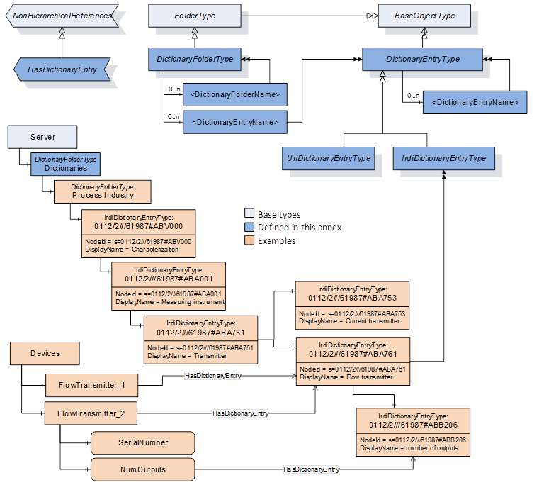
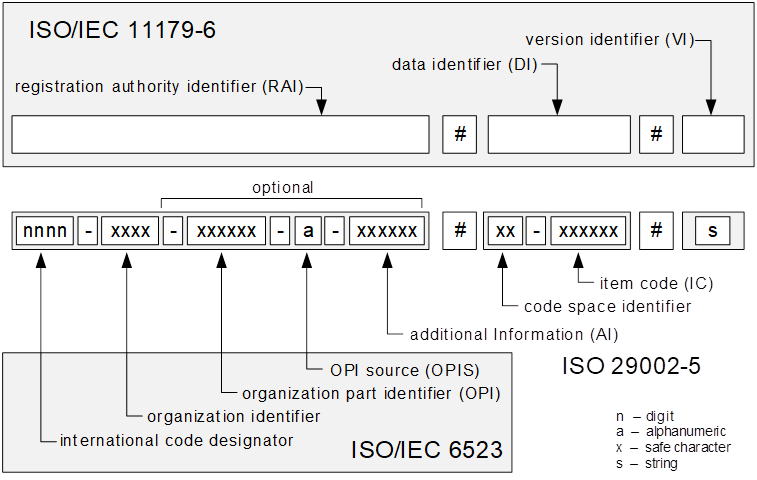
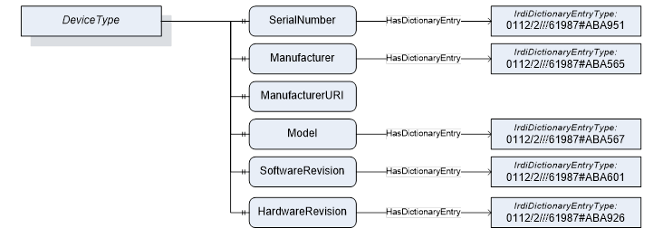
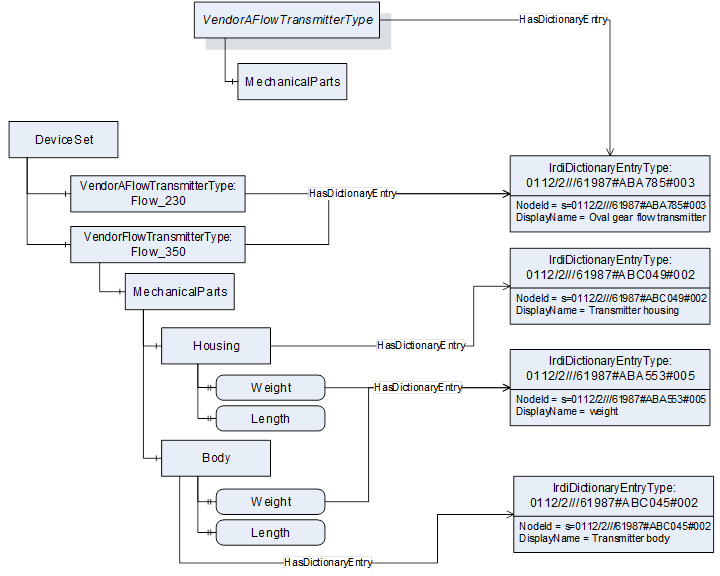
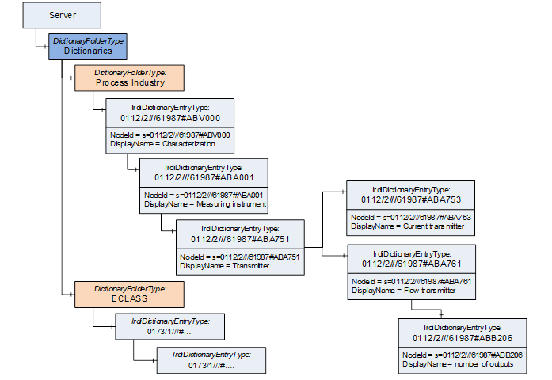

## 1 Scope  

This specification defines an Information Model of the OPC Unified Architecture. The Information Model describes the basic infrastructure to reference from an OPC UA Information Model to external dictionaries like IEC Common Data Dictionary or ECLASS.  

## 2 Normative references  

The following referenced documents are indispensable for the application of this specification. For dated references, only the edition cited applies. For undated references, the latest edition of the referenced document (including any amendments and errata) applies.  

OPC 10000-1 *, OPC Unified Architecture - Part 1: Overview and Concepts*  

[http://www.opcfoundation.org/UA/Part1/](http://www.opcfoundation.org/UA/Part1/)  

OPC 10000-3, *OPC Unified Architecture - Part 3: Address Space Model*  

[http://www.opcfoundation.org/UA/Part3/](http://www.opcfoundation.org/UA/Part3/)  

OPC 10000-4, *OPC Unified Architecture - Part 4: Services*  

[http://www.opcfoundation.org/UA/Part4/](http://www.opcfoundation.org/UA/Part4/)  

OPC 10000-5, *OPC Unified Architecture - Part 5: Information Model*  

[http://www.opcfoundation.org/UA/Part5/](http://www.opcfoundation.org/UA/Part5/)  

OPC 10000-8, *OPC Unified Architecture - Part 8: Data Access*  

[http://www.opcfoundation.org/UA/Part8/](http://www.opcfoundation.org/UA/Part8/)  

OPC 10000-100, *OPC Unified Architecture - Part 8: Data Access*  

[http://www.opcfoundation.org/UA/Part100/](http://www.opcfoundation.org/UA/Part100/)  

ISO/IEC 11179-6, Information technology - Metadata registries (MDR) - Part 6: Registration  

[https://www.iso.org/standard/60342.html](https://www.iso.org/standard/60342.html) https://www.iso.org/standard/60342.html  

ISO 29002-5, Information automation systems and integration - Exchange of characteristic data - Part 5: Identification scheme  

https://www.iso.org/standard/50773.html  

" https://www.iso.org/standard/50773.html  

ISO/IEC 6523, Information technology - Structure for the identification of organizations and organization parts  

https://www.iso.org/standard/25773.html  

" https://www.iso.org/standard/25773.html  

  

## 3 Terms, definitions, abbreviated terms, and conventions  

### 3.1 Terms and definitions  

For the purposes of this document, the terms and definitions given in [OPC 10000-1](/§UAPart1) , [OPC 10000-3](/§UAPart3) , and [OPC 10000-5](/§UAPart5) apply.  

All used terms are *italicized* in the specification.  

## 4 Dictionary Reference Information Model overview  

### 4.1 General  

This document describes the basic infrastructure an OPC UA Information Model may use to reference external dictionaries like IEC Common Data Dictionary or ECLASS. It defines *ObjectTypes* , *VariableTypes* and a *ReferenceType* and explains how they should be used.  

The *ObjectTypes* are used to represent an external dictionary in an OPC UA *AddressSpace* . The *ReferenceType* is used to reference from Nodes in the *AddressSpace* to the dictionary entries. Such dictionary entries can be seen as external classification or external semantic information.  

The type system of OPC UA already provides means to express the semantic of an OPC UA Object. As an example, [OPC 10000-100](/§UAPart100) defines the *DeviceType* ObjectType expressing that instances of this *ObjectType* represent devices. Subtypes of the *DeviceType* are used to add vendor specific semantic. However, the classification and additional semantic of the device in terms of an external data dictionary is not specified further. This document provides means to represent that an Object is for example a differential pressure transmitter in the context of an IEC Common Data Dictionary. This allows clients to automatically retrieve and identify such devices.  

This document is an integral part of this standard, that is, the types defined in this document shall be used as defined. However, it is not required but strongly recommended that a Server use the types defined in this document to refer to external dictionaries. The defined types may be subtyped to refine their behaviour.  

When a Server references external dictionaries using the types defined in this document, it refers from OPC UA Nodes to dictionary entries. The Server may optionally also provide the hierarchy and content of the external dictionary. Resource consumption needs to be considered, especially in scenarios where the OPC UA Server is part of the firmware of a device.  

### 4.2 Overview  

The types and instances defined in this document are illustrated in [Figure 1](/§\_Ref114466674) . The *DictionaryEntryType* is an abstract base type for dictionary entries. The *IrdiDictionaryEntryType* and the *UriDictionaryEntryType* provide concrete types that can be used to represent dictionary entries. The *HasDictionaryEntry* *ReferenceType* is used to refer an OPC UA *Node* to a dictionary entry. The *DictionaryFolderType* and the *Dictionaries* *Object* provide an optional capability to expose the hierarchy of a referenced dictionary.  

  

Figure 1 - The dictionary reference types  

## 5 OPC UA ObjectTypes  

### 5.1 DictionaryEntryType  

This abstract *ObjectType* defines the minimum information needed to identify the data dictionary entry for a respective standard (e.g. IEC Common Data Dictionary). It is formally defined in [Table 1](/§\_Ref33176019) .  

Concrete dictionary entry types shall inherit from the abstract *DictionaryEntryType* defining additional *Properties* and *Objects* as necessary and specified by the standard body (e.g. further definitions, versioning information etc.).  

An instance of such a concrete dictionary entry *ObjectType* represents an entry in an external data dictionary.  

The *isNamespaceSubset* *Property* of the *NamespaceMetadataType* *Object* that represents a namespace of a *DictionaryEntryType* shall be set to TRUE. A Server shall not include duplicates of the same *DictionaryEntryType* . A *Server* encountering duplicates should use the most recent version of the *DictionaryEntryType* .  

 **Table 1\- DictionaryEntryType definition**   

| **Attribute** | **Value** |
|---|---|
|BrowseName|DictionaryEntryType|
|IsAbstract|True|
| **References** | **NodeClass** | **BrowseName** | **DataType / TypeDefinition** | **ModellingRule** |
|Subtype of the BaseObjectType defined in [OPC 10000-5](/§UAPart5) .|
|HasComponent|Object|\<DictionaryEntryName\>|DictionaryEntryType|OptionalPlaceholder|
| **Conformance Units** |
|Address Space Dictionary Entries|
  

  

Instances of the *DictionaryEntryType* can be nested in order to create hierarchies of dictionary entries.  

### 5.2 DictionaryFolderType  

This *ObjectType* provides means to structure dictionary entry *Objects* . Multiple *Objects* of the *DictionaryFolderType* can be nested in order to create hierarchies. The *DictionaryFolderType* is formally defined in [Table 2](/§\_Ref33176108) .  

 **Table 2\- DictionaryFolderType definition**   

| **Attribute** | **Value** |
|---|---|
|BrowseName|DictionaryFolderType|
|IsAbstract|False|
| **References** | **NodeClass** | **BrowseName** | **DataType / TypeDefinition** | **ModellingRule** |
|Subtype of the FolderType defined in [OPC 10000-5](/§UAPart5) .|
|HasComponent|Object|\<DictionaryFolderName\>|DictionaryFolderType|OptionalPlaceholder|
|HasComponent|Object|\<DictionaryEntryName\>|DictionaryEntryType|OptionalPlaceholder|
| **Conformance Units** |
|Address Space Dictionary Entries|
  

  

### 5.3 IRDI ISO/IEC 11179-6 conformant DictionaryEntryType  

The *IrdiDictionaryEntryType* defined in [Table 3](/§\_Ref33177329) is used to represent dictionary entries that use standardized semantic identifiers that conform with International Registration Data Identifiers (IRDI) defined in [ISO/IEC 11179-6](/§IEEE60559) .  

Standardized semantic identifiers are locale independent strings typically specified in international standards like IEC CDD (Common Data Dictionary) (IEC 61987). In order to avoid conflict with various name spaces in these identifiers, the registration authority identifier part of the string used shall be based on [ISO 29002-5](/§ISO29002) .  

[Figure 2](/§\_Ref33176481) shows the general structure and syntax defined by [ISO/IEC 11179-6](/§IEC11179) , [ISO 29002-5](/§ISO29002) and [ISO/IEC 6523](/§ISOIEC6523) .  

  

Figure 2 - IRDI overview  

Examples for IRDI strings defined by standards using the IRDI format  

IEC CDD  0112/2//a/61360\_4\#AAE867\#001 Proximity switch, Output current  

ISO 5598 0112-1-a-18582\#KAA802\#s Pneumatic value  

ECLASS  0173/1///\#02-8AD792\#s  Inductive distance sensor, Design of analog output  

 **Table 3\- IrdiDictionaryEntryType Definition**   

| **Attribute** | **Value** |
|---|---|
|BrowseName|IrdiDictionaryEntryType|
|IsAbstract|False|
| **References** | **NodeClass** | **BrowseName** | **DataType / TypeDefinition** | **ModellingRule** |
|Subtype of the DictionaryEntryType defined in OPC 10000-5.|
| **Conformance Units** |
|Address Space Dictionary IRDI|
  

  

The identifier in the respective external dictionary shall be a unique string. This identifier is used for the *NodeId* and the *BrowseName* *Attributes* of instances of the *DictionaryEntryType* . The *IdentifierType* of the *NodeId* shall be STRING\_1 with the identifier from the external dictionary as the value.  

The namespace "http://opcfoundation.org/UA/Dictionary/IRDI" shall be used for instance of the *IrdiDictionaryEntryType* . Subtypes may define different namespaces.  

The identifier shall be immutable; meaning that it shall not be reassigned to a different dictionary entry within the scope of the namespace in future versions. Data dictionaries may be publicly defined by standard bodies such as IEC or proprietary (e.g. vendor-specific dictionaries).  

### 5.4 URI based dictionary entry type  

The *UriDictionaryEntryType* defined in [Table 4](/§\_Ref33176627) is used to represent dictionary entries that use URIs as unique identifiers.  

 **Table 4\- UriDictionaryEntryType Definition**   

| **Attribute** | **Value** |
|---|---|
|BrowseName|UriDictionaryEntryType|
|IsAbstract|False|
| **References** | **NodeClass** | **BrowseName** | **DataType / TypeDefinition** | **ModellingRule** |
|Subtype of the DictionaryEntryType defined in [5.1](/§\_Ref33178320) .|
| **Conformance Units** |
|Address Space Dictionary URI|
  

  

The identifier in the respective external dictionary shall be a unique URI string. This identifier is used for the *NodeId* and the *BrowseName* *Attributes* of instances of the *DictionaryEntryType* . The *IdentifierType* of the *NodeId* shall be STRING\_1 with the identifier from the external dictionary as the value.  

The namespace "http://opcfoundation.org/UA/Dictionary/URI" shall be used for instance of the *UriDictionaryEntryType* . Subtypes may define different namespaces.  

The identifier shall be immutable; meaning that it shall not be reassigned to a different dictionary entry within the scope of the namespace in future versions. Data dictionaries may be publicly defined by standard bodies such as IEC or proprietary (e.g. vendor-specific dictionaries).  

## 6 OPC UA ReferenceTypes  

### 6.1 HasDictionaryEntry ReferenceType  

The *HasDictionaryEntry ReferenceType* is a concrete *ReferenceType* and can be used directly. It is a subtype of *NonHierarchicalReferences* .  

The *Reference* to the dictionary entry for any *Node* is provided by *HasDictionaryEntry* .  

The *SourceNode* of this *ReferenceType* can be any *Node* . The *TargetNode* of this *ReferenceType* shall be an *Object* of *DictionaryEntryType* or one of its subtypes.  

Each *Node* can be the *SourceNode* of multiple *HasDictionaryEntry References* pointing to multiple dictionary entry *Objects* .  

The *HasDictionaryEntry ReferenceType* is specified in [Table 5](/§\_Ref33176251) .  

 **Table 5\- HasDictionaryEntry ReferenceType**   

| **Attributes** | **Value** |
|---|---|
|BrowseName|HasDictionaryEntry|
|InverseName|DictionaryEntryOf|
|Symmetric|False|
|IsAbstract|False|
| **References** | **NodeClass** | **BrowseName** | **Comment** |
|Subtype of the *NonHierarchicalReferences ReferenceType* defined in [OPC 10000-3](/§UAPart3)|
| **Conformance Units** |
|Address Space Dictionary Entries|
  

  

  

  

  

## 7 OPC UA VariableTypes  

### 7.1 MultiStateDictionaryEntryDiscreteBaseType VariableType  

The *MultiStateDictionaryEntryDiscreteBaseType* *VariableType* is a subtype of the *MultiStateValueDiscreteType* . It provides dictionary entries for each of the possible states as well as the current state of the *MultiStateValueDiscreteType* . It is formally defined in [Table 6](/§\_Ref17727931) .  

 **Table 6\- MultiStateDictionaryEntryDiscreteBaseType Definition**   

| **Attribute** | **Value** |
|---|---|
|BrowseName|MultiStateDictionaryEntryDiscreteBaseType|
|IsAbstract|False|
|ValueRank|Scalar|
|DataType|Number|
| **References** | **NodeClass** | **BrowseName** | **DataType** | **TypeDefinition** | **ModellingRule** |
|Subtype of the MultiStateValueDiscreteType defined in [OPC 10000-8](/§UAPart8)|
|HasProperty|Variable|EnumDictionaryEntries|NodeId[][]|PropertyType|Mandatory|
|HasProperty|Variable|ValueAsDictionaryEntries|NodeId[]|PropertyType|Optional|
| **Conformance Units** |
|Data Access MultiStateDictionaryEntryDBT|
|Data Access ValueAsDictionaryEntries Property|
  

  

The normal approach of associating *DictionaryEntryType Nodes* with *HasDictionaryEntry References* cannot be used with a *MultiStateValueDiscreteType* *VariableType* due to the *EnumValues Property* being an *Array, making this Type necessary. References* can however be used for other *VariableTypes. For example, the TwoStateDiscreteType* can use *HasDictionaryEntry References with SourceNode* being ** the *TrueState* and *FalseState Properties* and *TargetNode* being the *DictionaryEntry Nodes.*  

*EnumDictionaryEntries* is a two-dimensional array of *NodeIds* . The first dimension is used to list all possible dictionary entry values for the related variable in a specific dictionary (e.g. CDD or ECLASS). The second dimension is used to reference this dictionary. The size of the first array dimension shall be the same size as the *EnumValues Property* .  

ValueAsDictionaryEntries provides a list of all dictionary entry values in the different dictionaries related to the current value of the variable. The order of the array entries shall be in the same order used by the EnumDictionaryEntries Property.  

If an instance of this type is writeable and the optional *ValueAsDictionaryEntries* *Property* is implemented, it shall be writeable as well. *Clients* writing to the *ValueAsDictionaryEntries* *Property* shall use one of the *DictionaryEntryType* *NodeIds* defined by the *EnumDictionaryEntries* *Property* . This will have the same result as writing the value attribute, but the client does not require knowledge of the values.  

The *NodeIds* represent the dictionary entries and can be generated with dictionary knowledge.  

### 7.2 MultiStateDictionaryEntryDiscreteType VariableType  

The *MultiStateDictionaryEntryDiscreteType* *VariableType* is a subtype of the *MultiStateDictionaryEntryDiscreteBaseType* . It requires the *ValueAsDictionaryEntries* *Property* . It is formally defined in [Table 7](/§\_Ref17728026) .  

 **Table 7\- MultiStateDictionaryEntryDiscreteType Definition**   

| **Attribute** | **Value** |
|---|---|
|BrowseName|MultiStateDictionaryEntryDiscreteType|
|IsAbstract|False|
|ValueRank|Scalar|
|DataType|Number|
| **References** | **NodeClass** | **BrowseName** | **DataType** | **TypeDefinition** | **ModellingRule** |
|Subtype of the MultiStateDictionaryEntryDiscreteBaseType defined in [7.1](/§\_Ref17728243)|
|HasProperty|Variable|ValueAsDictionaryEntries|NodeId[]|PropertyType|Mandatory|
| **Conformance Units** |
|Data Access MultiStateDictionaryEntryDBT|
  

  

## 8 OPC UA Objects  

### 8.1 Dictionaries Object  

The *Dictionaries* Object is used as the browse entry point for dictionaries referenced in the *Server* . The *Object* is optional and can be used to expose the hierarchy of the referenced dictionaries or dictionary entries referenced by other *Nodes* .  

The *Dictionaries* *Object* is a component of the *Server* *Object* defined in [OPC 10000-5](/§UAPart5) . The *Dictionaries* *Object* references *DictionaryEntryType* and *DictionaryFolderType* *Object Nodes* . It is formally defined in [Table 8](/§\_Ref33175732) .  

 **Table 8\- Dictionaries Definition**   

| **Attribute** | **Value** |
|---|---|
|BrowseName|Dictionaries|
| **References** | **NodeClass** | **BrowseName** | **DataType** | **TypeDefinition** | **ModellingRule** |
|ComponentOf of the Server Object defined in OPC 10000-5.|
|HasTypeDefinition|ObjectType|DictionaryFolderType||||
| **Conformance Units** |
|Address Space Dictionary Entries|
  

  

## 9 Examples (Informative)  

The example in [Figure 3](/§\_Ref33177066) shows how OPC UA Properties of the DeviceType defined in [OPC 10000-100](/§UAPart100) refer dictionary entries in the IEC 61987 Common Data Dictionary.  

  

Figure 3 - DeviceType Property example  

The example in [Figure 4](/§\_Ref33177134) shows how OPC UA *Objects* could refer to classes in the IEC 61987 Common Data Dictionary and OPC UA Properties to properties in the data dictionary.  

In this example, the weight property is referenced from two OPC UA *Properties* and the different semantic is provided by the referenced classes Transmitter housing or Transmitter body of the parent OPC UA *Objects* .  

  

Figure 4 - Example with references to classes and properties  

The example in [Figure 5](/§\_Ref33177166) shows how a server can expose the hierarchy of two dictionaries below the optional *Dictionaries Object* .  

  

Figure 5 - Example with two dictionaries  

\_\_\_\_\_\_\_\_\_\_\_\_\_\_\_\_\_\_  

