## 1 Scope  

This part describes the OPC Unified Architecture (OPC UA) security model. It describes the security threats of the physical, hardware, and software environments in which OPC UA is expected to run. It describes how OPC UA relies upon other standards for security. It provides definition of common security terms that are used in this and other parts of the OPC UA specification series. It provides an overview of general security features. It also relates these features to the security concepts that are specified in other parts of the OPC UA specification. It references services, mappings, and *Profiles* that are specified normatively in other parts of this multi-part specification. It provides suggestions or best practice guidelines on implementing security. Any seeming ambiguity between this document and one of the other normative documents in this series does not remove or reduce the requirement specified in the other normative document.  

There are many different aspects of security that are addressed when developing applications. However, since OPC UA specifies a communication protocol, the focus is on securing the data exchanged between applications. This does not mean that an application developer can ignore the other aspects of security like protecting persistent data against tampering. It is important that the developers investigate all aspects of security and decide how they can be addressed in the application.  

This document is directed to readers who will develop *OPC UA Applications* . It is also for end Users that wish to understand the various security features and functionality provided by OPC UA. It also offers some suggestions that can be applied when deploying systems. These suggestions are generic in nature since the details would depend on the actual implementation of the *OPC UA Applications* and the choices made for the site security.  

## 2 Normative References  

The following documents, in whole or in part, are normatively referenced in this document and are indispensable for its application. For dated references, only the edition cited applies. For undated references, the latest edition of the referenced document (including any amendments) applies.  

OPC 10000-1, OPC UA Specification: Part 1 - Overview and Concepts  

[https://www.opcfoundation.org/UA/Part1/](https://www.opcfoundation.org/UA/Part1/)  

OPC 10000-3, OPC UA Specification: Part 3 - Address Space Model  

[https://www.opcfoundation.org/UA/Part3/](https://www.opcfoundation.org/UA/Part3/)  

OPC 10000-4, OPC UA Specification: Part 4 - Services  

 https://www.opcfoundation.org/UA/Part4/  

OPC 10000-5, OPC UA Specification: Part 5 - Information Model  

[https://www.opcfoundation.org/UA/Part5/](https://www.opcfoundation.org/UA/Part5/)  

OPC 10000-6, OPC UA Specification: Part 6 - Mappings  

[https://www.opcfoundation.org/UA/Part6/](https://www.opcfoundation.org/UA/Part6/)  

OPC 10000-7, OPC UA Specification: Part 7 - Profiles  

[https://www.opcfoundation.org/UA/Part7/](https://www.opcfoundation.org/UA/Part7/)  

OPC 10000-12, OPC UA Specification: Part 12 - Discovery  

[https://www.opcfoundation.org/UA/Part12/](https://www.opcfoundation.org/UA/Part12/)  

OPC 10000-14, OPC UA Specification: Part 14 - *PubSub*  

[https://www.opcfoundation.org/UA/Part14/](https://www.opcfoundation.org/UA/Part14/)  

OPC 10000-18, OPC UA Specification: Part 18: Role-Based Security  

[https://www.opcfoundation.org/UA/Part18/](https://www.opcfoundation.org/UA/Part18/)  

OPC 10000-21, OPC UA Specification: Part 21: Device Onboarding  

 https://www.opcfoundation.org/UA/Part21/  

OPC 10000-100, OPC UA Specification: Part 100 - Devices  

 https://www.opcfoundation.org/UA/Part100/  

OPC Security Policies - [SecurityPolicy ClientServer](https://profiles.opcfoundation.org/profilefolder/474)  

[https://profiles.opcfoundation.org/profilefolder/474](https://profiles.opcfoundation.org/profilefolder/474)  

OPC Profiles - [OPC](https://profiles.opcfoundation.org/profilefolder/474) UA Profiles and Facets  

[https://profiles.opcfoundation.org/](https://profiles.opcfoundation.org/)  

ISA/IEC 62443-4-2: Security for industrial automation and control systems  

[https://webstore.iec.ch/publication/33615](https://webstore.iec.ch/publication/33615)  

[https://www.isa.org/products/ansi-isa-62443-4-2-2018-security-for-industrial-au](https://www.isa.org/products/ansi-isa-62443-4-2-2018-security-for-industrial-au)  

IEC 62351: Power systems management and associated information exchange - Data and communications security  

[https://webstore.iec.ch/en/publication/6912](https://webstore.iec.ch/en/publication/6912)  

TLS: RFC 2246: The TLS Protocol Version 1.0  

[https://tools.ietf.org/html/rfc2246](https://tools.ietf.org/html/rfc2246)  

TLS 1.2: RFC 5246: The Transport Layer Security (TLS) Protocol Version 1.2  

https://tools.ietf.org/html/rfc5246  

X509: ISO/IEC 9594-8 (ITU-T Rec. X.509), Information technology - Open Systems Interconnection - The Directory: Public-key and attribute certificate frameworks  

[https://www.itu.int/rec/T-REC-X.509](https://www.itu.int/rec/T-REC-X.509)  

HTTPS: RFC 9110: HTTP Semantics  

[https://tools.ietf.org/html/rfc9110](https://tools.ietf.org/html/rfc9110)  

IS Glossary: Internet Security Glossary Version 2  

[https://tools.ietf.org/html/rfc4949](https://tools.ietf.org/html/rfc4949) https://tools.ietf.org/html/rfc4949  

NIST 800-12: Introduction to Computer Security  

[https://csrc.nist.gov/publications/nistpubs/800-12/](https://csrc.nist.gov/publications/nistpubs/800-12/)  

NIST 800-57: Part 3: Application-Specific Key Management Guidance  

[https://csrc.nist.gov/publications/nistpubs/800-57/sp800-57\_PART3\_key-management\_Dec2009.pdf](https://csrc.nist.gov/publications/nistpubs/800-57/sp800-57\_PART3\_key-management\_Dec2009.pdf)  

NERC CIP: CIP 002-1 through CIP 009-1, by North-American Electric Reliability Council  

[https://www.nerc.com/pa/Stand/Cyber%20Security%20Permanent/Cyber\_Security\_FAQ.pdf](https://www.nerc.com/pa/Stand/Cyber%20Security%20Permanent/Cyber\_Security\_FAQ.pdf)  

SPP-ICS: Guide to Operational Technology (OT) Security  

[https://nvlpubs.nist.gov/nistpubs/SpecialPublications/NIST.SP.800-82r3.pdf](https://nvlpubs.nist.gov/nistpubs/SpecialPublications/NIST.SP.800-82r3.pdf)  

SHA: US Secure Hash Algorithms (SHA and SHA-based HMAC and HKDF)  

[https://tools.ietf.org/html/rfc6234](https://tools.ietf.org/html/rfc6234)  

PKI: Design and build a privately hosted Public Key Infrastructure  

[https://www.ncsc.gov.uk/collection/in-house-public-key-infrastructure/introduction-to-public-key-infrastructure/components-of-a-pki](https://www.ncsc.gov.uk/collection/in-house-public-key-infrastructure/introduction-to-public-key-infrastructure/components-of-a-pki)  

X509 PKI: Internet X.509 Public Key Infrastructure Certificate and Certificate Revocation List (CRL) Profile  

https://tools.ietf.org/html/rfc5280  

"https://tools.ietf.org/html/rfc5280  

RFC 5958: Asymmetric Key Packages  

[https://tools.ietf.org/html/rfc5958](https://tools.ietf.org/html/rfc5958)  

PKCS \#10: Certification Request Syntax Specification  

[https://tools.ietf.org/html/rfc2986](https://tools.ietf.org/html/rfc2986) https://tools.ietf.org/html/rfc2986  

OAuth2: The OAuth 2.0 Authorization Framework  

[https://tools.ietf.org/html/rfc6749](https://tools.ietf.org/html/rfc6749) https://tools.ietf.org/html/rfc6749  

JWT: JSON Web Token (JWT)  

[https://tools.ietf.org/html/rfc7519](https://tools.ietf.org/html/rfc7519) https://tools.ietf.org/html/rfc7519  

OpenID: OpenID Connect Discovery 1.0  

[https://openid.net/specs/openid-connect-discovery-1\_0.html](https://openid.net/specs/openid-connect-discovery-1\_0.html)  

ZeroTrustArchitecture: NIST Special Publication 800-207  

[https://nvlpubs.nist.gov/nistpubs/SpecialPublications/NIST.SP.800-207.pdf](https://nvlpubs.nist.gov/nistpubs/SpecialPublications/NIST.SP.800-207.pdf)  

ZeroTrustCore: Zero Trust Core Principles  

[https://pubs.opengroup.org/security/zero-trust-principles/](https://pubs.opengroup.org/security/zero-trust-principles/)  

## 3 Terms, definitions, abbreviated terms and conventions  

### 3.1 Terms and definitions  

For the purposes of this document, the terms and definitions given in [OPC 10000-1](/§UAPart1) and the following apply.  

#### 3.1.1 AccessRestriction  

limit on the circumstances under which an operation, such as a read, write or a call, can be performed on a *Node*  

Note 1 to entry: Operations can only be performed on a *Node* if the *Client* has the necessary *Permissions* and has satisfied all of the *AccessRestrictions* .  

#### 3.1.3 AccessToken  

digitally signed document that asserts that the subject is entitled to access a *Resource*  

Note 1 to entry: The document includes the name of the subject and the *Resource* being accessed.  

#### 3.1.5 ApplicationInstance  

individual installation of an OPC UA program with a globally unique identity  

Note 1 to entry: There can be several *ApplicationInstances* of the same application running at the same time on several computers or possibly the same computer.  

Note 2 to entry: The system wide unique identity is provided by the *ApplicationUri*  

#### 3.1.7 ApplicationInstanceCertificate  

*Certificate* that uniquely identifies an individual *ApplicationInstance*  

Note 1 to entry: Different installations of one software product would have different *ApplicationInstanceCertificates* . The use of an *ApplicationInstanceCertificate* for uses outside of what is described in the specification could greatly reduce the security provided by the *ApplicationInstanceCertificate* and should be discouraged.  

Note 2 to entry: also written as *ApplicationInstance Certificate*  

  

#### 3.1.9 ApplicationUri  

a globally unique identifier for an *OPC UA Application* running on a particular device  

#### 3.1.11 Asymmetric Cryptography  

*Cryptography* method that uses a pair of keys, one that is designated the *Private Key* and kept secret, the other called the *Public Key* that is generally made available  

Note 1 to entry: '"Asymmetric Cryptography". Is an Asymmetric Encryption algorithm when an entity "A" requires *Confidentiality* for data sent to entity "B", then entity "A" encrypts the data with a Public Key provided by entity "B". Only entity "B" has the matching Private Key that is needed to decrypt the data. In an asymmetric Digital Signature algorithm when an entity "A" requires message Integrity or to provide *Authentication* for data sent to entity "B", entity A uses its Private Key to sign the data. To verify the signature, entity B uses the matching Public Key that entity A has provided. In an asymmetric key agreement algorithm, entity A and entity B each send their own Public Key to the other entity. Then each uses their own Private Key and the other's Public Key to compute the new key value.' according to [IS Glossary](/§ISGlossary) .  

Note 2 to entry: Asymmetric Cryptography is also known as Public Key Cryptography. Public key Cryptography originally was based on RSA which has been extended to include ECC.  

#### 3.1.13 Asymmetric Encryption  

mechanism used by *Asymmetric Cryptography* for encrypting data with the *Public Key* of an entity and for decrypting data with the associated *Private Key*  

#### 3.1.15 Asymmetric Signature  

mechanism used by *Asymmetric Cryptography* for signing data with the *Private Key* of an entity and for verifying the data's signature with the associated *Public Key*  

#### 3.1.17 Auditability  

security objective that assures that any actions or activities in a system can be recorded  

#### 3.1.19 Auditing  

tracking of actions and activities in the system, including security related activities where *Audit* records can be used to review and verify system operations  

#### 3.1.21 AuthenticatedEncryption  

encryption scheme which simultaneously assures the data confidentiality and authenticity  

Note 1 to entry: AuthenticatedEncryption algorithms could allow for associated data to be signed but not encrypted.  

#### 3.1.22 Authentication  

process that assures that the identity of an entity such as a *Client* , *Server* , *Publisher* or user can be verified  

#### 3.1.24 Authorization  

ability to grant access to a system resource  

Note 1 to entry: *Authorization* of access to resources should be based on the need-to-know principle.  It is important that access is restricted in a system.  

#### 3.1.26 AuthorizationService  

*Server* which validates a request to access a *Resource* returns an *AccessToken* that grants access to the *Resource*  

Note 1 to entry: The *AuthorizationService* is also called STS (Security Token Service) in other standards.  

#### 3.1.28 Availability  

security objective that assures that the system is running normally. That is, no services have been compromised in such a way to become unavailable or severely degraded  

#### 3.1.30 Certificate Authority  

entity that can issue *Certificate* s, also known as a CA  

Note 1 to entry: The *Certificate* certifies the ownership of a *Public Key* by the named subject of the *Certificate* . This allows others (relying parties) to rely upon signatures or assertions made by the *Private Key* that corresponds to the *Public Key* that is certified. In this model of trust relationships, a CA is trusted by both the subject (owner) of the *Certificate* and the party relying upon the *Certificate* . CAs are characteristic of many *Public Key infrastructure* (PKI) schemes  

Note 2 to entry: A private CA system (or a private sub-CA) could be used as long as all parties trust it.  

  

#### 3.1.32 CertificateStore  

persistent location where *Certificates* and *Certificate* revocation lists (CRLs) are stored  

Note 1 to entry: It could be a disk resident file structure or on Windows platforms it could be a Windows registry location.  

#### 3.1.34 Claim  

statement in an *AccessToken* that asserts information about the subject which the *Authorization* *Service* knows to be true  

Note 1 to entry: *Claims* can include username, email, and *Roles* granted to the subject.  

#### 3.1.36 Confidentiality  

security objective that assures the protection of data from being read by unintended parties  

#### 3.1.38 Cryptography  

discipline that embodies the principles, means, and methods for the transformation of data in order to hide their semantic content, prevent their unauthorized use, or prevent their undetected modification  

#### 3.1.40 Cyber Security Management System  

program designed by an organization to maintain the security of the entire organization's assets to an established level of *Confidentiality* , *Integrity* , and *Availability* , whether they are on the business side or the industrial automation and control systems side of the organization  

#### 3.1.42 Diffie Hellman Key Exchange (DH)  

mechanism for negotiating a shared secret between two parties that can be used for secret communication for exchanging data over a network  

Note 1 to entry: Elliptic Curve Cryptography (ECC) requires the use of a Diffie Hellman Key Exchange.  

#### 3.1.44 Digital Signature  

value computed with a cryptographic algorithm and appended to data in such a way that any recipient of the data can use the signature to verify the data's origin and *Integrity*  

#### 3.1.46 Elliptic Curve Cryptography (ECC)  

*Asymmetric Cryptography* method that uses a pair of keys calculated from the mathematical structure of elliptic curves over finite fields  

Note to entry: ECC is a family of algorithms that support Digital Signatures but not encryption.  

#### 3.1.48 Hash Function  

algorithm for which it is computationally infeasible to find either a data object that maps to a given hash result (the "one-way" property) or two data objects that map to the same hash result (the "collision-free" property)  

Note 1 to entry: See [IS Glossary](/§ISGlossary) .  

#### 3.1.50 Hashed Message Authentication Code  

*MAC* that has been generated using an iterative *Hash Function*  

#### 3.1.52 Integrity  

security objective that assures that information has not been modified or destroyed in an unauthorized manner, see [IS Glossary](/§ISGlossary)  

#### 3.1.54 Identity Provider  

*Server* which verifies credentials provided by a *Security Principal* and returns a token which can be passed to an associated *Authorization Service*  

#### 3.1.56 Key Exchange Algorithm  

protocol used for establishing a secure communication path between two entities in an unsecured environment whereby both entities apply a specific algorithm to securely exchange secret keys that are used for securing the communication between them  

Note 1 to entry: A typical example of a *Key Exchange Algorithm* is the Handshake Protocol specified in [TLS](/§Tls) .  

#### 3.1.58 Message Authentication Code  

short piece of data that results from an algorithm that uses a secret key (see *Symmetric Cryptography* ) to hash a *Message* whereby the receiver of the *Message* can check against alteration of the *Message* by computing a *MAC* that should be identical using the same *Message* and secret key  

#### 3.1.60 Message Signature  

*Digital Signature* used to ensure the *Integrity* of *Messages* that are sent between two entities  

Note 1 to entry: There are several ways to generate and verify *Message Signatures* however they can be categorized as symmetric (see [3.1.44](/§\_Ref492699026) ) and asymmetric (see [3.1.6](/§\_Ref492699002) ) approaches.  

#### 3.1.62 Non-Repudiation  

ability to prove the occurrence of a claimed event or action and its originating entities  

Note 1 to entry: The purpose of non-repudiation is to resolve disputes about the occurrence or non-occurrence of the event or action and involvement of entities in the event.  

Note 2 to entry: This definition comes from [OPC Profiles - OPC UA Profiles and Facets](/§IEC62443) UA Profiles and Facets  

https://profiles.opcfoundation.org/  

ISA/IEC 62443-4-2 and could be different from the definition used in other industries.  

#### 3.1.64 Nonce  

random number that is used once typically by algorithms that generate security keys  

#### 3.1.66 Permission  

right to execute an operation, such as a read, write or a call, on a *Node*  

#### 3.1.68 Private Key  

secret component of a pair of cryptographic keys used for *Asymmetric Cryptography*  

Note 1 to entry: *Public Key* and *Private Key* are always generated as a pair. If either is updated the other is also updated  

#### 3.1.70 Public Key  

publicly-disclosed component of a pair of cryptographic keys used for *Asymmetric Cryptography*  

Note 1 to entry: See [IS Glossary](/§ISGlossary) .  

Note 2 to entry: *Public* *Key* and *Private* *Key* are always generated as a pair. If either is updated the other must also be updated  

#### 3.1.72 Public Key Infrastructure  

set of hardware, software, people, policies, and procedures needed to create, manage, store, distribute, and revoke *Certificates* based on *Asymmetric Cryptography*  

Note 1 to entry: The core PKI functions are to register users and issue their public-key *Certificates* , to revoke *Certificates* when required, and to archive data needed to validate *Certificates* . Key pairs for data *Confidentiality* could be generated by a *Certificate* authority (CA); but it is better to have the *Private Key* owner generate the key pair locally, provided they have a trusted key generation capability, since it improves security because the *Private Key* is never transmitted to the CA. See [PKI](/§PKI) and [X509](/§X509) for more details on *Public Key* Infrastructures.  

#### 3.1.74 Resource  

secured entity which an application accesses  

Note 1 to entry: A *Resource* is usually a *Server* .  

#### 3.1.76 Rivest-Shamir-Adleman (RSA)  

algorithm for *Asymmetric Cryptography* , invented in 1977 by Ron Rivest, Adi Shamir, and Leonard Adleman, see [IS Glossary](/§ISGlossary)  

Note 1 to entry: RSA is an Asymmetric Cryptography algorithm that supports encryption and Digital Signatures and is based on factoring of a large integer which is in turn based on two or more prime factors.  

#### 3.1.78 Role  

function assumed by a *Client* when it accesses a *Server*  

Note 1 to entry: A *Role* could refer to a specific job function such as operator or engineer.  

#### 3.1.80 SecureChannel  

communication channel that ensures the confidentiality and/or integrity of all messages exchanged between a *Client* and a *Server*  

Note 1 to entry: If the security policy is None, then confidentiality and integrity are not ensured.  

#### 3.1.82 SecurityGroup  

*Publisher(s)* and *Subscriber* (s) that utilize a shared security context  

Note 1 to entry: This context could include share keys.  

#### 3.1.84 SecurityKeyService  

*Server* that accepts *AccessTokens* issued by the *Authorization* *Service* and returns security keys that can be used to access the specified *Resource*  

Note 1 to entry: The keys are typically used for cryptography operations such as encrypting or decrypting messages sent on a *PubSub* stream.  

#### 3.1.86 Symmetric Cryptography  

branch of cryptography involving algorithms that use the same key for two different steps of the algorithm (such as encryption and decryption, or signature creation and signature verification)  

Note 1 to entry: See [IS Glossary](/§ISGlossary) .  

#### 3.1.88 Symmetric Encryption  

mechanism used ** by *Symmetric Cryptography* for encrypting and decrypting data with a cryptographic key shared by two entities  

#### 3.1.90 SymmetricKey  

shared key used ** by *Symmetric Cryptography* for encrypting and decrypting data  

#### 3.1.92 Symmetric Signature  

mechanism used by *Symmetric Cryptography* for signing data with a cryptographic ** key ** shared by two entities  

Note 1 to entry: The signature is then validated by generating the signature for the data again and comparing these two signatures. If they are the same then the signature is valid, otherwise either the key or the data is different from the two entities.  

#### 3.1.94 TrustList  

list of *Certificates* that an *OPC UA Application* has been configured to trust  

#### 3.1.96 Transport Layer Security  

standard protocol for creating *SecureChannels* over IP based networks  

#### 3.1.98 X.509 Certificate  

*Certificate* in one of the formats defined by X.509 v1, 2, or 3  

Note 1 to entry: An *X.509 Certificate* contains a sequence of data items and has a *Digital* *Signature* computed on that sequence. OPC UA only uses V3.  

  

### 3.2 Abbreviated terms  

AES Advanced Encryption Standard  

CA Certificate Authority  

CRL Certificate Revocation List  

CSMS Cyber Security Management System  

DNS Domain Name System  

DSA Digital Signature Algorithm  

ECC Elliptic Curve Cryptography  

ECDH Elliptic Curve Diffie-Hellman  

ECDSA Elliptic Curve Digital Signature Algorithm  

GDS Global Discovery Server  

HMAC Hash-based Message Authentication Code  

HTTP Hypertext Transfer Protocol  

HTTPS Hypertext Transfer Protocol Secure  

JSON JavaScript Object Notation  

JWT JSON Web Token  

MAC Message Authentication Code  

NIST National Institute of Standard and Technology  

PKI Public Key Infrastructure  

RSA Rivest, Shamir, Adleman, public key algorithm for signing or encryption,  

SHA Secure Hash Algorithm (Multiple versions exist SHA1, SHA256,…)  

SKS Security Key Server  

SSL Secure Sockets Layer  

TLS Transport Layer Security  

TPM Trusted Platform Module  

UA Unified Architecture  

UACP Unified Architecture Connection Protocol  

UADP Unified Architecture Datagram Protocol  

URI Uniform Resource Identifier  

USB Universal Serial Bus  

XML Extensible Mark-up Language  

  

### 3.3 Conventions for security model figures  

The figures in this document do not use any special conventions. Any conventions used in a particular figure are explained for that figure.  

  

## 4 OPC UA security architecture  

### 4.1 OPC UA security environment  

OPC UA is a protocol used between components in the operation of an industrial facility at multiple levels: from high-level enterprise management to low-level direct process control of a device. The use of OPC UA for enterprise management involves dealings with customers and suppliers. It could be an attractive target for industrial espionage or sabotage and could also be exposed to threats through untargeted malware, such as worms, circulating on public networks. Disruption of communications at the process control could result in financial losses, affect employee and public safety or cause environmental damage.  

OPC UA will be deployed in a diverse range of operational environments with varying assumptions about threats and accessibility, and with a variety of security policies and enforcement regimes. OPC UA, therefore, provides a flexible set of security mechanisms. [Figure 1](/§\_Ref135816426) is a composite that shows a combination of such environments. Some *OPC UA* *Applications* are on the same host and can be easily protected from external attack. Some *OPC UA* *Applications* are on different hosts in the same operations network and could be protected by the security boundary protections that separate the operations network from external connections. Some *OPC UA Applications* run in relatively open environments where users and applications could be difficult to control. Other *OPC UA* *Applications* are embedded in control systems that have no direct electronic connection to external systems. OPC UA also supports multiple protocols and communication technologies, that could require different levels of security and different security infrastructure. For example, both *Client*\- *Server* and *Publisher*\- *Subscriber* communication is shown in [Figure 1](/§\_Ref135816426) . OPC UA also defines global services such as *Certificate* management, *KeyCredential* management, *AuthorizationService* , and *GlobalDiscoveryServer* (GDS) to help manage security and other global functionality.  

  

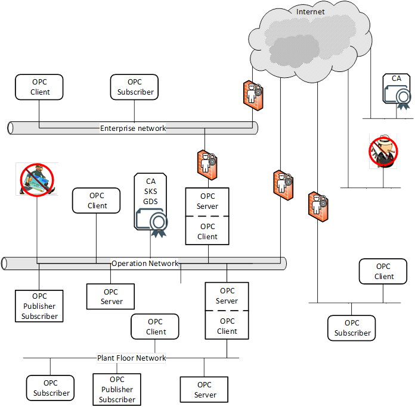  

  

Figure 1 - OPC UA network example  

### 4.2 Security objectives  

#### 4.2.1 Overview  

Fundamentally, information system security reduces the risk of damage from attacks. It does this by identifying the threats to the system, identifying the system's vulnerabilities to these threats, and providing countermeasures. The countermeasures reduce vulnerabilities directly, counteract threats, or recover from successful attacks.  

Industrial automation system security is achieved by meeting a set of objectives. These objectives have been refined through many years of experience in providing security for information systems in general and they remain quite constant despite the ever-changing set of threats to systems. They are described in [5.1](/§\_Ref426535201) and [5.2](/§\_Ref138729622) reconciles these objectives against the OPC UA functions. Clause [6](/§\_Ref141002637) offers additional best practice guidelines to *Client* and *Server* developers or those that deploy *OPC UA Application* s.  

#### 4.2.2 Authentication  

Entities such as *Clients* , *Servers* , and users should prove their identities. *Authentication* can be based on something the entity is, has, or knows.  

#### 4.2.3 Authorization  

The access to read, write, or execute resources should be authorized for only those entities that have a need for that access within the requirements of the system. *Authorization* can be as coarse-grained as allowing or disallowing a *Client* to access a *Server* or it could be much finer grained such as allowing specific actions on specific information items by specific users. The granularity of a system depends in part on the functionality supported by the *Server* , but in general *Authorization* should be given based on the need-to-know principle i.e. a user should be granted access only to information they require for the function they are performing.  

#### 4.2.4 Confidentiality  

Data is protected from passive attacks such as eavesdropping, whether the data is being transmitted, in memory, or being stored. To provide *Confidentiality,* data encryption algorithms using special secrets for securing data are used along with *Authentication* and *Authorization* mechanisms for accessing that secret.  

#### 4.2.5 Integrity  

Receivers receive the same information that the original sender sent, without the data being changed during transmission.  

#### 4.2.6 Non- Repudiation  

*Repudiation* is the rejection or denial of something as valid or true. *Non*\- *Repudiation* is assuring that something that actually occurred cannot be claimed as having not occurred. A security service that provides this protection can be one of two types:  

* One in which the recipient of the data gets and stores information proving that the data came from the originator.  This blocks the originator from claiming they never sent the data.  

* One in which the sender of the data gets confirmation that the data was received by the recipient as intended.  

#### 4.2.7 Auditability  

Actions taken by a system are recorded in order to provide evidence to stakeholders:  

* that this system works as intended (successful actions are tracked).  

* that identify the initiator of certain actions (user activity is tracked).  

* that attempts to compromise the system were denied (unsuccessful actions are tracked).  

#### 4.2.8 Availability  

*Availability* is impaired when the execution of software that needs to run is turned off or when the software or communication system is overwhelmed by processing input. Impaired *Availability* in OPC UA can appear as slowing down of *Subscription* performance or the inability to add *Sessions* for example.  

#### 4.2.9 Perfect Forward Secrecy  

The inability to discover *SymmetricKeys* even if the *Private Keys* used for the key exchange are compromised in the future.  

### 4.3 Security threats to OPC UA systems  

#### 4.3.1 Overview  

OPC UA provides countermeasures to resist threats to the security of the information that is communicated. Subclause [4.3](/§\_Ref138568352) lists the currently known threats to environments in which OPC UA will be deployed, and [5.1](/§\_Ref138731347) reconciles these threats against the OPC UA functions.  

#### 4.3.2 Denial of service  

##### 4.3.2.1 Overview  

Denial of service is the prevention of authorized access to a system resource or the delaying of system operations and functions. This can occur from a number of different attack vectors including message flooding, resource exhaustion and application crashes. Each of these are described separately.  

*Denial of Service* impacts *Availability* .  

See [5.1.2](/§\_Ref138574852) for the reconciliation of this threat.  

##### 4.3.2.2 Message flooding  

For *Client*\- *Server* , an attacker can send a large volume of *Message* s, or a single *Message* that contains a large number of requests, with the goal of overwhelming the OPC UA *Server* or dependent components such as CPU, TCP/IP stack, operating system, or the file system. Flooding attacks can be conducted at multiple layers including OPC UA, HTTP or TCP.  

Message flooding attacks can also target a *Client* , although this is less of a risk, since the *Client* chooses who to connect to. A *Client* could receive a flood from a compromised *Server* which could disrupt the *OPC UA* *Application* .  

*Message* flooding attacks can use both well-formed and malformed *Message* s. In the first scenario, the attacker could be a malicious person using a legitimate *Client* to flood the *Server* with requests. Two cases exist, one in which the *Client* does not have a *Session* with the *Server* and one in which it does. *Message* flooding can impair the ability to establish OPC UA *Sessions* or terminate an existing *Session* . In the second scenario, an attacker could use a malicious *Client* that floods an OPC UA *Server* with malformed *Messages* in order to exhaust the *Server* 's resources.  

For *PubSub* , an attacker can send a large volume of dataset messages with the goal of overwhelming the subscriber, the middleware or dependent components such as CPU, TCP/IP stack, operating system, or the file system. Flooding attacks can be conducted at multiple layers including OPC UA, UDP, AMQP, MQTT.  

As in *Client*\- *Server,* *PubSub* message flooding attacks can use both well-formed and malformed *Messages* . For well-formed *Messages* , the attacker could be one in which the publisher is not a member of the *SecurityGroup* and one in which it is a member. For malformed *Messages,* an attacker could use a malicious *Publisher* that floods a network with malformed *Messages* in order to exhaust the system's resources.  

In general, *Message* flooding can impair the ability to communicate with an OPC UA entity and result in denial of service.  

##### 4.3.2.3 Resource Exhaustion  

An attacker can send a limited number of messages that obtain a resource on the system. The commands are typically valid, but they each use up a resource resulting in a single *Client* obtaining all resources blocking valid *Clients* from accessing the *Server* . For example, on a *Server* in which only 10 *Sessions* are available a malicious person using a legitimate *Client,* could obtain all 10 *Sessions* . Or a malicious *Client* could try to open 10 *SecureChannel* s, without actually completing the process.The *Client* might not even open a *Session* , just open a socket to the *Server* .  

Resource exhaustion attacks do not occur in the same manner for *PubSub* communications since no session or resources are allocated. For *PubSub* communication, the *Publisher* is not susceptible. In broker-less *PubSub* communication, the *Subscriber* can, with the use of filters, bypass any resource exhaustion issues. In broker case, both the *Publisher* and *Subscriber* are connected to the broker. Although the *Publisher* and *Subscriber* are not directly susceptible (as in the broker-less case), the broker is susceptible. The details for broker communication is not part of this standard but is defined by the broker protocol.  

The resource exhaustion could also be related to logging or diagnostics. In this case, a *Client* makes an incorrect request to open a channel or socket and repeats the request often enough to trigger excessive logging. The logging could burden or exceed resources.  

##### 4.3.2.4 Application Crashes  

An attacker can send special message that will cause an application to crash. This is usually the result of a known problem in a stack or application. These system bugs can allow a *Client* to issue a command that would cause the *Server* to crash, as an alternate it could be a *Server* that can respond to a legitimate message with a response that would cause the *Client* to crash. The attacker could also be a *Publisher* that issues a *Message* that would cause *Subscribers* to crash.  

#### 4.3.3 Eavesdropping  

Eavesdropping is the unauthorized disclosure of sensitive information that could result directly in a critical security breach or be used in follow-on attacks.  

If an attacker has compromised the underlying operating system or the network infrastructure, then the attacker could be able to record and capture *Message* s. It could be beyond the capability of a *Client* or *Server* to recover from a compromised operating system.  

Eavesdropping impacts *Confidentiality* directly and if session establishment is not secured *Authentication* and *Authorization* .  It also indirectly threatens all other security objectives.  

See [5.1.3](/§\_Ref138735505) for the reconciliation of this threat.  

#### 4.3.4 Message spoofing  

This includes feigning identities (user, application, process etc.). An attacker could forge *Messages* from a *Client* or a *Server* or a *Publisher* where the messages are forged to attempt to appear to be from an application other that the sending application or process. Spoofing can occur at multiple layers in the protocol stack.  

By spoofing *Messages* from a *Client,* a *Server* or *Publisher* , attackers can perform unauthorized operations and avoid detection of their activities.  

*Message* spoofing impacts *Integrity* , *Authorization* and during session / *SecureChannel* establishment *Authentication* .  

See [5.1.4](/§\_Ref192590634) for the reconciliation of this threat.  

#### 4.3.5 Message alteration  

Network traffic and application layer *Messages* could be captured or modified and forwarded to OPC UA *Client* s, *Servers,* and *Subscribers* . *Message* alteration could allow illegitimate access to a system.  

*Message* alteration impacts *Integrity,* *Authorization, Auditability, Non-Repudiation* and during session / *SecureChannel* establishment *Authentication* .  

See [5.1.5](/§\_Ref192590594) for the reconciliation of this threat.  

#### 4.3.6 Message replay  

Network traffic and valid application layer *Messages* could be captured and resent to OPC UA *Client* s, *Servers* and *Subscribers* at a later stage without modification. An attacker could misinform the user or send a valid command such as opening a valve but at an improper time, so as to cause damage or property loss. An attacker could attempt to establish a *Session* using a recorded *Session* .  

*Message* replay impacts *Authorization* and during *Session* / *SecureChannel* establishment *Authentication.* See [5.1.6](/§\_Ref192590689) for the reconciliation of this threat.  

#### 4.3.7 Malformed Messages  

An attacker can craft a variety of *Messages* with invalid *Message* structure (malformed XML, UA Binary, etc.) or data values, and send them to OPC UA *Client* s, *Servers* or *Subscribers* .  

The OPC UA *Client* , *Server* or *Subscriber* could incorrectly handle certain malformed *Messages* by performing unauthorized operations or processing unnecessary information. It could result in a denial or degradation of service including termination of the application or, in the case of embedded devices, a complete crash. In a worst-case scenario an attacker could use malformed *Messages* as a pre-step for a multi-level attack to gain access to the underlying system of an *OPC UA Application* .  

Malformed *Messages* impacts *Integrity* and *Availability* .  

See [5.1.7](/§\_Ref192590748) for the reconciliation of this threat.  

#### 4.3.8 Server profiling  

An attacker tries to deduce the identity, type, software version, or vendor of the *Server* or *Client* in order to apply knowledge about specific vulnerabilities of that product to mount a more intrusive or damaging attack. The attacker could profile the target by sending valid or invalid formatted *Messages* to the target and try to recognize the type of target by the pattern of its normal and error responses.  

*Server* profiling impacts all of the security objectives indirectly.  

See [5.1.8](/§\_Ref192590765) for the reconciliation of this threat.  

#### 4.3.9 Session hijacking  

An attacker could use information (retrieved by sniffing the communication or by guessing) about a running *Session* established between two applications to inject manipulated *Messages* (with valid session information) that allow him or her to take over the *Session* from the authorized user.  

An attacker could gain unauthorized access to data or perform unauthorized operations.  

*Session* hijacking impacts all of the security objectives.  

See [5.1.9](/§\_Ref192590783) for the reconciliation of this threat.  

#### 4.3.10 Rogue Server  

An attacker builds a malicious OPC UA *Server* or installs an unauthorized instance of a genuine OPC UA *Server* in a system. The rogue *Server* can attempt to masquerade as a legitimate UA *Server* or it can simply appear as a new *Server* in the system.  

The OPC *Client* could disclose confidential information.  

A rogue *Server* impacts all security objectives except *Integrity* and *Non-Repudiation* .  

See [5.1.10](/§\_Ref192590814) for the reconciliation of this threat.  

#### 4.3.11 Rogue Publisher  

An attacker who builds a malicious OPC UA *Publisher* or installs an unauthorized instance of a genuine OPC UA *Publisher* in a system. The rogue *Publisher* could attempt to masquerade as a legitimate UA *Publisher* or it could simply appear as a new *Publisher* in the system.  

A rogue *Publisher* impacts all security objectives except *Integrity* and *Non-Repudiation* .  

See [5.1.10](/§\_Ref192590814) for the reconciliation of this threat.  

#### 4.3.12 Rogue Local Discover Server  

An attacker who builds a malicious *Local* *Discover* *Server* . The malicious *Local Discover Server* could direct *Clients* to incorrect *Servers* , lower the exposed security of listed *Servers* or hide legitimate *Servers* . It could also be used to generate incorrect input to a GDS that aggregates information from *Local* *Discovery* *Servers* .  

A rogue *Discovery* *Server* impacts all security objectives except *Integrity* and *Non-Repudiation* .  

See [5.1.11](/§\_Ref159541329) for the reconciliation of this threat.  

#### 4.3.13 Compromising user credentials  

An attacker obtains user credentials such as usernames, passwords, *Certificate* s, or keys by observing them on papers, on screens, or in electronic communications, or by cracking them through guessing or the use of automated tools such as password crackers.  

An unauthorized user could launch and access the system to obtain all information and make control and data changes that harm plant operation or information. Once compromised credentials are used, subsequent activities could all appear legitimate.  

Compromised user credentials impact *Authentication* , *Authorization* and *Confidentiality* .  

See [5.1.12](/§\_Ref192590869) for the reconciliation of this threat.  

#### 4.3.14 Compromising identity services  

An attacker compromises an identity server or provides a rogue identity server. This is similar to [4.3.13](/§\_Ref168910990) , except all credentials are compromised. An unauthorized user could launch and access the system to obtain all information and make control and data changes that harm plant operations or information. Once compromised, invalid users can be used and or granted any roles or rights. Compromised identity services ** directly impact *Authentication* and *Authorization* , but it can indirectly impact all security objectives.  

See [5.1.12](/§\_Ref192590869) for the reconciliation of this threat.  

#### 4.3.15 Repudiation  

This is not a direct attack, since it is not about communication, but it is the trust following the communication. *Repudiation* causes trust issues with either the sender or the receiver of the data.  

*Repudiation* impacts *Non-Repudiation* .  

See [5.1.13](/§\_Ref491981591) for the reconciliation of this threat.  

#### 4.3.16 Message suppression  

An attacker could try to intercept and block reception of a message. This could be accomplished with a compromised network infrastructure or in other manners. Messages could be blocked in either direction i.e. messages originating from a *Client* or originating from a *Server.*  

Message suppression ** impacts *Integrity* and *Availability* .  

See [5.1.14](/§\_Ref155138008) for the reconciliation of this threat.  

#### 4.3.17 Downgrade Attack  

An attacker could attempt to fool a *Client* into using a less secure connection or deprecated security policy. This could be attempted by modifying a *Discovery* response to remove security options from the available endpoints.  

Message suppression ** directly impacts *Authentication* and *Authorization* , but it can indirectly impact all security objectives.  

See [5.1.15](/§\_Ref155138105) for the reconciliation of this threat.  

#### 4.3.18 Network Infrastructure attacks  

Attacks on network infrastructure such as the ARP spoofing or spanning tree protocol exploits, can result in eavesdropping (see [4.3.3](/§\_Ref192591026) ), message alteration (see [4.3.5](/§\_Ref192591077) ), message replay (see [4.3.6](/§\_Ref192591511) ), message suppression (see [4.3.16](/§\_Ref152834634) ) and additional types of denial of service (e.g. network failure).  

Network Infrastructure attacks ** impact *Integrity, Confidentiality* and *Availability* .  

See [5.1.16](/§\_Ref202834459) for the reconciliation of this threat.  

  

### 4.4 OPC UA relationship to site security  

OPC UA security works within the overall *Cyber Security Management System* ( *CSMS* ) of a site. Sites often have a *CSMS* that addresses security policy and procedures, personnel, responsibilities, audits, and physical security. A *CSMS* typically addresses threats that include those that are described in [4.3](/§\_Ref138568352) . They also analyse the security risks and determine what security controls the site needs.  

Resulting security controls commonly implement a "defence-in-depth" strategy that provides multiple layers of protection and recognizes that no single layer can protect against all attacks. Boundary protections, shown as abstract examples in [Figure 1](/§\_Ref135816426) , can include firewalls, intrusion detection and prevention systems, controls on dial-in connections, and controls on media and computers that are brought into the system. Protections in components of the system can include hardened configuration of the operating systems, security patch management, anti-virus programs, and not allowing email in the control network. Standards that could be followed by a site include [NERC CIP](/§CIP) and [IEC 62351](/§IEC62351) which are referenced in Clause [2](/§\_Ref136925651) .  

The security requirements of a site *CSMS* apply to its OPC UA interfaces. That is, the security requirements of the OPC UA interfaces that are deployed at a site are specified by the site, not by the OPC UA specification. OPC UA specifies features that are intended so that conformant *OPC UA* *Applications* can meet the security requirements that are expected to be made by sites where they will be deployed. Those who are responsible for the security at the site should determine how to meet the site requirements with OPC UA conformant products.  

The system owner that installs *OPC UA* *Applications* should analyse its security risks and provide appropriate mechanisms to mitigate those risks to achieve an acceptable level of security. OPC UA meets the wide variety of security needs that could result from such individual analyses. *OPC UA* *Applications* are required to be implemented with certain security features which are available for the system owner's optional use. Each system owner should be able to tailor a security solution that meets its security and economic requirements using a combination of mechanisms available within the OPC UA specification and external to this set of documents.  

The security requirements placed on the OPC UA *Applications* deployed at a site are specified by the site *CSMS* , not by the OPC UA specification. The OPC UA security specifications, however, are requirements placed upon *OPC UA* *Applications* , and recommendations of how OPC UA should be deployed at a site in order to meet the security requirements that are anticipated to be specified at the site.  

OPC UA addresses some threats as described in [4.3](/§\_Ref138568352) . The OPC Foundation recommends that *OPC UA Application* developers address the remaining threats, as detailed in Clause [6](/§\_Ref141002637) . Threats to infrastructure components that could result in the compromise of operating systems, where OPC UA *Applications* are running, are not addressed by OPC UA.  

### 4.5 OPC UA security architecture  

#### 4.5.1 Overview  

The OPC UA security architecture is a generic solution that allows implementation of the required security features at various places in the *OPC UA Application* architecture. Depending on the different mappings described in [OPC 10000-6](/§UAPart6) , the security objectives are addressed at different levels. The OPC UA security architecture, for *Client* / *Server* communication is structured in an Application Layer and a Communication Layer atop the Transport Layer as shown in [Figure 2](/§\_Ref135911599) .  

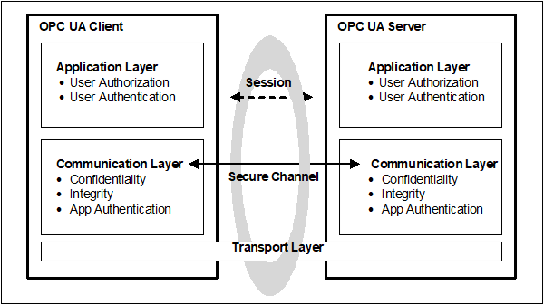  

Figure 2 - OPC UA security architecture - Client / Server  

OPC UA also supports a Publish - Subscribe communications architecture ( *PubSub* ) and the security architecture for that communication is illustrated in [Figure 3](/§\_Ref494168463) .  

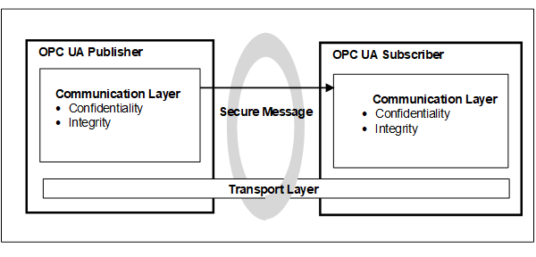  

Figure 3 - OPC UA security architecture- Publisher - Subscriber  

  

#### 4.5.2 Client / Server  

##### 4.5.2.1 Overview  

*Client* / *Server* communication can include both *Session* and session-less communication. Security in part is provided by the application or by the communications layers. It can also utilize transport layer security. Each of these options provides a different set of security objectives and are described in the following sections.  

##### 4.5.2.2 Session application layer  

The routine work of a *Client* application and a *Server* application to transmit information, settings, and commands is done in a *Session* in the Application Layer. The Application Layer also manages the security objectives user *Authentication* and user *Authorization* (see [4.11](/§\_Ref154615223) for more detail on user authorization). The security objectives that are managed by the application layer are addressed by the *Session Services* that are specified in [OPC 10000-4](/§UAPart4) . A *Session* in the application layer communicates over a *SecureChannel* that is created in the communication layer and relies upon it for secure communication. All of the *Session* data is passed to the communication layer for further processing.  

Although a *Session* communicates over a *SecureChannel* and has to be activated before it can be used, the binding of users, *Sessions* , and *SecureChannels* is flexible.  

Impersonation allows a user to take ownership of an existing *Session* .  

If a *SecureChannel* breaks, the *Session* will remain valid for a period of time allowing the *Client* to re-establish the connection to the *Session* via a new *SecureChannel.* Otherwise, the *Session* closes after its lifetime expires. The requirements for re-establishing connections are described in [OPC 10000-4](/§UAPart4)  

##### 4.5.2.3 Session communication layer  

The Communication Layer provides security mechanisms to meet *Confidentiality* , *Integrity* and application *Authentication* as security objectives. In some cases, it also meets the *Perfect Forward Secrecy* security objective. One essential mechanism to meet these security objectives is to establish a *SecureChannel* (see [4.13](/§\_Ref183424960) ) that is used to secure the communication between a *Client* and a *Server* . The *SecureChannel* provides encryption to maintain *Confidentiality* , *Message Signatures* to maintain *Integrity* and *Certificates* to provide application *Authentication.* In addition, the *SecureChannel* provides *Perfect Forward Secrecy* when the *SecureChannel* is used with Elliptic Curve Cryptography (ECC) and the *Diffie Hellman Key Exchange.* The data that comes from the Application Layer is secured and passes the "secured" data to the Transport Layer. The security mechanisms that are managed by the Communication Layer are provided by the *SecureChannel* Services that are specified in [OPC 10000-4](/§UAPart4) .  

The security mechanisms provided by the *SecureChannel* services are implemented by a protocol stack that is chosen for the implementation. Mappings of the services to some of the protocol stack options are specified in [OPC 10000-6](/§UAPart6) which define how functions in the protocol stack are used to meet the OPC UA security objectives. Other details are provided as part of *Profiles* which are described in [OPC 10000-7](/§UAPart7) (and available on-line at [ REF SecurityPolicies \\h OPC Security Policies](https://profiles.opcfoundation.org/) ).  

The Communication Layer can represent an OPC UA connection protocol stack. OPC UA specifies alternative stack mappings that can be used as the Communication Layer. These mappings are described in [OPC 10000-6](/§UAPart6) .  

If the OPC UA Connection Protocol (UACP) is used, then functionality for *Confidentiality* , *Integrity* , application *Authentication* , and the *SecureChannel* are similar to the [TLS](/§Tls) specifications, as described in [OPC 10000-6](/§UAPart6) .  

Additional communication mappings are described in [OPC 10000-6](/§UAPart6) . These mappings can rely on transport protocols to provide *Confidentiality* and *Integrity.* One example is WebSockets, which utilizes [HTTPS](/§Https) transport layer security to provide *Confidentiality* and *Integrity* .  

##### 4.5.2.4 Transport layer  

The transport layer handles the transmission, reception, and the transport of data that is provided by the communication layer.  

To survive the loss of the transport layer connections (e.g. TCP connections) and resume with a new connection, the communication layer is responsible for re-establishing the transport layer connection without interrupting.  

The transport layer can also be used to implement *Confidentiality* and *Integrity* by using [HTTPS](/§Https) (HTTP messages over a TLS connection) as described in [OPC 10000-6](/§UAPart6) . It is important to note that [HTTPS](/§Https) certificates can be (and often are) shared by multiple applications on a platform and that they can be compromised outside of the OPC UA usage of them. All applications on the platform that use the same shared certificate have the same settings. HTTPS does not require application *Authentication* , if this is required it can be included as part of *Session* establishment.  

##### 4.5.2.5 Session-less Service invocation  

OPC UA provides a session-less *Service* invocation (defined in [OPC 10000-4](/§UAPart4) overview and see [OPC 10000-6](/§UAPart6) for details). The session-less communication provides *User Authentication via an Access Token.* The communication channel provides *Confidentiality* and *Integrity.* The communication channel could be an OPC UA *SecureChannel* (without a session). It could be a communication channel, such as [HTTPS](/§Https) , which relies on transport protocols to provide security. In addition, *User* *Authentication* and/or *Application* *Authentication* can also be established by the use of an *AccessToken* which is obtained from an *AuthorizationService* (see [OPC 10000-6](/§UAPart6) for details).  

Session-less communication is restricted to encrypted communication channels. It could also be restricted to specific endpoints that are dedicated for session-less communication.  

#### 4.5.3 Publish-Subscribe  

##### 4.5.3.1 Overview  

The *PubSub* can be deployed in two environments, one in which a broker exists and one which is broker less. [OPC 10000-14](/§UAPart14) defines the details of this model. The two environments have different security considerations associated with them, and each will be described separately.  

##### 4.5.3.2 Broker-less  

The broker-less *PubSub* communication model provides *Confidentiality* and *Integrity.* This is accomplished using *Symmetric* *Encryption* and signature algorithms. The required *SymmetricKeys* are distributed by a Security Key Server (SKS) (see [OPC 10000-14](/§UAPart14) for additional details). The SKS makes use of the standard *Client* / *Server* security described in [4.5.2](/§\_Ref106764472) to establish application *Authentication* as well as user *Authentication* . This approach allows all applications ( *Publishers* and/or *Subscribers* ) in a *SecurityGroup* to share information. An SKS could be part of a *Publisher* or *Subscriber* . It could also be a centrally managed SKS that is part of a GDS. A key point related to *SymmetricKeys* is that they will need to be replaced periodically, where the period is determined by the number of *Publishers* in a *SecurityGroup* and the frequency of messages. To ensure that *Publishers* and *Subscribers* can maintain communication, they need to be able to interact with an SKS. The SKS can push keys to a *Server* and a *Client* can pull keys from the SKS.  

See [OPC 10000-14](/§UAPart14) for more details on an SKS.  

A benefit of using shared *SymmetricKeys* is the high performance they offer, but a drawback is that for a group of applications that use a shared *SymmetricKey* , all of the applications in the group have the same rights. All applications must trust all other applications in the group. Any application ( *Publisher* or *Subscriber* ) in the group can publish a message and any application ( *Publisher* or *Subscriber* ) in the group can decode the message.  

For example, a system could be composed of a shared symmetric group that is composed of a controller ( *Publisher* ) and three *Subscribers* (say HMI's). The controller is publishing messages and the HMIs are receiving the messages. If one of the HMIs is compromised, it could start publishing messages also. The other two HMIs will not be able to tell that the message was not sent from the controller. One possible solution to this situation could be if the shared symmetric group is composed of just the controller and one HMI. Additional groups would be created for each HMI, then no HMI could affect the other HMIs. Other possible solutions could also involve the network architecture and services, such as unicast restricted network communication, but these are outside the scope of the OPC UA specification. The configuration of *SecurityGroups* requires careful consideration when deploying systems to ensure security. The model is illustrated in [Figure 4](/§\_Ref197769356) .  

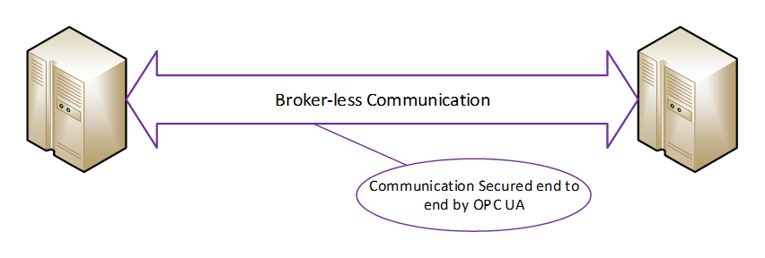  

Figure 4 - Boker-less communication  

  

##### 4.5.3.3 Broker  

When using a *Broker* in the *PubSub* model, the same shared *SymmetricKey* concepts as defined in [4.5.3.2](/§\_Ref504431930) can be used to provide *Confidentiality* and *Integrity.* Furthermore, communication to the *Broker* can be secured according the rules defined for the *Broker* . These rules are not defined in the OPC UA specification but are defined by the *Middleware* . In many cases the *Middleware* requires the authorization of both the *Publishers* and the *Subscribers* before they can interact with the *Broker* . The *Broker* interactions can provide security mechanisms to meet *Confidentiality* , *Integrity* and application or user *Authentication* as security objectives. If the published message is not secured using the shared *SymmetricKey* concepts, the message content is visible to the *Broker* which creates some risk of man-in-the-middle attacks. The use of the shared *SymmetricKeys* eliminates this risk. For complete details on share *SymmetricKeys* (SKS) and securing PubSub message in Broker based transports see [OPC 10000-14](/§UAPart14) . The model is illustrated in [Figure 5](/§\_Ref169134970) .  

  

Figure 5 - Broker Communication  

### 4.6 SecurityPolicies  

A *SecurityPolicy* specifies which security mechanisms are to be used and are derived from a Security *Profile* (see [4.7](/§\_Ref180566013) for details). Security policies are used by the *Server* to announce which mechanisms it supports and by the *Client* to select which one to use with the *SecureChannel* it wishes to open or for the session-less connection it wishes to make. *SecurityPolicies* are also used with *PubSub* communication. *SecurityPolicies* include the following information:  

* algorithms for signing and encryption  

* algorithm for key derivation  

The choice of allowed *SecurityPolicies* is normally made by the administrator typically when the *OPC UA Applications* are installed. The available security policies are specified in [OPC 10000-7](/§UAPart7) . The Administrator can at a later time also change or modify the selection of allowed *SecurityPolicies* as circumstances dictate.  

The announcement of security policies is handled by special discovery services specified in [OPC 10000-4](/§UAPart4) . More details about the discovery mechanisms and policy announcement strategies can be found in [OPC 10000-12](/§UAPart12) .  

In the *Client* *Server* communications pattern, each *Client* can select a policy independent of the policy selected by other *Clients* .  

For the *Publish* *Subscribe* communications pattern, the *SecurityPolicy* is associated with a published *DataSet* and all *Subscribers* utilize the same *SecurityPolicy* .  

Since computing power increases every year, specific algorithms that are considered as secure today can become insecure in the future, therefore, it makes sense to support different security policies in an *OPC UA Application* and to be able to adopt more as they become available. NIST or other agencies even make predictions about the expected lifetime of algorithms (see [NIST 800-57](/§Nist800\_57) ). The list of supported security policies will be updated based on recommendation such as those published by NIST. From a deployment point of view it is important that the periodic site-review checks that the currently selected list of security profiles still fulfil the required security objectives and if they do not, then a newer selection of *Security Profiles* is selected  

There is also the case that new security policies are composed to support new algorithms that improve the level of security of OPC UA products. The application architecture of *OPC UA* *Application* should be designed in a way that it is possible to update or add additional cryptographic algorithms to the application with little or no coding changes.  

[OPC 10000-7](/§UAPart7) specifies several policies which are identified by a specific unique URI. To improve interoperability among vendors' products, *Server* and *Publisher* products implement these policies rather than define their own. *Clients* and *Subscribers* support the same policies.  

### 4.7 Security Profiles  

OPC UA *Client* and *Server* products are certified against *Profiles* that are described in [OPC 10000-7](/§UAPart7) . Some of the *Profiles* specify security functions and others specify other functionality that are not related to security. The *Profiles* impose requirements on the certified products but they do not impose requirements on how the products are used. A consistent minimum level of security is required by the various *Profiles* . However, different *Profiles* specify different details such as which encryption algorithms are required for which OPC UA functions. If a problem is found in one encryption algorithm then the OPC Foundation can define a new *Profile* that is similar, but that specifies a different encryption algorithm that does not have a known problem. Each security *Profile* defines a set of algorithms that work together. They include:  

* *Asymmetric Encryption* algorithm  

* *Asymmetric Signature* algorithm  

* *Certificate Key* algorithm  

* *Certificate Signature* algorithm  

* *Ephemeral Key* algorithm  

* *Key Derivation* algorithm  

* *Symmetric Encryption* algorithm  

* *Symmetric Signature* algorithm  

Not all are required for all security *Profiles (i.e. Ephemeral Keys are only required for ECC, Asymmetric Encryption is only required for RSA)*  

[OPC 10000-7](/§UAPart7) is the informative specification of the *Profiles,* but *Profiles* are normatively defined in an on-line application ( [OPC Profiles](/§Profiles) ) allowing for updating of *Profiles* , especially security related profiles, in a more timely manner than allowed by documentation publication cycles.  

Security policies are a type of *Profile* that specifies which of the security setting choices to use in the *Session* . The security policy does not specify the range of choices that the product offers, they are described in the *Profiles* that it supports.  

These security policies are included in certification testing associated with *OPC UA* *Applications* . The certification testing ensures that the standard is followed and that the appropriate security algorithms are supported.  

Each security mechanism in OPC UA is provided in *OPC UA* *Applications* in accordance with the *Profiles* with which the *OPC UA* *Application* complies. At the site, however, the security mechanisms could be deployed optionally. In this way each individual site has all of the OPC UA security functions available and can choose which of them to use to meet its security objectives.  

Security *Profiles* describe a *Profile* "None" that is used for testing, but if any other more secure *Profiles* are available this *Profile* is disabled by default. *Profile* "None" provides no security.  

### 4.8 Security Mode settings  

OPC UA supports the selection of several security modes: "None", "Sign", "SignAndEncrypt". Security mode "None" can only be used with security Profile None. Security mode "none" is disabled for all other security *Profiles* . Profile None shall be disabled by default. The choice of "Sign" or "SignAndEncrypt" is dependent on the CSMS, in some applications where data confidentiality is not required, "Sign" is sufficient.  

### 4.9 User Authentication  

User *Authentication* is achieved when the *Client* passes user credentials to the *Server* as specified via *Session Services* (described in [OPC 10000-4](/§UAPart4) ). The *Server* can authenticate the user with these credentials.  

The owner (user) of a *Session* can be changed using the *ActivateSession Service* in order to meet needs of the application.  

User *Authentication* is not directly part of the *Publish*\- *Subscribe* communication pattern but is used as part of the SKS associated with this communication pattern.  

### 4.10 Application Authentication  

OPC UA uses a concept conveying Application *Authentication* to allow applications that intend to communicate to identify each other. Each *OPC UA ApplicationInstance* has a *Certificate* ( *ApplicationInstanceCertificate* ) assigned that is exchanged during *SecureChannel* establishment. The receiver of the *Certificate* checks whether it trusts the *Certificate* and based on this check it accepts or rejects the request or response *Message* from the sender (see [OPC 10000-4](/§UAPart4) Determining if a Certificate is Trusted). This trust check is accomplished using the concept of *TrustLists* . *TrustLists* are implemented as a *CertificateStore* designated by an administrator. An administrator determines if the *Certificate* is signed, validated and trustworthy before placing it in a *TrustList* . A *TrustList* also stores Certificate Authorities (CA). *TrustLists* that include CAs, also include *Certificate* Revocation Lists (CRLs). OPC UA makes use of these industry standard concepts as defined by other organizations (see [OPC 10000-12](/§UAPart12) Certificate Management).  

In OPC UA, [HTTPS](/§Https) can be used to create *SecureChannels* , however, these channels do not provide *Application Authentication* . If *Authentication* is required, it is based on user credentials (User Authentication see [4.9](/§\_Ref505098661) ). More details on *Application Authentication* can be found in [OPC 10000-4](/§UAPart4) .  

### 4.11 User Authorization  

OPC UA provides user authorization based on the authenticated user (see [4.9](/§\_Ref505098661) ). *OPC UA* *Applications* can determine in their own way what data is accessible and what operations are authorized or they can use Roles (see [4.12](/§\_Ref494253275) ). *Profiles* exist to indicate the support of user credentials to restrict or control access to the address space.  

### 4.12 Roles  

OPC UA provides standard approach for implementing role based security. *Servers* could choose to implement none, part or all of mechanisms defined in OPC 10000-5 and in [OPC 10000-18](/§) . The OPC UA approach assigns *Permissions* to *Roles* illustrated in [Figure 6](/§\_Ref505099258) . *Clients* are then granted *Roles* based on connection information ( *Session* creation). *Roles* could be restricted by *User* *Authentication* , *Application* *Authentication* , *SecurityModes* , or *Transports* . The assignment of *Roles* and *AccessRestrictions* is application specific, but they can be assigned to all *Nodes* in a *Namespace* or to specific *Nodes* .  

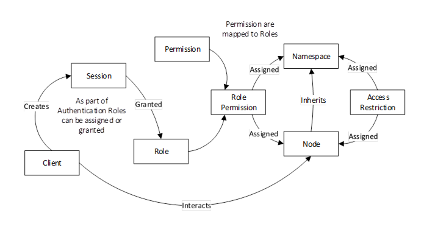  

Figure 6 - Role overview  

OPC UA defines a set of standard *Roles* that *OPC UA Applications* can use, these include *SecurityAdmin* , *ConfigureAdmin* , *Supervisor* , *Engineer, Operator* , *Observer* and *AuthenticatedUser.* They are defined in [OPC 10000-3](/§UAPart3) with recommended permissions. The standard *Roles* are also utilized in various other specification as recommended security setting (e.g. see [OPC 10000-12](/§UAPart12) ).  Roles can be assigned via OAuth2 (see [6.12](/§\_Ref166675992) ). *Role* based security is further defined in [OPC 10000-18](/§UAPart18) . *Roles* are mapped to permission which in turn provide *AccessRestrictions* .  

### 4.13 OPC UA security related Services  

The OPC UA Security Services are a group of abstract service definitions specified in [OPC 10000-4](/§UAPart4) that are used for applying various security mechanisms to communication between OPC UA *Clients* and *Server* s. [OPC 10000-4](/§UAPart4) provides an overview of security in the "Service Behaviours" section that includes required behaviours to ensure secure communication.  

The Discovery Service Set (specified in [OPC 10000-4](/§UAPart4) ) defines services used by an OPC UA *Client* to obtain information about the security policies (see [4.6](/§\_Ref183428117) ) and the *Certificates* of specific OPC UA *Server* s.  

The services of the *SecureChannel* Service Set (specified in [OPC 10000-4](/§UAPart4) ) are used to establish a *SecureChannel* which is responsible for securing *Messages* sent between a *Client* and a *Server* . The challenge of the *SecureChannel* establishment is that it requires the *Client* and the *Server* to securely exchange cryptographic keys and secret information in an insecure environment, therefore a specific *Key Exchange Algorithm* (similar to TLS Handshake protocol defined in [TLS](/§Tls) ) is applied by the communication participants.  

Once established, a *SecureChannel* uses *Symmetric Cryptography* keys to encrypt and sign all *Messages. Symmetric Cryptography* requires a shared key. *Asymmetric Cryptography* is used to create this shared key.  

The OPC UA *Client* retrieves the security policies and *Certificates* of the OPC UA *Server* by the previously mentioned discovery services. These *Certificates* contain the *Public Keys* of the OPC UA *Server* .  

For *Rivest-Shamir-Adleman* (RSA) the following procedure is used:  

* The OPC UA *Client* sends its *Public Key* in a *Certificate* and secret information with the OpenSecureChannel service *Message* to the *Server* . This *Message* is secured by applying *Asymmetric Encryption* with the *Server's Public Key* and by ** generating *Asymmetric Signatures* with the *Client* 's *Private Key.* However, the *Certificate* is sent unencrypted so that the receiver can use it to verify the *Asymmetric Signature* .  

* The *Server* decrypts the *Message* with its *Private Key* and verifies the *Asymmetric Signature* with the *Client* 's *Public Key* . The secret information of the OPC UA *Client* together with the secret information of the OPC UA *Server* is used to derive a set of cryptographic keys that are used for securing all further *Message* s. Furthermore, all other service *Messages* are secured with *Symmetric Encryption* and *Symmetric Signatures* instead of the asymmetric equivalents.  

* The *Server* sends its secret information in the service response to the *Client* so that the *Client* can derive the same set of *SymmetricKeys* .  

For ECC the following procedure is used:  

* The OPC UA *Client* generates a new temporary key pair and sends the *Public Key* to the *Server* .  

* The *Server* verifies the signature on the request, then generates a new temporary key pair and sends the *Public Key* to the *Client.*  

* Once the *Public* *Keys* are exchanged, both the *Server* and *Client* derive the *SymmetricKeys* needed for the secure conversation *.*  

Since *Clients* and *Servers* have the same set of cryptographic keys they can communicate securely with each other. The *SymmetricKeys* used in communication can be deciphered if enough messages using the *SymmetricKeys* are collected and analysed. These derived cryptographic keys are required to be changed periodically so that attackers do not have unlimited time and unrestricted sequences of *Messages* to use to determine what the *SymmetricKeys* are. The time period between changes depends on the number of messages sent using the key. Typically for *Client* *Server* communication this would be at least every two hours.  

For *PubSub* communications, the security related definitions are specified in [OPC 10000-14](/§UAPart14) and provide a description of how to secure messages and also how to obtain the security keys required for message security.  

The *Publisher* will utilize the keys provided to secure the message. It will encrypt the body of the message and sign the entire message. *Subscribers* will utilize the keys to decrypt and verify the signature of the messages. These keys are also *SymmetricKeys* and follow the same rules with regard to periodically changing them. Since *PubSub* communication is usually at a higher rate, the time period for between key changes would typically be one hour. But in some case it could be even more often depending on the number of messages secured with the key.  

To obtain the required keys, the *Publisher* or *Subscriber* make use of *Client*\- *Server* communication. The keys could also be obtained using session-less method calls.  

### 4.14 Auditing  

#### 4.14.1 General  

*Clients* and *Servers* generate audit records of successful and unsuccessful connection attempts, results of security option negotiations, configuration changes, system changes, user interactions and *Session* rejections.  

OPC UA provides support for security audit trails through two mechanisms.  

First, it provides for traceability between *Client* and *Server* audit logs. The *Client* generates an audit log entry for an operation that includes a request. When the *Client* issues a service request, it generates an audit log entry and includes the local identifier of the log entry in the request sent to the *Server* . The *Server* logs requests that it receives and includes the *Client* 's entry id in its audit log entry. In this fashion, if a security-related problem is detected at the *Server* , the associated *Client* audit log entry can be located and examined. OPC UA does not require the audit entries to be written to disk, but it does require that they be available. OPC UA provides the capability for *Servers* to generate *Event* *Notifications* that report auditable *Events* to *Clients* capable of processing and logging them. See [OPC 10000-4](/§UAPart4) for more details on how services in OPC UA are audited.  

Second, OPC UA defines audit parameters to be included in audit records. This promotes consistency across audit logs and in *Audit* *Events* . [OPC 10000-5](/§UAPart5) defines the data types for these parameters. Other information models can extend the audit definitions. [OPC 10000-7](/§UAPart7) describes *Profiles* which include the ability to generate *Audit* *Events* and use these parameters, including the *Client* audit record id.  

Because the audit logs are used to prove that the system is operating securely, the audit logs themselves should also be secured from unauthorized tampering. If someone without authorization were able to alter or delete log records, this could hide an actual or attempted security breach. Because there are many different ways to generate and store audit logs (e.g. files or database), the mechanisms to secure audit logs are outside the scope of this specification.  

In addition, the information in an audit record could contain sensitive or private information, thus the ability to subscribe for *Audit* *Events* is restricted to appropriate users and/or applications. As an alternative, the fields with sensitive or private information can instead contain an error code indicating access denied for users that do not have appropriate rights.  

The subclauses [4.14.2](/§\_Ref426535379) , [4.14.3](/§\_Ref426535388) , [4.14.4](/§\_Ref426535397) and [4.14.5](/§\_Ref426535411) illustrate the behaviour of OPC UA *Servers* and *Clients* that support *Auditing* .  

#### 4.14.2 Single Client and Server  

[Figure 7](/§\_Ref136342479) illustrates the simple case of a *Client* communicating with a *Server* .  

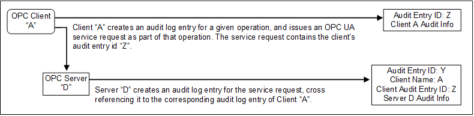  

Figure 7 - Simple Servers  

In this case, OPC Client "A" executes some auditable operation that includes the invocation of an OPC UA service in *Server* "D". It writes its own audit log entry, and includes the identifier of that entry in the service request that it submits to the *Server* .  

The *Server* receives the request and creates its own audit log entry for it. This entry is identified by its own audit id and contains its own *Auditing* information. It also includes the name of the *Client* that issued the service request and the *Client* audit entry id received in the request.  

Using this information, an auditor can inspect the collection of log entries of the *Server* and relate them back to their associated *Client* entries.  

#### 4.14.3 Aggregating Server  

[Figure 8](/§\_Ref136342509) illustrates the case of a *Client* accessing services from an aggregating *Server* . An aggregating *Server* is a *Server* that provides its services by accessing services of other OPC UA *Servers* , referred to as lower layer- *Servers* .  

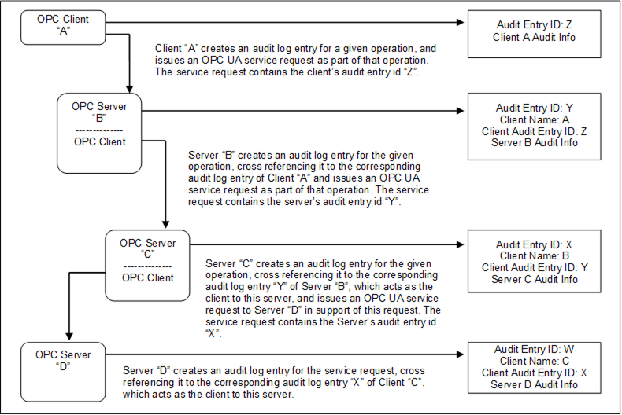  

Figure 8 - Aggregating Servers  

In this case, each of the *Servers* receives requests and creates its own audit log entry for them. Each entry is identified by its own audit id and contains its own *Auditing* information. It also includes the name of the *Client* that issued the service request and the *Client* audit entry id received in the request. The *Server* then passes the audit id of the entry it just created to the next *Server* in the chain.  

Using this information, an auditor can inspect the *Server* 's log entries and relate them back to their associated *Client* entries.  

In most cases, the *Servers* will only generate *Audit* *Events* , but these *Audit* *Events* will still contain the same information as the audit log records. In the case of aggregating *Servers* , a *Server* would also be required to subscribe for *Audit* *Events* from the *Servers* it is aggregating. In this manner, *Server* "B" would be able to provide all of the *Audit* *Events* to *Client* "A", including the *Events* generated by *Server* "C" and *Server* "D".  

#### 4.14.4 Aggregation through a non-auditing Server  

[Figure 9](/§\_Ref136342547) illustrates the case of a *Client* accessing services from an aggregating *Server* that does not support *Auditing* .  

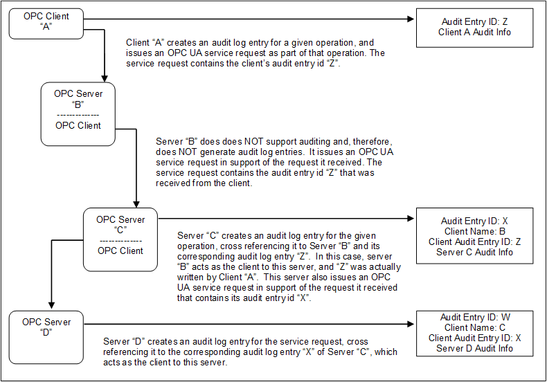  

Figure 9 - Aggregation with a non-auditing Server  

In this case, each of the *Servers* receives requests and creates their own audit log entry for them, with the exception of *Server* "B", which does not support *Auditing* . In this case, *Server* "B" passes the audit id it receives from its *Client* "A" to the next *Server* . This creates the required audit chain. *Server* "B" is not listed as supporting *Auditing* . In a case where a *Server* does not support writing audit entries, the entire system can be considered as not supporting *Auditing* .  

In the case of an aggregating *Server* that does not support *Auditing* , the *Server* would still be required to subscribe for *Audit* *Events* from the *Servers* it is aggregating. In this manner, *Server* "B" would be able to provide all of the *Audit* *Events* to *Client* "A", including the event generated by *Server* "C" and *Server* "D", even though it did not generate an *Audit* event.  

#### 4.14.5 Aggregating Server with service distribution  

[Figure 10](/§\_Ref136342576) illustrates the case of a *Client* that submits a service request to an aggregating *Server* , and the aggregating service supports that service by submitting multiple service requests to its underlying *Servers* .  

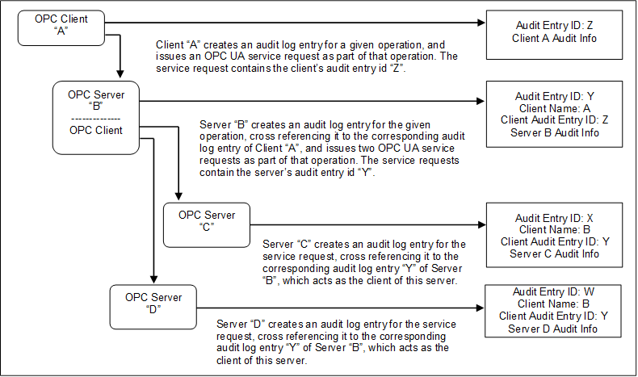  

Figure 10 - Aggregating Server with service distribution  

In the case of aggregating *Servers* , a *Server* would be required to subscribe for *Audit* *Events* from the *Servers* it is aggregating. In this manner, *Server* "B" would be able to provide all of the *Audit* *Events* to *Client* "A", including the event generated by *Server* "C" and *Server* "D".  

## 5 Security reconciliation  

### 5.1 Reconciliation of threats with OPC UA security mechanisms  

#### 5.1.1 Overview  

The following sub-clauses [5.1.2](/§\_Ref138574852) through [5.1.15](/§\_Ref155138105) reconcile the threats that were described in [4.3](/§\_Ref138568352) against the OPC UA functions. Compared to the reconciliation with the objectives that will be given in [5.2](/§\_Ref138732488) , this is a more specific reconciliation that relates OPC UA security functions to specific threats. A summary of the reconciliation is available in [Table 1](/§\_Ref106876551) . Only eavesdropping and *Server* profiling require *SignAndEncrypt* while all other are mitigated with *SignOnly* . [ (X) indicates indirectly].  

Table 1 - Security Reconciliation Threats Summary  

| **Attacks** |Authentication|Authorization|Confidentiality|Integrity|Auditability|Availability|Non-Repudiation|
|---|---|---|---|---|---|---|---|
|Denial of Service||||||X||
|Eaves Dropping|X|X|X|||||
|Message Spoofing||X||||||
|Message Alteration|X|X||X|X||X|
|Message Replay|X|X||||||
|Malformed Messages||||||X||
|Server Profiling|(X)|(X)|(X)|(X)|(X)|(X)|(X)|
|Session Hijacking|X|X|X|X|X|X|X|
|Rogue Server|X|X|X||X|X||
|Rogue Publisher|X||X||X|X||
|Rogue Local Discovery|X|X|X||X|X||
|Compromising User Credentials|X|X|X|||||
|Repudiation|||||||X|
|Message Suppression||||X||X||
|Downgrade Attack|X|X||||||
  

  

#### 5.1.2 Denial of Service  

##### 5.1.2.1 Overview  

See [4.3.2](/§\_Ref192591000) for a description of this threat. For discussion purposes denial of service is broken into three major categories message flooding, resource exhaustion and application crashes.  

##### 5.1.2.2 Message flooding  

OPC UA minimizes the loss of *Availability* caused by *Message* flooding by minimizing the amount of processing done with a *Message* before the *Message* is authenticated. This prevents an attacker from leveraging a small amount of effort to cause the legitimate *OPC UA Application* to spend a large amount of time responding, thus taking away processing resources from legitimate activities.  

GetEndpoints (specified in [OPC 10000-4](/§UAPart4) ) and OpenSecureChannel (specified in [OPC 10000-4](/§UAPart4) ) are the only services that the *Server* handles before the *Client* is authenticated. The response to GetEndpoints is only a set of static information so the *Server* does not need to do much processing. The response to OpenSecureChannel consumes significant *Server* resources because of the signature and encryption processing. OPC UA has minimized this processing, but it cannot be eliminated.  

The *Server* implementation could protect itself from floods of OpenSecureChannel *Messages* in two ways.  

First, the *Server* could intentionally delay its processing of OpenSecureChannel requests once it receives more than some minimum number of bad OpenSecureChannel requests. It should also issue an alarm to alert plant personnel that an attack is underway that could be blocking new legitimate OpenSecureChannel calls.  

Second, when an OpenSecureChannel request attempts to exceed the *Server* 's specified maximum number of concurrent channels the *Server* replies with an error response without performing the signature and encryption processing. Certified OPC UA *Servers* are required to specify their maximum number of concurrent channels in their product documentation as specified in [OPC 10000-7](/§UAPart7) .  

OPC UA user and *Client* *Authentication* reduce the risk of a legitimate *Client* being used to mount a flooding attack. See the reconciliation of *Authentication* in [5.2.3](/§\_Ref426535512) .  

The *Client* protects itself from floods by have a max message size limit, automatically closing connections where the limit is exceeded. The *Clients* also ignore extra responses that could be received and closes the connection.  

In *PubSub* , the *Subscriber* filters messages that it processes based on header information, allowing it to quickly discard any messages that do not conform to its required filter. In addition, the message signature is checked to eliminate any message that is well formed, but not from the desired *SecurityGroup* . *PubSub* can also be configured for unicast instead of multicast, which allows the network infrastructure to block multicast flooding attacks.  

OPC UA *Auditing* functionality provides the site with evidence that can help the site discover that flooding attacks are being mounted and find ways to prevent similar future attacks (see [4.14](/§\_Ref138589474) ). As a best practice, *Audit* *Events* should be monitored for excessive connection requests.  

OPC UA relies upon the site *CSMS* to prevent attacks such as *Message* flooding at protocol layers and systems that support OPC UA.  

##### 5.1.2.3 Resource exhaustion  

OPC UA user and *Client* *Authentication* reduce the risk of a legitimate *Client* being used to mount a resource exhaustion attack. Additionally, *Server* *Auditing* allows the detection of the *Client* if a resource exhaustion attack was carried out by a legitimate *Client* . *Servers* are also required to recycle *OpenSecureChannel* request that have not been completed (specified in [OPC 10000-4](/§UAPart4) ), this will eliminate attacks from non-legitimate *Clients.* Servers are encouraged to minimize logging of invalid attempts. *Servers* should track invalid attempts with diagnostic counters instead of verbose log messages, this would even apply to connection attempts that only open a socket. Resource exhaustion attacks do not apply to *PubSub* Systems, since no sessions or resources are allocated.  

##### 5.1.2.4 Application Crashes  

OPC UA provides certification of *OPC UA* *Applications* . The lab testing and certification includes testing by injecting error and junk commands which could discover common faults. OPC Foundation stacks are also fuzz tested to ensure they are resilient to errors. Although a certified *OPC UA* *Application* does not guarantee fault free operation, the certified *OPC UA* *Application* is more likely to be resilient to application crashes caused by denial of service attacks.  

#### 5.1.3 Eavesdropping  

See [4.3.3](/§\_Ref192591026) for a description of this threat.  

OPC UA provides encryption to protect against eavesdropping as described in [5.2.5](/§\_Ref138694047) .  

#### 5.1.4 Message spoofing  

See [4.3.4](/§\_Ref192591051) for a description of this threat.  

As specified in [OPC 10000-4](/§UAPart4) and [OPC 10000-6](/§UAPart6) , OPC UA counters *Message* spoofing threats by providing the ability to sign *Message* s. Additionally, *Messages* will always contain a valid *SessionId* , *SecureChannelId* , *RequestId* and *Timestamp* as well as the correct sequence number. OPC UA when operating as part of a *Session* , restricts user spoofing in the same manner since the user information is provided as part of the *Session* establishment. It is important that when a device starts up that the *SessionId* that is initially assigned to the first *Session* is a random number or a continuation of the last *Session* number used and is not always reset to 0 or a predictable number.  

As specified in [OPC 10000-14](/§UAPart14) , OPC UA *PubSub* counters *Message* spoofing threats by providing the ability to sign messages. *Messages* can also contain a valid *PublisherId* , *DataSetClassId* , timestamp information, network message number and sequence number, which further restricts *Message* spoofing.  

In session-less communication, to counter message spoofing *Clients* and *Server* should restrict session-less communication to be over *SecureChannel* s. See [4.5.2.5](/§\_Ref167653405) and for additional session-less security related information.  

#### 5.1.5 Message alteration  

See [4.3.5](/§\_Ref192591077) for a description of this threat.  

OPC UA counters *Message* alteration by the signing of *Messages* that are specified in [OPC 10000-4](/§UAPart4) and [OPC 10000-14](/§UAPart14) . If *Messages* are altered, checking the signature will reveal any changes and allow the recipient to discard the *Message* . This check can also prevent unintentional *Message* alteration due to communication transport errors.  

#### 5.1.6 Message replay  

See [4.3.6](/§\_Ref192591511) for a description of this threat.  

OPC UA uses *SessionIds* , *SecureChannelIds* , *Timestamps* , sequence numbers and *RequestIds* for every request and response *Message* . *Messages* are signed and cannot be changed without detection, therefore it would not be possible to replay a *Message* without it being detected and rejected. The establishment of a *SecureChannel* or *Session* includes the same signature, timestamps and sequence number that are part of all messages and thus cannot be replayed.  

OPC UA *PubSub* uses *PublisherIds* , *DataSetWriterIds* , *Timestamps* , network message numbers and sequence numbers in published messages. When *Messages* are optionally signed they cannot be changed without detection, therefore it can be configured that replay of a message is not possible. It is worth noting that *PubSub* does allow the disabling of fields in a message. The disabling of the *Timestamp* , network message number and sequence number, could allow replay attacks. If a replay attack is of concern in a CSMS, then these fields need to be enabled.  

For session-less communication, OPC UA uses *Timestamps* , sequence numbers and *RequestIds* for every request and response *Message* . *Messages* are signed and cannot be changed without detection therefore it would not be possible to replay a *Message* .  

#### 5.1.7 Malformed Messages  

See [4.3.7](/§\_Ref192591526) for a description of this threat.  

Implementations of *OPC UA* *Applications* counter threats of malformed *Messages* by checking that *Messages* have the proper form and that parameters of *Messages* are within their legal range. Invalid *Messages* are discarded. This is specified in [OPC 10000-4](/§UAPart4) , [OPC 10000-6](/§UAPart6) and [OPC 10000-14](/§UAPart14) .  

#### 5.1.8 Server profiling  

See [4.3.8](/§\_Ref192591543) for a description of this threat.  

OPC UA limits the amount of information that *Servers* provide to *Clients* *that* have not yet been identified. This information is the response to the GetEndpoints service specified in [OPC 10000-4](/§UAPart4) .  

#### 5.1.9 Session hijacking  

See [4.3.9](/§\_Ref138693807) for a description of this threat.  

OPC UA counters *Session* hijacking by assigning a security context (i.e. *SecureChannel* ) with each *Session* as specified in the CreateSession *Service* in [OPC 10000-4](/§UAPart4) . Hijacking a *Session* would thus first require compromising the security context.  

#### 5.1.10 Rogue Server or Publisher  

See [4.3.10](/§\_Ref192591568) and [4.3.11](/§\_Ref511389776) for a description of this threat.  

OPC UA *Client* applications counter the use of rogue *Servers* by validating *Server* *ApplicationInstanceCertificates* . There would still be the possibility that a rogue *Server* provides a *Certificate* from a trusted OPC UA *Server* , but since it does not possess the appropriate *Private Key* (because this will never be distributed) to decrypt *Messages* secured with the correct *Public Key* the rogue *Server* would never be able to read and misuse secured data sent by a *Client* . Also, without the *Private* *Key* the *Server* would never be able to sign a response message to a *Client.*  

If communication is secured using ECC, then the Client would refuse to establish a *SecureChannel* with the rogue *Server* . If a rogue server attempted to hijack a running connection, it would not be able to generate signed messages to the *Client* . OPC ** UA *Subscriber* applications counter the effect of a rogue *Publisher* by validating the signature on the published messages.  

#### 5.1.11 Rogue Local Discover Server  

See [4.3.12](/§\_Ref155227749) for a description of this threat.  

OPC UA *Client* can counter a rogue *Discovery* *Server* , by only connecting to *Servers* that are trusted. This protects the *Client* against malicious *Server.* The use of a GDS can also mitigate the effect of a compromised *Local* *Discovery* *Server* .  

A GDS, that aggregates information from *Local* *Discovery* Server *s* does not trust the input from the *Local* *Discovery* *Servers* , until it is confirmed. Confirmation can occur by the *Server* application registration for certificate services or other secure access to the GDS. It can also be confirmed by administrative personnel.  

#### 5.1.12 Compromising user credentials  

See [4.3.11](/§\_Ref192591579) for a description of this threat.  

OPC UA protects user credentials sent over the network by encryption as described in [5.2.5](/§\_Ref138694047) .  

When using an *AuthorizationService* for identity verification then securing the user identity is out of scope for OPC UA. It is essential that the CSMS take *AuthorizationServices* into account. OPC UA depends upon the site *CSMS* to protect against other attacks to gain user credentials, such as password guessing or social engineering.  

The risk from a compromised *AuthorizationService* can be minimized by restricting *Server* access in additional manners, such as from specific applications ( *Clients* ) or at specific times.  

#### 5.1.13 Repudiation  

See [4.3.15](/§\_Ref491976770) for a description of this threat.  

OPC UA *Client* and *Server* applications counter *Repudiation* by the signing of *Messages* that are specified in [OPC 10000-4](/§UAPart4) . A signed message within a secure channel indicates that the message originated from the owner of the private key. During *OpenSecureChannel* and *Session* establishment the communicating parties are clearly identified and confirmed. Lastly *Auditing* as described in [OPC 10000-4](/§UAPart4) will track the information associated with the message.  

#### 5.1.14 Message Suppression  

See [4.3.16](/§\_Ref152834634) for a description of this threat. A *Client* and *Server* can counter message suppression by using checking the *SequenceNumber* in the sequence header. A *SecureChannel* is required to be closed if a *SequenceNumber* is missed. This allows both a *Server* and a *Client* to detect if a message is supressed. Both the *Server* and *Client* are required to report the error (Bad\_SequenceNumberInvalid).  

#### 5.1.15 Downgrade Attack  

See [4.3.17](/§\_Ref155138143) for a description of this threat. A *Client* can counter a downgrade attack, by verifying the available communication options once a secure connection is established to the *Server* . If the list of secure connection provided in activate Session is different from the list provided in discovery, the *Client* disconnects and reports an error (see [OPC 10000-4](/§UAPart4) ). Downgrade attacks can also be countered by not enabling lower security options system wide.  

#### 5.1.16 Network Infrastructure attacks  

See [4.3.18](/§\_Ref202830262) for a description of this threat. Several of the resulting threats are covered in their own sections, but a key counter measure is to utilise encryption as described in [5.2.5](/§\_Ref138694047) . The denial of service is difficult to counter, but OPC UA supports IPv6, which can counter many of the network infrastructure attacks. It is important that network security features are utilized and that network infrastructure be part of regular security Audits and network configuration is reviewed.  

### 5.2 Reconciliation of objectives with OPC UA security mechanisms  

#### 5.2.1 Overview  

Subclauses [5.2.2](/§\_Ref426535562) through [5.2.8](/§\_Ref203040226) reconcile the objectives that are described in [4.2](/§\_Ref508239214) with the OPC UA functions. Compared to the reconciliation against the threats of [5.1](/§\_Ref138732391) , this reconciliation justifies the completeness of the OPC UA security architecture.  

#### 5.2.2 Application Authentication  

*OPC UA Applications* support *Authentication* of the entities with which they are communicating. As specified in the *GetEndpoints* and *OpenSecureChannel* services in [OPC 10000-4](/§UAPart4) , OPC UA *Client* and *Server* applications identify and authenticate themselves with *X.509 v3 Certificate* s and associated private keys ( *X.509 v3 Certificates* are defined in [X509](/§X509) ). Some choices of the communication stack require these *Certificates* to represent the machine or user instead of the application.  

For publish subscribe communications *Client* *Server* communications is required to obtain the shared keys from a *SecurityKeyService* (SKS). Although the application authentication is not directly between the Subscriber and the Publisher, the SKS ensures that only authenticated applications can obtain the keys used by the *Publisher* and *Subscriber* .  

#### 5.2.3 User Authentication  

*OPC UA Applications* support *Authentication* of users by providing the necessary *Authentication* credentials to the other entities. As described in the ActivateSession service in [OPC 10000-4](/§UAPart4) , the OPC UA *Client* accepts a UserIdentityToken from the user and passes it to the OPC UA *Server* . The OPC UA *Server* authenticates the user token. *OPC UA Applications* accept tokens in any of the following forms: username/password, X.509 v3 *Certificate* (see [X509](/§X509) ), or JSON Web Token (JWT).  

As specified in the CreateSession and ActivateSession *Services* in [OPC 10000-4](/§UAPart4) , if the UserIdentityToken is a *Certificate* then this token is validated with a challenge-response process. The *Server* provides a *Nonce* and signing algorithm as the challenge in its CreateSession response. The *Client* responds to the challenge by signing the *Server* 's *Nonce* and providing it as an argument in its subsequent ActivateSession call.  

For session-less services User Authentication can be accomplished using an *AccessToken* which is obtained from an *AuthorizationService* (see [OPC 10000-6](/§UAPart6) for details). This does require that an encrypted communication channel be used (see [OPC 10000-4](/§UAPart4) for a general overview).  

#### 5.2.4 Authorization  

*Authorization* could be provided via *Roles* ( [4.12](/§\_Ref494253275) ) and supplied by a Authorization Server in a GDS. In an environment of mixed vendor products, the GDS can provide a consistent *Authorization* management. *OPC UA Applications* that are part of a larger industrial automation product can manage *Authorizations* consistent with the *Authorization* management of that product. Identification and *Authentication* of users is specified in OPC UA so that *Client* and *Server* applications can recognize the user in order to determine the *Authorization* level of the user.  

OPC UA *Servers* respond with the *Bad* \_ *UserAccessDenied* error code to indicate an *Authorization or Authentication* error as specified in the status codes defined in [OPC 10000-4](/§UAPart4) .  

In *PubSub* interactions user *Authorization* can be used as part of the key distribution (SKS). This allows the *Publisher* and SKS to restrict access to specific users  

#### 5.2.5 Confidentiality  

OPC UA uses *Symmetric* and *Asymmetric Encryption* to protect *Confidentiality as a security objective* . Thereby *Asymmetric Encryption* is used for key agreement and *Symmetric Encryption* for securing all other *Messages* sent between *OPC UA Application* s. Encryption mechanisms are specified in [OPC 10000-6](/§UAPart6) and [OPC 10000-14](/§UAPart14) .  

OPC UA relies upon the site *CSMS* to protect *Confidentiality* on the network and system infrastructure. OPC UA relies upon the [PKI](/§PKI) ** ( *Public Key Infrastructure* ) to manage keys used for *Asymmetric Encryption* which is then used to establish ** symmetric session ** keys. The length of the certificate chain is defined by the site *CSMS* (only local *TrustList* with self-signed *Certificates* or a full CA/CRL infrastructure).  

#### 5.2.6 Integrity  

OPC UA uses *Symmetric* and *Asymmetric Signatures* to address *Integrity* as a security objective. The *Asymmetric Signatures* are used in the key agreement phase during the *SecureChannel* establishment. The *Symmetric Signatures* are applied to all other *Message* s including *PubSub* messages.  

OPC UA relies upon the site *CSMS* to protect *Integrity* on the network and system infrastructure. OPC UA relies upon the [PKI](/§PKI) to manage keys used for *Asymmetric Signatures* which is then used to establish ** symmetric ** session ** keys.  

#### 5.2.7 Auditability  

As specified in the UA *Auditing* description in [OPC 10000-4](/§UAPart4) , OPC UA supports *Audit* logging by providing traceability of activities through the log entries of the multiple *Clients* and *Servers* that initiate, forward, and handle the activity. OPC UA depends upon *OPC UA Application* products to provide an effective *Audit* logging scheme or an efficient manner of collecting the *Audit* *Events* of all nodes. This scheme can be part of a larger industrial automation product of which the *OPC UA Applications* are a part.  

#### 5.2.8 Availability  

OPC UA minimizes the impact of *Message* flooding as described in [5.1.2](/§\_Ref138574852) .  

Some attacks on *Availability* involve opening more *Sessions* than a *Server* can handle thereby causing the *Server* to fail or operate poorly. *Servers* reject *Sessions* that exceed their specified maximum number. Other aspects of OPC UA such as OPC UA Secure Conversation can also affect availability and are discussed in [OPC 10000-6](/§UAPart6) .  

  

## 6 Implementation and deployment considerations  

### 6.1 Overview  

Clause [6](/§\_Ref141002637) provides guidance to vendors that implement *OPC UA Application* s. Since many of the countermeasures required to address the threats described above fall outside the scope of the [OPC 10000](/§UASpec) , the advice in Clause [6](/§\_Ref141002637) suggests how some of those countermeasures should be provided.  

For each of the following areas, Clause [6](/§\_Ref141002637) defines the problem space, identifies consequences if appropriate countermeasures are not implemented and recommends best practices.  

### 6.2 Appropriate timeouts:  

Timeouts, the time that the implementation waits (usually for an event such as *Message* arrival), play a very significant role in influencing the security of an implementation. Potential consequences include  

* Denial of service: Denial of service conditions could exist when a *Client* does not reset a *Session* , if the timeouts are very large.  

* Resource consumption: When a *Client* is idle for long periods of time, the *Server* keeps the *Client* 's buffered *Message* or information for that period, leading to resource exhaustion.  

The implementer should use reasonable timeouts for each connection stage.  

### 6.3 Strict Message processing  

The specifications often specify the format of the correct *Messages* and are silent on what the implementation should do for *Messages* that deviate from the specification. Typically, the implementations continue to parse such packets, leading to vulnerabilities.  

* The implementer should do strict checking of the *Message* format and should either drop the packets or send an error *Message* as described below.  

* Error handling uses the error code, defined in [OPC 10000-4](/§UAPart4) , which most precisely fits the condition and only when returning an error code is appropriate. Error codes can be used as an attack vector; thus, their uses shall be limited as described in Part 4 Service Behaviours clause. Once the *SecureChannel* has been established then appropriate specific error codes are returned.  

* Another attack vector that can be used is timing variations; this is minimized by the description in Part 4 that requires the closing of the socket for any errors when establishing a *SecureChannel* . Vendors should be careful in their implementation to ensure that all paths that result in the closure of the socket do not provide a timing hint indicating which failure path was encountered. This can be accomplished by having a random delay before closing the socket or before returning a generic error code.  

* All array lengths, string lengths and recursion depth should be strictly enforced and processed.  

### 6.4 Random number generation  

Random numbers that meet security needs can be generated by suitable functions that are provided by cryptography libraries. Common random functions such as using rand() provided by the "C" standard library do not generate enough entropy. As an alternative, implementers could use the random number generators provided by the Microsoft Windows Crypto library (WinCrypt library) or by OpenSSL. Even the random functions provided in cryptography libraries require a source of entropy to initialize and the required entropy is not always available on embedded devices. PCs can use several individual pieces of information (hardware ids like CPU, MAC addresses, USB devices, screen resolution, installed software, etc.) to generate entropy, but embedded devices are built completely identically. Often only the time and possibly a MAC address is left for entropy. These sources of entropy can be guessed or discovered. This makes the embedded devices very vulnerable.  

A common mistake is to generate cryptographic keys during the first boot. Thus even the time information is predictable (creation time is stored e.g. in a certificate). Some alternate solutions a vendor could want to consider:  

* Add specific entropy generator hardware when designing embedded devices.  

* Do not generate certificates on embedded devices. Use an external tool or the GDS to generate the certificate and load it onto the device. A problem could still remain for the *SymmetricKeys* , as these are normally not created directly during the boot phase; rather they are created when a client connects.  

* Wait long enough until enough entropy information is available. Some operating systems provide hints when they have reached this point.  

* For embedded systems without a good entropy source, it is helpful to store the cryptographic pseudo-random number generator (CPRNG) state, so that it will not produce the same random numbers after every boot.  

Vendor should ensure that cryptographic functions they use are initialized with suitable entropy and that the generated certificates are not created in a predictable manner.  

### 6.5 Special and reserved packets  

The implementation understands and correctly interprets any *Message* types that are reserved as special (such as broadcast and multicast addresses in IP specification). Failing to understand and interpret those special packets leads to vulnerabilities.  

### 6.6 Rate limiting and flow control  

OPC UA does not provide rate control mechanisms, however an implementation can incorporate rate control.  

### 6.7 Administrative access  

OPC UA describes that certain functionality, such as the management of *CertificateStore* s, should be restricted to administrators. This multi-part standard does not describe the details associated with administrative access. The nature of administrative access varies from platform to platform. Some platforms only have a single administrator. Other platforms provide multiple levels of administrative access such as backup administrator, network administrator, configuration administrator etc. The deployment site should make appropriate selections for administrator access and the implementer should allow for the configuration of appropriate administrator account access.  

Administrative *AccessRestrictions* include items such as configuration files for *Servers* and *Clients* .  For example, configuration files could contain paths to certificate stores or exposed endpoints both of which if changed could cause major issues.  

Administrative *AccessRestrictions* should also be used to control *Audit* *Events* , see [4.14](/§\_Ref138589474) for additional details.  

### 6.8 Cryptographic Keys  

Security Profiles listed in Part 7 describe required algorithms and required key lengths. Key length requirements are often specified as a set, i.e., 2048, 3072, 4096 bits. It is important that an *OPC UA* *Application* supports the entire set of values for its *ApplicationInstanceCertificate* . This allows an end user to generate a key ( *ApplicationInstanceCertificate* ) that meets their security requirements. This often extends the period of time for which the given Security profile can be used. For example, key lengths of 2048 can already be considered insecure, but if an end user generates certificates for the high end of the set (4096), the application could still be considered secure (depending on the other algorithms).  

### 6.9 Alarm related guidance  

OPC UA supports a robust *Alarm* and *Condition* information model which includes the ability to disable alarms, shelve alarms, and to generally manage alarms. Alarm processing and management is an important part of maintaining efficient control of a plant. From a security point of view it is important that this avenue be adequately protected, to ensure that a rogue agent does not create a dangerous or financial situation. OPC UA provides the tools required for this protection, but it is up to the implementer to ensure that they are exercised correctly. All functions that allow changes to the running environment are able to generate *Audit* *Events* and are to be restricted to appropriate users.  

The disabling of Alarms is one such function that should be restricted to personnel with appropriate access rights. Furthermore, any action that disables an alarm, whether it be initiated by personnel or some automated system, should generate an *Audit* Event indicating the action.  

The shelving of alarms should follow similar guideline as the disabling of alarms with regard to access and *Auditing* , although it is often available to a wider range of users (operators, engineers). Also, the implementer should ensure that appropriate timeouts are configured for Alarm Shelving. These timeouts should ensure that an Alarm cannot be shelved for a period of time that could cause safety concerns.  

Dialog *Events* could also be used to overload a *Client* . It would be a best practice for *Servers* that support dialogs to restrict the number of concurrent dialogs that could be active. Also, Dialogs should include some timeout period to ensure that they are not used to create a DOS. *Client* implementers should also ensure that any dialog processing cannot be used to overwhelm an operator. The maximum number of open dialogs should be restricted and dialogs should be able to be ignored (i.e. other processing should still be available).  

### 6.10 Program access  

OPC UA describes functionality that allows for programs to be executed as part of the OPC UA *Server* . These programs can be used to perform advanced control algorithms or other actions. The use of these actions should be restricted to personnel with appropriate access rights. Furthermore, the definition of programs should be carefully monitored. It is recommended that statistics be maintained regarding the number of defined programs in addition to their execution frequency. This information is available to administrative personnel. An unlimited number of program executions should not be allowed.  

### 6.11 Audit event management  

[OPC 10000-3](/§UAPart3) describes *Audit* *Events* that are to be generated and the information that these *Audit* *Events* include as a minimum. However, the specification does not describe how these *Audit* *Events* are handled once they are generated. *Audit* *Events* can be subscribed to by multiple *Audit* tracking systems or logging systems. The OPC UA specification does not describe these systems. It is assumed that any number of vendor provided systems could provide this functionality. As a best practice whatever system is used to store and manage, *Audit* *Events* should ensure the following:  

* that *Audit* *Events* are not tampered with once they are received,  

* the *Subscription* for *Audit* *Events* should be via a *SecureChannel* to ensure they are not tampered with while in transition,  

* for *Clients* that log audit events; it is recommended that the logged audit events be persisted in such a manner that the audit events can be authenticated and linked to the original transaction.  

An *Audit* event management system could have additional requirements based on the site *CSMS.*  

### 6.12 OAuth2, JWT and User roles  

OAuth2 defines a standard for *AuthorizationServices* that produce JSON Web Tokens (JWT), also known as *AccessTokens* . These JWTs are passed as an *Issued Token* to an OPC UA *Server* which uses the signature contained in the JWT to validate the token. JWT can also provide information to the *Server* regarding the roles associated with the *Authenticated* user. The enforcement of the roles is the responsibility of the *Server.* [OPC 10000-4](/§UAPart4) , [OPC 10000-5](/§UAPart5) , [OPC 10000-6](/§UAPart6) and [OPC 10000-18](/§) describes OAuth2 and JWTs in more detail. Sites should ensure that they follow the best practices defined in the site *CSMS* for *OAuth2.*  

If a GDS is available in the system, it could provide *AuthorizationServices* as defined in [OPC 10000-12](/§UAPart12) .  

### 6.13 HTTPS, TLS & Websockets  

[HTTPS](/§Https) defines a standard transport security. This transport security does not always ensure end to end security. Proxy servers or other intermediaries can exist. If end to end security is required then additional steps such as a VPN should be taken.  

If TLS communication is supported, the keys used for TLS must be different then the keys for TCP communication. Reusing the keys introduces security issues. Versions of TLS older than 1.2 ( [TLS 1.2](/§TLS12) ) have security flaws and should not be enabled. It is recommended to only support TLS configurations provided in the *TransportSecurity* *Profiles* .  

SSL has security issues and should be disabled. It is important that it is disabled for all applications on the machine not just for the UA application.  

Websockets is just another protocol that is secured using [HTTPS](/§Https) . If using Websockets, all of the security guideline for [HTTPS](/§Https) and TLS should be followed.  

### 6.14 Reverse Connect  

Reverse connect allows a *Server* to initiate the connection to a *Client* (open the socket sending a HEL message). This results in an additional security concern for the *Client* , in that the *Client* needs to validate that the connection is from an appropriate *Server* and not a denial of service attack. The *Client* follows the process described in Part 6 "Client and Server Handshaking during Reverse Connect" table, including checks related to the *ServerUri* and *EndpointUrl* .  

### 6.15 Passwords  

This document describes one option for user security as username/password. If username / passwords are used, they should follow site specific rules and passwords shall be secured both in transit and in storage. Usernames should be able to be changed. Passwords shall not be hardcoded as part of an application. They shall be able to be managed by administrative users. Passwords should follow the password complexity and timeout rules associated with a site *CSMS.*  

### 6.16 Additional Security considerations  

If an *OPC UA* *Application* becomes aware of compromised credentials, which could be application level or user level credentials, the application should terminate any connection using the compromised credentials. The compromised credential could be determined via a GDS or other global service or they could be detected by some out of band process.  

### 6.17 Least privilege principle  

When a *Client* connects to a *Server* , the *Client* should be granted the minimum privileges that it requires to function. In OPC UA a *Client* can request additional privileges by changing the *UserIdentityToken* (see *Activate* Session in [OPC 10000-4](/§UAPart4) ). This could even be done for a short period of time. *Roles* such as *SecurityAdmin* or *ConfigureAdmin* should not be granted to a user except when the user is actively performing duties associated with that *Role* .  

### 6.18 Zero trust environments  

The concept of zero trust is an environment where the network is not trusted and all application and communication between them needs to be approved (i.e., *Authenticated* and *Authorized* ). Zero trust environments do not rely on perimeter defences. Many of the key concepts described in zero trust follow key concepts describe in this document. For a more complete overview of the core principles in zero trust see [ZeroTrustCore](/§ZeroTRucstPrin) .  

OPC UA, with its built-in security capabilities, is a very good fit for a zero trust environment. The capability to assign permissions down to individual *Nodes* , the ability to provide both application level and user level authentication, and support for central management of *Authorization* and *Authentication* (GDS functionality), are all concepts desired in a zero-trust environment. Another key tenant of a zero trust architecture is the concept of least-privilege, which can easily be applied using OPC UA.  

Some key concepts related to a zero trust network is that the network is not trusted and that devices on the network are not trusted.  

A key point is that information that is flowing between the enterprise network and non-enterprise network needs to have consistent security policies. Furthermore, for a zero trust architecture additional safe guards should be in-place like diagnostics and monitoring systems, network logging, access policies, a PKI infrastructure and User identification systems. For additional details on the architecture of zero trust network see [ZeroTrustArchitecture](/§ZeroTRucstArch) .  

OPC UA is designed to operate in a multi-vendor environment, where devices from many vendors (not all of which would be trusted) could be operating. The hardware and software on these devices could be owned by the enterprise or they could be owned by others. OPC UA is designed to assign trust as needed, not inheritably trusting any device. Having standardized security policies and settings (as defined in [OPC Security Policies](/§SecurityPolicies) ) provides a consistent security policy and posture.  

In zero trust architecture, OPC UA Auditing would be required as an integral part of a continuous diagnostics system. The individual privileges and roles that are available in OPC UA can be part of the data access policies. The support for a GDS in all *Servers* and *Client* allows an Enterprise PKI system to be deployed. The GDS can be linked to identity management systems.  

The key point is that even though OPC UA is not a complete zero trust environment, it provides many of the required aspects of a zero trust environment.  

### 6.19 Diagnostic related issues  

Diagnostics are an important tool in troubleshooting problems in a *Server* , *Client* or system, but it is important that security sensitive information not be provided as part of diagnostic information. Security information shall only be available to security *Administrators* . Providing security related information via diagnostics to non-security personnel can provide information that can be used to compromise a system.  

In addition, diagnostics can provide trace information describing the overall structure of *Server* . This type of diagnostic shall only be provided to *Authenticated* *Clients* .  

### 6.20 Changing Users in OPC UA  

OPC UA via the *ActivateSession* *Service* allows a *Client* to change the user that is involved with the *Session* . This *Service* can have security related implications.  

Developers have to ensure that when a user context changes that all existing activities switch to the new context. Furthermore, in multi-threaded environments, when an *ActivateSession* request is received by a *Server* , it should stop processing new *Service* calls until the *Server* has completed any user change. For *Services* like *Read* or *Browse* , the *Server* needs to ensure that any *Service* call that were issued under the old user context are completed using that context and that the new context is only applied to *Service* calls that are issued after the user context change. For the *Publish* *Service* (part of a *Subscription* *Services* ), it is important that security checks are applied to all monitored items if the user context has changed (as described in [OPC 10000-4](/§UAPart4) ) which could result in a *MonitoredItem* returning Bad\_ *AccessDenied* .  

  

## 7 Unsecured Services  

### 7.1 Overview  

OPC UA provides a number of services that do not require security to access. These services require special consideration from a security point of view. These services, also known as *Discovery* *Services,* provide capabilities that allow *Clients* to discover *Servers* and connect to them. The *Discovery* *Services* are available as local services or global services and can be multicast.  

  

### 7.2 Discovery  

*Discovery* *Services* can be provided by a *Local* *Discovery* *Server* or by the *Server* . A *Local* *Discovery* *Server* is used when more than one *OPC UA Application* could be available on a single platform. If only one dedicated *Server* is available on a platform, usually that *Server* also functions as a *Discovery* *Server* . The *Local* *Discovery* *Server* exposes the following services that do not require OPC UA security: FindServers, and GetEndpoints. See the recommendations described in [OPC 10000-4](/§UAPart4) related to these unsecured services.  

### 7.3 Multicast Discovery  

OPC UA can be configured to support discovery in multiple manners. One of the options is a multi-cast discovery. In this type of Discovery, *Servers* announce themselves on a subnet when they start. Application machines or an actual application can listen and build a list of the available *Servers* .  

Multicast DNS operations are insecure because of their very nature; they allow rogue *Servers* to broadcast their presence or impersonate another host or *Server* . Risks from Rogue *Servers* can be minimized if OPC UA security is enabled and all applications use certificate *TrustLists* to control access. Also, *Clients* should cache connection information, minimizing the lookup of *Server* information. However, even if you use UA security, multicast DNS should be disabled in environments where an attacker can easily access the network.  

*OPC UA* *Applications* (or *Discovery* *Servers* ) are built to ensure that they cannot be overloaded or brought down by high broadcast rates on the multi-cast discovery channel or by too large a list of *Server* applications.  

  

## 8 GlobalDiscoveryServer Security  

### 8.1 Overview  

The *Global* *Discovery* *Server* (GDS) is a special OPC UA *Server* that provides *Discovery* *Services* for a plant or entire system. In addition, This *Server* can include *CertificateManager* , *KeyCredentialService* and *AuthorizationService* (defined in [OPC 10000-12](/§UAPart12) ).  

There are multiple methods of accessing a GDS:  

* *Servers* can register with the *Discovery* *Server*  

* *Clients* can query the GDS for available *Servers*  

* *Clients* can pull certificates from the *CertificateManager*  

* *Servers* can pull certificates from the *CertificateManager*  

* The *CertificateManager* can push certificates to a *Server*  

* The GDS can access other discovery *Servers* to build a list of available *Servers* .  

Several types of threats will be discussed with regard to the available access methods:  

Threats where a rogue GDS is in a system.  

Threats against the GDS, including the presence of rogue *Clients* or *Servers.*  

Threats against the certificate management functionality provided by a GDS.  

### 8.2 Rogue GDS  

The following guidelines are important to remember when dealing with a GDS:  

* It is important that *Servers* register with the *Discovery* *Server* they are configured to register with and that *Servers* do not blindly register with a GDS that the *Server* has not been configured to register with. *Servers* have to be aware that a *Discovery* *Server* could be a rogue *Server* .  

* A *Server* registers all endpoints that it provides, ensuring that the list provided by the *Discovery* *Server* and the *Server* match. This ensures that *Clients* can determine if the *Discovery* *Server* provided valid information.  

* *Clients* should be aware of rogue *Discovery* *Servers* that could direct them to rogue *Servers* . *Clients* can use the TLS server certificate (if available) to verify that the *Discovery Server* is a *Server* that they trust and/or ensure that they trust any *Server* provided by the *Discovery Server* .  

* As described in Part 4 *, Clients* always verify that they trust the *Server* certificate and that the EndpointUrl matches the Hostnames specified in the certificate before it creates a *Session* with a *Server* . After it creates a *Session,* it looks at the *EndpointDescriptions* returned by the *Server* and verifies that it used the best security possible and that the *Server's* Certificate matches the one that the *Client* used to connect. The *EndpointDescription* provided by the *Server* includes a relative *SecurityLevel* that is used to determine if the most secure endpoint was used.  

### 8.3 Threats against a GDS  

As described in Part 4, the *FindServersOnNetwork* *Service* can be used without security and is therefore vulnerable to denial of service (DOS) attacks. A *Discovery Server* should minimize the amount of processing required to send the response for this *Service* . This can be achieved by preparing the result in advance.  

The GDS only accepts *Server* registrations from *Servers* that are trusted or have appropriate administrative access rights. This will help ensure that a rogue *Server* does not become registered with a GDS.  

### 8.4 Certificate management threats  

A GDS, that also provides certificate management, supports User Access security as described in Part 12. This includes restricting all certificate management functionality to users with *SecurityAdmin* *Role* or comparable access rights. Furthermore, the list of *Clients* that are allowed to access management functionality can be limited.  

Certificate management includes a provisioning phase and run time phase. The provisioning phase is when the GDS is providing initial certificate(s) to *Clients* or *Servers* that are just entering the system. The runtime phase is the day to day operation of the system and includes providing updated CRLs, certificate renewals and updated *TrustLists* .  

The runtime phase of GDS certificate operations can be performed in a very secure manner, since all *Servers* and *Clients* already have certificates to ensure a secure connection. For the push model of certificate management, the GDS establishes a *SecureChannel* using the highest security level available in the target *Server* . It does not provide updated CRLs, Certificates or *TrustLists* via an endpoint that has a lower security level than the security level of the updates. For example, if a 4096 certificate is to be updated it cannot be updated using a 2048 channel, but a 2048 certificate can be updated using a 4096 channel. If a new higher-level certificate is deployed, it is handled in the same manner as the provisioning of a new *Server* (see *SecurityLevel* in [OPC 10000-4](/§UAPart4) ).  

  

## 9 Certificate management  

### 9.1 Overview  

*OPC UA* *Applications* typically have *ApplicationInstanceCertificates* to provide application-level security. They are used for establishing a secure connection using *Asymmetric Cryptography.* These *ApplicationInstanceCertificates* are *Certificates* which are *X.509 v3 Certificates* and contain a list of data items that are defined in [OPC 10000-4](/§UAPart4) and completely described in [OPC 10000-6](/§UAPart6) . These data items describe the *ApplicationInstance* that the *Certificate* is assigned to.  

The *Certificates* include a *Digital Signature* by the generator of the *Certificate* . This *Digital Signature* can be self-signed (the signature is generated by the *Private Key* associated with *X.509 v3 Certificate* that is the *ApplicationInstanceCertificate* ) or can be signed by a *Certificate Authority* (The signature is generated by the *Private Key* associated the *X.509 v3 Certificate* of the CA). Both types of *Certificates* provide the same level of security and can be used in *Asymmetric Cryptography.* The *Signatures* can be generated using a variety of algorithms, where the algorithms provide different levels of security (128 bit, 256 bit, 512 bit ...). The algorithm that is required for signing a certificate is specified as part of the *Security* *Policy* . *Servers* and *Clients* should be able to support more than one certificate since more than one certificate could be required depending on the *Security* *Profiles* that are being supported.  

*Asymmetric Cryptography* makes use of two keys - a *Private Key* and a *Public Key* . An *OPC UA* *Application* will have a list of trusted *Public Keys* that represent the applications it trusts. The *Private Key and* the list of trusted *Public Keys* are stored either in the Windows Registry or a file folder ideally secured using a secure element (e.g. TPM). The *OPC UA Application* can use a *Public Key* , from its list, to validate that the signature on a received connection request was generated by the corresponding *Private Key* . An application can also use the *Public Key* of the target application to encrypt data, which can only be decrypted using the *Private Key* of the target application.  

### 9.2 Self signed certificate management  

The major difference between CA signed and self-signed *Certificate* in an OPC UA installation is the effort required to deploy and maintain the *Certificates.* The choice of when to use a CA issued *Certificate* versus a self-signed *Certificate* depends on the installation and site requirements.  

[Figure 11](/§\_Ref260612420) illustrates the work that is required to maintain the *TrustList* for self-signed *Certificates* .  

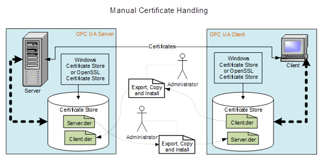  

Figure 11 - Manual Certificate handling  

An administrator would be required to copy the *Public Key* associated with all *Client* applications to all *Server* applications that they desire communication with. In addition, the administrator would be required to copy the *Public Key* associated with all *Server* applications to all *Client* applications that communicate with them. As the number of *Servers* and *Clients* grows, the administration effort can become too burdensome. In addition, a *Certificate* has a lifetime and will need to be replaced with an updated *Certificate* at some point in time. This will require that new *Private* *Keys* and *Public* *Keys* be generated and all of the *Public Keys* to be copied again. In very small installations, explicitly listing what *Clients* a *Server* trusts by installing the *Public Key* of the *Client* *ApplicationInstanceCertificate* in the Trusted *Certificate* store of the *Server* could be acceptable.  

### 9.3 CA Signed Certificate management  

In systems with multiple *Servers* and *Clients* the installation of *Public Keys* in *TrustLists* can very quickly become cumbersome. In these instances, the use of a company specific CA can greatly simplify the installation/configuration issues. The CA can also provide additional benefits such as management of *Certificate* expiration and *Certificate* *Revocation* *Lists* (CRL). [Figure 12](/§\_Ref260612514) provides an illustration of this activity.  

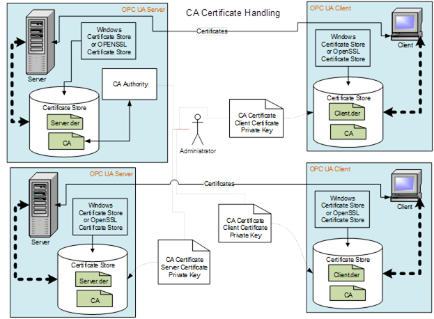  

Figure 12 - CA Certificate handling  

The administrator generates a CA signed *ApplicationInstanceCertificate* for all *Clients* and *Servers* that are installed in a system, but the administrator will only install the CA *Public Key* on all machines. When a *Certificate* is replaced, the administrator will only replace the *Certificate,* there will be no need to copy the new *Public Key* to any locations.  

The company specific CA allows the company to control the issuing of *Certificates* . The use of a commercial CA (such as VeriSign) would not be recommended in most cases. An *OPC UA Application* typically is configured to trust only the other applications determined by the Company as trusted. If all *Certificates* issued by a commercial CA were to be trusted then the commercial CA would be controlling which applications are to be trusted, not the company.  

*Certificate* management is addressed by all application developers. Some applications make use of *Certificate* management that is provided as part of a system wide infrastructure, others will generate self-signed *Certificates* as part of an installation. See [OPC 10000-12](/§UAPart12) for additional details on system wide infrastructures for *Certificate* management.  

### 9.4 GDS Certificate Management  

#### 9.4.1 Overview  

In some systems, a *GlobalDiscoveryServer* with Certificate Management could be deployed. The *GlobalDiscoverServer* will either push certificates to *Clients* and *Servers* or allow *Servers* and *Clients* to pull certificates. The *GlobalDiscoveryServer* certificate management can manage all certificate deployments; this includes *TrustLists* , CAs and CRLs.  

#### 9.4.2 Certificate management for developers  

From a developer point of view, it is a best practice for your *OPC UA* *Application* to automatically provide a self-signed *ApplicationInstanceCertificate* on installation. In addition, the OPC UA *Application* is able to easily replace the self-signed *ApplicationInstanceCertificate* with a CA issued *ApplicationInstanceCertificate* or have the self-signed certificate signed by a CA. The configuration of a *TrustList* should also be easily accomplished. Typically, *TrustLists* for *Public Keys* of *ApplicationInstances* are kept in a separate list than those of a CA. Also, an OPC UA *Application* has to be able to handle Certificate Revocation Lists (CRL). These are lists of *Public Keys* that are associated with a given CA that have been revoked. This allows a CA to remove a *Certificate* that it had signed from circulation. CRLs are provided by a CA and usually distributed in some automatic manner; see [OPC 10000-12](/§UAPart12) for additional details. [OPC 10000-12](/§UAPart12) also describes other *ObjectTypes* that can be used to expose this configuration and manage the all aspect of the security infrastructure.  

Developers should also keep in mind that depending on the *SecurityPolicies* that an OPC UA *Application* supports, the *Application* could require multiple *Certificates* and *TrustLists* . This is required if both ECC and RSA endpoints are exposed.  

From a security point of view, it is essential that the *Certificate* stores used to store *Private Keys* .are protected and secured only allowing read/write access by an appropriate administrator and /or by the OPC UA *Application* . *TrustLists* , CRLs, and trusted CA lists are secured allowing only write access by an appropriate administrator and in the case of pull configuration by the application. Read access can be granted to other valid users, but the list of users allowed read access would be a site decision.  

From an Installation point of view, it is a best practice that a standard tool to generate an *ApplicationInstanceCertificate* is provided. This tool could be one provided by an OPC UA SDK vendor or by the OPC Foundation. The standard tool ensures that the *ApplicationInstanceCertificates* that are generated include all of the required fields and settings. A particular *OPC UA* *Application* should be able to accept and install any valid *ApplicationInstanceCertificates* generated by external tools. The choice of the actual tool is site specific. [Figure 13](/§\_Ref169050749) provides an overview of some of the key points of Certificate handling.  

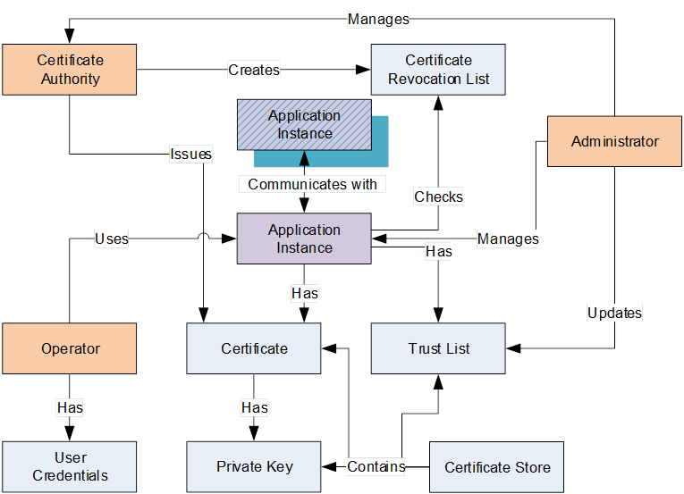 !Figure !13!\- Certificate handling  

The following is a summary of these key points when a CA based security system is deployed:  

* ApplicationInstance - An *OPC UA* *Application* installed on a single machine is called an *ApplicationInstance* . Each instance has its own *ApplicationInstanceCertificate* which it uses to identify itself when connecting to other *OPC UA* *Applications* (the *Public Key* and *Private Key* ). Each *ApplicationInstance* has a globally unique URI which identifies it. The *OPC UA* *Application* will also check *TrustLists* and CRL's to determine if access should be granted. The *OPC UA* *Application* will communicate using a *SecureChannel* established using *Asymmetric Cryptography* with other applications.  

* Administrator - The person or persons that administer the *Certificate* handling associated with a UA system and manage the security settings for *ApplicationInstances* . This includes setting the contents of *TrustLists* and managing any activities performed by a CA.  

* Operator **** *ApplicationInstance* . More than one Operator can exist for any given *OPC UA* *Application* . An Operator can have User Credentials which are used to determine access rights and to track activities within the *ApplicationInstance* .  

* User Credential - A User Credential is a generic term for an electronic ID which identifies an Operator/User. It can be passed to a *Server* after the *ApplicationInstanceCertificate* is used to create a *SecureChannel* . It can be used to determine access rights and to track activities (auditing).  

* Certificate Authority (CA) - A *Certificate Authority* (CA) is an administrator or organization which is responsible for creating and managing *Certificates* (it is usually a partially automated software product). The *Certificate Authority* verifies that *Claims* placed in the *ApplicationInstanceCertificate* is correct and adds a *Digital Signature* to the *Certificate* that is used to verify that the information has not been changed. Each CA has its own *Certificate* which is used to create the *Digital Signatures* . A CA is also responsible for maintaining CRLs. In most cases it is a software package that an administrator periodically reviews or accesses, usually when the software package generates an alarm or notification that some review action is required.  

* Certificate - A *Certificate* is an electronic ID that can be held by an *OPC UA* *Application* . The ID includes information ( *Claims* ) that identifies the holder, the issuer, and a unique key that is used to verify *Digital Signatures* created with the associated *Private Key* . The syntax of these *Certificates* conforms to the X.509 specification and as a result these *Certificates* are also called " *X.509 Certificates* ".  

* Self-Signed Certificate - A self-signed *Certificate* is a *Certificate* which has no *Certificate Authority* . These *Certificates* can be created by anyone and can be used in situations where the administrators of *OPC UA Applications* are able to verify the *Claims* by reviewing the contents themselves. A system that uses only self-signed *Certificates* would not have CA or CRL.  

* Private Key - A *Private Key* is a secret number known only to the holder of a *Certificate* . This secret allows the holder to create *Digital Signatures* and decrypt data. If this secret is revealed to unauthorized parties then the associated *Certificate* can no longer be trusted or used. It is replaced or in the case of a CA generated *Certificate* it is revoked.  

* TrustList - When security is enabled, *OPC UA Applications* reject connections from peers whose *Certificates* are not in the trusted list or if the *Certificate* is issued by a CA that is not in the *TrustList* .  

* Certificate Store - A Certificate Store is a place where *Certificates* and *Private Keys* can be stored on a file system. All Windows systems provide a registry-based store called the Windows Certificate Store. All UA systems can also support a directory containing the *Certificates* stored in a file which is also called an OpenSSL Certificate Store. In all cases the Certificate Store is secured, such that only administrators are allowed to write new entries. The security settings should follow the 'least privileged' principle, in that read or write access is only allowed to those who really need the data. This means that an administrator for example can store *Private Keys* but is not allowed to read them, and conversely an UA application can read such *Private Keys* but cannot write them.  

* Revocation List - A Revocation List is a list of *Certificates* which have been revoked by a CA and are not accepted by an *ApplicationInstance* .  

 ****   

## Annex A Mapping to ISA/IEC 62443-4-2 (informative)  

This Annex provides a mapping of [OPC Profiles - OPC UA Profiles and Facets](/§IEC62443) UA Profiles and Facets  

https://profiles.opcfoundation.org/  

ISA/IEC 62443-4-2 to OPC UA. The first 5 columns (yellow colour) in each table are from the [OPC Profiles - OPC UA Profiles and Facets](/§IEC62443) UA Profiles and Facets  

https://profiles.opcfoundation.org/  

ISA/IEC 62443-4-2 specification and are included here for clarity. Some topics in [OPC Profiles - OPC UA Profiles and Facets](/§IEC62443) UA Profiles and Facets  

https://profiles.opcfoundation.org/  

ISA/IEC 62443-4-2 do not apply to OPC UA and are marked as "N". [OPC Profiles - OPC UA Profiles and Facets](/§IEC62443) UA Profiles and Facets  

https://profiles.opcfoundation.org/  

ISA/IEC 62443-4-2 topics that do apply are marked as "Y".  ISA/IEC 62443-4-2 topics that are partially covered are marked as "P", For each topic that does apply the table lists the relevant OPC UA Parts and the *Profiles* / *ConformanceUnits* that covers the listed functionality. For each OPC UA Part that is listed (other than [OPC 10000-7](/§UAPart7) ) the text in the "Keyword text or comment" column is the text that should be searched for. The section that are found related to the keyword will describe the OPC UA related functionality. For the row labelled [OPC 10000-7](/§UAPart7)\- ConformanceUnits, the keyword column contains the actual *ConformanceUnits* that apply. For the row labelled [OPC 10000-7](/§UAPart7)\- Profiles, the keyword column contains the actual *Profiles/Facets* that apply. For more detail on the *ConformanceUnit* or *Profile* , please use the on-line Profile Application available at [OPC Profiles](/§Profiles) .  

The mapping only covers the core OPC UA specifications (Parts 1-26). Companion specification and other base OPC UA specifications may also apply to [OPC Profiles - OPC UA Profiles and Facets](/§IEC62443) UA Profiles and Facets  

https://profiles.opcfoundation.org/  

ISA/IEC 62443-4-2 and could result in a more complete mapping.  

Columns 2 through 4 in each of the tables could include a checkmark. The check marks when present indicate that the specific 62443 requirement applies to the listed security level (SL). This information is provided by the IEC 62443 specification and is reproduced here as a convenience.  

The tables are broken into seven separate tables:  

1. Identification and authentication control ( [Table A.1](/§\_Ref203040001) )  

1. Use control ( [Table A.2](/§\_Ref203040009) )  

1. System integrity ( [Table A.3](/§\_Ref203040024) )  

1. Data confidentiality ( [Table A.4](/§\_Ref203040031) )  

1. Restricted data flow ( [Table A.5](/§\_Ref203040036) )  

1. Timely response to events ( [Table A.6](/§\_Ref203040044) )  

1. Resource availability ( [Table A.7](/§\_Ref203040049) )  

ISA/IEC 62443 extends beyond just OPC UA and also requires all software be compliant. This mapping only describes how OPC UA applies, it does not describe what else would be required.  

  

  

Table A. 1 - ISA/IEC 62443 Mapping FR 1 Identification and authentication control  

||||||
|---|---|---|---|---|
|ISA/IEC 62443-4-2 CRs and Res|Related to|Applies to OPC UA|OPC UA Part \#|Keyword text or comment|
||SL1|SL2|SL3|SL4||||
|CR 1.1: Human user identification and authentication|√|√|√|√|Y|[OPC 10000-4](/§UAPart4)|IssuedIdentityToken|
|||||||[OPC 10000-6](/§UAPart6)|JSON Web Token (JWT), JWT UserTokenPolicy|
|||||||[OPC 10000-7](/§UAPart7)\-ConformanceUnits|Security User JWT IssuedToken 2, Security User JWT Token Policy, OPC UA Authority Profile, OAuth2 Authority Profile, Azure Identity Provider Authority Profile|
|||||||[OPC 10000-7](/§UAPart7)\- Profiles||
|CR 1.1 RE (1): Unique identification and Authentication||√|√|√|Y|[OPC 10000-4](/§UAPart4)|IssuedIdentityToken|
|||||||[OPC 10000-6](/§UAPart6)|JSON Web Token (JWT), JWT UserTokenPolicy|
|||||||[OPC 10000-7](/§UAPart7)\-ConformanceUnits|Security User JWT IssuedToken 2, Security User JWT Token Policy, OPC UA Authority Profile,|
|||||||[OPC 10000-7](/§UAPart7)\- Profiles|[User Token - JWT Server Facet](http://opcfoundation.org/UA-Profile/Security/UserToken/Server/JsonWebToken) , [User Token - JWT Client Facet](http://opcfoundation.org/UA-Profile/Security/UserToken/Client/JsonWebToken)|
|CR1.1 RE(2) Multifactor authentication for all interfaces|||√|√|P||OPC UA does not define any alternate schemes for two factor authentication, but if Issued tokens are used for user Authentication, the issued token provider can implement multifactor authentication. OPC UA authenticates the application as well as the user.|
|||||||[OPC 10000-4](/§UAPart4)|IssuedIdentityToken|
|||||||[OPC 10000-6](/§UAPart6)|JSON Web Token (JWT), JWT UserTokenPolicy|
|||||||[OPC 10000-7](/§UAPart7)\-ConformanceUnits|Security User JWT IssuedToken 2, Security User JWT Token Policy, OPC UA Authority Profile|
|||||||[OPC 10000-7](/§UAPart7)\- Profiles|[User Token - JWT Server Facet](http://opcfoundation.org/UA-Profile/Security/UserToken/Server/JsonWebToken) , [User Token - JWT Client Facet](http://opcfoundation.org/UA-Profile/Security/UserToken/Client/JsonWebToken)|
|CR 1.2: Software process and device identification and authentication||√|√|√|Y||ApplicationAuthentication, X.509 v3 Security Certificates|
|||||||[OPC 10000-4](/§UAPart4)|ApplicationInstance Security Certificate|
|||||||[OPC 10000-6](/§UAPart6)|EndpointDescription, EndpointUrl, Hostname (Device)|
|||||||[OPC 10000-7](/§UAPart7) ConformanceUnits|Security Default ApplicationInstance Certificate|
|||||||[OPC 10000-7](/§UAPart7)\- Profiles|[Global Certificate Management Server Facet](http://opcfoundation.org/UA-Profile/Server/GlobalCertificateManagement) [Global Certificate Management Client Facet](http://opcfoundation.org/UA-Profile/Client/GlobalCertificateManagement)|
|CR 1.2 RE (1) Unique identification and authentication|||√|√|Y||ApplicationAuthentication, X.509 v3 Security Certificates|
|||||||[OPC 10000-4](/§UAPart4)|ApplicationInstance Security Certificate|
|||||||[OPC 10000-6](/§UAPart6)|EndpointDescription, EndpointUrl, Hostname (Device)|
|||||||[OPC 10000-7](/§UAPart7)\-ConformanceUnits|Security Default ApplicationInstance Certificate, |
|||||||[OPC 10000-7](/§UAPart7)\- Profiles|[Global Certificate Management Server Facet](http://opcfoundation.org/UA-Profile/Server/GlobalCertificateManagement) [Global Certificate Management Client Facet](http://opcfoundation.org/UA-Profile/Client/GlobalCertificateManagement)|
|CR 1.3: Account management|√|√|√|√|P||OPC UA does not directly provide account management, but if an AuthorizationService is used for user Authentication, it could support account management.|
|||||||[OPC 10000-4](/§UAPart4)|IssuedIdentityToken|
|||||||[OPC 10000-6](/§UAPart6)|JSON Web Token (JWT), JWT UserTokenPolicy|
|||||||[OPC 10000-7](/§UAPart7)\-ConformanceUnits|Security User JWT IssuedToken 2, Security User JWT Token Policy, OPC UA Authority Profile|
|||||||[OPC 10000-7](/§UAPart7)\- Profiles|[User Token - JWT Server Facet](http://opcfoundation.org/UA-Profile/Security/UserToken/Server/JsonWebToken) , [User Token - JWT Client Facet](http://opcfoundation.org/UA-Profile/Security/UserToken/Client/JsonWebToken)|
|CR 1.4: Identifier management|√|√|√|√|Y|[OPC 10000-4](/§UAPart4)|UserIdentityToken, UserTokenPolicy|
|||||||[OPC 10000-7](/§UAPart7)\-ConformanceUnits|Security User JWT IssuedToken 2, Security User JWT Token Policy, OPC UA Authority Profile|
|||||||[OPC 10000-7](/§UAPart7)\- Profiles|[User Token - JWT Server Facet](http://opcfoundation.org/UA-Profile/Security/UserToken/Server/JsonWebToken) , [User Token - JWT Client Facet](http://opcfoundation.org/UA-Profile/Security/UserToken/Client/JsonWebToken)|
|CR 1.5: Authenticator management|√|√|√|√|Y|[OPC 10000-4](/§UAPart4)|UserIdentityToken, UserTokenPolicy|
|||||||[OPC 10000-7](/§UAPart7)\-ConformanceUnits|Security User JWT IssuedToken 2, Security User JWT Token Policy, OPC UA Authority Profile|
|||||||[OPC 10000-7](/§UAPart7)\- Profiles|[User Token - JWT Server Facet](http://opcfoundation.org/UA-Profile/Security/UserToken/Server/JsonWebToken) , [User Token - JWT Client Facet](http://opcfoundation.org/UA-Profile/Security/UserToken/Client/JsonWebToken)|
|CR 1. 5 RE (1) Hardware security for authenticators|||√|√|N||Secure elements are recommended in [9.1](/§\_Ref169216553) and also discussed in [OPC 10000-12](/§UAPart12) and [OPC 10000-21](/§UAPart21) , but not defined in OPC.|
|NDR 1.6 - Wireless access management|√|√|√|√|N||OPC UA does specify physical characteristics of a network including wireless.|
|NDR 1.6 RE (1) Unique identification and authentication||√|√|√|N||Same as above|
|CR 1.7: Strength of password based authentication|√|√|√|√|N||OPC UA provides the mechanism for exchanging passwords information, but it does not define the implementation of the password - this is vendor specific. If an AuthorizationService is used, it can provide password strength enforcement.|
|CR 1.7 RE (1) Password generation and lifetime restrictions for human users|||√|√|N||Same as CR 1.7 above.|
|CR 1.7 RE (2) Password lifetime restrictions for all users (human, software process, or device)||||√|N||Same as CR 1.7 above.|
|CR 1.8: Security certificates||√|√|√|Y||Security Certificates, TrustLists (CertificateStore), OPC UA Security Services|
|||||||[OPC 10000-4](/§UAPart4)|Obtaining, validating, and installing Security Certificate services|
|||||||[OPC 10000-6](/§UAPart6)|Security Certificates|
|||||||[OPC 10000-7](/§UAPart7)\-ConformanceUnits|Security Certificate Administration, Security Certificate Validation|
|||||||[OPC 10000-7](/§UAPart7)\- Profiles|[Global Security Certificate Management Server](http://opcfoundation.org/UA-Profile/Server/GlobalCertificateManagement) [Global Certificate Management Client Facet](http://opcfoundation.org/UA-Profile/Client/GlobalCertificateManagement)|
|||||||[OPC 10000-12](/§UAPart12)|Security Certificate Management Overview|
|CR 1.9: Strength of public key-based authentication||√|√|√|Y||Cryptographic Keys|
|||||||[OPC 10000-4](/§UAPart4)|Trusted Security Certificates|
|||||||[OPC 10000-7](/§UAPart7)\-ConformanceUnits|Basic256\_Limits,|
|||||||[OPC 10000-7](/§UAPart7)\- Profiles|[SecurityPolicy [A] - Aes128\_Sha256\_RsaOaep](http://opcfoundation.org/UA/SecurityPolicy) [SecurityPolicy [B] - Basic256Sha256](http://opcfoundation.org/UA/SecurityPolicy) [SecurityPolicy - Aes256-Sha256-RsaPss](http://opcfoundation.org/UA/SecurityPolicy)|
|CR 1.9 RE (1) Hardware security for public key-based authentication|||√|√|N||Secure elements are recommended in [9.1](/§\_Ref169216553) and also discussed in [OPC 10000-12](/§UAPart12) and [OPC 10000-21](/§UAPart21) , but not defined in OPC.|
|CR 1.10: Authenticator feedback|√|√|√|√|Y||ApplicationAuthentication, X.509 v3 Security Certificates|
|||||||[OPC 10000-4](/§UAPart4)|ApplicationInstance Security Certificate|
|||||||[OPC 10000-6](/§UAPart6)|EndpointDescription, EndpointUrl, Hostname (Device)|
|||||||[OPC 10000-7](/§UAPart7)\-ConformanceUnits|Security Default ApplicationInstance Certificate |
|||||||[OPC 10000-7](/§UAPart7)\- Profiles|[Global Certificate Management Server Facet](http://opcfoundation.org/UA-Profile/Server/GlobalCertificateManagement)|
|CR 1.11: Unsuccessful login attempts|√|√|√|√|N||OPC does not provide temporary lock out for repeated user access failure, but an *AuthenticationService* could. OPC does monitor *SecureChannel* connection and could block secure channel connection for repeated user login failure.|
|CR 1.12: System use notification|√|√|√|√|N||OPC does not define the how a client prompts for username/password.|
|NDR 1.13 - Access via untrusted networks|√|√|√|√|N||OPC does not define network hardware requirements. It can restrict communication to be between uniquely identified applications (see CR 1.2).|
|NDR 1.13 RE (1) Explicit access request approval|||√|√|N||Same as NDR 1.13 above|
|CR 1.14: Strength of symmetric key-based authentication||√|√|√|Y||Symmetric Encryption|
|||||||[OPC 10000-6](/§UAPart6)|SymmetricEncryptionAlgorithm|
|||||||[OPC 10000-7](/§UAPart7)\-ConformanceUnits||
|||||||[OPC 10000-7](/§UAPart7)\- Profiles|[Global Service KeyCredential Pull Facet](http://opcfoundation.org/UA-Profile/Server/GlobalServiceKeyCredentials) [Global Service KeyCredential Push Facet](https://profiles.opcfoundation.org/profile/1028) [KeyCredential Service Server Facet](http://opcfoundation.org/UA-Profile/Server/KeyCredentialManagement) [KeyCredential Service Client Facet](http://opcfoundation.org/UA-Profile/Client/KeyCredentialManagement)|
|||||||Part 14|SecuritKeyService (SKS), SymmetricEncryptionAlgorithm|
|CR 1.14 RE (1) Hardware security for symmetric key-based authentication|||√|√|N||The OPC UA specification does not provide hardware requirements and does not utilize long lived symmetric keys|
  

  

  

  

Table A. 2 - ISA/IEC 62443 mapping FR 2 Use control  

||||||
|---|---|---|---|---|
|ISA/IEC 62443-4-2 CRs and Res|Related to|Applies to OPC UA|OPC UA Part \#|Keyword text or comment|
||SL1|SL2|SL3|SL4||||
|CR 2.1: Authorization enforcement|√|√|√|√|Y||UserAuthorization|
|||||||[OPC 10000-4](/§UAPart4)|Authorization Services, IssuedIdentityToken|
|||||||[OPC 10000-6](/§UAPart6)|AuthorizationService, JSON Web Token (JWT)|
|||||||[OPC 10000-7](/§UAPart7)\-ConformanceUnits||
|||||||[OPC 10000-7](/§UAPart7)\- Profiles|[User Token - JWT Server Facet](http://opcfoundation.org/UA-Profile/Security/UserToken/Server/JsonWebToken) , [User Token - JWT Client Facet](http://opcfoundation.org/UA-Profile/Security/UserToken/Client/JsonWebToken)|
|RE (1): Authorization enforcement for all users (humans, software processes, and devices)||√|√|√|Y||UserAuthorization|
|||||||[OPC 10000-4](/§UAPart4)|Authorization Services, IssuedIdentityToken|
|||||||[OPC 10000-6](/§UAPart6)|AuthorizationService, JSON Web Token (JWT)|
|||||||[OPC 10000-7](/§UAPart7)\-ConformanceUnits||
|||||||[OPC 10000-7](/§UAPart7)\- Profiles|[User Token - JWT Server Facet](http://opcfoundation.org/UA-Profile/Security/UserToken/Server/JsonWebToken) , [User Token - JWT Client Facet](http://opcfoundation.org/UA-Profile/Security/UserToken/Client/JsonWebToken)|
|RE (2): Permission mapping to roles||√|√|√|Y||Roles, JWT, and User Roles|
|||||||[OPC 10000-18](/§UAPart18)|User Authorization, Role Type|
|||||||[OPC 10000-6](/§UAPart6)|RolePermissions|
|||||||[OPC 10000-7](/§UAPart7)\-ConformanceUnits||
|||||||[OPC 10000-7](/§UAPart7)\- Profiles|[User Role Management 2022 Server Facet](http://opcfoundation.org/UA-Profile/Server/UserRoleManagement2022) [User Role Management Client Facet](http://opcfoundation.org/UA-Profile/Client/UserRoleManagement)|
|CR 2.1 RE (3) Supervisor override|||√|√|P||OPC provides the ability to switch user context, but it does not provide an automatic timeout for a switch.|
|||||||[OPC 10000-4](/§UAPart4)|Authorization Services|
|CR 2.1 RE (4) Dual approval||||√|N||OPC does not define the logic for applications and thus does not define dual approval|
|CR 2.2: Wireless use control|√|√|√|√|N||OPC is hardware agnostic.|
|CR 2.3 - Use control for portable and mobile devices|NA|NA|NA|NA|N||No component level requirements defined in 62443|
|SAR 2.4: Mobile code|√|√|√|√|N||OPC does not define Mobile code technologies|
|SAR 2.4 RE (1): Mobile code authenticity check||√|√|√|N||OPC does not define Mobile code technologies|
|EDR 2.4: Mobile code|√|√|√|√|N||OPC does not define Mobile code technologies|
|EDR 2RE (1): Mobile code authenticity check||√|√|√|N||OPC does not define Mobile code technologies|
|HDR 2.4: Mobile code|√|√|√|√|N||OPC does not define Mobile code technologies|
|HDR 2.4RE (1): Mobile code authenticity check||√|√|√|N||OPC does not define Mobile code technologies|
|NDR 2.4 - Mobile code|√|√|√|√|N||OPC does not define Mobile code technologies|
|NDR 2.4 - Mobile code||√|√|√|N||OPC does not define Mobile code technologies|
|CR 2.5: Session lock|√|√|√|√|N||OPC UA does not define human user interface|
|CR 2.6: Remote session termination||√|√|√|P||OPC allows identification of remote session via ApplicationAuthentication, remote restrictions are application specific, but the infrastructure is provided.|
|||||||[OPC 10000-4](/§UAPart4)|IssuedIdentityToken|
|||||||[OPC 10000-6](/§UAPart6)|JSON Web Token (JWT), JWT UserTokenPolicy|
|||||||[OPC 10000-7](/§UAPart7)\-ConformanceUnits|Security User JWT IssuedToken 2, Security User JWT Token Policy, OPC UA Authority Profile|
|||||||[OPC 10000-7](/§UAPart7)\- Profiles||
|CR 2.7 - Concurrent session control|||√|√|N||OPC provides limits on sessions, subscription and other functionality and defines behaviour if these limits are exceeded, but it does not provide limits per user.|
|CR 2.8: Auditable events|√|√|√|√|Y||Auditability, Auditing, Audit Event Management|
|||||||[OPC 10000-4](/§UAPart4)|Auditing|
|||||||[OPC 10000-5](/§UAPart5)|AuditSecurityEventType|
|||||||[OPC 10000-7](/§UAPart7)\-ConformanceUnits| |
|||||||[OPC 10000-7](/§UAPart7)\- Profiles|[Auditing 2022 Server Facet](http://opcfoundation.org/UA-Profile/Server/Auditing2022) [Auditing Client Facet](http://opcfoundation.org/UA-Profile/Client/Auditing) , [Best Practice - Audit Events](http://opcfoundation.org/UA-Profile/Security/BestPracticeAuditEvents)|
|CR 2.9: Audit storage capacity|√|√|√|√|N||OPC does not define Audit storage.|
|CR 2.9 RE (1) Warn when audit record storage capacity threshold reached.|||√|√|N||OPC does not define Audit storage.|
|CR 2.10: Response to audit processing failures|√|√|√|√|N||OPC does not provide Audit storage|
|CR 2.11: Timestamps|√|√|√|√|Y||Message replay, Timestamps, SecureChannelId|
|||||||[OPC 10000-4](/§UAPart4)|TimestampsToReturn|
|||||||[OPC 10000-5](/§UAPart5)|AuditEventType|
|||||||[OPC 10000-7](/§UAPart7)\-ConformanceUnits||
|||||||[OPC 10000-7](/§UAPart7)\- Profiles|[Auditing 2022 Server Facet](http://opcfoundation.org/UA-Profile/Server/Auditing2022)|
|CR 2.11 RE (1): Time synchronization||√|√|√|Y||Cryptographic Keys (time validity of security profile)|
|||||||[OPC 10000-4](/§UAPart4)|SourceTimestamp, VersionTime, Redundant Server Set Requirements|
|||||||[OPC 10000-6](/§UAPart6)|Time Synchronization|
|||||||[OPC 10000-7](/§UAPart7)\-ConformanceUnits||
|||||||[OPC 10000-7](/§UAPart7)\- Profiles|[Security Time Synchronization](http://opcfoundation.org/UA-Profile/Security/TimeSync)|
|CR 2.11 RE (2) Protection of time source integrity||||√|N||OPC does not define a unique time synchronization scheme, but utilize other industry standard.|
|CR 2.12: Non-repudiation|√|√|√|√|P||The connection is secured against repudiation, with the exception that we use a symmetric key for the communication. Thus every message must have been signed by either the Client or the Server, but it is not possible to determine which partner signed it.|
||||||||Message alteration, Server Profiling, System Hijacking, Repudiation, Audit Event Management|
|||||||[OPC 10000-4](/§UAPart4)|Signing, GetEndpoints, SecureChannel, Auditing, Proof of Possession,|
|||||||[OPC 10000-7](/§UAPart7)\-ConformanceUnits||
|||||||[OPC 10000-7](/§UAPart7)\- Profiles|[User Token - JWT Server Facet](http://opcfoundation.org/UA-Profile/Security/UserToken/Server/JsonWebToken) , [User Token - JWT Client Facet](http://opcfoundation.org/UA-Profile/Security/UserToken/Client/JsonWebToken) [Auditing 2022 Server Facet](http://opcfoundation.org/UA-Profile/Server/Auditing2022) [Auditing Client Facet](http://opcfoundation.org/UA-Profile/Client/Auditing) [Best Practice - Audit Events](http://opcfoundation.org/UA-Profile/Security/BestPracticeAuditEvents)|
|CR 2.12 RE (1) Non-repudiation for all users||||√|P||The connection is secured against repudiation, with the exception that we use a symmetric key for the communication. Thus every message must have been signed by either the Client or the Server, but it is not possible to determine which partner signed it.|
||||||||Message alteration, Server Profiling, System Hijacking, Repudiation, Audit Event Management|
|||||||[OPC 10000-4](/§UAPart4)|Signing, GetEndpoints, SecureChannel, Auditing, Proof of Possession|
|||||||[OPC 10000-7](/§UAPart7)\-ConformanceUnits||
|||||||[OPC 10000-7](/§UAPart7)\- Profiles|[User Token - JWT Server Facet](http://opcfoundation.org/UA-Profile/Security/UserToken/Server/JsonWebToken) , [User Token - JWT Client Facet](http://opcfoundation.org/UA-Profile/Security/UserToken/Client/JsonWebToken) [Auditing 2022 Server Facet](http://opcfoundation.org/UA-Profile/Server/Auditing2022) [Auditing Client Facet](http://opcfoundation.org/UA-Profile/Client/Auditing) [Best Practice - Audit Events](http://opcfoundation.org/UA-Profile/Security/BestPracticeAuditEvents)|
|EDR 2.13: Use of physical diagnostic and test interfaces||√|√|√|N||OPC is hardware agnostic.|
|EDR 2.13 RE (1) Active monitoring|||√|√|N||OPC is hardware agnostic|
|HDR 2.13: Use of physical diagnostic and test interfaces||√|√|√|N||OPC is hardware agnostic|
|HDR 2.13 RE (1) Active monitoring|||√|√|N||OPC is hardware agnostic|
|NDR 2.13: Use of physical diagnostic and test interfaces||√|√|√|N||OPC is hardware agnostic|
|NDR 2.13 RE (1) Active monitoring|||√|√|N||OPC is hardware agnostic|
  

  

  

Table A. 3 - ISA/IEC 62443 Mapping FR 3 System integrity  

||||||
|---|---|---|---|---|
|ISA/IEC 62443-4-2 CRs and Res|Related to|Applies to OPC UA|OPC UA Part \#|Keyword text or comment|
||SL1|SL2|SL3|SL4||||
|CR 3.1: Communication integrity|√|√|√|√|Y||*SecureChannel*\- OpenSecureChannel|
|||||||[OPC 10000-4](/§UAPart4)|*SecureChannel* Service Set|
|||||||[OPC 10000-6](/§UAPart6)|*SecureChannel* , SecurityProtocol|
|||||||[OPC 10000-7](/§UAPart7)\-ConformanceUnits|Security Policy Required, |
|||||||[OPC 10000-7](/§UAPart7)\- Profiles|[SecurityPolicy [A] - Aes128\_Sha256\_RsaOaep](http://opcfoundation.org/UA/SecurityPolicy) [SecurityPolicy [B] - Basic256Sha256](http://opcfoundation.org/UA/SecurityPolicy) [SecurityPolicy - Aes256-Sha256-RsaPss](http://opcfoundation.org/UA/SecurityPolicy) [SecurityPolicy [A] - PubSub-Aes128-CTR](http://opcfoundation.org/UA/SecurityPolicy) [SecurityPolicy - PubSub-Aes256-CTR](http://opcfoundation.org/UA/SecurityPolicy)|
|CR 3.1 RE (1): Communication authentication||√|√|√|Y||*SecureChannel*\- OpenSecureChannel|
|||||||[OPC 10000-4](/§UAPart4)|*SecureChannel* Service Set|
|||||||[OPC 10000-6](/§UAPart6)|*SecureChannel*|
|||||||[OPC 10000-7](/§UAPart7)\-ConformanceUnits|Security Policy Required |
|||||||[OPC 10000-7](/§UAPart7)\- Profiles|[SecurityPolicy [A] - Aes128\_Sha256\_RsaOaep](http://opcfoundation.org/UA/SecurityPolicy) [SecurityPolicy [B] - Basic256Sha256](http://opcfoundation.org/UA/SecurityPolicy) [SecurityPolicy - Aes256-Sha256-RsaPss](http://opcfoundation.org/UA/SecurityPolicy)|
|SAR 3.2: Protection from malicious code|√|√|√|√|N||OPC does not define requirement related to malicious code protection (for example. virus checkers)|
|EDR 3.2: Protection from malicious code|√|√|√|√|N||OPC does not define requirement related to installation or execution of software|
|HDR 3.2: Protection from malicious code|√|√|√|√|N||OPC does not define requirement related to malicious code protection (for example. virus checkers)|
|HDR 3.2 RE (1): Report version of code protection||√|√|√|N||OPC does not define requirement related to malicious code protection (for example. virus checkers)|
|NDR 3.2 - Protection from malicious code|√|√|√|√|N||OPC does not define requirement related to malicious code protection (for example. virus checkers)|
|CR 3.3: Security functionality verification|√|√|√|√|Y||Identity Provider, SecurityKeyService, *SecureChannel* , TLS|
|||||||[OPC 10000-4](/§UAPart4)|OpenSecureChannel, CreateSession, Write|
|||||||[OPC 10000-6](/§UAPart6)|OPC UA Secure Conversation (UASC), Verifying Message Security, Token Policy, Bad\_SecureChannel|
|||||||[OPC 10000-7](/§UAPart7)\-ConformanceUnits||
|||||||[OPC 10000-7](/§UAPart7)\- Profiles|[User Token - JWT Server Facet](http://opcfoundation.org/UA-Profile/Security/UserToken/Server/JsonWebToken) , [User Token - JWT Client Facet](http://opcfoundation.org/UA-Profile/Security/UserToken/Client/JsonWebToken) [SecurityPolicy [A] - Aes128\_Sha256\_RsaOaep](http://opcfoundation.org/UA/SecurityPolicy) [SecurityPolicy [B] - Basic256Sha256](http://opcfoundation.org/UA/SecurityPolicy) [SecurityPolicy - Aes256-Sha256-RsaPss](http://opcfoundation.org/UA/SecurityPolicy)|
|CR 3.3 RE (1) Security functionality verification during normal operation||||√|N||OPC does not define security function verification|
|CR 3.4: Software and information integrity|√|√|√|√|P|||
||||||||ApplicationInstance Security Certificate|
|||||||[OPC 10000-4](/§UAPart4)|SoftwareCertificates|
|||||||[OPC 10000-6](/§UAPart6)|ApplicationInstance Security Certificate, X.509 v3|
|||||||[OPC 10000-7](/§UAPart7)\-ConformanceUnits|Security ApplicationInstance Security Certificate, Security Certificate Validation|
|||||||[OPC 10000-7](/§UAPart7)\- Profiles|[Global Security Certificate Management Server](http://opcfoundation.org/UA-Profile/Server/GlobalCertificateManagement) [Global Certificate Management Client Facet](http://opcfoundation.org/UA-Profile/Client/GlobalCertificateManagement)|
|CR 3.4 RE (1): Authenticity of software and information||√|√|√|P|||
||||||||ApplicationInstance Security Certificate|
|||||||[OPC 10000-4](/§UAPart4)|SoftwareCertificates|
|||||||[OPC 10000-6](/§UAPart6)|ApplicationInstance Security Certificate, X.509 v3|
|||||||[OPC 10000-7](/§UAPart7)\-ConformanceUnits|Security ApplicationInstance Security Certificate Security Certificate Validation|
|||||||[OPC 10000-7](/§UAPart7)\- Profiles|[Global Security Certificate Management Server](http://opcfoundation.org/UA-Profile/Server/GlobalCertificateManagement) [Global Certificate Management Client Facet](http://opcfoundation.org/UA-Profile/Client/GlobalCertificateManagement)|
|CR 3.4 RE (2) Automated notification of integrity violations|||√|√|P|||
||||||||ApplicationInstance Security Certificate|
|||||||[OPC 10000-4](/§UAPart4)|SoftwareCertificates|
|||||||[OPC 10000-6](/§UAPart6)|ApplicationInstance Security Certificate, X.509 v3|
|||||||[OPC 10000-7](/§UAPart7)\-ConformanceUnits|Security ApplicationInstance Security Certificate, Security Certificate Validation|
|||||||[OPC 10000-7](/§UAPart7)\- Profiles|[Global Security Certificate Management Server](http://opcfoundation.org/UA-Profile/Server/GlobalCertificateManagement) [Global Certificate Management Client Facet](http://opcfoundation.org/UA-Profile/Client/GlobalCertificateManagement)|
|CR 3.5: Input validation|√|√|√|√|N||OPC does not define HMI requirements, but does ensure that input data (method parameter or for write) is of the correct datatype|
|CR 3.6: Deterministic output|√|√|√|√|N||OPC does not define application behaviour, but does define information models that include substituted values and other behaviours for failed states.|
|CR 3.7: Error handling|√|√|√|√|Y|[OPC 10000-4](/§UAPart4)|Request/Response Service|
|||||||[OPC 10000-5](/§UAPart5)|SessionDiagnosticsObjectType|
|||||||[OPC 10000-6](/§UAPart6)|MessageChunks, Error Handling, Error Message, CloseSecureChannel|
|||||||[OPC 10000-7](/§UAPart7)\-ConformanceUnits|Security Policy Required, |
|||||||[OPC 10000-7](/§UAPart7)\- Profiles|[SecurityPolicy [A] - Aes128\_Sha256\_RsaOaep](http://opcfoundation.org/UA/SecurityPolicy) [SecurityPolicy [B] - Basic256Sha256](http://opcfoundation.org/UA/SecurityPolicy) [SecurityPolicy - Aes256-Sha256-RsaPss](http://opcfoundation.org/UA/SecurityPolicy)|
|CR 3.8: Session integrity||√|√|√|Y||*SecureChannel* , Session ID|
|||||||[OPC 10000-4](/§UAPart4)|Session Service Set, Creating a Session, Auditing Session Service, SessionAuthenticationToken|
|||||||[OPC 10000-7](/§UAPart7)\-ConformanceUnits|Session Base Discovery Get Endpoints|
|||||||[OPC 10000-7](/§UAPart7)\- Profiles|[Standard UA Client 2022 Profile](http://opcfoundation.org/UA-Profile/Client/Standard2022) , [Base Server Behaviour Facet](http://opcfoundation.org/UA-Profile/Server/Behaviour)|
|CR 3.9: Protection of audit information||√|√|√|P||OPC provides security related to Audit event generation, but does not define Audit Logging requirements or tools for analysing audit records|
||||||||*SecureChannel* , Session ID|
|||||||[OPC 10000-4](/§UAPart4)|Session Service Set, Creating a Session, Auditing Session Service, SessionAuthenticationToken|
|||||||[OPC 10000-7](/§UAPart7)\-ConformanceUnits|Session Base Discovery Get Endpoints|
|||||||[OPC 10000-7](/§UAPart7)\- Profiles|[Standard UA Client 2022 Profile](http://opcfoundation.org/UA-Profile/Client/Standard2022) , [Base Server Behaviour Facet](http://opcfoundation.org/UA-Profile/Server/Behaviour)|
|CR 3.9 RE (1) Audit records on write-once media||||√|N||OPC does not define hardware requirements|
|EDR 3.10: Support for updates|√|√|√|√|N||Some companion specification can define additional functionality that would apply, such as [OPC 10000-100](/§UAPart100)|
|EDR 3.10: RE (1): Update authenticity and integrity||√|√|√|N|||
|HDR 3.10: Support for updates|√|√|√|√|N|||
|HDR 3.10 RE (1): Update authenticity and integrity||√|√|√|N|||
|NDR 3.10 - Support for updates|√|√|√|√|N|||
|NDR 3.10 RE (1) Update authenticity and integrity||√|√|√|N|||
|EDR 3.11: Physical tamper resistance and detection||√|√|√|N|||
|EDR 3.11 RE (1) Notification of a tampering attempt|||√|√|N|||
|HDR 3.11: Physical tamper resistance and detection||√|√|√|N|||
|HDR 3.11 RE (1) Notification of a tampering attempt|||√|√|N|||
|NDR 3.11 - Physical tamper resistance and detection||√|√|√|N|||
|NDR 3.11 RE (1) Notification of a tampering attempt|||√|√|N|||
|EDR 3.12: Provisioning product supplier roots of trust||√|√|√|N|||
|HDR 3.12: Provisioning product supplier roots of trust||√|√|√|N|||
|NDR 3.12 - Provisioning product supplier roots of trust||√|√|√|N|||
|EDR 3.13: Provisioning asset owner roots of trust||√|√|√|N|||
|HDR 3.13: Provisioning asset owner roots of trust||√|√|√|N|||
|NDR 3.13 - Provisioning asset owner roots of trust||√|√|√|N|||
|EDR 3.14: Integrity of the boot process|√|√|√|√|N|||
|EDR 3.14 RE (1): Authenticity of the boot process||√|√|√|N|||
|HDR 3.14: Integrity of the boot process|√|√|√|√|N|||
|HDR 3.4 RE (1): Authenticity of the boot process||√|√|√|N|||
|NDR 3.14 - Integrity of the boot process|√|√|√|√|N|||
|NDR 3.14 RE (1) Authenticity of the boot process||√|√|√|N|||
  

  

  

Table A. 4 - ISA/IEC 62443 Mapping FR 4 Data confidentiality  

||||||
|---|---|---|---|---|
|ISA/IEC 62443-4-2 CRs and Res|Related to|Applies to OPC UA|OPC UA Part \#|Keyword text or comment|
||SL1|SL2|SL3|SL4||||
|CR 4.1: Information confidentiality|√|√|√|√|Y||Confidentiality, Eavesdropping, Client/Server, PubSub, Confidentiality|
|||||||[OPC 10000-4](/§UAPart4)|SecureChannel Service Set|
|||||||[OPC 10000-6](/§UAPart6)|OPC UA HTTPS, WebSockets (Security)|
|||||||[OPC 10000-7](/§UAPart7)\-ConformanceUnits|Security Policy Required|
|||||||[OPC 10000-7](/§UAPart7)\- Profiles|[SecurityPolicy [A] - Aes128\_Sha256\_RsaOaep](http://opcfoundation.org/UA/SecurityPolicy) [SecurityPolicy [B] - Basic256Sha256](http://opcfoundation.org/UA/SecurityPolicy) [SecurityPolicy - Aes256-Sha256-RsaPss](http://opcfoundation.org/UA/SecurityPolicy)|
|CR 4.2: Information persistence||√|√|√|N||OPC does not describe hardware|
|CR 4.2 RE (1) Erase of shared memory resources|||√|√|N||OPC does not describe hardware|
|CR 4.2 RE (2) Erase verification|||√|√|N||OPC does not describe hardware|
|CR 4.3: Use of cryptography|√|√|√|√|Y||Asymmetric Cryptography, Cryptography, Symmetric Cryptography, SecurityPolicies, Random Number Generation, Security Certificate Management|
|||||||[OPC 10000-4](/§UAPart4)|GetEndpoints, OpenSecureChannel|
|||||||[OPC 10000-6](/§UAPart6)|Security Handshake, Security Certificates, AccessTokens, Security Header, Deriving Keys (Table 49)|
|||||||[OPC 10000-7](/§UAPart7)\-ConformanceUnits||
|||||||[OPC 10000-7](/§UAPart7)\- Profiles|Best Practice - Random Numbers AccessToken Request Client Facet, Security User Access Control Base Profile, Global Discovery and Security Certificate Management 2017 Server, Global Security Certificate Management Client 2017 Profile|
|||||||[OPC 10000-12](/§UAPart12)|Certificate Management Overview, KeyCredential Management|
  

  

Table A. 5 - ISA/IEC 62443 Mapping FR 5 Restricted data flow  

||||||
|---|---|---|---|---|
|ISA/IEC 62443-4-2 CRs and Res|Related to|Applies to OPC UA|OPC UA Part \#|Keyword text or comment|
||SL1|SL2|SL3|SL4||||
|CR 5.1: Network segmentation|√|√|√|√|P||OPC describe network segmentation in part 2, but does not require it or provide any additional support for it.|
||||||||Network Segmentation, OpenSecureChannel|
|||||||[OPC 10000-7](/§UAPart7) ConformanceUnits||
|||||||[OPC 10000-7](/§UAPart7)\- Profiles|[Standard UA Client 2022 Profile](http://opcfoundation.org/UA-Profile/Client/Standard2022) , [Base Server Behaviour Facet](http://opcfoundation.org/UA-Profile/Server/Behaviour)|
|NDR 5.2 - Zone boundary protection|√|√|√|√|N||OPC does not define network hardware.|
|NDR 5.2 RE (1) Deny all, permit by exception||√|√|√|N||OPC does not define network hardware.|
|NDR 5.2 RE (2) Island mode|||√|√|N||OPC does not define network hardware.|
|NDR 5.2 RE (3) Fail close|||√|√|N||OPC does not define network hardware.|
|NDR 5.3 - General purpose, person-to-person communication restrictions|√|√|√|√|N||OPC does not define network hardware.|
|CR 5.4 - Application partitioning|NA|NA|NA|NA|NA||Nothing defined in IEC 62443|
  

  

Table A. 6 - ISA/IEC 62443 Mapping FR 6 Timely response to events  

||||||
|---|---|---|---|---|
|ISA/IEC 62443-4-2 CRs and Res|Related to|Applies to OPC UA|OPC UA Part \#|Keyword text or comment|
||SL1|SL2|SL3|SL4||||
|CR 6.1: Audit log accessibility|√|√|√|√|N||OPC does not define an Audit log. OPC defines standard Audit records and also defined historical storage of events. It provides access restriction for all data.|
|CR 6.1 RE (1) Programmatic access to audit logs|||√|√|N||OPC does not define an Audit log. OPC defines standard Audit records and also defined historical storage of events. It provides access restriction for all data, standard methods for programmatical access are defined.|
|CR 6.2: Continuous monitoring||√|√|√|Y|[OPC 10000-7](/§UAPart7)\-ConformanceUnits|Monitor Items, GetMonitoredItems Method, SetMonitoringMode.|
|||||||[OPC 10000-7](/§UAPart7)\- Profiles|Subscription Server Facet, [Standard UA Client 2022 Profile](http://opcfoundation.org/UA-Profile/Client/Standard2022) , Standard DataChange Subscription 2017 Server Facet|
  

  

Table A. 7 - ISA/IEC 62443 Mapping FR 7 Resource availability  

||||||
|---|---|---|---|---|
|ISA/IEC 62443-4-2 CRs and Res|Related to|Applies to OPC UA|OPC UA Part \#|Keyword text or comment|
||SL1|SL2|SL3|SL4||||
|CR 7.1: Denial of service protection|√|√|√|√|Y||Application Crashes, Fuzz Testing, Certification|
|||||||[OPC 10000-4](/§UAPart4)|CreateSession, OpenSecureChannel, AuthenticationToken|
|||||||[OPC 10000-7](/§UAPart7)\-ConformanceUnits|Session Base Discovery Get Endpoints|
|||||||[OPC 10000-7](/§UAPart7)\- Profiles|[Standard UA Client 2022 Profile](http://opcfoundation.org/UA-Profile/Client/Standard2022) , [Base Server Behaviour Facet](http://opcfoundation.org/UA-Profile/Server/Behaviour)|
|CR 7.1 RE (1): Manage communication load from component||√|√|√|Y||Message flooding, GetEndpoints, OpenSecureChannel|
|||||||[OPC 10000-4](/§UAPart4)|CreateSession, OpenSecureChannel, AuthenticationToken|
|||||||[OPC 10000-7](/§UAPart7)\-ConformanceUnits|Session Base Discovery Get Endpoints|
|||||||[OPC 10000-7](/§UAPart7)\- Profiles|[Standard UA Client 2022 Profile](http://opcfoundation.org/UA-Profile/Client/Standard2022) , [Base Server Behaviour Facet](http://opcfoundation.org/UA-Profile/Server/Behaviour)|
|CR 7.2: Resource management|√|√|√|√|Y||Resource exhaustion, ClientAuthentication, ServerAuditing, OpenSecureChannel|
|||||||[OPC 10000-4](/§UAPart4)|CreateSession, OpenSecureChannel, AuthenticationToken|
|||||||[OPC 10000-7](/§UAPart7)\-ConformanceUnits|Session Base Discovery Get Endpoints|
|||||||[OPC 10000-7](/§UAPart7)\- Profiles|[Standard UA Client 2022 Profile](http://opcfoundation.org/UA-Profile/Client/Standard2022) , [Base Server Behaviour Facet](http://opcfoundation.org/UA-Profile/Server/Behaviour)|
|CR 7.3: Control system backup|√|√|√|√|N||OPC does not define system level backup requirements.|
|CR 7.3 RE (1): Backup integrity verification||√|√|√|N||OPC does not define verification of backup requirements.|
|CR 7.4: Control system recovery and reconstitution|||||N||OPC UA does not define backup and restore requirements (to a specific state).|
|CR 7.5 - Emergency Power|NA|NA|NA|NA|NA||(no requirements for this)|
|CR 7.6: Network and security configuration settings|√|√|√|√|P||OPC UA requires that application can be configured for network and security setting, but it does not define how this is accomplished.|
||||||||ClientAuthentication, OpenSecureChannel|
|||||||[OPC 10000-4](/§UAPart4)|CreateSession, OpenSecureChannel, Discovery|
|||||||[OPC 10000-7](/§UAPart7)\-ConformanceUnits|Session Base Discovery Get Endpoints|
|||||||[OPC 10000-7](/§UAPart7)\- Profiles|[Standard UA Client 2022 Profile](http://opcfoundation.org/UA-Profile/Client/Standard2022)|
|CR 7.6 RE (1) Machine-readable reporting of current security settings|||√|√|P||This is not defined in an OPA UA specification, but OPC UA does define a machine readable XML format that an application could use to export the security setting.|
||||||||ClientAuthentication, OpenSecureChannel|
|||||||[OPC 10000-4](/§UAPart4)|CreateSession, OpenSecureChannel, Discovery|
|||||||[OPC 10000-7](/§UAPart7)\-ConformanceUnits|Session Base Discovery Get Endpoints|
|||||||[OPC 10000-7](/§UAPart7)\- Profiles|[Standard UA Client 2022 Profile](http://opcfoundation.org/UA-Profile/Client/Standard2022)|
|CR 7.7: Least functionality|√|√|√|√|N||The OPC UA specification does describe that least functionality is recommended with regard to OPC UA access, but this requirement applies to all service/ports protocols, etc. which is beyond the scope of OPC UA Specifications.|
|CR 7.8: Control system component inventory||√|√|√|N||This scope is beyond what is defined in core OPC UA specifications. Some companion specification can define additional details about the overall environment in which OPC UA is executing, which could be able to cover this requirement.|
  

## Annex B ECC vs RSA  

### B.1 Overview  

OPC UA supports both RSA and ECC for security. This annex provides a brief overview of each and also describes some benefits and limitations of each. Both RSA and ECC utilize the mathematical concept of one-way functions.  

### B.2 RSA  

RSA provides security using the mathematical concept that it is much more difficult to factor a number than to multiply two large numbers together. RSA uses two keys - a public key and a private key. RSA can be used for digital signatures and for encryption of data. The digital signature is generated using the private key and the public key can be used to validate that it was generated using the private key. For encryption, the data is encrypted using the public key and it can only be decrypted using the private key. There are a number of different algorithms that provide for signatures and encryption using these concepts.  

Asymmetric encryption (using the two keys) can be very computationally intensive, can result in large keys and is rather slow, but it is well understood and publicly available. Typically, it is only used to exchange a *SymmetricKey* which is then used for all communication (signing and encryption).  

### B.3 ECC  

ECC is based on the algebraic structure of elliptical curves or finite fields (see [Figure B.1](/§\_Ref179202513) for illustration). It depends on being able to compute a point (multiplication) and the difficulty in computing the multiplicand given the original point and the resulting product. The size of the elliptical curve determines how difficult the problem is. For ECC the parameters that define the curve must be known by all. There are a number of well-known curves that can be used.  

  

Figure B. 1 - Elliptical Curve Example  

Compared to RSA, ECC requires smaller integers and thus much less computational power and has a smaller key to transmit. ECC is only used for signing not encryption, but it does allow for the generation of a shared secret over an un-secured channel (ECDH). Once the shared secrete is generated then Symmetric encryption can be used. ECC is not as well-known as RSA and there are many different curves, some of which are restricted by patents. The patents can apply to the algorithm that are used and / or the technique used. For interoperability it is important that a selected curve is supported by multiple libraries/platforms.  

  

 **Bibliography**   

O-PAS™ Standard, Version 2.1, Copyright © 2021 The Open Group  

\_\_\_\_\_\_\_\_\_\_\_  

