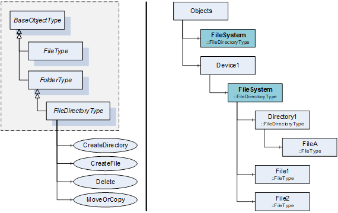
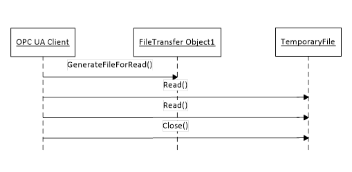
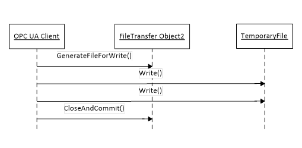
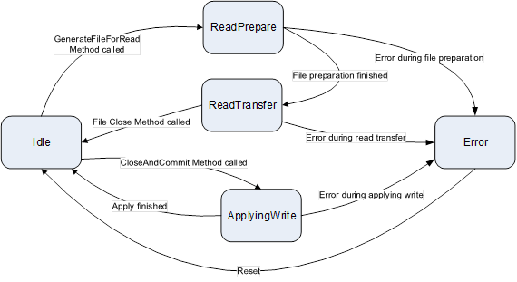
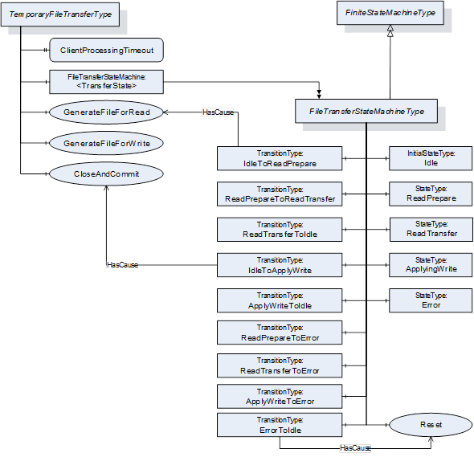

## 1 Scope  

This part of the OPC Unified Architecture defines an Information Model. The Information Model describes the basic infrastructure to model file transfers.  

## 2 Normative references  

The following documents, in whole or in part, are normatively referenced in this document and are indispensable for its application. For dated references, only the edition cited applies. For undated references, the latest edition of the referenced document (including any amendments and errata) applies.  

OPC 10000-1, *OPC Unified Architecture - Part 1: Concepts*  

[http://www.opcfoundation.org/UA/Part1/](http://www.opcfoundation.org/UA/Part1/)  

OPC 10000-3, *OPC Unified Architecture - Part 3: Address Space Model*  

[http://www.opcfoundation.org/UA/Part3/](http://www.opcfoundation.org/UA/Part3/)  

OPC 10000-4, *OPC Unified Architecture - Part 4: Services*  

[http://www.opcfoundation.org/UA/Part4/](http://www.opcfoundation.org/UA/Part4/)  

OPC 10000-5, *OPC Unified Architecture - Part 5: Information Model*  

[http://www.opcfoundation.org/UA/Part5/](http://www.opcfoundation.org/UA/Part5/)  

## 3 Terms, definitions, abbreviated terms and conventions  

### 3.1 Terms and definitions  

For the purposes of this document, the terms and definitions given in [OPC 10000-1](/§UAPart1) , [OPC 10000-3](/§UAPart3) and [OPC 10000-5](/§UAPart5) apply.  

## 4 File Transfer Model  

### 4.1 Overview  

This document describes an information model for file transfer. Files could be modelled in OPC UA as simple Variables using ByteStrings. However, the overall message size in OPC UA is limited due to resources and security issues (denial of service attacks). Only accessing parts of the array can lead to concurrency issues if one client is reading the array while others are manipulating it. Therefore, the *ObjectType FileType* is defined representing a file with *Methods* to access the file. The life-cycle of a file stored on a hard disk and an instance of the *FileType* representing the file in an OPC UA *AddressSpace* can be independent.  

In addition to representing individual files this document also defines a way to represent a whole file system or a part of a file system. This can be done using the *FileDirectoryType* in combination with the *FileType* . The *FileDirectoryType* provides *Methods* to create, delete, and move files and directories. The root of a file system or part of a file system is represented by an instance of the *FileDirectoryType* with the *BrowseName* *FileSystem* . All directories below the root directory are represented by instances of the *FileDirectoryType* or a subtype. All files below the root directory are represented by instances of the *FileType* or a subtype.  

In different situations like transfer of configuration files or firmware update, the files are temporary, and an additional handshake is necessary to create the file for reading or to apply the file after writing it to the server. This use case is covered by the *TemporaryFileTransferType* defined in this document.  

### 4.2 FileType  

#### 4.2.1 General  

This *ObjectType* defines a type for files. It is formally defined in [Table 1](/§\_Ref17727931) .  

 **Table 1\- FileType**   

| **Attribute** | **Value** |
|---|---|
|BrowseName|FileType|
|IsAbstract|False|
| **References** | **NodeClass** | **BrowseName** | **DataType** | **TypeDefinition** | **ModellingRule** |
|Subtype of the BaseObjectType defined in [OPC 10000-5](/§UAPart5)|
|HasProperty|Variable|Size|UInt64|PropertyType|Mandatory|
|HasProperty|Variable|Writable|Boolean|PropertyType|Mandatory|
|HasProperty|Variable|UserWritable|Boolean|PropertyType|Mandatory|
|HasProperty|Variable|OpenCount|UInt16|PropertyType|Mandatory|
|HasProperty|Variable|MimeType|String|PropertyType|Optional|
|HasComponent|Method|Open|Defined in [4.2.2](/§\_Ref293494056)|Mandatory|
|HasComponent|Method|Close|Defined in [4.2.3](/§\_Ref293494061)|Mandatory|
|HasComponent|Method|Read|Defined in [4.2.4](/§\_Ref293494065)|Mandatory|
|HasComponent|Method|Write|Defined in [4.2.5](/§\_Ref293494069)|Mandatory|
|HasComponent|Method|GetPosition|Defined in [4.2.6](/§\_Ref293494073)|Mandatory|
|HasComponent|Method|SetPosition|Defined in [4.2.7](/§\_Ref293494077)|Mandatory|
|HasProperty|Variable|MaxByteStringLength|UInt32|PropertyType|Optional|
|HasProperty|Variable|LastModifiedTime|DateTime|PropertyType|Optional|
| **Conformance Units** |
|Base Info FileType Base|
  

  

*Size* defines the size of the file in Bytes. When a file is opened for write, the size might not be accurate. If the *Server* can not accurately determine the size of the file, the Size *Property* shall be returned to a *Client* with a *StatusCode* of *Bad\_NotSupported* .  

*Writable* indicates whether the file is writable. It does not take any user access rights into account, i.e., although the file is writable this may be restricted to a certain user / user group. The *Property* does not consider whether the file is currently opened for writing by another client and thus currently locked and not writable by others.  

*UserWritable* indicates whether the file is writable taking user access rights into account. The Property does not consider whether the file is currently opened for writing by another client and thus currently locked and not writable by others.  

*OpenCount* indicates the number of currently valid file handles on the file.  

The optional *Property* *MimeType* contains the media type of the file based on RFC 2046.  

Note that all *Methods* on a file require a fileHandle, which is returned in the *Open* *Method* .  

The optional *MaxByteStringLength Property* indicates the maximum number of bytes of the read and write buffers. If this *Property* is not present then the maximum size is defined by the *MaxByteStringLength* *Property* of the *ServerCapabilitiesType* defined in [OPC 10000-5](/§UAPart5) .  

The optional *LastModifiedTime* *Property* indicates the time the file was last modified. The *Property* shall be updated whenever the *Server* detects that the file has changed.  

#### 4.2.2 Open  

*Open* is used to open a file represented by an *Object* of FileType. When a client opens a file it gets a file handle that is valid while the session is open. Clients shall use the Close *Method* to release the handle when they do not need access to the file anymore. Clients can open the same file several times for read. A request to open for writing shall return Bad\_NotWritable when the file is already opened. A request to open for reading shall return Bad\_NotReadable when the file is already opened for writing.  

 **Signature**   

 **Open**   

[in] Byte mode  

[out] UInt32 fileHandle  

);  

  

| **Argument** | **Description** |
|---|---|
|mode|Indicates whether the file should be opened only for read operations or for read and write operations and where the initial position is set.  

The *mode* is an 8-bit unsigned integer used as bit mask with the structure defined in the following table:  

  

| **Field** | **Bit** | **Description** |
|---|---|---|
|Read|0|The file is opened for reading. If this bit is not set the Read Method cannot be executed.|
|Write|1|The file is opened for writing. If this bit is not set the Write Method cannot be executed.|
|EraseExisting|2|This bit can only be set if the file is opened for writing (Write bit is set). The existing content of the file is erased and an empty file is provided.|
|Append|3|When the Append bit is set the file is opened at end of the file, otherwise at begin of the file. The SetPosition Method can be used to change the position.|
|Reserved|4:7|Reserved for future use. Shall always be zero.|
  

  

  

fileHandle  

A handle for the file used in other method calls indicating not the file (this is done by the Object of the Method call) but the access request and thus the position in the file. The fileHandle is generated by the server and is unique for the Session. Clients cannot transfer the fileHandle to another Session but need to get a new fileHandle by calling the Open Method.  

  

 **Method Result Codes (defined in Call Service)**   

| **Result Code** | **Description** |
|---|---|
|Bad\_NotReadable|See [OPC 10000-4](/§UAPart4) for a general description. File might be locked and thus not readable.|
|Bad\_NotWritable|See [OPC 10000-4](/§UAPart4) for a general description.|
|Bad\_InvalidState|See [OPC 10000-4](/§UAPart4) for a general description. The file is locked and thus not writable.|
|Bad\_InvalidArgument|See [OPC 10000-4](/§UAPart4) for a general description. Mode setting is invalid.|
|Bad\_NotFound|See [OPC 10000-4](/§UAPart4) for a general description.|
|Bad\_UnexpectedError|See [OPC 10000-4](/§UAPart4) for a general description.|
  

  

[Table 2](/§\_Ref33090522) specifies the *AddressSpace* representation for the *Open* *Method* .  

 **Table 2\- Open Method AddressSpace definition**   

| **Attribute** | **Value** |
|---|---|
|BrowseName|Open|
| **References** | **NodeClass** | **BrowseName** | **DataType** | **TypeDefinition** | **ModellingRule** |
|HasProperty|Variable|InputArguments|Argument[]|PropertyType|Mandatory|
|HasProperty|Variable|OutputArguments|Argument[]|PropertyType|Mandatory|
| **Conformance Units** |
|Base Info FileType Base|
  

  

#### 4.2.3 Close  

*Close* is used to close a file represented by a FileType. When a client closes a file, the handle becomes invalid.  

 **Signature**   

 **Close**   

[in] UInt32 fileHandle  

);  

  

| **Argument** | **Description** |
|---|---|
|fileHandle|A handle indicating the access request and thus indirectly the position inside the file.|
  

  

 **Method Result Codes (defined in Call Service)**   

| **Result Code** | **Description** |
|---|---|
|Bad\_InvalidArgument|See [OPC 10000-4](/§UAPart4) for a general description. Invalid file handle in call.|
  

  

[Table 3](/§\_Ref33090544) specifies the *AddressSpace* representation for the *Close* *Method* .  

 **Table 3\- Close Method AddressSpace definition**   

| **Attribute** | **Value** |
|---|---|
|BrowseName|Close|
| **References** | **NodeClass** | **BrowseName** | **DataType** | **TypeDefinition** | **ModellingRule** |
|HasProperty|Variable|InputArguments|Argument[]|PropertyType|Mandatory|
| **Conformance Units** |
|Base Info FileType Base|
  

  

#### 4.2.4 Read  

*Read* is used to read a part of the file starting from the current file position. The file position is advanced by the number of bytes read.  

 **Signature**   

 **Read**   

[in] UInt32 fileHandle  

[in] Int32 length  

[out] ByteString data  

);  

  

| **Argument** | **Description** |
|---|---|
|fileHandle|A handle indicating the access request and thus indirectly the position inside the file.|
|Length|Defines the length in bytes that should be returned in data, starting from the current position of the file handle. If the end of file is reached all data until the end of the file is returned. The *Server* is allowed to return less data than specified length.  

Only positive values are allowed.|
|Data|Contains the returned data of the file. If the ByteString is empty it indicates that the end of the file is reached.|
  

  

 **Method Result Codes (defined in Call Service)**   

| **Result Code** | **Description** |
|---|---|
|Bad\_InvalidArgument|See [OPC 10000-4](/§UAPart4) Invalid file handle in call or non-positive length.|
|Bad\_UnexpectedError|See [OPC 10000-4](/§UAPart4) for a general description.|
|Bad\_InvalidState|See [OPC 10000-4](/§UAPart4) for a general description. File was not opened for read access.|
  

  

[Table 4](/§\_Ref33090563) specifies the *AddressSpace* representation for the *Read* *Method* .  

 **Table 4\- Read Method AddressSpace definition**   

| **Attribute** | **Value** |
|---|---|
|BrowseName|Read|
| **References** | **NodeClass** | **BrowseName** | **DataType** | **TypeDefinition** | **ModellingRule** |
|HasProperty|Variable|InputArguments|Argument[]|PropertyType|Mandatory|
|HasProperty|Variable|OutputArguments|Argument[]|PropertyType|Mandatory|
| **Conformance Units** |
|Base Info FileType Base|
  

  

#### 4.2.5 Write  

*Write* is used to write a part of the file starting from the current file position. The file position is advanced by the number of bytes written.  

 **Signature**   

 **Write**   

[in] UInt32 fileHandle  

[in] ByteString data  

);  

  

| **Argument** | **Description** |
|---|---|
|fileHandle|A handle indicating the access request and thus indirectly the position inside the file.|
|data|Contains the data to be written at the position of the file. It is server-dependent whether the written data are persistently stored if the session is ended without calling the Close Method with the fileHandle.  

Writing an empty or null *ByteString* returns a Good result code without any affect on the file.|
  

  

 **Method Result Codes (defined in Call Service)**   

| **Result Code** | **Description** |
|---|---|
|Bad\_InvalidArgument|See [OPC 10000-4](/§UAPart4) for a general description. Invalid file handle in call.|
|Bad\_NotWritable|See [OPC 10000-4](/§UAPart4) for a general description. File might be locked and thus not writable.|
|Bad\_InvalidState|See [OPC 10000-4](/§UAPart4) for a general description. File was not opened for write access.|
  

  

[Table 5](/§\_Ref33090581) specifies the *AddressSpace* representation for the *Write* *Method* .  

 **Table 5\- Write Method AddressSpace definition**   

| **Attribute** | **Value** |
|---|---|
|BrowseName|Write|
| **References** | **NodeClass** | **BrowseName** | **DataType** | **TypeDefinition** | **ModellingRule** |
|HasProperty|Variable|InputArguments|Argument[]|PropertyType|Mandatory|
| **Conformance Units** |
|Base Info FileType Base|
  

  

#### 4.2.6 GetPosition  

*GetPosition* is used to provide the current position of the file handle.  

 **Signature**   

 **GetPosition**   

[in] UInt32 fileHandle  

[out] UInt64 position  

);  

  

| **Argument** | **Description** |
|---|---|
|fileHandle|A handle indicating the access request and thus indirectly the position inside the file.|
|Position|The position of the fileHandle in the file. If a Read or Write is called it starts at that position.|
  

  

 **Method Result Codes (defined in Call Service)**   

| **Result Code** | **Description** |
|---|---|
|Bad\_InvalidArgument|See [OPC 10000-4](/§UAPart4) for a general description. Invalid file handle in call.|
  

  

[Table 6](/§\_Ref33090599) specifies the *AddressSpace* representation for the *GetPosition* *Method* .  

 **Table 6\- GetPosition Method AddressSpace definition**   

| **Attribute** | **Value** |
|---|---|
|BrowseName|GetPosition|
| **References** | **NodeClass** | **BrowseName** | **DataType** | **TypeDefinition** | **ModellingRule** |
|HasProperty|Variable|InputArguments|Argument[]|PropertyType|Mandatory|
|HasProperty|Variable|OutputArguments|Argument[]|PropertyType|Mandatory|
| **Conformance Units** |
|Base Info FileType Base|
  

  

#### 4.2.7 SetPosition  

*SetPosition* is used to set the current position of the file handle.  

 **Signature**   

 **SetPosition**   

[in] UInt32 fileHandle  

[in] UInt64 position  

);  

  

| **Argument** | **Description** |
|---|---|
|fileHandle|A handle indicating the access request and thus indirectly the position inside the file.|
|Position|The position to be set for the fileHandle in the file. If a Read or Write is called it starts at that position. If the position is higher than the file size the position is set to the end of the file.|
  

  

Method Result Codes (defined in Call Service)  

| **Result Code** | **Description** |
|---|---|
|Bad\_InvalidArgument|See [OPC 10000-4](/§UAPart4) for a general description. Invalid file handle in call.|
  

  

[Table 7](/§\_Ref33090615) specifies the *AddressSpace* representation for the *SetPosition* *Method* .  

 **Table 7\- SetPosition Method AddressSpace definition**   

| **Attribute** | **Value** |
|---|---|
|BrowseName|SetPosition|
| **References** | **NodeClass** | **BrowseName** | **DataType** | **TypeDefinition** | **ModellingRule** |
|HasProperty|Variable|InputArguments|Argument[]|PropertyType|Mandatory|
| **Conformance Units** |
|Base Info FileType Base|
  

  

### 4.3 File System  

#### 4.3.1 FileDirectoryType  

This *ObjectType* defines a type for the representation of file directories. It is formally defined in [Table 8](/§\_Ref33089497) .  

It is expected that OPC UA *Servers* will create vendor-specific subtypes of the *FileDirectoryType* with additional functionalities like *Methods* for creating symbolic links or setting access permissions. OPC UA *Clients* providing specialized file transfer user interfaces should be prepared to expose such additional *Methods* to the user.  

 **Table 8\- FileDirectoryType**   

| **Attribute** | **Value** |
|---|---|
|BrowseName|FileDirectoryType|
|IsAbstract|False|
| **References** | **NodeClass** | **BrowseName** | **DataType** | **TypeDefinition** | **Modelling Rule** |
|Subtype of the FolderType defined in [OPC 10000-5](/§UAPart5)|
|Organizes|Object|\<FileDirectoryName\>||FileDirectoryType|OptionalPlaceholder|
|Organizes|Object|\<FileName\>||FileType|OptionalPlaceholder|
|HasComponent|Method|CreateDirectory|Defined in [4.3.3](/§\_Ref410074051)|Mandatory|
|HasComponent|Method|CreateFile|Defined in [4.3.4](/§\_Ref409879519)|Mandatory|
|HasComponent|Method|Delete|Defined in [4.3.5](/§\_Ref409879522)|Mandatory|
|HasComponent|Method|MoveOrCopy|Defined in [4.3.6](/§\_Ref410074068)|Mandatory|
| **Conformance Units** |
|Base Info FileDirectoryType Base|
  

  

Instances of the *ObjectType* contain a list of *FileDirectoryType* *Objects* representing the subdirectories of the file directory represented by the instance of this *ObjectType* .  

Instances of the *ObjectType* contain a list of *FileType* *Objects* representing the files in the file directory represented by the instance of this *ObjectType* .  

#### 4.3.2 FileSystem Object  

The support of file directory structures is declared by aggregating an instance of the *FileDirectoryType* with the *BrowseName* *FileSystem* as illustrated in [Figure 1](/§\_Ref33077716) .  

  

Figure 1 - FileSystem example  

The *Object* representing the root of a file directory structure shall have the *BrowseName* *FileSystem* . An OPC UA *Server* may have different *FileSystem* *Objects* in the *AddressSpace* . *HasComponent* is used to reference a *FileSystem* from aggregating *Objects* like the *Objects* *Folder* or the *Object* representing a device.  

#### 4.3.3 CreateDirectory  

*CreateDirectory* is used to create a new *FileDirectoryType Object* organized by this *Object* .  

 **Signature**   

 **CreateDirectory**   

[in] String directoryName  

[out] NodeId directoryNodeId  

);  

  

| **Argument** | **Description** |
|---|---|
|directoryName|The name of the directory to create. The name is used for the BrowseName and DisplayName of the directory object and also for the directory in the file system.  

For the BrowseName, the directoryName is used for the name part of the QualifiedName. The namespace index is Server specific.  

For the DisplayName, the directoryName is used for the text part of the LocalizedText. The locale part is Server specific.|
|directoryNodeId|The NodeId of the created directory Object.|
  

  

 **Method Result Codes (defined in Call Service)**   

| **Result Code** | **Description** |
|---|---|
|Bad\_BrowseNameDuplicated|See [OPC 10000-4](/§UAPart4) for a general description. A directory with the name already exists.|
|Bad\_UserAccessDenied|See [OPC 10000-4](/§UAPart4) for a general description.|
  

  

[Table 9](/§\_Ref33089593) specifies the *AddressSpace* representation for the *CreateDirectory* *Method* .  

 **Table 9\- CreateDirectory Method AddressSpace definition**   

| **Attribute** | **Value** |
|---|---|
|BrowseName|CreateDirectory|
| **References** | **NodeClass** | **BrowseName** | **DataType** | **TypeDefinition** | **ModellingRule** |
|HasProperty|Variable|InputArguments|Argument[]|PropertyType|Mandatory|
|HasProperty|Variable|OutputArguments|Argument[]|PropertyType|Mandatory|
| **Conformance Units** |
|Base Info FileDirectoryType Base|
  

  

#### 4.3.4 CreateFile  

*CreateFile* is used to create a new *FileType Object* organized by this *Object* . The created file can be written using the *Write* *Method* of the *FileType* .  

 **Signature**   

 **CreateFile**   

[in] String fileName  

[in] Boolean requestFileOpen  

[out] NodeId fileNodeId  

[out] UInt32 fileHandle  

);  

  

| **Argument** | **Description** |
|---|---|
|fileName|The name of the file to create. The name is used for the BrowseName and DisplayName of the file object and also for the file in the file system.  

For the BrowseName, the fileName is used for the name part of the QualifiedName. The namespace index is Server specific.  

For the DisplayName, the fileName is used for the text part of the LocalizedText. The locale part is Server specific.|
|requestFileOpen|Flag indicating if the new file should be opened with the Write and Read bits set in the open mode after the creation of the file. If the flag is set to True, the file is created and opened for writing. If the flag is set to False, the file is just created.|
|fileNodeId|The NodeId of the created file Object.|
|fileHandle|The fileHandle is returned if the requestFileOpen is set to True.  

The fileNodeId and the fileHandle can be used to access the new file through the FileType Object representing the new file.  

If requestFileOpen is set to False, the returned value shall be 0 and shall be ignored by the caller.|
  

  

 **Method Result Codes (defined in Call Service)**   

| **Result Code** | **Description** |
|---|---|
|Bad\_BrowseNameDuplicated|See [OPC 10000-4](/§UAPart4) for a general description. A file with the name already exists.|
|Bad\_UserAccessDenied|See [OPC 10000-4](/§UAPart4) for a general description.|
  

  

[Table 10](/§\_Ref33090643) specifies the *AddressSpace* representation for the *CreateFile* *Method* .  

 **Table 10\- CreateFile Method AddressSpace definition**   

| **Attribute** | **Value** |
|---|---|
|BrowseName|CreateFile|
| **References** | **NodeClass** | **BrowseName** | **DataType** | **TypeDefinition** | **ModellingRule** |
|HasProperty|Variable|InputArguments|Argument[]|PropertyType|Mandatory|
|HasProperty|Variable|OutputArguments|Argument[]|PropertyType|Mandatory|
| **Conformance Units** |
|Base Info FileDirectoryType Base|
  

  

#### 4.3.5 Delete  

*Delete* is used to delete a file or directory organized by this *Object* .  

 **Signature**   

 **Delete**   

[in] NodeId objectToDelete  

);  

  

| **Argument** | **Description** |
|---|---|
|objectToDelete|The NodeId of the file or directory to delete.  

In the case of a directory, all file and directory Objects below the directory to delete are deleted recursively.|
  

  

 **Method Result Codes (defined in Call Service)**   

| **Result Code** | **Description** |
|---|---|
|Bad\_NotFound|See [OPC 10000-4](/§UAPart4) for a general description. A file or directory with the provided NodeId is not organized by this object.|
|Bad\_InvalidState|See [OPC 10000-4](/§UAPart4) for a general description. The file or directory is locked and thus cannot be deleted.|
|Bad\_UserAccessDenied|See [OPC 10000-4](/§UAPart4) for a general description.|
  

  

[Table 11](/§\_Ref33090656) specifies the *AddressSpace* representation for the *Delete* *Method* .  

 **Table 11\- Delete Method AddressSpace definition**   

| **Attribute** | **Value** |
|---|---|
|BrowseName|Delete|
| **References** | **NodeClass** | **BrowseName** | **DataType** | **TypeDefinition** | **ModellingRule** |
|HasProperty|Variable|InputArguments|Argument[]|PropertyType|Mandatory|
| **Conformance Units** |
|Base Info FileDirectoryType Base|
  

  

#### 4.3.6 MoveOrCopy  

*MoveOrCopy* is used to move or copy a file or directory organized by this *Object* to another directory or to rename a file or directory.  

 **Signature**   

 **MoveOrCopy**   

[in] NodeId objectToMoveOrCopy  

[in] NodeId targetDirectory  

[in] Boolean createCopy  

[in] String newName  

[out] NodeId newNodeId  

);  

  

| **Argument** | **Description** |
|---|---|
|objectToMoveOrCopy|The NodeId of the file or directory to move or copy.|
|targetDirectory|The NodeId of the target directory of the move or copy command. If the file or directory is just renamed, the targetDirectory matches the ObjectId passed to the method call.|
|createCopy|A flag indicating if a copy of the file or directory should be created at the target directory.|
|newName|The new name of the file or directory in the new location. If the string is empty, the name is unchanged.|
|newNodeId|The NodeId of the moved or copied object. Even if the Object is moved, the Server may return a new NodeId.|
  

  

 **Method Result Codes (defined in Call Service)**   

| **Result Code** | **Description** |
|---|---|
|Bad\_BrowseNameDuplicated|See [OPC 10000-4](/§UAPart4) for a general description. A file or directory with the name already exists.|
|Bad\_NotFound|See [OPC 10000-4](/§UAPart4) for a general description. A file or directory with the provided NodeId is not organized by this object.|
|Bad\_InvalidState|See [OPC 10000-4](/§UAPart4) for a general description. The file or directory is locked and thus cannot be moved or copied.|
|Bad\_UserAccessDenied|See [OPC 10000-4](/§UAPart4) for a general description.|
  

  

[Table 12](/§\_Ref33089629) specifies the *AddressSpace* representation for the *MoveOrCopy* *Method* .  

 **Table 12\- MoveOrCopy Method AddressSpace definition**   

| **Attribute** | **Value** |
|---|---|
|BrowseName|MoveOrCopy|
| **References** | **NodeClass** | **BrowseName** | **DataType** | **TypeDefinition** | **ModellingRule** |
|HasProperty|Variable|InputArguments|Argument[]|PropertyType|Mandatory|
|HasProperty|Variable|OutputArguments|Argument[]|PropertyType|Mandatory|
| **Conformance Units** |
|Base Info FileDirectoryType Base|
  

  

### 4.4 Temporary file transfer  

#### 4.4.1 TemporaryFileTransferType  

This *ObjectType* defines a type for the representation of temporary file transfers. It is formally defined in [Table 13](/§\_Ref33089650) . The *Methods* *GenerateFileForRead* or *GenerateFileForWrite* generate a temporary *FileType* *Object* that is not browsable in the *AddressSpace* and can only be accessed with the *NodeId* and *FileHandle* returned by the *Methods* in the same *Session* . ** This *Object* is used to transfer the temporary file between OPC UA *Client* and *Server* . A file may be readonly, writeonly or readable and writable.  

 **Table 13\- TemporaryFileTransferType**   

| **Attribute** | **Value** |
|---|---|
|BrowseName|TemporaryFileTransferType|
|IsAbstract|False|
| **References** | **NodeClass** | **BrowseName** | **DataType** | **TypeDefinition** | **Modelling Rule** |
|Subtype of the BaseObjectType defined in [OPC 10000-5](/§UAPart5)|
|HasProperty|Variable|ClientProcessingTimeout|Duration|PropertyType|Mandatory|
|HasComponent|Method|GenerateFileForRead|Defined in [4.4.3](/§\_Ref452631914)|Mandatory|
|HasComponent|Method|GenerateFileForWrite|Defined in [4.4.4](/§\_Ref452631921)|Mandatory|
|HasComponent|Method|CloseAndCommit|Defined in [4.4.5](/§\_Ref452631928)|Mandatory|
|HasComponent|Object|\<TransferState\>||FileTransferStateMachineType|OptionalPlaceholder|
| **Conformance Units** |
|Base Info TemporaryFileTransferType Base|
  

  

The *Property ClientProcessingTimeout* defines the maximum time in milliseconds the *Server* accepts between *Method* calls necessary to complete a file read transfer or a file write transfer transaction. This includes the *Method* calls to read or write the file content from the virtual temporary *FileType Object* . If the *Client* exceeds the timeout between *Method* calls, the *Server* may close the file and cancel the corresponding transfer transaction. Any open temporary transfer file shall be deleted if the *Session* used to create the file is no longer valid.  

The *TransferState Objects* are used to expose the state of a transfer transaction in the case that the preparation of a file for reading or the processing of the file after writing completes asynchronous after the corresponding *Method* execution. If the transactions are completed when the *Method* is returned, the optional *TransferState Objects* are not available. A *Server* may allow more than one parallel read transfer. A *Server* may not allow more than one write transfer or a parallel read and writer transfer.  

#### 4.4.2 File transfer sequences  

The sequence of *Method* calls necessary to execute a read file transfer transaction is illustrated in [Figure 2](/§\_Ref33089688) .  

  

Figure 2 - Read file transfer example sequence  

The read file transfer transaction is started with the Method *GenerateFileForRead* defined by the *TemporaryFileTransferType* . After a successful call of this *Method* , the *Client* reads the file content by calling the *Method Read* defined by the *FileType* until the whole file is transferred from the *Server* to the *Client* . The transaction is completed by calling the *Method Close* defined by the *FileType* .  

The sequence of *Method* calls necessary to execute a write file transfer transaction is illustrated in [Figure 3](/§\_Ref33089704) .  

  

Figure 3 - Write file transfer example sequence  

The write file transfer transaction is started with the *Method* *StartWriteTransfer* defined by the *TemporaryFileTransferType* . After a successful call of this *Method* , the *Client* writes the file content by calling the *Method Write* defined by the *FileType* until the whole file is transferred from the *Client* to the *Server* . The transaction is completed by calling the *Method CloseAndCommit* defined by the *TemporaryFileTransferType* . If the *Client* wants to abort the operation it uses the *Close Method* of the temporary *FileType Object* .  

#### 4.4.3 GenerateFileForRead  

*GenerateFileForRead* is used to start the read file transaction. A successful call of this *Method* creates a temporary *FileType Object* with the file content and returns the *NodeId* of this *Object* and the file handle to access the *Object* .  

 **Signature**   

 **GenerateFileForRead**   

[in]  BaseDataType generateOptions  

[out] NodeId  fileNodeId  

[out] UInt32  fileHandle  

[out] NodeId  completionStateMachine  

);  

  

| **Argument** | **Description** |
|---|---|
|generateOptions|The optional parameter can be used to specify server specific file generation options. To allow such options, the *Server* shall specify a concrete *DataType* in the *Argument* *Structure* for this argument in the instance of the *Method* .  

If the *DataType* is *BaseDataType* , the Client shall pass Null for this argument.  

Examples for concrete DataTypes are  

OptionSet Used to provide a bit mask for file content selection  

String  Can be used to provide a string filter or a regular expression  

Structure Can be used to provide a structure with create settings e.g. to    create a report  

Enumeration Can be used to provide a list of options|
|fileNodeId|NodeId of the temporary file.|
|fileHandle|The fileHandle of the opened *TransferFile* .  

The fileHandle can be used to access the *TransferFile Methods* *Read* and *Close* .|
|completionStateMachine|If the creation of the file is completed asynchronous, the parameter returns the NodeId of the corresponding *FileTransferStateMachineType Object* .  

If the creation of the file is already completed, the parameter is null.  

If a *FileTransferStateMachineType* Object NodeId is returned, the *Read* Method of the file fails until the *TransferState* changed to *ReadTransfer* .|
  

  

 **Method Result Codes (defined in Call Service)**   

| **Result Code** | **Description** |
|---|---|
|Bad\_UserAccessDenied|See [OPC 10000-4](/§UAPart4) for a general description.|
|Bad\_NotReadable|The temporary *FileType* *Object* is writeonly and can not be generated for read.|
  

  

[Table 14](/§\_Ref33089733) specifies the *AddressSpace* representation for the *GenerateFileForRead* *Method* .  

 **Table 14\- GenerateFileForRead Method AddressSpace definition**   

| **Attribute** | **Value** |
|---|---|
|BrowseName|GenerateFileForRead|
| **References** | **NodeClass** | **BrowseName** | **DataType** | **TypeDefinition** | **ModellingRule** |
|HasProperty|Variable|InputArguments|Argument[]|PropertyType|Mandatory|
|HasProperty|Variable|OutputArguments|Argument[]|PropertyType|Mandatory|
| **Conformance Units** |
|Base Info TemporaryFileTransferType Base|
  

  

#### 4.4.4 GenerateFileForWrite  

*GenerateFileForWrite* is used to start the write file transaction. A successful call of this *Method* creates a temporary *FileType Object* and returns the *NodeId* of this *Object* and the file handle to access the *Object* .  

 **Signature**   

 **GenerateFileForWrite**   

[in] BaseDataType generateOptions  

[out] NodeId  fileNodeId  

[out] UInt32  fileHandle  

);  

  

| **Argument** | **Description** |
|---|---|
|generateOptions|The optional parameter can be used to specify server specific file generation options. To allow such options, the *Server* shall specify a concrete *DataType* in the *Argument* *Structure* for this argument in the instance of the *Method* .  

If the *DataType* is *BaseDataType* , the Client shall pass Null for this argument.  

Examples for concrete DataTypes are  

OptionSet Used to provide a bit mask for file use selection  

Structure Can be used to provide a structure with create settings e.g.     firmware update settings  

Enumeration Can be used to provide a list of options like file handling options|
|fileNodeId|NodeId of the temporary file.|
|fileHandle|The fileHandle of the opened *TransferFile* .  

The fileHandle can be used to access the *TransferFile Methods* *Write* and *Close* .|
  

  

 **Method Result Codes (defined in Call Service)**   

| **Result Code** | **Description** |
|---|---|
|Bad\_UserAccessDenied|See [OPC 10000-4](/§UAPart4) for a general description.|
|Bad\_NotWritable|The temporary *FileType* *Object* is readonly and can not be generated for wirting.|
  

  

[Table 15](/§\_Ref33089754) specifies the *AddressSpace* representation for the *GenerateFileForWrite* *Method* .  

 **Table 15\- GenerateFileForWrite Method AddressSpace definition**   

| **Attribute** | **Value** |
|---|---|
|BrowseName|GenerateFileForWrite  

|
| **References** | **NodeClass** | **BrowseName** | **DataType** | **TypeDefinition** | **ModellingRule** |
|HasProperty|Variable|InputArguments|Argument[]|PropertyType|Mandatory|
|HasProperty|Variable|OutputArguments|Argument[]|PropertyType|Mandatory|
| **Conformance Units** |
|Base Info TemporaryFileTransferType Base|
  

  

#### 4.4.5 CloseAndCommit  

*CloseAndCommit* is used to apply the content of the written file and to delete the temporary file after the completion of the transaction.  

 **Signature**   

 **CloseAndCommit**   

[in]  UInt32  fileHandle  

[out] NodeId  completionStateMachine  

);  

  

| **Argument** | **Description** |
|---|---|
|fileHandle|The fileHandle used to write the file.|
|completionStateMachine|If the processing of the file is completed asynchronous, the parameter returns the NodeId of the corresponding *FileTransferStateMachineType Object* .  

If the processing of the file is already completed, the parameter is null.  

If a *FileTransferStateMachineType* Object NodeId is returned, the processing is in progress until the *TransferState* changed to *Idle* .|
  

  

 **Method Result Codes (defined in Call Service)**   

| **Result Code** | **Description** |
|---|---|
|Bad\_UserAccessDenied|See [OPC 10000-4](/§UAPart4) for a general description.|
|Bad\_InvalidArgument|See [OPC 10000-4](/§UAPart4) for a general description. Invalid file handle in call.|
  

  

[Table 16](/§\_Ref33089769) specifies the *AddressSpace* representation for the *CloseAndCommit* *Method* .  

 **Table 16\- CloseAndCommit Method AddressSpace definition**   

| **Attribute** | **Value** |
|---|---|
|BrowseName|CloseAndCommit|
| **References** | **NodeClass** | **BrowseName** | **DataType** | **TypeDefinition** | **ModellingRule** |
|HasProperty|Variable|InputArguments|Argument[]|PropertyType|Mandatory|
|HasProperty|Variable|OutputArguments|Argument[]|PropertyType|Mandatory|
| **Conformance Units** |
|Base Info TemporaryFileTransferType Base|
  

  

  

#### 4.4.6 FileTransferStateMachineType  

The states of the file transfer state machine are shown in [Figure 4](/§\_Ref33089811) .  

  

Figure 4 - File transfer States  

  

The *FileTransferStateMachineType* and the related type are illustrated in [Figure 5](/§\_Ref33089821) .  

  

Figure 5 - FileTransferStateMachineType  

This *ObjectType* defines the StateMachine for asynchronous processing of temporary file transfers. It is formally defined in [Table 17](/§\_Ref33089883) . The transitions are formally defined in [Table 19](/§\_Ref33089894) .  

 **Table 17\- FileTransferStateMachineType**   

| **Attribute** | **Value** |
|---|---|
|BrowseName|FileTransferStateMachineType|
|IsAbstract|False|
| **References** | **NodeClass** | **BrowseName** | **DataType** | **TypeDefinition** | **Modelling Rule** |
|Subtype of the FiniteStateMachineType defined in B.4.5.|
|HasComponent|Object|Idle||InitialStateType||
|HasComponent|Object|ReadPrepare||StateType||
|HasComponent|Object|ReadTransfer||StateType||
|HasComponent|Object|ApplyWrite||StateType||
|HasComponent|Object|Error||StateType||
|HasComponent|Object|IdleToReadPrepare||TransitionType||
|HasComponent|Object|ReadPrepareToReadTransfer||TransitionType||
|HasComponent|Object|ReadTransferToIdle||TransitionType||
|HasComponent|Object|IdleToApplyWrite||TransitionType||
|HasComponent|Object|ApplyWriteToIdle||TransitionType||
|HasComponent|Object|ReadPrepareToError||TransitionType||
|HasComponent|Object|ReadTransferToError||TransitionType||
|HasComponent|Object|ApplyWriteToError||TransitionType||
|HasComponent|Object|ErrorToIdle||TransitionType||
|HasComponent|Method|Reset|Defined in [4.4.7](/§\_Ref33089939)|Mandatory|
| **Conformance Units** |
|Base Info TemporaryFileTransferType Base|
  

  

The component *Variables* of the *FileTransferStateMachineType* have additional *Attributes* defined in [Table 18](/§\_Ref57799265) .  

 **Table 18\- FileTransferStateMachineType Attribute values for child Nodes**   

| **Source Path** | **Value Attribute** |
|---|---|
|Idle|
|---|
|StateNumber|
  

  

1  

|ReadPrepare|
|---|
|StateNumber|
  

  

2  

|ReadTransfer|
|---|
|StateNumber|
  

  

3  

|ApplyWrite|
|---|
|StateNumber|
  

  

4  

|Error|
|---|
|StateNumber|
  

  

5  

|IdleToReadPrepare|
|---|
|TransitionNumber|
  

  

12  

|ReadPrepareToReadTransfer|
|---|
|TransitionNumber|
  

  

23  

|ReadTransferToIdle|
|---|
|TransitionNumber|
  

  

31  

|IdleToApplyWrite|
|---|
|TransitionNumber|
  

  

14  

|ApplyWriteToIdle|
|---|
|TransitionNumber|
  

  

41  

|ReadPrepareToError|
|---|
|TransitionNumber|
  

  

25  

|ReadTransferToError|
|---|
|TransitionNumber|
  

  

35  

|ApplyWriteToError|
|---|
|TransitionNumber|
  

  

45  

|ErrorToIdle|
|---|
|TransitionNumber|
  

  

51  

  

 **Table 19\- FileTransferStateMachineType Additional References**   

| **SourceBrowsePath** | **References** | **IsForward** | **TargetBrowsePath** |
|---|---|---|---|
|IdleToReadPrepare|FromState|True|Idle|
||ToState|True|ReadPrepare|
||HasEffect|True|TransitionEventType|
|ReadPrepareToReadTransfer|FromState|True|ReadPrepare|
||ToState|True|ReadTransfer|
||HasEffect|True|TransitionEventType|
|ReadTransferToIdle|FromState|True|ReadTransfer|
||ToState|True|Idle|
||HasEffect|True|TransitionEventType|
|IdleToApplyWrite|FromState|True|Idle|
||ToState|True|ApplyWrite|
||HasEffect|True|TransitionEventType|
|ApplyWriteToIdle|FromState|True|ApplyWrite|
||ToState|True|Idle|
||HasEffect|True|TransitionEventType|
|ReadPrepareToError|FromState|True|ReadPrepare|
||ToState|True|Error|
||HasEffect|True|TransitionEventType|
|ReadTransferToError|FromState|True|ReadTransfer|
||ToState|True|Error|
||HasEffect|True|TransitionEventType|
|ApplyWriteToError|FromState|True|ApplyWrite|
||ToState|True|Error|
||HasEffect|True|TransitionEventType|
|ErrorToIdle|FromState|True|Error|
||ToState|True|Idle|
||HasEffect|True|TransitionEventType|
  

  

#### 4.4.7 Reset  

*Reset* is used to reset the Error state of a *FileTransferStateMachineType Object* .  

 **Signature**   

 **Reset**   

  

[Table 20](/§\_Ref71024101) specifies the *AddressSpace* representation for the *Reset* *Method* .  

 **Table 20\- Reset Method AddressSpace definition**   

| **Attribute** | **Value** |
|---|---|
|BrowseName|Reset|
| **References** | **NodeClass** | **BrowseName** | **DataType** | **TypeDefinition** | **ModellingRule** |
| **Conformance Units** |
|Base Info TemporaryFileTransferType Base|
  

  

\_\_\_\_\_\_\_\_\_\_\_\_\_  

