## 1 Scope  

The Base Network Model (BNM) specifies an OPC UA *Information Model* for a basic set of network related components to be used in other *Information Models* .  

The initial version of this document defines parameter sets for TSN Talkers and Listeners as well as network interfaces and ports as shown in [Figure 1](/§\_Ref31311232) . A future version of this document is expected to have a broader scope of other network technologies than Ethernet only.  

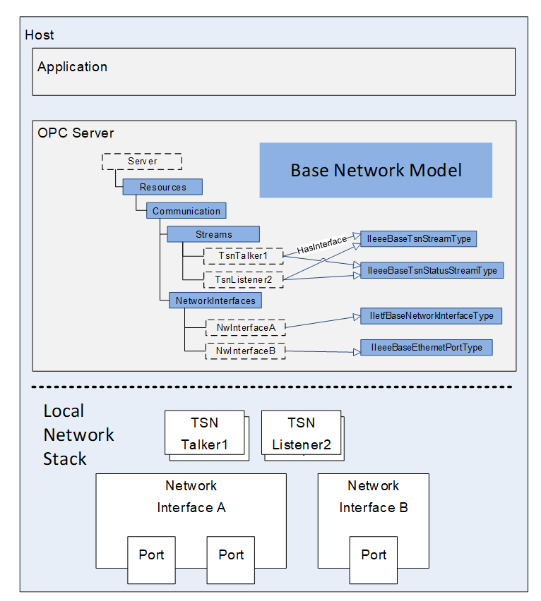  

Figure 1 - Scope of Base Network Model  

## 2 Normative references  

The following referenced documents are indispensable for the application of this OPC UA part. For dated references, only the edition cited applies. For undated references, the latest edition of the referenced document (including any amendments and errata) applies.  

OPC 10000-1, *OPC Unified Architecture - Part 1: Overview and Concepts*  

[http://www.opcfoundation.org/UA/Part1/](http://www.opcfoundation.org/UA/Part1/)  

OPC 10000-3, *OPC Unified Architecture - Part 3: Address Space Model*  

[http://www.opcfoundation.org/UA/Part3/](http://www.opcfoundation.org/UA/Part3/)  

OPC 10000-5, *OPC Unified Architecture - Part 5: Information Model*  

[http://www.opcfoundation.org/UA/Part5/](http://www.opcfoundation.org/UA/Part5/)  

OPC 10000-8, *OPC Unified Architecture - Part 8: Data Access*  

[http://www.opcfoundation.org/UA/Part8/](http://www.opcfoundation.org/UA/Part8/)  

IEEE 802.3-2022, *ETHERNET*  

[http://www.ieee802.org/3/](http://www.ieee802.org/3/)  

IEEE 802.1Q-2018, *IEEE Standard for Local and Metropolitan Area Networks Bridges and Bridged Networks*  

[http://www.ieee802.org/1/](http://www.ieee802.org/1/)  

IEEE 802.1Qcc-2018, *Bridges and Bridged Networks, Amendment: Stream Reservation Protocol (SRP) Enhancements and Performance Improvements*  

[http://www.ieee802.org/1/](http://www.ieee802.org/1/)  

IEEE 802-2014, IEEE Standard for Local and Metropolitan Area Networks: Overview and Architecture  

[http://www.ieee802.org/1/](http://www.ieee802.org/1/)  

IEEE 802.1AB-2016, IEEE Standard for Local and metropolitan area networks - Station and Media Access Control Connectivity Discovery  

[http://www.ieee802.org/1/](http://www.ieee802.org/1/)  

IEEE 802.1ABcu-2021, IEEE Standard for Local and metropolitan networks--Station and Media Access Control Connectivity Discovery Amendment 1: YANG Data Model  

[http://www.ieee802.org/1/](http://www.ieee802.org/1/)  

IETF RFC 2021, *Remote Network Monitoring Management Information Base Version 2 using SMIv2*  

[https://tools.ietf.org/html/rfc2021](https://tools.ietf.org/html/rfc2021)  

IETF RFC 2863, *The Interfaces Group MIB*  

[https://tools.ietf.org/html/rfc2863](https://tools.ietf.org/html/rfc2863)  

IETF RFC 2737, *Entity MIB (Version 2)*  

[https://tools.ietf.org/html/rfc2737](https://tools.ietf.org/html/rfc2737)  

IETF RFC 3046, *DHCP Relay Agent Information Option*  

[https://tools.ietf.org/html/rfc3046](https://tools.ietf.org/html/rfc3046)  

IETF RFC 3232, *Assigned Numbers: RFC 1700 is Replaced by an On-line Database*  

[https://tools.ietf.org/html/rfc3232](https://tools.ietf.org/html/rfc3232)  

IETF RFC 3418, Management Information Base (MIB) for the Simple Network Management Protocol (SNMP)  

[https://tools.ietf.org/html/rfc3418](https://tools.ietf.org/html/rfc3418)  

IETF RFC 4639, *Cable Device Management Information Base for Data-Over-Cable Service Interface Specification (DOCSIS) Compliant Cable Modems and Cable Modem Termination Systems*  

[https://tools.ietf.org/html/rfc4639](https://tools.ietf.org/html/rfc4639)  

IETF RFC 8343, *A YANG Data Model for Interface Management*  

[https://tools.ietf.org/html/rfc8343](https://tools.ietf.org/html/rfc8343)  

## 3 Terms, definitions, and abbreviated terms  

### 3.1 Terms and definitions  

For the purposes of this document, the terms and definitions given in OPC 10000-1, OPC 10000-3, OPC 10000-5 and OPC 10000-8 apply.  

All used terms are *italicized* in this document.  

### 3.2 Abbreviated terms  

AVB Audio Video Bridging  

BNM Base Network Model  

CNC Centralized Network Configuration  

CUC Centralized User Configuration  

DSCP Differentiated services code point for packet classification purposes  

IEEE Institute of Electrical and Electronics Engineers  

IETF Internet Engineering Task Force  

MAU Medium Attachment Units  

MIB Management Information Base  

PCP Priority Code Point for classifying and managing network traffic  

TSN Time Sensitive Networks  

VLAN Virtual Local Area Network  

YANG Yet Another Next Generation (Data modelling language for network management)  

## 4 Concepts  

### 4.1 Type and Naming Conventions  

The BNM shall align its parameters to existing standards defined by IETF and the IEEE to allow an effortless mapping against existing network technologies. Therefore, selected *DataTypes* shall fit to the types used by the related managed objects of IEEE and IETF. *BrowseNames* of *Variables* and parameter sets (UA interface) are preferably derived from standardized IETF / IEEE YANG models. If no standardized YANG representation is available, MIB definitions are chosen.  

### 4.2 Usage of OPC UA Interfaces  

The parameters of the BNM are grouped in the form of OPC UA *Interfaces* . *Interfaces* have been chosen to define parameter sets independent of the implementation in future *ObjectType* hierarchies.  This allows these grouped parameters to be used in other *Information Models* independent of *ObjectType* hierarchies that can be found in the BNM.  

It is expected that a future version of the BNM will define a collection of network related *ObjectTypes* .  

## 5 Base Network Model  

### 5.1 Overview  

The Base Network Model defined in this document is shown in [Figure 2](/§\_Ref473554142) .  

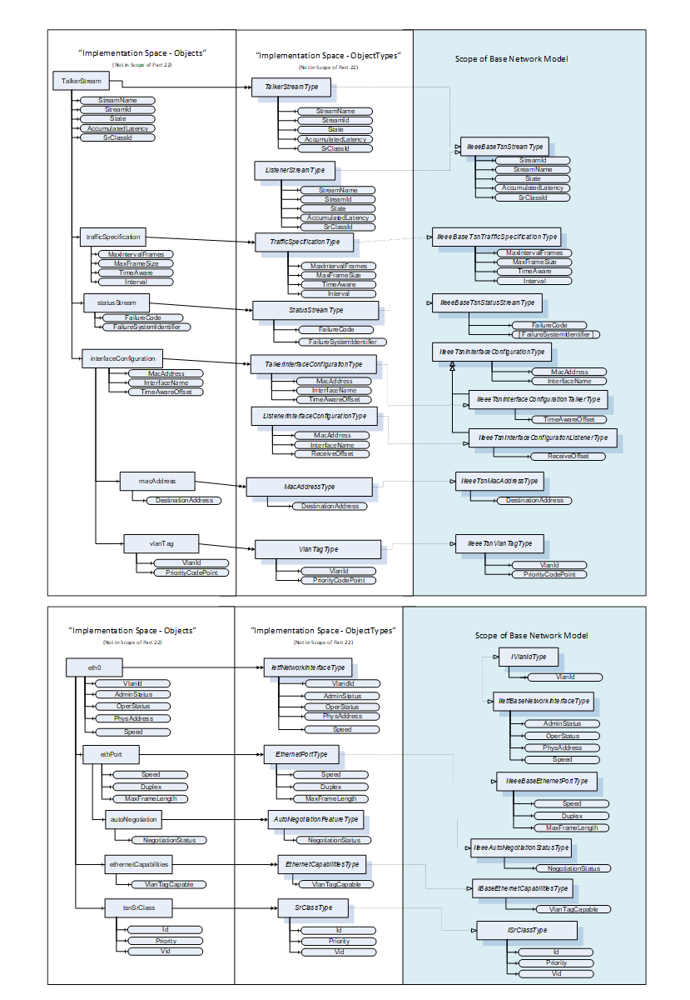  

Figure 2 - Overview of Base Network Model  

### 5.2 OPC UA InterfaceTypes  

#### 5.2.1 IIetfBaseNetworkInterfaceType Interface  

This OPC UA Interface defines the basis of an IETF network interface. The *IIetfBaseNetworkInterfaceType* is formally defined in [Table 1](/§\_Ref33705915) .  

 **Table 1\- IIetfBaseNetworkInterfaceType definition**   

| **Attribute** | **Value** |
|---|---|
|BrowseName|IIetfBaseNetworkInterfaceType|
|IsAbstract|True|
| **References** | **NodeClass** | **BrowseName** | **DataType** | **TypeDefinition** | **ModellingRule** |
|Subtype of the *BaseInterfaceType* defined in [OPC 10000-5](/§UAPart5)|
|HasComponent|Variable|AdminStatus|InterfaceAdminStatus|BaseDataVariableType|Mandatory|
|HasComponent|Variable|OperStatus|InterfaceOperStatus|BaseDataVariableType|Mandatory|
|HasComponent|Variable|PhysAddress|String|BaseDataVariableType|Optional|
|HasComponent|Variable|Speed|UInt64|AnalogUnitType|Mandatory|
| **Conformance Units** |
|BNM Ethernet Base Info|
  

  

*AdminStatus* of *DataType* *InterfaceAdminStatus* specifies the desired state of the network interface. This *Variable* has the same read semantics as ifAdminStatus (ifAdminStatus is defined in [IETF RFC 2863](/§IETF\_RFC\_2863) ). The *InterfaceAdminStatus* *Enumeration* is defined in [5.3.1.2](/§\_Ref32300995) .  

*OperStatus* of *DataType* *InterfaceOperStatus* specifies the current operational state of the network interface. This *Variable* has the same semantics as ifOperStatus (ifOperStatus is defined in [IETF RFC 2863](/§IETF\_RFC\_2863) ). The *InterfaceOperStatus* *Enumeration* is defined in [5.3.1.3](/§\_Ref32301005) .  

*PhysAddress* of *DataType* *String* specifies the network interface's address at its protocol sub-layer. For example, for an 802.x network interface, this parameter normally contains a Media Access Control (MAC) address. The network interface's media-specific modules must define the bit and byte ordering and the format of the value of this object. For network interfaces that do not have such an address (e.g., a serial line), this node is not present (ifPhysAddress is defined in [IETF RFC 2863](/§IETF\_RFC\_2863) ).  

*Speed* of *DataType* *UInt64* specifies an estimate of the network interface's current bandwidth in bits per second. For network interfaces that do not vary in bandwidth or for those where no accurate estimation can be made, this value should contain the nominal bandwidth (ifSpeed and ifHighSpeed are defined in [IETF RFC 2863](/§IETF\_RFC\_2863) ).  

The component *Variables* of the *IIetfBaseNetworkInterfaceType* have the *Attribute* values defined in [Table 2](/§\_Ref46415184) .  

 **Table 2\- IIetfBaseNetworkInterfaceType Attribute values for child Nodes**   

| **Source Path** | **Value Attribute** | **Description Attribute** |
|---|---|---|
|Speed|
|---|
|EngineeringUnits|
  

  

NamespaceUri: http://www.opcfoundation.org/UA/units/un/cefact  

UnitId: 4337968DisplayName: bit/sDescription: bit per second  

\-  

  

#### 5.2.2 IIeeeBaseEthernetPortType Interface  

This OPC UA Interface defines capabilities of an Ethernet-based port. The *IIeeeBaseEthernetPortType* is formally defined in [Table 3](/§\_Ref33706004) .  

 **Table 3\- IIeeeBaseEthernetPortType definition**   

| **Attribute** | **Value** |
|---|---|
|BrowseName|IIeeeBaseEthernetPortType|
|IsAbstract|True|
| **References** | **NodeClass** | **BrowseName** | **DataType** | **TypeDefinition** | **Modelling Rule** |
|Subtype of the *BaseInterfaceType* defined in [OPC 10000-5](/§UAPart5)|
|HasComponent|Variable|Speed|UInt64|AnalogUnitType|Mandatory|
|HasComponent|Variable|Duplex|Duplex|BaseDataVariableType|Mandatory|
|HasComponent|Variable|MaxFrameLength|UInt16|BaseDataVariableType|Mandatory|
| **Conformance Units** |
|BNM Ethernet Base Info|
  

  

*Speed* of *DataType* *UInt64* specifies the configured, negotiated, or actual speed of an Ethernet port in entities of 1 Mb/s (data rate). The default value is implementation-dependent (Ethernet ports are defined in [IEEE 802.3-2022](/§IEEEStd802\_3) ).  

*Duplex* of *DataType* *Duplex* represents the configured, negotiated, or actual duplex mode of an Ethernet port (aDuplexStatus is defined in [IEEE 802.3-2022](/§IEEEStd802\_3) , clause 30.3.1.1.32, aDuplexStatus). The *Duplex* *DataType* is defined in [5.3.1.1](/§\_Ref31314000) .  

*MaxFrameLength* of *DataType* *UInt16* indicates the MAC frame length (including FCS bytes) at which frames are dropped for being too long (aMaxFrameLength is defined in [IEEE 802.3-2022](/§IEEEStd802\_3) , clause 30.3.1.1.37, aMaxFrameLength).  

The component *Variables* of the *IIeeeBaseEthernetPortType* have the *Attribute* values defined in [Table 4](/§\_Ref26531010) .  

 **Table 4\- IIeeeBaseEthernetPortType Attribute values for child Nodes**   

| **Source Path** | **Value Attribute** | **Description Attribute** |
|---|---|---|
|Speed|
|---|
|EngineeringUnits|
  

  

NamespaceUri: http://www.opcfoundation.org/UA/units/un/cefact  

UnitId: 4534832DisplayName: Mbit/sDescription: megabit per second  

\-  

  

#### 5.2.3 IIeeeAutoNegotiationStatusType Interface  

This OPC UA Interface defines the auto negotiation status of an Ethernet-based port. The *IIeeeAutoNegotiationStatusType* is formally defined in [Table 5](/§\_Ref42159370) .  

 **Table 5\- IIeeeAutoNegotiationStatusType definition**   

| **Attribute** | **Value** |
|---|---|
|BrowseName|IIeeeAutoNegotiationStatusType|
|IsAbstract|True|
| **References** | **NodeClass** | **BrowseName** | **DataType** | **TypeDefinition** | **Modelling Rule** |
|Subtype of the *BaseInterfaceType* defined in [OPC 10000-5](/§UAPart5)|
|HasComponent|Variable|NegotiationStatus|NegotiationStatus|BaseDataVariableType|Mandatory|
| **Conformance Units** |
|BNM AutoNeg|
  

  

*NegotiationStatus* of *DataType* *NegotiationStatus* specifies the status of the auto-negotiation protocol (aAutoNegAutoConfig is defined in [IEEE 802.3-2022](/§IEEEStd802\_3) , clause 30.6.1.1.4, aAutoNegAutoConfig). The *NegotiationStatus* *DataType* is defined in [5.3.1.4](/§\_Ref31313879) .  

#### 5.2.4 IBaseEthernetCapabilitiesType Interface  

This OPC UA Interface defines if an Ethernet-based port is VLAN Tag capable. The *IBaseEthernetCapabilitiesType* is formally defined in [Table 6](/§\_Ref42159374) .  

 **Table 6\- IBaseEthernetCapabilitiesType definition**   

| **Attribute** | **Value** |
|---|---|
|BrowseName|IBaseEthernetCapabilitiesType|
|IsAbstract|True|
| **References** | **NodeClass** | **BrowseName** | **DataType** | **TypeDefinition** | **Modelling Rule** |
|Subtype of the *BaseInterfaceType* defined in [OPC 10000-5](/§UAPart5)|
|HasComponent|Variable|VlanTagCapable|Boolean|BaseDataVariableType|Mandatory|
| **Conformance Units** |
|BNM VLAN Capabilities|
  

  

When *VlanTagCapable* is true, the network interface supports the ability to tag/untag frames using a Customer VLAN Tag (C-TAG of clause 9) provided by the network (VLAN Tags are defined in [IEEE 802.1Qcc-2018](/§IEEE802\_1Qcc\_2018) , clause 46.2.3.7.1).  

#### 5.2.5 IVlanIdType Interface  

This OPC UA Interface specifies a VLAN Id to be associated with a network interface. The IVlanIdType is formally defined in [Table 7](/§\_Ref82761869) .  

 **Table 7\- IVlanIdType definition**   

| **Attribute** | **Value** |
|---|---|
|BrowseName|IVlanIdType|
|IsAbstract|True|
| **References** | **NodeClass** | **BrowseName** | **DataType** | **TypeDefinition** | **Modelling Rule** |
|Subtype of the BaseInterfaceType defined in [OPC 10000-5](/§UAPart5)|
|HasComponent|Variable|VlanId|UInt16|BaseDataVariableType|Mandatory|
| **Conformance Units** |
|BNM IETF Interface Vlan Info|
  

  

*VlanId* is an UInt16 and contains the Customer VLAN Tag ( [IEEE 802.1Q-2018](/§IEEE802\_1Q\_2018) C-TAG of clause 9) that frames injected at this network interface will be tagged with (VlanId is defined in [IEEE 802.1Qcc-2018](/§IEEE802\_1Qcc\_2018) clause 46.2.3.7.1).  

#### 5.2.6 ISrClassType Interface  

This OPC UA Interface defines the content of an SrClass. The *ISrClassType* is formally defined in [Table 8](/§\_Ref42159402) .  

 **Table 8\- ISrClassType definition**   

| **Attribute** | **Value** |
|---|---|
|BrowseName|ISrClassType|
|IsAbstract|True|
| **References** | **NodeClass** | **BrowseName** | **DataType** | **TypeDefinition** | **Modelling Rule** |
|Subtype of the *BaseInterfaceType* defined in [OPC 10000-5](/§UAPart5)|
|HasComponent|Variable|Id|Byte|BaseDataVariableType|Mandatory|
|HasComponent|Variable|Priority|Byte|BaseDataVariableType|Mandatory|
|HasComponent|Variable|Vid|UInt16|BaseDataVariableType|Mandatory|
| **Conformance Units** |
|BNM TSN Base Info|
  

  

*Id* is a Byte and specifies the SRclassID in a numeric representation of the SR classes which is supported by a particular Bridge Port (SRclassID is defined in [IEEE 802.1Q-2018](/§IEEE802\_1Q\_2018) , clause 35.2.2.9.2, SRclassID). Only Values between 0 and 7 shall be used.  

*Priority* is a *Byte* and holds the Data Frame Priority (item a in [IEEE 802.1Q-2018](/§IEEE802\_1Q\_2018) clause 35.2.2.8.5) value that will be used for streams that belong to the associated SR class. (SRclassPriority is defined in [IEEE 802.1Q-2018](/§IEEE802\_1Q\_2018) , clause 35.2.2.9.3, SRclassPriority). Only Values between 0 and 7 shall be used.  

*Vid* is an *UInt16* and contains the SR\_PVID (item i) in [IEEE 802.1Q-2018](/§IEEE802\_1Q\_2018) clause 35.2.1.4) that the associated streams will be tagged with by the Talker (SRclassVID is defined in [IEEE 802.1Q-2018](/§IEEE802\_1Q\_2018) , clause 35.2.2.9.4, SRclassVID).  

#### 5.2.7 IIeeeBaseTsnStreamType Interface  

The *IIeeeBaseTsnStreamType* **contains *Variables* which are common for both TSN talkers and TSN listeners. They represent the configuration properties and diagnostic values like reservation status and failure codes of a TSN stream.** *IIeeeBaseTsnStreamType* is formally defined [Table 9](/§\_Ref46138946) .  

 **Table 9\- IIeeeBaseTsnStreamType definition**   

| **Attribute** | **Value** |
|---|---|
|BrowseName|IIeeeBaseTsnStreamType|
|IsAbstract|True|
| **References** | **NodeClass** | **BrowseName** | **DataType** | **TypeDefinition** | **ModellingRule** |
|Subtype of the *BaseInterfaceType* defined in [OPC 10000-5](/§UAPart5)|
|HasComponent|Variable|StreamId|Byte[8]|BaseDataVariableType|Mandatory|
|HasComponent|Variable|StreamName|String|BaseDataVariableType|Mandatory|
|HasComponent|Variable|State|TsnStreamState|BaseDataVariableType|Mandatory|
|HasComponent|Variable|AccumulatedLatency|UInt32|BaseDataVariableType|Optional|
|HasComponent|Variable|SrClassId|Byte|BaseDataVariableType|Optional|
| **Conformance Units** |
|BNM TSN Base Info|
  

  

*StreamId* is an array of 8 *Bytes* defined according to the StreamID in [IEEE 802.1Qcc-2018](/§IEEE802\_1Qcc\_2018) clause 35.2.2.8.2. The *StreamId* shall be unique in the scope of the related TSN Network. The mapping between the *StreamId* *Byte* array and the IEEE octet string StreamID is as follows: Entry[n] of *StreamId* is mapped to octet[n] of StreamID. The *StreamId* shall be provided in the TSN stream *Objects* for diagnostic reasons.  

Note: In the distributed configuration model the StreamId is typically generated by the TSN control stack of the endstation. In the fully centralized configuration model the StreamId is typically generated by the CUC.  

*StreamName* is a *String* identifying the related stream in the network. The format of the *String* is application specific. The uniqueness of the *StreamName* inside the network segment shall be guaranteed by the application. If multiple applications use the network segment, they need to agree on a naming scheme.  

*State* represents the current state of the TSN configuration process of a TSN stream. The *TsnStreamState* *Enumeration* is defined in [5.3.1.6](/§\_Ref31313774) .  

*AccumulatedLatency* of *DataType* *UInt32* is the maximum worst case propagation delay in nanoseconds calculated and guaranteed by the TSN Control Layer for this Listener. Once the stream reservation has succeeded the *AccumulatedLatency* is not expected to increase during the lifecycle of the TSN Stream (AccumulatedLatency is defined in [IEEE 802.1Q-2018](/§IEEE802\_1Q\_2018) clause 35.2.2.8.6).  

*SrClassId* of *DataType* *Byte* contains the Stream Reservation Class that is used for this stream (as defined in [IEEE 802.1Qcc-2018](/§IEEE802\_1Qcc\_2018) clause 35.2.2.9.2).  

#### 5.2.8 IIeeeBaseTsnTrafficSpecificationType Interface  

This OPC UA Interface is used to represent the traffic specification of a TSN stream. The *IIeeeBaseTsnTrafficSpecificationType* is formally defined in [Table 10](/§\_Ref42159454) .  

 **Table 10\- IIeeeBaseTsnTrafficSpecificationType definition**   

| **Attribute** | **Value** |
|---|---|
|BrowseName|IIeeeBaseTsnTrafficSpecificationType|
|IsAbstract|True|
| **References** | **NodeClass** | **BrowseName** | **DataType** | **TypeDefinition** | **Modelling Rule** |
|Subtype of the *BaseInterfaceType* defined in [OPC 10000-5](/§UAPart5)|
|HasComponent|Variable|MaxIntervalFrames|UInt16|BaseDataVariableType|Mandatory|
|HasComponent|Variable|MaxFrameSize|UInt32|BaseDataVariableType|Mandatory|
|HasComponent|Variable|Interval|UnsignedRationalNumber|BaseDataVariableType|Mandatory|
| **Conformance Units** |
|BNM TSN Config|
  

  

The *MaxFrameSize* of *DataType* UInt16 specifies the maximum size frame that will be sent by a Talker for this Stream (as defined in [IEEE 802.1Q-2018](/§IEEE802\_1Q\_2018) clause 35.2.2.8.4a).  

Note: According to 802.1Q *MaxFrameSize* only counts the number of bytes of the Ethernet payload without the media specific framing bytes. (i.e. without 8-byte preamble, 14-byte IEEE 802.3 header, 4-byte IEEE 802.1Q priority/VID Tag, 4-byte CRC, 12-byte inter frame gap). Same rules apply for counting *MaxBytesPerInterval.*  

The *MaxIntervalFrames* of *DataType* UInt16 Variable specifies the maximum number of frames that will be sent during an *Interval.* (as defined in [IEEE 802.1Q-2018](/§IEEE802\_1Q\_2018) , clause 35.2.2.8.4b, "MaxIntervalFrames" or [IEEE 802.1Qcc-2018](/§IEEE802\_1Qcc\_2018) , clause 35.2.2.10.6, "MaxFramesPerInterval")  

*Interval* of *DataType* *UnsignedRationalNumber* defines the time period of the TSN Stream in nanoseconds. In that interval a specified number of frames (MaxIntervalFrames) with a maximum payload size per frame (MaxFrameSize) and a maximum total number of bytes (MaxBytesPerInterval) will be transmitted. The *Interval* therefore shall either represent the "class measurement interval" as used for AVB based Streams (as defined in [IEEE 802.1Q-2018](/§IEEE802\_1Q\_2018) clause 35 or the "Interval" parameter used in the TrafficSpecification group in [IEEE 802.1Qcc-2018](/§IEEE802\_1Qcc\_2018) clause 46.2.3.5.1).  

#### 5.2.9 IIeeeBaseTsnStatusStreamType Interface  

This OPC UA Interface is used to represent the status of a TSN stream. The *IIeeeBaseTsnStatusStreamType* is formally defined in [Table 11](/§\_Ref42159505) .  

 **Table 11\- IIeeeBaseTsnStatusStreamType definition**   

| **Attribute** | **Value** |
|---|---|
|BrowseName|IIeeeBaseTsnStatusStreamType|
|IsAbstract|True|
| **References** | **NodeClass** | **BrowseName** | **DataType** | **TypeDefinition** | **ModellingRule** |
|Subtype of the *BaseInterfaceType* defined in [OPC 10000-5](/§UAPart5)|
|HasComponent|Variable|TalkerStatus|TsnTalkerStatus|BaseDataVariableType|Optional|
|HasComponent|Variable|ListenerStatus|TsnListenerStatus|BaseDataVariableType|Optional|
|HasComponent|Variable|FailureCode|TsnFailureCode|BaseDataVariableType|Mandatory|
|HasComponent|Variable|FailureSystemIdentifier|Byte[][8]|BaseDataVariableType|Mandatory|
| **Conformance Units** |
|BNM TSN Base Info|
  

  

*TalkerStatus* of *DataType* *TsnTalkerStatus* contains the Reservation Failure Code as defined in the "FailureInformation" in [IEEE 802.1Qcc-2018](/§IEEE802\_1Qcc\_2018) clause 46.2.5.1.1.  

*ListenerStatus* of *DataType* *TsnListenerStatus* contains the Reservation Failure Code as defined in the "FailureInformation" in [IEEE 802.1Qcc-2018](/§IEEE802\_1Qcc\_2018) clause 46.2.5.1.2.  

*FailureCode* of *DataType* *TsnFailureCode* contains the Reservation Failure Code as defined in the "FailureInformation" in [IEEE 802.1Qcc-2018](/§IEEE802\_1Qcc\_2018) clause 46.2.5.1.3.  

*FailureSystemIdentifier* is an Array of Arrays of 8 Bytes and contains the System Identifiers representing the network nodes where the failure occurred (as defined in "System Identifier" in "FailureInformation" in [IEEE 802.1Q-2018](/§IEEE802\_1Q\_2018) clause 35.2.2.8.7).  

#### 5.2.10 IIeeeTsnInterfaceConfigurationType Interface  

This OPC UA Interface is used to represent an interface configuration which is part of a TSN stream (on the end-device). The *IIeeeTsnInterfaceConfigurationType* is formally defined in [Table 12](/§\_Ref42159518) .  

 **Table 12\- IIeeeTsnInterfaceConfigurationType definition**   

| **Attribute** | **Value** |
|---|---|
|BrowseName|IIeeeTsnInterfaceConfigurationType|
|IsAbstract|True|
| **References** | **NodeClass** | **BrowseName** | **DataType** | **TypeDefinition** | **ModellingRule** |
|Subtype of the *BaseInterfaceType* defined in [OPC 10000-5](/§UAPart5)|
|HasComponent|Variable|MacAddress|String|BaseDataVariableType|Mandatory|
|HasComponent|Variable|InterfaceName|String|BaseDataVariableType|Optional|
| **Conformance Units** |
|BNM TSN Config|
  

  

*MacAddress* of *DataType* *String* contains the MAC Address of the Interface the configuration will be applied to, as defined in [IEEE 802.1Qcc-2018](/§IEEE802\_1Qcc\_2018) , clause 46.2.5.3.  

*InterfaceName* of *DataType* *String* is optional and supports the identification of the Interface to be configured, as defined in [IEEE 802.1Qcc-2018](/§IEEE802\_1Qcc\_2018) , clause 46.2.5.3.  

#### 5.2.11 IIeeeTsnInterfaceConfigurationTalkerType Interface  

This OPC UA Interface is used to represent a talker (sender) interface configuration of a TSN stream. The *IIeeeTsnInterfaceConfigurationTalkerType* is formally defined in [Table 13](/§\_Ref42159525) .  

 **Table 13\- IIeeeTsnInterfaceConfigurationTalkerType definition**   

| **Attribute** | **Value** |
|---|---|
|BrowseName|IIeeeTsnInterfaceConfigurationTalkerType|
|IsAbstract|True|
| **References** | **NodeClass** | **BrowseName** | **DataType** | **TypeDefinition** | **ModellingRule** |
|Subtype of the *IIeeeTsnInterfaceConfigurationType* defined in [5.2.10](/§\_Ref46240172)|
|HasComponent|Variable|TimeAwareOffset|UInt32|BaseDataVariableType|Optional|
| **Conformance Units** |
|BNM TSN Config|
  

  

*TimeAwareOffset* of *DataType* *UInt32* specifies the time offset in nanoseconds relative to the start of the Interval that the Talker shall use for transmission (as defined in [IEEE 802.1Qcc-2018](/§IEEE802\_1Qcc\_2018) clause 46.2.5.3.5).  

#### 5.2.12 IIeeeTsnInterfaceConfigurationListenerType Interface  

This OPC UA Interface is used to represent a listener (receiver) interface configuration of a TSN stream. The *IIeeeTsnInterfaceConfigurationListenerType* is formally defined in [Table 14](/§\_Ref42159547) .  

 **Table 14\- IIeeeTsnInterfaceConfigurationListenerType definition**   

| **Attribute** | **Value** |
|---|---|
|BrowseName|IIeeeTsnInterfaceConfigurationListenerType|
|IsAbstract|True|
| **References** | **NodeClass** | **BrowseName** | **DataType** | **TypeDefinition** | **ModellingRule** |
|Subtype of the *IIeeeTsnInterfaceConfigurationType* defined in [5.2.10](/§\_Ref46240172)|
|HasComponent|Variable|ReceiveOffset|UInt32|BaseDataVariableType|Optional|
| **Conformance Units** |
|BNM TSN Config|
  

  

*ReceiveOffset* of *DataType* *UInt32* specifies the offset in nanoseconds within the Interval at which the Listener will receive the first frame of the TSN Stream.  

#### 5.2.13 IIeeeTsnMacAddressType Interface  

This OPC UA Interface is used to represent a MAC address based stream identification of a TSN stream. The *IIeeeTsnMacAddressType* is formally defined in [Table 15](/§\_Ref42159564) .  

 **Table 15\- IIeeeTsnMacAddressType definition**   

| **Attribute** | **Value** |
|---|---|
|BrowseName|IIeeeTsnMacAddressType|
|IsAbstract|True|
| **References** | **NodeClass** | **BrowseName** | **DataType** | **TypeDefinition** | **ModellingRule** |
|Subtype of the *BaseInterfaceType* defined in [OPC 10000-5](/§UAPart5)|
|HasComponent|Variable|DestinationAddress|Byte[6]|BaseDataVariableType|Mandatory|
|HasComponent|Variable|SourceAddress|Byte[6]|BaseDataVariableType|Optional|
| **Conformance Units** |
|BNM TSN Config|
  

  

*DestinationAddress* is defined according to the destination\_mac\_address in [IEEE 802.1Qcc-2018](/§IEEE802\_1Qcc\_2018) clause 46.2.3.4.1, which represents the destination MAC address in the Ethernet header of the streamed data packets. Entry[n] of *DestinationAddress* is mapped to octet[n] of destination\_mac\_address.  

*SourceAddress* is defined according to the source\_mac\_address in [IEEE 802.1Qcc-2018](/§IEEE802\_1Qcc\_2018) clause 46.2.3.4.1, which represents the source MAC address in the Ethernet header of the streamed data packets. Entry[n] of *SourceAddress* is mapped to octet[n] of source\_mac\_address.  

#### 5.2.14 IIeeeTsnVlanTagType Interface  

This OPC UA Interface is used to represent the VLAN configuration of a TSN stream. The *IIeeeTsnVlanTagType* is formally defined in [Table 16](/§\_Ref42159582) .  

 **Table 16\- IIeeeTsnVlanTagType definition**   

| **Attribute** | **Value** |
|---|---|
|BrowseName|IIeeeTsnVlanTagType|
|IsAbstract|True|
| **References** | **NodeClass** | **BrowseName** | **DataType** | **TypeDefinition** | **ModellingRule** |
|Subtype of the *BaseInterfaceType* defined in [OPC 10000-5](/§UAPart5)|
|HasComponent|Variable|VlanId|UInt16|BaseDataVariableType|Mandatory|
|HasComponent|Variable|PriorityCodePoint|Byte|BaseDataVariableType|Mandatory|
| **Conformance Units** |
|BNM TSN Config|
  

  

*VlanId* of *DataType* *UInt16* defines the 12-Bit VLAN-Identifier of the VLAN tag in the Ethernet header for the related stream. Only values between 0 and 4095 shall be used according to [IEEE 802.1Q-2018](/§IEEE802\_1Q\_2018) Table 9-2.  

*PriorityCodePoint* of *DataType* Byte defines the 3 Bit priority code point inside the VLAN tag of the Ethernet header of the related stream. Only values between 0 and 7 are supported as defined by [IEEE 802.1Q-2018](/§IEEE802\_1Q\_2018) , clause 35.2.2.8.5a, Data Frame Priority.  

#### 5.2.15 IPriorityMappingEntryType Interface  

This OPC UA Interface is used to translate a priority label like PriorityLabel (defined in Part 14) to a concrete network priority value (e.g. DSCP or PCP).  

Note: This UA Interface is typically used to form a mapping rule table containing a set of object entities implementing the *IPriorityMappingEntryType* . Each network interface supporting priority mapping can reference such a mapping table *Object* .  

 **Table 17\- IPriorityMappingEntryType definition**   

| **Attribute** | **Value** |
|---|---|
|BrowseName|IPriorityMappingEntryType|
|IsAbstract|True|
| **References** | **NodeClass** | **BrowseName** | **DataType** | **TypeDefinition** | **ModellingRule** |
|Subtype of the *BaseInterfaceType* defined in [OPC 10000-5](/§UAPart5)|
|HasComponent|Variable|MappingUri|String|BaseDataVariableType|Mandatory|
|HasComponent|Variable|PriorityLabel|String|BaseDataVariableType|Mandatory|
|HasComponent|Variable|PriorityValue\_PCP|Byte|BaseDataVariableType|Optional|
|HasComponent|Variable|PriorityValue\_DSCP|UInt32|BaseDataVariableType|Optional|
| **Conformance Units** |
|BNM Priority Mapping|
  

*MappingUri* of *DataType* *String* specifies a named identifier of a well-known predefined set of priority labels.  

*PriorityLabel* of *DataType* *String* is a textual representation of the desired transport priority configured within the QoS settings of a communication relation, e.g. WriterGroup defined in Part14.  

*PriorityValue\_PCP* of *DataType* *Byte* is the Ethernet transport priority inside the VLAN-Tag associated with the *PriorityLabel* . The devices shall translate the defined priority label for each packet according to the communication relation (e.g. WriterGroup) and linked interface. Depending on the transport protocol mapping and if this *Variable* is supported, the PCP field inside a packet shall be set to the specified PCP value.  

*PriorityValue\_DSCP* of *DataType* *UInt32* is the IP transport priority associated with the *PriorityLabel* . The devices shall translate the defined priority label for each packet according to the communication relation (e.g. WriterGroup) and linked interface. Depending on the transport protocol mapping and if this *Variable* is supported, the DSCP field inside a packet shall be set to the specified DSCP value.  

### 5.3 DataTypes  

#### 5.3.1 Enumeration DataTypes  

##### 5.3.1.1 Duplex Enumeration  

The *Duplex* is an enumeration representing the configured, negotiated, or actual duplex mode of an Ethernet interface (aDuplexStatus is defined in [IEEE 802.3-2022](/§IEEEStd802\_3) , 30.3.1.1.32, aDuplexStatus). The values of the *Duplex* *Enumeration* are defined in [Table 18](/§\_Ref31128845) .  

 **Table 18\- Duplex Values**   

| **Name** | **Value** | **Description** |
|---|---|---|
|Full|0|Full duplex.|
|Half|1|Half duplex.|
|Unknown|2|Link is currently disconnected or initializing.|
  

  

Its representation in the *AddressSpace* is defined in [Table 19](/§\_Ref16854453) .  

 **Table 19\- Duplex Definition**   

| **Attribute** | **Value** |
|---|---|
|BrowseName|Duplex|
|IsAbstract|False|
| **References** | **NodeClass** | **BrowseName** | **DataType** | **TypeDefinition** | **Other** |
|Subtype of the Enumeration type defined in [OPC 10000-5](/§UAPart5)|
|HasProperty|Variable|EnumValues|EnumValueType[]|PropertyType||
| **Conformance Units** |
|BNM Ethernet Base Info|
  

  

##### 5.3.1.2 InterfaceAdminStatus Enumeration  

The *InterfaceAdminStatus* is an enumeration for the possible desired states of the network interface (ifAdminStatus is defined in [IETF RFC 2863](/§IETF\_RFC\_2863) : The Interfaces Group MIB - ifAdminStatus). The values of the *InterfaceAdminStatus* *Enumeration* are defined in [Table 20](/§\_Ref29910552) .  

 **Table 20\- InterfaceAdminStatus Values**   

| **Name** | **Value** | **Description** |
|---|---|---|
|Up|0|Ready to pass packets.|
|Down|1|Not ready to pass packets and not in some test mode.|
|Testing|2|In some test mode.|
  

  

Its representation in the *AddressSpace* is defined in [Table 21](/§\_Ref32297665) .  

 **Table 21\- InterfaceAdminStatus Definition**   

| **Attribute** | **Value** |
|---|---|
|BrowseName|InterfaceAdminStatus|
|IsAbstract|False|
| **References** | **NodeClass** | **BrowseName** | **DataType** | **TypeDefinition** | **Other** |
|Subtype of the Enumeration type defined in [OPC 10000-5](/§UAPart5)|
|HasProperty|Variable|EnumValues|EnumValueType[]|PropertyType||
| **Conformance Units** |
|BNM Ethernet Base Info|
  

  

##### 5.3.1.3 InterfaceOperStatus Enumeration  

The *InterfaceOperStatus* is an enumeration for the possible operational states of the network interface (ifOperStatus is defined in [IETF RFC 2863](/§IETF\_RFC\_2863) : The Interfaces Group MIB - ifOperStatus). The values of the *InterfaceOperStatus* *Enumeration* are defined in [Table 22](/§\_Ref29910554) .  

 **Table 22\- InterfaceOperStatus Values**   

| **Name** | **Value** | **Description** |
|---|---|---|
|Up|0|Ready to pass packets.|
|Down|1|The interface does not pass any packets.|
|Testing|2|In some test mode. No operational packets can be passed.|
|Unknown|3|Status cannot be determined for some reason.|
|Dormant|4|Waiting for some external event.|
|NotPresent|5|Some component (typically hardware) is missing.|
|LowerLayerDown|6|Down due to state of lower-layer interface(s).|
  

  

Its representation in the *AddressSpace* is defined in [Table 23](/§\_Ref32297716) .  

 **Table 23\- InterfaceOperStatus Definition**   

| **Attribute** | **Value** |
|---|---|
|BrowseName|InterfaceOperStatus|
|IsAbstract|False|
| **References** | **NodeClass** | **BrowseName** | **DataType** | **TypeDefinition** | **Other** |
|Subtype of the Enumeration type defined in [OPC 10000-5](/§UAPart5)|
|HasProperty|Variable|EnumValues|EnumValueType[]|PropertyType||
| **Conformance Units** |
|BNM Ethernet Base Info|
  

  

##### 5.3.1.4 NegotiationStatus Enumeration  

The *NegotiationStatus* is an enumeration representing the status of the auto-negotiation protocol (aAutoNegAutoConfig is defined in [IEEE 802.3-2022](/§IEEEStd802\_3) , clause 30.6.1.1.4, aAutoNegAutoConfig). The values of the *NegotiationStatus Enumeration* are defined in [Table 24](/§\_Ref31128829) .  

 **Table 24\- NegotiationStatus Values**   

| **Name** | **Value** | **Description** |
|---|---|---|
|InProgress|0|The auto-negotiation protocol is running and negotiation is currently in-progress.|
|Complete|1|The auto-negotiation protocol has completed successfully.|
|Failed|2|The auto-negotiation protocol has failed.|
|Unknown|3|The auto-negotiation status is not currently known, this could be because it is still negotiating or the protocol cannot run (e.g., if no medium is present).|
|NoNegotiation|4|No auto-negotiation is executed. The auto-negotiation function is either not supported on this interface or has not been enabled.|
  

  

Its representation in the *AddressSpace* is defined in [Table 25](/§\_Ref32297877) .  

 **Table 25\- NegotiationStatus Definition**   

| **Attribute** | **Value** |
|---|---|
|BrowseName|NegotiationStatus|
|IsAbstract|False|
| **References** | **NodeClass** | **BrowseName** | **DataType** | **TypeDefinition** | **Other** |
|Subtype of the Enumeration type defined in [OPC 10000-5](/§UAPart5)|
|HasProperty|Variable|EnumValues|EnumValueType[]|PropertyType||
| **Conformance Units** |
|BNM AutoNeg|
  

  

##### 5.3.1.5 TsnFailureCode Enumeration  

The *TsnFailureCode* is an *Enumeration* to provide detailed error information for failures occurring during TSN stream establishment (TSN Failure Codes are defined in [IEEE 802.1Qcc-2018](/§IEEE802\_1Qcc\_2018) , Table 46-15, TSN Failure Codes). The *TsnFailureCode Enumeration* is defined in [Table 26](/§\_Ref29904523) .  

 **Table 26\- TsnFailureCode values**   

| **Name** | **Value** | **Description** |
|---|---|---|
|NoFailure|0|No failure|
|InsufficientBandwidth|1|Insufficient bandwidth|
|InsufficientResources|2|Insufficient bridge resources|
|InsufficientTrafficClassBandwidth|3|Insufficient bandwidth for Traffic Class|
|StreamIdInUse|4|StreamID in use by another Talker|
|StreamDestinationAddressInUse|5|Stream destination address already in use|
|StreamPreemptedByHigherRank|6|Stream pre-empted by higher rank|
|LatencyHasChanged|7|Reported latency has changed|
|EgressPortNotAvbCapable|8|Egress port is not AVBCapable|
|UseDifferentDestinationAddress|9|Use a different destination address|
|OutOfMsrpResources|10|Out of MSRP resources|
|OutOfMmrpResources|11|Out of MMRP resources|
|CannotStoreDestinationAddress|12|Cannot store destination address|
|PriorityIsNotAnSrcClass|13|Requested priority is not an SR Class priority|
|MaxFrameSizeTooLarge|14|MaxFrameSize is too large for media|
|MaxFanInPortsLimitReached|15|MaxFanInPorts limit has been reached|
|FirstValueChangedForStreamId|16|Changes in FirstValue for a registered StreamID|
|VlanBlockedOnEgress|17|VLAN is blocked on this egress port (Registration Forbidden)|
|VlanTaggingDisabledOnEgress|18|VLAN tagging is disabled on this egress port (untagged set)|
|SrClassPriorityMismatch|19|SR class priority mismatch|
|FeatureNotPropagated|20|Enhanced feature cannot be propagated to original Port|
|MaxLatencyExceeded|21|MaxLatency exceeded|
|BridgeDoesNotProvideNetworkId|22|Nearest Bridge cannot provide network identification for stream transformation|
|StreamTransformNotSupported|23|Stream transformation not supported|
|StreamIdTypeNotSupported|24|Stream identification type not supported for stream transformation|
|FeatureNotSupported|25|Enhanced feature cannot be supported without a CNC|
  

  

Its representation in the *AddressSpace* is defined in [Table 27](/§\_Ref32297941) .  

 **Table 27\- TsnFailureCode Definition**   

| **Attribute** | **Value** |
|---|---|
|BrowseName|TsnFailureCode|
|IsAbstract|False|
| **References** | **NodeClass** | **BrowseName** | **DataType** | **TypeDefinition** | **Other** |
|Subtype of the Enumeration type defined in [OPC 10000-5](/§UAPart5)|
|HasProperty|Variable|EnumValues|EnumValueType[]|PropertyType||
| **Conformance Units** |
|BNM TSN Base Info|
  

  

##### 5.3.1.6 TsnStreamState Enumeration  

The *TsnStreamState* is an enumeration representing the state of the configuration process of a TSN Talker or Listener.  

The default value is *Disabled* . The *TsnStreamState* *Enumeration* is defined in [Table 28](/§\_Ref29904430) .  

 **Table 28\- TsnStreamState Values**   

| **Name** | **Value** | **Description** |
|---|---|---|
|Disabled|0|The related TSN Stream ** is currently disabled.|
|Configuring|1|The related TSN Stream ** is in the process of receiving configuration parameters from the TSN Control Layer.|
|Ready|2|The related TSN Stream ** has successfully received and applied the configuration from the TSN Control Layer. The related TSN Stream ** is not fully operational as long as local preconditions (e.g. synchronization state) are not valid.|
|Operational|3|The related TSN Stream ** object is configured and all other required preconditions (e.g. synchronization state) for sending / receiving data are valid.|
|Error|4|The related TSN Stream ** object is in an error state.|
  

  

Its representation in the *AddressSpace* is defined in [Table 29](/§\_Ref32297930) .  

 **Table 29\- TsnStreamState Definition**   

| **Attribute** | **Value** |
|---|---|
|BrowseName|TsnStreamState|
|IsAbstract|False|
| **References** | **NodeClass** | **BrowseName** | **DataType** | **TypeDefinition** | **Other** |
|Subtype of the Enumeration type defined in [OPC 10000-5](/§UAPart5)|
|HasProperty|Variable|EnumValues|EnumValueType[]|PropertyType||
| **Conformance Units** |
|BNM TSN Base Info|
  

  

##### 5.3.1.7 TsnTalkerStatus Enumeration  

The *TsnTalkerStatus* is an enumeration representing the state of the TSN Talker configuration.  

The default value is *None* . The *TsnTalkerStatus* *Enumeration* is defined in [Table 30](/§\_Ref149604503) Table 30.  

 **Table 30\- TsnTalkerStatus Values**   

| **Name** | **Value** | **Description** |
|---|---|---|
|None|0|No Talker detected.|
|Ready|1|Talker ready (configured).|
|Failed|2|Talker failed.|
  

  

Its representation in the *AddressSpace* is defined in [Table 31](/§\_Ref149604504) Table 31.  

 **Table 31\- TsnTalkerStatus Definition**   

| **Attribute** | **Value** |
|---|---|
|BrowseName|TsnTalkerStatus|
|IsAbstract|False|
| **References** | **NodeClass** | **BrowseName** | **DataType** | **TypeDefinition** | **Other** |
|Subtype of the Enumeration type defined in [OPC 10000-5](/§UAPart5)|
|HasProperty|Variable|EnumValues|EnumValueType[]|PropertyType||
| **Conformance Units** |
|BNM TSN Base Info|
  

  

##### 5.3.1.8 TsnListenerStatus Enumeration  

The *TsnListenerStatus* is an enumeration representing the state of the TSN Listener configuration.  

The default value is *None* . The *TsnListenerStatus* *Enumeration* is defined in [Table 32](/§\_Ref149604505) Table 32.  

 **Table 32\- TsnListenerStatus Values**   

| **Name** | **Value** | **Description** |
|---|---|---|
|None|0|No Listener detected.|
|Ready|1|Listener ready (configured).|
|PartialFailed|2|One or more Listeners ready, and one or more Listeners failed.|
|Failed|3|Listener failed.|
  

  

Its representation in the *AddressSpace* is defined in [Table 33](/§\_Ref149604512) Table 33.  

 **Table 33\- TsnListenerStatus Definition**   

| **Attribute** | **Value** |
|---|---|
|BrowseName|TsnListenerStatus|
|IsAbstract|False|
| **References** | **NodeClass** | **BrowseName** | **DataType** | **TypeDefinition** | **Other** |
|Subtype of the Enumeration type defined in [OPC 10000-5](/§UAPart5)|
|HasProperty|Variable|EnumValues|EnumValueType[]|PropertyType||
| **Conformance Units** |
|BNM TSN Base Info|
  

  

##### 5.3.1.9 ChassisIdSubtype Enumeration  

The *ChassisIdSubtype* is an enumeration representing different types of chassis identifier as defined in [IEEE 802.1AB-2016](/§IEEE802\_1AB\_2016) , Table 8-2, chassis ID subtype.  

The *ChassisIdSubtype* *Enumeration* is defined in [Table 34](/§\_Ref149604528) .  

 **Table 34\- ChassisIdSubtype Values**   

| **Name** | **Value** | **Description** |
|---|---|---|
|ChassisComponent|1|Represents a chassis identifier based on the value of entPhysicalAlias object (defined in IETF RFC 2737) for a chassis component (i.e., an entPhysicalClass value of chassis(3))|
|InterfaceAlias|2|Represents a chassis identifier based on the value of ifAlias object (defined in IETF RFC 2863) for an interface on the containing chassis.|
|PortComponent|3|Represents a chassis identifier based on the value of entPhysicalAlias object (defined in IETF RFC 2737) for a port or backplane component (i.e., entPhysicalClass has a value of port(10), or backplane(4)), within the containing chassis.|
|MacAddress|4|Represents a chassis identifier based on the value of a unicast source address (encoded in network byte order and IEEE 802.3 canonical bit order) of a port on the containing chassis as defined in IEEE Std 802-2014.|
|NetworkAddress|5|Represents a chassis identifier based on a network address associated with a particular chassis. The encoded address is actually composed of two fields. The first field is a single octet, representing the IANA AddressFamilyNumbers value for the specific address type, and the second field is the network address value.|
|InterfaceName|6|Represents a chassis identifier based on the value of ifName object (defined in IETF RFC 2863) for an interface on the containing chassis.|
|Local|7|Represents a chassis identifier based on a locally defined value.|
  

  

Its representation in the *AddressSpace* is defined in [Table 35](/§\_Ref149604545) .  

 **Table 35\- ChassisIdSubtype Definition**   

| **Attribute** | **Value** |
|---|---|
|BrowseName|ChassisIdSubtype|
|IsAbstract|False|
| **References** | **NodeClass** | **BrowseName** | **DataType** | **TypeDefinition** | **Other** |
|Subtype of the Enumeration type defined in [OPC 10000-5](/§UAPart5)|
|HasProperty|Variable|EnumValues|EnumValueType[]|PropertyType||
| **Conformance Units** |
|BNM IEEE LLDP Info|
  

  

  

##### 5.3.1.10 PortIdSubtype Enumeration  

The *PortIdSubtype* is an enumeration representing different types of port identifier as defined in [IEEE 802.1AB-2016](/§IEEE802\_1AB\_2016) , Table 8-3, port ID subtype.  

The *PortIdSubtype* *Enumeration* is defined in [Table 36](/§\_Ref149604562) .  

 **Table 36\- PortIdSubtype Values**   

| **Name** | **Value** | **Description** |
|---|---|---|
|InterfaceAlias|1|Represents a port identifier based on the ifAlias MIB object defined in IETF RFC 2863.|
|PortComponent|2|Represents a port identifier based on the value of entPhysicalAlias (defined in IETF RFC 2737) for a port component (i.e., entPhysicalClass value of port(10) or backplane(4)), within the containing chassis.|
|MacAddress|3|Represents a port identifier based on a unicast source address (encoded in network byte order and IEEE 802.3 canonical bit order) which has been detected by the agent and associated with a particular port (IEEE Std 802-2014).|
|NetworkAddress|4|Represents a port identifier based on a network address, detected by the agent and associated with a particular port.|
|InterfaceName|5|Represents a port identifier based on the ifName MIB object, defined in IETF RFC 2863.|
|AgentCircuitId|6|Represents a port identifier based on the agent-local identifier of the circuit (defined in IETF RFC 3046), detected by the agent and associated with a particular port.|
|Local|7|Represents a port identifier based on a value locally assigned.|
  

  

Its representation in the *AddressSpace* is defined in [Table 37](/§\_Ref149604573) .  

 **Table 37\- PortIdSubtype Definition**   

| **Attribute** | **Value** |
|---|---|
|BrowseName|PortIdSubtype|
|IsAbstract|False|
| **References** | **NodeClass** | **BrowseName** | **DataType** | **TypeDefinition** | **Other** |
|Subtype of the Enumeration type defined in [OPC 10000-5](/§UAPart5)|
|HasProperty|Variable|EnumValues|EnumValueType[]|PropertyType||
| **Conformance Units** |
|BNM IEEE LLDP Info|
  

  

##### 5.3.1.11 ManAddrIfSubtype Enumeration  

The *ManAddrIfSubtype* is an enumeration representing different types of management address interface as defined in [IEEE 802.1AB-2016](/§IEEE802\_1AB\_2016) , Section 8.5.9.5, interface numbering subtype.  

The *ManAddrIfSubtype* *Enumeration* is defined in [Table 38](/§\_Ref149604581) .  

 **Table 38\- ManAddrIfSubtype Values**   

| **Name** | **Value** | **Description** |
|---|---|---|
|None|0|Optional variable is not set.|
|Unknown|1|Interface is not known.|
|PortRef|2|Interface based on the port-ref MIB object.|
|SystemPortNumber|3|Interface based on the system port number.|
  

  

Its representation in the *AddressSpace* is defined in [Table 39](/§\_Ref149604591) .  

 **Table 39\- ManAddrIfSubtype Definition**   

| **Attribute** | **Value** |
|---|---|
|BrowseName|ManAddrIfSubtype|
|IsAbstract|False|
| **References** | **NodeClass** | **BrowseName** | **DataType** | **TypeDefinition** | **Other** |
|Subtype of the Enumeration type defined in [OPC 10000-5](/§UAPart5)|
|HasProperty|Variable|EnumValues|EnumValueType[]|PropertyType||
| **Conformance Units** |
|BNM IEEE LLDP Info|
  

  

  

  

  

#### 5.3.2 Structure DataTypes  

##### 5.3.2.1 PriorityMappingEntryType  

This *Structure DataType* is used to represent an entry in the *PriorityMappingTableType* . The *PriorityMappingEntryType* is formally defined in [Table 40](/§\_Ref80891616) .  

 **Table 40\- PriorityMappingEntryType structure**   

| **Name** | **Type** | **Description** |
|---|---|---|
|PriorityMappingEntryType|Structure||
|MappingUri|String|Named identifier of a well-known predefined set of priority labels.|
|PriorityLabel|String|Textual representation of the desired transport priority.|
|PriorityValue\_PCP|Byte|VLAN Tag based priority value.  

*PriorityValue\_PCP* shall be a value between 0 and 7, or 0xFF.  

The value 0xFF indicates the *PriorityValue\_PCP* is not used.|
|PriorityValue\_DSCP|UInt32|IP header based priority value.  

*PriorityValue\_DSCP* shall be a value between 0 and 63, or 0xFFFFFFFF.The value 0xFFFFFFFF indicates the *PriorityValue\_PCP* is not used.|
  

  

Its representation in the *AddressSpace* is defined in [Table 41](/§\_Ref80891694) .  

 **Table 41\- PriorityMappingEntryType Definition**   

| **Attribute** | **Value** |
|---|---|
|BrowseName|PriorityMappingEntryType|
|IsAbstract|False|
| **References** | **NodeClass** | **BrowseName** | **DataType** | **TypeDefinition** | **Other** |
|Subtype of the Structure DataType defined in [OPC 10000-5](/§UAPart5)|
| **Conformance Units** |
|BNM Priority Mapping 2|
  

  

##### 5.3.2.2 LldpManagementAddressTxPortType  

This *Structure DataType* represents the YANG list *management-address-tx-port* as defined in IEEE 802.1ABcu-2021. The *LldpManagementAddressTxPortType* is formally defined in [Table 42](/§\_Ref149604655) .  

 **Table 42\- LldpManagementAddressTxPortType structure**   

| **Name** | **Type** | **Description** |
|---|---|---|
|LldpManagementAddressTxPortType|Structure||
|AddressSubtype|UInt32|Type of address (8.5.9.3 of IEEE Std 802.1AB-2016, enumeration based on ianaAddressFamilyNumbers [IETF RFC 3232](/§IETF\_RFC\_3232) )|
|ManAddress|String|Management address associated with this TLV (8.5.9.4 of IEEE Std 802.1AB-2016)|
|TxEnable|Boolean|Transmission enabled status (9.1.2.1 of IEEE Std 802.1AB-2016)|
|AddrLen|UInt32|Length of the management address subtype and the management address fields in LLDPDUs transmitted by the local LLDP agent (8.5.9.2 of IEEE Std 802.1AB-2016)|
|IfSubtype|ManAddrIfSubtype|Interface numbering method used for defining the interface number, associated with the local system (8.5.9.5 of IEEE Std 802.1AB-2016)|
|IfId|UInt32|Interface number for the management address component associated with the local system (8.5.9.6 of IEEE Std 802.1AB-2016)|
  

  

The *AddressSubtype* and *ManAddress* are mandatory. The *TxEnable* has the default value *false* . The *AddrLen* is an optional element and shall be set to *0* if this variable is unititialized. The *IfSubtype* is an optional *Enumeration* element and shall be set to *None* if this variable is uninitialized. The *IfId* is an optional element and shall be set to *0* if this element is uninitialized or unknown.  

Its representation in the *AddressSpace* is defined in [Table 43](/§\_Ref149604667) .  

 **Table 43\- LldpManagementAddressTxPortType Definition**   

| **Attribute** | **Value** |
|---|---|
|BrowseName|LldpManagementAddressTxPortType|
|IsAbstract|False|
| **References** | **NodeClass** | **BrowseName** | **DataType** | **TypeDefinition** | **Other** |
|Subtype of the Structure DataType defined in [OPC 10000-5](/§UAPart5)|
| **Conformance Units** |
|BNM IEEE LLDP Info|
  

  

##### 5.3.2.3 LldpManagementAddressType  

This *Structure DataType* is used to represent the YANG list management-address as defined in IEEE 802.1ABcu-2021. The *LldpManagementAddressType* is formally defined in [Table 44](/§\_Ref149604638) .  

 **Table 44\- LldpManagementAddressType structure**   

| **Name** | **Type** | **Description** |
|---|---|---|
|LldpManagementAddressType|Structure||
|AddressSubtype|UInt32|Type of address (8.5.9.3 of IEEE Std 802.1AB-2016), enumeration based on ianaAddressFamilyNumbers [IETF RFC 3232](/§IETF\_RFC\_3232) )|
|Address|String|Management address associated with this TLV. (8.5.9.4 of IEEE Std 802.1AB-2016)|
|IfSubtype|ManAddrIfSubtype|Interface numbering method used for defining the interface number, associated with the local system. (8.5.9.5 of IEEE Std 802.1AB-2016)|
|IfId|UInt32|Interface number for the management address component associated with the local system. (8.5.9.6 of IEEE Std 802.1AB-2016)|
  

  

The *AddressSubtype* and *Address* are mandatory. The *IfSubtype* is an optional variable and shall be set to *None* if this variable is unset. The *IfId* is an optional variable and shall be set to *0* if this variable is not set or unknown.  

Its representation in the *AddressSpace* is defined in [Table 45](/§\_Ref149604677) .  

 **Table 45\- LldpManagementAddressType Definition**   

| **Attribute** | **Value** |
|---|---|
|BrowseName|LldpManagementAddressType|
|IsAbstract|False|
| **References** | **NodeClass** | **BrowseName** | **DataType** | **TypeDefinition** | **Other** |
|Subtype of the Structure DataType defined in [OPC 10000-5](/§UAPart5)|
| **Conformance Units** |
|BNM IEEE LLDP Info|
  

  

  

##### 5.3.2.4 LldpTlvType  

This *Structure DataType* is used to represent the YANG list remote-unknown-tlv as defined in IEEE 802.1ABcu-2021. The *LldpTlvType* is formally defined in [Table 46](/§\_Ref149604687) .  

 **Table 46\- LldpTlvType structure**   

| **Name** | **Type** | **Description** |
|---|---|---|
|LldpTlvType|Structure||
|TlvType|UInt32|Type of TLV (9.2.7.7.1 of IEEE Std 802.1AB-2016)|
|TlvInfo|ByteString|Value extracted from TLV. (9.2.7.7.1 of IEEE Std 802.1AB-2016)|
  

  

The *TlvType* and *TlvInfo* are mandatory.  

Its representation in the *AddressSpace* is defined in [Table 47](/§\_Ref149604693) .  

 **Table 47\- LldpTlvType Definition**   

| **Attribute** | **Value** |
|---|---|
|BrowseName|LldpTlvType|
|IsAbstract|False|
| **References** | **NodeClass** | **BrowseName** | **DataType** | **TypeDefinition** | **Other** |
|Subtype of the Structure DataType defined in [OPC 10000-5](/§UAPart5)|
| **Conformance Units** |
|BNM IEEE LLDP Info|
  

  

#### 5.3.3 OptionSets  

##### 5.3.3.1 LldpSystemCapabilitiesMap  

The *LldpSystemCapabilitiesMap* *OptionSet* is based on UInt32. It is used to represent the bitmap for the capabilities of a system as defined in IEEE 802.1AB-2016. All possible options for the *LldpSystemCapabilitiesMap* are formally defined in [Table 48](/§\_Ref161610453) .  

 **Table 48\- LldpSystemCapabilitiesMap OptionSet**   

| **Value** | **Bit No.** | **Description** |
|---|---|---|
|Other|0|System has capabilities other than those listed below|
|Repeater|1|System has repeater capability|
|Bridge|2|System has bridge capability|
|WlanAccessPoint|3|System has WLAN access point capability|
|Router|4|System has router capability|
|Telephone|5|System has telephone capability|
|DocsisCableDevice|6|System has DOCSIS cable device capability (IETF RFC 4639)|
|StationOnly|7|System has only station capability|
|CvlanComponent|8|System has C-VLAN component functionality|
|SvlanComponent|9|System has S-VLAN component functionality|
|TwoPortMacRelay|10|System has Two-port MAC Relay (TPMR) functionality.|
  

  

All variables in the *LldpSystemCapabilitiesMap* *OptionSet* are per default set to *False* . The variable *Other* indicates that the system has capabilities, which are not specified in the *OptionSet* . All other variables shall only be set to *True* , if they are applicable for this device.  

Its representation in the *AddressSpace* is defined in [Table 49](/§\_Ref161610620) .  

 **Table 49\- LldpSystemCapabilitiesMap OptionSet Definition**   

| **Attribute** | **Value** |
|---|---|
|BrowseName|LldpSystemCapabilitiesMap|
|IsAbstract|False|
| **References** | **NodeClass** | **BrowseName** | **DataType** | **TypeDefinition** | **Other** |
|Subtype of 0:UInt32 defined in [OPC 10000-5](/§UAPart5)|
|0:HasProperty|Variable|OptionSetValues|0:LocalizedText[]|0:PropertyType||
| **Conformance Units** |
|BNM IEEE LLDP Info|
  

  

  

### 5.4 Instance Entry Points  

Overview and location of the instance entry points are shown in [Figure 3](/§\_Ref31209947) .  

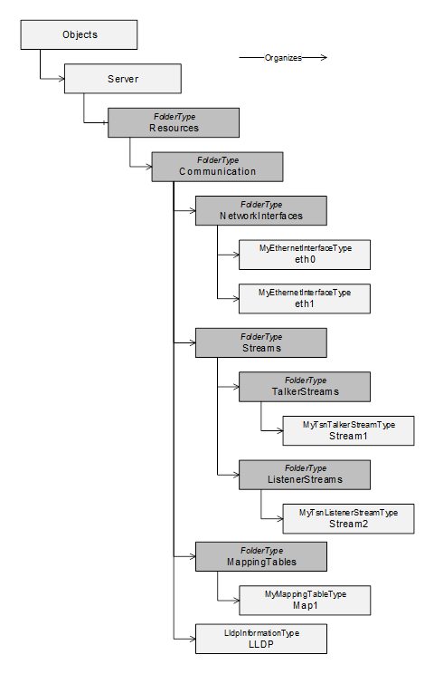  

Figure 3 - Instance Entry Points for Network Interfaces, Streams, Mapping Tables and LLDP information  

#### 5.4.1 Resources Folder  

The *Resources* *Object* shall be used as the browse entry point for physical and logical resources of the device the *Server* is running on. It shall reside in the *Server* *Object* defined in [OPC 10000-5](/§UAPart5) . It can contain a set of *Organizes* References that point to other *Objects* representing specific resources. It is formally defined in [Table 50](/§\_Ref29993695) .  

 **Table 50\- Resources definition**   

| **Attribute** | **Value** |
|---|---|
|BrowseName|Resources|
| **References** | **NodeClass** | **BrowseName** | **Comment** |
|ComponentOf of the Server Object defined in Part 5.|
|HasTypeDefinition|ObjectType|FolderType||
|Organizes|Object|Communication|Defined in [5.4.2](/§\_Ref29994562)|
| **Conformance Units** |
|BNM Entry Points|
  

  

#### 5.4.2 Communication Folder  

The *Communication* *Object* shall be used as the browse entry point for communication related resources of the physical device the *Server* is running on. It is formally defined in [Table 51](/§\_Ref29993710) .  

The *Communication* *Object* is referenced by an *Organizes* *Reference* from the *Resources* *Object* defined in [5.4.1](/§\_Ref29993786) .  

The *Communication* *Object* can include the following subfolders:  

* MappingTables  

* NetworkInterfaces  

* Streams  

Additionally, the *Communication* *Object* may include the LLDP instance.  

It is recommended to keep TSN-Streams and possible future (DetNet-)Flows separated in specific folders.  

 **Table 51\- Communication definition**   

| **Attribute** | **Value** |
|---|---|
|BrowseName|Communication|
| **References** | **NodeClass** | **BrowseName** | **Comment** |
|HasTypeDefinition|ObjectType|FolderType||
|Organizes|Object|MappingTables|Defined in [5.4.3](/§\_Ref51855257)|
|Organizes|Object|NetworkInterfaces|Defined in [5.4.4](/§\_Ref29993802)|
|Organizes|Object|Streams|Defined in [5.4.5](/§\_Ref31129005)|
|Organizes|Object|LLDP|Defined in [5.4.8](/§\_Ref149604810)|
| **Conformance Units** |
|BNM Entry Points|
  

  

#### 5.4.3 MappingTables Folder  

The *MappingTables* *Object* shall be used as the browse entry point for mapping tables of priority values and their application labels. It is formally defined in [Table 52 - MappingTables definition](/§\_Ref149604897) . All instances of the *PriorityMappingTableType* shall be referenced from this *Object* , either directly or indirectly, following hierarchical References.  

 **Table 52\- MappingTables definition**   

| **Attribute** | **Value** |
|---|---|
|BrowseName|MappingTables|
| **References** | **NodeClass** | **BrowseName** | **Comment** |
|HasTypeDefinition|ObjectType|FolderType||
| **Conformance Units** |
|BNM Mapping Entry Points|
  

  

  

#### 5.4.4 NetworkInterfaces Folder  

The *NetworkInterfaces* *Object* shall be used as the browse entry point for network interfaces of the device the *Server* is running on. It is formally defined in [Table 53](/§\_Ref29993719) .  

 **Table 53\- NetworkInterfaces definition**   

| **Attribute** | **Value** |
|---|---|
|BrowseName|NetworkInterfaces|
| **References** | **NodeClass** | **BrowseName** | **Comment** |
|HasTypeDefinition|ObjectType|FolderType||
| **Conformance Units** |
|BNM Entry Points|
  

  

The *NetworkInterfaces* folder is intended to hold instances, which are of *IetfBaseNetworkInterfaceType* or a subtype of it. However other *Objects* can be stored within this folder that implement the UA Interface *IIetfBaseNetworkInterfaceType* .  

All *Objects* of Type *IetfBaseNetworkInterfaceType* within the *NetworkInterfaces* folder shall represent either a physical or virtual network interface.  

  

#### 5.4.5 Streams Folder  

The *Streams* *Object* shall be used as the browse entry point for network streams of the device the *Server* is running on. It is formally defined in [Table 54](/§\_Ref29994190) .  

 **Table 54\- Streams definition**   

| **Attribute** | **Value** |
|---|---|
|BrowseName|Streams|
| **References** | **NodeClass** | **BrowseName** | **Comment** |
|HasTypeDefinition|ObjectType|FolderType||
|Organizes|Object|TalkerStreams|Defined in [5.4.6](/§\_Ref32344289)|
|Organizes|Object|ListenerStreams|Defined in [5.4.7](/§\_Ref32344293)|
| **Conformance Units** |
|BNM TSN Entry Points|
  

  

#### 5.4.6 TalkerStreams Folder  

The *TalkerStreams* *Object* shall be used as the browse entry point for sending network streams of the device the *Server* is running on. It is formally defined in [Table 55](/§\_Ref32344396) .  

 **Table 55\- TalkerStreams definition**   

| **Attribute** | **Value** |
|---|---|
|BrowseName|TalkerStreams|
| **References** | **NodeClass** | **BrowseName** | **Comment** |
|HasTypeDefinition|ObjectType|FolderType||
| **Conformance Units** |
|BNM TSN Entry Points|
  

  

#### 5.4.7 ListenerStreams Folder  

The *ListenerStreams* *Object* shall be used as the browse entry point for receiving network streams of the device the *Server* is running on. It is formally defined in [Table 56](/§\_Ref32344438) .  

 **Table 56\- ListenerStreams definition**   

| **Attribute** | **Value** |
|---|---|
|BrowseName|ListenerStreams|
| **References** | **NodeClass** | **BrowseName** | **Comment** |
|HasTypeDefinition|ObjectType|FolderType||
| **Conformance Units** |
|BNM TSN Entry Points|
  

  

#### 5.4.8 LLDP Information Object  

The *LLDP* *Information* *Object* shall be used as the single browse entry point for all LLDP information represented in the *Server* running on the device. It is formally defined in [Table 57](/§\_Ref140593913) .  

 **Table 57\- LLDP definition**   

| **Attribute** | **Value** |
|---|---|
|BrowseName|LLDP|
| **References** | **NodeClass** | **BrowseName** | **Comment** |
|HasTypeDefinition|ObjectType|LldpInformationType||
| **Conformance Units** |
|BNM IEEE LLDP Info|
  

  

The *LLDP Object* is an instance of Type *LldpInformationType* and represents the same structure as the YANG container lldp defined in the IEEE 802.1ABcu-2021. This object shall be read-only. The content is filled by the LLDP agent, based on the current configuration and operation. This LLDP agent behaves according to IEEE 802.1AB-2016 and is configured via mechanisms defined in IEEE 802.1AB-2016.  

Note: The behaviour of an LLDP agent can be further specified and limited by profiles (either IEEE or OPC). This specification only represents data received and transmitted by this agent and is independent of the agent configuration.  

Annex [A.4](/§\_Ref149649738) shows an example for the topology discovery using the information models of two neighbour *OPC UA Servers.*  

  

### 5.5 ObjectTypes  

#### 5.5.1 IetfBaseNetworkInterfaceType  

##### 5.5.1.1 Overview  

The *IetfBaseNetworkInterfaceType* defines the core set of properties needed to model a network interface based on the definition provided by IETF. [Figure 4](/§\_Ref82763024) illustrates the structure of the *IetfBaseNetworkInterfaceType* .  

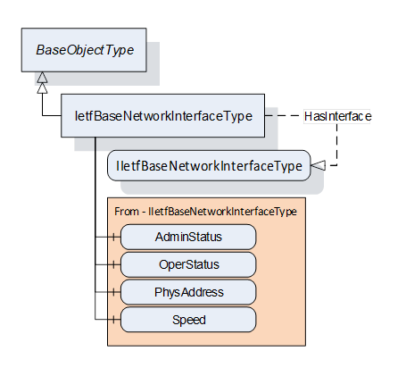  

Figure 4 - IetfBaseNetworkInterfaceType  

##### 5.5.1.2 IetfBaseNetworkInterfaceType definition  

The *IetfBaseNetworkInterfaceType* is formally defined in [Table 58](/§\_Ref73352069) .  

 **Table 58\- IetfBaseNetworkInterfaceType definition**   

| **Attribute** | **Value** |
|---|---|
|BrowseName|IetfBaseNetworkInterfaceType|
|IsAbstract|False|
| **References** | **NodeClass** | **BrowseName** | **DataType** | **TypeDefinition** | **Other** |
|Subtype of the BaseObjectType|
|||||||
|HasInterface|ObjectType|IIetfBaseNetworkInterfaceType||||
|Applied from IIetfBaseNetworkInterfaceType (see [5.2.1](/§\_Ref82762643) )|
|HasComponent|Variable|AdminStatus|InterfaceAdminStatus|BaseDataVariableType|M|
|HasComponent|Variable|OperStatus|InterfaceOperStatus|BaseDataVariableType|M|
|HasComponent|Variable|PhysAddress|String|BaseDataVariableType|O|
|HasComponent|Variable|Speed|UInt64|AnalogUnitType|M|
|||||||
|HasLowerLayerInterface|Object|\<InterfaceName\>||BaseObjectType|OP|
| **Conformance Units** |
|BNM IETF Interface Base Info|
  

  

The *BrowseName* of this *Object* shall be the same as the ifName of the corresponding IETF object (ifName is defined in IETF RFC 2863: The Interfaces Group MIB).  

For the formal definition of *AdminStatus, OperStatus, PhysAddress* and *Speed* please refer to [5.2.1](/§\_Ref82762655) .  

The *HasLowerLayerInterface Reference* points to an *Object* implementing the *IIetfBaseNetworkInterfaceType* used to indicate a hierarchical connection of network interfaces. This is used to indicate the relation e.g. between a VLAN interface and the actual physical interface. A VLAN interface shall additionally implement *IVlanIdType* .  

Each instance of the *IetfBaseNetworkInterfaceType* shall point to zero or one instance of *PriorityMappingTableType* or a subtype ** using a *UsesProrityMappingTable Reference* or a subtype. The referenced PriorityMappingTable is used for the prioritisation of network messages injected to the network using this network interface. If an instance of type *IetfBaseNetworkInterfaceType* has no reference to a PriorityMappingTable, the PriorityMappingTable of the next lower layer interface of type *IetfBaseNetworkInterfaceType* shall be used. An example for this is shown in Annex [A.2](/§\_Ref102667049) for "eth0.100".  

It is recommended that within one network domain that all interfaces should have consistent MappingTables assigned.  This ensures consistent use of Quality of Service features within the network.  

  

A network interface is linked for transmission or reception via the *BrowseName* of the object of type *IetfBaseNetworkInterfaceType.*  

Note: An example for a simplified PubSub connection is shown in Annex [A.2](/§\_Ref102667049) .  

The components of the *IetfBaseNetworkInterfaceType* have the *Attribute* values defined in [Table 59](/§\_Ref83038889) .  

 **Table 59\- IetfBaseNetworkInterfaceType Attribute values for child Nodes**   

| **Source Path** | **Value Attribute** | **Description Attribute** |
|---|---|---|
|Speed|
|---|
|EngineeringUnits|
  

  

NamespaceUri: http://www.opcfoundation.org/UA/units/un/cefact  

UnitId: 4337968DisplayName: bit/sDescription: bit per second  

\-  

  

The components of the *IetfBaseNetworkInterfaceType* have additional *References* which are defined in [Table 60](/§\_Ref16283617) .  

 **Table 60\- IetfBaseNetworkInterfaceType Additional References**   

| **SourceBrowsePath** | **Reference Type** | **Is Forward** | **TargetBrowsePath** |
|---|---|---|---|
|\<InterfaceName\>|HasInterface|True|IIetfBaseNetworkInterfaceType|
  

  

#### 5.5.2 PriorityMappingTableType  

##### 5.5.2.1 Overview  

Instances of the PriorityMappingTableType contains priority mapping information. [Figure 5](/§\_Ref83038311) illustrates the structure of the *PriorityMappingTableType* .  

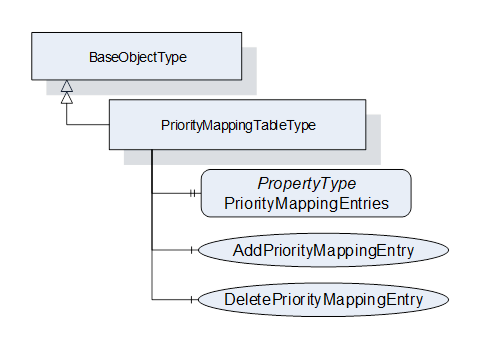  

Figure 5 - PriorityMappingTableType  

##### 5.5.2.2 PriorityMappingTableType definition  

The *PriorityMappingTableType* is formally defined in [Table 61](/§\_Ref83038961) .  

 **Table 61\- PriorityMappingTableType definition**   

| **Attribute** | **Value** |
|---|---|
|BrowseName|PriorityMappingTableType|
|IsAbstract|False|
| **References** | **Node**  **Class** | **BrowseName** | **DataType** | **TypeDefinition** | **Other** |
|Subtype of the BaseObjectType defined in [OPC 10000-5](/§UAPart5)|
|HasProperty|Variable|PriorityMapppingEntries|PriorityMappingEntryType[]|PropertyType|M|
|HasComponent|Method|AddPriorityMappingEntry|Defined in [5.5.2.3](/§\_Ref83038739)|O|
|HasComponent|Method|DeletePriorityMappingEntry|Defined in [5.5.2.4](/§\_Ref83038746)|O|
| **Conformance Units** |
|BNM Priority Mapping 2|
  

  

*PriorityMappingEntries* represents a list of all instances of *PriorityMappingEntryType* . For a formal definition see [5.3.2.1](/§\_Ref80892142) . The order of the elements in the array does not have any influence, as elements are indexed via the *MappingUri* and *PriorityLabel* .  

The combination of *QosCategory* and *PriorityLabel* are used as indices into the referenced *PriorityMappingTable* to look up the priority values.  The reference from an *IetfBaseNetworkInterface* is described in Section [5.5.1](/§\_Ref106091851) . For the sender, the priority values shall be included within the frame, if the according fields are available, i.e., VLAN Tag to use the PCP value and IP header to use the DSCP value. The receiver can use the priority values for internal packet processing.  

Note: An example for a simplified PubSub connection is shown in Annex [A.2](/§\_Ref102667049) . Within the *PubSubConnection* , each *WriterGroup* can contain a *QosCategory* and *DatagramQos* structure with a *PriorityLabel* . For the subscriber side these values are specified on the *DataSetReader* level.  

  

*AddPriorityMappingEntry* allows to add an entry to this instance of *PriorityMappingTableType* .  

*DeletePriorityMappingEntry* allows to delete an entry from this instance of *PriorityMappingTableType* .  

##### 5.5.2.3 AddPriorityMappingEntry method  

This optional *Method* allows to add an entry to this instance of *PriorityMappingTableType* . If the combination of *MappingUri* and *PriorityLabel* does not exist yet, the element will be added to the Variable *PriorityMappingEntries* .  

The signature of this *Method* is specified below. [Table 62](/§\_Ref83039291) and [Table 64](/§\_Ref83039297) specify the *Arguments* and *AddressSpace* representation, respectively.  

 **Signature**   

 **AddPriorityMappingEntry(**   

[in]  String MappingUri,  

[in]  String PriorityLabel,  

[in]  Byte PriorityValue\_PCP,  

[in]  UInt32 PriorityValue\_DSCP  

 **);**   

 **Table 62\- AddPriorityMappingEntry Method arguments**   

| **Argument** | **Description** |
|---|---|
|MappingUri|Named identifier of a well-known predefined set of priority labels.|
|PriorityLabel|Textual representation of the desired transport priority.|
|PriorityValue\_PCP|*PriorityValue\_PCP* shall be a value between 0 and 7.The value 0xFF indicates to omit the *PriorityValue\_PCP* from the entry.|
|PriorityValue\_DSCP|*PriorityValue\_DSCP* shall be a value between 0 and 63.The value 0xFFFFFFFF indicates to omit the *PriorityValue\_PCP* from the entry.|
  

  

The possible *Method* result codes are defined in [Table 63](/§\_Ref83039224) .  

 **Table 63\- AddPriorityMappingEntry Method result codes**   

| **ResultCode** | **Description** |
|---|---|
|Bad\_UserAccessDenied|The caller is not allowed to add a priority mapping rule.|
|Bad\_InvalidArgument|One of the arguments is invalid.|
|Bad\_IndexRangeInvalid|A mapping table entry with *MappingUri* and *PriorityLabel* already exists.|
  

  

 **Table 64\- AddPriorityMappingEntry Method AddressSpace definition**   

| **Attribute** | **Value** |
|---|---|
|BrowseName| **AddPriorityMappingEntry** |
| **References** | **Node Class** | **BrowseName** | **DataType** | **TypeDefinition** | **Other** |
|HasProperty|Variable|InputArguments|Argument[]|PropertyType|M|
  

  

##### 5.5.2.4 DeletePriorityMappingEntry method  

This optional *Method* allows to delete an entry from this instance of PriorityMappingTableType.  

The signature of this *Method* is specified below. [Table 65](/§\_Ref83039595) and [Table 67](/§\_Ref83039601) specify the *Arguments* and *AddressSpace* representation, respectively.  

 **Signature**   

 **DeletePriorityMappingEntry(**   

[in]  String MappingUri,  

[in]  String PriorityLabel  

 **);**   

 **Table 65\- DeletePriorityMappingEntry Method arguments**   

| **Argument** | **Description** |
|---|---|
|MappingUri|Named identifier of a well-known predefined set of priority labels.|
|PriorityLabel|Textual representation of the desired transport priority.|
  

  

The possible *Method* result codes are defined in [Table 66](/§\_Ref83039531) .  

 **Table 66\- DeletePriorityMappingEntry Method result codes**   

| **ResultCode** | **Description** |
|---|---|
|Bad\_UserAccessDenied|The caller is not allowed to delete the priority mapping rule.|
|Bad\_InvalidState|The state of this *ConnectionConfigurationSetType* instance is "Processing".|
|Bad\_BrowseNameInvalid|The *BrowseName* for the mapping entry is invalid.|
  

  

 **Table 67\- DeletePriorityMappingEntry Method AddressSpace definition**   

| **Attribute** | **Value** |
|---|---|
|BrowseName| **DeletePriorityMappingEntry** |
| **References** | **Node Class** | **BrowseName** | **DataType** | **TypeDefinition** | **Other** |
|HasProperty|Variable|InputArguments|Argument[]|PropertyType|M|
  

  

#### 5.5.3 LldpInformationType definition  

An instance of the *LldpInformationType* contains LLDP information collected by an independent LLDP agent. [Figure 6](/§\_Ref149241865) illustrates the structure of the *LldpInformationType* .  

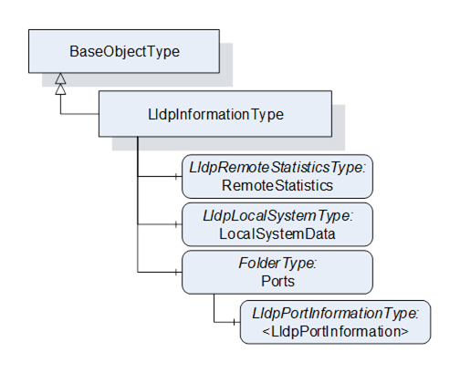  

Figure 6 - LldpInformationType  

  

The *LldpInformationType* is formally defined in [Table 68](/§\_Ref140594114) .  

 **Table 68\- LldpInformationType definition**   

| **Attribute** | **Value** |
|---|---|
|BrowseName|LldpInformationType|
|IsAbstract|False|
| **References** | **NodeClass** | **BrowseName** | **DataType** | **TypeDefinition** | **Other** |
|Subtype of the BaseObjectType|
|||||||
|HasComponent|Object|RemoteStatistics||LldpRemoteStatisticsType|O|
|HasComponent|Object|LocalSystemData||LldpLocalSystemType|M|
|HasComponent|Object|Ports||FolderType|M|
|||||||
| **Conformance Units** |
|BNM IEEE LLDP Info|
  

  

*LldpInformationType* represents the schema of the YANG container lldp in IEEE 802.1ABcu-2021. It models the two entry points for subsequent structures *LocalSystemData* for all device-related identification and *Ports* for the port-specific identification and information on neighbour devices.  

*RemoteStatistics* contains a collection of statistics indicating activity and events occurring on neighbour devices.  

*LocalSystemData* represents all device-related identification properties.  

*Ports* is a folder containing one or more instances of *LldpPortInformationType* that contains information about neighbouring devices seen through that port. The content of *Ports* is limited to instances of Type *LldpPortInformationType* .  

The components of the *LldpInformationType* have additional subcomponents, which are defined in [Table 69](/§\_Ref163049681) .  

 **Table 69\- LldpInformationType Addtional Components**   

| **BrowsePath** | **References** | **NodeClass** | **BrowseName** | **DataType** | **TypeDefinition** | **Other** |
|---|---|---|---|---|---|---|
|Ports|Organizes|Object|\<LldpPortInformation\>||LldpPortInformationType|OP|
  

  

  

#### 5.5.4 LldpRemoteStatisticsType definition  

The *LldpRemoteStatisticsType* is formally defined in [Table 70](/§\_Ref149604960) .  

 **Table 70\- LldpRemoteStatisticsType definition**   

| **Attribute** | **Value** |
|---|---|
|BrowseName|LldpRemoteStatisticsType|
|IsAbstract|False|
| **References** | **NodeClass** | **BrowseName** | **DataType** | **TypeDefinition** | **Other** |
|Subtype of the BaseObjectType|
|||||||
|HasComponent|Variable|LastChangeTime|UInt32|BaseDataVariableType|M|
|HasComponent|Variable|RemoteInserts|UInt32|BaseDataVariableType|M|
|HasComponent|Variable|RemoteDeletes|UInt32|BaseDataVariableType|M|
|HasComponent|Variable|RemoteDrops|UInt32|BaseDataVariableType|M|
|HasComponent|Variable|RemoteAgeouts|UInt32|BaseDataVariableType|M|
|||||||
| **Conformance Units** |
|BNM IEEE LLDP Info|
  

  

*LldpRemoteStatisticsType* represents the schema of the YANG container *remote-statistics* in IEEE 802.1ABcu-2021.  

*LastChangeTime* defines the time any remote info changed in the scale of the uptime of the system, as defined in clause 11.5.1 of IEEE Std 802.1AB-2016: lldpV2StatsRemTablesLastChangeTime. The uptime of the system is specified by [IETF RFC 3418](/§IETF\_RFC\_3418) in the unit of hundreths of a second.  

RemoteInserts defines the number of times new information was inserted into the *LldpRemoteSystemsType* array, as defined in clause 11.5.1 of IEEE Std 802.1AB-2016: lldpV2StatsRemTablesInserts. When this counter reaches the end of its range, it rolls over to 0.  

RemoteDeletes defines the number of times information was deleted from the *LldpRemoteSystemsType* array, as defined in clause 11.5.1 of IEEE Std 802.1AB-2016: lldpV2StatsRemTablesDeletes.  When this counter reaches the end of its range, it rolls over to 0.  

RemoteDrops defines the number of times new information could not be inserted into the *LldpRemoteSystemsType* array because of insufficient resources, as defined in clause 11.5.1 of IEEE Std 802.1AB-2016: lldpV2StatsRemTablesDrops.  When this counter reaches the end of its range, it rolls over to 0.  

RemoteAgeouts defines the number of times information aged out from the *LldpRemoteSystemsType* array because the information timeliness interval has expired, as defined in clause 11.5.1 of IEEE Std 802.1AB-2016: lldpV2StatsRemTablesAgeouts.  When this counter reaches the end of its range, it rolls over to 0.  

  

  

#### 5.5.5 LldpLocalSystemType definition  

The *LldpLocalSystemType* is formally defined in [Table 71](/§\_Ref149604973) .  

 **Table 71\- LldpLocalSystemType definition**   

| **Attribute** | **Value** |
|---|---|
|BrowseName|LldpLocalSystemType|
|IsAbstract|False|
| **References** | **NodeClass** | **BrowseName** | **DataType** | **TypeDefinition** | **Other** |
|Subtype of the BaseObjectType|
|||||||
|HasProperty|Variable|ChassisIdSubtype|ChassisIdSubtype|PropertyType|M|
|HasProperty|Variable|ChassisId|String|PropertyType|M|
|HasProperty|Variable|SystemName|String|PropertyType|M|
|HasProperty|Variable|SystemDescription|String|PropertyType|M|
|HasProperty|Variable|SystemCapabilitiesSupported|LldpSystemCapabilitiesMap|PropertyType|O|
|HasProperty|Variable|SystemCapabilitiesEnabled|LldpSystemCapabilitiesMap|PropertyType|O|
|||||||
| **Conformance Units** |
|BNM IEEE LLDP Info|
  

  

*LldpLocalSystemType* represents the schema of the YANG container *local-system-data* in IEEE 802.1ABcu-2021.  

*ChassisIdSubtype* defines type of encoding used to identify the chassis associated with the local system, as defined in clause 8.5.2.2 of IEEE Std 802.1AB-2016.  

*ChassisId* defines the chassis component associated with the local system, as defined in clause 8.5.2.3 of IEEE Std 802.1AB-2016.  

*SystemName* defines the system name of the local system, as defined in clause 8.5.6.2 of IEEE Std 802.1AB-2016.  

*SystemDescription* defines the system description of the local system, as defined in clause 8.5.7.2 of IEEE Std 802.1AB-2016.  

*SystemCapabilitiesSupported* defines the system capabilities that are supported on the local system, as defined in clause 8.5.8.1 of IEEE Std 802.1AB-2016.  

*SystemCapabilitiesEnabled* defines the system capabilities that are enabled on the local system, as defined in clause 8.5.8.2 of IEEE Std 802.1AB-2016.  

#### 5.5.6 LldpPortInformationType definition  

The *LldpPortInformationType* is formally defined in [Table 72](/§\_Ref149604983) .  

 **Table 72\- LldpPortInformationType definition**   

| **Attribute** | **Value** |
|---|---|
|BrowseName|LldpPortInformationType|
|IsAbstract|False|
| **References** | **NodeClass** | **BrowseName** | **DataType** | **TypeDefinition** | **Other** |
|Subtype of the BaseObjectType|
|||||||
|HasProperty|Variable|IetfBaseNetworkInterfaceName|String|PropertyType|M|
|HasProperty|Variable|DestMacAddress|Byte[6]|PropertyType|M|
|HasProperty|Variable|PortIdSubtype|PortIdSubtype|PropertyType|M|
|HasProperty|Variable|PortId|String|PropertyType|M|
|HasProperty|Variable|PortDescription|String|PropertyType|O|
|HasProperty|Variable|ManagementAddressTxPort|LldpManagementAddressTxPortType[]|PropertyType|O|
|HasComponent|Object|RemoteSystemsData||FolderType|O|
|||||||
| **Conformance Units** |
|BNM IEEE LLDP Info|
  

  

*LldpPortInformationType* represents the schema of the YANG list *port* in IEEE 802.1Abcu-2021.  

*IetfBaseNetworkInterfaceName* points to an object of type *IetfBaseNetworkInterfaceType* organized in the *NetworkInterfaces* folder with the value of the *String* . This link is needed to identify the port component (contained in the local chassis with the LLDP agent) associated with this entry. Annex [A.3](/§\_Ref149666798) visualizes this reference.  

*DestMacAddress* defines the MAC address of this network interface.  

*PortIdSubtype* defines type of encoding used to identify the associated *PortId* , as defined in clause 8.5.3.2 of IEEE Std 802.1AB-2016.  

*PortId* defines the port component associated with a given port in the local system, as defined in clause 8.5.3.3 of IEEE Std 802.1AB-2016.  

*PortDescription* defines the port description associated with the local system, as defined in clause 8.5.5.2 of IEEE Std 802.1AB-2016.  

ManagementAddressTxPort defines the set of ports (represented as a List of *Type* *LldpManagementAddressTxPortType* ) on which the local system management address instance will be transmitted.  

*RemoteSystemsData* defines the data received on this particular physical network connection. It is a folder containing instances of type *LldpRemoteSystemType.*  

The components of the *LldpInformationType* have additional subcomponents, which are defined in [Table 73](/§\_Ref163052830) .  

 **Table 73\- LldpPortInformationType additional subcomponents**   

| **BrowsePath** | **References** | **NodeClass** | **BrowseName** | **DataType** | **TypeDefinition** | **Other** |
|---|---|---|---|---|---|---|
|RemoteSystemsData|Organizes|Object|\< *LldpRemoteSystem* \>||*LldpRemoteSystemType*|OP|
  

  

#### 5.5.7 LldpRemoteSystemType definition  

The *LldpRemoteSystemType* is formally defined in [Table 74](/§\_Ref149604991) .  

 **Table 74\- LldpRemoteSystemType definition**   

| **Attribute** | **Value** |
|---|---|
|BrowseName|LldpRemoteSystemType|
|IsAbstract|False|
| **References** | **NodeClass** | **BrowseName** | **DataType** | **TypeDefinition** | **Other** |
|Subtype of the BaseObjectType|
|||||||
|HasComponent|Variable|TimeMark|UInt32|BaseDataVariableType|M|
|HasComponent|Variable|RemoteIndex|UInt32|BaseDataVariableType|M|
|HasComponent|Variable|ChassisIdSubtype|ChassisIdSubtype|BaseDataVariableType|M|
|HasComponent|Variable|ChassisId|String|BaseDataVariableType|M|
|HasComponent|Variable|PortIdSubtype|PortIdSubtype|BaseDataVariableType|M|
|HasComponent|Variable|PortId|String|BaseDataVariableType|M|
|HasComponent|Variable|PortDescription|String|BaseDataVariableType|O|
|HasComponent|Variable|SystemName|String|BaseDataVariableType|O|
|HasComponent|Variable|SystemDescription|String|BaseDataVariableType|O|
|HasComponent|Variable|SystemCapabilitiesSupported|LldpSystemCapabilitiesMap|BaseDataVariableType|O|
|HasComponent|Variable|SystemCapabilitiesEnabled|LldpSystemCapabilitiesMap|BaseDataVariableType|O|
|HasComponent|Variable|RemoteChanges|Boolean|BaseDataVariableType|O|
|HasComponent|Variable|RemoteTooManyNeighbors|Boolean|BaseDataVariableType|O|
|HasComponent|Variable|ManagementAddress|LldpManagementAddressType[]|BaseDataVariableType|O|
|HasComponent|Variable|RemoteUnknownTlv|LldpTlvType[]|BaseDataVariableType|O|
|||||||
| **Conformance Units** |
|BNM IEEE LLDP Info|
  

  

*LldpRemoteSystemType* represents the schema of the YANG list *remote-systems-data* in IEEE 802.1ABcu-2021. These instances are populated based on received LLDP TLVs.  

*TimeMark* defines a TimeFilter for this entry, as defined in IETF RFC 2021 section 6. The units for this time are hundredths of seconds.  

*RemoteIndex* defines an arbitrary local integer value used to identify a remote system, as defined in clause 11.5.1 of IEEE Std 802.1AB-2016: lldpV2RemIndex.  

*ChassisIdSubtype* defines type of encoding used to identify the chassis associated with the remote system, as defined in clause 8.5.2.2 of IEEE Std 802.1AB-2016.  

*ChassisId* defines the chassis component associated with the remote system, as defined in clause 8.5.2.3 of IEEE Std 802.1AB-2016.  

*PortIdSubtype* defines type of encoding used to identify the associated *PortId* , as defined in clause 8.5.3.2 of IEEE Std 802.1AB-2016.  

*PortId* defines the port component associated with a given port in the remote system, as defined in clause 8.5.3.3 of IEEE Std 802.1AB-2016.  

*PortDescription* defines the port description associated with the remote system, as defined in clause 8.5.5.2 of IEEE Std 802.1AB-2016.  

*SystemName* defines the system name of the remote system, as defined in clause 8.5.6.2 of IEEE Std 802.1AB-2016.  

*SystemDescription* defines the system description of the remote system, as defined in clause 8.5.7.2 of IEEE Std 802.1AB-2016.  

*SystemCapabilitiesSupported* defines the system capabilities are supported on the remote system, as defined in clause 8.5.8.1 of IEEE Std 802.1AB-2016.  

*SystemCapabilitiesEnabled* defines the system capabilities are enabled on the remote system, as defined in clause 8.5.8.2 of IEEE Std 802.1AB-2016.  

*RemoteChanges* Indicates that there are changes in the remote system's data, as determined by the variable remoteChanges, as defined in clause 9.2.5.11 of IEEE Std 802.1AB-2016.  

*RemoteTooManyNeighbors* Indicates that there are too many neighbors as determined by the variable tooManyNeighbors, as defined in clause 9.2.5.15 of IEEE Std 802.1AB-2016.  

*ManagementAddress* defines the Management address information about a particular chassis component (represented as a List of *Type* LldpManagementAddressType).  

*RemoteUnknownTlv* defines Information about an unrecognized TLV received from a physical network connection.  

All values get initialized from the LLDP stack based on received TLVs. If mandatory variables are not initialized due to a non-conforming LLDP stack, the return value for Browse action shall be *Bad\_NoValue* , as defined in OPC 10000-4.  

  

### 5.6 ReferenceTypes  

#### 5.6.1 UsesPriorityMappingTable ReferenceType  

The *UsesPriorityMappingTable ReferenceType* is a concrete *ReferenceType* and can be used directly. It is a subtype of *NonHierarchicalReferences* *ReferenceType* .  

The *SourceNode* of this *ReferenceType* shall be an *Object* implementing the *IIetfBaseNetworkInterfaceType* or an Object of Type *IetfBaseNetworkInterfaceType* . Each *Node* shall be the *SourceNode* of at most one *UsesPriorityMappingTable* *Reference* .  

The *TargetNode* of this *ReferenceType* shall be an instance of *PriorityMappingTableType* .  

The *UsesPriorityMappingTable ReferenceType* is formally defined in [Table 75](/§\_Ref83039823) .  

 **Table 75\- UsesPriorityMappingTable definition**   

| **Attributes** | **Value** |
|---|---|
|BrowseName|UsesPriorityMappingTable|
|InverseName|UsedByNetworkInterface|
|Symmetric|False|
|IsAbstract|False|
| **References** | **NodeClass** | **BrowseName** | **Comment** |
|Subtype of the NonHierarchicalReferences ReferenceType defined in [OPC 10000-5](/§UAPart5)|
| **Conformance Units** |
|BNM Priority Mapping 2|
  

  

#### 5.6.2 HasLowerLayerInterface ReferenceType  

The *HasLowerLayerInterface ReferenceType* is a concrete *ReferenceType* and can be used directly. It is a subtype of *HierarchicalReferences* *ReferenceType* .  

The usage of the References is following the YANG modelling approach which is using reference pointers in the YANG-interface nodes to point to other interface nodes in lower or higher layers ("lower-layer-if", "higher-layer-if"). The YANG Data Model for Interface Management is defined in IETF RFC 8343.  

Virtual interfaces shall reference their physical interfaces with the *HasLowerLayerInterfaceReferenceType* . [Annex A](/§\_Ref106091919) contains examples for such hierarchical references.  

The *SourceNode* of this *ReferenceType* shall be an *Object* organized in the *NetworkInterfaces* folder.  

The *TargetNode* of this *ReferenceType* shall be an *Object* organized in the *NetworkInterfaces* folder.  

The *HasLowerLayerInterface* *ReferenceType* is formally defined in [Table 76](/§\_Ref83039868) .  

 **Table 76\- HasLowerLayerInterface ** definition**   

| **Attributes** | **Value** |
|---|---|
|BrowseName|HasLowerLayerInterface|
|InverseName|HasHigherLayerInterface|
|Symmetric|False|
|IsAbstract|False|
| **References** | **NodeClass** | **BrowseName** | **Comment** |
|Subtype of the HierarchicalReferences ReferenceType defined in [OPC 10000-5](/§UAPart5)|
| **Conformance Units** |
|BNM IETF Interface Base Info|
  

  

  

## Annex A Modelling Examples (informative)  

### A.1 Modelling Examples for Network Interfaces  

#### A.1.1 Virtual Network Interfaces  

A virtual interfaces configuration can be represented by *Objects* representing the virtual and the physical network interface instances. *HasLowerLayerInterface* *References* point from the *Object(s)* representing the virtual interface(s) to the *Object* representing the physical interface. All *Objects* are of *ObjectType* *IetfBaseNetworkInterfaceType* . An example is shown in [Figure A-1](/§\_Ref82713348) .  

Note: The usage of the *References* is following the YANG modelling approach which is using reference pointers in the YANG-interface nodes to point to other interface nodes in lower or higher layers ("higher-layer-if", "lower-layer-if").  

  

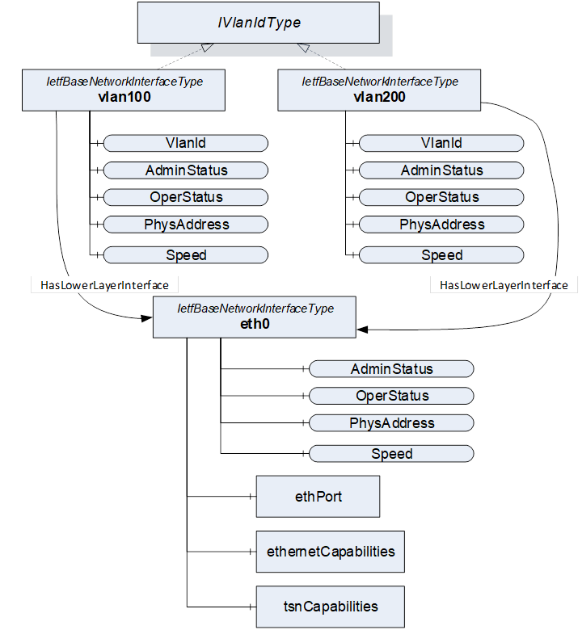  

Figure A- 1 - Modelling Example for virtual network interfaces  

  

#### A.1.2 Link Aggregation  

A link aggregation configuration can be represented by *Objects* representing the logical aggregation and the particular physical interface instances. *HasLowerLayerInterface* *References* point from the *Object(s)* representing the aggregation interface to the *Objects* representing the physical interfaces. All *Objects* implement the *IIetfBaseNetworkInterfaceType* . An example is shown in [Figure A-2](/§\_Ref46138624) .  

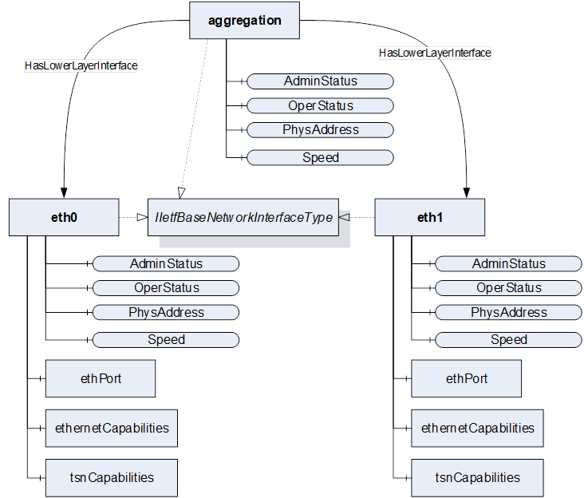  

Figure A- 2 - Modelling example for link aggregation  

  

### A.2 Modelling Examples for PriorityMappingEntries and IetfBaseNetworkInterface  

All packets sent via this network interface will use the source address and - in case of VLAN interfaces - VLAN ID as specified by this interface to generate a packet. All packets received via this network interface will use - in case of unicast communication - the destination address and - in case of VLAN interfaces - VLAN ID as specified by the interface to filter incoming packets.  

When using PubSub, each PubSubConnection as defined by the *PubSubConnectionDataType* in Part14 contains the address variable of type *NetworkAddressDataType* . If the networkInterface String of the *NetworkAddressDataType* matches the *BrowseName* of one Object in the NetworkInterfaces folder, it links the transmission or reception and the network interface. An example is shown in [Figure A-3](/§\_Ref174374267) .  

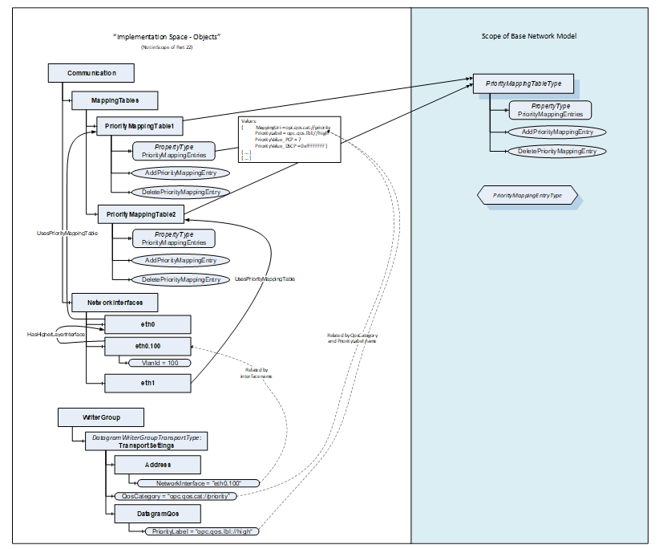  

Figure A- 3 - Modelling Example for PriorityMappingTableType and IetfBaseNetworkInterface  

  

### A.3 Connecting LldpPortInformationType and IetfBaseNetworkInterfaceType  

The *LldpPortInformationType* is connected to the associated *Object* of type *IetfBaseNetworkInterfaceType* via the name of the variable *IetfBaseNetworkInterfaceName* . [Figure A-4](/§\_Ref149647901) shows an example of this reference for the *IetfBaseNetworkInterface* with the *BrowseName* eth0.  

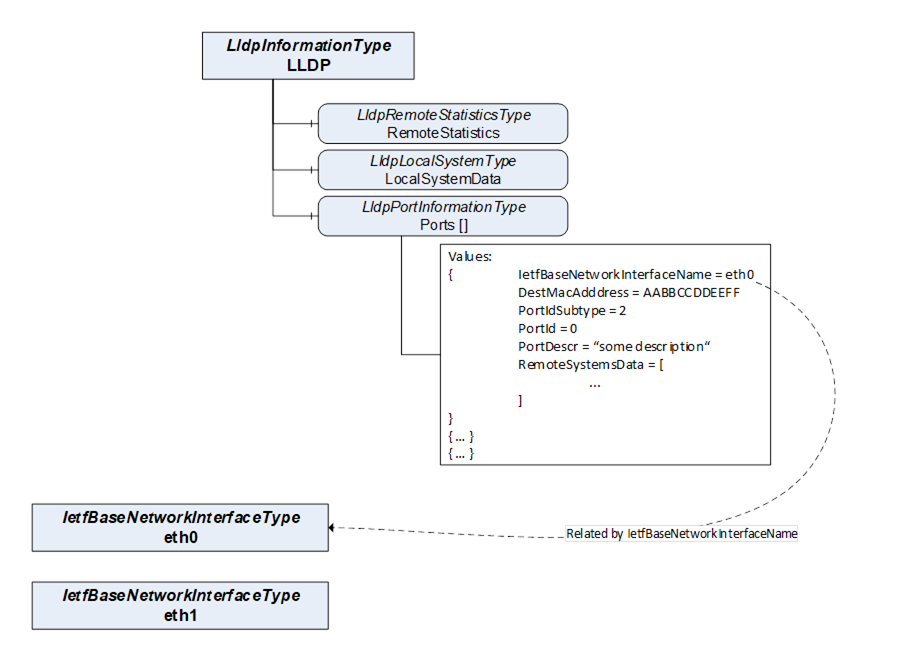  

Figure A- 4 - Connection between LLDP and IetfInterfaces  

  

  

### A.4 Topology Discovery with LldpRemoteSystems  

LLDP exchanges information of the local system and its direct peers in the network through link-local communication. The local systems information of the peers is represented in the remote systems data structure. [Figure A-5](/§\_Ref149648096) shows an example for this connection between two different OPC UA *Servers* and their representation of the LLDP information. The *RemoteSystemsData* contains the information of the corresponding *LocalSystemsData* and *PortInformation* . For simplicity, this figure does not present all possible variables.  

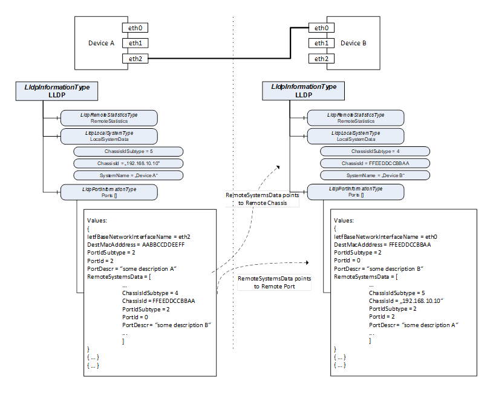  

Figure A- 5 - Topology Discovery via LLDP  

  

  

### A.5 Usage of BNM in other UA Specifications  

#### A.5.1 Usage of BNM for PubSub over TSN  

An example using the BNM for PubSub over TSN is shown in [Figure A-6](/§\_Ref174374789) .  

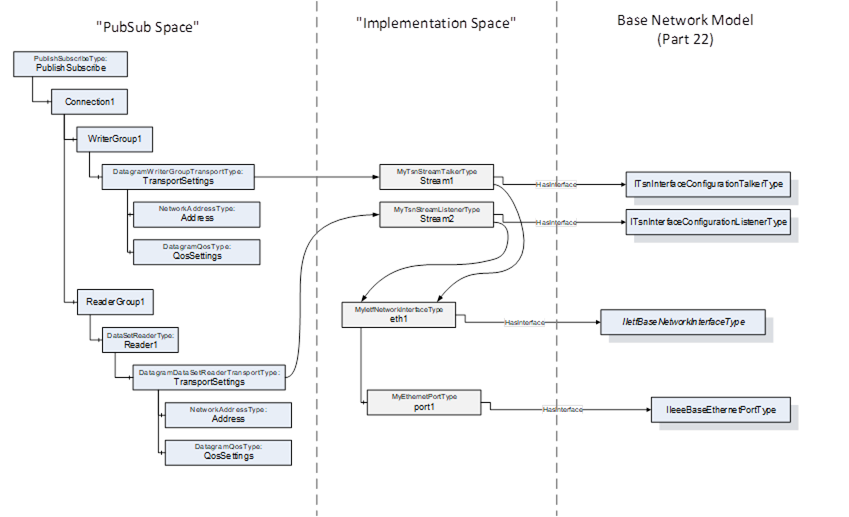  

Figure A- 6 - Possible Integration of BNM into PubSub  

#### A.5.2 Usage of BNM in PROFINET Companion Spec  

An example is shown in [Figure A-7](/§\_Ref46139100) .  

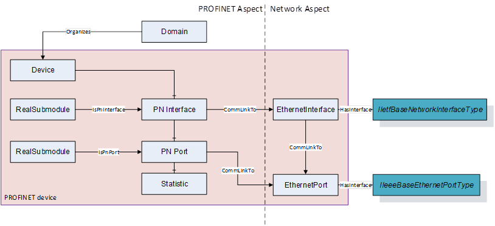  

Figure A- 7 - Recommended Integration of BNM into Companion Spec exemplified by PROFINET  

\_\_\_\_\_\_\_\_\_\_\_  

