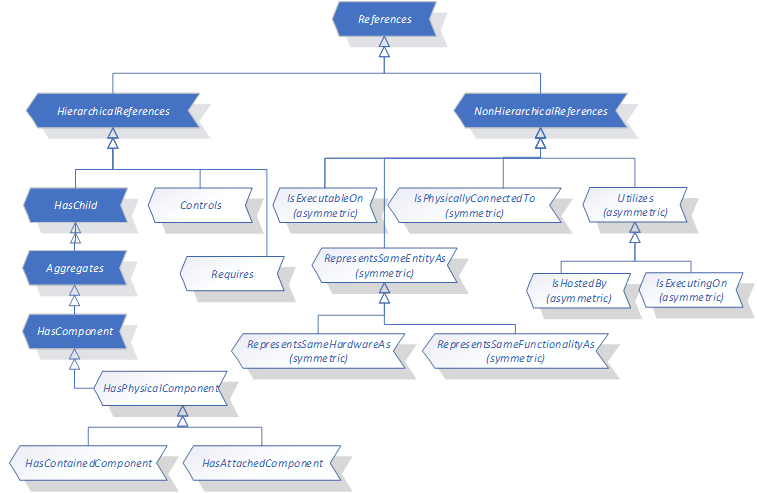
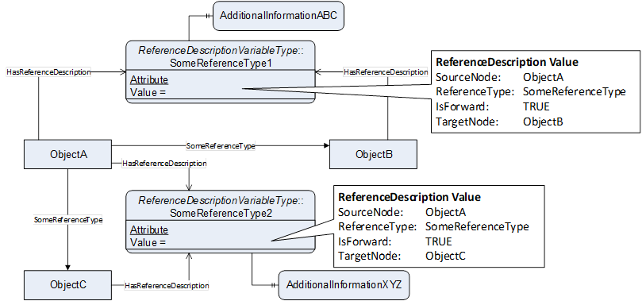
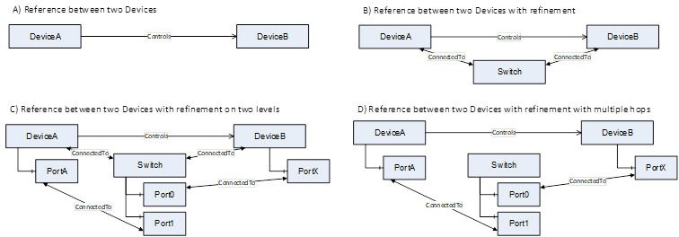
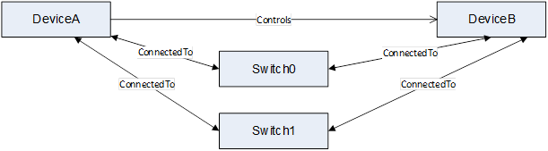
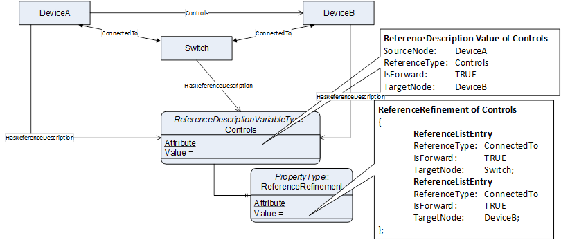
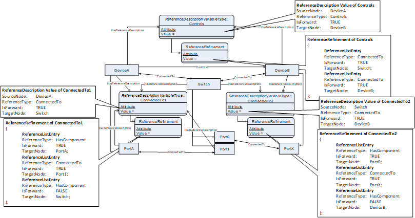
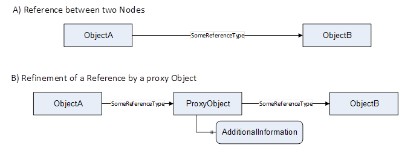

## 1 Scope  

This part of the OPC Unified Architecture defines an Information Model. The Information Model defines common ReferenceTypes.  

## 2 Normative references  

The following referenced documents are indispensable for the application of this OPC UA part. For dated references, only the edition cited applies. For undated references, the latest edition of the referenced document (including any amendments and errata) applies.  

OPC 10000-1, *OPC Unified Architecture - Part 1: Overview and Concepts*  

[http://www.opcfoundation.org/UA/Part1/](http://www.opcfoundation.org/UA/Part1/)  

OPC 10000-3, *OPC Unified Architecture - Part 3: Address Space Model*  

[http://www.opcfoundation.org/UA/Part3/](http://www.opcfoundation.org/UA/Part3/)  

OPC 10000-5, *OPC Unified Architecture - Part 5: Information Model*  

[http://www.opcfoundation.org/UA/Part5/](http://www.opcfoundation.org/UA/Part5/)  

## 3 Terms, definitions, abbreviated terms, and conventions  

### 3.1 Terms and definitions  

For the purposes of this document, the terms and definitions given in OPC 10000-1, OPC 10000-3, and OPC 10000-5 apply.  

All used terms are *italicized* in this document.  

### 3.2 Abbreviated terms  

CPU Central Processing Unit  

IO Input/Output  

IP Internet Protocol  

PC Personal Computer  

PCI Peripheral Component Interconnect  

PHY Physical Layer  

PLC Programmable Logic Controller  

RFID Radio Frequency Identification  

## 4 OPC UA ReferenceTypes  

### 4.1 Overview  

The following [Figure 1](/§\_Ref66181310) gives an overview of the *ReferenceTypes* defined in the following subsections.  

  

Figure 1 - Overview of ReferenceTypes  

### 4.2 IsExecutableOn  

#### 4.2.1 Overview  

This *ReferenceType* can be used to expose the relation between a software component and its execution environment. For example, it can be used to expose which firmware (including its version) is available on a field device.  

#### 4.2.2 Definition  

The *IsExecutableOn* is a concrete *ReferenceType* and can be used directly. It is a subtype of *NonHierarchicalReferences* .  

The semantic of this *ReferenceType* is to relate a software component to its execution environment that the software needs to run (e.g. Hardware component, Task or Thread). The relationship shows that the execution environment the reference points to, is able to execute the software component. This does not imply that the software component is currently being executed or running. To show that the software is running in an environment, *IsExecutingOn* should be used.  

The *SourceNode* of *References* of this *ReferenceType* shall be an *Object* or *ObjectType* representing a software component.  

The *TargetNode* of *References* of this *ReferenceType* shall be an *Object* or *ObjectType* representing an execution environment for a software component, which might be a piece of hardware (e.g. Device) or some other environment like a task, thread or software execution framework.  

*IsExecutableOn* is formally defined in [Table 1](/§\_Ref16854066) .  

 **Table 1\- IsExecutableOn Definition**   

| **Attributes** | **Value** |
|---|---|
|BrowseName|IsExecutableOn|
|InverseName|CanExecute|
|Symmetric|FALSE|
|IsAbstract|FALSE|
| **References** | **NodeClass** | **BrowseName** | **Comment** |
|Subtype of NonHierarchicalReferences defined in [OPC 10000-5](/§UAPart5)|
| **Conformance Units** |
|Base Info IsExecutableOn|
  

  

### 4.3 IsExecutingOn  

#### 4.3.1 Overview  

This *ReferenceType* can be used to expose the relation between a software component and its execution environment it is currently executing on. *References* of this *ReferenceType* might be very dynamic and need to disappear as soon, as the software component is not being executed anymore. For example, it can be used to expose that a PLC program is currently running on a specific task of a PLC.  

#### 4.3.2 Definition  

The *IsExecutingOn* is a concrete *ReferenceType* and can be used directly. It is a subtype of *Utilizes* .  

The semantic of this *ReferenceType* is to relate a software component to its execution environment it is currently executing on (e.g. Hardware component, Task or Thread). References of this ReferenceType shall only be used when the software component is currently executed / running.  

The *SourceNode* of *References* of this *ReferenceType* shall be an *Object* or *ObjectType* representing a software component.  

The *TargetNode* of *References* of this *ReferenceType* shall be an *Object* or *ObjectType* representing an execution environment for a software component, which might be a piece of hardware (e.g. Device) or some other environment like a task, thread or software execution framework.  

*IsExecutingOn* is formally defined in [Table 2](/§\_Ref65671227) .  

 **Table 2\- IsExecutingOn Definition**   

| **Attributes** | **Value** |
|---|---|
|BrowseName|IsExecutingOn|
|InverseName|Executes|
|Symmetric|FALSE|
|IsAbstract|FALSE|
| **References** | **NodeClass** | **BrowseName** | **Comment** |
|Subtype of Utilizes defined in [4.5](/§\_Ref74311914)|
| **Conformance Units** |
|Base Info IsExecutingOn|
  

  

  

### 4.4 Controls  

#### 4.4.1 Overview  

This *ReferenceType* can be used to expose the relation between an object controlling other objects and the controlled objects. For example, it can be used to relate a PLC to the field devices or machine-modules controlled by the PLC or a software component to the hardware components controlled by the software component.  

#### 4.4.2 Definition  

The *Controls* is a concrete *ReferenceType* and can be used directly. It is a subtype of *HierarchicalReferences* .  

The semantic of this *ReferenceType* is to relate the controlling component to the components controlled by the controlling component.  

The *SourceNode* of *References* of this *ReferenceType* shall be an *Object* or *ObjectType* representing the controlling component, as for example a PLC or a software component.  

The *TargetNode* of *References* of this *ReferenceType* shall be an *Object* representing a component that is controlled by the *TargetNode* .  

*Controls* is formally defined in [Table 3](/§\_Ref56421582) .  

 **Table 3\- Controls Definition**   

| **Attributes** | **Value** |
|---|---|
|BrowseName|Controls|
|InverseName|IsControlledBy|
|Symmetric|FALSE|
|IsAbstract|FALSE|
| **References** | **NodeClass** | **BrowseName** | **Comment** |
|Subtype of HierarchicalReferences defined in [OPC 10000-5](/§UAPart5)|
| **Conformance Units** |
|Base Info Controls|
  

  

### 4.5 Utilizes  

#### 4.5.1 Overview  

This *ReferenceType* can be used to expose the relation between a component to other components, that the component needs in order to work. In contrast to the *Requires* *ReferenceType* , this non-hierarchical *ReferenceType* allows loops, e.g. both components need each other in order to work. In that case, there would be two *References* , the first one pointing from one component to the other, and the second one vice versa. For example, a fan in a PC needs the power supply in order to work and the power supply needs the cooling from the fan, that it is not overheating. An example of a non-looping usage is that a robot utilizes a vision system in order to get the position where to grab something.  

#### 4.5.2 Definition  

The *Utilizes* is a concrete *ReferenceType* and can be used directly. It is a subtype of *NonHierarchicalReferences* .  

The semantic of this *ReferenceType* is to relate a component to other components that are needed by the component in order to work.  

The *SourceNode* of *References* of this *ReferenceType* shall be an *Object* or *ObjectType* representing a component that utilizes the *TargetNode* in order to work.  

The *TargetNode* of *References* of this *ReferenceType* shall be an *Object* or ObjectType representing the required component.  

*Requires* is formally defined in [Table 4](/§\_Ref56421591) .  

 **Table 4\- Utilizes Definition**   

| **Attributes** | **Value** |
|---|---|
|BrowseName|Utilizes|
|InverseName|IsUtilizedBy|
|Symmetric|FALSE|
|IsAbstract|FALSE|
| **References** | **NodeClass** | **BrowseName** | **Comment** |
|Subtype of NonHierarchicalReferences defined in [OPC 10000-5](/§UAPart5)|
| **Conformance Units** |
|Base Info Utilizes|
  

  

### 4.6 Requires  

#### 4.6.1 Overview  

This *ReferenceType* can be used to expose the relation between a component to other components, that the component requires in order to work. In contrast to the *HasComponent* *ReferenceType* , the related components are not considered to be subcomponents of the component. In contrast to the *Utilizes* *ReferenceType* , this hierarchical *ReferenceType* exposes a non-looping hierarchy of dependencies.  

For example, it can be used to relate an axis of a motion device to its required powertrains or a software component to other software components required to execute the software component, like for example libraries.  

#### 4.6.2 Definition  

The *Requires* is a concrete *ReferenceType* and can be used directly. It is a subtype of *HierarchicalReferences* .  

The semantic of this *ReferenceType* is to relate a component to other components it requires in order to work.  

The *SourceNode* of *References* of this *ReferenceType* shall be an *Object* or *ObjectType* representing a component that requires the *TargetNode* in order to work.  

The *TargetNode* of *References* of this *ReferenceType* shall be an *Object* representing the required component used by the *SourceNode* .  

*Requires* *References* shall not lead to loops, that is, starting from *Node* "A" and only following *References* of *ReferenceType Requires* or subtypes it shall never be possible to return to "A". But it is allowed that following the *References* there may be more than one path leading to another *Node* "B".  

*Requires* is formally defined in [Table 5](/§\_Ref74312079) .  

 **Table 5\- Requires Definition**   

| **Attributes** | **Value** |
|---|---|
|BrowseName|Requires|
|InverseName|IsRequiredBy|
|Symmetric|FALSE|
|IsAbstract|FALSE|
| **References** | **NodeClass** | **BrowseName** | **Comment** |
|Subtype of HierarchicalReferences defined in [OPC 10000-5](/§UAPart5)|
| **Conformance Units** |
|Base Info Requires|
  

  

### 4.7 IsPhysicallyConnectedTo  

#### 4.7.1 Overview  

This *ReferenceType* can be used to expose the relation between two hardware components which are mounted or mechanically linked or connected to each other, without one component being a subcomponent of the other component. If one component is considered to be a subcomponent, the *HasAttachedComponent* *ReferenceType* should be used. For example, it can be used to relate a motor to a gear.  

#### 4.7.2 Definition  

The *IsPhysicallyConnectedTo* is a concrete *ReferenceType* and can be used directly. It is a subtype of *NonHierarchicalReferences* . It is a symmetric *Reference* , that is, it provides the same semantic in both directions.  

The semantic of this *ReferenceType* is to connect two hard components that are physically connected, without one being a subcomponent of the other.  

The *SourceNode* of *References* of this type shall be an *Object* or *ObjectType* representing a piece of hardware.  

The *TargetNode* of this *ReferenceType* shall be an *Object* representing a piece of hardware.  

*IsPhysicallyConnectedTo* is formally defined in [Table 6](/§\_Ref56421598) .  

 **Table 6\- IsPhysicallyConnectedTo Definition**   

| **Attributes** | **Value** |
|---|---|
|BrowseName|IsPhysicallyConnectedTo|
|InverseName|\-|
|Symmetric|TRUE|
|IsAbstract|FALSE|
| **References** | **NodeClass** | **BrowseName** | **Comment** |
|Subtype of NonHierarchicalReferences defined in [OPC 10000-5](/§UAPart5)|
| **Conformance Units** |
|Base Info IsPhysicallyConnectedTo|
  

### 4.8 RepresentsSameEntityAs  

#### 4.8.1 Overview  

This *ReferenceType* can be used to expose that two different *Nodes* in the *AddressSpace* representing the same entity in the real world. Both *Nodes* might represent different aspects of the same entity in the same world, or model the same aspect in different ways, for example defined in different companion specifications. For example, an ethernet port of a network module might be represented as an *Object* of an *ObjectType* defined by one companion specification focusing on the PROFINET relevant information for such a port and by another *Object* providing a more generic Ethernet and IP focused view on the port defined by an *ObjectType* in another companion specification. Both *Objects* may have distinguished information, but also provide some common information like the IP address, potentially in different data formats.  

If a *Server* exposes more than two *Nodes* representing the same entity, it is recommended that all of the *Nodes* reference each other. A *Client* should not rely on all *Nodes* being mutually referenced to each other; i.e., the *Client* should browse each of the *Nodes* checking for additional *RepresentsSameEntityAs* *References* .  

#### 4.8.2 Definition  

The *RepresentsSameEntityAs* is a concrete *ReferenceType* and can be used directly. It is a subtype of *NonHierarchicalReferences* . It is a symmetric *Reference* , that is, it provides the same semantic in both directions.  

The semantic of this *ReferenceType* is to relate two *Nodes* that represent the same entity in the real world.  

The *SourceNode* of *References* of this *ReferenceType* can be of any *NodeClass* .  

The *TargetNode* of *References* of this *ReferenceType* can be of any *NodeClass* .  

Both, *SourceNode* and *TargetNode* shall represent the same entity in the real world.  

*RepresentsSameEntityAs* is formally defined in [Table 7](/§\_Ref74312091) .  

 **Table 7\- RepresentsSameEntityAs Definition**   

| **Attributes** | **Value** |
|---|---|
|BrowseName|RepresentsSameEntityAs|
|InverseName|\-|
|Symmetric|TRUE|
|IsAbstract|FALSE|
| **References** | **NodeClass** | **BrowseName** | **Comment** |
|Subtype of NonHierarchicalReferences defined in [OPC 10000-5](/§UAPart5)|
| **Conformance Units** |
|Base Info RepresentsSameEntityAs|
  

  

### 4.9 RepresentsSameHardwareAs  

#### 4.9.1 Overview  

This *ReferenceType* can be used to expose that two different *Nodes* in the *AddressSpace* representing the same hardware. It refines the *RepresentsSameEntityAs ReferenceType* and defines that the same entity in the real world shall be a piece of hardware. For example, it can be used to relate an *Object* representing a RFID reader based on the AutoID companion specification [1] with an *Object* representing the same RFID reader based on the IO-Link companion specification [2].  

Note: The example given above is special since both specification use OPC UA Part 100 Devices [3] as base. In this case, the preferred modelling approach is provided in an annex of Part 100, where a composition approach is used.  

#### 4.9.2 Definition  

The *RepresentsSameHardwareAs* is a concrete *ReferenceType* and can be used directly. It is a subtype of *HierarchicalReferences* . It is a symmetric *Reference* , that is, it provides the same semantic in both directions  

The semantic of this *ReferenceType* is to relate two *Nodes* that represent the same hardware.  

The *SourceNode* of *References* of this *ReferenceType* can be of any *NodeClass* .  

The *TargetNode* of *References* of this *ReferenceType* can be of any *NodeClass* .  

Both, *SourceNode* and *TargetNode* shall represent the same entity in the real world.  

*RepresentsSameHardwareAs* is formally defined in [Table 8](/§\_Ref74312103) .  

 **Table 8\- RepresentsSameHardwareAs ** Definition**   

| **Attributes** | **Value** |
|---|---|
|BrowseName|RepresentsSameHardwareAs|
|InverseName|\-|
|Symmetric|TRUE|
|IsAbstract|FALSE|
| **References** | **NodeClass** | **BrowseName** | **Comment** |
|Subtype of *RepresentsSameEntityAs* defined in [4.8](/§\_Ref74311957)|
| **Conformance Units** |
|Base Info RepresentsSameHardwareAs|
  

  

### 4.10 RepresentsSameFunctionalityAs  

#### 4.10.1 Overview  

This *ReferenceType* can be used to expose that two different *Nodes* in the *AddressSpace* representing the same functionality. It refines the *RepresentsSameEntityAs ReferenceType* and defines that the same entity in the real world shall be a functionality. For example, the functionality to move an axis might be provided by an *Object* representing a function block of a PLC with that functionality, but also be an *Object* representing the functionality of a drive. The *ReferenceType* can be used to related both *Objects* .  

#### 4.10.2 Definition  

The *RepresentsSameFunctionalityAs* is a concrete *ReferenceType* and can be used directly. It is a subtype of *HierarchicalReferences* . It is a symmetric *Reference* , that is, it provides the same semantic in both directions.  

The semantic of this *ReferenceType* is to relate two *Nodes* that represent the same functionality.  

The *SourceNode* of *References* of this *ReferenceType* can be of any *NodeClass* .  

The *TargetNode* of *References* of this *ReferenceType* can be of any *NodeClass* .  

Both, *SourceNode* and *TargetNode* shall represent the same functionality.  

*RepresentsSameFunctionalityAs* is formally defined in [Table 9](/§\_Ref74312135) .  

 **Table 9\- RepresentsSameFunctionalityAs Definition**   

| **Attributes** | **Value** |
|---|---|
|BrowseName|RepresentsSameFunctionalityAs|
|InverseName|\-|
|Symmetric|TRUE|
|IsAbstract|FALSE|
| **References** | **NodeClass** | **BrowseName** | **Comment** |
|Subtype of RepresentsSameEntityAs defined in [4.8](/§\_Ref74311963)|
| **Conformance Units** |
|Base Info RepresentsSameFunctionalityAs|
  

  

  

### 4.11 IsHostedBy  

#### 4.11.1 Overview  

This *ReferenceType* can be used to expose the relation between an *Object* representing some functionality and an *Object* representing some environment (e.g. hard- or software) which is necessary to execute and run the functionality. This implies that a malfunction in a referred environment or a missing related environment results in a non-functional functionality. A functionality *Object* might relate to several environment *Objects* , in that case all environment Objects are necessary to execute and run the functionality. An environment *Object* might be referenced by several functionality *Objects* .  

For example, the functionality to move an axis is hosted by the drive moving the axis. Another example is some analog input functionality, which is related to the IO-module and the related firmware.  

#### 4.11.2 Definition  

The *IsHostedBy* is a concrete *ReferenceType* and can be used directly. It is a subtype of *Utilizes* .  

The semantic of this *ReferenceType* is to relate functionality represented by an OPC UA *Node* to the hard- and software needed to provide the functionality.  

The *SourceNode* of *References* of this *ReferenceType* shall be an *Object* or *ObjectType* representing some functionality.  

The *TargetNode* of *References* of this *ReferenceType* shall be an *Object* or *ObjectType* representing some hard- or software.  

*IsHostedBy* is formally defined in [Table 10](/§\_Ref74312145) .  

 **Table 10\- IsHostedBy Definition**   

| **Attributes** | **Value** |
|---|---|
|BrowseName|IsHostedBy|
|InverseName|Hosts|
|Symmetric|FALSE|
|IsAbstract|FALSE|
| **References** | **NodeClass** | **BrowseName** | **Comment** |
|Subtype of Utilizes defined in [4.5](/§\_Ref74311975)|
| **Conformance Units** |
|Base Info IsHostedBy|
  

  

### 4.12 HasPhysicalComponent  

#### 4.12.1 Overview  

This *ReferenceType* can be used to expose the relation between a hardware component and its subcomponent. An example for this reference is a modular IO-Station which is composed out of a device head and multiple IO-Modules or it can be used to relate a PC to a PCI board plugged inside the PC.  

#### 4.12.2 Definition  

The *HasPhysicalComponent* is a concrete *ReferenceType* and can be used directly. It is a subtype of *HasComponent* .  

The semantic of this *ReferenceType* is to relate a hardware component to its subcomponent, which is also a hardware component.  

The *SourceNode* of *References* of this *ReferenceType* shall be an *Object* or *ObjectType* representing a piece of hardware.  

The *TargetNode* of *References* of this *ReferenceType* shall be an *Object* representing a piece of hardware that is a component of the *SourceNode* .  

*HasPhysicalComponent* is formally defined in [Table 11](/§\_Ref65675424) .  

 **Table 11\- HasPhysicalComponent Definition**   

| **Attributes** | **Value** |
|---|---|
|BrowseName|HasPhysicalComponent|
|InverseName|PhysicalComponentOf|
|Symmetric|FALSE|
|IsAbstract|FALSE|
| **References** | **NodeClass** | **BrowseName** | **Comment** |
|Subtype of HasComponent defined in [OPC 10000-5](/§UAPart5)|
| **Conformance Units** |
|Base Info HasPhysicalComponent|
  

  

### 4.13 HasContainedComponent  

#### 4.13.1 Overview  

This *ReferenceType* can be used to expose the relation between a hardware component and its subcomponent. It indicates that the subcomponent is inside the component. To gain access to the subcomponent typically removing a part of the component (e.g. a hatch) is necessary. For example, it can be used to relate a PC to a PCI board plugged inside the PC. The PCI board is accessible after removing the PC housing. It can also be used to relate a PLC to its CPU, which is hard wired to the PLC, or a network module to its Ethernet PHYs.  

#### 4.13.2 Definition  

The *HasContainedComponent* is a concrete *ReferenceType* and can be used directly. It is a subtype of *HasPhysicalComponent* .  

The semantic of this *ReferenceType* is to relate a hardware component to its subcomponent that is inside the component.  

The *SourceNode* of *References* of this *ReferenceType* shall be an *Object* or *ObjectType* representing a piece of hardware.  

The *TargetNode* of *References* of this *ReferenceType* shall be an *Object* representing a piece of hardware that is a component of the *SourceNode* .  

*HasContainedComponent* is formally defined in [Table 12](/§\_Ref65675432) .  

 **Table 12\- HasContainedComponent Definition**   

| **Attributes** | **Value** |
|---|---|
|BrowseName|HasContainedComponent|
|InverseName|ContainedComponentOf|
|Symmetric|FALSE|
|IsAbstract|FALSE|
| **References** | **NodeClass** | **BrowseName** | **Comment** |
|Subtype of HasPhysicalComponent defined in [4.12](/§\_Ref74311996)|
| **Conformance Units** |
|Base Info HasContainedComponent|
  

  

### 4.14 HasAttachedComponent  

#### 4.14.1 Overview  

This *ReferenceType* can be used to expose the relation between a hardware component and its subcomponent. It indicates that the subcomponent is attached to the component. That implies that the subcomponent is located in direct contact or direct vicinity of the component and is visible from the outside of the component without removing parts of the component (like a hatch). For example, it can be used to relate a drive device or a modular IO-station which is composed out of a device head and multiple IO-modules attached to the head to such an IO-module like a fieldbus interface module. Another example is a laptop having a removable battery attached to it.  

#### 4.14.2 Definition  

The *HasAttachedComponent* is a concrete *ReferenceType* and can be used directly. It is a subtype of *HasPhysicalComponent* .  

The semantic of this *ReferenceType* is to relate a hardware component to its subcomponent that is attached to the component.  

The *SourceNode* of *References* of this *ReferenceType* shall be an *Object* or *ObjectType* representing a piece of hardware.  

The *TargetNode* of *References* of this *ReferenceType* shall be an *Object* representing a piece of hardware that is a component of the *SourceNode* .  

*HasAttachedComponent* is formally defined in [Table 13](/§\_Ref74312156) .  

 **Table 13\- HasAttachedComponent Definition**   

| **Attributes** | **Value** |
|---|---|
|BrowseName|HasAttachedComponent|
|InverseName|AttachedComponentOf|
|Symmetric|FALSE|
|IsAbstract|FALSE|
| **References** | **NodeClass** | **BrowseName** | **Comment** |
|Subtype of HasPhysicalComponent defined in [4.12](/§\_Ref74312007)|
| **Conformance Units** |
|Base Info HasAttachedComponent|
  

  

## 5 Reference Description  

### 5.1 Overview  

OPC UA relates *Nodes* using *References* . This concept is intentionally a simple construct, where the only information of a *Reference* is the *SourceNode* , the *TargetNode* , the *ReferenceType* and for asymmetric *ReferenceTypes* the direction (forward or inverse).  

Sometimes, it is desirable to add more information to such a *Reference* . The concept of a *ReferenceDescription* keeps the simple *Reference* unchanged, and creates a *Variable* which is used to add more information about the *Reference* . Such a *Variable* can be referenced from the *SourceNode* and / or the *TargetNode* of such a *Reference* . Potentially, it can also be referenced by other *Nodes* to provide additional information (see also [5.2](/§\_Ref63920887) ). As *Nodes* can have several *References* , each *ReferenceDescription* *Variable* contains the unique definition of one *Reference* . An example is given in [Figure 2](/§\_Ref63861017) . ObjectA references ObjectB and ObjectC, each using the *ReferenceType* SomeReferenceType. Both *References* are described by a *ReferenceDescription* , that is, the *Variables* SomeReferenceType1 and SomeReferenceType2. The *Values* of those *Variables* uniquely identify the *References* by providing *SourceNode* , *TargetNode* , *ReferenceType* and direction. In the example, both *ReferenceDescriptions* have a *Property* with additional information, one called AdditionalInformationABC and the other AdditionalInformationXYZ.  

  

Figure 2 - Example of ReferenceDescriptions  

The following rules apply for using a *ReferenceDescription* .  

* A *ReferenceDescription* *Variable* shall be of *VariableType* *ReferenceDescriptionVariableType* (see [5.3.1](/§\_Ref133821199) ) or a subtype.  

* The *ReferenceDescription* *Variable* shall exist only in addition to the *Reference* it describes.  

* The *Server* shall expose the *Reference* in the direction described in the *ReferenceDescription* , i.e. if it is described as inverse, the inverse Path shall be browsable.  

* The *SourceNode* defined in the *Value* shall reference the *ReferenceDescription* *Variable* using the *HasReferenceDescription* *ReferenceType* (see [5.4.1](/§\_Ref63921056) ) or a subtype. The *TargetNode* and potentially other *Nodes* might reference the *ReferenceDescription* *Variable* using the *HasReferenceDescription* *ReferenceType* .  

* The *BrowseName* of a *ReferenceDescription* *Variable* should be the *BrowseName* of the *ReferenceType* , or in case of ambiguities, prefixed with the *BrowseName* of the *ReferenceType* followed by a suffix making the *BrowseName* unique in that context. In case of an inverse *Reference* ( *IsForward* set to FALSE), the *BrowseName* should be prefixed with the *BrowseName* of the *ReferenceType* , followed by "Inverse", and potentially followed by a suffix making the *BrowseName* unique in that context. *Clients* shall not make assumptions about the *BrowseName* and therefore should use for the *ReferenceType* and/or *VariableType* to receive *ReferenceDescription* *Variables* , not the *BrowseName* .  

* For each unique *Reference* ( *SourceNode* , *ReferenceType* , *IsForward* , *TargetNode* ) there shall be at most one *ReferenceDescription* *Variable* . The same *Reference* might be exposed two times by switching *SourceNode* and *TargetNode* and, in case of asymmetric *References* , inverting *IsForward* . In case of symmetric *References* , the *IsForward* is always set to TRUE.  

### 5.2 Reference Refinement  

Sometimes, a high-level *Reference* might be refined by more fine granular *References* , including a more detailed path. For example, DeviceA controls DeviceB (see [Figure 3](/§\_Ref63596543) , A)). This might be refined, exposing what network equipment is used for the communication (see [Figure 3](/§\_Ref63596543) , B)), and further refined by exposing, which ports are used (see [Figure 3](/§\_Ref63596543) , C)). Alternatively, it might directly be refined with ports and switches (see [Figure 3](/§\_Ref63596543) , D)).  

  

Figure 3 - Examples of Reference Refinements  

Without providing *Reference* refinement, there may be multiple paths possible (e.g., several switches, see [Figure 4](/§\_Ref63596841) ), and thus it is not clear which path the high-level *Reference* is using at any given instance in time.  

  

Figure 4 - Example of Reference Refinements with multiple path options  

Therefore, the *Property ReferenceRefinement* is defined for the *ReferenceDescriptionVariableType* (see [5.3.1](/§\_Ref133821199) ) allowing to make the refined *References* explicit. In [Figure 5](/§\_Ref63597320) , an example is given. The *ReferenceDescription Variable* containing the refinement can be referenced by any *Node* in the refinement path using the *HasReferenceDescription* *ReferenceType* to expose the information (see [Figure 5](/§\_Ref63597320) ) *.*  

  

Figure 5 - Example of how to use Reference Refinements  

When multiple levels are addressed, each *ReferenceDescription* *Variable* only contains one level, as shown in [Figure 6](/§\_Ref63598188) . The "Controls" *Variable* only contains the first level, via the Switch. The "ConnectedTo1" and "ConnectedTo2" *Variables* further refine the *References* used in the first refinement level. Both contain multiple hops in one refinement. In the example, the *Nodes* used in the refinement of "ConnectsTo1" do reference the *ReferenceDescription* *Variable* , whereas for "ConnectsTo2" they do not. Both options are allowed.  

  

Figure 6 - Example of how to use Reference Refinements with two Levels and Multiple Hops  

Note that the *ReferenceRefinement* intentionally only defines one refinement path (of potentially many possible paths between the *Nodes* ). If the path used changes, the *ReferenceRefinement* needs to change.  

### 5.3 OPC UA VariableTypes  

#### 5.3.1 ReferenceDescriptionVariableType  

The *ReferenceDescriptionVariableType* is a subtype of the *BaseDataVariableType* . It is used as container to expose additional information of a *Reference* . The *Value* contains the description of the *Reference* the *Variable* represents.  

The *Reference* as defined in the *Value* shall be exposed in the OPC UA Server containing the *Variable* . The *IsForward* field in the *Value* indicates the browsable direction of the *Reference* . It is not required that the opposite direction is browsable.  The *VariableType* is formally defined in [Table 14](/§\_Ref134949602) .  

 **Table 14\- ReferenceDescriptionVariableType Definition**   

| **Attribute** | **Value** |
|---|---|
|BrowseName|ReferenceDescriptionVariableType|
|IsAbstract|FALSE|
|ValueRank|−1 (−1 = Scalar)|
|DataType|ReferenceDescriptionDataType|
| **References** | **NodeClass** | **BrowseName** | **DataType** | **TypeDefinition** | **Other** |
|Subtype of the BaseDataVariableType defined in [OPC 10000-5](/§UAPart5)|
|HasProperty|Variable|ReferenceRefinement|ReferenceListEntryDataType[]|PropertyType|O|
| **Conformance Units** |
|Base Info ReferenceDescription|
  

  

The optional *Property* *ReferenceRefinement* contains an array of *References* refining the original *Reference* represented by an instance of *ReferenceDescriptionVariableType* . Each entry in the array contains the *ReferenceType* , direction and *TargetNode* . The *SourceNode* of the first entry in the array is the *SourceNode* of the *Value* of the instance of *ReferenceDescriptionVariableType* . The *SourceNode* of all other entries is the *TargetNode* of the previous entry. The *TargetNode* of the last entry shall be the *TargetNode* of the instance of *ReferenceDescriptionVariableType* .  

### 5.4 OPC UA ReferenceTypes  

#### 5.4.1 HasReferenceDescription  

The *HasReferenceDescription* is a concrete *ReferenceType* and can be used directly. It is a subtype of *HasChild* .  

The semantic of this *ReferenceType* is to link to a *ReferenceDescription* either from a *Node* directly participating in the *Reference* that is described in the *ReferenceDescription* (as *SourceNode* or *TargetNode* ), or from a *Node* somehow related to the *Reference* that is described (e.g. in the refinement of the *Reference* (being part of the refinement path)).  

The *SourceNode* of *References* of this type can be of any *NodeClass* .  

The *TargetNode* of this *ReferenceType* shall be a *Variable* of *VariableType* *ReferenceDescriptionVariableType* or one of its subtypes.  

The *HasReferenceDescription* is formally defined in [Table 15](/§\_Ref80773101) .  

 **Table 15\- HasReferenceDescription Definition**   

| **Attributes** | **Value** |
|---|---|
|BrowseName|HasReferenceDescription|
|InverseName|ReferenceDescriptionOf|
|Symmetric|FALSE|
|IsAbstract|FALSE|
| **References** | **NodeClass** | **BrowseName** | **Comment** |
|Subtype of HasChild defined in [OPC 10000-5](/§UAPart5)|
| **Conformance Units** |
|Base Info ReferenceDescription|
  

  

### 5.5 OPC UA DataTypes  

#### 5.5.1 ReferenceDescriptionDataType  

This structure contains the description of a *Reference* . The structure is defined in [Table 16](/§\_Ref80773123) .  

 **Table 16\- ReferenceDescriptionDataType Structure**   

| **Name** | **Type** | **Description** |
|---|---|---|
|ReferenceDescriptionDataType|structure||
|SourceNode|NodeId|The SourceNode of the Reference.|
|ReferenceType|NodeId|The ReferenceType of the Reference.|
|IsForward|Boolean|The direction of the Reference. If TRUE in forward direction, if FALSE in inverse direction. For symmetric References it shall always be set to TRUE.|
|TargetNode|ExpandedNodeId|The TargetNode of the Reference.|
  

  

Its representation in the *AddressSpace* is defined in [Table 17](/§\_Ref80773139) .  

 **Table 17\- ReferenceDescriptionDataType Definition**   

| **Attribute** | **Value** |
|---|---|
|BrowseName|ReferenceDescriptionDataType|
|IsAbstract|FALSE|
| **References** | **NodeClass** | **BrowseName** | **DataType** | **TypeDefinition** | **Other** |
|Subtype of Structure defined in [OPC 10000-5](/§UAPart5)|
| **Conformance Units** |
|Base Info ReferenceDescription|
  

  

#### 5.5.2 ReferenceListEntryDataType  

This structure contains the description of a *Reference* without *SourceNode* . It can be used to list a path of *References* without repeating the *SourceNode* , like in the *ReferenceRefinement* *Property* in [5.3.1](/§\_Ref133821199) . The structure is defined in [Table 18](/§\_Ref109726409) .  

  

 **Table 18\- ReferenceListEntryDataType Structure**   

| **Name** | **Type** | **Description** |
|---|---|---|
|ReferenceListEntryDataType|structure||
|ReferenceType|NodeId|The Node Id of the ReferenceType used as Reference.|
|IsForward|Boolean|The direction of the Reference, if TRUE in forward direction, if FALSE, in inverse direction. For symmetric references it shall always be set to TRUE.|
|TargetNode|ExpandedNodeId|The TargetNode of the Reference.|
  

  

Its representation in the *AddressSpace* is defined in [Table 19](/§\_Ref46498488) .  

 **Table 19\- ReferenceListEntryDataType Definition**   

| **Attribute** | **Value** |
|---|---|
|BrowseName|ReferenceListEntryDataType|
|IsAbstract|FALSE|
| **References** | **NodeClass** | **BrowseName** | **DataType** | **TypeDefinition** | **Other** |
|Subtype of Structure defined in [OPC 10000-5](/§UAPart5)|
| **Conformance Units** |
|Base Info ReferenceDescription|
  

  

## Annex A (Informative)ReferenceDescription Design Decisions  

### A.1 Overview  

The ReferenceDescription defined in [0](/§\_Ref80775070) keeps the simple construct of a *Reference* and adds a *Variable* to provide additional information. This approach allows to handle the *References* natively without the need to access the additional information. An alternative approach is described in the next section.  

### A.2 Alternative Approach: Intermediate Object  

One modelling construct to add information to *References* , is to provide an intermediate *Object* as proxy with additional information (see [Figure A.1](/§\_Ref80774979) ). The approach often makes sense. For example, to provide information about the physical cable connecting two devices represented as *Nodes* , another *Node* is added representing the cable, and both device *Nodes* are connected to the cable *Node* . The disadvantage of the approach is, that a *Client* cannot natively follow the *Reference* to the target directly, but always gets to the intermediate *Object* first and from there to the original target.  Therefore, the *ReferenceDescription* uses an approach, where the *Reference* directly connects both *Nodes* without the need to deal with an intermediate *Object* .  

  

Figure A. 1 - Refinement of References by Proxy Object  

  

  

 **Bibliography**   

[1] OPC 30010, OPC UA for AutoId Devices  

[2] OPC 30120, OPC UA for IO-Link Devices and IO-Link Masters  

[3] OPC 10000-100, OPC Unified Architecture - Part 100: Devices  

  

\_\_\_\_\_\_\_\_\_\_\_\_\_  

