## 1 Scope  

This part of OPC 10000 is part of the overall OPC Unified Architecture (OPC UA) standard series and defines the information model associated with *Object Serialization* .  

The purpose of *Object Serialization* is to provide a merged compact representation of the selected subtree of a root *Node* .  

## 2 Normative references  

The following referenced documents are indispensable for the application of this document. For dated references, only the edition cited applies. For undated references, the latest edition of the referenced document (including any amendments and errata) applies.  

OPC 10000-1, *OPC Unified Architecture - Part 1: Overview and Concepts*  

[http://www.opcfoundation.org/UA/Part1/](http://www.opcfoundation.org/UA/Part1/)  

OPC 10000-3, *OPC Unified Architecture - Part 3: Address Space Model*  

[http://www.opcfoundation.org/UA/Part3/](http://www.opcfoundation.org/UA/Part3/)  

OPC 10000-4, *OPC Unified Architecture - Part 4: Services*  

[http://www.opcfoundation.org/UA/Part4/](http://www.opcfoundation.org/UA/Part4/)  

OPC 10000-5, *OPC Unified Architecture - Part 5: Information Model*  

[http://www.opcfoundation.org/UA/Part5/](http://www.opcfoundation.org/UA/Part5/)  

OPC 10000-6, *OPC Unified Architecture - Part 6: Mappings*  

[http://www.opcfoundation.org/UA/Part6/](http://www.opcfoundation.org/UA/Part6/)  

OPC 10000-14, *OPC Unified Architecture - Part 14: PubSub*  

[http://www.opcfoundation.org/UA/Part14/](http://www.opcfoundation.org/UA/Part14/)  

OPC 10000-19, *OPC Unified Architecture* *\- Part 19: Dictionary Reference*  

[http://www.opcfoundation.org/UA/Part19/](http://www.opcfoundation.org/UA/Part19/)  

OPC 10000-100, *OPC Unified Architecture - Part 100: Devices*  

[http://www.opcfoundation.org/UA/Part100/](http://www.opcfoundation.org/UA/Part100/)  

OPC RIO, OPC UA for PROFINET Remote IO - Release V1.0 - Date: May 2022  

Order No.: 30142  

OPC PE, OPC UA for PROFIenergy - Release V1.00 - Date: March 2021  

Order No.: 30141  

## 3 Terms, definitions, and abbreviated terms  

### 3.1 Terms and definitions  

For the purposes of this document, the terms and definitions given in [OPC 10000-1](/§UAPart1) , [OPC 10000-3](/§UAPart3) , [OPC 10000-4](/§UAPart4) , [OPC 10000-5](/§UAPart5) , [OPC 10000-6](/§UAPart6) , [OPC 10000-14](/§UAPart14) , [OPC 10000-19](/§UAPart19) , [OPC 10000-100](/§UAPart100) ,  

OPC RIO, [OPC PE](/§OPCPE) and the following apply.  

#### 3.1.1 SerializationStartNode  

an *Object* or *Variable* that is the root *Node* of the *Node*\-tree containing the *Serialization Scope* .  

Note 1 to entry: The *SerializationStartNode* is the *SourceNode* of the *HasSerializationEntity* *ReferenceType* .  

Note 2 to entry: The *SerializationStartNode* can also be an *ObjectType* or *VariableType* to use the *InstanceDeclaration* mechanism when creating instances of these types.  

#### 3.1.2 SerializationEntity  

the *TargetNode* of the *HasSerializationEntity* *ReferenceType.*  

Note 1 to entry: The parent *Object* of the *SerializedData Variable* containing the *SerializationValue* and allows the configuration of the *SerializationScope* and the *Serialization* *DataTypes* .  

#### 3.1.3 SerializationScope  

the subset of *Nodes* directly or indirectly referenced by the *SerializationStartNode* , ** selected by the *SerializationConfiguration* .  

#### 3.1.4 SerializationConfiguration  

the set of *Properties* of the *SerializationEntity* influencing the *SerializationProcess* and the *SerializationScope* .  

#### 3.1.5 SerializationValue  

the merged compact aggregation of the *Values* of all serialized *Nodes* belonging to the *SerializationScope* and is the *Value* of the *SerializedData* *Variable* .  

#### 3.1.6 SerializationFieldDataType  

the *DataType* of a field of the *SerializationFieldDataType* or the *SerializationValue DataType* to represent a serialized *Node* inside the *SerializationValue* .  

Note 1 to entry: The serialized *Node* is the *Value* or the structure following the rules defined in [6.4](/§\_Ref171513372) .  

Note 2 to entry: The *SerializationFieldDataType* of a *Node* may be nested (this means it can contain fields which are *Structures* ) and contain the *SerializationFieldDataType* s of child *Nodes* . The *SerializationFieldDataType* s ** are *Structure* *DataTypes* created by the *Server* .  

#### 3.1.7 SerializationProperties  

*Properties* of the *SerializationEntity* which allow the configuration of the *SerializationProcess* and the *SerializationScope* .  

#### 3.1.8 SerializationProcess  

the mapping of the *SerializationValue* from and to the *Values* in the *SerializationScope* .  

Note 1 to entry: This can imply the creation or re-creation of the *SerializationFieldDataType* used for the *SerializationValue* .  

### 3.2 Abbreviated terms  

UA Unified Architecture  

GUID 128-bit value used to identify objects in computer systems  

JSON Text based data interchange format to represent structured data  

## 4 Concepts  

### 4.1 Object Serialization Basic Concept  

*Object Serialization* is understood in this specification as the aggregation of the *Values* of different *Variables* belonging to a subset of the *Information Model* ( *SerializationScope* ) into the *Value (SerializationValue)* of a single *Variable* ( *SerializedData* ) *. Clients* gain access to all *Values* in the *SerializationScope* at once by accessing the *SerializationValue* .  

### 4.2 Read Access to the SerializationValue  

[Figure 1](/§\_Ref171672930) illustrates the relationship between *SerializationScope,* *SerializationValue,* and the *SerializationProcess* between them.  

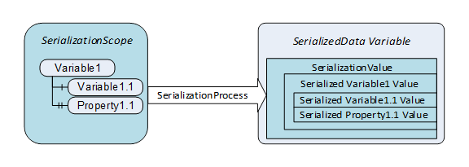  

Figure 1 - Relationship of SerializationScope and SerializationValue  

The *SerializationProcess* taking place during read access creates the *SerializationValue* . The *DataType* of the *SerializationValue* is provided by the *DataType* *Attribute* . The *Server* may create the *DataType* information at the time when the *SerializationValue* *DataType* is accessed.  

The *Value* of the *SerializedData Variable* may only be generated (serialized) when requested by the *Read Service* , by a *Subscription* or in *PubSub* publishing.  

### 4.3 Write Access to the SerializationValue  

[Figure 2](/§\_Ref172103901) illustrates the *SerializationProcess* taking place for serving a write access to the *SerializationValue* .  

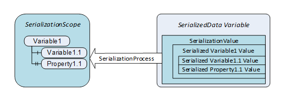  

Figure 2 - SerializationProcess for write access  

The creation of the *SerializationValue* for write access at the *Client* site needs the knowledge of the *SerializationValue* *DataType.*  

### 4.4 SerializationScope and SerializationEntity  

A *SerializationScope* is a subset of *Nodes* in the *Information* *Model* which are mapped into the *SerializationValue,* and which shall take part in a *SerializationProcess* . A *SerializationScope* consists of *Nodes* reachable from a start *Node* and the start *Node* itself ( *SerializationStartNode* ) if the start *Node* is a *Variable* . There may exist an arbitrary number of *SerializationScopes* .  

Since the *SerializationScope* potentially comprises many *Nodes* reachable from the *SerializationStartNode* down to an arbitrary depth, the possibility of limiting the number of *Nodes* which shall be part of the *SerializationScope* is needed (see *SerializationProperties* and [6.2](/§\_Ref169253593) ). As shown in [Figure 3](/§\_Ref171354457) , "Property2" is reachable from the *SerializationStartNode* , but is excluded from the *SerializationScope* .  

The *Object* providing an interface for the configuration of a *SerializationScope* is the *SerializationEntity.* It allows settings regarding the content of the *DataType* representing *Variables* ( *SerializationFieldDataType* ) ** inside the *SerializationValue* also and is the parent *Object* of the *SerializedData Variable* . The *SerializationValue* is the *Value* of the *SerializedData* *Variable.* The *DataType* of the *SerializationValue* maps all *Values* of the *Variables* in the *SerializationScope* (see [Figure 3](/§\_Ref171354457) ).  

The *SerializationProperties* are provided by the *SerializationEntity* (see [Figure 3](/§\_Ref171354457) ) and allow the configuration of the *SerializationScope* and the handling of metadata. Including or excluding *Nodes* referenced using certain *ReferenceTypes* , limiting the depth of the *SerializationScope* and settings which companion values like *statusCodes* shall be part of the *SerializationFieldDataType* of *Variables* is also possible (see [6.2](/§\_Ref169253593) also).  

The *SerializationStartNode* refers to one or more *SerializationEntity* *Objects* with a *HasSerializationEntity* *ReferenceType* .  

[Figure 3](/§\_Ref171354457) shows the relationship of the *SerializationStartNode* , the *SerializationEntity Object* , the *SerializedData Variable* and the *SerializationValue* containing the serialized *Values* of the *Nodes* in the *SerializationScope* .  

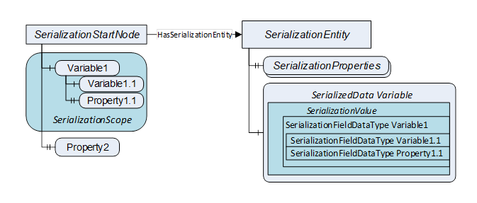  

Figure 3 - SerializationEntity and SerializationValue  

The *SerializationFieldDataType* of *Variables* is the *DataType* used to represent *Variables* of the *SerializationScope* inside the *SerializationValue* . *Variables* can be represented by the *DataType* of the *Variable* itself.  

Dependent on *SerializationProperties,* *Variables* can be represented by *Structure* *DataTypes* also (see [6.4.2](/§\_Ref177481211) ). If the *Variable* has children in the *SerializationScope* , the *SerializationFieldDataType* for the *Variable* is always a *Structure* *DataType* (see [6.4.3](/§\_Ref172027937) ).  

The *SerializationFieldDataType of Objects* is the *Structure* *DataType* used to represent *Objects* and the child *Nodes* of these *Objects* in the *SerializationScope* (see [6.4.4](/§\_Ref177481275) ).  

The *SerializationFieldDataTypes* and the *SerializationValue DataType* are generated by the *Server* .  

### 4.5 General Features  

The general concepts laid out above enable the following features and advantages:  

* The *Structure* of the *SerializationScope* is preserved. This means that the relationship of the *Objects* and *Variables* contributing to the *SerializationValue* is preserved.  

* *Servers* can provide different serializations by providing different *SerializationEntities* , e.g. for process values or for configuration data as shown in [Figure 4](/§\_Ref168417056) . Different *SerializationScopes* defined on the same data can be tailored to serve different use cases.  

* *SerializationScopes* can comprise other *SerializationScopes* for one *SerializationValue* as described in chapter [6.3.6](/§\_Ref172037231) and shown in [Figure 9](/§\_Ref143678546) .  

* Access to the *SerializationValue* is guaranteed to yield a consistent *Value* unless the *NonatomicRead* and *NonatomicWrite* flags of the *AccessLevelExType* part of the *SerializedData* *Variable's* *Attributes* are set to 1 ( *Server* specific, see [OPC 10000-3](/§UAPart3) ).  

* When writing of the *SerializationValue* with *NonatomicWrite* flag set to 0, the update of the original *Values* in the *SerializationScope* is like a transaction. This means if update of one original *Values* fails, all previously written *Values* are restored, and no change takes place. Note: Servers unable to support this shall set the NonatomicWrite flag of the SerializedData Variable to 1.  

* Writing of the *SerializationValue* yields one *Result Code* which is *Good* only if all original *Values* in the *SerializationScope* are successfully updated, otherwise the *Result Code* is *Bad* .  

## 5 Use Cases  

### 5.1 Example Serialize RIO Channel Groups  

OPC UA for PROFINET Remote IO (see [  

OPC RIO]) defines *Channel Group* *Objects* aggregating the *IO Data* of subordinated *IO Channel Objects* and organizing the channel *Objects* representing single *IO Channels* themselves. [Figure 4](/§\_Ref168417056) shows a *Channel Group* containing two output channel *Objects* , a configuration *Object* and *Process Values* .  

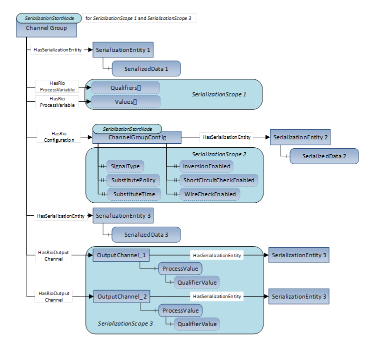  

Figure 4 - RIO Channel Group  

From the *Clients'* perspective, certain use cases when accessing a *Channel* *Group* *Object* become much more convenient and less error prone if compact representations of entire *Object* hierarchies or single subtrees are supported by the *Server* .  

A *Client* might be interested in the *Process* *Values* provided in the "Values" array and the associated *Process* *Value* *Qualifiers* (see [  

OPC RIO]) provided in the "Qualifiers" array. When using the "ChannelGroup" *Object* as *SerializationStartNode* (see "SerializationStartNode 1" in [Figure 4](/§\_Ref168417056) ), the "SerializationEntity 1" *Object* configures the "SerializationScope 1" by limiting the *Variables* belonging to the *SerializationScope* to those connected with *HasRioProcessVariable* *References* to the *SerializationStartNode.*  

A *Client* only interested in the *Channel* *Group* configuration uses a compact representation of the components of the "ChannelGroupConfig" *Object* . The "SerializationEntity 2" configures a separate *SerializationScope* . This "SerializationScope 2" is defined using the "ChannelGroupConfig" *Object* as *SerializationStartNode* (see "SerializationStartNode 2" in [Figure 4](/§\_Ref168417056) ). When reading the *Value* of the "SerializedData 2", *Clients* gain access to a consistent snapshot of the *Values* of all *Properties* which are components of the "ChannelGroupConfig" *Object* .  

A *Client* only interested in the *IO Data* provided by channel *Objects* and their components uses a compact representation of the "OutputChannel\_1" and "OutputChannel\_2" *Objects* . "The SerializationEntity 3" *Objects* configure the "SerializationScope 3" by including only *Objects* connected with *HasRioOutputChannel* *ReferenceTypes* to the "ChannelGroup" *Object* used as *SerializationStartNode* as shown in [Figure 4](/§\_Ref168417056) . Since the "ProcessValue" and "QualifierValue" *Variables* are part of this compact representation, reading the *IO Data* of all channels aggregated by the *Channel Group* *Object* using one single read operation is possible (see [6.3.6](/§\_Ref172037231) and [A.3](/§\_Ref185350092) for explanations). This supports time consistency of the obtained *IO Data* .  

The compact representation of these *SerializationValues* can be serialized into the JSON format by applying already established OPC UA encoding rules to support web *Clients* also.  

### 5.2 Example Serialization of PROFIenergy Data  

OPC UA for PROFIenergy (see [ [OPC PE](/§OPCPE) ) specifies the structure of energy data provided by a *Server* as shown in [Figure 5](/§\_Ref168413369) . The *SerializationScope* shown in [Figure 5](/§\_Ref168413369) comprises all *MeasurementValueType* *Variables* which are components of the *EnergyMeasurementType* *Objects* organized in the "EnergyManagement" *Folder* *Object* . The *SerializationScope* is configured to exclude the constant metadata contained in the *Properties* belonging to each *MeasurementValueType* *Variable* .  

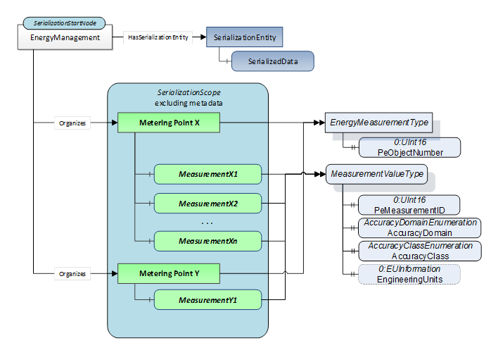  

Figure 5 - PROFIenergy measurement values  

When accessing the *Value* of the *SerializedData Variable* , a *Client* obtains all measurement values of all subordinated "Metering Point" *Objects* in one single read operation. This supports time consistency of the collection of measurement values the Client gains access to at once.  

### 5.3 Semantic Property handling  

Especially in OPC UA *PubSub* scenarios, the transmission of semantic *Properties* like "EngineeringUnits", "AccuracyDomain" and "PeMeasurementID" along with actual values is not desirable since this data does not change and can substantially increase the amount of transmitted data. Although the metadata constitutes an indispensable part of the data by enabling its correct interpretation, repeated transmissions of unchanged data are not necessary.  

In a *Client* / *Server* scenario, *Clients* can obtain the metadata initially by separate browse and read operations. Metadata changes can be notified using *ModelChange* and *SemanticChange* *Events* .  

When using *Subscriptions* , the *Server* can inform the *Clients* about metadata changes by setting the *SemanticsChanged* bit in the *StatusCodes* returned as part of data change *Notifications* . In *PubSub* scenarios, if the metadata of the subscribed *DataSet* changes, the *Client* receives a new *ConfigurationVersion* in the *DataSetMetaData* of the affected *DataSet* .  

Considering possible application failure due to usage of outdated metadata, invoking the *Read* *Service* to obtain the *Value* of a merged compact representation not containing the associated metadata is appropriate for low-frequency data refresh scenarios imposing little additional bandwidth usage. If metadata change due to reconfiguring is possible, the metadata should be obtained by separate read accesses each time the *Value* of the merged compact representation is read.  

Alternatively, the merged compact representation could be configured to contain the metadata in such scenarios. Another possibility is the establishment of *Subscriptions* comprising only the metadata ** ( *ModelChange* or *SemanticChange Events* , see above).  

To enable each of the possible scenarios for metadata handling outlined above, the *SerializationScope* can be adjusted in various ways (see chapter [6.2](/§\_Ref169253593) ).  

## 6 Model  

### 6.1 Overview  

*Object Serialization* provides a consistent, compact representation of the *Variable Values* in the *SerializationScope* . *Objects* or *Variables* that are the root of such a serialization are called *SerializationStartNodes* and have *HasSerializationEntity References* to one or more *SerializationEntities* . The *SerializationEntities* are of *ObjectType* *SerializationEntityType* , see [6.2](/§\_Ref169253593) . The *SerializationProcess* is controlled by *Properties* of this *ObjectType.*  

The *DataType* of the *SerializedData* *Variable* is the *SerializationValue DataType* mapping all *Values* in the *SerializationScope* . It is the serialization *DataType* of the *SerializationStartNode* . The *Values* themselves each have their own *SerializationFieldDataType* . In the example shown in [Figure 6](/§\_Ref168910107) , the *SerializationFieldDataTypes* of the *Variables* in the *SerializationScope* equal the *DataTypes* of the original *Values* .  

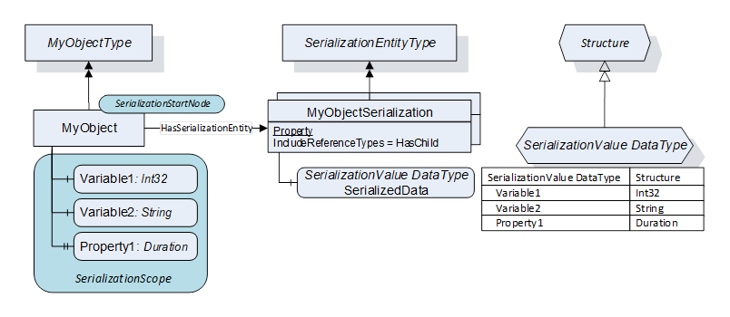  

Figure 6 - Example: Instance-specific serialization for the Object "MyObject"  

In the example above, the "MyObjectSerialization" instance of *SerializationEntityType* has the *IncludeReferenceTypes Property* set to "HasChild". This selects all *Variables* and *Properties* .  

Because it is instance-specific, the *SerializationValue DataType* *Node* is dynamically created. Its *BrowseName* and *NodeId* are *Server*\-specific and could be GUID-based.  

In the Type-based serialization the *SerializationValue DataType* *Node* is defined in the subtype of the *SerializationEntityType* .  

### 6.2 Limitations  

Since the *BrowseNames* of the *Variables* in the *SerializationScope* are used as field names for the *SerializationFieldDataType* fields in the *SerializationValue* *DataType* , limitations for *BrowseNames* arise: The characters used for the *BrowseNames* must be permissible in field names of *Structure* *DataTypes* . To achieve this, it is recommended to limit the characters used in *BrowseNames* to letters (lower- and uppercase), digits and the underscore ('\_'). The *BrowseName* must not start with a digit. Special characters (e.g. '@', '\*', etc.) shall not be used.  

If a non-allowed character is encountered, this character will be replaced according to the name encoding rules defined in the [OPC 10000-6](/§UAPart6) .  

If conflicting *BrowseNames* (e.g. duplicate *BrowseNames* on the same hierarchy level) are encountered, the *SerializationProcess* fails and the *StatusCode* for access yields Bad\_BrowseNameDuplicated.  

### 6.3 SerializationEntityType ObjectType  

#### 6.3.1 Definition  

The *SerializationEntityType* *ObjectType* defines the *SerializationProcess* . It has *SerializationProperties* which allow the configuration of the *SerializationProcess* and the *SerializationScope* .  

The *SerializationEntityType* is formally defined in [Table 1](/§\_Ref415602315) and illustrated in [Figure 7](/§\_Ref143185408) .  

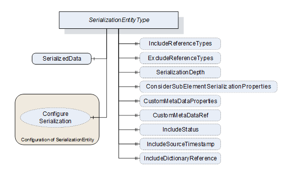  

Figure 7 - SerializationEntityType components  

  

Table 1 - SerializationEntityType definition  

| **Attribute** | **Value** |
|---|---|
|BrowseName|SerializationEntityType|
|IsAbstract|False|
  
| **References** | **NodeClass** | **BrowseName** | **DataType** | **TypeDefinition** | **Other** |
|---|---|---|---|---|---|
|Subtype of the *BaseObjectType* defined in [OPC 10000-5](/§UAPart5)|
|HasComponent|Variable|SerializedData|Structure|BaseDataVariableType|M|
||
|Serialization filter Properties|
|HasProperty|Variable|IncludeReferenceTypes|NodeId[]|PropertyType|O,R|
|HasProperty|Variable|ExcludeReferenceTypes|NodeId[]|PropertyType|O,R|
|HasProperty|Variable|SerializationDepth|UInt16|PropertyType|O,R|
|HasProperty|Variable|ConsiderSubElementSerializationProperties|Boolean|PropertyType|O,R|
|HasProperty|Variable|CustomMetaDataProperties|KeyValuePair[]|PropertyType|O,R|
|HasProperty|Variable|CustomMetaDataRef|NodeId|PropertyType|O,R|
|HasProperty|Variable|IncludeStatus|Boolean|PropertyType|O,R|
|HasProperty|Variable|IncludeSourceTimestamp|Boolean|PropertyType|O,R|
|HasProperty|Variable|IncludeDictionaryReference|Boolean|PropertyType|O,R|
||
|Configuration of the SerializationEntity (requires locking)|
|HasComponent|Method|ConfigureSerialization|see [6.3.3](/§\_Ref168568845)|O|
  
| **Conformance Units** |
|---|
|ObjectSerialization Base|
  

  

The *SerializationProperties* are described starting with clause [6.3.4](/§\_Ref168568980) . The default settings in [Table 2](/§\_Ref168568765) apply for *Properties* that are not provided on a *SerializationEntityType* instance.  

Table 2 - Default values for serialization filter Properties  

| **Property Name** | **Default setting** |
|---|---|
|IncludeReferenceTypes|[HasChild]|
|ExcludeReferenceTypes|[] //empty array|
|SerializationDepth|1|
|ConsiderSubElementSerializationProperties|False|
|CustomMetaDataProperties|[] //empty array|
|CustomMetaDataRef|\{0\}|
|IncludeStatus|False|
|IncludeSourceTimestamp|False|
|IncludeDictionaryReference|False|
  

  

#### 6.3.2 SerializedData Variable  

The *SerializedData* *Variable* holds the *SerializationValue* , customized by the *SerializationProperties* .  

The *DataType* of the *SerializationValue* is the *SerializationValue DataType* and is a subtype of *Structure* where the *DataTypeDefinition* *Attribute* of this *DataType* provides the metadata and encoding information.  

The *DataType* *Node* including the *DataTypeDefinition* *Attribute* is dynamically created. It only has an inverse *Reference* to its supertype *Structure* . *Clients* must obtain the *NodeId* by reading the *DataType* *Attribute* of the *SerializedData Variable* . Then they must read the *DataTypeDefinition* *Attribute* of the *DataType* to be able to decode the *SerializationValue* .  

The *Value* of the *SerializedData Variable* is only generated (serialized) when requested by the *Read Service* , by a *Subscription* or in *PubSub* publishing.  

The *SerializationValue* is typically read-only. If the *Server* supports write access, the *Client's* *Session* shall be able to successfully write all original *Variables* in the *SerializationScope* . If the write for any *Variable* fails, the write call shall fail and return a proper result code (e.g., Bad\_NotWritable, Bad\_InvalidArgument, and Bad\_ConfigurationError).  

If the *SerializationScope* contains nested subtrees, each element that has children itself has its own *DataType* *Node* describing these direct children of this element.  

The *SerializationValue* can change in the following ways:  

* By changing the *SerializationProperties* with the *ConfigureSerialization Method.*  

* By other changes of the *AddressSpace* , for instance insertion or deletion of child nodes on any level of the subtree in the *SerializationScope* .  

In case of such changes, a new *DataType* shall be created with a new *DataType* *NodeId* and encoding *NodeId* . This *DataType* *Attribute* of the *SerializedData Variable* shall refer to this new *DataType* .  

In case of *PubSub* , a change of the *DataType* *NodeId* causes a change of the metadata.  

*Servers* may not be able to save dynamically created *Nodes* . In addition, the *AddressSpace* may have changed (reconfigured) during shutdown.  

If the *SerializationEntity* is an *InstanceDeclaration* , accessing the *SerializedData* *Variable* is not possible. Reading attempts are answered with the *StatusCode* Bad\_NoValue.  

Note 1: It may be useful to use *GUID* *NodeIds* due to the dynamic of the process.  

Note 2: It is recommended, that *Servers* persist *DataType* *NodeIds* so that these *NodeIds* remain in place after restart, if the *SerializationScope* has not changed.  

#### 6.3.3 ConfigureSerialization Method  

*ConfigureSerialization* is an optional *Method* to set the *SerializationProperties* of the parent *SerializationEntity* .  

The *DI:LockingServicesType* is an *AddIn* defined in [OPC 10000-100](/§UAPart100) . This *AddIn* shall be added as instance with the instance name "Lock" if the *Server* implements the *ConfigureSerialization* *Method* .  

Before invoking this *Method* , *Clients* shall lock the *SerializationEntity* using the *Lock Object* instance.  

When successful, the *Server* will create a new *DataType* for the *SerializedData Variable* with the *DataTypeDefinition* *Attribute* for the metadata and encoding information.  

The signature of this *Method* is specified below. [Table 3](/§\_Ref276121038) and [Table 4](/§\_Ref260826325) specify the arguments and *AddressSpace* representation, respectively.  

 **Signature**   

 **ConfigureSerialization**   

 **** KeyValuePair[] SerializationFilterProperties,  

 **** Int32[]  Results  

);  

  

Table 3 - ConfigureSerialization Method arguments  

| **Argument** | **Description** |
|---|---|
|SerializationFilterProperties|Array of *KeyValuePair* *Structures* containing the desired settings. The key field of each *Structure* contains the *BrowseName* of a serialization filter *Property* . The value field contains the desired value to set for this component and must have the same *DataType* as the serialization filter *Property* . A *Property* can be reset by setting the default *Value* for the *Property* .|
|Results|List of results for the *Properties* to set (see below). The size and order of the list matches the size and order of the *SerializationFilterProperties* argument. There is one entry in this list for each *Property* contained in the *SerializationFilterProperties* argument. This array is empty if the *Method* execution was successful ( *Method* result code *Good* ). Possible result values. 0 - OK \-1 - E\_InvalidProperty - the *Property* name is unknown \-2 - E\_Duplicate - the *Property* is not unique in *SerializationFilterProperties* *\-3*\- E\_NotConfigurable - the *Property* cannot be changed \-4 - E\_InvalidType - the *DataType* is not the same as the one of the *Property* \-5 - E\_UnknownValue - the value provided is not appropriate for the *Property* \-6 - E\_InvalidSetting - the value provided is not allowed as serialization filter An example is that non-hierarchical References are not allowed to be included|
  

  

Table 4 - ConfigureSerialization Method AddressSpace definition  

| **Attribute** | **Value** |
|---|---|
|BrowseName|ConfigureSerialization|
  
| **References** | **NodeClass** | **BrowseName** | **DataType** | **TypeDefinition** | **Other** |
|---|---|---|---|---|---|
|HasProperty|Variable|InputArguments|Argument[]|PropertyType|M|
|HasProperty|Variable|OutputArguments|Argument[]|PropertyType|M|
  
| **Conformance Units** |
|---|
|ObjectSerialization Configuration Support|
  

  

The *Method* result codes (defined in Call Service) are defined in [Table 5](/§\_Ref107507764) . The configuration is applied if a result code with severity *Good* is returned. Otherwise, no *Property* is changed.  

Table 5 - Possible Method Result Codes  

| **Result Code** | **Description** |
|---|---|
|Good|The *Method* execution was successful. The *Results* array is empty.|
|Uncertain|The *Server* is not able to apply the requested changes due to invalid parameters. The *Results* argument provides more details.|
|Bad\_InvalidArgument|The SerializationFilterProperties argument array is empty.|
|Bad\_Locked|The *SerializationEntity* is locked by a different *Client's* *Session* .|
|Bad\_RequiresLock|The *SerializationEntity* is not locked. *Clients* must lock the *SerializationEntity* before invoking a *Method* .|
|Bad\_UserAccessDenied|The user has not the right to execute the *Method* .|
|Bad\_UnexpectedError|The *Server* is not able to execute the function because an unexpected error occurred.|
  

  

If the desired settings do not deviate from the actual settings, the *Method* shall do nothing and return *Good* as result code.  

#### 6.3.4 Include- and ExcludeReferenceTypes Properties  

These *Properties* allow to select which *ReferenceTypes* are followed to create the *SerializationScope* : The *IncludeReferenceTypes* *Property* contains an array of *ReferenceType* *NodeIds* . Any *Reference* of each *ReferenceType* *NodeId* of the array including their subtypes is considered. The *ExcludeReferenceTypes* *Property* contains an array of *ReferenceType* *NodeIds* . Any *Reference* of each *ReferenceType* *NodeId* of the array including their subtypes is removed from the results out of the *IncludeReferenceType* *Property* .  

The exclude rules determined by the *ExcludeReferenceTypes* *Property* have priority against the include rules determined by the *IncludeReferenceTypes* *Property* . The *HasSerializationEntity* *ReferenceType* is always excluded.  

[Figure 8](/§\_Ref143590012) shows a usage example for the *ReferenceType* *Properties* . *IncludeReferenceTypes* contains *HierarchicalReferences* . This selects *Variable1* , *Object1* and *Property3* . *ExcludeReferenceTypes* contains *HasComponent* . This removes *Variable1* and *Object1* from the selection. Therefore, only *Property3* referenced by *HasProperty* is mapped to a field of the *SerializationValue DataType* .  

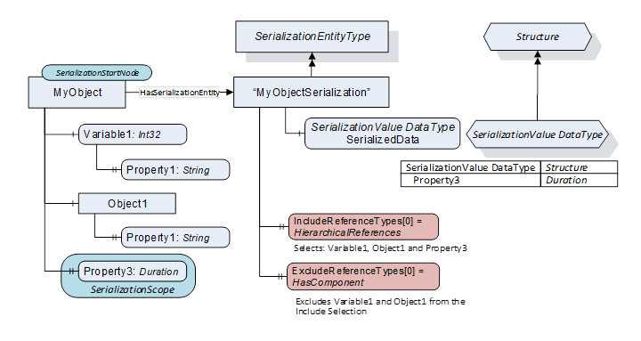  

Figure 8 - ReferenceType Properties Usage  

#### 6.3.5 SerializationDepth Property  

The *SerializationDepth* *Property* allows to limit the serialization levels of the *SerializationScope.*  

A *SerializationDepth* *Value* of 0 implies no limit. A *Value* of 1 implies direct children of the *Object* , and so on.  

If *SerializationDepth* is equal to zero and the *SerializationScope* contains circular *References* , the process of serialization into a *Structure* does not stop. The modelling or the implementation shall contain countermeasures to prevent this.  

#### 6.3.6 ConsiderSubElementSerializationProperties Property  

The *ConsiderSubElementSerializationProperties* *Property* contains a *Boolean* *Value.* If set to True, *SerializationEntities* referenced by elements of *the SerializationScope* which have the same *BrowseName* as the *SerializationEntity* referenced by the *SerializationStartNode* are considered for the *SerializationProcess* . If false, only the *SerializationEntity* referenced by the *SerializationStartNode* is used.  

[Figure 9](/§\_Ref143678546) demonstrates the usage of the *ConsiderSubElementSerializationProperties* *Property.* The *IncludeReferenceTypes* and *ExcludeReferenceTypes* *Properties* of the "ObjectSerialization" *SerializationEntity* are set according to [Figure 8](/§\_Ref143590012) . The *ConsiderSubElementSerializationProperties Property* contains the *Value* "True". So, any *SerializationEntity* of a child node in the subtree originating from the *SerializationStartNode* with the *BrowseName* "ObjectSerialization" will be considered. "Variable2" has such a *SerializationEntity* . This *SerializationEntity* sets the *ReferenceTypes* to select all hierarchical *References* but no *HasComponent* *References* . As result, "Property1" and "Property1.1" are excluded by the "ObjectSerialization" *Properties* referenced by "MyObject". "Variable2.1" is excluded and "Property2.1" is included by the "ObjectSerialization" *Properties* referenced by "Variable2".  

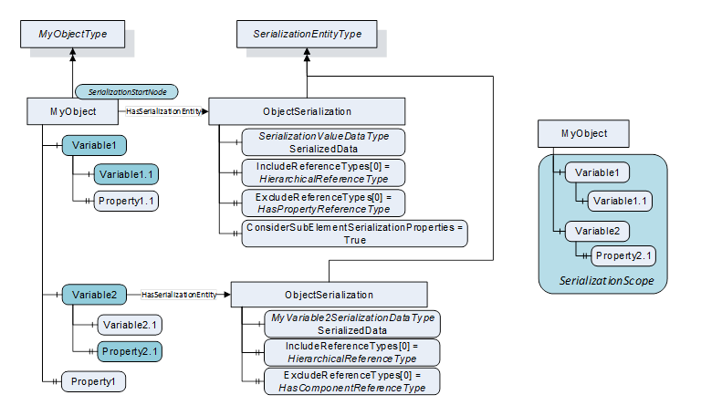  

Figure 9 - ConsiderSubElementSerializationProperties Example  

#### 6.3.7 CustomMetaDataProperties Property  

*DataSetMetaData* describe the content and the semantics of a *DataSet* . *Subscribers* use this metadata to interpret the *DataSet* from the *DataSetMessage* and can evaluate the *Properties* field of the *FieldMetaData* *Structure* (see [OPC 10000-14](/§UAPart14) ).  

The *CustomMetaDataProperties* *Property* contains an array of *KeyValuePairs.* The purpose of this *Property* is the enhancement of the *DataSetMetaData* if the *SerializedData Variable* is serialized in a *PubSub* scenario. If the *SerializedData Variable* is used in a published *DataSet* , the *KeyValuePairs* of the *CustomMetaDataProperties* *Property* shall be added to the *Properties* field in the *FieldMetaData* *Structure* representing the *SerializedData Variable* in the containing *DataSetMetaDataType* *Structure* comprising the *DataSetMetaData* (see [OPC 10000-14](/§UAPart14) ).  

The field names from the structures containing the *Values* the semantic *Properties* belong to are qualified with the OPC UA *Namespace* . This allows the encoder to omit the *NamespaceIndex* when serializing the *QualifiedName* inside the *KeyValuePair* .  

[Figure 10](/§\_Ref151978699) shows the structure of the *CustomMetaDataProperties* for a *SerializationScope* excluding the metadata comprising the *EUInformation* and *EngineeringUnits* *Properties* of the *AnalogUnitType* and *AnalogUnitRangeType* *Variables* in the *SerializationScope* .  

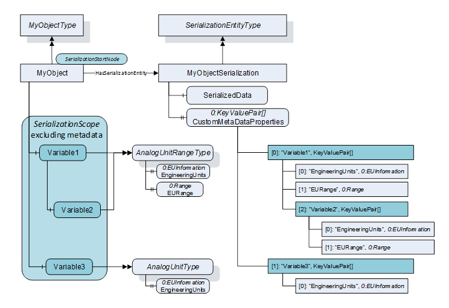  

Figure 10 - CustomMetaDataProperties example  

The content of the *CustomMetaDataProperties* *Property* of the *SerializedData Variable* describes the semantic *Properties* for all *Values* mapped into the *SerializationValue DataType* of the *SerializedData* . It is used as *Properties* field of the *FieldMetaData* *Structure* representing the *SerializedData Variable* in the *DataSet* .  

The *KeyValuePair* elements at the lowest indices contain the semantic *Properties* (e.g. key="EngineeringUnits", value=EUInformation) for the *Value* of the represented *Variable* . Sub- *Variables* are represented with elements containing *KeyValuePairs* with keys equal to the *BrowseNames* of the *Variables* (see "Variable1", "Variable2" and "Variable3" elements) and arrays of *KeyValuePairs* for the semantic *Properties* of those *Variables* as values.  

#### 6.3.8 CustomMetaDataRef Property  

The *CustomMetaDataRef Property* references another *SerializedData Variable.* The *Value* of this *Property* is the *NodeId* of this other *Variable* . A *KeyValuePair* with the *BrowseName* of this *Variable* as key and the *NodeId* of this *Variable* as value is added to the content of the *Properties* *KeyValuePair* array in the *FieldMetaData* .  

If the *CustomMetaDataProperties* and the *CustomMetaDataRef* *Properties* are both provided, the contents of both are combined in the *Properties* *KeyValuePair* array in the *FieldMetaData* *Structure* .  

Note: As all metadata created by the *PubSub* mechanism are omitted, the metadata does not contain type information.  

#### 6.3.9 IncludeStatus, IncludeSourceTimestamp, and IncludeDictionaryReference Properties  

The *IncludeStatus* *Property* is a *Boolean* indicating how the *StatusCodes* of the serialized *Variables* are serialized themselves.  

If True, the *SerializationFieldDataType* of the *Variable* shall always be a *Structure* *DataType* which shall contain a "Value" field for the *Value* of the *Variable* and a "Status" field for the *statusCode* . The *DataType* of the field shall be *StatusCode* . If False, the *DataType* representing the *Variable* shall contain no "Status" field.  

The *IncludeSourceTimestamp* *Property* is a *Boolean* indicating how the *sourceTimestamps* of the serialized *Variables* are serialized themselves.  

If True, the *SerializationFieldDataType* of the *Variable* shall always be a *Structure* *DataType* which shall contain a "Value" field for the *Value* of the *Variable* and a "SourceTimestamp" field for the *sourceTimestamp* . The *DataType* of the field shall be *UtcTime* . If False, the *DataType* representing the *Variable* shall contain no "SourceTimestamp" field.  

The *IncludeDictionaryReference* *Property* is a *Boolean* indicating whether the *HasDictionaryEntry References* of the serialized *Variables* are included into the *SerializationValue* .  

If True, the *SerializationFieldDataType* of the *Variable* shall be structure *DataType* which shall contain a "Value" field for the *Value* of the *Variable* and a "DictionaryReferences" field. The *DataType* of the field shall be an array of *QualifiedName* . The array shall have as many elements as there are *HasDictionaryEntry* *References* (see [OPC 10000-19](/§UAPart19) ) with the *Variable* as *SourceNode* . The *QualifiedName* element shall contain the *NodeId* of the referenced *DictionaryEntryType* *Object* .  

If False, the structure *DataType* representing the *Variable* shall contain no "DictionaryReferences" field.  

[Figure 11](/§\_Ref172557454) demonstrates the effect of the *IncludeStatus* , *IncludeSourceTimestamp* and *IncludeDictionaryReference* *Properties* on the *SerializationFieldDataTypes* used for the serialization of a *Variable* without child nodes.  

[Figure 12](/§\_Ref172557459) shows the effect of the *IncludeStatus,* *IncludeSourceTimestamp* and *IncludeDictionaryReference* *Properties* on the *SerializationFieldDataTypes* used for the serialization of a *Variable* with one *Variable* as child node.  

Note: Setting these *Properties* to False leads to a leaner result when the JSON *EncodingFormat* "compact" is used.  

### 6.4 SerializationValue Structure rules  

The following rules describe how the *SerializationScope* and the *SerializationProperties* impact the layout of the *SerializationFieldDataType* .  

#### 6.4.1 SerializationFieldDataType of Variables  

If *Variables* are serialized, the *Value* of the *Variable* is mapped also into the *SerializationValue DataType* of the *SerializedData Variable* . The *Value* is inserted as field into the *Structure* *DataType* of the *SerializedData Variable* which has the *SerializationFieldDataType* of the *Variable* .  

#### 6.4.2 SerializationFieldDataType of Variables without Children  

If the *Variable* has no children, the *Variable* is represented by a single *Structure* field with the *BrowseName* of the *Variable* as field name. The *SerializationFieldDataType* of the *Variable* equals the *DataType* of the *Variable* . As shown in **** , the *Variable* V1 is mapped into the *Structure* field V1 with the *SerializationFieldDataType* V1DataType (left column with *IncludeStatus,* *IncludeSourceTimestamp* and *IncludeDictionaryReference* *Properties* equal to False).  

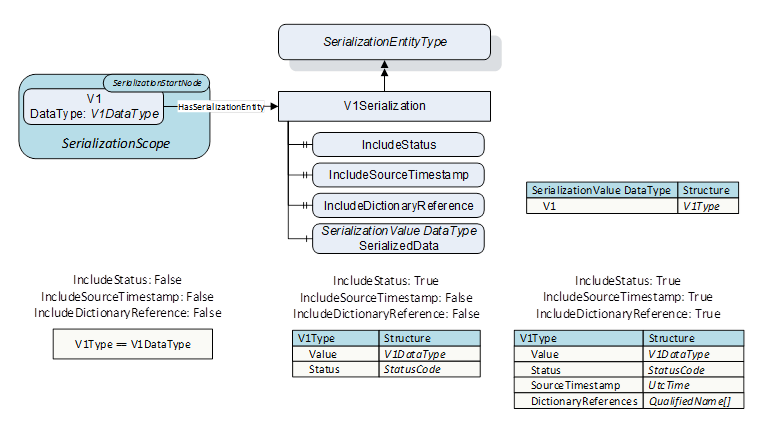  

Figure 11 - IncludeStatus and IncludeSourceTimestamp Properties Example for Variable without child Node  

If some of the *IncludeStatus* , *IncludeSourceTimestamp* and *IncludeDictionaryReference* *Properties* (" *Include-Properties* ") are True, the *Variable* is also represented by a single *Structure* field, but the *SerializationFieldDataType* is a *Structure* *DataType* .  

This *Structure* contains a "Value" field which has the same *DataType* as the *Value* of the *Variable* . Dependent on the *Value* of the " *Include-Properties* ", the *Structure* can contain a "Status" field with the *DataType* *StatusCode,* a "SourceTimestamp" field with the *DataType* *UtcTime* and an entry in the *DictionaryReferences* array field *as shown in* [Figure 11](/§\_Ref172557454) **** *IncludeStatus, IncludeSourceTimestamp* and *IncludeDictionaryReference Properties* ).  

Note: The *SerializationValue DataType* for a *SerializationScope* only consisting of one *Variable* and a *SerializationScope* consisting of one *Object* with this *Variable* as child *Node* are identical.  

#### 6.4.3 SerializationFieldDataType of Variables with Children  

If the *Variable* has child nodes, the fields of the *SerializationFieldDataType* representing the *Variable* are generated as shown in [Figure 12](/§\_Ref172557459) **** *Variable* (V1Type):  

* The *Value* of the *Variable* is mapped into a field with the name "Value" with the *DataType* of the *Value* of the V1 *Variable* .  

* A field with name "Children" is inserted after the "Value" field. Its *DataType* is a new *Structure* *DataType* containing as many fields as there are children of the serialized *Variable.* The name of each of those fields equals the *BrowseName* of the mapped child. *Servers* shall make sure that field names are unique (e.g., two *BrowseNames* can have the same text field but different namespaces). The *SerializationFieldDataType* of each of those fields equals the *DataType* of the mapped child *Variable* if the respective child is a "leaf" of the *Object* tree. This is the case for *Properties* and "childless" *Variables* (see [Figure 12](/§\_Ref172557459) , left column, V1Type and V1ChildrenType with " *Include-Properties* " set to False). If the child *Variable* itself has child nodes, the *SerializationFieldDataType* of the field representing the *Variable* is a *Structure* *DataType* generated according to the same rules which were applied to the parent *Variable* (recursiveness).  

If " *Include-Properties* " are True, the *SerializationFieldDataType* is always a *Structure* *DataType* and contains additional fields mapping the corresponding *Properties* as shown in [Figure 12](/§\_Ref172557459) **** *IncludeStatus* and *IncludeSourceTimestamp* *Properties* ).  

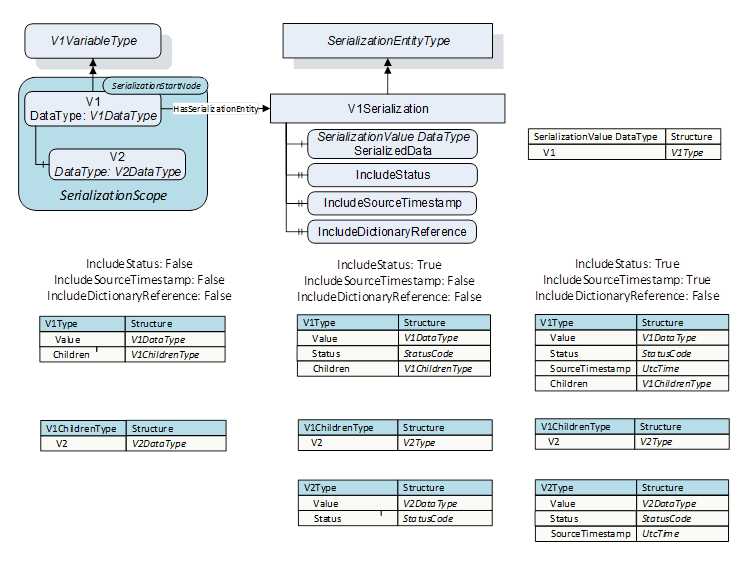  

Figure 12 - IncludeStatus and IncludeSourceTimestamp Properties Example with child Node  

[Figure 13](/§\_Ref147325140) , [Figure 14](/§\_Ref148447667) and [Figure 15](/§\_Ref140053369) demonstrate the *SerializationFieldDataType* generated if the " *Include-Properties"* (see [6.3.9](/§\_Ref153981064) ) are set to False, which allows representing "leaves" of the *Object* tree as "simple" fields.  

[Figure 13](/§\_Ref147325140) shows the *SerializationFieldDataType* for *Variables* with *Properties* and *Variables* .  

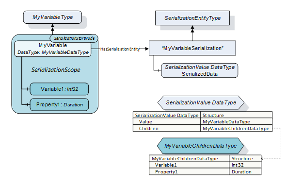  

Figure 13 - Serialization of Variables with children  

  

#### 6.4.4 SerializationFieldDataType of Objects with children  

The rules described above apply in the same way to *Objects* , with the exception that the *Object* level itself has no *Value* and therefore the *SerializationFieldDataTypes* do not contain a "Value"-field. [Figure 14](/§\_Ref148447667) shows the *SerializationFieldDataType* needed to serialize an *Object* and its children. The fields representing the children are inserted directly into the *SerializationFieldDataType* of the *Object* , without an intermediate "Children" structure used in case of *Variables* with children.  

The *SerializationFieldDataType* for *Variables* with children are created according to chapter [6.4.3](/§\_Ref172027937)  

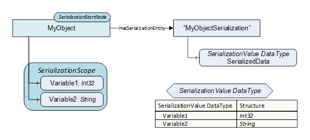  

Figure 14 - Serialization of Objects with children  

  

#### 6.4.5 SerializationFieldDataType of nested Object subtrees  

[Figure 15](/§\_Ref140053369) shows a nested subtree where members of the subtree are again subtrees. Each subtree has its own *DataTypeDefinition Node.* Since ** "Variable1" has no children, it is mapped to the field "Variable1" with the same *DataType* . Since "Object1" has children, it is mapped to the "Object1DataType" *Structure* *DataType* with the field "Property1".  

  

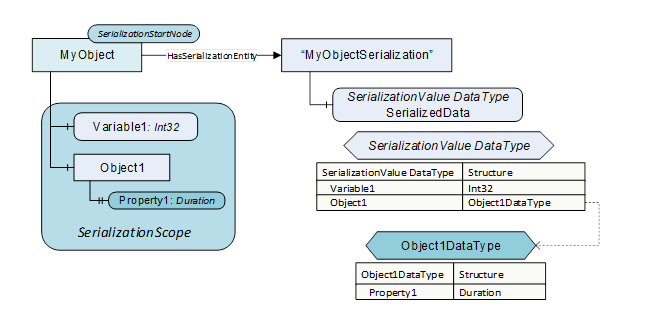  

Figure 15 - Nested subtrees represented by one SerializationValue  

### 6.5 HasSerializationEntity ReferenceType  

The *HasSerializationEntity* *ReferenceType* is a concrete *ReferenceType* that can be used directly. It is a subtype of the *HierarchicalReferences* *ReferenceType.*  

The semantic of this *ReferenceType* is to reference the serialized data of the *SourceNode* of the *Reference* .  

The *SourceNode* of this *ReferenceType* shall be an *Object* , *ObjectType, Variable or VariableType.* The *TargetNode* of this *ReferenceType* shall be an *Object* of *SerializationEntityType* or a subtype.  

The *HasSerializationEntity* is formally defined in [Table 6](/§\_Ref16854066) .  

 **Table 6\- HasSerializationEntity definition**   

| **Attributes** | **Value** |
|---|---|
|BrowseName|HasSerializationEntity|
|InverseName|SerializationEntityOf|
|Symmetric|False|
|IsAbstract|False|
  
| **References** | **NodeClass** | **BrowseName** | **Comment** |
|---|---|---|---|
|Subtype of *HierarchicalReferences* defined in [OPC 10000-5](/§UAPart5) .|
  
| **Conformance Units** |
|---|
|ObjectSerialization Base|
  

  

## Annex A (informative)Examples  

### A.1 Model Instance: Variable with Components  

[Figure A.1](/§\_Ref186815938) shows the *SerializationValue* *DataType* structure generated by the *Server* for a *SerializationScope* with a *Variable* having other *Variables* as components, and one of these *Variables* also has *Variables* as components. The illustration shows how the descend into the depth of the subtree originating from the *SerializationStartNode* causes the *SerializationValue* *DataType* to exhibit nested sub-structures mapping the corresponding part of the subtree.  

On top level, the *Value* of "MyVariable" is mapped into the "Value" field, whereas the components of "MyVariable" are mapped into the *MyVariableChildrenDataType* "Children" field. Since each field of this structure represents one component of "MyVariable", the two fields are "Variable1" and "Property1". Since "Variable1" has itself children, it is represented by the *Variable1DataType* structure with an *Int32* "Value" field for the *Value* of "Variable1" and a *Variable1ChildrenDataType* "Children" field for the descendants of "Variable1". This "Children" structure field has an *Int32* "Variable1.1" field representing the *Value* of "Variable1.1" and a *Duration* "Property1.1" field representing the *Value* of "Property1.1".  

If all sub-components in turn had sub-components themselves (great depth of the subtree), the recursive descend when constructing the *SerializationValue* *DataType* is limited by the *SerializationConfiguration* (e.g. *SerializationDepth* *Property,* see [6.3.5](/§\_Ref185327657) ), by limitations of the structure *DataType* or finally by the *Server* resources.  

  

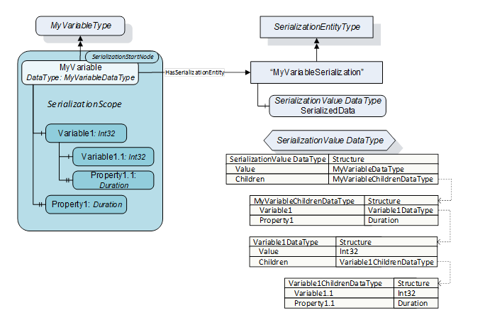  

Figure A. 1 - Nested SerializationFieldDataTypes for subtrees  

### A.2 RIO Channel Group Configuration  

[Figure A.2](/§\_Ref184920692) shows how a set of *Properties* belonging to a single *Object* as *SerializationStartNode* are serialized into the *SerializationValue* *DataType* , and how this *DataType* is serialized by the JSON encoder.  

If the *SerializationProperties* have default values, the *Properties* of the *ChannelGroupConfig* *Object* (see  

OPC RIO) are mapped into fields of the *SerializationValue* *DataType* which have the same *DataType* as the *Property* they represent. The JSON encoding of this structure only contains the field names as keys and the *Values* of the serialized fields as JSON literals when using *VerboseEncoding* (see [OPC 10000-6](/§UAPart6) ) and *RawData* field encoding (see [OPC 10000-14](/§UAPart14) ) in a *PubSub* scenario. The *Enumeration* *Values* are encoded as string literals as specified in [OPC 10000-6](/§UAPart6) .  

  

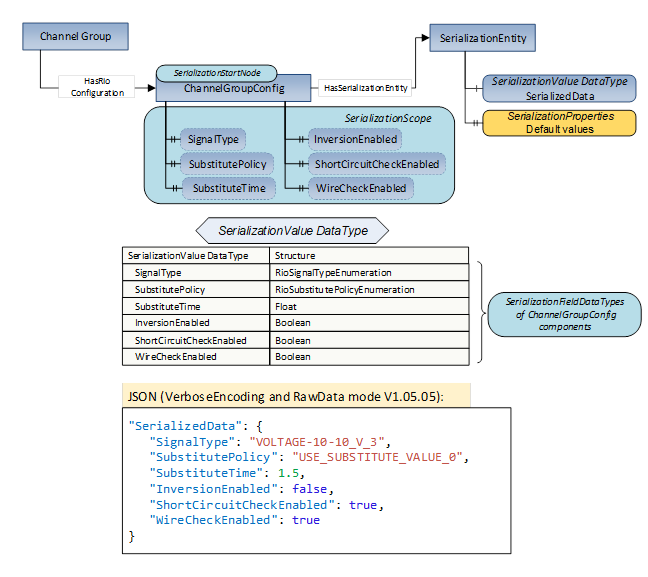  

Figure A. 2 - JSON encoding of SerializationValue DataType Structure  

### A.3 RIO Channel Process Values  

[Figure A.3](/§\_Ref184986756) shows how *Process* *Values* (see  

OPC RIO) belonging to *RioChannelType* *Objects* are mapped into the *SerializationValue* *DataType* .  

The "SerializationEntity" referenced by the *SerializationStartNode* directs the *SerializationProcess* to follow only *HasRioOutputChannel* *ReferenceTypes* . Although the *SerializationDepth* is configured as "no limit" (see [6.3.5](/§\_Ref185319327) ), the *SerializationProcess* would stop as soon as a *RioChannelType* *Object* is reached, since these *Objects* only have components referenced using the *HasComponent* *ReferenceType* . To include the components of the *RioChannelType* *Objects* into the *SerializationScope* , each *Channel* *Object* references a "SerializationEntity" *Object* which has the *IncludeReferenceType* array *Property* containing the *HasComponent* *ReferenceType* . The *ConsiderSubElementSerializationProperties* *SerializationProperty* of the "SerializationEntity" (see [6.3.6](/§\_Ref172037231) ) referenced by the *SerializationStartNode* causes the settings of the "SerializationEntity" *Objects* referenced by the *Channel* *Objects* to be applied, effectively extending of *SerializationScope* with all components of the subtrees originating from the *Channel* *Objects* .  

The JSON snipped shows how the *Values* in the *SerializationScope* are serialized using *VerboseEncoding* (see [OPC 10000-6](/§UAPart6) ) and *RawData* field encoding (see [OPC 10000-14](/§UAPart14) ) in a *PubSub* scenario.  

In [Figure A.3](/§\_Ref184986756) the details of the generated *QualifierValueStructureDataType* structures are not shown in the table visualizing the nested structure *DataTypes* , whereas the JSON snippet shows these structures in-depth.  

  

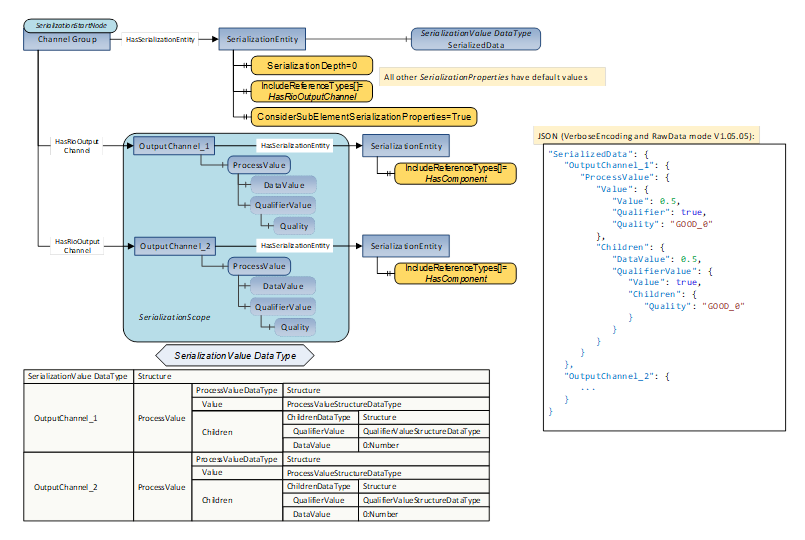  

Figure A. 3 - RIO Channel Process Values  

### A.4 Energy Measurement Values  

[Figure A.4](/§\_Ref185000500) shows a *SerializationScope* configured to exclude the metadata *Properties* of the *Objects* and *Variables* reachable from the *SerializationStartNode* .  

The *EnergyMeasurementType* *Object* has a mandatory *PeObjectNumber* *Property* which is not part of the *SerializationScope* since the *ExcludeReferenceTypes* *SerializationProperty* contains the *HasProperty* *ReferenceType* . The same applies to the *PeMeasurementID* , *AccuracyDomain* , *AccuracyClass* and *EngineeringUnits* *Properties* of the *MeasurementValueType* *Variables* (see [OPC PE](/§OPCPE) ) The *SerializationValue* *DataType* structure contains only fields for the *Values* of the *MeasurementValueType* *Variables* .  

The JSON snipped shows how the energy data in the *SerializationScope* are serialized using *VerboseEncoding* (see [OPC 10000-6](/§UAPart6) ) and *RawData* field encoding (see [OPC 10000-14](/§UAPart14) ) in a *PubSub* scenario.  

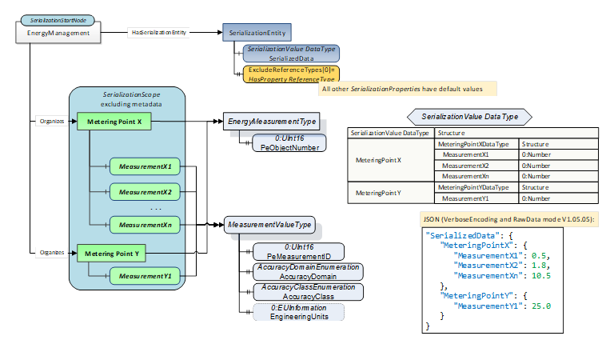  

Figure A. 4 - PROFIenergy Energy Measurement Values  

### A.5 Semantic Property Metadata in PubSub Scenarios  

[Figure A.5](/§\_Ref185003979) shows how semantic *Properties* (see [5.3](/§\_Ref185319840) also) can be added to the *FieldMetaData* structure (see [OPC 10000-14](/§UAPart14) ) describing the *SerializedData* *Variable* if added to a *DataSet* .  

As shown in [A.4](/§\_Ref185004183) , the *SerializationConfiguration* excludes the metadata *Properties* attached to the *EnergyMeasurementType* *Objects* as well as to the *MeasurementValueType* *Variables* . The metadata can be conveyed to a *PubSub* *Subscriber* by coding this information into the *Properties* field of the *FieldMetaData* structure (see [6.3.7](/§\_Ref168416101) ). If *PubSub* is configured accordingly, the information is available for the *Subscriber* through a *DataSetMetaData* *Message* .  

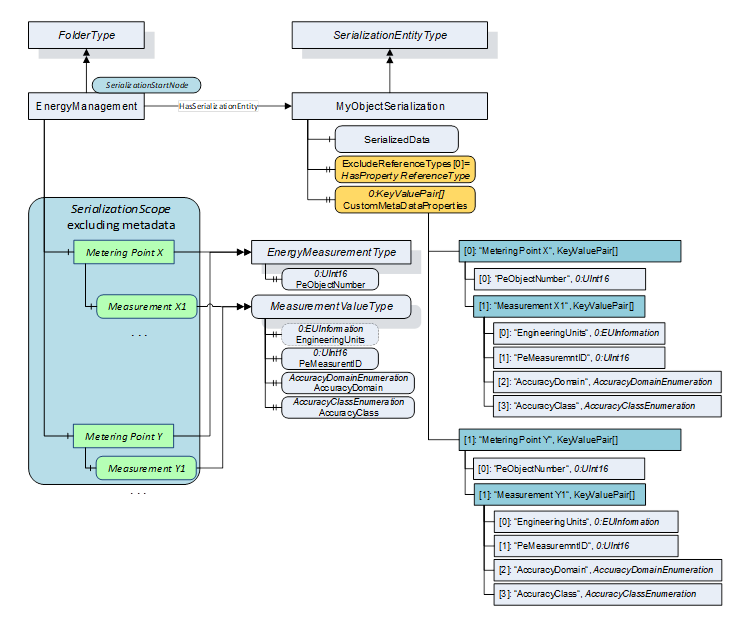  

Figure A. 5 - Semantic Properties in the FieldMetaData  

### A.6 JSON encoding of FieldMetaData Properties  

[Figure A.6](/§\_Ref185263168) shows the resulting JSON encoding for the *Properties* field of the *FieldMetaData* structure according to [Figure A.5](/§\_Ref185003979) in [A.5](/§\_Ref185263316) .  

The amount of metadata associated with the 'pure' data exceeds the data values it describes by far (the JSON snippet only shows the metadata for 2 *Variables* ), demonstrating the usefulness of excluding the metadata from the *SerializationScope* especially for low-bandwidth requirements.  

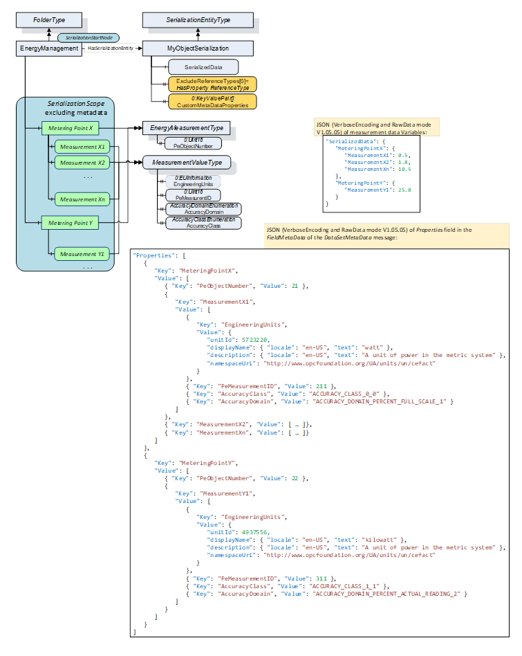  

Figure A. 6 - JSON encoding of FieldMetaData Properties  

### A.7 Combining SerializationScopes  

[Figure A.7](/§\_Ref185266726) shows a *SerializationScope* configured by the *SerializationEntity* referenced by the "EnergyManagement" folder (see [OPC PE](/§OPCPE) ) which is modified by a second *SerializationScope.*  

The *ConsiderSubElementSerializationProperties* *SerializationProperty* set to true directs the *SerializationProcess* to evaluate the *SerializationProperties* of the *SerializationEntity* *Object* referenced by the "MeasurementY1" *Variable* , which is already part of the "enveloping" *SerializationScope* .  

The *IncludeStatus* *SerializationProperty* of this second *SerializationEntity* is set to true, causing the *StatusCode* of the "MeasurementY1" *Variable* *Value* to be part of the *SerializationValue* *DataType* .  

The *ExcludeReferenceTypes* array containing one element with the value *HasProperty ReferenceType* excludes all *Properties* of the "MeasurementY1" *Variable* .  

The JSON snipped shows how the resulting *SerializationValue* structure *DataType* is serialized using *VerboseEncoding* (see [OPC 10000-6](/§UAPart6) ) and *RawData* field encoding (see [OPC 10000-14](/§UAPart14) ) in a *PubSub* scenario. If the *StatusCode* of the "MeasurementY1" *Variable Value* is *Good* , an empty "Status" is generated by the encoder. If the *StatusCode* is *Uncertain* or *Bad* , the *StatusCode* and the corresponding symbol are generated by the encoder, as shown in [Figure A.7](/§\_Ref185266726) . In contrast, the *StatusCode* of the "MeasurementX1", "MeasurementX2" and "MeasurementXn" *Variable* *Values* is never encoded into JSON.  

  

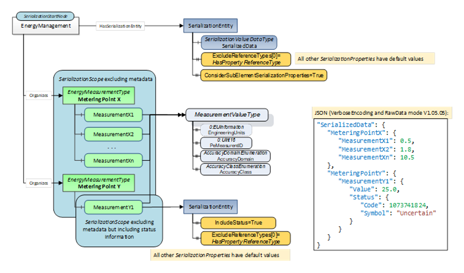  

Figure A. 7 - Combining Serialization Scopes  

\_\_\_\_\_\_\_\_\_  

