## 1 Scope  

 **Editors Note: Significant changes were made to this new Part very late in the specification release cycle with limited implementation to validate the design. Subsequent implementations and interoperability testing may result in breaking changes in future versions of this Part.**   

This document provides an *Information Model* for a set of *Objects* and *Events* that can be used to collect diagnostic information in a system. The *LogObject* model and related *Events* , *Methods* and *Datatypes* are defined in this specification.  

## 2 Normative references  

The following referenced documents are indispensable for the application of this document. For dated references, only the edition cited applies. For undated references, the latest edition of the referenced document (including any amendments and errata) applies.  

OPC 10000-1 - OPC Unified Architecture - Part 1: OPC Overview and Concepts  

[https://opcfoundation.org/documents/10000-1/](https://opcfoundation.org/documents/10000-1/)  

OPC 10000-3 - OPC Unified Architecture - Part 3: Address Space Model  

[https://opcfoundation.org/documents/10000-3/](https://opcfoundation.org/documents/10000-3/)  

OPC 10000-4 - OPC Unified Architecture - Part 4: Services  

[https://opcfoundation.org/documents/10000-4/](https://opcfoundation.org/documents/10000-4/)  

OPC 10000-5 - OPC Unified Architecture - Part 5: Information Model  

[https://opcfoundation.org/documents/10000-5/](https://opcfoundation.org/documents/10000-5/)  

OPC 10000-6  - OPC Unified Architecture - Part 6: Mappings  

[https://opcfoundation.org/documents/10000-6/](https://opcfoundation.org/docuemtns/10000-6)  

OPC 10000-7 - OPC Unified Architecture - Part 7: Profiles  

[https://opcfoundation.org/documents/10000-7/](https://opcfoundation.org/documents/10000-7/)  

OPC 10000-9 - OPC Unified Architecture - Part 9: Alarms & Conditions  

[https://opcfoundation.org/documents/10000-8/](https://opcfoundation.org/documents/10000-8/)  

OPC 10000-11 - OPC Unified Architecture - Part 11: Historical Access  

[https://opcfoundation.org/documents/10000-11/](https://opcfoundation.org/documents/10000-11/)  

OPC 10000-22 - OPC Unified Architecture - Part 22: Base Network Model  

[https://opcfoundation.org/documents/10000-22/](https://opcfoundation.org/documents/10000-22/)  

GUID - A Universally Unique IDentifier (UUID) URN Namespace  

[https://datatracker.ietf.org/doc/html/rfc4122](https://datatracker.ietf.org/doc/html/rfc4122)  

  

## 3 Terms, definitions, abbreviated terms, and conventions  

### 3.1 Terms and definitions  

For the purposes of this document, the terms and definitions given in [OPC 10000-1](/§Part1) , [OPC 10000-3](/§Part3) , [OPC 10000-4](/§Part4) , [OPC 10000-5](/§Part5) , [OPC 10000-7](/§Part7) , [OPC 10000-9](/§) , [OPC 10000-22](/§Part22) , as well as the following apply.  

All used terms are *italicized* in the specification as described in [OPC 10000-1](/§) .  

#### 3.1.1 LogRecord  

An instance of a *LogRecord* *Structure*  

## 4 OPC UA LogObject  

### 4.1 Overview  

This specification defines a standard *Object* that can be used to collect information, like diagnostic information, in a standard manner. This *Object* can collect information defined in base specifications, companion specifications or even generated by an application that is loaded into a device or *Server* . This allows a standard *Client* to access the information and provide a standard manner for user access to this information.  

The *LogObject* returns *LogRecords* via the *GetRecords* *Method* .  

The *LogRecords* when they are generated, can also be sent as *Events* (see [6](/§\_Ref184977158) ).  

The *LogObject* does not define how the information is stored, only how it can be collected and how it can be accessed. This allows a vendor to choose the most appropriate storage for the information.  

The *LogObject* is illustrated in [Figure 1](/§\_Ref174462683) .  

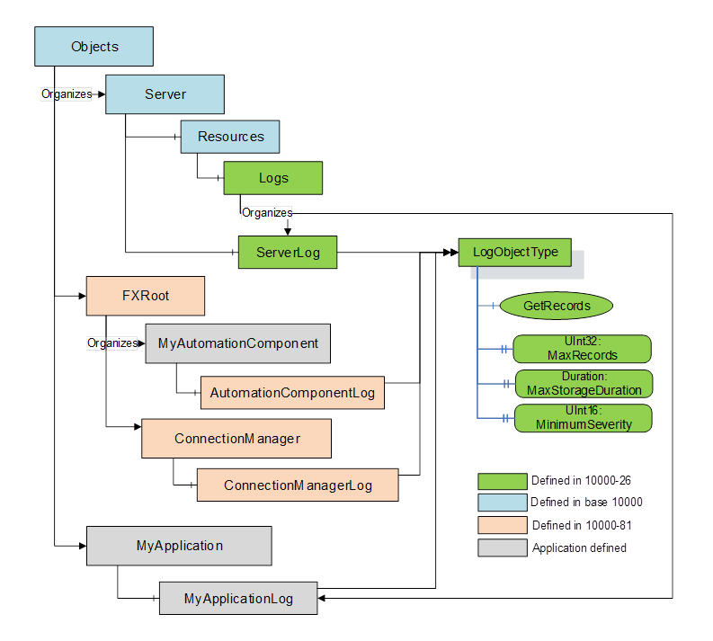  

Figure 1 - LogObject usage illustration  

[Figure 1](/§\_Ref174462683) illustrates both a predefined *LogObject* ( *ServerLog* ) and application defined LogObject (MyApplicationLog). The green boxes are defined in this specification, the blue boxes are defined in [OPC 10000-5](/§Part5) or [OPC 10000-22](/§Part22) , the orange boxes are defined in the OPC UA FX specifications and the grey boxes are not defined in any specification.  

[Annex A](/§\_Ref184999788) and [Annex B](/§\_Ref185329537) provide additional examples of *LogObjects* and possible *Client* uses and *Server* implementations.  

This specification defines *ObjectTypes* , *EventTypes* , *ConditionClass* and instances (see [Figure 2](/§\_Ref54973945) ). Not all of the illustrated types/instances are required for an implementation and are covered by separate *ConformanceUnits* and *Facets* .  

  

Figure 2 - Overview of LogObject Information Model  

  

  

## 5 LogObjectType  

### 5.1 Overview  

The *LogObjectType* is an *ObjectType* that defines an instance that is used to collect log messages and make them available to a *Client* . An instance of *LogObject* can contain *LogRecords* that were generated internally. It can also contain *LogRecords* that result from *Events* that have a *ConditionClassId* or *ConditionSubClassId* of *LogEntryConditionClassType* that are reported by the *Object* on which the *LogObject* instance is declared (see [6](/§\_Ref186755359) ). The *LogObject* can also generate *Events* for *LogRecords* that were generated internally.  

The underlying storage of *LogRecords* is not defined. The records could be stored as part of an *EventHistory* , the records could be stored in a [SYSLOG](/§Syslog) ****** [OpenTelemetry](/§OpenT) **** [Annex A](/§\_Ref184999788) for illustrations)  

Although this specification does not define how data is stored, a requirement to persist *LogRecords* (i.e. *LogRecords* will be retained following a restart) is defined in a *ConformanceUnit* and may be added to a *Profile* .  

The *LogObject* exposes a *Method* that allows a *Client* to retrieve the *LogRecords* . This *Method* does not provide complex filtering, only a time range and *Severity.* It also provides a mask that allows the *Client* to select which fields in a LogRecord to return and a maximum number of records to return. Some instances of a *LogObject* may optionally expose *HistoricalEvents* which would allow a more complex *Event* retrieval filter (see *HistoricalEvent* retrieval in [OPC 10000-11](/§Part11) ).  

The *LogObjectType* is illustrated in [Figure 3](/§\_Ref172052556) .  

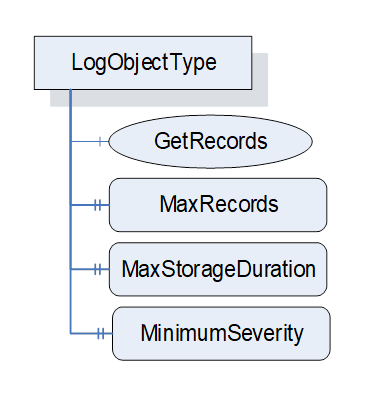  

Figure 3 - LogObjectType illustration  

  

### 5.2 LogObjectType definition  

The *LogObjectType* is formally defined in [Table 1](/§\_Ref172052584) . The *LogRecord* structure that is returned by the *GetRecords* *Method* is described in [5.4](/§\_Ref184947648) .  

Table 1 - LogObjectType definition  

| **Attribute** | **Value** |
|---|---|
|BrowseName|0:LogObjectType|
|IsAbstract|False|
  
| **References** | **NodeClass** | **BrowseName** | **DataType** | **TypeDefinition** | **Other** |
|---|---|---|---|---|---|
|Subtype of the 0:BaseObjectType defined in [OPC 10000-5](/§Part5)|
|0:HasComponent|Method|0:GetRecords|Defined in [5.3](/§\_Ref168592371)|M|
|0:HasProperty|Variable|0:MaxRecords|0:UInt32|0:PropertyType|O|
|0:HasProperty|Variable|0:MaxStorageDuration|0:Duration|0:PropertyType|O|
|0:HasProperty|Variable|0:MinimumSeverity|0:UInt16|0:PropertyType|O|
|||||||
  
| **ConformanceUnits** |
|---|
|LogObject Base|
  

  

Optional *MaxRecords* defines the maximum number of records in a buffer associated with this *LogObject* . When this maximum is reached, a new log record will trigger the deletion of the oldest record. If this *Variable* is not provided, then there is no *Server* published limit on the log buffer. Zero is an invalid value for *MaxRecords* . The *LogRecord Structure* is defined in [5.4](/§\_Ref184947648) .  

Optional *MaxStorageDuration* defines the maximum time period that the *LogObject* will buffer log entries in the *LogObject* . Records that are older than the maximum duration may be deleted. If this *Variable* is not provided than no maximum duration is configured. Zero is an invalid duration. In the case of persistent storage, on startup a number of records may be deleted, depending on the duration of the downtime for the application.  

The two maximum settings are used to limit the storage requirements for a *Server* . *MaxRecords* is typically a hard limit while *MaxStorageDuration* is more a soft limit in that *LogRecords* may be retained past the *MaxStorageDuration* if space allows. If *MaxRecords* is exceeded before *MaxStorageDuration* , the system should generate a *LogOverflowEventType* warning *Event* indicating an overflow of *LogRecords* (see [6.4](/§\_Ref174908505) ).  

The *MinimumSeverity* describes the minimum *Severity* associated with a *LogRecord* that is stored. *LogRecords* with a *Severity* that is less then this number will not be stored in this *LogObject* . If omitted, there is no restriction on the *Severity* associated with *LogRecords* that are stored. This number shall be between 0 and 1000, any other number is illegal. S *ervers* can allow this value to be written. The *Severity* is only checked when a *LogRecord* is being generated, a change to the value does not affect the records that are already stored.  

### 5.3 GetRecords Method  

This *Method* allows a *Client* to retrieve *LogRecords* from the *LogObject* .  

The signature of the Method is described below, and the arguments are described in [Table 2](/§\_Ref168609471) .  

 **Signature**   

GetRecords (  

[in] 0:DateTime   StartTime,  

[in] 0:DateTime   EndTime,  

[in] 0:UInt32   MaxReturnRecords,  

[in] 0:UInt16   MinimumSeverity,  

[in] 0:LogRecordMask  RequestMask,  

[in] 0:ByteString   ContinuationPointIn,  

  

[out] LogRecordsDataType Results,  

[out] 0:ByteString  ContinuationPointOut  

);  

Table 2 - GetRecords Method arguments  

| **Argument** | **Description** |
|---|---|
|StartTime|The time associated with the first *LogRecord* returned in the *Results* array, or if no there is no *LogRecord* at this time, then the first *LogRecord* returned will have the time closest to, but greater than *StartTime* .|
|EndTime|The time associated with the last *LogRecord* . *EndTime* must be equal to or greater than *StartTime* . No records more recent then *EndTime* are returned. If there are no *LogRecords* at *EndTime* , then the most recent record before *EndTime* is the last record in the *Results* array.|
|MaxReturnRecords|The maximum number of *LogRecords* to be returned, 0 indicates that no limit is specified. If this limit is specified then the *LogRecords* will start at *StartTime* , but may end before *EndTime* if the limit is reached. This shall result in a *ContinuationPointOut* being generated by the *Server* . On subsequent calls with the continuation point, the remaining *LogRecords* can be retrieved.|
|MinimumSeverity|The minimum *Severity* (all *LogRecords* with a *Severity* equal to this number or greater are returned).|
|RequestMask|The *RecordMask* indicates which optional fields in the *LogRecord* *Structure* are to be returned, if they are available. The *LogRecordMask* is defined in [5.7](/§\_Ref201376875) .|
|ContinuationPointIn|An opaque identifier provided by the *Server* from a previous call to *GetRecords* . This input parameter shall be null on an initial call to *GetRecords* . If not all records were returned on a previous call, the *ContinuationPointOut* can be provided to continue the retrieval of records. If a *ContinuationPointIn* is passed in, all other input arguments shall be the same as provided on the call that returned the *ContinuationPointOut* . If any of the input parameters are changed, the *Server* can ignore the updated parameters, it can detect any changes to the parameters and report an error or it can process the request as if it was a new request. If the *[Client](https://reference.opcfoundation.org/search/411?t=Client)* specifies a *[ContinuationPoint](https://reference.opcfoundation.org/search/411?t=ContinuationPoint) In* that is no longer valid, then the *[Server](https://reference.opcfoundation.org/search/411?t=Server)* shall return a *[Bad](https://reference.opcfoundation.org/search/411?t=Bad)* \_ *ContinuationPointInvalid* error.|
|Results|Is a structure (see [5.9](/§\_Ref193383487) ) that contains an array of the *LogRecord* Structure (see [5.4](/§\_Ref184947648) ). The *LogRecords* shall be returned in chronological order from oldest to newest.|
|ContinuationPointOut|An opaque identifier that is used if the number of records to be returned is too large to be returned in a single response or if the Server requires the *Client* to call again. When this parameter is not used, its value is null. This identifier can be used to continue the retrieval of *LogRecords* in subsequent calls.|
  

  

*StartTime* and *EndTime* together form the range in which *LogRecords* are returned. If *StartTime* equals *EndTime* , then only *LogRecord* (s) that have the provided time are returned. If *EndTime* is earlier than *StartTime* , then the error *Bad\_InvalidParameter* is returned.  

*Severity* is a number between 1 and 1000 inclusive, a number outside of this range will result in the error *Bad\_InvalidParameter* (see [Table 5](/§\_Ref184950853) for additional details) *.*  

A *ContinuationPointOut* shall be generated if the number of records to return between *StartTime* and *EndTime* is larger than what can be returned in a single *Method* call. It can also be returned due to an internal error or issue by the *Server* .  

The *GetRecords* *Method* representation in the *AddressSpace* is formally defined in [Table 3](/§\_Ref168609446) .  

Table 3 - GetRecords Method AddressSpace definition  

| **Attribute** | **Value** |
|---|---|
  
|BrowseName| **0:GetRecords** |
|---|---|
  
| **References** | **Node Class** | **BrowseName** | **DataType** | **TypeDefinition** | **Other** |
|---|---|---|---|---|---|
|0:HasProperty|Variable|0:InputArguments|0:Argument[]|0:PropertyType|M|
|0:HasProperty|Variable|0:OutputArguments|0:Argument[]|0:PropertyType|M|
||||||
  
| **ConformanceUnits** |
|---|
|LogObject Base|
  

  

### 5.4 LogRecord structure  

This structured *DataType* describes the required information in a *LogRecord* . An array of this record type is returned in the *LogObject* *GetRecords* *Method* call.  

The structure is formally defined in **** .  

Table 4 - LogRecord structure  

| **Name** | **Type** | **Description** | **Optional** |
|---|---|---|---|
|LogRecord|Structure|Subtype of *Structure* defined in [OPC 10000-5](/§)||
|Time|0:DateTime|Time associated with this record.|False|
|Severity|0:UInt16|Is a number between 1 and 1000 inclusive and corresponds to the range provided in the OPC UA *BaseEventType* (see [OPC 10000-3](/§Part3) ). Additional details for mapping of the severity defined for OPC *BaseEvents* to *LogRecords* is described in [Table 5](/§\_Ref184950853) .|False|
|EventType|0:NodeId|Describes the specific type of *Event.* It corresponds to the *EventType* field defined in BaseEventType. If AdditionalData is provided then an EventType should be provided.|True|
|SourceNode|0:NodeId|Identifies the *Node* this record originated from. If the *LogRecord* is not related to a specific *Node* then this shall be set to a null *NodeId.* . Additional rules may be defined by other specifications that utilize the *LogObject* .|True|
|SourceName|0:String|Provides a description of the source of the *LogRecord* , this could be the string-part of the *BrowseName* of the *SourceNode.*|True|
|Message|0:LocalizedText|Shall describe the issue that is being represented in the *LogRecord* .|False|
|TraceContext|0:TraceContextDataType|This structure is used to correlate records inside of a *Server* along with corelating records between other *Servers* and *Clients* . The TraceContextDataType is described in [5.5.3](/§\_Ref202363228) .|True|
|AdditionalData|0:NameValuePair[]|Additional data for the log entry. This field contains the additional event fields of an LogEvent.|True|
  

  

*Severity* ranges for *Alarms* and alerts are discussed further in [OPC 10000-9](/§Part9) . Diagnostic information typically has a *Severity* below the *Alarm* threshold of 400. [Table 5](/§\_Ref184950853) provides the *Severity* ranges that shall be used for *LogRecords* .  

 **Table 5\- LogRecord Severity Mapping**   

| **Range Name** | **Severity Range** | **Diagnostics classification** |
|---|---|---|
|Emergency|401 - 1000|Critical errors - errors that are fatal. This range can also be associated with *Alarms* .|
|Alert|300 - 400|*Alerts* are errors that are not raised to the *Alarm* level, but require some actions, typically by maintenance staff and could be recorded as part of an *Alarm* system.|
|Critical|251 - 300|Errors that can affect the overall process and need to be addressed.|
|Error|201 - 250|Errors related to important actions that were taken on the *Server* . They typically do not affect the overall process.|
|Warning|151 - 200|Warnings are issues that should be noted, but are not failures.|
|Notice|101-150|This level is typically used for significant or unusual successful actions that are taken on a *Server* .|
|Information|51-100|General Information related to an application.|
|Debug|1-50|Low level tracing information that can be used to debug the flow of an application.|
  

  

The *LogRecord* representation in the *AddressSpace* is formally defined in [Table 6](/§\_Ref184950927)  

Table 6 - LogRecord definition  

| **Attribute** | **Value** |
|---|---|
|BrowseName|LogRecord|
|IsAbstract|False|
  
| **References** | **NodeClass** | **BrowseName** | **DataType** | **TypeDefinition** | **Other** |
|---|---|---|---|---|---|
|Subtype of the 0:Structure defined in [OPC 10000-5](/§)|
  
| **ConformanceUnits** |
|---|
|LogObject Base|
  

  

### 5.5 LogContext Structures  

#### 5.5.1 Overview  

The *LogContext* contains information required to trace distributed transactions or requests made to a distributed system. Such a trace may produce multiple log messages in one *OPC UA Application* and/or multiple log messages across multiple *OPC UA Applications* .  

The *TraceId* is a unique identifier for a trace. Once assigned it never changes for that trace. If log messages for a given trace are across applications, they have the same *TraceId* .  

A span represents a unit of work or operation. Spans are the building blocks of traces. A span is local to an *OPC UA* *Application* . The *SpanId* is a unique identifier assigned by an *OPC UA Application* for a local span in a trace. Spans can be nested. The *ParentSpanId* provides the reference to the parent span. The *ParentSpanId* is used to build a tree of spans inside a trace. If a nested span is created, the *SpanId* of the parent is used as *ParentSpanId* in the new child span.  

At the very start (the root span) there is no *ParentSpanId* , only a new *SpanId* . This would be the base of a tree. See [C.1](/§\_Ref202308367) for additional discussion on SpanId and ParentSpanId.  

#### 5.5.2 SpanContext Structure  

The *SpanContextDataType* *Structure* is defined in [Table 7](/§\_Ref199767000) . It defines a TraceId and SpanId. This *Structure* can be passed between *Clients* and *Servers* (see [5.5.4](/§\_Ref200232743) ).  

Table 7 - SpanContextDataType  

| **Name** | **Type** | **Description** |
|---|---|---|
|SpanContextDataType|Structure|Subtype of *Structure* defined in [OPC 10000-5](/§)|
|TraceId|0:Guid|A unique identifier assigned to a trace.|
|SpanId|0:UInt64|Identifier for a span in a trace *.* 0 is an invalid value for a *SpanId* . The value shall be unique within a *ParentSpanId* within an *Application.*|
  

  

The SpanContextDataType representation in the *AddressSpace* is formally defined in [Table 8](/§\_Ref201377403)  

Table 8 - SpanContextDataType definition  

| **Attribute** | **Value** |
|---|---|
|BrowseName|SpanContextDataType|
|IsAbstract|False|
  
| **References** | **NodeClass** | **BrowseName** | **DataType** | **TypeDefinition** | **Other** |
|---|---|---|---|---|---|
|Subtype of the 0:Structure defined in [OPC 10000-5](/§)|
  
| **ConformanceUnits** |
|---|
|LogObject TraceContext|
  

  

#### 5.5.3 TraceContextDataType Structure  

The *TraceContextDataType* *Structure* is defined in [Table 9](/§\_Ref199767238) . This structure is a subtype of the *SpanContextDataType* and is used in the *LogRecord.* It extends the *SpanContextDataType Structure* adding two additional fields. The *ParentSpanId* (together with the *SpanId* ) allows for the creation of a tree of related *Log Records* . The *ParentIdentifier* can be used to provide context information related to the parent.  

Table 9 - TraceContextDataType  

| **Name** | **Type** | **Description** |
|---|---|---|
|TraceContextDataType|Structure|Subtype of *SpanContextDataType* defined in [5.5.2](/§\_Ref201444731)|
|ParentSpanId|0:UInt64|The identifier of the parent span. The value is 0 for a root span.|
|ParentIdentifier|0:String|If the parent span is from another OPC UA Application, the *ParentIdentifier* contains the *ApplicationUri* of the other OPC UA *Application* . If the parent span is an internal span, the *ParentIdentifier* shall be null or empty. If the *ParentSpanId* is 0, the *ParentIdentifier* shall be null or empty.|
  

  

The *TraceContextDataType* representation in the *AddressSpace* is formally defined in [Table 10](/§\_Ref201251849) .  

Table 10 - TraceContextDataType definition  

| **Attribute** | **Value** |
|---|---|
|BrowseName|TraceContextDataType|
|IsAbstract|False|
  
| **References** | **NodeClass** | **BrowseName** | **DataType** | **TypeDefinition** | **Other** |
|---|---|---|---|---|---|
|Subtype of the *SpanContextDataType* defined in [5.5.2](/§\_Ref201444731)|
  
| **ConformanceUnits** |
|---|
|LogObject TraceContext|
  

  

#### 5.5.4 Passing SpanStructure from a Client  

If the *Server* is to be part of a *Client* trace, the *Client* passes the *SpanContextDataType* structure to a *Server* .  

The *SpanContextDataType* *Structure,* defined in [Table 7](/§\_Ref199767000) , is passed in the *RequestHeader* of any OPC UA *Service* call. The *SpanContextDataType* is transported with the *AdditionalParametersType* in the *AdditionalHeader* field of the *RequestHeader* (see [OPC 10000-4](/§Part4) ). The *Key* for the parameter is "SpanContext *"* and the *Value* is the *SpanContextDataType* *Structure* .  

If a *Server* receives the optional *AdditionalHeader* , it uses the provided *SpanConextDataType* *Structure* when generating any *LogRecords* that are generated related to the *Service* invocation that provided the *AdditionalHeader.* It is possible that lower level functionality that is invoked as part of the *Service* call, may not have access to the provided *AdditionalHeader* , in which case it maybe omitted.  

Inside the *Server* , the *SpanId* from the *RequestHeader* is used as *ParentId* for the *LogContext* structure defined in [Table 9](/§\_Ref199767238) .  

### 5.6 NameValuePair Structure  

The *NameValuePair* structure is formally defined in [Table 11](/§\_Ref201275834) . This structure has a *Name* field that is a name that is associated with the value that is reported in the second field. The *Value* may be of any *DataType* . Specifications may define standard names that are used to transport specific values that are to be included in the *LogRecord* as *AdditionalData.*  

Table 11 - NameValuePair structure  

| **Name** | **Type** | **Description** |
|---|---|---|
|NameValuePair|Structure|Subtype of *Structure* defined in [OPC 10000-5](/§)|
|Name|String|The name of the value.|
|Value|BaseDataType|The value associated with the name.|
  

  

The *NameValuePair* *Structure* representation in the *AddressSpace* is formally defined in [Table 12](/§\_Ref94194530)  

Table 12 - NameValuePair definition  

| **Attribute** | **Value** |
|---|---|
|BrowseName|NameValuePair|
|IsAbstract|False|
  
| **References**  | **NodeClass** | **BrowseName** | **DataType** | **TypeDefinition** | **Other** |
|---|---|---|---|---|---|
|Subtype of the 0:Structure defined in [OPC 10000-5](/§)|
  
| **ConformanceUnits** |
|---|
|LogObject AdditionalData|
  

  

### 5.7 LogRecordMask DataType  

The *LogRecordMask* is formally defined in [Table 13](/§\_Ref201280540) . It indicates which of the optional fields that may be available in a *LogRecord* are to be returned by *GetRecords* .  

Table 13 - LogRecordMask Structure  

| **Value** | **Bit No.** | **Description** |
|---|---|---|
|EventType|0|Indicates if the *EventType* is returned in the *LogRecords* if available.|
|SourceNode|1|Indicates if the *SourceNode* is returned in the *LogRecords* if available.|
|SourceName|2|Indicates if the *SourceName* is returned in the *LogRecords* if available.|
|TraceContext|3|Indicates if the *TraceContext* is returned in the *LogRecords* if available.|
|AdditionalData|4|Indicates if the *AdditionalData* is returned in the *LogRecords* if available.|
  

  

The *LogRecordMask* representation in the *AddressSpace* is formally defined in [Table 14](/§\_Ref201280549)  

Table 14 - LogRecordMask definition  

| **Attribute** | **Value** |
|---|---|
|BrowseName|LogRecordMask|
|IsAbstract|False|
  
| **References** | **NodeClass** | **BrowseName** | **DataType** | **TypeDefinition** | **Other** |
|---|---|---|---|---|---|
|Subtype of *UInt32* defined in [OPC 10000-3](/§Part3)|
|HasProperty|Variable|OptionSetValues|LocalizedText []|PropertyType||
  
| **ConformanceUnits** |
|---|
|LogObject Base|
  

  

### 5.8 Relationships between LogRecords - A LogRecord Hierarchy  

When generating *LogRecords* it is important that a context be associated with each *LogRecord* . This context information can be used to show a relationship between various *LogRecords* in a *Server* as well as relationships between *LogRecords* that are in different *Servers* . This context information is stored in the *TraceContext* field in the record (see definition in [5.5.2](/§\_Ref201444731) ). If a hierarchy of related *LogRecords* is to be created, *SpanId* and *ParentSpanId* fields shall be used. When a function in a *Server* invokes another function in the same *Server* or in another *Server* as part of the same *TraceId* , the lower level function shall promote the *SpanId* of the higher level to be the *ParentSpanId* in the called function and a new *SpanId* shall be generated in the called function. This daisy chain of *SpanId* to *ParentSpanId* will allow a tree to be created for the *LogRecords* .  

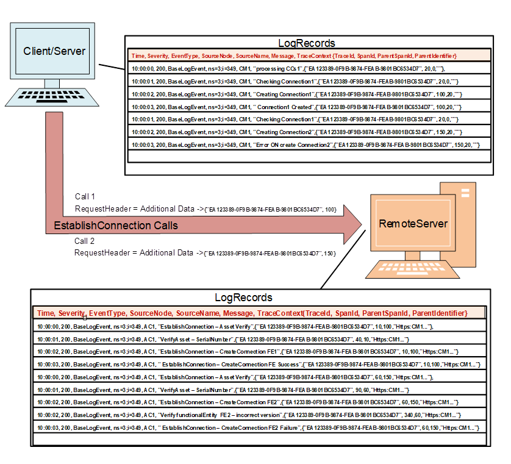  

 **Figure 4\- TraceContext hierarchy example**   

[Figure 4](/§\_Ref201386780) provides an illustration of the *LogRecords* that could result from calls between two *Applications* that include *TraceContext* information. The first line is each table is a list of the fields in the comma-separated-value records. These field names correspond to the names used in the *LogRecord* structure.  

The key points being illustrated for the hierarchy are the *TraceId* , *SpandId* , *ParentSpanId* and *ParentIdentifier* field, which are the last 4 items in each *LogRecord* entry. *The TraceId* is shown as the *GUID* and is constant for this illustration (it is one action from the Client/Server). Additional actions would result in separate *TraceIds,* but are not illustrated. **  

In the Client/Server there is no *ParentIdentifier,* since all action are internal to the *Server* . In the RemoteServer the *ParentIdentifier* indicates the Client/Server. The *ParentIdentifier* is the *ApplicationUri* of the *Client* that called into the *Server* . The *ApplicationUri* of the first *Server* is "Https:CM1…"( it has been truncated to allow it to fit in the example).  

The *SpanId* and *ParentSpanId* shows where calls have been made. At the beginning of the first table, the *ParentSpanId* is zero, since this is the root SpanId (see [Annex C](/§\_Ref201631653) for more explanation of *SpanId* ). In the first table, when a sub function is called, the *SpanId* is promoted to the *ParentSpanId* and a new *SpanId* is generated (see the third *LogRecord* in the table).  

The large arrow shows that the Client/Server calls into the RemoteServer twice. It passes in the *TraceId* and the *SpanId* on each call.  The *TraceId* is the same, but the *SpanId* changes on each call.  

The second table shows the *LogRecords* that are generated that resulted from the two innovations of the *Method* in the RemoteServer.  The passed in *SpanId* becomes the *ParentSpanId* in the *LogRecords* and a new *SpanId* is generated. The RemoteServer also makes a call to a sub-function where the *SpanId* is promoted to the *ParentSpanId* .  

### 5.9 LogRecordsDataType  

This structured *DataType* is used as the return *DataType* in the *LogObject* *GetRecords* *Method* call.  

The structure is formally defined in ****  **.**   

Table 15 - LogRecordsDataType structure  

| **Name** | **Type** | **Description** |
|---|---|---|
|LogRecordsDataType|Structure|Subtype of *Structure* defined in [OPC 10000-5](/§)|
|LogRecordArray|LogRecord[]|An array of *LogRecords.*|
  

  

The *LogRecordsDataType* representation in the *AddressSpace* is formally defined in [Table 16](/§\_Ref202178128) .  

Table 16 - LogRecordsDataType definition  

| **Attribute** | **Value** |
|---|---|
|BrowseName|LogRecordsDataType|
|IsAbstract|False|
  
| **References** | **NodeClass** | **BrowseName** | **DataType** | **TypeDefinition** | **Other** |
|---|---|---|---|---|---|
|Subtype of the 0:Structure defined in [OPC 10000-5](/§)|
  
| **ConformanceUnits** |
|---|
|LogObject Base|
  

  

### 5.10 LogObject and Security.  

The *LogObject* can include information that maybe sensitive or include security related information. For *LogObjects* that contain security related information should not be made accessible to all users, but only to authorised users.  

A *LogObject* can restrict a *Client* 's access to the *GetRecords* *Method* using standard OPC UA security features. This all or nothing approach can work well if multiple *LogObjects* are defined in a *Server* and security related information is collected in a separate *LogObject* . It becomes more problematic if a single *LogObject* collects a mixture of security related information and non-security related information.  

*LogObjects* should implement permissions similar to what *Event* systems implement. In *Event* systems each *Event* has permissions assigned to it, in a *LogObject* each *LogRecord* can have permissions assigned to it. These permissions can be used to determine if a *LogRecord* should be returned to the *Client* that is invoking the *GetRecords* *Method.*  

## 6 LogObject and Events  

### 6.1 Concepts  

A *LogObject* that supports storing *Events* as *LogRecords* extends the behaviour of a *LogObject* by providing the capability to collect all *Events* that the parent *Object* receives that have a *ConditionClassId* or *SubConditionClassId* of *LogEntryConditionClass* .  

For example, since *Events* / *Conditions* / *Alarms* instance can be defined by PLC programs and exposed in a *Server* , the *LogObject* can collect *Diagnostics* or other trace information from PLC user program, not just from *Server* code.  

The *LogObject* can utilize some of the *Event* reporting hierarchy concepts defined in [OPC 10000-3](/§Part3) and [OPC 10000-5](/§Part5) . [Figure 5](/§\_Ref185233896) illustrates a *Server* that includes an *Event* hierarchy. In the example, LogObjectArea2 would include all *Events* that would be available from the Area2 *Object* that have a *ConditionClassId* or *ConditionSubClassId* of *LogEntryConditionClass* . In addition the *LogObject* could store additional fields from *Events* in the *AdditionalData* *NameValue* pairs. What fields are be stored would be vendor / *Server* specific, but specifications that define *LogObject* instances may also define additional fields from defined *Events* that shall be stored in a *LogRecord* .  

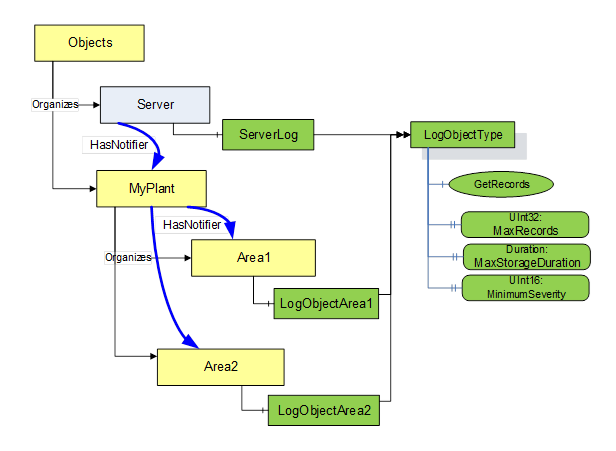  

 **Figure 5\- LogObject Event usage illustration**   

  

### 6.2 LogEvent EventTypes  

This specification extends the standard *EventType (* see [OPC 10000-3](/§Part3) , ** [OPC 10000-5](/§Part5) ** and ** [OPC 10000-9](/§Part9) *EventTypes* ). [Figure 6 - BaseLogEventType](/§\_Ref201327752) [Figure 6](/§\_Ref128453413) illustrates the event fields that are mapped to the *LogRecordStructure* . Any *Object* that has a *Reference* to one of these *EventTypes* shall generate *LogRecords* in the *LogObject* related to the defined *BaseLogEventType.*  

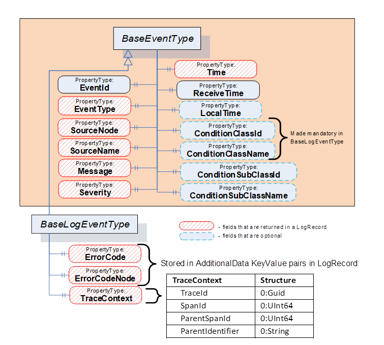  

Figure 6 - BaseLogEventType  

Additional *EventTypes* can be defined as needed for specific log information. If desired, subtypes of *ConditionType* or any of the *AlarmTypes* might also be used. The only requirement for an *Event* to be recorded in the *LogObject* is for the *Event* to have a *ConditionClassId* or *SubConditionClassId* of *LogEntryConditionClass* . The following fields from *BaseEventType* are mapped to the *LogRecord* :  

* *Time*\- The time associated with this event.  

* *EventType*\- as defined in *BaseEventType* in [OPC 10000-5](/§Part5)  

* *SourceNode*\- identifies the Node that the *Event* originated from, as defined in *BaseEventType* in [OPC 10000-5](/§Part5) . For *LogObject* *Events* , this node is the node that the *LogRecord* is related to.  

* *SourceName*\- provides a description of the source of the *Event* , this might be a browse path to a variable under the *SourceNode* , if the *LogRecord* is related to the variable, or it might be as defined in *BaseEventType* in [OPC 10000-5](/§Part5) .  

* *Message*\- shall describe the issue that is being represented in the *LogRecord* .  

* *Severity*\- in the *Event* system is defined as a number between 1 and 1000 inclusive. Typically, the full range of numbers is mapped to sub ranges. See [5.3](/§\_Ref168592371) for a description of *LogRecord* use of this field.  

### 6.3 BaseLogEventType  

This *EventType* can be used by an application to generate *Events* that provide log information.  

Its representation in the *AddressSpace* is formally defined in [Table 17](/§\_Ref172065978) .  

 **Table 17\- BaseLogEventType definition**   

| **Attribute** | **Value** |
|---|---|
|BrowseName|0:BaseLogEventType|
|IsAbstract|True|
  
| **References** | **NodeClass** | **BrowseName** | **DataType** | **TypeDefinition** | **Other** |
|---|---|---|---|---|---|
|Subtype of the 0:BaseEventType defined in [OPC 10000-5](/§Part5) .|
|0:HasProperty|Variable|ErrorCode|0:StatusCode|0:PropertyType|O|
|0:HasProperty|Variable|ErrorCodeNode|0:NodeId|0:PropertyType|O|
|0:HasProperty|Variable|ConditionClassId|0:NodeId|0:PropertyType|M|
|0:HasProperty|Variable|ConditionClassName|0:LocalizedText|0:PropertyType|M|
  
| **ConformanceUnits** |
|---|
|LogObject BaseEvent|
  

  

*Events* of this type can be generated by *Servers* that support *LogObjects.* The *Event* may be generated for propagation of ** this *Event to a* n external *LogObject.*  

*ErrorCode* see the definition of *ErrorCode* in *LogRecord Structure* ( [5.4](/§\_Ref184947648) ).  

*ErrorCodeNode* see the definition of *ErrorCodeNode* in *LogRecord Structure* ( [5.4](/§\_Ref184947648) ).  

The *ConditionClassId* and *ConditionClassName* in *BaseEventType* are made mandatory in this *EventType* .  

The *ConditionClassId* shall be set to *LogEntryConditionClassType* .  

### 6.4 LogOverflowEventType  

This *Event* is generated when the storage in an *LogObjectType* instance overflows.  

 **Table 18\- LogOverflowEventType definition**   

| **Attribute** | **Value** |
|---|---|
|BrowseName|0:LogOverflowEventType|
|IsAbstract|True|
  
| **References** | **NodeClass** | **BrowseName** | **DataType** | **TypeDefinition** | **Other** |
|---|---|---|---|---|---|
|Subtype of the 0:BaseEventType defined in [OPC 10000-5](/§Part5) .|
|||||||
  
| **ConformanceUnits** |
|---|
|LogObject Overflow|
  

  

*Events* of this class are generated by *Servers* that support *LogObjects* . This *Event* indicates that the *LogObject* storage was exceeded before the *MaxStorageDuration* was reached.  

The *SourceNode* *Property* for *Events* of this type shall be assigned to the *NodeId* of the *LogObject* . The *SourceName* for *Events* of this type shall be "LogObject/Overflow".  

### 6.5 LogEntryConditionClassType  

The *LogEntryConditionClassType* is a *ConditionClassType* used to classify *Events* that are to be collected in a *LogObject* . The *LogEntryConditionClassType* is formally defined in [Table 19](/§\_Ref182188535) .  

Table 19 - LogEntryConditionClassType definition  

| **Attribute** | **Value** |
|---|---|
|BrowseName|LogEntryConditionClassType|
|IsAbstract|True|
  
| **References** | **NodeClass** | **BrowseName** | **DataType** | **TypeDefinition** | **ModellingRule** |
|---|---|---|---|---|---|
|Subtype of the *BaseConditionClassType* defined in [OPC 10000-9](/§Part9) .|
|||||
  
| **ConformanceUnits** |
|---|
|LogObject BaseEvent|
  

  

  

## 7 Instances  

### 7.1 Overview  

The OPC UA *LogObject* model defines two well-known instances; *ServerLog* and *Logs* (see [Table 20](/§\_Ref83396641) and [Table 21](/§\_Ref184917603) and **** ). *LogObjects* may also exist in other locations in the *AddressSpace* . The *ServerLog* is a well-known instance that, if implemented, provides all *LogRecords* for the *Server* . The *Logs* object provides a central folder from which all *LogObject* instances can be found.  

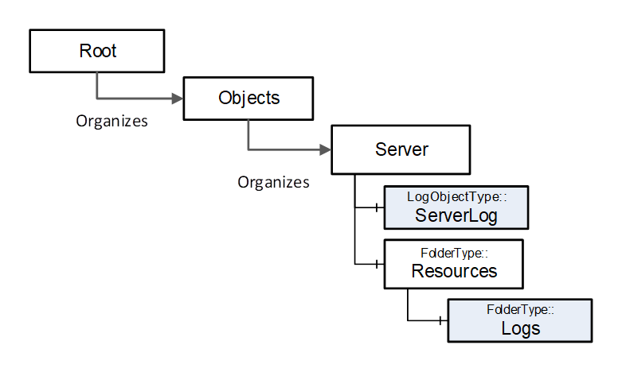  

Figure 7 - ServerLog & Logs illustration  

### 7.2 ServerLog  

The following instance can exist in *Servers* if they support *LogObjects* . It is formally defined in [Table 20](/§\_Ref83396641) .  

Table 20 - ServerLog definition  

| **Attribute** | **Value** |
|---|---|
|BrowseName|ServerLog|
  
| **References** | **NodeClass** | **BrowseName** | **DataType** | **TypeDefinition** |
|---|---|---|---|---|
|Organized by the *Server* *Object* defined in [OPC 10000-5](/§Part5)|
|HasTypeDefinition|ObjectType|0:LogObjectType||
  
| **ConformanceUnits** |
|---|
|LogObject ServerLog|
  

  

The *ServerLog* is a *LogObject* that collects diagnostic information for a *Server* if it is provided *.* The *ServerLog* exposes all *LogRecords* available in the *Server* (this shall include all *LogRecords* in all other *LogObjects* in the *Server* ).  

### 7.3 Logs  

This *Object* provides a folder that when *Organize* references are followed, will resolve to all *LogObjects* defined in the *Server* (I.e. they are either directly or indirectly referenced from this folder as part of the tree). This folder shall only contain reference to instances of *LogObjectType* (or subtype of *LogObjectType* ) and references to instance of *FolderType* (or Sub types of *FolderType* ).  

The *Logs* *Object* is the target of an *Organizes* reference from the *Resources* *Object* defined in [OPC 10000-22](/§Part22) .  

Its representation in the *AddressSpace* is formally defined in [Table 21](/§\_Ref184917603) .  

Table 21 - Logs Object Definition  

| **Attribute** | **Value** |
|---|---|
|BrowseName|Logs|
  
| **References** | **NodeClass** | **BrowseName** | **DataType** | **TypeDefinition** |
|---|---|---|---|---|
|Organized by the *Resources* *Object* defined in [OPC 10000-22](/§Part22)|
|HasTypeDefinition|ObjectType|0:FolderType||
  
| **ConformanceUnits** |
|---|
|LogObject Logs|
  

  

 **\- LogObject Server Examples (Informative)**   

### A.1 LogObject Server examples overview  

The *LogObject* might be added to a specific *Object* that is part of a device model and stores records in a vendor specific manner (see [A.5](/§\_Ref199710745) ). Another example is a *Server* that also support *EventHistory* and stores the *LogRecords* as part of a standard *EventHistory* (see [A.2](/§\_Ref199710724) ). Other examples include a system in which the *LogRecords* are buffered locally in a single store for several *LogObject* (see [A.5](/§\_Ref199710745) ) or in multiple stores one for each *LogObjects* (see [A.5](/§\_Ref199710745) ). There is an example in which *LogRecords* are forwarded by the device to an [OpenTelemetry](/§OpenT) system (see [A.4](/§\_Ref199710808) ) and there is also an example for Syslog server (see [A.3](/§\_Ref199710784) ).  

### A.2 Event History Illustration  

A *Server* that supports *EventHistory* , might just pull *LogRecords* from the *EventHistory* storage (i.e. no storage of *LogRecords* in any *LogObject* ). The Event history storage would include the *ConditionClassId* ( *SubConditionClassId* ) field in an event and a *GetRecords* call could just be a retrieval from the Event history for fields they are interested in and a filter for records where the *ConditionClassId* / *SubConditionClassId* is LogEntryConditionClassType. The filter might also include restriction for record that are from the appropriate Area *.*  

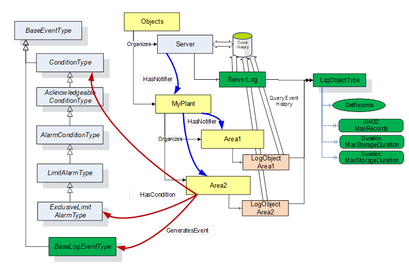  

Figure A. 1 - Event History Illustration  

  

### A.3 Syslog storage illustration  

This example illustrates a possible implementation in which the devices generating *LogObject* information are sending the information to a central [SYSLOG](/§Syslog) server. In this illustration, the local *LogObject* would only contain a minimum buffer of *LogRecords* .  

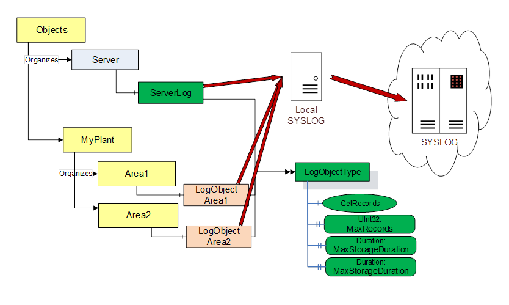  

Figure A. 2 - SYSLOG illustration  

This specification provides no mapping to SYSLOG record, but the required fields for [SYSLOG](/§Syslog) entries can be found in a *LogRecord.*  

  

### A.4 Open telemetry Illustration  

This example illustrates a possible implementation in which the device generate *LogObject* information are deployed in a system which uses OpenTelemetry to collect log or trace information. For more detail on how *LogRecords* can be imported in OpenTelemetry see [Annex C](/§\_Ref196174778) .  

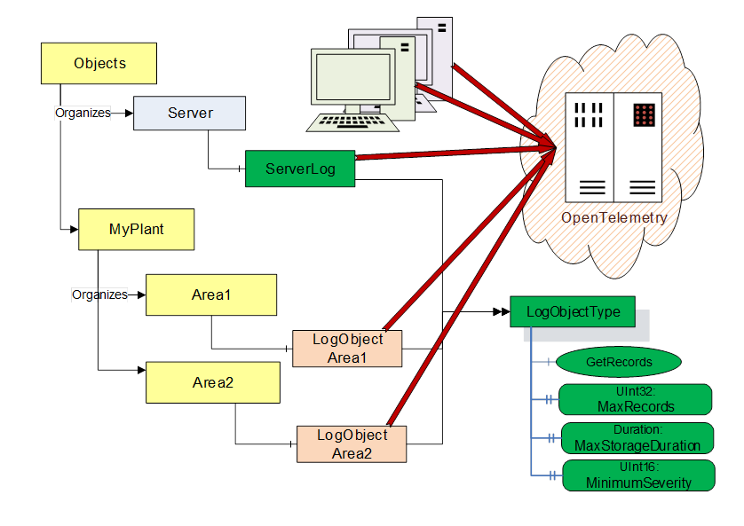  

Figure A. 3 - OpenTelemetry Illustration  

  

### A.5 Vendor Specific Storage  

The storage can be per *LogObject* (see [Figure A.4](/§\_Ref201388840) ). Each LogObject stores its own its own copy of the *LogRecord,* even if the LogRecords are the result of an event stream. Each *LogObject* would have its own limits for storage. This storage would result in some *LogRecords* being stored multiple time, in separate LogObjects. Also the list of *LogRecords* in the *ServerLog* might not include all of the *LogRecords* that would be available from Area1 *LogObject* or the Area2 *LogObject* .  

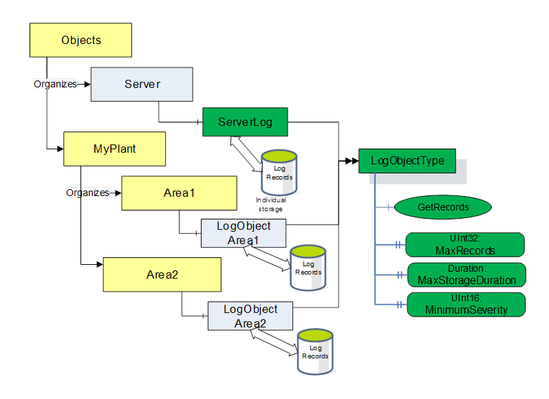  

Figure A. 4 - Vendor Specific LogObject individual Storage  

  

The store could also just be a central store, which stores all *LogRecords* from all *LogObjects* (see [Figure A.5](/§\_Ref201389630) . The *GetRecords* call on each object could be redirected to the central store (along with the *LogObject* Identifier) and then the appropriate *LogRecords* (corresponding to *LogObject* on which the *Method* was invoked) would be pulled from the central store.  

It would be important for this type of architecture that the *MaxDuration* / MaxRecords / MinimumSeverity be only set on the parent *LogObject* since it would be difficult to manage all of the individual *LogObjects.*  

  

*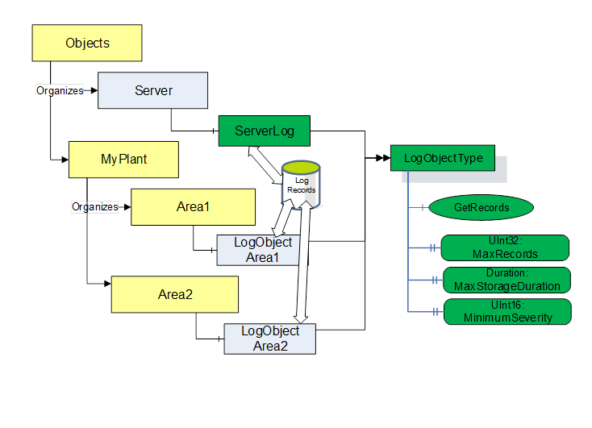*  

Figure A. 5 - Vendor Specific LogObject central storage  

## Annex B LogObject Client Examples (Informative)  

### B.1 LogObject Client examples  

This section provides some examples of clients that could be using the *LogObject* . The first example is a possible standard diagnostic *Client* , the second example is of a possible analytic engine.  

### B.2 Diagnostic client  

The diagnostic *Client* may monitor the general health of a system through status summary information that is outside of the scope of a *LogObject* . This might be *HealthStatus* information defined in the DI specification, or diagnostic information define in the UAFX specifications.  

When a maintenance worker or engineer discover some problem, they can access a diagnostic *Client* to trouble shoot the issue. The diagnostic *Client* can call *GetRecords* from the *Server* (s) that are reporting an issue. The records should provide detailed information allowing the maintenance worker / engineer to diagnose and correct the issue. Typically, this *C* lient would filter and/or sort the information provided by the *GetRecords* *Calls* . It might also combine information from multiple *Servers* . The *Client* might allow the maintenance worker / engineer to search for specific information.  

The *Client* would only connect to a *Server* when there is something to troubleshoot.  

  

Figure B. 1 - Diagnostic Client Illustration  

If a system contains very small devices (with minimum storage), the diagnostic *Client* might periodically connect the small devices and collect the *LogRecords* . As an alternative the small device might just generate *Events* for the *LogRecords* and let some larger device or the diagnostic *Client* collect them. The diagnostic *Client* could store the collected records for a longer period, allowing the maintenance worker / engineer to review a longer history.  

Note: Time Syncing functionality is required in OPC UA products, but end user might not enable it, in which case any dianostic *Client* or analytical engine should check the time on devices to which they are communicating and validate the time on that device.  

### B.3 Analytic engine  

An analytic engine would periodically collect all *LogRecords* and store them for analytics.  

The diagnostic information may be collected in a cloud environment, where it can be analysed. This may be for predictive maintenance or for process optimization. The *LogRecord Structure* provides fields that can help an analytics engine, by providing correlation information between various *Servers* (TraceContext), and also the support for the grouping of information inside of a *Server* ( *TraceContext* ).  

  

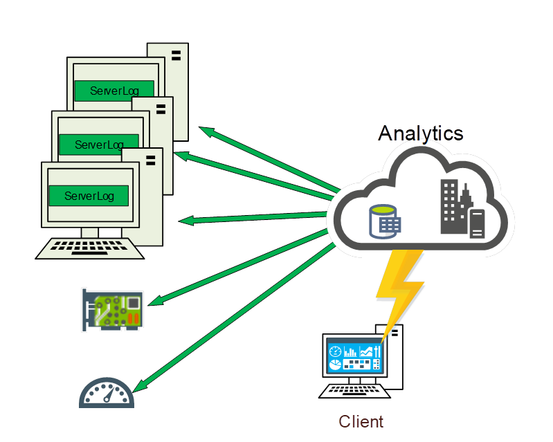  

Figure B. 2 - Analytics client illustration  

  

  

 **OpenTelemetry Mapping (Normative)**   

### B.4 Open Telemetry Overview  

[OpenTelemetry](/§OpenT) is described as "a vendor-neutral open source [observability](https://opentelemetry.io/docs/concepts/observability-primer/) framework for instrumenting, generating, collecting, and exporting telemetry data such as [traces](https://opentelemetry.io/docs/concepts/signals/traces/) , [metrics](https://opentelemetry.io/docs/concepts/signals/metrics/) , and [logs](https://opentelemetry.io/docs/concepts/signals/logs/) ." This modern system includes an infrastructure for collecting trace / metrics / log data, but this infrastructure may be too resource intensive for constrained devices. In these cases, it would be useful to be able to collect log / trace information and import it into the OpenTelemetry system.  

In OpenTelemetry, a client triggered action can be assigned a globally unique Trace\_Id. This Trace\_Id is maintained for all actions related to the client request. In addition, actions are grouped using a unique Span\_Id. This Span\_Id might be promoted to a Parent\_Id, when a tree of related trace / log message needs to be generated. This process is illustrated in [Figure C.1](/§\_Ref195832745) . The Span\_Id in OPC UA is an UInt64, and it should be unique inside of a TraceId inside of an application. An easy manner of achieving this is to just increment an UInt64 and persist the last value across the application.  

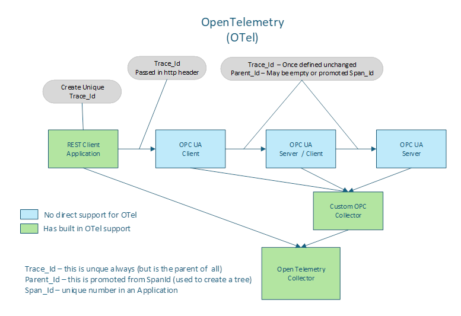  

Figure C. 1 - OpenTelemetry Mapping to OPC UA  

  

[Figure C.1](/§\_Ref195832745) also illustrates how an OpenTelemetry system could collect *LogRecords* from an LogObject [C.2](/§\_Ref195860627) describes part of the mapping an import tool would have to perform to convert LogObject LogRecords to OpenTelemetry records.  

### B.5 Open Telemetry System Import  

If an OpenTelemetry system is ingesting *LogObject* *LogRecord* , the collector will need to pull information from the *TraceContext* field. This structure contains the Trace\_ID and SpanId, It might also contain ParentSpanId( if one was provided). The SpanId field is used to group *LogRecords* together. If the SpanId field is null, then for each unique entry in the GroupingId field, the import tool shall generate a unique SpanId.  

Bibliography  

SYSLOG - The Syslog Protocol  

[https://datatracker.ietf.org/doc/html/rfc5424](https://datatracker.ietf.org/doc/html/rfc5424)  

OpenTelemetry - Open Telemetry Overview  

[https://opentelemetry.io/docs/](https://opentelemetry.io/docs/) https://opentelemetry.io/docs/  

\_\_\_\_\_\_\_\_\_\_  

