## 1 Scope  

This specification describes the OPC Unified Architecture (OPC UA) *AddressSpace* and its *Objects* . This Part is the OPC UA meta model on which OPC UA information models are based.  

## 2 Normative references  

The following documents, in whole or in part, are normatively referenced in this document and are indispensable for its application. For dated references, only the edition cited applies. For undated references, the latest edition of the referenced document (including any amendments and errata) applies.  

OPC 10000-1, *OPC Unified Architecture - Part 1: Overview and Concepts*  

[http://www.opcfoundation.org/UA/Part1/](http://www.opcfoundation.org/UA/Part1/)  

OPC 10000-4, *OPC Unified Architecture - Part 4: Services*  

[http://www.opcfoundation.org/UA/Part4/](http://www.opcfoundation.org/UA/Part4/)  

OPC 10000-5, *OPC Unified Architecture - Part 5: Information Model*  

[http://www.opcfoundation.org/UA/Part5/](http://www.opcfoundation.org/UA/Part5/)  

OPC 10000-6, *OPC Unified Architecture - Part 6: Mappings*  

[http://www.opcfoundation.org/UA/Part6/](http://www.opcfoundation.org/UA/Part6/)  

OPC 10000-8, *OPC Unified Architecture - Part 8: Data Access*  

[http://www.opcfoundation.org/UA/Part8/](http://www.opcfoundation.org/UA/Part8/)  

OPC 10000-11, *OPC Unified Architecture - Part 11: Historical Access*  

[http://www.opcfoundation.org/UA/Part11/](http://www.opcfoundation.org/UA/Part11/)  

OPC 10000-18, *OPC Unified Architecture - Part 18: Role-Based Security*  

[http://www.opcfoundation.org/UA/Part18/](http://www.opcfoundation.org/UA/Part18/)  

OPC 10000-21, *OPC Unified Architecture - Part 21: Device Onboarding*  

[http://www.opcfoundation.org/UA/Part21/](http://www.opcfoundation.org/UA/Part21/)  

ISO 639 (all parts), Codes for the representation of names of languages  

[https://www.iso.org/iso-639-language-codes.html](https://www.iso.org/iso-639-language-codes.html)  

ISO 3166 (all parts), Codes for the representation of names of countries and their subdivisions  

[https://www.iso.org/iso-3166-country-codes.html](https://www.iso.org/iso-3166-country-codes.html)  

ISO/IEC/IEEE 60559:2020, Information technology - Microprocessor Systems - Floating-Point arithmetic  

https://www.iso.org/standard/80985.html  

"https://www.iso.org/standard/80985.html  

RFC 5646, Tags for Identifying Languages  

[https://datatracker.ietf.org/doc/html/rfc5646](https://datatracker.ietf.org/doc/html/rfc5646)  

ISO 8601-1:2019, Date and time - Representations for information interchange - Part 1: Basic  

[https://www.iso.org/standard/70907.html](https://www.iso.org/standard/70907.html)  

Unicode Annex15, Unicode Standard Annex \#15: Unicode Normalization Forms  

[http://www.unicode.org/reports/tr15/](http://www.unicode.org/reports/tr15/)  

W3C XML Schema Definition Language (XSD) Part 2, DataTypes  

[http://www.w3.org/TR/xmlschema-2/](http://www.w3.org/TR/xmlschema-2/)  

ISO 4217, Codes for the representation of currencies  

[https://www.iso.org/iso-4217-currency-codes.html](https://www.iso.org/iso-4217-currency-codes.html)  

RFC 3986, Uniform Resource Identifier (URI): Generic Syntax:  

[https://datatracker.ietf.org/doc/html/rfc3986](https://datatracker.ietf.org/doc/html/rfc3986)  

RFC 4151, The 'tag' URI Scheme  

[https://datatracker.ietf.org/doc/html/rfc4151](https://datatracker.ietf.org/doc/html/rfc4151)  

Unicode C0 Controls and Basic Latin:  

[https://www.unicode.org/charts/PDF/U0000.pdf](https://www.unicode.org/charts/PDF/U0000.pdf)  

Unicode C1 Controls and Latin-1 Supplement:  

[https://www.unicode.org/charts/PDF/U0080.pdf](https://www.unicode.org/charts/PDF/U0080.pdf) [t](t)  

Unicode Property List:  

[https://www.unicode.org/Public/UCD/latest/ucd/PropList.txt](https://www.unicode.org/Public/UCD/latest/ucd/PropList.txt)  

## 3 Terms, definitions, abbreviations and conventions  

### 3.1 Terms and definitions  

For the purposes of this document, the terms and definitions given in [OPC 10000-1](/§UAPart1) and the following apply.  

#### 3.1.1 AddIn  

a widely applicable feature or feature-set represented by an *ObjectType* that will be applied using aggregation  

#### 3.1.2 DataType  

instance of a *DataType Node* that is used together with the *ValueRank* *Attribute* to define the data type of a *Variable*  

#### 3.1.3 Built-in DataType  

a fundamental building block *DataType* defined by this standard  

Note 1 to entry: The list of Built-in DataTypes and their encodings are defined in [OPC 10000-6](/§UAPart6) .  

#### 3.1.4 Simple DataType  

a *DataType* which is not a Structure, Enumeration or OptionSet  

Note 1 to entry: See [5.8.2](/§\_Ref209454732) for additional information.  

#### 3.1.5 DataTypeId  

*NodeId* of a *DataType Node*  

#### 3.1.6 DataTypeRefinement  

refinement of a *Structured DataType* restricting the usage of fields and adding meta data to fields  

#### 3.1.7 DataVariable  

*Variables* that represent *values* of *Objects* , either directly or indirectly for complex *Variables* , where the *Variables* are always the *TargetNode* of a *HasComponent Reference*  

#### 3.1.8 EventType  

*ObjectType* *Node* that represents the type definition of an *Event*  

#### 3.1.9 Hierarchical Reference  

*Reference* that is used to construct hierarchies in the *AddressSpace*  

Note 1 to entry: All hierarchical ReferenceTypes are derived from HierarchicalReferences.  

#### 3.1.10 InstanceDeclaration  

*Node* that is used by a complex *TypeDefinitionNode* to expose its complex structure  

Note 1 to entry: This is an instance used by a type definition.  

#### 3.1.11 Interface  

an abstract *ObjectType* used to specify a feature or feature-set that shall be implemented by the *Object* or *ObjectType* where it is applied to  

#### 3.1.12 ModellingRule  

metadata of an *InstanceDeclaration* that defines how the *InstanceDeclaration* will be used for instantiation and also defines subtyping rules for an *InstanceDeclaration*  

#### 3.1.13 Property  

*Variables* that are the *TargetNode* for a *HasProperty Reference*  

Note 1 to entry: *Properties* describe the characteristics of a *Node.*  

#### 3.1.14 SourceNode  

*Node* having a *Reference* to another *Node*  

EXAMPLE: In the *Reference* "A contains B", "A" is the *SourceNode.*  

#### 3.1.15 SubtypeRestriction  

restriction of the usage of a subtype of a *DataType* to only allow a subset of all its subtypes  

#### 3.1.16 TargetNode  

*Node* that is referenced by another *Node*  

EXAMPLE: In the *Reference* "A contains B", "B" is the *TargetNode.*  

#### 3.1.17 TypeDefinitionNode  

*Node* that is used to define the type of another *Node*  

Note 1 to entry: *ObjectType* and *VariableType* *Nodes* are *TypeDefinitionNodes* .  

#### 3.1.18 VariableType  

*Node* that represents the type definition for a *Variable*  

### 3.2 Abbreviated terms  

UA Unified Architecture  

UML Unified Modeling Language  

URI Uniform Resource Identifier as defined by [RFC 3986](/§RFC3986)  

W3C World Wide Web Consortium  

XML Extensible Markup Language  

### 3.3 Conventions  

#### 3.3.1 Conventions for AddressSpace figures  

*Nodes* and their *References* to each other are illustrated using figures. [Figure 1](/§\_Ref88631152) illustrates the conventions used in these figures.  

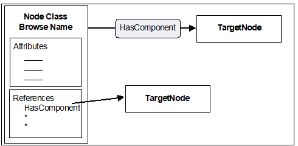  

Figure 1 - AddressSpace Node diagrams  

In these figures, rectangles represent *Nodes* . *Node* rectangles may be titled with one or two lines of text. When two lines are used, the first text line in the rectangle identifies the *NodeClass* and the second line contains the *BrowseName* . When one line is used, it contains the *BrowseName* .  

*Node* rectangles may contain boxes used to define their *Attributes* and *References* . Specific names in these boxes identify specific *Attributes* and *References* .  

Shaded rectangles with rounded corners and with arrows passing through them represent *References* . The arrow that passes through them begins at the *SourceNode* and points to the *TargetNode* . *References* may also be shown by drawing an arrow that starts at the *Reference* name in the "References" box and ends at the *TargetNode* .  

#### 3.3.2 Conventions for defining NodeClasses  

Clause [4.10](/§\_Ref115660529) defines *AddressSpace NodeClasses* . [Table 1](/§\_Ref115688888) describes the format of the tables used to define *NodeClasses* .  

Table 1 - NodeClass Table Conventions  

| **Name** | **Use** | **Data Type** | **Description** |
|---|---|---|---|
  
| **Attributes** ||||
|---|---|---|---|
|"Attribute name"|"M" or "O"|Data type of the *Attribute*|Defines the *Attribute*|
|||||
  
| **References** ||||
|---|---|---|---|
|"Reference name"|"1", "0..1" or "0..\*"|Not used|Describes the use of the *Reference* by the *NodeClass*|
|||||
  
| **Standard Properties** ||||
|---|---|---|---|
|"Property name"|"M" or "O"|Data type of the *Property*|Defines the *Property*|
  

  

The Name column contains the name of the *Attribute* , the name of the *ReferenceType* used to create a *Reference* or the name of a *Property* referenced using the *HasProperty Reference* .  

The Use column defines whether the *Attribute* or *Property* is mandatory (M) or optional (O). When mandatory the *Attribute* or *Property* shall exist for every *Node* of the *NodeClass* . For *References* it specifies the cardinality. The following values may apply:  

* "0..\*" identifies that there are no restrictions, that is, the *Reference* does not have to be provided but there is no limitation how often it can be provided;  

* "0..1" identifies that the *Reference* is provided at most once;  

* "1" identifies that the *Reference* shall be provided exactly once.  

The Data Type column contains the name of the *DataType* of the *Attribute* or *Property* . It is not used for *References* .  

The Description column contains the description of the *Attribute* , the *Reference* or the *Property* .  

Only this document may define *Attributes* . Thus, all *Attributes* of the *NodeClass* are specified in the table and may only be extended by other parts of this series of standards.  

This document also defines *ReferenceTypes* , but *ReferenceTypes* may also be specified by a *Server* or by a client using the *NodeManagement Services* specified in [OPC 10000-4](/§UAPart4) . Thus, the *NodeClass* tables contained in this document may contain the base *ReferenceType* called *References* identifying that any *ReferenceType* may be used for the *NodeClass,* including system specific *ReferenceTypes* . The *NodeClass* tables only specify how the *NodeClasses* can be used as *SourceNodes* of *References* , not as *TargetNodes* . If a *NodeClass* table allows a *ReferenceType* for its *NodeClass* to be used as *SourceNode* , this is also true for subtypes of the *ReferenceType* . However, subtypes of the *ReferenceType* may restrict its *SourceNodes* .  

This document defines *Properties* , but *Properties* can be defined by other standard organizations or vendors and *Nodes* can have *Properties* that are not standardised. *Properties* defined in this standard are defined by their name, which is mapped to the *BrowseName* having the *NamespaceIndex* 0, which represents the *Namespace* for OPC UA.  

The Use column (optional or mandatory) does not imply a specific *ModellingRule* for *Properties* . Different *Server* implementations will choose to use *ModellingRules* appropriate for them.  

## 4 AddressSpace concepts  

### 4.1 Overview  

The remainder of Clause [4](/§\_Ref387846225) defines the concepts of the *AddressSpace* . Clause [5](/§\_Ref40785698) defines the *NodeClasses* of the *AddressSpace* representing the *AddressSpace* concepts. Clause [6](/§\_Ref193170844) defines details on the type model for *ObjectTypes* and *VariableTypes* . Standard *ReferenceTypes* , *DataTypes* and *EventTypes* are defined in Clauses [7](/§\_Ref192918160) to [8.61](/§\_Ref138652042) .  

The informative [Annex A](/§\_Ref138652200) describes general considerations on how to use the Address Space Model and the informative [Annex B](/§\_Ref138652252) provides a UML Model of the Address Space Model. The normative [Annex C](/§\_Ref182263562) defines a graphical notation for OPC UA data.  

### 4.2 URIs  

URIs provide a syntax for constructing unique identifiers for resources that are used in several different contexts with this specification. Three use cases where implementors may need to construct their own URIs are:  

* *NamespaceUris* used to identify an information model. *NamespaceUris* appear in *UANodeSets* (see [OPC 10000-6](/§UAPart6) ) and in the *NamespaceArray* in a *Server* *AddressSpace* (see [OPC 10000-5](/§UAPart5) );  

* *ApplicationUris* identify an *OPC UA Application* running on a particular *Device* and are assigned by the *OwnerOperator* or automatically created by the application software. An *ApplicationInstance* *Certificate* has the *ApplicationUri* in the *subjectAltName* (see [OPC 10000-6](/§UAPart6) );  

* *ProductInstanceUris* identify a *Device* and are assigned by the *Device Manufacturer* (see [OPC 10000-21](/§UAPart21) ). A *DeviceIdentity Certificate* has the *ProductInstanceUri* in the *subjectAltName* .  

These URIs conform to [RFC 3986](/§RFC3986) , however, this specification is very open ended. This clause provides recommendations for constructing these URIs.  

The recommendations help ensure that URIs are unique by providing a scope controlled by a single authority (e.g. the domain name) and are human readable. Programs shall always treat URIs as opaque strings that can only be tested for equality with a case sensitive string comparison.  

URIs should be tag URIs ( [RFC 4151](/§RFC4151) ) or HTTP URLs ( [RFC 3986](/§RFC3986) ). URLs should only be used if they link to actual webpages.  

The scheme and domain name portions of the URI are in lower case. URIs may include query subcomponents and/or fragments.  

Below are recommended URI formats for different use cases.  

1) *NamespaceUri* assigned by the creator of a *InformationModel* :  

tag:\<authority-domain-name\>,\<yyyy-MM\>:UA:\<model-short-name\>  

http://\<authority-domain-name\>/UA/\<model-short-name\>  

Where the \<authority-domain-name\> is a domain name owned by the authority creating the information model. In many cases this will be 'opcfoundation.org'. \<yyyy-MM\> is the year and month that the URI was created. The \<model-short-name\> is a short identifier for the *InformationModel* .  

2) *ApplicationUri* assigned by the *OwnerOperator*  

tag:\<device-domain-name\>,\<yyyy-MM\>:\<product\>  

http://\<device-domain-name\>/\<product\>  

Where the \<device-domain-name\> is a domain name or IP address for the *Device* that is unique within the *OwnerOperator* system. \<yyyy-MM\> is the year and month that the URI was created. The \<product\> is an identifier for the product which could contain many path segments.  

3) *ApplicationUri* automatically generated by product software:  

tag:\<vendor-domain-name\>,\<yyyy-MM\>:\<product\>:\<guid\>  

http://\<vendor-domain-name\>/\<product\>/\<guid\>  

Where \<vendor-domain-name\> is a domain name owned by the product vendor. \<yyyy-MM\> is the year and month that the URI was created. The \<product\> is an identifier for the product which could contain many path segments and \<guid\> is unique identifier generated when the product is first initialized on a particular *Device* .  

4) *ProductInstanceUri* assigned by a *Device Manufacturer* :  

tag:\<manufacturer-domain-name\>,\<yyyy-MM\>:\<product\>:\<serial-number\>  

http://\<manufacturer-domain-name\>/\<product\>/\<serial-number\>  

Where \<manufacturer-domain-name\> is a domain name owned by the *Manufacturer* . \<yyyy-MM\> is the year and month that the URI was created. The \<product\> is an identifier for the product which could contain many path segments and \<serial-number\> is unique identifier for the *Device* assigned by the *Manufacturer* .  

### 4.3 Object Model  

The primary objective of the OPC UA *AddressSpace* is to provide a standard way for *Servers* to represent *Objects* to *Clients* . The OPC UA Object Model has been designed to meet this objective. It defines *Objects* in terms of *Variables* and *Methods* . It also allows relationships to other *Objects* to be expressed. [Figure 2](/§\_Ref130064097) illustrates the model.  

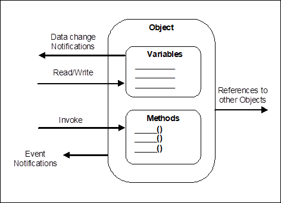  

Figure 2 - OPC UA Object Model  

The elements of this model are represented in the *AddressSpace* as *Nodes* . Each *Node* is assigned to a *NodeClass* and each *NodeClass* represents a different element of the Object Model. Clause [4.10](/§\_Ref127675422) defines the *NodeClasses* used to represent this model.  

### 4.4 Node Model  

#### 4.4.1 General  

The set of *Objects* and related information that the OPC UA *Server* makes available to *Clients* is referred to as its *AddressSpace* . The model for *Objects* is defined by the OPC UA Object Model (see [4.3](/§\_Ref191560643) ).  

Objects and their components are represented in the *AddressSpace* as a set of *Nodes* described by *Attributes* and interconnected by *References* . [Figure 3](/§\_Ref114466674) illustrates the model of a *Node* and the remainder of 4.3 discusses the details of the Node Model.  

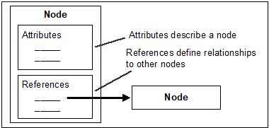  

Figure 3 - AddressSpace Node Model  

#### 4.4.2 NodeClasses  

*NodeClasses* are defined in terms of the *Attributes* and *References* that shall be instantiated (given values) when a *Node* is defined in the *AddressSpace* . *Attributes* are discussed in [4.4.3](/§\_Ref113946526) and *References* in [4.4.4](/§\_Ref130228637) .  

Clause [5](/§\_Ref40785698) defines the *NodeClasses* for the OPC UA *AddressSpace* . These *NodeClasses* are referred to collectively as the metadata for the *AddressSpace* . Each *Node* in the *AddressSpace* is an instance of one of these *NodeClasses* . No other *NodeClasses* shall be used to define *Nodes* , and as a result, *Clients* and *Servers* are not allowed to define *NodeClasses* or extend the definitions of these *NodeClasses* .  

#### 4.4.3 Attributes  

*Attributes* are data elements that describe *Nodes* . *Clients* can access *Attribute* values using Read, Write, Query, and Subscription/MonitoredItem *Services* . These *Services* are defined in [OPC 10000-4](/§UAPart4) .  

*Attributes* are elementary components of *NodeClasses* . *Attribute* definitions are included as part of the *NodeClass* definitions in Clause [4.10](/§\_Ref127675422) and, therefore, are not included in the *AddressSpace* .  

Each *Attribute* definition consists of an attribute id (for attribute ids of *Attributes* , see [OPC 10000-6](/§UAPart6) ), a name, a description, a data type and a mandatory/optional indicator. The set of *Attributes* defined for each *NodeClass* shall not be extended by *Clients* or *Servers* .  

When a *Node* is instantiated in the *AddressSpace* , the values of the *NodeClass* *Attributes* are provided. The mandatory/optional indicator for the *Attribute* indicates whether the *Attribute* has to be instantiated.  

#### 4.4.4 References  

*References* are used to relate *Nodes* to each other. They can be accessed using the browsing and querying *Services* defined in [OPC 10000-4](/§UAPart4) .  

Like *Attributes* , they are defined as fundamental components of *Nodes* . Unlike *Attributes* , *References* are defined as instances of *ReferenceType Nodes* . *ReferenceType Nodes* are visible in the *AddressSpace* and are defined using the *ReferenceType* *NodeClass* (see [5.3](/§\_Ref126748663) ).  

The *Node* that contains the *Reference* is referred to as the *SourceNode* and the *Node* that is referenced is referred to as the *TargetNode* . The combination of the *SourceNode* , the *ReferenceType* and the *TargetNode* are used in OPC UA *Services* to uniquely identify *References* . Thus, each *Node* can reference another *Node* with the same *ReferenceType* only once. Any subtypes of concrete *ReferenceTypes* are considered to be equal to the base concrete *ReferenceTypes* when identifying *References* (see [5.3](/§\_Ref126748663) for subtypes of *ReferenceTypes* ). [Figure 4](/§\_Ref114026424) illustrates this model of a *Reference* .  

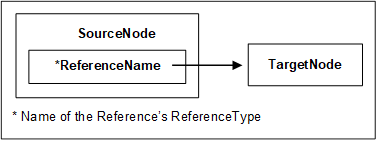  

Figure 4 - Reference Model  

The *TargetNode* of a *Reference* may be in the same *AddressSpace* or in the *AddressSpace* of another OPC UA *Server* . *TargetNodes* located in other *Servers* are identified in OPC UA *Services* using a combination of the remote *Server* name and the identifier assigned to the *Node* by the remote *Server* .  

OPC UA does not require that *the* *TargetNode* exists, thus *References* may point to a *Node* that does not exist.  

### 4.5 Variables  

#### 4.5.1 General  

*Variables* are used to represent *values* . Two types of *Variables* are defined, *Properties* and *DataVariables* . They differ in the kind of data that they represent and whether they can contain other *Variables* .  

#### 4.5.2 Properties  

*Properties* are *Server*\-defined characteristics of *Objects* , *DataVariables* and other *Nodes* . *Properties* differ from *Attributes* in that they characterise *what* the *Node* represents, such as a device or a purchase order. *Attributes* define additional metadata that is instantiated for all *Nodes* from a *NodeClass* . *Attributes* are common to all *Nodes* of a *NodeClass* and only defined by this specification whereas *Properties* can be *Server*\-defined.  

For example, an *Attribute* defines the *DataType* of *Variables* whereas a *Property* can be used to specify the engineering unit of some *Variables* .  

To prevent recursion, *Properties* are not allowed to have *Properties* defined for them. To easily identify *Properties* , the *BrowseName* of a *Property* shall be unique in the context of the *Node* containing the *Properties* (see [5.6.3](/§\_Ref127693460) for details).  

A *Node* and its *Properties* shall always reside in the same *Server* .  

#### 4.5.3 DataVariables  

*DataVariables* represent the content of an *Object* . For example, a file *Object* may be defined that contains a stream of bytes. The stream of bytes may be defined as a *DataVariable* that is an array of bytes. *Properties* may be used to expose the creation time and owner of the file *Object* .  

For example, if a *DataVariable* is defined by a data structure that contains two fields, "startTime" and "endTime" then it might have a *Property* specific to that data structure, such as "earliestStartTime".  

As another example, function blocks in control systems might be represented as *Objects* . The parameters of the function block, such as its setpoints, may be represented as *DataVariables* . The function block *Object* might also have *Properties* that describe its execution time and its type.  

*DataVariables* may have additional *DataVariables* , but only if they are complex. In this case, their *DataVariables* shall always be elements of their complex definitions. Following the example introduced by the description of *Properties* in [4.5.2](/§\_Ref130228256) , the *Server* could expose "startTime" and "endTime" as separate components of the data structure.  

As another example, a complex *DataVariable* may define an aggregate of temperature values generated by three separate temperature transmitters that are also visible in the *AddressSpace* . In this case, this complex *DataVariable* could define *HasComponent* *References* from it to the individual temperature values that it is composed of.  

### 4.6 TypeDefinitionNodes  

#### 4.6.1 General  

OPC UA *Servers* shall provide type definitions for *Objects* and *Variables* . The *HasTypeDefinition* *Reference* shall be used to link an instance with its type definition represented by a *TypeDefinitionNode* . Type definitions are required; however, [OPC 10000-5](/§UAPart5) defines a *BaseObjectType* , a *PropertyType,* and a *BaseDataVariableType* so a *Server* can use such a base type if no more specialised type information is available. *Objects* and *Variables* inherit the *Attributes* specified by their *TypeDefinitionNode* (see [6.4](/§\_Ref128009730) for details).  

In some cases, the *NodeId* used by the *HasTypeDefinition Reference* will be well-known to *Clients* and *Servers* . Organizations may define *TypeDefinitionNodes* that are well-known in the industry. Well-known *NodeIds* of *TypeDefinitionNodes* provide for commonality across OPC UA *Servers* and allow *Clients* to interpret the *TypeDefinitionNode* without having to read it from the *Server* . Therefore, *Servers* may use well-known *NodeIds* without representing the corresponding *TypeDefinitionNodes* in their *AddressSpace* . However, the *TypeDefinitionNodes* shall be provided for generic *Clients* . These *TypeDefinitionNodes* may exist in another *Server* .  

The following example, illustrated in [Figure 5](/§\_Ref130227898) , describes the use of the *HasTypeDefinition Reference* . In this example, a setpoint parameter "SP" is represented as a *DataVariable* in the *AddressSpace* . This *DataVariable* is part of an *Object* not shown in the figure.  

To provide for a common setpoint definition that can be used by other *Objects* , a specialised *VariableType* is used. Each setpoint *DataVariable* that uses this common definition will have a *HasTypeDefinition* *Reference* that ** identifies the common "SetPoint" *VariableType* .  

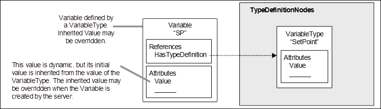  

Figure 5 - Example of a Variable defined by a VariableType  

#### 4.6.2 Complex TypeDefinitionNodes and their InstanceDeclarations  

*TypeDefinitionNodes* can be complex. A complex *TypeDefinitionNode* also defines *References* to other *Nodes* as part of the type definition. The *ModellingRules* defined in [6.4.4](/§\_Ref128179460) specify how those *Nodes* are handled when creating an instance of the type definition.  

A *TypeDefinitionNode* references instances instead of other *TypeDefinitionNodes* to allow unique names for several instances of the same type, to define default values and to add *References* for those instances that are specific to this complex *TypeDefinitionNode* and not to the *TypeDefinitionNode* of the instance. For example, in [Figure 6](/§\_Ref130898447) the *ObjectType* "AI\_BLK\_TYPE", representing a function block, has a *HasComponent Reference* to a *Variable* "SP" of the *VariableType* "SetPoint". "AI\_BLK\_TYPE" could have an additional setpoint *Variable* of the same type using a different name. It could add a *Property* to the *Variable* that was not defined by its *TypeDefinitionNode* "SetPoint". And it could define a default value for "SP", that is, each instance of "AI\_BLK\_TYPE" would have a *Variable* "SP" initially set to this value.  

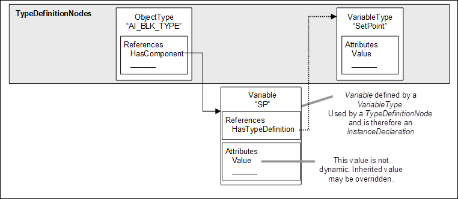  

Figure 6 - Example of a Complex TypeDefinition  

This approach is commonly used in object-oriented programming languages in which the variables of a class are defined as instances of other classes. When the class is instantiated, each variable is also instantiated, but with the default values (constructor values) defined for the containing class. That is, typically, the constructor for the component class runs first, followed by the constructor for the containing class. The constructor for the containing class may override component values set by the component class.  

To distinguish instances used for the type definitions from instances that represent real data, those instances are called *InstanceDeclarations* . However, this term is used to simplify this specification, if an instance is an *InstanceDeclaration* or not is only visible in the *AddressSpace* by following its *References* . Some instances may be shared and therefore referenced by *TypeDefinitionNodes* , *InstanceDeclarations* and instances. This is similar to class variables in object-oriented programming languages.  

#### 4.6.3 Subtyping  

This standard allows subtyping of type definitions. The subtyping rules are defined in Clause [6](/§\_Ref130963989) . Subtyping of *ObjectTypes* and *VariableTypes* allows:  

* *Clients* that only know the supertype to handle an instance of the subtype as if it were an instance of the supertype;  

* instances of the supertype to be replaced by instances of the subtype;  

* specialised types that inherit common characteristics of the base type.  

In other words, subtypes reflect the structure defined by their supertype but may add additional characteristics. For example, a vendor may wish to extend a general "TemperatureSensor" *VariableType* by adding a *Property* providing the next maintenance interval. The vendor would do this by creating a new *VariableType* which is a *TargetNode* for a *HasSubtype* reference from the original *VariableType* and ** adding the new *Property* to it.  

#### 4.6.4 Instantiation of complex TypeDefinitionNodes  

The instantiation of complex *TypeDefinitionNodes* depends on the *ModellingRules* defined in [6.4.4](/§\_Ref128179460) . However, the intention is that instances of a type definition will reflect the structure defined by the *TypeDefinitionNode* . [Figure 7](/§\_Ref115491510) shows an instance of the *TypeDefinitionNode* "AI\_BLK\_TYPE", where the *ModellingRule* *Mandatory* , defined in [6.4.4.4.1](/§\_Ref192912661) , was applied for its containing *Variable* . Thus, an instance of "AI\_BLK\_TYPE", called AI\_BLK\_1", has a *HasTypeDefinition* *Reference* to "AI\_BLK\_TYPE". It also contains a *Variable* "SP" having the same *BrowseName* as the *Variable* "SP" used by the *TypeDefinitionNode* and thereby reflects the structure defined by the *TypeDefinitionNode* .  

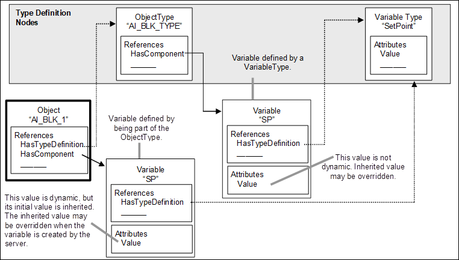  

Figure 7 - Object and its Components defined by an ObjectType  

A client knowing the *ObjectType* "AI\_BLK\_TYPE" can use this knowledge to directly browse to the containing *Nodes* for each instance of this type. This allows programming against the *TypeDefinitionNode* . For example, a graphical element may be programmed in the client that handles all instances of "AI\_BLK\_TYPE" in the same way by showing the value of "SP".  

There are several constraints related to programming against the *TypeDefinitionNode* . A *TypeDefinitionNode* or an *InstanceDeclaration* shall never reference two *Nodes* having the same *BrowseName* using forward *hierarchical References* . Instances based on *InstanceDeclarations* shall always keep the same *BrowseName* as the *InstanceDeclaration* they are derived from. A special *Service* defined in [OPC 10000-4](/§UAPart4) called TranslateBrowsePathsToNodeIds may be used to identify the instances based on the *InstanceDeclarations* . Using the simple Browse *Service* might not be sufficient since the uniqueness of the *BrowseName* is only required for *TypeDefinitionNodes* and *InstanceDeclarations* , not for other instances. Thus, "AI\_BLK\_1" may have another *Variable* with the *BrowseName* "SP", although this one would not be derived from an *InstanceDeclaration* of the *TypeDefinitionNode* .  

Instances derived from an *InstanceDeclaration* shall be of the same *TypeDefinitionNode* or a subtype of this *TypeDefinitionNode* .  

A *TypeDefinitionNode* and its *InstanceDeclarations* shall always reside in the same *Server* . However, instances may point with their *HasTypeDefinition* *Reference* to a *TypeDefinitionNode* in a different *Server* .  

### 4.7 Event Model  

#### 4.7.1 General  

The Event Model defines a general purpose eventing system that can be used in many diverse vertical markets.  

*Events* represent specific transient occurrences. System configuration changes and system errors are examples of *Events* . *Event* *Notifications* report the occurrence of an *Event* . *Events* defined in this document are not directly visible in the OPC UA *AddressSpace* . *Objects* and *Views* can be used to subscribe to *Events* . The *EventNotifier Attribute* of those *Nodes* identifies if the *Node* allows subscribing to *Events* . *Clients* subscribe to such *Nodes* to receive *Notifications* of *Event* occurrences.  

*Event Subscriptions* use the Monitoring and Subscription *Services* defined in [OPC 10000-4](/§UAPart4) to subscribe to the *Event Notifications* of a *Node* .  

Any OPC UA *Server* that supports eventing shall expose at least one *Node* as *EventNotifier* . The *Server* *Object* defined in [OPC 10000-5](/§UAPart5) is used for this purpose. *Events* generated by the *Server* are available via this *Server* *Object* . A *Server* is not expected to produce *Events* if the connection to the event source is down for some reason (i.e. the system is offline).  

*Events* may also be exposed through other *Nodes* anywhere in the *AddressSpace* . These *Nodes* (identified via the *EventNotifier Attribute* ) provide some subset of the *Events* generated by the *Server* . The position in the *AddressSpace* dictates what this subset will be. For example, a process area *Object* representing a functional area of the process would provide *Events* originating from that area of the process only. It should be noted that this is only an example and it is fully up to the *Server* to determine what *Events* should be provided by which *Node* .  

#### 4.7.2 EventTypes  

Each *Event* is of a specific *EventType* . A *Server* may support many types. This part defines the *BaseEventType* that all other *EventTypes* derive from. It is expected that other companion specifications will define additional *EventTypes* deriving from the base types defined in this part.  

The *EventTypes* supported by a *Server* are exposed in the *AddressSpace* of a *Server* . *EventTypes* are represented as *ObjectTypes* in the *AddressSpace* and do not have a special *NodeClass* associated to them. [OPC 10000-5](/§UAPart5) defines how a *Server* exposes the *EventTypes* in detail.  

*EventTypes* defined in this document are specified as abstract and therefore never instantiated in the *AddressSpace* . Event occurrences of those *EventTypes* are only exposed via a *Subscription* . Components of an *EventType* defined with *ModellingRules* other than *Mandatory* or *Optional* cannot be returned in an *Event* *Subscription* . *EventTypes* exist in the *AddressSpace* to allow *Clients* to discover the *EventType* . This information is used by a client when establishing and working with *Event* *Subscriptions* . *EventTypes* defined by other parts of this series of standards or companion specifications as well as *Server* specific *EventTypes* may be defined as not abstract and therefore instances of those *EventTypes* may be visible in the *AddressSpace* although *Events* of those *EventTypes* are also accessible via the *Event* *Notification* mechanisms.  

Standard *EventTypes* are described in Clause [8.61](/§\_Ref128437157) . Their representation in the *AddressSpace* is specified in [OPC 10000-5](/§UAPart5) .  

#### 4.7.3 Event Categorization  

*Events* can be categorised by creating new *EventTypes* which are subtypes of existing *EventTypes* but do not extend an existing type. They are used only to identify an event as being of the new *EventType* . For example, the *EventType* DeviceFailureEventType could be subtyped into TransmitterFailureEventType and ComputerFailureEventType. These new subtypes would not add new *Properties* or change the semantic inherited from the DeviceFailureEventType other than purely for categorization of the *Events* .  

*Event* sources can also be organised into groups by using the *Event* *ReferenceTypes* described in [7.16](/§\_Ref135713256) and [7.18](/§\_Ref135713552) . For example, a *Server* may define *Objects* in the *AddressSpace* representing *Events* related to physical devices, or *Event* areas of a plant or functionality contained in the *Server* . *Event* *References* would be used to indicate which *Event* sources represent physical devices and which ones represent some *Server*\-based functionality. In addition, *References* can be used to group the physical devices or *Server*\-based functionality into hierarchical *Event* areas. In some cases, an *Event* source may be categorised as being both a device and a *Server* function. In this case, two relationships would be established. Refer to the description of the *Event* *ReferenceTypes* for additional examples.  

*Clients* can select a category or categories of *Events* by defining content filters that include terms specifying the *EventType* of the *Event* or a grouping of *Event* sources. The two mechanisms allow for a single *Event* to be categorised in multiple manners. A client could obtain all *Events* related to a physical device or all failures of a particular device.  

### 4.8 Methods  

*Methods* are "lightweight" functions, whose scope is bounded by an owning (see Note) *Object* , similar to the methods of a class in object-oriented programming or an owning *ObjectType* , similar to static methods of a class. *Methods* are invoked by a client, proceed to completion on the *Server* and return the result to the client. The lifetime of the *Method's* invocation instance begins when the client calls the *Method* and ends when the result is returned.  

NOTE The owning *Object* or *ObjectType* is specified in the service call when invoking the *Method* .  

While *Methods* may affect the state of the owning *Object* , they have no explicit state of their own. In this sense, they are stateless. *Methods* can have a varying number of input arguments and return resultant arguments. Each *Method* is described by a *Node* of the *Method NodeClass* . This *Node* contains the metadata that identifies the *Method's* arguments and describes its behaviour.  

*Methods* are invoked by using the Call *Service* defined in [OPC 10000-4](/§UAPart4) .  

*Clients* discover the *Methods* supported by a *Server* by browsing for the owning *Objects References* that identify their supported *Methods* .  

### 4.9 Roles  

#### 4.9.1 Overview  

A *Role* is a function assumed by a *Client* when it accesses a *Server* . *Roles* are used to separate authentication (determining who a *Client* is) from authorization (determining what the *Client* is allowed to do). By separating these tasks *Servers* can allow centralized services to manage user identities and credentials while the *Server* only manages the *Permissions* on its *Nodes* assigned to *Roles* .  

The set of *Roles* supported by a *Server* are published as components of the *RoleSet Object* defined in [OPC 10000-18](/§UAPart18) . S *ervers* should define a base set of *Roles* and allow configuration *Clients* to add system specific *Roles* . Adding, deleting, and modifying *Roles* is restricted to callers with appropriate permissions.  

When a *Session* is created, or a *Session-less* *Service* is called, the *Server* must determine what *Roles* are granted to that *Session* or *Session-less Service* invocation. This specification defines standard mapping rules which *Servers* may support. *Servers* may also use vendor specific mapping rules in addition to or instead of the standard rules.  

The *Anonymous Role* is the default *Role* which is always assigned to all *Sessions.*  

The *AuthenticatedUser Role* is always assigned when a *Session* has been authenticated with a *UserIdentityToken* other than the *AnonymousIdentityToken* (see [OPC 10000-4](/§UAPart4) ).  

The *TrustedApplication Role* is always assigned when a *Session* has been authenticated with a trusted *ApplicationInstance* *Certificate* (see [OPC 10000-4](/§UAPart4) ) and uses at least a signed communication channel.  

The standard mapping rules allow *Roles* to be granted based on:  

* User identity;  

* Application identity;  

* Endpoint;  

User identity mappings can be based on user names, user certificates or user groups.  

Application identity mappings are based on the *ApplicationUri* specified in the *Client Certificate* . Application identity can only be enforced if the *Client* proves possession of a trusted *Certificate* by using it to create a *Secure Channel* or by providing a signature in *ActivateSession* (see [OPC 10000-4](/§UAPart4) ).  

Endpoint identity mappings are based on the URL used to connect to the *Server* . Endpoint identity can be used to restrict access to *Clients* running on particular networks. Endpoint identity mappings should not be used as the only criteria unless access to the endpoint is restricted by the network infrastructure. For example, an endpoint on a loopback address is only accessible from the same machine.  

[OPC 10000-5](/§UAPart5) defines the *Objects* , *Methods* and *DataTypes* used to represent and manage these mapping rules in the *Address Space* .  

#### 4.9.2 Well Known Roles  

The *NodeIds* for the well-known *Roles* are defined in [OPC 10000-6](/§UAPart6) . All *Servers* should support the well-known *Roles* which are defined in [Table 2](/§\_Ref466032569) .  

Table 2 - Well-Known Roles  

| **BrowseName** | **Suggested Permissions** |
|---|---|
|Anonymous|The *Role* is allowed to browse and read non-security related *Nodes* only in ** the *Server Object* and all type *Nodes* .|
|AuthenticatedUser|The *Role* is allowed to browse and read non-security related *Nodes* .|
|TrustedApplication|The *Role* is allowed to browse and read non-security related *Nodes* .|
|Observer|The *Role* is allowed to browse, read live data, read historical data/events or subscribe to data/events.|
|Operator|The *Role* is allowed to browse, read live data, read historical data/events or subscribe to data/events. In addition, the *Session* is allowed to write some live data and call some *Methods* .|
|Engineer|The *Role* is allowed to browse, read/write configuration data, read historical data/events, call *Methods* or subscribe to data/events.|
|Supervisor|The *Role* is allowed to browse, read live data, read historical data/events, call *Methods* or subscribe to data/events.|
|ConfigureAdmin|The *Role* is allowed to change the non-security related configuration settings.|
|SecurityAdmin|The *Role* is allowed to change security related settings.|
  

  

#### 4.9.3 Evaluating Permissions with Roles  

When a *Client* attempts to access a *Node,* the *Server* goes through the list of *Roles* granted to the *Session* and logically ORs the *Permissions* for the *Role* on the *Node. If there are no Node specific Permissions then* the default *Permissions* for the *Role* in the *DefaultRolePermissions Property* of the *NamespaceMetadata* for the namespace the *Node* belongs to are used (see [OPC 10000-5](/§UAPart5) ). The resulting mask is the effective *Permissions* . If the bits corresponding to current operation are set, then the operation can proceed. If they are not set the *Server* returns *Bad\_UserAccessDenied* .  

*Roles* appear under the *Roles Object* in the *Server Address Space* . Each *Role* has mapping rules defined which appear as *Properties* of the *Role* *Object* (see [OPC 10000-5](/§UAPart5) ). The examples shown in [Table 3](/§\_Ref466032570) illustrate how the standard mapping rules can be used to determine which *Roles* a *Session* has access to and, consequently, the *Permissions* that are granted to the *Session* .  

Table 3 - Example Roles  

| **Role** | **Mapping Rules** | **Description** |
|---|---|---|
|Anonymous|Identities = Anonymous Applications = Endpoints =|An identity mapping rule that specifies the *Role* applies to anonymous users.|
|AuthenticatedUser|Identities = AuthenticatedUser Applications = Endpoints =|An identity mapping rule that specifies the *Role* applies to authenticated users.|
|Operator1|Identities = User with name 'Joe' Applications = urn:OperatorStation1 Endpoints =|An identity mapping rule that specifies specific users that have access to the *Role* with a application rule that restricts access to a single Client application.|
|Operator2|Identities = Users with name 'Joe' or 'Ann' Applications = urn:OperatorStation2 Endpoints =|An identity mapping rule that specifies specific users that have access to the Role with a application rule that restricts access to a single Client application.|
|Supervisor|Identities = User with name 'Root' Applications = Endpoints =|An identity mapping rule that specifies specific users that have access to the Role|
|Administrator|Identities = User with name 'Root' Applications = Endpoints = opc.tcp://127.0.0.1:48000|An identity mapping rule that specifies specific users that have access to the Role when they connect via a specific Endpoint.|
  

  

The examples also make use of the *Nodes* defined in [Table 4](/§\_Ref466032573) . The table specifies the value of the *RolePermissions* *Attribute* for each *Node* .  

Table 4 - Example Nodes  

| **Node** | **Role Permissions** |
|---|---|
|Unit1.Measurement|AuthenticatedUser = Browse Operator1 = Browse, Read|
|Unit2.Measurement|AuthenticatedUser = Browse Operator2 = Browse, Read|
|SetPoint|AuthenticatedUser = Browse Operator1 and Operator2 = Browse, Read, Write Supervisor = Browse, Read|
|DisableDevice|AuthenticatedUser = Browse Operator1 and Operator2 = Browse, Read Administrator = Browse, Read, Write|
  

  

When a *Client* creates a *Session* the *Roles* assigned to the *Session* depend on the rules defined for each *Role* . [Table 5](/§\_Ref466032583) lists the assigned *Roles* for different *Sessions* created with different *Users* , *Client* applications and *Endpoints* .  

Table 5 - Example Role Assignment  

| **User Provided by Client** | **Roles Assigned to Session** |
|---|---|
|Anonymous|Anonymous|
|Sam|AuthenticatedUser|
|Joe using OperatorStation1 application.|AuthenticatedUser, Operator1|
|Joe using OperatorStation2 application.|AuthenticatedUser, Operator2|
|Joe using generic application.|AuthenticatedUser|
|Root using OperatorStation1 application.|AuthenticatedUser, Supervisor|
|Root using generic application and 127.0.0.1 endpoint.|AuthenticatedUser, Supervisor, Administrator|
|Root using generic application and another endpoint.|AuthenticatedUser, Supervisor|
  

  

When a *Client* application accesses a *Node* the *RolePermissions* for the *Node* are compared to the *Roles* assigned to the *Session* . Any *Permissions* available to at least one *Role* is granted to the *Client* . [Table 6](/§\_Ref466032595) provides a number of scenarios and examples and the resulting decision on access.  

Table 6 - Examples of Evaluating Access  

| **Use Case** | **Role Permissions** |
|---|---|
|Anonymous user on localhost browses Unit1.Measurement Node.|Access denied because no rule defined for Anonymous users.|
|User 'Sam' using OperatorStation1 application browses Unit1.Measurement *Node* .|Allowed because AuthenticatedUser is granted Browse Permission.|
|User 'Sam' using OperatorStation2 application reads *Value* of Unit1.Measurement *Node* .|Access denied because AuthenticatedUser is not granted Read *Permission* .|
|User 'Joe' using OperatorStation1 application reads *Value* of Unit1.Measurement *Node* .|Allowed because Operator1 is granted Read *Permission* .|
|User 'Joe' using OperatorStation2 application reads *Value* of Unit1.Measurement *Node* .|Access denied because AuthenticatedUser and Operator2 are not granted Read *Permission* .|
|User 'Joe' using generic OPC UA application reads *Value* of Measurement *Node* .|Access denied because AuthenticatedUser is not granted Read *Permission* .|
|User 'Joe' using OperatorStation1 application write *Value* of SetPoint *Node* .|Allowed because Operator1 is granted Write *Permission* .|
|User 'Root' using OperatorStation1 application write the *Value* of SetPoint *Node* .|Denied because AuthenticatedUser and Supervisor are not granted Write *Permission* .|
|User 'Joe' using OperatorStation1 application write Value of DisableDevice Node.|Access denied because AuthenticatedUser and Operator1 are not granted Write *Permission* .|
|User 'Root' using OperatorStation1 application write the *Value* of DisableDevice *Node* .|Access denied because AuthenticatedUser and Supervisor are not granted Write *Permission* .|
|User 'Root' using endpoint 127.0.0.1 to write *Value* of DisableDevice *Node* .|Allowed because Administrator is granted Write *Permission* .|
  

### 4.10 Interfaces and AddIns for Objects  

#### 4.10.1 Overview  

OPC UA defines a type model supporting one object-oriented type hierarchy for *ObjectTypes* . Although the specification does not restrict those hierarchies to be single inheritance (i.e. a type can only have one super-type) it only specifies the semantic (inheritance rules) for single inheritance.  

In general, good object-oriented design is accomplished by using composition to aggregate an object which provides several functions instead of over-using inheritance [[GH95]](/§GH95) , [[FF04]](/§FF04) .  

*Interfaces* and *AddIns* complement the type model and can be used when subtyping is not suitable for the required extension. They:  

* allow enhancing multiple types at arbitrary positions in the type hierarchy.  

* also allow enhancing just instances.  

#### 4.10.2 Interface Model  

*Interfaces* are *ObjectTypes* that represent a generic feature (functionality), assumed to be usable by different *ObjectTypes* or *Objects* . The *Interface* model specifies the rules and mechanisms to achieve this.  

The " *InterfaceTypes* " *Object* (see [OPC 10000-5](/§UAPart5) ) has been defined so that all *Interfaces* of the *Server* are either directly or indirectly accessible browsing *HierarchicalReferences* starting from this *Node* .  

Rules for the definition of *Interfaces* :  

* Interface *ObjectTypes* shall be abstract subtypes of the *BaseInterfaceType* *ObjectType* .  

* *InstanceDeclarations* on an *Interface* shall only have *ModellingRules* *Optional* or *Mandatory* .  

* *Interfaces* can be subtyped as specified in clause 6.3.  

* *Interfaces* shall not be the source of *HasInterface References* .  

* Recommended convention: The first letter of an *Interface* should be 'I'. See examples below.  

Rules for applying *Interfaces* :  

* When an *ObjectType* references an *Interface* with a *HasInterface* *Reference* or a subtype, the following rules apply:  

* Each mandatory *InstanceDeclaration* of the fully-inherited *InstanceDeclarationHierarchy* of the *Interface* shall have for each *BrowsePath* a similar *Node* (see 6.2.4) with the *ModellingRule* *Mandatory* using the same *BrowsePath* in the fully-inherited *InstanceDeclarationHierarchy* of the *ObjectType* . The rules for instantiating *InstanceDeclarations* defined in 6.2.6 shall be applied.  

* Each optional *InstanceDeclaration* of the fully-inherited *InstanceDeclarationHierarchy* of the *Interface* should have for each *BrowsePath* a similar *Node* (see 6.2.4) with the *ModellingRule* *Mandatory* or *Optional* using the same *BrowsePath* in the fully-inherited *InstanceDeclarationHierarchy* of the *ObjectType* . The rules for instantiating *InstanceDeclarations* defined in 6.2.6 shall be applied. If no similar *Node* with the same *BrowsePath* exists, the *ObjectType* and its sub-types shall not use the same *BrowsePath* for a different *Node* (e.g. with a different *NodeClass* ).  

If the rules cannot be fulfilled (e.g. name collisions) the *ObjectType* cannot apply the *Interface* , i.e. it shall not reference the *Interface* with a *HasInterface* *Reference* of a subtype.  

The rules apply for each referenced *Interface* . As a consequence, an *ObjectType* cannot reference two *Interfaces* using the same *BrowsePath* for *Nodes* that are not similar *Nodes* or have *TypeDefinitionNodes* that are not compatible (compatible means they have either the same *TypeDefinitionNode* or one *TypeDefinitionNode* is the subtype of the other *TypeDefinitionNode* ).  

* Subtypes should not have a HasInterface Reference to an Interface if it was already applied to a super-type.  

* When an *Object* references an *Interface* with a *HasInterface* *Reference* or a subtype, the following rules apply:  

* The *Interface* shall not be applied on the *Object* when the *Interface* cannot be applied on the *TypeDefinitionNode* of the *Object* .  

* The same rules on the *Object* apply as if the *Interface* would have been applied on the *TypeDefinitionNode* of the *Object* (e.g. all *Mandatory* *InstanceDeclarations* need to be applied).  

* The *Nodes* defined based on the *Interface* shall be handled as if they were defined by the *TypeDefinitionNode* . For example, the *TranslateBrowsePathsToNodeIds* *Service* shall return them first.  

* If several *Interfaces* should be applied to the *Object* , they should be treated as if they were all applied to the *ObjectType* of the *Object* at the same time. If this is not possible, the *Interfaces* cannot be applied to the *Object* together.  

* Instances should not have a *HasInterface* *Reference* to an *Interface* if it was already applied to the *TypeDefinitionNode* .  

* A *BaseInterfaceType* or any subtype of *BaseInterfaceType* shall not be the *TargetNode* of a *HasTypeDefinition Reference* .  

  

[Figure 8](/§\_Ref33163443) illustrates example *Interfaces* :  

* ISerializeServiceType, an *Interface* to convert the *Object* and its components into a stream of bytes.  

* ITransactionServiceType, an *Interface* to perform a sequence of changes to the *Object* as a single operation.  

* ILocationType, an *Interface* to specify the installation location of the *Object* .  

  

Figure 8 - Examples of Interfaces  

The following examples illustrate the application of these *Interfaces* . In [Figure 9](/§\_Ref33163360) the example *Interface* *ILocationType* is applied to the *XYZ-DeviceType ObjectType* . It also illustrates the overriding of *Property* "Address" by changing the *ModellingRule* from *Optional* to *Mandatory* . [Figure 10](/§\_Ref33163303) in addition shows how to use the *ISerializeService* *Interface* on the instance only. [Figure 11](/§\_Ref33163405) shows an *Interface* hierarchy where *InstanceDeclarations* of the referenced *Interface* and its parent type(s) are applied (the fully-inherited *InstanceDeclarationHierarchy* ).  

  

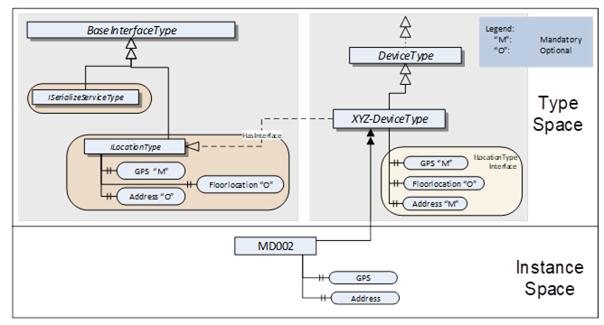  

Figure 9 - Example: Interface application to an ObjectType  

  

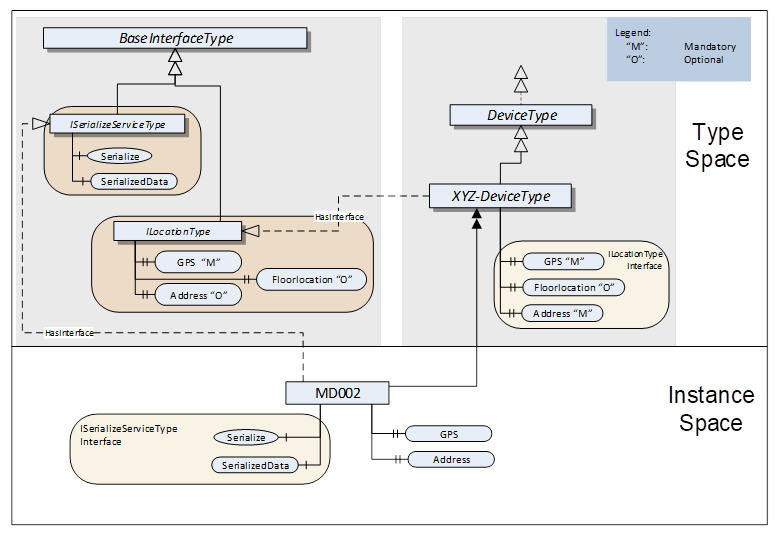  

Figure 10 - Example: One Interface applied to an ObjectType another one to the instance  

  

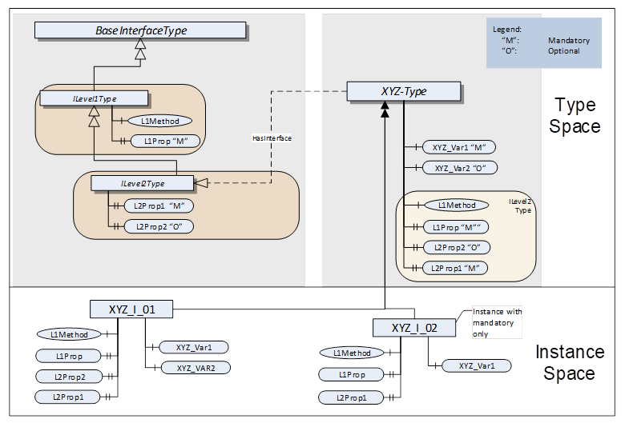  

Figure 11 - Example: Interface Hierarchy  

  

*Clients* can detect the implementation of *Interfaces* by filtering for the *HasInterface* *Reference* into the *Browse* *Service* request.  

On instances, the *Browse* *Service* will return elements derived from an *Interface* together with elements of the *Node's* base type. *Clients* can also use the *TranslateBrowsePathsToNodeId* *Service* with *BrowseNames* of *Interface* members to get the *NodeId* of these members directly.  

In the example in [Figure 10](/§\_Ref33163303) " **Address**  **MD002** *NodeId* of this *Property* .  

On *Object* instances, some *Nodes* of an *Interface* may not be available if defined with *ModellingRule* *Optional* .  

  

#### 4.10.3 AddIn model  

*AddIns* associate a feature or feature-set, represented by an *ObjectType* to the *Node* (an *Object* or *ObjectType* ) they are applied to. The *Interface* model is different than the *AddIn* model in that it is based on composition. An *AddIn* is applied to a *Node* by adding a *Reference* to the *AddIn* instance.  

There are no restrictions for *AddIn* *ObjectTypes* and there is no special supertype for *AddIns* . To identify instances as an *AddIn* , the *HasAddIn Reference* or a subtype shall be used.  

The *AddIn* *ObjectType* shall include the definition of a default *BrowseName* using the *DefaultInstanceBrowseName* *Property* . Instances of such an *AddIn* should use this default *BrowseName* . If an *AddIn* is instantiated multiple times in the same parent, only one instance can have the default *BrowseName* .  

The definition of an *AddIn* and its use with a default *BrowseName* is illustrated in [Figure 12](/§\_Ref33163199) .  

  

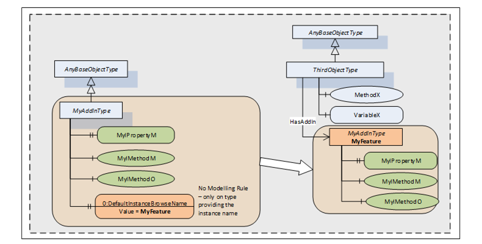  

  

Figure 12 - Example of AddIn with default BrowseName  

As already described, an *AddIn* can be applied on types and instances. The use on an instance is shown in [Figure 13](/§\_Ref33163165) .  

  

Figure 13 - Example of AddIn applied to an instance  

*Clients* can detect the implementation of *AddIns* by passing the *HasAddIn* *Reference* as filter to the *Browse* *Service* request. If an *AddIn* has a default *BrowseName,* *Clients* can use the *TranslateBrowsePathsToNodeId* *Service* with the default *BrowseName* to get the *NodeId* of an *AddIn* .  

In the example in [Figure 12](/§\_Ref33163199) the relative path " **MyFeature/MyPropertyM**  **MD002** *NodeId* of this *Property* and the relative path " **MyFeature/MyMethodO** *Method* .  

## 5 Standard NodeClasses  

### 5.1 Overview  

Clause 5 defines the *NodeClasses* used to define *Nodes* in the OPC UA *AddressSpace* . *NodeClasses* are derived from a common *Base NodeClass* . This *NodeClass* is defined first, followed by those used to organise the *AddressSpace* and then by the *NodeClasses* used to represent *Objects* .  

The *NodeClasses* defined to represent *Objects* fall into three categories: those used to define instances, those used to define types for those instances and those used to define data types. Subclause [6.3](/§\_Ref192918126) describes the rules for subtyping and [6.4](/§\_Ref128098709) the rules for instantiation of the type definitions.  

### 5.2 Base NodeClass  

#### 5.2.1 General  

The OPC UA Address Space Model defines a *Base NodeClass* from which all other *NodeClasses* are derived. The derived *NodeClasses* represent the various components of the OPC UA Object Model (see [4.2](/§\_Ref114466780) ). The *Attributes* of the *Base NodeClass* are specified in [Table 7](/§\_Ref127764296) . There are no *References* specified for the *Base NodeClass* .  

Table 7 - Base NodeClass  

| **Name** | **Use** | **Data Type** | **Description** |
|---|---|---|---|
  
| **Attributes** ||||
|---|---|---|---|
|NodeId|M|NodeId|See [5.2.2](/§\_Ref127611812)|
|NodeClass|M|NodeClass|See [5.2.3](/§\_Ref130971964)|
|BrowseName|M|QualifiedName|See [5.2.4](/§\_Ref129165702)|
|DisplayName|M|LocalizedText|See [5.2.5](/§\_Ref381260618)|
|Description|O|LocalizedText|See [5.2.6](/§\_Ref128263306)|
|WriteMask|O|AttributeWriteMask|See [5.2.7](/§\_Ref176331998)|
|UserWriteMask|O|AttributeWriteMask|See [5.2.8](/§\_Ref181420178)|
|RolePermissions|O|RolePermissionType[]|See [5.2.9](/§\_Ref468871197)|
|UserRolePermissions|O|RolePermissionType[]|See [5.2.10](/§\_Ref468871280)|
  
| **** |O|AccessRestrictionType|See [5.2.11](/§\_Ref468871293)|
|---|---|---|---|
  
| **References** |||No *References* specified for this *NodeClass*|
|---|---|---|---|
  

  

#### 5.2.2 NodeId  

*Nodes* are unambiguously identified using a constructed identifier called the *NodeId* . Some *Servers* may accept alternative *NodeIds* in addition to the canonical *NodeId* represented in this *Attribute* . A *Server* shall persist the *identifierType and identifier* *NodeId* elements ** of a *Node as well as the Namespace Uri which the namespaceIndex NodeId element references.* A *Server* may change the *namespaceIndex* *NodeId* element of a Node with future *Sessions* and therefore a *Client* shall not assume the *namespaceIndex* will not change. The structure of the *NodeId* is defined in [8.2](/§\_Ref121325674) .  

#### 5.2.3 NodeClass  

The *NodeClass Attribute* identifies the *NodeClass* of a *Node* . Its data type is defined in [8.29](/§\_Ref130971442) .  

#### 5.2.4 BrowseName  

*Nodes* have a *BrowseName Attribute* that is used as a non-localised human-readable name when browsing the *AddressSpace* to create paths out of *BrowseNames* . The TranslateBrowsePathsToNodeIds *Service* defined in [OPC 10000-4](/§UAPart4) can be used to follow a path constructed of *BrowseNames* .  

A *BrowseName* should never be used to display the name of a *Node* . The *DisplayName* should be used instead for this purpose.  

Unlike *NodeIds* , the *BrowseName* cannot be used to unambiguously identify a *Node* . Different *Nodes* may have the same *BrowseName* .  

Subclause [8.3](/§\_Ref135813266) defines the structure of the *BrowseName* . It contains a namespace and a string. The namespace is provided to make the *BrowseName* unique in some cases in the context of a *Node* (e.g. *Properties* of a *Node* ) although not unique in the context of the *Server* . If different organizations define *BrowseNames* for *Properties* , the namespace of the *BrowseName* provided by the organization makes the *BrowseName* unique, although different organizations may use the same string having a slightly different meaning.  

*Servers* may often choose to use the same namespace for the *NodeId* and the *BrowseName* . However, if they want to provide a standard *Property* , its *BrowseName* shall have the namespace of the standards body although the namespace of the *NodeId* reflects something else, for example the local *Server* .  

Standards bodies defining standard type definitions shall use their namespace(s) for the *NodeId* of the *TypeDefinitionNode* as well as for the *BrowseName* of the *TypeDefinitionNode. BrowseNames* of *TypeDefinitionNodes, ReferenceTypes, and DataTypes shall be unique. A* ny ** well-known ** instances ** used ** as ** entry ** points shall also be unique *.* For ** example, ** the *Root Node* defined ** in ** [OPC 10000-5](/§UAPart5) *.*  

The string-part of the *BrowseName* is case sensitive. That is, *Clients* shall consider them case sensitive. *Servers* are allowed to handle *BrowseNames* passed in *Service* requests as case insensitive. Examples are the *TranslateBrowsePathsToNodeIds* *Service* or *Event* filter. If a *Server* accepts a case insensitive *BrowseName* it needs to ensure that the uniqueness of the *BrowseName* does not depend on case.  

#### 5.2.5 DisplayName  

The *DisplayName Attribute* contains the localised name of the *Node* . *Clients* should use this *Attribute* if they want to display the name of the *Node* to the user. They should not use the *BrowseName* for this purpose. The *Server* may maintain one or more localised representations for each *DisplayName* . *Clients* negotiate the locale to be returned when they open a session with the *Server* . Refer to [OPC 10000-4](/§UAPart4) for a description of session establishment and locales. Subclause [8.5](/§\_Ref135813289) defines the structure of the *DisplayName* . The string part of the *DisplayName* is restricted to 512 characters.  

#### 5.2.6 Description  

The optional *Description Attribute* shall explain the meaning of the *Node* in a localised text using the same mechanisms for localisation as described for the *DisplayName* in [5.2.5](/§\_Ref381258055) .  

#### 5.2.7 WriteMask  

The optional *WriteMask* *Attribute* exposes the possibilities of a client to write the *Attributes* of the *Node* . The *WriteMask* *Attribute* does not take any user access rights into account, that is, although an *Attribute* is writeable this may be restricted to a certain user/user group.  

If the OPC UA *Server* does not have the ability to get the *WriteMask* information for a specific *Attribute* from the underlying system, it should state that it is writeable. If a write operation is called on the *Attribute* , the *Server* should transfer this request and return the corresponding *StatusCode* if such a request is rejected. *StatusCodes* are defined in [OPC 10000-4](/§UAPart4) .  

The *AttributeWriteMask* *DataType* is defined in [8.60](/§\_Ref525200209) .  

#### 5.2.8 UserWriteMask  

The optional *UserWriteMask* *Attribute* exposes the possibilities of a client to write the *Attributes* of the *Node* taking user access rights into account. It uses the *AttributeWriteMask* *DataType* which is defined in [8.60](/§\_Ref525200209) .  

The *UserWriteMask* *Attribute* can only further restrict the *WriteMask* *Attribute,* when it is set to not writeable in the general case that applies for every user.  

*Clients* cannot assume an *Attribute* can be written based on the *UserWriteMask* *Attribute* .It is possible that the *Server* may return an access denied error due to some server specific change which was not reflected in the state of this *Attribute* at the time the *Client* accessed it.  

#### 5.2.9 RolePermissions  

The optional *RolePermissions* *Attribute* specifies the *Permissions* that apply to a *Node* for all *Roles* which have access to the *Node* . The value of the *Attribute* is an array of *RolePermissionType* *Structures* (see [Table 8](/§\_Ref466032608) ).  

 **Table 8\- RolePermissionType**   

| **Name** | **Type** | **Description** |
|---|---|---|
|RolePermissionType|Structure|Specifies the *Permissions* for a *Role*|
|roleId|NodeId|The *NodeId* of the *Role* *Object* .|
|permissions|PermissionType|A mask specifying which *Permissions* are available to the *Role* . See [8.55](/§\_Ref493240480)|
  

  

*Servers* may allow administrators to write to the *RolePermissions* *Attribute* .  

If not specified, the value of *DefaultRolePermissions* *Property* from the *NamespaceMetadata* *Object* associated with the *Node* shall be used instead. If the *NamespaceMetadata* *Object* does not define the *Property* or does not exist, then the *Server* should not publish any information about how it manages *Permissions* .  

If a *Server* supports *Permissions* for a particular *Namespace* it shall add the *DefaultRolePermissions Property* to the *NamespaceMetadata* *Object* for that *Namespace* (see [Figure 14](/§\_Ref466032640) ). If a particular *Node* in the *Namespace* needs to override the default values, the *Server* adds the *RolePermissions* *Attribute* to the *Node.* The *DefaultRolePermissions Property* and *RolePermissions* *Attribute* shall only be readable by administrators. If a *Server* allows the *Permissions* to be changed these values shall be writeable. If the *Server* allows the *Permissions* to be overridden for a particular *Node* but does not currently have any *Node* *Permissions* configured, then the value of the *Attribute* shall be an empty array. If the administrator wishes to remove overridden *Permissions* , an empty array shall be written to this *Attribute* . *Servers* shall prevent *Permissions* from being changed in such a way as to render the *Server* inoperable.  

If a *Server* allows writes to the *RolePermissions* it shall preserve all bits written by the *Client* even if they are not valid for the *Node* . When a *Client* reads the *RolePermissions* or *UserRolePermissions* it shall ignore bits that are not valid for the *Node* .  

If a *Server* publishes information about the *Roles* for a *Namespace* assigned to the current *Session,* it shall add the *DefaultUserRolePermissions Property* to the *NamespaceMetadata* *Object* for that *Namespace.* The value of this *Property* shall be a readonly list of *Permissions* for each *Role* assigned to the current *Session* . If a particular *Node* in the *Namespace* overrides the default *RolePermissions* the *Server* shall also override the *DefaultUserRolePermissions* by adding the *UserRolePermissions* *Attribute* to the *Node.* If the *Server* allows the *Permissions* to be overridden for a particular *Node* but does not currently have any *Node* *Permissions* configured, then the Server shall return the value of the *DefaultUserRolePermissions Property* for the *Node Namespace.*  

If a *Server* implements a vendor specific *Role* *Permission* model for a *Namespace,* it shall not add the *DefaultRolePermissions* or *DefaultUserRolePermissions Properties* to the *NamespaceMetadata* *Object.*  

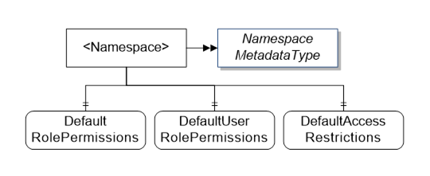  

Figure 14 - Permissions in the Address Space  

#### 5.2.10 UserRolePermissions  

The optional *UserRolePermissions* *Attribute* specifies the *Permissions* that apply to a *Node* for all *Roles* granted to current *Session* . The value of the *Attribute* is an array of *RolePermissionType* *Structures* (see [Table 8](/§\_Ref466032608) ).  

*Clients* may determine their effective *Permissions* by performing a logical OR of *Permissions* for each *Role* in the array.  

The value of this *Attribute* is derived from the rules used by the *Server* to map *Sessions* to *Roles* . This mapping may be vendor specific or it may use the standard *Role* model defined in [4.9](/§\_Ref466032707) .  

This *Attribute* shall not be writeable. When a *Client* reads the *UserRolePermissions* it shall ignore bits that are not valid for the *Node* .  

If not specified, the value of *DefaultUserRolePermissions* *Property* from the *Namespace Metadata* *Object* associated with the *Node* is used instead. If the *NamespaceMetadata* *Object* does not define the *Property* or does not exist, then the *Server* does not publish any information about *Roles* mapped to the current *Session* .  

#### 5.2.11 AccessRestrictions  

The optional *AccessRestrictions* *Attribute* specifies the *AccessRestrictions* that apply to a *Node.* Its data type is defined in [8.56](/§\_Ref493239529) . If a *Server* supports *AccessRestrictions* for a particular *Namespace* it adds the *DefaultAccessRestrictions* *Property* to the *NamespaceMetadata* *Object* for that *Namespace* (see [Figure 14](/§\_Ref466032640) ). If a particular *Node* in the *Namespace* needs to override the default value the *Server* adds the *AccessRestrictions* *Attribute* to the *Node.*  

If a *Server* implements a vendor specific access restriction model for a *Namespace,* it does not add the *DefaultAccessRestrictions* *Property* to the *NamespaceMetadata* *Object.*  

### 5.3 ReferenceType NodeClass  

#### 5.3.1 General  

*References* are defined as instances of *ReferenceType Nodes* . *ReferenceType Nodes* are visible in the *AddressSpace* and are defined using the *ReferenceType NodeClass* as specified in [Table 9](/§\_Ref114297294) . In contrast, a *Reference* is an inherent part of a *Node* and no *NodeClass* is used to represent *References* .  

This standard defines a set of *ReferenceTypes* provided as an inherent part of the OPC UA ** Address Space Model. These *ReferenceTypes* are defined in Clause [7](/§\_Ref192918160) and their representation in the *AddressSpace* is defined in [OPC 10000-5](/§UAPart5) . *Servers* may also define *ReferenceTypes* . In addition, [OPC 10000-4](/§UAPart4) defines *NodeManagement* *Services* that allow *Clients* to add *ReferenceTypes* to the *AddressSpace* .  

Table 9 - ReferenceType NodeClass  

| **Name** | **Use** | **Data Type** | **Description** |
|---|---|---|---|
  
| **Attributes** ||||
|---|---|---|---|
|Base NodeClass Attributes|M|\--|Inherited from the *Base NodeClass* . See [5.2](/§\_Ref107723037) .|
|IsAbstract|M|Boolean|A boolean *Attribute* with the following values: TRUE it is an abstract *ReferenceType* , i.e. no *Reference* of this type shall exist, only of its subtypes. FALSE it is not an abstract *ReferenceType* , i.e. *References* of this type can exist.|
|Symmetric|M|Boolean|A boolean *Attribute* with the following values: TRUE the meaning of the *ReferenceType* is the same as seen from both the *SourceNode* and the *TargetNode.* FALSE the meaning of the *ReferenceType* as seen from the *TargetNode* is the inverse of that as seen from the *SourceNode* .|
|InverseName|O|LocalizedText|The inverse name of the *Reference* , which is the meaning of the *ReferenceType* as seen from the *TargetNode* .|
|||||
  
| **References** ||||
|---|---|---|---|
|HasProperty|0\..\*||Used to identify the Properties (see [5.3.3.2](/§\_Ref126749213) ).|
|HasSubtype|0\..\*||Used to identify subtypes (see [5.3.3.3](/§\_Ref126749286) ).|
|||||
  
| **Standard Properties** ||||
|---|---|---|---|
|NodeVersion|O|String|The *NodeVersion* *Property* is used to indicate the version of a *Node* . The *NodeVersion* *Property* is updated each time a *Reference* is added or deleted to the *Node* the *Property* belongs to. *Attribute* value changes do not cause the *NodeVersion* to change. *Clients* may read the *NodeVersion Property* or subscribe to it to determine when the structure of a *Node* has changed.|
  

  

#### 5.3.2 Attributes  

The *ReferenceType* *NodeClass* inherits the base *Attributes* from the *Base NodeClass* defined in [5.2](/§\_Ref107723037) . The inherited *BrowseName Attribute* is used to specify the meaning of the *ReferenceType* as seen from the *SourceNode* . For example, the *ReferenceType* with the *BrowseName* "Contains" is used in *References* that specify that the *SourceNode* contains the *TargetNode* . The inherited *DisplayName Attribute* contains a translation of the *BrowseName.*  

The *BrowseName* of a *ReferenceType* shall be unique in a *Server* . It is not allowed that two different *ReferenceTypes* have the same *BrowseName* .  

The *IsAbstract* *Attribute* indicates if the *ReferenceType* is abstract. Abstract *ReferenceTypes* cannot be instantiated and are used only for organizational reasons, for example to specify some general semantics or constraints that its subtypes inherit.  

The *Symmetric* *Attribute* is used to indicate whether or not the meaning of the *ReferenceType* is the same for both the *SourceNode* and *TargetNode* .  

If a *ReferenceType* is symmetric, the *InverseName Attribute* shall be omitted. Examples of symmetric *ReferenceTypes* are "Connects To" and "Communicates With". Both imply the same semantic coming from the *SourceNode* or the *TargetNode* . Therefore both directions are considered to be forward References.  

If the *ReferenceType* is non-symmetric the *InverseName Attribute* shall be set. The *InverseName Attribute* specifies the meaning of the *ReferenceType* as seen from the *TargetNode* . Examples of non-symmetric *ReferenceTypes* include "Contains" and "Contained In", and "Receives From" and "Sends To".  

Any subtype, either directly or indirectly of a concrete *ReferenceType s* hall not change the *Symmetric Attribute* definition of its parent type *.*  

*References* that use the *InverseName* , such as "Contained In" *References* , are referred to as inverse *References* .  

[Figure 15](/§\_Ref81040875) provides examples of symmetric and non-symmetric *References* and the use of the *BrowseName* and the *InverseName* .  

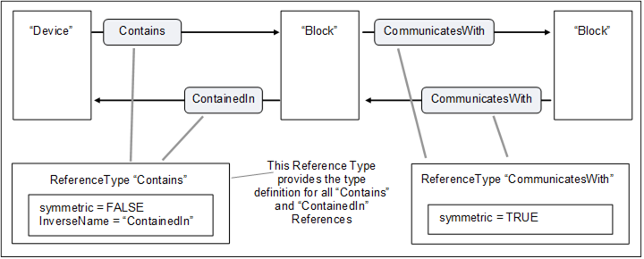  

Figure 15 - Symmetric and Non-Symmetric References  

It might not always be possible for *Servers* to instantiate both forward and inverse *References* for non-symmetric *ReferenceTypes* as shown in [Figure 15](/§\_Ref81040875) . When they do, the *References* are referred to as *bidirectional* . Although not required, it is recommended that all *hierarchical References* be instantiated as bidirectional to ensure browse connectivity. A bidirectional *Reference* is modelled as two separate *References* .  

As an example of a *unidirectional* *Reference* , it is often the case that a signal sink knows its signal source, but this signal source does not know its signal sink. The signal sink would have a "Sourced By" *Reference* to the signal source, without the signal source having the corresponding "Sourced To" inverse *References* to its signal sinks.  

The *DisplayName* and the *InverseName* are the only standardised places to indicate the semantic of a *ReferenceType* . There may be more complex semantics associated with a *ReferenceType* than can be expressed in those *Attributes* (e.g. the semantic of *HasSubtype* ). This standard does not specify how this semantic should be exposed. However, the *Description Attribute* can be used for this purpose. This standard provides a semantic for the *ReferenceTypes* specified in Clause [7](/§\_Ref192918184) .  

A *ReferenceType* can have constraints restricting its use. For example, it can specify that starting from *Node* A and only following *References* of this *ReferenceType* or one of its subtypes, it shall never be able to return to A, that is, a "No Loop" constraint.  

This standard does not specify how those constraints could or should be made available in the *AddressSpace* . Nevertheless, for the standard *ReferenceTypes* , some constraints are specified in Clause [7](/§\_Ref192918213) . This standard does not restrict the kind of constraints valid for a *ReferenceType* . It can, for example, also affect an *ObjectType* . The restriction that a *ReferenceType* can only be used by relating *Nodes* of some *NodeClasses* with a defined cardinality is a special constraint of a *ReferenceType* .  

#### 5.3.3 References  

##### 5.3.3.1 General  

*HasSubtype References* and *HasProperty* *References* are the only *ReferenceTypes* that may be used with *ReferenceType Nodes* as *SourceNode* . *ReferenceType Nodes* shall not be the *SourceNode* of other types of *References* .  

##### 5.3.3.2 HasProperty References  

*HasProperty* *References* are used to identify the *Properties* of a *ReferenceType* and shall only refer to *Nodes* of the *Variable NodeClass* .  

The *Property* *NodeVersion* is used to indicate the version of the *ReferenceType* .  

There are no additional *Properties* defined for *ReferenceTypes* in this standard. Additional parts this series of standards may define additional *Properties* for *ReferenceTypes* .  

##### 5.3.3.3 HasSubtype References  

*HasSubtype* *References* are used to define subtypes of *ReferenceTypes* . It is not required to provide the *HasSubtype* *Reference* for the supertype, but it is required that the subtype provides the inverse *Reference* to its supertype. The following rules for subtyping apply.  

1. The semantic of a *ReferenceType* (e.g. "spans a hierarchy") is inherited to its subtypes and can be refined there (e.g. "spans a special hierarchy"). The *DisplayName* , and also the *InverseName* for non-symmetric *ReferenceTypes* , reflect the specialization.  

1. If a *ReferenceType* specifies some constraints (e.g. "allow no loops") this is inherited and can only be refined (e.g. inheriting "no loops" could be refined as "shall be a tree - only one parent") but not lowered (e.g. "allow loops").  

1. The constraints concerning which *NodeClasses* can be referenced are also inherited and can only be further restricted. That is, if a *ReferenceType* "A" is not allowed to relate an *Object* with an *ObjectType* , this is also true for its subtypes.  

1. A *ReferenceType* shall have exactly one supertype, except for the *References* *ReferenceType* defined in [7.2](/§\_Ref190746722) as the root type of the *ReferenceType* hierarchy. The *ReferenceType* hierarchy does not support multiple inheritances.  

### 5.4 View NodeClass  

Underlying systems are often large and *Clients* often have an interest in only a specific subset of the data. They do not need, or want, to be burdened with viewing *Nodes* in the *AddressSpace* for which they have no interest.  

To address this problem, this standard defines the concept of a *View* . Each *View* defines a subset of the *Nodes* in the *AddressSpace* . The entire *AddressSpace* is the default *View* . Each *Node* in a *View* may contain only a subset of its *References* , as defined by the creator of the *View* . The *View Node* acts as the root for the *Nodes* in the *View* . *Views* are defined using the *View* *NodeClass* , which is specified in [Table 10](/§\_Ref115584961) .  

All *Nodes* contained in a *View* shall be accessible starting from the *View* *Node* when browsing in the context of the *View* . It is not expected that all containing *Nodes* can be browsed directly from the *View* *Node* but rather browsed from other *Nodes* contained in the *View* .  

A *View* *Node* may not only be used as additional entry point into the *AddressSpace* but as a construct to organize the *AddressSpace* and thus as the only entry point into a subset of the *AddressSpace* . Therefore, *Clients* shall not ignore *View* *Nodes* when exposing the *AddressSpace* . Simple *Clients* that do not deal with *Views* for filtering purposes can, for example, handle a *View* *Node* like an *Object* of type *FolderType* (see [5.5.3](/§\_Ref196606972) ).  

Table 10 - View NodeClass  

| **Name** | **Use** | **Data Type** | **Description** |
|---|---|---|---|
  
| **Attributes** ||||
|---|---|---|---|
|Base NodeClass Attributes|M|\--|Inherited from the *Base NodeClass* . See [5.2](/§\_Ref107723037) .|
|ContainsNoLoops|M|Boolean|If set to TRUE this *Attribute* indicates that by following the *References* in the context of the *View* there are no loops, i.e. starting from a *Node* "A" contained in the *View* and following the forward *References* in the context of the *View* *Node* "A" will not be reached again. It does not specify that there is only one path starting from the *View* *Node* to reach a *Node* contained in the *View* . If set to FALSE this *Attribute* indicates that following *References* in the context of the *View* may lead to loops.|
|EventNotifier|M|EventNotifierType|The *EventNotifier* *Attribute* is used to indicate if the *Node* can be used to subscribe to *Events* or the read / write historic *Events* . The *EventNotifierType is defined in [8.59](/§\_Ref34744539)* .|
|||||
  
| **References** ||||
|---|---|---|---|
|HierarchicalReferences|0\..\*||Top level *Nodes* in a *View* are referenced by *hierarchical References* (see [7.3](/§\_Ref127666975) ).|
|HasProperty|0\..\*||*HasProperty References* identify the *Properties* of the *View* .|
|||||
  
| **Standard Properties** ||||
|---|---|---|---|
|NodeVersion|O|String|The *NodeVersion* *Property* is used to indicate the version of a *Node* . The *NodeVersion* *Property* is updated each time a *Reference* is added or deleted to the *Node* the *Property* belongs to. *Attribute* value changes do not cause the *NodeVersion* to change. *Clients* may read the *NodeVersion Property* or subscribe to it to determine when the structure of a *Node* has changed.|
|ViewVersion|O|UInt32|The version number for the *View* . When *Nodes* are added to or removed from a *View* , the value of the *ViewVersion Property* is updated. *Clients* may detect changes to the composition of a *View* using this *Property* . The value of the ViewVersion shall always be greater than 0.|
  

  

The *View NodeClass* inherits the base *Attributes* from the *Base NodeClass* defined in [5.2](/§\_Ref107723037) . It also defines two additional *Attributes* .  

The mandatory *ContainsNoLoops* *Attribute* is set to FALSE if the *Server* is not able to identify if the *View* contains loops or not.  

The mandatory *EventNotifier Attribute* identifies if the *View* can be used to subscribe to *Events* that either occur in the content of the *View* or as *ModelChangeEvents* (see [9.32](/§\_Ref141746034) ) of the content of the *View* or to read / write the history of the *Events* . A *View* that supports *Events* shall provide all *Events* that occur in any *Object* used as *EventNotifier* that is part of the content of the *View* . In addition, it shall provide all *ModelChangeEvents* that occur in the context of the *View* .  

To avoid recursion, i.e. getting all *Events* of the *Server* , the *Server* *Object* defined in [OPC 10000-5](/§UAPart5) shall never be part of any *View* since it provides all *Events* of the *Server* .  

*Views* are defined by the *Server* . The browsing and querying *Services* defined in [OPC 10000-4](/§UAPart4) expect the *NodeId* of a *View Node* to provide these *Services* in the context of the *View* .  

*HasProperty* *References* are used to identify the *Properties* of a *View* . The *Property* *NodeVersion* is used to indicate the version of the *View Node* . The *ViewVersion* *Property* indicates the version of the content of the *View* . In contrast to the *NodeVersion* , the *ViewVersion* *Property* is updated even if *Nodes* not directly referenced by the *View* *Node* are added to or deleted from the *View* . This *Property* is optional because it might not be possible for *Servers* to detect changes in the *View* contents. *Servers* may also generate a *ModelChangeEvent,* described in [9.32](/§\_Ref141746034) , if *Nodes* are added to or deleted from the *View* . There are no additional *Properties* defined for *Views* in this document. Additional parts of this series of standards may define additional *Properties* for *Views* .  

*Views* can be the *SourceNode* of any *hierarchical Reference* . They shall not be the *SourceNode* of any *NonHierarchical Reference* .  

### 5.5 Objects  

#### 5.5.1 Object NodeClass  

*Objects* are used to represent systems, system components, real-world objects and software objects. *Objects* are defined using the *Object* *NodeClass* , specified in [Table 11](/§\_Ref114299173) .  

Table 11 - Object NodeClass  

| **Name** | **Use** | **Data Type** | **Description** |
|---|---|---|---|
  
| **Attributes** ||||
|---|---|---|---|
|Base NodeClass Attributes|M|\--|Inherited from the *Base NodeClass* . See [5.2](/§\_Ref107723037) .|
|EventNotifier|M|EventNotifierType|The *EventNotifier* *Attribute* is used to indicate if the *Node* can be used to subscribe to *Events* or the read / write historic *Events* . The *EventNotifierType is defined in [8.59](/§\_Ref34744539)* .|
|||||
  
| **References** ||||
|---|---|---|---|
|HasComponent|0\..\*||*HasComponent References* identify the *DataVariables* , the *Methods* and *Objects* contained in the *Object* .|
|HasProperty|0\..\*||*HasProperty References* identify the *Properties* of the *Object* .|
|HasModellingRule|0\..1||*Objects* can point to at most one *ModellingRule* *Object* using a *HasModellingRule* *Reference* (see [6.4.4](/§\_Ref128179460) for details on *ModellingRules* ).|
|HasTypeDefinition|1||The *HasTypeDefinition Reference* points to the type definition of the *Object.* Each *Object* shall have exactly one type definition and therefore be the *SourceNode* of exactly one *HasTypeDefinition* *Reference* pointing to an *ObjectType* . See [4.6](/§\_Ref115168300) for a description of type definitions.|
|HasEventSource|0\..\*||The *HasEventSource* *Reference* points to event sources of the *Object* . *References* of this type can only be used for *Objects* having their "SubscribeToEvents" bit set in the *EventNotifier* *Attribute* . See [7.17](/§\_Ref445827938) for details.|
|HasNotifier|0\..\*||The *HasNotifier* *Reference* points to notifiers of the *Object* . *References* of this type can only be used for *Objects* having their "SubscribeToEvents" bit set in the *EventNotifier* *Attribute* . See [7.18](/§\_Ref135713552) for details.|
|Organizes|0\..\*||This *Reference* should be used only for *Objects* of the *ObjectType* *FolderType* (see [5.5.3](/§\_Ref131474245) ).|
|\<other References\>|0\..\*||*Objects* may contain other *References* .|
|||||
  
| **Standard Properties** ||||
|---|---|---|---|
|NodeVersion|O|String|The *NodeVersion* *Property* is used to indicate the version of a *Node* . The *NodeVersion* *Property* is updated each time a *Reference* is added or deleted to the *Node* the *Property* belongs to. *Attribute* value changes do not cause the *NodeVersion* to change. *Clients* may read the *NodeVersion Property* or subscribe to it to determine when the structure of a *Node* has changed.|
|Icon|O|Image|The *Icon* *Property* provides an image that can be used by *Clients* when displaying the *Node* . It is expected that the *Icon* *Property* contains a relatively small image.|
  

  

The *Object NodeClass* inherits the base *Attributes* from the *Base NodeClass* defined in [5.2](/§\_Ref107723037) .  

The mandatory *EventNotifier Attribute* identifies whether the *Object* can be used to subscribe to *Events* or to read and write the history of the *Events* .  

The *Object NodeClass* uses the *HasComponent Reference* to define the *DataVariables* , *Objects* and *Methods* of an *Object* .  

It uses the *HasProperty Reference* to define the *Properties* of an *Object* . The *Property* *NodeVersion* is used to indicate the version of the *Object* . The *Property* *Icon* provides an icon of the *Object* . There are no additional *Properties* defined for *Objects* in this document. Additional parts of this series of standards may define additional *Properties* for *Objects* .  

To specify its *ModellingRule* , an *Object* can use at most one *HasModellingRule Reference* pointing to a *ModellingRule* *Object* . *ModellingRules* are defined in [6.4.4](/§\_Ref128179460) .  

*HasNotifier* and *HasEventSource* *References* are used to provide information about eventing and can only be applied to *Objects* used as event notifiers. Details are defined in [7.16](/§\_Ref135713256) and [7.18](/§\_Ref135713552) .  

The *HasTypeDefinition Reference* points to the *ObjectType* used as type definition of the *Object* .  

*Objects* may use any additional *References* to define relationships to other *Nodes* . No restrictions are placed on the types of *References* used or on the *NodeClasses* of the *Nodes* that may be referenced. However, restrictions may be defined by the *ReferenceType* excluding its use for *Objects* . Standard *ReferenceTypes* are described in Clause [7](/§\_Ref192918241) .  

If the *Object* is used as an *InstanceDeclaration* (see [4.6](/§\_Ref131564903) ) then all *Nodes* referenced with forward *hierarchical References* direction shall have unique *BrowseNames* in the context of this *Object* .  

If the *Object* is created based on an *InstanceDeclaration* then it shall have the same *BrowseName* as its *InstanceDeclaration* .  

#### 5.5.2 ObjectType NodeClass  

*ObjectTypes* provide definitions for *Objects* . *ObjectTypes* are defined using the *ObjectType NodeClass* , which is specified in [Table 12](/§\_Ref114303399) .  

Table 12 - ObjectType NodeClass  

| **Name** | **Use** | **Data Type** | **Description** |
|---|---|---|---|
  
| **Attributes** ||||
|---|---|---|---|
|Base NodeClass Attributes|M|\--|Inherited from the *Base NodeClass* . See [5.2](/§\_Ref107723037) .|
|IsAbstract|M|Boolean|A boolean *Attribute* with the following values: TRUE it is an abstract *ObjectType* , i.e. no *Objects* of this type shall exist, only *Objects* of its subtypes. FALSE it is not an abstract *ObjectType* , i.e. *Objects* of this type can exist.|
|||||
  
| **References** ||||
|---|---|---|---|
|HasComponent|0\..\*||*HasComponent References* identify the *DataVariables* , the *Methods* , and *Objects* contained in the *ObjectType* . If and how the referenced *Nodes* are instantiated when an *Object* of this type is instantiated, is specified in [6.4](/§\_Ref128009730) .|
|HasProperty|0\..\*||*HasProperty References* identify the *Properties* of the *ObjectType* . If and how the *Properties* are instantiated when an *Object* of this type is instantiated, is specified in [6.4](/§\_Ref128009730) .|
|HasSubtype|0\..\*||*HasSubtype* *References* identify *ObjectTypes* that are subtypes of this type. The inverse *Reference* identifies the parent type of this type.|
|GeneratesEvent|0\..\*||*GeneratesEvent* *References* identify the type of *Events* instances of this type may generate.|
|\<other References\>|0\..\*||*ObjectTypes* may contain other *References* that can be instantiated by *Objects* defined by this *ObjectType* .|
|||||
  
| **Standard Properties** ||||
|---|---|---|---|
|NodeVersion|O|String|The *NodeVersion* *Property* is used to indicate the version of a *Node* . The *NodeVersion* *Property* is updated each time a *Reference* is added or deleted to the *Node* the *Property* belongs to. *Attribute* value changes do not cause the *NodeVersion* to change. *Clients* may read the *NodeVersion Property* or subscribe to it to determine when the structure of a *Node* has changed.|
|Icon|O|Image|The *Icon* *Property* provides an image that can be used by *Clients* when displaying the *Node* . It is expected that the *Icon* *Property* contains a relatively small image.|
|DefaultInstanceBrowseName|O|QualifiedName|Allows the definition of *BrowseName* on an *ObjectType* that all instances should use by default. This *Property* has no *ModellingRule* . It shall only be on the type *Node* .|
  

  

The *ObjectType NodeClass* inherits the base *Attributes* from the *Base NodeClass* defined in [5.2](/§\_Ref107723037) . The additional *IsAbstract* *Attribute* indicates if the *ObjectType* is abstract or not.  

The *ObjectType NodeClass* uses the *HasComponent* *References* to define the *DataVariables* , *Objects* , and *Methods* for it.  

The *HasProperty Reference* is used to identify the *Properties* . The *Property* *NodeVersion* is used to indicate the version of the *ObjectType* . The *Property* *Icon* provides an icon of the *ObjectType* . There are no additional *Properties* defined for *ObjectTypes* in this document. Additional parts of this series of standards may define additional *Properties* for *ObjectTypes* .  

*HasSubtype* *References* are used to subtype *ObjectTypes* . *ObjectType* subtypes inherit the general semantics from the parent type. The general rules for subtyping apply as defined in Clause [6](/§\_Ref128473535) . It is not required to provide the *HasSubtype* *Reference* for the supertype, but it is required that the subtype provides the inverse *Reference* to its supertype.  

*GeneratesEvent* *References* identify the type of *Events* that instances of the *ObjectType* may generate. These *Objects* may be the source of an *Event* of the specified type or one of its subtypes. *Servers* should make *GeneratesEvent* *References* bidirectional *References* . However, it is allowed to be unidirectional when the *Server* is not able to expose the inverse direction pointing from the *EventType* to each *ObjectType* supporting the *EventType.* Note that the *EventNotifier* *Attribute* of an *Object* and the *GeneratesEvent* *References* of its *ObjectType* are completely unrelated. *Objects* that can generate *Events* might not be used as *Objects* to which *Clients* subscribe to get the corresponding *Event* notifications.  

*GeneratesEvent* *References* are optional, i.e. *Objects* may generate *Events* of an *EventType* that is not exposed by its *ObjectType* .  

*ObjectTypes* may use any additional *References* to define relationships to other *Nodes* . No restrictions are placed on the types of *References* used or on the *NodeClasses* of the *Nodes* that may be referenced. However, restrictions may be defined by the *ReferenceType* excluding its use for *ObjectTypes* . Standard *ReferenceTypes* are described in Clause [7](/§\_Ref192918283) .  

All *Nodes* referenced with forward *hierarchical References* shall have unique *BrowseNames* in the context of an *ObjectType* (see [4.6](/§\_Ref131564903) ).  

#### 5.5.3 Standard ObjectType FolderType  

The *ObjectType* *FolderType* is formally defined in [OPC 10000-5](/§UAPart5) . Its purpose is to provide *Objects* that have no other semantic than organizing of the *AddressSpace* . A special *ReferenceType* is introduced for those *Folder* *Objects* , the *Organizes* *ReferenceType* . The *SourceNode* of such a *Reference* should always be a *View* or an *Object* of the *ObjectType* *FolderType* ; the *TargetNode* can be of any *NodeClass* . *Organizes* *References* can be used in any combination with *HasChild* *References* ( *HasComponent* , *HasProperty* , etc.; see [7.5](/§\_Ref131476242) ) and do not prevent loops. Thus, they can be used to span multiple hierarchies.  

#### 5.5.4 Client-side creation of Objects of an ObjectType  

*Objects* are always based on an *ObjectType* , i.e. they have a *HasTypeDefinition* *Reference* pointing to its *ObjectType* .  

*Clients* can create *Objects* using the *AddNodes* *Service* defined in [OPC 10000-4](/§UAPart4) . The *Service* requires specifying the *TypeDefinitionNode* of the *Object* . An *Object* created by the *AddNodes* *Service* contains all components defined by its *ObjectType* dependent on the *ModellingRules* specified for the components. However, the *Server* may add additional components and *References* to the *Object* and its components that are not defined by the *ObjectType* . This behaviour is *Server* dependent. The *ObjectType* only specifies the minimum set of components that shall exist for each *Object* of an *ObjectType* .  

In addition to the *AddNodes* *Service* *ObjectTypes* may have a special *Method* with the *BrowseName* " *Create* ". This Method is used to create an *Object* of this *ObjectType* . This *Method* may be useful for the creation of *Objects* where the semantic of the creation should differ from the default behaviour expected in the context of the *AddNodes* *Service* . For example, the values should directly differ from the default values or additional *Objects* should be added, etc. The input and output arguments of this *Method* depend on the *ObjectType* ; the only commonality is the *BrowseName* identifying that this *Method* will create an *Object* based on the *ObjectType* . *Servers* should not provide a *Method* on an *ObjectType* with the *BrowseName* " *Create* " for any other purpose than creating *Objects* of the *ObjectType* .  

### 5.6 Variables  

#### 5.6.1 General  

Two types of *Variables* are defined, *Properties* and *DataVariables* . Although they differ in the way they are used as described in [4.5](/§\_Ref127693305) and have different constraints described in the remainder of [5.6](/§\_Ref389578374) they use the same *NodeClass* described in [5.6.2](/§\_Ref127693446) . The constraints of *Properties* based on this *NodeClass* are defined in [5.6.3](/§\_Ref127693460) , the constraints of *DataVariables* in [5.6.4](/§\_Ref127693482) .  

#### 5.6.2 Variable NodeClass  

*Variables* are used to represent values which may be simple or complex. *Variables* are defined by *VariableTypes* , as specified in [5.6.5](/§\_Ref115150572) .  

*Variables* are always defined as *Properties* or *DataVariables* of other *Nodes* in the *AddressSpace* . They are never defined by themselves. A *Variable* is always part of at least one other *Node* , but may be related to any number of other *Nodes* . *Variables* are defined using the *Variable* *NodeClass* , specified in [Table 13](/§\_Ref127836744) .  

Table 13 - Variable NodeClass  

| **Name** | **Use** | **Data Type** | **Description** |
|---|---|---|---|
  
| **Attributes** ||||
|---|---|---|---|
|Base NodeClass Attributes|M|\--|Inherited from the *Base NodeClass* . See [5.2](/§\_Ref107723037) .|
|Value|M|Defined by the *DataType Attribute*|The most recent value of the *Variable* that the *Server* has. Its data type is defined by the *DataType Attribute* . It is the only *Attribute* that does not have a data type associated with it. This allows all *Variables* to have a value defined by the same *Value Attribute* .|
|DataType|M|NodeId|*NodeId* of the *DataType* definition for the *Value Attribute* . The *NodeId* shall be a valid *NodeId* of a *DataType* and shall not be null. Standard *DataTypes* are defined in Clause [8](/§\_Ref153882735) .|
|ValueRank|M|Int32|This *Attribute* indicates whether the *Value Attribute* of the *Variable* is an array and how many dimensions the array has. It may have the following values: n ** \> 1: the Value is an array with the specified number of dimensions. OneDimension (1): The value is an array with one dimension. OneOrMoreDimensions (0): The value is an array with one or more dimensions. Scalar (−1): The value is not an array. Any (−2): The value can be a scalar or an array with any number of dimensions. ScalarOrOneDimension (−3): The value can be a scalar or a one dimensional array. All DataTypes are considered to be scalar, even if they have array-like semantics like ByteString and String.|
|ArrayDimensions|O|UInt32[]|This *Attribute* specifies the maximum supported length of each dimension. If the maximum is unknown the value shall be 0. The number of elements shall be equal to the number of dimensions of the Value. This *Attribute* shall be null if the *Value* is not an array.  For example, if a *Variable* is defined by the following C array: Int32 myArray[346]; then this *Variable's* *DataType* would be set to Int32, and the *Variable's* *ValueRank* has the value 1. The *ArrayDimensions* is an array with a length of one where the element has the value 346.  Regardless of the number of dimensions, the maximum number of elements of an array transferred on the wire is 2147483647 (max Int32).|
|AccessLevel|M|AccessLevelType|The *AccessLevel* *Attribute* is used to indicate how the *Value* of a *Variable* can be accessed (read/write) and if it contains current and/or historic data. The *AccessLevel* does not take any user access rights into account, i.e. although the *Variable* is writeable this may be restricted to a certain user / user group. The AccessLevelType is defined in [8.57](/§\_Ref497896703) . |
|UserAccessLevel|M|AccessLevelType|The *UserAccessLevel* *Attribute* is used to indicate how the *Value* of a *Variable* can be accessed (read/write) and if it contains current or historic data taking user access rights into account. The AccessLevelType is defined in [8.57](/§\_Ref497896712) . |
|MinimumSamplingInterval|O|Duration|The *MinimumSamplingInterval Attribute* indicates how "current" the *Value* of the *Variable* will be kept. It specifies (in milliseconds) how fast the *Server* can reasonably sample the value for changes (see [OPC 10000-4](/§UAPart4) for a detailed description of sampling interval). A *MinimumSamplingInterval* of 0 indicates that the *Server* is to monitor the item continuously. A *MinimumSamplingInterval* of −1 means indeterminate.|
|Historizing|M|Boolean|The *Historizing* *Attribute* indicates whether the *Server* is actively collecting data for the history of the *Variable* . This differs from the *AccessLevel* *Attribute* which identifies if the *Variable* has any historical data. A value of TRUE indicates that the *Server* is actively collecting data. A value of FALSE indicates the *Server* is not actively collecting data. Default value is FALSE.|
|AccessLevelEx|O|AccessLevelExType |The *AccessLevelEx* *Attribute* is used to indicate how the *Value* of a *Variable* can be accessed (read/write), if it contains current and/or historic data and its atomicity. The *AccessLevelEx* does not take any user access rights into account, i.e. although the *Variable* is writeable this may be restricted to a certain user / user group. The *AccessLevelEx* is an extended version of the AccessLevel attribute and as such contains the 8 bits of the AccessLevel attribute as the first 8 bits. The *AccessLevelEx* is a 32-bit unsigned integer with the structure defined in the [8.58](/§\_Ref497896761) .  This *Attribute* is made mandatory in Profiles starting with version 1.04. Prior to version 1.04 if this *Attribute* is not provided the information provided by these additional Fields is unknown.|
|||||
  
| **References** ||||
|---|---|---|---|
|HasModellingRule|0\..1||*Variables* can point to at most one *ModellingRule* *Object* using a *HasModellingRule* *Reference* (see [6.4.4](/§\_Ref128179460) for details on *ModellingRules* ).|
|HasProperty|0\..\*||*HasProperty References* are used to identify the *Properties* of a *DataVariable* . *Properties* are not allowed to be the *SourceNode* of *HasProperty References.*|
|HasComponent|0\..\*||*HasComponent* *References* are used by complex *DataVariables* to identify their composed *DataVariables* . *Properties* are not allowed to use this *Reference* .|
|HasTypeDefinition|1||The *HasTypeDefinition Reference* points to the type definition of the *Variable.* Each *Variable* shall have exactly one type definition and therefore be the *SourceNode* of exactly one *HasTypeDefinition* *Reference* pointing to a *VariableType* . See [4.6](/§\_Ref115168300) for a description of type definitions.|
|\<other References\>|0\..\*||*Data Variables* may be the *SourceNode* of any other *References* . *Properties* may only be the *SourceNode* of any *NonHierarchical* *Reference* .|
|||||
  
| **Standard Properties** ||||
|---|---|---|---|
|NodeVersion|O|String|The *NodeVersion* *Property* is used to indicate the version of a *DataVariable* . It does not apply to *Properties* . The *NodeVersion* *Property* is updated each time a *Reference* is added or deleted to the *Node* the *Property* belongs to. *Attribute* value changes except for the *DataType* , *ValueRank* and *ArrayDimensions* *Attributes* do not cause the *NodeVersion* to change. *Clients* may read the *NodeVersion Property* or subscribe to it to determine when the structure of a *Node* has changed. Although the relationship of a *Variable* to its *DataType, ValueRank and ArrayDimensions* is not modelled using *References* , changes to the *DataType* , *ValueRank* or *ArrayDimensions* *Attributes* of a *Variable* lead to an update of the *NodeVersion* *Property* .|
|LocalTime|O|TimeZoneDataType|The *LocalTime* *Property* is only used for *DataVariables* . It does not apply to *Properties* . This *Property* is a structure containing the Offset and the DaylightSavingInOffset flag. The Offset specifies the time difference (in minutes) between the SourceTimestamp (UTC) associated with the value and the time at the location in which the value was obtained. The SourceTimestamp is defined in [OPC 10000-4](/§UAPart4) . If DaylightSavingInOffset is TRUE, then Standard/Daylight savings time (DST) at the originating location is in effect and Offset includes the DST correction. If FALSE then the Offset does not include DST correction and DST may or may not have been in effect.|
|AllowNulls|O|Boolean|The *AllowNulls* *Property* is only used for *DataVariables* . It does not apply to *Properties* . This *Property* specifies if a null value is allowed for the *Value* *Attribute* of a *DataVariable* which has a nullable *DataType* . If it is set to TRUE, the *Server* may return null values and accept writing of null values. If it is set to FALSE, the *Server* shall never return a null value and shall reject any request writing a null value. If this *Property* is not provided, it is *Server*\-specific if null values are allowed or not for nullable *DataTypes* .|
|ValueAsText|O|LocalizedText|It is used for *DataVariables* with a finite set of *LocalizedTexts* associated with its value. For example any *DataVariables* having an *Enumeration* *DataType* . This optional *Property* provides the localized text representation of the value. It can be used by *Clients* only interested in displaying the text to subscribe to the *Property* instead of the value attribute.|
|MaxStringLength|O|UInt32|Only used for *DataVariables* having a *String* *DataType* or a *LocalizedText* *DataType (the text field)* . This optional *Property* indicates the maximum number of bytes supported by the *DataVariable* . If the value is an array, this field applies to each element of the array.|
|MaxCharacters|O|UInt32|Only used for *DataVariables* having a *String* *DataType* or a *LocalizedText* *DataType (the text field)* This optional *Property* indicates the maximum number of Unicode characters supported by the *DataVariable* .|
|MaxByteStringLength|O|UInt32|Only used for *DataVariables* having a *ByteString* *DataType* . This optional *Property* indicates the maximum number of bytes supported by the *DataVariable* .|
|MaxArrayLength|O|UInt32|Only used for *DataVariables* having its *ValueRank* *Attribute* not set to scalar. This optional *Property* indicates the maximum length of an array supported by the *DataVariable* . In a multidimensional array it indicates the overall length. For example, a three-dimensional array of 2 x 3 x 10 has the array length of 60. NOTE In order to expose the length of an array of bytes do not use the *DataType* *ByteString* but an array of the *DataType* *Byte* . In that case the *MaxArrayLength* applies.|
|EngineeringUnits|O|EUInformation|Only used for *DataVariables* having a *Number DataType (or a subtype of Number) or a Structure DataType* where each field has a DataType of *Number (or a subtype of Number)* and ** all share the same *EngineeringUnit* . This optional *Property* indicates the engineering units for the value of the *DataVariable* (e.g. hertz or seconds). Details about the *Property* and what engineering units should be used are defined in [OPC 10000-8](/§UAPart8) . The *DataType* *EUInformation* is also defined in [OPC 10000-8](/§UAPart8) .|
|CurrencyUnit|O|CurrencyUnitType|Only used for *DataVariables* having a subtype of *Number DataType* . Its contents are based on ISO 4217. See [https://www.iso.org/iso-4217-currency-codes.html](https://www.iso.org/iso-4217-currency-codes.html)|
|FixedSizeArray|O|Boolean|Only used for *DataVariables* having its *ValueRank* *Attribute* not set to scalar. This optional *Property* indicates if the array is a fixed length or a dynamic length. If it is set to TRUE, the array size is fixed to the size defined by the *ArrayDimensions* Attribute. If it is set to FALSE, the array's dimensions are dynamic. If this *Property* is TRUE the optional *ArrayDimensions* *Attribute* shall also be provided and shall have a dimension length greater than 0 for each defined dimension. If this *Property* is not provided, it is *Server*\-specific if the array dimensions are fixed or dynamic.|
  

  

The *Variable NodeClass* inherits the base *Attributes* from the *Base NodeClass* defined in [5.2](/§\_Ref107723037) .  

The *Variable NodeClass* also defines a set of *Attributes* that describe the *Variable's* Runtime value. The *Value* *Attribute* represents the *Variable* value. The *DataType* , *ValueRank* and *ArrayDimensions* *Attributes* provide the capability to describe simple and complex values.  

To maximize interoperability with *Clients* , when a *Server* instantiates *Variable* *Nodes* the *DataType* , *ValueRank* and *ArrayDimension* *Attributes* should be set to the most restrictive values for the instance. For example, if a *Variable* *Node* will produce a 1-dimension array of floats with a maximum array length of 10, set *DataType* = *Float* , *ValueRank* = 1, *ArrayDimensions* = [10]. If the array length has no fixed upper limit, then set *ArrayDimensions* = [0].  

The *AccessLevel* *Attribute* indicates the accessibility of the *Value* of a *Variable* not taking user access rights into account. If the OPC UA *Server* does not have the ability to get the *AccessLevel* information from the underlying system then it should state that it is readable and writeable. If a read or write operation is called on the *Variable* then the *Server* should transfer this request and return the corresponding *StatusCode* even if such a request is rejected. *StatusCodes* are defined in [OPC 10000-4](/§UAPart4) .  

The *SemanticChange* flag of the *AccessLevel* *Attribute* is used for *Properties* that may change and define semantic aspects of the parent *Node* . For example, the *EngineeringUnits* *Property* describes the semantic of a *DataVariable* , whereas the Icon *Property* does not. In this example, if the *EngineeringUnits* *Property* may change while the Server is running, the *SemanticChange* flag shall be set for it.  

*Servers* that support *Event* *Subscriptions* shall generate a *SemanticChangeEvent* whenever a *Property* with *SemanticChange* flag set changes.  

If a *Variable* having a *Property* with *SemanticChange* flag set is used in a *Subscription* and the *Property* value changes, then the *SemanticsChanged* bit of the *StatusCode* shall be set as defined in [OPC 10000-4](/§UAPart4) . *Clients* subscribing to a *Variable* should look at the *StatusCode* to identify if the semantic has changed and retrieve the relevant *Properties* before processing the value returned from the *Subscription* .  

The *UserAccessLevel* *Attribute* indicates the accessibility of the *Value* of a *Variable* taking user access rights into account. If the OPC UA *Server* does not have the ability to get any user access rights related information from the underlying system then it should use the same bit mask as used in the *AccessLevel Attribute* . The *UserAccessLevel* *Attribute* can restrict the accessibility indicated by the *AccessLevel* *Attribute* , but not exceed it. *Clients* should not assume access rights based on the *UserAccessLevel* *Attribute* . For example it is possible that the *Server* returns an error due to some server specific change which was not reflected in the state of this *Attribute* at the time the *Client* accessed the *Variable* .  

The *MinimumSamplingInterval Attribute* specifies how fast the *Server* can reasonably sample the *value* for changes. The accuracy of this value (the ability of the *Server* to attain "best case" performance) can be greatly affected by system load and other factors.  

The *Historizing* *Attribute* indicates whether the *Server* is actively collecting data for the history of the *Variable* . See [OPC 10000-11](/§UAPart11) for details on historizing *Variables* .  

*Clients* may read or write *Variable* values, or monitor them for value changes, as specified in [OPC 10000-4](/§UAPart4) . [OPC 10000-8](/§UAPart8) defines additional rules when using the *Services* for automation data.  

To specify its *ModellingRule* , a *Variable* can use at most one *HasModellingRule Reference* pointing to a *ModellingRule* *Object* . *ModellingRules* are defined in [6.4.4](/§\_Ref128179460) .  

If the *Variable* is created based on an *InstanceDeclaration* (see [4.6](/§\_Ref131564903) ) it shall have the same *BrowseName* as its *InstanceDeclaration* .  

The other *References* are described separately for *Properties* and *DataVariables* in the remainder of [5.6](/§\_Ref389578559) .  

#### 5.6.3 Properties  

*Properties* are used to define the characteristics of *Nodes* . *Properties* are defined using the *Variable NodeClass* , specified in [Table 13](/§\_Ref127836744) . However, they restrict their use.  

*Properties* are the leaf of any hierarchy; therefore they shall not be the *SourceNode* of any *hierarchical References* . This includes the *HasComponent* or *HasProperty* *Reference* , that is, *Properties* do not contain *Properties* and cannot expose their complex structure. However, they may be the *SourceNode* of any *NonHierarchical References* .  

The *HasTypeDefinition* *Reference* points to the *VariableType* of the *Property* . Since *Properties* are uniquely identified by their *BrowseName* , all *Properties* shall point to the *PropertyType* defined in [OPC 10000-5](/§UAPart5) .  

*Properties* shall always be defined in the context of another *Node* and shall be the *TargetNode* of at least one *HasProperty* *Reference* . To distinguish them from *DataVariables* , they shall not be the *TargetNode* of any *HasComponent* *Reference* . Thus, a *HasProperty Reference* pointing to a *Variable Node* defines this *Node* as a *Property* .  

The *BrowseName* of a *Property* is always unique in the context of a *Node* . It is not permitted for a *Node* to refer to two *Variables* using *HasProperty References* having the same *BrowseName* .  

#### 5.6.4 DataVariable  

*DataVariables* represent the content of an *Object* . *DataVariables* are defined using the *Variable NodeClass* , specified in [Table 13](/§\_Ref127836744) .  

*DataVariables* identify their *Properties* using *HasProperty References* . Complex *DataVariables* use *HasComponent References* to expose their component *DataVariables* .  

The *Property* *NodeVersion* indicates the version of the *DataVariable* .  

The *Property* *LocalTime* indicates the difference between the SourceTimestamp of the value and the standard time at the location in which the value was obtained.  

The *Property* *AllowNulls* indicates if null values are allowed for the *Value* *Attribute* .  

The *Property* *ValueAsText* provides a localized text representation for enumeration values.  

The *Property* *MaxStringLength* indicates the maximum number of bytes of a *String* or the *text* field of a *LocalizedText* value. If a *Server* does not impose a maximum number of bytes or is not able to determine the maximum number of bytes this *Property* shall not be provided. If this *Property* is provided, then the *MaxCharacters* *Property* shall not be provided.  

The *Property* *MaxCharacters* indicates the maximum number of Unicode characters of a *String* or the *text* field of a *LocalizedText* value. If a *Server* does not impose a maximum number of Unicode characters or is not able to determine the maximum number of Unicode characters this *Property* shall not be provided. If this *Property* is provided then the *MaxStringLength* *Property* shall not be provided.  

The *Property* *MaxByteStringLength* indicates the maximum number of bytes of a *ByteString* value. If a *Server* does not impose a maximum number of bytes or is not able to determine the maximum number of bytes this *Property* shall not be provided.  

The *Property* *MaxArrayLength* indicates the maximum allowed array length of the value.  

The *Property* *EngineeringUnits* indicates the engineering units of the value. There are no additional *Properties* defined for *DataVariables* in this part of this document. Additional parts of this series of standards may define additional *Properties* for *DataVariables* . [OPC 10000-8](/§UAPart8) defines a set of *Properties* that can be used for *DataVariables* .  

The *Property* *CurrencyUnit* represents the currency of the value. The information in the structure is designed to be suited for human users and for automated systems.  

*DataVariables* may use additional *References* to define relationships to other *Nodes* . No restrictions are placed on the types of *References* used or on the *NodeClasses* of the *Nodes* that may be referenced. However, restrictions may be defined by the *ReferenceType* excluding its use for *DataVariables* . Standard *ReferenceTypes* are described in Clause [7](/§\_Ref192918315) .  

A *DataVariable* is intended to be defined in the context of an *Object* . However, complex *DataVariables* may expose other *DataVariables* , and *ObjectTypes* and complex *VariableTypes* may also contain *DataVariables* . Therefore each *DataVariable* shall be the *TargetNode* of at least one *HasComponent* *Reference* coming from an *Object* , an *ObjectType* , a *DataVariable* or a *VariableType* . *DataVariables* shall not be the *TargetNode* of any *HasProperty References* . Therefore, a *HasComponent Reference* pointing to a *Variable Node* identifies it as a *DataVariable* .  

The *HasTypeDefinition Reference* points to the *VariableType* used as type definition of the *DataVariable* .  

If the *DataVariable* is used as *InstanceDeclaration* (see [4.6](/§\_Ref131564903) ) all *Nodes* referenced with forward *hierarchical References* shall have unique *BrowseNames* in the context of this *DataVariable* .  

#### 5.6.5 VariableType NodeClass  

*VariableTypes* are used to provide type definitions for *Variables* . *VariableTypes* are defined using the *VariableType* *NodeClass* , as specified in [Table 14](/§\_Ref115253873) .  

Table 14 - VariableType NodeClass  

| **Name** | **Use** | **Data Type** | **Description** |
|---|---|---|---|
  
| **Attributes** ||||
|---|---|---|---|
|Base NodeClass Attributes|M|\--|Inherited from the *Base NodeClass* . See [5.2](/§\_Ref107723037)|
|Value|O|Defined by the *DataType attribute*|The default *Value* for instances of this type.|
|DataType|M|NodeId|*NodeId* of the data type definition for instances of this type. The *NodeId* shall be a valid *NodeId* of a *DataType* and shall not be null. Standard *DataTypes* are defined in Clause [7.23](/§\_Ref132513335) [8](/§\_Ref153882758) .|
|ValueRank|M|Int32|This *Attribute* indicates whether the *Value Attribute* of the *VariableType* is an array and how many dimensions the array has. It may have the following values: n \> 1: the Value is an array with the specified number of dimensions. OneDimension (1): The value is an array with one dimension. OneOrMoreDimensions (0): The value is an array with one or more dimensions. Scalar (−1): The value is not an array. Any (−2): The value can be a scalar or an array with any number of dimensions. ScalarOrOneDimension (−3): The value can be a scalar or a one dimensional array. NOTE All DataTypes are considered to be scalar, even if they have array-like semantics like ByteString and String.|
|ArrayDimensions|O|UInt32[]|This *Attribute* specifies the length of each dimension for an array value. The Attribute specifies the maximum supported length of each dimension. If the maximum is unknown the value is 0. The number of elements shall be equal to the value of the *ValueRank* *Attribute* . This *Attribute* shall be null if *ValueRank* ≤ 0. For example, if a *VariableType* is defined by the following C array: Int32 myArray[346]; then this *VariableType's* *DataType* would point to an Int32, the *VariableType's* *ValueRank* has the value 1 and the *ArrayDimensions* is an array with one entry having the value 346.|
|IsAbstract|M|Boolean|A boolean *Attribute* with the following values: TRUE it is an abstract *VariableType* , i.e. no *Variable* of this type shall exist, only of its subtypes. FALSE it is not an abstract *VariableType* , i.e. *Variables* of this type can exist.|
|||||
  
| **References** ||||
|---|---|---|---|
|HasProperty|0\..\*||*HasProperty References* are used to identify the *Properties* of the *VariableType* . The referenced *Nodes* may be instantiated by the instances of this type, depending on the *ModellingRules* defined in [6.4.4](/§\_Ref128179460) .|
|HasComponent|0\..\*||*HasComponent References* are used for complex *VariableTypes* to identify their containing *DataVariables* . Complex *VariableTypes* can only be used for *DataVariables* . The referenced *Nodes* may be instantiated by the instances of this type, depending on the *ModellingRules* defined in [6.4.4](/§\_Ref128179460) .|
|HasSubtype|0\..\*||*HasSubtype* *References* identify *VariableTypes* that are subtypes of this type. The inverse *Reference* identifies the parent type of this type.|
|GeneratesEvent|0\..\*||*GeneratesEvent* *References* identify the type of *Events* instances of this type may generate.|
|\<other References\>|0\..\*||*VariableTypes* may contain other *References* that can be instantiated by *Variables* defined by this *VariableType* . *ModellingRules* are defined in [6.4.4](/§\_Ref128179460) .|
|||||
  
| **Standard Properties** ||||
|---|---|---|---|
|NodeVersion|O|String|The *NodeVersion* *Property* is used to indicate the version of a *Node* . The *NodeVersion* *Property* is updated each time a *Reference* is added or deleted to the *Node* the *Property* belongs to. *Attribute* value changes except for the *DataType* , *ValueRank* and *ArrayDimensions* *Attributes* do not cause the *NodeVersion* to change. *Clients* may read the *NodeVersion Property* or subscribe to it to determine when the structure of a *Node* has changed. Although the relationship of a *VariableType* to its *DataType, ValueRank and ArrayDimensions* is not modelled using *References* , changes to the *DataType, ValueRank or ArrayDimensions* *Attributes* of a *VariableType* lead to an update of the *NodeVersion* *Property* .|
  

The *VariableType NodeClass* inherits the base *Attributes* from the *Base NodeClass* defined in [5.2](/§\_Ref107723037) . The *VariableType NodeClass* also defines a set of *Attributes* that describe the default or initial value of its instance *Variables* . The *Value* *Attribute* represents the default value. The *DataType* , *ValueRank* and *ArrayDimensions* *Attributes* provide the capability to describe simple and complex values. The *IsAbstract Attribute* defines if the type can be directly instantiated.  

The *VariableType NodeClass* uses *HasProperty References* to define the *Properties* and *HasComponent References* to define *DataVariables* . Whether they are instantiated depends on the *ModellingRules* defined in [6.4.4](/§\_Ref128179460) .  

The *Property* *NodeVersion* indicates the version of the *VariableType* . There are no additional *Properties* defined for *VariableTypes* in this document. Additional parts of this series of standards may define additional *Properties* for *VariableTypes* . [OPC 10000-8](/§UAPart8) defines a set of *Properties* that can be used for *VariableTypes* .  

*HasSubtype* *References* are used to subtype *VariableTypes* . *VariableType* subtypes inherit the general semantics from the parent type. The general rules for subtyping are defined in Clause [6](/§\_Ref128473535) . It is not required to provide the *HasSubtype* *Reference* for the supertype, but it is required that the subtype provides the inverse *Reference* to its supertype.  

*GeneratesEvent* *References* identify that *Variables* of the *VariableType* may be the source of an *Event* of the specified *EventType* or one of its subtypes. *Servers* should make *GeneratesEvent* *References* bidirectional *References* . However, it is allowed to be unidirectional when the *Server* is not able to expose the inverse direction pointing from the *EventType* to each *VariableType* supporting the *EventType.*  

*GeneratesEvent* *References* are optional, i.e. *Variables* may generate *Events* of an *EventType* that is not exposed by its *VariableType* .  

*VariableTypes* may use any additional *References* to define relationships to other *Nodes* . No restrictions are placed on the types of *References* used or on the *NodeClasses* of the *Nodes* that may be referenced. However, restrictions may be defined by the *ReferenceType* excluding its use for *VariableTypes* . Standard *ReferenceTypes* are described in Clause [7](/§\_Ref192918334) .  

All *Nodes* referenced with forward *hierarchical References* shall have unique *BrowseNames* in the context of the *VariableType* (see [4.6](/§\_Ref131564903) ).  

#### 5.6.6 Client-side creation of Variables of an VariableType  

*Variables* are always based on a *VariableType* , i.e. they have a *HasTypeDefinition* *Reference* pointing to its *VariableType* .  

*Clients* can create *Variables* using the *AddNodes* *Service* defined in [OPC 10000-4](/§UAPart4) . The *Service* requires specifying the *TypeDefinitionNode* of the *Variable* . A *Variable* created by the *AddNodes* *Service* contains all components defined by its *VariableType* dependent on the *ModellingRules* specified for the components. However, the *Server* may add additional components and *References* to the *Variable* and its components that are not defined by the *VariableType* . This behaviour is *Server* dependent. The *VariableType* only specifies the minimum set of components that shall exist for each *Variable* of a *VariableType* .  

### 5.7 Methods  

#### 5.7.1 Method NodeClass  

*Methods* define callable functions. *Methods* are invoked using the *Call* *Service* defined in [OPC 10000-4](/§UAPart4) . Method invocations are not represented in the *AddressSpace* . Method invocations always run to completion and always return responses when complete. *Methods* are defined using the *Method* *NodeClass* , specified in [Table 15](/§\_Ref115488487) .  

Table 15 - Method NodeClass  

| **Name** | **Use** | **Data Type** | **Description** |
|---|---|---|---|
  
| **Attributes** ||||
|---|---|---|---|
|Base NodeClass Attributes|M|\--|Inherited from the *Base NodeClass* . See [5.2](/§\_Ref107723037) .|
|Executable|M|Boolean|The *Executable* *Attribute* indicates if the *Method* is currently executable (FALSE means not executable, TRUE means executable). The *Executable Attribute* does not take any user access rights into account, i.e. although the *Method* is executable this may be restricted to a certain user / user group.|
|UserExecutable|M|Boolean|The *UserExecutable* *Attribute* indicates if the *Method* is currently executable taking user access rights into account (FALSE means not executable, TRUE means executable).|
|||||
  
| **References** ||||
|---|---|---|---|
|HasProperty|0\..\*||*HasProperty* *References* identify the *Properties* for the *Method* .|
|HasModellingRule|0\..1||*Methods* can point to at most one *ModellingRule* *Object* using a *HasModellingRule* *Reference* (see [6.4.4](/§\_Ref128179460) for details on *ModellingRules* ).|
|GeneratesEvent|0\..\*||*GeneratesEvent* *References* identify the type of *Events* that may be generated whenever the *Method* is called.|
|AlwaysGeneratesEvent|0\..\*||*AlwaysGeneratesEvent* *References* identify the type of *Events* that shall be generated whenever the *Method* is called.|
|HasArgumentDescription|0\..\*||The *HasArgumentDescription* *References* are used to specify argument metadata. If the *SourceNode* of this *Reference* is defined on an *InstanceDeclaration* the *TargetNode* shall use the Mandatory *ModellingRule* .|
|\<other References\>|0\..\*||*Methods* may contain other *References* .|
|||||
  
| **Standard Properties** ||||
|---|---|---|---|
|NodeVersion|O|String|The *NodeVersion* *Property* is used to indicate the version of a *Node* . The *NodeVersion* *Property* is updated each time a *Reference* is added or deleted to the *Node* the *Property* belongs to. *Attribute* value changes do not cause the *NodeVersion* to change. *Clients* may read the *NodeVersion Property* or subscribe to it to determine when the structure of a *Node* has changed.|
|InputArguments|O|Argument[]|The *InputArguments Property* is used to specify the arguments that shall be used by a client when calling the *Method.*|
|OutputArguments|O|Argument[]|The *OutputArguments Property* specifies the result returned from the *Method* call.|
  

  

The *Method NodeClass* inherits the base *Attributes* from the *Base NodeClass* defined in [5.2](/§\_Ref107723037) . The *Method NodeClass* defines no additional *Attributes* .  

The *Executable* *Attribute* indicates whether the *Method* is executable, not taking user access rights into account. If the OPC UA *Server* cannot get the *Executable* information from the underlying system, it should state that it is executable. If a *Method* is called then the *Server* should transfer this request and return the corresponding *StatusCode* even if such a request is rejected. *StatusCodes* are defined in [OPC 10000-4](/§UAPart4) .  

The *UserExecutable* *Attribute* indicates whether the *Method* is executable, taking user access rights into account. If the OPC UA *Server* cannot get any user rights related information from the underlying system, it should use the same value as used in the *Executable Attribute* . The *UserExecutable* *Attribute* can be set to FALSE, even if the *Executable* *Attribute* is set to TRUE, but it shall be set to FALSE if the *Executable* *Attribute* is set to FALSE. *Clients* cannot assume a *Method* can be executed based on the *UserExecutable* *Attribute* . It is possible that the *Server* may return an access denied error due to some *Server* specific change which was not reflected in the state of this *Attribute* at the time the *Client* accessed it.  

*Properties* may be defined for *Methods* using *HasProperty* *References* . The *Properties* *InputArguments* and *OutputArguments* specify the input arguments and output arguments of the *Method* . Both contain an array of the *DataType* *Argument* as specified in [8.6](/§\_Ref128132235) . An empty array or a *Property* that is not provided indicates that there are no input arguments or output arguments for the *Method* .  

The *Property* *NodeVersion* indicates the version of the *Method* . There are no additional *Properties* defined for *Methods* in this document. Additional parts of this series of standards may define additional *Properties* for *Methods* .  

To specify its *ModellingRule* , a *Method* can use at most one *HasModellingRule Reference* pointing to a *ModellingRule* *Object* . *ModellingRules* are defined in [6.4.4](/§\_Ref128179460) .  

*GeneratesEvent* *References* identify that *Methods* may generate an *Event* of the specified *EventType* or one of its subtypes for every call of the *Method* . A *Server* may generate one *Event* for each referenced *EventType* when a *Method* is successfully called.  

*AlwaysGeneratesEvent* *References* identify that *Methods* will generate an *Event* of the specified *EventType* or one of its subtypes for every call of the *Method* . A *Server* shall always generate one *Event* for each referenced *EventType* when a *Method* is successfully called.  

*Servers* should make *GeneratesEvent* *References* bidirectional *References* . However, it is allowed to be unidirectional when the *Server* is not able to expose the inverse direction pointing from the *EventType* to each *Method* generating the *EventType.*  

*GeneratesEvent* *References* are optional, i.e. the call of a *Method* may produce *Events* of an *EventType* that is not referenced with a *GeneratesEvent* *Reference* by the *Method* .  

*Methods* may use additional *References* to define relationships to other *Nodes* . No restrictions are placed on the types of *References* used or on the *NodeClasses* of the *Nodes* that may be referenced. However, restrictions may be defined by the *ReferenceType* excluding its use for *Methods* . Standard *ReferenceTypes* are described in Clause [7](/§\_Ref192918351) .  

A *Method* shall always be the *TargetNode* of at least one *HasComponent* *Reference* . The *SourceNode* of these *HasComponent* *References* shall be an *Object* or an *ObjectType* . If a *Method* is called, then the *NodeId* of one of those *Nodes* shall be put into the Call *Service* defined in [OPC 10000-4](/§UAPart4) as parameter to detect the context of the *Method* operation.  

If the *Method* is used as *InstanceDeclaration* (see [4.6](/§\_Ref131564903) ) all *Nodes* referenced with forward *hierarchical References* shall have unique *BrowseNames* in the context of this *Method* .  

The *Variable* referenced by a *HasArgumentDescription ReferenceType* shall use a *BrowseName* equal to the name of the *Argument* it describes. The *Namespace* of the *BrowseName* shall be ignored by a Client when performing an equality check with an Argument name. For each *Argument* there shall be at most one *Variable* referenced by a *HasArgumentDescription ReferenceType* . The *Variable* referenced by the *HasArgumentDescription ReferenceType* shall have the same *DataType* as the *Argument's* *DataType* .  

*Argument* names shall be unique within the scope of the *Method* .  

An example use of the *HasArgumentDescription Reference* is illustrated in [Figure 16](/§\_Ref525180799) . In this example an *ObjectType* defines a *Method* which illustrates the following:  

* Output1 as a discrete output argument with a *HasArgumentDescription Reference* to a *TwoStateDiscreteType* *Variable* which provides descriptions of the states of the output argument.  

* Input1 as a numeric input argument with a *HasArgumentDescription Reference* to a *DataVariable* *Variable* which provides the default value 42.  

* Input2 as a numeric input argument with a *HasArgumentDescription Reference* to an *AnalogItemType* *Variable* which provides an engineering units range of 0 kPa to 100 kPa.  

* Input3 as an optional discrete input argument with a *HasOptionalInputArgumentDescription* *Reference* to a *TwoStateDiscreteType* *Variable* which provides descriptions of the states of the input argument and a default value of TRUE.  

* Object1 as an instance of MyObjectType with an instance specific *HasArgumentDescription Reference* to an instance specific *AnalogItemType* *Variable* which provides an instance specific engineering range of 0 kPa to 200 kPa and a default value of 75 kPa for the Input2 argument.  

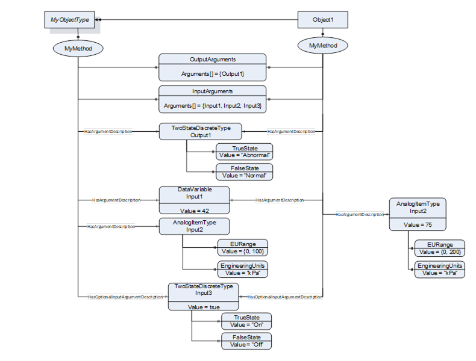  

Figure 16 - Method Metadata Example  

#### 5.7.2 HasArgumentDescription ReferenceType  

The *HasArgumentDescription ReferenceType* is a concrete *ReferenceType* that is a subtype of the *HasComponent ReferenceType* .  

The semantic of the *HasArgumentDescription ReferenceType*\- extends the semantic of the *HasComponent ReferenceType* to reference argument Metadata of a *Method* *NodeClass* .  

The SourceNode of this *ReferenceType* shall be a *Method* and the *TargetNode* of this *ReferenceType* shall be a *Variable* .  

#### 5.7.3 HasOptionalInputArgumentDescription ReferenceType  

The *HasOptionalInputArgumentDescription ReferenceType* is a concrete *ReferenceType* that can be used directly. It is a subtype of the *HasArgumentDescription ReferenceType* .  

The semantic of the *HasOptionalInputArgumentDescription ReferenceType*\- extends the semantic of the *HasArgumentDescription ReferenceType* to reference optional input arguments of a Method NodeClass. Optional input arguments shall always follow any non-optional input arguments in the *InputArguments* array. For example, if a method has 3 arguments with 1 being optional then the 3 rd argument shall be the optional one.  

There are no additional constraints defined for this *ReferenceType* .  

### 5.8 DataTypes  

#### 5.8.1 DataType Model  

The DataType Model is used to define simple and structured data types. Data types are used to describe the structure of the *Value* *Attribute* of *Variables* and their *VariableTypes* . Therefore each *Variable* and *VariableType* is pointing with its *DataType* *Attribute* to a *Node* of the *DataType* *NodeClass* as shown in [Figure 17](/§\_Ref100371225) .  

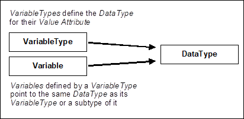  

Figure 17 - Variables, VariableTypes and their DataTypes  

In many cases, the *NodeId* of the *DataType Node*\- the *DataTypeId*\- will be well-known to *Clients* and *Servers* . Clause [8](/§\_Ref153882780) defines *DataTypes* and [OPC 10000-6](/§UAPart6) defines their *DataTypeIds* . In addition, other organizations may define *DataTypes* that are well-known in the industry. Well-known *DataTypeIds* provide for commonality across OPC UA *Servers* and allow *Clients* to interpret values without having to read the type description from the *Server* . Therefore, *Servers* may use well-known *DataTypeIds* without representing the corresponding *DataType Nodes* in their *AddressSpaces* .  

In other cases, *DataTypes* and their corresponding *DataTypeIds* may be vendor-defined. *Servers* should attempt to expose the *DataType Nodes* and the information about the structure of those *DataTypes* for *Clients* to read, although this information might not always be available to the *Server* .  

[Figure 18](/§\_Ref136068697) illustrates the *Nodes* used in the *AddressSpace* to describe the structure of a *DataType* . The *DataType* points to an *Object* of type *DataTypeEncodingType* . Each *DataType* can have several *DataTypeEncoding* , for example "Default", "UA Binary" and "XML" encoding. Services in [OPC 10000-4](/§UAPart4) allow *Clients* to request an encoding or choosing the "Default" encoding. Each *DataTypeEncoding* is used by exactly one *DataType* , that is, it is not permitted for two *DataTypes* to point to the same *DataTypeEncoding* .  

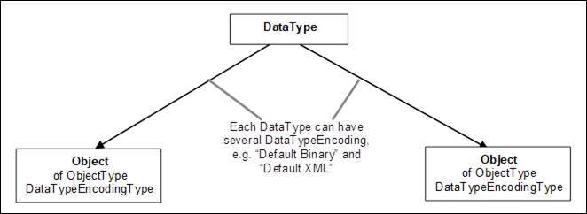  

Figure 18 - DataType Model  

Since the *NodeId* of the *DataTypeEncoding* will be used in some Mappings to identify the *DataType* and it's encoding as defined in [OPC 10000-6](/§UAPart6) , those *NodeIds* may also be well-known for well-known *DataTypeIds* .  

#### 5.8.2 Encoding Rules for different kinds of DataTypes  

Different kinds of *DataTypes* are handled differently regarding their encoding and according to whether this encoding is represented in the *AddressSpace* .  

*Built-in DataTypes* are a fixed set of *DataTypes* (see [OPC 10000-6](/§UAPart6) for a complete list of *Built-in* *DataTypes* ). They have no encodings visible in the *AddressSpace* since the encoding should be known to all OPC UA products. Examples of *Built-in* *DataTypes* are *Int32* (see [8.26](/§\_Ref179771135) ) and *Double* (see [8.12](/§\_Ref179771161) ).  

*Simple* *DataTypes* are subtypes of the *Built-in DataTypes* , which are handled on the wire like the *Built-in* *DataType* , i.e. they cannot be distinguished on the wire from their *Built-in* supertypes. Since they are handled like *Built-in* *DataTypes* regarding the encoding they cannot have encodings defined in the *AddressSpace* . *Clients* can read the *DataType* *Attribute* of a *Variable* or *VariableType* to identify the *Simple* *DataType* of the *Value* *Attribute* . An example of a *Simple* *DataType* is *Duration* . It is handled on the wire as a *Double* but the Client can read the *DataType* *Attribute* and thus interpret the value as defined by *Duration* (see [8.13](/§\_Ref179771183) ).  

*Structured* *DataTypes* are *DataTypes* that represent structured data and are not defined as *Built-in* *DataTypes* . *Structured DataTypes* inherit directly or indirectly from the *DataType* *Structure* defined in [8.32](/§\_Ref181253554) . *Structured* *DataTypes* may have several encodings and the encodings are exposed in the *AddressSpace* . How the encoding of *Structured* *DataTypes* is handled on the wire is defined in [OPC 10000-6](/§UAPart6) . The encoding of the *Structured* *DataType* is transmitted with each value, thus *Clients* are aware of the *DataType* without reading the *DataType* *Attribute* . The encoding has to be transmitted so the Client is able to interpret the data. An example of a *Structured* *DataType* is *Argument* (see [8.6](/§\_Ref128132235) ).  

*Enumeration DataTypes* are *DataTypes* that represent discrete sets of named values. Enumerations are always encoded as Int32 on the wire as defined in [OPC 10000-6](/§UAPart6) . Enumeration *DataTypes* inherit directly or indirectly from the *DataType* *Enumeration* defined in [8.14](/§\_Ref181253584) . Enumerations have no encodings exposed in the *AddressSpace* . To expose the human-readable representation of an enumerated value the *DataType* *Node* may have the *EnumStrings* *Property* that contains an array of *LocalizedText* . The Integer representation of the enumeration value points to a position within that array. *EnumValues* *Property* can be used instead of the *EnumStrings* to support integer representation of enumerations that are not zero-based or have gaps. It contains an array of a *Structured* *DataType* containing the integer representation as well as the human-readable representation. An example of an enumeration *DataType* containing a sparse list of Integers is *NodeClass* which is defined in [8.29](/§\_Ref130971442) .  

*An OptionSet can be defined in one of two ways. An OptionSet which is 64 bits or less may be defined as an UInteger DataType and always encoded on the wire as defined in* [OPC 10000-6](/§UAPart6) . An *OptionSet* may be defined as an *OptionSet* *DataType which is* defined in [8.40](/§\_Ref401165187) and is encoded on the wire as a *Structured* *DataType* . To expose the human-readable representation of an *OptionSet* the *DataType* *Node* shall have the *OptionSetValues* *Property* that contains an array of *LocalizedText* .  

In addition to the *DataTypes* described above *,* abstract *DataTypes* are also supported, which do not have any encodings and cannot be exchanged on the wire. *Variables* and *VariableTypes* use abstract *DataTypes* to indicate that their *Value* may be any one of the subtypes of the abstract *DataType* . An example of an abstract *DataType* is Integer which is defined in [8.24](/§\_Ref181253643) .  

[OPC 10000-6](/§UAPart6) defines a number of *DataEncodings* which specify how to serialize *DataTypes* . Some of these *DataEncodings* are text based and make use of *Name* portion the *DataType* *BrowseName* . For this reason, the *BrowseName* for all *DataTypes* should be *Strings* that start with a letter and contain only letters, digits or the underscore (\_). If a *DataType* has a *BrowseName* that does not meet these requirements it will be transformed using the *Name* encoding rules defined in [OPC 10000-6](/§UAPart6) into a *String* that meets the requirements. This will result in text based *DataEncodings* with *Names* that are not friendly to human readers.  

#### 5.8.3 DataType NodeClass  

The *DataType NodeClass* describes the syntax of a *Variable Value* . *DataTypes* are defined using the *DataType* *NodeClass* , as specified in [Table 16](/§\_Ref115513367) .  

Table 16 - DataType NodeClass  

| **Name** | **Use** | **Data Type** | **Description** |
|---|---|---|---|
  
| **Attributes** ||||
|---|---|---|---|
|Base NodeClass Attributes|M|\--|Inherited from the *Base NodeClass* . See [5.2](/§\_Ref107723037) .|
|IsAbstract|M|Boolean|A boolean *Attribute* with the following values: TRUE it is an abstract *DataType* . FALSE it is not an abstract *DataType* .|
|DataTypeDefinition|O|DataTypeDefinition|The *DataTypeDefinition Attribute* is used to provide the meta data and encoding information for *DataTypes* . The abstract *DataTypeDefinition* *DataType* is defined in [8.47](/§\_Ref433698368) . Structure and Union DataTypes The *Attribute* shall be mandatory for *DataTypes* derived from *Structure* and *Union* . For such *DataTypes* , the *Attribute shall* contain a structure of the *DataType* *StructureDefinition* . The *StructureDefinition* *DataType* is defined in [8.48](/§\_Ref434502273) . It is a subtype of *DataTypeDefinition* . Enumeration and OptionSet DataTypes The *Attribute* shall be mandatory for *DataTypes* derived from *Enumeration, OptionSet* and subtypes of *UInteger* representing an *OptionSet* . For such *DataTypes* , the *Attribute* shall contain a structure of the *DataType* *EnumDefinition* . The *EnumDefinition* *DataType* is defined in [8.49](/§\_Ref434502464) . It is a subtype of *DataTypeDefinition* .|
|||||
  
| **References** ||||
|---|---|---|---|
|HasProperty|0\..\*||*HasProperty* *References* identify the *Properties* for the *DataType* .|
|HasSubtype|0\..\*||*HasSubtype References* may be used to span a data type hierarchy. ** The inverse *Reference* identifies the parent type of this type.|
|HasEncoding|0\..\*||*HasEncoding References* identify the encodings of the *DataType* represented as *Objects* of type *DataTypeEncodingType* . Only concrete *Structured* *DataTypes* may use *HasEncoding* *References* . Abstract, *Built-in, Enumeration,* and *Simple* *DataTypes* are not allowed to be the *SourceNode* of a *HasEncoding* *Reference* . Each concrete *Structured* *DataType* shall point to at least one *DataTypeEncoding* *Object* with the *BrowseName* "Default Binary" or "Default XML" having the *NamespaceIndex* 0\. The *BrowseName* of the *DataTypeEncoding* *Objects* shall be unique in the context of a *DataType* , i.e. a *DataType* shall not point to two *DataTypeEncodings* having the same *BrowseName* .|
|||||
  
| **Standard Properties** ||||
|---|---|---|---|
|NodeVersion|O|String|The *NodeVersion* *Property* is used to indicate the version of a *Node* . The *NodeVersion* *Property* is updated each time a *Reference* is added or deleted to the *Node* the *Property* belongs to. *Attribute* value changes do not cause the *NodeVersion* to change. Clients may read the *NodeVersion Property* or subscribe to it to determine when the structure of a *Node* has changed. *Clients* shall not use the content for programmatic purposes except for equality comparisons.|
|EnumStrings|O|LocalizedText[]|*Enumeration* *DataTypes* shall have either an *EnumStrings* Property or an *EnumValues* Property. They shall not be applied for other *DataTypes* . Each entry of the array of *LocalizedText* in this *Property* represents the human-readable representation of an enumerated value. The Integer representation of the enumeration value points to a position of the array.|
|EnumValues|O|EnumValueType[]|*Enumeration* *DataTypes* shall have either an *EnumStrings* *Property* or an *EnumValues* *Property* . They shall not be applied for other *DataTypes* . The *EnumValues* *Property* shall be used to represent Enumerations with integers that are not zero-based or have gaps (e.g. 1, 2, 4, 8, and 16). Each entry of the array of *EnumValueType* in this *Property* represents one enumeration value with its integer notation, human-readable representation and help information.|
|OptionSetValues|O|LocalizedText[]|The *OptionSetValues* *Property* shall be applied to *OptionSet* *DataTypes* and *UInteger* *DataTypes representing bit masks* . An *OptionSet* *DataType* or *UInteger* *DataType* is used to represent a bit mask and the *OptionSetValues* *Property* contains the human-readable representation for each bit of the bit mask. The *OptionSetValues* *Property* shall provide an array of *LocalizedText* containing the human-readable representation for each bit. The LocalizedText of undefined bits shall be null.|
|OptionSetLength|O|UInt32|The *OptionSetLength* *Property* shall only be applied to subtypes of the *OptionSet* *DataType* . It optionally provides the length, in *bytes,* of the OptionSet. The provided length shall at least provide enough bytes that all bits defined in the *OptionSetValues* can be managed. For example, if 18 bits are defined by the *OptionSetValues* , the *OptionSetLength* shall be at least 3 bytes.|
  

  

The *DataType* *NodeClass* inherits the base *Attributes* from the *Base NodeClass* defined in [5.2](/§\_Ref107723037) . The *IsAbstract Attribute* specifies if the *DataType* is abstract or not. Abstract *DataTypes* can be used in the *AddressSpace* , i.e. *Variables* and *VariableTypes* can point with their *DataType* *Attribute* to an abstract *DataType* . However, concrete values can never be of an abstract *DataType* and shall always be of a concrete subtype of the abstract *DataType* .  

*HasProperty* *References* are used to identify the *Properties* of a *DataType* . The *Property* *NodeVersion* is used to indicate the version of the *DataType* . The *Property* *EnumStrings* contains human-readable representations of enumeration values and is only applied to *Enumeration* *DataTypes* . Instead of the *EnumStrings* *Property* an *Enumeration* *DataType* can also use the *EnumValues* *Property* to represent *Enumerations* with integer values that are not zero-based or containing gaps. There are no additional *Properties* defined for *DataTypes* in this standard. Additional parts of this series of standards may define additional *Properties* for *DataTypes* .  

*HasSubtype References* may be used to expose a data type hierarchy in the *AddressSpace* . The semantic of subtyping is only defined to the point, that a Server may provide instances of the subtype instead of the DataType. *Clients* should not make any assumptions about any other semantic with that information. For example, it might not be possible to cast a value of one data type to its base data type. *Servers* need not provide *HasSubtype References* , even if their *DataTypes* span a type hierarchy, however it is required that the subtype provides the inverse *Reference* to its supertype. Some restrictions apply for subtyping enumeration DataTypes as defined in [8.14](/§\_Ref181253584) .  

*HasEncoding* *References* point from the *DataType* to its *DataTypeEncodings* . Each concrete *Structured* *DataType* can point to many *DataTypeEncodings* , but each *DataTypeEncoding* shall belong to one *DataType* , that is, it is not permitted for two *DataType* *Nodes* to point to the same *DataTypeEncoding* *Object* using *HasEncoding* *References* . The *DataTypeEncoding* *Node* shall provide the inverse *HasEncoding* *Reference* to its *DataType* .  

An abstract *DataType* is not the *SourceNode* of a *HasEncoding* *Reference* . The *DataTypeEncoding* of an abstract *DataType* is provided by its concrete subtypes.  

*DataType Nodes* shall not be the *SourceNode* of other types of *References* . However, they may be the *TargetNode* of other *References* .  

#### 5.8.4 DataTypeEncoding and Encoding Information  

If a *DataType* *Node* is exposed in the *AddressSpace* , it shall provide its *DataTypeEncodings* using *HasEncoding* *References* . These *References* shall be bi-directional. [Figure 19](/§\_Ref136072017) provides an example how *DataTypes* are modelled in the *AddressSpace* .  

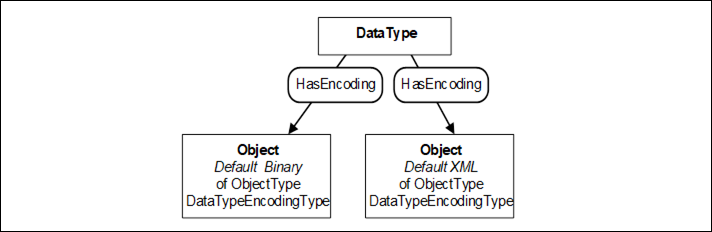  

Figure 19 - Example of DataType Modelling  

The information on how to encode the *DataType* is provided in the *Attribute* *DataTypeDefinition* of the *DataType* *Node* . The content of this *Attribute* shall not be changed once it had been provided to *Clients* since *Clients* might persistently cache this information. If the encoding of a *DataType* needs to be changed conceptually a new *DataType* needs to be provided, meaning that a new *NodeId* shall be used for the *DataType* . Since *Clients* identify the *DataType* via the *DataTypeEncodings* , also the *NodeIds* for the *DataTypeEncodings* of the *DataType* shall be changed, when the encoding changes.  

#### 5.8.5 DataTypeRefinement  

##### 5.8.5.1 Overview  

A *DataTypeRefinement* refines the usage of a concrete *Structured* *DataType* . It can restrict the usage of fields of the *Structured* *DataType* and add meta data to fields of the *Structured* *DataType* , like providing the *EngineeringUnits* or *EURange* .  

In order to restrict the usage for each field of a *Structured DataType* , the following can be defined:  

* What *DataType* can be used, including the maximum array length and maximum string length  

* If an optional field shall become mandatory or shall not be provided  

* If a certain subtype of the *DataType* is allowed or not  

The general rules for inheritance apply, as defined in [6.3](/§\_Ref192918126) , i.e., the *DataType* of a field can only be restricted to subtypes of the original *DataType* , mandatory fields cannot become optional, etc. If a concrete maximum array length or maximum string length has already been defined, it shall not be changed. If a field is defined that does not allow subtypes, this shall not be changed. If a field is defined that does allow subtypes, this can be changed to disallow subtypes.  

Any restrictions on the *Structured* *DataType* only affect the usage, not the encoding of the *DataType* . It is still encoded according to the rules of the *Structured* *DataType* .  

In addition to the restrictions, the *DataTypeRefinement* also allows meta data for fields to be added to a *Structured DataType* .  

##### 5.8.5.2 DataTypeRefinement Objects  

A *DataTypeRefinement* is represented by an *Object* of *DataTypeRefinementType* (see [OPC 10000-5](/§UAPart5) ) or a subtype. A *DataTypeRefinement* *Object* shall always be referenced using a *HasDataTypeRefinement* *Reference* (see [7.30](/§\_Ref209522665) ) or subtype from exactly one *DataType* *Node* representing a *Structured* *DataType* that is being refined.  

For each field having a refinement, a *Variable* of *BaseDataVariableType* or subtype is referenced using a *Reference* of *HasFieldDescription* *ReferenceType* (see [7.25](/§\_Ref199516610) ) or a subtype. The *BrowseName* of the *Variable* shall use a *BrowseName* equal to the name of the field. The *Namespace* of the *BrowseName* shall be ignored by a *Client* when performing an equality check with a field name.  

A *DataTypeRefinement* *Object* shall not reference any *Node* with a *HasFieldDescription* or subtype which is not representing a field of the *DataType* it refines and shall reference at most one *Variable* for each field with a *HasFieldDescription* or subtype.  

For the restriction of the field, the rules defined in [5.8.5.1](/§\_Ref199514593) apply. In [Table 17](/§\_Ref53493741) , the mapping of the fields in the *StructureField* of the *DataTypeDefinition* *Attribute* to concepts of a *Variable* is defined.  

Table 17 - Mapping of DataTypeDefinition  

| **StructureField** | **Variable Concept** | **Comment** |
|---|---|---|
|Name|String part of BrowseName Attribute|Must match|
|Description|Description Attribute|No requirements|
|DataType|DataType Attribute|Variable must have the same DataType or a subtype|
|ValueRank|ValueRank Attribute|Must match|
|ArrayDimensions|ArrayDimensions Attribute|For each dimension: If 0, Variable is allowed to be non-zero, otherwise they must match|
|MaxStringLength|MaxStringLength Property|If MaxStringLength is 0, Variable is allowed to be non-zero, otherwise must match|
|IsOptional and StructureWithOptionalFields|Reference to Variable either using HasFieldDescription (stays optional) HasFieldDescriptionSetMandatory (becomes mandatory) or IsDisabledOptionalField (optional field not used)|Only allowed if IsOptional is true. Otherwise IsDisabledOptionalField and HasFieldDescriptionSetMandatory are not allowed.|
|IsOptional and StructureWithSubtypedValues or UnionWithSubtypedValues|AccessLevelEx Attribute, bit NoSubDataTypes|Only allowed if IsOptional is true to set the NoSubDataTypes to true. If IsOptional is false, NoSubDataTypes shall be set.|
  

  

By using the subtypes *HasFieldDescriptionSetMandatory* (see [7.26](/§\_Ref201323022) ) a field becomes mandatory, and by *IsDisabledOptionalField* (see [7.27](/§\_Ref199516641) ) an optional field shall not be present. In the *AccessLevelEx* *Attribute* , the *NoSubDataTypes* bit can be used to express that a field where subtypes are allowed, no longer allows subtypes.  

Depending on the *Structured* *DataType,* some limitations on the *DataTypeRefinement* occur.  

* If the *DataType* of a field being refined is *BaseDataType* , *Structure* , *Number* , *Integer* or *UInteger,* the *DataType* of the field can be restricted by using a subtype or *SubtypeRestriction* (see [5.8.6](/§\_Ref199846837) ) on the *Variable* refining the field. If the *StructureType* of the *DataType* being refined is *StructureWithSubtypedValues* or *UnionWithSubtypedValues* and *IsOptional* of the field is set true, the *DataType* of that field may be restricted by using a subtype or *SubtypeRestriction* on the *Variable* refining the field. In all other cases, it is not allowed to use subtypes on the field and therefore restricting the *DataType* of the field to subtypes is not allowed.  

* If the *DataType* of a *Variable* refining a field is *BaseDataType* , *Structure* , *Number* , *Integer* or *UInteger,* then the *AccessLevelEx* bit *NoSubDataTypes* of the *Variable* shall be true. If the *DataType* of a field being refined is *BaseDataType* , *Structure* , *Number* , *Integer* or *UInteger* , then the *AccessLevelEx* bit *NoSubDataTypes* of the *Variable* may be true or false. If the *StructureType* of a *DataType* is *StructureWithSubtypedValues* or *UnionWithSubtypedValues* , and *IsOptional* of the field is true, the *AccessLevelEx* bit *NoSubDataTypes* may be true or false. In all other cases the *AccessLevelEx* bit *NoSubDataTypes* of a *Variable* refining a field of a *Structured* *DataType* shall be false, as it is not allowed to use subtypes based on the *Structured* *DataType* being refined.  

* If the *StructureType* of a *DataType* is *Structure* or *StructureWithSubtypedValues* , any refinement of a field of the *DataType* shall not be referenced with *IsDisabledOptionalField* or *HasFieldDescriptionSetMandatory* , as there are no optional fields defined for the *DataType* . If the *StructureType* is *StructureWithOptionalFields* , then the *IsDisabledOptionalField* or *HasFieldDescriptionSetMandatory* may be used on a field when *IsOptional* of that field is true. If the *StructureType* is *Union* or *UnionWithSubtypedValues* then the *IsDisabledOptionalField* may be used on any field and the *HasFieldDescriptionSetMandatory* shall not be used. In this case, the semantic of *IsDisabledOptionalField* implies that the *DataType* of the field shall not be used in the *Union* using the *DataTypeRefinement* .  

In [Figure 20](/§\_Ref199516920) , an example is given. The structure of X:SuperDataType and X:SubDataType is provided in pseudo-code. The Y:Refinement\_1 is refining the X:SubDataType and referenced from the *DataType* with a *HasDataTypeRefinement* *Reference* .  

The field1 is defined in the *DataType* as *Number* , the *DataTypeRefinement* restricts this to an *Int32* . As meta data, the *EngineeringUnits* is defined as Kelvin, therefore the *AnalogUnitType* is used as *VariableType* .  

The optional field2 is refined to "not used" by referencing the corresponding *Variable* with *IsDisabledOptionalField* .  

The field3 is defined in the *DataType* as *Number* and a one-dimensional array without a size limitation. In the *DataTypeRefinement* it is refined as an array of Int32 with the maximum length of 5.  

The optional field4, added in the subtype X:SubDataType, of *String* without a maximum length, becomes in the *DataTypeRefinement* a mandatory field of *String* with the *MaxStringLength* of 50.  

The field5 is not refined and stays as an *Int32* .  

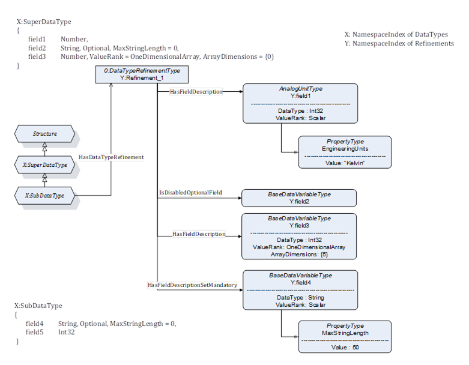  

Figure 20 - Example of a DataTypeRefinement  

As fields of *Structured* *DataTypes* may use *Structured* *DataTypes* , it may be desirable to refine fields of those fields as well. This can be done as shown in [Figure 21](/§\_Ref199519035) . In this example, the Y:Refinement\_2 provides similar refinements as Y:Refinement\_1, but makes the optional field4 "not used".  

The new optional field6, introduced by X:SubSubDataType, uses the X:SubDataType as *DataType* . The Y:Refinement\_2 makes this optional field mandatory, and by letting the X:field6 *Variable* reference the Y:Refinement\_1 with *UsesDataTypeRefinement* (see [7.24](/§\_Ref201326071) ), this *DataTypeRefinement* is applied to field6.  

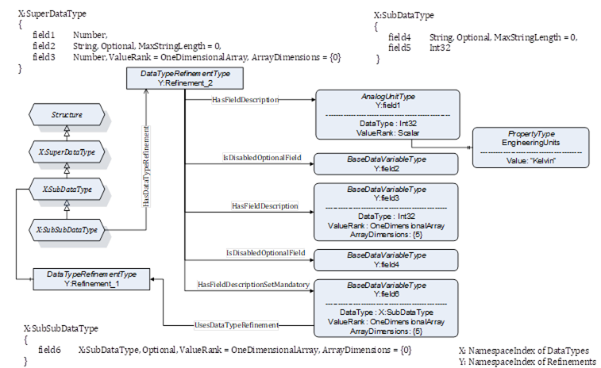  

Figure 21 - Example of a DataTypeRefinement using a Structured DataType  

##### 5.8.5.3 Usage of DataTypeRefinements  

Each *DataTypeRefinement* *Object* shall be referenced from exactly one *DataType* *Node* using *HasDataTypeRefinement* or a subtype.  

*DataTypeRefinements* are expressed in an OPC UA information model, by using the non-hierarchical *Reference* *UsesDataTypeRefinement* (see [7.24](/§\_Ref201326072) ) or a subtype. Those *References* always starts from an instance of a *Variable* , where the *Structured* *DataType* is used. They point to an *Object* of *DataTypeRefinementType* or a subtype, which contains the restrictions and meta data of the *DataTypeRefinement* .  

*DataTypeRefinements* are only allowed to be used on the concrete occurrence of the usage of the *Structured* *DataType* , that is on a *Variable* .  

*DataTypeRefinements* shall not be used from any *DataType* *Node* , from any *VariableType* , or any *InstanceDeclaration* , only from concrete *Variables* . This does include *Variables* describing a *DataTypeRefinement* , as shown in [Figure 21](/§\_Ref199519035) .  

Note, that *Method Arguments* can be further described using *Variables* referenced with a *HasArgumentDescription* . If the *Method Argument* is a *Structured DataType* , this *Variable* can be used as *SourceNode* for the *UsesDataTypeRefinement* to further refine the *Structured DataType* .  

##### 5.8.5.4 Example of usage of DataTypeRefinements  

An example of *DataTypeRefinements* is given in [Figure 22](/§\_Ref531777624) . The X:SuperDataType has two *DataTypeRefinements* , its subtype has an additional one. Note that the details of the *DataTypeRefinements* is not shown in the figure. There are two *Objects* of Z:SuperObjectType, both using *DataTypeRefinements* .  

Z:Object1 has the *Property* Z:Prop1 and the *DataVariables* Z:Var1 and Z:Var2, as defined on the X:SuperObjectType. Although all three *Variables* use the same *DataType* , the Z:Prop1 is refined by Y:Refinement\_4 and Z:Var2 by Y:Refinement\_3. Z:Var1 is not further refined.  

Z:Object2 has Z:Prop1 and Z:Var1 as defined on the *ObjectType* , but refines the *DataType* from Z:Var2 to X:SubDataType and adds another *Variable* Z:Var3. Like in Z:Object1, the Z:Prop1 is refined by Y:Refinement\_4, and both Z:Var2 and Z:Var3 are refined by Y:Refinement\_1.  

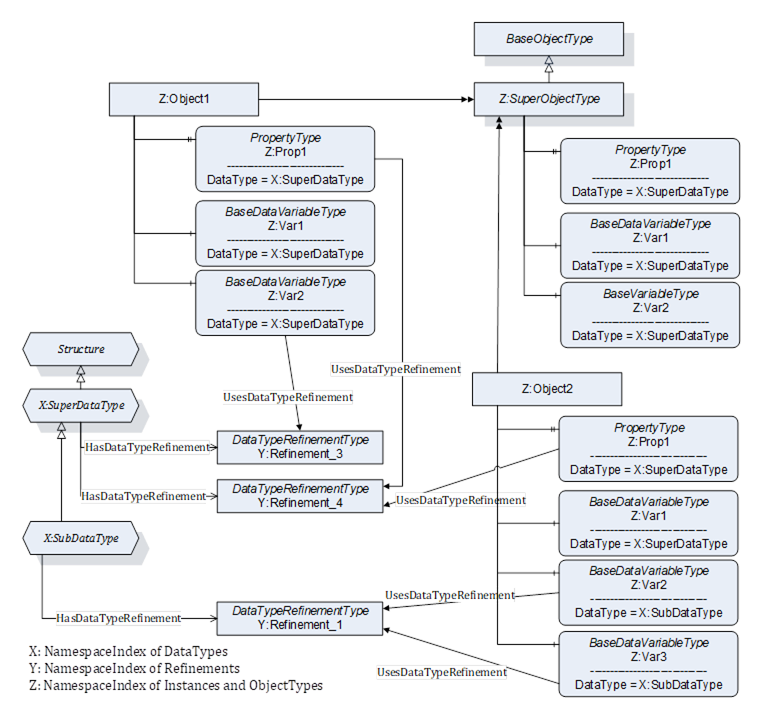  

Figure 22 - Example of DataTypeRefinements  

#### 5.8.6 SubtypeRestriction on a DataType  

##### 5.8.6.1 Overview  

When a *Variable* or *VariableType* is defined, the *DataType* of the *Value* is defined by the *DataType* , *ValueRank* and *ArrayDimensions* *Attributes* . In general, it is always allowed for the *Value* to use a subtype of the *DataType* unless restricted in the *NoSubDataTypes* bit of the *AccessLevelEx* *Attribute.* In fields of a structure, using subtypes is allowed when *IsOptional* is set and it is a *StructureWithOptionalFields* or the *DataType* is an abstract *DataType* like the *BaseDataType* . In many cases where it is allowed to use subtypes, not all possible subtypes are allowed, but the *DataType* hierarchy does not allow to restrict this by one supertype. For example, when an *Int16* and *Int32* are allowed, their common supertype *Integer* would also allow *SByte* and *Int64* .  

A *SubtypeRestriction* limits the usage of subtypes to a subset of all subtypes of a *DataType* . It is represented by an *Object* of *SubtypeRestrictionType* defined in [OPC 10000-5](/§UAPart5) . A *SubtypeRestriction* *Object* is bound to a *DataType* by a *HasDataTypeRefinement* *Reference* from the *DataType* to the *SubtypeRestriction* *Object* . Each *SubtypeRestriction* *Object* shall be referenced from exactly one *DataType* *Node* using a *HasDataTypeRefinement* *Reference* . A *SubtypeRestriction* *Object* is referencing *Variables* with an *AllowedSubtype* *Reference* (see [7.29](/§\_Ref200110438) ), and thereby restricting that the *DataType* including *ValueRank* and *ArrayDimensions* of the *Variable* is allowed to be used as subtype. The general rules of inheritance defined in [6.3](/§\_Ref192918126) apply, i.e., the *DataType* shall be the same or a subtype of the *DataType* , the *ValueRank* can only be changed *according* to the subtyping rules, etc.  

A *SubtypeRestriction* *Object* should have at least two *AllowedSubtype* *References* to *Variables* defining different variations of subtypes. Otherwise, a *Variable* using the *SubtypeRestriction* should just use the concrete subtype and does not need a *SubtypeRestriction* .  

In [Figure 23](/§\_Ref199843284) , an example of a *SubtypeRestriction* *Object* is given. The Y:Restriction1 *Object* is referenced from *Number* and therefore can be used by any *Variable* using the *Number* *DataType* . It references two *Variables* , Y:UInt32 with the *DataType* *UInt32* , the *ValueRank* *Scalar* which does not allow subtypes and X:IntegerArray, of *Integer* , *ValueRank* *OneDimension* that does allow subtypes (which is required since *Integer* is an abstract *DataType* ). Thereby, any *Variable* using the *SubtypeRestriction* is limiting its values to scalar *UInt32s* or arrays of *Integer* or any subtypes of *Integer* .  

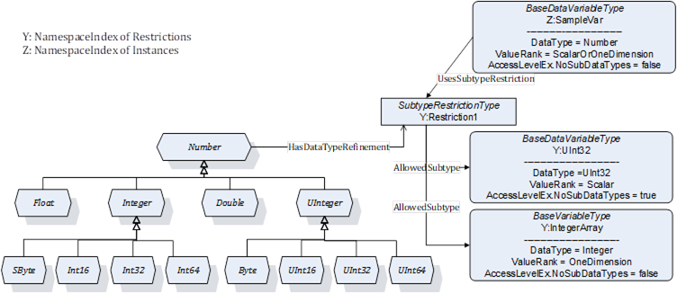  

Figure 23 - Example of a SubtypeRestriction  

In the example, Z:SampleVar is using the Y:Restriction1 by referencing it with *UsesSubtypeRestriction* . This is allowed since the *DataType* of Z:SampleVar is *Number* . The *DataTypes* always have to match exactly. The *NoSubDataTypes* is set to true, which is required, since *Number* is abstract, but would also be required for a concrete *DataType* , since setting it to true is already restricting it to disallow subtypes.  

In order to use a *SubtypeRestriction,* the *ValueRank* and *ArrayDimensions* *Attribute* of the *Variable* using the *SubtypeRestriction* shall be compatible to all referenced *Variables* using *AllowedSubtype* , i.e., it is required that based on the definitions of the *Variable* using the *SubtypeRestriction* a value based on any of the referenced *Variables* can be used.  

A *SubtypeRestriction* shall only be used on *Variables* used as instances, never on *InstanceDeclarations* or *VariableTypes* .  

For *Method* *Arguments* , it can be used in combination with the *HasArgumentDescription* .  

##### 5.8.6.2 SubtypeRestriction on fields of Structured DataTypes  

Using a *SubtypeRestriction* , it is possible to restrict the usage of subtypes on fields of a *Structured* *DataType* , by combining it with *DataTypeRefinements* (see [5.8.5](/§\_Ref199844932) ). The *Variable* used to refine the field in a *DataTypeRefinement* can be the *SourceNode* of a *UsesSubtypeRestriction,* thereby limiting the subtypes that can be used in the field.  

In [Figure 24](/§\_Ref199848812) , an example is given. The X:SuperDataType contains field1 of a scalar *Number* . The Y:Refinement\_3 of X:SuperDataType defines the field1 to either use a scalar *UInt32* or *Int32* by referencing the Z:Restriction1. No other subtypes of *Number* are allowed.  

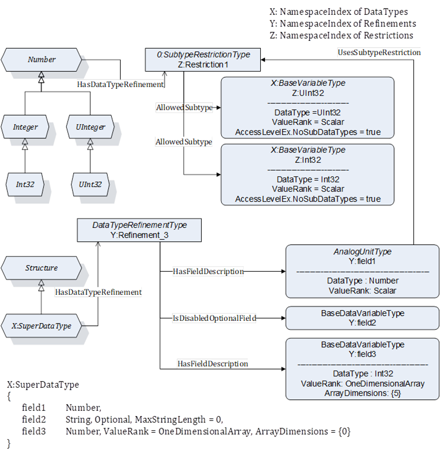  

Figure 24 - Example of a SubtypeRestriction used by a DataTypeRefinement  

### 5.9 Summary of Attributes of the NodeClasses  

[Table 18](/§\_Ref124912117) summarises all *Attributes* defined in this document and points out which *NodeClasses* use them either in an optional (O) or mandatory (M) way.  

Table 18 - Overview of Attributes  

| **Attribute** | **Variable** | **Variable Type** | **Object** | **Object Type** | **Reference Type** | **DataType** | **Method** | **View** |
|---|---|---|---|---|---|---|---|---|
|AccessLevel|M||||||||
|AccessLevelEx|O||||||||
|AccessRestrictions|O|O|O|O|O|O|O|O|
|ArrayDimensions|O|O|||||||
|BrowseName|M|M|M|M|M|M|M|M|
|ContainsNoLoops||||||||M|
|DataType|M|M|||||||
|DataTypeDefinition||||||O|||
|Description|O|O|O|O|O|O|O|O|
|DisplayName|M|M|M|M|M|M|M|M|
|EventNotifier|||M|||||M|
|Executable|||||||M||
|Historizing|M||||||||
|InverseName|||||O||||
|IsAbstract||M||M|M|M|||
|MinimumSamplingInterval|O||||||||
|NodeClass|M|M|M|M|M|M|M|M|
|NodeId|M|M|M|M|M|M|M|M|
|RolePermissions|O|O|O|O|O|O|O|O|
|Symmetric|||||M||||
|UserAccessLevel|M||||||||
|UserExecutable|||||||M||
|UserRolePermissions|O|O|O|O|O|O|O|O|
|UserWriteMask|O|O|O|O|O|O|O|O|
|Value|M|O|||||||
|ValueRank|M|M|||||||
|WriteMask|O|O|O|O|O|O|O|O|
  

  

## 6 Type Model for ObjectTypes and VariableTypes  

### 6.1 Overview  

In the remainder of Clause [6](/§\_Ref193170844) the type model of *ObjectTypes* and *VariableTypes* is defined regarding subtyping and instantiation.  

### 6.2 Definitions  

#### 6.2.1 InstanceDeclaration  

An *InstanceDeclaration* is an *Object* , *Variable* or *Method* that references a *ModellingRule* with a *HasModellingRule* *Reference* and is the *TargetNode* of a *hierarchical* *Reference* from a *TypeDefinitionNode* or another *InstanceDeclaration* . There shall be no two *TypeDefinitionNodes* referencing the same *InstanceDeclaration* with a hierarchical Reference, either directly or from another *InstanceDeclaration* of that *TypeDefinitionNode* , i.e. an *InstanceDeclaration* belongs to exactly one *TypeDefinitionNode* .  

The type of an *InstanceDeclaration* may be abstract, however the instance must be of a concrete type.  

#### 6.2.2 Instances without ModellingRules  

If no *ModellingRule* exists then the *Node* is neither considered for instantiation of a type nor for subtyping.  

If a *Node* referenced by a *TypeDefinitionNode* does not reference a *ModellingRule* it indicates that this *Node* only belongs to the *TypeDefinitionNode* and not to the instances. For example, an *ObjectType Node* may contain a *Property* that describes scenarios where the type could be used. This *Property* would not be considered when creating instances of the type. This is also true for subtyping, that is, subtypes of the type definition would not inherit the referenced *Node* .  

#### 6.2.3 InstanceDeclarationHierarchy  

The *InstanceDeclarationHierarchy* of a *TypeDefinitionNode* contains the *TypeDefinitionNode* and all *InstanceDeclarations* that are directly or indirectly referenced from the *TypeDefinitionNode* using forward *hierarchical* *References* .  

#### 6.2.4 Similar Node of InstanceDeclaration  

A similar *Node* of an *InstanceDeclaration* is a *Node* that has the same *BrowseName* and *NodeClass* as the *InstanceDeclaration* and in cases of *Variables* and *Objects* the same *TypeDefinitionNode* or a subtype of it. In the case of a *Method* a similar *Node* of an *InstanceDeclaration* is a *Node* that also has the same arguments of the *InstanceDeclaration* , however it may append additional optional arguments and it may specialize the *DataType* of arguments defined with an abstract *DataType* to a subtype of the abstract *DataType* .  

#### 6.2.5 BrowsePath  

A *BrowsePath* is a sequence of *BrowseNames* used to describe a path between *Nodes* related *w* ith a *Reference* .  

#### 6.2.6 BrowseName within a TypeDefinitionNode  

A *BrowsePath* within a *TypeDefinitionNode* which include targets of forward *hierarchical* *References* shall have a *BrowseName* that is unique within the *TypeDefinitionNode, this* same restriction applies to the targets of forward *hierarchical* *References* from any *InstanceDeclaration* . This means that any *InstanceDeclaration* within the *InstanceDeclarationHierarchy* can be uniquely identified by a sequence of *BrowseName* s.  

#### 6.2.7 Attribute Handling of InstanceDeclarations  

Some restrictions exist regarding the *Attributes* of *InstanceDeclarations* when the *InstanceDeclaration* is overridden or instantiated. The *BrowseName* and the *NodeClass* shall never change and always be the same as the original *InstanceDeclaration* .  

In addition, the rules defined in [6.2.8](/§\_Ref190836501) apply for *InstanceDeclarations* of the *NodeClass* *Variable* .  

#### 6.2.8 Attribute Handling of Variable and VariableTypes  

Some restrictions exist regarding the *Attributes* of a *VariableType* or a *Variable* used as an *InstanceDeclaration* with regard to the data type of the *Value* *Attribute* .  

When a *Variable* used as *InstanceDeclaration* or a *VariableType* is overridden or instantiated the following rules apply:  

1. The *DataType* *Attribute* can only be changed to a new *DataType* if the new *DataType* is a subtype of the *DataType* originally used.  

1. The *ValueRank* *Attribute* may only be further restricted  

1. 'Any' may be set to any other value;  

1. 'ScalarOrOneDimension' may be set to 'Scalar' or 'OneDimension';  

1. 'OneOrMoreDimensions' may be set to a concrete number of dimensions (value \> 0).  

1. All other values of this *Attribute* shall not be changed.  

1. The *ArrayDimensions* *Attribute* may be added if it was not provided or when modifying the value of an entry in the array from 0 to a different value. All other values in the array shall remain the same.  

#### 6.2.9 NodeIds of InstanceDeclarations  

*InstanceDeclarations* are identified by their *BrowsePath* . Different *Servers* might use different *NodeIds* for the *InstanceDeclarations* of common *TypeDefinitionNodes* , unless the definition of the *TypeDefinitionNode* already defines a *NodeId* for the *InstanceDeclaration* . All *TypeDefinitionNodes* defined in [OPC 10000-5](/§UAPart5) already define the *NodeIds* for their *InstanceDeclarations* and therefore shall be used in all *Servers* .  

### 6.3 Subtyping of ObjectTypes and VariableTypes  

#### 6.3.1 Overview  

The *HasSubtype* *ReferenceType* defines subtypes of types. Subtyping can only occur between *Nodes* of the same *NodeClass* . Rules for subtyping *ReferenceTypes* are described in [5.3.3.3](/§\_Ref126749286) . There is no common definition for subtyping *DataTypes* , as described in [5.8.3](/§\_Ref128219564) . The remainder of [6.3](/§\_Ref192918126) specify subtyping rules for single inheritance on *ObjectTypes* and *VariableTypes* .  

#### 6.3.2 Attributes  

Subtypes inherit the parent type's *Attribute* values, except for the *NodeId* . Inherited *Attribute* values may be overridden by the subtype, the *BrowseName* and *DisplayName* values should be overridden. Special rules apply for some *Attributes* of *VariableTypes* as defined in [6.2.8](/§\_Ref190836501) . Optional *Attributes* , not provided by the parent type, may be added to the subtype.  

#### 6.3.3 InstanceDeclarations  

##### 6.3.3.1 Overview  

Subtypes inherit the fully-inherited parent type's *InstanceDeclarations* .  

As long as those *InstanceDeclarations* are not overridden they are not referenced by the subtype. *InstanceDeclarations* can be overridden by adding *References* , changing *References* to reference different *Nodes* , changing *References* to be subtypes of the original *ReferenceType* , changing values of the *Attributes* or adding optional *Attributes* . In order to get the full information about a subtype, the inherited *InstanceDeclarations* have to be collected from all types that can be found by recursively following the inverse *HasSubtype* *References* from the subtype. This collection of *InstanceDeclarations* is called the fully-inherited *InstanceDeclarationHierarchy* of a subtype.  

The remainder of [6.3.3](/§\_Ref389579416) define how to construct the fully-inherited *InstanceDeclarationHierarchy* and how *InstanceDeclarations* can be overridden.  

##### 6.3.3.2 Fully-inherited InstanceDeclarationHierarchy  

An instance of a *TypeDefinitionNode* is described by the fully-inherited *InstanceDeclarationHierarchy* of the *TypeDefinitionNode* . The fully-inherited *InstanceDeclarationHierarchy* can be created by starting with the *InstanceDeclarationHierarchy* of the *TypeDefinitionNode* and merging the fully-inherited *InstanceDeclarationHierarchy* of its parent type.  

The process of merging *InstanceDeclarationHierarchies* is straightforward and can be illustrated with the example shown in [Figure 25](/§\_Ref187078879) which specifies a *TypeDefinitionNode* "BetaType" which is a subtype of "AlphaType". The name in each box is the *BrowseName* and the number is the *NodeId* .  

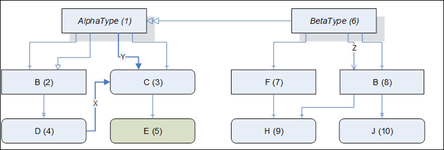  

Figure 25 - Subtyping TypeDefinitionNodes  

An *InstanceDeclarationHierarchy* can be fully described as a table of *Nodes* identified by their *BrowsePaths* with a corresponding table of *References* . The *InstanceDeclarationHierarchy* for "BetaType" is described in [Table 19](/§\_Ref187097046) where the top half of the table is the table of *Nodes* and the bottom half is the table of *References* (the *HasModellingRule* references have been omitted from the table for the sake of clarity; all Nodes except for 1, 6, and 5 have *ModellingRules* ). All *InstanceDeclarations* of the *InstanceDeclarationHierarchy* and all *Nodes* referenced with a *NonHierarchical* *Reference* from such an *InstanceDeclaration* are added to the table. *Hierarchical* *References* to *Nodes* without a *ModellingRule* are not considered.  

Table 19 - The InstanceDeclarationHierarchy for BetaType  

| **BrowsePath** | **NodeId** |||
|---|---|---|---|
  
| **/** | **6** |||
|---|---|---|---|
  
| **/F** | **7** |||
|---|---|---|---|
  
| **/B** | **8** |||
|---|---|---|---|
  
| **/F/H** | **9** |||
|---|---|---|---|
  
| **/B/J** | **10** |||
|---|---|---|---|
  
| **/B/H** | **9** |||
|---|---|---|---|
||
  
| **SourceBrowsePath** | **ReferenceType** | **TargetBrowsePath** | **TargetNodeId** |
|---|---|---|---|
|/|HasComponent|/F|\-|
|/|HasComponent|/B|\-|
|/|Z|/B|\-|
|/|HasTypeDefinition|\-|BetaType|
|/F|HasComponent|/F/H|\-|
|/F|HasTypeDefinition|\-|BaseObjectType|
|/B|HasProperty|/B/J|\-|
|/B|HasTypeDefinition|\-|BaseObjectType|
|/F/H|HasTypeDefinition|\-|PropertyType|
|/B/J|HasTypeDefinition|\-|PropertyType|
|/B|HasComponent|/B/H|\-|
|/B/H|HasTypeDefinition|\-|BaseDataVariableType|
  

  

Multiple *BrowsePaths* to the same *Node* shall be treated as separate *Nodes* . An *Instance* may provide different *Nodes* for each *BrowsePath* .  

The fully-inherited *InstanceDeclarationHierarchy* for "BetaType" can now be constructed by merging the *InstanceDeclarationHierarchy* for "AlphaType". The result is shown in [Table 20](/§\_Ref187087761) where the entries added from "AlphaType" are shaded with grey.  

Table 20 - The Fully-Inherited InstanceDeclarationHierarchy for BetaType  

| **BrowsePath** | **NodeId** |||
|---|---|---|---|
  
| **/** | **6** |||
|---|---|---|---|
  
| **/F** | **7** |||
|---|---|---|---|
  
| **/B** | **8** |||
|---|---|---|---|
  
| **/F/H** | **9** |||
|---|---|---|---|
  
| **/B/J** | **10** |||
|---|---|---|---|
  
| **/B/H** | **9** |||
|---|---|---|---|
  
| **/B/D** | **4** |||
|---|---|---|---|
  
| **/C** | **3** |||
|---|---|---|---|
||
  
| **SourceBrowsePath** | **ReferenceType** | **TargetBrowsePath** | **TargetNodeId** |
|---|---|---|---|
|/|HasComponent|/F|\-|
|/|HasComponent|/B|\-|
|/|Z|/B|\-|
|/|HasTypeDefinition|\-|BetaType|
|/F|HasComponent|/F/H|\-|
|/F|HasTypeDefinition|\-|BaseObjectType|
|/B|HasProperty|/B/J|\-|
|/B|HasTypeDefinition|\-|BaseObjectType|
|/F/H|HasTypeDefinition|\-|PropertyType|
|/B/J|HasTypeDefinition|\-|PropertyType|
|/B|HasComponent|/B/H|\-|
|/B/H|HasTypeDefinition|\-|BaseDataVariableType|
|/|HasNotifier|/B|\-|
|/B|HasProperty|/B/D|\-|
|/|HasComponent|/C|\-|
|/|Y|/C|\-|
|/C|HasTypeDefinition|\-|BaseDataVariableType|
|/B/D|HasTypeDefinition|\-|PropertyType|
|/B/D|X|/C|\-|
  

  

The *BrowsePath* "/B" already exists in the table so it does not need to be added. However, the *HasNotifier* reference from "/" to "/B" does not exist and was added.  

The *Nodes* and *References* defined in [Table 20](/§\_Ref187087761) can be used to create the fully-inherited *InstanceDeclarationHierarchy* shown in [Figure 26](/§\_Ref187087911) . The fully-inherited *InstanceDeclarationHierarchy* contains all necessary information about a *TypeDefinitionNode* regarding its complex structure without needing any additional information from its supertypes.  

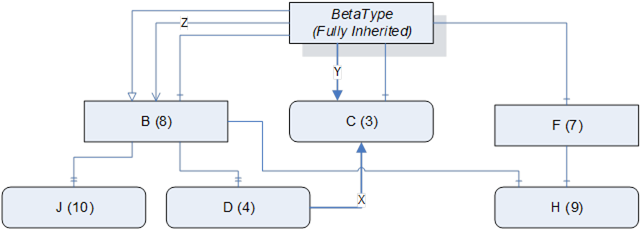  

Figure 26 - The Fully-Inherited InstanceDeclarationHierarchy for BetaType  

##### 6.3.3.3 Overriding InstanceDeclarations  

A subtype overrides an *InstanceDeclaration* by specifying an *InstanceDeclaration* with the same *BrowsePath* . An overridden *InstanceDeclaration* shall have the same *NodeClass* and *BrowseName* . The *TypeDefinitionNode* of the overridden *InstanceDeclaration* shall be the same or a subtype of the *TypeDefinitionNode* specified in the supertype.  

When overriding an *InstanceDeclaration* it is necessary to provide *hierarchical* *References* that link the new *Node* back to the subtype (the *References* are used to determine the *BrowsePath* of the *Node* ).  

It is only possible to override *InstanceDeclarations* that are directly referenced from the *TypeDefinitionNode* . If an indirect referenced *InstanceDeclaration* , such as "J" in [Figure 26](/§\_Ref187087911) , has to be overridden, then the directly referenced *InstanceDeclarations* that includes "J", in that case "B", have to be overridden first and then "J" can be overridden in a second step.  

A *Reference* is replaced if it goes between two overridden *Nodes* and has the same *ReferenceType* as a *Reference* defined in the supertype. The *Reference* specified in the subtype may be a subtype of the *ReferenceType* used in the parent type.  

Any *NonHierarchical* *References* specified for the overridden *InstanceDeclaration* are treated as new *References* unless the *ReferenceType* only allows a single *Reference* per *SourceNode* . If this situation exists the subtype can change the target of the *Reference* but the new target shall have the same *NodeClass* and for *Objects* and *Variables* also the same type or a subtype of the type specified in the parent.  

The overriding *Node* may specify new values for the *Node* *Attributes* other than the *NodeClass* or *BrowseName* , however, the restrictions on *Attributes* specified in [6.2.7](/§\_Ref181853444) apply. Any *Attribute* provided by the overridden *InstanceDeclaration* has to be provided by the overriding *InstanceDeclaration* , additional optional *Attributes* may be added.  

A subtype shall not override an argument of its supertype's *Method* *InstanceDeclaration* which ** is defined with a concrete *DataType. Method* arguments defined with an abstract *DataType may be overridden* . A subtype shall not remove an argument of its supertype's *Method* *InstanceDeclaration* . A subtype shall not add mandatory additional arguments however it may append optional arguments after all existing arguments of the supertype's *Method* *InstanceDeclaration* .  

The *ModellingRule* of the overriding *InstanceDeclaration* may be changed as defined in [6.4.4.2](/§\_Ref181851883) .  

Each overriding *InstanceDeclaration* needs its own *HasModellingRule* and *HasTypeDefinition* *References* , even if they have not been changed.  

A subtype should not override a *Node* unless it needs to change it.  

The semantics of certain *TypeDefinitionNodes* and *ReferenceTypes* may impose additional restrictions with regard to overriding *Nodes* .  

### 6.4 Instances of ObjectTypes and VariableTypes  

#### 6.4.1 Overview  

Any *Instance* of a *TypeDefinitionNode* will be the root of a hierarchy which mirrors the *InstanceDeclarationHierarchy* for the *TypeDefinitionNode.* Each *Node* in the hierarchy of the Instance will have a *BrowsePath* which may be the same as the *BrowsePath* for one of the *InstanceDeclarations* in the hierarchy of the *TypeDefinitionNode.* The *InstanceDeclaration* with the same *BrowsePath* is called the *InstanceDeclaration* for the *Node* . If a *Node* has an *InstanceDeclaration* then it shall have the same *BrowseName* and *NodeClass* as the *InstanceDeclaration* and, in cases of *Variables* and *Objects* , the same *TypeDefinitionNode* or a subtype of it.  

Instances may reference several *Nodes* with the same *BrowsePath* . *Clients* that need to distinguish between the *Nodes* based on the *InstanceDeclarationHierarchy* and the *Nodes* that are not based on the *InstanceDeclarationHierarchy* can accomplish this using the TranslateBrowsePathsToNodeIds service defined in [OPC 10000-4](/§UAPart4) .  

#### 6.4.2 Creating an Instance  

Instances inherit the initial values for the *Attributes* that they have in common with the *TypeDefinitionNode* from which they are instantiated, with the exceptions of the *NodeClass* and *NodeId* .  

When a *Server* creates an instance of a *TypeDefinitionNode* it shall create the same hierarchy of *Nodes* beneath the new *Object* or *Variable* depending on the *ModellingRule* of each *InstanceDeclaration* . Standard *ModellingRules* are defined in [6.4.4.4](/§\_Ref181851957) . The *Nodes* within the newly created hierarchy may be copies of the *InstanceDeclaration* s, the *InstanceDeclaration* itself or another *Node* in the *AddressSpace* that has the same *TypeDefinitionNode* and *BrowseName* . If new copies are created, then the *Attribute* values of the *InstanceDeclarations* are used as the initial values. An instance shall not be a *SourceNode* of a hierarchical *Reference* that has the same *BrowsePath* as an *InstanceDeclaration* of its *TypeDefinition* which has an optional or mandatory *ModellingRule* except for the one based on the *InstanceDeclaration* .  

[Figure 27](/§\_Ref187074518) provides a simple example of a *TypeDefinitionNode* and an *Instance* . *Nodes* referenced by the *TypeDefinitionNode* without a *ModellingRule* do not appear in the instance. *Instances* may have children with duplicate *BrowseName* s; however, only one of those children will correspond to the *InstanceDeclaration* .  

  

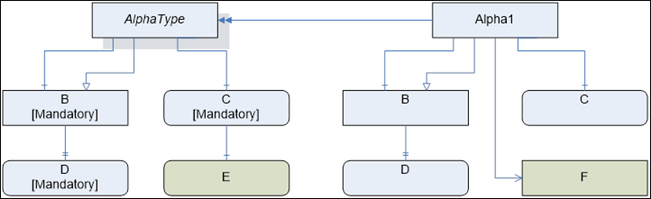  

Figure 27 - An Instance and its TypeDefinitionNode  

It is up to the *Server* to decide which *InstanceDeclarations* appear in any single instance. In some cases, the *Server* will not define the entire instance and will provide remote references to *Nodes* in another *Server* . The *ModellingRules* described in [6.4.4.4](/§\_Ref181851957) allow *Servers* to indicate that some *Nodes* are always present; however, the *Client* shall be prepared for the case where the *Node* exists in a different *Server* .  

A *Client* can use the information of *TypeDefinitionNodes* to access *Nodes* which are in the hierarchy of the instance. It shall pass the *NodeId* of the instance and the *BrowsePath* of the child *Nodes* based on the *TypeDefinitionNode* to the *TranslateBrowsePathsToNodeIds* service (see [OPC 10000-4](/§UAPart4) ). This *Service* returns the *NodeId* for each of the child *Node* s. If a child *Node* exists then the *BrowseName* and *NodeClass* shall match the *InstanceDeclaration* . In the case of *Objects* or *Variables,* also the *TypeDefinitionNode* shall either match or be a subtype of the original *TypeDefinitionNode* .  

#### 6.4.3 Constraints on an Instance  

*Objects* and *Variables* may change their *Attribute* values after being created. Special rules apply for some *Attributes* as defined in [6.2.7](/§\_Ref181853444) .  

Additional *References* may be added to the *Nodes* , and *References* may be deleted as long as the *ModellingRules* defined on the *InstanceDeclarations* of the *TypeDefinitionNode* are still fulfilled.  

For *Variables* and *Objects* the *HasTypeDefinition* *Reference* shall always point to the same *TypeDefinitionNode* as the *InstanceDeclaration* or a subtype of it.  

If two *InstanceDeclarations* of the fully-inherited *InstanceDeclarationHierarchy* have been connected directly with several *References* , all those *References* shall connect the same *Nodes* . An example is given in [Figure 28](/§\_Ref190857411) . The instances A1 and A2 are allowed since B1 references the same *Node* with both *References* , whereas A3 is not allowed since two different *Nodes* are referenced. Note that this restriction only applies for directly connected *Nodes* . For example, A2 references a C1 directly and a different C1 via B1.  

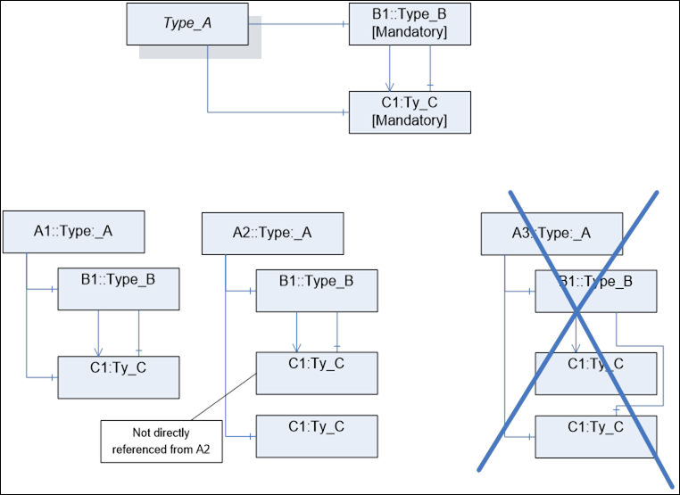  

Figure 28 - Example for several References between InstanceDeclarations  

#### 6.4.4 ModellingRules  

##### 6.4.4.1 General  

For a definition of *ModellingRules* , see [6.4.4.4](/§\_Ref181851957) . Other parts of this series of standards may define additional *ModellingRules* . *ModellingRules* are an extendable concept in OPC UA; therefore, vendors may define their own *ModellingRules* .  

Note that the *ModellingRules* defined in this standard do not define how to deal with *NonHierarchical* *References* between *InstanceDeclarations* , i.e. it is *Server*\-specific if those *References* exist in an instance hierarchy or not. Other *ModellingRules* may define behaviour for *NonHierarchical* *References* between *InstanceDeclaration* as well.  

*ModellingRules* are represented in the *AddressSpace* as *Objects* of the *ObjectType ModellingRuleType* . There are some *Properties* defining common semantic of *ModellingRules.* This edition of this standard only specifies one *Property* for *ModellingRules* . Future editions may define additional *Properties* for *ModellingRules* . [OPC 10000-5](/§UAPart5) specifies the representation of the *ModellingRule Objects,* their *Properties* and their type in the *AddressSpace* .  

Subclause [6.4.4.3](/§\_Ref181519301) defines how the *ModellingRule* may be changed when instantiating *InstanceDeclarations* with respect to the *Properties* . Subclause [6.4.4.2](/§\_Ref181851883) defines how the *ModellingRule* may be changed when overriding *InstanceDeclarations* in subtypes with respect to the *Properties* .  

##### 6.4.4.2 Subtyping Rules for Properties of ModellingRules  

It is allowed that subtypes override ModellingRules on their InstanceDeclarations. As a general rule for subtyping, constraints shall only be tightened, not loosened. Therefore, it is not allowed to specify on the supertype that an instance shall exist with the ModellingRule Mandatory and on the subtype make this ModellingRule Optional. [Table 21](/§\_Ref182183906) specifies the allowed changes on the Properties when overriding the ModellingRules in the subtype.  

Table 21 - Rule for ModellingRules Properties when Subtyping  

|||
|---|---|
|ModellingRule on supertype|ModellingRule on subtype|
|Mandatory|Mandatory|
|Optional|Mandatory or Optional|
|MandatoryPlaceholder|MandatoryPlaceholder|
|OptionalPlaceholder|MandatoryPlaceholder or OptionalPlaceholder|
  

##### 6.4.4.3 Instantiation Rules for Properties of ModellingRules  

There are two different use cases when creating an instance 'A' based on a *TypeDefinitionNode* 'A\_Type'. Either 'A' is used as normal instance or it is used as an *InstanceDeclaration* of another *TypeDefinitionNode* .  

In the first case, it is not required that newly created or referenced instances based on *InstanceDeclarations* have a *ModellingRule* , however, it is allowed that they have any *ModellingRule* independent of the *ModellingRule* of their *InstanceDeclaration* .  

In [Figure 29](/§\_Ref182213130) an example is given. The instances A1, A2, and A3 are all valid instances of Type\_A, although B of A1 has no *ModellingRule* and B of A3 has a different *ModellingRule* than B of Type\_A.  

  

Figure 29 - Example on changing instances based on InstanceDeclarations  

In the second case, all instances that are referenced directly or indirectly from 'A' based on *InstanceDeclarations* of 'A\_Type' initially maintain the same *ModellingRule* as their *InstanceDeclarations.* The *ModellingRules* may be updated; the allowed changes to the *ModellingRules* of these *Nodes* are the same as those defined for subtyping in [6.4.4.2](/§\_Ref181851883) .  

In [Figure 30](/§\_Ref182212624) an example of such a scenario is given. Type\_B uses an *InstanceDeclaration* based on Type\_A (upper part of the Figure). Later on the *ModellingRule* of the *InstanceDeclaration* A1 is changed (lower part of the Figure). A1 has become the *NamingRule* of *Mandatory* (changed from *Optional* ).  

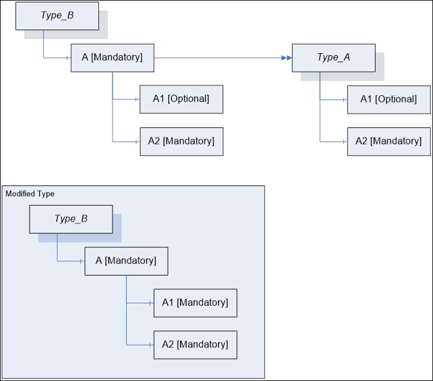  

Figure 30 - Example on changing InstanceDeclarations based on an InstanceDeclaration  

##### 6.4.4.4 Standard ModellingRules  

  

###### 6.4.4.4.1 Mandatory  

An *InstanceDeclaration* marked with the *ModellingRule* *Mandatory* means that for each existing *BrowsePath* on the instance a similar *Node* shall exist, but it is not defined whether a new *Node* is created or an existing *Node* is referenced.  

For example, the *TypeDefinitionNode* of a functional block "AI\_BLK\_TYPE" will have a setpoint "SP1". An instance of this type "AI\_BLK\_1" will have a newly-created setpoint "SP1" as a similar Node to the *InstanceDeclaration* SP1. [Figure 31](/§\_Ref128221087) illustrates the example.  

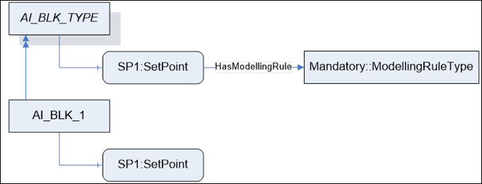  

Figure 31 - Use of the Standard ModellingRule Mandatory  

In [6.4.4.4.2](/§\_Ref190859372) a complex example combining the *Mandatory* and *Optional* *ModellingRules* is given.  

###### 6.4.4.4.2 Optional  

An *InstanceDeclaration* marked with the ModellingRule *Optional* means that for each existing *BrowsePath* on the instance a similar *Node* may exist, but it is not defined whether a new *Node* is created or an existing *Node* is referenced.  

In [Figure 32](/§\_Ref190859404) an example using the *ModellingRules* *Optional* and *Mandatory* is shown. The example contains an *ObjectType* Type\_A and all valid combinations of instances named A1 to A13. Note that if the optional B is provided, the mandatory E has to be provided as well, otherwise not. F is referenced by C and D. On the instance, this can be the same *Node* or two different *Nodes* with the same *BrowseName* (similar *Node* to *InstanceDeclaration* F). Not considered in the example is if the instances have *ModellingRules* or not. It is assumed that each F is similar to the *InstanceDeclaration* F, etc.  

If there would be a *NonHierarchical* *Reference* between E and F in the *InstanceDeclarationHierarchy* , it is not specified if it occurs in the instance hierarchy or not. In the case of A10, there could be a reference from E to one F but not to the other F, or to both or none of them.  

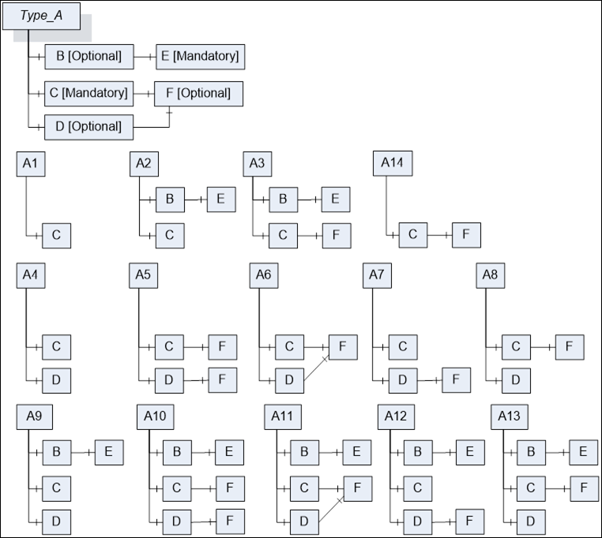  

Figure 32 - Example using the Standard ModellingRules Optional and Mandatory  

###### 6.4.4.4.3 ExposesItsArray  

The *ExposesItsArray* *ModellingRule* exposes a special semantic on *VariableTypes* having a single- or multidimensional array as the data type. It indicates that each value of the array will also be exposed as a *Variable* in the *AddressSpace* .  

The *ExposesItsArray* *ModellingRule* can only be applied on *InstanceDeclarations* of *NodeClass* *Variable* that are part of a *VariableType* having a single- or multidimensional array as its data type.  

The *Variable* A having this *ModellingRule* shall be referenced by a forward *hierarchical* *Reference* from a *VariableType* B. B shall have a *ValueRank* value that is equal to or larger than zero. A should have a data type that reflects at least parts of the data that is managed in the array of B. Each instance of B shall reference one instance of A for each of its array elements. The used *Reference* shall be of the same type as the *hierarchical* *Reference* that connects B with A or a subtype of it. If there are more than one forward *hierarchical* *References* between A and B, then all instances based on B shall be referenced with all those *References* .  

[Figure 33](/§\_Ref182215717) gives an example. A is an instance of Type\_A having two entries in its value array. Therefore it references two instances of the same type as the *InstanceDeclaration* ArrayExpose. The *BrowseNames* of those instances are not defined by the *ModellingRule* . In general, it is not possible to get a *Variable* representing a specific entry in the array (e.g. the second). *Clients* will typically either get the array or access the *Variables* directly, so there is no need to provide that information.  

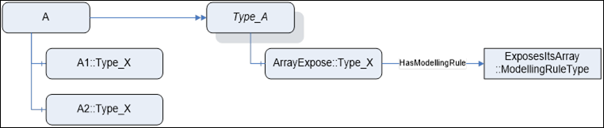  

Figure 33 - Example on using ExposesItsArray  

It is allowed to reference A by other *InstanceDeclarations* as well. Those *References* have to be reflected on each instance based on A.  

[Figure 34](/§\_Ref182215725) gives an example. The *Property* EUUnit is referenced by ArrayExpose and therefore each instance based on ArrayExpose references the instance based on the *InstanceDeclaration* EUUnit.  

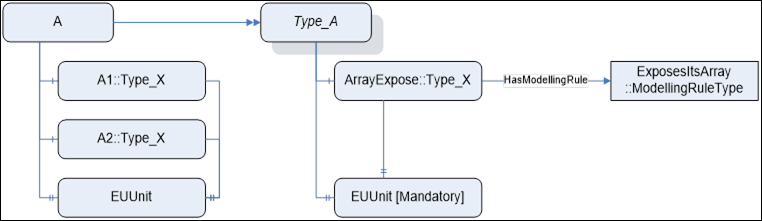  

Figure 34 - Complex example on using ExposesItsArray  

###### 6.4.4.4.4 OptionalPlaceholder  

For *Object* and *Variable* the intention of the *ModellingRule* *OptionalPlaceholder* is to expose the information that a complex *TypeDefinition* expects from instances of the *TypeDefinition* to add instances with specific *References* without defining *BrowseNames* for the instances. For example, a Device might have a Folder for DeviceParameters, and the DeviceParameters should be connected with a *HasComponent* *Reference* . However, the names of the DeviceParameters are specific to the instances. The example is shown in [Figure 35](/§\_Ref313523181) , where an instance Device A adds two DeviceParameters in the Folder.  

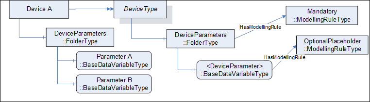  

Figure 35 - Example using OptionalPlaceholder with an Object and Variable  

The *ModellingRule* *OptionalPlaceholder* adds no additional constraints on instances of the *TypeDefinition* . It just provides useful information when exposing a *TypeDefinition* . When the *InstanceDeclaration* is complex, i.e. it references other *InstanceDeclarations* with hierarchical *References* , these *InstanceDeclarations* are not further considered for instantiating the *TypeDefinition* .  

It is recommended that the *BrowseName* and the *DisplayName* of *InstanceDeclarations* having the *OptionalPlaceholder* *ModellingRule* should ** be enclosed within angle brackets.  

When overriding the *InstanceDeclaration,* the *ModellingRule* shall remain *OptionalPlaceholder* .  

For *Methods,* the *ModellingRule* *OptionalPlaceholder* is used to define the *BrowseName* where subtypes and instances provide more information. *The Method definition with the OptionalPlaceholder only defines the BrowseName. An* instance or subtype defines the *InputArguments* and *OutputArguments* . A subtype shall also change the *ModellingRule* to *Optional* or *Mandatory* . The *Method* is optional for *instances.* For example, a Device might have a *Method* to perform calibration however the specific arguments for the *Method* depend on the instance of the Device. In this example Device A does not implement the *Method* , Device B implements the *Method* with no arguments and Device C implements the *Method* accepting a mode argument to select how the calibration is to be performed. The example is shown in [Figure 36](/§\_Ref482606898) .  

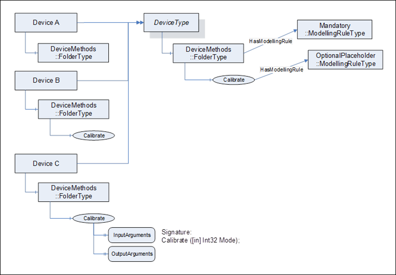  

Figure 36 - Example using OptionalPlaceholder with a Method  

###### 6.4.4.4.5 MandatoryPlaceholder  

For *Object* and *Variable* the *ModellingRule* *MandatoryPlaceholder* has a similar intention as the *ModellingRule* *OptionalPlaceholder* . It exposes the information that a *TypeDefinition* expects of instances of the *TypeDefinition* to add instances defined by the *InstanceDeclaration* . However, *MandatoryPlaceholder* requires that at least one of those instances shall exist.  

For example, when the DeviceType requires that at least one DeviceParameter shall exist without specifying the *BrowseName* for it, it uses *MandatoryPlaceholder* as shown in [Figure 37](/§\_Ref313524645) . Device A is a valid instance as it has the required DeviceParameter. Device B is not valid as it uses the wrong *ReferenceType* to reference a DeviceParameter ( *Organizes* instead of *HasComponent* ) and Device C is not valid because it does not provide a DeviceParameter at all.  

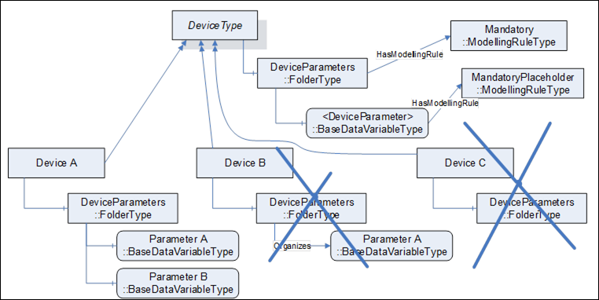  

Figure 37 - Example on using MandatoryPlaceholder for Object and Variable  

The *ModellingRule* *MandatoryPlaceholder* requires that each instance provides at least one instance with the *TypeDefinition* of the *InstanceDeclaration* or a subtype, and is referenced with the same *ReferenceType* or a subtype as the *InstanceDeclaration* . It does not require a specific *BrowseName* and thus cannot be used for the TranslateBrowsePathsToNodeIds *Service* (see [OPC 10000-4](/§UAPart4) ).  

When the *InstanceDeclaration* is complex, i.e. it references other *InstanceDeclarations* with hierarchical *References* , these *InstanceDeclarations* are not further considered for instantiating the *TypeDefinition* .  

It is recommended that the *BrowseName* and the *DisplayName* of *InstanceDeclarations* having the *MandatoryPlaceholder* *ModellingRule* should be enclosed within angle brackets.  

When overriding the *InstanceDeclaration,* the *ModellingRule* shall remain *MandatoryPlaceholder* .  

For *Methods,* the *ModellingRule* *MandatoryPlaceholder* is used to define the *BrowseName* where subtypes and instances provide more information. *The Method definition with the MandatoryPlaceholder only defines the BrowseName. An* instance or subtype defines the *InputArguments* and *OutputArguments* . A subtype shall also change the *ModellingRule* to *Mandatory* . The *Method* is mandatory for *instances.*  

### 6.5 Changing Type Definitions that are already used  

There is no behaviour specified regarding subtypes and instances when changing *ObjectTypes* and *VariableTypes* . It is *Server*\-dependent, if those changes are reflected on the subtypes and instances of the types. However, all constraints defined for subtypes and instances shall be fulfilled. For example, it is not allowed to add a *Property* using the *ModellingRule* *Mandatory* on a type if instances of this type exist without the *Property* . In that case, the *Server* either has to add the *Property* to all instances of the type or adding the *Property* on the type has to be rejected.  

## 7 Standard ReferenceTypes  

### 7.1 General  

This standard defines *ReferenceTypes* as an inherent part of the OPC UA Address Space Model. [Figure 38](/§\_Ref126660523) informally describes the hierarchy of these *ReferenceTypes* . Other parts of this series of standards may specify additional *ReferenceTypes* . The remainder of [7](/§\_Ref192918160) defines the *ReferenceTypes* . [OPC 10000-5](/§UAPart5) defines their representation in the *AddressSpace* .  

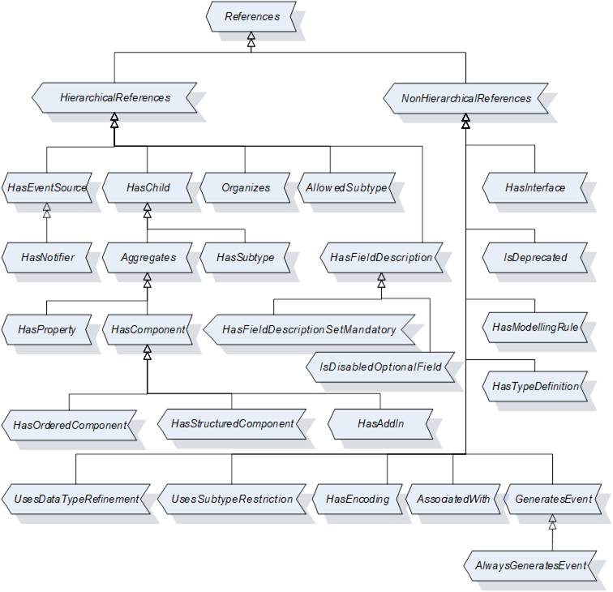  

Figure 38 - Standard ReferenceType Hierarchy  

### 7.2 References ReferenceType  

The *References ReferenceType* is an abstract *ReferenceType* ; only concrete subtypes of it shall be used as a *Reference* between *Nodes* in an OPC UA *AddressSpace* .  

There is no semantic associated with this *ReferenceType* . This is the base type of all *ReferenceTypes* . All *ReferenceTypes* shall be a subtype of this base *ReferenceType*\- either direct or indirect. The main purpose of this *ReferenceType* is allowing simple filter and queries in the corresponding *Services* of [OPC 10000-5](/§UAPart5) .  

There are no constraints defined for this abstract *ReferenceType* .  

### 7.3 HierarchicalReferences ReferenceType  

The *HierarchicalReferences* *ReferenceType* is an abstract *ReferenceType* ; only subtypes of it can be used and they shall be a non-symmetric *Reference* .  

The semantic of *HierarchicalReferences* is to denote that *References* of *HierarchicalReferences* span a hierarchy. It means that it may be useful to present *Nodes* related with *References* of this type in a hierarchical-like way. *HierarchicalReferences* does not forbid loops. For example, starting from *Node* "A" and following *HierarchicalReferences* it ** may be possible to browse to *Node* "A", again.  

It is not permitted to have a *Property* as *SourceNode* of a *Reference* of any subtype of this abstract *ReferenceType* .  

It is not allowed that the *SourceNode* and the *TargetNode* of a *Reference* of the *ReferenceType* *HierarchicalReferences* are the same, that is, it is not allowed to have self-references using *HierarchicalReferences* .  

### 7.4 NonHierarchicalReferences ReferenceType  

The *NonHierarchicalReferences* *ReferenceType* is an abstract *ReferenceType* ; only subtypes of it can be used.  

The semantic of *NonHierarchicalReferences* is to denote that its subtypes do not span a hierarchy and should not be followed when trying to present a hierarchy. To distinguish *Hierarchical* and *NonHierarchical References* , all concrete *ReferenceTypes* shall inherit from either *hierarchical References* or *Non-hierarchical References* , either direct or indirect.  

There are no constraints defined for this abstract *ReferenceType* .  

### 7.5 HasChild ReferenceType  

The *HasChild* *ReferenceType* is an abstract *ReferenceType* ; only subtypes of it can be used. It is a subtype of *HierarchicalReferences* .  

The semantic is to indicate that *References* of this type span a non-looping hierarchy.  

Starting from *Node* "A" and only following *References* of the subtypes of the *HasChild ReferenceType* it shall never be possible to return to "A". But it is allowed that following the *References* there may be more than one path leading to another *Node* "B".  

### 7.6 Aggregates ReferenceType  

The *Aggregates* *ReferenceType* is an abstract *ReferenceType* ; only subtypes of it can be used. It is a subtype of *HasChild* .  

The semantic is to indicate a part (the *TargetNode* ) belongs to the *SourceNode* . It does not specify the ownership of the *TargetNode* .  

There are no constraints defined for this abstract *ReferenceType* .  

### 7.7 HasComponent ReferenceType  

The *HasComponent ReferenceType* is a concrete *ReferenceType* that can be used directly. It is a subtype of the *Aggregates ReferenceType* .  

The semantic is a part-of relationship. The *TargetNode* of a *Reference* of the *HasComponent ReferenceType* is a part of the *SourceNode* . This *ReferenceType* is used to relate *Objects* or *ObjectTypes* with their containing *Objects* , *DataVariables* , and *Methods* . This *ReferenceType* is also used to relate complex *Variables* or *VariableTypes* with their *DataVariables* .  

Like all other *ReferenceTypes* , this *ReferenceType* does not specify anything about the ownership of the parts, although it represents a part-of relationship semantic. That is, it is not specified if the *TargetNode* of a *Reference* of the *HasComponent ReferenceType* is deleted when the *SourceNode* is deleted.  

The *TargetNode* of this *ReferenceType* shall be a *Variable* , an *Object* or a *Method* .  

If the *TargetNode* is a *Variable* , the *SourceNode* shall be an *Object* , an *ObjectType* , a *DataVariable* or a *VariableType* . By using the *HasComponent Reference* , the *Variable* is defined as *DataVariable* .  

If the *TargetNode* is an *Object* or a *Method* , the *SourceNode* shall be an *Object* or *ObjectType* .  

### 7.8 HasProperty ReferenceType  

The *HasProperty ReferenceType* is a concrete *ReferenceType* that can be used directly. It is a subtype of the *Aggregates ReferenceType* .  

The semantic is to identify the *Properties* of a *Node* . *Properties* are described in [4.5.2](/§\_Ref130228256) .  

The *SourceNode* of this *ReferenceType* can be of any *NodeClass* . The *TargetNode* shall be a *Variable* . By using the *HasProperty Reference* , the *Variable* is defined as *Property* . Since *Properties* shall not have *Properties* , a *Property* shall never be the *SourceNode* of a *HasProperty Reference* .  

### 7.9 HasOrderedComponent ReferenceType  

The *HasOrderedComponent ReferenceType* is a concrete *ReferenceType* that can be used directly. It is a subtype of the *HasComponent ReferenceType* .  

The semantic of the *HasOrderedComponent ReferenceType*\- besides the semantic of the *HasComponent ReferenceType*\- is that when browsing from a *Node* and following *References* of this type or its subtype all *References* are returned in the Browse *Service* defined in [OPC 10000-4](/§UAPart4) in a well-defined order. The order is *Server*\-specific, but the *Client* can assume that the *Server* always returns them in the same order.  

There are no additional constraints defined for this *ReferenceType* .  

### 7.10 HasSubtype ReferenceType  

The *HasSubtype* *ReferenceType* is a concrete *ReferenceType* that can be used directly. It is a subtype of the *HasChild ReferenceType* .  

The semantic of *this ReferenceType* is to express a subtype relationship of types. It is used to span the *ReferenceType* hierarchy, whose semantic is specified in [5.3.3.3](/§\_Ref126749286) ; a *DataType* hierarchy is specified in [5.8.3](/§\_Ref128219564) , and other subtype hierarchies are specified in Clause [6](/§\_Ref128887286) .  

The *SourceNode* of *References* of this type shall be an *ObjectType* , a *VariableType* , a *DataType* or a *ReferenceType* and the *TargetNode* shall be of the same *NodeClass* as the *SourceNode* . Each *ReferenceType* shall be the *TargetNode* of at most one *Reference* of type *HasSubtype* .  

### 7.11 Organizes ReferenceType  

The *Organizes ReferenceType* is a concrete *ReferenceType* and can be used directly. It is a subtype of *HierarchicalReferences* .  

The semantic of this *ReferenceType* is to organise *Nodes* in the *AddressSpace* . It can be used to span multiple hierarchies independent of any hierarchy created with the non-looping *Aggregates* *References* .  

The *SourceNode* of *References* of this type shall be an *Object* , *ObjectType* or a *View.* If it is an *Object* then it should be an *Object* of the *ObjectType* *FolderType* or one of its subtypes (see [5.5.3](/§\_Ref131474245) ).  

The *TargetNode* of this *ReferenceType* can be of any *NodeClass* .  

### 7.12 HasModellingRule ReferenceType  

The *HasModellingRule* *ReferenceType* is a concrete *ReferenceType* and can be used directly. It is a subtype of *NonHierarchicalReferences* .  

The semantic of this *ReferenceType* is to bind the *ModellingRule* to an *Object* , *Variable* or *Method* . The *ModellingRule* mechanisms are described in [6.4.4](/§\_Ref128179460) .  

The *SourceNode* of this *ReferenceType* shall be an *Object* , *Variable* or *Method* . The *TargetNode* shall be an *Object* of the *ObjectType* "ModellingRule" or one of its subtypes.  

Each *Node* shall be the *SourceNode* of at most one *HasModellingRule Reference* .  

### 7.13 HasTypeDefinition ReferenceType  

The HasTypeDefinition ReferenceType is a concrete ReferenceType and can be used directly. It is a subtype of NonHierarchicalReferences.  

The semantic of this *ReferenceType* is to bind an *Object* or *Variable* to its *ObjectType* or *VariableType* , ** respectively *.* The relationships between types and instances are described in [4.6](/§\_Ref115168300) .  

The *SourceNode* of this *ReferenceType* shall be an *Object* or *Variable* . If the *SourceNode* is an *Object* , then the *TargetNode* shall be an *ObjectType* ; if the *SourceNode* is a *Variable* , then the *TargetNode* shall be a *VariableType* .  

Each *Variable* and each *Object* shall be the *SourceNode* of exactly one *HasTypeDefinition* *Reference* .  

### 7.14 HasEncoding ReferenceType  

The *HasEncoding* *ReferenceType* is a concrete *ReferenceType* and can be used directly. It is a subtype of *NonHierarchicalReferences* .  

The semantic of this *ReferenceType* is to reference *DataTypeEncodings* of a subtype of the *Structure* *DataType* .  

The *SourceNode* of *References* of this type shall be a subtype of the *Structure* *DataType* .  

The *TargetNode* of this *ReferenceType* shall be an *Object* of the *ObjectType* *DataTypeEncodingType* or one of its subtypes (see [5.8.4](/§\_Ref131563956) ).  

### 7.15 GeneratesEvent  

The *GeneratesEvent* *ReferenceType* is a concrete *ReferenceType* and can be used directly. It is a subtype of *NonHierarchicalReferences* .  

The semantic of this *ReferenceType* is to identify the types of *Events* instances of *ObjectTypes* or *VariableTypes* may generate and *Methods* may generate on each *Method* call.  

The *SourceNode* of *References* of this type shall be an *ObjectType* , a *VariableType* or a *Method InstanceDeclaration* .  

The *TargetNode* of this *ReferenceType* shall be an *ObjectType* representing *EventTypes* , that is, the *BaseEventType* or one of its subtypes.  

### 7.16 AlwaysGeneratesEvent  

The *AlwaysGeneratesEvent* *ReferenceType* is a concrete *ReferenceType* and can be used directly. It is a subtype of *GeneratesEvent* .  

The semantic of this *ReferenceType* is to identify the types of *Events* *Methods* have to generate on each *Method* call.  

The *SourceNode* of *References* of this type shall be a *Method InstanceDeclaration* .  

The *TargetNode* of this *ReferenceType* shall be an *ObjectType* representing *EventTypes* , that is, the *BaseEventType* or one of its subtypes.  

### 7.17 HasEventSource  

The *HasEventSource* *ReferenceType* is a concrete *ReferenceType* and can be used directly. It is a subtype of *HierarchicalReferences* .  

The semantic of this *ReferenceType* is to relate event sources in a hierarchical, non-looping organization. This *ReferenceType* and any subtypes are intended to be used for discovery of *Event* generation in a *Server* . They are not required to be present for a *Server* to generate an *Event* from its source (causing the *Event* ) to its notifying *Nodes* . In particular, the root notifier of a *Server* , the *Server* *Object* defined in [OPC 10000-5](/§UAPart5) , is always capable of supplying all *Events* from a *Server* and as such has implied *HasEventSource* *References* to every event source in a *Server* .  

The *SourceNode* of this *ReferenceType* shall be an *Object or View* that is a source of *Event* *Subscriptions* . A source of *Event* *Subscriptions* is an *Object* or *View* that has its "SubscribeToEvents" bit set within the *EventNotifier* *Attribute* . The *SourceNode* may also be an *ObjectType* when referencing an *InstanceDeclaration* where an instance of the *ObjectType* containing the *InstanceDeclaration* generates events. Note the *ObjectType* is not considered a source of *Event* *Subscriptions.*  

The *TargetNode* of this *ReferenceType* can be a *Node* of any *NodeClass* that can generate event notifications via a subscription to the reference source.  

Starting from *Node* "A" and only following *References* of the *HasEventSource* *ReferenceType* or of its subtypes it shall never be possible to return to "A". But it is permitted that, following the *References* , there may be more than one path leading to another *Node* "B".  

### 7.18 HasNotifier  

The *HasNotifier* *ReferenceType* is a concrete *ReferenceType* and can be used directly. It is a subtype of *HasEventSource* .  

The semantic of this *ReferenceType* is to relate *Object* *Nodes* that are notifiers with other notifier *Object* *Nodes* . The *ReferenceType* is used to establish a hierarchical organization of event notifying *Objects* . It is a subtype of the *HasEventSource* *ReferenceType* defined in [7.16](/§\_Ref135713256) .  

The *TargetNode* of this *ReferenceType* shall be *Objects* that are a source of *Event* *Subscriptions* .  

If the *TargetNode* of a *Reference* of this type generates an *Event* , then this *Event* shall also be provided in the *SourceNode* of the *Reference* .  

An example of a possible organization of *Event* *References* is represented in [Figure 39](/§\_Ref136076337) . In this example an unfiltered *Event* subscription directed to the "Pump" *Object* will provide the *Event* sources "Start" and "Stop" to the subscriber. An unfiltered *Event* subscription directed to the "Area 1" *Object* will provide *Event* sources from "Machine B", "Tank A" and all notifier sources below "Tank A".  

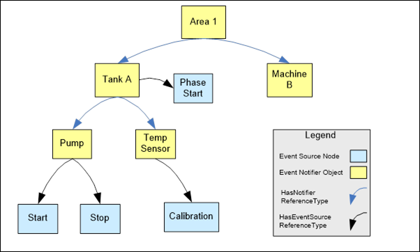  

Figure 39 - Event Reference Example  

A second example of a more complex organization of *Event* *References* is represented in [Figure 40](/§\_Ref136313494) . In this example, explicit *References* are included from the *Server* 's *Server* *Object* , which is a source of all *Server* *Events* . A second *Event* organization has been introduced to collect the *Events* related to "Tank Farm 1". An unfiltered *Event* subscription directed to the "Tank Farm 1" *Object* will provide *Event* sources from "Tank B", "Tank A" and all notifier sources below "Tank B" and "Tank A".  

  

Figure 40 - Complex Event Reference Example  

### 7.19 HasInterface ReferenceType  

The *HasInterface* *ReferenceType* is a concrete *ReferenceType* and can be used directly. It is a subtype of the *NonHierarchical ReferenceType* .  

The semantic of this *ReferenceType* is to show the availability of the *Interface* on the *SourceNode* . The *Interface* concept is described in [4.10.2](/§\_Ref529101469) .  

The *SourceNode* of this *ReferenceType* shall be an *Object* or *ObjectType* . *Interfaces* shall not be a *SourceNode* . The *TargetNode* shall be of a subtype of the *BaseInterfaceType* .  

One *SourceNode* can refer to multiple *Interfaces* .  

### 7.20 HasAddIn ReferenceType  

The *HasAddIn* *ReferenceType* is a concrete *ReferenceType* and can be used directly. It is a subtype of the *HasComponent ReferenceType* .  

The semantic of this *ReferenceType* is to bind an *AddIn* to another *Node* that is the source of this *Reference* . The *AddIn* concept is described in [4.10.3](/§\_Ref529101481) .  

The *SourceNode* of this *ReferenceType* shall be an *Object* or *ObjectType* . The *TargetNode* shall be an *Object* .  

One *SourceNode* can refer to multiple *AddIns* .  

### 7.21 IsDeprecated ReferenceType  

The *IsDeprecated* *ReferenceType* is a concrete *ReferenceType* and can be used directly. It is a subtype of the *NonHierarchicalReferences ReferenceType* .  

The semantic of this *ReferenceType* is to indicate that a *Node* has been deprecated from an information model.  

The *SourceNode* of this *ReferenceType* shall be a *Node* of any *NodeClass* . The *TargetNode* shall be an *Object which represents the information model version where the Node was first deprecated* . The *DisplayName* and *Description* of the *TargetNode* should suggest the information model version and other suggestions.  

### 7.22 HasStructuredComponent ReferenceType  

#### 7.22.1 Overview  

The *HasStructuredComponent* *ReferenceType* is a concrete *ReferenceType* and can be used directly. It is a subtype of the *HasComponent ReferenceType* .  

The semantic of this *ReferenceType* is to indicate that a *VariableType* or *Variable* also exposes its *Structure* fields or *Array* elements as *Variables* in the information model.  

The *SourceNode* of this *ReferenceType* shall be a *VariableType* or a *Variable* having a *Structure* *DataType* .  

When the *Value* of the *SourceNode* is a scalar then the *TargetNode* shall be a *Variable* which represents a ** field ** of ** the *Structure DataType.* The *BrowseName* of a *DataVariable* which is exposed shall be the same as the field name of ** the *Structure DataType* . The *NamespaceIndex* of the *BrowseName* shall be the same as the *NamespaceIndex* of the *Structure* *DataType* which first defines the field. The exposed fields shall be the same *DataType* and *ValueRank* as the field in the *Structure* . The *Value* is expected to represent the value of the *Structure's* field.  

When the *Value* of the *SourceNode* is an array then the *BrowseName* of the *TargetNode* shall be \<V[N]\> where 'V' is the BrowseName of the Parent Node and 'N' shall be the array index number. The *NamespaceIndex* of the *BrowseName* shall be the same as the *NamespaceIndex* of the *DataType* which first defines the field. For multidimensional arrays the *BrowseName* shall be \<V[M][N][…]\>. The *Value* is expected to represent the value of the array index which the *BrowseName* describes. An example of this is shown in [Figure 41](/§\_Ref58484627) . In this example 'MyStructuredVariable' has a *Structure* *DataType* with 2 fields, 'FieldX' and 'FieldY' and an array size of 2.  

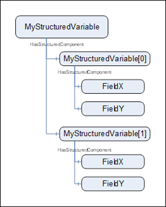  

Figure 41\- Example of using HasStructuredComponent ReferencyType  

#### 7.22.2 Differences between HasStructuredComponent and ExposesItsArray  

The *ReferenceType* *HasStructuredComponent* can be used to expose the entries of a multi-dimensional array of a *Variable* as subvariables. The same is true for the *ModellingRule* *ExposesItsArray* . However, both concepts handle this differently, as described in this section.  

Using the *HasStructuredComponent* *ReferenceType* , the *BrowseName* of the subvariable is defined and reflects the place in the array. That is, if the order in the array is changing, e.g. by deleting the first entry, the values of the correponding subvariables change, and the subvariable with the highest index is removed. When subscribing to a subvariable, the *Client* always get the value assigned to the place in the array. The same behaviour can be achieved when subscribing to the corresponding *IndexRange* on the parent *Variable* .  

Using the *ExposesItsArray* *ModellingRule* , the *BrowseName* of the subvariables are not defined and do not reflect the place in the array. That is, if the order in the array is changing, e.g. by deleting the first entry, the values of the corresponding subvariables do not change, and the subvariable containing the first entry is removed. When subscribing to a subvariable, the order of the array is not considered. Even if the order is changing, the *Client* subscribing to the subvariable will observe the original subscribed content.  

In [Figure 42](/§\_Ref66218037) , an example is given, visualizing the differences. VariableA uses *HasStructuredComponent* . When the first entry in the array is deleted, the Values of the *Variables* representing the first and second entry are changed accordingly, and the third *Variable* is deleted.  

VariableB uses *ExposesItsArray* . When the first entry in the array is deleted, the values of the *Variables* originally representing the second and third entry of the array do not change, but the *Variable* representing the first entry is deleted.  

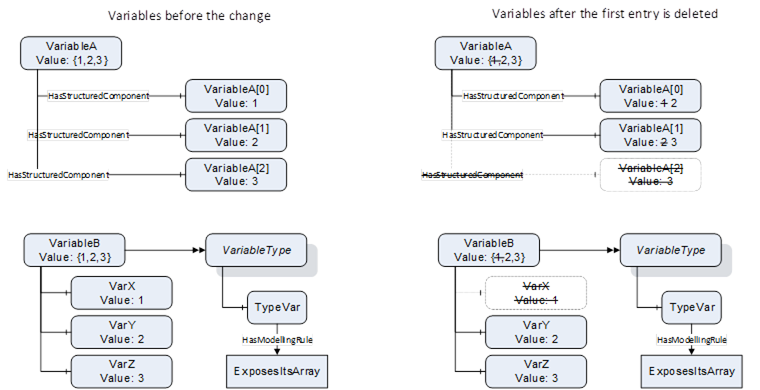  

 **Figure 42\- Difference between HasStructuredComponent and ExposesItsArray**   

### 7.23 AssociatedWith ReferenceType  

The *AssociatedWith* *ReferenceType* is a concrete *ReferenceType* that can be used directly. It is a subtype of the *NonHierarchicalReferences* *ReferenceType. The AssociatedWith* reference ** is ** symmetric ** and ** has ** no *InverseName.*  

The semantic of this *ReferenceType* is to provide some generic association between two *Objects* .  

The *SourceNode* and *TargetNode* of *References* of this type shall be *Objects.*  

### 7.24 UsesDataTypeRefinement  

The *UsesDataTypeRefinement* is a concrete *ReferenceType* and can be used directly. It is a subtype of *NonHierarchicalReferences* .  

The semantic of this *ReferenceType* is to link from a place where a *Structured DataType* is used to an *Object* of *DataTypeRefinementType SubtypeRestrictionType* (see [OPC 10000-5](/§UAPart5) ), restricting the usage of the *Structured DataType* and adding meta data.  

The *SourceNode* of *References* of this type shall be a *Variable* having a *Structured DataType* . The *Variable* shall not be used as *InstanceDeclaration* .  

Note that *Method Arguments* can be further described using *Variables* referenced with a *HasArgumentDescription* . If the *Method Argument* is a *Structured DataType* , this *Variable* can be used as *SourceNode* for the *UsesDataTypeRefinement* to further refine the *Structured DataType* .  

Each *Node* shall be the *SourceNode* of at most one *UsesDataTypeRefinement* *Reference* .  

The *TargetNode* of this *ReferenceType* shall be an *Object* of *DataTypeRefinementType* *SubtypeRestrictionType* (see [OPC 10000-5](/§UAPart5) ) or a subtype. The *DataType* of the *SourceNode* and the *DataType* refined in the *TargetNode* shall be identical, no subtypes are allowed.  

### 7.25 HasFieldDescription  

The *HasFieldDescription* is a concrete *ReferenceType* and can be used directly. It is a subtype of *HierarchicalReferences* .  

The semantic of this *ReferenceType* is to link from a *DataTypeRefinement Object* refining a *Structured* *DataType* to a *Variable* representing a field of that *Structured* *DataType* , containing additional metadata, that may potentially restrict the usage of the field.  

The *SourceNode* of *References* of this type shall be an *Object* of *DataTypeRefinementType* or a subtype.  

The *TargetNode* of this *ReferenceType* shall be a *Variable* of *BaseDataVariableType* or a subtype. The *BrowseName* of the *Variable* shall have the same name as the field of the *Structured DataType* that it refines, and the same *NamespaceIndex* as the *DataType* , where the field of the *Structure* is defined. The *DataType* of the *Variable* shall follow the rules defined in [5.8.5.2](/§\_Ref199520192) , i.e., it can only be further restricted.  

It is not allowed to reference two *Variables* with the same *BrowseName* using the *HasFieldDescription* *ReferenceType* or a subtype from the same *SourceNode* .  

### 7.26 HasFieldDescriptionSetMandatory  

The *HasFieldDescriptionSetMandatory* is a concrete *ReferenceType* and can be used directly. It is a subtype of *HasFieldDescription* .  

The semantic of this *ReferenceType* is, in addition to the semantic of its supertype, to indicate that the field shall be provided, although it is defined as optional field in the *Structured DataType* .  

This *ReferenceType* shall only be applied to fields declared as optional, i.e., fields having *IsOptional* set to true of *Structured* *DataTypes* with *StructureType* *StructureWithOptionalFields* .  

### 7.27 IsDisabledOptionalField  

The *IsDisabledOptionalField* is a concrete *ReferenceType* and can be used directly. It is a subtype of *HasFieldDescription* .  

The semantic of this *ReferenceType* is, in addition to the semantic of its supertype, to indicate that the field shall not be provided. This indicates to *Clients* , that the *Server* will never provide the optional field and that they are not allowed to write a value containing the optional field. For Unions that implies that the *DataType* of the field shall never be used in the *Union* .  

This *ReferenceType* shall only be applied to fields declared as optional, i.e., either fields having *IsOptional* set to true on *Structured* *DataTypes* where the *StructureType* is *StructureWithOptionalFields;* or fields of *Structured* *DataTypes* where the *StructureType* is *Union* or *UnionWithSubtypedValues.*  

Note: As the *ReferenceType* defines that the field shall not be provided, adding additional restrictions or meta data is not helpful and should be avoided.  

### 7.28 UsesSubtypeRestriction  

The *UsesSubtypeRestriction* is a concrete *ReferenceType* and can be used directly. It is a subtype of *NonHierarchicalReferences* .  

The semantic of this *ReferenceType* is to link from a *Variable* to an *Object* of *SubtypeRestrictionType* , restricting the usage of subtypes on values of the *Variable* .  

The *SourceNode* of *References* of this type shall be a *Variable* . The *Variable* shall not be used as *InstanceDeclaration* .  

Note, that *Method Arguments* can be further described using *Variables* referenced with a *HasArgumentDescription* . This *Variable* can be used as *SourceNode* for the *UsesSubtypeRestriction* to further restrict the *DataType* .  

Each *Node* shall be the *SourceNode* of at most one *UsesSubtypeRestriction* *Reference* .  

The *TargetNode* of this *ReferenceType* shall be an *Object* of *SubtypeRestrictionType* or a subtype. The *DataType* of the *SourceNode* and the *DataType* restricted in the *TargetNode* shall be identical.  

### 7.29 AllowedSubtype  

The *AllowedSubtype* is a concrete *ReferenceType* and can be used directly. It is a subtype of *HierarchicalReferences* .  

The semantic of this *ReferenceType* is to link from a *SubtypeRestriction Object* to a *Variable* defining one allowed subtype.  

The *SourceNode* of *References* of this type shall be an *Object* of *SubtypeRestrictionType* (see [OPC 10000-5](/§UAPart5) ) or a subtype.  

The *TargetNode* of this *ReferenceType* shall be a *Variable* of *BaseDataVariableType* or a subtype. The *DataType, ValueRank* and *ArrayDimensions* of the *Variable* shall follow the rules defined in [5.8.6](/§\_Ref199846837) .  

It is recommended that the *BrowseName* of the *Variable* describes the used *DataType* including its *ValueRank.* However, it should not use the *NamespaceIndex* of the *DataType* *NodeId* unless it is defined in the same *Namespace* .  

It is not allowed to reference two *Variables* with the same *BrowseName* using the *AllowedSubtype* *ReferenceType* or a subtype from the same *SourceNode* .  

### 7.30 HasDataTypeRefinement  

The *HasDataTypeRefinement* is a concrete *ReferenceType* and can be used directly. It is a subtype of *HasChild* .  

The semantic of this *ReferenceType* is to link from a *DataType* to a *DataTypeRefinement Object* that defines the allowed refinements of instances of a *DataType* .  

The *SourceNode* of *References* of this type shall be a *DataType* .  

The *TargetNode* of this *ReferenceType* shall be a *DataTypeRefinement Object* or a subtype.  

## 8 Standard DataTypes  

### 8.1 General  

The remainder of [8](/§\_Ref153882879) defines *DataTypes* . Their representation in the *AddressSpace* and the *DataType* hierarchy is specified in [OPC 10000-5](/§UAPart5) . Other parts of this series of standards may specify additional *DataTypes* .  

### 8.2 NodeId  

#### 8.2.1 General  

This *Built-in DataType* is composed of three elements that identify a *Node* within a *Server* . They are defined in [Table 22](/§\_Ref105731646) .  

Table 22 - NodeId Definition  

| **Name** | **Type** | **Description** |
|---|---|---|
  
| **NodeId** | **structure** ||
|---|---|---|
|NamespaceIndex|UInt16|The index for a namespace URI (see [8.2.2](/§\_Ref135813328) ).|
|IdType|Enum|The format and data type of the identifier (see [8.2.3](/§\_Ref87971654) ).|
|Identifier|\*|The identifier for a *Node* in the *AddressSpace* of an OPC UA *Server* (see [8.2.4](/§\_Ref89485609) ).|
  

  

See [OPC 10000-6](/§UAPart6) for a description of the encoding of the identifier into OPC UA Messages.  

#### 8.2.2 NamespaceIndex  

The namespace is a URI that identifies the naming authority responsible for assigning the identifier element of the *NodeId* . Naming authorities include the local *Server* , the underlying system, standards bodies and consortia. It is expected that most *Nodes* will use the URI of the *Server* or of the underlying system.  

Using a namespace URI allows multiple OPC UA *Servers* attached to the same underlying system to use the same identifier to identify the same *Object* . This enables *Clients* that connect to those *Servers* to recognise *Objects* that they have in common.  

Namespace URIs, like *Server* names, are identified by numeric values in OPC UA *Services* to permit more efficient transfer and processing (e.g. table lookups). The numeric values used to identify namespaces correspond to the index into the *NamespaceArray* . The *NamespaceArray* is a *Variable* that is part of the *Server* *Object* in the *AddressSpace* (see [OPC 10000-5](/§UAPart5) for its definition).  

The URI for the OPC UA namespace is:  

"http://opcfoundation.org/UA/"  

Its corresponding index in the namespace table is 0.  

The namespace URI is case sensitive.  

#### 8.2.3 IdType  

The IdType element identifies the type of the *NodeId* , its format and its scope. Its values are defined in [Table 23](/§\_Ref95797689) .  

Table 23 - IdType Values  

| **Name** | **Value** | **Description** |
|---|---|---|
|Numeric|0|Numeric value|
|String|1|String value|
|Guid|2|Globally Unique Identifier|
|Opaque|3|Namespace specific format|
  

  

Normally the scope of *NodeIds* is the *Server* in which they are defined. For certain types of *NodeIds* , *NodeIds* can uniquely identify a *Node* within a system, or across systems (e.g. GUIDs). System-wide and globally-unique identifiers allow *Clients* to track *Nodes* , such as work orders, as they move between OPC UA *Servers* as they progress through the system.  

Opaque identifiers are identifiers that are free-format byte strings that might or might not be human interpretable.  

String identifiers are case sensitive. That is, *Clients* shall consider them case sensitive. *Servers* are allowed to provide alternative *NodeIds* (see [5.2.2](/§\_Ref288123649) ) and using this mechanism *Servers* can handle *NodeIds* as case insensitive.  

#### 8.2.4 Identifier value  

The *Identifier* value element is used within the context of the first three elements to identify the *Node* . Its data type and format is defined by the IdType.  

*Identifier* values of IdType *String* are restricted to 4096 characters and shall not contain Unicode control characters. Unicode control characters are defined by [Unicode C0](/§UnicodeC0) and [Unicode C1](/§UnicodeC1) . *Identifier* values of IdType *Opaque* are restricted to 4096 bytes.  

A *Node* in the *AddressSpace* shall not have a null *NodeId* . However, many services defined in [OPC 10000-4](/§UAPart4) define special behaviour if a null *NodeId* is passed as a parameter.  

A canonical null *NodeId* has an *IdType* equal to *Numeric* , a *NamespaceIndex* equal to 0 and an *Identifier* equal to 0.  

In addition to the canonical null *NodeId* the alternative values defined in [Table 24](/§\_Ref139076802) shall be considered a null *NodeId* .  

Table 24 - NodeId Alternative Null Values  

| **IdType** | **NamespaceIndex** | **Null Value** |
|---|---|---|
|String|0|A null or Empty String ("")|
|Guid|0|A Guid initialised with zeros (e.g. 00000000-0000-0000-0000-000000000000)|
|Opaque|0|A null or Empty ByteString|
  

### 8.3 QualifiedName  

This *Built-in* *DataType* contains a qualified name. It is, for example, used as *BrowseName* . Its elements are defined in [Table 25](/§\_Ref124647947) . The name part of the *QualifiedName* is restricted to 512 characters and shall not contain Unicode control characters. Unicode control characters are defined by [Unicode C0](/§UnicodeC0) and [Unicode C1](/§UnicodeC1) .  

Table 25 - QualifiedName Definition  

| **Name** | **Type** | **Description** |
|---|---|---|
|QualifiedName|structure||
|NamespaceIndex|UInt16|Index that identifies the namespace that defines the name. This index is the index of that namespace in the local *Server* 's *NamespaceArray* . The *Client* may read the *NamespaceArray* *Variable* to access the string value of the namespace.|
|Name|String|The text portion of the QualifiedName.|
  

  

### 8.4 LocaleId  

This *Simple* *DataType* is specified as a string that is composed of a language component and a country/region component as specified by [RFC 5646](/§IETF5646) . The \<country/region\> component is always preceded by a hyphen. The format of the *LocaleId* string is shown below:  

\<language\>[-\<country/region\>], where  \<language\> is the two letter [ISO 639](/§ISO639) code for a language,  \<country/region\> is the two letter [ISO 3166](/§ISO3166) code for the country/region.  

The rules for constructing *LocaleIds* defined by [RFC 5646](/§IETF5646) are restricted as follows:  

1. this specification permits only zero or one \<country/region\> component to follow the \<language\> component;  

1. this specification also permits the "-CHS" and "-CHT" three-letter \<country/region\> codes for "Simplified" and "Traditional" Chinese locales;  

1. this specification also allows the use of other \<country/region\> codes as deemed necessary by the *Client* or the *Server* .  

1. This specification also allows the use of the "mul" and "qst" \<country/region\> codes for representing multiple languages and substitutable text. When using these locales, a specific format of the *String* is used. This format is defined in [8.5](/§\_Ref135813271) .  

[Table 26](/§\_Ref87759949) shows examples of OPC UA *LocaleIds* . *Clients* and *Servers* always provide *LocaleIds* that explicitly identify the language and the country/region.  

Table 26 - LocaleId Examples  

| **Locale** | **OPC UA LocaleId** |
|---|---|
|English|en|
|English (US)|en-US|
|German|de|
|German (Germany)|de-DE|
|German (Austrian)|de-AT|
  

  

An empty or null string indicates that the LocaleId is unknown.  

### 8.5 LocalizedText  

#### 8.5.1 Type Definition  

This *Built-in* *DataType* defines a structure containing a String in a locale-specific translation specified in the identifier for the locale. Its elements are defined in [Table 27](/§\_Ref127968458) .  

Table 27 - LocalizedText Definition  

| **Name** | **Type** | **Description** |
|---|---|---|
|LocalizedText|structure||
|Locale|LocaleId|The identifier for the locale (e.g. "en-US").|
|Text|String|The localized text.|
  

  

#### 8.5.2 Special locales  

##### 8.5.2.1 Type Definition  

Two special locales may be used with *LocalizedText* to support multiple languages and text substitutions. When using the special locales the content of the *Text* element shall be a JSON encoded object. The JSON *Text* element should be in the JSON minified form.  

Special locales shall never be used as a *Server's* default locale.  

##### 8.5.2.2 Multiple language locale  

The "mul" locale is used to provide multiple languages in the *Text* element. The JSON object shall include a key "t" which consists of an array of locale and text pairs with the locale being the first element of the pair array.  

An example which provides 2 languages.  

\{  

"t":[  

["de-DE", "Ich bin dein text 1,2345"],  

["en-US", "I'm your text 1.2345"]  

]  

\}  

  

##### 8.5.2.3 Substitutable text locale  

The "qst" locale is used to provide consumer substitutions of the *Text* element in a single or in multiple languages. This locale extends the "mul" locale defined in [8.5.2.2](/§\_Ref152770384) and therefore shall include a key "t" which provides the text that replacements are applied to.  

The JSON object shall also contain a key "r" which consists of an array of replacement key and replacement text pairs. These replacements shall be applied by the consumer to the "t" text strings by replacing any occurrence of the replacement key with the replacement text.  

If there is only one replacement text, and the text is encoded as a scalar the text isapplied to all languages.  

If separate languages are provided the replacement texts shall be encoded as an array. In this case the first replacement text shall be applied to the first language, the second to the second language and so on. If there are less replacement texts than languages due to an error, no replacement takes place for the remaining languages, leaving the replacement key. The last example below illustrates these rules.  

A replacement key shall be unique and shall not be a substring of another replacement key. A consumer shall ensure replaced text shall not be replaced again by any subsequent replacement operation.  

An example of a single language substitution.  

\{  

"t":[  

 ["en-US", "I'm your text @1@"]  

],  

"r":[  

["@1@", 1.2345]  

]  

\}  

  

"en-US" text after substitution  

"I'm your text 1.2345"  

  

An example which provides 2 languages with a substitution that apply to both languages.  

\{  

"t":[  

["de-DE", "Ich bin dein text @1@"],  

["en-US", "I'm your text @1@"]  

],  

"r":[  

["@1@", 1.2345]  

]  

\}  

  

"de-DE" text after substitution  

"Ich bin dein text 1,2345"  

"en-US" text after substitution  

"I'm your text 1.2345"  

  

An example which provides 2 languages with a substitution that apply to both languages and substitutions that apply to specific languages.  

\{  

"t":[  

 ["de-DE", "Dieses@2@ Ist eine @1@ Meldung: /2/ hat das Problem %d6 verursacht\!"],  

 ["en-US", "This@2@ is a @1@ Message: Problem %d6 was caused by /2/\!"]  

],  

"r":[  

 ["%d6", 1.2345],  

 ["@1@", ["gültige", "valid"]],  

 ["/2/", 42],  

 ["@2@", ["@"]]  

]  

\}  

  

"de-DE" text after substitution  

"Dieses@ Ist eine gültige Meldung: 42 hat das Problem 1,2345 verursacht\!"  

"en-US" text after substitution  

"This@2@ is a valid Message: Problem 1.2345 was caused by 42\!"  

  

  

### 8.6 Argument  

This *Structured* *DataType* defines a *Method* input or output argument specification. It is for example used in the input and output argument *Properties* for *Methods* . Its elements are described in [Table 28](/§\_Ref128132106) .  

Table 28 - Argument Definition  

| **Name** | **Type** | **Description** |
|---|---|---|
|Argument|structure||
|Name|String|The name of the argument.|
|DataType|NodeId|The *NodeId* of the *DataType* of this argument.|
|ValueRank|Int32|Indicates whether the *Datatype* is an array and how many dimensions the array has. It may have the following values: n \> 1: the *Datatype* is an array with the specified number of dimensions. OneDimension (1): The *Datatype* is an array with one dimension. OneOrMoreDimensions (0): The *Datatype* is an array with one or more dimensions. Scalar (−1): The *Datatype* is not an array. Any (−2): The *Datatype* can be a scalar or an array with any number of dimensions. ScalarOrOneDimension (−3): The *Datatype* can be a scalar or a one dimensional array. NOTE All DataTypes are considered to be scalar, even if they have array-like semantics like ByteString and String.|
|ArrayDimensions|UInt32[]|This field specifies the maximum supported length of each dimension. If the maximum is unknown the value shall be 0. The number of elements shall be equal to the value of the v *alueRank* *field* . This field shall be null if v *alueRank* ≤ 0. The maximum number of elements of an array transferred on the wire is 2147483647 (max Int32).|
|Description|LocalizedText|A localised description of the argument.|
  

  

### 8.7 BaseDataType  

This abstract *DataType* defines a value that can have any valid *DataType* .  

It defines a special value null indicating that a value is not present. This abstract DataType does not have an encoding defined in [OPC 10000-6](/§UAPart6) . Any direct subtype shall only be defined in *NamespaceIndex* 0\.  

A *BaseDataType* is an abstract *DataType* which represents any possible value including arrays of values. When an array of *BaseDataTypes* is specified each element of the array can be a scalar or array of any *DataType* .  

When a *BaseDataType* is used in conjunction with a *ValueRank* then the *ValueRank* specifies whether there is an array of *BaseDataType* values. The *ValueRank* does not restrict the content of each element.  

### 8.8 Boolean  

This *Built-in* *DataType* defines a value that is either TRUE or FALSE.  

### 8.9 Byte  

This *Built-in* *DataType* defines a value in the range of 0 to 255.  

### 8.10 ByteString  

This *Built-in* *DataType* defines a value that is a sequence of Byte values.  

### 8.11 DateTime  

This *Built-in* *DataType* defines a Gregorian calendar date. Details about this *DataType* are defined in [OPC 10000-6](/§UAPart6) .  

### 8.12 Double  

This *Built-in* *DataType* defines a value that adheres to the [ISO/IEC/IEEE 60559:2020](/§ISO60559) double precision data type definition.  

### 8.13 Duration  

This *Simple* *DataType* is a *Double* that defines an interval of time in milliseconds (fractions can be used to define sub-millisecond values). Negative values are generally invalid but may have special meanings where the *Duration* is used.  

### 8.14 Enumeration  

This abstract *DataType* is the base *DataType* for all enumeration *DataTypes* like *NodeClass* defined in [8.29](/§\_Ref130971442) . All *DataTypes* inheriting from this *DataType* have special handling for the encoding as defined in [OPC 10000-6](/§UAPart6) . All enumeration *DataTypes* shall inherit from this *DataType* .  

Some special rules apply when subtyping enumerations. Any enumeration *DataType* not directly inheriting from the *Enumeration* *DataType* can only restrict the enumeration values of its supertype. That is, it shall neither add enumeration values nor change the text associated to the enumeration value. As an example, the enumeration Days having \{'Mo', 'Tu', 'We', 'Th', 'Fr', 'Sa', 'Su'\} as values can be subtyped to the enumeration Workdays having \{'Mo', 'Tu', 'We', 'Th', 'Fr'\}. The other direction, subtyping Workdays to Days would not be allowed as Days has values not allowed by Workdays ('Sa' and 'Su').  

### 8.15 Float  

This *Built-in* *DataType* defines a value that adheres to the [ISO/IEC/IEEE 60559:2020](/§ISO60559) single precision data type definition.  

### 8.16 Guid  

This *Built-in* *DataType* defines a value that is a 128-bit Globally Unique Identifier. Details about this *DataType* are defined in [OPC 10000-6](/§UAPart6) .  

### 8.17 Sbyte  

This *Built-in* *DataType* defines a value that is a signed integer between −128 and 127 inclusive.  

### 8.18 IdType  

This *DataType* is an enumeration that identifies the IdType of a *NodeId* . Its values are defined in [Table 23](/§\_Ref95797689) . See [8.2.3](/§\_Ref87971655) for a description of the use of this *DataType* in *NodeIds* .  

### 8.19 Image  

This abstract *DataType* defines a *ByteString* representing an image.  

### 8.20 ImageBMP  

This *Simple* *DataType* defines a *ByteString* representing an image in BMP format.  

### 8.21 ImageGIF  

This *Simple* *DataType* defines a *ByteString* representing an image in GIF format.  

### 8.22 ImageJPG  

This *Simple* *DataType* defines a *ByteString* representing an image in JPG format.  

### 8.23 ImagePNG  

This *Simple* *DataType* defines a *ByteString* representing an image in PNG format.  

### 8.24 Integer  

This abstract *DataType* defines an integer whose length is defined by its subtypes. This abstract *DataType* does not have an encoding defined in [OPC 10000-6](/§UAPart6) . Any direct subtype shall only be defined in *NamespaceIndex* 0\.  

### 8.25 Int16  

This *Built-in* *DataType* defines a value that is a signed integer between −32 768 and 32 767 inclusive.  

### 8.26 Int32  

This *Built-in* *DataType* defines a value that is a signed integer between −2 147 483 648 and 2 147 483 647 inclusive.  

### 8.27 Int64  

This *Built-in* *DataType* defines a value that is a signed integer between −9 223 372 036 854 775 808 and 9 223 372 036 854 775 807 inclusive.  

### 8.28 TimeZoneDataType  

This *Structured* *DataType* defines the local time that may or may not take daylight saving time into account. Its elements are described in [Table 29](/§\_Ref361144410) .  

Table 29 - TimeZoneDataType Definition  

| **Name** | **Type** | **Description** |
|---|---|---|
|TimeZoneDataType|structure||
|Offset|Int16|The offset in minutes from UtcTime|
|DaylightSavingInOffset|Boolean|If TRUE, then daylight saving time (DST) is in effect and *offset* includes the DST correction. If FALSE then the *offset* does not include the DST correction and DST may or may not have been in effect.|
  

  

### 8.29 NodeClass  

This *DataType* is an enumeration that identifies a *NodeClass* . Its values are defined in [Table 30](/§\_Ref131332234) .  

Table 30 - NodeClass Values  

| **Name** | **Value** | **Description** |
|---|---|---|
|Unspecified|0|No value is specified.|
|Object|1|The Node is an Object.|
|Variable|2|The Node is a Variable.|
|Method|4|The Node is a Method.|
|ObjectType|8|The Node is an ObjectType.|
|VariableType|16|The Node is a VariableType.|
|ReferenceType|32|The Node is a ReferenceType.|
|DataType|64|The Node is a DataType.|
|View|128|The Node is a View.|
  

  

### 8.30 Number  

This abstract *DataType* defines a number. Details are defined by its subtypes. This abstract *DataType* does not have an encoding defined in [OPC 10000-6](/§UAPart6) . Any direct subtype shall only be defined in *NamespaceIndex* 0\.  

### 8.31 String  

This *Built-in* *DataType* defines a Unicode character string that should exclude control characters that are not whitespace characters. Unicode control characters are defined by [Unicode C0](/§UnicodeC0) and [Unicode C1](/§UnicodeC1) . Unicode whitespace characters are defined in the [Unicode Property List](/§UnicodePropertyList) .  

### 8.32 Structure  

This abstract *DataType* is the base *DataType* for all *Structured* *DataTypes* like *Argument* defined in [8.6](/§\_Ref128132235) . While abstract *Structures* may be defined with no fields a non-abstract *Structure* shall have one or more fields defined directly or from a super type. All *DataTypes* inheriting from this *DataType* have special handling for the encoding as defined in [OPC 10000-6](/§UAPart6) .  

### 8.33 UInteger  

This abstract *DataType* defines an unsigned integer whose length is defined by its subtypes. This abstract *DataType* does not have an encoding defined in [OPC 10000-6](/§UAPart6) . Any direct subtype shall only be defined in *NamespaceIndex* 0\.  

### 8.34 UInt16  

This *Built-in* *DataType* defines a value that is an unsigned integer between 0 and 65 535 inclusive.  

### 8.35 UInt32  

This *Built-in* *DataType* defines a value that is an unsigned integer between 0 and 4 294 967 295 inclusive.  

### 8.36 UInt64  

This *Built-in* *DataType* defines a value that is an unsigned integer between 0 and 18 446 744 073 709 551 615 inclusive.  

### 8.37 UtcTime  

This *simple DataType* is a *DateTime* used to define Coordinated Universal Time (UTC) values. All time values conveyed between OPC UA *Servers* and *Clients* are UTC values. *Clients* shall provide any conversions between UTC and local time.  

It should be noted that the *SourceTimestamp (see* [OPC 10000-4](/§UAPart4) *)* and *ServerTimestamp* (see [OPC 10000-4](/§UAPart4) ) may originate from different clocks that have no synchronization.  

### 8.38 XmlElement  

This *Built-in* *DataType* is used to define XML elements. [OPC 10000-6](/§UAPart6) defines details about this *DataType* .  

XML data can always be modelled as a subtype of the *Structure* *DataType* with a single *DataTypeEncoding* that represents the XML complexType that defines the XML element (it is not necessary to have access to the XML Schema to define a *DataTypeEncoding* ). For this reason a *Server* should never define *Variables* that use the *XmlElement* *DataType* unless the *Server* has no information about the XML elements that might be in the *Variable* *Value.*  

### 8.39 EnumValueType  

This *Structured* *DataType* is used to represent a human-readable representation of an Enumeration. Its elements are described in [Table 31](/§\_Ref400915477) . When this type is used in an array representing human-readable representations of an enumeration, each Value shall be unique in that array.  

Table 31 - EnumValueType Definition  

| **Name** | **Type** | **Description** |
|---|---|---|
|EnumValueType|structure||
|Value|Int64|The Integer representation of an Enumeration.|
|DisplayName|LocalizedText|A human-readable representation of the Value of the Enumeration.|
|Description|LocalizedText|A localized description of the enumeration value. This field can contain an empty string if no description is available.|
  

  

Note that the *EnumValueType* has been defined with an Int64 Value to meet a variety of usages. When it is used to define the string representation of an Enumeration *DataType* , the value range is limited to Int32, because the Enumeration *DataType* is a subtype of Int32. [OPC 10000-8](/§UAPart8) specifies other usages where the actual value might be between 8 and 64 Bit.  

### 8.40 OptionSet  

This abstract *DataType* is the base *DataType* for all *DataTypes* representing a bit mask which is larger than 64 bits or where the validity of the bits within the set are to be identified. All *OptionSet* *DataTypes* representing bit masks shall inherit from this *DataType* . Its elements are described in [Table 32](/§\_Ref380093296) .  

Table 32 - OptionSet Definition  

| **Name** | **Type** | **Description** |
|---|---|---|
|OptionSet|structure||
|Value|ByteString|Array of bytes representing the bits in the option set. The length of the *ByteString* depends on the number of bits. The number of bytes may be larger than needed for the valid bits in the case of a spare allocation.|
|ValidBits|ByteString|Array of bytes shall be the same size as value representing the valid bits in the value parameter. A *Server* shall return the *StatusCode* *BadOutOfRange* if it receives a different array size. When the *Server* returns the value to the *Client* , the *validBits* provides information of which bits in the bit mask have a meaning. If a bit is 1 then the corresponding bit in the value is used by the Server. If it is set to a 0 it should be ignored as it has no meaning. When the *Client* passes the *OptionSet* value to the *Server* , it sets the bits of validBits to 1 for each bit the *Client* expects the *Server* to apply to the value. The *Server* shall use the following logic when applying the requested change "new value = (value & validBits) | (current value & ~validBits)". A Server shall reject any attempt to write to an invalid bit. A *Server* shall return the *StatusCode* *BadOutOfRange* if it receives validBits with a bit set to 1 which it does not consider a valid bit and shall not apply any bit changes.|
  

  

The *DataType* *Nodes* representing concrete subtypes of the *OptionSet* shall have an *OptionSetValues* *Property* defined in [Table 16](/§\_Ref115513367) .  

An *OptionSet* may be subtyped, however, any subtype shall not add any fields to the *OptionSet* *Structure* . The subtype may refine the semantics for the bits which are defined by the supertype and may add additional bits if the length of the *OptionSet* is not exceeded (see next paragraph). That requires, that each entry of the *OptionSetValues* *Property* of the supertype is repeated or refined by each subtype. Refining a bit shall not invalidate the original semantic. New OptionSetValues Properties may also be added to the subtype. For example, changing a bit from "Pump is off" to "First Pump is off" is allowed, but changing it to "Motor is on" is not allowed.  

The *DataType* *Nodes* representing concrete or abstract subtypes of the *OptionSet* may have an *OptionSetLength Property* defined in [Table 16](/§\_Ref115513367) . This *Property* defines the length in bytes of the *OptionSet* . If the *Property* is not defined, the length of a concrete *OptionSet* is defined by the number of defined bits (in the *OptionSetValues Property* ) rounded up to whole bytes. For example, if there are two bits defined the length is one byte, if there are 10 bits defined, the length is two bytes. Once, the length has been defined by an *OptionSet* , subtypes shall not change the length. That is, if a supertype defines the length (either explicitly with *OptionSetLength* or implicitly by a concrete *OptionSet* with the *OptionSetValues* ) each subtype shall have the same length. If the correct length is not implicitly provided by the length of the *OptionSetValues* the subtype shall provide the *OptionSetLength* *Property* with the same value as the supertype.  

Defining the length explicitly in the *OptionSetLength* *Property* allows to reserve bits that can be used in subtypes of the *OptionSet* .  

### 8.41 Union  

This abstract *DataType* is the base *DataType* for all union *DataTypes* . The *DataType* is a subtype of *Structure DataType* . All *DataTypes* inheriting from this *DataType* have special handling for the encoding as defined in [OPC 10000-6](/§UAPart6) . All union *DataTypes* shall inherit directly from this *DataType* .  

### 8.42 DateString  

This *Simple DataType* defines a value which is a day in the Gregorian calendar in string. Lexical representation of the string shall conform to calendar date defined in [ISO 8601-1:2019](/§ISO8601) .  

NOTE: According to ISO 8601-1:2019, 'calendar date representations are in the form [YYYY-MM-DD]. [YYYY] indicates a four-digit year, 0000 through 9999. [MM] indicates a two-digit month of the year, 01 through 12. [DD] indicates a two-digit day of that month, 01 through 31. For example, "the 5 th of April 1981" may be represented as either "1981-04-05" in the extended format or "19810405" in the basic format.'  

NOTE: ISO 8601-1:2019 also allows for calendar dates to be written with reduced precision. For example, one may write "1981-04" to mean "1981 April", and one may simply write "1981" to refer to that year or "19" to refer to the century from 1900 to 1999 inclusive.  

NOTE: Although ISO 8601-1:2019 allows both the YYYY-MM-DD and YYYYMMDD formats for complete calendar date representations, if the day [DD] is omitted then only the YYYY-MM format is allowed. By disallowing dates of the form YYYYMM, ISO 8601-1:2019 avoids confusion with the truncated representation YYMMDD (still often used).  

### 8.43 DecimalString  

This *Simple DataType* defines a value that represents a decimal number as a string. Lexical representation of the string shall conform to decimal type defined in W3C XML Schema Definition Language (XSD) 1.1 Part 2: DataTypes.  

The *DecimalString* is a numeric string with an optional sign and decimal point.  

### 8.44 DurationString  

This *Simple DataType* defines a value that represents a duration of time as a string. It shall conform to duration as defined in [ISO 8601-1:2019](/§ISO8601) .  

NOTE: According to [ISO 8601-1:2019](/§ISO8601) 'Durations are represented by the format P[n]Y[n]M[n]DT[n]H[n]M[n]S or P[n]W as shown to the right. In these representations, the [n] is replaced by the value for each of the date and time elements that follow the [n]. Leading zeros are not required, but the maximum number of digits for each element should be agreed to by the communicating parties. The capital letters *P* , *Y* , *M* , *W* , *D* , *T* , *H* , *M* , and *S* are designators for each of the date and time elements and are not replaced.  

*P* is the duration designator (historically called "period") placed at the start of the duration representation.  

*Y* is the year designator that follows the value for the number of years.  

*M* is the month designator that follows the value for the number of months.  

*W* is the week designator that follows the value for the number of weeks.  

*D* is the day designator that follows the value for the number of days.  

*T* is the time designator that precedes the time components of the representation.  

*H* is the hour designator that follows the value for the number of hours.  

*M* is the minute designator that follows the value for the number of minutes.  

*S* is the second designator that follows the value for the number of seconds.  

For example, "P3Y6M4DT12H30M5S" represents a duration of "three years, six months, four days, twelve hours, thirty minutes, and five seconds". Date and time elements including their designator may be omitted if their value is zero, and lower order elements may also be omitted for reduced precision. For example, "P23DT23H" and "P4Y" are both acceptable duration representations.'  

### 8.45 NormalizedString  

This *Simple DataType* defines a string value that shall be normalized according to Unicode Annex 15, Version 7.0.0, Normalization Form C.  

NOTE: Some Unicode characters have multiple equivalent binary representations consisting of sets of combining and/or composite Unicode characters. Unicode defines a process called normalization that returns one binary representation when given any of the equivalent binary representations of a character. The Win32 and the .NET Framework currently support normalization forms C, D, KC, and KD, as defined in Annex 15 of Unicode. *NormalizedString* uses Normalization Form C for all content, because this form avoids potential interoperability problems caused by the use of canonically equivalent, yet different, character sequences in document formats.  

### 8.46 TimeString  

This *Simple* *DataType* defines a value that represents a time as a string. It shall conform to time of day as defined in [ISO 8601-1:2019](/§ISO8601) .  

NOTE: ISO 8601-1:2019 uses the 24-hour clock system. The *basic format* is [hh][mm][ss] and the *extended format* is [hh]:[mm]:[ss].  

[hh] refers to a zero-padded hour between 00 and 24 (where 24 is only used to notate midnight at the end of a calendar day).  

[mm] refers to a zero-padded minute between 00 and 59.  

[ss] refers to a zero-padded second between 00 and 60 (where 60 is only used to notate an added leap second).  

Thus a time might appear as either "134730" in the *basic format* or "13:47:30" in the *extended format* .  

It is also acceptable to omit lower order time elements for reduced accuracy: [hh]:[mm], [hh][mm] and [hh] are all used.  

Midnight is a special case and can be referred to as both "00:00" and "24:00". The notation "00:00" is used at the beginning of a calendar day and is the more frequently used. At the end of a day use "24:00"  

### 8.47 DataTypeDefinition  

This abstract DataType is the base type for all *DataTypes* used to provide the meta data for custom *DataTypes* like *Structures and Enumerations* .  

### 8.48 StructureDefinition  

This *Structured DataType* is used to provide the meta data for a custom *Structure* *DataType* . It is derived from the *DataType* *DataTypeDefinition* . The *StructureDefinition* is formally defined in [Table 33](/§\_Ref433696144) .  

Table 33 - StructureDefinition Structure  

| **Name** | **Type** | **Description** |
|---|---|---|
|StructureDefinition|Structure||
|DefaultEncodingId|NodeId|The *NodeId* of the default DataTypeEncoding for the *DataType* . If the *DataType* is only used inside nested *Structures* and is not directly contained in an *ExtensionObject* , the *DefaultEncodingId* is allowed to be null. If the *DataType* is abstract the *DefaultEncodingId* shall be null. In all other cases the *DefaultEncodingId* in the *StructureDefinition* shall be the *Default Binary* encoding for the *DataType*|
|BaseDataType|NodeId|The *NodeId* of the direct supertype of the *DataType* . This might be the abstract *Structure* or the *Union* *DataType* .|
|StructureType|StructureType|An enumeration that specifies the type of Structure defined by the *DataType* . The StructureType DataType is defined in [8.49](/§\_Ref50476465) . Only one of the fields defined for the data type is encoded into a value if the data type is a *Union* .|
|Fields|StructureField []|The list of fields that make up the data type. This definition assumes the structure has a sequential layout. The StructureField *DataType* is defined in [8.51](/§\_Ref433698626) . For *Structures* derived from another *Structure* *DataType* this list shall begin with the fields of the baseDataType followed by the fields of this *StructureDefinition* .|
  

  

  

  

### 8.49 StructureType  

This *DataType* is an enumeration that specifies type of *Structure* defined by a *StructureDefinition* . Its values are defined in [Table 34](/§\_Ref50475895) .  

Table 34 - StructureType Values  

| **Name** | **Value** | **Description** |
|---|---|---|
|Structure|0|A *Structure* without optional fields where none of the fields allow subtyping|
|StructureWithOptionalFields|1|A *Structure* with optional fields where none of the fields allow subtyping|
|Union|2|A *Union DataType* where none of the fields allow subtyping|
|StructureWithSubtypedValues|3|A Structure without optional fields where one or more of the fields allow subtyping|
|UnionWithSubtypedValues|4|A *Union DataType* where one or more of the fields allow subtyping|
  

### 8.50 EnumDefinition  

This *Structured DataType* is used to provide the metadata for a custom *Enumeration* or *OptionSet* DataType. It is derived from the *DataType* *DataTypeDefinition* . The *EnumDefinition* is formally defined in [Table 35](/§\_Ref434350708) .  

Table 35 - EnumDefinition Structure  

| **Name** | **Type** | **Description** |
|---|---|---|
|EnumDefinition|Structure||
|Fields|EnumField []|The list of fields that make up the data type. The EnumField DataType is defined in [8.52](/§\_Ref434351996) .|
  

  

### 8.51 StructureField  

This *Structured DataType* is used to provide the metadata for a field of a custom *Structure* *DataType* . The *StructureField* is formally defined in [Table 36](/§\_Ref433696154) .  

Table 36 - StructureField Structure  

| **Name** | **Type** | **Description** |
|---|---|---|
|StructureField|Structure||
|Name|String|A name for the field that is unique within the *StructureDefinition* . The name is restricted to 512 characters and shall not contain Unicode control characters.Unicode control characters are defined by [Unicode C0](/§UnicodeC0) and [Unicode C1](/§UnicodeC1) *.*|
|Description|LocalizedText|A localized description of the field|
|DataType|NodeId|The *NodeId* of the *DataType* for the field. When used by a *StructureDefinition* with a structureType of *Structure, StructureWithOptionalFields* or *Union* then the datatype shall be a concrete *DataType* , *BaseDataType* *DataType* or *Structure* *DataType* *If the structureType is StructureWithSubtypedValues* , or *UnionWithSubtypedValues* and the *isOptional* field is TRUE then the encoding of the field shall be able to transport any subtype of the *DataType* . [OPC 10000-6](/§UAPart6) provides more details of specific encodings.|
|ValueRank|Int32|The value rank for the field. It shall be Scalar (-1) or a fixed rank Array (\>=1).|
|ArrayDimensions|UInt32[]|This field specifies the maximum supported length of each dimension. If the maximum is unknown the value shall be 0. The number of elements shall be equal to the value of the v *alueRank* *field* . This field shall be null if v *alueRank* ≤ 0. The maximum number of elements of an array transferred on the wire is 2 147 483 647 (max Int32).|
|MaxStringLength|UInt32|If the dataType field is a *String* , *LocalizedText (text* field *)* or *ByteString* then this field specifies the maximum supported length in bytes. If the maximum is unknown the value shall be 0. If the dataType field is not a *String* or *ByteString* the value shall be 0. If the valueRank is greater than 0 this field applies to each element of the array.|
|IsOptional|Boolean|If the structureType is StructureWithOptionalFields this field indicates if a data type field in a *Structure* is optional. In this case a value of FALSE means the *StructureField* is always present in all occurances of the *Structure* *DataType and a value of* TRUE means the *StructureField* may be present in an occurance of the *Structure* *DataType* . If the *structureType* is *Structure* or *Union* this field shall be FALSE and shall be ignored. If the structureType is *StructureWithSubtypedValues* , or *UnionWithSubtypedValues* this field is used to indicate if the data type field allows subtyping. Subtyping is allowed when set to TRUE.|
  

  

*StructureFields* can be exposed as *DataVariables* that are children of the *Variable* that contains the *Structure* *Value* . In this case the *BrowseName* of the *DataVariable* shall be the same as the *StructureField* name and the *NamespaceIndex* of the BrowseName shall be the same as the *Structure* *DataType* *Node* *NamespaceIndex* .  

[OPC 10000-6](/§UAPart6) defines a number of *DataEncodings* which specify how to serialize *Structure* *DataTypes* . Some of these *DataEncodings* are text based and make use of *Name* field. For this reason, the *Name* should be a *String* that starts with a letter and contains only letters, digits or the underscore (\_). If a *StructureField* has a *Name* that does not meet these requirements it will be transformed using the *Name* encoding rules defined in [OPC 10000-6](/§UAPart6) into a *String* that meets the requirements. This will result in text based *DataEncodings* with *Names* that are not friendly to human readers.  

### 8.52 EnumField  

This *Structured DataType* is used to provide the metadata for a field of a custom *Enumeration* or *OptionSet* *DataType* . It is derived from the *DataType* *EnumValueType* . If used for an *OptionSet DataType,* the corresponding *Value* in the base type contains the number of the bit associated with the field. The *EnumField* is formally defined in [Table 37](/§\_Ref434351967) .  

Table 37 - EnumField Structure  

| **Name** | **Type** | **Description** |
|---|---|---|
|EnumField|Structure||
|Name|String|A name for the field that is unique within the *EnumDefinition* .|
  

  

[OPC 10000-6](/§UAPart6) defines a number of *DataEncodings* which specify how to serialize *Enumeration* *DataTypes* . Some of these *DataEncodings* are text based and make use of *Name* field. For this reason, the *Name* should be a *String* that starts with a letter and contain only letters, digits or the underscore (\_). If an *EnumField* has a *Name* that does not meet these requirements it will be transformed using the *Name* encoding rules defined in [OPC 10000-6](/§UAPart6) into a *String* that meets the requirements. This will result in text based *DataEncodings* with *Names* that are not friendly to human readers.  

### 8.53 AudioDataType  

This abstract *DataType* defines a *ByteString* representing audio data. The audio stored in the *ByteString* could be formats like WAV or MP3 or any number of other audio formats. These formats are self-describing as part of the *ByteString* and are not specified in this specification.  

### 8.54 Decimal  

This *Simple* *DataType* , which is treated as a *Built-in* *DataType* , defines a high-precision signed number. It consists of an arbitrary precision integer unscaled value and an integer scale. The scale is the inverse power of ten that is applied to the unscaled value.  

### 8.55 PermissionType  

This is a subtype of the *UInt32* *DataType* with the *OptionSetValues* *Property* defined. It is used to define the permissions of a *Node* . The *PermissionType* is formally defined in [Table 38](/§\_Ref493172527) .  

Table 38 - PermissionType Definition  

| **Name** | **Bit** | **Description** |
|---|---|---|
|Browse|0|The *Client* is allowed to see the references to and from the *Node* . This implies that the *Client* is able to Read to *Attributes* other than the *Value* or the *RolePermissions* *Attribute* . This *Permission* is valid for all *NodeClasses* .|
|ReadRolePermissions|1|The *Client* is allowed to read the *RolePermissions* *Attribute* . This *Permission* is valid for all *NodeClasses* .|
|WriteAttribute|2|The *Client* is allowed to write to *Attributes* other than the *Value* , *Historizing* or *RolePermissions* *Attribute* if the *WriteMask* indicates that the *Attribute* is writeable. This bit affects the value of a *UserWriteMask* *Attribute* . This *Permission* is valid for all *NodeClasses* .|
|WriteRolePermissions|3|The *Client* is allowed to write ** to the *RolePermissions* *Attribute* if the WriteMask indicates that the *Attribute* is writeable *.* This bit affects the value of the *UserWriteMask* *Attribute* . This *Permission* is valid for all *NodeClasses* .|
|WriteHistorizing|4|The *Client* is allowed to write to the *Historizing* *Attributes* if the *WriteMask* indicates that the *Attribute* is writeable. This bit affects the value of the *UserWriteMask* *Attribute* . This *Permission* is only valid for *Variables* .|
|Read|5|The *Client* is allowed to read the *Value* *Attribute* . This bit affects the *CurrentRead* bit of the *UserAccessLevel* *Attribute* . This *Permission* is only valid for *Variables* .|
|Write|6|The *Client* is allowed to write the *Value* *Attribute* . This bit affects the *CurrentWrite* bit of the *UserAccessLevel* *Attribute* .  This *Permission* is only valid for *Variables* .|
|ReadHistory|7|The *Client* is allowed to read the history associated with a *Node* . For *Variables* , this bit affects the *HistoryRead* bit of the *UserAccessLevel* *Attribute* . This *Permission* is only valid for *Variables* (for reading historical values), and *Objects* or *Views* (for reading historical events).|
|InsertHistory|8|The *Client* is allowed to insert the history associated with a *Node* . For *Variables* , this bit affects the *HistoryWrite* bit of the *UserAccessLevel* *Attribute* . This *Permission* is only valid for *Variables* (for inserting historical values), and *Objects* or *Views* (for inserting historical events).|
|ModifyHistory|9|The *Client* is allowed to modify the history associated with a *Node* . For *Variables* , this bit affects the *HistoryWrite* bit of the *UserAccessLevel* *Attribute* . This *Permission* is only valid for *Variables* (for modifying historical values), and *Objects* or *Views* (for modifying historical events).|
|DeleteHistory|10|The *Client* is allowed to delete the history associated with a *Node* . For *Variables* , this bit affects the *HistoryWrite* bit of the *UserAccessLevel* *Attribute* . This *Permission* is only valid for *Variables* (for deleting historical values), and *Objects* or *Views* (for deleting historical events).|
|ReceiveEvents|11|A *Client* only receives an *Event* if this bit is set on the *Node* identified by the *EventTypeId* field and on the *Node* identified by the *SourceNode* field. This *Permission* is only valid for *EventType* *Nodes* or *SourceNodes* .|
|Call|12|The *Client* is allowed to call the *Method* if this bit is set on the *Object or ObjectType Node* passed in the *Call* request and the *Method Instance* associated with that *Object or ObjectType* . This bit affects the *UserExecutable* *Attribute* when set on *Method Node* . This *Permission* is only valid for *Objects, ObjectType* or *Methods* .|
|AddReference|13|The *Client* is allowed to add references to the *Node* . This *Permission* is valid for all *NodeClasses* .|
|RemoveReference|14|The *Client* is allowed to remove references from the *Node* . This *Permission* is valid for all *NodeClasses* .|
|DeleteNode|15|The *Client* is allowed to delete the *Node* . This *Permission* is valid for all *NodeClasses* .|
|AddNode|16|The *Client* is allowed to add *Nodes* to the *Namespace* . This *Permission* is only used in the *DefaultRolePermissions* and *DefaultUserRolePermissions* *Properties* of a *NamespaceMetadata* *Object*|
|Reserved|17-31|These bits are reserved for use by OPC UA.|
  

  

### 8.56 AccessRestrictionType  

This is a subtype of the *UInt16* *DataType* with the *OptionSetValues* *Property* defined. It is used to define the access restrictions of a *Node* . The *AccessRestrictionType* is formally defined in [Table 39](/§\_Ref493239274) .  

Table 39 - AccessRestrictionType Definition  

| **Name** | **Bit** | **Description** |
|---|---|---|
|SigningRequired|0|The *Client* can only access the *Node* when using a *SecureChannel* which digitally signs all messages. This does not apply to the *Browse* permission if the *ApplyRestrictionsToBrowse* is not set.|
|EncryptionRequired|1|The *Client* can only access the *Node* when using a *SecureChannel* which encrypts all messages. This does not apply to the *Browse* permission if the *ApplyRestrictionsToBrowse* is not set.|
|SessionRequired|2|The *Client* cannot access the *Node* when using *SessionlessInvoke* *Service* invocation.|
|ApplyRestrictionsToBrowse|3|If this bit is set, the access restrictions *SigningRequired* and *EncryptionRequired* are also applied to the *Browse* permission defined in [Table 38](/§\_Ref493172527) .|
  

  

### 8.57 AccessLevelType  

This is a subtype of the *Byte* *DataType* with the *OptionSetValues* *Property* defined. It is used to indicate how the *Value* of a *Variable* can be accessed (read/write) and if it contains current and/or historic data. The *AccessLevelType* is formally defined in [Table 40](/§\_Ref494187161) .  

Table 40 - AccessLevelType Definition  

| **Name** | **Bit** | **Description** |
|---|---|---|
|CurrentRead|0|Indicates if the current value is readable. It also indicates if the current value of the *Variable* is available.(0 means not readable, 1 means readable).|
|CurrentWrite|1|Indicates if the current value is writeable. It also indicates if the current value of the *Variable* is available.(0 means not writeable, 1 means writeable).|
|HistoryRead|2|Indicates if the history of the value is readable. It also indicates if the history of the *Variable* is available via the OPC UA *Server.* (0 means not readable, 1 means readable).|
|HistoryWrite|3|Indicates if the history of the value is writeable. It also indicates if the history of the *Variable* is available via the OPC UA *Server.* (0 means not writeable, 1 means writeable).|
|SemanticChange|4|This flag is set for *Properties* that define semantic aspects of the parent *Node* of the *Property* and where the *Property* *Value* , and thus the semantic, may change during operation. (0 means is not a semantic, 1 means is a semantic).|
|StatusWrite|5|Indicates if the current *StatusCode* of the value is writeable (0 means only *StatusCode* Good is writeable, 1 means any *StatusCode* is writeable).|
|TimestampWrite|6|Indicates if the current *SourceTimestamp* is writeable (0 means only null timestamps are writeable, 1 means any timestamp value is writeable).|
|Reserved|7|Reserved for future use. Shall always be zero.|
  

  

### 8.58 AccessLevelExType  

This is a subtype of the *UInt32* *DataType* with the *OptionSetValues* *Property* defined. It is used to indicate how the *Value* of a *Variable* can be accessed (read/write), if it contains current and/or historic data and its atomicity.  

The *AccessLevelExType* *DataType* is an extended version of the *AccessLevelType* *DataType* and as such contains the 8 bits of the AccessLevelType as the first 8 bits.  

The *NonatomicRead* , and *NonatomicWrite* *Fields* represent the atomicity of a *Variable* . In general Atomicity is expected of OPC UA read and write operations. These Fields are used by systems, in particular hard-realtime controllers, which can not ensure atomicity.  

The *NoSubDataTypes* *Field* represents the ability of a *Variable* to accept derived *DataTypes* . In general *Variables* are expected to allow the defined *DataType* or any subtype of that *DataType* . This *Field* is used to indicate a *Variable* restricts the *DataType* to only what is defined, that is no subtypes are allowed.  

The *NonVolatile* *Field* represents the volatility of the *Variable* . This *Field* is used to indicate a *Server* shall ensure the *Value* of the *Variable* is persisted over a restart.  

The *Constant* *Field* represents the changeability of the *Variable* and if changes in its *Value* trigger changes to the *ConfigurationVersion* *Property* of ** the *NamespaceMetadata* *Object* for the *Namespace* of the *Variable* . When this *Field* is 0 the *Value* of the *Variable* may change at any time and *Value* changes shall not trigger changes in the *ConfigurationVersion* *Property* . When this *Field* is 1 the *Value* of the *Variable* changes infrequently (e.g. by configuration change) and each change in *Value* shall trigger changes to the *ConfigurationVersion* *Property* (and the *ConfigurationVersion* *Property* shall be provided along with the parent *NamespaceMetadata* *Object* for the *Namespace* of the *Variable* ).  

[Table 41](/§\_Ref86909785) defines the combinations of *Constant* and *NonVolatile* *Fields* and their use cases.  

Table 41 - Use Cases of Constant and NonVolatile Fields  

| **Constant** | **NonVolatile** | **Use Case** |
|---|---|---|
|0|0|Can not be assumed to be constant or non-volatile|
|0|1|Not constant and non-volatile|
|1|0|constant and volatile. The related *ConfigurationVersion* shall be changed with each *Server* restart.|
|1|1|Constant and non-volatile|
  

  

The *AccessLevelExType* is formally defined in [Table 42](/§\_Ref494187171) .  

Table 42 - AccessLevelExType Definition  

| **Name** | **Bit** | **Description** |
|---|---|---|
|CurrentRead|0|See [8.57](/§\_Ref497896703) .|
|CurrentWrite|1|See [8.57](/§\_Ref497896703) .|
|HistoryRead|2|See [8.57](/§\_Ref497896703) .|
|HistoryWrite|3|See [8.57](/§\_Ref497896703) .|
|SemanticChange|4|See [8.57](/§\_Ref497896703) .|
|StatusWrite|5|See [8.57](/§\_Ref497896703) .|
|TimestampWrite|6|See [8.57](/§\_Ref497896703) .|
|Reserved|7|See [8.57](/§\_Ref497896703) .|
|NonatomicRead|8|Indicates non-atomicity for *Read* access (0 means that atomicity is assured).|
|NonatomicWrite|9|Indicates non-atomicity for *Write* access (0 means that atomicity is assured).|
|WriteFullArrayOnly|10|Indicates if *Write* of *IndexRange* is supported (0 means *Write* of *IndexRange* is supported).|
|NoSubDataTypes|11|Indicates if the *Variable* doesn't allow its *DataType* to be subtyped (0 means the *Variable* accepts the defined *DataType* and subtypes of that *DataType* ).|
|NonVolatile|12|Indicates if the *Variable* is non-volatile (0 means it is volatile or not known to be, 1 means non-volatile).|
|Constant|13|Indicates if the *Value* of the *Variable* can be considered constant (0 means the *Value* is not constant, 1 means the *Value* is constant).|
|Reserved|14:31|Reserved for future use. Shall always be zero.|
  

  

### 8.59 EventNotifierType  

This is a subtype of the *Byte* *DataType* with the *OptionSetValues* *Property* defined. It is used to indicate if a Node can be used to subscribe to *Events* or read / write historic *Events* .  

The *EventNotifierType* is formally defined in [Table 43](/§\_Ref494188527) .  

Table 43 - EventNotifierType Definition  

| **Name** | **Bit** | **Description** |
|---|---|---|
|SubscribeToEvents|0|Indicates if it can be used to subscribe to *Events* (0 means cannot be used to subscribe to *Events* , 1 means can be used to subscribe to *Events* ).|
|Reserved|1|Reserved for future use. Shall always be zero.|
|HistoryRead|2|Indicates if the history of the *Events* is readable (0 means not readable, 1 means readable).|
|HistoryWrite|3|Indicates if the history of the *Events* is writeable (0 means not writeable, 1 means writeable).|
|Reserved|4:7|Reserved for future use. Shall always be zero.|
  

  

### 8.60 AttributeWriteMask  

This is a subtype of the *UInt32* *DataType* with the *OptionSetValues* *Property* defined. It is used to define the *Attribute* access restrictions of a *Node* . The *AttributeWriteMask* is formally defined in [Table 44](/§\_Ref494187189) .  

If a bit is set to 0, it means the *Attribute* is not writeable. If a bit is set to 1, it means it is writeable. If a *Node* does not support a specific *Attribute* , the corresponding bit has to be set to 0.  

Table 44 - Bit mask for WriteMask and UserWriteMask  

| **Field** | **Bit** | **Description** |
|---|---|---|
|AccessLevel|0|Indicates if the AccessLevel Attribute is writeable.|
|ArrayDimensions|1|Indicates if the ArrayDimensions Attribute is writeable.|
|BrowseName|2|Indicates if the BrowseName Attribute is writeable.|
|ContainsNoLoops|3|Indicates if the ContainsNoLoops Attribute is writeable.|
|DataType|4|Indicates if the DataType Attribute is writeable.|
|Description|5|Indicates if the Description Attribute is writeable.|
|DisplayName|6|Indicates if the DisplayName Attribute is writeable.|
|EventNotifier|7|Indicates if the EventNotifier Attribute is writeable.|
|Executable|8|Indicates if the Executable Attribute is writeable.|
|Historizing|9|Indicates if the Historizing Attribute is writeable.|
|InverseName|10|Indicates if the InverseName Attribute is writeable.|
|IsAbstract|11|Indicates if the IsAbstract Attribute is writeable.|
|MinimumSamplingInterval|12|Indicates if the MinimumSamplingInterval Attribute is writeable.|
|NodeClass|13|Indicates if the NodeClass Attribute is writeable.|
|NodeId|14|Indicates if the NodeId Attribute is writeable.|
|Symmetric|15|Indicates if the Symmetric Attribute is writeable.|
|UserAccessLevel|16|Indicates if the UserAccessLevel Attribute is writeable.|
|UserExecutable|17|Indicates if the UserExecutable Attribute is writeable.|
|UserWriteMask|18|Indicates if the UserWriteMask Attribute is writeable.|
|ValueRank|19|Indicates if the ValueRank Attribute is writeable.|
|WriteMask|20|Indicates if the WriteMask Attribute is writeable.|
|ValueForVariableType|21|Indicates if the *Value* *Attribute* is writeable for a *VariableType* . It does not apply for *Variables* since this is handled by the *AccessLevel* and *UserAccessLevel* *Attributes* for the *Variable* . For *Variables* this bit shall be set to 0.|
|DataTypeDefinition|22|Indicates if the DataTypeDefinition Attribute is writeable.|
|RolePermissions|23|Indicates if the RolePermissions Attribute is writeable.|
|AccessRestrictions|24|Indicates if the AccessRestrictions Attribute is writeable.|
|AccessLevelEx|25|Indicates if the AccessLevelEx Attribute is writeable.|
|Reserved|26:31|Reserved for future use. Shall always be zero.|
  

### 8.61 CurrencyUnitType  

This structured *DataType* is used to represent the currency of a *Variable Value* based on ISO 4217. Its elements are described in [Table 45](/§\_Ref35427987) .  

Table 45 - CurrencyUnitType Definition  

| **Name** | **Type** | **Description** |
|---|---|---|
|CurrencyUnitType|structure||
|NumericCode|Int16|Three-digit code numeric code assigned to each currency in ISO 4217. If unknown or not available this shall be -1.  Converting the number to a string shall always produce a 3 character string with leading zeros when necessary (e.g. the number 36 shall be presented as 036). Non-decimal currencies shall not be supported.|
|Exponent|SByte|Number of digits after the decimal separator. If unknown or not available this shall be -1. *exponent* expresses the relationship between the major currency unit and its corresponding minor currency unit. For example, USD ( [United States dollar](https://en.wikipedia.org/wiki/United\_States\_dollar) ) is equal to 100 of its minor currency unit the " [cent](https://en.wikipedia.org/wiki/Cent\_(currency)) ". So the exponent is 2 (10 to the power 2 is 100).|
|AlphabeticCode|String|Three-letter alphabetic code as defined by ISO 4217.|
|Currency|LocalizedText|Full name of currency as defined by ISO 4217.|
  

  

Examples:  

| **numericCode** | **exponent** | **alphabeticCode** | **currency** |
|---|---|---|---|
|036|2|AUD|Australian Dollar|
|978|2|EUR|Euro|
|356|2|INR|Indian Rupee|
|840|2|USD|US Dollar|
|826|2|GBP|Pound Sterling|
|392|0|JPY|Yen|
  

  

## 9 Standard EventTypes  

### 9.1 General  

The remainder of [8.61](/§\_Ref128437157) defines *EventTypes* . Their representation in the *AddressSpace* is specified in [OPC 10000-5](/§UAPart5) . Other parts of this series of standards may specify additional *EventTypes* . [Figure 43](/§\_Ref128453413) informally describes the hierarchy of these *EventTypes.*  

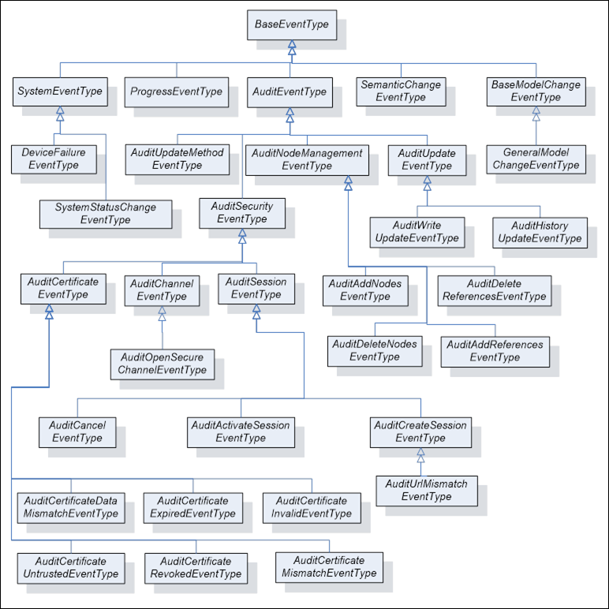  

Figure 43 - Standard EventType Hierarchy  

### 9.2 BaseEventType  

The *BaseEventType* defines all general characteristics of an *Event* . All other *EventTypes* derive from it. There is no other semantic associated with this type.  

### 9.3 SystemEventType  

*SystemEvents* are *Events* of *SystemEventType* that are generated as a result of some *Event* that occurs within the *Server* or by a system that the *Server* is representing.  

### 9.4 ProgressEventType  

*ProgressEvents* are *Events* of *ProgressEventType* that are generated to identify the progress of an operation. An operation can be a service call or something application specific like a program execution.  

### 9.5 AuditEventType  

*AuditEvents* are *Events* of *AuditEventType* that are generated as a result of an action taken on the *Server* by a *Client* of the *Server* or as a result of some vendor specific ** action. For example, in response to a *Client* issuing a write to a *Variable* , the *Server* would generate an *AuditEvent* describing the *Variable* as the source and the user and *Client* session as the initiators of the *Event* .  

[Figure 44](/§\_Ref128379440) illustrates the defined behaviour of an OPC UA *Server* in response to an auditable action request. If the action is accepted, then an action *AuditEvent* is generated and processed by the *Server* . If the action is not accepted due to security reasons, a security *AuditEvent* is generated and processed by the *Server* . The *Server* may involve the underlying device or system in the process but it is the *Server* 's responsibility to provide the *Event* to any interested *Clients* . *Clients* are free to subscribe to *Events* from the *Server* and will receive the *AuditEvents* in response to normal Publish requests.  

All action requests include a human readable *AuditEntryId* . The *AuditEntryId* is included in the *AuditEvent* to allow human readers to correlate an *Event* with the initiating action. The *AuditEntryId* typically contains who initiated the action and from where it was initiated.  

The *Server* may elect to optionally persist the *AuditEvents* in addition to the mandatory *Event* *Subscription* delivery to *Clients* .  

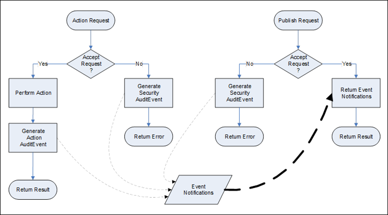  

Figure 44 - Audit Behaviour of a Server  

[Figure 45](/§\_Ref128379508) illustrates the expected behaviour of an aggregating *Server* in response to an auditable action request. This use case involves the aggregating *Server* passing on the action to one of its aggregated *Servers* . The general behaviour described above is extended by this behaviour and not replaced. That is, the request could fail and generate a security *AuditEvent* within the aggregating *Server* . The normal process is to pass the action down to an aggregated *Server* for processing. The aggregated *Server* will, in turn, follow this behaviour or the general behaviour and generate the appropriate *AuditEvents* . The aggregating *Server* periodically issues publish requests to the aggregated *Servers* . These collected *Events* are merged with self-generated *Events* and made available to subscribing *Clients* . If the aggregating *Server* supports the optional persisting of *AuditEvent* , then ** the collected *Events* are persisted along with locally-generated *Events* .  

The aggregating *Server* may map the authenticated user account making the request to one of its own accounts when passing on the request to an aggregated *Server* . It shall, however, preserve the *AuditEntryId* by passing it on as received. The aggregating *Server* may also generate its own *AuditEvent* for the request prior to passing it on to the aggregated *Server* , in particular, if the aggregating *Server* needs to break a request into multiple requests that are each directed to separate aggregated *Servers* or if part of a request is denied due to security on the aggregating *Server* .  

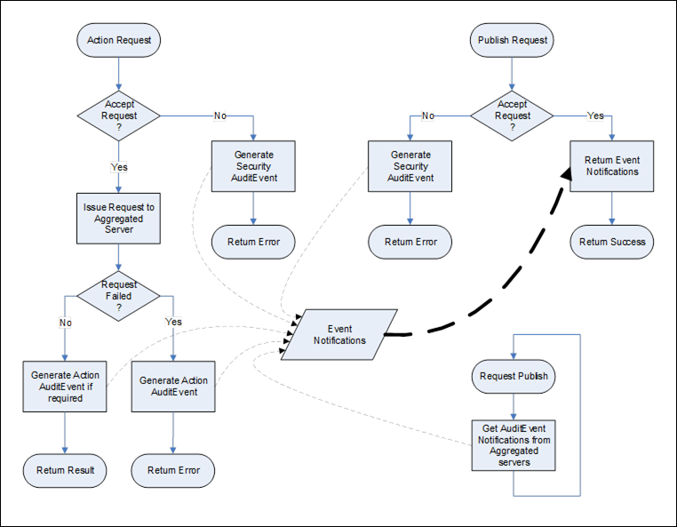  

Figure 45 - Audit Behaviour of an Aggregating Server  

### 9.6 AuditSecurityEventType  

This is a subtype of *AuditEventType* and is used only for categorization of security-related *Events* . This type follows all behaviour of its parent type.  

### 9.7 AuditChannelEventType  

This is a subtype of *AuditSecurityEventType* and is used for categorization of security-related *Events* from the *SecureChannel* *Service Set* defined in [OPC 10000-4](/§UAPart4) .  

### 9.8 AuditOpenSecureChannelEventType  

This is a subtype of *AuditChannelEventType* and is used for *Events* generated from calling the OpenSecureChannel *Service* defined in [OPC 10000-4](/§UAPart4) .  

### 9.9 AuditSessionEventType  

This is a subtype of *AuditSecurityEventType* and is used for categorization of security-related *Events* from the *Session Service Set* defined in [OPC 10000-4](/§UAPart4) .  

### 9.10 AuditCreateSessionEventType  

This is a subtype of *AuditSessionEventType* and is used for *Events* generated from calling the CreateSession *Service* defined in [OPC 10000-4](/§UAPart4) .  

### 9.11 AuditUrlMismatchEventType  

This is a subtype of *AuditCreateSessionEventType* and is used for *Events* generated from calling the CreateSession *Service* defined in [OPC 10000-4](/§UAPart4) if the EndpointUrl used in the service call does not match the *Server* 's *HostNames* (see [OPC 10000-4](/§UAPart4) for details). This *Type* has been deprecated and will be removed in a future version.  

### 9.12 AuditActivateSessionEventType  

This is a subtype of *AuditSessionEventType* and is used for *Events* generated from calling the ActivateSession *Service* defined in [OPC 10000-4](/§UAPart4) .  

### 9.13 AuditCancelEventType  

This is a subtype of *AuditSessionEventType* and is used for *Events* generated from calling the Cancel *Service* defined in [OPC 10000-4](/§UAPart4) .  

### 9.14 AuditCertificateEventType  

This is a subtype of *AuditSecurityEventType* and is used only for categorization of Certificate related *Events* . This type follows all behaviours of its parent type. These *AuditEvents* will be generated for Certificate errors in addition to other *AuditEvents* related to service calls.  

### 9.15 AuditCertificateDataMismatchEventType  

This is a subtype of *AuditCertificateEventType* and is used only for categorization of Certificate related *Events* . This type follows all behaviours of its parent type. This *AuditEvent* is generated if the HostName in the URL used to connect to the *Server* is not the same as one of the HostNames specified in the Certificate or if the Application and Software Certificates contain an application or product URI that does not match the URI specified in the ApplicationDescription provided with the Certificate. For more details on Certificates see [OPC 10000-4](/§UAPart4) .  

### 9.16 AuditCertificateExpiredEventType  

This is a subtype of *AuditCertificateEventType* and is used only for categorization of Certificate related *Events* . This type follows all behaviours of its parent type. This *AuditEvent* is generated if the current time is outside the validity period's start date and end date.  

### 9.17 AuditCertificateInvalidEventType  

This is a subtype of *AuditCertificateEventType* and is used only for categorization of Certificate related *Events* . This type follows all behaviours of its parent type. This *AuditEvent* is generated if the certificate structure is invalid or if the Certificate has an invalid signature.  

### 9.18 AuditCertificateUntrustedEventType  

This is a subtype of *AuditCertificateEventType* and is used only for categorization of Certificate related *Events* . This type follows all behaviours of its parent type. This *AuditEvent* is generated if the Certificate is not trusted, that is, if the Issuer Certificate is unknown.  

### 9.19 AuditCertificateRevokedEventType  

This is a subtype of *AuditCertificateEventType* and is used only for categorization of Certificate related *Events* . This type follows all behaviours of its parent type. This *AuditEvent* is generated if a Certificate has been revoked or if the revocation list is not available (i.e. a network interruption prevents the Application from accessing the list).  

### 9.20 AuditCertificateMismatchEventType  

This is a subtype of *AuditCertificateEventType* and is used only for categorization of Certificate related *Events* . This type follows all behaviours of its parent type. This *AuditEvent* is generated if a Certificate set of uses does not match the requested use for the Certificate (i.e. Application, Software or Certificate Authority).  

### 9.21 AuditNodeManagementEventType  

This is a subtype of *AuditEventType* and is used for categorization of node management related *Events* . This type follows all behaviours of its parent type.  

### 9.22 AuditAddNodesEventType  

This is a subtype of *AuditNodeManagementEventType* and is used for *Events* generated from calling the AddNodes *Service* defined in [OPC 10000-4](/§UAPart4) .  

### 9.23 AuditDeleteNodesEventType  

This is a subtype of *AuditNodeManagementEventType* and is used for *Events* generated from calling the DeleteNodes *Service* defined in [OPC 10000-4](/§UAPart4) .  

### 9.24 AuditAddReferencesEventType  

This is a subtype of *AuditNodeManagementEventType* and is used for *Events* generated from calling the AddReferences *Service* defined in [OPC 10000-4](/§UAPart4) .  

### 9.25 AuditDeleteReferencesEventType  

This is a subtype of *AuditNodeManagementEventType* and is used for *Events* generated from calling the DeleteReferences *Service* defined in [OPC 10000-4](/§UAPart4) .  

### 9.26 AuditUpdateEventType  

This is a subtype of *AuditEventType* and is used for categorization of update related *Events* . This type follows all behaviours of its parent type.  

### 9.27 AuditWriteUpdateEventType  

This is a subtype of *AuditUpdateEventType* and is used for categorization of write update related *Events* . This type follows all behaviours of its parent type.  

### 9.28 AuditHistoryUpdateEventType  

This is a subtype of *AuditUpdateEventType* and is used for categorization of history update related *Events* . This type follows all behaviours of its parent type.  

### 9.29 AuditUpdateMethodEventType  

This is a subtype of *AuditEventType* and is used for categorization of *Method* related *Events* . This type follows all behaviours of its parent type.  

### 9.30 DeviceFailureEventType  

A *DeviceFailureEvent* is an *Event* of *DeviceFailureEventType* that indicates a failure in a device of the underlying system.  

### 9.31 SystemStatusChangeEventType  

A *SystemStatusChangeEvent* is an *Event* of *SystemStatusChangeEventType* that indicates a status change in a system. For example, if the status indicates an underlying system is not running, then a *Client* cannot expect any *Events* from the underlying system. A *Server* can identify its own status changes using this *EventType* .  

### 9.32 ModelChangeEvents  

#### 9.32.1 General  

*ModelChangeEvents* are generated to indicate a change of the *AddressSpace* structure. The change may consist of adding or deleting a *Node* or *Reference.* Although the relationship of a *Variable* or *VariableType* to its *DataType* is not modelled using *References* , changes to the *DataType Attribute* of a *Variable* or *VariableType* are also considered as model changes and therefore a *ModelChangeEvent* is generated if the *DataType Attribute* changes.  

#### 9.32.2 NodeVersion Property  

There is a correlation between *ModelChangeEvents* and the *NodeVersion* *Property* of *Nodes* . Every time a *ModelChangeEvent* is issued for a *Node* , its *NodeVersion* shall be changed, and every time the *NodeVersion* is changed, a *ModelChangeEvent* shall be generated. A *Server* shall support both the *ModelChangeEvent* and the *NodeVersion* *Property* or neither, but never only one of the two mechanisms.  

This relation also implies that only those *Nodes* of the *AddressSpace* having a *NodeVersion* shall trigger a *ModelChangeEvent* . Other *Nodes* shall not trigger a *ModelChangeEvent* .  

#### 9.32.3 Views  

A *ModelChangeEvent* is always generated in the context of a *View,* including the default *View* where the whole *AddressSpace* is considered. Therefore the only *Notifiers* which report the *ModelChangeEvents* are *View* *Nodes* and the *Server* *Object* representing the default *View* . Each action generating a *ModelChangeEvent* may lead to several *Events* since it may affect different *Views* . If, for example, a *Node* was deleted from the *AddressSpace* , and this *Node* was also contained in a View "A", there would be one *Event* having the *AddressSpace* as context and another having the View "A" as context. If a *Node* would only be removed from *View* "A", but still exists in the *AddressSpace* , it would generate only a *ModelChangeEvent* for *View* "A".  

If a *Client* does not want to receive duplicates of changes then it shall use the filter mechanisms of the *Event* *Subscription* to filter only for the default *View* and suppress the *ModelChangeEvents* having other *Views* as the context.  

When a *ModelChangeEvent* is issued on a *View* and the *View* supports the *ViewVersion* *Property* , then the *ViewVersion* shall be updated.  

#### 9.32.4 Event compression  

An implementation is not required to issue an *Event* for every update as it occurs. An OPC UA *Server* may be capable of grouping a series of transactions or simple updates into a larger unit. This series may constitute a logical grouping or a temporal grouping of changes. A single *ModelChangeEvent* may be issued after the last change of the series, to cover all of the changes. This is referred to as *Event* *compression* . A change in the *NodeVersion* and the *ViewVersion* may thus reflect a group of changes and not a single change.  

#### 9.32.5 BaseModelChangeEventType  

*BaseModelChangeEvents* are *Events* of the *BaseModelChangeEventType* . The *BaseModelChangeEventType* is the base type for *ModelChangeEvents* and does not contain information about the changes but only indicates that changes occurred. Therefore the *Client* shall assume that any or all of the *Nodes* may have changed.  

#### 9.32.6 GeneralModelChangeEventType  

*GeneralModelChangeEvents* are *Events* of the *GeneralModelChangeEventType* . The *GeneralModelChangeEventType* is a subtype of the *BaseModelChangeEventType* . It contains information about the *Node* that was changed and the action that occurred to cause the *ModelChangeEvent* (e.g. add a *Node* , delete a *Node* , etc.). If the affected *Node* is a *Variable* or *Object* , then the *TypeDefinitionNode* is also present.  

To allow *Event* compression, a *GeneralModelChangeEvent* contains an array of changes.  

#### 9.32.7 Guidelines for ModelChangeEvents  

Two types of *ModelChangeEvents* are defined: the *BaseModelChangeEvent* that does not contain any information about the changes and the *GeneralModelChangeEvent* that identifies the changed *Nodes* via an array. The precision used depends on both the capability of the OPC UA *Server* and the nature of the update. An OPC UA *Server* may use either *ModelChangeEvent* type depending on circumstances. It may also define subtypes of these *EventTypes* adding additional information.  

To ensure interoperability, the following guidelines for *Events* should be observed.  

* If the array of the ** GeneralModelChangeEvent is present, then it should identify every Node that has changed since the preceding ModelChangeEvent.  

* The OPC UA Server should emit exactly one ModelChangeEvent for an update or series of updates. It should not issue multiple types of ModelChangeEvent for the same update.  

* Any *Client* that responds to ModelChangeEvents should respond to any Event of the BaseModelChangeEventType ** including its subtypes like the GeneralModelChangeEventType.  

If a *Client* is not capable of interpreting additional information of the subtypes of the *BaseModelChangeEventType* , it should treat *Events* of these types the same way as *Events* of the *BaseModelChangeEventType* .  

### 9.33 SemanticChangeEventType  

#### 9.33.1 General  

*SemanticChangeEvents* are *Events* of *SemanticChangeEventType* that are generated to indicate a change of the *AddressSpace* semantics. The change consists of a change to the *Value* *Attribute* of a *Property* .  

The *SemanticChangeEvent* contains information about the *Node* owning the *Property* that was changed. If this is a *Variable* or *Object* , the *TypeDefinitionNode* is also present.  

The SemanticChange bit of the *AccessLevel* *Attribute* of a *Property* indicates whether changes of the *Property* value are considered for *SemanticChangeEvents* (see [5.6.2](/§\_Ref127693446) ).  

#### 9.33.2 ViewVersion and NodeVersion Properties  

The *ViewVersion* and *NodeVersion* *Properties* do not change due to the publication of a *SemanticChangeEvent* .  

  

#### 9.33.3 Views  

*SemanticChangeEvents* are handled in the context of a *View* the same way as *ModelChangeEvents* . This is defined in [9.32.3](/§\_Ref139956333) .  

#### 9.33.4 Event compression  

*SemanticChangeEvents* can be compressed the same way as *ModelChangeEvents* . This is defined in [9.32.4](/§\_Ref139956352) .  

  

## Annex A (informative)How to use the Address Space Model  

### A.1 Overview  

Annex A points out some general considerations on how the Address Space Model can be used. Annex A is for information only, that is, each *Server* vendor can model its data in the appropriate way that fits its needs. However, it gives some hints the *Server* vendor may consider.  

Typically OPC UA *Servers* will offer data provided by an underlying system like a device, a configuration database, an OPC COM *Server* , etc. Therefore the modelling of the data depends on the model of the underlying system as well as the requirements of the *Clients* accessing the OPC UA *Server* . It is also expected that companion specifications will be developed on top of OPC UA with additional rules on how to model the data. However, the remainder of Annex A will give some general considerations about the different concepts of OPC UA to model data and when they should be used, and when not.  

[OPC 10000-5](/§UAPart5) : Annex A, provides an overview of the design decisions made when modelling the information about the *Server* defined in [OPC 10000-5](/§UAPart5) .  

### A.2 Type definitions  

Type definitions should be used whenever it is expected that the type information may be used more than once in the same system or for interoperability between different systems supporting the same type definitions.  

### A.3 ObjectTypes  

Subclause [5.5.1](/§\_Ref138653753) states: " *Objects* are used to represent systems, system components, real-world objects, and software objects." Therefore *ObjectTypes* should be used if a type definition of those *ObjectTypes* is useful (see [A.2](/§\_Ref137887688) ).  

From a more abstract point of view *Objects* are used to group *Variables* and other *Objects* in the *AddressSpace* . Therefore *ObjectTypes* should be used when some common structures/groups of *Objects* and/or *Variables* should be described. *Clients* can use this knowledge to program against the *ObjectType* structure and use the TranslateBrowsePathsToNodeIds *Service* defined in [OPC 10000-4](/§UAPart4) on the instances.  

Simple objects only having one value (e.g. a simple heat sensor) can also be modelled as *VariableTypes* . However, extensibility mechanisms should be considered (e.g. a complex heat sensor subtype could have several values) and whether that object should be exposed as an object in the *Client* 's GUI or just as a value. Whenever a modeller is in doubt as to which solution to use the *ObjectType* having one *Variable* should be preferred.  

### A.4 VariableTypes  

#### A.4.1 General  

*VariableTypes* are only used for *DataVariables* and should be used when there are several *Variables* having the same semantic (e.g. set point). It is not necessary to define a *VariableType* that only reflects the *DataType* of a *Variable* , e.g. an "Int32VariableType".  

#### A.4.2 Properties or DataVariables  

Besides the semantic differences of *Properties* and *DataVariables* described in Clause [4](/§\_Ref138653937) there are also syntactical differences. A *Property* is identified by its *BrowseName* , that is, if *Properties* having the same semantic are used several times, they should always have the same *BrowseName* . The same semantic of *DataVariables* is captured in the *VariableType* .  

If it is not clear which concept to use based on the semantic described in Clause [4](/§\_Ref138653937) , then the different syntax can help. The following points identify when it shall be a *DataVariable* .  

* If it is a complex *Variable* or it should contain additional information in the form of *Properties* .  

* If the type definition may be refined (subtyping).  

* If the type definition should be made available so the *Client* can use the AddNodes *Service* defined in [OPC 10000-4](/§UAPart4) to create new instances of the type definition.  

* If it is a component of a complex *Variable* exposing a part of the value of the complex *Variable* .  

#### A.4.3 Many Variables and / or Structured DataTypes  

When structured data structures should be made available to the *Client* there are basically three different approaches:  

1. Create several simple *Variables* using simple *DataTypes* always reflecting parts of the simple structure. *Objects* are used to group the *Variables* according to the structure of the data.  

1. Create a *Structured* *DataType* and a simple *Variable* using this *DataType* .  

1. Create a *Structured* *DataType* and a complex *Variable* using this *DataType* and also exposing the structured data structure as *Variables* of the complex *Variable* using simple *DataTypes* .  

The advantages of the first approach are that the complex structure of the data is visible in the *AddressSpace* . A generic *Client* can easily access the data without knowledge of user-defined *DataTypes* and the *Client* can access individual parts of the structured data. The disadvantages of the first approach are that accessing the individual data does not provide any transactional context and for a specific *Client* the *Server* first has to convert the data and the *Client* has to convert the data, again, to get the data structure the underlying system provides.  

The advantages of the second approach are, that the data is accessed in a transactional context and the *Structured* *DataType* can be constructed in a way that the *Server* does not have to convert the data and can pass directly to the specific *Client* that can directly use them. The disadvantages are that the generic *Client* might not be able to access and interpret the data or has at least the burden to read the *DataTypeDefinition* to interpret the data. The structure of the data is not visible in the *AddressSpace* ; additional *Properties* describing the data structure cannot be added to the adequate places since they do not exist in the *AddressSpace* . Individual parts of the data cannot be read without accessing the whole data structure.  

The third approach combines the other two approaches. Therefore a specific *Client* can access data in its native format in a transactional context, whereas a generic *Client* can access simple *DataTypes* of the components of the complex *Variable* . The disadvantage is that the *Server* must be able to provide the native format and also interpret it to be able to provide the information in simple *DataTypes* .  

It is recommended to use the first approach. When a transactional context is needed or the *Client* should be able to get a large amount of data instead of subscribing to several individual values, then the third approach is suitable. However, the *Server* might not always have the knowledge to interpret the structured data of the underlying system and therefore has to use the second approach just passing the data to the specific *Client* who is able to interpret the data.  

### A.5 Views  

*Server*\-defined *Views* can be used to present an excerpt of the *AddressSpace* suitable for a special class of *Clients* , for example maintenance *Clients* , engineering *Clients* , etc. The *View* only provides the information needed for the purpose of the *Client* and hides unnecessary information.  

### A.6 Methods  

*Methods* should be used whenever some input is expected and the *Server* delivers a result. One should avoid using *Variables* to write the input values and other *Variables* to get the output results as it was necessary to do in OPC COM since there was no concept of a *Method* available. However, a simple OPC COM wrapper might not be able to do this.  

*Methods* can also be used to trigger some execution in the *Server* that does not require input and / or output parameters.  

Global *Methods* , that is, *Methods* that cannot directly be assigned to a special *Object* , should be assigned to the *Server* *Object* defined in [OPC 10000-5](/§UAPart5) .  

### A.7 Defining ReferenceTypes  

Defining new *ReferenceTypes* should only be done if the predefined *ReferenceTypes* are not suitable. Whenever a new *ReferenceType* is defined, the most appropriate *ReferenceType* should be used as its supertype.  

It is expected that *Servers* will have new defined hierarchical *ReferenceTypes* to expose different hierarchies, and new Nonhierarchical *ReferenceTypes* to expose relationships between *Nodes* in the *AddressSpace* .  

### A.8 Defining ModellingRules  

New *ModellingRules* have to be defined if the predefined *ModellingRules* are not appropriate for the model exposed by the *Server* .  

Depending on the model used by the underlying system the *Server* may need to define new *ModellingRules* , since the OPC UA *Server* may only pass the data to the underlying system and this system may use its own internal rules for instantiation, subtyping, etc.  

Beside this, the predefined *ModellingRules* might not be sufficient to specify the required behaviour for instantiation and subtyping.  

## Annex B (informative)OPC UA Meta Model in UML  

### B.1 Background  

The OPC UA Meta Model (the OPC UA Address Space Model) is represented by UML classes and UML objects marked with the stereotype \<\<TypeExtension\>\>. Those stereotyped UML objects represent *DataTypes* or *ReferenceTypes* . The domain model can contain user-defined *ReferenceTypes* and *DataTypes* , also marked as \<\<TypeExtension\>\>. In addition, the domain model contains *ObjectTypes* , *VariableTypes* etc. represented as UML objects (see [Figure B.1](/§\_Ref103570798) ).  

The OPC Foundation specifies not only the OPC UA Meta Model, but also defines some *Nodes* to organise the *AddressSpace* and to provide information about the *Server* as specified in [OPC 10000-5](/§UAPart5) .  

  

Figure B. 1 - Background of OPC UA Meta Model  

### B.2 Notation  

An example of a UML class representing the OPC UA concept *Base* is given in the UML class diagram in [Figure B.2](/§\_Ref205601044) . OPC Attributes inherit from the abstract class Attribute and have a value identifying their data type. They are composed of a *Node* which is either optional (0..1) or required (1), such as *BrowseName* to *Base* in [Figure B.2](/§\_Ref205601044) .  

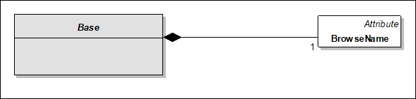  

Figure B. 2 - Notation (I)  

UML object diagrams are used to display \<\<TypeExtension\>\> objects (e.g. *HasComponent* in [Figure B.3](/§\_Ref120337857) ). In object diagrams, OPC *Attributes* are represented as UML attributes without data types and marked with the stereotype \<\<Attribute\>\>, like *InverseName* in the UML object *HasComponent* . They have values, like *InverseName* *=ComponentOf* for *HasComponent* . To keep the object diagrams simple, not all *Attributes* are shown (e.g. the *NodeId* of *HasComponent* ).  

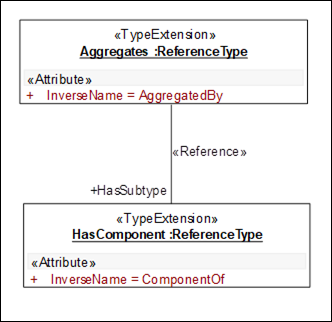  

Figure B. 3 - Notation (II)  

OPC *References* are represented as UML associations marked with the stereotype \<\<Reference\>\>. If a particular *ReferenceType* is used, its name is used as the role name, identifying the direction of the *Reference* (e.g. *Aggregates* has the subtype *HasComponent* ). For simplicity, the inverse role name is not shown (in the example *SubtypeOf* ). When no role name is provided, it means that any *ReferenceType* can be used (only valid for class diagrams).  

There are some special *Attributes* in OPC UA containing a *NodeId* and thereby referencing another *Node* . Those *Attributes* are represented as associations marked with the stereotype \<\<Attribute\>\>. The name of the *Attribute* is displayed as the role name of the *TargetNode* .  

The value of the OPC *Attribute* *BrowseName* is represented by the UML object name, for example the *BrowseName* of the UML object *HasComponent* in [Figure B.3](/§\_Ref120337857) is "HasComponent".  

To highlight the classes explained in a class diagram, they are marked in grey (e.g. *Base* in [Figure B.2](/§\_Ref205601044) ). Only those classes have all of their relationships to other classes and attributes shown in the diagram. For the other classes, we provide only those attributes and relationships needed to understand the main classes of the diagram.  

### B.3 Meta Model  

NOTE: Other parts of this series of standards can extend the OPC UA Meta Model by adding *Attributes* and defining new *ReferenceTypes* . The figures in the following clauses are not intended to be complete and therefore may not include all referenced Nodes defined in this and other parts.  

#### B.3.1 Base  

Base is shown in [Figure B.4](/§\_Ref389585424) .  

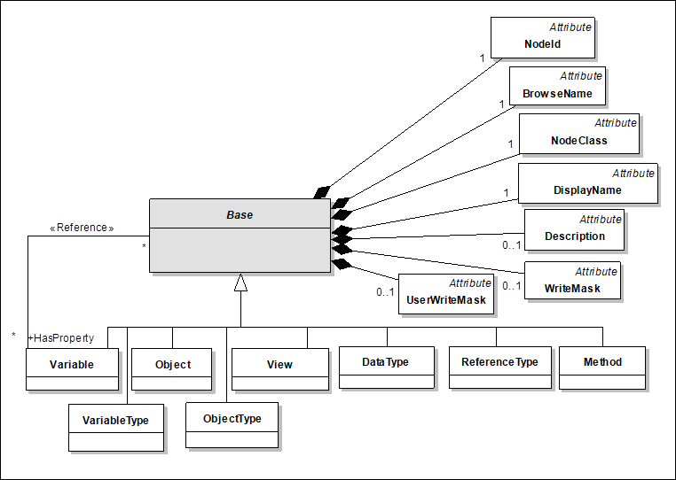  

Figure B. 4 - Base  

#### B.3.2 ReferenceType  

*ReferenceType* is shown in [Figure B.5](/§\_Ref389585536) and predefined *ReferenceTypes* in [Figure B.6](/§\_Ref389585583) .  

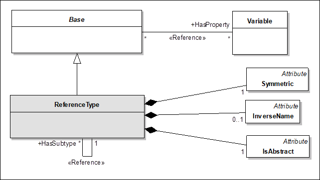  

Figure B. 5 - Reference and ReferenceType  

If *Symmetric* is "false" an *InverseName* shall be provided.  

 !Predefined ReferenceTypes 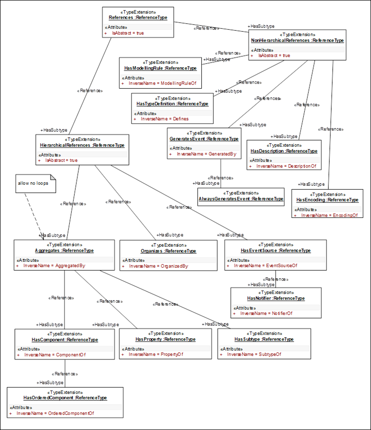  

Figure B. 6 - Predefined ReferenceTypes  

#### B.3.3 Attributes  

Attributes are shown in [Figure B.7](/§\_Ref389585633) .  

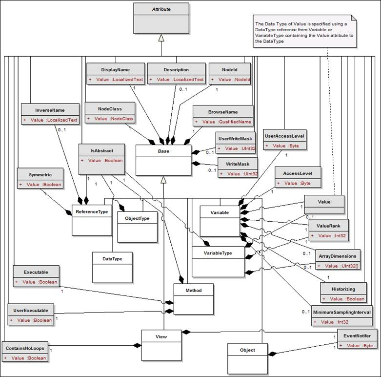  

Figure B. 7 - Attributes  

There may be more *Attributes* defined in other parts of this series of standards.  

*Attributes* used for references, which have a *NodeId* as *DataType* , are not shown in this diagram but are shown as stereotyped associations in the other diagrams.  

#### B.3.4 Object and ObjectType  

*Objects* and *ObjectTypes* are shown in [Figure B.8](/§\_Ref389585665) .  

  

Figure B. 8 - Object and ObjectType  

#### B.3.5 EventNotifier  

*EventNotifier* are shown in [Figure B.9](/§\_Ref389585697) .  

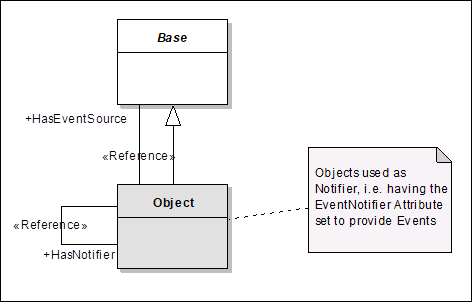  

Figure B. 9 - EventNotifier  

#### B.3.6 Variable and VariableType  

Variable and VariableType are shown in [Figure B.10](/§\_Ref389585719) .  

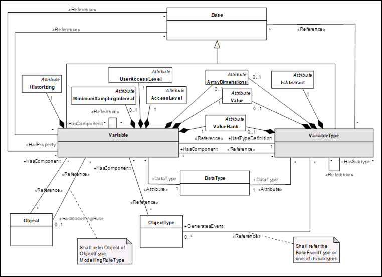  

Figure B. 10 - Variable and VariableType  

The *DataType* of a *Variable* shall be the same as or a subtype of the *DataType* of its *VariableType* (referred with *HasTypeDefinition* ).  

If a *HasProperty* points to a *Variable* from a *Base* "A" then the following constraints apply:  

* The Variable shall not be the SourceNode of a HasProperty or any other HierarchicalReferences Reference.  

* All *Variables* having "A" as the *SourceNode* of a *HasProperty* *Reference* shall have a unique *BrowseName* in the context of "A".  

#### B.3.7 Method  

Method is shown in [Figure B.11](/§\_Ref389585757) .  

  

Figure B. 11 - Method  

#### B.3.8 DataType  

DataType is shown in [Figure B.12](/§\_Ref389585790) .  

  

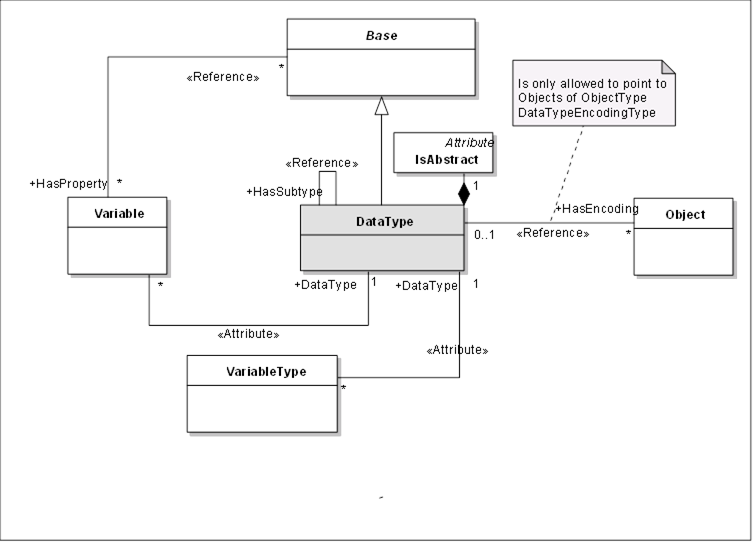  

Figure B. 12 - DataType  

#### B.3.9 View  

View is shown in [Figure B.13](/§\_Ref389585807) .  

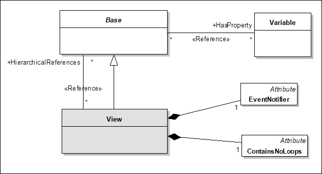  

Figure B. 13 - View  

## Annex C (normative)Graphical notation  

### C.1 General  

[Annex C](/§\_Ref47431658) defines a graphical notation for OPC UA data. [Annex C](/§\_Ref47431677) is normative, that is, the notation is used in this document to expose examples of OPC UA data. However, it is not required to use this notation to expose OPC UA data.  

The graphical notation is able to expose all structural data of OPC UA. *Nodes* , their *Attributes* including their current value and *References* between the *Nodes* including the *ReferenceType* can be exposed. The graphical notation provides no mechanism to expose events or historical data.  

### C.2 Notation  

#### C.2.1 Overview  

The notation is divided into two parts. The simple notation only provides a simplified view on the data hiding some details like *Attributes* . The extended notation allows exposing all structure information of OPC UA, including *Attribute* values. The simple and the extended notation can be combined to expose OPC UA data in one figure.  

Common to both notations is that neither any colour nor the thickness or style of lines is relevant for the notation. Those effects can be used to highlight certain aspects of a figure.  

#### C.2.2 Simple notation  

Depending on their *NodeClass* *Nodes* are represented by different graphical forms as defined in [Table C.1](/§\_Ref205601224) .  

Table C. 1 - Notation of Nodes depending on the NodeClass  

| **NodeClass** | **Graphical Representation** | **Comment** |
|---|---|---|
|Object||Rectangle including text representing the string-part of the *DisplayName* of the *Object* . The font shall not be set to italic.|
|ObjectType|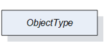|Shadowed rectangle including text representing the string-part of the *DisplayName* of the *ObjectType* . The font shall be set in italic.|
|Variable|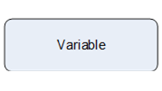|Rectangle with rounded corners including text representing the string-part of the *DisplayName* of the *Variable* . The font shall not be set in italic.|
|VariableType|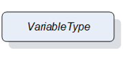|Shadowed rectangle with rounded corners including text representing the string-part of the *DisplayName* of the *VariableType* . The font shall be set in italic.|
|DataType|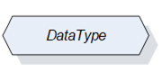|Shadowed hexagon including text representing the string-part of the *DisplayName* of the *DataType* . The font shall be set in italic.|
|ReferenceType||Shadowed six-sided polygon including text representing the string-part of the *DisplayName* of the *ReferenceType* . The font shall be set in italic.|
|Method|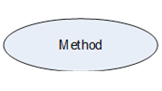|Oval including text representing the string-part of the *DisplayName* of the *Method* . The font shall not be set to italic.|
|View||Trapezium including text representing the string-part of the *DisplayName* of the *View* . The font shall not be set to italic.|
  

  

*References* are represented as lines between *Nodes* as exemplified in [Figure C.1](/§\_Ref246082533) . Those lines can vary in their form. They do not have to connect the *Nodes* with a straight line; they can have angles, arches, etc.  

  

Figure C. 1 - Example of a Reference connecting two Nodes  

[Table C.2](/§\_Ref205602357) defines how symmetric and asymmetric *References* are represented in general, and also defines shortcuts for some *ReferenceTypes* . Although it is recommended to use those shortcuts, it is not required. Thus, instead of using the shortcut, the generic solution can also be used.  

Table C. 2 - Simple Notation of Nodes depending on the NodeClass  

| **ReferenceType** | **Graphical Representation** | **Comment** |
|---|---|---|
|Any symmetric ReferenceType|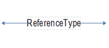|Symmetric *ReferenceTypes* are represented as lines between *Nodes* with closed and filled arrows on both sides pointing to the connected *Nodes* . Near the line has to be a text containing the string-part of the *BrowseName* of the *ReferenceType* .|
|Any asymmetric ReferenceType|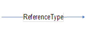|Asymmetric *ReferenceTypes* are represented as lines between *Nodes* with a closed and filled arrow on the side pointing to the *TargetNode* . Near the line has to be a text containing the string-part of the *BrowseName* of the *ReferenceType* .|
  
|Any hierarchical ReferenceType| **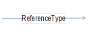** |Asymmetric *ReferenceTypes* that are subtypes of *HierarchicalReferences* should be exposed the same way as asymmetric *ReferenceTypes* except that an open arrow is used.|
|---|---|---|
|HasComponent||The notation provides a shortcut for *HasComponent* *References* shown on the left. The single hashed line has to be near the *TargetNode* .|
|HasProperty||The notation provides a shortcut for *HasProperty* *References* shown on the left. The double hashed lines have to be near the *TargetNode* .|
|HasTypeDefinition||The notation provides a shortcut for *HasTypeDefinition* *References* shown on the left. The double closed and filled arrows have to point to the *TargetNode* .|
|HasSubtype||The notation provides a shortcut for *HasSubtype* *References* shown on the left. The double closed arrows have to point to the *SourceNode* .|
|HasEventSource||The notation provides a shortcut for *HasEventSource* *References* shown on the left. The closed arrow has to point to the *TargetNode* .|
|HasInterface||The notation provides a shortcut for the HasInterface References shown on the left. The closed arrow shall point to the TargetNode.|
  

  

#### C.2.3 Extended notation  

In the extended notation some additional concepts are introduced. It is allowed only to use some of those concepts on elements of a figure.  

The following rules define some special handling of structures.  

* In general, values of all *DataTypes* should be represented by an appropriate string representation. Whenever a *NamespaceIndex* or *LocaleId* is used in those structures they can be omitted.  

* The *DisplayName* contains a *LocaleId* and a *String* . Such a structure can be exposed as [\<LocaleId\>:]\<String\> where the *LocaleId* is optional. For example, a *DisplayName* can be "en:MyName". Instead of that, "MyName" can also be used. This rule applies whenever a *DisplayName* is shown, including the text used in the graphical representation of a *Node* .  

* The *BrowseName* contains the *NamespaceIndex* and a *String* . Such a structure can be exposed as [\<NamespaceIndex\>:]\<String\> where the *NamespaceIndex* is optional. For example, a *BrowseName* can be "1:MyName". Instead of that, "MyName" can also be used. This rule applies whenever a *BrowseName* is shown, including the text used in the graphical representation of a *Node* .  

Instead of using the *HasTypeDefinition* reference to point from an *Object* or *Variable* to its *ObjectType* or *VariableType* the name of the *TypeDefinition* can be added to the text used in the *Node* . The *TypeDefinition* shall either be prefixed with "::" or it is put in italic as the top line. [Figure C.2](/§\_Ref205601252) gives an example, where "Node1" uses a *Reference* and "Node2" the shortcut in both notation variants. A figure can contain *HasTypeDefinition* *References* for some *Nodes* and the shortcut for other *Nodes* . It is not allowed that a *Node* uses the shortcut and additionally is the *SourceNode* of a *HasTypeDefinition* .  

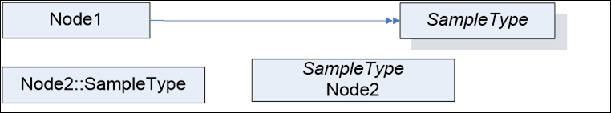  

Figure C. 2 - Example of using a TypeDefinition inside a Node  

To display *Attributes* of a *Node* additional text can be put inside the form representing the *Node* under the text representing the *DisplayName* . The *DisplayName* and the text describing the *Attributes* have to be separated using a horizontal line. Each *Attribute* has to be set into a new text line. Each text line shall contain the *Attribute* name followed by an "=" and the value of the *Attribute* . On top of the first text line containing an *Attribute* shall be a text line containing the underlined text "Attribute". It is not required to expose all *Attributes* of a *Node* . It is allowed to show only a subset of *Attributes* . If an optional *Attribute* is not provided, the *Attribute* can be marked by a strike-through line, for example "Description". Examples of exposing *Attributes* are shown in [Figure C.3](/§\_Ref205601271) .  

  

Figure C. 3 - Example of exposing Attributes  

To avoid too many *Nodes* in a figure it is allowed to expose *Properties* inside a *Node* , similar to *Attributes* . Therefore, the text field used for exposing *Attributes* is extended. Under the last text line containing an *Attribute* a new text line containing the underlined text "Property" has to be added. If no *Attribute* is provided, the text has to start with this text line. After this text line, each new text line shall contain a *Property* , starting with the *BrowseName* of the *Property* followed by "=" and the value of the *Value* *Attribute* of the *Property* . [Figure C.4](/§\_Ref205601301) shows some examples exposing *Properties* inline. It is allowed to expose some *Properties* of a *Node* inline, and other *Properties* as *Nodes* . It is not allowed to show a *Property* inline as well as an additional *Node* .  

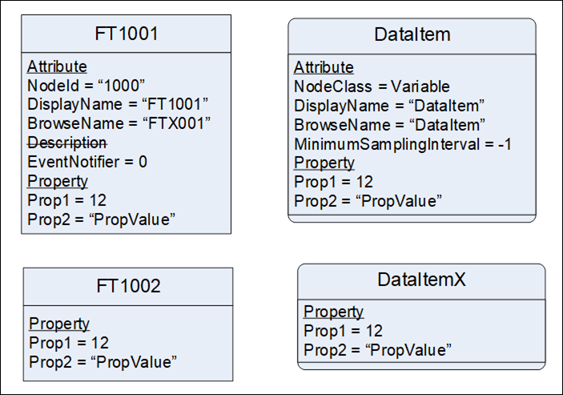  

Figure C. 4 - Example of exposing Properties inline  

Adding additional information to a figure using the graphical representation, for example callouts, is permitted.  

[Table C.3](/§\_Ref36471433) defines how cardinality of Components with modelling rule are indicated on References.  

Table C. 3 - Extended Notation of Reference Cardinality  

| **Representation** | **Cardinality** | **Modelling Rule** | **Example** |
|---|---|---|---|
||Not Specified|Not Specified||
|1|Exactly 1|Mandatory||
|0\..1|Zero or 1|Optional||
|0\..n|Zero to Many|OptionalPlaceholder||
|1\..n|One to Many|MandatoryPlaceholder||
|x|Exactly x where x is greater than 1|MandatoryPlaceholder||
|0\..y|Minimum of 0 to a maximum of y|OptionalPlaceholder||
|x..y|Minimum of x to a maximum of y where x and y are greater than 0 and y is greater than x|MandatoryPlaceholder||
  

  

Bibliography  

[GH95] Erich Gamma, Richard Helm, Ralph Johnson, John Vlissides, Design Patterns - Elements of Reusable Object-Oriented Software, Addison-Wesley 1995  

[https://www.oreilly.com/library/view/design-patterns-elements/0201633612/](https://www.oreilly.com/library/view/design-patterns-elements/0201633612/)  

  

[FF04] Eric Freeman, Elisabeth Freeman, Kathy Sierra, Bert Bates, Head First Design Patterns, O'Reilly, 2004  

[https://www.oreilly.com/library/view/head-first-design/0596007124/](https://www.oreilly.com/library/view/head-first-design/0596007124/)  

  

\_\_\_\_\_\_\_\_\_\_\_\_\_\_  

