## 1 Scope  

This part of OPC 10000 defines the OPC Unified Architecture (OPC UA) *Services* . The *Services* defined are the collection of abstract Remote Procedure Calls (RPC) that are implemented by OPC UA *Servers* and called by OPC UA *Clients* . All interactions between OPC UA *Clients* and *Servers* occur via these *Services* . The defined *Services* are considered abstract because no particular RPC mechanism for implementation is defined in this document. [OPC 10000-6](/§UAPart6) specifies one or more concrete mappings supported for implementation. For example, one mapping in [OPC 10000-6](/§UAPart6) is to UA-TCP UA-SC UA-Binary. In that case the *Services* described in this document appear as OPC UA Binary encoded payload, secured with OPC UA Secure Conversation and transported via OPC UA TCP.  

Not all OPC UA *Servers* will need to implement all of the defined *Services* . [OPC 10000-7](/§UAPart7) defines the *Profiles* that dictate which Services need to be implemented in order to be compliant with a particular *Profile* .  

## 2 Normative references  

The following documents, in whole or in part, are normatively referenced in this document and are indispensable for its application. For dated references, only the edition cited applies. For undated references, the latest edition of the referenced document (including any amendments and errata) applies.  

OPC 10000-1: *OPC Unified Architecture - Part 1: Overview and Concepts*  

http://www.opcfoundation.org/UA/Part1/  

OPC 10000-2: *OPC Unified Architecture - Part 2: Security Model*  

http://www.opcfoundation.org/UA/Part2/  

OPC 10000-3: *OPC Unified Architecture - Part 3: Address Space Model*  

http://www.opcfoundation.org/UA/Part3/  

OPC 10000-5: *OPC Unified Architecture - Part 5: Information Model*  

http://www.opcfoundation.org/UA/Part5/  

OPC 10000-6: *OPC Unified Architecture - Part 6: Mappings*  

http://www.opcfoundation.org/UA/Part6/  

OPC 10000-7: *OPC Unified Architecture - Part 7: Profiles*  

http://www.opcfoundation.org/UA/Part7/  

OPC 10000-8: *OPC Unified Architecture - Part 8: Data Access*  

http://www.opcfoundation.org/UA/Part8/  

OPC 10000-9: *OPC Unified Architecture - Part 9: Alarms and Conditions*  

http://www.opcfoundation.org/UA/Part9/  

OPC 10000-11: *OPC Unified Architecture - Part 11: Historical Access*  

http://www.opcfoundation.org/UA/Part11/  

OPC 10000-12: *OPC Unified Architecture - Part 12: Discovery*  

http://www.opcfoundation.org/UA/Part12/  

OPC 10000-13: *OPC Unified Architecture - Part 13: Aggregates*  

http://www.opcfoundation.org/UA/Part13/  

OPC 10000-18: *OPC Unified Architecture - Part 18: Role-Based Security*  

http://www.opcfoundation.org/UA/Part18/  

## 3 Terms, definitions, abbreviated terms and conventions  

### 3.1 Terms and definitions  

For the purposes of this document, the terms and definitions given in [OPC 10000-1](/§UAPart1) , [OPC 10000-2](/§UAPart2) , [OPC 10000-3](/§UAPart3) , and the following apply.  

#### 3.1.1 Active Server  

*Server* which is currently sourcing information  

Note 1 to entry: In OPC UA redundant systems, an *Active* *Server* is the *Server* that a *Client* is using as the source of data.  

#### 3.1.2 Deadband  

permitted range for value changes that will not trigger a data change *Notification*  

Note 1 to entry: *Deadband* can be applied as a filter when subscribing to *Variables* and is used to keep noisy signals from updating the *Client* unnecessarily. This document defines *AbsoluteDeadband* as a common filter. [OPC 10000-8](/§UAPart8) defines an additional *Deadband* filter.  

#### 3.1.3 DiscoveryEndpoint  

*Endpoint* that allows *Clients* access to *Discovery* *Services* without security  

Note 1 to entry: A *DiscoveryEndpoint* allows access to *Discovery* *Services* without a *Session* and without message security.  

#### 3.1.4 Endpoint  

physical address available on a network that allows *Clients* to access one or more *Services* provided by a *Server*  

Note 1 to entry: Each *Server* may have multiple *Endpoints* . Each *Endpoint* includes a *HostName* .  

#### 3.1.5 EphemeralKey  

public-private key pair generated for each execution of a key establishment process.  

Note 1 to entry: EphemeralKeys are necessary when using ECC based SecurityPolicies.  

#### 3.1.6 Failed Server  

*Server* that is not operational.  

Note 1 to entry: In OPC UA redundant system, a *Failed* *Server* is a *Server* that is unavailable or is not able to serve data.  

#### 3.1.7 Failover  

act of switching the source or target of information.  

Note 1 to entry: In OPC UA redundant systems, a *Failover* is the act of a *Client* switching away from a failed or degraded Server to another *Server* in the redundant set ( *Server* failover). In some cases a *Client* may have no knowledge of a *Failover* action occurring (transparent redundancy). A *Client* failover is the act of an alternate *Client* replacing an existing failed or degraded *Client* connection to a *Server* .  

#### 3.1.8 Gateway Server  

*Server* that acts as an intermediary for one or more *Servers*  

Note 1 to entry: *Gateway Servers* may be deployed to limit external access, provide protocol conversion or to provide features that the underlying *Servers* do not support.  

#### 3.1.9 HostName  

unique identifier for a machine on a network  

Note 1 to entry: This identifier is unique within a local network; however, it may also be globally unique. The identifier can be an IP address.  

#### 3.1.10 Redundancy  

presence of duplicate components enabling the continued operation after a failure of an OPC UA component  

Note 1 to entry: This may apply to *Server* s, *Clients* or networks.  

#### 3.1.11 RedundantServerSet  

two or more *Servers* that are redundant with each other  

Note 1 to entry: A *RedundantServerSet* is a group of *Servers* that are configured to provide *Redundancy* . These *Servers* have requirements related to the address space and provide *Failovers* .  

#### 3.1.12 SecurityToken  

identifier for a cryptographic key set  

Note 1 to entry: All *SecurityTokens* belong to a security context. For OPC UA the security context is the *SecureChannel* .  

#### 3.1.13 ServerUri  

*ApplicationUri* for a *Server*  

#### 3.1.14 SoftwareCertificate  

digital certificate for a software product that can be installed on several hosts to describe the capabilities of the software product  

Note 1 to entry: Different installations of one software product could have the same software certificate. Software certificates are not relevant for security. They are used to identify a software product and its supported features. SoftwareCertificates are described in [6.4](/§\_Ref468992880) .  

### 3.2 Abbreviated terms  

API Application Programming Interface  

BNF Backus-Naur Form  

CA Certificate Authority  

CRL Certificate Revocation List  

CTL Certificate Trust List  

DA Data Access  

ECC Elliptic Curve Cryptography  

GDS Global Discovery Server  

JWT JSON Web Token  

NAT Network Address Translation  

RSA Rivest, Shamir and Adleman [Public Key Encryption System]  

UA Unified Architecture  

URI Uniform Resource Identifier  

URL Uniform Resource Locator  

### 3.3 Conventions for Service definitions  

OPC UA *Services* contain parameters that are conveyed between the *Client* and the *Server* . The OPC UA *Service* specifications use tables to describe *Service* parameters, as shown in [Table 1](/§\_Ref75662306) . Parameters are organized in this table into request parameters and response parameters.  

 **Table 1\- Service definition table**   

| **Name** | **Type** | **Description** |
|---|---|---|
| **Request** ||Defines the request parameters of the *Service*|
|Simple Parameter Name||Description of this parameter|
|Constructed Parameter Name||Description of the constructed parameter|
| Component Parameter Name||Description of the component parameter|
||||
| **Response** ||Defines the response parameters of the *Service*|
||||
  

  

The Name, Type and Description columns contain the name, data type and description of each parameter. All parameters are mandatory, although some may be unused under certain circumstances. The Description column specifies the value to be supplied when a parameter is unused.  

Two types of parameters are defined in these tables, simple and constructed. Simple parameters have a simple data type, such as *Boolean* or *String* .  

Constructed parameters are composed of two or more component parameters, which can be simple or constructed. Component parameter names are indented below the constructed parameter name.  

The data types used in these tables may be base types, common types to multiple *Services* or *Service*\-specific types. Base data types are defined in [OPC 10000-3](/§UAPart3) . The base types used in *Services* are listed in [Table 2](/§\_Ref129176961) . Data types that are common to multiple *Services* are defined in Clause [7](/§\_Ref81632048) . Data types that are *Service*\-specific are defined in the parameter table of the *Service* .  

 **Table 2\- Parameter Types defined in [OPC 10000-3](/§UAPart3)**   

| **Parameter Type** |
|---|
|BaseDataType|
|Boolean|
|ByteString|
|Double|
|Duration|
|Guid|
|Int32|
|LocaleId|
|NodeId|
|QualifiedName|
|String|
|UInt16|
|UInt32|
|UInteger|
|UtcTime|
|XmlElement|
  

  

The parameters of the Request and Indication service primitives are represented in [Table 1](/§\_Ref75662306) as Request parameters. Likewise, the parameters of the Response and Confirmation service primitives are represented in [Table 1](/§\_Ref75662306) as Response parameters. All request and response parameters are conveyed between the sender and receiver without change. Therefore, separate columns for request, indication, response and confirmation parameter values are not needed and have been intentionally omitted to improve readability.  

## 4 Overview  

### 4.1 Service Set model  

This clause specifies the OPC UA *Services* . The OPC UA *Service* definitions are abstract descriptions and do not represent a specification for implementation. The mapping between the abstract descriptions and the *Communication* *Stack* derived from these *Services* are defined in [OPC 10000-6](/§UAPart6) .  

These *Services* are organized into *Service* *Sets* . Each *Service* *Set* defines a set of related *Services* . The organization in *Service* *Sets* is a logical grouping used in this document and is not used in the implementation.  

The *Discovery* *Service* *Set* , illustrated in [Figure 1](/§\_Ref154232635) , defines *Services* that allow a *Client* to discover the *Endpoints* implemented by a *Server* and to read the security configuration for each of those *Endpoints* .  

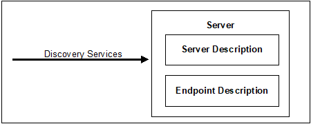  

Figure 1 - Discovery Service Set  

The *SecureChannel* *Service* *Set* , illustrated in [Figure 2](/§\_Ref130016386) , defines *Services* that allow a *Client* to establish a communication channel to ensure the *Confidentiality* and *Integrity* of *Messages* exchanged with the *Server* .  

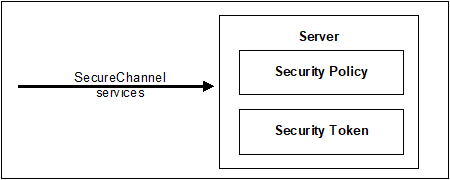  

Figure 2 - SecureChannel Service Set  

The *Session* *Service* *Set* , illustrated in [Figure 3](/§\_Ref111260594) , defines *Services* that allow the *Client* to authenticate the user on whose behalf it is acting and to manage *Sessions* .  

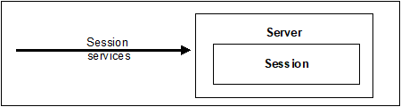  

Figure 3 - Session Service Set  

The *NodeManagement* *Service* *Set* , illustrated in [Figure 4](/§\_Ref112564702) , defines *Services* that allow the *Client* to add, modify and delete *Nodes* in the *AddressSpace* .  

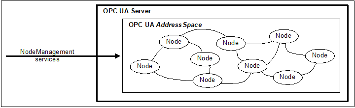  

Figure 4 - NodeManagement Service Set  

The *View* *Service* *Set* , illustrated in [Figure 5](/§\_Ref111262713) , defines *Services* that allow *Clients* to browse through the *AddressSpace* or subsets of the *AddressSpace* called *Views* . The *Query Service* *Set* allows *Clients* to get a subset of data from the *AddressSpace* or the *View* .  

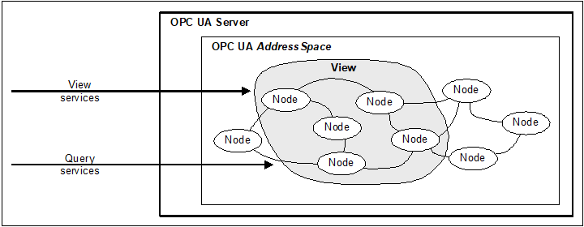  

Figure 5 - View Service Set  

The *Attribute* *Service* *Set* is illustrated in [Figure 6](/§\_Ref130386836) . It defines *Services* that allow *Clients* to read and write *Attributes* of *Nodes* , including their historical values. Since the value of a *Variable* is modelled as an *Attribute* , these *Services* allow *Clients* to read and write the values of *Variables* .  

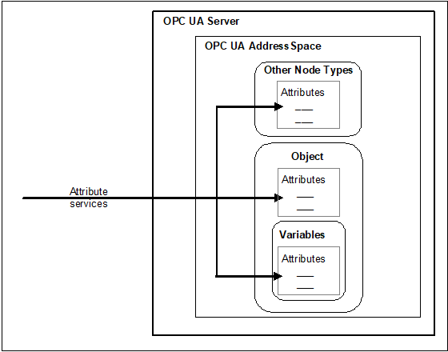  

Figure 6 - Attribute Service Set  

The *Method* *Service* *Set* is illustrated in [Figure 7](/§\_Ref111263243) . It defines *Services* that allow *Clients* to call methods. Methods run to completion when called. They may be called with method-specific input parameters and may return method-specific output parameters.  

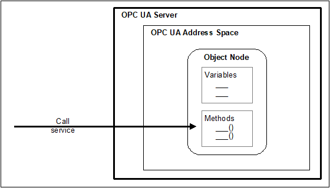  

Figure 7 - Method Service Set  

The *MonitoredItem* *Service* *Set* and the *Subscription* *Service* *Set* , illustrated in [Figure 8](/§\_Ref111266159) , are used together to subscribe to *Nodes* in the OPC UA *AddressSpace* .  

The *MonitoredItem* *Service* *Set* defines *Services* that allow *Clients* to create, modify, and delete *MonitoredItems* used to monitor *Attributes* for value changes and *Objects* for *Events* .  

These *Notifications* are queued for transfer to the *Client* by *Subscriptions* .  

The *Subscription* *Service* *Set* defines *Services* that allow *Clients* to create, modify and delete *Subscriptions* . *Subscriptions* send *Notifications* generated by *MonitoredItems* to the *Client* . *Subscription* *Services* also provide for *Client* recovery from missed *Messages* and communication failures.  

  

Figure 8 - MonitoredItem and Subscription Service Sets  

### 4.2 Request/response Service procedures  

Request/response *Service* procedures describe the processing of requests received by the *Server* , and the subsequent return of responses. The procedures begin with the requesting *Client* submitting a *Service* request *Message* to the *Server* .  

Upon receipt of the request, the *Server* processes the *Message* in two steps. In the first step, it attempts to decode and locate the *Service* to execute. The error handling for this step is specific to the communication technology used and is described in [OPC 10000-6](/§UAPart6) .  

If it succeeds, then it attempts to access each operation identified in the request and perform the requested operation. For each operation in the request, it generates a separate success/failure code that it includes in a positive response *Message* along with any data that is to be returned.  

To perform these operations, both the *Client* and the *Server* may make use of the API of a *Communication* *Stack* to construct and interpret *Messages* and to access the requested operation.  

The implementation of each service request or response handling shall check that each service parameter lies within the specified range for that parameter.  

## 5 Service Sets  

### 5.1 General  

This clause defines the OPC UA *Service* *Sets* and their *Services* . Clause [7](/§\_Ref286601677) contains the definitions of common parameters used by these *Services* . Subclause [6.5](/§\_Ref468992894) describes auditing requirements for all services.  

Whether or not a *Server* supports a *Service* *Set* , or a *Service* within a *Service* *Set* , is defined by its *Profile* . *Profiles* are described in [OPC 10000-7](/§UAPart7) .  

### 5.2 Service request and response header  

Each *Service* request has a *RequestHeader* and each *Service* response has a *ResponseHeader* .  

The *RequestHeader* structure is defined in [7.32](/§\_Ref129000055) and contains common request parameters such as *authenticationToken* , *timestamp* and *requestHandle* .  

The *ResponseHeader* structure is defined in [7.33](/§\_Ref115239340) and contains common response parameters such as *serviceResult* and *diagnosticInfo* .  

### 5.3 Service results  

*Service* results are returned at two levels in OPC UA responses, one that indicates the status of the *Service* call, and the other that indicates the status of each operation requested by the *Service* .  

*Service* results are defined via the *StatusCode* (see [7.38](/§\_Ref127346441) ).  

The status of the *Service* call is represented by the *serviceResult* contained in the *ResponseHeader* (see [7.33](/§\_Ref115239340) ). The mechanism for returning this parameter is specific to the communication technology used to convey the *Service* response and is defined in [OPC 10000-6](/§UAPart6) .  

The status of individual operations in a request is represented by individual *StatusCode* s.  

The following cases define the use of these parameters.  

1. A bad code is returned in *serviceResult* if the *Service* itself failed. In this case, a *ServiceFault* shall be returned instead of the *Service* response message. The *ServiceFault* is defined in [7.34](/§\_Ref139872149) .  

1. The good code is returned in *serviceResult* if the *Service* fully or partially succeeded. In this case, other response parameters are returned. The *Client* shall always check the response parameters, especially all *StatusCodes* associated with each operation. These *StatusCodes* may indicate bad or uncertain results for one or more operations requested in the *Service* call.  

All *Services* with arrays of operations in the request shall return a bad code in the *serviceResult* if the array is empty.  

The *Services* define various specific *StatusCodes* and a *Server* shall use these specific *StatusCodes* as described in the *Service* . A *Client* should be able to handle these *Service* specific *StatusCodes* . In addition, a *Client* shall expect other common *StatusCodes* defined in [Table 176](/§\_Ref90539276) and [Table 177](/§\_Ref127606591) . Additional details for *Client* handling of specific *StatusCodes* may be defined in [OPC 10000-7](/§UAPart7) .  

If the *Server* discovers, through some out-of-band mechanism that the application or user credentials used to create a *Session* or *SecureChannel* have been compromised, then the *Server* should immediately terminate all sessions and channels that use those credentials. In this case, the *Service* result code should be either *Bad* \_ *IdentityTokenRejected* or *Bad* \_ *CertificateUntrusted* .  

Message parsing can fail due to syntax errors or if data contained within the message exceeds ranges supported by the receiver. When this happens messages shall be rejected by the receiver. If the receiver is a *Server* then it shall return a *ServiceFault* with result code of *Bad* \_ *DecodingError* or *Bad* \_ *EncodingLimitsExceeded* . If the receiver is the *Client* then the *Communication Stack* should report these errors to the *Client* application.  

Many applications will place limits on the size of messages and/or data elements contained within these messages. For example, a *Server* may reject requests containing string values longer than a certain length. These limits are typically set by administrators and apply to all connections between a *Client* and a *Server* .  

*Clients* that receive *Bad* \_ *EncodingLimitsExceeded* faults from the *Server* will likely need to reformulate their requests. The administrator may need to increase the limits for the *Client* if it receives a response from the *Server* with this fault.  

In some cases, parsing errors are fatal and it is not possible to return a fault. For example, the incoming message could exceed the buffer capacity of the receiver. In these cases, these errors may be treated as a communication fault which requires the *SecureChannel* to be re-established (see [5.6](/§\_Ref187648579) ).  

The *Client* and *Server* reduce the chances of a fatal error by exchanging their message size limits in the *CreateSession* service. This will allow either party to avoid sending a message that causes a communication fault. The *Server* should return a *Bad* \_ *ResponseTooLarge* fault if a serialized response message exceeds the message size specified by the *Client* . Similarly, the *Client* *Communication Stack* should report a *Bad* \_ *RequestTooLarge* error to the application before sending a message that exceeds the *Server's* limit.  

Note that the message size limits only apply to the raw message body and do not include headers or the effect of applying any security. This means that a message body that is smaller than the specified maximum could still cause a fatal error.  

### 5.4 Locale Negotiation  

A number of *Services* expect an array of *LocaleIds* which are used by a *Server* to determine in what language or languages *LocalizedText* should be returned.  

The array of *LocaleIds* is in the preferred order the *Client* would like the *Server* to use when selecting the locale of the *LocalizedText* to be returned. The first *LocaleId* in the list is the most preferred. If the *Server* returns a *LocalizedText* to the *Client* , the *Server* shall return the translation which is the most preferred that it can. If it does not have a translation for any of the locales identified in this list, then it shall return *LocalizedText* in an available locale. See [OPC 10000-3](/§UAPart3) for more details on *LocaleIds* . If the *Client* fails to specify at least one *LocaleId* , the *Server* shall return any one that it has.  

Multi-language *LocalizedText* can be requested using the special 'mul' or 'qst' locales as the first entry of the list. See [OPC 10000-3](/§UAPart3) for detail of the special locales and how *LocalizedText* is used with them. If there are no further entries, the *Server* shall return all languages available. If there are more languages included after 'mul' or 'qst', the *Server* shall return only those languages from that list. If the *Server* doesn't have a translation for any of the locales included in the list, then it shall return *LocalizeText* in an available locale. The special 'mul' or 'qst' locales shall not be used in *Write* .  

If a *Client* requests 'mul' it shall be prepared to receive a 'mul' or another locale, but not 'qst' depending on what the *Server* can provide for a particular *LocalizedText* .  

If a *Client* requests 'qst' it shall be prepared to receive a 'qst', 'mul' or another locale depending on what the *Server* can provide for a particular *LocalizedText* .  

### 5.5 Discovery Service Set  

#### 5.5.1 Overview  

This *Service* *Set* defines *Services* used to discover the *Endpoints* implemented by a *Server* and to read the security configuration for those *Endpoints* . The *Discovery* *Services* are implemented by individual *Servers* and by dedicated *Discovery* *Servers* . [OPC 10000-12](/§UAPart12) describes how to use the *Discovery* *Services* with dedicated *Discovery* *Servers.*  

Every *Server* shall have a *DiscoveryEndpoint* that *Clients* can access without establishing a *Session* . This *Endpoint* may or may not be the same *Session* *Endpoint* that *Clients* use to establish a *SecureChannel* . *Clients* read the security information necessary to establish a *SecureChannel* by calling the *GetEndpoints* *Service* on the *DiscoveryEndpoint* .  

In addition, *Servers* may register themselves with a well-known *Discovery* *Server* using the *RegisterServer* Service. *Clients* can later discover any registered *Servers* by calling the *FindServers* *Service* on the *Discovery* *Server* .  

The discovery process using *FindServers* is illustrated in [Figure 9](/§\_Ref131593999) . The establishment of a *SecureChannel* (with *MessageSecurityMode* *NONE* ) for *FindServers* and *GetEndpoints* is omitted from the figure for clarity.  

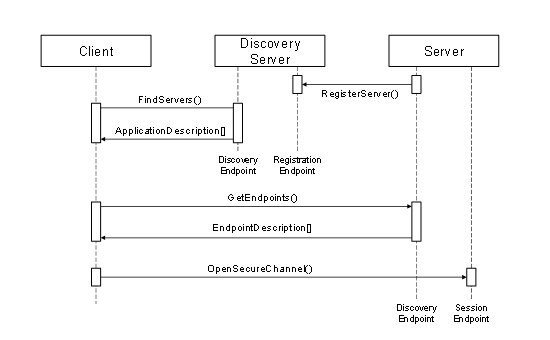  

Figure 9 - Discovery process  

The URL for a *DiscoveryEndpoint* shall provide all of the information that the *Client* needs to connect to the *DiscoveryEndpoint* .  

Once a *Client* retrieves the *Endpoints* , the C *lient* can save this information and use it to connect directly to the *Server* again without going through the discovery process. If the *Client* finds that it cannot connect then the *Server* configuration may have changed and the *Client* needs to go through the discovery process again.  

*DiscoveryEndpoints* shall not require any message security, but it may require transport layer security. In production systems, Administrators may disable discovery for security reasons and *Clients* shall rely on cached *EndpointDescriptions* . To provide support for systems with disabled *Discovery* *Services* *Clients* shall allow *Administrators* to manually update the *EndpointDescriptions* used to connect to a *Server* . *Servers* shall allow *Administrators* to disable the *DiscoveryEndpoint* . If *GetEndpoints* is disabled and the *Server Certificate* is updated either automatically with *Certificate Manager* or manually, *Clients* will no longer be able to connect to the *Server* without manual re-configuration of the *Client* .  

A *Client* shall be careful when using the information returned from a *DiscoveryEndpoint* since it has no security. A *Client* does this by comparing the information returned from the *DiscoveryEndpoint* to the information returned in the *CreateSession* response. A *Client* shall verify that:  

1. The *ApplicationUri* specified in the *Server Certificate* is the same as the *ApplicationUri* provided in the *EndpointDescription* returned from *CreateSession* response *.*  

1. The *Server* *Certificate* returned in *CreateSession* response is the same as the *Certificate* used to create the *SecureChannel* .  

1. The *EndpointDescriptions* returned from the *DiscoveryEndpoint* are the same as the *EndpointDescriptions* returned in the *CreateSession* response, but they may be in a different order. For the content, the fields *ApplicationUri* , *EndpointUrl* , *SecurityMode* , *SecurityPolicyUri* , *UserIdentityTokens* , *TransportProfileUri* and *SecurityLevel* shall be compared for exact match. All other fields are ignored for the comparison.  

If the *Client* detects that one of the above requirements is not fulfilled, then the *Client* shall close the *SecureChannel* and report an error.  

A *Client* shall verify the *HostName* specified in the *Server Certificate* is the same as the *HostName* contained in the *endpointUrl* provided in the *EndpointDescription* returned by *CreateSession* . If there is a difference then the *Client* shall report the difference and may close the *SecureChannel* . *Servers* shall add all possible *HostNames* like MyHost and MyHost.local into the *Server Certificate* . This includes IP addresses of the host or the *HostName* exposed by a NAT router used to connect to the *Server* .  

#### 5.5.2 FindServers  

##### 5.5.2.1 Description  

This *Service* returns the *Servers* known to a *Server* or *Discovery Server* . The behaviour of *Discovery Servers* is described in detail in [OPC 10000-12](/§UAPart12) .  

The *Client* may reduce the number of results returned by specifying filter criteria. A *Discovery Server* returns an empty list if no *Servers* match the criteria specified by the *Client* . The filter criteria supported by this *Service* are described in [5.5.2.2](/§\_Ref286601892) .  

Every *Server* shall provide a *DiscoveryEndpoint* that supports this *Service* . The *Server* shall always return a record that describes itself, however in some cases more than one record may be returned. *Gateway Servers* shall return a record for each *Server* that they provide access to plus (optionally) a record that allows the *Gateway Server* to be accessed as an ordinary OPC UA *Server* . Non-transparent redundant *Servers* shall provide a record for each *Server* in the *RedundantServerSet* .  

Every *Server* shall have a globally unique identifier called the *ServerUri* . This identifier should be a fully qualified domain name; however, it may be a GUID or similar construct that ensures global uniqueness. The *ServerUri* returned by this *Service* shall be the same value that appears in index 0 of the *ServerArray* property (see [OPC 10000-5](/§UAPart5) ). The *ServerUri* is returned as the *applicationUri* field in the *ApplicationDescription* (see [7.2](/§\_Ref153821547) ).  

Every *Server* shall also have a human readable identifier called the *ServerName* which is not necessarily globally unique. This identifier may be available in multiple locales.  

A *Server* may have multiple *HostNames* . For this reason, the *Client* shall pass the URL it used to connect to the *Endpoint* to this *Service* . The implementation of this *Service* shall use this information to return responses that are accessible to the *Client* via the provided URL.  

This *Service* shall not require message security but it may require transport layer security.  

Some *Servers* may be accessed via a *Gateway Server* and shall have a value specified for *gatewayServerUri* in their *ApplicationDescription* (see [7.2](/§\_Ref153821547) ). The *discoveryUrls* provided in *ApplicationDescription* shall belong to the *Gateway Server.* Some *Discovery Servers* may return multiple records for the same *Server* if that *Server* can be accessed via multiple paths.  

This *Service* can be used without security and it is therefore vulnerable to Denial of Service (DOS) attacks. A *Server* should minimize the amount of processing required to send the response for this *Service* . This can be achieved by preparing the result in advance. The *Server* should also add a short delay before starting processing of a request during high traffic conditions.  

##### 5.5.2.2 Parameters  

[Table 3](/§\_Ref153658081) defines the parameters for the *Service* .  

 **Table 3\- FindServers Service Parameters**   

| **Name** | **Type** | **Description** |
|---|---|---|
| **Request** |||
|requestHeader|RequestHeader|Common request parameters. The *authenticationToken* is always null. The *authenticationToken* shall be ignored if it is provided.  

The type *RequestHeader* is defined in [7.32](/§\_Ref129000055) .|
|endpointUrl|String|The network address that the *Client* used to access the *DiscoveryEndpoint* .  

The *Server* uses this information for diagnostics and to determine what URLs to return in the response.  

The *Server* should return a suitable default URL if it does not recognize the *HostName* in the URL.|
|localeIds []|LocaleId|List of locales to use.  

The *Server* should return the *applicationName* in the ApplicationDescription defined in [7.2](/§\_Ref153821547) using one of the locales specified.  

See locale negotiation in [5.4](/§\_Ref161623610) which applies to this *Service* .|
|serverUris []|String|List of *Servers* to return.  

All known *Servers* are returned if the list is empty.  

A serverUri matches the *applicationUri* from the *ApplicationDescription* defined in [7.2](/§\_Ref153821547) .|
||||
| **Response** |||
|responseHeader|ResponseHeader|Common response parameters.  

The *ResponseHeader* type is defined in [7.33](/§\_Ref115239340) .|
|servers []|ApplicationDescription|List of *Servers* that meet criteria specified in the request.  

This list is empty if no *Servers* meet the criteria.  

The *ApplicationDescription* type is defined in [7.2](/§\_Ref153821547) .|
  

  

##### 5.5.2.3 Service results  

Common *StatusCodes* are defined in [Table 176](/§\_Ref90539276) .  

#### 5.5.3 FindServersOnNetwork  

##### 5.5.3.1 Description  

This *Service* returns the *Servers* known to a *Discovery* *Server* . Unlike *FindServers* , this *Service* is only implemented by *Discovery* *Servers* .  

The *Client* may reduce the number of results returned by specifying filter criteria. An empty list is returned if no *Server* matches the criteria specified by the *Client* .  

This *Service* shall not require message security but it may require transport layer security.  

Each time the *Discovery* *Server* creates or updates a record in its cache it shall assign a monotonically increasing identifier to the record. This allows *Clients* to request records in batches by specifying the identifier for the last record received in the last call to *FindServersOnNetwork* . To support this the *Discovery* *Server* shall return records in numerical order starting from the lowest record identifier. The *Discovery* *Server* shall also return the last time the counter was reset for example due to a restart of the *Discovery* *Server.* If a *Client* detects that this time is more recent than the last time the *Client* called the *Service* it shall call the Service again with a startingRecordId of 0.  

This *Service* can be used without security and it is therefore vulnerable to denial of service (DOS) attacks. A *Server* should minimize the amount of processing required to send the response for this *Service* . This can be achieved by preparing the result in advance.  

##### 5.5.3.2 Parameters  

[Table 4](/§\_Ref407044876) defines the parameters for the *Service* .  

 **Table 4\- FindServersOnNetwork Service Parameters**   

| **Name** | **Type** | **Description** |
|---|---|---|
| **Request** |||
|requestHeader|RequestHeader|Common request parameters. The *authenticationToken* is always null. The *authenticationToken* shall be ignored if it is provided.  

The type *RequestHeader* is defined in [7.32](/§\_Ref129000055) .|
|startingRecordId|Counter|Only records with an identifier greater than this number will be returned.  

Specify 0 to start with the first record in the cache.|
|maxRecordsToReturn|UInt32|The maximum number of records to return in the response.  

0 indicates that there is no limit.|
|serverCapabilityFilter[]|String|List of *Server* capability filters. The set of allowed *Server* capabilities are defined in [OPC 10000-12](/§UAPart12) .  

Only records with all of the specified *Server* capabilities are returned.  

The comparison is case insensitive.  

If this list is empty then no filtering is performed.|
||||
| **Response** |||
|responseHeader|ResponseHeader|Common response parameters.  

The *ResponseHeader* type is defined in [7.33](/§\_Ref115239340) .|
|lastCounterResetTime|UtcTime|The last time the counters were reset.|
|servers[]|ServerOnNetwork|List of DNS service records that meet criteria specified in the request.  

This list is empty if no *Servers* meet the criteria.|
|recordId|UInt32|A unique identifier for the record.  

This can be used to fetch the next batch of *Servers* in a subsequent call to *FindServersOnNetwork.*|
|serverName|String|The name of the *Server* specified in the mDNS announcement (see [OPC 10000-12](/§UAPart12) ).  

This may be the same as the *ApplicationName* for the *Server* .|
|discoveryUrl|String|The URL of the *DiscoveryEndpoint* .|
|serverCapabilities|String[]|The set of *Server* capabilities supported by the *Server* .  

The set of allowed *Server* capabilities are defined in [OPC 10000-12](/§UAPart12) .|
  

  

##### 5.5.3.3 Service results  

Common *StatusCodes* are defined in [Table 176](/§\_Ref90539276) .  

#### 5.5.4 GetEndpoints  

##### 5.5.4.1 Description  

This *Service* returns the *Endpoints* supported by a *Server* and all of the configuration information required to establish a *SecureChannel and a Session* .  

This *Service* shall not require message security but it may require transport layer security.  

A *Client* may reduce the number of results returned by specifying filter criteria based on *LocaleIds* and *Transport* *Profile* URIs. The *Server* returns an empty list if no *Endpoints* match the criteria specified by the *Client* . The filter criteria supported by this *Service* are described in [5.5.4.2](/§\_Ref157827129) .  

A *Server* may support multiple security configurations for the same *Endpoint* . In this situation, the *Server* shall return separate *EndpointDescription* records for each available configuration. *Clients* should treat each of these configurations as distinct *Endpoints* even if the physical URL happens to be the same.  

The security configuration for an *Endpoint* has four components:  

Server Application Instance Certificate  

Message Security Mode  

Security Policy  

Supported User Identity Tokens  

The *ApplicationInstanceCertificate* is used to secure the *OpenSecureChannel* request (see [5.6.2](/§\_Ref154236901) ). The *MessageSecurityMode* and the *SecurityPolicy* tell the *Client* how to secure messages sent via the *SecureChannel* . The *UserIdentityTokens* tell the *Client* which type of user credentials shall be passed to the *Server* in the *ActivateSession* request (see [5.7.3](/§\_Ref154395720) ).  

If the *securityPolicyUri* is *None* and none of the *UserTokenPolicies* requires encryption, the *Client* shall ignore the *ApplicationInstanceCertificate* . If the *securityPolicyUri* is not *None* or one of the *UserTokenPolicies* requires encryption, the *Server* shall include the *ApplicationInstanceCertificate* in the *EndpointDescription* .  

Each *EndpointDescription* also specifies a URI for the *Transport* *Profile* that the *Endpoint* supports. The *Transport* *Profiles* specify information such as message encoding format and protocol version and are defined in [OPC 10000-7](/§UAPart7) .  

Messages are secured by applying standard cryptography algorithms to the messages before they are sent over the network. The exact set of algorithms used depends on the *SecurityPolicy* for the *Endpoint* . [OPC 10000-7](/§UAPart7) defines *Profiles* for common *SecurityPolicies* and assigns a unique URI to them. It is expected that applications have built in knowledge of the *SecurityPolicies* that they support, as a result, only the Profile URI for the *SecurityPolicy* is specified in the *EndpointDescription* . A *Client* cannot connect to an *Endpoint* that does not support a *SecurityPolicy* that it recognizes.  

An *EndpointDescription* may specify that the message security mode is *NONE* . This configuration is not recommended unless the applications are communicating on a physically isolated network where the risk of intrusion is extremely small. If the message security is *NONE* then it is possible for *Clients* to deliberately or accidentally hijack *Sessions* created by other *Clients* .  

A *Server* may have multiple *HostNames* . For this reason, the *Client* shall pass the URL it used to connect to the *Endpoint* to this *Service* . The implementation of this *Service* shall use this information to return responses that are accessible to the *Client* via the provided URL.  

This *Service* can be used without security and it is therefore vulnerable to Denial of Service (DOS) attacks. A *Server* should minimize the amount of processing required to send the response for this *Service* . This can be achieved by preparing the result in advance. The *Server* should also add a short delay before starting processing of a request during high traffic conditions.  

Some of the *EndpointDescriptions* returned in a response shall specify the *Endpoint* information for a *Gateway Server* that can be used to access another *Server* . In these situations, the *gatewayServerUri* is specified in the *EndpointDescription* and all security checks used to verify *Certificates* shall use the *gatewayServerUri* (see [6.1.3](/§\_Ref171496136) ) instead of the *serverUri* .  

To connect to a *Server* via the gateway the *Client* shall first establish a *SecureChannel* with the *Gateway Server* . Then the *Client* shall call the *CreateSession* service and pass the *serverUri* specified in the *EndpointDescription* to the *Gateway Server* . The *Gateway Server* shall then connect to the underlying *Server* on behalf of the *Client* . The process of connecting to a *Server* via a *Gateway Server* is illustrated in [Figure 10](/§\_Ref189163559) .  

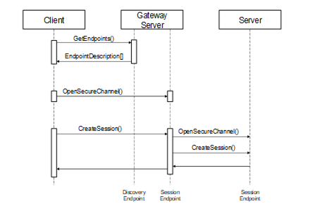  

Figure 10 - Using a Gateway Server  

##### 5.5.4.2 Parameters  

[Table 5](/§\_Ref151146140) defines the parameters for the *Service* .  

 **Table 5\- GetEndpoints Service Parameters**   

| **Name** | **Type** | **Description** |
|---|---|---|
| **Request** |||
|requestHeader|RequestHeader|Common request parameters.  

The *authenticationToken* is always null. The *authenticationToken* shall be ignored if it is provided.  

The type *RequestHeader* is defined in [7.32](/§\_Ref129000055) .|
|endpointUrl|String|The network address that the *Client* used to access the *DiscoveryEndpoint* .  

The *Server* uses this information for diagnostics and to determine what URLs to return in the response.  

The *Server* should return a suitable default URL if it does not recognize the *HostName* in the URL.|
|localeIds []|LocaleId|List of locales to use.  

See locale negotiation in [5.4](/§\_Ref161623610) which applies to this *Service* .|
|profileUris []|String|List of *Transport* *Profile* that the returned *Endpoints* shall support. [OPC 10000-7](/§UAPart7) defines URIs for the *Transport* *Profiles* .  

All *Endpoints* are returned if the list is empty.  

If the URI is a URL, this URL may have a query string appended. The *Transport* *Profiles* that support query strings are defined in [OPC 10000-7](/§UAPart7) .|
||||
| **Response** |||
|responseHeader|ResponseHeader|Common response parameters.  

The *ResponseHeader* type is defined in [7.33](/§\_Ref115239340) .|
|Endpoints []|EndpointDescription|List of *Endpoints* that meet criteria specified in the request.  

This list is empty if no *Endpoints* meet the criteria.  

The *EndpointDescription* type is defined in [7.14](/§\_Ref171928664) .|
  

  

##### 5.5.4.3 Service Results  

Common *StatusCodes* are defined in [Table 176](/§\_Ref90539276) .  

#### 5.5.5 RegisterServer  

##### 5.5.5.1 Description  

This Service is implemented by *Discovery Servers* .  

This *Service* registers a *Server* with a *Discovery* *Server* . This *Service* will be called by a *Server* or a separate configuration utility. *Clients* will not use this *Service* .  

A *Server* shall establish a *SecureChannel* with the *Discovery Server* before calling this *Service* . The *SecureChannel* is described in [5.6](/§\_Ref187648579) . The *Administrator* of the *Server* shall provide the *Server* with an *EndpointDescription* for the *Discovery Server* as part of the configuration process. *Discovery Servers* shall reject registrations if the *serverUri* provided does not match the *applicationUri* in *Server Certificate* used to create the *SecureChannel* .  

This *Service* can only be invoked via *SecureChannels* that support *Client* authentication (i.e. HTTPS cannot be used to call this *Service* ).  

A *Server* only provides its *serverUri* and the URLs of the *DiscoveryEndpoints* to the *Discovery* *Server* . *Clients* shall use the *GetEndpoints* *Service* to fetch the most up to date configuration information directly from the *Server* .  

The *Server* shall provide a localized name for itself in all locales that it supports.  

*Servers* shall be able to register themselves with a *Discovery* *Server* running on the same machine. The exact mechanisms depend on the *Discovery* *Server* implementation and are described in [OPC 10000-6](/§UAPart6) .  

There are two types of *Server* applications: those which are manually launched including a start by the operating system at boot and those that are automatically launched when a *Client* attempts to connect. The registration process that a *Server* shall use depends on which category it falls into.  

The registration process for manually launched *Servers* is illustrated in [Figure 11](/§\_Ref151133511) .  

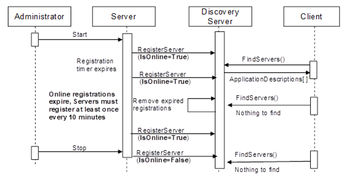  

Figure 11 - The Registration Process - Manually Launched Servers  

The registration process for automatically launched *Servers* is illustrated in [Figure 12](/§\_Ref153738822) .  

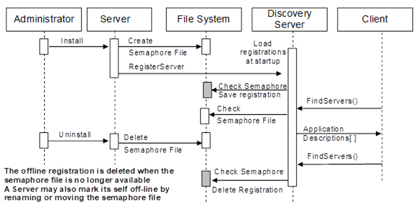  

Figure 12 - The Registration Process - Automatically Launched Servers  

The registration process is designed to be platform independent, robust and able to minimize problems created by configuration errors. For that reason, *Servers* shall register themselves more than once.  

Under normal conditions, manually launched *Servers* shall periodically register with the *Discovery* *Server* as long as they are able to receive connections from *Clients* . If a *Server* goes offline then it shall register itself once more and indicate that it is going offline. The period of the recurring registration should be configurable; however, the maximum is 10 minutes. If an error occurs during registration (e.g. the *Discovery Server* is not running) then the *Server* shall periodically re-attempt registration. The frequency of these attempts should start at 1 second but gradually increase until the registration frequency is the same as what it would be if no errors occurred. The recommended approach would be to double the period of each attempt until reaching the maximum.  

When an automatically launched *Server* (or its install program) registers with the *Discovery* *Server* it shall provide a path to a semaphore file which the *Discovery* *Server* can use to determine if the *Server* has been uninstalled from the machine. The *Discovery* *Server* shall have read access to the file system that contains the file.  

##### 5.5.5.2 Parameters  

[Table 6](/§\_Ref151146114) defines the parameters for the *Service* .  

 **Table 6\- RegisterServer Service Parameters**   

| **Name** | **Type** | **Description** |
|---|---|---|
| **Request** |||
|requestHeader|RequestHeader|Common request parameters.  

The *authenticationToken* is always null.  

The type *RequestHeader* is defined in [7.32](/§\_Ref129000055) .|
|Server|RegisteredServer|The *Server* to register. The type *RegisteredServer* is defined in [7.31](/§\_Ref413265664) .|
||||
| **Response** |||
|ResponseHeader|ResponseHeader|Common response parameters.  

The type *ResponseHeader* is defined in [7.33](/§\_Ref115239340) .|
  

  

##### 5.5.5.3 Service Results  

[Table 7](/§\_Ref157830433) defines the *Service* results specific to this *Service* . Common *StatusCodes* are defined in [Table 176](/§\_Ref90539276) .  

 **Table 7\- RegisterServer Service Result Codes**   

| **Symbolic Id** | **Description** |
|---|---|
|Bad\_InvalidArgument|See [Table 176](/§\_Ref90539276) for the description of this result code.|
|Bad\_ServerUriInvalid|See [Table 176](/§\_Ref90539276) for the description of this result code.|
|Bad\_ServerNameMissing|No *ServerName* was specified.|
|Bad\_DiscoveryUrlMissing|No discovery URL was specified.|
|Bad\_SemaphoreFileMissing|The semaphore file specified is not valid.|
  

  

#### 5.5.6 RegisterServer2  

##### 5.5.6.1 Description  

This Service is implemented by *Discovery Servers* .  

This *Service* allows a *Server* to register its *DiscoveryUrls* and capabilities with a *Discovery* *Server* . It extends the registration information from *RegisterServer* with information necessary for *FindServersOnNetwork* . This *Service* will be called by a *Server* or a separate configuration utility. *Clients* will not use this *Service* .  

*Servers* that support *RegisterServer2* shall try to register with the *Discovery Server* using this Service and shall fall back to *RegisterServer* if *RegisterServer2* fails with the status Bad\_ServiceUnsupported.  

A *Discovery* *Server* that implements this *Service* needs to assign unique record ids each time this *Service* is called. See [5.5.3](/§\_Ref407044762) for more details.  

This *Service* can only be invoked via *SecureChannels* that support *Client* authentication (i.e. HTTPS cannot be used to call this *Service* ).  

##### 5.5.6.2 Parameters  

[Table 8](/§\_Ref407044784) defines the parameters for the *Service* .  

 **Table 8\- RegisterServer2**   

| **Name** | **Type** | **Description** |
|---|---|---|
| **Request** |||
|requestHeader|RequestHeader|Common request parameters.  

The *authenticationToken* is always null.  

The type *RequestHeader* is defined in [7.32](/§\_Ref129000055) .|
|Server|RegisteredServer|The *Server* to register. The type *RegisteredServer* is defined in [7.31](/§\_Ref413265664) .|
|discoveryConfiguration []|ExtensibleParameter DiscoveryConfiguration|Additional configuration settings for the *Server* to register.  

The *discoveryConfiguration* is an extensible parameter type defined in [7.13](/§\_Ref413267662) .  

Discovery *Servers* that do not understand a configuration shall return Bad\_NotSupported for this configuration.|
||||
| **Response** |||
|responseHeader|ResponseHeader|Common response parameters.  

The type *ResponseHeader* is defined in [7.33](/§\_Ref115239340) .|
|configurationResults []|StatusCode|List of results for the *discoveryConfiguration* parameters.|
|diagnosticInfos []|DiagnosticInfo|List of diagnostic information for the *discoveryConfiguration* parameters. This list is empty if diagnostics information was not requested in the request header or if no diagnostic information was encountered in processing of the request.|
  

  

##### 5.5.6.3 Service results  

[Table 9](/§\_Ref407044794) defines the *Service* results specific to this *Service* . Common *StatusCodes* are defined in [Table 176](/§\_Ref90539276) .  

 **Table 9\- RegisterServer2 Service Result Codes**   

| **Symbolic Id** | **Description** |
|---|---|
|Bad\_InvalidArgument|See [Table 176](/§\_Ref90539276) for the description of this result code.|
|Bad\_ServerUriInvalid|See [Table 176](/§\_Ref90539276) for the description of this result code.|
|Bad\_ServerNameMissing|No *ServerName* was specified.|
|Bad\_DiscoveryUrlMissing|No discovery URL was specified.|
|Bad\_SemaphoreFileMissing|The semaphore file specified is not valid.|
|Bad\_ServiceUnsupported|See [Table 176](/§\_Ref90539276) for the description of this result code.|
  

  

##### 5.5.6.4 StatusCodes  

[Table 10](/§\_Ref469069600) defines values for the operation level *configurationResults* parameters that are specific to this Service. Common *StatusCodes* are defined in [Table 177](/§\_Ref127606591) .  

 **Table 10\- RegisterServer2 Operation Level Result Codes**   

| **Symbolic Id** | **Description** |
|---|---|
|Bad\_NotSupported|See [Table 177](/§\_Ref127606591) for the description of this result code.|
  

  

### 5.6 SecureChannel Service Set  

#### 5.6.1 Overview  

This *Service* *Set* defines *Services* used to open a communication channel that ensures the *Confidentiality* and *Integrity* of all *Messages* exchanged with the *Server* . The base concepts for OPC UA security are defined in [OPC 10000-2](/§UAPart2) .  

The *SecureChannel* *Services* are unlike other *Services* because they are not implemented directly by the *OPC UA* *Application* . Instead, they are provided by the *Communication* *Stack* on which the *OPC UA Application* is built. For example, an OPC UA *Server* may be built on a stack that allows applications to establish a *SecureChannel* using HTTPS. In these cases, the *OPC UA Application* shall verify that the *Message* it received was in the context of an HTTPS connection. [OPC 10000-6](/§UAPart6) describes how the *SecureChannel* *Services* are implemented.  

A *SecureChannel* is a long-running logical connection between a single *Client* and a single *Server* . This channel maintains a set of keys known only to the *Client* and *Server* , which are used to sign and encrypt *Messages* sent across the network to ensure *Confidentiality* and *Integrity* . The *SecureChannel* *Services* allow the *Client* and *Server* to securely negotiate the keys to use.  

Logical connections may be initiated by the *Client* or by the *Server* as described in [OPC 10000-6](/§UAPart6) . After the connection is initiated, the *SecureChannel* is opened and closed by the *Client* using the *SecureChannel* *Services* .  

An *EndpointDescription* tells a *Client* how to establish a *SecureChannel* with a given *Endpoint* . A *Client* may obtain the *EndpointDescription* from a *Discovery* *Server* , via some non-UA defined directory server or from its own configuration.  

The exact algorithms used to sign and encrypt *Messages* are described in the *SecurityPolicy* field of the *EndpointDescription* . A *Client* shall use these algorithms when it creates a *SecureChannel* .  

It should be noted that some *SecurityPolicies* defined in [OPC 10000-7](/§UAPart7) will turn off authentication and encryption resulting in a *SecureChannel* that provides no security.  

When a *Client* and *Server* are communicating via a *SecureChannel* , they shall verify that all incoming *Messages* have been signed and encrypted according to the requirements specified in the *EndpointDescription* . An *OPC UA Application* shall not process any *Message* that does not conform to these requirements.  

The relationship between the *SecureChannel* and the *OPC UA Application* depends on the implementation technology. [OPC 10000-6](/§UAPart6) defines any requirements that depend on the technology used.  

The correlation between the *OPC UA Application* *Session* and the *SecureChannel* is illustrated in [Figure 13](/§\_Ref130140149) . The *Communication Stack* is used by the *OPC UA* *Applications* to exchange *Messages* . In the first step, the *SecureChannel* *Services* are used to establish a *SecureChannel* between the two *Communication Stacks* which allows the secure exchange of *Messages* . In the second step, the *OPC UA* *Applications* use the *Session* *Service* *Set* to establish an *OPC UA Application* *Session* .  

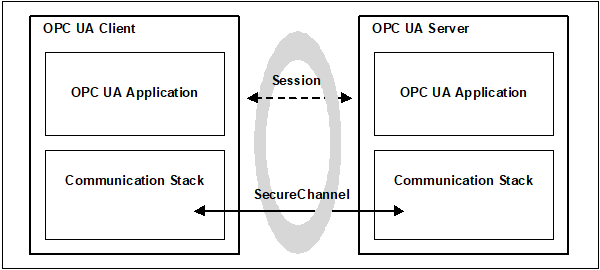  

Figure 13 - SecureChannel and Session Services  

Once a *Client* has established a *Session* it may wish to access the *Session* from a different *SecureChannel* . The *Client* can do this by validating the new *SecureChannel* with the *ActivateSession* *Service* described in [5.7.3](/§\_Ref154395746) .  

If a *Server* acts as a *Client* to other *Servers* , which is commonly referred to as *Server* chaining, then the *Server* shall be able to maintain user level security. By this we mean that the user identity should be passed to the underlying *Server* or it should be mapped to an appropriate user identity in the underlying *Server* . It is unacceptable to ignore user level security. This is required to ensure that security is maintained and that a user does not obtain information that they should not have access to. Whenever possible a *Server* should impersonate the original *Client* by passing the original *Client's* user identity to the underlying *Server* when it calls the *ActivateSession Service* . If impersonation is not an option then the *Server* shall map the original *Client's* user identity onto a new user identity which the underlying *Server* does recognize.  

#### 5.6.2 OpenSecureChannel  

##### 5.6.2.1 Description  

This *Service* is used to open or renew a *SecureChannel* that can be used to ensure *Confidentiality* and *Integrity* for *Message* exchange during a *Session* . This *Service* requires the *Communication Stack* to apply the various security algorithms to the *Messages* as they are sent and received. Specific implementations of this *Service* for different *Communication Stacks* are described in [OPC 10000-6](/§UAPart6) .  

Each *SecureChannel* has a globally-unique identifier and is valid for a specific combination of *Client* and *Server* application instances. Each channel contains one or more *SecurityTokens* that identify a set of cryptography keys that are used to encrypt and authenticate *Messages* . *SecurityTokens* also have globally-unique identifiers which are attached to each *Message* secured with the token. This allows an authorized receiver to know how to decrypt and verify the *Message* .  

*SecurityTokens* have a finite lifetime negotiated with this *Service* . However, differences between the system clocks on different machines and network latencies mean that valid *Messages* could arrive after the token has expired. To prevent valid *Messages* from being discarded, the applications should do the following:  

1. *Clients* should request a new *SecurityToken* after 75 % of its lifetime has elapsed. This should ensure that *Clients* will receive the new *SecurityToken* before the old one actually expires.  

1. *Servers* shall use the existing *SecurityToken* to secure outgoing *Messages* until the *SecurityToken* expires or the *Server* receives a *Message* secured with a new *SecurityToken* . This should ensure that *Clients* do not reject *Messages* secured with the new *SecurityToken* that arrive before the *Client* receives the new *SecurityToken* .  

1. *Clients* should accept *Messages* secured by an expired *SecurityToken* for up to 25 % of the token lifetime. This should ensure that *Messages* sent by the *Server* before the token expired are not rejected because of network delays.  

Each *SecureChannel* exists until it is explicitly closed or until the last token has expired and the overlap period has elapsed. A *Server* application should limit the number of *SecureChannels* . To protect against misbehaving *Clients* and denial of service attacks, the *Server* shall close the oldest unused *SecureChannel* that has no *Session* assigned before reaching the maximum number of supported *SecureChannels* . When *Session*\-less *Service* invocation is done through a transport mapping that requires the *OpenSecureChannel* *Service* , the *Server* shall maintain a last used time for the *SecureChannel* to detect the oldest unused *SecureChannel.*  

The *OpenSecureChannel* request and response *Messages* shall be signed with the sender's private key. These *Messages* shall always be encrypted. If the transport layer does not provide encryption, then these *Messages* shall be encrypted with the receiver's public key. These requirements for *OpenSecureChannel* only apply if the *securityPolicyUri* is not None.  

If the protocol defined in [OPC 10000-6](/§UAPart6) requires that *ApplicationInstanceCertificates* are used in the *OpenSecureChannel* *Service* , then *Clients* and *Servers* shall verify that the same *Certificates* are used in the *CreateSession* and *ActivateSession* *Services* . *Certificates* are not provided and shall not be verified if the *securityPolicyUri* is None.  

If the *securityPolicyUri* is not None, a *Client* shall verify the *HostName* specified in the *Server Certificate* is the same as the *HostName* contained in the *endpointUrl* . If there is a difference then the *Client* shall report the difference and may choose to not open the *SecureChannel* . *Servers* shall add all possible *HostNames* like MyHost and MyHost.mycompany.com into the *Server Certificate* . This includes IP addresses of the host or the *HostName* exposed by a NAT router used to connect to the *Server* . *Servers* shall not append the 'local' top level domain to any domains declared in their *Certificate* ; an unqualified domain name is used if a more appropriate qualifier does not exist. *Clients* using a URL returned from an LDS-ME shall remove the 'local' top level domain when checking the domain against the *Server* *Certificate* .  

*Clients* should be prepared to replace the *HostName* and port returned in the *EndpointDescription* with the *HostName* or the IP addresses and the port they used to call *GetEndpoints* . The *Client* shall still execute the *HostName* verification comparing the *HostName* used by the *Client* to create the *SecureChannel* with the *HostName* list in the *Server* *Certificate* . See [Table 100](/§\_Ref181603918) for more details.  

##### 5.6.2.2 Parameters  

[Table 11](/§\_Ref157834565) defines the parameters for the *Service* .  

Unlike other *Services* , the parameters for this *Service* provide only an abstract definition. The concrete representation on the network depends on the mappings defined in [OPC 10000-6](/§UAPart6) .  

 **Table 11\- OpenSecureChannel Service Parameters**   

| **Name** | **Type** | **Description** |
|---|---|---|
| **Request** |||
|requestHeader|RequestHeader|Common request parameters. The *authenticationToken* is always null.  

The type *RequestHeader* is defined in [7.32](/§\_Ref129000063) .|
|clientCertificate|ApplicationInstance Certificate|A *Certificate* that identifies the *Client* .  

The *OpenSecureChannel* request shall be signed with the private key for this *Certificate* .  

The *ApplicationInstanceCertificate* type is defined in [7.3](/§\_Ref182127421) .  

If the *securityPolicyUri* is None, the *Server* shall ignore the *ApplicationInstanceCertificate* .|
|requestType|Enum  

SecurityToken RequestType|The type of *SecurityToken* request:  

An enumeration that shall be one of the following:  

ISSUE creates a new *SecurityToken* for a new *SecureChannel* .  

RENEW creates a new *SecurityToken* for an existing *SecureChannel* .|
|secureChannelId|BaseDataType|The identifier for the *SecureChannel* that the new token should belong to. This parameter shall be null when creating a new *SecureChannel* .  

The concrete security protocol definition in [OPC 10000-6](/§UAPart6) chooses the concrete *DataType* .|
|securityMode|Enum  

MessageSecurityMode|The type of security to apply to the messages.  

The type *MessageSecurityMode* type is defined in [7.20](/§\_Ref153806472) .  

A *SecureChannel* may need to be created even if the *securityMode* is *NONE* . The exact behaviour depends on the mapping used and is described in the [OPC 10000-6](/§UAPart6) .|
|securityPolicyUri|String|The URI for *SecurityPolicy* to use when securing messages sent over the *SecureChannel* .  

The set of known URIs and the S *ecurityPolicies* associated with them are defined in [OPC 10000-7](/§UAPart7) .|
|clientNonce|ByteString|A random number that shall not be used in any other request. A new *clientNonce* shall be generated for each time a *SecureChannel* is renewed.  

This parameter shall have a length equal to the *SecureChannelNonceLength* defined for the *SecurityPolicy* in [OPC 10000-7](/§UAPart7) . The *SecurityPolicy* is identified by the *securityPolicyUri* .|
|requestedLifetime|Duration|The requested lifetime, in milliseconds, for the new *SecurityToken* . It specifies when the *Client* expects to renew the *SecureChannel* by calling the *OpenSecureChannel Service* again. If a *SecureChannel* is not renewed, then all *Messages* sent using the current *SecurityTokens* shall be rejected by the receiver.  

Several cryptanalytic attacks become easier as more material encrypted with a specific key is available. By limiting the amount of data processed using a particular key, those attacks are made more difficult. Therefore the volume of data exchanged between *Client* and *Server* shall be limited by establishing a new *SecurityToken* after the lifetime.  

The setting of the requested lifetime depends on the expected number of exchanged messages and their size in the lifetime. A higher volume of data requires shorter lifetime.|
||||
| **Response** |||
|responseHeader|ResponseHeader|Common response parameters (see [7.33](/§\_Ref115239340) for *ResponseHeader* type definition).|
|securityToken|ChannelSecurityToken|Describes the new *SecurityToken* issued by the *Server* . This structure is defined in-line with the following indented items.|
| channelId|BaseDataType|A unique identifier for the *SecureChannel* . This is the identifier that shall be supplied whenever the *SecureChannel* is renewed.  

The concrete security protocol definition in [OPC 10000-6](/§UAPart6) chooses the concrete *DataType* .|
| tokenId|ByteString|A unique identifier for a single *SecurityToken* within the channel. This is the identifier that shall be passed with each *Message* secured with the *SecurityToken* .|
| createdAt|UtcTime|The time when the *SecurityToken* was created.|
| revisedLifetime|Duration|The lifetime of the *SecurityToken* in milliseconds. The UTC expiration time for the token may be calculated by adding the lifetime to the *createdAt* time.  

The revised lifetime shall be used by the *Client* to renew a *SecureChannel* before it expires even if the *MessageSecurityMode* is *NONE* .  

The Server shall provide a lifetime greater than 0. It should be a sensible value based on the capabilities and configuration of the *Server* .|
|serverNonce|ByteString|A random number that shall not be used in any other request. A new *serverNonce* shall be generated for each time a *SecureChannel* is renewed.  

This parameter shall have a length equal to the *SecureChannelNonceLength* defined for the *SecurityPolicy* in [OPC 10000-7](/§UAPart7) . The *SecurityPolicy* is identified by the *securityPolicyUri* .|
  

  

##### 5.6.2.3 Service results  

[Table 12](/§\_Ref130141799) defines the *Service* results specific to this *Service* . Common *StatusCodes* are defined in [Table 176](/§\_Ref90539276) .  

 **Table 12\- OpenSecureChannel Service Result Codes**   

| **Symbolic Id** | **Description** |
|---|---|
|Bad\_SecurityChecksFailed|See [Table 176](/§\_Ref90539276) for the description of this result code.|
|Bad\_CertificateTimeInvalid|See [Table 176](/§\_Ref90539276) for the description of this result code.|
|Bad\_CertificateIssuerTimeInvalid|See [Table 176](/§\_Ref90539276) for the description of this result code.|
|Bad\_CertificateHostNameInvalid|See [Table 176](/§\_Ref90539276) for the description of this result code.|
|Bad\_CertificateUriInvalid|See [Table 176](/§\_Ref90539276) for the description of this result code.|
|Bad\_CertificateUseNotAllowed|See [Table 176](/§\_Ref90539276) for the description of this result code.|
|Bad\_CertificateIssuerUseNotAllowed|See [Table 176](/§\_Ref90539276) for the description of this result code.|
|Bad\_CertificateUntrusted|See [Table 176](/§\_Ref90539276) for the description of this result code.|
|Bad\_CertificateRevocationUnknown|See [Table 176](/§\_Ref90539276) for the description of this result code.|
|Bad\_CertificateIssuerRevocationUnknown|See [Table 176](/§\_Ref90539276) for the description of this result code.|
|Bad\_CertificateRevoked|See [Table 176](/§\_Ref90539276) for the description of this result code.|
|Bad\_CertificateIssuerRevoked|See [Table 176](/§\_Ref90539276) for the description of this result code.|
|Bad\_RequestTypeInvalid|The *SecurityToken* request type is not valid.|
|Bad\_SecurityModeRejected|The security mode does not meet the requirements set by the server.|
|Bad\_SecurityPolicyRejected|The security policy does not meet the requirements set by the *Server* .|
|Bad\_SecureChannelIdInvalid|See [Table 176](/§\_Ref90539276) for the description of this result code.|
|Bad\_NonceInvalid|See [Table 176](/§\_Ref90539276) for the description of this result code.  

A *Server* shall check the minimum length of the *Client* nonce and return this status if the length is below 32 bytes. A check for duplicated nonce can only be done in *OpenSecureChannel* calls with the request type *RENEW* .|
  

  

#### 5.6.3 CloseSecureChannel  

##### 5.6.3.1 Description  

This *Service* is used to terminate a *SecureChannel* .  

The request *Messages* shall be signed with the appropriate key associated with the current token for the *SecureChannel* .  

##### 5.6.3.2 Parameters  

[Table 13](/§\_Ref130141878) defines the parameters for the *Service* .  

Specific protocol mappings defined in [OPC 10000-6](/§UAPart6) may choose to omit the response.  

 **Table 13\- CloseSecureChannel Service Parameters**   

| **Name** | **Type** | **Description** |
|---|---|---|
| **Request** |||
|requestHeader|RequestHeader|Common request parameters. The *authenticationToken* is always null.  

The type *RequestHeader* is defined in [7.32](/§\_Ref129000063) .|
|secureChannelId|BaseDataType|The identifier for the *SecureChannel* to close.  

The concrete security protocol definition in [OPC 10000-6](/§UAPart6) chooses the concrete *DataType* .|
||||
| **Response** |||
|responseHeader|ResponseHeader|Common response parameters (see [7.33](/§\_Ref115239340) for *ResponseHeader* definition).|
  

  

##### 5.6.3.3 Service results  

[Table 14](/§\_Ref130141783) defines the *Service* results specific to this *Service* . Common *StatusCodes* are defined in [Table 176](/§\_Ref90539276) .  

 **Table 14\- CloseSecureChannel Service Result Codes**   

| **Symbolic Id** | **Description** |
|---|---|
|Bad\_SecureChannelIdInvalid|See [Table 176](/§\_Ref90539276) for the description of this result code.|
  

  

### 5.7 Session Service Set  

#### 5.7.1 Overview  

This *Service* *Set* defines *Services* for an application layer connection establishment in the context of a *Session* .  

#### 5.7.2 CreateSession  

##### 5.7.2.1 Description  

This *Service* is used by an OPC UA *Client* to create a *Session* and the *Server* returns two values which uniquely identify the *Session* . The first value is the *sessionId* which is used to identify the *Session* in the audit logs and in the *Server's* *AddressSpace* . The second is the *authenticationToken* which is used to associate an incoming request with a *Session* .  

Before calling this *Service* , the *Client* shall create a *SecureChannel* with the *OpenSecureChannel* *Service* to ensure the *Integrity* of all *Messages* exchanged during a *Session* . This *SecureChannel* has a unique identifier which the *Server* shall associate with the a *uthenticationToken* . The *Server* may accept requests with the a *uthenticationToken* only if they are associated with the same *SecureChannel* that was used to create the *Session* . The *Client* may associate a new *SecureChannel* with the *Session* by calling *ActivateSession.* For the N *Sessions* supported by a Server, the *Server* shall support N+1 *SecureChannels* . A *Server* may support multiple *Sessions* for one *SecureChannel* .  

The *SecureChannel* is always managed by the *Communication Stack* which means it shall provide APIs which the *Server* can use to find out information about the *SecureChannel* used for any given request. The *Communication Stack* shall, at a minimum, provide the *SecurityPolicy* and *SecurityMode* used by the *SecureChannel* . It shall also provide a *SecureChannelId* which uniquely identifies the *SecureChannel* or the *Client Certificate* used to establish the *SecureChannel* . The *Server* uses one of these to identify the *SecureChannel* used to send a request. Clause [7.35](/§\_Ref183363986) describes how to create the a *uthenticationToken* for different types of *Communication Stack* .  

Depending upon on the *SecurityPolicy* and the *SecurityMode* of the *SecureChannel,* the exchange of *ApplicationInstanceCertificates* and *Nonces* may be optional and the signatures may be empty. See [OPC 10000-7](/§UAPart7) for the definition of *SecurityPolicies* and the handling of these parameters.  

The *Server* returns its *EndpointDescriptions* in the response. *Clients* use this information to determine whether the list of *EndpointDescriptions* returned from the *DiscoveryEndpoint* matches the *Endpoints* that the *Server* has. If there is a difference then the *Client* shall close the *Session* and report an error. The *Server* returns all *EndpointDescriptions* for the *serverUri* specified by the *Client* in the request. The *Client* only verifies *EndpointDescriptions* with a *transportProfileUri* that matches the *profileUri* specified in the original *GetEndpoints* request. A *Client* may skip this check if the *EndpointDescriptions* were provided by a trusted source such as the *Administrator* .  

The *Client* shall check that the *ApplicationUri* specified in the *Server Certificate* matches the *ApplicationUri* provided in the *EndpointDescription* returned by the *CreateSession* response. If it does not match, the *Client* shall close the *Session* .  

The *Server* shall check that the *ApplicationUri* specified in the *clientDescription* matches the *Client* *Certificate* . If it does not match, *CreateSession* shall return Bad\_CertificateUriInvalid.  

The *Session* created with this *Service* shall not be used until the *Client* calls the *ActivateSession* *Service* and proves possession of its *ApplicationInstanceCertificate* and any user identity token that it provided.  

A *Server* application should limit the number of *Sessions* . To protect against misbehaving *Clients* and denial of service attacks, the *Server* shall close the oldest *Session* that is not activated before reaching the maximum number of supported *Sessions* .  

The *SoftwareCertificates* parameter in the *Server* response is deprecated to reduce the message size for OPC UA Applications with limited resources. The *SoftwareCertificates* are provided in the *Server's* *AddressSpace* as defined in [OPC 10000-5](/§UAPart5) . A *SoftwareCertificate* identifies the capabilities of the *Server* and also contains the list of OPC UA *Profiles* supported by the *Server* . OPC UA *Profiles* are defined in [OPC 10000-7](/§UAPart7) .  

Additional *Certificates* issued by other organizations may be included to identify additional *Server* capabilities. Examples of these *Profiles* include support for specific information models and support for access to specific types of devices.  

When a *Session* is created, the *Server* adds an entry for the *Client* in its *SessionDiagnosticsArray* *Variable* . See [OPC 10000-5](/§UAPart5) for a description of this *Variable* .  

*Sessions* are created to be independent of the underlying communications connection. Therefore, if a communications connection fails, the *Session* is not immediately affected. When the communication connection fails, the *Client* should try to create a new communication connection and call *ActivateSession* again. See [6.7](/§\_Ref65519698) for more details.  

*Sessions* are terminated by the *Server* automatically if the *Client* fails to issue a *Service* request on the *Session* within the timeout period negotiated by the *Server* in the *CreateSession* *Service* response. This protects the *Server* against *Client* failures and against situations where a failed underlying connection cannot be re-established. *Clients* shall be prepared to submit requests in a timely manner to prevent the *Session* from closing automatically. *Clients* may explicitly terminate *Sessions* using the *CloseSession* *Service* .  

When a *Session* is terminated, all outstanding requests on the *Session* are aborted and *Bad\_SessionClosed* *StatusCodes* are returned to the *Client* . In addition, the *Server* deletes the entry for the *Client* from its *SessionDiagnosticsArray* *Variable* and notifies any other *Clients* who were subscribed to this entry.  

If a *Client* invokes the *CloseSession* *Service* then all *Subscriptions* associated with the *Session* are also deleted if the *deleteSubscriptions* flag is set to TRUE. If a *Server* terminates a *Session* for any other reason, *Subscriptions* associated with the *Session* , are not deleted. Each *Subscription* has its own lifetime to protect against data loss in the case of a *Session* termination. In these cases, the *Subscription* can be reassigned to another *Client* before its lifetime expires.  

Some *Servers* , such as aggregating *Servers* , also act as *Clients* to other *Servers* . These *Servers* typically support more than one system user, acting as their agent to the *Servers* that they represent. Security for these *Servers* is supported at two levels.  

First, each OPC UA *Service* request contains a string parameter that is used to carry an audit record id. A *Client* , or any *Server* operating as a *Client* , such as an aggregating *Server* , can create a local audit log entry for a request that it submits. This parameter allows the *Client* to pass the identifier for this entry with the request. If the *Server* also maintains an audit log, then it can include this id in the audit log entry that it writes. When the log is examined and the entry is found, the examiner will be able to relate it directly to the audit log entry created by the *Client* . This capability allows for traceability across audit logs within a system. See [OPC 10000-2](/§UAPart2) for additional information on auditing. A *Server* that maintains an audit log shall provide the information in the audit log entries via event *Messages* defined in this document. The *Server* may choose to only provide the *Audit* information via event *Messages* . The *Audit* *EventType* is defined in [OPC 10000-3](/§UAPart3) .  

Second, these aggregating *Servers* may open independent *Sessions* to the underlying *Servers* for each *Client* that accesses data from them. [Figure 14](/§\_Ref102967761) illustrates this concept.  

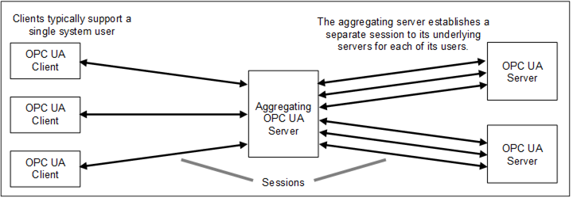  

Figure 14 - Multiplexing users on a Session  

##### 5.7.2.2 Parameters  

[Table 15](/§\_Ref74381726) defines the parameters for the *Service* .  

 **Table 15\- CreateSession Service Parameters**   

| **Name** | **Type** | **Description** |
|---|---|---|
| **Request** |||
|requestHeader|RequestHeader|Common request parameters. The *authenticationToken* is always null.  

The type *RequestHeader* is defined in [7.32](/§\_Ref129000063) .|
|clientDescription|Application Description|Information that describes the *Client* application.  

The type *ApplicationDescription* is defined in [7.2](/§\_Ref153821547) .|
|serverUri|String|This value is only specified if the *EndpointDescription* has a *gatewayServerUri* .  

This value is the *applicationUri* from the *EndpointDescription* which is the *applicationUri* for the underlying *Server* . The type *EndpointDescription* is defined in [7.14](/§\_Ref171928664) .|
|endpointUrl|String|The network address that the *Client* used to access the *Session* *Endpoint* .  

The *Server* uses this information for diagnostics and to determine what URLs to return in the response.  

The *Server* should return a suitable default URL if it does not recognize the *HostName* in the URL|
|sessionName|String|Human readable string that identifies the *Session* . The *Server* makes this name and the *sessionId* visible in its *AddressSpace* for diagnostic purposes. The *Client* should provide a name that is unique for the instance of the *Client* .  

If this parameter is null or empty the *Server* shall assign a value.|
|clientNonce|ByteString|A random number that should never be used in any other request. This number shall have a length between 32 and 128 bytes inclusive. The Server shall check the length.  

The *Server* shall use this value to prove possession of its *ApplicationInstanceCertificate* in the response.|
|clientCertificate|ApplicationInstance  

Certificate|The *ApplicationInstanceCertificate* issued to the *Client* .  

The *ApplicationInstanceCertificate* type is defined in [7.3](/§\_Ref182127421) .  

If the *securityPolicyUri* is None, the *Server* shall ignore the *ApplicationInstanceCertificate* .  

If the *SecurityMode* is not None, a *Client* shall prove possession by using the private key to create a *Signature* using the *Nonce* provided by the *Server* in the response.  

If the *SecurityMode* is not None, the *Server* shall verify that this *ApplicationInstanceCertificate* is the same as the one it used to create the *SecureChannel* .|
|Requested  

SessionTimeout|Duration|Requested maximum number of milliseconds that a *Session* should remain open without activity. If the *Client* fails to issue a *Service* request within this interval, then the *Server* shall automatically terminate the *Client* *Session* .|
|maxResponse  

MessageSize|UInt32|The maximum size, in bytes, for the body of any response message.  

The *Server* should return a *Bad\_ResponseTooLarge* service fault if a response message exceeds this limit.  

The value zero indicates that this parameter is not used.  

The transport protocols defined in [OPC 10000-6](/§UAPart6) may imply minimum message sizes.  

More information on the use of this parameter is provided in [5.3](/§\_Ref187648629) .|
| **Response** |||
|responseHeader|ResponseHeader|Common response parameters (see [7.33](/§\_Ref115239340) for *ResponseHeader* type).|
|sessionId|NodeId|A unique *NodeId* assigned by the *Server* to the *Session* . This identifier is used to access the diagnostics information for the *Session* in the *Server* *AddressSpace* . It is also used in the audit logs and any events that report information related to the *Session* . The *Session* diagnostic information is described in [OPC 10000-5](/§UAPart5) . Audit logs and their related events are described in [6.5](/§\_Ref468992909) .|
|authentication  

Token|Session  

AuthenticationToken|A unique identifier assigned by the *Server* to the *Session* . This identifier shall be passed in the *RequestHeader* of each request and is used with the *SecureChannelId* to determine whether a *Client* has access to the *Session* . This identifier shall not be reused in a way that the *Client* or the *Server* has a chance of confusing them with a previous or existing *Session* .  

The *SessionAuthenticationToken* type is described in [7.35](/§\_Ref183363986) .|
|revisedSession Timeout|Duration|Actual maximum number of milliseconds that a *Session* shall remain open without activity. The *Server* should attempt to honour the *Client* request for this parameter, but may negotiate this value up or down to meet its own constraints.  

The Server shall provide a timeout greater than 0. It should be a sensible value based on the capabilities and configuration of the *Server* .|
|serverNonce|ByteString|A random number that should never be used in any other request.  

This number shall have a length between 32 and 128 bytes inclusive. The Client shall check the length.  

The *Client* shall use this value to prove possession of its *ApplicationInstanceCertificate* in the *ActivateSession* request.  

This value may also be used to prove possession of the *userIdentityToken* it specified in the *ActivateSession* request.|
|serverCertificate|ApplicationInstance  

Certificate|The *ApplicationInstanceCertificate* issued to the *Server* .  

A *Server* shall prove possession by using the private key to sign the *Nonce* provided by the *Client* in the request. For *SecureChannels* that use the *ApplicationInstanceCertificate* the *Client* shall verify that this *Certificate* is the same as the one it used to create the *SecureChannel* .  

The *ApplicationInstanceCertificate* type is defined in [7.3](/§\_Ref182127421) .  

If the *securityPolicyUri* is *None* and none of the *UserTokenPolicies* requires encryption, the *Client* shall ignore the *ApplicationInstanceCertificate* .|
|serverEndpoints []|EndpointDescription|List of *Endpoints* that the *Server* supports.  

The *Server* shall return a set of *EndpointDescriptions* available for the *serverUri* specified in the request. All *Endpoints* are returned if the *serverUri* is null or empty. The *EndpointDescription* type is defined in [7.14](/§\_Ref171928664) . If the *Client* used a *DiscoveryEndpoint* to select the security options from the available *EndpointDescriptions,* the *Client* shall verify this list with the list from a *DiscoveryEndpoint* . If the *Client* has the security options configured for the connection to the *Server* , it uses this configuration and ignores the list.  

A *Client* shall compare only the *EndpointDescriptions* that match the *transportProfileUri* of the current *SecureChannel* . It is recommended that *Servers* only include the *server* . *applicationUri* , *endpointUrl* , *securityMode,* *securityPolicyUri* , *userIdentityTokens* , *transportProfileUri* and *securityLevel* with all other parameters set to null or empty. Only the recommended parameters shall be verified by the *Client* .|
|serverSoftware  

Certificates []|SignedSoftware Certificate|This parameter is no longer used and the array shall be empty.  

The *SoftwareCertificates* are provided in the *Server* *AddressSpace* as defined in [OPC 10000-5](/§UAPart5) .|
|serverSignature|SignatureData|This is a signature generated with the private key associated with the *serverCertificate* . This parameter is calculated by appending the *clientNonce* to the *clientCertificate* and signing the resulting sequence of bytes.  

If the *clientCertificate* contains a chain, the signature calculation shall be done only with the leaf *Certificate* . For backward compatibility a *Client* shall check the signature with the full chain if the check with the leaf *Certificate* fails.  

The *SignatureAlgorithm* shall be the *AsymmetricSignatureAlgorithm* specified in the *SecurityPolicy* for the *Endpoint* .  

The *SignatureData* type is defined in [7.36](/§\_Ref153782728) .  

The *clientCertificate* shall be validated according to the rules in [6.1.3](/§\_Ref169270721) even if the *Server* chooses to allow connections from untrusted *Clients* . This validation may have occurred when the *SecureChannel* was established and does not need to be repeated.  

The *Signature* is not generated if the *SecurityMode* is *None* .|
|maxRequest  

MessageSize|UInt32|The maximum size, in bytes, for the body of any request message.  

The *Client* *Communication Stack* should return a *Bad\_RequestTooLarge* error to the application if a request message exceeds this limit.  

The value zero indicates that this parameter is not used.  

See [OPC 10000-6](/§UAPart6) for protocol specific minimum or default values.  

[5.3](/§\_Ref187648629) provides more information on the use of this parameter.|
  

  

##### 5.7.2.3 Service results  

[Table 16](/§\_Ref89580600) defines the *Service* results specific to this *Service* . Common *StatusCodes* are defined in [Table 176](/§\_Ref90539276) .  

 **Table 16\- CreateSession Service Result Codes**   

| **Symbolic Id** | **Description** |
|---|---|
|Bad\_SecureChannelIdInvalid|See [Table 176](/§\_Ref90539276) for the description of this result code.|
|Bad\_NonceInvalid|See [Table 176](/§\_Ref90539276) for the description of this result code.  

A *Server* shall check the length of the *Client* nonce and return this status if the length is less than 32 bytes or greater than 128 bytes. A check for a duplicated nonce is optional and requires access to the nonce used to create the secure channel.|
|Bad\_SecurityChecksFailed|See [Table 176](/§\_Ref90539276) for the description of this result code.|
|Bad\_CertificateTimeInvalid|See [Table 176](/§\_Ref90539276) for the description of this result code.|
|Bad\_CertificateIssuerTimeInvalid|See [Table 176](/§\_Ref90539276) for the description of this result code.|
|Bad\_CertificateHostNameInvalid|See [Table 176](/§\_Ref90539276) for the description of this result code.|
|Bad\_CertificateUriInvalid|See [Table 176](/§\_Ref90539276) for the description of this result code.|
|Bad\_CertificateUseNotAllowed|See [Table 176](/§\_Ref90539276) for the description of this result code.|
|Bad\_CertificateIssuerUseNotAllowed|See [Table 176](/§\_Ref90539276) for the description of this result code.|
|Bad\_CertificateUntrusted|See [Table 176](/§\_Ref90539276) for the description of this result code.|
|Bad\_CertificateRevocationUnknown|See [Table 176](/§\_Ref90539276) for the description of this result code.|
|Bad\_CertificateIssuerRevocationUnknown|See [Table 176](/§\_Ref90539276) for the description of this result code.|
|Bad\_CertificateRevoked|See [Table 176](/§\_Ref90539276) for the description of this result code.|
|Bad\_CertificateIssuerRevoked|See [Table 176](/§\_Ref90539276) for the description of this result code.|
|Bad\_TooManySessions|The *Server* has reached its maximum number of *Sessions* .|
|Bad\_ServerUriInvalid|See [Table 176](/§\_Ref90539276) for the description of this result code.|
|Bad\_SecurityPolicyRejected|See [Table 176](/§\_Ref90539276) for the description of this result code.|
  

  

#### 5.7.3 ActivateSession  

##### 5.7.3.1 Description  

This *Service* is used by the *Client* to specify the identity of the user associated with the *Session* . This *Service* request shall be issued by the *Client* before it issues any *Service* request other than *CloseSession* after *CreateSession* . Failure to do so shall cause the *Server* to close the *Session* .  

Whenever the *Client* calls this *Service* the *Client* shall prove that it is the same application that called the *CreateSession* *Service* . The *Client* does this by creating a signature with the private key associated with the *clientCertificate* specified in the *CreateSession* request. This signature is created by appending the last *serverNonce* provided by the *Server* to the *serverCertificate* and calculating the signature of the resulting sequence of bytes.  

Once used, a *serverNonce* cannot be used again. For that reason, the *Server* returns a new *serverNonce* each time the *ActivateSession* *Service* is called.  

When the *ActivateSession* *Service* is called for the first time then the *Server* shall reject the request if the *SecureChannel* is not same as the one associated with the *CreateSession* request. Subsequent calls to *ActivateSession* may be associated with different *SecureChannels.* If this is the case then ** the *Server* shall verify that the *Certificate* the *Client* used to create the new *SecureChannel* is the same as the *Certificate* used to create the original *SecureChannel* . In addition, the *Server* shall verify that the *Client* supplied a *UserIdentityToken* that contains the same *ClientUserId* as the token currently associated with the *Session* . Once the *Server* accepts the new *SecureChannel* it shall reject requests sent via the old *SecureChannel* .  

The *ActivateSession Service* is used to associate a user identity with a *Session* . When a *Client* provides a user identity then it shall provide proof that it is authorized to use that user identity. The exact mechanism used to provide this proof depends on the type of the *UserIdentityToken* . If the token ** is a *UserNameIdentityToken* then the proof is the *password* that is included in the token. If the token is an X509IdentityToken then the proof is a signature generated with private key associated with the *Certificate* . The data to sign is created by appending the last *serverNonce* to the *serverCertificate* specified in the *CreateSession* response. If a token includes a secret then it should be encrypted using the public key from the *serverCertificate.*  

*Servers* shall take proper measures to protect against attacks on user identity tokens. Such an attack is assumed if repeated connection attempts with invalid user identity tokens happen. One option is to lock out an OPC UA *Client* for a period of time if the user identity token validation fails several times. The OPC UA *Client* is either detected by IP address for unsecured connections or by the *ApplicationUri* for secured connections. Another option is delaying the *Service* response when the validation of a user identity fails. This delay time could be increased with repeated failures. Sporadic failures shall not delay connections with valid tokens.  

*Clients* can change the identity of a user associated with a *Session* by calling the *ActivateSession* *Service* . The *Server* validates the signatures provided with the request and then validates the new user identity. If no errors occur the *Server* replaces the user identity for the *Session* . Changing the user identity for a *Session* may cause discontinuities in active *Subscriptions* because the *Server* may need to tear down connections to an underlying system and re-establish them using the new credentials. A *Server* shall re-evaluate the permissions of all *MonitoredItems* in *Subscriptions* assigned to the *Session* after a user identity change.  

When a *Client* supplies a list of locale ids in the request, each locale id is required to contain the language component. It may optionally contain the \<country/region\> component. When the *Server* returns a *LocalizedText* in the context of the *Session* , it also may return both the language and the country/region or just the language as its default locale id.  

When a *Server* returns a string to the *Client* , it first determines if there are available translations for it. If there are, then the *Server* returns the string whose locale id exactly matches the locale id with the highest priority in the *Client*\-supplied list.  

If there are no exact matches, then the *Server* ignores the \<country/region\> component of the locale id, and returns the string whose \<language\> component matches the \<language\> component of the locale id with the highest priority in the *Client* supplied list.  

If there still are no matches, then the *Server* returns the string that it has along with the locale id.  

A *Gateway Server* is expected to impersonate the user provided by the *Client* when it connects to the underlying *Server* . This means it shall re-calculate the signatures on the *UserIdentityToken* using the nonce provided by the underlying *Server* . The *Gateway Server* shall use its own user credentials if the *UserIdentityToken* provided by the *Client* does not support impersonation.  

##### 5.7.3.2 Parameters  

[Table 17](/§\_Ref109722150) defines the parameters for the *Service* .  

 **Table 17\- ActivateSession Service Parameters**   

| **Name** | **Type** | **Description** |
|---|---|---|
| **Request** |||
|requestHeader|RequestHeader|Common request parameters. The type *RequestHeader* is defined in [7.32](/§\_Ref129000063) .|
|clientSignature|SignatureData|This is a signature generated with the private key associated with the *clientCertificate* . This parameter is calculated by appending the *serverNonce* to the *serverCertificate* and signing the resulting sequence of bytes.  

If the *serverCertificate* contains a chain, the signature calculation shall be done only with the leaf *Certificate* . For backward compatibility a *Server* shall check the signature with the full chain if the check with the leaf *Certificate* fails.  

The *SignatureAlgorithm* shall be the *AsymmetricSignatureAlgorithm* specified in the *SecurityPolicy* for the *Endpoint* .  

The *SignatureData* type is defined in [7.36](/§\_Ref153782728) .|
|clientSoftwareCertificates []|SignedSoftware Certificate|Reserved for future use.  

The *SignedSoftwareCertificate* type is defined in [7.37](/§\_Ref180486734) .|
|localeIds []|LocaleId|List of locale ids to use. See locale negotiation in [5.4](/§\_Ref161623610) which applies to this *Service.*  

This parameter only needs to be specified during the first call to *ActivateSession* during a single application *Session* . If it is null or empty the *Server* shall keep using the current *localeIds* for the *Session* .|
|userIdentityToken|Extensible Parameter  

UserIdentityToken|The credentials of the user associated with the *Client* application. The *Server* uses these credentials to determine whether the *Client* should be allowed to activate a *Session* and what resources the *Client* has access to during this *Session* .  

The *UserIdentityToken* is an extensible parameter type defined in [7.40](/§\_Ref128235836) .  

The EndpointDescription specifies what *UserIdentityTokens* the *Server* shall accept.  

Null or empty user token shall always be interpreted as anonymous.|
|userTokenSignature|SignatureData|If the *Client* specified a user identity token that supports digital signatures, then it shall create a signature and pass it as this parameter. Otherwise the parameter is null or empty.  

The *SignatureAlgorithm* depends on the identity token type.  

The *SignatureData* type is defined in [7.36](/§\_Ref153782728) .|
||||
| **Response** |||
|responseHeader|ResponseHeader|Common response parameters (see [7.33](/§\_Ref115239340) for *ResponseHeader* definition).|
|serverNonce|ByteString|A random number that should never be used in any other request.  

This number shall have a length between 32 and 128 bytes inclusive. The Client shall check the length.  

The *Client* shall use this value to prove possession of its *ApplicationInstanceCertificate* in the next call to *ActivateSession* request.|
|results []|StatusCode|List of validation results for the *SoftwareCertificates* (see [7.38](/§\_Ref127346441) for *StatusCode* definition).|
|diagnosticInfos []|DiagnosticInfo|List of diagnostic information associated with *SoftwareCertificate* validation errors (see [7.12](/§\_Ref127334266) for *DiagnosticInfo* definition). This list is empty if diagnostics information was not requested in the request header or if no diagnostic information was encountered in processing of the request.|
  

  

##### 5.7.3.3 Service results  

[Table 18](/§\_Ref109722179) defines the *Service* results specific to this *Service* . Common *StatusCodes* are defined in [Table 176](/§\_Ref90539276) .  

 **Table 18\- ActivateSession Service Result Codes**   

| **Symbolic Id** | **Description** |
|---|---|
|Bad\_IdentityTokenInvalid|See [Table 176](/§\_Ref90539276) for the description of this result code.|
|Bad\_IdentityTokenRejected|See [Table 176](/§\_Ref90539276) for the description of this result code.|
|Bad\_UserAccessDenied|See [Table 176](/§\_Ref90539276) for the description of this result code.|
|Bad\_ApplicationSignatureInvalid|The signature provided by the *Client* application is missing or invalid.|
|Bad\_UserSignatureInvalid|The user token signature is missing or invalid.|
|Bad\_NoValidCertificates|The *Client* did not provide at least one *Software Certificate* that is valid and meets the profile requirements for the *Server* .|
|Bad\_IdentityChangeNotSupported|The *Server* does not support changing the user identity assigned to the session.|
|Bad\_SecurityPolicyRejected|See [Table 176](/§\_Ref90539276) for the description of this result code.|
|Good\_PasswordChangeRequired|The log-on for the user succeeded but the user is required to change the password.  

The activated *Session* has limited rights and is mainly available to change the password.  

The detailed definitions for *UserManagement* , restrictions for *Sessions* and the *Method ChangePassword* used to set a new password are defined in [OPC 10000-18](/§UAPart18) . This result code is only used by *Servers* that support the *Method ChangePassword* .|
  

  

#### 5.7.4 CloseSession  

##### 5.7.4.1 Description  

This *Service* is used to terminate a *Session* . The *Server* takes the following actions when it receives a *CloseSession* request:  

1. It stops accepting requests for the *Session* . All subsequent requests received for the *Session* are discarded.  

1. It returns negative responses with the *StatusCode* Bad\_SessionClosed to all requests that are currently outstanding to provide for the timely return of the *CloseSession* response. *Clients* are urged to wait for all outstanding requests to complete before submitting the *CloseSession* request.  

1. It removes the entry for the *Client* in its *SessionDiagnosticsArray* *Variable* .  

When the *CloseSession* *Service* is called before the *Session* is successfully activated, the *Server* shall reject the request if the *SecureChannel* is not the same as the one associated with the *CreateSession* request.  

##### 5.7.4.2 Parameters  

[Table 19](/§\_Ref74381727) defines the parameters for the *Service* .  

 **Table 19\- CloseSession Service Parameters**   

| **Name** | **Type** | **Description** |
|---|---|---|
| **Request** |||
|requestHeader|RequestHeader|Common request parameters (see [7.32](/§\_Ref129000063) for *RequestHeader* definition).|
|deleteSubscriptions|Boolean|If the value is TRUE, the *Server* deletes all *Subscriptions* associated with the Session. If the value is FALSE, the *Server* keeps the *Subscriptions* associated with the Session until they timeout based on their own lifetime.|
||||
| **Response** |||
|responseHeader|ResponseHeader|Common response parameters (see [7.33](/§\_Ref115239340) for *ResponseHeader* definition).|
  

  

##### 5.7.4.3 Service results  

[Table 20](/§\_Ref88280183) defines the *Service* results specific to this *Service* . Common *StatusCodes* are defined in [Table 176](/§\_Ref90539276) .  

 **Table 20\- CloseSession Service Result Codes**   

| **Symbolic Id** | **Description** |
|---|---|
|Bad\_SessionIdInvalid|See [Table 176](/§\_Ref90539276) for the description of this result code.|
  

  

#### 5.7.5 Cancel  

##### 5.7.5.1 Description  

This *Service* is used to cancel outstanding Service requests. Successfully cancelled service requests shall respond with Bad\_RequestCancelledByClient.  

##### 5.7.5.2 Parameters  

[Table 21](/§\_Ref154214840) defines the parameters for the *Service* .  

 **Table 21\- Cancel Service Parameters**   

| **Name** | **Type** | **Description** |
|---|---|---|
| **Request** |||
|requestHeader|RequestHeader|Common request parameters (see [7.32](/§\_Ref129000063) for *RequestHeader* definition).|
|requestHandle|IntegerId|The *requestHandle* assigned to one or more requests that should be cancelled. All outstanding requests with the matching *requestHandle* shall be cancelled.|
||||
| **Response** |||
|responseHeader|ResponseHeader|Common response parameters (see [7.33](/§\_Ref115239340) for *ResponseHeader* definition).|
|cancelCount|UInt32|Number of cancelled requests.|
  

  

##### 5.7.5.3 Service results  

Common *StatusCodes* are defined in [Table 176](/§\_Ref90539276) .  

### 5.8 NodeManagement Service Set  

#### 5.8.1 Overview  

This *Service* *Set* defines *Services* to add and delete *AddressSpace* *Nodes* and *References* between them. All added *Nodes* continue to exist in the *AddressSpace* even if the *Client* that created them disconnects from the *Server* .  

Calls to *NodeManagement* *Services* may result in changes to the *AddressSpace* in addition to the requested change. The actual behaviour is *Server* specific.  

#### 5.8.2 AddNodes  

##### 5.8.2.1 Description  

This *Service* is used to add one or more *Nodes* into the *AddressSpace* hierarchy. Using this *Service* , each *Node* is added as the *TargetNode* of a *HierarchicalReference* to ensure that the *AddressSpace* is fully connected and that the *Node* is added as a child within the *AddressSpace* hierarchy (see [OPC 10000-3](/§UAPart3) ).  

When a *Server* creates an instance of a *TypeDefinitionNode* it shall create the same hierarchy of *Nodes* beneath the new *Object* or *Variable* depending on the *ModellingRule* of each *InstanceDeclaration* . All *Nodes* with a *ModellingRule* of *Mandatory* shall be created or an existing *Node* shall be referenced that conforms to the *InstanceDeclaration* . The creation of Nodes with other *ModellingRules* is *Server* specific.  

##### 5.8.2.2 Parameters  

[Table 22](/§\_Ref71355893) defines the parameters for the *Service* .  

 **Table 22\- AddNodes Service Parameters**   

| **Name** | **Type** | **Description** |
|---|---|---|
| **Request** |||
|requestHeader|RequestHeader|Common request parameters (see [7.32](/§\_Ref129000063) for *RequestHeader* definition).|
|nodesToAdd []|AddNodesItem|List of *Nodes* to add. All *Nodes* are added as a *Reference* to an existing *Node* using a hierarchical *ReferenceType* . This structure is defined in-line with the following indented items.|
| parentNodeId|Expanded NodeId|*ExpandedNodeId* of the parent *Node* for the *Reference* . The *ExpandedNodeId* type is defined in [7.16](/§\_Ref129164940) .  

If the *server* Index indicates that the parent *Node* is a remote *Node* , then the *nodeId* shall contain the absolute namespace URI. If the parent *Node* is a local *Node* the *nodeId* shall contain the namespace index.|
| referenceTypeId|NodeId|*NodeId* of the hierarchical *ReferenceType* to use for the *Reference* from the parent *Node* to the new *Node* .|
| requestedNewNodeId|Expanded NodeId|*Client* requested expanded *NodeId* of the *Node* to add. The *serverIndex* in the expanded NodeId shall be 0.  

If the *Server* cannot use this *NodeId* , it rejects this *Node* and returns the appropriate error code.  

If the *Client* does not want to request a *NodeId* , then it sets the value of this parameter to the null expanded *NodeId* .  

If the *Node* to add is a *ReferenceType* *Node* , its *NodeId* should be a numeric id. See [OPC 10000-3](/§UAPart3) for a description of *ReferenceType* *NodeIds* .|
| browseName|QualifiedName|The browse name of the *Node* to add.|
| nodeClass|NodeClass|*NodeClass* of the *Node* to add.|
| nodeAttributes|Extensible Parameter  

NodeAttributes|The *Attributes* that are specific to the *NodeClass* . The *NodeAttributes* parameter type is an extensible parameter type specified in [7.24](/§\_Ref130144342) .  

A *Client* is allowed to omit values for some or all *Attributes* . If an *Attribute* value is null, the *Server* shall use the default values from the *TypeDefinitionNode* . If a *TypeDefinitionNode* was not provided the *Server* shall choose a suitable default value.  

The *Server* may still add an optional Attribute to the *Node* with an appropriate default value even if the *Client* does not specify a value.|
| typeDefinition|Expanded NodeId|*NodeId* of the *TypeDefinitionNode* for the *Node* to add. This parameter shall be null for all *NodeClasses* other than *Object* and *Variable* in which case it shall be provided.  

If the *server* Index indicates that the type definition *Node* is a remote *Node* , then the *nodeId* shall contain the absolute namespace URI. If the type definition *Node* is a local *Node* the *nodeId* shall contain the namespace index.|
||||
| **Response** |||
|responseHeader|Response Header|Common response parameters (see [7.33](/§\_Ref115239340) for *ResponseHeader* definition).|
|results []|AddNodesResult|List of results for the *Nodes* to add. The size and order of the list matches the size and order of the *nodesToAdd* request parameter. This structure is defined in-line with the following indented items.|
| statusCode|StatusCode|*StatusCode* for the *Node* to add (see [7.38](/§\_Ref127346441) for *StatusCode* definition).|
| addedNodeId|NodeId|*Server* assigned *NodeId* of the added *Node* . Null *NodeId* if the operation failed.|
|diagnosticInfos []|DiagnosticInfo|List of diagnostic information for the *Nodes* to add (see [7.12](/§\_Ref127334266) for *DiagnosticInfo* definition). The size and order of the list matches the size and order of the *nodesToAdd* request parameter. This list is empty if diagnostics information was not requested in the request header or if no diagnostic information was encountered in processing of the request.|
  

  

##### 5.8.2.3 Service results  

[Table 23](/§\_Ref89583258) defines the *Service* results specific to this *Service* . Common *StatusCodes* are defined in [Table 176](/§\_Ref90539276) .  

 **Table 23\- AddNodes Service Result Codes**   

| **Symbolic Id** | **Description** |
|---|---|
|Bad\_NothingToDo|See [Table 176](/§\_Ref90539276) for the description of this result code.|
|Bad\_TooManyOperations|See [Table 176](/§\_Ref90539276) for the description of this result code.|
  

  

##### 5.8.2.4 StatusCodes  

[Table 24](/§\_Ref71358695) defines values for the operation level *statusCode* parameter that are specific to this *Service* . Common *StatusCodes* are defined in [Table 177](/§\_Ref127606591) .  

 **Table 24\- AddNodes Operation Level Result Codes**   

| **Symbolic Id** | **Description** |
|---|---|
|Bad\_ParentNodeIdInvalid|The parent node id does not to refer to a valid node.|
|Bad\_ReferenceTypeIdInvalid|See [Table 177](/§\_Ref127606591) for the description of this result code.|
|Bad\_ReferenceNotAllowed|The reference could not be created because it violates constraints imposed by the data model.|
|Bad\_NodeIdRejected|The requested node id was rejected either because it was invalid or because the *Server* does not allow node ids to be specified by the *Client* .|
|Bad\_NodeIdExists|The requested node id is already used by another node.|
|Bad\_NodeClassInvalid|See [Table 177](/§\_Ref127606591) for the description of this result code.|
|Bad\_BrowseNameInvalid|See [Table 177](/§\_Ref127606591) for the description of this result code.|
|Bad\_BrowseNameDuplicated|The browse name is not unique among nodes that share the same relationship with the parent.|
|Bad\_NodeAttributesInvalid|The node *Attributes* are not valid for the node class.|
|Bad\_TypeDefinitionInvalid|See [Table 177](/§\_Ref127606591) for the description of this result code.|
|Bad\_UserAccessDenied|See [Table 176](/§\_Ref90539276) for the description of this result code.|
  

  

#### 5.8.3 AddReferences  

##### 5.8.3.1 Description  

This *Service* is used to add one or more *References* to one or more *Nodes* . The *NodeClass* is an input parameter that is used to validate that the *Reference* to be added matches the *NodeClass* of the *TargetNode* . This parameter is not validated if the *Reference* refers to a *TargetNode* in a remote *Server* .  

In certain cases, adding new *References* to the *AddressSpace* shall require that the *Server* add new *Server* ids to the *Server* 's *ServerArray* *Variable* . For this reason, remote *Servers* are identified by their URI and not by their *ServerArray* index. This allows the *Server* to add the remote *Server* URIs to its *ServerArray* .  

##### 5.8.3.2 Parameters  

[Table 25](/§\_Ref71435580) defines the parameters for the *Service* .  

 **Table 25\- AddReferences Service Parameters**   

| **Name** | **Type** | **Description** |
|---|---|---|
| **Request** |||
|requestHeader|Request Header|Common request parameters (see [7.32](/§\_Ref129000063) for *RequestHeader* definition).|
|referencesToAdd []|AddReferences Item|List of *Reference* instances to add to the *SourceNode* . The *targetNodeClass* of each *Reference* in the list shall match the *NodeClass* of the *TargetNode* . This structure is defined in-line with the following indented items.|
| sourceNodeId|NodeId|*NodeId* of the *Node* to which the *Reference* is to be added. The source *Node* shall always exist in the *Server* to add the *Reference* . The isForward parameter can be set to FALSE if the target *Node* is on the local *Server* and the source *Node* on the remote *Server* .|
| referenceTypeId|NodeId|*NodeId* of the *ReferenceType* that defines the *Reference* .|
| isForward|Boolean|If the value is TRUE, the *Server* creates a forward Reference. If the value is FALSE, the *Server* creates an inverse Reference.|
| targetServerUri|String|URI of the remote *Server* . If this parameter is not null or empty, it overrides the *serverIndex* in the *targetNodeId* .|
| targetNodeId|Expanded NodeId|Expanded *NodeId* of the *TargetNode* . The *ExpandedNodeId* type is defined in [7.16](/§\_Ref129164940) .  

If the *server* Index indicates that the *TargetNode* is a remote *Node* , then the *nodeId* shall contain the absolute namespace URI. If the *TargetNode* is a local *Node* the *nodeId* shall contain the namespace index.|
| targetNodeClass|NodeClass|*NodeClass* of the *TargetNode* . The *Client* shall specify this since the *TargetNode* might not be accessible directly by the *Server* .|
||||
| **Response** |||
|responseHeader|Response Header|Common response parameters (see [7.33](/§\_Ref115239340) for *ResponseHeader* definition).|
|results []|StatusCode|List of *StatusCodes* for the *References* to add (see [7.38](/§\_Ref127346441) for *StatusCode* definition). The size and order of the list matches the size and order of the *referencesToAdd* request parameter.|
|diagnosticInfos []|Diagnostic Info|List of diagnostic information for the *References* to add (see [7.12](/§\_Ref127334266) for *DiagnosticInfo* definition). The size and order of the list matches the size and order of the *referencesToAdd* request parameter. This list is empty if diagnostics information was not requested in the request header or if no diagnostic information was encountered in processing of the request.|
  

  

##### 5.8.3.3 Service results  

[Table 26](/§\_Ref89583306) defines the *Service* results specific to this *Service* . Common *StatusCodes* are defined in [Table 176](/§\_Ref90539276) .  

 **Table 26\- AddReferences Service Result Codes**   

| **Symbolic Id** | **Description** |
|---|---|
|Bad\_NothingToDo|See [Table 176](/§\_Ref90539276) for the description of this result code.|
|Bad\_TooManyOperations|See [Table 176](/§\_Ref90539276) for the description of this result code.|
  

  

##### 5.8.3.4 StatusCodes  

[Table 27](/§\_Ref71435581) defines values for the *results* parameter that are specific to this *Service* . Common *StatusCodes* are defined in [Table 177](/§\_Ref127606591) .  

 **Table 27\- AddReferences Operation Level Result Codes**   

| **Symbolic Id** | **Description** |
|---|---|
|Bad\_SourceNodeIdInvalid|See [Table 177](/§\_Ref127606591) for the description of this result code.|
|Bad\_ReferenceTypeIdInvalid|See [Table 177](/§\_Ref127606591) for the description of this result code.|
|Bad\_ServerUriInvalid|See [Table 176](/§\_Ref90539276) for the description of this result code.|
|Bad\_TargetNodeIdInvalid|See [Table 177](/§\_Ref127606591) for the description of this result code.|
|Bad\_NodeClassInvalid|See [Table 177](/§\_Ref127606591) for the description of this result code.|
|Bad\_ReferenceNotAllowed|The reference could not be created because it violates constraints imposed by the data model on this *Server* .|
|Bad\_ReferenceLocalOnly|The reference type is not valid for a reference to a remote *Server* .|
|Bad\_UserAccessDenied|See [Table 176](/§\_Ref90539276) for the description of this result code.|
|Bad\_DuplicateReferenceNotAllowed|The reference type between the nodes is already defined.|
|Bad\_InvalidSelfReference|The *Server* does not allow this type of self reference on this node.|
  

  

#### 5.8.4 DeleteNodes  

##### 5.8.4.1 Description  

This *Service* is used to delete one or more *Nodes* from the *AddressSpace* .  

When any of the *Nodes* deleted by an invocation of this *Service* is the *TargetNode* of a *Reference* , then those *References* are left unresolved based on the *deleteTargetReferences* parameter.  

*Servers* may delete additional *Nodes* and *References* like child *Nodes* that exist based on a *TypeDefinition* . The behaviour is *Server* specific.  

When any of the *Nodes* deleted by an invocation of this *Service* is being monitored, then a *Notification* containing the status code Bad\_NodeIdUnknown is sent to the monitoring *Client* indicating that the *Node* has been deleted.  

##### 5.8.4.2 Parameters  

[Table 28](/§\_Ref71358561) defines the parameters for the *Service* .  

 **Table 28\- DeleteNodes Service Parameters**   

| **Name** | **Type** | **Description** |
|---|---|---|
| **Request** |||
|requestHeader|Request Header|Common request parameters (see [7.32](/§\_Ref129000063) for *RequestHeader* definition).|
|nodesToDelete []|DeleteNodes Item|List of *Nodes* to delete. This structure is defined in-line with the following indented items.|
| nodeId|NodeId|*NodeId* of the *Node* to delete.|
| deleteTargetReferences|Boolean|A *Boolean* parameter with the following values:  

TRUE delete *References* in *TargetNodes* that *Reference* the *Node* to delete.  

FALSE delete only the *References* for which the *Node* to delete is the source.  

The *Server* cannot guarantee that it is able to delete all *References* from *TargetNodes* if this parameter is TRUE.|
||||
| **Response** |||
|responseHeader|Response Header|Common response parameters (see [7.33](/§\_Ref115239340) for *ResponseHeader* definition).|
|results []|StatusCode|List of *StatusCodes* for the *Nodes* to delete (see [7.38](/§\_Ref127346441) for *StatusCode* definition). The size and order of the list matches the size and order of the list of the *nodesToDelete* request parameter.|
|diagnosticInfos []|Diagnostic Info|List of diagnostic information for the *Nodes* to delete (see [7.12](/§\_Ref127334266) for *DiagnosticInfo* definition). The size and order of the list matches the size and order of the *nodesToDelete* request parameter. This list is empty if diagnostics information was not requested in the request header or if no diagnostic information was encountered in processing of the request.|
  

  

##### 5.8.4.3 Service results  

[Table 29](/§\_Ref89583511) defines the *Service* results specific to this *Service* . Common *StatusCodes* are defined in [Table 176](/§\_Ref90539276) .  

 **Table 29\- DeleteNodes Service Result Codes**   

| **Symbolic Id** | **Description** |
|---|---|
|Bad\_NothingToDo|See [Table 176](/§\_Ref90539276) for the description of this result code.|
|Bad\_TooManyOperations|See [Table 176](/§\_Ref90539276) for the description of this result code.|
  

  

##### 5.8.4.4 StatusCodes  

[Table 30](/§\_Ref71358535) defines values for the *results* parameter that are specific to this *Service* . Common *StatusCodes* are defined in [Table 177](/§\_Ref127606591) .  

 **Table 30\- DeleteNodes Operation Level Result Codes**   

| **Symbolic Id** | **Description** |
|---|---|
|Bad\_NodeIdInvalid|See [Table 177](/§\_Ref127606591) for the description of this result code.|
|Bad\_NodeIdUnknown|See [Table 177](/§\_Ref127606591) for the description of this result code.|
|Bad\_UserAccessDenied|See [Table 176](/§\_Ref90539276) for the description of this result code.|
|Bad\_NoDeleteRights|See [Table 177](/§\_Ref127606591) for the description of this result code.|
|Uncertain\_ReferenceNotDeleted|The *Server* was not able to delete all target references.|
  

  

#### 5.8.5 DeleteReferences  

##### 5.8.5.1 Description  

This *Service* is used to delete one or more *References* of a *Node* .  

When any of the *References* deleted by an invocation of this *Service* are contained in a *View* , then the *ViewVersion* *Property* is updated if this *Property* is supported.  

[Table 31](/§\_Ref324447564) defines the parameters for the *Service* .  

 **Table 31\- DeleteReferences Service Parameters**   

| **Name** | **Type** | **Description** |
|---|---|---|
| **Request** |||
|requestHeader|RequestHeader|Common request parameters (see [7.32](/§\_Ref129000063) for *RequestHeader* definition).|
|referencesToDelete []|DeleteReferences Item|List of *References* to delete. This structure is defined in-line with the following indented items.|
| sourceNodeId|NodeId|*NodeId* of the *Node* that contains the *Reference* to delete.|
| referenceTypeId|NodeId|*NodeId* of the *ReferenceType* that defines the *Reference* to delete.|
| isForward|Boolean|If the value is TRUE, the *Server* deletes a forward Reference. If the value is FALSE, the *Server* deletes an inverse Reference.|
| targetNodeId|ExpandedNodeId|*NodeId* of the *TargetNode* of the *Reference* .  

If the *Server* index indicates that the *TargetNode* is a remote *Node* , then the *nodeId* shall contain the absolute namespace URI. If the *TargetNode* is a local *Node* the *nodeId* shall contain the namespace index.|
| deleteBidirectional|Boolean|A *Boolean* parameter with the following values:  

TRUE delete the specified *Reference* and the opposite *Reference* from the *TargetNode* . If the *TargetNode* is located in a remote *Server* , the *Server* is permitted to delete the specified *Reference* only.  

FALSE delete only the specified *Reference* .|
||||
| **Response** |||
|responseHeader|ResponseHeader|Common response parameters (see [7.33](/§\_Ref115239340) for *ResponseHeader* definition).|
|results []|StatusCode|List of *StatusCodes* for the *References* to delete (see [7.38](/§\_Ref127346441) for *StatusCode* definition). The size and order of the list matches the size and order of the *referencesToDelete* request parameter.|
|diagnosticInfos []|DiagnosticInfo|List of diagnostic information for the *References* to delete (see [7.12](/§\_Ref127334266) for *DiagnosticInfo* definition). The size and order of the list matches the size and order of the *referencesToDelete* request parameter. This list is empty if diagnostics information was not requested in the request header or if no diagnostic information was encountered in processing of the request.|
  

  

##### 5.8.5.2 Service results  

[Table 32](/§\_Ref108420688) defines the *Service* results specific to this *Service* . Common *StatusCodes* are defined in [Table 176](/§\_Ref90539276) .  

 **Table 32\- DeleteReferences Service Result Codes**   

| **Symbolic Id** | **Description** |
|---|---|
|Bad\_NothingToDo|See [Table 176](/§\_Ref90539276) for the description of this result code.|
|Bad\_TooManyOperations|See [Table 176](/§\_Ref90539276) for the description of this result code.|
  

  

##### 5.8.5.3 StatusCodes  

[Table 33](/§\_Ref108420690) defines values for the r *esults* parameter that are specific to this *Service* . Common *StatusCodes* are defined in [Table 177](/§\_Ref127606591) .  

 **Table 33\- DeleteReferences Operation Level Result Codes**   

| **Symbolic Id** | **Description** |
|---|---|
|Bad\_SourceNodeIdInvalid|See [Table 177](/§\_Ref127606591) for the description of this result code.|
|Bad\_ReferenceTypeIdInvalid|See [Table 177](/§\_Ref127606591) for the description of this result code.|
|Bad\_ServerIndexInvalid|The *Server* index is not valid.|
|Bad\_TargetNodeIdInvalid|See [Table 177](/§\_Ref127606591) for the description of this result code.|
|Bad\_UserAccessDenied|See [Table 176](/§\_Ref90539276) for the description of this result code.|
|Bad\_NoDeleteRights|See [Table 177](/§\_Ref127606591) for the description of this result code.|
  

  

### 5.9 View Service Set  

#### 5.9.1 Overview  

*Clients* use the browse *Services* of the *View* *Service* *Set* to navigate through the *AddressSpace* or through a *View* which is a subset of the *AddressSpace* .  

A *View* is a subset of the *AddressSpace* created by the *Server* . Future versions of this document may also define services to create *Client*\-defined *Views* . See [OPC 10000-5](/§UAPart5) for a description of the organization of views in the *AddressSpace* .  

#### 5.9.2 Browse  

##### 5.9.2.1 Description  

This *Service* is used to discover the *References* of a specified *Node.* The browse can be further limited by the use of a *View* . This Browse *Service* also supports a primitive filtering capability.  

In some cases it may take longer than the *Client* timeout hint to process all nodes to browse. In this case the *Server* may return zero results with a continuation point for the affected nodes before the timeout expires.  

##### 5.9.2.2 Parameters  

[Table 34](/§\_Ref86802881) defines the parameters for the *Service* .  

 **Table 34\- Browse Service Parameters**   

| **Name** | **Type** | **Description** |
|---|---|---|
| **Request** |||
|requestHeader|RequestHeader|Common request parameters (see [7.32](/§\_Ref129000063) for *RequestHeader* definition).|
|View|ViewDescription|Description of the *View* to browse (see [7.44](/§\_Ref141201863) for *ViewDescription* definition). An empty *ViewDescription* value indicates the entire *AddressSpace* . Use of the empty *ViewDescription* value causes all *References* of the *nodesToBrowse* to be returned. Use of any other *View* causes only the *References* of the *nodesToBrowse* that are defined for that *View* to be returned.|
|requestedMax  

ReferencesPerNode|Counter|Indicates the maximum number of references to return for each starting Node specified in the request. The value 0 indicates that the *Client* is imposing no limitation (see [7.8](/§\_Ref128930737) for *Counter* definition).|
|nodesToBrowse []|BrowseDescription|A list of nodes to Browse. This structure is defined in-line with the following indented items.|
| nodeId|NodeId|*NodeId* of the *Node* to be browsed. If a *view* is provided, it shall include this Node.|
| browseDirection|Enum  

BrowseDirection|An enumeration that specifies the direction of *References* to follow. The enumeration is defined in [7.5](/§\_Ref42717663) .  

The returned *References* do indicate the direction the *Server* followed in the *isForward* parameter of the *ReferenceDescription* .  

Symmetric *References* are always considered to be in forward direction therefore the isForward flag is always set to TRUE and symmetric *References* are not returned if *browseDirection* is set to *INVERSE* .|
| referenceTypeId|NodeId|Specifies the *NodeId* of the *ReferenceType* to follow. Only instances of this *ReferenceType* or its subtypes are returned.  

If not specified then all *References* are returned and includeSubtypes is ignored.|
| includeSubtypes|Boolean|Indicates whether subtypes of the *ReferenceType* should be included in the browse. If TRUE, then instances of *referenceTypeId* and all of its subtypes are returned.|
| nodeClassMask|UInt32|Specifies the *NodeClasses* of the *TargetNodes* . Only *TargetNodes* with the selected *NodeClasses* are returned. The *NodeClasses* are assigned the following bits:  

| **Bit** | **NodeClass** |
|---|---|
|0|Object|
|1|Variable|
|2|Method|
|3|ObjectType|
|4|VariableType|
|5|ReferenceType|
|6|DataType|
|7|View|
  

If set to zero, then all *NodeClasses* are returned.  

If the *NodeClass* is unknown for a remote *Node* , the *nodeClassMask* is ignored.  

 resultMask  

UInt32  

Specifies the fields in the *ReferenceDescription* structure that should be returned. The fields are assigned the following bits:  

| **Bit** | **Result** |
|---|---|
|0|ReferenceType|
|1|IsForward|
|2|NodeClass|
|3|BrowseName|
|4|DisplayName|
|5|TypeDefinition|
  

The *ReferenceDescription* type is defined in [7.29](/§\_Ref129166653) .  

  

  

  

 **Response**   

  

  

responseHeader  

Response Header  

Common response parameters (see [7.33](/§\_Ref115239340) for *ResponseHeader* definition).  

results []  

BrowseResult  

A list of *BrowseResults* . The size and order of the list matches the size and order of the *nodesToBrowse* specified in the request.  

The *BrowseResult* type is defined in [7.6](/§\_Ref182132862) .  

diagnosticInfos []  

Diagnostic Info  

List of diagnostic information for the *results* (see [7.12](/§\_Ref127334266) for *DiagnosticInfo* definition). The size and order of the list matches the size and order of the *results* response parameter. This list is empty if diagnostics information was not requested in the request header or if no diagnostic information was encountered in processing of the request.  

  

##### 5.9.2.3 Service results  

[Table 35](/§\_Ref89583684) defines the *Service* results specific to this *Service* . Common *StatusCodes* are defined in [Table 176](/§\_Ref90539276) .  

 **Table 35\- Browse Service Result Codes**   

| **Symbolic Id** | **Description** |
|---|---|
|Bad\_ViewIdUnknown|See [Table 176](/§\_Ref90539276) for the description of this result code.|
|Bad\_ViewTimestampInvalid|See [Table 176](/§\_Ref90539276) for the description of this result code.|
|Bad\_ViewParameterMismatchInvalid|See [Table 176](/§\_Ref90539276) for the description of this result code.|
|Bad\_ViewVersionInvalid|See [Table 176](/§\_Ref90539276) for the description of this result code.|
|Bad\_NothingToDo|See [Table 176](/§\_Ref90539276) for the description of this result code.|
|Bad\_TooManyOperations|See [Table 176](/§\_Ref90539276) for the description of this result code.|
  

  

##### 5.9.2.4 StatusCodes  

[Table 36](/§\_Ref181564146) defines values for the r *esults* parameter that are specific to this *Service* . Common *StatusCodes* are defined in [Table 177](/§\_Ref127606591) .  

 **Table 36\- Browse Operation Level Result Codes**   

| **Symbolic Id** | **Description** |
|---|---|
|Bad\_NodeIdInvalid|See [Table 177](/§\_Ref127606591) for the description of this result code.|
|Bad\_NodeIdUnknown|See [Table 177](/§\_Ref127606591) for the description of this result code.|
|Bad\_ReferenceTypeIdInvalid|See [Table 177](/§\_Ref127606591) for the description of this result code.|
|Bad\_BrowseDirectionInvalid|See [Table 177](/§\_Ref127606591) for the description of this result code.|
|Bad\_NodeNotInView|See [Table 177](/§\_Ref127606591) for the description of this result code.|
|Bad\_NoContinuationPoints|See [Table 177](/§\_Ref127606591) for the description of this result code.|
|Uncertain\_NotAllNodesAvailable|Browse results may be incomplete because of the unavailability of a subsystem.|
  

  

#### 5.9.3 BrowseNext  

##### 5.9.3.1 Description  

This *Service* is used to request the next set of *Browse* or *BrowseNext* response information that is too large to be sent in a single response. "Too large" in this context means that the *Server* is not able to return a larger response or that the number of results to return exceeds the maximum number of results to return that was specified by the *Client* in the original *Browse* request. The *BrowseNext* shall be submitted on the same *Session* that was used to submit the *Browse* or *BrowseNext* that is being continued.  

##### 5.9.3.2 Parameters  

[Table 37](/§\_Ref93320494) defines the parameters for the *Service* .  

 **Table 37\- BrowseNext Service Parameters**   

| **Name** | **Type** | **Description** |
|---|---|---|
| **Request** |||
|requestHeader|Request Header|Common request parameters (see [7.32](/§\_Ref129000063) for *RequestHeader* definition).|
|releaseContinuationPoints|Boolean|A *Boolean* parameter with the following values:  

TRUE passed *continuationPoints* shall be reset to free resources in the *Server* . The continuation points are released and the results and diagnosticInfos arrays are empty.  

FALSE passed *continuationPoints* shall be used to get the next set of browse information.  

A *Client* shall always use the continuation point returned by a *Browse* or *BrowseNext* response to free the resources for the continuation point in the *Server* . If the *Client* does not want to get the next set of browse information, *BrowseNext* shall be called with this parameter set to TRUE.|
|continuationPoints []|Continuation Point|A list of *Server*\-defined opaque values that represent continuation points. The value for a continuation point was returned to the *Client* in a previous *Browse* or *BrowseNext* response. These values are used to identify the previously processed *Browse* or *BrowseNext* request that is being continued and the point in the result set from which the browse response is to continue.  

*Clients* may mix continuation points from different Browse or BrowseNext responses.  

The *ContinuationPoint* type is described in [7.9](/§\_Ref183360083) .|
||||
| **Response** |||
|responseHeader|Response Header|Common response parameters (see [7.33](/§\_Ref115239340) for *ResponseHeader* definition).|
|results []|BrowseResult|A list of references that met the criteria specified in the original *Browse* request.  

The size and order of this list matches the size and order of the *continuationPoints* request parameter.  

The *BrowseResult* type is defined in [7.6](/§\_Ref182132862) .|
|diagnosticInfos []|Diagnostic Info|List of diagnostic information for the *results* (see [7.12](/§\_Ref127334266) for *DiagnosticInfo* definition). The size and order of the list matches the size and order of the *results* response parameter. This list is empty if diagnostics information was not requested in the request header or if no diagnostic information was encountered in processing of the request.|
  

  

##### 5.9.3.3 Service results  

[Table 38](/§\_Ref93320492) defines the *Service* results specific to this *Service* . Common *StatusCodes* are defined in [Table 176](/§\_Ref90539276) .  

 **Table 38\- BrowseNext Service Result Codes**   

| **Symbolic Id** | **Description** |
|---|---|
|Bad\_NothingToDo|See [Table 176](/§\_Ref90539276) for the description of this result code.|
|Bad\_TooManyOperations|See [Table 176](/§\_Ref90539276) for the description of this result code.|
  

  

##### 5.9.3.4 StatusCodes  

[Table 39](/§\_Ref181564527) defines values for the r *esults* parameter that are specific to this *Service* . Common *StatusCodes* are defined in [Table 177](/§\_Ref127606591) .  

 **Table 39\- BrowseNext Operation Level Result Codes**   

| **Symbolic Id** | **Description** |
|---|---|
|Bad\_NodeIdInvalid|See [Table 177](/§\_Ref127606591) for the description of this result code.|
|Bad\_NodeIdUnknown|See [Table 177](/§\_Ref127606591) for the description of this result code.|
|Bad\_ReferenceTypeIdInvalid|See [Table 177](/§\_Ref127606591) for the description of this result code.|
|Bad\_BrowseDirectionInvalid|See [Table 177](/§\_Ref127606591) for the description of this result code.|
|Bad\_NodeNotInView|See [Table 177](/§\_Ref127606591) for the description of this result code.|
|Bad\_ContinuationPointInvalid|See [Table 177](/§\_Ref127606591) for the description of this result code.|
  

  

#### 5.9.4 TranslateBrowsePathsToNodeIds  

##### 5.9.4.1 Description  

This *Service* is used to request that the *Server* translates one or more browse paths to *NodeIds* . Each browse path is constructed of a starting *Node* and a *RelativePath* . The specified starting *Node* identifies the *Node* from which the *RelativePath* is based. The *RelativePath* contains a sequence of *ReferenceTypes* and *BrowseNames* .  

One purpose of this *Service* is to allow programming against type definitions. Since *BrowseNames* shall be unique in the context of type definitions, a *Client* may create a browse path that is valid for a type definition and use this path on instances of the type. For example, an *ObjectType* "Boiler" may have a "HeatSensor" *Variable* as *InstanceDeclaration* . A graphical element programmed against the "Boiler" may need to display the *Value* of the "HeatSensor". If the graphical element would be called on "Boiler1", an instance of "Boiler", it would need to call this *Service* specifying the *NodeId* of "Boiler1" as starting *Node* and the *BrowseName* of the "HeatSensor" as browse path. The *Service* would return the *NodeId* of the "HeatSensor" of "Boiler1" and the graphical element could subscribe to its *Value* *Attribute* .  

If a *Node* has multiple targets with the same *BrowseName* , the *Server* shall return a list of *NodeIds* . However, since one of the main purposes of this *Service* is to support programming against type definitions, the *NodeId* of the *Node* based on the type definition of the starting *Node* is returned as the first *NodeId* in the list.  

##### 5.9.4.2 Parameters  

[Table 40](/§\_Ref134958373) defines the parameters for the *Service* .  

 **Table 40\- TranslateBrowsePathsToNodeIds Service Parameters**   

| **Name** | **Type** | **Description** |
|---|---|---|
| **Request** |||
|requestHeader|RequestHeader|Common request parameters (see [7.32](/§\_Ref129000063) for *RequestHeader* definition).|
|browsePaths []|BrowsePath|List of browse paths for which *NodeIds* are being requested. This structure is defined in-line with the following indented items.|
| startingNode|NodeId|*NodeId* of the starting *Node* for the browse path.|
| relativePath|RelativePath|The path to follow from the *startingNode* .  

The last element in the *relativePath* shall always have a *targetName* specified. This further restricts the definition of the RelativePath type. The *Server* shall return *Bad* \_ *BrowseNameInvalid* if the *targetName* is missing.  

The *RelativePath* structure is defined in [7.30](/§\_Ref139474657) .|
||||
| **Response** |||
|responseHeader|ResponseHeader|Common response parameters (see [7.33](/§\_Ref115239340) for *ResponseHeader* definition).|
|results []|BrowsePathResult|List of results for the list of browse paths. The size and order of the list matches the size and order of the *browsePaths* request parameter. This structure is defined in-line with the following indented items.|
| statusCode|StatusCode|*StatusCode* for the browse path (see [7.38](/§\_Ref127346441) for *StatusCode* definition).|
| targets []|BrowsePathTarget  

|List of targets for the *relativePath* from the *startingNode* . This structure is defined in-line with the following indented items.  

A *Server* may encounter a *Reference* to a *Node* in another *Server* which it cannot follow while it is processing the *RelativePath* . If this happens the *Server* returns the *NodeId* of the external *Node* and sets the *remainingPathIndex* parameter to indicate which *RelativePath* elements still need to be processed. To complete the operation the *Client* shall connect to the other *Server* and call this service again using the target as the *startingNode* and the unprocessed elements as the *relativePath* .|
|  targetId|ExpandedNodeId|The identifier for a target of the *RelativePath* .  

If the *server* Index indicates that the target *Node* is a remote *Node* , then the *nodeId* shall contain the absolute namespace URI. If the target *Node* is a local *Node* the *nodeId* shall contain the namespace index.|
|  remainingPathIndex|Index|The index of the first unprocessed element in the *RelativePath* .  

This value shall be equal to the maximum value of *Index* data type if all elements were processed (see [7.18](/§\_Ref187558134) for *Index* definition).|
|diagnosticInfos []|DiagnosticInfo|List of diagnostic information for the list of browse paths (see [7.12](/§\_Ref127334266) for *DiagnosticInfo* definition). The size and order of the list matches the size and order of the *browsePaths* request parameter. This list is empty if diagnostics information was not requested in the request header or if no diagnostic information was encountered in processing of the request.|
  

  

##### 5.9.4.3 Service results  

[Table 41](/§\_Ref134958396) defines the *Service* results specific to this *Service* . Common *StatusCodes* are defined in [7.38](/§\_Ref88280762) .  

 **Table 41\- TranslateBrowsePathsToNodeIds Service Result Codes**   

| **Symbolic Id** | **Description** |
|---|---|
|Bad\_NothingToDo|See [Table 176](/§\_Ref90539276) for the description of this result code.|
|Bad\_TooManyOperations|See [Table 176](/§\_Ref90539276) for the description of this result code.|
  

  

##### 5.9.4.4 StatusCodes  

[Table 42](/§\_Ref134418324) defines values for the operation level *statusCode* parameters that are specific to this *Service* . Common *StatusCodes* are defined in [Table 177](/§\_Ref127606591) .  

 **Table 42\- TranslateBrowsePathsToNodeIds Operation Level Result Codes**   

| **Symbolic Id** | **Description** |
|---|---|
|Bad\_NodeIdInvalid|See [Table 177](/§\_Ref127606591) for the description of this result code.|
|Bad\_NodeIdUnknown|See [Table 177](/§\_Ref127606591) for the description of this result code.|
|Bad\_NothingToDo|See [Table 176](/§\_Ref90539276) for the description of this result code.  

This code indicates that the relativePath contained an empty list.|
|Bad\_BrowseNameInvalid|See [Table 177](/§\_Ref127606591) for the description of this result code.  

This code indicates that a TargetName was missing in a RelativePath.|
|Uncertain\_ReferenceOutOfServer|The path element has targets which are in another *Server* .|
|Bad\_TooManyMatches|The requested operation has too many matches to return.  

Users should use queries for large result sets. *Servers* should allow at least 10 matches before returning this error code.|
|Bad\_QueryTooComplex|The requested operation requires too many resources in the *Server* .|
|Bad\_NoMatch|The requested relativePath cannot be resolved to a target to return.|
  

  

#### 5.9.5 RegisterNodes  

##### 5.9.5.1 Description  

A *Server* often has no direct access to the information that it manages. Variables or services might be in underlying systems where additional effort is required to establish a connection to these systems. The *RegisterNodes* *Service* can be used by *Clients* to register the *Nodes* that they know they will access repeatedly (e.g. Write, Call). It allows *Servers* to set up anything needed so that the access operations will be more efficient. *Clients* can expect performance improvements when using registered *NodeIds* , but the optimization measures are vendor-specific. For *Variable* *Nodes* *Servers* shall concentrate their optimization efforts on the *Value* *Attribute* .  

Registered *NodeIds* are only guaranteed to be valid within the current *Session* . *Clients* shall unregister unneeded Ids immediately to free up resources.  

*RegisterNodes* does not validate the *NodeIds* from the request. *Servers* will simply copy unknown *NodeIds* in the response. Structural *NodeId* errors (size violations, invalid id types) will cause the complete *Service* to fail.  

For the purpose of *Auditing* , *Servers* shall not use the registered *NodeIds* but only the canonical *NodeIds* which is the value of the *NodeId Attribute* .  

##### 5.9.5.2 Parameters  

[Table 43](/§\_Ref188680939) defines the parameters for the *Service* .  

 **Table 43\- RegisterNodes Service Parameters**   

| **Name** | **Type** | **Description** |
|---|---|---|
| **Request** |||
|requestHeader|Request Header|Common request parameters (see [7.32](/§\_Ref129000063) for *RequestHeader* definition).|
|nodesToRegister []|NodeId|List of *NodeIds* to register that the *Client* has retrieved through browsing, querying or in some other manner.|
||||
| **Response** |||
|responseHeader|Response Header|Common response parameters (see [7.33](/§\_Ref115239340) for *ResponseHeader* definition).|
|registeredNodeIds []|NodeId|A list of *NodeIds* which the *Client* shall use for subsequent access operations. The size and order of this list matches the size and order of the *nodesToRegister* request parameter.  

The *Server* may return the *NodeId* from the request or a new (an alias) *NodeId* . It is recommended that the *Server* return a numeric *NodeIds* for aliasing.  

In case no optimization is supported for a *Node* , the *Server* shall return the *NodeId* from the request.|
  

  

##### 5.9.5.3 Service results  

[Table 44](/§\_Ref188680979) defines the *Service* results specific to this *Service* . Common *StatusCodes* are defined in [Table 176](/§\_Ref90539276) .  

 **Table 44\- RegisterNodes Service Result Codes**   

| **Symbolic Id** | **Description** |
|---|---|
|Bad\_NothingToDo|See [Table 176](/§\_Ref90539276) for the description of this result code.|
|Bad\_TooManyOperations|See [Table 176](/§\_Ref90539276) for the description of this result code.|
|Bad\_NodeIdInvalid|See [Table 177](/§\_Ref127606591) for the description of this result code.  

*Servers* shall completely reject the *RegisterNodes* request if any of the *NodeIds* in the *nodesToRegister* parameter are structurally invalid.|
  

  

#### 5.9.6 UnregisterNodes  

##### 5.9.6.1 Description  

This *Service* is used to unregister *NodeIds* that have been obtained via the *RegisterNodes* service.  

*UnregisterNodes* does not validate the *NodeIds* from the request. *Servers* shall simply unregister *NodeIds* that are known as registered *NodeIds* . Any *NodeIds* that are in the list, but are not registered *NodeIds* are simply ignored.  

##### 5.9.6.2 Parameters  

[Table 45](/§\_Ref209356567) defines the parameters for the *Service* .  

 **Table 45\- UnregisterNodes Service Parameters**   

| **Name** | **Type** | **Description** |
|---|---|---|
| **Request** |||
|requestHeader|Request Header|Common request parameters (see [7.32](/§\_Ref129000063) for *RequestHeader* definition).|
|nodesToUnregister []|NodeId|A list of *NodeIds* that have been obtained via the *RegisterNodes* service.|
||||
| **Response** |||
|responseHeader|Response Header|Common response parameters (see [7.33](/§\_Ref115239340) for *ResponseHeader* definition).|
  

  

##### 5.9.6.3 Service results  

[Table 46](/§\_Ref209356525) defines the *Service* results specific to this *Service* . Common *StatusCodes* are defined in [Table 176](/§\_Ref90539276) .  

 **Table 46\- UnregisterNodes Service Result Codes**   

| **Symbolic Id** | **Description** |
|---|---|
|Bad\_NothingToDo|See [Table 176](/§\_Ref90539276) for the description of this result code.|
|Bad\_TooManyOperations|See [Table 176](/§\_Ref90539276) for the description of this result code.|
  

  

### 5.10 Query Service Set  

Deprecated in version 1.05.06 because the *Service Set* has not been adopted by OPC UA *Applications* . See Annex B for an informative description.  

### 5.11 Attribute Service Set  

#### 5.11.1 Overview  

This *Service* *Set* provides *Services* to access *Attributes* that are part of *Nodes* .  

#### 5.11.2 Read  

##### 5.11.2.1 Description  

This *Service* is used to read one or more *Attributes* of one or more *Nodes* . For constructed *Attribute* values whose elements are indexed, such as an array, this *Service* allows *Clients* to read the entire set of indexed values as a composite, to read individual elements or to read ranges of elements of the composite.  

The maxAge parameter is used to direct the *Server* to access the value from the underlying data source, such as a device, if its copy of the data is older than that which the maxAge specifies. If the *Server* cannot meet the requested maximum age, it returns its "best effort" value rather than rejecting the request.  

##### 5.11.2.2 Parameters  

[Table 47](/§\_Ref74550850) defines the parameters for the *Service* .  

 **Table 47\- Read Service Parameters**   

| **Name** | **Type** | **Description** |
|---|---|---|
| **Request** |||
|requestHeader|RequestHeader|Common request parameters (see [7.32](/§\_Ref129000063) for *RequestHeader* definition).|
|maxAge|Duration|Maximum age of the value to be read in milliseconds. The age of the value is based on the difference between the *ServerTimestamp* and the time when the *Server* starts processing the request. For example if the *Client* specifies a *maxAge* of 500 milliseconds and it takes 100 milliseconds until the *Server* starts processing the request, the age of the returned value could be 600 milliseconds prior to the time it was requested.  

If the *Server* has one or more values of an *Attribute* that are within the maximum age, it can return any one of the values or it can read a new value from the data source. The number of values of an *Attribute* that a *Server* has depends on the number of *MonitoredItems* that are defined for the *Attribute* . In any case, the *Client* can make no assumption about which copy of the data will be returned.  

If the *Server* does not have a value that is within the maximum age, it shall attempt to read a new value from the data source.  

If the *Server* cannot meet the requested *maxAge* , it returns its "best effort" value rather than rejecting the request. This may occur when the time it takes the *Server* to process and return the new data value after it has been accessed is greater than the specified maximum age.  

If *maxAge* is set to 0, the *Server* shall attempt to read a new value from the data source.  

If *maxAge* is set to the max Int32 value or greater, the *Server* shall attempt to get a cached value.  

Negative values are invalid for *maxAge* .|
|timestampsTo  

Return|Enum  

TimestampsTo Return|An enumeration that specifies the *Timestamps* to be returned for each requested *Variable* *Value* *Attribute* . The *TimestampsToReturn* enumeration is defined in [7.39](/§\_Ref133134319) .|
|nodesToRead []|ReadValueId|List of *Nodes* and their *Attributes* to read. For each entry in this list, a *StatusCode* is returned, and if it indicates success, the *Attribute* *Value* is also returned. The ReadValueId parameter type is defined in [7.28](/§\_Ref133162567) .|
||||
| **Response** |||
|responseHeader|ResponseHeader|Common response parameters (see [7.33](/§\_Ref115239340) for *ResponseHeader* definition).|
|results []|DataValue|List of *Attribute* values (see [7.11](/§\_Ref127334314) for *DataValue* definition). The size and order of this list matches the size and order of the *nodesToRead* request parameter. There is one entry in this list for each *Node* contained in the *nodesToRead* parameter.|
|diagnosticInfos []|DiagnosticInfo|List of diagnostic information (see [7.12](/§\_Ref127334266) for *DiagnosticInfo* definition). The size and order of this list matches the size and order of the *nodesToRead* request parameter. There is one entry in this list for each *Node* contained in the *nodesToRead* parameter. This list is empty if diagnostics information was not requested in the request header or if no diagnostic information was encountered in processing of the request.|
  

  

##### 5.11.2.3 Service results  

[Table 48](/§\_Ref134958453) defines the *Service* results specific to this *Service* . Common *StatusCodes* are defined in [Table 176](/§\_Ref90539276) .  

 **Table 48\- Read Service Result Codes**   

| **Symbolic Id** | **Description** |
|---|---|
|Bad\_NothingToDo|See [Table 176](/§\_Ref90539276) for the description of this result code.|
|Bad\_TooManyOperations|See [Table 176](/§\_Ref90539276) for the description of this result code.|
|Bad\_MaxAgeInvalid|The max age parameter is invalid.|
|Bad\_TimestampsToReturnInvalid|See [Table 176](/§\_Ref90539276) for the description of this result code.|
  

  

##### 5.11.2.4 StatusCodes  

[Table 49](/§\_Ref74550839) defines values for the operation level *statusCode* contained in the *DataValue* structure of each *results* element. Common *StatusCodes* are defined in [Table 177](/§\_Ref127606591) .  

 **Table 49\- Read Operation Level Result Codes**   

| **Symbolic Id** | **Description** |
|---|---|
|Bad\_NodeIdInvalid|See [Table 177](/§\_Ref127606591) for the description of this result code.|
|Bad\_NodeIdUnknown|See [Table 177](/§\_Ref127606591) for the description of this result code.|
|Bad\_AttributeIdInvalid|See [Table 177](/§\_Ref127606591) for the description of this result code.|
|Bad\_IndexRangeInvalid|See [Table 177](/§\_Ref127606591) for the description of this result code.|
|Bad\_IndexRangeNoData|See [Table 177](/§\_Ref127606591) for the description of this result code.|
|Bad\_NotReadable|See [Table 177](/§\_Ref127606591) for the description of this result code.|
|Bad\_UserAccessDenied|See [Table 176](/§\_Ref90539276) for the description of this result code.|
|Bad\_SecurityModeInsufficient|See [Table 177](/§\_Ref127606591) for the description of this result code.|
  

  

#### 5.11.3 HistoryRead  

##### 5.11.3.1 Description  

This *Service* is used to read historical values or *Events* of one or more *Nodes* . For constructed *Attribute* values whose elements are indexed, such as an array, this *Service* allows *Clients* to read the entire set of indexed values as a composite, to read individual elements or to read ranges of elements of the composite. *Servers* may make historical values available to *Clients* using this *Service* , although the historical values themselves are not visible in the *AddressSpace* .  

The *AccessLevel* *Attribute* defined in [OPC 10000-3](/§UAPart3) indicates a *Node* 's support for historical values. Several request parameters indicate how the *Server* is to access values from the underlying history data source. The *EventNotifier* *Attribute* defined in [OPC 10000-3](/§UAPart3) indicates a *Node* 's support for historical *Events* .  

The *continuationPoint* parameter in the *HistoryRead* is used to mark a point from which to continue the read if not all values could be returned in one response. The value is opaque for the *Client* and is only used to maintain the state information for the *Server* to continue from. A *Server* may use the timestamp of the last returned data item if the timestamp is unique. This can reduce the need in the *Server* to store state information for the continuation point.  

In some cases it may take longer than the *Client* timeout hint to read the data for all nodes to read. Then the *Server* may return zero results with a continuation point for the affected nodes before the timeout expires. That allows the *Server* to resume the data acquisition on the next *Client* read call.  

For additional details on reading historical data and historical *Events* see [OPC 10000-11](/§UAPart11) .  

##### 5.11.3.2 Parameters  

[Table 50](/§\_Ref110223196) defines the parameters for the *Service* .  

 **Table 50\- HistoryRead Service Parameters**   

| **Name** | **Type** | **Description** |
|---|---|---|
| **Request** |||
|requestHeader|RequestHeader|Common request parameters (see [7.32](/§\_Ref129000063) for *RequestHeader* definition).|
|historyReadDetails|Extensible Parameter  

HistoryReadDetails|The details define the types of history reads that can be performed. The *HistoryReadDetails* parameter type is an extensible parameter type formally defined in [OPC 10000-11](/§UAPart11) . The *ExtensibleParameter* type is defined in [7.17](/§\_Ref182070092) .|
|timestampsToReturn|Enum  

TimestampsTo Return|An enumeration that specifies the timestamps to be returned for each requested *Variable* *Value* *Attribute* . The *TimestampsToReturn* enumeration is defined in [7.39](/§\_Ref133134319) .  

Specifying a *TimestampsToReturn* of NEITHER is not valid. A *Server* shall return a *Bad\_TimestampsToReturnInvalid* *StatusCode* in this case.  

[OPC 10000-11](/§UAPart11) defines exceptions where this parameter shall be ignored.|
|releaseContinuation  

Points|Boolean|A *Boolean* parameter with the following values:  

TRUE passed *continuationPoints* shall be reset to free resources in the *Server* .  

FALSE passed *continuationPoints* shall be used to get the next set of historical information.  

A *Client* shall always use the continuation point returned by a *HistoryRead* response to free the resources for the continuation point in the *Server* . If the *Client* does not want to get the next set of historical information, *HistoryRead* shall be called with this parameter set to TRUE.|
|nodesToRead []|HistoryReadValueId|This parameter contains the list of items upon which the historical retrieval is to be performed. This structure is defined in-line with the following indented items.|
| nodeId|NodeId|If the *HistoryReadDetails* is ** RAW, PROCESSED, MODIFIED or ATTIME:  

The *nodeId* of the *Nodes* whose historical values are to be read. The value returned shall always include a timestamp.  

If the *HistoryReadDetails* is ** EVENTS:  

The *NodeId* of the *Node* whose *Event* history is to be read.  

If the *Node* does not support the requested access for historical values or historical *Events* the appropriate error response for the given *Node* shall be generated.|
| indexRange|NumericRange|This parameter is used to identify a single element of an array, or a single range of indexes for arrays. If a range of elements is specified, the values are returned as a composite. The first element is identified by index 0 (zero). The *NumericRange* type is defined in [7.27](/§\_Ref129174867) .  

This parameter is null or empty if the value is not an array. However, if the value is an array, and this parameter is null or empty, then all elements are to be included in the range.|
| dataEncoding|QualifiedName|This parameter is no longer used.  

Clients shall set it to null or empty.  

The *Server* shall ignore the parameter.|
| continuationPoint|ContinuationPoint|For each *NodesToRead* item this parameter specifies a continuation point returned from a previous *HistoryRead* call, allowing the *Client* to continue that read from the last value received.  

The *HistoryRead* is used to select an ordered sequence of historical values or events. A continuation point marks a point in that ordered sequence, such that the *Server* returns the subset of the sequence that follows that point.  

A null or empty value indicates that this parameter is not used.  

See [7.9](/§\_Ref183360083) for a general description of continuation points *.*  

This continuation point is described in more detail in [OPC 10000-11](/§UAPart11) .|
| **Response** |||
|responseHeader|ResponseHeader|Common response parameters (see [7.33](/§\_Ref115239340) for *ResponseHeader* type).|
|results []|HistoryReadResult|List of read results. The size and order of the list matches the size and order of the *nodesToRead* request parameter. This structure is defined in-line with the following indented items.|
| statusCode|StatusCode|*StatusCode* for the *NodesToRead* item (see [7.38](/§\_Ref127346441) for *StatusCode* definition).|
| continuationPoint|ContinuationPoint|This parameter is used only if the number of values to be returned is too large to be returned in a single response or if the timeout provided as hint by the *Client* is close to expiring and not all nodes have been processed.  

When this parameter is not used, its value is null or empty.  

*Servers* shall support at least one continuation point per *Session* . *Servers* specify a max history continuation points per *Session* in the *Server* capabilities *Object* defined in [OPC 10000-5](/§UAPart5) . A continuation point shall remain active until the *Client* passes the continuation point to *HistoryRead* or the *Session* is closed. If the max continuation points have been reached the oldest continuation point shall be reset.|
| historyData|Extensible Parameter  

HistoryData|The history data returned for the *Node* .  

The *HistoryData* parameter type is an extensible parameter type formally defined in [OPC 10000-11](/§UAPart11) . It specifies the types of history data that can be returned. The *ExtensibleParameter* base type is defined in [7.17](/§\_Ref182070092) .|
|diagnosticInfos []|Diagnostic Info|List of diagnostic information. The size and order of the list matches the size and order of the *nodesToRead* request parameter. There is one entry in this list for each *Node* contained in the *nodesToRead* parameter. This list is empty if diagnostics information was not requested in the request header or if no diagnostic information was encountered in processing of the request.|
  

  

##### 5.11.3.3 Service results  

[Table 51](/§\_Ref110226537) defines the *Service* results specific to this *Service* . Common *StatusCodes* are defined in [Table 176](/§\_Ref90539276) .  

 **Table 51\- HistoryRead Service Result Codes**   

| **Symbolic Id** | **Description** |
|---|---|
|Bad\_NothingToDo|See [Table 176](/§\_Ref90539276) for the description of this result code.|
|Bad\_TooManyOperations|See [Table 176](/§\_Ref90539276) for the description of this result code.|
|Bad\_TimestampsToReturnInvalid|See [Table 176](/§\_Ref90539276) for the description of this result code.|
|Bad\_HistoryOperationInvalid|See [Table 177](/§\_Ref127606591) for the description of this result code.|
|Bad\_HistoryOperationUnsupported|See [Table 177](/§\_Ref127606591) for the description of this result code.  

The requested history operation is not supported by the *Server* .|
  

  

##### 5.11.3.4 StatusCodes  

[Table 52](/§\_Ref110226538) defines values for the operation level *statusCode* parameter that are specific to this *Service* . Common *StatusCodes* are defined in [Table 177](/§\_Ref127606591) . History access specific *StatusCodes* are defined in [OPC 10000-11](/§UAPart11) .  

 **Table 52\- HistoryRead Operation Level Result Codes**   

| **Symbolic Id** | **Description** |
|---|---|
|Bad\_NodeIdInvalid|See [Table 177](/§\_Ref127606591) for the description of this result code.|
|Bad\_NodeIdUnknown|See [Table 177](/§\_Ref127606591) for the description of this result code.|
|Bad\_UserAccessDenied|See [Table 176](/§\_Ref90539276) for the description of this result code.|
|Bad\_ContinuationPointInvalid|See [Table 176](/§\_Ref90539276) for the description of this result code.|
|Bad\_IndexRangeInvalid|See [Table 177](/§\_Ref127606591) for the description of this result code.|
|Bad\_IndexRangeNoData|See [Table 177](/§\_Ref127606591) for the description of this result code.|
|Bad\_HistoryOperationUnsupported|See [Table 177](/§\_Ref127606591) for the description of this result code.  

The requested history operation is not supported for the requested node.|
|Bad\_NoContinuationPoints|See [Table 177](/§\_Ref127606591) for the description of this result code.  

See [7.9](/§\_Ref183360083) for the rules to apply this status code.|
  

  

#### 5.11.4 Write  

##### 5.11.4.1 Description  

This *Service* is used to write values to one or more *Attributes* of one or more *Nodes* . For constructed *Attribute* values whose elements are indexed, such as an array, this *Service* allows *Clients* to write the entire set of indexed values as a composite, to write individual elements or to write ranges of elements of the composite.  

The values are written to the data source, such as a device, and the *Service* does not return until it writes the values or determines that the value cannot be written. In certain cases, the *Server* will successfully write to an intermediate system or *Server* , and will not know if the data source was updated properly. In these cases, the *Server* should report a success code that indicates that the write was not verified. In the cases where the *Server* is able to verify that it has successfully written to the data source, it reports an unconditional success.  

The order the operations are processed in the *Server* is not defined and depends on the different data sources and the internal *Server* logic. If an *Attribute* and *Node* combination is contained in more than one operation, the order of the processing is undefined. If a *Client* requires sequential processing the *Client* needs separate *Service* calls.  

It is possible that the *Server* may successfully write some *Attributes* , but not others. Rollback is the responsibility of the *Client* .  

If a *Server* allows writing of *Attributes* with the *DataType* *LocalizedText* , the *Client* can add or overwrite the text for a locale by writing the text with the associated *LocaleId* . Writing a null *String* for the text for a locale shall delete the *String* for that locale. Writing a null *String* for the *locale* and a non-null *String* for the *text* is setting the *text* for an invariant locale. Writing a null *String* for the *text* and a null *String* for the *locale* shall delete the entries for all locales. If a *Client* attempts to write a *locale* that is either syntactically invalid or not supported, the *Server* returns Bad\_LocaleNotSupported. The *Write* behaviour for *Value* *Attributes* with a *LocalizedText* *DataType* is *Server* specific but it is recommended to follow the same rules.  

##### 5.11.4.2 Parameters  

[Table 53](/§\_Ref74470619) defines the parameters for the *Service* .  

 **Table 53\- Write Service Parameters**   

| **Name** | **Type** | **Description** |
|---|---|---|
| **Request** |||
|requestHeader|RequestHeader|Common request parameters (see [7.32](/§\_Ref129000063) for *RequestHeader* definition).|
|nodesToWrite []|WriteValue|List of *Nodes* and their *Attributes* to write. This structure is defined in-line with the following indented items.|
| nodeId|NodeId|*NodeId* of the *Node* that contains the *Attributes* .|
| attributeId|IntegerId|Id of the *Attribute* . This shall be a valid *Attribute* id. The *IntegerId* is defined in [7.19](/§\_Ref128929614) . The IntegerIds for the Attributes are defined in [OPC 10000-6](/§UAPart6) .|
| indexRange|NumericRange|This parameter is used to identify a single element of an array, or a single range of indexes for arrays. The array in this context includes *String* and *ByteString* . The first element is identified by index 0 (zero). The *NumericRange* type is defined in [7.27](/§\_Ref129174867) .  

This parameter is not used if the specified *Attribute* is not an array. However, if the specified *Attribute* is an array and this parameter is not used, then all elements are to be included in the range. The parameter is null or empty if not used.  

A *Server* shall return a Bad\_WriteNotSupported error if an *indexRange* is provided and writing of *indexRange* is not possible for the *Node* .|
| value|DataValue|The *Node* 's *Attribute* value (see [7.11](/§\_Ref127334314) for *DataValue* definition).  

If the *indexRange* parameter is specified then the *Value* shall be an array even if only one element is being written.  

If the *SourceTimestamp* or the *ServerTimestamp* is specified, the *Server* shall use these values. The *Server* returns a Bad\_WriteNotSupported error if it does not support writing of timestamps.  

A *Server* shall return a Bad\_TypeMismatch error if the data type of the written value is not the same type or subtype of the *Attribute's* *DataType* . Based on the *DataType* hierarchy, subtypes of the *Attribute* *DataType* shall be accepted by the *Server* . *Servers* may reject subtypes defined in newer specification versions than supported by the *Server* with Bad\_TypeMismatch. For the *Value Attribute* the *DataType* is defined through the *DataType Attribute* . A *ByteString* is structurally the same as a one dimensional array of Byte. A *Server* shall accept a *ByteString* if an array of *Byte* is expected.  

*Simple DataTypes* (see [OPC 10000-3](/§UAPart3) ) use the same representation on the wire as their super types and therefore writing a value of a simple *DataType* cannot be distinguished from writing a value of its super type. The *Server* shall assume that by receiving the correct wire representation for a simple *DataType* the correct type was chosen. *Servers* are allowed to impose additional data validations on the value independent of the encoding (e.g. having an image in GIF format in a *ByteString* ). In this case the *Server* shall return a Bad\_TypeMismatch error if the validation fails.|
||||
| **Response** |||
|responseHeader|ResponseHeader|Common response parameters (see [7.33](/§\_Ref115239340) for *ResponseHeader* definition).|
|results []|StatusCode|List of results for the *Nodes* to write (see [7.38](/§\_Ref127346441) for *StatusCode* definition). The size and order of the list matches the size and order of the *nodesToWrite* request parameter. There is one entry in this list for each *Node* contained in the *nodesToWrite* parameter.|
|diagnosticInfos []|DiagnosticInfo|List of diagnostic information for the *Nodes* to write (see [7.12](/§\_Ref127334266) for *DiagnosticInfo* definition). The size and order of the list matches the size and order of the *nodesToWrite* request parameter. This list is empty if diagnostics information was not requested in the request header or if no diagnostic information was encountered in processing of the request.|
  

  

##### 5.11.4.3 Service results  

[Table 54](/§\_Ref89583872) defines the *Service* results specific to this *Service* . Common *StatusCodes* are defined in [Table 176](/§\_Ref90539276) .  

 **Table 54\- Write Service Result Codes**   

| **Symbolic Id** | **Description** |
|---|---|
|Bad\_NothingToDo|See [Table 176](/§\_Ref90539276) for the description of this result code.|
|Bad\_TooManyOperations|See [Table 176](/§\_Ref90539276) for the description of this result code.|
  

  

##### 5.11.4.4 StatusCodes  

[Table 55](/§\_Ref74380751) defines values for the *results* parameter that are specific to this *Service* . Common *StatusCodes* are defined in [Table 177](/§\_Ref127606591) .  

 **Table 55\- Write Operation Level Result Codes**   

| **Symbolic Id** | **Description** |
|---|---|
|Good\_CompletesAsynchronously|See [Table 176](/§\_Ref90539276) for the description of this result code.  

The value was successfully written to an intermediate system but the *Server* does not know if the data source was updated properly.|
|Bad\_NodeIdInvalid|See [Table 177](/§\_Ref127606591) for the description of this result code.|
|Bad\_NodeIdUnknown|See [Table 177](/§\_Ref127606591) for the description of this result code.|
|Bad\_AttributeIdInvalid|See [Table 177](/§\_Ref127606591) for the description of this result code.|
|Bad\_IndexRangeInvalid|See [Table 177](/§\_Ref127606591) for the description of this result code.  

It is also used if writing of *IndexRange* is supported in general for a *Node* but the passed *IndexRange* cannot be written by the Server.|
|Bad\_IndexRangeNoData|See [Table 177](/§\_Ref127606591) for the description of this result code.|
|Bad\_IndexRangeDataMismatch|The data to be written does not match the *IndexRange* .|
|Bad\_WriteNotSupported|The requested write operation is not supported.  

If a *Client* attempts to write any value, status code, timestamp combination and the *Server* does not support the requested combination (which could be a single quantity such as just timestamp); than the *Server* shall not perform any write on this *Node* and shall return this *StatusCode* for this *Node* . It is also used if writing of *IndexRanges* is not supported for a *Node* .|
|Bad\_NotWritable|See [Table 177](/§\_Ref127606591) for the description of this result code.|
|Bad\_UserAccessDenied|See [Table 176](/§\_Ref90539276) for the description of this result code.  

The current user does not have permission to write the attribute.|
|Bad\_OutOfRange|See [Table 177](/§\_Ref127606591) for the description of this result code.  

If a *Client* attempts to write a value outside the valid range like a value not contained in the enumeration data type of the *Node* , the *Server* shall return this *StatusCode* for this *Node* .  

This result code can be returned for any value that has the right *DataType* but does not comply with the restrictions defined by the *Server* implementation e.g. if a written *String* contains unsupported characters.|
|Bad\_TypeMismatch|See [Table 177](/§\_Ref127606591) for the description of this result code.|
|Bad\_DataEncodingUnsupported|See [Table 177](/§\_Ref127606591) for the description of this result code.|
|Bad\_NoCommunication|See [Table 177](/§\_Ref127606591) for the description of this result code.|
|Bad\_LocaleNotSupported|The locale in the requested write operation is not supported.|
  

  

#### 5.11.5 HistoryUpdate  

##### 5.11.5.1 Description  

This *Service* is used to update historical values or *Events* of one or more *Nodes* . Several request parameters indicate how the *Server* is to update the historical value or *Event* . Valid actions are Insert, Replace or Delete.  

##### 5.11.5.2 Parameters  

[Table 56](/§\_Ref94948365) defines the parameters for the *Service* .  

 **Table 56\- HistoryUpdate Service Parameters**   

| **Name** | **Type** | **Description** |
|---|---|---|
| **Request** |||
|requestHeader|RequestHeader|Common request parameters (see [7.32](/§\_Ref129000063) for *RequestHeader* definition).|
|historyUpdateDetails []|Extensible Parameter  

HistoryUpdate  

Details|The details defined for this update. The *HistoryUpdateDetails* parameter type is an extensible parameter type formally defined in [OPC 10000-11](/§UAPart11) . It specifies the types of history updates that can be performed. The *ExtensibleParameter* type is defined in [7.17](/§\_Ref182070092) .|
| **Response** |||
|responseHeader|ResponseHeader|Common response parameters (see [7.33](/§\_Ref115239340) for *ResponseHeader* definition).|
|results []|HistoryUpdate Result|List of update results for the history update details. The size and order of the list matches the size and order of the details element of the *historyUpdateDetails* parameter specified in the request. This structure is defined in-line with the following indented items.|
| statusCode|StatusCode|*StatusCode* for the update of the *Node* (see [7.38](/§\_Ref127346441) for *StatusCode* definition).|
| operationResults []|StatusCode|List of *StatusCodes* for the operations to be performed on a *Node* . The size and order of the list matches the size and order of any list defined by the details element being reported by this result entry.|
| diagnosticInfos []|DiagnosticInfo|List of diagnostic information for the operations to be performed on a *Node* (see [7.12](/§\_Ref127334266) for *DiagnosticInfo* definition). The size and order of the list matches the size and order of any list defined by the details element being reported by this *results* entry. This list is empty if diagnostics information was not requested in the request header or if no diagnostic information was encountered in processing of the request.|
|diagnosticInfos []|DiagnosticInfo|List of diagnostic information for the history update details. The size and order of the list matches the size and order of the details element of the *historyUpdateDetails* parameter specified in the request. This list is empty if diagnostics information was not requested in the request header or if no diagnostic information was encountered in processing of the request.|
  

  

##### 5.11.5.3 Service results  

[Table 57](/§\_Ref94948366) defines the *Service* results specific to this *Service* . Common *StatusCodes* are defined in [Table 176](/§\_Ref90539276) .  

 **Table 57\- HistoryUpdate Service Result Codes**   

| **Symbolic Id** | **Description** |
|---|---|
|Bad\_NothingToDo|See [Table 176](/§\_Ref90539276) for the description of this result code.|
|Bad\_TooManyOperations|See [Table 176](/§\_Ref90539276) for the description of this result code.|
  

  

##### 5.11.5.4 StatusCodes  

[Table 58](/§\_Ref94948367) defines values for the *statusCode* and *operationResults* parameters that are specific to this *Service* . Common *StatusCodes* are defined in [Table 177](/§\_Ref127606591) . History access specific *StatusCodes* are defined in [OPC 10000-11](/§UAPart11) .  

 **Table 58\- HistoryUpdate Operation Level Result Codes**   

| **Symbolic Id** | **Description** |
|---|---|
|Bad\_NotWritable|See [Table 177](/§\_Ref127606591) for the description of this result code.|
|Bad\_HistoryOperationInvalid|See [Table 177](/§\_Ref127606591) for the description of this result code.|
|Bad\_HistoryOperationUnsupported|See [Table 177](/§\_Ref127606591) for the description of this result code.|
|Bad\_UserAccessDenied|See [Table 176](/§\_Ref90539276) for the description of this result code.  

The current user does not have permission to update the history.|
  

  

### 5.12 Method Service Set  

#### 5.12.1 Overview  

*Methods* represent the function calls of *Objects* . They are defined in [OPC 10000-3](/§UAPart3) . *Methods* are invoked and return only after completion (successful or unsuccessful). Execution times for *Methods* may vary, depending on the function that they perform.  

The *Method* *Service* *Set* defines the means to invoke *Methods* . A *Method* shall be a *component* of an *Object* . Discovery is provided through the *Browse* and *Query* *Services* . *Clients* discover the *Methods* supported by a *Server* by browsing for the owning *Objects References* that identify their supported *Methods* .  

Because *Methods* may control some aspect of plant operations, *Method* invocation may depend on environmental or other conditions. This may be especially true when attempting to re-invoke a *Method* immediately after it has completed execution. Conditions that are required to invoke the *Method* might not yet have returned to the state that permits the *Method* to start again.  

#### 5.12.2 Call  

##### 5.12.2.1 Description  

This *Service* is used to call (invoke) a list of *Methods* .  

This *Service* provides for passing input and output arguments to/from a *Method* . These arguments are defined by *Properties* of the *Method* .  

If the *Method* is invoked in the context of a *Session* and the *Session* is terminated, the results of the *Method's* execution cannot be returned to the *Client* and are discarded. This is independent of the task actually performed at the *Server* .  

The order the operations are processed in the *Server* is not defined and depends on the different tasks and the internal *Server* logic. If a *Method* is contained in more than one operation, the order of the processing is undefined. If a *Client* requires sequential processing the *Client* needs separate *Service* calls.  

##### 5.12.2.2 Parameters  

[Table 59](/§\_Ref80166068) defines the parameters for the *Service* .  

 **Table 59\- Call Service Parameters**   

| **Name** | **Type** | **Description** |
|---|---|---|
| **Request** |||
|requestHeader|RequestHeader|Common request parameters (see [7.32](/§\_Ref129000063) for *RequestHeader* definition).|
|methodsToCall []|CallMethodRequest|List of *Methods* to call. This structure is defined in-line with the following indented items.|
| objectId|NodeId|The *NodeId* shall be that of the *Object* or *ObjectType* on which the *Method* is invoked.  

In case of an *Object,* the *Object* or the *ObjectType* of the *Object* or a super type of that *ObjectType* shall be the source of a *HasComponent* *Reference* (or subtype of *HasComponent* *Reference* ) to the *Method* specified in *methodId* .  

In case of an *ObjectType* , the *ObjectType* shall be the source of a *HasComponent* *Reference* (or subtype of *HasComponent* *Reference* ) to the *Method* specified in *methodId.* In this case the *Method* shall not have a *ModellingRule* .  

See [OPC 10000-3](/§UAPart3) for a description of *Objects* and their *Methods* .|
| methodId|NodeId|*NodeId* of the *Method* to invoke.  

If the *objectId* is the *NodeId* of an *Object* , the *methodId* is either the *NodeId* of the *Method* that is a component of the *Object* instance or the *NodeId* of the *Method* in the *ObjectType* that defines the *Method* .  

Independent of the *methodId* parameter, the *RolePermissions* are always verified with the *Method* *Node* that is the target of a *HasComponent* from the *Node* defined by *objectId* .|
| inputArguments []|BaseDataType|List of input argument values. An empty list indicates that there are no input arguments. The size and order of this list matches the size and order of the input arguments defined by the input *InputArguments Property* of the *Method* .  

The name, a description and the data type of each argument are defined by the *Argument* structure in each element of the method's *InputArguments Property* .  

Fewer arguments than the total number of input arguments defined may be passed by the *Client* when optional input arguments are defined. A *Method* may define input arguments as optional by including *HasOptionalInputArgumentDescription* references to argument metadata. The *InputArguments* *Property* and the *HasOptionalInputArgumentDescription* *ReferenceType* are defined in [OPC 10000-3](/§UAPart3) .|
||||
| **Response** |||
|responseHeader|ResponseHeader|Common response parameters (see [7.33](/§\_Ref115239340) for *ResponseHeader* definition).|
|results []|CallMethodResult|Result for the *Method* calls. This structure is defined in-line with the following indented items.|
| statusCode|StatusCode|*StatusCode* of the *Method* executed in the *Server* . This *StatusCode* is set to the Bad\_InvalidArgument *StatusCode* if at least one input argument broke a constraint (e.g. wrong data type, value out of range).  

This *StatusCode* is set to a bad *StatusCode* if the *Method* execution failed in the *Server* , e.g. based on an exception.  

If the *Method* execution fails but the *outputArguments* provide additional information like an application specific error code, the *Method* should return a *StatusCode* with *Severity* *Uncertain* .|
| inputArgumentResults []|StatusCode|List of *StatusCodes* corresponding to the *inputArguments* .  

This list is empty unless the operation level result is Bad\_InvalidArgument.  

If this list is populated, it has the same length as the *inputArguments* list.|
| inputArgumentDiagnosticInfos []|DiagnosticInfo|List of diagnostic information corresponding to the *inputArguments* . This list is empty if diagnostics information was not requested in the request header or if no diagnostic information was encountered in processing of the request.|
| outputArguments []|BaseDataType|List of output argument values. An empty list indicates that there are no output arguments. The size and order of this list matches the size and order of the output arguments defined by the *OutputArguments Property* of the *Method* .  

The name, a description and the data type of each argument are defined by the *Argument* structure in each element of the methods *OutputArguments Property* .  

The list shall be empty if the *statusCode* *Severity* is Bad.|
|diagnosticInfos []|DiagnosticInfo|List of diagnostic information for the *statusCode* of the *results* . This list is empty if diagnostics information was not requested in the request header or if no diagnostic information was encountered in processing of the request.|
  

  

##### 5.12.2.3 Service results  

[Table 60](/§\_Ref80166070) defines the *Service* results specific to this *Service* . Common *StatusCodes* are defined in [Table 176](/§\_Ref90539276) .  

 **Table 60\- Call Service Result Codes**   

| **Symbolic Id** | **Description** |
|---|---|
|Bad\_NothingToDo|See [Table 176](/§\_Ref90539276) for the description of this result code.|
|Bad\_TooManyOperations|See [Table 176](/§\_Ref90539276) for the description of this result code.|
  

  

##### 5.12.2.4 StatusCodes  

[Table 61](/§\_Ref287699404) defines values for the *statusCode* parameter ** and [Table 62](/§\_Ref469951587) defines values for the *inputArgumentResults* parameter that are specific to this *Service* . Common *StatusCodes* are defined in [Table 177](/§\_Ref127606591) .  

*Server* vendors or OPC UA companion specifications may reuse existing *StatusCodes* for application specific error information. This is valid as long as the canonical description of the StatusCode does not have a different meaning than the application specific description. To eliminate any vagueness, the *Server* should include the application specific description in the *DiagnosticInfo* .  

Good *StatusCodes* with sub-status shall not be used as *statusCode* since many programming language bindings would cause such codes to throw an exception.  

 **Table 61\- Call Operation Level Result Codes**   

| **Symbolic Id** | **Description** |
|---|---|
|Bad\_NodeIdInvalid|See [Table 177](/§\_Ref127606591) for the description of this result code.  

Used to indicate that the specified *objectId* is not an *Object* or *ObjectType* .|
|Bad\_NodeIdUnknown|See [Table 177](/§\_Ref127606591) for the description of this result code.  

Used to indicate that the specified *objectId* refers to a node that does not exist in the *Server* address space.|
|Bad\_NotExecutable|The executable *Attribute* does not allow the execution of the *Method* .|
|Bad\_ArgumentsMissing|The *Client* did not specify all of the non-optional input arguments for the *Method* .|
|Bad\_TooManyArguments|The *Client* specified more input arguments than defined for the *Method* .|
|Bad\_InvalidArgument|See [Table 176](/§\_Ref90539276) for the description of this result code.  

Used to indicate in the operation level results that one or more of the input arguments are invalid. The *inputArgumentResults* contain the specific status code for each invalid argument.|
|Bad\_UserAccessDenied|See [Table 176](/§\_Ref90539276) for the description of this result code.|
|Bad\_SecurityModeInsufficient|See [Table 177](/§\_Ref127606591) for the description of this result code.|
|Bad\_MethodInvalid|The method id does not refer to a *Method* for the specified *Object* .|
|Bad\_NoCommunication|See [Table 177](/§\_Ref127606591) for the description of this result code.|
|Bad\_NotSupported|See [Table 177](/§\_Ref127606591) for the description of this result code.  

The *Method* is not supported for the *Object* instance.|
|Uncertain|The *Method* execution fails but the *outputArguments* provide additional information like an application specific error code.|
  

  

 **Table 62\- Call Input Argument Result Codes**   

| **Symbolic Id** | **Description** |
|---|---|
|Bad\_OutOfRange|See [Table 177](/§\_Ref127606591) for the description of this result code.  

Used to indicate that an input argument is outside the acceptable range.|
|Bad\_TypeMismatch|See [Table 177](/§\_Ref127606591) for the description of this result code.  

Used to indicate that an input argument does not have the correct data type.  

A *ByteString* is structurally the same as a one dimensional array of *Byte* . A *Server* shall accept a *ByteString* if an array of *Byte* is expected.|
|Bad\_DecodingError|See [Table 176](/§\_Ref90539276) for the description of this result code.  

Used to indicate that an input argument with a *Structure DataType* cannot be decoded.|
  

  

### 5.13 MonitoredItem Service Set  

#### 5.13.1 MonitoredItem model  

##### 5.13.1.1 Overview  

*Clients* define *MonitoredItems* to subscribe to data and *Events* . Each *MonitoredItem* identifies the item to be monitored and the *Subscription* to use to send *Notifications* . The item to be monitored may be any *Node* *Attribute* .  

*Notifications* are data structures that describe the occurrence of data changes and *Events* . They are packaged into *NotificationMessages* for transfer to the *Client* . The *Subscription* periodically sends *NotificationMessages* at a user-specified publishing ** interval, and the cycle during which these messages are sent is called a publishing ** cycle.  

Four primary parameters are defined for *MonitoredItems* that tell the *Server* how the item is to be sampled, evaluated and reported. These parameters are the sampling interval, the monitoring mode, the filter and the queue parameter. [Figure 15](/§\_Ref100646801) illustrates these concepts.  

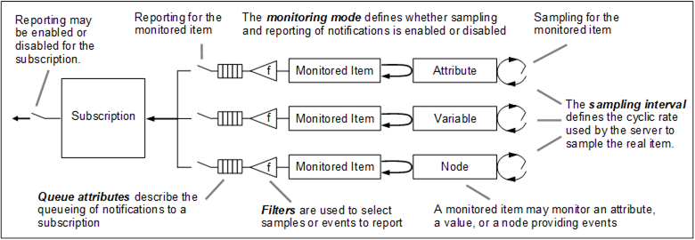  

Figure 15 - MonitoredItem model  

*Attributes* , other than the *Value* *Attribute* , are only monitored for a change in value. The filter is not used for these *Attributes* . Any change in value for these *Attributes* causes a *Notification* to be generated.  

The *Value* *Attribute* is used when monitoring *Variables* . *Variable* values are monitored for a change in value or a change in their status. The filters defined in this document (see [7.22.2](/§\_Ref134419289) ) and in [OPC 10000-8](/§UAPart8) are used to determine if the value change is large enough to cause a *Notification* to be generated for the *Variable* .  

*Objects* and views can be used to monitor *Events* . *Events* are only available from *Nodes* where the *SubscribeToEvents* bit of the *EventNotifier Attribute* is set. The filter defined in this document (see [7.22.3](/§\_Ref129512350) ) is used to determine if an *Event* received from the *Node* is sent to the *Client* . The filter also allows selecting fields of the *EventType* that will be contained in the *Event* such as *EventId* , *EventType* , *SourceNode* , *Time* and *Description* .  

[OPC 10000-3](/§UAPart3) describes the *Event* model and the base *EventTypes* .  

The *Properties* of the base *EventTypes* and the representation of the base *EventTypes* in the *AddressSpace* are specified in [OPC 10000-5](/§UAPart5) .  

##### 5.13.1.2 Sampling interval  

Each *MonitoredItem* created by the *Client* is assigned a sampling interval that is either inherited from the publishing interval of the *Subscription* or that is defined specifically to override that rate. A negative number indicates that the default sampling interval defined by the publishing interval of the *Subscription* is requested. The sampling interval indicates the fastest rate at which the *Server* should sample its underlying source for data changes.  

A *Client* shall define a sampling interval of 0 if it subscribes for *Events* .  

The assigned sampling interval defines a "best effort" cyclic rate that the *Server* uses to sample the item from its source. "Best effort" in this context means that the *Server* does its best to sample at this rate. Sampling at rates faster than this rate is acceptable, but not necessary to meet the needs of the *Client* . How the *Server* deals with the sampling rate and how often it actually polls its data source internally is a *Server* implementation detail. However, the time between values returned to the *Client* shall be greater or equal to the sampling interval.  

The *Client* may also specify 0 for the sampling interval, which indicates that the *Server* should use the fastest practical rate. It is expected that *Servers* will support only a limited set of sampling intervals to optimize their operation. If the exact interval requested by the *Client* is not supported by the *Server* , then the *Server* assigns to the *MonitoredItem* the most appropriate interval as determined by the *Server* . It returns this assigned interval to the *Client* . The *ServerCapabilities* *Object* defined in [OPC 10000-5](/§UAPart5) identifies the minimum sampling interval supported by the *Server* . The optional *MinimumSamplingInterval Attribute* defined in [OPC 10000-3](/§UAPart3) identifies the minimum sampling interval supported for a *Variable* . If a Server uses a fixed set of sampling intervals, the intervals can be exposed using the *SamplingIntervalDiagnosticsArray* in the *ServerDiagnostics* *Object* defined in [OPC 10000-5](/§UAPart5) .  

The *Server* may support data that is collected based on a sampling model or generated based on an exception-based model. The fastest supported sampling interval may be equal to 0, which indicates that the data item is exception-based rather than being sampled at some period. An exception-based model means that the underlying system does not require sampling and reports data changes.  

The *Client* may use the revised sampling interval values as a hint for setting the publishing interval as well as the keep-alive count of a *Subscription* . If, for example, the smallest revised sampling interval of the *MonitoredItems* is 5 seconds, then the time before a keep-alive is sent should be longer than 5 seconds.  

Note that, in many cases, the OPC UA *Server* provides access to a decoupled system and therefore has no knowledge of the data update logic. In this case, even though the OPC UA *Server* samples at the negotiated rate, the data might be updated by the underlying system at a much slower rate. In this case, changes can only be detected at this slower rate.  

If the behaviour by which the underlying system updates the item is known, it will be available via the *MinimumSamplingInterval Attribute* defined in [OPC 10000-3](/§UAPart3) . If the *Server* specifies a value for the *MinimumSamplingInterval* *Attribute* it shall always return a *revisedSamplingInterval* that is equal or higher than the *MinimumSamplingInterval* if the *Client* subscribes to the *Value* *Attribute* .  

*Clients* should also be aware that the sampling by the OPC UA *Server* and the update cycle of the underlying system are usually not synchronized. This can cause additional delays in change detection, as illustrated in [Figure 16](/§\_Ref123976993) .  

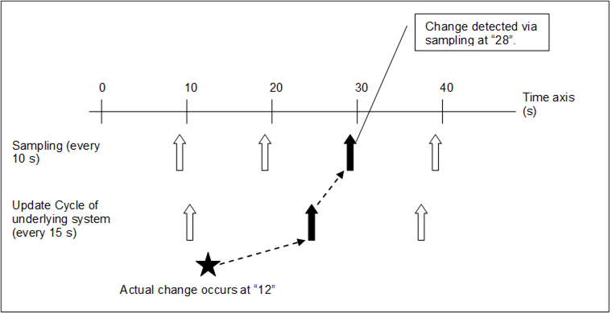  

Figure 16 - Typical delay in change detection  

##### 5.13.1.3 Monitoring mode  

The monitoring mode parameter is used to enable and disable the sampling of a *MonitoredItem* , and also to provide for independently enabling and disabling the reporting of *Notifications* . This capability allows a *MonitoredItem* to be configured to sample, sample and report, or neither. Disabling sampling does not change the values of any of the other *MonitoredItem* parameter, such as its sampling interval.  

When a *MonitoredItem* is enabled (i.e. when the *MonitoringMode* is changed from *DISABLED* to *SAMPLING* or *REPORTING* ) or it is created in the enabled state, the *Server* shall report the first sample as soon as possible and the time of this sample becomes the starting point for the next sampling interval.  

##### 5.13.1.4 Filter  

Each time a *MonitoredItem* is sampled, the *Server* evaluates the sample using the filter defined for the *MonitoredItem* . The filter parameter defines the criteria that the *Server* uses to determine if a *Notification* should be generated for the sample. The type of filter is dependent on the type of the item that is being monitored. For example, the *DataChangeFilter* and the *AggregateFilter* are used when monitoring *Variable Values* and the *EventFilter* is used when monitoring *Events* . Sampling and evaluation, including the use of filters, are described in this document. Additional filters may be defined in other parts of OPC 10000.  

##### 5.13.1.5 Queue parameters  

If the sample passes the filter criteria, a *Notification* is generated and queued for transfer by the *Subscription* . The size of the queue is defined when the *MonitoredItem* is created. When the queue is full and a new *Notification* is received, the *Server* either discards the oldest *Notification* and queues the new one, or it replaces the last value added to the queue with the new one. The *MonitoredItem* is configured for one of these discard policies when the *MonitoredItem* is created. If a Notification is discarded for a *DataValue* and the size of the queue is larger than one, then the *Overflow* bit (flag) in the *InfoBits* portion of the *DataValue* *statusCode* is set. If *discardOldest* is TRUE, the oldest value gets deleted from the queue and the next value in the queue gets the flag set. If *discardOldest* is FALSE, the last value added to the queue gets replaced with the new value. The new value gets the flag set to indicate the lost values in the next *NotificationMessage* . [Figure 17](/§\_Ref328986805) illustrates the queue overflow handling.  

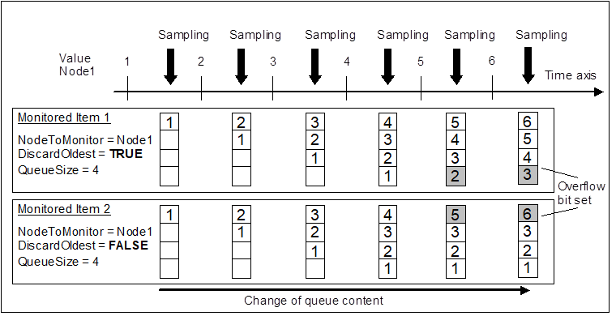  

Figure 17 - Queue overflow handling  

If the queue size is one, the queue becomes a buffer that always contains the newest *Notification* . In this case, if the sampling interval of the *MonitoredItem* is faster than the publishing interval of the *Subscription* , the *MonitoredItem* will be over sampling and the *Client* will always receive the most up-to-date value. The discard policy is ignored if the queue size is one.  

On the other hand, the *Client* may want to subscribe to a continuous stream of *Notifications* without any gaps, but does not want them reported at the sampling interval. In this case, the *MonitoredItem* would be created with a queue size large enough to hold all *Notifications* generated between two consecutive publishing cycles. Then, at each publishing cycle, the *Subscription* would send all *Notifications* queued for the *MonitoredItem* to the *Client* . The *Server* shall return *Notifications* for any particular item in the same order they are in the queue.  

The *Server* may be sampling at a faster rate than the sampling interval to support other *Clients* ; the *Client* should only expect values at the negotiated sampling interval. The *Server* may deliver fewer values than dictated by the sampling interval, based on the filter and implementation constraints. If a *DataChangeFilter* is configured for a *MonitoredItem* , it is always applied to the newest value in the queue compared to the current sample.  

If, for example, the *AbsoluteDeadband* in the *DataChangeFilter* is "10", the queue could consist of values in the following order:  

* 100  

* 111  

* 100  

* 89  

* 100  

Queuing of data may result in unexpected behaviour when using a *Deadband* filter and the number of encountered changes is larger than the number of values that can be maintained. The new first value in the queue may not exceed the *Deadband* limit of the previous value sent to the *Client* .  

The queue size is the maximum value supported by the *Server* when monitoring *Events* . In this case, the *Server* is responsible for the *Event* buffer. If *Events* are lost, an *Event* of the type *EventQueueOverflowEventType* is placed in the queue. This Event is generated when the first Event is discarded on a MonitoredItem subscribing for Events. It is put into the Queue of the MonitoredItem in addition to the size of the Queue defined for this MonitoredItem without discarding any other Event. If *discardOldest* is set to TRUE it is put at the beginning of the queue and is never discarded, otherwise at the end. An aggregating *Server* shall not pass on such an *Event* . It shall be handled like other connection error scenarios using the *SystemStatusChangeEventType* with the *ServerState* *COMMUNICATION\_FAULT* .  

For any fatal error during event processing like out of memory situations, the *Server* should queue an *SystemStatusChangeEventType* event with the *ServerState* *COMMUNICATION\_FAULT* and the source set to the *Server Object* . If there are no resources available at the time the error happens, the *Server* should flag an error internally until there are resources to further process *Events* for the *MonitoredItem.*  

##### 5.13.1.6 Triggering model  

The *MonitoredItems* *Service* allows the addition of items that are reported only when some other item (the triggering item) triggers. This is done by creating links between the triggered items and the items to report. The monitoring mode of the items to report is set to sampling-only so that it will sample and queue *Notifications* without reporting them. [Figure 18](/§\_Ref106785562) illustrates this concept.  

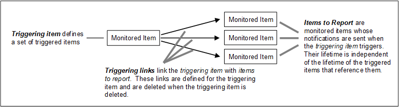  

Figure 18 - Triggering model  

The triggering mechanism is a useful feature that allows *Clients* to reduce the data volume on the wire by configuring some items to sample frequently but only report when some other *Event* happens.  

The following triggering behaviours are specified.  

1. If the monitoring mode of the triggering item is *SAMPLING, then* it is not reported when the triggering item triggers the items to report.  

1. If the monitoring mode of the triggering item is *REPORTING, then it* is reported when the triggering item triggers the items to report.  

1. If the monitoring mode of the triggering item is *DISABLED* , then the triggering item does not trigger the items to report.  

1. If the monitoring mode of the item to report is *SAMPLING, then it* is reported when the triggering item triggers the items to report.  

1. If the monitoring mode of the item to report is *REPORTING* , this effectively causes the triggering item to be ignored. All notifications of the items to report are sent after the publishing interval expires.  

1. If the monitoring mode of the item to report is *DISABLED* , then there will be no sampling of the item to report and therefore no notifications to report.  

1. The first trigger shall occur when the first notification is queued for the triggering item after the creation of the link.  

*Clients* create and delete triggering links between a triggering item and a set of items to report. If the *MonitoredItem* that represents an item to report is deleted before its associated triggering link is deleted, the triggering link is also deleted, but the triggering item is otherwise unaffected.  

Deletion of a *MonitoredItem* should not be confused with the removal of the *Attribute* that it monitors. If the *Node* that contains the *Attribute* being monitored is deleted, the *MonitoredItem* generates a *Notification* with a *StatusCode* *Bad\_NodeIdUnknown* that indicates the deletion, but the *MonitoredItem* is not deleted.  

#### 5.13.2 CreateMonitoredItems  

##### 5.13.2.1 Description  

This *Service* is used to create and add one or more *MonitoredItems* to a *Subscription* . A *MonitoredItem* is deleted automatically by the *Server* when the *Subscription* is deleted. Deleting a *MonitoredItem* causes its entire set of triggered item links to be deleted, but has no effect on the *MonitoredItems* referenced by the triggered items.  

Calling the *CreateMonitoredItems* *Service* repetitively to add a small number of *MonitoredItems* each time may adversely affect the performance of the *Server* . Instead, *Clients* should add a complete set of *MonitoredItems* to a *Subscription* whenever possible.  

When a *MonitoredItem* is added, the *Server* performs initialization processing for it. The initialization processing is defined by the *Notification* type of the item being monitored. *Notification* types are specified in this document and in the Access Type Specification parts of OPC 10000, such as [OPC 10000-8](/§UAPart8) . See [OPC 10000-1](/§UAPart1) for a description of the Access Type Parts. *Clients* may receive *Notifications* for added *MonitoredItems* before the *CreateMonitoredItems* *Response* is received. *Clients* set the *ClientHandle* for the *MonitoredItem* in the *CreateMonitoredItems Request* and are therefore able to process the *Notifications* received before the *CreateMonitoredItems* *Response* is received.  

When a user adds a monitored item that the user is denied read access to, the add operation for the item shall succeed and the bad status *Bad\_NotReadable* or *Bad\_UserAccessDenied* shall be returned in the *Publish* response. This is the same behaviour for the case where the access rights are changed after the call to *CreateMonitoredItems* . If the access rights change to read rights, the *Server* shall start sending data for the *MonitoredItem* . The same procedure shall be applied for an *IndexRange* that does not deliver data for the current value but could deliver data in the future. *Servers* should return all other errors defined in [5.13.2.4](/§\_Ref204249460) as *CreateMonitoredItems* results but all possible errors are allowed to be returned in the *Publish* response.  

Monitored *Nodes* can be removed from the *AddressSpace* after the creation of a *MonitoredItem* . This does not affect the validity of the *MonitoredItem* but a *Bad\_NodeIdUnknown* shall be returned in the *Publish* response. It is possible that the *MonitoredItem* becomes valid again if the *Node* is added again to the *AddressSpace* and the *MonitoredItem* still exists.  

If a *NodeId* is known to be valid by a *Server* but the corresponding *Node Attributes* are currently not available, the *Server* may allow the creation of a *MonitoredItem* and return an appropriate Bad *StatusCode* in the *Publish* response.  

The return diagnostic info setting in the request header of the *CreateMonitoredItems* or the last *ModifyMonitoredItems* *Service* is applied to the *Monitored* *Items* and is used as the diagnostic information settings when sending Notifications in the *Publish* response.  

Illegal request values for parameters that can be revised do not generate errors. Instead the *Server* will choose default values and indicate them in the corresponding revised parameter.  

It is strongly recommended by OPC UA that a *Client* reuses a *Subscription* after a short network interruption by activating the existing *Session* on a new *SecureChannel* as described in [6.7](/§\_Ref303107746) . If a *Client* called *CreateMonitoredItems* during the network interruption and the call succeeded in the *Server* but did not return to the *Client* , then the *Client* does not know if the call succeeded. The *Client* may receive data changes for these monitored items but is not able to remove them since it does not know the *Server* handle for each monitored item. There is also no way for the *Client* to detect if the create succeeded. To delete and recreate the *Subscription* is also not an option since there may be several monitored items operating normally that should not be interrupted. To resolve this situation, the *Server* *Object* provides a *Method* *GetMonitoredItems* that returns the list of *Server* and client handles for the monitored items in a *Subscription* . This *Method* is defined in [OPC 10000-5](/§UAPart5) . The *Server* shall verify that the *Method* is called within the *Session* context of the *Session* that owns the *Subscription* .  

##### 5.13.2.2 Parameters  

[Table 63](/§\_Ref104715274) defines the parameters for the *Service* .  

 **Table 63\- CreateMonitoredItems Service Parameters**   

| **Name** | **Type** | **Description** |
|---|---|---|
| **Request** |||
|requestHeader|RequestHeader|Common request parameters (see [7.32](/§\_Ref129000063) for *RequestHeader* definition).|
|subscriptionId|IntegerId|The *Server*\-assigned identifier for the *Subscription* that will report *Notifications* for this *MonitoredItem* (see [7.19](/§\_Ref128929614) for *IntegerId* definition).|
|timestampsToReturn|Enum  

Timestamps ToReturn|An enumeration that specifies the timestamp *Attributes* to be transmitted for each *MonitoredItem* . The *TimestampsToReturn* enumeration is defined in [7.39](/§\_Ref133134319) .  

When monitoring *Events* , this applies only to *Event* fields that are of type *DataValue* .|
|itemsToCreate []|MonitoredItem CreateRequest|A list of *MonitoredItems* to be created and assigned to the specified *Subscription* . This structure is defined in-line with the following indented items.|
| itemToMonitor|ReadValueId|Identifies an item in the *AddressSpace* to monitor. To monitor for *Events* , the *attributeId* element of the *ReadValueId* structure is the id of the *EventNotifier* *Attribute* . The *ReadValueId* type is defined in [7.28](/§\_Ref133161488) .|
| monitoringMode|Enum  

MonitoringMode|The monitoring mode to be set for the *MonitoredItem* . The *MonitoringMode* enumeration is defined in [7.23](/§\_Ref187493167) .|
| requestedParameters|Monitoring Parameters|The requested monitoring parameters. *Servers* negotiate the values of these parameters based on the *Subscription* and the capabilities of the *Server* . The *MonitoringParameters* type is defined in [7.21](/§\_Ref161114771) .|
||||
| **Response** |||
|responseHeader|Response Header|Common response parameters (see [7.33](/§\_Ref115239340) for *ResponseHeader* definition).|
|results []|MonitoredItem CreateResult|List of results for the *MonitoredItems* to create. The size and order of the list matches the size and order of the *itemsToCreate* request parameter. This structure is defined in-line with the following indented items.|
| statusCode|StatusCode|*StatusCode* for the *MonitoredItem* to create (see [7.38](/§\_Ref127346441) for *StatusCode* definition).|
| monitoredItemId|IntegerId|*Server*\-assigned id for the *MonitoredItem* (see [7.19](/§\_Ref128929614) for *IntegerId* definition). This id is unique within the *Subscription* , but might not be unique within the *Server* or *Session* . This parameter is present only if the *statusCode* indicates that the *MonitoredItem* was successfully created.|
| revisedSampling  Interval|Duration|The actual sampling interval that the *Server* will use.  

This value is based on a number of factors, including capabilities of the underlying system. The *Server* shall always return a *revisedSamplingInterval* that is equal or higher than the requested *samplingInterval* . If the requested *samplingInterval* is higher than the maximum sampling interval supported by the *Server* , the maximum sampling interval is returned.|
| revisedQueueSize|Counter|The actual queue size that the *Server* will use.|
| filterResult|Extensible Parameter  

MonitoringFilterResult|Contains any revised parameter values or error results associated with the *MonitoringFilter* specified in *requestedParameters* . This parameter may be null if no errors occurred. The *MonitoringFilterResult* parameter type is an extensible parameter type specified in [7.22](/§\_Ref127325541) .|
|diagnosticInfos []|DiagnosticInfo|List of diagnostic information for the *MonitoredItems* to create (see [7.12](/§\_Ref127334266) for *DiagnosticInfo* definition). The size and order of the list matches the size and order of the *itemsToCreate* request parameter. This list is empty if diagnostics information was not requested in the request header or if no diagnostic information was encountered in processing of the request.|
  

  

##### 5.13.2.3 Service results  

[Table 64](/§\_Ref104715658) defines the *Service* results specific to this *Service* . Common *StatusCodes* are defined in [Table 176](/§\_Ref90539276) .  

 **Table 64\- CreateMonitoredItems Service Result Codes**   

| **Symbolic Id** | **Description** |
|---|---|
|Bad\_NothingToDo|See [Table 176](/§\_Ref90539276) for the description of this result code.|
|Bad\_TooManyOperations|See [Table 176](/§\_Ref90539276) for the description of this result code.|
|Bad\_TimestampsToReturnInvalid|See [Table 176](/§\_Ref90539276) for the description of this result code.|
|Bad\_SubscriptionIdInvalid|See [Table 176](/§\_Ref90539276) for the description of this result code.|
  

  

##### 5.13.2.4 StatusCodes  

[Table 65](/§\_Ref104715683) defines values for the operation level *statusCode* parameter that are specific to this *Service* . Common *StatusCodes* are defined in [Table 177](/§\_Ref127606591) .  

 **Table 65\- CreateMonitoredItems Operation Level Result Codes**   

| **Symbolic Id** | **Description** |
|---|---|
|Bad\_MonitoringModeInvalid|See [Table 177](/§\_Ref127606591) for the description of this result code.|
|Bad\_NodeIdInvalid|See [Table 177](/§\_Ref127606591) for the description of this result code.|
|Bad\_NodeIdUnknown|See [Table 177](/§\_Ref127606591) for the description of this result code.|
|Bad\_AttributeIdInvalid|See [Table 177](/§\_Ref127606591) for the description of this result code.|
|Bad\_IndexRangeInvalid|See [Table 177](/§\_Ref127606591) for the description of this result code.|
|Bad\_IndexRangeNoData|See [Table 177](/§\_Ref127606591) for the description of this result code.  

If the *ArrayDimensions* have a fixed length that cannot change and no data exists within the range of indexes specified, Bad\_IndexRangeNoData is returned in *CreateMonitoredItems* . Otherwise if the length of the array is dynamic, the *Server* shall return this status in a *Publish* response for the *MonitoredItem* if no data exists within the range.|
|Bad\_DataEncodingInvalid|See [Table 177](/§\_Ref127606591) for the description of this result code.|
|Bad\_MonitoredItemFilterInvalid|See [Table 177](/§\_Ref127606591) for the description of this result code.|
|Bad\_MonitoredItemFilterUnsupported|See [Table 177](/§\_Ref127606591) for the description of this result code.|
|Bad\_FilterNotAllowed|See [Table 177](/§\_Ref127606591) for the description of this result code.|
|Bad\_TooManyMonitoredItems|The *Server* has reached its maximum number of monitored items.|
  

  

#### 5.13.3 ModifyMonitoredItems  

##### 5.13.3.1 Description  

This *Service* is used to modify *MonitoredItems* of a *Subscription* . Changes to the *MonitoredItem* settings shall be applied immediately by the *Server* . They take effect as soon as practical but not later than twice the new *revisedSamplingInterval* .  

The return diagnostic info setting in the request header of the *CreateMonitoredItems* or the last *ModifyMonitoredItems* *Service* is applied to the *Monitored* *Items* and is used as the diagnostic information settings when sending Notifications in the *Publish* response.  

Illegal request values for parameters that can be revised do not generate errors. Instead the *Server* will choose default values and indicate them in the corresponding revised parameter.  

##### 5.13.3.2 Parameters  

[Table 66](/§\_Ref104715750) defines the parameters for the *Service* .  

 **Table 66\- ModifyMonitoredItems Service Parameters**   

| **Name** | **Type** | **Description** |
|---|---|---|
| **Request** |||
|requestHeader|RequestHeader|Common request parameters (see [7.32](/§\_Ref129000063) for *RequestHeader* definition).|
|subscriptionId|IntegerId|The *Server*\-assigned identifier for the *Subscription* used to qualify the *monitoredItemId* (see [7.19](/§\_Ref128929614) for *IntegerId* definition).|
|timestampsToReturn|Enum  

Timestamps ToReturn|An enumeration that specifies the timestamp *Attributes* to be transmitted for each *MonitoredItem* to be modified. The *TimestampsToReturn* enumeration is defined in [7.39](/§\_Ref133134319) . When monitoring *Events* , this applies only to *Event* fields that are of type *DataValue* .|
|itemsToModify []|MonitoredItemModifyRequest|The list of *MonitoredItems* to modify. This structure is defined in-line with the following indented items.|
| monitoredItemId|IntegerId|*Server*\-assigned id for the *MonitoredItem* .|
| requestedParameters|Monitoring Parameters|The requested values for the monitoring parameters. The *MonitoringParameters* type is defined in [7.21](/§\_Ref161114771) .  

If the number of notifications in the queue exceeds the new queue size, the notifications exceeding the size shall be discarded following the configured discard policy.|
||||
| **Response** |||
|responseHeader|Response Header|Common response parameters (see [7.33](/§\_Ref115239340) for *ResponseHeader* definition).|
|results []|MonitoredItemModifyResult|List of results for the *MonitoredItems* to modify. The size and order of the list matches the size and order of the *itemsToModify* request parameter. This structure is defined in-line with the following indented items.|
| statusCode|StatusCode|*StatusCode* for the *MonitoredItem* to be modified (see [7.38](/§\_Ref127346441) for *StatusCode* definition).|
| revisedSampling  

 Interval|Duration|The actual sampling interval that the *Server* will use. The *Server* returns the value it will actually use for the sampling interval. This value is based on a number of factors, including capabilities of the underlying system.  

The *Server* shall always return a *revisedSamplingInterval* that is equal or higher than the requested *samplingInterval* . If the requested *samplingInterval* is higher than the maximum sampling interval supported by the *Server* , the maximum sampling interval is returned.|
| revisedQueueSize|Counter|The actual queue size that the *Server* will use.|
| filterResult|Extensible Parameter  

MonitoringFilter Result|Contains any revised parameter values or error results associated with the *MonitoringFilter* specified in the request. This parameter may be null if no errors occurred. The *MonitoringFilterResult* parameter type is an extensible parameter type specified in [7.22](/§\_Ref127325541) .|
|diagnosticInfos []|DiagnosticInfo|List of diagnostic information for the *MonitoredItems* to modify (see [7.12](/§\_Ref127334266) for *DiagnosticInfo* definition). The size and order of the list matches the size and order of the *itemsToModify* request parameter. This list is empty if diagnostics information was not requested in the request header or if no diagnostic information was encountered in processing of the request.|
  

  

##### 5.13.3.3 Service results  

[Table 67](/§\_Ref89583990) defines the *Service* results specific to this *Service* . Common *StatusCodes* are defined in [Table 176](/§\_Ref90539276) .  

 **Table 67\- ModifyMonitoredItems Service Result Codes**   

| **Symbolic Id** | **Description** |
|---|---|
|Bad\_NothingToDo|See [Table 176](/§\_Ref90539276) for the description of this result code.|
|Bad\_TooManyOperations|See [Table 176](/§\_Ref90539276) for the description of this result code.|
|Bad\_TimestampsToReturnInvalid|See [Table 176](/§\_Ref90539276) for the description of this result code.|
|Bad\_SubscriptionIdInvalid|See [Table 176](/§\_Ref90539276) for the description of this result code.|
  

  

##### 5.13.3.4 StatusCodes  

[Table 68](/§\_Ref89583957) defines values for the operation level *statusCode* parameter that are specific to this *Service* . Common *StatusCodes* are defined in [Table 177](/§\_Ref127606591) .  

 **Table 68\- ModifyMonitoredItems Operation Level Result Codes**   

| **Symbolic Id** | **Description** |
|---|---|
|Bad\_MonitoredItemIdInvalid|See [Table 177](/§\_Ref127606591) for the description of this result code.|
|Bad\_MonitoredItemFilterInvalid|See [Table 177](/§\_Ref127606591) for the description of this result code.|
|Bad\_MonitoredItemFilterUnsupported|See [Table 177](/§\_Ref127606591) for the description of this result code.|
|Bad\_FilterNotAllowed|See [Table 176](/§\_Ref90539276) for the description of this result code.|
  

  

#### 5.13.4 SetMonitoringMode  

##### 5.13.4.1 Description  

This *Service* is used to set the monitoring mode for one or more *MonitoredItems* of a *Subscription* . Setting the mode to DISABLED causes all queued *Notifications* to be deleted.  

##### 5.13.4.2 Parameters  

[Table 69](/§\_Ref80159433) defines the parameters for the *Service* .  

 **Table 69\- SetMonitoringMode Service Parameters**   

| **Name** | **Type** | **Description** |
|---|---|---|
| **Request** |||
|requestHeader|RequestHeader|Common request parameters (see [7.32](/§\_Ref129000063) for *RequestHeader* definition).|
|subscriptionId|IntegerId|The *Server*\-assigned identifier for the *Subscription* used to qualify the *monitoredItemIds* (see [7.19](/§\_Ref128929614) for *IntegerId* definition).|
|monitoringMode|Enum  

MonitoringMode|The monitoring mode to be set for the *MonitoredItems* . The *MonitoringMode* enumeration is defined in [7.23](/§\_Ref187493167) .|
|monitoredItemIds []|IntegerId|List of *Server*\-assigned ids for the *MonitoredItems* .|
||||
| **Response** |||
|responseHeader|Response Header|Common response parameters (see [7.33](/§\_Ref115239340) for *ResponseHeader* definition).|
|results []|StatusCode|List of *StatusCodes* for the *MonitoredItems* to enable/disable (see [7.38](/§\_Ref127346441) for *StatusCode* definition). The size and order of the list matches the size and order of the *monitoredItemIds* request parameter.|
|diagnosticInfos []|DiagnosticInfo|List of diagnostic information for the *MonitoredItems* to enable/disable (see [7.12](/§\_Ref127334266) for *DiagnosticInfo* definition). The size and order of the list matches the size and order of the *monitoredItemIds* request parameter. This list is empty if diagnostics information was not requested in the request header or if no diagnostic information was encountered in processing of the request.|
  

  

##### 5.13.4.3 Service results  

[Table 70](/§\_Ref88280104) defines the *Service* results specific to this *Service* . Common *StatusCodes* are defined in [Table 176](/§\_Ref90539276) .  

 **Table 70\- SetMonitoringMode Service Result Codes**   

| **Symbolic Id** | **Description** |
|---|---|
|Bad\_NothingToDo|See [Table 176](/§\_Ref90539276) for the description of this result code.|
|Bad\_TooManyOperations|See [Table 176](/§\_Ref90539276) for the description of this result code.|
|Bad\_SubscriptionIdInvalid|See [Table 176](/§\_Ref90539276) for the description of this result code.|
|Bad\_MonitoringModeInvalid|See [Table 177](/§\_Ref127606591) for the description of this result code.|
  

  

##### 5.13.4.4 StatusCodes  

[Table 71](/§\_Ref80161899) defines values for the operation level *results* parameter that are specific to this *Service* . Common *StatusCodes* are defined in [Table 177](/§\_Ref127606591) .  

 **Table 71\- SetMonitoringMode Operation Level Result Codes**   

| **Symbolic Id** | **Description** |
|---|---|
|Bad\_MonitoredItemIdInvalid|See [Table 177](/§\_Ref127606591) for the description of this result code.|
  

  

#### 5.13.5 SetTriggering  

##### 5.13.5.1 Description  

This *Service* is used to create and delete triggering links for a triggering item. The triggering item and the items to report shall belong to the same *Subscription* .  

Each triggering link links a triggering item to an item to report. Each link is represented by the *MonitoredItem* id for the item to report. An error code is returned if this id is invalid.  

See [5.13.1.6](/§\_Ref288138179) for a description of the triggering model.  

##### 5.13.5.2 Parameters  

[Table 72](/§\_Ref106006196) defines the parameters for the *Service* .  

 **Table 72\- SetTriggering Service Parameters**   

| **Name** | **Type** | **Description** |
|---|---|---|
| **Request** |||
|requestHeader|Request Header|Common request parameters (see [7.32](/§\_Ref129000063) for *RequestHeader* definition).|
|subscriptionId|IntegerId|The *Server*\-assigned identifier for the *Subscription* that contains the triggering item and the items to report (see [7.19](/§\_Ref128929614) for *IntegerId* definition).|
|triggeringItemId|IntegerId|*Server*\-assigned id for the *MonitoredItem* used as the triggering item.|
|linksToAdd []|IntegerId|The list of *Server*\-assigned ids of the items to report that are to be added as triggering links. The list of *linksToRemove* is processed before the *linksToAdd* .|
|linksToRemove []|IntegerId|The list of *Server*\-assigned ids of the items to report for the triggering links to be deleted. The list of *linksToRemove* is processed before the *linksToAdd* .|
||||
| **Response** |||
|responseHeader|Response Header|Common response parameters (see [7.33](/§\_Ref115239340) for *ResponseHeader* definition).|
|addResults []|StatusCode|List of *StatusCodes* for the items to add (see [7.38](/§\_Ref127346441) for *StatusCode* definition). The size and order of the list matches the size and order of the *linksToAdd* parameter specified in the request.|
|addDiagnosticInfos []|Diagnostic Info|List of diagnostic information for the links to add (see [7.12](/§\_Ref127334266) for *DiagnosticInfo* definition). The size and order of the list matches the size and order of the *linksToAdd* request parameter. This list is empty if diagnostics information was not requested in the request header or if no diagnostic information was encountered in processing of the request.|
|removeResults []|StatusCode|List of *StatusCodes* for the items to delete. The size and order of the list matches the size and order of the *linksToRemove* parameter specified in the request.|
|removeDiagnosticInfos []|Diagnostic Info|List of diagnostic information for the links to delete. The size and order of the list matches the size and order of the *linksToRemove* request parameter. This list is empty if diagnostics information was not requested in the request header or if no diagnostic information was encountered in processing of the request.|
  

  

##### 5.13.5.3 Service results  

[Table 73](/§\_Ref106011622) defines the *Service* results specific to this *Service* . Common *StatusCodes* are defined in [7.38](/§\_Ref88280762) .  

 **Table 73\- SetTriggering Service Result Codes**   

| **Symbolic Id** | **Description** |
|---|---|
|Bad\_NothingToDo|See [Table 176](/§\_Ref90539276) for the description of this result code.|
|Bad\_TooManyOperations|See [Table 176](/§\_Ref90539276) for the description of this result code.|
|Bad\_SubscriptionIdInvalid|See [Table 176](/§\_Ref90539276) for the description of this result code.|
|Bad\_MonitoredItemIdInvalid|See [Table 177](/§\_Ref127606591) for the description of this result code.|
  

  

##### 5.13.5.4 StatusCodes  

[Table 74](/§\_Ref106011650) defines values for the results parameters that are specific to this *Service* . Common *StatusCodes* are defined in [Table 177](/§\_Ref127606591) .  

 **Table 74\- SetTriggering Operation Level Result Codes**   

| **Symbolic Id** | **Description** |
|---|---|
|Bad\_MonitoredItemIdInvalid|See [Table 177](/§\_Ref127606591) for the description of this result code.|
  

  

#### 5.13.6 DeleteMonitoredItems  

##### 5.13.6.1 Description  

This *Service* is used to remove one or more *MonitoredItems* of a *Subscription* . When a *MonitoredItem* is deleted, its triggered item links are also deleted.  

Successful removal of a *MonitoredItem* , however, might not remove *Notifications* for the *MonitoredItem* that are in the process of being sent by the *Subscription* . Therefore, *Clients* may receive *Notifications* for the *MonitoredItem* after they have received a positive response that the *MonitoredItem* has been deleted.  

##### 5.13.6.2 Parameters  

[Table 75](/§\_Ref78943893) defines the parameters for the *Service* .  

 **Table 75\- DeleteMonitoredItems Service Parameters**   

| **Name** | **Type** | **Description** |
|---|---|---|
| **Request** |||
|requestHeader|RequestHeader|Common request parameters (see [7.32](/§\_Ref129000063) for *RequestHeader* definition).|
|subscriptionId|IntegerId|The *Server*\-assigned identifier for the *Subscription* that contains the *MonitoredItems* to be deleted (see [7.19](/§\_Ref128929614) for *IntegerId* definition).|
|monitoredItemIds []|IntegerId|List of *Server*\-assigned ids for the *MonitoredItems* to be deleted.|
||||
| **Response** |||
|responseHeader|Response Header|Common response parameters (see [7.33](/§\_Ref115239340) for *ResponseHeader* definition).|
|results []|StatusCode|List of *StatusCodes* for the *MonitoredItems* to delete (see [7.38](/§\_Ref127346441) for *StatusCode* definition). The size and order of the list matches the size and order of the *monitoredItemIds* request parameter.|
|diagnosticInfos []|DiagnosticInfo|List of diagnostic information for the *MonitoredItems* to delete (see [7.12](/§\_Ref127334266) for *DiagnosticInfo* definition). The size and order of the list matches the size and order of the *monitoredItemIds* request parameter. This list is empty if diagnostics information was not requested in the request header or if no diagnostic information was encountered in processing of the request.|
  

  

##### 5.13.6.3 Service results  

[Table 76](/§\_Ref88280064) defines the *Service* results specific to this *Service* . Common *StatusCodes* are defined in [Table 176](/§\_Ref90539276) .  

 **Table 76\- DeleteMonitoredItems Service Result Codes**   

| **Symbolic Id** | **Description** |
|---|---|
|Bad\_NothingToDo|See [Table 176](/§\_Ref90539276) for the description of this result code.|
|Bad\_TooManyOperations|See [Table 176](/§\_Ref90539276) for the description of this result code.|
|Bad\_SubscriptionIdInvalid|See [Table 176](/§\_Ref90539276) for the description of this result code.|
  

  

##### 5.13.6.4 StatusCodes  

[Table 77](/§\_Ref78943877) defines values for the *results* parameter that are specific to this *Service* . Common *StatusCodes* are defined in [Table 177](/§\_Ref127606591) .  

 **Table 77\- DeleteMonitoredItems Operation Level Result Codes**   

| **Symbolic Id** | **Description** |
|---|---|
|Bad\_MonitoredItemIdInvalid|See [Table 177](/§\_Ref127606591) for the description of this result code.|
  

  

### 5.14 Subscription Service Set  

#### 5.14.1 Subscription model  

##### 5.14.1.1 Description  

*Subscriptions* are used to report *Notifications* to the *Client* . Their general behaviour is summarized below. Their precise behaviour is described in [5.14.1.2](/§\_Ref107033922) .  

1. *Subscriptions* have a set of *MonitoredItems* assigned to them by the *Client* . *MonitoredItems* generate *Notifications* that are to be reported to the *Client* by the *Subscription* (see [5.13.1](/§\_Ref110831567) for a description of *MonitoredItems* ).  

1. *Subscriptions* have a publishing interval. The publishing interval of a *Subscription* defines the cyclic rate at which the *Subscription* executes. Each time it executes, it attempts to send a *NotificationMessage* to the *Client* . *NotificationMessages* contain *Notifications* that have not yet been reported to *Client* .  

1. *NotificationMessages* are sent to the *Client* in response to *Publish* requests. *Publish* requests are normally queued to the *Session* as they are received, and one is de-queued and processed by a *Subscription* related to this *Session* for each publishing cycle, if there are *Notifications* to report. When there are not, the *Publish* request is not de-queued from the *Session* , and the *Server* waits until the next cycle and checks again for *Notifications* .  

1. At the beginning of a cycle, if there are *Notifications* to send but there are no *Publish* requests queued, the *Server* enters a wait state for a *Publish* request to be received. When one is received, it is processed immediately without waiting for the next publishing cycle.  

1. *NotificationMessages* are uniquely identified by sequence numbers that enable *Clients* to detect missed *Messages* . The publishing interval also defines the default sampling interval for its *MonitoredItems* .  

1. *Subscriptions* have a keep-alive counter that counts the number of consecutive publishing cycles in which there have been no *Notifications* to report to the *Client* . When the maximum keep-alive count is reached, a *Publish* request is de-queued and used to return a keep-alive *Message* . This keep-alive *Message* informs the *Client* that the *Subscription* is still active. Each keep-alive *Message* is a response to a *Publish* request in which the *notificationMessage* parameter does not contain any *Notifications* and that contains the sequence number of the next *NotificationMessage* that is to be sent. In the clauses that follow, the term *NotificationMessage* refers to a response to a *Publish* request in which the *notificationMessage* parameter actually contains one or more *Notifications* , as opposed to a *keep-alive Message* in which this parameter contains no *Notifications* . The maximum keep-alive count is set by the *Client* during *Subscription* creation and may be subsequently modified using the *ModifySubscription* *Service* . Similar to *Notification* processing described in (c) above, if there are no *Publish* requests queued, the *Server* waits for the next one to be received and sends the keep-alive immediately without waiting for the next publishing cycle.  

1. Publishing by a *Subscription* may be enabled or disabled by the *Client* when created, or subsequently using the *SetPublishingMode* *Service* . Disabling causes the *Subscription* to cease sending *NotificationMessages* to the *Client* . However, the *Subscription* continues to execute cyclically and continues to send keep-alive *Messages* to the *Client* .  

1. *Subscriptions* have a lifetime counter that counts the number of consecutive publishing cycles in which there have been no *Publish* requests available to send a *Publish* response for the *Subscription* . Any *Service* call that uses the *SubscriptionId* or the processing of a *Publish* response resets the lifetime counter of this *Subscription* . When this counter reaches the value calculated for the lifetime of a *Subscription* , the *Subscription* is closed. Closing the *Subscription* causes its *MonitoredItems* to be deleted. In addition the *Server* shall issue a *StatusChangeNotification* *notificationMessage* with the status code Bad\_Timeout. The *StatusChangeNotification notificationMessage* type is defined in [7.25.4](/§\_Ref166078476) .  

1. *Sessions* maintain a retransmission queue of sent *NotificationMessages* . *NotificationMessages* are retained in this queue until they are acknowledged. The *Session* maintains a retransmission queue size of at least two times the number of *Publish* requests per *Session* the *Server* supports. A *Profile* in [OPC 10000-7](/§UAPart7) may make the retransmission queue support optional. The minimum number of *Publish* requests per *Session* the *Server* shall support is defined in [OPC 10000-7](/§UAPart7) . *Clients* are required to acknowledge *NotificationMessages* as they are received if the *Publish* response parameter *availableSequenceNumbers* is not an empty array. An empty array in *availableSequenceNumbers* indicates that the *Server* does not support a retransmission queue and acknowledgement of *NotificationMessages* . In the case of a retransmission queue overflow, the oldest sent *NotificationMessage* gets deleted. If a *Subscription* is transferred to another *Session* , the queued *NotificationMessages* for this *Subscription* are moved from the old to the new *Session* .  

The sequence number is an unsigned 32-bit integer that is incremented by one for each *NotificationMessage* sent. The value 0 is never used for the sequence number. The first *NotificationMessage* sent on a *Subscription* has a sequence number of 1. If the sequence number rolls over, it rolls over to 1.  

When a *Subscription* is created, the first *Message* is sent at the end of the first publishing cycle to inform the *Client* that the *Subscription* is operational. A *NotificationMessage* is sent if there are *Notifications* ready to be reported. If there are none, a keep-alive *Message* is sent instead that contains a sequence number of 1, indicating that the first *NotificationMessage* has not yet been sent. This is the only time a keep-alive *Message* is sent without waiting for the maximum keep-alive count to be reached, as specified in (f) above.  

A *Client* shall be prepared for receiving *Publish* responses for a *Subscription* more frequently than the corresponding publishing interval. One example is the situation where the number of available notifications exceeds the *Subscription* setting *maxNotificationsPerPublish* . A *Client* is always able to control the timing of the *Publish* responses by not queueing *Publish* requests. If a *Client* does not queue *Publish* requests in the *Server* , the *Server* can only send a *Publish* response if it receives a new *Publish* request. This would increase latency for delivery of notifications but allows a *Client* to throttle the number of received *Publish* responses in high load situations.  

The value of the sequence number is never reset during the lifetime of a *Subscription* . Therefore, the same sequence number shall not be reused on a *Subscription* until over four billion *NotificationMessages* have been sent. At a continuous rate of one thousand *NotificationMessages* per second on a given *Subscription* , it would take roughly fifty days for the same sequence number to be reused. This allows *Clients* to safely treat sequence numbers as unique.  

Sequence numbers are also used by *Clients* to acknowledge the receipt of *NotificationMessages* . *Publish* requests allow the *Client* to acknowledge all *Notifications* up to a specific sequence number and to acknowledge the sequence number of the last *NotificationMessage* received. One or more gaps may exist in between. Acknowledgements allow the *Server* to delete *NotificationMessages* from its retransmission queue. If the retransmission queue contains outdated sequence numbers related to the sequence number acknowledged by the *Client* , the *Server* may delete these older *NotificationMessage* from the retransmission queue. The outdated sequence numbers are calculated with the following formular.  

outdated \< acknowledged sequence number - (2 x max retransmission queue size)  

*Clients* may ask for retransmission of selected *NotificationMessages* using the Republish *Service* . This *Service* returns the requested *Message* .  

*Subscriptions* are designed to work independent of the actual communication connection between OPC UA *Client* and *Server* and independent of a *Session* . Short communication interruptions can be handled without losing data or events. To make sure that longer communication interruptions or planned disconnects can be handled without losing data or events, an OPC UA *Server* may support durable *Subscriptions* . If this feature is supported, the *Server* accepts a high *Subscription* *RequestedLifetimeCount* and large *MonitoredItem* *QueueSize* parameter settings. Subclause [6.8](/§\_Ref380153950) describes how durable *Subscriptions* can be created and used.  

##### 5.14.1.2 State table  

The state table formally describes the operation of the *Subscription* . The following model of operations is described by this state table. This description applies when publishing is enabled or disabled for the *Subscription* .  

After creation of the *Subscription* , the *Server* starts the publishing timer and restarts it whenever it expires. If the timer expires the number of times defined for the *Subscription* lifetime without having received a *Subscription* *Service* request from the *Client* , the *Subscription* assumes that the *Client* is no longer present, and terminates.  

*Clients* send *Publish* requests to *Servers* to receive *Notifications* . *Publish* requests are not directed to any one *Subscription* and, therefore, may be used by any *Subscription* . Each contains acknowledgements for one or more *Subscriptions* . These acknowledgements are processed when the *Publish* request is received. The *Server* then queues the request in a queue shared by all *Subscriptions* , except in the following cases.  

1. The previous *Publish* response indicated that there were still more *Notifications* ready to be transferred and there were no more *Publish* requests queued to transfer them.  

1. The publishing timer of a *Subscription* expired and there were either *Notifications* to be sent or a keep-alive *Message* to be sent.  

In these cases, the newly received *Publish* request is processed immediately by the first *Subscription* to encounter either case (a) or case (b).  

Each time the publishing timer expires, it is immediately reset. If there are *Notifications* or a keep-alive *Message* to be sent, it de-queues and processes a *Publish* request. When a *Subscription* processes a *Publish* request, it accesses the queues of its *MonitoredItems* and de-queues its *Notifications* , if any. It returns these *Notifications* in the response, setting the *moreNotifications* flag if it was not able to return all available *Notifications* in the response.  

If there were *Notifications* or a keep-alive *Message* to be sent but there were no *Publish* requests queued, the *Subscription* assumes that the *Publish* request is late and waits for the next *Publish* request to be received, as described in case (b).  

If the *Subscription* is disabled when the publishing timer expires or if there are no *Notifications* available, it enters the keep-alive state and sets the keep-alive counter to its maximum value as defined for the *Subscription* .  

While in the keep-alive state, it checks for *Notifications* each time the publishing timer expires. If one or more *Notifications* have been generated, a *Publish* request is de-queued and a *NotificationMessage* is returned in the response. However, if the publishing timer expires without a *Notification* becoming available, a *Publish* request is de-queued and a keep-alive *Message* is returned in the response. The *Subscription* then returns to the normal state of waiting for the publishing timer to expire again. If, in either of these cases, there are no *Publish* requests queued, the *Subscription* waits for the next *Publish* request to be received, as described in case (b).  

The *Subscription* states are defined in [Table 78](/§\_Ref107032179) .  

 **Table 78\- Subscription States**   

| **State** | **Description** |
|---|---|
|CLOSED|The *Subscription* has not yet been created or has terminated.|
|CREATING|The *Subscription* is being created.|
|NORMAL|The *Subscription* is cyclically checking for *Notifications* from its *MonitoredItems* . The keep-alive counter is not used in this state.|
|LATE|The publishing timer has expired and there are *Notifications* available or a keep-alive *Message* is ready to be sent, but there are no *Publish* requests queued. When in this state, the next *Publish* request is processed when it is received. The keep-alive counter is not used in this state.|
|KEEPALIVE|The *Subscription* is cyclically checking for *Notifications* from its *MonitoredItems* or for the keep-alive counter to count down to 0 from its maximum.|
  

  

The state table is described in [Table 79](/§\_Ref107032203) . The following rules and conventions apply.  

1. *Events* represent the receipt of *Service* requests and the occurrence internal *Events* , such as timer expirations.  

1. *Service* requests *Events* may be accompanied by conditions that test *Service* parameter values. Parameter names begin with a lower case letter.  

1. Internal *Events* may be accompanied by conditions that test state *Variable* values. State *Variables* are defined in [5.14.1.3](/§\_Ref107199977) . They begin with an upper case letter.  

1. *Service* request and internal *Events* may be accompanied by conditions represented by functions whose return value is tested. Functions are identified by "()" after their name. They are described in [5.14.1.4](/§\_Ref107199978) .  

1. When an *Event* is received, the first transition for the current state is located and the transitions are searched sequentially for the first transition that meets the *Event* or conditions criteria. If none are found, the *Event* is ignored.  

1. Actions are described by functions and state *Variable* manipulations.  

1. The LifetimeTimerExpires *Event* is triggered when its corresponding counter reaches zero.  

 **Table 79\- Subscription State Table**   

| **\#** | **Current State** | **Event/Conditions** | **Action** | **Next State** |
|---|---|---|---|---|
|1|CLOSED|Receive CreateSubscription Request|CreateSubscription()|CREATING|
|2|CREATING|CreateSubscription fails|ReturnNegativeResponse()|CLOSED|
|3|CREATING|CreateSubscription succeeds|InitializeSubscription()  

MessageSent = FALSE  

ReturnResponse()|NORMAL|
|4|NORMAL|Receive *Publish* Request  

&&  

(  

 PublishingEnabled == FALSE  

||  

 (PublishingEnabled == TRUE  

 && MoreNotifications == FALSE)  

)|DeleteAckedNotificationMsgs()  

EnqueuePublishingReq()|NORMAL|
|5|NORMAL|Receive *Publish* Request  

&& PublishingEnabled == TRUE  

&& MoreNotifications == TRUE|ResetLifetimeCounter()  

DeleteAckedNotificationMsgs()  

ReturnNotifications()  

MessageSent = TRUE|NORMAL|
|6|NORMAL|PublishingTimer Expires  

&& PublishingReqQueued == TRUE  

&& PublishingEnabled == TRUE  

&& NotificationsAvailable == TRUE|ResetLifetimeCounter()  

StartPublishingTimer()  

DequeuePublishReq()  

ReturnNotifications()  

MessageSent = TRUE|NORMAL|
|7|NORMAL|PublishingTimer Expires  

&& PublishingReqQueued == TRUE  

&& MessageSent == FALSE  

&&  

(  

 PublishingEnabled == FALSE  

||  

 (PublishingEnabled == TRUE  

 && NotificationsAvailable == FALSE)  

)|ResetLifetimeCounter()  

StartPublishingTimer()  

DequeuePublishReq()  

ReturnKeepAlive()  

MessageSent = TRUE|NORMAL|
|8|NORMAL|PublishingTimer Expires  

&& PublishingReqQueued == FALSE  

&&  

(  

 MessageSent == FALSE  

||  

 (PublishingEnabled == TRUE  

 && NotificationsAvailable == TRUE)  

)|StartPublishingTimer()|LATE|
|9|NORMAL|PublishingTimer Expires  

&& MessageSent == TRUE  

&&  

(  

 PublishingEnabled == FALSE  

||  

 (PublishingEnabled == TRUE  

 && NotificationsAvailable == FALSE)  

)|StartPublishingTimer()  

ResetKeepAliveCounter()  

KeepAliveCounter--|KEEPALIVE|
|10|LATE|Receive *Publish* Request  

&& PublishingEnabled == TRUE  

&& (NotificationsAvailable == TRUE  

|| MoreNotifications == TRUE)|ResetLifetimeCounter()  

DeleteAckedNotificationMsgs()  

ReturnNotifications()  

MessageSent = TRUE|NORMAL|
|11|LATE|Receive *Publish* Request  

&&  

(  

 PublishingEnabled == FALSE  

||  

 (PublishingEnabled == TRUE  

 && NotificationsAvailable == FALSE  

 && MoreNotifications == FALSE)  

)|ResetLifetimeCounter()  

DeleteAckedNotificationMsgs()  

ReturnKeepAlive()  

MessageSent = TRUE|KEEPALIVE|
|12|LATE|PublishingTimer Expires|StartPublishingTimer()|LATE|
|13|KEEPALIVE|Receive *Publish* Request|DeleteAckedNotificationMsgs()  

EnqueuePublishingReq()|KEEPALIVE|
|14|KEEPALIVE|PublishingTimer Expires  

&& PublishingEnabled == TRUE  

&& NotificationsAvailable == TRUE  

&& PublishingReqQueued == TRUE|ResetLifetimeCounter()  

StartPublishingTimer()  

DequeuePublishReq()  

ReturnNotifications()  

MessageSent = TRUE|NORMAL|
|15|KEEPALIVE|PublishingTimer Expires  

&& PublishingReqQueued == TRUE  

&& KeepAliveCounter \<= 1  

&&  

(  

 PublishingEnabled == FALSE  

||  

 (PublishingEnabled == TRUE  

 && NotificationsAvailable == FALSE  

)|StartPublishingTimer()  

DequeuePublishReq()  

ReturnKeepAlive()  

ResetKeepAliveCounter()|KEEPALIVE|
|16|KEEPALIVE|PublishingTimer Expires  

&& KeepAliveCounter \> 1  

&&  

(  

 PublishingEnabled == FALSE  

||  

 (PublishingEnabled == TRUE  

 && NotificationsAvailable == FALSE)  

)|StartPublishingTimer()  

KeepAliveCounter--|KEEPALIVE|
|17|KEEPALIVE|PublishingTimer Expires  

&& PublishingReqQueued == FALSE  

&&  

(  

 KeepAliveCounter == 1  

||  

 (KeepAliveCounter \> 1  

 && PublishingEnabled == TRUE  

 && NotificationsAvailable == TRUE)  

)|StartPublishingTimer()|LATE|
|18|NORMAL  

|| LATE  

|| KEEPALIVE|Receive ModifySubscription Request  

&& SubscriptionAssignedToSession == TRUE|ResetLifetimeCounter()  

UpdateSubscriptionParams()  

ReturnResponse()|SAME|
|19|NORMAL  

|| LATE  

|| KEEPALIVE|Receive SetPublishingMode Request  

&& SubscriptionAssignedToSession == TRUE|ResetLifetimeCounter()  

SetPublishingEnabled()  

MoreNotifications = FALSE  

ReturnResponse()|SAME|
|20|NORMAL  

|| LATE  

|| KEEPALIVE|Receive Republish Request  

&& RequestedMessageFound == TRUE|ResetLifetimeCounter()  

ReturnResponse()|SAME|
|21|NORMAL  

|| LATE  

|| KEEPALIVE|Receive Republish Request  

&& RequestedMessageFound == FALSE|ResetLifetimeCounter()  

ReturnNegativeResponse()|SAME|
|22|NORMAL  

|| LATE  

|| KEEPALIVE|Receive TransferSubscriptions Request  

&& SessionChanged() == FALSE|ResetLifetimeCounter()  

ReturnNegativeResponse ()|SAME|
|23|NORMAL  

|| LATE  

|| KEEPALIVE|Receive TransferSubscriptions Request  

&& SessionChanged() == TRUE  

&& ClientValidated() ==TRUE|SetSession()  

ResetLifetimeCounter()  

ReturnResponse()  

IssueStatusChangeNotification()|SAME|
|24|NORMAL  

|| LATE  

|| KEEPALIVE|Receive TransferSubscriptions Request  

&& SessionChanged() == TRUE  

&& ClientValidated() == FALSE|ReturnNegativeResponse()|SAME|
|25|NORMAL  

|| LATE  

|| KEEPALIVE|Receive DeleteSubscriptions Request  

&& SubscriptionAssignedToSession ==TRUE|DeleteMonitoredItems()  

DeleteClientPublReqQueue()|CLOSED|
|26|NORMAL  

|| LATE  

|| KEEPALIVE|Receive Subscription related Request  

&& SubscriptionAssignedToSession ==FALSE|ReturnNegativeResponse()|SAME|
|27|NORMAL  

|| LATE  

|| KEEPALIVE|LifetimeCounter == 1  

The LifetimeCounter is decremented if PublishingTimer expires and PublishingReqQueued == FALSE  

The LifetimeCounter is reset if PublishingReqQueued == TRUE.|DeleteMonitoredItems()  

IssueStatusChangeNotification()|CLOSED|
  

  

##### 5.14.1.3 State variables and parameters  

The state variables are defined alphabetically in [Table 80](/§\_Ref107200087) .  

 **Table 80\- State variables and parameters**   

| **State Variable** | **Description** |
|---|---|
|MoreNotifications|A boolean value that is set to TRUE only by the CreateNotificationMsg() when there were too many *Notifications* for a single *NotificationMessage* .|
|LatePublishRequest|A boolean value that is set to TRUE to reflect that, the last time the publishing timer expired, there were no *Publish* requests queued.|
|LifetimeCounter|A value that contains the number of consecutive publishing timer expirations without *Client* activity before the *Subscription* is terminated.|
|MessageSent|A boolean value that is set to TRUE to mean that either a *NotificationMessage* or a keep-alive *Message* has been sent on the *Subscription* . It is a flag that is used to ensure that either a *NotificationMessage* or a keep-alive *Message* is sent out the first time the publishing timer expires.|
|NotificationsAvailable|A boolean value that is set to TRUE only when there is at least one *MonitoredItem* that is in the reporting mode and that has a *Notification* queued or there is at least one item to report whose triggering item has triggered and that has a *Notification* queued. The transition of this state *Variable* from FALSE to TRUE creates the "New *Notification* Queued" *Event* in the state table.|
|PublishingEnabled|The parameter that requests publishing to be enabled or disabled.|
|PublishingReqQueued|A boolean value that is set to TRUE only when there is a *Publish* request *Message* queued to the *Subscription* .|
|RequestedMessageFound|A boolean value that is set to TRUE only when the *Message* requested to be retransmitted was found in the retransmission queue.|
|SeqNum|The value that records the value of the sequence number used in *NotificationMessages.*|
|SubscriptionAssignedToSession|A boolean value that is set to TRUE only when the *Subscription* related *Service* is called with the *Session* the *Subscription* is assigned to. A *Subscription* is assigned to the *Session* that created it. That assignment can only be changed through successful completion of the TransferSubscriptions *Service* .|
  

  

##### 5.14.1.4 Functions  

The action functions are defined alphabetically in [Table 81](/§\_Ref107200088) .  

 **Table 81\- Functions**   

| **Function** | **Description** |
|---|---|
|ClientValidated()|A boolean function that returns TRUE only when the *Client* that is submitting a TransferSubscriptions request is operating on behalf of the same user and supports the same *Profiles* as the *Client* of the previous *Session* .|
|CreateNotificationMsg()|Increment the SeqNum and create a *NotificationMessage* from the *MonitoredItems* assigned to the *Subscription* .  

Save the newly-created *NotificationMessage* in the retransmission queue.  

If all available *Notifications* can be sent in the *Publish* response, the MoreNotifications state *Variable* is set to FALSE. Otherwise, it is set to TRUE.|
|CreateSubscription()|Attempt to create the *Subscription* .|
|DeleteAckedNotificationMsgs()|Delete the *NotificationMessages* from the retransmission queue that were acknowledged by the request.|
|DeleteClientPublReqQueue()|Clear the *Publish* request queue for the *Client* that is sending the DeleteSubscriptions request, if there are no more *Subscriptions* assigned to that *Client* .|
|DeleteMonitoredItems()|Delete all *MonitoredItems* assigned to the *Subscription.*|
|DequeuePublishReq()|De-queue a publishing request in first-in first-out order.  

Validate if the publish request is still valid by checking the timeoutHint in the RequestHeader.  

If the request timed out, send a *Bad\_Timeout* service result for the request and de-queue another publish request.  

ResetLifetimeCounter()|
|EnqueuePublishingReq()|Enqueue the publishing request.|
|InitializeSubscription()|ResetLifetimeCounter()  

MoreNotifications = FALSE  

PublishRateChange = FALSE  

PublishingEnabled = value of publishingEnabled parameter in the CreateSubscription request  

PublishingReqQueued = FALSE  

SeqNum = 0  

SetSession()  

StartPublishingTimer()|
|IssueStatusChangeNotification()|Issue a *StatusChangeNotification* *notificationMessage* with a status code for the status change of the *Subscription* . The *StatusChangeNotification notificationMessage* type is defined in [7.25.4](/§\_Ref166078476) . Bad\_Timeout status code is used if the lifetime expires and Good\_SubscriptionTransferred is used if the *Subscriptions* was transferred to another Session.|
|ResetKeepAliveCounter()|Reset the keep-alive counter to the maximum keep-alive count of the *Subscription* . The maximum keep-alive count is set by the *Client* when the *Subscription* is created and may be modified using the ModifySubscription *Service* .|
|ResetLifetimeCounter()|Reset the LifetimeCounter *Variable* to the value specified for the lifetime of a *Subscription* in the CreateSubscription *Service* ( [5.14.2](/§\_Ref113157332) ).|
|ReturnKeepAlive()|Create an empty *NotificationMessage* with the current SeqNum value.  

ReturnResponse()|
|ReturnNegativeResponse()|Return a *Service* response indicating the appropriate *Service* level error. No parameters are returned other than the responseHeader that contains the *Service* level *StatusCode* .|
|ReturnNotifications()|CreateNotificationMsg()  

ReturnResponse()  

If (MoreNotifications == TRUE) && (PublishingReqQueued == TRUE)  

\{  

DequeuePublishReq()  

Loop through this function again  

\}|
|ReturnResponse()|Return the appropriate response, setting the appropriate parameter values and *StatusCodes* defined for the *Service* .|
|SessionChanged()|A boolean function that returns TRUE only when the *Session* used to send a TransferSubscriptions request is different from the *Client* *Session* currently associated with the *Subscription* .|
|SetPublishingEnabled ()|Set the PublishingEnabled state *Variable* to the value of the publishingEnabled parameter received in the request.|
|SetSession|Set the *Session* information for the *Subscription* to match the *Session* on which the TransferSubscriptions request was issued.|
|StartPublishingTimer()|Start or restart the publishing timer and decrement the LifetimeCounter *Variable* .|
|UpdateSubscriptionParams()|Negotiate and update the *Subscription* parameters. If the new keep-alive interval is less than the current value of the keep-alive counter, perform ResetKeepAliveCounter() and ResetLifetimeCounter().|
  

  

#### 5.14.2 CreateSubscription  

##### 5.14.2.1 Description  

This *Service* is used to create a *Subscription* . *Subscriptions* monitor a set of *MonitoredItems* for *Notifications* and return them to the *Client* in response to *Publish* requests.  

Illegal request values for parameters that can be revised do not generate errors. Instead the *Server* will choose default values and indicate them in the corresponding revised parameter.  

##### 5.14.2.2 Parameters  

[Table 82](/§\_Ref106788204) defines the parameters for the *Service* .  

 **Table 82\- CreateSubscription Service Parameters**   

| **Name** | **Type** | **Description** |
|---|---|---|
| **Request** |||
|requestHeader|Request Header|Common request parameters (see [7.32](/§\_Ref129000063) for *RequestHeader* definition).|
|requestedPublishing  

Interval|Duration|This interval defines the cyclic rate that the *Subscription* is being requested to return *Notifications* to the *Client* . This interval is expressed in milliseconds. This interval is represented by the publishing timer in the *Subscription* state table (see [5.14.1.2](/§\_Ref107033922) ).  

The negotiated value for this parameter returned in the response is used as the default sampling interval for *MonitoredItems* assigned to this *Subscription* .  

If the requested value is 0 or negative, the *Server* shall revise with the fastest supported publishing interval.|
|requestedLifetimeCount|Counter|Requested lifetime count (see [7.8](/§\_Ref128930737) for *Counter* definition). The lifetime count shall be a minimum of three times the keep keep-alive count.  

When the publishing timer has expired this number of times without a *Publish* request being available to send a *NotificationMessage* , then the *Subscription* shall be deleted by the *Server* .|
|requestedMaxKeepAlive  

Count|Counter|Requested maximum keep-alive count (see [7.8](/§\_Ref128930737) for *Counter* definition). When the publishing timer has expired this number of times without requiring any *NotificationMessage* to be sent, the *Subscription* sends a keep-alive *Message* to the *Client* .  

The negotiated value for this parameter is returned in the response.  

If the requested value is 0, the *Server* shall revise with the smallest supported keep-alive count.|
|maxNotificationsPerPublish|Counter|The maximum number of notifications that the *Client* wishes to receive in a single *Publish* response. A value of zero indicates that there is no limit.  

The number of notifications per *Publish* is the sum of monitoredItems in the DataChangeNotification and events in the EventNotificationList.|
|publishingEnabled|Boolean|A *Boolean* parameter with the following values:  

TRUE publishing is enabled for the *Subscription* .  

FALSE publishing is disabled for the *Subscription* .  

The value of this parameter does not affect the value of the monitoring mode *Attribute* of *MonitoredItems* .|
|priority|Byte|Indicates the relative priority of the *Subscription* . When more than one *Subscription* needs to send a *Publish* response, the *Server* should de-queue a *Publish* request to the *Subscription* with the highest *priority* number. For *Subscriptions* with equal *priority* the *Server* should de-queue *Publish* requests in a round-robin fashion.  

A *Client* that does not require special priority settings should set this value to zero.|
||||
| **Response** |||
|responseHeader|Response Header|Common response parameters (see [7.33](/§\_Ref115239340) for *ResponseHeader* definition).|
|subscriptionId|IntegerId|The *Server*\-assigned identifier for the *Subscription* (see [7.19](/§\_Ref128929614) for *IntegerId* definition). This identifier shall be unique for the entire *Server* , not just for the *Session* , in order to allow the *Subscription* to be transferred to another *Session* using the TransferSubscriptions service.  

After *Server* start-up the generation of *subscriptionIds* should start from a random *IntegerId* or continue from the point before the restart.|
|revisedPublishingInterval|Duration|The actual publishing interval that the *Server* will use, expressed in milliseconds. The *Server* should attempt to honour the *Client* request for this parameter, but may negotiate this value up or down to meet its own constraints.|
|revisedLifetimeCount|Counter|The lifetime of the *Subscription* shall be a minimum of three times the keep-alive interval negotiated by the *Server.*|
|revisedMaxKeepAliveCount|Counter|The actual maximum keep-alive count (see [7.8](/§\_Ref128930737) for *Counter* definition). The *Server* should attempt to honour the *Client* request for this parameter, but may negotiate this value up or down to meet its own constraints.|
  

  

##### 5.14.2.3 Service results  

[Table 83](/§\_Ref106788233) defines the *Service* results specific to this *Service* . Common *StatusCodes* are defined in [Table 176](/§\_Ref90539276) .  

 **Table 83\- CreateSubscription Service Result Codes**   

| **Symbolic Id** | **Description** |
|---|---|
|Bad\_TooManySubscriptions|The *Server* has reached its maximum number of *Subscriptions* .|
  

  

#### 5.14.3 ModifySubscription  

##### 5.14.3.1 Description  

This *Service* is used to modify a *Subscription* .  

Illegal request values for parameters that can be revised do not generate errors. Instead the *Server* will choose default values and indicate them in the corresponding revised parameter.  

Changes to the *Subscription* settings shall be applied immediately by the *Server* . They take effect as soon as practical but not later than twice the new *revisedPublishingInterval* .  

##### 5.14.3.2 Parameters  

[Table 84](/§\_Ref74549805) defines the parameters for the *Service* .  

 **Table 84\- ModifySubscription Service Parameters**   

| **Name** | **Type** | **Description** |
|---|---|---|
| **Request** |||
|requestHeader|RequestHeader|Common request parameters (see [7.32](/§\_Ref129000063) for *RequestHeader* definition).|
|subscriptionId|IntegerId|The *Server*\-assigned identifier for the *Subscription* (see [7.19](/§\_Ref128929614) for *IntegerId* definition).|
|requestedPublishingInterval|Duration|This interval defines the cyclic rate at which the *Subscription* is being requested to return *Notifications* to the *Client* . This interval is expressed in milliseconds. This interval is represented by the publishing timer in the *Subscription* state table (see [5.14.1.2](/§\_Ref107033922) ).  

The negotiated value for this parameter returned in the response is used as the default sampling interval for *MonitoredItems* assigned to this *Subscription* .  

If the requested value is 0 or negative, the *Server* shall revise with the fastest supported publishing interval.|
|requestedLifetimeCount|Counter|Requested lifetime count (see [7.8](/§\_Ref128930737) for *Counter* definition). The lifetime count shall be a minimum of three times the keep-alive count.  

When the publishing timer has expired this number of times without a *Publish* request being available to send a *NotificationMessage* , then the *Subscription* shall be deleted by the *Server* .|
|requestedMaxKeepAliveCount|Counter|Requested maximum keep-alive count (see [7.8](/§\_Ref128930737) for *Counter* definition). When the publishing timer has expired this number of times without requiring any *NotificationMessage* to be sent, the *Subscription* sends a keep-alive *Message* to the *Client* .  

The negotiated value for this parameter is returned in the response.  

If the requested value is 0, the *Server* shall revise with the smallest supported keep-alive count.|
|maxNotificationsPerPublish|Counter|The maximum number of notifications that the *Client* wishes to receive in a single *Publish* response. A value of zero indicates that there is no limit.|
|priority|Byte|Indicates the relative priority of the *Subscription* . When more than one *Subscription* needs to send *Notifications* , the *Server* should de-queue a Publish request to the *Subscription* with the highest *priority* number. For *Subscriptions* with equal *priority* the *Server* should de-queue Publish requests in a round-robin fashion.  

A *Client* that does not require special priority settings should set this value to zero.|
||||
| **Response** |||
|responseHeader|ResponseHeader|Common response parameters (see [7.33](/§\_Ref115239340) for *ResponseHeader* definition).|
|revisedPublishingInterval|Duration|The actual publishing interval that the *Server* will use, expressed in milliseconds. The *Server* should attempt to honour the *Client* request for this parameter, but may negotiate this value up or down to meet its own constraints.|
|revisedLifetimeCount|Counter|The lifetime of the *Subscription* shall be a minimum of three times the keep-alive interval negotiated by the *Server.*|
|revisedMaxKeepAliveCount|Counter|The actual maximum keep-alive count (see [7.8](/§\_Ref128930737) for *Counter* definition). The *Server* should attempt to honour the *Client* request for this parameter, but may negotiate this value up or down to meet its own constraints.|
  

  

##### 5.14.3.3 Service results  

[Table 85](/§\_Ref74549766) defines the *Service* results specific to this *Service* . Common *StatusCodes* are defined in [Table 176](/§\_Ref90539276) .  

 **Table 85\- ModifySubscription Service Result Codes**   

| **Symbolic Id** | **Description** |
|---|---|
|Bad\_SubscriptionIdInvalid|See [Table 176](/§\_Ref90539276) for the description of this result code.|
  

  

#### 5.14.4 SetPublishingMode  

##### 5.14.4.1 Description  

This *Service* is used to enable sending of *Notifications* on one or more *Subscriptions* .  

##### 5.14.4.2 Parameters  

[Table 86](/§\_Ref94950888) defines the parameters for the *Service* .  

 **Table 86\- SetPublishingMode Service Parameters**   

| **Name** | **Type** | **Description** |
|---|---|---|
| **Request** |||
|requestHeader|RequestHeader|Common request parameters (see [7.32](/§\_Ref129000063) for *RequestHeader* definition).|
|publishingEnabled|Boolean|A *Boolean* parameter with the following values:  

TRUE publishing of *NotificationMessages* is enabled for the *Subscription* .  

FALSE publishing of *NotificationMessages* is disabled for the *Subscription* .  

The value of this parameter does not affect the value of the monitoring mode *Attribute* of *MonitoredItems* . Setting this value to FALSE does not discontinue the sending of keep-alive *Messages* .|
|subscriptionIds []|IntegerId|List of *Server*\-assigned identifiers for the *Subscriptions* to enable or disable (see [7.19](/§\_Ref128929614) for *IntegerId* definition).|
||||
| **Response** |||
|responseHeader|ResponseHeader|Common response parameters (see [7.33](/§\_Ref115239340) for *ResponseHeader* definition).|
|results []|StatusCode|List of *StatusCodes* for the *Subscriptions* to enable/disable (see [7.38](/§\_Ref127346441) for *StatusCode* definition). The size and order of the list matches the size and order of the *subscriptionIds* request parameter.|
|diagnosticInfos []|DiagnosticInfo|List of diagnostic information for the *Subscriptions* to enable/disable (see [7.12](/§\_Ref127334266) for *DiagnosticInfo* definition). The size and order of the list matches the size and order of the *subscriptionIds* request parameter. This list is empty if diagnostics information was not requested in the request header or if no diagnostic information was encountered in processing of the request.|
  

  

##### 5.14.4.3 Service results  

[Table 87](/§\_Ref80163002) defines the *Service* results specific to this *Service* . Common *StatusCodes* are defined in [Table 176](/§\_Ref90539276) .  

 **Table 87\- SetPublishingMode Service Result Codes**   

| **Symbolic Id** | **Description** |
|---|---|
|Bad\_NothingToDo|See [Table 176](/§\_Ref90539276) for the description of this result code.|
|Bad\_TooManyOperations|See [Table 176](/§\_Ref90539276) for the description of this result code.|
  

  

##### 5.14.4.4 StatusCodes  

[Table 88](/§\_Ref134422919) defines values for the *results* parameter that are specific to this *Service* . Common *StatusCodes* are defined in [Table 177](/§\_Ref127606591) .  

 **Table 88\- SetPublishingMode Operation Level Result Codes**   

| **Symbolic Id** | **Description** |
|---|---|
|Bad\_SubscriptionIdInvalid|See [Table 176](/§\_Ref90539276) for the description of this result code.|
  

  

#### 5.14.5 Publish  

##### 5.14.5.1 Description  

This *Service* is used for two purposes. First, it is used to acknowledge the receipt of *NotificationMessages* for one or more *Subscriptions* . Second, it is used to request the *Server* to return a *NotificationMessage* or a keep-alive *Message* . Since *Publish* requests are not directed to a specific *Subscription* , they may be used by any *Subscription* . [5.14.1.2](/§\_Ref107033922) describes the use of the *Publish* *Service* .  

*Client* strategies for issuing *Publish* requests may vary depending on the networking delays between the *Client* and the *Server* . In many cases, the *Client* may wish to issue a *Publish* request immediately after creating a *Subscription* , and thereafter, immediately after receiving a *Publish* response.  

In other cases, especially in high latency networks, the *Client* may wish to pipeline *Publish* requests to ensure cyclic reporting from the *Server* . Pipelining involves sending more than one *Publish* request for each *Subscription* before receiving a response. For example, if the network introduces a delay between the *Client* and the *Server* of 5 seconds and the publishing interval for a *Subscription* is one second, then the *Client* shall issue *Publish* requests every second instead of waiting for a response to be received before sending the next request.  

A *Server* should limit the number of active *Publish* requests to avoid an infinite number since it is expected that the *Publish* requests are queued in the *Server* . But a *Server* shall accept more queued *Publish* requests than created *Subscriptions* . It is expected that a *Server* supports several *Publish* requests per *Subscription* . When a *Server* receives a new *Publish* request that exceeds its limit it shall de-queue the oldest *Publish* request and return a response with the result set to *Bad* \_ *TooManyPublishRequests* . If a *Client* receives this *Service* result for a *Publish* request it shall not issue another *Publish* request before one of its outstanding *Publish* requests is returned from the *Server* .  

*Clients* can limit the size of *Publish* responses with the *maxNotificationsPerPublish* parameter passed to the *CreateSubscription* *Service* . However, this could still result in a message that is too large for the *Client* or *Server* to process. In this situation, the *Client* will find that either the *SecureChannel* goes into a fault state and needs to be re-established or the *Publish* response returns an error and calling the *Republish* *Service* also returns an error. If either situation occurs then the *Client* will adjust its message processing limits or the parameters for the *Subscription and/or MonitoredItems* .  

The return diagnostic info setting in the request header of the *CreateMonitoredItems* or the last *ModifyMonitoredItems* *Service* is applied to the *Monitored* *Items* and is used as the diagnostic information settings when sending Notifications in the *Publish* response.  

##### 5.14.5.2 Parameters  

[Table 89](/§\_Ref71530469) defines the parameters for the *Service* .  

 **Table 89\- Publish Service Parameters**   

| **Name** | **Type** | **Description** |
|---|---|---|
| **Request** |||
|requestHeader|RequestHeader|Common request parameters (see [7.32](/§\_Ref129000063) for *RequestHeader* definition).|
|subscription  

Acknowledgements []|Subscription Acknowledgement|The list of acknowledgements for one or more *Subscriptions* . This list may contain multiple acknowledgements for the same *Subscription* (multiple entries with the same *subscriptionId* ). This structure is defined in-line with the following indented items.|
| subscriptionId|IntegerId|The *Server* assigned identifier for a *Subscription* (see [7.19](/§\_Ref128929614) for *IntegerId* definition).|
| sequenceNumber|Counter|The sequence number being acknowledged (see [7.8](/§\_Ref128930737) for *Counter* definition). The *Server* may delete the *Message* with this sequence number from its retransmission queue.|
||||
| **Response** |||
|responseHeader|ResponseHeader|Common response parameters (see [7.33](/§\_Ref115239340) for *ResponseHeader* definition).|
|subscriptionId|IntegerId|The *Server*\-assigned identifier for the *Subscription* for which *Notifications* are being returned (see [7.19](/§\_Ref128929614) for *IntegerId* definition). The value 0 is used to indicate that there were no *Subscriptions* defined for which a response could be sent.|
|availableSequence  

Numbers []|Counter|A list of sequence number ranges that identify unacknowledged *NotificationMessages* that are available for retransmission from the *Subscription* 's retransmission queue including the sequence number of this response if it is not a keep-alive *Message* . This list is prepared after processing the acknowledgements in the request (see [7.8](/§\_Ref128930737) for *Counter* definition).  

The list shall be empty if the *Server* does not support the retransmission queue. If the list is empty, the *Client* should not acknowledge sequence numbers.  

This information is for diagnostic purpose and *Clients* should log differences to the expected sequence numbers.|
|moreNotifications|Boolean|A *Boolean* parameter with the following values:  

TRUE the number of *Notifications* that were ready to be sent could not be sent in a single response.  

FALSE all *Notifications* that were ready are included in the response.|
|notificationMessage|Notification Message|The *NotificationMessage* that contains the list of *Notifications* . The *NotificationMessage* parameter type is specified in [7.26](/§\_Ref187493407) .|
|results []|StatusCode|List of results for the acknowledgements (see [7.38](/§\_Ref127346441) for *StatusCode* definition). The size and order of the list matches the size and order of the *subscriptionAcknowledgements* request parameter.|
|diagnosticInfos []|DiagnosticInfo|List of diagnostic information for the acknowledgements (see [7.12](/§\_Ref127334266) for *DiagnosticInfo* definition). The size and order of the list matches the size and order of the *subscriptionAcknowledgements* request parameter. This list is empty if diagnostics information was not requested in the request header or if no diagnostic information was encountered in processing of the request.|
  

  

##### 5.14.5.3 Service results  

[Table 90](/§\_Ref141618767) defines the *Service* results specific to this *Service* . Common *StatusCodes* are defined in [Table 176](/§\_Ref90539276) .  

 **Table 90\- Publish Service Result Codes**   

| **Symbolic Id** | **Description** |
|---|---|
|Bad\_TooManyPublishRequests|The *Server* has reached the maximum number of queued *Publish* requests.|
|Bad\_NoSubscription|There is no *Subscription* available for this session.|
  

  

##### 5.14.5.4 StatusCodes  

[Table 91](/§\_Ref110842152) defines values for the *results* parameter that are specific to this *Service* . Common *StatusCodes* are defined in [Table 177](/§\_Ref127606591) .  

 **Table 91\- Publish Operation Level Result Codes**   

| **Symbolic Id** | **Description** |
|---|---|
|Bad\_SubscriptionIdInvalid|See [Table 176](/§\_Ref90539276) for the description of this result code.|
|Bad\_SequenceNumberUnknown|The sequence number is unknown to the *Server* .|
|Good\_RetransmissionQueueNotSupported|The Server does not support retransmission queue and acknowledgement of sequence numbers is not available.|
  

  

#### 5.14.6 Republish  

##### 5.14.6.1 Description  

This *Service* requests the *Subscription* to republish a *NotificationMessage* from its retransmission queue. If the *Server* does not have the requested *Message* in its retransmission queue, it returns an error response.  

See [5.14.1.2](/§\_Ref107033922) for the detail description of the behaviour of this *Service* .  

See [6.7](/§\_Ref303088449) for a description of the issues and strategies regarding reconnect handling and *Republish* .  

##### 5.14.6.2 Parameters  

[Table 92](/§\_Ref107043833) defines the parameters for the *Service* .  

 **Table 92\- Republish Service Parameters**   

| **Name** | **Type** | **Description** |
|---|---|---|
| **Request** |||
|requestHeader|RequestHeader|Common request parameters (see [7.32](/§\_Ref129000063) for *RequestHeader* definition).|
|subscriptionId|IntegerId|The *Server* assigned identifier for the *Subscription* to be republished (see [7.19](/§\_Ref128929614) for *IntegerId* definition).|
|retransmitSequence  

Number|Counter|The sequence number of a specific *NotificationMessage* to be republished (see [7.8](/§\_Ref128930737) for *Counter* definition).|
||||
| **Response** |||
|responseHeader|ResponseHeader|Common response parameters (see [7.33](/§\_Ref115239340) for *ResponseHeader* definition).|
|notificationMessage|Notification Message|The requested *NotificationMessage* . The *NotificationMessage* parameter type is specified in [7.26](/§\_Ref187493407) .|
  

  

##### 5.14.6.3 Service results  

[Table 93](/§\_Ref107043835) defines the *Service* results specific to this *Service* . Common *StatusCodes* are defined in [Table 176](/§\_Ref90539276) .  

 **Table 93\- Republish Service Result Codes**   

| **Symbolic Id** | **Description** |
|---|---|
|Bad\_SubscriptionIdInvalid|See [Table 176](/§\_Ref90539276) for the description of this result code.|
|Bad\_MessageNotAvailable|The requested message is no longer available.|
  

  

#### 5.14.7 TransferSubscriptions  

##### 5.14.7.1 Description  

This *Service* is used to transfer a *Subscription* and its *MonitoredItems* from one *Session* to another. For example, a *Client* may need to reopen a *Session* and then transfer its *Subscriptions* to that *Session* . It may also be used by one *Client* to take over a *Subscription* from another *Client* by transferring the *Subscription* to its *Session* .  

The *authenticationToken* contained in the request header identifies the *Session* to which the *Subscription* and *MonitoredItems* shall be transferred. The *Server* shall validate that the *Client* of that *Session* is operating on behalf of the same non- *ANONYMOUS* *ClientUserId* . The *ClientUserId* is defined in [OPC 10000-5](/§UAPart5) . If the *Client* uses an *ANONYMOUS* *UserTokenType* , the *Server* shall validate if the *ApplicationUri* is the same for the old and the new *Session* and the *MessageSecurityMode* is *SIGN* or *SIGNANDENCRYPT* . If the *Server* transfers the *Subscription* , it returns the sequence numbers of the *NotificationMessages* that are available for retransmission. The *Client* should acknowledge all *Messages* in this list for which it will not request retransmission.  

If the *Server* transfers the *Subscription* to the new *Session* , the *Server* shall issue a *StatusChangeNotification* *notificationMessage* with the status code Good\_SubscriptionTransferred to the old *Session* . The *StatusChangeNotification notificationMessage* type is defined in [7.25.4](/§\_Ref166078476) .  

##### 5.14.7.2 Parameters  

[Table 94](/§\_Ref78939141) defines the parameters for the *Service* .  

 **Table 94\- TransferSubscriptions Service Parameters**   

| **Name** | **Type** | **Description** |
|---|---|---|
| **Request** |||
|requestHeader|RequestHeader|Common request parameters (see [7.32](/§\_Ref129000063) for *RequestHeader* definition).|
|subscriptionIds []|IntegerId|List of identifiers for the *Subscriptions* to be transferred to the new *Client* (see [7.19](/§\_Ref128929614) for *IntegerId* definition). These identifiers are transferred from the primary *Client* to a backup *Client* via external mechanisms.|
|sendInitialValues|Boolean|A *Boolean* parameter with the following values:  

TRUE the first Publish response(s) after the *TransferSubscriptions* call shall contain the current value for each data MonitoredItem in the *Subscription* where the Monitoring Mode is set to Reporting.If a value is queued for a data *MonitoredItem* , the next value in the queue is sent in the *Publish* response. If no value is queued for a data *MonitoredItem* , the last value sent is repeated in the *Publish* response.  

FALSE the first Publish response after the TransferSubscriptions call shall contain only the value changes since the last Publish response was sent.  

This parameter only applies to MonitoredItems used for monitoring Attribute changes.  

The data should be sent in the next regular *PublishingInterval* .|
||||
| **Response** |||
|responseHeader|ResponseHeader|Common response parameters (see [7.33](/§\_Ref115239340) for *ResponseHeader* definition).|
|results []|TransferResult|List of results for the *Subscriptions* to transfer. The size and order of the list matches the size and order of the *subscriptionIds* request parameter. This structure is defined in-line with the following indented items.|
| statusCode|StatusCode|*StatusCode* for each *Subscription* to be transferred (see [7.38](/§\_Ref127346441) for *StatusCode* definition).|
| availableSequence  

 Numbers []|Counter|A list of sequence number ranges that identify *NotificationMessages* that are in the *Subscription* 's retransmission queue. This parameter is null or empty if the transfer of the *Subscription* failed. The *Counter* type is defined in [7.8](/§\_Ref128930737) .|
|diagnosticInfos []|DiagnosticInfo|List of diagnostic information for the *Subscriptions* to transfer (see [7.12](/§\_Ref127334266) for *DiagnosticInfo* definition). The size and order of the list matches the size and order of the *subscriptionIds* request parameter. This list is empty if diagnostics information was not requested in the request header or if no diagnostic information was encountered in processing of the request.|
  

  

##### 5.14.7.3 Service results  

[Table 95](/§\_Ref78939142) defines the *Service* results specific to this *Service* . Common *StatusCodes* are defined in [Table 176](/§\_Ref90539276) .  

 **Table 95\- TransferSubscriptions Service Result Codes**   

| **Symbolic Id** | **Description** |
|---|---|
|Bad\_NothingToDo|See [Table 176](/§\_Ref90539276) for the description of this result code.|
|Bad\_TooManyOperations|See [Table 176](/§\_Ref90539276) for the description of this result code.|
|Bad\_InsufficientClientProfile|The *Client* of the current *Session* does not support one or more *Profiles* that are necessary for the *Subscription* .|
  

  

##### 5.14.7.4 StatusCodes  

[Table 96](/§\_Ref134423720) defines values for the operation level *statusCode* parameter that are specific to this *Service* . Common *StatusCodes* are defined in [Table 177](/§\_Ref127606591) .  

 **Table 96\- TransferSubscriptions Operation Level Result Codes**   

| **Symbolic Id** | **Description** |
|---|---|
|Bad\_SubscriptionIdInvalid|See [Table 176](/§\_Ref90539276) for the description of this result code.|
|Bad\_UserAccessDenied|See [Table 176](/§\_Ref90539276) for the description of this result code.  

The *Client* of the current *Session* is not operating on behalf of the same user as the *Session* that owns the *Subscription* .|
|Bad\_TooManySubscriptions|The *Server* has reached its maximum number of *Subscriptions* for the *Session* .|
|Bad\_NothingToDo|See [Table 176](/§\_Ref90539276) for the description of this result code.  

This result code is returned if the *Subscription* is already owned by the *Session* used to call *TransferSubscription* .|
  

  

#### 5.14.8 DeleteSubscriptions  

##### 5.14.8.1 Description  

This *Service* is invoked to delete one or more *Subscriptions* that belong to the *Client's* *Session* .  

Successful completion of this *Service* causes all *MonitoredItems* that use the *Subscription* to be deleted. If this is the last *Subscription* for the *Session* , then all *Publish* requests still queued for that *Session* are de-queued and shall be returned with Bad\_NoSubscription.  

*Subscriptions* that were transferred to another *Session* shall be deleted by the *Client* that owns the *Session* .  

##### 5.14.8.2 Parameters  

[Table 97](/§\_Ref74552979) defines the parameters for the *Service* .  

 **Table 97\- DeleteSubscriptions Service Parameters**   

| **Name** | **Type** | **Description** |
|---|---|---|
| **Request** |||
|requestHeader|RequestHeader|Common request parameters (see [7.32](/§\_Ref129000063) for *RequestHeader* definition).|
|subscriptionIds []|IntegerId|The *Server*\-assigned identifier for the *Subscription* (see [7.19](/§\_Ref128929614) for *IntegerId* definition).|
||||
| **Response** |||
|responseHeader|ResponseHeader|Common response parameters (see [7.33](/§\_Ref115239340) for *ResponseHeader* definition).|
|results []|StatusCode|List of *StatusCodes* for the *Subscriptions* to delete (see [7.38](/§\_Ref127346441) for *StatusCode* definition). The size and order of the list matches the size and order of the *subscriptionIds* request parameter.|
|diagnosticInfos []|DiagnosticInfo|List of diagnostic information for the *Subscriptions* to delete (see [7.12](/§\_Ref127334266) for *DiagnosticInfo* definition). The size and order of the list matches the size and order of the *subscriptionIds* request parameter. This list is empty if diagnostics information was not requested in the request header or if no diagnostic information was encountered in processing of the request.|
  

  

##### 5.14.8.3 Service results  

[Table 98](/§\_Ref78939143) defines the *Service* results specific to this *Service* . Common *StatusCodes* are defined in [Table 176](/§\_Ref90539276) .  

 **Table 98\- DeleteSubscriptions Service Result Codes**   

| **Symbolic Id** | **Description** |
|---|---|
|Bad\_NothingToDo|See [Table 176](/§\_Ref90539276) for the description of this result code.|
|Bad\_TooManyOperations|See [Table 176](/§\_Ref90539276) for the description of this result code.|
  

  

##### 5.14.8.4 StatusCodes  

[Table 99](/§\_Ref134423989) defines values for the *results* parameter that are specific to this *Service* . Common *StatusCodes* are defined in [Table 177](/§\_Ref127606591) .  

 **Table 99\- DeleteSubscriptions Operation Level Result Codes**   

| **Symbolic Id** | **Description** |
|---|---|
|Bad\_SubscriptionIdInvalid|See [Table 176](/§\_Ref90539276) for the description of this result code.|
  

  

## 6 Service behaviours  

### 6.1 Security  

#### 6.1.1 Overview  

The OPC UA *Services* define a number of mechanisms to meet the security requirements outlined in [OPC 10000-2](/§UAPart2) . This clause describes a number of important security-related procedures that *OPC UA* *Applications* shall follow.  

#### 6.1.2 Obtaining and installing an ApplicationInstanceCertificate  

All *OPC UA Applications* require an *ApplicationInstanceCertificate* which shall contain the following information:  

* The network name or address of the computer where the application runs;  

* The name of the organization that administers or owns the application;  

* The name of the application;  

* The URI of the application instance;  

* The validFrom and validTo date for the *Certificate* .  

*ApplicationInstanceCertificates* issued by a *Certificate Authority* (CA) shall contain the following additional information:  

* The name of the *Certificate* *Authority* that issued the *Certificate* ;  

* The public key issued to the application by the *Certificate Authority* ;  

* A digital signature created by the *Certificate Authority* .  

Note Self-signed Certificates contain this information but in this case the information is set to itself.  

In addition, each *ApplicationInstanceCertificate* has a private key which should be stored in a location that can only be accessed by the application. If this private key is compromised, the administrator shall force the creation of a new *ApplicationInstanceCertificate* and private key by the application.  

This *Certificate* may be generated automatically when the application is installed. In this situation the private key assigned to the *Certificate* shall be used to create the *Certificate* signature. *Certificates* created in this way are called self-signed *Certificates* .  

Manual management and replacement before expiry of self-signed *Certificates* may be appropriate for a few *Clients* connected to one *Server* . In complex communication scenarios a central management of *Certificates* based on a *Certificate Authority* is recommended. This includes initial roll-out and automatic updates by a *CertificateManager* defined in [OPC 10000-12](/§UAPart12) .  

If the administrator responsible for the application decides that a self-signed *Certificate* does not meet the security requirements of the organization, then the administrator should install a *Certificate* issued by a *Certification Authority* . The steps involved in requesting an *ApplicationInstanceCertificate* from a *Certificate Authority* are shown in [Figure 19](/§\_Ref136786033) .  

  

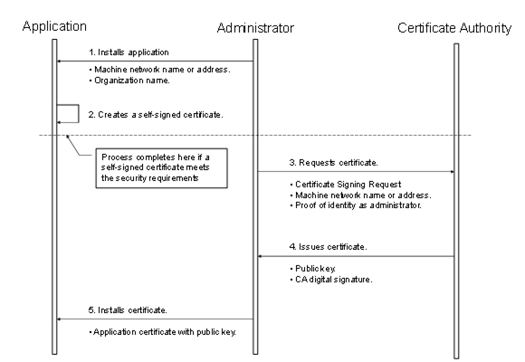  

Figure 19 - Obtaining and installing an ApplicationInstanceCertificate  

[Figure 19](/§\_Ref136786033) above illustrates the interactions between the application, the *Administrator* and the *Certificate Authority* . The application is a *OPC UA Application* installed on a single machine. The *Administrator* is the person responsible for managing the machine and the *OPC UA Application* . The *Certificate Authority* is an entity that can issue digital *Certificates* that meet the requirements of the organization deploying the *OPC UA Application* .  

OPC UA defines interfaces and workflows to register OPC UA *Applications* with a central discovery service and to execute the interaction necessary with a *CertificateManager* to issue the initial *Certificate Authority* signed *Certificate* , The *CertificateManager* interface includes features to get a *TrustList* and also *Certificate* updates from a central place. The Global Discovery Server (GDS) and *CertificateManager* functionality is defined in [OPC 10000-12](/§UAPart12) .  

If the *Administrator* decides that a self-signed *Certificate* meets the security requirements for the organization, then the *Administrator* may skip Steps 3 through 5. Application vendors shall ensure that a *Certificate* is available after the installation process. Every *OPC UA Application* shall allow the *Administrators* to replace *ApplicationInstanceCertificates* with *Certificates* that meet their requirements.  

When the *Administrator* requests a new *Certificate* from a *Certificate Authority* , the *Certificate Authority* may require that the *Administrator* provide proof of authorization to request *Certificates* for the organization that will own the *Certificate* . The exact mechanism used to provide this proof depends on the *Certificate Authority* .  

Vendors should automate the process of acquiring *Certificates* from an authority using the *CertificateManager* defined in [OPC 10000-12](/§UAPart12) . If this is the case, the *Administrator* would still go through the steps illustrated in [Figure 19](/§\_Ref136786033) , however, the installation program for the application would do them automatically and only prompt the *Administrator* to provide information about the application instance being installed.  

#### 6.1.3 Determining if a Certificate is trusted  

*Applications* shall never communicate with another application that they do not trust. An *Application* decides if another application is trusted by checking whether the *ApplicationInstanceCertificate* for the other application is trusted. A *Certificate* is only trusted if its chain can be validated.  

Applications shall rely on lists of *Certificates* provided by the *Administrator* to determine trust. There are two separate lists: a list of trusted *Certificates* and a list of issuer *Certificates* (i.e. CAs). The list of trusted *Certificates* may contain a *Certificate* issued to another *Application* or it may be a *Certificate* belonging to a CA. The list of issuer *Certificates* contains *CA Certificates* needed for chain validation that are not in the list of trusted *Certificates.*  

When building a chain each *Certificate* in the chain shall be validated back to a CA with a self-signed *Certificate* (a.k.a. a root CA). If any validation error occurs then the trust check fails. Some validation errors are non-critical which means they can be suppressed by a user of an *Application* with the appropriate privileges. Suppressed validation errors are always reported via auditing (i.e. an appropriate Audit event is raised).  

Determining trust requires access to all *Certificates* in the chain. These *Certificates* may be stored locally or they may be provided with the application *Certificate* . Processing fails with Bad\_SecurityChecksFailed if an element in the chain cannot be found. A *Certificate* is trusted if the *Certificate* or at least one of the *Certificates* in the chain are in the list of trusted *Certificates* for the *Application* and the chain is valid.  

[Table 100](/§\_Ref181603918) specifies the steps used to validate a *Certificate* in the order that they shall be followed. These steps are repeated for each *Certificate* in the chain. Each validation step has a unique error status and audit event type that shall be reported if the check fails. The audit event is in addition to any audit event that was generated for the particular *Service* that was invoked. The *Service* audit event in its message text shall include the audit *EventId* of the *AuditCertificateEventType* (for more details, see [6.5](/§\_Ref468992923) ). Processing halts if an error occurs, unless it is non-critical and it has been suppressed. The validation process is executed for all types of *Certificates* . Some steps are skipped if the *Certificate* is not an *ApplicationInstanceCertificate.*  

*ApplicationInstanceCertificates* shall not be used in a *Client* or *Server* until they have been evaluated and marked as trusted. This can happen automatically by a PKI trust chain or in an offline manner where the *Certificate* is marked as trusted by an administrator after evaluation.  

 **Table 100\- Certificate validation steps**   

| **Step** | **Error/AuditEvent** | **Description** |
|---|---|---|
|Certificate Structure|Bad\_CertificateInvalid Bad\_SecurityChecksFailed  

AuditCertificateInvalidEventType|The *Certificate* structure is verified.  

This error may not be suppressed.  

If this check fails on the *Server* side, the error Bad\_SecurityChecksFailed shall be reported back to the *Client* .|
|Build Certificate Chain|Bad\_CertificateChainIncomplete  

Bad\_SecurityChecksFailed  

AuditCertificateInvalidEventType|The trust chain for the *Certificate* is created.  

An error during the chain creation may not be suppressed.  

If this check fails on the *Server* side, the error Bad\_SecurityChecksFailed shall be reported back to the *Client* .|
|Signature|Bad\_CertificateInvalid  

Bad\_SecurityChecksFailed  

AuditCertificateInvalidEventType|A *Certificate* with an invalid signature shall always be rejected.  

A *Certificate* signature is invalid if the *Issuer* *Certificate* is unknown. A self-signed *Certificate* is its own issuer.  

If this check fails on the *Server* side, the error Bad\_SecurityChecksFailed shall be reported back to the *Client* .|
|Security Policy Check|Bad\_CertificatePolicyCheckFailed  

Bad\_SecurityChecksFailed  

AuditCertificateInvalidEventType|A *Certificate* signature shall comply with the CertificateSignatureAlgorithm, MinAsymmetricKeyLength and MaxAsymmetricKeyLength requirements for the used *SecurityPolicy* defined in [OPC 10000-7](/§UAPart7) .  

If this check fails on the *Server* side, the error Bad\_SecurityChecksFailed shall be reported back to the *Client* .  

This error may be suppressed.|
|Trust List Check|Bad\_CertificateUntrusted  

Bad\_SecurityChecksFailed  

AuditCertificateUntrustedEventType|If the *ApplicationInstanceCertificate* is not trusted and none of the CA *Certificates* in the chain is trusted, the result of the *Certificate* validation shall be Bad\_CertificateUntrusted.  

If this check fails on the *Server* side, the error Bad\_SecurityChecksFailed shall be reported back to the *Client* .  

This check is applied for *ApplicationInstanceCertificates* and may not apply for all other *Certificate* types.|
|Validity Period|Bad\_CertificateTimeInvalid  

Bad\_CertificateIssuerTimeInvalid  

AuditCertificateExpiredEventType|The current time shall be after the start of the validity period and before the end.  

This error may be suppressed.|
|Host Name|Bad\_CertificateHostNameInvalid  

AuditCertificateDataMismatchEventType|The HostName in the URL used to connect to the *Server* shall be the same as one of the HostNames specified in the *Certificate* .  

This check is applied for OPC UA *Server* *ApplicationInstanceCertificates* and skipped for CA *Certificates* and *Client* *ApplicationInstanceCertificates.*  

This check may be skipped for other *Certificate* types.  

This error may be suppressed.|
|URI|Bad\_CertificateUriInvalid  

AuditCertificateDataMismatchEventType|*Application and Software Certificates* contain an application or product URI that shall match the URI specified in the *ApplicationDescription* provided with the *Certificate* .  

This check is only applied for *ApplicationInstanceCertificates* and skipped for all other types like CA *Certificates* .  

This error may not be suppressed.  

The *gatewayServerUri* is used to validate an *Application Certificate* when connecting to a *Gateway Server* (see [7.2](/§\_Ref153821547) ).|
|Certificate Usage|Bad\_CertificateUseNotAllowed  

Bad\_CertificateIssuerUseNotAllowed  

AuditCertificateMismatchEventType|Each *Certificate* has a set of uses for the *Certificate* (see [OPC 10000-6](/§UAPart6) ). These uses shall match use requested for the *Certificate* (i.e. Application, Software or CA).  

This error may be suppressed unless the *Certificate* indicates that the usage is mandatory.|
|Find Revocation List|Bad\_CertificateRevocationUnknown Bad\_CertificateIssuerRevocationUnknown  

AuditCertificateRevokedEventType|Each CA *Certificate* may have a revocation list. This check fails if this list is not available (i.e. a network interruption prevents the application from accessing the list). No error is reported if the *Administrator* disables revocation checks for a CA *Certificate* .  

This error may be suppressed.  

Bad\_SecurityChecksFailed should be reported back to the *Client* .|
|Revocation Check|Bad\_CertificateRevoked  

Bad\_CertificateIssuerRevoked  

AuditCertificateRevokedEventType|The *Certificate* shall not be revoked. Whether a certificate is revoked shall be checked as specified in RFC 5280, 6.3.  

If a revocation list is found, this error may not be suppressed.  

If this check fails on the *Server* side, the error Bad\_SecurityChecksFailed shall be reported back to the *Client* .|
  

  

*Certificates* are usually placed in a central location called a *CertificateStore* . [Figure 20](/§\_Ref182130231) illustrates the interactions between the *Application* , the *Administrator* and the *CertificateStore* . The *CertificateStore* could be on the local machine or in some central server. The exact mechanisms used to access the *CertificateStore* depend on the application and PKI environment set up by the *Administrator* .  

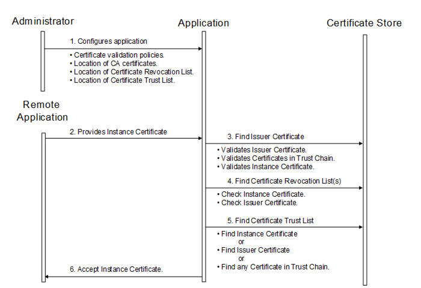  

Figure 20 - Determining if an ApplicationInstanceCertificate is trusted  

#### 6.1.4 Creating a SecureChannel  

All *OPC UA Applications* shall establish a *SecureChannel* before creating a *Session* . This *SecureChannel* requires that both applications have access to *Certificates* that can be used to encrypt and sign *Messages* exchange. The *ApplicationInstanceCertificates* installed by following the process described in [6.1.2](/§\_Ref136789690) may be used for this purpose.  

The steps involved in establishing a *SecureChannel* are shown in [Figure 21](/§\_Ref136791502) .  

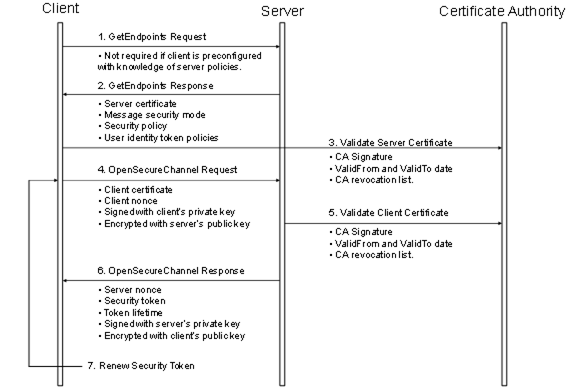  

Figure 21 - Establishing a SecureChannel  

[Figure 21](/§\_Ref136791502) assumes *Client* and *Server* have online access to a *CertificateA* uthority (CA). If online access is not available and if the administrator has installed the CA public key on the local machine, then the *Client* and *Server* shall still validate the application *Certificates* using that key. The figure shows only one CA, however, there is no requirement that the *Client* and *Server* *Certificates* be issued by the same authority. A self-signed *ApplicationInstanceCertificate* does not need to be verified with a CA. Any *Certificate* shall be rejected if it is not in a *TrustList* provided by the administrator.  

Both the *Client* and *Server* shall have a list of *Certificates* that they have been configured to trust (sometimes called the *Certificate* Trust List or CTL). These trusted *Certificates* may be *Certificates* for *Certificate Authorities* or they may be *OPC UA ApplicationInstanceCertificates* . *OPC UA Applications* shall be configured to reject connections with applications that do not have a trusted *Certificate* .  

*Certificates* can be compromised, which means they should no longer be trusted. Administrators can revoke a *Certificate* by removing it from the *TrustList* for all applications or the CA can add the *Certificate* to the *Certificate* Revocation List (CRL) for the *Issuer* *Certificate* . Administrators may save a local copy of the CRL for each *Issuer* *Certificate* when online access is not available.  

A *Client* does not need to call *GetEndpoints* each time it connects to the *Server* . This information should change rarely and the *Client* can cache it locally. If the *Server* rejects the *OpenSecureChannel* request the *Client* should call *GetEndpoints* and make sure the *Server* configuration has not changed.  

There are two security risks which a *Client* shall be aware of when using the *GetEndpoints* *Service* . The first could come from a rogue *Discovery* *Server* that tries to direct the *Client* to a rogue *Server* . For this reason the *Client* shall verify that the *ServerCertificate* in the *EndpointDescription* is a trusted *Certificate* before it calls *CreateSession* .  

The second security risk comes from a third party that alters the contents of the *EndpointDescriptions* as they are transferred over the network back to the *Client* . The *Client* protects itself against this by comparing the list of *EndpointDescriptions* returned from the *GetEndpoints Service* with list returned in the *CreateSession* response *.*  

The exact mechanisms for using the *SecurityToken* to sign and encrypt *Messages* exchanged over the *SecureChannel* are described in [OPC 10000-6](/§UAPart6) . The process for renewing tokens is also described in detail in [OPC 10000-6](/§UAPart6) .  

In many cases, the *Certificates* used to establish the *SecureChannel* will be *the ApplicationInstanceCertificates* . However, some *Communication Stacks* might not support *Certificates* that are specific to a single application. Instead, they expect all communication to be secured with a *Certificate* specific to a user or the entire machine. For this reason, *OPC UA Applications* will need to exchange their *ApplicationInstanceCertificates* when creating a *Session* .  

#### 6.1.5 Creating a Session  

Once an OPC UA *Client* has established a *SecureChannel* with a *Server* it can create an OPC UA *Session* .  

The steps involved in establishing a *Session* are shown in [Figure 22](/§\_Ref136793555) .  

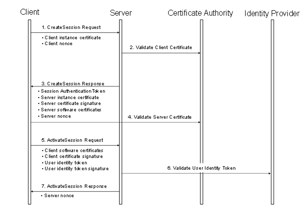  

Figure 22 - Establishing a Session  

[Figure 22](/§\_Ref136793555) illustrates the interactions between a *Client* , a *Server* , a *Certificate Authority* (CA) and an identity provider. The CA is responsible for issuing the *ApplicationInstanceCertificates* . If the *Client* or *Server* does not have online access to the CA, then they shall validate the *ApplicationInstanceCertificates* using the CA public key that the administrator shall install on the local machine.  

The identity provider may be a central database that can verify that user token provided by the *Client* . This identity provider may also tell the *Server* which access rights the user has. The identity provider depends on the user identity token. It could be a *Certificate* *Authority* , an *Authorization* *Service* or a proprietary database of some sort.  

The *Client* and *Server* shall prove possession of their *ApplicationInstanceCertificates* by signing the *Certificates* with a nonce appended. The exact mechanism used to create the proof of possession signatures is described in [5.7.2](/§\_Ref154236902) . Similarly, the *Client* shall prove possession by either providing a secret like a password in the user identity token or by creating a signature with the secret associated with a user identity token like X.509 v3.  

#### 6.1.6 Impersonating a User  

Once an OPC UA *Client* has established a *Session* with a *Server* it can change the user identity associated with the *Session* by calling the *ActivateSession* service.  

The steps involved in impersonating a user are shown in [Figure 23](/§\_Ref157840238) . The access of the *Server* to the identity provider is *Server*\-internal and it may be just an access to an internal user database.  

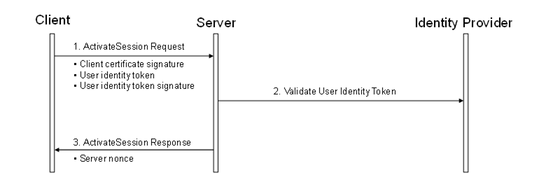  

Figure 23 - Impersonating a User  

#### 6.1.7 Continuous security checks  

*ApplicationInstanceCertificates* or *UserIdentityTokens* may expire, get invalid or may be rejected on *Client* or *Server* side.  

*ApplicationInstanceCertificates* verification shall be executed every time the *SecurityToken* is renewed for a *SecureChannel* . OPC UA *Applications* may do additional verifications between *SecurityToken* renews e.g. if the *TrustList* is updated from a GDS.  

If the *SecureChannel* does not use *ApplicationInstanceCertificates* , the *OPC UA Application* should execute *ApplicationInstanceCertificate* checks for the *Session* at a rate used for *SecureChannel* renewals.  

The recovery mechanisms for *ApplicationInstanceCertificate* replacement scenarios are described in [6.7](/§\_Ref65589175) .  

OPC UA Application should have internal notification mechanisms to get informed about removal of user identities or should frequently check if the *UserIdentityTokens* is still valid or if the authorization for a *UserIdentityTokens* was changed.  

### 6.2 Authorization Services  

#### 6.2.1 Overview  

*Authorization Services* provide *Access Tokens* to *Clients* on behalf of *Users* that they pass to a *Server* to be granted access to resources.  

In a basic model (as shown in [Figure 22](/§\_Ref136793555) ) the *Server* is responsible for authorization (i.e. deciding what a user can do) while a separate identity provider (e.g. the operating system) is responsible for authentication (deciding who the user is).  

In more complex models, the *Server* relies on external *Authorization Services* to provide some of its authorization requirements. These *Authorization Services* act in concert with an external identity provider which validates the user credentials before the external *Authorization Service* creates an *Access Token* that tells the *Server* what the user is a allowed to do. The *Client* interactions with these services may be indirect as shown in [6.2.2](/§\_Ref494296474) or direct as shown in [6.2.3](/§\_Ref494296484) .  

Even when the *Server* requires the *Client* to use an external *Authorization Service* the *Server* is still responsible for managing and enforcing the *Permissions* assigned to *Nodes* in its *Address Space* . The clauses below discuss the use of an external *Authorization Service* in more detail.  

#### 6.2.2 Indirect handshake with an Identity Provider  

*Authorization Services* (AS) provide access to identity providers which can validate the credentials provided by *Clients* . They then provide tokens which can be passed to a *Server* instead of the credentials. These tokens are passed as an *IssuedIdentityToken* defined in [7.40.6](/§\_Ref468986077) .  

The protocol to request tokens depends on the *Authorization Service* (AS). Common protocols include OAuth2 and OPC UA. OAuth2 supports claims based authorization as described in [OPC 10000-2](/§UAPart2) .  

*Servers* publish the *Authorization Services* (AS) they support in the *UserTokenPolicies* list return with *GetEndpoints* . The *IssuedTokenType* field specifies the protocol used to communicate with the AS. The *IssuerEndpointUrl* field contains the information needed by the *Client* to connect to the AS using the protocol required by the AS.  

The basic handshake is shown in [Figure 24](/§\_Ref468983960) .  

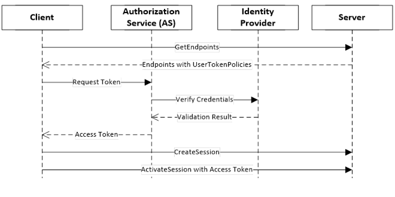  

Figure 24 - Indirect handshake with an Identity Provider  

#### 6.2.3 Direct handshake with an Identity Provider  

*Authorization Services* require that *Servers* be registered with them because the *Access Tokens* can only be used with a single *Server* . This can introduce a lot of complexity for administrators. One way to reduce this complexity is to leverage the *Server* information that is already managed by a Global Discovery Service (GDS) described in [OPC 10000-12](/§UAPart12) . In this model the user identities are still managed by a central *Authorization Service* . The interactions are shown in [Figure 25](/§\_Ref468983961) .  

  

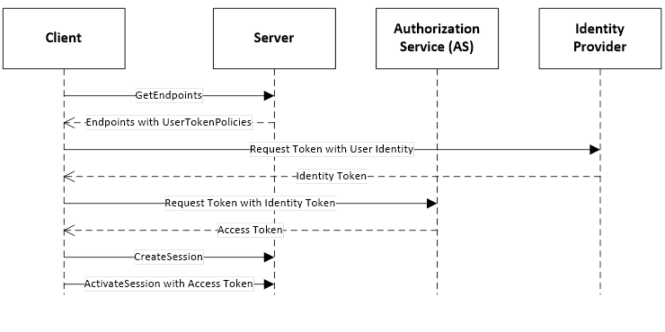  

Figure 25 - Direct handshake with an Identity Provider  

The *UserTokenPolicy* returned from the *Server* provides the URL of the *Authorization Service* and the identity provider. If the Application *Authorization Service* is linked with the GDS, it knows of all *Servers* which have been issued *Certificates* . The *ApplicationUri* is used as the identifier for the *Server* passed to the AS. The identity provider is responsible for managing users known to the system. It validates the credentials provided by the *Client* and returns an Identity *Access Token* which identifies the user. The Identity *Access Token* is passed to the Application *Authorization Service* which validates the *Client* and *Server* applications and creates a new *Access Token* that can be used to access the *Server* .  

### 6.3 Session-less Service invocation  

#### 6.3.1 Description  

The *Session*\-less *Service* invocation is introduced for *Services,* such as *Read* , *Write* or *Call* , that do not require any caller specific state information. It is accessible through the *SessionlessInvoke* *Service* which provides the context information required to call *Services* without a *Session* .  

*Session*\-less invocation is limited to *Services* of the *View Service* *Set* (with exception of *RegisterNodes* and *UnregisterNodes* ), *Attribute Service* *Set* , *Method Service* *Set* , *NodeManagement Service* *Set* and *Query* *Service* *Set* . If *Session*\-less *Service* invocation is supported by a *Server* , all *Services* belonging to these *Service Sets* that are supported by a *Server* via a *Session* shall also be supported via the *SessionlessInvoke* *Service* .  

*Session*\-less *Services* are invoked via a *SecureChannel* using the *Access Token* returned from the *Authorization Service* as the *authenticationToken* in the *requestHeader.* The *SecureChannel* shall have encryption enabled to prevent eavesdroppers from seeing the *Access Token* . The *Access Token* provides the user authentication. If application authentication through the *SecureChannel* is sufficient, *Servers* may not require the *Access Token* and assume an anonymous user. In this case the *authenticationToken* shall be null.  

The *SessionlessInvoke* *Messages* are just an envelope for the *Service* to invoke and do not have a *RequestHeader* and *ResponseHeader* like other *Services* . Those parameters are already part of the *body* which contains the *Message* for the *Service* to invoke.  

Any *Endpoint* used for normal communication could be used for *Session*\-less invocation provided the *Endpoint* supports encryption. The *Server* returns *Bad\_ServiceUnsupported* if it does not support *Session*\-less invocation for the request specified in the *body* . If it supports invocation but not with the combination of *Endpoint* and security settings used it returns *Bad* \_ *SecurityModeInsufficient.*  

*Servers* may expose *Endpoints* which are only for use with *Session*\-less invocation. These *Endpoints* shall support *GetEndpoints* and *FindServers* in addition to the *SessionlessInvoke Service.* The *Server* returns *Bad\_ServiceUnsupported* for the other *Services* .  

A *Session* ensures that a namespace index or a server index does not change during the lifetime of a *Session* . This cannot be ensured between *Session*\-less *Services* invocations. There are two options to ensure the namespace indices in the call match the expected namespace URIs in the *Server* . One option for the caller is to provide the list of namespace URIs used to build the namespace indices. This works best for single *Session*\-less *Service* invocations. The second option is to provide the *UrisVersion* to ensure consistency of namespace arrays between *Client* and *Server* . The *UrisVersion* is first read from the *Server* together with the *NamespaceArray* and *ServerArray* . This reduces the overhead per call for a sequence of *Session*\-less *Service* invocations.  

#### 6.3.2 Parameters  

[Table 101](/§\_Ref457764532) defines the parameters for the *Service* .  

 **Table 101\- SessionlessInvoke Service Parameters**   

| **Name** | **Type** | **Description** |
|---|---|---|
| **Request** |||
|urisVersion|VersionTime|The version of the *NamespaceArray* and the *ServerArray* used for the *Service* invocation. The version shall match the value of the *UrisVersion Property* that defines the version for the URI lists in the *NamespaceArray* and the *ServerArray Properties* defined in [OPC 10000-5](/§UAPart5) . If the *urisVersion* parameter does not match the *Server's* *UrisVersion Property* , the *Server* shall return Bad\_VersionTimeInvalid. In this case the *Client* shall read the *UrisVersion* , *NamespaceArray* and the *ServerArray* from the *Server Object* to repeat the Service invocation with the right version. The *VersionTime* *DataType* is defined in [7.43](/§\_Ref482817493) .  

If the value is 0, the parameter is ignored and the URIs are defined by the *namespaceUris* and *serverUris* parameters in request and response.  

If the value is non-zero, the *namespaceUris* and *serverUris* parameters in the request are ignored by the *Server* and set to null or empty arrays in the response.|
|namespaceUris []|String|A list of URIs referenced by *NodeIds* or *QualifiedNames* in the request.  

NamespaceIndex 0 shall not be in this list.  

The first entry in this list is NamespaceIndex 1.  

The parameter shall be ignored by the *Server* if the *urisVersion* is not 0.|
|serverUris []|String|A list of URIs referenced by *ExpandedNodeIds* in the request.  

ServerIndex 0 shall not be in this list.  

The first entry in this list is ServerIndex 1.  

The parameter shall be ignored by the *Server* if the *urisVersion* is not 0.|
|localeIds []|LocaleId|List of locale ids to use. See locale negotiation in [5.4](/§\_Ref161623610) which applies to this *Service* .|
|serviceId|UInt32|The numeric identifier assigned to the *Service* request *DataType* *NodeId* describing the body.|
|body|\*|The body of the request.  

The body is an embedded structure containing the corresponding *Service* request for the *serviceId* .|
| **Response** |||
|namespaceUris []|String|A list of URIs referenced by *NodeIds* or *QualifiedNames* in the response.  

NamespaceIndex 0 shall not be in this list.  

The first entry in this list is NamespaceIndex 1.  

An empty array shall be returned if the *urisVersion* is not 0.|
|serverUris []|String|A list of URIs referenced by *ExpandedNodeIds* in the response.  

ServerIndex 0 shall not be in this list.  

The first entry in this list is ServerIndex 1.  

An empty array shall be returned if the *urisVersion* is not 0.|
|serviceId|UInt32|The numeric identifier assigned to the *Service* response *DataType* *NodeId* describing the body.|
|body|\*|The body of the response.  

The body is an embedded structure containing the corresponding *Service* response for the *serviceId* .|
  

  

#### 6.3.3 Service results  

[Table 102](/§\_Ref482816649) defines the *Service* results specific to this *Service* . Common *StatusCodes* are defined in [Table 176](/§\_Ref90539276) .  

 **Table 102\- SessionlessInvoke Service Result Codes**   

| **Symbolic Id** | **Description** |
|---|---|
|Bad\_VersionTimeInvalid|The provided version time is no longer valid.|
  

  

### 6.4 Software Certificates  

Note Details on SoftwareCertificates will be defined in a future version of this document.  

### 6.5 Auditing  

#### 6.5.1 Overview  

Auditing is a requirement in many systems. It provides a means of tracking activities that occur as part of normal operation of the system. It also provides a means of tracking abnormal behaviour. It is also a requirement from a security standpoint. For more information on the security aspects of auditing, see [OPC 10000-2](/§UAPart2) . Subclause [6.5](/§\_Ref28180594) describes what is expected of an OPC UA *Server* and *Client* with respect to auditing and it details the audit requirements for each service set. Auditing can be accomplished using one or both of the following methods:  

1. The *OPC UA Application* that generates the audit event can log the audit entry in a log file or other storage location;  

1. The OPC UA *Server* that generates the audit event can publish the audit event using the OPC UA event mechanism. This allows an external OPC UA *Client* to subscribe to and log the audit entries to a log file or other storage location.  

#### 6.5.2 General audit logs  

Each OPC UA *Service* request contains a string parameter that is used to carry an audit record id. A *Client* or any *Server* operating as a *Client* , such as an aggregating *Server* , can create a local audit log entry for a request that it submits. This parameter allows this *Client* to pass the identifier for this entry with the request. If this *Server* also maintains an audit log, it should include this id in its audit log entry that it writes. When this log is examined and that entry is found, the examiner will be able to relate it directly to the audit log entry created by the *Client* . This capability allows for traceability across audit logs within a system.  

#### 6.5.3 General audit Events  

A *Server* that maintains an audit log shall provide the audit log entries via *Event* *Messages* . The *AuditEventType* and its sub-types are defined in [OPC 10000-3](/§UAPart3) . An audit *Event* *Message* also includes the audit record Id. The details of the *AuditEventType* and its subtypes are defined in [OPC 10000-5](/§UAPart5) . A *Server* that is an aggregating *Server* that supports auditing shall also subscribe for audit events for all of the *Servers* that it is aggregating (assuming they provide auditing). The combined stream should be available from the aggregating *Server* .  

#### 6.5.4 Auditing for Discovery Service Set  

This *Service* *Set* can be separated into two groups: Services that are called by OPC UA *Clients* and *Services* that are invoked by OPC UA *Servers* . The *FindServers* and *GetEndpoints Services* that are called by OPC UA *Clients* may generate audit entries for failed *Service* invocations. The *RegisterServer* Service that is invoked by OPC UA *Servers* shall generate audit entries for all new registrations and for failed *Service* invocations. These audit entries shall include the *Server* URI, *Server* names, *Discovery* URIs and isOnline status. Audit entries should not be generated for *RegisterServer* invocation that does not cause changes to the registered *Servers* .  

#### 6.5.5 Auditing for SecureChannel Service Set  

All *Services* in this *Service Set* for *Servers* that support auditing may generate audit entries and shall generate audit *Events* for failed service invocations and for successful invocation of the *OpenSecureChannel* and *CloseSecureChannel* Services. The *Client* generated audit entries should be setup prior to the actual call, allowing the correct audit record Id to be provided. The *OpenSecureChannel* Service shall generate an audit *Event* of type *AuditOpenSecureChannelEventType* or a subtype of it for the *requestType* *ISSUE* . Audit *Events* for the *requestType* *RENEW* are only created if the renew fails. The *CloseSecureChannel* service shall generate an audit *Event* of type *AuditChannelEventType* or a subtype of it. ** Both of these *Event* types are subtypes of the *AuditChannelEventType* . See [OPC 10000-5](/§UAPart5) for the detailed assignment of the *SourceNode* , the *SourceName* and additional parameters. For the failure cases the *Message* for *Events* of this type should include a description of why the service failed. This description should be more detailed than what was returned to the *Client* . From a security point of view a *Client* only needs to know that it failed, but from an *Auditing* point of view the exact details of the failure need to be known.  

In the case of *Certificate* validation errors the *CertificateErrorEventId* of the *AuditOpenSecureChannelEventType* should include the audit *EventId* of the specific *AuditCertificateEventType* that was generated to report the *Certificate* error. The *AuditCertificateEventType* shall also contain the detailed *Certificate* validation error. The additional parameters should include the details of the request. It is understood that these events may be generated by the underlying *Communication Stacks* in many cases, but they shall be made available to the *Server* and the *Server* shall report them.  

#### 6.5.6 Auditing for Session Service Set  

All *Services* in this *Service Set* for *Servers* that support auditing may generate audit entries and shall generate audit *Events* for both successful and failed *Service* invocations. These *Services* shall generate an audit *Event* of type *AuditSessionEventType* or a subtype of it. In particular, they shall generate the base *EventType* or the appropriate subtype, depending on the service that was invoked. The *CreateSession* service shall generate *AuditCreateSessionEventType* events or sub-types of it. The *ActivateSession* service shall generate *AuditActivateSessionEventType* events or subtypes of it. When the *ActivateSession* *Service* is called to change the user identity then the *Server* shall generate *AuditActivateSessionEventType* events or subtypes of it. The CloseSession service shall generate *AuditSessionEventType* events or subtypes of it. It shall always be generated if a *Session* is terminated like *Session* timeout expiration or *Server* shutdown. The *SourceName* for *Events* of this type shall be "Session/Timeout" for a *Session* timeout, "Session/CloseSession" for a *CloseSession* *Service* call and "Session/Terminated" for all other cases. See [OPC 10000-5](/§UAPart5) for the detailed assignment of the *SourceNode* , the *SourceName* and additional parameters. For the failure case the *Message* for *Events* of this type should include a description of why the *Service* failed. The additional parameters should include the details of the request.  

This *Service Set* shall also generate additional audit events in the cases when *Certificate* validation errors occur. These audit *Events* are generated in addition to the *AuditSessionEventType Events* . See [OPC 10000-3](/§UAPart3) for the definition of *AuditCertificateEventType* and its subtypes.  

For *Clients* , that support auditing, accessing the services in the *Session* *Service* *Set* shall generate audit entries for both successful and failed invocations of the *Service* . These audit entries should be setup prior to the actual *Service* invocation, allowing the invocation to contain the correct audit record id.  

#### 6.5.7 Auditing for NodeManagement Service Set  

All Services in this *Service Set* for *Servers* that support auditing may generate audit entries and shall generate audit *Events* for both successful and failed *Service* invocations. These *Services* shall generate an audit *Event* of type *AuditNodeManagementEventType* or subtypes of it. See [OPC 10000-5](/§UAPart5) for the detailed assignment of the *SourceNode* , the *SourceName* and additional parameters. For the failure case, the *Message* for *Events* of this type should include a description of why the service failed. The additional parameters should include the details of the request.  

For *Clients* that support auditing, accessing the *Services* in the *NodeManagement* *Service Set* shall generate audit entries for both successful and failed invocations of the *Service* . All audit entries should be setup prior to the actual *Service* invocation, allowing the invocation to contain the correct audit record id.  

#### 6.5.8 Auditing for Attribute Service Set  

The *Write* or *HistoryUpdate* *Services* in this *Service Set* for *Servers* that support auditing may generate audit entries and shall generate audit *Events* for both successful and failed *Service* invocations. These *Services* shall generate an audit *Event* of type *AuditUpdateEventType* or subtypes of it. In particular, the *Write* *Service* shall generate an audit event of type *AuditWriteUpdateEventType* or a subtype of it if the *Write* modifies the state of a system (e.g. operator changed a setpoint). *Write* operations that do not modify the state of the system may generate events. The *HistoryUpdate* *Service* shall generate an audit *Event* of type *AuditHistoryUpdateEventType* or a subtype of it. Three subtypes of *AuditHistoryUpdateEventType* are defined as *AuditHistoryEventUpdateEventType* , *AuditHistoryValueUpdateEventType* and *AuditHistoryDeleteEventType* . The subtype depends on the type of operation being performed, historical event update, historical data value update or a historical delete. See [OPC 10000-5](/§UAPart5) for the detailed assignment of the *SourceNode* , the *SourceName* and additional parameters. For the failure case the *Message* for *Events* of this type should include a description of why the *Service* failed. The additional parameters should include the details of the request.  

The *Read* and *HistoryRead* *Services* may generate audit entries and audit *Events* for failed *Service* invocations. These *Services* should generate an audit *Event* of type *AuditEventType* or a subtype of it. See [OPC 10000-5](/§UAPart5) for the detailed assignment of the *SourceNode* , *SourceName* and additional parameters. The *Message* for *Events* of this type should include a description of why the *Service* failed.  

For *Clients* that support auditing, accessing the *Write* or *HistoryUpdate* services in the *Attribute* *Service* *Set* shall generate audit entries for both successful and failed invocations of the *Service* . Invocations of the other *Services* in this *Service* *Set* may generate audit entries. All audit entries should be setup prior to the actual *Service* invocation, allowing the invocation to contain the correct audit record id.  

#### 6.5.9 Auditing for Method Service Set  

All *Services* in this *Service Set* for *Servers* that support auditing may generate audit entries and shall generate audit *Events* for both successful and failed service invocations if the invocation modifies the *AddressSpace* , writes a value or modifies the state of the system (alarm acknowledge, batch sequencing or other system changes). These method calls shall generate an audit *Event* of type *AuditUpdateMethodEventType* or subtypes of it. Methods that do not modify the *AddressSpace* , write values or modify the state of the system may generate events. See [OPC 10000-5](/§UAPart5) for the detailed assignment of the *SourceNode* , *SourceName* and additional parameters.  

For *Clients* that support auditing, accessing the *Method Service Set* shall generate audit entries for both successful and failed invocations of the *Service* , if the invocation modifies the *AddressSpace* , writes a value or modifies the state of the system (alarm acknowledge, batch sequencing or other system changes). Invocations of the other *Methods* may generate audit entries. All audit entries should be setup prior to the actual *Service* invocation, allowing the invocation to contain the correct audit record id.  

#### 6.5.10 Auditing for View, Query, MonitoredItem and Subscription Service Set  

All of the *Services* in these four *Service Sets* only provide the *Client* with information, with the exception of the *TransferSubscriptions* *Service* in the *Subscription* *Service Set* . In general, these services will not generate audit entries or audit Event *Messages* . The *TransferSubscriptions* *Service* shall generate an audit *Event* of type *AuditSessionEventType* or subtypes of it for both successful and failed *Service* invocations. See [OPC 10000-5](/§UAPart5) for the detailed assignment of the *SourceNode* , the *SourceName* and additional parameters. For the failure case, the *Message* for Events of this type should include a description of why the service failed.  

For *Clients* that support auditing, accessing the *TransferSubscriptions* *Service* in the *Subscription* *Service Set* shall generate audit entries for both successful and failed invocations of the *Service* . Invocations of the other *Services* in this *Service Set* do not require audit entries. All audit entries should be setup prior to the actual *Service* invocation, allowing the invocation to contain the correct audit record id.  

### 6.6 Redundancy  

#### 6.6.1 Redundancy overview  

OPC UA enables *Servers, Clients* and networks to be redundant. OPC UA provides the data structures and *Services* by which *Redundancy* may be achieved in a standardized manner.  

*Server* *Redundancy* allows *Clients* to have multiple sources from which to obtain the same data. *Server* *Redundancy* can be achieved in multiple manners, some of which require *Client* interaction, others that require no interaction from a *Client* . Redundant *Servers* could exist in systems without redundant networks or *Clients* . Redundant *Servers* could also coexist in systems with network and *Client* *Redundancy* . *Server Redundancy* is formally defined in [6.6.2](/§\_Ref411933195) .  

*Client Redundancy* allows identically configured *Clients* to behave as if they were single *Clients* , but not all *Clients* are obtaining data at a given time. Ideally there should be no loss of information when a *Client Failover* occurs. Redundant *Clients* could exist in systems without redundant networks or *Servers* . Redundant *Clients* could also coexist in systems with network and *Server* *Redundancy* . *Client Redundancy* is formally defined in [6.6.3](/§\_Ref411933222) .  

Network *Redundancy* allows a *Client* and *Server* to have multiple communication paths to obtain the same data. Redundant networks could exist in systems without redundant *Servers* or *Clients* . Redundant networks could also coexist in systems with *Client* and *Server* *Redundancy* . Network *Redundancy* is formally defined in [6.6.4](/§\_Ref411933241) .  

#### 6.6.2 Server Redundancy  

##### 6.6.2.1 General  

There are two general modes of *Server* *Redundancy* , transparent and non-transparent.  

In transparent *Redundancy* the *Failover* of *Server* responsibilities from one *Server* to another is transparent to the *Client* . The *Client* is unaware that a *Failover* has occurred and the *Client* has no control over the *Failover* behaviour. Furthermore, the *Client* does not need to perform any actions to continue to send or receive data.  

In non-transparent *Redundancy* the *Failover* from one *Server* to another and actions to continue to send or receive data are performed by the *Client* . The *Client* shall be aware of the *RedundantServerSet* and shall perform the required actions to benefit from the *Server Redundancy* .  

The *ServerRedundancy Object* defined in [OPC 10000-5](/§UAPart5) indicates the mode supported by the *Server* . The *ServerRedundancyType ObjectType* and its subtypes *TransparentRedundancyType* and *NonTransparentRedundancyType* defined in [OPC 10000-5](/§UAPart5) specify information for the supported *Redundancy* mode.  

For certificate management functionality defined in [OPC 10000-12](/§UAPart12) , the non-transparent redundant *Servers* are managed independently by a *CertificateManager* since every *Server* in a redundant set has its own *ApplicationUris* and its own certificates. The transparent redundant *Servers* are managed as one application by the *CertificateManager* . A update of the certificate must be synchronized internally by the *Servers* in the redundant set.  

##### 6.6.2.2 RedundantServerSet Requirements  

OPC UA *Servers* that are part of a *RedundantServerSet* have certain *AddressSpace* requirements. These requirements allow a *Client* to consistently access information from *Servers* in a *RedundantServerSet* and to make intelligent choices related to the health and availability of *Servers* in the *RedundantServerSet* .  

*Servers* in the *RedundantServerSet* shall have an identical *AddressSpace* including:  

* identical *NodeIds*  

* identical browse paths and structure of the *AddressSpace*  

* identical logic for setting the *ServiceLevel*  

The only *Nodes* that can differ between *Servers* in a *RedundantServerSet* are the *Nodes* that are in the local *Server* namespace like the *Server* diagnostic *Nodes* . A *Client* that fails over shall not be required to translate browse paths or otherwise resolve *NodeIds* . *Servers* are allowed to add and delete *Nodes* as long as all *Servers* in the *RedundantServerSet* will be updated with the same *Node* changes.  

All *Servers* in a *RedundantServerSet* shall be synchronized with respect to time. This may mean installing a NTP service or a PTP service.  

There are other important considerations for a redundant system regarding synchronization:  

* EventIds: Each UA *Server* in a *Transparent* ( [6.6.2.3](/§\_Ref138271018) ) and *HotAndMirrored* ( [6.6.2.4.5.5](/§\_Ref412066082) ) *RedundantServerSet* shall synchronize EventIds to prevent a *Client* from mistakenly processing the same event multiple times simply because the *EventIds* are different. This is very important for Alarms & Conditions. For Cold, Warm, and Hot *RedundantServerSets* *Clients* shall be able to handle *EventIds* that are not synchronized. Following any *Failover* the *Client* shall call *ConditionRefresh* defined in [OPC 10000-9](/§UAPart9) .  

* Timestamp (Source/Server): If a *Server* is exposing data from a downstream device (PLC, DCS etc.) then the *SourceTimestamp* and *ServerTimestamp* reported by all redundant *Servers* should match as closely as possible. *Clients* should favour the use of the *SourceTimestamp* .  

* ContinuationPoints: Behaviour of continuation points does not change, in that *Clients* shall be prepared for lost continuation points. *Servers* in *Transparent and HotAndMirrored* *Redundancy* sets shall synchronize continuation points and they may do so in other modes.  

##### 6.6.2.3 Transparent Redundancy  

####### 6.6.2.3.1.1 Client behaviour  

To a *Client* the transparent *RedundantServerSet* appears as if it is just a single *Server* and the *Client* has no *Failover* actions to perform. All *Servers* in the *RedundantServerSet* have an identical *ServerUri* and an identical *EndpointUrl* .  

[Figure 26](/§\_Ref136924211) shows a typical transparent *Redundancy* setup.  

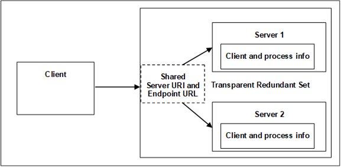  

Figure 26 - Transparent Redundancy setup example  

For transparent *Redundancy* , OPC UA provides data structures to allow *Clients* to identify which *Servers* are in the *RedundantServerSet* , the *ServiceLevel* of each *Server,* and which *Server* is currently responsible for the *Client* *Session* . This information is specified in *TransparentRedundancyType ObjectType* defined in [OPC 10000-5](/§UAPart5) . Since the *ServerUri* is identical for all *Servers* in the *RedundantServerSet* , the *Servers* are identified with a *ServerId* contained in the information provided in the *TransparentRedundancyType Object* .  

In transparent *Redundancy* , a *Client* is not able to control which physical *Server* it actually connects to. *Failover* is controlled by the *RedundantServerSet* and a *Client* is also not able to actively *Failover* to another *Server* in the *RedundantServerSet* .  

####### 6.6.2.3.1.2 Server requirements  

All OPC UA interactions within a given *Session* shall be supported by one *Server* and the *Client* is able to identify which *Server* that is, allowing a complete audit trail for the data. It is the responsibility of the *Servers* to ensure that information is synchronized between the *Servers* . A functional *Server* will take over the *Session* and *Subscriptions* from the *Failed* *Server* . *Failover* may require a reconnection of the *Client's* *SecureChannel* but the *EndpointUrl* of the *Server* and the *ServerUri* shall not change. The *Client* shall be able to continue communication with the *Sessions* and *Subscriptions* created on the previously used *Server* .  

[Figure 26](/§\_Ref136924211) provides an abstract view of a transparent *RedundantServerSet* . The two or more *Servers* in the *RedundantServerSet* share a virtual network address and therefore all *Servers* have the identical *EndpointUrl* . This includes all other *EndpointDescriptions* content like identical *Certificates* and security settings. How this virtual network address is created and managed is vendor specific. There may be special hardware that mediates the network address displayed to the rest of the network. There may be custom hardware, where all components are redundant and *Failover* at a hardware level automatically. There may even be software based systems where all the transparency is governed completely by software.  

##### 6.6.2.4 Non-transparent Redundancy  

###### 6.6.2.4.1 Overview  

For non-transparent *Redundancy* , OPC UA provides the data structures to allow the *Client* to identify what *Servers* are available in the *RedundantServerSet* and also *Server* information which tells the *Client* what modes of *Failover* the *Server* supports. This information allows the *Client* to determine what actions it may need to take in order to accomplish *Failover* . This information is specified in *NonTransparentRedundancyType ObjectType* defined in [OPC 10000-5](/§UAPart5) .  

The *Servers* in the non-transparent *RedundantServerSet* shall use the *ServerCapability* NTRS defined in [OPC 10000-12](/§UAPart12) for discovery including the registration with a *GlobalDiscoveryServer* .  

[Figure 27](/§\_Ref136753659) shows a typical non-transparent *Redundancy* setup.  

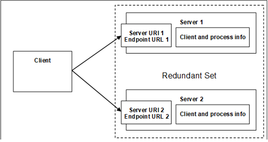  

Figure 27 - Non-Transparent Redundancy setup  

For non-transparent *Redundancy* , the *Servers* will have unique IP addresses and unique *ApplicationUris* . The *Server* also has additional *Failover* modes of *Cold* , *Warm* , *Hot* and *HotAndMirrored* . The *Client* shall be aware of the *RedundantServerSet* and shall be required to perform some actions depending on the *Failover* mode. These actions are described in [Table 105](/§\_Ref412065975) and additional examples and explanations are provided in [6.6.2.4.5.2](/§\_Ref412066041) .for *Cold* , [6.6.2.4.5.3](/§\_Ref412066056) for *Warm* , [6.6.2.4.5.4](/§\_Ref412066072) for *Hot* and [6.6.2.4.5.5](/§\_Ref412066082) for *HotAndMirrored* .  

A *Client* needs to be able to expect that the SourceTimestamp associated with a value is approximately the same from all *Servers* in the *RedundantServerSet* for the same value.  

###### 6.6.2.4.2 ServiceLevel  

The *ServiceLevel* provides information to a *Client* regarding the health of a *Server* and its ability to provide data. See [OPC 10000-5](/§UAPart5) for a formal definition for *ServiceLevel* . The *ServiceLevel* is a byte with a range of 0 to 255, where the values fall into the sub-ranges defined in [Table 103](/§\_Ref411766108) .  

The algorithm used by a *Server* to determine its *ServiceLevel* within each sub-range is *Server* specific. However, all *Servers* in a *RedundantServerSet* shall use the same algorithm to determine the *ServiceLevel.* All *Servers,* regardless of *RedundantServerSet* membership, shall adhere to the sub-ranges defined in [Table 103](/§\_Ref411766108) .  

 **Table 103\- ServiceLevel ranges**   

| **Sub-range** | **Name** | **Description** |
|---|---|---|
|0-0|Maintenance|The *Failed* *Server* is in maintenance sub-range. Therefore, new *Clients* shall not connect and currently connected *Clients* shall disconnect. The *Server* should expose a target time at which the *Clients* are able to reconnect. See *EstimatedReturnTime* defined in [OPC 10000-5](/§UAPart5) for additional information.  

A *Server* that has been set to *Maintenance* is typically undergoing some maintenance or updates. The main goal for the *Maintenance* *ServiceLevel* is to ensure that *Clients* do not generate load on the *Server* and allow time for the *Server* to complete any actions that are required. This load includes even simple connections attempts or monitoring of the *ServiceLevel* . The *EstimatedReturnTime* indicates when the *Client* should check to see if the *Server* is available. If updates or patches are taking longer than expected the *Client* may discover that the *EstimatedReturnTime* has been extended further into the future. If the *Server* does not provide the *EstimatedReturnTime,* or if the time has lapsed, the *Client* should use a much longer interval between reconnects to a *Server* in the *Maintenance* sub-range than its normal reconnect interval.|
|1-1|NoData|The *Failed* *Server* is not operational. Therefore, a *Client* is not able to exchange any information with it. The *Server* most likely has no data other than *ServiceLevel, ServerStatus* and diagnostic information available.  

A *Failed* *Server* in this sub-range has no data available. *Clients* may connect to it to obtain *ServiceLevel* , *ServerStatus* and other diagnostic information. If the underlying system has failed, typically the *ServerStatus* would indicate COMMUNICATION\_FAULT. The *Client* may monitor this *Server* for a *ServerStatus* and *ServiceLevel* change, which would indicate that normal communication could be resumed.|
|2-199|Degraded|*The Server* is partially operational, but is experiencing problems such that portions of the *AddressSpace* are out of service or unavailable. An example usage of this *ServiceLevel* sub-range would be if 3 of 10 devices connected to a *Server* are unavailable.  

*Servers* that report a *ServiceLevel* in the *Degraded* sub-range are partially able to service *Client* requests. The degradation could be caused by loss of connection to underlying systems or functioning in a mode like a backup *Server* which results in less than full functionality being available. Alternatively, it could be that the *Server* is overloaded to the point that it is unable to reliably deliver data to *Clients* in a timely manner.  

If *Clients* are experiencing difficulties obtaining required data, they shall switch to another *Server* if any *Servers* in the *Healthy* range are available. If no *Servers* are available in the *Healthy* range, then *Clients* may switch to a *Server* with a higher *ServiceLevel* or one that provides the required data. Some *Clients* may also be configured for higher priority data and may check all *Degraded* *Servers* , to see if any of the *Servers* are able to report as good quality the high priority data, but this functionality would be *Client* specific. In some cases a *Client* may connect to multiple *Degraded* *Servers* to maximize the available information.|
|200-255|Healthy|The *Server* is fully operational. Therefore, a *Client* can obtain all information from this *Server* . The sub-range allows a *Server* to provide information that can be used by *Clients* to load balance. An example usage of this *ServiceLevel* sub-range would be to reflect the *Server's* CPU load where data is delivered as expected.  

*Servers* in the *Healthy* *ServiceLevel* sub-range are able to deliver information in a timely manner. This *ServiceLevel* may change for internal *Server* reason or it may be used for load balancing described in [6.6.2.4.3](/§\_Ref412066360) .  

*Client* shall connect to the *Server* with the highest *ServiceLevel* . Once connected, the *ServiceLevel* may change, but a *Client* shall not *Failover* to a different *Server* as long as the *ServiceLevel* of the *Server* is accessible and in the *Healthy* sub-range.|
  

  

###### 6.6.2.4.3 Load balancing  

In systems where multiple Hot *Servers* (see [6.6.2.4.5.4](/§\_Ref412066072) ) are available, the *Servers* in the *RedundantServerSet* can share the load generated by *Clients* by setting the *ServiceLevel* in the *Healthy* sub-range based on the current load. *Clients* are expected to connect to the *Server* with the highest *ServiceLevel* . *Clients* shall not *Failover* to a different *Server* in the *RedundantServerSet* of *Servers* as long as the *Server* is in the *Healthy* sub-range. This is the normal behaviour for all *Clients* , when communicating with redundant *Servers* . *Servers* can adjust their *ServiceLevel* based on the number of *Clients* that are connected, CPU loading, memory utilization, or any other *Server* specific criteria.  

For example in a system with 3 *Servers* , all *Servers* are initially at *ServiceLevel* 255, but when a *Client* connects, the *Server* with the *Client* connection sets its level to 254. The next *Client* would connect to a different *Server* since both of the other *Servers* are still at 255.  

It is up to the *Server* vendor to define the logic for spreading the load and the number of expected *Clients* , CPU load or other criteria on each *Server* before the *ServiceLevel* is decremented. It is envisioned that some *Servers* would be able to accomplish this without any communication between the *Servers* .  

###### 6.6.2.4.4 Server Failover modes  

The *Failover* mode of a *Server* is provided in the *ServerRedundancy* *Object* defined in [OPC 10000-5](/§UAPart5) . The different *Failover* modes for non-transparent Redundancy are described in [Table 104](/§\_Ref412498967) .  

 **Table 104\- Server Failover modes**   

| **Name** | **Description** |
|---|---|
|Cold|*Cold* *Failover* mode is where only one *Server* can be active at a time. This may mean that redundant *Servers* are unavailable (not powered up) or are available but not running (PC is running, but application is not started)|
|Warm|*Warm* *Failover* mode is where the backup *Server(s)* can be active, but is not operating in a mode which delivers the same level of functionality available from the primary *Server* . For example it cannot connect to actual data points (typically, a system where the underlying devices are limited to a single connection). Underlying devices, such as PLCs, may have limited resources that permit a single *Server* connection. Therefore, only a single *Server* will be able to consume data. The *ServiceLevel* *Variable* defined in [OPC 10000-5](/§UAPart5) and the sub-range defined in [Table 103](/§\_Ref411766108) indicates the ability of the *Server* to provide its data to the *Client* . The *ServiceLevel* of the primary *Server* will be in the *Healthy* *ServiceLevel* sub-range. The *ServiceLevel* of the available backup *Server* will be in the *Degraded* *ServiceLevel* sub-range.|
|Hot|*Hot* *Failover* mode is where all *Servers* are powered-on, and are up and running. In scenarios where *Servers* acquire data from a downstream device, such as a PLC, then one or more *Servers* are actively connected to the downstream device(s) in parallel. These *Servers* have minimal knowledge of the other *Servers* in their group and are independently functioning. When a *Server* fails or encounters a serious problem then its *ServiceLevel* drops. On recovery, the *Server* returns to the *RedundantServerSet* with an appropriate *ServiceLevel* to indicate that it is available.|
|HotAndMirrored|*HotAndMirrored* *Failover* mode is where *Failovers* are for *Servers* that are mirroring their internal states to all *Servers* in the *RedundantServerSet* and more than one *Server* can be active and fully operational. Mirroring state minimally includes *Sessions* , *Subscriptions* , registered *Nodes* , *ContinuationPoints* , sequence numbers, and sent *Notifications* . The *ServiceLevel* *Variable* defined in [OPC 10000-5](/§UAPart5) should be used by the *Client* to find the *Servers* with the highest *ServiceLevel* to achieve load balancing.|
  

  

###### 6.6.2.4.5 Client Failover behaviour  

####### 6.6.2.4.5.1 General  

Each *Server* maintains a list of *ServerUris* for all redundant *Servers* in the *RedundantServerSet* . The list is provided together with the *Failover* mode in the *ServerRedundancy* *Object* defined in [OPC 10000-5](/§UAPart5) . To enable *Clients* to connect to all *Servers* in the list, each *Server* in the list shall provide the *ApplicationDescription* for all *Servers* in the *RedundantServerSet* through the *FindServers* *Service* . This information is needed by the *Client* to translate the *ServerUri* into information needed to connect to the other *Servers* in the *RedundantServerSet* . Therefore a *Client* needs to connect to only one of the redundant *Servers* to find the other *Servers* based on the provided information. A *Client* should persist information about other *Servers* in the *RedundantServerSet* .  

[Table 105](/§\_Ref412065975) defines a list of *Client* actions for initial connections and *Failovers* .  

 **Table 105\- Redundancy Failover actions**   

| **Failover mode and *Client* options** | **Cold** | **Warm** | **Hot (a)** | **Hot (b)** | **HotAndMirrored** |
|---|---|---|---|---|---|
|On initial connection in addition to actions on *Active Server* :||||||
|Connect to more than one OPC UA *Server* .||X|X|X|Optional for status check|
|Create *Subscriptions* and add monitored items.||X|X|X||
|Activate sampling on the *Subscriptions.*|||X|X||
|Activate publishing.||||X||
|At Failover:||||||
|OpenSecureChannel to backup OPC UA *Server*|X||||X|
|CreateSession on backup OPC UA *Server*|X|||||
|ActivateSession on backup OPC UA *Server*|X||||X|
|Create *Subscriptions* and add monitored items.|X|||||
|Activate sampling on the *Subscriptions* .|X|X||||
|Activate publishing.|X|X|X|||
  

  

*Clients* communicating with a non-transparent *RedundantServerSet* of *Servers* require some additional logic to be able to handle *Server* failures and to *Failover* to another *Server* in the *RedundantServerSet* . [Figure 28](/§\_Ref412065960) provides an overview of the steps a *Client* typically performs when it is first connecting to a *RedundantServerSet* . The figure does not cover all possible error scenarios.  

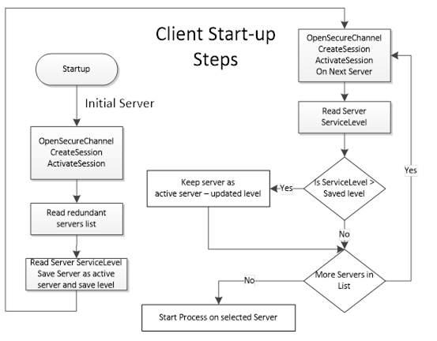  

Figure 28 - Client Start-up steps  

The initial *Server* may be obtained via standard discovery or from a persisted list of *Servers* in the *RedundantServerSet* . But in any case the *Client* needs to check which *Server* in the *Server* set it should connect to. Individual actions will depend on the *Server Failover* mode the *Server* provides and the *Failover* mode the *Client* will use.  

*Clients* once connected to a redundant *Server* shall be aware of the modes of *Failover* supported by a *Server* since this support affects the available options related to *Client* behaviour. A *Client* may always treat a *Server* using a lesser *Failover* mode, i.e. for a *Server* that provides *Hot* *Redundancy* , a *Client* might connect and choose to treat it as if the *Server* was running in *Warm* *Redundancy* or *Cold* *Redundancy* . This choice is up to the *Client* . In the case of *Failover* mode *HotAndMirrored* , the *Client* shall not use *Failover* mode *Hot* or *Warm* as it would generate unnecessary load on the *Servers* .  

####### 6.6.2.4.5.2 Cold  

A *Cold* *Failover* mode is where the *Client* can only connect to one *Server* at a time. When the *Client* loses connectivity with the *Active* *Server* it will attempt a connection to the redundant *Server* (s) which may or may not be available. In this situation the *Client* may need to wait for the redundant *Server* to become available and then create *Subscriptions* and *MonitoredItems* and activate publishing. The *Client* shall cache any information that is required related to the list of available *Servers* in the *RedundantServerSet* . [Figure 29](/§\_Ref412065742) illustrates the action a *Client* would take if it is talking to a *Server* using *Cold* *Failover* mode. The monitor connection logic is defined in [6.7](/§\_Ref168909069) .  

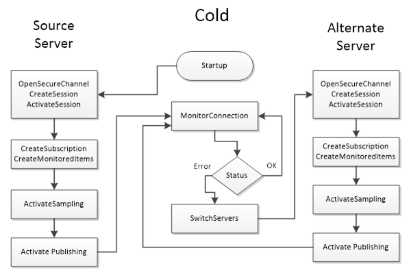  

Figure 29 - Cold Failover  

NOTE There may be a loss of data from the time the connection to the *Active* *Server* is interrupted until the time the *Client* gets *Publish Responses* from the backup *Server* .  

####### 6.6.2.4.5.3 Warm  

A *Warm* *Failover* mode is where the *Client* should connect to one or more *Servers* in the *RedundantServerSet* primarily to monitor the *ServiceLevel* . A *Client* can connect and create *Subscriptions* and *MonitoredItems* on more than one *Server,* but sampling and publishing can only be active on one *Server* . However, the active *Server* will return actual data, whereas the other *Servers* in the *RedundantServerSet* will return an appropriate error for the *MonitoredItems* in the *Publish* response such as Bad\_NoCommunication. The one *Active* *Server* can be found by reading the *ServiceLevel* *Variable* from all *Servers* . The *Server* with the highest *ServiceLevel* is the *Active Server* . For *Failover* the *Client* activates sampling and publishing on the *Server* with the highest *ServiceLevel* . [Figure 30](/§\_Ref412065724) illustrates the steps a *Client* would perform when communicating with a *Server* using *Warm* *Failover* mode. The monitor connection logic is defined in [6.7](/§\_Ref168909069) .  

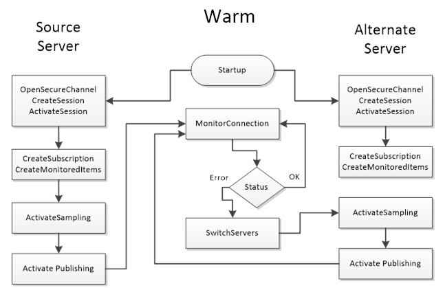  

Figure 30 - Warm Failover  

NOTE There may be a temporary loss of data from the time the connection to the *Active* *Server* is interrupted until the time the *Client* gets *Publish Responses* from the backup *Server* .  

####### 6.6.2.4.5.4 Hot  

A *Hot* *Failover* mode is where the *Client* should connect to two or more *Servers* in the *RedundantServerSet* and to subscribe to the *ServiceLevel* variable defined in [OPC 10000-5](/§UAPart5) to find the highest *ServiceLevel* to achieve load balancing; this means that *Clients* should issue *Service* requests such as *Browse* , *Read* , *Write* to the *Server* with the highest ServiceLevel. *Subscription* related activities will need to be invoked for each connected *Server* . *Clients* have the following choices for implementing *Subscription* behaviour in a *Hot* *Failover* mode:  

1. The *Client* connects to multiple *Servers* and establishes *Subscription* (s) in each where only one is *Reporting* ; the others are *Sampling* only. The *Client* should setup the queue size for the *MonitoredItems* such that it can buffer all changes during the *Failover* time. The *Failover* time is the time between the connection interruption and the time the *Client* gets *Publish Responses* from the backup *Server* . On a *Failover* the *Client* shall enable *Reporting* on the *Server* with the next highest availability.  

1. The *Client* connects to multiple *Servers* and establishes *Subscription* (s) in each where all *Subscriptions* are *Reporting* . The *Client* is responsible for handling/processing multiple *Subscription* streams concurrently.  

[Figure 31](/§\_Ref412065635) illustrate the functionality a *Client* would perform when communicating with a *Server* using *Hot* *Failover* mode (the figure include both (a) and (b) options). The monitor connection logic is defined in [6.7](/§\_Ref168909069) .  

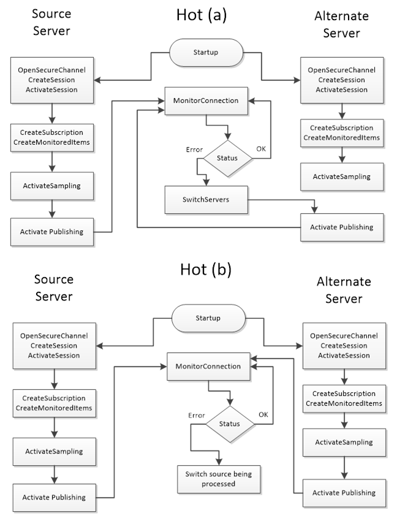  

Figure 31 - Hot Failover  

*Clients* are not expected to automatically switch over to a *Server* that has recovered from a failure, but the *Client* should establish a connection to it.  

####### 6.6.2.4.5.5 HotAndMirrored  

A *HotAndMirrored* *Failover* mode is where a *Client* only connects to one *Server* in the *RedundantServerSet* because the *Server* will share this session/state information with the other *Servers* . In order to validate the capability to connect to other redundant *Servers* it is allowed to create *Sessions* with other *Servers* and maintain the open connections by periodically reading the *ServiceLevel* . A *Client* shall not create *Subscriptions* on the backup *Servers* for status monitoring (to prevent excessive load on the *Servers* ). This mode allows *Clients* to fail over without creating a new context for communication. On a *Failover* the *Client* will simply create a new *SecureChannel* on an alternate *Server* and then call *ActivateSession* ; all *Client* activities (browsing, subscriptions, history reads, etc.) will then resume. [Figure 32](/§\_Ref412065594) illustrate the behaviour a *Client* would perform when communicating to a *Server* in *HotAndMirrored* *Failover* mode. The monitor connection logic is defined in [6.7](/§\_Ref168909069) .  

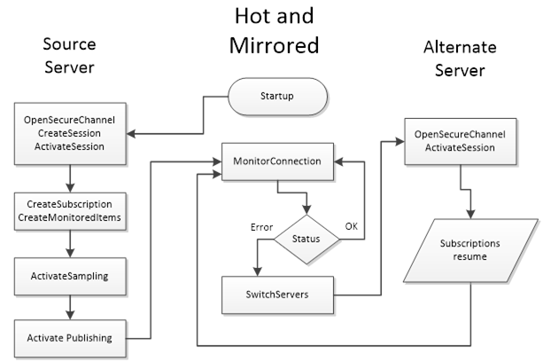  

Figure 32 - HotAndMirrored Failover  

This *Failover* mode is similar to the transparent *Redundancy* . The advantage is that the *Client* has full control over selecting the *Server* . The disadvantage is that the *Client* needs to be able to handle *Failovers* .  

##### 6.6.2.5 Hiding Failover with a Server Proxy  

A vendor can use the non-transparent *Redundancy* features to create a *Server* proxy running on the *Client* machine to provide transparent *Redundancy* to the *Client* . This reduces the amount of functionality that needs to be designed into the *Client* and to enable simpler *Clients* to take advantage of non-transparent *Redundancy* . The *Server* proxy simply duplicates *Subscriptions* and modifications to *Subscriptions* , by passing the calls on to both *Servers* , but only enabling publishing and sampling on one *Server* . When the proxy detects a failure, it enables publishing and/or sampling on the backup *Server* , just as the *Client* would if it were a *Redundancy* aware *Client* .  

[Figure 33](/§\_Ref136754830) shows the *Server* proxy used to provide transparent *Redundancy* .  

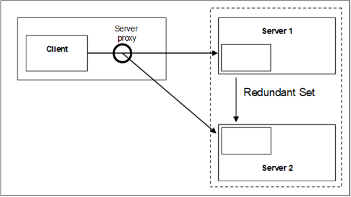  

Figure 33 - Server proxy for Redundancy  

#### 6.6.3 Client Redundancy  

*Client* *Redundancy* is supported in OPC UA by the *TransferSubscriptions* *Service* and by exposing *Client* information in the *Server* diagnostic information. Since *Subscription* lifetime is not tied to the *Session* in which it was created, backup *Clients* may use standard diagnostic information available to monitor the active *Client's* *Session* with the *Server* . Upon detection of an active *Client* failure, a backup *Client* would then instruct the *Server* to transfer the *Subscriptions* to its own session. If the *Subscription* is crafted carefully, with sufficient resources to buffer data during the change-over, data loss from a *Client* *Failover* can be prevented.  

OPC UA does not provide a standardized mechanism for conveying the *SessionId* and *SubscriptionIds* from the active *Client* to the backup *Clients* , but as long as the backup *Clients* know the *Client* name of the active *Client* , this information is readily available using the *SessionDiagnostics* and *SubscriptionDiagnostics* portions of the *ServerDiagnostics* data. This information is available for authorized users and for the user active on the *Session* . *TransferSubscriptions* requires the same user on all redundant *Clients* to succeed.  

#### 6.6.4 Network Redundancy  

##### 6.6.4.1 Overview  

Redundant networks can be used with OPC UA in either transparent or non-transparent *Redundancy* .  

Network *Redundancy* can be combined with *Server* and *Client* *Redundancy* .  

##### 6.6.4.2 Transparent  

In the transparent network use-case a single *Server* *Endpoint* can be reached through different network paths. This case is completely handled by the network infrastructure. The selected network path and *Failover* are transparent to the *Client* and the *Server* . Transparent network *Redundancy* is illustrated in [Figure 34](/§\_Ref15636030) .  

 **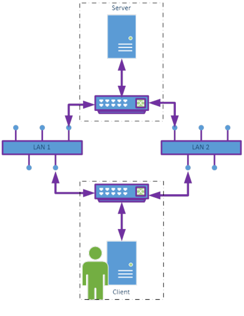**   

Figure 34 - Transparent network Redundancy  

Examples:  

* A physical appliance/device such as a router or gateway which automatically changes the network routing to maintain communications.  

* A virtual adapter which automatically changes the network adapter to maintain communications.  

##### 6.6.4.3 Non-Transparent  

In the non-transparent network use-case the *Server* provides different *Endpoints* for the different network paths. This requires both the *Server* and the *Client* to support multiple network connections. In this case the *Client* is responsible for selecting the *Endpoint* and for *Failover* . For *Failover* the normal reconnect scenario described in [6.7](/§\_Ref413272578) can be used. Only the *SecureChannel* is created with another *Endpoint* . *Sessions* and *Subscriptions* can be reused. Non-transparent network *Redundancy* is illustrated in [Figure 35](/§\_Ref15635964) .  

 **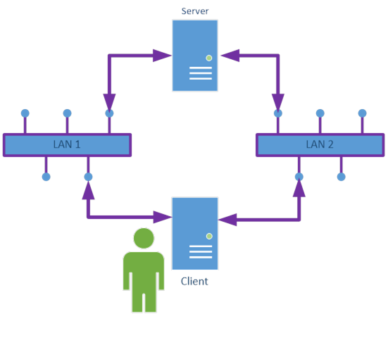**   

Figure 35 - Non-transparent network Redundancy  

The information about the different network paths is specified in *NonTransparentRedundancyType* *ObjectType* defined in [OPC 10000-5](/§UAPart5) .  

#### 6.6.5 Manually Forcing Failover  

In redundant systems, it is common to require that a particular *Server* in the *RedundantServerSet* be taken out of the *RedundantServerSet* for a period of time. Some items that could cause this may include:  

* Certificate update  

* Security reconfiguration  

* Rebooting or restarting of the machine for  

* software updates and patches  

* installation of new software  

* Reconfiguration of the AddressSpace  

The removal from the *RedundantServerSet* can be done through a complete shutdown or by setting the *ServiceLevel* of the *Server* to *Maintenance* sub-range. This can be done through a *Server* specific configuration tool or through the *Method RequestServerStateChange* on the *ServerType* . The Method is formally defined in [OPC 10000-5](/§UAPart5) .  

This *Method* requires that the *Client* provide credentials with administrative rights on the *Server* .  

### 6.7 Re-establishing connections  

After a *Client* establishes a connection to a *Server* and creates a *Subscription* , the *Client* monitors the connection status. [Figure 36](/§\_Ref303812115) shows the steps to connect a *Client* to a *Server* and the general logic for reconnect handling. Not all possible error scenarios are covered.  

The preferred mechanism for a *Client* to monitor the connection status is through the keep-alive of the *Subscription* . A *Client* should subscribe for the *State* *Variable* in the *ServerStatus* to detect shutdown or other failure states. If no *Subscription* is created or the *Server* does not support *Subscriptions* , the connection can be monitored by periodically reading the *State* *Variable* .  

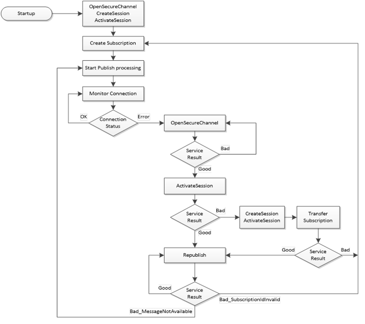  

Figure 36 - Reconnect sequence  

When a *Client* loses the connection to the *Server* , the goal is to reconnect without losing information. To do this the *Client* shall re-establish the connection by creating a new *SecureChannel* and activating the *Session* with the *Service* *ActivateSession* . If the *OpenSecureChannel* fails, the *Client* should delay the retry for a configurable time. The *ActivateSession* assigns the new *SecureChannel* to the existing *Session* and allows the *Client* to reuse the *Session* and *Subscriptions* in the *Server* . To re-establish the *SecureChannel* and activate the *Session* , the *Client* shall use the same security policy, application instance certificate and the same user credential used to create the original *SecureChannel* . This will result in the *Client* receiving data and event *Notifications* without losing information provided the queues in the MonitoredItems do not overflow.  

The *Client* shall only create a new *Session* if *ActivateSession* fails. *TransferSubscriptions* is used to transfer the *Subscription* to the new *Session* . If *TransferSubscriptions* fails, the *Client* needs to create a new *Subscription* .  

When the connection is lost, *Publish* responses may have been sent but not received by the *Client* .  

After re-establishing the connection the *Client* shall call *Republish* in a loop, starting with the next expected sequence number and incrementing the sequence number until the *Server* returns the status Bad\_MessageNotAvailable. After receiving this status, the *Client* shall start sending *Publish* requests with the normal *Publish* handling. This sequence ensures that the lost *NotificationMessages* queued in the *Server* are not overwritten by new *Publish* responses.  

If the *Client* detects missing sequence numbers in the *Publish* and is not able to get the lost *NotificationMessages* through *Republish* , the *Client* should use the *Method* *ResendData* or should read the values of all data *MonitoredItems* to make sure the *Client* has the latest values for all *MonitoredItems* . *ResendData* allows the *Client* to resync its cache by receiving the current value for each *MonitoredItem* . The data should be sent in the next regular *PublishingInterval* .  

The *Server* *Object* provides a *Method* *ResendData* that initiates resending of all data monitored items in a *Subscription* . This *Method* is defined in [OPC 10000-5](/§UAPart5) . If this *Method* is called, subsequent *Publish* responses shall contain the current value for each data *MonitoredItem* in the *Subscription* where the *MonitoringMode* is set to *Reporting* . If a value is queued for a data *MonitoredItem* , the next value in the queue is sent in the *Publish* response. If no value is queued for a data *MonitoredItem* , the last value sent is repeated in the *Publish* response. The *Server* shall verify that the *Method* is called within the *Session* context of the *Session* that owns the *Subscription.*  

Independent of the detailed recovery strategy, the *Client* should make sure that it does not overwrite newer data in the *Client* with older values provided through *Republish* .  

If the *Republish* returns Bad\_SubscriptionIdInvalid, then the *Client* needs to create a new *Subscription* .  

Re-establishing the connection by creating a new *SecureChannel* may be rejected, because of a new *Server* *ApplicationInstanceCertificate* or other security errors. *OpenSecureChannel* returns Bad\_CertificateInvalid in the case of a new *Server* *ApplicationInstance*  

*Certificate* . In case of security failures, the *Client* shall use the *GetEndpoints* *Service* to fetch the most up to date security information from the *Server* .  

If the *Client* *ApplicationInstanceCertificate* is updated, the *Client* shall create a new *Session* since the *Session* does not allow a update of the *Client ApplicationInstanceCertificate* . The *Client* shall try to transfer existing *Subscriptions* to the new *Session* . Transfer subscription shall be accepted by a *Server* even for *Anonymous* user if the *Client* does not change i.e. the *ApplicationUri* of the *Client* does not change and a secure connection is used.  

[OPC 10000-6](/§UAPart6) defines a reverse connect mechanism where the *Server* initiates the logical connection. All subsequent steps like creating a *SecureChannel* are initiated by the *Client* . In this scenario the *Client* is only able to initiate a reconnect if the *Server* initiates a new logical connection after a connection interruption. The *Client* side reconnect handling described in [Figure 36](/§\_Ref303812115) applies also to the reverse connect case. A *Server* is not able to actively check the connection status; therefore the *Server* shall initiate a new connection in a configurable interval, even if a connection to the *Client* is established. This ensures that an initiated connection is available for the reconnect handling in addition to other scenarios where the *Client* needs more than one connection.  

### 6.8 Durable Subscriptions  

*MonitoredItems* are used to monitor *Variable Values* for data changes and event notifier *Objects* for new *Events* . *Subscriptions* are used to combine data changes and events of the assigned *MonitoredItems* to an optimized stream of network messages. A reliable delivery is ensured as long as the lifetime of the *Subscription* and the queues in the *MonitoredItems* are long enough for a network interruption between OPC UA *Client* and *Server* . All queues that ensure reliable delivery are normally kept in memory and a *Server* restart would delete them.  

There are use cases where OPC UA *Clients* have no permanent network connection to the OPC UA *Server* or where reliable delivery of data changes and events is necessary even if the OPC UA *Server* is restarted or the network connection is interrupted for a longer time.  

To ensure this reliable delivery, the OPC UA *Server* shall keep collected data and events in until the OPC UA *Client* has confirmed reception. It is possible that there will be data lost if the *Server* is not shut down gracefully or in case of power failure. But the OPC UA *Server* should persist the queues frequently even if the *Server* is not shut down.  

The *Method* *SetSubscriptionDurable* defined in [OPC 10000-5](/§UAPart5) is used to set a *Subscription* into this durable mode and to allow much longer lifetimes and queue sizes than for normal *Subscriptions* . The *Method* shall be called before the *MonitoredItems* are created in the durable *Subscription* . The *Server* shall verify that the *Method* is called within the *Session* context of the *Session* that owns the *Subscription* .  

A value of 0 for the parameter *lifetimeInHours* requests the highest lifetime supported by the *Server* .  

The *revisedLifetimeInHours* is used to set the *LifetimeCount* of the *Subscription* .  

*ModifySubscription* can be used to change the parameters of the durable Subscription. If the *Client* would like to keep the previous life time setting, the *Client* needs to calculate the *LifetimeCount* based on the *revisedLifetimeInHours* and the *PublishingInterval* . *ModifySubscription* does not change the durable mode of the *Subscription* .  

An OPC UA *Server* providing durable *Subscriptions* shall  

* Support the *SetSubscriptionDurable* *Method* defined in [OPC 10000-5](/§UAPart5)  

* Support *Service* *TransferSubscriptions*  

* Support long *Subscription* lifetimes, minimum requirements are define in [OPC 10000-7](/§UAPart7)  

* Support large *MonitoredItem* queues, minimum requirements are define in [OPC 10000-7](/§UAPart7)  

* Store *Subscriptions* settings and sent notification messages with sequence numbers  

* Store *MonitoredItem* settings and queues  

An OPC UA *Client* using durable *Subscriptions* shall  

* Use the *SetSubscriptionDurable* *Method* defined in [OPC 10000-5](/§UAPart5) to create a durable *Subscription*  

* Close *Sessions* for planned communication interruptions  

* Use the *Service* *TransferSubscriptions* to assign the durable *Subscription* to a new *Session* for data transfer  

* Store *SubscriptionId* , *MonitoredItem* client and server handles and the last confirmed sequence number  

## 7 Common parameter type definitions  

### 7.1 AdditionalParametersType  

The *AdditionalParametersType* parameter is used as value of the additionalHeader field of the *RequestHeader* and *ResponseHeader* parameters. It allows *Clients* and Servers to pass additional named parameters with Service requests or responses. These named parameters may be defined by the OPC UA specification, a companion specification or be specific to a vendor implementation. The name is a *QualifiedName* which allows the same name to be used in different contexts. The value is a *Variant* which allows *Structures* to be passed in addition to basic types such as Strings.  

Note that the calls to *CreateSession* / *ActivateSession* are made before the *Client* can read the *Server's* current *NamespaceArray* . This means that only names with a *NamespaceIndex* of 0 or 1 may be used in the requests for these Services. Companion specifications and vendors can define names in for use with *NamespaceIndex* 1 if they add prefix that ensures uniqueness. The same restriction applies to values which contain *DataTypes* with *NamespaceIndexes* .  

The components of this structure are defined in [Table 106](/§\_Ref43210126) .  

 **Table 106\- AdditionalParametersType**   

| **Name** | **Type** | **Description** |
|---|---|---|
|AdditionalParametersType|structure|Specifies a list of value qualified by a name.|
|parameters|KeyValuePair []|A list of headers identified by a *QualifiedName* .  

The *KeyValuePair* type is defined in [OPC 10000-5](/§UAPart5) .|
  

  

### 7.2 ApplicationDescription  

The components of this parameter are defined in [Table 107](/§\_Ref154233713) .  

 **Table 107\- ApplicationDescription**   

| **Name** | **Type** | **Description** |
|---|---|---|
|ApplicationDescription|structure|Specifies an application ** that is available *.*|
|applicationUri|String|The globally unique identifier for the application instance. This URI is used as *ServerUri* in *Services* if the application is a *Server* .|
|productUri|String|The globally unique identifier for the product.|
|applicationName|LocalizedText|A localized descriptive name for the application.|
|applicationType|Enum  

ApplicationType|The type of application. The ApplicationType enumeration is defined in [7.4](/§\_Ref42717375) .|
|gatewayServerUri|String|A URI that identifies the *Gateway Server* associated with the *discoveryUrls* .  

This value is null or empty if the *Server* can be accessed directly.  

This field is not used if the *applicationType* is *CLIENT* .|
|discoveryProfileUri|String|A URI that identifies the discovery profile supported by the URLs provided.  

This field is not used if the *applicationType* is *CLIENT* .  

If this value is null or empty then the Endpoints shall support the Discovery Services defined in [5.5](/§\_Ref182127531) .  

Alternate discovery profiles are defined in [OPC 10000-7](/§UAPart7) .|
|discoveryUrls []|String|A list of URLs for the *DiscoveryEndpoints* provided by the application.  

If the *applicationType* is *CLIENT* , this field shall contain an empty list.|
  

  

### 7.3 ApplicationInstanceCertificate  

An *ApplicationInstanceCertificate* is a *ByteString* containing an encoded *Certificate.* The encoding of an *ApplicationInstanceCertificate* depends on the security technology mapping and is defined completely in [OPC 10000-6](/§UAPart6) . [Table 108](/§\_Ref181632373) specifies the information that should be contained in an *ApplicationInstanceCertificate* .  

 **Table 108\- ApplicationInstanceCertificate**   

| **Name** | **Type** | **Description** |
|---|---|---|
|ApplicationInstanceCertificate|structure|*ApplicationInstanceCertificate* with signature created by a *Certificate Authority* .|
|version|String|An identifier for the version of the *Certificate* encoding.|
|serialNumber|ByteString|A unique identifier for the *Certificate* assigned by the Issuer.|
|signatureAlgorithm|String|The algorithm used to sign the *Certificate* .  

The syntax of this field depends on the *Certificate* encoding.|
|signature|ByteString|The signature created by the Issuer.|
|issuer|Structure|A name that identifies the *Issuer* *Certificate* used to create the signature.|
|validFrom|UtcTime|When the *Certificate* becomes valid.|
|validTo|UtcTime|When the *Certificate* expires.|
|subject|Structure|A name that identifies the application instance that the *Certificate* describes.  

This field should contain the *productName* and the ** name of the organization responsible for the application instance.|
|applicationUri|String|The *applicationUri* specified in the *ApplicationDescription* .  

The *ApplicationDescription* is described in [7.2](/§\_Ref153821547) .|
|hostnames []|String|The name of the machine where the application instance runs.  

A machine may have multiple names if is accessible via multiple networks.  

The hostname may be a numeric network address or a descriptive name.  

*Server* *Certificates* should have at least one hostname defined.|
|publicKey|ByteString|The public key associated with the *Certificate* .|
|keyUsage []|String|Specifies how the *Certificate* key may be used.  

*ApplicationInstanceCertificates* should support Digital Signature, Non-Repudiation Key Encryption, Data Encryption and Client/Server Authorization.  

The contents of this field depend on the *Certificate* encoding.|
  

  

### 7.4 ApplicationType  

The *ApplicationType* is an enumeration that specifies the type of OPC UA *Application* . The possible values are described in [Table 109](/§\_Ref42717337) .  

 **Table 109\- ApplicationType values**   

| **Name** | **Value** | **Description** |
|---|---|---|
|SERVER|0|The application is a *Server* .|
|CLIENT|1|The application is a *Client* .|
|CLIENTANDSERVER|2|The application is a *Client* and a *Server* .|
|DISCOVERYSERVER|3|The application is a *DiscoveryServer* .|
  

  

### 7.5 BrowseDirection  

The *BrowseDirection* is an enumeration that specifies the direction of *References* to follow. The possible values are described in [Table 110](/§\_Ref42717723) .  

 **Table 110\- BrowseDirection values**   

| **Name** | **Value** | **Description** |
|---|---|---|
|FORWARD|0|Select only forward *References* .|
|INVERSE|1|Select only inverse *References* .|
|BOTH|2|Select forward and inverse *References* .|
|INVALID|3|No value specified.|
  

  

### 7.6 BrowseResult  

The components of this parameter are defined in [Table 111](/§\_Ref181562824) .  

 **Table 111\- BrowseResult**   

| **Name** | **Type** | **Description** |
|---|---|---|
|BrowseResult|structure|The results of a Browse operation.|
|statusCode|StatusCode|The status for the *BrowseDescription.*  

This value is set to *Good* if there are still references to return for the *BrowseDescription* .|
|continuationPoint|ContinuationPoint|A *Server* defined opaque value that identifies the continuation point.  

The *ContinuationPoint* type is defined in [7.9](/§\_Ref183360083) .|
|References []|ReferenceDescription|The set of references that meet the criteria specified in the *BrowseDescription* .  

Empty, if no *References* met the criteria.  

The Reference Description type is defined in [7.29](/§\_Ref129166653) .|
  

  

### 7.7 ContentFilter  

#### 7.7.1 ContentFilter structure  

The ContentFilter structure defines a collection of elements that define filtering criteria. Each element in the collection describes an operator and an array of operands to be used by the operator. The operators that can be used in a ContentFilter are described in [Table 116](/§\_Ref127328167) . The filter is evaluated by evaluating the first entry in the element array starting with the first operand in the operand array. The operands of an element may contain References to sub-elements resulting in the evaluation continuing to the referenced elements in the element array. The evaluation shall not introduce loops. For example evaluation starting from element "A" shall never be able to return to element "A". However there may be more than one path leading to another element "B". If an element cannot be traced back to the starting element it is ignored. Extra operands for any operator shall result in an error. Annex B provides examples using the ContentFilter structure.  

[Table 112](/§\_Ref131322052) defines the *ContentFilter* structure.  

 **Table 112\- ContentFilter structure**   

| **Name** | **Type** | **Description** |
|---|---|---|
|ContentFilter|structure||
|elements []|ContentFilterElement|List of operators and their operands that compose the filter criteria. The filter is evaluated by starting with the first entry in this array. This structure is defined in-line with the following indented items.|
| filterOperator|Enum  

FilterOperator|Filter operator to be evaluated.  

The *FilterOperator* enumeration is defined in [Table 116](/§\_Ref127328167) .|
| filterOperands []|Extensible Parameter  

FilterOperand|Operands used by the selected operator. The number and use depend on the operators defined in [Table 116](/§\_Ref127328167) . This array needs at least one entry.  

This extensible parameter type is the *FilterOperand* parameter type specified in [7.7.4](/§\_Ref132018533) . It specifies the list of valid *FilterOperand* values.|
  

  

#### 7.7.2 ContentFilterResult  

The components of this data type are defined in [Table 113](/§\_Ref180475619) .  

 **Table 113\- ContentFilterResult structure**   

| **Name** | **Type** | **Description** |
|---|---|---|
|ContentFilterResult|structure|A structure that contains any errors associated with the filter.|
|elementResults []|ContentFilter  

ElementResult|A list of results for individual elements in the filter. The size and order of the list matches the size and order of the elements in the *ContentFilter* parameter. This structure is defined in-line with the following indented items.|
| statusCode|StatusCode|The status code for a single element.|
| operandStatusCodes []|StatusCode|A list of status codes for the operands in an element. The size and order of the list matches the size and order of the operands in the *ContentFilterElement.* This list is empty if no operand errors occurred.|
| operandDiagnosticInfos []|DiagnosticInfo|A list of diagnostic information for the operands in an element. The size and order of the list matches the size and order of the operands in the *ContentFilterElement.* This list is empty if diagnostics information was not requested in the request header or if no diagnostic information was encountered in processing of the operands.|
|elementDiagnosticInfos []|DiagnosticInfo|A list of diagnostic information for individual elements in the filter. The size and order of the list matches the size and order of the elements in the *filter* request parameter. This list is empty if diagnostics information was not requested in the request header or if no diagnostic information was encountered in processing of the elements.|
  

  

[Table 114](/§\_Ref187591767) defines values for the *StatusCode* parameter that are specific to this structure. Common *StatusCodes* are defined in [Table 177](/§\_Ref127606591) .  

 **Table 114\- ContentFilterResult Result Codes**   

| **Symbolic Id** | **Description** |
|---|---|
|Bad\_FilterOperandCountMismatch|The number of operands provided for the filter operator was less than expected for the operand provided.|
|Bad\_FilterOperatorInvalid|An unrecognized operator was provided in a filter.|
|Bad\_FilterOperatorUnsupported|A valid operator was provided, but the *Server* does not provide support for this filter operator.|
  

[Table 115](/§\_Ref196798495) defines values for the *operandStatusCodes* parameter that are specific to this structure. Common *StatusCodes* are defined in [Table 177](/§\_Ref127606591) .  

 **Table 115\- ContentFilterResult Operand Result Codes**   

| **Symbolic Id** | **Description** |
|---|---|
|Bad\_FilterOperandInvalid|See [Table 177](/§\_Ref127606591) for the description of this result code.|
|Bad\_FilterElementInvalid|The referenced element is not a valid element in the content filter.|
|Bad\_FilterLiteralInvalid|The referenced literal is not a valid BaseDataType.|
|Bad\_AttributeIdInvalid|The attribute id is not a valid attribute id in the system.|
|Bad\_IndexRangeInvalid|See [Table 177](/§\_Ref127606591) for the description of this result code.|
|Bad\_NodeIdInvalid|See [Table 177](/§\_Ref127606591) for the description of this result code.|
|Bad\_NodeIdUnknown|See [Table 177](/§\_Ref127606591) for the description of this result code.|
|Bad\_NotTypeDefinition|The provided NodeId was not a type definition NodeId.|
  

  

#### 7.7.3 FilterOperator  

[Table 116](/§\_Ref127328167) defines the basic operators that can be used in a *ContentFilter* . See [Table 117](/§\_Ref165186340) for a description of advanced operators. See [7.7.4](/§\_Ref132018533) for a definition of operands.  

 **Table 116\- Basic FilterOperator definition**   

| **Operator**   

 **Name** | **Operator**   

 **Number** | **Number of Operands** | **Description** |
|---|---|---|---|
|Equals|0|2|TRUE if operand[0] is equal to operand[1].  

If the operands are of different types, the system shall perform any implicit conversion to a common type. This operator resolves to FALSE if no implicit conversion is available and the operands are of different types. This operator returns FALSE if the implicit conversion fails. See the discussion on data type precedence in [Table 120](/§\_Ref163527377) for more information how to convert operands of different types.  

The *Equals* operator for *String* is case sensitive.|
|IsNull|1|1|TRUE if operand[0] is a null value.  

TRUE If the value in operand[0] is a *StatusCode* instead of the field *DataType* .|
|GreaterThan|2|2|TRUE if operand[0] is greater than operand[1].  

The following restrictions apply to the operands:  

[0]: Any operand that resolves to an ordered value.  

[1]: Any operand that resolves to an ordered value.  

The same conversion rules as defined for *Equals* apply.|
|LessThan|3|2|TRUE if operand[0] is less than operand[1].  

The same conversion rules and restrictions as defined for *GreaterThan* apply.|
|GreaterThanOrEqual|4|2|TRUE if operand[0] is greater than or equal to operand[1].  

The same conversion rules and restrictions as defined for *GreaterThan* apply.|
|LessThanOrEqual|5|2|TRUE if operand[0] is less than or equal to operand[1].  

The same conversion rules and restrictions as defined for *GreaterThan* apply.|
|Like|6|2|TRUE if operand[0] matches a pattern defined by operand[1]. See [Table 118](/§\_Ref132016905) for the definition of the pattern syntax.  

The following restrictions apply to the operands:  

[0]: Any operand that resolves to a String.  

[1]: Any operand that resolves to a String.  

This operator resolves to FALSE if no operand can be resolved to a string.|
|Not|7|1|TRUE if operand[0] is FALSE.  

The following restrictions apply to the operands:  

[0]: Any operand that resolves to a Boolean.  

If the operand cannot be resolved to a Boolean, the result is a NULL. See below for a discussion on the handling of NULL.|
|Between|8|3|TRUE if operand[0] is greater or equal to operand[1] and less than or equal to operand[2].  

The following restrictions apply to the operands:  

[0]: Any operand that resolves to an ordered value.  

[1]: Any operand that resolves to an ordered value.  

[2]: Any operand that resolves to an ordered value.  

If the operands are of different types, the system shall perform any implicit conversion to match all operands to a common type. If no implicit conversion is available and the operands are of different types, the particular result is FALSE. See the discussion on data type precedence in [Table 120](/§\_Ref163527377) for more information how to convert operands of different types.|
|InList|9|2\..n|TRUE if operand[0] is equal to one or more of the remaining operands.  

The Equals Operator is evaluated for operand[0] and each remaining operand in the list. If any Equals evaluation is TRUE, InList returns TRUE.|
|And|10|2|TRUE if operand[0] and operand[1] are TRUE.  

The following restrictions apply to the operands:  

[0]: Any operand that resolves to a Boolean.  

[1]: Any operand that resolves to a Boolean.  

If any operand cannot be resolved to a Boolean it is considered a NULL. See below for a discussion on the handling of NULL.|
|Or|11|2|TRUE if operand[0] or operand[1] are TRUE.  

The following restrictions apply to the operands:  

[0]: Any operand that resolves to a Boolean.  

[1]: Any operand that resolves to a Boolean.  

If any operand cannot be resolved to a Boolean it is considered a NULL. See below for a discussion on the handling of NULL.|
|Cast|12|2|Converts operand[0] to a value with a data type with a NodeId identified by operand[1].  

The following restrictions apply to the operands:  

[0]: Any operand.  

[1]: Any operand that resolves to a NodeId or ExpandedNodeId where the *Node* is of the *NodeClass* *DataType* .  

If there is any error in conversion or in any of the parameters then the Cast Operation evaluates to a NULL. See below for a discussion on the handling of NULL.|
|BitwiseAnd|16|2|The result is an integer which matches the size of the largest operand and contains a bitwise And operation of the two operands where both have been converted to the same size (largest of the two operands).  

The following restrictions apply to the operands:  

[0]: Any operand that resolves to an integer.  

[1]: Any operand that resolves to an integer.  

If any operand cannot be resolved to an integer it is considered a NULL. See below for a discussion on the handling of NULL.|
|BitwiseOr|17|2|The result is an integer which matches the size of the largest operand and contains a bitwise Or operation of the two operands where both have been converted to the same size (largest of the two operands).  

The following restrictions apply to the operands:  

[0]: Any operand that resolves to an integer.  

[1]: Any operand that resolves to an integer.  

If any operand cannot be resolved to an integer it is considered a NULL. See below for a discussion on the handling of NULL.|
  

  

Many operands have restrictions on their type. This requires the operand to be evaluated to determine what the type is. In some cases the type is specified in the operand (i.e. a LiteralOperand). In other cases the type requires that the value of an attribute be read. An *ElementOperand* evaluates to a Boolean value unless the operator is a Cast or a nested *RelatedTo* operator.  

Operands that resolve to an ordered value are restricted to the *DataTypes* *Byte* , *Int16* , *Int32* , *Int64* , *SByte* , *UInt16* , *UInt32* , *UInt64* , *Float* , *Double* and *DateTime* .  

When testing for equality, a *Server* shall treat null and empty arrays of the same *DataType* as equal. This also applies to *Strings* and *ByteStrings* .  

[Table 117](/§\_Ref165186340) defines complex operators that require a target node (i.e. row) to evaluate. These operators shall be re-evaluated for each possible target node in the result set.  

 **Table 117\- Complex FilterOperator definition**   

| **Operator**   

 **Name** | **Operator**   

 **Number** | **Number of Operands** | **Description** |
|---|---|---|---|
|InView|13|1|TRUE if the target *Node* is contained in the *View* defined by operand[0].  

The following restrictions apply to the operands:  

[0]: Any operand that resolves to a *NodeId* that identifies a View Node.  

If operand[0] does not resolve to a *NodeId* that identifies a View Node, this operation shall always be False.|
|OfType|14|1|TRUE if the target *Node* is of type operand[0] or of a subtype of operand[0].  

The following restrictions apply to the operands:  

[0]: Any operand that resolves to a *NodeId* that identifies an ObjectType or  VariableType Node.  

If operand[0] does not resolve to a *NodeId* that identifies an ObjectType or VariableType Node, this operation shall always be False.|
|RelatedTo|15|6|TRUE if the target *Node* is of type operand[0] and is related to a *NodeId* of the type defined in operand[1] by the *Reference* type defined in operand[2].  

operand[0] or operand[1] can also point to an element *Reference* where the referred to element is another RelatedTo operator. This allows chaining of relationships (e.g. A is related to B is related to C), where the relationship is defined by the *ReferenceType* defined in operand[2]. In this case, the referred to element returns a list of *NodeIds* instead of TRUE or FALSE. In this case if any errors occur or any of the operands cannot be resolved to an appropriate value, the result of the chained relationship is an empty list of nodes.  

Operand[3] defines the number of hops for which the relationship should be followed. If operand[3] is 1, then objects shall be directly related. If a hop is greater than 1, then a *NodeId* of the type described in operand[1] is checked for at the depth specified by the hop. In this case, the type of the intermediate *Node* is undefined, and only the *Reference* type used to reach the end *Node* is defined. If the requested number of hops cannot be followed, then the result is FALSE, i.e., an empty *Node* list. If operand[3] is 0, the relationship is followed to its logical end in a forward direction and each *Node* is checked to be of the type specified in operand[1]. If any *Node* satisfies this criterion, then the result is TRUE, i.e., the *NodeId* is included in the sub-list.  

Operand [4] defines if operands [0] and [1] should include support for subtypes of the types defined by these operands. A TRUE indicates support for subtypes  

operand [5] defines if operand [2] should include support for subtypes of the reference type. A TRUE indicates support for subtypes.  

  

The following restrictions apply to the operands:  

[0]: Any operand that resolves to a *NodeId* or *ExpandedNodeId* that identifies  an ObjectType or VariableType Node or a reference to another element  which is a RelatedTo operator.  

[1]: Any operand that resolves to a *NodeId* or *ExpandedNodeId* that identifies  an ObjectType or VariableType Node or a reference to another element  which is a RelatedTo operator.  

[2]: Any operand that resolves to a *NodeId* that identifies a ReferenceType  Node.  

[3]: Any operand that resolves to a value implicitly convertible to UInt32.  

[4]: Any operand that resolves to a value implicitly convertible to a Boolean; if  this operand does not resolve to a Boolean, then a value of FALSE is used.  

[5]: Any operand that resolves to a value implicitly convertible to a Boolean; if  this operand does not resolve to a Boolean, then a value of FALSE is used.  

  

If none of the operands [0],[1],[2],[3] resolves to an appropriate value then the result of this operation shall always be False (or an Empty set in the case of a nested *RelatedTo* operand).  

  

See examples for RelatedTo in [B.2](/§\_Ref188668219) .|
  

  

The RelatedTo operator can be used to identify if a given type, set as operand[1], is a subtype of another type set as operand[0] by setting operand[2] to the *HasSubtype* *ReferenceType* and operand[3] to 0.  

The *Like* operator can be used to perform wildcard comparisons. Several special characters can be included in the second operand of the *Like* operator. The valid characters are defined in [Table 118](/§\_Ref132016905) . The wildcard characters can be combined in a single string (i.e. 'Th[ia][ts]%' would match 'That is fine', 'This is fine', 'That as one', 'This it is', 'Then at any', etc.). The *Like* operator is case sensitive.  

 **Table 118\- Wildcard characters**   

| **Special Character** | **Description** |
|---|---|
|%|Match any string of zero or more characters (i.e. 'main%' would match any string that starts with 'main', '%en%' would match any string that contains the letters 'en' such as 'entail', 'green' and 'content'.) If a '%' sign is intend in a string the list operand can be used (i.e. 5[%] would match '5%').|
|\_|Match any single character (i.e. '\_ould' would match 'would', 'could'). If the '\_' is intended in a string then the list operand can be used (i.e. 5[\_] would match '5\_').|
|\\|Escape character allows literal interpretation  

(i.e. \\\\ is \\, \\% is %, \\\_ is \_)|
|[]|Match any single character in a list  

(i.e. 'abc[13-68] would match 'abc1', 'abc3', 'abc4', 'abc5', 'abc6', and 'abc8'.  

'xyz[c-f]' would match 'xyzc', 'xyzd', 'xyze', 'xyzf').|
|[^]|Not Matching any single character in a list.  

The ^ shall be the first character inside on the [].  

(i.e. 'ABC[^13-5]' would NOT match 'ABC1', 'ABC3', 'ABC4', and 'ABC5'. xyz[^dgh] would NOT match 'xyzd', 'xyzg', 'xyzh'. )|
  

  

[Table 119](/§\_Ref135730244) defines the conversion rules for the operand values. The types are automatically converted if an implicit conversion exists (I). If an explicit conversion exists (E) then type can be converted with the cast operator. If no conversion exists (X) the then types cannot be converted, however, some *Servers* may support application specific explicit conversions. The types used in the table are defined in [OPC 10000-3](/§UAPart3) . A data type that is not in the table does not have any defined conversions.  

 **Table 119\- Conversion rules**   

|| **Target Type (To)** |
|---|---|
| **Source Type**   

 **(From)** |
|---|
  

  

Boolean  

Byte  

ByteString  

DateTime  

Double  

ExpandedNodeId  

Float  

Guid  

Int16  

Int32  

Int64  

NodeId  

SByte  

StatusCode  

String  

LocalizedText  

QualifiedName  

UInt16  

UInt32  

UInt64  

XmlElement  

Boolean  

\-  

I  

X  

X  

I  

X  

I  

X  

I  

I  

I  

X  

I  

X  

E  

X  

X  

I  

I  

I  

X  

Byte  

E  

\-  

X  

X  

I  

X  

I  

X  

I  

I  

I  

X  

I  

X  

E  

X  

X  

I  

I  

I  

X  

ByteString  

X  

X  

\-  

X  

X  

X  

X  

E  

X  

X  

X  

X  

X  

X  

X  

X  

X  

X  

X  

X  

X  

DateTime  

X  

X  

X  

\-  

X  

X  

X  

X  

X  

X  

X  

X  

X  

X  

E  

X  

X  

X  

X  

X  

X  

Double  

E  

E  

X  

X  

\-  

X  

E  

X  

E  

E  

E  

X  

E  

X  

E  

X  

X  

E  

E  

E  

X  

ExpandedNodeId  

X  

X  

X  

X  

X  

\-  

X  

X  

X  

X  

X  

E  

X  

X  

I  

X  

X  

X  

X  

X  

X  

Float  

E  

E  

X  

X  

I  

X  

\-  

X  

E  

E  

E  

X  

E  

X  

E  

X  

X  

E  

E  

E  

X  

Guid  

X  

X  

E  

X  

X  

X  

X  

\-  

X  

X  

X  

X  

X  

X  

E  

X  

X  

X  

X  

X  

X  

Int16  

E  

E  

X  

X  

I  

X  

I  

X  

\-  

I  

I  

X  

E  

X  

E  

X  

X  

E  

I  

I  

X  

Int32  

E  

E  

X  

X  

I  

X  

I  

X  

E  

\-  

I  

X  

E  

E  

E  

X  

X  

E  

E  

I  

X  

Int64  

E  

E  

X  

X  

I  

X  

I  

X  

E  

E  

\-  

X  

E  

E  

E  

X  

X  

E  

E  

E  

X  

NodeId  

X  

X  

X  

X  

X  

I  

X  

X  

X  

X  

X  

\-  

X  

X  

I  

X  

X  

X  

X  

X  

X  

SByte  

E  

E  

X  

X  

I  

X  

I  

X  

I  

I  

I  

X  

\-  

X  

E  

X  

X  

I  

I  

I  

X  

StatusCode  

X  

X  

X  

X  

X  

X  

X  

X  

X  

E  

E  

X  

X  

\-  

X  

X  

X  

E  

E  

E  

X  

String  

I  

I  

X  

E  

I  

E  

I  

I  

I  

I  

I  

E  

I  

X  

\-  

E  

E  

I  

I  

I  

X  

LocalizedText  

X  

X  

X  

X  

X  

X  

X  

X  

X  

X  

X  

X  

X  

X  

I  

\-  

X  

X  

X  

X  

X  

QualifiedName  

X  

X  

X  

X  

X  

X  

X  

X  

X  

X  

X  

X  

X  

X  

I  

I  

\-  

X  

X  

X  

X  

UInt16  

E  

E  

X  

X  

I  

X  

I  

X  

I  

I  

I  

X  

E  

I  

E  

X  

X  

\-  

I  

I  

X  

UInt32  

E  

E  

X  

X  

I  

X  

I  

X  

E  

I  

I  

X  

E  

E  

E  

X  

X  

E  

\-  

I  

X  

UInt64  

E  

E  

X  

X  

I  

X  

I  

X  

E  

E  

I  

X  

E  

E  

E  

X  

X  

E  

E  

\-  

X  

XmlElement  

X  

X  

X  

X  

X  

X  

X  

X  

X  

X  

X  

X  

X  

X  

X  

X  

X  

X  

X  

X  

\-  

  

Arrays of a source type can be converted to arrays of the target type by converting each element. A conversion error for any element causes the entire conversion to fail.  

Arrays of length 1 can be implicitly converted to a scalar value of the same type.  

*Guid* , *NodeId* and *ExpandedNodeId* are converted to and from *String* using the syntax defined in [OPC 10000-6](/§UAPart6) .  

Floating point values are rounded by adding 0.5 and truncating when they are converted to integer values.  

Converting a negative value to an unsigned type causes a conversion error. If the conversion fails the result is a null value.  

Converting a value that is outside the range of the target type causes a conversion error. If the conversion fails the result is a null value.  

*ByteString* is converted to *String* by formatting the bytes as a sequence of hexadecimal digits.  

*LocalizedText* values are converted to *Strings* by dropping the *Locale* . *Strings* are converted to *LocalizedText* values by setting the Locale to "".  

*QualifiedName* values are converted to *Strings* by dropping the *NamespaceIndex* . *Strings* are converted to *QualifiedName* values by setting the *NamespaceIndex* to 0.  

A *StatusCode* can be converted to and from a *UInt32* and *Int32* by copying the bits. Only the top 16-bits if the *StatusCode* are copied when it is converted to and from a *UInt16* or *Int16* value. Since *Event* fields can have a *StatusCode* instead of the expected *DataType* , a *StatusCode* can only be converted to an integer with an explicit conversion.  

*Boolean* values are converted to '1' when true and '0' when false. Non zero numeric values are converted to true *Boolean* values. Numeric values of 0 are converted to false *Boolean* values. *String* values containing "true", "false", "1" or "0" can be converted to *Boolean* values. Other string values cause a conversion error. In this case *Strings* are case-insensitive.  

It is sometimes possible to use implicit casts when operands with different data types are used in an operation. In this situation the precedence rules defined in [Table 120](/§\_Ref163527377) are used to determine which implicit conversion to use. The first data type in the list (top down) has the most precedence. If a data type is not in this table then it cannot be converted implicitly while evaluating an operation.  

For example, assume that A = 1,1 ( *Float* ) and B = 1 ( *Int32* ) and that these values are used with an *Equals* operator. This operation would be evaluated by casting the *Int32* value to a *Float* since the *Float* data type has more precedence.  

 **Table 120\- Data Precedence rules**   

| **Rank** | **Data Type** |
|---|---|
|1|Double|
|2|Float|
|3|Int64|
|4|UInt64|
|5|Int32|
|6|UInt32|
|7|StatusCode|
|8|Int16|
|9|UInt16|
|10|SByte|
|11|Byte|
|12|Boolean|
|13|Guid|
|14|String|
|15|ExpandedNodeId|
|16|NodeId|
|17|LocalizedText|
|18|QualifiedName|
  

  

Operands may contain null values (i.e. values which do not exist). When this happens, the element always evaluates to NULL (unless the *IsNull* operator has been specified). [Table 121](/§\_Ref163564926) defines how to combine elements that evaluate to NULL with other elements in a logical AND operation.  

 **Table 121\- Logical AND Truth table**   

|| **TRUE** | **FALSE** | **NULL** |
|---|---|---|---|
| **TRUE** |TRUE|FALSE|NULL|
| **FALSE** |FALSE|FALSE|FALSE|
| **NULL** |NULL|FALSE|NULL|
  

  

  

[Table 122](/§\_Ref163565558) defines how to combine elements that evaluate to NULL with other elements in a logical OR operation.  

 **Table 122\- Logical OR Truth table**   

|| **TRUE** | **FALSE** | **NULL** |
|---|---|---|---|
| **TRUE** |TRUE|TRUE|TRUE|
| **FALSE** |TRUE|FALSE|NULL|
| **NULL** |TRUE|NULL|NULL|
  

  

The NOT operator always evaluates to NULL if applied to a NULL operand.  

A *ContentFilter* which evaluates to NULL after all elements are evaluated is evaluated as FALSE.  

For any fatal errors like out of memory situations, the operator either evaluates to FALSE or NULL.  

#### 7.7.4 FilterOperand parameters  

##### 7.7.4.1 Overview  

The *ContentFilter* structure specified in [7.7](/§\_Ref132019060) defines a collection of elements that makes up filter criteria and contains different types of *FilterOperands* . The *FilterOperand* parameter is an extensible parameter. This parameter is defined in [Table 123](/§\_Ref131322470) . The *ExtensibleParameter* type is defined in [7.17](/§\_Ref182070092) .  

 **Table 123\- FilterOperand parameter TypeIds**   

| **Symbolic Id** | **Description** |
|---|---|
|Element|Specifies an index into the array of elements. This type is used to build a logic tree of sub-elements by linking the operand of one element to a sub-element.|
|Literal|Specifies a literal value.|
|Attribute|Specifies any *Attribute* of an *Object* or *Variable* *Node* using a *Node* in the type system and relative path constructed from *ReferenceTypes* and *BrowseNames* .|
|SimpleAttribute|Specifies any *Attribute* of an *Object* or *Variable* *Node* using a *TypeDefinition* and a relative path constructed from *BrowseNames* .|
  

  

##### 7.7.4.2 ElementOperand  

The *ElementOperand* provides the linking to sub-elements within a *ContentFilter* . The link is in the form of an integer that is used to index into the array of elements contained in the *ContentFilter* . An index is considered valid if its value is greater than the element index it is part of and it does not *Reference* a non-existent element. *Clients* shall construct filters in this way to avoid circular and invalid *References* . *Servers* should protect against invalid indexes by verifying the index prior to using it.  

[Table 124](/§\_Ref132017822) defines the *ElementOperand* type.  

 **Table 124\- ElementOperand**   

| **Name** | **Type** | **Description** |
|---|---|---|
|ElementOperand|structure|ElementOperand value.|
|index|UInt32|Index into the element array.|
  

  

##### 7.7.4.3 LiteralOperand  

[Table 125](/§\_Ref132017835) defines the *LiteralOperand* type.  

 **Table 125\- LiteralOperand**   

| **Name** | **Type** | **Description** |
|---|---|---|
|LiteralOperand|structure|LiteralOperand value.|
|value|BaseDataType|A literal value.|
  

  

##### 7.7.4.4 AttributeOperand  

[Table 126](/§\_Ref132017848) defines the *AttributeOperand* type.  

 **Table 126\- AttributeOperand**   

| **Name** | **Type** | **Description** |
|---|---|---|
|AttributeOperand|structure|Attribute of a *Node* in the *AddressSpace* .|
|nodeId|NodeId|*NodeId* of a *Node* from the type system.|
|alias|String|An optional parameter used to identify or refer to an alias. An alias is a symbolic name that can be used to alias this operand and use it in other locations in the filter structure.|
|browsePath|RelativePath|Browse path relative to the *Node* identified by the *nodeId* parameter. See [7.30](/§\_Ref139474657) for the definition of *RelativePath* .|
|attributeId|IntegerId|Id of the *Attribute* . This shall be a valid *AttributeId* . The *IntegerId* is defined in [7.19](/§\_Ref128929614) . The IntegerIds for the Attributes are defined in [OPC 10000-6](/§UAPart6) .|
|indexRange|NumericRange|This parameter is used to identify a single element of an array or a single range of indexes for an array. The first element is identified by index 0 (zero).  

The *NumericRange* type is defined in [7.27](/§\_Ref129174867) .  

This parameter is not used if the specified *Attribute* is not an array. However, if the specified *Attribute* is an array and this parameter is not used, then all elements are to be included in the range. The parameter is null or empty if not used.|
  

  

##### 7.7.4.5 SimpleAttributeOperand  

The *SimpleAttributeOperand* is a simplified form of the *AttributeOperand* and all of the rules that apply to the *AttributeOperand* also apply to the *SimpleAttributeOperand* . The examples provided in [B.1](/§\_Ref188668154) only use *AttributeOperand* , however, the *AttributeOperand* can be replaced by a *SimpleAttributeOperand* whenever all *ReferenceTypes* in the *RelativePath* are subtypes of *HierarchicalReferences* and the targets are *Object* or *Variable Nodes and an Alias is not required* .  

[Table 127](/§\_Ref189306839) defines the *SimpleAttributeOperand* type.  

 **Table 127\- SimpleAttributeOperand**   

| **Name** | **Type** | **Description** |
|---|---|---|
|SimpleAttributeOperand|structure|Attribute of a *Node* in the *AddressSpace* .|
|typeDefinitionId|NodeId|*NodeId* of a *TypeDefinitionNode* .  

This parameter restricts the operand to instances of the *TypeDefinitionNode* or one of its subtypes.  

If the *SimpleAttributeOperand* is used in an *EventFilter* and the *typeDefinitionId* is *BaseEventType* the *Server* shall evaluate the *browsePath* without considering the *typeDefinitionId* .|
|browsePath []|QualifiedName|A relative path to a *Node* .  

This parameter specifies a relative path using a list of *BrowseNames* instead of the *RelativePath* structure used in the *AttributeOperand* . The list of *BrowseNames* is equivalent to a *RelativePath* that specifies forward references which are subtypes of the *HierarchicalReferences ReferenceType* .  

All *Nodes* followed by the *browsePath* shall be of the *NodeClass* *Object* or *Variable* .  

If this list is empty the *Node* is the instance of the *TypeDefinition* .|
|attributeId|IntegerId|Id of the *Attribute* . The *IntegerId* is defined in [7.19](/§\_Ref128929614) .  

The *Value Attribute* shall be supported by all *Servers* . The support of other *Attributes* depends on requirements set in Profiles or other parts of this specification.|
|indexRange|NumericRange|This parameter is used to identify a single element of an array, or a single range of indexes for an array. The array in this context includes *String* and *ByteString.* The first element is identified by index 0 (zero).  

This parameter is ignored if the selected Node is not a Variable or the Value of a Variable is not an array.  

All values in the array are used if this parameter is null or empty.  

The *NumericRange* type is defined in [7.27](/§\_Ref129174867) .|
  

  

### 7.8 Counter  

This primitive data type is a UInt32 that represents the value of a counter. The initial value of a counter is specified by its use. Modulus arithmetic is used for all calculations, where the modulus is max value + 1. Therefore,  

*x* \+ *y* = ( *x* \+ *y* )mod(max value + 1)  

For example:  

max value + 1 = 0  

max value + 2 = 1  

### 7.9 ContinuationPoint  

A *ContinuationPoint* is used to pause a *Browse, QueryFirst* or *HistoryRead* operation and allow it to be restarted later by calling *BrowseNext,* *QueryNext* or *HistoryRead.* Operations are paused when the number of results found exceeds the limits set by either the *Client* or the *Server* .  

The *Client* specifies the maximum number of results per operation in the request message. A *Server* shall not return more than this number of results but it may return fewer results. The *Server* allocates a *ContinuationPoint* if there are more results to return.  

*Servers* shall support at least one *ContinuationPoint* per *Session* . *Servers* specify a maximum number of *ContinuationPoints* per *Session* in the *ServerCapabilities* *Object* defined in [OPC 10000-5](/§UAPart5) . *ContinuationPoints* remain active until the *Client* retrieves the remaining results, the *Client* releases the *ContinuationPoint* or the *Session* is closed. A *Server* shall automatically free *ContinuationPoints* from prior requests from a *Session* if they are needed to process a new request from this *Session* . The *Server* returns a *Bad* \_ *ContinuationPointInvalid* error if a *Client* tries to use a *ContinuationPoint* that has been released. A *Client* can avoid this situation by completing paused operations before starting new operations. For *Session*\-less *Service* invocations, the *ContinuationPoints* are shared across all *Session*\-less *Service* invocations from all *Clients* . The *Server* shall support at least the maximum number of *ContinuationPoints* it would allow for one *Session* . A *Server* may support an infinite number of *ContinuationPoints* by adding all information necessary to continue the operation into the *ContinuationPoint* . In this case the *Server* shall not allocate memory for a *ContinuationPoint* .  

Requests will often specify multiple operations that may or may not require a *ContinuationPoint* . A *Server* shall process the operations until it uses the maximum number of continuation points in this response. Once that happens the *Server* shall return a *Bad* \_ *NoContinuationPoints* error for any remaining operations. A *Client* can avoid this situation by sending requests with a number of operations that do not exeed the maximum number of *ContinuationPoints* per *Session* defined for the *Service* in the *ServerCapabilities* *Object* defined in [OPC 10000-5](/§UAPart5) .  

A *Client* restarts an operation by passing the *ContinuationPoint* back to the *Server* . *Server* should always be able to reuse the *ContinuationPoint* provided so *Servers* shall never return *Bad* \_ *NoContinuationPoints* error when continuing a previously halted operation.  

A *ContinuationPoint* is a subtype of the *ByteString* data type.  

### 7.10 DataChangeTrigger  

The *DataChangeTrigger* is an enumeration that specifies the conditions under which a data change notification should be reported. The possible values are described in [Table 128](/§\_Ref43031751) .  

 **Table 128\- DataChangeTrigger values**   

| **Name** | **Value** | **Description** |
|---|---|---|
|STATUS|0|Report a notification ONLY if the *StatusCode* associated with the value changes. See [Table 177](/§\_Ref127606591) for *StatusCodes* defined in this document. [OPC 10000-8](/§UAPart8) specifies additional *StatusCodes* that are valid in particular for device data.|
|STATUS\_VALUE|1|Report a notification if either the *StatusCode* or the value change. The *Deadband* filter can be used in addition for filtering value changes.  

For floating point values a *Server* shall check for NaN and only report a single notification with NaN when the value enters the NaN state.  

When testing for changes, a *Server* shall treat null and empty arrays of the same *DataType* as equal. This also applies to *Strings* and *ByteStrings* .  

 **This is the default setting if no filter is set.** |
|STATUS\_VALUE\_TIMESTAMP|2|Report a notification if either StatusCode, value or the *SourceTimestamp* change. If a *Deadband* filter is specified, this trigger has the same behaviour as *STATUS\_VALUE* .|
  

  

### 7.11 DataValue  

#### 7.11.1 General  

The components of this parameter are defined in [Table 129](/§\_Ref115234515) .  

 **Table 129\- DataValue**   

| **Name** | **Type** | **Description** |
|---|---|---|
|DataValue|structure|The value and associated information.|
|value|BaseDataType|The data value. If the *StatusCode* indicates an error then the value is to be ignored and the *Server* shall set it to null.|
|statusCode|StatusCode|The *StatusCode* that defines the *Server* 's ability to access/provide the value. The *StatusCode* type is defined in [7.38](/§\_Ref127346441)|
|sourceTimestamp|UtcTime|The source timestamp for the value.|
|sourcePicoSeconds|UInteger|Specifies the number of 10 picoseconds (1,0 e-11 seconds) intervals which shall be added to the sourceTimestamp.|
|serverTimestamp|UtcTime|The *Server* timestamp for the value.|
|serverPicoSeconds|UInteger|Specifies the number of 10 picoseconds (1,0 e-11 seconds) intervals which shall be added to the serverTimestamp.|
  

  

#### 7.11.2 PicoSeconds  

Some applications require high resolution timestamps. The *PicoSeconds* fields allow applications to specify timestamps with a resolution of 10 picoseconds. The actual size of the *PicoSeconds* field depends on the resolution of the *UtcTime* *DataType* . For example, if the *UtcTime* *DataType* has a resolution of 100 nanoseconds then the *PicoSeconds* field would need to store values up to 10 000 in order to provide the resolution of 10 picoseconds. The resolution of the *UtcTime* *DataType* depends on the *Mappings* defined in [OPC 10000-6](/§UAPart6) .  

#### 7.11.3 SourceTimestamp  

The *sourceTimestamp* is used to reflect the timestamp that was applied to a *Variable* value by the data source. Once a value has been assigned a source timestamp, the source timestamp for that value instance never changes. In this context, "value instance" refers to the value received, independent of its actual value.  

The *sourceTimestamp* shall be UTC time and should indicate the time of the last change of the *value* or *statusCode* .  

The *sourceTimestamp* should be generated as close as possible to the source of the value but the timestamp needs to be set always by the same physical clock. In the case of redundant sources, the clocks of the sources should be synchronized.  

If the OPC UA *Server* receives the *Variable* value from another OPC UA *Server* , then the OPC UA *Server* shall always pass the source timestamp without changes. If the source that applies the timestamp is not available, the source timestamp is set to null. For example, if a value could not be read because of some error during processing like invalid arguments passed in the request then the sourceTimestamp shall be null.  

In the case of a bad or uncertain status *sourceTimestamp* is used to reflect the time that the source recognized the non-good status or the time the *Server* last tried to recover from the bad or uncertain status.  

The *sourceTimestamp* is only returned with a *Value* *Attribute* . For all other *Attributes* the returned *sourceTimestamp* is set to null.  

#### 7.11.4 ServerTimestamp  

The *serverTimestamp* is used to reflect the time that the *Server* received a *Variable* value or knew it to be accurate.  

In the case of a bad or uncertain status, *serverTimestamp* is used to reflect the time that the *Server* received the status or that the *Server* last tried to recover from the bad or uncertain status.  

In the case where the OPC UA *Server* subscribes to a value from another OPC UA *Server* , each *Server* applies its own *serverTimestamp* . This is in contrast to the *sourceTimestamp* in which only the originator of the data is allowed to apply the *sourceTimestamp* .  

If the *Server* subscribes to the value from another *Server* every ten seconds and the value changes, then the *serverTimestamp* is updated each time a new value is received. If the value does not change, then new values will not be received on the *Subscription* . However, in the absence of errors, the receiving *Server* applies a new *serverTimestamp* every ten seconds because not receiving a value means that the value has not changed. Thus, the *serverTimestamp* reflects the time at which the *Server* knew the value to be accurate.  

This concept also applies to OPC UA *Servers* that receive values from exception-based data sources. For example, suppose that a *Server* is receiving values from an exception-based device, and that  

1. the device is checking values every 0,5 seconds,  

1. the connection to the device is good,  

1. the device sent an update 3 minutes ago with a value of 1,234.  

In this case, the *Server* value would be 1,234 and the *serverTimestamp* would be updated every 0,5 seconds after the receipt of the value.  

#### 7.11.5 StatusCode assigned to a value  

The *StatusCode* is used to indicate the conditions under which a *Variable* value was generated, and thereby can be used as an indicator of the usability of the value. The *StatusCode* is defined in [7.38](/§\_Ref127346441) .  

Overall condition (severity)  

* A *StatusCode* with severity Good means that the value is of good quality.  

* A *StatusCode* with severity Uncertain means that the quality of the value is uncertain for reasons indicated by the *SubCode* .  

* A *StatusCode* with severity Bad means that the value is not usable for reasons indicated by the *SubCode* .  

Rules  

* The *StatusCode* indicates the usability of the value. Therefore, It is required that *Clients* minimally check the *StatusCode* *Severity* of all results, even if they do not check the other fields, before accessing and using the value.  

* A *Server* , which does not support status information, shall return a severity code of Good. It is also acceptable for a *Server* to simply return a severity and a non-specific (0) *SubCode* .  

* If the *Server* has no known value - in particular when *Severity* is BAD, it shall return a NULL value. If the *DataType* of the *Variable* is not *BaseDataType* , the *Severity* shall be BAD if the value is NULL for a non-nullable Datatype. If a Variable is created and no default value or initial value is available, the *StatusCode* shall be *Bad\_NoValue* .  

### 7.12 DiagnosticInfo  

The components of this parameter are defined in [Table 130](/§\_Ref141105467) .  

The *DiagnosticInfo* shall not contain any security related information.  

 **Table 130\- DiagnosticInfo**   

| **Name** | **Type** | **Description** |
|---|---|---|
|DiagnosticInfo|structure|Vendor-specific diagnostic information.|
|namespaceUri|Int32|The *symbolicId* is defined within the context of a namespace. This namespace is represented as a string and is conveyed to the *Client* in the *stringTable* parameter of the *ResponseHeader* parameter defined in [7.33](/§\_Ref115239340) .  

The *namespaceUri* parameter contains the index into the *stringTable* for this string. -1 indicates that no string is specified.  

The *namespaceUri* shall not be the standard OPC UA namespace. There are no *symbolicIds* provided for standard *StatusCodes* .|
|symbolicId|Int32|The *symbolicId* shall be used to identify a vendor-specific error or condition; typically the result of some *Server* internal operation. The maximum length of this string is 32 characters. *Servers* wishing to return a numeric return code should convert the return code into a string and use this string as *symbolicId* (e.g., "0xC0040007" or "-4").  

This symbolic identifier string is conveyed to the *Client* in the *stringTable* parameter of the *ResponseHeader* parameter defined in [7.33](/§\_Ref115239340) . The *symbolicId* parameter contains the index into the *stringTable* for this string. -1 indicates that no string is specified.  

The *symbolicId* shall not contain *StatusCodes* . If the *localizedText* contains a translation for the description of a *StatusCode* , the *symbolicId* is -1.|
|locale|Int32|The locale part of the vendor-specific localized text describing the symbolic id.  

This localized text string is conveyed to the *Client* in the *stringTable* parameter of the *ResponseHeader* parameter defined in [7.33](/§\_Ref115239340) . The *locale* parameter contains the index into the *stringTable* for this string. -1 indicates that no string is specified.|
|localizedText|Int32|A vendor-specific localized text string describes the symbolic id. The maximum length of this text string is 256 characters.  

This localized text string is conveyed to the *Client* in the *stringTable* parameter of the *ResponseHeader* parameter defined in [7.33](/§\_Ref115239340) . The *localizedText* parameter contains the index into the *stringTable* for this string. -1 indicates that no string is specified.  

The localizedText refers to the symbolicId if present or the string that describes the standard StatusCode if the *Server* provides translations. If the index is -1, the *Server* has no translation to return and the *Client* should use the invariant StatusCode description from the specification.|
|additionalInfo|String|Vendor-specific diagnostic information.|
|innerStatusCode|StatusCode|The *StatusCode* from the inner operation.  

Many applications will make calls into underlying systems during OPC UA request processing. An OPC UA *Server* has the option of reporting the status from the underlying system in the diagnostic info.|
|innerDiagnosticInfo|DiagnosticInfo|The diagnostic info associated with the inner *StatusCode* .|
  

  

### 7.13 DiscoveryConfiguration parameters  

#### 7.13.1 Overview  

The *DiscoveryConfiguration* structure used in the *RegisterServer2 Service* allows *Servers* to provide additional configuration parameters to *Discovery Servers* for registration. [Table 131](/§\_Ref413267915) defines the current set of discovery configuration options. The *ExtensibleParameter* type is defined in [7.17](/§\_Ref182070092) .  

 **Table 131\- DiscoveryConfiguration parameterTypeIds**   

| **Symbolic Id** | **Description** |
|---|---|
|MdnsDiscoveryConfiguration|Configuration parameters for mDNS discovery.|
  

  

#### 7.13.2 MdnsDiscoveryConfiguration  

[Table 132](/§\_Ref413267926) defines the *MdnsDiscoveryConfiguration* parameter.  

 **Table 132\- MdnsDiscoveryConfiguration**   

| **Name** | **Type** | **Description** |
|---|---|---|
|MdnsDiscoveryConfiguration|structure|mDNS discovery configuration.|
|mdnsServerName|String|The name of the *Server* when it is announced via mDNS. See [OPC 10000-12](/§UAPart12) for the details about mDNS.  

This string shall be less than 64 bytes.  

If null or empty the first element of the *serverNames* array from *RegisteredServer* is used ( *Text* of *LocalizedText* and truncated to 63 bytes if necessary).|
|serverCapabilities []|String|The set of *Server* capabilities supported by the *Server* .  

A *Server* capability is a short identifier for a feature  

The set of allowed *Server* capabilities are defined in [OPC 10000-12](/§UAPart12) .|
  

  

### 7.14 EndpointDescription  

The components of this parameter are defined in [Table 133](/§\_Ref175564678) .  

 **Table 133\- EndpointDescription**   

| **Name** | **Type** | **Description** |
|---|---|---|
|EndpointDescription|structure|Describes an *Endpoint* for a *Server* .|
|endpointUrl|String|The URL for the *Endpoint* described.|
|server|ApplicationDescription|The description for the *Server* that the *Endpoint* belongs to.  

The *ApplicationDescription* type is defined in [7.2](/§\_Ref153821547) .|
|serverCertificate|ApplicationInstance  

Certificate|The *ApplicationInstanceCertificate* issued to the *Server* .  

The *ApplicationInstanceCertificate* type is defined in [7.3](/§\_Ref182127421) .|
|securityMode|Enum  

MessageSecurityMode|The type of security to apply to the messages.  

The type *MessageSecurityMode* type is defined in [7.20](/§\_Ref153806472) .  

A *SecureChannel* may need to be created even if the *securityMode* is NONE. The exact behaviour depends on the mapping used and is described in the [OPC 10000-6](/§UAPart6) .|
|securityPolicyUri|String|The URI for *SecurityPolicy* to use when securing messages.  

The set of known URIs and the S *ecurityPolicies* associated with them are defined in [OPC 10000-7](/§UAPart7) .|
|userIdentityTokens []|UserTokenPolicy|The user identity tokens that the *Server* will accept.  

The *Client* shall pass one of the *UserIdentityTokens* in the *ActivateSession* request. The *UserTokenPolicy* type is described in [7.41](/§\_Ref184567336) .|
|transportProfileUri|String|The URI of the *Transport* *Profile* supported by the *Endpoint* .  

[OPC 10000-7](/§UAPart7) defines URIs for the *Transport* *Profiles* .|
|securityLevel|Byte|A numeric value that indicates how secure the EndpointDescription is compared to other EndpointDescriptions for the same *Server* .  

A value of 0 indicates that the *EndpointDescription* is not recommended and is only supported for backward compatibility.  

A higher value indicates better security.|
  

  

### 7.15 EphemeralKeyType  

The *EphemeralKeyType* parameter is used to return an ECC EphemeralKey needed to provide encrypted data back to the owner of the key. This *Structure* is used in the *additionalHeader* with the *AdditionalParametersType* defined in [7.1](/§\_Ref43210127) . See [OPC 10000-6](/§UAPart6) for a discussion of ECC *EphemeralKeys* . The *EphemeralKey* is created based on an ECC named curve specified by a *SecurityPolicy* . The *SecurityPolicy* to use depends on the context in which this parameter is used.  

The components of this structure are defined in [Table 134](/§\_Ref43209629) .  

 **Table 134\- EphemeralKeyType**   

| **Name** | **Type** | **Description** |
|---|---|---|
|EphemeralKeyType|Structure|Specifies an ECC ephemeral *Public Key* and a signature created by the application that owns the associated *Private Key* .|
|publicKey|ByteString|The *Public Key* associated with an *EphemeralKey* created by the sender.  

It is encoded according to the rules for the ECC *SecurityPolicies* (see [OPC 10000-7](/§UAPart7) ).  

The size of the *Public Key* is specified by the current *SecurityPolicyUri* .|
|signature|ByteString|The *Signature* calculated using the *ApplicationInstanceCertificate* of the owner of the *Private Key* associated with the *Public Key* .  

The value of the *Public Key* field is the data used to calculate the *Signature* .  

The *SecurityPolicyUri* used to generate the *EphemeralKey* is the *SecurityPolicyUri* used to calculate the signature.|
  

  

### 7.16 ExpandedNodeId  

The components of this parameter are defined in [Table 135](/§\_Ref115064134) . *ExpandedNodeId* allows the namespace to be specified explicitly as a string or with an index in the *Server* 's namespace table.  

 **Table 135\- ExpandedNodeId**   

| **Name** | **Type** | **Description** |
|---|---|---|
|ExpandedNodeId|structure|The *NodeId* with the namespace expanded to its string representation.|
|serverIndex|Index|Index that identifies the *Server* that contains the *TargetNode* . This *Server* may be the local *Server* or a remote *Server* .  

This index is the index of that *Server* in the local *Server* 's *Server* table. The index of the local *Server* in the *Server* table is always 0. All remote *Servers* have indexes greater than 0. The *Server* table is contained in the *Server* *Object* in the *AddressSpace* (see [OPC 10000-3](/§UAPart3) and [OPC 10000-5](/§UAPart5) ).  

The *Client* may read the *Server* table *Variable* to access the description of the target *Server.*|
|namespaceUri|String|The URI of the namespace.  

If this parameter is specified then the namespace index is ignored.  

[5.5](/§\_Ref163991716) and [OPC 10000-12](/§UAPart12) describes discovery mechanism that can be used to resolve URIs into URLs.|
|namespaceIndex|UInt16|The index in the *Server* 's namespace table.  

This parameter shall be 0 and is ignored in the *Server* if the namespace URI is specified.|
|identifierType|IdType|Type of the identifier element of the *NodeId* .|
|identifier|\*|The identifier for a *Node* in the *AddressSpace* of an OPC UA *Server* (see *NodeId* definition in [OPC 10000-3](/§UAPart3) ).|
  

  

### 7.17 ExtensibleParameter  

The extensible parameter types can only be extended by additional parts of OPC 10000.  

The *ExtensibleParameter* defines a data structure with two elements. The *parameterTypeId* specifies the data type encoding of the second element. Therefore the second element is specified as "--". The *ExtensibleParameter* base type is defined in [Table 136](/§\_Ref112552226) .  

Concrete extensible parameters that are common to OPC UA are defined in Clause [7](/§\_Ref81632048) . Additional parts of OPC 10000 can define additional extensible parameter types.  

 **Table 136\- ExtensibleParameter base type**   

| **Name** | **Type** | **Description** |
|---|---|---|
|ExtensibleParameter|structure|Specifies the details of an extensible parameter type.|
|parameterTypeId|NodeId|Identifies the data type of the parameter that follows.|
|parameterData|\--|The details for the extensible parameter type.|
  

  

### 7.18 Index  

This primitive data type is a UInt32 that identifies an element of an array.  

### 7.19 IntegerId  

This primitive data type is a UInt32 that is used as an identifier, such as a handle. All values, except for 0, are valid.  

### 7.20 MessageSecurityMode  

The *MessageSecurityMode* is an enumeration that specifies what security should be applied to messages exchanges during a Session. The possible values are described in [Table 137](/§\_Ref154235244) .  

 **Table 137\- MessageSecurityMode values**   

| **Name** | **Value** | **Description** |
|---|---|---|
|INVALID|0|The MessageSecurityMode is invalid.  

This value is the default value to avoid an accidental choice of no security is applied. This choice will always be rejected.|
|NONE|1|No security is applied.|
|SIGN|2|All messages are signed but not encrypted.|
|SIGNANDENCRYPT|3|All messages are signed and encrypted.|
  

  

### 7.21 MonitoringParameters  

The components of this parameter are defined in [Table 138](/§\_Ref103573463) .  

 **Table 138\- MonitoringParameters**   

| **Name** | **Type** | **Description** |
|---|---|---|
|MonitoringParameters|structure|Parameters ** that define the monitoring characteristics of a *MonitoredItem* .|
|clientHandle|IntegerId|*Client*\-supplied id of the *MonitoredItem* . This id is used in *Notifications* generated for the list *Node* . The *IntegerId* type is defined in [7.19](/§\_Ref128930275) .|
|samplingInterval|Duration|The interval that defines the fastest rate at which the *MonitoredItem* (s) should be accessed and evaluated. This interval is defined in milliseconds.  

The value 0 indicates that the *Server* should use the fastest practical rate.  

The value -1 indicates that the default sampling interval defined by the publishing interval of the *Subscription* is requested. A different sampling interval is used if the publishing interval is not a supported sampling interval. Any negative number is interpreted as -1. The sampling interval is not changed if the publishing interval is changed by a subsequent call to the *ModifySubscription* *Service* .  

The *Server* uses this parameter to assign the *MonitoredItems* to a sampling interval that it supports.  

The assigned interval is provided in the *revisedSamplingInterval* parameter. The *Server* shall always return a *revisedSamplingInterval* that is equal or higher than the requested *samplingInterval* unless the requested *samplingInterval* is higher than the maximum sampling interval supported by the *Server* , in which case the maximum sampling interval shall be returned.|
|filter|Extensible Parameter  

MonitoringFilter|A filter used by the *Server* to determine if the *MonitoredItem* should generate a *Notification* . If not used, this parameter is null. The *MonitoringFilter* parameter type is an extensible parameter type specified in [7.22](/§\_Ref127325541) . It specifies the types of filters that can be used.|
|queueSize|Counter|The requested size of the *MonitoredItem* queue.  

The following values have special meaning for data monitored items:  

Value Meaning  

0 or 1 the *Server* returns the default queue size which shall be 1 as *revisedQueueSize* for data monitored items. The queue has a single entry, effectively disabling queuing.  

For values larger than one a first-in-first-out queue is to be used. The *Server* may limit the size in *revisedQueueSize* . In the case of a queue overflow, the *Overflow* bit (flag) in the *InfoBits* portion of the *DataValue* *statusCode* is set in the new value.  

  

The following values have special meaning for event monitored items:  

Value Meaning  

0 the *Server* returns the default queue size for *Event* *Notifications* as *revisedQueueSize* for event monitored items.  

1 the *Server* returns the minimum queue size the *Server* requires for *Event* *Notifications* as *revisedQueueSize* .  

MaxUInt32 the *Server* returns the maximum queue size that the *Server* can support for *Event* *Notifications* as *revisedQueueSize* .  

If a *Client* chooses a value between the minimum and maximum settings of the *Server* the value shall be returned in the *revisedQueueSize* . If the requested *queueSize* is outside the minimum or maximum, the *Server* shall return the corresponding bounding value.  

In the case of a queue overflow, an *Event* of the type *EventQueueOverflowEventType* is generated.|
|discardOldest|Boolean|Specifies the discard policy when the queue is full and a new *Notification* is to be queued. It has the following values:  

TRUE the oldest (first) *Notification* in the queue is discarded. The new *Notification* is added to the end of the queue.  

FALSE the last *Notification* added to the queue gets replaced with the new *Notification* .|
  

  

### 7.22 MonitoringFilter parameters  

#### 7.22.1 Overview  

The *CreateMonitoredItem* *Service* allows specifying a filter for each *MonitoredItem* . The *MonitoringFilter* is an extensible parameter whose structure depends on the type of item being monitored. The *parameterTypeIds* are defined in [Table 139](/§\_Ref112121377) . Other types can be defined by additional parts of this multi-part specification or other specifications based on OPC UA. The *ExtensibleParameter* type is defined in [7.17](/§\_Ref182070092) .  

Each *MonitoringFilter* may have an associated *MonitoringFilterResult* structure which returns revised parameters and/or error information to *Clients* in the response. The result structures, when they exist, are described in the section that defines the *MonitoringFilter* .  

 **Table 139\- MonitoringFilter parameterTypeIds**   

| **Symbolic Id** | **Description** |
|---|---|
|DataChangeFilter|The change in a data value that shall cause a *Notification* to be generated.|
|EventFilter|If a *Notification* conforms to the *EventFilter* , the *Notification* is sent to the *Client* .|
|AggregateFilter|The *Aggregate* and its intervals when it will be calculated and a Notification is generated.|
  

  

#### 7.22.2 DataChangeFilter  

The *DataChangeFilter* defines the conditions under which a *DataChange Notification* should be reported and, optionally, a range or band for value changes where no *DataChange* *Notification* is generated. This range is called *Deadband* . The *DataChangeFilter* is defined in [Table 140](/§\_Ref127327568) .  

 **Table 140\- DataChangeFilter**   

| **Name** | **Type** | **Description** |
|---|---|---|
|DataChangeFilter|structure||
|trigger|Enum  

DataChangeTrigger|Specifies the conditions under which a data change notification should be reported. The *DataChangeTrigger* enumeration is defined in [7.10](/§\_Ref43031711) .  

If the DataChangeFilter is not applied to the monitored item, *STATUS\_VALUE* is the default reporting behaviour.|
|deadbandType|UInt32|A value that defines the *Deadband* type and behaviour.  

Value Name Description  

0   None No *Deadband* calculation should be applied.  

1   Absolute AbsoluteDeadband (see below)  

2   Percent PercentDeadband (This type is specified in [OPC 10000-8](/§UAPart8) ).|
|deadbandValue|Double|The *Deadband* is applied only if \* the *trigger* includes value changes and \* the *deadbandType* is set appropriately.  

Deadband is ignored if the status of the data item changes.  

 ***DeadbandType = AbsoluteDeadband***   

For this type the *deadbandValue* contains the absolute change in a data value that shall cause a *Notification* to be generated. This parameter applies only to *Variables* with any *Number* data type.  

An exception that causes a *DataChange* *Notification* based on an *AbsoluteDeadband* is determined as follows:  

 **Generate a *Notification***  **if (absolute value of (last cached value - current value) \> *AbsoluteDeadband* )**   

The last cached value is defined as the last value pushed to the queue.  

If the item is an array of values, the entire array is returned if any array element exceeds the AbsoluteDeadband, or the size or dimension of the array changes.  

 ***DeadbandType = PercentDeadband:***   

This type is specified in [OPC 10000-8](/§UAPart8)|
  

  

The *DataChangeFilter does* not have an associated result structure.  

#### 7.22.3 EventFilter  

The *EventFilter* provides for the filtering and content selection of *Event* *Subscriptions* .  

If an *Event* *Notification* conforms to the filter defined by the *where* parameter of the *EventFilter* , then the *Notification* is sent to the *Client* .  

Each *Event* *Notification* shall include the fields defined by the *selectClauses* parameter of the *EventFilter* . The defined *EventTypes* are specified in [OPC 10000-5](/§UAPart5) .  

The *selectClauses* and *whereClause* parameters are specified with the *SimpleAttributeOperand* structure (see [7.7.4.5](/§\_Ref189225639) ). This structure requires the *NodeId* of an *EventType* supported by the *Server* and a path to an *InstanceDeclaration* . An *InstanceDeclaration* is a *Node* which can be found by following forward hierarchical references from the fully inherited *EventType* where the *Node* is also the source of a *HasModellingRule* reference. *EventTypes* , *InstanceDeclarations* and *Modelling Rules* are described completely in [OPC 10000-3](/§UAPart3) .  

In some cases the same *SimpleAttributeOperand* . *browsePath* will apply to multiple *EventTypes* . If the *Client* specifies the *BaseEventType* in the *SimpleAttributeOperand.typeDefinitionId* then the *Server* shall evaluate the *SimpleAttributeOperand.browsePath* without considering the *SimpleAttributeOperand.typeDefinitionId* .  

Each *InstanceDeclaration* in the path shall be *Object* or *Variable* *Node* . The final *Node* in the path may be an *Object Node* ; however, *Object Nodes* are only available for *Events* which are visible in the *Server's AddressSpace* .  

The *SimpleAttributeOperand* structure allows the *Client* to specify any *Attribute* ; however, the *Server* is only required to support the *Value Attribute* for *Variable Nodes* and the *NodeId Attribute* for *Object Nodes* . That said, profiles defined in [OPC 10000-7](/§UAPart7) may make support for additional *Attributes* mandatory.  

The *SimpleAttributeOperand* structure is used in the *selectClauses* to select the value to return if an *Event* meets the criteria specified by the *whereClause* . A null value is returned in the corresponding event field in the Publish response if the selected *field* is not part of the *Event* or an error was returned in the *selectClauseResults* of the *EventFilterResult* . If the selected *field* is supported but not available at the time of the event notification, the event field shall contain a *StatusCode* that indicates the reason for the unavailability. For example, the *Server* shall set the event field to *Bad\_UserAccessDenied* if the value is not accessible to the user associated with the *Session* . If a *Value Attribute* has an uncertain or bad *StatusCode* associated with it then the *Server* shall provide the *StatusCode* instead of the *Value* *Attribute* . The *Server* shall set the event field to *Bad\_EncodingLimitsExceeded* if a value exceeds the *maxResponseMessageSize* . The *EventId* , *EventType* and *ReceiveTime* cannot contain a *StatusCode* or a null value *.*  

The *Server* shall validate the *selectClauses* when a *Client* creates or updates the *EventFilter* . Any errors which are true for all possible *Events* are returned in the *selectClauseResults* parameter described in [Table 142](/§\_Ref163490072) . Some *Servers* , like aggregating *Servers* , may not know all possible *EventTypes* at the time the *EventFilter* is set. These *Servers* do not return errors for unknown *EventTypes* or *BrowsePaths* . The *Server* shall not report errors that might occur depending on the state or the *Server* or type of *Event* . For example, a *selectClauses* that requests a single element in an array would always produce an error if the *DataType* of the *Attribute* is a scalar. However, even if the *DataType* is an array an error could occur if the requested index does not exist for a particular *Event* , the *Server* would not report an error in the *selectClauseResults* parameter if the latter situation existed.  

The *SimpleAttributeOperand* is used in the *whereClause* to select a value which forms part of a logical expression. These logical expressions are then used to determine whether a particular *Event* should be reported to the *Client* . The *Server* shall use a null value if any error occurs when a *whereClause* is evaluated for a particular *Event* . If a *Value Attribute* has an uncertain or bad *StatusCode* associated with it, then the *Server* shall use a null value instead of the *Value* .  

Any basic *FilterOperator* in [Table 116](/§\_Ref127328167) may be used in the *whereClause* , however, only the *OfType* *FilterOperator* from [Table 117](/§\_Ref165186340) is permitted.  

The *Server* shall validate the *whereClause* when a *Client* creates or updates the *EventFilter* . Any structural errors in the construction of the filter and any errors which are true for all possible *Events* are returned in the *whereClauseResult* parameter described in [Table 142](/§\_Ref163490072) . Errors that could occur depending on the state of the *Server* or the *Event* are not reported. Some *Servers* , like aggregating *Servers* , may not know all possible *EventTypes* at the time the *EventFilter* is set. These *Servers* do not return errors for unknown *EventTypes* or *BrowsePaths* .  

*EventQueueOverflowEventType* *Events* are special *Events* which are used to provide control information to the *Client* . These *Events* are only published to the *MonitoredItems* in the *Subscription* that produced the *EventQueueOverflowEventType Event* . These *Events* bypass the *whereClause* .  

[Table 141](/§\_Ref132018690) defines the EventFilter structure.  

 **Table 141\- EventFilter structure**   

| **Name** | **Type** | **Description** |
|---|---|---|
|EventFilter|structure||
|selectClauses []|SimpleAttribute  

Operand|List of the values to return with each *Event* in a *Notification* . At least one valid clause shall be specified. See [7.7.4.5](/§\_Ref189225639) for the definition of *SimpleAttributeOperand* .|
|whereClause|ContentFilter|Limit the *Notifications* to those *Events* that match the criteria defined by this ContentFilter. The ContentFilter structure is described in [7.7](/§\_Ref132019059) .  

The *AttributeOperand* structure may not be used in an *EventFilter* .|
  

  

[Table 142](/§\_Ref163490072) defines the EventFilterResult structure. This is the *MonitoringFilterResult* associated with the *EventFilter* *MonitoringFilter* .  

 **Table 142\- EventFilterResult structure**   

| **Name** | **Type** | **Description** |
|---|---|---|
|EventFilterResult|structure||
|selectClauseResults []|StatusCode|List of status codes for the elements in the select clause. The size and order of the list matches the size and order of the elements in the *selectClauses* request parameter. The *Server* returns null for unavailable or rejected *Event* fields.|
|selectClauseDiagnosticInfos []|DiagnosticInfo|A list of diagnostic information for individual elements in the select clause. The size and order of the list matches the size and order of the elements in the *selectClauses* request parameter. This list is empty if diagnostics information was not requested in the request header or if no diagnostic information was encountered in processing of the select clauses.|
|whereClauseResult|ContentFilter  

Result|Any results associated with the *whereClause* request parameter.  

The *ContentFilterResult* type is defined in [7.7.2](/§\_Ref180477312) .|
  

  

[Table 143](/§\_Ref189310724) defines values for the selectClauseResults parameter. Common *StatusCodes* are defined in [Table 177](/§\_Ref127606591) .  

 **Table 143\- EventFilterResult Result Codes**   

| **Symbolic Id** | **Description** |
|---|---|
|Bad\_TypeDefinitionInvalid|See [Table 177](/§\_Ref127606591) for the description of this result code.  

The typeId is not the NodeId for BaseEventType or a subtype of it.|
|Bad\_NodeIdUnknown|See [Table 177](/§\_Ref127606591) for the description of this result code.  

The browsePath is specified but it will never exist in any Event.|
|Bad\_BrowseNameInvalid|See [Table 177](/§\_Ref127606591) for the description of this result code.  

The browsePath is specified and contains a null element.|
|Bad\_AttributeIdInvalid|See [Table 177](/§\_Ref127606591) for the description of this result code.  

The node specified by the browse path will never allow the given *AttributeId* to be returned.|
|Bad\_IndexRangeInvalid|See [Table 177](/§\_Ref127606591) for the description of this result code.|
|Bad\_TypeMismatch|See [Table 177](/§\_Ref127606591) for the description of this result code.  

The indexRange is valid but the value of the Attribute is never an array.|
  

  

#### 7.22.4 AggregateFilter  

The *AggregateFilter* defines the *Aggregate* function that should be used to calculate the values to be returned. See [OPC 10000-13](/§UaPart13) for details on possible *Aggregate* functions. It specifies a startTime of the first *Aggregate* to be calculated. The *samplingInterval* of the *MonitoringParameters* (see [7.21](/§\_Ref161114771) ) defines how the *Server* should internally sample the underlying data source. The processingInterval specifies the size of a time-period where the *Aggregate* is calculated. The queueSize from the MonitoringAttributes specifies the number of processed values that should be kept.  

The intention of the *AggregateFilter* is not to read historical data, the HistoryRead service should be used for this purpose. However, it is allowed that the startTime is set to a time that is in the past when received from the *Server* . The number of *Aggregates* to be calculated in the past should not exceed the queueSize defined in the MonitoringAttributes since the values exceeding the queueSize would directly be discharged and never returned to the *Client* .  

The startTime and the processingInterval can be revised by the *Server* , but the startTime should remain in the same boundary (startTime + revisedProcessingInterval \* n = revisedStartTime). That behaviour simplifies accessing historical values of the *Aggregates* using the same boundaries by calling the HistoryRead service. The extensible Parameter AggregateFilterResult is used to return the revised values for the *AggregateFilter* .  

Some underlying systems may poll data and produce multiple samples with the same value. Other systems may only report changes to the values. The definition for each *Aggregate* type explains how to handle the two different scenarios.  

The *MonitoredItem* only reports values for intervals that have completed when the publish timer expires. Unused data is carried over and used to calculate a value returned in the next publish.  

The *ServerTimestamp* for each interval shall be the time of the end of the processing interval.  

The *AggregateFilter* is defined in [Table 144](/§\_Ref165187582) .  

 **Table 144\- AggregateFilter structure**   

| **Name** | **Type** | **Description** |
|---|---|---|
|AggregateFilter|structure||
|startTime|UtcTime|Beginning of period to calculate the *Aggregate* the first time. The size of each period used to calculate the *Aggregate* is defined by the samplingInterval of the *MonitoringParameters* (see [7.21](/§\_Ref161114771) ).|
|aggregateType|NodeId|The NodeId of the *AggregateFunctionType* *Object* that indicates the *Aggregate* to be used when retrieving processed data. See [OPC 10000-13](/§UaPart13) for details.|
|processingInterval|Duration|The period be used to compute the *Aggregate* .|
|aggregateConfiguration|Aggregate  

Configuration|This parameter allows *Clients* to override the *Aggregate* configuration settings supplied by the *AggregateConfiguration* *Object* on a per monitored item basis. See [OPC 10000-13](/§UaPart13) for more information on *Aggregate* configurations. If the *Server* does not support the ability to override the *Aggregate* configuration settings it shall return a *StatusCode* of Bad\_AggregateListMismatch. This structure is defined in-line with the following indented items.|
| useServerCapabilities  

 Defaults|Boolean|If value = TRUE use Aggregate configuration settings as outlined by the AggregateConfiguration object.  

If value=FALSE use configuration settings as outlined in the following aggregateConfiguration parameters.  

Default is TRUE.|
| treatUncertainAsBad|Boolean|As described in [OPC 10000-13](/§UaPart13) .|
| percentDataBad|Byte|As described in [OPC 10000-13](/§UaPart13) .|
| percentDataGood|Byte|As described in [OPC 10000-13](/§UaPart13) .|
| useSloped  

 Extrapolation|Boolean|As described in [OPC 10000-13](/§UaPart13) .|
  

  

The *AggregateFilterResult* defines the revised *AggregateFilter* the *Server* can return when an *AggregateFilter* is defined for a *MonitoredItem* in the *CreateMonitoredItems* or *ModifyMonitoredItems* *Services* . The *AggregateFilterResult* is defined in [Table 145](/§\_Ref165187583) . This is the *MonitoringFilterResult* associated with the *AggregateFilter* *MonitoringFilter* .  

 **Table 145\- AggregateFilterResult structure**   

| **Name** | **Type** | **Description** |
|---|---|---|
|AggregateFilterResult|structure||
|revisedStartTime|UtcTime|The actual StartTime interval that the *Server* shall use.  

This value is based on a number of factors, including capabilities of the *Server* to access historical data. The revisedStartTime should remain in the same boundary as the startTime (startTime + samplingInterval \* n = revisedStartTime).|
|revisedProcessingInterval|Duration|The actual processingInterval that the *Server* shall use.  

  

The revisedProcessingInterval shall be at least twice the revisedSamplingInterval for the MonitoredItem.|
|revisedAggregateConfiguration|Aggregate  

Configuration|The actual aggregateConfiguration that the *Server* shall use.  

The structure is defined in [Table 144](/§\_Ref165187582) .|
  

  

### 7.23 MonitoringMode  

The *MonitoringMode* is an enumeration that specifies whether sampling and reporting are enabled or disabled for a *MonitoredItem* . The value of the publishing enabled parameter for a *Subscription* does not affect the value of the monitoring mode for a *MonitoredItem* of the *Subscription* . The values of this parameter are defined in [Table 146](/§\_Ref104716199) .  

 **Table 146\- MonitoringMode values**   

| **Name** | **Value** | **Description** |
|---|---|---|
|DISABLED|0|The item being monitored is not sampled or evaluated, and *Notifications* are not generated or queued. *Notification* reporting is disabled.|
|SAMPLING|1|The item being monitored is sampled and evaluated, and *Notifications* are generated and queued. *Notification* reporting is disabled.|
|REPORTING|2|The item being monitored is sampled and evaluated, and *Notifications* are generated and queued. *Notification* reporting is enabled.|
  

  

### 7.24 NodeAttributes parameters  

#### 7.24.1 Overview  

The *AddNodes* *Service* allows specifying the *Attributes* for the *Nodes* to add. The *NodeAttributes* is an extensible parameter whose structure depends on the type of the *NodeClass* being added. It identifies the *NodeClass* that defines the structure of the *Attributes* that follow. The *parameterTypeIds* are defined in [Table 147](/§\_Ref130144036) . The *ExtensibleParameter* type is defined in [7.17](/§\_Ref182070092) .  

 **Table 147\- NodeAttributes parameterTypeIds**   

| **Symbolic Id** | **Description** |
|---|---|
|ObjectAttributes|Defines the *Attributes* for the *Object* *NodeClass* .|
|VariableAttributes|Defines the *Attributes* for the *Variable* *NodeClass* .|
|MethodAttributes|Defines the *Attributes* for the *Method* *NodeClass* .|
|ObjectTypeAttributes|Defines the *Attributes* for the *ObjectType* *NodeClass* .|
|VariableTypeAttributes|Defines the *Attributes* for the *VariableType* *NodeClass* .|
|ReferenceTypeAttributes|Defines the *Attributes* for the *ReferenceType* *NodeClass* .|
|DataTypeAttributes|Defines the *Attributes* for the *DataType* *NodeClass* .|
|ViewAttributes|Defines the *Attributes* for the *View* *NodeClass* .|
|GenericAttributes|Defines an id and value list for passing in any number of *Attribute* values. It should be used instead of the *NodeClass* specific structures since it allows the handling of additional *Attributes* defined in future specification versions.|
  

  

[Table 148](/§\_Ref176330917) defines the bit mask used in the *NodeAttributes* parameters to specify which *Attributes* are set by the *Client* .  

 **Table 148\- Bit mask for specified Attributes**   

| **Field** | **Bit** | **Description** |
|---|---|---|
|AccessLevel|0|Indicates if the AccessLevel Attribute is set.|
|ArrayDimensions|1|Indicates if the ArrayDimensions Attribute is set.|
|Reserved|2|Reserved to be consistent with WriteMask defined in [OPC 10000-3](/§UAPart3) .|
|ContainsNoLoops|3|Indicates if the ContainsNoLoops Attribute is set.|
|DataType|4|Indicates if the DataType Attribute is set.|
|Description|5|Indicates if the Description Attribute is set.|
|DisplayName|6|Indicates if the DisplayName Attribute is set.|
|EventNotifier|7|Indicates if the EventNotifier Attribute is set.|
|Executable|8|Indicates if the Executable Attribute is set.|
|Historizing|9|Indicates if the Historizing Attribute is set.|
|InverseName|10|Indicates if the InverseName Attribute is set.|
|IsAbstract|11|Indicates if the IsAbstract Attribute is set.|
|MinimumSamplingInterval|12|Indicates if the MinimumSamplingInterval Attribute is set.|
|Reserved|13|Reserved to be consistent with WriteMask defined in [OPC 10000-3](/§UAPart3) .|
|Reserved|14|Reserved to be consistent with WriteMask defined in [OPC 10000-3](/§UAPart3) .|
|Symmetric|15|Indicates if the Symmetric Attribute is set.|
|UserAccessLevel|16|Indicates if the UserAccessLevel Attribute is set.|
|UserExecutable|17|Indicates if the UserExecutable Attribute is set.|
|UserWriteMask|18|Indicates if the UserWriteMask Attribute is set.|
|ValueRank|19|Indicates if the ValueRank Attribute is set.|
|WriteMask|20|Indicates if the WriteMask Attribute is set.|
|Value|21|Indicates if the Value Attribute is set.|
|Reserved|22:32|Reserved for future use. Shall always be zero.|
  

  

#### 7.24.2 ObjectAttributes parameter  

[Table 149](/§\_Ref114548391) defines the *ObjectAttributes* parameter.  

 **Table 149\- ObjectAttributes**   

| **Name** | **Type** | **Description** |
|---|---|---|
|ObjectAttributes|structure|Defines the *Attributes* for the *Object* *NodeClass.*|
|specifiedAttributes|UInt32|A bit mask that indicates which fields contain valid values.  

A field shall be ignored if the corresponding bit is set to 0.  

The bit values are defined in [Table 148](/§\_Ref176330917) .|
|displayName|LocalizedText|See [OPC 10000-3](/§UAPart3) for the description of this *Attribute* .|
|description|LocalizedText|See [OPC 10000-3](/§UAPart3) for the description of this *Attribute* .|
|writeMask|UInt32|See [OPC 10000-3](/§UAPart3) for the description of this *Attribute* .|
|userWriteMask|UInt32|See [OPC 10000-3](/§UAPart3) for the description of this *Attribute* .|
|eventNotifier|Byte|See [OPC 10000-3](/§UAPart3) for the description of this *Attribute* .|
  

  

#### 7.24.3 VariableAttributes parameter  

[Table 150](/§\_Ref134963183) defines the *VariableAttributes* parameter.  

 **Table 150\- VariableAttributes**   

| **Name** | **Type** | **Description** |
|---|---|---|
|VariableAttributes|structure|Defines the *Attributes* for the *Variable* *NodeClass*|
|specifiedAttributes|UInt32|A bit mask that indicates which fields contain valid values.  

A field shall be ignored if the corresponding bit is set to 0.  

The bit values are defined in [Table 148](/§\_Ref176330917) .|
|displayName|LocalizedText|See [OPC 10000-3](/§UAPart3) for the description of this *Attribute* .|
|description|LocalizedText|See [OPC 10000-3](/§UAPart3) for the description of this *Attribute* .|
|writeMask|UInt32|See [OPC 10000-3](/§UAPart3) for the description of this *Attribute* .|
|userWriteMask|UInt32|See [OPC 10000-3](/§UAPart3) for the description of this *Attribute* .|
|value|BaseDataType|See [OPC 10000-3](/§UAPart3) for the description of this *Attribute* .|
|dataType|NodeId|See [OPC 10000-3](/§UAPart3) for the description of this *Attribute* .|
|valueRank|Int32|See [OPC 10000-3](/§UAPart3) for the description of this *Attribute* .|
|arrayDimensions|UInt32 []|See [OPC 10000-3](/§UAPart3) for the description of this *Attribute* .|
|accessLevel|Byte|See [OPC 10000-3](/§UAPart3) for the description of this *Attribute* .|
|userAccessLevel|Byte|See [OPC 10000-3](/§UAPart3) for the description of this *Attribute* .|
|minimumSamplingInterval|Duration|See [OPC 10000-3](/§UAPart3) for the description of this *Attribute* .|
|historizing|Boolean|See [OPC 10000-3](/§UAPart3) for the description of this *Attribute* .|
  

  

#### 7.24.4 MethodAttributes parameter  

[Table 151](/§\_Ref134963184) defines the *MethodAttributes* parameter.  

 **Table 151\- MethodAttributes**   

| **Name** | **Type** | **Description** |
|---|---|---|
|MethodAttributes|structure|Defines the *Attributes* for the *Method* *NodeClass*|
|specifiedAttributes|UInt32|A bit mask that indicates which fields contain valid values.  

A field shall be ignored if the corresponding bit is set to 0.  

The bit values are defined in [Table 148](/§\_Ref176330917) .|
|displayName|LocalizedText|See [OPC 10000-3](/§UAPart3) for the description of this *Attribute* .|
|description|LocalizedText|See [OPC 10000-3](/§UAPart3) for the description of this *Attribute* .|
|writeMask|UInt32|See [OPC 10000-3](/§UAPart3) for the description of this *Attribute* .|
|userWriteMask|UInt32|See [OPC 10000-3](/§UAPart3) for the description of this *Attribute* .|
|executable|Boolean|See [OPC 10000-3](/§UAPart3) for the description of this *Attribute* .|
|userExecutable|Boolean|See [OPC 10000-3](/§UAPart3) for the description of this *Attribute* .|
  

  

#### 7.24.5 ObjectTypeAttributes parameter  

[Table 152](/§\_Ref134963185) defines the *ObjectTypeAttributes* parameter.  

 **Table 152\- ObjectTypeAttributes**   

| **Name** | **Type** | **Description** |
|---|---|---|
|ObjectTypeAttributes|structure|Defines the *Attributes* for the *ObjectType* *NodeClass.*|
|specifiedAttributes|UInt32|A bit mask that indicates which fields contain valid values.  

A field shall be ignored if the corresponding bit is set to 0.  

The bit values are defined in [Table 148](/§\_Ref176330917) .|
|displayName|LocalizedText|See [OPC 10000-3](/§UAPart3) for the description of this *Attribute* .|
|description|LocalizedText|See [OPC 10000-3](/§UAPart3) for the description of this *Attribute* .|
|writeMask|UInt32|See [OPC 10000-3](/§UAPart3) for the description of this *Attribute* .|
|userWriteMask|UInt32|See [OPC 10000-3](/§UAPart3) for the description of this *Attribute* .|
|isAbstract|Boolean|See [OPC 10000-3](/§UAPart3) for the description of this *Attribute* .|
  

  

#### 7.24.6 VariableTypeAttributes parameter  

[Table 153](/§\_Ref134963186) defines the *VariableTypeAttributes* parameter.  

 **Table 153\- VariableTypeAttributes**   

| **Name** | **Type** | **Description** |
|---|---|---|
|VariableTypeAttributes|structure|Defines the *Attributes* for the *VariableType* *NodeClass*|
|specifiedAttributes|UInt32|A bit mask that indicates which fields contain valid values.  

A field shall be ignored if the corresponding bit is set to 0.  

The bit values are defined in [Table 148](/§\_Ref176330917) .|
|displayName|LocalizedText|See [OPC 10000-3](/§UAPart3) for the description of this *Attribute* .|
|description|LocalizedText|See [OPC 10000-3](/§UAPart3) for the description of this *Attribute* .|
|writeMask|UInt32|See [OPC 10000-3](/§UAPart3) for the description of this *Attribute* .|
|userWriteMask|UInt32|See [OPC 10000-3](/§UAPart3) for the description of this *Attribute* .|
|value|BaseDataType|See [OPC 10000-3](/§UAPart3) for the description of this *Attribute* .|
|dataType|NodeId|See [OPC 10000-3](/§UAPart3) for the description of this *Attribute* .|
|valueRank|Int32|See [OPC 10000-3](/§UAPart3) for the description of this *Attribute* .|
|arrayDimensions|UInt32 []|See [OPC 10000-3](/§UAPart3) for the description of this *Attribute* .|
|isAbstract|Boolean|See [OPC 10000-3](/§UAPart3) for the description of this *Attribute* .|
  

  

#### 7.24.7 ReferenceTypeAttributes parameter  

[Table 154](/§\_Ref134963187) defines the *ReferenceTypeAttributes* parameter.  

 **Table 154\- ReferenceTypeAttributes**   

| **Name** | **Type** | **Description** |
|---|---|---|
|ReferenceTypeAttributes|structure|Defines the *Attributes* for the *ReferenceType* *NodeClass.*|
|specifiedAttributes|UInt32|A bit mask that indicates which fields contain valid values.  

A field shall be ignored if the corresponding bit is set to 0.  

The bit values are defined in [Table 148](/§\_Ref176330917) .|
|displayName|LocalizedText|See [OPC 10000-3](/§UAPart3) for the description of this *Attribute* .|
|description|LocalizedText|See [OPC 10000-3](/§UAPart3) for the description of this *Attribute* .|
|writeMask|UInt32|See [OPC 10000-3](/§UAPart3) for the description of this *Attribute* .|
|userWriteMask|UInt32|See [OPC 10000-3](/§UAPart3) for the description of this *Attribute* .|
|isAbstract|Boolean|See [OPC 10000-3](/§UAPart3) for the description of this *Attribute* .|
|symmetric|Boolean|See [OPC 10000-3](/§UAPart3) for the description of this *Attribute* .|
|inverseName|LocalizedText|See [OPC 10000-3](/§UAPart3) for the description of this *Attribute* .|
  

  

#### 7.24.8 DataTypeAttributes parameter  

[Table 155](/§\_Ref182068196) defines the *DataTypeAttributes* parameter.  

 **Table 155\- DataTypeAttributes**   

| **Name** | **Type** | **Description** |
|---|---|---|
|DataTypeAttributes|structure|Defines the *Attributes* for the *DataType* *NodeClass.*|
|specifiedAttributes|UInt32|A bit mask that indicates which fields contain valid values.  

A field shall be ignored if the corresponding bit is set to 0.  

The bit values are defined in [Table 148](/§\_Ref176330917) .|
|displayName|LocalizedText|See [OPC 10000-3](/§UAPart3) for the description of this *Attribute* .|
|description|LocalizedText|See [OPC 10000-3](/§UAPart3) for the description of this *Attribute* .|
|writeMask|UInt32|See [OPC 10000-3](/§UAPart3) for the description of this *Attribute* .|
|userWriteMask|UInt32|See [OPC 10000-3](/§UAPart3) for the description of this *Attribute* .|
|isAbstract|Boolean|See [OPC 10000-3](/§UAPart3) for the description of this *Attribute* .|
  

  

#### 7.24.9 ViewAttributes parameter  

[Table 156](/§\_Ref134963189) defines the *ViewAttributes* parameter.  

 **Table 156\- ViewAttributes**   

| **Name** | **Type** | **Description** |
|---|---|---|
|ViewAttributes|structure|Defines the *Attributes* for the *View* *NodeClass.*|
|specifiedAttributes|UInt32|A bit mask that indicates which fields contain valid values.  

A field shall be ignored if the corresponding bit is set to 0.  

The bit values are defined in [Table 148](/§\_Ref176330917) .|
|displayName|LocalizedText|See [OPC 10000-3](/§UAPart3) for the description of this *Attribute* .|
|description|LocalizedText|See [OPC 10000-3](/§UAPart3) for the description of this *Attribute* .|
|writeMask|UInt32|See [OPC 10000-3](/§UAPart3) for the description of this *Attribute* .|
|userWriteMask|UInt32|See [OPC 10000-3](/§UAPart3) for the description of this *Attribute* .|
|containsNoLoops|Boolean|See [OPC 10000-3](/§UAPart3) for the description of this *Attribute* .|
|eventNotifier|Byte|See [OPC 10000-3](/§UAPart3) for the description of this *Attribute* .|
  

  

#### 7.24.10 GenericAttributes parameter  

This structure should be used instead of the *NodeClass* specific structures defined in the other sub sections of [7.24](/§\_Ref130144342) since it allows the handling of additional *Attributes* defined in future specification versions.  

[Table 157](/§\_Ref471384282) defines the *GenericAttributes* parameter.  

 **Table 157\- GenericAttributes**   

| **Name** | **Type** | **Description** |
|---|---|---|
|GenericAttributes|structure|Defines a generic structure for passing in any number of *Attributes.*|
|specifiedAttributes|UInt32|A bit mask that indicates which fields contain valid values.  

A field shall be ignored if the corresponding bit is set to 0.  

The bit values are defined in [Table 148](/§\_Ref176330917) .|
|displayName|LocalizedText|See [OPC 10000-3](/§UAPart3) for the description of this *Attribute* .|
|description|LocalizedText|See [OPC 10000-3](/§UAPart3) for the description of this *Attribute* .|
|writeMask|UInt32|See [OPC 10000-3](/§UAPart3) for the description of this *Attribute* .|
|userWriteMask|UInt32|See [OPC 10000-3](/§UAPart3) for the description of this *Attribute* .|
|attributeValues|GenericAttributeValue []|Defines one *attributeId* and *value* combination.|
| attributeId|IntegerId|Id of the *Attribute* specified. *AttributeIds* shall be unique in the list and shall not repeat the common *Attributes* in the structure.|
| value|BaseDataType|Value of the *Attribute* specified.|
  

  

### 7.25 NotificationData parameters  

#### 7.25.1 Overview  

The *NotificationMessage* structure used in the *Subscription* *Service* set allows specifying different types of *NotificationData* . The *NotificationData* parameter is an extensible parameter whose structure depends on the type of *Notification* being sent. This parameter is defined in [Table 158](/§\_Ref127332779) . Other types can be defined by additional parts of OPC 10000 or other specifications based on OPC UA. The *ExtensibleParameter* type is defined in [7.17](/§\_Ref182070092) .  

There may be multiple notifications for a single *MonitoredItem* in a single NotificationData structure. When that happens the *Server* shall ensure the notifications appear in the same order that they were queued in the *MonitoredItem* . These notifications do not need to appear as a contiguous block.  

 **Table 158\- NotificationData parameterTypeIds**   

| **Symbolic Id** | **Description** |
|---|---|
|DataChange|*Notification* data parameter used for data change *Notifications* .|
|Event|*Notification* data parameter used for *Event* *Notifications* .|
|StatusChange|*Notification* data parameter used for *Subscription* status change *Notifications.*|
  

  

#### 7.25.2 DataChangeNotification parameter  

[Table 159](/§\_Ref127333978) defines the *NotificationData* parameter used for data change notifications. This structure contains the monitored data items that are to be reported. Monitored data items are reported under two conditions:  

1. if the *MonitoringMode* is set to REPORTING and a change in value or its status (represented by its *StatusCode* ) is detected;  

1. if the *MonitoringMode* is set to SAMPLING, the *MonitoredItem* is linked to a triggering item and the triggering item triggers.  

See [5.13](/§\_Ref127334094) for a description of the *MonitoredItem* *Service* set, and in particular the *MonitoredItem model* and the *Triggering* model.  

After creating a *MonitoredItem,* the current value or status of the monitored Attribute shall be queued without applying the filter. If the current value is not available after the first sampling interval the first *Notification* shall be queued after getting the initial value or status from the data source.  

 **Table 159\- DataChangeNotification**   

| **Name** | **Type** | **Description** |
|---|---|---|
|DataChangeNotification|structure|Data change *Notification* data.|
|monitoredItems []|MonitoredItem Notification|The list of *MonitoredItems* for which a change has been detected. This structure is defined in-line with the following indented items.|
| clientHandle|IntegerId|*Client*\-supplied handle for the *MonitoredItem* . The *IntegerId* type is defined in [7.19](/§\_Ref128931107)|
| Value|DataValue|The *StatusCode* , value and timestamp(s) of the monitored *Attribute* depending on the sampling and queuing configuration.  

If the *StatusCode* indicates an error then the value is to be ignored.  

If not every detected change has been returned since the *Server* 's queue buffer for the *MonitoredItem* reached its limit and had to purge out data and the size of the queue is larger than one, the *Overflow* bit in the *DataValue* *InfoBits* of the *statusCode* is set.  

*DataValue* is a common type defined in [7.11](/§\_Ref127334314) .|
|diagnosticInfos []|DiagnosticInfo|List of diagnostic information. The size and order of this list matches the size and order of the *monitoredItems* parameter. There is one entry in this list for each *Node* contained in the *monitoredItems* parameter. This list is empty if diagnostics information was not requested or is not available for any of the *MonitoredItems* . *DiagnosticInfo* is a common type defined in [7.12](/§\_Ref127334266) .|
  

  

#### 7.25.3 EventNotificationList parameter  

[Table 160](/§\_Ref126656867) defines the *NotificationData* parameter used for *Event* notifications.  

The EventNotificationList defines a table structure that is used to return *Event* fields to a *Client* *Subscription* . The structure is in the form of a table consisting of one or more *Events* , each containing an array of one or more fields. The selection and order of the fields returned for each *Event* is identical to the selected parameter of the *EventFilter* .  

 **Table 160\- EventNotificationList**   

| **Name** | **Type** | **Description** |
|---|---|---|
|EventNotificationList|structure|Event *Notification* data.|
|events []|EventFieldList|The list of *Events* being delivered. This structure is defined in-line with the following indented items.|
| clientHandle|IntegerId|*Client*\-supplied handle for the *MonitoredItem* . The *IntegerId* type is defined in [7.19](/§\_Ref128931107) .|
| eventFields []|BaseDataType|List of selected *Event* fields. This shall be a one to one match with the fields selected in the *EventFilter* .  

[7.22.3](/§\_Ref129512350) specifies how the *Server* shall deal with error conditions.|
  

  

#### 7.25.4 StatusChangeNotification parameter  

[Table 161](/§\_Ref165197101) defines the *NotificationData* parameter used for a *StatusChangeNotification* .  

The *StatusChangeNotification* informs the *Client* about a change in the status of a *Subscription* .  

 **Table 161\- StatusChangeNotification**   

| **Name** | **Type** | **Description** |
|---|---|---|
|StatusChangeNotification|structure|Event *Notification* data|
|status|StatusCode|The *StatusCode* that indicates the status change.|
|diagnosticInfo|DiagnosticInfo|Diagnostic information for the status change|
  

  

### 7.26 NotificationMessage  

The components of this parameter are defined in [Table 162](/§\_Ref78952255) .  

 **Table 162\- NotificationMessage**   

| **Name** | **Type** | **Description** |
|---|---|---|
|NotificationMessage|structure|The *Message* that contains one or more *Notifications* .|
|sequenceNumber|Counter|The sequence number of the *NotificationMessage* .|
|publishTime|UtcTime|The time that this *Message* was sent to the *Client* . If this *Message* is retransmitted to the *Client* , this parameter contains the time it was first transmitted to the *Client* .|
|notificationData []|Extensible Parameter  

NotificationData|The list of *NotificationData structures* .  

The *NotificationData* parameter type is an extensible parameter type specified in [7.25](/§\_Ref127333461) . It specifies the types of *Notifications* that can be sent. The *ExtensibleParameter* type is specified in [7.17](/§\_Ref182070092) .  

Notifications of the same type should be grouped into one NotificationData element. If a *Subscription* contains *MonitoredItems* for events and data, this array should have not more than 2 elements. If the *Subscription* contains *MonitoredItems* only for data or only for events, the array size should always be one for this *Subscription* .|
  

  

### 7.27 NumericRange  

This parameter is defined in [Table 163](/§\_Ref111608672) . A formal BNF definition of the numeric range can be found in Clause A.3. Examples for the use of the parameter are shown in [Table 164](/§\_Ref209703336) .  

 **Table 163\- NumericRange**   

| **Name** | **Type** | **Description** |
|---|---|---|
|NumericRange|String|A number or a numeric range.  

A null or empty string indicates that this parameter is not used.|
  

  

The syntax for the string contains one of the following two constructs. The first construct is the string representation of an individual integer. For example, "6" is valid, but "6,0" and "3,2" are not. The minimum and maximum values that can be expressed are defined by the use of this parameter and not by this parameter type definition. The second construct is a range represented by two integers separated by the colon (":") character. The first integer shall always have a lower value than the second. For example, "5:7" is valid, while "7:5" and "5:5" are not. The minimum and maximum values that can be expressed by these integers are defined by the use of this parameter, and not by this parameter type definition. No other characters, including white-space characters, are permitted.  

Multi-dimensional arrays can be indexed by specifying a range for each dimension separated by a ','. For example, a 2x2 block in a 4x4 matrix could be selected with the range "1:2,0:1". A single element in a multi-dimensional array can be selected by specifying a single number instead of a range. For example, "1,1" selects the [1,1] element in a two dimensional array.  

Dimensions are specified in the order that they appear in the *ArrayDimensions Attribute* . All dimensions shall be specified for a *NumericRange* to be valid.  

All indexes start with 0. The maximum value for any index is one less than the length of the dimension.  

When reading a value and any of the lower bounds of the indexes is out of range the *Server* shall return a *Bad\_IndexRangeNoData* . If any of the upper bounds of the indexes is out of range, the *Server* shall return partial results. For arrays of the *ByteStrings* and *Strings* find more details in the paragraphs below.  

*Bad\_IndexRangeInvalid* is only used for invalid syntax of the *NumericRange* . All other invalid requests with a valid syntax shall result in *Bad\_IndexRangeNoData* .  

When writing a value, the size of the array shall match the size specified by the *NumericRange* . The *Server* shall return an error if it cannot write all elements specified by the *Client* .  

The *NumericRange* can also be used to specify substrings for *ByteString* and *String* values. Arrays of *ByteString* and *String* values are treated as two dimensional arrays where the final index specifies the substring range within the *ByteString* or *String* value. The entire *ByteString* or *String* value is selected if the final index is omitted. If the last element of the specified *IndexRange* refers to a substring, the *Server* shall return partial results accordingly. For any element in the array where the lower and upper bound of the specified *IndexRange* for the substring are out of bounds, the *Server* shall return a null or empty value.  

 **Table 164\- NumericRange examples**   

| **Value** | **NumericRange** | **Result** |
|---|---|---|
|[ 2, 33, 12, 0, 99 ]|0:2|[ 2, 33, 12 ]|
|[ 2, 33, 12, 0, 99 ]|3:7|[ 0, 99 ]|
|[ 2, 33, 12, 0, 99 ]|7:9|*Bad\_IndexRangeNoData*|
|[ "TestString", "Test", "String" ]|0:1,7:9|[ "ing", [Null String] ]|
|[ "TestString", "Test", "String" ]|0:1,10:15|*Bad\_IndexRangeNoData*|
  

  

### 7.28 ReadValueId  

The components of this parameter are defined in [Table 165](/§\_Ref104699528) .  

 **Table 165\- ReadValueId**   

| **Name** | **Type** | **Description** |
|---|---|---|
|ReadValueId|structure|Identifier for an item to read or to monitor.|
|nodeId|NodeId|*NodeId* of a *Node* .|
|attributeId|IntegerId|Id of the *Attribute* . This shall be a valid *Attribute* id. The *IntegerId* is defined in [7.19](/§\_Ref128929614) . The IntegerIds for the Attributes are defined in [OPC 10000-6](/§UAPart6) .|
|indexRange|NumericRange|This parameter is used to identify a single element of an array, or a single range of indexes for arrays. The array in this context includes *String* and *ByteString.* If a range of elements is specified, the values are returned as a composite. The first element is identified by index 0 (zero). The *NumericRange* type is defined in [7.27](/§\_Ref129174867) .  

This parameter is null or empty if the specified *Attribute* is not an array. However, if the specified *Attribute* is an array, and this parameter is null or empty, then all elements are to be included in the range.|
|dataEncoding|QualifiedName|This parameter is no longer used.  

Clients shall set it to null or empty.  

The *Server* shall ignore the parameter.|
  

  

### 7.29 ReferenceDescription  

The components of this parameter are defined in [Table 166](/§\_Ref100043538) .  

 **Table 166\- ReferenceDescription**   

| **Name** | **Type** | **Description** |
|---|---|---|
|ReferenceDescription|structure|Reference parameters returned for the *Browse* *Service* .|
|referenceTypeId|NodeId|*NodeId* of the *ReferenceType* that defines the *Reference* .|
|isForward|Boolean|If the value is TRUE, the *Server* followed a forward *Reference* . If the value is FALSE, the *Server* followed an inverse *Reference* .|
|nodeId|Expanded  

NodeId|*NodeId* of the *TargetNode* as assigned by the *Server* identified by the *Server* index. The *ExpandedNodeId* type is defined in [7.16](/§\_Ref129164940) .  

If the *server* Index indicates that the *TargetNode* is a remote *Node* , then the *nodeId* shall contain the absolute namespace URI. If the *TargetNode* is a local *Node* the *nodeId* shall contain the namespace index.|
|browseName 1|QualifiedName|The *BrowseName* of the *TargetNode* .|
|displayName|LocalizedText|The *DisplayName* of the *TargetNode* .|
|nodeClass 1|NodeClass|*NodeClass* of the *TargetNode* .|
|typeDefinition 1|Expanded  

NodeId|Type definition *NodeId* of the *TargetNode* . Type definitions are only available for the *NodeClasses* *Object* and *Variable* . For all other *NodeClasses* a null NodeId shall be returned.  

If the *server* Index indicates that the type definition *Node* is a remote *Node* , then the *nodeId* shall contain the absolute namespace URI. If the type definition *Node* is a local *Node* the *nodeId* shall contain the namespace index.|
|1) If the *Server* index in the *ExpandedNodeId* indicates that the *TargetNode* is a remote *Node* , then the *browseName* , nodeClass and typeDefinition may be null or empty. If they are not null or empty, they might not be up to date because the local *Server* might not continuously monitor the remote *Server* for changes. The displayName shall be provided for remote *Nodes* .|
  

  

### 7.30 RelativePath  

The components of this parameter are defined in [Table 167](/§\_Ref179409027) .  

 **Table 167\- RelativePath**   

| **Name** | **Type** | **Description** |
|---|---|---|
|RelativePath|structure|Defines a sequence of *References* and *BrowseNames* to follow.|
|elements []|RelativePath  

Element|A sequence of *References* and *BrowseNames* to follow. This structure is defined in-line with the following indented items.  

Each element in the sequence is processed by finding the targets and then using those targets as the starting nodes for the next element. The targets of the final element are the target of the *RelativePath* .|
| referenceTypeId|NodeId|The type of reference to follow from the current node.  

The current path cannot be followed any further if the referenceTypeId is not available on the Node instance.  

If the *referenceTypeId* is null then all *References* are included and the parameter includeSubtypes is ignored. This is equal to use the base *References ReferenceType* and *includeSubtypes* set to TRUE.|
| isInverse|Boolean|Only inverse references shall be followed if this value is TRUE.  

Only forward references shall be followed if this value is FALSE.|
| includeSubtypes|Boolean|Indicates whether subtypes of the *ReferenceType* should be followed. Subtypes are included if this value is TRUE.|
| targetName|QualifiedName|The *BrowseName* of the target node.  

The final element may have an empty *targetName* . In this situation all targets of the references identified by the referenceTypeId are the targets of the *RelativePath* .  

The *targetName* shall be specified for all other elements.  

The current path cannot be followed any further if no targets with the specified *BrowseName* exist.|
  

  

A *RelativePath* can be applied to any starting *Node* . The targets of the *RelativePath* are the set of *Nodes* that are found by sequentially following the elements in *RelativePath* .  

A text format for the *RelativePath* can be found in Clause A.2. This format is used in examples that explain the *Services* that make use of the *RelativePath* structure.  

### 7.31 RegisteredServer  

The components of this parameter are defined in [Table 168](/§\_Ref413265357) .  

 **Table 168\- RegisteredServer**   

| **Name** | **Type** | **Description** |
|---|---|---|
|RegisteredServer|structure|The *Server* to register.|
|serverUri|String|The globally unique identifier for the *Server* instance. The *serverUri* matches the *applicationUri* from the *ApplicationDescription* defined in [7.2](/§\_Ref153821547) .|
|productUri|String|The globally unique identifier for the *Server* product.|
|serverNames []|LocalizedText|A list of localized descriptive names for the *Server* .  

The list shall have at least one valid entry.|
|serverType|Enum  

ApplicationType|The type of application.  

The enumeration values are defined in [Table 107](/§\_Ref154233713) .  

The value "CLIENT" (The application is a *Client)* is not allowed. The *Service* result shall be Bad\_InvalidArgument in this case.|
|gatewayServerUri|String|The URI of the *Gateway Server* associated with the *discoveryUrls* .  

This value is only specified by *Gateway Servers* that wish to register the *Servers* that they provide access to.  

For *Servers* that do not act as a *Gateway Server* this parameter shall be null or empty.|
|discoveryUrls []|String|A list of *DiscoveryEndpoints* for the *Server* .  

The list shall have at least one valid entry.|
|semaphoreFilePath|String|The path to the semaphore file used to identify an automatically-launched *Server* instance; Manually-launched *Servers* will not use this parameter.  

If a Semaphore file is provided, the isOnline flag is ignored.  

If a Semaphore file is provided and exists, the *LocalDiscoveryServer* shall save the registration information in a persistent data store that it reads whenever the *LocalDiscoveryServer* starts.  

If a Semaphore file is specified but does not exist the *Discovery* *Server* shall remove the registration from any persistent data store.  

If the *Server* has registered with a semaphoreFilePath, the *Discovery Server* shall check that this file exists before returning the *ApplicationDescription* to the *Client* .  

If the *Server* did not register with a semaphoreFilePath (it is null or empty) then the *Discovery Server* does not attempt to verify the existence of the file before returning the ApplicationDescription to the *Client* .|
|isOnline|Boolean|True if the *Server* is currently able to accept connections from *Clients* . ** The *Discovery Server* shall return *ApplicationDescriptions* to the *Client* .  

The *Server* is expected to periodically re-register with the *Discovery Server.*  

False if the *Server* is currently unable to accept connections from *Clients* . ** The *Discovery Server* shall NOT return *ApplicationDescriptions* to the *Client.*  

This parameter is ignored if a semaphoreFilePath is provided.|
  

  

### 7.32 RequestHeader  

The components of this parameter are defined in [Table 169](/§\_Ref107372950) .  

 **Table 169\- RequestHeader**   

| **Name** | **Type** | **Description** |
|---|---|---|
|RequestHeader|structure|Common parameters for all requests submitted on a *Session* .|
|authenticationToken|Session  

AuthenticationToken|The secret *Session* identifier used to verify that the request is associated with the *Session.* The *SessionAuthenticationToken* type is defined in [7.35](/§\_Ref183363986) .|
|timestamp|UtcTime|The time the *Client* sent the request. The parameter is only used for diagnostic and logging purposes in the *Server* .|
|requestHandle|IntegerId|A *requestHandle* associated with the request. This *Client* defined handle can be used to cancel the request. It is also returned in the response.|
|returnDiagnostics|UInt32|A bit mask that identifies the types of vendor-specific diagnostics to be returned in *diagnosticInfo r* esponse parameters.  

The value of this parameter may consist of zero, one or more of the following values. No value indicates that diagnostics are not to be returned.  

  

| **Bit Value** | **Diagnostics to return** |
|---|---|
|0x0000 0001|ServiceLevel / SymbolicId|
|0x0000 0002|ServiceLevel / LocalizedText|
|0x0000 0004|ServiceLevel / AdditionalInfo|
|0x0000 0008|ServiceLevel / Inner *StatusCode*|
|0x0000 0010|ServiceLevel / Inner Diagnostics|
|0x0000 0020|OperationLevel / SymbolicId|
|0x0000 0040|OperationLevel / LocalizedText|
|0x0000 0080|OperationLevel / AdditionalInfo|
|0x0000 0100|OperationLevel / Inner *StatusCode*|
|0x0000 0200|OperationLevel / Inner Diagnostics|
  

  

Each of these values is composed of two components, *level* and *type* , as described below. If none are requested, as indicated by a 0 value, or if no diagnostic information was encountered in processing of the request, then diagnostics information is not returned.  

  

*Level* :  

|ServiceLevel|return diagnostics in the *diagnosticInfo* of the *Service* .|
|---|---|
|OperationLevel|return diagnostics in the *diagnosticInfo* defined for individual operations requested in the *Service* .|
  

  

*Type* :   

|SymbolicId|return a namespace-qualified, symbolic identifier for an error or condition. The maximum length of this identifier is 32 characters.|
|---|---|
|LocalizedText|return up to 256 bytes of localized text that describes the symbolic id.|
|AdditionalInfo|return a byte string that contains additional diagnostic information, such as a memory image. The format of this byte string is vendor-specific, and may depend on the type of error or condition encountered.|
|InnerStatusCode|return the inner *StatusCode* associated with the operation or *Service* .|
|InnerDiagnostics|return the inner diagnostic info associated with the operation or *Service* . The contents of the inner diagnostic info structure are determined by other bits in the mask. Note that setting this bit could cause multiple levels of nested diagnostic info structures to be returned.|
  

  

auditEntryId  

String  

An identifier that identifies the *Client* 's security audit log entry associated with this request. An empty string value means that this parameter is not used.  

The *auditEntryId* typically contains who initiated the action and from where it was initiated. The *auditEntryId* is included in the *AuditEvent* to allow human readers to correlate an *Event* with the initiating action.  

More details of the *Audit* mechanisms are defined in [6.5](/§\_Ref468992842) and in [OPC 10000-3](/§UAPart3) .  

timeoutHint  

UInt32  

This timeout in milliseconds is used in the *Client* side *Communication* *Stack* to set the timeout on a per-call base.  

For a *Server* this timeout is only a hint and can be used to cancel long running operations to free resources. If the *Server* detects a timeout, he can cancel the operation by sending the *Service* result *Bad\_Timeout* . The *Server* should wait at minimum the timeout after he received the request before cancelling the operation. The *Server* shall check the *timeoutHint* parameter of a *Publish* request before processing a *Publish* response *.* If the request timed out, a Bad\_Timeout *Service* result is sent and another *Publish* request is used.  

The value of 0 indicates no timeout.  

additionalHeader  

Extensible Parameter  

AdditionalHeader  

If additional header parameters are needed, they shall be passed using the *AdditionalParametersType* defined in [7.1](/§\_Ref43210127) .  

Applications that do not understand the header should ignore it.  

  

### 7.33 ResponseHeader  

The components of this parameter are defined in [Table 170](/§\_Ref107373020) .  

 **Table 170\- ResponseHeader**   

| **Name** | **Type** | **Description** |
|---|---|---|
|ResponseHeader|structure|Common parameters for all responses.|
|timestamp|UtcTime|The time the *Server* sent the response.|
|requestHandle|IntegerId|The requestHandle given by the *Client* to the request.|
|serviceResult|StatusCode|OPC UA-defined result of the *Service* invocation. The *StatusCode* type is defined in [7.38](/§\_Ref127346441) .|
|serviceDiagnostics|DiagnosticInfo|Diagnostic information for the *Service* invocation. This parameter is empty if diagnostics information was not requested in the request header. The *DiagnosticInfo* type is defined in [7.12](/§\_Ref127334266) .|
|stringTable []|String|There is one string in this list for each unique namespace, symbolic identifier, and localized text string contained in all of the diagnostics information parameters contained in the response (see [7.12](/§\_Ref115239793) ). Each is identified within this table by its zero-based index.|
|additionalHeader|Extensible Parameter  

AdditionalHeader|If additional header parameters are needed, they shall be passed using the *AdditionalParametersType* defined in [7.1](/§\_Ref43210127) .  

Applications that do not understand the header should ignore it.|
  

  

### 7.34 ServiceFault  

The components of this parameter are defined in [Table 171](/§\_Ref139473562) .  

The *ServiceFault* parameter shall be returned instead of the Service response message when the *serviceResult* is a *StatusCode* with *Severity Bad* . The *requestHandle* in the *ResponseHeader* should be set to what was provided in the *RequestHeader* even if these values were not valid. The level of diagnostics returned in the *ResponseHeader* is specified by the *returnDiagnostics* parameter in the *RequestHeader* .  

The exact use of this parameter depends on the mappings defined in [OPC 10000-6](/§UAPart6) .  

 **Table 171\- ServiceFault**   

| **Name** | **Type** | **Description** |
|---|---|---|
|ServiceFault|structure|An error response sent when a service level error occurs.|
|responseHeader|ResponseHeader|Common response parameters (see [7.33](/§\_Ref115239340) for *ResponseHeader* definition).|
  

  

### 7.35 SessionAuthenticationToken  

The *SessionAuthenticationToken* type is an opaque identifier that is used to identify requests associated with a particular *Session* . This identifier is used in conjunction with the *SecureChannelId* or *Client Certificate* to authenticate incoming messages. It is the secret form of the *sessionId* for internal use in the *Client* and *Server* *Applications* . The *SessionAuthenticationToken* is a subtype of *NodeId* .  

A *Server* returns a *SessionAuthenticationToken* in the *CreateSession* response. The *Client* then sends this value with every request which allows the *Server* to verify that the sender of the request is the same as the sender of the original *CreateSession* request.  

For the purposes of this discussion, a *Server* consists of application (code) and a *Communication* *Stack* as shown in [Figure 37](/§\_Ref185171717) . The security provided by the *SessionAuthenticationToken* depends on a trust relationship between the *Server* application and the *Communication Stack* . The *Communication Stack* shall be able to verify the sender of the message and it uses the *SecureChannelId* or the *Client Certificate* to identify the sender to the *Server* . In these cases, the *SessionAuthenticationToken* is a *NodeId* with *a* *UInt32* identifier that allows the *Server* to distinguish between different *Sessions* created by the same sender.  

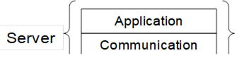  

Figure 37 - Logical layers of a Server  

In some cases, the application and the *Communication Stack* cannot exchange information at runtime which means the application will not have access to the *SecureChannelId* or the *Certificate* used to create the *SecureChannel.* In these cases the application shall create a random *ByteString* value that is at least 32 bytes long. This value shall be kept secret and shall always be exchanged over a *SecureChannel* with encryption enabled. The Administrator is responsible for ensuring that encryption is enabled. In this cases, the *SessionAuthenticationToken* is a *NodeId* with *a* *ByteString* identifier. The *Profiles* in [OPC 10000-7](/§UAPart7) may define additional requirements for a *ByteString* *SessionAuthenticationToken.*  

*Client* and *Server* applications should be written to be independent of the *SecureChannel* implementation. Therefore, they should always treat the *SessionAuthenticationToken* as secret information even if it is not required when using some *SecureChannel* implementations.  

[Figure 38](/§\_Ref183366531) illustrates the information exchanged between the *Client* , the *Server* and the *Server* *Communication Stack* when the *Client* obtains a *SessionAuthenticationToken.* In this figure the GetSecureChannelInfo step represents an API that depends on the *Communication Stack* implementation.  

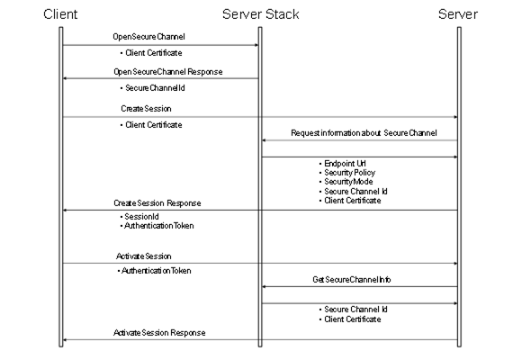  

Figure 38 - Obtaining a SessionAuthenticationToken  

The *SessionAuthenticationToken* is a subtype of the *NodeId* data type; however, it is never used to identify a *Node* in the *AddressSpace* . *Servers* may assign a value to the *NamespaceIndex* ; however, its meaning is *Server* specific.  

### 7.36 SignatureData  

The components of this parameter are defined in [Table 172](/§\_Ref153780325) .  

 **Table 172\- SignatureData**   

| **Name** | **Type** | **Description** |
|---|---|---|
|SignatureData|structure|Contains a digital signature created with a *Certificate* .|
|algorithm|String|A string containing the URI of the *algorithm* .  

The URI string values are defined as part of the security profiles specified in [OPC 10000-7](/§UAPart7) .|
|signature|ByteString|This is a signature generated with the private key associated with a *Certificate* .|
  

  

### 7.37 SignedSoftwareCertificate  

Note Details on SoftwareCertificates will be defined in a future version of this document.  

[Table 173](/§\_Ref181549897) specifies *SignedSoftwareCertificate Structure* .  

 **Table 173\- SignedSoftwareCertificate**   

| **Name** | **Type** | **Description** |
|---|---|---|
|SignedSoftwareCertificate|structure||
|certificateData|ByteString|The certificate data serialized as a ByteString.|
|signature|ByteString|The signature for the certificateData.|
  

  

### 7.38 StatusCode  

#### 7.38.1 General  

A *StatusCode* in OPC UA is numerical value that is used to report the outcome of an operation performed by an OPC UA *Server* . This code may have associated diagnostic information that describes the status in more detail; however, the code by itself is intended to provide *Client* applications with enough information to make decisions on how to process the results of an OPC UA *Service* .  

The *StatusCode* is a 32-bit unsigned integer. The top 16 bits represent the numeric value of the code that shall be used for detecting specific errors or conditions. The bottom 16 bits are bit flags that contain additional information but do not affect the meaning of the *StatusCode* .  

All OPC UA *Clients* shall always check the *StatusCode* associated with a result before using it. Results that have an uncertain/warning status associated with them shall be used with care since these results might not be valid in all situations. Results with a bad/failed status shall never be used.  

OPC UA *Servers* should return good/success *StatusCodes* if the operation completed normally and the result is always valid. Different *StatusCode* values can provide additional information to the *Client* .  

OPC UA *Servers* should use uncertain/warning *StatusCodes* if they could not complete the operation in the manner requested by the *Client* , however, the operation did not fail entirely.  

The list of *StatusCodes* is managed by OPC UA. The complete list of *StatusCodes* is defined in [OPC 10000-6](/§UAPart6) . *Servers* shall not define their own *StatusCodes* . OPC UA companion working groups may request additional *StatusCodes* from the OPC Foundation to be added to the list in [OPC 10000-6](/§UAPart6) .  

The exact bit assignments are shown in [Table 174](/§\_Ref127250480) .  

 **Table 174\- StatusCode bit assignments**   

| **Field** | **Bit Range** | **Description** |
|---|---|---|
|Severity|30:31|Indicates whether the *StatusCode* represents a good, bad or uncertain condition. These bits have the following meanings:  

|Good Success|00|Indicates that the operation was successful and the associated results may be used.|
|---|---|---|
|Uncertain Warning|01|Indicates that the operation was partially successful and that associated results might not be suitable for some purposes.|
|Bad Failure|10|Indicates that the operation failed and any associated results cannot be used.|
|Reserved|11|Reserved for future use. All *Clients* should treat a *StatusCode* with this severity as "Bad".|
  

  

Reserved  

29:29  

Reserved for use in OPC UA application specific APIs. This bit shall always be zero on the wire but may be used by OPC UA application specific APIs for API specific status codes.  

Reserved  

28:28  

Reserved for future use. Shall always be zero.  

SubCode  

16:27  

The code is a numeric value assigned to represent different conditions. Each code has a symbolic name and a numeric value. All descriptions in the OPC UA specification refer to the symbolic name. [OPC 10000-6](/§UAPart6) maps the symbolic names onto a numeric value.  

StructureChanged  

15:15  

Indicates that the structure of the associated data value has changed since the last *Notification* . *Clients* should not process the data value unless they re-read the metadata.  

*Servers* shall set this bit if the *DataTypeDefinition* of the *DataType* used for a *Variable* changes.  

This bit is provided to warn *Clients* that parse complex data values that their parsing routines could fail because the serialized form of the data value has changed.  

This bit has meaning only for *StatusCodes* returned as part of a data change *Notification* or the *HistoryRead* . *StatusCodes* used in other contexts shall always set this bit to zero.  

The bit is set on one data change Notification per MonitoredItem that samples values at the time the structure change happened. If the data change notification with the bit set is deleted because of a queue overflow, the bit shall be set on the next data change notification in the queue.  

SemanticsChanged  

14:14  

Indicates that the semantics of the associated data value have changed. *Clients* should not process the data value until they re-read the metadata associated with the *Variable* .  

*Servers* should set this bit if the metadata has changed in way that could cause application errors if the *Client* does not re-read the metadata. For example, a change to the engineering units could create problems if the *Client* uses the value to perform calculations.  

[OPC 10000-8](/§UAPart8) defines the conditions where a *Server* shall set this bit for a DA *Variable* . Other specifications may define additional conditions. A *Server* may define other conditions that cause this bit to be set.  

This bit has meaning only for *StatusCodes* returned as part of a data change *Notification* or the *HistoryRead* . *StatusCodes* used in other contexts shall always set this bit to zero.  

The bit is set on one data change Notification per MonitoredItem that samples values at the time the semantic change happened. If the data change notification with the bit set is deleted because of a queue overflow, the bit shall be set on the next data change notification in the queue.  

Reserved  

12:13  

Reserved for future use. Shall always be zero.  

InfoType  

10:11  

The type of information contained in the info bits. These bits have the following meanings:  

|NotUsed|00|The info bits are not used and shall be set to zero.|
|---|---|---|
|DataValue|01|The *StatusCode* and its info bits are associated with a data value returned from the *Server* . The info bits are defined in [Table 175](/§\_Ref127252123) .|
|Reserved|1X|Reserved for future use. The info bits shall be ignored.|
  

  

InfoBits  

0:9  

Additional information bits that qualify the *StatusCode* .  

The structure of these bits depends on the Info Type field.  

  

[Table 175](/§\_Ref127252123) describes the structure of the *InfoBits* when the Info Type is set to *DataValue* (01).  

 **Table 175\- DataValue InfoBits**   

| **Info Type** | **Bit Range** | **Description** |
|---|---|---|
|LimitBits|8:9|The limit bits associated with the data value. The limits bits have the following meanings:  

| **Limit** | **Bits** | **Description** |
|---|---|---|
|None|00|The value is free to change.|
|Low|01|The value is at the lower limit for the data source.|
|High|10|The value is at the higher limit for the data source.|
|Constant|11|The value is constant and cannot change.|
  

  

Overflow  

7  

This bit shall only be set if the *MonitoredItem* queue size is greater than 1.  

If this bit is set, not every detected change has been returned since the *Server* 's queue buffer for the *MonitoredItem* reached its limit and had to purge out data.  

Reserved  

5:6  

Reserved for future use. Shall always be zero.  

HistorianBits  

0:4  

These bits are set only when reading historical data. They indicate where the data value came from and provide information that affects how the *Client* uses the data value. The historian bits have the following meaning:  

|Raw|XXX00|A raw data value.|
|---|---|---|
|Calculated|XXX01|A data value which was calculated.|
|Interpolated|XXX10|A data value which was interpolated.|
|Reserved|XXX11|Undefined.|
|Partial|XX1XX|A data value which was calculated with an incomplete interval.|
|Extra Data|X1XXX|A raw data value that hides other data at the same timestamp.|
|Multi Value|1XXXX|Multiple values match the *Aggregate* criteria (i.e. multiple minimum values at different timestamps within the same interval).|
  

[OPC 10000-11](/§UAPart11) describes how these bits are used in more detail.  

  

#### 7.38.2 Common StatusCodes  

[Table 176](/§\_Ref90539276) defines the common *StatusCodes* for all *Service* results used in more than one service. It does not provide a complete list. These *StatusCodes* may also be used as operation level result code. [OPC 10000-6](/§UAPart6) maps the symbolic names to a numeric value and provides a complete list of StatusCodes including codes defines in other parts.  

 **Table 176\- Common Service Result Codes**   

| **Symbolic Id** | **Description** |
|---|---|
|Good|The operation was successful.|
|Good\_CompletesAsynchronously|The processing will complete asynchronously.|
|Good\_SubscriptionTransferred|The *Subscription* was transferred to another session.|
|||
|Bad\_CertificateHostNameInvalid  

|The *HostName* used to connect to a *Server* does not match a *HostName* in the *Certificate* .|
|Bad\_CertificateChainIncomplete|The *Certificate* chain is incomplete.|
|Bad\_CertificateIssuerRevocationUnknown|It was not possible to determine if the *Issuer* *Certificate* has been revoked.|
|Bad\_CertificateIssuerUseNotAllowed|The *Issuer* *Certificate* may not be used for the requested operation.|
|Bad\_CertificateIssuerTimeInvalid|An *Issuer* *Certificate* has expired or is not yet valid.|
|Bad\_CertificateIssuerRevoked|The *Issuer* *Certificate* has been revoked.|
|Bad\_CertificateInvalid|The *Certificate* provided as a parameter is not valid.|
|Bad\_CertificateRevocationUnknown|It was not possible to determine if the *Certificate* has been revoked.|
|Bad\_CertificateRevoked|The *Certificate* has been revoked.|
|Bad\_CertificateTimeInvalid|The *Certificate* has expired or is not yet valid.|
|Bad\_CertificateUriInvalid|The URI specified in the *ApplicationDescription* does not match the URI in the *Certificate* .|
|Bad\_CertificateUntrusted|The *Certificate* is not trusted.|
|Bad\_CertificateUseNotAllowed|The *Certificate* may not be used for the requested operation.|
|Bad\_CommunicationError|A low level communication error occurred.|
|Bad\_DataTypeIdUnknown|The *ExtensionObject* cannot be (de)serialized because the data type id is not recognized.|
|Bad\_DecodingError|Decoding halted because of invalid data in the stream.|
|Bad\_EncodingError|Encoding halted because of invalid data in the objects being serialized.|
|Bad\_EncodingLimitsExceeded|The message encoding/decoding limits imposed by the *Communication Stack* have been exceeded.|
|Bad\_IdentityTokenInvalid|The user identity token is not valid.|
|Bad\_IdentityTokenRejected|The user identity token is valid but the *Server* has rejected it.|
|Bad\_InternalError|An internal error occurred as a result of a programming or configuration error.|
|Bad\_InvalidArgument|One or more arguments are invalid.  

Each service defines parameter-specific *StatusCodes* and these *StatusCodes* shall be used instead of this general error code. This error code shall be used only by the *Communication Stack* and in services where it is defined in the list of valid *StatusCodes* for the service.|
|Bad\_InvalidState|The operation cannot be completed because the object is closed, uninitialized or in some other invalid state.|
|Bad\_InvalidTimestamp|The timestamp is outside the range allowed by the *Server* .|
|Bad\_LicenseExpired|The UA *Server* requires a license to operate in general or to perform a service or operation, but existing license is expired|
|Bad\_LicenseLimitsExceeded|The UA *Server* has limits on number of allowed operations / objects, based on installed licenses, and these limits where exceeded.|
|Bad\_LicenseNotAvailable|The UA *Server* does not have a license which is required to operate in general or to perform a service or operation.|
|Bad\_NonceInvalid|The nonce does appear to be not a random value or it is not the correct length.|
|Bad\_NothingToDo|No processing could be done because there was nothing to do.  

For *Service* level results the code is used if the *Client* passed a list of operations with no elements.|
|Bad\_OutOfMemory|Not enough memory to complete the operation.|
|Bad\_RequestCancelledByClient|The request was cancelled by the *Client* .|
|Bad\_RequestTooLarge|The request message size exceeds limits set by the *Server* .|
|Bad\_ResponseTooLarge|The response message size exceeds limits set by the *Client* or *Server* .|
|Bad\_RequestHeaderInvalid|The header for the request is missing or invalid.|
|Bad\_ResourceUnavailable|An operating system resource is not available.|
|Bad\_SecureChannelIdInvalid|The specified secure channel is no longer valid.|
|Bad\_SecurityChecksFailed|An error occurred while verifying security.|
|Bad\_SecurityPolicyRejected|The security policy does not meet the requirements set by the *Server* .|
|Bad\_ServerHalted|The *Server* has stopped and cannot process any requests.|
|Bad\_ServerNotConnected|The operation could not complete because the *Client* is not connected to the *Server* .|
|Bad\_ServerTooBusy|The *Server* does not have the resources to process the request at this time.  

This can be caused by a general overload of the *Server* or an overload by the *Client* that receives the result code.|
|Bad\_ServerUriInvalid|The *Server* URI is not valid.|
|Bad\_ServiceUnsupported|The *Server* does not support the requested service.|
|Bad\_SessionIdInvalid|The *Session* id is not valid.|
|Bad\_SessionClosed|The *Session* was closed by the *Client* .|
|Bad\_SessionNotActivated|The *Session* cannot be used because ActivateSession has not been called.|
|Bad\_Shutdown|The operation was cancelled because the application is shutting down.|
|Bad\_SubscriptionIdInvalid|The *Subscription* id is not valid.  

The *Subscription* id is not known or is not valid in the context of the *Session* used to call the *Subscription* related *Service* .|
|Bad\_Timeout|The operation timed out.|
|Bad\_TimestampsToReturnInvalid|The timestamps to return parameter is invalid.|
|Bad\_TooManyOperations|The request could not be processed because it specified too many operations.|
|Bad\_UnexpectedError|An unexpected error occurred.|
|Bad\_UnknownResponse|An unrecognized response was received from the *Server* .|
|Bad\_UserAccessDenied|User does not have permission to perform the requested operation.|
|Bad\_ViewIdUnknown|The view id does not refer to a valid view Node.|
|Bad\_ViewTimestampInvalid|The view timestamp is not available or not supported.|
|Bad\_ViewParameterMismatchInvalid|The view parameters are not consistent with each other.|
|Bad\_ViewVersionInvalid|The view version is not available or not supported.|
  

  

[Table 177](/§\_Ref127606591) defines the common *StatusCodes* for all operation level results used in more than one service. It does not provide a complete list. [OPC 10000-6](/§UAPart6) maps the symbolic names to a numeric value and provides a complete list of StatusCodes including codes defines in other parts. The common *Service* result codes can be also contained in the operation level.  

 **Table 177\- Common Operation Level Result Codes**   

| **Symbolic Id** | **Description** |
|---|---|
|Good\_Clamped|The value written was accepted but was clamped.|
|Good\_Overload|Sampling has slowed down due to resource limitations.|
|||
|Uncertain|The value is uncertain but no specific reason is known.|
|||
|Bad|The value is bad but no specific reason is known.|
|Bad\_AttributeIdInvalid|The attribute is not supported for the specified node.|
|Bad\_BrowseDirectionInvalid|The browse direction is not valid.|
|Bad\_BrowseNameInvalid|The browse name is invalid.|
|Bad\_ContentFilterInvalid|The content filter is not valid.|
|Bad\_ContinuationPointInvalid|The continuation point provided is no longer valid.  

This status is returned if the continuation point was deleted or the address space was changed between the browse calls.|
|Bad\_DataEncodingInvalid|The data encoding is invalid.|
|Bad\_DataEncodingUnsupported|The *Server* does not support the requested data encoding for the node.|
|Bad\_EventFilterInvalid|The event filter is not valid.|
|Bad\_FilterNotAllowed|A monitoring filter cannot be used in combination with the attribute specified.|
|Bad\_FilterOperandInvalid|The operand used in a content filter is not valid.|
|Bad\_HistoryOperationInvalid|The history details parameter is not valid.|
|Bad\_HistoryOperationUnsupported|The *Server* does not support the requested operation.|
|Bad\_IndexRangeInvalid|The syntax of the index range parameter is invalid.|
|Bad\_IndexRangeNoData|No data exists within the range of indexes specified.|
|Bad\_MonitoredItemFilterInvalid|The monitored item filter parameter is not valid.|
|Bad\_MonitoredItemFilterUnsupported|The *Server* does not support the requested monitored item filter.|
|Bad\_MonitoredItemIdInvalid|The monitoring item id does not refer to a valid monitored item.|
|Bad\_MonitoringModeInvalid|The monitoring mode is invalid.|
|Bad\_NoCommunication|Communication with the data source is defined, but not established, and there is no last known value available.  

This status/sub-status is used for cached values before the first value is received or for Write and Call if the communication is not established.|
|Bad\_NoContinuationPoints|The operation could not be processed because all continuation points have been allocated.|
|Bad\_NodeClassInvalid|The node class is not valid.|
|Bad\_NodeIdInvalid|The syntax of the node id is not valid or refers to a node that is not valid for the operation.|
|Bad\_NodeIdUnknown|The node id refers to a node that does not exist in the *Server* address space.|
|Bad\_NoDeleteRights|The *Server* will not allow the node to be deleted.|
|Bad\_NodeNotInView|The nodesToBrowse is not part of the view.|
|Bad\_NotFound|A requested item was not found or a search operation ended without success.|
|Bad\_NotImplemented|Requested operation is not implemented.|
|Bad\_NoValue|There is no value available.  

This status is also used if a *Variable* is created and no default value or no initial value is available.|
|Bad\_NotReadable|The access level does not allow reading or subscribing to the *Node* .|
|Bad\_NotSupported|The requested operation is not supported.|
|Bad\_NotWritable|The access level does not allow writing to the *Node* .|
|Bad\_ObjectDeleted|The *Object* cannot be used because it has been deleted.|
|Bad\_OutOfRange|The value was out of range.|
|Bad\_ReferenceTypeIdInvalid|The reference type id does not refer to a valid reference type node.|
|Bad\_SecurityModeInsufficient|The SecurityPolicy and/or MessageSecurityMode do not match the *Server* requirements to complete the operation.  

For example, a user may have the right to receive the data but the data can only be transferred through an encrypted channel with an appropriate *SecurityPolicy* .|
|Bad\_SourceNodeIdInvalid|The source node id does not refer to a valid node.|
|Bad\_StructureMissing|A mandatory structured parameter was missing or null.|
|Bad\_TargetNodeIdInvalid|The target node id does not refer to a valid node.|
|Bad\_TypeDefinitionInvalid|The type definition node id does not reference an appropriate type node.|
|Bad\_TypeMismatch|The value supplied for the attribute is not of the same type as the attribute's value.|
|Bad\_WaitingForInitialData|Waiting for the *Server* to obtain values from the underlying data source.  

After creating a *MonitoredItem* or after setting the MonitoringMode from DISABLED to REPORTING or SAMPLING, it may take some time for the *Server* to actually obtain values for these items. In such cases the *Server* can send a *Notification* with this status prior to the *Notification* with the first value or status from the data source.|
  

  

### 7.39 TimestampsToReturn  

The *TimestampsToReturn* is an enumeration that specifies the *Timestamp* *Attributes* to be transmitted for *MonitoredItems* or *Nodes* in *Read* and *HistoryRead* . The values of this parameter are defined in [Table 178](/§\_Ref112485903) .  

 **Table 178\- TimestampsToReturn values**   

| **Name** | **Value** | **Description** |
|---|---|---|
|SOURCE|0|Return the source timestamp.|
|SERVER|1|Return the *Server* timestamp.|
|BOTH|2|Return both the source and *Server* timestamps.|
|NEITHER|3|Return neither timestamp.  

This is the default value for *MonitoredItems* if a *Variable* value is not being accessed.  

For *HistoryRead* this is not a valid setting.|
|INVALID|4|No value specified.|
  

  

### 7.40 UserIdentityToken parameters  

#### 7.40.1 Overview  

The *UserIdentityToken* structure used in the *Server* *Service* *Set* allows *Clients* to specify the identity of the user they are acting on behalf of. The exact mechanism used to identify users depends on the system configuration. The different types of identity tokens are based on the most common mechanisms that are used in systems today. [Table 179](/§\_Ref128242293) defines the current set of user identity tokens. The *ExtensibleParameter* type is defined in [7.17](/§\_Ref182070092) .  

 **Table 179\- UserIdentityToken parameterTypeIds**   

| **Symbolic Id** | **Description** |
|---|---|
|AnonymousIdentityToken|No user information is available.|
|UserNameIdentityToken|A user identified by user name and password.|
|X509IdentityToken|A user identified by an X.509 v3 *Certificate* .|
|IssuedIdentityToken|A user identified by a token issued by an external *Authorization Service* .|
  

  

#### 7.40.2 Token Encryption and Proof of Possession  

##### 7.40.2.1 Overview  

The *Client* shall always prove possession of a *UserIdentityToken* when it passes it to the *Server* . Some tokens include a secret such as a password which the *Server* will accept as proof. In order to protect these secrets, the *Token* may be encrypted before it is passed to the *Server* . Other types of tokens allow the *Client* to create a signature with the secret associated with the *Token* . In these cases, the *Client* proves possession of a *UserIdentityToken* by creating a signature with the secret and passing it to the *Server* .  

Each *UserIdentityToken* allowed by an *Endpoint* shall have a *UserTokenPolicy* specified in the *EndpointDescription* . The *UserTokenPolicy* specifies what *SecurityPolicy* to use when encrypting or signing. If this *SecurityPolicy* is null or empty then the *Client* uses the *SecurityPolicy* in the *EndpointDescription* . If the matching *SecurityPolicy* is set to *None* then no encryption or signature is required. The possible *SecurityPolicies* are defined in [OPC 10000-7](/§UAPart7) .  

It is recommended that applications never set the *SecurityPolicy* to *None* for *UserIdentityTokens* that include a secret because these secrets could be used by an attacker to gain access to the system.  

*Clients* shall validate the *Server* *Certificate* and ensure it is trusted before sending a *UserIdentityToken* encrypted with the *Certificate* .  

The encrypted secret and *Signature* are embedded in a *ByteString* which is part of the *UserIdentityToken* . The format of this *ByteString* depends on the type of *UserIdentityToken* and the *SecurityPolicy* .  

The legacy token secret format defined in [7.40.2.2](/§\_Ref482553831) is not extensible and provides only encryption but the encrypted data is not signed. It is used together with the *USERNAME UserIdentityToken* . The password secret exchanged with this format shall not exceed 64 bytes. If the password exceeds 64 bytes, the *EncryptedSecret* format shall be used or the clear text password is sent over a *SecureChannel* that is encrypted.  

The *EncryptedSecret* format defined in [7.40.2.3](/§\_Ref482553832) provides an extensible secret format together with the definition how the secret is signed and encrypted. It allows for the layout to be updated as new token types are defined or new *SecurityPolicies* are added.  

The *EncryptedSecret* format starts with a *TypeId* , *EncodingMask* and *Length* . These values allow a *Server* to determine how to handle the secret. If the *TypeId* does not resolve to one of the defined *EncryptedSecret* format *DataTypes* and a USERNAME *UserIdentityToken* has been provided then the *Server* may attempt to handle the secret using the legacy token secret format.  

The *UserIdentityToken* types and the token formats supported by the *Endpoint* are identified by the *UserTokenPolicy* defined in [7.41](/§\_Ref184567336) .  

To prevent the leakage of information useful to attackers, *Servers* shall ensure that the process of validating *UserIdentityTokens* completes in a fixed interval independent of whether an error occurs or not. The process of validation includes decrypting, check for padding and checking for a valid nonce. If any errors occur the return code is *Bad\_IdentityTokenInvalid* .  

*Servers* shall log details of any failure to validate a *UserIdentityToken* and shall lock out *Client* applications after five failures.  

##### 7.40.2.2 Legacy Encrypted Token Secret Format  

When encrypting a *UserIdentityToken,* the *Client* appends the last *ServerNonce* to the secret. The data is then encrypted with the public key from the *Server's* *Certificate* .  

A *Client* should not add any padding after the secret. If a *Client* adds padding then all bytes shall be zero. A *Server* shall check for padding added by *Clients* and ensure that all padding bytes are zeros. *Servers* shall reject *UserIdentityTokens* with invalid padding. Administrators shall be able to configure *Servers* to accept *UserIdentityTokens* with invalid padding.  

If no encryption is applied, the structure is not used and only the secret without any *Nonce* is passed to the *Server* .  

[Table 180](/§\_Ref183363340) describes how to serialize *UserIdentityTokens* before applying encryption.  

 **Table 180\- Legacy UserIdentityToken Encrypted Token Secret Format**   

| **Name** | **Type** | **Description** |
|---|---|---|
|Length|Byte [4]|The length of the data to be encrypted including the *ServerNonce* but excluding the *length* field.  

This field is a 4-byte unsigned integer encoded with the least significant bytes appearing first.|
|tokenData|Byte [\*]|The token data.|
|serverNonce|Byte [\*]|The last *ServerNonce* returned by the *Server* in the *CreateSession* or *ActivateSession* response.|
  

  

##### 7.40.2.3 EncryptedSecret Format  

The *EncryptedSecret* uses an extensible format which has the *TypeId* of a *DataType* *Node* as a prefix as defined for the *ExtensionObject* encoding in [OPC 10000-6](/§UAPart6) . The general layout of the *EncryptedSecret* is shown in [Figure 39](/§\_Ref164005549) .  

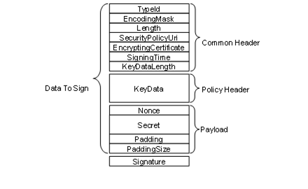  

Figure 39 - EncryptedSecret layout  

The *TypeId* specifies how the *EncryptedSecret* is serialized and secured. For example,  the *RsaEncryptedSecret* requires that the *KeyData* be encrypted with the public key associated with the *EncryptingCertificate* before it is serialized.  

The *SecurityPolicyUri* is used to determine what algorithms were used to encrypt and sign the data. Valid *SecurityPolicyUris* are defined in [OPC 10000-7](/§UAPart7) .  

The payload is always encrypted using the symmetric encryption algorithm specified by the *SecurityPolicyUri* . The *KeyData* provides the keys needed for symmetric encryption. The structure of the *KeyData* depends on the *EncryptedSecret* *DataType.*  

The *EncryptedSecret* is secured and serialized as follows:  

* Serialize the common header;  

* Serialize the KeyData;  

* If required, encrypt the KeyData and append the result to the common header;  

* Update the KeyDataLength with the length of the encrypted KeyData;  

* Append the Nonce and the Secret to the encrypted KeyData;  

* Calculate padding required on the payload and append after the Secret;  

* Encrypt the payload;  

* Calculate a Signature;  

* Append the Signature.  

  

Individual fields are serialized using the UA Binary encoding (see [OPC 10000-6](/§UAPart6) ) for the *DataType* specified in [Table 181](/§\_Ref483801559) . The *Padding* is used to ensure there is enough data to fill an integer multiple of encryption blocks. The size of the encryption block depends on the encryption algorithm. The total length of the Padding, not including the *PaddingSize* , is encoded as a *UInt16* . The individual bytes of the *Padding* are set to the least significant byte of the *PaddingSize* .  

  

The *EncryptedSecret* is deserilized and validated as follows *:*  

* Deserialize the common header;  

* Verify the Signature if the KeyData is not encrypted;  

* Decrypt the KeyData and verify the Signature if the KeyData is encrypted;  

* Decrypt the payload;  

* Verify the padding on the payload;  

* Extract the *Secret* ;  

  

The fields in the *EncryptedSecret* are described in [Table 181](/§\_Ref483801559) . The first three fields *TypeId* , *EncodingMask* and *Length* belong to the *ExtensionObject* encoding defined in [OPC 10000-6](/§UAPart6) .  

 **Table 181\- EncryptedSecret layout**   

| **Name** | **Type** | **Description** |
|---|---|---|
|TypeId|NodeId|The *NodeId* of the *DataType* *Node* .|
|EncodingMask|Byte|This value is always 1.|
|Length|Int32|The length of the data that follows including the *Signature* .|
|SecurityPolicyUri|String|The URI for the *SecurityPolicy* used to apply security.|
|Certificate|ByteString|The signing and/or encrypting *Certificate* .|
|SigningTime|DateTime|When the *Signature* was created.|
|KeyDataLength|UInt16|The length, in bytes, of the *KeyData* that follows  

If the *KeyData* is encrypted this is the length of the encrypted data;  

Otherwise, it is the length of the unencrypted data.|
|KeyData|Byte [\*]|The key data used to create the keys needed for decrypting and verifying the payload using the *SymmetricEncryptionAlgorithm* specified by the *SecurityPolicyUri* . Each *EncryptedSecret DataType* describes how the key data is structured for different *SecurityPolicies* .|
|Nonce|ByteString|This is the last *serverNonce* returned in the *CreateSession* or *ActivateSession* *Response* when a *UserIdentityToken* is passed with the *ActivateSession* *Request* .  

If used outside of an *ActivateSession* call, the *Nonce* is created by the sender and its length shall be between 32 and 128 bytes inclusive.|
|Secret|ByteString|The secret to protect.  

The *password* when used with *UserNameIdentityTokens* .  

The *tokenData* when used with *IssuedIdentityTokens.*  

If the *Secret* is a *String* is it encoded using UTF-8 first.|
|PayloadPadding|Byte[\*]|Additional padding added to ensure the size of the encrypted payload is an integer multiple of the *InitializationVectorLength* specified by the *SecurityPolicyUri* . If the *InitializationVectorLength* is less than 16 bytes then 16 bytes are used instead.  

The value of each byte is the least significant byte of the *PayloadPaddingSize* .|
|PayloadPaddingSize|UInt16|The size of the padding added to the payload.|
|Signature|Byte[\*]|The *Signature* calculated after all encryption is applied.  

Each *EncryptedSecret DataType* describes how the *Signature* is calculated for different *SecurityPolicies* .|
  

  

The PayloadPaddingSize adjusted with the following formula:  

If (Secret.Length + PayloadPaddingSize \< InitializationVectorLength) Then  

PayloadPaddingSize = PayloadPaddingSize + InitializationVectorLength  

Where the *InitializationVectorLength* is specified by the SymmetricEncryptionAlgorithm.  

The currently available *EncryptedSecret* *DataTypes* are defined in [Table 182](/§\_Ref482755394) .  

 **Table 182\- EncryptedSecret DataTypes**   

| **Type Name** | **When to Use** |
|---|---|
|RsaEncryptedSecret|Used when the *SecurityPolicy* requires the use of RSA cryptography. It is described in [7.40.2.4](/§\_Ref494295034) .|
|EccEncryptedSecret|Used when the *SecurityPolicy* requires the use of ECC cryptography.It is described in [7.40.2.5](/§\_Ref43197004) .|
  

  

##### 7.40.2.4 RsaEncryptedSecret DataType  

The *RsaEncryptedSecret* uses RSA based *Asymmetric Cryptography* .  

Additional semantics for the fields in the *EncryptedSecret* layout for the *RsaEncryptedSecret* *Structure* are described in [Table 183](/§\_Ref486275903) .  

 **Table 183\- RsaEncryptedSecret structure**   

| **Name** | **Type** | **Description** |
|---|---|---|
|TypeId|NodeId|The *NodeId* of the *RsaEncryptedSecret* *DataType* *Node* .|
|EncodingMask|Byte|See [Table 181](/§\_Ref483801559) .|
|Length|UInt32|See [Table 181](/§\_Ref483801559) .|
|SecurityPolicyUri|String|See [Table 181](/§\_Ref483801559) .|
|Certificate|ByteString|The SHA1 hash of the DER form of the Certificate used to encrypt the *KeyData* .|
|SigningTime|DateTime|See [Table 181](/§\_Ref483801559) .|
|KeyDataLength|UInt16|The length, in bytes, of the encrypted *KeyData* .|
|KeyData||The *KeyData* is encrypted with the *PublicKey* associated with the receiver ** of the *EncryptedSecret* . The creator of the *EncryptedSecret* generates the *SigningKey* , *EncryptingKey* and *InitializationVector* using a cryptographic random number generator with the lengths required by the *SecurityPolicy* .|
|SigningKey|ByteString|The key used to compute the *Signature* .|
|EncryptingKey|ByteString|The key used to encrypt payload.|
|InitializationVector|ByteString|The initialization vector used with the *EncryptingKey* .|
|Nonce|ByteString|A *Nonce* . This is the last *ServerNonce* returned in the *CreateSession* or *ActivateSession* *Response* when proving a *UserIdentityToken* passed in the *ActivateSession* *Request* . In other contexts, this is a *Nonce* created by the sender with a length between 32 and 128 bytes inclusive *.*|
|Secret|ByteString|See [Table 181](/§\_Ref483801559) .|
|PayloadPadding|Byte[\*]|See [Table 181](/§\_Ref483801559) .|
|PayloadPaddingSize|UInt16|See [Table 181](/§\_Ref483801559) .|
|Signature|Byte[\*]|The *Signature* calculated with the *SigningKey* using the *SymmetricEncryptionAlgorithm* from the *SecurityPolicy* .  

The *Signature* is calculated after encrypting the *KeyData* and the payload.  

The *Signature* can only be checked after the *KeyData* is decrypted. It allows the receiver to verify that the message has not beem tampered with. It does not provide any information about who created the *EncryptedSecret* .|
  

  

##### 7.40.2.5 EccEncryptedSecret DataType  

The *EccEncryptedSecret* uses ECC based *Asymmetric Cryptography* .  

Additional semantics for the fields in the *EncryptedSecret* layout for the *EccEncryptedSecret* Structure are described in [Table 184](/§\_Ref43194742) .  

The *EccEncryptedSecret* uses ECC *EphemeralKeys* to create the symmetric key used to encrypt the Secret. The handshake required to create and use the *EphemeralKeys* is described in [OPC 10000-6](/§UAPart6) .  

 **Table 184\- EccEncryptedSecret Layout**   

| **Name** | **Type** | **Description** |
|---|---|---|
|TypeId|NodeId|The *NodeId* of the *EccEncryptedSecret* *DataType* *Node* .|
|EncodingMask|Byte|See [Table 181](/§\_Ref483801559)|
|Length|UInt32|See [Table 181](/§\_Ref483801559)|
|SecurityPolicyUri|String|See [Table 181](/§\_Ref483801559)|
|Certificate|ByteString|The signing *Certificate* encoded in DER form.  

The value shall include the entire chain.  

This value may be null or empty if the *SigningCertificate* is known to the receiver. This is true if the structure is used to provide a *UserIdentityToken* to a *Server* over a *SecureChannel* and the *SigningCertificate* is the *Client ApplicationInstance Certificate* .|
|SigningTime|DateTime|See [Table 181](/§\_Ref483801559)|
|KeyDataLength|UInt16|The length of the *KeyData* without encryption.|
|KeyData||The *KeyData* is not encrypted.|
|SenderPublicKey|ByteString|The *Public Key* for the *EphemeralKey* created by the sender.|
|ReceiverPublicKey|ByteString|The *Public Key* for the *EphemeralKey* created by the receiver.|
|Nonce|ByteString|A *Nonce* . This is the last *ServerNonce* returned in the *CreateSession* or *ActivateSession* *Response* when proving a *UserIdentityToken* passed in the *ActivateSession* *Request* . In other contexts, this is a *Nonce* created by the sender with a length between 32 and 128 bytes inclusive *.*|
|Secret|ByteString|See [Table 181](/§\_Ref483801559)|
|PayloadPadding|Byte [\*]|See [Table 181](/§\_Ref483801559)|
|PayloadPaddingSize|UInt16|See [Table 181](/§\_Ref483801559)|
|Signature|Byte [\*]|When using *AuthenticatedEncryption* the *Signature* has two parts: the *Signature* produced when the secret is encrypted using the *SymmetricEncryptionAlgorithm* and the *Signature* calculated using the *Certificate* and the *AsymmetricSignatureAlgorithm* . Both *Signatures* are calculated from the start of the packet. The *AsymmetricSignatureAlgorithm* *Signature* includes the *SymmetricEncryptionAlgorithm* *Signature* .  

When using *UnauthenticatedEncryption* the *Signature* is only calculated using the *Certificate* and the *AsymmetricSignatureAlgorithm.*|
  

  

#### 7.40.3 AnonymousIdentityToken  

The *AnonymousIdentityToken* is used to indicate that the *Client* has no user credentials.  

[Table 185](/§\_Ref183190852) defines the *AnonymousIdentityToken* parameter.  

 **Table 185\- AnonymousIdentityToken**   

| **Name** | **Type** | **Description** |
|---|---|---|
|AnonymousIdentityToken|Structure|An anonymous user identity.|
|policyId|String|An identifier for the *UserTokenPolicy* that the token conforms to.  

The *UserTokenPolicy* structure is defined in [7.41](/§\_Ref184567336) . Servers that provide a null or empty *PolicyId* shall accept null or empty and treat them as equal.|
  

  

#### 7.40.4 UserNameIdentityToken  

The *UserNameIdentityToken* is used to pass simple username/password credentials to the *Server* .  

This token shall be encrypted by the *Client* if required by the *SecurityPolicy* of the *UserTokenPolicy* . The *Server* should specify a *SecurityPolicy* for the *UserTokenPolicy* if the *SecureChannel* has a *SecurityPolicy* of *None* and no transport layer encryption is available. If *None* is specified for the *UserTokenPolicy* and *SecurityPolicy* is None then the password only contains the UTF-8 encoded password. The *SecurityPolicy* of the *SecureChannel* is used if no *SecurityPolicy* is specified in the *UserTokenPolic* y. The *Server* shall specify a *SecurityPolicy* for the *UserTokenPolicy* if the *SecureChannel* has a *SecurityPolicy* other than *None* and the *MessageSecurityMode* is not *SIGNANDENCRYPT* . See [Table 187](/§\_Ref367827984) for possible combinations.  

If the token is to be encrypted the password shall be converted to a UTF-8 *ByteString* , encrypted ** and then serialized according to the following rules. When using an RSA based *SecurityPolicy* and the password exceeds 64 bytes, it is encrypted and serialized as described in [7.40.2.4](/§\_Ref494295034) . For passwords that do not exceed 64 bytes, it is encrypted and serialized as described in [7.40.2.2](/§\_Ref482553831) . When using the ECC based *SecurityPolicies* the password is encrypted and serialized as described in [7.40.2.5](/§\_Ref43197004) .  

The *Server* shall decrypt the password and verify the *ServerNonce* .  

If the *SecurityPolicy* is *None* then the password only contains the UTF-8 encoded password. This configuration should not be used unless the network traffic is encrypted in some other manner such as a VPN. The use of this configuration without network encryption would result in a serious security fault, in that it would cause the appearance of a secure user access, but it would make the password visible in clear text.  

[Table 186](/§\_Ref122192489) defines the *UserNameIdentityToken* parameter.  

 **Table 186\- UserNameIdentityToken**   

| **Name** | **Type** | **Description** |
|---|---|---|
|UserNameIdentityToken|Structure|UserName value.|
|policyId|String|An identifier for the *UserTokenPolicy* that the token conforms to.  

The *UserTokenPolicy* structure is defined in [7.41](/§\_Ref184567336) . Servers that provide a null or empty *PolicyId* shall accept null or empty and treat them as equal.|
|userName|String|A string that identifies the user.|
|password|ByteString|The password for the user. The password can be an empty string.  

The format used for the encrypted data is described in [7.40.2.2](/§\_Ref482553831) .|
|encryptionAlgorithm|String|A string containing the URI of the *AsymmetricEncryptionAlgorithm* .  

The URI string values are defined names that may be used as part of the security profiles specified in [OPC 10000-7](/§UAPart7) .  

This parameter is null or empty if the password is not encrypted.|
  

  

[Table 187](/§\_Ref367827984) describes the dependencies for selecting the *AsymmetricEncryptionAlgorithm* for the *UserNameIdentityToken* . The *SecureChannel* *SecurityPolicy* URI is specified in the *EndpointDescription* and used in subsequent OpenSecureChannel requests. The *UserTokenPolicy* *SecurityPolicy* URI is specified in the *EndpointDescription* . The *encryptionAlgorithm* is specified in the *UserNameIdentityToken* or *IssuedIdentityToken* provided by the *Client* in the *ActivateSession* call. The *SecurityPolicy* Other in the table refers to any *SecurityPolicy* other than None. The selection of the *EncryptionAlgorithm* is based on the *UserTokenPolicy* . The *SecureChannel* *SecurityPolicy* is used if the *UserTokenPolicy* is null or empty. If the *SecurityMode* is not NONE, it is recommended to use the same *SecurityPolicy* for the *SecureChannel* and the user token. The *SecurityPolicy* used for the user token shall be compatible with the *Certificate* in the *EndpointDescription* .  

 **Table 187\- EncryptionAlgorithm selection**   

| **SecureChannel**   

 **SecurityPolicy** | **SecureChannel**   

 **SecurityMode** | **UserTokenPolicy**   

 **SecurityPolicy** | **UserIdentityToken EncryptionAlgorithm** |
|---|---|---|---|
|Security Policy - None|NONE|Null or empty|No encryption (a)|
|Security Policy - None|NONE|Security Policy - None|No encryption (a)|
|Security Policy - None|NONE|Security Policy - Other|Asymmetric algorithm for "Other"|
|Security Policy - Other|Other than NONE|Null or empty|Asymmetric algorithm for "Other"|
|Security Policy - Other|Other than NONE|Security Policy - Yet another|Asymmetric algorithm for "Yet another" (b)|
|Security Policy - Other|Other than NONE|Security Policy - Other|Asymmetric algorithm for "Other"|
|Security Policy - Other|SIGNANDENCRYPT|Security Policy - None|No encryption but encrypted SecureChannel|
|Security Policy - Other|SIGN|Security Policy - None|Invalid configuration shall be rejected.|
|(a) The use of this configuration without network encryption would result in a serious security fault.  

(b) This configuration should not be used.|
  

  

#### 7.40.5 X509IdentityTokens  

The *X509IdentityToken* is used to pass an X.509 v3 *Certificate* which is issued by the user.  

This token shall always be accompanied by a *Signature* in the *userTokenSignature* parameter of *ActivateSession* if required by the *SecurityPolicy* . The *Server* should specify a *SecurityPolicy* for the *UserTokenPolicy* if the *SecureChannel* has a *SecurityPolicy* of None.  

*X509IdentityTokens* have an validity period and a *Server* shall invalidate the credentials of the *Session* within a configurable time after the token expires. The *Session* shall stay valid with the *Anonymous* *Role* . If the *Server* does not allow anonymous users, it should close the *Session* . *Clients* should renew the token with *ActivateSession* before the expiration time to avoid communication interruption or other operation failures.  

[Table 188](/§\_Ref122192442) defines the X509IdentityToken parameter.  

 **Table 188\- X.509 v3 Identity Token**   

| **Name** | **Type** | **Description** |
|---|---|---|
|X509IdentityToken|structure|X.509 v3 value.|
|policyId|String|An identifier for the *UserTokenPolicy* that the token conforms to.  

The *UserTokenPolicy* structure is defined in [7.41](/§\_Ref184567336) . Servers that provide a null or empty *PolicyId* shall accept null or empty and treat them as equal.|
|certificateData|ByteString|The X.509 v3 *Certificate* in DER format.|
  

  

#### 7.40.6 IssuedIdentityToken  

The *IssuedIdentityToken* is used to pass *SecurityTokens* issued by an external *Authorization Service* to the *Server* . These tokens may be text or binary.  

OAuth2 defines a standard for *Authorization Services* that produce JSON Web Tokens (JWT). These JWTs are passed as an *Issued Token* to an OPC UA *Server* which uses the signature contained in the JWT to validate the token. [OPC 10000-6](/§UAPart6) describes OAuth2 and JWTs in more detail. If the token is encrypted, it shall use the *EncryptedSecret* format defined in [7.40.2.3](/§\_Ref482553832) .  

This token shall be encrypted by the *Client* if required by the *SecurityPolicy* of the *UserTokenPolicy* . The *Server* should specify a *SecurityPolicy* for the *UserTokenPolicy* if the *SecureChannel* has a *SecurityPolicy* of None and no transport layer encryption is available. The *SecurityPolicy* of the *SecureChannel* is used If no *SecurityPolicy* is specified in the *UserTokenPolic* y.  

If the *SecurityPolicy* is not *None* , the *tokenData* shall be encoded in UTF-8 (if it is not already binary), signed and encrypted ** according the rules specified for the *tokenType* of the associated *UserTokenPolicy* (see [7.41](/§\_Ref184567336) ).  

If the *SecurityPolicy* is *None* then the *tokenData* only contains the UTF-8 encoded *tokenData* . This configuration should not be used unless the network is encrypted in some other manner such as a VPN. The use of this configuration without network encryption would result in a serious security fault, in that it would cause the appearance of a secure user access, but it would make the token visible in clear text.  

*IssuedIdentityTokens* have an expiration time, and a *Server* shall invalidate the credentials of the *Session* within a configurable time after the token expires. The *Session* shall stay valid with the *Anonymous* *Role* . If the *Server* does not allow anonymous users, it should close the *Session* . *Clients* should renew the token with *ActivateSession* before the expiration time to avoid communication interruption or other operation failures.  

[Table 189](/§\_Ref153107520) defines the *IssuedIdentityToken* parameter.  

 **Table 189\- IssuedIdentityToken**   

| **Name** | **Type** | **Description** |
|---|---|---|
|IssuedIdentityToken|structure|The token provided by an *Authorization Service* .|
|policyId|String|An identifier for the *UserTokenPolicy* that the token conforms to.  

The *UserTokenPolicy* structure is defined in [7.41](/§\_Ref184567336) . Servers that provide a null or empty *PolicyId* shall accept null or empty and treat them as equal.|
|tokenData|ByteString|The text or binary representation of the token.  

The format of the data depends on the associated *UserTokenPolicy.*|
|encryptionAlgorithm|String|The URI of the *AsymmetricEncryptionAlgorithm* .  

The list of OPC UA-defined names that may be used is specified in [OPC 10000-7](/§UAPart7) .  

See [Table 187](/§\_Ref367827984) for details on picking the correct URI.  

This parameter is null or empty if the *tokenData* is not encrypted or if the *EncryptedSecret* format is used.|
  

  

### 7.41 UserTokenPolicy  

The components of this parameter are defined in [Table 190](/§\_Ref128244140) .  

 **Table 190\- UserTokenPolicy**   

| **Name** | **Type** | **Description** |
|---|---|---|
|UserTokenPolicy|structure|Specifies a *UserIdentityToken* that a *Server* will accept *.*|
|policyId|String|An identifier for the UserTokenPolicy assigned by the *Server* . The identifier may be null or empty. Null or empty are equal. The identifier shall be unique across the *UserTokenPolicies* assigned by the *Server* .  

The *Client* specifies this value when it constructs a *UserIdentityToken* that conforms to the policy.  

This value is only unique within the context of a single *Server* .|
|tokenType|Enum  

User TokenType|The type of user identity token required. The UserTokenType is defined in [7.42](/§\_Ref43034466)  

A tokenType of *ANONYMOUS* indicates that the *Server* does not require any user identification. In this case, the *Client* *ApplicationInstanceCertificate* is used as the user identification.|
|issuedTokenType|String|A URI for the type of token.  

[OPC 10000-6](/§UAPart6) defines URIs for common issued token types.  

Vendors may specify their own token types.  

This field may only be specified if *TokenType* is *ISSUEDTOKEN* .|
|issuerEndpointUrl|String|An optional string which depends on the *Authorization Service* .  

The meaning of this value depends on the *issuedTokenType.* Further details for the different token types are defined in [OPC 10000-6](/§UAPart6) .  

For JWTs this is a JSON object with fields defined in [OPC 10000-6](/§UAPart6) .|
|securityPolicyUri|String|The security policy to use when encrypting or signing the *UserIdentityToken* when it is passed to the *Server* in the *ActivateSession* request. Clause [7.40](/§\_Ref128235836) describes how this parameter is used.  

The security policy for the SecureChannel is used if this value is null or empty.|
  

  

### 7.42 UserTokenType  

The *UserTokenType* is an enumeration that specifies the user identity token type. The possible values are described in [Table 191](/§\_Ref43034490) .  

 **Table 191\- UserTokenType values**   

| **Name** | **Value** | **Description** |
|---|---|---|
|ANONYMOUS|0|No token is required.|
|USERNAME|1|A username/password token.|
|CERTIFICATE|2|An X.509 v3 *Certificate* token.|
|ISSUEDTOKEN|3|Any token issued by an *Authorization Service* .|
  

  

### 7.43 VersionTime  

This primitive data type is a UInt32 that represents the time in seconds since the year 2000. The epoch date is midnight UTC (00:00) on January 1, 2000.  

It is used as version number based on the last change time. If the version is updated, the new value shall be greater than the previous value.  

If a *Variable* is initialized with a *VersionTime* value, the value shall be either loaded from persisted configuration or time synchronization shall be available to ensure a unique version is applied.  

The value 0 is used to indicate that no version information is available.  

### 7.44 ViewDescription  

The components of this parameter are defined in [Table 192](/§\_Ref141201840) .  

 **Table 192\- ViewDescription**   

| **Name** | **Type** | **Description** |
|---|---|---|
|ViewDescription|structure|Specifies a *View.*|
|viewId|NodeId|*NodeId* of the *View* to *Query* . A null value indicates the entire *AddressSpace.*|
|timestamp  

|UtcTime|The time date desired. The corresponding version is the one with the closest previous creation timestamp. Either the *Timestamp* or the *viewVersion* parameter may be set by a *Client* , but not both. If *ViewVersion* is set this parameter shall be null.|
|viewVersion|UInt32|The version number for the *View* desired. When *Nodes* are added to or removed from a *View* , the value of a View's *ViewVersion Property* is updated. Either the *Timestamp* or the *viewVersion* parameter may be set by a *Client* , but not both. The ViewVersion *Property* is defined in [OPC 10000-3](/§UAPart3) . If *timestamp* is set this parameter shall be 0. The current view is used if timestamp is null and viewVersion is 0.|
  

  

## Annex A (informative)BNF definitions  

### A.1 Overview over BNF  

The BNF (Backus-Naur form) used in this annex uses \`\<´ and \`\>´ to mark symbols, \`[´ and \`]´ to identify optional paths and \`|´ to identify alternatives. If the '(' and ')' symbols are used, it indicates sets.  

### A.2 BNF of RelativePath  

A *RelativePath* is a structure that describes a sequence of *References* and *Nodes* to follow. This annex describes a text format for a *RelativePath* that can be used in documentation or in files used to store configuration information.  

The components of a *RelativePath* text format are specified in [Table A.1](/§\_Ref179408330) .  

 **Table A. 1\- RelativePath**   

| **Symbol** | **Meaning** |
|---|---|
|/|The forward slash character indicates that the *Server* is to follow any subtype of *HierarchicalReferences* .|
|.|The period (dot) character indicates that the *Server* is to follow any subtype of a *Aggregates* *ReferenceType* .|
|\<[\#\!ns:]ReferenceType\>|A string delimited by the '\<' and '\>' symbols specifies the *BrowseName* of a *ReferenceType* to follow. By default, any *References* of the subtypes the *ReferenceType* are followed as well. A '\#' placed in front of the BrowseName indicates that subtypes should not be followed.  

A '\!' in front of the BrowseName is used to indicate that the inverse *Reference* should be followed.  

The *BrowseName* may be qualified with a namespace index (indicated by a numeric prefix followed by a colon). This namespace index is used specify the namespace component of the *BrowseName* for the *ReferenceType.* If the namespace prefix is omitted then namespace index 0 is used.|
|[ns:]BrowseName|A string that follows a '/', '.' or '\>' symbol specifies the *BrowseName* of a target *Node* to return or follow. This BrowseName may be prefixed by its namespace index. If the namespace prefix is omitted then namespace index 0 is used.  

Omitting the final *BrowseName* from a path is equivalent to a wildcard operation that matches all *Nodes* which are the target of the *Reference* specified by the path.|
|&|The & sign character is the escape character. It is used to specify reserved characters that appear within a *BrowseName* . A reserved character is escaped by inserting the '&' in front of it. Examples of *BrowseNames* with escaped characters are:  

Received browse path name Resolves to  

"&/Name\_1"    "/Name\_1"  

"&.Name\_2"    ".Name\_2"  

"&:Name\_3"    ":Name\_3"  

"&&Name\_4"   "&Name\_4"|
  

  

[Table A.2](/§\_Ref179408349) provides *RelativePaths* examples in text format.  

 **Table A. 2\- *RelativePath* Examples**   

| **Browse Path** | **Description** |
|---|---|
|"/2:Block&.Output"|Follows any forward hierarchical *Reference* with target *BrowseName* = "2:Block.Output".|
|"/3:Truck.0:NodeVersion"|Follows any forward hierarchical *Reference* with target *BrowseName* = "3:Truck" and from there a forward *Aggregates Reference* to a target with *BrowseName* "0:NodeVersion".|
|"\<1:ConnectedTo\>1:Boiler/1:HeatSensor"|Follows any forward Reference with a *BrowseName* = '1:ConnectedTo' and finds targets with *BrowseName* = '1:Boiler'. From there follows any hierarchical *Reference* and find targets with *BrowseName* = '1:HeatSensor'.|
|"\<1:ConnectedTo\>1:Boiler/"|Follows any forward Reference with a *BrowseName* = '1:ConnectedTo' and finds targets with *BrowseName* = '1:Boiler'. From there it finds all targets of hierarchical *References* .|
|"\<0:HasChild\>2:Wheel"|Follows any forward Reference with a *BrowseName* = 'HasChild' and qualified with the default OPC UA namespace. Then find targets with *BrowseName* = 'Wheel' qualified with namespace index '2'.|
|"\<\!HasChild\>Truck"|Follows any inverse Reference with a *BrowseName* = 'HasChild'. Then find targets with *BrowseName* = 'Truck'. In both cases, the namespace component of the *BrowseName* is assumed to be 0.|
|"\<0:HasChild\>"|Finds all targets of forward *References* with a *BrowseName* = 'HasChild' and qualified with the default OPC UA namespace.|
  

  

The following BNF describes the syntax of the *RelativePath* text format.  

\<relative-path\> ::= \<reference-type\> \<browse-name\> [relative-path]  

  

\<reference-type\> ::= '/' | '.' | '\<' ['\#'] ['\!'] \<browse-name\> '\>'  

  

\<browse-name\> ::= [\<namespace-index\> ':'] \<name\>  

  

\<namespace-index\> ::= \<digit\> [\<digit\>]  

  

\<digit\>  ::= '0' | '1' | '2' | '3' | '4' | '5' | '6' | '7' | '8' | '9'  

  

\<name\>  ::= (\<name-char\> | '&' \<reserved-char\>) [\<name\>]  

  

\<reserved-char\> ::= '/' | '.' | '\<' | '\>' | ':' | '\#' | '\!' | '&'  

  

\<name-char\>  ::= All valid characters for a String (see [OPC 10000-3](/§UAPart3) )  excluding reserved-chars.  

### A.3 BNF of NumericRange  

The following BNF describes the syntax of the *NumericRange* parameter type.  

\<numeric-range\> ::= \<dimension\> | \<dimension\> ',' \<numeric-range\>  

  

\<dimension\>  ::= \<index\> | \<index\> ':' \<dimension\>  

  

\<index\>  ::= \<digit\> | \<digit\> \<index\>  

  

\<digit\> ::= '0' | '1' | '2' | '3' | '4' | '5' | '6' | '7' | '8' | '9'  

  

## Annex B (informative)ContentFilter and Query examples  

### B.1 Simple ContentFilter examples  

#### B.1.1 Overview  

These examples provide fairly simple *ContentFilters* . Filter similar to these examples may be used in processing events.  

The following conventions apply to these examples with regard to how Attribute operands are used (for a definition of this operand see [7.7.4](/§\_Ref132018533) ):  

* AttributeOperand: Refers to a *Node,* an *Attribute* of a *Node* or the *Value* *Attribute* of a *Property* associated with a *Node* . In the examples, the character names of NodeIds are used instead of an actual nodeId, this also applies to Attribute Ids.  

* The string representation of relative paths is used instead of the actual structure.  

* The NamespaceIndex used in all examples is 12 (it could just as easily have been 4 or 23 or any value). For more information about NamespaceIndex, see [OPC 10000-3](/§UAPart3) . The use of the NamespaceIndex illustrates that the information model being used in the examples is not a model defined by this document, but one created for the examples.  

#### B.1.2 Example 1  

For example the logic describe by '(((AType.A = 5) or InList(BType.B, 3,5,7)) and BaseObjectType.displayName LIKE "Main%")' would result in a logic tree as shown in [Figure B.1](/§\_Ref180476909) and a *ContentFilter* as shown in [Table B.1](/§\_Ref180476910) . For this example to return anything AType and BType both shall be subtypes of *BaseObjectType* , or the resulting "And" operation would always be false.  

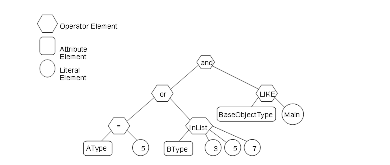  

Figure B. 1 - Filter logic tree example  

[Table B.1](/§\_Ref180476910) describes the elements, operators and operands used in the example.  

 **Table B. 1\- ContentFilter example**   

| **Element[]** | **Operator** | **Operand[0]** | **Operand[1]** | **Operand[2]** | **Operand[3]** |
|---|---|---|---|---|---|
|0|And|ElementOperand = 1|Element Operand = 4|||
|1|Or|ElementOperand = 2|Element Operand = 3|||
|2|Equals|AttributeOperand = NodeId: AType, BrowsePath: ".12:A",  

Attribute:value|LiteralOperand = '5'|||
|3|InList|AttributeOperand = NodeId: BType, BrowsePath: ".12:B",  

Attribute:value|LiteralOperand = '3'|LiteralOperand = '5'|LiteralOperand = '7'|
|4|Like|AttributeOperand = NodeId: BaseObjectType, BrowsePath: ".", Attribute: displayName|LiteralOperand = "Main%"|||
  

  

#### B.1.3 Example 2  

As another example a filter to select all *SystemEvents* (including derived types) that are contained in the Area1 *View* or the Area2 *View* would result in a logic tree as shown in [Figure B.2](/§\_Ref180476572) and a ContentFilter as shown in [Table B.2](/§\_Ref180476811) .  

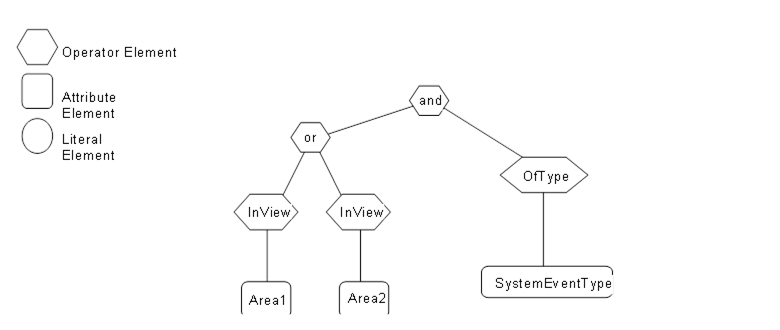  

Figure B. 2 - Filter logic tree example  

[Table B.2](/§\_Ref180476811) describes the elements, operators and operands used in the example.  

 **Table B. 2\- ContentFilter example**   

| **Element[]** | **Operator** | **Operand[0]** | **Operand[1]** |
|---|---|---|---|
|0|And|ElementOperand = 1|ElementOperand = 4|
|1|Or|ElementOperand = 2|ElementOperand = 3|
|2|InView|AttributeOperand = NodeId: Area1, BrowsePath: ".", Attribute: NodeId||
|3|InView|AttributeOperand = NodeId: Area2, BrowsePath: ".", Attribute: NodeId||
|4|OfType|AttributeOperand = NodeId: SystemEventType, BrowsePath: ".", Attribute: NodeId"||
  

  

### B.2 Query Service Set  

#### B.2.1 Overview  

This deprecated *Service Set* is used to issue a *Query* to a *Server* . OPC UA *Query* is generic in that it provides an underlying storage mechanism independent *Query* capability that can be used to access a wide variety of OPC UA data stores and information management systems. OPC UA *Query* permits a *Client* to access data maintained by a *Server* without any knowledge of the logical schema used for internal storage of the data. Knowledge of the *AddressSpace* is sufficient.  

An *OPC UA Application* is expected to use the OPC UA *Query* *Services* as part of an initialization process or an occasional information synchronization step. For example, OPC UA *Query* would be used for bulk data access of a persistent store to initialise an analysis application with the current state of a system configuration. A *Query* may also be used to initialise or populate data for a report.  

A *Query* defines what instances of one or more *TypeDefinitionNodes* in the *AddressSpace* should supply a set of *Attributes* . Results returned by a *Server* are in the form of an array of *QueryDataSets* . The selected *Attribute* values in each *QueryDataSet* come from the definition of the selected *TypeDefinitionNodes or related TypeDefinitionNodes* and appear in results in the same order as the *Attributes* that were passed into the *Query* . *Query* also supports *Node* filtering on the basis of *Attribute* values, as well as relationships between *TypeDefinitionNodes* .  

#### B.2.2 Querying Views  

A *View* is a subset of the *AddressSpace* available in the *Server* . See [OPC 10000-5](/§UAPart5) for a description of the organization of *Views* in the *AddressSpace* .  

For any existing *View* , a *Query* may be used to return a subset of data from the *View* . When an application issues a *Query* against a *View* , only data defined by the *View* is returned. Data not included in the *View* but included in the original *AddressSpace* is not returned.  

The *Query* *Services* supports access to current and historical data. The *Service* supports a *Client* querying a past version of the *AddressSpace. Clients* may specify a *ViewVersion* or a *Timestamp* in a *Query* to access past versions of the *AddressSpace* . OPC UA Query is complementary to Historical Access in that the former is used to *Query* an *AddressSpace* that existed at a time and the latter is used to *Query* for the value of *Attributes* over time. In this way, a *Query* can be used to retrieve a portion of a past *AddressSpace* so that *Attribute* value history may be accessed using Historical Access even if the *Node* is no longer in the current *AddressSpace* .  

*Servers* that support *Query* are expected to be able to access the *AddressSpace* that is associated with the local *Server* and any *Views* that are available on the local *Server* . If a *View* or the *AddressSpace* also references a remote *Server* , query may be able to access the *AddressSpace* of the remote *Server* , but it is not required. If a *Server* does access a remote *Server* the access is accomplished using the user identity of the *Client* as described in [5.6.1](/§\_Ref151214290) .  

#### B.2.3 QueryFirst  

This *Service* is used to issue a *Query* request to the *Server* . The complexity of the *Query* can range from very simple to highly sophisticated. The *Query* can simply request data from instances of a *TypeDefinitionNode* or *TypeDefinitionNode* subject to restrictions specified by the filter. On the other hand, the *Query* can request data from instances of related *Node* types by specifying *a RelativePath* from an originating *TypeDefinitionNode.* In the filter, a separate set of paths can be constructed for limiting the instances that supply data. A filtering path can include multiple *RelatedTo* operators to define a multi-hop path between source instances and target instances. For example, one could filter on students that attend a particular school, but return information about students and their families. In this case, the student school relationship is traversed for filtering, but the student family relationship is traversed to select data. For a complete description of *ContentFilter* see [7.7](/§\_Ref132019059) , also see Clause [B.1](/§\_Ref188668154) for simple examples and Clause [B.2](/§\_Ref188668219) for more complex examples of content filter and queries.  

The *Client* provides an array of *NodeTypeDescription* which specify the *NodeId* of a *TypeDefinitionNode* and selects what *Attributes* are to be returned in the response. A *Client* can also provide a set of *RelativePaths* through the type system starting from an originating *TypeDefinitionNode* . Using these paths, the *Client* selects a set of *Attributes* from *Nodes* that are related to instances of the originating *TypeDefinitionNode* . Additionally, the *Client* can request the *Server* return instances of subtypes of *TypeDefinitionNodes* . If a selected *Attribute* does not exist in a *TypeDefinitionNode* but does exist in a subtype, it is assumed to have a null value in the *TypeDefinitionNode* in question. Therefore, this does not constitute an error condition and a null value is returned for the *Attribute* .  

The *Client* can use the filter parameter to limit the result set by restricting *Attributes* and *Properties* to certain values. Another way the *Client* can use a filter to limit the result set is by specifying how instances should be related, using *RelatedTo* operators. In this case, if an instance at the top of the *RelatedTo* path cannot be followed to the bottom of the path via specified hops, no *QueryDataSets* are returned for the starting instance or any of the intermediate instances.  

When querying for related instances in the *RelativePath* , the *Client* can optionally ask for *References* . A *Reference* is requested via a *RelativePath* that only includes a *ReferenceType* . If all *References* are desired than the root *ReferenceType* is listed. These *References* are returned as part of the *QueryDataSets* .  

Query Services allow a special handling of the targetName field in the RelativePath. In several Query use cases a type NodeId is necessary in the path instead of a QualifiedName. Therefore the *Client* is allowed to specify a NodeId in the QualifiedName. This is done by setting the namespaceIndex of the targetName to zero and the name part of the targetName to the XML representation of the NodeId. The XML representation is defined in [OPC 10000-6](/§UAPart6) . When matching instances are returned as the target node, the target node should be an instance of the specified type or subtype of the specified type.  

[Table B.3](/§\_Ref136942240) defines the request parameters and [Table B.4](/§\_Ref136942241) the response parameters for the *QueryFirst* *Service* .  

 **Table B. 3\- QueryFirst Request Parameters**   

| **Name** | **Type** | **Description** |
|---|---|---|
|Request|||
|requestHeader|RequestHeader|Common request parameters (see [7.32](/§\_Ref129000063) for *RequestHeader* definition).|
|View|ViewDescription|Specifies a *View* and temporal context to a *Server* (see [7.44](/§\_Ref141201863) for *ViewDescription* definition).|
|nodeTypes []|NodeTypeDescription|This is the *Node* type description. This structure is defined in-line with the following indented items.|
| typeDefinitionNode|ExpandedNodeId|*NodeId* of the originating *TypeDefinitionNode* of the instances for which data is to be returned.|
| includeSubTypes|Boolean|A flag that indicates whether the *Server* should include instances of subtypes of the TypeDefinitionNode in the list of instances of the *Node* type.|
| dataToReturn []|QueryDataDescription|Specifies an *Attribute* or *Reference* from the originating typeDefinitionNode along a given relativePath for which to return data. This structure is defined in-line with the following indented items.|
|  relativePath|RelativePath|Browse path relative to the originating Node that identifies the Node which contains the data that is being requested, where the originating *Node* is an instance *Node* of the type defined by the type definition *Node* . The instance *Nodes* are further limited by the filter provided as part of this call. For a definition of relativePath see [7.30](/§\_Ref139474657) .  

This relative path could end on a *Reference* , in which case the *ReferenceDescription* of the *Reference* would be returned as its value.  

The targetName field of the relativePath may contain a type NodeId. This is done by setting the *namespaceIndex* of the *targetName* to zero and the *name* part of the *targetName* to the XML representation of the *NodeId* . The XML representation is defined in [OPC 10000-6](/§UAPart6) .  

When matching instances are returned as the target node, the target node should be an instance of the specified type or subtype of the specified type.|
|  attributeId|IntegerId|Id of the *Attribute* . This should be a valid *Attribute* Id. The *IntegerId* is defined in [7.19](/§\_Ref128929614) . The IntegerId for Attributes are defined in [OPC 10000-6](/§UAPart6) . If the *RelativePath* ended in a *Reference* then this parameter is 0 and ignored by the *Server* .|
|  indexRange|NumericRange|This parameter is used to identify a single element of a structure or an array, or a single range of indexes for arrays. If a range of elements are specified, the values are returned as a composite. The first element is identified by index 0 (zero). The *NumericRange* type is defined in [7.27](/§\_Ref129174867) .  

This parameter is null or empty if the specified *Attribute* is not an array or a structure. However, if the specified *Attribute* is an array or a structure, and this parameter is null or empty, then all elements are to be included in the range.|
|Filter|ContentFilter|Resulting *Nodes* should be limited to the *Nodes* matching the criteria defined by the filter. ContentFilter is discussed in [7.7](/§\_Ref132019059) . If an empty filter is provided then the entire *AddressSpace* should be examined and all *Nodes* that contain a matching requested *Attribute* or *Reference* are returned.|
|maxDataSetsToReturn|Counter|The number of *QueryDataSets* that the *Client* wants the *Server* to return in the response and on each subsequent continuation call response. The *Server* is allowed to further limit the response, but should not exceed this limit.  

A value of 0 indicates that the *Client* is imposing no limitation.|
|maxReferencesToReturn|Counter|The number of *References* that the *Client* wants the *Server* to return in the response for each *QueryDataSet* and on each subsequent continuation call response. The *Server* is allowed to further limit the response, but should not exceed this limit.  

A value of 0 indicates that the *Client* is imposing no limitation.  

For example a result where 4 *Nodes* are being returned, but each has 100 *References* , if this limit were set to 50 then only the first 50 *References* for each *Node* would be returned on the initial call and a continuation point would be set indicating additional data.|
  

  

 **Table B. 4\- QueryFirst Response Parameters**   

| **Name** | **Type** | **Description** |
|---|---|---|
|Response|||
|responseHeader|ResponseHeader|Common response parameters (see [7.33](/§\_Ref115239340) for *ResponseHeader* definition).|
|queryDataSets []|QueryDataSet|The array of *QueryDataSets* . This array is empty if no *Nodes* or *References* met the *nodeTypes* criteria. In this case the continuationPoint parameter should be empty.  

The *QueryDataSet* type is defined in [B.2.5](/§\_Ref141617868) .|
|continuationPoint|ContinuationPoint|*Server*\-defined opaque value that identifies the continuation point.  

The continuation point is used only when the *Query* results are too large to be returned in a single response. "Too large" in this context means that the *Server* is not able to return a larger response or that the number of *QueryDataSets* to return exceeds the maximum number of *QueryDataSets* to return that was specified by the *Client* in the request.  

The continuation point is used in the *QueryNext* *Service* . When not used, the value of this parameter is null or empty. If a continuation point is returned, the *Client* should call *QueryNext* to get the next set of *QueryDataSets* or to free the resources for the continuation point in the *Server* .  

A continuation point should remain active until the *Client* passes the continuation point to *QueryNext* or the session is closed. If the maximum continuation points have been reached the oldest continuation point should be reset.  

The *ContinuationPoint* type is described in [7.9](/§\_Ref183360083) .|
|parsingResults[]|ParsingResult|List of parsing results for *QueryFirst* . The size and order of the list matches the size and order of the *NodeTypes* request parameter. This structure is defined in-line with the following indented items.  

This list is populated with any status codes that are related to the processing of the node types that are part of the query. The array can be empty if no errors where encountered. If any node type encountered an error all node types should have an associated status code.|
| statusCode|StatusCode|Parsing result for the requested *NodeTypeDescription* .|
| dataStatusCodes []|StatusCode|List of results for *dataToReturn* . The size and order of the list matches the size and order of the *dataToReturn* request parameter. The array can be empty if no errors where encountered.|
| dataDiagnosticInfos []|DiagnosticInfo|List of diagnostic information *dataToReturn* (see [7.12](/§\_Ref127334266) for *DiagnosticInfo* definition). The size and order of the list matches the size and order of the *dataToReturn* request parameter. This list is empty if diagnostics information was not requested in the request header or if no diagnostic information was encountered in processing of the query request.|
|diagnosticInfos []|DiagnosticInfo|List of diagnostic information for the requested *NodeTypeDescription* . This list is empty if diagnostics information was not requested in the request header or if no diagnostic information was encountered in processing of the query request.|
|filterResult|ContentFilter  

Result|A structure that contains any errors associated with the filter.  

This structure should be empty if no errors occurred.  

The *ContentFilterResult* type is defined in [7.7.2](/§\_Ref180477313) .|
  

  

If the *Query* is invalid or cannot be processed, then *QueryDataSets* are not returned and only a *Service* result, filterResult, parsingResults and optional *DiagnosticInfo* is returned. [Table B.5](/§\_Ref136942239) defines the *Service* results specific to this *Service* . Common *StatusCodes* are defined in [Table 176](/§\_Ref90539276) .  

 **Table B. 5\- QueryFirst Service Result Codes**   

| **Symbolic Id** | **Description** |
|---|---|
|Bad\_NothingToDo|See [Table 176](/§\_Ref90539276) for the description of this result code.|
|Bad\_TooManyOperations|See [Table 176](/§\_Ref90539276) for the description of this result code.|
|Bad\_ContentFilterInvalid|See [Table 177](/§\_Ref127606591) for the description of this result code.|
|Bad\_ViewIdUnknown|See [Table 176](/§\_Ref90539276) for the description of this result code.|
|Bad\_ViewTimestampInvalid|See [Table 176](/§\_Ref90539276) for the description of this result code.|
|Bad\_ViewParameterMismatchInvalid|See [Table 176](/§\_Ref90539276) for the description of this result code.|
|Bad\_ViewVersionInvalid|See [Table 176](/§\_Ref90539276) for the description of this result code.|
|Bad\_InvalidFilter|The provided filter is invalid, see the *filterResult* for specific errors|
|Bad\_NodelistError|The NodeTypes provided contain an error, see the *parsingResults* for specific errors|
|Bad\_InvalidView|The provided *ViewDescription* is not a valid *ViewDescription* .|
|Good\_ResultsMayBeIncomplete|The *Server* should have followed a reference to a node in a remote *Server* but did not. The result set may be incomplete.|
  

  

[Table B.6](/§\_Ref187578114) defines values for the parsingResults *statusCode* parameter that are specific to this *Service* . Common *StatusCodes* are defined in [Table 177](/§\_Ref127606591) .  

 **Table B. 6\- QueryFirst Operation Level Result Codes**   

| **Symbolic Id** | **Description** |
|---|---|
|Bad\_NodeIdInvalid|See [Table 177](/§\_Ref127606591) for the description of this result code.|
|Bad\_NodeIdUnknown|See [Table 177](/§\_Ref127606591) for the description of this result code.|
|Bad\_NotTypeDefinition|The provided NodeId was not a type definition NodeId.|
|Bad\_AttributeIdInvalid|See [Table 177](/§\_Ref127606591) for the description of this result code.|
|Bad\_IndexRangeInvalid|See [Table 177](/§\_Ref127606591) for the description of this result code.|
  

  

#### B.2.4 QueryNext  

This *Service* is used to request the next set of *QueryFirst* or *QueryNext* response information that is too large to be sent in a single response. "Too large" in this context means that the *Server* is not able to return a larger response or that the number of *QueryDataSets* to return exceeds the maximum number of *QueryDataSets* to return that was specified by the *Client* in the original request. The *QueryNext* should be submitted on the same session that was used to submit the *QueryFirst* or *QueryNext* that is being continued.  

[Table B.7](/§\_Ref136942238) defines the parameters for the *Service* .  

 **Table B. 7\- QueryNext Service Parameters**   

| **Name** | **Type** | **Description** |
|---|---|---|
| **Request** |||
|requestHeader|Request Header|Common request parameters (see [7.32](/§\_Ref129000063) for *RequestHeader* definition).|
|releaseContinuationPoint|Boolean|A *Boolean* parameter with the following values:  

TRUE passed *continuationPoint* should be reset to free resources for the continuation point in the *Server* .  

FALSE passed *continuationPoint* should be used to get the next set of *QueryDataSets* .  

A *Client* should always use the continuation point returned by a *QueryFirst* or *QueryNext* response to free the resources for the continuation point in the *Server* . If the *Client* does not want to get the next set of *Query* information, *QueryNext* should be called with this parameter set to TRUE.  

If the parameter is set to TRUE all array parameters in the response should contain empty arrays.|
|continuationPoint|ContinuationPoint|*Server* defined opaque value that represents the continuation point. The value of the continuation point was returned to the *Client* in a previous *QueryFirst* or *QueryNext* response. This value is used to identify the previously processed *QueryFirst* or *QueryNext* request that is being continued, and the point in the result set from which the browse response is to continue.  

The *ContinuationPoint* type is described in [7.9](/§\_Ref183360083) .|
||||
| **Response** |||
|responseHeader|Response Header|Common response parameters (see [7.33](/§\_Ref115239340) for *ResponseHeader* definition).|
|queryDataSets []|QueryDataSet|The array of *QueryDataSets* .  

The *QueryDataSet* type is defined in [B.2.5](/§\_Ref141617868) .|
|revisedContinuationPoint|ContinuationPoint|*Server*\-defined opaque value that represents the continuation point. It is used only if the information to be returned is too large to be contained in a single response. When not used or when *releaseContinuationPoint* is set, the value of this parameter is null or empty.  

The *ContinuationPoint* type is described in [7.9](/§\_Ref183360083) .|
  

  

[Table B.8](/§\_Ref136942237) defines the *Service* results specific to this *Service* . Common *StatusCodes* are defined in [Table 176](/§\_Ref90539276) .  

 **Table B. 8\- QueryNext Service Result Codes**   

| **Symbolic Id** | **Description** |
|---|---|
|Bad\_ContinuationPointInvalid|See [Table 177](/§\_Ref127606591) for the description of this result code.|
  

  

#### B.2.5 QueryDataSet  

The components of this parameter are defined in [Table B.9](/§\_Ref139187117) .  

 **Table B. 9\- QueryDataSet**   

| **Name** | **Type** | **Description** |
|---|---|---|
|QueryDataSet|structure|Data related to a *Node* returned in a Query response.|
|nodeId|ExpandedNodeId|The *NodeId* for this *Node* description.|
|typeDefinitionNode|ExpandedNodeId|The *NodeId* for the type definition for this *Node* description.|
|values []|BaseDataType|Values for the selected *Attributes.* The order of returned items matches the order of the requested items. There is an entry for each requested item for the given *TypeDefinitionNode* that matches the selected instance, this includes any related nodes that were specified using a relative path from the selected instance's *TypeDefinitionNode* . If no values where found for a given requested item a null value is returned for that item. If a value has a bad status, the *StatusCode* is returned instead of the value. If multiple values exist for a requested item then an array of values is returned. If the requested item is a reference then a *ReferenceDescription* or array of *ReferenceDescription* is returned for that item.  

If the *QueryDataSet* is returned in a *QueryNext* to continue a list of *ReferenceDescription* , the *values* array will have the same size but the other values already returned are null.|
  

  

### B.3 Complex Examples of Query Filters  

#### B.3.1 Overview  

These query examples illustrate complex filters *.* The following conventions apply to these examples with regard to Attribute operands (for a definition of these operands, see [7.7.4](/§\_Ref132018533) ).  

* AttributeOperand: Refers to a *Node* , an *Attribute* of a *Node* or the *Value* *Attribute* of a *Property* associated with a *Node* . In the examples character names of *ExpandedNodeId* are used instead of an actual *ExpandedNodeId* , this also applies to *Attribute* Ids.  

* The string representation of relative paths is used instead of the actual structure.  

* The *NamespaceIndex* used in all examples is 12 (it could just as easily have been 4 or 23 or any value). For more information about *NamespaceIndex* , see [OPC 10000-3](/§UAPart3) . The use of the *NamespaceIndex* illustrates that the information model being used in the examples is not a model defined by this document, but one created for the examples.  

#### B.3.2 Used type model  

The following examples use the type model described below. All *Property* values are assumed to be string unless otherwise noted  

New Reference types:  

"HasChild" derived from HierarchicalReference.  

"HasAnimal" derived from HierarchicalReference.  

"HasPet" derived from HasAnimal.  

"HasFarmAnimal" derived from HasAnimal.  

"HasSchedule" derived from HierarchicalReference.  

  

PersonType derived from BaseObjectType adds:  

HasProperty "LastName".  

HasProperty "FirstName".  

HasProperty "StreetAddress".  

HasProperty "City".  

HasProperty "ZipCode".  

May have HasChild reference to a node of type PersonType.  

May have HasAnimal reference to a node of type AnimalType (or a subtype of this *Reference* type).  

  

AnimalType derived from BaseObjectType adds:  

May have HasSchedule reference to a node of type FeedingScheduleType.  

HasProperty "Name".  

  

DogType derived from AnimalType adds:  

HasProperty "NickName".  

HasProperty "DogBreed".  

HasProperty "License".  

  

CatType derived from AnimalType adds:  

HasProperty "NickName".  

HasProperty "CatBreed".  

  

PigType derived from AnimalType adds:  

HasProperty "PigBreed".  

  

ScheduleType derived from BaseObjectType adds:  

HasProperty "Period".  

  

FeedingScheduleType derived from ScheduleType adds:  

HasProperty "Food".  

HasProperty "Amount" (Stored as an *Int32* ).  

  

AreaType derived from *BaseObjectType* is just a simple *Folder* and contains no *Properties* .  

This example type system is shown in [Figure B.3](/§\_Ref141116106) . In this Figure, the OPC UA notation is used for all *References* to *ObjectTypes* , *Variables* , *Properties* and subtypes. ** Additionally, supported *References* are contained in an inner box. The actual references only exist in the instances, thus, no connections to other *Objects* are shown in the Figure and they are subtypes of the listed *Reference* .  

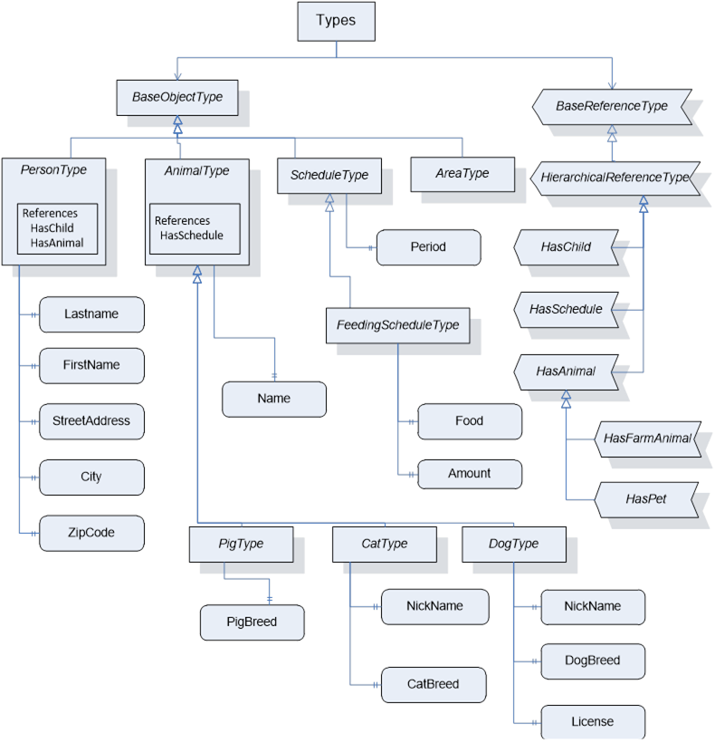  

Figure B. 3 - Example Type Nodes  

A corresponding example set of instances is shown in [Figure B.4](/§\_Ref205280545) . These instances include a type *Reference* for *Objects* . Properties also have type *References* , but the *References* are omitted for simplicity. The name of the *Object* is provided in the box and a numeric instance *NodeId* in brackets. Standard *ReferenceTypes* use the OPC UA notation, custom *ReferenceTypes* are listed as a named *Reference* . For *Properties* , the *BrowseName* , *NodeId* , and *Value* are shown. The *Nodes* that are included in a *View* (View1) are enclosed in the coloured box. Two Area nodes are included for grouping of the existing person nodes. All custom nodes are defined in namespace 12 which is not included in [Figure B.4](/§\_Ref205280545) .  

  

Figure B. 4 - Example Instance Nodes  

#### B.3.3 Example Notes  

For all of the examples in [7.7.4](/§\_Ref154225552) , the type definition *Node* is listed in its symbolic form, in the actual call it would be the *ExpandedNodeId* assigned to the *Node* . The *Attribute* is the symbolic name of the *Attribute* , in the actual call they would be translated to the *IntegerId* of the *Attribute* . Also in all of the examples the *BrowseName* is included in the result table for clarity; normally this would not be returned.  

All of the examples include the following items:  

* an English description of the object of the query;  

* an SQL like description of the query;  

* a table that has a NodeTypeDescription of the items that are to be returned;  

* a figure illustrating the query filter;  

* a table describing the content filter;  

* a table describing the resulting dataset.  

The examples assume namespace 12 is the namespace for all of the custom definitions described for the examples.  

#### B.3.4 Example 1  

This example requests a simple layered filter, a person has a pet and the pet has a schedule.  

 **Example 1: Get PersonType.LastName, AnimalType.Name, ScheduleType.Period where the Person Has a Pet and that Pet Has a Schedule.**   

The *NodeTypeDescription* parameters used in the example are described in [Table B.10](/§\_Ref140595981) .  

 **Table B. 10\- Example 1 NodeTypeDescription**   

| **Type Definition Node** | **Include**   

 **Subtypes** | **QueryDataDescription** |
|---|---|---|
||| **Relative Path** | **Attribute** | **Index Range** |
|PersonType|FALSE|".12:LastName"|value|N/A|
|||"\<12:HasPet\>12:AnimalType. 12:Name"|value|N/A|
|||"\<12:HasPet\>12:AnimalType\<12:HasSchedule\> 12:Schedule. 12:Period"|value|N/A|
  

  

The corresponding *ContentFilter* is illustrated in [Figure B.5](/§\_Ref140917034) .  

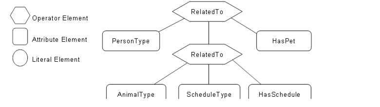  

Figure B. 5 - Example 1 Filter  

[Table B.11](/§\_Ref141118851) describes the *ContentFilter* elements, operators and operands used in the example.  

 **Table B. 11\- Example 1 ContentFilter**   

| **Element[]** | **Operator** | **Operand[0]** | **Operand[1]** | **Operand[2]** | **Operand[3]** |
|---|---|---|---|---|---|
|1|*RelatedTo*|AttributeOperand = NodeId: PersonType,  

BrowsePath ".", Attribute: NodeId|ElementOperand = 2|AttributeOperand = NodeId: HasPet, BrowsePath ".", Attribute: NodeId|LiteralOperand = '1'|
|2|*RelatedTo*|AttributeOperand = NodeId: AnimalType, BrowsePath ".", Attribute: NodeId|AttributeOperand = NodeId: ScheduleType, BrowsePath ".", Attribute: NodeId|AttributeOperand = NodeId: HasSchedule, BrowsePath ".", Attribute: NodeId|LiteralOperand= '1'|
  

  

[Table B.12](/§\_Ref140601076) describes the *QueryDataSet* that results from this query if it were executed against the instances described in [Figure B.4](/§\_Ref205280545)  

 **Table B. 12\- Example 1 QueryDataSets**   

| **NodeId** | **TypeDefinition**   

 **NodeId** | **RelativePath** | **Value** |
|---|---|---|---|
|12:30 (JFamily1)|PersonType|".12:LastName"|Jones|
|||"\<12:HasPet\>12:AnimalType. 12:Name"|Rosemary|
||||Basil|
|||"\<12:HasPet\>12:AnimalType\<12:HasSchedule\> 12:Schedule.12:Period"|Hourly|
||||Daily|
|12:42(HFamily1)|PersonType|".12:LastName"|Hervey|
|||"\<12:HasPet\>12:AnimalType. 12:Name"|Oliver|
|||"\<12:HasPet\>12:AnimalType\<12:HasSchedule\> 12:Schedule.12:Period"|Daily|
  

  

NOTE The RelativePath column and browse name (in parentheses in the *NodeId* column) are not in the QueryDataSet and are only shown here for clarity. The *TypeDefinition NodeId* would be an integer not the symbolic name that is included in the table.  

The Value column is returned as an array for each *Node* description, where the order of the items in the array would correspond to the order of the items that were requested for the given Node Type. In Addition, if a single *Attribute* has multiple values then it would be returned as an array within the larger array, for example in this table Rosemary and Basil would be returned in a array for the .\<HasPet\>.AnimalType.Name item. They are show as separate rows for ease of viewing. The actual value array for JFamily1 would be ("Jones", \{"RoseMary", "Basil"\}, \{"Hourly", "Daily"\})  

#### B.3.5 Example 2  

The second example illustrates receiving a list of disjoint *Nodes* and also illustrates that an array of results can be received.  

 **Example 2: Get PersonType.LastName, AnimalType.Name where a person has a child or (a pet is of type cat and has a feeding schedule).**   

The NodeTypeDescription parameters used in the example are described in [Table B.13](/§\_Ref140909908) .  

 **Table B. 13\- Example 2 NodeTypeDescription**   

  

| **Type Definition Node** | **Include**   

 **Subtypes** | **QueryDataDescription** |
|---|---|---|
||| **Relative Path** | **Attribute** | **Index Range** |
|PersonType|FALSE|".12:LastName"|Value|N/A|
|AnimalType|TRUE|".12:Name"|Value|N/A|
  

  

The corresponding ContentFilter is illustrated in  

Figure B.6.  

  

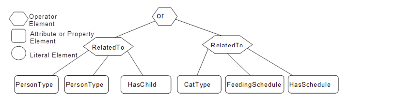  

Figure B. 6 - Example 2 filter logic tree  

[Table B.14](/§\_Ref140914695) describes the elements, operators and operands used in the example. It is worth noting that a CatType is a subtype of AnimalType.  

 **Table B. 14\- Example 2 ContentFilter**   

| **Element[]** | **Operator** | **Operand[0]** | **Operand[1]** | **Operand[2]** | **Operand[3]** |
|---|---|---|---|---|---|
|0|Or|ElementOperand=1|ElementOperand = 2|||
|1|RelatedTo|AttributeOperand = NodeId: PersonType, BrowsePath ".", Attribute: NodeId|AttributeOperand = NodeId: PersonType, BrowsePath ".", Attribute: NodeId|AttributeOperand = NodeId: HasChild, BrowsePath ".", Attribute: NodeId|LiteralOperand = '1'|
|2|RelatedTo|AttributeOperand = NodeId: CatType, BrowsePath ".", Attribute: NodeId|AttributeOperand = NodeId: FeedingScheduleType, BrowsePath ".", Attribute: NodeId|AttributeOperand = NodeId: HasSchedule, BrowsePath ".", Attribute: NodeId|LiteralOperand = '1'|
  

  

The results from this query would contain the *QueryDataSets* shown in [Table B.15](/§\_Ref140917208) .  

 **Table B. 15\- Example 2 QueryDataSets**   

| **NodeId** | **TypeDefinition NodeId** | **RelativePath** | **Value** |
|---|---|---|---|
|12:30 (Jfamily1)|PersonType|. 12:LastName|Jones|
|12:42 (HFamily1)|PersonType|. 12:LastName|Hervey|
|12:48 (HFamily2)|PersonType|. 12:LastName|Hervey|
|12:70 (Cat1)|CatType|. 12:Name|Rosemary|
|12:74 (Cat2)|CatType|. 12:Name|Basil|
  

  

NOTE The relative path column and browse name (in parentheses in the *NodeId* column) are not in the *QueryDataSet* and are only shown here for clarity. The *TypeDefinition NodeId* would be a *NodeId* not the symbolic name that is included in the table.  

#### B.3.6 Example 3  

The third example provides a more complex *Query* in which the results are filtered on multiple criteria.  

 **Example 3: Get PersonType.LastName, AnimalType.Name, ScheduleType.Period where a**  **person has a pet and the animal has a feeding schedule and the person has**  **a Zipcode = '02138' and (the Schedule.Period is Daily or Hourly) and Amount to feed is \> 10.**   

[Table B.16](/§\_Ref140917265) describes the NodeTypeDescription parameters used in the example.  

 **Table B. 16\- Example 3 - NodeTypeDescription**   

| **Type Definition Node** | **Include**   

 **Subtypes** | **QueryDataDescription** |
|---|---|---|
||| **RelativePath** | **Attribute** | **Index Range** |
|PersonType|FALSE|"12:LastName"|Value|N/A|
|||"\<12:HasPet\>12:AnimalType. 12:Name"|Value|N/A|
|||"\<12:HasPet\>12:AnimalType\<12:HasSchedule\> 12:FeedingSchedule.Period"|Value|N/A|
  

  

The corresponding *ContentFilter* is illustrated in [Figure B.7](/§\_Ref140917300) .  

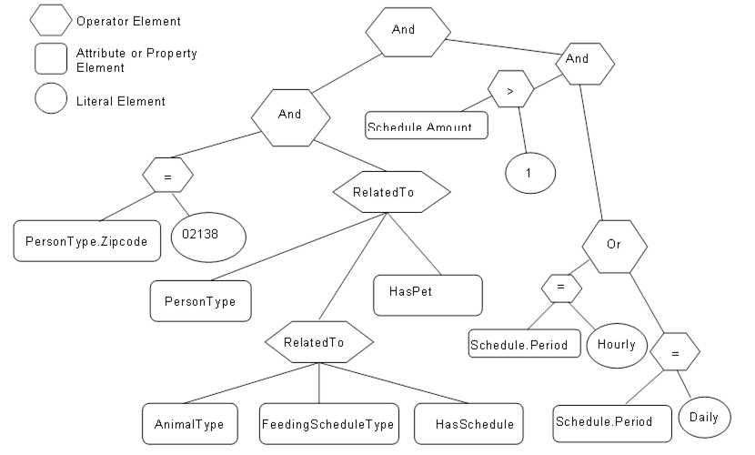  

Figure B. 7 - Example 3 filter logic tree  

[Table B.17](/§\_Ref140917350) describes the elements, operators and operands used in the example.  

 **Table B. 17\- Example 3 ContentFilter**   

| **Element[]** | **Operator** | **Operand[0]** | **Operand[1]** | **Operand[2]** | **Operand[3]** |
|---|---|---|---|---|---|
|0|And|Element Operand= 1|ElementOperand = 2|||
|1|And|ElementOperand = 4|ElementOperand = 6|||
|2|And|ElementOperand = 3|ElementOperand = 9|||
|3|Or|ElementOperand = 7|ElementOperand = 8|||
|4|RelatedTo|AttributeOperand = NodeId: 12:PersonType, BrowsePath ".", Attribute: NodeId|ElementOperand = 5|AttributeOperand = NodeId: 12:HasPet, BrowsePath ".", Attribute: NodeId|LiteralOperand = '1'|
|5|RelatedTo|AttributeOperand = Node: 12:AnilmalType, BrowsePath ".", Attribute: NodeId  

Alias:  AT|AttributeOperand = NodeId: 12:FeedingScheduleType, BrowsePath ".", Attribute: NodeId  

Alias: FST|AttributeOperand = NodeId: 12:HasSchedule, BrowsePath ".", Attribute: NodeId|LiteralOperand = '1'|
|6|Equals|AttributeOperand = NodeId: 12:PersonType BrowsePath 12:Zipcode ".", Attribute: Value|LiteralOperand = '02138'|||
|7|Equals|AttributeOperand = NodeId: 12:PersonType  

BrowsePath "12:HasPet\>12:AnimalType\<12:HasSchedule\>12: FeedingSchedule/12:Period", Attribute: Value  

Alias: FST|LiteralOperand = 'Daily'|||
|8|Equals|AttributeOperand = NodeId: 12:PersonType  

BrowsePath "12:HasPet\>12:AnimalType\<12:HasSchedule\>12: FeedingSchedule/12:Period", Attribute: Value  

Alias: FST|LiteralOperand = 'Hourly'|||
|9|Greater Than|AttributeOperand = NodeId: 12:PersonType  

BrowsePath "12:HasPet\>12:AnimalType\<12:HasSchedule\>12: FeedingSchedule/12:Amount", Attribute: Value  

Alias: FST|ElementOperand = 10|||
|10|Cast|LiteralOperand = 10|AttributeOperand = NodeId: Int32, BrowsePath ".", Attribute: NodeId|||
  

  

The results from this query would contain the *QueryDataSets* shown in ** [Table B.18](/§\_Ref140917404) .  

 **Table B. 18\- Example 3 QueryDataSets**   

| **NodeId** | **TypeDefinition**   

 **NodeId** | **RelativePath** | **Value** |
|---|---|---|---|
|12:30 (JFamily1)|PersonType|".12:LastName"|Jones|
|||"\<12:HasPet\>12:PersonType. 12:Name"|Rosemary|
||||Basil|
|||"\<12:HasPet\>12:AnimalType\<12:HasSchedule\>12:FeedingSchedule. 12:Period"|Hourly|
||||Daily|
  

  

NOTE The RelativePath column and browse name (in parentheses in the *NodeId* column) are not in the *QueryDataSet* and are only shown here for clarity. The *TypeDefinition NodeId* would be an integer not the symbolic name that is included in the table.  

#### B.3.7 Example 4  

The fourth example provides an illustration of the Hop parameter that is part of the RelatedTo Operator.  

 **Example 4: Get PersonType.LastName where a person has a child who has a child who has a pet.**   

[Table B.19](/§\_Ref140950083) describes the NodeTypeDescription parameters used in the example.  

 **Table B. 19\- Example 4 NodeTypeDescription**   

| **Type Definition Node** | **Include**   

 **Subtypes** | **QueryDataDescription** |
|---|---|---|
||| **Relative Path** | **Attribute** | **Index Range** |
|PersonType|FALSE|".12:LastName"|value|N/A|
  

  

The corresponding *ContentFilter* is illustrated in [Figure B.8](/§\_Ref141118854) .  

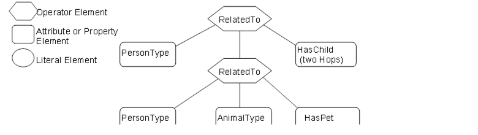  

Figure B. 8 - Example 4 filter logic tree  

[Table B.20](/§\_Ref141118852) describes the elements, operators and operands used in the example.  

 **Table B. 20\- Example 4 ContentFilter**   

| **Element[]** | **Operator** | **Operand[0]** | **Operand[1]** | **Operand[2]** | **Operand[3]** |
|---|---|---|---|---|---|
|0|RelatedTo|AttributeOperand = NodeId: 12:PersonType, BrowsePath ".",  

Attribute: NodeId|Element Operand = 1|AttributeOperand = NodeId: 12:HasChild, BrowsePath ".", Attribute: NodeId|LiteralOperand = '2'|
|1|RelatedTo|AttributeOperand = NodeId: 12:PersonType, BrowsePath ".",  

Attribute: NodeId|AttributeOperand = NodeId: 12:AnimalType, BrowsePath ".", Attribute: NodeId|AttributeOperand = NodeId: 12:HasPet, BrowsePath ".", Attribute: NodeId|LiteralOperand = '1'|
  

  

The results from this query would contain the *QueryDataSets* shown in [Table B.21](/§\_Ref141008187) . It is worth noting that the pig "Pig1" is referenced as a pet by Sara, but is referenced as a farm animal by Sara's parent Paul.  

 **Table B. 21\- Example 4 QueryDataSets**   

| **NodeId** | **TypeDefinition**   

 **NodeId** | **RelativePath** | **Value** |
|---|---|---|---|
|12:42 (HFamily1)|PersonType|".12:LastName"|Hervey|
  

  

NOTE The RelativePath column and browse name (in parentheses in the *NodeId* column) are not in the *QueryDataSet* and are only shown here for clarity. The TypeDefinition NodeId would be an integer not the symbolic name that is included in the table.  

#### B.3.8 Example 5  

The fifth example provides an illustration of the use of alias.  

 **Example 5: Get the last names of children that have the same first name as a parent of theirs**   

[Table B.22](/§\_Ref140950826) describes the NodeTypeDescription parameters used in the example.  

  

 **Table B. 22\- Example 5 NodeTypeDescription**   

| **Type Definition Node** | **Include**   

 **Subtypes** | **QueryDataDescription** |
|---|---|---|
||| **Relative Path** | **Attribute** | **Index Range** |
|PersonType|FALSE|"\<12:HasChild\>12:PersonType. 12:LastName"|Value|N/A|
  

  

The corresponding *ContentFilter* is illustrated in [Figure B.9](/§\_Ref140951107) .  

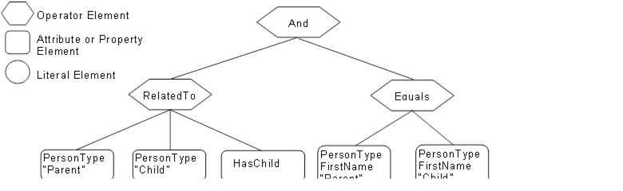  

Figure B. 9 - Example 5 filter logic tree  

In this example, one *Reference* to PersonType is aliased to "Parent" and another *Reference* to PersonType is aliased to "Child". The value of Parent.firstName and Child.firstName are then compared. [Table B.23](/§\_Ref140950924) describes the elements, operators and operands used in the example.  

 **Table B. 23\- Example 5 ContentFilter**   

| **Element[]** | **Operator** | **Operand[0]** | **Operand[1]** | **Operand[2]** | **Operand[3\}** |
|---|---|---|---|---|---|
|0|And|ElementOperand = 1|ElementOperand = 2|||
|1|RelatedTo|AttributeOperand =  NodeId: 12:PersonType, BrowsePath ".",  

Attribute: NodeId,  

Alias: "Parent"|AttributeOperand = NodeId: 12:PersonType, BrowsePath ".", Attribute: NodeId,  

Alias: "Child"|AttributeOperand = NodeId: 12:HasChild, Attribute: NodeId|LiteralOperand = "1"|
|2|Equals|AttributeOperand =  

NodeId: 12:PersonType, BrowsePath ""/12:FirstName", Attribute: Value, Alias: "Parent"|AttributeOperand = NodeId: 12:PersonType, BrowsePath ""/12:FirstName", Attribute: Value, Alias: "Child"|||
  

  

The results from this query would contain the *QueryDataSets* shown ** in [Table B.24](/§\_Ref141008454) .  

 **Table B. 24\- Example 5 QueryDataSets**   

| **NodeId** | **TypeDefinition**   

 **NodeId** | **RelativePath** | **Value** |
|---|---|---|---|
|12:42 (HFamily1)|PersonType|"\<12:HasChild\>12:PersonType.12:LastName"|Hervey|
  

  

NOTE The RelativePath column and browse name (in parentheses in the *NodeId* column) are not in the *QueryDataSet* and are only shown here for clarity. The *TypeDefinition NodeId* would be an integer not the symbolic name that is included in the table.  

#### B.3.9 Example 6  

The sixth example provides an illustration a different type of request, one in which the *Client* is interested in displaying part of the *AddressSpace* of the *Server* . This request includes listing a *Reference* as something that is to be returned.  

 **Example 6: Get PersonType.NodeId, AnimalType.NodeId, PersonType.HasChild Reference, PersonType.HasAnimal Reference where a person has a child who has a Animal.**   

[Table B.25](/§\_Ref141009577) describes the NodeTypeDescription parameters used in the example.  

 **Table B. 25\- Example 6 NodeTypeDescription**   

| **Type Definition Node** | **Include**   

 **Subtypes** | **QueryDataDescription** |
|---|---|---|
||| **Relative Path** | **Attribute** | **Index Range** |
|PersonType|FALSE|".12:NodeId"|value|N/A|
|||\<12:HasChild\>12:PersonType\<12:HasAnimal\>12:AnimalType.NodeId|value|N/A|
|||\<12:HasChild\>|value|N/A|
|||\<12:HasChild\>12:PersonType\<12:HasAnimal\>|value|N/A|
  

  

The corresponding *ContentFilter* is illustrated in [Figure B.10](/§\_Ref141009621) .  

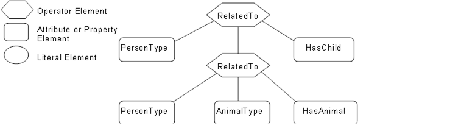  

Figure B. 10 - Example 6 filter logic tree  

[Table B.26](/§\_Ref141009703) describes the elements, operators and operands used in the example.  

 **Table B. 26\- Example 6 ContentFilter**   

| **Element[]** | **Operator** | **Operand[0]** | **Operand[1]** | **Operand[2]** | **Operand[3]** |
|---|---|---|---|---|---|
|0|RelatedTo|AttributeOperand = NodeId: 12:PersonType, BrowsePath ".", Attribute: NodeId|ElementOperand = 1|AttributeOperand = Node: 12:HasChild, BrowsePath ".",Attribute:NodeId|LiteralOperand = '1'|
|1|RelatedTo|AttributeOperand = NodeId: 12:PersonType, BrowsePath ".", Attribute: NodeId|AttributeOperand = NodeId: 12:AnimalType, BrowsePath ".", Attribute: NodeId|AttributeOperand = NodeId: 12:HasAnimal, BrowsePath ".", Attribute: NodeId|LiteralOperand = '1'|
  

  

The results from this query would contain the *QueryDataSets* shown ** in [Table B.27](/§\_Ref141009804) .  

 **Table B. 27\- Example 6 QueryDataSets**   

| **NodeId** | **TypeDefinition**   

 **NodeId** | **RelativePath** | **Value** |
|---|---|---|---|
|12:42 (HFamily1)|PersonType|".NodeId"|12:42 (HFamily1)|
|||\<12:HasChild\>12:PersonType\<12:HasAnimal\>  

12:AnimalType.NodeId|12:91 (Pig1)|
|||\<12:HasChild\>|HasChild  

*ReferenceDescription*|
|||\<12:HasChild\>12:PersonType\<12:HasAnimal\>|HasFarmAnimal  

*ReferenceDescription*|
|12:48 (HFamily2)|PersonType|".NodeId"|12:48 (HFamily2)|
|||\<12:HasChild\>12:PersonType\<12:HasAnimal\>  

12:AnimalType.NodeId|12:91 (Pig1)|
|||\<12:HasChild\>|HasChild  

*ReferenceDescription*|
|||\<12:HasChild\>12:PersonType\<12:HasAnimal\>|HasPet  

*ReferenceDescription*|
  

  

NOTE The *RelativePath* and browse name (in parentheses) is not in the *QueryDataSet* and is only shown here for clarity and the *TypeDefinition NodeId* would be an integer, not the symbolic name that is included in the table. The value field would in this case be the *NodeId* where it was requested, but for the example the browse name is provided in parentheses and in the case of *Reference* types on the browse name is provided. For the *References* listed in [Table B.27](/§\_Ref141009804) , the value would be a *ReferenceDescription* which are described in [7.29](/§\_Ref129166653) .  

[Table B.28](/§\_Ref141675192) provides an example of the same QueryDataSet as shown in [Table B.27](/§\_Ref141009804) without any additional fields and minimal symbolic Ids. There is an entry for each requested Attribute, in the cases where an Attribute would return multiple entries the entries are separated by comas. If a structure is being returned then the structure is enclosed in square brackets. In the case of a ReferenceDescription the structure contains a structure and DisplayName and BrowseName are assumed to be the same and defined in [Figure B.4](/§\_Ref205280545) .  

 **Table B. 28\- Example 6 QueryDataSets without additional information**   

| **NodeId** | **TypeDefinition**   

 **NodeId** | **Value** |
|---|---|---|
|12:42|PersonType|12:42|
|||12:91|
|||[HasChild,TRUE,[48,HFamily2,HFamily2,PersonType]],|
|||[HasFarmAnimal,TRUE[91,Pig1,Pig1,PigType]|
|12:48|PersonType|12:54|
|||12:91|
|||[HasChild,TRUE,[ 54,HFamily3,HFamily3,PersonType]]|
|||[HasPet, TRUE,[ 91,Pig1,Pig1,PigType]]|
  

  

The PersonType, HasChild, PigType, HasPet, HasFarmAnimal identifiers used in the above table would be translated to actual *ExpandedNodeId* .  

#### B.3.10 Example 7  

The seventh example provides an illustration a request in which a *Client* wants to display part of the *AddressSpace* based on a starting point that was obtained via browsing. This request includes listing *References* as something that is to be returned. In this case the Person Browsed to Area2 and wanted to *Query* for information below this starting point.  

 **Example 7: Get PersonType.NodeId, AnimalType.NodeId, PersonType.HasChild Reference, PersonType.HasAnimal Reference where the person is in Area2 (Cleveland nodes) and the person has a child.**   

[Table B.29](/§\_Ref153089063) describes the NodeTypeDescription parameters used in the example.  

 **Table B. 29\- Example 7 NodeTypeDescription**   

| **Type Definition Node** | **Include**   

 **Subtypes** | **QueryDataDescription** |
|---|---|---|
||| **Relative Path** | **Attribute** | **Index Range** |
|PersonType|FALSE|".NodeId"|Value|N/A|
|||\<12:HasChild\>|Value|N/A|
|||\<12:HasAnimal\>NodeId|Value|N/A|
|||\<12:HasAnimal\>|Value|N/A|
  

  

The corresponding *ContentFilter* is illustrated in [Figure B.11](/§\_Ref177928513) . Note that the *Browse* call would typically return a *NodeId* , thus the first filter is for the *BaseObjectType* with a *NodeId* of 95 where 95 is the *NodeId* associated with the Area2 node, all *Nodes* descend from *BaseObjectType* , and *NodeId* is a base *Property* so this filter will work for all *Queries* of this nature.  

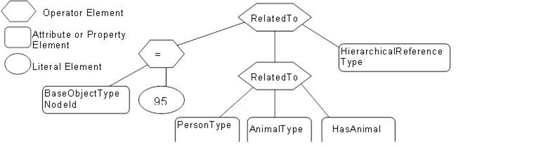  

Figure B. 11 - Example 7 filter logic tree  

[Table B.30](/§\_Ref153096054) describes the elements, operators and operands used in the example.  

 **Table B. 30\- Example 7 ContentFilter**   

| **Element[]** | **Operator** | **Operand[0]** | **Operand[1]** | **Operand[2]** | **Operand[3]** |
|---|---|---|---|---|---|
|0|RelatedTo|ElementOperand = 2|ElementOperand = 1|AttributeOperand = Node:HierachicalReference, BrowsePath ".", Attribute:NodeId|LiteralOperand = '1'|
|1|RelatedTo|AttributeOperand =  

NodeId: 12:PersonType, BrowsePath ".", Attribute: NodeId|AttributeOperand = NodeId: 12:PersonType, BrowsePath ".", Attribute: NodeId|AttributeOperand =  

NodeId: 12:HasChild, BrowsePath ".",  

Attribute: NodeId|LiteralOperand = '1'|
|2|Equals|AttributeOperand =  

NodeId: BaseObjectType, BrowsePath ".",  

Attribute: NodeId,|LiteralOperand = '95|||
  

  

The results from this *Query* would contain the *QueryDataSets* shown ** in [Table B.31](/§\_Ref153096506) .  

 **Table B. 31\- Example 7 QueryDataSets**   

| **NodeId** | **TypeDefinition**   

 **NodeId** | **RelativePath** | **Value** |
|---|---|---|---|
|12:42 (HFamily1)|PersonType|".NodeId"|12:42 (HFamily1)|
|||\<12:HasChild\>|HasChild *ReferenceDescription*|
|||\<12:HasAnimal\>12:AnimalType.NodeId|NULL|
|||\<12:HasAnimal\>|HasFarmAnimal *ReferenceDescription*|
|12:48 (HFamily2)|PersonType|".NodeId"|12:48 (HFamily2)|
|||\<12:HasChild\>|HasChild *ReferenceDescription*|
|||\<12:HasAnimal\>12:AnimalType.NodeId|12:91 (Pig1)|
|||\<12:HasAnimal\>|HasFarmAnimal *ReferenceDescription*|
  

  

NOTE The *RelativePath* and browse name (in parentheses) is not in the *QueryDataSet* and is only shown here for clarity and the *TypeDefinition NodeId* would be an integer not the symbolic name that is included in the table. The value field would in this case be the *NodeId* where it was requested, but for the example the browse name is provided in parentheses and in the case of *Reference* types on the browse name is provided. For the *References* listed in [Table B.31](/§\_Ref153096506) , the value would be a *ReferenceDescription* which are described in [7.29](/§\_Ref129166653) .  

#### B.3.11 Example 8  

The eighth example provides an illustration of a request in which the *AddressSpace* is restricted by a *Server* defined *View* . This request is the same as in the second example which illustrates receiving a list of disjoint *Nodes* and also illustrates that an array of results can be received. It is **important** *ContentFilter* are the same, only the View description would be specified as "View1".  

 **Example 8: Get PersonType.LastName, AnimalType.Name where a person has a child or (a pet is of type cat and has a feeding schedule) limited by the *AddressSpace* in View1.**   

The NodeTypeDescription parameters used in the example are described in [Table B.32](/§\_Ref153097930)  

 **Table B. 32\- Example 8 NodeTypeDescription**   

  

| **Type Definition Node** | **Include**   

 **Subtypes** | **QueryDataDescription** |
|---|---|---|
||| **Relative Path** | **Attribute** | **Index Range** |
|PersonType|FALSE|".12:LastName"|value|N/A|
|AnimalType|TRUE|"12.Name"|value|N/A|
  

  

The corresponding *ContentFilter* is illustrated in [Figure B.12](/§\_Ref154228733) .  

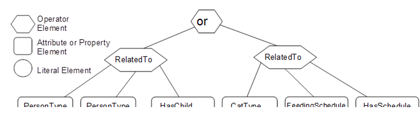  

Figure B. 12 - Example 8 filter logic tree  

[Table B.33](/§\_Ref153097962) describes the elements, operators and operands used in the example. It is worth noting that a CatType is a subtype of AnimalType.  

 **Table B. 33\- Example 8 ContentFilter**   

| **Element[]** | **Operator** | **Operand[0]** | **Operand[1]** | **Operand[2]** | **Operand[3]** |
|---|---|---|---|---|---|
|0|Or|ElementOperand=1|ElementOperand = 2|||
|1|RelatedTo|AttributeOperand = NodeId: 12:PersonType, BrowsePath ".", Attribute: NodeId|AttributeOperand = NodeId: 12:PersonType, BrowsePath ".",  

Attribute: NodeId|AttributeOperand = NodeId: 12:HasChild, BrowsePath ".", Attribute: NodeId|LiteralOperand = '1'|
|2|RelatedTo|AttributeOperand = NodeId: 12:CatType, BrowsePath ".", Attribute: NodeId|AttributeOperand = NodeId: 12:FeedingScheduleType, BrowsePath ".",  

Attribute: NodeId|AttributeOperand = NodeId: 12:HasSchedule, BrowsePath ".", Attribute: NodeId|LiteralOperand = '1'|
  

  

The results from this query would contain the *QueryDataSets* shown in [Table B.34](/§\_Ref153098374) . If this is compared to the result set from example 2, the only difference is the omission of the Cat *Nodes* . These *Nodes* are not in the *View* and thus are not included in the result set.  

 **Table B. 34\- Example 8 QueryDataSets**   

| **NodeId** | **TypeDefinition NodeId** | **RelativePath** | **Value** |
|---|---|---|---|
|12:30 (Jfamily1)|Persontype|.12:LastName|Jones|
  

  

NOTE The RelativePath column and browse name (in parentheses in the *NodeId* column) are not in the *QueryDataSet* and are only shown here for clarity. The TypeDefinition NodeId would be an integer not the symbolic name that is included in the table.  

#### B.3.12 Example 9  

The ninth example provides a further illustration for a request in which the *AddressSpace* is restricted by a *Server* defined *View* . This request is similar to the second example except that some of the requested nodes are expressed in terms of a relative path. It is **important** *ContentFilter* is the same, only the View description would be specified as "View1".  

 **Example 9: Get PersonType.LastName, AnimalType.Name where a person has a child or (a pet is of type cat and has a feeding schedule) limited by the *AddressSpace* in View1.**   

[Table B.35](/§\_Ref153099601) describes the NodeTypeDescription parameters used in the example.  

 **Table B. 35\- Example 9 NodeTypeDescription**   

| **Type Definition Node** | **Include**   

 **Subtypes** | **QueryDataDescription** |
|---|---|---|
||| **Relative Path** | **Attribute** | **Index Range** |
|PersonType|FALSE|".NodeId"|value|N/A|
|||\<12:HasChild\>12:PersonType\<12:HasAnimal\>12:AnimalType.NodeId|value|N/A|
|||\<12:HasChild\>|value|N/A|
|||\<12:HasChild\>12:PersonType  

\<12:HasAnimal\>|value|N/A|
|PersonType|FALSE|".12:LastName"|value|N/A|
|||\<12:HasAnimal\>12:AnimalType. 12:Name|value|N/A|
|AnimalType|TRUE|".12:name"|value|N/A|
  

  

The corresponding *ContentFilter* is illustrated in [Figure B.13](/§\_Ref177928599)  

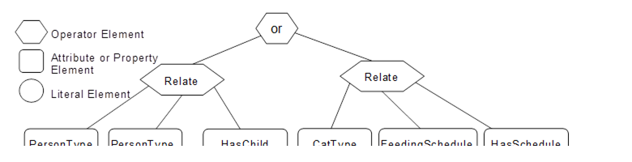  

Figure B. 13 - Example 9 filter logic tree  

[Table B.36](/§\_Ref153100053) describes the elements, operators and operands used in the example.  

 **Table B. 36\- Example 9 ContentFilter**   

| **Element[]** | **Operator** | **Operand[0]** | **Operand[1]** | **Operand[2]** | **Operand[3]** |
|---|---|---|---|---|---|
|0|Or|ElementOperand=1|ElementOperand = 2|||
|1|RelatedTo|AttributeOperand = NodeId: 12:PersonType, BrowsePath ".", Attribute: NodeId|AttributeOperand = NodeId: 12:PersonType, BrowsePath ".", Attribute: NodeId|AttributeOperand = NodeId: 12:HasChild, BrowsePath ".", Attribute: NodeId|LiteralOperand = '1'|
|2|RelatedTo|AttributeOperand = NodeId: 12:CatType, BrowsePath ".", Attribute: NodeId|AttributeOperand = NodeId: 12:FeedingScheduleType, BrowsePath ".", Attribute: NodeId|AttributeOperand = NodeId: 12:HasSchedule, BrowsePath ".", Attribute: NodeId|LiteralOperand = '1'|
  

  

The results from this *Query* would contain the *QueryDataSets* shown in [Table B.37](/§\_Ref153100351) . If this is compared to the result set from example 2, the Pet *Nodes* are included in the list, even though they are outside of the *View* . This is possible since the name referenced via the relative path and the root *Node* is in the *View* .  

 **Table B. 37\- Example 9 QueryDataSets**   

| **NodeId** | **TypeDefinition NodeId** | **RelativePath** | **Value** |
|---|---|---|---|
|12:30 (Jfamily1)|PersonType|. 12:LastName|Jones|
|||\<12:HasAnimal\>12:AnimalType. 12:Name|Rosemary|
|||\<12:HasAnimal\>12:AnimalType. 12:Name|Basil|
  

  

NOTE The RelativePath column and browse name (in parentheses in the *NodeId* column) are not in the QueryDataSet and are only shown here for clarity. The TypeDefinition NodeId would be an integer not the symbolic name that is included in the table.  

  

\_\_\_\_\_\_\_\_\_\_\_\_\_\_  

