## 1 Scope  

This part of the OPC Unified Architecture defines the Information Model .The Information Model describes standardised *Nodes* of a *Server* 's *AddressSpace* . These *Nodes* are standardised types as well as standardised instances used for diagnostics or as entry points to server-specific *Nodes* . Thus, the Information Model defines the *AddressSpace* of an empty OPC UA *Server* . However, it is not expected that all *Servers* will provide all of these *Nodes* .  

## 2 Normative references  

The following documents, in whole or in part, are normatively referenced in this document and are indispensable for its application. For dated references, only the edition cited applies. For undated references, the latest edition of the referenced document (including any amendments and errata) applies.  

OPC 10000-1, *OPC Unified Architecture - Part 1: Concepts*  

[http://www.opcfoundation.org/UA/Part1/](http://www.opcfoundation.org/UA/Part1/)  

OPC 10000-3, *OPC Unified Architecture - Part 3: Address Space Model*  

[http://www.opcfoundation.org/UA/Part3/](http://www.opcfoundation.org/UA/Part3/)  

OPC 10000-4, *OPC Unified Architecture - Part 4: Services*  

[http://www.opcfoundation.org/UA/Part4/](http://www.opcfoundation.org/UA/Part4/)  

OPC 10000-6, *OPC Unified Architecture - Part 6: Mappings*  

[http://www.opcfoundation.org/UA/Part6/](http://www.opcfoundation.org/UA/Part6/)  

OPC 10000-7, *OPC Unified Architecture - Part 7: Profiles*  

[http://www.opcfoundation.org/UA/Part7/](http://www.opcfoundation.org/UA/Part7/)  

OPC 10000-8, *OPC Unified Architecture - Part 8: Data Access*  

[http://www.opcfoundation.org/UA/Part8/](http://www.opcfoundation.org/UA/Part8/)  

OPC 10000-9, *OPC Unified Architecture - Part 9: Alarms and conditions*  

[http://www.opcfoundation.org/UA/Part9/](http://www.opcfoundation.org/UA/Part9/)  

OPC 10000-11, *OPC Unified Architecture - Part 11: Historical Access*  

[http://www.opcfoundation.org/UA/Part11/](http://www.opcfoundation.org/UA/Part11/)  

OPC 10000-18, *OPC Unified Architecture - Part 18: Role-Based Security*  

[http://www.opcfoundation.org/UA/Part18/](http://www.opcfoundation.org/UA/Part18/)  

OPC 10000-20, *OPC Unified Architecture - Part 20: File Transfer*  

[http://www.opcfoundation.org/UA/Part20/](http://www.opcfoundation.org/UA/Part20/)  

RFC 2045, Multipurpose Internet Mail Extensions (MIME) Part One:  

[http://www.ietf.org/rfc/rfc2045.txt](http://www.ietf.org/rfc/rfc2045.txt)  

RFC 2046, Multipurpose Internet Mail Extensions (MIME) Part Two:  

[https://www.ietf.org/rfc/rfc2046.txt](https://www.ietf.org/rfc/rfc2046.txt)  

RFC 2047, Multipurpose Internet Mail Extensions (MIME) Part Three:  

[https://www.ietf.org/rfc/rfc2047.txt](https://www.ietf.org/rfc/rfc2047.txt)  

RFC 3986, Uniform Resource Identifier (URI): Generic Syntax:  

[https://www.ietf.org/rfc/rfc3986.txt](https://www.ietf.org/rfc/rfc3986.txt)  

ISO/IEC/IEEE 60559:2020, Information technology - Microprocessor Systems - Floating-Point arithmetic  

[https://www.iso.org/standard/80985.html](https://www.iso.org/standard/80985.html) https://www.iso.org/standard/80985.html  

  

UTF-8, UTF-8, a transformation format of ISO 10646  

[http://www.ietf.org/rfc/rfc3629.txt](http://www.ietf.org/rfc/rfc3629.txt)  

ISO/IEC 11578:1996, Information technology - Open Systems Interconnection - Remote Procedure Call (RPC)  

[https://www.iso.org/standard/2229.html](https://www.iso.org/standard/2229.html) https://www.iso.org/standard/2229.html  

Semantic Versioning 2.0.0  

[https://semver.org/](https://semver.org/)  

Unicode Database  

[https://www.unicode.org/Public/UCD/latest/ucd/PropList.txt](https://www.unicode.org/Public/UCD/latest/ucd/PropList.txt) https://www.unicode.org/Public/UCD/latest/ucd/PropList.txt  

  

## 3 Terms, definitions, abbreviated terms and conventions  

### 3.1 Terms and definitions  

For the purposes of this document, the terms and definitions given in [OPC 10000-1](/§UAPart1) and [OPC 10000-3](/§UAPart3) , as well as the following apply.  

#### 3.1.1 ClientUserId  

String that identifies the user of the client requesting an action  

Note 1 to entry: The *ClientUserId* is obtained directly or indirectly from the *UserIdentityToken* passed by the *Client* in the *ActivateSession* *Service* call or from the *authenticationToken* in the *requestHeader* of ** a *SessionlessInvoke Service* call. See [6.4.3](/§\_Ref129642935) for details.  

### 3.2 Abbreviated terms  

UA Unified Architecture  

XML Extensible Markup Language  

JWT JSON Web Token  

### 3.3 Conventions for Node descriptions  

*Node* definitions are specified using tables (see [Table 2](/§\_Ref81297423) ).  

*Attributes* are defined by providing the *Attribute* name and a value, or a description of the value.  

*References* are defined by providing the *ReferenceType* name, the *BrowseName* of the *TargetNode* and its *NodeClass* .  

* If the *TargetNode* is a component of the *Node* being defined in the table, the *Attributes* of the composed *Node* are defined in the same row of the table.  

* The *DataType* is only specified for *Variables* ; "[\<number\>]" indicates a single-dimensional array, for multi-dimensional arrays the expression is repeated for each dimension (e.g. [2][3] for a two-dimensional array). For all arrays the *ArrayDimensions* is set as identified by \<number\> values. If no \<number\> is set, the corresponding dimension is set to 0, indicating an unknown size. If no number is provided at all the *ArrayDimensions* can be omitted. If no brackets are provided, it identifies a scalar *DataType* and the *ValueRank* is set to the corresponding value (see [OPC 10000-3](/§UAPart3) ). In addition, *ArrayDimensions* is set to null or is omitted. If it can be Any or ScalarOrOneDimension, the value is put into "\{\<value\>\}", so either "\{Any\}" or "\{ScalarOrOneDimension\}" and the *ValueRank* is set to the corresponding value (see [OPC 10000-3](/§UAPart3) ) and the *ArrayDimensions* is set to null or is omitted. Examples are given in [Table 1](/§\_Ref194377838) .  

Table 1 - Examples of DataTypes  

| **Notation** | **DataType** | **ValueRank** | **ArrayDimensions** | **Description** |
|---|---|---|---|---|
|Int32|Int32|−1|omitted or null|A scalar Int32.|
|Int32[]|Int32|1|omitted or \{0\}|Single-dimensional array of Int32 with an unknown size.|
|Int32[][]|Int32|2|omitted or \{0,0\}|Two-dimensional array of Int32 with unknown sizes for both dimensions.|
|Int32[3][]|Int32|2|\{3,0\}|Two-dimensional array of Int32 with a size of 3 for the first dimension and an unknown size for the second dimension.|
|Int32[5][3]|Int32|2|\{5,3\}|Two-dimensional array of Int32 with a size of 5 for the first dimension and a size of 3 for the second dimension.|
|Int32\{Any\}|Int32|−2|omitted or null|An Int32 where it is unknown if it is scalar or array with any number of dimensions.|
|Int32\{ScalarOrOneDimension\}|Int32|−3|omitted or null|An Int32 where it is either a single-dimensional array or a scalar.|
  

  

* The TypeDefinition is specified for *Objects* and *Variables* .  

* The TypeDefinition column specifies a symbolic name for a *NodeId* , i.e., the specified *Node* points with a *HasTypeDefinition* *Reference* to the corresponding *Node* .  

* The *ModellingRule* of the referenced component is provided by specifying the symbolic name of the rule in the *ModellingRule* column. In the *AddressSpace* , the *Node* shall use a *HasModellingRule* *Reference* to point to the corresponding *ModellingRule* *Object* .  

If the *NodeId* of a *DataType* is provided, the symbolic name of the *Node* representing the *DataType* shall be used.  

*Nodes* of all other *NodeClasses* cannot be defined in the same table; therefore only the used *ReferenceType* , their *NodeClass* and their *BrowseName* are specified. A reference to another part of this document points to their definition.  

[Table 2](/§\_Ref81297423) illustrates the table. If no components are provided, the DataType, TypeDefinition and ModellingRule columns may be omitted and only a Comment column is introduced to point to the *Node* definition.  

Each *Node* defined in this specification has *ConformanceUnits* defined in [OPC 10000-7](/§UAPart7) that require the *Node* to be in the *AddressSpace* . If a *Server* supports a *ConformanceUnit* , it shall expose the *Nodes* related to the *ConformanceUnit* in its *AddressSpace* . If two *Nodes* are exposed, all *References* between the *Nodes* defined in this specification shall be exposed as well.  

The relations between *Nodes* and *ConformanceUnits* are defined at the end of the tables defining *Nodes* , one row per *ConformanceUnit* . The *ConformanceUnit* is reflected with a Category element in the *UANodeSet* file (see [OPC 10000-6](/§UAPart6) ).  

The *Nodes* defined in a table are not only the *Node* defined on top level, for example an *ObjectType* , but also the *Nodes* that are referenced, as long as they are not defined in other tables. For example, the *ObjectType* *ServerType* defines its *InstanceDeclarations* in the same table, so the *InstanceDeclarations* are also bound to the *ConformanceUnits* defined for the table. The table even indirectly defines additional *InstanceDeclarations* as components of the top-level *InstanceDeclarations* , that are not directly visible in the table. The *TypeDefinitions* and *DataTypes* used in the *InstanceDeclarations* , and the *ReferenceTypes* are defined in their individual tables and not in the table itself, therefore they are not bound to the *ConformanceUnits* of the table. As another example, the *OrderedListType* references the *GeneralModelChangeEventType* , which is defined in another table, and therefore not bound to the *ConformanceUnits* of the table. In case of ambiguity, the Category element of the *UANodeSet* file provides the precise information.  

Table 2 - TypeDefinition Table  

| **Attribute** | **Value** |
|---|---|
|Attribute name|Attribute value. If it is an optional Attribute that is not set "--" will be used.|
|||
  
| **References** | **NodeClass** | **BrowseName** | **DataType** | **TypeDefinition** | **ModellingRule** |
|---|---|---|---|---|---|
|*ReferenceType* name|*NodeClass* of the Target *Node* .|*BrowseName* of the target *Node* .|*DataType* of the referenced *Node* , only applicable for *Variables* .|*TypeDefinition* of the referenced *Node* , only applicable for *Variables* and *Objects* .|Referenced *ModellingRule* of the referenced *Object* .|
|NOTE Notes referencing footnotes of the table content.|
  
| **Conformance Units** |
|---|
|Name of conformance unit, one row per conformance unit|
  

  

Components of *Nodes* can be complex that is containing components by themselves. The *TypeDefinition* , *NodeClass* , *DataType* and *ModellingRule* can be derived from the type definitions, and the symbolic name can be created as defined in [4.1](/§\_Ref135814526) . Therefore those containing components are not explicitly specified; they are implicitly specified by the type definitions.  

## 4 NodeIds and BrowseNames  

### 4.1 NodeIds  

The *NodeIds* of all *Nodes* described in this standard are only symbolic names. [OPC 10000-6](/§UAPart6) defines the actual *NodeIds* .  

The symbolic name of each *Node* defined in this standard is its *BrowseName* , or, when it is part of another *Node* , the *BrowseName* of the other *Node* , a ".", and the *BrowseName* of itself. In this case "part of" means that the whole has a *HasProperty* or *HasComponent* *Reference* to its part. Since all *Nodes* not being part of another *Node* have a unique name in this standard, the symbolic name is unique. For example, the *ServerType* defined in [6.3.1](/§\_Ref129643266) has the symbolic name "ServerType". One of its *InstanceDeclarations* would be identified as "ServerType.ServerCapabilities". Since this *Object* is complex, another *InstanceDeclaration* of the *ServerType* is "ServerType.ServerCapabilities.MinSupportedSampleRate". The *Server* *Object* defined in [8.3.2](/§\_Ref129412931) is based on the ServerType and has the symbolic name "Server". Therefore, the instance based on the *InstanceDeclaration* described above has the symbolic name "Server.ServerCapabilities.MinSupportedSampleRate".  

The *NamespaceIndex* for all *NodeIds* defined in this standard is 0. The namespace for this *NamespaceIndex* is specified in [OPC 10000-3](/§UAPart3) .  

Note that this standard not only defines concrete *Nodes* , but also requires that some Nodes have to be generated, for example one for each Session running on the *Server* . The *NodeIds* of those *Nodes* are server-specific, including the Namespace. However the *NamespaceIndex* of those *Nodes* cannot be the *NamespaceIndex* 0, because they are not defined by the OPC Foundation but generated by the *Server* .  

### 4.2 BrowseNames  

The text part of the *BrowseNames* for all *Nodes* defined in this standard is specified in the tables defining the *Nodes* . The *NamespaceIndex* for all *BrowseNames* defined in this document is 0.  

## 5 Common Attributes  

### 5.1 General  

For all *Nodes* specified in *NamespaceIndex* 0, the *Attributes* named in [Table 3](/§\_Ref94587708) shall be set as specified in [Table 3](/§\_Ref94587708) .  

Table 3 - Common Node Attributes  

| **Attribute** | **Value** |
|---|---|
|DisplayName|The *DisplayName* is a *LocalizedText* . Each server shall provide the *DisplayName* identical to the *BrowseName* of the *Node* for the LocaleId "en". Whether the server provides translated names for other LocaleIds is server-specific.|
|Description|Optionally a server-specific description is provided.|
|NodeClass|Shall reflect the *NodeClass* of the *Node.*|
|NodeId|The *NodeId* is described by *BrowseNames* as defined in [4.1](/§\_Ref135814526) and defined in [OPC 10000-6](/§UAPart6) .|
|WriteMask|Optionally the *WriteMask* *Attribute* can be provided. If the *WriteMask* *Attribute* is provided, it shall set all non-server-specific *Attributes* to not writable. For example, the *Description* *Attribute* may be set to writable since a *Server* may provide a server-specific description for the *Node* . The *NodeId* shall not be writable, because it is defined for each *Node* in this standard.|
|UserWriteMask|Optionally the *UserWriteMask* *Attribute* can be provided. The same rules as for the *WriteMask* *Attribute* apply.|
|RolePermissions|Optionally server-specific role permissions can be provided.|
|UserRolePermissions|Optionally the role permissions of the current Session can be provided. The value is server-specific and depends on the *RolePermissions* *Attribute* (if provided) and the current *Session* .|
|AccessRestrictions|Optionally server-specific access restrictions can be provided.|
  

  

### 5.2 Objects  

For all *Objects* specified in *NamespaceIndex* 0, the *Attributes* named in [Table 4](/§\_Ref134932188) shall be set as specified in [Table 4](/§\_Ref134932188) .  

Table 4 - Common Object Attributes  

| **Attribute** | **Value** |
|---|---|
|EventNotifier|Whether the *Node* can be used to subscribe to *Events* or not is server-specific.|
  

  

### 5.3 Variables  

For all *Variables* specified in *NamespaceIndex* 0, the *Attributes* named in [Table 5](/§\_Ref129080565) shall be set as specified in [Table 5](/§\_Ref129080565) .  

Table 5 - Common Variable Attributes  

| **Attribute** | **Value** |
|---|---|
|MinimumSamplingInterval|Optionally, a server-specific minimum sampling interval is provided.|
|AccessLevel|The access level for *Variables* used for type definitions is server-specific, for all other *Variables* defined in this standard, the access level shall allow reading; other settings are server-specific.|
|UserAccessLevel|The value for the *UserAccessLevel* *Attribute* is server-specific. It is assumed that all *Variables* can be accessed by at least one user.|
|Value|For *Variables* used as *InstanceDeclarations,* the value is server-specific; otherwise it shall represent the value described in the text.|
|ArrayDimensions|If the *ValueRank* does not identify an array of a specific dimension (i.e. *ValueRank* \<= 0) the *ArrayDimensions* can either be set to null or the *Attribute* is missing. This behaviour is server-specific. If the *ValueRank* specifies an array of a specific dimension (i.e. *ValueRank* \> 0) then the *ArrayDimensions* *Attribute* shall be specified.|
|Historizing|The value for the *Historizing* *Attribute* is server-specific.|
|AccessLevelEx|If the *AccessLevelEx* *Attribute* is provided, it shall have the bits 8, 9, and 10 set to 0, meaning that read and write operations on an individual *Variable* are atomic, and arrays can be partly written.|
  

  

### 5.4 VariableTypes  

For all *VariableTypes* specified in *NamespaceIndex* 0, the *Attributes* named in [Table 6](/§\_Ref129080728) shall be set as specified in [Table 6](/§\_Ref129080728) .  

Table 6 - Common VariableType Attributes  

| **Attributes** | **Value** |
|---|---|
|Value|Optionally a server-specific default value can be provided.|
|ArrayDimensions|If the *ValueRank* does not identify an array of a specific dimension (i.e. *ValueRank* \<= 0) the *ArrayDimensions* can either be set to null or the *Attribute* is missing. This behaviour is server-specific. If the *ValueRank* specifies an array of a specific dimension (i.e. *ValueRank* \> 0) then the *ArrayDimensions* *Attribute* shall be specified.|
  

### 5.5 Methods  

For all *Methods* specified in *NamespaceIndex* 0, the *Attributes* named in [Table 7](/§\_Ref497310130) shall be set as specified in [Table 7](/§\_Ref497310130) .  

Table 7 - Common Method Attributes  

| **Attributes** | **Value** |
|---|---|
|Executable|All *Methods* defined in this specification shall be executable ( *Executable* *Attribute* set to "True"), unless it is defined differently in the *Method* definition.|
|UserExecutable|The value of the *UserExecutable* *Attribute* is server-specific. It is assumed that all *Methods* can be executed by at least one user.|
  

  

  

## 6 Standard ObjectTypes  

### 6.1 General  

Typically, the components of an *ObjectType* are fixed and can be extended by subtyping. However, since each *Object* of an *ObjectType* can be extended with additional components, this standard allows extending the standard *ObjectTypes* defined in this document with additional components. Thereby, it is possible to express the additional information in the type definition that would already be contained in each *Object* . Some *ObjectTypes* already provide entry points for server-specific extensions. However, it is not allowed to restrict the components of the standard *ObjectTypes* defined in this standard. An example of extending the *ObjectTypes* is putting the standard *Property* *NodeVersion* defined in [OPC 10000-3](/§UAPart3) into the *BaseObjectType* , stating that each *Object* of the *Server* will provide a *NodeVersion* .  

### 6.2 BaseObjectType  

The *BaseObjectType* is used as type definition whenever there is an *Object* having no more concrete type definitions available. *Servers* should avoid using this *ObjectType* and use a more specific type, if possible. This *ObjectType* is the base *ObjectType* and all other *ObjectTypes* shall either directly or indirectly inherit from it. However, it might not be possible for *Servers* to provide all *HasSubtype References* from this *ObjectType* to its subtypes, and therefore it is not required to provide this information.  

There are no *References* specified for this *ObjectType* . It is formally defined in [Table 8](/§\_Ref129078551) .  

Table 8 - BaseObjectType definition  

| **Attribute** | **Value** |
|---|---|
|BrowseName|BaseObjectType|
|IsAbstract|False|
  
| **References** | **NodeClass** | **BrowseName** | **DataType** | **TypeDefinition** | **ModellingRule** |
|---|---|---|---|---|---|
  
| **Conformance Units** |
|---|
|Base Info Base Types|
  

  

### 6.3 ObjectTypes for the Server Object  

#### 6.3.1 ServerType  

This *ObjectType* defines the capabilities supported by the OPC UA *Server* . It is formally defined in [Table 9](/§\_Ref96249224) .  

Table 9 - ServerType definition  

| **Attribute** | **Value** |
|---|---|
|BrowseName|ServerType|
|IsAbstract|False|
  
| **References** | **NodeClass** | **BrowseName** | **DataType / TypeDefinition** | **ModellingRule** |
|---|---|---|---|---|
|Subtype of the BaseObjectType defined in [6.2](/§\_Ref129643995)|
|HasProperty|Variable|ServerArray|String[] PropertyType|Mandatory|
|HasProperty|Variable|NamespaceArray|String[] PropertyType|Mandatory|
|HasProperty|Variable|UrisVersion|VersionTime PropertyType|Optional|
|HasComponent|Variable|ServerStatus 1|ServerStatusDataType ServerStatusType|Mandatory|
|HasProperty|Variable|ServiceLevel|Byte PropertyType|Mandatory|
|HasProperty|Variable|Auditing|Boolean PropertyType|Mandatory|
|HasProperty|Variable|EstimatedReturnTime|DateTime PropertyType|Optional|
|HasProperty|Variable|LocalTime|TimeZoneDataType PropertyType|Optional|
|HasComponent|Object|ServerCapabilities 1|\- ServerCapabilitiesType|Mandatory|
|HasComponent|Object|ServerDiagnostics 1|\- ServerDiagnosticsType|Mandatory|
|HasComponent|Object|VendorServerInfo|\- VendorServerInfoType|Mandatory|
|HasComponent|Object|ServerRedundancy 1|\- ServerRedundancyType|Mandatory|
|HasComponent|Object|Namespaces|\- NamespacesType|Optional|
||||||
|HasComponent|Method|GetMonitoredItems|Defined in [9.1](/§\_Ref287953432)|Optional|
|HasComponent|Method|ResendData|Defined in [9.2](/§\_Ref380156832)|Optional|
|HasComponent|Method|SetSubscriptionDurable|Defined in [9.3](/§\_Ref410640255)|Optional|
|HasComponent|Method|RequestServerStateChange|Defined in [9.4](/§\_Ref412553089)|Optional|
  
| **Conformance Units** |
|---|
|Base Info ServerType|
  

  

*ServerArray* defines an array of *Server* URIs. This *Variable* is also referred to as the *server table* . Each URI in this array represents a globally-unique logical name for a *Server* within the scope of the network in which it is installed. Each OPC UA *Server* instance has a single URI that is used in the *server table* of other OPC UA *Servers* . Index 0 is reserved for the URI of the local *Server* . Values above 0 are used to identify remote *Servers* and are specific to a *Server* . [OPC 10000-4](/§UAPart4) describes discovery mechanism that can be used to resolve URIs into URLs. The *Server* URI is case sensitive.  

The *ApplicationUri* of an OPC UA *Server* shall be identical to the URI set in index 0 of the *ServerArray* and index 1 of the *NamespaceArray* .  

The indexes into the *server table* are referred to as *server indexes* or *server names* . They are used in OPC UA *Services* to identify *TargetNodes* of *References* that reside in remote *Servers* . Clients may read the entire table or they may read individual entries in the table. The *Server* shall not modify or delete entries of this table while any client has an open session to the *Server* , because clients may cache the *server table* . A *Server* may add entries to the *server table* even if clients are connected to the *Server* .  

*NamespaceArray* defines an array of namespace URIs. This *Variable* is also referred as *namespace table* . The indexes into the *namespace table* are referred to as *NamespaceIndexes* . *NamespaceIndexes* are used in *NodeIds* in OPC UA *Services* , rather than the longer namespace URI. Index 0 is reserved for the OPC UA namespace, and index 1 is reserved for the local *Server* . Clients may read the entire *namespace table* or they may read individual entries in the *namespace table* . The *Server* shall not modify or delete entries of the *namespace table* while any client has an open session to the *Server* , because clients may cache the *namespace table* . A *Server* may add entries to the *namespace table* even if clients are connected to the *Server* . It is recommended that *Servers* not change the indexes of the *namespace table* but only add entries, because the client may cache *NodeIds* using the indexes. Nevertheless, it might not always be possible for *Servers* to avoid changing indexes in the *namespace table* . Clients that cache *NamespaceIndexes* of *NodeIds* should always check when starting a session to verify that the cached *NamespaceIndexes* have not changed.  

*UrisVersion* defines the version of the *ServerArray* and the *NamespaceArray* . Everytime the *ServerArray* or the *NamespaceArray* is changed, the value of the *UrisVersion* shall be updated to a value greater than the previous value. The *UrisVersion* *Property* is used in combination with the *SessionlessInvoke* *Service* defined in [OPC 10000-4](/§UAPart4) . If a *Server* supports this *Service* , the *Server* shall support this *Property* . It is the responsibility of the *Server* to provide a consistent set of values for the *ServerArray* , *NamespaceArray* and the *UrisVersion Properties* . The *VersionTime DataType* is defined in [OPC 10000-4](/§UAPart4) .  

*ServerStatus* contains elements that describe the status of the *Server* . See [12.10](/§\_Ref96142316) for a description of its elements.  

*ServiceLevel* describes the ability of the *Server* to provide its data to the *Client* . The value range is from 0 to 255, where 0 indicates the worst and 255 indicates the best. *Servers* shall set the *ServiceLevel* according to the sub-ranges defined in [OPC 10000-4](/§UAPart4) .  

*Auditing* is a Boolean specifying if the *Server* is currently generating audit events. It is set to TRUE if the *Server* generates audit events, otherwise to false. The *Profiles* defined in [OPC 10000-7](/§UAPart7) specify what kind of audit events are generated by the *Server* .  

*EstimatedReturnTime* indicates the time at which the *Server* is expected to have a *ServerStatus* . *State* of RUNNING\_0. A *Client* that observes a shutdown or a *ServiceLevel* of 0 should either wait until after this time to attempt to reconnect to this *Server* or enter into slow retry logic. For example, most *Clients* will attempt to reconnect after a failure immediately and then progressively increase the delay between attempts until some maximum delay. This time can be used to trigger the *Client* to start its reconnect logic with some delay.  

*LocalTime* is a structure containing the Offset and the DaylightSavingInOffset flag. The Offset specifies the time difference (in minutes) between the *Server* time in UTC ** and the local time at the *Server* location. If DaylightSavingInOffset is TRUE, then Standard/Daylight savings time (DST) at the *Server* location is in effect and Offset includes the DST correction. If FALSE then the Offset does not include DST correction and DST may or may not be in effect.  

*ServerCapabilities* defines the capabilities supported by the OPC UA *Server* . See [6.3.2](/§\_Ref96142332) for its description.  

*ServerDiagnostics* defines diagnostic information about the OPC UA *Server* . See [6.3.3](/§\_Ref96142333) for its description.  

*VendorServerInfo* represents the browse entry point for vendor-defined *Server* information. This *Object* is required to be present even if there are no vendor-defined *Objects* beneath it. See [6.3.6](/§\_Ref135191796) for its description.  

*ServerRedundancy* describes the redundancy capabilities provided by the *Server* . This *Object* is required even if the *Server* does not provide any redundancy support. If the *Server* supports redundancy, then a subtype of *ServerRedundancyType* is used to describe its capabilities. Otherwise, it provides an *Object* of type *ServerRedundancyType* with the *Property* RedundancySupport set to none. See [6.3.7](/§\_Ref121332805) for the description of *ServerRedundancyType* .  

*Namespaces* provides a list of *NamespaceMetadataType* *Objects* with additional information about the namespaces used in the *Server* . See [6.3.14](/§\_Ref315988812) for the description of *NamespaceMetadataType.*  

The *GetMonitoredItems* *Method* is used to identify the *MonitoredItems* of a *Subscription* . It is defined in [9.1](/§\_Ref287953432) ; the intended usage is defined in [OPC 10000-4](/§UAPart4) .  

The *ResendData Method* is used to get the latest values of the data monitored items of a *Subscription* . It is defined in [9.2](/§\_Ref380156832) ; the intended usage is defined in [OPC 10000-4](/§UAPart4) .  

The *SetSubscriptionDurable* *Method* is used to set a *Subscription* into a mode where *MonitoredItem* data and event queues are stored and delivered even if an OPC UA *Client* was disconnected for a longer time or the OPC UA *Server* was restarted. It is defined in [9.3](/§\_Ref410640255) ; the intended usage is defined in [OPC 10000-4](/§UAPart4) .  

The *RequestServerStateChange* *Method* allows a *Client* to request a state change in the *Server* . It is defined in [9.4](/§\_Ref412553089) ; the intended usage is defined in [OPC 10000-4](/§UAPart4) .  

  

#### 6.3.2 ServerCapabilitiesType  

This *ObjectType* defines the capabilities supported by the OPC UA *Server* . It is formally defined in [Table 10](/§\_Ref96249200) .  

Table 10 - ServerCapabilitiesType definition  

| **Attribute** | **Value** |
|---|---|
|BrowseName|ServerCapabilitiesType|
|IsAbstract|False|
  
| **References** | **NodeClass** | **BrowseName** | **DataType / TypeDefinition** | **ModellingRule** |
|---|---|---|---|---|
|Subtype of the BaseObjectType defined in [6.2](/§\_Ref129643995)|
|HasProperty|Variable|ServerProfileArray|String[] PropertyType|Mandatory|
|HasProperty|Variable|LocaleIdArray|LocaleId[] PropertyType|Mandatory|
|HasProperty|Variable|MinSupportedSampleRate|Duration PropertyType|Mandatory|
|HasProperty|Variable|MaxBrowseContinuationPoints|UInt16 PropertyType|Mandatory|
|HasProperty|Variable|MaxQueryContinuationPoints|UInt16 PropertyType|Mandatory|
|HasProperty|Variable|MaxHistoryContinuationPoints|UInt16 PropertyType|Mandatory|
|HasProperty|Variable|MaxLogObjectContinuationPoints|UInt16 PropertyType|Optional|
|HasProperty|Variable|SoftwareCertificates|SignedSoftwareCertificate[] PropertyType|Mandatory|
|HasProperty|Variable|MaxArrayLength|UInt32 PropertyType|Optional|
|HasProperty|Variable|MaxStringLength|UInt32 PropertyType|Optional|
|HasProperty|Variable|MaxByteStringLength|UInt32 PropertyType|Optional|
|HasComponent|Object|OperationLimits|\-- OperationLimitsType|Optional|
|HasComponent|Object|ModellingRules|\-- FolderType|Mandatory|
|HasComponent|Object|AggregateFunctions|\-- FolderType|Mandatory|
|HasComponent|Object|RoleSet|RoleSetType|Optional|
|HasProperty|Variable|MaxSessions|UInt32 PropertyType|Optional|
|HasProperty|Variable|MaxSubscriptions|UInt32 PropertyType|Optional|
|HasProperty|Variable|MaxMonitoredItems|UInt32 PropertyType|Optional|
|HasProperty|Variable|MaxSubscriptionsPerSession|UInt32 PropertyType|Optional|
|HasProperty|Variable|MaxMonitoredItemsPerSubscription|UInt32 PropertyType|Optional|
|HasProperty|Variable|MaxSelectClauseParameters|UInt32 PropertyType|Optional|
|HasProperty|Variable|MaxWhereClauseParameters|UInt32 PropertyType|Optional|
|HasProperty|Variable|MaxMonitoredItemsQueueSize|UInt32 PropertyType|Optional|
|HasComponent|Variable|\<VendorCapability\>|BaseDataType ServerVendorCapabilityType|OptionalPlaceholder|
|HasProperty|Variable|ConformanceUnits|QualifiedName[] PropertyType|Optional|
  
| **Conformance Units** |
|---|
|Base Info ServerType|
  

  

*ServerProfileArray* lists the *Profiles* that the *Server* supports. The *String* shall be the URI of the *Profile* . See [OPC 10000-7](/§UAPart7) for definitions of OPC UA *Server* *Profiles* . This list should be limited to the *Profiles* the *Server* supports in its current configuration.  

*LocaleIdArray* is an array of LocaleIds that are known to be supported by the *Server* . The *Server* might not be aware of all LocaleIds that it supports because it may provide access to underlying servers, systems or devices that do not report the LocaleIds that they support.  

*MinSupportedSampleRate* defines the minimum supported sample rate, including 0, which is supported by the *Server* .  

*MaxBrowseContinuationPoints* is an unsigned integer specifying the maximum number of parallel continuation points of the Browse *Service* that the *Server* can support per session. The value specifies the maximum the *Server* can support under normal circumstances, so there is no guarantee the *Server* can always support the maximum. The client should not open more Browse calls with open continuation points than exposed in this *Variable* . The value 0 indicates that the *Server* does not restrict the number of parallel continuation points the client should use.  

*MaxQueryContinuationPoints* is an unsigned integer specifying the maximum number of parallel continuation points of the QueryFirst *Services* that the *Server* can support per session. The value specifies the maximum the *Server* can support under normal circumstances, so there is no guarantee the *Server* can always support the maximum. The client should not open more QueryFirst calls with open continuation points than exposed in this *Variable* . The value 0 indicates that the *Server* does not restrict the number of parallel continuation points the client should use.  

*MaxHistoryContinuationPoints* is an unsigned integer specifying the maximum number of parallel continuation points of the HistoryRead *Services* that the *Server* can support per session. The value specifies the maximum the *Server* can support under normal circumstances, so there is no guarantee the *Server* can always support the maximum. The *Client* should not open more HistoryRead calls with open continuation points than exposed in this *Variable* . The value 0 indicates that the *Server* does not restrict the number of parallel continuation points the *Client* should use.  

*MaxLogObjectContinuationPoints* is an unsigned integer specifying the maximum number of parallel continuation points of the *LogObject* *GetRecords* method that the *Server* can support per session. The value specifies the maximum the *Server* can support under normal circumstances, so there is no guarantee the *Server* can always support the maximum. The *Client* should not invoke more *GetRecords* *Methods* with open continuation points than exposed in this *Variable* . The value 0 indicates that the *Server* does not restrict the number of parallel continuation points the *Client* should use.  

*SoftwareCertificates* is an array of *SignedSoftwareCertificates* containing all *SoftwareCertificates* supported by the *Server* . A *SoftwareCertificate* identifies capabilities of the *Server* . It contains the list of *Profiles* supported by the *Server* . *Profiles* are described in [OPC 10000-7](/§UAPart7) .  

The *MaxArrayLength* *Property* indicates the maximum length of a one or multidimensional array supported by Variables, *Method* arguments and *Event* fields of the *Server* . In a multidimensional array it indicates the overall length. For example, a three-dimensional array of 2x3x10 has the array length of 60. The *Server* might further restrict the length for individual Variables, *Method* arguments or *Event* fields without notice to the client. *Servers* may use the *Property* *MaxArrayLength* defined in [OPC 10000-3](/§UAPart3) on individual *DataVariables* to specify the size on individual values. The individual *Property* may have a larger or smaller value than *MaxArrayLength* .  

The *MaxStringLength* *Property* indicates the maximum number of bytes in *Strings* and *LocalizedText* supported by *Variables, Method* arguments and *Event* fields of the *Server* . *Servers* may override this setting by adding the *MaxStringLength* *Property* defined in [OPC 10000-3](/§UAPart3) to an individual *DataVariable* . If a *Server* does not impose a maximum number of bytes or is not able to determine the maximum number of bytes this *Property* shall not be provided.  

The *MaxByteStringLength* *Property* indicates the maximum number of bytes in a *ByteString* supported by *Variables, Method* arguments ** and *Event* fields of the *Server* . *Servers* may override this setting by adding the *MaxByteStringLength* *Property* defined in [OPC 10000-3](/§UAPart3) to an individual *DataVariable.* If a *Server* does not impose a maximum number of bytes or is not able to determine the maximum number of bytes this *Property* shall not be provided *.*  

*OperationLimits* is an entry point to access information on operation limits of the *Server* , for example the maximum length of an array in a read *Service* call.  

*ModellingRules* is an entry point to browse to all *ModellingRules* supported by the *Server* . All *ModellingRules* supported by the *Server* should be able to be browsed starting from this *Object* .  

*AggregateFunctions* is an entry point to browse to all *AggregateFunctions* supported by the *Server* . All *AggregateFunctions* supported by the *Server* should be able to be browsed starting from this *Object* . AggregateFunctions are Objects of *AggregateFunctionType* .  

The *RoleSet Object* is used to publish all *Roles* supported by the *Server* . The *RoleSetType* is specified in [OPC 10000-18](/§UAPart18) .  

*MaxSessions* is an unsigned integer specifying the maximum number of concurrent *Sessions* the *Server* can support. The value specifies the maximum the *Server* can support under normal circumstances, therefore there is no guarantee the *Server* can always support the maximum.  

*MaxSubscriptions* is an unsigned integer specifying the maximum number of *Subscriptions* the *Server* can support. The value specifies the maximum the *Server* can support under normal circumstances, therefore there is no guarantee the *Server* can always support the maximum.  

*MaxMonitoredItems* is an unsigned integer specifying the maximum number of *MonitoredItems* the *Server* can support. The value specifies the maximum the *Server* can support under normal circumstances, therefore there is no guarantee the *Server* can always support the maximum.  

MaxSubscriptionsPerSession is an unsigned integer specifying the maximum number of *Subscriptions* per *Session* the *Server* can support. The value specifies the maximum the *Server* can support under normal circumstances, therefore there is no guarantee the *Server* can always support the maximum.  

MaxMonitoredItemsPerSubscription is an unsigned integer specifying the maximum number of *MonitoredItems* per *Subscription* the *Server* can support. The value specifies the maximum the *Server* can support under normal circumstances, therefore there is no guarantee the *Server* can always support the maximum.  

MaxSelectClauseParameters is an unsigned integer specifying the maximum number of EventField SelectClause Parameters the *Server* can support for an EventFilter. The value specifies the maximum the *Server* can support under normal circumstances, therefore there is no guarantee the *Server* can always support the maximum.  

MaxWhereClauseParameters is an unsigned integer specifying the maximum number of *EventField WhereClause Parameters* the *Server* can support for an EventFilter. The value specifies the maximum the *Server* can support under normal circumstances, therefore there is no guarantee the *Server* can always support the maximum.  

MaxMonitoredItemsQueueSize is an integer specifying the maximum size of data *MonitoredItem* queues. The value specifies the maximum the *Server* can support under normal circumstances, therefore there is no guarantee the *Server* can always support the maximum.  

When a vendor can not determine a limit of an optional component then the component shall not be included.  

When vendors expose their own capabilities, they should add additional *Nodes* to the standard *ServerCapabilities* *Object* instance.  

The \< *VendorCapability\> Variable* is used to provide information about the server-specific capabilities.  

*ConformanceUnits* is a *QualifiedName* array specifying the set of conformance units the *Server* supports. This list should be limited to the *ConformanceUnits* the *Server* supports in its current configuration.  

#### 6.3.3 ServerDiagnosticsType  

This *ObjectType* defines diagnostic information about the OPC UA *Server* . This *ObjectType* is formally defined in [Table 11](/§\_Ref94606553) .  

Table 11 - ServerDiagnosticsType definition  

| **Attribute** | **Value** |
|---|---|
|BrowseName|ServerDiagnosticsType|
|IsAbstract|False|
  
| **References** | **NodeClass** | **BrowseName** | **DataType / TypeDefinition** | **ModellingRule** |
|---|---|---|---|---|
|Subtype of the BaseObjectType defined in [6.2](/§\_Ref129643995)|
|HasComponent|Variable|ServerDiagnosticsSummary|ServerDiagnosticsSummaryDataType ServerDiagnosticsSummaryType|Mandatory|
|HasComponent|Variable|SamplingIntervalDiagnosticsArray|SamplingIntervalDiagnosticsDataType[] SamplingIntervalDiagnosticsArrayType|Optional|
|HasComponent|Variable|SubscriptionDiagnosticsArray|SubscriptionDiagnosticsDataType[] SubscriptionDiagnosticsArrayType|Mandatory|
|HasComponent|Object|SessionsDiagnosticsSummary|\-- SessionsDiagnosticsSummaryType|Mandatory|
|HasProperty|Variable|EnabledFlag|Boolean PropertyType|Mandatory|
  
| **Conformance Units** |
|---|
|Base Info ServerType|
  

  

*ServerDiagnosticsSummary* contains diagnostic summary information for the *Server* , as defined in [12.9](/§\_Ref96139887) .  

*SamplingIntervalDiagnosticsArray* is an array of diagnostic information per sampling rate as defined in [12.8](/§\_Ref129663707) . There is one entry for each sampling rate currently used by the *Server* . Its *TypeDefinitionNode* is the *VariableType* *SamplingIntervalDiagnosticsArrayType* , providing a *Variable* for each entry in the array, as defined in [7.9](/§\_Ref134435461) .  

The sampling interval diagnostics are only collected by *Servers* which use a fixed set of sampling intervals. In these cases, length of the array and the set of contained *Variables* will be determined by the *Server* configuration and the *NodeId* assigned to a given sampling interval diagnostics variable shall not change as long as the *Server* configuration does not change. A *Server* may not expose the SamplingIntervalDiagnosticsArray if it does not use fixed sampling rates.  

*SubscriptionDiagnosticsArray* is an array of Subscription diagnostic information per subscription, as defined in [12.15](/§\_Ref96141288) . There is one entry for each Notification channel actually established in the *Server* . Its *TypeDefinitionNode* is the *VariableType* SubscriptionDiagnosticsArrayType, providing a *Variable* for each entry in the array as defined in [7.11](/§\_Ref134857534) . Those *Variables* are also used as *Variables* referenced by other *Variables* .  

*SessionsDiagnosticsSummary* contains diagnostic information per session, as defined in [6.3.4](/§\_Ref134858579) .  

*EnabledFlag* identifies whether or not diagnostic information is collected by the *Server* . It can also be used by a client to enable or disable the collection of diagnostic information of the *Server* . The following settings of the Boolean value apply: TRUE indicates that the *Server* collects diagnostic information, and setting the value to TRUE leads to resetting and enabling the collection. FALSE indicates that no diagnostic information is collected, and setting the value to FALSE disables the collection without resetting the diagnostic values.  

When diagnostics are turned off, the *Server* can return Bad\_NodeIdUnknown for all static diagnostic *Nodes* except the *EnabledFlag* *Property* . Dynamic diagnostic *Nodes* (such as the *Session* *Nodes* ) will not appear in the *AddressSpace* .  

If the collection of diagnostic information is not supported, the EnabledFlag Property will be read only.  

#### 6.3.4 SessionsDiagnosticsSummaryType  

This *ObjectType* defines diagnostic information about the sessions of the OPC UA *Server* . This *ObjectType* is formally defined in [Table 12](/§\_Ref134948667) .  

Table 12 - SessionsDiagnosticsSummaryType definition  

| **Attribute** | **Value** |
|---|---|
|BrowseName|SessionsDiagnosticsSummaryType|
|IsAbstract|False|
  
| **References** | **NodeClass** | **BrowseName** | **DataType / TypeDefinition** | **ModellingRule** |
|---|---|---|---|---|
|Subtype of the BaseObjectType defined in [6.2](/§\_Ref129643995)|
|HasComponent|Variable|SessionDiagnosticsArray|SessionDiagnosticsDataType[] SessionDiagnosticsArrayType|Mandatory|
|HasComponent|Variable|SessionSecurityDiagnosticsArray|SessionSecurityDiagnosticsDataType[] SessionSecurityDiagnosticsArrayType|Mandatory|
|HasComponent|Object|\<ClientName\>|\-- SessionDiagnosticsObjectType|OptionalPlaceholder|
  
| **Conformance Units** |
|---|
|Base Info ServerType|
  

  

*SessionDiagnosticsArray* provides an array with an entry for each session in the *Server* having general diagnostic information about a session.  

*SessionSecurityDiagnosticsArray* provides an array with an entry for each active session in the *Server* having security-related diagnostic information about a session. Since this information is security-related, it should not be made accessible to all users, but only to authorised users over encrypted channels.  

For each session of the *Server* , this *Object* also provides an *Object* representing the session, indicated by *\<ClientName\>* . The BrowseName could be derived from the *sessionName* defined in the *CreateSession* *Service* ( [OPC 10000-4](/§UAPart4) ) or some other server-specific mechanisms. It is of the *ObjectType* SessionDiagnosticsObjectType, as defined in [6.3.5](/§\_Ref134856327) .  

#### 6.3.5 SessionDiagnosticsObjectType  

This *ObjectType* defines diagnostic information about a session of the OPC UA *Server* . This *ObjectType* is formally defined in [Table 13](/§\_Ref134948705) .  

Table 13 - SessionDiagnosticsObjectType definition  

| **Attribute** | **Value** |
|---|---|
|BrowseName|SessionDiagnosticsObjectType|
|IsAbstract|False|
  
| **References** | **NodeClass** | **BrowseName** | **DataType / TypeDefinition** | **ModellingRule** |
|---|---|---|---|---|
|Subtype of the BaseObjectType defined in [6.2](/§\_Ref129643995)|
|HasComponent|Variable|SessionDiagnostics|SessionDiagnosticsDataType SessionDiagnosticsVariableType|Mandatory|
|HasComponent|Variable|SessionSecurityDiagnostics|SessionSecurityDiagnosticsDataType SessionSecurityDiagnosticsType|Mandatory|
|HasComponent|Variable|SubscriptionDiagnosticsArray|SubscriptionDiagnosticsDataType[] SubscriptionDiagnosticsArrayType|Mandatory|
|HasProperty|Variable|CurrentRoleIds|NodeId[] PropertyType|Optional|
  
| **Conformance Units** |
|---|
|Base Info ServerType|
  

  

*SessionDiagnostics* contains general diagnostic information about the session; the *SessionSecurityDiagnostics* *Variable* contains security-related diagnostic information. Because the information of the second *Variable* is security-related, it should not be made accessible to all users, but only to authorised users.  

*SubscriptionDiagnosticsArray* is an array of Subscription diagnostic information per opened subscription, as defined in [12.15](/§\_Ref96141288) . Its *TypeDefinitionNode* is the *VariableType* SubscriptionDiagnosticsArrayType providing a *Variable* for each entry in the array, as defined in [7.11](/§\_Ref134857534) .  

*CurrentRoleIds* is an optional array providing the *NodeId* of each *Role* the *Server* has granted to the current *Session* . Since this information is security-related, *Sessions* other than the current *Session* shall be restricted to authorized users, such as users who have the *SecurityAdmin* role, defined in [OPC 10000-18](/§UAPart18) .  

The additional definition for the *ConformanceUnits* of *AuditActivateSessionEventType* are defined in [Table 15](/§\_Ref128907238) .  

Table 14 - SessionDiagnosticsObjectType Additional Conformance Units  

| **BrowsePath** | **Conformance Units** |
|---|---|
|CurrentRoleIds|Security Role Server Base 2|
  

  

#### 6.3.6 VendorServerInfoType  

This *ObjectType* defines a placeholder *Object* for vendor-specific information about the OPC UA *Server* . This *ObjectType* defines an empty *ObjectType* that has no components. It should be subtyped by vendors to define their vendor-specific information. This *ObjectType* is formally defined in [Table 15](/§\_Ref128907238) .  

Table 15 - VendorServerInfoType definition  

| **Attribute** | **Value** |
|---|---|
|BrowseName|VendorServerInfoType|
|IsAbstract|False|
  
| **References** | **NodeClass** | **BrowseName** | **DataType** | **TypeDefinition** | **ModellingRule** |
|---|---|---|---|---|---|
|Subtype of the BaseObjectType defined in [6.2](/§\_Ref129643995)|
  
| **Conformance Units** |
|---|
|Base Info ServerType|
  

  

#### 6.3.7 ServerRedundancyType  

This *ObjectType* defines the redundancy capabilities supported by the OPC UA *Server* . It is formally defined in [Table 16](/§\_Ref115082748) .  

Table 16 - ServerRedundancyType definition  

| **Attribute** | **Value** |
|---|---|
|BrowseName|ServerRedundancyType|
|IsAbstract|False|
  
| **References** | **NodeClass** | **BrowseName** | **DataType** | **TypeDefinition** | **ModellingRule** |
|---|---|---|---|---|---|
|Subtype of the BaseObjectType defined in [6.2](/§\_Ref129643995)|
|HasProperty|Variable|RedundancySupport|RedundancySupport|PropertyType|Mandatory|
|HasProperty|Variable|RedundantServerArray|RedundantServerDataType[]|PropertyType|Optional|
  
| **Conformance Units** |
|---|
|Base Info ServerType|
  

  

*RedundancySupport* indicates what redundancy is supported by the *Server* . Its values are defined in [12.5](/§\_Ref121211730) . It shall be set to NONE for all instances of the *ServerRedundancyType* using the *ObjectType* directly (no subtype).  

The *RedundantServerArray* contains an array of available *Servers* in the *Redundant* *Set* ; including their service levels (see [12.7](/§\_Ref121212948) ). This array may change during a *Session* ; the order of the array elements shall always be the same order as the array elements of the *ServerUriArray* *Variable* .  

#### 6.3.8 TransparentRedundancyType  

This *ObjectType* is a subtype of *ServerRedundancyType* and is used to identify the capabilities of the OPC UA *Server* for server-controlled redundancy with a transparent switchover for the client. It is formally defined in [Table 17](/§\_Ref115145175) .  

Table 17 - TransparentRedundancyType definition  

| **Attribute** | **Value** |
|---|---|
|BrowseName|TransparentRedundancyType|
|IsAbstract|False|
  
| **References** | **NodeClass** | **BrowseName** | **DataType** | **TypeDefinition** | **ModellingRule** |
|---|---|---|---|---|---|
|Subtype of the ServerRedundancyType defined in [6.3.7](/§\_Ref121332805) , i.e. inheriting the InstanceDeclarations of that Node.|
|HasProperty|Variable|CurrentServerId|String|PropertyType|Mandatory|
|HasProperty|Variable|RedundantServerArray|RedundantServerDataType[]|PropertyType|Mandatory|
  
| **Conformance Units** |
|---|
|Redundancy Server Transparent|
  

  

*RedundancySupport* is inherited from the *ServerRedundancyType* . It shall be set to TRANSPARENT\_4 for all instances of the *TransparentRedundancyType* .  

Although, in a transparent switchover scenario, all redundant *Servers* serve under the same URI to the *Client* , it may be required to track the exact data source on the *Client* . Therefore, *CurrentServerId* contains an identifier of the currently-used *Server* in the *Redundant Set* . This *Server* is valid only inside a *Session* ; if a *Client* opens several *Sessions* , different *Servers* of the redundant set of *Servers* may serve it in different *Sessions* . The value of the *CurrentServerId* may change due to *Failover* or load balancing, so a *Client* that needs to track its data source shall subscribe to this *Variable* .  

As diagnostic information, the *RedundantServerArray* contains an array of available *Servers* in the *Redundant* *Set* ; including their service levels (see [12.7](/§\_Ref121212948) ). This array may change during a *Session* .  

#### 6.3.9 NonTransparentRedundancyType  

This *ObjectType* is a subtype of *ServerRedundancyType* and is used to identify the capabilities of the OPC UA *Server* for non-transparent redundancy. It is formally defined in [Table 18](/§\_Ref115082727) .  

Table 18 - NonTransparentRedundancyType definition  

| **Attribute** | **Value** |
|---|---|
|BrowseName|NonTransparentRedundancyType|
|IsAbstract|False|
  
| **References** | **NodeClass** | **BrowseName** | **DataType** | **TypeDefinition** | **Modelling Rule** |
|---|---|---|---|---|---|
|Subtype of the ServerRedundancyType defined in [6.3.7](/§\_Ref121332805) , which means it inherits the InstanceDeclarations of that Node.|
|HasProperty|Variable|ServerUriArray|String[]|PropertyType|Mandatory|
  
| **Conformance Units** |
|---|
|Redundancy Server|
  

  

*RedundancySupport* is inherited from the *ServerRedundancyType* . It shall be set to COLD, WARM, HOT or HOT\_AND\_MIRRORED for all instances of the *NonTransparentRedundancyType* . It defines the redundancy support provided by the *Server* . Its intended use is defined in [OPC 10000-4](/§UAPart4) .  

#### 6.3.10 NonTransparentNetworkRedundancyType  

This *ObjectType* is a subtype of *NonTransparentRedundancyType* and is used to identify the capabilities of the OPC UA *Server* for non-transparent network redundancy. It is formally defined in [Table 19](/§\_Ref390221805) .  

Table 19 - NonTransparentNetworkRedundancyType definition  

| **Attribute** | **Value** |
|---|---|
|BrowseName|NonTransparentNetworkRedundancyType|
|IsAbstract|False|
  
| **References** | **NodeClass** | **BrowseName** | **DataType** | **TypeDefinition** | **ModellingRule** |
|---|---|---|---|---|---|
|Subtype of the NonTransparentRedundancyType defined in [6.3.9](/§\_Ref129643140) , which means it inherits the InstanceDeclarations of that Node.|
|HasProperty|Variable|ServerNetworkGroups|NetworkGroupDataType[]|PropertyType|Mandatory|
  
| **Conformance Units** |
|---|
|Redundancy Server|
  

  

*Clients* switching between network paths to the same *Server* behave the same as HotAndMirrored redundancy. *Server* and network redundancy can be combined. In the combined approach it is important for the *Client* to know which ServerUris belong to the same *Server* representing different network paths and which ServerUris represent different Servers. Therefore, a *Server* implementing non-transparent network redundancy shall use the *NonTransparentNetworkRedundancyType* to identify its redundancy support.  

*RedundancySupport* is inherited from the *ServerRedundancyType* . It shall be set to COLD, WARM, HOT or HOT\_AND\_MIRRORED for all instances of the *NonTransparentNetworkRedundancyType* . If no *Server* redundancy is supported (the *ServerUriArray* only contains one entry), the *RedundancySupport* shall be set to HOT\_AND\_MIRRORED.  

The *ServerNetworkGroups* contains an array of *NetworkGroupDataType* . The URIs of the *Servers* in that array (in the *serverUri* of the structure) shall be exactly the same as the ones provided in the *ServerUriArray* . However, the order might be different. Thus the array represents a list of HotAndMirrored redundant *Servers* . If a *Server* only supports network redundancy, it has only one entry in the *ServerNetworkGroups* . The *networkPaths* in the structure represents the redundant network paths for each of the *Servers* . The *networkPaths* describes the different paths (one entry for each path) ordered by priority. Each network path contains an *endpointUrlList* having an array of Strings each containing a URL of an *Endpoint.* This allows using different protocol options for the same network path.  

The *Endpoints* provided shall match with the *Endpoints* provided by the *GetEndpoints* *Service* of the corresponding *Server* .  

#### 6.3.11 OperationLimitsType  

This *ObjectType* is a subtype of *FolderType* and is used to identify the operation limits of the OPC UA *Server* . It is formally defined in [Table 20](/§\_Ref314061462) .  

Table 20 - OperationLimitsType definition  

| **Attribute** | **Value** |
|---|---|
|BrowseName|OperationLimitsType|
|IsAbstract|False|
  
| **References** | **NodeClass** | **BrowseName** | **DataType** | **TypeDefinition** | **ModellingRule** |
|---|---|---|---|---|---|
|Subtype of the FolderType defined in [6.6](/§\_Ref129643505) , which means it inherits the InstanceDeclarations of that Node.|
|HasProperty|Variable|MaxNodesPerRead|UInt32|PropertyType|Optional|
|HasProperty|Variable|MaxNodesPerHistoryReadData|UInt32|PropertyType|Optional|
|HasProperty|Variable|MaxNodesPerHistoryReadEvents|UInt32|PropertyType|Optional|
|HasProperty|Variable|MaxNodesPerWrite|UInt32|PropertyType|Optional|
|HasProperty|Variable|MaxNodesPerHistoryUpdateData|UInt32|PropertyType|Optional|
|HasProperty|Variable|MaxNodesPerHistoryUpdateEvents|UInt32|PropertyType|Optional|
|HasProperty|Variable|MaxNodesPerMethodCall|UInt32|PropertyType|Optional|
|HasProperty|Variable|MaxNodesPerBrowse|UInt32|PropertyType|Optional|
|HasProperty|Variable|MaxNodesPerRegisterNodes|UInt32|PropertyType|Optional|
|HasProperty|Variable|MaxNodesPerTranslateBrowsePathsToNodeIds|UInt32|PropertyType|Optional|
|HasProperty|Variable|MaxNodesPerNodeManagement|UInt32|PropertyType|Optional|
|HasProperty|Variable|MaxMonitoredItemsPerCall|UInt32|PropertyType|Optional|
  
| **Conformance Units** |
|---|
|Base Info ServerType|
  

  

Any operational limits *Property* that is provided shall have a non zero value.  

The *MaxNodesPerRead* *Property* indicates the maximum size of the nodesToRead array when a *Client* calls the Read *Service* .  

The *MaxNodesPerHistoryReadData* *Property* indicates the maximum size of the nodesToRead array when a *Client* calls the HistoryRead *Service* using the historyReadDetails RAW, PROCESSED, MODIFIED, or ATTIME.  

The *MaxNodesPerHistoryReadEvents* *Property* indicates the maximum size of the nodesToRead array when a *Client* calls the HistoryRead *Service* using the historyReadDetails EVENTS.  

The *MaxNodesPerWrite* *Property* indicates the maximum size of the nodesToWrite array when a *Client* calls the Write *Service* .  

The *MaxNodesPerHistoryUpdateData* *Property* indicates the maximum size of the historyUpdateDetails array supported by the *Server* when a *Client* calls the HistoryUpdate *Service* .  

The *MaxNodesPerHistoryUpdateEvents* *Property* indicates the maximum size of the historyUpdateDetails array when a *Client* calls the HistoryUpdate *Service* .  

The *MaxNodesPerMethodCall* *Property* indicates the maximum size of the methodsToCall array when a *Client* calls the Call *Service* .  

The *MaxNodesPerBrowse* *Property* indicates the maximum size of the nodesToBrowse array when calling the Browse *Service* or the continuationPoints array when a *Client* calls the BrowseNext *Service* .  

The *MaxNodesPerRegisterNodes* *Property* indicates the maximum size of the nodesToRegister array when a *Client* calls the RegisterNodes *Service* and the maximum size of the nodesToUnregister when calling the UnregisterNodes *Service* .  

The *MaxNodesPerTranslateBrowsePathsToNodeIds* *Property* indicates the maximum size of the browsePaths array when a *Client* calls the TranslateBrowsePathsToNodeIds *Service* .  

The *MaxNodesPerNodeManagement* *Property* indicates the maximum size of the nodesToAdd array when a *Client* calls the AddNodes *Service* , the maximum size of the referencesToAdd array when a *Client* calls the AddReferences *Service* , the maximum size of the nodesToDelete array when a *Client* calls the DeleteNodes *Service* , and the maximum size of the referencesToDelete array when a *Client* calls the DeleteReferences *Service* .  

The *MaxMonitoredItemsPerCall Property* indicates  

* the maximum size of the itemsToCreate array when a *Client* calls the CreateMonitoredItems *Service,*  

* the maximum size of the itemsToModify array when a *Client* calls the ModifyMonitoredItems *Service* ,  

* the maximum size of the monitoredItemIds array when a *Client* calls the SetMonitoringMode *Service* or the DeleteMonitoredItems *Service* ,  

* the maximum size of the sum of the linksToAdd and linksToRemove arrays when a *Client* calls the SetTriggering *Service* .  

#### 6.3.12 AddressSpaceFileType  

This *ObjectType* defines the file for a namespace provided by the OPC UA *Server* . It is formally defined in [Table 21](/§\_Ref315984184) . It represents an XML address space file using the XML schema defined in [OPC 10000-6](/§UAPart6) .  

Table 21 - AddressSpaceFileType definition  

| **Attribute** | **Value** |
|---|---|
|BrowseName|AddressSpaceFileType|
|IsAbstract|False|
  
| **References** | **NodeClass** | **BrowseName** | **DataType** | **TypeDefinition** | **ModellingRule** |
|---|---|---|---|---|---|
|Subtype of the FileType defined in [OPC 10000-20](/§UAPart20)|
|HasComponent|Method|ExportNamespace|The method has no parameters.|Optional|
  
| **Conformance Units** |
|---|
|Base Info ServerType|
  

  

The *ExportNamespace* *Method* provides a way to export the namespace from the *Server* *AddressSpace* to the XML file represented by the *AddressSpaceFileType* . *Value* *Attributes* are only exported if they represent static configuration information. The client is expected to call the *ExportNamespace* *Method* first to update the XML file and then access the file with the *Methods* defined in the *FileType* .  

*Servers* might provide some vendor-specific mechanisms importing parts of an address space as subtype of this *ObjectType* , for example by defining appropriate *Methods* .  

#### 6.3.13 NamespaceMetadataType  

This *ObjectType* defines the metadata for a namespace provided by the *Server* . It is formally defined in [Table 22](/§\_Ref315984173) .  

Instances of this *Object* allow *Servers* to provide more information like version information in addition to the namespace URI. Important information for aggregating *Servers* is provided by the *StaticNodeIdTypes, StaticNumericNodeIdRange and StaticStringNodeIdPattern* *Properties* .  

Table 22 - NamespaceMetadataType definition  

| **Attribute** | **Value** |
|---|---|
|BrowseName|NamespaceMetadataType|
|IsAbstract|False|
  
| **References** | **NodeClass** | **BrowseName** | **DataType** | **TypeDefinition** | **ModellingRule** |
|---|---|---|---|---|---|
|Subtype of the BaseObjectType defined in [6.2](/§\_Ref129643995)|
|HasProperty|Variable|NamespaceUri|String|PropertyType|Mandatory|
|HasProperty|Variable|NamespaceVersion|String|PropertyType|Mandatory|
|HasProperty|Variable|NamespacePublicationDate|DateTime|PropertyType|Mandatory|
|HasProperty|Variable|IsNamespaceSubset|Boolean|PropertyType|Mandatory|
|HasProperty|Variable|StaticNodeIdTypes|IdType[]|PropertyType|Mandatory|
|HasProperty|Variable|StaticNumericNodeIdRange|NumericRange[]|PropertyType|Mandatory|
|HasProperty|Variable|StaticStringNodeIdPattern|String|PropertyType|Mandatory|
|HasComponent|Object|NamespaceFile|\-|AddressSpaceFileType|Optional|
|HasProperty|Variable|DefaultRolePermissions|RolePermissionType[]|PropertyType|Optional|
|HasProperty|Variable|DefaultUserRolePermissions|RolePermissionType[]|PropertyType|Optional|
|HasProperty|Variable|DefaultAccessRestrictions|AccessRestrictionType|PropertyType|Optional|
|HasProperty|Variable|ConfigurationVersion|VersionTime|PropertyType|Optional|
|HasProperty|Variable|ModelVersion|SemanticVersionString|PropertyType|Optional|
  
| **Conformance Units** |
|---|
|Base Info ServerType|
  

  

The *BrowseName* of instances of this type shall be derived from the represented namespace. This can, for example, be done by using the index of the namespace in the *NamespaceArray* as *NamespaceIndex* of the *QualifiedName* and the namespace URI as *name* of the *QualifiedName* .  

The *NamespaceUri* *Property* contains the namespace represented by an instance of the MetaDataType.  

The *NamespaceVersion Property* provides version information for the namespace. It is intended for display purposes and shall not be used to programmatically identify the latest version. If there is no formal version defined for the namespace this *Property* shall be set to a null *String* .  

The *NamespacePublicationDate* Property provides the publication date of the namespace version. This *Property* value can be used by *Clients* to determine the latest version if different versions are provided by different *Servers* when the *ModelVersion* is not provided. If there is no formal publication date defined for the namespace this *Property* shall be set to a null *DateTime* .  

The *IsNamespaceSubset* *Property* defines whether all *Nodes* of the namespace are accessible in the *Server* or only a subset. It is set to FALSE if the full namespace is provided and TRUE if not. If the completeness is unknown then this *Property* shall be set to TRUE.  

Static *Nodes* are identical for all *Attributes* in all *Servers* , including the *Value Attribute* . For *TypeDefinitionNodes* , also the *InstanceDeclarations* shall be identical. That means that for static *Nodes* the semantic is always the same. Namespaces with static *Nodes* are for example namespaces defined by standard bodies like the OPC Foundation. This is important information for aggregating *Servers.* If the namespace is dynamic and used in several *Servers* the aggregating *Server* needs to distinguish the namespace for each aggregated *Server* . The static *Nodes* of a namespace only need to be handled once, even if they are used by several aggregated *Servers* .  

The *StaticNodeIdTypes Property* provides a list of *IdTypes* used for static *Nodes* . All *Nodes* in the *AddressSpace* of the namespace using one of the *IdTypes* in the array shall be static *Nodes* .  

The *StaticNumericNodeIdRange Property* provides a list of *NumericRanges* used for numeric *NodeIds* of static *Nodes* . If the *StaticNodeIdTypes* *Property* contains an entry for numeric NodeIds then this Property is ignored.  

The *StaticStringNodeIdPattern Property* provides a regular expression as defined for the *Like* *Operator* defined in [OPC 10000-4](/§UAPart4) to filter for string *NodeIds* of static *Nodes* . If the *StaticNodeIdTypes* *Property* contains an entry for string *NodeIds* then this *Property* is ignored.  

The *Object* *NamespaceFile* contains all *Nodes* and *References* of the namespace in an XML file where the Information Model XML Schema is defined in [OPC 10000-6](/§UAPart6) . The XML file is provided through an *AddressSpaceFileType* *Object* .  

The *DefaultRolePermissions Property* provides the default permissions ** if ** a *Server* supports *RolePermissions* for the *Namespace.* A *Node* in the *Namespace* overrides this default by adding a *RolePermissions* *Attribute* to the *Node* . If a *Server* implements a vendor-specific *RolePermissions* model for a *Namespace,* it does not add the *DefaultRolePermissions Property* to the *NamespaceMetadata* *Object.*  

The *DefaultUserRolePermissions Property* provides the default user permissions ** if ** a *Server* supports *UserRolePermissions* for the *Namespace.* A *Node* in the *Namespace* overrides this default by adding a *UserRolePermissions Attribute* to the *Node* . If a *Server* implements a vendor-specific *UserRolePermissions* model for a *Namespace,* it does not add the *DefaultUserRolePermissions Property* to the *NamespaceMetadata* *Object.*  

The *DefaultAccessRestrictions Property* is present if a *Server* supports *AccessRestrictions* for the *Namespace* and ** provides ** the ** defaults *. A* *Node* in the *Namespace* overrides this default by adding a *AccessRestrictions* *Attribute* to the *Node.* If a *Server* implements a vendor-specific *AccessRestriction* model for a *Namespace,* it does not add the *DefaultAccessRestrictions* *Property* to the *NamespaceMetadata* *Object.*  

The optional *ConfigurationVersion* *Property* indicates the current configuration of all *Nodes* of this *Namespace* . A *Node* of this *Namespace* is identified by having the corresponding *NamespaceIndex* in the *NodeId* . A *Client* can use the *ConfigurationVersion* *Property* in conjunction with the *Constant Field* of the *AccessLevelEx Attribute,* defined in [OPC 10000-3](/§UAPart3) , to optimize the use of *Variables* which have a constant value.  

The optional *ModelVersion* *Property* indicates the *InformationModel* version expressed as a *SemanticVersionString* allowing programmatic comparisons. All current versions of *UANodeSets* published by the OPC Foundation include the *ModelVersion* , however other older *UANodeSets* may not include *ModelVersion* .  

Programatic comparisions of NamespaceMetadata Objects shall use the following:  

* When the *ModelVersion* is specified in both *NamespaceMetadata* *Objects* it is used for the comparison and if they are the same then the *NamespacePublicationDate* is used.  

* When the *ModelVersion* *Property* is specified in only one *UANodeSet* it is considered newer. The *NamespacePublicationDate* *Property* is not used.  

* When the *ModelVersion* *Property* is not specified in either *UANodeSet* the *NamespacePublicationDate* *Property* is used for comparison.  

#### 6.3.14 NamespacesType  

This *ObjectType* defines a list of *NamespaceMetadataType* *Objects* provided by the *Server* . It is formally defined in [Table 23](/§\_Ref315988476) .  

Table 23 - NamespacesType definition  

| **Attribute** | **Value** |
|---|---|
|BrowseName|NamespacesType|
|IsAbstract|False|
  
| **References** | **NodeClass** | **BrowseName** | **Data Type** | **TypeDefinition** | **ModellingRule** |
|---|---|---|---|---|---|
|Subtype of the BaseObjectType defined in [6.2](/§\_Ref129643995)|
|HasComponent|Object|\<NamespaceIdentifier\>|\-|NamespaceMetadataType|OptionalPlaceholder|
  
| **Conformance Units** |
|---|
|Base Info ServerType|
  

  

The *ObjectType* contains a list of *NamespaceMetadataType* *Objects* representing the namespaces in the *Server* . The *BrowseName* of an *Object* shall be derived from the namespace represented by the *Object* . This can, for example, be done by using the index of the namespace in the *NamespaceArray* as *NamespaceIndex* of the *QualifiedName* and the namespace URI as *name* of the *QualifiedName* . *Clients* should not assume that all namespaces provided by a *Server* are present in this list as a namespace may not provide the information necessary to fill all mandatory *Properties* of the *NamespaceMetadataType* .  

#### 6.3.15 NonTransparentBackupRedundancyType  

This *ObjectType* is a subtype of *NonTransparentRedundancyType* intended to be used to identify the capabilities of the *Servers* which support non-transparent primary with backup redundancy. It is formally defined in [Table 24](/§\_Ref129852905) .  

A *Server* represented by this *Type* shall use the *Warm* *Failover* mode defined in [OPC 10000-4](/§UAPart4) .  

Table 24 - NonTransparentBackupRedundancyType definition  

| **Attribute** | **Value** |
|---|---|
|BrowseName|NonTransparentBackupRedundancyType|
|IsAbstract|False|
  
| **References** | **NodeClass** | **BrowseName** | **DataType** | **TypeDefinition** | **Modelling Rule** |
|---|---|---|---|---|---|
|Subtype of the NonTransparentRedundancyType defined in [6.3.9](/§\_Ref129643140) .|
|HasProperty|Variable|RedundantServerArray|RedundantServerDataType[]|PropertyType|Mandatory|
|HasProperty|Variable|Mode|RedundantServerMode|PropertyType|Mandatory|
|HasComponent|Method|Failover|The method has no parameters.|Mandatory|
  
| **Conformance Units** |
|---|
|Redundancy Server|
  

  

The *Mode Property* represents the current operating mode of a *Server* in a ** non-transparent ** redundant ** server ** set *.* It is an enumeration defined in [12.44](/§\_Ref129856839) . This Property is used to indicate the availability status of backup *Servers* . A *Server* operating in primary mode provides the availability status of backup *Servers* and a *Server* operating in backup mode provides its ability to take over the primary operating mode. A *Server* operating in *BACKUP\_READY* , *BACKUP\_NOT\_READY* or *PRIMARY\_ONLY* mode shall use a *ServiceLevel* in the degraded range. A Server shall use a higher *ServiceLevel* value for *BACKUP\_READY* than *BACKUP\_NOT\_READY* .  

The *Failover* *Method* is used to request a manual transfer of primary and backup modes. This method has no arguments. This *Method* call may be directed to a primary or a backup *Server* . When called on the primary and more than one backup is ready to take over the primary will use some vendor specific logic to determine which backup will assume the primary mode. When called on a backup which is ready to take over, it will become the primary. The *Server* should set the *Executable* *Attribute* of this method to indicate if the failover is currently possible.  

 **Signature**   

 **Failover**   

);  

  

  

 **Method Result Codes (defined in Call Service)**   

| **Result Code** | **Description** |
|---|---|
|Bad\_InvalidState|Defined in [OPC 10000-4](/§UAPart4) ** This is returned when the failover failed due to the current *RedundantServerMode* mode of a primary being PRIMARY\_ONLY or a backup being BACKUP\_NOT\_READY.|
|Bad\_UserAccessDenied|Defined in [OPC 10000-4](/§UAPart4)|
  

  

  

### 6.4 ObjectTypes used as EventTypes  

#### 6.4.1 General  

This document defines standard *EventTypes* . They are represented in the *AddressSpace* as *ObjectTypes* . The *EventTypes* are already defined in [OPC 10000-3](/§UAPart3) . The following subclauses specify their representation in the *AddressSpace* .  

#### 6.4.2 BaseEventType  

This *EventType* is defined in [OPC 10000-3](/§UAPart3) . Its representation in the *AddressSpace* is formally defined in [Table 25](/§\_Ref129415318) .  

Table 25 - BaseEventType definition  

| **Attribute** | **Value** |
|---|---|
|BrowseName|BaseEventType|
|IsAbstract|True|
  
| **References** | **NodeClass** | **BrowseName** | **DataType** | **TypeDefinition** | **ModellingRule** |
|---|---|---|---|---|---|
|Subtype of the *BaseObjectType* defined in [6.2](/§\_Ref129643995)|
|HasProperty|Variable|EventId|ByteString|PropertyType|Mandatory|
|HasProperty|Variable|EventType|NodeId|PropertyType|Mandatory|
|HasProperty|Variable|SourceNode|NodeId|PropertyType|Mandatory|
|HasProperty|Variable|SourceName|String|PropertyType|Mandatory|
|HasProperty|Variable|Time|UtcTime|PropertyType|Mandatory|
|HasProperty|Variable|ReceiveTime|UtcTime|PropertyType|Mandatory|
|HasProperty|Variable|LocalTime|TimeZoneDataType|PropertyType|Optional|
|HasProperty|Variable|Message|LocalizedText|PropertyType|Mandatory|
|HasProperty|Variable|Severity|UInt16|PropertyType|Mandatory|
|HasProperty|Variable|ConditionClassId|NodeId|PropertyType|Optional|
|HasProperty|Variable|ConditionClassName|LocalizedText|PropertyType|Optional|
|HasProperty|Variable|ConditionSubClassId|NodeId[]|PropertyType|Optional|
|HasProperty|Variable|ConditionSubClassName|LocalizedText[]|PropertyType|Optional|
  
| **Conformance Units** |
|---|
|Address Space Events|
  

  

*EventId* is generated by the *Server* to uniquely identify a particular *Event Notification* . The *Server* is responsible to ensure that each *Event* has its unique *EventId* . It may do this, for example, by putting GUIDs into the ByteString. Clients can use the *EventId* to assist in minimizing or eliminating gaps and overlaps that may occur during a redundancy failover. The *EventId* shall always be returned as value and the *Server* is not allowed to return a *StatusCode* for the *EventId* indicating an error.  

*EventType* describes the specific type of *Event* . The *EventType* shall always be returned as value and the *Server* is not allowed to return a *StatusCode* for the *EventType* indicating an error.  

The *SourceNode Property* identifies the *Node* that the *Event* originated from. If the *Event* is not specific to a *Node* the *NodeId* is set to null. Some subtypes of this *BaseEventType* may define additional rules for the *SourceNode Property* .  

*SourceName* provides a description of the source of the *Event* . This could be the string-part of the *DisplayName* of the *Event* source using the default locale of the server, if the *Event* is specific to a *Node,* or some server-specific notation.  

*Time* provides the time the *Event* occurred. This value is set as close to the event generator as possible. It often comes from the underlying system or device. Once set, intermediate OPC UA *Servers* shall not alter the value.  

*ReceiveTime* provides the time the OPC UA *Server* received the *Event* from the underlying device of another *Server* . *ReceiveTime* is analogous to *ServerTimestamp* defined in [OPC 10000-4](/§UAPart4) , i.e. in the case where the OPC UA *Server* gets an *Event* from another OPC UA *Server* , each *Server* applies its own *ReceiveTime* . That implies that a *Client* may get the same *Event,* having the same *EventId* , from different *Servers* having different values of the *ReceiveTime* . The *ReceiveTime* shall always be returned as value and the *Server* is not allowed to return a *StatusCode* for the *ReceiveTime* indicating an error.  

*LocalTime* is a structure containing the Offset and the DaylightSavingInOffset flag. The Offset specifies the time difference (in minutes) between the *Time* *Property* and the time at the location in which the event was issued. If DaylightSavingInOffset is TRUE, then Standard/Daylight savings time (DST) at the originating location is in effect and Offset includes the DST correction. If FALSE then the Offset does not include DST correction and DST may or may not have been in effect.  

*Message* provides a human-readable and localizable text description of the *Event* . The *Server* may return any appropriate text to describe the *Event* . A null string is not a valid value; if the *Server* does not have a description, it shall return the string part of the *BrowseName* of the *Node* associated with the *Event* .  

*Severity* is an indication of the urgency of the *Event* . This is also commonly called "priority". Values will range from 1 to 1 000, with 1 being the lowest severity and 1 000 being the highest. Typically, a severity of 1 would indicate an *Event* which is informational in nature, while a value of 1 000 would indicate an *Event* of catastrophic nature, which could potentially result in severe financial loss or loss of life.  

It is expected that very few *Server* implementations will support 1 000 distinct severity levels. Therefore, *Server* developers are responsible for distributing their severity levels across the 1 to 1 000 range in such a manner that clients can assume a linear distribution. For example, a client wishing to present five severity levels to a user should be able to do the following mapping:  

| **Client Severity** | **OPC Severity** |
|---|---|
|HIGH|801 to 1 000|
|MEDIUM HIGH|601 to 800|
|MEDIUM|401 to 600|
|MEDIUM LOW|201 to 400|
|LOW|1 to 200|
  

  

In many cases a strict linear mapping of underlying source severities to the OPC Severity range is not appropriate. The *Server* developer will instead intelligently map the underlying source severities to the 1 to 1 000 OPC Severity range in some other fashion. In particular, it is recommended that *Server* developers map *Events* of high urgency into the OPC severity range of 667 to 1 000, *Events* of medium urgency into the OPC severity range of 334 to 666 and *Events* of low urgency into OPC severities of 1 to 333.  

For example, if a source supports 16 severity levels that are clustered such that severities 0 to 2 are considered to be LOW, 3 to 7 are MEDIUM and 8 to 15 are HIGH, then an appropriate mapping might be as follows:  

| **OPC Range** | **Source Severity** | **OPC Severity** |
|---|---|---|
|HIGH (667 to 1 000)|15|1 000|
||14|955|
||13|910|
||12|865|
||11|820|
||10|775|
||9|730|
||8|685|
|MEDIUM (334 to 666)|7|650|
||6|575|
||5|500|
||4|425|
||3|350|
|LOW (1 to 333)|2|300|
||1|150|
||0|1|
  

  

Some *Servers* might not support any *Events* which are catastrophic in nature, so they may choose to map all of their severities into a subset of the 1 to 1 000 range (for example, 1 to 666). Other *Servers* might not support any *Events* which are merely informational, so they may choose to map all of their severities into a different subset of the 1 to 1 000 range (for example, 334 to 1 000).  

The purpose of this approach is to allow clients to use severity values from multiple *Servers* from different vendors in a consistent manner. Additional discussions of severity can be found in [OPC 10000-9](/§UAPart9) .  

*ConditionClassId* specifies in which domain this *Event* is used. It is the *NodeId* of the corresponding subtype of *BaseConditionClassType* . See [OPC 10000-9](/§UAPart9) for the definition of *ConditionClass* and a set of *ConditionClasses* defined in this standard. When using this *Property* for filtering, *Clients* have to specify all individual subtypes of *BaseConditionClassType* *NodeIds* . The *OfType* operator cannot be applied. *BaseConditionClassType* is used as class whenever an *Event* cannot be assigned to a more concrete class.  

*ConditionClassName* provides the *DisplayName* of the of the *ConditionClassType* provided in the *ConditionClassId* .  

*ConditionSubClassId* specifies additional class[es] that apply to the *Event.* It is the *NodeId* of the corresponding subtype of *BaseConditionClassType* . See [OPC 10000-9](/§UAPart9) for the definition of *ConditionClass* and a set of *ConditionClasses* defined in this standard. When using this *Property* for filtering, *Clients* have to specify all individual sub types of *BaseConditionClassType* *NodeIds* . The OfType operator cannot be applied. The *Client* specifies a NULL in the filter, to return *Events* where no sub class is applied. When returning *Events* , if this optional field is not available in an *Event* , a NULL shall be returned for the field.  

*ConditionSubClassName* provides the *DisplayName* [s] of the *ConditionClassType[s]* listed in the *ConditionSubClassId* .  

The BrowseNames of the *ConditionClassId, ConditionClassName, ConditionSubClassId, and ConditionSubClassName Properties originated from* [OPC 10000-9](/§UAPart9) . They *have now been generalized to also apply to Events, however to preserve backward compatibility the names have been preserved.*  

#### 6.4.3 AuditEventType  

This *EventType* is defined in [OPC 10000-3](/§UAPart3) . Its representation in the *AddressSpace* is formally defined in [Table 26](/§\_Ref128559610) .  

Table 26 - AuditEventType definition  

| **Attribute** | **Value** |
|---|---|
|BrowseName|AuditEventType|
|IsAbstract|True|
  
| **References** | **NodeClass** | **BrowseName** | **DataType** | **TypeDefinition** | **ModellingRule** |
|---|---|---|---|---|---|
|Subtype of the *BaseEventType* defined in [6.4.2](/§\_Ref129488639) , which means it inherits the InstanceDeclarations of that Node.|
|HasProperty|Variable|ActionTimeStamp|UtcTime|PropertyType|Mandatory|
|HasProperty|Variable|Status|Boolean|PropertyType|Mandatory|
|HasProperty|Variable|ServerId|String|PropertyType|Mandatory|
|HasProperty|Variable|ClientAuditEntryId|String|PropertyType|Mandatory|
|HasProperty|Variable|ClientUserId|String|PropertyType|Mandatory|
|HasProperty|Variable|ClientApplicationUri|String|PropertyType|Optional|
  
| **Conformance Units** |
|---|
|Auditing Connections|
|Auditing NodeManagement|
|Auditing History Services|
|Auditing Write|
|Auditing Method|
  

  

This *EventType* inherits all *Properties* of the *BaseEventType* . Their semantic is defined in [6.4.2](/§\_Ref129488639) .  

The *BaseEventType* *Properties* are used to describe the source of the *AuditEvent. SubTypes* of *AuditEventType* may define the *Node* to assign to the *SourceNode* *Property* , if not defined the *SourceNode* *Property* shall be set to the *Server* *Node* . The *SourceName* *Property* for *AuditEvent* typically provides more information related to the source of the *AuditEvents* . If the *AuditEvent* is related to a *Method* invocation, then typically this *Property* would be "Method/" concatenated with the name of the invoked *Method* .  

Subtypes of *AuditEventType* are defined so that the *EventTypeId* can be used to sort and categorize AuditEvents. It is recommended that new subtypes of *AuditEventType* do not add additional *Properties* beyond what is defined in the core UA specifications. This allows a generic audit *Client* to collect all relevant information using an *EventFilter* consisting of *Event* fields from the core *AuditEventTypes* .  

*ActionTimeStamp* identifies the time the user initiated the action that resulted in the *AuditEvent* being generated. It differs from the *Time* *Property* because this is the time the server generated the *AuditEvent* documenting the action.  

*Status* identifies whether the requested action could be performed (set *Status* to TRUE) or not (set *Status* to FALSE).  

*ServerId* uniquely identifies the *Server* generating the *Event* . It identifies the *Server* uniquely even in a server-controlled transparent redundancy scenario where several *Servers* may use the same URI.  

*ClientAuditEntryId* contains the human-readable *AuditEntryId* defined in [OPC 10000-4](/§UAPart4) . If the *Server* is unable to decrypt *AuditEntryId* due to a certificate check failure, then some *Client* identification should be used such as the *Client's* IP Address, port, MAC address and/or DNS name as the *ClientAuditEntryId* .  

The *ClientUserId* identifies the user of the client requesting an action. The *ClientUserId* can be obtained from the *UserIdentityToken* passed in the *ActivateSession* call. If the *UserIdentityToken* is a *UserNameIdentityToken* then the *ClientUserId* shall be the *UserName.* If the *UserIdentityToken* is an *X509IdentityToken* then the *ClientUserId* shall be the X509 Subject Name of the *Certificate* . If the *UserIdentityToken* is an *IssuedIdentityToken* then the *ClientUserId* shall be a string that represents the owner of the token. The best choice for the string depends on the type of *IssuedIdentityToken.* If the *UserIdentityToken* is a JWT *IssuedIdentityToken* , then the *ClientUserId* shall depend on the existence of the 'iss' (issuer) field of the JWT *IssuedIdentityToken* . If the 'iss' field is present the *ClientUserId* shall be the value of the 'iss' field of the JWT *IssuedIdentityToken* concatenated with the value of the 'sub' field of the JWT *IssuedIdentityToken* . If the 'iss' field of the JWT *IssuedIdentityToken* is not present, the *ClientUserId* shall be the value of the 'sub' field of the JWT *IssuedIdentityToken.* If an *AnonymousIdentityToken* is being used, the *ClientUserId* shall be null.  

The *ClientApplicationUri* identifies the application requesting the action. If the action is initiated by a *Client* , then the *ClientApplicationUri* shall be the *applicationUri* from the *ClientDescription* ( *ApplicationDescriptionType* ).  

#### 6.4.4 AuditSecurityEventType  

This *EventType* is defined in [OPC 10000-3](/§UAPart3) . Its representation in the *AddressSpace* is formally defined in [Table 27](/§\_Ref136778495) .  

Table 27 - AuditSecurityEventType definition  

| **Attribute** | **Value** |
|---|---|
|BrowseName|AuditSecurityEventType|
|IsAbstract|True|
  
| **References** | **NodeClass** | **BrowseName** | **DataType** | **TypeDefinition** | **ModellingRule** |
|---|---|---|---|---|---|
|Subtype of the AuditEventType defined in [6.4.3](/§\_Ref129642935) , which means it inherits the InstanceDeclarations of that Node.|
|HasProperty|Variable|StatusCodeId|StatusCode|PropertyType|Optional|
  
| **Conformance Units** |
|---|
|Auditing Connections|
  

  

This *EventType* inherits all *Properties* of the *AuditEventType* . Their semantic is defined in [6.4.3](/§\_Ref129642935) .  

The optional StatusCodeId *Property* provides the exact security error responsible for producing the *Event.*  

#### 6.4.5 AuditChannelEventType  

This *EventType* is defined in [OPC 10000-3](/§UAPart3) . Its representation in the *AddressSpace* is formally defined in [Table 28](/§\_Ref136778483) .  

Table 28 - AuditChannelEventType definition  

| **Attribute** | **Value** |
|---|---|
|BrowseName|AuditChannelEventType|
|IsAbstract|True|
  
| **References** | **NodeClass** | **BrowseName** | **DataType** | **TypeDefinition** | **ModellingRule** |
|---|---|---|---|---|---|
|Subtype of the AuditSecurityEventType defined in [6.4.4](/§\_Ref136082528) , which means it inherits the InstanceDeclarations of that Node.|
|HasProperty|Variable|SecureChannelId|String|PropertyType|Mandatory|
  
| **Conformance Units** |
|---|
|Auditing Connections|
  

  

This *EventType* inherits all *Properties* of the *AuditSecurityEventType* . Their semantic is defined in [6.4.4](/§\_Ref136082528) . The *SourceNode* *Property* for *Events* of this type shall be assigned to the *Server* *Object* . The *SourceName* for *Events* of this type shall be "SecureChannel/" and the *Service* that generates the *Event* (e.g. SecureChannel/ *OpenSecureChannel* or SecureChannel/ *CloseSecureChannel* ). If the *ClientUserId* is not available for a *CloseSecureChannel* call, then this parameter shall be set to "System/CloseSecureChannel".  

The *SecureChannelId* shall uniquely identify the SecureChannel. The application shall use the same identifier in all *AuditEvents* related to the Session Service Set (AuditCreateSessionEventType, AuditActivateSessionEventType and their subtypes) and the SecureChannel Service Set (AuditChannelEventType and its subtypes).  

#### 6.4.6 AuditOpenSecureChannelEventType  

This *EventType* is defined in [OPC 10000-3](/§UAPart3) . Its representation in the *AddressSpace* is formally defined in [Table 29](/§\_Ref136833130) .  

Table 29 - AuditOpenSecureChannelEventType definition  

| **Attribute** | **Value** |
|---|---|
|BrowseName|AuditOpenSecureChannelEventType|
|IsAbstract|True|
  
| **References** | **NodeClass** | **BrowseName** | **DataType** | **TypeDefinition** | **ModellingRule** |
|---|---|---|---|---|---|
|Subtype of the *AuditChannelEventType* defined in [6.4.5](/§\_Ref136835105) , which means it inherits the InstanceDeclarations of that Node.|
|HasProperty|Variable|ClientCertificate|ByteString|PropertyType|Mandatory|
|HasProperty|Variable|ClientCertificateThumbprint|String|PropertyType|Mandatory|
|HasProperty|Variable|RequestType|SecurityTokenRequestType|PropertyType|Mandatory|
|HasProperty|Variable|SecurityPolicyUri|String|PropertyType|Mandatory|
|HasProperty|Variable|SecurityMode|MessageSecurityMode|PropertyType|Mandatory|
|HasProperty|Variable|RequestedLifetime|Duration|PropertyType|Mandatory|
|HasProperty|Variable|CertificateErrorEventId|ByteString|PropertyType|Optional|
  
| **Conformance Units** |
|---|
|Auditing Connections|
  

  

This *EventType* inherits all *Properties* of the *AuditChannelEventType* . Their semantic is defined in [6.4.5](/§\_Ref136835105) . The *SourceName* for *Events* of this type shall be "SecureChannel/OpenSecureChannel". The *ClientUserId* is not available for this call, thus this parameter shall be set to "System/OpenSecureChannel".  

The additional *Properties* defined for this *EventType* reflect parameters of the *Service* call that triggers the *Event* .  

*ClientCertificate* is the clientCertificate parameter of the OpenSecureChannel *Service* call.  

*ClientCertificateThumbprint* is a thumbprint of the *ClientCertificate.* See [OPC 10000-6](/§UAPart6) for details on thumbprints.  

*RequestType* is the requestType parameter of the OpenSecureChannel *Service* call.  

*SecurityPolicyUri* is the securityPolicyUri parameter of the OpenSecureChannel *Service* call.  

*SecurityMode* is the securityMode parameter of the OpenSecureChannel *Service* call.  

*RequestedLifetime* is the requestedLifetime parameter of the OpenSecureChannel *Service* call.  

*CertificateErrorEventId* is the *EventId* of the corresponding *AuditCertificateEventType* *Event* used to report a certificate error.  

#### 6.4.7 AuditSessionEventType  

This *EventType* is defined in [OPC 10000-3](/§UAPart3) . Its representation in the *AddressSpace* is formally defined in [Table 30](/§\_Ref136778471) .  

Table 30 - AuditSessionEventType definition  

| **Attribute** | **Value** |
|---|---|
|BrowseName|AuditSessionEventType|
|IsAbstract|True|
  
| **References** | **NodeClass** | **BrowseName** | **DataType** | **TypeDefinition** | **ModellingRule** |
|---|---|---|---|---|---|
|Subtype of the *AuditSecurityEventType* defined in [6.4.4](/§\_Ref136082528) , which means it inherits the InstanceDeclarations of that Node.|
|HasProperty|Variable|SessionId|NodeId|PropertyType|Mandatory|
  
| **Conformance Units** |
|---|
|Auditing Connections|
  

  

This *EventType* inherits all *Properties* of the *AuditSecurityEventType* . Their semantic is defined in [6.4.4](/§\_Ref136082528) .  

If the *Event* is generated by a *TransferSubscriptions* *Service* call, the *SourceNode* *Property* shall be assigned to the *SessionDiagnostics* *Object* that represents the session. The *SourceName* for *Events* of this type shall be "Session/TransferSubscriptions".  

Otherwise, the *SourceNode* *Property* for *Events* of this type shall be assigned to the *Server* *Object* . The *SourceName* for *Events* of this type shall be "Session/" and the *Service* or cause that generates the *Event* (e.g. *CreateSession* , *ActivateSession* or *CloseSession* ).  

The *SessionId* shall contain the *SessionId* of the session that the *Service* call was issued on In the *CreateSession* *Service* this shall be set to the newly created *SessionId* . If no session context exists (e.g. for a failed *CreateSession* *Service* call) the *SessionId* shall be null.  

#### 6.4.8 AuditCreateSessionEventType  

This *EventType* is defined in [OPC 10000-3](/§UAPart3) . Its representation in the *AddressSpace* is formally defined in [Table 31](/§\_Ref136836676) .  

Table 31 - AuditCreateSessionEventType definition  

| **Attribute** | **Value** |
|---|---|
|BrowseName|AuditCreateSessionEventType|
|IsAbstract|True|
  
| **References** | **NodeClass** | **BrowseName** | **DataType** | **TypeDefinition** | **ModellingRule** |
|---|---|---|---|---|---|
|Subtype of the *AuditSessionEventType* defined in [6.4.7](/§\_Ref136836601) , which means it inherits the InstanceDeclarations of that Node.|
|HasProperty|Variable|SecureChannelId|String|PropertyType|Mandatory|
|HasProperty|Variable|ClientCertificate|ByteString|PropertyType|Mandatory|
|HasProperty|Variable|ClientCertificateThumbprint|String|PropertyType|Mandatory|
|HasProperty|Variable|RevisedSessionTimeout|Duration|PropertyType|Mandatory|
  
| **Conformance Units** |
|---|
|Auditing Connections|
  

  

This *EventType* inherits all *Properties* of the *AuditSessionEventType* . Their semantic is defined in [6.4.7](/§\_Ref136836601) . The *SourceName* for *Events* of this type shall be "Session/CreateSession". The *ClientUserId* is not available for this call thus this parameter shall be set to the "System/CreateSession".  

The additional *Properties* defined for this *EventType* reflect parameters of the *Service* call that triggers the *Event* .  

*SecureChannelId* shall uniquely identify the SecureChannel. The application shall use the same identifier in all *AuditEvents* related to the Session Service Set (AuditCreateSessionEventType, AuditActivateSessionEventType and their subtypes) and the SecureChannel Service Set (AuditChannelEventType and its subtypes).  

*ClientCertificate* is the clientCertificate parameter of the CreateSession *Service* call.  

*ClientCertificateThumbprint* is a thumbprint of the *ClientCertificate.* See [OPC 10000-6](/§UAPart6) for details on thumbprints.  

*RevisedSessionTimeout* is the returned revisedSessionTimeout parameter of the CreateSession *Service* call.  

#### 6.4.9 AuditUrlMismatchEventType  

This *EventType* is defined in [OPC 10000-3](/§UAPart3) . Its representation in the *AddressSpace* is formally defined in [Table 32](/§\_Ref390221855) . This *Type* has been deprecated and will be removed in a future version.  

  

Table 32 - AuditUrlMismatchEventType definition  

| **Attribute** | **Value** |
|---|---|
|BrowseName|AuditUrlMismatchEventType|
|IsAbstract|True|
  
| **References** | **NodeClass** | **BrowseName** | **DataType** | **TypeDefinition** | **ModellingRule** |
|---|---|---|---|---|---|
|Subtype of the AuditCreateSessionEventType defined in [6.4.8](/§\_Ref136838057) which means it inherits the InstanceDeclarations of that Node.|
|HasProperty|Variable|EndpointUrl|String|PropertyType|Mandatory|
  
| **Conformance Units** |
|---|
|Auditing Connections|
  

  

This *EventType* inherits all *Properties* of the *AuditSessionEventType* . Their semantic is defined in [6.4.8](/§\_Ref136838057) .  

The additional *Properties* defined for this *EventType* reflect parameters of the *Service* call that triggers the *Event* .  

*EndpointUrl* is the endpointUrl parameter of the CreateSession *Service* call.  

#### 6.4.10 AuditActivateSessionEventType  

This *EventType* is defined in [OPC 10000-3](/§UAPart3) . Its representation in the *AddressSpace* is formally defined in [Table 33](/§\_Ref136837366) .  

Table 33 - AuditActivateSessionEventType definition  

| **Attribute** | **Value** |
|---|---|
|BrowseName|AuditActivateSessionEventType|
|IsAbstract|True|
  
| **References** | **NodeClass** | **BrowseName** | **DataType** | **TypeDefinition** | **ModellingRule** |
|---|---|---|---|---|---|
|Subtype of the *AuditSessionEventType* defined in [6.4.7](/§\_Ref136836601) , which means it inherits the InstanceDeclarations of that Node.|
|HasProperty|Variable|ClientSoftwareCertificates|SignedSoftwareCertificate[]|PropertyType|Mandatory|
|HasProperty|Variable|UserIdentityToken|UserIdentityToken|PropertyType|Mandatory|
|HasProperty|Variable|SecureChannelId|String|PropertyType|Mandatory|
|HasProperty|Variable|CurrentRoleIds|NodeId[]|PropertyType|Optional|
  
| **Conformance Units** |
|---|
|Auditing Connections|
  

  

This *EventType* inherits all *Properties* of the *AuditSessionEventType* . Their semantic is defined in [6.4.7](/§\_Ref136836601) . The *SourceName* for *Events* of this type shall be "Session/ActivateSession".  

The additional *Properties* defined for this *EventType* reflect parameters of the *Service* call that triggers the *Event* .  

*ClientSoftwareCertificates* is the clientSoftwareCertificates parameter of the ActivateSession *Service* call.  

*UserIdentityToken* reflects the userIdentityToken parameter of the ActivateSession *Service* call. For Username/Password tokens the password shall not be included.  

*SecureChannelId* shall uniquely identify the SecureChannel. The application shall use the same identifier in all *AuditEvents* related to the Session Service Set (AuditCreateSessionEventType, AuditActivateSessionEventType and their subtypes) and the SecureChannel Service Set (AuditChannelEventType and its subtypes).  

*CurrentRoleIds* is an optional array providing the *NodeId* of each *Role* the *Server* has granted to the activated *Session* .  

The additional definition for the conformance units of *AuditActivateSessionEventType* are defined in [Table 35](/§\_Ref183150527) .  

Table 34 - AuditActivateSessionEventType Additional Conformance Units  

| **BrowsePath** | **Conformance Units** |
|---|---|
|CurrentRoleIds|Security Role Server Base 2|
  

  

#### 6.4.11 AuditCancelEventType  

This *EventType* is defined in [OPC 10000-3](/§UAPart3) . Its representation in the *AddressSpace* is formally defined in [Table 35](/§\_Ref183150527) .  

Table 35 - AuditCancelEventType definition  

| **Attribute** | **Value** |
|---|---|
|BrowseName|AuditCancelEventType|
|IsAbstract|True|
  
| **References** | **NodeClass** | **BrowseName** | **DataType** | **TypeDefinition** | **ModellingRule** |
|---|---|---|---|---|---|
|Subtype of the *AuditSessionEventType* defined in [6.4.7](/§\_Ref136836601) , i.e. inheriting the InstanceDeclarations of that Node.|
|HasProperty|Variable|RequestHandle|UInt32|PropertyType|Mandatory|
  
| **Conformance Units** |
|---|
|Auditing Connections|
  

  

This *EventType* inherits all *Properties* of the *AuditSessionEventType* . Their semantic is defined in [6.4.7](/§\_Ref136836601) . The *SourceName* for *Events* of this type shall be "Session/Cancel".  

The additional *Properties* defined for this *EventType* reflect parameters of the *Service* call that triggers the *Event* .  

*RequestHandle* is the requestHandle parameter of the Cancel *Service* call.  

#### 6.4.12 AuditCertificateEventType  

This *EventType* is defined in [OPC 10000-3](/§UAPart3) . Its representation in the *AddressSpace* is formally defined in [Table 36](/§\_Ref183150801) .  

Table 36 - AuditCertificateEventType definition  

| **Attribute** | **Value** |
|---|---|
|BrowseName|AuditCertificateEventType|
|IsAbstract|True|
  
| **References** | **NodeClass** | **BrowseName** | **DataType** | **TypeDefinition** | **ModellingRule** |
|---|---|---|---|---|---|
|Subtype of the *AuditSecurityEventType* defined in [6.4.7](/§\_Ref136836601) , which means it inherits the InstanceDeclarations of that Node.|
|HasProperty|Variable|Certificate|ByteString|PropertyType|Mandatory|
  
| **Conformance Units** |
|---|
|Auditing Connections|
  

  

This *EventType* inherits all *Properties* of the *AuditSecurityEventType* . Their semantic is defined in [6.4.4](/§\_Ref136082528) . The *SourceName* for *Events* of this type shall be "Security/Certificate".  

*Certificate* is any certificate validated by a *Server* that encountered a validation issue (i.e. users, applications, etc.). Additional subtypes of this *EventType* will be defined representing the individual validation errors. This certificate can be matched to the *Service* that passed it (Session or SecureChannel Service Set) since the *AuditEvents* for these *Services* also included the Certificate.  

#### 6.4.13 AuditCertificateDataMismatchEventType  

This *EventType* is defined in [OPC 10000-3](/§UAPart3) . Its representation in the *AddressSpace* is formally defined in [Table 37](/§\_Ref183150997) .  

Table 37 - AuditCertificateDataMismatchEventType definition  

| **Attribute** | **Value** |
|---|---|
|BrowseName|AuditCertificateDataMismatchEventType|
|IsAbstract|True|
  
| **References** | **NodeClass** | **BrowseName** | **DataType** | **TypeDefinition** | **ModellingRule** |
|---|---|---|---|---|---|
|Subtype of the AuditCertificateEventType defined in [6.4.12](/§\_Ref183246486) , i.e. inheriting the InstanceDeclarations of that Node.|
|HasProperty|Variable|InvalidHostname|String|PropertyType|Mandatory|
|HasProperty|Variable|InvalidUri|String|PropertyType|Mandatory|
  
| **Conformance Units** |
|---|
|Auditing Connections|
  

  

This *EventType* inherits all *Properties* of the *AuditCertificateEventType* . Their semantic is defined in [6.4.12](/§\_Ref183246486) . The *SourceName* for *Events* of this type shall be "Security/Certificate".  

*InvalidHostname* is the string that represents the host name passed in as part of the URL that is found to be invalid. If the host name was not invalid it can be null.  

*InvalidUri* is the URI that was passed in and found to not match what is contained in the certificate. If the URI was not invalid it can be null.  

Either the *InvalidHostname* or *InvalidUri* shall be provided.  

#### 6.4.14 AuditCertificateExpiredEventType  

This *EventType* is defined in [OPC 10000-3](/§UAPart3) . Its representation in the *AddressSpace* is formally defined in [Table 38](/§\_Ref183151902) .  

Table 38 - AuditCertificateExpiredEventType definition  

| **Attribute** | **Value** |
|---|---|
|BrowseName|AuditCertificateExpiredEventType|
|IsAbstract|True|
  
| **References** | **NodeClass** | **BrowseName** | **DataType** | **TypeDefinition** | **ModellingRule** |
|---|---|---|---|---|---|
|Subtype of the *AuditCertificateEventType* defined in [6.4.12](/§\_Ref183246486) , which means it inherits the InstanceDeclarations of that Node.|
  
| **Conformance Units** |
|---|
|Auditing Connections|
  

  

This *EventType* inherits all *Properties* of the *AuditCertificateEventType* . Their semantic is defined in [6.4.12](/§\_Ref183246486) . The *SourceName* for *Events* of this type shall be "Security/Certificate". The *Message* *Variable* shall include a description of why the certificate was expired (i.e. time before start or time after end). There are no additional *Properties* defined for this *EventType* .  

#### 6.4.15 AuditCertificateInvalidEventType  

This *EventType* is defined in [OPC 10000-3](/§UAPart3) . Its representation in the *AddressSpace* is formally defined in [Table 39](/§\_Ref183249258) .  

Table 39 - AuditCertificateInvalidEventType definition  

| **Attribute** | **Value** |
|---|---|
|BrowseName|AuditCertificateInvalidEventType|
|IsAbstract|True|
  
| **References** | **NodeClass** | **BrowseName** | **DataType** | **TypeDefinition** | **ModellingRule** |
|---|---|---|---|---|---|
|Subtype of the *AuditCertificateEventType* defined in [6.4.12](/§\_Ref183246486) , which means it inherits the InstanceDeclarations of that Node.|
  
| **Conformance Units** |
|---|
|Auditing Connections|
  

  

This *EventType* inherits all *Properties* of the *AuditCertificateEventType* . Their semantic is defined in [6.4.12](/§\_Ref183246486) . The *SourceName* for *Events* of this type shall be "Security/Certificate". The *Message* shall include a description of why the certificate is invalid. There are no additional *Properties* defined for this *EventType* .  

#### 6.4.16 AuditCertificateUntrustedEventType  

This *EventType* is defined in [OPC 10000-3](/§UAPart3) . Its representation in the *AddressSpace* is formally defined in [Table 40](/§\_Ref194897012) .  

Table 40 - AuditCertificateUntrustedEventType definition  

| **Attribute** | **Value** |
|---|---|
|BrowseName|AuditCertificateUntrustedEventType|
|IsAbstract|True|
  
| **References** | **NodeClass** | **BrowseName** | **DataType** | **TypeDefinition** | **ModellingRule** |
|---|---|---|---|---|---|
|Subtype of the *AuditCertificateEventType* defined in [6.4.12](/§\_Ref183246486) , which means it inherits the InstanceDeclarations of that Node.|
  
| **Conformance Units** |
|---|
|Auditing Connections|
  

  

This *EventType* inherits all *Properties* of the *AuditCertificateEventType* . Their semantic is defined in [6.4.12](/§\_Ref183246486) . The *SourceName* for *Events* of this type shall be "Security/Certificate". The *Message* *Variable* shall include a description of why the certificate is not trusted. If a trust chain is involved then the certificate that failed in the trust chain should be described. There are no additional *Properties* defined for this *EventType* .  

#### 6.4.17 AuditCertificateRevokedEventType  

This *EventType* is defined in [OPC 10000-3](/§UAPart3) . Its representation in the *AddressSpace* is formally defined in [Table 41](/§\_Ref183250613) .  

Table 41 - AuditCertificateRevokedEventType definition  

| **Attribute** | **Value** |
|---|---|
|BrowseName|AuditCertificateRevokedEventType|
|IsAbstract|True|
  
| **References** | **NodeClass** | **BrowseName** | **DataType** | **TypeDefinition** | **ModellingRule** |
|---|---|---|---|---|---|
|Subtype of the *AuditCertificateEventType* defined in [6.4.12](/§\_Ref183246486) , which means it inherits the InstanceDeclarations of that Node.|
  
| **Conformance Units** |
|---|
|Auditing Connections|
  

  

This *EventType* inherits all *Properties* of the *AuditCertificateEventType* . Their semantic is defined in [6.4.12](/§\_Ref183246486) . The *SourceName* for *Events* of this type shall be "Security/Certificate". The *Message* *Variable* shall include a description of why the certificate is revoked (was the revocation list unavailable or was the certificate on the list). There are no additional *Properties* defined for this *EventType* .  

#### 6.4.18 AuditCertificateMismatchEventType  

This *EventType* is defined in [OPC 10000-3](/§UAPart3) . Its representation in the *AddressSpace* is formally defined in [Table 42](/§\_Ref183250638) .  

Table 42 - AuditCertificateMismatchEventType definition  

| **Attribute** | **Value** |
|---|---|
|BrowseName|AuditCertificateMismatchEventType|
|IsAbstract|True|
  
| **References** | **NodeClass** | **BrowseName** | **DataType** | **TypeDefinition** | **ModellingRule** |
|---|---|---|---|---|---|
|Subtype of the *AuditCertificateEventType* defined in [6.4.12](/§\_Ref183246486) , which means it inherits the InstanceDeclarations of that Node.|
  
| **Conformance Units** |
|---|
|Auditing Connections|
  

  

This *EventType* inherits all *Properties* of the *AuditCertificateEventType* . Their semantic is defined in [6.4.12](/§\_Ref183246486) . The *SourceName* for *Events* of this type shall be "Security/Certificate". The *Message* *Variable* shall include a description of misuse of the certificate. There are no additional *Properties* defined for this *EventType* .  

#### 6.4.19 AuditNodeManagementEventType  

This *EventType* is defined in [OPC 10000-3](/§UAPart3) . Its representation in the *AddressSpace* is formally defined in [Table 43](/§\_Ref136778426) .  

Table 43 - AuditNodeManagementEventType definition  

| **Attribute** | **Value** |
|---|---|
|BrowseName|AuditNodeManagementEventType|
|IsAbstract|True|
  
| **References** | **NodeClass** | **BrowseName** | **DataType** | **TypeDefinition** | **ModellingRule** |
|---|---|---|---|---|---|
|Subtype of the *AuditEventType* defined in [6.4.3](/§\_Ref129642935) , which means it inherits the InstanceDeclarations of that Node.|
  
| **Conformance Units** |
|---|
|Auditing NodeManagement|
  

  

This *EventType* inherits all *Properties* of the *AuditEventType* . Their semantic is defined in [6.4.3](/§\_Ref129642935) . There are no additional *Properties* defined for this *EventType* . The *SourceNode* *Property* for *Events* of this type shall be assigned to the *Server* *Object* . The *SourceName* for *Events* of this type shall be "NodeManagement/" and the *Service* that generates the *Event* (e.g. *AddNodes* , *AddReferences* , *DeleteNodes* , *DeleteReferences* ).  

#### 6.4.20 AuditAddNodesEventType  

This *EventType* is defined in [OPC 10000-3](/§UAPart3) . Its representation in the *AddressSpace* is formally defined in [Table 44](/§\_Ref136839675) .  

Table 44 - AuditAddNodesEventType definition  

| **Attribute** | **Value** |
|---|---|
|BrowseName|AuditAddNodesEventType|
|IsAbstract|True|
  
| **References** | **NodeClass** | **BrowseName** | **DataType** | **TypeDefinition** | **ModellingRule** |
|---|---|---|---|---|---|
|Subtype of the *AuditNodeManagementEventType* defined in [6.4.19](/§\_Ref136838287) , which means it inherits the InstanceDeclarations of that Node.|
|HasProperty|Variable|NodesToAdd|AddNodesItem[]|PropertyType|Mandatory|
  
| **Conformance Units** |
|---|
|Auditing NodeManagement|
  

  

This *EventType* inherits all *Properties* of the *AuditNodeManagementEventType* . Their semantic is defined in [6.4.19](/§\_Ref136838287) . The *SourceName* for *Events* of this type shall be "NodeManagement/AddNodes".  

The additional *Properties* defined for this *EventType* reflect parameters of the *Service* call that triggers the *Event* .  

*NodesToAdd* is the NodesToAdd parameter of the AddNodes *Service* call.  

#### 6.4.21 AuditDeleteNodesEventType  

This *EventType* is defined in [OPC 10000-3](/§UAPart3) . Its representation in the *AddressSpace* is formally defined in [Table 45](/§\_Ref136839676) .  

Table 45 - AuditDeleteNodesEventType definition  

| **Attribute** | **Value** |
|---|---|
|BrowseName|AuditDeleteNodesEventType|
|IsAbstract|True|
  
| **References** | **NodeClass** | **BrowseName** | **DataType** | **TypeDefinition** | **ModellingRule** |
|---|---|---|---|---|---|
|Subtype of the *AuditNodeManagementEventType* defined in [6.4.19](/§\_Ref136838287) , i.e. inheriting the InstanceDeclarations of that Node.|
|HasProperty|Variable|NodesToDelete|DeleteNodesItem[]|PropertyType|Mandatory|
  
| **Conformance Units** |
|---|
|Auditing NodeManagement|
  

  

This *EventType* inherits all *Properties* of the *AuditNodeManagementEventType* . Their semantic is defined in [6.4.19](/§\_Ref136838287) . The *SourceName* for *Events* of this type shall be "NodeManagement/DeleteNodes".  

The additional *Properties* defined for this *EventType* reflect parameters of the *Service* call that triggers the *Event* .  

*NodesToDelete* is the nodesToDelete parameter of the DeleteNodes *Service* call.  

#### 6.4.22 AuditAddReferencesEventType  

This *EventType* is defined in [OPC 10000-3](/§UAPart3) . Its representation in the *AddressSpace* is formally defined in [Table 46](/§\_Ref136839697) .  

Table 46 - AuditAddReferencesEventType definition  

| **Attribute** | **Value** |
|---|---|
|BrowseName|AuditAddReferencesEventType|
|IsAbstract|True|
  
| **References** | **NodeClass** | **BrowseName** | **DataType** | **TypeDefinition** | **ModellingRule** |
|---|---|---|---|---|---|
|Subtype of the *AuditNodeManagementEventType* defined in [6.4.19](/§\_Ref136838287) , which means it inherits the InstanceDeclarations of that Node.|
|HasProperty|Variable|ReferencesToAdd|AddReferencesItem[]|PropertyType|Mandatory|
  
| **Conformance Units** |
|---|
|Auditing NodeManagement|
  

  

This *EventType* inherits all *Properties* of the *AuditNodeManagementEventType* . Their semantic is defined in [6.4.19](/§\_Ref136838287) . The *SourceName* for *Events* of this type shall be "NodeManagement/AddReferences".  

The additional *Properties* defined for this *EventType* reflect parameters of the *Service* call that triggers the *Event* .  

*ReferencesToAdd* is the referencesToAdd parameter of the AddReferences *Service* call.  

#### 6.4.23 AuditDeleteReferencesEventType  

This *EventType* is defined in [OPC 10000-3](/§UAPart3) . Its representation in the *AddressSpace* is formally defined in [Table 47](/§\_Ref136839755) .  

Table 47 - AuditDeleteReferencesEventType definition  

| **Attribute** | **Value** |
|---|---|
|BrowseName|AuditDeleteReferencesEventType|
|IsAbstract|True|
  
| **References** | **NodeClass** | **BrowseName** | **DataType** | **TypeDefinition** | **ModellingRule** |
|---|---|---|---|---|---|
|Subtype of the *AuditNodeManagementEventType* defined in [6.4.19](/§\_Ref136838287) , which means it inherits the InstanceDeclarations of that Node.|
|HasProperty|Variable|ReferencesToDelete|DeleteReferencesItem[]|PropertyType|Mandatory|
  
| **Conformance Units** |
|---|
|Auditing NodeManagement|
  

  

This *EventType* inherits all *Properties* of the *AuditNodeManagementEventType* . Their semantic is defined in [6.4.19](/§\_Ref136838287) . The *SourceName* for *Events* of this type shall be "NodeManagement/DeleteReferences".  

The additional *Properties* defined for this *EventType* reflect parameters of the *Service* call that triggers the *Event* .  

*ReferencesToDelete* is the referencesToDelete parameter of the DeleteReferences *Service* call.  

#### 6.4.24 AuditUpdateEventType  

This *EventType* is defined in [OPC 10000-3](/§UAPart3) . Its representation in the *AddressSpace* is formally defined in [Table 48](/§\_Ref136778450) .  

Table 48 - AuditUpdateEventType definition  

| **Attribute** | **Value** |
|---|---|
|BrowseName|AuditUpdateEventType|
|IsAbstract|True|
  
| **References** | **NodeClass** | **BrowseName** | **DataType** | **TypeDefinition** | **ModellingRule** |
|---|---|---|---|---|---|
|Subtype of the *AuditEventType* defined in [6.4.3](/§\_Ref129642935) , which means it inherits the InstanceDeclarations of that Node.|
  
| **Conformance Units** |
|---|
|Auditing History Services|
|Auditing Write|
  

  

This *EventType* inherits all *Properties* of the *AuditEventType* . Their semantic is defined in [6.4.3](/§\_Ref129642935) . The *SourceNode* *Property* for *Events* of this type shall be assigned to the *NodeId* that was changed. The *SourceName* for *Events* of this type shall be "Attribute/" and the *Service* that generated the event (e.g. *Write* , *HistoryUpdate* ). Note that one *Service* call may generate several *Events* of this type, one per changed value.  

#### 6.4.25 AuditWriteUpdateEventType  

This *EventType* is defined in [OPC 10000-3](/§UAPart3) . Its representation in the *AddressSpace* is formally defined in [Table 49](/§\_Ref183250727) .  

Table 49 - AuditWriteUpdateEventType definition  

| **Attribute** | **Value** |
|---|---|
|BrowseName|AuditWriteUpdateEventType|
|IsAbstract|True|
  
| **References** | **NodeClass** | **BrowseName** | **DataType** | **TypeDefinition** | **ModellingRule** |
|---|---|---|---|---|---|
|Subtype of the *AuditUpdateEventType* defined in [6.4.24](/§\_Ref136837634) , which means it inherits the InstanceDeclarations of that Node.|
|HasProperty|Variable|AttributeId|UInt32|PropertyType|Mandatory|
|HasProperty|Variable|IndexRange|NumericRange|PropertyType|Mandatory|
|HasProperty|Variable|NewValue|BaseDataType|PropertyType|Mandatory|
|HasProperty|Variable|OldValue|BaseDataType|PropertyType|Mandatory|
  
| **Conformance Units** |
|---|
|Auditing Write|
  

  

This *EventType* inherits all *Properties* of the *AuditUpdateEventType* . The *SourceName* for *Events* of this type shall be "Attribute/Write". Their semantic is defined in [6.4.24](/§\_Ref136837634) .  

*AttributeId* identifies the *Attribute* that was written. The *SourceNode* *Property* identifies the *Node* that was written.  

*IndexRange* identifies the index range of the written *Attribute* if the *Attribute* is an array. If the *Attribute* is not an array or the whole array was written, the *IndexRange* is set to null.  

*NewValue* identifies the value that was written. If the *IndexRange* is provided, only the values in the provided range are shown.  

*OldValue* identifies the value that the *Attribute* contained before the write. If the *IndexRange* is provided, only the value of that range is shown. It is acceptable for a *Server* that does not have this information to report a null value.  

Both the *NewValue* and the *OldValue* will contain a value in the *DataType* and encoding used for writing the value.  

#### 6.4.26 AuditHistoryUpdateEventType  

This *EventType* is defined in [OPC 10000-3](/§UAPart3) . Its representation in the *AddressSpace* is formally defined in [Table 50](/§\_Ref183250748) .  

Table 50 - AuditHistoryUpdateEventType definition  

| **Attribute** | **Value** |
|---|---|
|BrowseName|AuditHistoryUpdateEventType|
|IsAbstract|True|
  
| **References** | **NodeClass** | **BrowseName** | **DataType** | **TypeDefinition** | **ModellingRule** |
|---|---|---|---|---|---|
|Subtype of the *AuditUpdateEventType* defined in [6.4.24](/§\_Ref136837634) , which means it inherits the InstanceDeclarations of that Node.|
|HasProperty|Variable|ParameterDataTypeId|NodeId|PropertyType|Mandatory|
  
| **Conformance Units** |
|---|
|Auditing History Services|
  

  

This *EventType* inherits all *Properties* of the *AuditUpdateEventType* . Their semantic is defined in [6.4.24](/§\_Ref136837634) .  

The *ParameterDataTypeId* identifies the *DataTypeId* for the extensible parameter used by the HistoryUpdate. This parameter indicates the type of HistoryUpdate being performed.  

Subtypes of this *EventType* are defined in [OPC 10000-11](/§UAPart11) representing the different possibilities to manipulate historical data.  

#### 6.4.27 AuditUpdateMethodEventType  

This *EventType* is defined in [OPC 10000-3](/§UAPart3) . Its representation in the *AddressSpace* is formally defined in [Table 51](/§\_Ref183250866) .  

Table 51 - AuditUpdateMethodEventType definition  

| **Attribute** | **Value** |
|---|---|
|BrowseName|AuditUpdateMethodEventType|
|IsAbstract|True|
  
| **References** | **NodeClass** | **BrowseName** | **DataType** | **TypeDefinition** | **ModellingRule** |
|---|---|---|---|---|---|
|Subtype of the *AuditEventType* defined in [6.4.3](/§\_Ref129642935) , which means it inherits the InstanceDeclarations of that Node.|
|HasProperty|Variable|MethodId|NodeId|PropertyType|Mandatory|
|HasProperty|Variable|StatusCodeId|StatusCode|PropertyType|Optional|
|HasProperty|Variable|InputArguments|BaseDataType[]|PropertyType|Mandatory|
|HasProperty|Variable|OutputArguments|BaseDataType[]|PropertyType|Optional|
  
| **Conformance Units** |
|---|
|Auditing Method|
|Auditing Method Output|
  

  

This *EventType* inherits all *Properties* of the *AuditEventType* . Their semantic is defined in [6.4.3](/§\_Ref129642935) . The *SourceNode* *Property* for *Events* of this type shall be assigned to the *NodeId* of the *Object* that the *Method* resides on. The *SourceName* for *Events* of this type shall be "Attribute/Call". Note that one *Service* call may generate several *Events* of this type, one per method called. This *EventType* should be further subtyped to better reflect the functionality of the method and to reflect changes to the address space or updated values triggered by the method.  

*MethodId* identifies the method that was called.  

*StatusCodeId* identifies the *StatusCode* of the *Method* executed by the *Server* .  

Note: This *Property* is optional for backward compatibility and required by *Profiles* starting with version 1.05.  

*InputArguments* provide the values of the input arguments passed to the *Method* . This parameter can be null if no input arguments were provided.  

*OutputArguments* provide the values of the output arguments returned by the *Method* . This parameter can be null if no output arguments were returned.  

Note: This *Property* is optional for backward compatibility and required by *Profiles* starting with version 1.05.  

#### 6.4.28 SystemEventType  

This *EventType* is defined in [OPC 10000-3](/§UAPart3) . Its representation in the *AddressSpace* is formally defined in [Table 52](/§\_Ref134949046) .  

Table 52 - SystemEventType definition  

| **Attribute** | **Value** |
|---|---|
|BrowseName|SystemEventType|
|IsAbstract|True|
  
| **References** | **NodeClass** | **BrowseName** | **DataType** | **TypeDefinition** | **ModellingRule** |
|---|---|---|---|---|---|
|Subtype of the *BaseEventType* defined in [6.4.2](/§\_Ref129488639) , which means it inherits the InstanceDeclarations of that Node.|
  
| **Conformance Units** |
|---|
|Base Info Device Failure|
|Base Info System Status Underlying System|
|Base Info System Status|
  

  

This *EventType* inherits all *Properties* of the *BaseEventType* . Their semantic is defined in [6.4.2](/§\_Ref129488639) . There are no additional *Properties* defined for this *EventType* .  

#### 6.4.29 DeviceFailureEventType  

This *EventType* is defined in [OPC 10000-3](/§UAPart3) . Its representation in the *AddressSpace* is formally defined in [Table 53](/§\_Ref129494117) .  

Table 53 - DeviceFailureEventType definition  

| **Attribute** | **Value** |
|---|---|
|BrowseName|DeviceFailureEventType|
|IsAbstract|True|
  
| **References** | **NodeClass** | **BrowseName** | **DataType** | **TypeDefinition** | **ModellingRule** |
|---|---|---|---|---|---|
|Subtype of the *SystemEventType* defined in [6.4.28](/§\_Ref129642962) , which means it inherits the InstanceDeclarations of that Node.|
  
| **Conformance Units** |
|---|
|Base Info Device Failure|
  

  

This *EventType* inherits all *Properties* of the *SystemEventType* . Their semantic is defined in [6.4.28](/§\_Ref129642962) . There are no additional *Properties* defined for this *EventType* .  

#### 6.4.30 SystemStatusChangeEventType  

This *EventType* is defined in [OPC 10000-3](/§UAPart3) . Its representation in the *AddressSpace* is formally defined in [Table 54](/§\_Ref287212067) .  

Table 54 - SystemStatusChangeEventType definition  

| **Attribute** | **Value** |
|---|---|
|BrowseName|SystemStatusChangeEventType|
|IsAbstract|True|
  
| **References** | **NodeClass** | **BrowseName** | **DataType** | **TypeDefinition** | **ModellingRule** |
|---|---|---|---|---|---|
|Subtype of the *SystemEventType* defined in [6.4.28](/§\_Ref129642962) , which means it inherits the InstanceDeclarations of that Node.|
|HasProperty|Variable|SystemState|ServerState|PropertyType|Mandatory|
  
| **Conformance Units** |
|---|
|Base Info System Status Underlying System|
|Base Info System Status|
  

  

This *EventType* inherits all *Properties* of the *SystemEventType* . Their semantic is defined in [6.4.28](/§\_Ref129642962) . The *SourceNode* *Property* and the *SourceName* shall identify the system. The system can be the *Server* itself or some underlying system.  

The *SystemState* specifies the current state of the system. Changes to the *ServerState* of the system shall trigger a *SystemStatusChangeEvent* , when the event is supported by the system.  

#### 6.4.31 BaseModelChangeEventType  

This *EventType* is defined in [OPC 10000-3](/§UAPart3) . Its representation in the *AddressSpace* is formally defined in [Table 55](/§\_Ref139956937) .  

Table 55 - BaseModelChangeEventType definition  

| **Attribute** | **Value** |
|---|---|
|BrowseName|BaseModelChangeEventType|
|IsAbstract|True|
  
| **References** | **NodeClass** | **BrowseName** | **DataType** | **TypeDefinition** | **ModellingRule** |
|---|---|---|---|---|---|
|Subtype of the *BaseEventType* defined in [6.4.2](/§\_Ref129488639) , which means it inherits the InstanceDeclarations of that Node.|
  
| **Conformance Units** |
|---|
|Base Info Model Change|
  

  

This *EventType* inherits all *Properties* of the *BaseEventType* . Their semantic is defined in [6.4.2](/§\_Ref129488639) . There are no additional *Properties* defined for this *EventType* . The *SourceNode* *Property* for Events of this type shall be the *Node* of the *View* that gives the context of the changes. If the whole *AddressSpace* is the context, the *SourceNode Property* is set to the *NodeId* of the *Server* *Object* . The *SourceName* for *Events* of this type shall be the *String* part of the *BrowseName* of the *View* ; for the whole *AddressSpace* it shall be "Server".  

#### 6.4.32 GeneralModelChangeEventType  

This *EventType* is defined in [OPC 10000-3](/§UAPart3) . Its representation in the *AddressSpace* is formally defined in [Table 56](/§\_Ref139956960) .  

Table 56 - GeneralModelChangeEventType definition  

| **Attribute** | **Value** |
|---|---|
|BrowseName|GeneralModelChangeEventType|
|IsAbstract|True|
  
| **References** | **NodeClass** | **BrowseName** | **DataType** | **TypeDefinition** | **ModellingRule** |
|---|---|---|---|---|---|
|Subtype of the *BaseModelChangeEventType* defined in [6.4.31](/§\_Ref139957246) , which means it inherits the InstanceDeclarations of that Node.|
|HasProperty|Variable|Changes|ModelChangeStructureDataType[]|PropertyType|Mandatory|
  
| **Conformance Units** |
|---|
|Base Info Model Change General|
  

  

This *EventType* inherits all *Properties* of the *BaseModelChangeEventType* . Their semantic is defined in [6.4.31](/§\_Ref139957246) .  

The additional *Property* defined for this *EventType* reflects the changes that issued the *ModelChangeEvent* . It shall contain at least one entry in its array. Its structure is defined in [12.16](/§\_Ref141025307) .  

#### 6.4.33 SemanticChangeEventType  

This *EventType* is defined in [OPC 10000-3](/§UAPart3) . Its representation in the *AddressSpace* is formally defined in [Table 57](/§\_Ref139956977) .  

Table 57 - SemanticChangeEventType definition  

| **Attribute** | **Value** |
|---|---|
|BrowseName|SemanticChangeEventType|
|IsAbstract|True|
  
| **References** | **NodeClass** | **BrowseName** | **DataType** | **TypeDefinition** | **ModellingRule** |
|---|---|---|---|---|---|
|Subtype of the *BaseEventType* defined in [6.4.2](/§\_Ref129488639) , which means it inherits the InstanceDeclarations of that Node.|
|HasProperty|Variable|Changes|SemanticChangeStructureDataType[]|PropertyType|Mandatory|
  
| **Conformance Units** |
|---|
|Base Info SemanticChange|
  

  

This *EventType* inherits all *Properties* of the *BaseEventType* . Their semantic is defined in [6.4.2](/§\_Ref129488639) . The *SourceNode* *Property* for Events of this type shall be the *Node* of the *View* that gives the context of the changes. If the whole *AddressSpace* is the context, the *SourceNode* *Property* is set to the *NodeId* of the *Server* *Object* . The *SourceName* for *Events* of this type shall be the *String* part of the *BrowseName* of the *View* , for the whole *AddressSpace* it shall be "Server".  

The additional *Property* defined for this *EventType* reflects the changes that issued the *SemanticChangeEvent* . Its structure is defined in [12.17](/§\_Ref141025356) .  

#### 6.4.34 EventQueueOverflowEventType  

*EventQueueOverflow* *Events* are generated when an internal queue of a MonitoredItem subscribing for *Events* in the *Server* overflows. [OPC 10000-4](/§UAPart4) defines when the internal EventQueueOverflow *Events* shall be generated.  

The *EventType* for *EventQueueOverflow* *Events* is formally defined in [Table 58](/§\_Ref265500265) .  

Table 58 - EventQueueOverflowEventType definition  

| **Attribute** | **Value** |
|---|---|
|BrowseName|EventQueueOverflowEventType|
|IsAbstract|True|
  
| **References** | **NodeClass** | **BrowseName** | **DataType** | **TypeDefinition** | **ModellingRule** |
|---|---|---|---|---|---|
|Subtype of the *BaseEventType* defined in [6.4.2](/§\_Ref129488639) , which means it inherits the InstanceDeclarations of that Node.|
  
| **Conformance Units** |
|---|
|Base Info EventQueueOverflow EventType|
  

  

This *EventType* inherits all *Properties* of the *BaseEventType* . Their semantic is defined in [6.4.2](/§\_Ref129488639) . The *SourceNode* *Property* for *Events* of this type shall be assigned to the *NodeId* of the *Server* *Object* . The *SourceName* for *Events* of this type shall be "Internal/EventQueueOverflow".  

#### 6.4.35 ProgressEventType  

*ProgressEvents* are generated to identify the progress of an operation. An operation can be a *Service* call or something application specific like a program execution.  

The *EventType* for *Progress* *Events* is formally defined in [Table 59](/§\_Ref302056026) .  

Table 59 - ProgressEventType definition  

| **Attribute** | **Value** |
|---|---|
|BrowseName|ProgressEventType|
|IsAbstract|True|
  
| **References** | **NodeClass** | **BrowseName** | **DataType** | **TypeDefinition** | **ModellingRule** |
|---|---|---|---|---|---|
|Subtype of the *BaseEventType* defined in [6.4.2](/§\_Ref129488639) , which means it inherits the InstanceDeclarations of that Node.|
|HasProperty|Variable|Context|BaseDataType|PropertyType|Mandatory|
|HasProperty|Variable|Progress|UInt16|PropertyType|Mandatory|
  
| **Conformance Units** |
|---|
|Base Info Progress Events|
  

  

This *EventType* inherits all *Properties* of the *BaseEventType* . Their semantic is defined in [6.4.2](/§\_Ref129488639) . The *SourceNode* *Property* for *Events* of this type shall be assigned to the *NodeId* of the *Session* *Object* where the operation was initiated. The *SourceName* for *Events* of this type shall be "Service/\<Service Name as defined in [OPC 10000-4](/§UAPart4) \>" when the progress of a *Service* call is exposed.  

The additional *Property* *Context* contains context information about what operation progress is reported. In the case of *Service* calls it shall be a UInt32 containing the *requestHandle* of the *RequestHeader* of the *Service* call.  

The additional *Property* *Progress* contains the percentage completed of the progress. The value shall be between 0 and 100, where 100 identifies that the operation has been finished.  

It is recommended that *Servers* only expose *ProgressEvents* for *Service* calls to the *Session* that invoked the *Service* .  

#### 6.4.36 AuditClientEventType  

This *EventType* is used for the categorization of *Events* generated by a *Client* . Its representation in the *AddressSpace* is formally defined in [Table 60](/§\_Ref83324314) .  

Table 60 - AuditClientEventType definition  

| **Attribute** | **Value** |
|---|---|
|BrowseName|AuditClientEventType|
|IsAbstract|True|
  
| **References** | **NodeClass** | **BrowseName** | **DataType** | **TypeDefinition** | **ModellingRule** |
|---|---|---|---|---|---|
|Subtype of the *AuditEventType* defined in [6.4.3](/§\_Ref129642935) , which means it inherits the InstanceDeclarations of that Node.|
|HasProperty|Variable|ServerUri|UriString|PropertyType|Mandatory|
  
| **ConformanceUnits** |
|---|
|Base Info Client Events|
  

  

This class of *Audit Events* are generated by *Servers* that also support *Client* functionality. They represent the *Client* actions taken by the *Server* .  

This *EventType* inherits all *Properties* of the *AuditEventType* . Their semantics are defined in [6.4.3](/§\_Ref129642935) . The *SourceNode* *Property* for *Events* of this type shall be assigned to the *NodeId* of the *Object* that is related to the action. If no *Object* is related, then the *SourceNode* *Property* shall be the *NodeId* of the *Server Object* .  

*ServerUri* provides the URI of the *Server* that the *Client* was accessing.  

#### 6.4.37 AuditClientUpdateMethodResultEventType  

This *EventType* allows *Method* calls issued by a *Client* to be audited. Its representation in the *AddressSpace* is formally defined in [Table 61](/§\_Ref83324331) .  

Table 61 - AuditClientUpdateMethodResultEventType definition  

| **Attribute** | **Value** |
|---|---|
|BrowseName|AuditClientUpdateMethodResultEventType|
|IsAbstract|True|
  
| **References** | **NodeClass** | **BrowseName** | **DataType** | **TypeDefinition** | **ModellingRule** |
|---|---|---|---|---|---|
|Subtype of the *AuditClientEventType defined in [6.4.36](/§\_Ref95828734)* , which means it inherits the InstanceDeclarations of that Node.|
|HasProperty|Variable|ObjectId|ExpandedNodeId|PropertyType|Mandatory|
|HasProperty|Variable|MethodId|ExpandedNodeId|PropertyType|Mandatory|
|HasProperty|Variable|StatusCodeId|StatusCode|PropertyType|Mandatory|
|HasProperty|Variable|InputArguments|BaseDataType[]|PropertyType|Mandatory|
|HasProperty|Variable|OutputArguments|BaseDataType[]|PropertyType|Mandatory|
  
| **ConformanceUnits** |
|---|
|Base Info Client Events|
  

  

This *EventType* inherits all *Properties* of the *AuditClientEventType* . Their semantics are defined in [6.4.36](/§\_Ref75151932) . The *SourceName* for *Events* of this type shall be "Client/Call". A single *Client* action may generate several *Events* of this type, one per *Method* called.  

*ObjectId* identifies the *Object* on which the *Method* was called. The *ExpandedNodeId* shall use a *namespaceUri* , the *serverIndex* shall be set to 0 and the *serverIndex* shall be ignored.  

*MethodId* identifies the method that was called. The *ExpandedNodeId* shall use a *namespaceUri* , the *serverIndex* shall be set to 0 and the *serverIndex* shall be ignored.  

The ServerUri in the parent class is used to represent the *Server* that the *Client* accessed instead of the *ExpandedNodeId* *serverIndex* .  

*StatusCodeId* identifies the overall status returned by the *Method* *Call* .  

*InputArguments* identifies the input arguments for the method. This parameter can be null if no input arguments were provided.  

*OutputArguments* identifies the output arguments of the method. This parameter can be null if no output arguments were returned.  

### 6.5 ModellingRuleType  

*ModellingRules* are defined in [OPC 10000-3](/§UAPart3) . This *ObjectType* is used as the type for the *ModellingRules* . It is formally defined in [Table 62](/§\_Ref129078537) .  

Table 62 - ModellingRuleType definition  

| **Attribute** | **Value** |
|---|---|
|BrowseName|ModellingRuleType|
|IsAbstract|False|
  
| **References** | **NodeClass** | **BrowseName** | **DataType** | **TypeDefinition** | **ModellingRule** |
|---|---|---|---|---|---|
|Subtype of the BaseObjectType defined in [6.2](/§\_Ref129643995)|
  
| **Conformance Units** |
|---|
|Base Info Base Types|
  

  

### 6.6 FolderType  

Instances of this *ObjectType* are used to organise the *AddressSpace* into a hierarchy of *Nodes* . They represent the root *Node* of a subtree, and have no other semantics associated with them. However, the *DisplayName* of an instance of the *FolderType* , such as "ObjectTypes", should imply the semantics associated with the use of it. There are no References specified for this *ObjectType* . It is formally defined in [Table 63](/§\_Ref129057750) .  

Table 63 - FolderType definition  

| **Attribute** | **Value** |
|---|---|
|BrowseName|FolderType|
|IsAbstract|False|
  
| **References** | **NodeClass** | **BrowseName** | **DataType** | **TypeDefinition** | **ModellingRule** |
|---|---|---|---|---|---|
|Subtype of the BaseObjectType defined in [6.2](/§\_Ref129643995) .|
  
| **Conformance Units** |
|---|
|Base Info Base Types|
  

  

### 6.7 DataTypeEncodingType  

*DataTypeEncodings* are defined in [OPC 10000-3](/§UAPart3) . This *ObjectType* is used as type for the *DataTypeEncodings* . There are no *References* specified for this *ObjectType* . It is formally defined in [Table 64](/§\_Ref199755031) .  

Table 64 - DataTypeEncodingType definition  

| **Attribute** | **Value** |
|---|---|
|BrowseName|DataTypeEncodingType|
|IsAbstract|False|
  
| **References** | **NodeClass** | **BrowseName** | **DataType** | **TypeDefinition** | **ModellingRule** |
|---|---|---|---|---|---|
|Subtype of the BaseObjectType defined in [6.2](/§\_Ref129643995) .|
  
| **Conformance Units** |
|---|
|Base Info Base Types|
  

  

### 6.8 AggregateFunctionType  

This *ObjectType* defines an *AggregateFunction* supported by a UA *Server* . It is formally defined in [Table 65](/§\_Ref200429655) .  

Table 65 - AggregateFunctionType definition  

| **Attribute** | **Value** |
|---|---|
|BrowseName|AggregateFunctionType|
|IsAbstract|False|
  
| **References** | **NodeClass** | **BrowseName** | **DataType** | **TypeDefinition** | **ModellingRule** |
|---|---|---|---|---|---|
|Subtype of the BaseObjectType defined in [6.2](/§\_Ref129643995) .|
  
| **Conformance Units** |
|---|
|Historical Access Aggregates|
  

  

For the *AggregateFunctionType* , the *Description* *Attribute* is mandatory. The *Description* *Attribute* provides a localized description of the *AggregateFunction.* Specific *AggregateFunctions* may be defined ** in further parts of this series of standards.  

### 6.9 BaseInterfaceType  

The *BaseInterfaceType* *ObjectType* is the super-type for *Interfaces* . All subtypes of *BaseInterfaceType* shall be abstract.  

There are no *References* specified for this *ObjectType* . It is formally defined in [Table 66](/§\_Ref33164015) .  

Table 66 - BaseInterfaceType definition  

| **Attribute** | **Value** |
|---|---|
|BrowseName|BaseInterfaceType|
|IsAbstract|True|
  
| **References** | **NodeClass** | **BrowseName** | **DataType** | **TypeDefinition** | **ModellingRule** |
|---|---|---|---|---|---|
|Subtype of the BaseObjectType defined in [6.2](/§\_Ref129643995) .|
  
| **Conformance Units** |
|---|
|Address Space Interfaces|
  

  

### 6.10 OrderedListType  

The *OrderedListType* is a base type to manage an ordered list of *Objects* . It is formally defined in [Table 67](/§\_Ref57720835) .  

Table 67 - OrderedListType Definition  

| **Attribute** | **Value** |
|---|---|
|BrowseName|OrderedListType|
|IsAbstract|False|
  
| **References** | **Node Class** | **BrowseName** | **DataType** | **TypeDefinition** | **Other** |
|---|---|---|---|---|---|
|Subtype of the *BaseObjectType* defined in [6.2](/§\_Ref129643995) i.e. inheriting the InstanceDeclarations of that Node.|
|HasOrderedComponent|Object|\<OrderedObject\>||BaseObjectType|OP|
|HasProperty|Variable|NodeVersion|String|PropertyType|O|
|GeneratesEvent|ObjectType|GeneralModelChangeEventType||||
  
| **Conformance Units** |
|---|
|Base Info OrderedList|
  

  

The *\<OrderedObject\>* *Object* represents the ordered *Objects* managed by Instances of the *OrderedListType* . The order is provided by the *HasOrderedComponent* *References* to the *Objects* . As not all *Clients* consider the order returned by the *Browse* *Service* (e.g. displaying the results in alphabetic order) each *\<OrderedObject\>* shall implement the *IOrderedObjectType* *Interface* , providing the order by a specific *Property* (see definition of *IOrderedObjectType* ).  

The *NodeVersion* is intended to be used in conjunction with the *GeneralModelChangeEventType* in the way defined in [OPC 10000-3](/§UAPart3) . The NodeVersion should be provided if the ordered List can change (e.g. new *Objects* added or removed). This allows *Clients* to subscribe to the *Property* or the *GeneralModelChangeEvents* , instead of polling Browse calls. Changes in the order of the List are considered as adding and deleting *References* , i.e. if the order changes the *NodeVersion* shall be changed and a *GeneralModelChangeEvent* shall be issued, indicating that *References* have been added and deleted.  

In [Table 68](/§\_Ref57721142) the additional *References* are defined.  

Table 68 - OrderedListType Additional Subcomponents  

| **SourcePath** | **References** | **NodeClass** | **BrowseName** | **DataType** | **TypeDefinition** | **Other** |
|---|---|---|---|---|---|---|
|\<OrderedObject\>|HasProperty|Variable|NumberInList|Number|PropertyType|M|
|\<OrderedObject\>|HasInterface|ObjectType|IOrderedObjectType||||
  

  

The *\<OrderedObject\>* *Object* shall implement the Interface *IOrderedObjectType* and therefore contains the mandatory *Property* *NumberInList* .  

### 6.11 IOrderedObjectType Definition  

The *IOrderedObjectType* defines the *Interface* all *Objects* managed by an *OrderedListType* shall implement. It is formally defined in [Table 69](/§\_Ref57721171) .  

Table 69 - IOrderedObjectType Definition  

| **Attribute** | **Value** |
|---|---|
|BrowseName|IOrderedObjectType|
|IsAbstract|True|
  
| **References** | **Node Class** | **BrowseName** | **DataType** | **TypeDefinition** | **Other** |
|---|---|---|---|---|---|
|Subtype of the *BaseInterfaceType* defined in [6.9](/§\_Ref33164258) , i.e. inheriting the InstanceDeclarations of that Node.|
|HasProperty|Variable|NumberInList|Number|PropertyType|M|
  
| **Conformance Units** |
|---|
|Base Info OrderedList|
  

  

The mandatory *Property* *NumberInList* provides the position of the *Object* in a list, managed by an instance of the *OrderedListType* . Ideally, the numbering should start with a 0 and have no gaps, but that is not required and Clients shall not assume this. All *Objects* in the same list shall use the same concrete *DataType* for the property *NumberInList* . Two *Objects* in a list shall never have the same value in this *Property* . The order shall be identical to the order managed by the *HasOrderedComponent* *References* .  

Note that due to the nature of a list element, the *NumberInList* *Property* is bound to the parent instance of *OrderedListType* . *Objects* implementing the *Interface* can in general not be managed by two instances of *OrderedListType* at the same time.  

### 6.12 DataTypeRefinementType definition  

Instances of this *ObjectType* represent a *DataTypeRefinement* and are given a unique name. Each *BrowseName* of a *DataTypeRefinement* *Object* shall be unique, i.e., there shall not be two *DataTypeRefinement* *Objects* in an OPC UA *Server* having the same *BrowseName* . The *ObjectType* is formally defined in [Table 70](/§\_Ref201330341) .  

Table 70 - DataTypeRefinementType definition  

| **Attribute** | **Value** |
|---|---|
|BrowseName|DataTypeRefinementType|
|IsAbstract|False|
  
| **References** | **Node Class** | **BrowseName** | **DataType** | **TypeDefinition** | **Other** |
|---|---|---|---|---|---|
|Subtype of the BaseObjectType|
|HasFieldDescription|Variable|\<FieldDescription\>|BaseDataType\{Any\}|BaseDataVariableType|MP|
|||||||
  
| **Conformance Units** |
|---|
|Base Info DataTypeRefinement|
  

  

Each *Object* of *DataTypeRefinementType* shall have at least one *Variable* referenced with *HasFieldDescription* or a subtype.  

### 6.13 SubtypeRestrictionType definition  

Instances of this *ObjectType* represent a *SubtypeRestriction* and are given a unique name. Each *BrowseName* of a *SubtypeRestriction* *Object* shall be unique, i.e., there shall not be two *SubtypeRestriction Objects* in an OPC UA *Server* having the same *BrowseName* . The *ObjectType* is formally defined in [Table 71](/§\_Ref199846135) .  

Table 71 - SubtypeRestrictionType definition  

| **Attribute** | **Value** |
|---|---|
|BrowseName|SubtypeRestrictionType|
|IsAbstract|False|
  
| **References** | **Node Class** | **BrowseName** | **DataType** | **TypeDefinition** | **Other** |
|---|---|---|---|---|---|
|Subtype of the BaseObjectType|
|AllowedSubtype|Variable|\<FieldDescription\>|BaseDataType\{Any\}|BaseDataVariableType|MP|
|||||||
  
| **Conformance Units** |
|---|
|Base Info SubtypeRestriction|
  

  

Each *Object* of *SubtypeRestrictionType* shall have at least one *Variable* referenced with *AllowedSubtype* or a subtype.  

## 7 Standard VariableTypes  

### 7.1 General  

Typically, the components of a complex *VariableType* are fixed and can be extended by subtyping. However, because each *Variable* of a *VariableType* can be extended with additional components this standard allows the extension of the standard *VariableTypes* defined in this document with additional components. This allows the expression of additional information in the type definition that would be contained in each *Variable* anyway. However, it is not allowed to restrict the components of the standard *VariableTypes* defined in this International Standard. An example of extending *VariableTypes* would be putting the standard *Property* *NodeVersion* , ** defined in [OPC 10000-3](/§UAPart3) , into the *BaseDataVariableType* , stating that each *DataVariable* of the *Server* will provide a *NodeVersion* .  

### 7.2 BaseVariableType  

The *BaseVariableType* is the abstract base type for all other *VariableTypes* . However, only the *PropertyType* and the *BaseDataVariableType* directly inherit from this type.  

There are no *References* specified for this *VariableType* . It is formally defined in [Table 72](/§\_Ref96138988) .  

Table 72 - BaseVariableType definition  

| **Attribute** | **Value** |
|---|---|
|BrowseName|BaseVariableType|
|IsAbstract|True|
|ValueRank|−2 (−2 = Any)|
|DataType|BaseDataType|
  
| **References** | **NodeClass** | **BrowseName** | **DataType** | **TypeDefinition** | **ModellingRule** |
|---|---|---|---|---|---|
  
| **Conformance Units** |
|---|
|Base Info Base Types|
  

  

### 7.3 PropertyType  

The *PropertyType* is a subtype of the *BaseVariableType* . It is used as the type definition for all *Properties* . *Properties* are defined by their *BrowseName* and therefore they do not need a specialised type definition. It is not allowed to subtype this *VariableType* .  

There are no *References* specified for this *VariableType* . It is formally defined in [Table 73](/§\_Ref134949330) .  

Table 73 - PropertyType definition  

| **Attribute** | **Value** |
|---|---|
|BrowseName|PropertyType|
|IsAbstract|False|
|ValueRank|−2 (−2 = Any)|
|DataType|BaseDataType|
  
| **References** | **NodeClass** | **BrowseName** | **DataType** | **TypeDefinition** | **ModellingRule** |
|---|---|---|---|---|---|
|Subtype of the BaseVariableType defined in [7.2](/§\_Ref96333598) .|
  
| **Conformance Units** |
|---|
|Base Info Base Types|
  

  

### 7.4 BaseDataVariableType  

The *BaseDataVariableType* is a subtype of the *BaseVariableType* . It is used as the type definition whenever there is a *DataVariable* having no more concrete type definition available. This *VariableType* is the base *VariableType* for *VariableTypes* of *DataVariables* , and all other *VariableTypes* of *DataVariables* shall either directly or indirectly inherit from it.  

There are no *References* specified for this *VariableType* . It is formally defined in [Table 74](/§\_Ref134949568) .  

Table 74 - BaseDataVariableType definition  

| **Attribute** | **Value** |
|---|---|
|BrowseName|BaseDataVariableType|
|IsAbstract|False|
|ValueRank|−2 (−2 = Any)|
|DataType|BaseDataType|
  
| **References** | **NodeClass** | **BrowseName** | **Comment** |
|---|---|---|---|
|Subtype of the BaseVariableType defined in [7.2](/§\_Ref96333598) .|
  
| **Conformance Units** |
|---|
|Base Info Base Types|
  

  

### 7.5 ServerVendorCapabilityType  

This *VariableType* is an abstract type whose subtypes define capabilities of the *Server* . Vendors may define subtypes of this type. This *VariableType* is formally defined in [Table 75](/§\_Ref129071083) .  

Table 75 - ServerVendorCapabilityType definition  

| **Attribute** | **Value** |
|---|---|
|BrowseName|ServerVendorCapabilityType|
|IsAbstract|True|
|ValueRank|−1 (−1 = Scalar)|
|DataType|BaseDataType|
  
| **References** | **NodeClass** | **BrowseName** | **DataType** | **TypeDefinition** | **ModellingRule** |
|---|---|---|---|---|---|
|Subtype of the BaseDataVariableType defined in [7.4](/§\_Ref133821199) .|
  
| **Conformance Units** |
|---|
|Base Info ServerType|
  

  

### 7.6 ServerStatusType  

This complex *VariableType* is used for information about the *Server* status. Its *DataVariables* reflect its *DataType* having the same semantic defined in [12.10](/§\_Ref96142316) . The *VariableType* is formally defined in [Table 76](/§\_Ref134949602) .  

Table 76 - ServerStatusType definition  

| **Attribute** | **Value** |
|---|---|
|BrowseName|ServerStatusType|
|IsAbstract|False|
|ValueRank|−1 (−1 = Scalar)|
|DataType|ServerStatusDataType|
  
| **References** | **NodeClass** | **BrowseName** | **DataType** | **TypeDefinition** | **ModellingRule** |
|---|---|---|---|---|---|
|Subtype of the BaseDataVariableType defined in [7.4](/§\_Ref133821199) .|
|HasComponent|Variable|StartTime|UtcTime|BaseDataVariableType|Mandatory|
|HasComponent|Variable|CurrentTime|UtcTime|BaseDataVariableType|Mandatory|
|HasComponent|Variable|State|ServerState|BaseDataVariableType|Mandatory|
|HasComponent|Variable|BuildInfo|BuildInfo|BuildInfoType|Mandatory|
|HasComponent|Variable|SecondsTillShutdown|UInt32|BaseDataVariableType|Mandatory|
|HasComponent|Variable|ShutdownReason|LocalizedText|BaseDataVariableType|Mandatory|
|NOTE Containing *Objects* and *Variables* of these *Objects* and *Variables* are defined by their *BrowseName* defined in the corresponding *TypeDefinitionNode* . The *NodeId* is defined by the composed symbolic name described in [4.1](/§\_Ref135814526) .|
  
| **Conformance Units** |
|---|
|Base Info ServerType|
  

  

### 7.7 BuildInfoType  

This complex *VariableType* is used for information about the *Server* status. Its *DataVariables* reflect its *DataType* having the same semantic defined in [12.3.15.1](/§\_Ref194391308) . The *VariableType* is formally defined in [Table 77](/§\_Ref134949789) .  

Table 77 - BuildInfoType definition  

| **Attribute** | **Value** |
|---|---|
|BrowseName|BuildInfoType|
|IsAbstract|False|
|ValueRank|−1 (−1 = Scalar)|
|DataType|BuildInfo|
  
| **References** | **NodeClass** | **BrowseName** | **DataType** | **TypeDefinition** | **ModellingRule** |
|---|---|---|---|---|---|
|Subtype of the BaseDataVariableType defined in [7.4](/§\_Ref133821199) .|
|HasComponent|Variable|ProductUri|String|BaseDataVariableType|Mandatory|
|HasComponent|Variable|ManufacturerName|String|BaseDataVariableType|Mandatory|
|HasComponent|Variable|ProductName|String|BaseDataVariableType|Mandatory|
|HasComponent|Variable|SoftwareVersion|String|BaseDataVariableType|Mandatory|
|HasComponent|Variable|BuildNumber|String|BaseDataVariableType|Mandatory|
|HasComponent|Variable|BuildDate|UtcTime|BaseDataVariableType|Mandatory|
  
| **Conformance Units** |
|---|
|Base Info ServerType|
  

  

### 7.8 ServerDiagnosticsSummaryType  

This complex *VariableType* is used for diagnostic information. Its *DataVariables* reflect its *DataType* having the same semantic defined in [12.9](/§\_Ref96139887) . The *VariableType* is formally defined in [Table 78](/§\_Ref134949815) .  

Table 78 - ServerDiagnosticsSummaryType definition  

| **Attribute** | **Value** |
|---|---|
|BrowseName|ServerDiagnosticsSummaryType|
|IsAbstract|False|
|ValueRank|−1 (−1 = Scalar)|
|DataType|ServerDiagnosticsSummaryDataType|
  
| **References** | **NodeClass** | **BrowseName** | **DataType** | **TypeDefinition** | **ModellingRule** |
|---|---|---|---|---|---|
|Subtype of the BaseDataVariableType defined in [7.4](/§\_Ref133821199) .|
|HasComponent|Variable|ServerViewCount|UInt32|BaseDataVariableType|Mandatory|
|HasComponent|Variable|CurrentSessionCount|UInt32|BaseDataVariableType|Mandatory|
|HasComponent|Variable|CumulatedSessionCount|UInt32|BaseDataVariableType|Mandatory|
|HasComponent|Variable|SecurityRejectedSessionCount|UInt32|BaseDataVariableType|Mandatory|
|HasComponent|Variable|RejectedSessionCount|UInt32|BaseDataVariableType|Mandatory|
|HasComponent|Variable|SessionTimeoutCount|UInt32|BaseDataVariableType|Mandatory|
|HasComponent|Variable|SessionAbortCount|UInt32|BaseDataVariableType|Mandatory|
|HasComponent|Variable|PublishingIntervalCount|UInt32|BaseDataVariableType|Mandatory|
|HasComponent|Variable|CurrentSubscriptionCount|UInt32|BaseDataVariableType|Mandatory|
|HasComponent|Variable|CumulatedSubscriptionCount|UInt32|BaseDataVariableType|Mandatory|
|HasComponent|Variable|SecurityRejectedRequestsCount|UInt32|BaseDataVariableType|Mandatory|
|HasComponent|Variable|RejectedRequestsCount|UInt32|BaseDataVariableType|Mandatory|
  
| **Conformance Units** |
|---|
|Base Info ServerType|
  

  

### 7.9 SamplingIntervalDiagnosticsArrayType  

This complex *VariableType* is used for diagnostic information. For each entry of the array, instances of this type will provide a *Variable* of the SamplingIntervalDiagnosticsType *VariableType* having the sampling rate as *BrowseName* . The *VariableType* is formally defined in [Table 79](/§\_Ref134525789) .  

Table 79 - SamplingIntervalDiagnosticsArrayType definition  

| **Attribute** | **Value** |
|---|---|
|BrowseName|SamplingIntervalDiagnosticsArrayType|
|IsAbstract|False|
|ValueRank|1 (1 = OneDimension)|
|ArrayDimensions|\{0\} (0 = UnknownSize)|
|DataType|SamplingIntervalDiagnosticsDataType|
  
| **References** | **NodeClass** | **BrowseName** | **DataType**   **TypeDefinition** | **ModellingRule** |
|---|---|---|---|---|
|Subtype of the BaseDataVariableType defined in [7.4](/§\_Ref133821199) .|
|HasComponent|Variable|SamplingIntervalDiagnostics|SamplingIntervalDiagnosticsDataType SamplingIntervalDiagnosticsType|ExposesItsArray|
  
| **Conformance Units** |
|---|
|Base Info ServerType|
  

  

### 7.10 SamplingIntervalDiagnosticsType  

This complex *VariableType* is used for diagnostic information. Its *DataVariables* reflect its *DataType* , having the same semantic defined in [12.8](/§\_Ref129663707) . The *VariableType* is formally defined in [Table 80](/§\_Ref134525798) .  

Table 80 - SamplingIntervalDiagnosticsType definition  

| **Attribute** | **Value** |
|---|---|
|BrowseName|SamplingIntervalDiagnosticsType|
|IsAbstract|False|
|ValueRank|−1 (−1 = Scalar)|
|DataType|SamplingIntervalDiagnosticsDataType|
  
| **References** | **NodeClass** | **BrowseName** | **DataType** | **TypeDefinition** | **ModellingRule** |
|---|---|---|---|---|---|
|Subtype of the BaseDataVariableType defined in [7.4](/§\_Ref133821199) .|
|HasComponent|Variable|SamplingInterval|Duration|BaseDataVariableType|Mandatory|
|HasComponent|Variable|SampledMonitoredItemsCount|UInt32|BaseDataVariableType|Mandatory|
|HasComponent|Variable|MaxSampledMonitoredItemsCount|UInt32|BaseDataVariableType|Mandatory|
|HasComponent|Variable|DisabledMonitoredItemsSamplingCount|UInt32|BaseDataVariableType|Mandatory|
  
| **Conformance Units** |
|---|
|Base Info ServerType|
  

  

### 7.11 SubscriptionDiagnosticsArrayType  

This complex *VariableType* is used for diagnostic information. For each entry of the array, instances of this type will provide a *Variable* of the SubscriptionDiagnosticsType *VariableType* having the SubscriptionId as *BrowseName* . The *VariableType* is formally defined in [Table 81](/§\_Ref134950248) .  

Table 81 - SubscriptionDiagnosticsArrayType definition  

| **Attribute** | **Value** |
|---|---|
|BrowseName|SubscriptionDiagnosticsArrayType|
|IsAbstract|False|
|ValueRank|1 (1 = OneDimension)|
|ArrayDimensions|\{0\} (0 = UnknownSize)|
|DataType|SubscriptionDiagnosticsDataType|
  
| **References** | **NodeClass** | **BrowseName** | **DataType**   **TypeDefinition** | **ModellingRule** |
|---|---|---|---|---|
|Subtype of the BaseDataVariableType defined in [7.4](/§\_Ref133821199) .|
|HasComponent|Variable|SubscriptionDiagnostics|SubscriptionDiagnosticsDataType SubscriptionDiagnosticsType|ExposesItsArray|
  
| **Conformance Units** |
|---|
|Base Info ServerType|
  

  

### 7.12 SubscriptionDiagnosticsType  

This complex *VariableType* is used for diagnostic information. Its *DataVariables* reflect its *DataType* , having the same semantic defined in [12.15](/§\_Ref96141288) . The *VariableType* is formally defined in [Table 82](/§\_Ref134950263) .  

Table 82 - SubscriptionDiagnosticsType definition  

| **Attribute** | **Value** |
|---|---|
|BrowseName|SubscriptionDiagnosticsType|
|IsAbstract|False|
|ValueRank|−1 (−1 = Scalar)|
|DataType|SubscriptionDiagnosticsDataType|
  
| **References** | **NodeClass** | **BrowseName** | **DataType** | **TypeDefinition** | **ModellingRule** |
|---|---|---|---|---|---|
|Subtype of the BaseDataVariableType defined in [7.4](/§\_Ref133821199) .|
|HasComponent|Variable|SessionId|NodeId|BaseDataVariableType|Mandatory|
|HasComponent|Variable|SubscriptionId|UInt32|BaseDataVariableType|Mandatory|
|HasComponent|Variable|Priority|Byte|BaseDataVariableType|Mandatory|
|HasComponent|Variable|PublishingInterval|Duration|BaseDataVariableType|Mandatory|
|HasComponent|Variable|MaxKeepAliveCount|UInt32|BaseDataVariableType|Mandatory|
|HasComponent|Variable|MaxLifetimeCount|UInt32|BaseDataVariableType|Mandatory|
|HasComponent|Variable|MaxNotificationsPerPublish|UInt32|BaseDataVariableType|Mandatory|
|HasComponent|Variable|PublishingEnabled|Boolean|BaseDataVariableType|Mandatory|
|HasComponent|Variable|ModifyCount|UInt32|BaseDataVariableType|Mandatory|
|HasComponent|Variable|EnableCount|UInt32|BaseDataVariableType|Mandatory|
|HasComponent|Variable|DisableCount|UInt32|BaseDataVariableType|Mandatory|
|HasComponent|Variable|RepublishRequestCount|UInt32|BaseDataVariableType|Mandatory|
|HasComponent|Variable|RepublishMessageRequestCount|UInt32|BaseDataVariableType|Mandatory|
|HasComponent|Variable|RepublishMessageCount|UInt32|BaseDataVariableType|Mandatory|
|HasComponent|Variable|TransferRequestCount|UInt32|BaseDataVariableType|Mandatory|
|HasComponent|Variable|TransferredToAltClientCount|UInt32|BaseDataVariableType|Mandatory|
|HasComponent|Variable|TransferredToSameClientCount|UInt32|BaseDataVariableType|Mandatory|
|HasComponent|Variable|PublishRequestCount|UInt32|BaseDataVariableType|Mandatory|
|HasComponent|Variable|DataChangeNotificationsCount|UInt32|BaseDataVariableType|Mandatory|
|HasComponent|Variable|EventNotificationsCount|UInt32|BaseDataVariableType|Mandatory|
|HasComponent|Variable|NotificationsCount|UInt32|BaseDataVariableType|Mandatory|
|HasComponent|Variable|LatePublishRequestCount|UInt32|BaseDataVariableType|Mandatory|
|HasComponent|Variable|CurrentKeepAliveCount|UInt32|BaseDataVariableType|Mandatory|
|HasComponent|Variable|CurrentLifetimeCount|UInt32|BaseDataVariableType|Mandatory|
|HasComponent|Variable|UnacknowledgedMessageCount|UInt32|BaseDataVariableType|Mandatory|
|HasComponent|Variable|DiscardedMessageCount|UInt32|BaseDataVariableType|Mandatory|
|HasComponent|Variable|MonitoredItemCount|UInt32|BaseDataVariableType|Mandatory|
|HasComponent|Variable|DisabledMonitoredItemCount|UInt32|BaseDataVariableType|Mandatory|
|HasComponent|Variable|MonitoringQueueOverflowCount|UInt32|BaseDataVariableType|Mandatory|
|HasComponent|Variable|NextSequenceNumber|UInt32|BaseDataVariableType|Mandatory|
|HasComponent|Variable|EventQueueOverflowCount|UInt32|BaseDataVariableType|Mandatory|
  
| **Conformance Units** |
|---|
|Base Info ServerType|
  

  

### 7.13 SessionDiagnosticsArrayType  

This complex *VariableType* is used for diagnostic information. For each entry of the array instances of this type will provide a *Variable* of the SessionDiagnosticsVariableType *VariableType* , having the SessionDiagnostics as *BrowseName* . Those *Variables* will also be referenced by the SessionDiagnostics *Objects* defined by their type in [6.3.5](/§\_Ref134856327) . The *VariableType* is formally defined in [Table 83](/§\_Ref134525581) .  

Table 83 - SessionDiagnosticsArrayType definition  

| **Attribute** | **Value** |
|---|---|
|BrowseName|SessionDiagnosticsArrayType|
|IsAbstract|False|
|ValueRank|1 (1 = OneDimension)|
|ArrayDimensions|\{0\} (0 = UnknownSize)|
|DataType|SessionDiagnosticsDataType|
  
| **References** | **NodeClass** | **BrowseName** | **DataType**   **TypeDefinition** | **ModellingRule** |
|---|---|---|---|---|
|Subtype of the BaseDataVariableType defined in [7.4](/§\_Ref133821199) .|
|HasComponent|Variable|SessionDiagnostics|SessionDiagnosticsDataType SessionDiagnosticsVariableType|ExposesItsArray|
  
| **Conformance Units** |
|---|
|Base Info ServerType|
  

  

### 7.14 SessionDiagnosticsVariableType  

This complex *VariableType* is used for diagnostic information. Its *DataVariables* reflect its *DataType* , having the same semantic defined in [12.11](/§\_Ref96139979) . The *VariableType* is formally defined in [Table 84](/§\_Ref134950292) .  

Table 84 - SessionDiagnosticsVariableType definition  

| **Attribute** | **Value** |
|---|---|
|BrowseName|SessionDiagnosticsVariableType|
|IsAbstract|False|
|ValueRank|−1 (−1 = Scalar)|
|DataType|SessionDiagnosticsDataType|
  
| **References** | **NodeClass** | **BrowseName** | **DataType**   **TypeDefinition** | **ModellingRule** |
|---|---|---|---|---|
|Subtype of the BaseDataVariableType defined in [7.4](/§\_Ref133821199) .|
|HasComponent|Variable|SessionId|NodeId BaseDataVariableType|Mandatory|
|HasComponent|Variable|SessionName|String BaseDataVariableType|Mandatory|
|HasComponent|Variable|ClientDescription|ApplicationDescription BaseDataVariableType|Mandatory|
|HasComponent|Variable|ServerUri|String BaseDataVariableType|Mandatory|
|HasComponent|Variable|EndpointUrl|String BaseDataVariableType|Mandatory|
|HasComponent|Variable|LocaleIds|LocaleId[] BaseDataVariableType|Mandatory|
|HasComponent|Variable|MaxResponseMessageSize|UInt32 BaseDataVariableType|Mandatory|
|HasComponent|Variable|ActualSessionTimeout|Duration BaseDataVariableType|Mandatory|
|HasComponent|Variable|ClientConnectionTime|UtcTime BaseDataVariableType|Mandatory|
|HasComponent|Variable|ClientLastContactTime|UtcTime BaseDataVariableType|Mandatory|
|HasComponent|Variable|CurrentSubscriptionsCount|UInt32 BaseDataVariableType|Mandatory|
|HasComponent|Variable|CurrentMonitoredItemsCount|UInt32 BaseDataVariableType|Mandatory|
|HasComponent|Variable|CurrentPublishRequestsInQueue|UInt32 BaseDataVariableType|Mandatory|
|HasComponent|Variable|TotalRequestCount|ServiceCounterDataType BaseDataVariableType|Mandatory|
|HasComponent|Variable|UnauthorizedRequestCount|UInt32 BaseDataVariableType|Mandatory|
|HasComponent|Variable|ReadCount|ServiceCounterDataType BaseDataVariableType|Mandatory|
|HasComponent|Variable|HistoryReadCount|ServiceCounterDataType BaseDataVariableType|Mandatory|
|HasComponent|Variable|WriteCount|ServiceCounterDataType BaseDataVariableType|Mandatory|
|HasComponent|Variable|HistoryUpdateCount|ServiceCounterDataType BaseDataVariableType|Mandatory|
|HasComponent|Variable|CallCount|ServiceCounterDataType BaseDataVariableType|Mandatory|
|HasComponent|Variable|CreateMonitoredItemsCount|ServiceCounterDataType BaseDataVariableType|Mandatory|
|HasComponent|Variable|ModifyMonitoredItemsCount|ServiceCounterDataType BaseDataVariableType|Mandatory|
|HasComponent|Variable|SetMonitoringModeCount|ServiceCounterDataType BaseDataVariableType|Mandatory|
|HasComponent|Variable|SetTriggeringCount|ServiceCounterDataType BaseDataVariableType|Mandatory|
|HasComponent|Variable|DeleteMonitoredItemsCount|ServiceCounterDataType BaseDataVariableType|Mandatory|
|HasComponent|Variable|CreateSubscriptionCount|ServiceCounterDataType BaseDataVariableType|Mandatory|
|HasComponent|Variable|ModifySubscriptionCount|ServiceCounterDataType BaseDataVariableType|Mandatory|
|HasComponent|Variable|SetPublishingModeCount|ServiceCounterDataType BaseDataVariableType|Mandatory|
|HasComponent|Variable|PublishCount|ServiceCounterDataType BaseDataVariableType|Mandatory|
|HasComponent|Variable|RepublishCount|ServiceCounterDataType BaseDataVariableType|Mandatory|
|HasComponent|Variable|TransferSubscriptionsCount|ServiceCounterDataType BaseDataVariableType|Mandatory|
|HasComponent|Variable|DeleteSubscriptionsCount|ServiceCounterDataType BaseDataVariableType|Mandatory|
|HasComponent|Variable|AddNodesCount|ServiceCounterDataType BaseDataVariableType|Mandatory|
|HasComponent|Variable|AddReferencesCount|ServiceCounterDataType BaseDataVariableType|Mandatory|
|HasComponent|Variable|DeleteNodesCount|ServiceCounterDataType BaseDataVariableType|Mandatory|
|HasComponent|Variable|DeleteReferencesCount|ServiceCounterDataType BaseDataVariableType|Mandatory|
|HasComponent|Variable|BrowseCount|ServiceCounterDataType BaseDataVariableType|Mandatory|
|HasComponent|Variable|BrowseNextCount|ServiceCounterDataType BaseDataVariableType|Mandatory|
|HasComponent|Variable|TranslateBrowsePathsToNodeIdsCount|ServiceCounterDataType BaseDataVariableType|Mandatory|
|HasComponent|Variable|QueryFirstCount|ServiceCounterDataType BaseDataVariableType|Mandatory|
|HasComponent|Variable|QueryNextCount|ServiceCounterDataType BaseDataVariableType|Mandatory|
|HasComponent|Variable|RegisterNodesCount|ServiceCounterDataType BaseDataVariableType|Mandatory|
|HasComponent|Variable|UnregisterNodesCount|ServiceCounterDataType BaseDataVariableType|Mandatory|
  
| **Conformance Units** |
|---|
|Base Info ServerType|
  

  

### 7.15 SessionSecurityDiagnosticsArrayType  

This complex *VariableType* is used for diagnostic information. For each entry of the array instances of this type will provide a *Variable* of the SessionSecurityDiagnosticsType *VariableType* , having the SessionSecurityDiagnostics as *BrowseName* . Those *Variables* will also be referenced by the SessionDiagnostics *Objects* defined by their type in [6.3.5](/§\_Ref134856327) . The *VariableType* is formally defined in [Table 85](/§\_Ref134859292) . Since this information is security related, it should not be made accessible to all users, but only to authorised users.  

Table 85 - SessionSecurityDiagnosticsArrayType definition  

| **Attribute** | **Value** |
|---|---|
|BrowseName|SessionSecurityDiagnosticsArrayType|
|IsAbstract|False|
|ValueRank|1 (1 = OneDimension)|
|ArrayDimensions|\{0\} (0 = UnknownSize)|
|DataType|SessionSecurityDiagnosticsDataType|
  
| **References** | **NodeClass** | **Browse**   **Name** | **DataType**   **TypeDefinition** | **ModellingRule** |
|---|---|---|---|---|
|Subtype of the BaseDataVariableType defined in [7.4](/§\_Ref133821199) .|
|HasComponent|Variable|SessionSecurityDiagnostics|SessionSecurityDiagnosticsDataType SessionSecurityDiagnosticsType|ExposesItsArray|
  
| **Conformance Units** |
|---|
|Base Info ServerType|
  

  

### 7.16 SessionSecurityDiagnosticsType  

This complex *VariableType* is used for diagnostic information. Its *DataVariables* reflect its *DataType* , having the same semantic defined in [12.12](/§\_Ref135730560) . The *VariableType* is formally defined in [Table 86](/§\_Ref134950331) . Since this information is security-related, it shall be restricted to authorized users, such as users who have the *SecurityAdmin* role, defined in [OPC 10000-18](/§UAPart18) .  

Table 86 - SessionSecurityDiagnosticsType definition  

| **Attribute** | **Value** |
|---|---|
|BrowseName|SessionSecurityDiagnosticsType|
|IsAbstract|False|
|ValueRank|−1 (−1 = Scalar)|
|DataType|SessionSecurityDiagnosticsDataType|
  
| **References** | **NodeClass** | **BrowseName** | **DataType**   **TypeDefinition** | **ModellingRule** |
|---|---|---|---|---|
|Subtype of the BaseDataVariableType defined in [7.4](/§\_Ref133821199)|
|HasComponent|Variable|SessionId|NodeId BaseDataVariableType|Mandatory|
|HasComponent|Variable|ClientUserIdOfSession|String BaseDataVariableType|Mandatory|
|HasComponent|Variable|ClientUserIdHistory|String[] BaseDataVariableType|Mandatory|
|HasComponent|Variable|AuthenticationMechanism|String BaseDataVariableType|Mandatory|
|HasComponent|Variable|Encoding|String BaseDataVariableType|Mandatory|
|HasComponent|Variable|TransportProtocol|String BaseDataVariableType|Mandatory|
|HasComponent|Variable|SecurityMode|MessageSecurityMode BaseDataVariableType|Mandatory|
|HasComponent|Variable|SecurityPolicyUri|String BaseDataVariableType|Mandatory|
|HasComponent|Variable|ClientCertificate|ByteString BaseDataVariableType|Mandatory|
  
| **Conformance Units** |
|---|
|Base Info ServerType|
  

  

### 7.17 OptionSetType  

The *OptionSetType* *VariableType* is used to represent a bit mask. Each array element of the *OptionSetValues* *Property* contains either the human-readable representation for the corresponding bit used in the option set or an empty *LocalizedText* for a bit that has no specific meaning. The order of the bits of the bit mask maps to a position of the array, i.e. the first bit (least significant bit) maps to the first entry in the array, etc.  

In addition to this *VariableType* , the *DataType* *OptionSet* can alternatively be used to represent a bit mask. As a guideline the *DataType* would ** be ** used when the bit mask is fixed and applies to several *Variables.* The *VariableType* would be used when the bit mask is specific for only that *Variable* .  

The *DataType* of this *VariableType* shall be capable of representing a bit mask. It shall be either a numeric *DataType* representing a signed or unsigned integer, or a *ByteString* . For example, it can be the *BitFieldMaskDataType.*  

The optional BitMask *Property* provides the bit mask in an array of Booleans. This allows subscribing to individual entries of the bit mask. The order of the bits of the bit mask points to a position of the array, i.e. the first bit points to the first entry in the array, etc. The *VariableType* is formally defined in [Table 87](/§\_Ref61963658) .  

Table 87 - OptionSetType definition  

| **Attribute** | **Value** |
|---|---|
|BrowseName|OptionSetType|
|IsAbstract|False|
|ValueRank|−1 (−1 = Scalar)|
|DataType|BaseDataType|
  
| **References** | **NodeClass** | **Browse**   **Name** | **DataType**   **TypeDefinition** | **ModellingRule** |
|---|---|---|---|---|
|Subtype of the BaseDataVariableType defined in [7.4](/§\_Ref133821199)|
|HasProperty|Variable|OptionSetValues|LocalizedText[] PropertyType|Mandatory|
|HasProperty|Variable|BitMask|Boolean[] PropertyType|Optional|
  
| **Conformance Units** |
|---|
|Base Info OptionSet|
  

  

### 7.18 SelectionListType  

The *SelectionListType* *VariableType* is used for a *Variable* where the possible values are provided by a set of values.  

The *Selections* *Property* contains an array of values which represent valid values for this *VariableType's* value. The *Selections* *Property* may be dynamic, including changes in the length of the array. The *Selections* *Property* may also be empty indicating there are currently no valid values which can be written to the *Variable* . *Clients* should either subscribe to the *Selections* *Property* or read it just before use.  

The *DataType* of the *Selections* *Property* array shall be of the same *DataType* as this *VariableType* . When the *SelectionListType* is subtyped, the *DataType* of the *Selections* *Property* array of the subtype shall be the same *DataType* as the subtype.When the *SelectionListType* is instantiated, the *DataType* of the *Selections* *Property* array of the instance shall be the same as the *DataType* of the instance.  

Each array element of the optional *SelectionDescriptions Property* contains a human-readable representation of the corresponding value in the *Selections* *Property* and shall be of the same array size as the *Selections* *Property* .  

The value of this *VariableType* may be restricted to only the values defined in the *Selections* *Property* by setting the optional *RestrictToList* *Property* to a value of *True* . If the *RestrictToList* *Property* is not present or has a value of *False* then the value is not restricted to the set defined by the *Selections* *Property* .  

The *VariableType* is formally defined in [Table 88](/§\_Ref469582087) .  

Table 88 - SelectionListType definition  

| **Attribute** | **Value** |
|---|---|
|BrowseName|SelectionListType|
|IsAbstract|False|
|ValueRank|\-1 (-1 - Scalar)|
|DataType|BaseDataType|
  
| **References** | **NodeClass** | **Browse**   **Name** | **DataType**   **TypeDefinition** | **ModellingRule** |
|---|---|---|---|---|
|Subtype of the BaseDataVariableType defined in [7.4](/§\_Ref133821199)|
|HasProperty|Variable|Selections|BaseDataType[] PropertyType|Mandatory|
|HasProperty|Variable|SelectionDescriptions|LocalizedText[] PropertyType|Optional|
|HasProperty|Variable|RestrictToList|Boolean PropertyType|Optional|
  
| **Conformance Units** |
|---|
|Base Info Selection List|
  

  

### 7.19 AudioVariableType  

The *AudioVariableType VariableType* defines a Multipurpose Internet Mail Extensions (MIME) media type of the AudibleSound *Property* . MIME types are defined by other standards such as IETF [RFC 2045](/§RFC2045) , IETF [RFC 2046](/§RFC2046) and IETF [RFC 2047](/§RFC2047) . The *AudioVariableType* references the Content-Type that is defined as part of the MIME type and commonly used as a reference to a specific MIME. The top-level media type is used to declare the general type of data, while the subtype specifies a specific format for that type of data. Thus, a media type of "audio /xyz" is a sufficient description for a user agent to determine the data is an audio file, even if the user agent has no knowledge of the specific audio format "xyz".  

The *VariableType* is formally defined in [Table 89](/§\_Ref482100264) .  

Table 89 - AudioVariableType definition  

| **Attribute** | **Value** |
|---|---|
|BrowseName|AudioVariableType|
|IsAbstract|False|
|ValueRank|−1 (−1 = Scalar)|
|DataType|AudioDataType|
  
| **References** | **NodeClass** | **BrowseName** | **DataType** | **TypeDefinition** | **ModellingRule** |
|---|---|---|---|---|---|
|Subtype of the BaseDataVariableType defined in [7.4](/§\_Ref133821199)|
|HasProperty|Variable|ListId|String|PropertyType|Optional|
|HasProperty|Variable|AgencyId|String|PropertyType|Optional|
|HasProperty|Variable|VersionId|String|PropertyType|Optional|
  
| **Conformance Units** |
|---|
|Base Info Audio Type|
  

  

### 7.20 RationalNumberType  

This complex *VariableType* is used for information which needs to be provided as a fraction number. It reflects the semantic of its *DataType* , defined in [12.22](/§\_Ref69716191) and is formally defined in [Table 90](/§\_Ref3115697) .  

Table 90 - RationalNumberType Definition  

| **Attribute** | **Value** |
|---|---|
|BrowseName|RationalNumberType|
|IsAbstract|False|
|ValueRank|Scalar|
|DataType|RationalNumber|
  
| **References** | **NodeClass** | **BrowseName** | **DataType** | **TypeDefinition** | **Modelling**  **Rule** |
|---|---|---|---|---|---|
|Subtype of the BaseDataVariableType defined in 7.4|
|HasComponent|Variable|Numerator|Int32|BaseDataVariableType|Mandatory|
|HasComponent|Variable|Denominator|UInt32|BaseDataVariableType|Mandatory|
  
| **Conformance Units** |
|---|
|Base Info Rational Number|
  

  

*Numerator* and *Denominator* reflect the *DataType* *RationalNumber* .  

### 7.21 VectorType  

This abstract *VariableType* is used as base to define multi-dimensional vectors. Subtypes need to define the concrete number of dimensions. It reflects the semantic of its *DataType* , defined in [12.23](/§\_Ref69716253) . Subtypes shall expose the structure of their structured *DataTypes* as *Variables* . Additionally, it can define a unit for each dimension of the vector ( *Property* *VectorUnit* ). The *VariableType* is formally defined in [Table 91](/§\_Ref7600012) .  

Table 91 - VectorType Definition  

| **Attribute** | **Value** |
|---|---|
|BrowseName|VectorType|
|IsAbstract|True|
|ValueRank|Scalar|
|DataType|Vector|
  
| **References** | **NodeClass** | **BrowseName** | **DataType** | **TypeDefinition** | **Modelling Rule** |
|---|---|---|---|---|---|
|Subtype of the BaseDataVariableType defined in 7.4|
|HasProperty|Variable|VectorUnit|EUInformation|PropertyType|Optional|
  
| **Conformance Units** |
|---|
|Base Info Spatial Data|
  

  

*VectorUnit* defines the unit of each dimension of the vector. The *DataType* *EUInformation* is defined in [OPC 10000-8](/§UAPart8) . Note that the *Property* *EngineeringUnits* is intentionally not used, as it would have to define the engineering unit of the full vector, not its individual dimensions.  

### 7.22 3DVectorType  

This complex *VariableType* is used to represent a vector in 3D space. It reflects the semantic of its DataType, defined in [12.24](/§\_Ref7417184) . The *VariableType* is formally defined in [Table 92](/§\_Ref7599960) .  

Table 92 - 3DVectorType Definition  

| **Attribute** | **Value** |
|---|---|
|BrowseName|3DVectorType|
|IsAbstract|False|
|ValueRank|Scalar|
|DataType|3DVector|
  
| **References** | **NodeClass** | **BrowseName** | **DataType** | **TypeDefinition** | **Modelling Rule** |
|---|---|---|---|---|---|
|Subtype of the VectorType defined in 7.21|
|HasComponent|Variable|X|Double|BaseDataVariableType|Mandatory|
|HasComponent|Variable|Y|Double|BaseDataVariableType|Mandatory|
|HasComponent|Variable|Z|Double|BaseDataVariableType|Mandatory|
  
| **Conformance Units** |
|---|
|Base Info Spatial Data|
  

  

X, Y and Z reflect the DataType 3DVector.  

### 7.23 CartesianCoordinatesType  

This abstract *VariableType* is used as base to define multi-dimensional coordinates. Subtypes need to define the concrete number of dimensions. It reflects the semantic of its *DataType* , defined in [12.25](/§\_Ref69716295) . Subtypes shall expose the structure of their structured *DataTypes* as *Variables* . Additionally, it can define a unit for the coordinates ( *Property* *LengthUnit* ). The *VariableType* is formally defined in [Table 93](/§\_Ref7515202) .  

Table 93 - CartesianCoordinatesType Definition  

| **Attribute** | **Value** |
|---|---|
|BrowseName|CartesianCoordinatesType|
|IsAbstract|True|
|ValueRank|Scalar|
|DataType|CartesianCoordinates|
  
| **References** | **NodeClass** | **BrowseName** | **DataType** | **TypeDefinition** | **Modelling Rule** |
|---|---|---|---|---|---|
|Subtype of the BaseDataVariableType defined in 7.4|
|HasProperty|Variable|LengthUnit|EUInformation|PropertyType|Optional|
  
| **Conformance Units** |
|---|
|Base Info Spatial Data|
  

  

*LengthUnit* defines the unit of each dimension of the cartesian coordinates. The *DataType* *EUInformation* is defined in [OPC 10000-8](/§UAPart8) . Note that the *Property* *EngineeringUnits* is intentionally not used, as it would have to define the engineering unit of the full cartesian coordinates, not its individual dimensions.  

### 7.24 3DCartesianCoordinatesType  

This complex *VariableType* is used for information about positions in 3D space. It reflects the semantic of its *DataType* , defined in [12.26](/§\_Ref69716334) . The *VariableType* is formally defined in [Table 94](/§\_Ref7515425) .  

Table 94 - 3DCartesianCoordinatesType Definition  

| **Attribute** | **Value** |
|---|---|
|BrowseName|3DCartesianCoordinatesType|
|IsAbstract|False|
|ValueRank|Scalar|
|DataType|3DCartesianCoordinates|
  
| **References** | **NodeClass** | **BrowseName** | **DataType** | **TypeDefinition** | **Modelling Rule** |
|---|---|---|---|---|---|
|Subtype of the CartesianCoordinatesType defined in 7.23|
|HasComponent|Variable|X|Double|BaseDataVariableType|Mandatory|
|HasComponent|Variable|Y|Double|BaseDataVariableType|Mandatory|
|HasComponent|Variable|Z|Double|BaseDataVariableType|Mandatory|
  
| **Conformance Units** |
|---|
|Base Info Spatial Data|
  

  

X, Y and Z reflect the DataType CartesianCoordinates.  

### 7.25 OrientationType  

This abstract *VariableType* is used as base to define multi-dimensional orientations. Subtypes need to define the concrete number of dimensions. It reflects the semantic of its *DataType* , defined in [12.27](/§\_Ref69716351) . Subtypes shall expose the structure of their structured *DataTypes* as *Variables* . Additionally, it can define a unit for the orientation angles ( *Property* *AngleUnit* ). The *VariableType* is formally defined in [Table 95](/§\_Ref7515507) .  

Table 95 - OrientationType Definition  

| **Attribute** | **Value** |
|---|---|
|BrowseName|OrientationType|
|IsAbstract|True|
|ValueRank|Scalar|
|DataType|Orientation|
  
| **References** | **NodeClass** | **BrowseName** | **DataType** | **TypeDefinition** | **Modelling Rule** |
|---|---|---|---|---|---|
|Subtype of the BaseDataVariableType defined in 7.4.|
|HasProperty|Variable|AngleUnit|EUInformation|PropertyType|Optional|
  
| **Conformance Units** |
|---|
|Base Info Spatial Data|
  

  

*AngleUnit* defines the unit of each dimension of the orientation. The *DataType* *EUInformation* is defined in [OPC 10000-8](/§UAPart8) . Note that the *Property* *EngineeringUnits* is intentionally not used, as it would have to define the engineering unit of the full cartesian coordinates, not its individual dimensions  

### 7.26 3DOrientationType  

This complex *VariableType* was incorrectly defined. It will be deprecated in the future and therefore should not be used. The *OrientationType* , defined in [7.25](/§\_Ref106612524) , is intended to be subtyped to create *Types* which represent any multi-dimensional orientations including 3D spaces.  

The *VariableType* is formally defined in [Table 96](/§\_Ref7515622) .  

Table 96 - 3DOrientationType Definition  

| **Attribute** | **Value** |
|---|---|
|BrowseName|3DOrientationType|
|IsAbstract|False|
|ValueRank|Scalar|
|DataType|3DOrientation|
  
| **References** | **NodeClass** | **BrowseName** | **DataType** | **TypeDefinition** | **Modelling Rule** |
|---|---|---|---|---|---|
|Subtype of the OrientationType defined in 7.25.|
|HasComponent|Variable|A|Double|BaseDataVariableType|Mandatory|
|HasComponent|Variable|B|Double|BaseDataVariableType|Mandatory|
|HasComponent|Variable|C|Double|BaseDataVariableType|Mandatory|
  
| **Conformance Units** |
|---|
|Base Info Spatial Data|
  

  

A, B and C reflect the DataType 3DOrientation.  

### 7.27 FrameType  

This abstract *VariableType* is used for information about multi-dimensional frames. It reflects the semantic of its *DataType* , defined in [12.29](/§\_Ref69716404) . Additionally, it provides information about the dynamic behaviour of the frame. The *VariableType* is formally defined in [Table 97](/§\_Ref7515732) .  

Table 97 - FrameType Definition  

| **Attribute** | **Value** |
|---|---|
|BrowseName|FrameType|
|IsAbstract|True|
|ValueRank|Scalar|
|DataType|Frame|
  
| **References** | **NodeClass** | **BrowseName** | **DataType** | **TypeDefinition** | **Modelling Rule** |
|---|---|---|---|---|---|
|Subtype of the BaseDataVariableType defined in 7.4.|
|HasComponent|Variable|CartesianCoordinates|CartesianCoordinates|CartesianCoordinatesType|Mandatory|
|HasComponent|Variable|Orientation|Orientation|OrientationType|Mandatory|
|HasProperty|Variable|Constant|Boolean|PropertyType|Optional|
|HasComponent|Variable|BaseFrame|NodeId|BaseDataVariableType|Optional|
|HasProperty|Variable|FixedBase|Boolean|PropertyType|Optional|
  
| **Conformance Units** |
|---|
|Base Info Spatial Data|
  

  

*CartesianCoordinates and Orientation* reflect the *DataType Frame* . Note that the abstract *DataType* *Frame* does not define the fields itself, but subtypes shall create those fields.  

*Constant* is *True* when the *Value* of the frame never changes. If the Value may change it is *False* .  

*BaseFrame* is the *NodeId* of the frame's base frame.  

*FixedBase* is True when this frame is always based on the same base frame, i.e. *BaseFrame* never changes.  

  

### 7.28 3DFrameType  

This complex *VariableType* is used for information about frames in 3D space. It reflects the semantic of its *DataType* , defined in [12.30](/§\_Ref40365815) . It refines the *DataTypes* and *VariableTypes* of the *CartesianCoordinates* and *Orientation* to the corresponding 3D types. The *VariableType* is formally defined in [Table 98](/§\_Ref7515837) .  

Table 98 - 3DFrameType Definition  

| **Attribute** | **Value** |
|---|---|
|BrowseName|3DFrameType|
|IsAbstract|False|
|ValueRank|Scalar|
|DataType|3DFrame|
  
| **References** | **NodeClass** | **BrowseName** | **DataType** | **TypeDefinition** | **Modelling Rule** |
|---|---|---|---|---|---|
|Subtype of the FrameType defined in 7.27.|
|HasComponent|Variable|CartesianCoordinates|3DCartesianCoordinates|3DCartesianCoordinatesType|Mandatory|
|HasComponent|Variable|Orientation|3DOrientation|3DOrientationType|Mandatory|
  
| **Conformance Units** |
|---|
|Base Info Spatial Data|
  

  

### 7.29 BitFieldType  

This complex *VariableType* is used to represent a *Variable* which contains one or more fields where each field is composed of one or more bits.  

Subtypes of this *VariableType* shall have a *DataType* of *UInteger* or one of its subtypes. Its *ValueRank* shall be either Scalar (-1) or a single dimensional Array (1).  

*Each bit field defined by the BitFieldDefinitions* shall also be exposed as a child *DataVariable* . The *BrowseName* of the *DataVariable* shall be the same as the *BitFieldDefinition* name field and the *NamespaceIndex* of the BrowseName shall be the same as the *BitFieldDefinition name field's NamespaceIndex* .  

Optional bit fields may be defined by using the *Optional* *Modeling* *Rule* for the child *DataVariable* which represents the bit field. An application accessing a BitFieldType with an optional bit field should determine the presence of the optional bit field by checking the instance of that *BitFieldType* for the presence of the child *DataVariable* which represents the optional field.  

The *VariableType* is defined in [Table 99](/§\_Ref134091995) .  

Table 99 - BitFieldType definition  

| **Attribute** | **Value** |
|---|---|
|BrowseName|BitFieldType|
|IsAbstract|True|
|ValueRank|ScalarOrOneDimension|
|DataType|UInteger|
  
| **References** | **NodeClass** | **BrowseName** | **DataType** | **TypeDefinition** | **Modelling Rule** |
|---|---|---|---|---|---|
|Subtype of the BaseDataVariableType defined in [7.4](/§\_Ref133821199) .|
|HasProperty|Variable|BitFieldsDefinitions|BitFieldDefinition[]|PropertyType|Mandatory|
|HasComponent|Variable|\<FieldName\>|BaseDataType|BaseVariableType|MandatoryPlaceholder|
|HasComponent|Variable|\<OptionalFieldName\>|BaseDataType|BaseVariableType|OptionalPlaceholder|
  
| **Conformance Units** |
|---|
||
  

  

## 8 Standard Objects and their Variables  

### 8.1 General  

*Objects* and *Variables* described in the following subclauses can be extended by additional *Properties* or *References* to other *Nodes* , except where it is stated in the text that it is restricted.  

### 8.2 Objects used to organise the AddressSpace structure  

#### 8.2.1 Overview  

To promote interoperability of clients and *Servers* , the OPC UA *AddressSpace* is structured as a hierarchy, with the top levels standardised for all *Servers* . [Figure 1](/§\_Ref77648169) illustrates the structure of the *AddressSpace* . All *Objects* in this figure are organised using *Organizes* *References* and have the *ObjectType FolderType* as type definition.  

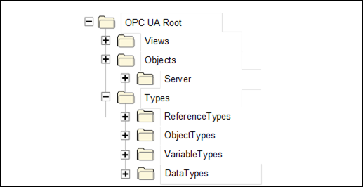  

Figure 1 - Standard AddressSpace structure  

The remainder of this provides descriptions of these standard *Nodes* and the organization of *Nodes* beneath them. *Servers* typically implement a subset of these standard *Nodes* , depending on their capabilities.  

#### 8.2.2 Root  

This standard *Object* is the browse entry point for the *AddressSpace* . It contains a set of *Organizes* *References* that point to the other standard *Objects* . The " *Root* " *Object* shall not reference any other *NodeClasses* . It is formally defined in [Table 100](/§\_Ref129148398) .  

Table 100 - Root definition  

| **Attribute** | **Value** |
|---|---|
|BrowseName|Root|
  
| **References** | **NodeClass** | **BrowseName** | **Comment** |
|---|---|---|---|
|HasTypeDefinition|ObjectType|FolderType|Defined in [6.6](/§\_Ref129643505)|
|Organizes|Object|Views|Defined in [8.2.3](/§\_Ref90282984)|
|Organizes|Object|Objects|Defined in [8.2.4](/§\_Ref129643719)|
|Organizes|Object|Types|Defined in [8.2.5](/§\_Ref129643735)|
  
| **Conformance Units** |
|---|
|Base Info Core Structure 2|
  

  

#### 8.2.3 Views  

This standard *Object* is the browse entry point for *Views* . Only *Organizes* *References* are used to relate *View Nodes* to the " *Views* " standard *Object* . All *View Nodes* in the *AddressSpace* shall be referenced by this *Node* , either directly or indirectly. That is, the " *Views* " *Object* may reference other *Objects* using *Organizes* *References.* Those *Objects* may reference additional *Views* . [Figure 2](/§\_Ref81388138) illustrates the Views organization. The " *Views"* standard *Object* directly references the *Views* "View1" and "View2" and indirectly "View3" by referencing another *Object* called "Engineering".  

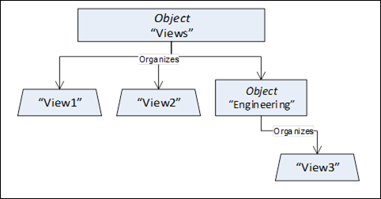  

Figure 2 - Views organization  

The " *Views* " *Object* shall not reference any other *NodeClasses* . The " *Views* " *Object* is formally defined in [Table 101](/§\_Ref134950360) .  

Table 101 - Views definition  

| **Attribute** | **Value** |
|---|---|
|BrowseName|Views|
  
| **References** | **NodeClass** | **BrowseName** | **Comment** |
|---|---|---|---|
|HasTypeDefinition|ObjectType|FolderType|Defined in [6.6](/§\_Ref129643505)|
  
| **Conformance Units** |
|---|
|Base Info Core Views Folder|
  

  

#### 8.2.4 Objects  

This standard *Object* is the browse entry point for *Object Nodes* . [Figure 3](/§\_Ref71521343) illustrates the structure beneath this *Node* . Only *Organizes* *References* are used to relate *Objects* to the " *Objects* " standard *Object* . A *View* *Node* can be used as entry point into a subset of the *AddressSpace* containing *Objects* and *Variables* and thus the " *Objects* " *Object* can also reference *View* *Nodes* using *Organizes* *References* . The intent of the " *Objects* " *Object* is that all *Objects* and *Variables* that are not used for type definitions or other organizational purposes (e.g. organizing the *Views* ) are accessible through *hierarchical References* starting from this *Node* . However, this is not a requirement, because not all *Servers* may be able to support this. This *Object* references the standard *Server Object* defined in [8.3.2](/§\_Ref129412931) .  

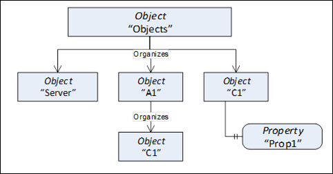  

Figure 3 - Objects organization  

The " *Objects* " *Object* is formally defined in [Table 102](/§\_Ref134950381) .  

Table 102 - Objects definition  

| **Attribute** | **Value** |
|---|---|
|BrowseName|Objects|
  
| **References** | **NodeClass** | **BrowseName** | **Comment** |
|---|---|---|---|
|HasTypeDefinition|ObjectType|FolderType|Defined in [6.6](/§\_Ref129643505)|
|Organizes|Object|Server|Defined in [8.3.2](/§\_Ref129412931)|
|Organizes|Object|Locations|Defined in [8.2.12](/§\_Ref104974194) .|
  
| **Conformance Units** |
|---|
|Base Info Core Structure 2|
  

  

#### 8.2.5 Types  

This standard *Object Node* is the browse entry point for type *Nodes* . [Figure 1](/§\_Ref77648169) illustrates the structure beneath this *Node* . Only *Organizes* *References* are used to relate *Objects* to the " *Types* " standard *Object* . The " *Types* " *Object* shall not reference any other *NodeClasses* . It is formally defined in [Table 103](/§\_Ref129158124) .  

Table 103 - Types definition  

| **Attribute** | **Value** |
|---|---|
|BrowseName|Types|
  
| **References** | **NodeClass** | **BrowseName** | **Comment** |
|---|---|---|---|
|HasTypeDefinition|ObjectType|FolderType|Defined in [6.6](/§\_Ref129643505)|
|Organizes|Object|ObjectTypes|Defined in [8.2.6](/§\_Ref129643836)|
|Organizes|Object|VariableTypes|Defined in [8.2.7](/§\_Ref129643851)|
|Organizes|Object|ReferenceTypes|Defined in [8.2.8](/§\_Ref129643877)|
|Organizes|Object|DataTypes|Defined in [8.2.9](/§\_Ref129643900)|
|Organizes|Object|EventTypes|Defined in [8.2.10](/§\_Ref209347008)|
|Organizes|Object|InterfaceTypes|Defined in [8.2.11](/§\_Ref527107)|
  
| **Conformance Units** |
|---|
|Base Info Core Types Folders|
  

  

#### 8.2.6 ObjectTypes  

This standard *Object Node* is the browse entry point for *ObjectType Nodes* . [Figure 4](/§\_Ref71521013) illustrates the structure beneath this *Node* showing some of the standard *ObjectTypes* defined in Clause [6](/§\_Ref129647593) . Only *Organizes* *References* are used to relate *Objects* and *ObjectTypes* to the " *ObjectTypes* " standard *Object* . The " *ObjectTypes* " *Object* shall not reference any other *NodeClasses* .  

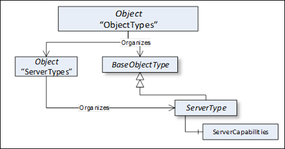  

Figure 4 - ObjectTypes organization  

The intention of the " *ObjectTypes* " *Object* is that all *ObjectTypes* of the *Server* are either directly or indirectly accessible browsing *HierarchicalReferences* starting from this *Node* . However, this is not required and *Servers* might not provide some of their *ObjectTypes* because they may be well-known in the industry, such as the *ServerType* defined in [6.3.1](/§\_Ref129647612) .  

This *Object* also indirectly references the *BaseEventType* defined in [6.4.2](/§\_Ref129488639) , which is the base type of all *EventTypes* . Thereby it is the entry point for all *EventTypes* provided by the *Server* . It is required that the *Server* expose all its *EventTypes* , so a client can usefully subscribe to *Events* .  

The " *ObjectTypes* " *Object* is formally defined in [Table 104](/§\_Ref129159008) .  

Table 104 - ObjectTypes definition  

| **Attribute** | **Value** |
|---|---|
|BrowseName|ObjectTypes|
  
| **References** | **NodeClass** | **BrowseName** | **Comment** |
|---|---|---|---|
|HasTypeDefinition|ObjectType|FolderType|Defined in [6.6](/§\_Ref129643505)|
|Organizes|ObjectType|BaseObjectType|Defined in [6.2](/§\_Ref129643995)|
  
| **Conformance Units** |
|---|
|Base Info Core Types Folders|
  

  

#### 8.2.7 VariableTypes  

This standard *Object* is the browse entry point for *VariableType Nodes* . [Figure 5](/§\_Ref85421970) illustrates the structure beneath this *Node* . Only *Organizes* *References* are used to relate *Objects* and *VariableTypes* to the " *VariableTypes* " standard *Object* . The " *VariableTypes* " *Object* shall not reference any other *NodeClasses* .  

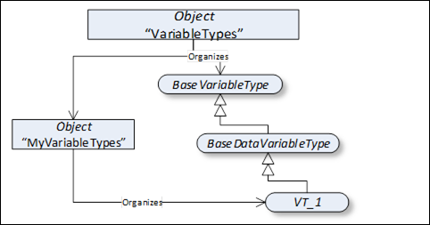  

Figure 5 - VariableTypes organization  

The intent of the " *VariableTypes* " *Object* is that all *VariableTypes* of the *Server* are either directly or indirectly accessible browsing *HierarchicalReferences* starting from this *Node* . However, this is not required and *Servers* might not provide some of their *VariableTypes* , because they may be well-known in the industry, such as the " *BaseVariableType* " defined in [7.2](/§\_Ref96333598) .  

The " *VariableTypes* " *Object* is formally defined in [Table 105](/§\_Ref129167090) .  

Table 105 - VariableTypes definition  

| **Attribute** | **Value** |
|---|---|
|BrowseName|VariableTypes|
  
| **References** | **NodeClass** | **BrowseName** | **Comment** |
|---|---|---|---|
|HasTypeDefinition|ObjectType|FolderType|Defined in [6.6](/§\_Ref129643505)|
|Organizes|VariableType|BaseVariableType|Defined in [7.2](/§\_Ref96333598)|
  
| **Conformance Units** |
|---|
|Base Info Core Types Folders|
  

  

#### 8.2.8 ReferenceTypes  

This standard *Object* is the browse entry point for *ReferenceType Nodes* . [Figure 6](/§\_Ref96309674) illustrates the organization of *ReferenceTypes* . *Organizes* *References* are used to define *ReferenceTypes* and *Objects* referenced by the " *ReferenceTypes* " *Object* . The " *ReferenceTypes* " *Object* shall not reference any other *NodeClasses* . See Clause [11](/§\_Ref129647875) for a discussion of the standard *ReferenceTypes* that appear beneath the " *ReferenceTypes* " *Object* .  

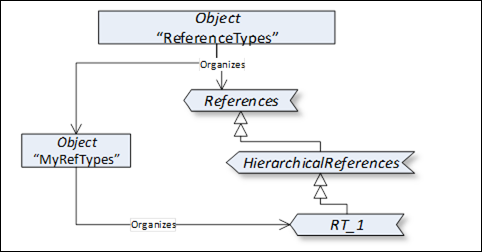  

Figure 6 - ReferenceType definitions  

Since *ReferenceTypes* will be used as filters in the browse *Service* and in queries, the *Server* shall provide all its *ReferenceTypes* , directly or indirectly following *hierarchical References* starting from the " *ReferenceTypes* " *Object* . This means that, whenever the client follows a *Reference* , the *Server* shall expose the type of this Reference in the *ReferenceType* hierarchy. It shall provide all *ReferenceTypes* so that the client would be able, following the inverse subtype of *References* , to come to the base *References* *ReferenceType* . It does not mean that the *Server* shall expose the *ReferenceTypes* that the client has not used any *Reference* of.  

The " *ReferenceTypes* " *Object* is formally defined in [Table 106](/§\_Ref129167089) .  

Table 106 - ReferenceTypes definition  

| **Attribute** | **Value** |
|---|---|
|BrowseName|ReferenceTypes|
  
| **References** | **NodeClass** | **BrowseName** | **Comment** |
|---|---|---|---|
|HasTypeDefinition|ObjectType|FolderType|Defined in [6.6](/§\_Ref129643505)|
|Organizes|ReferenceType|References|Defined in [11.1](/§\_Ref129644140)|
  
| **Conformance Units** |
|---|
|Base Info Core Types Folders|
  

  

#### 8.2.9 DataTypes  

This standard *Object* is the browse entry point for *DataTypes* that the *Server* wishes to expose in the *AddressSpace* .  

*DataType* *Nodes* should be made available using *Organizes* *References* pointing either directly from the "DataTypes" *Object* to the *DataType* *Nodes* or using additional *Folder* *Objects* for grouping purposes. The intent is that all *DataTypes* of the *Server* exposed in the *AddressSpace* are accessible following *hierarchical References* starting from the "DataTypes" *Object* . However, this is not required.  

The " *DataTypes* " *Object* is formally defined in [Table 107](/§\_Ref129167088) .  

Table 107 - DataTypes definition  

| **Attribute** | **Value** |
|---|---|
|BrowseName|DataTypes|
  
| **References** | **NodeClass** | **BrowseName** | **Comment** |
|---|---|---|---|
|HasTypeDefinition|ObjectType|FolderType|Defined in [6.6](/§\_Ref129643505)|
|Organizes|DataType|BaseDataType|Defined in [12.2](/§\_Ref157834246)|
  
| **Conformance Units** |
|---|
|Base Info Core Types Folders|
  

  

#### 8.2.10 EventTypes  

This standard *Object Node* is the browse entry point for *EventType Nodes* . [Figure 7](/§\_Ref209347085) illustrates the structure beneath this *Node* showing some of the standard *EventTypes* defined in Clause [6](/§\_Ref129647593) . Only *Organizes* *References* are used to relate *Objects* and *ObjectTypes* to the " *EventTypes* " standard *Object* . The " *EventTypes* " *Object* shall not reference any other *NodeClasses* .  

  

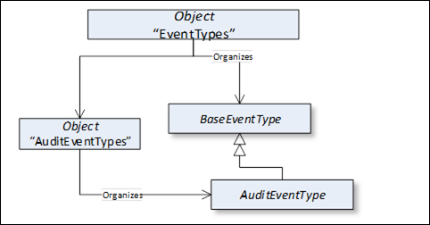  

Figure 7 - EventTypes organization  

The intention of the " *EventTypes* " *Object* is that all *EventTypes* of the *Server* are either directly or indirectly accessible browsing *HierarchicalReferences* starting from this *Node* . It is required that the *Server* expose all its *EventTypes* , so a client can usefully subscribe to *Events* .  

The " *EventTypes* " *Object* is formally defined in [Table 108](/§\_Ref209347266) .  

Table 108 - EventTypes definition  

| **Attribute** | **Value** |
|---|---|
|BrowseName|EventTypes|
  
| **References** | **NodeClass** | **BrowseName** | **Comment** |
|---|---|---|---|
|HasTypeDefinition|ObjectType|FolderType|Defined in [6.6](/§\_Ref129643505)|
|Organizes|ObjectType|BaseEventType|Defined in [6.4.2](/§\_Ref129488639)|
  
| **Conformance Units** |
|---|
|Address Space Events 2|
  

  

#### 8.2.11 InterfaceTypes  

This standard *Object Node* is the browse entry point for *ObjectType Nodes* that represent *Interfaces* . [Figure 8](/§\_Ref33165557) illustrates the structure beneath this *Node* showing some of the standard *ObjectTypes* defined in clause 6. Only *Organizes* *References* are used to relate *Objects* and *Interfaces* to the " *InterfaceTypes* " standard *Object* . The " *InterfaceTypes* " *Object* shall not reference any other *NodeClasses* .  

  

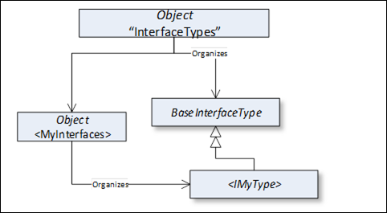  

Figure 8 - InterfaceTypes Organization  

The intention of the " *InterfaceTypes* " *Object* is that all *Interfaces* of the *Server* are either directly or indirectly accessible browsing *HierarchicalReferences* starting from this *Node* . However, this is not required and *Servers* might not provide some of their *Interfaces* because they may be well-known in the industry.  

The " *InterfaceTypes* " *Object* is formally defined in [Table 109](/§\_Ref33164200) .  

Table 109 - InterfaceTypes definition  

| **Attribute** | **Value** |
|---|---|
|BrowseName|InterfaceTypes|
  
| **References** | **NodeClass** | **BrowseName** | **Comment** |
|---|---|---|---|
|HasTypeDefinition|ObjectType|FolderType|Defined in [6.6](/§\_Ref129643505)|
|Organizes|ObjectType|BaseInterfaceType|Defined in [6.9](/§\_Ref33164258)|
  
| **Conformance Units** |
|---|
|Address Space Interfaces|
  

#### 8.2.12 Locations  

This standard *Object* is the browse entry point for *Object Nodes* which represent different types of locations. [Figure 9](/§\_Ref104972818) illustrates the structure beneath this *Node* . Only *Organizes* *References* are used to relate *Objects* .  

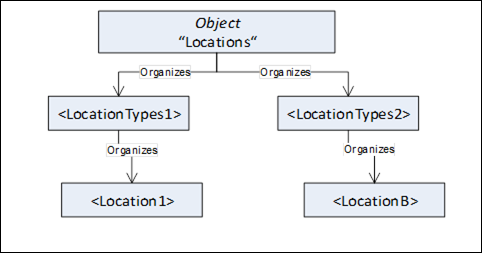  

Figure 9 - Locations organization  

The intent of the " *Locations* " *Object* is an entry point for different types of locations. The types of locations organize locations.  

The " *Locations* " *Object* is formally defined in [Table 110](/§\_Ref208571082) .  

Table 110 - Locations definition  

| **Attribute** | **Value** |
|---|---|
|BrowseName|Locations|
  
| **References** | **NodeClass** | **BrowseName** | **Comment** |
|---|---|---|---|
|HasTypeDefinition|ObjectType|FolderType|Defined in [6.6](/§\_Ref129643505)|
  
| **Conformance Units** |
|---|
|Base Info Locations Object|
  

  

### 8.3 Server Object and its containing Objects  

#### 8.3.1 General  

The *Server* *Object* and its containing *Objects* and *Variables* are built in a way that the information can be gained in several ways, suitable for different kinds of clients having different requirements. [Annex A](/§\_Ref134935962) gives an overview of the design decisions made in providing the information in that way and discusses the pros and cons of the different approaches. [Figure 10](/§\_Ref134945892) gives an overview of the containing *Objects* and *Variables* of the diagnostic information of the Server *Object* and where the information can be found.  

The SessionsDiagnosticsSummary *Object* contains one *Object* per session and a *Variable* with an array with one entry per session. This array is of a complex *DataType* holding the diagnostic information about the session. Each *Object* representing a session references a complex *Variable* containing the information about the session using the same DataType as the array containing information about all sessions. Such a *Variable* also exposes all its information as *Variables* with simple *DataTypes* containing the same information as in the complex *DataType* . Not shown in [Figure 10](/§\_Ref134945892) is the security-related information per session, which follows the same rules.  

The *Server* provides an array with an entry per subscription containing diagnostic information about this subscription. Each entry of this array is also exposed as a complex *Variable* with *Variables* for each individual value. Each *Object* representing a session also provides such an array, but provides the subscriptions of that session.  

The arrays containing information about the sessions or the subscriptions may be of different length for different connections with different user credentials since not all users may see all entries of the array. That also implies that the length of the array may change if the user is impersonated. Therefore, clients that subscribe to a specific index range may get unexpected results.  

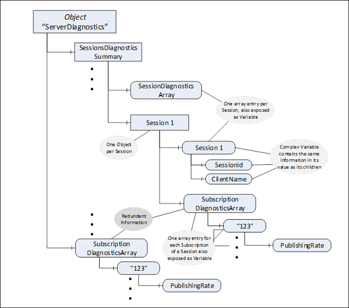  

Figure 10 - Excerpt of diagnostic information of the Server  

#### 8.3.2 Server Object  

This *Object* is used as the browse entry point for information about the *Server* . The content of this *Object* is already defined by its type definition in [6.3.1](/§\_Ref129647935) . It is formally defined in [Table 111](/§\_Ref129412658) . The *Server* *Object* serves as root notifier, that is, its *EventNotifier* *Attribute* shall be set providing *Events* . All *Events* of the *Server* shall be accessible subscribing to the *Events* of the *Server* *Object* .  

Table 111 - Server definition  

| **Attribute** | **Value** |
|---|---|
|BrowseName|Server|
  
| **References** | **NodeClass** | **BrowseName** | **DataType** | **TypeDefinition** | **ModellingRule** |
|---|---|---|---|---|---|
|HasTypeDefinition|ObjectType|ServerType|Defined in [6.3.1](/§\_Ref129643266)|
  
| **Conformance Units** |
|---|
|Base Info Core Structure 2|
|Address Space Events 2|
  

  

The additional definition for the conformance units of the Server Object are defined in [Table 112](/§\_Ref65609805) .  

Table 112 - Server Additional Conformance Units  

| **BrowsePath** | **Conformance Units** |
|---|---|
|ServerArray|Base Info Core Structure 2|
|NamespaceArray|Base Info Core Structure 2|
|ServerStatus|Base Info Core Structure 2|
|ServiceLevel|Base Info Core Structure 2|
|Auditing|Base Info Core Structure 2|
|VendorServerInfo|Base Info Core Structure 2|
|ServerRedundancy|Base Info Core Structure 2|
ServerStatus|StartTime||Base Info Core Structure 2|
ServerStatus|CurrentTime||Base Info Core Structure 2|
ServerStatus|State||Base Info Core Structure 2|
ServerStatus|BuildInfo||Base Info Core Structure 2|
ServerStatus|BuildInfo|ProductUri||Base Info Core Structure 2|
ServerStatus|BuildInfo|ManufacturerName||Base Info Core Structure 2|
ServerStatus|BuildInfo|ProductName||Base Info Core Structure 2|
ServerStatus|BuildInfo|SoftwareVersion||Base Info Core Structure 2|
ServerStatus|BuildInfo|BuildNumber||Base Info Core Structure 2|
ServerStatus|BuildInfo|BuildDate||Base Info Core Structure 2|
ServerStatus|SecondsTillShutdown||Base Info Core Structure 2|
ServerStatus|ShutdownReason||Base Info Core Structure 2|
ServerRedundancy|RedundancySupport||Base Info Core Structure 2|
|ServerCapabilities|Base Info Server Capabilities 2|
ServerCapabilities|ServerProfileArray||Base Info Server Capabilities 2|
ServerCapabilities|LocaleIdArray||Base Info Server Capabilities 2|
ServerCapabilities|MinSupportedSampleRate||Base Info Server Capabilities 2|
ServerCapabilities|MaxBrowseContinuationPoints||Base Info Server Capabilities 2|
ServerCapabilities|SoftwareCertificates||Base Info Server Capabilities 2|
ServerCapabilities|MaxArrayLength||Base Info Server Capabilities 2|
ServerCapabilities|MaxStringLength||Base Info Server Capabilities 2|
ServerCapabilities|MaxByteStringLength||Base Info Server Capabilities 2|
ServerCapabilities|OperationLimits||Base Info Server Capabilities 2|
ServerCapabilities|ModellingRules||Base Info Server Capabilities 2|
ServerCapabilities|MaxSessions||Base Info Server Capabilities 2|
ServerCapabilities|ConformanceUnits||Base Info Server Capabilities 2|
ServerCapabilities|OperationLimits|MaxNodesPerRead||Base Info Server Capabilities 2|
ServerCapabilities|OperationLimits|MaxNodesPerWrite||Base Info Server Capabilities 2|
ServerCapabilities|OperationLimits|MaxNodesPerBrowse||Base Info Server Capabilities 2|
ServerCapabilities|OperationLimits|MaxNodesPerRegisterNodes||Base Info Server Capabilities 2|
ServerCapabilities|OperationLimits|MaxNodesPerTranslateBrowsePathsToNodeIds||Base Info Server Capabilities 2|
ServerCapabilities|AggregateFunctions||Base Info Server Capabilities Subscriptions|
ServerCapabilities|MaxSubscriptions||Base Info Server Capabilities Subscriptions|
ServerCapabilities|MaxMonitoredItems||Base Info Server Capabilities Subscriptions|
ServerCapabilities|MaxSubscriptionsPerSession||Base Info Server Capabilities Subscriptions|
ServerCapabilities|MaxMonitoredItemsPerSubscription||Base Info Server Capabilities Subscriptions|
ServerCapabilities|OperationLimits|MaxMonitoredItemsPerCall||Base Info Server Capabilities Subscriptions|
|ServerDiagnostics|Base Info Diagnostics|
ServerDiagnostics|ServerDiagnosticsSummary||Base Info Diagnostics|
ServerDiagnostics|ServerDiagnosticsSummary|ServerViewCount||Base Info Diagnostics|
ServerDiagnostics|ServerDiagnosticsSummary|CurrentSessionCount||Base Info Diagnostics|
ServerDiagnostics|ServerDiagnosticsSummary|CumulatedSessionCount||Base Info Diagnostics|
ServerDiagnostics|ServerDiagnosticsSummary|SecurityRejectedSessionCount||Base Info Diagnostics|
ServerDiagnostics|ServerDiagnosticsSummary|RejectedSessionCount||Base Info Diagnostics|
ServerDiagnostics|ServerDiagnosticsSummary|SessionTimeoutCount||Base Info Diagnostics|
ServerDiagnostics|ServerDiagnosticsSummary|SessionAbortCount||Base Info Diagnostics|
ServerDiagnostics|ServerDiagnosticsSummary|PublishingIntervalCount||Base Info Diagnostics|
ServerDiagnostics|ServerDiagnosticsSummary|CurrentSubscriptionCount||Base Info Diagnostics|
ServerDiagnostics|ServerDiagnosticsSummary|CumulatedSubscriptionCount||Base Info Diagnostics|
ServerDiagnostics|ServerDiagnosticsSummary|SecurityRejectedRequestsCount||Base Info Diagnostics|
ServerDiagnostics|ServerDiagnosticsSummary|RejectedRequestsCount||Base Info Diagnostics|
ServerDiagnostics|SubscriptionDiagnosticsArray||Base Info Diagnostics|
ServerDiagnostics|SessionsDiagnosticsSummary||Base Info Diagnostics|
ServerDiagnostics|SessionsDiagnosticsSummary|SessionDiagnosticsArray||Base Info Diagnostics|
ServerDiagnostics|SessionsDiagnosticsSummary|SessionSecurityDiagnosticsArray||Base Info Diagnostics|
ServerDiagnostics|EnabledFlag||Base Info Diagnostics|
ServerDiagnostics|SamplingIntervalDiagnosticsArray||Base Info Fixed SamplingInterval|
ServerCapabilities|RoleSet||Base Info Security Role Capabilities|
ServerCapabilities|MaxSelectClauseParameters||Base Info Events Capabilities|
ServerCapabilities|MaxWhereClauseParameters||Base Info Events Capabilities|
ServerCapabilities|OperationLimits|MaxNodesPerMethodCall||Base Info Method Capabilities|
|GetMonitoredItems|Base Info GetMonitoredItems Method|
|ResendData|Base Info ResendData Method|
|SetSubscriptionDurable|Subscription Durable|
|EstimatedReturnTime|Base Info Estimated Return Time|
|UrisVersion|Session Sessionless Invocation|
|RequestServerStateChange|Base Info RequestServerStateChange Method|
|LocalTime|Base Info LocalTime|
ServerCapabilities|MaxHistoryContinuationPoints||Base Info History Read Capabilities|
ServerCapabilities|OperationLimits|MaxNodesPerHistoryReadData||Base Info History ReadData Capabilities|
ServerCapabilities|OperationLimits|MaxNodesPerHistoryReadEvents||Base Info History ReadEvents Capabilities|
ServerCapabilities|OperationLimits|MaxNodesPerHistoryUpdateData||Base Info History UpdateEvents Capabilities|
ServerCapabilities|OperationLimits|MaxNodesPerHistoryUpdateEvents||Base Info History UpdateData Capabilities|
ServerCapabilities|OperationLimits|MaxNodesPerNodeManagement||Base Info Node Management Capabilities|
ServerCapabilities|MaxQueryContinuationPoints||Base Info Query Capabilities|
  

  

### 8.4 ModellingRule Objects  

#### 8.4.1 ExposesItsArray  

The *ModellingRule* *ExposesItsArray* is defined in [OPC 10000-3](/§UAPart3) . Its representation in the *AddressSpace,* the " *ExposesItsArray* " *Object,* is formally defined in [Table 113](/§\_Ref129411616) .  

Table 113 - ExposesItsArray definition  

| **Attribute** | **Value** |
|---|---|
|BrowseName|ExposesItsArray|
  
| **References** | **NodeClass** | **BrowseName** | **Comment** |
|---|---|---|---|
|HasTypeDefinition|ObjectType|ModellingRuleType|Defined in [6.5](/§\_Ref129643485)|
  
| **Conformance Units** |
|---|
|Base Info Base Types|
  

  

#### 8.4.2 Mandatory  

The *ModellingRule* *Mandatory* is defined in [OPC 10000-3](/§UAPart3) . Its representation in the *AddressSpace,* the " *Mandatory* " *Object,* is formally defined in [Table 114](/§\_Ref129411617) .  

Table 114 - Mandatory definition  

| **Attribute** | **Value** |
|---|---|
|BrowseName|Mandatory|
  
| **References** | **NodeClass** | **BrowseName** | **Comment** |
|---|---|---|---|
|HasTypeDefinition|ObjectType|ModellingRuleType|Defined in [6.5](/§\_Ref129643485)|
  
| **Conformance Units** |
|---|
|Base Info Base Types|
  

  

#### 8.4.3 Optional  

The *ModellingRule* *Optional* is defined in [OPC 10000-3](/§UAPart3) . Its representation in the *AddressSpace* , the " *Optional* " *Object,* is formally defined in [Table 115](/§\_Ref129411726) .  

Table 115 - Optional definition  

| **Attribute** | **Value** |
|---|---|
|BrowseName|Optional|
  
| **References** | **NodeClass** | **BrowseName** | **Comment** |
|---|---|---|---|
|HasTypeDefinition|ObjectType|ModellingRuleType|Defined in [6.5](/§\_Ref129643485)|
  
| **Conformance Units** |
|---|
|Base Info Base Types|
  

  

#### 8.4.4 OptionalPlaceholder  

The *ModellingRule* *OptionalPlaceholder* is defined in [OPC 10000-3](/§UAPart3) . Its representation in the *AddressSpace* , the " *OptionalPlaceholder* " *Object,* is formally defined in [Table 116](/§\_Ref314067126) .  

Table 116 - OptionalPlaceholder definition  

| **Attribute** | **Value** |
|---|---|
|BrowseName|OptionalPlaceholder|
  
| **References** | **NodeClass** | **BrowseName** | **Comment** |
|---|---|---|---|
|HasTypeDefinition|ObjectType|ModellingRuleType|Defined in [6.5](/§\_Ref129643485)|
  
| **Conformance Units** |
|---|
|Base Info Base Types|
  

  

#### 8.4.5 MandatoryPlaceholder  

The *ModellingRule* *MandatoryPlaceholder* is defined in [OPC 10000-3](/§UAPart3) . Its representation in the *AddressSpace* , the " *MandatoryPlaceholder* " *Object,* is formally defined in [Table 117](/§\_Ref316402666) .  

Table 117 - MandatoryPlaceholder definition  

| **Attribute** | **Value** |
|---|---|
|BrowseName|MandatoryPlaceholder|
  
| **References** | **NodeClass** | **BrowseName** | **Comment** |
|---|---|---|---|
|HasTypeDefinition|ObjectType|ModellingRuleType|Defined in [6.5](/§\_Ref129643485)|
  
| **Conformance Units** |
|---|
|Base Info Base Types|
  

  

## 9 Standard Methods  

### 9.1 GetMonitoredItems  

*GetMonitoredItems* is used to get information about monitored items of a subscription. Its intended use is defined in [OPC 10000-4](/§UAPart4) .  

 **Signature**   

 **GetMonitoredItems**   

[in] UInt32 subscriptionId  

[out] UInt32[] serverHandles  

[out] UInt32[] clientHandles  

);  

  

| **Argument** | **Description** |
|---|---|
|subscriptionId|Identifier of the subscription.|
|serverHandles|Array of *monitoredItemIds* (serverHandles) for all *MonitoredItems* of the *Subscription* identified by subscriptionId|
|clientHandles|Array of clientHandles for all *MonitoredItems* of the *Subscription* identified by subscriptionId|
  

  

 **Method Result Codes (defined in Call Service)**   

| **Result Code** | **Description** |
|---|---|
|Bad\_SubscriptionIdInvalid|Defined in [OPC 10000-4](/§UAPart4)|
|Bad\_UserAccessDenied|Defined in [OPC 10000-4](/§UAPart4) The *Method* was not called in the context of the *Session* that owns the *Subscription* .|
  

  

[Table 118](/§\_Ref174163279) specifies the *AddressSpace* representation for the *GetMonitoredItems* *Method* .  

Table 118 - GetMonitoredItems Method AddressSpace definition  

| **Attribute** | **Value** |
|---|---|
|BrowseName|GetMonitoredItems|
  
| **References** | **NodeClass** | **BrowseName** | **DataType** | **TypeDefinition** | **ModellingRule** |
|---|---|---|---|---|---|
|HasProperty|Variable|InputArguments|Argument[]|PropertyType|Mandatory|
|HasProperty|Variable|OutputArguments|Argument[]|PropertyType|Mandatory|
  
| **Conformance Units** |
|---|
|Base Info ServerType|
  

  

### 9.2 ResendData  

*ResendData* is used to get the current values of the data monitored items of a *Subscription where the MonitoringMode is set to Reporting* . Its intended use is defined in [OPC 10000-4](/§UAPart4) .  

 **Signature**   

 **ResendData**   

[in] UInt32 subscriptionId  

);  

  

| **Argument** | **Description** |
|---|---|
|subscriptionId|Identifier of the *Subscription* to resend.|
  

  

 **Method Result Codes (defined in Call Service)**   

| **Result Code** | **Description** |
|---|---|
|Bad\_SubscriptionIdInvalid|Defined in [OPC 10000-4](/§UAPart4)|
|Bad\_UserAccessDenied|Defined in [OPC 10000-4](/§UAPart4) The *Method* was not called in the context of the *Session* that owns the *Subscription* .|
  

  

[Table 119](/§\_Ref404028582) specifies the *AddressSpace* representation for the *ResendData* *Method* .  

Table 119 - ResendData Method AddressSpace definition  

| **Attribute** | **Value** |
|---|---|
|BrowseName|ResendData|
  
| **References** | **NodeClass** | **BrowseName** | **DataType** | **TypeDefinition** | **ModellingRule** |
|---|---|---|---|---|---|
|HasProperty|Variable|InputArguments|Argument[]|PropertyType|Mandatory|
  
| **Conformance Units** |
|---|
|Base Info ServerType|
  

  

### 9.3 SetSubscriptionDurable  

*SetSubscriptionDurable* *Method* is used to set a *Subscription* into a mode where *MonitoredItem* data and event queues are stored and delivered even if an OPC UA *Client* was disconnected for a longer time or the OPC UA *Server* was restarted. Its intended use is defined in [OPC 10000-4](/§UAPart4) .  

 **Signature**   

 **SetSubscriptionDurable**   

[in] UInt32 subscriptionId  

[in] UInt32 lifetimeInHours  

[out] UInt32 revisedLifetimeInHours  

);  

  

| **Argument** | **Description** |
|---|---|
|subscriptionId|Identifier of the *Subscription* .|
|lifetimeInHours|The requested lifetime in hours for the durable *Subscription* .|
|revisedLifetimeInHours|The revised lifetime in hours the *Server* applied to the durable *Subscription* .|
  

  

 **Method Result Codes (defined in Call Service)**   

| **Result Code** | **Description** |
|---|---|
|Bad\_SubscriptionIdInvalid|Defined in [OPC 10000-4](/§UAPart4)|
|Bad\_InvalidState|Defined in [OPC 10000-4](/§UAPart4) This is returned when a *Subscription* already contains *MonitoredItems* .|
|Bad\_UserAccessDenied|Defined in [OPC 10000-4](/§UAPart4) The *Method* was not called in the context of the *Session* that owns the *Subscription* .|
  

  

[Table 120](/§\_Ref408913147) specifies the *AddressSpace* representation for the *SetSubscriptionDurable Method* .  

Table 120 - SetSubscriptionDurable Method AddressSpace definition  

| **Attribute** | **Value** |
|---|---|
|BrowseName|SetSubscriptionDurable|
  
| **References** | **NodeClass** | **BrowseName** | **DataType** | **TypeDefinition** | **ModellingRule** |
|---|---|---|---|---|---|
|HasProperty|Variable|InputArguments|Argument[]|PropertyType|Mandatory|
|HasProperty|Variable|OutputArguments|Argument[]|PropertyType|Mandatory|
  
| **Conformance Units** |
|---|
|Base Info ServerType|
  

  

### 9.4 RequestServerStateChange  

The *Method* *RequestServerStateChange* allows a *Client* to request a state change in the *Server* .  

The *Client* shall provide credentials with administrative rights when invoking this *Method* on the *Server* .  

 **Signature**   

 **RequestServerStateChange**   

[in] ServerState state  

[in] DateTime estimatedReturnTime  

[in] UInt32 secondsTillShutdown  

[in] LocalizedText reason  

[in] Boolean restart  

);  

  

| **Argument** | **Description** |
|---|---|
|state|The requested target state for the Server. If the new state is accepted by the Server, the State in the *ServerStatus* is updated with the new value.|
|estimatedReturnTime|Indicates the time at which the *Server* is expected to be available in the state RUNNING\_0. If no estimate is known, a null *DateTime* shall be provided. This time will be available in the *EstimatedReturnTime* Property. This parameter shall be ignored by the Server and the Property *EstimatedReturnTime* shall be set to null if the new state is RUNNING\_0.|
|secondsTillShutdown|The number of seconds until a *Server* shutdown. This parameter is ignored unless the state is set to SHUTDOWN\_4 or restart is set to True.|
|reason|A localized text string that describes the reason for the state change request.|
|restart|A flag indicating if the Server should be restarted before it attempts to change into the requested change. If the restart is True the server changes it state to SHUTDOWN\_4 before the restart if secondsTillShutdown is not 0.|
  

  

 **Method Result Codes (defined in Call Service)**   

| **Result Code** | **Description** |
|---|---|
|Bad\_UserAccessDenied|The current user is not authorized to invoke the method|
|Bad\_InvalidState|The requested state was not accepted by the server|
  

  

[Table 121](/§\_Ref412061203) specifies the *AddressSpace* representation for the *RequestServerStateChange* *Method* .  

Table 121 - RequestServerStateChange Method AddressSpace definition  

| **Attribute** | **Value** |
|---|---|
|BrowseName|RequestServerStateChange|
  
| **References** | **NodeClass** | **BrowseName** | **DataType** | **TypeDefinition** | **ModellingRule** |
|---|---|---|---|---|---|
|HasProperty|Variable|InputArguments|Argument[]|PropertyType|Mandatory|
  
| **Conformance Units** |
|---|
|Base Info ServerType|
  

  

## 10 Standard Views  

There are no core OPC UA *Views* defined.  

## 11 Standard ReferenceTypes  

### 11.1 References  

This standard *ReferenceType* is defined in [OPC 10000-3](/§UAPart3) . Its representation in the *AddressSpace* is specified in [Table 122](/§\_Ref134950587) .  

Table 122 - References ReferenceType  

| **Attributes** | **Value** |
|---|---|
|BrowseName|References|
|InverseName|\--|
|Symmetric|True|
|IsAbstract|True|
  
| **References** | **NodeClass** | **BrowseName** | **Comment** |
|---|---|---|---|
  
| **Conformance Units** |
|---|
|Base Info Base Types|
  

  

### 11.2 HierarchicalReferences  

This standard *ReferenceType* is defined in [OPC 10000-3](/§UAPart3) . Its representation in the *AddressSpace* is specified in [Table 123](/§\_Ref128899930) .  

Table 123 - HierarchicalReferences ReferenceType  

| **Attributes** | **Value** |
|---|---|
|BrowseName|HierarchicalReferences|
|InverseName|InverseHierarchicalReferences|
|Symmetric|False|
|IsAbstract|True|
  
| **References** | **NodeClass** | **BrowseName** | **Comment** |
|---|---|---|---|
|Subtype of the *References* *ReferenceType* defined in [11.1](/§\_Ref129644140) .|
  
| **Conformance Units** |
|---|
|Base Info Base Types|
  

  

### 11.3 NonHierarchicalReferences  

This standard *ReferenceType* is defined in [OPC 10000-3](/§UAPart3) . Its representation in the *AddressSpace* is specified in [Table 124](/§\_Ref100114831) .  

Table 124 - NonHierarchicalReferences ReferenceType  

| **Attributes** | **Value** |
|---|---|
|BrowseName|NonHierarchicalReferences|
|InverseName|\--|
|Symmetric|True|
|IsAbstract|True|
  
| **References** | **NodeClass** | **BrowseName** | **Comment** |
|---|---|---|---|
|Subtype of the *References* *ReferenceType* defined in [11.1](/§\_Ref129644140) .|
  
| **Conformance Units** |
|---|
|Base Info Base Types|
  

  

### 11.4 HasChild  

This standard *ReferenceType* is defined in [OPC 10000-3](/§UAPart3) . Its representation in the *AddressSpace* is specified in [Table 125](/§\_Ref214328609) .  

Table 125 - HasChild ReferenceType  

| **Attributes** | **Value** |
|---|---|
|BrowseName|HasChild|
|InverseName|ChildOf|
|Symmetric|False|
|IsAbstract|True|
  
| **References** | **NodeClass** | **BrowseName** | **Comment** |
|---|---|---|---|
|Subtype of the *HierarchicalReferences ReferenceType* defined in [11.2](/§\_Ref129646179) .|
  
| **Conformance Units** |
|---|
|Base Info Base Types|
  

  

### 11.5 Aggregates  

This standard *ReferenceType* is defined in [OPC 10000-3](/§UAPart3) . Its representation in the *AddressSpace* is specified in [Table 126](/§\_Ref128900663) .  

Table 126 - Aggregates ReferenceType  

| **Attributes** | **Value** |
|---|---|
|BrowseName|Aggregates|
|InverseName|AggregatedBy|
|Symmetric|False|
|IsAbstract|True|
  
| **References** | **NodeClass** | **BrowseName** | **Comment** |
|---|---|---|---|
|Subtype of the *HasChild ReferenceType* defined in [11.4](/§\_Ref66874223) .|
  
| **Conformance Units** |
|---|
|Base Info Base Types|
  

  

### 11.6 Organizes  

This standard *ReferenceType* is defined in [OPC 10000-3](/§UAPart3) . Its representation in the *AddressSpace* is specified in [Table 127](/§\_Ref91061174) .  

Table 127 - Organizes ReferenceType  

| **Attributes** | **Value** |
|---|---|
|BrowseName|Organizes|
|InverseName|OrganizedBy|
|Symmetric|False|
|IsAbstract|False|
  
| **References** | **NodeClass** | **BrowseName** | **Comment** |
|---|---|---|---|
|Subtype of the *HierarchicalReferences ReferenceType* defined in [11.2](/§\_Ref129646179) .|
  
| **Conformance Units** |
|---|
|Base Info Base Types|
  

  

### 11.7 HasComponent  

This standard *ReferenceType* is defined in [OPC 10000-3](/§UAPart3) . Its representation in the *AddressSpace* is specified in [Table 128](/§\_Ref69883862) .  

Table 128 - HasComponent ReferenceType  

| **Attributes** | **Value** |
|---|---|
|BrowseName|HasComponent|
|InverseName|ComponentOf|
|Symmetric|False|
|IsAbstract|False|
  
| **References** | **NodeClass** | **BrowseName** | **Comment** |
|---|---|---|---|
|Subtype of the *Aggregates ReferenceType* defined in [11.5](/§\_Ref176340635) .|
  
| **Conformance Units** |
|---|
|Base Info Base Types|
  

  

### 11.8 HasOrderedComponent  

This standard *ReferenceType* is defined in [OPC 10000-3](/§UAPart3) . Its representation in the *AddressSpace* is specified in [Table 129](/§\_Ref100712130) .  

Table 129 - HasOrderedComponent ReferenceType  

| **Attributes** | **Value** |
|---|---|
|BrowseName|HasOrderedComponent|
|InverseName|OrderedComponentOf|
|Symmetric|False|
|IsAbstract|False|
  
| **References** | **NodeClass** | **BrowseName** | **Comment** |
|---|---|---|---|
|Subtype of the *HasComponent ReferenceType* defined in [11.7](/§\_Ref129646745) .|
  
| **Conformance Units** |
|---|
|Base Info HasOrderedComponent|
  

  

### 11.9 HasProperty  

This standard *ReferenceType* is defined in [OPC 10000-3](/§UAPart3) . Its representation in the *AddressSpace* is specified in [Table 130](/§\_Ref134950631) .  

Table 130 - HasProperty ReferenceType  

| **Attributes** | **Value** |
|---|---|
|BrowseName|HasProperty|
|InverseName|PropertyOf|
|Symmetric|False|
|IsAbstract|False|
  
| **References** | **NodeClass** | **BrowseName** | **Comment** |
|---|---|---|---|
|Subtype of the *Aggregates ReferenceType* defined in [11.5](/§\_Ref176340635) .|
  
| **Conformance Units** |
|---|
|Base Info Base Types|
  

  

### 11.10 HasSubtype  

This standard *ReferenceType* is defined in [OPC 10000-3](/§UAPart3) . Its representation in the *AddressSpace* is specified in [Table 131](/§\_Ref69891681) .  

Table 131 - HasSubtype ReferenceType  

| **Attributes** | **Value** |
|---|---|
|BrowseName|HasSubtype|
|InverseName|SubtypeOf|
|Symmetric|False|
|IsAbstract|False|
  
| **References** | **NodeClass** | **BrowseName** | **Comment** |
|---|---|---|---|
|Subtype of the *HasChild ReferenceType* defined in [11.4](/§\_Ref66874223) .|
  
| **Conformance Units** |
|---|
|Base Info Base Types|
  

  

### 11.11 HasModellingRule  

This standard *ReferenceType* is defined in [OPC 10000-3](/§UAPart3) . Its representation in the *AddressSpace* is specified in [Table 132](/§\_Ref128901488) .  

Table 132 - HasModellingRule ReferenceType  

| **Attributes** | **Value** |
|---|---|
|BrowseName|HasModellingRule|
|InverseName|ModellingRuleOf|
|Symmetric|False|
|IsAbstract|False|
  
| **References** | **NodeClass** | **BrowseName** | **Comment** |
|---|---|---|---|
|Subtype of the *NonHierarchicalReferences* *ReferenceType* defined in [11.3](/§\_Ref129646196) .|
  
| **Conformance Units** |
|---|
|Base Info Base Types|
  

  

### 11.12 HasTypeDefinition  

This standard *ReferenceType* is defined in [OPC 10000-3](/§UAPart3) . Its representation in the *AddressSpace* is specified in [Table 133](/§\_Ref134950678) .  

Table 133 - HasTypeDefinition ReferenceType  

| **Attributes** | **Value** |
|---|---|
|BrowseName|HasTypeDefinition|
|InverseName|TypeDefinitionOf|
|Symmetric|False|
|IsAbstract|False|
  
| **References** | **NodeClass** | **BrowseName** | **Comment** |
|---|---|---|---|
|Subtype of the *NonHierarchicalReferences* *ReferenceType* defined in [11.3](/§\_Ref129646196) .|
  
| **Conformance Units** |
|---|
|Base Info Base Types|
  

  

### 11.13 HasEncoding  

This standard *ReferenceType* is defined in [OPC 10000-3](/§UAPart3) . Its representation in the *AddressSpace* is specified in [Table 134](/§\_Ref390221928) .  

Table 134 - HasEncoding ReferenceType  

| **Attributes** | **Value** |
|---|---|
|BrowseName|HasEncoding|
|InverseName|EncodingOf|
|Symmetric|False|
|IsAbstract|False|
  
| **References** | **NodeClass** | **BrowseName** | **Comment** |
|---|---|---|---|
|Subtype of the *NonHierarchicalReferences* *ReferenceType* defined in [11.3](/§\_Ref129646196) .|
  
| **Conformance Units** |
|---|
|Base Info Base Types|
  

  

### 11.14 HasEventSource  

This standard *ReferenceType* is defined in [OPC 10000-3](/§UAPart3) . Its representation in the *AddressSpace* is specified in [Table 135](/§\_Ref136252069) .  

Table 135 - HasEventSource ReferenceType  

| **Attributes** | **Value** |
|---|---|
|BrowseName|HasEventSource|
|InverseName|EventSourceOf|
|Symmetric|False|
|IsAbstract|False|
  
| **References** | **NodeClass** | **BrowseName** | **Comment** |
|---|---|---|---|
|Subtype of the *HierarchicalReferences ReferenceType* defined in [11.2](/§\_Ref129646179) .|
  
| **Conformance Units** |
|---|
|Address Space Source Hierarchy|
  

  

### 11.15 HasNotifier  

This standard *ReferenceType* is defined in [OPC 10000-3](/§UAPart3) . Its representation in the *AddressSpace* is specified in [Table 136](/§\_Ref136252058) .  

Table 136 - HasNotifier ReferenceType  

| **Attributes** | **Value** |
|---|---|
|BrowseName|HasNotifier|
|InverseName|NotifierOf|
|Symmetric|False|
|IsAbstract|False|
  
| **References** | **NodeClass** | **BrowseName** | **Comment** |
|---|---|---|---|
|Subtype of the *HasEventSource ReferenceType* defined in [11.14](/§\_Ref66876964) .|
  
| **Conformance Units** |
|---|
|Address Space Notifier Hierarchy|
  

  

### 11.16 GeneratesEvent  

This standard *ReferenceType* is defined in [OPC 10000-3](/§UAPart3) . Its representation in the *AddressSpace* is specified in [Table 137](/§\_Ref138058003) .  

Table 137 - GeneratesEvent ReferenceType  

| **Attributes** | **Value** |
|---|---|
|BrowseName|GeneratesEvent|
|InverseName|GeneratedBy|
|Symmetric|False|
|IsAbstract|False|
  
| **References** | **NodeClass** | **BrowseName** | **Comment** |
|---|---|---|---|
|Subtype of the *NonHierarchicalReferences* *ReferenceType* defined in [11.3](/§\_Ref129646196) .|
  
| **Conformance Units** |
|---|
|Address Space Events 2|
  

  

### 11.17 AlwaysGeneratesEvent  

This standard *ReferenceType* is defined in [OPC 10000-3](/§UAPart3) . Its representation in the *AddressSpace* is specified in [Table 138](/§\_Ref265517826) .  

Table 138 - AlwaysGeneratesEvent ReferenceType  

| **Attributes** | **Value** |
|---|---|
|BrowseName|AlwaysGeneratesEvent|
|InverseName|AlwaysGeneratedBy|
|Symmetric|False|
|IsAbstract|False|
  
| **References** | **NodeClass** | **BrowseName** | **Comment** |
|---|---|---|---|
|Subtype of the GeneratesEvent *ReferenceType* defined in [11.16](/§\_Ref138057775) .|
  
| **Conformance Units** |
|---|
|Address Space Events 2|
  

  

### 11.18 HasArgumentDescription  

This standard *ReferenceType* is defined in [OPC 10000-3](/§UAPart3) . Its representation in the *AddressSpace* is specified in [Table 139](/§\_Ref525109451) .  

Table 139 - HasArgumentDescription ReferenceType  

| **Attributes** | **Value** |
|---|---|
|BrowseName|HasArgumentDescription|
|InverseName|ArgumentDescriptionOf|
|Symmetric|False|
|IsAbstract|False|
  
| **References** | **NodeClass** | **BrowseName** | **Comment** |
|---|---|---|---|
|Subtype of the *HasComponent ReferenceType* defined in [11.7](/§\_Ref129646745) .|
  
| **Conformance Units** |
|---|
|Address Space Method Meta Data|
  

  

### 11.19 HasOptionalInputArgumentDescription  

This standard *ReferenceType* is defined in [OPC 10000-3](/§UAPart3) . Its representation in the *AddressSpace* is specified in [Table 140](/§\_Ref525109465) .  

Table 140 - HasOptionalInputArgumentDescription ReferenceType  

| **Attributes** | **Value** |
|---|---|
|BrowseName|HasOptionalInputArgumentDescription|
|InverseName|OptionalInputArgumentDescriptionOf|
|Symmetric|False|
|IsAbstract|False|
  
| **References** | **NodeClass** | **BrowseName** | **Comment** |
|---|---|---|---|
|Subtype of the *HasArgumentDescription ReferenceType* defined in [11.18](/§\_Ref525109643) .|
  
| **Conformance Units** |
|---|
|Address Space Method Meta Data|
  

  

### 11.20 HasInterface  

This standard *ReferenceType* is defined in OPC 10000-3. Its representation in the *AddressSpace* is specified in [Table 141](/§\_Ref33164755) .  

Table 141 - HasInterface ReferenceType  

| **Attributes** | **Value** |
|---|---|
|BrowseName|HasInterface|
|InverseName|InterfaceOf|
|Symmetric|False|
|IsAbstract|False|
  
| **References** | **NodeClass** | **BrowseName** | **Comment** |
|---|---|---|---|
|Subtype of the *NonHierarchicalReferences* *ReferenceType* defined in [11.3](/§\_Ref129646196) .|
  
| **Conformance Units** |
|---|
|Address Space Interfaces|
  

### 11.21 HasAddIn  

This standard *ReferenceType* is defined in OPC 10000-3. Its representation in the *AddressSpace* is specified in [Table 142](/§\_Ref33164689) .  

Table 142 - HasAddIn ReferenceType  

| **Attributes** | **Value** |
|---|---|
|BrowseName|HasAddIn|
|InverseName|AddInOf|
|Symmetric|False|
|IsAbstract|False|
  
| **References** | **NodeClass** | **BrowseName** | **Comment** |
|---|---|---|---|
|Subtype of the *HasComponent* *ReferenceType* defined in [11.7](/§\_Ref129646745) .|
  
| **Conformance Units** |
|---|
|Address Space AddIn Reference|
  

### 11.22 IsDeprecated  

This standard *ReferenceType* is defined in OPC 10000-3. Its representation in the *AddressSpace* is specified in [Table 143](/§\_Ref43901899) .  

Table 143 - IsDeprecated ReferenceType  

| **Attributes** | **Value** |
|---|---|
|BrowseName|IsDeprecated|
|InverseName|Deprecates|
|Symmetric|False|
|IsAbstract|False|
  
| **References** | **NodeClass** | **BrowseName** | **Comment** |
|---|---|---|---|
|Subtype of the *NonHierarchicalReferences* *ReferenceType* defined in [11.3](/§\_Ref129646196) .|
  
| **Conformance Units** |
|---|
|Base Info Deprecated Information|
  

### 11.23 HasStructuredComponent  

This standard *ReferenceType* is defined in OPC 10000-3. Its representation in the *AddressSpace* is specified in [Table 144](/§\_Ref57879657) .  

Table 144 - HasStructuredComponent ReferenceType  

| **Attributes** | **Value** |
|---|---|
|BrowseName|HasStructuredComponent|
|InverseName|IsStructuredComponentOf|
|Symmetric|False|
|IsAbstract|False|
  
| **References** | **NodeClass** | **BrowseName** | **Comment** |
|---|---|---|---|
|Subtype of the *HasComponent ReferenceType* defined in [11.7](/§\_Ref129646745) .|
  
| **Conformance Units** |
|---|
|Base Info Subvariables of Structures|
  

### 11.24 AssociatedWith  

This standard *ReferenceType* is defined in [OPC 10000-3](/§UAPart3) . Its representation in the *AddressSpace* is specified in [Table 145](/§\_Ref70431663) .  

Table 145 - AssociatedWith ReferenceType  

| **Attributes** | **Value** |
|---|---|
|BrowseName|AssociatedWith|
|InverseName|\--|
|Symmetric|True|
|IsAbstract|False|
  
| **References** | **NodeClass** | **BrowseName** | **Comment** |
|---|---|---|---|
|Subtype of the *NonHierarchicalReferences ReferenceType* defined in [11.3](/§\_Ref129646196) .|
  
| **Conformance Units** |
|---|
|Base Info AssociatedWith|
  

  

### 11.25 HasKeyValueDescription  

The *HasKeyValueDescription ReferenceType* is a concrete *ReferenceType* that can be used directly. It is a subtype of the *NonHierarchicalReferences* *ReferenceType* .  

The *TargetNode* of this *ReferenceType* shall be a *Variable* representing a supported configuration property.  

The *SourceNode* of *References* of this type shall be a Variable with the DataType *KeyValuePair* .  

The representation of the *HasKeyValueDescription ReferenceType* in the *AddressSpace* is specified in [Table 146](/§\_Ref138162909) .  

Table 146 - HasKeyValueDescription ReferenceType  

| **Attributes** | **Value** |
|---|---|
|BrowseName|HasKeyValueDescription|
|InverseName|KeyValueDescriptionOf|
|Symmetric|False|
|IsAbstract|False|
  
| **References** | **NodeClass** | **BrowseName** | **Comment** |
|---|---|---|---|
|Subtype of NonHierarchicalReferences defined in [11.3](/§\_Ref129646196) .|
|Conformance Units|
|Base Info HasKeyValueDescription|
  

  

### 11.26 UsesDataTypeRefinement  

This standard *ReferenceType* is defined in [OPC 10000-3](/§UAPart3) . Its representation in the *AddressSpace* is specified in [Table 147](/§\_Ref199847612) .  

Table 147 - UsesDataTypeRefinement definition  

| **Attributes** | **Value** |
|---|---|
|BrowseName|UsesDataTypeRefinement|
|InverseName|DataTypeRefinementUsedBy|
|Symmetric|False|
|IsAbstract|False|
  
| **References** | **NodeClass** | **BrowseName** | **Comment** |
|---|---|---|---|
|Subtype of NonHierarchicalReferences|
  
| **Conformance Units** |
|---|
|Base Info DataTypeRefinement|
  

  

### 11.27 HasFieldDescription  

This standard *ReferenceType* is defined in [OPC 10000-3](/§UAPart3) . Its representation in the *AddressSpace* is specified in [Table 148](/§\_Ref16854066) .  

Table 148 - HasFieldDescription definition  

| **Attributes** | **Value** |
|---|---|
|BrowseName|HasFieldDescription|
|InverseName|FieldDescriptionOf|
|Symmetric|False|
|IsAbstract|False|
  
| **References** | **NodeClass** | **BrowseName** | **Comment** |
|---|---|---|---|
|Subtype of HierarchicalReferences|
  
| **Conformance Units** |
|---|
|Base Info DataTypeRefinement|
  

  

### 11.28 HasFieldDescriptionSetMandatory  

This standard *ReferenceType* is defined in [OPC 10000-3](/§UAPart3) . Its representation in the *AddressSpace* is specified in [Table 149](/§\_Ref199847613) .  

Table 149 - HasFieldDescriptionSetMandatory definition  

| **Attributes** | **Value** |
|---|---|
|BrowseName|HasFieldDescriptionSetMandatory|
|InverseName|FieldDescriptionSetMandatoryOf|
|Symmetric|False|
|IsAbstract|False|
  
| **References** | **NodeClass** | **BrowseName** | **Comment** |
|---|---|---|---|
|Subtype of HasFieldDescription|
  
| **Conformance Units** |
|---|
|Base Info DataTypeRefinement|
  

  

### 11.29 IsDisabledOptionalField  

This standard *ReferenceType* is defined in [OPC 10000-3](/§UAPart3) . Its representation in the *AddressSpace* is specified in [Table 150](/§\_Ref199847614) .  

Table 150 - IsDisabledOptionalField definition  

| **Attributes** | **Value** |
|---|---|
|BrowseName|IsDisabledOptionalField|
|InverseName|DisabledOptionalFieldOf|
|Symmetric|False|
|IsAbstract|False|
  
| **References** | **NodeClass** | **BrowseName** | **Comment** |
|---|---|---|---|
|Subtype of HasFieldDescription|
  
| **Conformance Units** |
|---|
|Base Info DataTypeRefinement|
  

  

### 11.30 UsesSubtypeRestriction  

This standard *ReferenceType* is defined in [OPC 10000-3](/§UAPart3) . Its representation in the *AddressSpace* is specified in [Table 151](/§\_Ref199847611) .  

Table 151 - UsesSubtypeRestriction definition  

| **Attributes** | **Value** |
|---|---|
|BrowseName|UsesSubtypeRestriction|
|InverseName|SubtypeRestrictionUsedBy|
|Symmetric|False|
|IsAbstract|False|
  
| **References** | **NodeClass** | **BrowseName** | **Comment** |
|---|---|---|---|
|Subtype of NonHierarchicalReferences|
  
| **Conformance Units** |
|---|
|Base Info SubtypeRestriction|
  

  

### 11.31 AllowedSubtype  

This standard *ReferenceType* is defined in [OPC 10000-3](/§UAPart3) . Its representation in the *AddressSpace* is specified in [Table 152](/§\_Ref199847132) .  

Table 152 - AllowedSubtype definition  

| **Attributes** | **Value** |
|---|---|
|BrowseName|AllowedSubtype|
|InverseName|AllowedSubtypeOf|
|Symmetric|False|
|IsAbstract|False|
  
| **References** | **NodeClass** | **BrowseName** | **Comment** |
|---|---|---|---|
|Subtype of HierarchicalReferences|
  
| **Conformance Units** |
|---|
|Base Info SubtypeRestriction|
  

### 11.32 HasDataTypeRefinement  

This standard *ReferenceType* is defined in [OPC 10000-3](/§UAPart3) . Its representation in the *AddressSpace* is specified in [Table 152](/§\_Ref199847132) .  

Table 153 - HasDataTypeRefinement definition  

| **Attributes** | **Value** |
|---|---|
|BrowseName|HasDataTypeRefinement|
|InverseName|DataTypeRefinementOf|
|Symmetric|False|
|IsAbstract|False|
  
| **References** | **NodeClass** | **BrowseName** | **Comment** |
|---|---|---|---|
|Subtype of HasChild|
  
| **Conformance Units** |
|---|
|Base Info SubtypeRestriction|
  

  

## 12 Standard DataTypes  

### 12.1 General  

Standard *DataTypes* are described in the following subclauses.  

### 12.2 DataTypes defined in OPC 10000-3  

[OPC 10000-3](/§UAPart3) defines a set of *DataTypes* . Their representations in the *AddressSpace* are defined in the following subclauses.  

  

#### 12.2.1 BaseDataType  

The representation in the *AddressSpace* of the *BaseDataType DataType* is defined in [Table 154](/§\_Ref129503776) .  

Table 154 - BaseDataType definition  

| **Attributes** | **Value** |
|---|---|
|BrowseName|BaseDataType|
|IsAbstract|TRUE|
  
| **References** | **NodeClass** | **BrowseName** | **DataType** | **TypeDefinition** | **ModellingRule** |
|---|---|---|---|---|---|
  
| **Conformance Units** |
|---|
|Base Info Base Types|
  

  

#### 12.2.2 Boolean  

The representation in the *AddressSpace* of the *Boolean* *DataType* is specified in [Table 155](/§\_Ref66958443) .  

Table 155 - Boolean definition  

| **Attributes** | **Value** |
|---|---|
|BrowseName|Boolean|
|IsAbstract|FALSE|
  
| **References** | **NodeClass** | **BrowseName** | **DataType** | **TypeDefinition** | **ModellingRule** |
|---|---|---|---|---|---|
|Subtype of the *BaseDataType DataType* defined in [Table 154](/§\_Ref129503776) .|
  
| **Conformance Units** |
|---|
|Base Info Base Types|
  

  

#### 12.2.3 ByteString  

The representation in the *AddressSpace* of the *ByteString* *DataType* is defined in [Table 156](/§\_Ref68787733) .  

Table 156 - ByteString definition  

| **Attributes** | **Value** |
|---|---|
|BrowseName|ByteString|
|IsAbstract|FALSE|
  
| **References** | **NodeClass** | **BrowseName** | **DataType** | **TypeDefinition** | **ModellingRule** |
|---|---|---|---|---|---|
|Subtype of the *BaseDataType DataType* defined in [Table 154](/§\_Ref129503776) .|
  
| **Conformance Units** |
|---|
|Base Info Base Types|
  

  

##### 12.2.3.1 AudioDataType  

The representation in the *AddressSpace* of the *AudioDataType* *DataType* is defined in [Table 157](/§\_Ref68787758) .  

Table 157 - AudioDataType definition  

| **Attributes** | **Value** |
|---|---|
|BrowseName|AudioDataType|
|IsAbstract|FALSE|
  
| **References** | **NodeClass** | **BrowseName** | **DataType** | **TypeDefinition** | **ModellingRule** |
|---|---|---|---|---|---|
|Subtype of the *ByteString DataType* defined in [Table 156](/§\_Ref68787733) .|
  
| **Conformance Units** |
|---|
|Base Info Audio Type|
  

  

##### 12.2.3.2 Image  

The representation in the *AddressSpace* of the *Image* *DataType* is defined in [Table 158](/§\_Ref68788109) .  

Table 158 - Image definition  

| **Attributes** | **Value** |
|---|---|
|BrowseName|Image|
|IsAbstract|TRUE|
  
| **References** | **NodeClass** | **BrowseName** | **DataType** | **TypeDefinition** | **ModellingRule** |
|---|---|---|---|---|---|
|Subtype of the *ByteString DataType* defined in [Table 156](/§\_Ref68787733) .|
  
| **Conformance Units** |
|---|
|Base Info Image DataTypes|
  

  

##### 12.2.3.3 ImageBMP  

The representation in the *AddressSpace* of the *ImageBMP* *DataType* is defined in [Table 159](/§\_Ref68788271) .  

Table 159 - ImageBMP definition  

| **Attributes** | **Value** |
|---|---|
|BrowseName|ImageBMP|
|IsAbstract|FALSE|
  
| **References** | **NodeClass** | **BrowseName** | **DataType** | **TypeDefinition** | **ModellingRule** |
|---|---|---|---|---|---|
|Subtype of the *Image DataType* defined in [Table 158](/§\_Ref68788109) .|
  
| **Conformance Units** |
|---|
|Base Info Image DataTypes|
  

  

##### 12.2.3.4 ImageGIF  

The representation in the *AddressSpace* of the *ImageGIF* *DataType* is defined in [Table 160](/§\_Ref68788507) .  

Table 160 - ImageGIF definition  

| **Attributes** | **Value** |
|---|---|
|BrowseName|ImageGIF|
|IsAbstract|FALSE|
  
| **References** | **NodeClass** | **BrowseName** | **DataType** | **TypeDefinition** | **ModellingRule** |
|---|---|---|---|---|---|
|Subtype of the *Image DataType* defined in [Table 158](/§\_Ref68788109) .|
  
| **Conformance Units** |
|---|
|Base Info Image DataTypes|
  

  

##### 12.2.3.5 ImageJPG  

The representation in the *AddressSpace* of the *ImageJPG* *DataType* is defined in [Table 161](/§\_Ref68788519) .  

Table 161 - ImageJPG definition  

| **Attributes** | **Value** |
|---|---|
|BrowseName|ImageJPG|
|IsAbstract|FALSE|
  
| **References** | **NodeClass** | **BrowseName** | **DataType** | **TypeDefinition** | **ModellingRule** |
|---|---|---|---|---|---|
|Subtype of the *Image DataType* defined in [Table 158](/§\_Ref68788109) .|
  
| **Conformance Units** |
|---|
|Base Info Image DataTypes|
  

  

##### 12.2.3.6 ImagePNG  

The representation in the *AddressSpace* of the *ImagePNG* *DataType* is defined in [Table 162](/§\_Ref68788532) .  

Table 162 - ImagePNG definition  

| **Attributes** | **Value** |
|---|---|
|BrowseName|ImagePNG|
|IsAbstract|FALSE|
  
| **References** | **NodeClass** | **BrowseName** | **DataType** | **TypeDefinition** | **ModellingRule** |
|---|---|---|---|---|---|
|Subtype of the *Image DataType* defined in [Table 158](/§\_Ref68788109) .|
  
| **Conformance Units** |
|---|
|Base Info Image DataTypes|
  

  

#### 12.2.4 DateTime  

The representation in the *AddressSpace* of the *DateTime* *DataType* is defined in [Table 163](/§\_Ref69192205) .  

Table 163 - DateTime definition  

| **Attributes** | **Value** |
|---|---|
|BrowseName|DateTime|
|IsAbstract|FALSE|
  
| **References** | **NodeClass** | **BrowseName** | **DataType** | **TypeDefinition** | **ModellingRule** |
|---|---|---|---|---|---|
|Subtype of the *BaseDataType DataType* defined in [Table 154](/§\_Ref129503776) .|
  
| **Conformance Units** |
|---|
|Base Info Base Types|
  

  

##### 12.2.4.1 UtcTime  

The representation in the *AddressSpace* of the *UtcTime* *DataType* is defined in [Table 164](/§\_Ref69196357) .  

Table 164 - UtcTime definition  

| **Attributes** | **Value** |
|---|---|
|BrowseName|UtcTime|
|IsAbstract|FALSE|
  
| **References** | **NodeClass** | **BrowseName** | **DataType** | **TypeDefinition** | **ModellingRule** |
|---|---|---|---|---|---|
|Subtype of the *DateTime DataType* defined in [Table 163](/§\_Ref69192205) .|
  
| **Conformance Units** |
|---|
|Base Info Base Types|
  

  

#### 12.2.5 Enumeration  

The representation in the *AddressSpace* of the *Enumeration* *DataType* is defined in [Table 165](/§\_Ref68786985) .  

Table 165 - Enumeration definition  

| **Attributes** | **Value** |
|---|---|
|BrowseName|Enumeration|
|IsAbstract|TRUE|
  
| **References** | **NodeClass** | **BrowseName** | **DataType** | **TypeDefinition** | **ModellingRule** |
|---|---|---|---|---|---|
|Subtype of the *BaseDataType DataType* defined in [Table 154](/§\_Ref129503776) .|
  
| **Conformance Units** |
|---|
|Base Info Base Types|
  

  

##### 12.2.5.1 IdType  

The representation in the *AddressSpace* of the IdType *DataType* is defined in [Table 166](/§\_Ref68787016) .  

Table 166 - IdType definition  

| **Attributes** | **Value** |
|---|---|
|BrowseName|IdType|
|IsAbstract|FALSE|
  
| **References** | **NodeClass** | **BrowseName** | **DataType** | **TypeDefinition** | **ModellingRule** |
|---|---|---|---|---|---|
|Subtype of the *Enumeration DataType* defined in [Table 165](/§\_Ref68786985) .|
|HasProperty|Variable|EnumStrings|LocalizedText[]|PropertyType||
  
| **Conformance Units** |
|---|
|Base Info Base Types|
  

  

##### 12.2.5.2 NodeClass  

The representation in the *AddressSpace* of the *NodeClass* *DataType* is defined in [Table 167](/§\_Ref68787596) .  

Table 167 - NodeClass definition  

| **Attributes** | **Value** |
|---|---|
|BrowseName|NodeClass|
|IsAbstract|FALSE|
  
| **References** | **NodeClass** | **BrowseName** | **DataType** | **TypeDefinition** | **ModellingRule** |
|---|---|---|---|---|---|
|Subtype of the *Enumeration DataType* defined in [Table 165](/§\_Ref68786985) .|
|HasProperty|Variable|EnumValues|EnumValueType []|PropertyType||
  
| **Conformance Units** |
|---|
|Base Info Base Types|
  

  

##### 12.2.5.3 StructureType  

The representation in the *AddressSpace* of the *StructureType* *DataType* is defined in [Table 168](/§\_Ref69396946) .  

Table 168 - StructureType definition  

| **Attributes** | **Value** |
|---|---|
|BrowseName|StructureType|
|IsAbstract|FALSE|
  
| **References** | **NodeClass** | **BrowseName** | **DataType** | **TypeDefinition** | **ModellingRule** |
|---|---|---|---|---|---|
|Subtype of the *Enumeration DataType* defined in [Table 165](/§\_Ref68786985) .|
|HasProperty|Variable|EnumStrings|LocalizedText[]|PropertyType||
  
| **Conformance Units** |
|---|
|Address Space DataTypeDefinition Attribute|
  

  

#### 12.2.6 Guid  

The representation in the *AddressSpace* of the *Guid* *DataType* is specified in [Table 169](/§\_Ref66962160) .  

Table 169 - Guid definition  

| **Attributes** | **Value** |
|---|---|
|BrowseName|Guid|
|IsAbstract|FALSE|
  
| **References** | **NodeClass** | **BrowseName** | **DataType** | **TypeDefinition** | **ModellingRule** |
|---|---|---|---|---|---|
|Subtype of the *BaseDataType DataType* defined in [Table 154](/§\_Ref129503776) .|
  
| **Conformance Units** |
|---|
|Base Info Base Types|
  

  

#### 12.2.7 LocalizedText  

The representation in the *AddressSpace* of the *LocalizedText* *DataType* is specified in [Table 170](/§\_Ref66962568) .  

Table 170 - LocalizedText definition  

| **Attributes** | **Value** |
|---|---|
|BrowseName|LocalizedText|
|IsAbstract|FALSE|
  
| **References** | **NodeClass** | **BrowseName** | **DataType** | **TypeDefinition** | **ModellingRule** |
|---|---|---|---|---|---|
|Subtype of the *BaseDataType DataType* defined in [Table 154](/§\_Ref129503776) .|
  
| **Conformance Units** |
|---|
|Base Info Base Types|
  

  

#### 12.2.8 NodeId  

The representation in the *AddressSpace* of the *NodeId* *DataType* is specified in [Table 171](/§\_Ref66962582) .  

Table 171 - NodeId definition  

| **Attributes** | **Value** |
|---|---|
|BrowseName|NodeId|
|IsAbstract|FALSE|
  
| **References** | **NodeClass** | **BrowseName** | **DataType** | **TypeDefinition** | **ModellingRule** |
|---|---|---|---|---|---|
|Subtype of the *BaseDataType DataType* defined in [Table 154](/§\_Ref129503776) .|
  
| **Conformance Units** |
|---|
|Base Info Base Types|
  

  

#### 12.2.9 Number  

The representation in the *AddressSpace* of the *Number* *DataType* is defined in [Table 172](/§\_Ref68788664) .  

Table 172 - Number definition  

| **Attributes** | **Value** |
|---|---|
|BrowseName|Number|
|IsAbstract|TRUE|
  
| **References** | **NodeClass** | **BrowseName** | **DataType** | **TypeDefinition** | **ModellingRule** |
|---|---|---|---|---|---|
|Subtype of the *BaseDataType DataType* defined in [Table 154](/§\_Ref129503776) .|
  
| **Conformance Units** |
|---|
|Base Info Base Types|
  

  

##### 12.2.9.1 Decimal  

The representation in the *AddressSpace* of the *Decimal* *DataType* is defined in [Table 173](/§\_Ref67402844) .  

Table 173 - Decimal definition  

| **Attributes** | **Value** |
|---|---|
|BrowseName|Decimal|
|IsAbstract|FALSE|
  
| **References** | **NodeClass** | **BrowseName** | **DataType** | **TypeDefinition** | **ModellingRule** |
|---|---|---|---|---|---|
|Subtype of the *Number DataType* defined in [Table 172](/§\_Ref68788664) .|
  
| **Conformance Units** |
|---|
|Base Info Decimal DataType|
  

  

##### 12.2.9.2 Double  

The representation in the *AddressSpace* of the *Double* *DataType* is defined in [Table 174](/§\_Ref68788791) .  

Table 174 - Double definition  

| **Attributes** | **Value** |
|---|---|
|BrowseName|Double|
|IsAbstract|FALSE|
  
| **References** | **NodeClass** | **BrowseName** | **DataType** | **TypeDefinition** | **ModellingRule** |
|---|---|---|---|---|---|
|Subtype of the *Number DataType* defined in [Table 172](/§\_Ref68788664) .|
  
| **Conformance Units** |
|---|
|Base Info Base Types|
  

  

##### 12.2.9.3 Duration  

The representation in the *AddressSpace* of the *Duration* *DataType* is defined in [Table 175](/§\_Ref69396749) .  

Table 175 - Duration definition  

| **Attributes** | **Value** |
|---|---|
|BrowseName|Duration|
|IsAbstract|FALSE|
  
| **References** | **NodeClass** | **BrowseName** | **DataType** | **TypeDefinition** | **ModellingRule** |
|---|---|---|---|---|---|
|Subtype of the *Double DataType* defined in [Table 174](/§\_Ref68788791) .|
  
| **Conformance Units** |
|---|
|Base Info Base Types|
  

  

##### 12.2.9.4 Float  

The representation in the *AddressSpace* of the *Float* *DataType* is defined in [Table 176](/§\_Ref67402608) .  

Table 176 - Float definition  

| **Attributes** | **Value** |
|---|---|
|BrowseName|Float|
|IsAbstract|FALSE|
  
| **References** | **NodeClass** | **BrowseName** | **DataType** | **TypeDefinition** | **ModellingRule** |
|---|---|---|---|---|---|
|Subtype of the *Number DataType* defined in [Table 172](/§\_Ref68788664) .|
  
| **Conformance Units** |
|---|
|Base Info Base Types|
  

  

##### 12.2.9.5 Integer  

The representation in the *AddressSpace* of the *Integer* *DataType* is defined in [Table 177](/§\_Ref68788827) .  

Table 177 - Integer definition  

| **Attributes** | **Value** |
|---|---|
|BrowseName|Integer|
|IsAbstract|TRUE|
  
| **References** | **NodeClass** | **BrowseName** | **DataType** | **TypeDefinition** | **ModellingRule** |
|---|---|---|---|---|---|
|Subtype of the *Number DataType* defined in [Table 172](/§\_Ref68788664) .|
  
| **Conformance Units** |
|---|
|Base Info Base Types|
  

  

##### 12.2.9.6 Int16  

The representation in the *AddressSpace* of the *Int16* *DataType* is defined in [Table 178](/§\_Ref68788921) .  

Table 178 - Int16 definition  

| **Attributes** | **Value** |
|---|---|
|BrowseName|Int16|
|IsAbstract|FALSE|
  
| **References** | **NodeClass** | **BrowseName** | **DataType** | **TypeDefinition** | **ModellingRule** |
|---|---|---|---|---|---|
|Subtype of the *Integer DataType* defined in [Table 177](/§\_Ref68788827) .|
  
| **Conformance Units** |
|---|
|Base Info Base Types|
  

  

##### 12.2.9.7 Int32  

The representation in the *AddressSpace* of the *Int32* *DataType* is defined in [Table 179](/§\_Ref68789145) .  

Table 179 - Int32 definition  

| **Attributes** | **Value** |
|---|---|
|BrowseName|Int32|
|IsAbstract|FALSE|
  
| **References** | **NodeClass** | **BrowseName** | **DataType** | **TypeDefinition** | **ModellingRule** |
|---|---|---|---|---|---|
|Subtype of the *Integer DataType* defined in [Table 177](/§\_Ref68788827) .|
  
| **Conformance Units** |
|---|
|Base Info Base Types|
  

  

##### 12.2.9.8 Int64  

The representation in the *AddressSpace* of the *Int64* *DataType* is defined in [Table 180](/§\_Ref68789214) .  

Table 180 - Int64 definition  

| **Attributes** | **Value** |
|---|---|
|BrowseName|Int64|
|IsAbstract|FALSE|
  
| **References** | **NodeClass** | **BrowseName** | **DataType** | **TypeDefinition** | **ModellingRule** |
|---|---|---|---|---|---|
|Subtype of the *Integer DataType* defined in [Table 177](/§\_Ref68788827) .|
  
| **Conformance Units** |
|---|
|Base Info Base Types|
  

  

##### 12.2.9.9 SByte  

The representation in the *AddressSpace* of the *SByte* *DataType* is defined in [Table 181](/§\_Ref68789251) .  

Table 181 - SByte definition  

| **Attributes** | **Value** |
|---|---|
|BrowseName|SByte|
|IsAbstract|FALSE|
  
| **References** | **NodeClass** | **BrowseName** | **DataType** | **TypeDefinition** | **ModellingRule** |
|---|---|---|---|---|---|
|Subtype of the *Integer DataType* defined in [Table 177](/§\_Ref68788827) .|
  
| **Conformance Units** |
|---|
|Base Info Base Types|
  

  

##### 12.2.9.10 UInteger  

The representation in the *AddressSpace* of the UInteger are defined in [Table 182](/§\_Ref68789288) .  

Table 182 - UInteger definition  

| **Attributes** | **Value** |
|---|---|
|BrowseName|UInteger|
|IsAbstract|TRUE|
  
| **References** | **NodeClass** | **BrowseName** | **DataType** | **TypeDefinition** | **ModellingRule** |
|---|---|---|---|---|---|
|Subtype of the *Number DataType* defined in [Table 172](/§\_Ref68788664) .|
  
| **Conformance Units** |
|---|
|Base Info Base Types|
  

  

##### 12.2.9.11 Byte  

The representation in the *AddressSpace* of the *Byte* *DataType* is defined in [Table 183](/§\_Ref68789352) .  

Table 183 - Byte definition  

| **Attributes** | **Value** |
|---|---|
|BrowseName|Byte|
|IsAbstract|FALSE|
  
| **References** | **NodeClass** | **BrowseName** | **DataType** | **TypeDefinition** | **ModellingRule** |
|---|---|---|---|---|---|
|Subtype of the *UInteger DataType* defined in [Table 182](/§\_Ref68789288) .|
  
| **Conformance Units** |
|---|
|Base Info Base Types|
  

  

##### 12.2.9.12 UInt16  

The representation in the *AddressSpace* of the *UInt16* *DataType* is defined in [Table 184](/§\_Ref68789479) .  

Table 184 - UInt16 definition  

| **Attributes** | **Value** |
|---|---|
|BrowseName|UInt16|
|IsAbstract|FALSE|
  
| **References** | **NodeClass** | **BrowseName** | **DataType** | **TypeDefinition** | **ModellingRule** |
|---|---|---|---|---|---|
|Subtype of the *UInteger DataType* defined in [Table 182](/§\_Ref68789288) .|
  
| **Conformance Units** |
|---|
|Base Info Base Types|
  

  

##### 12.2.9.13 AccessRestrictionType  

The representation in the *AddressSpace* of the *AccessRestrictionType* *DataType* is defined in [Table 185](/§\_Ref69396233) .  

Table 185 - AccessRestrictionType definition  

| **Attributes** | **Value** |
|---|---|
|BrowseName|AccessRestrictionType|
|IsAbstract|FALSE|
  
| **References** | **NodeClass** | **BrowseName** | **DataType** | **TypeDefinition** | **ModellingRule** |
|---|---|---|---|---|---|
|HasProperty|Variable|OptionSetValues|LocalizedText[]|PropertyType||
|Subtype of the *UInt16 DataType* defined in [Table 184](/§\_Ref68789479) .|
  
| **Conformance Units** |
|---|
|Security Role Server Base 2|
  

  

##### 12.2.9.14 UInt32  

The representation in the *AddressSpace* of the *UInt32* *DataType* is defined in [Table 186](/§\_Ref68789537) .  

Table 186 - UInt32 definition  

| **Attributes** | **Value** |
|---|---|
|BrowseName|UInt32|
|IsAbstract|FALSE|
  
| **References** | **NodeClass** | **BrowseName** | **DataType** | **TypeDefinition** | **ModellingRule** |
|---|---|---|---|---|---|
|Subtype of the *UInteger DataType* defined in [Table 182](/§\_Ref68789288) .|
  
| **Conformance Units** |
|---|
|Base Info Base Types|
  

  

##### 12.2.9.15 UInt64  

The representation in the *AddressSpace* of the UInt64 *DataType* is defined in [Table 187](/§\_Ref68789586) .  

Table 187 - UInt64 definition  

| **Attributes** | **Value** |
|---|---|
|BrowseName|UInt64|
|IsAbstract|FALSE|
  
| **References** | **NodeClass** | **BrowseName** | **DataType** | **TypeDefinition** | **ModellingRule** |
|---|---|---|---|---|---|
|Subtype of the *UInteger DataType* defined in [Table 182](/§\_Ref68789288) .|
  
| **Conformance Units** |
|---|
|Base Info Base Types|
  

  

#### 12.2.10 QualifiedName  

The representation in the *AddressSpace* of the *QualifiedName* *DataType* is specified in [Table 188](/§\_Ref66962598) .  

Table 188 - QualifiedName definition  

| **Attributes** | **Value** |
|---|---|
|BrowseName|QualifiedName|
|IsAbstract|FALSE|
  
| **References** | **NodeClass** | **BrowseName** | **DataType** | **TypeDefinition** | **ModellingRule** |
|---|---|---|---|---|---|
|Subtype of the *BaseDataType DataType* defined in [Table 154](/§\_Ref129503776) .|
  
| **Conformance Units** |
|---|
|Base Info Base Types|
  

  

#### 12.2.11 String  

The representation in the *AddressSpace* of the *String* *DataType* is defined in [Table 189](/§\_Ref69193573) .  

Table 189 - String definition  

| **Attributes** | **Value** |
|---|---|
|BrowseName|String|
|IsAbstract|FALSE|
  
| **References** | **NodeClass** | **BrowseName** | **DataType** | **TypeDefinition** | **ModellingRule** |
|---|---|---|---|---|---|
|Subtype of the *BaseDataType DataType* defined in [Table 154](/§\_Ref129503776) .|
  
| **Conformance Units** |
|---|
|Base Info Base Types|
  

  

##### 12.2.11.1 LocaleId  

The representation in the *AddressSpace* of the *LocaleId* *DataType* is defined in [Table 190](/§\_Ref67403203) .  

Table 190 - LocaleId definition  

| **Attributes** | **Value** |
|---|---|
|BrowseName|LocaleId|
|IsAbstract|FALSE|
  
| **References** | **NodeClass** | **BrowseName** | **DataType** | **TypeDefinition** | **ModellingRule** |
|---|---|---|---|---|---|
|Subtype of the String *DataType* defined in [Table 189](/§\_Ref69193573) .|
  
| **Conformance Units** |
|---|
|Base Info ServerType|
  

  

##### 12.2.11.2 NormalizedString  

The representation in the *AddressSpace* of the *NormalizedString* *DataType* is defined in [Table 191](/§\_Ref69197425) .  

Table 191 - NormalizedString definition  

| **Attributes** | **Value** |
|---|---|
|BrowseName|NormalizedString|
|IsAbstract|FALSE|
  
| **References** | **NodeClass** | **BrowseName** | **DataType** | **TypeDefinition** | **ModellingRule** |
|---|---|---|---|---|---|
|Subtype of the String *DataType* defined in [Table 189](/§\_Ref69193573) .|
  
| **Conformance Units** |
|---|
|Base Info NormalizedString DataType|
  

  

##### 12.2.11.3 DecimalString  

The representation in the *AddressSpace* of the *DecimalString* *DataType* is defined in [Table 192](/§\_Ref69197554) .  

Table 192 - DecimalString definition  

| **Attributes** | **Value** |
|---|---|
|BrowseName|DecimalString|
|IsAbstract|FALSE|
  
| **References** | **NodeClass** | **BrowseName** | **DataType** | **TypeDefinition** | **ModellingRule** |
|---|---|---|---|---|---|
|Subtype of the String *DataType* defined in [Table 189](/§\_Ref69193573) .|
  
| **Conformance Units** |
|---|
|Base Info DecimalString DataType|
  

  

##### 12.2.11.4 DurationString  

The representation in the *AddressSpace* of the *DurationString* *DataType* is defined in [Table 193](/§\_Ref69197636) .  

Table 193 - DurationString definition  

| **Attributes** | **Value** |
|---|---|
|BrowseName|DurationString|
|IsAbstract|FALSE|
  
| **References** | **NodeClass** | **BrowseName** | **DataType** | **TypeDefinition** | **ModellingRule** |
|---|---|---|---|---|---|
|Subtype of the String *DataType* defined in [Table 189](/§\_Ref69193573) .|
  
| **Conformance Units** |
|---|
|Base Info Date DataTypes|
  

  

##### 12.2.11.5 TimeString  

The representation in the *AddressSpace* of the *TimeString* *DataType* is defined in [Table 194](/§\_Ref69197730) .  

Table 194 - TimeString definition  

| **Attributes** | **Value** |
|---|---|
|BrowseName|TimeString|
|IsAbstract|FALSE|
  
| **References** | **NodeClass** | **BrowseName** | **DataType** | **TypeDefinition** | **ModellingRule** |
|---|---|---|---|---|---|
|Subtype of the String *DataType* defined in [Table 189](/§\_Ref69193573) .|
  
| **Conformance Units** |
|---|
|Base Info Date DataTypes|
  

  

##### 12.2.11.6 DateString  

The representation in the *AddressSpace* of the *DateString* *DataType* is defined in [Table 195](/§\_Ref69197738) .  

Table 195 - DateString definition  

| **Attributes** | **Value** |
|---|---|
|BrowseName|DateString|
|IsAbstract|FALSE|
  
| **References** | **NodeClass** | **BrowseName** | **DataType** | **TypeDefinition** | **ModellingRule** |
|---|---|---|---|---|---|
|Subtype of the String *DataType* defined in [Table 189](/§\_Ref69193573) .|
  
| **Conformance Units** |
|---|
|Base Info Date DataTypes|
  

  

#### 12.2.12 Structure  

The representation in the *AddressSpace* of the *Structure* *DataType* is defined in [Table 196](/§\_Ref194478376) .  

Table 196 - Structure definition  

| **Attributes** | **Value** |
|---|---|
|BrowseName|Structure|
|IsAbstract|TRUE|
  
| **References** | **NodeClass** | **BrowseName** | **DataType** | **TypeDefinition** | **ModellingRule** |
|---|---|---|---|---|---|
|Subtype of the *BaseDataType DataType* defined in [Table 154](/§\_Ref129503776) .|
  
| **Conformance Units** |
|---|
|Base Info Base Types|
  

  

##### 12.2.12.1 Argument  

The representation in the *AddressSpace* of the *Argument* *DataType* is defined in [Table 197](/§\_Ref67405688) .  

Table 197 - Argument definition  

| **Attributes** | **Value** |
|---|---|
|BrowseName|Argument|
|IsAbstract|FALSE|
  
| **References** | **NodeClass** | **BrowseName** | **DataType** | **TypeDefinition** | **ModellingRule** |
|---|---|---|---|---|---|
|Subtype of the *Structure DataType* defined in [Table 196](/§\_Ref194478376) .|
  
| **Conformance Units** |
|---|
|Base Info Method Argument DataType|
  

  

##### 12.2.12.2 CurrencyUnitType  

The representation in the *AddressSpace* of the *CurrencyUnitType* *DataType* is defined in [Table 198](/§\_Ref69396570) .  

Table 198 - CurrencyUnitType definition  

| **Attributes** | **Value** |
|---|---|
|BrowseName|CurrencyUnitType|
|IsAbstract|FALSE|
  
| **References** | **NodeClass** | **BrowseName** | **DataType** | **TypeDefinition** | **ModellingRule** |
|---|---|---|---|---|---|
|Subtype of the *Structure DataType* defined in [Table 196](/§\_Ref194478376) .|
  
| **Conformance Units** |
|---|
|Base Info Currency|
  

  

##### 12.2.12.3 DataTypeDefinition  

The representation in the *AddressSpace* of the *DataTypeDefinition* *DataType* is defined in [Table 199](/§\_Ref68785156) .  

Table 199 - DataTypeDefinition definition  

| **Attributes** | **Value** |
|---|---|
|BrowseName|DataTypeDefinition|
|IsAbstract|TRUE|
  
| **References** | **NodeClass** | **BrowseName** | **DataType** | **TypeDefinition** | **ModellingRule** |
|---|---|---|---|---|---|
|Subtype of the *Structure DataType* defined in [Table 196](/§\_Ref194478376) .|
  
| **Conformance Units** |
|---|
|Address Space DataTypeDefinition Attribute|
  

  

##### 12.2.12.4 EnumDefinition  

The representation in the *AddressSpace* of the *EnumDefinition* *DataType* is defined in [Table 200](/§\_Ref69193706) .  

Table 200 - EnumDefinition definition  

| **Attributes** | **Value** |
|---|---|
|BrowseName|EnumDefinition|
|IsAbstract|FALSE|
  
| **References** | **NodeClass** | **BrowseName** | **DataType** | **TypeDefinition** | **ModellingRule** |
|---|---|---|---|---|---|
|Subtype of the DataTypeDefinition defined in [Table 199](/§\_Ref68785156) .|
  
| **Conformance Units** |
|---|
|Address Space DataTypeDefinition Attribute|
  

  

##### 12.2.12.5 StructureDefinition  

The representation in the *AddressSpace* of the *StructureDefinition* *DataType* is defined in [Table 201](/§\_Ref68786013) .  

Table 201 - StructureDefinition definition  

| **Attributes** | **Value** |
|---|---|
|BrowseName|StructureDefinition|
|IsAbstract|FALSE|
  
| **References** | **NodeClass** | **BrowseName** | **DataType** | **TypeDefinition** | **ModellingRule** |
|---|---|---|---|---|---|
|Subtype of the DataTypeDefinition defined in [Table 199](/§\_Ref68785156) .|
  
| **Conformance Units** |
|---|
|Address Space DataTypeDefinition Attribute|
  

  

##### 12.2.12.6 EnumValueType  

The representation in the *AddressSpace* of the *EnumValueType* *DataType* is defined in [Table 202](/§\_Ref68783040) .  

Table 202 - EnumValueType definition  

| **Attributes** | **Value** |
|---|---|
|BrowseName|EnumValueType|
|IsAbstract|FALSE|
  
| **References** | **NodeClass** | **BrowseName** | **DataType** | **TypeDefinition** | **ModellingRule** |
|---|---|---|---|---|---|
|Subtype of the *Structure DataType* defined in [Table 196](/§\_Ref194478376) .|
  
| **Conformance Units** |
|---|
|Base Info Base Types|
  

  

##### 12.2.12.7 EnumField  

The representation in the *AddressSpace* of the *EnumField* *DataType* is defined in [Table 203](/§\_Ref69198629) .  

Table 203 - EnumField definition  

| **Attributes** | **Value** |
|---|---|
|BrowseName|EnumField|
|IsAbstract|FALSE|
  
| **References** | **NodeClass** | **BrowseName** | **DataType** | **TypeDefinition** | **ModellingRule** |
|---|---|---|---|---|---|
|Subtype of the *EnumValueType* defined in [Table 202](/§\_Ref68783040) .|
  
| **Conformance Units** |
|---|
|Address Space DataTypeDefinition Attribute|
  

  

  

##### 12.2.12.8 OptionSet  

The representation in the *AddressSpace* of the *OptionSet* *DataType* is defined in [Table 204](/§\_Ref68783451) .  

Table 204 - OptionSet definition  

| **Attributes** | **Value** |
|---|---|
|BrowseName|OptionSet|
|IsAbstract|TRUE|
  
| **References** | **NodeClass** | **BrowseName** | **DataType** | **TypeDefinition** | **ModellingRule** |
|---|---|---|---|---|---|
|Subtype of the *Structure DataType* defined in [Table 196](/§\_Ref194478376) .|
  
| **Conformance Units** |
|---|
|Base Info OptionSet DataType|
  

  

##### 12.2.12.9 RolePermissionType  

The representation in the *AddressSpace* of the *RolePermissionType* *DataType* is defined in [Table 205](/§\_Ref69394736) .  

Table 205 - RolePermissionType definition  

| **Attributes** | **Value** |
|---|---|
|BrowseName|RolePermissionType|
|IsAbstract|FALSE|
  
| **References** | **NodeClass** | **BrowseName** | **DataType** | **TypeDefinition** | **ModellingRule** |
|---|---|---|---|---|---|
|Subtype of the *Structure DataType* defined in [Table 196](/§\_Ref194478376) .|
  
| **Conformance Units** |
|---|
|Security Role Server Base 2|
  

  

##### 12.2.12.10 StructureField  

The representation in the *AddressSpace* of the *StructureField* *DataType* is defined in [Table 206](/§\_Ref68783846) .  

Table 206 - StructureField definition  

| **Attributes** | **Value** |
|---|---|
|BrowseName|StructureField|
|IsAbstract|FALSE|
  
| **References** | **NodeClass** | **BrowseName** | **DataType** | **TypeDefinition** | **ModellingRule** |
|---|---|---|---|---|---|
|Subtype of the *Structure DataType* defined in [Table 196](/§\_Ref194478376) .|
  
| **Conformance Units** |
|---|
|Address Space DataTypeDefinition Attribute|
  

  

##### 12.2.12.11 TimeZoneDataType  

The representation in the *AddressSpace* of the *TimeZoneDataType DataType* is defined in [Table 207](/§\_Ref68783065) .  

Table 207 - TimeZoneDataType definition  

| **Attributes** | **Value** |
|---|---|
|BrowseName|TimeZoneDataType|
|IsAbstract|FALSE|
  
| **References** | **NodeClass** | **BrowseName** | **DataType** | **TypeDefinition** | **ModellingRule** |
|---|---|---|---|---|---|
|Subtype of the *Structure DataType* defined in [Table 196](/§\_Ref194478376) .|
  
| **Conformance Units** |
|---|
|Base Info LocalTime|
  

  

##### 12.2.12.12 Union  

The representation in the *AddressSpace* of the *Union* *DataType* is defined in [Table 208](/§\_Ref68783657) .  

Table 208 - Union definition  

| **Attributes** | **Value** |
|---|---|
|BrowseName|Union|
|IsAbstract|TRUE|
  
| **References** | **NodeClass** | **BrowseName** | **DataType** | **TypeDefinition** | **ModellingRule** |
|---|---|---|---|---|---|
|Subtype of the *Structure DataType* defined in [Table 196](/§\_Ref194478376) .|
  
| **Conformance Units** |
|---|
|Base Info OptionSet DataType|
  

  

#### 12.2.13 XmlElement  

The representation in the *AddressSpace* of the *XmlElement* *DataType* is specified in [Table 209](/§\_Ref66962705) .  

Table 209 - XmlElement definition  

| **Attributes** | **Value** |
|---|---|
|BrowseName|XmlElement|
|IsAbstract|FALSE|
  
| **References** | **NodeClass** | **BrowseName** | **DataType** | **TypeDefinition** | **ModellingRule** |
|---|---|---|---|---|---|
|Subtype of the *BaseDataType DataType* defined in [Table 154](/§\_Ref129503776) .|
  
| **Conformance Units** |
|---|
|Base Info Base Types|
  

  

### 12.3 DataTypes defined in OPC 10000-4  

[OPC 10000-4](/§UAPart4) defines a set of *DataTypes* . Their representations in the *AddressSpace* are defined in the following subclauses.  

#### 12.3.1 AddNodesItem  

The representation in the *AddressSpace* of the *AddNodesItem* *DataType* is defined in [Table 210](/§\_Ref69391010) .  

Table 210 - AddNodesItem definition  

| **Attributes** | **Value** |
|---|---|
|BrowseName|AddNodesItem|
|IsAbstract|FALSE|
  
| **References** | **NodeClass** | **BrowseName** | **DataType** | **TypeDefinition** | **ModellingRule** |
|---|---|---|---|---|---|
|Subtype of the *Structure DataType* defined in [Table 196](/§\_Ref194478376) .|
  
| **Conformance Units** |
|---|
|Auditing NodeManagement|
  

  

#### 12.3.2 AddReferencesItem  

The representation in the *AddressSpace* of the *AddReferencesItem DataType* is defined in [Table 211](/§\_Ref69391102) .  

Table 211 - AddReferencesItem definition  

| **Attributes** | **Value** |
|---|---|
|BrowseName|AddReferencesItem|
|IsAbstract|FALSE|
  
| **References** | **NodeClass** | **BrowseName** | **DataType** | **TypeDefinition** | **ModellingRule** |
|---|---|---|---|---|---|
|Subtype of the *Structure DataType* defined in [Table 196](/§\_Ref194478376) .|
  
| **Conformance Units** |
|---|
|Auditing NodeManagement|
  

  

#### 12.3.3 ApplicationDescription  

The representation in the *AddressSpace* of the *ApplicationDescription DataType* is defined in [Table 212](/§\_Ref69391361) .  

Table 212 - ApplicationDescription definition  

| **Attributes** | **Value** |
|---|---|
|BrowseName|ApplicationDescription|
|IsAbstract|FALSE|
  
| **References** | **NodeClass** | **BrowseName** | **DataType** | **TypeDefinition** | **ModellingRule** |
|---|---|---|---|---|---|
|Subtype of the *Structure DataType* defined in [Table 196](/§\_Ref194478376) .|
  
| **Conformance Units** |
|---|
|Base Info ServerType|
  

  

#### 12.3.4 ContentFilter  

The representation in the *AddressSpace* of the ContentFilter *DataType* is defined in [Table 213](/§\_Ref69391566) .  

Table 213 - ContentFilter definition  

| **Attributes** | **Value** |
|---|---|
|BrowseName|ContentFilter|
|IsAbstract|FALSE|
  
| **References** | **NodeClass** | **BrowseName** | **DataType** | **TypeDefinition** | **ModellingRule** |
|---|---|---|---|---|---|
|Subtype of the *Structure DataType* defined in [Table 196](/§\_Ref194478376) .|
  
| **Conformance Units** |
|---|
|Base Info ContentFilter|
  

  

#### 12.3.5 DataValue  

The representation in the *AddressSpace* of the *DateValue* *DataType* is defined in [Table 214](/§\_Ref69389225) .  

Table 214 - DataValue definition  

| **Attributes** | **Value** |
|---|---|
|BrowseName|DataValue|
|IsAbstract|FALSE|
  
| **References** | **NodeClass** | **BrowseName** | **DataType** | **TypeDefinition** | **ModellingRule** |
|---|---|---|---|---|---|
|Subtype of the *BaseDataType DataType* defined in [Table 154](/§\_Ref129503776) .|
  
| **Conformance Units** |
|---|
|Base Info Base Types|
  

  

#### 12.3.6 DeleteNodesItem  

The representation in the *AddressSpace* of the *DeleteNodesItem* *DataType* is defined in. [Table 215](/§\_Ref69392012) .  

Table 215 - DeleteNodesItem definition  

| **Attributes** | **Value** |
|---|---|
|BrowseName|DeleteNodesItem|
|IsAbstract|FALSE|
  
| **References** | **NodeClass** | **BrowseName** | **DataType** | **TypeDefinition** | **ModellingRule** |
|---|---|---|---|---|---|
|Subtype of the *Structure DataType* defined in [Table 196](/§\_Ref194478376) .|
  
| **Conformance Units** |
|---|
|Auditing NodeManagement|
  

  

#### 12.3.7 DeleteReferencesItem  

The representation in the *AddressSpace* of the *DeleteReferencesItem DataType* is defined in [Table 216](/§\_Ref69392177) .  

Table 216 - DeleteReferencesItem definition  

| **Attributes** | **Value** |
|---|---|
|BrowseName|DeleteReferencesItem|
|IsAbstract|FALSE|
  
| **References** | **NodeClass** | **BrowseName** | **DataType** | **TypeDefinition** | **ModellingRule** |
|---|---|---|---|---|---|
|Subtype of the *Structure DataType* defined in [Table 196](/§\_Ref194478376) .|
  
| **Conformance Units** |
|---|
|Auditing NodeManagement|
  

  

#### 12.3.8 DiagnosticInfo  

The representation in the *AddressSpace* of the *DiagnosticInfo* *DataType* is defined in [Table 217](/§\_Ref69192468) .  

Table 217 - DiagnosticInfo definition  

| **Attributes** | **Value** |
|---|---|
|BrowseName|DiagnosticInfo|
|IsAbstract|FALSE|
  
| **References** | **NodeClass** | **BrowseName** | **DataType** | **TypeDefinition** | **ModellingRule** |
|---|---|---|---|---|---|
|Subtype of the *BaseDataType DataType* defined in [Table 196](/§\_Ref194478376) .|
  
| **Conformance Units** |
|---|
|Base Info Base Types|
  

  

#### 12.3.9 ExpandedNodeId  

The representation in the *AddressSpace* of the *ExpandedNodeId* *DataType* is defined in [Table 218](/§\_Ref69392491) .  

Table 218 - ExpandedNodeId definition  

| **Attributes** | **Value** |
|---|---|
|BrowseName|ExpandedNodeId|
|IsAbstract|FALSE|
  
| **References** | **NodeClass** | **BrowseName** | **DataType** | **TypeDefinition** | **ModellingRule** |
|---|---|---|---|---|---|
|Subtype of the *BaseDataType DataType* defined in [Table 196](/§\_Ref194478376) .|
  
| **Conformance Units** |
|---|
|Base Info Base Types|
  

  

#### 12.3.10 MessageSecurityMode  

The representation in the *AddressSpace* of the *MessageSecurityMode* *DataType* is defined in [Table 219](/§\_Ref68787565) .  

Table 219 - MessageSecurityMode definition  

| **Attributes** | **Value** |
|---|---|
|BrowseName|MessageSecurityMode|
|IsAbstract|FALSE|
  
| **References** | **NodeClass** | **BrowseName** | **DataType** | **TypeDefinition** | **ModellingRule** |
|---|---|---|---|---|---|
|Subtype of the *Enumeration DataType* defined in [Table 165](/§\_Ref68786985) .|
|HasProperty|Variable|EnumStrings|LocalizedText[]|PropertyType||
  
| **Conformance Units** |
|---|
|Base Info ServerType|
  

  

#### 12.3.11 NumericRange  

The representation in the *AddressSpace* of the *NumericRange* *DataType* is defined in [Table 220](/§\_Ref67403230) .  

Table 220 - NumericRange definition  

| **Attributes** | **Value** |
|---|---|
|BrowseName|NumericRange|
|IsAbstract|FALSE|
  
| **References** | **NodeClass** | **BrowseName** | **DataType** | **TypeDefinition** | **ModellingRule** |
|---|---|---|---|---|---|
|Subtype of the String *DataType* defined in [Table 189](/§\_Ref69193573) .|
  
| **Conformance Units** |
|---|
|Base Info Base Types|
  

  

#### 12.3.12 SecurityTokenRequestType  

The representation in the *AddressSpace* of the *SecurityTokenRequestType* *DataType* is defined in [Table 221](/§\_Ref68787579) .  

Table 221 - SecurityTokenRequestType definition  

| **Attributes** | **Value** |
|---|---|
|BrowseName|SecurityTokenRequestType|
|IsAbstract|FALSE|
  
| **References** | **NodeClass** | **BrowseName** | **DataType** | **TypeDefinition** | **ModellingRule** |
|---|---|---|---|---|---|
|Subtype of the *Enumeration DataType* defined in [Table 165](/§\_Ref68786985) .|
|HasProperty|Variable|EnumStrings|LocalizedText[]|PropertyType||
  
| **Conformance Units** |
|---|
|Auditing Connections|
  

  

#### 12.3.13 SignedSoftwareCertificate  

The representation in the *AddressSpace* of the *SignedSoftwareCertificate DataType* is defined in [Table 222](/§\_Ref69392743) .  

Table 222 - SignedSoftwareCertificate definition  

| **Attributes** | **Value** |
|---|---|
|BrowseName|SignedSoftwareCertificate|
|IsAbstract|FALSE|
  
| **References** | **NodeClass** | **BrowseName** | **DataType** | **TypeDefinition** | **ModellingRule** |
|---|---|---|---|---|---|
|Subtype of the *Structure DataType* defined in [Table 196](/§\_Ref194478376) .|
  
| **Conformance Units** |
|---|
|Auditing Connections|
  

  

#### 12.3.14 StatusCode  

The representation in the *AddressSpace* of the StatusCode *DataType* is defined in [Table 223](/§\_Ref69392882) .  

Table 223 - StatusCode definition  

| **Attributes** | **Value** |
|---|---|
|BrowseName|StatusCode|
|IsAbstract|FALSE|
  
| **References** | **NodeClass** | **BrowseName** | **DataType** | **TypeDefinition** | **ModellingRule** |
|---|---|---|---|---|---|
|Subtype of the *BaseDataType DataType* defined in [Table 186](/§\_Ref68789537) .|
  
| **Conformance Units** |
|---|
|Base Info Base Types|
  

  

#### 12.3.15 UserIdentityToken  

The representation in the *AddressSpace* of the *UserIdentityToken* *DataType* is defined in [Table 224](/§\_Ref194479589) .  

Table 224 - UserIdentityToken definition  

| **Attributes** | **Value** |
|---|---|
|BrowseName|UserIdentityToken|
|IsAbstract|TRUE|
  
| **References** | **NodeClass** | **BrowseName** | **DataType** | **TypeDefinition** | **ModellingRule** |
|---|---|---|---|---|---|
|Subtype of the *Structure DataType* defined in [Table 196](/§\_Ref194478376) .|
  
| **Conformance Units** |
|---|
|Auditing Connections|
  

  

##### 12.3.15.1 AnonymousIdentityToken  

The representation in the *AddressSpace* of the *AnonymousIdentityToken* *DataType* is defined in [Table 225](/§\_Ref69390522) .  

Table 225 - AnonymousIdentityToken definition  

| **Attributes** | **Value** |
|---|---|
|BrowseName|AnonymousIdentityToken|
|IsAbstract|FALSE|
  
| **References** | **NodeClass** | **BrowseName** | **DataType** | **TypeDefinition** | **ModellingRule** |
|---|---|---|---|---|---|
|Subtype of the *UserIdentityToken DataType* defined in [Table 224](/§\_Ref194479589) .|
  
| **Conformance Units** |
|---|
|Auditing Connections|
  

  

##### 12.3.15.2 IssuedIdentityToken  

The representation in the *AddressSpace* of the *IssuedIdentityToken DataType* is defined in [Table 226](/§\_Ref69390734) .  

Table 226 - IssuedIdentityToken definition  

| **Attributes** | **Value** |
|---|---|
|BrowseName|IssuedIdentityToken|
|IsAbstract|FALSE|
  
| **References** | **NodeClass** | **BrowseName** | **DataType** | **TypeDefinition** | **ModellingRule** |
|---|---|---|---|---|---|
|Subtype of the *UserIdentityToken DataType* defined in [Table 224](/§\_Ref194479589) .|
  
| **Conformance Units** |
|---|
|Auditing Connections|
  

  

##### 12.3.15.3 UserNameIdentityToken  

The representation in the *AddressSpace* of the *UserNameIdentityToken* *DataType* is defined in [Table 227](/§\_Ref69390683) .  

Table 227 - UserNameIdentityToken definition  

| **Attributes** | **Value** |
|---|---|
|BrowseName|UserNameIdentityToken|
|IsAbstract|FALSE|
  
| **References** | **NodeClass** | **BrowseName** | **DataType** | **TypeDefinition** | **ModellingRule** |
|---|---|---|---|---|---|
|Subtype of the *UserIdentityToken DataType* defined in [Table 224](/§\_Ref194479589) .|
  
| **Conformance Units** |
|---|
|Auditing Connections|
  

  

##### 12.3.15.4 X509IdentityToken  

The representation in the *AddressSpace* of the *X509IdentityToken DataType* is defined in [Table 228](/§\_Ref69390790) .  

Table 228 - X509IdentityToken definition  

| **Attributes** | **Value** |
|---|---|
|BrowseName|X509IdentityToken|
|IsAbstract|FALSE|
  
| **References** | **NodeClass** | **BrowseName** | **DataType** | **TypeDefinition** | **ModellingRule** |
|---|---|---|---|---|---|
|Subtype of the *UserIdentityToken DataType* defined in [Table 224](/§\_Ref194479589) .|
  
| **Conformance Units** |
|---|
|Auditing Connections|
  

  

#### 12.3.16 VersionTime  

The representation in the *AddressSpace* of the VersionTime *DataType* is defined in [Table 229](/§\_Ref69393073) .  

Table 229 - VersionTime definition  

| **Attributes** | **Value** |
|---|---|
|BrowseName|VersionTime|
|IsAbstract|FALSE|
  
| **References** | **NodeClass** | **BrowseName** | **DataType** | **TypeDefinition** | **ModellingRule** |
|---|---|---|---|---|---|
|Subtype of the UInt32 *DataType* defined in [Table 186](/§\_Ref68789537) .|
  
| **Conformance Units** |
|---|
|Base Info ServerType|
  

### 12.4 BuildInfo  

This structure contains elements that describe the build information of the *Server* . Its elements are defined in [Table 230](/§\_Ref109726409) .  

Table 230 - BuildInfo Structure  

| **Name** | **Type** | **Description** |
|---|---|---|
|BuildInfo|structure|Information that describes the build of the software.|
|productUri|String|URI that identifies the software|
|manufacturerName|String|Name of the software manufacturer.|
|productName|String|Name of the software.|
|softwareVersion|String|Software version|
|buildNumber|String|Build number|
|buildDate|UtcTime|Date and time of the build.|
  

  

Its representation in the *AddressSpace* is defined in [Table 231](/§\_Ref194391093) .  

Table 231 - BuildInfo definition  

| **Attributes** | **Value** |
|---|---|
|BrowseName|BuildInfo|
|IsAbstract|FALSE|
  
| **References** | **NodeClass** | **BrowseName** | **DataType** | **TypeDefinition** | **ModellingRule** |
|---|---|---|---|---|---|
|Subtype of the *Structure DataType* defined in [Table 196](/§\_Ref194478376) .|
  
| **Conformance Units** |
|---|
|Base Info ServerType|
  

  

  

### 12.5 RedundancySupport  

This *DataType* is an enumeration that defines the redundancy support of the *Server* . Its values are defined in [Table 232](/§\_Ref134950711) .  

Table 232 - RedundancySupport values  

| **Name** | **Value** | **Description** |
|---|---|---|
|NONE|0|None means that there is no redundancy support.|
|COLD|1|Cold means that the server supports cold redundancy as defined in [OPC 10000-4](/§UAPart4) .|
|WARM|2|Warm means that the server supports warm redundancy as defined in [OPC 10000-4](/§UAPart4) .|
|HOT|3|Hot means that the server supports hot redundancy as defined in [OPC 10000-4](/§UAPart4) .|
|TRANSPARENT|4|Transparent means that the server supports transparent redundancy as defined in [OPC 10000-4](/§UAPart4) .|
|HOT\_AND\_MIRRORED|5|HotAndMirrored means that the server supports HotAndMirrored redundancy as defined in [OPC 10000-4](/§UAPart4) .|
  

See [OPC 10000-4](/§UAPart4) for a more detailed description of the different values.  

Its representation in the *AddressSpace* is defined in [Table 233](/§\_Ref129504020) .  

Table 233 - RedundancySupport definition  

| **Attributes** | **Value** |
|---|---|
|BrowseName|RedundancySupport|
|IsAbstract|FALSE|
  
| **References** | **NodeClass** | **BrowseName** | **DataType** | **TypeDefinition** | **ModellingRule** |
|---|---|---|---|---|---|
|Subtype of the *Enumeration DataType* defined in [Table 165](/§\_Ref68786985) .|
|HasProperty|Variable|EnumStrings|LocalizedText[]|PropertyType||
  
| **Conformance Units** |
|---|
|Base Info ServerType|
  

  

### 12.6 ServerState  

This *DataType* is an enumeration that defines the execution state of the *Server* . Its values are defined in [Table 234](/§\_Ref94586356) .  

Table 234 - ServerState values  

| **Name** | **Value** | **Description** |
|---|---|---|
|RUNNING|0|The *Server* is running normally. This is the usual state for a *Server* .|
|FAILED|1|A vendor-specific fatal error has occurred within the *Server* . The *Server* is no longer functioning. The recovery procedure from this situation is vendor-specific. Most *Service* requests should be expected to fail.|
|NO\_CONFIGURATION|2|The *Server* is running but has no configuration information loaded and therefore does not transfer data.|
|SUSPENDED|3|The *Server* has been temporarily suspended by some vendor-specific method and is not receiving or sending data.|
|SHUTDOWN|4|The *Server* initiated a shut down or is in the process of shutting down. This *ServerState* is intended as an indication to *Clients* connected to the *Server* to orderly disconnect from the *Server* before the *Server* completes the shut down.|
|TEST|5|The *Server* is in Test Mode. The outputs are disconnected from the real hardware, but the *Server* will otherwise behave normally. Inputs may be real or may be simulated depending on the vendor implementation. StatusCode will generally be returned normally.|
|COMMUNICATION\_FAULT|6|The *Server* is running properly, but is having difficulty accessing data from its data sources. This may be due to communication problems or some other problem preventing the underlying device, control system, etc. from returning valid data. It may be a complete failure, meaning that no data is available, or a partial failure, meaning that some data is still available. It is expected that items affected by the fault will individually return with a BAD FAILURE status code indication for the items.|
|UNKNOWN|7|This state is used only to indicate that the OPC UA *Server* does not know the state of underlying system.|
  

  

Its representation in the *AddressSpace* is defined in [Table 235](/§\_Ref129506796) .  

Table 235 - ServerState definition  

| **Attributes** | **Value** |
|---|---|
|BrowseName|ServerState|
|IsAbstract|FALSE|
  
| **References** | **NodeClass** | **BrowseName** | **DataType** | **TypeDefinition** | **ModellingRule** |
|---|---|---|---|---|---|
|Subtype of the *Enumeration DataType* defined in [Table 165](/§\_Ref68786985) .|
|HasProperty|Variable|EnumStrings|LocalizedText[]|PropertyType||
  
| **Conformance Units** |
|---|
|Base Info ServerType|
  

  

### 12.7 RedundantServerDataType  

This structure contains elements that describe the status of the *Server* . Its composition is defined in [Table 236](/§\_Ref129505577) .  

Table 236 - RedundantServerDataType Structure  

| **Name** | **Type** | **Description** |
|---|---|---|
|RedundantServerDataType|structure||
|serverId|String|Identifies the *Server* uniquely.|
|serviceLevel|Byte|The service level of the server.|
|serverState|ServerState|The current state of the server.|
  

  

Its representation in the *AddressSpace* is defined in [Table 237](/§\_Ref129505576) .  

Table 237 - RedundantServerDataType definition  

| **Attributes** | **Value** |
|---|---|
|BrowseName|RedundantServerDataType|
|IsAbstract|FALSE|
  
| **References** | **NodeClass** | **BrowseName** | **DataType** | **TypeDefinition** | **ModellingRule** |
|---|---|---|---|---|---|
|Subtype of the *Structure DataType* defined in [Table 196](/§\_Ref194478376) .|
  
| **Conformance Units** |
|---|
|Redundancy Server Transparent|
  

  

### 12.8 SamplingIntervalDiagnosticsDataType  

This structure contains diagnostic information about the sampling rates currently used by the *Server* . Its elements are defined in [Table 238](/§\_Ref94579377) .  

Table 238 - SamplingIntervalDiagnosticsDataType Structure  

| **Name** | **Type** | **Description** |
|---|---|---|
|SamplingIntervalDiagnosticsDataType|structure||
|samplingInterval|Duration|The sampling interval in milliseconds.|
|monitoredItemCount|UInt32|The number of *MonitoredItems* being sampled at this sample rate.|
|maxMonitoredItemCount|UInt32|The maximum number of *MonitoredItems* being sampled at this sample rate at the same time since the server was started (restarted).|
|disabledMonitoredItemCount|UInt32|The number of *MonitoredItems* at this sample rate whose sampling is currently disabled.|
  

  

Its representation in the *AddressSpace* is defined in [Table 239](/§\_Ref129505575) .  

Table 239 - SamplingIntervalDiagnosticsDataType definition  

| **Attributes** | **Value** |
|---|---|
|BrowseName|SamplingIntervalDiagnosticsDataType|
|IsAbstract|FALSE|
  
| **References** | **NodeClass** | **BrowseName** | **DataType** | **TypeDefinition** | **ModellingRule** |
|---|---|---|---|---|---|
|Subtype of the *Structure DataType* defined in [Table 196](/§\_Ref194478376) .|
  
| **Conformance Units** |
|---|
|Base Info ServerType|
  

  

### 12.9 ServerDiagnosticsSummaryDataType  

This structure contains diagnostic summary information for the *Server* . Its elements are defined in [Table 240](/§\_Ref94579368) .  

Table 240 - ServerDiagnosticsSummaryDataType Structure  

| **Name** | **Type** | **Description** |
|---|---|---|
|ServerDiagnosticsSummaryDataType|structure||
|serverViewCount|UInt32|The number of server-created views in the server.|
|currentSessionCount|UInt32|The number of client sessions currently established in the server.|
|cumulatedSessionCount|UInt32|The cumulative number of client sessions that have been established in the server since the server was started (or restarted). This includes the *currentSessionCount* .|
|securityRejectedSessionCount|UInt32|The number of client session establishment requests (ActivateSession and CreateSession) that were rejected due to security constraints since the server was started (or restarted).|
|rejectedSessionCount|UInt32|The number of client session establishment requests (ActivateSession and CreateSession) that were rejected since the server was started (or restarted). This number includes the *securityRejectedSessionCount* .|
|sessionTimeoutCount|UInt32|The number of client sessions that were closed due to timeout since the server was started (or restarted).|
|sessionAbortCount|UInt32|The number of client sessions that were closed due to errors since the server was started (or restarted).|
|currentSubscriptionCount|UInt32|The number of subscriptions currently established in the server.|
|cumulatedSubscriptionCount|UInt32|The cumulative number of subscriptions that have been established in the server since the server was started (or restarted). This includes the *currentSubscriptionCount* .|
|publishingIntervalCount|UInt32|The number of publishing intervals currently supported in the server.|
|securityRejectedRequestsCount|UInt32|The number of requests that were rejected due to security constraints since the server was started (or restarted). The requests include all *Services* defined in [OPC 10000-4](/§UAPart4) , also requests to create sessions.|
|rejectedRequestsCount|UInt32|The number of requests that were rejected since the server was started (or restarted). The requests include all *Services* defined in [OPC 10000-4](/§UAPart4) , also requests to create sessions. This number includes the *securityRejectedRequestsCount* .|
  

  

Its representation in the *AddressSpace* is defined in [Table 241](/§\_Ref129505574) .  

Table 241 - ServerDiagnosticsSummaryDataType definition  

| **Attributes** | **Value** |
|---|---|
|BrowseName|ServerDiagnosticsSummaryDataType|
|IsAbstract|FALSE|
  
| **References** | **NodeClass** | **BrowseName** | **DataType** | **TypeDefinition** | **ModellingRule** |
|---|---|---|---|---|---|
|Subtype of the *Structure DataType* defined in [Table 196](/§\_Ref194478376) .|
  
| **Conformance Units** |
|---|
|Base Info ServerType|
  

  

### 12.10 ServerStatusDataType  

This structure contains elements that describe the status of the *Server* . Its composition is defined in [Table 242](/§\_Ref96333599) .  

Table 242 - ServerStatusDataType Structure  

| **Name** | **Type** | **Description** |
|---|---|---|
|ServerStatusDataType|structure||
|startTime|UtcTime|Time (UTC) the *Server* was started. This is constant for the *Server* instance and is not reset when the *Server* changes state. Each instance of a *Server* should keep the time when the process started.|
|currentTime|UtcTime|The current time (UTC) as known by the *Server* .|
|state|ServerState|The current state of the *Server* . Its values are defined in [12.6](/§\_Ref134600600) .|
|buildInfo|BuildInfo||
|secondsTillShutdown|UInt32|Approximate number of seconds until the *Server* will be shut down. The value is only relevant once the state changes into SHUTDOWN *\_4* . After the *Server* shut down is initated, the state changes to SHUTDOWN\_4 and the actual shut down should be delayed for a configurable time if *Clients* are connected to the *Server* to allow these Clients an orderly disconnect.|
|shutdownReason|LocalizedText|A localized text indicating the reason for the shutdown. The value is only relevant once the state changes into SHUTDOWN *\_4* . If there is no specific reason for the shutdown, then this value may be set to null or it may be empty.|
  

  

Its representation in the *AddressSpace* is defined in [Table 243](/§\_Ref129505573) .  

Table 243 - ServerStatusDataType definition  

| **Attributes** | **Value** |
|---|---|
|BrowseName|ServerStatusDataType|
|IsAbstract|FALSE|
  
| **References** | **NodeClass** | **BrowseName** | **DataType** | **TypeDefinition** | **ModellingRule** |
|---|---|---|---|---|---|
|Subtype of the *Structure DataType* defined in [Table 196](/§\_Ref194478376) .|
  
| **Conformance Units** |
|---|
|Base Info ServerType|
  

  

### 12.11 SessionDiagnosticsDataType  

This structure contains diagnostic information about client sessions. Its elements are defined in [Table 244](/§\_Ref94579371) . Most of the values represented in this structure provide information about the number of calls of a *Service* , the number of currently used *MonitoredItems* , etc. Those numbers need not provide the exact value; they need only provide the approximate number, so that the *Server* is not burdened with providing the exact numbers.  

Table 244 - SessionDiagnosticsDataType Structure  

| **Name** | **Type** | **Description** |
|---|---|---|
|SessionDiagnosticsDataType|structure||
|sessionId|NodeId|Server-assigned identifier of the session.|
|sessionName|String|The name of the session provided in the CreateSession request.|
|clientDescription|Application Description|The description provided by the client in the CreateSession request.|
|serverUri|String|The serverUri request in the CreateSession request.|
|endpointUrl|String|The endpointUrl passed by the client to the CreateSession request.|
|localeIds|LocaleId[]|Array of LocaleIds specified by the client in the open session call.|
|actualSessionTimeout|Duration|The requested session timeout specified by the client in the open session call.|
|maxResponseMessageSize|UInt32|The maximum size for the response message sent to the client.|
|clientConnectionTime|UtcTime|The server timestamp when the client opens the session.|
|clientLastContactTime|UtcTime|The server timestamp of the last request of the client in the context of the session.|
|currentSubscriptionsCount|UInt32|The number of subscriptions currently used by the session.|
|currentMonitoredItemsCount|UInt32|The number of *MonitoredItems* currently used by the session|
|currentPublishRequestsInQueue|UInt32|The number of publish requests currently in the queue for the session.|
|totalRequestCount|ServiceCounterDataType|Counter of all *Services* , identifying the number of received requests of any *Services* on the session.|
|unauthorizedRequestCount|UInt32|Counter of all *Services* , identifying the number of *Service* requests that were rejected due to authorization failure|
|readCount|ServiceCounterDataType|Counter of the Read *Service* , identifying the number of received requests of this *Service* on the session.|
|historyReadCount|ServiceCounterDataType|Counter of the HistoryRead *Service* , identifying the number of received requests of this *Service* on the session.|
|writeCount|ServiceCounterDataType|Counter of the Write *Service* , identifying the number of received requests of this *Service* on the session.|
|historyUpdateCount|ServiceCounterDataType|Counter of the HistoryUpdate *Service* , identifying the number of received requests of this *Service* on the session.|
|callCount|ServiceCounterDataType|Counter of the Call *Service* , identifying the number of received requests of this *Service* on the session.|
|createMonitoredItemsCount|ServiceCounterDataType|Counter of the CreateMonitoredItems *Service* , identifying the number of received requests of this *Service* on the session.|
|modifyMonitoredItemsCount|ServiceCounterDataType|Counter of the ModifyMonitoredItems *Service* , identifying the number of received requests of this *Service* on the session.|
|setMonitoringModeCount|ServiceCounterDataType|Counter of the SetMonitoringMode *Service* , identifying the number of received requests of this *Service* on the session.|
|setTriggeringCount|ServiceCounterDataType|Counter of the SetTriggering *Service* , identifying the number of received requests of this *Service* on the session.|
|deleteMonitoredItemsCount|ServiceCounterDataType|Counter of the DeleteMonitoredItems *Service* , identifying the number of received requests of this *Service* on the session.|
|createSubscriptionCount|ServiceCounterDataType|Counter of the CreateSubscription *Service* , identifying the number of received requests of this *Service* on the session.|
|modifySubscriptionCount|ServiceCounterDataType|Counter of the ModifySubscription *Service* , identifying the number of received requests of this *Service* on the session.|
|setPublishingModeCount|ServiceCounterDataType|Counter of the SetPublishingMode *Service* , identifying the number of received requests of this *Service* on the session.|
|publishCount|ServiceCounterDataType|Counter of the Publish *Service* , identifying the number of received requests of this *Service* on the session.|
|republishCount|ServiceCounterDataType|Counter of the Republish *Service* , identifying the number of received requests of this *Service* on the session.|
|transferSubscriptionsCount|ServiceCounterDataType|Counter of the TransferSubscriptions *Service* , identifying the number of received requests of this *Service* on the session.|
|deleteSubscriptionsCount|ServiceCounterDataType|Counter of the DeleteSubscriptions *Service* , identifying the number of received requests of this *Service* on the session.|
|addNodesCount|ServiceCounterDataType|Counter of the AddNodes *Service* , identifying the number of received requests of this *Service* on the session.|
|addReferencesCount|ServiceCounterDataType|Counter of the AddReferences *Service* , identifying the number of received requests of this *Service* on the session.|
|deleteNodesCount|ServiceCounterDataType|Counter of the DeleteNodes *Service* , identifying the number of received requests of this *Service* on the session.|
|deleteReferencesCount|ServiceCounterDataType|Counter of the DeleteReferences *Service* , identifying the number of received requests of this *Service* on the session.|
|browseCount|ServiceCounterDataType|Counter of the Browse *Service* , identifying the number of received requests of this *Service* on the session.|
|browseNextCount|ServiceCounterDataType|Counter of the BrowseNext *Service* , identifying the number of received requests of this *Service* on the session.|
|translateBrowsePathsToNodeIdsCount|ServiceCounterDataType|Counter of the TranslateBrowsePathsToNodeIds *Service* , identifying the number of received requests of this *Service* on the session.|
|queryFirstCount|ServiceCounterDataType|Counter of the QueryFirst *Service* , identifying the number of received requests of this *Service* on the session.|
|queryNextCount|ServiceCounterDataType|Counter of the QueryNext *Service* , identifying the number of received requests of this *Service* on the session.|
|registerNodesCount|ServiceCounterDataType|Counter of the RegisterNodes *Service* , identifying the number of received requests of this *Service* on the session.|
|unregisterNodesCount|ServiceCounterDataType|Counter of the UnregisterNodes *Service* , identifying the number of received requests of this *Service* on the session.|
  

  

Its representation in the *AddressSpace* is defined in [Table 245](/§\_Ref129505572) .  

Table 245 - SessionDiagnosticsDataType definition  

| **Attributes** | **Value** |
|---|---|
|BrowseName|SessionDiagnosticsDataType|
|IsAbstract|FALSE|
  
| **References** | **NodeClass** | **BrowseName** | **DataType** | **TypeDefinition** | **ModellingRule** |
|---|---|---|---|---|---|
|Subtype of the *Structure DataType* defined in [Table 196](/§\_Ref194478376) .|
  
| **Conformance Units** |
|---|
|Base Info ServerType|
  

  

### 12.12 SessionSecurityDiagnosticsDataType  

This structure contains security-related diagnostic information about client sessions. Its elements are defined in [Table 246](/§\_Ref134521684) . Because this information is security-related, it shall only be accessible by authorised users.  

Table 246 - SessionSecurityDiagnosticsDataType Structure  

| **Name** | **Type** | **Description** |
|---|---|---|
|SessionSecurityDiagnosticsDataType|structure||
|sessionId|NodeId|Server-assigned identifier of the session.|
|clientUserIdOfSession|String|Name of authenticated user when creating the session.|
|clientUserIdHistory|String[]|Array containing the name of the authenticated user currently active (either from creating the session or from calling the *ActivateSession* *Service* ) and the history of those names. Each time the active user changes, an entry shall be made at the end of the array. The active user is always at the end of the array. Servers may restrict the size of this array, but shall support at least a size of 2. How the name of the authenticated user can be obtained from the system via the information received as part of the session establishment is defined in [6.4.3](/§\_Ref129642935) .|
|authenticationMechanism|String|Type of authentication currently used by the session. The String shall be one of the lexical names of the *UserIdentityTokenType* Enum.|
|encoding|String|Which encoding is used on the wire. The String shall be 'XML', 'JSON' or 'UA Binary'.|
|transportProtocol|String|Which transport protocol is used. The String shall be the scheme from the URL used to establish the session. For example, 'opc.tcp', 'opc.wss' or 'https'. The formal protocol URL scheme strings are defined in [OPC 10000-6](/§UAPart6) .|
|securityMode|MessageSecurityMode|The message security mode used for the session.|
|securityPolicyUri|String|The name of the security policy used for the session.|
|clientCertificate|ByteString|The application instance certificate provided by the client in the CreateSession request.|
  

  

Its representation in the *AddressSpace* is defined in [Table 247](/§\_Ref134521563) .  

Table 247 - SessionSecurityDiagnosticsDataType definition  

| **Attributes** | **Value** |
|---|---|
|BrowseName|SessionSecurityDiagnosticsDataType|
|IsAbstract|FALSE|
  
| **References** | **NodeClass** | **BrowseName** | **DataType** | **TypeDefinition** | **ModellingRule** |
|---|---|---|---|---|---|
|Subtype of the *Structure DataType* defined in [Table 196](/§\_Ref194478376) .|
  
| **Conformance Units** |
|---|
|Base Info ServerType|
  

  

### 12.13 ServiceCounterDataType  

This structure contains diagnostic information about subscriptions. Its elements are defined in [Table 248](/§\_Ref134519993) .  

Table 248 - ServiceCounterDataType Structure  

| **Name** | **Type** | **Description** |
|---|---|---|
|ServiceCounterDataType|structure||
|totalCount|UInt32|The number of *Service* requests that have been received.|
|errorCount|UInt32|The total number of *Service* requests that were rejected.|
  

  

Its representation in the *AddressSpace* is defined in [Table 249](/§\_Ref134950801) .  

Table 249 - ServiceCounterDataType definition  

| **Attributes** | **Value** |
|---|---|
|BrowseName|ServiceCounterDataType|
|IsAbstract|FALSE|
  
| **References** | **NodeClass** | **BrowseName** | **DataType** | **TypeDefinition** | **ModellingRule** |
|---|---|---|---|---|---|
|Subtype of the *Structure DataType* defined in [Table 196](/§\_Ref194478376) .|
  
| **Conformance Units** |
|---|
|Base Info ServerType|
  

  

### 12.14 StatusResult  

This structure combines a *StatusCode* and diagnostic information and can, for example, be used by Methods to return several *StatusCodes* and the corresponding diagnostic information that are not handled in the *Call* *Service* parameters. The elements of this *DataType* are defined in [Table 250](/§\_Ref160005080) . Whether the diagnosticInfo is returned depends on the setting of the *Service* calls.  

Table 250 - StatusResult Structure  

| **Name** | **Type** | **Description** |
|---|---|---|
|StatusResult|structure||
|statusCode|StatusCode|The StatusCode.|
|diagnosticInfo|DiagnosticInfo|The diagnostic information for the statusCode.|
  

  

Its representation in the *AddressSpace* is defined in [Table 251](/§\_Ref160005089) .  

Table 251 - StatusResult definition  

| **Attributes** | **Value** |
|---|---|
|BrowseName|StatusResult|
|IsAbstract|FALSE|
  
| **References** | **NodeClass** | **BrowseName** | **DataType** | **TypeDefinition** | **ModellingRule** |
|---|---|---|---|---|---|
|Subtype of the *Structure DataType* defined in [Table 196](/§\_Ref194478376) .|
  
| **Conformance Units** |
|---|
|Base Info StatusResult DataType|
  

  

### 12.15 SubscriptionDiagnosticsDataType  

This structure contains diagnostic information about subscriptions. Its elements are defined in [Table 252](/§\_Ref94579389) .  

Table 252 - SubscriptionDiagnosticsDataType Structure  

| **Name** | **Type** | **Description** |
|---|---|---|
|SubscriptionDiagnosticsDataType|structure||
|sessionId|NodeId|Server-assigned identifier of the session the subscription belongs to.|
|subscriptionId|UInt32|Server-assigned identifier of the subscription.|
|priority|Byte|The priority the client assigned to the subscription.|
|publishingInterval|Duration|The publishing interval of the subscription in milliseconds|
|maxKeepAliveCount|UInt32|The maximum keep-alive count of the subscription.|
|maxLifetimeCount|UInt32|The maximum lifetime count of the subscription.|
|maxNotificationsPerPublish|UInt32|The maximum number of notifications per publish response.|
|publishingEnabled|Boolean|Whether publishing is enabled for the subscription.|
|modifyCount|UInt32|The number of ModifySubscription requests received for the subscription.|
|enableCount|UInt32|The number of times the subscription has been enabled.|
|disableCount|UInt32|The number of times the subscription has been disabled.|
|republishRequestCount|UInt32|The number of Republish *Service* requests that have been received and processed for the subscription.|
|republishMessageRequestCount|UInt32|The total number of messages that have been requested to be republished for the subscription. Note that due to the design of the Republish *Service* this number is always equal to the republishRequestCount.|
|republishMessageCount|UInt32|The number of messages that have been successfully republished for the subscription.|
|transferRequestCount|UInt32|The total number of TransferSubscriptions *Service* requests that have been received for the subscription.|
|transferredToAltClientCount|UInt32|The number of times the subscription has been transferred to an alternate client.|
|transferredToSameClientCount|UInt32|The number of times the subscription has been transferred to an alternate session for the same client.|
|publishRequestCount|UInt32|The number of Publish *Service* requests that have been received and processed for the subscription.|
|dataChangeNotificationsCount|UInt32|The number of data change *Notifications* sent by the subscription. A data change *Notification* is one element of the *monitoredItems* array in a *DataChangeNotification* *Structure* sent in a *Publish* response.|
|eventNotificationsCount|UInt32|The number of *Event* *Notifications* sent by the subscription. An *Event* *Notification* is one event entry in an *EventNotificationList* sent in a *Publish* response.|
|notificationsCount|UInt32|The total number of *Notifications* sent by the subscription. This is the sum of dataChangeNotificationsCount and eventNotificationsCount.|
|latePublishRequestCount|UInt32|The number of times the subscription has entered the LATE State, i.e. the number of times the publish timer expires and there are unsent notifications.|
|currentKeepAliveCount|UInt32|The number of times the subscription has entered the KEEPALIVE State.|
|currentLifetimeCount|UInt32|The current lifetime count of the subscription.|
|unacknowledgedMessageCount|UInt32|The number of unacknowledged messages saved in the republish queue.|
|discardedMessageCount|UInt32|The number of messages that were discarded before they were acknowledged.|
|monitoredItemCount|UInt32|The total number of monitored items of the subscription, including the disabled monitored items.|
|disabledMonitoredItemCount|UInt32|The number of disabled monitored items of the subscription.|
|monitoringQueueOverflowCount|UInt32|The number of *DataValue* *Notifications* that have been discarded for all *MonitoredItems* when the queue size of a *MonitoredItem* is greater than one.|
|nextSequenceNumber|UInt32|Sequence number for the next notification message.|
|eventQueueOverflowCount|UInt32|The number of times a monitored item in the subscription has generated an Event of type EventQueueOverflowEventType.|
  

  

Its representation in the *AddressSpace* is defined in [Table 253](/§\_Ref129505571) .  

Table 253 - SubscriptionDiagnosticsDataType definition  

| **Attributes** | **Value** |
|---|---|
|BrowseName|SubscriptionDiagnosticsDataType|
|IsAbstract|FALSE|
  
| **References** | **NodeClass** | **BrowseName** | **DataType** | **TypeDefinition** | **ModellingRule** |
|---|---|---|---|---|---|
|Subtype of the *Structure DataType* defined in [Table 196](/§\_Ref194478376) .|
  
| **Conformance Units** |
|---|
|Base Info ServerType|
  

  

### 12.16 ModelChangeStructureDataType  

This structure contains elements that describe changes of the model. Its composition is defined in [Table 254](/§\_Ref139958159) .  

Table 254 - ModelChangeStructureDataType Structure  

| **Name** | **Type** | **Description** |
|---|---|---|
|ModelChangeStructureDataType|structure||
|affected|NodeId|*NodeId* of the *Node* that was changed. The client should assume that the *affected* *Node* has been created or deleted, had a *Reference* added or deleted, or the *DataType* has changed as described by the *verb* .|
|affectedType|NodeId|If the *affected* *Node* was an *Object* or *Variable* , *affectedType* contains the *NodeId* of the *TypeDefinitionNode* of the *affected* *Node* . Otherwise it is set to null.|
  
|verb|Byte|Describes the changes happening to the affected Node. The *verb* is an 8-bit unsigned integer used as bit mask with the structure defined in the following table:   **Field** | **Bit** | **Description** |NodeAdded|0|Indicates the *affected* *Node* has been added.|NodeDeleted|1|Indicates the *affected* *Node* has been deleted.|ReferenceAdded|2|Indicates a *Reference* has been added. The affected *Node* may be either a *SourceNode* or *TargetNode* . Note that an added bidirectional *Reference* is reflected by two changes one with the *affected* *Node* being the *SourceNode* , and the second with the *affected* *Node* being the *TargetNode* .|ReferenceDeleted|3|Indicates a *Reference* has been deleted. The affected *Node* may be either a *SourceNode* or *TargetNode* . Note that a deleted bidirectional *Reference* is reflected by two changes one with the *affected* *Node* being the *SourceNode* , and the second with the *affected* *Node* being the *TargetNode* .|DataTypeChanged|4|This verb may be used only for affected *Nodes* that are *Variables* or *VariableTypes* . It indicates that the *DataType* *Attribute* has changed.|Reserved|5:7|Reserved for future use. Shall always be zero.|A verb may identify several changes on the affected Node at once. This feature should be used if event compression is used (see [OPC 10000-3](/§UAPart3) for details).Note that all *verbs* shall always be considered in the context where the ModelChangeStructureDataType is used. A NodeDeleted may indicate that a *Node* was removed from a view but still exists in other *Views* .|
|---|---|---|
  

  

Its representation in the *AddressSpace* is defined in [Table 255](/§\_Ref303402821) .  

Table 255 - ModelChangeStructureDataType definition  

| **Attributes** | **Value** |
|---|---|
|BrowseName|ModelChangeStructureDataType|
|IsAbstract|FALSE|
  
| **References** | **NodeClass** | **BrowseName** | **DataType** | **TypeDefinition** | **ModellingRule** |
|---|---|---|---|---|---|
|Subtype of the *Structure DataType* defined in [Table 196](/§\_Ref194478376) .|
  
| **Conformance Units** |
|---|
|Base Info Model Change General|
  

  

### 12.17 SemanticChangeStructureDataType  

This structure contains elements that describe a change of the model. Its composition is defined in [Table 256](/§\_Ref139958234) .  

Table 256 - SemanticChangeStructureDataType Structure  

| **Name** | **Type** | **Description** |
|---|---|---|
|SemanticChangeStructureDataType|structure||
|affected|NodeId|*NodeId* of the *Node* that owns the *Property* that has changed.|
|affectedType|NodeId|If the *affected* *Node* was an *Object* or *Variable* , *affectedType* contains the *NodeId* of the *TypeDefinitionNode* of the *affected* *Node* . Otherwise it is set to null.|
  

  

Its representation in the *AddressSpace* is defined in [Table 257](/§\_Ref303402807) .  

Table 257 - SemanticChangeStructureDataType definition  

| **Attributes** | **Value** |
|---|---|
|BrowseName|SemanticChangeStructureDataType|
|IsAbstract|FALSE|
  
| **References** | **NodeClass** | **BrowseName** | **DataType** | **TypeDefinition** | **ModellingRule** |
|---|---|---|---|---|---|
|Subtype of the *Structure DataType* defined in [Table 196](/§\_Ref194478376) .|
  
| **Conformance Units** |
|---|
|Base Info SemanticChange|
  

  

### 12.18 BitFieldMaskDataType  

This simple *DataType* is a subtype of UInt64 and represents a bit mask up to 32 bits where individual bits can be written without modifying the other bits.  

The first 32 bits (least significant bits) of the *BitFieldMaskDataType* represent the bit mask and the second 32 bits represent the validity of the bits in the bit mask. When the *Server* returns the value to the client, the validity provides information of which bits in the bit mask have a meaning. When the client passes the value to the *Server* , the validity defines which bits should be written. Only those bits defined in validity are changed in the bit mask, all others stay the same. The *BitFieldMaskDataType* can be used as *DataType* in the *OptionSetType* *VariableType* .  

Its representation in the *AddressSpace* is defined in [Table 258](/§\_Ref303402795) .  

Table 258 - BitFieldMaskDataType definition  

| **Attributes** | **Value** |
|---|---|
|BrowseName|BitFieldMaskDataType|
|IsAbstract|FALSE|
  
| **References** | **NodeClass** | **BrowseName** | **DataType** | **TypeDefinition** | **ModellingRule** |
|---|---|---|---|---|---|
|Subtype of the *UInt64 DataType* defined in [Table 187](/§\_Ref68789586) .|
  
| **Conformance Units** |
|---|
|Base Info BitFieldMaskDataType|
  

  

### 12.19 NetworkGroupDataType  

This structure contains information on different network paths for one *Server* . Its composition is defined in [Table 259](/§\_Ref328196766) .  

Table 259 - NetworkGroupDataType Structure  

| **Name** | **Type** | **Description** |
|---|---|---|
|NetworkGroupDataType|structure||
|serverUri|String|URI of the *Server* represented by the network group.|
|networkPaths|EndpointUrlListDataType[]|Array of different network paths to the *Server* , for example provided by different network cards in a *Server* . Each network path can have several *Endpoints* representing different protocol options for the same path.|
  

  

Its representation in the *AddressSpace* is defined in [Table 260](/§\_Ref328196777) .  

Table 260 - NetworkGroupDataType definition  

| **Attributes** | **Value** |
|---|---|
|BrowseName|NetworkGroupDataType|
|IsAbstract|FALSE|
  
| **References** | **NodeClass** | **BrowseName** | **DataType** | **TypeDefinition** | **ModellingRule** |
|---|---|---|---|---|---|
|Subtype of the *Structure DataType* defined in [Table 196](/§\_Ref194478376) .|
  
| **Conformance Units** |
|---|
|Redundancy Server|
  

  

### 12.20 EndpointUrlListDataType  

This structure represents a list of URLs of an *Endpoint* . Its composition is defined in [Table 261](/§\_Ref328197360) .  

Table 261 - EndpointUrlListDataType Structure  

| **Name** | **Type** | **Description** |
|---|---|---|
|EndpointUrlListDataType|structure||
|endpointUrlList|String[]|List of URLs of an Endpoint.|
  

  

Its representation in the *AddressSpace* is defined in [Table 262](/§\_Ref328197368) .  

Table 262 - EndpointUrlListDataType definition  

| **Attributes** | **Value** |
|---|---|
|BrowseName|EndpointUrlListDataType|
|IsAbstract|FALSE|
  
| **References** | **NodeClass** | **BrowseName** | **DataType** | **TypeDefinition** | **ModellingRule** |
|---|---|---|---|---|---|
|Subtype of the *Structure DataType* defined in [Table 196](/§\_Ref194478376) .|
  
| **Conformance Units** |
|---|
|Redundancy Server|
  

  

### 12.21 KeyValuePair  

This structured *DataType* is used to provide a key value pair. The *KeyValuePair* is formally defined in [Table 263](/§\_Ref473120030) .  

Table 263 - KeyValuePair Structure  

||||
|---|---|---|
|Name|Type|Description|
|KeyValuePair|structure||
|key|QualifiedName|The key of the value.|
|value|BaseDataType|The value associated with the key.|
  

  

Its representation in the *AddressSpace* is defined in [Table 264](/§\_Ref62047257) .  

Table 264 - KeyValuePair definition  

|||
|---|---|
|Attributes|Value|
|BrowseName|KeyValuePair|
|IsAbstract|FALSE|
  
| **References** | **NodeClass** | **BrowseName** | **DataType** | **TypeDefinition** | **ModellingRule** |
|---|---|---|---|---|---|
|Subtype of the Structure DataType defined in [Table 196](/§\_Ref194478376) .|
  
| **Conformance Units** |
|---|
|Base Info KeyValuePair|
  

  

### 12.22 RationalNumber  

This *Structured DataType* defines a rational number as a fraction of two integral numbers. Its elements are described in [Table 265](/§\_Ref2610656) .  

Table 265 - RationalNumber Structure  

| **Name** | **Type** | **Description** |
|---|---|---|
|RationalNumber|Structure||
|Numerator|Int32|Numerator of the rational number. The sign of the rational number is reflected in this value|
|Denominator|UInt32|Denominator of the rational number|
  

  

Its representation in the *AddressSpace* is defined in [Table 266](/§\_Ref69716754) .  

 **Table 266\- RationalNumber definition**   

| **Attributes** | **Value** |
|---|---|
|BrowseName|RationalNumber|
|IsAbstract|FALSE|
  
| **References** | **NodeClass** | **BrowseName** | **DataType** | **TypeDefinition** | **ModellingRule** |
|---|---|---|---|---|---|
|Subtype of the *Structure DataType* defined in [Table 196](/§\_Ref194478376) .|
  
| **Conformance Units** |
|---|
|Base Info Rational Number|
  

  

### 12.23 Vector  

This abstract *Structured DataType* is the base to define multi-dimensional vectors. There are no specific elements defined as shown in [Table 267](/§\_Ref69202670) .  

Table 267 - Vector Structure  

| **Name** | **Type** | **Description** |
|---|---|---|
|Vector|Structure||
  

  

Its representation in the *AddressSpace* is defined in [Table 268](/§\_Ref7600178) .  

 **Table 268\- Vector definition**   

| **Attributes** | **Value** |
|---|---|
|BrowseName|Vector|
|IsAbstract|TRUE|
  
| **References** | **NodeClass** | **BrowseName** | **DataType** | **TypeDefinition** | **ModellingRule** |
|---|---|---|---|---|---|
|Subtype of the *Structure DataType* defined in [Table 196](/§\_Ref194478376) .|
  
| **Conformance Units** |
|---|
|Base Info Spatial Data|
  

  

### 12.24 3DVector  

This *Structured DataType* defines a vector in 3D space, providing the length for each direction (X, Y, and Z). Its elements are described in [Table 269](/§\_Ref69202927) .  

Table 269 - 3DVector Structure  

| **Name** | **Type** | **Description** |
|---|---|---|
|3DVector|Structure||
|X|Double|Length of X direction|
|Y|Double|Length of Y direction|
|Z|Double|Length of Z direction|
  

  

Its representation in the *AddressSpace* is defined in [Table 270](/§\_Ref69202966) .  

 **Table 270\- 3DVector definition**   

| **Attributes** | **Value** |
|---|---|
|BrowseName|3DVector|
|IsAbstract|FALSE|
  
| **References** | **NodeClass** | **BrowseName** | **DataType** | **TypeDefinition** | **ModellingRule** |
|---|---|---|---|---|---|
|Subtype of the *Vector DataType* defined in [Table 268](/§\_Ref7600178) .|
  
| **Conformance Units** |
|---|
|Base Info Spatial Data|
  

  

### 12.25 CartesianCoordinates  

This abstract *Structured DataType* is the base to define multi-dimensional cartesian coordinates. *CartesianCoordinates* describe a position in a cartesian coordinate system. A cartesian coordinate system is a coordinate system that specifies each point uniquely in a multi-dimensional space by a set of numerical coordinates, which are the signed distances to the point from fixed perpendicular oriented lines, measured in the same unit of length. There are no specific elements defined as shown in [Table 271](/§\_Ref69203101) .  

 **Table 271\- CartesianCoordinates Structure**   

| **Name** | **Type** | **Description** |
|---|---|---|
|CartesianCoordinates|Structure||
  

  

Its representation in the *AddressSpace* is defined in [Table 272](/§\_Ref69203130) .  

 **Table 272\- CartesianCoordinates definition**   

| **Attributes** | **Value** |
|---|---|
|BrowseName|CartesianCoordinates|
|IsAbstract|TRUE|
  
| **References** | **NodeClass** | **BrowseName** | **DataType** | **TypeDefinition** | **ModellingRule** |
|---|---|---|---|---|---|
|Subtype of the *Structure DataType* defined in [Table 196](/§\_Ref194478376) .|
  
| **Conformance Units** |
|---|
|Base Info Spatial Data|
  

  

### 12.26 3DCartesianCoordinates  

This *Structured DataType* defines a position in 3D space, providing the coordinate of each dimension (X, Y, and Z). Its elements are described in [Table 273](/§\_Ref69203192) .  

 **Table 273\- 3DCartesianCoordinates Structure**   

| **Name** | **Type** | **Description** |
|---|---|---|
|3DCartesianCoordinates|Structure||
|X|Double|X coordinate|
|Y|Double|Y coordinate|
|Z|Double|Z coordinate|
  

  

Its representation in the *AddressSpace* is defined in [Table 274](/§\_Ref69203211) .  

 **Table 274\- 3DCartesianCoordinates definition**   

| **Attributes** | **Value** |
|---|---|
|BrowseName|3DCartesianCoordinates|
|IsAbstract|FALSE|
  
| **References** | **NodeClass** | **BrowseName** | **DataType** | **TypeDefinition** | **ModellingRule** |
|---|---|---|---|---|---|
|Subtype of the CartesianCoordinates *DataType* defined in [Table 272](/§\_Ref69203130) .|
  
| **Conformance Units** |
|---|
|Base Info Spatial Data|
  

  

### 12.27 Orientation  

This abstract *Structured DataType* is the base to define multi-dimensional orientations. The orientation is given by the rotation of each dimension. There are no specific elements defined as shown in [Table 275](/§\_Ref7516321) .  

 **Table 275\- Orientation Structure**   

| **Name** | **Type** | **Description** |
|---|---|---|
|Orientation|Structure||
  

  

Its representation in the *AddressSpace* is defined [Table 276](/§\_Ref7516340) .  

 **Table 276\- Orientation definition**   

| **Attributes** | **Value** |
|---|---|
|BrowseName|Orientation|
|IsAbstract|TRUE|
  
| **References** | **NodeClass** | **BrowseName** | **DataType** | **TypeDefinition** | **ModellingRule** |
|---|---|---|---|---|---|
|Subtype of the *Structure DataType* defined in [Table 196](/§\_Ref194478376) .|
  
| **Conformance Units** |
|---|
|Base Info Spatial Data|
  

  

### 12.28 3DOrientation  

This *Structured DataType* defines the orientation in 3D space, providing the rotation about each dimension. Its elements are described in [Table 277](/§\_Ref7516355) .  

 **Table 277\- 3DOrientation Structure**   

| **Name** | **Type** | **Description** |
|---|---|---|
|3DOrientation|Structure||
|A|Double|Rotation around A dimension|
|B|Double|Rotation around B dimension|
|C|Double|Rotation around C dimension|
  

  

Its representation in the *AddressSpace* is defined [Table 278](/§\_Ref7516372) .  

 **Table 278\- 3DOrientation definition**   

| **Attributes** | **Value** |
|---|---|
|BrowseName|3DOrientation|
|Abstract|FALSE|
  
| **References** | **NodeClass** | **BrowseName** | **DataType** | **TypeDefinition** | **ModellingRule** |
|---|---|---|---|---|---|
|Subtype of the *Orientation DataType* defined in [Table 276](/§\_Ref7516340) .|
  
| **Conformance Units** |
|---|
|Base Info Spatial Data|
  

  

### 12.29 Frame  

This abstract *Structured DataType* is the base to define multi-dimensional frames. There are no specific elements defined as shown in [Table 279](/§\_Ref7516398) . Subtypes shall add a field called *CartesianCoordinates* representing the cartesian coordinates of the frame using as *DataType* a subtype of *CartesianCoordinates* , and a field called *Orientation* , representing the orientation of the frame using as *DataType* a subtype of *Orientation* . The concrete *DataTypes* need to be defined by the subtype. Both fields shall have the same number of dimensions.  

 **Table 279\- Frame Structure**   

| **Name** | **Type** | **Description** |
|---|---|---|
|Frame|Structure||
  

  

Its representation in the *AddressSpace* is defined [Table 280](/§\_Ref7516424) .  

 **Table 280\- Frame definition**   

| **Attributes** | **Value** |
|---|---|
|BrowseName|Frame|
|IsAbstract|TRUE|
  
| **References** | **NodeClass** | **BrowseName** | **DataType** | **TypeDefinition** | **ModellingRule** |
|---|---|---|---|---|---|
|Subtype of the *Structure DataType* defined in [Table 196](/§\_Ref194478376) .|
  
| **Conformance Units** |
|---|
|Base Info Spatial Data|
  

  

### 12.30 3DFrame  

This *Structured DataType* defines a frame in 3D space. Annex G provides examples on how to use the *3DFrame* *DataType* . It is a subtype of the *Frame DataType* and refines the *DataTypes* of its elements, as described in [Table 281](/§\_Ref7516441) .  

 **Table 281\- 3DFrame Structure**   

| **Name** | **Type** | **Description** |
|---|---|---|
|3DFrame|Structure||
|CartesianCoordinates|3DCartesianCoordinates|Cartesian coordinates of the frame in 3D space.|
|Orientation|3DOrientation|Orientation of the frame in 3D space.|
  

  

Its representation in the *AddressSpace* is defined [Table 282](/§\_Ref7516456) .  

 **Table 282\- 3DFrame definition**   

| **Attributes** | **Value** |
|---|---|
|BrowseName|3DFrame|
|IsAbstract|FALSE|
  
| **References** | **NodeClass** | **BrowseName** | **DataType** | **TypeDefinition** | **ModellingRule** |
|---|---|---|---|---|---|
|Subtype of the *Frame DataType* defined in [Table 280](/§\_Ref7516424) .|
  
| **Conformance Units** |
|---|
|Base Info Spatial Data|
  

  

### 12.31 DataTypeSchemaHeader  

This *Structure DataType* is the abstract base type used to provide OPC UA *DataType* definitions for an OPC UA Binary encoded byte blob used outside an OPC UA *Server* *AddressSpace* .  

The *DataTypeSchemaHeader* is formally defined in [Table 283](/§\_Ref33906920) .  

Table 283 - DataTypeSchemaHeader structure  

| **Name** | **Type** | **Description** |
|---|---|---|
|DataTypeSchemaHeader|Structure||
|namespaces|String[]|Defines an array of namespace URIs. The index into the array is referred to as *NamespaceIndex* . The *NamespaceIndex* is used in *NodeIds* and *QualifiedNames* , rather than the longer namespace URI. NamespaceIndex 0 is reserved for the OPC UA namespace and it is not included in this array. The array contains the namespaces used in the data that follows the *DataTypeSchemaHeader* . The index used in *NodeId* and *QualifiedNames* identify an element in this list. The first entry in this array maps to NamespaceIndex 1.|
|structureDataTypes|StructureDescription[]|Description of *Structure* and *Union* *DataTypes* used in the data that follows the *DataTypeSchemaHeader* . This includes nested *Structures* . DataType NodeIds for *Structure DataTypes* used in the data refer to entries in this array. The *StructureDescription DataType* is defined in [12.33](/§\_Ref494786802) .|
|enumDataTypes|EnumDescription[]|Description of *Enumeration* or *OptionSet DataTypes* used in the data that follows the *DataTypeSchemaHeader* . DataType NodeIds for *Enumeration* or *OptionSet DataTypes* used in the data refer to entries in this array. The *EnumDescription DataType* is defined in [12.34](/§\_Ref494786815) .|
|simpleDataTypes|SimpleTypeDescription[]|Description of *DataTypes* derived from built-in DataTypes. This excludes *OptionSet DataTypes* .|
  

  

The *DataTypeSchemaHeader* *Structure* representation in the *AddressSpace* is defined in [Table 284](/§\_Ref33906932) .  

Table 284 - DataTypeSchemaHeader definition  

| **Attributes** | **Value** |
|---|---|
|BrowseName|DataTypeSchemaHeader|
|IsAbstract|TRUE|
  
| **References** | **NodeClass** | **BrowseName** | **DataType** | **TypeDefinition** | **ModellingRule** |
|---|---|---|---|---|---|
|Subtype of Structure defined in [Table 196](/§\_Ref194478376) .|
  
| **Conformance Units** |
|---|
  
| **Base Info UaBinary File** |
|---|
  

  

### 12.32 DataTypeDescription  

This *Structure DataType* is the abstract base type for all *DataType* descriptions containing the *DataType NodeId* and the definition for custom *DataTypes* like *Structures and Enumerations* . The *DataTypeDescription* is formally defined in [Table 285](/§\_Ref33906941) .  

Table 285 - DataTypeDescription structure  

| **Name** | **Type** | **Description** |
|---|---|---|
|DataTypeDescription|Structure||
|dataTypeId|NodeId|The *NodeId* of the *DataType* .|
|name|QualifiedName|A unique name for the data type.|
  

  

The *DataTypeDescription* *Structure* representation in the AddressSpace is defined in [Table 286](/§\_Ref33906952) .  

Table 286 - DataTypeDescription definition  

| **Attributes** | **Value** |
|---|---|
|BrowseName|DataTypeDescription|
|IsAbstract|TRUE|
  
| **References** | **NodeClass** | **BrowseName** | **DataType** | **TypeDefinition** | **ModellingRule** |
|---|---|---|---|---|---|
|Subtype of Structure defined in [Table 196](/§\_Ref194478376) .|
  
| **Conformance Units** |
|---|
|Base Info UaBinary File|
  

  

### 12.33 StructureDescription  

This *Structure DataType* provides the concrete *DataTypeDescription* for *Structure DataTypes* . It is a subtype of the *DataTypeDescription* *DataType* . The *StructureDescription* is formally defined in [Table 287](/§\_Ref33906973) .  

Table 287 - StructureDescription structure  

| **Name** | **Type** | **Description** |
|---|---|---|
|StructureDescription|Structure||
|structureDefinition|StructureDefinition|The definition of the structure *DataType* . The *StructureDefinition DataType* is defined in [OPC 10000-3](/§UAPart3) .|
  

  

Its representation in the AddressSpace is defined in [Table 288](/§\_Ref33906993) .  

Table 288 - StructureDescription definition  

| **Attributes** | **Value** |
|---|---|
|BrowseName|StructureDescription|
|IsAbstract|FALSE|
  
| **References** | **NodeClass** | **BrowseName** | **DataType** | **TypeDefinition** | **ModellingRule** |
|---|---|---|---|---|---|
|Subtype of DataTypeDescription defined in [12.32](/§\_Ref536811621) .|
  
| **Conformance Units** |
|---|
|Base Info UaBinary File|
  

  

### 12.34 EnumDescription  

This *Structure DataType* provides the concrete *DataTypeDescription* for *Enumeration* or *OptionSet DataTypes* . It is a subtype of the *DataTypeDescription* *DataType* . The *EnumDescription* is formally defined in [Table 289](/§\_Ref33907002) .  

Table 289 - EnumDescription structure  

| **Name** | **Type** | **Description** |
|---|---|---|
|EnumDescription|Structure||
|enumDefinition|EnumDefinition|The definition of the enumeration *DataType* . The *EnumDefinition DataType* is defined in [OPC 10000-3](/§UAPart3) .|
|builtInType|Byte|The *builtInType* indicates if the *DataType* is an *Enumeration* or an *OptionSet* . If the *builtInType* is *Int32* , the *DataType* is an *Enumeration* . If the *builtInType* is one of the *UInteger* *DataTypes* or *ExtensionObject* , the *DataType* is an *OptionSet* .|
  

  

Its representation in the AddressSpace is defined in [Table 290](/§\_Ref33907015) .  

Table 290 - EnumDescription definition  

| **Attributes** | **Value** |
|---|---|
|BrowseName|EnumDescription|
|IsAbstract|FALSE|
  
| **References** | **NodeClass** | **BrowseName** | **DataType** | **TypeDefinition** | **ModellingRule** |
|---|---|---|---|---|---|
|Subtype of DataTypeDescription defined in [12.32](/§\_Ref536811621) .|
  
| **Conformance Units** |
|---|
|Base Info UaBinary File|
  

  

### 12.35 SimpleTypeDescription  

This *Structure DataType* provides the information for *DataTypes* derived from built-in *DataTypes* . It is a subtype of the *DataTypeDescription* *DataType* . The *SimpleTypeDescription* is formally defined in [Table 291](/§\_Ref33907024) .  

Table 291 - SimpleTypeDescription structure  

| **Name** | **Type** | **Description** |
|---|---|---|
|SimpleTypeDescription|Structure||
|baseDataType|NodeId|The base *DataType* of the simple *DataType* .|
|builtInType|Byte|The *builtInType* used for the encoding of the simple *DataType* .|
  

  

Its representation in the AddressSpace is defined in [Table 292](/§\_Ref34334377) .  

Table 292 - SimpleTypeDescription definition  

| **Attributes** | **Value** |
|---|---|
|BrowseName|SimpleTypeDescription|
|IsAbstract|FALSE|
  
| **References** | **NodeClass** | **BrowseName** | **DataType** | **TypeDefinition** | **ModellingRule** |
|---|---|---|---|---|---|
|Subtype of DataTypeDescription defined in [12.32](/§\_Ref536811621) .|
  
| **Conformance Units** |
|---|
|Base Info UaBinary File|
  

  

### 12.36 UABinaryFileDataType  

This *Structure DataType* defines the base layout of an OPC UA *Binary* encoded file. The content of the file is the *UABinaryFileDataType* encoded as *ExtensionObject* .  

The file-specific metadata is provided by the *DataTypeSchemaHeader* which is the base type for the *UABinaryFileDataType* *Structure* .  

If the file is provided through a *FileType* *Object* , the *MimeType* *Property* of the *Object* shall have the value application/opcua+uabinary.  

If the file is stored on disc, the file extension shall be uabinary.  

The *UABinaryFileDataType* is formally defined in [Table 293](/§\_Ref33907035) .  

Table 293 - UABinaryFileDataType structure  

| **Name** | **Type** | **Description** |
|---|---|---|
|UABinaryFileDataType|Structure|Subtype of DataTypeSchemaHeader defined in [12.31](/§\_Ref494792142) .|
|schemaLocation|String|Reference to a file that contains the *DataTypeSchemaHeader* for the content of the file represented by an instance of this structure. The *schemaLocation* is either a fully qualified URL or a URN which is a relative path to the file location. If the *schemaLocation* is provided, the *DataType* descriptions can be skipped but the *namespaces* used shall match the *namespaces* in the schema file.|
|fileHeader|KeyValuePair[]|The file-specific header.|
|body|BaseDataType|The body of the file. The *DataTypes* used in the body are described through the *structureDataTypes* , *enumDataTypes* and *simpleDataTypes* fields of the *DataTypeSchemaHeader* *Structure* which is the base type for the *UABinaryFileDataType* . *DataTypes* defined by OPC UA can be omitted.|
  

  

Its representation in the *UABinaryFileDataType* is defined in [Table 294](/§\_Ref33907045) .  

Table 294 - UABinaryFileDataType definition  

| **Attributes** | **Value** |
|---|---|
|BrowseName|UABinaryFileDataType|
|IsAbstract|FALSE|
  
| **References** | **NodeClass** | **BrowseName** | **DataType** | **TypeDefinition** | **ModellingRule** |
|---|---|---|---|---|---|
|Subtype of DataTypeSchemaHeader defined in [12.31](/§\_Ref494792142) .|
  
| **Conformance Units** |
|---|
|Base Info UaBinary File|
  

  

### 12.37 PortableQualifiedName  

This structure contains a QualifiedName where the namespace is represented as URI. Its composition is defined in [Table 295](/§\_Ref58255792) .  

Table 295 - PortableQualifiedName Structure  

| **Name** | **Type** | **Description** |
|---|---|---|
|PortableQualifiedName|structure||
|namespaceUri|String|The namespace URI portion of the QualifiedName.|
|name|String|The text portion of the QualifiedName.|
  

  

Its representation in the *AddressSpace* is defined in [Table 296](/§\_Ref58255793) .  

Table 296 - PortableQualifiedName definition  

| **Attributes** | **Value** |
|---|---|
|BrowseName|PortableQualifiedName|
|IsAbstract|FALSE|
  
| **References** | **NodeClass** | **BrowseName** | **DataType** | **TypeDefinition** | **ModellingRule** |
|---|---|---|---|---|---|
|Subtype of Structure defined in [Table 196](/§\_Ref194478376) .|
  
| **Conformance Units** |
|---|
|Base Info Portable IDs|
  

  

### 12.38 PortableNodeId  

This structure contains a *NodeId* where the namespace is represented as URI. Its elements are defined in [Table 297](/§\_Ref58255796) . The structure is typically used to represent a *NodeId* outside the Server that defines the *NodeId* .  

Table 297 - PortableNodeId Structure  

| **Name** | **Type** | **Description** |
|---|---|---|
|PortableNodeId|structure||
|namespaceUri|String|The namespace URI portion of the NodeId.|
|identifier|NodeId|The identifier portion of the NodeId.The namespaceIndex parameter shall be 0 and is ignored in the *Server*|
  

  

Its representation in the *AddressSpace* is defined in [Table 298](/§\_Ref58255797) .  

Table 298 - PortableNodeId definition  

| **Attributes** | **Value** |
|---|---|
|BrowseName|PortableNodeId|
|IsAbstract|FALSE|
  
| **References** | **NodeClass** | **BrowseName** | **DataType** | **TypeDefinition** | **ModellingRule** |
|---|---|---|---|---|---|
|Subtype of Structure defined in [Table 196](/§\_Ref194478376) .|
  
| **Conformance Units** |
|---|
|Base Info Portable IDs|
  

  

### 12.39 UriString  

This simple DataType is a subtype of *String* . It provides semantic information to the *String describing the String as* a *URI as defined by* [RFC 3986](/§RFC3986) *.* The *UriString* is formally defined in [Table 299](/§\_Ref61965644) .  

Table 299 - UriString definition  

| **Attributes** | **Value** |
|---|---|
|BrowseName|UriString|
|IsAbstract|FALSE|
  
| **References** | **NodeClass** | **BrowseName** | **DataType** | **TypeDefinition** | **ModellingRule** |
|---|---|---|---|---|---|
|Subtype of String defined in [Table 189](/§\_Ref69193573) .|
  
| **Conformance Units** |
|---|
|Base Info UriString|
  

  

### 12.40 UnsignedRationalNumber  

This *Structure DataType* is used to represent an unsigned rational number as a fraction of two integral numbers. The *UnsignedRationalNumber* is formally defined in [Table 300](/§\_Ref433696014) .  

Table 300 - UnsignedRationalNumber structure  

| **Name** | **Type** | **Description** |
|---|---|---|
|UnsignedRationalNumber|Structure||
|Numerator|UInt32|Numerator of the rational number|
|Denominator|UInt32|Denominator of the rational number|
  

  

Its representation in the *AddressSpace* is defined in [Table 301](/§\_Ref62046745) .  

Table 301 - UnsignedRationalNumber definition  

  

| **Attributes** | **Value** |
|---|---|
|BrowseName|UnsignedRationalNumber|
|IsAbstract|FALSE|
  
| **References** | **NodeClass** | **BrowseName** | **DataType** | **TypeDefinition** | **ModellingRule** |
|---|---|---|---|---|---|
|Subtype of Structure defined in [Table 196](/§\_Ref194478376) .|
  
| **Conformance Units** |
|---|
|Base Info Rational Number|
  

  

### 12.41 SemanticVersionString DataType  

The *SemanticVersionString DataType* is a subtype of *String* . It is formally defined in [Table 302](/§\_Ref72504589) .  

*SemanticVersionString* can be used if the version follows the rules of the [Semantic Versioning 2.0.0](/§semver\_org) . The syntax shall follow the BNF in [Table 303](/§\_Ref72504733) .  

Table 302 - SemanticVersionString definition  

| **Attributes** | **Value** |
|---|---|
|BrowseName|SemanticVersionString|
|IsAbstract|FALSE|
  
| **References** | **NodeClass** | **BrowseName** | **DataType** | **TypeDefinition** | **ModellingRule** |
|---|---|---|---|---|---|
|Subtype of the String *DataType* defined in [Table 189](/§\_Ref69193573) .|
  
| **Conformance Units** |
|---|
|Base Info SemanticVersionString|
  

  

Table 303 - Backus-Naur Form Grammar for SemanticVersionString  

||
|---|
|\<valid semver\> ::= \<version core\> | \<version core\> "-" \<pre-release\> | \<version core\> "+" \<build\> | \<version core\> "-" \<pre-release\> "+" \<build\>  \<version core\> ::= \<major\> "." \<minor\> "." \<patch\>  \<major\> ::= \<numeric identifier\>  \<minor\> ::= \<numeric identifier\>  \<patch\> ::= \<numeric identifier\>  \<pre-release\> ::= \<dot-separated pre-release identifiers\>  \<dot-separated pre-release identifiers\> ::= \<pre-release identifier\> | \<pre-release identifier\> "." \<dot-separated pre-release identifiers\>  \<build\> ::= \<dot-separated build identifiers\>  \<dot-separated build identifiers\> ::= \<build identifier\> | \<build identifier\> "." \<dot-separated build identifiers\>  \<pre-release identifier\> ::= \<alphanumeric identifier\> | \<numeric identifier\>  \<build identifier\> ::= \<alphanumeric identifier\> | \<digits\>  \<alphanumeric identifier\> ::= \<non-digit\> | \<non-digit\> \<identifier characters\> | \<identifier characters\> \<non-digit\> | \<identifier characters\> \<non-digit\> \<identifier characters\>  \<numeric identifier\> ::= "0" | \<positive digit\> | \<positive digit\> \<digits\>  \<identifier characters\> ::= \<identifier character\> | \<identifier character\> \<identifier characters\>  \<identifier character\> ::= \<digit\> | \<non-digit\>  \<non-digit\> ::= \<letter\> | "-"  \<digits\> ::= \<digit\> | \<digit\> \<digits\>  \<digit\> ::= "0" | \<positive digit\>  \<positive digit\> ::= "1" | "2" | "3" | "4" | "5" | "6" | "7" | "8" | "9"  \<letter\> ::= "A" | "B" | "C" | "D" | "E" | "F" | "G" | "H" | "I" | "J" | "K" | "L" | "M" | "N" | "O" | "P" | "Q" | "R" | "S" | "T" | "U" | "V" | "W" | "X" | "Y" | "Z" | "a" | "b" | "c" | "d" | "e" | "f" | "g" | "h" | "i" | "j" | "k" | "l" | "m" | "n" | "o" | "p" | "q" | "r" | "s" | "t" | "u" | "v" | "w" | "x" | "y" | "z"|
  

  

### 12.42 Handle  

This simple *DataType is* a subtype of *UInt32* . It can be used to represent a collection of data managed by a *Server* . The *Handle* *DataType* is formally defined in [Table 304](/§\_Ref104458105) .  

Table 304 - Handle definition  

| **Attributes** | **Value** |
|---|---|
|BrowseName|Handle|
|IsAbstract|FALSE|
  
| **References** | **NodeClass** | **BrowseName** | **DataType** | **TypeDefinition** | **ModellingRule** |
|---|---|---|---|---|---|
|Subtype of the UInt32 *DataType* defined in [Table 186](/§\_Ref68789537) .|
  
| **Conformance Units** |
|---|
|Base Info Handle DataType|
  

  

### 12.43 TrimmedString  

This simple *DataType is* a subtype of *String* . It is used to represent a String which has no leading or trailing whitespace. When a *TrimmedString* is specified as a *Method* input argument or written to a *Variable* and the incoming *TrimmedString* contains leading or trailing whitespace, the *Server* shall return a *Bad\_TypeMismatch* error or shall trim the *TrimmedString* internally before processing it. Whitespace is defined as those Unicode characters defined as whitespace (i.e. "WSpace=Y", "WS") in the [Unicode Database](/§UnicodeDataBase) . The *TrimmedString* *DataType* is formally defined in [Table 304](/§\_Ref104458105) .  

Table 305 - TrimmedString definition  

| **Attributes** | **Value** |
|---|---|
|BrowseName|TrimmedString|
|IsAbstract|FALSE|
  
| **References** | **NodeClass** | **BrowseName** | **DataType** | **TypeDefinition** | **ModellingRule** |
|---|---|---|---|---|---|
|Subtype of the String *DataType* defined in [Table 189](/§\_Ref69193573) .|
  
| **Conformance Units** |
|---|
|Base Info TrimmedString|
  

  

### 12.44 RedundantServerMode  

This *DataType* is an enumeration that defines the redundancy mode of a *Server* using non-transparent backup redundancy. Its values are defined in [Table 306](/§\_Ref129855988) .  

Table 306 - RedundantServerMode values  

| **Name** | **Value** | **Description** |
|---|---|---|
|PRIMARY\_WITH\_BACKUP|0|The Server is acting as the primary in a non-transparent backup Server Set and one or more other Servers in the set are available to take over|
|PRIMARY\_ONLY|1|The Server is acting as the primary in a non-transparent backup Server Set however no other Server are available to take over|
|BACKUP\_READY|2|The Server is acting as a backup to the primary and is ready to take over as the primary|
|BACKUP\_NOT\_READY|3|The Server is acting as a backup to the primary and is not ready to take over as the primary|
  

  

Its representation in the *AddressSpace* is defined in [Table 307](/§\_Ref129856009) .  

Table 307 - RedundantServerMode definition  

| **Attributes** | **Value** |
|---|---|
|BrowseName|RedundantServerMode|
|IsAbstract|FALSE|
  
| **References** | **NodeClass** | **BrowseName** | **DataType** | **TypeDefinition** | **ModellingRule** |
|---|---|---|---|---|---|
|Subtype of the *Enumeration DataType* defined in [Table 165](/§\_Ref68786985) .|
|HasProperty|Variable|EnumStrings|LocalizedText[]|PropertyType||
  
| **Conformance Units** |
|---|
|Base Info ServerType|
  

  

### 12.45 BitFieldDefinition  

This *Structured DataType* is used to provide the metadata for a field of a *BitFieldType* *VariableType* . The *BitFieldDefinition* is formally defined in [Table 308](/§\_Ref130552239) .  

  

Table 308 - BitFieldDefinition Structure  

||||
|---|---|---|
|Name|Type|Description|
|BitFieldDefinition|Structure||
|Name|String|A name for the field that is unique within the *BitFieldDefinition* .|
|Description|LocalizedText|A localized description of the field.|
|Reserved|Boolean|True if the range of bits is reserved for future use by the defining Namespace.|
|StartingBitPosition|UInt32|The bit position of the first bit used by this field.|
|EndingBitPosition|UInt32|The bit position of the last bit used by this field.|
  

  

When *Reserved* is set to True, it indicates that the bitfield shall only be defined by a *Subtype* of a *BitFieldType* defined in the same *Namespace* . Bits not defined or reserved in the *BitFieldType* may be used by a *Subtype* which is defined in any *Namespace* . A *Subtype* of a *BitFieldType* shall include, in its BitFieldDefinition all the field definitions of the parent *Type* . A *Subtype* of a *BitFieldType* shall not reallocate bits defined in the parent *Type* unless they are Reserved. A Reserved field can be refined by a SubType of a *BitFieldType* however it shall not include any more bits than the parent. In a Subtype of a *BitFieldType* , a Reserved field may be broken into more than one field if the overall number of bits remain the same as the parent. The Name and Description of a Reserved field may be changed by a Subtype of a *BitFieldType* .  

The *StartingBitPosition* field shall be equal to or less than the *EndingBitPosition* field. The *StartingBitPosition* and *EndingBitPosition* fields shall be defined as zero being the least significate bit and increasing to most significate. When the *BitFieldType* is an array the bit numbering begins with the least significate bit of the first element of the array and ends with the most significate bit of the last element of the array.  

The *DataType* of the field is defined by the *DataType* of the *BitFieldType's* child *DataVariable* for the field. When the *DataType* of the field is an *Integer* the most significate bit of the field shall be the sign bit.  

Its representation in the *AddressSpace* is defined in [Table 309](/§\_Ref139045748) .  

Table 309 - BitFieldDefinition definition  

| **Attributes** | **Value** |
|---|---|
|BrowseName|BitFieldDefinition|
|IsAbstract|FALSE|
  
| **References** | **NodeClass** | **BrowseName** | **DataType** | **TypeDefinition** | **ModellingRule** |
|---|---|---|---|---|---|
|Subtype of the Structure *DataType* defined in [12.2.12](/§\_Ref139045704) .|
  
| **Conformance Units** |
|---|
||
  

  

  

The following example is intended to illustrate the use of the *BitFieldType* *VariableType* . In this example the *MyBitFieldType* , defined in [Table 310](/§\_Ref147326152) and [Table 311](/§\_Ref142665763) , consists of three defined fields, a reserved bit, a reserved range of bits and three bits which are not defined. The reserved fields can be used by *SubTypes* that are defined within the same *Namespace* as the *MyBitFieldType* *VariableType* . [Figure 11](/§\_Ref150772184) illustrates how the fields are extracted from the example BitFieldType. An example of a *SubType* utilizing the reserved bit is the *MyBitFieldSubType* defined in [Table 312](/§\_Ref147326169) and [Table 313](/§\_Ref147326177) . The three bits which are not defined can be utilized by *SubTypes* defined in any *Namespace* .  

Table 310 - MyBitFieldType VariableType Example  

| **Attribute** | **Value** |
|---|---|
|BrowseName|MyBitFieldType|
|IsAbstract|False|
|ValueRank|−1 (−1 = Scalar)|
|DataType|UInt16|
  
| **References** | **NodeClass** | **BrowseName** | **DataType** | **TypeDefinition** | **MR** |
|---|---|---|---|---|---|
|Subtype of the BitFieldType defined in [7.29](/§\_Ref134102049)|
|HasProperty|Variable|MyBitFieldDefinitions|BitFieldDefinition[]|PropertyType|M|
|HasComponent|Variable|Counter|Int16|BaseDataVariableType|M|
|HasComponent|Variable|Enabled|Boolean|BaseDataVariableType|M|
|HasComponent|Variable|Status|Boolean|BaseDataVariableType|M|
  

  

Table 311 - MyBitFieldDefinitions BitFieldDefinition Example  

| **Name** | **Description** | **Reserved** | **StartingBit**   **Position** | **EndingBitPosition** |
|---|---|---|---|---|
|Counter|A 6-bit counter representing a signed integer value. As a signed integer the 6th bit (position 5) is the sign bit.|N|0|5|
|MyReservedBit|A single bit reserved for future extension|Y|6|6|
|Enabled|A single bit representing a *Boolean* enable value|N|7|7|
|Status|A single bit representing a *Boolean* status value|N|8|8|
|MyReserveBlock|A range of 4 reserved bits for future extension|Y|12|15|
  

Note: Bits 9 to 11 are not defined in this example and therefore available to be used by any *SubType* in any *Namespace* .  

  

  

Figure 11 - MyBitFieldType Example Illustration  

  

Table 312 - MyBitFieldSubType VariableType Example  

| **Attribute** | **Value** |
|---|---|
|BrowseName|MyBitFieldSubType|
|IsAbstract|False|
|ValueRank|−1 (−1 = Scalar)|
|DataType|UInt16|
  
| **References** | **NodeClass** | **BrowseName** | **DataType** | **TypeDefinition** | **MR** |
|---|---|---|---|---|---|
|Subtype of the MyBitFieldType defined in [Table 310](/§\_Ref147326152)|
|HasProperty|Variable|MyBitFieldSubDefinitions|BitFieldDefinition[]|PropertyType|M|
|HasComponent|Variable|SubStatus|Boolean|BaseDataVariableType|M|
  

  

Table 313 - MyBitFieldSubDefinitions BitFieldDefinition Example  

| **Name** | **Description** | **Reserved** | **StartingBit**   **Position** | **EndingBitPosition** |
|---|---|---|---|---|
|Counter|A 6-bit counter representing a signed integer value. As a signed integer the 6th bit (position 5) is the sign bit.|N|0|5|
|SubStatus|A single bit representing a *Boolean* substatus. This field is utilizing the MyReservedBit reserved bit defined in the parent *Type*|N|6|6|
|Enabled|A single bit representing a *Boolean* enable value|N|7|7|
|Status|A single bit representing a *Boolean* status value|N|8|8|
|MyReserveBlock|A range of 4 reserved bits for future extension|Y|12|15|
  

  

The following is another *BitFieldType* *VariableType* example intended to illustrate the use of an *Array DataType* . In this example the *MyBitFieldArrayType* , defined in [Table 314](/§\_Ref148356568) and [Table 315](/§\_Ref148356575) , uses a UInt16 array and consists of two defined fields, and a reserved bit. The reserved bit can be used by *SubTypes* that are defined within the same *Namespace* as the *MyBitFieldArrayType* *VariableType* .The example illustrates how the *StartBitPosition* and *EndingBitPosition* are used with *Array* *DataTypes* . The first element of the array identified as bit positions 0 to 15 represent the lower 16 bits of the Counter. The second element of the array represents the upper 8 bits of the Counter. [Figure 12](/§\_Ref150772232) illustrates how the fields are extracted from the example BitFieldType.  

  

Table 314 - MyBitFieldArrayType VariableType Example  

| **Attribute** | **Value** |
|---|---|
|BrowseName|MyBitFieldArrayType|
|IsAbstract|False|
|ValueRank|1 (1 = Array)|
|DataType|UInt16[]|
  
| **References** | **NodeClass** | **BrowseName** | **DataType** | **TypeDefinition** | **MR** |
|---|---|---|---|---|---|
|Subtype of the BitFieldType defined in defined [7.29](/§\_Ref134102049)|
|HasProperty|Variable|MyBitFieldArrayDefinitions|BitFieldDefinition[]|PropertyType|M|
|HasComponent|Variable|Counter|Int32|BaseDataVariableType|M|
|HasComponent|Variable|Enabled|Boolean|BaseDataVariableType|M|
  

  

Table 315 - MyBitFieldArrayDefinitions BitFieldDefinition Example  

| **Name** | **Description** | **Reserved** | **StartingBit**   **Position** | **EndingBitPosition** |
|---|---|---|---|---|
|Counter|A 24-bit counter representing a signed integer value. As a signed integer the 24th bit (position 23) is the sign bit.|N|0|23|
|MyReservedBit|A single bit reserved for future extension|Y|24|24|
|Enabled|A single bit representing a *Boolean* enable value|N|25|25|
  

  

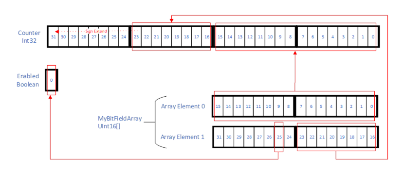  

Figure 12 - MyBitFieldArrayType Example Illustration  

  

## Annex A (informative)Design decisions when modelling the server information  

### A.1 Overview  

This annex describes the design decisions of modelling the information provided by each OPC UA *Server* , exposing its capabilities, diagnostic information, and other data needed to work with the *Server* , such as the *NamespaceArray* .  

This annex gives an example of what should be considered when modelling data using the Address Space Model. General considerations for using the Address Space Model can be found in [OPC 10000-3](/§UAPart3) .  

This annex is for information only, that is, each *Server* vendor can model its data in the appropriate way that fits its needs.  

The following subclauses describe the design decisions made while modelling the *Server* *Object* . General *DataTypes* , *VariableTypes* and *ObjectTypes* such as the *EventTypes* described in this standard are not taken into account.  

### A.2 ServerType and Server Object  

The first decision is to decide at what level types are needed. Typically, each *Server* will provide one *Server* *Object* with a well-known *NodeId* . The *NodeIds* of the containing *Nodes* are also well-known because their symbolic name is specified in this standard and the *NodeId* is based on the symbolic name in [OPC 10000-6](/§UAPart6) . Nevertheless, aggregating *Servers* may want to expose the *Server* *Objects* of the OPC UA *Servers* they are aggregating in their *AddressSpace* . Therefore, it is very helpful to have a type definition for the *Server* *Object* . The *Server* *Object* is an *Object* , because it groups a set of *Variables* and *Objects* containing information about the *Server* . The *ServerType* is a complex *ObjectType* , because the basic structure of the *Server* *Object* should be well-defined. However, the *Server* *Object* can be extended by adding *Variables* and *Objects* in an appropriate structure of the *Server* *Object* or its containing *Objects* .  

### A.3 Typed complex Objects beneath the Server Object  

*Objects* beneath the *Server* *Object* used to group information, such as *Server* capabilities or diagnostics, are also typed because an aggregating *Server* may want to provide only part of the *Server* information, such as diagnostics information, in its *AddressSpace* . Clients are able to program against these structures if they are typed, because they have its type definition.  

### A.4 Properties versus DataVariables  

Since the general description in [OPC 10000-3](/§UAPart3) about the semantic difference between *Properties* and *DataVariables* are not applicable for the information provided about the *Server* the rules described in [OPC 10000-3](/§UAPart3) are used.  

If simple data structures should be provided, *Properties* are used. Examples of *Properties* are the *NamespaceArray* of the *Server* *Object* and the *MinSupportedSampleRate* of the *ServerCapabilities* *Object* .  

If complex data structures are used, *DataVariables* are used. Examples of *DataVariables* are the *ServerStatus* of the *Server* *Object* and the *ServerDiagnosticsSummary* of the *ServerDiagnostics* *Object* .  

### A.5 Complex Variables using complex DataTypes  

*DataVariables* providing complex data structures expose their information as complex *DataTypes* , as well as components in the *AddressSpace* . This allows access to simple values as well as access to the whole information at once in a transactional context.  

For example, the *ServerStatus* *Variable* of the *Server* *Object* is modelled as a complex *DataVariable* having the *ServerStatusDataType* providing all information about the *Server* status. But it also exposes the *CurrentTime* as a simple *DataVariable* , because a client may want to read only the current time of the *Server* , and is not interested in the build information, etc.  

### A.6 Complex Variables having an array  

A special case of providing complex data structures is an array of complex data structures. The *SubscriptionDiagnosticsArrayType* is an example of how this is modelled. It is an array of a complex data structure, providing information of a subscription. Because a *Server* typically has several subscriptions, it is an array. Some clients may want to read the diagnostic information about all subscriptions at once; therefore it is modelled as an array in a *Variable* . On the other hand, a client may be interested in only a single entry of the complex structure, such as the *PublishRequestCount* . Therefore, each entry of the array is also exposed individually as a complex *DataVariable* , having each entry exposed as simple data.  

Note that it is never necessary to expose the individual entries of an array to access them separately. The *Services* already allow accessing individual entries of an array of a *Variable* . However, if the entries should also be used for other purposes in the *AddressSpace,* such as having *References* or additional *Properties* or exposing their complex structure using *DataVariables,* it is useful to expose them individually.  

### A.7 Redundant information  

Providing redundant information should generally be avoided. But to fulfil the needs of different clients, it may be helpful.  

Using complex *DataVariables* automatically leads to providing redundant information, because the information is directly provided in the complex *DataType* of the *Value* *Attribute* of the complex *Variable* , and also exposed individually in the components of the complex *Variable* .  

The diagnostics information about subscriptions is provided in two different locations. One location is the *SubscriptionDiagnosticsArray* of the *ServerDiagnostics* *Object* , providing the information for all subscriptions of the *Server* . The second location is the *SubscriptionDiagnosticsArray* of each individual *SessionDiagnosticsObject* *Object* , providing only the subscriptions of the session. This is useful because some clients may be interested in only the subscriptions grouped by sessions, whereas other clients may want to access the diagnostics information of all sessions at once.  

The *SessionDiagnosticsArray* and the *SessionSecurityDiagnosticsArray* of the *SessionsDiagnosticsSummary* *Object* do not expose their individual entries, although they represent an array of complex data structures. But the information of the entries can also be accessed individually as components of the *SessionDiagnostics* *Objects* provided for each session by the *SessionsDiagnosticsSummary* *Object* . A client can either access the arrays (or parts of the arrays) directly or browse to the *SessionDiagnostics* *Objects* to get the information of the individual entries. Thus, the information provided is redundant, but the *Variables* containing the arrays do not expose their individual entries.  

### A.8 Usage of the BaseDataVariableType  

All *DataVariables* used to expose complex data structures of complex *DataVariables* have the *BaseDataVariableType* as type definition if they are not complex by themselves. The reason for this approach is that the complex *DataVariables* already define the semantic of the containing *DataVariables* and this semantic is not used in another context. It is not expected that they are subtyped, because they should reflect the data structure of the *DataType* of the complex *DataVariable* .  

### A.9 Subtyping  

Subtyping is used for modelling information about the redundancy support of the *Server* . Because the provided information shall differ depending on the supported redundancy of the *Server* , subtypes of the *ServerRedundancyType* will be used for this purpose.  

Subtyping is also used as an extensibility mechanism (see [A.10](/§\_Ref265517063) ).  

### A.10 Extensibility mechanism  

The information of the *Server* will be extended by other parts of this series of standards, by companion specifications or by *Server* vendors. There are preferred ways to provide the additional information.  

Do not subtype *DataTypes* to provide additional information about the *Server* . Clients might not be able to read those new defined *DataTypes* and are not able to get the information, including the basic information. If information is added by several sources, the *DataType* hierarchy may be difficult to maintain. Note that this rule applies to the information about the *Server* ; in other scenarios this may be a useful way to add information.  

Add *Objects* containing *Variables* or add *Variables* to the *Objects* defined in this part. If, for example, additional diagnostic information per subscription is needed, add a new *Variable* containing in array with an entry per subscription in the same places that the *SubscriptionDiagnosticsArray* is used.  

Use subtypes of the *ServerVendorCapabilityType* to add information about the server-specific capabilities on the *ServerCapabilities* *Objects* . Because this extensibility point is already defined in this part, clients will look there for additional information.Use a subtype of the *VendorServerInfoType* to add server-specific information. Because an *Object* of this type is already defined in this part, clients will look there for server-specific information.  

  

## Annex B (informative)DataTypeDictionary  

### B.1 Overview  

DataTypeDictionary has been deprecated. This annex had defined a way to provide encoding information for custom *DataTypes in previous versions of this document* . In [OPC 10000-3](/§UAPart3) a simplified approach is now defined having a *DataTypeDefinition* *Attribute* on the *DataType* *Node* . It is required to only use the *DataTypeDefinition* *Attribute approach* . The deprecation of the DataTypeDictionary has eliminated the need for the OPC Binary Type Definition System defined in [Annex C](/§\_Ref209433824) which has also been deprecated.  

  

## Annex C (informative)OPC Binary Type Description System  

### C.1 Concepts  

Note: OPC binary Type Desciption System has been deprecated. This annex will be removed in a future verision. The remaining shalls in this annex only remains as infrormational as an artifact of the pre-depricated version.  

The OPC Binary XML Schema defines the format of OPC Binary *TypeDictionaries* . Each OPC Binary *TypeDictionary* is an XML document that contains one or more *TypeDescriptions* that describe the format of a binary-encoded value. Applications that have no advanced knowledge of a particular binary encoding can use the OPC Binary *TypeDescription* to interpret or construct a value.  

The OPC Binary Type Description System does not define a standard mechanism to *encode* data in binary. It only provides a standard way to describe an existing binary encoding. Many binary encodings will have a mechanism to describe types that could be encoded; however, these descriptions are useful only to applications that have knowledge of the type description system used with each binary encoding. The OPC Binary Type Description System is a generic syntax that can be used by any application to interpret any binary encoding.  

The OPC Binary Type Description System was originally defined in the OPC Complex Data Specification. The OPC Binary Type Description System described in Annex C is quite different and is correctly described as the OPC Binary Type Description System Version 2.0.  

Each *TypeDescription* is identified by a *TypeName* which shall be unique within the *TypeDictionary* that defines it. Each *TypeDictionary* also has a *TargetNamespace* which should be unique among all OPC Binary *TypeDictionaries* . This means that the *TypeName* qualified with the *TargetNamespace* for the dictionary ** should be a globally-unique identifier for a *TypeDescription.*  

[Figure C.1](/§\_Ref246082533) illustrates the structure of an OPC Binary *TypeDictionary* .  

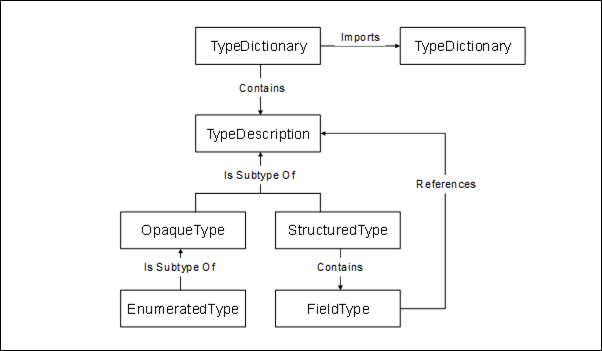  

Figure C. 1 - OPC Binary Dictionary structure  

Each binary encoding is built from a set of opaque building blocks that are either primitive types with a fixed length or variable-length types with a structure that is too complex to describe properly in an XML document. These building blocks are described with an *OpaqueType* . An instance of one of these building blocks is a binary-encoded value.  

The OPC Binary Type Description System defines a set of standard *OpaqueTypes* that all OPC Binary *TypeDictionaries* should use to build their *TypeDescriptions* . These standard type descriptions are described in Clause [C.3](/§\_Ref136568173) .  

In some cases, the binary encoding described by an *OpaqueType* may have a fixed size which would allow an application to skip an encoded value that it does not understand. If that is the case, then the *LengthInBits* attribute should be specified for the *OpaqueType.* If authors of *TypeDictionaries* need to define new *OpaqueTypes* that do not have a fixed size then they should use the documentation elements to describe how to encode binary values for the type. This description should provide enough detail to allow a human to write a program that can interpret instances of the type.  

A *StructuredType* breaks a complex value into a sequence of values that are described by a *FieldType* . Each *FieldType* has a name, type and a number of qualifiers that specify when the field is used and how many instances of the type exist. A *FieldType* is described completely in [C.2.6](/§\_Ref193629580) .  

An *EnumeratedType* describes a numeric value that has a limited set of possible values, each of which has a descriptive name. *EnumeratedTypes* provide a convenient way to capture semantic information associated with what would otherwise be an opaque numeric value.  

### C.2 Schema description  

#### C.2.1 TypeDictionary  

The *TypeDictionary* element is the root element of an OPC Binary Dictionary. The components of this element are described in [Table C.1](/§\_Ref205601224) .  

Table C. 1 - TypeDictionary components  

| **Name** | **Type** | **Description** |
|---|---|---|
|Documentation|Documentation|An element that contains human-readable text and XML that provides an overview of what is contained in the dictionary.|
|Import|ImportDirective[]|Zero or more elements that specify other *TypeDictionaries* that are referenced by *StructuredTypes* defined in the dictionary. Each import element specifies the *NamespaceUri* of the *TypeDictionary* being imported. The *TypeDictionary* element shall declare an XML namespace prefix for each imported namespace.|
|TargetNamespace|xs:string|Specifies the URI that qualifies all *TypeDescriptions* defined in the dictionary.|
|DefaultByteOrder|ByteOrder|Specifies the default *ByteOrder* for all *TypeDescriptions* that have the *ByteOrderSignificant* attribute set to "true". This value overrides the setting in any imported *TypeDictionary* . This value is overridden by the *DefaultByteOrder* specified on a *TypeDescription* .|
|TypeDescription|TypeDescription[]|One or more elements that describe the structure of a binary encoded value. A TypeDescription is an abstract type. A dictionary may only contain the *OpaqueType* , *EnumeratedType* and *StructuredType* elements.|
  

  

#### C.2.2 TypeDescription  

A *TypeDescription* describes the structure of a binary encoded value. A *TypeDescription* is an abstract base type and only instances of subtypes may appear in a *TypeDictionary* . The components of a *TypeDescription* are described in [Table C.2](/§\_Ref205602357) .  

Table C. 2 - TypeDescription components  

| **Name** | **Type** | **Description** |
|---|---|---|
|Documentation|Documentation|An element that contains human readable text and XML that describes the type. This element should capture any semantic information that would help a human to understand what is contained in the value.|
|Name|xs:NCName|An attribute that specifies a name for the *TypeDescription* that is unique within the dictionary. The fields of structured types reference *TypeDescriptions* by using this name qualified with the dictionary namespace URI.|
|DefaultByteOrder|ByteOrder|An attribute that specifies the default *ByteOrder* for the type description. This value overrides the setting in any *TypeDictionary* or in any *StructuredType* that references the type description.|
|anyAttribute|\*|Authors of a *TypeDictionary* may add their own attributes to any *TypeDescription* that shall be qualified with a namespace defined by the author. Applications should not be required to understand these attributes in order to interpret a binary encoded instance of the type.|
  

  

#### C.2.3 OpaqueType  

An *OpaqueType* describes a binary encoded value that is either a primitive fixed length type or that has a structure too complex to capture in an OPC Binary type dictionary. Authors of type dictionaries should avoid defining *OpaqueTypes* that do not have a fixed length because it would prevent applications from interpreting values that use these types without having built-in knowledge of the *OpaqueType.* The OPC Binary Type Description System defines many standard *OpaqueTypes* that should allow authors to describe most binary encoded values as *StructuredTypes* .  

The components of an *OpaqueType* are described in [Table C.3](/§\_Ref33170226) .  

Table C. 3 - OpaqueType components  

| **Name** | **Type** | **Description** |
|---|---|---|
|TypeDescription|TypeDescription|An *OpaqueType* inherits all elements and attributes defined for a *TypeDescription* in [Table C.2](/§\_Ref205602357) .|
|LengthInBits|xs:string|An attribute which specifies the length of the *OpaqueType* in bits. This value should always be specified. If this value is not specified the *Documentation* element should describe the encoding in a way that a human understands.|
|ByteOrderSignificant|xs:boolean|An attribute that indicates whether byte order is significant for the type. If byte order is significant then the application shall determine the byte order to use for the current context before interpreting the encoded value. The application determines the byte order by looking for the *DefaultByteOrder* attribute specified for containing *StructuredTypes* or the *TypeDictionary* . If *StructuredTypes* are nested the inner *StructuredTypes* override the byte order of the outer descriptions. If the *DefaultByteOrder* attribute is specified for the *OpaqueType* , ** then the *ByteOrder* is fixed and does not change according to context. If this attribute is "true", then the *LengthInBits* attribute shall be specified and it shall be an integer multiple of 8 bits.|
  

  

#### C.2.4 EnumeratedType  

An *EnumeratedType* describes a binary-encoded numeric value that has a fixed set of valid values. The encoded binary value described by an *EnumeratedType* is always an unsigned integer with a length specified by the *LengthInBits* attribute.  

The names for each of the enumerated values are not required to interpret the binary encoding, however, they form part of the documentation for the type.  

The components of an *EnumeratedType* are described in [Table C.4](/§\_Ref33170240) .  

Table C. 4 - EnumeratedType components  

| **Name** | **Type** | **Description** |
|---|---|---|
|OpaqueType|OpaqueTypeDescription|An *EnumeratedType* inherits all elements and attributes defined for a *TypeDescription* in [Table C.2](/§\_Ref205602357) and for an *OpaqueType* defined in [Table C.3](/§\_Ref33170226) . The *LengthInBits* attribute shall always be specified.|
|EnumeratedValue|EnumeratedValue|One or more elements that describe the possible values for the instances of the type.|
|IsOptionSet|xs:boolean|An attribute which when set to 'true' indicates an *EnumeratedType* represents an *OptionSet* .|
  

  

#### C.2.5 StructuredType  

A *StructuredType* describes a type as a sequence of binary-encoded values. Each value in the sequence is called a *Field* . Each *Field* references a *TypeDescription* that describes the binary-encoded value that appears in the field. A *Field* may specify that zero, one or multiple instances of the type appear within the sequence described by the *StructuredType* .  

Authors of type dictionaries should use *StructuredTypes* to describe a variety of common data constructs including arrays, unions and structures.  

Some fields have lengths that are not multiples of 8 bits. Several of these fields may appear in a sequence in a structure, however, the total number of bits used in the sequence shall be fixed and it shall be a multiple of 8 bits. Any field which does not have a fixed length shall be aligned on a byte boundary.  

A sequence of fields which do not line up on byte boundaries are specified from the least significant bit to the most significant bit. Sequences which are longer than one byte overflow from the most significant bit of the first byte into the least significant bit of the next byte.  

The components of a *StructuredType* are described in [Table C.5](/§\_Ref33170285) .  

Table C. 5 - StructuredType components  

| **Name** | **Type** | **Description** |
|---|---|---|
|TypeDescription|TypeDescription|A *StructuredType* inherits all elements and attributes defined for a *TypeDescription* in [Table C.2](/§\_Ref205602357) .|
|Field|FieldType|One or more elements that describe the fields of the structure. Each field shall have a name that is unique within the *StructuredType* . Some fields may reference other fields in the *StructuredType* by using this name.|
  

  

#### C.2.6 FieldType  

A *FieldType* describes a binary encoded value that appears in sequence within a *StructuredType* . Every *FieldType* shall reference a *TypeDescription* that describes the encoded value for the field.  

A *FieldType* may specify an array of encoded values.  

*Fields* may be optional and they reference other *FieldTypes* , ** which ** indicate if they are present in any specific instance of the type.  

The components of a *FieldType* are described in [Table C.6](/§\_Ref33170314) .  

Table C. 6 - FieldType components  

| **Name** | **Type** | **Description** |
|---|---|---|
|Documentation|Documentation|An element that contains human readable text and XML that describes the field. This element should capture any semantic information that would help a human to understand what is contained in the field.|
|Name|xs:string|An attribute that specifies a name for the *Field* that is unique within the *StructuredType* . Other fields in the structured type reference a *Field* by using this name.|
|TypeName|xs:QName|An attribute that specifies the *TypeDescription* that describes the contents of the field. A field may contain zero or more instances of this type depending on the settings for the other attributes and the values in other fields.|
|Length|xs:unsignedInt|An attribute that indicates the length of the field. This value may be the total number of encoded bytes or it may be the number of instances of the type referenced by the field. The *IsLengthInBytes* attributes specifies which of these definitions applies.|
|LengthField|xs:string|An attribute that indicates which other field in the *StructuredType* specifies the length of the field. The length of the field may be in bytes or it may be the number of instances of the type referenced by the field. The *IsLengthInBytes* attributes specify which of these definitions applies. If this attribute refers to a field that is not present in an encoded value, then the default value for the length is 1. This situation could occur if the field referenced is an optional field (see the *SwitchField* attribute). The length field shall be a fixed length Base-2 representation of an integer. If the length field is one of the standard signed integer types and the value is a negative integer, then the field is not present in the encoded stream. The *FieldType* referenced by this attribute shall precede the field with the *StructuredType* .|
|IsLengthInBytes|xs:boolean|An attribute that indicates whether the *Length* or *LengthField* attributes specify the length of the field in bytes or in the number of instances of the type referenced by the field.|
|SwitchField|xs:string|If this attribute is specified, then the field is optional and may not appear in every instance of the encoded value. This attribute specifies the name of another *Field* that controls whether this field is present in the encoded value. The field referenced by this attribute shall be an integer value (see the *LengthField* attribute). The current value of the switch field is compared to the *SwitchValue* attribute using the *SwitchOperand.* If the condition evaluates to true then the field appears in the stream. If the *SwitchValue* attribute is not specified, then this field is present if the value of the switch field is non-zero. The *SwitchOperand* field is ignored if it is present. If the *SwitchOperand* attribute is missing, then the field is present if the value of the switch field is equal to the value of the *SwitchValue* attribute *.* The *Field* referenced by this attribute shall precede the field with the *StructuredType* .|
|SwitchValue|xs:unsignedInt|This attribute specifies when the field appears in the encoded value. The value of the field referenced by the *SwitchField* attribute is compared using the *SwitchOperand* attribute to this value. The field is present if the expression evaluates to true. The field is not present otherwise.|
|SwitchOperand|xs:string|This attribute specifies how the value of the switch field should be compared to the switch value attribute. This field is an enumeration with the following values: Equal|*SwitchField* is equal to the *SwitchValue* .|GreaterThan|*SwitchField* is greater than the *SwitchValue* .|LessThan|*SwitchField* is less than the *SwitchValue* .|GreaterThanOrEqual|*SwitchField* is greater than or equal to the *SwitchValue* .|LessThanOrEqual|*SwitchField* is less than or equal to the *SwitchValue* .|NotEqual|*SwitchField* is not equal to the *SwitchValue* .|In each case the field is present if the expression is true.|
|Terminator|xs:hexBinary|This attribute indicates that the field contains one or more instances of *TypeDescription* referenced by this field and that the last value has the binary encoding specified by the value of this attribute. If this attribute is specified then the *TypeDescription* referenced by this field shall either have a fixed byte order (i.e. byte order is not significant or explicitly specified) or the containing *StructuredType* shall explicitly specify the byte order. Examples:  Field Data Type Terminator Byte Order Hexadecimal String Char  tab character not applicable 09 WideChar tab character BigEndian 0009 WideChar tab character LittleEndian 0900 Int16  1  BigEndian 0001 Int16  1  LittleEndian 0100|
|anyAttribute|\*|Authors of a *TypeDictionary* may add their own attributes to any *FieldType* which shall be qualified with a namespace defined by the authors. Applications should not be required to understand these attributes in order to interpret a binary encoded field value.|
  

  

#### C.2.7 EnumeratedValue  

An *EnumeratedValue* describes a possible value for an *EnumeratedType* .  

The components of an *EnumeratedValue* are described in [Table C.7](/§\_Ref33170938) .  

Table C. 7 - EnumeratedValue components  

| **Name** | **Type** | **Description** |
|---|---|---|
|Name|xs:string|This attribute specifies a descriptive name for the enumerated value.|
|Value|xs:int|This attribute specifies the numeric value that could appear in the binary encoding.|
  

  

#### C.2.8 ByteOrder  

A *ByteOrder* is an enumeration that describes a possible value byte orders for *TypeDescriptions* that allow different byte orders to be used. There are two possible values: BigEndian and LittleEndian. BigEndian indicates the most significant byte appears first in the binary encoding. LittleEndian indicates that the least significant byte appears first.  

#### C.2.9 ImportDirective  

An *ImportDirective* specifies a *TypeDictionary* that is referenced by types defined in the current dictionary.  

The components of an *ImportDirective* are described in [Table C.8](/§\_Ref33170436) .  

Table C. 8 - ImportDirective components  

| **Name** | **Type** | **Description** |
|---|---|---|
|Namespace|xs:string|This attribute specifies the *TargetNamespace* for the *TypeDictionary* being imported. This may be a well-known URI which means applications need not have access to the physical file to recognise types that are referenced.|
|Location|xs:string|This attribute specifies the physical location of the XML file containing the *TypeDictionary* to import. This value could be a URL for a network resource, a NodeId in an OPC UA *Server* address space or a local file path.|
  

  

### C.3 Standard Type descriptions  

The OPC Binary Type Description System defines a number of standard type descriptions that can be used to describe many common binary encodings using a *StructuredType* . The standard type descriptions are described in [Table C.9](/§\_Ref33170451) .  

Table C. 9 - Standard Type descriptions  

| **Type name** | **Description** |
|---|---|
|Bit|A single bit value.|
|Boolean|A two-state logical value represented as an 8-bit value.|
|SByte|An 8-bit signed integer.|
|Byte|An 8-bit unsigned integer.|
|Int16|A 16-bit signed integer.|
|UInt16|A 16-bit unsigned integer.|
|Int32|A 32-bit signed integer.|
|UInt32|A 32-bit unsigned integer.|
|Int64|A 64-bit signed integer.|
|UInt64|A 64-bit unsigned integer.|
|Float|An [ISO/IEC/IEEE 60559:](/§) single precision floating point value.|
|Double|An [ISO/IEC/IEEE 60559:](/§) double precision floating point value.|
|Char|An 8-bit UTF-8 character value.|
|String|A sequence of UTF-8 characters preceded by the number of UTF-8 Code Units (bytes).|
|WideString|A sequence of UTF-16 characters preceded by the number of UTF-16 Code Units.|
|DateTime|A 64-bit signed integer representing the number of 100 nanoseconds intervals since 1601-01-01 00:00:00.|
|ByteString|A sequence of bytes preceded by its length in bytes.|
|Guid|An ISO/IEC 11578:1996: Information technology — Open Systems Interconnection — Remote Procedure Call (RPC) UUID.|
  

  

### C.4 Type Description examples  

1. A 128-bit signed integer.  

\<opc:OpaqueType Name="Int128" LengthInBits="128" ByteOrderSignificant="true"\>  

\<opc:Documentation\>A 128-bit signed integer.\</opc:Documentation\>  

\</opc:OpaqueType\>  

  

1. A 16-bit value divided into several fields.  

\<opc:StructuredType Name="Quality"\>  

\<opc:Documentation\>An OPC COM-DA quality value.\</opc:Documentation\>  

\<opc:Field Name="LimitBits" TypeName="opc:Bit" Length="2" /\>  

\<opc:Field Name="QualityBits" TypeName="opc:Bit" Length="6"/\>  

\<opc:Field Name="VendorBits" TypeName="opc:Byte" /\>  

\</opc:StructuredType\>  

  

When using bit fields, the least significant bits within a byte shall appear first.  

1. A structured type with optional fields.  

\<opc:StructuredType Name="MyStructureValue"\>  

\<opc:Documentation\>A value with an associated timestamp, and quality.\</opc:Documentation\>  

\<opc:Field Name="ValueSpecified" TypeName="Bit" /\>  

\<opc:Field Name="StatusCodeSpecified" TypeName="Bit" /\>  

\<opc:Field Name="TimestampSpecified" TypeName="Bit" /\>  

\<opc:Field Name="Reserved1" TypeName="Bit" Length="29" /\>  

\<opc:Field Name="Value" TypeName="Variant" SwitchField="ValueSpecified" /\>  

\<opc:Field Name="Quality" TypeName="Quality" SwitchField="StatusCodeSpecified" /\>  

\<opc:Field Name="Timestamp"  

TypeName="opc:DateTime" SwitchField="SourceTimestampSpecified" /\>  

\</opc:StructuredType\>  

It is necessary to explicitly specify any padding bits required to ensure subsequent fields line up on byte boundaries.  

1. An array of integers.  

\<opc:StructuredType Name="IntegerArray"\>  

\<opc:Documentation\>An array of integers prefixed by its length.\</opc:Documentation\>  

\<opc:Field Name="Size" TypeName="opc:Int32" /\>  

\<opc:Field Name="Array" TypeName="opc:Int32" LengthField="Size" /\>  

\</opc:StructuredType\>  

Nothing is encoded for the Array field if the Size field has a value ≤ 0.  

1. An array of integers with a terminator instead of a length prefix.  

\<opc:StructuredType Name="IntegerArray" DefaultByteOrder="LittleEndian"\>  

\<opc:Documentation\>An array of integers terminated with a known value.\</opc:Documentation\>  

\<opc:Field Name="Value" TypeName="opc:Int16" Terminator="FF7F" /\>  

\</opc:StructuredType\>  

The terminator is 32,767 converted to hexadecimal with LittleEndian byte order.  

1. A simple union.  

\<opc:StructuredType Name="Variant"\>  

\<opc:Documentation\>A union of several types.\</opc:Documentation\>  

\<opc:Field Name="ArrayLengthSpecified" TypeName="opc:Bit" Length="1"/\>  

\<opc:Field Name="VariantType" TypeName="opc:Bit" Length="7" /\>  

\<opc:Field Name="ArrayLength" TypeName="opc:Int32"  

SwitchField="ArrayLengthSpecified" /\>  

\<opc:Field Name="Int32" TypeName="opc:Int32" LengthField="ArrayLength"  

SwitchField="VariantType" SwitchValue="1" /\>  

\<opc:Field Name="String" TypeName="opc:String" LengthField="ArrayLength"  

SwitchField="VariantType" SwitchValue="2" /\>  

\<opc:Field Name="DateTime" TypeName="opc:DateTime" LengthField="ArrayLength"  

SwitchField="VariantType" SwitchValue="3" /\>  

\</opc:StructuredType\>  

The *ArrayLength* field is optional. If it is not present in an encoded value, then the length of all fields with *LengthField* set to "ArrayLength" have a length of 1.  

It is valid for the *VariantType* field to have a value that has no matching field defined. This simply means all optional fields are not present in the encoded value.  

1. An enumerated type.  

\<opc:EnumeratedType Name="TrafficLight" LengthInBits="32"\>  

\<opc:Documentation\>The possible colours for a traffic signal.\</opc:Documentation\>  

\<opc:EnumeratedValue Name="Red" Value="4"\>  

\<opc:Documentation\>Red says stop immediately.\</opc:Documentation\>  

\</opc:EnumeratedValue\>  

\<opc:EnumeratedValue Name="Yellow" Value="3"\>  

\<opc:Documentation\>Yellow says prepare to stop.\</opc:Documentation\>  

\</opc:EnumeratedValue\>  

\<opc:EnumeratedValue Name="Green" Value="2"\>  

\<opc:Documentation\>Green says you may proceed.\</opc:Documentation\>  

\</opc:EnumeratedValue\>  

\</opc:EnumeratedType\>  

The documentation element is used to provide human readable description of the type and values.  

1. A nillable array.  

\<opc:StructuredTypen Name="NillableArray"\>  

\<opc:Documentation\>An array where a length of -1 means null.\</opc:Documentation\>  

\<opc:Field Name="Length" TypeName="opc:Int32" /\>  

\<opc:Field  

Name="Int32"  

TypeName="opc:Int32"  

LengthField="Length"  

SwitchField="Length"  

SwitchValue="0"  

SwitchOperand="GreaterThanOrEqual" /\>  

\</opc:StructuredType\>  

If the length of the array is −1 then the array does not appear in the stream.  

### C.5 OPC Binary XML schema  

\<?xml version="1.0" encoding="utf-8" ?\>  

\<xs:schema  

targetNamespace="http://opcfoundation.org/BinarySchema/"  

elementFormDefault="qualified"  

xmlns="http://opcfoundation.org/BinarySchema/"  

xmlns:xs="http://www.w3.org/2001/XMLSchema"  

\>  

\<xs:element name="Documentation"\>  

\<xs:complexType mixed="true"\>  

\<xs:choice minOccurs="0" maxOccurs="unbounded"\>  

\<xs:any minOccurs="0" maxOccurs="unbounded"/\>  

\</xs:choice\>  

\<xs:anyAttribute/\>  

\</xs:complexType\>  

\</xs:element\>  

  

\<xs:complexType name="ImportDirective"\>  

\<xs:attribute name="Namespace" type="xs:string" use="optional" /\>  

\<xs:attribute name="Location" type="xs:string" use="optional" /\>  

\</xs:complexType\>  

  

\<xs:simpleType name="ByteOrder"\>  

\<xs:restriction base="xs:string"\>  

\<xs:enumeration value="BigEndian" /\>  

\<xs:enumeration value="LittleEndian" /\>  

\</xs:restriction\>  

\</xs:simpleType\>  

  

\<xs:complexType name="TypeDescription"\>  

\<xs:sequence\>  

\<xs:element ref="Documentation" minOccurs="0" maxOccurs="1" /\>  

\</xs:sequence\>  

\<xs:attribute name="Name" type="xs:NCName" use="required" /\>  

\<xs:attribute name="DefaultByteOrder" type="ByteOrder" use="optional" /\>  

\<xs:anyAttribute processContents="lax" /\>  

\</xs:complexType\>  

  

\<xs:complexType name="OpaqueType"\>  

\<xs:complexContent\>  

\<xs:extension base="TypeDescription"\>  

\<xs:attribute name="LengthInBits" type="xs:int" use="optional" /\>  

\<xs:attribute name="ByteOrderSignificant" type="xs:boolean" default="false" /\>  

\</xs:extension\>  

\</xs:complexContent\>  

\</xs:complexType\>  

  

\<xs:complexType name="EnumeratedValue"\>  

\<xs:sequence\>  

\<xs:element ref="Documentation"  minOccurs="0" maxOccurs="1" /\>  

\</xs:sequence\>  

\<xs:attribute name="Name" type="xs:string" use="optional" /\>  

\<xs:attribute name="Value" type="xs:unsignedInt" use="optional" /\>  

\</xs:complexType\>  

  

\<xs:complexType name="EnumeratedType"\>  

\<xs:complexContent\>  

\<xs:extension base="OpaqueTypeDescription"\>  

\<xs:sequence\>  

\<xs:element name="EnumeratedValue"  

type="EnumeratedValueDescription" maxOccurs="unbounded" /\>  

\</xs:sequence\>  

\</xs:extension\>  

\</xs:complexContent\>  

\</xs:complexType\>  

  

\<xs:simpleType name="SwitchOperand"\>  

\<xs:restriction base="xs:string"\>  

\<xs:enumeration value="Equals" /\>  

\<xs:enumeration value="GreaterThan" /\>  

\<xs:enumeration value="LessThan" /\>  

\<xs:enumeration value="GreaterThanOrEqual" /\>  

\<xs:enumeration value="LessThanOrEqual" /\>  

\<xs:enumeration value="NotEqual" /\>  

\</xs:restriction\>  

\</xs:simpleType\>  

  

\<xs:complexType name="FieldType"\>  

\<xs:sequence\>  

\<xs:element ref="Documentation" minOccurs="0" maxOccurs="1" /\>  

\</xs:sequence\>  

\<xs:attribute name="Name" type="xs:string" use="required" /\>  

\<xs:attribute name="TypeName" type="xs:QName" use="optional" /\>  

\<xs:attribute name="Length" type="xs:unsignedInt" use="optional" /\>  

\<xs:attribute name="LengthField" type="xs:string" use="optional" /\>  

\<xs:attribute name="IsLengthInBytes" type="xs:boolean" default="false" /\>  

\<xs:attribute name="SwitchField" type="xs:string" use="optional" /\>  

\<xs:attribute name="SwitchValue" type="xs:unsignedInt" use="optional" /\>  

\<xs:attribute name="SwitchOperand" type="SwitchOperand" use="optional" /\>  

\<xs:attribute name="Terminator" type="xs:hexBinary" use="optional" /\>  

\<xs:anyAttribute processContents="lax" /\>  

\</xs:complexType\>  

  

\<xs:complexType name="StructuredType"\>  

\<xs:complexContent\>  

\<xs:extension base="TypeDescription"\>  

\<xs:sequence\>  

\<xs:element name="Field" type="FieldType"  

minOccurs="0" maxOccurs="unbounded" /\>  

\</xs:sequence\>  

\</xs:extension\>  

\</xs:complexContent\>  

\</xs:complexType\>  

  

\<xs:element name="TypeDictionary"\>  

\<xs:complexType\>  

\<xs:sequence\>  

\<xs:element ref="Documentation"  minOccurs="0" maxOccurs="1" /\>  

\<xs:element name="Import" type="ImportDirective"  

minOccurs="0" maxOccurs="unbounded" /\>  

\<xs:choice minOccurs="0" maxOccurs="unbounded"\>  

\<xs:element name="OpaqueType" type="OpaqueType" /\>  

\<xs:element name="EnumeratedType" type="EnumeratedType" /\>  

\<xs:element name="StructuredType" type="StructuredType" /\>  

\</xs:choice\>  

\</xs:sequence\>  

\<xs:attribute name="TargetNamespace" type="xs:string" use="required" /\>  

\<xs:attribute name="DefaultByteOrder" type="ByteOrder" use="optional" /\>  

\</xs:complexType\>  

\</xs:element\>  

  

\</xs:schema\>  

### C.6 OPC Binary Standard TypeDictionary  

\<?xml version="1.0" encoding="utf-8"?\>  

\<opc:TypeDictionary  

xmlns="http://opcfoundation.org/BinarySchema/"  

xmlns:opc="http://opcfoundation.org/BinarySchema/"  

xmlns:xsi="http://www.w3.org/2001/XMLSchema-instance"  

TargetNamespace="http://opcfoundation.org/BinarySchema/"  

\>  

\<opc:Documentation\>This dictionary defines the standard types used by the OPC Binary type description system.\</opc:Documentation\>  

  

\<opc:OpaqueType Name="Bit" LengthInBits="1"\>  

\<opc:Documentation\>A single bit.\</opc:Documentation\>  

\</opc:OpaqueType\>  

  

\<opc:OpaqueType Name="Boolean" LengthInBits="8"\>  

\<opc:Documentation\>A two state logical value represented as a 8-bit value.\</opc:Documentation\>  

\</opc:OpaqueType\>  

  

\<opc:OpaqueType Name="SByte" LengthInBits="8"\>  

\<opc:Documentation\>An 8-bit signed integer.\</opc:Documentation\>  

\</opc:OpaqueType\>  

  

\<opc:OpaqueType Name="Byte" LengthInBits="8"\>  

\<opc:Documentation\>A 8-bit unsigned integer.\</opc:Documentation\>  

\</opc:OpaqueType\>  

  

\<opc:OpaqueType Name="Int16" LengthInBits="16" ByteOrderSignificant="true"\>  

\<opc:Documentation\>A 16-bit signed integer.\</opc:Documentation\>  

\</opc:OpaqueType\>  

  

\<opc:OpaqueType Name="UInt16" LengthInBits="16" ByteOrderSignificant="true"\>  

\<opc:Documentation\>A 16-bit unsigned integer.\</opc:Documentation\>  

\</opc:OpaqueType\>  

  

\<opc:OpaqueType Name="Int32" LengthInBits="32" ByteOrderSignificant="true"\>  

\<opc:Documentation\>A 32-bit signed integer.\</opc:Documentation\>  

\</opc:OpaqueType\>  

  

\<opc:OpaqueType Name="UInt32" LengthInBits="32" ByteOrderSignificant="true"\>  

\<opc:Documentation\>A 32-bit unsigned integer.\</opc:Documentation\>  

\</opc:OpaqueType\>  

  

\<opc:OpaqueType Name="Int64" LengthInBits="32" ByteOrderSignificant="true"\>  

\<opc:Documentation\>A 64-bit signed integer.\</opc:Documentation\>  

\</opc:OpaqueType\>  

  

\<opc:OpaqueType Name="UInt64" LengthInBits="64" ByteOrderSignificant="true"\>  

\<opc:Documentation\>A 64-bit unsigned integer.\</opc:Documentation\>  

\</opc:OpaqueType\>  

  

\<opc:OpaqueType Name="Float" LengthInBits="32" ByteOrderSignificant="true"\>  

\<opc:Documentation\>An IEEE-754 single precision floating point value.\</opc:Documentation\>  

\</opc:OpaqueType\>  

  

\<opc:OpaqueType Name="Double" LengthInBits="64" ByteOrderSignificant="true"\>  

\<opc:Documentation\>An IEEE-754 double precision floating point value.\</opc:Documentation\>  

\</opc:OpaqueType\>  

  

\<opc:OpaqueType Name="Char" LengthInBits="8"\>  

\<opc:Documentation\>A 8-bit character value.\</opc:Documentation\>  

\</opc:OpaqueType\>  

  

\<opc:StructuredType Name="String"\>  

\<opc:Documentation\>A UTF-8 null terminated string value.\</opc:Documentation\>  

\<opc:Field Name="Value" TypeName="Char" Terminator="00" /\>  

\</opc:StructuredType\>  

  

\<opc:StructuredType Name="CharArray"\>  

\<opc:Documentation\>A UTF-8 string prefixed by its length in characters.\</opc:Documentation\>  

\<opc:Field Name="Length" TypeName="Int32" /\>  

\<opc:Field Name="Value" TypeName="Char" LengthField="Length" /\>  

\</opc:StructuredType\>  

  

\<opc:OpaqueType Name="WideChar" LengthInBits="16" ByteOrderSignificant="true"\>  

\<opc:Documentation\>A 16-bit character value.\</opc:Documentation\>  

\</opc:OpaqueType\>  

  

\<opc:StructuredType Name="WideString"\>  

\<opc:Documentation\>A UTF-16 null terminated string value.\</opc:Documentation\>  

\<opc:Field Name="Value" TypeName="WideChar" Terminator="0000" /\>  

\</opc:StructuredType\>  

  

\<opc:StructuredType Name="WideCharArray"\>  

\<opc:Documentation\>A UTF-16 string prefixed by its length in characters.\</opc:Documentation\>  

\<opc:Field Name="Length" TypeName="Int32" /\>  

\<opc:Field Name="Value" TypeName="WideChar" LengthField="Length" /\>  

\</opc:StructuredType\>  

  

\<opc:StructuredType Name="ByteString"\>  

\<opc:Documentation\>An array of bytes prefixed by its length.\</opc:Documentation\>  

\<opc:Field Name="Length" TypeName="Int32" /\>  

\<opc:Field Name="Value" TypeName="Byte" LengthField="Length" /\>  

\</opc:StructuredType\>  

  

\<opc:OpaqueType Name="DateTime" LengthInBits="64" ByteOrderSignificant="true"\>  

\<opc:Documentation\>The number of 100 nanosecond intervals since January 01, 1601.\</opc:Documentation\>  

\</opc:OpaqueType\>  

  

\<opc:StructuredType Name="Guid"\>  

\<opc:Documentation\>A 128-bit globally unique identifier.\</opc:Documentation\>  

\<opc:Field Name="Data1" TypeName="UInt32" /\>  

\<opc:Field Name="Data2" TypeName="UInt16" /\>  

\<opc:Field Name="Data3" TypeName="UInt16" /\>  

\<opc:Field Name="Data4" TypeName="Byte" Length="8" /\>  

\</opc:StructuredType\>  

  

\</opc:TypeDictionary\>  

  

## Annex D (informative)Geometrical references  

This informative annex gives a description of the usage of the 3DFrame DataType and the 3DFrameType VariableType. The geometrical setup of a system can be very diverse. It is not possible to specify all possible setups in this specification. Instead, the specification provides the framework and gives examples for how to use.  

  

 **Frames**   

A frame describes the translation and rotation of an object relative to another frame (the base frame). [Figure D.1 -](/§C\_4\_ohne) shows a simple frame chain to clarify the notation. The frame D is the base of frames E and F. The frames E and F are based on frame D. Frame F is the base of frames G and H. The frames G and H are based on frame F.  

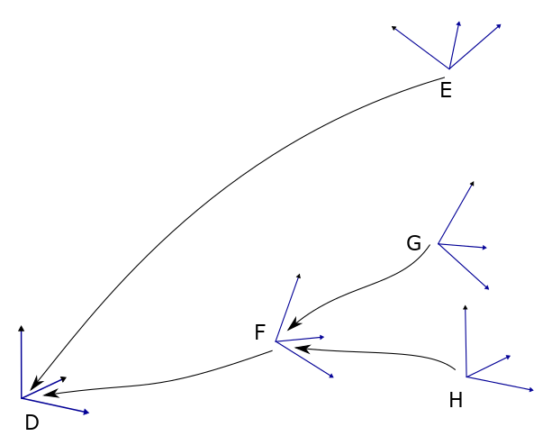  

Figure D.1 - Simple frame chain  

  

As shown in [Figure D.1 -](/§C\_4\_ohne) an arrow points from a frame to its base frame to visualize the frame chains. This arrow can be read as "The coordinates of frame E are specified in (or relative to) frame D". In addition to the coordinates of frame E you also need to know its base frame D.  

The coordinates of a frame are represented by the three values P = (X, Y, Z) for the position and the three values O = (A, B, C) for the orientation.  

P is the translation relative to the base frame. When the translation of a frame is 0 then the origins of the frame and its base frame coincide.  

O is the orientation of the frame in yaw, pitch and roll notation (see also ISO 9787:2013 "Robots and robotic devices — Coordinate systems and motion nomenclatures" or Wikipedia article about euler angles).  

  

We use the notation of pre-multiplying rotation-matrices and column vectors.  

Figure D.2 shows the three elementary rotations A, B and C as specified in ISO 9787:2013.  

  

  

  

  

  

  

  

  

  

  

  

  

  

  

Figure D.2 - Rotations  

  

The elementary rotations correspond to the following rotation matrices:  

A = roll = rotation about X axis  

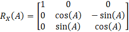  

B = pitch = rotation about Y axis  

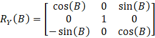  

C = yaw = rotation about Z axis  

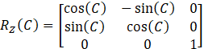  

  

ISO 9787:2013 does not define the order of the rotations or whether to use intrinsic or extrinsic rotations. Thus, we refer to the Wikipedia article here. It says that the intrinsic rotations z-y'-x″ are known as yaw, pitch and roll, giving the transformation matrix  

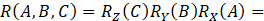  

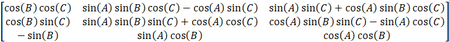  

  

Figure D.3 shows the three consecutive rotations:  

1. Rotation about the Z axis (blue rotation; blue frame green frame)  

1. Rotation about the new Y axis (green rotation; green frame red frame)  

1. Rotation about the new X axis (red rotation; red frame black frame)  

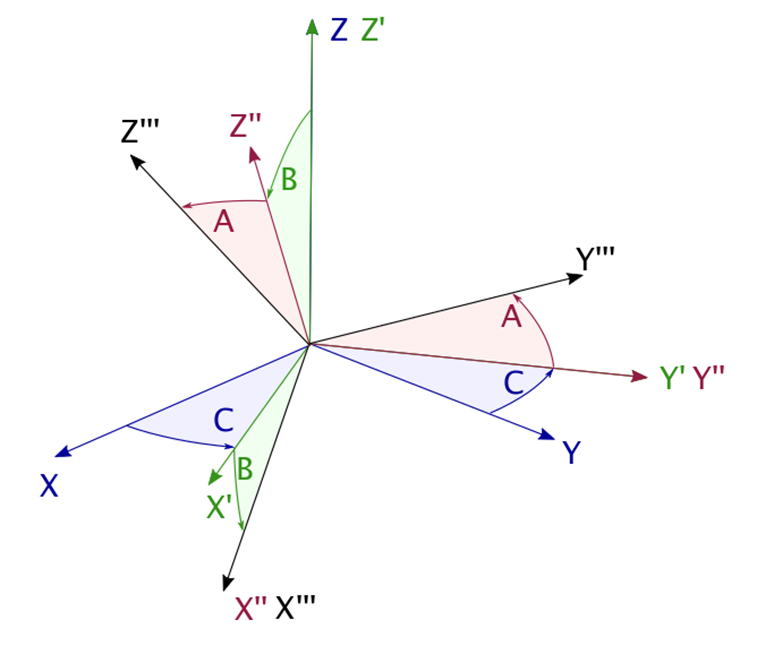  

Figure D.3 - Rotations of a frame  

The extrinsic rotations x-y-z about the axis of the original fixed coordinate system result in the same transformation matrix. This is  

1. Rotation about the X axis  

1. Rotation about the original Y axis  

1. Rotation about the original Z axis  

  

For the explanations in the next paragraph a superscript prefix indicates the frame in which the vector or rotation matrix is defined. A subscript for a rotation matrix indicates the frame it defines.  

!The column vectors in the rotation matrices are the unit vectors of the frame in the coordinates of its base frame. Thus transforming a vector  !that is given in frame G to the base frame F (compare  !) is done by 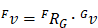 !with 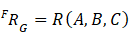 !and the rotation angles  !,  !, and  !of the frame G.  

  

Frames can be constant (e.g. the robot base) or dynamically changing (e.g. the robot flange).  

\_\_\_\_\_\_\_\_\_\_\_\_\_\_  

  

  

