## 1 Scope  

This part of OPC Unified Architecture (OPC UA) specifies the mapping between the security model described in [OPC 10000-2](/§UAPart2) , the abstract service definitions specified in [OPC 10000-4](/§UAPart4) , the data structures defined in [OPC 10000-5](/§UAPart5) and the physical network protocols that can be used to implement the OPC UA specification.  

## 2 Normative references  

The following documents, in whole or in part, are normatively referenced in this document and are indispensable for its application. For dated references, only the edition cited applies. For undated references, the latest edition of the referenced document (including any amendments) applies.  

OPC 10000-1, *OPC Unified Architecture - Part 1: Overview and Concepts*  

[http://www.opcfoundation.org/UA/Part1/](http://www.opcfoundation.org/UA/Part1/)  

OPC 10000-2, *OPC Unified Architecture - Part 2: Security Model*  

[http://www.opcfoundation.org/UA/Part2/](http://www.opcfoundation.org/UA/Part2/)  

OPC 10000-3, *OPC Unified Architecture - Part 3: Address Space Model*  

[http://www.opcfoundation.org/UA/Part3/](http://www.opcfoundation.org/UA/Part3/)  

OPC 10000-4, *OPC Unified Architecture - Part 4: Services*  

[http://www.opcfoundation.org/UA/Part4/](http://www.opcfoundation.org/UA/Part4/)  

OPC 10000-5, *OPC Unified Architecture - Part 5: Information Model*  

[http://www.opcfoundation.org/UA/Part5/](http://www.opcfoundation.org/UA/Part5/)  

OPC 10000-6, *OPC Unified Architecture - Part 6: Mappings*  

[http://www.opcfoundation.org/UA/Part6/](http://www.opcfoundation.org/UA/Part6/)  

OPC 10000-7, *OPC Unified Architecture - Part 7: Profiles*  

[http://www.opcfoundation.org/UA/Part7/](http://www.opcfoundation.org/UA/Part7/)  

OPC 10000-9, *OPC Unified Architecture - Part 9: Alarms and Conditions*  

[http://www.opcfoundation.org/UA/Part9/](http://www.opcfoundation.org/UA/Part9/)  

OPC 10000-12, *OPC Unified Architecture - Part 12: Discovery and Global Services*  

[http://www.opcfoundation.org/UA/Part12/](http://www.opcfoundation.org/UA/Part12/)  

OPC 10000-14, *OPC Unified Architecture - Part 14: PubSub*  

[http://www.opcfoundation.org/UA/Part14/](http://www.opcfoundation.org/UA/Part14/)  

OPC 10000-18, *OPC Unified Architecture - Part 18: Role-Based Security*  

[http://www.opcfoundation.org/UA/Part18/](http://www.opcfoundation.org/UA/Part18/)  

OPC 10000-21, *OPC Unified Architecture - Part 21: Device Onboarding*  

[http://www.opcfoundation.org/UA/Part21/](http://www.opcfoundation.org/UA/Part21/)  

XML Schema Part 2: XML Schema Part 2: Datatypes  

[http://www.w3.org/TR/xmlschema-2/](http://www.w3.org/TR/xmlschema-2/)  

SOAP Part 1, SOAP Version 1.2 Part 1: Messaging Framework  

[http://www.w3.org/TR/soap12-part1/](http://www.w3.org/TR/soap12-part1/)  

WS Addressing, Web Services Addressing (WS-Addressing)  

[http://www.w3.org/Submission/ws-addressing/](http://www.w3.org/Submission/ws-addressing/)  

TLS, RFC 8446 - The Transport Layer Security (TLS) Protocol Version 1.3  

[https://datatracker.ietf.org/doc/html/rfc8446](https://datatracker.ietf.org/doc/html/rfc8446)  

X.509 v3, ISO/IEC 9594-8 (ITU-T Rec. X.509), Information technology - Open Systems  

Interconnection - The Directory: Public-key and attribute certificate frameworks  

https://www.itu.int/rec/T-REC-X.509-201910-I/en  

HTTP, HTTP/1.1  

https://datatracker.ietf.org/doc/html/rfc9112  

HTTPS, HTTP Semantics  

https://datatracker.ietf.org/doc/html/rfc9110  

Base64, The Base16, Base32, and Base64 Data Encodings  

[https://datatracker.ietf.org/doc/html/rfc4648](https://datatracker.ietf.org/doc/html/rfc4648)  

X690, ISO/IEC 8825-1 (ITU-T Rec. X.690), Information technology - ASN.1 encoding rules: Specification of Basic Encoding Rules (BER), Canonical Encoding Rules (CER) and Distinguished Encoding Rules (DER)  

[https://www.itu.int/rec/T-REC-X.690](https://www.itu.int/rec/T-REC-X.690)  

X200, ISO/IEC 7498-1 (ITU-T Rec. X.200), Information technology - Open Systems Interconnection - Basic Reference Model: The Basic Model  

[https://www.itu.int/rec/T-REC-X.200](https://www.itu.int/rec/T-REC-X.200)  

IEEE 754, 60559-2020 - ISO/IEC/IEEE International Standard - Standard for Floating-Point Arithmetic  

[https://ieeexplore.ieee.org/document/9091348](https://ieeexplore.ieee.org/document/9091348)  

HMAC, Keyed-Hashing for Message Authentication  

[https://datatracker.ietf.org/doc/html/rfc2104](https://datatracker.ietf.org/doc/html/rfc2104)  

PKCS \#1, RSA Cryptography Specifications Version 2.2  

[https://datatracker.ietf.org/doc/html/rfc8017](https://datatracker.ietf.org/doc/html/rfc8017)  

PKCS \#12, Personal Information Exchange Syntax v1.1  

[https://datatracker.ietf.org/doc/html/rfc7292](https://datatracker.ietf.org/doc/html/rfc7292)  

FIPS 180-4, Secure Hash Standard (SHS)  

[https://csrc.nist.gov/publications/detail/fips/180/4/final](https://csrc.nist.gov/publications/detail/fips/180/4/final)  

FIPS 197, Advanced Encryption Standard (AES)  

[https://www.nist.gov/publications/advanced-encryption-standard-aes](https://www.nist.gov/publications/advanced-encryption-standard-aes)  

UTF-8, UTF-8, a transformation format of ISO 10646  

[https://datatracker.ietf.org/doc/html/rfc3629](https://datatracker.ietf.org/doc/html/rfc3629)  

RFC 5280, Internet X.509 Public Key Infrastructure Certificate  

and Certificate Revocation List (CRL) Profile  

[https://datatracker.ietf.org/doc/html/rfc5280](https://datatracker.ietf.org/doc/html/rfc5280)  

RFC 6818, Updates to the Internet X.509 Public Key Infrastructure  

Certificate and Certificate Revocation List (CRL) Profile  

[https://datatracker.ietf.org/doc/html/rfc6818](https://datatracker.ietf.org/doc/html/rfc6818)  

RFC 4514, LDAP: String Representation of Distinguished Names  

[https://datatracker.ietf.org/doc/html/rfc4514](https://datatracker.ietf.org/doc/html/rfc4514)  

NTP, Network Time Protocol Version 4: Protocol and Algorithms Specification  

[https://datatracker.ietf.org/doc/html/rfc5905](https://datatracker.ietf.org/doc/html/rfc5905)  

RFC 3986, Uniform Resource Identifier (URI): Generic Syntax  

[https://datatracker.ietf.org/doc/html/rfc3986](https://datatracker.ietf.org/doc/html/rfc3986)  

RFC 8141, Uniform Resource Names (URNs)  

[https://datatracker.ietf.org/doc/html/rfc8141](https://datatracker.ietf.org/doc/html/rfc8141)  

RFC 6455, The WebSocket Protocol  

[https://datatracker.ietf.org/doc/html/rfc6455](https://datatracker.ietf.org/doc/html/rfc6455)  

RFC 8259, The JavaScript Object Notation (JSON) Data Interchange Format  

[https://datatracker.ietf.org/doc/html/rfc8259](https://datatracker.ietf.org/doc/html/rfc8259)  

RFC 7519, JSON Web Token (JWT)  

[https://datatracker.ietf.org/doc/html/rfc7519](https://datatracker.ietf.org/doc/html/rfc7519)  

RFC 7523, JSON Web Token (JWT) Profile for OAuth 2.0 Client Authentication and  

Authorization Grants  

[https://datatracker.ietf.org/doc/html/rfc7523](https://datatracker.ietf.org/doc/html/rfc7523)  

RFC 8705, OAuth 2.0 Mutual-TLS Client Authentication and Certificate-Bound Access Tokens  

[https://datatracker.ietf.org/doc/html/rfc8705](https://datatracker.ietf.org/doc/html/rfc8705)  

https://www.rfc-editor.org/rfc/rfc8705.html  

RFC 6749, The OAuth 2.0 Authorization Framework  

[https://datatracker.ietf.org/doc/html/rfc6749](https://datatracker.ietf.org/doc/html/rfc6749)  

OpenID-Core, OpenID Connect Core 1.0  

[http://openid.net/specs/openid-connect-core-1\_0.html](http://openid.net/specs/openid-connect-core-1\_0.html)  

OpenID-Discovery, OpenID Connect Discovery 1.0  

[https://openid.net/specs/openid-connect-discovery-1\_0.html](https://openid.net/specs/openid-connect-discovery-1\_0.html)  

RFC 6960, X.509 Internet Public Key Infrastructure - Online Certificate Status Protocol - OCSP  

[https://datatracker.ietf.org/doc/html/rfc6960](https://datatracker.ietf.org/doc/html/rfc6960)  

RFC 5869, HMAC-based Extract-and-Expand Key Derivation Function (HKDF)  

[https://datatracker.ietf.org/doc/html/rfc5869](https://datatracker.ietf.org/doc/html/rfc5869)  

RFC 8422, Elliptic Curve Cryptography (ECC) Cipher Suites  

[https://datatracker.ietf.org/doc/html/rfc8422](https://datatracker.ietf.org/doc/html/rfc8422)  

RFC 6750, The OAuth 2.0 Authorization Framework: Bearer Token Usage  

[https://datatracker.ietf.org/doc/html/rfc6750](https://datatracker.ietf.org/doc/html/rfc6750)  

ISO 8601-1, Date and time - Representations for information interchange - Part 1: Basic rules  

[https://www.iso.org/standard/70907.html](https://www.iso.org/standard/70907.html)  

RFC 5234, Augmented BNF for Syntax Specifications: ABNF  

[https://datatracker.ietf.org/doc/html/rfc5234](https://datatracker.ietf.org/doc/html/rfc5234)  

RFC 4151, The 'tag' URI Scheme  

[https://datatracker.ietf.org/doc/html/rfc4151](https://datatracker.ietf.org/doc/html/rfc4151)  

SemVer, Semantic Versioning 2.0.0  

https://semver.org/spec/v2.0.0.html  

OpenAPI, OpenAPI Specification v3.0  

[https://spec.openapis.org/oas/v3.0.4.html](https://spec.openapis.org/oas/v3.0.4.html)  

JSON Schema, JSON Schema 2020-12  

[https://json-schema.org/specification](https://json-schema.org/specification)  

RFC 1952: GZIP file format specification version 4.3  

https://www.rfc-editor.org/rfc/rfc1952  

AES-CTR, NIST SP 800-38A: Recommendation for Block Cipher Modes of Operation  

https://csrc.nist.gov/pubs/sp/800/38/a/final  

## 3 Terms, definitions and abbreviated terms  

### 3.1 Terms and definitions  

For the purposes of this document the terms and definitions given in [OPC 10000-1](/§UAPart1) , [OPC 10000-2](/§UAPart2) and [OPC 10000-3](/§UAPart3) as well as the following apply.  

#### 3.1.1 CertificateDigest  

short identifier used to uniquely identify an [X.509 v3](/§X509) *Certificate* .  

Note 1 to entry: This is the SHA1 hash of DER encoded form of the *Certificate* .  

#### 3.1.2 DataEncoding  

way to serialize messages and data structures.  

#### 3.1.3 DefaultValue  

a value that is used when no other value is known or available.  

#### 3.1.4 DevelopmentPlatform  

suite of tools and/or programming languages used to create software.  

#### 3.1.5 Mapping  

specification on how to implement an OPC UA feature with a specific technology.  

Note 1 to entry: For example, the OPC UA Binary Encoding is a *Mapping* that specifies how to serialize OPC UA data structures as sequences of bytes.  

#### 3.1.6 VerboseEncoding  

A *DataEncoding* where the serialized form does not omit optional or default values and adds additional descriptive text.  

Note 1 to entry: *VerboseEncodings* are used when the consumers of the data do not have access to schema information and rely on the self-describing nature of *DataEncodings* such as JSON  

Note 2 to entry: A *VerboseEncoding* is only defined for the JSON *DataEncoding* .  

#### 3.1.7 OctetString  

a sequence of zero or more octets without any length prefix.  

Note 1 to entry: an OctetString is not defined as a *DataType* and only used in this document when a *ByteString* is not appropriate.  

#### 3.1.8 CompactEncoding  

A *DataEncoding* where encoding the serialized form omits optional and default values.  

Note 1 to entry: All *DataEncodings* are *CompactEncodings* unless otherwise stated.  

#### 3.1.9 SecurityProtocol  

Protocol which ensures the integrity and privacy of UA *Messages* that are exchanged between OPC UA applications  

#### 3.1.10 StackProfile  

combination of DataEncodings, SecurityProtocol and TransportProtocol Mappings  

Note 1 to entry: OPC UA applications implement one or more *StackProfiles* and can only communicate with OPC UA applications that support a *StackProfile* that they support.  

#### 3.1.11 TransportConnection  

full-duplex communication link established between OPC UA applications.  

Note 1 to entry: A TCP/IP socket is an example of a *TransportConnection* .  

#### 3.1.12 TransportProtocol  

way to exchange serialized OPC UA *Messages* between OPC UA applications  

### 3.2 Abbreviated terms  

AEAD Authenticated Encryption with Associated Data  

API Application Programming Interface  

ASN.1 Abstract Syntax Notation \#1 (used in [X690](/§X690) )  

CSV Comma Separated Value (File Format)  

DNS Domain Name Service  

ECC Elliptic Curve Cryptography  

HTTP Hypertext Transfer Protocol  

HTTPS Secure Hypertext Transfer Protocol  

IANA Internet Assigned Numbers Authority  

IPSec Internet Protocol Security  

JWT JSON Web Token  

NAT Network Address Translation  

OID Object Identifier (used with ASN.1)  

PRF Pseudo Random Function  

RSA Rivest, Shamir and Adleman [Public Key Encryption System]  

SHA1 Secure Hash Algorithm  

SOAP Simple Object Access Protocol  

SSL Secure Sockets Layer (Defined in [TLS](/§Tls) )  

TCP Transmission Control Protocol  

TLS Transport Layer Security (Defined in [TLS](/§Tls) )  

UA Unified Architecture  

UACP OPC UA Connection Protocol  

UASC OPC UA Secure Conversation  

WS-\* XML Web Services Specifications  

XML Extensible Markup Language  

## 4 Overview  

Other parts of the OPC 10000 series are written to be independent of the technology used for implementation. This approach means OPC UA is a flexible specification that will continue to be applicable as technology evolves. On the other hand, this approach means that it is not possible to build an OPC UA application with the information contained in [OPC 10000-1](/§UAPart1) through to [OPC 10000-5](/§UAPart5) because important implementation details have been left out.  

This document defines *Mappings* between the abstract specifications and technologies that can be used to implement them. The *Mappings* are organized into three groups: *DataEncodings, SecurityProtocols* and *TransportProtocols* . Different *Mappings* are combined together to create *StackProfiles* . All OPC UA applications shall implement at least one *StackProfile* and can only communicate with other OPC UA applications that implement the same *StackProfile.*  

This document defines the *DataEncodings* in Clause [5](/§\_Ref177411975) , the *SecurityProtocols* in [5.4](/§\_Ref164133776) and the *TransportProtocols* in [6.7.6](/§\_Ref164133819) . The *StackProfiles* are defined in [OPC 10000-7](/§UAPart7) .  

All communication between OPC UA applications is based on the exchange of *Messages* . The parameters contained in the *Messages* are defined in [OPC 10000-4](/§UAPart4) ; however, their format is specified by the *DataEncoding* and *TransportProtocol* . For this reason, each *Message* defined in [OPC 10000-4](/§UAPart4) shall have a normative description which specifies exactly what shall be put on the wire. The normative descriptions are defined in the annexes.  

A *Stack* is a collection of software libraries that implement one or more *StackProfiles* . The interface between an OPC UA application and the *Stack* is a non-normative API which hides the details of the *Stack* implementation. An API depends on a specific *DevelopmentPlatform* . Note that the datatypes exposed in the API for a *DevelopmentPlatform* may not match the datatypes defined by the specification because of limitations of the *DevelopmentPlatform.* For example, Java Programming Language does not support an unsigned integer which means that any API will need to map unsigned integers onto a signed integer type.  

[Figure 1](/§\_Ref164135651) illustrates the relationships between the different concepts defined in this document.  

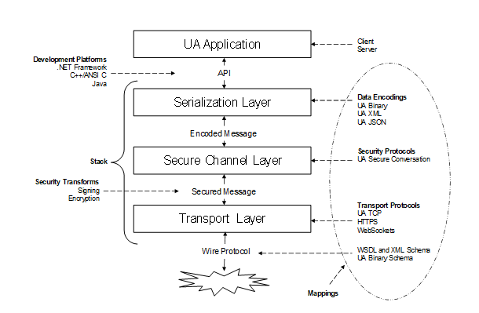  

Figure 1 - The OPC UA Stack Overview  

The layers described in this specification do not correspond to layers in the OSI 7-layer model [ [X200](/§X200) ]. Each OPC UA *StackProfile* should be treated as a single Layer 7 (application) protocol that is built on an existing Layer 5, 6 or 7 protocol such as TCP/IP, TLS or [HTTP](/§Http) . The *SecureChannel* layer is always present even if the *SecurityMode* is *None* . In this situation, no security is applied but the *SecurityProtocol* implementation shall maintain a logical channel with a unique identifier. Users and administrators are expected to understand that a *SecureChannel* with *SecurityMode* set to *None* cannot be trusted unless the application is operating on a physically secure network or a low-level protocol such as IPSec is being used.  

## 5 Data encoding  

### 5.1 General  

#### 5.1.1 Overview  

This document defines three *DataEncodings* : OPC UA Binary, OPC UA XML and OPC UA JSON. It describes how to construct *Messages* using each of these encodings.  

#### 5.1.2 Built-in Types  

All OPC UA *DataEncodings* are based on rules that are defined for a standard set of built-in types. These built-in types are then used to construct structures, arrays and *Messages* . The built-in types are described in [Table 1](/§\_Ref83387521) .  

Table 1 - Built-in Data Types  

| **ID** | **Name** | **Nullable** | **Default** | **Description** |
|---|---|---|---|---|
|1|Boolean|No|false|A two-state logical value (true or false).|
|2|SByte|No|0|An integer value between −128 and 127 inclusive.|
|3|Byte|No|0|An integer value between 0 and 255 inclusive.|
|4|Int16|No|0|An integer value between −32768 and 32767 inclusive.|
|5|UInt16|No|0|An integer value between 0 and 65535 inclusive.|
|6|Int32|No|0|An integer value between −2,147,483,648 and 2,147,483,647 inclusive.|
|7|UInt32|No|0|An integer value between 0 and 4,294,967,295 inclusive.|
|8|Int64|No|0|An integer value between −9,223,372,036,854,775,808 and 9,223,372,036,854,775,807 inclusive.|
|9|UInt64|No|0|An integer value between 0 and 18,446,744,073,709,551,615 inclusive.|
|10|Float|No|0|An IEEE single precision (32 bit) floating point value.|
|11|Double|No|0|An IEEE double precision (64 bit) floating point value.|
|12|String|Yes|null|A sequence of Unicode characters.|
|13|DateTime|Yes|DateTime.MinValue (see [5.1.4](/§\_Ref43238679) )|An instance in time.|
|14|Guid|Yes|All zeros|A 16-byte value that can be used as a globally unique identifier.|
|15|ByteString|Yes|null|A sequence of octets.|
|16|XmlElement|Yes|null|A sequence of Unicode characters that is an XML element. This built-in type shall not have subtypes.|
|17|NodeId|Yes|All fields set to default.|An identifier for a node in the address space of an OPC UA *Server* .|
|18|ExpandedNodeId|Yes|All fields set to default.|A NodeId that allows the namespace URI to be specified instead of an index.|
|19|StatusCode|No|Good|A numeric identifier for an error or condition that is associated with a value or an operation.|
|20|QualifiedName|Yes|All fields set to default.|A name qualified by a namespace.|
|21|LocalizedText|Yes|All fields set to default.|Human readable text with an optional locale identifier.|
|22|ExtensionObject|Yes|All fields set to default.|A structure that contains an application specific data type that may not be recognized by the receiver.|
|23|DataValue|Yes|All fields set to default.|A data value with an associated status code and timestamps.|
|24|Variant|Yes|Null|A union of all of the types specified above.|
|25|DiagnosticInfo|Yes|No fields specified.|A structure that contains detailed error and diagnostic information associated with a StatusCode.|
  

  

Most of these data types are the same as the abstract types defined in [OPC 10000-3](/§UAPart3) and [OPC 10000-4](/§UAPart4) . However, the *ExtensionObject* and *Variant* types are defined in this document. In addition, this document defines a representation for the *Guid* type defined in [OPC 10000-3](/§UAPart3) .  

The Nullable column indicates whether a 'null' value exists for the *DataType* in all *DataEncodings* . A 'null' value is a value that is equavalent 'no value specified'. A nullable type with a default value means the default value shall be interpreted equivalent to a null.  

The Default column specifies the default value for the type if a default value is needed. The default value for all arrays is 'null'.  

#### 5.1.3 Guid  

A *Guid* is a 16-byte globally unique identifier with the layout shown in [Table 2](/§\_Ref179432783) .  

Table 2 - Guid structure  

| **Component** | **Data Type** |
|---|---|
|Data1|UInt32|
|Data2|UInt16|
|Data3|UInt16|
|Data4|Byte [8]|
  

  

*Guid* values may be represented as a string in this form:  

\<Data1\>-\<Data2\>-\<Data3\>-\<Data4[0:1]\>-\<Data4[2:7]\>  

where Data1 is 8 characters wide, Data2 and Data3 are 4 characters wide and each *Byte* in Data4 is 2 characters wide. Each value is formatted as a hexadecimal number with padded zeros. A typical *Guid* value would look like this when formatted as a string:  

C496578A-0DFE-4B8F-870A-745238C6AEAE  

  

#### 5.1.4 DateTime  

*DateTime* values have different ranges on different *DevelopmentPlatforms* . To ensure interoperablity two named values are defined:  

"DateTime.MinValue" is the earliest value that can be represented;  

"DateTime.MaxValue" is the latest value that can be represented.  

If the range supported by the *DataEncoding* is outside of the range supported by a *DevelopmentPlatform* then decoders shall replace any below range values with DateTime.MinValue and any above range values with DateTime.MaxValue for the *DevelopmentPlatform* .  

If the range supported by a *DevelopmentPlatform* is outside of the range supported by a *DataEncoding* then encoders shall replace any below range values with DateTime.MinValue and any above range values with DateTime.MaxValue for the *DataEncoding* .  

The representation of a *DateTime* on a *DevelopmentPlatform* also has a maximum precision. *Decoders* shall truncate *DateTime* values that exceed the supported precision. All *DevelopmentPlatforms* shall support a precision of at least 1ms.  

The *DataValue* built-in type adds additional fields for Picoseconds. If a *DevelopmentPlatform* cannot support the full precision of *DateTime* values allowed by the *DataEncoding* then it should expand the size of its internal representation of Picoseconds field to preserve the full precision of the *DateTime* . If it does not do this it shall set the Picoseconds to 0.  

The Picoseconds shall be set to 0 when the *DateTime* value is DateTime.MinValue or DateTime.MaxValue.  

Concrete examples can be found in [5.2.2.5](/§\_Ref400565610) .  

#### 5.1.5 ByteString  

A *ByteString* is structurally the same as a one-dimensional array of *Byte.* It is represented as a distinct built-in data type because it allows encoders to optimize the transmission of the value. However, some *DevelopmentPlatforms* will not be able to preserve the distinction between a *ByteString* and a one-dimensional array of *Byte* .  

If a decoder ** for *DevelopmentPlatform* cannot preserve the distinction it shall convert all one-dimensional arrays of *Byte* to *ByteStrings* .  

Each element in a one-dimensional array of *ByteString* can have a different length which means is structurally different from a two-dimensional array of *Byte* where the length of each dimension is the same. This means decoders shall preserve the distinction between two or more dimension arrays of *Byte* and one or more dimension arrays of *ByteString* .  

If a *DevelopmentPlatform* does not support ** unsigned integers, then it will have to represent *ByteStrings* as arrays of *SByte* . In this case, the requirements for *Byte* would then apply to *SByte* .  

#### 5.1.6 Number, Integer and UInteger  

*Number* , *Integer* and *UInteger* are abstract simple types defined in [OPC 10000-3](/§UAPart3) . When these types are used in *Structure* fields, the field value is encoded as a *Variant* .  

#### 5.1.7 Structures and Unions  

*Structures* are sequences of name value pairs defined by the *DataTypeDefinition Attribute* in [OPC 10000-3](/§UAPart3) . Each *DataEncoding* describes how to use the *DataTypeDefinition* to serialize *Structures* . *Subtypes* of *Structure* extend the parent by adding additional name-value pairs to the sequence.  

If a *DataTypeDefinition* sets the *StructureType* to *StructureWithSubtypedValues* then any field with a subtype of *Structure* *DataType* and *IsOptional* =TRUE allows the type and any subtype of the field's *DataType* to be present in the field. In these cases, the values are serialized as an *ExtensionObject.* If *IsOptional* =FALSE then the field value is encoded directly according to the rules for the *DataEncoding* .  

A field is serialized as an *ExtensionObject* if a field has a *DataType* set explicitly to *Structure.*  

*Unions* are special subtypes of *Structure* where only one field value is encoded. All subtypes of *Union* are concrete. The remainder of the rules for *Structure* also apply to *Unions* .  

#### 5.1.8 ExtensionObject  

An *ExtensionObject* is a container for any *Structure* and *Union DataTypes* .  

The *ExtensionObject* contains a complex value serialized as a sequence of other DataTypes. It also contains an identifier which indicates what data it contains and how it is encoded.  

There are four primary use cases where *ExtensionObjects* appear:  

* When encoding a top-level *DataType* as a *Service Request* or *Response* ;  

* When encoding a *Structure* value inside a *Variant* ;  

* When encoding a field value in a *Structure* where the field *DataType* is *Structure* .  

* When encoding a field value in a *Structure* where *AllowSubTypes* =TRUE (see [F.12](/§\_Ref472366023) ).  

In all of these cases, the *ExtensionObject* provides an identifier that allows a decoder to know if it understands the *Structure* contained with it and a length that allows the *Structure* to be skipped if it is not recognized.  

*Structured DataTypes* are represented in a *Server* address space as sub-types of the *Structure* *DataType* . The *DataEncodings* available for any given *Structured DataTypes* are represented as a *DataTypeEncoding* *Object* in the *Server* *AddressSpace* . The *NodeId* for the *DataTypeEncoding* *Object* is the identifier stored in the *ExtensionObject* . [OPC 10000-3](/§UAPart3) describes how *DataTypeEncoding* *Nodes* are related to other *Nodes* of the *AddressSpace* .  

Elements of an array of *ExtensionObjects* may have different *DataTypeEncoding NodeIds* specified. In some cases, this will be invalid, however, it is the responsibility of the application layer to enforce whatever constraints are imposed by the Information Model on a given array. Decoders shall accept any valid *ExtensionObject* as an array element.  

*Server* implementers should use namespace qualified numeric *NodeIds* for any *DataTypeEncoding* *Objects* they define. This will minimize the overhead introduced by packing *Structured DataType* values into an *ExtensionObject* .  

*ExtensionObjects and Variants* allow unlimited nesting which could result in stack overflow errors even if the message size is less than the maximum allowed. Decoders shall support at least 100 nesting levels. Decoders shall report an error if the number of nesting levels exceeds what it supports.  

#### 5.1.9 Variant  

A *Variant* is a union of all built-in data types including an *ExtensionObject* . *Variants* can also contain arrays of any of these built-in types. *Variants* are used to store any value or parameter with a data type of *BaseDataType* or one of its subtypes.  

*Variants* can be empty. An empty *Variant* is described as having a null value and should be treated like a null column in a SQL database. A null value in a *Variant* may not be the same as a null value for data types that support nulls such as *Strings* . Some *DevelopmentPlatforms* may not be able to preserve the distinction between a null for a *DataType* and a null for a *Variant* , therefore, applications shall not rely on this distinction. This requirement also means that if an *Attribute* supports the writing of a null value it shall also support writing of an empty *Variant* and vice versa.  

*Variants* can contain arrays of *Variants* but they cannot directly contain another *Variant* .  

*DiagnosticInfo* types only have meaning when returned in a response message with an associated *StatusCode* and table of strings. As a result, *Variants* cannot contain instances of *DiagnosticInfo.*  

*Values* of *Attributes* are always returned in instances of *DataValues* . Therefore, the *DataType* of an *Attribute* cannot be a *DataValue* . *Variants* can contain *DataValue* when used in other contexts such as *Method* *Arguments* or *PubSub* *Messages* . The *Variant* in a *DataValue* cannot, directly or indirectly, contain another *DataValue* .  

*ExtensionObjects and Variants* allow unlimited nesting which could result in stack overflow errors even if the message size is less than the maximum allowed. Decoders shall support at least 100 nesting levels. Decoders shall report an error if the number of nesting levels exceeds what it supports.  

#### 5.1.10 Decimal  

A *Decimal* is a high-precision signed decimal number. It consists of an arbitrary precision integer unscaled value and an integer scale. The scale is the inverse power of ten that is applied to the unscaled value.  

A *Decimal* has the fields described in [Table 3](/§\_Ref473271895) .  

Table 3 - Layout of Decimal  

| **Field** | **Type** | **Description** |
|---|---|---|
|TypeId|NodeId|The identifier for the *Decimal* *DataType* .|
|Encoding|Byte|This value is always 1.|
|Length|Int32|The length of the Scale and *Value* fields in bytes.If the length is less than or equal to 2 then the *Decimal* is an invalid value that cannot be used.|
|Scale|Int16|A signed integer representing scale which is the inverse power of ten that is applied to the unscaled value. i.e., the decimal number of the value multiplied by 10\-scale The integer is encoded starting with the least significant bit.|
|Value|OctetString|A 2-complement signed integer representing the unscaled value. The number of bytes is the value of the *Length* field minus size of the *Scale* field. The integer is encoded with the least significant byte first.|
  

  

When a *Decimal* is encoded in a *Variant* the built-in type is set to *ExtensionObject* . Decoders that do not understand the *Decimal* type shall treat it like any other unknown *Structure* and pass it on to the application. Decoders that do understand the *Decimal* can parse the value and use any construct that is suitable for the *DevelopmentPlatform* . Note that a *Decimal* is like a built-in type and a *DevelopmentPlatform* has to have hardcoded knowledge of the type. No *Structure* metadata is published for this type.  

If a *Decimal* is embedded in another *Structure* then the *DataTypeDefinition* for the field shall specify the *NodeId* of the *Decimal* *Node* as the *DataType* . If a *Server* publishes an OPC Binary type description for the *Structure* then the type description shall set the *DataType* for the field to *ExtensionObject* .  

#### 5.1.11 Null, Empty and Zero-Length Arrays  

The terms null, empty and zero-length are used to describe array values ( *Strings* are arrays of characters and *ByteStrings* are arrays of *Bytes* for purposes of this discussion). A null array has no value. A zero-length or empty array is an array with 0 elements. Some *DataEncodings* will allow the distinction to be preserved on the wire, however, not all *DevelopmentPlatforms* will be able to preserve the distinction. For this reason, null, empty and zero length arrays are semantically the same for all *DataEncodings* . Decoders shall be able to handle all variations supported by the *DataEncoding* , however, decoders are not required to preserve the distinction. When testing for equality, applications shall treat null and empty arrays as equal. When a *DevelopmentPlatform* supports the distinction, writing and reading back an array value may result in null array becoming an empty array or vice versa.  

#### 5.1.12 QualifiedName, NodeId and ExpandedNodeId String Encoding  

*QualifiedNames* , *NodeIds* and *ExpandedNodeIds* optimize representation of *NamespaceUris* by using a *NamespaceIndex* to reference the location of the URI in a *NamespaceTable* . The *NamespaceTable* to use is known from the context. For example, when a *Client* establishes a *Session* with a *Server* , the *Server* supplies the *NamespaceTable* that is used for all exchanges within that *Session* . Another example, is when a *Publisher* publishes *DataSetMetadata* messages, the *NamespaceTable* is provided as part of the message.  

However, there are other scenarios where there is no obvious context that can be used to store the *NamespaceTable* , such as column in a database table, so it is necessary to provide a self-contained representation of these *DataTypes* . This clause defines a normative *String* representation using the ABNF like notation (see [RFC 5234](/§RFC5234) ). [Table 4](/§\_Ref122646535) defines additional core rules used in these definitions.  

Table 4 - Additional Core Rules  

|||
|---|---|
|UNICODE|Any Unicode character other than a Control character.|
|CONTROL|Any Unicode Control character (includes nulls, carriage returns, tabs and new lines).|
|URI|A string that conforms to [RFC 3986](/§RFC3986) .|
|ENCODEDURI|A URI which has the [RFC 3986](/§RFC3986) Percent-Encoding applied to it. Any ';' in the URI shall be percent encoded.|
|BASE64|A Base64 encoded binary value (see [Base64](/§Base64) ).|
  

  

The description for a *NodeId* is found in [Table 5](/§\_Ref122646734) .  

Table 5 - Description for a NodeId  

|||
|---|---|
|\<node-id\>|= \<identifier\>|
|\<node-id\>|=/ \<namespace-index\> ";" \<identifier\>|
|\<node-id\>|=/ \<namespace-uri\> ";" \<identifier\>|
|\<namespace-index\>|= "ns=" 1\*DIGIT|
|\<namespace-uri\>|= "nsu=" ENCODEDURI|
|\<identifier\>|= \<numericid\> / \<stringid\> / \<guidid\> / \<opaqueid\>|
|\<numericid\>|= "i=" \*DIGIT|
|\<stringid\>|= "s=" \*(UNICODE)|
|\<guidid\>|= "g=" 8HEXDIG 3("-" 4HEXDIG) "-" 12HEXDIG|
|\<opaqueid\>|= "b=" BASE64|
  

  

*NodeIds* with a *NamespaceIndex* of 0 or a *NamespaceUri* of [http://opcfoundation.org/UA/](http://opcfoundation.org/UA/) shall only use the \<identifier\> form.  

[OPC 10000-3](/§UAPart3) prohibits control characters, such as tabs (0x09), in the string identifier for *NodeIds* .  

The URI portion of *NodeIds* are escaped with URI percent encoding as defined in [RFC 3986](/§RFC3986) . Semicolons are added to the list of reserved characters of all URI schemes.  

Examples of *NodeIds* :  

i=13  

ns=10;i=12345  

nsu=http://widgets.com/schemas/hello;s=水 World  

g=09087e75-8e5e-499b-954f-f2a9603db28a  

nsu=tag:acme.com,2023:schemas:data\#off%3B;b=M/RbKBsRVkePCePcx24oRA==  

  

The description for a *ExpandedNodeId* is found in [Table 6](/§\_Ref122649055) .  

Table 6 - Description for a ExpandedNodeId  

|||
|---|---|
|\<expanded-node-id\>|= \<node-id\>|
|\<expanded-node-id\>|=/ \<server-index\> ";" \<node-id\>|
|\<expanded-node-id\>|=/ \<server-uri\> ";" \<node-id\>|
|\<server-index\>|= "svr=" \*DIGIT|
|\<server-uri\>|= "svu=" ENCODEDURI|
  

  

*ExpandedNodeIds* that are not specific to a *Server* shall use the \<node-id\> form.  

[OPC 10000-3](/§UAPart3) prohibits control characters, such as tabs (0x09), in the string identifier for *ExpandedNodeIds* .  

The URI portions of *ExpandedNodeIds* are escaped with URI percent encoding as defined in [RFC 3986](/§RFC3986) . Semicolons are added to the list of reserved characters of all URI schemes. Examples of *ExpandedNodeIds* :  

i=13  

svr=1;nsu=http://widgets.com/schemas/hello;s=水 World  

svu=http://smith.com/east/factory;g=09087e75-8e5e-499b-954f-f2a9603db28a  

svu=http://smith.com/west/factory;nsu=tag:acme.com,2023:schemas:data\#off%3B;b=M/RbKBsRVkePCePcx24oRA==  

  

The description for a *QualifiedName* is found in [Table 7](/§\_Ref122649467) .  

Table 7 - Description for a QualifiedName  

|||
|---|---|
|\<qualified-name\>|= \<name\>|
|\<qualified-name\>|=/ 1\*DIGIT ":" \<name\>|
|\<qualified-name\>|=/ \<namespace-uri\> ";" \<name\>|
|\<name\>|= 1\*(UNICODE)|
  

  

*QualifiedNames* in the OPC UA Namespace shall not use the form with a \<namespace-uri\>.  

The form without a prefix (the first row in [Table 7](/§\_Ref122649467) ) shall only be used for *QualifiedNames* in the OPC UA Namespace. This is unambiguous because the *Name* portion of a *QualifiedName* in the OPC UA Namespace starting with a sequence of digits followed by a colon is prohibited.  

[OPC 10000-3](/§UAPart3) prohibits control characters, such as tabs (0x09), in the name portion of a *QualifiedName* .  

The URI portions of *QualifiedNames* are escaped with URI percent encoding as defined in [RFC 3986](/§RFC3986) . Semicolons are added to the list of reserved characters of all URI schemes. Examples of *QualifiedNames* :  

InputArguments  

3:Hello:World  

nsu=http://widgets.com/schemas/hello;Hello;World  

nsu=tag:acme.com,2023:schemas:data\#off%3B;Boiler2  

  

#### 5.1.13 Name Encoding Rules  

Text based *DataEncodings* such as UA XML ( [5.3](/§\_Ref131702289) ) or UA JSON ( [5.4](/§\_Ref443435038) ) make use of *Names* from the *DataType* and *DataTypeDefinition* to create the serialized data. XML and JSON formats impose restrictions on the *Strings* that may be used in serialized data so it is necessary to define a transformation that ensures any *Names* can be used in the *DataEncoding* . The following rules are used to convert a *DataType* Name or a Structure Field Name to a string supported by the Encoding:  

1. Any character that is not permitted by the *DataEncoding* is replaced by an underscore (U+005F);  

1. A name with text sequence that is not valid in the first position has an underscore (U+005F) added as a prefix.  

The character restrictions for the XML *DataEncoding* are:  

|||
|---|---|
|\<allowed-name\>|= \<letter\> \*(\<allowed-char\> / "\_" / "-"/ ".")|
|\<allowed-char\>|= \<letter\> / DIGIT|
|\<letter\>|= UNICODE-LETTER|
|UNICODE-LETTER|Any Unicode character with a general category of 'Letter'|
  

In addition, XML names cannot start with the text 'xml' or any variation in case (i.e. 'xMl').  

There are no restrictions for the JSON encoding other than the general restrictions defined in [OPC 10000-3](/§UAPart3) .  

[Table 8](/§\_Ref130464699) has examples of XML encoded names.  

Table 8 - Examples of XML Encoded Names  

|||
|---|---|
|Hello|Hello|
|\_Hello|\_Hello|
|3DHello|\_3DHello|
|冷水|冷水|
|3 (冷水。)-Hello|\_3\_\_冷水\_\_-Hello|
  

  

Note the last example includes a Japanese period that is not permitted by XML rules. The glyph for the Japanese period has trailing white space embedded in it. All characters not allowed by XML rules are replaced with underscores.  

#### 5.1.14 Structure FieldPath Encoding Rules  

Values ** of *Structure DataTypes* are sequences of name-value pairs. In many cases the value will be an array or another *Structure* . There are situations where it is necessary to refer to an element within a *Structure* . The *Structure FieldPath* defines a path to a single value within a *Structure* .  

The description for a *Structure FieldPath* is found in [Table 9](/§\_Ref157112060) .  

Table 9 - Description for a Structure FieldPath  

|||
|---|---|
|\<path\>|= \<path-element\> \*("." \<path-element\>)|
|\<path-element\>|= \<name\> / \<index\>|
|\<name\>|= 1\*\<char\> / "'" 1\*\<char\> "'"|
|\<index\>|= "[" 1\*DIGIT \*("," 1\*DIGIT) "]"|
|\<char\>|= UNICODE-NO-CONTROL-OR-ESCAPED / \<escaped\>|
|\<escaped\>|= ".." / "[["|
  

  

The UNICODE-NO-CONTROL-OR-ESCAPED is a core rule that includes all UNICODE characters except for U+0027 (') and any character with a category of Cc (control codes).  

Any apostrophe (U+0027 (')) in a \<name\> is escaped by adding an extra copy of the same character and the name shall be enclosed with apostrophes.  

Any \<name\> may be enclosed with apostrophes. Any \<name\> that contains U+0027 ('), U+005B ([), U+005B (]), or U+002E (.) shall be enclosed with apostrophes.  

The \<name\> comes from the *Name* of a field in the *DataTypeDefinition* for the *Structure* .  

The \<index\> is an index in field containing an array value. If an array has multiple dimensions, then the \<index\> has multiple elements separated by U+002C (,).  

The *DataTypeDefinition* for a simple *Structure* is found in [Table 10](/§\_Ref162238229) .  

Table 10 - DataTypeDefinition for a simple Structure  

| **Field Name** | **DataType** | **Description** |
|---|---|---|
|Red|Boolean|Simple Boolean value.|
|Yellow.One|Int32|Int32 value with a special character in the name.|
|Green's|String []|Array of string values.|
  

  

The value for the simple *Structure* using JSON:  

\{  

"Red": true,  

"Yellow.One": 42,  

"Green's": [ "macintosh", "fuji", "ambrosia" ]  

\}  

  

Examples of *FieldPaths* and their values based on the simple *Structure* value are in [Table 11](/§\_Ref162238648) .  

Table 11 - Examples of FieldPaths for a Simple Structure  

| **FieldPath** | **Resolved Value** |
|---|---|
|'Yellow.One'|42|
|'Green''s'|["macintosh", "fuji", "ambrosia"]|
|'Green''s'.[1]|"fuji"|
|Pink|Cannot be resolved because name not found.|
|'Green''s'.[6]|Cannot be resolved because of index too large.|
|'Green''s'.[TEXT]|Cannot be resolved because of non-numeric index.|
  

  

The *DataTypeDefinition* for a complex *Structure* is found in [Table 12](/§\_Ref162239346) .  

Table 12 - DataTypeDefinition for a Complex Structure  

| **Field Name** | **DataType** | **Description** |
|---|---|---|
|Apple|SimpleStructure []|An array of the Structure defined in [Table 10](/§\_Ref162238229) .|
|[Banana]|Structure|Any Structure value.|
|Grape|BaseDataType|Any value.|
  

  

The value for the complex Structure using JSON:  

\{  

"Apple": [  

\{  

"Red": true,  

"Yellow.One": 42,  

"Green's": [ "macintosh", "fuji", "ambrosia" ]  

\}  

],  

"[Banana]": \{  

"TypeId": "\<type-id\>",  

"Body": \{  

"X": 987,  

"Y": 432  

\},  

"Grape": \{  

"Type": 6  

"Body": [ 123, 345, 678 ]  

\},  

\}  

  

Examples of *FieldPaths* and their values based on the complex Structure value are in [Table 13](/§\_Ref162239373) .  

Table 13 - Examples of FieldPaths in a Complex Structure  

| **FieldPath** | **Resolved Value** |
|---|---|
|Apple.[0]|\{ "Red": true, "Yellow.One": 42, "Green": [ "macintosh", "fuji", "ambrosia" ] \}|
|Apple.[0].'Yellow.One'|42|
|Apple.[0].'Green''s'|["macintosh", "fuji", "ambrosia"]|
|Apple.[0].'Green''s'.[1]|"fuji"|
|'[Banana]'|\{ "TypeId": "\<type-id\>", "Body": \{ "X": 987, "Y": 432 \} \}|
|'[Banana]'.Body|\{ "X": 987, "Y": 432 \}|
|'[Banana]'.Body.Y|432|
|Grape|\{ "Type": 6 "Body": [ 123, 345, 678 ] \}|
|Grape.Body.[1]|345|
  

  

### 5.2 OPC UA Binary  

#### 5.2.1 General  

The OPC UA *Binary* *DataEncoding* is a data format developed to meet the performance needs of OPC UA applications. This format is designed primarily for fast encoding and decoding, however, the size of the encoded data on the wire was also a consideration.  

The OPC UA *Binary* *DataEncoding* relies on several primitive data types with clearly defined encoding rules that can be sequentially written to or read from a binary stream. A structure is encoded by sequentially writing the encoded form of each field. If a given field is also a structure, then the values of its fields are written sequentially before writing the next field in the containing structure. All fields shall be written to the stream even if they contain null values. The encodings for each primitive type specify how to encode either a null or a *DefaultValue* for the type.  

The OPC UA *Binary* *DataEncoding* does not include any type or field name information because all OPC UA applications are expected to have advance knowledge of the services and structures that they support. An exception is an *ExtensionObject* which provides an identifier and a size for the *Structured DataType* structure it represents. This allows a decoder to skip over types that it does not recognize.  

#### 5.2.2 Built-in Types  

##### 5.2.2.1 Boolean  

A *Boolean* value shall be encoded as a single byte where a value of 0 (zero) is false and any non-zero value is true.  

Encoders shall use the value of 1 to indicate a true value; however, decoders shall treat any non-zero value as true.  

##### 5.2.2.2 Integer  

All integer types shall be encoded as little-endian values where the least significant byte appears first in the stream.  

[Figure 2](/§\_Ref105731366) illustrates how value 1 000 000 000 (Hex: 3B9ACA00) is encoded as a 32-bit integer in the stream.  

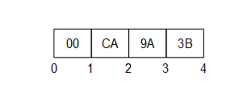  

Figure 2 - Encoding Integers in a binary stream  

##### 5.2.2.3 Floating Point  

All floating-point values shall be encoded with the appropriate [IEEE 754](/§IEEE754) binary representation which has three basic components: the sign, the exponent, and the fraction. The bit ranges assigned to each component depend on the width of the type. [Table 14](/§\_Ref105731537) lists the bit ranges for the supported floating-point types.  

Table 14 - Supported Floating Point Types  

| **Name** | **Width (bits)** | **Fraction** | **Exponent** | **Sign** |
|---|---|---|---|---|
|Float|32|0-22|23-30|31|
|Double|64|0-51|52-62|63|
  

In addition, the order of bytes in the stream is significant. All floating-point values shall be encoded with the least significant byte appearing first (i.e., little endian).  

[Figure 3](/§\_Ref105731403) illustrates how the value −6.5 (Hex: C0D00000) is encoded as a *Float* .  

The floating-point type supports positive and negative infinity and not-a-number (NaN). The IEEE specification allows for multiple NaN variants; however, the encoders/decoders may not preserve the distinction. Encoders shall encode a NaN value as an IEEE quiet-NAN (Hex: 000000000000F8FF) or (Hex: 0000C0FF). Any unsupported types such as denormalized numbers shall also be encoded as an IEEE quiet-NAN. Any test for equality between NaN values always fails.  

 **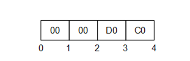**   

Figure 3 - Encoding Floating Points in a binary stream  

##### 5.2.2.4 String  

All *String* values are encoded as a sequence of [UTF-8](/§UTF8) characters preceded by the length in bytes.  

The length in bytes is encoded as *Int32* . A value of −1 is used to indicate a 'null' string.  

*Strings* with embedded nulls ('\\0') can lead to unpredictable application behaviour because embedded nulls have special meaning to some *DevelopmentPlatforms* . For this reason, embedded nulls are not recommended and *ByteString* should be used instead. That said, Encoders may encode *Strings* with embedded nulls. Decoders shall use the length to read all bytes in *String* .  

[Figure 4](/§\_Ref105731569) illustrates how the multilingual string '水Boy' is encoded in a byte stream.  

  

Figure 4 - Encoding Strings in a binary stream  

##### 5.2.2.5 DateTime  

A *DateTime* value shall be encoded as a 64-bit signed integer (see [5.2.2.2](/§\_Ref90086478) ) which represents the number of 100 nanosecond intervals since January 1, 1601 (UTC).  

Not all *DevelopmentPlatforms* will be able to represent the full range of dates and times that can be represented with this *DataEncoding* . For example, the UNIX time\_t structure only has a 1 second resolution and cannot represent dates prior to 1970. For this reason, a number of rules shall be applied when dealing with date/time values that exceed the dynamic range of a *DevelopmentPlatform* . These rules are:  

A date/time value is encoded as 0 if either:  

1. The value is equal to or earlier than 1601-01-01 12:00AM UTC.  

1. The value is the earliest date that can be represented with the *DevelopmentPlatform* 's encoding.  

A date/time is encoded as the maximum value for an *Int64* if either:  

1. The value is equal to or greater than 9999-12-31 11:59:59PM UTC,  

1. The value is the latest date that can be represented with the *DevelopmentPlatform* 's encoding.  

A date/time is decoded as the earliest time that can be represented on the platform if either:  

1. The encoded value is 0,  

1. The encoded value represents a time earlier than the earliest time that can be represented with the *DevelopmentPlatform* 's encoding.  

A date/time is decoded as the latest time that can be represented on the platform if either:  

1. The encoded value is the maximum value for an *Int64* ,  

1. The encoded value represents a time later than the latest time that can be represented with the *DevelopmentPlatform* 's encoding.  

These rules imply that the earliest and latest times that can be represented on a given platform are invalid date/time values and should be treated that way by applications.  

A decoder shall truncate the value if a decoder encounters a *DateTime* value with a resolution that is greater than the resolution supported on the *DevelopmentPlatform* .  

##### 5.2.2.6 Guid  

A *Guid* is encoded in a structure as shown in [Table 2](/§\_Ref179432783) . Fields are encoded sequentially according to the data type for field.  

[Figure 5](/§\_Ref179441379) illustrates how the *Guid* "72962B91-FA75-4AE6-8D28-B404DC7DAF63" is encoded in a byte stream.  

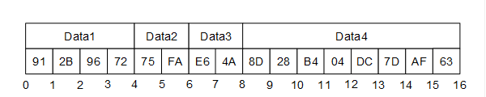  

Figure 5 - Encoding Guids in a binary stream  

##### 5.2.2.7 ByteString  

A *ByteString* is encoded as sequence of bytes preceded by its length in bytes. The length is encoded as a 32-bit signed integer as described above.  

If the length of the byte string is −1 then the byte string is 'null'.  

##### 5.2.2.8 XmlElement (Deprecated)  

An *XmlElement* is an XML element serialized as [UTF-8](/§UTF8) string and then encoded as *ByteString.*  

[Figure 6](/§\_Ref179441758) illustrates how the *XmlElement* "\<A\>Hot水\</A\>" is encoded in a byte stream.  

!. 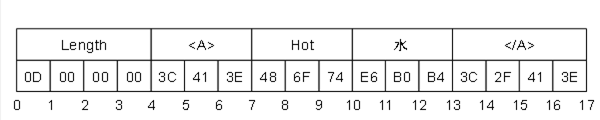  

Figure 6 - Encoding XmlElement in a binary stream  

A decoder may choose to parse the XML after decoding; if an unrecoverable parsing error occurs then the decoder should try to continue processing the stream. For example, if the *XmlElement* is the body of a *Variant* or an element in an array which is the body of a *Variant* then this error can be reported by setting value of the *Variant* to the *StatusCode* *Bad\_DecodingError* .  

##### 5.2.2.9 NodeId  

The components of a *NodeId* are described the [Table 15](/§\_Ref105731646) .  

Table 15 - NodeId components  

| **Name** | **Data Type** | **Description** |
|---|---|---|
|Namespace|UInt16|The index for a namespace URI. An index of 0 is used for OPC UA defined *NodeIds.*|
|IdentifierType|Enumeration|The format and data type of the identifier. The value may be one of the following: NUMERIC\- the value is an *UInteger;* STRING\- the value is *String* ; GUID\- the value is a *Guid* ; OPAQUE\- the value is a *ByteString* ;|
|Value|UInt32 or String or Guid or ByteString|The identifier for a node in the address space of an OPC UA *Server* .|
  

  

The *DataEncoding* of a *NodeId* varies according to the contents of the instance. For that reason, the first byte of the encoded form indicates the format of the rest of the encoded *NodeId* . The possible *DataEncoding* formats are shown in [Table 16](/§\_Ref105731689) . [Table 16](/§\_Ref105731689) through [Table 19](/§\_Ref131423295) describe the structure of each possible format (they exclude the byte which indicates the format).  

Table 16 - NodeId DataEncoding values  

| **Name** | **Value** | **Description** |
|---|---|---|
|Two Byte|0x00|A numeric value that fits into the two-byte representation.|
|Four Byte|0x01|A numeric value that fits into the four-byte representation.|
|Numeric|0x02|A numeric value that does not fit into the two or four byte representations.|
|String|0x03|A String value.|
|Guid|0x04|A Guid value.|
|ByteString|0x05|An opaque (ByteString) value.|
|NamespaceUri Flag|0x80|See discussion of *ExpandedNodeId* in [5.2.2.10](/§\_Ref135290999) .|
|ServerIndex Flag|0x40|See discussion of *ExpandedNodeId* in [5.2.2.10](/§\_Ref135290999) .|
  

  

The standard *NodeId* *DataEncoding* has the structure shown in [Table 17](/§\_Ref187488302) . The standard *DataEncoding* is used for all formats that do not have an explicit format defined.  

Table 17 - Standard NodeId Binary DataEncoding  

| **Name** | **Data Type** | **Description** |
|---|---|---|
|Namespace|UInt16|The *NamespaceIndex* .|
|Identifier|\*|The identifier which is encoded according to the following rules: NUMERIC|UInt32|STRING|String|GUID|Guid|OPAQUE|ByteString||
  

  

An example of a String *NodeId* with Namespace = 1 and Identifier = "Hot水" is shown in [Figure 7](/§\_Ref191055924) .  

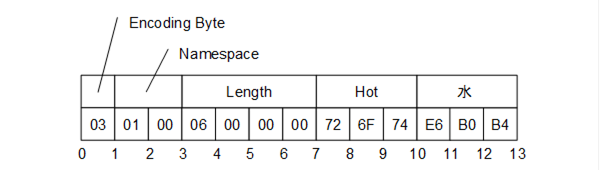  

Figure 7 - A String NodeId  

The Two Byte *NodeId* *DataEncoding* has the structure shown in [Table 18](/§\_Ref131422614) .  

Table 18 - Two Byte NodeId Binary DataEncoding  

| **Name** | **Data Type** | **Description** |
|---|---|---|
|Identifier|Byte|The *Namespace* is the default OPC UA namespace (i.e. 0). The *Identifier* Type is 'Numeric'. The *Identifier* shall be in the range 0 to 255.|
  

  

  

An example of a Two Byte *NodeId* with Identifier = 72 is shown in [Figure 8](/§\_Ref191056174) .  

  

Figure 8 - A Two Byte NodeId  

The Four Byte *NodeId* *DataEncoding* has the structure shown in [Table 19](/§\_Ref131423295) .  

Table 19 - Four Byte NodeId Binary DataEncoding  

| **Name** | **Data Type** | **Description** |
|---|---|---|
|Namespace|Byte|The *Namespace* shall be in the range 0 to 255.|
|Identifier|UInt16|The *Identifier* Type is 'Numeric'. The *Identifier* shall be an integer in the range 0 to 65 535.|
  

  

An example of a Four Byte *NodeId* with Namespace = 5 and Identifier = 1025 is shown in [Figure 9](/§\_Ref191057283) .  

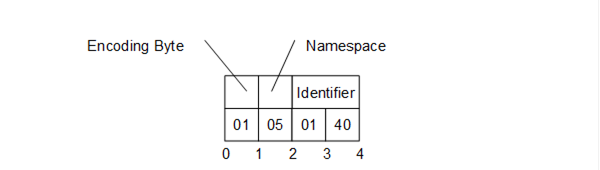  

Figure 9 - A Four Byte NodeId  

  

##### 5.2.2.10 ExpandedNodeId  

An *ExpandedNodeId* extends the *NodeId* structure by allowing the *NamespaceUri* to be explicitly specified instead of using the *NamespaceIndex* . The *NamespaceUri* is optional. If it is specified, then the *NamespaceIndex* inside the *NodeId* shall be ignored.  

The *ExpandedNodeId* is encoded by first encoding a *NodeId* as described in [5.2.2.9](/§\_Ref131470336) and then encoding *NamespaceUri* as a *String* .  

An instance of an *ExpandedNodeId* may still use the *NamespaceIndex* instead of the *NamespaceUri* . In this case, the *NamespaceUri* is not encoded in the stream. The presence of the *NamespaceUri* in the stream is indicated by setting the *NamespaceUri* flag in the encoding format byte for the *NodeId* .  

If the *NamespaceUri* is present, then the encoder shall encode the *NamespaceIndex* as 0 in the stream when the *NodeId* portion is encoded. The unused *NamespaceIndex* is included in the stream for consistency.  

An *ExpandedNodeId* may also have a *ServerIndex* which is encoded as a *UInt32* after the *NamespaceUri.* The *ServerIndex* flag in the *NodeId* encoding byte indicates whether the *ServerIndex* is present in the stream. The *ServerIndex* is omitted if it is equal to zero.  

The *ExpandedNodeId* encoding has the structure shown in [Table 20](/§\_Ref179490138) .  

Table 20 - ExpandedNodeId Binary DataEncoding  

| **Name** | **Data Type** | **Description** |
|---|---|---|
|NodeId|NodeId|The NamespaceUri and ServerIndex flags in the NodeId encoding indicate whether those fields are present in the stream.|
|NamespaceUri|String|Not present if null or Empty.|
|ServerIndex|UInt32|Not present if 0.|
  

  

##### 5.2.2.11 StatusCode  

A *StatusCode* is encoded as a *UInt32* .  

##### 5.2.2.12 DiagnosticInfo  

A *DiagnosticInfo* structure is described in [OPC 10000-4](/§UAPart4) . It specifies a number of fields that could be missing. For that reason, the encoding uses a bit mask to indicate which fields are actually present in the encoded form.  

As described in [OPC 10000-4](/§UAPart4) , the *SymbolicId* , *NamespaceUri* , *LocalizedText* and *Locale* fields are indexes in a string table which is returned in the response header. Only the index of the corresponding string in the string table is encoded. An index of −1 indicates that there is no value for the string.  

*DiagnosticInfo* is recursive and unlimited recursion could result in stack overflow errors even if the message size is less than the maximum allowed. Decoders shall support at least 4 recursion levels and are not expected to support more than 10. Decoders shall report an error if the number of recursion levels exceeds what it supports.  

Table 21 - DiagnosticInfo Binary DataEncoding  

| **Name** | **Data Type** | **Description** |
|---|---|---|
|Encoding Mask|Byte|A bit mask that indicates which fields are present in the stream. The mask has the following bits: 0x01|Symbolic Id|0x02|Namespace|0x04|LocalizedText|0x08|Locale|0x10|Additional Info|0x20|InnerStatusCode|0x40|InnerDiagnosticInfo||
|SymbolicId|Int32|A symbolic name for the status code.|
|NamespaceUri|Int32|A namespace that qualifies the symbolic id.|
|Locale|Int32|The locale used for the localized text.|
|LocalizedText|Int32|A human readable summary of the status code.|
|Additional Info|String|Detailed application specific diagnostic information.|
|Inner StatusCode|StatusCode|A status code provided by an underlying system.|
|Inner DiagnosticInfo|DiagnosticInfo|Diagnostic info associated with the inner status code.|
  

  

##### 5.2.2.13 QualifiedName  

A *QualifiedName* structure is encoded as shown in [Table 22](/§\_Ref166071367) .  

The abstract *QualifiedName* structure is defined in [OPC 10000-3](/§UAPart3) .  

Table 22 - QualifiedName Binary DataEncoding  

| **Name** | **Data Type** | **Description** |
|---|---|---|
|NamespaceIndex|UInt16|The namespace index.|
|Name|String|The name.|
  

  

##### 5.2.2.14 LocalizedText  

A *LocalizedText* structure contains two fields that could be missing. For that reason, the encoding uses a bit mask to indicate which fields are actually present in the encoded form.  

The abstract *LocalizedText* structure is defined in [OPC 10000-3](/§UAPart3) .  

Table 23 - LocalizedText Binary DataEncoding  

| **Name** | **Data Type** | **Description** |
|---|---|---|
|EncodingMask|Byte|A bit mask that indicates which fields are present in the stream. The mask has the following bits: 0x01|Locale|0x02|Text||
|Locale|String|The locale. Omitted is null or empty.|
|Text|String|The text in the specified locale. Omitted is null or empty.|
  

  

##### 5.2.2.15 ExtensionObject  

An *ExtensionObject* is encoded as sequence of bytes prefixed by the *NodeId* of its *DataTypeEncoding* , the *DataEncoding* used and the number of bytes encoded.  

An *ExtensionObject* may be serialized as a *ByteString* or an *XmlElement* by the application and then passed to the encoder. In this case, the encoder will be able to write the number of bytes in the object before it encodes the bytes. However, an *ExtensionObject* may know how to encode/decode itself which means the encoder shall calculate the number of bytes before it encodes the object or it shall be able to seek backwards in the stream and update the length after encoding the body.  

When a decoder encounters an *ExtensionObject* it shall check if it recognizes the *DataTypeEncoding* identifier. If it does, then it can call the appropriate function to decode the object body. If the decoder does not recognize the type it shall use the *Encoding* to determine if the body is a *ByteString* or an *XmlElement* and then decode the object body or treat it as opaque data and skip over it *.*  

If the *Encoding* is *Binary* the *Body* uses the OPC UA Binary *DataEncoding* . If the *Encoding* is XML the *Body* uses the OPC UA XML *DataEncoding* . Other *DataEncodings* may not be serialized in an *ExtensionObject* .  

The serialized form of an *ExtensionObject* is shown in [Table 24](/§\_Ref135154704) .  

Table 24 - Extension Object Binary DataEncoding  

| **Name** | **Data Type** | **Description** |
|---|---|---|
|TypeId|NodeId|The identifier for the *DataTypeEncoding* node in the *Server's* *AddressSpace* . *ExtensionObjects* defined by the OPC UA specification have a numeric node identifier assigned to them with a *NamespaceIndex* of 0. The numeric identifiers are defined in [A.3](/§\_Ref400571295) . Decoders use this field to determine the syntax of the *Body* .|
|Encoding|Byte|An enumeration that indicates how the body is encoded. The parameter may have the following values: 0x00|No body is encoded.|0x01|The body is encoded as a ByteString.|0x02|The body is encoded as an XmlElement.||
|Length|Int32|The length of the object body. The length shall be specified if the body is encoded.|
|Body|OctetString|The object encoded with the *DataEncoding* indicated by the *TypeId.* This field contains the raw bytes for *ByteString* bodies. For XmlElement bodies this field contains the XML encoded as a UTF-8 string without any null terminator.|
  

  

A decoder may choose to parse an *XmlElement* body after decoding; if an unrecoverable parsing error occurs then the decoder should try to continue processing the stream. For example, if the *ExtensionObject* is the body of a *Variant* or an element in an array that is the body of *Variant* then this error can be reported by setting the value of the *Variant* to the *StatusCode* *Bad\_DecodingError.*  

##### 5.2.2.16 Variant  

A *Variant* is a union of the built-in types.  

The structure of a *Variant* is shown in [Table 25](/§\_Ref131482954) .  

Table 25 - Variant Binary DataEncoding  

| **Name** | **Data Type** | **Description** |
|---|---|---|
|EncodingMask|Byte|The type of data encoded in the stream. A value of 0 specifies a NULL and that no other fields are encoded.The mask has the following bits assigned: 0:5|Built-in Type Id (see [Table 1](/§\_Ref83387521) ).|6|True if the ArrayDimensions field is encoded.|7|True if an array of values is encoded.|The Built-in Type Ids 26 through 31 are not currently assigned but may be used in the future. Decoders shall accept these IDs, assume the *Value* contains a *ByteString* or an array of *ByteStrings* and pass both onto the application. Encoders shall not use these IDs.The *ArrayDimensions* field shall only be present if the number of dimensions is 2 or greater and all dimensions have a length greater than 0.|
|ArrayLength|Int32|The number of elements in the array. This field is only present if the array bit is set in the encoding mask. Multi-dimensional arrays are encoded as a one-dimensional array and this field specifies the total number of elements. The original array can be reconstructed from the dimensions that are encoded after the value field. Higher rank dimensions are serialized first. For example, an array with dimensions [2,2,2] is written in this order: [0,0,0], [0,0,1], [0,1,0], [0,1,1], [1,0,0], [1,0,1], [1,1,0], [1,1,1] If one or more dimensions has a length \<= 0 then the ArrayLength is 0.|
|Value|\*|The value encoded according to its built-in data type. If the array bit is set in the encoding mask, then each element in the array is encoded sequentially. Since many types have variable length encoding each element shall be decoded in order. The value shall not be a *Variant* but it could be an array of *Variants* . Many implementation platforms do not distinguish between one dimensional Arrays of *Bytes* and *ByteStrings* . For this reason, decoders are allowed to automatically convert an Array of *Bytes* to a *ByteString* .|
|ArrayDimensionsLength|Int32|The number of dimensions. This field is only present if the ArrayDimensions flag is set in the encoding mask.|
|ArrayDimensions|Int32[]|The length of each dimension encoded as a sequence of Int32 values This field is only present if the ArrayDimensions flag is set in the encoding mask. The lower rank dimensions appear first in the array. All dimensions shall be specified and shall be greater than zero.. If *ArrayDimensions* are inconsistent with the *ArrayLength* then the decoder shall stop and raise a *Bad\_DecodingError* .|
  

  

The types and their identifiers that can be encoded in a *Variant* are shown in [Table 1](/§\_Ref83387521) .  

##### 5.2.2.17 DataValue  

A *DataValue* is always preceded by a mask that indicates which fields are present in the stream.  

The fields of a *DataValue* are described in [Table 26](/§\_Ref105731849) .  

Table 26 - Data Value Binary DataEncoding  

| **Name** | **Data Type** | **Description** |
|---|---|---|
|Encoding Mask|Byte|A bit mask that indicates which fields are present in the stream. The mask has the following bits: 0x01|False if the Value is *Null.*|0x02|False if the StatusCode is Good.|0x04|False if the SourceTimestamp is *DateTime* . *MinValue* .|0x08|False if the ServerTimestamp is *DateTime* . *MinValue* .|0x10|False if the SourcePicoseconds is not present.|0x20|False if the ServerPicoseconds is not present.||
|Value|Variant|The value. Not present if the Value bit in the EncodingMask is False.|
|Status|StatusCode|The status associated with the value. Not present if the StatusCode bit in the EncodingMask is False.|
|SourceTimestamp|DateTime|The source timestamp associated with the value. Not present if the SourceTimestamp bit in the EncodingMask is False.|
|SourcePicoseconds|UInt16|The number of 10 Picosecond intervals for the SourceTimestamp. Not present if the SourcePicoseconds bit in the EncodingMask is False. If the source timestamp is missing the Picoseconds are ignored.|
|ServerTimestamp|DateTime|The *Server* timestamp associated with the value. Not present if the ServerTimestamp bit in the EncodingMask is False.|
|ServerPicoseconds|UInt16|The number of 10 Picosecond intervals for the ServerTimestamp. Not present if the ServerPicoseconds bit in the EncodingMask is False. If the *Server* timestamp is missing the Picoseconds are ignored.|
  

  

The *Picoseconds* fields store the difference between a high-resolution timestamp with a resolution of 10 Picoseconds and the *Timestamp* field value which only has a 100 ns resolution. The *Picoseconds* fields shall contain values less than 10 000. The decoder shall treat values greater than or equal to 10 000 as the value '9999'.  

#### 5.2.3 Decimal  

*Decimals* are encoded as described in [5.1.10](/§\_Ref473899214) .  

A *Decimal* does not have a NULL value.  

#### 5.2.4 Enumerations  

Enumerations are encoded as *Int32* values.  

An *Enumeration* does not have a NULL value.  

#### 5.2.5 Arrays  

One dimensional *Arrays* are encoded as a sequence of elements preceded by the number of elements encoded as an *Int32* value.  

Multi-dimensional *Arrays* have an encoding that depends on where they are used. When a multi-dimensional *Array* is the *Value* of an *Attribute* it uses the *Variant* encoding described in [5.2.2.16](/§\_Ref400568926) .  

When a multi-dimensional *Array* is a field of a *Structure* (see [5.2.6](/§\_Ref80122070) ) it shall be encoded with the inline matrix representation as shown in [Table 27](/§\_Ref80123330) .  

Table 27 - Inline Matrix DataEncoding  

| **Name** | **Data Type** | **Description** |
|---|---|---|
|Dimensions|Int32 []|The length of each dimension. If any dimension has a length \<= 0, then no values are encoded. The number of dimensions shall be at least 2.|
|Values|\*|The values encoded sequentially according to its built-in data type. The total number of values is the product of the dimensions. The mapping of a multidimensional array to a flat list is described in [5.2.2.16](/§\_Ref400568926) .|
  

  

The inline matrix representation is not supported by earlier versions of this specification. This means any *Structure* with a field or nested field mapped to an inline matrix is not compatible with the deprecated *DataTypeDictionary* mechanism, and shall not be included in a *DataTypeDictionary* .  

If an *Array* is null, then its length is encoded as −1. See [5.1.11](/§\_Ref71756850) for a discussion of zero-length vs null arrays.  

#### 5.2.6 Structures  

*Structures* are encoded as a sequence of fields in the order that they appear in the definition. The encoding for each field is determined by the built-in type for the field.  

All fields specified in the structure shall be encoded. If optional fields exist in the *Structure* , then see [5.2.7](/§\_Ref401507564) .  

*Structures* do not have a null value. If an encoder is written in a programming language that allows structures to have null values, then the encoder shall create a new instance with *DefaultValues* for all fields and serialize that. Encoders shall not generate an encoding error in this situation.  

The following is an example of a structure using C/C++ syntax:  

  

struct Type2  

\{  

Int32 A;  

Int32 B;  

\};  

  

struct Type1  

\{  

Int32 X;  

Byte NoOfY;  

Type2\* Y;  

Int32 Z;  

UInt16 W[10];  

Byte M[2,3,4];  

\};  

  

In the C/C++ example above, the Y field is a pointer to an array with a length stored in NoOfY. When encoding an array, the length is part of the array encoding so the NoOfY field is not encoded. That said, encoders and decoders use NoOfY during encoding. W is a fixed length array with an implicitly defined length of 10. This length is always encoded with the array. M is a fixed length multidimensional array. The length of each dimension is always encoded with the array.  

An instance of *Type1* which contains an array of two *Type2* instances would be encoded as 28-byte sequence. If the instance of *Type1* was encoded in an *ExtensionObject* it would have an additional prefix shown in [Table 28](/§\_Ref115456711) which would make the total length 101 bytes The *TypeId* , Encoding and the *Length* are fields defined by the *ExtensionObject* . The encoding of the *Type2* instances do not include any type identifier because it is explicitly defined in *Type1* .  

Table 28 - Sample OPC UA Binary Encoded structure  

| **Field** | **Bytes** | **Value** |
|---|---|---|
|Type Id|4|The identifier for the 'Type1' Binary Encoding Node|
|Encoding|1|0x1 for ByteString|
|Length|4|92|
|X|4|The value of field 'X'|
|Y.Length|4|2|
|Y.A|4|The value of field 'Y[0].A'|
|Y.B|4|The value of field 'Y[0].B'|
|Y.A|4|The value of field 'Y[1].A'|
|Y.B|4|The value of field 'Y[1].B'|
|Z|4|The value of field 'Z'|
|W.Length|4|10|
|W|20|The value of field 'W'.|
|M.Dimensions.Length|4|3|
|M.Dimensions|12|The sequence [2,3,4] encoded as a *Int32* .|
|M.Values|24|The values in 'M' encoded sequentially as described in [5.2.2.16](/§\_Ref400568926) .|
  

  

The *Value* of the *DataTypeDefinition* *Attribute* for a *DataType* *Node* describing Type1 is shown in [Table 29](/§\_Ref94015568) .  

Table 29 - DataTypeDefinition for "Type1" from Sample  

| **Name** | **Type** | **Description** |
|---|---|---|
|defaultEncodingId|NodeId|NodeId of the "Type1\_Encoding\_DefaultBinary" Node.|
|baseDataType|NodeId|"i=22" [Structure]|
|structureType|StructureType|Structure\_0 [Structure without optional fields]|
|fields [0]|StructureField||
|name|String|"X"|
|description|LocalizedText|Description of X|
|dataType|NodeId|"i=6" [Int32]|
|valueRank|Int32|\-1 (Scalar)|
|arrayDimensions|UInt32[]|null|
|maxStringLength|UInt32|0|
|isOptional|Boolean|false|
|fields [1]|StructureField||
|name|String|"Y"|
|description|LocalizedText|Description of Y-Array|
|dataType|NodeId|NodeId of the Type2 DataType Node (e.g. "ns=3; s=MyType2")|
|valueRank|Int32|1 (OneDimension)|
|arrayDimensions|UInt32[]|\{ 0 \}|
|maxStringLength|UInt32|0|
|isOptional|Boolean|false|
|fields [2]|StructureField||
|name|String|"Z"|
|description|LocalizedText|Description of Z|
|dataType|NodeId|"i=6" [Int32]|
|valueRank|Int32|\-1 (Scalar)|
|arrayDimensions|UInt32[]|null|
|maxStringLength|UInt32|0|
|isOptional|Boolean|false|
|fields [3]|StructureField||
|name|String|"W"|
|description|LocalizedText|Description of W|
|dataType|NodeId|"i=5" [UInt16]|
|valueRank|Int32|1 (OneDimension)|
|arrayDimensions|UInt32[]|\{ 10 \}|
|maxStringLength|UInt32|0|
|isOptional|Boolean|false|
|fields [4]|StructureField||
|name|String|"M"|
|description|LocalizedText|Description of M|
|dataType|NodeId|"i=3" [Byte]|
|valueRank|Int32|3|
|arrayDimensions|UInt32[]|\{ 2, 3, 4 \}|
|maxStringLength|UInt32|0|
|isOptional|Boolean|false|
  

  

The *Value* of the *DataTypeDefinition* *Attribute* for a *DataType* *Node* describing Type2 is shown in [Table 30](/§\_Ref94016249) .  

Table 30 - DataTypeDefinition for "Type2" from Sample  

| **Name** | **Type** | **Description** |
|---|---|---|
|defaultEncodingId|NodeId|NodeId of the "Type2\_Encoding\_DefaultBinary" Node.|
|baseDataType|NodeId|"i=22" [Structure]|
|structureType|StructureType|Structure\_0 [Structure without optional fields]|
|fields [0]|StructureField||
|name|String|"A"|
|description|LocalizedText|Description of A|
|dataType|NodeId|"i=6" [Int32]|
|valueRank|Int32|\-1 (Scalar)|
|arrayDimensions|UInt32[]|null|
|maxStringLength|UInt32|0|
|isOptional|Boolean|false|
|fields [1]|StructureField||
|name|String|"B""|
|description|LocalizedText|Description of B|
|dataType|NodeId|"i=6" [Int32]|
|valueRank|Int32|\-1 (Scalar)|
|arrayDimensions|UInt32[]|null|
|maxStringLength|UInt32|0|
|isOptional|Boolean|false|
  

  

#### 5.2.7 Structures with optional fields  

*Structures* with optional fields are encoded with an encoding mask preceding a sequence of fields in the order that they appear in the definition. The encoding for each field is determined by the data type for the field.  

The *EncodingMask* is a 32-bit unsigned integer. Each optional field is assigned exactly one bit. The first optional field is assigned bit '0', the second optional field is assigned bit '1' and so until all optional fields are assigned bits. A maximum of 32 optional fields can appear within a single *Structure* . Unassigned bits are set to 0 by encoders. Decoders shall report an error if unassigned bits are not 0.  

The following is an example of a structure with optional fields using C++ syntax:  

  

struct TypeA  

\{  

Int32 X;  

Int32\* O1;  

SByte Y;  

Int32\* O2;  

\};  

  

O1 and O2 are optional fields which are NULL if not present  

An instance of *TypeA* which contains two mandatory (X and Y) and two optional (O1 and O2) fields would be encoded as a byte sequence. The length of the byte sequence depends on the available optional fields. An encoding mask field determines the available optional fields.  

An instance of *TypeA* where field O2 is available and field O1 is not available would be encoded as a 13-byte sequence. If the instance of *TypeA* was encoded in an *ExtensionObject* it would have the encoded form shown in [Table 31](/§\_Ref531786547) and have a total length of 22 bytes. The length of the *TypeId* , *Encoding* and the *Length* are fields defined by the *ExtensionObject* .  

Table 31 - Sample OPC UA Binary Encoded Structure with optional fields  

| **Field** | **Bytes** | **Value** |
|---|---|---|
|Type Id|4|The identifier for the TypeA Binary Encoding Node|
|Encoding|1|0x1 for ByteString|
|Length|4|13|
|EncodingMask|4|0x02 for O2|
|X|4|The value of X|
|Y|1|The value of Y|
|O2|4|The value of O2|
  

  

If a *Structure* with optional fields is subtyped, the subtypes extend the *EncodingMask* defined for the parent.  

  

The *Value* of the *DataTypeDefinition* *Attribute* for a *DataType* *Node* describing TypeA is:  

| **Name** | **Type** | **Description** |
|---|---|---|
|defaultEncodingId|NodeId|NodeId of the "TypeA\_Encoding\_DefaultBinary" Node.|
|baseDataType|NodeId|"i=22" [Structure]|
|structureType|StructureType|StructureWithOptionalFields\_1 [Structure without optional fields]|
|fields [0]|StructureField||
|name|String|"X"|
|description|LocalizedText|Description of X|
|dataType|NodeId|"i=6" [Int32]|
|valueRank|Int32|\-1 (Scalar)|
|arrayDimensions|UInt32[]|null|
|maxStringLength|UInt32|0|
|isOptional|Boolean|false|
|fields [1]|StructureField||
|name|String|"O1"|
|description|LocalizedText|Description of O1|
|dataType|NodeId|"i=6" [Int32]|
|valueRank|Int32|\-1 (Scalar)|
|arrayDimensions|UInt32[]|null|
|maxStringLength|UInt32|0|
|isOptional|Boolean|true|
|fields [2]|StructureField||
|name|String|"Y"|
|description|LocalizedText|Description of Z|
|dataType|NodeId|"i=2" [SByte]|
|valueRank|Int32|\-1 (Scalar)|
|arrayDimensions|UInt32[]|null|
|maxStringLength|UInt32|0|
|isOptional|Boolean|false|
|fields [3]|StructureField||
|name|String|"O2"|
|description|LocalizedText|Description of O2|
|dataType|NodeId|"i=6" [Int32]|
|valueRank|Int32|\-1 (Scalar)|
|arrayDimensions|UInt32[]|null|
|maxStringLength|UInt32|0|
|isOptional|Boolean|true|
  

  

#### 5.2.8 Unions  

*Unions* are encoded as a switch field preceding one of the possible fields. The encoding for the selected field is determined by the data type for the field.  

The switch field is encoded as a UInt32.  

The switch field is the index of the available union fields starting with 1. If the switch field is 0 then no field is present. For any value greater than the number of defined union fields the encoders or decoders shall report an error.  

A *Union* with no fields present has the same meaning as a NULL value. A *Union* with any field present is not a NULL value even if the value of the field itself is NULL.  

The following is an example of a union using C/C++ syntax:  

struct Type2  

\{  

Int32 A;  

Int32 B;  

\};  

  

struct Type1  

\{  

Byte Selector;  

  

union  

\{  

 Int32 Field1;  

 Type2 Field2;  

\}  

Value;  

\};  

  

In the C/C++ example above, the Selector, Field1 and Field2 are semantically coupled to form a union.  

An instance of *Type1* would be encoded as byte sequence. The length of the byte sequence depends on the selected field.  

An instance of *Type1* where field *Field1* is available would be encoded as 8-byte sequence. If the instance of Type 1 was encoded in an *ExtensionObject* it would have the encoded form shown in [Table 32](/§\_Ref531786635) and it would have a total length of 17 bytes. The *TypeId* , *Encoding* and the *Length* are fields defined by the *ExtensionObject* .  

Table 32 - Sample OPC UA Binary Encoded Structure  

| **Field** | **Bytes** | **Value** |
|---|---|---|
|Type Id|4|The identifier for Type1|
|Encoding|1|0x1 for ByteString|
|Length|4|8|
|SwitchValue|4|1 for Field1|
|Field1|4|The value of Field1|
  

  

The *Value* of the *DataTypeDefinition* *Attribute* for a *DataType* *Node* describing Type1 is:  

| **Name** | **Type** | **Description** |
|---|---|---|
|defaultEncodingId|NodeId|NodeId of the "Type1\_Encoding\_DefaultBinary" Node.|
|baseDataType|NodeId|"i=22" [Union]|
|structureType|StructureType|Union\_2 [Union]|
|fields [0]|StructureField||
|name|String|"Field1"|
|description|LocalizedText|Description of Field1|
|dataType|NodeId|"i=6" [Int32]|
|valueRank|Int32|\-1 (Scalar)|
|arrayDimensions|UInt32[]|null|
|maxStringLength|UInt32|0|
|isOptional|Boolean|true|
|fields [1]|StructureField||
|name|String|"Field2"|
|description|LocalizedText|Description of Field2|
|dataType|NodeId|NodeId of the Type2 DataType Node (e.g. "ns=3; s=MyType2")|
|valueRank|Int32|\-1 (Scalar)|
|arrayDimensions|UInt32[]|null|
|maxStringLength|UInt32|0|
|isOptional|Boolean|true|
  

  

The *Value* of the *DataTypeDefinition* *Attribute* for a *DataType* *Node* describing Type2 is:  

| **Name** | **Type** | **Description** |
|---|---|---|
|defaultEncodingId|NodeId|NodeId of the "Type2\_Encoding\_DefaultBinary" Node.|
|baseDataType|NodeId|"i=22" [Structure]|
|structureType|StructureType|Structure\_0 [Structure without optional fields]|
|fields [0]|StructureField||
|name|String|"A"|
|description|LocalizedText|Description of A|
|dataType|NodeId|"i=6" [Int32]|
|valueRank|Int32|\-1 (Scalar)|
|arrayDimensions|UInt32[]|null|
|maxStringLength|UInt32|0|
|isOptional|Boolean|false|
|fields [1]|StructureField||
|name|String|"B"|
|description|LocalizedText|Description of B|
|dataType|NodeId|"i=6" [Int32]|
|valueRank|Int32|\-1 (Scalar)|
|arrayDimensions|UInt32[]|null|
|maxStringLength|UInt32|0|
|isOptional|Boolean|false|
  

  

#### 5.2.9 Messages  

*Messages* are *Structures* encoded as sequence of bytes prefixed by the *NodeId* of for the OPC UA Binary *DataTypeEncoding* defined for the Message.  

Each OPC UA *Service* described in [OPC 10000-4](/§UAPart4) has a request and response *Message* . The *DataTypeEncoding* IDs assigned to each *Service* are specified in Clause [A.3](/§\_Ref294144163) .  

### 5.3 OPC UA XML  

#### 5.3.1 Built-in Types  

##### 5.3.1.1 General  

Most built-in types are encoded in XML using the formats defined in [XML Schema Part 2](/§XmlSchema2) specification. Any special restrictions or usages are discussed below. Some of the built-in types have an XML Schema defined for them using the syntax defined in [XML Schema Part 2](/§XmlSchema2) .  

The prefix *xs:* is used to denote a symbol defined by the XML Schema specification.  

##### 5.3.1.2 Boolean  

A Boolean value is encoded as an *xs:boolean* value.  

##### 5.3.1.3 Integer  

Integer values are encoded using one of the subtypes of the *xs:decimal* type. The mappings between the OPC UA integer types and XML schema data types are shown in [Table 33](/§\_Ref131518889) .  

Table 33 - XML Data Type Mappings for Integers  

| **Name** | **XML Type** |
|---|---|
|SByte|xs:byte|
|Byte|xs:unsignedByte|
|Int16|xs:short|
|UInt16|xs:unsignedShort|
|Int32|xs:int|
|UInt32|xs:unsignedInt|
|Int64|xs:long|
|UInt64|xs:unsignedLong|
  

  

##### 5.3.1.4 Floating Point  

Floating point values are encoded using one of the XML floating point types. The mappings between the OPC UA floating point types and XML schema data types are shown in [Table 34](/§\_Ref131519179) .  

Table 34 - XML Data Type Mappings for Floating Points  

| **Name** | **XML Type** |
|---|---|
|Float|xs:float|
|Double|xs:double|
  

  

The XML floating point type supports positive infinity (INF), negative infinity (-INF) and not-a-number (NaN).  

##### 5.3.1.5 String  

A *String* value is encoded as an *xs:string* value.  

*Strings* with embedded nulls ('\\u0000') are not guaranteed to be interoperable because not all *DevelopmentPlatforms* can handle *Strings* with embedded nulls. For this reason, embedded nulls are not recommended. Encoders may encode *Strings* with embedded nulls. Decoders shall read all bytes in *String* ; however, decoders may truncate the *String* at the first embedded null before passing it on to the application.  

##### 5.3.1.6 DateTime  

A *DateTime* value is encoded as an *xs:dateTime* value.  

All DateTime values shall be encoded as UTC times or with the time zone explicitly specified.  

Correct:  

2002-10-10T00:00:00+05:00  

2002-10-09T19:00:00Z  

Incorrect:  

2002-10-09T19:00:00  

It is recommended that all *xs:dateTime* values be represented in UTC format.  

The earliest and latest date/time values that can be represented on a *DevelopmentPlatform* have special meaning and shall not be literally encoded in XML.  

The earliest date/time value on a *DevelopmentPlatform* shall be encoded in XML as '0001-01-01T00:00:00Z'.  

The latest date/time value on a *DevelopmentPlatform* shall be encoded in XML as '9999-12-31T23:59:59Z'  

If a decoder encounters a *xs:dateTime* value that cannot be represented on the *DevelopmentPlatform* it should convert the value to either the earliest or latest date/time that can be represented on the *DevelopmentPlatform* . The XML decoder should not generate an error if it encounters an out of range date value.  

The earliest date/time value on a *DevelopmentPlatform* is equivalent to a null date/time value.  

##### 5.3.1.7 Guid  

A *Guid* is encoded using the string representation defined in [5.1.3](/§\_Ref179442324) .  

The XML schema for a *Guid* is:  

\<xs:complexType name="Guid"\>  

\<xs:sequence\>  

\<xs:element name="String" type="xs:string" minOccurs="0" /\>  

\</xs:sequence\>  

\</xs:complexType\>  

##### 5.3.1.8 ByteString  

A *ByteString* value is encoded as an *xs:base64Binary* value (see [Base64](/§Base64) ).  

The XML schema for a *ByteString* is:  

\<xs:element name="ByteString" type="xs:base64Binary" nillable="true"/\>  

  

##### 5.3.1.9 XmlElement (Deprecated)  

An *XmlElement* value is encoded as an *xs:complexType* with the following XML schema:  

\<xs:complexType name="XmlElement"\>  

\<xs:sequence\>  

\<xs:any minOccurs="0" maxOccurs="1" processContents="lax" /\>  

\</xs:sequence\>  

\</xs:complexType\>  

  

XmlElements may only be used inside *Variant* or *ExtensionObject* values.  

##### 5.3.1.10 NodeId  

A *NodeId* value is encoded as an xs:string with the syntax defined in [5.1.12](/§\_Ref122651839) .  

The XML schema for a *NodeId* is:  

\<xs:complexType name="NodeId"\>  

\<xs:sequence\>  

\<xs:element name="Identifier" type="xs:string" minOccurs="0" /\>  

\</xs:sequence\>  

\</xs:complexType\>  

##### 5.3.1.11 ExpandedNodeId  

An *ExpandedNodeId* value is encoded as an xs:string with the syntax defined in [5.1.12](/§\_Ref122651839) .  

The XML schema for an *ExpandedNodeId* is:  

\<xs:complexType name="ExpandedNodeId"\>  

\<xs:sequence\>  

\<xs:element name="Identifier" type="xs:string" minOccurs="0" /\>  

\</xs:sequence\>  

\</xs:complexType\>  

  

##### 5.3.1.12 StatusCode  

A *StatusCode* is encoded as an *xs:unsignedInt* with the following XML schema:  

\<xs:complexType name="StatusCode"\>  

\<xs:sequence\>  

\<xs:element name="Code" type="xs:unsignedInt" minOccurs="0" /\>  

\</xs:sequence\>  

\</xs:complexType\>  

##### 5.3.1.13 DiagnosticInfo  

An *DiagnosticInfo* value is encoded as an *xs:complexType* with the following XML schema:  

\<xs:complexType name="DiagnosticInfo"\>  

\<xs:sequence\>  

\<xs:element name="SymbolicId" type="xs:int" minOccurs="0" /\>  

\<xs:element name="NamespaceUri" type="xs:int" minOccurs="0" /\>  

\<xs:element name="Locale" type="xs:int" minOccurs="0/\>  

\<xs:element name="LocalizedText" type="xs:int" minOccurs="0/\>  

\<xs:element name="AdditionalInfo" type="xs:string" minOccurs="0"/\>  

\<xs:element name="InnerStatusCode" type="tns:StatusCode"  

minOccurs="0" /\>  

\<xs:element name="InnerDiagnosticInfo" type="tns:DiagnosticInfo"  

minOccurs="0" /\>  

\</xs:sequence\>  

\</xs:complexType\>  

*DiagnosticInfo* is recursive and unlimited recursion could result in stack overflow errors even if the message size is less than the maximum allowed. Decoders shall support at least 4 recursion levels and are not expected to support more than 10. Decoders shall report an error if the number of recursion levels exceeds what it supports.  

##### 5.3.1.14 QualifiedName  

A *QualifiedName* value is encoded as an *xs:complexType* with the following XML schema:  

\<xs:complexType name="QualifiedName"\>  

\<xs:sequence\>  

\<xs:element name="NamespaceIndex" type="xs:int" minOccurs="0" /\>  

\<xs:element name="Name" type="xs:string" minOccurs="0" /\>  

\</xs:sequence\>  

\</xs:complexType\>  

  

##### 5.3.1.15 LocalizedText  

A *LocalizedText* value is encoded as an *xs:complexType* with the following XML schema:  

\<xs:complexType name="LocalizedText"\>  

\<xs:sequence\>  

\<xs:element name="Locale" type="xs:string" minOccurs="0" /\>  

\<xs:element name="Text" type="xs:string" minOccurs="0" /\>  

\</xs:sequence\>  

\</xs:complexType\>  

##### 5.3.1.16 ExtensionObject  

An *ExtensionObject* value is encoded as an *xs:complexType* with the following XML schema:  

\<xs:complexType name="ExtensionObject"\>  

\<xs:sequence\>  

\<xs:element name="TypeId" type="tns:NodeId" minOccurs="0" /\>  

\<xs:element name="Body" minOccurs="0"\>  

\<xs:complexType\>  

\<xs:sequence\>  

\<xs:any minOccurs="0" processContents="lax"/\>  

\</xs:sequence\>  

\</xs:complexType\>  

\</xs:element\>  

\</xs:sequence\>  

\</xs:complexType\>  

The body of the *ExtensionObject* contains a single element which is either a *ByteString* or XML encoded *Structure* . A decoder can distinguish between the two by inspecting the top-level element. An XML element with the name *tns:ByteString* contains an OPC UA Binary encoded body. Any other XML element name shall contain an OPC UA XML encoded body. Other *DataEncodings* may not be serialized in an *ExtensionObject* .  

The *TypeId* should be the *NodeId* for the *DataTypeEncoding Node* . The *NodeId* of *DataType Node* may also be used when the body is encoded with the XML encoding.  

##### 5.3.1.17 Variant  

A *Variant* value is encoded as an *xs:complexType* with the following XML schema:  

\<xs:complexType name="Variant"\>  

\<xs:sequence\>  

\<xs:element name="Value" minOccurs="0" nillable="true"\>  

\<xs:complexType\>  

\<xs:sequence\>  

\<xs:any minOccurs="0" processContents="lax"/\>  

\</xs:sequence\>  

\</xs:complexType\>  

\</xs:element\>  

\</xs:sequence\>  

\</xs:complexType\>  

  

If the *Variant* represents a scalar value, then it shall contain a single child element with the name of the built-in type. For example, the single precision floating point value 3.1415 would be encoded as:  

  

\<tns:Float\>3.1415\</tns:Float\>  

  

If the *Variant* represents a single dimensional array, then it shall contain a single child element with the prefix 'ListOf' and the name built-in type. For example, an *Array* of strings would be encoded as:  

  

\<tns:ListOfString\>  

\<tns:String\>Hello\</tns:String\>  

\<tns:String\>World\</tns:String\>  

\</tns:ListOfString\>  

  

If the *Variant* represents a multidimensional *Array,* then it shall contain a child element with the name ' *Matrix'* with the two sub-elements shown in this example:  

  

\<tns:Matrix\>  

\<tns:Dimensions\>  

\<tns:Int32\>2\</tns:Int32\>  

\<tns:Int32\>2\</tns:Int32\>  

\</tns:Dimensions\>  

\<tns:Elements\>  

\<tns:String\>A\</tns:String\>  

\<tns:String\>B\</tns:String\>  

\<tns:String\>C\</tns:String\>  

\<tns:String\>D\</tns:String\>  

\</tns:Elements\>  

\</tns:Matrix\>  

  

In this example, the array has the following elements:  

[0,0] = "A"; [0,1] = "B"; [1,0] = "C"; [1,1] = "D"  

The elements of a multi-dimensional *Array* are always flattened into a single dimensional *Array* where the higher rank dimensions are serialized first. This single dimensional *Array* is encoded as a child of the 'Elements' element. The 'Dimensions' element is an *Array* of *Int32* values that specify the dimensions of the array starting with the lowest rank dimension. The multi-dimensional *Array* can be reconstructed by using the dimensions encoded. All dimensions shall be specified and shall be greater than zero. If the dimensions are inconsistent with the number of elements in the array, then the decoder shall stop and raise a *Bad\_DecodingError* .  

The complete set of built-in type names is found in [Table 1](/§\_Ref83387521) .  

##### 5.3.1.18 DataValue  

A *DataValue* value is encoded as a *xs:complexType* with the following XML schema:  

\<xs:complexType name="DataValue"\>  

\<xs:sequence\>  

\<xs:element name="Value" type="tns:Variant" minOccurs="0"  

nillable="true" /\>  

\<xs:element name="StatusCode" type="tns:StatusCode"  

minOccurs="0" /\>  

\<xs:element name="SourceTimestamp" type="xs:dateTime"  

minOccurs="0" /\>  

\<xs:element name="SourcePicoseconds" type="xs:unsignedShort"  

minOccurs="0"/\>  

\<xs:element name="ServerTimestamp" type="xs:dateTime"  

minOccurs="0" /\>  

\<xs:element name="ServerPicoseconds" type="xs:unsignedShort"  

minOccurs="0"/\>  

\</xs:sequence\>  

\</xs:complexType\>  

  

##### 5.3.1.19 Subtypes of Built-in Types  

The subtypes of the built-in *DataTypes* described in [5.3.1](/§\_Ref80085574) are encoded as the base Built-in *DataType* .  

#### 5.3.2 Decimal  

A *Decimal* Value is a encoded as an xs:complexType with the following XML schema:  

\<xs:complexType name="Decimal"\>  

\<xs:sequence\>  

\<xs:element name="TypeId" type="tns:NodeId" minOccurs="0" /\>  

\<xs:element name="Body" minOccurs="0"\>  

\<xs:complexType\>  

\<xs:sequence\>  

  \<xs:element name="Scale" type="xs:short" /\>  

  \<xs:element name="Value" type="xs:string" /\>  

\</xs:sequence\>  

\</xs:complexType\>  

\</xs:element\>  

\</xs:sequence\>  

\</xs:complexType\>  

The *NodeId* is always the *NodeId* of the *Decimal* *DataType* . When encoded in a *Variant* the *Decimal* is encoded as an *ExtensionObject* . Arrays of *Decimals* are *Arrays* of *ExtensionObjects* .  

The *Value* is a base-10 signed integer with no limit on size. See [5.1.10](/§\_Ref473899214) for a description of the *Scale* and *Value* fields.  

#### 5.3.3 Enumerations  

*Enumerations* that are used as parameters in the *Messages* defined in [OPC 10000-4](/§UAPart4) are encoded as *xs:string* with the following syntax:  

\<symbol\>\_\<value\>  

The elements of the syntax are described in [Table 35](/§\_Ref131571897) .  

Table 35 - Components of Enumeration  

| **Field** | **Type** | **Description** |
|---|---|---|
|\<symbol\>|String|The symbolic name for the enumerated value.|
|\<value\>|UInt32|The numeric value associated with enumerated value.|
  

  

For example, the XML schema for the *NodeClass* enumeration is:  

\<xs:simpleType name="NodeClass"\>  

\<xs:restriction base="xs:string"\>  

\<xs:enumeration value="Unspecified\_0" /\>  

\<xs:enumeration value="Object\_1" /\>  

\<xs:enumeration value="Variable\_2" /\>  

\<xs:enumeration value="Method\_4" /\>  

\<xs:enumeration value="ObjectType\_8" /\>  

\<xs:enumeration value="VariableType\_16" /\>  

\<xs:enumeration value="ReferenceType\_32" /\>  

\<xs:enumeration value="DataType\_64" /\>  

\<xs:enumeration value="View\_128" /\>  

\</xs:restriction\>  

\</xs:simpleType\>  

  

*Enumerations* that are stored in a *Variant* are encoded as an *Int32* value.  

For example, any *Variable* could have a value with a *DataType* of *NodeClass* . In this case, the corresponding numeric value is placed in the *Variant* (e.g. *NodeClass* *Object* would be stored as a 1).  

#### 5.3.4 Arrays  

One dimensional *Array* parameters are always encoded by wrapping the elements in a container element and inserting the container into the structure. The name of the container element should be the name of the parameter. The name of the element in the array shall be the type name.  

For example, the *Read* service takes an array of *ReadValueIds.* The XML schema would look like:  

\<xs:complexType name="ListOfReadValueId"\>  

\<xs:sequence\>  

\<xs:element name="ReadValueId" type="tns:ReadValueId"  

minOccurs="0" maxOccurs="unbounded" nillable="true" /\>  

\</xs:sequence\>  

\</xs:complexType\>  

The nillable attribute shall be specified because XML encoders will drop elements in arrays if those elements are empty.  

Multi-dimensional *Array* parameters are encoded using the *Matrix* type defined in [5.3.1.17](/§\_Ref294074990) .  

#### 5.3.5 Structures  

Structures are encoded as a *xs:complexType* with all of the fields appearing as a sequence of *xs:elements* . Each element has a name specified by the name of the field in the *DataTypeDefinition.* All elements have minOccurs set 0 to allow for compact XML representations. If an element is missing the *DefaultValue* for the field type is used. If the field type is a structure the *DefaultValue* is an instance of the structure with *DefaultValues* for each contained field.  

The XML type for an element name is xs:name and it restricts the set of characters that are permitted. If a *DataType* name or its field names uses characters that are not permitted then the name encoding rules in [5.1.13](/§\_Ref157826681) shall be used.  

Types which have a NULL value defined shall have the nillable="true" flag set.  

For example, the Read service has a *ReadValueId* structure in the request. The XML schema would look like:  

\<xs:complexType name="ReadValueId"\>  

\<xs:sequence\>  

\<xs:element name="NodeId" type="tns:NodeId"  

minOccurs="0" nillable="true" /\>  

\<xs:element name="AttributeId" type="xs:int" minOccurs="0" /\>  

\<xs:element name="IndexRange" type="xs:string"  

minOccurs="0" nillable="true" /\>  

\<xs:element name="DataEncoding" type="tns:NodeId"  

minOccurs="0" nillable="true" /\>  

\</xs:sequence\>  

\</xs:complexType\>  

#### 5.3.6 Structures with optional fields  

*Structures* with optional fields are encoded as a *xs:complexType* with all of the fields appearing as a sequence of *xs:elements* . The first element is a bit mask that specifies what fields are encoded. The bits in the mask are sequentially assigned to optional fields in the order they appear in the *Structure* . The rest of the elements have a name specified by the name of the field in the *DataTypeDefinition.*  

To allow for compact XML, any field can be omitted from the XML so decoders shall assign *DefaultValues* based on the field type for any mandatory fields.  

The xs:name attribute restricts the set of characters that are permitted. See [5.3.5](/§\_Ref181724699) for instructions on how to handle invalid characters.  

For example, the following *Structure* has one mandatory and two optional fields. The XML schema would look like:  

\<xs:complexType name="OptionalType"\>  

\<xs:sequence\>  

\<xs:element name="EncodingMask" type="xs:unsignedLong" /\>  

\<xs:element name="X" type="xs:int" minOccurs="0" /\>  

\<xs:element name="O1" type="xs:int" minOccurs="0" /\>  

\<xs:element name="Y" type="xs:byte" minOccurs="0" /\>  

\<xs:element name="O2" type="xs:int" minOccurs="0" /\>  

\</xs:sequence\>  

\</xs:complexType\>  

In the example above, the EncodingMask has a value of 3 if both O1 and O2 are encoded. Encoders shall set unused bits to 0 and decoders shall ignore unused bits.  

If a *Structure* with optional fields is subtyped, the subtypes extend the *EncodingMask* defined for the parent.  

#### 5.3.7 Unions  

Unions are encoded as an *xs:complexType* containing an *xs:sequence* with two entries.  

The first entry in the sequence is the *SwitchField* *xs:element* and specifies a numeric value which identifies which element in the xs:choice is encoded. The name of the element may be any valid text.  

The second entry in the sequence is an xs:choice which specifies the possible fields as xs:elements. The order in the xs:choice determines the value of the *SwitchField* when that choice is encoded. The first element has a *SwitchField* value ** of 1 and the last value has a *SwitchField* equal to the number of choices. The name of each xs:choice is the name of the field in the *DataTypeDefinition* .  

No additional elements in the sequence are permitted. If the *SwitchField* is missing or 0 then the union has a NULL value. ** Encoders or decoders shall report an error for any *SwitchField* value greater than the number of defined union fields.  

The name attribute restricts the set of characters that are permitted. See [5.3.5](/§\_Ref181724699) for instructions on how to handle invalid characters.  

For example, the following union has two fields. The XML schema would look like:  

\<xs:complexType name="Type1"\>  

\<xs:sequence\>  

\<xs:element name="SwitchField"  

type="xs:unsignedInt" minOccurs="0"/\>  

\<xs:choice\>  

\<xs:element name="Field1" type="xs:int" minOccurs="0"/\>  

\<xs:element name="Field2" type="tns:Field2" minOccurs="0"/\>    \</xs:choice\>  

\</xs:sequence\>  

\</xs:complexType\>  

#### 5.3.8 Messages  

*Messages* are encoded as an *xs:* complexType. The parameters in each *Message* are serialized in the same way the fields of a *Structure* are serialized.  

### 5.4 OPC UA JSON  

#### 5.4.1 General  

 **Editors Note: The JSON encoding was changed very late in the specification release cycle with limited implementation to validate the design. Subsequent implementations and interoperability testing may result in changes to the JSON encoding in future versions of this specification.**   

The JSON *DataEncoding* was developed to allow OPC UA applications to interoperate with web and enterprise software that use this format. The OPC UA JSON *DataEncoding* defines standard JSON representations for all OPC UA Built-In types.  

The JSON format is defined in [RFC 8259](/§RFC7159) . It is partially self-describing because each field has a name encoded in addition to the value, however, JSON has no mechanism to qualify names with namespaces.  

The JSON format does not have a published standard for a schema that can be used to describe the contents of a JSON document. However, the schema mechanisms defined in this document can be used to describe JSON documents. Specifically, the *DataTypeDescription* structure defined in [OPC 10000-3](/§UAPart3) can define any JSON document that conforms to the rules described below.  

There are two important use cases for the JSON encoding: cloud applications which consume *PubSub* messages and JavaScript *Clients* (JSON is the preferred serialization format for JavaScript). For the ** cloud application use case, the *PubSub* message needs to be self-contained which implies it cannot contain numeric references to an externally defined namespace table. Cloud applications also often rely on scripting languages to process the incoming messages so artefacts in the *DataEncoding* that exist to ensure fidelity during decoding are not necessary. For this reason, this *DataEncoding* identifies some the artefacts which can be removed to meet the needs of cloud applications. Applications, such as JavaScript *Clients* , which use the *DataEncoding* for communication with other OPC UA applications require the artefacts.  

The *CompactEncoding* omits all fields in *Structure* values with a value equal to the default value for the type. The *VerboseEncoding* includes all of these fields.  

The *CompactEncoding* and *VerboseEncoding* replace the *ReversibleEncoding* and *NonReversibleEncoding* . The differences are described in Annex H. The *VerboseEncoding* also supports the RawData mode defined in [OPC 10000-14](/§UAPart14) . In RawData mode, encoders shall omit the following fields:  

UaType (see [5.4.2.17](/§\_Ref123196369) and [5.4.2.18](/§\_Ref181691902) );  

UaTypeId (see [5.4.2.16](/§\_Ref173668848) );  

Decoders may not be able to process streams encoding in RawData mode unless they have access to the associated metadata. These fields are not omitted when serialization uses abstract *DataTypes* such as *Structure* (i.e. *ExtensionObject* ) or *BaseDataType* (i.e. *Variant* ). [OPC 10000-14](/§UAPart14) specifies the behaviour if a *Publisher* is misconfigured with metadata that uses abstract *DataTypes* .  

#### 5.4.2 Built-in Types  

##### 5.4.2.1 General  

Any value for a nullable Built-In type that is NULL shall be encoded as the JSON literal 'null' if the value is an element of a JSON array. If the NULL value is for a field within a JSON object, the field shall be omitted when using the *CompactEncoding* . When using the *VerboseEncoding* , the field is encoded as the JSON literal 'null'.  

Any non-nullable Built-In type shall be encoded if it is an element of an array. When using the *CompactEncoding* , the field of a *Structure* or *Union* is omitted if value is equal to the default value for the Built-In type.  

Note that JSON objects are unordered sets of name-value pairs. When a Built-In type is encoded as a JSON object, the order of fields specified is not preserved.  

##### 5.4.2.2 Boolean  

A *Boolean* value shall be encoded as the JSON literal 'true' or 'false'.  

##### 5.4.2.3 Integer  

Integer values other than *Int64* and *UInt64* shall be encoded as a JSON number.  

*Int64* and *UInt64* values shall be formatted as a decimal number encoded as a JSON string  

(See the XML encoding of 64-bit values described in [5.3.1.3](/§\_Ref477957966) ).  

##### 5.4.2.4 Floating point  

Normal *Float* and *Double* values shall be encoded as a JSON number.  

Special floating-point numbers such as positive infinity (INF), negative infinity (-INF) and not-a-number (NaN) shall be represented by the values "Infinity", "-Infinity" and "NaN" encoded as a JSON string. See [5.2.2.3](/§\_Ref397324905) for more information on the different types of special floating-point numbers.  

##### 5.4.2.5 String  

*String* values shall be encoded as JSON strings.  

Any characters which are not allowed in JSON strings are escaped using the rules defined in [RFC 8259](/§RFC7159) .  

*Strings* with embedded nulls ('\\u0000') are not guaranteed to be interoperable because not all *DevelopmentPlatforms* can handle *Strings* with embedded nulls. For this reason, embedded nulls are not recommended. Encoders may encode *Strings* with embedded nulls. Decoders shall read all bytes in *String* ; however, decoders may truncate the *String* at the first embedded null before passing it on to the application.  

##### 5.4.2.6 DateTime  

*DateTime* values shall be formatted as specified by [ISO 8601-1](/§ISO8601) and encoded as a JSON string.  

*DateTime* values which exceed the minimum or maximum values supported on a platform shall be encoded as "0001-01-01T00:00:00Z" or "9999-12-31T23:59:59Z" respectively. During decoding, these values shall be converted to the minimum or maximum values supported on the platform.  

[ISO 8601-1](/§ISO8601) *DateType* values may specify an arbitrary number of decimal places representing fractions of seconds. Encoders shall support as many decimal places needed to represent the full range of the *DateTime* type on their *DevelopmentPlatform* . Decoders may truncate decimal places that exceed the range supported by the *DateTime* type on their *DevelopmentPlatform.*  

*DateTime* values equal to "0001-01-01T00:00:00Z" are considered to be NULL values.  

##### 5.4.2.7 Guid  

*Guid* values shall be formatted as described in [5.1.3](/§\_Ref179442324) and encoded as a JSON string.  

##### 5.4.2.8 ByteString  

*ByteString* values shall be formatted as a [Base64](/§Base64) text and encoded as a JSON string.  

Any characters which are not allowed in JSON strings are escaped using the rules defined in [RFC 8259](/§RFC7159) .  

##### 5.4.2.9 XmlElement  

*XmlElement* value shall be encoded as a String as described in [5.4.2.5](/§\_Ref443248195) .  

##### 5.4.2.10 NodeId  

*NodeId* values shall be encoded as a JSON string using the format defined in [5.1.12](/§\_Ref122651839) . *NodeIds* in *NamespaceIndex* 0 use the \<identifier\> form. All other *NodeIds* use the \<namespace-uri\> form.  

The first abnormal state occurs when the encoder cannot map a *NamespaceIndex* to a *NamespaceUri* . In this case, the encoder shall encode the *NamespaceIndex* using the \<namespace-index\> form. The decoder shall pass this *NamespaceIndex* to the application.  

The second abnormal state occurs when the decoder cannot convert a *NamespaceUri* to a *NamespaceIndex* . If this occurs the decoder shall set the *NamespaceIndex* to 0, the *IdType* to *String* and the *Identifier* to the JSON string.  

##### 5.4.2.11 ExpandedNodeId  

*ExpandedNodeId* values shall be encoded as a JSON string using the format defined in [5.1.12](/§\_Ref122651839) . The NodeId portion of the ExpandedNodeId uses the rules from [5.4.2.10](/§\_Ref456142221) . *ExpandedNodeIds* with a *ServerIndex* of 0 are encoded using the \<node-id\> form. All other *ExpandedNodeIds* use the \<server-uri\> form unless the first abnormal state occurs as described below.  

The first abnormal state occurs when the encoder cannot map a *ServerIndex* to a *ServerUri* . In this case, the encoder shall encode the *ServerIndex* using the \<server-index\> form. The decoder shall pass this *ServerIndex* to the application.  

The second abnormal state occurs when the decoder cannot convert a *ServerUri* to a *ServerIndex* . If this occurs the decoder shall set the *ServerIndex to 0, the NamespaceIndex* to 0, the *IdType* to *String* and the *Identifier* to the JSON string.  

When the *ServerIndex* is 0, decoders shall replace a *NamespaceUri* with a *NamespaceIndex* when a mapping exists or if a mapping can be created. If no mapping exists or one cannot be created the *NamespaceUri* is stored in the *NamespaceUri* field of the *ExpandedNodeId.*  

##### 5.4.2.12 StatusCode  

*StatusCode* values shall be encoded as a JSON object with the fields defined in [Table 36](/§\_Ref457558533) .  

Table 36 - JSON Object Definition for a StatusCode  

| **Name** | **Description** |
|---|---|
|Code|The numeric code encoded as a JSON number. The *Code* is omitted if the numeric code is 0 (Good).|
|Symbol|The string literal associated with the numeric code encoded as JSON string. e.g. 0x80AB0000 has the associated literal "BadInvalidArgument". Any *InfoBits* in the *StatusCode* are ignored when looking up the symbol. If the string literal is not known to the encoder the field is omitted. The field is omitted in the *CompactEncoding.* The field is omitted if the numeric code is 0 (Good). The recommended string literals are defined in [A.2](/§\_Ref80223065) .|
  

  

##### 5.4.2.13 DiagnosticInfo  

*DiagnosticInfo* values shall be encoded as a JSON object with the fields shown in [Table 37](/§\_Ref457558616) .  

Table 37 - JSON Object Definition for a DiagnosticInfo  

| **Name** | **Data Type** | **Description** |
|---|---|---|
|SymbolicId|Int32|A symbolic name for the status code. The default value is -1. It is not encoded if the value is -1.|
|NamespaceUri|Int32|A namespace that qualifies the symbolic id. The default value is -1. It is not encoded if the value is -1.|
|Locale|Int32|The locale used for the localized text. The default value is -1. It is not encoded if the value is -1.|
|LocalizedText|Int32|A human readable summary of the status code. The default value is -1. It is not encoded if the value is -1.|
|AdditionalInfo|String|Detailed application specific diagnostic information. The default value is null. It is not encoded if the value is null.|
|InnerStatusCode|StatusCode|A status code provided by an underlying system. The default value is *Good* . It is not encoded if the value is *Good* .|
|InnerDiagnosticInfo|DiagnosticInfo|Diagnostic info associated with the inner status code. The default value is null. It is not encoded if the value is null.|
  

  

The *SymbolicId* , *NamespaceUri* , *Locale* and *LocalizedText* fields are encoded as JSON numbers which reference the *StringTable* contained in the *ResponseHeader* .  

*DiagnosticInfo* is recursive and unlimited recursion could result in stack overflow errors even if the message size is less than the maximum allowed. Decoders shall support at least 4 recursion levels and are not expected to support more than 10. Decoders shall report an error if the number of recursion levels exceeds what it supports.  

##### 5.4.2.14 QualifiedName  

*QualifiedName* values shall be encoded as a JSON string using the format defined in [5.1.12](/§\_Ref122651839) .  

The form with the *NamespaceIndex* is not allowed unless there is an encoding error. This can occur when the encoder cannot map a *NamespaceIndex* to a *NamespaceUri* . In this case, the encoder shall encode the *NamespaceIndex* using the \<namespace-index\> form. The decoder shall pass this *NamespaceIndex* to the application.  

A second abnormal state occurs when the decoder cannot convert a *NamespaceUri* to a *NamespaceIndex* . If this occurs the decoder shall set the *NamespaceIndex* to 0 and the *Name* to the raw JSON string that includes the *NamespaceUri* that cannot be decoded.  

##### 5.4.2.15 LocalizedText  

*LocalizedText* values shall be encoded as a JSON object with the fields shown in [Table 38](/§\_Ref457559512) .  

Table 38 - JSON Object Definition for a LocalizedText  

| **Name** | **Description** |
|---|---|
|Locale|The *Locale* portion of *LocalizedText* values shall be encoded as a JSON string. The field is not encoded if it is null or empty.|
|Text|The *Text* portion of *LocalizedText* values shall be encoded as a JSON string. The field is not encoded if it is null or empty.|
  

  

##### 5.4.2.16 ExtensionObject  

The *ExtensionObject* is encoded as a JSON object as described in:  

* *Structure* (see [5.4.6](/§\_Ref456142396) );  

* *Structure* with optional fields (see [5.4.7](/§\_Ref477876716) );  

* *Union* (see [5.4.8](/§\_Ref181569080) );  

with the *UaTypeId* field inserted into the JSON object.  

Decoders shall report decoding errors to the application if a JSON object has multiple fields with the same name.  

The *UaEncoding* and *UaBody* fields are only used when UA Binary or UA XML encoded *Structures* are serialized. Only the fields in [Table 39](/§\_Ref158752135) are present if these fields are used.  

The JSON object fields used for an *ExtensionObject* are in [Table 39](/§\_Ref158752135) .  

Table 39 - JSON Object Fields used for an ExtensionObject  

| **Name** | **Description** |
|---|---|
|UaTypeId|A *NodeId* formatted using the rules in [5.4.2.10](/§\_Ref456142221) . This is the *NodeId* of a *DataType Node.*|
|UaEncoding|A JSON number that represents the format of the *UaBody* field. A value of 1 indicates UA Binary data is encoded in the *UaBody* field. A value of 2 indicates UA XML data is encoded in the *UaBody* field. This field is omitted for JSON encoded *Structures* .|
|UaBody|A *ByteString* containing an UA Binary or UA XML encoded *Structure.* This field is omitted for JSON encoded *Structures* .|
  

  

Encoders, when allowed by the *DevelopmentPlatform* , should write the *UaTypeId* first. Decoders shall accept the *UaTypeId* in any position.  

##### 5.4.2.17 Variant  

*Variant* values shall be encoded as a JSON object with the fields shown in [Table 40](/§\_Ref456171710) .  

Table 40 - JSON Object Definition for a Variant  

| **Name** | **Description** |
|---|---|
|UaType|The Built-in type for the value contained in the *Body* (see [Table 1](/§\_Ref83387521) ) encoded as JSON number.|
|Value|If the value is a scalar, it is encoded using the rules for type specified for the *Type* . If the value is a one-dimensional array it is encoded as JSON array (see [5.4.5](/§\_Ref457562559) ). Multi-dimensional arrays are encoded as a JSON array containing all elements. The mapping of a multidimensional array to a flat list is described in [5.2.2.16](/§\_Ref400568926) . The field is not encoded if the value is a NULL for nullable Built-in types (see [Table 1](/§\_Ref83387521) ).|
|Dimensions|The dimensions of the array encoded as a JSON array of JSON numbers.|
  

  

Encoders, when allowed by the *DevelopmentPlatform* , should write the *UaType* first. Decoders shall accept the *UaType* field in any position.  

##### 5.4.2.18 DataValue  

*DataValue* values shall be encoded as a JSON object with the fields shown in [Table 41](/§\_Ref457894143) .  

The *DataValue* adds additional fields to a *Variant* (see [5.4.2.17](/§\_Ref123196369) ).  

Table 41 - JSON Object Definition for a DataValue  

| **Name** | **Data Type** | **Description** |
|---|---|---|
|UaType|Byte|See the *UaType* field in the *Variant* .|
|Value|\*|See the *Value* field in the *Variant* .|
|Dimensions|UInt32|See the *Dimensions* field in the *Variant* .|
|Status|StatusCode|The status associated with the value. Not encoded if the value is Good (0).|
|SourceTimestamp|DateTime|The source timestamp associated with the value. Not encoded if the value is DateTime.MinValue.|
|SourcePicoseconds|UInt16|The number of 10 Picosecond intervals for the SourceTimestamp. Not encoded if the value is 0.|
|ServerTimestamp|DateTime|The *Server* timestamp associated with the value. Not encoded if the value is DateTime.MinValue.|
|ServerPicoseconds|UInt16|The number of 10 Picosecond intervals for the ServerTimestamp. Not encoded if the value is 0.|
  

  

#### 5.4.3 Decimal  

*Decimal* values shall be encoded as a JSON object with the fields in [Table 42](/§\_Ref482950713) .  

Table 42 - JSON Object Definition for a Decimal  

| **Name** | **Description** |
|---|---|
|Scale|A JSON number with the scale applied to the Value.|
|Value|A JSON string with the Value encoded as a base-10 signed integer. (See the XML encoding of Integer values described in [5.3.1.3](/§\_Ref477957966) ).|
  

  

See [5.1.10](/§\_Ref473899214) for a description of the *Scale* and *Value* fields.  

When encoding in a *Variant* , a *Decimal* value shall be encoded as an *ExtensionObject* with the JSON object in [Table 42](/§\_Ref482950713) as the *Body* . The *TypeId* shall be the *NodeId* of the *Decimal DataType* and the *Encoding* shall be 0.  

#### 5.4.4 Enumerations  

###### 5.4.4.1.1 Compact  

*Enumeration* values shall be encoded as a JSON number.  

When an *Enumeration* is encoded in a *Variant* the *Type* field is Int32.  

###### 5.4.4.1.2 Verbose  

*Enumeration* values are encoded as a JSON string with the following format:  

\<name\>\_\<value\>  

Where the name is the enumeration literal and the value is the numeric value.  

If the literal is not known to the encoder, the numeric value is encoded as a JSON string.  

When an *Enumeration* is encoded in a *Variant* the *Type* field is a *Int32* and the value is encoded as a JSON number.  

#### 5.4.5 Arrays  

One dimensional *Arrays* shall be encoded as JSON arrays.  

If an element is NULL, the element shall be encoded as the JSON literal 'null'.  

Otherwise, the element is encoded according to the rules defined for the type.  

Multidimensional *Arrays* are encoded as JSON object with the fields defined in [Table 43](/§\_Ref161359461) .  

Table 43 - JSON Object Definition for an inline Matrix  

| **Name** | **Description** |
|---|---|
|Array|Multi-dimensional arrays are encoded as a one-dimensional JSON array which is reconstructed using the value of the *Dimensions* field (see [5.2.2.16](/§\_Ref400568926) ).|
|Dimensions|The dimensions of the array encoded as a JSON array of JSON numbers.|
  

  

#### 5.4.6 Structures  

*Structures* shall be encoded as JSON objects.  

Note that JSON objects are unordered sets of name-value pairs. The order specified by the *DataTypeDefinition* is not preserved when a *Structure* is serialized in JSON.  

Fields which are NULL or have a default value shall be encoded using the rules shown in [Table 44](/§\_Ref83322286) .  

Table 44 - JSON Encoding Rules for Structures  

| **Field Value** | **Compact** | **Verbose** |
|---|---|---|
|NULL|Omitted|JSON null|
|Default Value|Omitted|Default Value|
  

  

For example, instances of the structures:  

struct Type2  

\{  

Int32 A;  

Int32 B;  

Char\* C;  

\};  

  

struct Type1  

\{  

Int32 X;  

Int32 NoOfY;  

Type2\* Y;  

Int32 Z;  

\};  

  

The *CompactEncoding* is represented in JSON as:  

\{  

"X":1234,  

"Y":[ \{ "A":1, "B":2, "C":"Hello" \}, \{ "A":3, "B":4 \} ],  

"Z":5678  

\}  

Where "C" is omitted from the second Type2 instance because it has a NULL value.  

The *VerboseEncoding* is represented in JSON as:  

\{  

"X":1234,  

"Y":[ \{ "A":1, "B":2, "C":"Hello" \}, \{ "A":3, "B":4, "C":null \} ],  

"Z":5678  

\}  

Where "C" in the second Type2 instance has a JSON null value.  

Code generators should ensure that the special field names ( *UaType, UaTypeId* and *EncodingMask* ) are not permitted in *Structures* .  

#### 5.4.7 Structures with optional fields  

*Structures* with optional fields shall be encoded as JSON objects as shown in [Table 45](/§\_Ref457739939) .  

Note that JSON objects are unordered sets of name-value pairs. The order specified by the *DataTypeDefinition* is not preserved when a *Structure* is serialized in JSON. The *EncodingMask* may not appear as the first field.  

In the *VerboseEncoding* the bits in the *EncodingMask* are determined by the presence of a field in the JSON object. In the *CompactEncoding* , *EncodingMask* indicates which fields are specified because fields are omitted because they have a default value.  

Table 45 - JSON Object Definition for a Structures with Optional Fields  

| **Name** | **Description** |
|---|---|
|EncodingMask|A bit mask indicating what fields are encoded in the structure (see [5.2.7](/§\_Ref401507564) ) This mask is encoded as a JSON number. The bits are sequentially assigned to optional fields in the order that they are defined. This field is omitted in the *VerboseEncoding*|
|\<FieldName\>|The field in structure encoded according to the rules defined for their *DataType* . One entry may exist for each mandatory field and each optional field that is present.|
  

  

Fields which are NULL or have a default value shall be encoded using the rules shown in [Table 46](/§\_Ref83322467) .  

Table 46 - JSON Encoding Rules for Structures with Optional Fields  

| **Field Value** | **Field Type** | **Compact** | **Verbose** |
|---|---|---|---|
|NULL|Mandatory|Omitted|JSON null|
|Default Value|Mandatory|Omitted|Default Value|
|NULL|Optional (Present)|Omitted|JSON null|
|Default Value|Optional (Present)|Omitted|Default Value|
|NULL|Optional (Omitted)|Omitted|Omitted|
|Default Value|Optional (Omitted)|Omitted|Omitted|
  

  

If a *Structure* with optional fields is subtyped, the subtypes extend the *EncodingMask* defined for the parent.  

The following is an example of a structure with optional fields using C++ syntax:  

  

struct TypeA  

\{  

Int32 X;  

Int32\* O1;  

SByte Y;  

Int32\* O2;  

\};  

  

O1 and O2 are optional fields where a NULL indicates that the field is not present.  

Assume that O1 is not specified and the value of O2 is 0.  

The *CompactEncoding* would be:  

\{ "EncodingMask": 2, "X": 1, "Y": 2 \}  

Where decoders would assign the default value of 0 to O2 since the mask bit is set even though the field was omitted (this is the behaviour defined for the *Int32* *DataType* ). Decoders would mark O1 as 'not specified'.  

The *VerboseEncoding* would be:  

\{ "X": 1, "Y": 2, "O2": 0 \}  

  

Encoders, when allowed by the *DevelopmentPlatform* , should write the *EncodingMask* first. Decoders shall accept the *EncodingMask* in any position.  

Code generators should ensure that the special field names ( *UaType, UaTypeId* and *EncodingMask* ) are not permitted in Structures with option field.  

#### 5.4.8 Unions  

*Unions* shall be encoded as JSON objects as shown in [Table 47](/§\_Ref457739727) .  

Note that JSON objects are unordered sets of name-value pairs. The order specified by the *DataTypeDefinition* is not preserved when a *Union* is serialized in JSON.  

Table 47 - JSON Object Definition for a Union  

| **Name** | **Description** |
|---|---|
|SwitchField|This field is only present in the *CompactEncoding* . The identifier for the field in the *Union* which is encoded as a JSON number. The valid values for this field follow the conventions defined in [5.2.8](/§\_Ref35886801) . A *Union* with no field specified is encoded as an empty JSON object.|
|\<FieldName \>|The value of the field encoded using the rules that apply to the *DataType* . The name of field in the JSON object is the name of the field in the *DataTypeDefinition* .|
  

  

For example, instances of the union:  

struct Union1  

\{  

Byte Selector;  

  

\{  

Int32 A;  

Double B;  

Char\* C;  

\}  

Value;  

\};  

  

would be represented in the *CompactEncoding* as:  

\{ "SwitchField":2, "B":3.1415 \}  

  

and would be represented in the *VerboseEncoding* as:  

\{ "B":3.1415 \}  

  

#### 5.4.9 Messages  

*Messages* are encoded *ExtensionObjects* (see [5.4.2.16](/§\_Ref456174009) ).  

## 6 Message SecurityProtocols  

### 6.1 Security Handshake and Security Policies  

All *SecurityProtocols* shall implement the *OpenSecureChannel* and *CloseSecureChannel* services defined in [OPC 10000-4](/§UAPart4) . These *Services* specify how to establish a *SecureChannel* and how to apply security to *Messages* exchanged over that *SecureChannel* . The *Messages* exchanged and the security algorithms applied to them are shown in [Figure 10](/§\_Ref163839888) .  

*SecurityProtocols* shall support three *SecurityModes* : *None* , *Sign* and *SignAndEncrypt* . If the *SecurityMode* is *None* then no security is used and the security handshake shown in [Figure 10](/§\_Ref163839888) is not required. However, a *SecurityProtocol* implementation shall still maintain a logical channel and provide a unique identifier for the *SecureChannel* . The handshake shown also applies when using Session-less *Service* invocations, however the *CreateSession* steps are omitted.  

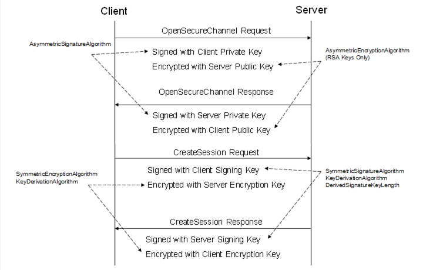  

Figure 10 - Security handshake when Creating a Session  

Each *SecurityProtocol* mapping specifies exactly how to apply the security algorithms to the *Message* . A set of security algorithms that shall be used together during a security handshake is called a *SecurityPolicy* . [OPC 10000-7](/§UAPart7) defines standard *SecurityPolicies* as parts of the standard *Profiles* which OPC UA applications are expected to support. [OPC 10000-7](/§UAPart7) also defines a URI for each standard *SecurityPolicy* . The latest versions of all *SecurityPolicies* are available in the online *Profiles* website. [OPC 10000-7](/§UAPart7) defines the link to this website.  

A *Stack* is expected to have built in knowledge of the *SecurityPolicies* that it supports. Applications specify the *SecurityPolicy* they wish to use by passing the URI to the *Stack* .  

[Table 48](/§\_Ref130057649) defines the contents of a *SecurityPolicy.* Each *SecurityProtocol* mapping specifies how to use each of the parameters in the *SecurityPolicy. A SecurityProtocol* mapping ** may not make use of all of the parameters.  

Table 48 - SecurityPolicy  

| **Name** | **Description** |
|---|---|
|PolicyUri|The URI assigned to the *SecurityPolicy* .|
|SymmetricSignatureAlgorithm|The symmetric signature algorithm to use.|
|SymmetricEncryptionAlgorithm|The symmetric encryption algorithm to use.|
|AsymmetricSignatureAlgorithm|The asymmetric signature algorithm to use.|
|AsymmetricEncryptionAlgorithm|The asymmetric encryption algorithm to use.|
|MinAsymmetricKeyLength|The minimum length, in bits, for an asymmetric key.|
|MaxAsymmetricKeyLength|The maximum length, in bits, for an asymmetric key.|
|KeyDerivationAlgorithm|The key derivation algorithm to use.|
|DerivedSignatureKeyLength|The length in bits of the derived key used for *Message* authentication.|
|CertificateSignatureAlgorithm|The asymmetric signature algorithm used to sign certificates.|
|CertificateKeyAlgorithm|The algorithm used to create asymmetric key pairs used with *Certificates* .|
|EphemeralKeyAlgorithm|The algorithm used to create asymmetric key pairs used for *EphemeralKey* s.|
|SecureChannelNonceLength|The length, in bytes, of the *Nonces* used when opening a *SecureChannel* .|
|InitializationVectorLength|The length, in bits, of the data used to initialize the symmetric algorithm.|
|SymmetricSignatureLength|The length, in bits, of the symmetric signature.|
|LegacySequenceNumbers|If TRUE, the 1024 based SequenceNumber rules apply to the *SecurityPolicy* ; If ** FALSE, the 0 based SequenceNumber rules apply. See [6.7.2.4](/§\_Ref35870750) .|
  

  

The *KeyDerivationAlgorithm* is used to create the keys used to secure *Messages* sent over the *SecureChannel* . The length of the keys used for encryption is implied by the *SymmetricEncryptionAlgorithm* . The length of the keys used for creating *Signatures* is specified by the *DerivedSignatureKeyLength* .  

The *MinAsymmetricKeyLength* and *MaxAsymmetricKeyLength* are constraints that apply to all *Certificates* (including *Issuers* in the chain). In addition, the key length of issued *Certificates* shall be less than or equal to the key length of the issuer *Certificate* . See [6.2.6](/§\_Ref450881358) for information on *Certificate* chains.  

The *CertificateKeyAlgorithm* and *EphemeralKeyAlgorithm* are used to generate new asymmetric key pairs used with *Certificates* and during the *SecureChannel* handshake. [OPC 10000-7](/§UAPart7) specifies the algorithms that need to be supported for each *SecurityPolicy* .  

The *CertificateSignatureAlgorithm* applies the *Certificate* and all *Issuer* *Certificates* . If a *CertificateSignatureAlgorithm* allows for more than one algorithm then the algorithms are listed in order of increasing priority. Each *Issuer* in a chain shall have an algorithm that is the same or higher priority than any *Certificate* it issues.  

The *SecureChannelNonceLength* specifies the length of the *Nonces* exchanged when establishing a *SecureChannel* (see [6.7.4](/§\_Ref468614071) ).  

### 6.2 Certificates  

#### 6.2.1 General  

*Certificates* are digitally signed data structures that contain a *Public Key* and the identity of a *OPC UA Application* . All *SecurityProtocols* use X.509 v3 *Certificates* (see [X.509 v3](/§X509) ) encoded using the DER format (see [X690](/§X690) ). *Certificates* used by OPC UA applications shall also conform to [RFC 5280](/§RFC3280) which defines a profile for X.509 v3 *Certificates* when they are used as part of an Internet based application.  

The *ServerCertificate* and *ClientCertificate* parameters used in the abstract *OpenSecureChannel* service are instances of the *ApplicationInstance Certificate* *DataType* . Clause [6.2.2](/§\_Ref181721959) describes how to create an X.509 v3 *Certificate* that can be used as an *ApplicationInstance Certificate* .  

*Certificates* are also used as form of *UserIdentityToken* which identifies a user associated with a *Session* . Clause [6.2.3](/§\_Ref80218782) describes *Certificates* used as *UserIdentityTokens* .  

#### 6.2.2 Application Instance Certificate  

An *Application Instance Certificate* is a *ByteString* containing the DER encoded form (see [X690](/§X690) ) of an X.509 v3 *Certificate* . This *Certificate* is issued by certifying authority and identifies an instance of an application running on a single host. The X.509 v3 fields contained in an *Application Instance Certificate* are described in [Table 49](/§\_Ref183310394) . The fields are defined completely in [RFC 5280](/§RFC3280) .  

[Table 49](/§\_Ref183310394) also provides a mapping from the [RFC 5280](/§RFC3280) terms to the terms used in the abstract definition of an *Application Instance Certificate* defined in [OPC 10000-4](/§UAPart4) .  

Table 49 - Application Instance Certificate  

| **Name** | **[OPC 10000-4](/§UAPart4) Parameter Name** | **Description** |
|---|---|---|
|Application Instance Certificate||An X.509 v3 *Certificate* .|
|version|version|shall be "V3"|
|serialNumber|serialNumber|The serial number assigned by the issuer.|
|signatureAlgorithm|signatureAlgorithm|The algorithm used to sign the *Certificate* .|
|signature|signature|The signature created by the Issuer.|
|issuer|issuer|The distinguished name of the *Certificate* used to create the signature. The *issuer* field is completely described in [RFC 5280](/§RFC3280) .|
|validity|validTo, validFrom|When the *Certificate* becomes valid and when it expires.|
|subject|subject|The distinguished name of the application *Instance* . The Common Name attribute shall be specified and should be the *applicationName* or a suitable equivalent. The Organization Name attribute shall be the name of the Organization that executes the application instance. This organization is usually not the vendor of the application. Other attributes may be specified. The *subject* field is completely described in [RFC 5280](/§RFC3280) .|
|subjectAltName|applicationUri, hostnames|The alternate names for the application *Instance* . Shall include a uniformResourceIdentifier which is equal to the *applicationUri* . The URI shall be a valid URL (see [RFC 3986](/§RFC3986) ) or a valid URN (see [RFC 8141](/§RFC2141) ). *Servers* shall specify a partial or a fully qualified dNSName *or a* static ** IPAddress ** which identifies the machine where the application *Instance* runs. Additional dNSNames may be specified if the machine has multiple names. The *subjectAltName* field ** is completely described in [RFC 5280](/§RFC3280) .|
|publicKey|publicKey|The public key associated with the *Certificate* .|
|keyUsage|keyUsage|Specifies how the *Certificate* key may be used. For RSA keys, the keyUsage shall include digitalSignature, nonRepudiation, keyEncipherment and dataEncipherment.For ECC keys, the keyUsage shall include digitalSignature.Other keyUsage bits are allowed but not recommended. Self-signed *Certificates* shall also include keyCertSign.|
|extendedKeyUsage|keyUsage|Specifies additional limits on how the *Certificate* key may be used. For RSA profiles, the extendedKeyUsage shall specify serverAuth for *Servers* and shall specify clientAuth for *Clients* . The extendedKeyUsage should also specify clientAuth for *Servers* . For ECC profiles, serverAuth and clientAuth are optional. Other extendedKeyUsage bits are allowed.|
|authorityKeyIdentifier|(No mapping)|Provides more information about the key used to sign the *Certificate* . It shall be specified for *Certificates* signed by a CA. It should be specified for self-signed *Certificates* .|
|basicConstraints|(No mapping)|The *basicConstraints* field ** is completely described in [RFC 5280](/§RFC3280) . The *cA* flag Identifies whether the subject of the *Certificate* is a CA The *pathLength* specifies the maximum number of intermediate CAs in valid chains that follow this *Certificate* .  The *basicConstraints* extension shall be present and shall not be ignored. The extension shall be validated and marking the extension as critical has no effect. For backward interoperability, any error related to the critical mark produced by software libraries shall be suppressed and logged as a warning.  The *cA* flag shall be FALSE for any *ApplicationInstance* *Certificate* , however, TRUE shall be accepted to ensure backward interoperability when validating *ApplicationInstance* *Certificates,* if revocation checks are enabled. If revocation checks are disabled then a *Certificate* with the cA flag set to TRUE should not be accepted. It should be possible to disable backward interoperability in configuration.  If the cA flag is TRUE for a self-signed *ApplicationInstance* *Certificate,* then the pathLength should be 0. If an application accepts an *ApplicationInstance* *Certificate with cA* flag set to TRUE, it shall write a warning to the log.  Note that [RFC 6818](/§RFC6818) updates [RFC 5280](/§RFC3280) and explicitly states that self-signed *Certificates* used as end-entity *Certificates* are outside the scope of [RFC 5280](/§RFC3280) . This means the requirement that the CA flag be FALSE for *ApplicationInstance* *Certificates* does not violate [RFC 5280](/§RFC3280) requirements.|
  

  

#### 6.2.3 User Certificates  

A *User Certificate* is a *Certificate* is issued by certifying authority and identifies a user.  

The X.509 v3 fields in a *User Certificates* with specific requirements are shown in [Table 50](/§\_Ref80044389) .  

Table 50 - User Certificate  

| **Field** | **Description** |
|---|---|
|subject|The distinguished name of the User. The Common Name attribute shall be specified and should be name of the user. The Organization should be provided. Other attributes may be specified. The *subject* field is completely described in [RFC 5280](/§RFC3280) .|
|authorityKeyIdentifier|Provides more information about the key used to sign the *Certificate* . It shall be specified.|
|basicConstraints|The *basicConstraints* field ** is completely described in [RFC 5280](/§RFC3280) . The *cA* flag Identifies whether the subject of the *Certificate* is a CA The *pathLength* specifies the maximum depth of valid chains that include this *Certificate* . The *cA* flag shall be FALSE for *User* *Certificates* . The pathLength shall not be present.|
  

  

#### 6.2.4 Issuer (CA) Certificates  

An *Issuer* or CA *Certificate* is an X.509 v3 *Certificate* that identifies an authority that issues *Certificates* . An *Issuer* *Certificate* may identify a root CA or an intermediate CA. *Certificates* that identify root CAs are self-signed *Certificates* . *Certificates* that identify intermediate CAs are issued by authority identified by an intermediate CA or root CA.  

The X.509 v3 fields in *Issuer* *Certificates* with specific requirements are shown in [Table 51](/§\_Ref80216997) .  

Table 51 - Issuer Certificate  

| **Field** | **Description** |
|---|---|
|subject|The distinguished name of for the authority. The Common Name attribute shall be specified. The Organization should be provided. Other attributes may be specified. The *subject* field is completely described in [RFC 5280](/§RFC3280) .|
|authorityKeyIdentifier|Provides more information about the key used to sign the *Certificate* . It shall be specified.|
|basicConstraints|The *basicConstraints* field ** is completely described in [RFC 5280](/§RFC3280) . The *cA* flag Identifies whether the subject of the *Certificate* is a CA The *pathLength* specifies the maximum depth of valid chains that include this *Certificate* . The *cA* flag shall be TRUE for *CA* *Certificates* .|
  

  

#### 6.2.5 Certificate Revocation List (CRL)  

A Certificate Revocation List (CRL) is a *ByteString* containing the DER encoded form (see [X690](/§X690) ) of an X.509 v3 CRL. The CRL is issued by certifying authority and contains the serial numbers of the *Certificates* issued by that authority which are no longer valid. All CRLs shall have the extension defined in [Table 49](/§\_Ref183310394) . The extension is defined completely in [RFC 5280](/§RFC3280) .  

Table 52 - Certificate Revocation List Extensions  

| **Extension** | **Description** |
|---|---|
|authorityKeyIdentifier|Provides more information about the key used to sign the CRL.|
  

  

#### 6.2.6 Certificate Chains  

Any X.509 v3 *Certificate* may be signed by CA which means that validating the signature requires access to the X.509 v3 *Certificate* belonging to the signing CA. Whenever an application validates a *Certificate* (see [OPC 10000-4](/§UAPart4) ) it shall recursively build a chain of *Certificates* by finding the issuer *Certificate* , validating the *Certificate* and then repeat the process for the issuer *Certificate* . The chain ends with a self-signed *Certificate* .  

The number of CAs used in a system should be small so it is common to install the necessary CAs on each machine with an OPC UA application. However, applications have the option of including a partial or complete chain whenever they pass a *Certificate.* This includes *GetEndpoints* , *SecureChannel* negotiation and during the *CreateSession* / *ActivateSession* handshake.  

All OPC UA applications shall accept partial or complete chains in any field that contains a DER encoded *Certificate* .  

Chains are stored in a *ByteString* by simply appending the DER encoded form of the *Certificates* . The first *Certificate* shall be the end *Certificate* followed by its issuer. If the root CA is sent as part of the chain, it is last *Certificate* appended to the *ByteString* .  

Chains are parsed by extracting the length of each Certificate from the DER encoding. For Certificates with lengths less than 65535 bytes it is an MSB encoded UInt16 starting at the 3 rd byte.  

### 6.3 Time synchronization  

All *SecurityProtocols* require that system clocks on communicating machines be reasonably synchronized in order to check the expiry times for *Certificates* or *CRLs* . In addition, incorrect *Timestamps* on *Data* and *Events* could create interoperability issues.  

The Network Time Protocol ( [NTP](/§NTP) ) provides a standard way to synchronize a machine clock with a time server on the network. Systems running on a machine with a full featured operating system like Windows or Linux will already support NTP or an equivalent. Devices running embedded operating systems should support NTP.  

If a device operating system cannot practically support NTP then an OPC UA application can use the *Timestamps* in the *ResponseHeader* (see [OPC 10000-4](/§UAPart4) ) to synchronize its clock. In this scenario, the OPC UA application will have to know the URL for a *Discovery Server* on a machine known to have the correct time. The OPC UA application or a separate background utility would call the *FindServers* *Service* and set its clock to the time specified in the *ResponseHeader* . This process will need to be repeated periodically because clocks can drift over time.  

Applications should log possible time synchronization errors. For example, *Certificates* or *CRLs* with *ValidFrom* times in the future could indicate a time synchronization issue.  

### 6.4 UTC and International Atomic Time (TAI)  

All times in OPC UA are in UTC, however, UTC can include discontinuities due to leap seconds or repeating seconds added to deal with variations in the earth's orbit and rotation. For this reason, some *Servers* will use International Atomic Time (TAI) for internal calculations. These *Servers* shall convert *DateTime* values to UTC before exchanging them with other applications.  

### 6.5 Issued User Identity Tokens  

#### 6.5.1 Kerberos  

Note: Deprecated in Version 1.05.  

#### 6.5.2 JSON Web Token (JWT)  

##### 6.5.2.1 General  

JSON Web Token (JWT) *UserIdentityTokens* can be passed to the *Server* using the *IssuedIdentityToken* . The body of the token is a string that contains the JWT as defined in [RFC 7519](/§RFC7519) .  

##### 6.5.2.2 User Token Policy  

*Servers* that support JWT authentication shall provide a *UserTokenPolicy* which specifies the *Authorization Service* which provides the token and the parameters needed to access that service. The parameters are specified by a JSON object specified as the *issuerEndpointUrl* . The contents of this JSON object are described in [Table 54](/§\_Ref472362695) . The general UserTokenPolicy settings for JWT are defined in [Table 53](/§\_Ref472630237) .  

Table 53 - JWT UserTokenPolicy  

| **Name** | **Description** |
|---|---|
|tokenType|ISSUEDTOKEN\_3|
|issuedTokenType|[http://opcfoundation.org/UA/UserToken\#JWT](http://opcfoundation.org/UA/UserToken)|
|issuerEndpointUrl|For JWTs this is a JSON object with fields defined in [Table 54](/§\_Ref472362695) .|
  

  

Table 54 - JWT IssuerEndpointUrl Definition  

| **Name** | **Type** | **Required** | **Description** |
|---|---|---|---|
|IssuerEndpointUrl|JSON object|Yes|Specifies the parameters for a JWT UserIdentityToken.|
|ua:resourceId|String|Yes|The URI identifying the *Server* to the *Authorization Service.* The default value is the *Server's* *ApplicationUri* .|
|ua:authorityUrl|String|Yes|The base URL for the *Authorization Service* . This URL may be used to discover additional information about the authority. This field is equivalent to the "issuer" defined in [OpenID-Discovery](/§OpenIDDiscovery) .|
|ua:authorityProfileUri|String|Yes|The profile that defines the interactions with the authority. The default URI is "http://opcfoundation.org/UA/Authorization\#OPCUA". A set of possible authorities are in the *Profile* : [http://opcfoundation.org/UA-Profile/Security/UserToken/Server/JsonWebToken](http://opcfoundation.org/UA-Profile/Security/UserToken/Server/JsonWebToken)|
|ua:tokenEndpoint|String|Depends on authorityProfileUri|A path relative to the base URL used to request *Access Tokens* . If the *authorityProfileUri* is OPCUA, then this is the *NodeId* of the *AuthorizationService Object* encoded as described in [5.4.2.10](/§\_Ref456142221) . This field is equivalent to the "token\_endpoint" defined in [OpenID-Discovery](/§OpenIDDiscovery) .|
|ua:authorizationEndpoint|String|No|A path relative to the base URL used to validate user credentials. If the *authorityProfileUri* is OPCUA, then this is the *NodeId* of the *UserTokenProfile Property* of the *AuthorizationService Object* encoded as described in [5.4.2.10](/§\_Ref456142221) . This field is equivalent to the "authorization\_endpoint" defined in [OpenID-Discovery](/§OpenIDDiscovery) .|
|ua:requestTypes|JSON array String|No|The list of request types supported by the authority. The possible values are described in [6.5.3.2](/§\_Ref80222022) to [6.5.3.4](/§\_Ref80222025) . If not specified the default is "authorization\_code".|
|ua:scopes|JSON array String|No|A list of Scopes that are understood by the *Server* . If not specified, the *Client* may be able to access any *Scope* supported by the *Authorization Service* . This field is equivalent to the "scopes\_supported" defined in OpenID-Discovery.|
  

  

##### 6.5.2.3 Access Tokens  

The JWT supports signatures using asymmetric cryptography which implies that *Servers* which accept the *Access Token* must have access to the *Certificate* used by the *Authorization Service* .  

All *Access Tokens* shall have a signature created by the token issuer.  

*Access Tokens* expire and all *Servers* should revoke any privileges granted to the *Session* when the *Access Token* expires. If the Server allows for anonymous users, the *Server* may allow the *Session* to stay open but treat it as an anonymous user. If the *Server* does not allow anonymous users, it should close the *Session* immediately.  

*Clients* know when the *Access Token* will expire and should request a new *Access Token* and call *ActivateSession* before the old *Access Token* expires.  

The JWT format allows the *Authorization Service* to insert any number of fields. The mandatory fields are defined in [RFC 7519](/§RFC7519) . Some additional fields are defined in [Table 55](/§\_Ref198674147) .  

Table 55 - JWT Access Token Claims  

| **Name** | **JSON Type** | **Required** | **Description** |
|---|---|---|---|
|sub|string|Yes|The subject for the token. This is the equivalent of a UserName or an X509 subjectName. If the field "iss" is not present, it shall be a globally unique identifier. If "iss" is present, it shall be unique within the context of the "iss".|
|iss|string|No|The URI of the issuer. For the authorityProfileUri "http://opcfoundation.org/UA/Authorization\#OPCUA" it shall be the *ServiceUri* of the *Authorization Service* (see [OPC 10000-12](/§UAPart12) ).|
|aud|string|Yes|Shall be the *resourceId* specified in the *UserTokenPolicy* (see [6.5.2.2](/§\_Ref209705948) ). This is usually the *Server ApplicationUri* .|
|exp|number|Yes|The expiration time of the token. It shall be checked before accepting the token.|
|groups|array|No|A list of groups which are assigned to the subject. Usually, a list of unique identifiers for specific security groups. For example, Azure AD user account groups may be returned in this claim.|
|roles|array|No|A list of roles which are assigned to the subject. *Roles* apply to the requestor and describe what the requestor can do with the resource. *Roles* are list of unique names for roles known to the *Authorization Service* . These values are typically mapped to the *Roles* defined in [OPC 10000-3](/§UAPart3) using the identity mappings defined in [OPC 10000-18](/§UAPart18) .|
|nbf|number|No|The time when the token becomes valid. If present, it shall be checked before accepting the token.|
|cnf|object|No|The thumbprint of the *Certificate* which shall be used with the token. If present, the *Server* shall not accept a token unless the *SecureChannel* has been created with the *Certificate* identified by this field. The field is a JSON object with a single "x5t\#S256" field which specifies the thumbprint of the *Certificate* . See [RFC 8705](/§RFC8705) .|
  

  

#### 6.5.3 OAuth2  

##### 6.5.3.1 General  

The OAuth2 Authorization Framework (see [RFC 6749](/§RFC6749) ) provides a web-based mechanism to request claims-based *Access Tokens* from an *Authorization Service* (AS) that is supported by many major companies providing cloud infrastructure. These *Access Tokens* are passed to a *Server* by a *Client* in a *UserIdentityToken* as described in [OPC 10000-4](/§UAPart4) .  

The OpenID Connect specification (see [OpenID](/§OpenID) ) builds on the OAuth2 specification by defining the contents of the *Access Tokens* more strictly.  

The OAuth2 specification supports a number of use cases (called 'flows') to handle different application requirements. The use cases that are relevant to OPC UA are discussed below.  

##### 6.5.3.2 Authorization Code  

The authorization code flow is available to *Clients* which allow interaction with a human user. The *Client* application displays a window with a web browser which sends an HTTP GET to the *Identity Provider* . When the human user enters credentials that the *Identity Provider* validates the *Identity Provider* returns an authorization code which is passed to the *Authorization Service.* The *Authorization Service* validates the code and returns an *Access Token* to the *Client.*  

The complete flow is described in [RFC 6749](/§RFC6749) , 4.1.  

A *requestType* of "authorization\_code" in the *UserTokenPolicy* (see [6.5.2](/§\_Ref473652750) ) means the *Authorization Service* supports the authorization code flow.  

##### 6.5.3.3 Refresh Token  

The refresh token flow applies when a *Client* application has access to a refresh token returned in a previous response to an authorization code request. The refresh token allows applications to skip the step that requires human interaction with the *Identity Provider* . This flow is initiated when the *Client* sends the refresh token to *Authorization Service* which validates it and returns an *Access Token.* A Client that saves the refresh token for later use shall use encryption or other means to ensure the refresh token cannot be accessed by unauthorized parties.  

The complete flow is described in [RFC 6749](/§RFC6749) , 6.  

A *requestType* is not defined since support for refresh token is determined by checking the response to an authorization code request.  

##### 6.5.3.4 Client Credentials  

The client credentials flow applies when a *Client* application cannot prompt a human user for input. This flow requires a secret know to the *Authorization Service* which the *Client* application can protect. This flow is initiated when the *Client* sends the client\_secret to *Authorization Service* which validates it and returns an *Access Token.*  

The complete flow is described in [RFC 6749](/§RFC6749) , 4.4.  

A *requestType* of "client\_credentials" in the *UserTokenPolicy* (see [6.5.2](/§\_Ref473652750) ) means the *Authorization Service* supports the client credentials flow.  

### 6.6 WS Secure Conversation  

Note: Deprecated in Version 1.03.  

### 6.7 OPC UA Secure Conversation  

#### 6.7.1 Overview  

OPC UA Secure Conversation (UASC) allows secure communication using binary encoded *Messages* .  

UASC is designed to operate with different *TransportProtocols* that may have limited buffer sizes. For this reason, OPC UA Secure Conversation will break OPC UA *Messages* into several pieces (called ' *MessageChunks'* ) that are smaller than the buffer size allowed by the *TransportProtocol* . UASC requires a *TransportProtocol* buffer size that is at least 8 192 bytes when using RSA based *Asymmetric Cryptography* . This minimum buffer size drops to 1024 when using ECC based *Asymmetric Cryptography* (see [6.8](/§\_Ref201149240) ) is supported.  

All security is applied to individual *MessageChunks* and not the entire OPC UA *Message* . A *Stack* that implements UASC is responsible for verifying the security on each *MessageChunk* received and reconstructing the original OPC UA *Message* .  

All *MessageChunks* will have a 4-byte sequence assigned to them. These sequence numbers are used to detect and prevent replay attacks.  

UASC requires a *TransportProtocol* that will preserve the order of *MessageChunks* , however, a UASC implementation does not necessarily process the *Messages* in the order that they were received.  

#### 6.7.2 MessageChunkstructure  

##### 6.7.2.1 Overview  

The structure of the *Message* depends on whether the *SecurityPolicy* requires an algorithm that combines encryption and authentication (e.g. *Authenticated Encryption* algorithms) used or if it requires separate algorithms for each operation ( *Unauthenticated Encryption* algorithms).  

[Figure 11](/§\_Ref164005549) shows the structure of a *MessageChunk* and how security is applied to the *Message* when using *Unauthenticated Encryption* algorithms. For these *SecurityPolicies* any padding is appended to the message before appending the *Signature* .  

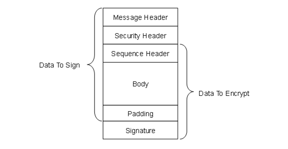  

Figure 11 - MessageChunk for Unauthenticated Encryption Algorithms  

[Figure 12](/§\_Ref11086559) shows the structure of a *MessageChunk* and how security is applied to the *Message* when using *Authenticated Encryption* algorithms. For these *SecurityPolicies* the *Signature* is calculated during encryption and appended after the encrypted data. *Padding* is not needed.  

  

Figure 12 - MessageChunk for Authenticated Encryption Algorithms  

##### 6.7.2.2 Message Header  

Every *MessageChunk* has a *Message* header with the fields defined in [Table 56](/§\_Ref163954977) .  

Table 56 - OPC UA Secure Conversation Message Header  

| **Name** | **Data Type** | **Description** |
|---|---|---|
|MessageType|Byte [3]|A three byte ASCII code that identifies the *Message* type. The following values are defined at this time: MSG A *Message* secured with the keys associated with a channel. OPN OpenSecureChannel *Message* . CLO  CloseSecureChannel *Message* .|
|IsFinal|Byte|A one byte ASCII code that indicates whether the *MessageChunk* is the final chunk in a *Message* . The following values are defined at this time: C An intermediate chunk. F The final chunk. A The final chunk (used when an error occurred and the *Message* is aborted). This field is only meaningful for MessageType of 'MSG' This field is always 'F' for other MessageTypes.|
|MessageSize|UInt32|The length of the *MessageChunk* , in bytes. The length starts from the beginning of the MessageType field.|
|SecureChannelId|UInt32|A unique identifier for the *SecureChannel* assigned by the *Server* . If a *Server* receives a SecureChannelId which it does not recognize it shall return an appropriate transport layer error. When a *Server* starts the first *SecureChannelId* used should be a value that is likely to be unique after each restart. This ensures that a *Server* restart does not cause previously connected *Clients* to accidently 'reuse' *SecureChannels* that did not belong to them.|
  

  

##### 6.7.2.3 Security Header  

The *Message* header is followed by a security header which specifies what cryptography operations have been applied to the *Message* . There are two versions of the security header which depend on the type of security applied to the *Message* . The security header used for asymmetric algorithms is defined in [Table 57](/§\_Ref163971577) . Asymmetric algorithms are used to secure the *OpenSecureChannel* *Messages* . [PKCS \#1](/§Pkcs1) defines a set of asymmetric algorithms that may be used by UASC implementations. The *AsymmetricKeyWrapAlgorithm* element of the *SecurityPolicy* structure defined in [Table 48](/§\_Ref130057649) is not used by UASC implementations.  

Table 57 - Asymmetric algorithm Security header  

| **Name** | **Data Type** | **Description** |
|---|---|---|
|SecurityPolicyUriLength|Int32|The length of the *SecurityPolicyUri* in bytes. This value shall not exceed 255 bytes. If a URI is not specified this value may be 0 or -1. Other negative values are invalid.|
|SecurityPolicyUri|Byte []|The URI of the *Security Policy* used to secure the *Message* . This field is encoded as a [UTF-8](/§UTF8) string without a null terminator.|
|SenderCertificateLength|Int32|The length of the *SenderCertificate* in bytes. This value shall not exceed *MaxSenderCertificateSize* bytes. If a certificate is not specified this value may be 0 or -1. Other negative values are invalid.|
|SenderCertificate|Byte []|The X.509 v3 *Certificate* assigned to the sending application *Instance* . This is a DER encoded blob. The structure of an X.509 v3 *Certificate* is defined in X.509 v3. The DER format for a *Certificate* is defined in [X690](/§X690) This indicates what *Private Key* was used to sign the *MessageChunk* . The *Stack* shall close the channel and report an error to the application if the *SenderCertificate* is too large for the buffer size supported by the transport layer. This field shall be null if the *Message* is not signed. If the *Certificate* is signed by a CA, the DER encoded CA *Certificate* may be appended after the Certificate in the byte array. If the CA *Certificate* is also signed by another CA this process is repeated until the entire Certificate chain is in the buffer or if *MaxSenderCertificateSize* limit is reached (the process stops after the last whole *Certificate* that can be added without exceeding the *MaxSenderCertificateSize* limit). Receivers can extract the *Certificates* from the byte array by using the *Certificate* size contained in DER header (see [X.509 v3](/§X509) ). Receivers that do not handle *Certificate* chains shall ignore the extra bytes.|
|ReceiverCertificateThumbprintLength|Int32|The length of the *ReceiverCertificateThumbprint* in bytes. When using RSA *Public Keys* : If encrypted, the value of this field is 20 bytes. If not encrypted the value may be 0 or -1. When using ECC *Public Keys* : The value of this field is 20 bytes. Other negative values are invalid.|
|ReceiverCertificateThumbprint|Byte []|The thumbprint of the X.509 v3 *Certificate* assigned to the receiving application *Instance* . The thumbprint is the *CertificateDigest* of the DER encoded form of the *Certificate* . When using RSA *Public Keys* it indicates which *Public Key* was used to encrypt the *MessageChunk* . When using ECC *Public Keys* it indicates the intended recipient of the *MessageChunk* .|
  

  

The receiver shall close the communication channel if any of the fields in the security header have invalid lengths.  

The *SenderCertificate,* including ** any chains *,* shall be small enough to fit into a single *MessageChunk* and leave room for at least one byte of body information. The maximum size for the *SenderCertificate* can be calculated with this formula:  

MaxSenderCertificateSize =  

MessageChunkSize -  

12 -     // Header size  

4 -     // SecurityPolicyUriLength  

SecurityPolicyUri - // UTF-8 encoded string  

4 -     // SenderCertificateLength  

4 -     // ReceiverCertificateThumbprintLength  

20 -     // ReceiverCertificateThumbprint  

8 -      // SequenceHeader size  

1 -      // Minimum body size  

1 -      // PaddingSize if present  

Padding -    // Padding if present  

ExtraPadding -  // ExtraPadding if present  

AsymmetricSignatureSize // If present  

The *MessageChunkSize* depends on the transport protocol but shall be at least 8192 bytes. The *AsymmetricSignatureSize* depends on the number of bits in the public key for the *SenderCertificate* . The *Int32FieldLength* is the length of an encoded Int32 value and it is always 4 bytes.  

The security header used for symmetric algorithms defined in [Table 58](/§\_Ref163971907) . Symmetric algorithms are used to secure all *Messages* other than the *OpenSecureChannel* *Messages* . [FIPS 197](/§Fips197) define symmetric encryption algorithms that UASC implementations may use. [FIPS 180-4](/§Fips180) and [HMAC](/§Hmac) define some symmetric signature algorithms.  

Table 58 - Symmetric algorithm Security header  

| **Name** | **Data Type** | **Description** |
|---|---|---|
|TokenId|UInt32|A unique identifier for the *SecureChannel* *SecurityToken* used to secure the *Message* . This identifier is returned by the *Server* in an *OpenSecureChannel* response *Message* . If a *Server* receives a TokenId which it does not recognize it shall return an appropriate transport layer error.|
  

  

##### 6.7.2.4 Sequence Header  

The security header is always followed by the sequence header which is defined in [Table 59](/§\_Ref171766345) . The sequence header ensures that the first encrypted block of every *Message* sent over a channel will start with different data.  

Table 59 - Sequence header  

| **Name** | **Data Type** | **Description** |
|---|---|---|
|SequenceNumber|UInt32|A monotonically increasing sequence number assigned by the sender to each *MessageChunk* sent over the *SecureChannel* .|
|RequestId|UInt32|An identifier assigned by the *Client* to OPC UA request *Message* . All *MessageChunks* for the request and the associated response use the same identifier.|
  

  

A *SequenceNumber* may not be reused for any *TokenId* . The *SecurityToken* lifetime shall be short enough to ensure that this never happens; however, if it does the receiver shall treat it as a transport error and force a reconnect. The SequenceNumber does not reset when a new TokenId is issued and it shall be incremented by exactly one for each MessageChunk sent.  

*SecurityPolicies* with *LegacySequenceNumbers* set to TRUE, the SequenceNumber shall monotonically increase for all Messages and shall not wrap around until it is greater than 4 294 966 271 (UInt32.MaxValue - 1024). The first number after the wrap around shall be less than 1024.  

*SecurityPolicies* with *LegacySequenceNumbers* set to FALSE, the SequenceNumber shall start at 0 and monotonically increase for all Messages and shall not wrap around until it is equal to 4294967295 (UInt32.MaxValue). The first number after the wrap around shall be 0.  

Some applications will find it takes time to validate the *OpenSecureChannel* *Requests* and *Responses* used to renew a *TokenId* . In these situations, the receiver may assume the *SequenceNumber* is correct which allows it to process subsequent messages secured with the existing *TokenId* before the *OpenSecureChannel* *Message* is validated. When processing of the *OpenSecureChannel Message* completes, the receiver checks the *SequenceNumber* and closes the *SecureChannel* if it is incorrect.  

The sequence header is followed by the *Message* body which is encoded with the OPC UA Binary encoding as described in [5.2.9](/§\_Ref424493954) . The body may be split across multiple *MessageChunks* .  

##### 6.7.2.5 Message Footer  

###### 6.7.2.5.1 Unauthenticated Encryption Algorithms  

Each *MessageChunk* when using *SecurityPolicies* with an *Unauthenticated Encryption* algorithms have a footer with the fields defined in [Table 60](/§\_Ref35524563) .  

Table 60 - Message Footer for Unauthenticated Encryption Algorithms  

| **Name** | **Data Type** | **Description** |
|---|---|---|
|PaddingSize|Byte|The number of padding bytes (not including the byte for the PaddingSize).|
|Padding|OctetString|Padding added to the end of the *Message* to ensure length of the data to encrypt is an integer multiple of the encryption block size. The value of each byte of the padding is equal to PaddingSize.|
|ExtraPaddingSize|Byte|The most significant byte of a two-byte integer used to specify the padding size when the key used to encrypt the message chunk is larger than 2048 bits. This field is omitted if the key length is less than or equal to 2048 bits.|
|Signature|OctetString|The signature for the *MessageChunk* . The signature includes the headers, all *Message* data, the *PaddingSize* and the *Padding* . The signature is encoded as sequence of *Bytes* with a length specified by the *SecurityPolicy.*|
  

  

The formula to calculate the amount of padding depends on the amount of data that needs to be sent (called *BytesToWrite* ). The sender shall first calculate the maximum amount of space available in the *MessageChunk* (called *MaxBodySize* ) using the following formula:  

MaxBodySize = PlainTextBlockSize \* Floor ((MessageChunkSize     \- MessageHeaderSize     \- SecurityHeaderSize     \- SignatureSize - 1)/CipherTextBlockSize) - SequenceHeaderSize;  

The *MessageHeaderSize* is 12 bytes and the *SecurityHeader* size depends on whether symmetric or asymmetric cryptography is used. The *SequenceHeaderSize* is always 8 bytes.  

During encryption a block with a size equal to *PlainTextBlockSize* is processed to produce a block with size equal to *CipherTextBlockSize* . These values depend on the encryption algorithm and may be the same.  

The OPC UA *Message* can fit into a single chunk if *BytesToWrite* is less than or equal to the *MaxBodySize* . In this case the *PaddingSize* is calculated with this formula:  

PaddingSize = PlainTextBlockSize -  

((BytesToWrite + SignatureSize + 1) % PlainTextBlockSize);  

If the *BytesToWrite* is greater than *MaxBodySize* the sender shall write *MaxBodySize* bytes with a PaddingSize of 0. The remaining *BytesToWrite*\- *MaxBodySize* bytes shall be sent in subsequent *MessageChunks.*  

The *PaddingSize* and *Padding* fields are not present if the *MessageChunk* is not encrypted.  

The Signature field is not present if the *MessageChunk* is not signed.  

###### 6.7.2.5.2 Authenticated Encryption Algorithms  

Each *MessageChunk* when using *SecurityPolicies* with an *Authenticated Encryption* algorithms have a footer with the fields defined in [Table 61](/§\_Ref35524528) .  

Table 61 - Message Footer for Authenticated Encryption Algorithms  

| **Name** | **Data Type** | **Description** |
|---|---|---|
|Signature|OctetString|The signature for the *MessageChunk* . The signature includes the headers and all *Message* data. The signature is encoded as sequence of *Bytes* with a length specified by the *SecurityPolicy.*|
  

  

#### 6.7.3 MessageChunks and error handling  

*MessageChunks* are sent as they are encoded. *MessageChunks* belonging to the same *Message* shall be sent sequentially. If an error occurs creating a *MessageChunk* then the sender shall send a final *MessageChunk* to the receiver that tells the receiver that an error occurred and that it should discard the previous chunks. The sender indicates that the *MessageChunk* contains an error by setting the IsFinal flag to 'A' (for Abort). [Table 62](/§\_Ref187931392) specifies the contents of the *Message* abort *MessageChunk* .  

Table 62 - OPC UA Secure Conversation Message abort body  

| **Name** | **Data Type** | **Description** |
|---|---|---|
|Error|UInt32|The numeric code for the error. Possible values are listed in [Table 77](/§\_Ref164020643) .|
|Reason|String|A more verbose description of the error. This string shall not be more than 4096 bytes. A *Client* shall ignore strings that are longer than this. Any security related information shall not be returned. This includes any indication of the reason that caused *Bad\_SecurityChecksFailed* to be returned.|
  

  

The receiver shall check the security on the abort *MessageChunk* before processing it. If everything is ok, then the receiver shall ignore the *Message* but shall not close the *SecureChannel* . The *Client* shall report the error back to the application as *StatusCode* for the request. If the *Client* is the sender, then it shall report the error without waiting for a response from the *Server* .  

#### 6.7.4 Establishing a SecureChannel  

Most *Messages* require a *SecureChannel* to be established. A *Client* does this by sending an *OpenSecureChannel* request to the *Server* . The *Server* shall validate the *Message* and the *ClientCertificate* and return an *OpenSecureChannel* response. Some of the parameters defined for the *OpenSecureChannel* service are specified in the security header (see [6.7.2](/§\_Ref164007251) ) instead of the body of the *Message* . [Table 63](/§\_Ref157834565) lists the parameters that appear in the body of the *Message* .  

Note that [OPC 10000-4](/§UAPart4) is an abstract specification which defines interfaces that can work with any protocol. This document provides a concrete implementation for specific protocols. This document is the normative reference for all protocols and takes precedence if there are differences with [OPC 10000-4](/§UAPart4) .  

Table 63 - OPC UA Secure Conversation OpenSecureChannel Service  

| **Name** | **Data Type** |
|---|---|
  
| **Request** ||
|---|---|
|RequestHeader|RequestHeader|
|ClientProtocolVersion|UInt32|
|RequestType|SecurityTokenRequestType|
|SecurityMode|MessageSecurityMode|
|ClientNonce|ByteString|
|RequestedLifetime|UInt32|
|||
  
| **Response** ||
|---|---|
|ResponseHeader|ResponseHeader|
|ServerProtocolVersion|UInt32|
|SecurityToken|ChannelSecurityToken|
| SecureChannelId|UInt32|
| TokenId|UInt32|
| CreatedAt|UtcTime|
| RevisedLifetime|UInt32|
|ServerNonce|ByteString|
  

  

The *ClientProtocolVersion* and *ServerProtocolVersion* parameters are not defined in [OPC 10000-4](/§UAPart4) and are added to the *Message* to allow backward compatibility if OPC UA-SecureConversation needs to be updated in the future.  

If OPC UA- *SecureConversation* is used with the OPC UA-TCP protocol (see [7.1](/§\_Ref164097216) ) then the *ClientProtocolVersion* specified in the *OpenSecureChannel* *Request* shall be the same as the *ProtocolVersion* specified in the *Hello* *Message* . In addition, the *ServerProtocolVersion* specified in the *OpenSecureChannel* *Response* shall be the same as the *ProtocolVersion* specified in the *Acknowledge* *Message* . The receiver shall close the channel and report a *Bad* \_ *ProtocolVersionUnsupported* error if there is a mismatch.  

The *Server* shall return an error response as described in [OPC 10000-4](/§UAPart4) if there are any errors with the parameters specified by the *Client* .  

The *RevisedLifetime* tells the *Client* when it shall renew the *SecurityToken* by sending another *OpenSecureChannel* request. The *Client* shall continue to accept the old *SecurityToken* until it expires or it receives a *Message* from the *Server* secured with the new *SecurityToken* . The *Client* shall send a *Messages* secured with new *SecurityToken* as soon as it finishes processing the *OpenSecureChannel* response. The *Client* shall close the *SecureChannel* if the *Certificate* used to sign the response is not the same as the *Certificate* used to encrypt the request.  

The *Server* shall accept requests secured with the old *SecurityToken* until that *SecurityToken* expires or until it receives a *Message* from the *Client* secured with the new *SecurityToken* . The *Server* shall reject renew requests if the *SenderCertificate* is not the same as the one used to create the *SecureChannel* or if there is a problem decrypting or verifying the signature.  

The datatype of the *RevisedLifetime* is a *UInt32* value representing the number of milliseconds instead of the *Double* ( *Duration* ) defined in [OPC 10000-4](/§UAPart4) . This optimization is possible because sub-millisecond timeouts are not supported.  

The *OpenSecureChannel* *Messages* are signed and encrypted if the *SecurityMode* is not *None* (even if the *SecurityMode* is *Sign).*  

The *Nonces* shall be cryptographic random numbers with a length specified by the *SecureChannelNonceLength* of the *SecurityPolicy* .  

See [OPC 10000-2](/§UAPart2) for more information on the requirements for random number generators. The *OpenSecureChannel* *Messages* are not signed or encrypted if the *SecurityMode* is *None* . The *Nonces* are ignored and should be set to null. The *SecureChannelId* and the *TokenId* are still assigned but no security is applied to *Messages* exchanged via the channel. The *SecurityToken* shall still be renewed before the *RevisedLifetime* expires. Receivers shall still ignore invalid or expired *TokenIds.*  

The *AuthenticationToken* in the *RequestHeader* shall be set to null.  

If an error occurs after the *Server* has verified *Message* security it shall return a *ServiceFault* instead of a *OpenSecureChannel* response. The *ServiceFault* *Message* is described in [OPC 10000-4](/§UAPart4) .  

If the *SecurityMode* is not *None* then the *Server* shall verify that a *SenderCertificate* and a *ReceiverCertificateThumbprint* were specified in the *SecurityHeader* .  

#### 6.7.5 Deriving keys  

Once the *SecureChannel* is established the *Messages* are signed and encrypted with keys derived from the *Nonces* exchanged in the *OpenSecureChannel* call. These keys are derived by passing the *Nonces* to a pseudo-random function (PRF) which produces a sequence of bytes from a set of inputs. A pseudo-random function is represented by the following function declaration:  

Byte[] PRF(  

Byte[] secret,  

Byte[] seed,  

Int32 length,  

Int32 offset)  

Where *length* is the number of bytes to return and *offset* is a number of bytes from the beginning of the sequence.  

The lengths of the keys that need to be generated depend on the *SecurityPolicy* used for the channel. The following information is specified by the *SecurityPolicy* :  

1. *SigningKeyLength* (from the *DerivedSignatureKeyLength* );  

1. *EncryptingKeyLength* (implied by the *SymmetricEncryptionAlgorithm* );  

1. *InitializationVectorLength* (from by the *InitializationVectorLength* ).  

  

The pseudo random function requires a secret and a seed. These values are derived from the *Nonces* exchanged in the *OpenSecureChannel* request and response. [Table 64](/§\_Ref482623701) specifies how to derive the secrets and seeds when using RSA based *SecurityPolicies* .  

Table 64 - PRF inputs for RSA based SecurityPolicies  

| **Name** | **Derivation** |
|---|---|
|ClientSecret|The value of the *ClientNonce* provided in the *OpenSecureChannel* request.|
|ClientSeed|The value of the *ClientNonce* provided in the *OpenSecureChannel* request.|
|ServerSecret|The value of the *ServerNonce* provided in the *OpenSecureChannel* response.|
|ServerSeed|The value of the *ServerNonce* provided in the *OpenSecureChannel* response.|
  

  

The parameters passed to the pseudo random function are specified in [Table 65](/§\_Ref164010221) .  

Table 65 - Cryptography key generation parameters  

| **Key** | **Secret** | **Seed** | **Length** | **Offset** |
|---|---|---|---|---|
|ClientSigningKey|ServerSecret|ClientSeed|SigningKeyLength|0|
|ClientEncryptingKey|ServerSecret|ClientSeed|EncryptingKeyLength|SigningKeyLength|
|ClientInitializationVector|ServerSecret|ClientSeed|InitializationVectorLength|SigningKeyLength+EncryptingKeyLength|
|ServerSigningKey|ClientSecret|ServerSeed|SigningKeyLength|0|
|ServerEncryptingKey|ClientSecret|ServerSeed|EncryptingKeyLength|SigningKeyLength|
|ServerInitializationVector|ClientSecret|ServerSeed|InitializationVectorLength|SigningKeyLength+EncryptingKeyLength|
  

  

The *Client* keys are used to secure *Messages* sent by the *Client* . The *Server* keys are used to secure *Messages* sent by the *Server* .  

The [TLS](/§Tls) specification defines a pseudo random function called P\_HASH which is used for this purpose. The function is iterated until it produces enough data for all of the required keys. The Offset in [Table 65](/§\_Ref164010221) references to the offset from the start of the generated data.  

The P\_ hash algorithm is defined as follows:  

P\_HASH(secret, seed) = HMAC\_HASH(secret, A(1) + seed) +  

HMAC\_HASH(secret, A(2) + seed) +  

HMAC\_HASH(secret, A(3) + seed) + ...  

Where A(n) is defined as:  

A(0) = seed  

A(n) = HMAC\_HASH(secret, A(n-1))  

\+ indicates that the results are appended to previous results.  

Where 'HASH' is a hash function such as SHA256. The hash function to use depends on the *SecurityPolicyUri* .  

#### 6.7.6 Verifying Message Security  

The contents of the *MessageChunk* shall not be interpreted until the *Message* is decrypted and the signature and sequence number verified.  

If an error occurs during *Message* verification the receiver shall close the communication channel. If the receiver is the *Server,* it shall also send a transport error *Message* before closing the channel. Once the channel is closed the *Client* shall attempt to re-open the channel and request a new *SecurityToken* by sending an *OpenSecureChannel* request. The mechanism for sending transport errors to the *Client* depends on the communication channel.  

The receiver shall first check the *SecureChannelId* . This value may be 0 if the *Message* is an *OpenSecureChannel* request. For other *Messages,* it shall report a *Bad\_SecureChannelUnknown* error if the *SecureChannelId* is not recognized. If the *Message* is an *OpenSecureChannel* request and the *SecureChannelId* is not 0 then the *SenderCertificate* shall be the same as the *SenderCertificate* used to create the channel.  

If the *Message* is secured with asymmetric algorithms, then the receiver shall verify that it supports the requested *SecurityPolicy* . If the *Message* is the response sent to the *Client,* then the *SecurityPolicy* shall be the same as the one specified in the request. In the *Server,* the *SecurityPolicy* shall be the same as the one used to originally create the *SecureChannel* .  

The receiver shall verify the *ReceiverCertificateThumbprint* and report a *Bad\_CertificateInvalid* error if it does not recognize it.  

The receiver shall check that the *Certificate* is trusted first and return *Bad\_SecurityChecksFailed* on error. The receiver shall then verify the *SenderCertificate* using the rules defined in [OPC 10000-4](/§UAPart4) . The receiver shall report the appropriate error if *Certificate* validation fails.  

If the *Message* is secured with symmetric algorithms, then a *Bad\_SecureChannel TokenUnknown e* rror shall be reported if the *TokenId* refers to a *SecurityToken* that has expired or is not recognized.  

If decryption or signature validation fails, then a *Bad\_SecurityChecksFailed* error is reported. If an implementation allows multiple *SecurityModes* to be used the receiver shall also verify that the *Message* was secured properly as required by the *SecurityMode* specified in the *OpenSecureChannel* request.  

After the security validation is complete the receiver shall verify the *RequestId* and the *SequenceNumber* . If these checks fail a *Bad\_SecurityChecksFailed* error is reported. The *RequestId* only needs to be verified by the *Client* since only the *Client* knows if it is valid or not. If the *SequenceNumber* is not valid, the receiver shall log a *Bad\_SequenceNumberInvalid* error.  

At this point the *SecureChannel* knows it is dealing with an authenticated *Message* that was not tampered with or resent. This means the *SecureChannel* can return secured error responses if any further problems are encountered.  

*Stacks* that implement UASC shall have a mechanism to log errors when invalid *Messages* are discarded. This mechanism is intended for developers, systems integrators and administrators to debug network system configuration issues and to detect attacks on the network.  

### 6.8 Elliptic Curve Cryptography (ECC)  

#### 6.8.1 Secure Channel Handshake  

The OPC UA Secure Conversation (UASC) mechanism described [6.7](/§\_Ref164097164) is designed for use with asymmetric cryptography algorithms, such as RSA, that allow *Public Keys* to be used for encryption and for digital signatures. ECC is an asymmetric cryptography algorithm that only supports digital signatures. To accommodate algorithms like ECC, the UASC handshake needs to be modified to allow negotiation of inputs used for key derivation in [6.7.5](/§\_Ref165967540) without making the keys available to eavesdroppers. This negotiation uses a Diffie Hellman algorithm defined in [RFC 8422](/§RFC8422) and is shown in [Figure 13](/§\_Ref2326914) .  

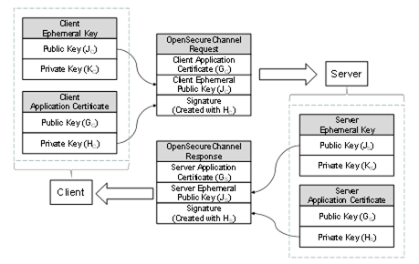  

Figure 13 - ECC Key Negotiation  

*ApplicationInstance Certificates* for ECC have a public-private key pair that are used to create and verify a digital signature. To negotiate the keys needed for the *SecureChannel* the *Client* generates a new key pair (J C , K C ) and passes the *Public Key* (J C ) in the request. After verifying the signature on the request, the *Server* generates a new key pair (J S , K S ) and returns the *Public Key* (J S ) in the response. The new key pairs are used each time a *SecureChannel* is negotiated and they are called *EphemeralKeys* .  

ECC public-private key pairs are always based on a specific elliptic curve function which is used for the ECC calculations. Many curves exist, however, ECC cryptography libraries support a finite set of "named curves" to allow for better interoperability. Each OPC UA *SecurityPolicy* defined in [OPC 10000-7](/§UAPart7) specifies exactly one named curve which is used for the *EphemeralKeys* .  

Each ECC *ApplicationInstance Certificate* is also based on a named curve. Each *SecurityPolicy* specifies a list of named curves which are permitted for use in the *ApplicationInstance Certificate* . This list always includes the named curved used for the *EphemeralKey* , however, it may allow other named curves. OPC UA applications that support ECC *SecurityPolicies* will need to support multiple *ApplicationInstance Certificates.*  

ECC *Public Keys* and digital signatures are the output of an ECC operation. The encoding of these outputs depends on the ECC curve and are described by the *SecurityPolicy* in [OPC 10000-7](/§UAPart7) .  

Clause 6.7.4 specifies the contents of the *OpenSecureChannel* request and response messages. When using an ECC *SecurityPolicy* the *ClientNonce* is the *Public Key* for the *Client's* *EphemeralKey* encoded using the *Public Key* encoding for the curve. Similarly, the *ServerNonce* is the *Public Key* for the *Server's EphemeralKey* .  

The encoding of the *EphemeralKeys* depends on the ECC curve used. For NIST and Brainpool curves the *EphemeralKey* is the x and y coordinate encoded as zero padded big-endian *OctetString* . For Edwards curves the *EphemeralKey* format is defined by RFC 7748.  

The *EphemeralKeys* are used to calculate a shared secret by using the *Private Key* of an *EphemeralKey* and the *Public Key* of the peer's *EphemeralKey* . The exact algorithm to calculate the shared secret depends on the ECC curve and is defined by the *SecurityPolicy* . This shared secret is then used to derive key data using the following algorithm from [RFC 5869](/§RFC5869) . Note that the algorithm is repeated here for clarity, however, the RFC is the normative source.  

Step 1: Calculate Salts  

ServerSalt = L | UTF8(opcua-server) | ServerNonce | ClientNonce  

ClientSalt = L | UTF8(opcua-client) | ClientNonce | ServerNonce  

Where  

* L is the length of derived key material needed encoded as a 16-bit little endian integer;  

* UTF8(label) is the UTF8 encoding of the string literal 'label';  

* *ServerNonce* is the *Server* *EphemeralKey* from the *OpenSecureChannel* response;  

* *ClientNonce* is the *Client* *EphemeralKey* from the *OpenSecureChannel* request;  

* | concatenates sequences of bytes;  

* Salt is a sequence of bytes.  

  

Step 2: Extract  

PRK = HMAC-Hash(Salt, IKM)  

  

Where  

* HMAC uses a Hash function specified by the *KeyDerivationAlgorithm* ;  

* IKM is the x-coordinate of the shared secret;  

* Salt is calculated in Step 1;  

* PRK is a pseudorandom output with length equal to the Hash size.  

  

The encoding of the x-coordinate depends on the ECC curve used. For NIST and Brainpool curves the x-coordinate is encoded as a zero padded big-endian *OctetString* . For Edwards curves the coordinate format is defined by RFC 7748.  

  

Step 3: Expand  

N = ceil(L/HashLen)  

T = T(1) | T(2) | T(3) | ... | T(N)  

OKM = first L octets of T  

  

where:  

T(0) = empty string (zero length)  

T(1) = HMAC-Hash(PRK, T(0) | Info | 0x01)  

T(2) = HMAC-Hash(PRK, T(1) | Info | 0x02)  

T(3) = HMAC-Hash(PRK, T(2) | Info | 0x03)  

...  

  

Where  

* HMAC uses a Hash function specified by the *KeyDerivationAlgorithm* ;  

* PRK is the output from Step 1;  

* Info is a sequence of bytes;  

* L is the length of keying material needed;  

* 0x01 is the number 1 encoded as a byte.  

* OKM is the output with length equal to L bytes.  

  

The client keys are extracted from the keying material created with IKM=shared secret, Salt= *ClientSalt* and Info= *ClientSalt* as shown in [Table 66](/§\_Ref2328109) .  

Table 66 - Deriving Client Keys from Keying Material  

| **Name** | **Offset** | **Length** |
|---|---|---|
|ClientSigningKey|0|DerivedSignatureKeyLength|
|ClientEncryptingKey|DerivedSignatureKeyLength|EncryptionKeyLength|
|ClientInitializationVector|DerivedSignatureKeyLength + EncryptionKeyLength|InitializationVectorLength|
  

  

The server keys are extracted from the keying material created with IKM=shared secret, Salt= *ServerSalt* and Info= *ServerSalt* as shown in [Table 67](/§\_Ref525491083) .  

Table 67 - Deriving Server Keys from Keying Material  

| **Name** | **Offset** | **Length** |
|---|---|---|
|ServerSigningKey|0|DerivedSignatureKeyLength|
|ServerEncryptingKey|DerivedSignatureKeyLength|EncryptionKeyLength|
|ServerInitializationVector|DerivedSignatureKeyLength + EncryptionKeyLength|InitializationVectorLength|
  

  

The *SymmetricEncryptionAlgorithm* for the *SecurityPolicy* sets ** the *EncryptionKeyLength* and *EncryptionBlockSize* .  

When using *AuthenticatedEncryption,* the *SigningKey* , *EncryptingKey* and *InitializationVector* are always calculated, however, only the *EncryptingKey* and *InitializationVector* are used. The only difference between *Sign* and *SignAndEncrypt* is the length of encrypted data which is zero when *Sign* is used. The process of signing and encrypting data with *AuthenticatedEncryption* is illustrated in [Figure 14](/§\_Ref133969576) .  

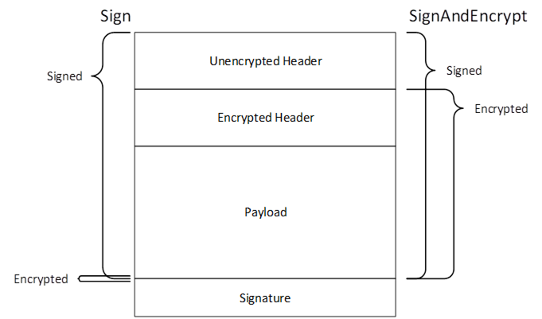  

Figure 14 - Signing and Encryption with Authenticated Encryption  

When using unauthenticated *Encryption* with *Sign* only the *SigningKey* needs to be computed, however, the length of the derived key material used to calculate the *Salt* shall be the same as the length of the derived key material used with *SignAndEncrypt* . The encryption algorithm is not used and the padding is zero length when using *Sign* mode. The process of signing and encrypting data with unauthenticated *Encryption* is illustrated in [Figure 15](/§\_Ref133970015) .  

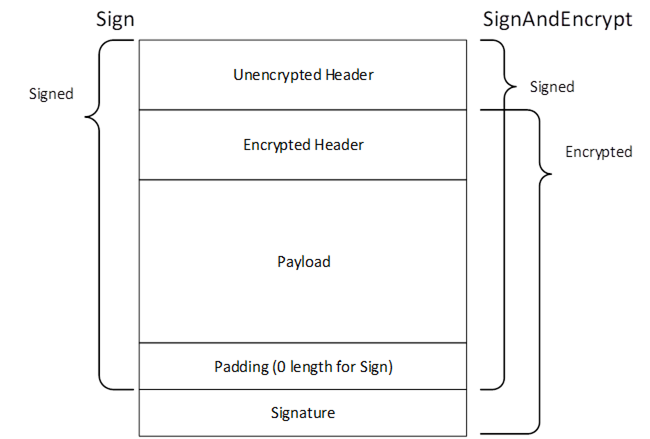  

Figure 15 - Signing and Encryption with Unauthenticated Encryption  

In addition, a unique *InitializationVector* is needed for each *Message* . This value constructed from the *ClientInitializationVector* or *ServerInitializationVector* where the first 8 bytes are XORed with the values in [Table 68](/§\_Ref35543669) encoded as described in [5.2.2.2](/§\_Ref90086478) .  

Table 68 - Creating a Mask for the Initialization Vector  

| **Name** | **Bytes** | **Length** |
|---|---|---|
|TokenId|4|The *TokenId* specified in the *SecurityHeader* of *MessageChunk* being processed. It is encoded as a *UInt32* as described in 5.2.2.2.|
|LastSequenceNumber|4|The *SequenceNumber* specified in the *SequenceHeader* of last *MessageChunk* sent in the same direction on the *SecureChannel* . The value is 0 to indicate there is no *LastSequenceNumber* for the first *MessageChunk* which is always the *OpenSecureChannel Message.* It is encoded as a *UInt32* as described in 5.2.2.2.|
  

  

The *ClientInitializationVector* is used when the *Client* encrypts the *MessageChunk* and the *ServerInitializationVector* is used when the *Server* encrypts the *MessageChunk* .  

The *LastSequenceNumber* is the *SequenceNumber* from the previously sent *Message* which normally requires the previous *Message* to be decrypted. If the receiver processes incoming *Messages* in parallel it can calculate the expected *SequenceNumber* based on the order in which the encrypted *Messages* are received.  

Once the keys are derived ECC *SecureChannels* behave the same as RSA *SecureChannels* .  

#### 6.8.2 UserIdentityToken Encryption  

*ActivateSession* allows a *Client* to provide an encrypted *UserIdentityToken* using a *SecurityPolicy* specified by a *UserTokenPolicy* supported by the current *Endpoint* . With ECC, encryption requires that the *Client* and *Server* exchange *EphemeralKeys* and there is no mechanism in the current *CreateSession* / *ActivateSession* handshake to do this. For that reason, *EphemeralKeys* are returned in the *AdditionalHeader* field of the *ResponseHeader* of the *CreateSession* and *ActivateSession* responses. An overview of the handshake is shown in [Figure 16](/§\_Ref516233956) .  

  

Figure 16 - ECC CreateSession/ActivateSession Handshake  

The *UserTokenPolicies* are returned in the *GetEndpoints* response. A *UserTokenPolicy* may specify a *SecurityPolicyUri* that is different than the *SecureChannel* , however, all *UserTokenPolicies* in an *EndpointDescription* shall specify a *SecurityPolicyUri* that is valid for all *Certificates* that are valid for *SecurityPolicyUri* specified in the *EndpointDescription.* For example, an *EndpointDescription* providing an ECC *SecurityPolicyUri* shall not specify RSA *SecurityPolicyUris* in the *UserTokenPolicies* .  

When a *Client* calls *CreateSession* via a *SecureChannel* based on an ECC *SecurityPolicy* the *Client* specifies the *SecurityPolicyUri* it plans to use for the *UserIdentityToken* in the *RequestHeader* . *Server* returns an *EphemeralKey* in the *ResponseHeader* that can be used for the *SecurityPolicyUri* specified by the *Client* . If the *SecurityPolicyUri* is not valid the *Server* returns a *StatusCode* in the *ResponseHeader* instead of an *EphemeralKey.*  

When the *Client* calls *ActivateSession* it creates an *EccEncryptedSecret* (see [OPC 10000-4](/§UAPart4) ) using the *EphemeralKey* provided in *CreateSession* response. The *Server* always returns a new *EphemeralKey* in the *ResponseHeader* which the *Client* saves for when it calls *ActivateSession* again. The *SecurityPolicyUri* passed in *CreateSession* is used to determine what type of *EphemeralKey* to return.  

The *EphemeralKeys* may be used for exactly one key negotiation. After that they are discarded. Each time *ActivateSession* is called the *UserIdentityToken* is encrypted using the last *EphemeralKey* returned by the *Server* . The *EphemeralKey* is changed even if the *Client* did not provide an encrypted *UserIdentityToken* .  

If the *Client* does not provide *SecurityPolicyUri* in the call to *CreateSession* it will not be able to use any *UserIdentityTokens* that require encryption with ECC *SecurityProfiles* .  

[OPC 10000-4](/§UAPart4) defines *AdditionalParametersType* which is a list of name-value pairs. An instance of this type is passed in the *AdditionalHeader* field. Instances of the *EphemeralKeyType* defined in [OPC 10000-4](/§UAPart4) are passed as values in the name-value pair list in the response messages. The names used for the parameters defined for the *CreateSession/ActivateSession* exchange are defined in [Table 69](/§\_Ref524457115) .  

Table 69 - Additional Header Key Names  

| **Name** | **DataType** | **Description** |
|---|---|---|
|ECDHPolicyUri|String|Specifies the *SecurityPolicyUri* used for the *EphemeralKey* s.|
|ECDHKey|EphemeralKeyType|Specifies an *EphemeralKey* . If the *EphemeralKey* could not be created a *StatusCode* indicating the reason for the error is used instead of an instance of *EphemeralKeyType* .|
  

  

#### 6.8.3 ECC Encrypted Secret  

[OPC 10000-4](/§UAPart4) defines the layout of *EccEncryptedSecret* structure which is used to protect secrets with ECC *SecurityPolicies* . Applying security with ECC requires two *EphemeralKeys* generated by the sender and the receiver which are used create the symmetric keys need for encryption.  

[6.8.1](/§\_Ref516165796) defines a mechanism to allows the sender to acquire the receiver *EphemeralKey* when using a *Session* . Using the *EccEncryptedSecret* in other contexts requires a different mechanism.  

Once the sender has the receiver *EphemeralKey,* it creates its own *EphemeralKey* . The ECC curve and key length for the *EphemeralKeys* are specified by the *SecurityPolicyUri* .  

The encryption uses the symmetric encryption algorithm specified by the *SecurityPolicyUri* . The encrypting key and initialization vector are generated by using the *EphemeralKeys* to create the shared secret and then derive keys using the algorithm defined in [6.8.1](/§\_Ref516165796) . Step 1 is slightly different and defined as follows:  

Step 1: Calculate Salt  

SecretSalt = L | UTF8(opcua-secret) | SenderPublicKey | ReceiverPublicKey  

Where:  

* L is the length of derived key material needed encoded as a 16-bit little endian integer;  

* UTF8(opcua-secret) is the UTF8 encoding of the string literal 'opcua-secret';  

* *SenderPublicKey* and *ReceiverPublicKey* are from the *PolicyHeader* ;  

* | concatenates sequences of bytes;  

Salt is a sequence of bytes.  

  

The encryption keys are extracted from the keying material created with IKM=shared secret, Salt=SecretSalt and Info=SecretSalt as shown in [Table 70](/§\_Ref525272562) .  

Table 70 - Deriving Keys from Keying Material  

| **Name** | **Offset** | **Length** |
|---|---|---|
|EncryptingKey|0|EncryptionKeyLength|
|InitializationVector|EncryptionKeyLength|InitializationVectorLength|
  

The *EncryptionKeyLength* and *EncryptionBlockSize* are specified by the *Symmetric Encryption Algorithm* for the *SecurityPolicy* . The *Signature* is created with the *SigningCertificate* and is calculated after encryption. Receivers shall validate the *SigningCertificate* and signature before decrypting the *Secret* .  

## 7 TransportProtocols  

### 7.1 OPC UA Connection Protocol  

#### 7.1.1 Overview  

OPC UA Connection Protocol (UACP) is an abstract protocol that establishes a full duplex channel between a *Client* and *Server* . Concrete implementations of the UACP can be built with any middleware that supports full-duplex exchange of messages including TCP/IP and WebSockets. The term " *TransportConnection* " describes the specific connection used to exchange messages. For example, a socket is the *TransportConnection* for TCP/IP. *TransportConnections* allow responses to be returned in any order. If the *TransportConnection* breaks the *SecureChannel* is interrupted and a new *SecureChannel* needs to be created.  

The OPC UA Connection Protocol is designed to work with the *SecureChannel* implemented by a layer higher in the stack. For this reason, the OPC UA Connection Protocol defines its interactions with the *SecureChannel* in addition to the wire protocol.  

#### 7.1.2 Message structure  

##### 7.1.2.1 Overview  

[Figure 17](/§\_Ref457769363) illustrates the structure of a *Message* placed on the wire. This also illustrates how the *Message* elements defined by the OPC UA Binary Encoding mapping (see [5.2](/§\_Ref164095085) ) and the OPC UA Secure Conversation mapping (see [6.7](/§\_Ref164097164) ) relate to the OPC UA Connection Protocol *Messages* .  

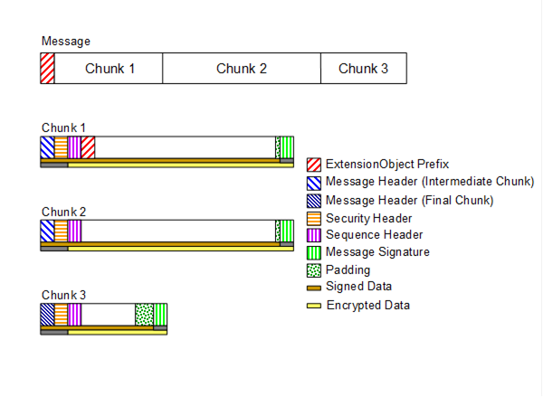  

Figure 17 - OPC UA Connection Protocol Message structure  

##### 7.1.2.2 Message Header  

Every OPC UA Connection Protocol *Message* has a header with the fields defined in [Table 71](/§\_Ref165969843) .  

Table 71 - OPC UA Connection Protocol Message header  

| **Name** | **Type** | **Description** |
|---|---|---|
|MessageType|Byte [3]|A three byte ASCII code that identifies the *Message* type. The following values are defined at this time: HEL  a *Hello* *Message* . ACK an *Acknowledge* *Message* . ERR an *Error* *Message* . RHE  a *ReverseHello* *Message* . The *SecureChannel* layer defines additional values which the OPC UA Connection Protocol ** layer shall accept.|
|Reserved|Byte [1]|Ignored. shall be set to the ASCII codes for 'F' if the *MessageType* is one of the values supported by the OPC UA Connection Protocol.|
|MessageSize|UInt32|The length of the *Message* , in bytes. This value includes the 8 bytes for the *Message* header.|
  

  

The layout of the OPC UA Connection Protocol *Message* header is intentionally identical to the first 8 bytes of the OPC UA Secure Conversation *Message* header defined in [Table 56](/§\_Ref163954977) . This allows the OPC UA Connection Protocol layer to extract the *SecureChannel* *Messages* from the incoming stream even if it does not understand their contents.  

The OPC UA Connection Protocol layer shall verify the *MessageType* and make sure the *MessageSize* is less than the negotiated *ReceiveBufferSize* before passing any *Message* onto the *SecureChannel* layer.  

##### 7.1.2.3 Hello Message  

The Hello *Message* has the additional fields shown in [Table 72](/§\_Ref164020144) .  

Table 72 - OPC UA Connection Protocol Hello Message  

| **Name** | **Data Type** | **Description** |
|---|---|---|
|ProtocolVersion|UInt32|The version of the UACP protocol requested by the *Client* . If *Server* does not support the requested version or any lower version it rejects the *Client* by returning *Bad\_ProtocolVersionUnsupported* . If the *Server* supports the requested version or a lower version it shall return the version it will use in the *Acknowledge* *Message* . The *ProtocolVersion* for this version of the standard is 0.|
|ReceiveBufferSize|UInt32|The largest *MessageChunk* that the sender can receive. Shall be at least 1024 bytes if the sender intends to use an ECC *SecurityPolicy* . Shall be at least 8192 bytes otherwise.|
|SendBufferSize|UInt32|The largest *MessageChunk* that the sender will send. Shall be at least 1024 bytes if the sender intends to use an ECC *SecurityPolicy* . Shall be at least 8192 bytes otherwise.|
|MaxMessageSize|UInt32|The maximum size for any response *Message* . If *MessageChunks* have not been sent, the *Server* shall return an *Error* *Message* with a *Bad\_ResponseTooLarge* error if a response *Message* exceeds this value. If *MessageChunks* have already been sent the *Server* shall abort the *Message* as described in [6.7.3](/§\_Ref188022819) . The *Message* size is calculated using the unencrypted *Message* body. A value of zero indicates that the *Client* has no limit.|
|MaxChunkCount|UInt32|The maximum number of chunks in any response *Message* . The *Server* shall abort the *Message* with a *Bad\_ResponseTooLarge* *Error* *Message* if a response *Message* exceeds this value. The mechanism for aborting *Messages* is described fully in [6.7.3](/§\_Ref188022819) . A value of zero indicates that the *Client* has no limit.|
|EndpointUrl|String|The URL of the *Endpoint* which the *Client* wished to connect to. The encoded value shall be less than 4096 bytes. *Servers* shall return a Bad\_TcpEndpointUrlInvalid *Error* *Message* and close the connection if the length exceeds 4096 or if it does not recognize the resource identified by the URL.|
  

  

The *EndpointUrl* parameter is used to allow multiple *Servers* to share the same endpoint on a machine. The process listening (also known as the proxy) on the endpoint would connect to the *Server* identified by the *EndpointUrl* and would forward all *Messages* to the *Server* via this socket. If one socket closes, then the proxy shall close the other socket.  

If the *Server* does not have sufficient resources to allow the establishment of a new *SecureChannel* it shall immediately return a *Bad\_TcpNotEnoughResources Error* *Message* and gracefully close the socket. *Client* should not overload *Servers* that return this error by immediately trying to create a new *SecureChannel* .  

##### 7.1.2.4 Acknowledge Message  

The *Acknowledge* *Message* has the additional fields shown in [Table 73](/§\_Ref179131842) .  

Table 73 - OPC UA Connection Protocol Acknowledge Message  

| **Name** | **Type** | **Description** |
|---|---|---|
|ProtocolVersion|UInt32|A protocol version supported by the *Server* that is less than or equal to the protocol version requested in the *Hello* *Message* . If the *Client* accepts the protocol version it shall ensure that it sends *Messages* that conform to this version. The *ProtocolVersion* for this version of the standard is 0.|
|ReceiveBufferSize|UInt32|The largest *MessageChunk* that the sender can receive. This value shall not be larger than the *SendBufferSize* requested in the Hello *Message* . Shall be at least 8192 bytes if the *SendBufferSize* requested in the Hello *Message is* \>= 8192 bytes. Shall be at least 1024 bytes otherwise.|
|SendBufferSize|UInt32|The largest *MessageChunk* that the sender will send. This value shall not be larger than the *ReceiveBufferSize* requested in the Hello *Message* . Shall be at least 8192 bytes if the *ReceiveBufferSize* requested in the Hello *Message is* \>= 8192 bytes. Shall be at least 1024 bytes otherwise.|
|MaxMessageSize|UInt32|The maximum size for any request *Message* . If a request *Message* exceeds this value the *Client* shall report a *Bad\_* *Bad\_RequestTooLarge* error to the application. If *MessageChunks* have already been sent the *Client* shall also abort the *Message* as described in [6.7.3](/§\_Ref188022819) . The *Message* size is calculated using the unencrypted *Message* body. A value of zero indicates that the *Server* has no limit.|
|MaxChunkCount|UInt32|The maximum number of chunks in any request *Message* . The *Client* shall abort the *Message* with a *Bad\_RequestTooLarge* *StatusCode* if a request *Message* exceeds this value. The mechanism for aborting *Messages* is described fully in [6.7.3](/§\_Ref188022819) . A value of zero indicates that the *Server* has no limit.|
  

  

##### 7.1.2.5 Error Message  

The *Error* *Message* has the additional fields shown in [Table 74](/§\_Ref164020837) .  

Table 74 - OPC UA Connection Protocol Error Message  

| **Name** | **Type** | **Description** |
|---|---|---|
|Error|UInt32|The numeric code for the error. Possible values are listed in [Table 77](/§\_Ref164020643) .|
|Reason|String|A more verbose description of the error. This string shall not be more than 4096 bytes. A *Client* shall ignore strings that are longer than this.|
  

  

The socket is always closed gracefully by the *Client* after it receives an *Error* *Message* .  

##### 7.1.2.6 ReverseHello Message  

The *ReverseHello* *Message* has the additional fields shown in [Table 75](/§\_Ref456137651) .  

Table 75 - OPC UA Connection Protocol ReverseHello Message  

| **Name** | **Data Type** | **Description** |
|---|---|---|
|ServerUri|String|The *ApplicationUri* of the *Server* which sent the *Message* . The encoded value shall be less than 4096 bytes. *Client* shall return a Bad\_TcpEndpointUrlInvalid error and close the connection if the length exceeds 4096 or if it does not recognize the *Server* identified by the URI.|
|EndpointUrl|String|The URL of the *Endpoint* which the *Client* uses when establishing the *SecureChannel* . This value shall be passed back to the *Server* in the *Hello* *Message* . The encoded value shall be less than 4096 bytes. *Clients* shall return a Bad\_TcpEndpointUrlInvalid error and close the connection if the length exceeds 4096 or if it does not recognize the resource identified by the URL. This value is a unique identifier for the *Server* which the *Client* may use to look up configuration information. It should be one of the URLs returned by the *GetEndpoints* *Service* .|
  

  

For connection-based protocols, such as TCP, the *ReverseHello* *Message* allows *Servers* behind firewalls with no open ports to connect to a *Client* and request that the *Client* establish a *SecureChannel* using the socket created by the *Server* .  

For message-based protocols the *ReverseHello* *Message* allows *Servers* to announce their presence to a *Client* . In this scenario, the *EndpointUrl* specifies the *Server's* specific address and any tokens required to access it.  

#### 7.1.3 Establishing a connection  

Connections may be initiated by the *Client* or by the *Server* when they create a *TransportConnection* and establish a communication with their peer. The connection is initiated by using an *EndpointUrl* that specifies a network address where a peer listens for new connections. The *EndpointUrl* specifies a network address that is accessible to the initiator. If the listener is behind a NAT firewall, the *EndpointUrl* specifies an address outside the firewall. If the *EndpointUrl* specifies a domain name then the initiator requires access to a domain name resolution service (e.g., the DNS protocol) that maps the domain name onto a usable network address. [OPC 10000-7](/§UAPart7) defines *Profiles* for different name resolution protocols that *Clients* and *Servers* may support.  

If the *Client* creates the *TransportConnection* , the first *Message* sent shall be a *Hello* which specifies the buffer sizes that the *Client* supports. The *Server* shall respond with an *Acknowledge Message* which completes the buffer negotiation. The negotiated buffer size shall be reported to the *SecureChannel* layer. The negotiated *SendBufferSize* specifies the size of the *MessageChunks* to use for *Messages* sent over the connection.  

If the *Server* creates the *TransportConnection* the first *Message* shall be a *ReverseHello* sent to the *Client* . If the *Client* accepts the connection, it sends a *Hello* message back to the *Server* which starts the buffer negotiation described for the *Client* initiated connection.  

The *Hello/Acknowledge* *Messages* may only be sent once. If they are received again the receiver shall report an error and close the *TransportConnection* . Applications accepting incoming connections shall close any *TransportConnection* after a period of time if it does not receive a *Hello* or *ReverseHello* *Message* . This period of time shall be configurable and have a default value which does not exceed two minutes.  

The *Client* sends the *OpenSecureChannel* request once it receives the *Acknowledge* back from the *Server* . If the *Server* accepts the new channel, it shall associate the *TransportConnection* with the *SecureChannelId* . The *Server* uses this association to determine which *TransportConnection* to use when it has to send a response to the *Client* . The *Client* does the same when it receives the *OpenSecureChannel* response.  

The *Server* application does not do any processing while the *SecureChannel* is negotiated; however, the *Server* application shall provide the *Stack* with the list of trusted *Certificates* . The *Stack* shall provide notifications to the *Server* application whenever it receives an *OpenSecureChannel* request *.* These notifications shall include the *OpenSecureChannel* or *Error* response returned to the *Client* .  

The sequence of *Messages* when establishing a *Client* initiated OPC UA Connection Protocol connection is shown in [Figure 18](/§\_Ref164017437) .  

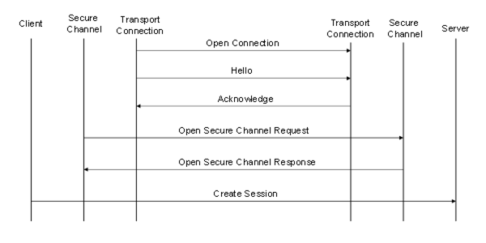  

Figure 18 - Client initiated OPC UA Connection Protocol connection  

The sequence of *Messages* when establishing a *Server* initiated OPC UA Connection Protocol ** connection is shown in [Figure 19](/§\_Ref456138622) .  

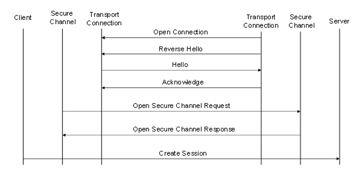  

Figure 19 - Server initiated OPC UA Connection Protocol connection  

For *Server*\-initiated connections, the *Server* needs to be configured and enabled by an administrator to connect to one or more *Clients* . For each *Client* , the administrator shall provide an *EndpointUrl* which may be use to establish a connection. If the *Client EndpointUrl* is not known, the administrator may provide the *EndpointUrl* for a GDS (see [OPC 10000-12](/§UAPart12) ) which knows about the *Client* . In this case, the administrator shall also provide an *ApplicationUri* which can be used to find the Client in the GDS.  

*Servers* shall maintain at least one open socket without an active *Session* with each *Client* it is configured to connect to. *Servers* may delay re-connecting if the *Client* reports an error. [Table 76](/§\_Ref138186180) describes the process in full and how the *Server* is expected to react to different actions by the *Client* .  

Table 76 - Client and Server Handshake during Reverse Connect  

| **Action** | **Notes** |
|---|---|
|Open Connection|*Server* creates a socket to a URL specified in its configuration. *Client* shall close the socket after short delay if no *ReverseHello* *Message* received. *Server* shall create a new socket because it cannot know if it was a network issue or due to action by the *Client* .|
|Reverse Hello|*Server* sends *ReverseHello* with its *ApplicationUri* . *Client* may check the *ApplicationUri* . If it is not acceptable it shall close the socket. *Client* shall send an *Error Message* with the code *Bad\_ServerTooBusy* if it does not have enough resources to keep the socket open. *Client* may save socket for use in the future (the sequence may pause here). If the *Server* receives an *Error Message* it shall close the socket, log the error and reconnects after a delay specified in its configuration. If the socket is closed without an *Error Message* , the *Server* shall create a new socket with or without a delay and sends a new *ReverseHello Message* .|
|HelloAcknowledgeOpen Secure Channel RequestOpen Secure Channel Response |*Client* establishes a *SecureChannel* and verifies that it trusts the *Server* . *Client* may save the *SecureChannel* for use in the future (the sequence may pause here). *Client* may use *SecureChannel* for *Discovery* or *Session-less Service* invocations. Once a *SecureChannel* is established, the *Server* shall create a new socket if there is not already one without an active *SecureChannel* . If the *SecureChannel* is closed, the *Server* shall create a new socket if there is not already one without an active *SecureChannel* .|
|Create Session|*Client* establishes a *Session* .|
  

  

#### 7.1.4 Closing a connection  

The *Client* closes the connection by sending a *CloseSecureChannel* request and closing the socket gracefully. When the *Server* receives this *Message,* it shall release all resources allocated for the channel. The body of the *CloseSecureChannel* request is empty. The *Server* does not send a *CloseSecureChannel* response *.*  

If security verification fails for the *CloseSecureChannel* *Message,* then the *Server* shall report the error and close the socket.  

The sequence of *Messages* when closing an OPC UA Connection Protocol connection is shown in [Figure 20](/§\_Ref164019178) .  

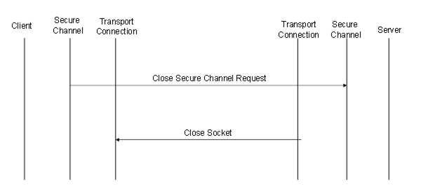  

Figure 20 - Closing a OPC UA Connection Protocol connection  

The *Server* application does not do any processing when the *SecureChannel* is closed; however, the *Stack* shall provide notifications to the *Server* application whenever a *CloseSecureChannel* request is received or when the *Stack* cleans up an abandoned *SecureChannel* .  

#### 7.1.5 Error handling  

When a protocol level error occurs that cannot be recovered, the *Server* shall send an *Error* *Message* to the *Client* and closes the *TransportConnection* gracefully. When the *Client* receives an *Error* *Message* it reports the error to the application and closes the *TransportConnection* gracefully. If a *Client* encounters a fatal error, it shall report the error to the application and send a *CloseSecureChannel* *Message* . The Server shall close the *TransportConnection* gracefully when it receives the *CloseSecureChannel* *Message* .  

The possible OPC UA Connection Protocol errors are defined in [Table 77](/§\_Ref164020643) .  

Table 77 - OPC UA Connection Protocol error codes  

| **Name** | **Description** |
|---|---|
|Bad\_TcpServerTooBusy|The *Server* cannot process the request because it is too busy. It is up to the *Server* to determine when it needs to return this *Message* . A *Server* can control the how frequently a *Client* reconnects by waiting to return this error.|
|Bad\_TcpMessageTypeInvalid|The type of the *Message* specified in the header invalid. Each *Message* starts with a 4-byte sequence of ASCII values that identifies the *Message* type. The *Server* returns this error if the *Message* type is not accepted. Some of the *Message* types are defined by the *SecureChannel* layer.|
|Bad\_TcpSecureChannelUnknown|The SecureChannelId and/or TokenId are not currently in use. This error is reported by the *SecureChannel* layer.|
|Bad\_TcpMessageTooLarge|The size of the *MessageChunk* specified in the header is too large. The *Server* returns this error if the *MessageChunk* size exceeds its maximum buffer size or the receive buffer size negotiated during the Hello/Acknowledge exchange.|
|Bad\_Timeout|A timeout occurred while accessing a resource. It is up to the *Server* to determine when a timeout occurs.|
|Bad\_TcpNotEnoughResources|There are not enough resources to process the request. The *Server* returns this error when it runs out of memory or encounters similar resource problems. A *Server* can control the how frequently a *Client* reconnects by waiting to return this error.|
|Bad\_TcpInternalError|An internal error occurred. This should only be returned if an unexpected configuration or programming error occurs.|
|Bad\_TcpEndpointUrlInvalid|The *Server* does not recognize the EndpointUrl specified.|
|Bad\_SecurityChecksFailed|The *Message* was rejected because it could not be verified.|
|Bad\_RequestInterrupted|The request could not be sent because of a network interruption.|
|Bad\_RequestTimeout|Timeout occurred while processing the request.|
|Bad\_SecureChannelClosed|The secure channel has been closed.|
|Bad\_SecureChannelTokenUnknown|The *SecurityToken* has expired or is not recognized.|
|Bad\_CertificateUntrusted|The sender *Certificate* is not trusted by the receiver.|
|Bad\_CertificateTimeInvalid|The sender *Certificate* has expired or is not yet valid.|
|Bad\_CertificateIssuerTimeInvalid|The issuer for the sender *Certificate* has expired or is not yet valid.|
|Bad\_CertificateUseNotAllowed|The sender's *Certificate* may not be used for establishing a secure channel.|
|Bad\_CertificateIssuerUseNotAllowed|The issuer *Certificate* may not be used as a *Certificate* Authority.|
|Bad\_CertificateRevocationUnknown|Could not verify the revocation status of the sender's *Certificate* .|
|Bad\_CertificateIssuerRevocationUnknown|Could not verify the revocation status of the issuer *Certificate* .|
|Bad\_CertificateRevoked|The sender *Certificate* has been revoked by the issuer.|
|Bad\_IssuerCertificateRevoked|The issuer *Certificate* has been revoked by its issuer.|
|Bad\_SequenceNumberInvalid|The sequence number on the message was not valid.|
|Bad\_ServiceUnsupported|The *Service Request* contained in the body of the message is not supported. This error is only returned when the *Request* represents a security risk and it is necessary to immediately close the *SecureChannel* . For example, calling *CreateSession* on a *SecureChannel* that does not allow *Sessions* .|
  

  

The numeric values for these error codes are defined in [A.2](/§\_Ref80223066) .  

NOTE: The 'Tcp' prefix for some of the error codes in [Table 77](/§\_Ref164020643) was chosen when TCP/IP was the only implementation of the OPC UA Connection Protocol. These codes are used with any implementation of the OPC UA Connection Protocol.  

### 7.2 OPC UA TCP  

TCP/IP is a ubiquitous protocol that provides full-duplex communication between two applications. A socket is the *TransportConnection* in the TCP/IP implementation of the OPC UA Connection Protocol.  

The URL scheme for endpoints using OPC UA TCP is 'opc.tcp'.  

The *TransportProfileUri* shall be a URI for the TCP transport defined in [OPC 10000-7](/§UAPart7) .  

### 7.3 SOAP/HTTP  

Note: Deprecated in Version 1.03 because WS-SecureConversation has not been widely adopted by industry.  

### 7.4 OPC UA HTTPS  

#### 7.4.1 Overview  

[HTTPS](/§Https) refers [HTTP](/§Http) *Messages* exchanged over a [TLS](/§Tls) connection (see [HTTPS](/§Https) ). The syntax of the HTTP *Messages* does not change and the only difference is a TLS connection is created instead of a TCP/IP connection. This implies that profiles which use this transport can also be used with HTTP when security is not a concern.  

HTTPS is a protocol that provides transport security. This means all bytes are secured as they are sent without considering the *Message* boundaries. Transport security can only work for point-to-point communication and does not allow untrusted intermediaries or proxy servers to handle traffic.  

The *SecurityPolicy* shall be specified, however, it only affects the algorithms used for signing the *Nonces* during the *CreateSession* / *ActivateSession* handshake. A *SecurityPolicy* of *None* indicates that the *Nonces* do not need to be signed. The *SecurityMode* is set to *Sign* unless the *SecurityPolicy* is *None* ; in this case the *SecurityMode* shall be set to *None* . If a UserIdentityToken is to be encrypted, it shall be explicitly specified in the UserTokenPolicy.  

An HTTP Header called 'OPCUA-SecurityPolicy' is used by the *Client* to tell the *Server* what *SecurityPolicy* it is using if there are multiple choices available. The value of the header is the URI for the *SecurityPolicy* . If the *Client* omits the header, then the *Server* shall assume a *SecurityPolicy* of *None* .  

All HTTPS communications via a URL shall be treated as a single *SecureChannel* that is shared by multiple *Clients* . *Stacks* shall provide a unique identifier for the *SecureChannel* which allows applications correlate a request with a *SecureChannel.* This means that *Sessions* can only be considered secure if the *AuthenticationToken* (see [OPC 10000-4](/§UAPart4) ) is long (\>20 bytes) and HTTPS encryption is enabled. **  

The cryptography algorithms used by HTTPS have no relationship to the *EndpointDescription* *SecurityPolicy* and are determined by the policies set for HTTPS and are outside the scope of OPC UA.  

[Figure 21](/§\_Ref286609258) illustrates a few scenarios where the HTTPS transport could be used.  

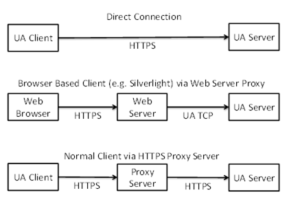  

Figure 21 - Scenarios for the HTTPS Transport  

In some scenarios, HTTPS communication will rely on an intermediary which is not trusted by the applications. If this is the case, then the HTTPS transport cannot be used to ensure security and the applications will have to establish a secure tunnel like a VPN before attempting any OPC UA related communication.  

Applications which support the HTTPS transport shall support [HTTP](/§Http) and [TLS](/§Tls) .  

Some HTTPS implementations require that all *Servers* have a *Certificate* with a Common Name (CN) that matches the DNS name of the *Server* machine. This means that a *Server* with multiple DNS names will need multiple HTTPS certificates. If multiple *Servers* are on the same machine they may share HTTPS certificates. This means that *ApplicationCertificates* are not the same as HTTPS *Certificates* . Applications which use the HTTPS transport and require application authentication shall check application *Certificates* during the *CreateSession* / *ActivateSession* handshake.  

HTTPS *Certificates* can be automatically generated; however, this will cause problems for *Clients* operating inside a restricted environment such as a web browser. Therefore, HTTPS certificates should be issued by an authority which is accepted by all web browsers which need to access the *Server* . The set of *Certificate* authorities accepted by the web browsers is determined by the organization that manages the *Client* machines. *Client* applications that are not running inside a web may use the trust list that is used for application *Certificates* .  

A *Server* that is configured to use an HTTPS proxy shall have a mechanism to ensure that requests only come from that HTTPS proxy. The exact mechanism, such as binding to the loopback address, is implementation dependent.  

HTTPS connections have an unpredictable lifetime. Therefore, *Servers* must rely on the *AuthenticationToken* passed in the *RequestHeader* to determine the identity of the *Client* . This means the *AuthenticationToken* shall be a randomly generated value with at least 32 bytes of data and HTTPS with signing and encryption shall always be used.  

HTTPS allows *Clients* to have certificates; however, they are not required by the HTTPS transport. A *Server* shall allow *Clients* to connect without providing a *Certificate* during negotiation of the HTTPS connection.  

HTTP 1.1 supports *Message* chunking where the Content-Length header in the request response is set to "chunked" and each chunk is prefixed by its size in bytes. All applications that support the HTTPS transport shall support HTTP chunking.  

The URL scheme for endpoints using the HTTPS transport is 'opc.https'. Note that 'https' is the generic URL scheme for the underlying transport. The opc prefix specifies that the endpoint accepts OPC UA messages as defined in this document.  

#### 7.4.2 Session-less Services  

*Session*\- *less* *Services* (see [OPC 10000-4](/§UAPart4) ) may be invoked via HTTPS POST.  

The HTTP *Authorization* header is used to specify the *UserIdentity* used to determine what permissions are available to the caller. The *Authorization* header may specify a Basic token with a UserName/Password or a Bearer token (see [RFC 6750](/§RFC6750) ) with an *AccessToken* provided by an *AuthorizationService* .  

The HTTP Accept-Language header is used to specify the locales to use for the request. The locales are sorted based on their quality value and then by the order they appear in the header.  

The Content-Type header in the HTTP request and response shall specify the *DataEncoding* of the message. Well known media types should be used to ensure interoperability with standard HTTP infrastructure. The application/opcua+uabinary media type is also defined, however, it is not registered with IANA and is only specified for backward compatibility.  

Table 78 - HTTP Content-Type Header  

| **Content-Type** | **Description** |
|---|---|
|application/octet-streamapplication/opcua+uabinary|The body is encoded using the OPC UA Binary DataEncoding defined in [5.2](/§\_Ref163962885) .|
|application/soap+xml|The body is encoded using the XML DataEncoding defined in [5.3](/§\_Ref131702289) .|
|application/json|The body is encoded using the OPC UA JSON Compact DataEncoding defined in [5.4](/§\_Ref443435038) .|
  

  

XML and JSON messages always use the UTF8 encoding. The charset parameter (i.e. 'application/json; charset=utf-8') may be appended to the media type to indicate this.  

JSON messages may be compressed with [RFC 1952](/§RFC1952) . If compression is used the Content-Encoding HTTP Header is 'gzip'.  

#### 7.4.3 XML Encoding  

This *TransportProtocol* implements the OPC UA *Services* using a SOAP request-response message pattern over an HTTPS connection.  

The body of the HTTP *Messages* shall be a SOAP 1.2 *Message* (see [SOAP Part 1](/§Soap1) ). WS-Addressing headers are optional.  

The OPC UA XML Encoding specifies a way to represent an OPC UA *Message* as an XML element. This element is added to the SOAP *Message* as the only child of the SOAP body element. If an error occurs in the *Server* while parsing the request body, the *Server* may return a SOAP fault or it may return an OPC UA error response.  

The SOAP Action associated with an XML encoded request *Message* always has the form:  

http://opcfoundation.org/UA/2008/02/Services.wsdl/\<service name\>  

Where \<service name\> is the name of the OPC UA *Service* being invoked.  

The SOAP Action associated with an XML encoded response *Message* always has the form:  

http://opcfoundation.org/UA/2008/02/Services.wsdl/\<service name\>Response  

All requests shall be HTTP POST requests. The Content-type shall be "application/soap+xml" and the charset and action parameters shall be specified. The charset parameter shall be "utf-8" and the action parameter shall be the URI for the SOAP action.  

An example HTTP request header is:  

POST /UA/SampleServer HTTP/1.1  

Content-Type: application/soap+xml; charset="utf-8";  

action="http://opcfoundation.org/UA/2008/02/Services.wsdl/Read"  

Content-Length: nnnn  

The action parameter appears on the same line as the Content-Type declaration.  

An example request *Message* :  

\<s:Envelope xmlns:s="http://www.w3.org/2003/05/soap-envelope"\>  

\<s:Body\>  

\<ReadRequest xmlns="http://opcfoundation.org/UA/2008/02/Types.xsd"\>  

…  

\</ReadRequest\>  

\</s:Body\>  

\</s:Envelope\>  

An example HTTP response header is:  

HTTP/1.1 200 OK  

Content-Type: application/soap+xml; charset="utf-8";  

action="http://opcfoundation.org/UA/2008/02/Services.wsdl/ReadResponse"  

Content-Length: nnnn  

The action parameter appears on the same line as the Content-Type declaration.  

An example response *Message* :  

\<s:Envelope xmlns:s="http://www.w3.org/2003/05/soap-envelope"\>  

\<s:Body\>  

\<ReadResponse xmlns="http://opcfoundation.org/UA/2008/02/Types.xsd"\>  

…  

\</ReadResponse\>  

\</s:Body\>  

\</s:Envelope\>  

#### 7.4.4 Binary Encoding  

This *TransportProtocol* implements the OPC UA *Services* using an OPC UA Binary encoded *Messages* exchanged over an HTTPS connection.  

Applications which support the HTTPS *Profile* shall support HTTP 1.1.  

The body of the HTTP *Messages* shall be encoding using the OPC UA Binary *DataEncoding* . The Content-Type shall be "application/octet-stream".  

An example HTTP request header is:  

POST /UA/SampleServer HTTP/1.1  

Content-Type: application/octet-stream  

Content-Length: nnnn  

An example HTTP response header is:  

HTTP/1.1 200 OK  

Content-Type: application/octet-stream  

Content-Length: nnnn  

The *Message* body is the request or response structure encoded as an *ExtensionObject* in OPC UA Binary. The Authorization header is only used for Session-less Service calls (see [7.4.2](/§\_Ref468676596) ).  

If the OPC UA Binary *DataEncoding* is used for a Session-less *Service* the HTTP request header is:  

POST /UA/SampleServer HTTP/1.1Authorization : Bearer \<base64-encoded-token-data\>  

Content-Type: application/octet-stream  

Content-Length: nnnn  

  

#### 7.4.5 JSON Encoding  

This *TransportProtocol* implements the OPC UA *Services* using JSON encoded *Messages* exchanged over an HTTPS connection.  

Applications which support the HTTPS *Profile* shall support HTTP 1.1.  

The body of the HTTP *Messages* shall be encoded using the OPC UA JSON *DataEncoding* and the Content-Type shall be 'application/json'. If the message is compressed the Content-Encoding shall be 'gzip'.  

An example HTTP request header is:  

POST /UA/SampleServer HTTP/1.1Authorization : Bearer \<base64-encoded-token-data\>  

Content-Type: application/json  

Content-Length: nnnn  

  

An example HTTP response header is:  

HTTP/1.1 200 OK  

Content-Type: application/jsonContent-Encoding: gzipContent-Length: nnnn  

  

### 7.5 WebSockets  

#### 7.5.1 Overview  

This *TransportProtocol* sends OPC UA Connection Protocol messages over WebSockets.  

WebSockets is a bi-directional protocol for communication via a web server which is commonly used by browser-based applications to allow the web server to asynchronously send information to the client. WebSockets uses the same default port as HTTP or HTTPS and initiates communication with an HTTP request. This makes it very useful in environments where firewalls limit traffic to the ports used by HTTP or HTTPS.  

WebSockets use HTTP, however, in practice a WebSocket connection is only initiated with a HTTP GET request and the web server provides an HTTP response. After that exchange, all traffic uses the binary framing protocol defined by [RFC 6455](/§RFC6455) .  

A *Server* that supports the WebSockets transport shall publish one or more *Endpoints* with the scheme 'opc.wss'. The *TransportProfileUri* shall be one of the URIs for WebSockets transports defined in [OPC 10000-7](/§UAPart7) . The *TransportProfileUri* specifies the encoding and security protocol used to construct the OPC UA messages sent via the *WebSocket* .  

The *SecurityMode* and *SecurityPolicyUri* of the *Endpoint* control the security applied to the messages sent via the WebSocket. This allows the messages to be secure even if the WebSocket connection is established via untrusted HTTPS proxies.  

[Figure 22](/§\_Ref468633763) summarizes the complete process for establishing communication over a WebSocket.  

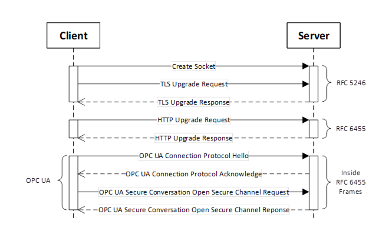  

Figure 22 - Setting up Communication over a WebSocket  

[Figure 22](/§\_Ref468633763) assumes the opcua+uacp sub-protocol (see [7.5.2](/§\_Ref468637503) ). There is no *SecureChannel* negotiation when using opcua+json sub-protocol.  

The default *UserIdentity* for any *Session-less Service* calls made over the WebSocket is specified by the opcua+token sub-protocol. It may also be used to determine if the *Client* is allowed to create a *Session* .  

#### 7.5.2 Sub-Protocols  

The WebSocket protocol allows clients to request that servers use specific sub-protocols with the "Sec-WebSocket-Protocol" header in the WebSocket handshake defined in [RFC 6455](/§RFC6455) . The sub-protocols defined by this document are shown in [Table 79](/§\_Ref468606127) .  

Table 79 - WebSocket Sub-Protocols  

| **Sub-Protocol** | **Description** |
|---|---|
|opcua+uacp|Each WebSocket frame is a *MessageChunk* as defined in [6.7.2](/§\_Ref164007251) . After the WebSocket is created, the handshake described in [7.1.3](/§\_Ref468608921) is used to negotiate the maximum size of the *MessageChunk* . The maximum size for a buffer needed to receive a WebSocket frame is the maximum length of a *MessageChunk* plus the maximum size for the WebSocket frame header. When using this sub-protocol, the payload in each frame is binary (OpCode 0x2 in [RFC 6455](/§RFC6455) ).|
|opcua+uajson|Each WebSocket frame is a Message encoded using the JSON encoding described in [5.4.9](/§\_Ref468608977) . There is no mechanism to negotiate the maximum frame size. If the receiver encounters a frame that exceeds its internal limits it shall close the WebSocket connection and provide a 1009 status code as described in [RFC 6455](/§RFC6455) . This sub-protocol is not recommended. The opcua+openapi sub-protocol should be used instead.|
|opcua+openapi|Each WebSocket frame is a *ServiceMessageEnvelope de* scribed in [G.3](/§\_Ref175651074) . There is no mechanism to negotiate the maximum frame size. If the receiver encounters a frame that exceeds its internal limits it shall close the WebSocket connection and provide a 1009 status code as described in [RFC 6455](/§RFC6455) . When using this sub-protocol, the payload in each frame is text (OpCode 0x1 in [RFC 6455](/§RFC6455) ) if the frame contains UTF8 encoded JSON. If the frame contains JSON compressed with [RFC 1952](/§RFC1952) then the frame is binary (OpCode 0x2 in [RFC 6455](/§RFC6455) ).|
|opcua+openapi+\<accesstoken\>|This sub-protocol is only used in addition to the opcua+openapi sub-protocol.and specifies the default *UserIdentity* for all *Requests* sent over the WebSocket. The \<accesstoken\> is the JSON WebToken (see [6.5.2](/§\_Ref473652750) ) and is normally passed in the HTTPS Authentication header. Using a sub-protocol to provide an AccessToken is a widely used design pattern needed to deal with limitations of common WebSocket implementations.|
  

  

Each WebSocket sub-protocol defined has a *TransportProfileUri* defined in [OPC 10000-7](/§UAPart7) .  

The *Client* shall request a sub-protocol. If the *Server* does not support the sub-protocol requested by the *Client,* the *Client* shall close the connection and report an error.  

#### 7.5.3 Security  

The WebSockets protocol requires that the *Server* have a *Certificate* , however, the *Client* may have a *Certificate* . The *Server Certificate* should have the domain name as the common name component of the subject name however, *Clients* that are able to override the *Certificate* validation procedure can choose to accept *Certificates* with a domain mismatch.  

When using the WebSockets transport from a web browser the browser environment may impose additional restrictions. For example, the web browser may require the *Server* have a valid TLS *Certificate* that is issued by CA that is installed in the *Trust List* for the web browser. To support these *Clients,* a *Server* may use a TLS *Certificate* that does not conform to the requirements for an *ApplicationInstance Certificate* . In these cases, the TLS *Certificate* is only used for TLS negotiation and the *Server* shall use a valid *ApplicationInstance Certificate* for other interactions that require one. *Servers* shall allow administrators to specify a *Certificate* for use with TLS that is different from the *ApplicationInstance Certificate.*  

*Clients* running in a browser environment specify the 'Origin' HTTP header during the *WebSocket* upgrade handshake. *Servers* should return the 'Access-Control-Allow-Origin' to indicate that the connection is allowed.  

Any *Client* that does not run in a web browser environment and supports the WebSockets transport shall accept OPC UA *ApplicationInstance Certificate* as the TLS *Certificate* provided the correct domain is specified in the *subjectAltName* field.  

A *Client* may use its *ApplicationInstance Certificate* as the TLS *Certificate* and *Servers* shall accept those *Certificates* if they are valid according to the OPC UA *Certificate* validation rules.  

Some operating systems will not give the application any control over the set of algorithms that TLS will negotiate. In some cases, this set will be based on the needs of web browsers and will not be appropriate for the needs of an *OPC UA Application* . If this is a concern, applications should use OPC UA Secure Conversation in addition to TLS.  

Clients that support the WebSocket transport shall support explicit configuration of an HTTPS proxy. When using an HTTPS proxy, the *Client* shall first send an HTTP CONNECT message (see [HTTP](/§Http) ) before starting the WebSocket protocol handshake. Note that explicit HTTPS proxies allow for man-in-the-middle attacks. This threat may be mitigated by using OPC UA Secure Conversation in addition to TLS.  

### 7.6 Well known addresses  

The *Local Discovery Server* (LDS) is an OPC UA *Server* that implements the *Discovery Service Set* defined in [OPC 10000-4](/§UAPart4) . If an LDS is installed on a machine, it shall use one or more of the well-known addresses defined in [Table 80](/§\_Ref211729160) .  

Table 80 - Well known addresses for Local Discovery Servers  

| **Transport Mapping** | **URL** | **Notes** |
|---|---|---|
|OPC UA TCP|opc.tcp://localhost:4840/UADiscovery||
|OPC UA WebSockets|opc.wss://localhost:443/UADiscovery||
|OPC UA HTTPS|opc.https://localhost:443/UADiscovery||
  

  

OPC UA applications that make use of the LDS shall allow administrators to change the well-known addresses used within a system.  

The *Endpoint* used by *Servers* to register with the LDS shall be the base address with the path "/registration" appended to it (e.g. [http://localhost/UADiscovery/registration](http://localhost/UADiscovery/registration) ). OPC UA *Servers* shall allow administrators to configure the address to use for registration.  

Each OPC UA *Server* application implements the *Discovery Service Set* . If the OPC UA *Server* requires a different address for this *Endpoint,* it shall create the address by appending the path "/discovery" to its base address.  

## 8 Normative Contracts  

### 8.1 OPC Binary Schema  

The normative contract for the OPC UA Binary Encoded *Messages* is an OPC Binary Schema. This file defines the structure of all types and *Messages* . The syntax for an OPC Binary Type Schema is described in [OPC 10000-3](/§UAPart3) . This schema captures normative names for types and their fields as well the order the fields appear when encoded. The data type of each field is also captured.  

### 8.2 XML Schema and WSDL  

The normative contract for the OPC UA XML encoded *Messages* is an XML Schema. This file defines the structure of all types and *Messages* . This schema captures normative names for types and their fields as well the order the fields appear when encoded. The data type of each field is also captured.  

The normative contract for *Message* sent via the SOAP/HTTP *TransportProtocol* is a WSDL that includes XML Schema for the OPC UA XML encoded *Messages* . It also defines the port types for OPC UA *Servers* and *DiscoveryServers* .  

Links to the WSDL and XML Schema files can be found in [Annex D](/§\_Ref201137945) .  

### 8.3 Information Model Schema  

[Annex F](/§\_Ref363018437) defines the schema to be used for Information Models.  

### 8.4 Formal definition of UA Information Model  

[Annex B](/§\_Ref33887678) defines the OPC UA NodeSet  

### 8.5 Constants  

[Annex A](/§\_Ref33887697) defines constants for Attribute Ids, Status Codes and numeric NodeIds  

### 8.6 DataType encoding  

[Annex C](/§\_Ref33887718) defines the binary encoding for all DataTypes and Messages  

### 8.7 Security configuration  

[Annex E](/§\_Ref293469646) defines a schema for security settings  

## Annex A (normative)Constants  

### A.1 Attribute Ids  

[Table A.1](/§\_Ref468632488) shows Identifiers assigned to Attributes  

Table A. 1 - Identifiers assigned to Attributes  

| **Attribute** | **Identifier** |
|---|---|
|NodeId|1|
|NodeClass|2|
|BrowseName|3|
|DisplayName|4|
|Description|5|
|WriteMask|6|
|UserWriteMask|7|
|IsAbstract|8|
|Symmetric|9|
|InverseName|10|
|ContainsNoLoops|11|
|EventNotifier|12|
|Value|13|
|DataType|14|
|ValueRank|15|
|ArrayDimensions|16|
|AccessLevel|17|
|UserAccessLevel|18|
|MinimumSamplingInterval|19|
|Historizing|20|
|Executable|21|
|UserExecutable|22|
|DataTypeDefinition|23|
|RolePermissions|24|
|UserRolePermissions|25|
|AccessRestrictions|26|
|AccessLevelEx|27|
  

  

### A.2 Status Codes  

Clause [A.2](/§\_Ref80223065) defines the numeric identifiers for all of the StatusCodes defined by the OPC UA Specification. The identifiers are specified in a UTF8 encoded CSV file with the following syntax:  

\<SymbolName\>, \<Code\>, \<Description\>  

Where the *SymbolName* is the literal name for the error code that appears in the specification and the *Code* is the hexadecimal value for the *StatusCode* (see [OPC 10000-4](/§UAPart4) ). The severity associated with a particular code is specified by the prefix ( *Good* , *Uncertain* or *Bad* ).  

The CSV released with this version of the standards can be found here:  

https://reference.opcfoundation.org/files/StatusCode.csv?u=http://opcfoundation.org/UA/&v=1.05.06  

NOTE The latest CSV that is compatible with this version of the standard can be found here:  

[https://reference.opcfoundation.org/files/StatusCode.csv?u=http://opcfoundation.org/UA/](https://reference.opcfoundation.org/files/StatusCode.csv?u=http://opcfoundation.org/UA/)  

### A.3 Numeric Node Ids  

Clause [A.3](/§\_Ref33903711) defines the numeric identifiers for all of the numeric *NodeIds* defined by the OPC UA Specification. The identifiers are specified in a UTF8 encoded CSV file. The syntax is informative and provided to assist developers of tools. The *UANodeSet* is the normative source for all identifiers.  

Each line in the CSV file has the following fields:  

\<SymbolName\>, \<Identifier\>, \<NodeClass\>  

Where the *SymbolName* is either the *BrowseName* of a *Type Node* or the *BrowsePath* for an *Instance Node* that appears in the specification and the *Identifier* is numeric value for the *NodeId* . Each *SymbolName* is unique within the CSV file.  

The *BrowsePath* for an instance *Node* may be constructed by appending the *BrowseName* of the instance *Node* to *BrowseName* for the containing instance or type. A '\_' character is used to separate each *BrowseName* in the path. For example, [OPC 10000-5](/§UAPart5) defines the *ServerType* *ObjectType* *Node* which has the *NamespaceArray Property* . The *SymbolName* for the NamespaceArray *InstanceDeclaration* within the *ServerType* declaration is: *ServerType\_NamespaceArray* . [OPC 10000-5](/§UAPart5) also defines a standard instance of the *ServerType ObjectType* with the *BrowseName* ' *Server* '. The *BrowseName* for the *NamespaceArray Property* of the standard *Server Object* is: *Server\_NamespaceArray* .  

When *Nodes* do not have a parent that allows the creation of unique *SymbolNames* then an ad hoc convention is adopted. For example, *DataTypeEncoding Nodes* have the form:  

\<DataTypeName\>\_Encoding\_\<BrowseName\>  

The *NamespaceUri* for all *NodeIds* defined is [http://opcfoundation.org/UA/](http://opcfoundation.org/UA/)  

The CSV released with this version of the standards can be found here:  

https://reference.opcfoundation.org/files/NodeIds.csv?u=http://opcfoundation.org/UA/&v=1.05.06  

NOTE The latest CSV that is compatible with this version of the standard can be found here:  

[https://reference.opcfoundation.org/files/NodeIds.csv?u=http://opcfoundation.org/UA/](https://reference.opcfoundation.org/files/NodeIds.csv?u=http://opcfoundation.org/UA/)  

  

### A.4 Media Types  

Globally defined media types are assigned by IANA. This clause lists the media types that have been assigned by IANA to document formats defined by OPC UA.  

[Table A.2](/§\_Ref80139874) has media types assigned to OPC UA document formats.  

Table A. 2 - Media Types Assigned to OPC UA Document Formats  

| **Media Type** | **Description** |
|---|---|
|application/opc-nodeset+xml|An XML document that conforms to the XML schema defined in [Annex F](/§\_Ref363018437) . It contains set of *Nodes* .|
  

  

## Annex B (normative)OPC UA NodeSet  

The OPC UA NodeSet includes the complete Information Model defined in this document. It follows the XML Information Model schema syntax defined in [Annex F](/§\_Ref363018437) and can thus be read and processed by a computer program.  

The complete Information Model Schema for this version of this document (including any amendments and errata) can be found here:  

https://reference.opcfoundation.org/files/Opc.Ua.NodeSet2.Services.xml?u=http://opcfoundation.org/UA/&v=1.05.06  

NOTE The latest Information Model schema that is compatible with this version of this document can be found here:  

[https://reference.opcfoundation.org/files/Opc.Ua.NodeSet2.Services.xml?u=http://opcfoundation.org/UA/](https://reference.opcfoundation.org/files/Opc.Ua.NodeSet2.Services.xml?u=http://opcfoundation.org/UA/)  

The complete Information Model Schema includes many types which are only used in *Service* *Requests* and *Responses* and should not be used by *Servers* to populate their *Address Space* .  

The subset of the Information Model Schema for this version of this document (including any amendments and errata) that is used for creating *Address Spaces* can be found here:  

https://reference.opcfoundation.org/files/Opc.Ua.NodeSet2.xml?u=http://opcfoundation.org/UA/&v=1.05.06  

NOTE The latest Information Model schema that is compatible with this version of this document can be found here:  

[https://reference.opcfoundation.org/files/Opc.Ua.NodeSet2.xml?u=http://opcfoundation.org/UA/](https://reference.opcfoundation.org/files/Opc.Ua.NodeSet2.xml?u=http://opcfoundation.org/UA/)  

  

## Annex C (normative)Type declarations for the OPC UA native Mapping  

Note: Deprecated in Version 1.05.  

## Annex D (normative)WSDL for the XML Mapping  

### D.1 XML Schema  

Clause [D.1](/§\_Ref191076542) defines the XML Schema for all *DataTypes* and *Messages* defined in the OPC UA namespace  

The XML Schema released with this version of this document can be found here:  

https://reference.opcfoundation.org/files/Opc.Ua.Types.xsd?u=http://opcfoundation.org/UA/&v=1.05.06  

NOTE The latest file that is compatible with this version of this document can be found here:  

[https://reference.opcfoundation.org/files/Opc.Ua.Types.xsd?u=http://opcfoundation.org/UA/](https://reference.opcfoundation.org/files/Opc.Ua.Types.xsd?u=http://opcfoundation.org/UA/)  

### D.2 WSDL Port Types  

Clause [D.2](/§\_Ref191076575) defines the WSDL Operations and Port Types for all Services defined in [OPC 10000-4](/§UAPart4) .  

The WSDL released with this version of this document can be found here:  

[http://www.opcfoundation.org/UA/schemas/1.05/Opc.Ua.Services.wsdl](http://www.opcfoundation.org/UA/schemas/1.05/Opc.Ua.Services.wsdl)  

NOTE The latest file that is compatible with this version of this document can be found here:  

[http://opcfoundation.org/UA/2008/02/Services.wsdl](http://opcfoundation.org/UA/2008/02/Services.wsdl)  

This WSDL imports the XML Schema defined in [D.1](/§\_Ref191076542) .  

### D.3 WSDL Bindings  

Clause [D.3](/§\_Ref33904003) defines the WSDL Bindings for all Services defined in [OPC 10000-4](/§UAPart4) .  

The WSDL released with this version of this document can be found here:  

[http://www.opcfoundation.org/UA/schemas/1.05/Opc.Ua.Endpoints.wsdl](http://www.opcfoundation.org/UA/schemas/1.05/Opc.Ua.Endpoints.wsdl)  

NOTE The latest file that is compatible with this version of this document can be found here:  

[http://opcfoundation.org/UA/2008/02/Endpoints.wsdl](http://opcfoundation.org/UA/2008/02/Endpoints.wsdl)  

This WSDL imports the WSDL defined in [D.2](/§\_Ref191076575) .  

  

## Annex E (informative)Security settings management  

### E.1 Overview  

All OPC UA applications support security; and this means that Administrators need to configure the security settings for the OPC UA application. Clause [E.1](/§\_Ref33904026) describes an XML Schema which can be used to read and update the security settings for an OPC UA application. This schema provides a reference for application developers adding support for security configuration to their applications.  

The XML Schema released with this version of the standards can be found here:  

[http://www.opcfoundation.org/UA/schemas/1.05/SecuredApplication.xsd](http://www.opcfoundation.org/UA/schemas/1.05/SecuredApplication.xsd)  

NOTE The latest file that is compatible with this version of this specification can be found here:  

[http://opcfoundation.org/UA/2011/03/SecuredApplication.xsd](http://opcfoundation.org/UA/2011/03/SecuredApplication.xsd)  

The *SecuredApplication* schema can be supported in two ways:  

1. Providing an XML configuration file that can be edited directly;  

1. Providing an import/export utility that can be run as required;  

If the application supports direct editing of an XML configuration file, then that file has exactly one element with the local name 'SecuredApplication' and URI equal to the *SecuredApplication* schema URI. A third-party configuration utility is able to parse the XML file, read and update the 'SecuredApplication' element. The administrator ensures that only authorized administrators can update this file. The following is an example of a configuration that can be directly edited:  

\<s1:SampleConfiguration xmlns:s1="http://acme.com/UA/Sample/Configuration.xsd"\>  

\<ApplicationName\>ACME UA Server\</ApplicationName\>  

\<ApplicationUri\>urn:myfactory.com:Machine54:ACME UA Server\</ApplicationUri\>  

  

\<\!-- any number of application specific elements --\>  

  

\<SecuredApplication xmlns="http://opcfoundation.org/UA/2011/03/SecuredApplication.xsd"\>  

\<ApplicationName\>ACME UA Server\</ApplicationName\>  

\<ApplicationUri\>urn:myfactory.com:Machine54:ACME UA Server\</ApplicationUri\>  

\<ApplicationType\>Server\_0\</ApplicationType\>  

\<ApplicationCertificate\>  

\<StoreType\>Windows\</StoreType\>  

\<StorePath\>LocalMachine\\My\</StorePath\>  

\<SubjectName\>ACME UA Server\</SubjectName\>  

\</ApplicationCertificate\>  

\</SecuredApplication\>  

  

\<\!-- any number of application specific elements --\>  

  

\<DisableHiResClock\>true\</DisableHiResClock\>  

\</s1:SampleConfiguration\>  

If an application provides an import/export utility, then the import/export file is a document that conforms to the *SecuredApplication* schema. The administrator ensures that only authorized administrators can run the utility. The following is an example of a file used by an import/export utility:  

\<?xml version="1.0" encoding="utf-8" ?\>  

\<SecuredApplication xmlns="http://opcfoundation.org/UA/2011/03/SecuredApplication.xsd"\>  

\<ApplicationName\>ACME UA Server\</ApplicationName\>  

\<ApplicationUri\>urn:myfactory.com:Machine54:ACME UA Server\</ApplicationUri\>  

\<ApplicationType\>Server\_0\</ApplicationType\>  

\<ConfigurationMode\>urn:acme.com:ACME Configuration Tool\</ConfigurationMode\>  

\<LastExportTime\>2011-03-04T13:34:12Z\</LastExportTime\>  

\<ExecutableFile\>%ProgramFiles%\\ACME\\Bin\\ACME UA Server.exe\</ExecutableFile\>  

\<ApplicationCertificate\>  

\<StoreType\>Windows\</StoreType\>  

\<StorePath\>LocalMachine\\My\</StorePath\>  

\<SubjectName\>ACME UA Server\</SubjectName\>  

\</ApplicationCertificate\>  

\<TrustedCertificateStore\>  

\<StoreType\>Windows\</StoreType\>  

\<StorePath\>LocalMachine\\UA applications\</StorePath\>  

\<\!-- Offline CRL Checks by Default --\>  

\<ValidationOptions\>16\</ValidationOptions\>  

\</TrustedCertificateStore\>  

\<TrustedCertificates\>  

\<Certificates\>  

\<CertificateIdentifier\>  

\<SubjectName\>CN=MyFactory CA\</SubjectName\>  

\<\!--  Online CRL Check for this CA --\>  

\<ValidationOptions\>32\</ValidationOptions\>  

\</CertificateIdentifier\>  

\</Certificates\>  

\</TrustedCertificates\>  

\<RejectedCertificatesStore\>  

\<StoreType\>Directory\</StoreType\>  

\<StorePath\>%CommonApplicationData%\\OPC Foundation\\RejectedCertificates\</StorePath\>  

\</RejectedCertificatesStore\>  

\</SecuredApplication\>  

  

### E.2 SecuredApplication  

The *SecuredApplication* element specifies the security settings for an application. The elements contained in a SecuredApplication are described in [Table E.1](/§\_Ref382473011) .  

When an instance of a *SecuredApplication* is imported into an application the application updates its configuration based on the information contained within it. If unrecoverable errors occur during import an application does not make any changes to its configuration and report the reason for the error.  

The mechanism used to import or export the configuration depends on the application. Applications ensure that only authorized users are able to access this feature.  

The *SecuredApplication* element may reference X.509 v3 Certificates which are contained in physical stores. Each application needs to decide whether it uses shared physical stores which the administrator can control directly by changing the location or private stores that can only be accessed via the import/export utility. If the application uses private stores, then the contents of these private stores are copied to the export file during export. If the import file references shared physical stores, then the import/export utility copies the contents of those stores to the private stores.  

The import/export utility does not export private keys. If the administrator wishes to assign a new public-private key to the application the administrator places the private key in a store where it can be accessed by the import/export utility. The import/export utility is then responsible for ensuring it is securely moved to a location where the application can access it.  

Table E. 1 - SecuredApplication  

| **Element** | **Type** | **Description** |
|---|---|---|
|ApplicationName|String|A human readable name for the application. Applications allow this value to be read or changed.|
|ApplicationUri|String|A globally unique identifier for the instance of the application. Applications allow this value to be read or changed.|
|ApplicationType|ApplicationType|The type of application. May be one of * Server\_0; * Client\_1; * ClientAndServer\_2; * DiscoveryServer\_3; Applications do not provide this value. Applications do not allow this value to be changed.|
|ProductName|String|A name for the product. Applications provide this value. Applications do not allow this value to be changed.|
|ConfigurationMode|String|Indicates how the application should be configured. An empty or missing value indicates that the configuration file can be edited directly. The location of the configuration file is not provided in this case. Any other value is a URI that identifies the configuration utility. The vendor documentation explains how to use this utility. Applications provide this value. Applications do not allow this value to be changed.|
|LastExportTime|UtcTime|When the configuration was exported by the import/export utility. It may be omitted if applications allow direct editing of the security configuration.|
|ConfigurationFile|String|The full path to a configuration file used by the application. Applications do not provide this value if an import/export utility is used. Applications do not allow this value to be changed. Permissions set on this file control who has rights to change the configuration of the application.|
|ExecutableFile|String|The full path to an executable file for the application. Applications may not provide this value. Applications do not allow this value to be changed. Permissions set on this file control who has rights to launch the application.|
|ApplicationCertificate|CertificateIdentifier|The identifier for the *Application Instance Certificate* . Applications allow this value to be read or changed. This identifier may reference a *Certificate* store that contains the private key. If the private key is not accessible to outside applications this value contain the X.509 v3 *Certificate* for the application. If the configuration utility assigns a new private key this value reference the store where the private key is placed. The import/export utility may delete this private key if it moves it to a secure location accessible to the application. Applications allow Administrators to enter the password required to access the private key during the import operation. The exact mechanism depends on the application. Applications report an error if the ApplicationCertificate is not valid.|
|TrustedCertificateStore|CertificateStoreIdentifier|The location of the CertificateStore containing the Certificates of applications or *Certificate* Authorities (CAs) which can be trusted. Applications allow this value to be read or changed. This value is a reference to a physical store which can be managed separately from the application. applications that support shared physical stores check this store for changes whenever they validate a *Certificate* . The Administrator is responsible for verifying the signature on all Certificates placed in this store. This means the application may trust Certificates in this store even if they cannot be verified back to a trusted root. Administrators place any CA certificates used to verify the signature in the IssuerStore or the IssuerList. This will allow applications to properly verify the signatures. The application check the revocation status of the Certificates in this store if the *Certificate* was issued by a CA. The application looks for the offline *Certificate* Revocation List (CRL) for a CA in the store where it found the CA *Certificate* . The location of an online CRL for CA is specified with the CRLDistributionPoints (OID= 2.5.29.31) X.509 v3 *Certificate* extension. The ValidationOptions parameter is used to specify which revocation list should be used for CAs in this store.|
|TrustedCertificates|CertificateList|A list of Certificates for applications for CAs that can be trusted. Applications allow this value to be read or changed. The value is an explicit list of Certificates which is private to the application. It is used when the application does not support shared physical *Certificate* stores or when Administrators need to specify ValidationOptions for individual Certificates. If the TrustedCertificateStore and the TrustedCertificates parameters are both specified, then the application uses the TrustedCertificateStore for checking trust relationships. The TrustedCertificates parameter is only used to lookup ValidationOptions for individual Certificates. It may also be used to provide CRLs for CA certificates. If the TrustedCertificateStore is not specified, then TrustedCertificates parameter contains the complete X.509 v3 *Certificate* for each entry.|
|IssuerStore|CertificateStoreIdentifier|The location of the CertificateStore containing CA Certificates which are not trusted but are needed to check signatures on Certificates. Applications allow this value to be read or changed. This value is a reference to a physical store which can be managed separately from the application. Applications that support shared physical stores check this store for changes whenever they validate a *Certificate* . This store may also contain CRLs for the CAs.|
|IssuerCertificates|CertificateList|A list of Certificates for CAs which are not trusted but are needed to check signatures on Certificates. Applications allow this value to be read or changed. The value is an explicit list of Certificates which is private to the application. It is used when the application does not support shared physical *Certificate* stores or when Administrators need to specify ValidationOptions for individual Certificates. If the IssuerStore and the IssuerCertificates parameters are both specified, then the application uses the IssuerStore for checking signatures. The IssuerCertificates parameter is only used to lookup ValidationOptions for individual Certificates. It may also be used to provide CRLs for CA certificates.|
|RejectedCertificatesStore|CertificateStoreIdentifier|The location of the shared CertificateStore containing the Certificates of applications which were rejected. Applications allow this value to be read or changed. Applications add the DER encoded *Certificate* into this store whenever it rejects a *Certificate* because it is untrusted or if it failed one of the validation rules which can be suppressed (see Clause [E.6](/§\_Ref221458960) ). Applications do not add a *Certificate* to this store if it was rejected for a reason that cannot be suppressed (e.g. *Certificate* revoked).|
|BaseAddresses|String []|A list of URLs for the *Endpoints* supported by a *Server* . Applications allow these values to be read or changed. If a *Server* does not support the scheme for a URL it ignores it. This list can have multiple entries for the same URL scheme. The first entry for a scheme is the base URL. The rest are assumed to be DNS aliases that point to the first URL. It is the responsibility of the Administrator to configure the network to route these aliases correctly.|
|SecurityProfileUris|SecurityProfile [] |A list of *SecurityPolicyUris* supported by a *Server.* The URIs are defined as security *Profiles* in [OPC 10000-7](/§UAPart7) . Applications allow these values to be read or changed. Applications allow the Enabled flag to be changed for each *SecurityProfile* that it supports. If the Enabled flag is false, the *Server* do not allow connections using the *SecurityProfile* . If a *Server* does not support a SecurityProfile it ignores it.|
|Extensions|xs:any []|A list of vendor defined Extensions attached to the security settings. Applications ignore Extensions that they do not recognize. Applications that update a file containing Extensions do not delete or modify extensions that they do not recognize.|
  

  

### E.3 CertificateIdentifier  

The *CertificateIdentifier* element describes an X.509 v3 *Certificate* . The *Certificate* can be provided explicitly within the element or the element can specify the location of the *CertificateStore* that contains the *Certificate* . The elements contained in a *CertificateIdentifier* are described in [Table E.2](/§\_Ref382473076) .  

Table E. 2 - CertificateIdentifier  

| **Element** | **Type** | **Description** |
|---|---|---|
|StoreType|String|The type of CertificateStore that contains the *Certificate* . Predefined values are "Windows" and "Directory". If not specified, the RawData element is specified.|
|StorePath|String|The path to the CertificateStore. The syntax depends on the StoreType. If not specified, the RawData element is specified.|
|SubjectName|String|The SubjectName for the *Certificate* . The Common Name (CN) component of the SubjectName. The SubjectName represented as a string that complies with Section 3 of [RFC 4514](/§RFC4514) . Values that do not contain '=' characters are presumed to be the Common Name component.|
|Thumbprint|String|The *CertificateDigest* for the *Certificate* formatted as a hexadecimal string. Case is not significant.|
|RawData|ByteString|The DER encoded *Certificate* . The CertificateIdentifier is invalid if the information in the DER *Certificate* conflicts with the information specified in other fields. Import utilities reject configurations containing invalid Certificates. This field is not specified if the StoreType and StorePath are specified.|
|ValidationOptions|Int32|The options to use when validating the *Certificate* . The possible options are described in [E.6](/§\_Ref221458960) .|
|OfflineRevocationList|ByteString|A *Certificate* Revocation List (CRL) associated with an Issuer *Certificate* . The format of a CRL is defined by [RFC 5280](/§RFC3280) . This field is only meaningful for Issuer Certificates.|
|OnlineRevocationList|String|A URL for an Online Revocation List associated with an Issuer *Certificate* . This field is only meaningful for Issuer Certificates.|
  

  

A "Windows" StoreType specifies a Windows *Certificate* store.  

The syntax of the StorePath has the form:  

[\\\\HostName\\]StoreLocation[\\(ServiceName | UserSid)]\\StoreName  

where:  

HostName - the name of the machine where the store resides.  

StoreLocation - one of LocalMachine, CurrentUser, User or Service  

ServiceName - the name of a Windows Service.  

UserSid - the SID for a Windows user account.  

StoreName - the name of the store (e.g. My, Root, Trust, CA, etc.).  

Examples of Windows StorePaths are:  

\\\\MYPC\\LocalMachine\\My  

\\CurrentUser\\Trust  

\\\\MYPC\\Service\\My UA *Server* \\UA applications  

\\User\\S-1-5-25\\Root  

A "Directory" StoreType specifies a directory on disk which contains files with DER encoded Certificates. The name of the file is the *CertificateDigest* for the *Certificate* . Only public keys may be placed in a "Directory" Store. The StorePath is an absolute file system path with a syntax that depends on the operating system.  

If a "Directory" store contains a 'certs' subdirectory, then it is presumed to be a structured store with the subdirectories described in [Table E.3](/§\_Ref397329771) .  

Table E. 3 - Structured directory store  

| **Subdirectory** | **Description** |
|---|---|
|certs|Contains the DER encoded X.509 v3 Certificates. The files have a .der file extension.|
|private|Contains the private keys. The format of the file may be application specific. PEM encoded files should have a .pem extension. PKCS\#12 encoded files should have a .pfx extension. The root file name is the same as the corresponding public key file in the certs directory.|
|crl|Contains the DER encoded CRL for any CA Certificates found in the certs or ca directories. The files have a .crl file extension.|
  

  

Each *Certificate* is uniquely identified by its Thumbprint. The SubjectName or the distinguished SubjectName may be used to identify a *Certificate* to a human; however, they are not unique. The SubjectName may be specified in conjunction with the Thumbprint or the RawData. If there is an inconsistency between the information provided, then the *CertificateIdentifier* is invalid. Invalid *CertificateIdentifiers* are handled differently depending on where they are used.  

It is recommended that the SubjectName always be specified.  

A *Certificate* revocation list (CRL) contains a list of certificates issued by a CA that are no longer trusted. These lists should be checked before an application can trust a *Certificate* issued by a trusted CA. The format of a CRL is defined by [RFC 5280](/§RFC3280) .  

Offline CRLs are placed in a local *Certificate* store with the Issuer *Certificate* . Online CRLs may exist but the protocol depends on the system. An online CRL is identified by a URL.  

### E.4 CertificateStoreIdentifier  

The *CertificateStoreIdentifier* element describes a physical store containing X.509 v3 Certificates. The elements contained in a *CertificateStoreIdentifier* are described in [Table E.4](/§\_Ref397329759) .  

Table E. 4 - CertificateStoreIdentifier  

| **Element** | **Type** | **Description** |
|---|---|---|
|StoreType|String|The type of CertificateStore that contains the *Certificate* . Predefined values are "Windows" and "Directory".|
|StorePath|String|The path to the CertificateStore. The syntax depends on the StoreType. See [E.3](/§\_Ref90961021) for a description of the syntax for different StoreTypes.|
|ValidationOptions|CertificateValidationOptions|The options to use when validating the Certificates contained in the store. The possible options are described in [E.6](/§\_Ref221458960) .|
  

  

All *Certificates* are placed in a physical store which can be protected from unauthorized access. The implementation of a store can vary and will depend on the application, development tool or operating system. A *Certificate* store may be shared by many applications on the same machine.  

Each *Certificate* store is identified by a *StoreType* and a *StorePath* . The same path on different machines identifies a different store.  

### E.5 CertificateList  

The *CertificateList* element is a list of *Certificates* . The elements contained in a *CertificateList* are described in [Table E.5](/§\_Ref397329749) .  

Table E. 5 - CertificateList  

| **Element** | **Type** | **Description** |
|---|---|---|
|Certificates|CertificateIdentifier []|The list of Certificates contained in the Trust List|
|ValidationOptions|CertificateValidationOptions|The options to use when validating the Certificates contained in the store. These options only apply to *Certificates* that have *ValidationOptions* with the *UseDefaultOptions* bit set. The possible options are described in [E.6](/§\_Ref221458960) .|
  

  

### E.6 CertificateValidationOptions  

The *CertificateValidationOptions* control the process used to validate a *Certificate* . Any *Certificate* can have validation options associated. If none are specified, the *ValidationOptions* for the store or list containing the *Certificate* are used. The possible options are shown in [Table E.6](/§\_Ref397329736) . Note that suppressing any validation step can create security risks which are discussed in more detail in [OPC 10000-2](/§UAPart2) . An audit log entry is created if any error is ignored because a validation option is suppressed.  

Table E. 6 - CertificateValidationOptions  

| **Field** | **Bit** | **Description** |
|---|---|---|
|SuppressCertificateExpired|0|Ignore errors related to the validity time of the *Certificate* or its issuers.|
|SuppressHostNameInvalid|1|Ignore mismatches between the host name or *ApplicationUri* .|
|SuppressRevocationStatusUnknown|2|Ignore errors if the issuer's revocation list cannot be found.|
|CheckRevocationStatusOnline|3|Check the revocation status online. If set, the validator will look for the authorityInformationAccess extension to find an OCSP (RFC 6960) endpoint which can be used to determine if the *Certificate* has been revoked. If the OCSP endpoint is not reachable then the validator will look for offline CRLs if the *CheckRevocationStatusOffline* bit is set. Otherwise, validation fails. This option is specified for Issuer *Certificates* and used when validating Certificates issued by that Issuer.|
|CheckRevocationStatusOffline|4|Check the revocation status offline. If set the validator will look a CRL in the *Certificate Store* where the CA *Certificate* was found. Validation fails if a CRL is not found. This option is specified for Issuer *Certificates* and used when validating *Certificates* issued by that *Issuer* .|
|UseDefaultOptions|5|If set the *CertificateValidationOptions* from the *CertificateList* is used. If a *Certificate* does not belong to a *CertificateList* then the default is 0 for all bits.|
  

## Annex F (normative)Information Model XML Schema  

### F.1 Overview  

Information Model developers define standard *AddressSpaces* which are implemented by many *Servers* . There is a need for a standard syntax that Information Model developers can use to formally define their models in a form that can be read by a computer program. [Annex F](/§\_Ref363018437) defines an XML-based schema for this purpose.  

The XML Schema released with this version of the standards can be found here:  

https://reference.opcfoundation.org/files/UANodeSet.xsd?u=http://opcfoundation.org/UA/&v=1.05.06  

NOTE The latest file that is compatible with this version of the standards can be found here:  

[https://reference.opcfoundation.org/files/UANodeSet.xsd?u=http://opcfoundation.org/UA/](https://reference.opcfoundation.org/files/UANodeSet.xsd?u=http://opcfoundation.org/UA/)  

The schema document is the formal definition. The description in [Annex F](/§\_Ref363018437) only discusses details of the semantics that cannot be captured in the schema document. Types which are self-describing are not discussed.  

This schema can also be used to serialize (i.e. import or export) an arbitrary set of *Nodes* in the *Server Address Space* . This serialized form can be used to save *Server* state for use by the *Server* later or to exchange with other applications (e.g. to support offline configuration by a Client).  

This schema only defines a way to represent the structure of *Nodes* . It is not intended to represent the numerous semantic rules which are defined in other parts of the OPC UA specification. Consumers of data serialized with this schema need to handle inputs that conform to the schema, however, do not conform to the OPC UA specification because of one or more semantic rule violations.  

There are cases where an *Information Model* defines *Nodes* such as standard *Properties* which can be attached to many different *Nodes* . These *Nodes* are represented in the *UANodeSet* as *Nodes* which are not a target of any reference that would make them visible in an *AddressSpace.*  

The tables defining the *DataTypes* in the specification have field names starting with a lowercase letter. The first letter shall be converted to upper case when the field names are formally defined in a *UANodeSet* .  

Every *UANodeSet* that defines *DataTypes* has associated schema files that define how to serialize the *DataTypes* using the UA Binary Encoding ( [5.2](/§\_Ref163962885) ) and the UA XML Encoding ( [5.3](/§\_Ref131702289) ). The XML schema file may be referenced by the *UANodeSet* if it includes *Variable Values* ( [F.8](/§\_Ref79442048) ) for one or more of the *DataTypes* defined in the *UANodeSet* . The namespace URI assigned to the XML schema is set by the tool that generated it. The URI for the XML schema for OPC UA *DataTypes* is [http://opcfoundation.org/UA/2008/02/Types.xsd](http://opcfoundation.org/UA/2008/02/Types.xsd) .  

### F.2 UANodeSet  

The *UANodeSet* is the root of the document. It defines a set of *Nodes* , their *Attributes* and *References* . *References* to *Nodes* outside of the document are allowed.  

The structure of a *UANodeSet* is shown in [Table F.1](/§\_Ref397325999) .  

Table F. 1 - UANodeSet  

| **Element** | **Type** | **Description** |
|---|---|---|
|NamespaceUris|UriTable|A list of *NamespaceUris* used in the *UANodeSet* . This array shall have at least one entry which is equal to the ModelUri for each entry in the Models array. All entries in this list shall have an entry in *Model* array or an entry in the *RequiredModel* arrays.|
|ServerUris|UriTable|A list of *ServerUris* used in the *UANodeSet* .|
|Models|ModelTableEntry []|A list of models that are defined in the UANodeSet along with any dependencies these models have.|
|ModelUri|String|The URI for the model. This URI shall be one of the entries in the NamespaceUris table.|
|XmlSchemaUri|String|The URI for the XML schema namespace used to serialize values of the *DataTypes* defined by the Model. The field is required if *DataTypes* are defined in the *UANodeSet* . The UA XML Encoding ( [5.3](/§\_Ref131702289) ) rules implicitly define the XML schema for any *DataType* described by a *DataTypeDefinition* ( [F.12](/§\_Ref472366023) ).|
|Version|String|The version of the model defined in the *UANodeSet.* This is a human readable string and not intended for programmatic comparisons.|
|PublicationDate|DateTime|When the model was published. This value is used for comparisons if the Model is defined in multiple *UANodeSet* files when the *ModelVersion* is not provided *.*|
|ModelVersion|VersionString|The version of the *UANodeSet* expressed as a string which conforms to the syntax defined in the [SemVer](/§SemVer) specification. The comparison rules from the specification are used to determine which *UANodeSet* precedes another. When comparing two UANodeSets the following rules apply: When the *ModelVersion* is specified in both UANodeSets it is used for the comparison and if they are the same then the *PublicationDate* is used. When the *ModelVersion* is specified in only one *UANodeSet* it is considered newer than the one without the *ModelVersion* . The *PublicationDate* is ignored. When the *ModelVersion* is not specified in either *UANodeSet* the *PublicationDate* is used for comparison. The *ModelVersion* is mandatory for all *UANodeSets* conforming to version 1.05.02 or later of this specification.|
|RolePermissions|RolePermission []|The list of default *RolePermissions* for all *Nodes* in the model.|
|AccessRestrictions|AccessRestriction|The default *AccessRestrictions* that apply to all *Nodes* in the model. The default value is 0.|
|RequiredModels|ModelTableEntry []|A list of dependencies for the model. If the model requires a minimum version, the *ModelVersion* and *PublicationDate* shall be specified. Tools which attempt to resolve these dependencies may accept any model with the same or later *ModelVersion* and if *ModelVersion* is the same then accept the same or later *PublicationDate* . The *RolePermission* and *AccessRestrictions* elements shall not be specified for any entry in this list. A dependency shall only be specified if the *ModelUri* is in the *NamespaceUris* list. Entries in this list shall not have any *RequiredModels* .|
|Aliases|AliasTable|A list of *UANodeSet* aliases used in the *UANodeSet* .|
|Extensions|xs:any []|An element containing a list of vendor defined extensions to the *UANodeSet* .|
|LastModified|DateTime|The last time a document was modified.|
|\<choice\>|UAObject UAVariable UAMethod UAView UAObjectType UAVariableType UADataType UAReferenceType|The *Nodes* in the *UANodeSet* .|
  

The *NamespaceUris* is a list of URIs for namespaces used in the *UANodeSet* . The *NamespaceIndexes* used in *NodeIds, ExpandedNodeIds* and *QualifiedNames* identify an element in this list. The first index is always 1 (0 is always the OPC UA namespace).  

The *ServerUris* is a list of URIs for *Servers* referenced in the *UANodeSet* . The *ServerIndex* in *ExpandedNodeIds* identifies an element in this list. The first index is always 1 (0 is always the current *Server* ).  

The Models element specifies the Models which are formally defined by the *UANodeSet* . It includes version information as well as information about any dependencies which the model may have. If a Model is defined in the *UANodeSet* then the file shall also define an instance of the *NamespaceMetadataType* *ObjectType* . See [OPC 10000-5](/§UAPart5) for more information. Following the references in the *RequiredModels* field shall not result in circular dependencies.  

The XML schema file associated with a *UANodeSet* shall have an XML annotation with a *Model* element that identifies the associated *UANodeSet* with the form:  

\<xs:annotation\>  

\<xs:appinfo\>  

\<ua:Model  

ModelUri="\<model-uri\>"       ModelVersion="\<model-version\>"       PublicationDate="\<publication-date\>"  

/\>  

\</xs:appinfo\>  

\</xs:annotation\>  

  

Where:  

* \<model-uri\> is the URI of the associated UANodeSet;  

* \<model-version\> is the SemVer of the associated UANodeSet;  

* \<publication-date\> is the date the associated UANodeSet was published.  

  

When *NodeSets* are normative documents for a specification, they can include *Nodes* , such as unattached *Properties* , that exist only to formally define elements of the specification. For example, the base *NodeSet* for this specification includes an unattached *Property Node* called "NodeVersion" which can be added to any *Node* . The *Node* in the *NodeSet* defines the *BrowseName* , *DataType* and *ValueRank* .  

The *UANodeSet* aliases are a list of string substitutions for *NodeIds* . *UANodeSet* aliases can be used to make the file more readable by allowing a string like 'HasProperty' in place of a numeric *NodeId* (i=46). *Aliases* are optional. *Aliases* may only be used in fields defined in this Annex that have the NodeId type such as *ParentNodeId* ( [F.7](/§\_Ref472619842) ) or *DataType* ( [F.8](/§\_Ref148460936) ). Fields with the *Variant* type shall not contain *UANodeSet* aliases.  

The *Extensions* are free form XML data that can be used to attach vendor defined data to the *UANodeSet* .  

### F.3 UANode  

A *UANode* is an abstract base type for all *Nodes* . It defines the base set of *Attributes* and the *References* . There are subtypes for each *NodeClass* defined in [OPC 10000-4](/§UAPart4) . Each of these subtypes defines XML elements and attributes for the OPC UA *Attributes* specific to the *NodeClass* . The fields in the *UANode* type are defined in [Table F.2](/§\_Ref397326059) .  

Table F. 2 - UANode  

| **Element** | **Type** | **Description** |
|---|---|---|
|NodeId|NodeId|A *NodeId* serialized as a *String* . The syntax of the serialized *String* is defined in [5.3.1.10](/§\_Ref293890313) .|
|BrowseName|QualifiedName|A *QualifiedName* serialized as a *String* with the form: \<namespace index\>:\<name\> Where the *NamespaceIndex* refers to the *NamespaceUris* table.|
|SymbolicName|String|A symbolic name for the *Node* that can be used as a class/field name in auto generated code. It should only be specified if the *BrowseName* cannot be used for this purpose. This field does not appear in the *AddressSpace* and is intended for use by design tools. Only letters, digits or the underscore ('\_') are permitted and the first character shall be a letter.|
|WriteMask|WriteMask|The value of the *WriteMask* Attribute.|
|UserWriteMask|WriteMask|Not used. Kept in schema for backward compatibility.|
|AccessRestrictions|AccessRestriction|The *AccessRestrictions* that apply to the *Node* . This attribute is optional. If not specified the *AccessRestrictions* for the *Model* are applied.|
|DisplayName|LocalizedText []|A list of *DisplayNames* for the *Node* in different locales. There shall be only one entry per locale.|
|Description|LocalizedText []|The list of the *Descriptions* for the *Node* in different locales. There shall be only one entry per locale.|
|Category|String []|A list of *ConformanceUnits* associated with the *Node* . The *ConformanceUnits* are specified by the authors of the *UANodeSet* and allow users of the *UANodeSet* to exclude *Nodes* based on a selection of *ConformanceUnits* . When an *UAInstance* has the *ParentNodeId* specified, the *UAInstance* inherits the *ConformanceUnits* from its parent in addition to any *ConformanceUnits* explicitly specified on the instance.|
|Documentation|String|Additional non-localized documentation for use by tools that create/edit UANodeSet files.|
|ReleaseStatus|ReleaseStatus|An enumeration specifying the release status for the UANode. Valid values are: Released: The type is released. Changes require errata; Draft:  The type is draft and subject to change; Deprecated: The type should not be used; This field is for use on UATypes and static UAInstances. The field shall not be specified for UAInstances that are *InstanceDeclarations* .|
|References|Reference []|The list of *References* for the *Node* .|
|RolePermissions|RolePermission []|The list of *RolePermissions* for the *Node* . If the list is not specified or has zero length the default *RolePermissions* from the *Model* are used unless *HasNoPermissions* is TRUE.|
|HasNoPermissions|Boolean|If TRUE, the UANode has no *RolePermissions* and the contents of the *RolePermissions* array and the default *RolePermissions* for the model are ignored. The default value is FALSE.|
|Extensions|xs:any []|An element containing a list of vendor defined extensions to the *UANode* .|
  

The *Extensions* are free form XML data that can be used to attach vendor defined data to the *UANode* .  

Array values are denoted with [], however, in the XML Schema arrays are mapped to a complex type starting with the 'ListOf' prefix.  

A *UANodeSet* is expected to contain many *UANodes* which reference each other. Tools that create *UANodeSets* should not add *Reference* elements for both directions in order to minimize the size of the XML file. Tools that read the *UANodeSets* shall automatically add reverse references unless reverse references are not appropriate given the *ReferenceType* semantics. *HasTypeDefinition* and *HasModellingRule* are two examples where it is not appropriate to add reverse references.  

When a *UANodeSet* is the normative definition for the *Nodes* defined by a specification then the *RolePermissions* are the minimum requirements. Implementors may add additional *Roles* that have privileges equivalent to the *Roles* specified, however, they may not make the *Node* more accessible. For example, *Anonymous* or *AuthenticatedUser Roles* shall not be granted more access to the *Node* than is specified in this field.  

Similarly, the *AccessRestrictions* are the minimum required. For example, a *Node* that has the *EncryptionRequired AccessRestriction* specified shall not have that restriction removed, however, additional restrictions may be added by the implementor. Note, that a *UANodeSet* represents a collection of *Nodes* in an address space. This implies that any instances shall include the fully inherited *InstanceDeclarationHierarchy* as defined in [OPC 10000-3](/§UAPart3) .  

### F.4 Reference  

The *Reference* type specifies a *Reference* for a *Node* . The *Reference* can be forward or inverse. Only one direction for each *Reference* needs to be in a *UANodeSet* . The other direction shall be added automatically during any import operation. The fields in the *Reference* type are defined in [Table F.3](/§\_Ref397326073) .  

Table F. 3 - Reference  

| **Element** | **Type** | **Description** |
|---|---|---|
|NodeId|NodeId|The *NodeId* of the target of the *Reference* serialized as a *String* . The syntax of the serialized *String* is defined in [5.3.1.11](/§\_Ref293890208) ( *ExpandedNodeId* ). This value can be replaced by an *Alias* .|
|ReferenceType|NodeId|The NodeId of the *ReferenceType* serialized as a *String* . The syntax of the serialized *String* is defined in [5.3.1.10](/§\_Ref293890313) ( *NodeId* ). This value can be replaced by an *Alias* .|
|IsForward|Boolean|If TRUE, the *Reference* is a forward reference.|
  

  

### F.5 RolePermission  

The *RolePermission* type specifies the *Permissions* granted to *Role* for a *Node* . The fields in the *RolePermission* type are defined in [Table F.4](/§\_Ref469512740) .  

Table F. 4 - RolePermission  

| **Element** | **Type** | **Description** |
|---|---|---|
|NodeId|NodeId|The *NodeId* of the Role which has the *Permissions* .|
|Permissions|UInt32|A bitmask specifying the Permissions granted to the Role. The bitmask values the Permissions bits defined in [OPC 10000-3](/§UAPart3) .|
  

  

### F.6 UAType  

A *UAType* is a subtype of the *UANode* defined in [F.3](/§\_Ref311621445) . It is the base type for the types defined in [Table F.5](/§\_Ref382473263) .  

Table F. 5 - UANodeSet Type Nodes  

| **Subtype** | **Description** |
|---|---|
|UAObjectType|Defines an *ObjectType* *Node* as described in [OPC 10000-3](/§UAPart3) .|
|UAVariableType|Defines a *VariableType* *Node* as described in [OPC 10000-3](/§UAPart3) .|
|UADataType|Defines a *DataType* *Node* as described in [OPC 10000-3](/§UAPart3) .|
|UAReferenceType|Defines a *ReferenceType* *Node* as described in [OPC 10000-3](/§UAPart3) .|
  

  

### F.7 UAInstance  

A *UAInstance* is a subtype of the *UANode* defined in [F.3](/§\_Ref311621445) . It is the base type for the types defined in [Table F.6](/§\_Ref397326113) . The fields in the *UAInstance* type are defined in [Table F.7](/§\_Ref397326129) . Subtypes of *UAInstance* which have fields in addition to those defined in [OPC 10000-3](/§UAPart3) are described in detail below.  

Table F. 6 - UANodeSet Instance Nodes  

| **Subtype** | **Description** |
|---|---|
|UAObject|Defines an *Object* *Node* as described in [OPC 10000-3](/§UAPart3) .|
|UAVariable|Defines a *Variable* *Node* as described in [OPC 10000-3](/§UAPart3) .|
|UAMethod|Defines a *Method* *Node* as described in [OPC 10000-3](/§UAPart3) .|
|UAView|Defines a *View* *Node* as described in [OPC 10000-3](/§UAPart3) .|
  

  

Table F. 7 - UAInstance  

| **Element** | **Type** | **Description** |
|---|---|---|
|All of the fields from the *UANode* type described in [F.3](/§\_Ref311621445) .|
|ParentNodeId|NodeId|The *NodeId* of the *Node* that is the parent of the *Node* within the information model. This field is used to indicate that a tight coupling exists between the *Node* and its parent (e.g., when the parent is deleted, the child is deleted as well). This information does not appear in the *AddressSpace* and is intended for use by design tools. This field shall be specified for all *InstanceDeclarations* and shall reference a *UANode* which is the source of a *HierarchicalReference* to the *Node.*|
|DesignToolOnly|Boolean|If TRUE the instance is a placeholder for use by design tools and does not appear in the *AddressSpace.* For example, well-known *Properties* or *Objects.* Only *UAObject* and *UAVariable Nodes* may have *DesignToolOnly* is TRUE. If *DesignToolOnly* is TRUE, the *ParentNodeId* shall not be specified and the *UAInstance* may not be the target of references from other *Nodes* and may not be the *ParentNodeId* for other instances. This implies that child *Nodes* , even *Mandatory* ones, are not added to the *Node.* The *HasTypeDefinition* reference shall be specified.|
  

  

### F.8 UAVariable  

A *UAVariable* is a subtype of the *UAInstance* defined in. It represents a Variable Node. The fields in the *UAVariable* type are defined in [Table F.8](/§\_Ref397326141) .  

Table F. 8 - UAVariable  

| **Element** | **Type** | **Description** |
|---|---|---|
|All of the fields from the *UAInstance* type described in [F.7](/§\_Ref472619842) .|
|Value|Variant|The Value of the Node encoding using the UA XML wire encoding defined in [5.3](/§\_Ref131702289) . If a *Value* is not provided and a *UANodeSet* is used to initialize a *Server AddressSpace* then the *Server* shall report a *StatusCode* of *Bad\_NoValue* or choose a default *Value* consistent with the *DataType* and *ValueRank* .|
|Translation|TranslationType []|A list of translations for the Value if the Value is a LocalizedText or a structure containing LocalizedTexts. This field may be omitted. If the Value is an array the number of elements in this array shall match the number of elements in the Value. Extra elements are ignored. If the Value is a scalar, then there is one element in this array. If the Value is a structure, then each element contains translations for one or more fields identified by a name. See the TranslationType for more information.|
|DataType|NodeId|The data type of the value.|
|ValueRank|ValueRank|The value rank. If not specified, the default value is -1 (Scalar).|
|ArrayDimensions|ArrayDimensions|The number of dimensions in an array value.|
|AccessLevel|AccessLevel|The access level. This value is a *UInt32* that includes all of the bits exposed by the *AccessLevelEx* . *Servers* which do not support the additional bits in *AccessLevelEx* should ignore them.|
|UserAccessLevel|AccessLevel|Not used. Kept in schema for backward compatibility.|
|MinimumSamplingInterval|Duration|The minimum sampling interval.|
|Historizing|Boolean|Whether history is being archived.|
  

  

### F.9 UAMethod  

A *UAMethod* is a subtype of the *UAInstance* defined in [F.7](/§\_Ref472619842) . It represents a Method Node. The fields in the *UAMethod* type are defined in [Table F.9](/§\_Ref397326155) .  

Table F. 9 - UAMethod  

| **Element** | **Type** | **Description** |
|---|---|---|
|All of the fields from the *UAInstance* type described in [F.7](/§\_Ref472619859) .|
|MethodDeclarationId|NodeId|May be specified for *Method* *Nodes* that are a target of a *HasComponent* reference from a single *Object* *Node* . It is the *NodeId* of the *UAMethod* with the same *BrowseName* contained in the *TypeDefinition* associated with the *Object* *Node* . If the *TypeDefinition* overrides a *Method* inherited from a base *ObjectType* then this attribute shall reference the *Method* *Node* in the subtype.|
|Executable|Boolean|Indicates that the *Method* is executable. The default value is TRUE.|
|UserExecutable|Boolean|Not used. Kept in schema for backward compatibility.|
|ArgumentDescription|UAMethodArgument []|A list of *Descriptions* for the *Method Node Arguments* . Each entry has a Name which uniquely identifies the *Argument* that the *Descriptions* apply to. There shall only be one entry per *Name* . Each entry also has a list of *Descriptions* for the *Argument* in different locales. There shall be only one entry per locale per *Argument* .|
  

  

### F.10 TranslationType  

A *TranslationType* contains additional translations for *LocalizedTexts* used in the *Value* of a *Variable* . The fields in the *TranslationType* are defined in [Table F.10](/§\_Ref397326179) . If multiple *Arguments* existed there would be a Translation element for each *Argument* .  

The type can have two forms depending on whether the *Value* is a *LocalizedText* or a *Structure* containing *LocalizedTexts* . If it is a *LocalizedText* is contains a simple list of translations. If it is a *Structure,* it contains a list of fields which each contain a list of translations. Each field is identified by a Name which is unique within the structure. The mapping between the Name and the *Structure* requires an understanding of the *Structure* encoding. If the *Structure* field is encoded as a *LocalizedText* with UA XML, then the name is the unqualified path to the XML element where names in the path are separated by '/'. For example, a structure with a nested structure containing a LocalizedText could have a path like "Server/ApplicationName".  

The following example illustrates how translations for the Description field in the *Argument* *Structure* are represented in XML:  

\<Value\>  

\<ListOfExtensionObject xmlns="http://opcfoundation.org/UA/2008/02/Types.xsd"\>  

\<ExtensionObject\>  

\<TypeId\>  

\<Identifier\>i=297\</Identifier\>  

\</TypeId\>  

\<Body\>  

\<Argument\>  

\<Name\>ConfigData\</Name\>  

\<DataType\>  

\<Identifier\>i=15\</Identifier\>  

\</DataType\>  

\<ValueRank\>-1\</ValueRank\>  

\<ArrayDimensions /\>  

\<Description\>  

\<Text\>[English Translation for Description]\</Text\>  

\</Description\>  

\</Argument\>  

\</Body\>  

\</ExtensionObject\>  

\</ListOfExtensionObject\>  

\</Value\>  

\<Translation\>  

\<Field Name="Description"\>  

\<Text Locale="de-DE"\>[German Translation for Description]\</Text\>  

\<Text Locale="fr-FR"\>[French Translation for Description]\</Text\>  

\</Field\>  

\</Translation\>  

  

If multiple Arguments existed there would be a Translation element for each Argument.  

Table F. 10 - TranslationType  

| **Element** | **Type** | **Description** |
|---|---|---|
|Text|LocalizedText []|An array of translations for the Value. It only appears if the *Value* is a *LocalizedText* or an array of *LocalizedText* .|
|Field|StructureTranslationType []|An array of structure fields which have translations. It only appears if the Value is a *Structure* or an array of *Structures* .|
|Name|String|The name of the field. This uniquely identifies the field within the structure. The exact mapping depends on the encoding of the structure.|
|Text|LocalizedText []|An array of translations for the structure field.|
  

  

### F.11 UADataType  

A *UADataType* is a subtype of the *UAType* defined in [Table F.5](/§\_Ref382473263) . It defines a *DataType Node* . The fields in the *UADataType* type are defined in [Table F.11](/§\_Ref397326192) .  

Table F. 11 - UADataType  

| **Element** | **Type** | **Description** |
|---|---|---|
|All of the fields from the *UANode* type described in [F.3](/§\_Ref311621445) .|
|Definition|DataTypeDefinition|An abstract definition of the data type that can be used by design tools to create code that can serialize the data type in XML and/or Binary forms. This is only used to define subtypes of the *Structure* , *Enumeration* or *UInteger DataTypes* . *UInteger DataTypes* only have this field if they represent an *OptionSet* .|
|Purpose|DataTypePurpose|An enumeration that indicates the purpose of the *DataType* . It can be used by modelling tools and code generators to exclude *DataTypes* that are not needed.  Possible values are: Normal - The *DataType* is used in the *AddressSpace* . ServicesOnly - The *DataType* is only used as *Service* parameters. CodeGenerator - The *DataType* is only used by code generation tools. This field is only specified for the OPC UA NodeSet. Other NodeSets shall omit this field and the value of "Normal" is assumed.|
  

  

### F.12 DataTypeDefinition  

A *DataTypeDefinition* defines a representation of a *UADataType* that can be used by design tools to automatically create serialization code. The fields in the *DataTypeDefinition* type are defined in [Table F.12](/§\_Ref397326205) .  

This field may not be present for *DataTypes* that have no fields. Code generators may choose to create a class with no fields if the programming environment supports the concept.  

Table F. 12 - DataTypeDefinition  

| **Element** | **Type** | **Description** |
|---|---|---|
|Name|QualifiedName|A unique name for the data type. This name should be the same as the *BrowseName* for the containing *DataType.*|
|SymbolicName|String|A symbolic name for the data type that can be used as a class/structure name in autogenerated code. It should only be specified if the *Name* cannot be used for this purpose. Only letters, digits or the underscore ('\_') are permitted and the first character shall be a letter. This field is only specified for nested *DataTypeDefinitions* . The *SymbolicName* of the *DataType Node* is used otherwise.|
|BaseType|QualifiedName|Not used. Kept in schema for backward compatibility.|
|IsUnion|Boolean|This flag indicates if the data type represents a union. Only one of the Fields defined for the data type is encoded into a value. This field is optional. The default value is false. If this value is true, the first field is the switch value.|
|IsOptionSet|Boolean|This flag indicates that the data type defines the *OptionSetValues Property* . This field is optional. The default value is false.|
|Fields|DataTypeField []|The list of fields that make up the data type. This definition assumes the structure has a sequential layout. For enumerations, the fields are simply a list of values. This list does not include fields inherited from a base *DataType* . When *Applications* ingest a *UANodeSet* they need to follow the *HasSubtype* *References* between *DataType Nodes* to collect all of the fields needed to fill in the *DataTypeDefinition Attribute.*|
  

  

The *DataTypeDefinition Attribute* maybe populated from the *DataTypeDefinition* belonging to a *UADataType* . If the *UADataType* is a subtype of *Structure* the mapping to the *StructureType* *Enumeration* is specified in [Table F.13](/§\_Ref123078572) .  

Table F. 13 - StructureType Enumeration Mapping  

| **Value** | **IsUnion** | **Field.IsOptional** | **Field.AllowSubTypes** |
|---|---|---|---|
|Structure|False|All False|All False|
|StructureWithOptionalFields|False|One or More True|All False|
|Union|True|All False|All False|
|StructureWithSubtypedValues|False|All False|One or More True|
|UnionWithSubtypedValues|True|All False|One or More True|
  

  

Any combination of flags that does have a mapping is invalid and an error should be raised.  

### F.13 DataTypeField  

A *DataTypeField* defines an abstract representation of a field within a *UADataType* that can be used by design tools to automatically create serialization code. The fields in the *DataTypeField* type are defined in [Table F.14](/§\_Ref397326220) .  

Table F. 14 - DataTypeField  

| **Element** | **Type** | **Description** |
|---|---|---|
|Name|String|A name for the field that is unique within the *DataTypeDefinition* .|
|SymbolicName|String|A symbolic name for the field that can be used in autogenerated code. It should only be specified if the *Name* cannot be used for this purpose. Only letters, digits or the underscore ('\_') are permitted.|
|DisplayName|LocalizedText []|A display name for the field in multiple locales.|
|DataType|NodeId|The *NodeId* of the *DataType* for the field. This *NodeId* can refer to another *Node* with its own *DataTypeDefinition* . This field is not specified for *Enumeration* or *OptionSet* *DataTypes* .|
|ValueRank|Int32|The value rank for the field. It shall be *Scalar* (-1) or a fixed rank *Array* (\>=1). This field is not specified for *Enumeration* or *OptionSet* *DataTypes* .|
|ArrayDimensions|String|The maximum length of an array. This field is a comma separated list of unsigned integer values. The list has a number of elements equal to the *ValueRank* . The value is 0 if the maximum is not known for a dimension. This field is not specified if the *ValueRank* \<= 0. This field is not specified for *Enumeration* or *OptionSet* *DataTypes* .|
|MaxStringLength|UInt32|The maximum length of a *String* or *ByteString* value. If not known the value is 0. The value is 0 if the *DataType* is not *String* or *ByteString* . If the *ValueRank* \> 0 the maximum applies to each element in the array. This field is not specified for *Enumeration* or *OptionSet* *DataTypes* .|
|Description|LocalizedText []|A description for the field in multiple locales.|
|Value|Int32|The value associated with the field. This field is only specified for *Enumeration* or *OptionSet* *DataTypes* .|
|IsOptional|Boolean|The field indicates if a data type field in a structure is optional. The default value is false. This field is not specified for *Enumeration,* *Union* or *OptionSet DataTypes.*|
|AllowSubTypes|Boolean|For backward compatibility, this field shall be omitted if the *DataType* is *BaseDataType, Structure, Number, Integer or UInteger* or if the *DataType* is a subtype of simple built-in types such as a *String* or *Int32* . This field shall be TRUE for all abstract *DataTypes* except for *BaseDataType, Structure, Number, Integer or UInteger* or if the *DataType* is a subtype of simple built-in types such as a *String* or *Int32* . When TRUE, the field's value is allowed to contain subtypes of the *DataType* . If TRUE, all subtypes of *Structure* are encoded as an *ExtensionObject* (see [5.1.6](/§\_Ref293469420) ) and all *DataTypes* that are not subtypes of *Structure* are encoded as a *Variant* (see [5.1.9](/§\_Ref64146623) ). The default value is FALSE. This field is omitted for *Enumeration* or *OptionSet* *DataTypes* .|
  

### F.14 Variant  

The *Variant* type specifies the value for a *Variable* or *VariableType* *Node* . This type is the same as the type defined in [5.3.1.17](/§\_Ref294074990) . As a result, the functions used to serialize *Variants* during *Service* calls can be used to serialize *Variant* in this file syntax.  

*Variants* can contain *NodeIds* , *ExpandedNodeIds* and *QualifiedNames* which must be modified so the *NamespaceIndexes* and *ServerIndexes* reference the *NamespaceUri and ServerUri* tables in the *UANodeSet* .  

*Variants* can also contain *ExtensionObjects* which contain an *EncodingId* and a *Structure* with fields which with any *DataType* including *NodeIds* , *ExpandedNodeIds* or *QualifiedNames* . The *NamespaceIndexes* and *ServerIndexes* in these fields shall also reference the tables in the *UANodeSet* .  

### F.15 Example  

An example of the *UANodeSet* can be found below.  

This example defines the *Nodes* for an *InformationModel* with the URI of "http://sample.com/Instances". This example references *Nodes* defined in the base OPC UA *InformationModel* and an *InformationModel* with the URI "http://sample.com/Types".  

The XML namespaces declared at the top include the URIs for the *Namespaces* referenced in the document because the document includes *Complex Data* . Documents without *Complex Data* would not have these declarations.  

  

\<UANodeSet  

xmlns:s1="http://sample.com/Instances"  

xmlns:s0="http://sample.com/Types"  

xmlns:uax="http://opcfoundation.org/UA/2008/02/Types.xsd" xmlns="http://opcfoundation.org/UA/2011/03/UANodeSet.xsd"\>  

  

The *NamespaceUris* table includes all *Namespaces* referenced in the document except for the base OPC UA *InformationModel.* A *NamespaceIndex* of 1 refers to the URI "http://sample.com/Instances".  

  

\<NamespaceUris\>  

\<Uri\>http://sample.com/Instances\</Uri\>  

\<Uri\>http://sample.com/Types\</Uri\>  

\</NamespaceUris\>  

  

The *Aliases* table is provided to enhance readability. There are no rules for what is included. A useful guideline would include standard *ReferenceTypes* and *DataTypes* if they are referenced in the document. An *Alias* may be used for any *NodeId* value in the document except for the value of the NodeId attribute and *NodeIds* that appear in *Values* of *Variables* or *VariableTypes* .  

  

\<Aliases\>  

\<Alias Alias="HasComponent"\>i=47\</Alias\>  

\<Alias Alias="HasProperty"\>i=46\</Alias\>  

\<Alias Alias="HasSubtype"\>i=45\</Alias\>  

\<Alias Alias="HasTypeDefinition"\>i=40\</Alias\>  

\</Aliases\>  

  

The *BicycleType* is a *DataType* *Node* that inherits from a *DataType* defined in another *InformationModel* (ns=2;i=314). It is assumed that any application importing this file will already know about the referenced *InformationModel* . A *Server* could map the references onto another OPC UA *Server* by adding a *ServerIndex* to *TargetNode* *NodeIds* . The structure of the *DataType* is defined by the *Definition* element. This information can be used by code generators to automatically create serializers for the *DataType* .  

  

\<UADataType NodeId="ns=1;i=365" BrowseName="1:BicycleType"\>  

\<DisplayName\>BicycleType\</DisplayName\>  

\<References\>  

\<Reference ReferenceType="HasSubtype" IsForward="false"\>ns=2;i=314\</Reference\>  

\</References\>  

\<Definition Name="BicycleType"\>  

\<Field Name="NoOfGears" DataType="UInt32" /\>  

\<Field Name="ManufacturerName" DataType="String" /\>  

\</Definition\>  

\</UADataType\>  

  

This *Node* is an instance of an *Object* *TypeDefinition* *Node* defined in another *InformationModel* (ns=2;i=341). It has a single *Property* which is declared later in the document.  

\<UAObject NodeId="ns=1;i=375" BrowseName="1:DriverOfTheMonth" ParentNodeId="ns=1;i=281"\>  

\<DisplayName\>DriverOfTheMonth\</DisplayName\>  

\<References\>  

\<Reference ReferenceType="HasProperty"\>ns=1;i=376\</Reference\>  

\<Reference ReferenceType="HasTypeDefinition"\>ns=2;i=341\</Reference\>  

\<Reference ReferenceType="HasComponent" IsForward="false"\>ns=1;i=281\</Reference\>  

\</References\>  

\</UAObject\>  

  

This *Node* is an instance of a *Variable* *TypeDefinition* *Node* defined in base OPC UA *InformationModel* (i=68). The *DataType* is the base type for the *BicycleType DataType.* The *AccessLevels* declare the *Variable* as *Readable* and *Writable* . The ParentNodeId indicates that this Node is tightly coupled with the Parent (DriverOfTheMonth) and will be deleted if the Parent is deleted.  

\<UAVariable NodeId="ns=1;i=376" BrowseName="2:PrimaryVehicle"  

ParentNodeId="ns=1;i=375" DataType="ns=2;i=314" AccessLevel="3"\>  

\<DisplayName\>PrimaryVehicle\</DisplayName\>  

\<References\>  

\<Reference ReferenceType="HasTypeDefinition"\>i=68\</Reference\>  

\<Reference ReferenceType="HasProperty" IsForward="false"\>ns=1;i=375\</Reference\>  

\</References\>  

This *Value* is an instance of a *BicycleType DataType* . It is wrapped in an *ExtensionObject* which declares that the value is serialized using the *Default XML* *DataTypeEncoding* for the *DataType* . The *Value* could be serialized using the *Default Binary* *DataTypeEncoding* but that would result in a document that cannot be edited by hand. No matter which *DataTypeEncoding* is used, the *NamespaceIndex* used in the *ManufactureName* field refers to the *NamespaceUris* table in this document. The application is responsible for changing whatever value it needs to be when the document is loaded by an application.  

  

\<Value\>  

\<ExtensionObject xmlns="http://opcfoundation.org/UA/2008/02/Types.xsd"\>  

\<TypeId\>  

\<Identifier\>ns=1;i=366\</Identifier\>  

\</TypeId\>  

\<Body\>  

\<s1:BicycleType\>  

\<s0:Make\>Trek\</s0:Make\>  

\<s0:Model\>Compact\</s0:Model\>  

\<s1:NoOfGears\>10\</s1:NoOfGears\>  

\<s1:ManufactureName\>  

\<uax:NamespaceIndex\>1\</uax:NamespaceIndex\>  

\<uax:Name\>Hello\</uax:Name\>  

\</s1:ManufactureName\>  

\</s1:BicycleType\>  

\</Body\>  

\</ExtensionObject\>  

\</Value\>  

\</UAVariable\>  

  

These are the *DataTypeEncoding* *Nodes* for the *BicycleType* *DataType* .  

\<UAObject NodeId="ns=1;i=366" BrowseName="Default XML"\>  

\<DisplayName\>Default XML\</DisplayName\>  

\<References\>  

\<Reference ReferenceType="HasEncoding" IsForward="false"\>ns=1;i=365\</Reference\>  

\<Reference ReferenceType="HasTypeDefinition"\>i=76\</Reference\>  

\</References\>  

\</UAObject\>  

\<UAObject NodeId="ns=1;i=370" BrowseName="Default Binary"\>  

\<DisplayName\>Default Binary\</DisplayName\>  

\<References\>  

\<Reference ReferenceType="HasEncoding" IsForward="false"\>ns=1;i=365\</Reference\>  

\<Reference ReferenceType="HasTypeDefinition"\>i=76\</Reference\>  

\</References\>  

\</UAObject\>  

  

### F.16 UANodeSetChanges  

The *UANodeSetChanges* is the root of a document that contains a set of changes to an *AddressSpace* . It is expected that a single file will contain either a *UANodeSet* or a *UANodeSetChanges* element at the root. It provides a list of *Nodes* / *References* to add and/or a list *Nodes* / *References* to delete. The *UANodeSetChangesStatus* structure defined in [F.22](/§\_Ref368713677) is produced when a *UANodeSetChanges* document is applied to an *AddressSpace* .  

The elements of the type are defined in [Table F.15](/§\_Ref397326259) .  

Table F. 15 - UANodeSetChanges  

| **Element** | **Type** | **Description** |
|---|---|---|
|NamespaceUris|UriTable|Same as described in [Table F.1](/§\_Ref397325999) .|
|ServerUris|UriTable|Same as described in [Table F.1](/§\_Ref397325999) .|
|Models|ModelTableEntry []|Same as described in [Table F.1](/§\_Ref397325999) .|
|Aliases|AliasTable|Same as described in [Table F.1](/§\_Ref397325999) .|
|Extensions|xs:any []|Same as described in [Table F.1](/§\_Ref397325999) .|
|LastModified|DateTime|Same as described in [Table F.1](/§\_Ref397325999) .|
|NodesToAdd|NodesToAdd|A list of new *Nodes* to add to the *AddressSpace* .|
|ReferencesToAdd|ReferencesToChange|A list of new References to add to the *AddressSpace.*|
|NodesToDelete|NodesToDelete|A list of *Nodes* to delete from the *AddressSpace* .|
|ReferencesToDelete|ReferencesToChange|A list of References to delete from the *AddressSpace.*|
  

  

The *Models* element specifies the version of one or more *Models* which the *UANodeSetChanges* file will create when it is applied to an existing Address Space. The *UANodeSetChanges* cannot be applied if the current version of the *Model* in the Address Space is higher. The *RequiredModels* sub-element (see [Table F.1](/§\_Ref397325999) ) specifies the versions *Models* which must already exist before the *UANodeSetChanges* file can be applied. When checking dependencies, the version of the *Model* in the existing Address Space must exactly match the required version.  

If a *UANodeSetChanges* file modifies types and there are existing instances of the types in the AddressSpace, then the *Server* shall automatically modify the instances to conform to the new type or generate an error.  

A *UANodeSetChanges* file is processed as a single operation. This allows mandatory *Nodes* or *References* to be replaced by specifying a *Node* / *Reference* to delete and a *Node* / *Reference* to add.  

### F.17 NodesToAdd  

The *NodesToAdd* type specifies a list of *Nodes* to add to an *AddressSpace* . The structure of these *Nodes* is defined by the *UANodeSet* type in [Table F.1](/§\_Ref397325999) .  

The elements of the type are defined in [Table F.16](/§\_Ref397326301) .  

Table F. 16 - NodesToAdd  

| **Element** | **Type** | **Description** |
|---|---|---|
|\<choice\>|UAObject UAVariable UAMethod UAView UAObjectType UAVariableType UADataType UAReferenceType|The *Nodes* to add to the *AddressSpace* .|
  

When adding *Nodes* , *References* can be specified as part of the *Node* definition or as a separate *ReferencesToAdd* .  

Note that *References* to *Nodes* that could exist are always allowed. In other words, a *Node* is never rejected simply because it has a reference to an unknown *Node* .  

Reverse *References* are added automatically when deemed practical by the processor.  

### F.18 ReferencesToChange  

The *ReferencesToChange* type specifies a list of *References* to add to or remove from an *AddressSpace* .  

The elements of the type are defined in [Table F.17](/§\_Ref397326324) .  

Table F. 17 - ReferencesToChange  

| **Element** | **Type** | **Description** |
|---|---|---|
|Reference|ReferenceToChange|A *Reference* to add to the *AddressSpace* .|
  

### F.19 ReferenceToChange  

The *ReferenceToChange* type specifies a single *Reference* to add to or remove from an *AddressSpace* .  

The elements of the type are defined in [Table F.18](/§\_Ref397326334) .  

Table F. 18 - ReferencesToChange  

| **Element** | **Type** | **Description** |
|---|---|---|
|Source|NodeId|The identifier for the source *Node* of the *Reference* .|
|ReferenceType|NodeId|The identifier for the type of the *Reference* .|
|IsForward|Boolean|TRUE if the *Reference* is a forward reference.|
|Target|NodeId|The identifier for the target *Node* of the *Reference* .|
  

*References* to *Nodes* that could exist are always allowed. In other words, a *Reference* is never rejected simply because the target is unknown *Node* .  

The source of the *Reference* must exist in the *AddressSpace* or in *UANodeSetChanges* document being processed.  

Reverse *References* are added when deemed practical by the processor.  

### F.20 NodesToDelete  

The *NodesToDelete* type specifies a list of *Nodes* to remove from an *AddressSpace* .  

The elements of the type are defined in [Table F.19](/§\_Ref397326344) .  

Table F. 19 - NodesToDelete  

| **Element** | **Type** | **Description** |
|---|---|---|
|Node|NodeToDelete|A *Node* to delete from the *AddressSpace* .|
  

### F.21 NodeToDelete  

The *NodeToDelete* type specifies a *Node* to remove from an *AddressSpace* .  

The elements of the type are defined in [Table F.20](/§\_Ref397326386) .  

Table F. 20 - ReferencesToChange  

| **Element** | **Type** | **Description** |
|---|---|---|
|Node|NodeId|The identifier for the *Node* to delete.|
|DeleteReverseReferences|Boolean|If TRUE, then *References* to the *Node* are deleted as well.|
  

  

### F.22 UANodeSetChangesStatus  

The *UANodeSetChangesStatus* is the root of a document that is produced when a *UANodeSetChanges* document is processed.  

The elements of the type are defined in [Table F.21](/§\_Ref397326399) .  

Table F. 21 - UANodeSetChangesStatus  

| **Element** | **Type** | **Description** |
|---|---|---|
|NamespaceUris|UriTable|Same as described in [Table F.1](/§\_Ref397325999) .|
|ServerUris|UriTable|Same as described in [Table F.1](/§\_Ref397325999) .|
|Aliases|AliasTable|Same as described in [Table F.1](/§\_Ref397325999) .|
|Extensions|xs:any []|Same as described in [Table F.1](/§\_Ref397325999) .|
|Version|String|Same as described in [Table F.1](/§\_Ref397325999) .|
|LastModified|DateTime|Same as described in [Table F.1](/§\_Ref397325999) .|
|TransactionId|String|A globally unique identifier from the original *UANodeSetChanges* document.|
|NodesToAdd|NodeSetStatusList|A list of results for the *NodesToAdd* specified in the original document. The list is empty if all elements were processed successfully.|
|ReferencesToAdd|NodeSetStatusList|A list of results for the *ReferencesToAdd* specified in the original document. The list is empty if all elements were processed successfully.|
|NodesToDelete|NodeSetStatusList|A list of results for the *NodesToDelete* specified in the original document. The list is empty if all elements were processed successfully.|
|ReferencesToDelete|NodeSetStatusList|A list of results for the *ReferencesToDelete* specified in the original document. The list is empty if all elements were processed successfully.|
  

### F.23 NodeSetStatusList  

The *NodeSetStatusList* type specifies a list of results produced when applying a *UANodeSetChanges* document to an *AddressSpace* .  

If no errors occurred this list is empty.  

If one or more errors occur, then this list contains one element for each operation specified in the original document.  

The elements of the type are defined in [Table F.22](/§\_Ref397326506) .  

Table F. 22 - NodeSetStatusList  

| **Element** | **Type** | **Description** |
|---|---|---|
|Result|NodeSetStatus|The result of a single operation.|
  

### F.24 NodeSetStatus  

The *NodeSetStatus* type specifies a single result produced when applying an operation specified in a *UANodeSetChanges* document to an *AddressSpace* .  

The elements of the type are defined in [Table F.23](/§\_Ref397326515) .  

Table F. 23 - NodeSetStatus  

| **Element** | **Type** | **Description** |
|---|---|---|
|Code|StatusCode|The result of the operation. The possible StatusCodes are defined in [OPC 10000-4](/§UAPart4) .|
|Details|String|A string providing information that is not conveyed by the StatusCode. This is not a human readable string for the StatusCode.|
  

  

## Annex G (normative)Mapping to JSON Schema  

### G.1 Overview  

The UA JSON *DataEncoding* defined in [5.4](/§\_Ref443435038) specifies how OPC UA DataTypes are serialized in JSON. This Annex specifies how to describe the *DataEncoding* using a machine-readable schema syntax. Unlike, XML there is no universally accepted JSON schema syntax. This Annex defines mappings to two of the most widely used: [JSON Schema](/§JsonSchema) and [OpenAPI](/§OpenAPI) .  

### G.2 JSON Schema Mapping  

Clause [G.2](/§\_Ref157900596) defines the [JSON Schema](/§JsonSchema) for all *DataTypes* defined in the OPC UA namespace.  

The [JSON Schema](/§JsonSchema) for the *CompactEncoding* for all *DataTypes* released with this version of this document can be found here:  

https://reference.opcfoundation.org/files/opc.ua.services.jsonschema.compact.json?u=http://opcfoundation.org/UA/&v=1.05.06  

NOTE The latest file that is compatible with this version of this document can be found here:  

[https://reference.opcfoundation.org/files/opc.ua.services.jsonschema.compact.json?u=http://opcfoundation.org/UA/](https://reference.opcfoundation.org/files/opc.ua.services.jsonschema.compact.json?u=http://opcfoundation.org/UA/)  

The [JSON Schema](/§JsonSchema) for the *CompactEncoding* for all *DataTypes,* excluding *DataTypes* used for only for *Services,* released with this version of this document can be found here:  

https://reference.opcfoundation.org/files/opc.ua.jsonschema.compact.json?u=http://opcfoundation.org/UA/&v=1.05.06  

NOTE The latest file that is compatible with this version of this document can be found here:  

[https://reference.opcfoundation.org/files/opc.ua.jsonschema.compact.json?u=http://opcfoundation.org/UA/](https://reference.opcfoundation.org/files/opc.ua.jsonschema.compact.json?u=http://opcfoundation.org/UA/&v=1.05.04)  

The [JSON Schema](/§JsonSchema) for the *VerboseEncoding* for all *DataTypes,* excluding *DataTypes* used for only for *Services,* released with this version of this document can be found here:  

https://reference.opcfoundation.org/files/opc.ua.jsonschema.verbose.json?u=http://opcfoundation.org/UA/&v=1.05.06  

NOTE The latest file that is compatible with this version of this document can be found here:  

[https://reference.opcfoundation.org/files/opc.ua.jsonschema.verbose.json?u=http://opcfoundation.org/UA/](https://reference.opcfoundation.org/files/opc.ua.jsonschema.verbose.json?u=http://opcfoundation.org/UA/&v=1.05.04)  

### G.3 OpenAPI Mapping  

The [OpenAPI](/§OpenAPI) mapping defines path for each *Service* . The *Request* and *Response* messages have a structure generated from the *Service* definitions in [OPC 10000-4](/§UAPart4) . The types for the payload of the HTTP message have the name 'Request' and 'Response' with the *Service* name as a prefix (i.e. ReadRequest and ReadResponse).  

The OpenAPI schema is intended for use with HTTPS, however, the schema definitions are useful in other contexts, such as when using WebSockets or MQTT. When a *Service* message is sent via protocols other than HTTPS, the messages are wrapped in an envelope that defines the information sent in the HTTPS headers. The envelope is defined in [Table G.1](/§\_Ref162246186) .  

Table G. 1 - OpenAPI Message Envelope  

| **Name** | **Type** | **Description** |
|---|---|---|
|ServiceId|NodeId|The *DataTypeId* for the *Body* .|
|LocaleIds []|LocaleId|List of locale ids to use when creating a *Response* to a Request. Not specified for *Response* messages.|
|Body|\*|The *Request* or *Response* associated with the *Service* . The *ServiceId* indicates the content of the Body.|
  

  

The authorization header needs to be handled in a way specific to the transport (see [7.5](/§\_Ref468620830) for WebSockets).  

The [OpenAPI](/§OpenAPI) schema for the subset of *Services* that support *Session-less* invocation released with this version of this document can be found here:  

https://reference.opcfoundation.org/files/opc.ua.openapi.sessionless.json?u=http://opcfoundation.org/UA/&v=1.05.06  

NOTE The latest file that is compatible with this version of this document can be found here:  

[https://reference.opcfoundation.org/files/opc.ua.openapi.sessionless.json?u=http://opcfoundation.org/UA/](https://reference.opcfoundation.org/files/opc.ua.openapi.sessionless.json?u=http://opcfoundation.org/UA/)  

The [OpenAPI](/§OpenAPI) Schema for all *Services* released with this version of this document can be found here:  

https://reference.opcfoundation.org/files/opc.ua.openapi.allservices.json?u=http://opcfoundation.org/UA/&v=1.05.06  

NOTE The latest file that is compatible with this version of this document can be found here:  

[https://reference.opcfoundation.org/files/opc.ua.openapi.allservices.json?u=http://opcfoundation.org/UA/](https://reference.opcfoundation.org/files/opc.ua.openapi.allservices.json?u=http://opcfoundation.org/UA/)  

## Annex H (normative)Reversible and NonReversible Encoding (deprecated)  

  

### H.1 Overview  

This version of the specification introduced significant optimizations to the JSON encoding, however, there are existing products that support the deprecated JSON encoding. This Annex summarizes the differences and explains how a product can be designed to seamlessly support the deprecated and current versions of the JSON encoding.  

The *ReversibleEncoding* is largely the same as the *CompactEncoding* . The *NonReversibleEncoding* is largely the same as the *VerboseEncoding* . The differences are described in the rest of this Annex.  

Any product that supports the OpenAPI mappings defined in [G.3](/§\_Ref173261294) only supports the *CompactEncoding* . The deprecated encodings published in earlier versions of this specification are only used by older products implementing MQTT mapping for PubSub defined in [OPC 10000-14](/§UAPart14) .  

The expectation is that all encoders used for *Publishers* support all four encodings and all decoders for *Subscribers* support the *ReversibleEncoding, CompactEncoding and VerboseEncodings.*  

### H.2 NodeId  

*NodeId* values shall be encoded as a JSON object with the fields defined in [Table H.1](/§\_Ref173262743) .  

Decoders that support the deprecated encodings use the JSON datatype to detect which encoding is used. A JSON string is the current encoding; a JSON object means it is the deprecated encoding.  

Table H. 1 - JSON Object Definition for a NodeId  

| **Name** | **Description** |
|---|---|
|IdType|The *IdentifierType* encoded as a JSON number. Allowed values are: 0 - *UInt32* identifier encoded as a JSON number. 1 - A *String* identifier encoded as a JSON string. 2 - A *Guid* identifier encoded as described in [5.4.2.7](/§\_Ref472620952) . 3 - A *ByteString* identifier encoded as described in [5.4.2.8](/§\_Ref432359677) . This field is omitted for UInt32 identifiers.|
|Id|The identifier. The value of the *IdType* field specifies the encoding of this field.|
|Namespace|This field is a JSON number with the *NamespaceIndex* . The field is omitted if the NamespaceIndex is 0. For *NonReversibleEncoding* this field is the JSON string containing the *NamespaceUri* associated with the *NamespaceIndex* unless the *NamespaceIndex* is 0. If the *NamespaceIndex* is 0 the field is omitted.|
  

  

### H.3 ExpandedNodeId  

*ExpandedNodeId* values shall be encoded as a JSON object with the fields defined in [Table H.2](/§\_Ref432213667) .  

Decoders that support the deprecated encodings use the JSON datatype to detect which encoding is used. A JSON string is the current encoding; a JSON object means it is the deprecated encoding.  

Table H. 2 - JSON Object Definition for an ExpandedNodeId  

| **Name** | **Description** |
|---|---|
|IdType|The *IdentifierType* encoded as a JSON number. Allowed values are: 0 - *UInt32* *Identifier* encoded as a JSON number. 1 - A *String* Identifier encoded as a JSON string. 2 - A *Guid* *Identifier* encoded as described in [5.4.2.7](/§\_Ref472620952) . 3 - A *ByteString* *Identifier* encoded as described in [5.4.2.8](/§\_Ref432359677) . This field is omitted for UInt32 identifiers.|
|Id|The *Identifier* . The value of the *IdType* field specifies the encoding of this field.|
|Namespace|For *ReversibleEncoding* this field is a JSON string with the *NamespaceUri* if the *NamespaceUri* is specified. Otherwise, it is a JSON number with the *NamespaceIndex.* The field is omitted if the NamespaceIndex is 0. For *NonReversibleEncoding* this field is the JSON string containing the *NamespaceUri* or the *NamespaceUri* associated with the *NamespaceIndex* unless the *NamespaceIndex* is 0 or 1. If the *NamespaceIndex* is 0 the field is omitted.|
|ServerUri|For *ReversibleEncoding* this field is a JSON number with the *ServerIndex* . The field is omitted if the *ServerIndex* is 0. For *NonReversibleEncoding* this field is the JSON string containing the *ServerUri* associated with the *ServerIndex* unless the *ServerIndex* is 0. If the *ServerIndex* is 0 the field is omitted.|
  

  

### H.4 StatusCode  

*StatusCode* values shall be encoded as a JSON number for the *ReversibleEncoding* . If the *StatusCode* is Good (0) it is only encoded if it is an element of a JSON array.  

For the *NonReversibleEncoding* , *StatusCode* values shall be encoded as a JSON object with the fields defined in [Table H.3](/§\_Ref183036304) .  

Table H. 3 - JSON Object Definition for a StatusCode  

| **Name** | **Description** |
|---|---|
|Code|The numeric code encoded as a JSON number. The *Code* is omitted if the numeric code is 0 (Good).|
|Symbol|The string literal associated with the numeric code encoded as JSON string. e.g. 0x80AB0000 has the associated literal "Bad\_InvalidArgument". The *Symbol* is omitted if the numeric code is 0 (Good). If the string literal is not known to the encoder the field is omitted.|
  

  

For the *NonReversibleEncoding* , a *StatusCode* of Good (0) it is only encoded if it is an element JSON array.  

The *CompactEncoding* and *VerboseEncoding* use the same JSON object as the *NonReversibleEncoding.* The *CompactEncoding* always omits the *Symbol.*  

### H.5 QualifiedName  

*QualifiedName* values shall be encoded as a JSON object with the fields shown in [Table H.4](/§\_Ref432213824) .  

Decoders that support the deprecated encodings use the JSON datatype to detect which encoding is used. A JSON string is the current encoding; a JSON object means it is the deprecated encoding.  

Table H. 4 - JSON Object Definition for a QualifiedName  

| **Name** | **Description** |
|---|---|
|Name|The Name component of the *QualifiedName* .|
|Uri|For *ReversibleEncoding* this field is a JSON number with the *NamespaceIndex* . The field is omitted if the NamespaceIndex is 0. For *NonReversibleEncoding* this field is the JSON string containing the *NamespaceUri* associated with the *NamespaceIndex* unless the *NamespaceIndex* is 0. If the *NamespaceIndex* is 0 the field is omitted.|
  

  

### H.6 LocalizedText  

For the *ReversibleEncoding, LocalizedText* values shall be encoded as a JSON object with the fields shown in [Table H.5](/§\_Ref176660725) .  

Table H. 5 - JSON Object Definition for a LocalizedText  

| **Name** | **Description** |
|---|---|
|Locale|The *Locale* portion of *LocalizedText* values shall be encoded as a JSON string|
|Text|The *Text* portion of *LocalizedText* values shall be encoded as a JSON string.|
  

  

For the *NonReversibleEncoding, LocalizedText* value shall be encoded as a JSON string containing the *Text* component.  

Decoders that support the *NonReversibleEncoding* use the JSON datatype to detect which encoding is used. A JSON object is the current encoding; a JSON string means it is the *NonReversibleEncoding* .  

### H.7 ExtensionObject  

For the *ReversibleEncoding* , *ExtensionObject* values shall be encoded as a JSON object with the fields shown in [Table H.6](/§\_Ref432359532) .  

Table H. 6 - JSON Object Definition for an ExtensionObject  

| **Name** | **Description** |
|---|---|
|TypeId|The *NodeId* of a *DataTypeEncoding Node* or a *DataType Node* formatted using the rules in [H.2](/§\_Ref176660998) .|
|Encoding|The format of the *Body* field encoded as a JSON number. This value is 0 if the body is *Structure* encoded as a JSON object. This value is 1 if the body is a *ByteString* value encoded as a JSON string. This value is 2 if the body is a *XmlElement* value encoded as a JSON string. This field is omitted if the value is 0.|
|Body|*Body* of the *ExtensionObject* . The type of this field is specified by the *Encoding* field. If the Body is empty, the *ExtensionObject* is NULL and is omitted or encoded as a JSON null.|
  

  

For the *NonReversibleEncoding* , *ExtensionObject* values shall be encoded as a JSON value containing only the value of the *Body* field. The *TypeId* and *Encoding* fields are dropped.  

Decoders that support the *NonReversibleEncoding* need to have out of band knowledge of the encoded *Structure* or treat the value as a generic JSON object.  

### H.8 Variant  

For the *ReversibleEncoding,* *Variant* values shall be encoded as a JSON object with the fields shown in [Table H.7](/§\_Ref183036235) .  

Table H. 7 - JSON Object Definition for a Variant  

| **Name** | **Description** |
|---|---|
|Type|The Built-in type for the value contained in the *Body* (see [Table 1](/§\_Ref83387521) ) encoded as JSON number. If type is 0 (NULL) the *Variant* contains a NULL value and the containing JSON object shall be omitted or replaced by the JSON literal 'null' (when an element of a JSON array).|
|Body|If the value is a scalar, it is encoded using the rules for type specified for the *Type* . If the value is a one-dimensional array it is encoded as JSON array (see [H.9](/§\_Ref173677219) ). Multi-dimensional arrays are encoded as a one-dimensional JSON array which is reconstructed using the value of the *Dimensions* field (see [5.2.2.16](/§\_Ref400568926) ).|
|Dimensions|The dimensions of the array encoded as a JSON array of JSON numbers. The *Dimensions* are omitted for scalar and one-dimensional array values.|
  

For the *NonReversibleEncoding,* *Variant* values shall be encoded as a JSON value containing only the value of the *Body* field. The *Type* and *Dimensions* fields are dropped. Multi-dimensional arrays are encoded as a multi-dimensional JSON array as described in [H.9](/§\_Ref173677219) .  

Decoders that support the *NonReversibleEncoding* need to have out of band knowledge of value encoded in the *Variant* or treat the value as a generic JSON object.  

### H.9 Arrays  

One dimensional *Arrays* shall be encoded as JSON arrays.  

If an element is NULL, the element shall be encoded as the JSON literal 'null'.  

Otherwise, the element is encoded according to the rules defined for the type.  

In the deprecated encodings, Multi-dimensional *Arrays* are encoded as nested JSON arrays. The outer array is the first dimension and the innermost array is the last dimension. For example, the following matrix  

||
|---|
|0 2 3|
|1 3 4|
  

is encoded in JSON as  

[[0, 2, 3], [1, 3, 4]]  

  

The current encoding defines a JSON object for multi-dimensional Arrays. Decoders that support the deprecated encodings use the JSON datatype to detect which encoding is used. A JSON object means it is the current encoding; a JSON array means it is the deprecated encoding.  

Encoders that support the deprecated encoding rely on a switch set by the application that controls which encoding is emitted.  

### H.10 Unions  

*Unions* shall be encoded as JSON objects as shown in [Table H.8](/§\_Ref183036204) for the *ReversibleEncoding* .  

Note that JSON objects are unordered sets of name-value pairs. The order specified by the *DataTypeDefinition* is not preserved when a *Union* is serialized in JSON. The *SwitchField* may not appear as the first field.  

Table H. 8 - JSON Object Definition for a Union  

| **Name** | **Description** |
|---|---|
|SwitchField|The identifier for the field in the Union which is encoded as a JSON number. The valid values for this field follow the conventions defined in [5.2.8](/§\_Ref35886801) . If the *SwitchField* value is its *DefaultValue* of 0, then the *SwitchField* and the *Value* field are not present.|
|Value|The value of the field encoded using the rules that apply to the data type.|
  

For the *NonReversibleEncoding* , *Union* values are encoded using the rule for the current value. If the *SwitchField* is 0 the *Union* is encoded as a JSON null value.  

For example, instances of the union:  

struct Union1  

\{  

Byte Selector;  

  

\{  

Int32 A;  

Double B;  

Char\* C;  

\}  

Value;  

\};  

  

would be represented in the *ReversibleEncoding* as:  

\{ "SwitchField":2, "Value":3.1415 \}  

  

In the *NonReversibleEncoding* , it is represented as:  

3\.1415  

  

The *CompactEncoding* is the same as the *ReversibleEncoding* . The *VerboseEncoding* always has a JSON object with a name and value for the active field, however, the *NonReversibleEncoding* only encodes the value.  

\_\_\_\_\_\_\_\_\_\_\_  

