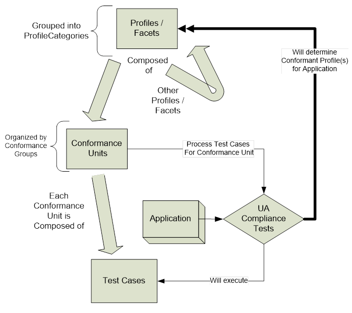

## 1 Scope  

This document specifies value and structure of *Profiles* in the OPC Unified Architecture.  

The actual *Profiles* are maintained in an online database and accessible via [https://profiles.opcfoundation.org/](https://profiles.opcfoundation.org/) .  

OPC UA *Profiles* are used to segregate features with regard to testing of OPC UA products and the nature of the testing (tool based or lab based). This includes the testing performed by the OPC Foundation provided OPC UA CTT (a self-test tool) and by the OPC Foundation provided independent certification test labs. This could equally as well refer to test tools provided by another organization or a test lab provided by another organization. What is important is the concept of automated tool based testing versus lab based testing. The scope of this standard includes defining functionality that can only be tested in a lab and defining the grouping of functionality that is to be used when testing OPC UA products either in a lab or using automated tools. The definition of actual *TestCases* is not within the scope of this document, but the general categories of TestCases are within the scope of this document.  

Most OPC UA applications will conform to several, but not all of the *Profiles* .  

## 2 Normative references  

The following documents, in whole or in part, are normatively referenced in this document and are indispensable for its application. For dated references, only the edition cited applies. For undated references, the latest edition of the referenced document applies.  

OPC 10000-1 *, OPC Unified Architecture - Part 1: Overview and Concepts*  

http://www.opcfoundation.org/UA/Part1/  

OPC 10000-2, *OPC Unified Architecture - Part 2: Security Model*  

http://www.opcfoundation.org/UA/Part2/  

OPC 10000-3, *OPC Unified Architecture - Part 3: Address Space Model*  

http://www.opcfoundation.org/UA/Part3/  

OPC 10000-4, *OPC Unified Architecture - Part 4: Services*  

http://www.opcfoundation.org/UA/Part4/  

  

Test Specifications  

Compliance Part 8 UA Server, *OPC Test Lab Specification: Part 8 - UA Server*  

http://www.opcfoundation.org/Test/Part8/  

Compliance Part 9 UA Client, *OPC Test Lab Specification: Part 9 - UA Client*  

http://www.opcfoundation.org/Test/Part9/  

  

## 3 Terms, definitions, and abbreviations  

### 3.1 Terms and definitions  

For the purposes of this document, the terms and definitions given in [OPC 10000-1](/§UAPart1) , [OPC 10000-2](/§UAPart2) , and [OPC 10000-3](/§UAPart3) , and [OPC 10000-4](/§UAPart4) as well as the following apply. An overview of the terms defined in this standard and their interaction can be viewed in [Figure 1](/§\_Ref202340467) .  

#### 3.1.1 application  

a software program that executes or implements some aspect of OPC UA  

Note 1 to entry: The application could run on any machine and perform any function. The application could be software or it could be a hardware application, the only requirement is that it implements OPC UA.  

#### 3.1.2 Application Profile  

a *Profile* that defines all features necessary to build a functional OPC UA application  

Note 1 to entry: An *Application Profile* in particular adds definitions of the transport and security requirements. *Application Profiles* are organized in the "Application Profiles" *ProfileCategory* .  

#### 3.1.3 ConformanceUnit  

a specific set of OPC UA features that can be tested as a single entity  

Note 1 to entry: A ConformanceUnit can cover a group of services, portions of services or information models.  

#### 3.1.4 ConformanceGroup  

a group of ConformanceUnits that is given a name  

Note 1 to entry: This grouping is only to assist in organizing ConformanceUnits. Typical ConformanceGroups include groups for each of the service sets in OPC UA and each of the Information Model standards.  

#### 3.1.5 Facet  

a Profile dedicated to a specific feature that a *Server* or *Client* may require  

Note 1 to entry: *Facets* are typically combined to form higher-level *Profiles* . The use of the term *Facet* in the title of a *Profile* indicates that the given *Profile* is not a standalone *Profile* .  

#### 3.1.6 ProfileCategory  

arranges Profiles into application classes, such as *Server* or *Client*  

Note 1 to entry: These categories help determine what a given *Profile* is used for. For additional details see [0](/§\_Ref272937126) .  

#### 3.1.7 TestCase  

a technical description of a set of steps required to test a particular function or information model  

Note 1 to entry: *TestCases* provide sufficient details to allow a developer to implement them in code. *TestCases* also provide a detailed summary of the expected result(s) from the execution of the implemented code and any precondition(s) that must be established before the *TestCase* can be executed.  

#### 3.1.8 TestLab  

a facility that is designated to provide testing services  

Note 1 to entry: These services include but are not limited to personal that directly perform testing, automated testing and a formal repeatable process. The OPC Foundation has provided detailed standard describing OPC UA *TestLabs* and the testing they are to provided (see [Compliance Part 8 UA Server](/§CompliancePart8) , [Compliance Part 9 UA Client](/§CompliancePart9) ).  

  

### 3.2 Abbreviations  

DA Data Access  

CTT Compliance Test Tool  

HA Historical Access  

HMI Human Machine Interface  

## 4 Profile Model  

### 4.1 General  

The OPC Unified architecture multipart standard describes a number of *Services* and a variety of information models. These *Services* and information models can be referred to as features of a *Server* or *Client* . *Servers* and *Clients* need to be able to describe which features they support and wish to have certified. This document provides a grouping of these features. The individual features are grouped into *ConformanceUnits* which are further grouped into *Profiles* . [Figure 1](/§\_Ref202340467) provides an overview of the interactions between *Profiles* , *ConformanceUnits* and *TestCases* . The large arrows indicate the components that are used to construct the parent. For example a *Profile* is constructed from *Profiles* and *ConformanceUnits* . The figure also illustrates a feature of the OPC UA Compliance Test Tool (CTT), in that it will test if a requested *Profile* passes all *ConformanceUnits* . It will also test all other *ConformanceUnits* and report any other *Profiles* that pass conformance testing. The individual *TestCases* are defined in separate documents see [Compliance Part 8 UA Server](/§CompliancePart8) and [Compliance Part 9 UA Client](/§CompliancePart9) . The *TestCases* are related back to the appropriate *ConformanceUnits* defined in this standard. This relationship is also displayed by the OPC UA Compliance Test Tool.  

  

Figure 1 - Profile - ConformanceUnit - TestCases  

  

### 4.2 Conformance Units and Conformance Groups  

Each *ConformanceUnit ***** *ConformanceUnits* are the building blocks of a *Profile* . Each *ConformanceUnit* can also be used as a test category. For each *ConformanceUnit,* there would be a number of TestCases that test the functionality described by the *ConformanceUnit.* The description of a *ConformanceUnit* is intended to provide enough information to illustrate the required functionality, but in many cases to obtain a complete understanding of the *ConformanceUnit* the reader may be required to also examine the appropriate part of OPC UA. Additional Information regarding testing of a *ConformanceUnit* are provided in the [Compliance Part 8 UA Server](/§CompliancePart8) or [Compliance Part 9 UA Client](/§CompliancePart9) test standards.  

The same features do not appear in more than one *ConformanceUnit* .  

For improved clarity, the large list of *ConformanceUnits* is arranged into named *ConformanceGroups* . These groups reflect different OPC UA aspects like the *Service Sets* , security, transport, and *Information Models* .  

*ConformanceGroups* have no impact on testing; they are used only for organizational reasons. These groups and the *ConformanceUnits* that they describe are available at [https://profiles.opcfoundation.org/conformanceunit/](https://profiles.opcfoundation.org/conformanceunit/) .  

  

### 4.3 Profiles  

A *Profile* is a named aggregation of *ConformanceUnits* and other *Profiles* . To support a *Profile* , an application has to support the *ConformanceUnits* and all aggregated *Profiles* . The definition of *Profiles* is an ongoing activity, in that it is expected that new *Profiles* will be added in the future.  

Multiple *Profiles* may include the same *ConformanceUnit* .  

Testing of a *Profile* consists of testing the individual *ConformanceUnits* that comprise the *Profile* .  

*Profiles* are named based on naming conventions (see [4.5](/§\_Ref272320955) for details).  

  

### 4.4 Profile Categories  

*Profiles* are grouped into categories to help vendors and end users understand the applicability of a *Profile* .  

[Table 1](/§\_Ref98919472) contains the list of currently defined *ProfileCategories* .  

 **Table 1\- Profile Categories**   

| **Category** | **Description** |
|---|---|
|Application Profiles|Application level *Profiles* represent a collection of *Facets* necessary to build a functional OPC UA Application.They specifically include Transport Profiles and generally also Security Profiles.|
|Server|Profiles of this category specify functions of an OPC UA Server. The URI of such Profiles can be exposed in the Server capabilities.|
|Client|Profiles of this category specify functions of an OPC UA Client.|
|Publisher|Profiles of this category specify functions of an OPC UA Publisher.|
|Subscriber|Profiles of this category specify functions of an OPC UA Subscriber.|
|Transport|Profiles of this category specify specific protocol mappings. The URI of such Profiles has to be part of an Endpoint Description.|
|Security|Profiles of this category specify security related functions. Security policies are part of this category. The URI of Client-Server security policies has to be part of an Endpoint Description returned from the GetEndpoints Service.|
|Global Directory Service|Profiles of this category specify functions for global discovery and certificate management.|
  

  

  

### 4.5 Profile conformance  

An OPC UA application shall implement all mandatory *ConformanceUnits* in a *Profile* in order to be compliant with the *Profile* . Some *Profiles* contain optional *ConformanceUnits* . Optional means that an application has the option to not support the *ConformanceUnit* . However, if supported, the application shall pass all tests associated with the *ConformanceUnit* . If an OPC UA application desires to be listed as supporting the optional *ConformanceUnit* then it shall include any required information model items in the configuration provided for certification testing. The test result that is generated by the certification testing lists all optional *ConformanceUnits* and whether they are supported or not by the tested OPC UA application.  

*Profiles* may also include other *Profiles* . If a *Profile* is included it means that it is mandatory and the same conformance rules apply to it.  

  

### 4.6 Conventions for Profile definitions  

*Profiles* have the following naming conventions:  

* *Profiles* intended for specific application types have the application type in their titles. Currently defined application types are Server, Client, Publisher, Subscriber, and GDS.  

* The term Facet in the title of a *Profile* indicates that this *Profile* concerns a specific feature of OPC UA. Such *Profiles* are expected to be combined with *Application* *Profiles* to define the complete functionality of an OPC UA application.  

  

### 4.7 Profile versioning  

Versioning of *Profile* is accomplished with a naming convention. Whenever a profile is revised, the year of the new revision is added to the name. Example:  

| **Version 1** | **Core Server Facet** |
|---|---|
|Version 2|Core 2017 Server Facet|
|Version 3|Core 2022 Server Facet|
  

  

### 4.8 Applications  

A vendor that is developing an OPC UA application, shall review the list of available *Profiles* . From this list the vendor shall select the *Profiles* that include the functionality required by the application. Conformance to a single *Profile* may not yield a complete application. In most cases multiple *Profiles* are needed to yield a useful application. All UA applications shall support at least one *Application Profile.*  

For example an HMI *Client* application may choose to support the Minimum UA Client 2022 Profile, the "Data Access Client Facet", the "DataChange Subscriber Client Facet" and the "Attribute Write Client Facet". This list of *Profiles* would allow the *Client* to communicate with an OPC UA *Server* using UA-TCP/UA Security/UA Binary. It would be able to subscribe for data, write to data and would support the DA data model.  

*Clients* should take into account the types of *Servers* and *Server* *Profiles* that they are targeted to support. Some *Servers* might not support *Subscriptions* and *Clients* should be able to fall back to the Read *Service.*  

A special case is a generic *Client* that is designed to communicate with a large number of *Servers* and therefore able to perform a broad range of functionality. "Standard UA *Client* *Profile"* has been defined for this kind of *Clients* .  

Many *Clients* , however, will be specialized and do not need all of the functionality in the "Standard UA Client Profile" ** and thus would only support the limited set of functionality they require. A trend *Client* , for example, would only need functionality to subscribe to or read data.  

\_\_\_\_\_\_\_\_\_\_\_\_  

  

  

