## 1 Scope  

This part of OPC 10000 is part of the overall OPC Unified Architecture (OPC UA) standard series and defines the information model associated with Data Access (DA). It particularly includes additional *VariableTypes* and complementary descriptions of the *NodeClasses* and *Attributes* needed for Data Access, additional *Properties* , and other information and behaviour.  

The complete address space model, including all *NodeClasses* and *Attributes* is specified in [OPC 10000-3](/§UAPart3) . The services to detect and access data are specified in [OPC 10000-4](/§UAPart4) .  

[Annex A](/§\_Ref112252477) specifies how the information received from OPC COM Data Access (DA) Servers is mapped to the Data Access model.  

## 2 Normative references  

The following referenced documents are indispensable for the application of this document. For dated references, only the edition cited applies. For undated references, the latest edition of the referenced document (including any amendments and errata) applies.  

OPC 10000-1, *OPC Unified Architecture - Part 1: Overview and Concepts*  

[http://www.opcfoundation.org/UA/Part1/](http://www.opcfoundation.org/UA/Part1/)  

OPC 10000-3, *OPC Unified Architecture - Part 3: Address Space Model*  

[http://www.opcfoundation.org/UA/Part3/](http://www.opcfoundation.org/UA/Part3/)  

OPC 10000-4, *OPC Unified Architecture - Part 4: Services*  

[http://www.opcfoundation.org/UA/Part4/](http://www.opcfoundation.org/UA/Part4/)  

OPC 10000-5, *OPC Unified Architecture - Part 5: Information Model*  

[http://www.opcfoundation.org/UA/Part5/](http://www.opcfoundation.org/UA/Part5/)  

OPC 10000-19, *OPC Unified Architecture - Part 19: Dictionary References*  

[http://www.opcfoundation.org/UA/Part19/](http://www.opcfoundation.org/UA/Part19/)  

UN/CEFACT: UNECE Recommendation N° 20, *Codes for Units of Measure Used in International Trade*  

[https://unece.org/trade/cefact/UNLOCODE-Download](https://unece.org/trade/cefact/UNLOCODE-Download)  

## 3 Terms, definitions and abbreviated terms  

### 3.1 Terms and definitions  

For the purposes of this document, the terms and definitions given in [OPC 10000-1](/§UAPart1) , [OPC 10000-3](/§UAPart3) , and [OPC 10000-4](/§UAPart4) and the following apply.  

#### 3.1.1 DataItem  

link to arbitrary, live automation data, that is, data that represents currently valid information  

Note 1 to entry: Examples of such data are  

* device data (such as temperature sensors),  

* calculated data,  

* status information (open/closed, moving),  

* dynamically-changing system data (such as stock quotes),  

* diagnostic data.  

#### 3.1.2 AnalogItem  

*DataItem* that represents continuously-variable physical quantities (e.g., length, temperature), in contrast to the digital representation of data in discrete items  

Note 1 to entry: Typical examples are the values provided by temperature sensors or pressure sensors. OPC UA defines specific *VariableTypes* to identify an *AnalogItem* . *Properties* describe the possible ranges of *AnalogItems* .  

#### 3.1.3 DiscreteItem  

*DataItem* that represents data that can take on only a certain number of possible values (e.g., OPENING, OPEN, CLOSING, CLOSED)  

Note 1 to entry: Specific *VariableTypes* are used to identify *DiscreteItems* with two states or with multiple states. *Properties* specify the string values for these states.  

#### 3.1.4 ArrayItem  

*DataItem* that represents continuously-variable physical quantities and where each individual data point consists of multiple values represented by an array (e.g., the spectral response of a digital filter)  

Note 1 to entry: Typical examples are the data provided by analyser devices. Specific *VariableTypes* are used to identify *ArrayItem* variants.  

#### 3.1.5 EngineeringUnits  

units of measurement for *AnalogItems* that represent continuously-variable physical quantities (e.g., length, mass, time, temperature)  

Note 1 to entry: This standard defines *Properties* to inform about the unit used for the *DataItem* value and about the highest and lowest value likely to be obtained in normal operation.  

### 3.2 Abbreviated terms  

DA Data Access  

EU Engineering Unit  

NaN "Not a Number" defined in IEEE 754  

UA Unified Architecture  

## 4 Concepts  

Data Access deals with the representation and use of automation data in *Servers* .  

Automation data can be located inside the *Server* or on I/O cards directly connected to the *Server* . It can also be located in sub-servers or on other devices such as controllers and input/output modules, connected by serial links via field buses or other communication links. OPC UA Data Access *Servers* provide one or more OPC UA Data Access *Clients* with transparent access to their automation data.  

The links to automation data instances are called *DataItems* . Which categories of automation data are provided is completely vendor-specific. [Figure 1](/§\_Ref117660854) illustrates how the *AddressSpace* of a *Server* can contain a broad range of different *DataItems* .  

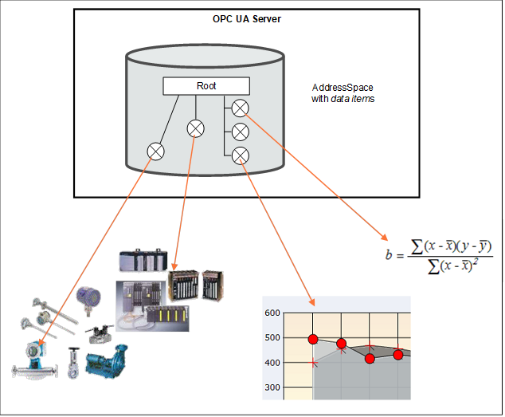  

Figure 1 - OPC DataItems are linked to automation data  

*Clients* can read or write *DataItems* , or monitor them for value changes. The *Services* needed for these operations are specified in [OPC 10000-4](/§UAPart4) . Changes are defined as a change in status (quality) or a change in value that exceeds a client-defined range called a *Deadband* . To detect the value change, the difference between the current value and the last reported value is compared to the *Deadband* .  

## 5 Model  

### 5.1 General  

The DataAccess model extends the variable model by defining *VariableTypes* . The *DataItemType* is the base type. *ArrayItemType* , Base *AnalogType* and *DiscreteItemType* are specializations. See [Figure 2](/§\_Ref290363030) . Each of these *VariableTypes* can be further extended to form domain or server specific *DataItems* .  

  

Figure 2 - DataItem VariableType hierarchy  

### 5.2 SemanticsChanged  

The *StatusCode* also contains an informational bit called *SemanticsChanged* .  

*Servers* that implement Data Access shall set this Bit in notifications if certain *Property* values defined in this standard change. The corresponding *Properties* are specified individually for each *VariableType* .  

*Clients* that use any of these *Properties* should re-read them before they process the data value.  

### 5.3 Variable Types  

#### 5.3.1 DataItemType  

This *VariableType* defines the general characteristics of a *DataItem* . All other *DataItem* Types derive from it. The *DataItemType* derives from the *BaseDataVariableType* and therefore shares the variable model as described in [OPC 10000-3](/§UAPart3) and [OPC 10000-5](/§UAPart5) . It is formally defined in [Table 1](/§\_Ref415602315) .  

 **Table 1\- DataItemType definition**   

| **Attribute** | **Value** |
|---|---|
|BrowseName|DataItemType|
|IsAbstract|False|
|ValueRank|−2  (−2 = 'Any')|
|DataType|BaseDataType|
| **References** | **NodeClass** | **BrowseName** | **DataType** | **TypeDefinition** | **ModellingRule** |
|Subtype of the *BaseDataVariableType* defined in [OPC 10000-5](/§UAPart5) ; i.e the *Properties* of that type are inherited.|
|HasSubtype|VariableType|BaseAnalogType|Defined in [5.3.2.2](/§\_Ref529348900)|
|HasSubtype|VariableType|DiscreteItemType|Defined in [5.3.3](/§\_Ref15046443)|
|HasSubtype|VariableType|ArrayItemType|Defined in [5.3.4](/§\_Ref323824410)|
|HasProperty|Variable|Definition|String|PropertyType|Optional|
|HasProperty|Variable|ValuePrecision|Double|PropertyType|Optional|
| **Conformance Units** |
|Data Access DataItems|
  

  

*Definition* is a vendor-specific, human readable string that specifies how the value of this *DataItem* is calculated. *Definition* is non-localized and will often contain an equation that can be parsed by certain clients *.*  

Example:  Definition::= "(TempA - 25) + TempB"  

*ValuePrecision* specifies the maximum precision that the *Server* can maintain for the item based on restrictions in the target environment.  

*ValuePrecision* can be used for the following *DataTypes* :  

* For Float, Double, and Decimal values it specifies the number of digits after the decimal place when it is a positive number. When it is a negative number, it specifies the number of insignificant digits to the left of the decimal place.  

For example a *ValuePrecision* of -2 specifies that the precision of the *Value* is to the nearest 100. The *ValuePrecision* should always be a whole number and it shall always be interpreted as a whole number by rounding it to the nearest whole number.  

* For DateTime values it shall always be a positive number which indicates the minimum time difference in nanoseconds. For example, a ValuePrecision of 20 000 000 defines a precision of 20 ms. The *ValuePrecision* should always be a whole number and it shall always be interpreted as a whole number by rounding it to the nearest whole number.  

* *ValuePrecision* can also be used for other subtypes of Double (like Duration) and other Number subtypes that can be represented by a Double.  

The *ValuePrecision* *Property* is an approximation that is intended to provide guidance to a *Client* . A *Server* is expected to silently round any value with more precision that it supports. This implies that a *Client* can encounter cases where the value read back from a *Server* differs from the value that it wrote to the *Server* . This difference shall be no more than the difference suggested by this *Property* .  

The algorithm for rounding should follow the so-called "Banker's rounding" (aka [Round half to even](https://en.wikipedia.org/wiki/Rounding) ), in which numbers which are equidistant from the two nearest integers are rounded to the nearest even integer. Thus, 0.5 rounds down to 0; 1.5 rounds up to 2.  

Other decimal fractions round as you would expect: 0.4 to 0, 0.6 to 1, 1.4 to 1, 1.6 to 2, etc. Only x.5 numbers get the "special" treatment.  

  

#### 5.3.2 AnalogItem VariableTypes  

##### 5.3.2.1 General  

The *VariableTypes* in subclauses [5.3.2.2](/§\_Ref529348900) to [5.3.2.5](/§\_Ref529349073) define the characteristics of *AnalogItems* . The types have identical semantics and *Properties* but with diverging *ModellingRules* for individual *Properties* .  

The *Properties* are only described once - in [5.3.2.2](/§\_Ref529348900) . The descriptions apply to the *Properties* for the other *VariableTypes* as well.  

##### 5.3.2.2 BaseAnalogType  

This *VariableType* is the base type for analog items. All *Properties* are optional. Subtypes of this base type will mandate some of the *Properties* . The *BaseAnalogType* derives from the *DataItemType* . It is formally defined in [Table 2](/§\_Ref529347602) .  

 **Table 2\- BaseAnalogType definition**   

| **Attribute** | **Value** |
|---|---|
|BrowseName|BaseAnalogType|
|IsAbstract|False|
|ValueRank|−2  (−2 = 'Any')|
|DataType|Number|
| **References** | **NodeClass** | **BrowseName** | **DataType** | **TypeDefinition** | **ModellingRule** |
|Subtype of the *DataItemType* defined in [5.3.1](/§\_Ref529349203) ; i.e. the *Properties* of that type are inherited.|
|HasSubtype|VariableType|AnalogItemType|Defined in [5.3.2.3](/§\_Ref529348913)|
|HasSubtype|VariableType|AnalogUnitType|Defined in [5.3.2.4](/§\_Ref529348941)|
|HasProperty|Variable|InstrumentRange|Range|PropertyType|Optional|
|HasProperty|Variable|EURange|Range|PropertyType|Optional|
|HasProperty|Variable|EngineeringUnits|EUInformation|PropertyType|Optional|
| **Conformance Units** |
|Data Access BaseAnalogType|
  

  

The following paragraphs describe the *Properties* of this *VariableType* . If the analog item's *Value* contains an array, the *Properties* shall apply to all elements in the array.  

*InstrumentRange* defines the value range that can be returned by the instrument.  

EXAMPLE 1: * InstrumentRange:* := \{-9999.9, 9999.9\}  

Although defined as optional, it is strongly recommended for *Servers* to support this *Property* . Without an *InstrumentRange* being provided, *Clients* will commonly assume the full range according to the *DataType* .  

The *InstrumentRange Property* can also be used to restrict a Built-in DataType such as Byte or Int16) to a smaller range of values.  

EXAMPLE 2:  

UInt4:  InstrumentRange::= \{0, 15\}  

Int6:  InstrumentRange::= \{-32, 31\}  

The *Range* *DataType* is specified in [5.6.2](/§\_Ref131328551) .  

*EURange* defines the value range likely to be obtained in normal operation. It is intended for such use as automatically scaling a bar graph display.  

Sensor or instrument failure or deactivation can result in a returned item value which is actually outside of this range. *Client* software shall be prepared to deal with this possibility. Similarly a *Client* can attempt to write a value that is outside of this range back to the server. The exact behaviour (accept, reject, clamp, etc.) in this case is *Server*\-dependent. However, in general *Servers* shall be prepared to handle this.  

EXAMPLE 3:  EURange::= \{-200.0,1400.0\}  

See also [7.2](/§\_Ref529348993) for a special monitoring filter ( *PercentDeadband* ) which is based on the engineering unit range.  

NOTE If EURange is not provided on an instance, the PercentDeadband filter cannot be used for that instance (see clause [7.2](/§\_Ref529349012) ).  

*EngineeringUnits* specifies the units for the *DataItem* 's value (e.g., DEGC, hertz, seconds). The *EUInformation* type is specified in [5.6.3](/§\_Ref529347840) . The *NonHierarchical* *References* *HasQuantity* (see [6.5.2](/§\_Ref103077272) ) and *HasEngineeringUnitDetail* (see [6.5.1](/§\_Ref103077295) ) can be used to expose further information for the unit.  

It is important to note that understanding the units of a measurement value is essential for a uniform system. In an open system in particular where *Servers* from different cultures can be used, it is essential to know what the units of measurement are. Based on such knowledge, values can be converted if necessary before being used. Therefore, although defined as optional, support of the *EngineeringUnits Property* is strongly advised.  

OPC UA recommends using the "Codes for Units of Measurement" (see UN/CEFACT: UNECE Recommendation N° 20). The mapping to the *EngineeringUnits Property* is specified in [5.6.3](/§\_Ref529347840) .  

EXAMPLE 4:  

Examples for unit mixup: In 1999, the Mars Climate Orbiter crashed into the surface of Mars. The main reason was a discrepancy over the units used. The navigation software expected data in newton second; the company who built the orbiter provided data in pound-force seconds. Another, less expensive, disappointment occurs when people used to British pints order a pint in the USA, only to be served what they consider a short measure.  

The *StatusCode SemanticsChanged* bit shall be set if any of the *EURange* (could change the behaviour of a *Subscription* if a *PercentDeadband* filter is used) or *EngineeringUnits* (could create problems if the *Client* uses the value to perform calculations) *Properties* are changed (see clause [5.2](/§\_Ref529349043) for additional information).  

##### 5.3.2.3 AnalogItemType  

This *VariableType* requires the *EURange Property* . The *AnalogItemType* derives from the *BaseAnalogType* . It is formally defined in [Table 3](/§\_Ref529349250) .  

 **Table 3\- AnalogItemType definition**   

| **Attribute** | **Value** |
|---|---|
|BrowseName|AnalogItemType|
|IsAbstract|False|
|ValueRank|−2  (−2 = 'Any')|
|DataType|Number|
| **References** | **NodeClass** | **BrowseName** | **DataType** | **TypeDefinition** | **ModellingRule** |
|Subtype of the *BaseAnalogType* defined in [5.3.2.2](/§\_Ref529348900) ; i.e. the *Properties* of that type are inherited.|
|HasSubtype|VariableType|AnalogUnitRangeType|Defined in [5.3.2.5](/§\_Ref529349073)|
|HasProperty|Variable|EURange|Range|PropertyType|Mandatory|
| **Conformance Units** |
|Data Access AnalogItemType|
  

  

##### 5.3.2.4 AnalogUnitType  

This *VariableType* requires the *EngineeringUnits* *Property* . The *AnalogUnitType* derives from the *BaseAnalogType* . It is formally defined in [Table 4](/§\_Ref529347562) .  

 **Table 4\- AnalogUnitType definition**   

| **Attribute** | **Value** |
|---|---|
|BrowseName|AnalogUnitType|
|IsAbstract|False|
|ValueRank|−2  (−2 = 'Any')|
|DataType|Number|
| **References** | **NodeClass** | **BrowseName** | **DataType** | **TypeDefinition** | **ModellingRule** |
|Subtype of the *BaseAnalogType* defined in [5.3.2.2](/§\_Ref529348900) ; i.e. the *Properties* of that type are inherited.|
|HasProperty|Variable|EngineeringUnits|EUInformation|PropertyType|Mandatory|
| **Conformance Units** |
|Data Access AnalogUnitType|
  

  

##### 5.3.2.5 AnalogUnitRangeType  

The *AnalogUnitRangeType* derives from the *AnalogItemType* and additionally requires the *EngineeringUnits* *Property* . It is formally defined in [Table 5](/§\_Ref529347546) .  

 **Table 5\- AnalogUnitRangeType definition**   

| **Attribute** | **Value** |
|---|---|
|BrowseName|AnalogUnitRangeType|
|IsAbstract|False|
|ValueRank|−2  (−2 = 'Any')|
|DataType|Number|
| **References** | **NodeClass** | **BrowseName** | **DataType** | **TypeDefinition** | **ModellingRule** |
|Subtype of the *AnalogItemType* defined in [5.3.2.3](/§\_Ref529348913) ; i.e. the *Properties* of that type are inherited.|
|HasProperty|Variable|EngineeringUnits|EUInformation|PropertyType|Mandatory|
| **Conformance Units** |
|Data Access AnalogUnitRangeType|
  

  

#### 5.3.3 DiscreteItemType  

##### 5.3.3.1 General  

This VariableType is an abstract type. That is, no instances of this type can exist. However, it can be used in a filter when browsing or querying. The *DiscreteItemType* derives from the *DataItemType* and therefore shares all of its characteristics. It is formally defined in [Table 6](/§\_Ref141513620) .  

 **Table 6\- DiscreteItemType definition**   

| **Attribute** | **Value** |
|---|---|
|BrowseName|DiscreteItemType|
|IsAbstract|True|
|ValueRank|−2 (−2 = 'Any')|
|DataType|BaseDataType|
| **References** | **NodeClass** | **BrowseName** | **DataType** | **TypeDefinition** | **ModellingRule** |
|Subtype of the *DataItemType* defined in [5.2](/§\_Ref141512882) ; i.e. the *Properties* of that type are inherited.|
|HasSubtype|VariableType|TwoStateDiscreteType|Defined in [5.3.3.2](/§\_Ref141512766)|
|HasSubtype|VariableType|MultiStateDiscreteType|Defined in [5.3.3.3](/§\_Ref201048997)|
|HasSubtype|VariableType|MultiStateValueDiscreteType|Defined in [5.3.3.4](/§\_Ref330306636)|
| **Conformance Units** |
|Data Access DiscreteItemType|
  

  

##### 5.3.3.2 TwoStateDiscreteType  

This *VariableType* defines the general characteristics of a *DiscreteItem* that can have two states. The *TwoStateDiscreteType* derives from the *DiscreteItemType* . It is formally defined in [Table 7](/§\_Ref141295768) .  

 **Table 7\- TwoStateDiscreteType definition**   

| **Attribute** | **Value** |
|---|---|
|BrowseName|TwoStateDiscreteType|
|IsAbstract|False|
|ValueRank|−2  (−2 = 'Any')|
|DataType|Boolean|
| **References** | **NodeClass** | **BrowseName** | **DataType** | **TypeDefinition** | **ModellingRule** |
|Subtype of the *DiscreteItemType* defined in [5.3.3](/§\_Ref15046443) ; i.e. the *Properties* of that type are inherited.|
|HasProperty|Variable|TrueState|LocalizedText|PropertyType|Mandatory|
|HasProperty|Variable|FalseState|LocalizedText|PropertyType|Mandatory|
| **Conformance Units** |
|Data Access TwoState|
  

  

*TrueState* contains a string to be associated with this *DataItem* when it is TRUE. This is typically used for a contact when it is in the closed (non-zero) state.  

for example: "RUN", "CLOSE", "ENABLE", "SAFE", etc.  

*FalseState* contains a string to be associated with this *DataItem* when it is FALSE. This is typically used for a contact when it is in the open (zero) state.  

for example: "STOP", "OPEN", "DISABLE", "UNSAFE", etc.  

If the item contains an array, then the *Properties* will apply to all elements in the array.  

The *StatusCode SemanticsChanged* bit shall be set if any of the *FalseState or TrueState Properties* are changed (see [5.2](/§\_Ref327352371) for additional information).  

##### 5.3.3.3 MultiStateDiscreteType  

This *VariableType* defines the general characteristics of a *DiscreteItem* that can have more than two states. The *MultiStateDiscreteType* derives from the *DiscreteItemType* . It is formally defined in [Table 8](/§\_Ref141296262) .  

 **Table 8\- MultiStateDiscreteType definition**   

| **Attribute** | **Value** |
|---|---|
|BrowseName|MultiStateDiscreteType|
|IsAbstract|False|
|ValueRank|−2 (−2 = 'Any')|
|DataType|UInteger|
| **References** | **NodeClass** | **BrowseName** | **DataType** | **TypeDefinition** | **ModellingRule** |
|Subtype of the *DiscreteItemType* defined in [5.3.3](/§\_Ref15046475) ; i.e. the *Properties* of that type are inherited.|
|HasProperty|Variable|EnumStrings|LocalizedText[]|PropertyType|Mandatory|
| **Conformance Units** |
|Data Access MultiState|
  

  

*EnumStrings* is a string lookup table corresponding to sequential numeric values (0, 1, 2, etc.)  

Example:  

"OPEN"  

"CLOSE"  

"IN TRANSIT" etc.  

Here the string "OPEN" corresponds to 0, "CLOSE" to 1 and "IN TRANSIT" to 2.  

Clients should be prepared to handle item values outside of the range of the list; and robust servers should be prepared to handle writes of illegal values, by providing errorcode "Bad\_OutOfRange".  

If the item contains an array then this lookup table shall apply to all elements in the array.  

NOTE The *EnumStrings* property is also used for Enumeration *DataTypes* (for the specification of this *DataType* , see [OPC 10000-3](/§UAPart3) ).  

The *StatusCode SemanticsChanged* bit shall be set if the *EnumStrings Property* is changed (see [5.2](/§\_Ref327352371) for additional information).  

##### 5.3.3.4 MultiStateValueDiscreteType  

This *VariableType* defines the general characteristics of a *DiscreteItem* that can have more than two states and where the state values (the enumeration) do not consist of consecutive numeric values (can have gaps) or where the enumeration is not zero-based. The *MultiStateValueDiscreteType* derives from the *DiscreteItemType* . It is formally defined in [Table 9](/§\_Ref251594633) .  

 **Table 9\- MultiStateValueDiscreteType definition**   

| **Attribute** | **Value** |
|---|---|
|BrowseName|MultiStateValueDiscreteType|
|IsAbstract|False|
|ValueRank|−2  (−2 = 'Any')|
|DataType|Number|
| **References** | **NodeClass** | **BrowseName** | **DataType**   

 **TypeDefinition** | **ModellingRule** |
|Subtype of the *DiscreteItemType* defined in [5.3.3](/§\_Ref15046505) ; i.e. the *Properties* of that type are inherited.|
|HasProperty|Variable|EnumValues|EnumValueType[]PropertyType|Mandatory|
|HasProperty|Variable|ValueAsText|LocalizedTextPropertyType|Mandatory|
| **Conformance Units** |
|Data Access MultiStateValueDiscrete|
  

  

*EnumValues* is an array of *EnumValueType* . Each entry of the array represents one enumeration value with its integer notation, a human-readable representation, and help information. This represents enumerations with integers that are not zero-based or have gaps (e.g. 1, 2, 4, 8, 16). See [OPC 10000-3](/§UAPart3) for the definition of this type. *MultiStateValueDiscrete Variables* expose the current integer notation in their *Value* *Attribute* . *Clients* will often read the *EnumValues* *Property* in advance and cache it to lookup a name or help whenever they receive the numeric representation.  

Only *DataTypes* that can be represented with *EnumValues* are allowed for *Variables* of *MultiStateValueDiscreteType* . These are Integers up to 64 Bits (signed and unsigned).  

The numeric representation of the current enumeration value is provided via the *Value Attribute* of the *MultiStateValueDiscrete Variable* . If the Value is scalar, the *ValueAsText Property* provides the localized text representation of the enumeration value. It can be used by *Clients* only interested in displaying the text to subscribe to the *Property* instead of the *Value* *Attribute* . If the Value is not scalar then *ValueAsText* should be Null. In that case, *Clients* can use the *EnumValues Property* to lookup the display information.  

The *StatusCode SemanticsChanged* bit shall be set if the *EnumValues Property* value is changed (see clause [5.2](/§\_Ref529349043) for additional information).  

#### 5.3.4 ArrayItemType  

##### 5.3.4.1 General  

This abstract *VariableType* defines the general characteristics of an *ArrayItem* . Values are exposed in an array but the content of the array represents a single entity like an image. Other *DataItems* can contain arrays that represent for example several values of several temperature sensors of a boiler.  

*ArrayItemType* or its subtype shall only be used when the *Title* and *AxisScaleType* *Properties* can be filled with reasonable values. If this is not the case *DataItemType* and subtypes like *AnalogItemType,* which also support arrays, shall be used. The *ArrayItemType* is formally defined in [Table 10](/§\_Ref231803900) .  

 **Table 10\- ArrayItemType definition**   

| **Attribute** | **Value** |
|---|---|
|BrowseName|ArrayItemType|
|IsAbstract|True|
|ValueRank|0 (0 = OneOrMoreDimensions)|
|DataType|BaseDataType|
| **References** | **NodeClass** | **BrowseName** | **DataType** | **TypeDefinition** | **ModellingRule** |
|Subtype of the *DataItemType* defined in [5.3.1](/§\_Ref330306706) ; i.e. the *Properties* of that type are inherited.|
|HasSubtype|VariableType|YArrayItemType|Defined in [5.3.4.2](/§\_Ref323828495)|
|HasSubtype|VariableType|XYArrayItemType|Defined in [5.3.4.3](/§\_Ref323828757)|
|HasSubtype|VariableType|ImageItemType|Defined in [5.3.4.4](/§\_Ref323828767)|
|HasSubtype|VariableType|CubeItemType|Defined in [5.3.4.5](/§\_Ref330306742)|
|HasSubtype|VariableType|NDimensionArrayItemType|Defined in [5.3.4.6](/§\_Ref323828778)|
|HasProperty|Variable|InstrumentRange|Range|PropertyType|Optional|
|HasProperty|Variable|EURange|Range|PropertyType|Mandatory|
|HasProperty|Variable|EngineeringUnits|EUInformation|PropertyType|Mandatory|
|HasProperty|Variable|Title|LocalizedText|PropertyType|Mandatory|
|HasProperty|Variable|AxisScaleType|AxisScaleEnumeration|PropertyType|Mandatory|
| **Conformance Units** |
|Data Access ArrayItem2Type|
  

  

*InstrumentRange* defines the range of the *Value* of the *ArrayItem.*  

*EURange* defines the value range of the ArrayItem likely to be obtained in normal operation. It is intended for such use as automatically scaling a bar graph display.  

*EngineeringUnits* holds the information about the engineering units of the *Value* of the *ArrayItem* .  

For additional information about *InstrumentRange* , *EURange* , and *EngineeringUnits* see the description of *BaseAnalogType* in [5.3.2.2](/§\_Ref529348900) .  

*Title* holds the user readable title of the *Value* of the *ArrayItem* .  

*AxisScaleType* defines the scale to be used for the axis where the *Value* of the *ArrayItem* shall be displayed *.*  

The *StatusCode SemanticsChanged* bit shall be set if any of the *InstrumentRange* , *EURange* , *EngineeringUnits* or *Title* *Properties* are changed (see [5.2](/§\_Ref327352371) for additional information).  

##### 5.3.4.2 YArrayItemType  

*YArrayItemType* represents a single-dimensional array of numerical values used to represent spectra or distributions where the x axis intervals are constant. *YArrayItemType* is formally defined in [Table 11](/§\_Ref217730127) .  

 **Table 11\- YArrayItemType definition**   

| **Attribute** | **Value** |
|---|---|
|BrowseName|YArrayItemType|
|IsAbstract|False|
|ValueRank|1|
|DataType|BaseDataType|
|ArrayDimensions|\{0\} (0 = UnknownSize)|
| **References** | **NodeClass** | **BrowseName** | **DataType** | **TypeDefinition** | **ModellingRule** |
|Subtype of the *ArrayItemType* defined in [5.3.4.1](/§\_Ref323828323)|
|||||||
|HasProperty|Variable|XAxisDefinition|AxisInformation|PropertyType|Mandatory|
| **Conformance Units** |
|Data Access YArrayItemType|
  

  

The *Value* of the *YArrayItem* contains the numerical values for the Y-Axis. *Engineering Units* and *Range* for the *Value* are defined by corresponding *Properties* inherited from the *ArrayItemType* .  

The *DataType* of this *VariableType* is restricted to SByte, Int16, Int32, Int64, Float, Double, *ComplexNumberType* and *DoubleComplexNumberType* .  

The *XAxisDefinition* *Property* holds the information about the *Engineering Units* and *Range* for the X-Axis.  

The *StatusCode SemanticsChanged* bit shall be set if any of the following five *Properties* are changed: *InstrumentRange, EURange, EngineeringUnits, Title* or *XAxisDefinition* (see [5.2](/§\_Ref327352371) for additional information).  

[Figure 3](/§\_Ref231783825) shows an example of how *Attributes* and *Properties* can be used in a graphical interface.  

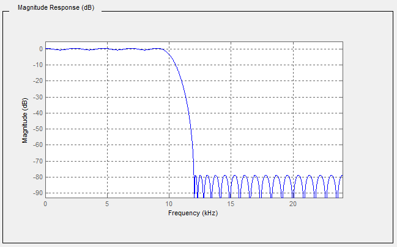  

Figure 3 - Graphical view of a YArrayItem  

[Table 12](/§\_Ref231804163) describes the values of each element presented in [Figure 3](/§\_Ref231783825) .  

 **Table 12\- *YArrayItem* item description**   

| **Attribute / Property** | **Item value** |
|---|---|
|Description|Magnitude Response (dB)|
|axisScaleType|AxisScaleEnumeration.LINEAR|
|InstrumentRange.low|\-90|
|InstrumentRange.high|5|
|EURange.low|\-90|
|EURange.high|2|
|EngineeringUnits.namespaceUrl|http://www.opcfoundation.org/UA/units/un/cefact|
|EngineeringUnits.unitId|12878|
|EngineeringUnits.displayName|"en-us", "dB"|
|EngineeringUnits.description|"en-us", "decibel"|
|Title|Magnitude|
|XAxisDefinition.EngineeringUnits.namespaceUrl|http://www.opcfoundation.org/UA/units/un/cefact|
|XAxisDefinition.EngineeringUnits.unitId|4933722|
|XAxisDefinition.EngineeringUnits.displayName|"en-us", "kHz"|
|XAxisDefinition.EngineeringUnits.description|"en-us", "kilohertz"|
|XAxisDefinition.Range.low|0|
|XAxisDefinition.Range.high|25|
|XAxisDefinition.title|"en-us", "Frequency"|
|XAxisDefinition.axisScaleType|AxisScaleEnumeration.LINEAR|
|XAxisDefinition.axisSteps|null|
  

  

Interpretation notes:  

* Not all elements of this table are used in the graphic.  

* The X axis is displayed in reverse order, however, the *XAxisDefinition.Range.low* shall be lower than *XAxisDefinition.Range.high* . It is only a graphical representation that reverses the display order.  

* There is a constant X axis  

##### 5.3.4.3 XYArrayItemType  

*XYArrayItemType* represents a vector of XVType values like a list of peaks, where XVType.x is the position of the peak and XVType.value is its intensity. *XYArrayItemType* is formally defined in [Table 13](/§\_Ref232390760) .  

 **Table 13\- XYArrayItemType definition**   

| **Attribute** | **Value** |
|---|---|
|BrowseName|XYArrayItemType|
|IsAbstract|False|
|ValueRank|1|
|DataType|XVType|
| **References** | **NodeClass** | **BrowseName** | **DataType** | **TypeDefinition** | **ModellingRule** |
|Subtype of the *ArrayItemType* defined in [5.3.4.1](/§\_Ref323828323)|
|||||||
|HasProperty|Variable|XAxisDefinition|AxisInformation|PropertyType|Mandatory|
| **Conformance Units** |
|Data Access XYArrayItemType|
  

  

The *Value* of the X *YArrayItem* contains an array of structures (XVType) where each structure specifies the position for the X-Axis (XVType.x) and the value itself (XVType.value), used for the Y-Axis. Engineering units and range for the *Value* are defined by corresponding *Properties* inherited from the *ArrayItemType* .  

*XAxisDefinition* *Property* holds the information about the *Engineering Units* and *Range* for the X-Axis.  

The *axisSteps* of *XAxisDefinition* shall be set to NULL because it is not used.  

The *StatusCode SemanticsChanged* bit shall be set if any of the *InstrumentRange, EURange, EngineeringUnits, Title* or *XAxisDefinition* *Properties* are changed (see [5.2](/§\_Ref327352371) for additional information).  

##### 5.3.4.4 ImageItemType  

*ImageItemType* defines the general characteristics of an ImageItem which represents a matrix of values like an image, where the pixel position is given by X which is the column and Y the row. The value is the pixel intensity.  

*ImageItemType* is formally defined in [Table 14](/§\_Ref217730401) .  

 **Table 14\- ImageItemType definition**   

| **Attribute** | **Value** |
|---|---|
|BrowseName|ImageItemType|
|IsAbstract|False|
|ValueRank|2 (2 = two dimensional array)|
|DataType|BaseDataType|
| **References** | **NodeClass** | **BrowseName** | **DataType** | **TypeDefinition** | **ModellingRule** |
|Subtype of the *ArrayItemType* defined in [5.3.4.1](/§\_Ref323828323)|
|||||||
|HasProperty|Variable|XAxisDefinition|AxisInformation|PropertyType|Mandatory|
|HasProperty|Variable|YAxisDefinition|AxisInformation|PropertyType|Mandatory|
| **Conformance Units** |
|Data Access ImageItemType|
  

  

Engineering units and range for the *Value* are defined by corresponding *Properties* inherited from the *ArrayItemType* .  

The *DataType* of this *VariableType* is restricted to SByte, Int16, Int32, Int64, Float, Double, ComplexNumberType and DoubleComplexNumberType.  

The *ArrayDimensions* *Attribute* for *Variables* of this type or subtypes shall use the first entry in the array ([0]) to define the number of columns and the second entry ([1]) to define the number of rows, assuming the size of the matrix is not dynamic.  

*XAxisDefinition* *Property* holds the information about the engineering units and range for the X-Axis.  

*YAxisDefinition* *Property* holds the information about the engineering units and range for the Y-Axis.  

The *StatusCode.SemanticsChanged* bit shall be set if any of the *InstrumentRange, EURange, EngineeringUnits, Title, XAxisDefinition* or *YAxisDefinition* *Properties* are changed.  

##### 5.3.4.5 CubeItemType  

*CubeItemType* represents a cube of values like a spatial particle distribution, where the particle position is given by X which is the column, Y the row and Z the depth. In the example of a spatial partical distribution, the value is the particle size. *CubeItemType* is formally defined in [Table 15](/§\_Ref232390475) .  

 **Table 15\- CubeItemType definition**   

| **Attribute** | **Value** |
|---|---|
|BrowseName|CubeItemType|
|IsAbstract|False|
|ValueRank|3 (3 = three dimensional array)|
|DataType|BaseDataType|
| **References** | **NodeClass** | **BrowseName** | **DataType** | **TypeDefinition** | **ModellingRule** |
|Subtype of the *ArrayItemType* defined in [5.3.4.1](/§\_Ref323828323)|
|||||||
|HasProperty|Variable|XAxisDefinition|AxisInformation|PropertyType|Mandatory|
|HasProperty|Variable|YAxisDefinition|AxisInformation|PropertyType|Mandatory|
|HasProperty|Variable|ZAxisDefinition|AxisInformation|PropertyType|Mandatory|
| **Conformance Units** |
|Data Access CubeItemType|
  

  

Engineering units and range for the *Value* are defined by corresponding *Properties* inherited from the *ArrayItemType* .  

The *DataType* of this *VariableType* is restricted to SByte, Int16, Int32, Int64, Float, Double, *ComplexNumberType* and *DoubleComplexNumberType* .  

The *ArrayDimensions* *Attribute* for *Variables* of this type or subtypes should use the first entry in the array ([0]) to define the number of columns, the second entry ([1]) to define the number of rows, and the third entry ([2]) define the number of steps in the Z axis, assuming the size of the matrix is not dynamic.  

*XAxisDefinition* *Property* holds the information about the engineering units and range for the X-Axis.  

*YAxisDefinition* *Property* holds the information about the engineering units and range for the Y-Axis.  

*ZAxisDefinition* *Property* holds the information about the engineering units and range for the Z-Axis.  

The *StatusCode SemanticsChanged* bit shall be set if any of *the InstrumentRange, EURange, EngineeringUnits, Title, XAxisDefinition, YAxisDefinition* or *ZAxisDefinition* *Properties* are changed (see [5.2](/§\_Ref327352371) for additional information).  

##### 5.3.4.6 NDimensionArrayItemType  

This *VariableType* defines a generic multi-dimensional *ArrayItem* .  

This approach minimizes the number of types however it can be proved more difficult to utilize for control system interactions.  

*NDimensionArrayItemType* is formally defined in [Table 16](/§\_Ref327430559) .  

 **Table 16\- NDimensionArrayItemType definition**   

| **Attribute** | **Value** |
|---|---|
|BrowseName|NDimensionArrayItemType|
|IsAbstract|False|
|ValueRank|0 (0 = OneOrMoreDimensions)|
|DataType|BaseDataType|
| **References** | **NodeClass** | **BrowseName** | **DataType** | **TypeDefinition** | **ModellingRule** |
|Subtype of the *ArrayItemType* defined in [5.3.4.1](/§\_Ref323828323)|
|||||||
|HasProperty|Variable|AxisDefinition|AxisInformation []|PropertyType|Mandatory|
| **Conformance Units** |
|Data Access NDimensionArrayItemType|
  

  

The *DataType* of this *VariableType* is restricted to SByte, Int16, Int32, Int64, Float, Double, ComplexNumberType and DoubleComplexNumberType.  

*AxisDefinition* *Property* holds the information about the *EngineeringUnits* and *Range* for all axis.  

The *StatusCode SemanticsChanged* bit shall be set if any of the *InstrumentRange, EURange, EngineeringUnits, Title* or *AxisDefinition* *Properties* are changed (see [5.2](/§\_Ref327352371) for additional information).  

### 5.4 Address Space model  

*DataItems* are always defined as data components of other *Nodes* in the *AddressSpace* . They are never defined by themselves. A simple example of a container for *DataItems* would be a "Folder Object" but it can be an *Object* of any other type.  

[Figure 4](/§\_Ref117661158) illustrates the basic *AddressSpace* model of a *DataItem* , in this case an *AnalogItem* .  

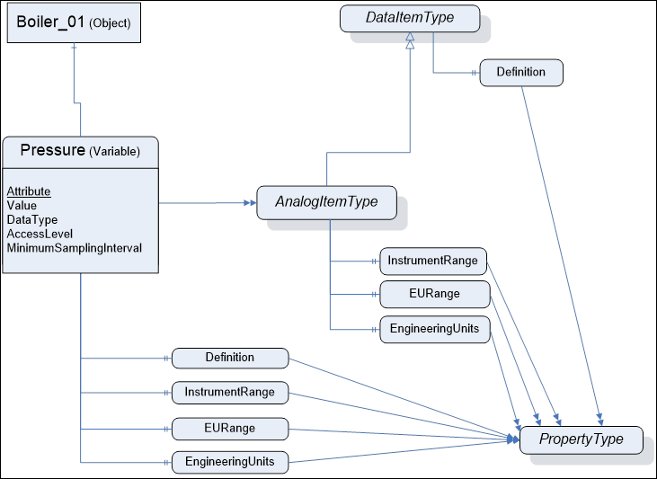  

Figure 4 - Representation of DataItems in the AddressSpace  

Each *DataItem* is represented by a *DataVariable* with a specific set of *Attribute* s. The *TypeDefinition* reference indicates the type of the *DataItem* (in this case the *AnalogItemType* ). Additional characteristics of *DataItems* are defined using *Properties* . The *VariableTypes* in [5.2](/§\_Ref201049421) specify which properties can exist. These *Properties* have been found to be useful for a wide range of Data Access clients. *Servers* that want to disclose similar information should use the OPC-defined *Property* rather than one that is vendor-specific.  

The above figure shows only a subset of *Attributes* and *Properties* . Other *Attributes* that are defined for *Variables* in [OPC 10000-3](/§UAPart3) (e.g., *Description* ) can also be available.  

### 5.5 Attributes of DataItems  

The following *Attributes* of *Variables* (specified in detail in [OPC 10000-3](/§UAPart3) ) are particularly important for *DataItems* :  

* Value  

* DataType  

* AccessLevel  

* MinimumSamplingInterval  

*Value* is the most recent value of the *Variable* that the *Server* has. Its data type is defined by the *DataType* *Attribute* . The *AccessLevel* *Attribute* defines the *Server's* basic ability to access current data and *MinimumSamplingInterval* defines how current the data is.  

When a client requests the *Value* *Attribute* for reading or monitoring, the *Server* will always return a *StatusCode* (the quality and the *Server's* ability to access/provide the value) and, optionally, a *ServerTimestamp* and/or a *SourceTimestamp*\- based on the *Client's* request. See [OPC 10000-4](/§UAPart4) for details on *StatusCode* and the meaning of the two timestamps. Specific status codes for Data Access are defined in [7.3](/§\_Ref131299255) .  

### 5.6 DataTypes  

#### 5.6.1 Overview  

Following is a description of the *DataTypes* defined in this specification.  

*DataTypes* like *String* , *Boolean* , *Double* or *LocalizedText* are defined in [OPC 10000-3](/§UAPart3) . Their representation is specified in [OPC 10000-5](/§UAPart5) .  

#### 5.6.2 Range  

This structure defines the *Range* for a value. Its elements are defined in [Table 17](/§\_Ref131473417) .  

 **Table 17\- *Range* DataType structure**   

| **Name** | **Type** | **Description** |
|---|---|---|
|Range|structure||
|low|Double|Lowest value in the range.|
|high|Double|Highest value in the range.|
  

  

NOTE For some DataTypes, e.g. Int64, UInt64, or Decimal, there can be a loss in precision in the representation of the range with a Double.  

If a limit is not known a NaN shall be used.  

Its representation in the *AddressSpace* is defined in [Table 18](/§\_Ref141297703)  

 **Table 18\- *Range* definition**   

| **Attribute** | **Value** |
|---|---|
|BrowseName|Range|
|IsAbstract|False|
| **References** | **NodeClass** | **BrowseName** | **DataType** | **TypeDefinition** | **Other** |
|Subtype of Structure defined in [OPC 10000-5](/§UAPart5) .|
| **Conformance Units** |
|Base Info Range DataType|
  

  

#### 5.6.3 EUInformation  

##### 5.6.3.1 General  

*EUInformation* contains information about the *EngineeringUnits* .  

The intention of the OPC UA standard is not to define a set of units but a way to expose units based on existing systems. Since there is not a single worldwide set of units used in all industries, the *EUInformation* structure includes a separate field (the *namespaceUri* ) to identify the system on which the exposed unit is based.  

The default OPC UA mapping is based on UN/CEFACT as defined in [5.6.3.4](/§\_Ref107395416) , because it can be programmatically interpreted by generic OPC UA *Clients* . However, the *EUInformation* structure has been defined such that other standards bodies can incorporate their engineering unit definitions into OPC UA. If *Servers* use such an approach, then they shall identify this standards body by using a proper URI in *EUInformation.namespaceUri* .  

##### 5.6.3.2 Extented Unit information and Quantity  

*Servers* can enhance *EUInformation* by providing the Quantity and Unit model (see [6](/§\_Ref172624821) ) and referencing from *EUInformation* instances to the appropriate instances for quantity and unit. See [Figure 5](/§\_Ref103241636) for an example.  

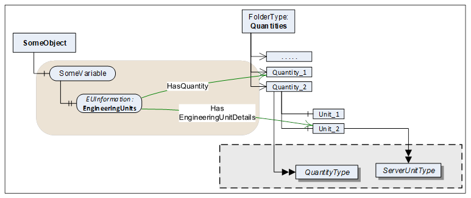  

Figure 5 - Enhanced EUInformation example  

##### 5.6.3.3 Definition of EUInformation  

The *EUInformation* elements are defined in [Table 19](/§\_Ref534206692) .  

 **Table 19\- *EUInformation* DataType structure**   

| **Name** | **Type** | **Description** |
|---|---|---|
|EUInformation|structure||
|namespaceUri|String|Identifies the organization (company, standards organization) that defines the *EUInformation* .|
|unitId|Int32|Identifier for programmatic lookup.  

−1 is used if a *unitId* is not available.|
|displayName|LocalizedText|The *displayName* of the engineering unit is typically the abbreviation of the engineering unit, for example "h" for hour or "m/s" for meter per second.|
|description|LocalizedText|Contains the full name of the engineering unit such as "hour" or "meter per second".|
  

  

Its representation in the *AddressSpace* is defined in [Table 20](/§\_Ref27400244) .  

 **Table 20\- *EUInformation* definition**   

| **Attribute** | **Value** |
|---|---|
|BrowseName|EUInformation|
|IsAbstract|False|
| **References** | **NodeClass** | **BrowseName** | **DataType** | **TypeDefinition** | **Other** |
|Subtype of Structure defined in [OPC 10000-5](/§UAPart5) .|
| **Conformance Units** |
|Base Info EUInformation|
  

  

##### 5.6.3.4 Mapping of UN/CEFACT to EUInformation  

This clause specifies how to apply the **"**  **"** [ REF UNECE \\h UNECE](https://www.unece.org/cefact/codesfortrade/codes\_index.html) ). This recommendation establishes a single list of code elements to represent units of the International System of Units (SI Units) like units of measure for length, mass (weight), volume and other quantities and in addition covers administration, commerce, transport, science, technology, industry etc. It provides a fixed code that can be used for automated evaluation.  

[Table 21](/§\_Ref27400298) contains a small excerpt of the relevant columns in the UNECE recommendation:  

 **Table 21\- Examples from the UNECE Recommendation**   

| **Excerpt from Recommendation N°. 20, Annex 1** |
|---|
| **Common Code** | **Name** | **Symbol** |
|C81|radian|rad|
|C25|milliradian|mrad|
|MMT|millimetre|mm|
|HMT|hectometre|hm|
|KMT|kilometre|km|
|KMQ|kilogram per cubic metre|kg/m 3|
|FAH|degree Fahrenheit|°F|
  

  

The UNECE recommendation in several cases defines multiple instances of the same unit (same name and symbol) for different quantities. Therefore, the relevant information for *EUInformation.unitId* , *EUInformation.displayName* , and *EUInformation.description* has been extracted by eliminating duplicates. This extract is available here:  

[http://www.opcfoundation.org/UA/EngineeringUnits/UNECE/UNECE\_to\_OPCUA.csv](http://www.opcfoundation.org/UA/EngineeringUnits/UNECE/UNECE\_to\_OPCUA.csv)  

This mapping has been generated as follows:  

* The *namespaceUri* shall be http:// [www.opcfoundation.org/UA/units/un/cefact](http://www.opcfoundation.org/UA/units/un/cefact)  

* The **Common Code** *unitId* . The following pseudo code specifies the conversion algorithm:  

Int32 unitId = 0;  Int32 c;  for (i=0; i\<=3;i++)  \{  

c = CommonCode[i];  if (c == 0) break;  // end of Common Code  unitId = unitId \<\< 8;  unitId = unitId | c; \}  

* The **Symbol** *displayName* . *Servers* can configure multiple additional locales for each *displayName* . However, if none of the *LocaleIds* specified by the *Client* for the *Session* matches these additional locales, the *Server* shall return the invariant locale.  

* The **Name** *description* . *Servers* can configure multiple additional locales for each *description* . However, if none of the *LocaleIds* specified by the *Client* for the *Session* matches these additional locales, the *Server* shall return the invariant locale.  

  

##### 5.6.3.5 Mapping of IEC 62720 to EUInformation  

This clause specifies how to apply the Common Data Dictionary (IEC CDD) published as IEC/TS 62720 by the "International Electrotechnical Commission - IEC" to the *EUInformation Structure* .  

Note - entries of the IEC CDD reference to the "common code" from UN/CEFACT Rec. 20 if one is available.  

  

The units and their identifiers, along with their relationships, is maintained in the IEC Common Data Dictionary (CDD): [https://cdd.iec.ch/cdd/iec62720/iec62720.nsf/TreeFrameset](https://cdd.iec.ch/cdd/iec62720/iec62720.nsf/TreeFrameset) . Specific units can only be found via search. A '\*' as search string will return all units.  

[Figure 6](/§\_Ref199919927) specifies the dialog to search for units and optionally export them.  

  

Figure 6 - Searching Units in the IEC Common Data Dictionary  

[Table 21](/§\_Ref27400298) contains a small excerpt of the relevant columns in IEC 62720:  

 **Table 22\- Examples from the IEC CDD**   

| **Excerpt of Units from IEC/TS 62720** |
|---|
| **Code** | **Symbol** | **Name** |
|UAA017|Ω|ohm|
|UAA033|°C|degree Celsius|
|UAA070|μN|micronewton|
|UAA172|J|joule|
|UAA539|in|inch|
|UAB044|in/s2|inch per second squared|
|UAA497|g/s|gram per second|
  

  

Note - The "Code" corresponds to the data identifier of the IRDI for the CDD entry.  

  

All units in the IEC CDD have been extracted and mapped to the *EUInformation* fields. The list is available here:  

[http://www.opcfoundation.org/UA/EngineeringUnits/IEC/IEC62720\_to\_OPCUA.csv](http://www.opcfoundation.org/UA/EngineeringUnits/IEC/IEC62720\_to\_OPCUA.csv)  

This mapping has been generated as follows:  

* The *namespaceUri* shall be http:// [www.opcfoundation.org/UA/units/cdd/IEC62720](http://www.opcfoundation.org/UA/units/cdd/IEC62720)  

* The **Code** *unitId* . The following pseudo code specifies the conversion algorithm:  

Int32 unitId = 0; Int32 c; for (i=0; i\<6;i++) \{  

c = UnitCode[i] 0x1f;  unitId = unitId \<\< 5;  unitId = unitId | c; \}  

  

* The **Short Name** *displayName* . *Servers* can configure multiple additional locales for each *displayName* . However, if none of the *LocaleIds* specified by the *Client* for the *Session* matches these additional locales, the *Server* shall return the invariant locale.  

* The **Preferred Name** *description* . *Servers* can configure multiple additional locales for each *description* . However, if none of the *LocaleIds* specified by the *Client* for the *Session* matches these additional locales, the *Server* shall return the invariant locale.  

  

#### 5.6.4 ComplexNumberType  

This structure defines float IEEE 32 bits complex value. Its elements are defined in [Table 23](/§\_Ref323822921) .  

 **Table 23\- ComplexNumberType DataType structure**   

| **Name** | **Type** | **Description** |
|---|---|---|
|ComplexNumberType|structure||
|real|Float|Value real part|
|imaginary|Float|Value imaginary part|
  

Its representation in the *AddressSpace* is defined in [Table 24](/§\_Ref323822979)  

 **Table 24\- ComplexNumberType definition**   

| **Attribute** | **Value** |
|---|---|
|BrowseName|ComplexNumberType|
|IsAbstract|False|
| **References** | **NodeClass** | **BrowseName** | **DataType** | **TypeDefinition** | **Other** |
|Subtype of Structure defined in [OPC 10000-5](/§UAPart5) .|
| **Conformance Units** |
|Data Access Complex Number|
  

  

#### 5.6.5 DoubleComplexNumberType  

This structure defines double IEEE 64 bits complex value. Its elements are defined in [Table 25](/§\_Ref323823954) .  

 **Table 25\- DoubleComplexNumberType DataType structure**   

| **Name** | **Type** | **Description** |
|---|---|---|
|DoubleComplexNumberType|structure||
|real|Double|Value real part|
|imaginary|Double|Value imaginary part|
  

  

Its representation in the *AddressSpace* is defined in [Table 26](/§\_Ref323824011) .  

 **Table 26\- DoubleComplexNumberType definition**   

| **Attribute** | **Value** |
|---|---|
|BrowseName|DoubleComplexNumberType|
|IsAbstract|False|
| **References** | **NodeClass** | **BrowseName** | **DataType** | **TypeDefinition** | **Other** |
|Subtype of Structure defined in [OPC 10000-5](/§UAPart5) .|
| **Conformance Units** |
|Data Access DoubleComplex Number|
  

  

#### 5.6.6 AxisInformation  

This structure defines the information for auxiliary axis for *ArrayItemType* *Variables* .  

There are three typical uses of this structure:  

The step between points is constant and can be predicted using the range information and the number of points. In this case, axisSteps can be set to NULL.  

The step between points is not constant, but remains the same for a long period of time (from acquisition to acquisition for example). In this case, axisSteps contains the value of each step on the axis.  

The step between points is not constant and changes at every update. In this case, a type like XYArrayType shall be used and axisSteps is set to NULL.  

Its elements are defined in [Table 27](/§\_Ref323831091) .  

 **Table 27\- AxisInformation DataType structure**   

| **Name** | **Type** | **Description** |
|---|---|---|
|AxisInformation|structure||
|engineeringUnits|EUInformation|Holds the information about the engineering units for a given axis.|
|eURange|Range|Limits of the range of the axis|
|title|LocalizedText|User readable axis title, useful when the units are %, the Title can be "Particle size distribution"|
|axisScaleType|AxisScaleEnumeration|LINEAR, LOG, LN, defined by AxisSteps|
|axisSteps|Double[]|Specific value of each axis steps, can be set to "Null" if not used|
  

  

Its representation in the *AddressSpace* is defined in [Table 28](/§\_Ref64811091) .  

 **Table 28\- AxisInformation definition**   

| **Attribute** | **Value** |
|---|---|
|BrowseName|AxisInformation|
|IsAbstract|False|
| **References** | **NodeClass** | **BrowseName** | **DataType** | **TypeDefinition** | **Other** |
|Subtype of Structure defined in [OPC 10000-5](/§UAPart5) .|
| **Conformance Units** |
|Data Access AxisInformationType|
  

  

When the steps in the axis are constant, *axisSteps* can be set to "Null" and in this case, the *Range* limits are used to compute the steps. The number of steps in the axis comes from the parent *ArrayItem.ArrayDimensions* .  

#### 5.6.7 AxisScaleEnumeration  

This enumeration identifies on which type of axis the data shall be displayed. Its values are defined in [Table 29](/§\_Ref323831181) .  

 **Table 29\- AxisScaleEnumeration values**   

| **Name** | **Value** | **Description** |
|---|---|---|
|LINEAR|0|Linear scale|
|LOG|1|Log base 10 scale|
|LN|2|Log base e scale|
  

  

Its representation in the *AddressSpace* is defined in [Table 30](/§\_Ref323826436) .  

 **Table 30\- AxisScaleEnumeration definition**   

| **Attribute** | **Value** |
|---|---|
|BrowseName|AxisScaleEnumeration|
|IsAbstract|False|
| **References** | **NodeClass** | **BrowseName** | **DataType** | **TypeDefinition** | **ModellingRule** |
|Subtype of the Enumeration type defined in [OPC 10000-5](/§UAPart5)|
|HasProperty|Variable|EnumStrings|LocalizedText[]|PropertyType||
| **Conformance Units** |
|Data Access ArrayItem2Type|
  

  

#### 5.6.8 XVType  

This structure defines a physical value relative to a X axis and it is used as the *DataType* of the Value of *XYArrayItemType* . For details see [5.3.4.3](/§\_Ref323830772) .  

Many devices can produce values that can perfectly be represented with a float IEEE 32 bits but, they can position them on the X axis with an accuracy that requires double IEEE 64 bits. For example, the peak value in an absorbance spectrum where the amplitude of the peak can be represented by a float IEEE 32 bits, but its frequency position required 10 digits which implies the use of a double IEEE 64 bits.  

Its elements are defined in [Table 31](/§\_Ref323831223) .  

 **Table 31\- XVType DataType structure**   

| **Name** | **Type** | **Description** |
|---|---|---|
|XVType|structure||
|x|Double|Position on the X axis of this value|
|value|Float|The value itself|
  

  

Its representation in the *AddressSpace* is defined in [Table 32](/§\_Ref327355285) .  

 **Table 32\- XVType definition**   

| **Attribute** | **Value** |
|---|---|
|BrowseName|XVType|
|IsAbstract|False|
| **References** | **NodeClass** | **BrowseName** | **DataType** | **TypeDefinition** | **Other** |
|Subtype of Structure defined in [OPC 10000-5](/§UAPart5) .|
| **Conformance Units** |
|Data Access XYArrayItemType|
  

  

## 6 Quantities and Units model  

### 6.1 General  

This model supplements the information of *EngineeringUnit Properties* , providing comprehensive *ObjectTypes* for quantities and units and their linkage. See [5.6.3](/§\_Ref107735358) how *EngineeringUnit Properties* reference instances of these *ObjectTypes* . It is also possible to specify *AlternativeUnits* and the conversion factors.  

Furthermore, the model provides a powerful way to relate quantities and units to established works of other organizations (see *Syntax References* in [6.3](/§\_Ref108949831) ).  

[Figure 7](/§\_Ref107737059) Illustrates the model.  

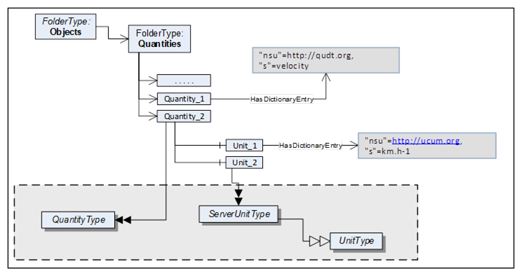  

Figure 7 - Quantity model overview  

### 6.2 Quantities entry point  

*Quantities* is a standardized entry point to access all *Quantities* and their *Units* managed in the *Server* . It is formally defined in [Table 33](/§\_Ref103077676) . All *Objects* of the *QuantityType* defined in clause [6.4.1](/§\_Ref96441342) , that are managed in the *Server* , shall be referenced directly from this *Object* with *Organizes* or a subtype of *Organizes* .  

 **Table 33\- Quantities definition**   

| **Attribute** | **Value** |
|---|---|
|BrowseName|Quantities|
|Description|This *Object* is the entry point to quantities and their units managed in the *Server* .|
| **References** | **NodeClass** | **BrowseName** | **DataType** | **TypeDefinition** |
|OrganizedBy by the *Server Object* defined in OPC 10000-5|
|HasTypeDefinition|ObjectType|FolderType||
| **Conformance Units** |
|Data Access Quantities Base|
  

  

### 6.3 Syntax References  

#### 6.3.1 General  

*Syntax References* represent established works of other organizations. Such works - among others - can define semantic information, topologies, a language for a code set, or dictionaries and facilitate the programmatic evaluation or the lookup of a quantity or unit e.g. in a dictionary or ontology. They can be publicly defined by standard bodies such as IEC or proprietary (e.g. vendor-specific dictionaries).  

The Quantities and Unit Model provides a powerful way to relate quantities and units to such *Syntax References* using the *Dictionary References* model defined in [OPC 10000-19](/§UAPart19) .  

[Table 34](/§\_Ref108946590) lists *Syntax References* that are applied in certain markets. This list can be extended in future versions. Vendors or organizations can also specify additional *Syntax References* .  

An overview for each *Syntax Reference* in this table is provided in [Annex C](/§\_Ref108945559) .  

 **Table 34\- List of Syntax References**   

| **Common Name** | **Syntax Reference URI** | **Full Name** |
|---|---|---|
|UCUM|https://ucum.org|Unified Code for Units of Measure|
|QUDT|https://qudt.org|Quantities, Units, Dimensions and Types Ontology|
|IEC CDD|https://cdd.iec.ch/|Common Data Dictionary|
|UNECE|https://unece.org/trade/uncefact/cl-recommendations|Codes for Units of Measure Used in International Trade|
|LATEX\_SIUNITX|https://www.namsu.de/Extra/pakete/Siunitx.html|LaTeX SI Unit Extension|
  

  

#### 6.3.2 Using Dictionary References  

*HasDictionaryEntry* is used to define the relationship to a *Syntax Reference* by referencing from quantity or unit *Nodes* to an instance of a *SyntaxReferenceEntryType* . Each quantity or unit instance can have zero, one or more such references.  

Instances of *SyntaxReferenceEntryType* have a well-defined *NodeId* as defined in [Table 35](/§\_Ref108950871) .  

 **Table 35\- Definition of NodeId for instances of the SyntaxReferenceEntryType**   

| **Name** | **Type** | **Definition for instances of the SyntaxReferenceEntryType** |
|---|---|---|
| **NodeId** | **structure** ||
|namespaceIndex|UInt16|The *NamespaceTable* index for the Syntax Reference URI (see [Table 34](/§\_Ref108946590) ).|
|IdType|Enum|String|
|identifier|\*|The *Syntax Reference* identifier ( *SyntaxReferenceId* ), see [6.3.3](/§\_Ref108949631)|
  

  

When calling the *Browse* *Service* for a *Quantity* or *Unit* *Node* , the response includes the *HasDictionaryEntry* *Reference* together with the well-defined *NodeId* for the *SyntaxReferenceEntryType* instance. The actual instance therefore is not required in the *AddressSpace* .  

[Figure 8](/§\_Ref108949956) provides an example of *References* to external works.  

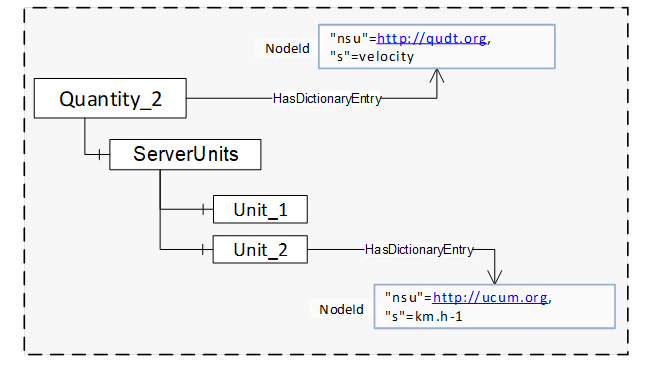  

Figure 8 - References to external works  

#### 6.3.3 Syntax Reference Identifier  

[Table 36](/§\_Ref108946673) defines the identifiers for each *Syntax Reference* .  

 **Table 36\- List of Syntax Reference Identifiers**   

| **Common Name** | **Identifier** |
|---|---|
|UCUM|QuantityType instances:  

The UCUM *Syntax ReferenceID* for quantities shall include the prefix "quantityKind:" followed by the name of the quantity.|
||UnitType instances:  

The UCUM *SyntaxReferenceId* for units shall include an expression based on the UCUM syntax making use of the symbols named in the "C/S" entry of the UCUM spec ( [https://ucum.org/ucum.html](https://ucum.org/ucum.html) ).  

Codes (expressions) for common units are defined in [Annex B](/§\_Ref107050010) .|
|QUDT|QuantityType instances:  

The QUDT *Syntax ReferenceID* for quantities shall include the prefix "quantityKind:" followed by the name of the quantity as in [https://www.qudt.org/doc/DOC\_VOCAB-QUANTITY-KINDS.html](https://www.qudt.org/doc/DOC\_VOCAB-QUANTITY-KINDS.html) .  

Example quantities are in [C.2](/§\_Ref171247650) .|
||UnitType instances:  

The QUDT *Syntax ReferenceID* for units shall include the prefix "unit:" followed by the name of the unit as in [https://www.qudt.org/doc/DOC\_VOCAB-UNITS.html](https://www.qudt.org/doc/DOC\_VOCAB-UNITS.html) .  

Example units are in [C.2](/§\_Ref171247650) .|
|IEC CDD|QuantityType instances:  

The IEC CDD *SyntaxReferenceId* shall include the IRDI of the respective quantity.  

Example quantities are in [C.4](/§\_Ref171247652) .|
||UnitType instances:  

The IEC CDD *SyntaxReferenceId* shall include the IRDI of the respective unit.  

Example units are in [C.4](/§\_Ref171247653) .|
|UNECE|QuantityType instances:  

There are no UNECE *Syntax References* for quantities.|
||UnitType instances:  

The UNECE *SyntaxReferenceId* shall include the common code from **"Codes for Units of Measurement"** [UNECE](https://www.unece.org/cefact/codesfortrade/codes\_index.html) ).  

  

Example units are in [C.3](/§\_Ref171247656) .|
|LATEX\_SIUNITX|QuantityType instances:  

There are no LATEX\_SIUNITX *Syntax References* for quantities.|
||UnitType instances:  

The LATEX\_SIUNITX SyntaxReferenceId shall include the leading slash, the keyword of the macro as well as the entire argument.  

  

Example units are in [C.5](/§\_Ref171247677) .|
  

  

### 6.4 ObjectTypes  

#### 6.4.1 QuantityType ObjectType definition  

The *QuantityType* defines a model for physical quantities. These are listed in the *Quantites* *Folder* . Each quantity has a *ServerUnits* *Folder* in which the units, referenced by *EngineeringUnit Properties* with *HasEngineeringUnitDetails* , are listed. Each *ServerUnit* can have a list of alternative units to which the *Variable* value can be converted.  

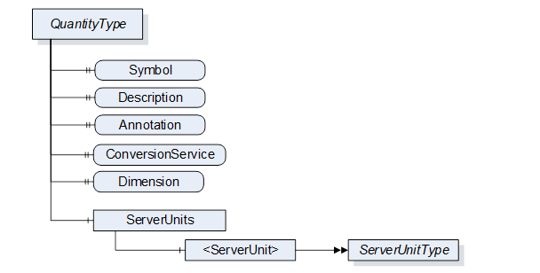  

Figure 9 - QuantityType  

It is illustrated in [Figure 9](/§\_Ref108953451) and formally defined in [Table 37](/§\_Ref106799998) .  

 **Table 37\- QuantityType definition**   

| **Attribute** | **Value** |
|---|---|
|BrowseName|QuantityType|
|IsAbstract|False|
| **References** | **NodeClass** | **BrowseName** | **DataType** | **TypeDefinition** | **Other** |
|Subtype of the BaseObjectType defined in [OPC 10000-5](/§UAPart5)|
|HasProperty|Variable|Symbol|LocalizedText|PropertyType|O|
|||||||
|HasProperty|Variable|Annotation|AnnotationDataType[]|PropertyType|O|
|HasProperty|Variable|ConversionService|UriString|PropertyType|O|
|HasProperty|Variable|Dimension|QuantityDimension|PropertyType|M|
|HasComponent|Object|ServerUnits||BaseObjectType|M|
| **Conformance Units** |
|Data Access Quantities Base|
  

  

The *DisplayName Attribute* of each instance shall provide the name of the quantity, e.g. "acceleration", "battery capacity" or "pressure in relation to volume flow rate".  

The *Description* *Attribute* should be used to expose a more verbose explanation of the *QuantityType* instance.  

The *Symbol* *Property* is used for the symbol of the quantity (e.g. 'l' for length, 't' for time, or 'T' for temperature).  

*Annotation* allows naming annotations for a physical quantity. These *Annotations* are explanations of the physical quantity such as "relative" for a relative velocity. The *AnnotationDataType* is described in chapter [6.6.1](/§\_Ref96442446) .  

For example, a V AC RMS measurement is the quadratic mean measurement of an AC voltage. We are using two annotation elements to represent it. Its Instance would contain the following values:  

| **Annotation** | **Discipline** | **uri** |
|---|---|---|
|AC|Electrical Engineering|[https://www.britannica.com/science/alternating-current](https://www.britannica.com/science/alternating-current)|
|RMS|Electrical Engineering|[https://en.wikipedia.org/wiki/Root\_mean\_square)](https://en.wikipedia.org/wiki/Root\_mean\_square))|
  

  

*ConversionService* allows to name an external conversion service for the unit in which the client can have a conversion to a target unit performed.  

*Dimension* describes the dimension of a physical quantity in power representation. Its *DataType* is described in chapter [6.6.4](/§\_Ref103079487) .  

*ServerUnits* allows listing *ServerUnits* for a physical quantity. The *ServerUnits are of ServerUnitType* which is described in [6.4.2](/§\_Ref96442529) .  

*Syntax References* : Instances of the *QuantityType* can identify the physical quantity in a specific external reference work using *HasDictionaryEntry* *References*\- see [6.3.2](/§\_Ref108952340) .  

The components of the *QuantityType* have additional subcomponents which are defined in [Table 38](/§\_Ref26525827) .  

 **Table 38\- QuantityType Additional Subcomponents**   

| **BrowsePath** | **References** | **NodeClass** | **BrowseName** | **DataType** | **TypeDefinition** | **Others** |
|---|---|---|---|---|---|---|
|ServerUnits|HasComponent|Object|\<ServerUnit\>||ServerUnitType|MP|
  

  

#### 6.4.2 UnitType and subtypes  

##### 6.4.2.1 General  

The Units model describes the relations between *UnitType* , *ServerUnitType* and *AlternativeUnitType* .  

The *UnitType* is the base class and defines details that are relevant of all derived types.  

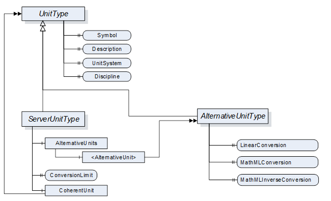  

Figure 10 - Units model  

  

##### 6.4.2.2 UnitType ObjectType Definition  

It is formally defined in [Table 39](/§\_Ref106800295) .  

 **Table 39\- UnitType definition**   

| **Attribute** | **Value** |
|---|---|
|BrowseName|UnitType|
|IsAbstract|True|
| **References** | **NodeClass** | **BrowseName** | **DataType** | **TypeDefinition** | **Other** |
|Subtype of the BaseObjectType defined in [OPC 10000-5](/§UAPart5)|
|HasProperty|Variable|Symbol|LocalizedText|PropertyType|M|
|||||||
|HasProperty|Variable|UnitSystem|String|PropertyType|M|
|HasProperty|Variable|Discipline|String|PropertyType|O|
| **Conformance Units** |
|Data Access Quantities Base|
  

  

The *DisplayName Attribute* of each instance shall provide the name of the unit, e.g. "second", "degree Celsius" or "square metre". This matches the "description" field of the EUInformation structure (see [5.6.3.3](/§\_Ref105756932) ).  

The *Description* *Attribute* should be used to expose a more verbose explanation of the *UnitType* instance.  

The *Symbol* *Property* is used for the symbol of the unit (e.g. "h" for hour or "m/s" for meter per second). If no symbol is defined for the unit, the *DisplayName Attribute* shall be used as symbol. *Symbol* matches the "displayName" field of the EUInformation structure (see [5.6.3.3](/§\_Ref105756932) ).  

The *UnitSystem* *Property* describes the system of units (e.g. ISQ) in which the unit is specified. If any of the well-known systems defined in [Table 40](/§\_Ref103326945) is used, the acronym in the column "UnitSystem" shall be used for the value of this *Property* .  

 **Table 40\- Non-exhaustive list of well-known systems of units**   

| **UnitSystem** | **System of units** |
|---|---|
|ISQ|International System of Quantities (ISO/IEC 80000)  

Fully covers and thus replaces SI (ISO 1000)|
|USCS|US Customary Unit System|
|ISU|British imperial system of units|
|MSU|Myanmar Units of measurement|
|TROY|Troy units of weight|
|CGS|centimetre-gram-second system of units|
|GAUSS|Gaussian System of units|
|FPS|foot-pound-second system of units|
  

  

*Syntax References* : Instances of the *UnitType* can identify the unit in a specific external reference work using *HasDictionaryEntry* *References*\- see [6.3.2](/§\_Ref108952340) .  

##### 6.4.2.3 ServerUnitType ObjectType Definition  

Instances of *ServerUnitType* define the units utilizes in the *Server* . They are assigned to the proper *Quantities* . *EngineeringUnit Properties* can refer to it. It is formally defined in [Table 41](/§\_Ref106800331) .  

 **Table 41\- ServerUnitType definition**   

| **Attribute** | **Value** |
|---|---|
|BrowseName|ServerUnitType|
|IsAbstract|False|
| **References** | **NodeClass** | **BrowseName** | **DataType** | **TypeDefinition** | **Other** |
|Subtype of the UnitType|
|HasComponent|Object|AlternativeUnits||BaseObjectType|O|
|HasProperty|Variable|ConversionLimit|ConversionLimitEnum|PropertyType|M|
|HasComponent|Object|CoherentUnit||UnitType|O|
| **Conformance Units** |
|Data Access Quantities Base|
  

  

The optional *Object* *AlternativeUnits* contains *Objects* of the *AlternativeUnitsType* . These explicitly specify the units into which the conversion can be made.  

The mandatory *Property* *ConversionLimit* indicates whether the *ServerUnit* can be converted. A distinction is made between NO\_CONVERSION, LIMITED and UNLIMITED.  

UNLIMITED means the client can perform conversions based on the rules defined by the given *UnitSystem* .  

LIMITED conversion means that a conversion can not be performed by simply applying the rules defined by the given *UnitSystem* . Either only the conversions mentioned in the *AlternativeUnits* are to be used or the client requires application specific know-how for a conversion on his own.  

NO\_CONVERSION means that no conversion is allowed (e.g. for statistical values).  

The *CoherentUnit* of a value is a derived unit that, for a given system of quantities and for a chosen set of base units, is a product of powers of base units, with the proportionality factor being one. Therefore it shall share the same *UnitSystem* as the *ServerUnit* .  

The components of the *ServerUnitType* have additional subcomponents which are defined in [Table 42](/§\_Ref108878243) .  

 **Table 42\- ServerUnitType Additional Subcomponents**   

| **BrowsePath** | **References** | **NodeClass** | **BrowseName** | **DataType** | **TypeDefinition** | **Other** |
|---|---|---|---|---|---|---|
|AlternativeUnits|HasComponent|Object|\<AlternativeUnit\>||AlternativeUnitType|MP|
  

  

##### 6.4.2.4 AlternativeUnitType ObjectType Definition  

The *AlternativeUnitType* describes alternative units to a *ServerUnit* . It is required to specify a conversion method for a value from the ServerUnit to this AlternativeUnit. It is formally defined in [Table 43](/§\_Ref106800365) .  

The use of conversions enables that a server and a client can work with different units and even in different systems of units. E.g. a server works with imperial units and a client uses metric units.  

As a single server can distribute values to a number of clients with different needs the actual conversion has to be performed at client side.  

 **Table 43\- AlternativeUnitType definition**   

| **Attribute** | **Value** |
|---|---|
|BrowseName|AlternativeUnitType|
|IsAbstract|False|
| **References** | **NodeClass** | **BrowseName** | **DataType** | **TypeDefinition** | **Other** |
|Subtype of the UnitType|
|HasProperty|Variable|LinearConversion|LinearConversionDataType|PropertyType|O|
|HasProperty|Variable|MathMLConversion|String|PropertyType|O|
|HasProperty|Variable|MathMLInverseConversion|String|PropertyType|O|
| **Conformance Units** |
|Data Access Alternative Units|
  

  

The Server shall provide either a *LinearConversion* or a *MathMLConversion* together with a corresponding *MathMLInverseConversion* . It can provide Linear and MathML conversions in parallel.  

The optional *Property* *LinearConversion* represents a simple conversion according to the following formula. The values (a, b, c, d) are given in a *Structure* as defined in the *LinearConversionDataType* in chapter [6.6.2](/§\_Ref96935476) . The value x is published by the *Server* in the named server unit and y is the value converted into the named alternative unit.  

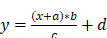  

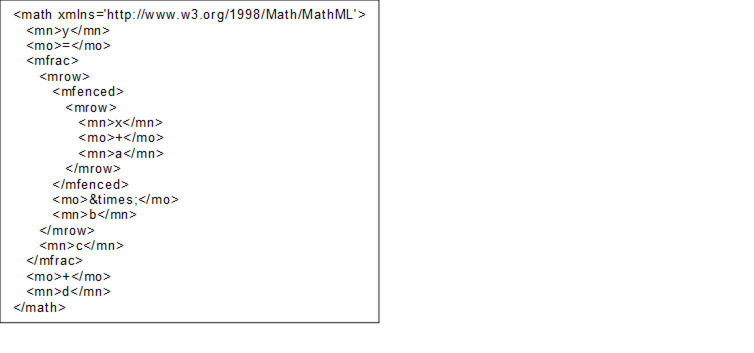  

Figure 11 - MathML example linear conversion  

This also defines the inverse conversion to be used if a *Client* wants to write a value to the *Server* . The values (a, b, c, d) are given in a *Structure* as defined in the *LinearConversionDataType* in chapter [6.6.2](/§\_Ref96935476) . The value y 1 is the value that the *Client* wants to write to the *Server* in the named alternative unit and x 1 is the value the *Client* actually has to write to the *Server* instead  

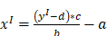  

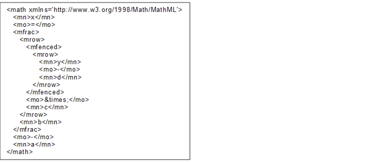  

Figure 12 - MathML example inverse linear conversion  

The optional *Property* *MathMLConversion* allows the specification of all kinds of conversion methods. The MathML syntax is used for this. Within the MathML expression X always stands for the value at the server side and Y for the value at the client side. An example (formula of the *LinearConversion* ) looks as follows.  

#### 6.4.3 SyntaxReferenceEntryType ObjectType definition  

The *SyntaxReferenceEntryType* defined in [Table 44](/§\_Ref108877933) is used to represent *Syntax References* that use *Syntax Reference* specific IDs as unique identifiers.  

Because of their well-defined NodeIds (see [6.3.2](/§\_Ref108950324) ), instances of this type are not required in the *AddressSpace* .  

 **Table 44\- SyntaxReferenceEntryType Definition**   

| **Attribute** | **Value** |
|---|---|
|BrowseName|SyntaxReferenceEntryType|
|IsAbstract|False|
| **References** | **NodeClass** | **BrowseName** | **DataType** | **TypeDefinition** | **Other** |
|Subtype of the DictionaryEntryType defined in [OPC 10000-19](/§UAPart19)|
|HasProperty|Variable|CommonName|String|PropertyType|M|
| **Conformance Units** |
|Data Access Quantity Syntax Reference|
  

  

*CommonName* shall be the corresponding field in [Table 34](/§\_Ref108946590) .  

The namespace for the *NodeId* and the *BrowseName* *Attributes* of instances of the *SyntaxReferenceEntryType* shall be the URI of the *Syntax Reference* as defined in [Table 34](/§\_Ref108946590) .  

### 6.5 References  

#### 6.5.1 HasEngineeringUnitDetails  

The *HasEngineeringUnitDetails* is a concrete *ReferenceType* and can be used directly. It is a subtype of *NonHierarchicalReferences* .  

The semantics of this *ReferenceType* is to link a Variable with *EUInformation* *DataType* to its more detailed *AddressSpace* representation *Instance* of the *ServerUnitType ObjectType* .  

The *SourceNode* of *References* of this type shall be a Variable with *EUInformation* *DataType* .  

The *TargetNode* of this *ReferenceType* shall be an *Instance* of the *ServerUnitType* *ObjectType* .  

The *Reference* has to change if the value (the concrete *EngineeringUnit* ) is changing. *Clients* can subscribe to the value and, in case of change, should rebrowse.  

The *HasEngineeringUnitDetails* is formally defined in [Table 45](/§\_Ref16854066) .  

 **Table 45\- HasEngineeringUnitDetails definition**   

| **Attributes** | **Value** |
|---|---|
|BrowseName|HasEngineeringUnitDetails|
|InverseName|EngineeringUnitDetailsOf|
|Symmetric|False|
|IsAbstract|False|
| **References** | **NodeClass** | **BrowseName** | **Comment** |
|Subtype of *NonHierarchicalReferences* defined in [OPC 10000-5](/§UAPart5) .|
| **Conformance Units** |
|Data Access Quantities Base|
  

  

#### 6.5.2 HasQuantity  

The *HasQuantity* is a concrete *ReferenceType* and can be used directly. It is a subtype of *NonHierarchicalReferences* .  

The semantics of this *ReferenceType* is to link a Variable with *EUInformation* *DataType* to an Instance of the *QuantityType ObjectType* .  

The *SourceNode* of *References* of this type shall be a Variable with *EUInformation* *DataType* (typically the *EngineeringUnits Property)* .  

The *TargetNode* of this *ReferenceType* shall be an *Instance* of the *QuantityType* *ObjectType* .  

The *HasQuantity* is formally defined in [Table 46](/§\_Ref106800420) .  

 **Table 46\- HasQuantity definition**   

| **Attributes** | **Value** |
|---|---|
|BrowseName|HasQuantity|
|InverseName|QuantityOf|
|Symmetric|False|
|IsAbstract|False|
| **References** | **NodeClass** | **BrowseName** | **Comment** |
|Subtype of *NonHierarchicalReferences* defined in [OPC 10000-5](/§UAPart5) .|
| **Conformance Units** |
|Data Access Quantities Base|
  

  

### 6.6 DataTypes  

#### 6.6.1 AnnotationDataType DataType definition  

This structure contains additions as explanation and specification of the physical quantity such as "relative" for a relative velocity. The structure is defined in [Table 47](/§\_Ref109726409) .  

 **Table 47\- AnnotationDataType Structure**   

| **Name** | **Type** | **Description** |
|---|---|---|
|AnnotationDataType|structure|Subtype of Structure defined in OPC 10000-5|
|Annotation|String|Names the annotation to give further information about value like how it is measured or where it originates from.|
|Discipline|String|Gives a human readable classification of the physical quantity according to its field of application to allow grouping of values. These can be, for example, "Engineering", "Finance" or similar.|
|Uri|String|Names a source for deeper description of the annotation.|
  

  

Examples are given in [Table 48](/§\_Ref106800459) .  

 **Table 48\- AnnotationDataType examples**   

| **Name** | **Values for a linear acceleration** | **Values for AC voltage** | **Values for DC voltage** | **Values for AC RMS voltage** |
|---|---|---|---|---|
|AnnotationDataType|||||
|Annotation|linear|AC|DC|RMS|
|Discipline|\-|Electrical Engineering|Electrical Engineering|Electrical Engineering|
|Uri|\-|https://www.britannica.com/science/alternating-current|https://www.britannica.com/science/direct-current|https://en.wikipedia.org/wiki/Root\_mean\_square|
  

  

Its representation in the *AddressSpace* is defined in [Table 49](/§\_Ref46498488) .  

 **Table 49\- AnnotationDataType definition**   

| **Attribute** | **Value** |
|---|---|
|BrowseName|AnnotationDataType|
|IsAbstract|False|
| **References** | **NodeClass** | **BrowseName** | **DataType** | **TypeDefinition** | **Other** |
|Subtype of the Structure defined in OPC 10000-5|
| **Conformance Units** |
|Data Access Quantities Base|
  

  

#### 6.6.2 LinearConversionDataType DataType definition  

This structure contains a simple conversion according to the following formula. The factors (a = inititialAddend, b = multiplicand, c = divisor, d = finalAddend) are given in a *Structure* . X is the source value (in source unit) and f(x) the target value (in target unit). The structure is defined in [Table 50](/§\_Ref106800495) .  

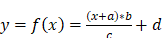  

The values of the structure can also be used for a simple inverse conversion. It can be used if a *Client* wants to write a value to the *Server* . The value y 1 is the value that the *Client* wants to write to the *Server* in the named alternative unit and x 1 is the value the *Client* actually has to write to the *Server* instead.  

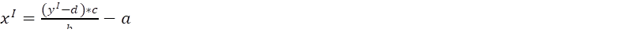  

 **Table 50\- LinearConversionDataType Structure**   

| **Name** | **Type** | **Description** |
|---|---|---|
|LinearConversionDataType|Structure|Subtype of Structure defined in OPC 10000-5|
|InitialAddend|Float|The initial addend of linear conversion.|
|Multiplicand|Float|The multiplicand of linear conversion.|
|Divisor|Float|The divisor of linear conversion.|
|FinalAddend|Float|The final addend of linear conversion.|
  

  

Its representation in the *AddressSpace* is defined in [Table 49](/§\_Ref46498488) .  

 **Table 51\- LinearConversionDataType Definition**   

| **Attribute** | **Value** |
|---|---|
|BrowseName|LinearConversionDataType|
|IsAbstract|False|
| **References** | **NodeClass** | **BrowseName** | **DataType** | **TypeDefinition** | **Other** |
|Subtype of the Structure defined in OPC 10000-5|
| **Conformance Units** |
|Data Access Alternative Units|
  

  

#### 6.6.3 ConversionLimitEnum  

*ConversionLimitEnum* indicates whether the *ServerUnit* can be converted. A distinction is made between NO\_CONVERSION, LIMITED and UNLIMITED. NO\_CONVERSION means that no conversion is allowed (e.g. for statistical values). LIMITED conversion means that either only the conversions mentioned in the *AlternativeUnits* are to be used or the client requires specific know-how for the conversion. UNLIMITED means the conversion is simple and possible if the client knows the *UnitSystem* . The enumeration is defined in [Table 52](/§\_Ref16854259) .  

 **Table 52\- ConversionLimitEnum Items**   

| **Name** | **Value** | **Description** |
|---|---|---|
|NO\_CONVERSION|0|No conversion of the value allowed (e.g. statistical value).|
|LIMITED|1|Conversion only permitted on the basis of the conversions specified by the server, or if the client has the appropriate domain knowledge to perform an independent conversion.|
|UNLIMITED|2|Conversion on the basis of the specified unit according to the rules of the source system of units (e.g. SI / ISQ) and the coding system (e.g. UCUM) is permitted.|
  

  

Its representation in the AddressSpace is defined in [Table 53](/§\_Ref46498546) .  

 **Table 53\- ConversionLimitEnum Definition**   

| **Attribute** | **Value** |
|---|---|
|BrowseName|ConversionLimitEnum|
|IsAbstract|False|
| **References** | **NodeClass** | **BrowseName** | **DataType** | **TypeDefinition** | **Other** |
|Subtype of the Enumeration type defined in [OPC 10000-5](/§UAPart5)|
|HasProperty|Variable|EnumStrings|LocalizedText []|PropertyType||
| **Conformance Units** |
|Data Access Alternative Units|
  

  

#### 6.6.4 QuantityDimension  

The *QuantityDimension* *Structure DataType* describes the dimensionality of a kind of quantity in the context of a system of units. In the SI system of units, the dimensions of a kind of quantity are expressed as a product of the basic physical dimensions length (L), mass (M), time (T), current (I), absolute temperature (θ), amount of substance (N) and luminous intensity (J) as  

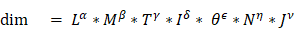 !.  

The rational powers of the dimensional exponents (α, β, γ, δ, ε, η, v), are positive, negative, or zero.  

An additional dimensionless exponent is used for countable things that have no physical quantity assigned.  

The *QuantityDimension* elements are defined in [Table 54](/§\_Ref106800656) .  

 **Table 54\- QuantityDimension DataType structure**   

| **Name** | **Type** | **Description** |
|---|---|---|
|QuantityDimension|Structure||
|MassExponent|SByte|Exponent of the dimension mass for the physical quantity.|
|LengthExponent|SByte|Exponent of the dimension length for the physical quantity.|
|TimeExponent|SByte|Exponent of the dimension time for the physical quantity.|
|ElectricCurrentExponent|SByte|Exponent of the dimension electric current for the physical quantity.|
|AmountOfSubstanceExponent|SByte|Exponent of the dimension amount of substance for the physical quantity.|
|LuminousIntensityExponent|SByte|Exponent of the dimension luminous intensity for the physical quantity.|
|AbsoluteTemperatureExponent|SByte|Exponent of the dimension absolute temperature for the physical quantity.|
|DimensionlessExponent|SByte|Exponent for dimensionless quantities.|
  

  

Its representation in the *AddressSpace* is defined in [Table 55](/§\_Ref106800951) .  

 **Table 55\- QuantityDimension definition**   

| **Attribute** | **Value** |
|---|---|
|BrowseName|QuantityDimension|
|IsAbstract|False|
| **References** | **NodeClass** | **BrowseName** | **DataType** | **TypeDefinition** | **Other** |
|Subtype of Structure defined in [OPC 10000-5](/§UAPart5) .|
| **Conformance Units** |
|Data Access Quantities Base|
  

  

For example, the dimension of the physical quantity kind  

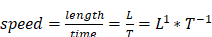 !,  

the dimension of the physical quantity kind force is  

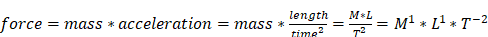 !,  

and the dimension of the physical quantity kind "things (e.g., screws) per time" is  

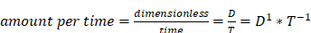 !.  

  

 **Table 56\- QuantityDimension examples**   

| **Name** | **Values for speed** | **Values for force** | **Values for "things per time"** |
|---|---|---|---|
|QuantityDimension||||
|MassExponent|0|1|0|
|LengthExponent|1|1|0|
|TimeExponent|\-1|\-2|\-1|
|ElectricCurrentExponent|0|0|0|
|AmoutOfSubstanceExponent|0|0|0|
|LuminousIntensityExponent|0|0|0|
|AbsoluteTemperatureExponent|0|0|0|
|DimensionlessExponent|0|0|1|
  

  

The extended SI System of units includes derived units that are built as a product of base units. That makes it difficult to compare units as SI allows an unlimited number of "SI unit strings" to describe the same quantity.  

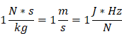  

All 3 are valid SI representations of the quantity "speed" and therefore share the same quantity dimensions. A specific representation of a unit is often used to express details how the unit was measured. The dimension structure makes it much easier to identify and compare the kind of quantity of EU values.  

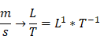  

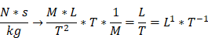  

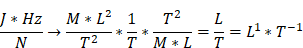  

## 7 Data Access specific usage of Services  

### 7.1 General  

[OPC 10000-4](/§UAPart4) specifies the complete set of services. The services needed for the purpose of DataAccess are:  

* The *View* service set and *Query* service set to detect *DataItems* , and their *Properties* .  

* The *Attribute* service set to read or write *Attributes* and in particular the value *Attribute* .  

* The *MonitoredItem* and *Subscription* service set to set up monitoring of *DataItems* and to receive data change notifications.  

### 7.2 PercentDeadband  

The *DataChangeFilter* in [OPC 10000-4](/§UAPart4) defines the conditions under which a data change notification shall be reported. This filter contains a *deadbandValue* which can be of type *AbsoluteDeadband* or *PercentDeadband* . [OPC 10000-4](/§UAPart4) already specifies the behaviour of the *AbsoluteDeadband* . The behaviour of the *PercentDeadband* type is specified as follows.  

 ***DeadbandType = PercentDeadband***   

For this type of deadband the *deadbandValue* is defined as the percentage of the *EURange* . That is, it applies only to *AnalogItems* with an *EURange* *Property* that defines the typical value range for the item. This range shall be multiplied with the *deadbandValue* and then compared to the actual value change to determine the need for a data change notification. The following pseudo code shows how the deadband is calculated:  

DataChange if (absolute value of (last cached value - current value) \>              ( *deadbandValue* /100.0) \* ((high-low) of *EURange* )))  

The range of the *deadbandValue* is from 0,0 to 100,0 per cent. Specifying a *deadbandValue* outside of this range will be rejected and reported with the *StatusCode* Bad\_DeadbandFilterInvalid (see [Table 57](/§\_Ref95721086) ).  

If the Value of the *MonitoredItem* is an array, then the deadband calculation logic shall be applied to each element of the array. If an element that requires a DataChange is found, then no further deadband checking is necessary and the entire array shall be returned.  

### 7.3 Data Access status codes  

#### 7.3.1 Overview  

Subclauses [7.3.2](/§\_Ref202185279) and [7.3.3](/§\_Ref202185294) define additional codes and rules that apply to the *StatusCode* when used for Data Access values.  

The general structure of the *StatusCode* is specified in [OPC 10000-4](/§UAPart4) and includes a set of common operational result codes that also apply to Data Access.  

#### 7.3.2 Operation level result codes  

Certain conditions under which a *Variable* value was generated are only valid for automation data and in particular for device data; they are similar, but are slightly more generic than the description of data quality in the various fieldbus specifications.  

[Table 57](/§\_Ref95721086) contains codes with BAD severity which indicates a failure.  

[Table 58](/§\_Ref382894268) contains codes with UNCERTAIN severity which indicates that the value has been generated under sub-normal conditions.  

Table 59 contains GOOD (success) codes.  

Note again, that these are the codes that are specific for Data Access and supplement the codes that apply to all types of data which are defined in [OPC 10000-4](/§UAPart4) .  

 **Table 57\- Operation level result codes for BAD data quality**   

| **Symbolic Id** | **Description** |
|---|---|
|Bad|Defined in [OPC 10000-4](/§UAPart4) . It shall be used when there is no special reason why the Value is bad.|
|Bad\_ConfigurationError|There is a problem with the configuration that affects the usefulness of the value.|
|Bad\_NotConnected|The variable should receive its value from some data source, but has never been configured to do so.|
|Bad\_DeviceFailure|There has been a failure in the device/data source that generates the value that has affected the value.|
|Bad\_SensorFailure|There has been a failure in the sensor from which the value is derived by the device/data source.The limits bits are used to define if the limits of the value have been reached.|
|Bad\_NoCommunication|Defined in [OPC 10000-4](/§UAPart4) . It shall be used when communications to the data source is defined, but not established, and there is no last known value available.|
|Bad\_OutOfService|The source of the data is not operational.|
|Bad\_LastKnown|OPC UA requires that the *Server* shall return a Null value when the *Severity* is Bad. Therefore, the Fieldbus code "Bad\_LastKnown" shall be mapped to Uncertain\_NoCommunicationLastUsable.|
|Bad\_DeadbandFilterInvalid|The specified *PercentDeadband* is not between 0.0 and 100.0 or a *PercentDeadband* is not supported, since an *EURange* is not configured.|
|Bad\_WaitingForInitialData|Defined in [OPC 10000-4](/§UAPart4)|
  

  

 **Table 58\- Operation level result codes for UNCERTAIN data quality**   

| **Symbolic Id** | **Description** |
|---|---|
|Uncertain|Defined in [OPC 10000-4](/§UAPart4) . It shall be used when there is no special reason why the Value is uncertain.|
|Uncertain\_ NoCommunicationLastUsable|Communication to the data source has failed. The variable value is the last value that had a good quality and it is uncertain whether this value is still current.  

The server timestamp in this case is the last time that the communication status was checked. The time at which the value was last verified to be true is no longer available.|
|Uncertain\_LastUsableValue|Whatever was updating this value has stopped doing so. This happens when an input variable is configured to receive its value from another variable and this configuration is cleared after one or more values have been received.  

This status/substatus is not used to indicate that a value is stale. Stale data can be detected by the client looking at the timestamps.|
|Uncertain\_SubstituteValue|The value is an operational value that was manually overwritten.|
|Uncertain\_InitialValue|The value is an initial value for a variable that normally receives its value from another variable. This status/substatus is set only during configuration while the variable is not operational (while it is out-of-service).|
|Uncertain\_SensorNotAccurate|The value is at one of the sensor limits. The Limits bits define which limit has been reached. Also set if the device can determine that the sensor has reduced accuracy (e.g. degraded analyzer), in which case the Limits bits indicate that the value is not limited.|
|Uncertain\_ EngineeringUnitsExceeded|The value is outside of the range of values defined for this parameter. The Limits bits indicate which limit has been reached or exceeded.|
|Uncertain\_SubNormal|The value is derived from multiple sources and has less than the required number of Good sources.|
|Uncertain\_SimulatedValue|The value is simulated.|
|Uncertain\_SensorCalibration|The value possibly is not accurate due to a sensor calibration fault.|
|Uncertain\_ConfigurationError|The value possibly is not accurate due to a configuration issue.|
  

  

 **Table 59\- Operation level result codes for GOOD data quality**   

| **Symbolic Id** | **Description** |
|---|---|
|Good|Defined in [OPC 10000-4](/§UAPart4) . It shall be used when there are no special conditions.|
|Good\_LocalOverride|The value has been Overridden. Typically, this means the input has been disconnected and a manually-entered value has been "forced".|
  

  

#### 7.3.3 LimitBits  

The bottom 16 bits of the *StatusCode* are bit flags that contain additional information, but do not affect the meaning of the *StatusCode* . Of particular interest for *DataItems* is the *LimitBits* field. In some cases, such as sensor failure it can provide useful diagnostic information.  

*Servers* that do not support Limit have to set this field to 0.  

  

## Annex A (normative)OPC COM DA to UA mapping  

### A.1 Introduction  

This Annex provides details on mapping OPC COM Data Access (DA) information to OPC UA to help vendors migrate to OPC UA based systems while still being able to access information from existing OPC COM DA systems.  

The OPC Foundation provides COM UA Wrapper and Proxy samples that act as a bridge between the OPC DA and the OPC UA systems.  

The COM UA Wrapper is an OPC UA Server that wraps an OPC DA Server and with that enables an OPC UA Client to access information from the DA Server. The COM UA Proxy enables an OPC DA Client to access information from an OPC UA Server.  

The mappings describe generic DA interoperability components. It is recommended that vendors use this mapping if they develop their own components, however, some applications can benefit from vendor specific mappings.  

### A.2 Security Considerations  

COM DA relies on the Microsoft COM security infrastructure and does not specify any security parameters such as user identity. The developer of UA Wrapper and Proxy therefore has to consider the mapping of security aspects.  

The COM UA Wrapper for instance can accept any Username/password and then try to impersonate this user by calling proper Windows services before connecting to the COM DA Server.  

### A.3 COM UA wrapper for OPC DA Server  

#### A.3.1 Information Model mapping  

##### A.3.1.1 General  

OPC DA defines 3 elements in the address space: Branch, Item and Property. The COM UA Wrapper maps these types to the OPC UA types as described in Subclauses [A.4.3.2](/§\_Ref115266481) to [A.4.3.4](/§\_Ref115266482) .  

 ****   

Figure A. 1 - Sample OPC UA Information Model for OPC DA  

  

##### A.3.1.2 Branch  

DA Branches are represented in the COM UA Wrapper as *Objects* of *FolderType* .  

The top-level branch (the root) should be represented by an *Object* where the *BrowseName* is the Server ProgId.  

The OPC DA Address space hierarchy is discovered using the ChangeBrowsePosition from the Root and BrowseOPCItemIds to get the Branches, Items and Properties.  

The name returned from the BrowseOPCItemIds enumString is used as the BrowseName and the DisplayName for each Branch. See also clause [A.3.1.5](/§\_Ref115266483) .  

The ItemId obtained using the GetItemID is used as a part of the NodeId for each Branch. See also clause [A.3.1.5](/§\_Ref115266484) .  

An OPC UA *Folder* representing a DA Branch uses the *Organizes* *References* to reference child DA Branches and uses *HasComponent* *References* for DA Leafs (Items). It is acceptable for customized wrappers to use a sub-type of these ReferenceTypes.  

##### A.3.1.3 Item  

DA items (leafs) are represented in the COM UA Wrapper as *Variables* . The VariableType depends on the existance of special DA properties as follows:  

* *AnalogItemType* : An item in the DA server that has High EU and Low EU properties or its EU Type property is Analog is represented as *Variable* of *AnalogItemType* in the COM UA Wrapper. *The AnalogItemType* has the following *Properties:*  

* *EURange* : The values of the High EU and Low EU properties of the DA Item are assigned to the *EURange Property*  

* *EngineeringUnits* : The value of the Engineering Unit property of the DA Item are assigned to the *EngineeringUnits Property* .  

* InstrumentRange: The values of the High IR and Low IR properties of the DA Item are assigned to the *InstrumentRange Property*  

* *TwoStateDiscreteType: A* n ** item in DA ** server that has ** Open Label and Close Label ** properties is represented as *Variable* of *TwoStateDiscreteType* in the COM UA Wrapper *. The TwoStateDiscreteType* has the following *Properties*  

* *TrueState* : The value of the Close Label property of the DA item is assigned to the *TrueState Property* .  

* *FalseState* : The value of the Open Label property of the DA item is assigned to the *FalseState Property* .  

* *MultiStateDiscreteType *** :** *Variable* of *MultiStateDiscreteType* in the COM UA Wrapper. The *MultiStateDiscreteType* has the following *Property* :  

* *EnumStrings* : The enumerated values of the EUInfo Property of the DA item are assigned to the *EnumStrings* *Property* .  

* *DataItemType **:*** ** DA Server that is not any of the above types is represented as *Variable* of *DataItemType* in the COM UA Wrapper *.*  

Below are mappings that are common for all item types  

* The name of the item in the ** DA Server is used as the *BrowseName* and the *DisplayName* for the *Node* in the COM UA Wrapper. See also clause [A.3.1.5](/§\_Ref115266485) .  

* The ItemId in the ** DA server ** is used as a part of the *NodeId* for the *Node* . See also clause [A.3.1.5](/§\_Ref115266485) .  

* TimeZone property in the ** DA server is represented by a *TimeZone* *Property.*  

* The ** Description ** property value in the ** DA server ** is assigned to the *Description* *Attribute* .  

* *The* DataType ** property value in the ** DA server is assigned *to the DataType Attribute* .  

* If the item in the ** DA server is an array, the *ValueRank Attribute* is set as *OneOrMoreDimensions.* If not, it is set to *Scalar.*  

* The *AccessLevel* *Attribute* is set with the AccessRights value in the ** DA server:  

* OPC\_READABLE -\> Readable  

* OPC\_WRITABLE -\> Writable  

Note that the same values are also set for the UserAccessLevel in the COM UA Wrapper.  

* *The* ScanRate ** property value in the ** DA server is assigned ** to ** the *MinimumSamplingInterval Attribute* .  

Any *Properties* added to a Node in the COM UA Wrapper are referenced using the *HasProperty* *ReferenceType* .  

##### A.3.1.4 Property  

A property in the DA server is represented in the COM UA Wrapper as a *Variable* with *TypeDefinition* as *PropertyType* .  

The properties for an item are retrieved using the QueryAvailableProperties call in the DA server.  

Below are mappings of the property details to the OPC UA Property:  

* The description of a property in the DA server is used as the *BrowseName* and the *DisplayName* of the Node in the COM UA Wrapper.  

* The PropertyID ** and ** ItemID ** (if they exist for the property) in the DA server are used as a part of the *NodeID* for the node in the COM UA Wrapper.  

* The DataType value in the DA server is used as value for the *DataType* *Attribute* of the *Property* in the COM UA Wrapper.  

* If the property value in the DA server is an array, the *ValueRank Attribute* of the *Property* is set to *OneOrMoreDimensions.* Otherwise, it is set to *Scalar.*  

* If the property has an ItemID in the DA server *,* then the *AccessLevel* attribute for the Node is set to *ReadableOrWriteable* . If not, it is set to *Readable* .  

  

[Table A.](/§\_Ref115266577) shows the mapping between the common OPC COM DA properties to the OPC UA Node attributes/properties.  

 **Table A. 1\- OPC COM DA to OPC UA Properties mapping**   

| **Property Name (PropertyID) of OPC COM DA** | **OPC UA Information Model** | **OPC UA DataType** |
|---|---|---|
|Access Rights (5)|AccessLevel Attribute|Int32|
|EU Units (100)|EngineeringUnits Property|String|
|Item Description (101)|Description Attribute|String|
|High EU (102)|EURange Property|Double|
|Low EU (103)|EURange Property|Double|
|High Instrument Range (104)|InstrumentRange Property|Double|
|Low Instrument Range (105)|InstrumentRange Property|Double|
|Close Label (106)|TrueState Property|String|
|Open Label (107)|FalseState Property|String|
|Other Properties (include Vendor specific Properties)|PropertyType|Based on the DataType of the Property|
  

  

##### A.3.1.5 BrowseName and DisplayName Mapping  

As described above, both the OPC UA Browsename and Displayname for Nodes representing COM DA Branches and Leafs are derived from the name of the corresponding item in the COM DA Server.  

This name can only be acquired by using the COM DA Browse Services. In OPC UA, however, the BrowseName and DisplayName are Attributes that Clients can ask for at any time. There are several options to support this in a Wrapper but all of them have pros and cons. Here are some popular implementation options:  

1. Allow browsing the complete COM DA Address Space and then build and persist an offline copy of it. Resolve the BrowseName by scanning this offline copy.  

1. Pro: The ItemID can be used as is for the OPC UA NodeId.  

1. Con: The initial browse can take a while and can have to be repeated for COM DA Servers with a dynamic Address Space.  

1. Create OPC UA NodeId values that include both the COM DA ItemID and the Item name. When the OPC UA Client passes such a NodeId to read the BrowseName or DisplayName Attribute, the wrapper can easily extract the name from the NodeId value.  

1. Pro: Efficient and reliable.  

1. Con: The NodeId will not represent the ItemId. It becomes difficult for human users to match the two IDs.  

1. A number of COM DA Servers use ItemIDs that consist of a path where the path elements are separated with a delimiter and the last element is the item name. Wrappers can provide ways to configure the delimiter so that they can easily extract the item name.  

1. Pro: Efficient and reliable. The ItemID can be used as is for the OPC UA NodeId.  

1. Con: Not a generic solution. Only works for specific COM-DA Servers.  

For wrappers that are custom to a specific Server, knowledge of the COM DA server address space can result in other optimizations or short cuts (i.e. the server will always have a certain schema / naming sequence etc.).  

  

#### A.3.2 Data and error mapping  

##### A.3.2.1 General  

In a DA server, Automation Data is represented by Value, Quality and Time Stamp for a Tag.  

The COM UA Wrapper maps the VQT data to the Data Value and Diagnostic Info structures.  

The Error codes returned by the DA server are based on the HRESULT type. The COM UA Wrapper maps this error code to an OPC UA Status Code. [Figure A.2](/§\_Ref115266631) illustrates this mapping.  

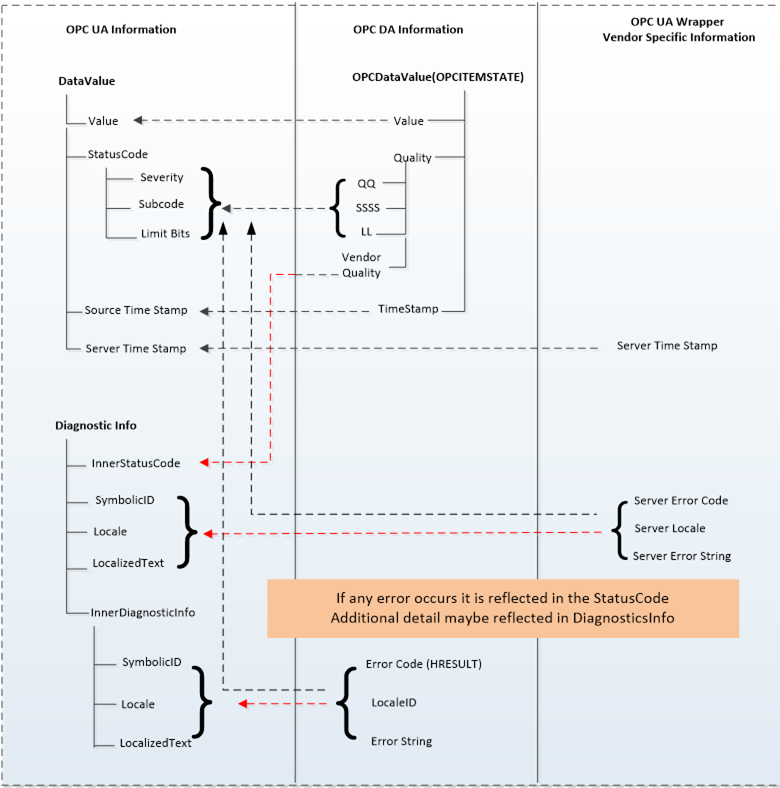  

Figure A. 2 - OPC COM DA to OPC UA data and error mapping  

##### A.3.2.2 Value  

The data values in the DA server are represented as Variant data type. The COM UA Wrapper converts them to the corresponding OPC UA *DataType* . The mapping is shown in [Table A.2](/§\_Ref115266683) :  

 **Table A. 2\- DataTypes and mapping**   

| **Variant Data Type**   

 **(In DA server)** | **OPC UA Data type Mapping in COM UA Server**   

 **(DataValue structure)** |
|---|---|
|VT\_I2|Int16|
|VT\_I4|Int32|
|VT\_R4|Float|
|VT\_R8|Double|
|VT\_BSTR|String|
|VT\_BOOL|Boolean|
|VT\_UI1|Byte|
|VT\_I1|SByte|
|VT\_UI2|UInt16|
|VT\_UI4|UInt32|
|VT\_I8|Int64|
|VT\_UI8|UInt64|
|VT\_DATE|Double|
|VT\_DECIMAL|Decimal|
|VT\_ARRAY|Array of OPC UA types|
  

.  

##### A.3.2.3 Quality  

The Quality of a Data Value in the DA server is represented as a 16 bit value where the lower 8 bits is of the form QQSSSSLL (Q: Main Quality, S: Sub Status, L: Limit) and higher 8 bits is vendor specific.  

The COM UA Wrapper maps the DA server to the OPC UA Status code as shown in [Figure A.3](/§\_Ref115266725) :  

  

Figure A. 3 - Status Code mapping  

The primary quality is mapped to the Severity field of the Status code. The Sub Status is mapped to the SubCode and the Limit is mapped to the Limit Bits of the Status Code.  

Please note that the Vendor quality is currently discarded.  

[Table A.3](/§\_Ref115266749) shows a mapping of the OPC COM DA primary quality mapping to OPC UA status code  

 **Table A. 3\- Quality mapping**   

| **OPC DA Primary Quality (Quality & Sub status QQSSSS)** | **OPC UA Status Code** |
|---|---|
|GOOD|Good|
|LOCAL\_OVERRIDE|Good\_LocalOverride|
|UNCERTAIN|Uncertain|
|SUB\_NORMAL|Uncertain\_SubNormal|
|SENSOR\_CAL|Uncertain\_SensorNotAccurate|
|EGU\_EXCEEDED|Uncertain\_EngineeringUnitsExceeded|
|LAST\_USABLE|Uncertain\_LastUsableValue|
|BAD|Bad|
|CONFIG\_ERROR|Bad\_ConfigurationError|
|NOT\_CONNECTED|Bad\_NotConnected|
|COMM\_FAILURE|Bad\_NoCommunication|
|DEVICE\_FAILURE|Bad\_DeviceFailure|
|SENSOR\_FAILURE|Bad\_SensorFailure|
|LAST\_KNOWN|Bad\_OutOfService|
|OUT\_OF\_SERVICE|Bad\_OutOfService|
|WAITING\_FOR\_INITIAL\_DATA|Bad\_WaitingForInitialData|
  

  

##### A.3.2.4 Timestamp  

The Timestamp provided for a value in the DA server is assigned to the SourceTimeStamp of the DataValue in the COM UA Wrapper.  

The ServerTimeStamp in the DataValue is set to the current time by the COM UA Wrapper at the start of the Read Operation.  

#### A.3.3 Read data  

The COM UA Wrapper supports performing Read operations to DA servers of versions 2.05a and 3.  

For version 2.05a, the COM UA wrapper creates a Group using the IOPCServer::AddGroup method and adds the items whose data is to be read to the Group using IOPCItemMgmt::AddItems method. The Data is retrieved for the items using the IOPCSyncIO::Read method. The VQT for each item is mapped to the DataValue structure as shown in [Figure A.2](/§\_Ref115266631) . Please note that only Read from Device is supported for this version. The "maxAge" parameter is ignored.  

For version 3, the COM UA Wrapper uses the IOPCItemIO::Read to retrieve the data. The VQT for each item is mapped to the DataValue structure as shown in [Figure A.2](/§\_Ref115266631) . The Read supports both the Read from Device and Cache and uses the "maxAge" parameter.  

If there are errors for the items in the Read from the DA server, then these are mapped to the StatusCode of the DataValue in the COM UA Wrapper.  

The mapping of the OPC COM DA Read Errors code to OPC UA Status code (in the COM UA Wrapper) is shown in [Table A.4](/§\_Ref115266902) :  

 **Table A. 4\- OPC DA Read error mapping**   

| **OPC DA Error ID** | **OPC UA Status Code** |
|---|---|
|OPC\_E\_BADRIGHTS|Bad\_NotReadable|
|E\_OUTOFMEMORY|Bad\_OutOfMemory|
|OPC\_E\_INVALIDHANDLE|Bad\_NodeIdUnknown|
|OPC\_E\_UNKNOWNITEMID|Bad\_NodeIdUnknown|
|E\_INVALIDITEMID|Bad\_NodeIdInvalid|
|E\_INVALID\_PID|Bad\_AttributeIdInvalid|
|E\_ACCESSDENIED|Bad\_OutOfService|
|Others|Bad\_UnexpectedError|
  

  

#### A.3.4 Write Data  

The COM UA Wrapper supports performing Write operations to DA servers of versions 2.05a and 3.  

For version 2.05a, the COM UA wrapper creates a Group using the IOPCServer::AddGroup method and adds the items whose data is to be written using IOPCItemMgmt::AddItems method. The value is written for the items using the IOPCSyncIO::Write method. Note that if the StatusCode or TimeStamps (Source or Server) is specified to be written for the item then the COM UA Wrapper returns a BadWriteNotSupported Status code for the item.  

For version 3, the COM UA Wrapper uses the IOPCItemIO::WriteVQT data including StatusCode and TimeStamp. If a SourceTimeStamp is provided, this timestamp is used for the Write else the ServerTimeStamp is used.  

If there are errors for the items in the Write from the DA server, then these are mapped to the StatusCode for the corresponding item.  

The mapping of the OPC COM DA Write Errors code to OPC UA Status code (in the COM UA Wrapper) is shown in [Table A.5](/§\_Ref115266864) :  

 **Table A. 5\- OPC DA Write error code mapping**   

| **OPC DA Error ID** | **OPC UA Status Code** |
|---|---|
|E\_BADRIGHTS|Bad\_NotWritable|
|DISP\_E\_TYPEMISMATCH|Bad\_TypeMismatch|
|E\_BADTYPE|Bad\_TypeMismatch|
|E\_RANGE|Bad\_OutOfRange|
|DISP\_E\_OVERFLOW|Bad\_OutOfRange|
|E\_OUTOFMEMORY|Bad\_OutOfMemory|
|E\_INVALIDHANDLE|Bad\_NodeIdUnknown|
|E\_UNKNOWNITEMID|Bad\_NodeIdUnknown|
|E\_INVALIDITEMID|Bad\_NodeIdInvalid|
|E\_INVALID\_PID|Bad\_NodeIdInvalid|
|E\_NOTSUPPORTED|Bad\_WriteNotSupported|
|S\_CLAMP|Good\_Clamped|
|Others|Bad\_UnexpectedError|
  

  

#### A.3.5 Subscriptions  

A subscription is created in the DA server when a MonitoredItem is created in the COM UA Wrapper.  

The SamplingInterval and the Deadband value are used for the subscription to setup a periodic data change call back on the COM UA Wrapper. Note that only the PercentDeadbandType is supported by the COM UA Wrapper.  

The VQT for each item is mapped to the DataValue structure as shown in [Figure A.2](/§\_Ref115266631) and published to the client by the COM UA Wrapper periodically.  

The mapping of the OPC COM DA Read Errors code to OPC UA Status code (in the COM UA Wrapper) is the same as the Read mapping in [Figure A.2](/§\_Ref115266631) .  

### A.4 COM UA proxy for DA Client  

#### A.4.1 Guidelines  

The Data Access COM UA Proxy is a COM Server combined with a UA Client. It maps the Data Access address space of UA Data Access Server into the appropriate COM Data Access objects.  

Clauses [A.4.1](/§\_Ref115266979) through [A.4.6](/§\_Ref115267000) identify the design guidelines and constraints used to develop the Data Access COM UA Proxy provided by the OPC Foundation. In order to maintain a high degree of consistency and interoperability, it is strongly recommended that vendors, who choose to implement their own version of the Data Access COM UA Proxy, follow these same guidelines and constraints.  

The Data Access COM Client simply chooses how to connect to the UA Data Access Server. Connectivity approaches include the one where Data Access COM Clients connect to a UA Data Access Server with a CLSID just as if the target Server were a Data Access COM Server. However, the CLSID can be considered virtual since it is defined to connect to intermediary components that ultimately connect to the UA Data Access Server. Using this approach, the Data Access COM Client calls co-create instance with a virtual CLSID as described above. This connects to the Data Access COM UA Proxy components. The Data Access COM UA Proxy then establishes a secure channel and session with the UA Data Access Server. As a result, the Data Access COM Client gets a COM Data Access Server interface pointer.  

#### A.4.2 Information Model and Address Space mapping  

##### A.4.2.1 General  

OPC UA defines 8 Node Class types in the address space Object, Variable, Method, ObjectType, VariableType, ReferenceType, DataType, View. The COM UA Proxy maps only the nodes of Node Class types Object, Variable to the OPC DA types as shown in the figure below. Only the nodes under the Objects node are considered for the COM UA Proxy address space and others such as Types, Views are not mapped.  

[Figure A.4](/§\_Ref115267037) shows an example mapping of OPC DA to OPC UA information.  

 **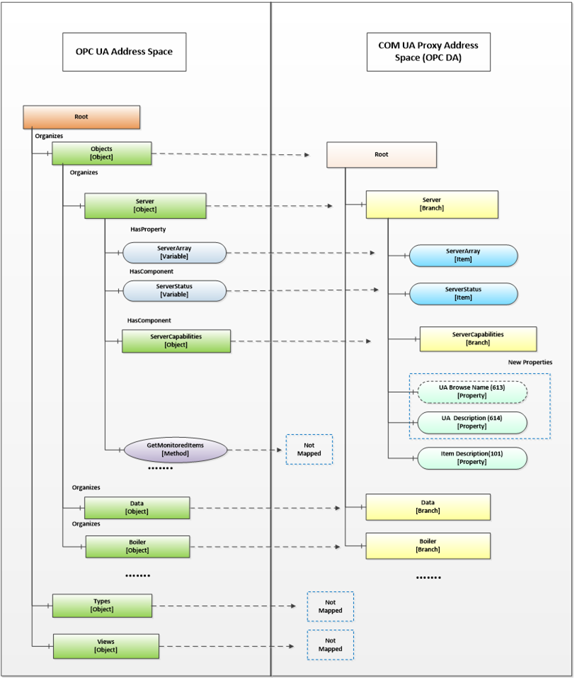**   

Figure A. 4 - Sample OPC DA mapping of OPC UA Information Model and Address Space  

##### A.4.2.2 Object Nodes  

A node of Object Node class in the OPC UA server is represented in the Data Access COM UA Proxy as a Branch.  

The root of the Data Access COM UA Proxy is the Objects folder of the OPC UA Server.  

The OPC UA Address space hierarchy is discovered using the Browse Service for the Objects Node using the following filters:  

* BrowseDirection as Forward  

* ReferenceTypeId as Organizes and HasChild.  

* IncludeSubtypes as True  

* NodeClassMask as Object and Variable  

The DisplayName of the OPC UA node is used as the Name for each Branch in the Data Access COM UA Proxy  

Each Branch in the Data Access COM UA Proxy is assigned 3 properties:  

* *UA Browse Name* (Property ID: 613): The value of the *BrowseName* attribute of the node in the OPC UA Server is assigned to this property.  

* *UA Description* (Property ID: 614): The value of the *Description* attribute of the node in the OPC UA Server is assigned to this property, if a Description attribute is provided.  

* *Item Description* (Property ID: 101): The value of the *DisplayName* attribute of the node in the OPC UA Server is assigned to this property.  

NOTE COM DA Clients typically display the ItemID and the Item Description. Since the ItemID generated by the UA Proxy can be particularly difficult to read and understand, proxies can use the DisplayName as value for the Item Description Property as it will be easier to understand by a human user.  

  

##### A.4.2.3 Variable Nodes  

A node of Variable Node class in the OPC UA server is represented in the Data Access COM UA Proxy as an Item.  

The DisplayName of the OPC UA node is used as the Name for each Item in the Data Access COM UA Proxy.  

The NodeId of the OPC UA node is used as the ItemId for each Item in the Data Access COM UA Proxy. But the '=' character is replaced with '-' in the string. E.g. NodeId: ns=4,i=10, ItemID = "ns-4;i-10" or NodeId: ns=4,s=FL102, ItemID = "ns-4,s-FL102"  

Each Item in the Data Access COM UA Proxy is assigned the following properties based on the node attributes or its references:  

Standard Properties:  

* *Item Canonical Data Type* (Property ID: 1): The combined value of the *DataType* attribute and the *ValueRank* attribute of the node in the OPC UA Server is assigned to this property (see [A.4.3.2](/§\_Ref115267193) ).  

* *Item Value* (Property ID: 2): The value of the *Value* attribute of the node in the OPC UA Server is assigned to this property. Details on Value mapping are in [A.4.3.2](/§\_Ref115267209)  

* *Item Quality* (Property ID: 3): The *StatusCode* of the *Value* obtained for the node in the OPC UA Server is assigned to this property. Details on Quality mapping are in [A.4.3.3](/§\_Ref115267232)  

* *Item Timestamp* (Property ID: 4): The *SourceTimestamp or ServerTimestamp* of the *Value* obtained for the node in the OPC UA Server is assigned to this property. Details on Timestamp mapping are in [A.4.3.4](/§\_Ref115267248)  

* *Item Access Rights* (Property ID: 5): The value of the *AccessLevel* attribute of the node in the OPC UA Server is assigned to this property based on the following mapping:  

* CurrentRead -\> OPC\_READABLE  

* CurrentWrite -\> OPC\_WRITABLE  

The other AccessLevel provided by OPC are ignored  

* *Server Scan Rate* (Property ID: 6): The value of the *MinimumSamplingInterval* attribute of the node in the OPC UA Server is assigned to this property.  

* *Item EU Type* (Property ID: 7): The EU Type value is assigned based on the references of the node in the OPC UA Server:  

*Analog(1)* : if the node in the OPC UA Server references a *EURange* *property* node, then it is assigned the *Analog EU Type.*  

*Enumerated(2)* : if the node in the OPC UA Server references a *EnumStrings* *property* node, then it is assigned the *Enumerated EU Type.*  

*Empty(0)* : For a node in the OPC UA Server that does not meet above criteria, the type is set as 0 (Empty)  

* *EU Info (* Property ID: *8):* if the node in the OPC UA Server references an *EnumStrings* *property* node, then the enumerated values of the property node is assigned to this property *.*  

* *EU Units* (Property ID: 100) *:* if the node in the OPC UA Server references a *EngineeringUnits* *property* node, then the value of the *EngineeringUnits* property node is assigned the *EU Units* property *.*  

* *Item Description* (Property ID: 101): The value of the *DisplayName* attribute of the node in the OPC UA Server is assigned to this property.  

* *High EU* (Property ID: 102) *:* if the node in the OPC UA Server references a *EURange* *property* node, then the *'High'* value of the property node is assigned to this property *.*  

* *Low EU* (Property ID: 103) *:* if the node in the OPC UA Server references a *EURange* *property* node, then the *'Low'* value of the property node is assigned to this property *.*  

* *High Instrument Range (* Property ID: *104):* if the node in the OPC UA Server references an *InstrumentRange* *property* node, then the *'High'* value of the property node is assigned to this property *.*  

* *Low Instrument Range (* Property ID: *105):* if the node in the OPC UA Server references an *InstrumentRange* *property* node, then the *'Low'* value of the property node is assigned to this property *.*  

* *Contact Close Label (* Property ID: 106 *):* if the node in the OPC UA Server references a *FalseState* *property* node, then the value of the property node is assigned to this property *.*  

* *Contact Open Label (* Property ID: 107 *):* if the node in the OPC UA Server references a *TrueState* *property* node, then the value of the property node is assigned to this property *.*  

* *Item Time Zone (* Property ID: 108 *):* if the node in the OPC UA Server references a *TimeZone* *property* node, then the 'Offset' value of the property node is assigned to this property *.*  

New Properties:  

* *UA BuiltIn Type* (Property ID: 610): The identifier value of the *DataType* node associated with the DataType attribute of the node in the OPC UA Server is assigned to this property.  

* *UA Data Type Id* (Property ID: 611): The complete NodeId value (namespace and identifier) of the *DataType* node associated with the DataType attribute of the node in the OPC UA Server is assigned to this property.  

* *UA Value Rank* (Property ID: 612): The value of the *ValueRank* attribute of the node in the OPC UA Server is assigned to this property.  

* *UA Browse Name* (Property ID: 613): The value of the *BrowseName* attribute of the node in the OPC UA Server is assigned to this property.  

* *UA Description* (Property ID: 614): The value of the *Description* attribute of the node in the OPC UA Server is assigned to this property.  

  

##### A.4.2.4 Namespace Indices  

For generating ItemIDs, the Proxy uses Namespace Indices. To assure that Clients can persist these ItemIDs, the Namespace Indices shall never change. To accomplish this the Proxy has to persist its Namespace Table and only append entries but never change existing ones.  

The Proxy also has to provide a translation from the current Namespace Table in the Server to the persisted Namespace Table.  

If you move or copy the Proxy to another machine, the Namespace Table has to be copied to this machine as well.  

  

#### A.4.3 Data and error mapping  

##### A.4.3.1 General  

In an OPC UA Server, Automation Data is represented as a Data Value and and status, in addition additional error data can be provided via Diagnostic Info for a tag  

The COM UA Proxy maps the Data Value structure into VQT data and error code.  

For successful operations(StatusCode of Good and Uncertain), the COM UA Proxy maps the Status Code of the DataValue to the OPC DA Quality But in case of error(StatusCode of Bad), the Status Code is mapped to the OPC DA Error code.  

The StatusCode in the Diagnostic Info returned by the OPC UA Server are mapped to OPC DA Error codes. [Figure A.5](/§\_Ref115267286) illustrates this mapping.  

  

Figure A. 5 - OPC UA to OPC DA data & error mapping  

##### A.4.3.2 Value  

The COM UA Proxy converts the OPC UA Data Value to the corresponding OPC DA Variant type. The mapping is shown in [Table A.6](/§\_Ref115267323) . For DataTypes that are subtypes of an existing base DataType the conversion for the Base DataType is used.  

 **Table A. 6\- DataTypes and Mapping**   

| **OPC UA Data type (In UA Server)** | **Variant Data Type (In DA server)** |
|---|---|
|Int16|VT\_I2|
|Int32|VT\_I4|
|Float|VT\_R4|
|Double|VT\_R8|
|Decimal|VT\_DECIMAL|
|String|VT\_BSTR|
|Boolean|VT\_BOOL|
|Byte|VT\_UI1|
|SByte|VT\_I1|
|UInt16|VT\_UI2|
|UInt32|VT\_UI4|
|Int64|VT\_I8|
|UInt64|VT\_UI8|
|Guid|VT\_BSTR|
|DateTime|VT\_DATE|
|NodeId|VT\_BSTR|
|XmlElement|VT\_BSTR|
|ExpandedNodeId|VT\_BSTR|
|QualifiedName|VT\_BSTR|
|LocalizedText|VT\_BSTR|
|StatusCode|VT\_UI4|
|ExtensionObject|Array of VT\_UI1|
|Array of above OPC UA types|Array of corresponding Variant type|
  

  

##### A.4.3.3 Quality  

The Quality of a Data Value in the OPC UA Server is represented as a StatusCode.  

The COM UA Proxy maps the Severity, Subcode and the limit bits of the OPC UA Status code to the lower 8 bits of the OPC DA Quality structure (of the form QQSSSSLL). [Figure A.6](/§\_Ref115267353) illustrates this mapping.  

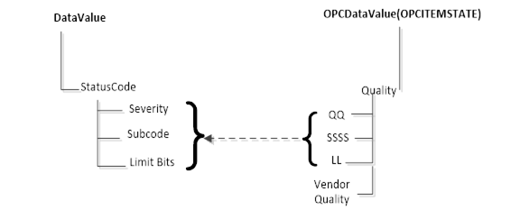  

Figure A. 6 - OPC UA Status Code to OPC DA quality mapping  

The Severity field of the Status code is mapped to the primary quality. The SubCode is mapped to the Sub Status and the Limit Bits are mapped to the Limit field.  

[Table A.7](/§\_Ref115267377) shows a mapping of the OPC UA status code to OPC DA primary quality  

 **Table A. 7\- Quality mapping**   

| **OPC UA Status Code** | **OPC DA Primary Quality (Quality & Sub status QQSSSS)** |
|---|---|
|Good|GOOD|
|Good\_LocalOverride|LOCAL\_OVERRIDE|
|Uncertain|UNCERTAIN|
|Uncertain\_SubNormal|SUB\_NORMAL|
|Uncertain\_SensorNotAccurate|SENSOR\_CAL|
|Uncertain\_EngineeringUnitsExceeded|EGU\_EXCEEDED|
|Uncertain\_LastUsableValue|LAST\_USABLE|
|Bad|BAD|
|Bad\_ConfigurationError|CONFIG\_ERROR|
|Bad\_NotConnected|NOT\_CONNECTED|
|Bad\_NoCommunication|COMM\_FAILURE|
|Bad\_OutOfService|OUT\_OF\_SERVICE|
|Bad\_DeviceFailure|DEVICE\_FAILURE|
|Bad\_SensorFailure|SENSOR\_FAILURE|
|Bad\_WaitingForInitialData|WAITING\_FOR\_INITIAL\_DATA|
  

  

##### A.4.3.4 Timestamp  

If available, the SourceTimestamp of the DataValue in the OPC UA Server is assigned to the Timestamp for the value in the COM UA Proxy. If SourceTimestamp is not available, then the ServerTimestamp is used.  

#### A.4.4 Read data  

The COM UA Proxy converts all the ItemIds in the Read into valid NodeIds by replacing the '-' with '=' and calls the OPC UA Read Service for the Value Attribute.  

If the Read Service call is successful then DataValue for each node is mapped to the VQT for each item as shown in [Figure A.5](/§\_Ref115267286) .  

If the Read Service call fails or If there are errors for some of the Nodes, then the StatusCodes of these Nodes are mapped to the error code by the COM UA Proxy.  

The mapping of the OPC UA Status code to OPC DA Read Error code (in the COM UA Proxy) is shown in [Table A.8](/§\_Ref115267461) :  

 **Table A. 8\- OPC UA Read error mapping**   

| **OPC UA Status Code** | **OPC DA Error ID** |
|---|---|
|Bad\_OutOfMemory|E\_OUTOFMEMORY|
|Bad\_NodeIdInvalid|E\_INVALIDITEMID|
|Bad\_NodeIdUnknown|E\_UNKNOWNITEMID|
|Bad\_NotReadable|E\_BADRIGHTS|
|Bad\_UserAccessDenied|E\_ACCESSDENIED|
|Bad\_AttributeIdInvalid|E\_INVALIDITEMID|
|Bad\_UnexpectedError|E\_FAIL|
|Bad\_InternalError|E\_FAIL|
|Bad\_SessionClosed|E\_FAIL|
|Bad\_TypeMismatch|E\_BADTYPE|
  

  

#### A.4.5 Write data  

The COM UA Proxy converts all the ItemIds in the Write into valid NodeIds by replacing the '-' with '='. It converts the Value, Quality and Timestamp (VQT) to a DataValue structure as per the mapping in [Figure A.5](/§\_Ref115267286) . and calls the OPC UA Write Service for the Value Attribute.  

If the Write Service call fails or if there are errors for some of the Nodes, then the StatusCodes of these Nodes are mapped to the error code by the COM UA Proxy.  

The mapping of the OPC UA Status code to OPC DA Write Error code (in the COM UA Proxy) is shown in [Table A.9](/§\_Ref115267510) :  

 **Table A. 9\- OPC UA Write error code mapping**   

| **OPC UA Status Code** | **OPC DA Error ID** |
|---|---|
|Bad\_TypeMismatch|E\_BADTYPE|
|Bad\_OutOfMemory|E\_OUTOFMEMORY|
|Bad\_NodeIdInvalid|E\_INVALIDITEMID|
|Bad\_NodeIdUnknown|E\_UNKNOWNITEMID|
|Bad\_NotWritable|E\_BADRIGHTS|
|Bad\_UserAccessDenied|E\_ACCESSDENIED|
|Bad\_AttributeIdInvalid|E\_UNKNOWNITEMID|
|Bad\_WriteNotSupported|E\_NOTSUPPORTED|
|Bad\_OutOfRange|E\_RANGE|
  

  

#### A.4.6 Subscriptions  

The COM UA Proxy creates a Subscription in the OPC UA Server when a Group is created. The Name, Active flag, UpdateRate parameters of the Group are used while creating the subscription.  

The COM UA Proxy Creates Monitored Items in the OPC UA Server when items are added to the Group.  

Following parameters and filters are used for creating the monitored items:  

* The *ItemIds* are converted to valid NodeIds by replacing the '-' with '='.  

* Data Change Filter is used for Items with EU type as Analog:  

Trigger = STATUS\_VALUE  

If DeadBand value is specified for the *Group, the;*  

* DeadbandType = Percent  

* DeadbandValue = deadband specified for the group.  

The COM UA Proxy calls the Publish Service of the OPC UA Server periodically and sends any data changes to the client.  

  

  

## Annex B (normative)UCUM Symbols  

### B.1 Introduction - License  

This Annex provides an excerpt from the UCUM Specification available at https://ucum.org.  

The Unified Code for Units of Measure (UCUM), also known as the "UCUM Specification", is copyright ©1999-2021, Regenstrief Institute, Inc. All rights reserved.  

The UCUM license is available in [https://ucum.org/license](https://ucum.org/license) . This license includes a disclaimer of warranties.  

  

### B.2 Representation  

UCUM can represent any number of valid units derived from 7 basic units. To that end, the standard combines various components:  

* Basic units  

metre (m, length)  

second (s, time)  

gram (g, mass)  

radian (rad, angle)  

Kelvin (K, temperature)  

Coulomb (C, electric charge)  

candela (cd, luminous intensity)  

* derived units with conversion factors and formulas for the reduction to base units  

* prefixes, i.e. a list of 30 standard prefixes to generate multiples (e.g. k for kilo, multiplier 10³) or fractions (e.g. d for deci, multiplier 10-1) of measurement units  

* symbols and operators as well as syntax rules for their combination as follows:  

  

|\< *sign* \>|::=|"+" | "-"|
|---|---|---|
|\< *digit* \>|::=|"0" | "1" | "2" | "3" | "4" | "5" | "6" | "7" | "8" | "9"|
|\< *digits* \>|::=|\< *digit* \>\< *digits* \> | \< *digit* \>|
|\< *factor* \>|::=|\< *digits* \>|
|\< *exponent* \>|::=|\< *sign* \>\< *digits* \> | \< *digits* \>|
|\< *simple-unit* \>|::=|\< *ATOM-SYMBOL* \> | \< *PREFIX-SYMBOL* \>\< *ATOM-SYMBOL[metric]* \>|
|\< *annotatable* \>|::=|\< *simple-unit* \>\< *exponent* \> | \< *simple-unit* \>|
|\< *component* \>|::=|\< *annotatable* \>\< *annotation* \>| \< *annotatable* \>| \< *annotation* \>| \< *factor* \>| "("\< *term* \>")"|
|\< *term* \>|::=|\< *term* \>"."\< *component* \> | \< *term* \>"/"\< *component* \> | \< *component* \>|
|\< *main-term* \>|::=|"/"\< *term* \> | \< *term* \>|
|\< *annotation* \>|::=|"\{"\< *ANNOTATION-STRING* \>"\}"|
  

  

  

### B.3 Tables of terminal symbols  

#### B.3.1 General  

The following tables define prefixes and unit symbols. The columns define:  

* The UCUM representation (Symbol (c/s))  

* The full name (Display Name)  

* The Print Symbol - recommended for display and printing  

* Value (for prefixes) is the scalar value by which the unit atom is multiplied if combined with the prefix.  

* Kind of Quantity (for units) is the quantity name.  

Full name and print symbol are defined by other bodies and are out of scope of The Unified Code for Units of Measure.  

#### B.3.2 Prefixes  

  

| **The prefix symbols** |
|---|
| **Symbol (c/s)** | **Display Name** | **Print Symbol** | **value** |
|Y|yotta|Y|1 × 1024|
|Z|zetta|Z|1 × 1021|
|E|exa|E|1 × 1018|
|P|peta|P|1 × 1015|
|T|tera|T|1 × 1012|
|G|giga|G|1 × 109|
|M|mega|M|1 × 106|
|k|kilo|k|1 × 103|
|h|hecto|h|1 × 102|
|da|deka|da|1 × 101|
|d|deci|d|1 × 10-1|
|c|centi|c|1 × 10-2|
|m|milli|m|1 × 10-3|
|u|micro|μ|1 × 10-6|
|n|nano|n|1 × 10-9|
|p|pico|p|1 × 10-12|
|f|femto|f|1 × 10-15|
|a|atto|a|1 × 10-18|
|z|zepto|z|1 × 10-21|
|y|yocto|y|1 × 10-24|
  

  

  

|The special prefix symbols for powers of 2  

NOTE These symbols are for use in information technology as proposed by the IEEE.|
|---|
| **Symbol (c/s)** | **Display Name** | **Print Symbol** | **value** |
|Ki|kibi|Ki|1 × 10241|
|Mi|mebi|Mi|1 × 10242|
|Gi|gibi|Gi|1 × 10243|
|Ti|tebi|Ti|1 × 10244|
|Pi|pebi|Pi|1 × 10245|
|Ei|exbi|Ei|1 × 10246|
|Zi|zebi|Zi|1 × 10247|
|Yi|yobi|Yi|1 × 10248|
  

  

#### B.3.3 Base units  

The base units are used to define all the unit atoms of The Unified Code for Units of Measure according to its grammar and semantics.  

The selection of the base and the order of the units in the base are not normative. Any other base is acceptable as long as there is an isomorphism between the group of units generated by the other base system and this one. All base units are metric.  

| **Symbol (c/s)** | **Display Name** | **Print Symbol** | **Kind of Quantity** | **Metric** |
|---|---|---|---|---|
|m|meter|m|length|yes|
|s|second|s|time|yes|
|g|gram|g|mass|yes|
|rad|radian|rad|plane angle|yes|
|K|kelvin|K|temperature|yes|
|C|coulomb|C|electric charge|yes|
|cd|candela|cd|luminous intensity|yes|
  

  

#### B.3.4 Derived unit atoms  

  

| ***Dimensionless units***   

NOTE The units ppb and ppt are deprecated because the names "billion" and "trillion" are ambiguous.|
|---|
| **Symbol (c/s)** | **Display Name** | **Print Symbol** | **Kind of Quantity** | **Metric** |
|10\*|the number ten for arbitrary powers|10n||no|
|10^|the number ten for arbitrary powers|10n||no|
|[pi]|the number pi|π||no|
|%|percent|%||no|
|[ppth]|parts per thousand|ppth||no|
|[ppm]|parts per million|ppm||no|
|[ppb]|parts per billion|ppb||no|
|[pptr]|parts per trillion|pptr||no|
  

  

  

| **SI units**   

NOTE Defined by CGPM (General Conference on Weights and Measures).|
|---|
| **Symbol (c/s)** | **Display Name** | **Print Symbol** | **Kind of Quantity** | **Metric** |
|mol|mole|mol|amount of substance|yes|
|sr|steradian|sr|solid angle|yes|
|Hz|hertz|Hz|frequency|yes|
|N|newton|N|force|yes|
|Pa|pascal|Pa|pressure|yes|
|J|joule|J|energy|yes|
|W|watt|W|power|yes|
|A|ampère|A|electric current|yes|
|V|volt|V|electric potential|yes|
|F|farad|F|electric capacitance|yes|
|Ohm|ohm|Ω|electric resistance|yes|
|S|siemens|S|electric conductance|yes|
|Wb|weber|Wb|magnetic flux|yes|
|Cel|degree Celsius|°C|temperature|yes|
|T|tesla|T|magnetic flux density|yes|
|H|henry|H|inductance|yes|
|lm|lumen|lm|luminous flux|yes|
|lx|lux|lx|illuminance|yes|
|Bq|becquerel|Bq|radioactivity|yes|
|Gy|gray|Gy|energy dose|yes|
|Sv|sievert|Sv|dose equivalent|yes|
  

  

  

| **Other units from ISO 1000, ISO 2955, and some from ANSI X3.50.** |
|---|
| **Symbol (c/s)** | **Display Name** | **Print Symbol** | **Kind of Quantity** | **Metric** |
|gon|gon, grade|□g|plane angle|no|
|deg|degree|°|plane angle|no|
|'|minute|'|plane angle|no|
|''|second|''|plane angle|no|
|l|liter|l|volume|yes|
|L|liter|L|volume|yes|
|ar|are|a|area|yes|
|min|minute|min|time|no|
|h|hour|h|time|no|
|d|day|d|time|no|
|a\_t|tropical year|at|time|no|
|a\_j|mean Julian year|aj|time|no|
|a\_g|mean Gregorian year|ag|time|no|
|a|year|a|time|no|
|wk|week|wk|time|no|
|mo\_s|synodal month|mos|time|no|
|mo\_j|mean Julian month|moj|time|no|
|mo\_g|mean Gregorian month|mog|time|no|
|mo|month|mo|time|no|
|t|tonne|t|mass|yes|
|bar|bar|bar|pressure|yes|
|u|unified atomic mass unit|u|mass|yes|
|eV|electronvolt|eV|energy|yes|
|AU|astronomic unit|AU|length|no|
|pc|parsec|pc|length|yes|
  

  

  

| **Natural unit**   

NOTE ** Fundamental constants of nature and units derived from these constants.|
|---|
| **Symbol (c/s)** | **Display Name** | **Print Symbol** | **Kind of Quantity** | **Metric** |
|[c]|velocity of light|c|velocity|yes|
|[h]|Planck constant|h|action|yes|
|[k]|Boltzmann constant|k|(unclassified)|yes|
|[eps\_0]|permittivity of vacuum|ε0|electric permittivity|yes|
|[mu\_0]|permeability of vacuum|μ0|magnetic permeability|yes|
|[e]|elementary charge|e|electric charge|yes|
|[m\_e]|electron mass|me|mass|yes|
|[m\_p]|proton mass|mp|mass|yes|
|[G]|Newtonian constant of gravitation|G|(unclassified)|yes|
|[g]|standard acceleration of free fall|gn|acceleration|yes|
|atm|standard atmosphere|atm|pressure|no|
|[ly]|light-year|l.y.|length|yes|
|gf|gram-force|gf|force|yes|
|[lbf\_av]|pound force|lbf|force|no|
  

  

  

| **CGS units**   

NOTE The units of the older Centimeter-Gram-Second (CGS) system.|
|---|
| **Symbol (c/s)** | **Display Name** | **Print Symbol** | **Kind of Quantity** | **Metric** |
|Ky|Kayser|K|lineic number|yes|
|Gal|Gal|Gal|acceleration|yes|
|dyn|dyne|dyn|force|yes|
|erg|erg|erg|energy|yes|
|P|Poise|P|dynamic viscosity|yes|
|Bi|Biot|Bi|electric current|yes|
|St|Stokes|St|kinematic viscosity|yes|
|Mx|Maxwell|Mx|flux of magnetic induction|yes|
|G|Gauss|Gs, G|magnetic flux density|yes|
|Oe|Oersted|Oe|magnetic field intensity|yes|
|Gb|Gilbert|Gb|magnetic tension|yes|
|sb|stilb|sb|lum. intensity density|yes|
|Lmb|Lambert|L|brightness|yes|
|ph|phot|ph|illuminance|yes|
|Ci|Curie|Ci|radioactivity|yes|
|R|Roentgen|R|ion dose|yes|
|RAD|radiation absorbed dose|RAD|energy dose|yes|
|REM|radiation equivalent man|REM|dose equivalent|yes|
  

  

#### B.3.5 Customary unit atoms  

.  

| **International customary units**   

NOTE The unified U.S. and British Imperial customary units, so called "international" customary units|
|---|
| **Symbol (c/s)** | **Display Name** | **Print Symbol** | **Kind of Quantity** | **Metric** |
|[in\_i]|inch|in|length|no|
|[ft\_i]|foot|ft|length|no|
|[yd\_i]|yard|yd|length|no|
|[mi\_i]|mile|mile|length|no|
|[fth\_i]|fathom|fth|depth of water|no|
|[nmi\_i]|nautical mile|n mile|length|no|
|[kn\_i]|knot|kn|velocity|no|
|[sin\_i]|square inch|In2|area|no|
|[sft\_i]|square foot|ft2|area|no|
|[syd\_i]|square yard|yd2|area|no|
|[cin\_i]|cubic inch|In3|volume|no|
|[cft\_i]|cubic foot|ft3|volume|no|
|[cyd\_i]|cubic yard|yd3|volume|no|
|[bf\_i]|board foot|fbm|volume|no|
|[cr\_i]|cord|cord|volume|no|
|[mil\_i]|mil|mil|length|no|
|[cml\_i]|circular mil|cmil|area|no|
|[hd\_i]|hand||height of horses|no|
  

  

  

| **Older U.S. "survey" lengths**   

NOTE also called "statute" lengths|
|---|
| **Symbol (c/s)** | **Display Name** | **Print Symbol** | **Kind of Quantity** | **Metric** |
|[ft\_us]|foot|ft (US survey)|length|no|
|[yd\_us]|yard||length|no|
|[in\_us]|inch||length|no|
|[rd\_us]|rod||length|no|
|[ch\_us]|Gunter's chain, Surveyor's chain||length|no|
|[lk\_us]|link for Gunter's chain||length|no|
|[rch\_us]|Ramden's chain, Engineer's chain||length|no|
|[rlk\_us]|link for Ramden's chain||length|no|
|[fth\_us]|fathom||length|no|
|[fur\_us]|furlong||length|no|
|[mi\_us]|mile|mi (US survey)|length|no|
|[acr\_us]|acre||area|no|
|[srd\_us]|square rod||area|no|
|[smi\_us]|square mile|Mi2 (US survey)|area|no|
|[sct]|section||area|no|
|[twp]|township||area|no|
|[mil\_us]|mil||length|no|
  

  

  

| **British Imperial lengths** |
|---|
| **Symbol (c/s)** | **Display Name** | **Print Symbol** | **Kind of Quantity** | **Metric** |
|[in\_br]|inch||length|no|
|[ft\_br]|foot||length|no|
|[rd\_br]|rod||length|no|
|[ch\_br]|Gunter's chain||length|no|
|[lk\_br]|link for Gunter's chain||length|no|
|[fth\_br]|fathom||length|no|
|[pc\_br]|pace||length|no|
|[yd\_br]|yard||length|no|
|[mi\_br]|mile||length|no|
|[nmi\_br]|nautical mile||length|no|
|[kn\_br]|knot||velocity|no|
|[acr\_br]|acre||area|no|
  

  

  

| **U.S. volumes**   

NOTE Including so-called "dry measures"|
|---|
| **Symbol (c/s)** | **Display Name** | **Print Symbol** | **Kind of Quantity** | **Metric** |
|[gal\_us]|Queen Anne's wine gallon||fluid volume|no|
|[bbl\_us]|barrel|barrel (US)|fluid volume|no|
|[qt\_us]|quart|liq qt (US)|fluid volume|no|
|[pt\_us]|pint|liq pt (US)|fluid volume|no|
|[gil\_us]|gill|gi (US)|fluid volume|no|
|[foz\_us]|fluid ounce|fl oz (US)|fluid volume|no|
|[fdr\_us]|fluid dram||fluid volume|no|
|[min\_us]|minim||fluid volume|no|
|[crd\_us]|cord||fluid volume|no|
|[bu\_us]|bushel||dry volume|no|
|[gal\_wi]|historical winchester gallon||dry volume|no|
|[pk\_us]|peck||dry volume|no|
|[dqt\_us]|dry quart||dry volume|no|
|[dpt\_us]|dry pint||dry volume|no|
|[tbs\_us]|tablespoon||volume|no|
|[tsp\_us]|teaspoon||volume|no|
|[cup\_us]|cup||volume|no|
|[foz\_m]|metric fluid ounce||fluid volume|no|
|[cup\_m]|metric cup||volume|no|
|[tsp\_m]|metric teaspoon||volume|no|
|[tbs\_m]|metric tablespoon||volume|no|
  

  

  

| **British Imperial volumes** |
|---|
| **Symbol (c/s)** | **Display Name** | **Print Symbol** | **Kind of Quantity** | **Metric** |
|[gal\_br]|gallon|gal (UK)|volume|no|
|[pk\_br]|peck|pk (UK)|volume|no|
|[bu\_br]|bushel|bushel (UK)|volume|no|
|[qt\_br]|quart|qt (UK)|volume|no|
|[pt\_br]|pint|pt (UK)|volume|no|
|[gil\_br]|gill|gi (UK)|volume|no|
|[foz\_br]|fluid ounce|fl oz (UK)|volume|no|
|[fdr\_br]|fluid dram||volume|no|
|[min\_br]|minim||volume|no|
  

  

  

| **Avoirdupois weights** |
|---|
| **Symbol (c/s)** | **Display Name** | **Print Symbol** | **Kind of Quantity** | **Metric** |
|[gr]|grain||mass|no|
|[lb\_av]|pound||mass|no|
|[oz\_av]|ounce||mass|no|
|[dr\_av]|dram||mass|no|
|[scwt\_av]|short hundredweight, U.S. hundredweight||mass|no|
|[lcwt\_av]|long hunderdweight, British hundredweight||mass|no|
|[ston\_av]|short ton, U.S. ton||mass|no|
|[lton\_av]|long ton, British ton||mass|no|
|[stone\_av]|stone, British stone||mass|no|
  

  

  

| **Troy weights** |
|---|
| **Symbol (c/s)** | **Display Name** | **Print Symbol** | **Kind of Quantity** | **Metric** |
|[pwt\_tr]|pennyweight||mass|no|
|[oz\_tr]|ounce||mass|no|
|[lb\_tr]|pound||mass|no|
  

  

  

| **Units used in typesetting** |
|---|
| **Symbol (c/s)** | **Display Name** | **Print Symbol** | **Kind of Quantity** | **Metric** |
|[lne]|line||length|no|
|[pnt]|point||length|no|
|[pca]|pica||length|no|
|[pnt\_pr]|Printer's point||length|no|
|[pca\_pr]|Printer's pica||length|no|
|[pied]|pied, French foot||length|no|
|[pouce]|pouce, French inch||length|no|
|[ligne]|ligne, French line||length|no|
|[didot]|didot, Didot's point||length|no|
|[cicero]|cicero, Didot's pica||length|no|
  

  

#### B.3.6 Other legacy units  

  

| **Legacy Units for Heat and Temperature** |
|---|
| **Symbol (c/s)** | **Display Name** | **Print Symbol** | **Kind of Quantity** | **Metric** |
|[degF]|degree Fahrenheit|°F|temperature|no|
|[degR]|degree Rankine|°R|temperature|no|
|[degRe]|degree Réaumur|°Ré|temperature|no|
|cal\_[15]|calorie at 15 °C|cal15°C|energy|yes|
|cal\_[20]|calorie at 20 °C|cal20°C|energy|yes|
|cal\_m|mean calorie|calm|energy|yes|
|cal\_IT|international table calorie|calIT|energy|yes|
|cal\_th|thermochemical calorie|calth|energy|yes|
|cal|calorie|cal|energy|yes|
|[Cal]|nutrition label Calories|Cal|energy|no|
|[Btu\_39]|British thermal unit at 39 °F|Btu39°F|energy|no|
|[Btu\_59]|British thermal unit at 59 °F|Btu59°F|energy|no|
|[Btu\_60]|British thermal unit at 60 °F|Btu60°F|energy|no|
|[Btu\_m]|mean British thermal unit|Btum|energy|no|
|[Btu\_IT]|international table British thermal unit|BtuIT|energy|no|
|[Btu\_th]|thermochemical British thermal unit|Btuth|energy|no|
|[BTU]|British thermal unit|btu|energy|no|
|[HP]|horsepower||power|no|
|TEX|tex|tex|linear mass density (of textile thread)|yes|
|[DEN]|Denier|den|linear mass density (of textile thread)|no|
  

  

  

| **Units Used Predominantly in Clinical Medicine** |
|---|
| **Symbol (c/s)** | **Display Name** | **Print Symbol** | **Kind of Quantity** | **Metric** |
|m[H2O]|meter of water column|m H2O|pressure|yes|
|m[Hg]|meter of mercury column|m Hg|pressure|yes|
|[in\_i'H2O]|inch of water column|in H2O|pressure|no|
|[in\_i'Hg]|inch of mercury column|in Hg|pressure|no|
|[PRU]|peripheral vascular resistance unit|P.R.U.|fluid resistance|no|
|[wood'U]|Wood unit|Wood U.|fluid resistance|no|
|[diop]|diopter|dpt|refraction of a lens|no|
|[p'diop]|prism diopter|PD|refraction of a prism|no|
|%[slope]|percent of slope|%|slope|no|
|[mesh\_i]|mesh||lineic number|no|
|[Ch]|Charrière, french|Ch|gauge of catheters|no|
|[drp]|drop|drp|volume|no|
|[hnsf'U]|Hounsfield unit|HF|x-ray attenuation|no|
|[MET]|metabolic equivalent|MET|metabolic cost of physical activity|no|
|[hp'\_X]|homeopathic potency of decimal series (retired)|X|homeopathic potency (retired)|no|
|[hp'\_C]|homeopathic potency of centesimal series (retired)|C|homeopathic potency (retired)|no|
|[hp'\_M]|homeopathic potency of millesimal series (retired)|M|homeopathic potency (retired)|no|
|[hp'\_Q]|homeopathic potency of quintamillesimal series (retired)|Q|homeopathic potency (retired)|no|
|[hp\_X]|homeopathic potency of decimal hahnemannian series|X|homeopathic potency (Hahnemann)|no|
|[hp\_C]|homeopathic potency of centesimal hahnemannian series|C|homeopathic potency (Hahnemann)|no|
|[hp\_M]|homeopathic potency of millesimal hahnemannian series|M|homeopathic potency (Hahnemann)|no|
|[hp\_Q]|homeopathic potency of quintamillesimal hahnemannian series|Q|homeopathic potency (Hahnemann)|no|
|[kp\_X]|homeopathic potency of decimal korsakovian series|X|homeopathic potency (Korsakov)|no|
|[kp\_C]|homeopathic potency of centesimal korsakovian series|C|homeopathic potency (Korsakov)|no|
|[kp\_M]|homeopathic potency of millesimal korsakovian series|M|homeopathic potency (Korsakov)|no|
|[kp\_Q]|homeopathic potency of quintamillesimal korsakovian series|Q|homeopathic potency (Korsakov)|no|
  

  

  

| **Units used in Chemical and Biomedical Laboratories** |
|---|
| **Symbol (c/s)** | **Display Name** | **Print Symbol** | **Kind of Quantity** | **Metric** |
|eq|equivalents|eq|amount of substance|yes|
|osm|osmole|osm|amount of substance (dissolved particles)|yes|
|[pH]|pH|pH|acidity|no|
|g%|gram percent|g%|mass concentration|yes|
|[S]|Svedberg unit|S|sedimentation coefficient|no|
|[HPF]|high power field|HPF|view area in microscope|no|
|[LPF]|low power field|LPF|view area in microscope|no|
|kat|katal|kat|catalytic activity|yes|
|U|Unit|U|catalytic activity|yes|
|[iU]|international unit|IU|arbitrary|yes|
|[IU]|international unit|i.U.|arbitrary|yes|
|[arb'U]|arbitary unit|arb. U|arbitrary|no|
|[USP'U]|United States Pharmacopeia unit|U.S.P.|arbitrary|no|
|[GPL'U]|GPL unit||biologic activity of anticardiolipin IgG|no|
|[MPL'U]|MPL unit||biologic activity of anticardiolipin IgM|no|
|[APL'U]|APL unit||biologic activity of anticardiolipin IgA|no|
|[beth'U]|Bethesda unit||biologic activity of factor VIII inhibitor|no|
|[anti'Xa'U]|anti factor Xa unit||biologic activity of factor Xa inhibitor (heparin)|no|
|[todd'U]|Todd unit||biologic activity antistreptolysin O|no|
|[dye'U]|Dye unit||biologic activity of amylase|no|
|[smgy'U]|Somogyi unit||biologic activity of amylase|no|
|[bdsk'U]|Bodansky unit||biologic activity of phosphatase|no|
|[ka'U]|King-Armstrong unit||biologic activity of phosphatase|no|
|[knk'U]|Kunkel unit||arbitrary biologic activity|no|
|[mclg'U]|Mac Lagan unit||arbitrary biologic activity|no|
|[tb'U]|tuberculin unit||biologic activity of tuberculin|no|
|[CCID\_50]|50% cell culture infectious dose|CCID50|biologic activity (infectivity) of an infectious agent preparation|no|
|[TCID\_50]|50% tissue culture infectious dose|TCID50|biologic activity (infectivity) of an infectious agent preparation|no|
|[EID\_50]|50% embryo infectious dose|EID50|biologic activity (infectivity) of an infectious agent preparation|no|
|[PFU]|plaque forming units|PFU|amount of an infectious agent|no|
|[FFU]|focus forming units|FFU|amount of an infectious agent|no|
|[CFU]|colony forming units|CFU|amount of a proliferating organism|no|
|[IR]|index of reactivity|IR|amount of an allergen calibrated through in-vivo testing using the Stallergenes® method.|no|
|[BAU]|bioequivalent allergen unit|BAU|amount of an allergen calibrated through in-vivo testing based on the ID50EAL method of (intradermal dilution for 50mm sum of erythema diameters|no|
|[AU]|allergen unit|AU|procedure defined amount of an allergen using some reference standard|no|
|[Amb'a'1'U]|allergen unit for Ambrosia artemisiifolia|Amb a 1 U|procedure defined amount of the major allergen of ragweed.|no|
|[PNU]|protein nitrogen unit|PNU|procedure defined amount of a protein substance|no|
|[Lf]|Limit of flocculation|Lf|procedure defined amount of an antigen substance|no|
|[D'ag'U]|D-antigen unit||procedure defined amount of a poliomyelitis d-antigen substance|no|
|[FEU]|fibrinogen equivalent unit||amount of fibrinogen broken down into the measured d-dimers|no|
|[ELU]|ELISA unit||arbitrary ELISA unit|no|
|[EU]|Ehrlich unit||Ehrlich unit|no|
  

  

.  

| **Levels**   

NOTE Pseudo-units defined to express logarithms of ratios between two quantities of the same kind|
|---|
| **Symbol (c/s)** | **Display Name** | **Print Symbol** | **Kind of Quantity** | **Metric** |
|Np|neper|Np|level|yes|
|B|bel|B|level|yes|
|B[SPL]|bel sound pressure|B(SPL)|pressure level|yes|
|B[V]|bel volt|B(V)|electric potential level|yes|
|B[mV]|bel millivolt|B(mV)|electric potential level|yes|
|B[uV]|bel microvolt|B(μV)|electric potential level|yes|
|B[10.nV]|bel 10 nanovolt|B(10 nV)|electric potential level|yes|
|B[W]|bel watt|B(W)|power level|yes|
|B[kW]|bel kilowatt|B(kW)|power level|yes|
  

  

  

| **Miscellaneous Units** |
|---|
| **Symbol (c/s)** | **Display Name** | **Print Symbol** | **Kind of Quantity** | **Metric** |
|st|stere|st|volume|yes|
|Ao|Ångström|Å|length|no|
|b|barn|b|action area|no|
|att|technical atmosphere|at|pressure|no|
|mho|mho|mho|electric conductance|yes|
|[psi]|pound per sqare inch|psi|pressure|no|
|circ|circle|circ|plane angle|no|
|sph|spere|sph|solid angle|no|
|[car\_m]|metric carat|ctm|mass|no|
|[car\_Au]|carat of gold alloys|ctAu|mass fraction|no|
|[smoot]|Smoot||length|no|
|[m/s2/Hz^(1/2)]|meter per square seconds per square root of hertz||amplitude spectral density|no|
  

  

  

| **Units used in Information Science and Technology** |
|---|
| **Symbol (c/s)** | **Display Name** | **Print Symbol** | **Kind of Quantity** | **Metric** |
|bit\_s|bit|bits|amount of information|no|
|bit|bit|bit|amount of information|yes|
|By|byte|B|amount of information|yes|
|Bd|baud|Bd|signal transmission rate|yes|
  

  

  

| **Examples for Non-Units** |
|---|
| **Symbol (c/s)** | **Display Name** | **Print Symbol** | **Kind of Quantity** | **Metric** |
|\{tot\}|particles total count|tot.|number|no|
|\{tbl\}|tablets|tbl.|number|no|
|\{rbc\}|red blood cell count|R.B.C.|number|no|
|g.m/\{H.B.\}|gram meter per heartbeat|g·m/H.B.|proportional to ventricular stroke work|no|
|gf.m/\{H.B.\}|gram-force meter per heartbeat|gf·m/H.B.|ventricular stroke work|no|
|kg\{wet'tis\}|kilogram of wet tissue|kg(wet tissue)|mass|no|
|mg\{creat\}|milligram of creatinine|mg(creat.)|mass|no|
  

  

  

## Annex C (informative)Outline of Syntax References  

### C.1 UCUM syntax reference  

  

| **Type** |Language / syntactical evaluation of unit expressions|
|---|---|
| **Coverage** |Unlimited / is able to express any imaginable unit of measure|
| **Hosted by** |Regenstrief Institute|
| **Homepage** |[https://ucum.org](https://ucum.org/)|
  

  

UCUM (Unified Code for Units of Measure) can represent any unit used in science, engineering a business for electronic communication. It provides a single coding system for units that is complete, free of all ambiguities, and that assigns to each defined unit a concise semantics.  

UCUM makes use of atomic expressions representing well known base units and a syntax used to combine these atoms to more complex units if needed.  

The SI/ISQ as well as other unit systems system allows an unlimited number of possible unit expressions for a single unit. UCUM is able to clearly identify a unit no matter what unit expression is used for it.  

UCUM is a recognized standard in a wide field of applications and is recommended or incorporated by other standards for example the medical field (HL7, DICOM, ISO 11240), or geosciences (WMS, GML)  

UCUM defines  

* atomic symbols for the 7 base units of the SI / ISQ System  

* symbols for prefixes used with atomic units  

* a large list of symbols used for named, atomic, non-SI units  

* a syntax description defining the rules used to combine the defined atomic symbols to express complex units  

  

### C.2 QUDT syntax reference  

  

| **Type** |Ontology|
|---|---|
| **Coverage** |Limited / around 1750 Units originating from 10 systems of units for 880 quantity kinds|
| **Hosted by** |public charity non-profit organization|
| **Homepage** |[https://qudt.org](https://qudt.org/)  

[https://github.com/qudt/qudt-public-repo](https://github.com/qudt/qudt-public-repo)|
  

  

The QUDT ontology includes  

* physical constants, quantity kinds, units, unit systems, prefixes and dimension vectors  

* a semantic description of the named entries including the relation to other entries  

* translations to other standards of unit description  

QUDT is modelled in OWL (Web Ontology Language). Other descriptions and interfaces are available like RDF/XML, TURTLE, JSON or SPARQL.  

QUDT not only focuses on defining models and a publicly available vocabulary to express quantities and units but also wants to offer a translation between existing standards doing the same. Therefore, the ontology also names UCUM, UNECE, IEC 61360 and LaTeX codes for the entries.  

QUDT originated from a NASA project trying to define a semantic specification for units of measure, quantity kind and dimensions used in science and engineering. Today it is governed by a board of directors from different research institutes and the industry.  

Quantity examples:  

| **QUDT code** | **Symbol** | **Name** |
|---|---|---|
|quantitykind:Length|l|length|
|quantitykind:LinearThermalExpansion|m/K|linear thermal expansion|
  

Unit examples:  

| **QUDT code** | **Symbol** | **Name** |
|---|---|---|
|unit:M|m|metre|
|unit:CentiM|cm|centimetre|
|unit:MI\_N|n mile|nautical mile|
|unit:ANGSTROM|Å|angstrom|
|unit:MicroM-PER-K|µm/K|micrometre per kelvin|
|unit:FATH|fath|fathom|
  

  

### C.3 UNECE syntax reference  

  

| **Type** |Dictionary|
|---|---|
| **Coverage** |A single list of code elements for units of measure for use worldwide in administration, commerce, transport, science and technology.|
| **Hosted by** |The United Nations, through its Centre for Trade Facilitation and Electronic Business (UN/CEFACT).|
| **Homepage** |[https://www.unece.org/cefact/](https://www.unece.org/cefact/)|
  

  

The United Nations Economic Commission for Europe through its UN Centre for Trade Facilitation and Electronic Business ( [https://www.unece.org/cefact/](https://www.unece.org/cefact/) ), develops, maintains and publishes for free of charge a number of code lists.  

Recommendation 20 provides three character alphabetic and alphanumeric codes for representing units of measurement for length, area, volume/capacity, mass (weight), time, and other quantities used in international trade. The codes are intended for use in manual and/or automated systems for the exchange of information in administration, commerce, transport, science and technology.  

The code list (see [https://unece.org/trade/cefact/UNLOCODE-Download](https://unece.org/trade/cefact/UNLOCODE-Download) ) is presented in three separate annexes:  

Annex I - Code elements listed by quantity category;  

Annex II - Code elements listed by unit of measure name; and  

Annex III - Code elements listed by common code.  

See [5.6.3.4](/§\_Ref107395416) how this information is mapped to *Properties* of *DataType EUInformation* .  

Unit examples:  

| **UNECE code** | **Symbol** | **Name** |
|---|---|---|
|MTR|m|metre|
|CMT|cm|centimetre|
|NMI|n mile|nautical mile|
|A11|Å|angstrom|
|F50|µm/K|micrometre per kelvin|
|AK|fth|fathom|
|INH|in|inch|
|L98|yd/°F|yard per degree Fahrenheit|
|MTK|M2|square metre|
|ACR|acre|acre|
|MTQ|M3|cubic metre|
|LTR|l|litre|
  

  

### C.4 IEC CDD syntax reference  

  

| **Type** |Dictionary|
|---|---|
| **Coverage** |A registry for metadata used for classification and description of products in all industrial/technical domains.|
| **Hosted by** |International Electrotechnical Commission (IEC)|
| **Homepage** |https://cdd.iec.ch/|
  

  

The IEC Common Data Dictionary (CDD) is a registry for metadata used for classification and description of products in all industrial/technical domains.  

The data model is described in IEC 61360. The dictionary includes quantities and units that are described in IEC 62720 - Identification of units of measurement for computer-based processing.  

It covers any standard or non-standard units of measure currently in use, in two or more distinct ethno-linguistic groups or nations, at least in one domain of industry, for which an explicit method of conversion to a known standard unit of measure or its equivalent is well documented or evident from external references.  

Quantity examples:  

| **IRDI** | **Symbol** | **Name** |
|---|---|---|
|0112/2///62720\#UAD002\#001|\---|acceleration|
|0112/2///62720\#UAD107\#001|\---|mass flow rate|
  

Unit examples:  

| **IRDI** | **Symbol** | **Name** |
|---|---|---|
|0112/2///62720\#UAB044\#001|in/s2|inch per second squared|
|0112/2///62720\#UAA497\#001|g/s|gram per second|
  

  

### C.5 LATEX_SIUNITX syntax reference  

  

| **Type** |Typesetting Rules|
|---|---|
| **Coverage** |Limited / Focuses on the SI units and provides rules to create complex units|
| **Hosted by** |Joseph Wright|
| **Homepage** |siunitx is free at  

[https://ctan.org/pkg/siunitx](https://ctan.org/pkg/siunitx)  

[https://www.texdev.net/](https://www.texdev.net/)|
  

  

The siunitx package is a set of tools for the software system LaTeX. It is used to typeset pysical quantities from the SI. The package has an extended set of configuration options which make it possible to follow varying typographic conventions with the same input syntax.  

Unit examples:  

| **LATEX\_SIUNITX code** | **Symbol** | **Name** |
|---|---|---|
|\\unit\{m\}|m|metre|
|\\unit\{\\centi\\meter\}|cm|centimetre|
|\\unit\{\\nauticalmile\}|n mile|nautical mile|
|\\unit\{\\ångström\}|Å|angstrom|
|\\unit\{\\micro\\meter\\per\\kelvin\}|µm/K|micrometre per kelvin|
  

  

  

Bibliography  

UCUM: Unified Code for Units of Measure  [https://ucum.org](https://ucum.org/)  

QUDT: Quantities, Units, Dimensions and Data Types Ontologies  [https://qudt.org](https://qudt.org/)  [https://github.com/qudt/qudt-public-repo](https://github.com/qudt/qudt-public-repo)  

UNECE: Recommendation N° 20, *Codes for Units of Measure Used in International Trade*  [https://unece.org/trade/cefact/UNLOCODE-Download](https://unece.org/trade/cefact/UNLOCODE-Download)  

IEC CDD: IEC Common Data Dictionary https://cdd.iec.ch/  

LATEX\_SIUNITX: A comprehensive (si) units package https://ctan.org/pkg/siunitx https://www.texdev.net/  

  

\_\_\_\_\_\_\_\_\_\_\_\_\_\_  

