## 1 Scope  

This document specifies the representation of *Alarms* and *Conditions* in the OPC Unified Architecture. Included is the *Information Model* representation of *Alarms* and *Conditions* in the OPC UA address space. Other aspects of alarm systems like alarm philosophy, life cycle, alarm response times, alarm types and many other details are captured in standards such as [IEC 62682](/§IEC62682) and [ISA 18.2](/§ISA182) . The *Alarms* and *Conditions Information Model* in this document, is designed in accordance with [IEC 62682](/§IEC62682) and [ISA 18.2](/§ISA182) . [Annex C](/§\_Ref28295625) specifies how the model described in this document maps to [EEMUA Publication 191](/§EEMUA) . [Annex D](/§\_Ref28295674) specifies a recommended mapping between OPC Classic Alarm & Events (A&E) servers to the model described in this document.  

## 2 Normative references  

The following documents, in whole or in part, are normatively referenced in this document and are indispensable for its application.  

10000-1: OPC UA Specification: Part 1 - Concepts  

[https://www.opcfoundation.org/UA/Part1/](https://www.opcfoundation.org/UA/Part1/)  

10000-3: OPC UA Specification: Part 3 ****   

[https://www.opcfoundation.org/UA/Part3/](https://www.opcfoundation.org/UA/Part3/)  

10000-4: OPC UA Specification: Part 4 - Services  

[https://www.opcfoundation.org/UA/Part4/](httpss://www.opcfoundation.org/UA/Part4/)  

10000-5: OPC UA Specification: Part 5 ****   

 **[https://www.opcfoundation.org/UA/Part5/](https://www.opcfoundation.org/UA/Part5/)**   

10000-6: OPC UA Specification: Part 6 - Mappings  

 **[https://www.opcfoundation.org/UA/Part6/](https://www.opcfoundation.org/UA/Part6/)**   

10000-7: OPC UA Specification: Part 7 - Profiles  

 **[https://www.opcfoundation.org/UA/Part7/](https://www.opcfoundation.org/UA/Part7/)**   

10000-8: OPC UA Specification: Part 8 - Data Access  

 **[https://www.opcfoundation.org/UA/Part8/](https://www.opcfoundation.org/UA/Part8/)**   

10000-11: OPC UA Specification: Part 11 ****   

 **[https://www.opcfoundation.org/UA/Part11/](https://www.opcfoundation.org/UA/Part11/)**   

10000-16: OPC UA Specification: Part 16 - State Machines  

[https://www.opcfoundation.org/UA/Part16/](https://www.opcfoundation.org/UA/Part16/)  

EEMUA Publication 191 - Alarm System - A guide to design, management and procurement  

[https://www.eemua.org/Products/Publications/Print/EEMUA-Publication-191.aspx](https://www.eemua.org/Products/Publications/Print/EEMUA-Publication-191.aspx)  

IEC 62682: Management of alarm systems for the process industries  

[https://webstore.iec.ch/publication/7363](https://webstore.iec.ch/publication/7363)  

ISA 18.2: Management of Alarm Systems for the Process Industries  

[https://webstore.ansi.org/Standards/ISA/ansiisa182016](https://webstore.ansi.org/Standards/ISA/ansiisa182016)  

  

## 3 Terms, definitions, and abbreviations  

### 3.1 Terms and definitions  

For the purposes of this document, the terms and definitions given in [10000-1](/§UAPart1) , [10000-3](/§UAPart3) , [10000-4](/§UAPart4) , and [10000-5](/§UAPart5) as well as the following apply.  

#### 3.1.1 Acknowledge  

*Operator* action that confirms recognition of an *Alarm*  

Note 1 to entry: This definition is copied from [ISA 18.2](/§ISA182) / [IEC 62682](/§IEC62682) . The term "Accept" is another common term used to describe *Acknowledge* . They can be used interchangeably. This document will use *Acknowledge.*  

#### 3.1.2 Active  

alarm state in which the alarm condition is true  

Note 1 to entry: This definition is copied from [ISA 18.2](/§ISA182) / [IEC 62682](/§IEC62682) .  

Note 2 to entry: Other common terms defined by [EEMUA Publication 191](/§EEMUA) are "Standing" for an *Active* *Alarm* and "Cleared" when the *Condition* has returned to normal and is no longer *Active* .  

#### 3.1.3 AdaptiveAlarm  

*Alarm* for which the setpoint or limits are changed by an algorithm.  

Note 1 to entry: *AdaptiveAlarms* are alarms that are adjusted automatically by algorithms. These algorithms might detect conditions in a plant and change setpoints or limits to keep alarms from occurring. These changes occur, in many cases, without *Operator* interactions.  

#### 3.1.4 AlarmFlood  

condition during which the alarm rate is greater than the *Operator* can effectively manage  

Note 1 to entry:  OPC UA does not define the conditions that would be considered alarm flooding, these conditions are defined in other standards such as [IEC 62682](/§IEC62682) or [ISA 18.2](/§ISA182)  

#### 3.1.5 AlarmManager  

application that manages alarms in a system  

Note 1 An *AlarmManager* usually includes higher level functionality like intelligent alarm suppression or dynamic adjustment of limits or other alarm management functionality. It will still act on the alarm model associated with the actual alarm source.  

#### 3.1.6 AlarmSuppressionGroup  

group of *Alarms* that is used to suppress other *Alarms* .  

Note 1 to entry:  An *AlarmSuppressionGroup* is an instance of an *AlarmGroupType* that is used to suppress other *Alarms* . If any *Alarm* in the group is active, then the *AlarmSuppressionGroup* is active. If all *Alarms* in the *AlarmSuppressionGroup* are inactive then the *AlarmSuppressionGroup* is inactive.  

Note 2 to entry: The *Alarm* to be affected references *AlarmSuppressionGroups* with a *HasAlarmSuppressionGroup* *ReferenceType* .  

#### 3.1.7 ConditionClass  

*Condition* grouping that indicates in which domain or for what purpose a certain *Condition* is used  

Note 1 to entry: Some top-level *ConditionClasses* are defined in this document. Vendors or organisations may derive more concrete classes or define different top-level classes.  

#### 3.1.8 ConditionBranch  

specific state of a *Condition*  

Note 1 to entry: The *Server* can maintain *ConditionBranches* for the current state as well as for previous states.  

#### 3.1.9 ConditionSource  

element which a specific *Condition* is based upon or related to  

Note 1 to entry: Typically, it will be a *Variable* representing a process tag (e.g. FIC101) or an *Object* representing a device or subsystem.  

In Events generated for Conditions, the SourceNode Property (inherited from the BaseEventType) will contain the NodeId of the ConditionSource.  

#### 3.1.10 Confirm  

*Operator* action informing the *Server* that a corrective action has been taken to address the cause of the *Alarm*  

#### 3.1.11 Disable  

system is configured such that the *Alarm* will not be generated even though the base *Alarm* *Condition* is present  

Note 1 to entry:  This definition is copied from [EEMUA Publication 191](/§EEMUA) .  

Note 2 to entry:  In [IEC 62682](/§IEC62682) disable has been replaced with "Out of Service".  

#### 3.1.12 HighlyManagedAlarm  

alarm belonging to a class with additional requirements above general alarms  

Note 1 to entry: This definition is copied from [ISA 18.2](/§ISA182) / [IEC 62682](/§IEC62682) .  

  

#### 3.1.13 LatchingAlarm  

alarm that remains in alarm state after the process condition has returned to normal and requires an *Operator* reset before the alarm returns to normal  

Note 1 to entry: Latching alarms are typically discrepancy alarms, where an action does not occur within a specific time. Once the action occurs the alarm stays active until it is reset.  

#### 3.1.14 Operator  

person who monitors and makes changes to the process  

Note 1 to entry: This definition is copied from [ISA 18.2](/§ISA182) / [IEC 62682](/§IEC62682) .  

Note 2 to entry: "A Member of the operations team who is assigned to monitor and control a portion of the process and is working at the control system's Console" as defined in [EEMUA Publication 191](/§EEMUA) . In this standard an Operator is a special user. All descriptions that apply to general users also apply to Operators.  

#### 3.1.15 RateOfChangeAlarm  

alarm generated when the change in process variable per unit time (dPV/dt) exceeds a defined setpoint  

Note 1 to entry: This definition is copied from [ISA 18.2](/§ISA182) / [IEC 62682](/§IEC62682) .  

#### 3.1.16 Refresh  

act of providing an update to an *Event* *Subscription* that provides all *Alarms* which are considered to be *Retained*  

Note 1 to entry: This concept is further defined in [EEMUA Publication 191](/§EEMUA) .  

#### 3.1.17 Retain  

*Alarm* in a state that is interesting for a *Client* wishing to synchronize its state of *Conditions* with the *Server* 's state  

#### 3.1.18 Shelving  

facility where the *Operator* is able to temporarily prevent an *Alarm* from being displayed to the *Operator* when it is causing the *Operator* a nuisance  

Note 1 to entry "A Shelved *Alarm* will be removed from the list and will not re-annunciate until un-shelved." as defined in [EEMUA Publication 191](/§EEMUA) .  

#### 3.1.19 Suppress  

act of determining whether an *Alarm* should not occur  

Note 1 to entry: "An Alarm is suppressed when logical criteria are applied to determine that the Alarm should not occur, even though the base Alarm Condition (e.g. Alarm setting exceeded) is present" as defined in EEMUA. In [IEC 62682](/§IEC62682) Suppressed Alarms are also described as being "Suppressed by Design", in that the system is designed with logic to Suppress an Alarm when certain criteria exist. For example, if a process unit is taken off line then low level alarms are Suppressed for all equipment in the off-line unit.  

### 3.2 Abbreviations and symbols  

A&E Alarm & Event (as used for OPC COM)  

COM (Microsoft Windows) Component Object Model  

DA Data Access  

MIME Multipurpose Internet Mail Extensions  

UA Unified Architecture  

  

## 4 Concepts  

### 4.1 General  

This document defines an *Information Model* for *Conditions* , *Dialog Conditions* , and *Alarms* including acknowledgement capabilities. It is built upon and extends base Event handling which is defined in [10000-3](/§UAPart3) , [10000-4](/§UAPart4) and [10000-5](/§UAPart5) . This *Information Model* can also be extended to support the additional needs of specific domains. The details of what aspects of the Information Model are supported are defined via Profiles (see [10000-7](/§UAPart7) for Profile definitions). Some systems may expose historical Events and Conditions via the standard Historical Access framework (see [10000-11](/§UAPart11) for Historical Event definitions).  

### 4.2 Conditions  

*Conditions* are used to represent the state of a system or one of its components. Some common examples are:  

* a temperature exceeding a configured limit  

* a device needing maintenance  

* a batch process that requires a user to confirm some step in the process before proceeding  

Each *Condition* instance is of a specific *ConditionType* . The *ConditionType* and derived types are sub-types of the *BaseEventType* (see [10000-3](/§UAPart3) and [10000-5](/§UAPart5) ). This part defines types that are common across many industries. It is expected that vendors or other standardisation groups will define additional *ConditionTypes* deriving from the common base types defined in this part. The *ConditionTypes* supported by a *Server* are exposed in the *AddressSpace* of the *Server* .  

*Condition* instances are specific implementations of a *ConditionType* . It is up to the *Server* whether such instances are also exposed in the *Server's* *AddressSpace* . Clause [4.10](/§\_Ref228157377) provides additional background about *Condition* instances. *Condition* instances shall have a unique identifier to differentiate them from other instances. This is independent of whether they are exposed in the *AddressSpace* .  

As mentioned above, *Conditions* represent the state of a system or one of its components. In certain cases, however, previous states that still need attention are also maintained. *ConditionBranches* are introduced to deal with this requirement and distinguish current state and previous states. Each *ConditionBranch* has a BranchId that differentiates it from other branches of the same *Condition* instance. The *ConditionBranch* which represents the current state of the *Condition* (the trunk) has a NULL BranchId. *Servers* can generate separate *Event* *Notifications* for each branch. When the state represented by a *ConditionBranch* does not need further attention, a final *Event* *Notification* for this branch will have the *Retain* *Property* set to False. Clause [5.5](/§\_Ref96120200) provides more information and use cases. Maintaining previous states and therefore the support of multiple branches is optional for *Servers* .  

Conceptually, the lifetime of the *Condition* instance is independent of its state. However, *Servers* may provide access to *Condition* instances only while *ConditionBranches* exist.  

The base *Condition* state model is illustrated in [Figure 11](/§\_Ref396821605) . It is extended by the various *Condition* subtypes defined in this document and may be further extended by vendors or other standardisation groups. The primary states of a *Condition* are disabled and enabled. The *Disabled* state is intended to allow *Conditions* to be turned off at the *Server* or below the *Server* (in a device or some underlying system). The *Enabled* state is normally extended with the addition of sub-states.  

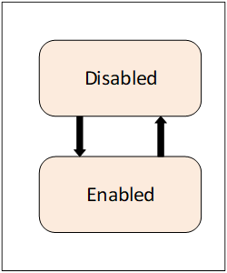  

Figure 11 - Base Condition state model  

A transition into the *Disabled* state results in a *Condition* *Event* however no subsequent *Event* *Notifications* are generated until the *Condition* returns to the Enabled state.  

ISA 18.2 and IEC 62682, which are the basis for this information model, no longer support enabling and disabling of alarms. As a result, even though this feature is still supported for backward compatibility it is recommended that alarms never be disabled.  

When a *Condition* enters the Enabled state, that transition and all subsequent transitions result in *Condition* *Events* being generated by the *Server* .  

If *Auditing* is supported by a *Server* , the following *Auditing* related action shall be performed. The *Server* will generate *AuditEvents* for *Enable* and *Disable* operations (either through a *Method* call or some *Server* / vendor - specific means), rather than generating an *AuditEvent* *Notification* for each *Condition* instance being enabled or disabled. For more information, see the definition of *AuditConditionEnableEventType* in [5.10.2](/§\_Ref227572624) . *AuditEvents* are also generated for any other *Operator* action that results in changes to the *Conditions* .  

### 4.3 Acknowledgeable Conditions  

*AcknowledgeableConditions* are sub-types of the base *ConditionType* . *AcknowledgeableConditions* expose states related to acknowledged or confirmed in a *Condition* .  

An *AckedState* and a *ConfirmedState* extend the *EnabledState* defined by the *Condition* . The state model is illustrated in [Figure 22](/§\_Ref396821606) . The enabled state is extended by adding the *AckedState* and (optionally) the *ConfirmedState* .  

  

Figure 22 - AcknowledgeableConditions state model  

Acknowledgment of the transition may come from the *Client* or may be due to some logic internal to the *Server* . For example, acknowledgment of a related *Condition* may result in this *Condition* becoming acknowledged, or the *Condition* may be set up to automatically *Acknowledge* itself when the acknowledgeable situation disappears.  

Two *Acknowledge* state models are supported by this document. Either of these state models can be extended to support more complex acknowledgement situations.  

The basic *Acknowledge* state model is illustrated in [Figure 33](/§\_Ref72848633) . This model defines an AckedState. The specific state changes that result in a change to the state depend on a Server's implementation. For example, in typical *Alarm* models the change is limited to a transition to the *Active* state or transitions within the *Active* state. More complex models however can also allow for changes to the AckedState when the *Condition* transitions to an inactive state.  

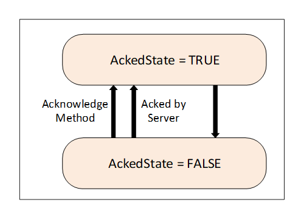  

 **Figure 33\- Acknowledge State Model**   

A more complex state model which adds a confirmation to the basic *Acknowledge* is illustrated in [Figure 44](/§\_Ref72848668) . The *Confirmed* *Acknowledge* model is typically used to differentiate between acknowledging the presence of a *Condition* and having done something to address the *Condition* . For example, an *Operator* receiving a motor high temperature *Notification* calls the *Acknowledge Method* to inform the *Server* that the high temperature has been observed. The *Operator* then takes some action such as lowering the load on the motor in order to reduce the temperature. The *Operator* then calls the *Confirm Method* to inform the *Server* that a corrective action has been taken.  

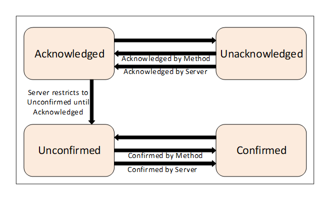  

 **Figure 44\- Confirm acknowledge State model**   

The *AcknowledgeableConditions* model can also be used for a simple *Condition* that requires a confirmation. For example, a motor start event is not an alarm, just an action that is to be acknowledged by the operator. It could also be an event that is generated for an operator change of a process input (grade of paper being made) that needs to be acknowledged. It is not something that requires an anwser like a question, for this there are *DialogCondition* . It is just an acknowledge that the operator observed the change.  

### 4.4 Previous states of Conditions  

Some systems require that previous states of a *Condition* are preserved for some time. A common use case is the acknowledgement process. In certain environments, it is required to acknowledge both the transition into *Active* state and the transition into an *Inactive* state. Systems with strict safety rules sometimes require that every transition into *Active* state is acknowledged. In situations where state changes occur in short succession there can be multiple unacknowledged states and the *Server* maintains *ConditionBranches* for all previous unacknowledged states. These branches will be deleted after they have been acknowledged or if they reached their final state.  

*Multiple ConditionBranches* can also be used for other use cases where snapshots of previous states of a *Condition* require additional actions.  

### 4.5 Condition state synchronization  

When a *Client* subscribes for *Events* , the *Notification* of transitions will begin at the time of the *Subscription* . The currently existing state will not be reported. This means for example that *Clients* are not informed of currently *Active* *Alarms* until a new state change occurs.  

*Clients* can obtain the current state of all *Condition* instances that are in an interesting state, by requesting a *Refresh* for a *Subscription* . It should be noted that *Refresh* is not a general replay capability since the *Server* is not required to maintain an *Event* history.  

*Clients* request a *Refresh* by calling the ConditionRefresh *Method* . The *Server* will respond with a *RefreshStartEventType Event* . This *Event* is followed by the *Retained* *Conditions* . The *Server* may also send new *Event* *Notifications* interspersed with the *Refresh* related *Event* *Notifications* . After the *Server* is done with the *Refresh* , a *RefreshEndEvent* is issued marking the completion of the Refresh. *Clients* shall check for multiple *Event* *Notifications* for a *ConditionBranch* to avoid overwriting a new state delivered together with an older state from the *Refresh* process. If a *ConditionBranch* exists, then the current *Condition* shall be reported. This is True even if the only interesting item regarding the *Condition* is that *ConditionBranches* exist. This allows a *Client* to accurately represent the current *Condition* state.  

A *Client* that wishes to display the current status of *Alarms* and *Conditions* (known as a "current *Alarm* display") would use the following logic to process *Refresh* *Event* *Notifications* . The *Client* flags all *Retained* *Conditions* as suspect on reception of the *Event* of the *RefreshStartEventType* . The *Client* adds any new *Events* that are received during the Refresh without flagging them as suspect. The *Client* also removes the suspect flag from any *Retained* *Conditions* that are returned as part of the Refresh. When the *Client* receives a *RefreshEndEvent* , the *Client* removes any remaining suspect *Events* , since they no longer apply.  

The following items should be noted with regard to ConditionRefresh:  

* As described in [4.4](/§\_Ref78240605) some systems require that previous states of a *Condition* are preserved for some time. Some *Servers*\- in particular if they require acknowledgement of previous states - will maintain separate *ConditionBranches* for prior states that still need attention.  

*ConditionRefresh* shall issue *Event* *Notifications* for all interesting states (current and previous) of a *Condition* instance and *Clients* can therefore receive more than one *Event* for a *Condition* instance with different BranchIds.  

* It is possible under some circumstances a *Server* is not capable of ensuring the *Client* is fully in sync with the current state of *Condition* instances. For example, if the underlying system represented by the *Server* is reset or communications are lost for some period of time it can be necessary for the *Server* to resynchronize itself with the underlying system. In these cases, the *Server* sends an *Event* of the *RefreshRequiredEventType* to advise the *Client* that a *Refresh* may be necessary. A *Client* receiving this special *Event* should initiate a *ConditionRefresh* as noted in this clause.  

* To ensure a *Client* is always informed, the three special *EventTypes* ( *RefreshEndEventType* , *RefreshStartEventType* and *RefreshRequiredEventType* ) ignore the *Event* content filtering associated with a *Subscription* and will always be delivered to the *Client* .  

* ConditionRefresh applies to a *Subscription* . If multiple Event Notifiers are included in the same *Subscription* , all *Event Notifiers* are refreshed.  

### 4.6 Severity, quality, and comment  

*Comment* , *Severity* and *Quality* are important elements of *Conditions* and any change to them will cause *Event* *Notification* s.  

The severity of a *Condition* is inherited from the base *Event* model defined in [10000-5](/§UAPart5) . It indicates the urgency of the *Condition* and is also commonly called alarm priority or 'priority', especially in relation to *Alarms* in the *ProcessConditionClassType* . *Severity* is defined to have a range of 1-1000, but this range includes *Alarms* and other events that are not considered *Alarms* . For *Alarms* it is recommended that *Severities* above 400 be used. The 400-1000 range for *Alarms* should be further subdivided based on the severity of the *Alarm* . For an example of how *Severity* ranges are subdivided for diagnostics see [10000-26](/§UAPart26) LogRecord Severity Mapping.  

A Comment is a user generated string that is associated with a certain state of a *Condition* .  

Quality refers to the quality of the data value(s) upon which this *Condition* is based. Since a *Condition* is usually based on one or more *Variables* , the *Condition* inherits the quality of these *Variables* . E.g., if the process value is "Uncertain", the "Level Alarm" *Condition* is also questionable. If more than one variable is represented by a given condition or if the condition is from an underlining system and no direct mapping to a variable is available, it is up to the application to determine what quality is displayed as part of the condition.  

### 4.7 Dialogs  

Dialogs are *ConditionTypes* used by a *Server* to request user input. They are typically used when a *Server* has entered some state that requires intervention by a *Client* . For example, a *Server* monitoring a paper machine indicates that a roll of paper has been wound and is ready for inspection. The *Server* would activate a Dialog *Condition* indicating to the user that an inspection is required. Once the inspection has taken place the user responds by informing the *Server* of an accepted or unaccepted inspection allowing the process to continue.  

### 4.8 Alarms  

*Alarms* are specializations of *AcknowledgeableConditions* that add the concepts of an *Active* state and other states like *Shelving* state and *Suppressed* state to a *Condition* . The state model is illustrated in [Figure 55](/§\_Ref396821609) . The complete model with all states is defined in [5.8](/§\_Ref497208840) .  

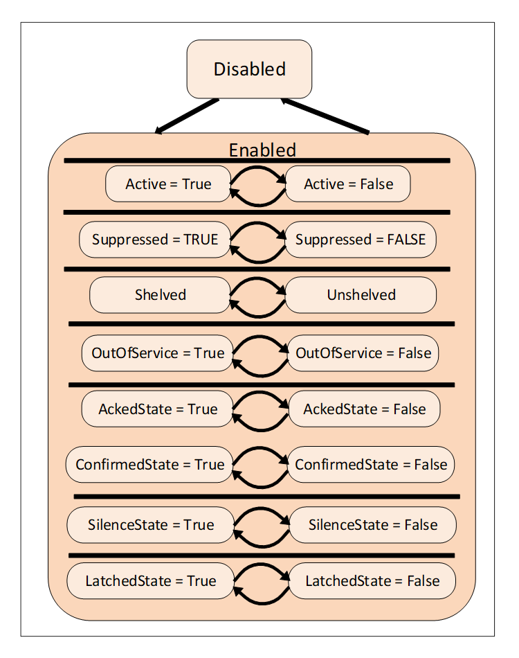  

Figure 55 - Alarm state machine model  

An *Alarm* in the *Active* state indicates that the situation the *Condition* is representing currently exists. When an *Alarm* is an inactive state it is representing a situation that has returned to a normal state.  

Some *Alarm* subtypes introduce sub-states of the *Active* state. For example, an *Alarm* representing a temperature may provide a high level state as well as a critically high state (see following Clause).  

The shelving state can be set by an *Operator* via OPC UA *Methods* . The suppressed state is set internally by the *Server* due to system specific reasons. *Alarm* systems typically implement the suppress *,* out of service and shelve features to help keep *Operators* from being overwhelmed during *Alarm* "storms" by limiting the number of *Alarms* an *Operator* sees on a current *Alarm* display. This is accomplished by setting the *SuppressedOrShelved* flag on second order dependent *Alarms* and/or *Alarms* of less severity, leading the *Operator* to concentrate on the most critical issues.  

The LatchedState is a state that is added to any alarm that requires additional processing, once it goes active it does not clear until it is explicitly reset, even if the value that triggered the alarm returns to normal. This can be an alarm that requires a physical inspection once it has occurred to ensure it is no longer in alarm, or a series of tests that might be required to ensure the alarm is no longer active or some other actions. Any AlarmType can become a latched alarm by the addition of this optional sub-state.  

The shelved *,* out of service and suppressed states differ from the *Disabled* state in that *Alarms* are still fully functional and can be included in *Subscription* *Notifications* to a *Client* . A disabled Alarm is not processed in any manner, and is not supported as part of the active Alarm model defined in ISA 18.2.  

Alarms follow a typical timeline that is illustrated in [Figure 66](/§\_Ref442711657) . They have a number of delay times associated with them and a number of states that they might occupy. The goal of an alarming system is to inform *Operators* about conditions in a timely manner and allow the *Operator* to take some action before some consequences occur. The consequences may be economic (product is not usable and is discard), may be physical (tank overflows), may safety (fire or explosion could occur) or any of a number of other possibilities. Typically, if no action is taken related to an alarm for some period of time the process will cross some threshold at which point consequences will start to occur. The OPC UA *Alarm* model describes these states, delays and actions.  

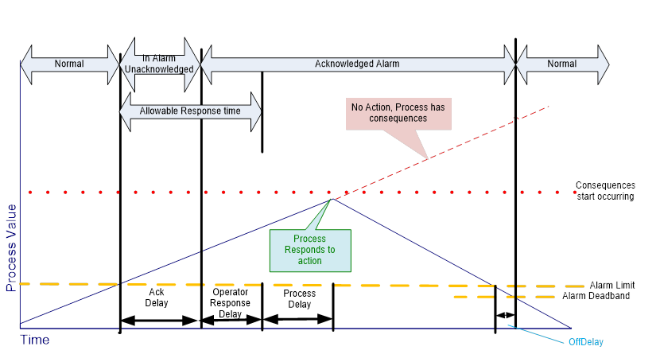  

Figure 66 - Typical Alarm Timeline example  

  

### 4.9 Multiple active states  

In some cases, it is desirable to further define the *Active* state of an *Alarm* by providing a sub-state machine for the *Active* State. For example, a multi-state level *Alarm* when in the *Active* state may be in one of the following sub-states: LowLow, Low, High or HighHigh. The state model is illustrated in [Figure 77](/§\_Ref396821610) .  

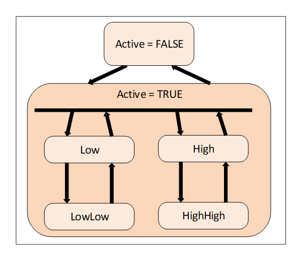  

Figure 77 - Multiple active states example  

With the multi-state *Alarm* model, state transitions among the sub-states of *Active* are allowed without causing a transition out of the *Active* state.  

To accommodate different use cases both a (mutually) exclusive and a non-exclusive model are supported.  

Exclusive means that the *Alarm* can only be in one sub-state at a time. If for example a temperature exceeds the HighHigh limit the associated exclusive level *Alarm* will be in the HighHigh sub-state and not in the High sub-state.  

Some *Alarm* systems, however, allow multiple sub-states to exist in parallel. This is called non-exclusive. In the previous example where the temperature exceeds the HighHigh limit a non-exclusive level *Alarm* will be both in the High and the HighHigh sub-state.  

### 4.10 Condition instances in the AddressSpace  

Because *Conditions* always have a state ( *Enabled* or *Disabled* ) and possibly many sub-states it makes sense to have instances of *Conditions* present in the *AddressSpace* . If the *Server* exposes *Condition* instances they usually will appear in the *AddressSpace* as components of the *Objects* that "own" them. For example, a temperature transmitter that has a built-in high temperature *Alarm* would appear in the *AddressSpace* as an instance of some temperature transmitter *Object* with a *HasComponent* *Reference* to an instance of a *LimitAlarmType* .  

The availability of instances allows Data Access *Clients* to monitor the current *Condition* state by subscribing to the *Attribute* values of *Variable* *Nodes* . It is possible that the value of a node may not always correspond with the value that appears in the *Event.* The value could be more recent than the value in the *Event* .  

While exposing *Condition* instances in the *AddressSpace* is not always possible, doing so allows for direct interaction (read, write and *Method* invocation) with a specific *Condition* instance. For example, if a *Condition* instance is not exposed, there is no way to invoke the *Enable* or *Disable* *Method* for the specific *Condition* instance.  

### 4.11 Alarm and Condition auditing  

The OPC UA Standards include provisions for auditing. Auditing is an important security and tracking concept. Audit records provide the "Who", "When" and "What" information regarding user interactions with a system. These audit records are especially important when *Alarm* management is considered. *Alarms* are the typical instrument for providing information to a user that something needs the user's attention. A record of how the user reacts to this information is required in many cases. Audit records are generated for all *Method* calls that affect the state of the system, for example, an *Acknowledge* *Method* call would generate an *AuditConditionAcknowledgeEventType Event* .  

The standard *AuditEventTypes* defined in [10000-5](/§UAPart5) already include the fields required for *Condition* related audit records. To allow for filtering and grouping, this document defines a number of sub-types of the *AuditEventTypes* but without adding new fields to them.  

This document describes the *AuditEventType* that ** each *Method* shall generate if Audit Events are supported by the *Server* . For example, the *Disable* *Method* has an *AlwaysGeneratesEvent* *Reference* to an *AuditConditionEnableEventType* . An *Event* of this type shall be generated for every invocation of the *Method* if ** audit events are supported. The audit *Event* describes the user interaction with the system, in some cases this interaction may affect more than one *Condition* or be related to more than one state.  

### 4.12 Alarms in a system  

In a system, alarms might be managed at different levels and by different applications. An alarm might be detected in an instrument, but the full alarm model for that alarm instance might be maintained in a higher level *Server* . This can cause issues in cases where the instrument is restarted or the UA Server that is acting as an alarm server is restarted. It is desirable that the state of alarms is maintained and that after any restart of either application all alarms recover their same state as before the restart. But it is acceptable if an alarm might require some management actions again following a restart. It is not acceptable that a device that is in alarm is no longer reported as being in alarm. For example, if the *AlarmManager* is restarted, when it recovers, can detect that the device has an alarm, but possibly not be able to recover that the alarm has a comment or that it was acknowledged. The individual *Objects* models provide details about *Alarm* states and recovery.  

## 5 Model  

### 5.1 General  

The *Alarm* and *Condition* model extends the OPC UA base *Event* model by defining various *Event* *Types* based on the *BaseEventType* . All of the *Event* *Types* defined in this document can be further extended from domain to *Server* specific *Alarm* and *Condition* *Types* .  

Instances of *Alarm* and *Condition* *Types* may be optionally exposed in the *AddressSpace* in order to allow direct access to the state of an *Alarm* or *Condition* . Instances not exposed in the *AddressSpace* still have a *ConditionId* ( *NodeId* ). This *NodeId* can be the target of references in the *AddressSpace* even though the target node does not exist in the AddressSpace. For example, an *AlarmGroup* might reference a number of *Conditions* that do not exist in the *AddressSpace.*  

The following sub clauses define the OPC UA *Alarm* and *Condition* *Types* . [Figure 88](/§\_Ref396821611) informally describes the hierarchy of these *Types* . Subtypes of the *LimitAlarmType* and the *DiscreteAlarmType* are not shown.  

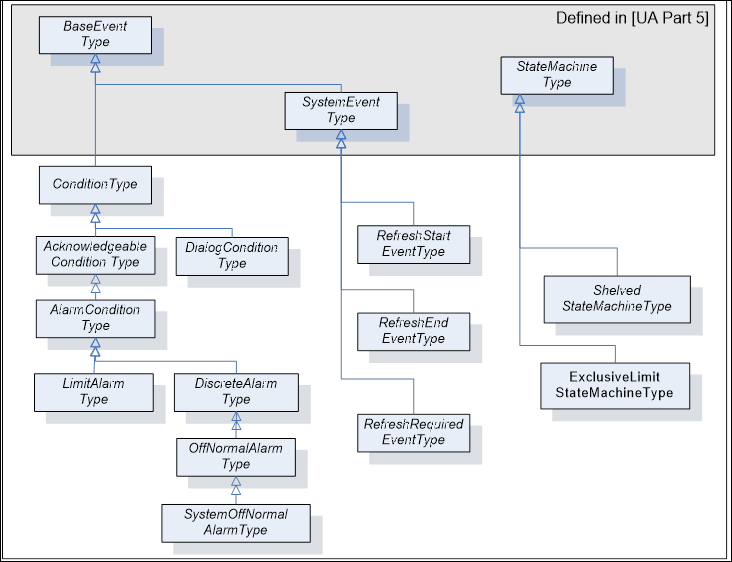  

Figure 88 - ConditionType hierarchy  

### 5.2 Two-state state machines  

Most states defined in this document are simple - i.e. they are either True or False. The *TwoStateVariableType* is introduced specifically for this use case. More complex states are modelled by using a *StateMachineType* defined in [10000-16](/§UAPart16) .  

The *TwoStateVariableType* is derived from the *StateVariableType* defined in [10000-16](/§UAPart16) . and formally defined in [Table 11](/§\_Ref224963603) .  

Table 11 - TwoStateVariableType definition  

| **Attribute** | **Value** |
|---|---|
|BrowseName|TwoStateVariableType|
|DataType|LocalizedText|
|ValueRank|\-1 (-1 = Scalar)|
|IsAbstract|False|
  
| **References** | **NodeClass** | **BrowseName** | **DataType** | **TypeDefinition** | **ModellingRule** |
|---|---|---|---|---|---|
|Subtype of the *StateVariableType* defined in [10000-16](/§) . Note that a *Reference* to this subtype is not shown in the definition of the *StateVariableType*|
|HasProperty|Variable|Id|Boolean|PropertyType|Mandatory|
|HasProperty|Variable|TransitionTime|UtcTime|PropertyType|Optional|
|HasProperty|Variable|EffectiveTransitionTime|UtcTime|PropertyType|Optional|
|HasProperty|Variable|TrueState|LocalizedText|PropertyType|Optional|
|HasProperty|Variable|FalseState|LocalizedText|PropertyType|Optional|
||||||
  
| **ConformanceUnits** |
|---|
|A & C Basic|
  

  

The *Value* *Attribute* of an instance of *TwoStateVariableType* contains the current state as a human readable name. The *EnabledState* for example, might contain the name "Enabled" when True and "Disabled" when False.  

*Id* is inherited from the *StateVariableType* and overridden to reflect the required *DataType* (Boolean). The value shall be the current state, i.e. either True or False.  

*TransitionTime* specifies the time when the current state was entered.  

*EffectiveTransitionTime* specifies the time when the current state or one of its sub states was entered. If, for example, a LevelAlarm is active and - while active - switches several times between High and HighHigh, then the *TransitionTime* stays at the point in time where the *Alarm* became active whereas the *EffectiveTransitionTime* changes with each shift of a sub state.  

The optional *Property* *EffectiveDisplayName* from the *StateVariableType* is used if a state has sub states. It contains a human readable name for the current state after taking the state of any *SubStateMachines* in account. As an example, the *EffectiveDisplayName* of the *EnabledState* could contain "Active/HighHigh" to specify that the *Condition* is active and has exceeded the HighHigh limit.  

Other optional *Properties* of the *StateVariableType* have no defined meaning for *TwoStateVariableType* .  

*TrueState* and *FalseState* contain the localized string for the *TwoStateVariableType* value ** when its *Id* *Property* has the value True or False, respectively. Since the two *Properties* provide meta-data for the *Type* , *Servers* shall not allow these *Properties* to be selected in the *Event* filter for a MonitoredItem. The *TrueState* *Property* and *FalseState* *Property* shall only exist on *InstanceDeclarations* . See [Figure 99](/§\_Ref65717185) for an illustration. *Clients* can use the Read *Service* to get the values of the *TrueState* and *FalseState* *Property* .  

A *HasTrueSubState* *Reference* is used to indicate that the True state has sub states.  

A *HasFalseSubState* *Reference* is used to indicate that the False state has sub states.  

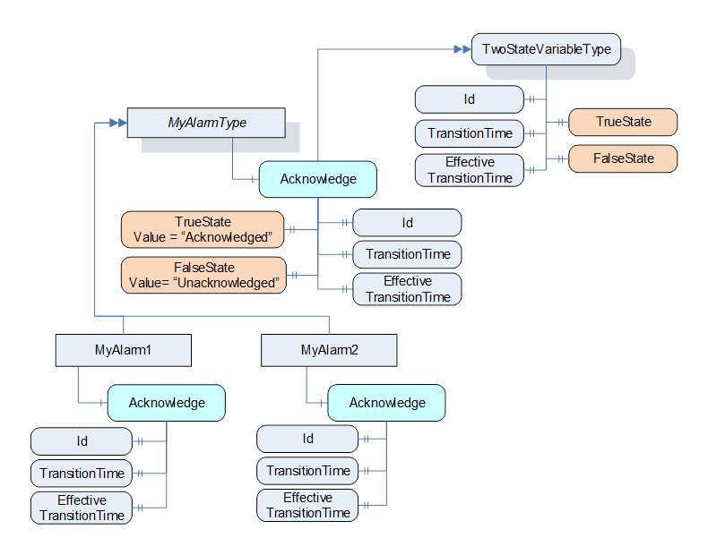  

 **Figure 99\- TwoStateVariable Illustration**   

  

### 5.3 ConditionVariable  

Various information elements of a *Condition* are not considered to be states. However, a change in their value is considered important and supposed to trigger an *Event Notification* . These information elements are called *ConditionVariable* .  

*ConditionVariables* are represented by a *ConditionVariableType,* formally defined in [Table 22](/§\_Ref225692989) .  

Table 22 - ConditionVariableType definition  

| **Attribute** | **Value** |
|---|---|
|BrowseName|ConditionVariableType|
|DataType|BaseDataType|
|ValueRank|\-2 (-2 = Any)|
|IsAbstract|False|
  
| **References** | **NodeClass** | **BrowseName** | **DataType** | **TypeDefinition** | **ModellingRule** |
|---|---|---|---|---|---|
|Subtype of the *BaseDataVariableType* defined in [10000-5](/§UAPart5) .|
|HasProperty|Variable|SourceTimestamp|UtcTime|PropertyType|Mandatory|
  
| **ConformanceUnits** |
|---|
|A & C Basic|
  

  

*SourceTimestamp* indicates the time of the last change of the *Value* of this *ConditionVariable* . It shall be the same time that would be returned from the *Read* *Service* inside the *DataValue* structure for the *ConditionVariable* *Value* *Attribute* .  

### 5.4 ReferenceTypes  

#### 5.4.1 General  

This Clause defines *ReferenceTypes* that are needed beyond those already specified as part of [10000-3](/§UAPart3) and [10000-5](/§UAPart5) . This includes extending *TwoStateVariableType* state machines with sub states and the addition of *Alarm* grouping. *TwoStateVariableTypes* can be extended with subordinate state machines in a similar fashion to the *StateMachineType* defined in [10000-16](/§UAPart16) .  

The *TwoStateVariableType* *References* will only exist when sub states are available. For example, if a *TwoStateVariableType* machine is in a False State, then any sub states referenced from the True state will not be available and will be reported as a NULL.  

#### 5.4.2 HasTrueSubState ReferenceType  

The *HasTrueSubState ReferenceType* is a concrete *ReferenceType* that can be used directly. It is a subtype of the *NonHierarchicalReferences *** *** * .  

The semantics indicate that the sub state (the target *Node* ) is a subordinate state of the True super state. If more than one state within a *Condition* is a sub state of the same super state (i.e. several *HasTrueSubState* *References* exist for the same super state) they are all treated as independent sub states. The representation in the *AddressSpace* is specified in [Table 33](/§\_Ref216770749) .  

The *SourceNode* of the *Reference* shall be an instance of a *TwoStateVariableType* and the *TargetNode* shall be either an instance of a *TwoStateVariableType* or an instance of a subtype of a *StateMachineType* .  

It is not required to provide the *HasTrueSubState Reference* from super state to sub state, but it is required that the sub state provides the inverse *Reference* ( *IsTrueSubStateOf* ) to its super state.  

Table 33 - HasTrueSubState ReferenceType  

| **Attributes** | **Value** |
|---|---|
|BrowseName|HasTrueSubState|
|InverseName|IsTrueSubStateOf|
|Symmetric|False|
|IsAbstract|False|
  
| **References** | **NodeClass** | **BrowseName** | **Comment** |
|---|---|---|---|
|||||
  
| **ConformanceUnits** |
|---|
|A & C Basic|
  

  

#### 5.4.3 HasFalseSubState ReferenceType  

The *HasFalseSubState ReferenceType* is a concrete *ReferenceType* that can be used directly. It is a subtype of the *NonHierarchicalReferences *** *** * .  

The semantics indicate that the sub state (the target *Node* ) is a subordinate state of the False super state. If more than one state within a *Condition* is a sub state of the same super state (i.e. several *HasFalseSubState* *References* exist for the same super state) they are all treated as independent sub states. The representation in the *AddressSpace* is specified in [Table 44](/§\_Ref396821612) .  

The *SourceNode* of the *Reference* shall be an instance of a *TwoStateVariableType* and the *TargetNode* shall be either an instance of a *TwoStateVariableType* or an instance of a subtype of a *StateMachineType* .  

It is not required to provide the *HasFalseSubState Reference* from super state to sub state, but it is required that the sub state provides the inverse *Reference* (IsFalseSubStateOf) to its super state.  

Table 44 - HasFalseSubState ReferenceType  

| **Attributes** | **Value** |
|---|---|
|BrowseName|HasFalseSubState|
|InverseName|IsFalseSubStateOf|
|Symmetric|False|
|IsAbstract|False|
  
| **References** | **NodeClass** | **BrowseName** | **Comment** |
|---|---|---|---|
|||||
  
| **ConformanceUnits** |
|---|
|A & C Basic|
  

  

#### 5.4.4 HasAlarmSuppressionGroup ReferenceType  

The *HasAlarmSuppressionGroup ReferenceType* is a concrete *ReferenceType* that can be used directly. It is a subtype of the *HasComponent *** *** * . The representation in the *AddressSpace* is specified in [Table 55](/§\_Ref106689604)  

This *ReferenceType* binds an AlarmSuppressionGroup to an *Alarm* .  

The *SourceNode* of the *Reference* shall be an instance of an *AlarmConditionType* or sub type. The *TargetNode* shall be an instance of an *AlarmGroupType* .  

Table 55 - HasAlarmSuppressionGroup ReferenceType  

| **Attributes** | **Value** |
|---|---|
|BrowseName|HasAlarmSuppressionGroup|
|InverseName|IsAlarmSuppressionGroupOf|
|Symmetric|False|
|IsAbstract|False|
  
| **References** | **NodeClass** | **BrowseName** | **Comment** |
|---|---|---|---|
|||||
  
| **ConformanceUnits** |
|---|
|A & C Suppression Group|
  

  

#### 5.4.5 AlarmGroupMember ReferenceType  

The *AlarmGroupMember ReferenceType* is a concrete *ReferenceType* that can be used directly. It is a subtype of the *Organizes* Reference Type.  

This *ReferenceType* is used to indicate the *Alarm* instances that are part of an *Alarm Group* . The representation in the *AddressSpace* is specified in [Table 66](/§\_Ref106689630)  

The *SourceNode* of the *Reference* shall be an instance of an *AlarmGroupType* or sub type of it. The *TargetNode* shall be an instance of an *AlarmConditionType* or a subtype of it.  

Table 66 - AlarmGroupMember ReferenceType  

| **Attributes** | **Value** |
|---|---|
|BrowseName|AlarmGroupMember|
|InverseName|MemberOfAlarmGroup|
|Symmetric|False|
|IsAbstract|False|
  
| **References** | **NodeClass** | **BrowseName** | **Comment** |
|---|---|---|---|
|||||
  
| **ConformanceUnits** |
|---|
A & C Suppression Group||
|A & C First in Group Alarm|
  

  

#### 5.4.6 AlarmSuppressionGroupMember ReferenceType  

The *Alarm* Suppression *GroupMember ReferenceType* is a concrete *ReferenceType* that can be used directly. It is a subtype of the *AlarmGroupMember ReferenceType* .  

This *ReferenceType* is used to indicate the *Alarm* instances or *Boolean* *Variables* that are part of an *Alarm Group* . The representation in the *AddressSpace* is specified in [Table 77](/§\_Ref106689649)  

The *SourceNode* of the *Reference* shall be an instance of an *AlarmGroupType* or sub type of it. The *TargetNode* shall be an instance of an *AlarmConditionType* or a subtype of it, or an instance of *BaseDataVariableType* that has a *DataType* of *Boolean* .  

Table 77 - AlarmSuppressionGroupMember ReferenceType  

| **Attributes** | **Value** |
|---|---|
|BrowseName|AlarmSuppressionGroupMember|
|InverseName|MemberOfAlarmSuppressionGroup|
|Symmetric|False|
|IsAbstract|False|
  
| **References** | **NodeClass** | **BrowseName** | **Comment** |
|---|---|---|---|
|||||
  
| **ConformanceUnits** |
|---|
A & C Suppression Group||
||
  

  

### 5.5 Condition Model  

#### 5.5.1 General  

The *Condition* model extends the *Event* model by defining the *ConditionType* . The *ConditionType* introduces the concept of states differentiating it from the base *Event* model. Unlike the *BaseEventType* , *Conditions* are not transient. The *ConditionType* is further extended into Dialog and *AcknowledgeableConditionType* , each of which has their own sub-types.  

The *Condition* model is illustrated in [Figure 1010](/§\_Ref157839271) and formally defined in the subsequent tables. It is worth noting that this figure, like all figures in this document, is not intended to be complete. Rather, the figures only illustrate information provided by the formal definitions.  

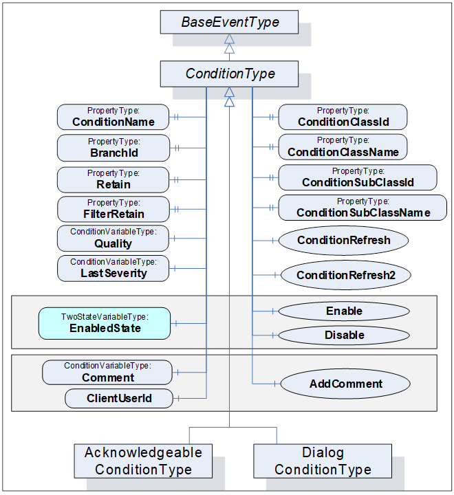  

Figure 1010 - Condition model  

#### 5.5.2 ConditionType  

The *ConditionType* defines all general characteristics of a *Condition* . All other *ConditionTypes* derive from it. It is formally defined in [Table 88](/§\_Ref396821621) and [Table 99](/§\_Ref83723741) . The False state of the *EnabledState* shall not be extended with a sub state machine.  

Table 88 - ConditionType definition  

| **Attribute** | **Value** |
|---|---|
|BrowseName|ConditionType|
|IsAbstract|True|
  
| **References** | **NodeClass** | **BrowseName** | **DataType** | **TypeDefinition** | **ModellingRule** |
|---|---|---|---|---|---|
|Subtype of the *BaseEventType* defined in [10000-5](/§UAPart5)|
|HasSubtype|ObjectType|DialogConditionType|Defined in Clause [5.6.2](/§\_Ref226353105)|
|HasSubtype|ObjectType|AcknowledgeableConditionType|Defined in Clause [5.7.2](/§\_Ref173042653)|
|||||||
|HasProperty|Variable|ConditionClassId|NodeId|PropertyType|Mandatory|
|HasProperty|Variable|ConditionClassName|LocalizedText|PropertyType|Mandatory|
|HasProperty|Variable|ConditionName|String|PropertyType|Mandatory|
|HasProperty|Variable|BranchId|NodeId|PropertyType|Mandatory|
|HasProperty|Variable|Retain|Boolean|PropertyType|Mandatory|
|HasProperty|Variable|SupportsFilteredRetain|Boolean|PropertyType||
|HasComponent|Variable|EnabledState|LocalizedText|TwoStateVariableType|Mandatory|
|HasComponent|Variable|Quality|StatusCode|ConditionVariableType|Mandatory|
|HasComponent|Variable|LastSeverity|UInt16|ConditionVariableType|Mandatory|
|HasComponent|Variable|Comment|LocalizedText|ConditionVariableType|Mandatory|
|HasProperty|Variable|ClientUserId|String|PropertyType|Mandatory|
|||||||
|HasComponent|Method|Disable|Defined in Clause [5.5.4](/§\_Ref224968690)|Mandatory|
|HasComponent|Method|Enable|Defined in Clause [5.5.5](/§\_Ref224968671)|Mandatory|
|HasComponent|Method|AddComment|Defined in Clause [5.5.6](/§\_Ref224968700)|Mandatory|
|HasComponent|Method|ConditionRefresh|Defined in Clause [5.5.7](/§\_Ref224968635)||
|HasComponent|Method|ConditionRefresh2|Defined in Clause [5.5.8](/§\_Ref414963698)||
  
| **ConformanceUnits** |
|---|
|A & C Basic|
  

  

Table 99 - ConditionType Additional Subcomponents  

| **BrowsePath** | **References** | **NodeClass** | **BrowseName** | **DataType** | **TypeDefinition** | **Others** |
|---|---|---|---|---|---|---|
|EnabledState|HasProperty|Variable|TrueState|LocalizedText|PropertyType||
|EnabledState|HasProperty|Variable|FalseState|LocalizedText|PropertyType||
  

  

The empty "Others" column indicates that no *ModellingRule* applies.  

The *ConditionType* inherits all *Properties* of the *BaseEventType* . Their semantic is defined in [10000-5](/§UAPart5) . *SourceNode Property* identifies the *ConditionSource* . See [5.12](/§\_Ref229999556) for more details. If the *ConditionSource* is not a *Node* in the *AddressSpace,* the *NodeId* is set to NULL. The *SourceNode* Property is the *Node,* which the *Condition* is associated with, it may be the same as the *InputNode* for an *Alarm* , but it may be a separate node. For example, a motor, which is a *Variable* with a *Value* that is an RPM, may be the *ConditionSource* for *Conditions* that are related to the motor as well as a temperature sensor associated with the motor. In the former the *InputNode* for the High RPM *Alarm* is the value of the Motor RPM, while in the later the *InputNode* of the High Alarm would be the value of the temperature sensor that is associated with the motor.  

*ConditionClassId, ConditionClassName, ConditionSubClassId* and *ConditionSubClassName* originally defined in *ConditionType* are now defined in the *BaseEventType* (from which this type is derived). They are optional in the *BaseEventType* , but *ConditionClassId,* and *ConditionClassName* are *Mandatory* in *ConditionType* and thus listed ** (to update the modelling rule) *.*  

*ConditionName* identifies the *Condition* instance that the *Event* originated from. It can be used together with the *SourceName* in a user display to distinguish between different *Condition* instances. If a *ConditionSource* has only one instance of a *ConditionType* , and the *Server* has no instance name, the *Server* shall supply the name element of the BrowseName of the *ConditionType* .  

*BranchId* is NULL for all *Event Notifications* that relate to the current state of the *Condition* instance. If *BranchId* is not NULL, it identifies a previous state of this *Condition* instance that still needs attention by an *Operator* . If the current *ConditionBranch* is transformed into a previous *ConditionBranch* then the Server shall assign a non-NULL *BranchId* . An initial *Event* for the branch shall be generated with the values of the *ConditionBranch* and the new *BranchId* . The *ConditionBranch* can be updated many times before it is no longer needed. When the *ConditionBranch* no longer requires *Operator* input the final *Event* will have *Retain* set to False. The retain bit on the current Event is True, as long as any ConditionBranches require Operator input. See [4.2](/§\_Ref50933522) for more information about the need for creating and maintaining previous *ConditionBranches* and Clause [B.1](/§\_Ref228716488) for an example using branches. The *BranchId* *DataType* is *NodeId* although the *Server* is not required to have *ConditionBranches* in the *AddressSpace* . The use of a *NodeId* allows the *Server* to use simple numeric identifiers, strings or arrays of bytes.  

*Retain* when True describes a *Condition* (or *ConditionBranch* ) as being in a state that is interesting for a *Client* wishing to synchronize its state with the *Server* 's state. The logic to determine how this flag is set is *Server* specific. Typically, all *Active Alarms* would have the *Retain* flag set; however, it is also possible for inactive *Alarms* to have their *Retain* flag set to True.  

In normal processing when a *Client* receives an *Event* with the *Retain* flag set to False, the *Client* should consider this as a *ConditionBranch* that is no longer of interest, in the case of a "current *Alarm* display" the *ConditionBranch* would be removed from the display.  

*SupportsFilteredRetain* *Property* is only provided on the *ConditionType* . When this *Property* is set to True on the Type, then the *Server* provides a *Client* specific *Retain* flag value taking into account any *Client* provided filter. When the property is False on the *ConditionType* then the *Server* does not provide a *Client* specific the value of the *Retain* flag. For example, if a *Client* applies a filter to exclude *Alarms* that are shelved, and the *SupportsFilteredRetain* is set to True, the *Client* receives an *Alarm* (it is not shelved, *Retain* is true). The *Client* (or another *Client* ) shelves the *Alarm* . At this point the *Alarm* no longer passes the filter, but since the previous event was sent, this event is transmitted with Retain = False. For an example see [B.1.4](/§\_Ref114646351)  

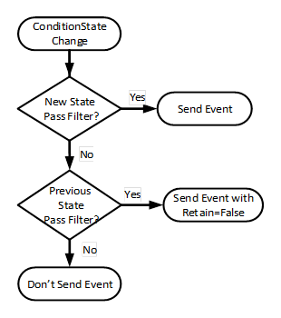  

 **Figure 1111\- SupportsFilteredRetain process**   

[Figure 1111](/§\_Ref106692035) provides an illustration of the processing a *Server* shall follow for processing *Retain* flag when *SupportsFilteredRetain* flag is set to True.  

*EnabledState* indicates whether the *Condition* is enabled. *EnabledState/Id* is True if enabled, False otherwise. *EnabledState/TransitionTime* defines when the *EnabledState* last changed. Recommended state names are described in [A.1](/§\_Ref111535894) .  

A *Condition* 's *EnabledState* effects the generation of *Event* *Notifications* and as such results in the following specific behaviour:  

* When the *Condition* instance enters the *Disabled* state, the *Retain* *Property* of this *Condition* shall be set to False by the *Server* to indicate to the *Client* that the *Condition* instance is currently not of interest to *Client* s. This includes all *ConditionBranches* if any branches exist.  

* When the *Condition* instance enters the enabled state, the *Condition* shall be evaluated and all of its *Properties* updated to reflect the current values. If this evaluation causes the *Retain Property* to transition to True for any *ConditionBranch* , then an *Event Notification* shall be generated for that *ConditionBranch* .  

* The *Server* may choose to continue to test for a *Condition* instance while it is *Disable* d. However, no *Event* *Notifications* will be generated while the *Condition* instance is disabled.  

* For any *Condition* that exists in the *AddressSpace* the *Attributes* and the following *Variables* will continue to have valid values even in the *Disable* d state; *EventId* , *Event* Type, *SourceNode* , *SourceName* , Time, and *EnabledState* . Other *Properties* may no longer provide current valid values. All *Variables* that are no longer provided shall return a status of *Bad* \_ *ConditionDisabled* . The *Event* that reports the *Disabled* state should report the *Properties* as NULL or with a status of *Bad* \_ *ConditionDisabled* .  

When enabled, changes to the following *Variables* shall cause a *ConditionType* *Event* *Notification* :  

* *Quality*  

* *Severity* (inherited from *BaseEventType* )  

* Comment  

Subtypes of *ConditionType* may define additional *Variables* that trigger *Event* *Notifications* . In general, changes to *Variables* of the types *TwoStateVariableType,* *ConditionVariableType, StateMachineType* or any of their subtypes trigger *Event* *Notifications* and are not explicitly described in subtypes.  

In the event of a restart of an *AlarmManager* , the *AlarmManager* shall recover the *Enabled* / *Disabled* states of all current conditions. If the system can not determine if the *Condition* is *Enabled* or *Disabled* , it shall be *Enabled* .  

*Quality* reveals the status of process values or other resources that this *Condition* instance is based upon. If, for example, a process value is "Uncertain", the associated "LevelAlarm" *Condition* is also questionable. Values for the *Quality* can be any of the OPC *StatusCodes* defined in [10000-8](/§UAPart8) as well as *Good* , *Uncertain* and *Bad* as defined in [10000-4](/§UAPart4) . These *StatusCodes* are similar to but slightly more generic than the description of data quality in the various field bus specifications. It is the responsibility of the *Server* to map internal status information to these codes. A *Server* that supports no quality information shall return *Good* . This quality can also reflect the communication status associated with the system that this value or resource is based on and from which this *Alarm* was received. For communication errors to the underlying system, especially those that result in some unavailable *Event* fields, the quality shall be Bad\_NoCommunication error.  

*Events* are only generated for *Conditions* that have their *Retain* field set to True and for the initial transition of the *Retain* field from True to False.  

*LastSeverity* provides the previous severity of the *ConditionBranch* . Initially this *Variable* contains a zero value; it will return a value only after a severity change. The new severity is supplied via the *Severity* *Property,* which is inherited from the *BaseEventType* .  

*Comment* contains the last comment provided for a certain state ( *ConditionBranch* ) of a *Condition* . It may have been provided by an *AddComment* *Method,* some other *Method* or in some other manner. Any change in this field, shall trigger a new event to be generated. The initial value of this *Variable* is NULL, unless it is provided in some other manner. The *Comment* field may reference a *MaxStringLength* *Property* which would limit the length of the string. This *MaxStringLength* may be added to the individual *Alarm* instance, in which case it would apply only to that *Alarm* instance, but it can also be added to the *Comment* *Variable* in the *ConditionType* , which would limit the size of the *Comment* string for all *Alarm* instances. If the *Property* is provided on both the instance and the type, the instance takes precedence over the type. All *Methods* that can provide a *Comment* argument shall restrict *Comment* to this limit. If a *Comment* is provided that exceeds this limit, a *Bad* \_ *InvalidArgument* shall be returned from the *Method* .  

*ClientUserId* is related to the *Comment* field and contains the identity of the user who inserted the most recent *Comment.* The logic to obtain the *ClientUserId* is defined in [10000-5](/§UAPart5) .  

The *NodeId* of the *Condition* instance is used as *ConditionId* . It is not explicitly modelled as a component of the *ConditionType* . However, it can be requested with the following *SimpleAttributeOperand* (see [Table 1010](/§\_Ref396824507) ) in the *SelectClause* of the *EventFilter* : See [10000-4](/§UAPart4) for a detailed definition of the *SelectClause* in an *Event* *Subscription* .  

Table 1010 - ConditionId SimpleAttributeOperand Illustration  

| **Name** | **Type** | **Description** |
|---|---|---|
|SimpleAttributeOperand|||
|typeId|NodeId|*NodeId* of the *ConditionType Node*|
|browsePath[]|QualifiedName|empty|
|attributeId|IntegerId|Id of the *NodeId Attribute*|
  

  

#### 5.5.3 Condition and branch instances  

*Conditions* are *Objects* which have a state which changes over time. Each *Condition* instance has a *ConditionId* as an identifier which uniquely identifies it within the *Server* . This *Condition* (and it representative *ConditionId)* follows the same rules associated with *Nodes* (and their representative *NodeIds* ) in the *AddressSpace* (see [10000-3](/§UAPart3) ). Therefore, once a *Condition* is created in a system that does not expose instances, any time that *Condition* is active it shall always have the same *ConditionId* . This allows higher level alarm management systems to operate on *Conditions* and to perform analysis of them.  

A *Condition* instance may be an *Object* that appears in the *Server* *Address* *Space* . If this is the case the *ConditionId* shall be the *NodeId* for the *Object* .  

The state of a *Condition* instance at any given time is the set values for the *Variables* that belong to the *Condition* instance. If one or more *Variable* values change the *Server* generates an *Event* with a unique *EventId* .  

If a *Client* calls *Refresh* the *Server* will report the current state of a *Condition* instance by re-sending the last *Event* (i.e. the same *EventId* and *Time* is sent).  

A *ConditionBranch* is a copy of the *Condition* instance state that can change independently of the current *Condition* instance state. Each *Branch* has an identifier called a *BranchId* which is unique among all active *Branches* for a *Condition* instance. *Branches* are typically not visible in the *Address* *Space* and this document does not define a standard way to make them visible.  

#### 5.5.4 Disable Method  

The *Disable* *Method* is used to change a *Condition* instance to the *Disabled* state. Normally, the *NodeId* of the object instance as the *ObjectId* is passed to the Call *Service* . However, some *Servers* do not expose *Condition* instances in the *AddressSpace.* Therefore, all *Servers* shall allow *Clients* to call the *Disable* *Method* by specifying *ConditionId* as the *ObjectId.* The *Method* cannot be called with an *ObjectId* of the *ConditionType* *Node* . Since *Condition* instances are not required to be defined in the *AddressSpace* , the *MethodId* that is passed in the *Call Service* shall be the *NodeId* of the *Disable* *Method* on the *ConditionType* .  

 **Signature**   

 **Disable**   

  

 **Method Result Codes in [Table 1111](/§\_Ref396824523) (defined in Call Ser *v* ice)**   

Table 1111 - Disable result codes  

| **Result Code** | **Description** |
|---|---|
|Bad\_ConditionAlreadyDisabled|See [Table 137137](/§\_Ref90539276) for the description of this result code.|
  

  

[Table 1212](/§\_Ref396824556) specifies the *AddressSpace* representation for the *Disable* *Method* .  

Table 1212 - Disable Method AddressSpace definition  

| **Attribute** | **Value** |
|---|---|
|BrowseName|Disable|
  
| **References** | **NodeClass** | **BrowseName** | **DataType** | **TypeDefinition** | **ModellingRule** |
|---|---|---|---|---|---|
|AlwaysGeneratesEvent|ObjectType|AuditConditionEnableEventType|Defined in [5.10.2](/§\_Ref225876158)|
  
| **ConformanceUnits** |
|---|
|A & C Enable|
  

  

If *Auditing* is supported, this *Method* shall generate an *Event* of *AuditConditionEnableEventType* for all invocations of the *Method* .  

#### 5.5.5 Enable Method  

The *Enable* *Method* is used to change a *Condition* instance to the enabled state. Normally, the *NodeId* of the object instance as the *ObjectId* is ** passed to the Call *Service* . However, some *Servers* do not expose *Condition* instances in the *AddressSpace.* Therefore, all *Servers* shall allow *Clients* to call the *Enable* *Method* by specifying *ConditionId* as the *ObjectId.* The *Method* cannot be called with an *ObjectId* of the *ConditionType* *Node* . If the *Condition* instance is not exposed, then it may be difficult for a *Client* to determine the *ConditionId* for a disabled *Condition.* Since *Condition* instances are not required to be defined in the *AddressSpace* , the *MethodId* that is passed in the *Call Service* shall be the *NodeId* of the *Enable* *Method* on the *ConditionType* .  

 **Signature**   

 **Enable**   

  

 ***Method* result codes in [Table 1313](/§\_Ref396824583) (defined in Call Ser *v* ice)**   

Table 1313 - Enable result codes  

| **Result Code** | **Description** |
|---|---|
|Bad\_ConditionAlreadyEnabled|See [Table 137137](/§\_Ref90539276) for the description of this result code.|
  

  

[Table 1414](/§\_Ref151441502) specifies the *AddressSpace* representation for the *Enable* *Method* .  

Table 1414 - Enable Method AddressSpace definition  

| **Attribute** | **Value** |
|---|---|
|BrowseName|Enable|
  
| **References** | **NodeClass** | **BrowseName** | **DataType** | **TypeDefinition** | **ModellingRule** |
|---|---|---|---|---|---|
|AlwaysGeneratesEvent|ObjectType|AuditConditionEnableEventType|Defined in [5.10.2](/§\_Ref225876158)|
  
| **ConformanceUnits** |
|---|
|A & C Enable|
  

  

If *Auditing* is supported, this *Method* shall generate an *Event* of *AuditConditionEnableEventType* for all invocations of the *Method* .  

#### 5.5.6 AddComment Method  

The *AddComment* *Method* is used to apply a comment to a specific state of a *Condition* instance. Normally, the *NodeId* of the *Object* instance is passed as the *ObjectId* to the *Call* *Service* . However, some *Servers* do not expose *Condition* instances in the *AddressSpace.* Therefore, all *Servers* shall also allow *Clients* to call the *AddComment* *Method* by specifying *ConditionId* as the *ObjectId.* The *Method* cannot be called with an *ObjectId* of the *ConditionType* *Node* .  

 **Signature**   

 **AddComment**   

[in] ByteString EventId  

[in] LocalizedText Comment  

);  

  

The parameters are defined in [Table 1515](/§\_Ref396824615)  

Table 1515 - AddComment arguments  

| **Argument** | **Description** |
|---|---|
|EventId|EventId identifying a particular *Event* *Notification* where a state was reported for a *Condition* .|
|Comment|A localized text that shall be applied to the *Condition* .|
  

  

 ***Method* result codes in [Table 1616](/§\_Ref396824634) (defined in Call Service)**   

Table 1616 - AddComment result codes  

| **Result Code** | **Description** |
|---|---|
|Bad\_MethodInvalid|The *MethodId* provided does not correspond to the *ObjectId* provided. See [10000-4](/§UAPart4) for the general description of this result code.|
|Bad\_EventIdUnknown|See [Table 137137](/§\_Ref90539276) for the description of this result code.|
|Bad\_NodeIdInvalid|Used to indicate that the specified *ObjectId* is not valid or that the *Method* was called on the ConditionType *Node* . See [10000-4](/§UAPart4) for the general description of this result code.|
|Bad\_InvalidArgument|The Comment string provided exceeds the allowed length for the comment or is invalid in some other manner.|
  

  

 **Comments**   

*Comments* are added to *Event* occurrences identified via an *EventId* . *EventIds* where the related *EventType* is not a ConditionType (or subtype of it) and thus does not support *Comments* are rejected.  

If the *Comment* field is NULL (both locale and text are empty) it shall be ignored, and any existing comments will remain unchanged, and an error ( *Bad* \_ *InvalidArgument* ) shall be returned. To reset the *Comment* an empty text with a locale shall be provided.  

A *ConditionEvent* with all *Condition* values, where the *Comment* *Variable* contains the added text, will be sent for the \\state identified by the *EventId* . If a comment is added to a previous state (i.e. a state for which the *Server* has created a branch), the *BranchId* and all *Condition* values of this branch will be sent.  

[Table 1717](/§\_Ref174163279) specifies the *AddressSpace* representation for the *AddComment* *Method* .  

Table 1717 - AddComment Method AddressSpace definition  

| **Attribute** | **Value** |
|---|---|
|BrowseName|AddComment|
  
| **References** | **NodeClass** | **BrowseName** | **DataType** | **TypeDefinition** | **ModellingRule** |
|---|---|---|---|---|---|
|HasProperty|*Variable*|InputArguments|Argument[]|PropertyType|Mandatory|
|AlwaysGeneratesEvent|ObjectType|AuditConditionCommentEventType|Defined in [5.10.4](/§\_Ref225150516)|
  
| **ConformanceUnits** |
|---|
|A & C Comment|
  

  

If *Auditing* is supported, this *Method* shall generate an *Event* of *AuditConditionCommentEventType* for all invocations of the *Method* .  

#### 5.5.7 ConditionRefresh Method  

*ConditionRefresh* allows a *Client* to request a *Refresh* of all *Condition* instances that currently are in an interesting state (they have the *Retain* flag set). This includes previous states of a *Condition* instance for which the *Server* maintains *Branches* . A *Client* would typically invoke this *Method* when it initially connects to a *Server* and following any situations, such as communication disruptions, in which it would require resynchronization with the *Server* . This *Method* is only available on the *ConditionType* . To invoke this *Method* , the call shall pass the well-known *MethodId* of the *Method* on the *ConditionType* and the *ObjectId* shall be the well-known *NodeId* of the *ConditionType* *ObjectType* .  

 **Signature**   

 **ConditionRefresh**   

[in] IntegerId SubscriptionId  

);  

  

The parameters are defined in [Table 1818](/§\_Ref396824670)  

Table 1818 - ConditionRefresh parameters  

| **Argument** | **Description** |
|---|---|
|SubscriptionId|the valid *Subscription* Id of the *Subscription* being refreshed. The *Server* shall verify that the *SubscriptionId* provided is part of the *Session* that is invoking the *Method* .|
  

  

 ***Method* result codes in [Table 1919](/§\_Ref396824689) (defined in Call Ser *v* ice)**   

Table 1919 - ConditionRefresh result codes  

| **Result Code** | **Description** |
|---|---|
|Bad\_SubscriptionIdInvalid|See [10000-4](/§UAPart4) for the description of this result code|
|Bad\_NothingToDo|The *ConditionRefresh* *Method* was called on a *SubscriptionId* that has no event *MonitoredItems.*|
|Bad\_RefreshInProgress|See [Table 137137](/§\_Ref90539276) for the description of this result code|
|Bad\_UserAccessDenied|The *Method* was not called in the context of the *Session* that owns the *Subscription* See [10000-4](/§UAPart4) for the general description of this result code.|
  

  

 **Comments**   

Sub clause [4.5](/§\_Ref328473674) describes the concept, use cases and information flow in more detail.  

The input argument provides a *Subscription* identifier indicating which *Client* *Subscription* shall be refreshed. If the *Subscription* is accepted the *Server* will react as follows:  

1. The *Server* issues an event of *RefreshStartEventType* (defined in [5.11.2](/§\_Ref225210757) ) marking the start of *Refresh.* A copy of the instance of *RefreshStartEventType* is queued into the *Event* stream for every *Notifier MonitoredItem* in the *Subscription* . Each of the *Event* copies shall contain the same *EventId* .  

1. The *Server* issues *Event Notifications* of any *Retained* *Conditions* and *Retained* *Branches* of *Conditions* that meet the *Subscriptions* content filter criteria. Note that the EventId for such a refreshed *Notification* shall be identical to the one for the original *Notification,* the values of the other *Properties* are *Server* specific, in that some *Servers* could replay the exact *Events* with all *Properties* / *Variables* maintaining the same values as originally sent, but other *Servers* would only regenerate the *Event* . The regenerated *Event* might contain some updated Property/ *Variable* values. For example, if the *Alarm* limits associated with a *Variable* were changed after the generation of the *Event* without generating a change in the *Alarm* state, the new limit could be reported. In another example, if the HighLimit was 100 and the *Variable* is 120. If the limit were changed to 90 no new *Event* would be generated since there is no change to the *StateMachine* , but the limit on a *Refresh* would indicate 90, when the original *Event* had indicated 100.  

1. The *Server* may intersperse new *Event* *Notifications* that have not been previously issued to the *Notifier* along with those being sent as part of the *Refresh* request. *Clients* shall check for multiple *Event* *Notifications* for a *ConditionBranch* to avoid overwriting a new state delivered together with an older state from the *Refresh* process.  

1. The *Server* issues an instance of *RefreshEndEventType* (defined in [5.11.3](/§\_Ref225210850) ) to signal the end of the *Refresh.* A copy of the instance of *RefreshEndEventType* is queued into the *Event* stream for every *Notifier MonitoredItem* in the *Subscription* . Each of the *Events* copies shall contain the same *EventId* .  

It is important to note that if multiple *Event* *Notifiers* are in a *Subscription* all *Event Notifiers* are processed. If a *Client* does not want all *MonitoredItems* refreshed, then the *Client* should place each *MonitoredItem* in a separate *Subscription* or call *ConditionRefresh2* if the *Server* supports it.  

If the refresh of more than one *Subscription* is desired, then the standard call *Service* array processing can be used.  

As mentioned above, *ConditionRefresh* shall also issue *Event* *Notifications* for prior states if they still need attention. In particular, this is True for *Condition* instances where previous states still need acknowledgement or confirmation.  

[Table 2020](/§\_Ref225740142) specifies the *AddressSpace* representation for the *ConditionRefresh* *Method* .  

Table 2020 - ConditionRefresh Method AddressSpace definition  

| **Attribute** | **Value** |
|---|---|
|BrowseName|ConditionRefresh|
  
| **References** | **NodeClass** | **BrowseName** | **DataType** | **TypeDefinition** | **ModellingRule** |
|---|---|---|---|---|---|
|HasProperty|*Variable*|InputArguments|Argument[]|PropertyType|Mandatory|
|AlwaysGeneratesEvent|ObjectType|RefreshStartEventType|Defined in [5.11.2](/§\_Ref225210757)|
|AlwaysGeneratesEvent|ObjectType|RefreshEndEventType|Defined in [5.11.3](/§\_Ref225210850)|
  
| **ConformanceUnits** |
|---|
|A & C Refresh|
  

  

#### 5.5.8 ConditionRefresh2 Method  

*ConditionRefresh2* allows a *Client* to request a *Refresh* of all *Condition* instances that currently are in an interesting state (they have the *Retain* flag set) that are associated with the given Monitored item. In all other respects it functions as ConditionRefresh. A *Client* would typically invoke this *Method* when it initially connects to a *Server* and following any situations, such as communication disruptions where resynchronization is only for a single *MonitoredItem* in the *Server* . This *Method* is only available on the *ConditionType* . To invoke this *Method* , the call shall pass the well-known *MethodId* of the *Method* on the *ConditionType* and the *ObjectId* shall be the well-known *NodeId* of the *ConditionType* *ObjectType* .  

This *Method* is optional and as such *Clients* shall be prepared to handle *Servers* which do not provide the *Method* . If the *Method* returns *Bad* \_ *MethodInvalid* , the *Client* shall revert to *ConditionRefresh* .  

 **Signature**   

 **ConditionRefresh2**   

[in] IntegerId SubscriptionId  

[in] IntegerId MonitoredItemId  

);  

  

The parameters are defined in [Table 2121](/§\_Ref87989470)  

Table 2121 - ConditionRefresh2 parameters  

| **Argument** | **Description** |
|---|---|
|SubscriptionId|A valid identifier of the *Subscription* containing the *MonitoredItem* being refreshed. The *Server* shall verify that the *SubscriptionId* provided is part of the *Session* that is invoking the *Method* .|
|MonitoredItemId|The identifier of the *MonitoredItem* being refreshed. The *MonitoredItemId* shall be in the provided *Subscription* .|
  

  

*Method* result codes in [Table 2222](/§\_Ref87989493) (defined in Call Ser *v* ice)  

Table 2222 - ConditionRefresh2 result codes  

| **Result Code** | **Description** |
|---|---|
|Bad\_SubscriptionIdInvalid|See [10000-4](/§UAPart4) for the description of this result code|
|Bad\_MonitoredItemIdInvalid|See [10000-4](/§UAPart4) for the description of this result code|
|Bad\_RefreshInProgress|See [Table 137137](/§\_Ref90539276) for the description of this result code|
|Bad\_UserAccessDenied|The *Method* was not called in the context of the Session that owns the *Subscription* See [10000-4](/§UAPart4) for the general description of this result code.|
|Bad\_MethodInvalid|See [10000-4](/§UAPart4) for the description of this result code|
  

  

 **Comments**   

Sub clause [4.5](/§\_Ref328473674) describes the concept, use cases and information flow in more detail.  

The input argument provides a *Subscription* identifier and *MonitoredItem* identifier indicating which *MonitoredItem* in the selected *Client* *Subscription* shall be refreshed. If the *Subscription* and *MonitoredItem* is accepted the *Server* will react as follows:  

1. The *Server* issues a *RefreshStartEvent* (defined in [5.11.2](/§\_Ref225210757) ) marking the start of *Refresh.* The *RefreshStartEvent* is queued into the *Event* stream for the *Notifier MonitoredItem* in the *Subscription* .  

1. The *Server* issues *Event Notifications* of any *Retained* *Conditions* and *Retained* *Branches* of *Conditions* that meet the *Subscriptions* content filter criteria. Note that the EventId for such a refreshed *Notification* shall be identical to the one for the original *Notification,* the values of the other *Properties* are *Server* specific, in that some *Servers* could replay the exact *Events* with all *Properties* / *Variables* maintaining the same values as originally sent, but other *Servers* would only regenerate the *Event* . The regenerated *Event* might contain some updated Property/ *Variable* values. For example, if the *Alarm* limits associated with a *Variable* were changed after the generation of the *Event* without generating a change in the *Alarm* state, the new limit could be reported. In another example, if the HighLimit was 100 and the *Variable* is 120. If the limit were changed to 90 no new *Event* would be generated since no change to the *StateMachine* , but the limit on a *Refresh* would indicate 90, when the original *Event* had indicated 100.  

1. The *Server* may intersperse new *Event* *Notifications* that have not been previously issued to the notifier along with those being sent as part of the *Refresh* request. *Clients* shall check for multiple *Event* *Notifications* for a *ConditionBranch* to avoid overwriting a new state delivered together with an older state from the *Refresh* process.  

1. The *Server* issues a *RefreshEndEvent* (defined in [5.11.3](/§\_Ref225210850) ) to signal the end of the *Refresh.* The *RefreshEndEvent* is queued into the *Event* stream for the *Notifier MonitoredItem* in the *Subscription* .  

If the refresh of more than one *MonitoredItem* or *Subscription* is desired, then the standard call *Service* array processing can be used.  

As mentioned above, *ConditionRefresh2* shall also issue *Event* *Notifications* for prior states if those states still need attention. In particular, this is True for *Condition* instances where previous states still need acknowledgement or confirmation.  

[Table 2323](/§\_Ref87989562) specifies the *AddressSpace* representation for the *ConditionRefresh2* *Method* .  

Table 2323 - ConditionRefresh2 Method AddressSpace definition  

| **Attribute** | **Value** |
|---|---|
|BrowseName|ConditionRefresh2|
  
| **References** | **NodeClass** | **BrowseName** | **DataType** | **TypeDefinition** | **ModellingRule** |
|---|---|---|---|---|---|
|HasProperty|*Variable*|InputArguments|Argument[]|PropertyType|Mandatory|
|AlwaysGeneratesEvent|ObjectType|RefreshStartEventType|Defined in [5.11.2](/§\_Ref225210757)|
|AlwaysGeneratesEvent|ObjectType|RefreshEndEventType|Defined in [5.11.3](/§\_Ref225210850)|
  
| **ConformanceUnits** |
|---|
|A & C Refresh2|
  

  

### 5.6 Dialog Model  

#### 5.6.1 General  

The Dialog Model is an extension of the *Condition* model used by a *Server* to request user input. It provides functionality similar to the standard *Message* dialogs found in most operating systems. The model can easily be customized by providing *Server* specific response options in the *ResponseOptionSet* and by adding additional functionality to derived *Condition* *Types* .  

#### 5.6.2 DialogConditionType  

The *DialogConditionType* is used to represent *Conditions* as dialogs. It is illustrated in [Figure 1212](/§\_Ref415642783) and formally defined in [Table 2424](/§\_Ref151457665) and [Table 2525](/§\_Ref26525827) .  

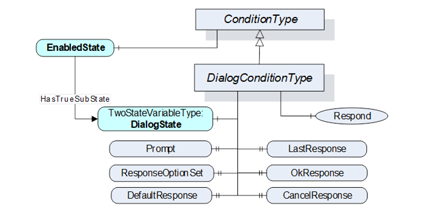  

Figure 1212 - DialogConditionType Overview  

Table 2424 - DialogConditionType definition  

| **Attribute** | **Value** |
|---|---|
|BrowseName|DialogConditionType|
|IsAbstract|False|
  
| **References** | **NodeClass** | **BrowseName** | **DataType** | **TypeDefinition** | **ModellingRule** |
|---|---|---|---|---|---|
|Subtype of the ConditionType defined in clause [5.5.2](/§\_Ref151457588)|
|HasComponent|Variable|DialogState|LocalizedText|TwoStateVariableType|Mandatory|
|HasProperty|Variable|Prompt|LocalizedText|PropertyType|Mandatory|
|HasProperty|Variable|ResponseOptionSet|LocalizedText [ ]|PropertyType|Mandatory|
|HasProperty|Variable|DefaultResponse|Int32|PropertyType|Mandatory|
|HasProperty|Variable|LastResponse|Int32|PropertyType|Mandatory|
|HasProperty|Variable|OkResponse|Int32|PropertyType|Mandatory|
|HasProperty|Variable|CancelResponse|Int32|PropertyType|Mandatory|
|HasComponent|Method|Respond|Defined in Clause [5.6.3](/§\_Ref228802874) .|Mandatory|
|HasComponent|Method|Respond2|Defined in Clause [5.6.4](/§\_Ref78268128) .|Optional|
  
| **ConformanceUnits** |
|---|
|A & C Dialog|
  

  

Table 2525 - DialogConditionType Additional Subcomponents  

| **BrowsePath** | **References** | **NodeClass** | **BrowseName** | **DataType** | **TypeDefinition** | **Others** |
|---|---|---|---|---|---|---|
|DialogState|HasProperty|Variable|TrueState|LocalizedText|PropertyType||
|DialogState|HasProperty|Variable|FalseState|LocalizedText|PropertyType||
  

  

The empty *"* Others" column indicates that no *ModellingRule* applies.  

The *DialogConditionType* inherits all *Properties* of the *ConditionType* .  

*DialogState/Id* when set to True indicates that the *Dialog* is active and waiting for a response. Recommended state names are described in [A.2](/§\_Ref111535956) .  

*Prompt* is a dialog prompt to be shown to the user.  

*ResponseOptionSet* specifies the desired set of responses as array of *LocalizedText* . The index in this array is used for the corresponding fields like *DefaultResponse* , *LastResponse* and *SelectedOption* in the *Respond* *Method* . The recommended localized names for the common options are described in [A.1](/§\_Ref111535969) .  

Typical combinations of response options are  

* OK  

* OK, Cancel  

* Yes, No, Cancel  

* Abort, Retry, Ignore  

* Retry, Cancel  

* Yes, No  

*DefaultResponse* identifies the response option that should be shown as default to the user. It is the index in the *ResponseOptionSet* array. If no response option is the default, the value of the *Property* is -1.  

*LastResponse* contains the last response provided by a *Client* in the *Respond Method* . If no previous response exists, then the value of the *Property* is -1.  

*OkResponse* provides the index of the OK option in the *ResponseOptionSet* array. This choice is the response that will allow the system to proceed with the operation described by the prompt. This allows a *Client* to identify the OK option if a special handling for this option is available. If no OK option is available, the value of this *Property* is -1.  

*CancelResponse* provides the index of the response in the *ResponseOptionSet* array that will cause the Dialog to go into the inactive state without proceeding with the operation described by the prompt. This allows a *Client* to identify the Cancel option if a special handling for this option is available. If no Cancel option is available, the value of this *Property* is -1.  

#### 5.6.3 Respond Method  

*Respond* is used to pass the selected response option and end the dialog. *DialogState/Id* will return to False.  

 **Signature**   

 **Respond**   

[in] Int32 SelectedResponse  

);  

The parameters are defined in [Table 2626](/§\_Ref396824722)  

Table 2626 - Respond parameters  

| **Argument** | **Description** |
|---|---|
|SelectedResponse|Selected index of the *ResponseOptionSet* array.|
  

  

 ***Method* result codes in [Table 2727](/§\_Ref396824748) (defined in Call Ser *v* ice)**   

Table 2727 - Respond Result Codes  

| **Result Code** | **Description** |
|---|---|
|Bad\_DialogNotActive|See [Table 137137](/§\_Ref90539276) for the description of this result code.|
|Bad\_DialogResponseInvalid|See [Table 137137](/§\_Ref90539276) for the description of this result code.|
  

  

[Table 2828](/§\_Ref225740746) specifies the *AddressSpace* representation for the *Respond* *Method* .  

Table 2828 - Respond Method AddressSpace definition  

| **Attribute** | **Value** |
|---|---|
|BrowseName|Respond|
  
| **References** | **NodeClass** | **BrowseName** | **DataType** | **TypeDefinition** | **ModellingRule** |
|---|---|---|---|---|---|
|HasProperty|*Variable*|InputArguments|Argument[]|PropertyType|Mandatory|
|AlwaysGeneratesEvent|ObjectType|AuditConditionRespondEventType|Defined in [5.10.5](/§\_Ref234205372) |
  
| **ConformanceUnits** |
|---|
|A & C Dialog|
  

  

If *Auditing* is supported, this *Method* shall generate an *Event* of *AuditConditionRespondEventType* for all invocations of the *Method* .  

#### 5.6.4 Respond2 Method  

*Respond2* Method extends the respond method by adding a comment field. For other functionality see the *Respond* *Method* definition.  

 **Signature**   

 **Respond2**   

[in] Int32   SelectedResponse  

[in] LocalizedText Comment  

);  

The parameters are defined in [Table 2929](/§\_Ref78264658)  

Table 2929 - Respond2 parameters  

| **Argument** | **Description** |
|---|---|
|SelectedResponse|Selected index of the *ResponseOptionSet* array.|
|Comment|A localized text that shall be applied to the *Dialog* .|
  

  

If the *Comment* argument is NULL (both locale and text are empty) it shall be ignored and any existing comments will remain unchanged. To reset the comment, an empty text with a locale shall be provided.  

 ***Method* result codes in [Table 3030](/§\_Ref78264692) (defined in Call Ser *v* ice)**   

Table 3030 - Respond2 Result Codes  

| **Result Code** | **Description** |
|---|---|
|Bad\_DialogNotActive|See [Table 137137](/§\_Ref90539276) for the description of this result code.|
|Bad\_DialogResponseInvalid|See [Table 137137](/§\_Ref90539276) for the description of this result code.|
|Bad\_InvalidArgument|The Comment string provided exceeds the allowed length for the comment or is invalid in some other manner.|
  

  

[Table 3131](/§\_Ref78264720) specifies the *AddressSpace* representation for the *Respond2* *Method* .  

Table 3131 - Respond2 Method AddressSpace definition  

| **Attribute** | **Value** |
|---|---|
|BrowseName|Respond2|
  
| **References** | **NodeClass** | **BrowseName** | **DataType** | **TypeDefinition** | **ModellingRule** |
|---|---|---|---|---|---|
|HasProperty|*Variable*|InputArguments|Argument[]|PropertyType|Mandatory|
|AlwaysGeneratesEvent|ObjectType|AuditConditionRespondEventType|Defined in [5.10.5](/§\_Ref234205372) |
  
| **ConformanceUnits** |
|---|
|A & C Dialog2|
  

  

If *Auditing* is supported, this *Method* shall generate an *Event* of *AuditConditionRespondEventType* for all invocations of the *Method* .  

  

### 5.7 Acknowledgeable Condition Model  

#### 5.7.1 General  

The Acknowledgeable *Condition* Model extends the *Condition* model. States for acknowledgement and confirmation are added to the *Condition* model.  

*AcknowledgeableConditions* are represented by the *AcknowledgeableConditionType* which is a subtype of the *ConditionType* . The model is formally defined in the following sub clauses.  

#### 5.7.2 AcknowledgeableConditionType  

The *AcknowledgeableConditionType* extends the *ConditionType* by defining acknowledgement characteristics. The *AcknowledgeableConditionType* is illustrated in [Figure 1313](/§\_Ref173035284) and formally defined in [Table 3232](/§\_Ref173035301) and [Table 3333](/§\_Ref83724523) .  

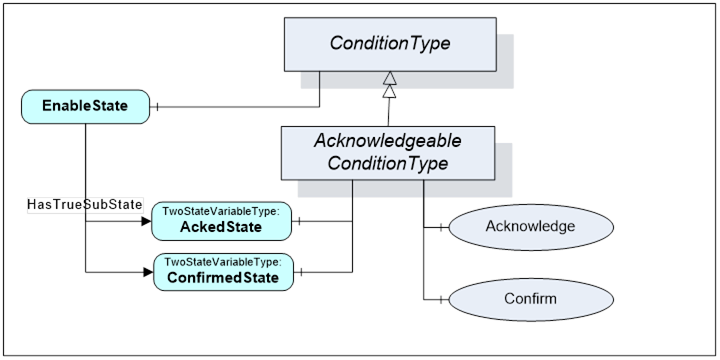  

Figure 1313 - AcknowledgeableConditionType overview  

Table 3232 - AcknowledgeableConditionType definition  

| **Attribute** | **Value** |
|---|---|
|BrowseName|AcknowledgeableConditionType|
|IsAbstract|False|
  
| **References** | **NodeClass** | **BrowseName** | **DataType** | **TypeDefinition** | **ModellingRule** |
|---|---|---|---|---|---|
|Subtype of the *ConditionType* defined in ** clause [5.5.2](/§\_Ref225571688) .|
|HasSubtype|ObjectType|AlarmConditionType|Defined in Clause [5.8.2](/§\_Ref150677970)|
|||||||
|HasComponent|Variable|AckedState|LocalizedText|TwoStateVariableType|Mandatory|
|HasComponent|Variable|ConfirmedState|LocalizedText|TwoStateVariableType|Optional|
|||||||
|HasComponent|Method|Acknowledge|Defined in Clause [5.7.3](/§\_Ref224987672)|Mandatory|
|HasComponent|Method|Confirm|Defined in Clause [5.7.4](/§\_Ref287396027)|Optional|
  
| **ConformanceUnits** |
|---|
|A & C Acknowledge|
  

  

Table 3333 - AcknowledgeableConditionType Additional Subcomponents  

| **BrowsePath** | **References** | **NodeClass** | **BrowseName** | **DataType** | **TypeDefinition** | **Others** |
|---|---|---|---|---|---|---|
|AckedState|HasProperty|Variable|TrueState|LocalizedText|PropertyType||
|AckedState|HasProperty|Variable|FalseState|LocalizedText|PropertyType||
|ConfirmedState|HasProperty|Variable|TrueState|LocalizedText|PropertyType||
|ConfirmedState|HasProperty|Variable|FalseState|LocalizedText|PropertyType||
  

  

The empty *"* Others" column indicates that no *ModellingRule* applies.  

The *AcknowledgeableConditionType* inherits all *Properties* of the *ConditionType* .  

*AckedState* when False indicates that the *Condition* instance requires acknowledgement for the reported *Condition* state. When the *Condition* instance is acknowledged the *AckedState* is set to True. *ConfirmedState* indicates whether it requires confirmation. Recommended state names are described in [A.1](/§\_Ref96184042) . The two states are sub-states of the True *EnabledState* . See [4.3](/§\_Ref225212629) for more information about acknowledgement and confirmation models. The *EventId* used in the *Event Notification* is considered the identifier of this state and has to be used when calling the *Methods* for acknowledgement or confirmation.  

A *Server* may require that previous states be acknowledged. If the acknowledgement of a previous state is still open and a new state also requires acknowledgement, the *Server* shall create a branch of the *Condition* instance as specified in [4.2](/§\_Ref50935305) . *Clients* are expected to keep track of all *ConditionBranches* where *AckedState* /Id is False to allow acknowledgement of those. See also [5.5.2](/§\_Ref228774165) for more information about *ConditionBranches* and the examples in Clause [B.1](/§\_Ref228716488) . The handling of the *AckedState* and branches also applies to the *ConfirmedState* .  

In the event of a restart of an *AlarmManager* , the *AlarmManager* should recover the *AckedState* and *ConfirmedState* (if supported) of all current conditions. If the system can not determine if the condition is *Acknowledged* or *Confirmed* , they shall be set to false (not *Acknowledged* and not *Confirmed* ).  

#### 5.7.3 Acknowledge Method  

The *Acknowledge* *Method* is used to acknowledge an *Event Notification* for a *Condition* instance state where *AckedState* is False. Normally, the *NodeId* of the object instance is passed as the *ObjectId* to the *Call* *Service* . However, some *Servers* do not expose *Condition* instances in the *AddressSpace.* Therefore, *Servers* shall allow *Clients* to call the *Acknowledge* *Method* by specifying *ConditionId* as the *ObjectId.* The *Method* cannot be called with an *ObjectId* of the *AcknowledgeableConditionType* *Node* .  

 **Signature**   

 **Acknowledge**   

[in] ByteString EventId  

[in] LocalizedText Comment  

);  

The parameters are defined in [Table 3434](/§\_Ref396824772)  

Table 3434 - Acknowledge parameters  

| **Argument** | **Description** |
|---|---|
|EventId|EventId identifying a particular *Event Notification* . Only *Event Notifications* where AckedState/Id was False can be acknowledged.|
|Comment|A localized text that shall be applied to the *Condition* .|
  

  

 ***Method* result codes in [Table 3535](/§\_Ref396824787) (defined in Call Service)**   

Table 3535 - Acknowledge result codes  

| **Result Code** | **Description** |
|---|---|
|Bad\_ConditionBranchAlreadyAcked|See [Table 137137](/§\_Ref90539276) for the description of this result code.|
|Bad\_MethodInvalid|The *MethodId* is not the well-known method of the *AcknowledgeableConditionType* or *MethodId* does not refer to a *Method* for the specified *Object* or *ConditionId* .|
|Bad\_EventIdUnknown|See [Table 137137](/§\_Ref90539276) for the description of this result code.|
|Bad\_NodeIdInvalid|Used to indicate that the specified *ObjectId* is not valid or that the *Method* was called on the *AcknowledgeableConditionType* *Node* . See [10000-4](/§UAPart4) for the general description of this result code.|
|Bad\_InvalidArgument|The Comment string provided exceeds the allowed length for the comment or is invalid in some other manner.|
  

  

 **Comments**   

A *Server* is responsible to ensure that each *Event* has a unique *EventId* . This allows *Clients* to identify and acknowledge a particular *Event Notification* .  

The *EventId* identifies a specific *Event Notification* with an acknowledgeable state was reported. Acknowledgement and the optional comment will be applied to the state identified with the *EventId* . If the comment field is NULL (both locale and text are empty) it will be ignored and any existing comments will remain unchanged. To reset the comment, an empty text with a locale shall be provided.  

A valid *EventId* will result in an *Event Notification* where *AckedState* /Id is set to True and the *Comment Property* contains the text of the optional comment argument. If a previous state is acknowledged, the *BranchId* and all *Condition* values of this branch will be reported. [Table 3636](/§\_Ref173035324) specifies the *AddressSpace* representation for the *Acknowledge* *Method* .  

Table 3636 - Acknowledge Method AddressSpace definition  

| **Attribute** | **Value** |
|---|---|
|BrowseName|Acknowledge|
  
| **References** | **NodeClass** | **BrowseName** | **DataType** | **TypeDefinition** | **ModellingRule** |
|---|---|---|---|---|---|
|HasProperty|*Variable*|InputArguments|Argument[]|PropertyType|Mandatory|
|AlwaysGeneratesEvent|ObjectType|AuditConditionAcknowledge EventType|Defined in [5.10.5](/§\_Ref225150898)|
  
| **ConformanceUnits** |
|---|
|A & C Acknowledge|
  

  

If *Auditing* is supported, this *Method* shall generate an *Event* of *AuditConditionAcknowledgeEventType* for all invocations of the *Method* .  

#### 5.7.4 Confirm Method  

The *Confirm* *Method* is used to confirm an *Event Notifications* for a *Condition* instance state where *ConfirmedState* is False. Normally, the *NodeId* of the object instance is passed as the *ObjectId* to the *Call* *Service* . However, some *Servers* do not expose *Condition* instances in the *AddressSpace.* Therefore, *Servers* shall allow *Clients* to call the *Confirm* *Method* by specifying *ConditionId* as the *ObjectId.* The *Method* cannot be called with an *ObjectId* of the *AcknowledgeableConditionType Node.*  

 **Signature**   

 **Confirm**   

[in] ByteString  EventId  

[in] LocalizedText Comment  

);  

The parameters are defined in [Table 3737](/§\_Ref387162162)  

Table 3737 - Confirm Method parameters  

| **Argument** | **Description** |
|---|---|
|EventId|*EventId* identifying a particular *Event Notification* . Only *Event Notifications* where the Id property of the *ConfirmedState* is False can be confirmed.|
|Comment|A localized text that shall be applied to the *Conditions* .|
  

  

 ***Method* result codes in [Table 3838](/§\_Ref396824818) (defined in Call Service)**   

Table 3838 - Confirm result codes  

| **Result Code** | **Description** |
|---|---|
|Bad\_ConditionBranchAlreadyConfirmed|See [Table 137137](/§\_Ref90539276) for the description of this result code.|
|Bad\_MethodInvalid|The method id does not refer to a method for the specified object or *ConditionId* . See [10000-4](/§UAPart4) for the general description of this result code.|
|Bad\_EventIdUnknown|See [Table 137137](/§\_Ref90539276) for the description of this result code.|
|Bad\_NodeIdInvalid|Used to indicate that the specified *ObjectId* is not valid or that the *Method* was called on the *AcknowledgeableConditionType* *Node* . See [10000-4](/§UAPart4) for the general description of this result code.|
|Bad\_InvalidArgument|The Comment string provided exceeds the allowed length for the comment or is invalid in some other manner.|
  

  

 **Comments**   

A *Server* is responsible to ensure that each *Event* has a unique *EventId* . This allows *Clients* to identify and confirm a particular *Event Notification* .  

The *EventId* identifies a specific *Event Notification* with a confirmable state was reported.  

A *Comment* can be provided which will be applied to the state identified with the *EventId* . If the comment argument is NULL (both locale and text are empty) it will be ignored and any existing comments will remain unchanged. If the comment is to be reset, an empty text with a locale shall be provided.  

A valid *EventId* will result in an *Event Notification* where *ConfirmedState* /Id is set to True and the *Comment Property* contains the text of the optional comment argument. If a previous state is confirmed, the *BranchId* and all *Condition* values of this branch will be reported. A *Client* can confirm only events that have a *ConfirmedState* /Id set to False. The logic for setting *ConfirmedState* /Id to False is *Server* specific and may even be event or condition specific.  

[Table 3939](/§\_Ref225748196) specifies the *AddressSpace* representation for the *Confirm* *Method* .  

Table 3939 - Confirm Method AddressSpace definition  

| **Attribute** | **Value** |
|---|---|
|BrowseName|Confirm|
  
| **References** | **NodeClass** | **BrowseName** | **DataType** | **TypeDefinition** | **ModellingRule** |
|---|---|---|---|---|---|
|HasProperty|*Variable*|InputArguments|Argument[]|PropertyType|Mandatory|
|AlwaysGeneratesEvent|ObjectType|AuditConditionConfirmEventType|Defined in [5.10.7](/§\_Ref234205503) |
  
| **ConformanceUnits** |
|---|
|A & C Confirm|
  

  

If *Auditing* is supported, this *Method* shall generate an *Event* of *AuditConditionConfirmEventType* for all invocations of the *Method* .  

### 5.8 Alarm model  

#### 5.8.1 General  

[Figure 1414](/§\_Ref442775182) informally describes the AlarmConditionType, its sub-types and where it is in the hierarchy of *Event Types* .  

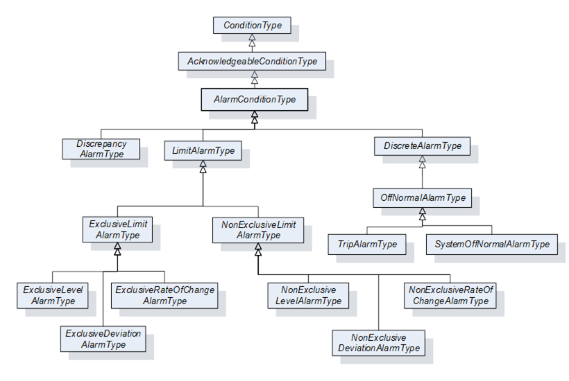  

Figure 1414 - AlarmConditionType Hierarchy Model  

#### 5.8.2 AlarmConditionType  

The *AlarmConditionType* extends the *AcknowledgeableConditionType* by introducing an *ActiveState* , *SuppressedState* and *ShelvingState* . It also adds the ability to set a delay time, re-alarm time, *Alarm* groups and audible *Alarm* settings. The *Alarm* model is illustrated in [Figure 1515](/§\_Ref225872505) . This illustration is not intended to be a complete definition. It is formally defined in [Table 4040](/§\_Ref225872520) and [Table 4141](/§\_Ref83724699) .  

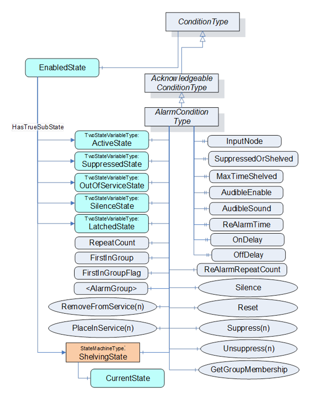  

Figure 1515 - Alarm Model  

Table 4040 - AlarmConditionType definition  

| **Attribute** | **Value** |
|---|---|
|BrowseName|AlarmConditionType|
|IsAbstract|False|
  
| **References** | **Node Class** | **BrowseName** | **DataType** | **TypeDefinition** | **Modelling Rule** |
|---|---|---|---|---|---|
|Subtype of the *AcknowledgeableConditionType* defined in clause [5.7.2](/§\_Ref173042653)|
|HasComponent|Variable|ActiveState|LocalizedText|TwoStateVariableType|Mandatory|
|HasProperty|Variable|InputNode|NodeId|PropertyType|Mandatory|
|HasComponent|Variable|SuppressedState|LocalizedText|TwoStateVariableType|Optional|
|HasComponent|Variable|OutOfServiceState|LocalizedText|TwoStateVariableType|Optional|
|HasComponent|Object|ShelvingState||ShelvedStateMachineType|Optional|
|HasProperty|Variable|SuppressedOrShelved|Boolean|PropertyType|Mandatory|
|HasProperty|Variable|MaxTimeShelved|Duration|PropertyType|Optional|
|||||||
|HasProperty|Variable|AudibleEnabled|Boolean|PropertyType|Optional|
|HasComponent|Variable|AudibleSound|AudioDataType|AudioVariableType|Optional|
|HasComponent|Variable|SilenceState|LocalizedText|TwoStateVariableType|Optional|
|||||||
|HasProperty|Variable|OnDelay|Duration|PropertyType|Optional|
|HasProperty|Variable|OffDelay|Duration|PropertyType|Optional|
|||||||
|HasComponent|Variable|FirstInGroupFlag|Boolean|BaseDataVariableType|Optional|
|HasComponent|Object|FirstInGroup||AlarmGroupType|Optional|
|HasComponent|Variable|LatchedState|LocalizedText|TwoStateVariableType|Optional|
|HasAlarmSuppressionGroup|Object|\<AlarmGroup\>||AlarmGroupType|OptionalPlaceholder|
|HasProperty|Variable|ReAlarmTime|Duration|PropertyType|Optional|
|HasComponent|Variable|ReAlarmRepeatCount|Int16|BaseDataVariableType|Optional|
|||||||
|HasComponent|Method|Reset|Defined in [5.8.5](/§\_Ref487634887)|Optional|
|HasComponent|Method|Reset2|Defined in [5.8.6](/§\_Ref78282020) [5.8.5](/§\_Ref487634887)|Optional|
|HasComponent|Method|Silence|Defined in [5.8.7](/§\_Ref456907897)|Optional|
|HasComponent|Method|Suppress|Defined in [5.8.8](/§\_Ref462930107)|Optional|
|HasComponent|Method|Suppress2|Defined in [5.8.9](/§\_Ref78230702)|Optional|
|HasComponent|Method|Unsuppress|Defined in [5.8.10](/§\_Ref481487318)|Optional|
|HasComponent|Method|Unsuppress2|Defined in [5.8.11](/§\_Ref78230713)|Optional|
|HasComponent|Method|RemoveFromService|Defined in [5.8.12](/§\_Ref462930050)|Optional|
|HasComponent|Method|RemoveFromService2|Defined in [5.8.13](/§\_Ref78230723)|Optional|
|HasComponent|Method|PlaceInService|Defined in [5.8.14](/§\_Ref78230666)|Optional|
|HasComponent|Method|PlaceInService2|Defined in [5.8.15](/§\_Ref78230734)|Optional|
|HasComponent|Method|GetGroupMemberships|Defined in [5.8.16](/§\_Ref78230687)|Optional|
||||||
|HasSubtype|ObjectType|DiscreteAlarmType||||
|HasSubtype|ObjectType|LimitAlarmType||||
|HasSubtype|ObjectType|DiscrepancyAlarmType||||
||
  
| **ConformanceUnits** |
|---|
|A & C Alarm|
  

  

Table 4141 - AlarmConditionType Additional Subcomponents  

| **BrowsePath** | **References** | **NodeClass** | **BrowseName** | **DataType** | **TypeDefinition** | **Others** |
|---|---|---|---|---|---|---|
|ActiveState|HasProperty|Variable|TrueState|LocalizedText|PropertyType||
|ActiveState|HasProperty|Variable|FalseState|LocalizedText|PropertyType||
|SuppressedState|HasProperty|Variable|TrueState|LocalizedText|PropertyType||
|SuppressedState|HasProperty|Variable|FalseState|LocalizedText|PropertyType||
|OutOfServiceState|HasProperty|Variable|TrueState|LocalizedText|PropertyType||
|OutOfServiceState|HasProperty|Variable|FalseState|LocalizedText|PropertyType||
|SilenceState|HasProperty|Variable|TrueState|LocalizedText|PropertyType||
|SilenceState|HasProperty|Variable|FalseState|LocalizedText|PropertyType||
|LatchedState|HasProperty|Variable|TrueState|LocalizedText|PropertyType||
|LatchedState|HasProperty|Variable|FalseState|LocalizedText|PropertyType||
  

  

The empty *"* Others" column indicates that no *ModellingRule* applies.  

The *AlarmConditionType* inherits all *Properties* of the *AcknowledgeableConditionType* . The following states are sub-states of the True *EnabledState* .  

*ActiveState/Id* when set to True indicates that the situation the *Condition* is representing currently exists. When a *Condition* instance is in the inactive state ( *ActiveState/Id* when set to False) it is representing a situation that has returned to a normal state. The transitions of *Conditions* to the inactive and *Active* states are triggered by *Server* specific actions. Subtypes of the *AlarmConditionType* specified later in this document will have sub-state models that further define the *Active* state. Recommended state names are described in [A.1](/§\_Ref96212959) . In the event of a restart of an *AlarmManager* , the *AlarmManager* shall recover the *ActiveState.*  

The *InputNode Property* provides the *NodeId* of the *Variable* the *Value* of which is used as primary input in the calculation of the *Alarm* state. If this *Variable* is not in the *AddressSpace* , a NULL *NodeId* shall be provided. In some systems, an *Alarm* may be calculated based on multiple *Variables* *Values* ; it is up to the system to determine which *Variable's* *NodeId* is used.  

*SuppressedState* , *OutOfServiceState* and *ShelvingState* together allow the suppression of *Alarms* on display systems. These three suppressions are generally used by different personnel or systems at a plant, i.e. automatic systems, maintenance personnel and *Operators* .  

*SuppressedState* is used internally by a *Server* to automatically suppress *Alarms* due to system specific reasons. For example, a system may be configured to suppress *Alarms* that are associated with machinery that is in a state such as shutdown. For example, a low level *Alarm* for a tank that is currently not in use might be suppressed. Recommended state names are described in [A.1](/§\_Ref96213027) . In the event of a restart of an *AlarmManager* , the *AlarmManager* should recover the *SuppressedState* . If the system cannot determine if the alarm is *Suppressed* , the state shall be set to false (not *Suppressed* ).  

*OutOfServiceState* is used by maintenance personnel to suppress *Alarms* due to a maintenance issue. For example, if an instrument is taken out of service for maintenance or is removed temporarily while it is being replaced or serviced the item would have the *OutOfServiceState* set. Recommended state names are described in [A.1](/§\_Ref78233403) . In the event of a restart of an *AlarmManager* , the *AlarmManager* should recover the *OutOfServiceState.* If the system cannot determine if the alarm is *OutOfService* , the state shall be set to false (not *OutOfService* ).  

*ShelvingState* suggests whether an *Alarm* shall (temporarily) be prevented from being displayed to the user. It is quite often used by *Operators* to block nuisance *Alarms* . The *ShelvingState* is defined in [5.8.17](/§\_Ref387228808) .  

When an *Alarm* has any or all of the *SuppressedState, OutOfServiceState* or *ShelvingState* set to True, the *SuppressedOrShelved* property shall be set True and this *Alarm* is then typically not displayed by the *Client* . State transitions associated with the *Alarm* do occur, but they are not typically displayed by the *Clients* as long as the *Alarm* remains in any of the *SuppressedState, OutOfServiceState* or *Shelved* state.  

The optional *Property* *MaxTimeShelved* is used to set the maximum time that an *Alarm* *Condition* may be shelved. The value is expressed as duration. Systems can use this *Property* to prevent permanent *Shelving* of an *Alarm.* If this *Property* is present, it will be an upper limit on the duration passed into a *TimedShelve* *Method* call. If a value that exceeds the value of this *Property* is passed to the *TimedShelve* *Method* , then a *Bad* \_ *ShelvingTimeOutOfRange* error code is returned on the call. If this *Property* is present, it will also be enforced for the *OneShotShelved* state, in that an *Alarm Condition* will transition to the *Unshelved* state from the *OneShotShelved* state if the duration specified in this *Property* expires following a *OneShotShelve* operation without a change of any of the other items associated with the *Condition* .  

The optional *Property* *AudibleEnabled* is a Boolean that indicates if the current state of this *Alarm* includes an audible *Alarm* .  

The optional *Property* *AudibleSound* contains the sound file that shall be played when an audible *Alarm* is generated. This file would be play/generated as long as the *Alarm* is active and unacknowledged, unless the silence *StateMachine* is included, in which case it may also be silenced by this *StateMachine* .  

The *SilenceState* is used to suppress the generation of the audible sound. Typically, it is used when an *Operator* silences all *Alarms* on a screen, but will acknowledge the *Alarms* individually. Silencing an *Alarm* shall silence the *Alarm* on all systems (screens) that it is being reported on. Not all *Clients* will make use of this *StateMachine* , but it allows multiple *Clients* to synchronize audible *Alarm* states. Acknowledging an *Alarm* shall automatically silence an *Alarm* . In the event of a restart of an *AlarmManager* , the *AlarmManager* should recover the *SilenceState* . If the system cannot determine if the *Alarm* is silenced, it shall set the *SilenceState,* based on the *AcknowledgeState.* If it is *Acknowledged* , it is silenced, If it has not been *Acknowledged* , it shall not be silenced.  

The *OnDelay* and *OffDelay* *Properties* can be used to eliminate nuisance *Alarms* . The *OnDelay* is used to avoid unnecessary Alarms when a signal temporarily overshoots its setpoint, thus preventing the *Alarm* from being triggered until the signal remains in the *Alarm* state continuously for a specified length of time ( *OnDelay* time). The *OffDelay* is used to reduce chattering *Alarms* by locking the *Alarm* indication for a certain holding period after the condition has returned to normal. I.e., the *Alarm* shall stay active for the *OffDelay* time and shall not regenerate if it returns to active in that period. If the *Alarm* remains in the inactive zone for *OffDelay* it will then become inactive.  

The optional variable *FirstInGroupFlag* is used together with the *FirstInGroup* object. The FirstInGroup Object is an instance of an AlarmGroupType that groups a number of related *Alarm* s. The *FirstInGroupFlag* is set on the *Alarm* instance that was the first *Alarm* to trigger in a *FirstInGroup* . If this variable is present, then the *FirstInGroup* shall also be present. These two nodes allow an alarming system to determine which *Alarm* in the list was the trigger. It is commonly used in situations where *Alarms* are interrelated and usually multiple *Alarm* s occur. For example, vibration sensors in a turbine, usually all sensors trigger if any one triggers, but what is important for an *Operator* is the first sensor that triggered.  

The *LatchedState* *Object* , if present, indicates that this *Alarm* supports being latched. The *Alarm* will remain with a retain bit of True until it is no longer active, is acknowledged, is confirmed (if *ConfirmedState* is provided) and is reset. The *Reset* *Method,* if called while active has no effect on the *Alarm* and is ignored and an error of Bad\_InvalidState is return on the call. The *Object* indicates the current state, latched or not latched. Recommended state names are described in [A.1](/§\_Ref78233403) . If this *Object* is provided the *Reset* *Method* shall be provided. In the event of a restart of an *AlarmManager* , the *AlarmManager* shall recover the *LatchedState.*  

An *Alarm* instance may contain *HasAlarmSuppressionGroup* reference(s) to instance(s) of *AlarmGroupType* (or subtype of it). Each instance is an *AlarmSuppressionGroup.* When an *AlarmSuppressionGroup* goes active, the *Server* shall set the *SuppressedState* of the *Alarm* containing the *HasAlarmSuppressionGroup* reference to True. When all of referenced *AlarmSuppressionGroups* are no longer active, then the Server shall set *SuppressedState* to False. A single *AlarmSuppressionGroup* can manage multiple *Alarms* . *AlarmSuppressionGroups* are used to control *Alarm* floods and to help manage *Alarms* .  

*ReAlarmTime* if present sets a time that is used to bring an *Alarm* back to the top of an *Alarm* list. If an *Alarm* has not returned to normal within the provided time (from when it last was alarmed), the *Server* will generate a new *Alarm* for it (as if it just went into alarm). If it has been silenced it shall return to an un-silenced state, if it has been acknowledged it shall return to unacknowledged. The *Alarm* active time is set to the time of the re-alarm.  

*ReAlarmRepeatCount* if present counts the number times an *Alarm* was re-alarmed. Some smart alarming system would use this count to raise the priority or otherwise generate additional or different annunciations for the given *Alarm* . The count is reset when an *Alarm* returns to normal.  

*Silence* *Method* can be used to silence an instance of an *Alarm* . It is defined in [5.8.7](/§\_Ref456907897) .  

*Suppress* and *Suppress2* *Method* can be used to suppress an instance of an *Alarm* . Most *Alarm* suppression occurs via advanced alarming, but this method allows additional access to suppress a particular *Alarm* instance. Additional details are provided in the definition in [5.8.8](/§\_Ref462930020) and [5.8.9](/§\_Ref78230702)  

*Unsuppress* and *Unsuppress2* *Method* can be used to remove an instance of an *Alarm* from SuppressedState. Additional details are provided in the definition in [5.8.10](/§\_Ref481487318) and [5.8.11](/§\_Ref78230713) .  

*PlaceInService* and *PlaceInService2* *Method* can be used to remove an instance of an *Alarm* from *OutOfServiceState* . It is defined in [5.8.14](/§\_Ref78230648) and [5.8.15](/§\_Ref78230734) .  

*RemoveFromService* and *RemoveFromService2* *Method* can be used to place an instance of an *Alarm* in *OutOfServiceState* . It is defined in [5.8.12](/§\_Ref462930050) and [5.8.13](/§\_Ref78230723) .  

*Reset* *Method* is used to clear a latched *Alarm* . It is defined in [5.8.5](/§\_Ref487634887) . If this *Object* is provided the *LatchedState* *Object* shall also be provided.  

More details about the *Alarm* Model and the various states can be found in Sub clause [4.8](/§\_Ref154141147) . and in [Annex E](/§\_Ref445243447) .  

#### 5.8.3 AlarmGroupType  

The *AlarmGroupType* provides a simple manner of grouping *Alarms* . This grouping can be used for *Alarm* suppression or for identifying related *Alarms* . The actual usage of the *AlarmGroupType* is specified where it is used.  

Table 4242 - AlarmGroupType definition  

| **Attribute** | **Value** |
|---|---|
|BrowseName|AlarmGroupType|
|IsAbstract|False|
  
| **References** | **NodeClass** | **BrowseName** | **DataType** | **TypeDefinition** | **ModellingRule** |
|---|---|---|---|---|---|
|Subtype of the *FolderType* defined in [10000-5](/§UAPart5)|
|AlarmGroupMember|Object|\<AlarmConditionInstance\>||AlarmConditionType|OptionalPlaceholder|
  
| **ConformanceUnits** |
|---|
|A & C First in Group Alarm|
|A & C Suppression Group|
  

  

The instance of an *AlarmGroupType* should be given a name and description that describes the purpose of the *Alarm* group.  

The *AlarmGroupType* instance will contain a list of instances of *AlarmConditionType* or sub type of *AlarmConditionType* referenced by *AlarmGroupMember* references. At least one instance of *AlarmConditionType* (or a subtype of it) shall be present in an instance of an *AlarmGroupType* .  

#### 5.8.4 AlarmSuppressionGroupType  

This is a subtype of *AlarmGroupType* that can be used to suppress other alarms. This subtype of *AlarmGroup* extends the *AlarmGroupType* to allow the addition of *Variables* that have a *Boolean* *DataType* . The *Variable* can be thought of as representing the *Id* of the *ActiveState* of an *Alarm* , i.e. when any of the included *Variables* have a value of true the *AlarmSuppressionGroup* is active.  

Table 4343 - AlarmSuppressionGroupType definition  

| **Attribute** | **Value** |
|---|---|
|BrowseName|AlarmSuppressionGroupType|
|IsAbstract|False|
  
| **References** | **NodeClass** | **BrowseName** | **DataType** | **TypeDefinition** | **ModellingRule** |
|---|---|---|---|---|---|
|Subtype of the *AlarmGroupType*|
|AlarmSuppressionGroupMember|Variable|\<DigitalVariable\>|Boolean|BaseDataVariableType|OptionalPlaceholder|
|AlarmSuppressionGroupMember|Object|\<AlarmCondition\>||AlarmConditionType|OptionalPlaceholder|
  
| **ConformanceUnits** |
|---|
|A & C Suppression Group|
  

  

The instance of an *AlarmSuppressionGroupType* should be given a name and description that describes the purpose of the *Alarm* group.  

The *AlarmSuppressionGroupType* instance will contain a list of instances of *AlarmConditionType* or sub type of *AlarmConditionType* or *BaseDataVariableType* with a *DataType* of *Boolean* referenced by *AlarmSuppressionGroupMember* references. At least one these instances shall be present in an instance of an *AlarmSupressionGroupType* .  

#### 5.8.5 Reset Method  

The *Reset* *Method* is used reset a latched *Alarm* instance. It is only available on an instance of an *AlarmConditionType* that exposes the *LatchedState* . Normally, the *NodeId* of the *Object* instance is passed as the *ObjectId* to the *Call* *Service* . However, some *Servers* do not expose *Condition* instances in the *AddressSpace.* Therefore, *Servers* shall allow *Clients* to call the *Reset* *Method* by specifying *ConditionId* as the *ObjectId.* The *Method* cannot be called with an *ObjectId* of the *AlarmConditionType* *Node* .  

 **Signature**   

 **Reset**   

  

This method has no arguments.  

*Method* result codes in [Table 4444](/§\_Ref29302832) (defined in *Call* service)  

Table 4444 - Reset result codes  

| **Result Code** | **Description** |
|---|---|
|Bad\_MethodInvalid|The *MethodId* provided does not correspond to the *ObjectId* provided. See [10000-4](/§UAPart4) for the general description of this result code.|
|Bad\_NodeIdInvalid|Used to indicate that the specified *ObjectId* is not valid or that the *Method* was called on the *AlarmConditionType* *Node* . See [10000-4](/§UAPart4) for the general description of this result code.|
|Bad\_InvalidState|The *Alarm* instance was not latched or is still active or still requires acknowledgement / confirmation. To reset an *Alarm* instance shall have been in *Alarm* ,  returned to normal and have been acknowledged/confirmed prior to being reset.|
  

  

[Table 4545](/§\_Ref29302861) specifies the *AddressSpace* representation for the *Reset* *Method* .  

Table 4545 - Reset Method AddressSpace definition  

| **Attribute** | **Value** |
|---|---|
|BrowseName|Reset|
  
| **References** | **NodeClass** | **BrowseName** | **DataType** | **TypeDefinition** | **ModellingRule** |
|---|---|---|---|---|---|
|||||||
|AlwaysGeneratesEvent|ObjectType|AuditConditionResetEventType|Defined in [5.10.11](/§\_Ref484550563)|
|||||
  
| **ConformanceUnits** |
|---|
|A & C Latched State|
  

  

If *Auditing* is supported, this *Method* shall generate an *Event* of *AuditConditionResetEventType* for all invocations of the *Method* .  

#### 5.8.6 Reset2 Method  

The *Reset2* *Method* extends the *Reset* *Method* , by adding an optional *Comment* . For other functionality see the *Reset* *Method* definition.  

 **Signature**   

 **Reset2**   

[in] LocalizedText Comment  

);  

  

The parameters are defined in [Table 4646](/§\_Ref78282190) .  

Table 4646 - Reset2 Method parameters  

| **Argument** | **Description** |
|---|---|
|Comment|A localized text that shall be applied to the *Condition* .|
  

  

If the *Comment* argument is NULL (both locale and text are empty) it shall be ignored and any existing comments will remain unchanged. To reset the comment, an empty text with a locale shall be provided.  

 ***Method* result codes in [Table 4747](/§\_Ref78282206) (defined in *Call* service)**   

Table 4747 - Reset2 result codes  

| **Result Code** | **Description** |
|---|---|
|Bad\_MethodInvalid|The *MethodId* provided does not correspond to the *ObjectId* provided. See [10000-4](/§UAPart4) for the general description of this result code.|
|Bad\_NodeIdInvalid|Used to indicate that the specified *ObjectId* is not valid or that the *Method* was called on the *AlarmConditionType* *Node* . See [10000-4](/§UAPart4) for the general description of this result code.|
|Bad\_InvalidState|The *Alarm* instance was not latched or is still active or still requires acknowledgement / confirmation. To reset an *Alarm* Instance it shall have been in *Alarm* , and returned to normal and have been acknowledged/confirmed prior to being reset.|
|Bad\_InvalidArgument|The Comment string provided exceeds the allowed length for the comment or is invalid in some other manner.|
  

  

[Table 4848](/§\_Ref78282301) specifies the *AddressSpace* representation for the *Reset2* *Method* .  

Table 4848 - Reset2 Method AddressSpace definition  

| **Attribute** | **Value** |
|---|---|
|BrowseName|Reset2|
  
| **References** | **NodeClass** | **BrowseName** | **DataType** | **TypeDefinition** | **ModellingRule** |
|---|---|---|---|---|---|
|HasProperty|*Variable*|InputArguments|Argument[]|PropertyType|Mandatory|
|AlwaysGeneratesEvent|ObjectType|AuditConditionResetEventType|Defined in [5.10.11](/§\_Ref484550563)|
  
| **ConformanceUnits** |
|---|
|A & C Latched State|
  

  

If *Auditing* is supported, this *Method* shall generate an *Event* of *AuditConditionResetEventType* for all invocations of the *Method* .  

#### 5.8.7 Silence Method  

The *Silence* *Method* is used silence a specific *Alarm* instance. It is only available on an instance of an *AlarmConditionType* that also exposes the *SilenceState* . Normally, the *NodeId* of the *Object* instance is passed as the *ObjectId* to the *Call* *Service* . However, some *Servers* do not expose *Condition* instances in the *AddressSpace.* Therefore, *Servers* shall allow *Clients* to call the *Silence* *Method* by specifying *ConditionId* as the *ObjectId.* The *Method* cannot be called with an *ObjectId* of the *AlarmConditionType* *Node* .  

 **Signature**   

 **Silence**   

  

This method has no arguments.  

 ***Method* result codes in [Table 4949](/§\_Ref463025259) (defined in *Call* service)**   

Table 4949 - Silence result codes  

| **Result Code** | **Description** |
|---|---|
|Bad\_MethodInvalid|The *MethodId* provided does not correspond to the *ObjectId* provided. See [10000-4](/§UAPart4) for the general description of this result code.|
|Bad\_NodeIdInvalid|Used to indicate that the specified *ObjectId* is not valid or that the *Method* was called on the *AlarmConditionType Node* . See [10000-4](/§UAPart4) for the general description of this result code.|
  

  

 **Comments**   

If the instance is not currently in an audible state, the command is ignored.  

[Table 5050](/§\_Ref463025275) specifies the *AddressSpace* representation for the *Silence* *Method* .  

Table 5050 - Silence Method AddressSpace definition  

| **Attribute** | **Value** |
|---|---|
|BrowseName|Silence|
  
| **References** | **NodeClass** | **BrowseName** | **DataType** | **TypeDefinition** | **ModellingRule** |
|---|---|---|---|---|---|
|AlwaysGeneratesEvent|ObjectType|AuditConditionSilenceEventType|Defined in [5.10.10](/§\_Ref472941288)|
  
| **ConformanceUnits** |
|---|
|A & C Silencing|
  

  

If *Auditing* is supported, this *Method* shall generate an *Event* of *AuditConditionSilenceEventType* for all invocations of the *Method* .  

#### 5.8.8 Suppress Method  

The *Suppress* *Method* is used to suppress a specific *Alarm* instance. It is only available on an instance of an *AlarmConditionType* that also exposes the *SuppressedState* . This *Method* can be used to change the *SuppressedState* of an *Alarm* and overwrite any suppression caused by an associated *AlarmSuppressionGroup* . This *Method* works in parallel with any suppression triggered by an *AlarmSuppressionGroup* , in that if the *Method* is used to suppress an *Alarm* , an *AlarmSuppressionGroup* might clear the suppression.  

Normally, the *NodeId* of the object instance is passed as the *ObjectId* to the *Call* *Service* . However, some *Servers* do not expose *Condition* instances in the *AddressSpace.* Therefore, *Servers* shall allow *Clients* to call the *Suppress* *Method* by specifying *ConditionId* as the *ObjectId.* The *Method* cannot be called with an *ObjectId* of the *AlarmConditionType* *Node* .  

 **Signature**   

 **Suppress**   

  

 **Method Result Codes in [Table 5151](/§\_Ref463025326) (defined in Call Service)**   

Table 5151 - Suppress result codes  

| **Result Code** | **Description** |
|---|---|
|Bad\_MethodInvalid|The *MethodId* provided does not correspond to the ObjectId provided. See [10000-4](/§UAPart4) for the general description of this result code.|
|Bad\_NodeIdInvalid|Used to indicate that the specified *ObjectId* is not valid or that the *Method* was called on the *AlarmConditionType* *Node* . See [10000-4](/§UAPart4) for the general description of this result code.|
  

  

 **Comments**   

*Suppress* *Method* applies to an *Alarm* instance, even if it is not currently active.  

[Table 5252](/§\_Ref463025354) specifies the *AddressSpace* representation for the *Suppress* *Method* .  

Table 5252 - Suppress Method AddressSpace definition  

| **Attribute** | **Value** |
|---|---|
|BrowseName|Suppress|
  
| **References** | **NodeClass** | **BrowseName** | **DataType** | **TypeDefinition** | **ModellingRule** |
|---|---|---|---|---|---|
|||||||
|AlwaysGeneratesEvent|ObjectType|AuditConditionSuppressionEventType|Defined in [5.10.4](/§\_Ref225150516)|
  
| **ConformanceUnits** |
|---|
|A & C Suppression by Operator|
  

  

If *Auditing* is supported, this *Method* shall generate an *Event* of *AuditConditionSuppressionEventType* for all invocations of the *Method* .  

#### 5.8.9 Suppress2 Method  

The *Suppress2* *Method* extends the *Suppress* *Method* , by adding an optional *Comment* . For other functionality see the *Suppress* *Method* definition.  

 **Signature**   

 **Suppress2**   

[in] LocalizedText Comment  

);  

  

The parameters are defined in [Table 5353](/§\_Ref74215995)  

Table 5353 - Suppress2 Method parameters  

| **Argument** | **Description** |
|---|---|
|Comment|A localized text that shall be applied to the *Condition* .|
  

  

If the *Comment* argument is NULL (both locale and text are empty) it shall be ignored and any existing comments will remain unchanged. To reset the comment an empty text with a locale shall be provided.  

 **Method Result Codes in [Table 5151](/§\_Ref463025326) (defined in Call Service)**   

Table 5454 - Suppress result codes  

| **Result Code** | **Description** |
|---|---|
|Bad\_MethodInvalid|The *MethodId* provided does not correspond to the ObjectId provided. See [10000-4](/§UAPart4) for the general description of this result code.|
|Bad\_NodeIdInvalid|Used to indicate that the specified *ObjectId* is not valid or that the *Method* was called on the *AlarmConditionType* *Node* . See [10000-4](/§UAPart4) for the general description of this result code.|
|Bad\_InvalidArgument|The Comment string provided exceeds the allowed length for the comment or is invalid in some other manner.|
  

  

[Table 5555](/§\_Ref74216038) specifies the *AddressSpace* representation for the *Suppress2* *Method* .  

Table 5555 - Suppress2 Method AddressSpace definition  

| **Attribute** | **Value** |
|---|---|
|BrowseName|Suppress2|
  
| **References** | **NodeClass** | **BrowseName** | **DataType** | **TypeDefinition** | **ModellingRule** |
|---|---|---|---|---|---|
|HasProperty|*Variable*|InputArguments|Argument[]|PropertyType|Mandatory|
|AlwaysGeneratesEvent|ObjectType|AuditConditionSuppressionEventType|Defined in [5.10.4](/§\_Ref225150516) |
  
| **ConformanceUnits** |
|---|
|A & C Suppression2 by Operator|
  

  

If *Auditing* is supported, this *Method* shall generate an *Event* of *AuditConditionSuppressionEventType* for all invocations of the *Method* .  

#### 5.8.10 Unsuppress Method  

The *Unsuppress* *Method* is used to clear the *SuppressedState* of a specific *Alarm* instance. It is only available on an instance of an *AlarmConditionType* that also exposes the *SuppressedState* . This *Method* can be used to overwrite any suppression cause by an associated AlarmSuppressionGroup. This *Method* works in parallel with any suppression triggered by an AlarmSuppressionGroup, in that if the *Method* is used to clear the *SuppressedState* of an *Alarm* , any change in an AlarmSuppressionGroup might again suppress the *Alarm* .  

Normally, the *NodeId* of the ObjectInstance is passed as the *ObjectId* to the *Call* *Service* . However, some *Servers* do not expose *Condition* instances in the *AddressSpace.* Therefore, *Servers* shall allow *Clients* to call the *Unsuppress* *Method* by specifying *ConditionId* as the *ObjectId.* The *Method* cannot be called with an *ObjectId* of the *AlarmConditionType* *Node* .  

 **Signature**   

 **Unsuppress**   

  

 **Method Result Codes in [Table 5656](/§\_Ref87994789) (defined in Call Service).**   

Table 5656 - Unsuppress result codes  

| **Result Code** | **Description** |
|---|---|
|Bad\_MethodInvalid|The *MethodId* provided does not correspond to the *ObjectId* provided. See [10000-4](/§UAPart4) for the general description of this result code.|
|Bad\_NodeIdInvalid|Used to indicate that the specified *ObjectId* is not valid or that the *Method* was called on the *AlarmConditionType* *Node* . See [10000-4](/§UAPart4) for the general description of this result code.|
  

  

 **Comments**   

*Unsuppress* *Method* applies to an *Alarm* instance, even if it is not currently active.  

[Table 5757](/§\_Ref87994828) specifies the *AddressSpace* representation for the *Suppress* *Method* .  

Table 5757 - Unsuppress Method AddressSpace definition  

| **Attribute** | **Value** |
|---|---|
|BrowseName|Unsuppress|
  
| **References** | **NodeClass** | **BrowseName** | **DataType** | **TypeDefinition** | **ModellingRule** |
|---|---|---|---|---|---|
|||||||
|AlwaysGeneratesEvent|ObjectType|AuditConditionSuppressionEventType|Defined in [5.10.4](/§\_Ref225150516)|
  
| **ConformanceUnits** |
|---|
|A & C Suppression by Operator|
  

  

If *Auditing* is supported, this *Method* shall generate and event of *AuditConditionSuppressionEventType* for all invocations of the *Method.*  

#### 5.8.11 Unsuppress2 Method  

The *Unsuppress2* *Method* extends the *Suppress* *Method* , by adding an optional *Comment* . For other functionality see the *Unsuppress* *Method* definition.  

 **Signature**   

 **Unsuppress2**   

[in] LocalizedText Comment  

);  

  

The parameters are defined in [Table 5858](/§\_Ref74216090) .  

Table 5858 - Unsuppress2 Method parameters  

| **Argument** | **Description** |
|---|---|
|Comment|A localized text that shall be applied to the *Condition* .|
  

  

If the *Comment* argument is NULL (both locale and text are empty) it shall be ignored and any existing comments will remain unchanged. To reset the comment an empty text with a locale shall be provided.  

*Unsuppress2* *Method* applies to an *Alarm* instance, even if it is not currently active.  

 **Method Result Codes in [Table 5656](/§\_Ref87994789) (defined in Call Service).**   

Table 5959 - Unsuppress result codes  

| **Result Code** | **Description** |
|---|---|
|Bad\_MethodInvalid|The *MethodId* provided does not correspond to the *ObjectId* provided. See [10000-4](/§UAPart4) for the general description of this result code.|
|Bad\_NodeIdInvalid|Used to indicate that the specified *ObjectId* is not valid or that the *Method* was called on the *AlarmConditionType* *Node* . See [10000-4](/§UAPart4) for the general description of this result code.|
|Bad\_InvalidArgument|The Comment string provided exceeds the allowed length for the comment or is invalid in some other manner.|
  

  

[Table 6060](/§\_Ref87994881) specifies the *AddressSpace* representation for the *Unsuppress2* *Method* .  

Table 6060 - Unsuppress2 Method AddressSpace definition  

| **Attribute** | **Value** |
|---|---|
|BrowseName|Unsuppress2|
  
| **References** | **NodeClass** | **BrowseName** | **DataType** | **TypeDefinition** | **ModellingRule** |
|---|---|---|---|---|---|
|HasProperty|*Variable*|InputArguments|Argument[]|PropertyType|Mandatory|
|AlwaysGeneratesEvent|ObjectType|AuditConditionSuppressionEventType|Defined in [5.10.4](/§\_Ref225150516)|
  
| **ConformanceUnits** |
|---|
|A & C Suppression2 by Operator|
  

  

If *Auditing* is supported, this *Method* shall generate an *Event* of *AuditConditionSuppressionEventType* for all invocations of the *Method* .  

#### 5.8.12 RemoveFromService Method  

The *RemoveFromService* *Method* is used to suppress a specific *Alarm* instance. It is only available on an instance of an AlarmConditionType that also exposes the *OutOfServiceState* . Normally, the *NodeId* of the object instance is passed as the *ObjectId* to the *Call* *Service* . However, some *Servers* do not expose *Condition* instances in the *AddressSpace.* Therefore, *Servers* shall allow *Clients* to call the *RemoveFromService* *Method* by specifying *ConditionId* as the *ObjectId.* The *Method* cannot be called with an *ObjectId* of the *AlarmConditionType* *Node* .  

 **Signature**   

 **RemoveFromService**   

  

 ***Method* result codes in [Table](/§\_Ref463025387) 6161 (defined in *Call* *Service* ).**   

Table 6161 - RemoveFromService result codes  

| **Result Code** | **Description** |
|---|---|
|Bad\_MethodInvalid|The *MethodId* provided does not correspond to the *ObjectId* provided. See [10000-4](/§UAPart4) for the general description of this result code.|
|Bad\_NodeIdInvalid|Used to indicate that the specified *ObjectId* is not valid or that the *Method* was called on the *AlarmConditionType* *Node* . See [10000-4](/§UAPart4) for the general description of this result code.|
  

  

 **Comments**   

Instances that do not expose the *OutOfServiceState* shall reject *RemoveFromService* calls. *RemoveFromService* *Method* applies to an *Alarm* instance, even if it is not currently in the *Active* *State* .  

[Table 6262](/§\_Ref463025405) specifies the *AddressSpace* representation for the *RemoveFromService* *Method* .  

Table 6262 - RemoveFromService Method AddressSpace definition  

| **Attribute** | **Value** |
|---|---|
|BrowseName|RemoveFromService|
  
| **References** | **NodeClass** | **BrowseName** | **DataType** | **TypeDefinition** | **ModellingRule** |
|---|---|---|---|---|---|
|AlwaysGeneratesEvent|ObjectType|AuditConditionOutOfServiceEventType|Defined in [5.10.12](/§\_Ref472941344)|
  
| **ConformanceUnits** |
|---|
|A & C OutOfService|
  

  

If *Auditing* is supported, this *Method* shall generate an *Event* of *AuditConditionOutOfServiceEventType* for all invocations of the *Method* .  

#### 5.8.13 RemoveFromService2 Method  

The *RemoveFromService2* *Method* extends the *RemoveFromService* *Method* , by adding an optional *Comment* . For other functionality see the *RemoveFromService* *Method* definition.  

 **Signature**   

 **RemoveFromService2**   

[in] LocalizedText Comment  

);  

  

The parameters are defined in [Table 6363](/§\_Ref74216206)  

Table 6363 - RemoveFromService2 Method parameters  

| **Argument** | **Description** |
|---|---|
|Comment|A localized text that shall be applied to the *Condition* .|
  

  

If the *Comment* argument is NULL (both locale and text are empty) it shall be ignored and any existing comments will remain unchanged. To reset the comment an empty text with a locale shall be provided.  

 ***Method* result codes in [Table 6464](/§\_Ref74216106) (defined in *Call* *Service* )**   

Table 6464 - RemoveFromService2 result codes  

| **Result Code** | **Description** |
|---|---|
|Bad\_MethodInvalid|The *MethodId* provided does not correspond to the *ObjectId* provided. See [10000-4](/§UAPart4) for the general description of this result code.|
|Bad\_NodeIdInvalid|Used to indicate that the specified *ObjectId* is not valid or that the *Method* was called on the *AlarmConditionType Node* . See [10000-4](/§UAPart4) for the general description of this result code.|
|Bad\_InvalidArgument|The Comment string provided exceeds the allowed length for the comment or is invalid in some other manner.|
  

  

 **Comments**   

Instances that do not expose the *OutOfServiceState* shall reject *RemoveFromService2* calls. *RemoveFromService2* *Method* applies to an *Alarm* instance, even if it is not currently in the *Active* *State* .  

[Table 6565](/§\_Ref87994967) specifies the *AddressSpace* representation for the *RemoveFromService2* *Method* .  

Table 6565 - RemoveFromService2 Method AddressSpace definition  

| **Attribute** | **Value** |
|---|---|
|BrowseName|RemoveFromService2|
  
| **References** | **NodeClass** | **BrowseName** | **DataType** | **TypeDefinition** | **ModellingRule** |
|---|---|---|---|---|---|
|HasProperty|*Variable*|InputArguments|Argument[]|PropertyType|Mandatory|
|AlwaysGeneratesEvent|ObjectType|AuditConditionOutOfServiceEventType|Defined in [5.10.12](/§\_Ref472941344)|
  
| **ConformanceUnits** |
|---|
|A & C OutOfService2|
  

  

If *Auditing* is supported, this *Method* shall generate an *Event* of *AuditConditionOutOfServiceEventType* for all invocations of the *Method* .  

#### 5.8.14 PlaceInService Method  

The *PlaceInService* *Method* is used to set the OutOfServiceState to False of a specific *Alarm* instance. It is only available on an instance of an *AlarmConditionType* that also exposes the *OutOfServiceState* . Normally, the *NodeId* of the ObjectInstance is passed as the *ObjectId* to the *Call* *Service* . However, some *Servers* do not expose *Condition* instances in the *AddressSpace.* Therefore, *Servers* shall allow *Clients* to call the *PlaceInService* *Method* by specifying *ConditionId* as the *ObjectId.* The *Method* cannot be called with an *ObjectId* of the *AlarmConditionType* *Node* .  

 **Signature**   

 **PlaceInService**   

  

 ***Method* result codes in [Table 6666](/§\_Ref88003150) (defined in *Call* *Service* ).**   

Table 6666 - PlaceInService result codes  

| **Result Code** | **Description** |
|---|---|
|Bad\_MethodInvalid|The *MethodId* provided does not correspond to the *ObjectId* provided. See [10000-4](/§UAPart4) for the general description of this result code.|
|Bad\_NodeIdInvalid|Used to indicate that the specified *ObjectId* is not valid or that the *Method* was called on the *AlarmConditionType* *Node* . See [10000-4](/§UAPart4) for the general description of this result code.|
  

  

 **Comments**   

The *PlaceInService* *Method* applies to an *Alarm* instance, even if it is not currently in the *Active* *State* .  

[Table 6767](/§\_Ref88002433) specifies the *AddressSpace* representation for the *PlaceInService* *Method* .  

Table 6767 - PlaceInService Method AddressSpace definition  

| **Attribute** | **Value** |
|---|---|
|BrowseName|PlaceInService|
  
| **References** | **NodeClass** | **BrowseName** | **DataType** | **TypeDefinition** | **ModellingRule** |
|---|---|---|---|---|---|
|||||||
|AlwaysGeneratesEvent|ObjectType|AuditConditionOutOfServiceEventType|Defined in [5.10.12](/§\_Ref472941344)|
  
| **ConformanceUnits** |
|---|
|A & C OutOfService|
  

  

If *Auditing* is supported, this *Method* shall generate an *Event* of *AuditConditionOutOfServiceEventType* for all invocations of the *Method* .  

#### 5.8.15 PlaceInService2 Method  

The *PlaceInService2* *Method* extends the *PlaceInService* *Method* , by adding an optional *Comment* . For other functionality see the *PlaceInService* *Method* definition.  

 **Signature**   

 **PlaceInService2**   

[in] LocalizedText Comment  

);  

  

The parameters are defined in [Table 6868](/§\_Ref74216512) .  

Table 6868 - PlaceInService2 Method parameters  

| **Argument** | **Description** |
|---|---|
|Comment|A localized text that shall be applied to the *Condition* .|
  

  

If the *Comment* argument is NULL (both locale and text are empty) it shall be ignored and any existing comments will remain unchanged. To reset the comment an empty text with a locale shall be provided.  

 ***Method* result codes in [Table 6969](/§\_Ref74216546) (defined in *Call* *Service* )**   

Table 6969 - PlaceInService2 result codes  

| **Result Code** | **Description** |
|---|---|
|Bad\_MethodInvalid|The *MethodId* provided does not correspond to the *ObjectId* provided. See [10000-4](/§UAPart4) for the general description of this result code.|
|Bad\_NodeIdInvalid|Used to indicate that the specified *ObjectId* is not valid or that the *Method* was called on the *AlarmConditionType* *Node* . See [10000-4](/§UAPart4) for the general description of this result code.|
|Bad\_InvalidArgument|The Comment string provided exceeds the allowed length for the comment or is invalid in some other manner.|
  

  

 **Comments**   

The *PlaceInService2* *Method* applies to an *Alarm* instance, even if it is not currently in the *Active* *State* .  

[Table 7070](/§\_Ref88003570) specifies the *AddressSpace* representation for the *PlaceInService2* *Method* .  

Table 7070 - PlaceInService2 Method AddressSpace definition  

| **Attribute** | **Value** |
|---|---|
|BrowseName|PlaceInService2|
  
| **References** | **NodeClass** | **BrowseName** | **DataType** | **TypeDefinition** | **ModellingRule** |
|---|---|---|---|---|---|
|HasProperty|*Variable*|InputArguments|Argument[]|PropertyType|Mandatory|
|AlwaysGeneratesEvent|ObjectType|AuditConditionOutOfServiceEventType|Defined in [5.10.12](/§\_Ref472941344)|
  
| **ConformanceUnits** |
|---|
|A & C OutOfService2|
  

  

If *Auditing* is supported, this *Method* shall generate an *Event* of *AuditConditionOutOfServiceEventType* for all invocations of the *Method* .  

#### 5.8.16 GetGroupMemberships Method  

The *GetGroupMemberships* *Method* is used to find the list of AlarmGroups that this alarm is in.  

 **Signature**   

 **GetGroupMemberships**   

[out] NodeId[] Group  

);  

  

 ***Method* result codes in [Table](/§\_Ref50452391) 7171 (defined in *Call* *Service* )**   

Table 7171 - GetGroupMemberships result codes  

| **Result Code** | **Description** |
|---|---|
|Bad\_MethodInvalid|The *MethodId* provided does not correspond to the *ObjectId* provided. See [10000-4](/§UAPart4) for the general description of this result code.|
|Bad\_NodeIdInvalid|Used to indicate that the specified *ObjectId* is not valid or that the *Method* was called on the *AlarmConditionType* *Node* . See [10000-4](/§UAPart4) for the general description of this result code.|
  

  

 **Comments**   

The *GetGroupMemberships* *Method* applies to an *Alarm* instance, even if it is not currently in the *Active* *State* .  

[Table 7272](/§\_Ref50452410) specifies the *AddressSpace* representation for the *GetGroupMemberships* *Method* .  

Table 7272 - GetGroupMemberships Method AddressSpace definition  

| **Attribute** | **Value** |
|---|---|
|BrowseName|GetGroupMemberships|
  
| **References** | **NodeClass** | **BrowseName** | **DataType** | **TypeDefinition** | **ModellingRule** |
|---|---|---|---|---|---|
|HasProperty|*Variable*|OutputArguments|Argument[]|PropertyType|Mandatory|
|||||
  
| **ConformanceUnits** |
|---|
|A & C GetGroupMemberships|
  

  

#### 5.8.17 ShelvedStateMachineType  

##### 5.8.17.1 Overview  

The *ShelvedStateMachineType* defines a sub-state machine that represents an advanced *Alarm* filtering model. This model is illustrated in [Figure 1717](/§\_Ref209428072) .  

The state model supports two types of *Shelving* : *OneShotShelving* and *TimedShelving* . They are illustrated in [Figure 1616](/§\_Ref209428101) . The illustration includes the allowed transitions between the various sub-states. *Shelving* is an *Operator* initiated activity.  

In *OneShotShelving* , a user requests that an *Alarm* be *Shelved* for its current *Active* state or if not *Active* its next *Active* state. This type of *Shelving* is typically used when an *Alarm* is continually occurring on a boundary (i.e. a *Condition* is jumping between High *Alarm* and HighHigh *Alarm* , always in the *Active* state). The *OneShotShelving* will automatically clear when an *Alarm* returns to an inactive state. Another use for this type of *Shelving* is for a plant area that is shutdown i.e. a long running *Alarm* such as a low level *Alarm* for a tank that is not in use. When the tank starts operation again the *Shelving* state will automatically clear.  

In *TimedShelving* , a user specifies that an *Alarm* be shelved for a fixed time period. This type of *Shelving* is quite often used to block nuisance *Alarms* . For example, an *Alarm* that occurs more than 10 times in a minute may get shelved for a few minutes. The *Alarm* is shelved for the time period, no matter how many transitions the *Alarm* has between *Active* state and *Inactive* state.  

In all states, the *Unshelve* can be called to cause a transition to the Unshelve state; this includes *Un-shelving* an *Alarm* that is in the *TimedShelve* state before the time has expired and the *OneShotShelve* state without a transition to an inactive state. ** In the event of a restart of an *AlarmManager* , the *AlarmManager* should recover the *ShelvedStateMachine.* If the system cannot determine if the state of the *ShelvedStateMachine* for a given alarm instance, the *ShelvedStateMachine* shall be set to *Unshelved* .  

All but two transitions are caused by *Method* calls as illustrated in [Figure 1616](/§\_Ref209428101) . The "Time Expired" transition is simply a system generated transition that occurs when the time value defined as part of the "Timed Shelved Call" has expired. The "Any Transition Occurs" transition is also a system generated transition; this transition is generated when the *Condition* goes to an inactive state.  

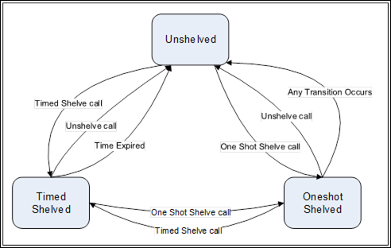  

Figure 1616 - Shelve state transitions  

The *ShelvedStateMachineType* includes a hierarchy of sub-states. It supports all transitions between *Unshelved* , *OneShotShelved* and *TimedShelved* .  

The state machine is illustrated in [Figure 1717](/§\_Ref209428072) and formally defined in [Table 7373](/§\_Ref151451894) .  

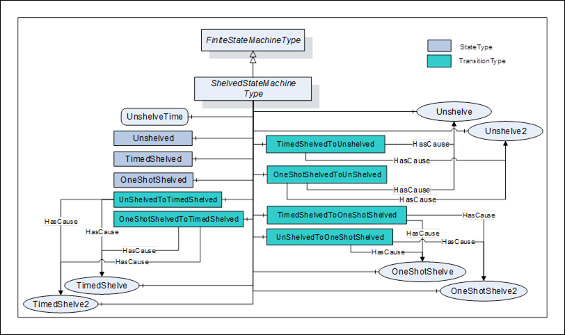  

Figure 1717 - ShelvedStateMachineType model  

Table 7373 - ShelvedStateMachineType definition  

| **Attribute** | **Value** |
|---|---|
|BrowseName|ShelvedStateMachineType|
|IsAbstract|False|
  
| **References** | **NodeClass** | **BrowseName** | **DataType** | **TypeDefinition** | **ModellingRule** |
|---|---|---|---|---|---|
|Subtype of the *FiniteStateMachineType* defined in [10000-16](/§UAPart16)||
|||||||
|HasProperty|Variable|UnshelveTime|Duration|PropertyType|Mandatory|
|||||||
|HasComponent|Object|Unshelved||StateType||
|HasComponent|Object|TimedShelved||StateType||
|HasComponent|Object|OneShotShelved||StateType||
|||||||
|HasComponent|Object|UnshelvedToTimedShelved||TransitionType||
|HasComponent|Object|TimedShelvedToUnshelved||TransitionType||
|HasComponent|Object|TimedShelvedToOneShotShelved||TransitionType||
|HasComponent|Object|UnshelvedToOneShotShelved||TransitionType||
|HasComponent|Object|OneShotShelvedToUnshelved||TransitionType||
|HasComponent|Object|OneShotShelvedToTimedShelved||TransitionType||
|||||||
|HasComponent|Method|TimedShelve|Defined in Clause [5.8.17.4](/§\_Ref174417012)|Mandatory|
|HasComponent|Method|OneShotShelve|Defined in Clause [5.8.17.6](/§\_Ref174417015)|Mandatory|
|HasComponent|Method|Unshelve|Defined in Clause [5.8.17.2](/§\_Ref225747881)|Mandatory|
|HasComponent|Method|TimedShelve2|Defined in Clause [5.8.17.5](/§\_Ref78234681)|Optional|
|HasComponent|Method|OneShotShelve2|Defined in Clause [5.8.17.7](/§\_Ref78234701)|Optional|
|HasComponent|Method|Unshelve2|Defined in Clause [5.8.17.3](/§\_Ref78234712)|Optional|
||||||
  
| **ConformanceUnits** |
|---|
|A & C Shelving|
  

  

*UnshelveTime* specifies the remaining time in milliseconds until the *Alarm* automatically transitions into the *Un-shelved* state. For the *TimedShelved* state this time is initialised with the *ShelvingTime* argument of the *TimedShelve Method* call. For the *OneShotShelved* state the *UnshelveTime* will be initialized to the *Value* of *MaxTimeShelved* *Property* if it is present otherwise it is initialized to the maximum *Duration* .  

This *FiniteStateMachine* supports three *Active* states; *Unshelved* , *TimedShelved* and *OneShotShelved* . It also supports six transitions. The states and transitions are described in [Table 7474](/§\_Ref151451913) . This *FiniteStateMachine* also supports three *Method* s; *TimedShelve* , *OneShotShelve* and *Unshelve* .  

Table 7474 - ShelvedStateMachineType Additional References  

| **SourceBrowsePath** | **References** | **IsForward** | **TargetBrowsePath** |
|---|---|---|---|
|UnshelvedToTimedShelved|FromState|True|Unshelved|
||ToState|True|TimedShelved|
||HasEffect|True|AlarmConditionType|
||HasCause|True|TimedShelve|
||HasCause|True|TimedShelve2|
|UnshelvedToOneShotShelved|FromState|True|Unshelved|
||ToState|True|OneShotShelved|
||HasEffect|True|AlarmConditionType|
||HasCause|True|OneShotShelve|
||HasCause|True|OneShotShelve2|
|TimedShelvedToUnshelved|FromState|True|TimedShelved|
||ToState|True|Unshelved|
||HasEffect|True|AlarmConditionType|
|TimedShelvedToOneShotShelved|FromState|True|TimedShelved|
||ToState|True|OneShotShelved|
||HasEffect|True|AlarmConditionType|
||HasCause|True|OneShotShelve|
||HasCause|True|OneShotShelve2|
|OneShotShelvedToUnshelved|FromState|True|OneShotShelved|
||ToState|True|Unshelved|
||HasEffect|True|AlarmConditionType|
|OneShotShelvedToTimedShelved|FromState|True|OneShotShelved|
||ToState|True|TimedShelved|
||HasEffect|True|AlarmConditionType|
||HasCause|True|TimedShelve|
||HasCause|True|TimedShelve2|
  

  

The component *Variables* of the ShelvedStateMachineType ** have additional *Attributes* defined in [Table 7575](/§\_Ref53493741) **.**   

 **Table 7575\-**  **ShelvedStateMachineType Attribute values for child Nodes**   

| **BrowsePath** | **Value Attribute** |
|---|---|
Unshelved|0:StateNumber||1|
TimedShelved|0:StateNumber||2|
OneShotShelved|0:StateNumber||3|
UnshelvedToTimedShelved|0:TransitionNumber||12|
TimedShelvedToUnshelved|0:TransitionNumber||21|
TimedShelvedToOneShotShelved|0:TransitionNumber||23|
UnshelvedToOneShotShelved|0:TransitionNumber||13|
OneShotShelvedToUnshelved|0:TransitionNumber||31|
OneShotShelvedToTimedShelved|0:TransitionNumber||32|
  

  

##### 5.8.17.2 Unshelve Method  

The *Unshelve* *Method* sets the instance of *AlarmConditionType* to the *Unshelved* state. Normally, the *MethodId* found in the *Shelving* child of the *Condition* instance and the *NodeId* of the *Shelving* object as the *ObjectId* are passed to the *Call* *Service* . However, some *Servers* do not expose *Condition* instances in the *AddressSpace.* Therefore, all *Servers* shall also allow *Clients* to call the *Unshelve* *Method* by specifying *ConditionId* as the *ObjectId* where the *ConditionId* is the *Condition* that has *Shelving* child *.* The *Method* cannot be called with an *ObjectId* of the *ShelvedStateMachineType* *Node* .  

 **Signature**   

 **Unshelve**   

  

 **Method Result Codes in [Table 7676](/§\_Ref396824855) (defined in Call Service)**   

Table 7676 - Unshelve result codes  

| **Result Code** | **Description** |
|---|---|
|Bad\_ConditionNotShelved|See [Table 137137](/§\_Ref90539276) for the description of this result code.|
  

  

[Table 7777](/§\_Ref151452359) specifies the *AddressSpace* representation for the *Unshelve* *Method* .  

Table 7777 - Unshelve Method AddressSpace definition  

| **Attribute** | **Value** |
|---|---|
|BrowseName|Unshelve|
  
| **References** | **NodeClass** | **BrowseName** | **DataType** | **TypeDefinition** | **ModellingRule** |
|---|---|---|---|---|---|
|AlwaysGeneratesEvent|ObjectType|AuditConditionShelvingEventType|Defined in [5.10.7](/§\_Ref225310464)|
  
| **ConformanceUnits** |
|---|
|A & C Shelving|
  

  

If *Auditing* is supported, this *Method* shall generate an *Event* of *AuditConditionShelvingEventType* for all invocations of the *Method* .  

  

##### 5.8.17.3 Unshelve2 Method  

The *Unshelve2* *Method* extends the *Unshelve* *Method* , by adding an optional *Comment* . For other functionality see the *Unshelve* *Method* definition.  

 **Signature**   

 **Unshelve2**   

[in] LocalizedText Comment  

);  

  

The parameters are defined in [Table 7878](/§\_Ref78187305)  

Table 7878 - Unshelve2 Method parameters  

| **Argument** | **Description** |
|---|---|
|Comment|A localized text that shall be applied to the *Conditions* .|
  

  

If the *Comment* argument is NULL (both locale and text are empty) it shall be ignored and any existing comments will remain unchanged. To reset the comment, an empty text with a locale shall be provided.  

 **Method Result Codes in [Table 7979](/§\_Ref78234607) (defined in Call Service)**   

Table 7979 - Unshelve2 result codes  

| **Result Code** | **Description** |
|---|---|
|Bad\_ConditionNotShelved|See [Table 137137](/§\_Ref90539276) for the description of this result code.|
|Bad\_InvalidArgument|The Comment string provided exceeds the allowed length for the comment or is invalid in some other manner.|
  

  

[Table 8080](/§\_Ref78264623) specifies the *AddressSpace* representation for the *Unshelve2* *Method* .  

Table 8080 - Unshelve2 Method AddressSpace definition  

| **Attribute** | **Value** |
|---|---|
|BrowseName|Unshelve2|
  
| **References** | **NodeClass** | **BrowseName** | **DataType** | **TypeDefinition** | **ModellingRule** |
|---|---|---|---|---|---|
|HasProperty|*Variable*|InputArguments|Argument[]|PropertyType|Mandatory|
|AlwaysGeneratesEvent|ObjectType|AuditConditionShelvingEventType|Defined in [5.10.7](/§\_Ref225310464)|
  
| **ConformanceUnits** |
|---|
|A & C Shelving2|
  

  

If *Auditing* is supported, this *Method* shall generate an *Event* of *AuditConditionShelvingEventType* for all invocations of the *Method* .  

##### 5.8.17.4 TimedShelve Method  

The *TimedShelve Method* sets the instance of *AlarmConditionType* to the *TimedShelved* state (parameters are defined in [Table 8181](/§\_Ref396824898) and result codes are described in [Table 8282](/§\_Ref396824923) ). Normally, the *MethodId* found in the *Shelving* child of the *Condition* instance and the *NodeId* of the *Shelving* object as the *ObjectId* are passed to the *Call* *Service* . However, some *Servers* do not expose *Condition* instances in the *AddressSpace.* Therefore, all *Servers* shall also allow *Clients* to call the *TimedShelve* *Method* by specifying *ConditionId* as the *ObjectId* where the *ConditionId* is the *Condition* that has the *Shelving* child *.* The *Method* cannot be called with an *ObjectId* of the *ShelvedStateMachineType* *Node* .  

This *Method* can be called on any *ConditionId* , even if it is not active. The timer will start on *Method* invocation. The *Alarm* may go active and inactive multiple times during this *Duration* , but it will remain shelved for the *Duration* , unless it is changed to a different *Shelving* *State* .  

 **Signature**   

 **TimedShelve**   

[in] Duration ShelvingTime  

);  

  

The parameters are defined in [Table 8181](/§\_Ref396824898)  

  

Table 8181 - TimedShelve parameters  

| **Argument** | **Description** |
|---|---|
|ShelvingTime|Specifies a fixed time for which to shelve the *Alarm* . The *Server* may refuse the provided duration. If a *MaxTimeShelved* Property exist on the *Alarm* than the *Shelving* time shall be less than or equal to the value of this Property.|
  

  

 **Method Result Codes (defined in Call Service)**   

Table 8282 - TimedShelve result codes  

| **Result Code** | **Description** |
|---|---|
|Bad\_ConditionAlreadyShelved|See [Table 137137](/§\_Ref90539276) for the description of this result code. The *Alarm* is already in *TimedShelved* state and the system does not allow a reset of the shelved timer.|
|Bad\_ShelvingTimeOutOfRange|See [Table 137137](/§\_Ref90539276) for the description of this result code.|
  

  

 **Comments**   

*Shelving* for some time is quite often used to block nuisance *Alarms* . For example, an *Alarm* that occurs more than 10 times in a minute may get shelved for a few minutes.  

In some systems the length of time covered by this duration may be limited and the *Server* may generate an error refusing the provided duration. This limit may be exposed as the *MaxTimeShelved* *Property* .  

[Table 8383](/§\_Ref151452639) specifies the *AddressSpace* representation for the *TimedShelve* *Method* .  

Table 8383 - TimedShelve Method AddressSpace definition  

| **Attribute** | **Value** |
|---|---|
|BrowseName|TimedShelve|
  
| **References** | **NodeClass** | **BrowseName** | **DataType** | **TypeDefinition** | **ModellingRule** |
|---|---|---|---|---|---|
|HasProperty|Variable|InputArguments|Argument[]|PropertyType|Mandatory|
|AlwaysGeneratesEvent|ObjectType|AuditConditionShelvingEventType|Defined in [5.10.7](/§\_Ref225310464)|
  
| **ConformanceUnits** |
|---|
|A & C Shelving|
  

  

If *Auditing* is supported, this *Method* shall generate an *Event* of *AuditConditionShelvingEventType* for all invocations of the *Method* .  

##### 5.8.17.5 TimedShelve2 Method  

The *TimedShelve Method* extends the *TimedShelve* *Method* , by adding an optional *Comment* . For other functionality see the *TimedShelve* *Method* definition.  

 **Signature**   

 **TimedShelve2**   

[in] Duration  ShelvingTime  

[in] LocalizedText Comment  

);  

  

The parameters are defined in [Table 8484](/§\_Ref78282734) .  

Table 8484 - TimedShelve2 parameters  

| **Argument** | **Description** |
|---|---|
|ShelvingTime|Specifies a fixed time for which to shelve the *Alarm* . The *Server* may refuse the provided duration. If a *MaxTimeShelved* Property exist on the *Alarm* than the *Shelving* time shall be less than or equal to the value of this Property.|
|Comment|A localized text that shall be applied to the *Condition* .|
  

  

 ***Method* Result Codes in [Table 8585](/§\_Ref78282657) (defined in Call Service)**   

Table 8585 - TimedShelve2 result codes  

| **Result Code** | **Description** |
|---|---|
|Bad\_ConditionAlreadyShelved|See [Table 137137](/§\_Ref90539276) for the description of this result code. The *Alarm* is already in *TimedShelved* state and the system does not allow a reset of the shelved timer.|
|Bad\_ShelvingTimeOutOfRange|See [Table 137137](/§\_Ref90539276) for the description of this result code.|
|Bad\_InvalidArgument|The Comment string provided exceeds the allowed length for the comment or is invalid in some other manner.|
  

  

Comments  

*Shelving* for some time is quite often used to block nuisance *Alarms* . For example, an *Alarm* that occurs more than 10 times in a minute can get shelved for a few minutes.  

In some systems the length of time covered by this duration can be limited and the *Server* can generate an error refusing the provided duration. This limit can be exposed as the *MaxTimeShelved* *Property* .  

If the *Comment* argument is NULL (both locale and text are empty) it shall be ignored and any existing comments will remain unchanged. To reset the Comment an empty text with a locale shall be provided.  

[Table 8686](/§\_Ref78282678) specifies the *AddressSpace* representation for the *TimedShelve2* *Method* .  

Table 8686 - TimedShelve2 Method AddressSpace definition  

| **Attribute** | **Value** |
|---|---|
|BrowseName|TimedShelve2|
  
| **References** | **NodeClass** | **BrowseName** | **DataType** | **TypeDefinition** | **ModellingRule** |
|---|---|---|---|---|---|
|HasProperty|Variable|InputArguments|Argument[]|PropertyType|Mandatory|
|AlwaysGeneratesEvent|ObjectType|AuditConditionShelvingEventType|Defined in [5.10.7](/§\_Ref225310464)|
  
| **ConformanceUnits** |
|---|
|A & C Shelving2|
  

  

If *Auditing* is supported, this *Method* shall generate an *Event* of *AuditConditionShelvingEventType* for all invocations of the *Method* .  

##### 5.8.17.6 OneShotShelve Method  

The *OneShotShelve Method* sets the instance of *AlarmConditionType* to the *OneShotShelved* state. Normally, the *MethodId* found in the *Shelving* child of the *Condition* instance and the *NodeId* of the *Shelving* object as the *ObjectId* are passed to the *Call* *Service* . However, some *Servers* do not expose *Condition* instances in the *AddressSpace.* Therefore, all *Servers* shall also allow *Clients* to call the *OneShotShelve* *Method* by specifying *ConditionId* as the *ObjectId* where the *ConditionId* is the *Condition* that has the *Shelving* child *.* The *Method* cannot be called with an *ObjectId* of the *ShelvedStateMachineType* *Node* . This *Method* can be called on any *ConditionId* , even if it is not active.  

 **Signature**   

 **OneShotShelve**   

  

 **Method Result Codes are defined in [Table 8787](/§\_Ref396824972) (status code field is defined in *Call* Ser *v* ice)**   

Table 8787 - OneShotShelve result codes  

| **Result Code** | **Description** |
|---|---|
|Bad\_ConditionAlreadyShelved|See [Table 137137](/§\_Ref90539276) for the description of this result code. The *Alarm* is already in *OneShotShelved* state.|
  

  

[Table 8888](/§\_Ref151452885) specifies the *AddressSpace* representation for the *OneShotShelve* *Method* .  

Table 8888 - OneShotShelve Method AddressSpace definition  

| **Attribute** | **Value** |
|---|---|
|BrowseName|OneShotShelve|
  
| **References** | **NodeClass** | **BrowseName** | **DataType** | **TypeDefinition** | **ModellingRule** |
|---|---|---|---|---|---|
|AlwaysGeneratesEvent|ObjectType|AuditConditionShelvingEventType|Defined in [5.10.7](/§\_Ref225310464)|
  
| **ConformanceUnits** |
|---|
|A & C Shelving|
  

  

If *Auditing* is supported, this *Method* shall generate an *Event* of *AuditConditionShelvingEventType* for all invocations of the *Method* .  

##### 5.8.17.7 OneShotShelve2 Method  

The *OneShotShelve2 Method*  

 **Signature**   

 **OneShotShelve2**   

[in] LocalizedText Comment  

);  

  

The parameters are defined in [Table 8989](/§\_Ref78204784) .  

Table 8989 - OneShotShelve2 Method parameters  

| **Argument** | **Description** |
|---|---|
|Comment|A localized text that shall be applied to the *Conditions* .|
  

If the *Comment* argument is NULL (both locale and text are empty) it shall be ignored and any existing comments will remain unchanged. To reset the comment, an empty text with a locale shall be provided.  

 **Method Result Codes are defined in [Table 9090](/§\_Ref78282911) (status code field is defined in *Call* Ser *v* ice)**   

Table 9090 - OneShotShelve2 result codes  

| **Result Code** | **Description** |
|---|---|
|Bad\_ConditionAlreadyShelved|See [Table 137137](/§\_Ref90539276) for the description of this result code. The *Alarm* is already in *OneShotShelved* state.|
|Bad\_InvalidArgument|The Comment string provided exceeds the allowed length for the comment or is invalid in some other manner.|
  

  

[Table 9191](/§\_Ref78282932) specifies the *AddressSpace* representation for the *OneShotShelve2* *Method* .  

Table 9191 - OneShotShelve2 Method AddressSpace definition  

| **Attribute** | **Value** |
|---|---|
|BrowseName|OneShotShelve2|
  
| **References** | **NodeClass** | **BrowseName** | **DataType** | **TypeDefinition** | **ModellingRule** |
|---|---|---|---|---|---|
|HasProperty|*Variable*|InputArguments|Argument[]|PropertyType|Mandatory|
|AlwaysGeneratesEvent|ObjectType|AuditConditionShelvingEventType|Defined in [5.10.7](/§\_Ref225310464)|
  
| **ConformanceUnits** |
|---|
|A & C Shelving2|
  

  

If *Auditing* is supported, this *Method* shall generate an *Event* of *AuditConditionShelvingEventType* for all invocations of the *Method* .  

#### 5.8.18 LimitAlarmType  

*Alarms* can be modelled with multiple exclusive sub-states and assigned limits or they may be modelled with nonexclusive limits that can be used to group multiple states together.  

The *LimitAlarmType* is used to provide a base *Type* for *AlarmConditionTypes* with multiple limits. The *LimitAlarmType* is illustrated in [Figure 1818](/§\_Ref228806149) .  

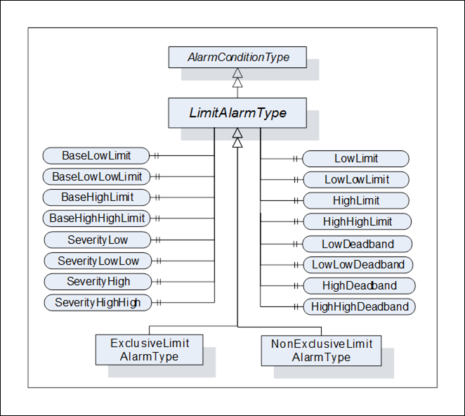  

Figure 1818 - LimitAlarmType  

The *LimitAlarmType* is formally defined in [Table 9292](/§\_Ref228806084) .  

Table 9292 - LimitAlarmType definition  

| **Attribute** | **Value** |
|---|---|
|BrowseName|LimitAlarmType|
|IsAbstract|False|
  
| **References** | **NodeClass** | **BrowseName** | **DataType** | **TypeDefinition** | **ModellingRule** |
|---|---|---|---|---|---|
|Subtype of the AlarmConditionType defined in clause [5.8.2](/§\_Ref150677970) .|
|HasSubtype|ObjectType|ExclusiveLimitAlarmType|Defined in Clause [5.8.19.3](/§\_Ref225302622)|
|HasSubtype|ObjectType|NonExclusiveLimitAlarmType|Defined in Clause [5.8.20](/§\_Ref225753238)|
|HasProperty|Variable|HighHighLimit|Double|PropertyType|Optional|
|HasProperty|Variable|HighLimit|Double|PropertyType|Optional|
|HasProperty|Variable|LowLimit|Double|PropertyType|Optional|
|HasProperty|Variable|LowLowLimit|Double|PropertyType|Optional|
|HasProperty|Variable|BaseHighHighLimit|Double|PropertyType|Optional|
|HasProperty|Variable|BaseHighLimit|Double|PropertyType|Optional|
|HasProperty|Variable|BaseLowLimit|Double|PropertyType|Optional|
|HasProperty|Variable|BaseLowLowLimit|Double|PropertyType|Optional|
|HasProperty|Variable|SeverityHighHigh|UInt16|PropertyType|Optional|
|HasProperty|Variable|SeverityHigh|UInt16|PropertyType|Optional|
|HasProperty|Variable|SeverityLow|UInt16|PropertyType|Optional|
|HasProperty|Variable|SeverityLowLow|UInt16|PropertyType|Optional|
|HasProperty|Variable|HighHighDeadband|Double|PropertyType|Optional|
|HasProperty|Variable|HighDeadband|Double|PropertyType|Optional|
|HasProperty|Variable|LowDeadband|Double|PropertyType|Optional|
|HasProperty|Variable|LowLowDeadband|Double|PropertyType|Optional|
  
| **ConformanceUnits** |
|---|
|A & C Exclusive Limit|
|A & C Non-Exclusive Limit|
  

  

Four optional limits are defined that configure the states of the derived limit *Alarm* Types. These *Properties* shall be set for any *Alarm* limits that are exposed by the derived limit *Alarm* types. These *Properties* are listed as optional but at least one is required. For cases where an underlying system cannot provide the actual value of a limit, the limit *Property* shall still be provided, but will have its *AccessLevel* set to not readable. It is assumed that the limits are described using the same Engineering Unit that is assigned to the variable that is the source of the *Alarm* . For Rate of change limit *Alarms* , it is assumed this rate is units per second unless otherwise specified. The limits shall follow the following inequality HighHigh \> High \> Low \> LowLow. If Deadband properties are provided then:  

* HighHighLimit - HighHighDeadband \> HighLimit  

* HighLimit - HighDeadband \> LowLimit  

* LowLimit + LowDeadband \< HighLimit  

* LowLowLimit + LowLowDeadband \< LowLimit  

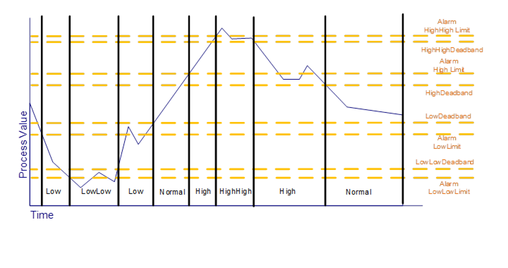  

Four optional base limits are defined that are used for *AdaptiveAlarming* . They contain the configured *Alarm* limit. If a *Server* supports *AdaptiveAlarming* for *Alarm* limits, the corresponding base *Alarm* limit shall be provided for any limits that are exposed by the derived limit Alarm types. The value of this property is the value of the limit to which an *AdaptiveAlarm* can be reset if rolling back  any algorithmic changes is desired.  

The *Alarm* limits listed may cause an *Alarm* to be generated when a value equals the limit or it may generate the *Alarm* when the limit is exceeded, (i.e. the Value is above the limit for *HighLimit* and below the limit for *LowLimit* ). The exact behaviour when the value is equal to the limit is *Server* specific.  

The *Variable* that is the source of the *LimitAlarmType Alarm* shall be a scalar. This *LimitAlarmType* can be subtyped if the *Variable* that is the source is an array. The subtype shall describe the expected behaviour with respect to limits and the array values. Some possible options:  

* if any element of the array exceeds the limit an *Alarm* is generated,  

* if all elements exceed the limit an *Alarm* is generated,  

* the limits may also be an array, in which case if any array limit is exceeded by the corresponding source array element, an *Alarm* is generated.  

The four optional severity Properties, if defined, provided the severity for each of the limits (i.e. this would be the value of Severity that would be reported if the alarm were in the given state).  

The four optional deadband *Properties* , if they are defined, are used to delay the return to normal until the value is within the limit by the value of the deadband. For example, if a Value exceeds a HighLimit of 20, and there is a HighDeadband define of 1, the value will remain in alarm until the Value drops below 19. An *Alarm* deadband can be used to limit *Alarms* in a system where values may bounce or have some noise (i.e. the value is jumping up and down by 0.2). They keep the *Alarm* from being reactivated until it has dropped enough to not retrigger by noise.  

In the event of a restart of an *AlarmManager* , *the AlarmManager* shall recover the *LimitAlarm* state, this also applies to all subtypes *.*  

#### 5.8.19 Exclusive Limit Types  

##### 5.8.19.1 Overview  

This clause describes the state machine and the base *Alarm* Type behaviour for *AlarmConditionTypes* with multiple mutually exclusive limits.  

##### 5.8.19.2 ExclusiveLimitStateMachineType  

The *ExclusiveLimitStateMachineType* defines the state machine used by *AlarmConditionTypes* that handle multiple mutually exclusive limits. It is illustrated in [Figure 1919](/§\_Ref225750812) .  

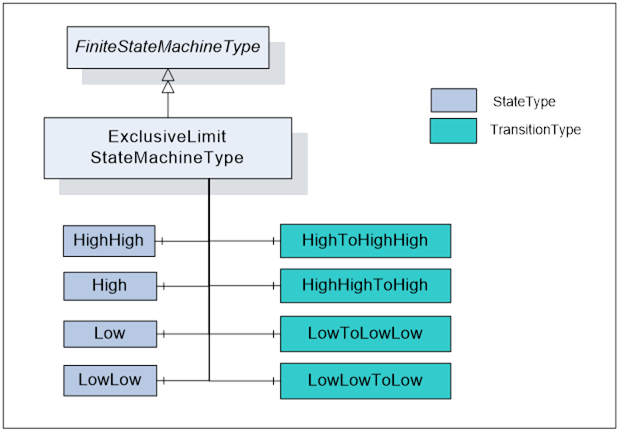  

Figure 1919 - ExclusiveLimitStateMachineType  

It is created by extending the *FiniteStateMachineType* . It is formally defined in [Table 9393](/§\_Ref226350139) and the state transitions are described in [Table 9494](/§\_Ref226350156) .  

Table 9393 - ExclusiveLimitStateMachineType definition  

| **Attribute** | **Value** |
|---|---|
|BrowseName|ExclusiveLimitStateMachineType|
|IsAbstract|False|
  
| **References** | **NodeClass** | **BrowseName** | **DataType** | **TypeDefinition** | **ModellingRule** |
|---|---|---|---|---|---|
|Subtype of the *FiniteStateMachineType*|
|HasComponent|Object|HighHigh||StateType||
|HasComponent|Object|High||StateType||
|HasComponent|Object|Low||StateType||
|HasComponent|Object|LowLow||StateType||
|HasComponent|Object|LowToLowLow||TransitionType||
|HasComponent|Object|LowLowToLow||TransitionType||
|HasComponent|Object|HighToHighHigh||TransitionType||
|HasComponent|Object|HighHighToHigh||TransitionType||
  
| **ConformanceUnits** |
|---|
|A & C Exclusive Limit|
  

  

Table 9494 - ExclusiveLimitStateMachineType Additional References  

| **SourceBrowsePath** | **References** | **IsForward** | **TargetBrowsePath** |
|---|---|---|---|
|HighHighToHigh|FromState|True|HighHigh|
||ToState|True|High|
||HasEffect|True|AlarmConditionType|
|HighToHighHigh|FromState|True|High|
||ToState|True|HighHigh|
||HasEffect|True|AlarmConditionType|
|LowLowToLow|FromState|True|LowLow|
||ToState|True|Low|
||HasEffect|True|AlarmConditionType|
|LowToLowLow|FromState|True|Low|
||ToState|True|LowLow|
||HasEffect|True|AlarmConditionType|
  

'  

The component *Variables* of the ExclusiveLimitStateMachineType ** have additional *Attributes* defined in [Table 9595](/§\_Ref65632154) .  

 **Table 9595\-**  **ExclusiveLimitStateMachineType Attribute values for child Nodes**   

| **BrowsePath** | **Value Attribute** |
|---|---|
HighHigh|0:StateNumber||1|
High|0:StateNumber||2|
Low|0:StateNumber||3|
LowLow|0:StateNumber||4|
LowToLowLow|0:TransitionNumber||34|
LowLowToLow|0:TransitionNumber||43|
HighToHighHigh|0:TransitionNumber||21|
HighHighToHigh|0:TransitionNumber||12|
  

  

The *ExclusiveLimitStateMachineType* defines the sub state machine that represents the actual level of a multilevel *Alarm* when it is in the *Active* state. The sub state machine defined here includes *High* , *Low* , *HighHigh* and *LowLow* states. This model also includes in its transition state a series of transition to and from a parent state, the inactive state. This state machine as it is defined shall be used as a sub state machine for a state machine which has an *Active* state. This *Active* state could be part of a "level" *Alarm* or "deviation" *Alarm* or any other *Alarm* state machine.  

The *LowLow* , *Low* , *High* , *HighHigh* are typical for many industries. Vendors can introduce sub-state models that include additional limits; they may also omit limits in an instance. If a model omits states or transitions in the *StateMachine* , it is recommended that they provide the optional *Property* *AvailableStates* and/or *AvailableTransitions* (see [10000-16](/§UAPart16) ).  

##### 5.8.19.3 ExclusiveLimitAlarmType  

The *ExclusiveLimitAlarmType* is used to specify the common behaviour for *Alarm Types* with multiple mutually exclusive limits. The *ExclusiveLimitAlarmType* is illustrated in [Figure 2020](/§\_Ref225299423) .  

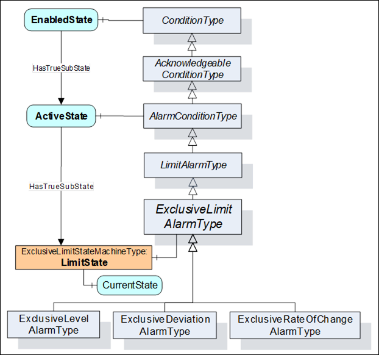  

Figure 2020 - ExclusiveLimitAlarmType  

The *ExclusiveLimitAlarmType* is formally defined in [Table 9696](/§\_Ref225873588) .  

Table 9696 - ExclusiveLimitAlarmType definition  

| **Attribute** | **Value** |
|---|---|
|BrowseName|ExclusiveLimitAlarmType|
|IsAbstract|False|
  
| **References** | **NodeClass** | **BrowseName** | **DataType** | **TypeDefinition** | **ModellingRule** |
|---|---|---|---|---|---|
|Subtype of the LimitAlarmType defined in clause [5.8.18](/§\_Ref228806910) .|
|HasSubtype|ObjectType|ExclusiveLevelAlarmType|Defined in Clause [5.8.21.3](/§\_Ref227985667)|
|HasSubtype|ObjectType|ExclusiveDeviationAlarmType|Defined in Clause [5.8.22.3](/§\_Ref227985685)|
|HasSubtype|ObjectType|ExclusiveRateOfChangeAlarmType|Defined in Clause [5.8.23.3](/§\_Ref227985705)|
|HasComponent|Object|LimitState||*ExclusiveLimitStateMachineType*|Mandatory|
  
| **ConformanceUnits** |
|---|
|A & C Exclusive Limit|
  

  

The *LimitState* is a sub state of the ActiveState and has an *IsTrueSubStateOf* reference to the *ActiveState* . The *LimitState* represents the actual limit that is violated in an instance of *ExclusiveLimitAlarmType* . When the *ActiveState* of the *AlarmConditionType* is inactive the *LimitState* shall not be available and shall return NULL on read. Any *Events* that subscribe for fields from the *LimitState* when the *ActiveState* is inactive shall return a NULL for these unavailable fields.  

#### 5.8.20 NonExclusiveLimitAlarmType  

The *NonExclusiveLimitAlarmType* is used to specify the common behaviour for *Alarm Types* with multiple non-exclusive limits. The *NonExclusiveLimitAlarmType* is illustrated in [Figure 2121](/§\_Ref225751763) .  

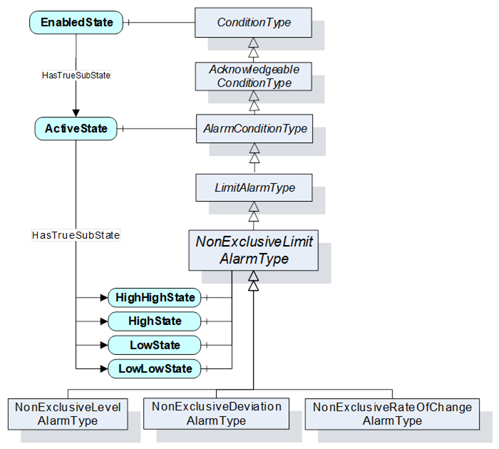  

Figure 2121 - NonExclusiveLimitAlarmType  

The *NonExclusiveLimitAlarmType* is formally defined in [Table 9797](/§\_Ref225751821) and [Table 9898](/§\_Ref83725007) .  

Table 9797 - NonExclusiveLimitAlarmType definition  

| **Attribute** | **Value** |
|---|---|
|BrowseName|NonExclusiveLimitAlarmType|
|IsAbstract|False|
  
| **References** | **NodeClass** | **BrowseName** | **DataType** | **TypeDefinition** | **ModellingRule** |
|---|---|---|---|---|---|
|Subtype of the LimitAlarmType defined in clause [5.8.18](/§\_Ref228806910) .|
|HasSubtype|ObjectType|NonExclusiveLevelAlarmType|Defined in Clause [5.8.21.2](/§\_Ref227985930)|
|HasSubtype|ObjectType|NonExclusiveDeviationAlarmType|Defined in Clause [5.8.22.2](/§\_Ref227985941)|
|HasSubtype|ObjectType|NonExclusiveRateOfChangeAlarmType|Defined in Clause [5.8.23.2](/§\_Ref227985967)|
|HasComponent|Variable|HighHighState|LocalizedText|TwoStateVariableType|Optional|
|HasComponent|Variable|HighState|LocalizedText|TwoStateVariableType|Optional|
|HasComponent|Variable|LowState|LocalizedText|TwoStateVariableType|Optional|
|HasComponent|Variable|LowLowState|LocalizedText|TwoStateVariableType|Optional|
||
  
| **ConformanceUnits** |
|---|
|A & C Non-Exclusive Limit|
  

  

Table 9898 - NonExclusiveLimitAlarmType Additional Subcomponents  

| **BrowsePath** | **References** | **NodeClass** | **BrowseName** | **DataType** | **TypeDefinition** | **Others** |
|---|---|---|---|---|---|---|
|HighHighState|HasProperty|Variable|TrueState|LocalizedText|PropertyType||
|HighHighState|HasProperty|Variable|FalseState|LocalizedText|PropertyType||
|HighState|HasProperty|Variable|TrueState|LocalizedText|PropertyType||
|HighState|HasProperty|Variable|FalseState|LocalizedText|PropertyType||
|LowState|HasProperty|Variable|TrueState|LocalizedText|PropertyType||
|LowState|HasProperty|Variable|FalseState|LocalizedText|PropertyType||
|LowLowState|HasProperty|Variable|TrueState|LocalizedText|PropertyType||
|LowLowState|HasProperty|Variable|FalseState|LocalizedText|PropertyType||
  

  

The empty *"* Others" column indicates that no *ModellingRule* applies.  

*HighHighState* , *HighState* , *LowState* , and *LowLowState* represent the non-exclusive states. As an example, it is possible that both *HighState* and *HighHighState* are in their True state. Vendors may choose to support any subset of these states. Recommended state names are described in [A.1](/§\_Ref111536054) .  

Four optional limits are defined that configure these states. At least the *HighState* or the *LowState* shall be provided even though all states are optional. It is implied by the definition of a *HighState* and a *LowState* , that these groupings are mutually exclusive. A value cannot exceed both a *HighState* value and a *LowState* value simultaneously.  

#### 5.8.21 Level Alarm  

##### 5.8.21.1 Overview  

A level *Alarm* is commonly used to report when a limit is exceeded. It typically relates to an instrument - e.g. a temperature meter. The level *Alarm* becomes active when the observed value is above a high limit or below a low limit.  

##### 5.8.21.2 NonExclusiveLevelAlarmType  

The *NonExclusiveLevelAlarmType* is a special level *Alarm* utilized with one or more non-exclusive states. If for example both the High and *HighHigh* states need to be maintained as active at the same time then an instance of *NonExclusiveLevelAlarmType* should be used.  

The *NonExclusiveLevelAlarmType* is based on the *NonExclusiveLimitAlarmType* . It is formally defined in [Table 9999](/§\_Ref150615883) .  

Table 9999 - NonExclusiveLevelAlarmType definition  

| **Attribute** | **Value** |
|---|---|
|BrowseName|NonExclusiveLevelAlarmType|
|IsAbstract|False|
  
| **References** | **NodeClass** | **BrowseName** | **DataType** | **TypeDefinition** | **ModellingRule** |
|---|---|---|---|---|---|
|Subtype of the NonExclusiveLimitAlarmType defined in clause [5.8.20](/§\_Ref225753238) .|
|||||||
  
| **ConformanceUnits** |
|---|
|A & C Non-Exclusive Level|
  

  

No additional *Properties* to the *NonExclusiveLimitAlarmType* are defined.  

##### 5.8.21.3 ExclusiveLevelAlarmType  

The *ExclusiveLevelAlarmType* is a special level *Alarm* utilized with multiple mutually exclusive limits. It is formally defined in [Table 100100](/§\_Ref150616045) .  

Table 100100 - ExclusiveLevelAlarmType definition  

| **Attribute** | **Value** |
|---|---|
|BrowseName|ExclusiveLevelAlarmType|
|IsAbstract|False|
  
| **References** | **NodeClass** | **BrowseName** | **DataType** | **TypeDefinition** | **ModellingRule** |
|---|---|---|---|---|---|
|Inherits the Properties of the ExclusiveLimitAlarmType defined in clause [5.8.19.3](/§\_Ref225302622) .|
|||||||
  
| **ConformanceUnits** |
|---|
|A & C Exclusive Level|
  

  

No additional *Properties* to the *ExclusiveLimitAlarmType* are defined.  

#### 5.8.22 Deviation Alarm  

##### 5.8.22.1 Overview  

A deviation *Alarm* is commonly used to report an excess deviation between a desired setpoint level of a process value and an actual measurement of that value. The deviation *Alarm* becomes active when the deviation exceeds or drops below a defined limit.  

For example, if a setpoint had a value of 10, a high deviation *Alarm* limit of 2 and a low deviation *Alarm* limit of -1 then the low sub state is entered if the process value drops below 9; the high sub state is entered if the process value raises above 12. If the setpoint is changed to 11 then the new deviation values would be 10 and 13 respectively. The setpoint can be fixed by a configuration, adjusted by an *Operator* or it can be adjusted by an algorithm, the actual functionality exposed by the setpoint is application specific. The deviation *Alarm* can also be used to report a problem between a redundant data source where the difference between the primary source and the secondary source exceeds the included limit. In this case, the *SetpointNode* would point to the secondary source.  

The *LowLimit* and *LowLowLimit* shall be negative, indicating a number below the target value and the *HighLimit* and *HighHighLimit* shall be positive, indicating a number above the target value. If provided, the limits shall not be zero and shall follow these rules:  

* *HighHighLimit* \> *HighLimit*  

* *LowLimit \>* *LowLowLimit* .  

For example, if the *LowLimit* is -2 then a *LowLowLimit* of -1 would not be allowed, but a *LowLowLimit* of -3 would be allowed.  

##### 5.8.22.2 NonExclusiveDeviationAlarmType  

The *NonExclusiveDeviationAlarmType* is a special level *Alarm* utilized with one or more non-exclusive states. If for example both the High and HighHigh states need to be maintained as active at the same time then an instance of *NonExclusiveDeviationAlarmType* should be used.  

The *NonExclusiveDeviationAlarmType* is based on the *NonExclusiveLimitAlarmType* . It is formally defined in [Table 101101](/§\_Ref225753636) .  

  

Table 101101 - NonExclusiveDeviationAlarmType definition  

| **Attribute** | **Value** |
|---|---|
|BrowseName|NonExclusiveDeviationAlarmType|
|IsAbstract|False|
  
| **References** | **NodeClass** | **BrowseName** | **DataType** | **TypeDefinition** | **ModellingRule** |
|---|---|---|---|---|---|
|Subtype of the NonExclusiveLimitAlarmType defined in clause [5.8.20](/§\_Ref225753238) .|
|HasProperty|Variable|SetpointNode|NodeId|PropertyType|Mandatory|
|HasProperty|Variable|BaseSetpointNode|NodeId|PropertyType|Optional|
||
  
| **ConformanceUnits** |
|---|
|A & C Non-Exclusive Deviation|
  

  

The *SetpointNode Property* provides the *NodeId* of the setpoint used in the deviation calculation. In cases where the *Alarm* is generated by an underlying system and if the *Variable* is not in the *AddressSpace* , a NULL *NodeId* shall be provided.  

The *BaseSetpointNode* *Property* provides the *NodeId* of the original or base setpoint. The value of this node is the value of the setpoint to which an *AdaptiveAlarm* can be reset if rolling back algorithmic changes is desired. The value of this node usually contains the originally configured setpoint.  

##### 5.8.22.3 ExclusiveDeviationAlarmType  

The *ExclusiveDeviationAlarmType* is utilized with multiple mutually exclusive limits. It is formally defined in [Table 102102](/§\_Ref225303077) .  

Table 102102 - ExclusiveDeviationAlarmType definition  

| **Attribute** | **Value** |
|---|---|
|BrowseName|ExclusiveDeviationAlarmType|
|IsAbstract|False|
  
| **References** | **NodeClass** | **BrowseName** | **DataType** | **TypeDefinition** | **Modelling Rule** |
|---|---|---|---|---|---|
|Inherits the *Properties* of the *ExclusiveLimitAlarmType* defined in clause [5.8.19.3](/§\_Ref225302622) .|
|HasProperty|Variable|SetpointNode|NodeId|PropertyType|Mandatory|
|HasProperty|Variable|BaseSetpointNode|NodeId|PropertyType|Optional|
||
  
| **ConformanceUnits** |
|---|
|A & C Exclusive Deviation|
  

  

The *SetpointNode Property* provides the *NodeId* of the setpoint used in the *Deviation* calculation. If this *Variable* is not in the *AddressSpace* , a NULL *NodeId* shall be provided.  

The *BaseSetpointNode* *Property* provides the *NodeId* of the original or base setpoint. The value of this node is the value of the setpoint to which an *AdaptiveAlarm* can be reset if any algorithmic changes need to be discarded. The value of this node usually contains the originally configured setpoint.  

#### 5.8.23 Rate of change Alarms  

##### 5.8.23.1 Overview  

A *RateOfChangeAlarm* is commonly used to report an unusual change or lack of change in a measured value related to the speed at which the value has changed. The *RateOfChangeAlarm* becomes active when the rate at which the value changes exceeds or drops below a defined limit.  

A *RateOfChangeAlarm* is measured in some time unit, such as seconds or minutes and some unit of measure such as percent or meter. For example, a tank may have a High limit for the rate of change of its level (measured in meters) which would be 4 meters per minute. If the tank level changes at a rate that is greater than 4 meters per minute then the High sub state is entered.  

##### 5.8.23.2 NonExclusiveRateOfChangeAlarmType  

The *NonExclusiveRateOfChangeAlarmType* is a special level *Alarm* utilized with one or more non-exclusive states. If for example both the High and HighHigh states need to be maintained as active at the same time this *AlarmConditionType* should be used  

The *NonExclusiveRateOfChangeAlarmType* is based on the *NonExclusiveLimitAlarmType* . It is formally defined in [Table 103103](/§\_Ref225753828) .  

Table 103103 - NonExclusiveRateOfChangeAlarmType definition  

| **Attribute** | **Value** |
|---|---|
|BrowseName|NonExclusiveRateOfChangeAlarmType|
|IsAbstract|False|
  
| **References** | **NodeClass** | **BrowseName** | **DataType** | **TypeDefinition** | **ModellingRule** |
|---|---|---|---|---|---|
|Subtype of the NonExclusiveLimitAlarmType defined in clause [5.8.20](/§\_Ref225753238) .|
|HasProperty|Variable|EngineeringUnits|EUInformation|PropertyType|Optional|
||
  
| **ConformanceUnits** |
|---|
|A & C Non-Exclusive RateOfChange|
  

  

EngineeringUnits provides the engineering units associated with the limits values. If this is not provided the assumed Engineering Unit is the same as the EU associated with the parent variable per second e.g. if parent is meters, this unit is meters/second.  

##### 5.8.23.3 ExclusiveRateOfChangeAlarmType  

*ExclusiveRateOfChangeAlarmType* is utilized with multiple mutually exclusive limits. It is formally defined in [Table 104104](/§\_Ref209429668) .  

Table 104104 - ExclusiveRateOfChangeAlarmType definition  

| **Attribute** | **Value** |
|---|---|
|BrowseName|ExclusiveRateOfChangeAlarmType|
|IsAbstract|False|
  
| **References** | **NodeClass** | **BrowseName** | **DataType** | **TypeDefinition** | **ModellingRule** |
|---|---|---|---|---|---|
|Inherits the *Properties* of the *ExclusiveLimitAlarmType* defined in clause [5.8.19.3](/§\_Ref225302622) .|
|HasProperty|Variable|EngineeringUnits|EUInformation|PropertyType|Optional|
||
  
| **ConformanceUnits** |
|---|
|A & C Exclusive RateOfChange|
  

  

EngineeringUnits provides the engineering units associated with the limits values. If this is not provided the assumed Engineering Unit is the same as the EU associated with the parent variable per second e.g. if parent is meters, this unit is meters/second.  

#### 5.8.24 Discrete Alarms  

##### 5.8.24.1 DiscreteAlarmType  

The *DiscreteAlarmType* is used to classify *Types* into *Alarm Conditions* where the input for the *Alarm* may take on only a certain number of possible values (e.g. True/False, running/stopped/terminating). The *DiscreteAlarmType* with sub types defined in this document is illustrated in [Figure 2222](/§\_Ref225571024) . It is formally defined in [Table 105105](/§\_Ref182130788) .  

  

Figure 2222 - DiscreteAlarmType Hierarchy  

Table 105105 - DiscreteAlarmType definition  

| **Attribute** | **Value** |
|---|---|
|BrowseName|DiscreteAlarmType|
|IsAbstract|False|
  
| **References** | **NodeClass** | **BrowseName** | **DataType** | **TypeDefinition** | **ModellingRule** |
|---|---|---|---|---|---|
|Subtype of the AlarmConditionType defined in clause [5.8.2](/§\_Ref150677970) .|
|HasSubtype|*ObjectType*|OffNormalAlarmType|Defined in Clause [5.8.22](/§\_Ref139172265)|
  
| **ConformanceUnits** |
|---|
|A & C Discrete|
  

  

##### 5.8.24.2 OffNormalAlarmType  

The *OffNormalAlarmType* is a specialization of the *DiscreteAlarmType* intended to represent a discrete *Condition* that is considered to be not normal. It is formally defined in [Table 106106](/§\_Ref182132242) . This sub type is usually used to indicate that a discrete value is in an *Alarm* state, it is active as long as a non-normal value is present.  

Table 106106 - OffNormalAlarmType definition  

| **Attribute** | **Value** |
|---|---|
|BrowseName|OffNormalAlarmType|
|IsAbstract|False|
  
| **References** | **NodeClass** | **BrowseName** | **DataType** | **TypeDefinition** | **ModellingRule** |
|---|---|---|---|---|---|
|Subtype of the DiscreteAlarmType defined in clause [5.8.24.1](/§\_Ref182132552)|
|HasSubtype|*ObjectType*|TripAlarmType|Defined in Clause [5.8.24.4](/§\_Ref182132315)|
|HasSubtype|*ObjectType*|SystemOffNormalAlarmType|Defined in Clause [5.8.24.3](/§\_Ref416728296)|
|||||
|HasProperty|*Variable*|NormalState|NodeId|PropertyType|Mandatory|
  
| **ConformanceUnits** |
|---|
|A & C OffNormal|
  

  

The *NormalState Property* is a *Property* that points to a *Variable* which has a value that corresponds to one of the possible values of the *Variable* pointed to by the *InputNode* *Property* where the *NormalState* *Property* *Variable* value is the value that is considered to be the normal state of the *Variable* pointed to by the *InputNode* *Property* . When the value of the *Variable* referenced by the *InputNode Property* is not equal to the value of the *NormalState Property* the *Alarm* is *Active* . If this *Variable* is not in the *AddressSpace* , a NULL *NodeId* shall be provided.  

##### 5.8.24.3 SystemOffNormalAlarmType  

This *Condition* is used by a *Server* to indicate that an underlying system that is providing *Alarm* information is having a communication problem and that the *Server* may have invalid or incomplete *Condition* state in the *Subscription* . Its representation in the *AddressSpace* is formally defined in [Table 107107](/§\_Ref315421822) .  

Table 107107 - SystemOffNormalAlarmType definition  

| **Attribute** | **Value** |
|---|---|
|BrowseName|SystemOffNormalAlarmType|
|IsAbstract|False|
  
| **References** | **NodeClass** | **BrowseName** | **DataType** | **TypeDefinition** | **ModellingRule** |
|---|---|---|---|---|---|
|HasSubtype|*ObjectType*|CertificateExpirationAlarmType|Defined in Clause [5.8.24.7](/§\_Ref96258312)|
|Subtype of the *OffNormalAlarmType* , i.e. it has HasProperty *References* to the same *Nodes* .|
  
| **ConformanceUnits** |
|---|
|A & C SystemOffNormal|
  

  

##### 5.8.24.4 TripAlarmType  

The *TripAlarmType* is a specialization of the *OffNormalAlarmType* intended to represent an equipment trip *Condition* . The *Alarm* becomes active when the monitored piece of equipment experiences some abnormal fault such as a motor shutting down due to an overload condition. It is formally defined in [Table 108108](/§\_Ref182132677) . This *Type* is mainly used for categorization.  

Table 108108 - TripAlarmType definition  

| **Attribute** | **Value** |
|---|---|
|BrowseName|TripAlarmType|
|IsAbstract|False|
  
| **References** | **NodeClass** | **BrowseName** | **DataType** | **TypeDefinition** | **ModellingRule** |
|---|---|---|---|---|---|
|Subtype of the OffNormalAlarmType defined in clause [5.8.24.2](/§\_Ref182132730) .|
|||||
  
| **ConformanceUnits** |
|---|
|A & C Trip|
  

  

##### 5.8.24.5 InstrumentDiagnosticAlarmType  

The *InstrumentDiagnosticAlarmType* is a specialization of the *OffNormalAlarmType* intended to represent a fault in a field device. The *Alarm* becomes active when the monitored device experiences a fault such as a sensor failure. It is formally defined in [Table 108108](/§\_Ref182132677) . This *Type* is mainly used for categorization.  

Table 109109 - InstrumentDiagnosticAlarmType definition  

| **Attribute** | **Value** |
|---|---|
|BrowseName|InstrumentDiagnosticAlarmType|
|IsAbstract|False|
  
| **References** | **NodeClass** | **BrowseName** | **DataType** | **TypeDefinition** | **ModellingRule** |
|---|---|---|---|---|---|
|Subtype of the OffNormalAlarmType defined in clause [5.8.24.2](/§\_Ref182132730) .|
|||||
  
| **ConformanceUnits** |
|---|
|A & C InstrumentDiagnostic|
  

  

##### 5.8.24.6 SystemDiagnosticAlarmType  

The *SystemDiagnosticAlarmType* is a specialization of the *OffNormalAlarmType* intended to represent a fault in a system or sub-system. The *Alarm* becomes active when the monitored system experiences a fault. It is formally defined in [Table 108108](/§\_Ref182132677) . This *Type* is mainly used for categorization.  

Table 110110 - SystemDiagnosticAlarmType definition  

| **Attribute** | **Value** |
|---|---|
|BrowseName|SystemDiagnosticAlarmType|
|IsAbstract|False|
  
| **References** | **NodeClass** | **BrowseName** | **DataType** | **TypeDefinition** | **ModellingRule** |
|---|---|---|---|---|---|
|Subtype of the OffNormalAlarmType defined in clause [5.8.24.2](/§\_Ref182132730) .|
|||||
  
| **ConformanceUnits** |
|---|
|A & C SystemDiagnostic|
  

  

##### 5.8.24.7 CertificateExpirationAlarmType  

This *SystemOffNormalAlarmType* is raised by the *Server* when the *Server's* Certificate is within the *ExpirationLimit* of expiration. This *Alarm* automatically returns to normal when the certificate is updated.  

Table 111111 - CertificateExpirationAlarmType definition  

| **Attribute** | **Value** |
|---|---|
|BrowseName|CertificateExpirationAlarmType|
|IsAbstract|False|
  
| **References** | **NodeClass** | **BrowseName** | **DataType** | **TypeDefinition** | **ModellingRule** |
|---|---|---|---|---|---|
|Subtype of the SystemOffNormalAlarmType defined in clause [5.8.24.3](/§\_Ref416728525)|
|HasProperty|Variable|ExpirationDate|DateTime|PropertyType|Mandatory|
|HasProperty|Variable|ExpirationLimit|Duration|PropertyType|Optional|
|HasProperty|Variable|CertificateType|NodeId|PropertyType|Mandatory|
|HasProperty|Variable|Certificate|ByteString|PropertyType|Mandatory|
  
| **ConformanceUnits** |
|---|
|A & C CertificateExpiration|
  

  

*ExpirationDate* is the date and time this certificate will expire.  

*ExpirationLimit* is the time interval before the *ExpirationDate* at which this *Alarm* will trigger. This shall be a positive number. If the property is not provided, a default of 2 weeks shall be used.  

*CertificateType*\- See Part 12 for definition of *CertificateType.*  

*Certificate* is the certificate that is about to expire.  

#### 5.8.25 DiscrepancyAlarmType  

The *DiscrepancyAlarmType* is commonly used to report an action that did not occur within an expected time range.  

The *DiscrepancyAlarmType* is based on the *AlarmConditionType* . It is formally defined in [Table 112112](/§\_Ref442734762) .  

Table 112112 - DiscrepancyAlarmType definition  

| **Attribute** | **Value** |
|---|---|
|BrowseName|DiscrepancyAlarmType|
|IsAbstract|False |
  
| **References** | **Node Class** | **BrowseName** | **DataType** | **TypeDefinition** | **ModellingRule** |
|---|---|---|---|---|---|
|Subtype of the *AlarmConditionType* defined in [5.8.2](/§\_Ref150677970) .|
|HasProperty|Variable|TargetValueNode|NodeId|PropertyType|Mandatory|
|HasProperty|Variable|ExpectedTime|Duration|PropertyType|Mandatory|
|HasProperty|Variable|Tolerance|Double|PropertyType|Optional|
  
| **ConformanceUnits** |
|---|
|A & C Discrepancy|
  

  

The *TargetValueNode Property* provides the *NodeId* of the *Variable* that is used for the target value.  

The *ExpectedTime* *Property* provides the *Duration* within which the value pointed to by the InputNode shall equal the value specified by the *TargetValueNode* (or be within the *Tolerance* range, if specified).  

The *Tolerance Property* is a value that can be added to or subtracted from the *TargetValueNode's* value, providing a range that the value can be in without generating the *Alarm* .  

A *DiscrepancyAlarmType* can be used to indicate a motor has not responded to a start request within a given time, or that a process value has not reached a given value after a setpoint change within a given time interval.  

The *DiscrepancyAlarmType* shall return to normal when the value has reached the target value.  

### 5.9 ConditionClasses  

#### 5.9.1 Overview  

*Conditions* are used in specific application domains like Maintenance, System or Process. The *ConditionClass* hierarchy is used to specify domains and is orthogonal to the *ConditionType* hierarchy. The *ConditionClassId Property* of the *ConditionType* is used to assign a *Condition* to a *ConditionClass* . *Clients* can use this *Property* to filter out essential classes. OPC UA defines the base *ObjectType* for all *ConditionClasses* and a set of common classes used across many industries. [Figure 2323](/§\_Ref442735363) informally describes the hierarchy of *ConditionClass* *Types* defined in this document.  

  

Figure 2323 - ConditionClass type hierarchy  

*ConditionClasses* are not representations of *Objects* in the underlying system and, therefore, only exist as *Type Nodes* in the *Address Space* .  

#### 5.9.2 BaseConditionClassType  

*BaseConditionClassType* is used as class whenever a *Condition* cannot be assigned to a more concrete class. *Servers* should use a more specific *ConditionClass* , if possible. All *ConditionClass* *Types* derive from *BaseConditionClassType* . It is formally defined in [Table 113113](/§\_Ref234827430) .  

Table 113113 - BaseConditionClassType definition  

| **Attribute** | **Value** |
|---|---|
|BrowseName|BaseConditionClassType|
|IsAbstract|True|
  
| **References** | **NodeClass** | **BrowseName** | **DataType** | **TypeDefinition** | **ModellingRule** |
|---|---|---|---|---|---|
|Subtype of the BaseObjectType defined in [10000-5](/§UAPart5) .|
|||||
  
| **ConformanceUnits** |
|---|
|A & C ConditionClasses|
  

  

#### 5.9.3 ProcessConditionClassType  

The *ProcessConditionClassType* is used to classify *Conditions* related to the process itself. Examples of a process would be a control system in a boiler or the instrumentation associated with a chemical plant or paper machine. The *ProcessConditionClassType* is formally defined in [Table 114114](/§\_Ref150615728) .  

Table 114114 - ProcessConditionClassType definition  

| **Attribute** | **Value** |
|---|---|
|BrowseName|ProcessConditionClassType|
|IsAbstract|True|
  
| **References** | **NodeClass** | **BrowseName** | **DataType** | **TypeDefinition** | **ModellingRule** |
|---|---|---|---|---|---|
|Subtype of the BaseConditionClassType defined in clause [5.9.2](/§\_Ref234213273) .|
|||||
  
| **ConformanceUnits** |
|---|
|A & C ConditionClasses|
  

  

#### 5.9.4 MaintenanceConditionClassType  

The *MaintenanceConditionClassType* is used to classify *Conditions* related to maintenance. Examples of maintenance would be Asset Management systems or conditions, which occur in process control systems, which are related to calibration of equipment. The *MaintenanceConditionClassType* is formally defined in [Table 115115](/§\_Ref182188535) . No further definition is provided here. It is expected that other standards groups will define domain-specific sub-types.  

Table 115115 - MaintenanceConditionClassType definition  

| **Attribute** | **Value** |
|---|---|
|BrowseName|MaintenanceConditionClassType|
|IsAbstract|True|
  
| **References** | **NodeClass** | **BrowseName** | **DataType** | **TypeDefinition** | **ModellingRule** |
|---|---|---|---|---|---|
|Subtype of the BaseConditionClassType defined in clause [5.9.2](/§\_Ref234213273) .|
|||||
  
| **ConformanceUnits** |
|---|
|A & C ConditionClasses|
  

  

#### 5.9.5 SystemConditionClassType  

The *SystemConditionClassType* is used to classify *Conditions* related to the System. It is formally defined in [Table 116116](/§\_Ref182188834) . System *Conditions* occur in the controlling or monitoring system process. Examples of System related items could include available disk space on a computer, Archive media availability, network loading issues or a controller error. It is expected that other standards groups or vendors will define domain-specific sub-types.  

Table 116116 - SystemConditionClassType definition  

| **Attribute** | **Value** |
|---|---|
|BrowseName|SystemConditionClassType|
|IsAbstract|True|
  
| **References** | **NodeClass** | **BrowseName** | **DataType** | **TypeDefinition** | **ModellingRule** |
|---|---|---|---|---|---|
|Subtype of the *BaseConditionClassType* defined in clause [5.9.2](/§\_Ref234213273) .|
|||||
  
| **ConformanceUnits** |
|---|
|A & C ConditionClasses|
  

  

#### 5.9.6 SafetyConditionClassType  

The *SafetyConditionClassType* is used to classify *Conditions* related to safety. It is formally defined in [Table 117117](/§\_Ref27949197) .  

Safety *Conditions* occur in the controlling or monitoring system process. Examples of safety related items could include, emergency shutdown systems or fire suppression systems.  

Table 117117 - SafetyConditionClassType definition  

| **Attribute** | **Value** |
|---|---|
|BrowseName|SafetyConditionClassType|
|IsAbstract|True|
  
| **References** | **NodeClass** | **BrowseName** | **DataType** | **TypeDefinition** | **ModellingRule** |
|---|---|---|---|---|---|
|Subtype of the *BaseConditionClassType* defined in clause [5.9.2](/§\_Ref234213273) .|
|||||
  
| **ConformanceUnits** |
|---|
|A & C ConditionClasses|
  

  

#### 5.9.7 HighlyManagedAlarmConditionClassType  

In *Alarm* systems some *Alarms* may be classified as *HighlyManagedAlarms* . This class of *Alarm* requires special handling that varies according to the individual requirements. It might require individual acknowledgement or not allow suppression or any number of other special behaviours. The *HighlyManagedAlarmConditionClassType* is used to classify *Conditions* as highly managed *Alarms* . It is formally defined in [Table 118118](/§\_Ref472809285) .  

Table 118118 - HighlyManagedAlarmConditionClassType definition  

| **Attribute** | **Value** |
|---|---|
|BrowseName|HighlyManagedAlarmConditionClassType|
|IsAbstract|True|
  
| **References** | **NodeClass** | **BrowseName** | **DataType** | **TypeDefinition** | **ModellingRule** |
|---|---|---|---|---|---|
|Subtype of the *BaseConditionClassType* defined in clause [5.9.2](/§\_Ref234213273) .|
|||||
  
| **ConformanceUnits** |
|---|
|A & C ConditionClasses|
  

  

#### 5.9.8 TrainingConditionClassType  

The *TrainingConditionClassType* is used to classify *Conditions* related to training system or training exercises. It is formally defined in [Table 119119](/§\_Ref440993979) . These *Conditions* typically occur in a training system or are generated as part of a simulation for a training exercise. Training *Conditions* might be process or system conditions. It is expected that other standards groups or vendors will define domain-specific sub-types.  

Table 119119 - TrainingConditionClassType definition  

| **Attribute** | **Value** |
|---|---|
|BrowseName|TrainingConditionClassType|
|IsAbstract|True|
  
| **References** | **NodeClass** | **BrowseName** | **DataType** | **TypeDefinition** | **ModellingRule** |
|---|---|---|---|---|---|
|Subtype of the *BaseConditionClassType* defined in clause.|
|||||
  
| **ConformanceUnits** |
|---|
|A & C ConditionClasses|
  

  

#### 5.9.9 StatisticalConditionClassType  

The *StatisticalConditionClassType* is used to classify *Conditions* related that are based on statistical calculations. It is formally defined in [Table 120120](/§\_Ref484551575) . These *Conditions* are generated as part of a statistical analysis. They might be any of an *Alarm* number of types.  

Table 120120 - StatisticalConditionClassType definition  

| **Attribute** | **Value** |
|---|---|
|BrowseName|StatisticalConditionClassType|
|IsAbstract|True|
  
| **References** | **NodeClass** | **BrowseName** | **DataType** | **TypeDefinition** | **ModellingRule** |
|---|---|---|---|---|---|
|Subtype of the *BaseConditionClassType* defined in clause.|
|||||
  
| **ConformanceUnits** |
|---|
|A & C ConditionClasses|
  

  

#### 5.9.10 TestingConditionClassType  

The *TestingConditionClassType* is used to classify *Conditions* related to testing of an *Alarm* system or *Alarm* function. It is formally defined in [Table 121121](/§\_Ref440994268) . Testing *Conditions* might include a condition to test an alarm annunciation such as a horn or other panel. It might also be used to temporarily reclassify a *Condition* to check response times or suppression logic. It is expected that other standards groups or vendors will define domain-specific sub-types.  

Table 121121 - TestingConditionClassType definition  

| **Attribute** | **Value** |
|---|---|
|BrowseName|TestingConditionClassType|
|IsAbstract|True|
  
| **References** | **NodeClass** | **BrowseName** | **DataType** | **TypeDefinition** | **ModellingRule** |
|---|---|---|---|---|---|
|Subtype of the *BaseConditionClassType* defined in clause [5.9.2](/§\_Ref234213273) .|
|||||
  
| **ConformanceUnits** |
|---|
|A & C ConditionClasses|
  

  

### 5.10 Audit Events  

#### 5.10.1 Overview  

If Auditing is supported by a *Server* , *Events* of *AuditConditionEventType* shall be generated. Following are the sub-types of *AuditUpdateMethodEventType* that will be generated in response to the *Methods* defined in this document. They are illustrated in [Figure 2424](/§\_Ref225570961) .  

  

Figure 2424 - AuditEvent hierarchy  

*AuditConditionEventTypes* are normally used in response to a *Method* call. However, these *Events* shall also be notified if the functionality of such a *Method* is performed by some other *Server*\-specific means. In this case, the *SourceName Property* shall contain a proper description of this internal means and the other *Properties* should be filled in as described for the given *EventType* .  

#### 5.10.2 AuditConditionEventType  

This *EventType* is used to subsume all *AuditConditionEventTypes* . It is formally defined in [Table 122122](/§\_Ref314765332) .  

Table 122122 - AuditConditionEventType definition  

| **Attribute** | **Value** |
|---|---|
|BrowseName|AuditConditionEventType|
|IsAbstract|False|
  
| **References** | **NodeClass** | **BrowseName** | **DataType** | **TypeDefinition** | **ModellingRule** |
|---|---|---|---|---|---|
|Subtype of the *AuditUpdateMethodEventType* defined in [10000-5](/§UAPart5)|
  
| **ConformanceUnits** |
|---|
|A & C Auditing|
  

  

*AuditConditionEventTypes* inherit all *Properties* of the *AuditUpdateMethodEventType* defined in [10000-5](/§UAPart5) . Unless a subtype overrides the definition, the inherited *Properties* of the *Condition* will be used as defined.  

* The inherited *Property* *SourceNode* shall be filled with the *ConditionId* .  

* The *SourceName* shall be "Method/" and the name of the *Service* that generated the *Event* (e.g. *Disable* , *Enable* , *Acknowledge,* etc. *).*  

This *EventType* can be further customized to reflect particular *Condition* related actions.  

#### 5.10.3 AuditConditionEnableEventType  

This *EventType* is used to indicate a change in the enabled state of a *Condition* instance. It is formally defined in [Table 123123](/§\_Ref136833130) .  

Table 123123 - AuditConditionEnableEventType definition  

| **Attribute** | **Value** |
|---|---|
|BrowseName|AuditConditionEnableEventType|
|IsAbstract|False|
  
| **References** | **NodeClass** | **BrowseName** | **DataType** | **TypeDefinition** | **ModellingRule** |
|---|---|---|---|---|---|
|Subtype of the *AuditConditionEventType* defined in [5.10.2](/§\_Ref314849794) that is, inheriting the InstanceDeclarations of that Node.|
  
| **ConformanceUnits** |
|---|
|A & C Auditing|
  

  

The SourceName shall indicate Method/Enable or Method/Disable. If the audit *Event* is not the result of a *Method* call, but due to an internal action of the *Server,* the *SourceName* shall reflect Enable or Disable, it may be preceded by an appropriate description such as "Internal/Enable" or "Remote/Enable".  

#### 5.10.4 AuditConditionCommentEventType  

This *EventType* is used to report an *AddComment* action. It is formally defined in [Table 124124](/§\_Ref225149437) .  

Table 124124 - AuditConditionCommentEventType definition  

| **Attribute** | **Value** |
|---|---|
|BrowseName|AuditConditionCommentEventType|
|IsAbstract|False|
  
| **References** | **NodeClass** | **BrowseName** | **DataType** | **TypeDefinition** | **ModellingRule** |
|---|---|---|---|---|---|
|HasProperty|Variable|ConditionEventId|ByteString|PropertyType|Mandatory|
|HasProperty|Variable|Comment|LocalizedText|PropertyType|Mandatory|
|Subtype of the *AuditConditionEventType* defined in [5.10.2](/§\_Ref314849794) that is, inheriting the InstanceDeclarations of that Node.|
  
| **ConformanceUnits** |
|---|
|A & C Auditing|
  

  

The *ConditionEventId* field shall contain the id of the event for which the comment was added.  

The *Comment* contains the actual comment that was added.  

#### 5.10.5 AuditConditionRespondEventType  

This *EventType* is used to report a *Respond* action (see [5.6](/§\_Ref446843833) ). It is formally defined in [Table 125125](/§\_Ref234204333) .  

Table 125125 - AuditConditionRespondEventType definition  

| **Attribute** | **Value** |
|---|---|
|BrowseName|AuditConditionRespondEventType|
|IsAbstract|False|
  
| **References** | **NodeClass** | **BrowseName** | **DataType** | **TypeDefinition** | **ModellingRule** |
|---|---|---|---|---|---|
|HasProperty|Variable|SelectedResponse|UInt32|PropertyType|Mandatory|
|||||||
|Subtype of the *AuditConditionEventType* defined in [5.10.2](/§\_Ref314849794) that is, inheriting the InstanceDeclarations of that Node.|
  
| **ConformanceUnits** |
|---|
|A & C Dialog Auditing|
  

  

The SelectedResponse field shall contain the response that was selected.  

#### 5.10.6 AuditConditionAcknowledgeEventType  

This *EventType* is used to indicate acknowledgement or confirmation of one or more *Conditions* . It is formally defined in [Table 126126](/§\_Ref225149504) .  

Table 126126 - AuditConditionAcknowledgeEventType definition  

| **Attribute** | **Value** |
|---|---|
|BrowseName|AuditConditionAcknowledgeEventType|
|IsAbstract|False|
  
| **References** | **NodeClass** | **BrowseName** | **DataType** | **TypeDefinition** | **ModellingRule** |
|---|---|---|---|---|---|
|HasProperty|Variable|ConditionEventId|ByteString|PropertyType|Mandatory|
|HasProperty|Variable|Comment|LocalizedText|PropertyType|Mandatory|
|Subtype of the *AuditConditionEventType* defined in [5.10.2](/§\_Ref314849794) that is, inheriting the InstanceDeclarations of that Node.|
  
| **ConformanceUnits** |
|---|
|A & C Acknowledge Auditing|
  

  

The *ConditionEventId* field shall contain the id of the *Event* that was acknowledged.  

The *Comment* contains the actual comment that was added, it may be a blank comment or a NULL.  

#### 5.10.7 AuditConditionConfirmEventType  

This *EventType* is used to report a *Confirm* action. It is formally defined in [Table 127127](/§\_Ref234204313) .  

Table 127127 - AuditConditionConfirmEventType definition  

| **Attribute** | **Value** |
|---|---|
|BrowseName|AuditConditionConfirmEventType|
|IsAbstract|False|
  
| **References** | **NodeClass** | **BrowseName** | **DataType** | **TypeDefinition** | **ModellingRule** |
|---|---|---|---|---|---|
|HasProperty|Variable|ConditionEventId|ByteString|PropertyType|Mandatory|
|HasProperty|Variable|Comment|LocalizedText|PropertyType|Mandatory|
|Subtype of the *AuditConditionEventType* defined in [5.10.2](/§\_Ref314849794) that is, inheriting the InstanceDeclarations of that Node.|
  
| **ConformanceUnits** |
|---|
|A & C Confirm Auditing|
  

  

The *ConditionEventId* field shall contain the id of the *Event* that was confirmed.  

The *Comment* contains the actual comment that was added, it may be a blank comment or a NULL.  

#### 5.10.8 AuditConditionShelvingEventType  

This *EventType* is used to indicate a change to the *Shelving* state of a *Condition* instance. It is formally defined in [Table 128128](/§\_Ref225151317) .  

Table 128128 - AuditConditionShelvingEventType definition  

| **Attribute** | **Value** |
|---|---|
|BrowseName|AuditConditionShelvingEventType|
|IsAbstract|False|
  
| **References** | **NodeClass** | **BrowseName** | **DataType** | **TypeDefinition** | **ModellingRule** |
|---|---|---|---|---|---|
|HasProperty|Variable|ShelvingTime|Duration|PropertyType|Optional|
|||||||
|Subtype of the *AuditConditionEventType* defined in [5.10.2](/§\_Ref314849794) that is, inheriting the InstanceDeclarations of that Node.|
  
| **ConformanceUnits** |
|---|
|A & C Shelving Auditing|
  

  

If the *Method* indicates a *TimedShelve* operation, the *ShelvingTime* field shall contain duration for which to shelve the *Alarm* . For other *Shelving* *Methods* , this parameter may be omitted or NULL.  

#### 5.10.9 AuditConditionSuppressionEventType  

This *EventType* is used to indicate a change to the *Suppression* state of a *Condition* instance. It is formally defined in [Table 129129](/§\_Ref446869097) .  

Table 129129 - AuditConditionSuppressionEventType definition  

| **Attribute** | **Value** |
|---|---|
|BrowseName|AuditConditionSuppressionEventType|
|IsAbstract|False|
  
| **References** | **NodeClass** | **BrowseName** | **DataType** | **TypeDefinition** | **ModellingRule** |
|---|---|---|---|---|---|
|Subtype of the *AuditConditionEventType* defined in [5.10.2](/§\_Ref314849794) that is, inheriting the InstanceDeclarations of that Node.|
  
| **ConformanceUnits** |
|---|
|A & C Suppression Auditing|
  

  

This *Event* indicates an *Alarm* suppression operation. An audit *Event* of this type shall be generated, if audit events are supported for any suppression action, including automatic system based suppression.  

#### 5.10.10 AuditConditionSilenceEventType  

This *EventType* is used to indicate a change to the *Silence* state of a *Condition* instance. It is formally defined in [Table 130130](/§\_Ref446869313) .  

Table 130130 - AuditConditionSilenceEventType definition  

| **Attribute** | **Value** |
|---|---|
|BrowseName|AuditConditionSilenceEventType|
|IsAbstract|False|
  
| **References** | **NodeClass** | **BrowseName** | **DataType** | **TypeDefinition** | **ModellingRule** |
|---|---|---|---|---|---|
|Subtype of the *AuditConditionEventType* defined in [5.10.2](/§\_Ref314849794) that is, inheriting the InstanceDeclarations of that Node.|
  
| **ConformanceUnits** |
|---|
|A & C Silencing Auditing|
  

  

This event indicates that an *Alarm* was silenced, but not acknowledged. An audit event of this type shall be generated, if Audit events are supported for any silence action, including automatic system based silence.  

#### 5.10.11 AuditConditionResetEventType  

This *EventType* is used to indicate a change to the *Latched* state of a *Condition* instance. It is formally defined in [Table 130130](/§\_Ref446869313) .  

Table 131131 - AuditConditionResetEventType definition  

| **Attribute** | **Value** |
|---|---|
|BrowseName|AuditConditionResetEventType|
|IsAbstract|False|
  
| **References** | **NodeClass** | **BrowseName** | **DataType** | **TypeDefinition** | **ModellingRule** |
|---|---|---|---|---|---|
|Subtype of the *AuditConditionEventType* defined in [5.10.2](/§\_Ref314849794) that is, inheriting the InstanceDeclarations of that Node.|
  
| **ConformanceUnits** |
|---|
|A & C Latching Auditing|
  

  

This event indicates that an *Alarm* was reset. An audit event of this type shall be generated, if Audit events are supported for any *Alarm* action.  

#### 5.10.12 AuditConditionOutOfServiceEventType  

This *EventType* is used to indicate a change to the *OutOfService State* of a *Condition* instance. It is formally defined in [Table 132132](/§\_Ref463041287) .  

Table 132132 - AuditConditionOutOfServiceEventType definition  

| **Attribute** | **Value** |
|---|---|
|BrowseName|AuditConditionOutOfServiceEventType|
|IsAbstract|False|
  
| **References** | **NodeClass** | **BrowseName** | **DataType** | **TypeDefinition** | **ModellingRule** |
|---|---|---|---|---|---|
|Subtype of the *AuditConditionEventType* defined in [5.10.2](/§\_Ref314849794) that is, inheriting the InstanceDeclarations of that Node.|
  
| **ConformanceUnits** |
|---|
|A & C OutOfService Auditing|
  

  

An audit *Event* of this type shall be generated if audit *Events* are supported.  

### 5.11 Condition Refresh related Events  

#### 5.11.1 Overview  

Following are sub-types of *SystemEventType* that will be generated in response to a *Refresh* *Methods* call. They are illustrated in [Figure 2525](/§\_Ref226354009) .  

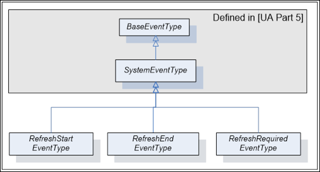  

Figure 2525 - Refresh Related Event Hierarchy  

#### 5.11.2 RefreshStartEventType  

This *EventType* is used by a *Server* to mark the beginning of a *Refresh* *Notification* cycle. Its representation in the *AddressSpace* is formally defined in [Table 133133](/§\_Ref174251141) .  

Table 133133 - RefreshStartEventType definition  

| **Attribute** | **Value** |
|---|---|
|BrowseName|RefreshStartEventType|
|IsAbstract|True|
  
| **References** | **NodeClass** | **BrowseName** | **DataType** | **TypeDefinition** | **ModellingRule** |
|---|---|---|---|---|---|
|||||
|Subtype of the *SystemEventType* defined in [10000-5](/§UAPart5) , i.e. it has HasProperty *References* to the same *Nodes* .|
  
| **ConformanceUnits** |
|---|
|A & C Refresh|
|A & C Refresh2|
  

  

#### 5.11.3 RefreshEndEventType  

This *EventType* is used by a *Server* to mark the end of a *Refresh* *Notification* cycle. Its representation in the *AddressSpace* is formally defined in [Table 134134](/§\_Ref174251126) .  

Table 134134 - RefreshEndEventType definition  

| **Attribute** | **Value** |
|---|---|
|BrowseName|RefreshEndEventType|
|IsAbstract|True|
  
| **References** | **NodeClass** | **BrowseName** | **DataType** | **TypeDefinition** | **ModellingRule** |
|---|---|---|---|---|---|
|||||
|Subtype of the *SystemEventType* defined in [10000-5](/§UAPart5) , i.e. it has HasProperty *References* to the same *Nodes* .|
  
| **ConformanceUnits** |
|---|
|A & C Refresh|
|A & C Refresh2|
  

  

#### 5.11.4 RefreshRequiredEventType  

This *EventType* is used by a *Server* to indicate that a significant change has occurred in the *Server* or in the subsystem below the *Server* that could or does invalidate the *Condition* state of a *Subscription* . Its representation in the *AddressSpace* is formally defined in [Table 135135](/§\_Ref174252897) .  

Table 135135 - RefreshRequiredEventType definition  

| **Attribute** | **Value** |
|---|---|
|BrowseName|RefreshRequiredEventType|
|IsAbstract|True|
  
| **References** | **NodeClass** | **BrowseName** | **DataType** | **TypeDefinition** | **ModellingRule** |
|---|---|---|---|---|---|
|||||
|Subtype of the *SystemEventType* defined in [10000-5](/§UAPart5) , i.e. it has HasProperty *References* to the same *Nodes* .|
  
| **ConformanceUnits** |
|---|
|A & C Refresh|
|A & C Refresh2|
  

  

When a *Server* detects an *Event* queue overflow, it shall track if any *Condition* *Events* have been lost, if any *Condition* *Events* were lost, it shall issue a *RefreshRequiredEventType* *Event* to the *Client* after the *Event* queue is no longer in an overflow state.  

### 5.12 HasCondition Reference type  

The *HasCondition* *ReferenceType* is a concrete *ReferenceType* and can be used directly. It is a subtype of *NonHierarchicalReferences* . The representation in the *AddressSpace* is specified in [Table 136136](/§\_Ref228719486) .  

The semantic of this *ReferenceType* is to specify the relationship between a *ConditionSource* and its *Conditions* . Each *ConditionSource* shall be the target of a *HasEventSource Reference* or a sub type of *HasEventSource* . The *AddressSpace* organisation that shall be provided for *Clients* to detect *Conditions* and *ConditionSources* is defined in Clause [6](/§\_Ref230154361) . Various examples for the use of this *ReferenceType* can be found in [B.2](/§\_Ref228719532) .  

*HasCondition* *References* can be used in the *Type* definition of an *Object* or a *Variable* . In this case, the *SourceNode* of this *ReferenceType* shall be an *ObjectType* or *VariableType Node* or one of their *InstanceDeclaration Nodes* . The *TargetNode* shall be a *Condition* instance declaration or a *ConditionType* . The following rules for instantiation apply:  

* All *HasCondition* *References* used in a *Type* shall exist in instances of these *Types* as well.  

* If the *TargetNode* in the *Type* definition is a *ConditionType* , the same *TargetNode* will be referenced on the instance.  

*HasCondition* *References* can be used solely in the instance space when they are not available in *Type* definitions. In this case the *SourceNode* of this *ReferenceType* shall be an *Object* , *Variable* or *Method* *Node* . The *TargetNode* shall be a *Condition* instance or a *ConditionType* .  

Table 136136 - HasCondition ReferenceType Definition  

| **Attributes** | **Value** |
|---|---|
|BrowseName|HasCondition|
|InverseName|IsConditionOf|
|Symmetric|False|
|IsAbstract|False|
  
| **References** | **NodeClass** | **BrowseName** | **Comment** |
|---|---|---|---|
|||||
  
| **ConformanceUnits** |
|---|
|A & C Basic|
  

  

### 5.13 Alarm & Condition status codes  

[Table 137137](/§\_Ref90539276) defines the *StatusCodes* defined for *Alarm* & *Conditions* .  

Table 137137 - Alarm & Condition result codes  

| **Symbolic Id** | **Description** |
|---|---|
|Bad\_ConditionAlreadyEnabled|The addressed Condition is already enabled.|
|Bad\_ConditionAlreadyDisabled|The addressed Condition is already disabled.|
|Bad\_ConditionAlreadyShelved|The Alarm is already in a shelved state.|
|Bad\_ConditionBranchAlreadyAcked|The *EventId* does not refer to a state that needs acknowledgement.|
|Bad\_ConditionBranchAlreadyConfirmed|The *EventId* does not refer to a state that needs confirmation.|
|Bad\_ConditionNotShelved|The Alarm is not in the requested shelved state.|
|Bad\_DialogNotActive|The *DialogConditionType* instance is not in *Active* state.|
|Bad\_DialogResponseInvalid|The selected option is not a valid index in the *ResponseOptionSet* array.|
|Bad\_EventIdUnknown|The specified *EventId* is not known to the *Server* .|
|Bad\_RefreshInProgress|A ConditionRefresh operation is already in progress.|
|Bad\_ShelvingTimeOutOfRange|The provided *Shelving* time is outside the range allowed by the *Server* for *Shelving*|
  

  

### 5.14 Expected A & C server behaviours  

#### 5.14.1 General  

This section describes behaviour that is expected from an OPC UA *Server* that is implementing the *A & C Information* *Model* . In particular this section describes specific behaviours that apply to various aspect of the A & C *Information Model* .  

#### 5.14.2 Communication problems  

In some implementation of an OPC UA A & C *Server* , the *Alarms* and *Condition* are provided by an underlying system. The expected behaviour of an A & C *Server* when it is encountering communication problems with the underlying system is:  

* If communication fails to the underlying system,  

* For any *Event* field related information that is exposed in the address space, the Value/ *StatusCode* obtained when reading the *Event* fields that are associated with the communication failure shall have a value of NULL and a *StatusCode* of Bad\_CommunicationError.  

* For *Subscriptions* that contain *Conditions* for which the failure applies, the effected *Conditions* generate an *Event,* if the *Retain* field is set to True. These *Events* shall have their *Event* fields that are associated with the communication failure contain a *StatusCode* of Bad\_CommunicationError for the value.  

* A *Condition* of the SystemOffNormalAlarmType shall be used to report the communication failure to *Alarm* *Clients* . The *NormalState* field shall contain the *NodeId* of the *Variable* that indicates the status of the underlying system.  

* For start-up of an A & C *Server* that is obtaining A & C information from an already running underlying system:  

* If a value is unavailable for an *Event* field that is being reported due to a start-up of the UA *Server* (i.e. the information is just not available for the *Event* ) the *Event* field shall contain a *StatusCode* set to Bad\_WaitingForInitialData for the value.  

* If the Time field is normally provided by the underlying system and is unavailable, the Time shall be reported as a *StatusCode* with a value of Bad\_WaitingForInitialData.  

#### 5.14.3 Redundant A & C servers  

In an OPC UA *Server* that is implementing the A & C *Information Model* and that is configured to be a redundant OPC UA *Server* the following behaviour is expected:  

* The EventId is used to uniquely identify an *Event* . For an *Event* that is in each of the redundant *Servers* , it shall be identical. This applies to all standard *Event* s, *Alarms* and *Conditions* . This may be accomplished by sharing of information between redundant *Server* (such as actual *Event* s) or it may be accomplished by providing a strict *EventId* generating algorithm that will generate an identical *EventId* for each *Event*  

* It is expected that for cold or warm failovers of redundant *Server* s, *Subscription* for *Events* shall require a Refresh operation. The *Client* shall initiate this *Refresh* operation.  

* It is expected that for hot failovers of redundant *Server* s, *Subscriptions* for *Events* may require a *Refresh* operation. The *Server* shall issue a *RefreshRequiredEventType* *Event* if it is required.  

* For transparent redundancy, a *Server* shall not require any action be performed by a *Client* .  

## 6 AddressSpace organisation  

### 6.1 General  

The *AddressSpace* organisation described in this Clause allows *Clients* to detect *Conditions* and *ConditionSources* . An additional hierarchy of *Object* *Nodes* that are notifiers may be established to define one or more areas; the *Client* can subscribe to specific areas to limit the *Event* *Notifications* sent by the *Server* . Additional examples can be found in Clause [B.2](/§\_Ref229820594) .  

### 6.2 EventNotifier and source hierarchy  

*HasNotifier* and *HasEventSource* *References* are used to expose the hierarchical organization of *Event* notifying *Objects* and *ConditionSources* . An *Event* notifying *Object* represents typically an area of *Operator* responsibility. The definition of such an area configuration is outside the scope of this document or even this standard. If areas are available, they shall be linked together and with the included *ConditionSources* using the *HasNotifier* and the *HasEventSource* *Reference* *Types* . The *Server* *Object* shall be the root of this hierarchy.  

[Figure 2626](/§\_Ref229330465) shows such a hierarchy. Note that *HasNotifier* is a sub-type of *HasEventSource* . I.e. the target *Node* of a *HasNotifier* *Reference* (an *Event* notifying *Object* ) may also be a *ConditionSource* . The *HasEventSource* *Reference* is used if the target *Node* is a *ConditionSource* but cannot be used as *Event* notifier. See [10000-3](/§UAPart3) for the formal definition of these *Reference Types* .  

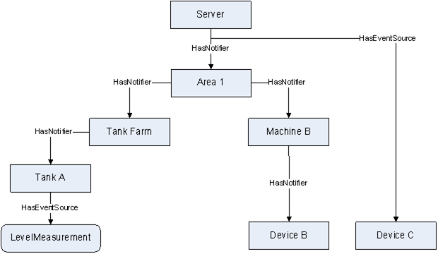  

Figure 2626 - Typical HasNotifier Hierarchy  

### 6.3 Adding Conditions to the hierarchy  

*HasCondition* is used to reference *Conditions* . The *Reference* is from a *ConditionSource* to a *Condition* instance or - if no instance is exposed by the *Server*\- to the *ConditionType* .  

*Clients* can locate *Conditions* by first browsing for *ConditionSources* following *HasEventSource References* (including sub-types like the *HasNotifier Reference* ) and then browsing for *HasCondition References* from all target *Nodes* of the discovered *References* .  

[Figure 2727](/§\_Ref229332139) shows the application of the *HasCondition Reference* in a *HasNotifier* hierarchy. The *Variable* LevelMeasurement and the *Object* "Device B" *Reference* *Condition* instances. The *Object* "Tank A" *References* a *ConditionType* (MySystemAlarmType) indicating that a *Condition* exists but is not exposed in the *AddressSpace* .  

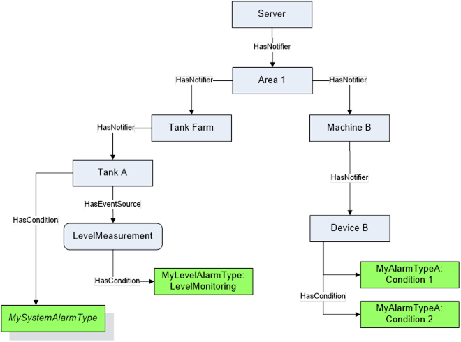  

Figure 2727 - Use of HasCondition in a HasNotifier hierarchy  

### 6.4 Conditions in InstanceDeclarations  

[Figure 2828](/§\_Ref229827604) shows the use of the *HasCondition Reference* and the *HasEventSource Reference* in an *InstanceDeclaration* . They are used to indicate what *References* and *Conditions* are available on the instance of the *ObjectType* .  

The use of the *HasEventSource Reference* in the context of *InstanceDeclarations* and *TypeDefinition Nodes* has no effect for *Event* generation.  

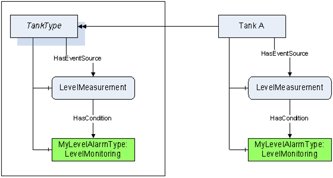  

Figure 2828 - Use of HasCondition in an InstanceDeclaration  

### 6.5 Conditions in a VariableType  

Use of *HasCondition* in a *VariableType* is a special use case since *Variables* (and *VariableTypes* ) are not allowed to be the source of a *HasComponent* *Reference* to an Object. [Figure 2929](/§\_Ref230154625) provides an example of this use case. Note that there is no component relationship for the "LvelMonitoring" *Alarm* . It is *Server*\-specific whether and where they assign a *HasComponent Reference* .  

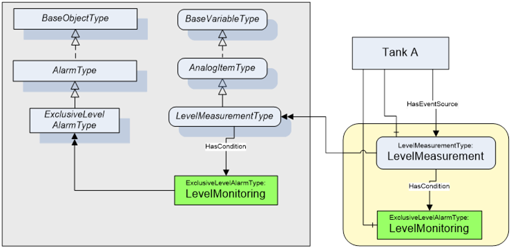  

Figure 2929 - Use of HasCondition in a VariableType  

  

## 7 System State & Alarms  

### 7.1 Overview  

The state of alarms is affected by the state of the process, equipment, system or plant. For example, when a tank is taken out of service, the level alarms associated with the tank would be no longer used, until the tank is returned to service. This section describes *ReferenceTypes* that can be used by a *StateMachine* to indicate that a specific *Effect* on *Alarms* caused by the transition of a *StateMachine* . *StateMachines* that describe the state of a process, system or equipment can vary, but an example *StateMachine* is provided in [Annex F](/§\_Ref473919840) .  

### 7.2 HasEffectDisable  

The *HasEffectDisable ReferenceType* is a concrete *ReferenceType* and can be used directly. It is a subtype of *HasEffect* .  

The semantic of this *ReferenceType* is to point from a *Transition* to an *Alarm* that will be disabled.  

* If the *Reference* is to an *Object* then all *Alarms* in the *HasNotifier* hierarchy below that *Object* are disabled,  

* If the target is an *AlarmType* then all instances of that *AlarmType* in the *HasNotifier* hierarchy below the *Object* containing the *StateMachine* are disabled,  

* If the target is an *Alarm* instance then the given *Alarm* instance is disabled.  

The *SourceNode* of this *ReferenceType* shall be an *Object* of the *ObjectType* *TransitionType* or one of its subtypes. The *TargetNode* can be of an *Object* or *AlarmType* .  

The representation of the *HasEffectDisable* *ReferenceType* in the *AddressSpace* is specified in [Table 138138](/§\_Ref150317372)  

Table 138138 - HasEffectDisable ReferenceType  

| **Attributes** | **Value** |
|---|---|
|BrowseName|*HasEffectDisable*|
|InverseName|MayBeDisabledBy|
|Symmetric|False|
|IsAbstract|False|
  
| **References** | **NodeClass** | **BrowseName** | **Comment** |
|---|---|---|---|
|||||
  
| **ConformanceUnits** |
|---|
|A & C StateMachine Trigger|
  

  

### 7.3 HasEffectEnable  

The *HasEffectEnable ReferenceType* is a concrete *ReferenceType* and can be used directly. It is a subtype of *HasEffect* .  

The semantic of this *ReferenceType* is to point from a *Transition* to an *Alarm* that will be enabled.  

* If the *Reference* is to an *Object* then all *Alarms* in the *HasNotifier* hierarchy below that *Object* are enabled,  

* If the target is an *AlarmType* then all instances of that *AlarmType* in the *HasNotifier* hierarchy below the *Object* containing the *StateMachine* are enabled  

* If the target is an *Alarm* instance then the given *Alarm* instance is enabled.  

The *SourceNode* of this *ReferenceType* shall be an *Object* of the *ObjectType* *TransitionType* or one of its subtypes. The *TargetNode* can be of any *NodeClass* .  

The representation of the *HasEffectEnable* *ReferenceType* in the *AddressSpace* is specified in [Table 139139](/§\_Ref472804917)  

Table 139139 - HasEffectEnable ReferenceType  

| **Attributes** | **Value** |
|---|---|
|BrowseName|HasEffectEnable|
|InverseName|MayBeEnabledBy|
|Symmetric|False|
|IsAbstract|False|
  
| **References** | **NodeClass** | **BrowseName** | **Comment** |
|---|---|---|---|
|||||
  
| **ConformanceUnits** |
|---|
|A & C Statemachine Trigger|
  

  

### 7.4 HasEffectSuppressed  

The *HasEffectSuppressed ReferenceType* is a concrete *ReferenceType* and can be used directly. It is a subtype of *HasEffect* .  

The semantic of this *ReferenceType* is to point from a *Transition* to an *Alarm* that will be suppressed.  

* If the reference is to an *Object* then all *Alarms* in the *EventNotifier* hierarchy below that *Object* are suppressed,  

* If the target is an *AlarmType* then all instance of that AlarmType in the *HasNotifier* hierarchy below the *Object* containing the *StateMachine* are suppressed,  

* If the target is an *Alarm* instance then the given *Alarm* instance is suppressed.  

The *SourceNode* of this *ReferenceType* shall be an *Object* of the *ObjectType* *TransitionType* or one of its subtypes. The *TargetNode* can be of any *NodeClass* .  

The representation of the *HasEffectSuppressed* *ReferenceType* in the *AddressSpace* is specified in [Table 140140](/§\_Ref472804937)  

Table 140140 - HasEffectSuppressed ReferenceType  

| **Attributes** | **Value** |
|---|---|
|BrowseName|HasEffectSuppressed|
|InverseName|MayBeSuppressedBy|
|Symmetric|False|
|IsAbstract|False|
  
| **References** | **NodeClass** | **BrowseName** | **Comment** |
|---|---|---|---|
|||||
  
| **ConformanceUnits** |
|---|
|A & C Statemachine Suppression Trigger|
  

  

### 7.5 HasEffectUnsuppressed  

The *HasEffectUnsuppressed ReferenceType* is a concrete *ReferenceType* and can be used directly. It is a subtype of *HasEffect* .  

The semantic of this *ReferenceType* is to point from a *Transition* to an *Alarm* that will no longer be suppressed.  

* If the *Reference* is to an *Object* then all *Alarms* in the *HasNotifier* hierarchy below that *Object* are removed from being suppressed,  

* If the target is an *AlarmType* then all instance of that AlarmType are no longer suppressed below the *Object* containing the *StateMachine* ,  

* if the target is an *Alarm* instance then the given *Alarm* instance is no longer suppressed. No errors are logged if the *Alarm* was not suppressed.  

The *SourceNode* of this *ReferenceType* shall be an *Object* of the *ObjectType* *TransitionType* or one of its subtypes. The *TargetNode* can be of any *NodeClass* .  

The representation of the *HasEffectUnsuppressed* *ReferenceType* in the *AddressSpace* is specified in [Table 141141](/§\_Ref472804978) .  

Table 141141 - HasEffectUnsuppressed ReferenceType  

| **Attributes** | **Value** |
|---|---|
|BrowseName|HasEffectUnsuppressed|
|InverseName|MayBeUnsuppressedBy|
|Symmetric|False|
|IsAbstract|False|
  
| **References** | **NodeClass** | **BrowseName** | **Comment** |
|---|---|---|---|
|||||
  
| **ConformanceUnits** |
|---|
|A & C Statemachine Suppression Trigger|
  

  

## 8 Alarm Summary and Objects  

### 8.1 Overview  

In a system an *Object* might have multiple *Alarms* associated with it. These *Alarms* might be directly *Referenced* by an *Object* or they might have no direct *References* from the *Object* to the *Alarm* . Alarms might also be related to *Objects* that are nested under the *Object* . When the *Object* is represented in a graphic in a plant, it is often important to be able to see if there is an active *Alarm* associated with it. This indication could just be a flashing value or flashing image or a change in colour of the image.  

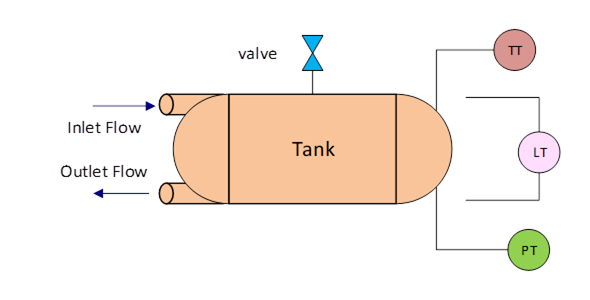  

 **Figure 3030\- AlarmSummary equipment example**   

For example, if there is a tank (illustrated in [Figure 3030](/§\_Ref97508524) ). The tank might have a level meter, a temperature gauge and a pressure gauge. It might also have a flow meter on both an inlet and an outlet. The tank might also have a pressure release valve. The information model that might result from this equipment is illustrated in [Figure 3131](/§\_Ref97509311)  

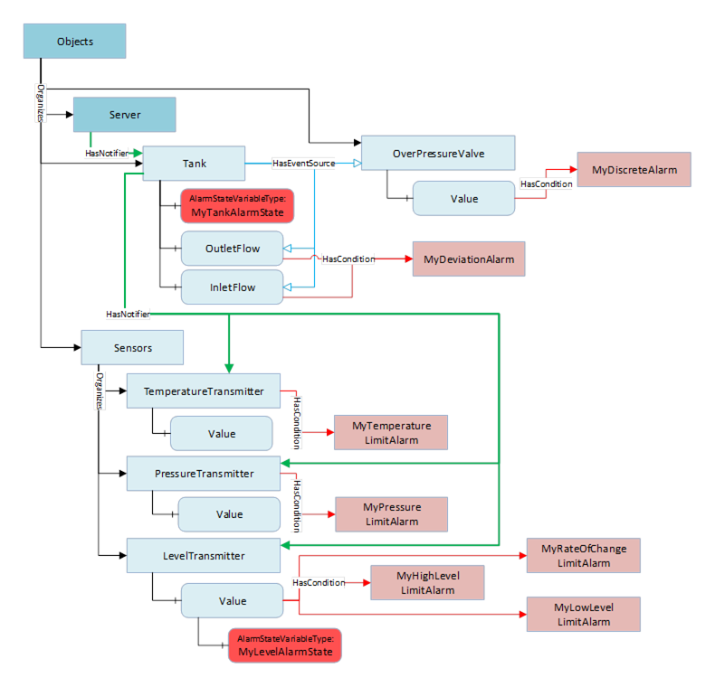  

 **Figure 3131\- AlarmSummary Equipment Object Example**   

All of these sub-objects might have unique alarms associated with them, such as limit alarms on the temperature and levels, maybe rate of change alarm as well as limit alarms on the pressure. Maybe some advanced Alarms that are associated with the tank for an invalid state (in the inlet flow \> 0 and the outlet flow is \> 0). Maybe a discrete alarm on the pressure release valve, i.e. when it is open it is an alarm. The overall alarm state of the Tank could be displayed on a graphic or maybe the LevelTransmitter's value is to indicate that there is an alarm associated with the value.  

### 8.2 AlarmState Variable  

An instance of *AlarmStateVariableType* can be assigned to any *Object* or *Variable* . The instance will provide a summary of the *Alarms* associated with the parent *Variable* or *Object* (the *Source* of the *HasComponent Reference* for this instance)  

Table 142142 - AlarmStateVariableType definition  

| **Attribute** | **Value** |
|---|---|
|BrowseName|AlarmStateVariableType|
|DataType|AlarmMask|
|ValueRank|\-1 (-1 = Scalar)|
|IsAbstract|False|
  
| **References** | **NodeClass** | **BrowseName** | **DataType** | **TypeDefinition** | **ModellingRule** |
|---|---|---|---|---|---|
|Subtype of the *BaseDataVariableType* defined in [10000-5](/§UAPart5) .|
|HasProperty|Variable|HighestActiveSeverity|UInt16|PropertyType|Mandatory|
|HasProperty|Variable|HighestUnackSeverity|UInt16|PropertyType|Mandatory|
|HasProperty|Variable|ActiveCount|UInt32|PropertyType|Mandatory|
|HasProperty|Variable|UnacknowledgedCount|UInt32|PropertyType|Mandatory|
|HasProperty|Variable|UnconfirmedCount|UInt32|PropertyType|Mandatory|
|HasProperty|Variable|Filter|ContentFilter|PropertyType|Mandatory|
  
| **ConformanceUnits** |
|---|
|A & C Summary|
  

*HighestActiveSeverity*\- the highest *Severity* of any active *Alarm* .  

*HighestUnackSeverity*\- the highest *Severity* of any *Unacknowledged* *Alarm*  

*ActiveCount*\- a count of the number of active *Alarms*  

*UnacknowledgedCount*\- a count of the number of *Unacknowledged* *Alarms*  

*UnconfirmedCount*\- a count of the number of *Unconfirmed* *Alarms.* If alarm confirmation is not supported this count shall be zero.  

*Filter -* provides a *ContentFilter* that can be used to restrict what alarms are processed as part of the *AlarmStateVariableType* . If no filter is required the *ContentFilter* can be null.  

### 8.3 AlarmMask  

This *OptionSet* defines flags indicating the summary of alarm states *.*  

The *AlarmMask* values are formally defined in [Table 143143](/§\_Ref83395188) .  

Table 143143 - AlarmMask values  

| **Value** | **Bit No.** | **Description** |
|---|---|---|
|Active|0|This bit is set if there are active *Alarms*|
|Unacknowledged|1|This bit is set if there are *Unacknowledged* *Alarms*|
|Unconfirmed|2|This bit is set if there are *Unconfirmed* *Alarms*|
  

  

The *AlarmMask* representation in the *AddressSpace* is formally defined in [Table 144144](/§\_Ref86746108) .  

Table 144144 - AlarmMask definition  

| **Attribute** | **Value** |
|---|---|
|BrowseName|AlarmMask|
|IsAbstract|False|
  
| **References** | **NodeClass** | **BrowseName** | **DataType** | **TypeDefinition** | **Other** |
|---|---|---|---|---|---|
|Subtype of the UInt16 type defined in [10000-5](/§UAPart5)|
|0:HasProperty|Variable|0:OptionSetValues|0:LocalizedText[]|0:PropertyType||
  
| **ConformanceUnits** |
|---|
|A & C Summary|
  

  

## 9 Alarm Metrics  

### 9.1 Overview  

The goal of a well-designed alarm system is to ensure that an *Operator* is made aware of issues, both critical and non-critical, but is not overwhelmed by alarms/alerts or other messages. When designing an alarm system, criteria are defined for alarm rates and general performance of the system at various levels ( *Operator* station, plant area, overall system etc.). Evaluating the performance of an alarm system with regard to these design criteria requires the collection of alarm metrics. These metrics provide summaries of alarm rates and other alarm related information.  

This section defines a standard structure for metrics. This structure can be implemented at multiple levels allowing a *Server* to collect metrics as needed. For example, an *Object* of this type might be added to the *Server* *Object* providing a summary of the *Alarm* performance for the entire *Server* . An instance might also be provided on an *Object* that includes a *HasNotifier* hierarchy, such as a tank *Object* . In this case, it would provide the summary of all of the *Alarms* that are part of the tank *HasNotifier* hierarchy.  

### 9.2 AlarmMetricsType  

This Object *Type* is used for metric information. The *ObjectType* is formally defined in [Table 145145](/§\_Ref134949815) .  

Table 145145 - AlarmMetricsType Definition  

| **Attribute** | **Value** |
|---|---|
|BrowseName|AlarmMetricsType|
|IsAbstract|False|
  
| **References** | **NodeClass** | **BrowseName** | **DataType** | **TypeDefinition** | **ModellingRule** |
|---|---|---|---|---|---|
|Subtype of the BaseObjectType defined in [10000-5](/§UAPart5) .|
|HasComponent|Variable|AlarmCount|UInt32|BaseDataVariableType|Mandatory|
|HasComponent|Variable|StartTime|UtcTime|BaseDataVariableType|Mandatory|
|HasComponent|Variable|MaximumActiveState|Duration|BaseDataVariableType|Mandatory|
|HasComponent|Variable|MaximumUnAck|Duration|BaseDataVariableType|Mandatory|
|HasComponent|Variable|CurrentAlarmRate|Double|AlarmRateVariableType|Mandatory|
|HasComponent|Variable|MaximumAlarmRate|Double|AlarmRateVariableType|Mandatory|
|HasComponent|Variable|MaximumReAlarmCount|UInt32|BaseDataVariableType|Mandatory|
|HasComponent|Variable|AverageAlarmRate|Double|AlarmRateVariableType|Mandatory|
|HasComponent|Method|Reset|||Mandatory|
  
| **ConformanceUnits** |
|---|
|A & C Alarm Metrics|
  

An instance of *AlarmMetricsType* can be added, with a *HasComponent* reference, to any *Object* that has its "SubscribeToEvents" bit set within the *EventNotifier* *Attribute.* It will collect the *Alarm* metrics for all *Alarm* sources assigned to this notifier *Object* . For example, if *Alarm* metrics are desired for Tank A *Object* (see [Figure B.55](/§\_Ref382998496) ) that is in the *HasNotifier* hierarchy than an instance of this object would be referenced by the Tank A object. When this object is associated with the *Server* *Object* it will report *Alarm* metrics for the entire *Server* .  

*AlarmCount* is the total count of *Alarms* since the last restart of the system or reset of this counter.  

StartTime is the time at which the *Server* started or the time of the last *Reset* Method invocation, whichever is later.  

*MaximumActiveState* is the maximum time for which an *Alarm* was in the active state.  

*MaximumUnAck* is the maximum time for which an *Alarm* was in the unacknowledged state.  

*CurrentAlarmRate* is the sum of *Alarms* that occurred in the last *Rate* number of minutes (see [9.3](/§\_Ref477254172) ). This sum should not include nuisance Alarms (i.e. chattering alarms). It is updated every *Rate* number of minutes.  

*MaximumAlarmRate* is the maximum *Alarm* rate detected since the start of the *Server* , where the rate is calculated as for *CurrentAlarmRate* .  

*MaximumReAlarmCount* is the maximum *ReAlarmCount* for any *Alarm* .  

*AverageAlarmRate* is the average *Alarm* rate since the start of the *Server* or the last invocation of *Reset Method* , where the rate is calculated as for *CurrentAlarmRate* .  

*Reset* is a *Method* that will reset all of the counters, rates or times in this *Object*  

### 9.3 AlarmRateVariableType  

This variable type provides a unit field for the rate for which the *Alarm* diagnostic applies.  

Table 146146 - AlarmRateVariableType Definition  

| **Attribute** | **Value** |
|---|---|
|BrowseName|AlarmRateVariableType|
|IsAbstract|False|
|ValueRank|Scalar|
|DataType|Double|
  
| **References** | **NodeClass** | **BrowseName** | **DataType** | **TypeDefinition** | **ModellingRule** |
|---|---|---|---|---|---|
|HasProperty|Variable|Rate|UInt16|PropertyType|Mandatory|
  
| **ConformanceUnits** |
|---|
|A & C Alarm Metrics|
  

*Rate*\- is the number of minutes over which the item is calculated.  

### 9.4 Reset Method  

The *Reset* *Method* is used reset all of the counters, rates and time in the *Object*  

 **Signature**   

 **Reset**   

  

 **Method Result Codes in [Table 5151](/§\_Ref463025326) (defined in Call Service)**   

Table 147147 - Suppress result codes  

| **Result Code** | **Description** |
|---|---|
|Bad\_MethodInvalid|The *MethodId* provided does not correspond to the *ObjectId* provided. See [10000-4](/§UAPart4) for the general description of this result code.|
|Bad\_NodeIdInvalid|Used to indicate that the specified *ObjectId* is not valid. See [10000-4](/§UAPart4) for the general description of this result code.|
  

  

 **Comments**   

*The Reset Method* will clear all setting in the diagnostic object and initialize them to zero.  

[Table 148148](/§\_Ref478026915) specifies the *AddressSpace* representation for the *Reset* *Method* .  

Table 148148 - Reset Method AddressSpace Definition  

| **Attribute** | **Value** |
|---|---|
|BrowseName|Reset|
  
| **References** | **NodeClass** | **BrowseName** | **DataType** | **TypeDefinition** | **ModellingRule** |
|---|---|---|---|---|---|
|||||||
|AlwaysGeneratesEvent|ObjectType|AuditUpdateMethodEventType|Defined in [10000-5](/§UAPart5)|
  
| **ConformanceUnits** |
|---|
|A & C Alarm Metrics|
  

If *Auditing* is supported, this *Method* shall generate an *Event* of *AuditConditionMethodEventType* for all invocations of the *Method* .  

## Annex A (informative)Recommended localized names  

### A.1 Recommended state names for TwoState Variables  

#### A.1.1 LocaleId "en"  

The recommended state display values for the LocaleId "en" are listed in [Table A.11](/§\_Ref382998163) and the recommended *DisplayNames* are listed in [Table A.22](/§\_Ref382998170)  

Table A. 11 - Recommended state names for LocaleId "en"  

| **ConditionType** | **State Variable** | **False State Name** | **True State Name** |
|---|---|---|---|
|ConditionType|EnabledState|Disabled|Enabled|
|DialogConditionType|DialogState|Inactive|Active|
|AcknowledgeableConditionType |AckedState|Unacknowledged|Acknowledged|
||ConfirmedState|Unconfirmed|Confirmed|
|AlarmConditionType|ActiveState|Inactive|Active|
||SuppressedState|Unsuppressed|Suppressed|
||OutOfServiceState|In Service|Out of Service|
||SilenceState|Not Silenced|Silenced|
||LatchedState|Unlatched|Latched|
|NonExclusiveLimitAlarmType|HighHighState|HighHigh inactive|HighHigh active|
||HighState|High inactive|High active|
||LowState|Low inactive|Low active|
||LowLowState|LowLow inactive|LowLow active|
  

  

Table A. 22 - Recommended DisplayNames for LocaleId "en"  

| **ConditionType** | **BrowseName** | **DisplayName** |
|---|---|---|
|Shelved|Unshelved|Unshelved|
||TimedShelved|TimedShelved|
||OneShotShelved|OneShotShelved|
|Exclusive|HighHigh|HighHigh|
||High|High|
||Low|Low|
||LowLow|LowLow|
  

  

#### A.1.2 LocaleId "de"  

The recommended state display values for the LocaleId "de" are listed in [Table A.33](/§\_Ref382998178) and the recommended *DisplayNames* are listed in [Table A.44](/§\_Ref382998185) .  

Table A. 33 - Recommended state names for LocaleId "de"  

| **ConditionType** | **State Variable** | **False State Name** | **True State Name** |
|---|---|---|---|
|ConditionType|EnabledState|Ausgeschaltet|Eingeschaltet|
|DialogConditionType|DialogState|Inaktiv|Aktiv|
|AcknowledgeableConditionType |AckedState|Unquittiert|Quittiert|
||ConfirmedState|Unbestätigt|Bestätigt|
|AlarmConditionType|ActiveState|Inaktiv|Aktiv|
||SuppressedState|Nicht unterdrückt|Unterdrückt|
||OutOfServiceState|InBetrieb|AußerBetrieb|
||SilenceState|Nicht Stumm|Stumm|
||LatchedState|Entriegelt|Verriegelt|
|NonExclusiveLimitAlarmType|HighHighState|HighHigh inaktiv|HighHigh aktiv|
||HighState|High inaktiv|High aktiv|
||LowState|Low inaktiv|Low aktiv|
||LowLowState|LowLow inaktiv|LowLow aktiv|
  

Table A. 44 - Recommended DisplayNames for LocaleId "de"  

| **ConditionType** | **BrowseName** | **DisplayName** |
|---|---|---|
|Shelved|Unshelved|NichtZurückgestellt|
||TimedShelved|BefristetZurückgestellt|
||OneShotShelved|EinmaligZurückgestellt|
|Exclusive|HighHigh|HighHigh|
||High|High|
||Low|Low|
||LowLow|LowLow|
  

  

#### A.1.3 LocaleId "fr"  

The recommended state display values for the LocaleId "fr" are listed in [Table A.55](/§\_Ref382998216) and the recommended *DisaplayNames* are listed in [Table A.66](/§\_Ref382998225) .  

Table A. 55 - Recommended state names for LocaleId "fr"  

| **ConditionType** | **State Variable** | **False State Name** | **True State Name** |
|---|---|---|---|
|ConditionType|EnabledState|Hors Service|En Service|
|DialogConditionType|DialogState|Inactive|Active|
|AcknowledgeableConditionType |AckedState|Non-acquitté|Acquitté|
||ConfirmedState|Non-Confirmé|Confirmé|
|AlarmConditionType|ActiveState|Inactive|Active|
||SuppressedState|Présent|Supprimé|
||OutOfServiceState|En Fonction|Hors Fonction|
||SilenceState|Non-Muette|Muette|
||LatchedState|Déverrouillé|Verrouillé|
|NonExclusiveLimitAlarmType|HighHighState|Très Haute inactive|Très Haute active|
||HighState|Haute inactive|Haute active|
||LowState|Basse inactive|Basse active|
||LowLowState|Très basse inactive|Très basse active|
  

Table A. 66 - Recommended DisplayNames for LocaleId "fr"  

| **ConditionType** | **BrowseName** | **DisplayName** |
|---|---|---|
|Shelved|Unshelved|Surveillée|
||TimedShelved|MiseDeCotéTemporelle|
||OneShotShelved|MiseDeCotéUnique|
|Exclusive|HighHigh|TrèsHaute|
||High|Haute|
||Low|Basse|
||LowLow|TrèsBasse|
  

  

### A.2 Recommended dialog response options  

The recommended *Dialog* response option names in different locales are listed in [Table A.77](/§\_Ref382998235) .  

Table A. 77 - Recommended dialog response options  

| **Locale "en"** | **Locale "de"** | **Locale "fr"** |
|---|---|---|
|Ok|OK|Ok|
|Cancel|Abbrechen|Annuler|
|Yes|Ja|Oui|
|No|Nein|Non|
|Abort|Abbrechen|Abandonner|
|Retry|Wiederholen|Réessayer|
|Ignore|Ignorieren|Ignorer|
|Next|Nächster|Prochain|
|Previous|Vorheriger|Precedent|
  

  

## Annex B (informative)Examples  

### B.1 Examples for Event sequences from Condition instances  

#### B.1.1 Overview  

The following examples show the *Event* flow for typical *Alarm* situations. The tables list the value of state *Variables* for each *Event* *Notification* .  

#### B.1.2 Server maintains current state only  

This example is for *Servers* that do not support previous states and therefore do not create and maintain *Branches* of a single *Condition* .  

[Figure B.11](/§\_Ref382998450) shows an *Alarm* as it becomes active and then inactive and also the acknowledgement and confirmation cycles. [Table B.11](/§\_Ref382998304) lists the values of the state *Variables* . All *Events* are coming from the same *Condition* instance and therefore have the same *ConditionId* .  

  

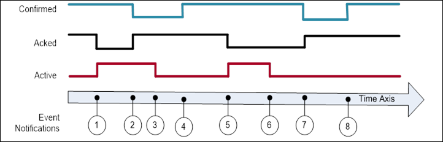  

Figure B. 11 - Single state example  

Table B. 11 - Example of a Condition that only keeps the latest state  

| **EventId** | **BranchId** | **Active** | **Acked** | **Confirmed** | **Retain** | **Description** |
|---|---|---|---|---|---|---|
|\-\*)|NULL|False|True|True|False|Initial state of *Condition* .|
|1|NULL|True|False|True|True|*Alarm* goes active.|
|2|NULL|True|True|False|True|*Condition* acknowledged Confirm required|
|3|NULL|False|True|False|True|*Alarm* goes inactive.|
|4|NULL|False|True|True|False|*Condition* confirmed|
|5|NULL|True|False|True|True|*Alarm* goes active.|
|6|NULL|False|False|True|True|*Alarm* goes inactive.|
|7|NULL|False|True|False|True|*Condition* acknowledged, Confirm required.|
|8|NULL|False|True|True|False|*Condition* confirmed.|
|\*) The first row is included to illustrate the initial state of the *Condition* . This state will not be reported by an *Event* .|
  

  

#### B.1.3 Server maintains previous states  

This example is for *Servers* that are able to maintain previous states of a *Condition* and therefore create and maintain *Branches* of a single *Condition* .  

[Figure B.22](/§\_Ref382998476) illustrates the use of branches by a *Server* requiring acknowledgement of all transitions into *Active* state, not just the most recent transition. In this example no acknowledgement is required on a transition into an inactive state. [Table B.22](/§\_Ref382998314) lists the values of the state *Variables* . All *Events* are coming from the same *Condition* instance and have therefore the same *ConditionId* .  

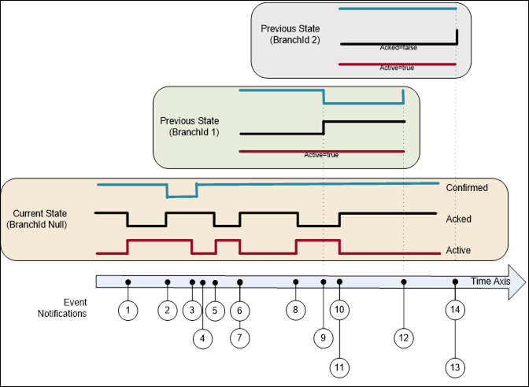  

Figure B. 22 - Previous state example  

Table B. 22 - Example of a Condition that maintains previous states via branches  

| **EventId** | **BranchId** | **Active** | **Acked** | **Confirmed** | **Retain** | **Description** |
|---|---|---|---|---|---|---|
|a)|NULL|False|True|True|False|Initial state of *Condition* .|
|1|NULL|True|False|True|True|Alarm goes active.|
|2 b)|NULL|True|True|True|True|Condition acknowledged requires Confirm|
|3|NULL|False|True|False|True|*Alarm* goes inactive.|
|4|NULL|False|True|True|False|Confirmed|
|5|NULL|True|False|True|True|*Alarm* goes active.|
|6 b)|NULL|False|True|True|True|*Alarm* goes inactive.|
|7 b)|1|True|False|True|True e)|Prior state needs acknowledgment. Branch \#1 created.|
|8|NULL|True|False|True|True|*Alarm* goes active again.|
|9 c)|1|True|True|False|True|Prior state acknowledged, Confirm required.|
|10|NULL|False|True|True|True e)|*Alarm* goes inactive again.|
|11 d)|2|True|False|True|True|Prior state needs acknowledgment. Branch \#2 created.|
|12 c)|1|True|True|True|False|Prior state confirmed. Branch \#1 deleted.|
|13|2|True|True|True|False|Prior state acknowledged, Auto Confirmed by system Branch \#2 deleted. f)|
|14|NULL|False|True|True|False|No longer of interest.|
|a) *The first row* is included to illustrate the initial state of the *Condition* . This state will not be reported by an *Event* .  b) ** If the current state of the *Condition* is acknowledged then the *Acked* flag is set and the new state is reported ( *Event* \#2). If the *Condition* state changes before it can be acknowledged ( *Event* \#6) then a branch state is reported ( *Event* \#7). Timestamps for the *Events* \#6 and \#7 is identical. c) ** The branch state can be updated several times ( *Events* \#9) before it is cleared ( *Event* \#12). d) ** A single *Condition* can have many branch states active ( *Events* \#11) e) *It is recommended* as in this table to leave Retain=True as long as there exist previous states (branches). f) The system Auto confirms this event, since a confirmation is that the operator has taken some action. The confirmation of the previous state (line 12) indicates that the operator has taken an action and this transition does not require a separate confirmation.|
  

#### B.1.4 Server current-State Model with Suppression  

This example adds additional fields to the model illustrated in [B.1.2](/§\_Ref28209806) . This example does not use acknowledge or confirm - it assumes that the alarm is automatically acknowledged (and does not support confirm). It does add *OutOfServiceState* and *SuppressedState.*  

Figure B.3 shows an *Alarm* as it becomes active, is suppressed or is placed out of service and then inactive. Table B.3 lists the values of the state *Variables* . All *Events* are coming from the same *Condition* instance and therefore have the same *ConditionId* . The *Client* subscription includes an event filter that excludes suppressed or out of service conditions (i.e. *SuppressedState* = True or *OutOfServiceState* = True). The events shown in green are delivered to the *Client* . The Retain column indicates the global value of the *Retain* flag. The "Retain sent" column indicates the overridden value sent in a notification if *SupportsFilteredRetain* is True. If *SupportsFilteredRetain* is False the value from the Retain column is sent.  

  

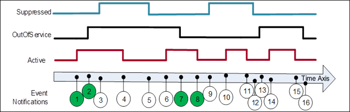  

Figure B. 33 - SuppressedState and OutOfServiceState example  

  

Table B. 33 - Example of a Condition that is Suppressed / OutOfService  

| **EventId** | **Active** | **Suppressed**   **State** | **OutOf**   **Service**   **State** | **Retain** | **Retain sent** | **Event Deliver with Filter** | **Description** |
|---|---|---|---|---|---|---|---|
|\-\*)|False|False|False|False|False|\-|Initial state of Condition.|
|1|True|False|False|True|True|Yes|Alarm goes active.|
|2|True|False|True|True|False|Yes|Placed OutOfService|
|3|True|True|True|True|False|No|Alarm Suppressed; No event since OutOfService|
|4|False|True|True|False|False|No|Alarm goes inactive; No event since OutOfService|
|5|False|False|True|False|False|No|Alarm not Suppressed; No event since not active|
|6|True|False|True|True|False|No|Alarm goes active; No event since OutOfService|
|7|True|False|False|True|True|Yes|Alarm no longer OutOfService; Event generated|
|8|False|False|False|False|False|Yes|Alarm goes inactive|
|9|False|True|False|False|False|No|Alarm Suppressed; No event since not active|
|10|True|True|False|True|False|No|Alarm goes active; No event since Suppressed|
|11|False|True|False|False|False|No|Alarm goes inactive; No event since Suppressed|
|12|False|False|False|False|False|No|Alarm no longer Suppressed|
|13|False|False|True|False|False|No|Placed OutOfService|
|14|True|False|True|True|False|No|Alarm goes active; No event since OutOfService|
|15|False|False|True|False|False|No|Alarm goes inactive; No event since OutOfService|
|16|False|False|False|False|False|No|Alarm no longer OutOfService|
  

This behaviour occurs when the implementation supports SupportsFilteredRetain flag subscription.  

  

#### B.1.5 Example for On-Delay, Off Delay and ReAlarmTime  

This example illustrates how on-delay, off-delay and alarm dead bands can be used to reduce the number of alarms that are generated / reported (see [5.8](/§\_Ref96285681) ). It also illustrates how *ReAlarmTime* is used to bring an alarm back up to an active state (see [Figure B.44](/§\_Ref103633802) ).  

Some process values may have sudden jumps that are very brief and do not constitute an alarm. For example, a motor on start draws a large current, but quickly come back down. This is a normal motor current load, and should not be alarmed, but a sustained current load is a problem and should be alarmed, by configuring a *OnDelay* time, the momentary spike will not generate an alarm, since the value has to be above the alarm threshold for the duration of *OnDelay* .  

An *AlarmDeadband* is used to keep a noise signal from generating multiple Alarm activations a signal once it crosses an alarm limit will not return to norm unless it drops below the limit by the amount of the deadband specified. In the example the process value is jumping up and down around the limit, but the alarm just remains in the same active or acknowledged state. The Alarm can have a deadband for each limit (High vs HighHigh) and these deadbands can be different.  

The *OffDelay* can also be used, much as the *OnDelay* , except it will keep a Value in alarm even if it drops below a limit, but only very briefly. Again, this setting is used to limit the number of alarms that occur in a system.  

The *ReAlarmTime* is used to ensure that actions are taken to correct the issue that generated an alarm. Some alarms are configured to generate a new alarm if they have been in an active state for the *ReAlarmTime* period. The Alarm, goes back to an Unacknowledged state, as if it had just occurred.  

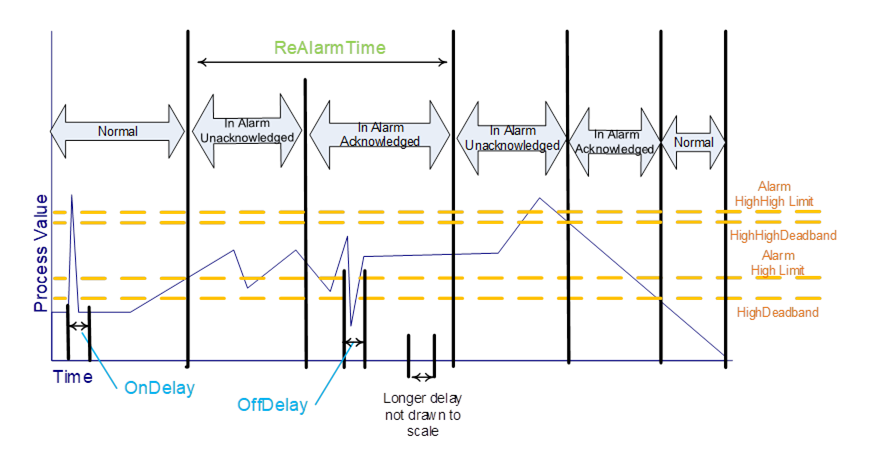  

 **Figure B. 44\- Alarm example - On Delay, Off Delay, ReAlarmTime**   

  

### B.2 AddressSpace examples  

This Clause provides additional examples for the use of *HasNotifier* , *HasEventSource* and *HasCondition* *References* to expose the organization of areas and sources with their associated *Conditions* . This hierarchy is additional to a hierarchy provided with *Organizes* and *Aggregates References* .  

[Figure B.55](/§\_Ref382998496) illustrates the use of the *HasCondition* *Reference* with *Condition* instances.  

  

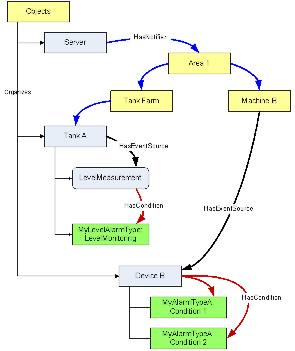  

Figure B. 55 - HasCondition used with Condition instances  

In systems where *Conditions* are not available as instances, the *ConditionSource* can reference the *ConditionTypes* instead. This is illustrated with the example in [Figure B.66](/§\_Ref382998512) .  

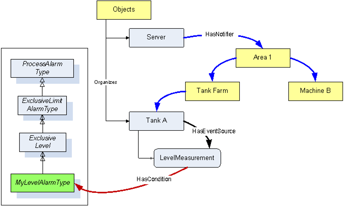  

Figure B. 66 - HasCondition reference to a Condition type  

[Figure B.77](/§\_Ref382998525) provides an example where the *HasCondition Reference* is already defined in the *Type* system. The *Reference* can point to a *Condition Type* or to an instance. Both variants are shown in this example. A *Reference* to a *Condition* *Type* in the *Type* system will result in a *Reference* to the same *Type* *Node* in the instance.  

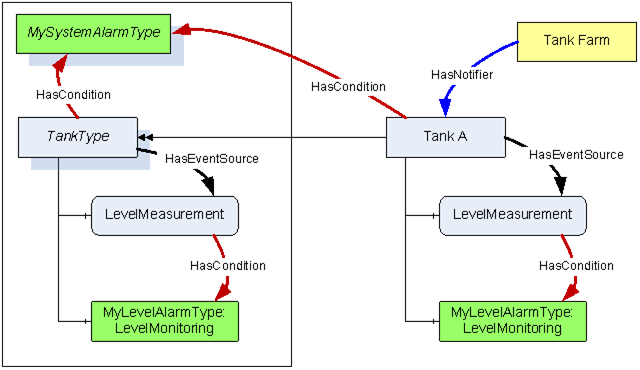  

Figure B. 77 - HasCondition used with an instance declaration  

  

## Annex C (informative)Mapping to EEMUA  

[Table C.11](/§\_Ref382998350) lists [EEMUA Publication 191](/§EEMUA) terms and how OPC UA terms map to them.  

Table C. 11 - EEMUA Terms  

| **EEMUA Term** | **OPC UA Term** | **EEMUA Definition** |
|---|---|---|
|Accepted|Acknowledged = True|An *Alarm* is accepted when the *Operator* has indicated awareness of its presence. In OPC UA this can be accomplished with the *Acknowledge* *Method* .|
|Active Alarm|Active = True|An *Alarm* *Condition* which is on (i.e. limit has been exceeded and *Condition* continues to exist).|
|Alarm Message|Message Property (defined in [10000-5](/§UAPart5) .)|Text information presented to the *Operator* that describes the *Alarm* *Condition* .|
|Alarm Priority|Severity Property (defined in [10000-5](/§UAPart5) .)|The relative importance assigned to an alarm within the alarm system to indicate the urgency of response|
|Alert|\-|A lower priority *Notification* than an *Alarm* that has no serious consequence if ignored or missed. In some Industries also referred to as a Prompt or Warning. No direct mapping\! In UA the concept of alerts can be accomplished by the use of severity. E.g., *Alarms* that have a severity below 400 may be considered as alerts.|
|Cleared|Active = False|An *Alarm* state that indicates the *Condition* has returned to normal.|
|Disable|Enabled = False|An *Alarm* is disabled when the system is configured such that the *Alarm* will not be generated even though the base *Alarm* *Condition* is present.|
|Prompt|Dialog|A request from the control system that the *Operator* perform some process action that the system cannot perform or that requires *Operator* authority to perform.|
|Raised|Active = True|An *Alarm* is *Raised* or initiated when the *Condition* creating the *Alarm* has occurred.|
|Release|OneShotShelving|A 'release' is a facility that can be applied to a standing (UA = active) *Alarm* in a similar way to which *Shelving* is applied. A released *Alarm* is temporarily removed from the *Alarm* list and put on the shelf. There is no indication to the *Operator* when the *Alarm* clears, but it is taken off the shelf. Hence, when the *Alarm* is raised again it appears on the *Alarm* list in the normal way.|
|Reset|Retain = False|An *Alarm* is Reset when it is in a state that can be removed from the Display list. OPC UA includes *Retain* flag which as part of its definition states: "when a *Client* receives an *Event* with the *Retain* flag set to False, the *Client* should consider this as a *Condition* /Branch that is no longer of interest, in the case of a "current *Alarm* display" the *Condition* /Branch would be removed from the display"|
|Shelving|Shelving|*Shelving* is a facility where the *Operator* is able to temporarily prevent an *Alarm* from being displayed to the *Operator* when it is causing the *Operator* a nuisance. A Shelved *Alarm* will be removed from the list and will not re-annunciate until un-shelved.|
|Standing|Active = True|An *Alarm* is *Standing* whilst the *Condition* persists ( *Raised* and *Standing* are often used interchangeably).|
|Suppress|Suppress|An *Alarm* is suppressed when logical criteria are applied to determine that the *Alarm* should not occur, even though the base *Alarm* *Condition* (e.g. *Alarm* setting exceeded) is present.|
|Unaccepted|Acknowledged = False|An *Alarm* is accepted when the *Operator* has indicated awareness of its presence. It is unaccepted until this has been done.|
  

## Annex D (informative)Mapping from OPC A&E to OPC UA A & C  

### D.1 Overview  

Serving as a bridge between COM and OPC UA components, the Alarms and *Events* proxy and wrapper enable existing A&E COM *Clients* and *Servers* to connect to UA *Alarms* and *Conditions* components.  

Simply stated, there are two aspects to the migration strategy. The first aspect enables a UA *Alarms* and *Conditions* *Client* to connect to an existing Alarms and *Events* COM *Server* via a UA *Server* wrapper. This wrapper is notated from this point forward as the A&E COM UA Wrapper. The second aspect enables an existing Alarms and *Events* COM *Client* to connect to a UA *Alarms* and *Conditions* *Server* via a COM proxy. This proxy is notated from this point forward as the A&E COM UA Proxy.  

An Alarms and *Events* COM *Client* is notated from this point forward as A&E COM *Client* .  

A UA *Alarms* and *Conditions* *Server* is notated from this point forward as UA A & C *Server* .  

The mappings describe generic A&E COM interoperability components. It is recommended that vendors use this mapping if they develop their own components, however, some applications may benefit from vendor specific mappings.  

### D.2 Alarms and Events COM UA wrapper  

#### D.2.1 Event areas  

*Event* Areas in the A&E COM *Server* are represented in the A&E COM UA Wrapper as *Objects* with a *TypeDefinition* of *BaseObjectType* . The EventNotifier *Attribute* for these *Objects* always has the SubscribeToEvents flag set to True.  

The root Area is represented by an *Object* with a *BrowseName* that depends on the UA *Server* . It is always the target of a HasNotifier *Reference* from the *Server* *Node* . The root Area allows multiple A&E COM *Servers* to be wrapped within a single UA *Server* .  

The Area hierarchy is discovered with the BrowseOPCAreas and the GetQualifiedAreaName *Method* s. The Area name returned by BrowseOPCAreas is used as the *BrowseName* and *DisplayName* for each Area *Node* . The QualifiedAreaName is used to construct the *NodeId* . The NamespaceURI qualifying the *NodeId* and *BrowseName* is a unique URI assigned to the combination of machine and COM *Server* .  

Each Area is the target of *HasNotifier* *Reference* from its parent Area. It may be the source of one or more HasNotifier *References* to its child Areas. It may also be a source of a *HasEventSource* *Reference* to any sources in the Area.  

It is possible that  an A&E COM *Server* does not support filtering by Areas. If this is the case then no Area *Nodes* are shown in the UA *Server* address space. Some implementations could use the AREAS *Attribute* to provide filtering by Areas within the A&E COM UA Wrapper.  

#### D.2.2 Event sources  

*Event* Sources in the A&E COM *Server* are represented in the A&E COM UA Wrapper as *Objects* with a *TypeDefinition* of *BaseObjectType* . If the A&E COM *Server* supports source filtering then the SubscribeToEvents flag is True and the Source is a target of a HasNotifier *Reference* . If source filtering is not supported the SubscribeToEvents flag is False and the Source is a target of a HasEventSource *Reference* .  

The Sources are discovered by calling BrowseOPCAreas and the GetQualifiedSourceName *Method* s. The Source name returned by BrowseOPCAreas is used as the BrowseName and DisplayName. The QualifiedSourceName is used to construct the *NodeId* . *Event* Source *Nodes* are always targets of a HasEventSource *Reference* from an Area.  

#### D.2.3 Event categories  

*Event* Categories in the A&E COM *Server* are represented in the UA *Server* as *ObjectTypes* which are subtypes of *BaseEventType* . The *BrowseName* and *DisplayName* of the *ObjectType* *Node* for Simple and Tracking *Event* Types are constructed by appending the text 'EventType' to the Description of the *Event* Category. For *Condition* *Event* Types the text 'AlarmType' is appended to the *Condition* Name.  

These *ObjectType* *Nodes* have a super type which depends on the A&E *Event* Type, the *Event* Category Description and the *Condition* Name; however, the best mapping requires knowledge of the semantics associated with the *Event* Categories and *Condition* Names. If an A&E COM UA Wrapper does not know these semantics then Simple *Event* Types are subtypes of *BaseEventType* , Tracking *Event* Types are subtypes of *AuditEventType* and *Condition* *Event* Types are subtypes of the *AlarmType* . [Table D.11](/§\_Ref382998669) defines mappings for a set of "well known" Category description and *Condition* Names to a standard super type.  

Table D. 11 - Mapping from standard Event categories to OPC UA Event types  

| **COM A&E Event Type** | **Category Description** | **Condition Name** | **OPC UA EventType** |
|---|---|---|---|
|Simple|\---|\---|BaseEventType|
|Simple|Device Failure|\---|DeviceFailureEventType|
|Simple|System Message|\---|SystemEventType|
|Tracking|\---|\---|AuditEventType|
|Condition|\---|\---|AlarmType|
|Condition|Level|\---|LimitAlarmType|
|Condition|Level|PVLEVEL|ExclusiveLevelAlarmType|
|Condition|Level|SPLEVEL|ExclusiveLevelAlarmType|
|Condition|Level|HI HI|NonExclusiveLevelAlarmType|
|Condition|Level|HI|NonExclusiveLevelAlarmType|
|Condition|Level|LO|NonExclusiveLevelAlarmType|
|Condition|Level|LO LO|NonExclusiveLevelAlarmType|
|Condition|Deviation|\---|NonExclusiveDeviationAlarmType|
|Condition|Discrete|\---|DiscreteAlarmType|
|Condition|Discrete|CFN|OffNormalAlarmType|
|Condition|Discrete|TRIP|TripAlarmType|
  

There is no generic mapping defined for A&E COM sub- *Conditions* . If an *Event* Category is mapped to a *LimitAlarmType* then the sub *Condition* name in the *Event* are be used to set the state of a suitable State *Variable* . For example, if the sub- *Condition* name is "HI HI" then that means the *HighHigh* state for the *LimitAlarmType* is active  

For *Condition* *Event* Types the *Event* Category is also used to define subtypes of *BaseConditionClassType* .  

[Figure D.11](/§\_Ref382998843) illustrates how *ObjectType* *Nodes* created from the *Event* Categories and *Condition* Names are placed in the standard OPC UA *HasNotifier* hierarchy.  

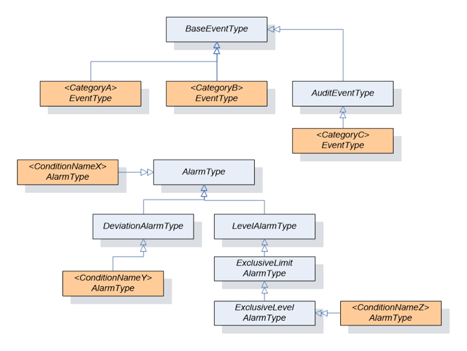  

Figure D. 11 - The type model of a wrapped COM AE server  

#### D.2.4 Event attributes  

*Event* *Attributes* in the A&E COM *Server* are represented in the UA *Server* as *Variables* which are targets of *HasProperty* *References* from the *ObjectTypes* which represent the *Event* Categories. The *BrowseName* and *DisplayName* are the description for the *Event* *Attribute* . The data type of the *Event* *Attribute* is used to set *DataType* and *ValueRank* . The *NodeId* is constructed from the EventCategoryId, ConditionName and the AttributeId.  

#### D.2.5 Event subscriptions  

The A&E COM UA Wrapper creates a *Subscription* with the COM AE *Server* the first time a *MonitoredItem* is created for the *Server* *Object* or one of the *Nodes* representing Areas. The Area filter is set based on the *Node* being monitored. No other filters are specified.  

If all *MonitoredItems* for an Area are disabled then the *Subscription* will be deactivated.  

The *Subscription* is deleted when the last *MonitoredItem* for the *Node* is deleted.  

When filtering by Area the A&E COM UA Wrapper should add two Area filters: one based on the QualifiedAreaName which forms the *NodeId* and one with the text '/\*' appended to it. This ensures that *Events* from sub areas are correctly reported by the COM AE *Server* .  

A simple A&E COM UA Wrapper will always request all *Attributes* for all *Event* Categories when creating the *Subscription* . A more sophisticated wrapper may look at the *EventFilter* to determine which *Attributes* are actually used and only request those.  

[Table D.22](/§\_Ref382998688) lists how the fields in the ONEVENTSTRUCT that are used by the A&E COM UA Wrapper are mapped to UA BaseEventType *Variable* s.  

Table D. 22 - Mapping from ONEVENTSTRUCT fields to UA BaseEventType Variables  

| **UA Event Variable** | **ONEVENTSTRUCT Field** | **Notes** |
|---|---|---|
|EventId|szSource szConditionName ftTime ftActiveTime dwCookie|A ByteString constructed by appending the fields together.|
|EventType|dwEventType dwEventCategory szConditionName|The NodeId for the corresponding *ObjectType* *Node* . The szConditionName could be omitted by some implementations.|
|SourceNode|szSource|The *NodeId* of the corresponding Source *Object* *Node* .|
|SourceName|szSource|\-|
|Time|ftTime|\-|
|ReceiveTime|\-|Set when the *Notification* is received by the wrapper.|
|LocalTime|\-|Set based on the clock of the machine running the wrapper.|
|Message|szMessage|Locale is the default locale for the COM AE *Server* .|
|Severity|dwSeverity|\-|
  

[Table D.33](/§\_Ref382998698) lists how the fields in the ONEVENTSTRUCT that are used by the A&E COM UA Wrapper are mapped to UA *AuditEventType* *Variable* s.  

Table D. 33 - Mapping from ONEVENTSTRUCT fields to UA AuditEventType Variables  

| **UA Event Variable** | **ONEVENTSTRUCT Field** | **Notes** |
|---|---|---|
|ActionTimeStamp|ftTime|Only set for tracking *Event* s.|
|Status|\-|Always set to True.|
|ServerId|\-|Set to the COM AE *Server* NamespaceURI|
|ClientAuditEntryId|\-|Not set.|
|ClientUserId|szActorID|\-|
  

[Table D.44](/§\_Ref382998718) lists how the fields in the ONEVENTSTRUCT that are used by the A&E COM UA Wrapper are mapped to UA AlarmType Variables.  

Table D. 44 - Mapping from ONEVENTSTRUCT fields to UA AlarmType Variables  

| **UA Event Variable** | **ONEVENTSTRUCT Field** | **Notes** |
|---|---|---|
|ConditionClassId|dwEventType|Set to the *NodeId* of the *ConditionClassType* for the *Event* Category of a *Condition* *Event* Type. Set to the *NodeId* of *BaseConditionClassType* *Node* for non- *Condition* *Event* Types.|
|ConditionClassName|dwEventType|Set to the *BrowseName* of the *ConditionClassType* for the *Event* Category of Condition *Event* Type. To set "BaseConditionClass" non- *Condition* *Event* Types.|
|ConditionName|szConditionName|\-|
|BranchId|\-|Always set to NULL.|
|Retain|wNewState|Set to True if the OPC\_CONDITION\_ACKED bit is not set or OPC\_CONDITION\_ACTIVE bit is set.|
|EnabledState|wNewState|Set to "Enabled" or "Disabled"|
|EnabledState.Id|wNewState|Set to True if OPC\_CONDITION\_ENABLED is set|
|EnabledState. EffectiveDisplayName|wNewState|A string constructed from the bits in the wNewState flag. The following rules are applied in order to select the string: "Disabled" if OPC\_CONDITION\_ENABLED is not set. "Unacknowledged" if OPC\_CONDITION\_ACKED is not set. "Active" if OPC\_CONDITION\_ACKED is set. "Enabled" if OPC\_CONDITION\_ENABLED is set.|
|Quality|wQuality|The COM DA Quality converted to a UA StatusCode.|
|Severity|dwSeverity|Set based on the last *Event* received for the *Condition* instance. Set to the current value if the last *Event* is not available.|
|Comment|\-|The value of the ACK\_COMMENT *Attribute*|
|ClientUserId|szActorID|\-|
|AckedState|wNewState|Set to "Acknowledged" or "Unacknowledged"|
|AckedState.Id|wNewState|Set to True if OPC\_CONDITION\_ACKED is set|
|ActiveState|wNewState|Set to "Active" or "Inactive"|
|ActiveState.Id|wNewState|Set to True if OPC\_CONDITION\_ACTIVE is set|
|ActiveState.TransitionTime|ftActiveTime|This time is set when the *ActiveState* transitions from False to True. Additional logic applies to exclusive limit alarms, in that the LimitState.TransitionTime also is set, but this is set each time a limit is crossed (multiple limits might exist). For the initial transition to True the ftActiveTime is used for both LimitState.TransitionTime and ActiveState.TransitionTime. For subsequent transition the ActiveState.Transition time does not change, but the LimitState.TransitionTime is updated with the new ftActiveTime. For example, if an alarm has Hi and HiHi limits, when the Hi limit is crossed and the alarm goes active the ftActiveTime is used for both times, but when the HiHi limit is later crossed, the ftActiveTime is only be used for the LimitState.TransitionTime. The ftActiveTime is part of the key for identifying the unique event in the A&E server and is saved for processing any commands back to the A&E Server.|
||||
  

The A & C *Condition* Model defines other optional *Variables* which are not needed in the A&E COM UA Wrapper. Any additional fields associated with *Event* *Attributes* are also reported.  

#### D.2.6 Condition instances  

*Condition* instances do not appear in the UA *Server* address space. *Conditions* can be acknowledged by passing the EventId to the *Acknowledge* *Method* defined on the *AcknowledgeableConditionType* .  

*Conditions* cannot be enabled or disabled via the COM A&E Wrapper.  

#### D.2.7 Condition Refresh  

The COM A&E Wrapper does not store the state of *Condition* s. When *ConditionRefresh* is called the *Refresh* *Method* is called on all COM AE *Subscriptions* associated with the *ConditionRefresh* call. The wrapper waits until it receives the call back with the bLastRefresh flag set to True in the OnEvent call before it can tell the UA *Client* that the *Refresh* has completed.  

### D.3 Alarms and Events COM UA proxy  

#### D.3.1 General  

As illustrated in the figure below, the A&E COM UA Proxy is a COM *Server* combined with a UA *Client* . It maps the *Alarms* and *Conditions* address space of UA A & C *Server* into the appropriate COM Alarms and *Event* *Object* s.  

Subclauses [D.3.2](/§\_Ref253559962) through [D.3.9](/§\_Ref240620251) identify the design guidelines and constraints used to develop the A&E COM UA Proxy provided by the OPC Foundation. In order to maintain a high degree of consistency and interoperability, it is strongly recommended that vendors, who choose to implement their own version of the A&E COM UA Proxy, follow these same guidelines and constraints.  

The A&E COM *Client* simply addresses how to connect to the UA A & C *Server* . Connectivity approaches include the one where A&E COM *Clients* connect to a UA A & C *Server* with a CLSID just as if the target *Server* were an A&E COM *Server* . However, the CLSID can be considered virtual since it is defined to connect to intermediary components that ultimately connect to the UA A & C *Server* . Using this approach, the A&E COM *Client* calls co-create instance with a virtual CLSID as described above. This connects to the A&E COM UA Proxy components. The A&E COM UA Proxy then establishes a secure channel and session with the UA A & C *Server* . As a result, the A&E COM *Client* gets a COM *Event* *Server* interface pointer.  

#### D.3.2 Server status mapping  

The A&E COM UA Proxy reads the UA A & C *Server* status from the *Server* *Object* *Variable* *Node* . Status enumeration values that are returned in *ServerStatusDataType* structure can be mapped 1 for 1 to the A&E COM *Server* status values with the exception of UA A & C *Server* status values *Unknown* and *Communication Fault.* These both map to the A&E COM *Server* status value of *Failed* .  

The VendorInfo string of the A&E COM *Server* status is mapped from *ManufacturerName* .  

#### D.3.3 Event Type mapping  

Since all *Alarms* and *Conditions* *Events* belong to a subtype of *BaseEventType* , the A&E COM UA Proxy maps the subtype as received from the UA A & C *Server* to one of the three A&E *Event* types: Simple, Tracking and *Condition* . [Figure D.22](/§\_Ref382998878) shows the mapping as follows:  

* Those A & C *Events* which are of subtype *AuditEventType* are marked as A&E *Event* type Tracking.  

* Those A & C *Events* which are *ConditionType* are marked as A&E *Event* type *Condition* .  

* Those A & C *Events* which are of any subtype except *AuditEventType* or *ConditionType* are marked as A&E *Event* type Simple.  

  

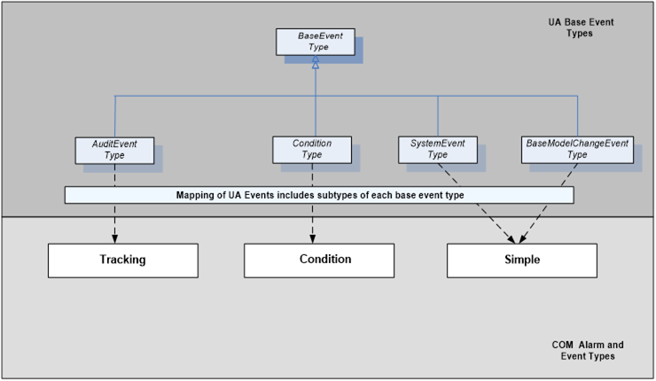  

Figure D. 22 - Mapping UA Event Types to COM A&E Event Types  

Note that the *Event* type mapping described above also applies to the children of each subtype.  

#### D.3.4 Event category mapping  

Each A&E *Event* type (e.g. Simple, Tracking, *Condition* ) has an associated set of *Event* categories which are intended to define groupings of A&E *Event* s. For example, Level and Deviation are possible *Event* categories of the *Condition* *Event* type for an A&E COM *Server* . However, since A & C does not explicitly support *Event* categories, the A&E COM UA Proxy uses A & C *Event* types to return A&E *Event* categories to the A&E COM *Client* . The A&E COM UA Proxy builds the collection of supported categories by traversing the type definitions in the address space of the UA A & C *Server* . [Figure D.33](/§\_Ref382998906) shows the mapping as follows:  

* A&E Tracking categories consist of the set of all *Event* types defined in the hierarchy of subtypes of AuditEventType and TransitionEventType, including AuditEventType itself and TransitionEventType itself.  

* A&E *Condition* categories consist of the set of all *Event* types defined in the hierarchy of subtypes of *ConditionType* , including *ConditionType* itself.  

* A&E Simple categories consist of the set of *Event* types defined in the hierarchy of subtypes of *BaseEventType* excluding *AuditEventType* and *ConditionType* and their respective subtypes.  

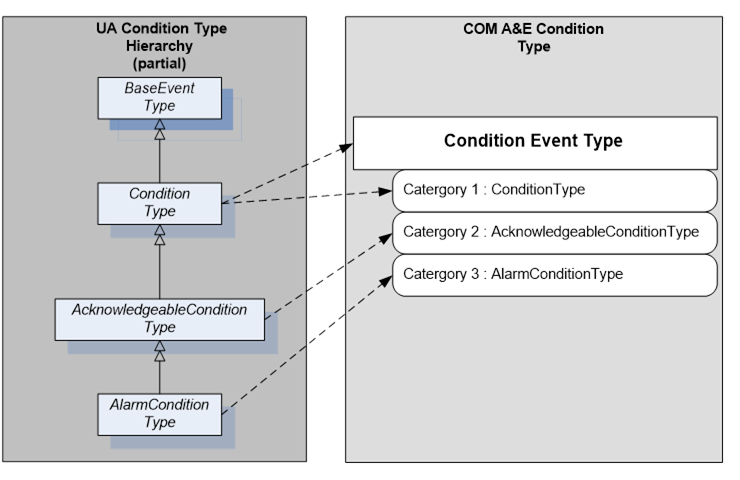  

Figure D. 33 - Example mapping of UA Event Types to COM A&E categories  

Category name is derived from the display name *Attribute* of the *Node* type as discovered in the type hierarchy of the UA A & C *Server* .  

Category description is derived from the description *Attribute* of the *Node* type as discovered in the type hierarchy of the UA A & C *Server* .  

The A&E COM UA Proxy assigns Category IDs.  

#### D.3.5 Event Category attribute mapping  

The collection of *Attributes* associated with any given A&E *Event* is encapsulated within the ONEVENTSTRUCT. Therefore, the A&E COM UA Proxy populates the *Attribute* fields within the ONEVENTSTRUCT using corresponding values from UA *Event* *Notifications* either directly (e.g., Source, Time, Severity) or indirectly (e.g., OPC COM *Event* category determined by way of the UA *Event* type). [Table D.55](/§\_Ref382998749) lists the *Attributes* currently defined in the ONEVENTSTRUCT in the leftmost column. The rightmost column of [Table D.55](/§\_Ref382998749) indicates how the A&E COM UA proxy defines that *Attribute* .  

Table D. 55 - Event category attribute mapping table  

| **A&E ONEVENTSTRUCT "attribute"** | **A&E COM UA Proxy Mapping** |
|---|---|
  
| **The following items are present for all A&E event types** |
|---|
|szSource|UA BaseEventType Property: SourceName|
|ftTime|UA BaseEventType Property: Time|
|szMessage|UA BaseEventType Property: Message|
|dwEventType|See Clause [D.3.3](/§\_Ref238224357)|
|dwEventCategory|See Clause [D.3.4](/§\_Ref238224297)|
|dwSeverity|UA BaseEventType Property: Severity|
|dwNumEventAttrs|Calculated within A&E COM UA Proxy|
|pEventAttributes|Constructed within A&E COM UA Proxy|
  
| **The following items are present only for A&E Condition-Related Events** |
|---|
|szConditionName|UA ConditionType Property: ConditionName|
|szSubConditionName|UA ActiveState Property: EffectiveDisplayName|
|wChangeMask|Calculated within Alarms and Events COM UA proxy|
|wNewState: OPC\_CONDITION\_ACTIVE|A & C AlarmConditionType Property: ActiveState Events mapped as non-Condition Events and those that do not derive from AlarmConditionType are set to ACTIVE by default.|
|wNewState: OPC\_CONDITION\_ENABLED|A & C ConditionType Property: EnabledState Events mapped as non-Condition Events are set to ENABLED (state bit mask = 0x1) by default.|
|wNewState: OPC\_CONDITION\_ACKED|A & C AcknowledgeableConditionType Property: AckedState A & C Events mapped as non-Condition Events or which do not derive from AcknowledgeableConditionType are set to UNACKNOWLEDGED and AckRequired = False by default.|
|wQuality|A & C ConditionType Property: Quality Events mapped as non-Condition Events are set to OPC\_QUALITY\_GOOD by default.  In general, the Severity field of the StatusCode is used to map COM status codes OPC\_QUALITY\_BAD, OPC\_QUALITY\_GOOD and OPC\_QUALITY\_UNCERTAIN. When possible, specific status' are mapped directly. These include (UA =\> COM):  Bad status codes Bad\_ConfigurationError =\> OPC\_QUALITY\_CONFIG\_ERROR Bad\_NotConnected =\> OPC\_QUALITY\_NOT\_CONNECTED Bad\_DeviceFailure =\> OPC\_QUALITY\_DEVICE\_FAILURE Bad\_SensorFailure =\> OPC\_QUALITY\_SENSOR\_FAILURE Bad\_NoCommunication =\> OPC\_QUALITY\_COMM\_FAILURE Bad\_OutOfService =\> OPC\_QUALITY\_OUT\_OF\_SERVICE  Uncertain status codes Uncertain\_NoCommunicationLastUsableValue =\> OPC\_QUALITY\_LAST\_USABLE Uncertain\_LastUsableValue =\> OPC\_QUALITY\_LAST\_USABLE Uncertain\_SensorNotAccurate =\> OPC\_QUALITY\_SENSOR\_CAL Uncertain\_EngineeringUnitsExceeded =\> OPC\_QUALITY\_EGU\_EXCEEDED Uncertain\_SubNormal =\> OPC\_QUALITY\_SUB\_NORMAL  Good status codes Good\_LocalOverride =\> OPC\_QUALITY\_LOCAL\_OVERRIDE|
|bAckRequired|If the ACKNOWLEDGED bit (OPC\_CONDITION\_ACKED) is set then the Ack Required Boolean is set to False, otherwise the Ack Required Boolean is set to True. If the *Event* is not of type *AcknowledgeableConditionType* or subtype then the AckRequired Boolean is set to False.|
|ftActiveTime|If the *Event* is of type *AlarmConditionType* or subtype and a transition from *ActiveState* of False to *ActiveState* to True is being processed then the *TransitionTime* *Property* of *ActiveState* is used. If the *Event* is not of type *AlarmConditionType* or subtype then this field is set to current time. Additional logic applies to exclusive limit alarms, This value should be mapped to the LimitState.TransitionTime.|
|dwCookie|Generated by the A&E COM UA Proxy. These unique *Condition* *Event* cookies are not associated with any related identifier from the address space of the UA A & C *Server* .|
  
| **The following is used only for A&E tracking events and for A&E condition-related events which are acknowledgement notifications** |
|---|
|szActorID||
  
| **Vendor specific *Attributes*\- ALL** |
|---|
|ACK Comment||
|AREAS|All A&E Events are assumed to support the "Areas" Attribute. However, no Attribute or Property of an A & C Event is available which provides this value. Therefore, the A&E COM UA Proxy initializes the value of the Areas Attribute based on the MonitoredItem producing the Event. If the A&E COM Client has applied no area filtering to a Subscription, the corresponding A & C Subscription will contain just one MonitoredItem - that of the UA A & C Server Object. Events forwarded to the A&E COM Client on behalf of this Subscription will carry an Areas Attribute value of empty string. If the A&E COM Client has applied an area filter to a Subscription then the related UA A & C Subscription will contain one or more MonitoredItems for each notifier Node identified by the area string(s). Events forwarded to the A&E COM Client on behalf of such a Subscription will carry an areas Attribute whose value is the relative path to the notifier which produced the Event (i.e., the fully qualified area name).|
  
| **Vendor specific *Attributes*\- based on category** |
|---|
|SubtypeProperty1|All the UA A & C subtype *Properties* that are not part of the standard set exposed by *BaseEventType* or *ConditionType*|
|SubtypeProperty *n*||
  

*Condition* *Event* instance records are stored locally within the A&E COM UA Proxy. Each record holds ONEVENTSTRUCT data for each EventSource/ *Condition* instance. When the *Condition* instance transitions to the state INACTIVE|ACKED, where AckRequired = True or simply INACTIVE, where AckRequired = False, the local *Condition* record is deleted. When a *Condition* *Event* is received from the UA A & C *Server* and a record for this *Event* (identified by source/ *Condition* pair) already exists in the proxy *Condition* *Event* store, the existing record is simply updated to reflect the new state or other change to the *Condition* , setting the change mask accordingly and producing an OnEvent callback to any subscribing *Client* s. In the case where the *Client* application acknowledges an *Event* which is currently unacknowledged (AckRequired = True), the UA A & C *Server* Acknowledge *Method* associated with the *Condition* is called and the subsequent *Event* produced by the UA A & C *Server* indicating the transition to acknowledged will result in an update to the current state of the local *Condition* record as well as an OnEvent *Notification* to any subscribing *Client* s.  

The A&E COM UA Proxy maintains the mapping of *Attributes* on an *Event* category basis. An *Event* category inherits its *Attributes* from the *Properties* defined on all supertypes in the UA *Event* Type hierarchy. New *Attributes* are added for any *Properties* defined on the direct UA *Event* type to A&E category mapping. The A&E COM UA Proxy adds two *Attributes* to each category: AckComment and Areas. [Figure D.44](/§\_Ref382998939) shows an example of this mapping.  

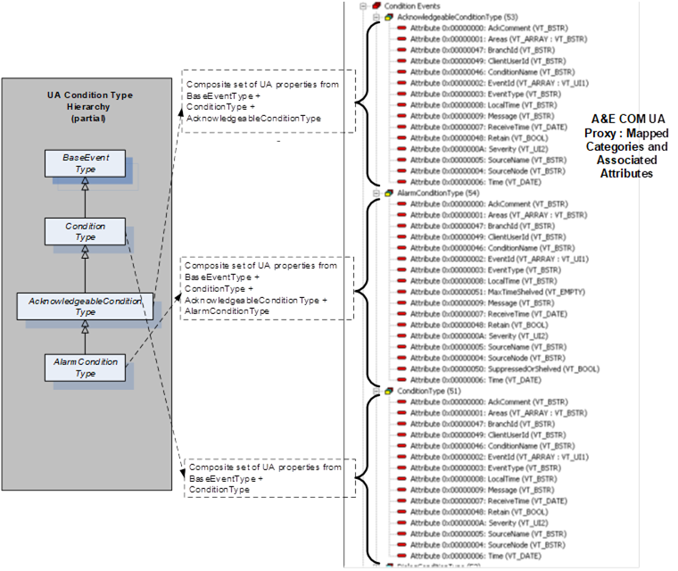  

Figure D. 44 - Example mapping of UA Event Types to A&E categories with attributes  

#### D.3.6 Event Condition mapping  

*Events* of any subtype of *ConditionType* are designated COM *Condition* *Events* and are subject to additional processing due to the stateful nature of *Condition* *Event* s. COM *Condition* *Events* transition between states composed of the triplet ENABLED|ACTIVE|ACKNOWLEDGED. In UA A & C, *Event* subtypes of *ConditionType* only carry a value which can be mapped to ENABLED (DISABLED) and optionally, depending on further sub typing, could carry additional information which can be mapped to ACTIVE (INACTIVE) or ACKNOWLEDGED (UNACKNOWLEDGED). *Condition* *Event* processing proceeds as described in [Table D.55](/§\_Ref382998749) (see A&E ONEVENTSTRUCT " *Attribute* " rows: OPC\_CONDITION\_ACTIVE, OPC\_CONDITION\_ENABLED and OPC\_CONDITION\_ACKED).  

#### D.3.7 Browse mapping  

A&E COM browsing yields a hierarchy of areas and sources. Areas can contain both sources and other areas in tree fashion where areas are the branches and sources are the leaves. The A&E COM UA Proxy relies on the "HasNotifier" *Reference* to assemble a hierarchy of branches/areas such that each *Object* *Node* which contains a *HasNotifier* *Reference* and whose *EventNotifier* *Attribute* is set to *SubscribeToEvents* is considered an area. The root for the *HasNotifier* hierarchy is the *Server* *Object* . Starting at the *Server* *Object* , *HasNotifier* *References* are followed and each *HasNotifier* target whose EventNotifier *Attribute* is set to SubscribeToEvents becomes a nested COM area within the hierarchy.  

Note that the HasNotifier target can also be a HasNotifier source. Further, any *Node* which is a HasEventSource source and whose EventNotifier *Attribute* is set to SubscribeToEvents is also considered a COM Area. The target *Node* of any HasEventSource *Reference* is considered an A&E COM "source" or leaf in the A&E COM browse tree.  

In general, *Nodes* which are the source *Nodes* of the HasEventSource *Reference* and/or are the source *Nodes* of the HasNotifier *Reference* are always A&ECOM Areas. *Nodes* which are the target *Nodes* of the HasEventSource *Reference* are always A&E COM Sources. Note however that targets of HasEventSource which cannot be found by following the HasNotifier *References* from the *Server* *Object* are ignored.  

Given the above logic, the A&E COM UA Proxy browsing will have the following limitations: Only those *Nodes* in the UA A & C *Server* 's address space which are connected by the HasNotifier *Reference* (with exception of those contained within the top level *Objects* folder) are considered for area designation. Only those *Nodes* in the UA A & C *Server* 's address space which are connected by the HasEventSource *Reference* (with exception of those contained within the top level *Objects* folder) are considered for area or source designation. To be an area, a *Node* shall contain a HasNotifier *Reference* and its EventNotifier *Attribute* shall be set to SubscribeToEvents. To be a source, a *Node* shall be the target *Node* of a HasEventSource *Reference* and shall have been found by following HasNotifier *References* from the *Server* *Object* .  

#### D.3.8 Qualified names  

##### D.3.8.1 Qualified name syntax  

From the root of any sub tree in the address space of the UA A & C *Server* , the A&E COM *Client* may request the list of areas and/or sources contained within that level. The resultant list of area names or source names will consist of the set of browse names belonging to those *Nodes* which meet the criteria for area or source designation as described above. These names are "short" names meaning that they are not fully qualified. The A&E COM *Client* may request the fully qualified representation of any of the short area or source names. In the case of sources, the fully qualified source name returned to the A&E COM *Client* will be the string encoded value of the *NodeId* as defined in [10000-6](/§UAPart6) (e.g., "ns=10;i=859"). In the case of areas, the fully qualified area name returned to the COM *Client* will be the relative path to the notifier *Node* as defined in [10000-4](/§UAPart4) (e.g., "/6:Boiler1/6:Pipe100X/1:Input/2:Measurement"). Relative path indices refer to the namespace table described below.  

##### D.3.8.2 Namespace table  

UA *Server* Namespace table indices may vary over time. This represents a problem for those A&E COM *Clients* which cache and reuse fully qualified area names. One solution to this problem would be to use a qualified name syntax which includes the complete URIs for all referenced table indices. This however would result in fully qualified area names which are unwieldy and impractical for use by A&E COM *Client* s. As an alternative, the A&E COM UA Proxy will maintain an internal copy of the UA A & C *Server* 's namespace table together with the locally cached endpoint description. The A&E COM UA Proxy will evaluate the UA A & C *Server* 's namespace table at connect time against the cached copy and automatically handle any re-mapping of indices if required. The A&E COM *Client* can continue to present cached fully qualified area names for filter purposes and the A&E COM UA Proxy will ensure these names continue to reference the same notifier *Node* even if the *Server* 's namespace table changes over time.  

To implement the relative path, the A&E COM UA Proxy maintains a stack of *INode* interfaces of all the *Nodes* browsed leading to the current level. When the A&E COM *Client* calls GetQualifiedAreaName, the A&E COM UA Proxy first validates that the area name provided is a valid area at the current level. Then looping through the stack, the A&E COM UA Proxy builds the relative path. Using the browse name of each *Node* , the A&E COM UA Proxy constructs the translated name as follows:  

*QualifiedName translatedName = new QualifiedName(Name,(ushort) ServerMappingTable[NamespaceIndex])* where  

*Name*\- the unqualified browse name of the *Node*  

*NamespaceIndex*\- the *Server* index  

the *ServerMappingTable* provides the *Client* namespace index that corresponds to the *Server* index.  

A '/' is appended to the translated name and the A&E COM UA Proxy continues to loop through the stack until the relative path is fully constructed.  

#### D.3.9 Subscription filters  

##### D.3.9.1 General  

The A&E COM UA Proxy supports all of the defined A&E COM filter criteria.  

##### D.3.9.2 Filter by Event, category or severity  

These filter types are implemented using simple numeric comparisons. For *Event* filters, the received *Event* shall match the *Event* type(s) specified by the filter. For Category filters, the received *Event* 's category (as mapped from UA *Event* type) shall match the category or categories specified by the filter. For severity filters, the received *Event* severity shall be within the range specified by the *Subscription* filter.  

##### D.3.9.3 Filter by source  

In the case of source filters, the UA A & C *Server* is free to provide any appropriate, *Server*\-specific value for SourceName. There is no expectation that source *Nodes* discovered via browsing can be matched to the SourceName *Property* of the *Event* returned by the UA A & C Server using string comparisons. Further, the A&E COM *Client* may receive *Events* from sources which are not discoverable by following only HasNotifier and/or HasEventSource *Reference* s. Thus, source filters will only apply if the source string can be matched to the SourceName *Property* of an *Event* as received from the target UA A & C *Server* . Source filter logic will use the pattern matching rules documented in the A&E COM specification, including the use of wildcard characters.  

##### D.3.9.4 Filter by area  

The A&E COM UA Proxy implements Area filtering by adjusting the set of *MonitoredItems* associated with a *Subscription* . In the simple case where the *Client* selects no area filter, the A&E COM UA Proxy will create a UA *Subscription* which contains just one *MonitoredItem* , the *Server* *Object* . In doing so, the A&E COM UA Proxy will receive *Events* from the entire *Server* address space - that is, all Areas. The A&E COM *Client* will discover the areas associated with the UA *Server* address space by browsing. The A&E COM *Client* will use GetQualifiedAreaName as usual in order to obtain area strings which can be used as filters. When the A&E COM *Client* applies one or more of these area strings to the COM *Subscription* filter, the A&E COM UA Proxy will create *MonitoredItems* for each notifier *Node* identified by the area string(s). Recall that the fully qualified area name is in fact the namespace qualified relative path to the associated notifier *Node* .  

The A&E COM UA Proxy calls the *TranslateBrowsePathsToNodeIds* *Service* to get the *Node* ids of the fully qualified area names in the filter. The *Node* ids are then added as *MonitoredItems* to the UA *Subscription* maintained by the A&E COM UA Proxy. The A&E COM UA Proxy also maintains a reference count for each of the areas added, to handle the case of multiple A&E COM *Subscription* applying the same area filter. When the A&E COM *Subscriptions* are removed or when the area name is removed from the filter, the ref count on the *MonitoredItem* corresponding to the area name is decremented. When the ref count goes to zero, the *MonitoredItem* is removed from the UA *Subscription.*  

As with source filter strings, area filter strings can contain wildcard characters. Area filter strings which contain wildcard characters require more processing by the A&E COM UA Proxy. When the A&E COM *Client* specifies an area filter string containing wildcard characters, the A&E COM UA Proxy will scan the relative path for path elements that are completely specified. The partial path containing just those segments which are fully specified represents the root of the notifier sub tree of interest. From this sub tree root *Node* , the A&E COM UA Proxy will collect the list of notifier *Nodes* below this point. The relative path associated with each of the collected notifier *Nodes* in the sub tree will be matched against the *Client* supplied relative path containing the wildcard character. A *MonitoredItem* is created for each notifier *Node* in the sub tree whose relative path matches that of the supplied relative path using established pattern matching rules. An area filter string which contains wildcard characters may result in multiple *MonitoredItems* added to the UA *Subscription* . By contrast, an area filter string made up of fully specified path segments and no wildcard characters will result in one *MonitoredItem* added to the UA *Subscription* . So, the steps involved are:  

1. Check if the filter string contains any of these wild card characters, '\*', '?', '\#', '[', ']', '\!', '-'.  

1. Scan the string for path elements that are completely specified by retrieving the substring up to the last occurrence of the '/' character.  

1. Obtain the *Node* Id for this path using *TranslateBrowsePathsToNodeIds*  

1. Browse the *Node* for all notifiers below it.  

1. Using the ComUtils.Match() function match the browse names of these notifiers against the *Client* supplied string containing the wild card character.  

1. Add the *Node* ids of the notifiers that match as *MonitoredItems* to the UA *Subscription* .  

  

## Annex E - IEC 62682 Mapping  

### E.1 Overview  

This section provides a description of how the IEC 62682 information model can be mapped to OPC UA. It highlights term differences, concepts and other functionality. IEC 62682 provides additional information about managing and limiting alarms not covered by this document.  

Note: [ISA 18.2](/§ISA182) is not discussed by this mapping, but [IEC 62682](/§IEC62682) and [ISA 18.2](/§ISA182) are related and most definitions in [ISA 18.2](/§ISA182) correspond to the definitions in [IEC 62682](/§IEC62682) .  

### E.2 Terms  

IEC 62682 defines a large number of terms that are covered by the OPC UA model but not used in the text. These IEC 62682 terms are listed below and include a description, mapping or relationship to OPC UA Alarms and Events:  

| **IEC 62682** | **OPC UA Mapping / Related Concept** | **IEC 62682 Definition** |
|---|---|---|
  
||| **OPC UA Application of** |
|---|---|---|
|absolute alarm|ExclusiveDeviationAlarmType NonExclusiveDeviationAlarmType|an alarm generated when the alarm setpoint is exceeded.|
|||Both OPC UA models expose a setpoint and process the Alarm as an absolute Alarm requires, the only difference is the interaction between relative states (High, HighHigh...)|
|adaptive alarm||alarm for which the setpoint is changed by an algorithm (e.g., rate based).|
|||In OPC UA adaptive alarming could be part of a vendor specific alarm application, but it would or could make use of a number of standard Alarm functions described in this document. OPC UA provides limit, rate of change and deviation alarming. Vendors can easily develop algorithms to adjust any of the limits that are exposed.|
|adjustable alarm / operator-set alarm|ExclusiveLimitAlarmType NonExclusiveLimitAlarmType|an alarm for which the setpoint can be changed manually by the Operator.|
|||Both OPC UA models allow Alarm limits to be writeable and allow for an Operator to change the limit. For all changes to limits an audit event should be generated tracking the change.|
|advanced alarming||a collection of techniques that can help manage annunciations during specific situations.|
|||In OPC UA advanced alarming could be part of a vendor specific alarm application, but it would or could make use of a number of standard Alarm functions described in this document, such as adaptive setting of a setpoint for deviation Alarm. It might also require the definition of new Alarm sub-types.|
|Annunciation / Alarm Annunciation|Retain|a function of the alarm system is to call the attention of the Operator to an alarm.|
|||OPC UA provides an Alarm model that includes concepts such as re-alarming, Alarm silence and Alarm delays, but it is up to the Client application to make use of these features to generate both audible and visual annunciation to the Operator. OPC UA does not provide visual indication but it does provide priority information on which the client can be configured to provide the appropriate visual display. A key concept for alarm display is the concept of Alarm states and a Retain bit (see [Annex B](/§\_Ref463033976) for more details).|
|alarm attribute|Various Alarm Properties|the setting for an alarm within the process control system.|
|||OPC UA defines a number of Properties that reflect what would be termed alarm attributes in IEC 62682 such as Alarm setpoint which maps to the setpoint property in an ExclusiveDeviationAlarmType.|
|alarm class|ConditionClass, ConditionSubClass|a group of alarms with a common set of alarm management requirements (e.g., testing, training, monitoring, and audit requirements).|
|||OPC UA provides ConditionClasses, but also provides other groupings, like ConditionSubClass. OPC UA also specifies a number of predefined classes, but it is expected that vendors, other standards group or even end users will define their own extensions to these classes. The OPC concepts allow Alarms to be categorized as needed.|
|alarm Deadband|ExclusiveDeviationAlarmType NonExclusiveDeviationAlarmType|a change in signal from the alarm setpoint necessary for the alarm to return to normal.|
|||In OPC UA, an alarm Deadband is optionally provided for all limit based alarms. It provides the same functionality as described in IEC 62682.|
|filtering(alarm)|Event Subscription|a function which selects alarm records to be displayed according to a given element of the alarm record.|
|||In OPC UA Alarms are received by a Client according to the specific filter requested by the Client. The filtering can be very robust or very simple according to the needs of the client. It is up to the Client application to generate and provide the appropriate filter to the server. OPC UA's Alarm model is a subscription based model, not a push model that is configured on a server. The choice of filter is a client's responsibility.|
|alarm flood|Alarm diagnostics|a condition during which the Alarm rate is greater than the Operator can effectively manage - (e.g., more than 10 Alarms per 10 minutes).|
|||OPC UA does not define Alarm flooding but it does provide the capability to collect diagnostics that would allow an engineer to review overall Alarm performance.|
|alarm group|alarm group|a set of alarms with common association (e.g., process unit, process area, equipment set, or service). Alarm groups are primarily used for display purposes.|
|||OPC UA allows the definition of Alarm groups and the assignment of Alarms to these groups. In addition. OPC UA allows Alarms to also be part of a category. OPC UA also allows Alarms to be organized as a HasNotifier hierarchy (see clause 6). Groups, categories and hierarchies can be used for filtering or restricting Alarms that are being displayed.|
|alarm history|historical events|long term repository for alarm records.|
|||[10000-11](/§UAPart11) describes historical Events.|
|alarm log||short term repository for alarm records.|
|||This part does not specify repositories for Alarms. Alarm logging is a Client function.|
|alarm management alarm system management||collection of processes and practices for determining, documenting, designing, operating, monitoring, and maintaining alarm systems.|
|||OPC UA provides an infrastructure to allow vendors and Operators to provide Alarm management, as such it should be an integral part of an alarm management system.|
|alarm message|Events|text string displayed with the alarm indication that provides additional information to the Operator (e.g., Operator action).|
|||OPC UA provides an Event structure that includes many different pieces of information (see [10000-5](/§UAPart5) for additional details). Clients can subscribe for as much of this information as desired and display this as an Alarm message. All typical fields that would be associated with an Alarm message are available. In addition, OPC UA provides significant additional information.|
|alarm priority|Priority|relative importance assigned to an alarm within the alarm system to indicate the urgency of response (e.g., seriousness of consequences and allowable response time)|
|||OPC UA provides a Priority Variable as part of the Alarm Object that provides the same functionality|
|alarm rate|Alarm diagnostics|the number of alarm annunciation, per Operator, in a specific time interval.|
|||OPC UA provides diagnostics allowing the collection of Alarm rate information at any level in the system.|
|Record (Alarm)|Events, Event filtering|a set of information which documents an alarm state change.|
|||In OPC UA all Alarms are generated as an Event and the Client can select the fields that are to be included in the Events. This selection can be customized for each AlarmConditionType, which allows a customized Alarm record to be generated.|
|alarm setpoint, alarm limit, alarm trip point|Limit Alarms, Discrete Alarms|the threshold value of a process variable or discrete state that triggers the alarm indication.|
|||OPC UA supports Alarm limits and setpoints for multiple Alarm types, including limit Alarms and discrete Alarms.|
|Sorting (alarm)||a function which orders alarm records to be displayed according to a given element of alarm record.|
|||OPC UA does not provide Alarm sorting as part of an event subscription. Multiple filtering options are provided, but the Client is required to perform any ordering of Alarms.|
|alarm summary, alarm list||a display that lists alarm annunciations with selected information (e.g., date, time, priority, and alarm type).|
|||In OPC UA Alarm summaries and Alarm lists are Client functionality and are not specified. Extensive filtering capabilities are provided by the Server to allow easier implementation of Alarm summaries or lists by a Client.|
|Alert||an audible and/or visible means of indicating to the Operator an equipment or process condition that can require evaluation when time allows.|
|||Alerts are items that should be attended to, but are not as urgent as Alarms. OPC UA does not differentiate between Alarms and alerts, but it does provide a full range of priorities for Alarms. It is up to the end users to determine what range of priorities are considered an alert vs an Alarm etc.|
|allowable response time||the maximum time between the annunciation of the alarm and when the Operator takes corrective action to avoid the consequence.|
|||OPC UA does not provide any specific fields for allowable response time, but it does track the times at which an Alarm occurs and when any actions are taken on the Alarm.|
|Annunciator||device or group of devices that call attention to changes in process conditions|
|||OPC UA does not define annunciators, this is Client functionality that can be implemented using OPC UA|
|Audit||comprehensive assessment that includes the evaluation of alarm system performance and the effectiveness of the work practices used to administer the alarm system.|
|||OPC UA does provide a number of features that can facilitate an audit, including diagnostics and audit events. Do not confuse OPC Audit Event with the IEC audit concept.|
|bad-measurement alarm||an alarm generated when the signal for a process measurement is outside the expected range (e.g., 3.8 mA for a 4 mA to 20 mA signal).|
|||A bad measurement Alarm is not defined in OPC UA, but limit Alarms are defined and they could be used directly to represent a bad-measurement Alarm. Alternatively, limit Alarms could be further subtyped to allow easier filtering on bad-measurement Alarms if desired.|
|bit-pattern alarm|Discrete alarm|an alarm that is generated when a pattern of digital signals matches a predetermined pattern.|
|||In OPC UA a bit pattern Alarm can be mapped to a DiscreteAlarmType.|
|calculated alarm||an alarm generated from a calculated value instead of a direct process measurement.|
|||In OPC UA any of the defined Alarm types can be applied to calculated values or to process values.|
|call-out alarm||alarm that notifies and informs an Operator by means other than, or in addition to, a console display (e.g., pager or telephone)|
|||OPC UA does not specify call-out alarms, since this is client functionality. OPC UA does provide the ability to categorize or group an Alarm such that it could be easily identified as requiring a different type of annunciation.|
|chattering alarm|OnDelay, OffDelay|alarm that repeatedly transitions between the alarm state and the normal state in a short period of time.|
|||The OPC UA features of OnDelay and OffDelay can be used to help control chattering Alarms.|
|Classification|ConditionClasses|the process of separating alarms into alarm classes based on common requirements (e.g. testing, training, monitoring, and auditing requirements).|
|||OPC defines a number of extensible ConditionClasses that can be used for this purpose.|
|controller-output alarm||alarm generated from the output signal of a control algorithm (e.g., PID controller) instead of a direct process measurement.|
|||OPC UA does not provide an Alarm type for controller-output alarm, but a type could be created or an existing type could be used, depending on the requirements.|
|dynamic alarming||an automatic modification of alarm attributes based on process state or conditions.|
|||OPC UA does not define dynamic alarming behaviour, but it allows programmatic access to limits, setpoints or other parameters that would be required for a dynamic alarming solution.|
|enforcement||enhanced alarming technique that can verify and restore alarm attributes in the control system to the values in the master alarm database.|
|||OPC UA does not provide enforcement, but it enables enforcement by providing an information model that includes default setting for Alarm types as well as original settings for dynamic Alarms. These features can be used by a Client application to provide enforcement.|
|fleeting alarm|Suppression, Shelving|an alarm that transitions between an active alarm state and an inactive alarm state in a short period of time.|
|||OPC UA provides Alarm Suppression and Shelving which an Operator might use to control fleeting Alarms.|
|first-out alarm first-up alarm|FirstInGroup FirstInGroupFlag|an alarm determined (i.e., by first-out logic) to be the first, in a multiple-alarm scenario.|
|||OPC UA can support first-up/first-out Alarms as part of the Alarm information model, including definition of the group of Alarms.|
|instrument diagnostic alarm|InstrumentDiagnosticAlarmType|an alarm generated by a field device to indicate a fault (e.g., sensor failure).|
|||OPC UA provides support for InstrumentDiagnostic Alarms that can be used to represent a failed sensor or an instrument diagnostic.|
|monitoring|Alarm Diagnostics|measurement and reporting of quantitative (objective) aspects of alarm system performance.|
|||OPC UA provides diagnostic collection capabilities that can be used to measure and reports quantitative information related to alarm system performance.|
|nuisance alarm|Alarm Diagnostics |an alarm that annunciates excessively, unnecessarily, or does not return to normal after the Operator response is taken. EXAMPLE: Chattering alarm, fleeting alarm, or stale alarm.|
|||The OPC UA model provides Alarm Diagnostics for tracking the information needed to identify if an Alarm is a nuisance Alarm (i.e. has been in an Alarm state excessively or does not return to normal).|
|plant state plant mode|StateMachines|defined set of operational conditions for a process plant.|
|||OPC UA provides an example StateMachine (see [Annex F](/§\_Ref473919840) ) that can be customized or adapted to provide process information. This StateMachine could also be used to affect alarming.|
|process area|Event Hierarchies Object References (Part 5)|physical, geographical or logical grouping of resources determined by the site.|
|||OPC UA provides multiple manners in which an information model can be displayed, this includes grouping objects into process areas or any other desired grouping. This is an inherent part of the OPC UA information model.|
|re-alarming alarm, re-triggering alarm|ReAlarmTime ReAlarmRepeatCount|alarm that is automatically re-annunciated to the Operator under certain conditions.|
|||OPC UA supports re-alarming as part of its base AlarmConditionType.|
|recipe-driven alarm|StateMachines Alarm Limits|alarm with setpoints that depend on the recipe that is currently being executed.|
|||OPC UA provides support for adjustable Alarm limits. It also provides support for programs and other functionality that could be used to drive recipes. [Annex F](/§\_Ref474967965) provides an example of a StateMachine and how it could be used to adjust Alarm settings.|
|Reset|LatchedState / Reset|operator action that unlatches a latched alarm.|
|||OPC UA provides an optional StateMachine to indicate an Alarm is capable of being latched and is in a latched state. It also provides a Reset Method for clearing the latched state.|
|safety related alarm safety alarm|SafetyConditionClassType|an alarm that is classified as critical to process safety for the protection of human life or the environment.|
|||OPC UA defines a safety ConditionClass for grouping safety related alarms.|
|stale alarm|Alarm Diagnostics|alarm that remains annunciated for an extended period of time (e.g., 24 hours).|
|||OPC UA Alarm Diagnostics can track the length of time an Alarm is active.|
|state-based alarm - mode-based alarms|StateMachine|alarm that has attributes modified or is suppressed based on operating states or process conditions.|
|||OPC UA can provide a system state StateMachine to support process, device or system states (see [Annex F](/§\_Ref473919840) ). With this StateMachine Servers can adjust Alarm attributes or just Suppress or Disable Alarms based on the StateMachine. The StateMachine can be applied at multiple levels in the system.|
|statistical alarm|StatisticalConditionClassType|alarm generated based on statistical processing of a process variable or variables.|
|||OPC UA provides an Alarm Condition class that any of the existing AlarmConditionTypes can be assigned to. This allows any Alarm types, such as limit Alarms, to be generated by statistical analysis.|
|Suppress|SuppressedOrShelved|any mechanism to prevent the indication of the alarm to the Operator when the base alarm condition is present (i.e., shelving, suppressed by design, out-of-service).|
|||OPC UA provides a flag SuppressedOrShelved that matches this functionality.|
|suppressed by design|SuppressedState|alarm annunciation to the Operator prevented based on plant state or other conditions.|
|||OPC UA provides a SuppressedState that matches this functionality.|
|system diagnostic alarm|SystemDiagnosticAlarmType|alarm generated by the control system to indicate a fault within the system hardware, software or components.|
|||OPC UA defines a system diagnostic Alarm that can be used to represent faults with system hardware, software or components.|
|Disable/Enable (removed from current ISA 18.2/ IEC 62682)|Disable/Enable||
|||OPC UA supports enable / Disable of Alarms, which was supported in older version of 18.2 and IEC 62682, but these options are no longer supported and used in either 18.2 or IEC 62682. Servers that wish to be compliant to 18.2 and IEC 62682 should not use Disable / Enable methods defined in this document.|
  

  

The following terms in IEC 62682 match the terms/concepts defined in the OPC UA specification and do not require any addition mapping or discussion:  

* Acknowledge  

* Active  

* Alarm  

* Alarm OffDelay  

* Alarm OnDelay  

* Alarm Type  

* Deviation Alarm  

* Discrepancy Alarm  

* Event  

* Highly Managed Alarm  

* LatchingAlarm  

* OutOfService  

* RateOfChangeAlarms  

* Return to normal  

* Shelve  

* Silence  

* Unacknowledged  

  

### E.3 Alarm records & State Indications  

OPC UA provides all of the items listed as both required and recommended as part of its alarm definitions, but it is up to the client to subscribe for the information. In OPC UA the Client controls what alarm information is requested and obtained from the *Server* . The *Server* does not define visual aspects of the alarm system, but does provide priority information from which the visual aspect can be set on the client side.  

OPC UA also supports all of the states described in IEC 62682. This includes tracking the process states, system states and individual alarm states. OPC UA also provides a StateMachine model that can be used in conjunction with an alarm system to alter alarm behaviour based on the state of a system or process. For example, during start-up or shutdown of a process or a system some alarms might be suppressed.  

The behaviour of an OPC UA alarm system also mimics that required by IEC 62682. All behaviour described in IEC 62682 can easily be mapped to functionality define in OPC UA Alarm & Conditions.  

## Annex F System State (Informative)  

### F.1 Overview  

The state of alarms is affected by the state of the process, equipment, system or plant. For example, when a tank is taken out of service, the level alarms associated with the tank would be no longer used, until the tank is returned to service. This section describes a *StateMachine* that can be deployed as part of a system designed and used to reflect the current state of the system, process, equipment or item. Customized version of this model can be implemented for any system, this sample is just an illustration.  

The current state from the *StateMachine* is applied to all items in the *HasNotifier* hierarchy below the object with which the *StateMachine* is associated. The *SystemState* *StateMachine* can be used to automatically disable, enable, suppress or un-suppress *Alarms* related to the Object (with in the hierarchy of alarms from the given object). The *StateMachine* can also be used by advanced alarming software to adjust the setpoint, limits or other items related to the *Alarms* in the hierarchy.  

Optionally, multiple SystemState *StateMachines* can be deployed.  

  

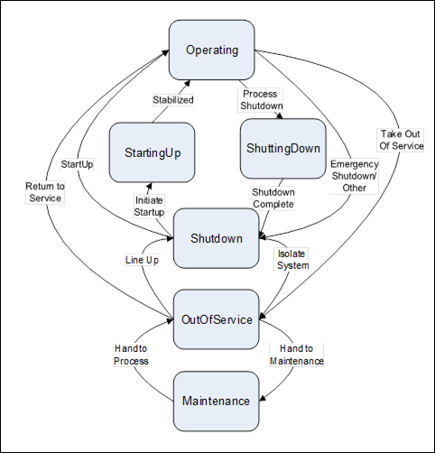  

Figure F. 11 - SystemState transitions  

### F.2 SystemStateStateMachineType  

The *SystemStateStateMachineType* includes a hierarchy of sub-states. It supports multiple transitions between Operating, StartingUp, ShuttingDown, Shutdown, OutOfService and Maintenance.  

The state machine is illustrated in [Figure F.22](/§\_Ref477365597) and formally defined in [Table F.11](/§\_Ref28216813) .  

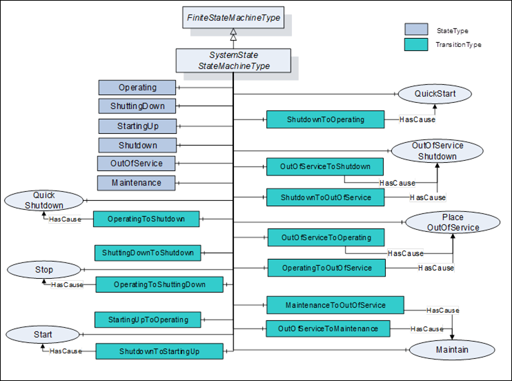  

Figure F. 22 - SystemStateStateMachineType Model  

Table F. 11 - SystemStateStateMachineType definition  

| **Attribute** | **Value** |
|---|---|
|BrowseName|SystemStateStateMachineType|
|IsAbstract|False|
  
| **References** | **Node Class** | **BrowseName** | **DataType** | **TypeDefinition** | **Modelling Rule** |
|---|---|---|---|---|---|
|Subtype of the F *initeStateMachineType* defined in [10000-16](/§UAPart16)|
|||||||
|HasComponent|Object|Operating||StateType||
|HasComponent|Object|ShuttingDown||StateType||
|HasComponent|Object|StartingUp||StateType||
|HasComponent|Object|Shutdown||StateType||
|HasComponent|Object|OutOfService||StateType||
|HasComponent|Object|Maintenance||StateType||
|||||||
|HasComponent|Object|ShutdownToOperating||TransitionType||
|HasComponent|Object|OperatingToShutdown||TransitionType||
|HasComponent|Object|ShuttingDownToShutdown||TransitionType||
|HasComponent|Object|OperatingToShuttingDown||TransitionType||
|HasComponent|Object|StartingUpToOperating||TransitionType||
|HasComponent|Object|ShutdownToStartingUp||TransitionType||
|HasComponent|Object|OutOfServiceToShutdown||TransitionType||
|HasComponent|Object|ShutdownToOutOfService||TransitionType||
|HasComponent|Object|OutOfServiceToOperating||TransitionType||
|HasComponent|Object|OperatingToOutOfService||TransitionType||
|HasComponent|Object|MaintenanceToOutOfService||TransitionType||
|HasComponent|Object|OutOfServiceToMaintenance||TransitionType||
|||||||
|HasComponent|Method|Start|Defined in Clause XXX|Optional|
|HasComponent|Method|Maintain|Defined in Clause XXX|Optional|
|HasComponent|Method|Stop|Defined in Clause XXX|Optional|
|HasComponent|Method|PlaceOutOfService|Defined in Clause XXX|Optional|
|HasComponent|Method|QuickShutdown|Defined in Clause XXX|Optional|
|HasComponent|Method|QuickStart|Defined in Clause XXX|Optional|
|HasComponent|Method|OutOfServiceShutdown|Defined in Clause XXX|Optional|
  

The actual selection of *States* and *Transitions* would depend on the deployment of the *StateMachine* . If the *StateMachine* were being applied to a tank or other part of a process it might have a different set of *States* then if it was applied to a meter or instrument. The meter could only have Operating, OutOfService and Maintenance, while the tank could have all of the described *States* and *Transitions* . The transitions are defined in [Table F.22](/§\_Ref28217027) .  

The *StateMachine* supports six possible states including: *Operating* , *ShuttingDown* , *StartingUp* , *Shutdown* , *OutOfService* , *Maintenance* . It supports 12 possible *Transitions* and 7 possible *Methods* .  

Table F. 22 - SystemStateStateMachineType additional references  

| **SourceBrowsePath** | **References** | **IsForward** | **TargetBrowsePath** |
|---|---|---|---|
|ShutdownToOperating|FromState|True|Shutdown|
||ToState|True|Operating|
||HasCause|True|QuickStart|
|OperatingToShutdown|FromState|True|Operating|
||ToState|True|Shutdown|
||HasCause|True|QuickShutdown|
|ShuttingDownToShutdown|FromState|True|ShuttingDown|
||ToState|True|Shutdown|
|OperatingToShuttingDown|FromState|True|Operating|
||ToState|True|ShuttingDown|
||HasCause|True|Stop|
|StartingUpToOperating|FromState|True|StartingUp|
||ToState|True|Operating|
|ShutdownToStartingUp|FromState|True|Shutdown|
||ToState|True|StartingUp|
||HasCause|True|Start|
|OutOfServiceToShutdown|FromState|True|OutOfService|
||ToState|True|Shutdown|
||HasCause|True|OutOfServiceShutdown|
|ShutdownToOutOfService|FromState|True|Shutdown|
||ToState|True|OutOfService|
||HasCause|True|OutOfServiceShutdown|
|OutOfServiceToOperating|FromState|True|OutOfService|
||ToState|True|Operating|
||HasCause|True|PlaceOutOfService|
|OperatingToOutOfService|FromState|True|Operating|
||ToState|True|OutOfService|
||HasCause|True|PlaceOutOfService|
|MaintenanceToOutOfService|FromState|True|Maintenance|
||ToState|True|OutOfService|
||HasCause|True|Maintain|
|OutOfServiceToMaintenance|FromState|True|OutOfService|
||ToState|True|Maintenance|
||HasCause|True|Maintain|
  

  

The component *Variables* of the SystemStateStateMachineType have additional *Attributes* defined in [Table F](/§\_Ref96289475) **.**   

 **Table F. 33\-**  **SystemStateStateMachineType Attribute values for child Nodes**   

| **BrowsePath** | **Value Attribute** |
|---|---|
Operating|0:StateNumber||1|
ShuttingDown|0:StateNumber||2|
StartingUp|0:StateNumber||3|
Shutdown|0:StateNumber||4|
OutOfService|0:StateNumber||5|
Maintenance|0:StateNumber||6|
ShutdownToOperating|0:TransitionNumber||41|
OperatingToShutdown|0:TransitionNumber||14|
ShuttingDownToShutdown|0:TransitionNumber||24|
OperatingToShuttingDown|0:TransitionNumber||12|
StartingUpToOperating|0:TransitionNumber||31|
ShutdownToStartingUp|0:TransitionNumber||42|
OutOfServiceToShutdown|0:TransitionNumber||54|
ShutdownToOutOfService|0:TransitionNumber||45|
OutOfServiceToOperating|0:TransitionNumber||51|
OperatingToOutOfService|0:TransitionNumber||15|
MaintenanceToOutOfService|0:TransitionNumber||65|
OutOfServiceToMaintenance|0:TransitionNumber||56|
  

  

The system can always generate additional *HasCause* *References* , such as internal code. No *HasEffect* *References* are defined, but an implementation might define *HasEffect* *References* (such as *HasEffectDisable* ) for disabling or enabling *Alarms* , suppressing *Alarms* or adjusting setpoints or limits of *Alarms* . The targets of the reference might be an individual *Alarm* or portion of a plant or piece of equipment. See section [7](/§\_Ref474969866) for a list of *HasEffect* *References* that could be used.  

  

Bibliography  

10000-26: OPC UA Specification: Part 26 - LogObjects  

[https://www.opcfoundation.org/UA/Part26/](https://www.opcfoundation.org/UA/Part26/)  

IETF RFC 2045: Multipurpose Internet Mail Extensions (MIME) Part One  

[https://www.ietf.org/rfc/rfc2045.txt ](https://www.ietf.org/rfc/rfc2045.txt)  

IETF RFC 2046: Multipurpose Internet Mail Extensions (MIME) Part Two  

[https://www.ietf.org/rfc/rfc2046.txt ](https://www.ietf.org/rfc/rfc2046.txt)  

IETF RFC 2047: Multipurpose Internet Mail Extensions (MIME) Part Three  

[https://www.ietf.org/rfc/rfc2047.txt ](https://www.ietf.org/rfc/rfc2047.txt)  

\_\_\_\_\_\_\_\_\_\_\_  

