## 1 Scope  

This part of the OPC UA specification is an extension of the overall OPC Unified Architecture specification series and defines the information model associated with *Devices* . This specification describes three models which build upon each other as follows:  

* The (base) Device Model is intended to provide a unified view of devices and their hardware and software parts irrespective of the underlying device protocols.  

* The Device Communication Model adds Network and Connection information elements so that communication topologies can be created.  

* The Device Integration Host Model finally adds additional elements and rules required for host systems to manage integration for a complete system. It enables reflecting the topology of the automation system with the devices as well as the connecting communication networks.  

This document also defines AddIns that can be used for the models in this document but also for models in other specifications. They are:  

* Locking model - a generic AddIn to control concurrent access,  

* Software update model - an AddIn to manage software in a *Device* .  

## 2 Normative references  

The following documents, in whole or in part, are normatively referenced in this document and are indispensable for its application. For dated references, only the edition cited applies. For undated references, the latest edition of the referenced document (including any amendments and errata) applies.  

OPC 10000-1, *OPC Unified Architecture - Part 1: Overview and Concepts*  

[http://www.opcfoundation.org/UA/Part1/](http://www.opcfoundation.org/UA/Part1/)  

OPC 10000-3, *OPC Unified Architecture - Part 3: Address Space Model*  

[http://www.opcfoundation.org/UA/Part3/](http://www.opcfoundation.org/UA/Part3/)  

OPC 10000-4, *OPC Unified Architecture - Part 4: Services*  

[http://www.opcfoundation.org/UA/Part4/](http://www.opcfoundation.org/UA/Part4/)  

OPC 10000-5, *OPC Unified Architecture - Part 5: Information Model*  

[http://www.opcfoundation.org/UA/Part5/](http://www.opcfoundation.org/UA/Part5/)  

OPC 10000-6, *OPC Unified Architecture - Part 6: Mappings*  

[http://www.opcfoundation.org/UA/Part6/](http://www.opcfoundation.org/UA/Part6/)  

OPC 10000-7, *OPC Unified Architecture - Part 7: Profiles*  

[http://www.opcfoundation.org/UA/Part7/](http://www.opcfoundation.org/UA/Part7/)  

OPC 10000-8, *OPC Unified Architecture - Part 8: Data Access*  

[http://www.opcfoundation.org/UA/Part8/](http://www.opcfoundation.org/UA/Part8/)  

OPC 10000-9, *OPC Unified Architecture - Part 9: Alarms and Conditions*  

[http://www.opcfoundation.org/UA/Part9/](http://www.opcfoundation.org/UA/Part9/)  

OPC 10000-12, *OPC Unified Architecture - Part 12: Discovery and Global Services*  

[http://www.opcfoundation.org/UA/Part12/](http://www.opcfoundation.org/UA/Part12/)  

OPC 10000-19, *OPC Unified Architecture - Part 19: Dictionary References*  

[http://www.opcfoundation.org/UA/Part19/](http://www.opcfoundation.org/UA/Part19/)  

OPC 10000-21, *OPC Unified Architecture - Part 21: Device Onboarding*  

[http://www.opcfoundation.org/UA/Part21/](http://www.opcfoundation.org/UA/Part21/)  

OPC 10000-81, *UAFX Part 81: Connecting Devices and Information Model*  

[http://www.opcfoundation.org/UA/Part81/](http://www.opcfoundation.org/UA/Part81/)  

NAMUR Recommendation NE107 *:* Self-monitoring and diagnosis of field devices  

ASiC-E, ETSI EN 319 162-1 V1.1.1 (2016-04) Associated Signature Containers  

[https://www.etsi.org/deliver/etsi\_en/319100\_319199/31916201/01.01.01\_60/en\_31916201v010101p.pdf](https://www.etsi.org/deliver/etsi\_en/319100\_319199/31916201/01.01.01\_60/en\_31916201v010101p.pdf)  

CAdES, ETSI EN 319 122-1 V1.3.1 (2023-06) Advanced Digital Signatures  

[https://www.etsi.org/deliver/etsi\_en/319100\_319199/31912201/01.03.01\_60/en\_31912201v010301p.pdf](https://www.etsi.org/deliver/etsi\_en/319100\_319199/31912201/01.03.01\_60/en\_31912201v010301p.pdf)  

  

## 3 Terms, definitions, abbreviated terms, and conventions  

### 3.1 Terms and definitions  

For the purposes of this document, the terms and definitions given in [OPC 10000-1](/§UAPart1) , [OPC 10000-3](/§UAPart3) , and [OPC 10000-8](/§UAPart8) as well as the following apply.  

#### 3.1.1 Block  

functional *Parameter* grouping entity  

Note 1 to entry: It could map to a function block (see [IEC 62769](/§FDI) ) or to the resource parameters of the *Device* itself.  

#### 3.1.2 BlockMode  

mode of operation (target mode, permitted modes, actual mode, and normal mode) for a *Block*  

Note 1 to entry: Further details about *BlockModes* are defined by standard organisations.  

#### 3.1.3 Communication Profile  

fixed set of mapping rules to allow unambiguous interoperability between *Devices* or Applications, respectively  

Note 1 to entry: Examples of such profiles are the "Wireless communication network and communication profiles for WirelessHART" in IEC 62591 and the Protocol Mappings for OPC UA in [OPC 10000-6](/§UAPart6) .  

#### 3.1.4 Connection Point  

logical representation of the interface between a *Device* and a *Network*  

#### 3.1.5 Device  

independent physical entity capable of performing one or more specified functions in a particular context and delimited by its interfaces  

Note 1 to entry: See IEC 61499-1.  

Note 2 to entry: *Devices* provide sensing, actuating, communication, and/or control functionality. Examples include transmitters, valve controllers, drives, motor controllers, PLCs, and communication gateways.  

Note 3 to entry:  A *Device* can be a system (topology) of other *Devices* , components, or parts.  

#### 3.1.6 Device Integration Host  

*Server* that manages integration of multiple *Devices* in an automation system  

#### 3.1.7 Device Topology  

arrangement of *Networks* and *Devices* that constitute a communication topology  

#### 3.1.8 Fieldbus  

communication system based on serial data transfer and used in industrial automation or process control applications  

Note 1 to entry: See IEC 61784.  

Note 2 to entry: Designates the communication bus used by a *Device* .  

#### 3.1.9 Parameter  

variable of the *Device* that can be used for configuration, monitoring or control purposes  

Note 1 to entry: In the information model it is synonymous to an OPC UA *DataVariable* .  

#### 3.1.10 Network  

means used to communicate with one specific protocol  

#### 3.1.11 Direct-Loading  

update method where the original software is overwritten during the transfer  

#### 3.1.12 Cached-Loading  

update method where the new software is stored in a separate area  

Note 1 to entry: Installation is performed later as an extra step.  

#### 3.1.13 File System based Loading  

update method based on an accessible directory structure and a separate install method  

#### 3.1.14 Software Package  

single file that contains the data for the software update in a device specific format  

Note 1 to entry: This document defines a package format to combine multiple files into one *Software Package* .  

#### 3.1.15 Software Update Client  

update client that can be used for *Devices* of several vendors  

Note 1 to entry: There can be different Software Update Clients for different domains (e.g. process industry or manufacturing).  

#### 3.1.16 Current Version  

version information of the software that is currently installed  

#### 3.1.17 Pending Version  

version information for a *Software Package* that was transferred before and is ready to be installed  

#### 3.1.18 Fallback Version  

version information about an alternatively installable software that is located on the *Server*  

EXAMPLE: factory default version or the version before the latest update  

  

### 3.2 Abbreviated terms  

ADI Analyser Device Integration  

ASiC-E Associated Signature Container Extended (ZIP with signature, see [ASiC-E](/§ASiCE) )  

BMP Bitmap (image format)  

CAdES CMS Advanced Electronic Signatures (see [CAdES](/§CAdES) )  

CMS Cryptographic Message Syntax  

CP Communication Processor (hardware module)  

CPU Central Processing Unit (of a *Device* )  

DA Data Access  

DI Device Integration (the short name for this specification)  

ERP Enterprise Resource Planning  

FDI Field Device Integration (standard for integrating field devices into host systems)  

FPGA Field Programmable Gate Array  

GDS Global Discovery Server  

GIF Graphics Interchange Format (image format)  

GSD General Station Description (device description file for PROFIBUS/PROFINET)  

GUID Globally Unique Identifier  

HART Highway Addressable Remote Transducer (protocol for smart field devices)  

HMI Human-Machine Interface  

ID Identifier  

IO Input / Output  

IRDI International Registration Data Identifier (see ISO 29002-5)  

JPG Joint Photographic Experts Group (image format)  

JSON JavaScript Object Notation  

KPI Key Performance Indicator  

LAN Local Area Network  

LED Light Emitting Diode  

OEE Overall Equipment Effectiveness  

PKI Public Key Infrastructure  

PNG Portable Network Graphics (image format)  

SQL Structured Query Language for databasesUA Unified Architecture  

UI User Interface  

UML Unified Modelling Language  

URL Uniform Resource Locator  

WBM Web-Based Management  

XML Extensible Mark-up Language  

  

### 3.3 Conventions used in this document  

#### 3.3.1 Conventions for Node descriptions  

##### 3.3.1.1 Node definitions  

*Node* definitions are specified using tables (see [Table 2](/§\_Ref81297423) ).  

*Attributes* are defined by providing the *Attribute* name and a value, or a description of the value.  

*References* are defined by providing the *ReferenceType* name, the *BrowseName* of the *TargetNode* and its *NodeClass* .  

* If the *TargetNode* is a component of the *Node* being defined in the table the *Attributes* of the composed *Node* are defined in the same row of the table.  

* The *DataType* is only specified for *Variables* ; "[\<number\>]" indicates a single-dimensional array, for multi-dimensional arrays the expression is repeated for each dimension (e.g. [2][3] for a two-dimensional array). For all arrays the *ArrayDimensions* is set as identified by \<number\> values. If no \<number\> is set, the corresponding dimension is set to 0, indicating an unknown size. If no number is provided at all the *ArrayDimensions* can be omitted. If no brackets are provided, it identifies a scalar *DataType* and the *ValueRank* is set to the corresponding value (see [OPC 10000-3](/§UAPart3) ). In addition, *ArrayDimensions* is set to null or is omitted. If it can be Any or *ScalarOrOneDimension* , the value is put into "\{\<value\>\}", so either "\{Any\}" or "\{ *ScalarOrOneDimension* \}" and the *ValueRank* is set to the corresponding value (see [OPC 10000-3](/§UAPart3) ) and the *ArrayDimensions* is set to null or is omitted. Examples are given in [Table 1](/§\_Ref499807960) .  

Table 1 - Examples of DataTypes  

| **Notation** | **DataType** | **ValueRank** | **ArrayDimensions** | **Description** |
|---|---|---|---|---|
|0:Int32|0:Int32|\-1|omitted or null|A scalar Int32.|
|0:Int32[]|0:Int32|1|omitted or \{0\}|Single-dimensional array of Int32 with an unknown size.|
|0:Int32[][]|0:Int32|2|omitted or \{0,0\}|Two-dimensional array of Int32 with unknown sizes for both dimensions.|
|0:Int32[3][]|0:Int32|2|\{3,0\}|Two-dimensional array of Int32 with a size of 3 for the first dimension and an unknown size for the second dimension.|
|0:Int32[5][3]|0:Int32|2|\{5,3\}|Two-dimensional array of Int32 with a size of 5 for the first dimension and a size of 3 for the second dimension.|
|0:Int32\{Any\}|0:Int32|\-2|omitted or null|An Int32 where it is unknown if it is scalar or array with any number of dimensions.|
|0:Int32\{ScalarOrOneDimension\}|0:Int32|\-3|omitted or null|An Int32 where it is either a single-dimensional array or a scalar.|
  

  

* The TypeDefinition is specified for *Objects* and *Variables* .  

* The TypeDefinition column specifies a symbolic name for a *NodeId* , i.e. the specified *Node* points with a *HasTypeDefinition* *Reference* to the corresponding *Node* .  

* The *ModellingRule* of the referenced component is provided by specifying the symbolic name of the rule in the *ModellingRule* column. In the *AddressSpace* , the *Node* shall use a *HasModellingRule* *Reference* to point to the corresponding *ModellingRule* *Object* .  

If the *NodeId* of a *DataType* is provided, the symbolic name of the *Node* representing the *DataType* shall be used.  

Note that if a symbolic name of a different namespace is used, it is prefixed by the *NamespaceIndex* (see [3.3.2.2](/§\_Ref37835018) ).  

*Nodes* of all other *NodeClasses* cannot be defined in the same table; therefore, only the used *ReferenceType* , their *NodeClass* and their *BrowseName* are specified. A reference to another part of this document points to their definition.  

[Table 2](/§\_Ref81297423) illustrates the table. If no components are provided, the DataType, TypeDefinition and Other columns can be omitted and only a Comment column is introduced to point to the *Node* definition.  

Table 2 - Type Definition table  

| **Attribute** | **Value** |
|---|---|
|Attribute name|Attribute value. If it is an optional Attribute that is not set "--" is used.|
|||
  
| **References** | **NodeClass** | **BrowseName** | **DataType** | **TypeDefinition** | **Other** |
|---|---|---|---|---|---|
|*ReferenceType* name|*NodeClass* of the target *Node* .|*BrowseName* of the target *Node* .|*DataType* of the referenced *Node* , only applicable for *Variables* .|*TypeDefinition* of the referenced *Node* , only applicable for *Variables* and *Objects* .|Additional characteristics of the *TargetNode* such as the *ModellingRule* or *AccessLevel* .|
|NOTE Notes referencing footnotes of the table content.|
  

  

Components of *Nodes* can be complex that is containing components by themselves. The *TypeDefinition* , *NodeClass* and *DataType* can be derived from the type definitions, and the symbolic name can be created as defined in [3.3.3.1](/§\_Ref37835078) . Therefore, those containing components are not explicitly specified; they are implicitly specified by the type definitions.  

The Other column defines additional characteristics of the Node. Examples of characteristics that can appear in this column are show in [Table 3](/§\_Ref16778333) .  

Table 3 - Examples of other characteristics  

| **Name** | **Short Name** | **Description** |
|---|---|---|
|0:Mandatory|M|The *Node* has the *Mandatory* *ModellingRule* .|
|0:Optional|O|The *Node* has the *Optional* *ModellingRule.*|
|0:MandatoryPlaceholder|MP|The *Node* has the *MandatoryPlaceholder ModellingRule.*|
|0:OptionalPlaceholder|OP|The *Node* has the *OptionalPlaceholder ModellingRule.*|
|ReadOnly|RO|The *AccessLevel* has the *CurrentRead* bit set but not the *CurrentWrite* bit.|
|ReadWrite|RW|The *AccessLevel* has the *CurrentRead* and *CurrentWrite* bits set.|
|WriteOnly|WO|The *AccessLevel* has the *CurrentWrite* bit set but not the *CurrentRead* bit.|
  

If multiple characteristics are defined, they are separated by commas. The name or the short name can be used.  

Each *Node* defined in this specification has *ConformanceUnits* defined in [11](/§\_Ref171515556) that require the *Node* to be in the *AddressSpace* . If a *Server* supports a *ConformanceUnit* , it shall expose the *Nodes* related to the *ConformanceUnit* in its *AddressSpace* . If two *Nodes* are exposed, all *References* between the *Nodes* defined in this specification shall be exposed as well.  

The relations between *Nodes* and *ConformanceUnits* are defined at the end of the tables defining *Nodes* , one row per *ConformanceUnit* . The *ConformanceUnit* is reflected with a Category element in the *UANodeSet* file (see [OPC 10000-6](/§UAPart6) ).  

The *Nodes* defined in a table are not only the *Node* defined on top level, for example an *ObjectType* , but also the *Nodes* that are referenced, as long as they are not defined in other tables. For example, the *ObjectType* *TopologyElementType* defines its *InstanceDeclarations* in the same table, so the *InstanceDeclarations* are also bound to the *ConformanceUnits* defined for the table. The table even indirectly defines additional *InstanceDeclarations* as components of the top-level *InstanceDeclarations* , that are not directly visible in the table. The *TypeDefinitions* and *DataTypes* used in the *InstanceDeclarations* , and the *ReferenceTypes* are defined in their individual tables and not in the table itself, therefore they are not bound to the *ConformanceUnits* of the table.  

##### 3.3.1.2 Additional References  

To provide information about additional *References* , the format as shown in [Table 4](/§\_Ref55118538) is used.  

Table 4 - \<some\>Type Additional References  

| **SourceBrowsePath** | **Reference Type** | **Is Forward** | **TargetBrowsePath** |
|---|---|---|---|
|SourceBrowsePath is always relative to the *TypeDefinition* . Multiple elements are defined as separate rows of a nested table.|*ReferenceType* name|True = forward *Reference* .|TargetBrowsePath points to another *Node* , which can be a well-known instance or a *TypeDefinition* . You can use *BrowsePaths* here as well, which is either relative to the *TypeDefinition* or absolute. If absolute, the first entry shall refer to a type or well-known instance, uniquely identified within a namespace by the *BrowseName* .|
  

  

*References* can be to any other *Node* .  

##### 3.3.1.3 Additional sub-components  

To provide information about sub-components, the format as shown in [Table 5](/§\_Ref55125045) is used.  

Table 5 - \<some\>Type Additional Subcomponents  

| **BrowsePath** | **References** | **NodeClass** | **BrowseName** | **DataType** | **TypeDefinition** | **Other** |
|---|---|---|---|---|---|---|
|BrowsePath is always relative to the *TypeDefinition* . Multiple elements are defined as separate rows of a nested table|NOTE Same as for [Table 2](/§\_Ref81297423)|
  

  

  

##### 3.3.1.4 Additional Attribute values  

The type definition table provides columns to specify the values for required *Node* *Attributes* for *InstanceDeclarations* . To provide information about additional *Attributes* , the format as shown in [Table 6](/§\_Ref55119200) is used.  

Table 6 - \<some\>Type Attribute values for child Nodes  

| **BrowsePath** | **\<Attribute name\> Attribute** |
|---|---|
|BrowsePath is always relative to the TypeDefinition. Multiple elements are defined as separate rows of a nested table|The values of *Attributes* are converted to text by adapting the reversible JSON encoding rules defined in OPC 10000-6. If the JSON encoding of a value is a JSON string or a JSON number then that value is entered in the value field. Double quotes are not included. If the *DataType* includes a *NamespaceIndex* ( *QualifiedNames* , *NodeIds* or *ExpandedNodeIds* ) then the notation used for *BrowseNames* is used. If the value is an *Enumeration* the name of the enumeration value is entered. If the value is a *Structure* then a sequence of name and value pairs is entered. Each pair is followed by a newline. The name is followed by a colon. The names are the names of the fields in the *DataTypeDefinition* . If the value is an array of non- *Structures* then a sequence of values is entered where each value is followed by a newline. If the value is an array of *Structures* or a *Structure* with fields that are arrays or with nested *Structures* then the complete JSON array or JSON object is entered.|
  

  

There can be multiple columns to define more than one *Attribute* .  

#### 3.3.2 NodeIds and BrowseNames  

##### 3.3.2.1 NodeIds  

The *NodeIds* of all *Nodes* described in this standard are only symbolic names. Annex A defines the actual *NodeIds* .  

The symbolic name of each *Node* defined in this document is its *BrowseName* , or, when it is part of another *Node* , the *BrowseName* of the other *Node* , a ".", and the *BrowseName* of itself. In this case "part of" means that the whole has a *HasProperty* or *HasComponent* *Reference* to its part. Since all *Nodes* not being part of another *Node* have a unique name in this document, the symbolic name is unique.  

The *NamespaceUri* for all *NodeIds* defined in this document is defined in Annex A. The *NamespaceIndex* for this *NamespaceUri* is vendor-specific and depends on the position of the *NamespaceUri* in the server namespace table.  

Note that this document not only defines concrete *Nodes* , but also requires that some *Nodes* shall be generated, for example one for each *Session* running on the *Server* . The *NodeIds* of those *Nodes* are *Server*\-specific, including the namespace. But the *NamespaceIndex* of those *Nodes* cannot be the *NamespaceIndex* used for the *Nodes* defined in this document, because they are not defined by this document but generated by the *Server* .  

##### 3.3.2.2 BrowseNames  

The text part of the *BrowseNames* for all *Nodes* defined in this document is specified in the tables defining the *Nodes* . The *NamespaceUri* for all *BrowseNames* defined in this document is defined in [Annex A](/§\_Ref64988384) .  

For *InstanceDeclarations* of *NodeClass* *Object* and *Variable* that are placeholders ( *OptionalPlaceholder* and *MandatoryPlaceholder* *ModellingRule* ), the *BrowseName* and the *DisplayName* are enclosed in angle brackets (\<\>) as recommended in [OPC 10000-3](/§UAPart3) . If the *BrowseName* is not defined by this document, a namespace index prefix is added to the *BrowseName* (e.g., prefix '0' leading to '0:EngineeringUnits' or prefix '2' leading to '2:DeviceRevision'). This is typically necessary if a *Property* of another specification is overwritten or used in the OPC UA types defined in this document. Clause [12.2](/§\_Ref64988463) provides a list of namespaces and their indexes as used in this document.  

#### 3.3.3 Common Attributes  

##### 3.3.3.1 General  

The *Attributes* of *Nodes* , their *DataTypes* and descriptions are defined in [OPC 10000-3](/§UAPart3) . Attributes not marked as optional are mandatory and shall be provided by a *Server* . The following tables define if the *Attribute* value is defined by this document or if it is server-specific.  

For all *Nodes* specified in this document, the *Attributes* named in [Table 7](/§\_Ref499807592) shall be set as specified in the table.  

Table 7 - Common Node Attributes  

| **Attribute** | **Value** |
|---|---|
|DisplayName|The *DisplayName* is a *LocalizedText* . Each *Server* shall provide the *DisplayName* identical to the *BrowseName* of the *Node* for the *LocaleId* "en". Whether the server provides translated names for other *LocaleIds* are server-specific.|
|Description|Optionally a server-specific description is provided.|
|NodeClass|Shall reflect the *NodeClass* of the *Node.*|
|NodeId|The *NodeId* is described by *BrowseNames* as defined in [3.3.2.1](/§\_Ref499808407) .|
|WriteMask|Optionally the *WriteMask* *Attribute* can be provided. If the *WriteMask* *Attribute* is provided, it shall set all non-server-specific *Attributes* to not writable. For example, the *Description* *Attribute* can be set to writable since a *Server* can provide a server-specific description for the *Node* . The *NodeId* shall not be writable, because it is defined for each *Node* in this document.|
|UserWriteMask|Optionally the *UserWriteMask* *Attribute* can be provided. The same rules as for the *WriteMask* *Attribute* apply.|
|RolePermissions|Optionally server-specific role permissions can be provided.|
|UserRolePermissions|Optionally the role permissions of the current Session can be provided. The value is server-specific and depends on the *RolePermissions* *Attribute* (if provided) and the current *Session* .|
|AccessRestrictions|Optionally server-specific access restrictions can be provided.|
  

  

##### 3.3.3.2 Objects  

For all *Objects* specified in this document, the *Attributes* named in [Table 8](/§\_Ref499807626) shall be set as specified in the [Table 8](/§\_Ref499807626) . The definitions for the *Attributes* can be found in [OPC 10000-3](/§UAPart3) .  

Table 8 - Common Object Attributes  

| **Attribute** | **Value** |
|---|---|
|EventNotifier|Whether the *Node* can be used to subscribe to *Events* or not is server-specific.|
  

  

##### 3.3.3.3 Variables  

For all *Variables* specified in this document, the *Attributes* named in [Table 9](/§\_Ref499807645) shall be set as specified in the table. The definitions for the *Attributes* can be found in [OPC 10000-3](/§UAPart3) .  

Table 9 - Common Variable Attributes  

| **Attribute** | **Value** |
|---|---|
|MinimumSamplingInterval|Optionally, a server-specific minimum sampling interval is provided.|
|AccessLevel|The access level for *Variables* used for type definitions is server-specific, for all other *Variables* defined in this document, the access level shall allow reading; other settings are server-specific.|
|UserAccessLevel|The value for the *UserAccessLevel* *Attribute* is server-specific. It is assumed that all *Variables* can be accessed by at least one user.|
|Value|For *Variables* used as *InstanceDeclarations,* the value is server-specific; otherwise it shall represent the value described in the text.|
|ArrayDimensions|If the *ValueRank* does not identify an array of a specific dimension (i.e. *ValueRank* \<= 0) the *ArrayDimensions* can either be set to null or the *Attribute* is missing. This behavior is server-specific. If the *ValueRank* specifies an array of a specific dimension (i.e. *ValueRank* \> 0) then the *ArrayDimensions* *Attribute* shall be specified in the table defining the *Variable* .|
|Historizing|The value for the *Historizing* *Attribute* is server-specific.|
|AccessLevelEx|If the *AccessLevelEx* *Attribute* is provided, it shall have the bits 8, 9, and 10 set to 0, meaning that read and write operations on an individual *Variable* are atomic, and arrays can be partly written.|
  

  

##### 3.3.3.4 VariableTypes  

For all *VariableTypes* specified in this document, the *Attributes* named in [Table 10](/§\_Ref499807679) shall be set as specified in the table. The definitions for the *Attributes* can be found in [OPC 10000-3](/§UAPart3) .  

Table 10 - Common VariableType Attributes  

| **Attributes** | **Value** |
|---|---|
|Value|Optionally a server-specific default value can be provided.|
|ArrayDimensions|If the *ValueRank* does not identify an array of a specific dimension (i.e. *ValueRank* \<= 0) the *ArrayDimensions* can either be set to null or the *Attribute* is missing. This behavior is server-specific. If the *ValueRank* specifies an array of a specific dimension (i.e. *ValueRank* \> 0) then the *ArrayDimensions* *Attribute* shall be specified in the table defining the *VariableType* .|
  

  

##### 3.3.3.5 Methods  

For all *Methods* specified in this document, the *Attributes* named in [Table 11](/§\_Ref497310130) shall be set as specified in the table. The definitions for the *Attributes* can be found in [OPC 10000-3](/§UAPart3) .  

Table 11 - Common Method Attributes  

| **Attributes** | **Value** |
|---|---|
|Executable|All *Methods* defined in this document shall be executable ( *Executable* *Attribute* set to "True"), unless it is defined differently in the *Method* definition.|
|UserExecutable|The value of the *UserExecutable* *Attribute* is server-specific. It is assumed that all *Methods* can be executed by at least one user.|
  

  

## 4 Device model  

### 4.1 General  

[Figure 1](/§\_Ref152067148) depicts the main *ObjectTypes* of the base device model and their relationship. The drawing is not intended to be complete. For the sake of simplicity only a few components and relations were captured to give a rough idea of the overall structure.  

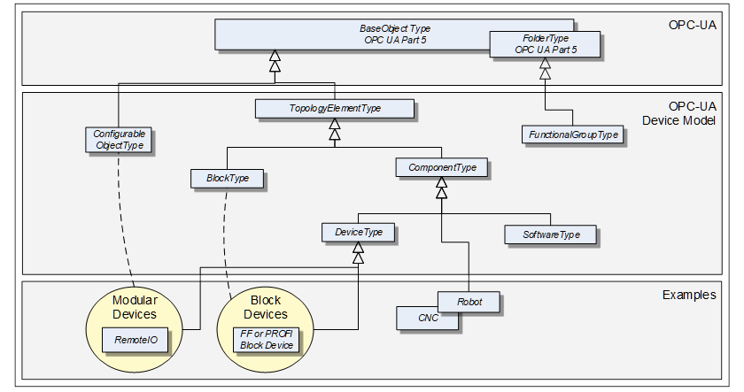  

Figure 1 - Device model overview  

The boxes in this drawing show the *ObjectTypes* used in this specification as well as some elements from other specifications that help understand some modelling decisions. The upper grey box shows the OPC UA core *ObjectTypes* from which the *TopologyElementType* is derived. The grey box in the second level shows the main *ObjectTypes* that the device model introduces. The components of those *ObjectTypes* are illustrated only in an abstract way in this overall picture.  

The grey box in the third level shows real-world examples as they will be used in products and plants. In general, such subtypes are defined by other organizations.  

The *TopologyElementType* is the base *ObjectType* for elements in a device topology. Its most essential aspect is the functional grouping concept.  

The *ComponentType* *ObjectType* provides a generic definition for a *Device* or parts of a *Device* where parts include mechanics and/or software. *DeviceType* is commonly used to represent field *Devices* .  

*Modular Devices* are introduced to support subdevices and *Block Devices* to support *Blocks* . *Blocks* are typically used by field communication foundations as means to organize the functionality within a *Device* . Specific types of *Blocks* will therefore be specified by these foundations.  

The *ConfigurableObjectType* is used as a general means to create modular topology units. If required an instance of this type will be added to the head object of the modular unit. Modular *Devices* , for example, will use this *ObjectType* to organize their modules. *Block*\-oriented *Devices* use it to expose and organize their *Blocks* .  

### 4.2 Usage guidelines  

[Annex C](/§\_Ref533066942) describes guidelines for the usage of the device model as base for creating companion specifications as well as guidelines on how to combine different aspects of the same device - defined in different companion specifications - in one OPC UA application.  

### 4.3 TopologyElementType  

This *ObjectType* defines a generic model for elements in a device or component topology. Among others, it introduces *FunctionalGroups* , *ParameterSet* , and *MethodSet* . [Figure 2](/§\_Ref214934812) shows the *TopologyElementType* . It is formally defined in [Table 12](/§\_Ref212863301) .  

*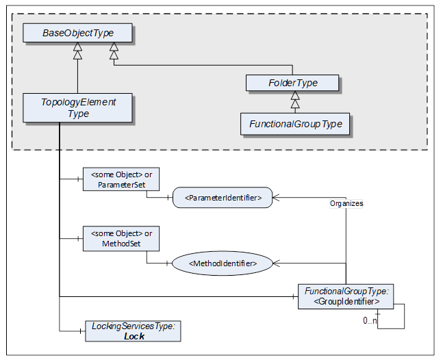*  

  

Figure 2 - Components of the TopologyElementType  

  

Table 12 - TopologyElementType definition  

| **Attribute** | **Value** |
|---|---|
|BrowseName|1:TopologyElementType|
|IsAbstract|True|
  
| **References** | **NodeClass** | **BrowseName** | **DataType** | **TypeDefinition** | **Other** |
|---|---|---|---|---|---|
|Subtype of the *0:BaseObjectType* defined in [OPC 10000-5](/§UAPart5)|
|0:HasComponent|Object|1:\<GroupIdentifier\>||1:FunctionalGroupType|OP|
|0:HasComponent|Object|1:Identification||1:FunctionalGroupType|O|
|0:HasComponent|Object|1:Lock||1:LockingServicesType|O|
|||||||
|0:HasComponent|Object|1:ParameterSet||0:BaseObjectType|O|
|0:HasComponent|Object|1:MethodSet||0:BaseObjectType|O|
  
| **Conformance Units** |
|---|
|DI Information Model|
  

  

The *TopologyElementType* is abstract. There will be no instances of a *TopologyElementType* itself, but there will be instances of subtypes of this type. In this specification, the term *TopologyElement* generically refers to an instance of any *ObjectType* derived from the *TopologyElementType* .  

*FunctionalGroups* are an essential aspect introduced by the *TopologyElementType* . *FunctionalGroups* are used to structure *Nodes* like *Properties* , *Parameters* and *Methods* according to their application such as configuration, diagnostics, asset management, condition monitoring and others.  

*FunctionalGroups* are specified in [4.4](/§\_Ref214954370) .  

A *FunctionalGroup* called **Identification** *TopologyElement* (see [4.4.2](/§\_Ref520899392) ). Identification information typically includes the *Properties* defined by the *VendorNameplate* or *TagNameplate Interfaces* and additional application specific information.  

*TopologyElements* can also support *LockingServices* (defined in [7](/§\_Ref57796058) ).  

*Clients* shall use the *LockingServices* if they require to make a set of changes (for example, several *Write* operations and *Method* invocations) and where a consistent state is available only after all of these changes have been performed. The main purpose of locking a *TopologyElement* is avoiding concurrent modifications.  

The lock applies to the complete *TopologyElement* (including all components such as *Blocks* or modules). *Servers* can expose a Lock Object on a component *TopologyElement* to allow independent locking of components, if no lock is applied to the top-level *TopologyElement* .  

If the Online/Offline model is supported (see [6.3](/§\_Ref518910651) ), the lock always applies to both the online and the offline version.  

*ParameterSet* and *MethodSet* are defined as standard containers for systems that have a flat list of Parameters or Methods with unique names. In such cases, the *Parameters* are components of the "ParameterSet" as a flat list of *Parameters* . The *Methods* are kept the same way in the "MethodSet".  

The *MethodSet* is only available if it includes at least one *Method* .  

The components of the *TopologyElementType* have additional references as defined in [Table 13](/§\_Ref54267286) .  

 **Table 13\- TopologyElementType Additional Subcomponents**   

| **Source Path** | **References** | **NodeClass** | **BrowseName** | **DataType** | **TypeDefinition** | **Other** |
|---|---|---|---|---|---|---|
|1:ParameterSet|0:HasComponent|Variable|1:\<ParameterIdentifier\>|0:BaseDataType|0:BaseDataVariableType|MP|
  

  

  

### 4.4 FunctionalGroupType  

#### 4.4.1 Model  

This subtype of the OPC UA *FolderType* is used to structure *Nodes* like *Properties* , *Parameters* and *Methods* according to their application (e.g. maintenance, diagnostics, condition monitoring). *Organizes* *References* should be used when the elements are components in other parts of the *TopologyElement* that the *FunctionalGroup* belongs to. This includes *Properties* , *Variables* , and *Methods* of the *TopologyElement* or in *Objects* that are components of the *TopologyElement* either directly or via a subcomponent. The same *Property* , *Parameter* or *Method* can be useful in different application scenarios and therefore referenced from more than one *FunctionalGroup* .  

*FunctionalGroups* can be nested.  

*FunctionalGroups* can directly be instantiated. In this case, the *BrowseName* of a *FunctionalGroup* should indicate its purpose. A list of well-known *BrowseNames* is in [4.4.2](/§\_Ref520899392) .  

[Figure 3](/§\_Ref152406268) shows the *FunctionalGroupType* components. It is formally defined in [Table 14](/§\_Ref140921737) .  

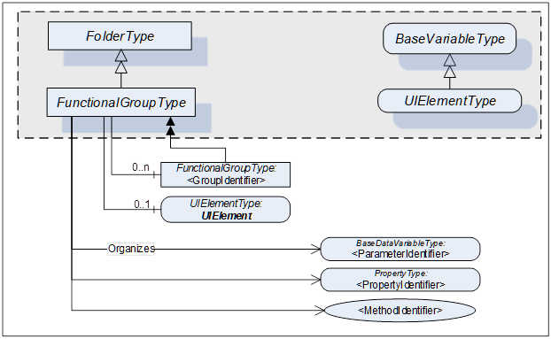  

Figure 3 - FunctionalGroupType  

Table 14 - FunctionalGroupType definition  

| **Attribute** | **Value** |
|---|---|
|BrowseName|1:FunctionalGroupType|
|IsAbstract|False|
  
| **References** | **NodeClass** | **BrowseName** | **DataType** | **TypeDefinition** | **Other** |
|---|---|---|---|---|---|
|Subtype of the *0:FolderType* defined in [OPC 10000-5](/§UAPart5)|
|0:HasComponent|Object|1:\<GroupIdentifier\>||1:FunctionalGroupType|OP|
|0:HasComponent|Variable|1:UIElement|0:BaseDataType|1:UIElementType|O|
  
| **Conformance Units** |
|---|
|DI Information Model|
  

  

All *BrowseNames* for *Nodes* referenced by a *FunctionalGroup* with an *Organizes Reference* shall be unique.  

The Organizes *References* can be present only at the instance, not the type. ** Depending on the current state of the *TopologyElement* the *Server* can decide to hide or unhide certain *FunctionalGroups* or (part of) their *References* . If a *FunctionalGroup* can be hidden on an instance the *TypeDefinition* shall use an appropriate *ModellingRule* like "Optional".  

If desirable, *Nodes* can be also children of *FunctionalGroups* . If such *Nodes* are defined, it is recommended to define a subtype of the *FunctionalGroupType* .  

*UIElement* is the user interface element for this *FunctionalGroup* . See [4.4.3](/§\_Ref527041577) for the definition of *UIElements* .  

Examples in Annex [B.1](/§\_Ref522106885) illustrate the use of *FunctionalGroups* .  

#### 4.4.2 Well-Known FunctionalGroup BrowseNames  

[Table 15](/§\_Ref466032569) includes a list of *FunctionalGroups* with name and purpose. If *Servers* expose a *FunctionalGroup* that corresponds to the described purpose, they should use the well-known *BrowseName* with the Namespace of this specification.  

Table 15 - Well-Known 1:FunctionalGroupType BrowseNames  

| **BrowseName** | **Purpose** |
|---|---|
|Configuration|*Parameters* representing the configuration items of the *TopologyElement* . If the *CurrentWrite* bit is set in the *AccessLevel* *Attribute* they can be modified by *Clients* .|
|Tuning|*Parameters* and *Methods* to optimize the behavior of the *TopologyElement* .|
|Maintenance|*Parameters* and *Methods* useful for maintenance operations.|
|Diagnostics|*Parameters* and *Methods* for diagnostics.|
|Statistics|*Parameters* and *Methods* for statistics.|
|Status|*Parameters* which describe the general health of the *TopologyElement* . This can include diagnostic *Parameters* .|
|Operational|*Parameters* and *Methods* useful for during normal operation, like process data.|
|OperationCounters|*Parameters* representing numbers of interest when managing a *TopologyElement* while it is operated. Examples are the hours of operation, hours in standby, etc. Those are often the base to calculate KPIs (key performance indicators) like the OEE (overall equipment efficiency). *Parameters* are often domain specific. Some common ones are defined in the OperationCounter Interface (see [4.5.5](/§\_Ref106026350) ).This *FunctionalGroup* can be organized into other *FunctionalGroups* , so *Clients* shall expect that several browse hops are required to get to all *OperationCounters* .|
|Identification|The *Properties* of the *VendorNameplate Interface* , like Manufacturer, SerialNumber or *Properties* of the TagNameplate will usually be sufficient as identification. If other *Parameters* or even *Methods* are required, all elements required shall be organized in a *FunctionalGroup* called "Identification". See Annex [B.1](/§\_Ref522101794) for an example.|
  

  

#### 4.4.3 UIElement Type  

*Servers* can expose *UIElements* providing user interfaces in the context of their *FunctionalGroup* container. *Clients* can load such a user interface and display it on the *Client* side. The hierarchy of *FunctionalGroups* represents the tree of user interface elements.  

The *UIElementType* is abstract and is mainly used as filter when browsing a *FunctionalGroup* . Only subtypes can be used for instances. No concrete *UIElements* are defined in this specification. FDI (Field Device Integration, see [IEC 62769](/§FDI) ) specifies two concrete subtypes  

* UIDs (UI Descriptions), descriptive user interface elements, and  

* UIPs (UI Plug-Ins), programmed user interface elements.  

The *UIElementType* is specified in [Table 16](/§\_Ref220850053) .  

Table 16 - UIElementType definition  

| **Attribute** | **Value** |
|---|---|
|BrowseName|1:UIElementType|
|IsAbstract|True|
|DataType|0:BaseDataType|
  
| **References** | **NodeClass** | **BrowseName** | **DataType** | **TypeDefinition** | **Other** |
|---|---|---|---|---|---|
|Subtype of the *0:BaseDataVariableType* defined in [OPC 10000-5](/§UAPart5) .|
  
| **Conformance Units** |
|---|
|DI Information Model|
  

  

The *Value* attribute of the *UIElement* contains the user interface element. Subtypes have to define the *DataType* (e.g., *XmlElement* or *ByteString* ).  

### 4.5 Interfaces  

#### 4.5.1 Overview  

This clause describes *Interfaces* with specific functionality that can be applied to multiple types at arbitrary positions in the type hierarchy.  

*Interfaces* are defined in [OPC 10000-3](/§UAPart3) .  

[Figure 4](/§\_Ref526860374) shows the *Interfaces* described in this specification.  

*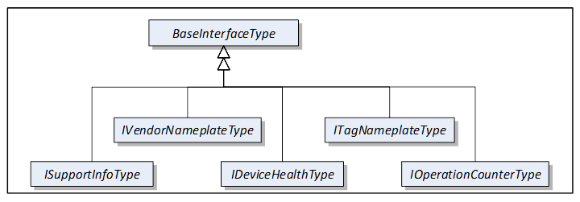*  

Figure 4 - Overview of Interfaces for Devices and Device components  

#### 4.5.2 VendorNameplate Interface  

*IVendorNameplateType* includes *Properties* that are commonly used to describe a *TopologyElement* from a manufacturer point of view. They can be used as part of the identification. The *Values* of these *Properties* are typically provided by the component vendor.  

The *VendorNameplate* *Interface* is illustrated in [Figure 5](/§\_Ref526862469) and formally defined in [Table 17](/§\_Ref526862449) .  

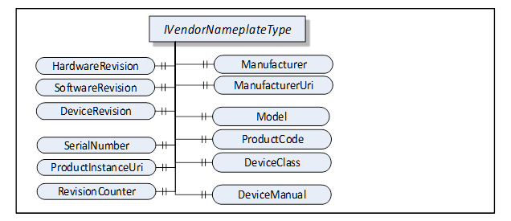  

Figure 5 - VendorNameplate Interface  

Table 17 - IVendorNameplateType definition  

| **Attribute** | **Value** |
|---|---|
|BrowseName|1:IVendorNameplateType|
|IsAbstract|True|
  
| **References** | **NodeClass** | **BrowseName** | **DataType** | **TypeDefinition** | **Other** |
|---|---|---|---|---|---|
|Subtype of the *BaseInterfaceType* defined in [OPC 10000-5](/§UAPart5)|
|||||||
  
| **Product-specific Properties** |
|---|
|0:HasProperty|Variable|1:Manufacturer|0:LocalizedText|0:PropertyType|O|
|0:HasProperty|Variable|1:ManufacturerUri|0:String|0:PropertyType|O|
|0:HasProperty|Variable|1:Model|0:LocalizedText|0:PropertyType|O|
|0:HasProperty|Variable|1:ProductCode|0:String|0:PropertyType|O|
|0:HasProperty|Variable|1:HardwareRevision|0:String|0:PropertyType|O|
|0:HasProperty|Variable|1:SoftwareRevision|0:String|0:PropertyType|O|
|0:HasProperty|Variable|1:DeviceRevision|0:String|0:PropertyType|O|
|0:HasProperty|Variable|1:DeviceManual|0:String|0:PropertyType|O|
|0:HasProperty|Variable|1:DeviceClass|0:String|0:PropertyType|O|
  
| **Product instance-specific Properties** |
|---|
|0:HasProperty|Variable|1:SerialNumber|0:String|0:PropertyType|O|
|0:HasProperty|Variable|1:ProductInstanceUri|0:String|0:PropertyType|O|
|0:HasProperty|Variable|1:RevisionCounter|0:Int32|0:PropertyType|O|
|0:HasProperty|Variable|1:SoftwareReleaseDate|0:DateTime|0:PropertyType|O|
|0:HasProperty|Variable|1:PatchIdentifiers|0:String[]|0:PropertyType|O|
  
| **Conformance Units** |
|---|
|DI Nameplate|
  

  

Product type specific *Properties* :  

*Manufacturer* provides the name of the company that manufactured the item this *Interface* is applied to. *ManufacturerUri* provides a unique identifier for this company. This identifier should be a fully qualified domain name; however, it can be a GUID or similar construct that ensures global uniqueness.  

*Model* provides the name of the product.  

*ProductCode* provides a unique combination of numbers and letters used to identify the product. It can be the order information displayed on type shields or in ERP systems.  

*HardwareRevision* provides the revision level of the hardware. *SemanticVersionString* (a sub-type of *String* defined in [OPC 10000-5](/§UAPart5) ) can be used when using the Semantic Versioning format.  

*SoftwareRevision* provides the version or revision level of the software component, the software/firmware of a hardware component, or the software/firmware of the *Device* . *SemanticVersionString* (a sub-type of *String* defined in [OPC 10000-5](/§UAPart5) ) can be used when using the Semantic Versioning format.  

*DeviceRevision* provides the overall revision level of a hardware component or the *Device* . As an example, this *Property* can be used in ERP systems together with the *ProductCode* *Property* . *SemanticVersionString* (a sub-type of *String* defined in [OPC 10000-5](/§UAPart5) ) can be used when using the Semantic Versioning format.  

*DeviceManual* allows specifying an address of the user manual. It can be a pathname in the file system or a URL (Web address).  

*DeviceClass* indicates in which domain or for what purpose a certain item for which the *Interface* is applied is used. Examples are "ProgrammableController", "RemoteIO", and "TemperatureSensor". This standard does not predefine any *DeviceClass* names. Companion standards that utilize this *Interface* (device models) will likely introduce such classifications.  

Product instance specific *Properties* :  

*SerialNumber* is a unique production number provided by the manufacturer. This is often stamped on the outside of a physical component and can be used for traceability and warranty purposes.  

*ProductInstanceUri* is a globally unique resource identifier provided by the manufacturer. This is often stamped on the outside of a physical component and can be used for traceability and warranty purposes. The maximum length is 255 characters. If used as QR code, 80 characters is a reasonable size. The recommended syntax of the *ProductInstanceUri* is: \<ManufacturerUri\>/\<any string\> where \<any string\> is unique among all instances using the same *ManufacturerUri* .  

Examples: "some-company.com/5ff40f78-9210-494f-8206-c2c082f0609c", "some-company.com/snr-16273849" or "some-company.com/model-xyz/snr-16273849".  

*RevisionCounter* is an incremental counter indicating the number of times the configuration data has been modified. An example would be a temperature sensor where the change of the unit would increment the *RevisionCounter* but a change of the measurement value would not affect the *RevisionCounter.*  

*SoftwareReleaseDate* defines the date when the software is released. If the version information is about patches, this should be the date of the latest patch. It is additional information for the user.  

*PatchIdentifiers* identify the list of patches that are applied to a software version. The format and semantics of the strings are vendor-specific. The order of the strings shall not be relevant.  

Companion specifications can specify additional semantics for the contents of these *Properties* .  

[Table 18](/§\_Ref533065451) specifies the mapping of these *Properties* to the International Registration Data Identifiers (IRDI) defined in ISO/IEC 11179-6. They should be used if a *Server* wants to expose a dictionary reference as defined in [OPC 10000-19](/§Part19) .  

NOTE IEC harmonized the identification of products and by that revised several entries.Table 18 lists the new IRDIs in column "IRDI" and those that have been superseded in "Legacy IRDI".  

Table 18 - VendorNameplate Mapping to IRDIs  

| **Property** | **IRDI** | **Legacy IRDI** |
|---|---|---|
|Manufacturer|0112/2/// [61360](https://cdd.iec.ch/CDD/IEC61360-7/iec61360-7.nsf/PropertiesAllVersions/0112-2---61360\_7%23CBA031?OpenDocument) \_7\#CBA031|[0112/2///61987\#ABA565\#007](https://cdd.iec.ch/cdd/iec61987/iec61987.nsf/e0e56d2682a34311c12575560058dc1c/e6672c0fb2ccae34c1258518003c4868?OpenDocument&Highlight=0,ABA565)|
|ManufacturerUri|[0112/2///61360\_7\#CBA032](https://cdd.iec.ch/CDD/IEC61360-7/iec61360-7.nsf/PropertiesAllVersions/0112-2---61360\_7%23CBA032?OpenDocument)|[0112/2///61987\#ABN591\#001](https://cdd.iec.ch/cdd/iec61987/iec61987.nsf/e0e56d2682a34311c12575560058dc1c/ccfaceef7e2ba8fac1258518003c4abe?OpenDocument&Highlight=0,ABN591)|
|Model|[0112/2///61360\_7\#CBA039](https://cdd.iec.ch/CDD/IEC61360-7/iec61360-7.nsf/PropertiesAllVersions/0112-2---61360\_7%23CBA039?OpenDocument)|[0112/2///61987\#ABA567\#007](https://cdd.iec.ch/cdd/iec61987/iec61987.nsf/e0e56d2682a34311c12575560058dc1c/46f40a30b7b6e058c1258518003c486a?OpenDocument&Highlight=0,ABA567)|
|SerialNumber|[0112/2///61360\_7\#CBA050](https://cdd.iec.ch/CDD/IEC61360-7/iec61360-7.nsf/PropertiesAllVersions/0112-2---61360\_7%23CBA050?OpenDocument)|[0112/2///61987\#ABA951\#007](https://cdd.iec.ch/cdd/iec61987/iec61987.nsf/e0e56d2682a34311c12575560058dc1c/0db563040219c4c2c1258518003c4891?OpenDocument&Highlight=0,ABA951)|
|HardwareRevision|[0112/2///61360\_7\#CBA047](https://cdd.iec.ch/CDD/IEC61360-7/iec61360-7.nsf/PropertiesAllVersions/0112-2---61360\_7%23CBA047?OpenDocument)|[0112/2///61987\#ABA926\#006](https://cdd.iec.ch/cdd/iec61987/iec61987.nsf/e0e56d2682a34311c12575560058dc1c/c99e095e33c14ff5c1258518003c488b?OpenDocument&Highlight=0,ABA926)|
|SoftwareRevision|[0112/2///61360\_7\#CBA046](https://cdd.iec.ch/CDD/IEC61360-7/iec61360-7.nsf/PropertiesAllVersions/0112-2---61360\_7%23CBA046?OpenDocument)|[0112/2///61987\#ABA601\#006](https://cdd.iec.ch/cdd/iec61987/iec61987.nsf/e0e56d2682a34311c12575560058dc1c/ebf0976beee9baf0c1258518003c4876?OpenDocument&Highlight=0,ABA601)|
|DeviceRevision|[0112/2///61987\#ABP643\#002](https://cdd.iec.ch/CDD/IEC61987/iec61987.nsf/PropertiesAllVersions/0112-2---61987%23ABP643)||
|RevisionCounter|[0112/2///61987\#ABN603\#001](https://cdd.iec.ch/cdd/iec61987/iec61987.nsf/e0e56d2682a34311c12575560058dc1c/a895485728559c35c1258518003fd7c5?OpenDocument&Highlight=0,ABN603)||
|ProductCode|[0112/2///61360\_7\#CBA040](https://cdd.iec.ch/CDD/IEC61360-7/iec61360-7.nsf/PropertiesAllVersions/0112-2---61360\_7%23CBA040?OpenDocument)|[0112/2///61987\#ABA300\#006](https://cdd.iec.ch/cdd/iec61987/iec61987.nsf/e0e56d2682a34311c12575560058dc1c/004c997b8a08b19dc1258518003c483e?OpenDocument&Highlight=0,ABA300)|
|ProductInstanceUri|[0112/2///61360\_7\#CBA055](https://cdd.iec.ch/CDD/IEC61360-7/iec61360-7.nsf/PropertiesAllVersions/0112-2---61360\_7%23CBA055?OpenDocument)|[0112/2///61987\#ABN590\#001](https://cdd.iec.ch/cdd/iec61987/iec61987.nsf/e0e56d2682a34311c12575560058dc1c/ebc479e989fcaf28c1258518003c4abd?OpenDocument&Highlight=0,ABN590)|
|DeviceManual|\-|\-|
|DeviceClass|[0112/2///61360\_7\#CBA037](https://cdd.iec.ch/CDD/IEC61360-7/iec61360-7.nsf/PropertiesAllVersions/0112-2---61360\_7%23CBA037?OpenDocument)|[0112/2///61987\#ABA566 - type of product](https://cdd.iec.ch/cdd/iec61987/iec61987.nsf/e0e56d2682a34311c12575560058dc1c/5f261d1a0bf49635c125825e001de72c?OpenDocument&Highlight=0,aba566)|
|SoftwareReleaseDate||\-|
|PatchIdentifiers||\-|
  

  

  

#### 4.5.3 TagNameplate Interface  

*ITagNameplateType* includes *Properties* that are commonly used to describe a *TopologyElement* from a user point of view.  

The *TagNameplate* *Interface* is illustrated in [Figure 6](/§\_Ref534748937) and formally defined in [Table 19](/§\_Ref534748963) .  

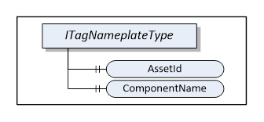  

Figure 6 - TagNameplate Interface  

Table 19 - ITagNameplateType definition  

| **Attribute** | **Value** |
|---|---|
|BrowseName|1:ITagNameplateType|
|IsAbstract|True|
  
| **References** | **NodeClass** | **BrowseName** | **DataType** | **TypeDefinition** | **Other** |
|---|---|---|---|---|---|
|Subtype of the *BaseInterfaceType* defined in [OPC 10000-5](/§UAPart5)|
|||||||
|0:HasProperty|Variable|1:AssetId|0:String|0:PropertyType|O|
|0:HasProperty|Variable|1:ComponentName|0:LocalizedText|0:PropertyType|O|
  
| **Conformance Units** |
|---|
|DI TagNameplate|
  

  

*AssetId* is a user writable alphanumeric character sequence uniquely identifying a component. The ID is provided by the integrator or user of the device. It contains typically an identifier in a branch, use case or user specific naming scheme. This could be for example a reference to an electric scheme.  

*ComponentName* is a user writable name provided by the integrator or user of the component.  

[Table 20](/§\_Ref534748976) specifies the mapping of these *Properties* to the International Registration Data Identifiers (IRDI) defined in ISO/IEC 11179-6. They should be used if a *Server* wants to expose a dictionary reference as defined in [OPC 10000-19](/§Part19) .  

Table 20 - TagNameplate Mapping to IRDIs  

| **Property** | **IRDI** |
|---|---|
|AssetId|[0112/2///61987\#ABA038 - identification code of device](https://cdd.iec.ch/cdd/iec61987/cdddev.nsf/PropertiesAllVersions/0112-2---61987%23ABA038?opendocument)|
|ComponentName|0112/2///61987\# [ABA251](https://cdd.iec.ch/cdd/iec61987/cdddev.nsf/PropertiesAllVersions/0112-2---61987%23ABA251?opendocument)\- designation of device|
  

  

#### 4.5.4 DeviceHealth Interface  

The *DeviceHealth* *Interface* includes *Properties* and *Alarms* that are commonly used to expose the health status of a *Device* . It is illustrated in *[Figure](/§\_Ref3365571)* 7 and formally defined in [Table 21](/§\_Ref526934831) .  

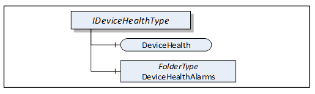  

Figure 7 - DeviceHealth Interface  

Table 21 - IDeviceHealthType definition  

| **Attribute** | **Value** |
|---|---|
|BrowseName|1:IDeviceHealthType|
|IsAbstract|True|
  
| **References** | **NodeClass** | **BrowseName** | **DataType** | **TypeDefinition** | **Other** |
|---|---|---|---|---|---|
|Subtype of the *0:BaseInterfaceType* defined in [OPC 10000-5](/§UAPart5)|
|||||
|0:HasComponent|Variable|1:DeviceHealth|1:DeviceHealthEnumeration|0:BaseDataVariableType|O|
|0:HasComponent|Object|1:DeviceHealthAlarms||0:FolderType|O|
  
| **Conformance Units** |
|---|
|DI DeviceHealth|
  

  

*DeviceHealth* indicates the status as defined by [NAMUR Recommendation NE107](/§NE107) . *Clients* can read or monitor this *Variable* to determine the device condition.  

The *DeviceHealthEnumeration* *DataType* is an enumeration that defines the device condition. Its values are defined in [Table 22](/§\_Ref526934854) . Its representation in the *AddressSpace* is defined in [Table 23](/§\_Ref110591067) .  

Table 22 - DeviceHealthEnumeration values  

| **Name** | **Value** | **Description** |
|---|---|---|
|NORMAL|0|The *Device* functions normally.|
|FAILURE|1|Malfunction of the *Device* or any of its peripherals. Typically caused device-internal or is process related.|
|CHECK\_FUNCTION|2|Functional checks are currently performed. Examples: Change of configuration, local operation, and substitute value entered.|
|OFF\_SPEC|3|"Off-spec" means that the *Device* is operating outside its specified range (e.g. measuring or temperature range) or that internal diagnoses indicate deviations from measured or set values due to internal problems in the *Device* or process characteristics.|
|MAINTENANCE\_REQUIRED|4|Although the output signal is valid, the wear reserve is nearly exhausted or a function will soon be restricted due to operational conditions e.g. build-up of deposits.|
  

  

Table 23 - DeviceHealthEnumeration definition  

| **Attribute** | **Value** |
|---|---|
|BrowseName|1:DeviceHealthEnumeration|
|IsAbstract|False|
  
| **References** | **NodeClass** | **BrowseName** | **DataType** | **TypeDefinition** | **Other** |
|---|---|---|---|---|---|
|Subtype of the 0:Enumeration type defined in [OPC 10000-5](/§UAPart5)|
|0:HasProperty|Variable|0:EnumStrings|0:LocalizedText []|0:PropertyType||
  
| **Conformance Units** |
|---|
|DI DeviceHealth|
  

  

  

*DeviceHealthAlarms* shall be used for instances of the DeviceHealth Alarm Types specified in [4.12](/§\_Ref3368025) and any other subtypes of *DeviceHealthDiagnosticAlarmType* .  

It is recommended to use the *DeviceHealthAlarms* folder also for *Alarm* instances that relate to the health condition of the *Device* and are not subtypes of *DeviceHealthDiagnosticAlarmType*  

#### 4.5.5 OperationCounter Interface  

The *IOperationCounterType* defines counters for the duration of operation. It is formally defined in [Table 24](/§\_Ref96249224) .  

Table 24 - IOperationCounterType definition  

| **Attribute** | **Value** |
|---|---|
|BrowseName|1:IOperationCounterType|
|IsAbstract|True|
|Description|Interface defining counters for the duration of operation|
  
| **References** | **Node Class** | **BrowseName** | **DataType** | **TypeDefinition** | **Other** |
|---|---|---|---|---|---|
|Subtype of the *0:BaseInterfaceType* defined in [OPC 10000-5](/§UAPart5)|
|0:HasProperty|Variable|1:PowerOnDuration|0:Duration|0:PropertyType|O|
|0:HasProperty|Variable|1:OperationDuration|0:Duration|0:PropertyType|O|
|0:HasProperty|Variable|1:OperationCycleCounter|0:UInteger|0:PropertyType|O|
  
| **Conformance Units** |
|---|
|DI OperationCounter Interface|
  

  

*PowerOnDuration* is the duration the *Device* has been powered. The main purpose is to determine the time in which degradation of the *Device* occurred. The details, when the time is counted, is implementation-specific. Companion specifications can define specific rules. Typically, when the *Device* has supply voltage and the main CPU is running, the time is counted. This can include any kind of sleep mode, but cannot include pure Wake on LAN. This value shall only increase during the lifetime of the *Device* and shall not be reset when the *Device* is restarted. The *PowerOnDuration* is provided as *Duration* , i.e., in milliseconds or even fractions of a millisecond. However, the *Server* is not expected to update the value in such a high frequency, but possibly once a minute or once an hour, depending on the application.  

*OperationDuration* is the duration the *Device* has been powered and performing an activity. This counter is intended for *Devices* where a distinction is made between switched on and in operation. For example, a drive can be powered on but not operating. It is not intended for *Devices* always performing an activity like sensors always measuring data. This value shall only increase during the lifetime of the *Device* and shall not be reset when the *Device* is restarted. The *OperationDuration* is provided as *Duration* , i.e., in milliseconds or even fractions of a millisecond. However, the *Server* is not expected to update the value in such a high frequency, but possibly once a minute or once an hour, depending on the application.  

*OperationCycleCounter* is counting the times the *Device* switches from not performing an activity to performing an activity. For example, each time a valve starts moving, is counted. This value shall only increase during the lifetime of the *Device* and shall not be reset when the *Device* is restarted.  

The child *Nodes* of the *IOperationCounterType* have additional *Attribute* values defined in [Table 25](/§\_Ref56780683) .  

Table 25 - IOperationCounterType Attribute values for child Nodes  

| **BrowsePath** | **Description Attribute** |
|---|---|
|PowerOnDuration|PowerOnDuration is the duration the Device has been powered. The main purpose is to determine the time in which degradation of the Device occurred. The details, when the time is counted, is implementation-specific. Companion specifications can define specific rules. Typically, when the Device has supply voltage and the main CPU is running, the time is counted. This can include any kind of sleep mode, but cannot include pure Wake on LAN. This value shall only increase during the lifetime of the Device and shall not be reset when the Device is restarted. The PowerOnDuration is provided as Duration, i.e., in milliseconds or even fractions of a millisecond. However, the Server is not expected to update the value in such a high frequency, but possibly once a minute or once an hour, depending on the application.|
|OperationDuration|OperationDuration is the duration the Device has been powered and performing an activity. This counter is intended for Devices where a distinction is made between switched on and in operation. For example, a drive can be powered on but not operating. It is not intended for Devices always performing an activity like sensors always measuring data. This value shall only increase during the lifetime of the Device and shall not be reset when the Device is restarted. The OperationDuration is provided as Duration, i.e., in milliseconds or even fractions of a millisecond. However, the Server is not expected to update the value in such a high frequency, but possibly once a minute or once an hour, depending on the application.|
|OperationCycleCounter|OperationCycleCounter is counting the times the Device switches from not performing an activity to performing an activity. For example, each time a valve starts moving, is counted. This value shall only increase during the lifetime of the Device and shall not be reset when the Device is restarted.|
  

  

[Table 26 - OperationCounter Mapping to IRDIs](/§\_Ref155704357) specifies the mapping of these *Properties* to the International Registration Data Identifiers (IRDI) defined in ISO/IEC 11179-6. They should be used if a *Server* wants to expose a dictionary reference as defined in [OPC 10000-19](/§Part19) .  

Table 26 - OperationCounter Mapping to IRDIs  

| **Property** | **IRDI** |
|---|---|
|PowerOnDuration|[0112/2///61987\#ABP550](https://cdd.iec.ch/CDD/IEC61987/iec61987.nsf/PropertiesAllVersions/0112-2---61987%23ABP550)|
|OperationDuration|[0112/2///61987\#ABN639\#001](https://cdd.iec.ch/CDD/IEC61987/iec61987.nsf/PropertiesAllVersions/0112-2---61987%23ABN639)|
|OperationCycleCounter|[0112/2///61987\#ABP545](https://cdd.iec.ch/CDD/IEC61987/iec61987.nsf/PropertiesAllVersions/0112-2---61987%23ABP545)|
  

  

#### 4.5.6 SupportInfo Interface  

The *SupportInfo* *Interface* defines a number of additional data that a commonly exposed for *Devices* and their components. These include mainly images, documents, or protocol-specific data. The various types of information are organized into different folders. Each information element is represented by a read-only *Variable* . The information can be retrieved by reading the *Variable* value.  

 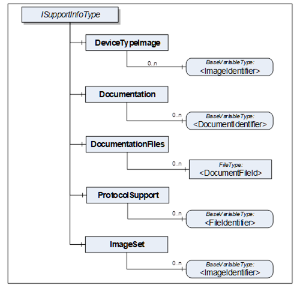  

Figure 8 Illustrates the *SupportInfo* *Interface.* It is formally defined ** in [Table 27](/§\_Ref526944188) .  

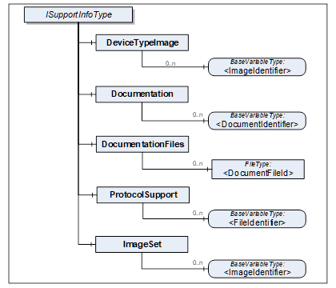  

Figure 8 - Support information Interface  

Table 27 - ISupportInfoType definition  

| **Attribute** | **Value** |
|---|---|
|BrowseName|1:ISupportInfoType|
|IsAbstract|True|
  
| **References** | **NodeClass** | **BrowseName** | **DataType** | **TypeDefinition** | **Other** |
|---|---|---|---|---|---|
|Subtype of the *BaseInterfaceType* defined in [OPC 10000-5](/§UAPart5)|
|||||
|0:HasComponent|Object|1:DeviceTypeImage||0:FolderType|O|
|0:HasComponent|Object|1:Documentation||0:FolderType|O|
|0:HasComponent|Object|1:DocumentationFiles||0:FolderType|O|
|0:HasComponent|Object|1:ProtocolSupport||0:FolderType|O|
|0:HasComponent|Object|1:ImageSet||0:FolderType|O|
  
| **Conformance Units** |
|---|
|DI DeviceSupportInfo|
  

  

*Clients* should be aware that the contents that these *Variables* represent can be large. Reading large values with a single Read operation can be impossible due to configured limits in either the *Client* or the *Server* stack. The default maximum size for an array of bytes is 1 MiB. It is recommended that *Clients* use the IndexRange in the OPC UA Read Service (see [OPC 10000-4](/§UAPart4) ) to read these *Variables* in chunks, for example, one-megabyte chunks. It is up to the *Client* whether it starts without an index and repeats with an IndexRange only after an error or whether it always uses an IndexRange.  

The components of the *ISupportInfoType* have additional references as defined in [Table 28](/§\_Ref64994660) .  

 **Table 28\- 1:ISupportInfoType Additional Subcomponents**   

| **Source Path** | **References** | **NodeClass** | **BrowseName** | **DataType** | **TypeDefinition** | **Other** |
|---|---|---|---|---|---|---|
|1:DeviceTypeImage|0:HasComponent|Variable|1:\<ImageIdentifier\>|0:Image|0:BaseDataVariableType|MP|
|1:Documentation|0:HasComponent|Variable|1:\<DocumentIdentifier\>|0:ByteString|0:BaseDataVariableType|MP|
|1:DocumentationFiles|0:HasComponent|Object|1:\<DocumentFileId\>||0:FileType|MP|
|1:ProtocolSupport|0:HasComponent|Variable|1:\<ProtocolSupportIdentifier\>|0:ByteString|0:BaseDataVariableType|MP|
|1:ImageSet|0:HasComponent|Variable|1:\<ImageIdentifier\>|0:Image|0:BaseDataVariableType|MP|
  

  

Pictures can be exposed as *Variables* organized in the *DeviceTypeImage* folder. There can be multiple images of different resolutions. Each image is a separate *Variable* .  

All images are transferred as a *ByteString* . The *DataType* of the *Variable* specifies the image format. OPC UA defines BMP, GIF, JPG and PNG (see [OPC 10000-3](/§UAPart3) ).  

Documents in many cases will represent a product manual. They can be exposed as *Variables* or as *FileType* instances. Files are useful in particular for large documents.  

* Documents as *Variables* are represented as a *ByteString* and organized in the *Documentation* folder. The *BrowseName* of each *Node* will consist of the filename including the extension that can be used to identify the document type. Typical extensions are ".pdf" or ".txt".  

* Documents as *FileType* instances ** are organized in the *DocumentationFiles* folder. They are retrieved from the *Server* by using the *FileType Methods* . It is recommended to use the *MimeType* *Property* to specify the media type of the file based on RFC 2046.  

Protocol support files are exposed as *Variables* organized in the *ProtocolSupport* folder. They can represent various types of information as defined by a protocol. For example a GSD file.  

All protocol support files are transferred as a *ByteString* . The *BrowseName* of each *Variable* shall consist of the complete filename including the extension that can be used to identify the type of information.  

Images that are used within *UIElements* are exposed as separate *Variables* rather than embedding them in the element. All image *Variables* will be aggregated by the *ImageSet* folder. The *UIElement* shall specify an image by its name that is also the *BrowseName* of the image *Variable* . *Clients* can cache images so they don't have to be transferred more than once.  

The *DataType* of the *Variable* specifies the image format. OPC UA defines BMP, GIF, JPG and PNG (see [OPC 10000-3](/§UAPart3) ).  

#### 4.5.7 AssetLocationIndication Interface  

The asset location indication *Interface* provides a method for making a device emit visual signals (e.g., blinking LEDs) or audible signals (e.g., sounds) to facilitate its physical identification among other assets.  

*IAssetLocationIndicationType* can be implemented by any object that represents a physical device and that is able to indicate its position by blinking and / or making a sound.  

The minimal implementation supports turning a default indication on and off for a specified duration. Optionally a device can declare its supported indication types (audible, visual) and let the client select the used indication types (one or more).  

The *Interface* is formally defined in [Table 29](/§\_Ref185260066) .  

Table 29 - IAssetLocationIndicationType definition  

| **Attribute** | **Value** |
|---|---|
|BrowseName|1:IAssetLocationIndicationType|
|IsAbstract|True|
  
| **References** | **NodeClass** | **BrowseName** | **DataType** | **TypeDefinition** | **Other** |
|---|---|---|---|---|---|
|Subtype of the *BaseInterfaceType* defined in [OPC 10000-5](/§UAPart5)|
|||||||
|0:HasComponent|Method|1:StartLocationIndication|||M|
|0:HasComponent|Method|1:StopLocationIndication|||M|
|0:HasProperty|Variable|1:IsIndicating|0:Boolean|0:PropertyType|M|
|0:HasProperty|Variable|1:UsedIndicationType|1:LocationIndicationType|0:PropertyType|O|
|0:HasProperty|Variable|1:SupportedIndicationTypes|1:LocationIndicationType|0:PropertyType|O|
  
| **Conformance Units** |
|---|
|DI AssetLocationIndication|
  

  

The read only *Property IsIndicating* is true when the indication is currently active.  

The optional *Property SupportedIndicationType* is an *OptionSet* whose values describe the types of location indications that are supported by the device.  

The optional *UsedIndicationType* can be written to set the indication types that shall be used when *StartLocationIndication* is called.  

##### 4.5.7.1 StartLocationIndication Method  

The *StartLocationIndication Method* is used to start the indication. As a result to this call the *IsIndicating* property is set to true.  

The signature of this *Method* is specified below. [Table 30](/§\_Ref185259881) and [Table 31](/§\_Ref185259889) specify the *Arguments* and *AddressSpace* representation, respectively.  

 **Signature**   

 **StartLocationIndication**   

[in] 0:Duration   IndicationDuration);  

Table 30 - StartLocationIndication Method Arguments  

| **Argument ** | **Description** |
|---|---|
|IndicationDuration|0 =\> infinite duration or duration in milliseconds|
  

  

 **Method Result Codes (defined in Call Service)**   

| **Result Code** | **Description** |
|---|---|
|Bad\_InvalidArgument|If the device does not support a duration other than infinite|
  

  

Table 31 - StartLocationIndication Method AddressSpace definition  

| **Attribute** | **Value** |
|---|---|
|BrowseName|1:StartLocationIndication|
  
| **References** | **NodeClass** | **BrowseName** | **DataType** | **TypeDefinition** | **Other** |
|---|---|---|---|---|---|
|0:HasProperty|Variable|0:InputArguments|0:Argument[]|0:PropertyType|M|
  
| **Conformance Units** |
|---|
|DI AssetLocationIndication|
  

  

##### 4.5.7.2 StopLocationIndication Method  

The *StopLocationIndication Method* is used to stop the indication. As a result to this call, the *IsIndicating* property is set to false. This method also can be called when the indication is already stopped (e.g., because the specified *IndicationDuration* is over).  

The signature of this *Method* is specified below.  

 **Signature**   

 **StopLocationIndication**   

#### 4.5.8 LocationIndicationType OptionSet  

This *DataType* is used together with the *IAssetLocationIndication* *Interface* . It defines flags for ** the type of location indication. The *OptionSet* is defined in [Table 32](/§\_Ref185244824) . Its representation in the *AddressSpace* is defined in [Table 33](/§\_Ref185244838) .  

Table 32 - LocationIndicationType Values  

| **Name** | **Bit No.** | **Description** |
|---|---|---|
|Visual|0|Location indication through optical signals, such as blinking LEDs, if supported by the device.|
|Audible|1|Location indication through auditory signals, such as sounds or beeps, if supported by the device.|
  

  

Table 33 - LocationIndicationType definition  

| **Attribute** | **Value** |
|---|---|
|BrowseName|1:LocationIndicationType|
|IsAbstract|False|
  
| **References** | **NodeClass** | **BrowseName** | **DataType** | **TypeDefinition** | **Other** |
|---|---|---|---|---|---|
|Subtype of the 0:UInt16 DataType defined in [OPC 10000-5](/§UAPart5)|
|0:HasProperty|Variable|0:OptionSetValues|0:LocalizedText []|0:PropertyType||
  
| **Conformance Units** |
|---|
|DI AssetLocationIndication|
  

  

  

### 4.6 ComponentType  

Compared to *DeviceType* the *ComponentType* is more universal. It includes the same components but does not mandate any *Properties* . This makes it usable for representation of a *Device* or parts of a *Device* . Parts include both mechanical and software parts.  

The *ComponentType* applies the *VendorNameplate* and the *TagNameplate Interface* . [Figure 9](/§\_Ref4921924) Illustrates the *ComponentType.* It is formally defined ** in [Table 34](/§\_Ref4921925) .  

  

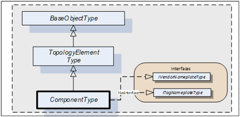  

Figure 9 - ComponentType  

  

Table 34 - ComponentType definition  

| **Attribute** | **Value** |
|---|---|
|BrowseName|1:ComponentType|
|IsAbstract|True|
  
| **References** | **NodeClass** | **BrowseName** | **DataType** | **TypeDefinition** | **Other** |
|---|---|---|---|---|---|
|Subtype of the *TopologyElementType* defined in [4.3](/§\_Ref533768581) .|
|||||
|HasSubtype|ObjectType|1:DeviceType|Defined in [4.7](/§\_Ref527041119) .|
|HasSubtype|ObjectType|1:SoftwareType|Defined in [4.8](/§\_Ref530926973) .|
|||||
|HasInterface|ObjectType|1:IVendorNameplateType|Defined in [4.5.2](/§\_Ref530927143) .|
|HasInterface|ObjectType|1:ITagNameplateType|Defined in [4.5.3](/§\_Ref534744660) .|
|||||
|||||||
|||||
|Applied from *IVendorNameplateType*|
|0:HasProperty|Variable|1:Manufacturer|0:LocalizedText|0:PropertyType|O|
|0:HasProperty|Variable|1:ManufacturerUri|0:String|0:PropertyType|O|
|0:HasProperty|Variable|1:Model|0:LocalizedText|0:PropertyType|O|
|0:HasProperty|Variable|1:ProductCode|0:String|0:PropertyType|O|
|0:HasProperty|Variable|1:HardwareRevision|0:String|0:PropertyType|O|
|0:HasProperty|Variable|1:SoftwareRevision|0:String|0:PropertyType|O|
|0:HasProperty|Variable|1:DeviceRevision|0:String|0:PropertyType|O|
|0:HasProperty|Variable|1:DeviceManual|0:String|0:PropertyType|O|
|0:HasProperty|Variable|1:DeviceClass|0:String|0:PropertyType|O|
|0:HasProperty|Variable|1:SerialNumber|0:String|0:PropertyType|O|
|0:HasProperty|Variable|1:ProductInstanceUri|0:String|0:PropertyType|O|
|0:HasProperty|Variable|1:RevisionCounter|0:Int32|0:PropertyType|O|
|||||||
|Applied from *ITagNameplateType*|
|0:HasProperty|Variable|1:AssetId|0:String|0:PropertyType|O|
|0:HasProperty|Variable|1:ComponentName|0:LocalizedText|0:PropertyType|O|
  
| **Conformance Units** |
|---|
|DI Information Model|
  

  

The *ComponentType* is abstract. *DeviceType* and *SoftwareType* are subtypes of *ComponentType* . There will be no instances of a *ComponentType* itself, only of concrete subtypes.  

*IVendorNameplateType* and its members are described in [4.5.2](/§\_Ref530927143) .  

*ITagNameplateType* and its members are described in [4.5.3](/§\_Ref534744660) .  

### 4.7 DeviceType  

This *ObjectType* can be used to define the structure of a *Device* . [Figure 10](/§\_Ref157500300) shows the *DeviceType* . It is formally defined in [Table 35](/§\_Ref130213312) .  

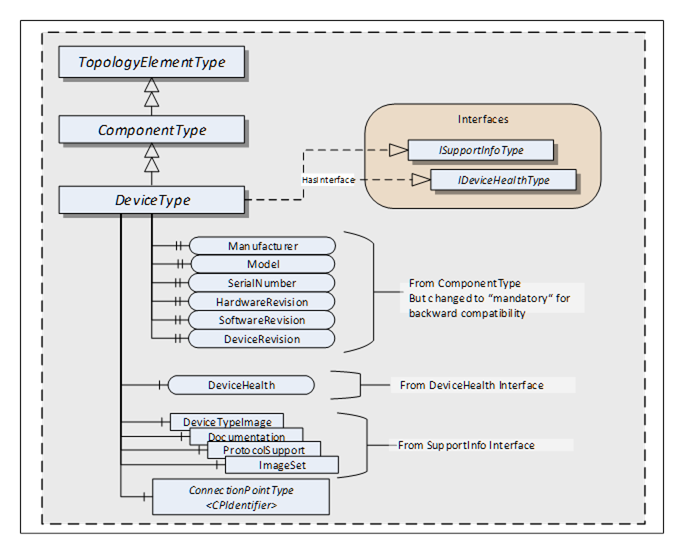  

Figure 10 - DeviceType  

  

  

Table 35 - DeviceType definition  

| **Attribute** | **Value** |
|---|---|
|BrowseName|1:DeviceType|
|IsAbstract|True|
  
| **References** | **NodeClass** | **BrowseName** | **DataType** | **TypeDefinition** | **Other** |
|---|---|---|---|---|---|
|Subtype of the *ComponentType* defined in [4.5.7](/§\_Ref532511038)|
|||||
|HasInterface|ObjectType|1:ISupportInfoType|Defined in [4.5.3](/§\_Ref530927170) .|
|HasInterface|ObjectType|1:IDeviceHealthType|Defined in [4.5.3](/§\_Ref530927188) .|
|||||||
|0:HasComponent|Object|1:\<CPIdentifier\>||1:ConnectionPointType|OP|
|||||||
|0:HasProperty|Variable|1:SerialNumber|0:String|0:PropertyType|M|
|0:HasProperty|Variable|1:RevisionCounter|0:Int32|0:PropertyType|M|
|0:HasProperty|Variable|1:Manufacturer|0:LocalizedText|0:PropertyType|M|
|0:HasProperty|Variable|1:Model|0:LocalizedText|0:PropertyType|M|
|0:HasProperty|Variable|1:DeviceManual|0:String|0:PropertyType|M|
|0:HasProperty|Variable|1:DeviceRevision|0:String|0:PropertyType|M|
|0:HasProperty|Variable|1:SoftwareRevision|0:String|0:PropertyType|M|
|0:HasProperty|Variable|1:HardwareRevision|0:String|0:PropertyType|M|
|0:HasProperty|Variable|1:DeviceClass|0:String|0:PropertyType|O|
|0:HasProperty|Variable|1:ManufacturerUri|0:String|0:PropertyType|O|
|0:HasProperty|Variable|1:ProductCode|0:String|0:PropertyType|O|
|0:HasProperty|Variable|1:ProductInstanceUri|0:String|0:PropertyType|O|
|||||||
|Applied from IDeviceHealthType|
|0:HasComponent|Variable|1:DeviceHealth|DeviceHealthEnumeration|0:BaseDataVariableType|O|
|0:HasComponent|Object|1:DeviceHealthAlarms||0:FolderType|O|
|||||||
|Applied from ISupportInfoType|
|0:HasComponent|Object|1:DeviceTypeImage||0:FolderType|O|
|0:HasComponent|Object|1:Documentation||0:FolderType|O|
|0:HasComponent|Object|1:ProtocolSupport||0:FolderType|O|
|0:HasComponent|Object|1:ImageSet||0:FolderType|O|
  
| **Conformance Units** |
|---|
|DI DeviceType|
  

  

*DeviceType* is a subtype of *ComponentType* which means it inherits all *InstanceDeclarations* .  

The *DeviceType* *ObjectType* is abstract. There will be no instances of a *DeviceType* itself, only of concrete subtypes.  

*ConnectionPoints* (see [5.4](/§\_Ref518910506) ) represent the interface (interface card) of a *DeviceType* instance to a *Network* . Multiple *ConnectionPoints* can exist if multiple protocols and/or multiple *Communication Profiles* are supported.  

The *Interfaces* and their members are described in [4.5](/§\_Ref526605884) . Some of the *Properties* inherited from the *ComponentType* are declared mandatory for backward compatibility.  

Although mandatory, some of the *Properties* are not supported for certain types of *Devices* . In this case vendors shall provide the following defaults:  

* *Properties* with *DataType String* :   empty string  

* *Properties* with *DataType LocalizedText* :  empty text field  

* *RevisionCounter* *Property* :  \- 1  

*Clients* can ignore the *Properties* when they have these defaults.  

When *Properties* are not supported, *Servers* should initialize the corresponding *Property* declaration on the *DeviceType* with the default value. Relevant *Browse Service* requests can then return a *Reference* to this *Property* on the type definition. That way, no extra *Nodes* are required.  

  

### 4.8 SoftwareType  

This *ObjectType* can be used for software modules of a *Device* or a part of a *Device* . *SoftwareType* is a concrete subtype of *ComponentType* and can be used directly.  

[Figure 11](/§\_Ref4922009) Illustrates the *SoftwareType.* It is formally defined ** in [Table 36](/§\_Ref4921981) .  

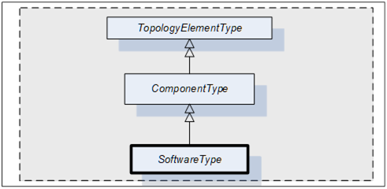  

Figure 11 - SoftwareType  

  

Table 36 - SoftwareType definition  

| **Attribute** | **Value** |
|---|---|
|BrowseName|1:SoftwareType|
|IsAbstract|False|
  
| **References** | **NodeClass** | **BrowseName** | **DataType** | **TypeDefinition** | **Other** |
|---|---|---|---|---|---|
|Subtype of the *ComponentType* defined in [4.5.7](/§\_Ref532511038) .|
|||||
|0:HasProperty|Variable|1:Manufacturer|0:LocalizedText|0:PropertyType|M|
|0:HasProperty|Variable|1:Model|0:LocalizedText|0:PropertyType|M|
|0:HasProperty|Variable|1:SoftwareRevision|0:String|0:PropertyType|M|
  
| **Conformance Units** |
|---|
|DI Software Component|
  

  

*SoftwareType* is a subtype of *ComponentType* which means it inherits all *InstanceDeclarations* .  

The *Properties Manufacturer* , *Model* , and *SoftwareRevision inherited from ComponentType* are declared mandatory for *SoftwareType* instances.  

### 4.9 DeviceSet entry point  

The *DeviceSet Object* is the starting point to locate *Devices* . It shall either directly or indirectly reference all instances of a subtype of *ComponentType* with a *Hierarchical Reference* . **** *Devices* that are composed of various components that are also *Devices* , only the root instance shall be referenced from the *DeviceSet* *Object* . The components of such complex *Devices* shall be locatable by following *Hierarchical References* from the root instance. An example is the *Modular Device* defined in [9.4](/§\_Ref466823185) and also illustrated in [Figure 12](/§\_Ref331681169) .  

Examples:  

* UA *Server* represents a monolithic or modular *Device* : *DeviceSet* only contains one instance  

* UA *Server* represents a host system that has access to a number of *Devices* that it manages: *DeviceSet* contains several instances that the host provides access to.  

* UA *Server* represents a gateway *Device* that acts as representative for *Devices* that it has access to: *DeviceSet* contains the gateway *Device* instance and instances for the *Devices* that it represents.  

* UA *Server* represents a robotic system consisting of mechanics and controls. *DeviceSet* only contains the instance for the root of the robotic system. The mechanics and controls are represented by *ComponentType* instances which are organized as sub-components of the root instance.  

[Figure 12](/§\_Ref331681169) shows the *AddressSpace* organisation with this standard entry point and examples.  

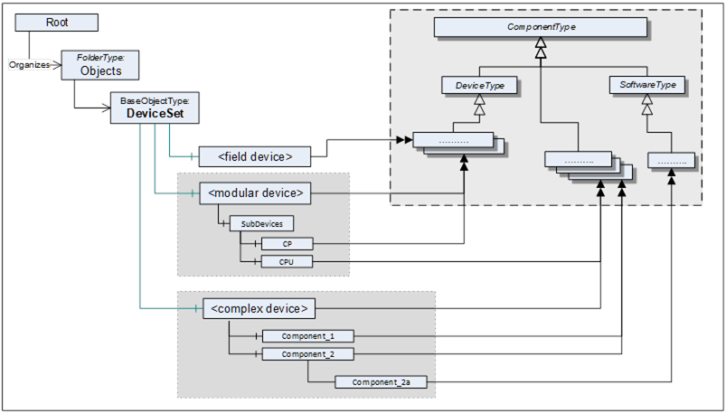  

Figure 12 - Standard entry point for Devices  

The *DeviceSet* *Node* is formally defined in [Table 37](/§\_Ref330292856) .  

Table 37 - DeviceSet definition  

| **Attribute** | **Value** |
|---|---|
|BrowseName|1:DeviceSet|
  
| **References** | **NodeClass** | **BrowseName** | **TypeDefinition** |
|---|---|---|---|
|OrganizedBy by the 0:Objects Folder defined in [OPC 10000-5](/§UAPart5)|
|0:HasTypeDefinition|ObjectType|0:BaseObjectType||
  
| **Conformance Units** |
|---|
|DI DeviceSet|
  

  

### 4.10 DeviceFeatures entry point  

The *DeviceFeatures Object* can be used to organize other functional entities that are related to the *Devices* referenced by the *DeviceSet* . Companion specifications can standardize such instances and their *BrowseNames* . [Figure 13](/§\_Ref4922066) shows the *AddressSpace* organisation with this standard entry point.  

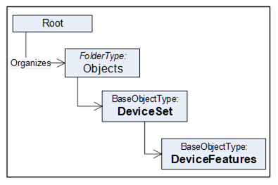  

Figure 13 - Standard entry point for DeviceFeatures  

The *DeviceFeatures* *Node* is formally defined in [Table 38](/§\_Ref533501829) .  

Table 38 - DeviceFeatures definition  

| **Attribute** | **Value** |
|---|---|
|BrowseName|1:DeviceFeatures|
  
| **References** | **NodeClass** | **BrowseName** | **TypeDefinition** |
|---|---|---|---|
|OrganizedBy by the DeviceSet Object defined in [4.9](/§\_Ref533501787)|
|0:HasTypeDefinition|ObjectType|0:BaseObjectType||
  
| **Conformance Units** |
|---|
|DI DeviceSet|
  

  

### 4.11 BlockType  

This *ObjectType* defines the structure of a *Block Object* . [Figure 14](/§\_Ref152067308) depicts the *BlockType* hierarchy. It is formally defined in [Table 39](/§\_Ref140922968) .  

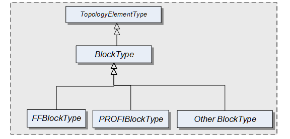  

Figure 14 - BlockType hierarchy  

FFBlockType and PROFIBlockType are examples. They are not further defined in this specification. It is expected that industry groups will standardize general purpose *BlockTypes* .  

Table 39 - BlockType definition  

| **Attribute** | **Value** |
|---|---|
|BrowseName|1:BlockType|
|IsAbstract|True|
  
| **References** | **NodeClass** | **BrowseName** | **DataType** | **TypeDefinition** | **Other** |
|---|---|---|---|---|---|
|Subtype of the *TopologyElementType* defined in [4.2](/§\_Ref212863362)|
|0:HasProperty|Variable|1:RevisionCounter|0:Int32|0:PropertyType|O|
|0:HasProperty|Variable|1:ActualMode|0:LocalizedText|0:PropertyType|O|
|0:HasProperty|Variable|1:PermittedMode|0:LocalizedText []|0:PropertyType|O|
|0:HasProperty|Variable|1:NormalMode|0:LocalizedText []|0:PropertyType|O|
|0:HasProperty|Variable|1:TargetMode|0:LocalizedText []|0:PropertyType|O|
|||||||
  
| **Conformance Units** |
|---|
|DI Blocks|
  

  

*BlockType* is a subtype of *TopologyElementType* and inherits the elements for *Parameters* , *Methods* and *FunctionalGroups* .  

The *BlockType* is abstract. There will be no instances of a *BlockType* itself, but there will be instances of subtypes of this *Type* . In this specification, the term *Block* generically refers to an instance of any subtype of the *BlockType* .  

The *RevisionCounter* is an incremental counter indicating the number of times the static data within the *Block* has been modified. A value of -1 indicates that no revision information is available.  

The following *Properties* refer to the *BlockMode* (e.g., "Manual", "Out of Service").  

The *ActualMode* *Property* reflects the current mode of operation.  

The *PermittedMode* defines the modes of operation that are allowed for the *Block* based on application requirements.  

The *NormalMode* is the mode the *Block* should be set to during normal operating conditions. Depending on the *Block* configuration, multiple modes can exist.  

The *TargetMode* indicates the mode of operation that is desired for the *Block* . Depending on the *Block* configuration, multiple modes can exist.  

### 4.12 DeviceHealth Alarm Types  

#### 4.12.1 General  

The DeviceHealth Property defined in [4.5.4](/§\_Ref534820300) provides a basic way to expose the health state of a device based on NAMUR NE 107.  

This section defines *AlarmTypes* that can be used to indicate an abnormal device condition together with diagnostic information text as defined by NAMUR NE 107 as well as additional manufacturer specific information.  

[Figure 15](/§\_Ref442735363) informally describes the *AlarmTypes* for DeviceHealth.  

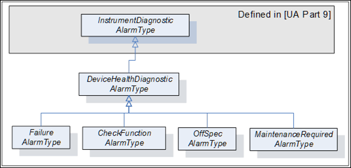  

Figure 15 - Device Health Alarm type hierarchy  

#### 4.12.2 DeviceHealthDiagnosticAlarmType  

The *DeviceHealthDiagnosticAlarmType* is a specialization of the *InstrumentDiagnosticAlarmType* intended to represent abnormal device conditions as defined by NAMUR NE 107. This type can be used in filters for monitored items. Only subtypes of this type will be used in actual implementations. The *Alarm* becomes active when the device condition is abnormal. It is formally defined in [Table 40](/§\_Ref534781606) .  

Table 40 - DeviceHealthDiagnosticAlarmType definition  

| **Attribute** | **Value** |
|---|---|
|BrowseName|1:DeviceHealthDiagnosticAlarmType|
|IsAbstract|True|
  
| **References** | **NodeClass** | **BrowseName** | **DataType** | **TypeDefinition** | **ModellingRule** |
|---|---|---|---|---|---|
|Subtype of the 0:InstrumentDiagnosticAlarmType defined in [OPC 10000-9](/§UAPart9) .|
  
| **Conformance Units** |
|---|
|DI HealthDiagnosticsAlarm|
  

  

*Conditions* of subtypes of *DeviceHealthDiagnosticAlarmType* become active when the device enters the corresponding abnormal state.  

The *Message* field in the *Event* notification shall be used for additional information associated with the health status (e.g. the possible cause of the abnormal state and suggested actions to return to normal).  

A Device can be in more than one abnormal state at a time in which case multiple *Conditions* will be active.  

#### 4.12.3 FailureAlarmType  

The *FailureAlarmType* is formally defined in [Table 41](/§\_Ref534781275) . For description of the FAILURE state see [Table 22](/§\_Ref526934854) .  

Table 41 - FailureAlarmType definition  

| **Attribute** | **Value** |
|---|---|
|BrowseName|1:FailureAlarmType|
|IsAbstract|False|
  
| **References** | **NodeClass** | **BrowseName** | **DataType** | **TypeDefinition** | **Other** |
|---|---|---|---|---|---|
|Subtype of the 1:DeviceHealthDiagnosticAlarmType defined in [4.12.2](/§\_Ref534820732) .|
|||||
  
| **Conformance Units** |
|---|
|DI HealthDiagnosticsAlarm|
  

  

#### 4.12.4 CheckFunctionAlarmType  

The *CheckFunctionAlarmType* is formally defined in [Table 42](/§\_Ref534781289) . For description of the CHECK\_FUNCTION state see [Table 22](/§\_Ref526934854) .  

Table 42 - CheckFunctionAlarmType definition  

| **Attribute** | **Value** |
|---|---|
|BrowseName|1:CheckFunctionAlarmType|
|IsAbstract|False|
  
| **References** | **NodeClass** | **BrowseName** | **DataType** | **TypeDefinition** | **Other** |
|---|---|---|---|---|---|
|Subtype of the 1:DeviceHealthDiagnosticAlarmType defined in [4.12.2](/§\_Ref534820732) .|
|||||
  
| **Conformance Units** |
|---|
|DI HealthDiagnosticsAlarm|
  

  

#### 4.12.5 OffSpecAlarmType  

The *OffSpecAlarmType* is formally defined in [Table 43](/§\_Ref534781304) . For description of the OFF\_SPEC state see [Table 22](/§\_Ref526934854) .  

Table 43 - OffSpecAlarmType definition  

| **Attribute** | **Value** |
|---|---|
|BrowseName|1:OffSpecAlarmType|
|IsAbstract|False|
  
| **References** | **NodeClass** | **BrowseName** | **DataType** | **TypeDefinition** | **Other** |
|---|---|---|---|---|---|
|Subtype of the 1:DeviceHealthDiagnosticAlarmType defined in [4.12.2](/§\_Ref534820732) .|
|||||
  
| **Conformance Units** |
|---|
|DI HealthDiagnosticsAlarm|
  

  

#### 4.12.6 MaintenanceRequiredAlarmType  

The *MaintenanceRequiredAlarmType* is formally defined in [Table 44](/§\_Ref534781317) . For description of the MAINTENANCE\_REQUIRED state see [Table 22](/§\_Ref526934854) .  

Table 44 - MaintenanceRequiredAlarmType definition  

| **Attribute** | **Value** |
|---|---|
|BrowseName|1:MaintenanceRequiredAlarmType|
|IsAbstract|False|
  
| **References** | **NodeClass** | **BrowseName** | **DataType** | **TypeDefinition** | **Other** |
|---|---|---|---|---|---|
|Subtype of the 1:DeviceHealthDiagnosticAlarmType defined in [4.12.2](/§\_Ref534820732) .|
|||||
  
| **Conformance Units** |
|---|
|DI HealthDiagnosticsAlarm|
  

  

## 5 Device communication model  

### 5.1 General  

Clause [5](/§\_Ref466890813) introduces *References* , the *ProtocolType* , and basic *TopologyElementTypes* for creating a communication topology. The types for this model are illustrated in [Figure 16](/§\_Ref531016175) .  

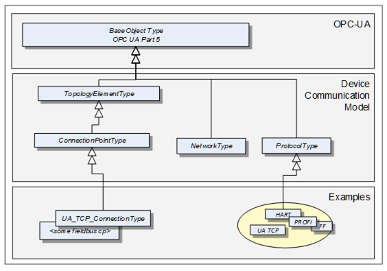  

Figure 16 - Device communication model overview  

A *ProtocolType ObjectType* represents a specific communication ** protocol (e.g., *FieldBus* ) implemented by a certain *TopologyElement* . Examples are shown in [Figure 18](/§\_Ref212863550) .  

The *ConnectionPointType* represents the logical interface of a *Device* to a *Network* .  

A *Network* is the logical representation of wired and wireless technologies.  

[Figure 17](/§\_Ref227736561) provides an overall example.  

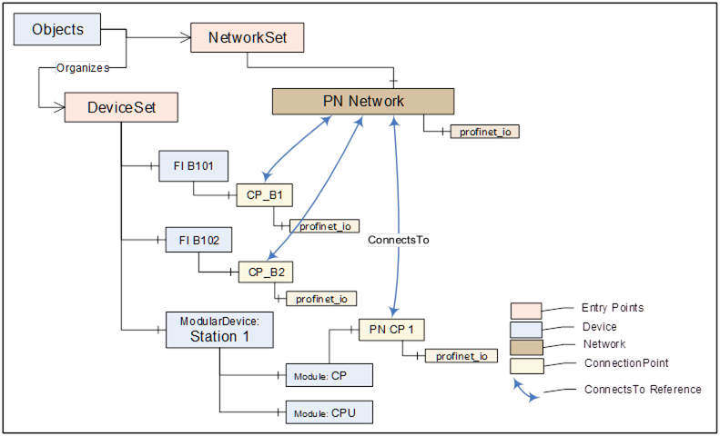  

Figure 17 - Example of a communication topology  

### 5.2 ProtocolType  

The *ProtocolType ObjectType* and its subtypes are used to specify a specific communication (e.g., *FieldBus* ) protocol that is supported by a *Device* (respectively by its *ConnectionPoint* ) or *Network* . The *BrowseName* of each instance of a *ProtocolType* shall define the *Communication Profile* (see [Figure 18](/§\_Ref212863550) ).  

[Figure 18](/§\_Ref212863550) shows the *ProtocolType* including some specific types and instances that represent *Communication Profiles* of that type. It is formally defined in [Table 45](/§\_Ref212863602) .  

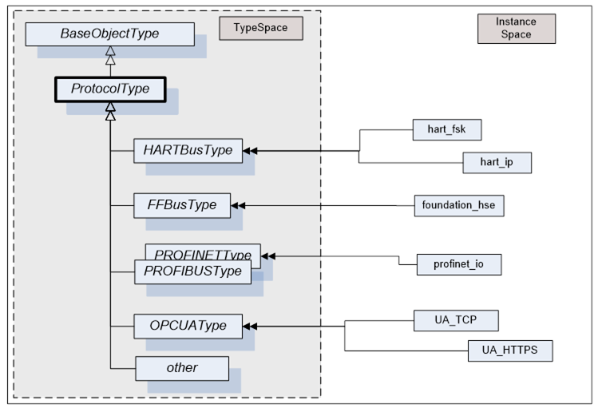  

Figure 18 - Example of a ProtocolType hierarchy with instancesthat represent specific communication profiles  

  

  

Table 45 - ProtocolType definition  

| **Attribute** | **Value** |
|---|---|
|BrowseName|1:ProtocolType|
|IsAbstract|False|
  
| **References** | **NodeClass** | **BrowseName** | **DataType** | **TypeDefinition** | **Other** |
|---|---|---|---|---|---|
|Subtype of the 0:BaseObjectType defined in [OPC 10000-5](/§UAPart5)|
|||||||
  
| **Conformance Units** |
|---|
|DI Network|
|DI Protocol|
  

  

### 5.3 Network  

A *Network* is the logical representation of wired and wireless technologies and represents the communication means for *Devices* that are connected to it. A *Network* instance is qualified by its *Communication Profile* components.  

[Figure 19](/§\_Ref214180484) shows the type hierarchy and the *NetworkType* components. It is formally defined in [Table 46](/§\_Ref214180519) .  

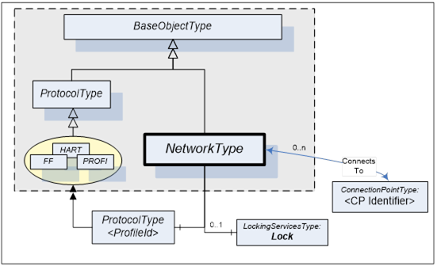  

Figure 19 - NetworkType  

Table 46 - NetworkType definition  

| **Attribute** | **Value** |
|---|---|
|BrowseName|1:NetworkType|
|IsAbstract|False|
  
| **References** | **NodeClass** | **BrowseName** | **DataType** | **TypeDefinition** | **Other** |
|---|---|---|---|---|---|
|Subtype of the 0:BaseObjectType defined in [OPC 10000-5](/§UAPart5) .|
|0:HasComponent|Object|1:\<ProfileIdentifier\>||1:ProtocolType|MP|
|ConnectsTo|Object|1:\<CPIdentifier\>||1:ConnectionPointType|OP|
|0:HasComponent|Object|1:Lock||1:LockingServicesType|O|
  
| **Conformance Units** |
|---|
|DI Network|
  

  

The \<ProfileIdentifier\> specifies the *Protocol* and *Communication Profile* that this *Network* is used for.  

\<CPIdentifier\> (referenced by a *ConnectsTo* *Reference* ) references the *ConnectionPoint* (s) that have been configured for this *Network* . All *ConnectionPoints* shall adhere to the same *Protocol* as the *Network* . See also [Figure 22](/§\_Ref221032402) for a usage example. They represent the protocol-specific access points for the connected *Devices* .  

In addition, *Networks* can also support *LockingServices* (defined in [7](/§\_Ref57796058) ).  

*Clients* shall use the *LockingServices* if they possibly make a set of changes (for example, several *Write* operations and *Method* invocations) and where a consistent state is available only after all of these changes have been performed. The main purpose of locking a *Network* is avoiding concurrent topology changes.  

The lock on a *Network* applies to the *Network* , all connected *TopologyElements* and their components. If any of the connected *TopologyElements* provides access to a sub-ordinate *Network* (like a gateway), the sub-ordinate *Network* and its connected *TopologyElements* are locked as well.  

If *InitLock* is requested for a *Network* , it will be rejected if any of the *Devices* connected to this *Network* or any sub-ordinate *Network* including their connected *Devices* is already locked.  

If the Online/Offline model is supported (see [6.3](/§\_Ref518910651) ), the lock always applies to both the online and the offline version.  

### 5.4 ConnectionPoint  

This *ObjectType* represents the logical interface of a *Device* to a *Network* . A specific subtype shall be defined for each protocol. [Figure 20](/§\_Ref522366051) shows the *ConnectionPointType* including some specific types.  

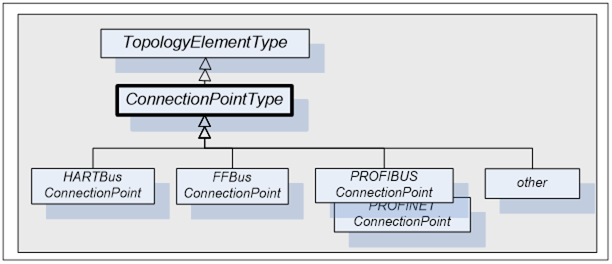  

Figure 20 - Example of ConnectionPointType hierarchy  

A *Device* can have more than one such interface to the same or to different *Networks* . Different interfaces usually exist for different protocols. [Figure 21](/§\_Ref214193216) shows the *ConnectionPointType* components. It is formally defined in [Table 47](/§\_Ref214193245) .  

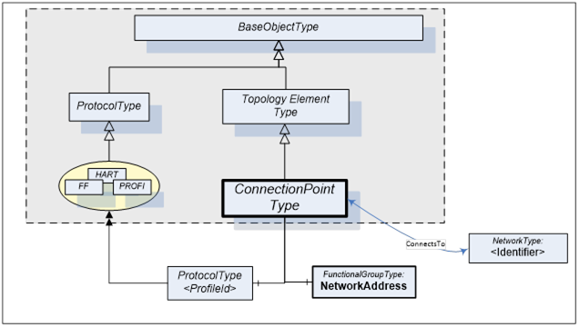  

Figure 21 - ConnectionPointType  

Table 47 - ConnectionPointType definition  

| **Attribute** | **Value** |
|---|---|
|BrowseName|1:ConnectionPointType|
|IsAbstract|True|
  
| **References** | **NodeClass** | **BrowseName** | **DataType** | **TypeDefinition** | **Other** |
|---|---|---|---|---|---|
|Subtype of the TopologyElementType defined in [4.2](/§\_Ref212863362) .|
|0:HasComponent|Object|1:NetworkAddress||1:FunctionalGroupType|M|
|0:HasComponent|Object|1:\<ProfileIdentifier\>||1:ProtocolType|MP|
|ConnectsTo|Object|1:\<NetworkIdentifier\>||1:NetworkType|OP|
  
| **Conformance Units** |
|---|
|DI ConnectionPoint|
  

  

*ConnectionPoints* are components of a *Device* , represented by a subtype of *ComponentType* . To allow navigation from a *Network* to the connected *Devices* , the *ConnectionPoints* shall have the inverse *Reference (ComponentOf)* to the *Device* .  

*ConnectionPoints* have *Properties* and other components that they inherit from the *TopologyElementType* .  

The *NetworkAddress* *FunctionalGroup* includes all *Parameters* to specify the protocol-specific address information of the connected *Device* . These *Parameters* can be components of the *NetworkAddress* *FunctionalGroup* , of the *ParameterSet* , or another *Object* .  

\<ProfileIdentifier\> identifies the *Communication Profile* that this *ConnectionPoint* supports. *ProtocolType* and *Communication Profile* are defined in [5.2](/§\_Ref531014652) . It implies that this *ConnectionPoint* can be used to connect *Networks* and *Devices* of the same *Communication Profile* .  

*ConnectionPoints* are between a *Network* and a *Device* . The location in the topology is configured by means of the *ConnectsTo* *ReferenceType* . [Figure 22](/§\_Ref221032402) illustrates some usage models.  

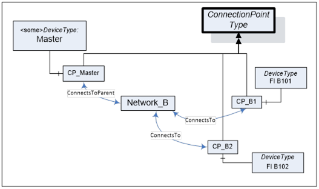  

Figure 22 - ConnectionPoint usage  

### 5.5 ConnectsTo and ConnectsToParent ReferenceTypes  

The *ConnectsTo* *ReferenceType* is a concrete *ReferenceType* used to indicate that source and target Node have a topological connection. It is *NonHierarchical* and symmetric, because this is natural for this *Reference* . The *ConnectsTo* *Reference* exists between a *Network* and the connected *Devices* (or their *ConnectionPoint* , respectively). Browsing a *Network* returns the connected *Devices* ; browsing from a *Device* , one can follow the *ConnectsTo* *Reference* from the *Device's* *ConnectionPoint* to the *Network* .  

The *ConnectsToParent* *ReferenceType* is a concrete *ReferenceType* used to define the parent (i.e. the communication *Device* ) of a *Network* . It is a subtype of the *ConnectsTo* *ReferenceType* .  

The two *ReferenceTypes* are illustrated in [Figure 23](/§\_Ref227653331) .  

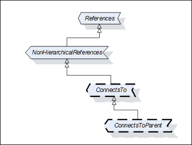  

Figure 23 - Type Hierarchy for ConnectsTo and ConnectsToParent References  

The representation in the *AddressSpace* is specified in [Table 48](/§\_Ref227653292) and [Table 49](/§\_Ref355088411) .  

Table 48 - ConnectsTo ReferenceType  

| **Attributes** | **Value** |
|---|---|
|BrowseName|1:ConnectsTo|
|Symmetric|True|
|IsAbstract|False|
  
| **References** | **NodeClass** | **BrowseName** | **Comment** |
|---|---|---|---|
|Subtype of 0:NonHierarchicalReferences ReferenceType defined in [OPC 10000-5](/§UAPart5) .|
|Conformance Units|
|DI ConnectsTo|
  

  

Table 49 - ConnectsToParent ReferenceType  

| **Attributes** | **Value** |
|---|---|
|BrowseName|1:ConnectsToParent|
|Symmetric|True|
|IsAbstract|False|
  
| **References** | **NodeClass** | **BrowseName** | **Comment** |
|---|---|---|---|
|Subtype of 1:ConnectsTo ReferenceType|
|Conformance Units|
|DI ConnectsTo|
  

  

[Figure 24](/§\_Ref227653688) illustrates how this *Reference* can be used to express topological relationships and parental relationships. In this example two *Devices* are connected; the module DPcomm is the communication *Device* for the *Network* .  

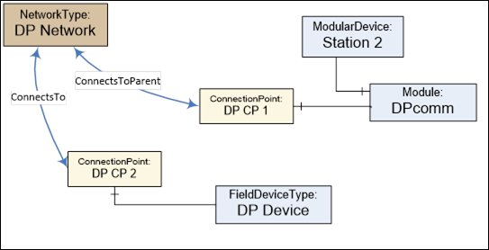  

Figure 24 - Example with ConnectsTo and ConnectsToParent References  

  

### 5.6 NetworkSet Object  

All *Networks* shall be components of the **NetworkSet** *Object* .  

The **NetworkSet** *Node* is formally defined in [Table 50](/§\_Ref330292978) .  

Table 50 - NetworkSet definition  

| **Attribute** | **Value** |
|---|---|
|BrowseName|1:NetworkSet|
  
| **References** | **NodeClass** | **BrowseName** | **TypeDefinition** |
|---|---|---|---|
|OrganizedBy by the 0:Objects Folder defined in [OPC 10000-5](/§UAPart5)|
|0:HasTypeDefinition|ObjectType|0:BaseObjectType||
  
| **Conformance Units** |
|---|
|DI NetworkSet|
  

  

## 6 Device integration host model  

### 6.1 General  

A *Device Integration Host* is a *Server* that manages integration of multiple *Devices* in an automation system and provides *Clients* with access to information about *Devices* regardless of where the information is stored, for example, in the *Device* itself or in a data store. The *Device* communication is internal to the host and can be based on field-specific protocols.  

The *Information Model* specifies the entities that can be accessed in a *Device Integration Host* . This standard does not define how these elements are instantiated. The host can use network scanning services, the OPC UA *Node Management Services* or proprietary configuration tools.  

One of the main tasks of the *Information Model* is to reflect the topology of the automation system. Therefore, it represents the *Devices* of the automation system as well as the connecting communication networks including their properties, relationships, and the operations that can be performed on them.  

[Figure 25](/§\_Ref245219238) and [Figure 26](/§\_Ref245218919) illustrate an example configuration and the configured topology as it will appear in the *Server* *AddressSpace* (details left out).  

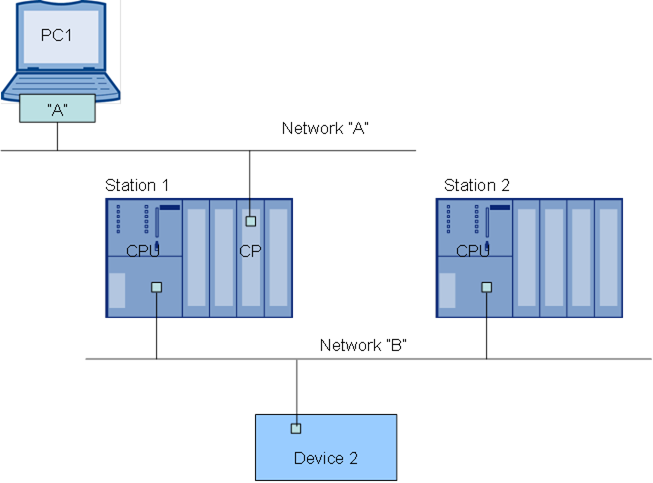  

Figure 25 - Example of an automation system  

The PC in [Figure 25](/§\_Ref245219238) represents the *Server* (the *Device Integration Host* ). The *Server* communicates with *Devices* connected to *Network* "A" via native communication, and it communicates with *Devices* connected to *Network* "B" via nested communication.  

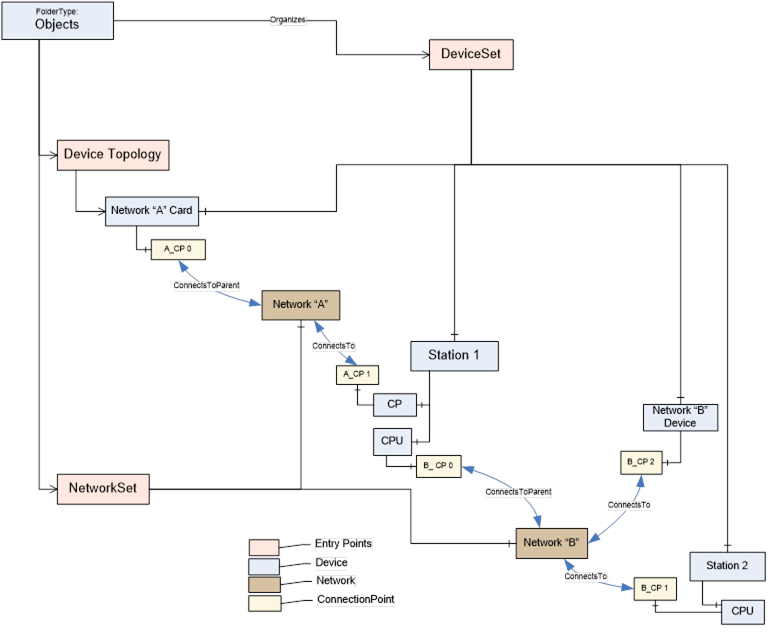  

Figure 26 - Example of a Device topology  

Coloured boxes are used to recognize the various types of information.  

Entry points assure common behavior across different implementations:  

* *DeviceTopology* : Starting node for the topology configuration. See [6.2](/§\_Ref466987383) .  

* *DeviceSet* : See [4.9](/§\_Ref330294356) .  

* *NetworkSet* : See [5.6](/§\_Ref330294377) .  

### 6.2 DeviceTopology Object  

The *Device Topology* reflects the communication topology of the *Devices* . It includes *Devices* and the Networks. The entry point **DeviceTopology** *AddressSpace* and is used to organize the communication *Devices* for the top-level *Networks* that provide access to all instances that constitute the *Device* *Topology* ((sub-)networks, devices and communication elements).  

The *DeviceTopology* node is formally defined in [Table 51](/§\_Ref330294562) .  

Table 51 - DeviceTopology definition  

| **Attribute** | **Value** |
|---|---|
|BrowseName|1:DeviceTopology|
|||
  
| **References** | **NodeClass** | **BrowseName** | **DataType** | **TypeDefinition** |
|---|---|---|---|---|
|OrganizedBy by the 0:Objects Folder defined in [OPC 10000-5](/§UAPart5)|
|0:HasTypeDefinition|ObjectType|0:BaseObjectType|Defined in [OPC 10000-5](/§UAPart5) .|
|0:HasProperty|Variable|1:OnlineAccess|0:Boolean|0:PropertyType|
  
| **Conformance Units** |
|---|
|DI DeviceTopology|
  

  

*OnlineAccess* provides a hint of whether the *Server* is currently able to communicate to *Devices* in the topology. "False" means that no communication is available.  

### 6.3 Online/Offline  

#### 6.3.1 General  

Management of the *Device Topology* is a configuration task, i.e., the elements in the topology ( *Devices* , *Networks* , and *Connection Points* ) are usually configured "offline" and - at a later time - will be validated against their physical representative in a real network.  

To support explicit access to either the online or the offline information, each element can be represented by two instances that are schematically identical, i.e., there exist component *Objects* , FunctionalGroups, and so on. A *Reference* connects online and offline representations and allows to navigate between them.  

This is illustrated in [Figure 27](/§\_Ref217805810) .  

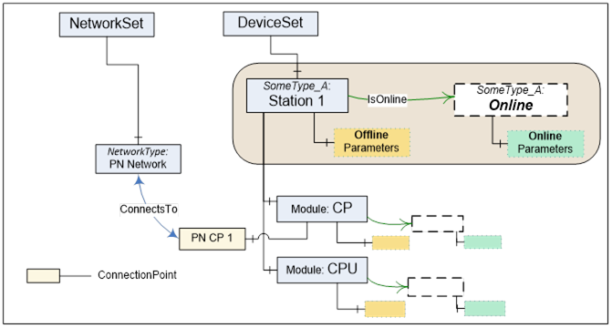  

Figure 27 - Online component for access to Device data  

If Online/Offline is supported, the main (leading) instance represents the offline information. Its *HasTypeDefinition* *Reference* points to the concrete configured or identified *ObjectType* . All *Parameters* of this instance represent offline data points and reading or writing them will typically result in configuration database access. *Properties* will also represent offline information.  

A *Device* can be engineered through the offline instance without online access.  

The online data for a topology element are kept in an associated *Object* with the *BrowseName* **Online** [Figure 27](/§\_Ref217805810) . The **Online** *Object* is referenced via an *IsOnline* *Reference* . It is always of the same *ObjectType* as the offline instance.  

The online *Parameter* *Nodes* reflect values in a physical element (typically a *Device* ), i.e., reading or writing to a *Parameter* value will then result in a communication request to this element. When elements are not connected, reading or writing to the online Parameter will return a proper status code (Bad\_NotConnected).  

The transfer of information ( *Parameters* ) between offline nodes and the physical device in correct order is supported through *TransferToDevice* , *TransferFromDevice* together with *FetchTransferResultData* . These *Methods* are exposed by means of an *AddIn* instance of *TransferServicesType* described in [6.4.2](/§\_Ref518910566) .  

Both offline and online are created and driven by the same *ObjectType* . According to their usability, certain components ( *Parameters* , *Methods* , and *FunctionalGroups* ) can exist only in either the online or the offline element.  

A *Parameter* in the offline *ParameterSet* and its corresponding counterpart in the online *ParameterSet* shall have the same *BrowseName* . Their *NodeIds* shall be different, though, since this is the identifier passed by the *Client* in read/write requests.  

The **Identification** *FunctionalGroup* organizes *Parameters* that help identify a topology element. *Clients* can compare the values of these *Parameters* in the online and the offline instance to detect mismatches between the configuration data and the currently connected element.  

#### 6.3.2 IsOnline ReferenceType  

The *IsOnline* *ReferenceType* is a concrete *ReferenceType* used to bind the offline representation of a *Device* to the online representation. The source and target *Node* of *References* of this type shall be an instance of the same subtype of a *ComponentType* . Each *Device* shall be the source of at most one *Reference* of type *IsOnline* .  

The *IsOnline* *ReferenceType* is illustrated in [Figure 28](/§\_Ref228590087) . Its representation in the *AddressSpace* is specified in [Table 52](/§\_Ref228590123) .  

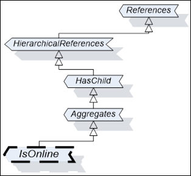  

Figure 28 - Type hierarchy for IsOnline Reference  

Table 52 - IsOnline ReferenceType  

| **Attributes** | **Value** |
|---|---|
|BrowseName|1:IsOnline|
|InverseName|OnlineOf|
|Symmetric|False|
|IsAbstract|False|
  
| **References** | **NodeClass** | **BrowseName** | **Comment** |
|---|---|---|---|
|Subtype of 0:Aggregates ReferenceType defined in [OPC 10000-5](/§UAPart5) .|
|Conformance Units|
|DI Offline|
  

  

### 6.4 Offline-Online data transfer  

#### 6.4.1 Definition  

The "Online-offline data transfer" is based on the *AddIn* model specified in [OPC 10000-3](/§UAPart3) .  

The transfer of information ( *Parameters* ) between offline nodes and the physical device is supported through OPC UA *Methods* . These *Methods* are built on device specific knowledge and functionality.  

The transfer is usually terminated if an error occurs for any of the *Parameters* . No automatic retry will be conducted by the *Server* . However, whenever possible after a failure, the *Server* should bring the *Device* back into a functional state. The *Client* has to retry by calling the transfer *Method* again.  

The transfer can involve thousands of *Parameters* so that it can take a long time (up to minutes), and with a result that can be too large for a single response. Therefore, the initiation of the transfer and the collection of result data are performed with separate *Methods* .  

The *Device* shall have been locked by the *Client* prior to invoking these *Methods* (see [7](/§\_Ref255217759) ).  

#### 6.4.2 TransferServices Type  

The *TransferServicesType* provides the *Methods* to transfer data to and from the online *Device* . [Figure 29](/§\_Ref355329697) shows the *TransferServicesType* definition. It is formally defined in [Table 53](/§\_Ref355329753) .  

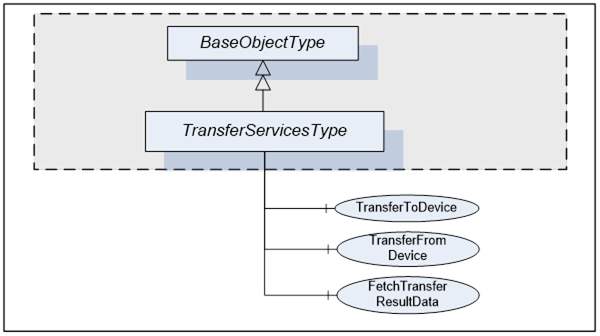  

Figure 29 - TransferServicesType  

Table 53 - TransferServicesType definition  

| **Attribute** | **Value** |
|---|---|
|BrowseName|1:TransferServicesType|
|IsAbstract|False|
  
| **References** | **NodeClass** | **BrowseName** | **DataType** | **TypeDefinition** | **Other** |
|---|---|---|---|---|---|
|Subtype of the 0:BaseObjectType defined in [OPC 10000-5](/§UAPart5)|
|0:HasComponent|Method|1:TransferToDevice|||M|
|0:HasComponent|Method|1:TransferFromDevice|||M|
|0:HasComponent|Method|1:FetchTransferResultData|||M|
  
| **Conformance Units** |
|---|
|DI Offline|
  

  

The *StatusCode* *Bad* \_ *MethodInvalid* shall be returned from the Call *Service* for *Objects* where locking is not supported. *Bad\_UserAccessDenied* shall be returned if the *Client User* does not have the permission to call the *Methods* .  

#### 6.4.3 TransferServices Object  

The support of *TransferServices* for an *Object* is declared by aggregating an instance of the *TransferServicesType* as illustrated in [Figure 30](/§\_Ref355329663) .  

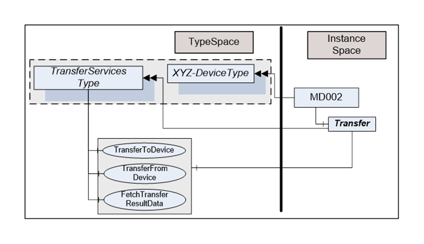  

Figure 30 - TransferServices  

This *Object* is used as container for the *TransferServices* *Methods* and shall have the *BrowseName* **Transfer** *HasComponent* is used to reference from a *Device* to its "TransferServices" *Object* .  

The *TransferServiceType* and each instance can share the same *Methods* .  

#### 6.4.4 TransferToDevice Method  

*TransferToDevice* initiates the transfer of offline configured data ( *Parameters* ) to the physical device. This *Method* has no input arguments. Which *Parameters* are transferred is based on *Server*\-internal knowledge.  

The *Server* shall ensure integrity of the data before starting the transfer. Once the transfer has been started successfully, the *Method* returns immediately with InitTransferStatus = 0. Any status information regarding the transfer itself has to be collected using the *FetchTransferResultData Method* .  

The *Server* will reset any cached value for *Nodes* in the online instance representing *Parameters* affected by the transfer. That way the cache will be re-populated from the *Device* next time they are requested.  

The signature of this *Method* is specified below. [Table 54](/§\_Ref276121038) and [Table 55](/§\_Ref260826325) specify the arguments and *AddressSpace* representation, respectively.  

 **Signature**   

TransferToDevice(  

  

[out] 0:Int32                TransferID,  

[out] 0:Int32                InitTransferStatus);  

Table 54 - TransferToDevice Method arguments  

| **Argument** | **Description** |
|---|---|
|TransferID|Transfer Identifier. This ID has to be used when calling FetchTransferResultData.|
|InitTransferStatus|Specifies if the transfer has been initiated. 0 - OK \-1 - E\_NotLocked - the Device is not locked by the calling *Client* \-2 - E\_NotOnline - the Device is not online / cannot be accessed|
  

  

Table 55 - TransferToDevice Method AddressSpace definition  

| **Attribute** | **Value** |
|---|---|
|BrowseName|1:TransferToDevice|
  
| **References** | **NodeClass** | **BrowseName** | **DataType** | **TypeDefinition** | **Other** |
|---|---|---|---|---|---|
|||||||
|0:HasProperty|Variable|0:OutputArguments|0:Argument[]|0:PropertyType|M|
  
| **Conformance Units** |
|---|
|DI Offline|
  

  

#### 6.4.5 TransferFromDevice Method  

*TransferFromDevice* initiates the transfer of values from the physical device to corresponding *Parameters* in the offline representation of the *Device* . This *Method* has no input arguments. Which *Parameters* are transferred is based on *Server*\-internal knowledge.  

Once the transfer has been started successfully, the *Method* returns immediately with InitTransferStatus = 0. Any status information regarding the transfer itself has to be collected using the *FetchTransferResultData Method* .  

The signature of this *Method* is specified below. [Table 56](/§\_Ref276121064) and [Table 57](/§\_Ref260826307) specify the arguments and *AddressSpace* representation, respectively.  

 **Signature**   

TransferFromDevice(  

  

[out] 0:Int32                TransferID,  

[out] 0:Int32                InitTransferStatus);  

Table 56 - TransferFromDevice Method arguments  

| **Argument** | **Description** |
|---|---|
|TransferID|Transfer Identifier. This ID has to be used when calling FetchTransferResultData.|
|InitTransferStatus|Specifies if the transfer has been initiated. 0 - OK \-1 - E\_NotLocked - the Device is not locked by the calling *Client* \-2 - E\_NotOnline - the Device is not online / cannot be accessed|
  

  

Table 57 - TransferFromDevice Method AddressSpace definition  

| **Attribute** | **Value** |
|---|---|
|BrowseName|1:TransferFromDevice|
  
| **References** | **NodeClass** | **BrowseName** | **DataType** | **TypeDefinition** | **Other** |
|---|---|---|---|---|---|
|||||||
|0:HasProperty|Variable|0:OutputArguments|0:Argument[]|0:PropertyType|M|
  
| **Conformance Units** |
|---|
|DI Offline|
  

  

#### 6.4.6 FetchTransferResultData Method  

The *TransferToDevice* and *TransferFromDevice* *Methods* execute asynchronously after sending a response to the *Client* . Execution status and execution results are collected during execution and can be retrieved using the *FetchTransferResultData Method* . The *TransferID* is used as identifier to retrieve the data.  

The *Client* is assumed to fetch the result data in a timely manner. However, because of the asynchronous execution and the possibility of data loss due to transmission errors to the *Client* , the *Server* shall wait some time (some minutes) before deleting data that have not been acknowledged. This should be even beyond *Session* termination, i.e., *Clients* that have to re-establish a *Session* after an error can try to retrieve missing result data.  

Result data will be deleted with each new transfer request for the same *Device* .  

*FetchTransferResultData* is used to request the execution status and a set of result data. If called before the transfer is finished it will return only partial data. The amount of data returned can be further limited if it would be too large. "Too large" in this context means that the *Server* is not able to return a larger response or that the number of results to return exceeds the maximum number of results that was specified by the *Client* when calling this *Method* .  

Each result returned to the *Client* is assigned a sequence number. The *Client* acknowledges that it received the result by passing the sequence number in the new call to this *Method* . The *Server* can delete the acknowledged result and will return the next result set with a new sequence number.  

Clients shall not call the *Method* before the previous one returned. If it returns with an error (e.g., Bad\_Timeout), the *Client* can call the *FetchTransferResultData* with a sequence number 0. In this case the Server will resend the last result set.  

The Server will return Bad\_NothingToDo in the *Method*\-specific *StatusCode* of the *Call* *Service* if the transfer is finished and no further result data are available.  

The signature of this *Method* is specified below. [Table 58](/§\_Ref332718468) and [Table 59](/§\_Ref332718483) specify the arguments and *AddressSpace* representation, respectively.  

 **Signature**   

FetchTransferResultData(  

[in]  0:Int32                 TransferID,  

[in]  0:Int32                 SequenceNumber,  

[in]  0:Int32                 MaxParameterResultsToReturn,  

[in]  Boolean               OmitGoodResults,  

[out] FetchResultType       FetchResultData);  

Table 58 - FetchTransferResultData Method arguments  

| **Argument** | **Description** |
|---|---|
|TransferID|Transfer Identifier returned from *TransferToDevice* or *TransferFromDevice* .|
|SequenceNumber|The sequence number being acknowledged. The *Server* can delete the result set with this sequence number. "0" is used in the first call after initialising a transfer and also if the previous call of *FetchTransferResultData* failed.|
|MaxParameterResultsToReturn|The number of *Parameters* in *TransferResult.ParameterDefs* that the *Client* wants the *Server* to return in the response. The *Server* is allowed to further limit the response, but shall not exceed this limit. A value of 0 indicates that the *Client* is imposing no limitation.|
|OmitGoodResults|If TRUE, the Server will omit data for Parameters which have been correctly transferred. Note that this causes all good results to be released.|
|FetchResultData|Two subtypes are possible: * TransferResultError Type is returned if the transfer failed completely * TransferResultData Type is returned if the transfer was performed. Status information is returned for each transferred *Parameter* .|
  

  

Table 59 - FetchTransferResultData Method AddressSpace definition  

| **Attribute** | **Value** |
|---|---|
|BrowseName|1:FetchTransferResultData|
  
| **References** | **NodeClass** | **BrowseName** | **DataType** | **TypeDefinition** | **Other** |
|---|---|---|---|---|---|
|0:HasProperty|Variable|0:InputArguments|0:Argument[]|0:PropertyType|M|
|0:HasProperty|Variable|0:OutputArguments|0:Argument[]|0:PropertyType|M|
  
| **Conformance Units** |
|---|
|DI Offline|
  

  

The *FetchResultDataType* is an abstract type. It is the base *DataType* for concrete result types of the *FetchTransferResultData* . Its elements are defined in [Table 60](/§\_Ref355330335) .  

Table 60 - FetchResultDataType structure  

| **Attribute** | **Value** |
|---|---|
|BrowseName|1:FetchResultDataType|
|IsAbstract|True|
|Subtype of 0:Structure defined in [OPC 10000-3](/§UAPart3)|
  
| **References** | **NodeClass** | **BrowseName** | **DataType** |
|---|---|---|---|
  
| **Conformance Units** |
|---|
|DI Offline|
  

  

The *TransferResultErrorDataType* is a subtype of the *FetchResultDataType* and represents an error result. It is defined in [Table 61](/§\_Ref361679371) .  

Table 61 - TransferResultErrorDataType structure  

| **Name** | **Type** | **Description** |
|---|---|---|
|TransferResultErrorDataType|0:Structure|This structure is returned in case of errors. No result data are returned. Further calls with the same *TransferID* are not possible.|
|status|0:Int32|\-1 - Invalid *TransferID* : The Id is unknown. Possible reason: all results have been fetched or the result can have been deleted. \-2 - Transfer aborted: The transfer operation was aborted; no results exist. \-3 - DeviceError: An error in the device or the communication to the *Device* occurred. "diagnostics" can contain device- or protocol-specific error information. \-4 - UnknownFailure: The transfer failed. "diagnostics" can contain *Device*\- or *Protocol*\-specific error information.|
|diagnostics|0:DiagnosticInfo|Diagnostic information. This parameter is empty if diagnostics information was not requested in the request header or if no diagnostic information was encountered in processing of the request. The *DiagnosticInfo* type is defined in [OPC 10000-4](/§UAPart4) .|
  

  

Its representation in the *AddressSpace* is defined in [Table 62](/§\_Ref46498488) .  

Table 62 - TransferResultErrorDataType Definition  

| **Attribute** | **Value** |
|---|---|
|BrowseName|1:TransferResultErrorDataType|
|IsAbstract|False|
  
| **References** | **NodeClass** | **BrowseName** | **DataType** | **TypeDefinition** | **Other** |
|---|---|---|---|---|---|
|Subtype of 1:FetchResultDataType.|
  
| **Conformance Units** |
|---|
|DI Offline|
  

  

The *TransferResultData* *DataType* is a subtype of the *FetchResultDataType* and includes parameter-results from the transfer operation. It is defined in [Table 63](/§\_Ref361679466) .  

Table 63 - TransferResultDataDataType structure  

| **Name** | **Type** | **Description** |
|---|---|---|
|TransferResultDataDataType|0:Structure|A set of results from the transfer operation.|
|sequenceNumber|0:Int32|The sequence number of this result set.|
|endOfResults|0:Boolean|TRUE - all result data have been fetched. Additional *FetchTransferResultData* calls with the same *TransferID* will return a FetchTransferError with status=InvalidTransferID. FALSE - further result data shall be expected.|
|parameterDefs|1:ParameterResult DataType []|Specific value for each *Parameter* that has been transferred. If OmitGoodResults is TRUE, parameterDefs will only contain *Parameters* which have not been transferred correctly.|
|NodePath|0:QualifiedName[]|List of BrowseNames that represent the relative path from the *Device* *Object* to the *Parameter* following hierarchical references. The *Client* can use these names for *TranslateBrowsePathsToNodeIds* to retrieve the *Parameter* *NodeId* for the online or the offline representation.|
|statusCode|0:StatusCode|OPC UA *StatusCode* as defined in [OPC 10000-4](/§UAPart4) and in [OPC 10000-8](/§UAPart8) .|
|diagnostics|0:DiagnosticInfo|Diagnostic information. This parameter is empty if diagnostics information was not requested in the request header or if no diagnostic information was encountered in processing of the request. The *DiagnosticInfo* type is defined in [OPC 10000-4](/§UAPart4) .|
  

  

Its representation in the *AddressSpace* is defined in [Table 64](/§\_Ref110591910) .  

Table 64 - TransferResultDataDataType definition  

| **Attribute** | **Value** |
|---|---|
|BrowseName|1:TransferResultDataDataType|
|IsAbstract|False|
  
| **References** | **NodeClass** | **BrowseName** | **DataType** | **TypeDefinition** | **Other** |
|---|---|---|---|---|---|
|Subtype of 1:FetchResultDataType.|
  
| **Conformance Units** |
|---|
|DI Offline|
  

  

  

## 7 Locking model  

### 7.1 Overview  

The following Locking feature is based on the *AddIn* model specified in [OPC 10000-3](/§UAPart3) .  

Locking is the means to avoid concurrent modifications to an *Object* by restricting access to the entity (often a *Client* but could also be an internal process) that initiated the lock. *LockingServices* are typically used to make a set of changes (for example, several *Write* operations and *Method* invocations) and where a consistent state is available only after all of these changes have been performed.  

The context of the lock is specific to the *ObjectType* where it is applied to (subsequently named "lock-owner"). These specifics are to be described as part of this lock-owner *ObjectType* . See for example the section on lock in the *TopologyElement* (clause [4.3](/§\_Ref533768581) ) and the *Network* (clause [5.3](/§\_Ref43318558) ).  

By default, a lock allows other *Applications* to view (navigate/read) the locked element. However, *Servers* can choose to implement an exclusive locking where other *Applications* have no access at all (e.g. in cases where even read operations require certain settings to Variables).  

### 7.2 LockingServices Type  

The *LockingServicesType* provides *Methods* to manage the lock and *Properties* with status information. This section describes the common semantic. The lock-owner *ObjectTypes* will often extend these semantics.  

[Figure 31](/§\_Ref249763150) shows the *LockingServicesType* definition. It is formally defined in [Table 65](/§\_Ref249763184) .  

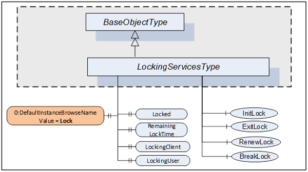  

Figure 31 - LockingServicesType  

Table 65 - LockingServicesType definition  

| **Attribute** | **Value** |
|---|---|
|BrowseName|1:LockingServicesType|
|IsAbstract|False|
  
| **References** | **NodeClass** | **BrowseName** | **DataType** | **TypeDefinition** | **Other** |
|---|---|---|---|---|---|
|Subtype of the 0:BaseObjectType defined in [OPC 10000-5](/§UAPart5) .|
|0:HasComponent|Method|1:InitLock|Defined in [7.5](/§\_Ref43376100)|M|
|0:HasComponent|Method|1:RenewLock|Defined in [7.7](/§\_Ref43376118)|M|
|0:HasComponent|Method|1:ExitLock|Defined in [7.6](/§\_Ref43376133)|M|
|0:HasComponent|Method|1:BreakLock|Defined in [7.8](/§\_Ref43376145)|M|
|0:HasProperty|Variable|0:DefaultInstanceBrowseName|0:QualifiedName|0:PropertyType||
|0:HasProperty|Variable|1:Locked|0:Boolean|0:PropertyType|M|
|0:HasProperty|Variable|1:LockingClient|0:String|0:PropertyType|M|
|0:HasProperty|Variable|1:LockingUser|0:String|0:PropertyType|M|
|0:HasProperty|Variable|1:RemainingLockTime|0:Duration|0:PropertyType|M|
  
| **Conformance Units** |
|---|
|DI Locking|
  

  

The *StatusCode* *Bad* \_ *MethodInvalid* shall be returned from the Call *Service* for *Objects* where locking is not supported. *Bad\_UserAccessDenied* shall be returned if the *Client User* does not have the permission to call the *Methods* .  

The *DefaultInstanceBrowseName* *Property*\- defined in [OPC 10000-3](/§UAPart3)\- is used to specify the recommended *BrowseName* for instances of the *LockingServicesType* . Its Value is defined in [Table 66](/§\_Ref26531010) .  

Table 66 - LockingServicesType Attribute Values for Child Nodes  

| **Source Path** | **Value** |
|---|---|
|0:DefaultInstanceBrowseName|Lock|
  

  

A lock is typically initiated by a *Client* calling the *InitLock Method* and removed by calling the *ExitLock Method* . The lock-owner *ObjectTypes* can define mechanisms that automatically initiate and remove a lock.  

A lock request will be rejected if operations are active that will be prevented by the lock.  

The lock is automatically removed if the *MaxInactiveLockTime* has elapsed (see [7.4](/§\_Ref255217721) ). The lock is also removed when the *Session* ends during inactivity. This is typically the case when the connection to the *Client* breaks and the *Session* times out.  

The following *LockingServices* *Properties* offer lock-status information.  

*Locked* when True indicates that this element has been locked by some *Application* and that no or just limited access is available for other *Applications* .  

When the lock is initiated by a *Client, LockingClient* contains the ApplicationUri of the *Client* as provided in the CreateSession *Service* call (see [OPC 10000-4](/§UAPart4) ). Other options to get this information can be specified on the lock-owner *ObjectType* .  

*LockingUser* contains information to identify the user. When the lock is initiated by a *Client* it is obtained directly or indirectly from the UserIdentityToken passed by the *Client* in the ActivateSession *Service* call (see [OPC 10000-4](/§UAPart4) ). Other options to get this information can be specified on the lock-owner *ObjectType* .  

*RemainingLockTime* denotes the remaining time in milliseconds after which the lock will automatically be removed by the *Server* . This time is based upon *MaxInactiveLockTime* (see [7.4](/§\_Ref255217721) ).  

### 7.3 LockingServices Object  

The support of *LockingServices* for an *Object* is declared by aggregating an instance of the *LockingServicesType* as illustrated in [Figure 32](/§\_Ref249763440) .  

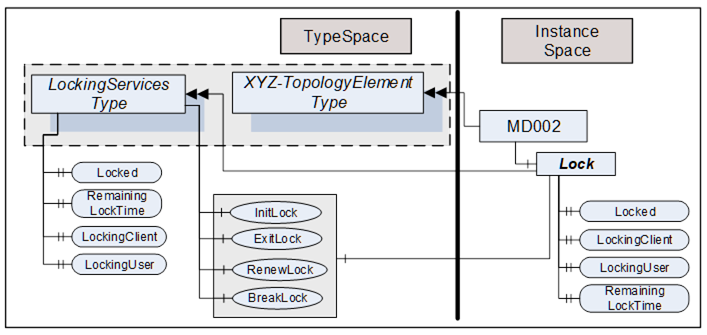  

Figure 32 - LockingServices  

This *Object* is used as container for the *LockingServices* *Methods* and *Properties* and should have the *BrowseName* **Lock** *HasComponent* or *HasAddIn* from the lock-owner *Object* (for example, a *Device* ).  

The *LockingServicesType* and each instance can share the same *Methods* . All *Properties* are distinct.  

### 7.4 MaxInactiveLockTime Property  

The *MaxInactiveLockTime* *Property* shall be added to the *ServerCapabilities* *Object* (see [OPC 10000-5](/§UAPart5) ). It contains a *Server*\-specific period of inactivity in milliseconds after which the *Server* will revoke the lock.  

The *Server* will initiate a timer based on this time as part of processing the *InitLock* request and after the last activity caused by the initiator of the lock is finished. Calling the *RenewLock* *Method* shall reset the timer.  

Inactivity for *MaxInactiveLockTime* will trigger a timeout. As a result, the *Server* will release the lock.  

The *MaxInactiveLockTime* *Property* is formally defined in [Table 67](/§\_Ref249773958) .  

Table 67 - MaxInactiveLockTime Property definition  

| **References** | **NodeClass** | **BrowseName** | **DataType** | **TypeDefinition** | **Other** |
|---|---|---|---|---|---|
|0:HasProperty|Variable|1:MaxInactiveLockTime|0:Duration|0:PropertyType|M|
  

  

### 7.5 InitLock Method  

*InitLock* restricts access for other UA *Applications* .  

A call of this *Method* for an element that is already locked will be rejected.  

While locked, requests from other *Applications* to modify the locked element (e.g., writing to *Variables* , or invoking *Methods* ) should be rejected with Bad\_Locked. However, requests to read or navigate will typically work. *Servers* can choose to implement an exclusive locking where other *Applications* have no access at all.  

The lock is removed when *ExitLock* is called. It is automatically removed when the *MaxInactiveLockTime* elapsed (see [7.4](/§\_Ref255217721) ).  

The signature of this *Method* is specified below. [Table 68](/§\_Ref276122156) and [Table 69](/§\_Ref276122162) specify the arguments and *AddressSpace* representation, respectively.  

 **Signature**   

InitLock(  

[in]  0:String       Context,  

[out] 0:Int32        InitLockStatus);  

Table 68 - InitLock Method Arguments  

| **Argument** | **Description** |
|---|---|
|Context|A string used to provide context information about the current activity going on in the *Client* .|
|InitLockStatus|0 - OK \-1 - E\_AlreadyLocked - the element is already locked \-2 - E\_Invalid - the element cannot be locked|
  

  

Table 69 - InitLock Method AddressSpace definition  

| **Attribute** | **Value** |
|---|---|
|BrowseName|1:InitLock|
  
| **References** | **NodeClass** | **BrowseName** | **DataType** | **TypeDefinition** | **Other** |
|---|---|---|---|---|---|
|0:HasProperty|Variable|0:InputArguments|0:Argument[]|0:PropertyType|M|
|0:HasProperty|Variable|0:OutputArguments|0:Argument[]|0:PropertyType|M|
  
| **Conformance Units** |
|---|
|DI Locking|
  

  

### 7.6 ExitLock Method  

*ExitLock* removes the lock. This *Method* can only be called from the same *Application* which initiated the lock.  

The signature of this *Method* is specified below. [Table 70](/§\_Ref276122241) and [Table 71](/§\_Ref249771787) specify the arguments and *AddressSpace* representation, respectively.  

 **Signature**   

ExitLock(  

[out] 0:Int32       ExitLockStatus);  

Table 70 - ExitLock Method Arguments  

| **Argument** | **Description** |
|---|---|
|ExitLockStatus|0 - OK \-1 - E\_NotLocked - the Object is not locked|
  

  

Table 71 - ExitLock Method AddressSpace definition  

| **Attribute** | **Value** |
|---|---|
|BrowseName|1:ExitLock|
  
| **References** | **NodeClass** | **BrowseName** | **DataType** | **TypeDefinition** | **Other** |
|---|---|---|---|---|---|
|0:HasProperty|Variable|0:OutputArguments|0:Argument[]|0:PropertyType|M|
  
| **Conformance Units** |
|---|
|DI Locking|
  

  

### 7.7 RenewLock Method  

The lock timer is automatically renewed whenever the initiator of the lock issues a request for the locked element or while *Nodes* of the locked element are subscribed to. *RenewLock* is used to reset the lock timer to the value of the *MaxInactiveLockTime* *Property* and prevent the *Server* from automatically removing the lock. This *Method* can only be called from the same *Application* which initiated the lock.  

The signature of this Method is specified below. [Table 72](/§\_Ref276122291) and [Table 73](/§\_Ref255815682) specify the arguments and *AddressSpace* representation, respectively.  

 **Signature**   

 **RenewLock**   

[out] 0:Int32      RenewLockStatus);  

Table 72 - RenewLock Method Arguments  

| **Argument** | **Description** |
|---|---|
|RenewLockStatus|0 - OK \-1 - E\_NotLocked - the Object is not locked|
  

  

Table 73 - RenewLock Method AddressSpace definition  

| **Attribute** | **Value** |
|---|---|
|BrowseName|1:RenewLock|
  
| **References** | **NodeClass** | **BrowseName** | **DataType** | **TypeDefinition** | **Other** |
|---|---|---|---|---|---|
|0:HasProperty|Variable|0:OutputArguments|0:Argument[]|0:PropertyType|M|
  
| **Conformance Units** |
|---|
|DI Locking|
  

  

### 7.8 BreakLock Method  

*BreakLock* allows a *Client* (with sufficiently high user rights) to break the lock. This *Method* will typically be available only to users with administrator privileges. *BreakLock* should be used with care as the locked element can be in an inconsistent state.  

The signature of this *Method* is specified below. [Table 74](/§\_Ref276122352) and [Table 75](/§\_Ref255815778) specify the arguments and *AddressSpace* representation, respectively.  

 **Signature**   

BreakLock(  

[out] 0:Int32      BreakLockStatus);  

Table 74 - BreakLock Method Arguments  

| **Argument** | **Description** |
|---|---|
|BreakLockStatus|0 - OK \-1 - E\_NotLocked - the Object is not locked|
  

  

Table 75 - BreakLock Method AddressSpace definition  

| **Attribute** | **Value** |
|---|---|
|BrowseName|1:BreakLock|
  
| **References** | **NodeClass** | **BrowseName** | **DataType** | **TypeDefinition** | **Other** |
|---|---|---|---|---|---|
|0:HasProperty|Variable|0:OutputArguments|0:Argument[]|0:PropertyType|M|
  
| **Conformance Units** |
|---|
|DI Locking|
  

  

  

## 8 Software update model  

### 8.1 Overview  

The software update model defined in this clause is used to manage the software of a *Device* . This can include the installation of new software, the update of existing software, the update of a firmware and a limited backup and restore of parameters and firmware as far as it is required for the update. The specific steps to perform the actual installation are only known by the device. They are not exposed by this *Information Model* .  

The use cases that were considered for this *Information Model* are described in [8.2](/§\_Ref25567901) . Several options that can be combined for a concrete *SoftwareUpdateType* instance are described in [8.3](/§\_Ref39752635) . Valid combinations of these options are defined in the profiles section. [8.3.5](/§\_Ref46155410) describes how to implement a *Software Update* *Client* that has to deal with several options. The types for this model are formally defined in [8.4](/§\_Ref25568233) and [8.4.12](/§\_Ref25569436) .  

### 8.2 Use Cases  

#### 8.2.1 General  

The software update ** model is used in several scenarios. The following subsections list common use cases that are considered by this model. There are also some use cases that that are not covered. A future version could possibly add features for them.  

#### 8.2.2 Supported Use Cases  

##### 8.2.2.1 Software Update of constrained devices  

The model is intended to be applicable across devices with varying resources and constraints. This is achieved e.g. by various options for the server implementation (see [8.3.4](/§\_Ref56439966) ).  

##### 8.2.2.2 Update Devices from different manufacturers with a Software Update Client  

Allow devices to be updated via *Software Update* *Client* software. To address the domain specific constraints this can be a domain-specific client software. (In the manufacturing domain a machine often necessitates to be stopped before the update, whereas in process domain e.g., a redundant device will be activated.) [8.3.5](/§\_Ref46155410) describes the workflow of a *Software Update Client* .  

##### 8.2.2.3 Update of underlying Devices (e.g., IO Link Devices)  

Software update is applicable for any device or software component that is exposed in the *Server AddressSpace* . This can also represent other devices that are just connected to the device hosting the *Server* . This can be done using the *AddIns* described in [8.3.11](/§\_Ref47338574) .  

##### 8.2.2.4 Coordinated update of multiple Devices in a machine / plant  

When updating several connected devices in a machine or plant the devices possibly are first set into a special "state" where they wait for the start of the update and don't start operating again. After that the updates can be installed in an order defined by the *Client* (e.g., sensors first, switches last). Finding the best sequence is task of the client implementation or the operator and not in scope of this specification.  

The "state" is defined depending on the type of machine / plant. For factory automation this normally means that production and the software on the devices is stopped. For a sensor in process automation this could mean that a replacement value is configured in the controller for the value measured in the device. If a controller requires an update in process automation it often is the passive part of a redundant set of controllers.  

It is also necessary that the *Client* considers the proper sequence when updating the devices. For example, if parts of the network become unreachable due to the update of an infrastructure device.  

A server can support the prepare for update option ( [8.3.4.2](/§\_Ref56439131) ) to enable this use case.  

##### 8.2.2.5 Partial update without stopping the software  

For some updates it is not necessary to stop the software. This could be the case if parts of a software are replaced that are currently not used or if new software is installed. Whether an update can be installed like this is only known by the device and depends on the concrete update file. To support this, the *Client* can read the *UpdateBehavior* ( [8.5.2](/§\_Ref56440380) ) to determine if stopping is required.  

##### 8.2.2.6 Scheduled update  

In some cases, it is required to prepare the update and then plan the start for a later time or under some strategic conditions. In this case the software is transferred to the device first. Later (e.g., at the end of the shift or on the weekend) and under specific conditions (e.g. nothing to produce) the update *Client* can start the update. In this scenario the time and the conditions are known and checked by the update *Client* , not by the *Server* , so for the use of the software update options an established *Client-Server* connection is required. The scheduling is a task of the *Client* and not described in this specification.  

##### 8.2.2.7 Central distribution for later installation  

It should be possible to distribute the software to several devices without actual installation. In this scenario a central tool can determine the required updates and distribute them to all devices. The actual installation can then be started later by a different *Client* . This is realized by separating the transfer ( [8.4.1.2](/§\_Ref46143786) ) from the installation ( [8.3.4.6](/§\_Ref56439177) ).  

##### 8.2.2.8 Update of individual parts of a software  

Depending on the device there should be several options to partition a software. For example, it should be possible to structure the firmware of a device in a way that each part can be updated individually. Additionally, software update should be applicable to the firmware of devices and to the software of components. This is realized with the *AddIn* model ( [8.3.11](/§\_Ref47338574) ).  

If a *Software Package* becomes very large and only parts of it can  be replaced, the *Server* maintains the individual files of the *Software Package* independently. When all desired files are on the *Server* , the installation can be started for the set of files. Here the *FileSystem* option ( [8.3.4.5](/§\_Ref56436094) ) can be used.  

##### 8.2.2.9 Reliable update of Devices that are out of reach  

Especially for devices that are not easy to access for a manual reset or replacement, the update shall always result in a working OPC UA *Client*\- *Server* connection. This requires an additional confirmation by the update *Client,* so that the *Server* can do an automatic rollback if the communication cannot be established again after a reboot. A Server can support this with the confirmation option ( [8.3.4.9](/§\_Ref56439285) ).  

##### 8.2.2.10 Backup and restore parameters that are lost during the update  

Very constrained devices can lose parameters during the update. It is necessary that the update *Client* is aware of that and should be able to backup the parameters in advance. After the update - but before the device starts operating again - the parameters shall be restored. This can be supported using the Parameters object ( [8.3.4.8](/§\_Ref56441088) ).  

##### 8.2.2.11 Selecting the correct version to install  

An update client selects the correct version of the *Software Package* to install. The rules behind this decision can be complex and can include e.g., dependency checks or a release process of the distributor and / or operator of the machine. The *Server* can expose information about the device ( [8.3.11](/§\_Ref47338574) ) and information about the *Current Version* ( [8.4.3.2](/§\_Ref56441422) ) which is then used by the *Client* to select an update.  

Selecting the new version is done by the user with the help of the update client before transfer and installation. Therefore, it is not in scope of this specification.  

##### 8.2.2.12 Installation of additional software  

Some devices can run several software applications. The *Information Model* should allow the *Client* to transfer and install additional software applications if the *Server* supports this. This can be done using the *FileSystem based Loading* ( [8.3.4.5](/§\_Ref56436094) ) or the *SoftwareFolderType* ( [8.4.12](/§\_Ref194931350) ).  

##### 8.2.2.13 Pack software for distribution  

An *Update Client* imports a software along with all metadata and all supporting files. These files can come from different vendors for different devices. For easier transport and handling, a single standardized container file is required.  

##### 8.2.2.14 Standard package format for transfer to the device  

The *Software Update AddIn* supports atomic transfer of a single file to the server. To keep the metadata together with the transferred file a standard container file format is required.Additionally, a server possibly wants to store multiple files (to prevent nesting ZIP in ZIP).  

##### 8.2.2.15 Standard package format for transfer from the device (prototype / backup)  

If a working device is used as the prototype for other devices the *Software Package* of an application or configuration can be uploaded. Therefore, an embedded device should be able to create a *Software Package* and upload it using the *SoftwareUpdate AddIn* . This package can also be used for backup.  

##### 8.2.2.16 Select Software Packages for the SoftwareUpdate AddIn on the device  

An *Update Client* identifies *Software Packages* that are installable to a *SoftwareUpdate AddIn* found on the server. For example, getting suitable firmware packages from a repository for a device, which is  identified by *ManufacturerUri* and *ProductCode* .  

##### 8.2.2.17 Check package compatibility before transfer  

An *Update Client* checks the compatibility before transfer anything to a device. This includes selecting the proper version as a valid update.  

##### 8.2.2.18 Validate dependencies to hardware, firmware, other software  

An *Update Client* ensures that all dependent hardware / firmware / software components have suitable versions.  

##### 8.2.2.19 Support supplementary files in a Software Package  

An *Update Client* presents additional files to the user. This can include release notes, license information, manuals.  

##### 8.2.2.20 Prove integrity and authenticity of a Software Package  

An *Update Client* verifies the integrity and authenticity of the files within the *Software Package* .  

##### 8.2.2.21 Support approval by plant operator  

In some plants it is required that only those *Software Packages* can be installed onto the devices that are tested and approved for use in that plant. In that cases the devices is configured to only accept *Software Packages* with a specific approval signature.  

##### 8.2.2.22 Combine Software Packages for a solution  

At system design a combination of several devices or several software instances on a single device or machine or UA Server is defined and released. Example: modular devices like PLC, IO Island or Machine. For that case it shall be possible to sign this combination and transfer all related files in a single container. A target shall be configurable to only accept such combinations with a specific valid signature.  

#### 8.2.3 Unsupported Use Cases  

##### 8.2.3.1 Finding devices that provide the SoftwareUpdate AddIn within a Server  

If an OPC UA *Server* abstracts several devices that support the *SoftwareUpdate* *AddIn* , the *Information Model* shall provide a defined entry point to find all these devices in an efficient manner.  

This Use Case is expected to be addressed in other working groups or in a future version of this specification.  

A possible solution would be to create a SWUpdate *FolderType* below *DeviceFeatures* as it is described in the DI specification. This folder could reference all *SoftwareUpdate* *AddIns* .  

##### 8.2.3.2 Explicit Restarting the device  

In most update scenarios the device can restart automatically during or after the installation. However, there can be situations where it is required to explicitly restart the device by the *Client* .  

This use case is not supported by the current version of this specification. Since this feature can be useful outside of software update it should be realized somewhere outside this specification.  

##### 8.2.3.3 Pulling software from an external source  

Sometimes it is desirable to store all files required for software update at a central place and have the devices get the files on their own time and pace. In this case the *Client* would tell the *Server* only the location of the file. Then the actual transfer is initiated by the device.  

There is no specific support for this use case in this specification. However, it is possible to use the described mechanisms to transfer a file that does not contain the actual software but the location of the external source(s) where the software file(s) should be pulled from.  

### 8.3 General  

#### 8.3.1 System perspective  

Besides specific *Clients* for specific devices, this specification also describes *Software Update* *Clients* that can update devices of various vendors (for additional details see [8.3.5](/§\_Ref46155410) ).  

For *Devices* in operational use, it is often necessary to consider the operation state of the software / machine / plant before performing the update (e.g. stop and start the operation). For this case a specialized *Client* can use additional domain-specific *Information Models* as part of the update process.  

An update can be performed manually by a user for a single device. However, if a lot of devices are maintained on a regular basis an automatic update is desirable. For this scenario the *Information Model* also allows the transfer of software to the devices without starting the update process. For the installation a *Client* could control several devices simultaneously.  

#### 8.3.2 Types of software  

This common model can describe several types of software that could necessitate to be updated or installed. This can be the firmware or operating system of a device but also be one or more software applications that require an update. Configuration can be maintained as software as well. Besides the update, it is also desired to install additional software. The *Server* can expose all software as a single component or separate it into several smaller components as it is illustrated in [Figure 33](/§\_Ref25768951) .  

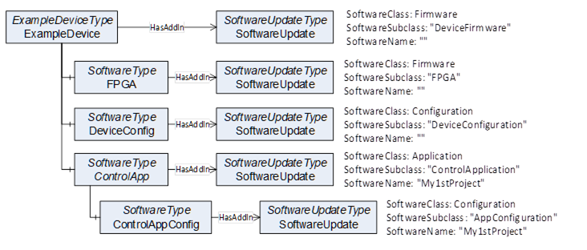  

Figure 33 - Example with a device and several software components  

  

For precise identification of a specific software instance, the *SoftwareUpdateType* can support additional *Properties* : The *SoftwareClass* can be used to distinguish an application from a configuration or firmware. This can be further specialized by the *SoftwareSubclass Property* for example to identify the type of an application. Finally, the *Property SoftwareName* can be used to distinguish multiple instances of an application as illustrated in [Figure 33](/§\_Ref25768951) and [Figure 34](/§\_Ref140844674) .  

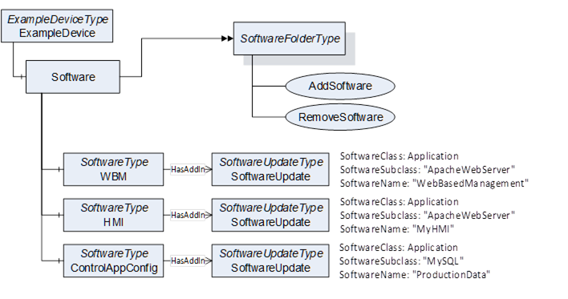  

 **Figure 34\- Example with flexible software components**   

  

#### 8.3.3 Types of Devices  

Devices can have different requirements regarding a firmware update, depending on their type and available resource (e.g., memory).  

Memory-constrained devices like sensors often cannot store an additional firmware. These devices install the new firmware while it is transferred to the device. In this specification this is called *Direct-Loading* (see [8.3.4.3](/§\_Ref56436005) ).  

Devices with more memory can store a new firmware in a separate memory without installing it which is referred as *Cached-Loading* in this specification (see [8.3.4.4](/§\_Ref56436028) ). In this case the installation is separated from the file transfer and can be done later or with a different *Client* .  

Some devices have two memory partitions for the operating system. One active partition that is used in the boot process and a second alternative fallback partition. These devices install the firmware into the fallback partition and then perform a restart after swapping the active partition. This has an advantage if the device detects an issue with the new firmware: The change can easily be reverted to the old version by switching the partitions again (with another reboot).  

Constrained devices like sensors typically do not support a real file system. Devices with more memory often have a file system which can be used to store files like firmware, parameters and backups. This *Information Model* provides update mechanisms for both types of devices (see [8.3.4.5](/§\_Ref56436094) for *FileSystem based Loading* ).  

#### 8.3.4 Options for the Server  

##### 8.3.4.1 Overview  

Updating software or firmware of a machine or plant is a complex task and different devices have different requirements to the update or installation of software. To support this, the *SoftwareUpdateType* provides several options where a vendor can select the parts that are necessary for the software update.  

All these options are exposed as optional *References* of the *SoftwareUpdateType* . A *Server* can choose which options it wants to support (the Profiles section describes valid combinations of options).  

This way the *Server* can choose between *Direct-Loading* , *Cached-Loading* or *FileSystem based Loading* and it can use additional optional features like manual power cycle, parameter backup / restore or confirmation.  

It is necessary that a *Software Update* *Client* checks which options are exposed by the *Server* and how the *Server* behaves during the update (a *Software Update Client* is described in [8.3.5](/§\_Ref46155410) ).  

##### 8.3.4.2 Prepare for update option  

There are situations where it is preferable to prepare the device explicitly before the installation and resume operation explicitly after the installation. The *PrepareForUpdateStateMachine* , which is described in [8.4.7.9](/§\_Ref47338188) can be used for this task.  

This can be the case, when several devices of a machine should be updated at once. All devices have to be prepared first to ensure that all are waiting for an update. After that they can be updated by the *Client* . At the end after all individual updates are complete the devices can resume operation.  

Or a device requires the behavior to enter a safe state (e.g., reaching a safe area) to be able to update the software.  

If the installation comprises several steps (e.g., backup parameters, install firmware, restore parameters). The steps can be encapsulated by the *Prepare* and *Resume* *Methods* to ensure consistency between all the steps.  

##### 8.3.4.3 Direct-Loading option  

The *Direct-Loading* option provides a model where the installation is part of the transfer. To support the *Direct-Loading* model the *Server* has to provide the *Current Version* .  This includes parameters like the version number, a release date or patch identifiers. With this information the *Client* can decide if an update is required and which version to install.  

The *Software Package* is transferred using the *TemporaryFileTransferType* ( [OPC 10000-5](/§UAPart5) ). This includes the installation itself so that the installation option is not used.  

Note that if the *Software Package* is installed during the transfer, the server cannot verify the integrity of the complete *Software Package* before the installation. If this is required, *Cached-Loading* is a better alternative.  

For *Direct-Loading* the *DirectLoadingType* is used, which is described in [8.4.4](/§\_Ref56436674) .  

##### 8.3.4.4 Cached-Loading option  

The *Cached-Loading* option provides a model where the transfer of the *Software Package* and its installation are separate steps. To support the *Cached-Loading* model the *Server* has to provide ** the *Current Version* and the *Pending Version* . Optionally the *Fallback Version* can be supported.  

With the *Current Version* the *Client* can decide if an update is required and which version to transfer. With the *Pending Version* the *Client* can ensure to install the desired version after the transfer of the *Software Package* . With the *Fallback Version* the *Client* can install an alternative version.  

*Software Packages* are transferred using the *TemporaryFileTransferType* ( [OPC 10000-5](/§UAPart5) ). The new software can be transferred in the background without stopping the device. The actual installation of the software can be done later using the installation option.  

Note: This loading option is the preferred option for best interoperability between *Software Update Clients* and *Devices* .  

For *Cached-Loading* the *CachedLoadingType* is used, which is described in [8.4.5](/§\_Ref46143855) .  

##### 8.3.4.5 FileSystem option  

The Cached-Loading option with a self-contained *Software Package* and concrete definition of the version information can be too restrictive for some devices. E.g., if new software should be installed. For this use case the *FileSystem based Loading* provides an open structure of files and directories where a *Client* can read and write. These files could be e.g., configuration, setup files or recipes.  

Note: The *FileSystem* exposed in the *AddressSpace* is not necessarily congruent with the actual file system of the device.  

Note: Since *FileSystem based Loading* supports adding new software and updating multiple parts with individual versions, there is no standard way to expose the current version number(s) of the system. Therefore, a *Software Update Client* requires additional vendor-specific information, or other companion specifications must define a more specific use. If the additional flexibility of *FileSystem based Loading* is not required, *Cached-Loading* should be preferred.  

The purpose of the directories and files is not part of this specification. It is necessary, that *Client* and the *Server* know it. Other companion specifications could add this definition for specific types of devices. If accessed by a *Software Update* *Client,* the *FileSystem* root can be used to store and install the files.  

For *FileSystem based Loading* the *FileSystemLoadingType* is used, which is described in [8.4.6](/§\_Ref56436793) .  

##### 8.3.4.6 Installation option  

Using the *Cached-Loading* option or the *FileSystem* option, a transferred *Software Package* or file is installed explicitly (compared to the implicit installation of *Direct-Loading* ). Therefore, the *InstallationStateMachineType* shall be used (see [8.4.9](/§\_Ref47338223) ). It can either be used to install a *Software Package* ( *Cached-Loading* ) or a list of files from the *FileSystem (File System based Loading)* .  

##### 8.3.4.7 UpdateStatus option  

The update *Clients* are often operated by human users. Since an update normally is a long process, the user would like to see the current state. At a first glance the percentage can give a hint about completion of the update, especially if several devices are updated at the same time. But if there are unexpected delays or errors the user requies a detailed textual description about the current update action or issue.  

This can be accomplished with the *UpdateStatus* *Variable* (see [8.4.1.8](/§\_Ref56436883) ). A *Client* can subscribe to it for a user display. At least if a state machine is in an error state the *UpdateStatus* should provide a meaningful error message for the user.  

##### 8.3.4.8 Parameter backup / restore option  

If the device cannot keep the parameters during the update, it shall support the *Parameters Object* of the *SoftwareVersionType* (see [8.4.1.7](/§\_Ref56436934) ).  If supported by the *Server* , the ** update *Client* should perform a backup of the parameters before and restore the parameters after the software update.  

##### 8.3.4.9 Confirmation option  

The confirmation option supports the use case of [8.2.2.9](/§\_Ref1728212) : A *Client* can set a *ConfirmationTimeout* before the installation. After every reboot of the *Server* caused by the update *,* it shall wait this time for a call to the *Confirm Method.* If the call is not received the *Server* shall perform a rollback to enable a working *Client - Server* connection again. This state machine is defined in [8.4.11](/§\_Ref22550791) .  

##### 8.3.4.10 Power cycle option  

The power cycle option is intended for devices where a manual power cycle is required. During the installation the state *WaitingForPowerCycle* informs the user that it is time to turn the power off and on again. The *PowerCycleStateMachineType* is defined in [8.4.10](/§\_Ref22550781) .  

If an instance of the *SoftwareUpdateType* supports the power cycle option, the *UpdateBehavior* *RequiresPowerCycle* shall indicate if this can happen for an installation.  

This power cycle state machine is used in combination with the installation. For *Cached-Loading* it can be used in the *Installing* state of the *InstallationStateMachineType* . For *Direct-Loading* it can be used during the transfer of the new software with the *TemporaryFileTransferType* ( [OPC 10000-5](/§UAPart5) ) of the *DirectLoadingType* .  

#### 8.3.5 Software Update Client  

The first task of a *Software Update Client* is to find the components that support software update. After that it can execute the update of the components one by one or in parallel. The following activity diagrams illustrate how a *Software Update Client* can perform an update using the different update types. The first task is to detect what options are supported by browsing the references of the *SoftwareUpdate AddIn* . Then the Client can check the version information to determine whether an update is necessary. This is illustrated in [Figure 35](/§\_Ref25672958) .  

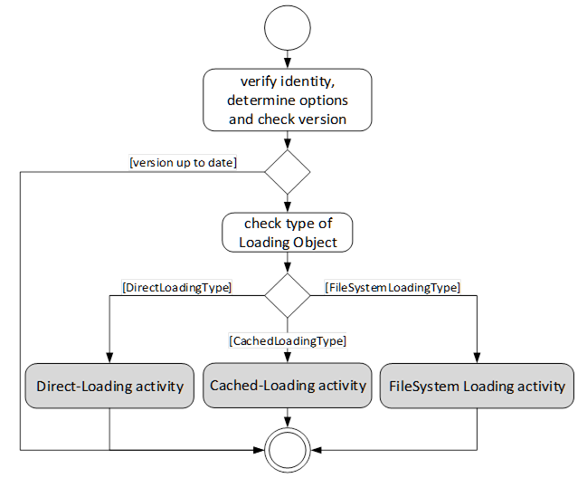  

Figure 35 - Determine the type of update that the Server implements.  

The activities of the different loading types are slightly different. With *Cached-Loading* the *Client* can check *CurrentVersion* and *PendingVersion* *Objects* to determine if the *Software Package* is already transferred. With the *FileSystem based Loading* the *Client* can browse the *FileSystem* to find out which files are already transferred. For *Cached-Loading* and *File System based Loading* the transfer can be done in advance. There are different ways to get the *UpdateBehavior,* because for *Cached-Loading* and *File System based Loading* this depends on the actual software that should be installed (with *Direct-Loading* the server has no information about the new software). For *Direct-Loading* and *Cached-Loading* the validation is done during the transfer. For File System based Loading this shall be done before the installation as an extra step. These steps are illustrated in [Figure 36](/§\_Ref25672950) .  

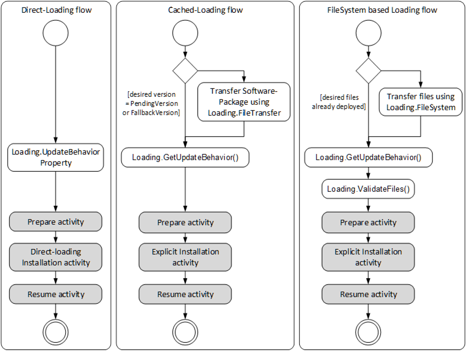  

Figure 36 - Different flows of Direct-Loading , Cached-Loading and FileSystem based Loading  

The prepare activity can be handled equal for all types of loading. This optionally includes a backup if the device cannot keep the parameters during update. The activity is shown in [Figure 37](/§\_Ref25672912) .  

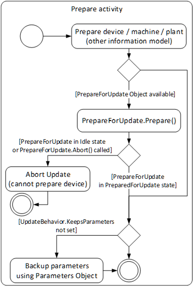  

Figure 37 - Prepare and Resume activities  

The actual installation of *Direct-Loading* is done during the transfer. At the end there can be a manual power cycle (option). In some cases (if the *Server* is on the device that is updated) the *Server* is rebooted and the *Client* is required to reconnect to complete the installation. This is illustrated in [Figure 38](/§\_Ref25672904) .  

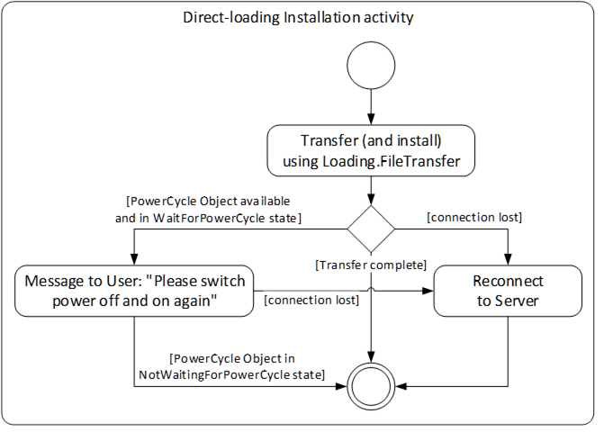  

Figure 38 - Installation activity for Direct-Loading  

For *Cached-Loading* and *File System based Loading* the installation is done using the *InstallationStateMachineType* . For *Cached-Loading* the *InstallSoftwarePackage Method* is used and for *File System based Loading* the *InstallFiles Method* is used. During this installation there can also be a manual power cycle request requiring operator input. The *Client* possibly is required to reconnect one or more times due to automatic reboots. If the *Confirmation Object* is available, the *Client* can use it during the installation. This is illustrated in [Figure 39](/§\_Ref25672894) .  

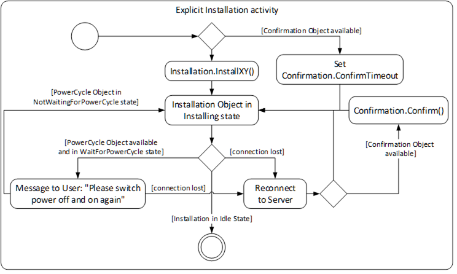  

Figure 39 - Installation activity for Cached-Loading and File System based Loading  

The resume activity can be handled equal for all types of loading. This optionally includes restore if the device cannot keep the parameters during update. The activity is shown in [Figure 40](/§\_Ref56604187) .  

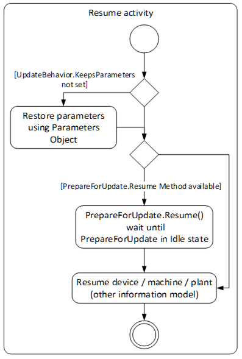  

Figure 40 - Resume activity  

#### 8.3.6 Safety considerations  

Especially for safety critical devices the update *Client* shall inform the user before performing critical activities. This includes the information if a manual power cycle is required, if the device will reboot or if it will lose its parameters during the update. This information can be accessed before the actual update is started. For safety all security considerations also apply.  

#### 8.3.7 Security considerations  

Security is a critical aspect of software update. The basic requirements can be solved with the existing UA security mechanisms (secure transport, authorization and role-based authentication). Only authorized users shall be able to install and manage updates.  

It is necessary that the *Client* verifies the identity of the device. This can be accomplished by identification information provided by OPC UA, by this specification or by companion specifications.  

It is necessary that the authenticity (integrity and source) of the *Software Package* is verified. These aspects can be implemented by the device in a vendor specific way e.g., verify a digital signature of the *Software Package* . These mechanisms are out of scope of this specification.  

#### 8.3.8 Update Behavior  

The concrete process of the installation can depend on the device and on the software that is to be installed. Therfore the server provides the *UpdateBehavior OptionSet* (see [8.5.2](/§\_Ref56437317) ). The *UpdateBehavior* can be determined with the *UpdateBehavior Variable* (see [8.4.4.3](/§\_Ref56437378) ) ** of the *DirectLoadingType* or with one of the *GetUpdateBehavior Methods* of the *CachedLoadingType* (see [8.4.5.5](/§\_Ref56437391) ) or the *FileSystemLoadingType* (see [8.4.6.3](/§\_Ref56437406) ).  

#### 8.3.9 Installation of patches  

Instead of updating the whole software with a new version, sometimes the software is "patched"; i.e. only a part of it is replaced. The installation of such a patch can be implemented in the same way as the installation of a complete version. The only difference is that the result is not a new *SoftwareRevision* but an additional entry in the list of patch-identifiers stored in the *PatchIdentifiers Variable* (see [8.4.7.5](/§\_Ref56437466) ).  

#### 8.3.10 Incompatible parameters / settings  

If parameters or settings of an old software do not work with the new software, the installation of the new software can complete but the device still cannot start as before. In this case the *Server* should treat the installation as successful. It can inform the incompatibility using e.g., the *IDeviceHealthType* *Interface* (see [4.5.4](/§\_Ref534820300) ) of the ** device / component. This issue can be resolved later by a client that fixes or updates the parameters.  

#### 8.3.11 AddIn model  

To support an individual software update for the devices of a *Server* *AddressSpace* the software update model is defined using the *AddIn* model as it is described in [OPC 10000-3](/§UAPart3) . An instance of *SoftwareUpdateType* shall be attached to either *Objects* that implement the *Interface* *IVendorNameplateType* (see [4.5.2](/§\_Ref530927143) ) or *Objects* that support an *Identification FunctionalGroup* (see [B.2](/§\_Ref56437632) ) that implements *IVendorNameplateType* . For the *AddIn* instance the fixed *BrowseName* "SoftwareUpdate" shall be used. This model gives any device, hardware- or software-component the opportunity to support *SoftwareUpdate* .  

With this mechanism it is also possible to update parts of a software independently: A *Server* could expose parts as additional software components with their own update *AddIn* .  

To identify the device / component that is the target for the software update, the *IVendorNameplateType* *Interface* is used. In this *Interface* at least the *Variables* *Manufacturer, ManufacturerUri,* *ProductCode* and *SoftwareRevision* shall be supported and have valid values. Optionally *Model* and *HardwareRevision* should be supported. These *Properties* can be shown to the operator. *ManufacturerUri, ProductCode* and *HardwareRevision* should be used to identify the component.  

Note that the *Properties* *SoftwareRevision, Manufacturer* and *ManufacturerUri* also appears in the *CurrentVersion* of ** the *PackageLoadingType* . Their values can be different, if the manufacturer of the *Device* is not the same as the manufacturer of the software. The *SoftwareRevision* *Object* shall be the same at both places.  

The *ComponentType* (see [4.5.7](/§\_Ref532511038) ) already implements the *Interface* *IVendorNameplateType* . This makes it a good candidate for a *SoftwareUpdate AddIn* as illustrated in the example in [Figure 41](/§\_Ref7074079) .  

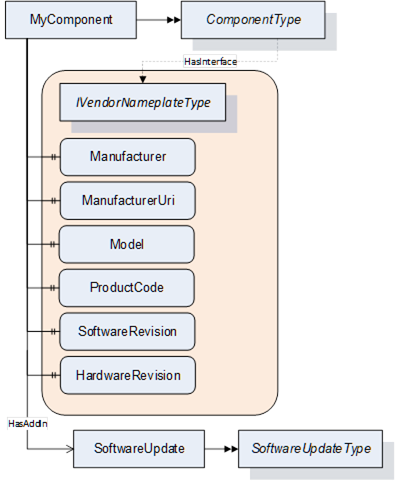  

Figure 41 - Example how to add the SoftwareUpdate AddIn to a component  

### 8.4 ObjectTypes  

#### 8.4.1 SoftwareUpdateType  

##### 8.4.1.1 Overview  

The *SoftwareUpdateType* defines an *AddIn* which can be used to extend *Objects* with software update features. All software update options are exposed as references of this *AddIn* . This way a *Client* can check for the references of the *AddIn* to determine which options are provided by a *Server* . If an option is available, it shall be used as specified.  

The *SoftwareUpdateType* is illustrated in [Figure 42](/§\_Ref17732732) and formally described in [Table 76](/§\_Ref17732749) .  

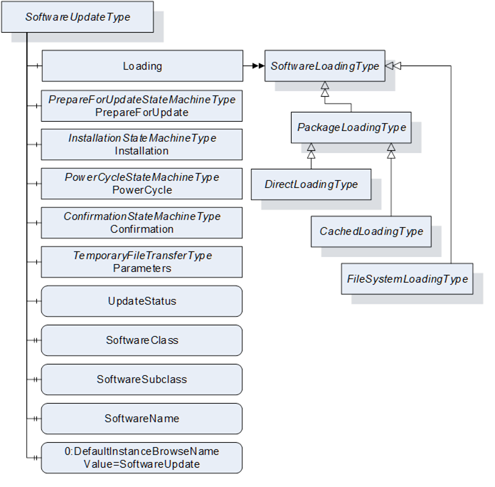 !  

Figure 42 - SoftwareUpdateType  

  

Table 76 - SoftwareUpdateType definition  

| **Attribute** | **Value** |
|---|---|
|BrowseName|1:SoftwareUpdateType|
|IsAbstract|False|
  
| **References** | **NodeClass** | **BrowseName** | **DataType** | **TypeDefinition** | **Other** |
|---|---|---|---|---|---|
|Subtype of the *0:BaseObjectType* defined in [OPC 10000-5](/§UAPart5) .|
|0:HasComponent|Object|1:Loading||1:SoftwareLoadingType|O|
|0:HasComponent|Object|1:PrepareForUpdate||1:PrepareForUpdateStateMachineType|O|
|0:HasComponent|Object|1:Installation||1:InstallationStateMachineType|O|
|0:HasComponent|Object|1:PowerCycle||1:PowerCycleStateMachineType|O|
|0:HasComponent|Object|1:Confirmation||1:ConfirmationStateMachineType|O|
|0:HasComponent|Object|1:Parameters||0:TemporaryFileTransferType|O|
|0:HasComponent|Variable|1:UpdateStatus|0:LocalizedText|0:BaseDataVariableType|O|
|0:HasProperty|Variable|1:SoftwareClass|SoftwareClass|0:PropertyType|O|
|0:HasProperty|Variable|1:SoftwareSubclass|0:String|0:PropertyType|O|
|0:HasProperty|Variable|1:SoftwareName|0:String|0:PropertyType|O|
|0:HasProperty|Variable|1:UnsignedPackageAllowed|0:Boolean|0:PropertyType|O|
|0:HasComponent|Variable|1:VendorErrorCode|0:Int32|0:BaseDataVariableType|O|
|0:HasProperty|Variable|0:DefaultInstanceBrowseName|0:QualifiedName|0:PropertyType||
  
| **Conformance Units** |
|---|
|DI SU Software Update|
  

  

##### 8.4.1.2 Loading  

The optional *Loading Object* is of type *SoftwareLoadingType,* which ** is ** abstract. The *Object* can be one of the concrete sub-types *DirectLoadingType* ( [8.4.4](/§\_Ref56437799) ), *CachedLoadingType* ( [8.4.5](/§\_Ref46143855) ) or *FileSystemLoadingType* ( [8.4.6](/§\_Ref56437834) ). *SoftwareLoadingType* is formally defined in [8.4.2](/§\_Ref46143840) .  

The *Loading* *Object* is required for all variations of software installation, it is not required for read or restore of device parameters using the *Parameters Object* .  

##### 8.4.1.3 PrepareForUpdate  

The optional *PrepareForUpdate Object* is of type *PrepareForUpdateStateMachineType* which is formally defined in [8.4.7.9](/§\_Ref47338188) .  

##### 8.4.1.4 Installation  

This optional *Installation Object* is of type *InstallationStateMachineType which* is formally defined in [8.4.9](/§\_Ref47338223) .  

##### 8.4.1.5 PowerCycle  

This optional *PowerCycle Object* is of type *PowerCycleStateMachineType* which is formally defined in [8.4.10](/§\_Ref22550781) .  

##### 8.4.1.6 Confirmation  

This optional *Confirmation Object* is of type *ConfirmationStateMachineType* which is formally defined in [8.4.11](/§\_Ref22550791) .  

##### 8.4.1.7 Parameters  

This optional *Parameters Object* is of type *TemporaryFileTransferType* ( [OPC 10000-5](/§UAPart5) ) *.* It can be supported by devices that cannot retain parameters during update. If supported by the *SoftwareUpdate AddIn* a *Client* can read the parameters before the update and restore them after the update. This is not a general-purpose backup and restore function. It is intended to be used in the context of software update.  

The *GenerateFileForRead* and *GenerateFileForWrite* *Methods* accept an unspecified *generateOptions* *Parameter* . This argument is not used, and *Clients* shall always pass null. Future versions of this specification can define concrete *DataTypes* .  

If the restore of parameters succeeds but the software cannot run properly this should not be treated as an error of the restore. Instead, this should be indicated using the *IDeviceHealthType Interface* of ** the device / component.  

##### 8.4.1.8 UpdateStatus  

This optional localized string provides status and error information for the update. This can be used whenever a long running update activity can provide detailed information to the user or when a state machine wants to provide error information to the user.  

A *Server* can provide any text it wants to show to the operator of the software update. Important texts are the error messages in case anything went wrong, and the installation or preparation could not complete. These messages should explain what happened and how the operator could resolve the issue (e.g. "try again with a different version"). During preparation and installation, it is good practice to inform the operators about the current action to keep them patient and waiting for the completion. Also, if the installation gets stuck this text would help to find out the reason.  

The *UpdateStatus* can be used together with the *PrepareForUpdateStateMachineType* ( [8.4.7.9](/§\_Ref47338188) ) *,* the *InstallationStateMachineType* ( [8.4.9](/§\_Ref47338223) ) and for *CachedLoadingType* ( [8.4.5](/§\_Ref46143855) ), *DirectLoadingType* ( [8.4.4](/§\_Ref56436674) ) and *FileSystemLoadingType* ( [8.4.6](/§\_Ref56436793) ) it can be used during the transfer of the *Software Package* .  

##### 8.4.1.9 SoftwareClass  

The optional *SoftwareClass Property* is used to distinguish device firmware from executable applications and from supporting configuration. A *Software Update Client* can use this information together with the *SoftwareSubclass* and the *SoftwareName* to identify the associated component (See [8.3.2](/§\_Ref156831324) ).  

##### 8.4.1.10 SoftwareSubclass  

The optional *SoftwareSubclass Property* can be used to further specialize the type of software (See [8.3.2](/§\_Ref156831356) ).  

##### 8.4.1.11 SoftwareName  

If there can be more than one instance of a software, the optional *SoftwareName Property* can be used distinguish the individual instances (see [8.3.2](/§\_Ref156831370) ).  

##### 8.4.1.12 UnsignedPackagesAllowed  

This *Property* indicates whether the server accepts *Software Packages* that are not signed.  

##### 8.4.1.13 VendorErrorCode  

The optional *VendorErrorCode Property* provides a machine-readable error code in case anything went wrong during the transfer, the installation, or the preparation. Comparable to an error message in *UpdateStatus* this *Variable* can provide additional information about the issue. The *VendorErrorCode* is an additional information for a *Client* . It is not required for normal operation and error handling.  

The value 0 shall be interpreted as no error.  

The *VendorErrorCode* can be used together with the *PrepareForUpdateStateMachineType* ( [8.4.7.9](/§\_Ref47338188) ) for prepare and resume, in the *InstallationStateMachineType* ( [8.4.9](/§\_Ref47338223) ) during the installation. For *CachedLoadingType* ( [8.4.5](/§\_Ref46143855) ), *DirectLoadingType* ( [8.4.4](/§\_Ref56436674) ) and FileSystemLoadingType ( [8.4.6](/§\_Ref56436793) ) it can be used during the transfer of the *Software Package* .  

##### 8.4.1.14 DefaultInstanceBrowseName  

The *DefaultInstanceBrowseName Property*\- defined in [OPC 10000-3](/§UAPart3)\- is required for the *AddIn* model as specified in [8.3.11](/§\_Ref47338574) . It is used to specify the *BrowseName* of the instance of the *SoftwareUpdateType* . It always has the value "SoftwareUpdate".  

Table 77 - SoftwareUpdateType Attribute values for child Nodes  

| **Source Path** | **Value** |
|---|---|
|0:DefaultInstanceBrowseName|SoftwareUpdate|
  

  

#### 8.4.2 SoftwareLoadingType  

##### 8.4.2.1 Overview  

The *SoftwareLoadingType* is the abstract base for all different kinds of loading. The concrete information and behavior is modeled in its sub-types.  

The *SoftwareLoadingType* is formally defined in [Table 78](/§\_Ref179806356) .  

Table 78 - SoftwareLoadingType definition  

| **Attribute** | **Value** |
|---|---|
|BrowseName|1:SoftwareLoadingType|
|IsAbstract|True|
  
| **References** | **NodeClass** | **BrowseName** | **DataType** | **TypeDefinition** | **Other** |
|---|---|---|---|---|---|
|Subtype of the *0:BaseObjectType* defined in [OPC 10000-5](/§UAPart5)|
|0:HasSubtype|ObjectType|1:PackageLoadingType||||
|0:HasSubtype|ObjectType|1:FileSystemLoadingType||||
|0:HasComponent|Variable|1:UpdateKey|0:String|0:BaseDataVariableType|O|
  
| **Conformance Units** |
|---|
|DI SU Software Update|
  

  

##### 8.4.2.2 UpdateKey  

The optional write-only *UpdateKey Object* can be used if the underlying system requires some key to unlock the update feature. The format and where to get the key is vendor-specific and not described in this specification. If *UpdateKey* is supported, the *Client* shall set the key before the installation. If the *PrepareForUpdateStateMachine* is used, the *UpdateKey* shall be set before the *Prepare Method* is called. The *Server* shall not keep the value for more than one update.  

#### 8.4.3 PackageLoadingType  

##### 8.4.3.1 Overview  

The *PackageLoadingType* provides information about the *Current Version* and allows transfer of a *Software Package* to and from the *Server* .  

The *PackageLoadingType* is illustrated in [Figure 43](/§\_Ref47338765) and formally defined in [Table 79](/§\_Ref47338793) .  

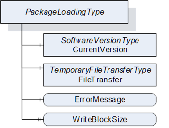  

Figure 43 - PackageLoadingType  

Table 79 - PackageLoadingType definition  

| **Attribute** | **Value** |
|---|---|
|BrowseName|1:PackageLoadingType|
|IsAbstract|True|
  
| **References** | **NodeClass** | **BrowseName** | **DataType** | **TypeDefinition** | **Other** |
|---|---|---|---|---|---|
|Subtype of the *SoftwareLoadingType*|
|0:HasComponent|Object|1:CurrentVersion||1:SoftwareVersionType|M|
|0:HasComponent|Object|1:FileTransfer||0:TemporaryFileTransferType|M|
|0:HasComponent|Variable|1:ErrorMessage|0:LocalizedText|0:BaseDataVariableType|M|
|0:HasProperty|Variable|1:WriteBlockSize|0:UInt32|0:PropertyType|O|
|0:HasSubtype|ObjectType|1:DirectLoadingType||||
|0:HasSubtype|ObjectType|1:CachedLoadingType||||
  
| **Conformance Units** |
|---|
|DI SU Software Update|
  

  

##### 8.4.3.2 CurrentVersion  

To identify the *Current Version* , the *CurrentVersion Object* provides *ManufacturerUri* , *SoftwareRevision* and *PatchIdentifiers* along with other information that allows the user to identify the currently used software. With this information the *Client* can determine a suitable update.  

Note: This version information is about the installed software. The *Manufacturer* is not necessarily the same as the *Manufacturer* of the physical device that executes the software.  

##### 8.4.3.3 FileTransfer  

###### 8.4.3.3.1 General  

The *FileTransfer* *Object* is of type *TemporaryFileTransferType* as defined in [OPC 10000-5](/§UAPart5) . It is used to create temporary files for download and upload of the *Software Package* . See [8.7](/§\_Ref196828461) for the definition of a standard packaging format.  

In the *TemporaryFileTransferType* type the *GenerateFileForRead* and *GenerateFileForWrite* *Methods* take an unspecified *generateOptions* *Parameter* . For the *FileTransfer* *Object* an *Enumeration* of type *SoftwareVersionFileType* is used for this *Parameter* . It is used to select the file to upload or download. All allowed values are defined in [Table 112](/§\_Ref39678826) . Additional *Result Codes* of the *GenerateFileForRead* and *GenerateFileForWrite* *Methods* are specified in [Table 80](/§\_Ref47339172) .  

Table 80 - TemporaryFileTransferType Result Codes  

| **Result Code** | **Description** |
|---|---|
|Bad\_InvalidState|This result code is only used with *DirectLoading* .f the *PrepareForUpdate* is available, the *UpdateBehavior* requires preparation and the *PrepareForUpdate* state machine is not in the state *PreparedForUpdate* .|
|Bad\_NotFound|If there is no file to read from the device.|
|Bad\_NotSupported|If the device does not support to upload / download of the *Software Package* .|
  

  

For all errors that occur during the file transfer the *ErrorMessage* *Variable* should provide an error message for the user.  

It is implementation dependent which version (see *SoftwareVersionFileType* in [8.5.1](/§\_Ref56438626) ) is readable and which one is writable. Additional restrictions are defined in the concrete sub-types of *PackageLoadingType* .  

###### 8.4.3.3.2 Transfer to the device  

The software is transferred as a single package. File type and content are device specific. If *WriteBlockSize* is supported, the *Client* shall write the file in chunks of this size.  

The software should be validated during the transfer process. Errors shall be indicated either in the *Write Method,* the *CloseAndCommit Method* or an asynchronous completion of the file transfer. If the validation is performed synchronous, the *Method* returns Bad\_InvalidArgument; if the validation is performed asynchronous, the error is indicated by the *Error* state of the *FileTransferStateMachineType* . If the *ErrorMessage Variable* is provided, it shall contain an error message representing the validation error.  

###### 8.4.3.3.3 Transfer from the device  

The *FileTransfer* *Object* can optionally support the transfer of a *Software Package* from the device to the *Client* .  

If this transfer is not supported, the *Server* shall return the *Result Code* *Bad\_NotSupported* . If it is supported but there is currently no data, the *Result Code* *Bad\_NotFound* shall be used instead.  

##### 8.4.3.4 ErrorMessage  

This is a textual information about errors that can occur with the file transfer. Whenever a method of the TemporaryFileTransferType returns an error, the *ErrorMessage* *Variable* should provide a localized error message for the user. For every new file transfer the value should be reset to an empty string.  

##### 8.4.3.5 WriteBlockSize  

Optional size of the *Blocks* (number of bytes) that a *Client* shall write to the file. The client shall write the *Software Package* in chunks of this size to the *FileType* object (the last *Block* can be smaller).  

#### 8.4.4 DirectLoadingType  

##### 8.4.4.1 Overview  

The *DirectLoadingType* provides information about the *Current Version* and allows transfer of a *Software Package* to and from the *Server* . Transfer of the *Software Package* to the *Server* also includes the installation. The *Direct-Loading* option is described in [8.3.4.3](/§\_Ref56436005) .  

The *DirectLoadingType* is illustrated in [Figure 44](/§\_Ref47339469) and formally defined in [Table 81](/§\_Ref47339450) .  

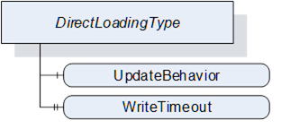  

Figure 44 - DirectLoadingType  

  

Table 81 - DirectLoadingType definition  

| **Attribute** | **Value** |
|---|---|
|BrowseName|1:DirectLoadingType|
|IsAbstract|False|
  
| **References** | **NodeClass** | **BrowseName** | **DataType** | **TypeDefinition** | **Other** |
|---|---|---|---|---|---|
|Subtype of the *1:PackageLoadingType*|
|0:HasComponent|Variable|1:UpdateBehavior|1:UpdateBehavior|0:BaseDataVariableType|M|
|0:HasProperty|Variable|1:WriteTimeout|0:Duration|0:PropertyType|O|
  
| **Conformance Units** |
|---|
|DI SU DirectLoading|
  

  

##### 8.4.4.2 FileTransfer  

The *FileTransfer* *Object* is inherited from the *PackageLoadingType* . In this sub-type the *Current* version ** shall be writable (see *SoftwareVersionFileType* in [8.5.1](/§\_Ref56438626) ). Writing to this file also includes the actual installation.  

##### 8.4.4.3 UpdateBehavior  

The *UpdateBehavior* *OptionSet* informs the update *Client* about the specific behavior of the component during update via *Direct-Loading* .  

##### 8.4.4.4 WriteTimeout  

*Optional* *Property* that informs the *Client* about the maximum duration of the call to the *Write Method* of *FileType* (maximum time the write of a block of data can take). If the write operation takes longer the *Client* can assume that the *Server* has an issue.  

#### 8.4.5 CachedLoadingType  

##### 8.4.5.1 Overview  

The *CachedLoadingType* provides information about the *Current Version* , the *Pending Version* and the *Fallback Version* (if supported). Additionally, it allows upload and download of different versions of the software. The *Cached-Loading* option is described in [8.3.4.4](/§\_Ref56436028) .  

The *CachedLoadingType* is illustrated in [Figure 45](/§\_Ref22553963) and formally defined in [Table 82](/§\_Ref39840780) .  

  

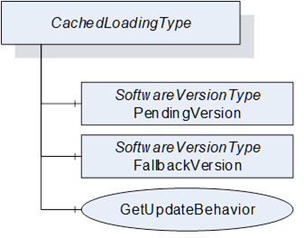  

Figure 45 - CachedLoadingType  

  

Table 82 - CachedLoadingType definition  

| **Attribute** | **Value** |
|---|---|
|BrowseName|1:CachedLoadingType|
|IsAbstract|False|
  
| **References** | **NodeClass** | **BrowseName** | **DataType** | **TypeDefinition** | **Other** |
|---|---|---|---|---|---|
|Subtype of the *1:PackageLoadingType*|
|0:HasComponent|Object|1:PendingVersion||1:SoftwareVersionType|M|
|0:HasComponent|Object|1:FallbackVersion||1:SoftwareVersionType|O|
|0:HasComponent|Method|1:GetUpdateBehavior|||M|
  
| **Conformance Units** |
|---|
|DI SU CachedLoading|
  

  

##### 8.4.5.2 FileTransfer  

The *FileTransfer* *Object* is inherited from the *PackageLoadingType* . In this sub-type the *Current* version ** shall not be writable and the *Pending* version ** shall be writable (see *SoftwareVersionFileType* in [8.5.1](/§\_Ref56438626) ).  

##### 8.4.5.3 PendingVersion  

The *PendingVersion* *Object* describes an already transferred new *Software Package* that is ready to be installed.  

If there is no *Software Package* available, the values should be empty.  

##### 8.4.5.4 FallbackVersion  

The optional *FallbackVersion Object* describes an alternate version on the device. This could be a factory default version or the version before the last update. Installing the *Fallback Version* can be used to revert to a reliable version of the software.  

If a *Fallback Version* is supported by the device the object shall be available. If there is currently no *Fallback Version* on the device, the values should be empty.  

##### 8.4.5.5 GetUpdateBehavior Method  

With this *Method* the *Client* can check the specific update behavior for a specified software version. To identify the version the *GetUpdateBehavior Method* requires the *ManufacturerUri* , *SoftwareRevision and PatchIdentifiers Properties* of the *SoftwareVersionType* .  

 **Signature**   

 **GetUpdateBehavior**   

[in] 0:String  ManufacturerUri,  

[in] 0:String  SoftwareRevision,  

[in] 0:String[]  PatchIdentifiers,  

[out] UpdateBehavior UpdateBehavior);  

  

Table 83 - GetUpdateBehavior Method Arguments  

| **Argument ** | **Description** |
|---|---|
|ManufacturerUri|*ManufacturerUri Property* of either the *Pending* or *Fallback* *SoftwareVersionType* that should be installed.|
|SoftwareRevision|*SoftwareRevision Property* of either the *Pending* or *Fallback* *SoftwareVersionType* that should be installed.|
|PatchIdentifiers|*PatchIdentifiers Property* of either the *Pending* or *Fallback* *SoftwareVersionType* that should be installed. (or empty array if not supported by the *SoftwareVersionType* instance)|
|UpdateBehavior|Update behavior option set for the specified *SoftwareVersionType* instance|
  

  

 **Method Result Codes (defined in Call Service)**   

| **Result Code** | **Description** |
|---|---|
|Bad\_NotFound|If the *Software Package* , identified by the parameters, does not exist.|
  

  

  

Table 84 - GetUpdateBehavior Method AddressSpace definition  

| **Attribute** | **Value** |
|---|---|
|BrowseName|1:GetUpdateBehavior|
  
| **References** | **NodeClass** | **BrowseName** | **DataType** | **TypeDefinition** | **Other** |
|---|---|---|---|---|---|
|0:HasProperty|Variable|0:InputArguments|0:Argument[]|0:PropertyType|M|
|0:HasProperty|Variable|0:OutputArguments|0:Argument[]|0:PropertyType|M|
  
| **Conformance Units** |
|---|
|DI SU CachedLoading|
  

  

  

  

#### 8.4.6 FileSystemLoadingType  

##### 8.4.6.1 Overview  

The *FileSystemLoadingType* enables software update based on an open file system. This enables the *FileSystem based Loading* option of [8.3.4.5](/§\_Ref56436094) .  

It is illustrated in [Figure 46](/§\_Ref47340477) and formally defined in [Table 85](/§\_Ref47340453) .  

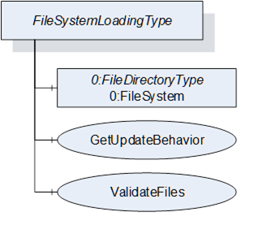  

Figure 46 - FileSystemLoadingType  

  

Table 85 - FileSystemLoadingType definition  

| **Attribute** | **Value** |
|---|---|
|BrowseName|1:FileSystemLoadingType|
|IsAbstract|False|
  
| **References** | **NodeClass** | **BrowseName** | **DataType** | **TypeDefinition** | **Other** |
|---|---|---|---|---|---|
|Subtype of the *SoftwareLoadingType*|
|0:HasComponent|Object|0:FileSystem||0:FileDirectoryType|M|
|0:HasComponent|Method|1:GetUpdateBehavior|||M|
|0:HasComponent|Method|1:ValidateFiles|||O|
  
| **Conformance Units** |
|---|
|DI SU FileSystem Loading|
  

  

##### 8.4.6.2 FileSystem  

The *FileSystem* *Object* is of type *FileDirectoryType* as it is defined in [OPC 10000-5](/§UAPart5) . It provides access to a hierarchy of directories and files of the device. The structure can be read and written by the *Client* however the device can restrict this for specific folders or files.  

##### 8.4.6.3 GetUpdateBehavior Method  

This *Method* can be used to check the specific update behavior for a set of files. The files are identified by the *NodeId* of their *FileType* instance in the *FileSystem* .  

 **Signature**   

 **GetUpdateBehavior**   

[in]  0:NodeId[]  NodeIds,  

[out] UpdateBehavior UpdateBehavior);  

Table 86 - GetUpdateBehavior Method Arguments  

| **Argument ** | **Description** |
|---|---|
|NodeIds|NodeIds of the files to install.|
|UpdateBehavior|Update behavior *OptionSet* for the files specified by *NodeId*|
  

  

 **Method Result Codes (defined in Call Service)**   

| **Result Code** | **Description** |
|---|---|
|Bad\_NotFound|If one or more *NodeIds* are not found.|
  

  

  

Table 87 - GetUpdateBehavior Method AddressSpace definition  

| **Attribute** | **Value** |
|---|---|
|BrowseName|1:GetUpdateBehavior|
  
| **References** | **NodeClass** | **BrowseName** | **DataType** | **TypeDefinition** | **Other** |
|---|---|---|---|---|---|
|0:HasProperty|Variable|0:InputArguments|0:Argument[]|0:PropertyType|M|
|0:HasProperty|Variable|0:OutputArguments|0:Argument[]|0:PropertyType|M|
  
| **Conformance Units** |
|---|
|DI SU FileSystem Loading|
  

  

  

##### 8.4.6.4 ValidateFiles Method  

This *Method* can be used to check if the specified set of files are valid and complete for an installation. This should also include dependency checks if appropriate.  

Note: In case of *Direct-Loading* or *Cached-Loading* these checks should be part of the transfer and this method shall not be supported since it is part of the file transfer (e.g., in *CloseAndCommit* ).  

 **Signature**   

 **ValidateFiles**   

[in] 0:NodeId[]  NodeIds,  

[out] 0:Int32  ErrorCode,  

[out] 0:LocalizedText ErrorMessage);  

Table 88 - ValidateFiles Method Arguments  

| **Argument ** | **Description** |
|---|---|
|NodeIds|NodeIds of the files to validate.|
|ErrorCode|0 for success or device specific number for validation issues.|
|ErrorMessage|Message for the user that describes how to resolve the issue.|
  

  

 **Method Result Codes (defined in Call Service)**   

| **Result Code** | **Description** |
|---|---|
|Bad\_NotFound|If one or more *NodeIds* are not found.|
  

  

Table 89 - ValidateFiles Method AddressSpace definition  

| **Attribute** | **Value** |
|---|---|
|BrowseName|1:ValidateFiles|
  
| **References** | **NodeClass** | **BrowseName** | **DataType** | **TypeDefinition** | **Other** |
|---|---|---|---|---|---|
|0:HasProperty|Variable|0:InputArguments|0:Argument[]|0:PropertyType|M|
|0:HasProperty|Variable|0:OutputArguments|0:Argument[]|0:PropertyType|M|
  
| **Conformance Units** |
|---|
|DI SU FileSystem Loading|
  

  

  

#### 8.4.7 SoftwareVersionType  

##### 8.4.7.1 Overview  

The *SoftwareVersionType* identifies a concrete version of a software. It is used by the *CachedLoadingType* ( [8.4.5](/§\_Ref46143855) ) and the *DirectLoadingType* ( [8.4.4](/§\_Ref56438992) ) to store the version information.  

The *Description Attribute* on the instances of the *SoftwareVersionType* should be used to provide additional information about the concrete version of the software to the user (e.g., change notes).  

The *SoftwareVersionType* is illustrated in [Figure 47](/§\_Ref47343303) and formally defined in [Table 90](/§\_Ref22553921) .  

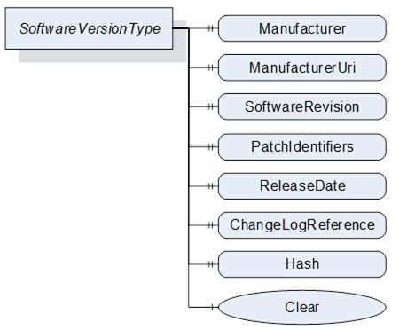  

Figure 47 - SoftwareVersionType  

  

Table 90 - SoftwareVersionType definition  

| **Attribute** | **Value** |
|---|---|
|BrowseName|1:SoftwareVersionType|
|IsAbstract|False|
  
| **References** | **NodeClass** | **BrowseName** | **DataType** | **TypeDefinition** | **Other** |
|---|---|---|---|---|---|
|Subtype of the *0:BaseObjectType* defined in [OPC 10000-5](/§UAPart5)|
|0:HasProperty|Variable|1:Manufacturer|0:LocalizedText|0:PropertyType|M|
|0:HasProperty|Variable|1:ManufacturerUri|0:String|0:PropertyType|M|
|0:HasProperty|Variable|1:SoftwareRevision|0:String|0:PropertyType|M|
|0:HasProperty|Variable|1:PatchIdentifiers|0:String[]|0:PropertyType|O|
|0:HasProperty|Variable|1:ReleaseDate|0:DateTime|0:PropertyType|O|
|0:HasProperty|Variable|1:ChangeLogReference|0:String|0:PropertyType|O|
|0:HasProperty|Variable|1:Hash|0:ByteString|0:PropertyType|O|
|0:HasComponent|Method|1:Clear|||O|
  
| **Conformance Units** |
|---|
|DI SU Software Update|
  

  

##### 8.4.7.2 Manufacturer  

The read only *Manufacturer* *Property* provides the name of the company that created the software.  

In case of the *Pending Version* this shall be empty if there is no pending software to install.  

##### 8.4.7.3 ManufacturerUri  

The read only *ManufacturerUri* *Property* provides a unique identifier for the manufacturer of the software.  

In case of the *Pending Version* this shall be empty if there is no pending software to install.  

##### 8.4.7.4 SoftwareRevision  

The read only *SoftwareRevision Property* defines the version of the software. The format and semantics of the string is vendor-specific. *SemanticVersionString* (a sub-type of *String* defined in [OPC 10000-5](/§UAPart5) ) can be used when using the Semantic Versioning format.  

In case of the *Pending Version* this shall be empty if there is no pending software to install.  

##### 8.4.7.5 PatchIdentifiers  

The read only *PatchIdentifiers Property* identifies the list of patches that are applied to a software version. The format and semantics of the strings are vendor-specific. The order of the strings shall not be relevant.  

##### 8.4.7.6 ReleaseDate  

The read only *ReleaseDate Property* defines the date when the software is released. If the version information is about patches, this should be the date of the latest patch. It is additional information for the user.  

##### 8.4.7.7 ChangeLogReference  

The read only *ChangeLogReference Property* can optionally provide a URL to a web site with detailed information about the particular version of the software (change notes). In case of a patched software, the web site should also inform about the patches.  

##### 8.4.7.8 Hash  

The optional read only *Hash Property* can be read by a *Client* to get the hash of a previously transferred *Software Package* . The hash value is calculated by the *Server* with the SHA-256 algorithm. It can be used to verify if the transferred package matches the one at the *Client* .  

##### 8.4.7.9 Clear  

This optional *Method* can be used to delete the previously transferred software from the device. For *Pending* and *Fallback Versions* this often makes sense to free memory. For configuration objects it can be possible to clear the *Current Version* . This *Method* supports the use case in [8.2.2.1](/§\_Ref156831696) .  

 **Signature**   

 **Clear**   

 **Method Result Codes (defined in Call Service)**   

| **Result Code** | **Description** |
|---|---|
|Bad\_InvalidState|The version object is already cleared.|
  

  

#### 8.4.8 PrepareForUpdateStateMachineType  

##### 8.4.8.1 Overview  

The *PrepareForUpdateStateMachineType* can be used if the device requires to be prepared before the update. Another option is to delay the resuming of normal operation until all update actions are executed. This supports to prepare for update option of [8.3.4.2](/§\_Ref56439131) .  

If a *Server* implements this state machine, a *Client* shall use it except if the *UpdateBehavior* indicates that this is not necessary for the transferred software. If preparation is required, the installation is only allowed if the *PrepareForUpdateStateMachine* is in the *PreparedForUpdate* state.  

The state machine is illustrated in [Figure 48](/§\_Ref47343745) , [Figure 49](/§\_Ref47343817) and formally defined in [Table 91](/§\_Ref47343799) . The transitions are formally defined in [Table 93](/§\_Ref33089894) .  

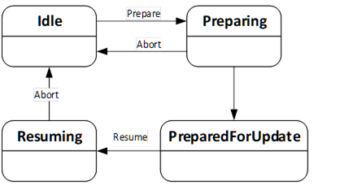  

Figure 48 - PrepareForUpdate state machine  

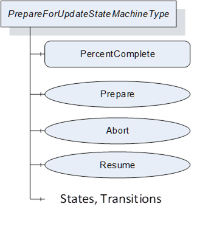  

Figure 49 - PrepareForUpdateStateMachineType  

Table 91 - PrepareForUpdateStateMachineType definition  

| **Attribute** | **Value** |
|---|---|
|BrowseName|1:PrepareForUpdateStateMachineType|
|IsAbstract|False|
  
| **References** | **NodeClass** | **BrowseName** | **DataType** | **TypeDefinition** | **Other** |
|---|---|---|---|---|---|
|Subtype of the 0: *FiniteStateMachineType* defined in [OPC 10000-5](/§UAPart5) .|
|0:HasComponent|Variable|1:PercentComplete|0:Byte|0:BaseDataVariableType|O|
|0:HasComponent|Method|1:Prepare|||M|
|0:HasComponent|Method|1:Abort|||M|
|0:HasComponent|Method|1:Resume|||O|
|0:HasComponent|Object|1:Idle||0:InitialStateType||
|0:HasComponent|Object|1:Preparing||0:StateType||
|0:HasComponent|Object|1:PreparedForUpdate||0:StateType||
|0:HasComponent|Object|1:Resuming||0:StateType||
|0:HasComponent|Object|1:IdleToPreparing||0:TransitionType||
|0:HasComponent|Object|1:PreparingToIdle||0:TransitionType||
|0:HasComponent|Object|1:PreparingToPreparedForUpdate||0:TransitionType||
|0:HasComponent|Object|1:PreparedForUpdateToResuming||0:TransitionType||
|0:HasComponent|Object|1:ResumingToIdle||0:TransitionType||
  
| **Conformance Units** |
|---|
|DI SU PrepareForUpdate|
  

  

The component *Variables* of the *PrepareForUpdateStateMachineType* have additional *Attributes* defined in [Table 92](/§\_Ref57799265) .  

Table 92 - 1:PrepareForUpdateStateMachineType Attribute values for child Nodes  

| **BrowsePath** | **Value Attribute** |
|---|---|
1:Idle|0:StateNumber||1|
1:Preparing|0:StateNumber||2|
1:PreparedForUpdate|0:StateNumber||3|
1:Resuming|0:StateNumber||4|
1:IdleToPreparing|0:TransitionNumber||12|
1:PreparingToIdle|0:TransitionNumber||21|
1:PreparingToPreparedForUpdate|0:TransitionNumber||23|
1:PreparedForUpdateToResuming|0:TransitionNumber||34|
1:ResumingToIdle|0:TransitionNumber||41|
  

  

Table 93 - 1:PrepareForUpdateStateMachineType Additional References  

|||||
|---|---|---|---|
|SourceBrowsePath|Reference Type|Is Forward|TargetBrowsePath|
||
  
| **Transitions** |
|---|
|1:IdleToPreparing|0:FromState|True|1:Idle|
||0:ToState|True|1:Preparing|
||0:HasCause|True|1:Prepare|
||0:HasEffect|True|0:TransitionEventType|
|1:PreparingToIdle|0:FromState|True|1:Preparing|
||0:ToState|True|1:Idle|
||0:HasCause|True|1:Abort|
||0:HasEffect|True|0:TransitionEventType|
|1:PreparingToPreparedForUpdate|0:FromState|True|1:Preparing|
||0:ToState|True|1:PreparedForUpdate|
||0:HasEffect|True|0:TransitionEventType|
|1:PreparedForUpdateToResuming|0:FromState|True|1:PreparedForUpdate|
||0:ToState|True|1:Resuming|
||0:HasCause|True|1:Resume|
||0:HasEffect|True|0:TransitionEventType|
|1:ResumingToIdle|0:FromState|True|1:Resuming|
||0:ToState|True|1:Idle|
||0:HasCause|True|1:Abort|
||0:HasEffect|True|0:TransitionEventType|
  

  

  

##### 8.4.8.2 PercentComplete  

This percentage is a number between 0 and 100 that informs about the progress in the *Preparing* or the *Resuming States* . It can be used whenever the activity takes longer and the user should be informed about the completion. If the state machine is in *Idle* or *PreparedForUpdate State* it shall have the value 0.  

This information is for the user only. It shall not be used to detect completion of the transition.  

##### 8.4.8.3 Prepare Method  

The *Prepare Method* can be called to prepare a device for an update. This call transitions the device into the state *Preparing* .  

After the preparation is complete the state machine can perform an automatic transition to the state *PreparedForUpdate* .  

If the preparation cannot complete and the device does not get prepared for update the state machine transitions back to *Idle* . In this case a message with the reason should be provided to the user via the *UpdateStatus* .  

 **Signature**   

 **Prepare**   

 **Method Result Codes (defined in Call Service)**   

| **Result Code** | **Description** |
|---|---|
|Bad\_InvalidState|If the PrepareForUpdateStateMachineType is not in Idle state.|
  

  

##### 8.4.8.4 Abort Method  

An update client can use the *Abort Method* to bring the state machine from *Resuming* or *Preparing* back to the *Idle* state. This can be necessary, if the preparation takes too long or does not complete at all because the required internal conditions are not met. This call transitions the device back to the *Idle* state.  

Note: If the transition from *Preparing* to *Idle* cannot complete instantly a *Client* can subscribe for the events or the state variable of the *PrepareForUpdateStateMachine* .  

 **Signature**   

 **Abort**   

 **Method Result Codes (defined in Call Service)**   

| **Result Code** | **Description** |
|---|---|
|Bad\_InvalidState|If the PrepareForUpdateStateMachineType is not in Preparing state.|
  

  

  

##### 8.4.8.5 Resume Method  

A call to the optional *Resume Method* transitions the device into the state *Resuming* . After the resuming is complete the state machine performs an automatic transition to the *Idle* state. If the method is not supported, the transitions to *Resuming* and back to *Idle* shall be done by the *Server* automatically. If the method is supported, there shall not be an automatic transition to *Resuming.* Supporting this method enables the *Client* to group several activities like backup, install, restore on a single device or group the update of multiple devices before the devices are allowed to *Resume* their operation again.  

 **Signature**   

 **Resume**   

 **Method Result Codes (defined in Call Service)**   

| **Result Code** | **Description** |
|---|---|
|Bad\_InvalidState|If the PrepareForUpdateStateMachineType is not in PreparedForUpdate state or if the InstallationStateMachine is still in the state Installing.|
  

  

#### 8.4.9 InstallationStateMachineType  

##### 8.4.9.1 Overview  

The *InstallationStateMachineType* can be used if the device supports explicit installation ( *Cached-Loading* or *File System based Loading* ). This supports the installation option of [8.3.4.6](/§\_Ref56439177) . It is illustrated in [Figure 50](/§\_Ref17718096) and [Figure 51](/§\_Ref17718104) and formally defined in [Table 94](/§\_Ref17717935) . The transitions are formally defined in [Table 96](/§\_Ref64473948) .  

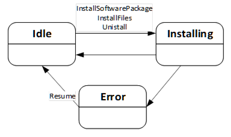  

Figure 50 - Installation state machine  

  

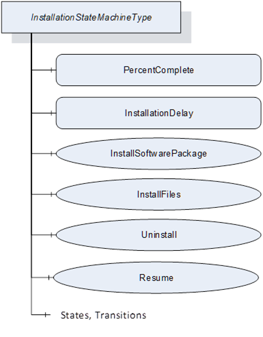  

Figure 51 - InstallationStateMachine  

Table 94 - InstallationStateMachineType definition  

| **Attribute** | **Value** |
|---|---|
|BrowseName|1:InstallationStateMachineType|
|IsAbstract|False|
  
| **References** | **NodeClass** | **BrowseName** | **DataType** | **TypeDefinition** | **Other** |
|---|---|---|---|---|---|
|Subtype of the 0: *FiniteStateMachineType* defined in [OPC 10000-5](/§UAPart5) .|
|0:HasComponent|Variable|1:PercentComplete|0:Byte|0:BaseDataVariableType|O|
|0:HasComponent|Variable|1:InstallationDelay|0:Duration|0:BaseDataVariableType|O|
|0:HasComponent|Method|1:InstallSoftwarePackage|||O|
|0:HasComponent|Method|1:InstallFiles|||O|
|0:HasComponent|Method|1:Uninstall|||O|
|0:HasComponent|Method|1:Resume|||M|
|0:HasComponent|Object|1:Idle||0:InitialStateType||
|0:HasComponent|Object|1:Installing||0:StateType||
|0:HasComponent|Object|1:Error||0:StateType||
|0:HasComponent|Object|1:IdleToInstalling||0:TransitionType||
|0:HasComponent|Object|1:InstallingToIdle||0:TransitionType||
|0:HasComponent|Object|1:InstallingToError||0:TransitionType||
|0:HasComponent|Object|1:ErrorToIdle||0:TransitionType||
  
| **Conformance Units** |
|---|
|DI SU Software Update|
  

  

The component *Variables* of the *InstallationStateMachineType* have additional *Attributes* defined in [Table 95](/§\_Ref64472126) .  

Table 95 - 1:InstallationStateMachineType Attribute values for child Nodes  

| **BrowsePath** | **Value Attribute** |
|---|---|
1:Idle|0:StateNumber||1|
1:Installing|0:StateNumber||2|
1:Error|0:StateNumber||3|
1:IdleToInstalling|0:TransitionNumber||12|
1:InstallingToIdle|0:TransitionNumber||21|
1:InstallingToError|0:TransitionNumber||23|
1:ErrorToIdle|0:TransitionNumber||31|
  

  

Table 96 - 1:InstallationStateMachineType Additional References  

|||||
|---|---|---|---|
|SourceBrowsePath|Reference Type|Is Forward|TargetBrowsePath|
||
  
| **Transitions** |
|---|
|1:IdleToInstalling|0:FromState|True|1:Idle|
||0:ToState|True|1:Installing|
||0:HasCause|True|1:InstallSoftwarePackage|
||0:HasCause|True|1:InstallFiles|
||0:HasCause|True|1:Uninstall|
||0:HasEffect|True|0:TransitionEventType|
|1:InstallingToIdle|0:FromState|True|1:Installing|
||0:ToState|True|1:Idle|
||0:HasEffect|True|0:TransitionEventType|
|1:InstallingToError|0:FromState|True|1:Installing|
||0:ToState|True|1:Error|
||0:HasEffect|True|0:TransitionEventType|
|1:ErrorToIdle|0:FromState|True|1:Error|
||0:ToState|True|1:Idle|
||0:HasCause|True|1:Resume|
||0:HasEffect|True|0:TransitionEventType|
  

  

##### 8.4.9.2 PercentComplete  

This percentage is a number between 0 and 100 that informs the user about the progress of an installation or uninstallation. It should be used whenever an update activity takes longer and the user should be informed about the completion. If the state machine is in *Idle State* it shall have the value 0. In case of an error the last value should be kept until the *Resume* is called.  

This information is for the user only. It shall not be used to detect completion of the installation.  

##### 8.4.9.3 InstallationDelay  

The optional *InstallationDelay* can be set by a *Client* to delay the actual installation after the call to *InstallSoftwarePackage* or *InstallFiles* is returned by the *Server* . This can be used when the installation is started on several devices in parallel and there is a risk that a reboot of one device could harm the connection to other devices. With a delay the install methods can be called on all devices before the devices actually start the installation. The *InstallationDelay* does not delay the transition from *Idle* to *Installing* .  

This value could be preconfigured. If a *Client* wants to set this value it has to be done before the install method is called.  

The *Server* is expected to stay operational at least during the delay.  

##### 8.4.9.4 InstallSoftwarePackage Method  

With this *Method* the *Client* requests the installation of a *Software Package* . The package can be either the previously transferred *Pending Version* or the alternative *Fallback Version* . To identify the version and to prevent conflicts with a second *Client* that transfers a different version, the *InstallSoftwarePackage Method* requires the *ManufacturerUri* , the *SoftwareRevision and PatchIdentifiers Properties* of the *SoftwareVersionType* .  

Optionally an additional hash value can be passed to the *Method* . This hash could be calculated by the *Client* or taken from a trusted source. Before installation the *Server* can compare the hash against the calculated hash of the *Software Package* . This mechanism can be used if there is a risk that the *Software Package* is altered during the transfer to the device and if the *Server* has no other mechanism to ensure that the *Software Package* is from a trustworthy source.  

If the installation succeeds but the software cannot run properly this should not be treated as an error of the installation. Instead, this should be indicated using the *IDeviceHealthType Interface of the* device / component.  

This *Method* shall not return before the state has changed to the *Installing* state.  

 **Signature**   

 **InstallSoftwarePackage**   

[in] 0:String  ManufacturerUri,  

[in] 0:String  SoftwareRevision,  

[in] 0:String[]  PatchIdentifiers,  

[in] 0:ByteString  Hash);  

Table 97 - InstallSoftwarePackage Method Arguments  

| **Argument ** | **Description** |
|---|---|
|ManufacturerUri|*ManufacturerUri Property* of either the *Pending* or *Fallback* *SoftwareVersionType* that should be installed.|
|SoftwareRevision|*SoftwareRevision Property* of either the *Pending* or *Fallback* *SoftwareVersionType* that should be installed.|
|PatchIdentifiers|*PatchIdentifiers Property* of either the *Pending* or *Fallback* *SoftwareVersionType* that should be installed (or empty array if not supported on the SoftwareVersionType instance).|
|Hash|Hash of the *Software Package* that should be installed (or empty if not used).|
  

  

 **Method Result Codes (defined in Call Service)**   

| **Result Code** | **Description** |
|---|---|
|Bad\_InvalidState|If the *InstallationStateMachineType* is not in *Idle* state or if the *PrepareForUpdate* *Object* is available and the *PrepareForUpdate* state machine is not in the state *PreparedForUpdate* .|
|Bad\_NotFound|If the specified *Software Package* does not exist.|
|Bad\_InvalidArgument|If the Hash does not match the calculated hash of the *Software Package* .|
  

  

Table 98 - InstallSoftwarePackage Method AddressSpace definition  

| **Attribute** | **Value** |
|---|---|
|BrowseName|1:InstallSoftwarePackage|
  
| **References** | **NodeClass** | **BrowseName** | **DataType** | **TypeDefinition** | **Other** |
|---|---|---|---|---|---|
|0:HasProperty|Variable|0:InputArguments|0:Argument[]|0:PropertyType|M|
  
| **Conformance Units** |
|---|
|DI SU Software Update|
  

  

  

##### 8.4.9.5 InstallFiles Method  

This *Method* can be called to request the installation of one or more files. The files are identified by the *NodeId* of their *FileType* instance in the *FileSystem* .  

If the installation succeeds but the software cannot run properly this should not be treated as an error of the installation. Instead, this should be indicated using the *IDeviceHealthType Interface of the* device / component.  

 **Signature**   

 **InstallFiles**   

[in] 0:NodeId[]          NodeIds);  

Table 99 - InstallFiles Method Arguments  

| **Argument ** | **Description** |
|---|---|
|NodeIds|NodeIds of the files to install.|
  

  

 **Method Result Codes (defined in Call Service)**   

| **Result Code** | **Description** |
|---|---|
|Bad\_InvalidState|If the *InstallationStateMachineType* is not in *Idle* state or if the *PrepareForUpdate* *Object* is available and the *PrepareForUpdate* state machine is not in the state *PreparedForUpdate* .|
|Bad\_NotFound|If one or more NodeIds are not found.|
  

  

  

Table 100 - InstallFiles Method AddressSpace definition  

| **Attribute** | **Value** |
|---|---|
|BrowseName|1:InstallFiles|
  
| **References** | **NodeClass** | **BrowseName** | **DataType** | **TypeDefinition** | **Other** |
|---|---|---|---|---|---|
|0:HasProperty|Variable|0:InputArguments|0:Argument[]|0:PropertyType|M|
  
| **Conformance Units** |
|---|
|DI SU Software Update|
  

  

  

##### 8.4.9.6 Uninstall Method  

The *Uninstall* *Method* can be called to request the uninstallation of the current software. This can be necessary e.g. for a project when uncommissioning a device or before deleting an application or configuration from the device (see *SoftwareFolderType in [8.4.12.2](/§\_Ref185261947) )* .  

The signature and specific result codes of this *Method* are specified below.  

 **Signature**   

 **Uninstall**   

  

 **Method Result Codes (defined in Call Service)**   

| **Result Code** | **Description** |
|---|---|
|Bad\_InvalidState|If the *InstallationStateMachineType* is not in *Idle* state or if the *PrepareForUpdate* *Object* is available and the *PrepareForUpdate* state machine is not in the state *PreparedForUpdate* .|
  

  

  

##### 8.4.9.7 Resume Method  

This *Method* can be called to resume from the *Error* state. The *Error* state can be reached if there are issues during the installation. The state machine remains in this state until the *Client* calls the *Resume Method* to get back to the *Idle* state immediately.  

 **Signature**   

 **Resume**   

 **Method Result Codes (defined in Call Service)**   

| **Result Code** | **Description** |
|---|---|
|Bad\_InvalidState|If the *InstallationStateMachineType* is not in *Error* state.|
  

  

#### 8.4.10 PowerCycleStateMachineType  

The *PowerCycleStateMachineType* is used to inform the user to perform a manual power cycle.  

When the server requires a manual power cycle it indicates that to the client by changing the state to *WaitingForPowerCycle* . After restart of the *Device,* it transitions to *NotWaitingForPowerCycle* automatically.  

There are no methods, all transitions originate from the installation process. The state machine is illustrated in [Figure 52](/§\_Ref17730222) and formally defined in [Table 101](/§\_Ref17730248) . The transitions are formally defined in [Table 103](/§\_Ref64473944) .  

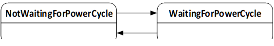  

Figure 52 - PowerCycle state machine  

Table 101 - PowerCycleStateMachineType definition  

| **Attribute** | **Value** |
|---|---|
|BrowseName|1:PowerCycleStateMachineType|
|IsAbstract|False|
  
| **References** | **NodeClass** | **BrowseName** | **DataType** | **TypeDefinition** | **Other** |
|---|---|---|---|---|---|
|Subtype of the *0:FiniteStateMachineType* defined in [OPC 10000-5](/§UAPart5) .|
|0:HasComponent|Object|1:NotWaitingForPowerCycle||0:InitialStateType||
|0:HasComponent|Object|1:WaitingForPowerCycle||0:StateType||
|0:HasComponent|Object|1:NotWaitingForPowerCycleToWaitingForPowerCycle||0:TransitionType||
|0:HasComponent|Object|1:WaitingForPowerCycleToNotWaitingForPowerCycle||0:TransitionType||
  
| **Conformance Units** |
|---|
|DI SU Manual Power Cycle|
  

  

The component *Variables* of the *PowerCycleStateMachineType* have additional *Attributes* defined in [Table 102](/§\_Ref64472562) .  

Table 102 - 1:PowerCycleStateMachineType Attribute values for child Nodes  

| **BrowsePath** | **Value Attribute** |
|---|---|
1:NotWaitingForPowerCycle|0:StateNumber||1|
1:WaitingForPowerCycle|0:StateNumber||2|
1:NotWaitingForPowerCycleToWaitingForPowerCycle|0:TransitionNumber||12|
1:WaitingForPowerCycleToNotWaitingForPowerCycle|0:TransitionNumber||21|
  

  

Table 103 - 1:PowerCycleStateMachineType Additional References  

|||||
|---|---|---|---|
|SourceBrowsePath|Reference Type|Is Forward|TargetBrowsePath|
||
  
| **Transitions** |
|---|
|1:NotWaitingForPowerCycleToWaitingForPowerCycle|0:FromState|True|1:NotWaitingForPowerCycle|
||0:ToState|True|1:WaitingForPowerCycle|
||0:HasEffect|True|0:TransitionEventType|
|1:WaitingForPowerCycleToNotWaitingForPowerCycle|0:FromState|True|1:WaitingForPowerCycle|
||0:ToState|True|1:NotWaitingForPowerCycle|
||0:HasEffect|True|0:TransitionEventType|
  

  

#### 8.4.11 ConfirmationStateMachineType  

##### 8.4.11.1 Overview  

The *ConfirmationStateMachineType* is used to prove a valid *Client - Server* connection after a restart of the OPC UA *Server* . This supports the confirmation option of [8.3.4.9](/§\_Ref56439285) .  

If several instances of this state machine are provided on a device (due to several instances of the *SoftwareUpdateType* ), all instances should behave as if it is only a single instance. In particular it is sufficient to call one of the confirm methods after reboot.  

The *ConfirmationStateMachineType* is illustrated in [Figure 53](/§\_Ref17730608) and [Figure 54](/§\_Ref17730612) and formally defined in [Table 104](/§\_Ref17730589) . The transitions are formally defined in [Table 106](/§\_Ref64473946) .  

  

Figure 53 - Confirmation state machine  

  

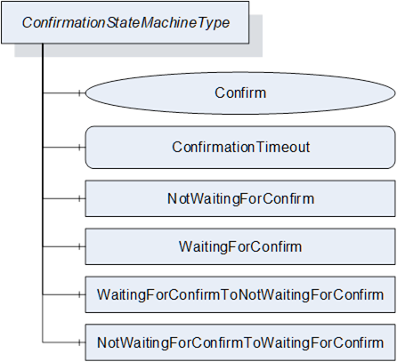  

Figure 54 - ConfirmationStateMachineType  

Table 104 - ConfirmationStateMachineType  

| **Attribute** | **Value** |
|---|---|
|BrowseName|1:ConfirmationStateMachineType|
|IsAbstract|False|
  
| **References** | **NodeClass** | **BrowseName** | **DataType** | **TypeDefinition** | **Other** |
|---|---|---|---|---|---|
|Subtype of the 0: *FiniteStateMachineType* defined in [OPC 10000-5](/§UAPart5) .|
|0:HasComponent|Method|1:Confirm|||M|
|0:HasComponent|Variable|1:ConfirmationTimeout|0:Duration|0:BaseDataVariableType|M|
|0:HasComponent|Object|1:NotWaitingForConfirm||0:InitialStateType||
|0:HasComponent|Object|1:WaitingForConfirm||0:StateType||
|0:HasComponent|Object|1:NotWaitingForConfirmToWaitingForConfirm||0:TransitionType||
|0:HasComponent|Object|1:WaitingForConfirmToNotWaitingForConfirm||0:TransitionType||
  
| **Conformance Units** |
|---|
|DI SU Update Confirmation|
  

  

The component *Variables* of the *ConfirmationStateMachineType* have additional *Attributes* defined in [Table 105](/§\_Ref64473947) .  

Table 105 - 1:ConfirmationStateMachineType Attribute values for child Nodes  

| **BrowsePath** | **Value Attribute** |
|---|---|
1:NotWaitingForConfirm|0:StateNumber||1|
1:WaitingForConfirm|0:StateNumber||2|
1:NotWaitingForConfirmToWaitingForConfirm|0:TransitionNumber||12|
1:WaitingForConfirmToNotWaitingForConfirm|0:TransitionNumber||21|
  

  

Table 106 - 1:ConfirmationStateMachineType Additional References  

|||||
|---|---|---|---|
|SourceBrowsePath|Reference Type|Is Forward|TargetBrowsePath|
||
  
| **Transitions** |
|---|
|1:NotWaitingForConfirmToWaitingForConfirm|0:FromState|True|1:NotWaitingForConfirm|
||0:ToState|True|1:WaitingForConfirm|
||0:HasEffect|True|0:TransitionEventType|
|1:WaitingForConfirmToNotWaitingForConfirm|0:FromState|True|1:WaitingForConfirm|
||0:ToState|True|1:NotWaitingForConfirm|
||0:HasCause|True|1:Confirm|
||0:HasEffect|True|0:TransitionEventType|
  

  

##### 8.4.11.2 ConfirmationTimeout  

The *ConfirmationTimeout* can be set by a *Client* to a value other then 0 to enable the confirmation feature. If the value is not 0 and the *Client*\- *Server* connection is lost, the *ConfirmationTimeout* represents the maximum time that the *Client* is required to reconnect and call the *Confirm Method* . The *Server* shall automatically reset the value to 0 when the installation is complete.  

##### 8.4.11.3 Confirm Method  

After a reboot and with a *ConfirmationTimeout* other than 0 a *Client* shall call this *Method* to inform the *Server* that it has successfully reconnected. If this *Method* is not called after a lost connection the *Server* shall regard the update as unsuccessful and shall revert it. A *Client* is required to react within the time specified in the *ConfirmationTimeout Variable* .  

 **Signature**   

 **Confirm**   

  

#### 8.4.12 SoftwareFolderType  

The *SoftwareFolderType* is a subtype of *FolderType* . It allows adding and removing its items via the *Add* and *Delete* methods. With the *SoftwareClass Variable* the server exposes whether the folder holds a collection of applications or a collection of configurations. The *ObjectType* of the items is server specific, but the items shall at least support the *SoftwareUpdate AddIn* . They are identified by *SoftwareSubclass* and *SoftwareName* which is provided with the *Add* *Method* . After adding a new item, the *SoftwareUpdate AddIn* is used to transfer the initial software. After that it can be used to install updates. The *SoftwareUpdate AddIn* of each ** item shall support *SoftwareClass* , *SoftwareSubclass* and *SoftwareName* . *SoftwareFolderType* is defined in [Table 107](/§\_Ref179214163) and its usage is illustrated in [Figure 55](/§\_Ref179214189) .  

  

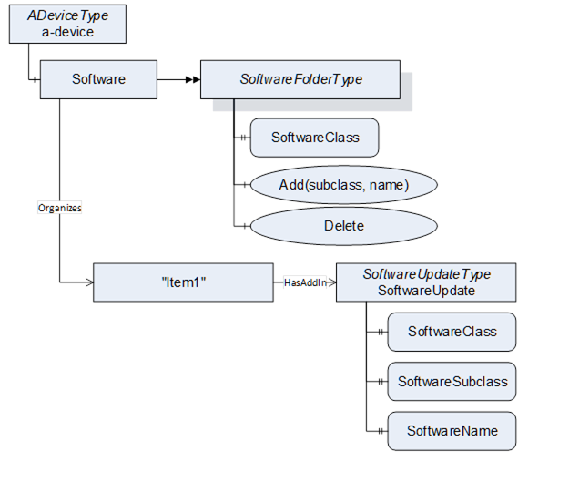  

Figure 55 - Example use of SoftwareFolderType  

Table 107 - SoftwareFolderType  

| **Attribute** | **Value** |
|---|---|
|BrowseName|1:SoftwareFolderType|
|IsAbstract|False|
  
| **References** | **NodeClass** | **BrowseName** | **DataType** | **TypeDefinition** | **Other** |
|---|---|---|---|---|---|
|Subtype of the 0: *FolderType* defined in [OPC 10000-5](/§UAPart5) .|
|0:HasProperty|Variable|1:SoftwareClass|1:SoftwareClass|0:PropertyType|M|
|0:HasComponent|Method|1:Add|||M|
|0:HasComponent|Method|1:Delete|||M|
  
| **Conformance Units** |
|---|
|DI SU SoftwareFolder|
  

  

The *SoftwareClass Property* is a *SoftwareClass* enumeration. It declares what items are managed by the folder. The value shall either be *Application* or *Configuration* .  

##### 8.4.12.1 Add Method  

The *Add Method* can be used to add a new item to the folder. The parameters *Subclass* and *Name* are exposed at the attached *SoftwareUpdate AddIn* as *SoftwareSubclass* and *SoftwareName Properties* . The *Name* shall be unique within the *SoftwareFolderType* .  

 **Signature**   

 **Add**   

[in] 0:String   Subclass,  

[in] 0:String   Name);  

  

Table 108 - Add Method Arguments  

| **Argument ** | **Description** |
|---|---|
|Subclass|Subclass of the new item.|
|Name|Name of the new item.|
  

  

  

  

Table 109 - Delete Method AddressSpace definition  

| **Attribute** | **Value** |
|---|---|
|BrowseName|1:Add|
  
| **References** | **NodeClass** | **BrowseName** | **DataType** | **TypeDefinition** | **Other** |
|---|---|---|---|---|---|
|0:HasProperty|Variable|0:InputArguments|0:Argument[]|0:PropertyType|M|
  
| **Conformance Units** |
|---|
|DI SU SoftwareFolder|
  

  

##### 8.4.12.2 Delete Method  

The *Delete Method* can be used to delete an item from the folder. The *Delete* can require a call to *Uninstall* at the *InstallationStateMachine* (see [8.4.9](/§\_Ref47338223) ).  

 **Signature**   

 **Delete**   

[in] 0:NodeId   ObjectToDelete);  

  

Table 110 - Delete Method Arguments  

| **Argument ** | **Description** |
|---|---|
|ObjectToDelete|NodeId of the item to delete.|
  

  

 **Method Result Codes (defined in Call Service)**   

| **Result Code** | **Description** |
|---|---|
|Bad\_NotFound|The specified item does not exist.|
|Bad\_InvalidState|If the item shall be uninstalled before deletion. (see InstallationStateMachineType [8.4.9](/§\_Ref47338223) ).|
  

  

  

Table 111 - Delete Method AddressSpace definition  

| **Attribute** | **Value** |
|---|---|
|BrowseName|1:Delete|
  
| **References** | **NodeClass** | **BrowseName** | **DataType** | **TypeDefinition** | **Other** |
|---|---|---|---|---|---|
|0:HasProperty|Variable|0:InputArguments|0:Argument[]|0:PropertyType|M|
  
| **Conformance Units** |
|---|
|DI SU SoftwareFolder|
  

  

  

### 8.5 DataTypes  

#### 8.5.1 SoftwareVersionFileType enumeration  

This enumeration is used to identify the version in the methods of the *TemporaryFileTransferType* that is used in the *PackageLoadingType* ( [8.4.3](/§\_Ref56439330) ). The *Enumeration* is defined in [Table 112](/§\_Ref39678826) . Its representation in the *AddressSpace* is defined in [Table 113](/§\_Ref16854453) .  

Table 112 - SoftwareVersionFileType Items  

| **Name** | **Value** | **Description** |
|---|---|---|
|Current|0|The currently used version of the software identified by the *CurrentVersion Object* .|
|Pending|1|The *Pending Version* of the software that could be installed identified by the *PendingVersion Object* .|
|Fallback|2|The *Fallback Version* of the software identified by the *FallbackVersion Object* .|
  

  

Table 113 - SoftwareVersionFileType definition  

| **Attribute** | **Value** |
|---|---|
|BrowseName|1:SoftwareVersionFileType|
|IsAbstract|False|
  
| **References** | **NodeClass** | **BrowseName** | **DataType** | **TypeDefinition** | **Other** |
|---|---|---|---|---|---|
|Subtype of the 0:Enumeration type defined in [OPC 10000-5](/§UAPart5)|
|0:HasProperty|Variable|0:EnumStrings|0:LocalizedText []|0:PropertyType||
  
| **Conformance Units** |
|---|
|DI SU Software Update|
  

  

  

#### 8.5.2 UpdateBehavior OptionSet  

The *UpdateBehavior* *OptionSet* is based on UInt32. It describes how the device can perform the update. All possible options are described in [Table 114](/§\_Ref39500643) . All other values are reserved for future versions of this specification. The *OptionSet* is used in the *UpdateBehavior Property* of the *DirectLoadingType* ( [8.4.4.3](/§\_Ref56437378) ) and in the *GetUpdateBehavior Methods* on the *CachedLoadingType* ( [8.4.5.5](/§\_Ref56437391) ) and in the *FileSystemLoadingType* ( [8.4.6.3](/§\_Ref56437406) ).  

Table 114 - UpdateBehavior OptionSet  

| **Value** | **Bit No.** | **Description** |
|---|---|---|
|KeepsParameters|0|If KeepsParameters is not set, the device will lose its configuration during update. The *Client* should do a backup of the parameters before the update and restore them afterwards.|
|WillDisconnect|1|If WillDisconnect is set, the OPC UA *Server* will restart during installation. This can be the case if the update is about the firmware of the device that hosts the OPC UA *Server* .|
|RequiresPowerCycle|2|If RequiresPowerCycle is set, the devices require a manual power off / power on for installation.|
|WillReboot|3|If WillReboot is set, the device will reboot during the update, inclusive of embedded infrastructure elements like an integrated switch. An update *Client* should take this into account since the devices behind an integrated switch are not reachable for that time.|
|NeedsPreparation|4|If NeedsPreparation is not set, the *Client* can install the update without maintaining the PrepareForUpdateStateMachine. This can be used to support an installation without stopping the software.|
  

  

The *UpdateBehavior* *OptionSet* representation in the *AddressSpace* is defined in [Table 115](/§\_Ref16863028) .  

Table 115 - UpdateBehavior OptionSet Definition  

| **Attribute** | **Value** |
|---|---|
|BrowseName|1:UpdateBehavior|
|IsAbstract|False|
  
| **References** | **NodeClass** | **BrowseName** | **DataType** | **TypeDefinition** | **Other** |
|---|---|---|---|---|---|
|Subtype of 0:UInt32 defined in [OPC 10000-5](/§UAPart5) .|
|0:HasProperty|Variable|0:OptionSetValues|0:LocalizedText[]|0:PropertyType||
  
| **Conformance Units** |
|---|
|DI SU Software Update|
  

  

#### 8.5.3 SoftwareClass enumeration  

This *Enumeration* is used to classify components, where instances of *SoftwareUpdateType* can be attached (see [8.3.2](/§\_Ref156832135) ). The *Enumeration* is defined in [Table 116](/§\_Ref156832259) . Its representation in the *AddressSpace* is defined in [Table 117](/§\_Ref156832271) .  

Table 116 - SoftwareClass Items  

| **Name** | **Value** | **Description** |
|---|---|---|
|Firmware|0|The software update is used for the firmware of a physical device.|
|Application|1|The software update is used for an executable software.|
|Configuration|2|The software update is used for the configuration of a device or application.|
|Solution|3|The software update is used to install a solution with several software package to several components.|
  

  

Table 117 - SoftwareClass definition  

| **Attribute** | **Value** |
|---|---|
|BrowseName|1:SoftwareClass|
|IsAbstract|False|
  
| **References** | **NodeClass** | **BrowseName** | **DataType** | **TypeDefinition** | **Other** |
|---|---|---|---|---|---|
|Subtype of the 0:Enumeration type defined in [OPC 10000-5](/§UAPart5)|
|0:HasProperty|Variable|0:EnumStrings|0:LocalizedText []|0:PropertyType||
  
| **Conformance Units** |
|---|
|DI SU Software Update|
  

  

  

### 8.6 ReferenceTypes  

#### 8.6.1 UpdateParent ReferenceType  

The *UpdateParent ReferenceType* is a concrete *ReferenceType* and can be used directly. It is a subtype of *HierarchicalReferences* .  

The semantic of this *ReferenceType* is to link related components that are target for software update. These references are used by an update client to find related components for compatibility checks (see [8.7.3](/§\_Ref170210599) ).  

*SourceNode* and *TargetNode* of *References* of this type shall be objects that implement *IVendorNameplateType* .  

A server shall support browsing of this *ReferenceType* in both directions.  

Table 118 - UpdateParent ReferenceType definition  

| **Attributes** | **Value** |
|---|---|
|BrowseName|1:UpdateParent|
|InverseName|UpdateChild|
|Symmetric|False|
|IsAbstract|False|
  
| **References** | **NodeClass** | **BrowseName** | **Comment** |
|---|---|---|---|
|Subtype 0:HierarchicalReferences|
  
| **Conformance Units** |
|---|
|DI SU UpdateParent reference|
  

  

#### 8.6.2 CanUpdate ReferenceType  

The *CanUpdate ReferenceType* is a concrete *ReferenceType* and can be used directly. It is a subtype of *HierarchicalReferences* .  

For components with *SoftwareUpdate* that accept *Solution Packages* this reference type is used to describe which subcomponents can be updated via the *Solution Package* . These references can be provided for use by clients to find related components when creating a *Solution Package* (see [8.7.5](/§\_Ref172616444) ).  

The source of this *ReferenceType* is a component that supports the *SoftwareUpdate AddIn* . The target of this *ReferenceType* is the component that can be updated.  

*SourceNode* and *TargetNode* of *References* of this type shall be objects that implement *IVendorNameplateType* .  

Table 119 - CanUpdate ReferenceType definition  

| **Attributes** | **Value** |
|---|---|
|BrowseName|1:CanUpdate|
|InverseName|CanBeUpdatedBy|
|Symmetric|False|
|IsAbstract|False|
  
| **References** | **NodeClass** | **BrowseName** | **Comment** |
|---|---|---|---|
|Subtype 0:HierarchicalReferences|
  
| **Conformance Units** |
|---|
|DI SU CanUpdate reference|
  

  

  

### 8.7 Software Package file format  

#### 8.7.1 Overview  

The *Software Package* file format describes a standard format to share files for the software update. This enables *Update Clients* to use software ** from different vendors (i.e., it supports identification of the package, compatibility with the device, storage of the deployment and of supplementary files).  

The *Software Package* is shared as a single ZIP file with all the content described in this section. The recommended file extension is ".uadipkg". In some cases, parts of the ZIP file can be removed. For example, to retrieve just a lean metadata-only package with information about available updates without having to download many full *Software Packages* . Another example is removing the SUPPLEMENT folder to make the package smaller if the entire *Software Package* is deployed to the device.  

#### 8.7.2 Folder structure  

On the root level, the *Software Package* can have the following folders:  

The optional CONTENT folder holds the files or folders that are transferred to the device. The content of this folder is defined by the author of the *Software Package* . For *Cached-Loading* and *Direct-Loading* , this folder can contain a single file that shall be transferred to the device. Alternatively, it can contain multiple files, if the entire *Software Package* is sent to the device (see use case [8.2.2.14](/§\_Ref166582142) ).  

The mandatory META folder holds the *Software Package* 's metadata. It shall at least have the file package\_metadata.json. This file describes what's in the *Software Package* and to which components it is compatible (see use case [8.2.2.16](/§\_Ref166582207) ).  

The optional SUPPLEMENT folder can contain supplementary documents for use by the *Update Client* . These can include license details, release notes, or manuals related to the software. An *Update Client* can present them to the user as part of the software update (see use case [8.2.2.19](/§\_Ref166582237) ).  

The optional META-INF folder contains the digital signatures of the *Software Package* (see [8.7.4](/§\_Ref196814692) [8.2.2.20](/§\_Ref166582302) , [8.2.2.21](/§\_Ref166582315) ).  

In case of a *Solution Package* the optional SUBPACKAGES folder contains the content of the *Software Packages* that belong to the solution (see use case [8.2.2.22](/§\_Ref166582346) ).  

#### 8.7.3 Package metadata  

The package metadata file describes the identity of the *Software Package* , the target for the installation, the compatibility to the device and optionally the usage of individual files within the *Software Package* . The package\_metadata.json is stored in the META folder.  

The JSON schema for the package\_metadata.json file associated with this version of the specification can be found here:  

[https://reference.opcfoundation.org/files/uamodel.di.packagemetadata.jsonschema.json?u=http://opcfoundation.org/UA/DI/&v=1.05.0](https://reference.opcfoundation.org/files/uamodel.di.packagemetadata.jsonschema.json?u=http://opcfoundation.org/UA/DI/&v=1.05.0)  

The JSON schema associated with the latest version of the specification can be found here:  

[https://reference.opcfoundation.org/files/uamodel.di.packagemetadata.jsonschema.json?u=http://opcfoundation.org/UA/DI/](https://reference.opcfoundation.org/files/uamodel.di.packagemetadata.jsonschema.json?u=http://opcfoundation.org/UA/DI/)  

The JSON schema follows the conventions for the *Compact DataEncoding* defined in [OPC 10000-6](/§UAPart6) .  

The elements of the JSON schema are described in [Table 120](/§\_Ref166499380) , [Table 124](/§\_Ref166499403) , [Table 126](/§\_Ref166499408) , [Table 128](/§\_Ref191644249) , [Table 130](/§\_Ref191644250) , [Table 132](/§\_Ref191644251) , [Table 134](/§\_Ref191644252) , [Table 136](/§\_Ref170209964) , [Table 138](/§\_Ref191644253) and [Table 140](/§\_Ref191644254) .  

A *Software Package* is uniquely defined with the *ManufacturerUri* , *PackageType* , *TargetProductCodes* , *PackageRevision* and *Name* .  

The *PackageMetadata* structure and all contained types are encoded using the JSON *VerboseEncoding* .  

Note: The following tables describe the package\_metadata.json with structures and enumerations as a separate OPC UA namespace. These types typically do not show up in the *AddressSpace* of an OPC UA *Server* .  

Table 120 - PackageMetadata structure  

| **Name** | **Type** | **Description** | **Optional** |
|---|---|---|---|
|PackageMetadata|0:Structure|||
|Name|0:String|Names the package (the package file name can be changed)|False|
|Description|0:String|Description of the content of the *Software Package* .|True|
|ManufacturerUri|0:String|Identification of the manufacturer of the package (used with PackageType and SoftwareRevision to uniquely identify the package)|False|
|Manufacturer|0:String|Manufacturer of the package (for display purposes)|False|
|PackageRevision|0:String|Version of the software package|False|
|PackageType|2:PackageType|Type of the *Software Package* .Other values are reserved for future use.|False|
|SoftwareSubClass|0:String|Name of the application (in case of *SoftwareClass Application* )|True|
|DeployCompletePackage|0:Boolean|If true the complete package shall be sent to the device. Otherwise only the contained files that are marked as *DeploymentItem* are deployed (default: false).|True|
|SoftwareRevision|0:String|Version of the software in the package. Optional for solution packages.|True|
|ReleaseDate|0:DateTime|Additional information for the user|True|
|TargetManufacturerUri|0:String|Identification of the target *Node* on the device. Used to find suitable *Software Packages* for a device.|True|
|TargetManufacturer|0:String|Manufacturer of the target (for display purposes). Used to find suitable *Software Packages* for a device.|True|
|UpdateTargets[]|2:UpdateTarget|Identification of the target *Node* on the deviceUsed to find suitable *Software Packages* for a device.Optional for solution packages.|True|
|||||
|Files[]|2:FileDescriptor|Describes the files that require special treatment by the update client.|True|
|Compatibilities[]|2:CompatibilityOption|List of options: At least one of them must match to be compatible.|True|
|Assignments[]|2:Assignment|Assignments of *Software Packages* to components that support *SoftwareUpdate* Only for solution packages (see [8.7.5](/§\_Ref172616444) )|True|
  

  

Table 121 - PackageMetadata definition  

| **Attribute** | **Value** |
|---|---|
|BrowseName|2:PackageMetadata|
|IsAbstract|False|
  
| **References** | **NodeClass** | **BrowseName** | **DataType** | **TypeDefinition** | **Other** |
|---|---|---|---|---|---|
|Subtype of 0:Structure defined in [OPC 10000-3](/§UAPart3)|
  

  

Table 122 - UpdateTarget structure  

| **Name** | **Type** | **Description** | **Optional** |
|---|---|---|---|
|UpdateTarget|0:Structure|||
|ProductCode|0:String|*ProductCode* of the target *Node* on the device.|False|
|Model|0:String|*Model* of the target *Node* on the device.|False|
  

  

Table 123 - UpdateTarget definition  

| **Attribute** | **Value** |
|---|---|
|BrowseName|2:UpdateTarget|
|IsAbstract|False|
  
| **References** | **NodeClass** | **BrowseName** | **DataType** | **TypeDefinition** | **Other** |
|---|---|---|---|---|---|
|Subtype of 0:Structure defined in [OPC 10000-3](/§UAPart3)|
  

  

  

Table 124 - FileDescriptor structure  

| **Name** | **Type** | **Description** | **Optional** |
|---|---|---|---|
|FileDescriptor|0:Structure|||
|FileType|2:FileType|Describes how the client shall use the file.|False|
|FileName|0:String|Relative path and file name to the file in the ZIP package|False|
|MimeType|0:String|Machine understandable type of file (default: "application/octet-stream")|True|
|Language|0:String|Used to support multiple languages of the same document|True|
  

  

Table 125 - FileDescriptor definition  

| **Attribute** | **Value** |
|---|---|
|BrowseName|2:FileDescriptor|
|IsAbstract|False|
  
| **References** | **NodeClass** | **BrowseName** | **DataType** | **TypeDefinition** | **Other** |
|---|---|---|---|---|---|
|Subtype of 0:Structure defined in [OPC 10000-3](/§UAPart3)|
  

  

  

Table 126 - CompatibilityOption structure  

| **Name** | **Type** | **Description** | **Optional** |
|---|---|---|---|
|CompatibilityOption|0:Structure|One set of compatibility requirements||
|CompatibilityRequirements[]|2:CompatibilityRequirement|List of requirements: All of them must match to be compatible|False|
  

  

Table 127 - CompatibilityOption definition  

| **Attribute** | **Value** |
|---|---|
|BrowseName|2:CompatibilityOption|
|IsAbstract|False|
  
| **References** | **NodeClass** | **BrowseName** | **DataType** | **TypeDefinition** | **Other** |
|---|---|---|---|---|---|
|Subtype of 0:Structure defined in [OPC 10000-3](/§UAPart3)|
  

  

Table 128 - CompatibilityRequirement structure  

| **Name** | **Type** | **Description** | **Optional** |
|---|---|---|---|
|CompatibilityRequirement|0:Structure|||
|Variable|0:String|Path to a variable to compare with Examples: variable of a component or its Identification functional group or its parent device or an application on that device…|False|
|Values[]|0:BaseDataType|Comparison values (zero, one or more values depending on the comparison operator). Can be any *Integer* or *String* type.|False|
|Operation|2:ComparisonOperation|Operation that is used to compare *Variable* and *Values* .|False|
  

  

Table 129 - CompatibilityRequirement definition  

| **Attribute** | **Value** |
|---|---|
|BrowseName|2:CompatibilityRequirement|
|IsAbstract|False|
  
| **References** | **NodeClass** | **BrowseName** | **DataType** | **TypeDefinition** | **Other** |
|---|---|---|---|---|---|
|Subtype of 0:Structure defined in [OPC 10000-3](/§UAPart3)|
  

  

  

Table 130 - PackageType Items  

| **Name** | **Value** | **Description** |
|---|---|---|
|Firmware|0|The *Software Package* contains the firmware of a physical device.|
|Application|1|The *Software Package* contains an executable software.|
|Configuration|2|The *Software Package* contains the configuration of a device or application.|
|Solution|3|The *Software Package* contains a solution with several software package.|
  

  

Table 131 - PackageType definition  

| **Attribute** | **Value** |
|---|---|
|BrowseName|2:PackageType|
|IsAbstract|False|
  
| **References** | **NodeClass** | **BrowseName** | **DataType** | **TypeDefinition** | **Other** |
|---|---|---|---|---|---|
|Subtype of the 0:Enumeration type defined in [OPC 10000-5](/§UAPart5)|
|0:HasProperty|Variable|0:EnumStrings|0:LocalizedText []|0:PropertyType||
  

  

  

Table 132 - FileType Items  

| **Name** | **Value** | **Description** |
|---|---|---|
|DeploymentItem|0|This file shall be deployed to the device. If *Cached-Loading* or *Direct-Loading* is used at most one file can be marked as *DeploymentItem* . If File System based Loading is used all files that are marked as *DeploymentItem* shall be copied to the server using the same file name. If the complete *Software Package* is deployed to the device the individual files are not marked explicitly.|
|ReleaseNotes|1|E.g. link for user to open the document |
|LicenseInfo|2|E.g. link for user to open the document |
|PreInstallNote|3|Text that shall be shown to the user at least once before installation|
  

  

Table 133 - FileType definition  

| **Attribute** | **Value** |
|---|---|
|BrowseName|2:FileType|
|IsAbstract|False|
  
| **References** | **NodeClass** | **BrowseName** | **DataType** | **TypeDefinition** | **Other** |
|---|---|---|---|---|---|
|Subtype of the 0:Enumeration type defined in [OPC 10000-5](/§UAPart5)|
|0:HasProperty|Variable|0:EnumStrings|0:LocalizedText []|0:PropertyType||
  

  

  

Table 134 - ComparisonOperation Items  

| **Name** | **Value** | **Description** |
|---|---|---|
|EqualTo|0|*Value* [0] = *Variable*|
|GreaterThan|1|*Value* [0] \> *Variable* (proper comparison for *SemanticVersionString* shall be supported)|
|GreaterEqual|2|*Value* [0] \>= *Variable* (proper comparison for *SemanticVersionString* shall be supported)|
|LessThen|3|*Value* [0] \< *Variable* (proper comparison for *SemanticVersionString* shall be supported)|
|LessEqual|4|*Value* [0] \<= *Variable* (proper comparison for *SemanticVersionString* shall be supported)|
|RegularExpression|5|*Value* [0] contains a regular expression which must match the value of the *Variable*|
|OneOf|6|The *Values* array must contain the value of the *Variable*|
|Exist|7|The *Node* that is described by the *Variable* must exist. The *Values* array shall be empty.|
  

  

Table 135 - ComparisonOperation definition  

| **Attribute** | **Value** |
|---|---|
|BrowseName|2:ComparisonOperation|
|IsAbstract|False|
  
| **References** | **NodeClass** | **BrowseName** | **DataType** | **TypeDefinition** | **Other** |
|---|---|---|---|---|---|
|Subtype of the 0:Enumeration type defined in [OPC 10000-5](/§UAPart5)|
|0:HasProperty|Variable|0:EnumStrings|0:LocalizedText []|0:PropertyType||
  

  

The compatibility declaration describes the compatibility of a *Software Package* with a component on the server that supports the *SoftwareUpdate AddIn* .  

This can be simple terms like a minimum *SoftwareRevision* or a specific *HardwareRevision* of the component. Or relations to other objects in the *AddressSpace* e.g. to describe the existence and version of an attached hardware or to restrict the use of an application to a specific firmware version of a device.  

Typically, the compatibility declaration outlines the relationship between variables and the corresponding component on the server. However, certain compatibilities can only be articulated through associated components e.g. the device hosting the application or a necessarily attached hardware. For those cases the compatibility declaration can incorporate paths following the *UpdateParentReferenceType* references (see [8.6.1](/§\_Ref172629922) ).  

The *UpdateParentReferenceType* enables the definition of a tree of object on the server which is utilized to describe compatibility. Parent objects are referenced as ".." while child objects are indicated by the *BrowseName* of the node being referenced. The elements within this path are interconnected using a slash ("/").  

Examples:  

"ManufacturerUri", "ProductCode", "SoftwareRevision" identify properties of the component that should be updated.  

"../ManufacturerUri" and "../ProductCode" identify a specific parent component (e.g. the device that hosts the application).  

"../ProfinetExtension/SoftwareRevision" can identify the firmware version of a hardware which is connected to the parent.  

#### 8.7.4 Package signature  

To prove authenticity and integrity the *Software Packages* can be signed.  

Initially the *Software Package* should be signed by the author (e.g., the manufacturer signs a firmware for its devices when it is created). This signature proves that it is really from that author (authenticity) and that is not altered on the way to the client (integrity) (see use case [8.2.2.20](/§\_Ref166582302) ).  

The verification of these signatures can be done by the *Update Client* or by the device if the whole update package is deployed.  

Typically, a PKI with a certificate hierarchy is used. In this case, the entire certificate chain shall be stored in the signature. Consequently, only the root certificate is required for verification.  

Additional signatures can be added by machine builders or plant operators to approve a *Software Package* for use in a specific plant. With this in place the *Update Client* and OPC UA servers can be configured to only allow updates of *Software Packages* with an approval signature of a specific certificate hierarchy (see use case [8.2.2.21](/§\_Ref166582315) ).  

To create a signed *Software Package,* it is stored as a standard [ASiC-E](/§ASiCE) (Associated Signature Container) container and signed with a [CAdES](/§CAdES) (CMS Advanced Electronic Signatures) signature.  

Note: These \*AdES signatures are commonly used for advanced digital signatures in engineering environments. Examples are FDI, Profinet or OPC UA FX descriptors. To be easier usable on constrained devices the *Software Packages* use the binary CAdES persistence instead of the XML based XAdES. ASiC-E is a minimalistic ZIP container from the same family of standards.  

With [ASiC-E](/§ASiCE) the folder structure of the ZIP file does not change. ASiC-E adds one additional folder "META-INF" with the signature information and a mimetype file in the root folder. These signatures also remain intact if individual files are removed or if the folders are unzipped.  

Depending on the industry and environment where the devices are used there are different requirements to the level of security of the signatures. Therefore, the CAdES signatures support different levels which all can be used for the *Software Packages* . The more advanced options extend the basic option so that all packages remain compatible and usable with any update client.  

For the verification of the signature, all certificates up to the root certificate are required. To ensure ease of handling, the entire certificate chain should therefore be incorporated within the CAdES signature.  

All security relevant details are described in the publicly available ETSI standards (see [ASiC-E](/§ASiCE) , [CAdES](/§CAdES) ).  

Note: If the complete *Software Package* is transferred to the device the verification also shall be done on the device. For this case certificates are distributed and updated on all device in the plant. Solutions for certificate distribution are covered in detail in [OPC 10000-12](/§UAPart12) and [OPC 10000-21](/§UAPart21) .  

Note: To create and maintain keys and certificates for the signatures, a PKI (public key infrastructure) should be used. Since this has no impact on the singing and verification described in this document, it is out of scope of this specification.  

#### 8.7.5 Solution packages  

A *Solution Package* can be used to combine several *Software Packages* . This can have several reasons:  

1. Easier distribution of multiple *Software Packages* as a single file (e.g., a complete machine with several devices or one device with several updateable components).  

1. Only a specific combination of *Software Packages* shall be installed (could be verified using a signature at the *Solution Package* ).  

1. A combination of several *Software Packages* shall be installed to a device as a single file. The device is then responsible for distribution / installation of the subpackages.  

A *Solution Package* can include an assignment information that declares which subpackage shall be installed to which targets on the device. A target can be either a specific instance or a type. If a type is specified, the package should be installed to all instances of that type. Example: A *FieldBus* head with OPC UA Server manages the firmware update of the connected IO modules.  

A *Solution Package* also contains the standard package\_metadata.json file with manufacturer and optional version information about the solution. Here the *PackageType* shall be set to *Solution* .  

If there are several components in a *Device* that support the Software Update the *CanUpdateReferenceType* can be used to describe which subcomponents can be updated via the *Solution Package* .  

If a precise assignment of the contained *Software Packages* is required, the *Assignments* element of the *PackageMetadata* can be used. The structures for the *Assignment* are defined in [Table 136](/§\_Ref170209964) .  

Table 136 - Assignment structure  

| **Name** | **Type** | **Description** | **Optional** |
|---|---|---|---|
|Assignment|0:Structure|||
|Subpackage|0:String|Name of the subfolder within the SUBPACKAGES folder.|False|
|InstallationOrder|0:UInt32|Optional order of installation (lower numbers shall be installed first).|True|
|Targets[]|2:PackageTarget|List of targets for the *Software Package* with at least one element.|False|
  

Table 137 - Assignment definition  

| **Attribute** | **Value** |
|---|---|
|BrowseName|2:Assignment|
|IsAbstract|False|
  
| **References** | **NodeClass** | **BrowseName** | **DataType** | **TypeDefinition** | **Other** |
|---|---|---|---|---|---|
|Subtype of 0:Structure defined in [OPC 10000-3](/§UAPart3)|
  

  

  

Table 138 - PackageTarget structure  

| **Name** | **Type** | **Description** | **Optional** |
|---|---|---|---|
|PackageTarget|0:Structure|||
|TargetType|0:NodeId|Install to all instances of that *ObjectType* .|True|
|TargetNode|0:NodeId|Install to specific node on the server.|True|
|ProductInstanceUri|0:String|Specific target with the *ProductInstanceUri* (see [4.5.3](/§\_Ref534744645) ).|True|
|AssetId|0:String|Specific target with the *AssetId* (see [4.5.3](/§\_Ref534744645) ).|True|
|ManufacturerUri|0:String|*ManufacturerUri* (see [4.5.3](/§\_Ref534744645) ).|True|
|ProductCode|0:String|*ProductCode* (see [4.5.3](/§\_Ref534744645) ).|True|
|SerialNumber|0:String|*SerialNumber* (see [4.5.2](/§\_Ref530927143) ).|True|
|FxPath[]|2:FxPathElement|Path to a UA FX *Asset* ( [OPC 10000-81](/§UAPart81) ).|True|
|FxScope[]|2:FxPathElement|The package shall only be installed to targets behind this node ( [OPC 10000-81](/§UAPart81) ).|True|
|BrowsePath[]|0:RelativePathElement|*BrowsePath* to a concrete target node (see *RelativePathElement* of [OPC 10000-5](/§UAPart5) ).|True|
|TargetServer|0:String|*ApplicationUri* of a target *OPC UA Server.*|True|
  

  

Table 139 - PackageTarget definition  

| **Attribute** | **Value** |
|---|---|
|BrowseName|2:PackageTarget|
|IsAbstract|False|
  
| **References** | **NodeClass** | **BrowseName** | **DataType** | **TypeDefinition** | **Other** |
|---|---|---|---|---|---|
|Subtype of 0:Structure defined in [OPC 10000-3](/§UAPart3)|
  

  

  

Table 140 - FxPathElement structure  

| **Name** | **Type** | **Description** | **Optional** |
|---|---|---|---|
|FxPathElement|0:Structure|Path based on OPC UA FX *AssetConnectorTypes* .||
|AssetConnectorType|0:NodeId|Connector type as defined in [OPC 10000-81](/§UAPart81) .Additionally either *Id* or *Name* shall be specified.|False|
|ConnectorId|0:UInt16|*Id* of the connector.|True|
|ConnectorName|0:String|*Name* of the connector.|True|
  

  

Table 141 - FxPathElement definition  

| **Attribute** | **Value** |
|---|---|
|BrowseName|2:FxPathElement|
|IsAbstract|False|
  
| **References** | **NodeClass** | **BrowseName** | **DataType** | **TypeDefinition** | **Other** |
|---|---|---|---|---|---|
|Subtype of 0:Structure defined in [OPC 10000-3](/§UAPart3)|
  

  

*PackageTarget* can describe either a single or multiple targets for the *subpackage* . For example, *TargetType* describes multiple targets (all instances of that *ObjectType* ), while the combination of *SerialNumber* , *ProductCode* , and *ManufacturerUri* uniquely identifies a single target. The following options can be used to filter the list of targets:  

1. If no target is specified, the subpackage shall be installed on all matching target nodes.  

1. If a *TargetType* is specified, all targes that are subtypes of the specified *ObjectType* shall be updated.  

1. If a *TargetNode* is specified, only this node shall be updated.  

1. If a *ProductInstanceUri* is specified, only the target with the specified *ProductInstanceUri* in its *IVendorNameplateType* shall be updated.  

1. If *AssetId* is specified, only the target with the specified *AssetId* in its *ITagNameplate* shall be updated.  

1. If *ManufacturerUri* and *ProductCode* are specified, all targets identified with these properties in its *IVendorNameplateType* shall be updated.  

1. If *ManufacturerUri, ProductCode and SerialNumber* are specified, only the target identified with these properties in its *IVendorNameplateType* shall be updated.  

1. If an *FxPath* is specified, the target is identified following the *AssetConnectors* (see [OPC 10000-81](/§UAPart81) ) identified by its type and either its *Id* or its *Name* .  

1. If *AssetsTypes* of [OPC 10000-81](/§UAPart81) are used, *TargetScope* can be used to restrict the installation to targets which are connected to that asset. This can, for example, be combined with *FxPath* .  

1. If a *TargetBrowsePath* is specified, the target is identified by the specified path. This path starts at the *Objects Node* and shall only result in a single node.  

If the distribution of the packages is done by the *Update Client* and the package shall be installed on a specific server, the *TargetServer* contains the *ApplicationUri* of that server.  

## 9 Specialized topology elements  

### 9.1 General  

This section defines specialized types that are commonly used for Field *Devices* . It makes use of the *ConfigurableObjectType* as a way to add functionality using composition.  

### 9.2 Configurable components  

#### 9.2.1 General pattern  

Subclause [9.2](/§\_Ref466890510) defines a generic pattern to expose and configure components. It defines the following principles:  

* A configurable *Object* shall contain a folder called *SupportedTypes* that references the list of *Types* available for configuring components using *Organizes* *References* . Sub-folders can be used for further structuring of the set. The names of these sub-folders are vendor specific.  

* The configured instances shall be components of the configurable *Object* .  

[Figure 56](/§\_Ref221010543) illustrates these principles.  

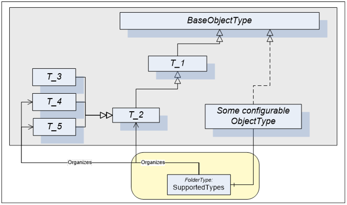  

Figure 56 - Configurable component pattern  

In some cases the *SupportedTypes* folder on the instance can be different to the one on the *Type* and can contain only a subset. It can be for example that only one instance of each *Type* can be configured. In this case the list of supported *Types* will shrink with each configured component.  

#### 9.2.2 ConfigurableObjectType  

This *ObjectType* implements the configurable component pattern and is used when an *Object* or an instance declaration requires nothing but configuration capability. [Figure 57](/§\_Ref221018856) illustrates the *ConfigurableObjectType* . It is formally defined in [Table 142](/§\_Ref221018962) . Concrete examples are in clauses [9.3](/§\_Ref531013038) and [9.4](/§\_Ref531013039) .  

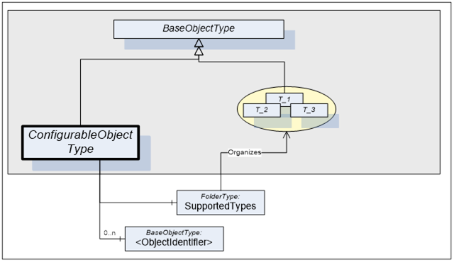  

  

Figure 57 - ConfigurableObjectType  

  

Table 142 - ConfigurableObjectType definition  

| **Attribute** | **Value** |
|---|---|
|BrowseName|1:ConfigurableObjectType|
|IsAbstract|False|
  
| **References** | **NodeClass** | **BrowseName** | **DataType** | **TypeDefinition** | **Other** |
|---|---|---|---|---|---|
|Subtype of the *0:BaseObjectType* defined in [OPC 10000-5](/§UAPart5)|
|||||
|0:HasComponent|Object|1:SupportedTypes||0:FolderType|M|
|0:HasComponent|Object|1:\<ObjectIdentifier\>||0:BaseObjectType|OP|
  
| **Conformance Units** |
|---|
|DI Information Model|
  

  

The *SupportedTypes* folder is used to maintain the set of (subtypes of) *BaseObjectTypes* that can be instantiated in this configurable *Object* (the course of action to instantiate components is outside the scope of this specification).  

The configured instances shall be components of the *ConfigurableObject* .  

### 9.3 Block Devices  

A *Block*\-oriented *Device* can be composed using the modelling elements defined in this specification. A *Block*\-oriented *Device* includes a configurable set of *Blocks* . [Figure 58](/§\_Ref328722197) shows the general structure of *Block*\-oriented *Devices* .  

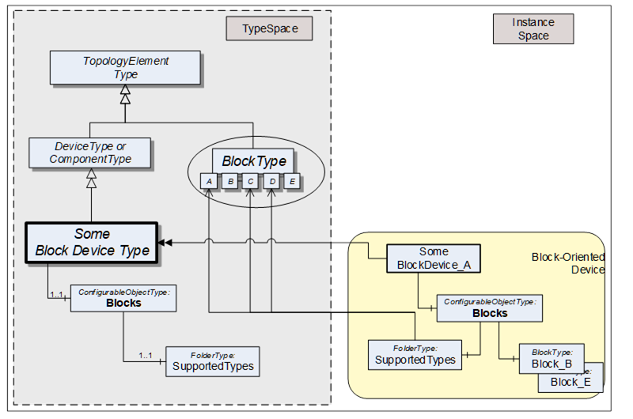  

Figure 58 - Block-oriented Device structure example  

An *Object* called * **Blocks*** *BlockType* instances. It is of the *ConfigurableObjectType* which includes the *SupportedTypes* folder. The *SupportedTypes* folder for * **Blocks*** *BlockTypes* that can be instantiated *.* The supported *Blocks* can be restricted by the *Block*\-oriented *Device* . In [Figure 58](/§\_Ref328722197) the *BlockTypes* B and E have already been instantiated. In this example, only one instance of these types is allowed and the *SupportedTypes* folder therefore does not reference these types anymore. See [9.2.1](/§\_Ref233119662) for the complete definition of the *ConfigurableObjectType* .  

### 9.4 Modular Devices  

A *Modular Device* is represented by a (subtype of) *ComponentType* that is composed of a top- *Device* and a set of subdevices (modules). The top- *Device* often is the head module with the program logic but a large part of the functionality depends on the used subdevices. The supported subdevices can be restricted by the *Modular Device* . [Figure 59](/§\_Ref249859862) shows the general structure of *Modular Devices* .  

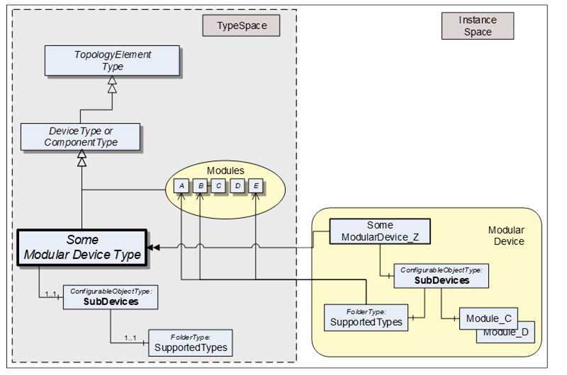  

Figure 59 - Modular Device structure example  

The modules (subdevices) of *Modular Devices* are aggregated in the **SubDevices** *Object* . It is of the *ConfigurableObjectType* , which includes the *SupportedTypes* folder. The *SupportedTypes* folder for **SubDevices** *Modular Device* . Modules are not in the DeviceSet *Object* .  

Depending on the actual configuration, *Modular Device* instances can already have a set of pre-configured subdevices. Furthermore, the *SupportedTypes* folder possibly only refers to a subset of all possible subdevices for the *Modular Device* . In [Figure 59](/§\_Ref249859862) the modules C and D have already been instantiated. In this example, only one instance of these types is allowed and the *SupportedTypes* folder therefore does not reference these types anymore. See clause [9.2.1](/§\_Ref233119662) for the complete definition of the *ConfigurableObjectType* .  

Subdevices can themselves be *Modular Devices* .  

## 10 Lifetime model  

### 10.1 General  

The lifetime model provides information about the lifetime, related limits and semantic of the lifetime of things like tools, material or machines.  

[Table 143](/§\_Ref108601842) illustrates the model with two examples, showing the information that can be provided with the model defined in this clause. The *Value* of the *LifetimeVariable* provides the current value. The *EngineeringUnits* *Property* and the relation of the *Indication* to a classification *ObjectType* provide the semantic. The *StartValue* and *LimitValue* *Properties* indicate the range of the *Value* .  

Table 143 - Lifetime examples  

| **Node** | **CertificateValidity** | **PartsProduced** |
|---|---|---|
|LifetimeVariable|200|553|
|EngineeringUnits (M)|day|number of parts|
|StartValue (M)|365|0|
|WarningValues (O)|10|950|
|LimitValue (M)|0|1000|
|Indication (O)|TimeIndicationType|NumberOfPartsIndicationType|
  

  

For the CertificateValidity example, the instance of the *LifetimeVariableType* defines the remaining validity of a certificate with a unit of days and a classification of *TimeIndication* . The *Value* specifies 200 days - the remaining validity of a certificate. The initial value is 365 days with a warning level of 10 days. The certificate is invalid when the *Value* is zero.  

For the PartsProduced example, the instance of the *LifetimeVariableType* defines the produced parts in the lifetime with a classification of NumberOfPartsIndication. The *Value* specifies 553 parts. The starting value is 0 parts and it is possible to produce up to 1000 parts with a warning indication if the number reaches 950.  

### 10.2 LifetimeVariableType definition  

The *LifetimeVariableType* defines *Variables* representing the remaining lifetime. It provides generically the remaining lifetime and can be used on anything; for example, on machines, actuators or sensors, but also on immaterial things like software. It is formally defined in [Table 144](/§\_Ref108540610) .  

Table 144 - LifetimeVariableType definition  

| **Attribute** | **Value** |
|---|---|
|BrowseName|1:LifetimeVariableType|
|IsAbstract|False|
|ValueRank|−1 (−1 = Scalar)|
|DataType|Number|
|Description|Remaining lifetime|
  
| **References** | **Node Class** | **BrowseName** | **DataType** | **TypeDefinition** | **Other** |
|---|---|---|---|---|---|
|Subtype of the 0:AnalogUnitType|
|0:HasProperty|Variable|1:StartValue|0:Number|0:PropertyType|M|
|0:HasProperty|Variable|1:LimitValue|0:Number|0:PropertyType|M|
|0:HasProperty|Variable|1:Indication|0:NodeId|0:PropertyType|O|
|0:HasProperty|Variable|1:WarningValues|0:Number\{ScalarOrOneDimension\}|0:PropertyType|O|
  
| **Conformance Units** |
|---|
|DI LT Lifetime Base|
  

  

The mandatory *StartValue* indicates the initial value, when there is still the full lifetime left. The engineering unit is the same as for the *Value* of the *Variable* , provided by the *LifetimeVariableType's* mandatory 0: *EngineeringUnits* , derived from the 0: *AnalogUnitType* . The *DataType* shall be the same as for the *Value* of the *Variable* .  

The mandatory *LimitValue* indicates when the end of lifetime has been reached. The engineering unit is the same as for the *Value* of the *Variable* , provided by the *LifetimeVariableType's* mandatory 0: *EngineeringUnits* , derived from the 0: *AnalogUnitType* . The *DataType* shall be the same as for the *Value* of the *Variable* .  

If the *StartValue* is larger than the *LimitValue* , the *Value* of the *Variable* is expected to move over the time downwards to the *LimitValue* , otherwise upwards to the *LimitValue* .  

The optional *Indication* gives an indication of what is actually measured / represented by the *Value* of the *Variable* and the *StartValue* and *LimitValue* . The mandatory 0: *EngineeringUnits* , derived from the 0: *AnalogUnitType* already does this, to a certain degree. But for example, a length unit does not indicate what length is provided, like the cutting distance, the feed distance or the abraded length of a tool. The *Indication* contains a *NodeId* of the *BaseLifetimeIndicationType* or a subtype of it, providing a more detailed indication.  

Note: It is expected that companion specifications or vendors define additional subtypes of *BaseLifetimeIndicationType* .  

The optional *WarningValues* defines one or more limits when the end of lifetime is reached soon and can be used to inform the user. *Servers* can also generate *Events* when such a limit is reached. If provided, the *WarningValues* shall be between the *StartValue* and the *LimitValue* . If it contains more than one entry, the first array entry defines a warning level with lowest severity. The following entries increase the severity so that the highest entry defines the most serious level.  

The engineering unit is the same as for the *Value* of the *Variable* , provided by the *LifetimeVariableType's* mandatory 0: *EngineeringUnits* , derived from the 0: *AnalogUnitType* . The *DataType* shall be the same as for the *Value* of the *Variable* .  

This *VariableType* can be used in various cases. Examples include  

* The *Variable* just indicates the remaining lifetime as a percentage value. In that case, the 0: *EngineeringUnits* is percentage, the *StartValue* is 100 and the *LimitValue* is 0 (or vice versa if counted upwards).  

* The *Variable* represents the number of parts produced. In this case, the 0: *EngineeringUnits* is One, the *StartValue* is 0 and the *LimitValue* the maximum producible parts (e.g. 100 000); or vice versa if the number of remaining parts that still can be produced is provided.  

* The *Variable* represents the remaining time, for example until a software license becomes invalid. The 0: *EngineeringUnits* could be "Day", "Month", "Year", etc., the *StartValue* 0 and the *LimitValue* the overall duration, or vice versa if the remaining time is provided.  

The child *Nodes* of the *LifetimeVariableType* have additional *Attribute* values defined in [Table 145](/§\_Ref108540609) .  

Table 145 - LifetimeVariableType Attribute values for child Nodes  

| **BrowsePath** | **Description Attribute** |
|---|---|
|1:StartValue|*StartValue* indicates the initial value, when there is still the full lifetime left.|
|1:LimitValue|*LimitValue* indicates when the end of lifetime has been reached.|
|1:Indication|*Indication* gives an indication of what is actually measured / represented by the *Value* of the *Variable* and the *StartValue* and *LimitValue* .|
|1:WarningValues|*WarningValues* indicates one or more levels when the end of lifetime is reached soon and can be used to inform the user when reached.|
  

  

### 10.3 BaseLifetimeIndicationType definition  

The *BaseLifetimeIndicationType ObjectType* defines the base indication of a *Variable* of *LifetimeVariableType* , without defining any specific semantic. *Servers* should use a more specific subtype, if possible. It is formally defined in [Table 146](/§\_Ref104822556) .  

Table 146 - BaseLifetimeIndicationType definition  

| **Attribute** | **Value** |
|---|---|
|BrowseName|1:BaseLifetimeIndicationType|
|IsAbstract|True|
|Description|Base indication type not further defining a semantic|
  
| **References** | **Node Class** | **BrowseName** | **DataType** | **TypeDefinition** | **Other** |
|---|---|---|---|---|---|
|Subtype of the 0:BaseObjectType|
  
| **Conformance Units** |
|---|
|DI LT Lifetime Base|
  

  

### 10.4 TimeIndicationType definition  

The *TimeIndicationType ObjectType* indicates the time the entity has been in use or can still be used. It is formally defined in [Table 147](/§\_Ref104823507) .  

Table 147 - TimeIndicationType definition  

| **Attribute** | **Value** |
|---|---|
|BrowseName|1:TimeIndicationType|
|IsAbstract|True|
|Description|Indicates the time the entity has been in use or can still be used|
  
| **References** | **Node Class** | **BrowseName** | **DataType** | **TypeDefinition** | **Other** |
|---|---|---|---|---|---|
|Subtype of the 1:BaseLifetimeIndicationType|
  
| **Conformance Units** |
|---|
|DI LT Time Indication|
  

  

### 10.5 NumberOfPartsIndicationType definition  

The *NumberOfPartsIndicationType ObjectType* indicates total number of parts that have been produced or can still be produced. It is formally defined in [Table 148](/§\_Ref104823495) .  

Table 148 - NumberOfPartsIndicationType definition  

| **Attribute** | **Value** |
|---|---|
|BrowseName|1:NumberOfPartsIndicationType|
|IsAbstract|True|
|Description|Indicates the total number of parts that have been produced or can still be produced.|
  
| **References** | **Node Class** | **BrowseName** | **DataType** | **TypeDefinition** | **Other** |
|---|---|---|---|---|---|
|Subtype of the 1:BaseLifetimeIndicationType|
  
| **Conformance Units** |
|---|
|DI LT Nb Of Parts Indication|
  

  

### 10.6 NumberOfUsagesIndicationType definition  

The *NumberOfUsagesIndicationType ObjectType* indicates counting the process steps the entity has been used or can still be used for (for example usages of a punching tool). It is formally defined in [Table 149](/§\_Ref104823487) .  

Table 149 - NumberOfUsagesIndicationType definition  

| **Attribute** | **Value** |
|---|---|
|BrowseName|1:NumberOfUsagesIndicationType|
|IsAbstract|True|
|Description|Indicates counting the process steps the entity has been used or can still be used for (for example usages of a punching tool).|
  
| **References** | **Node Class** | **BrowseName** | **DataType** | **TypeDefinition** | **Other** |
|---|---|---|---|---|---|
|Subtype of the 1:BaseLifetimeIndicationType|
  
| **Conformance Units** |
|---|
|DI LT Nb Of Usages Indication|
  

  

### 10.7 LengthIndicationType definition  

The *LengthIndicationType ObjectType* indicates the abraded length, for example of a drill. It is formally defined in [Table 150](/§\_Ref104823476) .  

Table 150 - LengthIndicationType definition  

| **Attribute** | **Value** |
|---|---|
|BrowseName|1:LengthIndicationType|
|IsAbstract|True|
|Description|Indicates the abraded length, for example of a drill.|
  
| **References** | **Node Class** | **BrowseName** | **DataType** | **TypeDefinition** | **Other** |
|---|---|---|---|---|---|
|Subtype of the 1:BaseLifetimeIndicationType|
  
| **Conformance Units** |
|---|
|DI LT Length Indication|
  

  

### 10.8 DiameterIndicationType definition  

The *DiameterIndicationType ObjectType* indicates the abraded diameter, for example of a drill. It is formally defined in [Table 151](/§\_Ref104823463) .  

Table 151 - DiameterIndicationType definition  

| **Attribute** | **Value** |
|---|---|
|BrowseName|1:DiameterIndicationType|
|IsAbstract|True|
|Description|Indicates the abraded diameter, for example of a drill.|
  
| **References** | **Node Class** | **BrowseName** | **DataType** | **TypeDefinition** | **Other** |
|---|---|---|---|---|---|
|Subtype of the 1:BaseLifetimeIndicationType|
  
| **Conformance Units** |
|---|
|DI LT Diameter Indication|
  

  

### 10.9 SubstanceVolumeIndicationType definition  

The *SubstanceVolumeIndicationType ObjectType* indicates the volume of a substance, for example of a liquid. It is formally defined in [Table 152](/§\_Ref109741882) .  

Table 152 - SubstanceVolumeIndicationType definition  

| **Attribute** | **Value** |
|---|---|
|BrowseName|1:SubstanceVolumeIndicationType|
|IsAbstract|True|
|Description|Indicates the volume of a substance, for example of a liquid.|
  
| **References** | **Node Class** | **BrowseName** | **DataType** | **TypeDefinition** | **Other** |
|---|---|---|---|---|---|
|Subtype of the 1:BaseLifetimeIndicationType|
  
| **Conformance Units** |
|---|
|DI LT Substance Volume Indication|
  

  

## 11 Profiles and ConformanceUnits  

Meaning and significance of *Profiles* and *ConformanceUnits* are described in [OPC 10000-7](/§UAPart7) .  

The *Profiles* and *ConformanceUnits* for this specification are maintained in the online database and accessible via [https://profiles.opcfoundation.org/?pg=DI%201.05](1.05) .  

  

  

## 12 Namespaces  

### 12.1 Namespace Metadata  

[Table 153](/§\_Ref447784419) defines the namespace metadata for this specification. The *Object* is used to provide version information for the namespace and an indication about static *Nodes* . Static *Nodes* are identical for all *Attributes* in all *Servers* , including the *Value Attribute* . See [OPC 10000-5](/§UAPart5) for more details.  

The information is provided as *Object* of type *NamespaceMetadataType* . This *Object* is a component of the *Namespaces* *Object* that is part of the *Server Object* . The *NamespaceMetadataType ObjectType* and its *Properties* are defined in [OPC 10000-5](/§UAPart5) .  

The version information is also provided as part of the ModelTableEntry in the UANodeSet XML file. The UANodeSet XML schema is defined in [OPC 10000-6](/§UAPart6) .  

Table 153 - NamespaceMetadata Object for this Specification  

| **Attribute** | **Value** |
|---|---|
|BrowseName|1:http://opcfoundation.org/UA/DI/|
  
| **Property** | **DataType** | **Value** |
|---|---|---|
|0:NamespaceUri|0:String|http://opcfoundation.org/UA/DI/|
|0:NamespaceVersion|0:String|1\.05.0|
|0:NamespacePublicationDate|0:DateTime|2025-11-15|
|0:IsNamespaceSubset|0:Boolean|False|
|0:StaticNodeIdTypes|0:IdType[]|0|
|0:StaticNumericNodeIdRange|0:NumericRange[]||
|0:StaticStringNodeIdPattern|0:String||
  
| **Conformance Units** |
|---|
|DI Information Model|
  

  

  

### 12.2 Handling of OPC UA namespaces  

Namespaces are used by OPC UA to create unique identifiers across different naming authorities. The *Attributes* *NodeId* and *BrowseName* are identifiers. A *Node* in the UA *AddressSpace* is unambiguously identified using a *NodeId* . Unlike *NodeIds* , the *BrowseName* cannot be used to unambiguously identify a *Node* . Different *Nodes* can have the same *BrowseName* . They are used to build a browse path between two nodes or to define a standard *Property* .  

*Servers* will often choose to use the same namespace for the *NodeId* and the *BrowseName* . However, if they want to provide a standard *Property* , its *BrowseName* shall have the namespace of the standards body although the namespace of the *NodeId* reflects something else, for example the *EngineeringUnits* *Property* . All *NodeIds* of *Nodes* not defined in this specification shall not use the standard namespaces.  

[Table 154](/§\_Ref252866620) provides a list of mandatory and optional namespaces used in a DI OPC UA *Server* .  

Table 154 - Namespaces used in an OPC UA for Devices Server  

| **NamespaceURI** | **Description** | **Use** |
|---|---|---|
|http://opcfoundation.org/UA/|Namespace for *NodeIds* and *BrowseNames* defined in the OPC UA specification. This namespace shall have namespace index 0.|Mandatory|
|Local Server URI|Namespace for *Nodes* defined in the local *Server* . This can include types and instances used in a *Device* represented by the *Server* . This namespace shall have namespace index 1.|Mandatory|
|http://opcfoundation.org/UA/DI/|Namespace for *NodeIds* and *BrowseNames* defined in this specification. The namespace index is *Server* specific.|Mandatory|
|Vendor specific types and instances|A *Server* can provide vendor specific types like types derived from *TopologyElementType* or *NetworkType* or vendor-specific instances of those types in a vendor specific namespace.|Optional|
  

  

[Table 155](/§\_Ref369000025) provides a list of namespaces and their index used for *BrowseNames* in this specification. The default namespace of this specification is not listed since all *BrowseNames* without prefix use this default namespace.  

Table 155 - Namespaces used in this specification  

| **NamespaceURI** | **Namespace Index** | **Example** |
|---|---|---|
|http://opcfoundation.org/UA/|0|0:EngineeringUnits|
|http://opcfoundation.org/UA/DI/|1|1:ComponentType|
|http://opcfoundation.org/UA/DI/PackageMetadata/|2|2:PackageMetadata|
  

  

## Annex A (normative)Namespace and mappings  

### A.1 NodeSet and Supplementary Files for DI Information Model  

The DI *Information Model* is identified by the following URI:  

http://opcfoundation.org/UA/DI/  

Documentation for the NamespaceUri can be found [here](https://reference.opcfoundation.org/nodesets?u=http://opcfoundation.org/UA/DI/) .  

The *NodeSet* associated with this version of specification can be found here:  

[https://reference.opcfoundation.org/nodesets/?u=http://opcfoundation.org/UA/DI/&v=1.05.0&i=1](https://reference.opcfoundation.org/nodesets/?u=http://opcfoundation.org/UA/DI/&v=1.05.0&i=1)  

  

The *NodeSet* associated with the latest version of the specification can be found here:  

[https://reference.opcfoundation.org/nodesets/?u=http://opcfoundation.org/UA/DI/&i=1](https://reference.opcfoundation.org/nodesets/?u=http://opcfoundation.org/UA/DI/&i=1)  

  

The supplementary files associated with this version of specification can be found here:  

[https://reference.opcfoundation.org/nodesets/?u=http://opcfoundation.org/UA/DI/&v=1.05.0&i=2](https://reference.opcfoundation.org/nodesets/?u=http://opcfoundation.org/UA/DI/&v=1.05.0&i=2)  

  

The supplementary files associated with the latest version of the specification can be found here:  

[https://reference.opcfoundation.org/nodesets/?u=http://opcfoundation.org/UA/DI/&i=2](https://reference.opcfoundation.org/nodesets/?u=http://opcfoundation.org/UA/DI/&i=2)  

The *NamespaceUri* for the package\_metadata.json with structures and enumerations used for *Software Package* files is:  

http://opcfoundation.org/UA/DI/PackageMetadata/  

Note: This namespace and the contained types typically do not show up in the *AddressSpace* of an OPC UA *Server* .  

## Annex B (informative)Examples  

This Annex includes examples referenced in the normative sections.  

### B.1 Functional Group usages  

The examples in [Figure B.1](/§\_Ref522107098) and [Figure B.2](/§\_Ref232581992) illustrate the use of *FunctionalGroups:*  

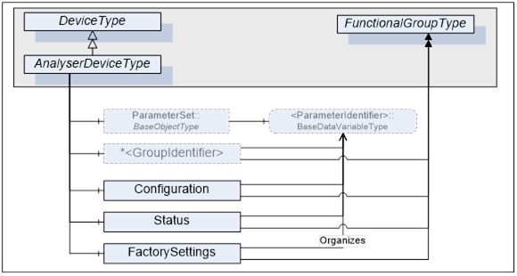  

Figure B. 1 - Analyser Device use for FunctionalGroups  

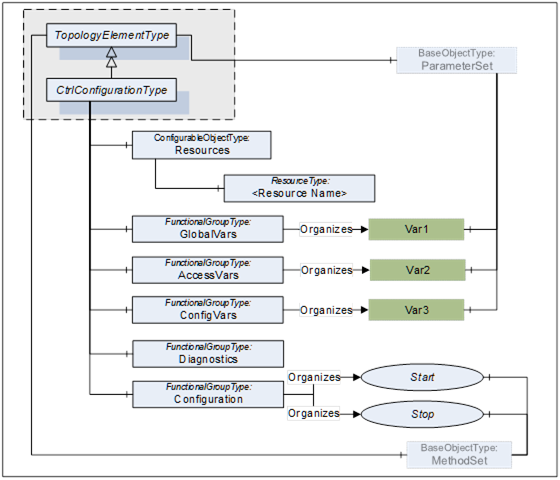  

Figure B. 2 - PLCopen use for FunctionalGroups  

  

### B.2 Identification Functional Group  

The *Properties* of a *TopologyElement* , like Manufacturer, SerialNumber, will usually be sufficient as identification. If other *Parameters* or even *Methods* are required, all required elements shall be organized in a *FunctionalGroup* called **Identification** [Figure B.3](/§\_Ref522107066) illustrates the **Identification** *FunctionalGroup* with an example.  

Note that companion standards are expected to define the Identification contents for their model.  

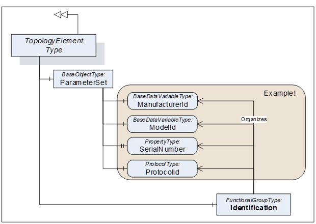  

Figure B. 3 - Example of an Identification FunctionalGroup  

  

### B.3 Software Update examples  

#### B.3.1 Simple example using Cached-Loading  

The software update model provides several options and variants for advanced use cases. The *Update Client* must be prepared for the option that the server provides (see [8.3.4.1](/§\_Ref179796761) ) and how the concrete update behaves (see [8.3.8](/§\_Ref179796793) ).  

This example shows a typical application for a simple server with a minimal implementation. The subsequent examples additionally address generic clients and describe all the optional parts that can be supported.  

This example uses the *Cached-Loading* option. If the memory is limited and the installation can be done during the transfer of the *Software Package* , the *Direct-Loading* model is another simple option.  

First the client determines what version is currently installed by reading the *Properties* of *CurrentVersion* of the *Loading* object.  

Then the client can transfer the *Software Package* to the device using the *Loading.FileTransfer* object. At the end of the transfer the server checks whether the new *Software Package* is compatible ( *FileTransfer.CloseAndCommit* ).  

With a call to *InstallSoftwarePackage* () of the *Installation* state machine the actual installation is started. The end of the installation could be an automatic reboot of the device or the state machine transitions back to *Idle* . A transition to *Error* would indicate an issue during the installation.  

During the whole installation, the progress and error messages for the user can be determined subscribing the *UpdateStatus* property.  

To verify if the update was success the client verifies that *Loading.CurrentVersion* now describes the desired updated version.  

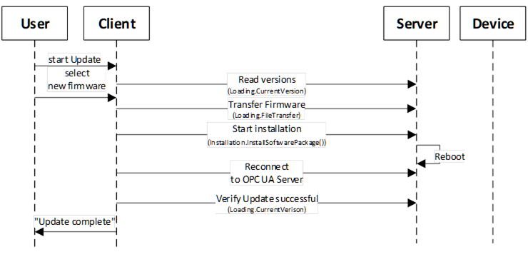  

Figure B. 4 - Example of simple update sequence  

  

#### B.3.2 Factory Automation example  

This example illustrates the use of software update of several devices from the *Client* point of view.  

This is only one example for a specific domain. There will be different *Clients* for different types of systems or industries (e.g., for process domain the process will not be stopped and before a sensor is updated a replacement value is configured in the controller).  

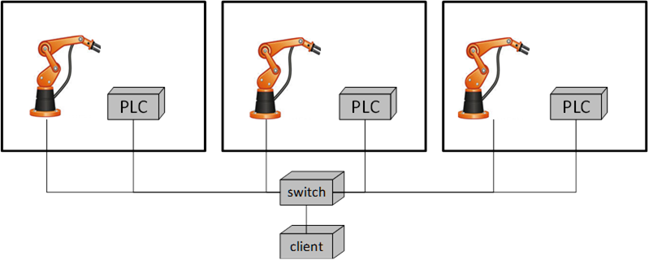  

Figure B. 5 - Example  

The example (illustrated in [Figure B.5](/§\_Ref39845323) ) describes a production line with several production cells. Each cell contains a robot and a main PLC that can be updated. A switch connects the cells and is also updateable via OPC UA.  

A *Client* would perform the following steps:  

1. Analyze the system  

* Determine the network topology with all devices.  

* Determine currently installed software and how the devices can perform the update (using *IVendorNameplateType* *Interface* and *Loading Object* ).  

* Determine technical preconditions for the update. E.g., if the device uses *Direct-, Cached- or File System based Loading* (using the *Loading Object* ).  

1. Prepare installation  

* The user selects the software to be installed  

* Transfer the software and firmware updates to the PLCs, the robots and the switch, except for *Direct-Loading* *(using CachedLoadingType, FileSystem)* .  

1. Schedule installation ( *Client* only)  

* Determine how the update can be executed (using *GetUpdateBehavior* *Methods* of *CachedLoadingType and FileSystemLoadingType* ).  

* Wait for strategic condition (e.g., end of shift; no task in queue).  

* Plan the order of update (e.g., robots and PLCs first; infrastructure components last).  

1. Prepare devices for installation  

* Stop production line software (using an application specific *Information Model* ).  

* Bring the robots and PLCs into a state for update (using the *PrepareForUpdate* state machine and/or branch specific state machine).  

* Wait for technical starting conditions (e.g., robot in standstill) (using the *PrepareForUpdate* state machine).  

1. Execute installation  

* Start the installation of all robots and all PLCs simultaneously (using the *Installation* state machine).  

* Update the switch when robots & PLCs are done (using the *Installation* state machine).  

1. Restore device state after installation  

* Restart robots and PLCs (using the *PrepareForUpdate* state machine and/or branch specific state machine).  

* Restart production line software (using an application specific *Information Model* ).  

#### B.3.3 Update sequence using Direct-Loading  

An example sequence of *Direct-Loading* is shown in [Figure B.6](/§\_Ref25054117) .  

If the *Server* does not implement the properties *PrepareForUpdate* , *PowerCycle* or *Parameters* of the *SoftwareUpdateType* , the associated options are not supported by the component and *Client*\- *Server* interaction becomes simpler.  

In the first steps the device identity and the kind of supported *Server* options of the device must be discovered as described in [Figure 35](/§\_Ref25672958) .  

How to look up and transfer files for an installation is described in [Figure 36](/§\_Ref25672950) .  

The preparation can be done as described in [Figure 37](/§\_Ref25672912) .  

The installation itself is described in [Figure 38](/§\_Ref25672904) .  

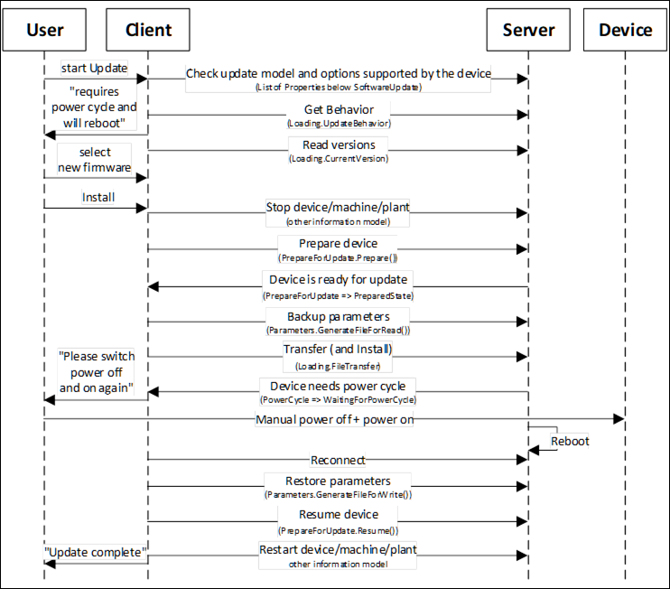  

Figure B. 6 - Example sequence of Direct-Loading  

#### B.3.4 Update sequence using Cached-Loading  

An example sequence of *Cached-Loading* is shown in [Figure B.7](/§\_Ref25054124) .  

If the *Server* does not implement the properties *PrepareForUpdate* , *PowerCycle* or *Parameters* of the *SoftwareUpdateType* , the associated options are not supported by the component and *Client*\- *Server* interaction becomes simpler.  

In the first steps the device identity and the kind of supported *Server* options of the device must be discovered as described in [Figure 35](/§\_Ref25672958) .  

How to look up and transfer files for an installation is described in [Figure 36](/§\_Ref25672950) .  

The preparation can be done as described in [Figure 37](/§\_Ref25672912) .  

The installation itself is described in [Figure 39](/§\_Ref25672894) .  

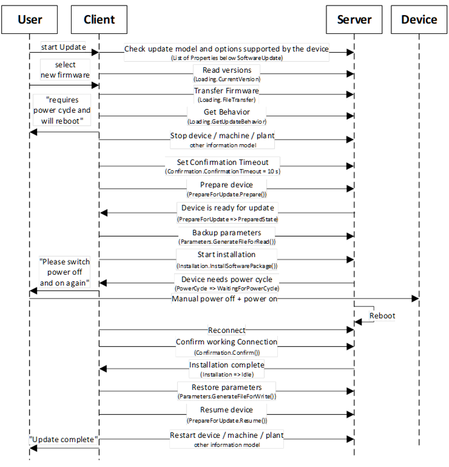  

Figure B. 7 - Example sequence of Cached-Loading  

#### B.3.5 Update sequence using File System based Loading  

An example sequence of *File System based Loading* is shown in [Figure B.8](/§\_Ref46154608) .  

In this example the server provides the *PrepareForUpdate* state machine and a preparation for an installation can only be done locally at the device. So, the Resume activity described in [Figure 39](/§\_Ref25672894) cannot be commanded by a *Client.*  

In the first steps the device identity and the kind of supported *Server* options of the device must be discovered as described in [Figure 35](/§\_Ref25672958) .  

How to look up and transfer files for an installation is described in [Figure 36](/§\_Ref25672950) .  

The preparation can be done as described in [Figure 37](/§\_Ref25672912) .  

The installation itself is described in [Figure 39](/§\_Ref25672894) .  

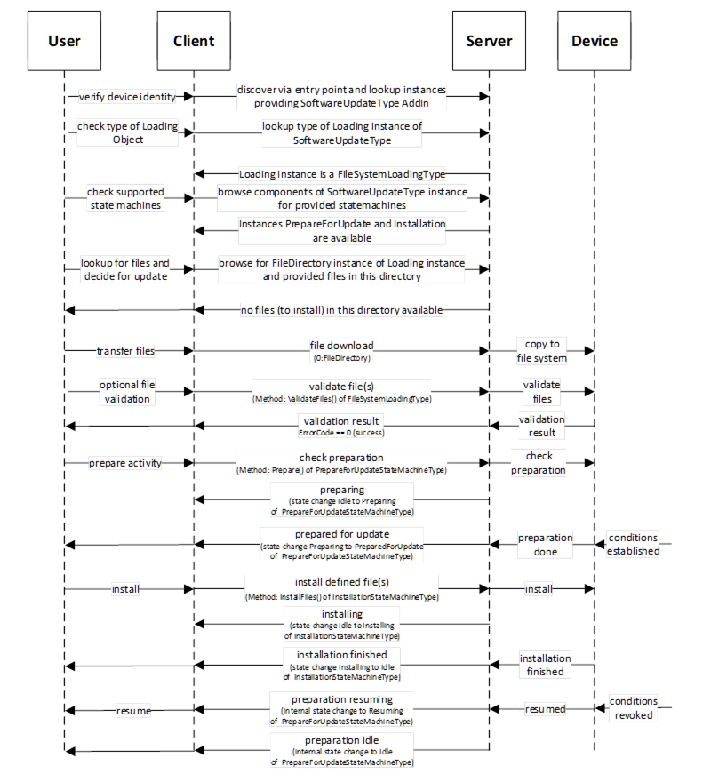  

Figure B. 8 - Example sequence of File System based Loading  

#### B.3.6 Update Sequence for optimized system/bulk firmware update for modular devices and machines  

This example explains how an optimized firmware update for a modular device or machine can look like. Therefore, multiple firmware packages are gathered into one solution package and send to the OPC UA server all at once to avoid multiple transfer sequences.  

A modular or complex device or a machine are consisting of several modules, components or sub-devices. Each of them has their own firmware (or even configuration). In the traditional way each of them has an own instance of the *SoftwareUpdateType* object and each of them requires a download and install activity for the firmware. This can lead to duplicated download firmware package and/or often executed sequentially, means each firmware packages are transferred separately by opening each a new connection/channel for the download, which takes a lot of time in cases of larger installations.  

Following a standardized way of managing modular devices or device with multiple content to loaded all at once:  

1. Create a solution package see [8.7.5](/§\_Ref172616444) to put all firmware, configuration or application into one package.  

1. The UA server contains a *SoftwareUpdateType* instance which is classified as *SoftwareClass* *Solution* to identify that a solution package download/handling is supported. The object has the loading type *FileSystemLoadingType, due to optional version as a solution package may not have a version number.* . The version check will be done with *ValidateFiles* operation, where device will check each sub-package against the assigned information.  

 **Example of a UA address space "Modular Device":**   

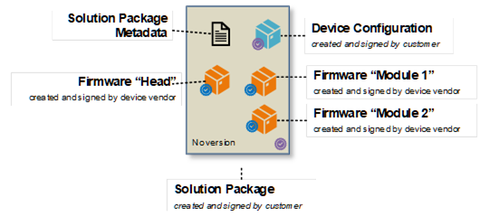  

 **Figure B. 9 : Solution Package example "Modular Device".**   

  

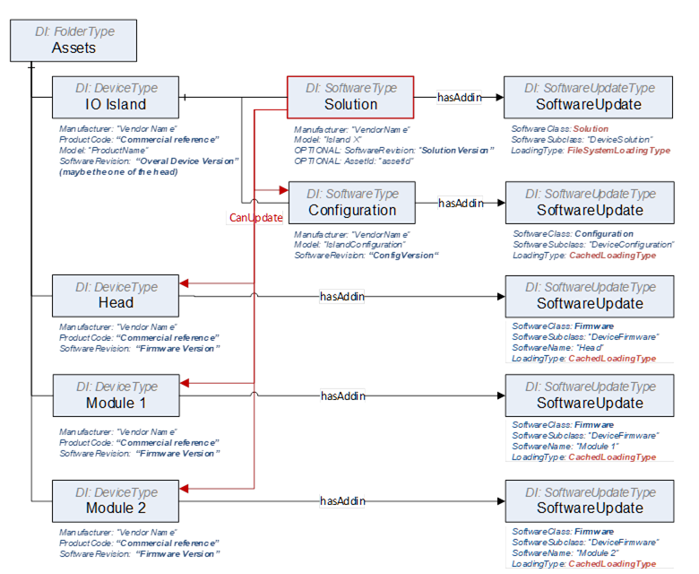  

 **Figure B. 10 : UA address space example for the server "Modular Device".**   

Example of a UA address space "Single Device":  

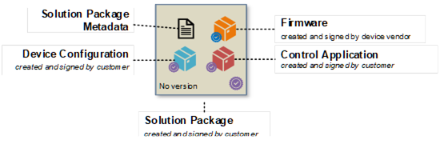  

 **Figure B. 11 : Solution Package example "Single Device".**   

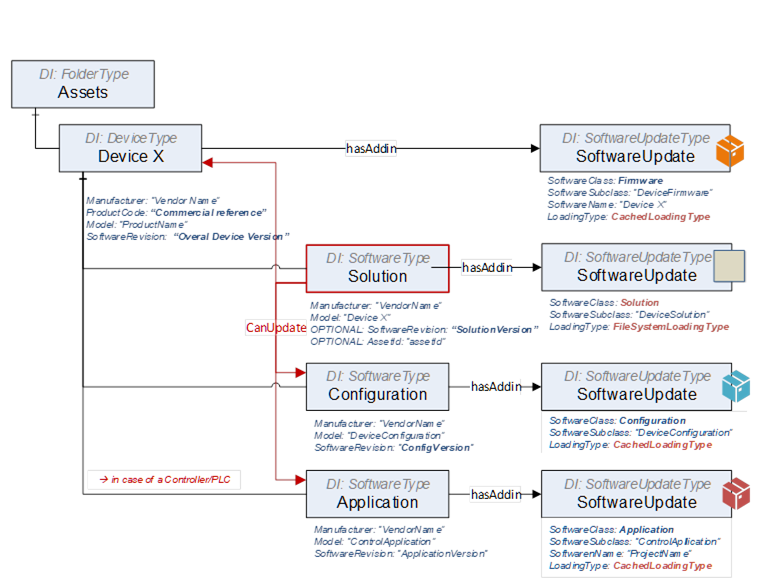  

Figure B. 12 : UA address space example for the server "Single Device".  

 **Example of a UA solution package metadata "Single Device" showing the assignment:**   

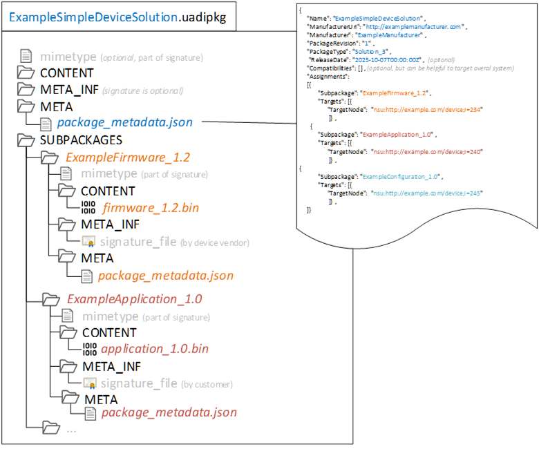  

 **Figure B. 13 : Solution package metadata "Single Device" example**   

##### B.3.6.1 Update Sequence for Single Device - where solution package is created 'on the fly'  

*There is the situation that a tool is connecting to a device and need to create an individual update for this device solution, which may include just a subset of elements.*  

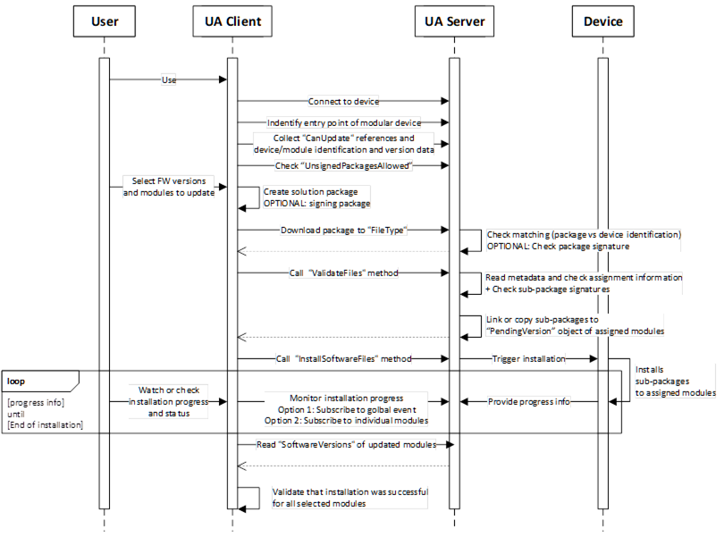  

 **Figure B. 14 : Update sequence for a modular device using a solution package.**   

  

Steps of the workflow:  

1. Connect to the device via the UA server.  

1. The client finds the entry point of the modular device, that can happen by:  

1. Knowing the structure such as UADI:DeviceType or UAFX:AssetType  

1. Finding the object with software class "Solution" behind,  

1. In cases of a sever hosting multiple devices, the user selects the right one or the client knows the identification of the target device.  

1. Browse the references *CanUpdate* of the "Solution" object to know devices can be updated via a solution package. Afterwards read the identification of the linked modules.  

1. Check the flag "UnsignedPackagesAllowed" to know if a solution package is required to be signed.  

1. User selects the FW version or config/application and modules/targets that should be updated.  

1. Client creates a new solution package with the selected content. It includes:  

1. Creating of the solution package and pack the sub-packages into it.  

1. Creating a package metadata file that contains the assignment information.  

1. Optionally sign the solution package with a customer provided certificate or service.  

1. Client downloads the solution package to the device.  

1. Device is doing an overall check on the package level if its valid and intended for this device.  

1. Optional checking the package signature  

1. Client calls *ValidateFiles* to trigger a check of the metadata data about assignments  

1. For the successful matched elements, the sub-packages are copied or linked to the *SoftwareUpdate* instances of each device into the *PendingVersion.*  

1. Server is returning the info which elements are ready for update and which are not supported  

1. Client tiggers the installation process by calling *InstallSoftwareFiles* . This triggers the real installation process on the device side.  

1. Device is installing the selected version. That can happen in parallel or sequential or combined way depending on the device capabilities. This is up to the devices.  

1. Client is subscribing to [a] or/and [b] to get progress and status of the installation process.  

1. A global event (aggregates all progress and status updates via the module and update ID, so that the client can see the details on module is referred)  

1. Each individual module  

1. Device is sending the progress and status information.  

1. After client received the message for end of installation, he is reading the module identification with software revision to check if installation was really successful.  

##### B.3.6.2 Update Sequence for Modular Device - when getting a solution package from a 3rd instance.  

*A 3 rd instance has created a solution package. The assignment of sub-packages to target modules is in the package metadata.*  

 **Variation 1:**   

  

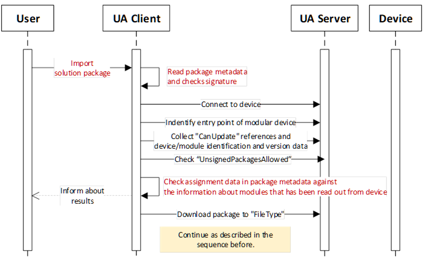  

 **Figure B. 15 : Update sequence for a modular device using an imported solution package.**   

 **Variation 2:**   

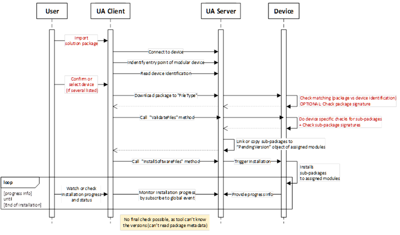  

 **Figure B. 16 : Update sequence for a modular device using unknow solution package.**   

  

 **Variation 3:**   

The main idea of the solution package is to create a consistent description of all the content that is gathered within the package to be able to do a pre-check before sending any content to a target, means there should be some description of each subpackage in terms of what it is and what to be checked by the tool to enable a successful execution of the package on the target.  

Therefore, the unknown (proprietary) content or package need to be descripted at least with a minimal set of parameters. A full and final check needs to be done anyhow by the target itself. That means creating a kind of wrapper to this UA package format by adding a package metadata file, containing at least the minimal set of information to a description about what the package is and for whom is it made for.  

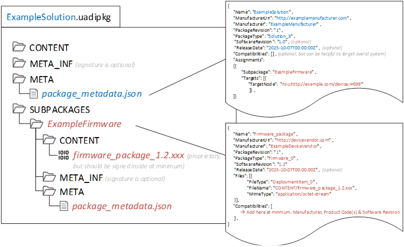  

 **Figure B. 17 : Example of wrapping an unknown content within a solution package**   

##### B.3.6.3 Managing a situation of an unsigned solution package  

  

In case a solution Package is NOT signed, due to:  

  

* the user doesn't have the certificate from the device (individual creation of a solution package at customer site by the customer to update).  

* the device using customer specific certificates (tool that creates the solution package may not have access to these certificates).  

* no PKI infrastructure is available.  

  

It represents a potential security risk and to mitigates it, following considerations has been done:  

  

1. Sub-package(s) itself are still signed by the vendor such as firmware packages, means no execution of unsigned data in the server though the sub packages. Sub-packages that can't be signed by the vendor like configurations or applications, shall be signed by the customer or the tool shall inform the user about a usage unsigned content in a sub-package.  

  

1. Trust relation between tool and server is in place based on UA connections and sessions.  

* Tool as trust anchor, similar as signature check outsourced by a PKI / GDS  

* Server is trusting the tool, allowing tool to do firmware update.  

* The tool has to authenticate and authorize itself through login/token and application trust list.  

  

1. Solution packages is created by the tool that has this trust relation.  

  

1. For 3rd instance created packages that has been imported, the tool should inform user Users shall be informed about possible risks when using this option of unsigned solution packages. (Informative)  

* The server can write to a log or send an event to the client  

  

##### B.3.6.4 Extension for Signed Packages are Mandotory  

  

Instruction for the need that a solution package must be signed:  

  

1. Use an attribute "UnsignedPackagesAllowed" and set value to "FALSE".  

1. Implement recommended security settings and behaviour that only an admin or security expert can change this setting  

  

  

  

  

## Annex C (informative)Guidelines for the usage of OPC UA for Devices as base for companion specifications  

This informative Annex describes guidelines for the usage of this specification as base for creating companion specifications as well as guidelines on how to combine different companion specifications based on this specification describing different aspects of the same device in one OPC UA application.  

### C.1 Overview  

This specification is used as base for many other companion specifications like  

* OPC UA for IEC 61131-3  

* OPC UA Information Model for FDT Technology  

* AutoId  

* OPC UA for IO-Link.  

Those companion specifications define different aspects of devices, for example  

* some specific functionality (like the scan operation of a RFID reader in the AutoId spec),  

* the view of the device accessed by a specific protocol (like IO-Link),  

* or the configuration capabilities of a device as defined in a vendor-specific device package (like FDI or FDT).  

When an OPC UA application wants to combine those different aspects of one device in its *AddressSpace* , there are potential problems as shown in [Figure C.1](/§\_Ref532897663) . The example shows the application of the AutoId specification as well as the FDT specification for the same device. For simplicity, only the base ObjectTypes are shown. In reality, there has to be a subtype of the abstract FdtDeviceType and there would be very likely a vendor-specific subtype of the RfidReaderDeviceType.  

As shown in the figure, there are actually two Objects of different ObjectTypes representing different aspects of the same device in the real world.  

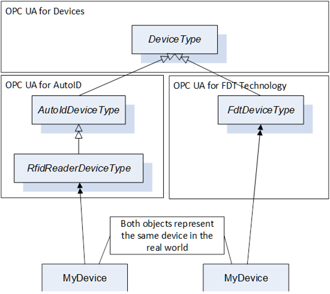  

Figure C. 1 - Example of applying two companion specifications based on OPC UA for Devices  

In order to avoid multiple-inheritance, which is not further defined in OPC UA, it is not possible to directly combine both ObjectTypes into one ObjectType containing all aspects of the device. And an Object cannot be defined by two ObjectTypes. Therefore, in order to expose the information, that both Objects actually represent different aspects of the same device, composition should be used as shown in [Figure C.2](/§\_Ref532904958) .  

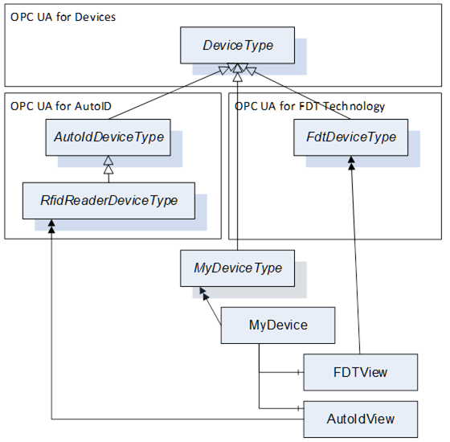  

Figure C. 2 - Using composition to compose one device representation defined by two companion specifications  

In this case, the device is represented by an Object "MyDevice" where the vendor of the OPC UA Application can provide its specific knowledge of the device. In addition, the Object has two components called FDTView and AutoIdView in the figure, containing the information as defined in the corresponding companion specifications.  

### C.2 Guidelines to define companion specifications based on OPC UA for Devices  

As shown in the previous section, composition can be used to combine the ObjectTypes defined by various specifications describing aspects of a device in order to combine the information in one OPC UA application. This can lead, as shown in the example in [Figure C.2](/§\_Ref532904958) , to the usage of several instances of the DeviceType to represent one device. In order to avoid this, it is recommended that companion specifications do not directly derive from the DeviceType but instead derive from the TopologyElementType or other subtypes of the TopologyElementType (but not the DeviceType). This allows an OPC UA application to represent the device by one instance of the DeviceType and compose potentially several other aspects without using the DeviceType again.  

The DeviceType defines several Properties identifying the device as mandatory. By the approach described above, the Properties are repeated several times as required in the example in [Figure C.2](/§\_Ref532904958) . Here, the mandatory SerialNumber is a Property of MyDevice, FDTView, and AutoIdView. However, companion specification can still define some of those Properties on their ObjectTypes, either optional in order to allow the usage of their ObjectTypes without an additional Object (for example if only one companion specification is supported by the OPC UA application) or mandatory, if a specific access-path to the information shall be exposed. For example, the SerialNumber accessed by a specific protocol can be different than the SerialNumber managed directly by the DeviceVendor. Whereas Profibus or IO-Link represent the SerialNumber as a String, the HART protocol uses three Bytes. So, if a companion specification should expose the SerialNumber accessed via HART, it can add it as mandatory Property to its ObjectType. To conclude, it is recommended that companion specification provide the Properties of the DeviceType by implementing the IVendorNameplateType, which adds all the Properties optionally to the ObjectType. If desired, they can make some of those Properties mandatory to force that a specific access path is used (e.g. via a specific protocol).  

In order to easily identify the components representing different views on the device, it is recommended to use the AddIn concept to define a standardized BrowseName for the Object (DefaultInstanceBrowseName Property). In the example in [Figure C.2](/§\_Ref532904958) that would mean that FdtDeviceType would have defined a DefaultInstanceBrowseName "FDTView", and thus OPC UA Clients can easily find the FDT specific data of the device by looking for an Instance called "FDTView", for example by using the TranslateBrowsePathsToNodeIds Service.  

### C.3 Guidelines on how to combine different companion specifications based on OPC UA for Devices in one OPC UA application  

When supporting several companion specifications in one OPC UA application it is recommended to use the composition approach as described in section [C.1](/§\_Ref532907347) . To expose the possibilities further, the example is extended as shown in [Figure C.3](/§\_Ref532908189) . Again, subtypes for the concrete type of device are not considered for simplicity. The IOLinkDeviceType is already not derived from DeviceType but TopologyElementType. As the FDT and AutoID specifications derive from DeviceType, the device is represented by several instances of the DeviceType.  

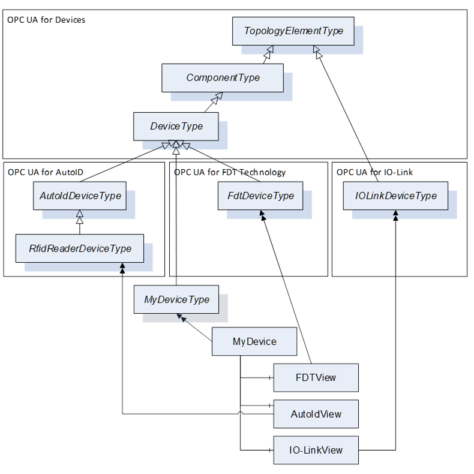  

Figure C. 3 - Example of applying several companion specifications (I)  

In order to limit the usage of DeviceType instances, an alternative approach is shown in [Figure C.4](/§\_Ref532908379) . Here, the RfidReaderDeviceType is used as main Object to represent the device, and the objects defined by the other companion specifications are composed.  

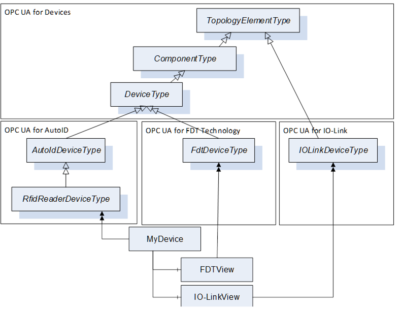  

Figure C. 4 - Example of applying several companion specifications (II)  

It is recommended to use one of the two approaches described above.  

### C.4 Guidelines to manage the same Variables defined in different places  

Deploying several Information Models based on this specification on the same device can lead to the situation, that the same *Variable* (e.g., the *Property* *SerialNumber* ) for the same device is used in several places.  

When the *Property* is the same, and the value of the *Property* is the same, it is recommended to avoid, that the value is managed in the *Server* in two different places (see [Figure C.5](/§\_Ref34386048) , left). One solution is, that the two *Variables* reference the same internal memory managing the value (see [Figure C.5](/§\_Ref34386048) , middle). Another solution is, that the *Variable* is only managed once in the *Server* , just referenced from different places (see [Figure C.5](/§\_Ref34386048) , right). The solution using the same *Node* is the most optimized one in terms of memory consumption.  

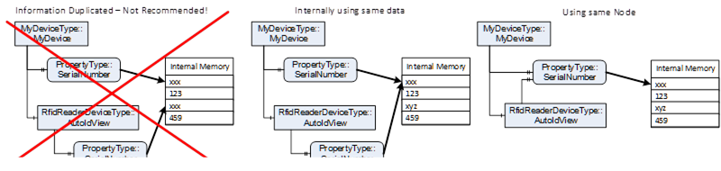  

Figure C. 5 - Options how to manage the same Variable  

### C.5 Guidelines on how to use functionality in companion specifications  

In the previous sections it was shown how to use this specification when you want to use at least the *TopologyElementType* , providing you the capabilities to manage Parameters and *Methods* via ParameterSet and MethodSet and FunctionalGroups.  

If the companion specification only wants to reuse other aspects of this specification, defined in the *Interfaces* in [4.5](/§\_Ref526605884) or the *AddIns* "Locking" in [7](/§\_Ref57796058) or software update in [8](/§\_Ref57796057) , the companion specification is not required to derive from the *ObjectTypes* defined in this specification. Instead of, it can just implement the *Interfaces* or use the *AddIns* in their *ObjectTypes* and build an *ObjectType*\-Hierarchy independent of this specification.  

In [Figure C.5](/§\_Ref34386048) , an example is given. The companion specification defines an *ObjectType* hierarchy, and uses the *AddIns* in the appropriate places (Lock and Transfer). The *Interfaces* can either be implemented by the *ObjectTypes* directly ( [Figure C.5](/§\_Ref34386048) ), or by a sub-component in order to group the functionality ( [Figure C.7](/§\_Ref35349141) ). In the second approach, the RootType does not implement the *IVendorNameplate* directly, but uses a component (Identification) implementing the *Interface* . Here, the *FunctionalGroupType* and the predefined name Identification is used. The B\_Type extends the Identification and also implements the *ITagNameplateType* .  

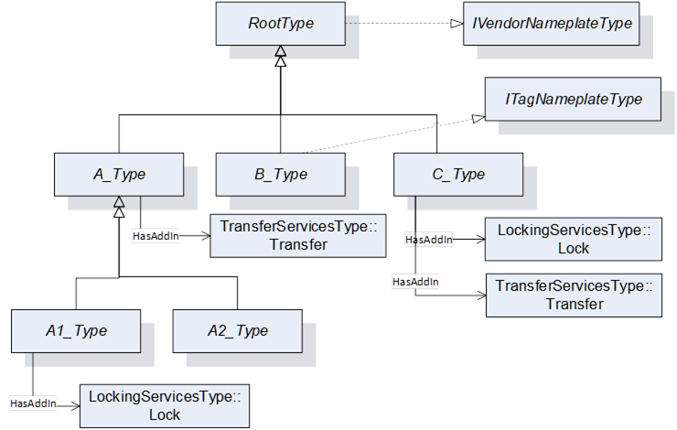  

Figure C. 6 - Example on how to use AddIns and Interface  

The advantage of the first approach is, that the content of the *Interface* is directly at the *ObjectType* , whereas the advantage of the second approach is, that the content of the *Interface* is grouped in the sub-component. When the content of the *Interface* and the additional content of the *ObjectType* and its expected subtypes is rather small, the first approach is recommended. If the content of the *Interface* or the additional content of the *ObjectType* or its subtypes is rather large, the additional grouping *Object* is recommended, as it does not provide a flat list of sub-components, but groups them accordingly and thus makes it easier to use.  

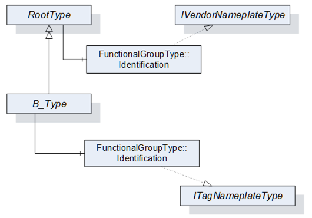  

Figure C. 7 - Example on how to use Interface with additional Object  

Bibliography  

IEC 61784: *Industrial networks - Profiles*  

IEC 61499-1:2012: *Function Blocks - Part 1: Architecture*  

IEC 62591: *Industrial networks - Wireless communication network and communication profiles - WirelessHART™*  

IEC 61131-3, *IEC standard for Programmable Logic Controllers (PLCs)*  

ISO/IEC 11179-6 Information technology - Metadata registries (MDR) - Part 6: Registration  

IEC 62769 (all parts), Field device integration (FDI®)  

  

  

