## 1 Scope  

This part specifies how OPC Unified Architecture (OPC UA) *Clients* and *Servers* interact with *DiscoveryServers* when used in different scenarios. It specifies the requirements for the *LocalDiscoveryServer, LocalDiscoveryServer-ME and GlobalDiscoveryServer.* It also defines information models for *Certificate* management *, KeyCredential m* anagement ** and *AuthorizationServices* .  

## 2 Normative references  

The following documents, in whole or in part, are normatively referenced in this document and are indispensable for its application. For dated references, only the edition cited applies. For undated references, the latest edition of the referenced document (including any amendments and errata) applies.  

OPC 10000-1, OPC Unified Architecture - Part 1: Overview and Concepts  

[http://www.opcfoundation.org/UA/Part1/](http://www.opcfoundation.org/UA/Part1/)  

OPC 10000-2, OPC Unified Architecture - Part 2: Security Model  

[http://www.opcfoundation.org/UA/Part2/](http://www.opcfoundation.org/UA/Part2/)  

OPC 10000-3, OPC Unified Architecture - Part 3: Address Space Model  

[http://www.opcfoundation.org/UA/Part3/](http://www.opcfoundation.org/UA/Part3/)  

OPC 10000-4, OPC Unified Architecture - Part 4: Services  

[http://www.opcfoundation.org/UA/Part4/](http://www.opcfoundation.org/UA/Part4/)  

OPC 10000-5, OPC Unified Architecture - Part 5: Information Model  

[http://www.opcfoundation.org/UA/Part5/](http://www.opcfoundation.org/UA/Part5/)  

OPC 10000-6, OPC Unified Architecture - Part 6: Mappings  

[http://www.opcfoundation.org/UA/Part6/](http://www.opcfoundation.org/UA/Part6/)  

OPC 10000-7, OPC Unified Architecture - Part 7: Profiles  

[http://www.opcfoundation.org/UA/Part7/](http://www.opcfoundation.org/UA/Part7/)  

OPC 10000-9, OPC Unified Architecture - Part 9: Alarms and Conditions  

[http://www.opcfoundation.org/UA/Part9/](http://www.opcfoundation.org/UA/Part9/)  

OPC 10000-14, OPC Unified Architecture - Part 14: PubSub  

[http://www.opcfoundation.org/UA/Part14/](http://www.opcfoundation.org/UA/Part14/)  

OPC 10000-17, OPC Unified Architecture - Part 17: Alias Names  

[http://www.opcfoundation.org/UA/Part17/](http://www.opcfoundation.org/UA/Part17/)  

OPC 10000-20, OPC Unified Architecture - Part 20: File Transfer  

[http://www.opcfoundation.org/UA/Part20/](http://www.opcfoundation.org/UA/Part20/)  

OPC 10000-21, OPC Unified Architecture - Part 21: Device Onboarding  

[http://www.opcfoundation.org/UA/Part21/](http://www.opcfoundation.org/UA/Part21/)  

OPC 10000-22, OPC Unified Architecture - Part 22: Base Network Model  

[http://www.opcfoundation.org/UA/Part22/](http://www.opcfoundation.org/UA/Part22/)  

  

OPC 10000-100, OPC UA Specification: Part 100 - Devices  

[http://www.opcfoundation.org/UA/Part100/](http://www.opcfoundation.org/UA/Part100/)  

Auto-IP, Dynamic Configuration of IPv4 Link-Local Addresses  

https://datatracker.ietf.org/doc/html/rfc3927  

DNS-Name, Domain Names - Implementation and Specification  

https://datatracker.ietf.org/doc/html/rfc1035  

DHCP, Dynamic Host Configuration Protocol  

https://datatracker.ietf.org/doc/html/rfc2131  

mDNS, Multicast DNS  

https://datatracker.ietf.org/doc/html/rfc6762  

DNS-SD, DNS Based Service Discovery  

https://datatracker.ietf.org/doc/html/rfc6763  

RFC 5958, Asymmetric Key Packages   

https://datatracker.ietf.org/doc/html/rfc5958  

PKCS \#8, Public-Key Cryptography Standards (PKCS) \#8  

https://datatracker.ietf.org/doc/html/rfc5208  

PKCS \#10, Certification Request Syntax Specification  

https://datatracker.ietf.org/doc/html/rfc2986  

PKCS \#12, Personal Information Exchange Syntax v1.1  

https://datatracker.ietf.org/doc/html/rfc7292  

RFC 7030, Enrollment over Secure Transport  

https://datatracker.ietf.org/doc/html/rfc7030  

DI, OPC Unified Architecture for Devices (DI)  

[https://opcfoundation.org/documents/10000-100/](https://opcfoundation.org/documents/10000-100/)  

ADI, OPC Unified Architecture for Analyzer Devices (ADI)  

[https://opcfoundation.org/documents/10020/](https://opcfoundation.org/documents/10020/)  

PLCopen, OPC Unified Architecture / PLCopen Information Model  

[https://opcfoundation.org/documents/30000/](https://opcfoundation.org/documents/30000/)  

FDI, OPC Unified Architecture for FDI  

[https://opcfoundation.org/documents/30080/](https://opcfoundation.org/documents/30080/)  

ISA-95, ISA-95 Common Object Model  

[https://opcfoundation.org/documents/10030/](https://opcfoundation.org/documents/10030/)  

X.500, ISO/IEC 9594-1:2017 - The Directory Part 2: Overview of concepts  

https://www.itu.int/rec/T-REC-X.500-201910-I/en  

IEEE 802.1AR, IEEE Std 802.1AR-2018 - Secure Device Identity  

[https://standards.ieee.org/standard/802\_1AR-2018.html](https://standards.ieee.org/standard/802\_1AR-2018.html)  

RFC 4514, LDAP: String Representation of Distinguished Names  

[https://datatracker.ietf.org/doc/html/rfc4514](https://datatracker.ietf.org/doc/html/rfc4514)  

  

## 3 Terms, definitions, and conventions  

### 3.1 Terms and definitions  

For the purposes of this document the following terms and definitions as well as the terms and definitions given in [OPC 10000-1](/§UAPart1) , [OPC 10000-2](/§UAPart2) , [OPC 10000-3](/§UAPart3) , [OPC 10000-4](/§UAPart4) , [OPC 10000-6](/§UAPart6) and [OPC 10000-9](/§UAPart9) apply.  

#### 3.1.1 CertificateManager  

a software application that manages the *Certificates* used by *Applications* in an administrative domain.  

#### 3.1.2 CertificateGroup  

a context used to manage the *TrustList* and *Certificate(s)* associated with *Applications or Users* .  

#### 3.1.3 CertificateRequest  

a [PKCS \#10](/§PKCS10) encoded structure used to request a new *Certificate* from a *Certificate Authority* .  

Note 1 to entry: Devices have hardware-based mechanisms, such as a TPM, to protect Private Keys.  

#### 3.1.4 ClientUrl  

a physical address available on a network that allows Servers to initiate a reverse connection.  

#### 3.1.5 DirectoryService  

a software application, or a set of applications, that stores and organizes information about resources such as computers or services.  

#### 3.1.6 DiscoveryServer  

an *Application* that maintains a list of *OPC UA* *Applications* that are available on the network and provides mechanisms for other *OPC UA* *Applications* to obtain this list.  

#### 3.1.7 DiscoveryUrl  

a URL for a network *Endpoint* that provides the information required to connect to a *Client* or *Server* .  

#### 3.1.8 GlobalDiscoveryServer (GDS)  

a *Server* that provides numerous services related to discovery and security management.  

Note 1 to entry: a GDS may also be a *CertificateManager* .  

Note 2 to entry: a GDS may also be a *KeyCredentialService* .  

Note 3 to entry: a GDS may also be a *AuthorizationService* .  

#### 3.1.9 GlobalService  

a *Server* that provides centrally managed capabilities needed for a system.  

Note 1 to entry: a *GlobalDiscoveryServer* , a *CertificateManager* , a *KeyCredentialService* and an *AuthorizationService* are all examples of *GlobalServices.*  

#### 3.1.10 IPAddress  

a unique number assigned to a network interface that allows Internet Protocol (IP) requests to be routed to that interface.  

Note 1 to entry: An *IPAddress* for a host may change over time.  

#### 3.1.11 KeyCredential  

a unique identifier and a secret used to access an *AuthorizationService* or a *Broker* .  

Note 1 to entry: a user name and password is an example of a KeyCredential.  

#### 3.1.12 KeyCredentialService  

a software application that provides *KeyCredentials* needed to access an *AuthorizationService* or a *Broker* .  

#### 3.1.13 LocalDiscoveryServer (LDS)  

a *DiscoveryServer* that maintains a list of all *Servers* that have registered with it.  

Note 1 to entry: *Servers* normally register with the LDS on the same host.  

#### 3.1.14 LocalDiscoveryServer-ME (LDS-ME)  

a *LocalDiscoveryServer* that includes the MulticastExtension.  

#### 3.1.15 MulticastExtension  

an extension to a *LocalDiscoveryServer* that adds support for the [mDNS](/§mDNS) protocol.  

#### 3.1.16 MulticastSubnet  

a network that allows multicast packets to be sent to all nodes connected to the network.  

Note 1 to entry: a *MulticastSubnet* is not necessarily the same as a TCP/IP subnet.  

#### 3.1.17 NonUaApplication  

an application which is not an *OPC UA Application* .  

Note 1 to entry: *NonUaApplication* support other industrial protocols but have the same certificate management requirements as *OPC UA Applications* .  

#### 3.1.18 Privilege  

a named set of rights which cannot be expressed as Permissions granted on *Nodes.*  

Note 1 to entry: for example, a *Privilege* can be defined when the right to call a *Method* depends on the parameters passed to the *Method* .  

Note 2 to entry: a *Privilege* is a document convention that does not appear in the *Server* *AddressSpace* .  

#### 3.1.19 PullManagement  

a workflow where a *Client* manages its configuration by using a *GlobalService.*  

Note 1 to entry: the *Client* may be an administrative tool to manage configuration for other applications.  

#### 3.1.20 PushManagement  

a workflow where a *GlobalService* manages a *Server's* configuration.  

#### 3.1.21 ServerCapabilityIdentifier  

a short identifier which uniquely identifies a set of discoverable capabilities supported by an *OPC UA Application* .  

Note 1 to entry: the list of the currently defined *CapabilityIdentifiers* is in [Annex D](/§\_Ref404520945) .  

  

### 3.2 Abbreviations and symbols  

API Application Programming Interface  

CA Certificate Authority  

CRL Certificate Revocation List  

CSR Certificate Signing Request  

DER Distinguished Encoding Rules  

DHCP Dynamic Host Configuration Protocol  

DNS Domain Name System  

EST Enrolment over Secure Transport  

GDS Global Discovery Server  

HTTP Hypertext Transfer Protocol  

IANA The Internet Assigned Numbers Authority  

JWT JSON Web Token  

LDAP Lightweight Directory Access Protocol  

LDS Local Discovery Server  

LDS-ME Local Discovery Server with the Multicast Extension  

mDNS Multicast Domain Name System  

MQTT Message Queuing Telemetry Transport  

NAT Network Address Translation  

OCSP Online Certificate Status Protocol  

PEM Privacy Enhanced Mail  

PFX Personal Information Exchange  

PKCS Public Key Cryptography Standards  

RSA Rivest-Shamir-Adleman  

SHA1 Secure Hash Algorithm  

SSL Secure Socket Layer  

TLS Transport Layer Security  

TPM Trusted Platform Module  

UA Unified Architecture  

UDDI Universal Description, Discovery and Integration  

## 4 The Discovery Process  

### 4.1 Overview  

The discovery process allows *OPC UA Application* s to find other *OPC UA Application* s on the network and then discover how to connect to them. Note that this discussion builds on the discovery related concepts defined in [OPC 10000-4](/§UAPart4) . Discoverable applications are generally *Servers* ; however, some *Clients* will support reverse connections as described in [OPC 10000-6](/§UAPart6) which allows *Servers* to be able to discover them. *OPC UA Application* s can exist on hosts with a *LocalDiscoveryServer* (see [4.2.2](/§\_Ref184342752) ) or on hosts with a dedicated *Server* (see [4.2.3](/§\_Ref359171901) ).  

*Clients* and *Servers* can be on the same host, on different hosts in the same subnet, or even on completely different locations in an administrative domain. The following clauses describe the different configurations and how discovery can be accomplished.  

The mechanisms for *Clients* to discover *Servers* are specified in [4.3](/§\_Ref367640737) .  

The mechanisms for *Servers* to make themselves discoverable are specified in [4.2](/§\_Ref359164289) .  

The *Discovery* *Services* are specified in [OPC 10000-4](/§UAPart4) . They are implemented by individual *Servers* and by dedicated *DiscoveryServers* . The following dedicated *DiscoveryServers* provide a way for applications to discover registered *OPC UA Application* in different situations:  

* A *LocalDiscoveryServer* (LDS) maintains discovery information for all applications that have registered with it, usually all applications available on the host that it runs on.  

* A *LocalDiscoveryServer* with the *MulticastExtension* (LDS-ME) maintains discovery information for all applications that have been announced on the local *MulticastSubnet.*  

* A *GlobalDiscoveryServer* (GDS) maintains discovery information for applications available in an administrative domain.  

LDS and LDS-ME are specified in Clause [5](/§\_Ref359164364) . The GDS is specified in Clause [6](/§\_Ref353718413) .  

### 4.2 Registration and Announcement of Applications  

#### 4.2.1 Overview  

The clause describes how an *OPC UA Application* registers itself so it can be discovered. Most Applications will want other ** applications to discover them. *OPC UA Application* s that do not wish to be discovered openly should not register with a *DiscoveryServer* . In this case such *OPC UA Application* s should only publish a *DiscoveryUrl* via some out-of-band mechanism to be discovered by specific applications.  

#### 4.2.2 Hosts with a LocalDiscoveryServer  

Applications register themselves with the LDS on the same host if they wish to be discovered. The registration ensures that the applications are visible for local discovery (see [4.3.3](/§\_Ref367640799) ) and *MulticastSubnet* discovery if the LDS is a LDS-ME (see [4.3.4](/§\_Ref359179318) ).  

The OPC UA Standard ( [OPC 10000-4](/§UAPart4) ) defines a *RegisterServer2* *Service* which provides additional registration information. *All Applications* and *LocalDiscoveryServer* shall support the *RegisterServer2* *Service* and, for backwards compatibility, the older *RegisterServer Service* . If an *Application* encounters an older LDS that returns a *Bad\_ServiceUnsupported* error when calling *RegisterServer2 Service* it shall try again with *RegisterServer Service* .  

The *RegisterServer2* *Service* allows the *Application* to specify zero or more *ServerCapability Identifiers.* *CapabilityIdentifiers* are short, string identifiers of well-known OPC UA features. *Applications* can use these identifiers as a filter during discovery.  

The set of known *CapabilityIdentifiers* is specified in [Annex D](/§\_Ref354721284) and is limited to features which are considered to be important enough to report before an *OPC UA Application* makes a connection. For example, support for the GDS information model or the Alarms information model are *Server* capabilities that have a *ServerCapabilityIdentifier* defined.  

Applications that are not preconfigured with an LDS endpoint shall call the *GetEndpoints* *Service* and choose the most secure endpoint supported by the LDS and the *OPC UA Application* . It then calls *RegisterServer2* or *RegisterServer* .  

Registration with LDS or LDS-ME is illustrated in [Figure 1](/§\_Ref359166615) .  

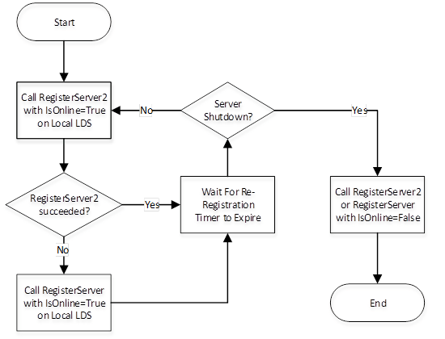  

Figure 1 - The Registration Process with an LDS  

See [OPC 10000-4](/§UAPart4) for more information on the re-registration timer and the *IsOnline* flag.  

#### 4.2.3 Hosts without a LocalDiscoveryServer  

Dedicated systems (usually embedded systems) with exactly one *Server* installed may not have a separate LDS. Such *Servers* shall become their own LDS or LDS-ME by implementing *FindServers* and *GetEndpoints Services* at the well-known address for an LDS. If implementing an LDS-ME, they should also announce themselves on the *MulticastSubnet* with a basic *MulticastExtension* . This requires a small subset of an mDNS Responder (see [mDNS](/§mDNS) and [Annex C](/§\_Ref419139646) ) that announces the *Server* and responds to mDNS probes. In addition they shall implement additional OPC UA specific items described in [Annex C](/§\_Ref419139646) . The *Server* may not provide the caching and address resolution implemented by a full mDNS Responder.  

### 4.3 The Discovery Process for Clients to Find Servers  

#### 4.3.1 Overview  

The discovery process allows *Clients* to find *Servers* on the network and then discover how to connect to them. Once a *Client* has this information it can save it and use it to connect directly to the *Server* again without going through the discovery process. *Clients* that cannot connect with the saved connection information should assume the *Server* configuration has changed and therefore repeat the discovery process.  

A *Client* has several choices for finding *Servers* :  

* Out-of-band discovery (i.e. entry into a GUI) of a *DiscoveryUrl* for a *Server* ;  

* Calling *FindServers* on the LDS installed on the *Client* host;  

* Calling *FindServers* on a remote LDS, where the *HostName* for the remote host is manually entered *;*  

* Calling *FindServersOnNetwork* (see [OPC 10000-4](/§UAPart4) ) on the LDS-ME installed on *Client* host;  

* Supporting the LDS-ME functionality locally in the Client.  

* Searching for *Servers* known to a *GlobalDiscoveryServer* .  

The *DiscoveryUrl* is what a *Client* uses to connect to a *DiscoveryEndpoint* (see [4.3.2](/§\_Ref371347554) ).  

*Clients* should be aware of rogue *DiscoveryServers* that might direct them to rogue *Servers* . That said, this problem is mitigated when a *Client* connects to a *Server* and verifies that it trusts the *Server* . In addition, the *CreateSession Service* returns parameters that allow a *Client* to verify that the previously acquired results from a LDS have not been altered. See [OPC 10000-2](/§UAPart2) and [OPC 10000-4](/§UAPart4) for a detailed discussion of these issues.  

A similar potential for a rogue GDS exists if the *Client* has not been configured to trust the GDS *Certificate* or if the *Client* does not use security when connecting to the GDS. Note that a *Client* that uses security but automatically trusts a GDS *Certificate* is not protected from a rogue GDS even though the connection itself is secure. This problem is also mitigated by verifying trust whenever a *Client* connects to a *Server* discovered via the GDS.  

#### 4.3.2 Simple Discovery with a DiscoveryUrl  

Every *Server* has one or more *DiscoveryUrls* that allow access to its *Endpoints* . Once a *Client* obtains (e.g. via manual entry into a form) the *DiscoveryUrl* for the *Server,* it reads the *EndpointDescriptions* using the *GetEndpoints Service* defined in [OPC 10000-4](/§UAPart4) *.*  

The discovery process for this scenario is illustrated in [Figure 2](/§\_Ref486852448) .  

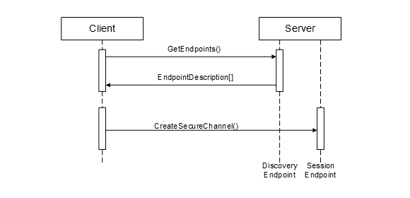  

Figure 2 - The Simple Discovery Process  

  

#### 4.3.3 Local Discovery  

In many cases *Clients* do not know which *Servers* exist but possibly know which hosts might have *Servers* on them. In this situation the *Client* will look for the *LocalDiscoveryServer* on a host by constructing a *DiscoveryUrl* using the well-known addresses defined in [OPC 10000-6](/§UAPart6) .  

If a *Client* finds a *LocalDiscoveryServer* then it will call the *FindServers* *Service* on the LDS to obtain a list of *Servers* and their *DiscoveryUrls* . The *Client* would then call the *GetEndpoints* service for one of the *Servers* returned. The discovery process for this scenario is illustrated in [Figure 3](/§\_Ref150972749) .  

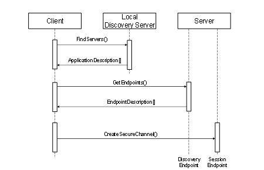  

Figure 3 - The Local Discovery Process  

#### 4.3.4 MulticastSubnet Discovery  

In some situations, *Clients* will not know which hosts have *Servers* . In these situations, the *Client* will look for a *LocalDiscoveryServer* with the *MulticastExtension* on its local host and requests a list of *DiscoveryUrls* for *Servers* and *DiscoveryServers* available on the *MulticastSubnet* .  

The discovery process for this scenario is illustrated in [Figure 4](/§\_Ref354541757) .  

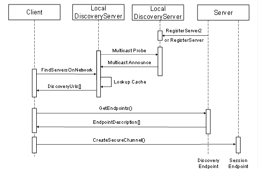  

Figure 4 - The MulticastSubnet Discovery Process  

In this scenario the *Server* uses the *RegisterServer2* *Service* to tell a *LocalDiscoveryServer* to announce the *Server* on the *MulticastSubnet* . The *Client* will receive the *DiscoveryUrl* and *CapabilityIdentifiers* for the Server when it calls *FindServersOnNetwork* and then connects directly to the *Server* . When a *Client* calls *FindServers* it only receives the *Servers* running on the same host as the LDS.  

*Clients* running on embedded systems may not have a LDS-ME available on the system, These *Clients* can support an mDNS Responder which understands how OPC UA concepts are mapped to mDNS messages and maintains the same table of *Servers* as maintained by the LDS-ME. This mapping is described in [Annex C](/§\_Ref419139646) .  

#### 4.3.5 Global Discovery  

A GDS is an OPC UA *Server* which allows *Clients* to search for *Servers* within the administrative domain of the GDS. It provides *Methods* that allow applications to search for other applications (see [6](/§\_Ref353718413) ). To access the GDS, the *Client* uses the *Call* service to invoke the *QueryApplications* *Method* (see [6.5.11](/§\_Ref481330109) ) to retrieve a list of *Servers* that meet the filter criteria provided. The *QueryApplications* *Method* is similar to the *FindServers* service except that it provides more advanced search and filter criteria. The discovery process is illustrated in [Figure 5](/§\_Ref313466549) .  

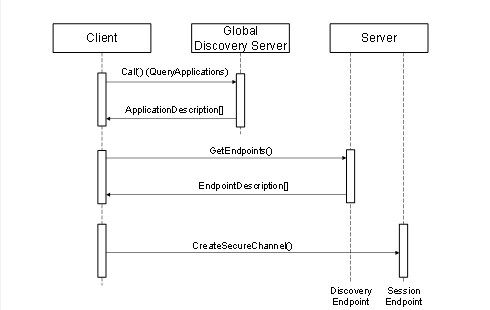  

Figure 5 - The Global Discovery Process  

The GDS may be coupled with any of the previous network architectures. For each *MulticastSubnet,* one or more LDSs may be registered with a GDS.  

The *Client* can also be configured with the URL of the GDS using an out of band mechanism.  

The complete discovery process is shown in [Figure 6](/§\_Ref359179689) .  

#### 4.3.6 Combined Discovery Process for Clients  

The use cases in the preceding clauses imply a number of choices that should be made by *Clients* when a *Client* connects to a *Server* . These choices are combined together in [Figure 6](/§\_Ref359179689) .  

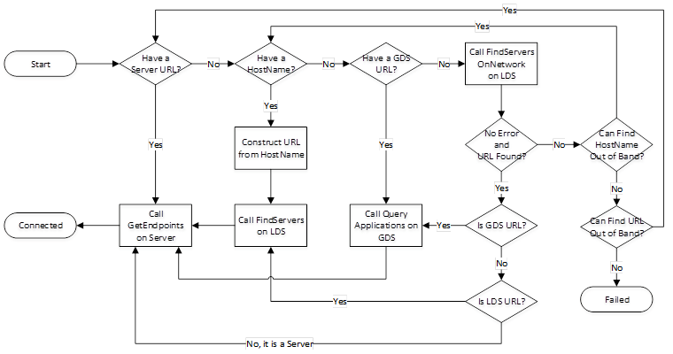  

Figure 6 - The Discovery Process for Clients  

*FindServersOnNetwork* can be called on the local LDS, however, it can also be called on a remote LDS which is part of a different *MulticastSubnet* .  

An out-of-band mechanism is a way to find a URL or a *HostName* that is not described by this standard. For example, a user could manually enter a URL or use system specific APIs to browse the network neighbourhood.  

A *Client* that goes through the discovery process can save the URL that was discovered. If the *Client* restarts later it can use that URL and bypass the discovery process. If reconnection fails the *Client* will have to go through the process again.  

### 4.4 The Discovery Process for Reverse Connections  

#### 4.4.1 Overview  

The discovery process for reverse connect does not serve the same purpose as the discovery process for normal connections because reverse connections require the *Server* to be configured to automatically attempt to connect to the *Client* and the *Client* to be configured so it knows what to do with the *Server* when it receives the connection. The limited mechanisms discussed here may help *SecurityAdmins* with the configuration of *Servers* .  

A *SecurityAdmin* tasked with configuring *Servers* determines the *ClientUrls* for *Clients* that support reverse connect.  

The following choices are available:  

* Out-of-band discovery (i.e. entry into a GUI) of a *ClientUrl* for a *Client* ;  

* Searching for *Clients* known to a *GlobalDiscoveryServer* .  

The mechanisms based on an LDS are not available since *Clients* do not register with the LDS.  

#### 4.4.2 Out-of-band Discovery  

Every *Client* that supports reverse connect has one or more *ClientUrls* that allow *Servers* to connect. Once the *SecurityAdmin* acquires the *ClientUrl* via an out-of-band mechanism, it can configure the *Server* to use it.  

#### 4.4.3 Global Discovery for Reverse Connections  

A GDS is a *Server* which allows other *SecurityAdmins* to search for *Clients* that support reverse connect within the administrative domain of the GDS. The *SecurityAdmin* uses the *Call* service to invoke the *QueryApplications* *Method* (see [6.5.11](/§\_Ref481330109) ) with "RCP" as a *ServerCapabilityFilter* to get a list of *Clients* that support reverse connect from the GDS.  

The discovery process is illustrated in [Figure 5](/§\_Ref313466549) .  

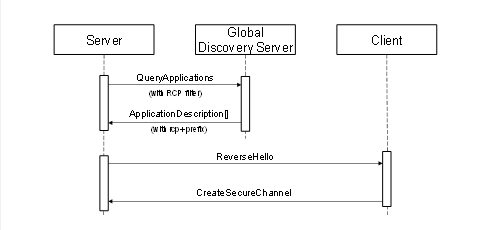  

Figure 7 - The Global Discovery Process for Reverse Connections  

The *ClientUrls* are returned in the *DiscoveryUrls* parameter of the *ApplicationDescription* record and have the 'rcp+' prefix. *DiscoveryUrls* without the prefix are used for forward connections. Once the *SecurityAdmin* has a *ClientUrl* it can configure the *Server* to use it.  

## 5 Local Discovery Server  

### 5.1 Overview  

Each host that could have multiple discoverable applications installed should have a standalone *LocalDiscoveryServer* installed. The *LocalDiscoveryServer* shall expose one or more *Endpoints* which support the *FindServers* and *GetEndpoints* services defined in [OPC 10000-4](/§UAPart4) . In addition, the *LocalDiscoveryServer* shall provide at least one *Endpoint* which implements the *RegisterServer* service for these applications.  

The *FindServers* *Service* returns the information for the *LocalDiscoveryServer* and all *Servers* that are known to the LDS. The *GetEndpoints Service* returns the *EndpointDescriptions* for the *LocalDiscoveryServer* that allow *Servers* to call the *RegisterServer* or *RegisterServer2* *Services* . The *LocalDiscoveryServer* does not support *Sessions* so information needed for establishing *Sessions* , such as supported *UserTokenPolicies* , is not provided.  

In systems (usually embedded systems) with exactly one *Server* installed this *Server* may also be the LDS (see [4.2.3](/§\_Ref359171901) ).  

An LDS-ME will announce all applications that it knows about on the local *MulticastSubnet* . In order to support this, a *LocalDiscoveryServer* supports the *RegisterServer2* *Service* defined in [OPC 10000-4](/§UAPart4) . For backward compatibility a *LocalDiscoveryServer* also supports the *RegisterServer* *Service* which is defined in [OPC 10000-4](/§UAPart4) .  

Each host with OPC UA Applications (Clients and Servers) installed should have a *LocalDiscoveryServer* with a *MulticastExtension* .  

The *MulticastExtension* incorporates the functionality of the mDNS Responder described in the Multicast DNS ( [mDNS](/§MDNS) ) specification (see [mDNS](/§mDNS) ). In addition, the *LocalDiscoveryServer* that supports the *MulticastExtension* supports the *FindServersOnNetwork* *Service* described in [OPC 10000-4](/§UAPart4) .  

### 5.2 Security Considerations for Multicast DNS  

The Multicast DNS ( [mDNS](/§MDNS) ) specification is used for various commercial and consumer applications. This provides a benefit in that implementations exist; however, system administrators could choose to disable Multicast DNS operations. For this reason, *Applications* shall not rely on Multicast DNS capabilities.  

Multicast DNS operations are insecure because of their nature; therefore, they should be disabled in environments where an attacker could cause problems by impersonating another host. This risk is minimized if OPC UA security is enabled and all *Applications* use *Certificate* *TrustLists* to control access.  

### 5.3 Network Architectures  

#### 5.3.1 Overview  

The discovery mechanisms defined in this standard are expected to be used in many different network architectures. The following three architectures are Illustrated:  

* Single *MulticastSubnet* ;  

* Multiple *MulticastSubnets* ;  

* No *MulticastSubnet* (or multiple *MulticastSubnets* with exactly one host each); **  

A *MulticastSubnet* is a network segment where all hosts on the segment can receive multicast packets from the other hosts on the segment. A physical LAN segment is typically a *MulticastSubnet* unless the administrator has specifically disabled multicast communication. In some cases multiple physical LAN segments can be connected as a single *MulticastSubnet.*  

#### 5.3.2 Single MulticastSubnet  

The Single *MulticastSubnet* Architecture is shown in [Figure 8](/§\_Ref106570929) .  

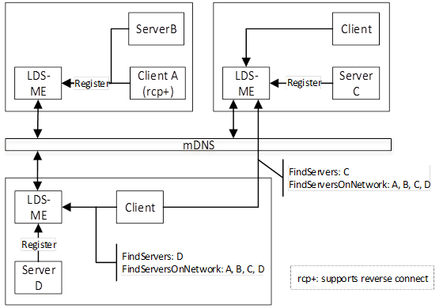  

Figure 8 - The Single MulticastSubnet Architecture  

In this architecture every host has an LDS-ME and uses mDNS to maintain a cache of the applications on the *MulticastSubnet* . A *Client* can call *FindServersOnNetwork* on any LDS-ME and receive the same set of applications. When a *Client* calls *FindServers* it only receives the applications running on the same host as the LDS.  

#### 5.3.3 Multiple MulticastSubnet  

The Multiple *MulticastSubnet* Architecture is shown in [Figure 9](/§\_Ref106570930) .  

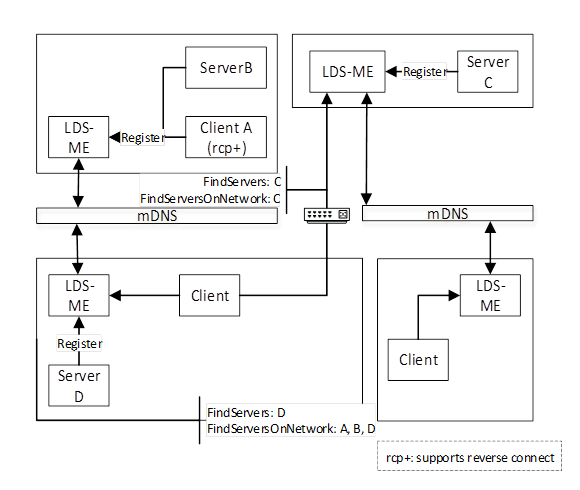  

Figure 9 - The Multiple MulticastSubnet Architecture  

This architecture is the same as the previous architecture except in this architecture the mDNS messages do not pass through routers connecting the *MulticastSubnets* . This means that a *Client* calling *FindServersOnNetwork* will only receive a list of applications running on the *MulticastSubnets* that the LDS-ME is connected to.  

A *Client* that wants to connect to a remote *MulticastSubnet* shall use out of band discovery (i.e. manual entry) of a *HostName* or *DiscoveryUrl* . Once a *Client* finds an LDS-ME on a remote *MulticastSubnet* it can use *FindServersOnNetwork* to discover all applications on that *MulticastSubnet.*  

#### 5.3.4 No MulticastSubnet  

The No *MulticastSubnet* Architecture is shown in [Figure 10](/§\_Ref106570931) .  

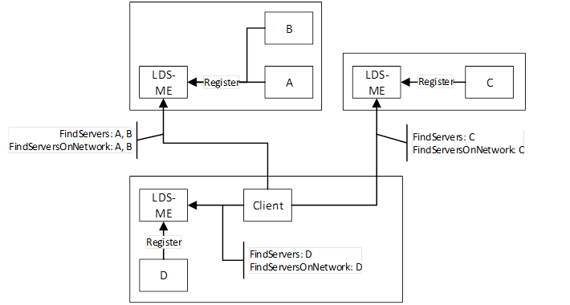  

Figure 10 - The No MulticastSubnet Architecture  

In this architecture the mDNS is not used at all because the Administrator has disabled multicast at a network level or by turning off multicast capabilities of each LDS-ME.  

A *Client* that wants to discover applications uses an out of band mechanism to find the *HostName* and call *FindServers* on the LDS of that host *. FindServersOnNetwork* may also work but it will never return more than what *FindServers* returns. *Clients* could also use a GDS if one is available.  

#### 5.3.5 Domain Names and MulticastSubnets  

The mDNS specification requires that fully qualified domain name be announced on the network. If a *Server* is not configured with a fully qualified domain name then mDNS requires that the 'local' top level domain be appended to the domain names. The 'local' top level domain indicates that the domain can only be considered to be unique within the subnet where the domain name was used. This means *Clients* should to be aware that URLs received from any LDS-ME other than the one on the *Client's* computer could contain 'local' domains which are not reachable or will connect to a different computer with the same domain name that happens to be on the same subnet as the *Client* . It is recommended that *Clients* ignore all URLs with the 'local' top level domain unless they are returned from the LDS-ME running on the same computer.  

System administrators can eliminate this problem by configuring a normal DNS with the fully qualified domain names for all computers that are accessed by *Clients* outside the *MulticastSubnet* .  

*Servers* configured with fully qualified domain names should specify the fully qualified domain name in its *ApplicationInstance* *Certificate* . *Servers* shall not append the 'local' top level domain to any domains declared in their *Certificate* ; an unqualified domain name is used if a more appropriate qualifier does not exist. *Clients* using a URL returned from an LDS-ME shall ignore the 'local' top level domain when checking the domain against the *Server Certificate* .  

Note that domain name validation is a necessary but not sufficient check against rogue *Servers* or man-in-the-middle attacks when *Server* *Certificates* do not contain fully qualified domain names. The *Certificate* trust relationship established by administrators is the primary mechanism used to protect against these risks.  

## 6 Global Discovery Server  

### 6.1 Overview  

The *LocalDiscoveryServer* is useful for networks where the host names can be discovered. However, this is typically not the case in large systems with multiple servers on multiple subnets. For this reason, there is a need for an enterprise wide *DiscoveryServer* called a *GlobalDiscoveryServer* .  

The *GlobalDiscoveryServer* (GDS) is an OPC UA *Server* which allows *Clients* to search for *OPC UA Applications* within the administrative domain. When compared to the LDS, the GDS provides an authoritative source for *OPC UA Applications* which have been verified by administrators and accessed via a secure communication channel.  

The GDS provides *Methods* that allow administrators to register applications and allow applications to search for other applications.  

Some GDS implementations may provide a front-end to an existing *DirectoryService* such as LDAP (see [Annex E](/§\_Ref359180241) ). By standardizing on an OPC UA based interface, *Clients* are not required to have knowledge of different *DirectoryServices.*  

### 6.2 Roles and Privileges  

*GlobalDiscoveryServers* restrict access to many of the features they provide. These restrictions are described either by referring to well-known *Roles* which a *Session* must have access to or by referring to *Privileges* which are assigned to *Sessions* using mechanisms other than the well-known *Roles* . The well-known *Roles* used in for a GDS are listed in [Table 1](/§\_Ref100427298) .  

Table 1 - Well-known Roles for a GDS  

| **Name** | **Description** |
|---|---|
|DiscoveryAdmin|This *Role* grants rights to register, update and unregister any *OPC UA Application* .|
|SecurityAdmin|This *Role* grants the right to change the security configuration of a GDS.|
  

  

The *Privileges* used in for a GDS are listed in [Table 2](/§\_Ref100427290) .  

Table 2 - Privileges for a GDS  

| **Name** | **Description** |
|---|---|
|ApplicationSelfAdmin|This *Privilege* grants an *OPC UA Application* the right to update its own registration. The *Certificate* used to create the *SecureChannel* is used to determine the identity of the *OPC UA Application.*|
|ApplicationAdmin|This *Privilege* grants rights to update one or more registrations. The *Certificate* used to create the *SecureChannel* is used to determine the identity of the *OPC UA Application* and ** what the set of registrations it is authorized to update.|
  

  

### 6.3 Client connections to global services  

A *GlobalDiscoveryServer* is a *Server* implementing different global services for discovery, *Certificate* management, user or PubSub key management, user authorization, software and device management.  

The number of applications using the different services may be large and a GDS is most likely not able to handle connections from all *Clients* at the same time. Therefore, a *Client* connected to a GDS should minimize the time it is connected to the GDS. The application shall disconnect as soon as it completes the sequence of actions needed to interact with the services. The applications shall not keep connections open between the execution of sequences.  

If it runs out of connection resources, a GDS is allowed to close *Sessions* with *Clients* which have not be authenticated as one of the GDS administrative *Roles* . If the GDS has to close *Sessions* , it should first close *Sessions* without GDS management *Privileges* . Otherwise, it may close the *Session* that was inactive for the longest time.  

It is also recommended to use a short maximum session timeout on the GDS.  

Actions performed cyclically by applications during *PullManagement* shall start the second cycle with a random delay that is between one and at least ten percent of the cycle period.  

### 6.4 Application Registration Workflow  

The application to be registered or a configuration tool operating on the application's behalf performs the initial application registration. This requires a user that has the *DiscoveryAdmin Role* or ** the *ApplicationAdmin Privilege* on the GDS.  

The workflow for the application registration is shown in [Figure 11](/§\_Ref106722669) .  

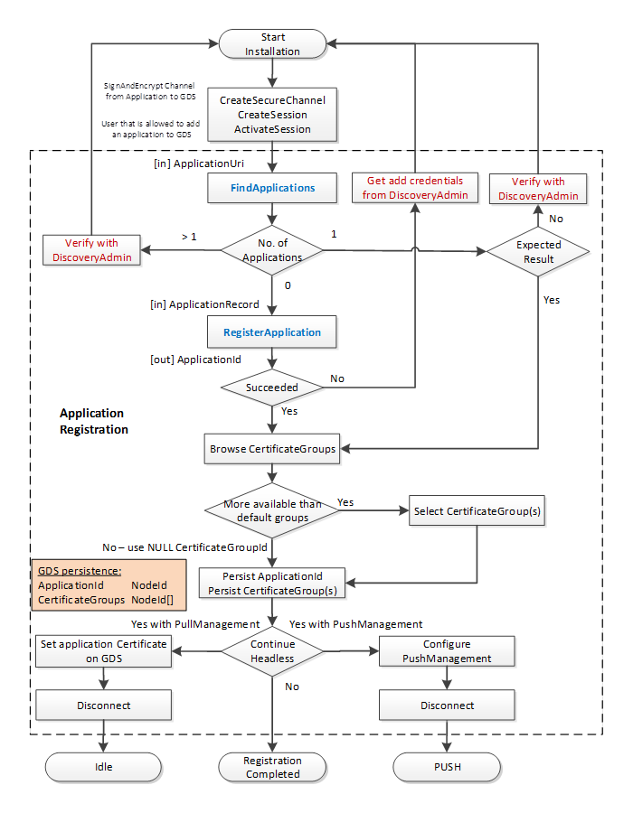  

Figure 11 - Application Registration Workflow  

The description of the *OPC UA Application* registration workflow steps is provided in [Table 3](/§\_Ref106722670) .  

Table 3 - Application Registration Workflow Steps  

| **Step** | **Description** |
|---|---|
|Application installation|The registration of an *OPC UA Application* with a GDS is normally executed as part of the initial installation and configuration of the application. It can be executed by a configuration tool that is part of the application or by a generic GDS configuration tool.|
|Connect|For the connection management with the GDS the services *OpenSecureChannel* , *CreateSession* and *ActivateSession* are used to create a connection with *MessageSecurityMode* *SignAndEncrypt* and a user that has the permission to register applications with the GDS. If the user does not have sufficient rights, the GDS can provide a mechanism to accept registrations on the GDS side before they are visible to *Clients* through *QueryApplications* .|
|FindApplications|The first step after connect is to check if there is already a registration available for the *ApplicationUri* . The *DirectoryType* *Method* *FindApplications* is used to pass the *ApplicationUri* of the application to the GDS. The Method returns an array of application records where the size of the array defines the next steps. * If the array is empty, the next step is *RegisterApplication* . * If the array size is one, and the record matches the expected application record, the next step is *Browse* *CertificateGroups* . * If the array size is one and the record does not match the expected application record, the registration must be verified with a *DiscoveryAdmin* . * If the array size is more than one, this indicates a fatal error and the status must be verified with a *DiscoveryAdmin* .|
|RegisterApplication|The *DirectoryType* *Method* *RegisterApplication* is used to pass in an application record with the application information. If the *Method* succeeds an *ApplicationId* is returned. This *ApplicationId* should be persisted for further interaction with the GDS regarding this application. If the *Method* fails, a *DiscoveryAdmin* shall identify and correct the issue. Typical errors include insufficient rights or conflicts with other application records.|
|Browse CertificateGroups|The *Browse* *Service* is used to get the list of GDS managed *CertificateGroups* by browsing the *CertificateGroups* *Folder* of the *Directory* *Object* . If more than one *CertificateGroup* is returned, the user selects the relevant *CertificateGroups* used by the application. The selected *CertificateGroupIds* should be persisted together with the *ApplicationId* .|
|Registration end options|The following options are possible to complete the registration with the *CertificateManager* : 1. Continue with *PullManagement* using the existing connection to the GDS. This option is typically used by *Clients* executing the registration in an interactive mode for their own identity. See [7.6](/§\_Ref106726516) for the *PullManagement* workflow. 1. Continue with *PullManagement* inside a headless application. 1. Continue with *PushManagement* .|
|Set application *Certificate* on GDS|For option (2) the current application *Certificate* must be configured for the application on the GDS to allow *Application* authentication for the initial *PullManagement* sequence. This configuration in the GDS is currently not in the scope of this specification.|
|Configure *PushManagement*|For option (3) the application must be configured for *PushManagement* in the *CertificateManager* . The configuration of the *PushManagement* in the *CertificateManager* is currently not in the scope of this specification.|
|Disconnect|For options (2) and (3) the configuration tool disconnects from the GDS.|
  

  

### 6.5 Information Model  

#### 6.5.1 Overview  

The *GlobalDiscoveryServer* *Information Model* used for *discovery* is shown in [Figure 12](/§\_Ref367678498) . Most of the interactions between the *GlobalDiscoveryServer* and *Application* administrator or the *Client* will be via *Methods* defined on the *Directory* folder.  

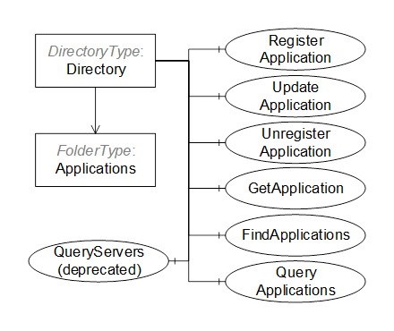  

Figure 12 - The Address Space for the GDS  

#### 6.5.2 Directory  

This *Object* is the root of the *GlobalDiscoveryServer AddressSpace* and it is the target of an *Organizes* reference from the *Objects* folder defined in [OPC 10000-5](/§UAPart5) . It organizes the information that can be accessed into subfolders. The implementation of a GDS can customize and organize the folders in any manner it desires.  For example folders can exist for information models, or for optional services or for various locations in an administrative domain. It is defined in [Table 4](/§\_Ref412117058) .  

Table 4 - Directory Object Definition  

| **Attribute** | **Value** |
|---|---|
|BrowseName|2:Directory|
|TypeDefinition|2:DirectoryType defined in [6.5.3](/§\_Ref345577920) .|
  
| **References** | **NodeClass** | **BrowseName** | **DataType** | **TypeDefinition** | **Modelling Rule** |
|---|---|---|---|---|---|
  
| **Conformance Units** |
|---|
|GDS Application Directory|
  

  

#### 6.5.3 DirectoryType  

*DirectoryType* is the *ObjectType* for the root of the *GlobalDiscoveryServer* *AddressSpace* . It organizes the information that can be accessed into subfolders It also provides methods that allow applications to register or find applications. It is defined in [Table 5](/§\_Ref345598919) .  

Table 5 - DirectoryType Definition  

| **Attribute** | **Value** |
|---|---|
|BrowseName|2:DirectoryType|
|IsAbstract|False|
  
| **References** | **NodeClass** | **BrowseName** | **DataType** | **TypeDefinition** | **Modelling Rule** |
|---|---|---|---|---|---|
|Subtype of the 0: *FolderType* defined in [OPC 10000-5](/§UAPart5) .|
|0:HasComponent|Object|2:Applications|\-|0:FolderType|Mandatory|
|0:HasComponent|Method|2:FindApplications|Defined in [6.5.4](/§\_Ref405276581) .|Mandatory|
|0:HasComponent|Method|2:RegisterApplication|Defined in [6.5.6](/§\_Ref345577983) .|Mandatory|
|0:HasComponent|Method|2:UpdateApplication|Defined in [6.5.7](/§\_Ref369012677) .|Mandatory|
|0:HasComponent|Method|2:UnregisterApplication|Defined in [6.5.8](/§\_Ref405276562) .|Mandatory|
|0:HasComponent|Method|2:GetApplication|Defined in [6.5.9](/§\_Ref405276470) .|Mandatory|
|0:HasComponent|Method|2:QueryApplications|Defined in [6.5.10](/§\_Ref481330087) **.** |Mandatory|
|0:HasComponent|Method|2:QueryServers|Defined in [6.5.11](/§\_Ref481330109) .|Mandatory|
||
  
| **Conformance Units** |
|---|
|GDS Application Directory|
  

  

The *Applications* folder may contain *Objects* representing the *Applications* known to the GDS. These *Objects* may be organized into subfolders as determined by the GDS. Some characteristics for organizing applications are the networks, the physical location, or the supported profiles. The *QueryApplications* *Method* can be used to search for OPC UA *Applications* based on various criteria.  

A GDS is not required to expose its *Applications* as browsable *Objects* in its *AddressSpace* , however, each *Application* shall have a unique *NodeId* which can be passed to *Methods* used to administer the GDS.  

The *FindApplications* *Method* returns the *Applications* associated with an *ApplicationUri* . It can be called by any *Client* .  

The *RegisterApplication* *Method* is used to add a new *Application* to the GDS. It requires administrative privileges.  

The *UpdateApplication* *Method* is used to update an existing *Application* in the GDS. It requires administrative privileges.  

The *UnregisterApplication* *Method* is used to remove an *Application* from the GDS. It requires administrative privileges.  

The *QueryApplications* *Method* is used to find *Client* or *Server* applications that meet the criteria provided. This *Method* replaces the *QueryServers Method.*  

The *QueryServers* *Method* is used to find *Servers* that meet the criteria specified. It does not require any permissions to call. This *Method* has been replaced by the *QueryApplications* *Method*  

#### 6.5.4 FindApplications  

*FindApplications* is used to find the *ApplicationId* for an approved *OPC UA Application* (see [6.5.6](/§\_Ref106602080) ). The returned *applications* array shall be of size 1 or 0.  

If the returned array is null or zero length then the GDS does not have an entry for the *ApplicationUri* .  

 **Signature**   

 **FindApplications**   

[in]  String applicationUri  

[out] ApplicationRecordDataType[] applications  

);  

  

| **Argument** | **Description** |
|---|---|
|applicationUri|The *ApplicationUri* that identifies the *Application* of interest.|
|applications|A list of application records that match the *ApplicationUri.* The *ApplicationRecordDataType* is defined in [6.5.5](/§\_Ref478009950) .|
  

  

 **Method Result Codes (defined in Call Service)**   

| **Result Code** | **Description** |
|---|---|
|Bad\_InvalidArgument|The *ApplicationUri* is too long or not a valid URI.|
  

  

[Table 6](/§\_Ref404028582) specifies the *AddressSpace* representation for the *FindApplications Method* .  

Table 6 - FindApplications Method AddressSpace Definition  

| **Attribute** | **Value** |
|---|---|
|BrowseName|2:FindApplications|
  
| **References** | **NodeClass** | **BrowseName** | **DataType** | **TypeDefinition** | **ModellingRule** |
|---|---|---|---|---|---|
|0:HasProperty|Variable|0:InputArguments|0:Argument[]|0:PropertyType|Mandatory|
|0:HasProperty|Variable|0:OutputArguments|0:Argument[]|0:PropertyType|Mandatory|
  

  

#### 6.5.5 ApplicationRecordDataType  

This type defines a DataType which represents a record in the GDS *.*  

If the *ApplicationType* is *Client,* and the *Client* supports reverse connect then the *ServerCapabilities* shall ** include RCP and all *DiscoveryUrls* shall begin with the rcp+ prefix which indicates that reverse connections are supported.  

If the application does not support OPC UA then the *ApplicationType* is *Client* and the *ServerCapabilities* shall be NA.  

If the *ApplicationType* is *ClientAndServer* the *ServerCapabilities* may include RCP and all *DiscoveryUrls* that support reverse connect have the rcp+ prefix. If the same URL supports normal connections and reverse connection then there shall be two elements in the *DiscoveryUrls* array with and without the rcp+ prefix.  

Table 7 - ApplicationRecordDataType Structure  

| **Name** | **Type** | **Description** |
|---|---|---|
|ApplicationRecordDataType|Structure|Subtype of the *Structure DataType* defined in [OPC 10000-5](/§UAPart5)|
|ApplicationId|NodeId|The unique identifier assigned by the GDS to the record. This *NodeId* may be passed to other *Methods* .|
|ApplicationUri|String|The URI for the *Application* associated with the record.|
|ApplicationType|ApplicationType|The type of application. This type is defined in [OPC 10000-4](/§UAPart4) .|
|ApplicationNames|LocalizedText[]|One or more localized names for the application. The first element is the default *ApplicationName* for the application when a non-localized name is required.|
|ProductUri|String|A globally unique URI for the product associated with the application. This URI is assigned by the vendor of the application.|
|DiscoveryUrls|String[]|The list of discovery URLs for an application. The first HTTPS URL specifies the domain used as the Common Name of HTTPS *Certificates* .|
|ServerCapabilities|String[]|The list of server capability identifiers for the application. The allowed values are defined in [Annex D](/§\_Ref354721284) .|
  

  

Its representation in the *AddressSpace* is defined in [Table 8](/§\_Ref42881820) .  

Table 8 - ApplicationRecordDataType Definition  

| **Attribute** | **Value** |
|---|---|
|BrowseName|2:ApplicationRecordDataType|
|IsAbstract|False|
  
| **References** | **NodeClass** | **BrowseName** | **DataType** | **TypeDefinition** | **Other** |
|---|---|---|---|---|---|
|Subtype of the 0: *Structure DataType* defined in [OPC 10000-5](/§UAPart5) .|
||
  
| **Conformance Units** |
|---|
|GDS Application Directory|
  

  

#### 6.5.6 RegisterApplication  

*RegisterApplication* is used to register a new *Application* Instance with a *GlobalDiscoveryServer* .  

This *Method* shall be called from an authenticated *SecureChannel* and from a *Client* that has access to the *DiscoveryAdmin Role* or *the ApplicationAdmin Privilege* (see [6.2](/§\_Ref100529055) ).  

*Servers* that support transparent redundancy shall register as a single application and pass the *DiscoveryUrls* for all available instances and/or network paths.  

*Servers* that support non-transparent redundancy shall register as different applications. In addition, [OPC 10000-4](/§UAPart4) requires the use of the NTRS *ServerCapability* defined in [Annex D](/§\_Ref404520945) .  

*RegisterApplication* shall not create duplicate records. If the *ApplicationUri* already exists the *Method* returns *Bad\_EntryExists* .  

If *RegisterApplication* succeeds the application is added to the list of applications that can be returned by *QueryApplications* and *FindApplications* .  

If registration was successful and auditing is supported, the GDS shall generate the *ApplicationRegistrationChanged AuditEventType* (see [6.5.12](/§\_Ref43069862) ).  

 **Signature**   

 **RegisterApplication**   

[in]  ApplicationRecordDataType application  

[out] NodeId applicationId  

);  

  

| **Argument** | **Description** |
|---|---|
|application|The application that is to be registered with the *GlobalDiscoveryServer* .|
|applicationId|A unique identifier for the registered *Application* . This identifier is persistent and is used in other *Methods* used to administer applications.|
  

  

 **Method Result Codes (defined in Call Service)**   

| **Result Code** | **Description** |
|---|---|
|Bad\_InvalidArgument|The application or one of the fields of the application record is not valid. The text associated with the error shall indicate the exact problem.|
|Bad\_EntryExists|A record with the same *ApplicationUri* already exists.|
|Bad\_UserAccessDenied|The current user does not have the rights required.|
|Bad\_SecurityModeInsufficient|The SecureChannel is not authenticated.|
  

  

[Table 9](/§\_Ref412150152) specifies the *AddressSpace* representation for the *RegisterApplication Method* .  

Table 9 - RegisterApplication Method AddressSpace Definition  

| **Attribute** | **Value** |
|---|---|
|BrowseName|2:RegisterApplication|
  
| **References** | **NodeClass** | **BrowseName** | **DataType** | **TypeDefinition** | **ModellingRule** |
|---|---|---|---|---|---|
|0:HasProperty|Variable|0:InputArguments|0:Argument[]|0:PropertyType|Mandatory|
|0:HasProperty|Variable|0:OutputArguments|0:Argument[]|0:PropertyType|Mandatory|
|0:GeneratesEvent|ObjectType|0: *ApplicationRegistrationChangedAuditEventType*|Defined in [6.5.12](/§\_Ref43069862) .||
  

  

#### 6.5.7 UpdateApplication  

*UpdateApplication* is used to update an existing *Application* in a *GlobalDiscoveryServer* .  

This *Method* shall be called from an authenticated *SecureChannel* and from a *Client* that has access to the *DiscoveryAdmin Role, the ApplicationSelfAdmin Privilege, or the ApplicationAdmin Privilege* (see [6.2](/§\_Ref100529055) ).  

When updating an existing *Application* the *ApplicationUri* cannot be changed. If it is changed the *Method* returns *Bad\_WriteNotSupported* .  

If the update was successful and auditing is supported, the GDS shall generate the *ApplicationRegistrationChanged AuditEventType* (see [6.5.12](/§\_Ref43069862) ).  

 **Signature**   

 **UpdateApplication**   

[in] ApplicationRecordDataType application  

);  

  

| **Argument** | **Description** |
|---|---|
|application|The application that is to be updated in the GDS database.|
  

  

 **Method Result Codes (defined in Call Service)**   

| **Result Code** | **Description** |
|---|---|
|Bad\_NotFound|The applicationId is not known to the GDS.|
|Bad\_InvalidArgument|The application or one of the fields of the application record is not valid. The text associated with the error shall indicate the exact problem.|
|Bad\_WriteNotSupported|The *applicationUri* was changed and it cannot be updated.|
|Bad\_UserAccessDenied|The current user does not have the required rights.|
|Bad\_SecurityModeInsufficient|The SecureChannel is not authenticated.|
  

  

[Table 10](/§\_Ref412150153) specifies the *AddressSpace* representation for the *UpdateApplication Method* .  

Table 10 - UpdateApplication Method AddressSpace Definition  

| **Attribute** | **Value** |
|---|---|
|BrowseName|2:UpdateApplication|
  
| **References** | **NodeClass** | **BrowseName** | **DataType** | **TypeDefinition** | **ModellingRule** |
|---|---|---|---|---|---|
|0:HasProperty|Variable|0:InputArguments|0:Argument[]|0:PropertyType|Mandatory|
  

  

#### 6.5.8 UnregisterApplication  

*UnregisterApplication* is used to remove an *Application* from a *GlobalDiscoveryServer* .  

This *Method* shall be called from an authenticated *SecureChannel* and from a *Client* that has access to the *DiscoveryAdmin Role, the ApplicationSelfAdmin Privilege, or the ApplicationAdmin Privilege* (see [6.2](/§\_Ref100529055) ).  

A *Server* *Application* that is unregistered may be automatically added again if the GDS is configured to populate itself by calling *FindServersOnNetwork* and the *Server* *Application* is still registered with its local LDS.  

If an *Application* has *Certificates* issued by the *CertificateManager* , these *Certificates* shall be revoked when this *Method* is called.  

If un-registration was successful and auditing is supported, the GDS shall generate the *ApplicationRegistrationChanged AuditEventType* (see [6.5.12](/§\_Ref43069862) ).  

 **Signature**   

 **UnregisterApplication**   

[in] NodeId applicationId  

);  

  

| **Argument** | **Description** |
|---|---|
|applicationId|The identifier assigned by the GDS to the *Application* .|
  

  

 **Method Result Codes (defined in Call Service)**   

| **Result Code** | **Description** |
|---|---|
|Bad\_NotFound|The *applicationId* is not known to the GDS.|
|Bad\_UserAccessDenied|The current user does not have the rights required to unregister the application.|
|Bad\_SecurityModeInsufficient|The SecureChannel is not authenticated.|
  

  

[Table 11](/§\_Ref412150154) specifies the *AddressSpace* representation for the *UnregisterApplication Method* .  

Table 11 - UnregisterApplication Method AddressSpace Definition  

| **Attribute** | **Value** |
|---|---|
|BrowseName|2:UnregisterApplication|
  
| **References** | **NodeClass** | **BrowseName** | **DataType** | **TypeDefinition** | **ModellingRule** |
|---|---|---|---|---|---|
|0:HasProperty|Variable|0:InputArguments|0:Argument[]|0:PropertyType|Mandatory|
  

  

#### 6.5.9 GetApplication  

*GetApplication* is used to find an OPC UA *Application* known to the GDS.  

 **Signature**   

 **GetApplication**   

[in]  NodeId applicationId  

[out] ApplicationRecordDataType application  

);  

  

| **Argument** | **Description** |
|---|---|
|applicationId|The *ApplicationId* that identifies the *Application* of interest.|
|application|The application record that matches the *ApplicationId.* The ApplicationRecordDataType is defined in [6.5.5](/§\_Ref478009950)|
  

  

 **Method Result Codes (defined in Call Service)**   

| **Result Code** | **Description** |
|---|---|
|Bad\_NotFound|The *applicationId* is not known to the GDS.|
|Bad\_UserAccessDenied|The current user does not have the rights required to read the requested record.|
  

  

[Table 12](/§\_Ref412150155) specifies the *AddressSpace* representation for the *GetApplication Method* .  

Table 12 - GetApplication Method AddressSpace Definition  

| **Attribute** | **Value** |
|---|---|
|BrowseName|2:GetApplication|
  
| **References** | **NodeClass** | **BrowseName** | **DataType** | **TypeDefinition** | **ModellingRule** |
|---|---|---|---|---|---|
|0:HasProperty|Variable|0:InputArguments|0:Argument[]|0:PropertyType|Mandatory|
|0:HasProperty|Variable|0:OutputArguments|0:Argument[]|0:PropertyType|Mandatory|
  

  

#### 6.5.10 QueryApplications  

*QueryApplications* is used to find *Clients* that support reverse-connect or *Servers* that meet the specified filters.  

*QueryApplications* returns *ApplicationDescriptions* instead of the *ServerOnNetwork* *Structures* returned by *QueryServers* . This is more useful to some *Clients* because it matches the return type of *FindServers* .  

Any *Client* is able to call this *Method* , however, the set of results returned may be restricted based on the *Client's* user credentials.  

The applications returned shall pass all of the filters provided (i.e. the filters are combined in an AND operation). The c *apabilities* parameter is an array and an application will pass this filter if it supports all of the specified capabilities.  

This *Method* shall not return records with a *ServerCapabilities* that ** includes NA.  

Each time the GDS creates or updates an application record it shall assign a monotonically increasing identifier to the record. This allows *Clients* to request records in batches by specifying the identifier for the last record received in the last call to *QueryApplications* . To support this the GDS shall return records in order starting from the lowest record identifier. The GDS shall also return the last time the counter was reset *.* If a *Client* detects that this time is more recent than the last time the *Client* called the *Method* it shall call the *Method* again with a *startingRecordId* of 0.  

The *lastCounterResetTime* parameter is used to indicate that the counters on records had to be reset for some reason such as a *Server* restart. The *Client* cannot use any *nextRecordId* received prior to this time to set the value for the *startingRecordId* in a new call.  

The return parameter is a list of *ApplicationDescriptions* . The mapping from a ApplicationRecord to an *ApplicationDescriptions* is shown in [Table 13](/§\_Ref89102633) .  

Table 13 - ApplicationRecordDataType to ApplicationDescription Mapping  

| **ApplicationRecordDataType** | **ApplicationDescription** | **Notes** |
|---|---|---|
|applicationId|\--|Ignored|
|applicationUri|applicationUri||
|applicationType|applicationType||
|applicationNames|applicationName|The name that best matches the *preferredLocales* for the current *Session* is returned. If there is no *Session* the first element is returned.|
|productUri|productUri||
|discoveryUrls|discoveryUrls||
|\--|gatewayServerUri|Set to NULL.|
|\--|discoveryProfileUri|Set to NULL.|
|serverCapabilities|\--|Ignored|
  

  

 **Signature**   

 **QueryApplications**   

[in]  UInt32 startingRecordId  

[in]  UInt32 maxRecordsToReturn  

[in]  String applicationName  

[in]  String applicationUri  

[in]  UInt32 applicationType  

[in]  String productUri  

[in]  String[] capabilities  

[out] UtcTime lastCounterResetTime  

[out] UInt32 nextRecordId  

[out] ApplicationDescription[] applications  

);  

  

| **Argument** | **Description** |
|---|---|
  
| **INPUTS** |
|---|
|startingRecordId|Only records with an identifier greater than this number will be returned. Specify 0 to start with the first record in the database.|
|maxRecordsToReturn|The maximum number of records to return in the response. 0 indicates that there is no limit.|
|applicationName|The *ApplicationName* of the applications to return. Supports the syntax used by the LIKE *FilterOperator* described in [OPC 10000-4](/§UAPart4) . Not used if an empty string is specified. The filter is only applied to the default *ApplicationName* .|
|applicationUri|The *ApplicationUri* of the applications to return. Supports the syntax used by the LIKE *FilterOperator* described in [OPC 10000-4](/§UAPart4) . Not used if an empty string is specified.|
|applicationType|A mask indicating what types of applications are returned. The mask values are: 0x1 - Servers; 0x2 - Clients; If the mask is 0 then all applications are returned.|
|productUri|The *ProductUri* of the applications to return. Supports the syntax used by the LIKE *FilterOperator* described in [OPC 10000-4](/§UAPart4) . Not used if an empty string is specified.|
|capabilities|The capabilities supported by the applications returned. The applications ** returned shall support all of the capabilities specified. If no capabilities are provided this filter is not used. The allowed values are defined in [Annex D](/§\_Ref354721284) .|
  
| **OUTPUTS** |
|---|
|lastCounterResetTime|The last time the counters were reset.|
|nextRecordId|The identifier of the next record. It is passed as the *startingRecordId* in subsequent calls to *QueryApplications* to fetch the next batch of records. It is 0 if there are no more records to return.|
|applications|A list of *Applications* which meet the criteria. The *ApplicationDescription* structure is defined in [OPC 10000-4](/§UAPart4) .|
  

  

[Table 14](/§\_Ref113664448) specifies the *AddressSpace* representation for the *QueryApplications Method* .  

Table 14 - QueryApplications Method AddressSpace Definition  

| **Attribute** | **Value** |
|---|---|
|BrowseName|2:QueryApplications|
  
| **References** | **NodeClass** | **BrowseName** | **DataType** | **TypeDefinition** | **ModellingRule** |
|---|---|---|---|---|---|
|0:HasProperty|Variable|0:InputArguments|0:Argument[]|0:PropertyType|Mandatory|
|0:HasProperty|Variable|0:OutputArguments|0:Argument[]|0:PropertyType|Mandatory|
  

  

#### 6.5.11 QueryServers (deprecated)  

*QueryServers* is used to find *Server* applications that meet the specified filters.  

Any *Client* is able to call this *Method* , however, the set of results returned may be restricted based on the *Client's* user credentials.  

The applications returned shall pass all of the filters provided (i.e. the filters are combined in an AND operation). The *serverCapabilities* parameter is an array and an application will pass this filter if it supports all of the specified capabilities.  

This *Method* shall not return records with a *serverCapabilities* that ** includes NA.  

Each time the GDS creates or updates an application record it shall assign a monotonically increasing identifier to the record. This allows *Clients* to request records in batches by specifying the identifier for the last record received in the last call to *QueryServers* . To support this the GDS shall return records in order starting from the lowest record identifier. The GDS shall also return the last time the counter was reset *.* If a *Client* detects that this time is more recent than the last time the *Client* called the *Method* it shall call the *Method* again with a *startingRecordId* of 0.  

The *lastCounterResetTime* parameter is used to indicate that the counters on records had to be reset for some reason such as a *Server* restart. The *Client* cannot use any *recordId* received prior to this time to set the value for the *startingRecordId* in a new call.  

The return parameter is a list of *ServerOnNetwork Structures* . The mapping from a *ApplicationRecordDataType* to an *ServerOnNetwork* is shown in [Table 15](/§\_Ref89103097) .  

Table 15 - ApplicationRecordDataType to ServerOnNetwork Mapping  

| **ApplicationRecordDataType** | **ServerOnNetwork** | **Notes** |
|---|---|---|
|applicationId|\--|Ignored|
|applicationUri|\--|Ignored|
|applicationType|\--|Ignored|
|applicationNames|serverName|The name that best matches the *preferredLocales* for the current *Session* is returned. If there is no *Session* the first element is returned.|
|productUri|\--|Ignored|
|discoveryUrls|discoveryUrl|A *ServerOnNetwork* record is returned for each discoveryUrl in the *ApplicationRecord* .|
|serverCapabilities|serverCapabilities||
|\--|recordId|This is the recordId assigned by the *QueryServers* call. It may be used as the startedRecordId in a subsequent call to *QueryServers.*|
  

  

 **Signature**   

 **QueryServers**   

[in]  UInt32 startingRecordId  

[in]  UInt32 maxRecordsToReturn  

[in]  String applicationName  

[in]  String applicationUri   

[in]  String productUri   

[in]  String[] serverCapabilities   

[out] UtcTime lastCounterResetTime   

[out] ServerOnNetwork[] servers  

);  

  

| **Argument** | **Description** |
|---|---|
  
| **INPUTS** |
|---|
|startingRecordId|Only records with an identifier greater than this number will be returned. Specify 0 to start with the first record in the database.|
|maxRecordsToReturn|The maximum number of records to return in the response. 0 indicates that there is no limit.|
|applicationName|The *ApplicationName* of the *Applications* to return. Supports the syntax used by the LIKE *FilterOperator* described in [OPC 10000-4](/§UAPart4) . Not used if an empty string is specified. The filter is only applied to the default *ApplicationName* .|
|applicationUri|The *ApplicationUri* of the *Servers* to return. Supports the syntax used by the LIKE *FilterOperator* described in [OPC 10000-4](/§UAPart4) . Not used if an empty string is specified.|
|productUri|The *ProductUri* of the Servers to return. Supports the syntax used by the LIKE *FilterOperator* described in [OPC 10000-4](/§UAPart4) . Not used if an empty string is specified.|
|serverCapabilities|The applications ** returned shall support all of the server capabilities specified. If no server capabilities are provided this filter is not used.|
  
| **OUTPUTS** |
|---|
|lastCounterResetTime|The last time the counters were reset.|
|servers|A list of *Servers* which meet the criteria. The *ServerOnNetwork* structure is defined in [OPC 10000-4](/§UAPart4) .|
  

  

 **Method Result Codes (defined in Call Service)**   

| **Result Code** | **Description** |
|---|---|
|Bad\_UserAccessDenied|The current user does not have the rights required.|
  

  

[Table 16](/§\_Ref412150156) specifies the *AddressSpace* representation for the *QueryServers Method* .  

Table 16 - QueryServers Method AddressSpace Definition  

| **Attribute** | **Value** |
|---|---|
|BrowseName|2:QueryServers|
  
| **References** | **NodeClass** | **BrowseName** | **DataType** | **TypeDefinition** | **ModellingRule** |
|---|---|---|---|---|---|
|0:HasProperty|Variable|0:InputArguments|0:Argument[]|0:PropertyType|Mandatory|
|0:HasProperty|Variable|0:OutputArguments|0:Argument[]|0:PropertyType|Mandatory|
  

  

#### 6.5.12 ApplicationRegistrationChangedAuditEventType  

This event is raised when the *RegisterApplication* , *UpdateApplication* or *UnregisterApplication* *Methods* are called.  

Its representation in the *AddressSpace* is formally defined in [Table 17](/§\_Ref183250866) .  

Table 17 - ApplicationRegistrationChangedAuditEventType Definition  

| **Attribute** | **Value** |
|---|---|
|BrowseName|2:ApplicationRegistrationChangedAuditEventType|
|IsAbstract|True|
  
| **References** | **NodeClass** | **BrowseName** | **DataType** | **TypeDefinition** | **ModellingRule** |
|---|---|---|---|---|---|
|Subtype of the 0: *AuditUpdateMethodEventType* defined in [OPC 10000-5](/§UAPart5) .|
||
  
| **Conformance Units** |
|---|
|GDS Application Directory|
  

  

This *EventType* inherits all *Properties* of the *AuditUpdateMethodEventType* . Their semantics are defined in [OPC 10000-5](/§UAPart5) .  

## 7 Certificate Management  

### 7.1 Overview  

*Certificate* management functions comprise the management and distribution of certificates and *TrustLists* for OPC UA Applications. An application that provides the certificate management functions is called *CertificateManager* . GDS and *CertificateManager* will typically be combined in one application. The basic concepts regarding *Certificate* management are described in [OPC 10000-2](/§UAPart2) .  

There are two primary models for *Certificate* management: *PullManagement* and *PushManagement* . In *PullManagement* , the application acts as a *Client* and uses the *Methods* on the *CertificateManager* to request and update *Certificates* and *TrustLists* . The application is responsible for ensuring the *Certificates* and *TrustLists* are kept up to date. In *PushManagement* the application acts as a *Server* and exposes *Methods* which the *CertificateManager* can call to update the *Certificates* and *TrustLists* as required.  

The *CertificateManager* is intended to work in conjunction with different *Certificate* management services such as Active Directory. The *CertificateManager* provides a standard OPC UA based information model that all *OPC UA Applications* can support without needing to know the specifics of a particular *Certificate* management system.  

The *CertificateManager* should support the following features:  

* Onboarding (first time setup for a device/application);  

* Renewal (renewing expired or compromised certificates);  

* *TrustList* Update (updating the *TrustLists* including the *Revocation Lists* );  

* Revocation (removing a device/application from the system).  

Although it is generally assumed that *Client* applications will use the Pull model and *Server* applications will use the Push model, this is not required.  

[OPC 10000-21](/§UAPart21) defines the complete process to automatically authenticate and onboard new *Devices* that depends on the *Devices* having support built in by the *Manufacturer* . If this support is not present, *Devices* and *OPC UA Applications* shall be manually onboarded using the mechanisms defined in this document.  

During manual onboarding, the *CertificateManager* shall be able to operate in a mode where any *Client* is allowed to connect securely with any valid *Certificate* and user credentials are used to determine the rights a *Client* has; this eliminates the need to configure *TrustLists* before connecting to the *CertificateManager* for application setup, *Application* vendors may decide to build the interaction with the *CertificateManager* as a separate component, e.g. as part of an administration application with access to the OPC UA configuration of this *Application* . This is transparent for the *CertificateManager* and will not be considered further in the rest of this chapter.  

*Clients* shall only connect to a *CertificateManager* which the *Client* has been configured to trust. This may require an out of band configuration step which is completed prior to starting the manual onboarding process.  

This standard does not define how to administer a *CertificateManager* but a *CertificateManager* shall provide an integrated system that includes both push and *PullManagement* .  

### 7.2 Roles and Privileges  

*CertificateManagers* restrict access to many of the features they provide. These restrictions are described either by referring to well-known *Roles* which a *Session* must have access to or by referring to *Privileges* which are assigned to *Sessions* using mechanisms other than the well-known *Roles* . The well-known *Roles* used for *CertificateManagers* are listed in [Table 18](/§\_Ref100428533) .  

Table 18 - Well-known Roles for a CertificateManager  

| **Name** | **Description** |
|---|---|
|CertificateAuthorityAdmin|This *Role* grants rights to request or revoke any *Certificate* , update any *TrustList* or assign *CertificateGroups* to *OPC UA Applications* .|
|RegistrationAuthorityAdmin|This *Role* grants rights to approve *Certificate* Signing requests or NewKeyPair requests.|
|SecurityAdmin|This *Role* grants the right to change the security configuration of a *CertificateManager* .|
  

  

The well-known *Roles* for *Server* managed by a *CertificateManager* are listed in [Table 19](/§\_Ref100646594) .  

Table 19 - Well-known Roles for Server managed by a CertificateManager  

| **Name** | **Description** |
|---|---|
|SecurityAdmin|For *PushManagement* , this *Role* grants the right to change the security configuration of a *Server* managed by a *CertificateManager.*|
  

  

The *Privileges* used in for *CertificateManagers* are listed in [Table 20](/§\_Ref100428547) .  

Table 20 - Privileges for a CertificateManager  

| **Name** | **Description** |
|---|---|
|ApplicationSelfAdmin|This *Privilege* grants an *OPC UA Application* the right to renew its own *Certificate* or read its own *CertificateGroups* and *TrustLists* . The *Certificate* used to create the *SecureChannel* is used to determine the identity of the *OPC UA Application.*|
|ApplicationAdmin|This *Privilege* grants rights to request or renew *Certificates,* read *TrustLists* or *CertificateGroups* for one or more *OPC UA Applications.* The *Certificate* used to create the *SecureChannel* is used to determine the identity of the *OPC UA Application* and the set of *OPC UA Applications* that ** it is authorized to manage.|
  

  

### 7.3 Pull Management  

*PullManagement* is performed by using the *CertificateManager* information model, in particular the Methods defined in [7.9](/§\_Ref367616170) . The interactions between *Application* and *CertificateManager* during *PullManagement* are illustrated in [Figure 13](/§\_Ref311915276) .  

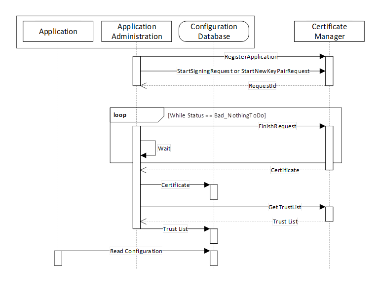  

Figure 13 - The Pull Management Model for Certificates  

The Application Administration component may be part of the *Client* or *Server* or a standalone utility that understands how the application persists its configuration information in its Configuration Database.  

A similar process is used to renew certificates or to periodically update *TrustList* .  

Security in *PullManagement* requires an encrypted channel and authorized credentials. These credentials may be user credentials for a *CertificateAuthorityAdmin* or application credentials determined by the *Certificate* used to create the *SecureChannel.* Examples of the application credentials include *Certificates* previously issued to the application being accessed, *Device Certificates* issued by the *Registrar* defined in [OPC 10000-21](/§UAPart21) or *Certificates* issued to an application with access to the *ApplicationAdmin* *Privilege* (see [6.2](/§\_Ref100529055) ).  

The *CertificateManager* shall ensure that any application with a *Certificate* issued by the *CertificateManager* may connect securely to the *CertificateManager* using that *Certificate* (i.e. all CAs and CRLs needed to verify a *Certificate* are added to the *CertificateManager's TrustList* ) *.*  

Before a *Client* provides any secrets associated with credentials to a *CertificateManager* it needs to know that it can trust the *CertificateManager* . This can be done by an administrator that adds the *CertificateManager* to the *Client TrustList* before the *Client* attempts to connect to the *CertificateManager* . If the *Client* finds a *CertificateManager* on a network via mDNS or other insecure mechanism it could trust the *CertificateManager* if it has some independently acquired information that allows it to trust the *CertificateManager* . For example, the DNS address of the *CertificateManager* could be provided by a trusted authority and this address appears in the *Certificate* of the *CertificateManager* being used and the address was used to connect.  

Once the *Client* finds a *CertificateManager* that it can trust, it needs to provide credentials that allows the *CertificateManager* to know that it can issue *Certificates* . The *Certificate* used by the *Client* can be the credential if there is an out of band process to provide the *Certificate* to the *CertificateManager* . The *CertificateManager* could provide a one-time password to the *Client* via email or other mechanisms.  

The *CertificateManager* can only issue *Certificates* to authenticated *Clients* . There are a number of ways to authenticate *Clients* :  

1. The *CertificateManager* is pre-configured with information about the *Client Certificate* that allows the *CertificateManager* to know that the *Client* can request *Certificates* even if anonymous user credentials are used. The *Client* may be a DCA authenticated by a *Registrar* (see [OPC 10000-21](/§UAPart21) ), a *Client* with a previously issued *Certificate* , or a *Client* authorized to create *Certificates* on behalf of other applications.  

1. The *CertificateManager* may have a manual process where an administrator reviews each request before issuing a *Certificate* .  

1. The *Client* provides user credentials. A *Client* shall not provide a secret (e.g. a password) to an untrusted *CertificateManager* .  

### 7.4 Push Management  

*PushManagement* is targeted at applications that can be configured with a *CertificateManager* or agent acting as a *Client* . The *Methods* defined in [7.10](/§\_Ref361301790) are used to create a *CertificateRequest* which can be passed onto the registration authority managed by the *CertificateManager* . After the registration authority signs the *Certificate,* the new *Certificate* is pushed to the *Server* with the *UpdateCertificate* *Method* .  

There are two use cases for *PushManagement:*  

* Management of a *Server* via the *ServerConfiguration Object* (see [7.10.4](/§\_Ref106623139) );  

* Management of a Server, *Client* or non-OPC UA application via an *ApplicationConfiguration Object* (see [7.10.16](/§\_Ref208873109) ).  

The second use case requires a *Server* acting as a proxy for the application being managed.  

The interactions between an *Application* and *CertificateManager* during *PushManagement* are illustrated in [Figure 14](/§\_Ref408341025) .  

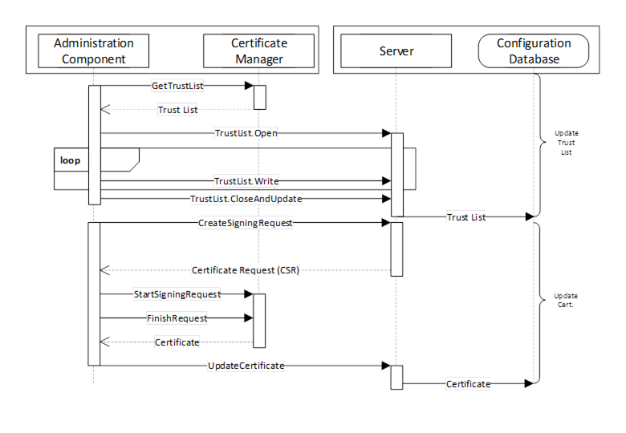  

Figure 14 - The Push Certificate Management Model  

The Administration Component may be part of the *CertificateManager* or a standalone utility that uses OPC UA to communicate with the *CertificateManager* (see [7.3](/§\_Ref105573170) for a more complete description of the interactions required for this use case). The Configuration Database is used by the *Server* to persist its configuration information. The *RegisterApplication* *Method* (or internal equivalent) is assumed to have been called before the sequence in the diagram starts.  

A similar process is used to renew certificates or to periodically update *TrustList* . In [Figure 14](/§\_Ref408341025) the *TrustList* update is shown to happen first. This is necessary to ensure any CRLs are provided to the *Server* before the new *Certificate* is updated. The *TrustList* update may be skipped If the current *TrustList* allows the *Server* to validate the new *Certificate* .  

Security when using the *PushManagement* model requires an encrypted channel and a *Client* with access to the *SecurityAdmin Role* . For example, *SecurityAdmin Role* could be mapped to user credentials for an administrator or to a *ApplicationInstance* *Certificate* issued to a configuration tool. [OPC 10000-21](/§UAPart21) defines a mechanism to install administrative *Client* *Certificates* into the *Server* *TrustList* .  

### 7.5 Application Setup  

Application Setup is the initial installation of an OPC UA *Server* or *Client* into a system in which a GDS is available and managing *Certificates* . Applications using a *Client* interface can be setup using the *PullManagement* . Applications using a *Server* interface can be setup using the *PushManagement* .  

*PushManagement* and *PullManagement* are also integrated into [OPC 10000-21](/§UAPart21) which specifies how new *Devices* can be authenticated when they are added to the network. Once a *Device* is authenticated the *Device* is trusted and can use the push or *PullManagement* without additional administrator credentials.  

OPC UA *Servers* that do not support [OPC 10000-21](/§UAPart21) typically auto-generate a self-signed *Certificate* when they first start. They may also have a pre-configured *TrustList* with *Applications* that are allowed to setup the *Server* . For example, a machine vendor may use a CA that is used to issue *Certificates* to *Applications* used by their field technicians.  

For embedded devices, the *Server* should allow any *Client* that provides the proper *SecurityAdmin* credentials to create the secure connection needed for setup using *PushManagement* . Once the *Server* has been given its initial *TrustList* the *Server* should then restrict access to those *Clients* with *Certificates* in the *TrustList* . A vendor specific process for setup is required if a device restricts the *Clients* allowed to connect securely.  

See [Annex G](/§\_Ref97191135) for more specific instructions on how to provision an application when [OPC 10000-21](/§UAPart21) is not used.  

### 7.6 Pull Management Workflow  

In this workflow the OPC UA *Application* that gets *Certificates* from the *CertificateManager* is the *Client* that executes the workflow and the *CertificateManager* is the *Server* processing the request in the workflow.  

The *Application* is authenticated with the *Certificate* signed by the *CertificateManager* (or the *Certificate* assigned during registration). The *UserTokenType* is always *Anonymous* using the *ApplicationSelfAdmin Privilege* .  

The workflow for *PullManagement* is shown in [Figure 15](/§\_Ref106726514) and the steps are described in [Table 21](/§\_Ref97720632) . The two options for the key pair creation are described in [Figure 16](/§\_Ref97729829) . The boxes with **blue text** *Method* calls.  

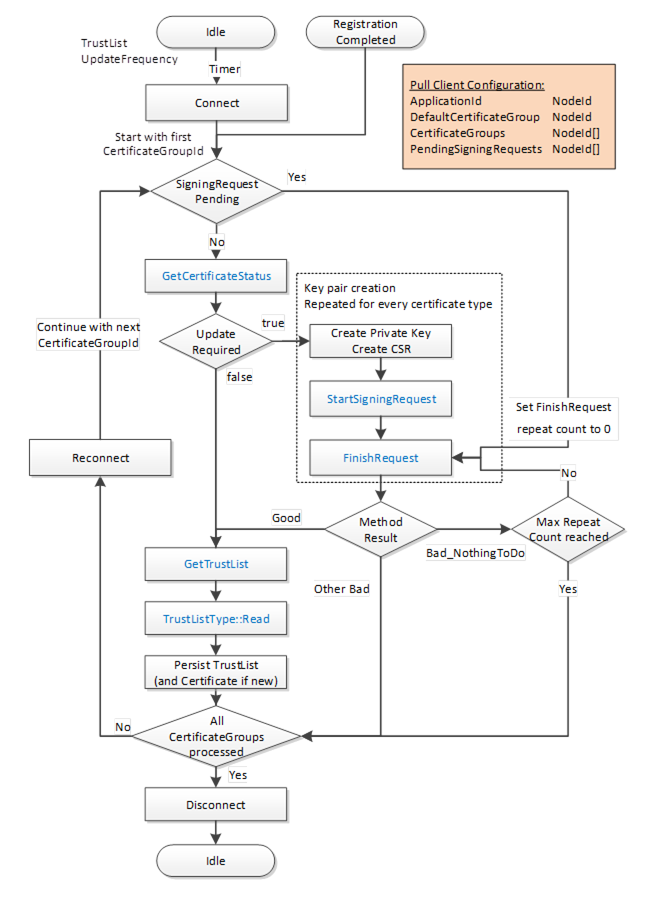  

Figure 15 - Certificate Pull Management Workflow  

  

  

Figure 16 - The Pull Management Options for Key Pair Creation  

The steps of the *PullManagement* workflow are described in detail in [Table 21](/§\_Ref97720632) .  

Table 21 - Certificate Pull Management Workflow Steps  

| **Step** | **Description** |
|---|---|
|Certificate management begin options|The following options are possible to start the *PullManagement* . 1. Continue application setup using the *Session* available from the application registration workflow described in [6.4](/§\_Ref106726515) . 1. Cyclic check of the application status using a new connection to the *CertificateManager* . The cycle time is defined by the *UpdateFrequency* on the related *TrustList Object* in the *CertificateManager* .|
|Connect|Create a connection for option (2). For the connection management with the *CertificateManager* the *Services* *OpenSecureChannel* , *CreateSession* and *ActivateSession* are used to create a connection with *MessageSecurityMode* *SignAndEncrypt* and an *Anonymous* user. The default *CertificateGroup* from the *Client* configuration is used to establish the connection. *Application* authentication is used by the *CertificateManager* to allow OPC UA *Applications* to access the necessary resources to update themselves using the *ApplicationSelfAdmin Privilege* .|
|Required information|The OPC UA *Application* requires the following information to execute the *PullManagement* workflow * ApplicationId *NodeId* of the OPC UA *Application* in the *CertificateManager* . * CertificateGroupIds *NodeIds* for each *CertificateGroup* in the *CertificateManager* that are relevant to the OPC UA *Application* . This includes a mapping to the related internal *CertificateGroup* and the *CertificateTypes* needed. * Pending signing requests *RequestIds* for pending signing requests that are waiting to be completed and their relationship with a *CertificateGroup* and *CertificateType* .|
|SigningRequestPending|If one or more signing requests are pending for a *CertificateGroup* , the *FinishRequest Method* is called directly with the *ApplicationId* and the *RequestId* for the pending signing request. The repeat count is set to 0 in this case.|
|GetCertificateStatus|The *Method GetCertificateStatus* is called with the *ApplicationId* and the *CertificateGroupId* to check if a certificate update is required. This is repeated for each *CertificateType* needed for the *CertificateGroup* .|
|Update Required|If *GetCertificateStatus* returns updateRequired set to True for one or more combinations of *CertificateGroup* and *CertificateType* , the process for key pair creation ** is started for the affected combinations.|
|Create CSR|The application creates a certificate signing request (CSR). It is strongly recommended, that the OPC UA *Application* creates a new private key for each signing request.|
|StartSigningRequest|The *Method StartSigningRequest* is called for each *CertificateGroup* and *CertificateType* together with the CSR to request a signed *Certificate* from the *CertificateManager* . Each *Method* call requires its own CSR. As alternative for OPC UA Applications who do not have access to a cryptographically sufficient entropy source, the *Method StartNewKeyPairRequest* can be used. In this case the private key is created by the *CertificateManager* . Both Methods return a *RequestId* that can be passed to the *FinishRequest Method* . The repeat count for *FinishRequest* is set to a small number like 2.|
|FinishRequest|The *Method FinishRequest* is called to check the results of a previous *StartSigningRequest* or *StartNewKeyPairRequest* . The following results are possible: * If *FinishRequest* returns a *Good* result, the *Method* returns the signed *Certificate* and optionally the private key for the *StartNewKeyPairRequest* case. * If *FinishRequest* returns *Bad\_NothingToDo* it indicates that the request is not completed yet. If the repeat count is not 0, the repeat count is decremented and *FinishRequest* is repeated after a short delay. If the repeat count is 0, the *RequestId* is persisted and the next *CertificateGroup* or *CertificateType* is processed * If *FinishRequest* returns any other *Bad* result, a new request must be sent in the next cycle|
|GetTrustList|If all *Certificates* for a *CertificateGroup* are up-to-date, the *TrustList* is checked for updates by calling the *Method* *GetTrustList* . The Method returns the *NodeId* of the *TrustList Object* for the *CertificateGroup* . The *LastUpdateTime* of *TrustList* *Object* indicates when the contents of the *TrustList* changed. When using *PullManagement* , the *Client* should check this *Property* before downloading the *TrustList* .|
|TrustListType::Read|The *NodeId* of the *TrustList Object* returned by *GetTrustList* is used to open the *TrustList* for reading and to read the current content of the *TrustList* .|
|Persist TrustList|If a *TrustList* update or *Certificate* updates are available, they are persisted for further use by the OPC UA *Application* . They must be persisted at the same time to ensure a consistent setup.|
|Repeat for all CertificateGroups|Repeat the process for all *CertificateGroups*|
|Disconnect|Disconnect from *CertificateManager* .|
  

  

### 7.7 Push Management Workflows  

#### 7.7.1 Overview  

There are a few common workflows that a *CertificateManager,* as a *Client,* executes against the *ServerConfiguration Object* or a *BaseApplicationConfiguration Object* in the *ManagedApplications* *Folder* .  

#### 7.7.2 Update Certificates Workflow  

This workflow is started if the *CertificateManager* determines that an update to one or more *Certificates* used for an existing *Endpoints* is required. It is shown in [Figure 17](/§\_Ref106728584) . The boxes with **blue text** *Method* calls.  

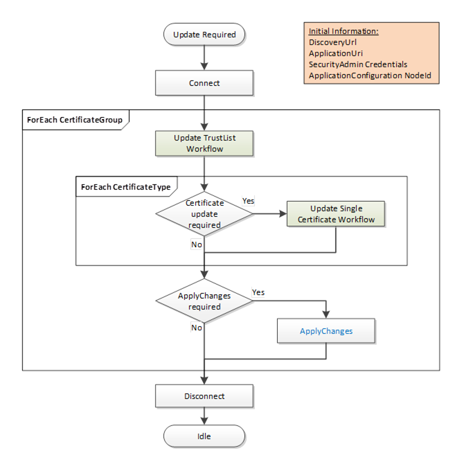  

Figure 17 - PushManagement Update Multiple Certificates Workflow  

The steps of the workflow are described in [Table 22](/§\_Ref195562638) .  

Table 22 - PushManagement Update Workflow Steps  

| **Step** | **Description** |
|---|---|
|Initial Conditions|The update is triggered when the *CertificateManager* becomes aware that one or more *Certificates* need to be updated. Possible trigger mechanisms include: * A trigger set based on *Certificate* expiry time; * Manual intervention by an Administrator; * Periodic changes triggered by policy. The *CertificateManager* needs to have a *DiscoveryUrl* for the *Server* and should already trust at least one existing *Certificate* . It also needs the *NodeId* of the *ApplicationConfigurationType* instance being updated or the *ApplicationUri* for the *Application* being updated. This is either the well-known *ServerConfiguration Object* or one of the *ApplicationConfigurationType* instances in the *ManagedApplications Folder* . The list of *CertificateGroups* to update may be specified by an administrator or discovered by browsing a *ApplicationConfigurationType* instance *.* Only *CertificateGroups* with an *ApplicationCertificateType Purpose* are considered. The *CertificateManager* needs credentials that will have access to the *SecurityAdmin* *Role* on the *Server* .|
|Connect|The *CertificateManager* creates a secure connection using encryption and a *Session* with the *Server* . The *Session* requires access to the *SecurityAdmin Role* or equivalent. Possible credentials used to authenticate the *CertificateManager* are: * *CertificateManager ApplicationInstance Certificate* ; * *UserIdentityToken* provided in *ActivateSession* .|
|Update TrustList Workflow|The steps involved in updating the *Certificate* are described in the Update TrustList workflow. For each *CertificateGroup* the *TrustList* is updated first. The updates shall include all issuers and CRLs needed to validate new *Certificates* assigned to the *CertificateGroup.* If the *CertificateManager* needs to connect using an *Endpoint* associated with the *CertificateGroup* then the TrustList update shall include all *Certificates* needed to trust the *CertificateManager.* An application being configured via the *ManagedApplications* *Folder* does not need to trust the *CertificateManager*|
|Certificate Update Required?|For each *CertificateType* in a *CertificateGroup* the *CertificateManager* must determine if an update is required. This is usually based on any of the checks that triggered the workflow in the first place. For example, a *Certificate* close to its expiry date needs to be updated.|
|Update Single Certificate Workflow|The steps involved in updating the *Certificate* are described in the Update Single Certificate workflow. The *Certificate* update process may take time or require approval by an administrator so the *CertificateManager* may start multiple updates in parallel.|
|Apply Changes Required?|For each *CertificateGroup* it may be necessary to call *ApplyChanges* once the Certificate Update workflow completes. *ApplyChanges* is required if one or more of the *Methods* calls returns applyChangesRequired=TRUE. This step may cause the *Server* to close its *Endpoints* and force all *Clients* to reconnect. If this happens the *CertificateManager* may need to use the new *Certificate* to re-establish a *Session* with the *Server* .|
|Disconnect|Disconnect from Server.|
  

  

#### 7.7.3 Update TrustList Workflow  

The Update *TrustList* workflow starts if the *CertificateManager* determines that an update to an existing *TrustList* is required. This update can be part of another workflow or a standalone workflow. It is shown in [Figure 18](/§\_Ref195580223) . The boxes with **blue text** *Method* calls.  

  

Figure 18 - PushManagement Update TrustList Workflow  

The steps of the *PushManagement* Update *TrustList* workflow are described in [Table 23](/§\_Ref195580288) .  

Table 23 - PushManagement Update TrustList Workflow Steps  

| **Step** | **Description** |
|---|---|
|Initial Conditions|The update is triggered when the *CertificateManager* needs to update a *TrustList* as part of a larger workflow. The *CertificateGroupId* is determined by the containing workflow.|
|TrustList::Open|The *TrustList* is opened for writing. The new *TrustList* is serialized into stream of bytes.|
|TrustList::Write|The stream of bytes is written to the *Server* in one or more blocks. The size of a block shall not exceed the value specified by the *MaxByteStringLength Property* .|
|TrustList::CloseAndUpdate|The *CertificateManager* closes the *TrustList* and tells the *Server* to apply changes. The *Server* may set the *applyChangesRequired* =TRUE to indicate that *ApplyChanges* needs to be called. If required, *ApplyChanges* is called by the containing workflow.|
  

  

#### 7.7.4 Update Single Certificate Workflow  

The Update Single *Certificate* workflow is part of the Update Certificates workflow in [7.7.2](/§\_Ref195636486) . It starts when the *CertificateManager* determines that an update to a *Certificate* assigned to a *CertificateGroup* is required. It is shown in [Figure 19](/§\_Ref195583820) . The boxes with **blue text** *Method* calls.  

 **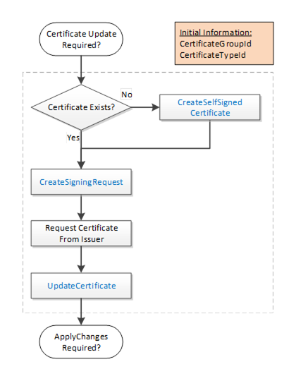**   

Figure 19 - PushManagement Update Certificate Workflow  

The steps of the workflow are described in [Table 24](/§\_Ref195585403) .  

Table 24 - PushManagement Update Certificate Workflow Steps  

| **Step** | **Description** |
|---|---|
|Initial Conditions|The update is triggered when the *CertificateManager* needs to update a *Certificate* as part of a larger workflow. The *CertificateGroupId* and *CertificateTypeId* are determined by the containing workflow.|
|Certificate Exists?|An existing *Certificate* may not be assigned to the *CertificateType* slot or it may not have field values that meet the requirements of the *CertificateManager* . If a useable *Certificate* does not exist a new self-signed *Certificate* is generated.|
|CreateSelfSignedCertificate|This *Method* creates a new self-signed *Certificate* using field values provided by the *CertificateManager* . This *Method* may not be implemented by all *Servers* . If this *Method* is available, it allows the *CertificateManager* to specify all of the key fields, such as the DNS names, in the *Certificate* . This is important when the *CertificateManager* configures *Endpoints* as described in [7.7.5](/§\_Ref195639113) .|
|CreateSigningRequest|This *Method* creates a new *CertificateRequest* that is signed with a *PrivateKey* owned by the *Server* . If requested, the *Server* generates a new *PrivateKey* but uses the field values from the existing *Certificate* . Some *Servers* may not have the resources to generate *PrivateKeys* . This step is skipped when this is the case.|
|Request Certificate from Issuer.|The *CertificateManager* requests a new *Certificate* from the *Issuer* . The *CertificateManager* generates a *PrivateKey* on behalf the *Server* if the *Server* cannot generate its own *PrivateKeys.*|
|UpdateCertificate|This *Method* allows the *CertificateManager* to upload a new *Certificate* and *PrivateKey* (if not generated by the *Server* ) to the *Server* . The *Server* may set the *applyChangesRequired* =TRUE to indicate that *ApplyChanges* needs to be called.|
  

  

#### 7.7.5 Create Endpoint Workflow  

The Create *Endpoint* workflow starts if the *CertificateManager* determines it needs to create a new Endpoint. This update is always part of another workflow. It is shown in [Figure 20](/§\_Ref195595671) . The boxes with **blue text** *Method* calls.  

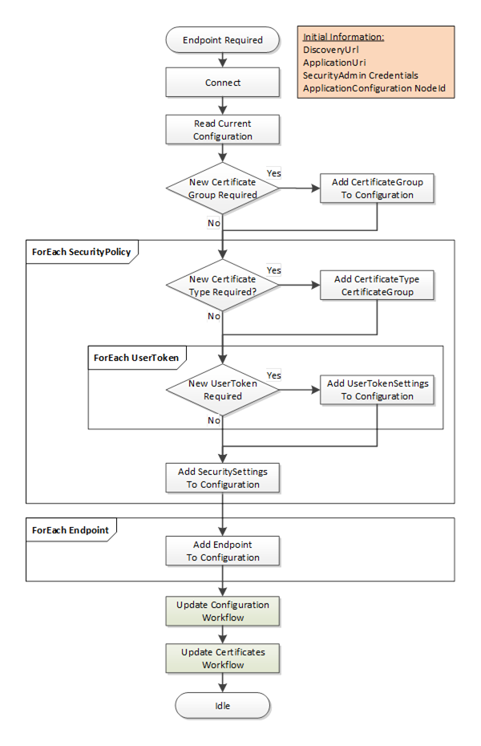  

Figure 20 - PushManagement Create Endpoint Workflow  

  

The steps of the workflow are described in [Table 25](/§\_Ref195595694) .  

Table 25 - PushManagement Create Endpoint Workflow Steps  

| **Step** | **Description** |
|---|---|
|Initial Conditions|The workflow is triggered when an administrator decides that a new *Endpoint* needs to be created and instructs the *CertificateManager* to create it. The *CertificateManager* needs to have a *DiscoveryUrl* for the *Server* and should already trust at least one existing *Certificate* . It also needs the *NodeId* of the *ApplicationConfigurationType* instance being updated or the *ApplicationUri* for the *Application* being updated. This is either the well-known *ServerConfiguration Object* or one of the *ApplicationConfigurationType* instances in the *ManagedApplications Folder* . The *CertificateManager* needs credentials that will have access to the *SecurityAdmin* *Role* on the *Server* .|
|Connect|This is described in [Table 22](/§\_Ref195562638) .|
|Read Current Configuration|The current configuration needs to be read from the *ConfigurationFile Object* which is a component of the *ApplicationConfiguration* instance. The *ConfigurationVersion* is needed when updating the configuration. Existing *SecuritySettings* , *UserTokenSettings* and *CertificateGroups* may be used by the new *Endpoint* . The current configuration is extended with new records as required. When updating the configuration a list of UpdateTargets is needed. Only records referenced by the UpdateTargets are processed.|
|New CertificateGroup Required?|Checks if a new CertificateGroup is required.|
|Add CertificateGroup|A new *CertificateGroup* is added to the configuration. An UpdateTarget with UpdateType=INSERT is created for the new *CertificateGroup* . The Path is 'CertificateGroups.[n]' where n is the index in the list of *CertificateGroups* currently in the configuration. The *Name* of the new record can be any value which is unique within the configuration and the *CertificateGroups Object* on the *ApplicationConfiguration* instance. It is used to create the *BrowseName* for the new *CertificateGroup Object* .|
|New CertificateType Required?|Checks if a new *CertificateType* is required.|
|Add CertificateType to CertificateGroup.|A new *CertificateType* is added to a CertificateGroups. If the CertificateGroup already exists, an UpdateTarget with UpdateType=REPLACE is created for the *CertificateGroup* . The Path is 'CertificateGroups.[n]' where n is the index in the list of *CertificateGroups* currently in the configuration. No additional UpdateTarget is needed if the *CertificateGroup* is a new *CertificateGroup* added in the previous step.|
|New UserToken Required?|Checks if a new *UserToken* is required.|
|Add UserTokenSettings to Configuration.|A new *UserTokenSettings* is added to the configuration. An UpdateTarget with UpdateType= INSERT is created. The *Path* is 'UserTokenSettings.[n]' where n is the index in the list of *UserTokenSettings* currently in the configuration. A new *IssuedTokenType* may also require a new *AuthorizationServices* record to be created as well. The *Name* of the new record can be any value which is unique within the configuration. It is not saved by the *Server* .|
|Add SecuritySettings to Configuration.|A new *SecuritySettings* is added to the configuration. An UpdateTarget with UpdateType= INSERT is created. The *Path* is 'SecuritySettings.[n]' where n is the index in the list of *SecuritySettings* currently in the configuration. The *Name* of the new record can be any value which is unique within the configuration. It is not saved by the *Server* .|
|Add Endpoint to Configuration.|A new *Endpoint* is added to the configuration. If the *ApplicationConfiguration* instance represents a *Server* then the *Endpoint* is an instance of *ServerEndpointDataType* and added to the *ServerEndpoints* list in the configuration. If the *ApplicationConfiguration* instance represents a *Client* then the *Endpoint* is an instance of *EndpointDataType* and added to the *ClientEndpoints* list in the configuration. An UpdateTarget with UpdateType= INSERT is created. The *Path* is ' *ServerEndpoints* .[n]' or ' *ClientEndpoints* .[n]' where n is the index in the appropriate list currently in the configuration. The *Name* of the new record can be any value which is unique within the configuration. It is not saved by the *Server* .|
|Update Configuration Workflow|The update configuration is uploaded to the Server. It is described in [7.7.6](/§\_Ref195647108) .|
|Update Configuration Workflow|The update configuration is uploaded to the *Server* . After this step completes the *CertificateManager* disconnects from the *Server* . It is described in [7.7.6](/§\_Ref195647108) .|
|Update Certificates Workflow|Once new *CertificateGroups* and *CertificateTypes* are added to the configuration it is possible to use the Update Certificates workflow to populate the *TrustLists* and issue *Certificates* . If this step is skipped, any *Endpoints* that reference the *CertificateGroups* missing *Certificates* will not be enabled. An *Endpoint* that has a valid *Certificate* but an empty *TrustList* will exist but no connections will be possible. The TOFU mode used during Application Setup (see [G.2](/§\_Ref195647448) ) only applies when a *Server* is configured for the first time. It is described in [7.7.2](/§\_Ref195636486) .|
  

  

#### 7.7.6 Update Configuration Workflow  

The Update Configuration workflow is always part of another workflow. It is shown in [Figure 21](/§\_Ref195647639) . The boxes with **blue text** *Method* calls.  

 **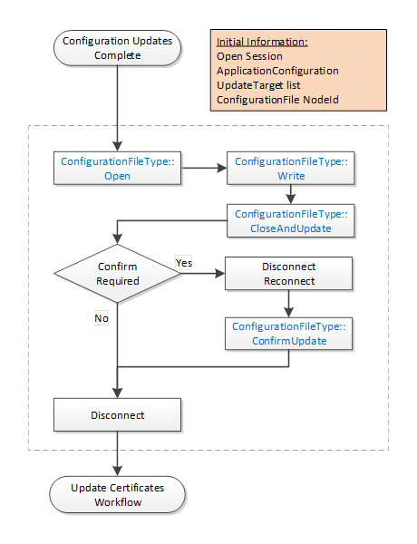**   

Figure 21 - PushManagement Update Configuration Workflow  

The steps of the workflow are described in [Table 26](/§\_Ref195647669) .  

Table 26 - PushManagement Update Configuration Workflow Steps  

| **Step** | **Description** |
|---|---|
|Initial Conditions|The workflow starts when a *CertificateManager* has completed updates to a local copy of the *ApplicationConfiguration* . A *Session* with *SecurityAdmin* access rights exists. The *ConfigurationFile Object* belongs to the *ApplicationConfiguration* being updated. It may be the *Server* that the *CertificateManager* is connected to or another application being managed by the *Server* .|
|ConfigurationFileType::Open|The *ConfigurationFile* is opened for writing. The new configuration is serialized into stream of bytes.|
|ConfigurationFileType::Write|The stream of bytes is written to the *Server* in one or more blocks. The size of a block shall not exceed the value specified by the *MaxByteStringLength Property* .|
|ConfigurationFileType::CloseAndUpdate|The *CertificateManager* closes the *ConfigurationFile* and tells the *Server* to apply changes. The *CertificateManager* provides a list of update targets which indicate what records in the configuration have changed. Records that are not referenced by an update target may be omitted. Note that when referencing existing the records the names provided by the *Server* when the configuration was downloaded shall be used. The names are associated with *ConfigurationVersion* and may change if the *ConfigurationVersion* changes. An error occurs if the *ConfigurationVersion* in the configuration does not match the current *ConfigurationVersion* known to the *Server* . The *Server* may return an *UpdateId* to indicate that *ConfirmUpdate* shall be called.|
|Confirm Required?|Checks if a new *ConfirmUpdate* needs to be called.|
|Disconnect/Reconnect|The *CertificateManager* closes the connection and waits at least the *RestartDelayTime* period but no longer than the *RevertAfterTime* period.|
|ConfigurationFileType::ConfirmUpdate|This *Method* tells the Server that the changes can be made permanent because the *CertificateManager* could reconnect.|
|Disconnect|Disconnect from *Server* . This step may be skipped instead of re-connecting when the Update Certificates workflow starts.|
  

  

### 7.8 Common Information Model  

#### 7.8.1 Overview  

The common information model defines types that are used in both the Push and the Pull Model.  

#### 7.8.2 TrustLists  

##### 7.8.2.1 TrustListType  

This type defines a *FileType* that can be used to access a *TrustList* .  

The *CertificateManager* uses this type to implement the Pull Model.  

*Servers* use this type when implementing the Push Model.  

An instance of a *TrustListType* shall restrict access to appropriate users or applications. This may be a *CertificateManager* administrative user that can change the contents of a *TrustList* , it may be an administrative user that is reading a *TrustList* to deploy to an Application host or it may be an Application that can only access the *TrustList* assigned to it.  

The *TrustList* file is a UA Binary encoded stream containing an instance of *TrustListDataType* (see [7.8.2.8](/§\_Ref424495965) ).  

The *Size Property* inherited from *FileType* has no meaning for *TrustList* and returns the error code defined in [OPC 10000-20](/§UAPart20) .  

When a *Client* opens the file for writing the *Server* will not actually update the *TrustList* until the *CloseAndUpdate* *Method* is called. Simply calling *Close* will discard the updates. The bit masks in *TrustListDataType* structure allow the *Client* to only update part of the *TrustList* .  

Its representation in the *AddressSpace* is formally defined in [Table 27](/§\_Ref354473321) .  

Table 27 - TrustListType Definition  

| **Attribute** | **Value** |
|---|---|
|BrowseName|0:TrustListType|
|IsAbstract|False|
  
| **References** | **NodeClass** | **BrowseName** | **DataType** | **TypeDefinition** | **Modelling Rule** |
|---|---|---|---|---|---|
|Subtype of the 0: *FileType* defined in [OPC 10000-20](/§UAPart20) .|
|0:HasProperty|Variable|0:LastUpdateTime|0:UtcTime|0:PropertyType|Mandatory|
|0:HasProperty|Variable|0:UpdateFrequency|0:Duration|0:PropertyType|Optional|
|0:HasProperty|Variable|0:ActivityTimeout|0:Duration|0:PropertyType|Optional|
|0:HasProperty|Variable|0:DefaultValidationOptions|TrustListValidationOptions|0:PropertyType|Optional|
|0:HasComponent|Method|0:OpenWithMasks|Defined in [7.8.2.2](/§\_Ref374565499) .|Mandatory|
|0:HasComponent|Method|0:CloseAndUpdate|Defined in [7.8.2.5](/§\_Ref374565520) .|Mandatory|
|0:HasComponent|Method|0:AddCertificate|Defined in [7.8.2.6](/§\_Ref374565559) .|Mandatory|
|0:HasComponent|Method|0:RemoveCertificate|Defined in [7.8.2.7](/§\_Ref374565579) .|Mandatory|
||
  
| **Conformance Units** |
|---|
|GDS Certificate Manager Pull Model|
|Push Model for Global Certificate and TrustList Management|
  

  

The *LastUpdateTime* indicates when the *TrustList* was last updated. The *LastUpdateTime* shall reflect changes made using the *TrustList Object* *Methods* . A *TrustList Object* in a *CertificateManager* shall also reflect changes made in other ways.  

The *LastUpdateTime* of a *TrustList Object* in a *CertificateManager* allows *Clients* using the *PullManagement* to know whether the *TrustList* has changed since the last time they accessed it. The *LastUpdateTime* of a *TrustList Object* in the *ServerConfiguration* allows administration *Clients* to verify the date of *TrustLists* . If a *Server* is not able to determine the *LastUpdateTime* after an event such as a restart, then the *LastUpdateTime* shall be DateTime.MinValue.  

The *UpdateFrequency* *Property* specifies how often the *TrustList* shall be checked for changes. When the *CertificateManager* specifies this value, all *Clients* that read a copy of the *TrustList* should connect to the *CertificateManager* and check for updates to the *TrustList* within 2 times the *UpdateFrequency* . The choice of *UpdateFrequency* depends on how quickly system changes are required to be detected and the performance constraints of the system. *UpdateFrequencies* that are too long create security risks because of out of date CRLs. *UpdateFrequencies* that are too short ** negatively impact system performance. If the *TrustList Object* is contained within a *ServerConfiguration* *Object* then this Property is not present.  

The *ActivityTimeout Property* specifies the maximum elapsed time between the calls to *Methods* on the *TrustList Object* after *Open* or *OpenWithMasks* is called. If this time elapses the *TrustList* is automatically closed by the *Server* and any changes are discarded. The default value is 60 000 milliseconds (1 minute).  

The *DefaultValidationOptions Property* specifies the default options to use when validating *Certificates* with the *TrustList* . The *TrustListValidationOptions* *DataType* is defined in [7.8.2.10](/§\_Ref43055979) . This *Property* may be updated by *Clients* with access to the *SecurityAdmin Role* .  

If auditing is supported, the *CertificateManager* shall generate the *TrustListUpdated* AuditEventType (see [7.8.2.13](/§\_Ref97289552) ) when the *TrustList* is updated via the *CloseAndUpdate* (see [7.8.2.5](/§\_Ref374565520) ), *AddCertificate* (see [7.8.2.6](/§\_Ref374565559) ), *RemoveCertificate* (see [7.8.2.7](/§\_Ref374565579) ) or *ApplyChanges* (see [7.10.9](/§\_Ref401495224) ) *Methods* . The *Event* is only raised once after the asynchronous update process completes.  

##### 7.8.2.2 Open  

The *Open Method* is inherited from *FileType* which is defined in [OPC 10000-5](/§UAPart5) .  

The *Open* *Method* shall not support modes other than Read (0x01) and the Write + EraseExisting (0x06). If other modes are requested the return code is *Bad\_NotSupported* .  

If a transaction is in progress (see [7.10.9](/§\_Ref88990712) ) on another *Session* then the *Server* shall return *Bad\_TransactionPending* if *Open* is called with the *Write Mode* bit set.  If the *Server* supports transactions, then the *Server* creates a new transaction or continues an existing transaction if *Open* is called with the *Write Mode* bit set.  

If the *SecureChannel* is not authenticated the *Server* shall return *Bad\_SecurityModeInsufficient* .  

 **Method Result Codes**   

| **Result Code** | **Description** |
|---|---|
|Bad\_NotSupported|The mode is not supported.|
|Bad\_TransactionPending|The *TrustList* cannot be opened because it is part of a transaction is in progress.|
|Bad\_SecurityModeInsufficient|The SecureChannel is not authenticated.|
  

  

##### 7.8.2.3 OpenWithMasks  

The *OpenWithMasks* *Method* allows a *Client* to read only a portion of the *TrustList.*  

This *Method* can only be used to read the *TrustList* .  

After calling this *Method* , the *Client* calls *Read* one or more times to get the *TrustList* . If the *Server* is able to detect out of band changes to *theTrustList* before the *Client* calls the *Close Method* , then the next *Read* returns *Bad\_InvalidState* . If the *Server* cannot detect out of band changes it shall ensure the *Client* receives a consistent snapshot.  

For *PullManagement* , this *Method* shall be called from an authenticated *SecureChannel* and from a *Client* that has access to the *CertificateAuthorityAdmin Role,* the *ApplicationSelfAdmin Privilege,* or the *ApplicationAdmin Privilege* (see [7.2](/§\_Ref100529418) ).  

For *PushManagement* , this *Method* shall be called from an authenticated *SecureChannel* and from a *Client* that has access to the *SecurityAdmin Role* (see [7.2](/§\_Ref100529418) ).  

 **Signature**   

 **OpenWithMasks**   

[in]  UInt32 masks  

[out] UInt32 fileHandle  

);  

  

| **Argument** | **Description** |
|---|---|
|masks|The parts of the *TrustList* that are include in the file to read. The masks are defined in [7.8.2.9](/§\_Ref424495966) .|
|fileHandle|The handle of the newly opened file.|
  

  

 **Method Result Codes (defined in Call Service)**   

| **Result Code** | **Description** |
|---|---|
|Bad\_UserAccessDenied|The current user does not have the rights required.|
|Bad\_TransactionPending|The *TrustList* cannot be opened because it is part of a transaction that is in progress.|
|Bad\_SecurityModeInsufficient|The SecureChannel is not authenticated.|
  

  

[Table 28](/§\_Ref412150157) specifies the *AddressSpace* representation for the *OpenWithMasks Method* .  

Table 28 - OpenWithMasks Method AddressSpace Definition  

| **Attribute** | **Value** |
|---|---|
|BrowseName|0:OpenWithMasks|
  
| **References** | **NodeClass** | **BrowseName** | **DataType** | **TypeDefinition** | **ModellingRule** |
|---|---|---|---|---|---|
|0:HasProperty|Variable|0:InputArguments|0:Argument[]|0:PropertyType|Mandatory|
|0:HasProperty|Variable|0:OutputArguments|0:Argument[]|0:PropertyType|Mandatory|
  

  

##### 7.8.2.4 Read  

The *Read Method* is inherited from *FileType* which is defined in [OPC 10000-5](/§UAPart5) .  

If the *Server* is able to detect out of band changes to the *TrustList* before the *Client* calls the *Close Method* , then this *Method* returns *Bad\_InvalidState* .  

 **Additional Method Result Codes**   

| **Result Code** | **Description** |
|---|---|
|Bad\_InvalidState|The state of the TrustList has changed.|
  

##### 7.8.2.5 CloseAndUpdate  

The *CloseAndUpdate* *Method* closes the *TrustList* and applies the changes to the *TrustList* . It can only be called if the *TrustList* was opened for writing. If the *Close* *Method* is called any cached data is discarded and the *TrustList* is not changed.  

If only part of the *TrustList* is being updated the *Server* creates a new *TrustList* that includes the existing *TrustList* plus any updates and validates the new *TrustList* .  

The *Server* shall verify that every *Certificate* in the new *TrustList* is valid using the validation process defined in [OPC 10000-4](/§UAPart4) . If an invalid *Certificate* is found the *Server* shall return an error and shall not replace the existing *TrustList* .  

If the *Server* does not support transactions, it applies the changes immediately and sets *applyChangesRequired* to FALSE. If the *Server* supports transactions, then the *Server* creates a new transaction or continues an existing transaction and sets *applyChangesRequired* to TRUE.  

If a transaction exists on the current *Session* , the *Server* does not update the *TrustList* until *ApplyChanges* (see [7.10.9](/§\_Ref401495224) ) is called. Any *Clients* that read the *TrustList* before *ApplyChanges* is called will receive the existing *TrustList* before the transaction started.  

If any errors occur, the new *TrustList* shall be discarded *.*  

When the *TrustList* changes the *Server* shall re-evaluate the *Certificate* associated with any open *Sessions* and *SecureChannels.* *Sessions* or *SecureChannels* with an untrusted or revoked *Certificate* shall be closed. This process may not complete before the *Method* returns and could take a significant amount of time on systems with limited resources.  

The structure uploaded includes a mask (see [7.8.2.9](/§\_Ref424495967) ) which specifies which fields are updated. If a bit is not set then the associated field is not changed.  

For *PullManagement* , this *Method* shall be called from an authenticated *SecureChannel* and from a *Client* that has access to the *CertificateAuthorityAdmin Role,* the *ApplicationSelfAdmin Privilege,* or the *ApplicationAdmin Privilege* (see [7.2](/§\_Ref100529418) ).  

For *PushManagement* , this *Method* shall be called from an authenticated *SecureChannel* and from a *Client* that has access to the *SecurityAdmin Role* (see [7.2](/§\_Ref100529418) ).  

 **Signature**   

 **CloseAndUpdate**   

[in]  UInt32 fileHandle  

[out] Boolean applyChangesRequired  

);  

  

| **Argument** | **Description** |
|---|---|
|fileHandle|The handle of the previously opened file.|
|applyChangesRequired|If TRUE the *ApplyChanges* Method (see [7.10.9](/§\_Ref401495224) ) shall be called before the new *TrustList* will be used by the *Server* . If FALSE the *TrustList* is now in use.|
  

  

 **Method Result Codes (defined in Call Service)**   

| **Result Code** | **Description** |
|---|---|
|Bad\_UserAccessDenied|The current user does not have the rights required.|
|Bad\_CertificateInvalid|The *Server* could not validate one or more *Certificates* in the *TrustList* . This may be returned after the first failed validation check.|
|Bad\_RequestTooLarge|The changes would result in a *TrustList* that exceeds the *MaxTrustListSize* for the *Server* .|
|Bad\_TransactionPending|Changes are queued on another *Session* (see [7.10.9](/§\_Ref88990712) ).|
  

  

[Table 29](/§\_Ref412150158) specifies the *AddressSpace* representation for the *CloseAndUpdate Method* .  

Table 29 - CloseAndUpdate Method AddressSpace Definition  

| **Attribute** | **Value** |
|---|---|
|BrowseName|0:CloseAndUpdate|
  
| **References** | **NodeClass** | **BrowseName** | **DataType** | **TypeDefinition** | **ModellingRule** |
|---|---|---|---|---|---|
|0:HasProperty|Variable|0:InputArguments|0:Argument[]|0:PropertyType|Mandatory|
|0:HasProperty|Variable|0:OutputArguments|0:Argument[]|0:PropertyType|Mandatory|
  

  

##### 7.8.2.6 AddCertificate  

The *AddCertificate* *Method* allows a *Client* to add a single *Certificate* to the *TrustList* . The *Server* shall verify that the *Certificate* using the validation process defined in [OPC 10000-4](/§UAPart4) . If an invalid *Certificate* is found the *Server* shall return an error and shall not update the *TrustList* .  

This *Method* will return a validation error if the *Certificate* is issued by a CA and the *Certificate* for the issuer is not in the *TrustList* .  

This *Method* cannot provide CRLs so issuer *Certificates* cannot be added with this *Method* . Instead, CA *Certificates* and their CRLs shall be managed with the *Write Method* on the containing *TrustList Object.*  

This *Method* cannot be called if the containing *TrustList Object* is open.  

This *Method* returns *Bad\_TransactionPending* if a transaction is in progress (see [7.10.9](/§\_Ref88990712) ).  

This *Method* returns *Bad\_NotWritable* if the *TrustList Object* is read only.  

For *PullManagement* , this *Method* shall be called from an authenticated *SecureChannel* and from a *Client* that has access to the *CertificateAuthorityAdmin Role* (see [7.2](/§\_Ref100529418) ).  

For *PushManagement* , this *Method* shall be called from an authenticated *SecureChannel* and from a *Client* that has access to the *SecurityAdmin Role* (see [7.2](/§\_Ref100529418) ).  

 **Signature**   

 **AddCertificate**   

[in] ByteString certificate  

[in] Boolean isTrustedCertificate  

);  

  

| **Argument** | **Description** |
|---|---|
|certificate|The DER encoded Certificate to add.|
|isTrustedCertificate|If TRUE the *Certificate* is added to the *trustedCertificates* list. If FALSE *Bad\_CertificateInvalid* is returned.|
  

  

 **Method Result Codes (defined in Call Service)**   

| **Result Code** | **Description** |
|---|---|
|Bad\_UserAccessDenied|The current user does not have the rights required.|
|Bad\_CertificateInvalid|The certificate to add is invalid.|
|Bad\_InvalidState|The *Open Method* was called with write access and the *CloseAndUpdate* Method has not been called.|
|Bad\_RequestTooLarge|The changes would result in a *TrustList* that exceeds the *MaxTrustListSize* for the *Server* .|
|Bad\_TransactionPending|Transaction has started and *ApplyChanges* or *CancelChanges* has not been called.|
|Bad\_SecurityModeInsufficient|The SecureChannel is not authenticated.|
|Bad\_NotWritable|The *TrustList Object* is open for read only|
  

  

[Table 30](/§\_Ref486851418) specifies the *AddressSpace* representation for the *AddCertificate Method* .  

Table 30 - AddCertificate Method AddressSpace Definition  

| **Attribute** | **Value** |
|---|---|
|BrowseName|0:AddCertificate|
  
| **References** | **NodeClass** | **BrowseName** | **DataType** | **TypeDefinition** | **ModellingRule** |
|---|---|---|---|---|---|
|0:HasProperty|Variable|0:InputArguments|0:Argument[]|0:PropertyType|Mandatory|
  

  

##### 7.8.2.7 RemoveCertificate  

The *RemoveCertificate* *Method* allows a *Client* to remove a single *Certificate* from the *TrustList* . It returns *Bad\_InvalidArgument* if the thumbprint does not match a Certificate in the *TrustList* .  

If the *Certificate* is a CA *Certificate* that has CRLs then all CRLs for that CA are removed as well.  

This *Method* returns *Bad\_CertificateChainIncomplete* if the *Certificate* is a CA *Certificate* needed to validate another *Certificate* in the *TrustList* .  

This *Method* returns *Bad\_TransactionPending* if a transaction is in progress (see [7.10.9](/§\_Ref88990712) ).  

This *Method* returns *Bad\_NotWritable* if the *TrustList Object* is read only. For *PullManagement* , this *Method* shall be called from an authenticated *SecureChannel* and from a *Session* that has access to the *CertificateAuthorityAdmin Role* (see [7.2](/§\_Ref100529418) ).  

For *PushManagement* , this *Method* shall be called from an authenticated *SecureChannel* and from a *Session* that has access to the *SecurityAdmin Role* (see [7.2](/§\_Ref100529418) ).  

 **Signature**   

 **RemoveCertificate**   

[in] String thumbprint  

[in] Boolean isTrustedCertificate  

);  

  

| **Argument** | **Description** |
|---|---|
|Thumbprint|The *CertificateDigest* of the *Certificate* to remove.|
|isTrustedCertificate|If TRUE the Certificate is removed from the Trusted Certificates List. If FALSE the Certificate is removed from the Issuer Certificates List.|
  

  

 **Method Result Codes (defined in Call Service)**   

| **Result Code** | **Description** |
|---|---|
|Bad\_UserAccessDenied|The current user does not have the rights required.|
|Bad\_InvalidArgument|The certificate to remove was not found.|
|Bad\_InvalidState|The *Open Method* was called with write access and the *CloseAndUpdate* Method has not been called.|
|Bad\_CertificateChainIncomplete|The *Certificate* is needed to validate another *Certificate* in the *TrustList.*|
|Bad\_TransactionPending|Transaction has started and *ApplyChanges* or *CancelChanges* has not been called.|
|Bad\_SecurityModeInsufficient|The SecureChannel is not authenticated.|
|Bad\_NotWritable|The *TrustList Object* is open for read only.|
  

  

[Table 31](/§\_Ref486851457) specifies the *AddressSpace* representation for the *RemoveCertificate Method* .  

Table 31 - RemoveCertificate Method AddressSpace Definition  

| **Attribute** | **Value** |
|---|---|
|BrowseName|0:RemoveCertificate|
  
| **References** | **NodeClass** | **BrowseName** | **DataType** | **TypeDefinition** | **ModellingRule** |
|---|---|---|---|---|---|
|0:HasProperty|Variable|0:InputArguments|0:Argument[]|0:PropertyType|Mandatory|
  

  

##### 7.8.2.8 TrustListDataType  

This type defines a DataType which stores the *TrustList* of a *Server.* Its values are defined in [Table 32](/§\_Ref486851528) .  

Table 32 - TrustListDataType Structure  

| **Name** | **Type** | **Description** |
|---|---|---|
|TrustListDataType|Structure|Subtype of the *Structure DataType* defined in [OPC 10000-5](/§UAPart5)|
|specifiedLists|UInt32|A bit mask which indicates which lists contain information. The *TrustListMasks* enumeration in [7.8.2.9](/§\_Ref424495969) defines the allowed values.|
|trustedCertificates|ByteString[]|The list of *Application* and CA *Certificates* which are trusted.|
|trustedCrls|ByteString[]|The CRLs for the *Certificates* in the *trustedCertificates* list.|
|issuerCertificates|ByteString[]|The list of CA *Certificates* which are necessary to validate *Certificates* .|
|issuerCrls|ByteString[]|The CRLs for the CA *Certificates* in the *issuerCertificates* list.|
  

  

Its representation in the *AddressSpace* is defined in [Table 33](/§\_Ref42881538) .  

Table 33 - TrustListDataType Definition  

| **Attribute** | **Value** |
|---|---|
|BrowseName|0:TrustListDataType|
|IsAbstract|False|
  
| **References** | **NodeClass** | **BrowseName** | **DataType** | **TypeDefinition** | **Other** |
|---|---|---|---|---|---|
|Subtype of the 0: *Structure DataType* defined in [OPC 10000-5](/§UAPart5) .|
||
  
| **Conformance Units** |
|---|
|GDS Certificate Manager Pull Model|
|Push Model for Global Certificate and TrustList Management|
  

  

##### 7.8.2.9 TrustListMasks  

This is a DataType that defines the values used for the SpecifiedLists field in the *TrustListDataType* . Its values are defined in [Table 34](/§\_Ref367619341) .  

Table 34 - TrustListMasks Enumeration  

| **Name** | **Value** | **Description** |
|---|---|---|
|None|0|No fields are provided.|
|TrustedCertificates|1|The TrustedCertificates are provided.|
|TrustedCrls|2|The TrustedCrls are provided.|
|IssuerCertificates|4|The IssuerCertificates are provided.|
|IssuerCrls|8|The IssuerCrls are provided.|
|All|15|All fields are provided.|
  

  

Its representation in the *AddressSpace* is defined in [Table 35](/§\_Ref42881639) .  

Table 35 - TrustListMasks Definition  

| **Attribute** | **Value** |
|---|---|
|BrowseName|0:TrustListMasks|
|IsAbstract|False|
  
| **References** | **NodeClass** | **BrowseName** | **DataType** | **TypeDefinition** | **Other** |
|---|---|---|---|---|---|
|Subtype of the *Enumeration DataType* defined in [OPC 10000-5](/§UAPart5) .|
|0:HasProperty|Variable|0:EnumValues|0:EnumValueType []|0:PropertyType||
||
  
| **Conformance Units** |
|---|
|GDS Certificate Manager Pull Model|
|Push Model for Global Certificate and TrustList Management|
  

  

##### 7.8.2.10 TrustListValidationOptions  

This *DataType* defines flags for *TrustListValidationOptions* is formally defined in [Table 36](/§\_Ref498640836) .  

Table 36 - TrustListValidationOptions Values  

| **Value** | **Bit No.** | **Description** |
|---|---|---|
|SuppressCertificateExpired|0|Ignore errors related to the validity time of the Certificate.|
|SuppressHostNameInvalid|1|Ignore mismatches between the host name or *ApplicationUri* .|
|SuppressRevocationStatusUnknown|2|Ignore errors if the revocation list cannot be found for the issuer of the *Certificate* .|
|SuppressIssuerCertificateExpired|3|Ignore errors if an issuer has an expired *Certificate* .|
|SuppressIssuerRevocationStatusUnknown|4|Ignore errors if the revocation list cannot be found for any issuer of issuer *Certificates* .|
|CheckRevocationStatusOnline|5|Check the revocation status online.|
|CheckRevocationStatusOffline|6|Check the revocation status offline.|
  

  

If *CheckRevocationStatusOnline* is set, the *Certificate* validation process defined in [OPC 10000-4](/§UAPart4) will look for the *authorityInformationAccess* extension to find an OCSP (RFC 6960) endpoint which can be used to determine if the *Certificate* has been revoked.  

If the OCSP endpoint is not reachable then the *Certificate* validation process looks for offline CRLs if the *CheckRevocationStatusOffline* bit is set. Otherwise, validation fails.  

The revocation status flags only have meaning for issuer *Certificates* and are used when validating *Certificates* issued by that issuer.  

The default value for this *DataType* only has the *CheckRevocationStatusOffline* bit set.  

The *TrustListValidationOptions* representation in the *AddressSpace* is defined in [Table 37](/§\_Ref16863028) .  

Table 37 - TrustListValidationOptions Definition  

| **Attribute** | **Value** |
|---|---|
|BrowseName|0:TrustListValidationOptions|
|IsAbstract|False|
  
| **References** | **NodeClass** | **BrowseName** | **DataType** | **TypeDefinition** | **Other** |
|---|---|---|---|---|---|
|Subtype of the 0: *UInt32* *DataType* defined in [OPC 10000-5](/§UAPart5)|
|0:HasProperty|Variable|0:OptionSetValues|0:LocalizedText []|0:PropertyType||
||
  
| **Conformance Units** |
|---|
|GDS Certificate Manager Pull Model|
|Push Model for Global Certificate and TrustList Management|
  

  

##### 7.8.2.11 TrustListOutOfDateAlarmType  

This *SystemOffNormalAlarmType* is raised by the *Server* when the *UpdateFrequency* elapses and the *TrustList* has not been updated. This alarm automatically returns to normal when the *TrustList* is updated.  

Its representation in the *AddressSpace* is defined in [Table 38](/§\_Ref203096304) .  

  

Table 38 - TrustListOutOfDateAlarmType definition  

| **Attribute** | **Value** |
|---|---|
|BrowseName|0:TrustListOutOfDateAlarmType|
|IsAbstract|False|
  
| **References** | **NodeClass** | **BrowseName** | **DataType** | **TypeDefinition** | **ModellingRule** |
|---|---|---|---|---|---|
|Subtype of the SystemOffNormalAlarmType defined in [OPC 10000-9](/§UAPart9) .|
|0:HasProperty|Variable|0:TrustListId|0:NodeId|0:PropertyType|Mandatory|
|0:HasProperty|Variable|0:LastUpdateTime|0:UtcTime|0:PropertyType|Mandatory|
|0:HasProperty|Variable|0:UpdateFrequency|0:Duration|0:PropertyType|Mandatory|
||
  
| **Conformance Units** |
|---|
|GDS Certificate Manager Pull Model|
|Push Model for Global Certificate and TrustList Management|
  

  

*TrustListId Property* specifies the *NodeId* of the out-of-date *TrustList Object* .  

*LastUpdateTime Property* specifies when the *TrustList* was last updated.  

*UpdateFrequency* *Property* specifies how frequently the *TrustList* is updated.  

##### 7.8.2.12 TrustListUpdateRequestedAuditEventType  

This event is raised when a *Method* that changes the *TrustList* is called  

It is raised when *CloseAndUpdate, AddCertificate or RemoveCertificate* *Method* on a *TrustListType* *Object* is called.  

Its representation in the *AddressSpace* is formally defined in [Table 39](/§\_Ref104274299) .  

Table 39 - TrustListUpdateRequestedAuditEventType Definition  

| **Attribute** | **Value** |
|---|---|
|BrowseName|0:TrustListUpdateRequestedAuditEventType|
|IsAbstract|True|
  
| **References** | **NodeClass** | **BrowseName** | **DataType** | **TypeDefinition** | **ModellingRule** |
|---|---|---|---|---|---|
|Subtype of the 0: *AuditUpdateMethodEventType* defined in [OPC 10000-5](/§UAPart5) .|
||
  
| **Conformance Units** |
|---|
|GDS Certificate Manager Pull Model|
|Push Model for Global Certificate and TrustList Management|
  

  

This *EventType* inherits all *Properties* of the *AuditUpdateMethodEventType* . Their semantic is defined in [OPC 10000-5](/§UAPart5) .  

##### 7.8.2.13 TrustListUpdatedAuditEventType  

This event is raised when a *TrustList* is successfully changed.  

This is the result of a *CloseAndUpdate* *Method* on a *TrustListType* *Object* or the result of a *ApplyChanges* *Method* on the *ServerConfigurationType Object* being called.  

It shall also be raised when the *AddCertificate* or *RemoveCertificate* Method causes an update to the *TrustList* .  

Its representation in the *AddressSpace* is formally defined in [Table 40](/§\_Ref104964081) .  

Table 40 - TrustListUpdatedAuditEventType Definition  

| **Attribute** | **Value** |
|---|---|
|BrowseName|0:TrustListUpdatedAuditEventType|
|IsAbstract|True|
  
| **References** | **NodeClass** | **BrowseName** | **DataType** | **TypeDefinition** | **ModellingRule** |
|---|---|---|---|---|---|
|Subtype of the 0: *AuditUpdateMethodEventType* defined in [OPC 10000-5](/§UAPart5) .|
|0:HasProperty|Variable|0:TrustListId|0:NodeId|0:PropertyType|Mandatory|
||
  
| **Conformance Units** |
|---|
|GDS Certificate Manager Pull Model|
|Push Model for Global Certificate and TrustList Management|
  

  

This *EventType* inherits all *Properties* of the *AuditUpdateMethodEventType* . Their semantic is defined in [OPC 10000-5](/§UAPart5) .  

The *TrustListId Property* is the *NodeId* of the *TrustList Object* that was changed.  

#### 7.8.3 CertificateGroups  

##### 7.8.3.1 CertificateGroupType  

This *ObjectType* is used for *Objects* which represent *CertificateGroups* in the *AddressSpace* . A *CertificateGroup* is a context that contains a *TrustList* and one or more *CertificateTypes* that can be assigned to an application. This *ObjectType* allows an application ** which has multiple *TrustLists* and/or *ApplicationInstance Certificates* to express them in its *AddressSpace* .  

A *CertificateManager* can have many *CertificateGroups* which manage *CertificateTypes* and TrustLists for the applications in the system.  

A *Server* has one or more C *ertificateGroups* which specify the *CertificateTypes* and *TrustLists* managed by the *Server* . Typically, there is a mapping between a *CertificateGroup* in a *Server* and a *CertificateGroup* in the *CertificateManager* . The mechanisms for creating that mapping are outside the scope of this specification.  

This type is defined in [Table 41](/§\_Ref369070810) .  

Table 41 - CertificateGroupType Definition  

| **Attribute** | **Value** |
|---|---|
|BrowseName|0:CertificateGroupType|
|IsAbstract|False|
  
| **References** | **NodeClass** | **BrowseName** | **DataType** | **TypeDefinition** | **Modelling Rule** |
|---|---|---|---|---|---|
|Subtype of the *BaseObjectType* defined in [OPC 10000-5](/§UAPart5) .|
||
|0:HasComponent|Object|0:TrustList||0:TrustListType|Mandatory|
|0:HasProperty|Variable|0:CertificateTypes|0:NodeId[]|0:PropertyType|Mandatory|
|0:HasProperty|Variable|0:Purpose|0:NodeId|0:PropertyType|Optional|
|0:HasComponent|Object|0:CertificateExpired||0:CertificateExpirationAlarmType|Optional|
|0:HasCondition|ObjectType|0:CertificateExpirationAlarmType||||
|0:HasComponent|Object|0:TrustListOutOfDate||0:TrustListOutOfDateAlarmType|Optional|
|0:HasComponent|Method|0:GetRejectedList|Defined in [7.8.3.2](/§\_Ref106623138) .|Optional|
||
  
| **Conformance Units** |
|---|
|GDS Certificate Manager Pull Model|
|Push Model for Global Certificate and TrustList Management|
  

  

The *TrustList Object* is the *TrustList* associated with the *CertificateGroup* .  

The *CertificateTypes Property* specifies the *NodeIds* of the *CertificateTypes* which may be assigned to applications which belong to the *CertificateGroup* . For example, a *CertificateGroup* with the NodeId of *RsaMinApplicationCertificateType* (see [7.8.4.8](/§\_Ref419571821) ) and the NodeId *RsaSha256ApplicationCertificate* (see [7.8.4.9](/§\_Ref369059033) ) specified allows an *OPC UA Application* to have one *ApplicationInstance Certificates* for each type. If this list is empty then the *CertificateGroup* does not allow *Certificates* to be assigned to *Applications* (i.e. a *UserToken* *CertificateGroup* only exists to allow the associated *TrustList* to be read or updated). All *CertificateTypes* for a given *CertificateGroup* shall be subtypes of a single common type (see *Purpose* in [7.8.3.4](/§\_Ref163568036) ).  

The *Purpose Property* specifies the allowed *CertificateTypes* . It shall be a direct subtype of *CertificateType* . See [7.8.3.4](/§\_Ref163568036) for more details.  

The *CertificateExpired* *Object* is an *Alarm* which is raised when a *Certificate* associated with the *CertificateGroup* is about to expire. If multiple *Certificates* are about to expire an Alarm for each *Certificate* is raised.  The *CertificateExpirationAlarmType* is defined in [OPC 10000-9](/§UAPart9) .  

The *TrustListOutOfDate* *Object* is an Alarm which is raised when the *TrustList* has not been updated within the period specified by the *UpdateFrequency* (see [7.8.2.1](/§\_Ref494076850) ). The *TrustListOutOfDateAlarmType* is defined in [7.8.2.11](/§\_Ref494076884) .  

The *GetRejectedList Method* returns the list of *Certificates* that have been rejected by the *Server* when using the *TrustList* associated with the CertificateGroup. It can be used to track activity or allow administrators to move a rejected *Certificate* into the *TrustList* . This *Method* shall only be present on *CertificateGroups* which are part of the *ServerConfiguration* *Object* defined in [7.10.4](/§\_Ref106623139) .  

##### 7.8.3.2 GetRejectedList  

*GetRejectedList* *Method* returns the list of *Certificates* that have been rejected by the *Server* .  

No rules are defined for how the *Server* updates this list or how long a *Certificate* is kept in the list. It is recommended that every valid but untrusted *Certificate* be added to the rejected list as long as storage is available. *Servers* can delete entries from the list returned if the maximum message size is not large enough to allow the entire list to be returned.  

*Servers* only add *Certificates* to this list that have no unsuppressed validation errors but are not trusted.  

For *PullManagement* , this *Method* is not present on the *CertificateGroup* .  

For *PushManagement* , this *Method* shall be called from an authenticated *SecureChannel* and from a *Client* that has access to the *SecurityAdmin Role* (see [7.2](/§\_Ref100529418) ).  

 **Signature**   

 **GetRejectedList**   

[out] ByteString[] certificates  

);  

  

| **Argument** | **Description** |
|---|---|
|certificates|The DER encoded form of the Certificates rejected by the Server *.*|
  

  

 **Method Result Codes (defined in Call Service)**   

| **Result Code** | **Description** |
|---|---|
|Bad\_UserAccessDenied|The current user does not have the rights required.|
|Bad\_SecurityModeInsufficient|The SecureChannel is not authenticated.|
  

  

[Table 42](/§\_Ref113664481) specifies the *AddressSpace* representation for the *GetRejectedList Method* .  

Table 42 - GetRejectedList Method AddressSpace Definition  

| **Attribute** | **Value** |
|---|---|
|BrowseName|0:GetRejectedList|
  
| **References** | **NodeClass** | **BrowseName** | **DataType** | **TypeDefinition** | **ModellingRule** |
|---|---|---|---|---|---|
|0:HasProperty|Variable|0:OutputArguments|0:Argument[]|0:PropertyType|Mandatory|
  

  

##### 7.8.3.3 CertificateGroupFolderType  

This type is used for *Folders* which organize *CertificateGroups* in the *AddressSpace* . This type is defined in [Table 43](/§\_Ref113664516) .  

Table 43 - CertificateGroupFolderType Definition  

| **Attribute** | **Value** |
|---|---|
|BrowseName|0:CertificateGroupFolderType|
|IsAbstract|False|
  
| **References** | **Node**   **Class** | **BrowseName** | **Data**   **Type** | **TypeDefinition** | **Modelling Rule** |
|---|---|---|---|---|---|
|Subtype of the 0: *FolderType* defined in [OPC 10000-5](/§UAPart5) .|
||
|0:HasComponent|Object|0:DefaultApplicationGroup||0:CertificateGroupType|Mandatory|
|0:HasComponent|Object|0:DefaultHttpsGroup||0:CertificateGroupType|Optional|
|0:HasComponent|Object|0:DefaultUserTokenGroup||0:CertificateGroupType|Optional|
|0:Organizes|Object|0:\<AdditionalGroup\>||0:CertificateGroupType|OptionalPlaceholder|
||
  
| **Conformance Units** |
|---|
|GDS Certificate Manager Pull Model|
|Push Model for Global Certificate and TrustList Management|
  

  

The *DefaultApplicationGroup* *Object* represents the default *CertificateGroup* for *Applications* . It is used to access the default *Application TrustList* and to define the *CertificateTypes* allowed for the *Certificates* used by the application when communicating with peers:  

* For *OPC UA Applications* and *CertificateManagers* these *CertificateTypes* specify what is allowed for *ApplicationInstance Certificates* . They shall specify one or more subtypes of *ApplicationCertificateType* (see [7.8.4.2](/§\_Ref369057234) ).  

* For *NonUaApplications,* these *CertificateTypes* specify what is allowed for the *NonUaApplications* *Certificates* . They shall specify one or more subtypes of *CertificateType* (see [7.8.4.1](/§\_Ref209596764) and [Table 99](/§\_Ref197427835) ).  

The *DefaultHttpsGroup* *Object* represents the default *CertificateGroup* for HTTPS communication. It is used to access the default HTTPS *TrustList* and to define the *CertificateTypes* allowed for the *HTTPS* *Certificate* . This *Object* shall specify the *HttpsCertificateType* *NodeId* (see [7.8.4.3](/§\_Ref369058722) ) as a single entry in the *CertificateTypes* list or it shall specify one or more subtypes of *HttpsCertificateType* .  

This DefaultUserTokenGroup *Object* represents the default *CertificateGroup* for validating user credentials. It is used to access the default user credential *TrustList* and to define the *CertificateTypes* allowed for user credentials *Certificate* . This *Object* shall leave *CertificateTypes* list empty.  

Any additional *CertificateGroups* shall have a *BrowseName* where the *Name* is unique within the *CertificateGroupFolder* .  

##### 7.8.3.4 CertificateGroupDataType  

This type is used to serialize a single *CertificateGroup* configuration. It is defined in [Table 44](/§\_Ref152710341) .  

This type is used as part of the *ApplicationConfigurationDataType* defined in [7.10.19](/§\_Ref157182055) which allows multiple of *CertificateGroups* in a *Server* to be updated at once.  

The *Name* of the record is the name portion of the *BrowseName* of the associated *CertificateGroup Object* in the *AddressSpace* .  

It may not be possible to delete *CertificateGroups* such as *DefaultApplicationGroup* .  

Note that when a new *CertificateGroup* is added, *Clients* need to browse the *CertificateGroups* folder to discover the *NodeId* assigned by the *Server* that is needed for *Certificate* management *Methods* .  

Each element in the *CertificateTypes* list shall be unique and not abstract. The set of permitted *CertificateTypes* is defined by the *ApplicationConfigurationFileType* *Object* (see [7.10.20](/§\_Ref163566389) ).  

When the *CertificateTypes* list is updated, if an element already exists it is not changed, if an element does not exist a new *CertificateType* is added. If existing *CertificateTypes* are not in the list they are deleted if no *Certificate* is assigned. The update is rejected if a *Certificate* is assigned to a deleted *CertificateType* . The *DeleteCertificate* *Method* is used to remove *Certificates* .  

The *Purpose* imposes restrictions on the allowed *CertificateTypes* . The update to the *CertificateGroup* is rejected if the *Purpose* is changed and the *CertificateTypes* are not consistent.  

The set of permitted *Purposes* is defined by the *ApplicationConfigurationFileType* *Object* (see [7.10.20](/§\_Ref163566389) ).  

This type is defined in [Table 44](/§\_Ref152710341) .  

Table 44 - CertificateGroupDataType Structure  

| **Name** | **Type** | **Description** |
|---|---|---|
|CertificateGroupDataType|Structure|Subtype of *BaseConfigurationRecordDataType* .|
|Purpose|0:NodeId|This value specifies the purpose of the *CertificateGroup* . It shall be a direct subtype of *CertificateType* . All *CertificateTypes* shall be the *CertificateType* or a subtype of the *CertificateType* indicated by the *Purpose* . For example, if the *Purpose* is *ApplicationCertificate Type* then the *CertificateGroup* is used to specify *Certificates* used as *ApplicationInstance Certificate* . A NULL value is not valid.|
|CertificateTypes|0:NodeId[]|The list of *CertificateTypes* supported by the *CertificateGroup.* At least one element shall be provided.|
|IsCertificateAssigned|0:Boolean[]|A list of flags indicating whether the *CertificateType* has a *Certificate* assigned. The length of this list shall be the same as the *CertificateTypes* list *.* This value is ignored during an update.|
|ValidationOptions|TrustListValidationOptions|The validation options that are used when validating *Certificates* associated with the TrustList.|
  

  

Its representation in the *AddressSpace* is defined in [Table 45](/§\_Ref152710355) .  

Table 45 - CertificateGroupDataType Definition  

| **Attribute** | **Value** |
|---|---|
|BrowseName|0:CertificateGroupDataType|
|IsAbstract|False|
  
| **References** | **NodeClass** | **BrowseName** | **DataType** | **TypeDefinition** | **Other** |
|---|---|---|---|---|---|
|Subtype of the 0:BaseConfigurationRecordDataType defined in [7.8.5.5](/§\_Ref161597878) .|
||
  
| **Conformance Units** |
|---|
|GDS Certificate Manager Pull Model|
|Push Model for Global Certificate and TrustList Management|
  

  

#### 7.8.4 CertificateTypes  

##### 7.8.4.1 CertificateType  

This type is an abstract base type for types that describe the purpose of a *Certificate* . This type is defined in [Table 46](/§\_Ref369056680) .  

Table 46 - CertificateType Definition  

| **Attribute** | **Value** |
|---|---|
|BrowseName|0:CertificateType|
|IsAbstract|True|
  
| **References** | **NodeClass** | **BrowseName** | **DataType** | **TypeDefinition** | **Modelling Rule** |
|---|---|---|---|---|---|
|Subtype of the 0: *BaseObjectType* defined in [OPC 10000-5](/§UAPart5) .|
|0:HasSubtype|ObjectType|0:ApplicationCertificateType|Defined in [7.8.4.2](/§\_Ref369057234) .|
|0:HasSubtype|ObjectType|0:HttpsCertificateType|Defined in [7.8.4.3](/§\_Ref369058722) .|
||
  
| **Conformance Units** |
|---|
|GDS Certificate Manager Pull Model|
|Push Model for Global Certificate and TrustList Management|
  

  

##### 7.8.4.2 ApplicationCertificateType  

This type is an abstract base type for types that describe the purpose of an *ApplicationInstanceCertificate* . This type is defined in [Table 47](/§\_Ref369056708) .  

Table 47 - ApplicationCertificateType Definition  

| **Attribute** | **Value** |
|---|---|
|BrowseName|0:ApplicationCertificateType|
|IsAbstract|True|
  
| **References** | **NodeClass** | **BrowseName** | **DataType** | **TypeDefinition** | **Modelling Rule** |
|---|---|---|---|---|---|
|Subtype of the *CertificateType* defined in [7.8.4](/§\_Ref419627606) .|
|0:HasSubtype|ObjectType|0:RsaMinApplicationCertificateType|Defined in [7.8.4.8](/§\_Ref419571821) .|
|0:HasSubtype|ObjectType|0:RsaSha256ApplicationCertificateType|Defined in [7.8.4.9](/§\_Ref369059033) .|
|0:HasSubtype|ObjectType|0:EccApplicationCertificateType|Defined in [7.8.4.10](/§\_Ref516555766) .|
||
  
| **Conformance Units** |
|---|
|GDS Certificate Manager Pull Model|
|Push Model for Global Certificate and TrustList Management|
  

  

##### 7.8.4.3 HttpsCertificateType  

This type is used to describe Certificates that are intended for use as HTTPS *Certificates* . This type is defined in [Table 48](/§\_Ref369056897) .  

Table 48 - HttpsCertificateType Definition  

| **Attribute** | **Value** |
|---|---|
|BrowseName|0:HttpsCertificateType|
|IsAbstract|False|
  
| **References** | **NodeClass** | **BrowseName** | **DataType** | **TypeDefinition** | **Modelling Rule** |
|---|---|---|---|---|---|
|Subtype of the 0: *CertificateType* defined in [7.8.4](/§\_Ref419627606) .|
||
  
| **Conformance Units** |
|---|
|GDS Certificate Manager Pull Model|
|Push Model for Global Certificate and TrustList Management|
  

  

##### 7.8.4.4 UserCertificateType  

This type is used to describe *Certificates* that are intended to identify users. This type is defined in [Table 48](/§\_Ref369056897) .  

Table 49 - UserCertificateType Definition  

| **Attribute** | **Value** |
|---|---|
|BrowseName|0:UserCertificateType|
|IsAbstract|True|
  
| **References** | **NodeClass** | **BrowseName** | **DataType** | **TypeDefinition** | **Modelling Rule** |
|---|---|---|---|---|---|
|Subtype of the 0: *CertificateType* defined in [7.8.4](/§\_Ref419627606) .|
||
  
| **Conformance Units** |
|---|
|GDS Certificate Manager Pull Model|
|Push Model for Global Certificate and TrustList Management|
  

  

##### 7.8.4.5 TlsCertificateType  

This type is used to describe *Certificates* that are intended for use as TLS *Certificates* . This type is defined in [Table 48](/§\_Ref369056897) .  

Table 50 - TlsCertificateType Definition  

| **Attribute** | **Value** |
|---|---|
|BrowseName|0:TlsCertificateType|
|IsAbstract|True|
  
| **References** | **NodeClass** | **BrowseName** | **DataType** | **TypeDefinition** | **Modelling Rule** |
|---|---|---|---|---|---|
|Subtype of the 0: *CertificateType* defined in [7.8.4](/§\_Ref419627606) .|
||
  
| **Conformance Units** |
|---|
|GDS Certificate Manager Pull Model|
|Push Model for Global Certificate and TrustList Management|
  

  

##### 7.8.4.6 TlsServerCertificateType  

This type is used to describe a *Certificates* that is a TLS server *Certificate* . This type is defined in [Table 51](/§\_Ref184842330) .  

Table 51 - TlsServerCertificateType Definition  

| **Attribute** | **Value** |
|---|---|
|BrowseName|0:TlsServerCertificateType|
|IsAbstract|False|
  
| **References** | **NodeClass** | **BrowseName** | **DataType** | **TypeDefinition** | **Modelling Rule** |
|---|---|---|---|---|---|
|Subtype of the 0: *TlsCertificateType* defined in [7.8.4](/§\_Ref419627606) .|
||
  
| **Conformance Units** |
|---|
|GDS Certificate Manager Pull Model|
|Push Model for Global Certificate and TrustList Management|
  

  

##### 7.8.4.7 TlsClientCertificateType  

This type is used to describe a *Certificates* that is a TLS client *Certificate* . This type is defined in [Table 52](/§\_Ref184842335) .  

Table 52 - TlsClientCertificateType Definition  

| **Attribute** | **Value** |
|---|---|
|BrowseName|0:TlsClientCertificateType|
|IsAbstract|False|
  
| **References** | **NodeClass** | **BrowseName** | **DataType** | **TypeDefinition** | **Modelling Rule** |
|---|---|---|---|---|---|
|Subtype of the 0: *TlsCertificateType* defined in [7.8.4](/§\_Ref419627606) .|
||
  
| **Conformance Units** |
|---|
|GDS Certificate Manager Pull Model|
|Push Model for Global Certificate and TrustList Management|
  

  

##### 7.8.4.8 RsaMinApplicationCertificateType  

This type is used to describe *Certificates* intended for use as an *ApplicationInstanceCertificate* . They shall have an RSA key size of 1024 or 2048 bits. All *Applications* which support the *Basic128Rsa15* and *Basic256* profiles (see [OPC 10000-7](/§UAPart7) ) shall have a *Certificate* of this type. This type is defined in [Table 53](/§\_Ref369057192) .  

Table 53 - RsaMinApplicationCertificateType Definition  

| **Attribute** | **Value** |
|---|---|
|BrowseName|0:RsaMinApplicationCertificateType|
|IsAbstract|False|
  
| **References** | **NodeClass** | **BrowseName** | **DataType** | **TypeDefinition** | **Modelling Rule** |
|---|---|---|---|---|---|
|Subtype of the 0: *ApplicationCertificateType* defined in [7.8.4.2](/§\_Ref369057234)|
||
  
| **Conformance Units** |
|---|
|GDS Certificate Manager Pull Model|
|Push Model for Global Certificate and TrustList Management|
  

  

##### 7.8.4.9 RsaSha256ApplicationCertificateType  

This type is used to describe *Certificates* intended for use as an *ApplicationInstanceCertificate* . They shall have an RSA key size of 2048, 3072 or 4096 bits. All *Applications* which support the *Basic256Sha256* profile (see [OPC 10000-7](/§UAPart7) ) shall have a *Certificate* of this type. This type is defined in [Table 54](/§\_Ref369058031) .  

Table 54 - RsaSha256ApplicationCertificateType Definition  

| **Attribute** | **Value** |
|---|---|
|BrowseName|0:RsaSha256ApplicationCertificateType|
|IsAbstract|False|
  
| **References** | **NodeClass** | **BrowseName** | **DataType** | **TypeDefinition** | **Modelling Rule** |
|---|---|---|---|---|---|
|Subtype of the 0: *ApplicationCertificateType* defined in [7.8.4.2](/§\_Ref369057234)|
||
  
| **Conformance Units** |
|---|
|GDS Certificate Manager Pull Model|
|Push Model for Global Certificate and TrustList Management|
  

  

##### 7.8.4.10 EccApplicationCertificateType  

This type is used to describe *Certificates* intended for use as an *ApplicationInstanceCertificate* . They shall have an ECC *Public Key* . *Applications* which support the ECC ** profiles (see [OPC 10000-7](/§UAPart7) ) shall have a *Certificate* of this type. This type is defined in [Table 55](/§\_Ref8155343) .  

Table 55 - EccApplicationCertificateType Definition  

| **Attribute** | **Value** |
|---|---|
|BrowseName|0:EccApplicationCertificateType|
|IsAbstract|True|
  
| **References** | **NodeClass** | **BrowseName** | **DataType** | **TypeDefinition** | **Modelling Rule** |
|---|---|---|---|---|---|
|Subtype of the 0: *ApplicationCertificateType* defined in [7.8.4.2](/§\_Ref369057234) .|
||
  
| **Conformance Units** |
|---|
|GDS Certificate Manager Pull Model|
|Push Model for Global Certificate and TrustList Management|
  

  

##### 7.8.4.11 EccNistP256ApplicationCertificateType  

This type is used to describe *Certificates* intended for use as an *ApplicationInstanceCertificate* . They shall have an ECC nistP256 *Public Key* . *Applications* which support the ECC NIST P256 curve ** profiles (see [OPC 10000-7](/§UAPart7) )  shall have a *Certificate* of this type or a *Certificate* of the  EccNistP384ApplicationCertificateType defined in [7.8.4.12](/§\_Ref525429990) . This type is defined in [Table 56](/§\_Ref516555928) .  

Table 56 - EccNistP256ApplicationCertificateType Definition  

| **Attribute** | **Value** |
|---|---|
|BrowseName|0:EccNistP256ApplicationCertificateType|
|IsAbstract|False|
  
| **References** | **NodeClass** | **BrowseName** | **DataType** | **TypeDefinition** | **Modelling Rule** |
|---|---|---|---|---|---|
|Subtype of the 0: *EccApplicationCertificateType* defined in [7.8.4.10](/§\_Ref516555766) .|
||
  
| **Conformance Units** |
|---|
|GDS Certificate Manager Pull Model|
|Push Model for Global Certificate and TrustList Management|
  

  

##### 7.8.4.12 EccNistP384ApplicationCertificateType  

This type is used to describe *Certificates* intended for use as an *ApplicationInstanceCertificate* . They shall have an ECC nistP384 *Public Key* . *Applications* which support the ECC NIST P384 curve ** profiles (see [OPC 10000-7](/§UAPart7) )  shall have a *Certificate* of this type. This type is defined in [Table 57](/§\_Ref525430019) .  

Table 57 - EccNistP384ApplicationCertificateType Definition  

| **Attribute** | **Value** |
|---|---|
|BrowseName|0:EccNistP384ApplicationCertificateType|
|IsAbstract|False|
  
| **References** | **NodeClass** | **BrowseName** | **DataType** | **TypeDefinition** | **Modelling Rule** |
|---|---|---|---|---|---|
|Subtype of the 0: *EccApplicationCertificateType* defined in [7.8.4.10](/§\_Ref516555766) .|
||
  
| **Conformance Units** |
|---|
|GDS Certificate Manager Pull Model|
|Push Model for Global Certificate and TrustList Management|
  

  

##### 7.8.4.13 EccBrainpoolP256r1ApplicationCertificateType  

This type is used to describe *Certificates* intended for use as an *ApplicationInstanceCertificate* . They shall have an ECC brainpoolP256r1 *Public Key* . *Applications* which support the ECC brainpoolP256r1 curve ** profiles (see [OPC 10000-7](/§UAPart7) )  shall have a *Certificate* of this type or a *Certificate* of the *EccBrainpoolP384r1ApplicationCertificateType* defined in [7.8.4.14](/§\_Ref8155421) . This type is defined in [Table 58](/§\_Ref516556137) .  

Table 58 - EccBrainpoolP256r1ApplicationCertificateType Definition  

| **Attribute** | **Value** |
|---|---|
|BrowseName|0:EccBrainpoolP256r1ApplicationCertificateType|
|IsAbstract|False|
  
| **References** | **NodeClass** | **BrowseName** | **DataType** | **TypeDefinition** | **Modelling Rule** |
|---|---|---|---|---|---|
|Subtype of the 0: *EccApplicationCertificateType* defined in [7.8.4.10](/§\_Ref516555766) .|
||
  
| **Conformance Units** |
|---|
|GDS Certificate Manager Pull Model|
|Push Model for Global Certificate and TrustList Management|
  

  

##### 7.8.4.14 EccBrainpoolP384r1ApplicationCertificateType  

This type is used to describe *Certificates* intended for use as an *ApplicationInstanceCertificate* . They shall have an ECC brainpoolP384r1 *Public Key* . *Applications* which support the ECC brainpoolP384r1 curve ** profiles (see [OPC 10000-7](/§UAPart7) )  shall have a *Certificate* of this type. This type is defined in [Table 59](/§\_Ref525431568) .  

Table 59 - EccBrainpoolP384r1ApplicationCertificateType Definition  

| **Attribute** | **Value** |
|---|---|
|BrowseName|0:EccBrainpoolP384r1ApplicationCertificateType|
|IsAbstract|False|
  
| **References** | **NodeClass** | **BrowseName** | **DataType** | **TypeDefinition** | **Modelling Rule** |
|---|---|---|---|---|---|
|Subtype of the 0: *EccApplicationCertificateType* defined in [7.8.4.10](/§\_Ref516555766) .|
||
  
| **Conformance Units** |
|---|
|GDS Certificate Manager Pull Model|
|Push Model for Global Certificate and TrustList Management|
  

  

##### 7.8.4.15 EccCurve25519ApplicationCertificateType  

This type is used to describe *Certificates* intended for use as an *ApplicationInstanceCertificate* . They shall have an ECC curve25519 *Public Key* . *Applications* which support the ECC curve25519 curve ** profiles (see [OPC 10000-7](/§UAPart7) )  shall have a *Certificate* of this type. This type is defined in [Table 60](/§\_Ref525431212) .  

Table 60 - EccCurve25519ApplicationCertificateType Definition  

| **Attribute** | **Value** |
|---|---|
|BrowseName|0:EccCurve25519ApplicationCertificateType|
|IsAbstract|False|
  
| **References** | **NodeClass** | **BrowseName** | **DataType** | **TypeDefinition** | **Modelling Rule** |
|---|---|---|---|---|---|
|Subtype of the 0: *EccApplicationCertificateType* defined in [7.8.4.10](/§\_Ref516555766) .|
||
  
| **Conformance Units** |
|---|
|GDS Certificate Manager Pull Model|
|Push Model for Global Certificate and TrustList Management|
  

  

##### 7.8.4.16 EccCurve448ApplicationCertificateType  

This type is used to describe *Certificates* intended for use as an *ApplicationInstanceCertificate* . They shall have an ECC curve448 *Public Key* . *Applications* which support the ECC curve448 curve ** profiles (see [OPC 10000-7](/§UAPart7) )  shall have a *Certificate* of this type. This type is defined in [Table 61](/§\_Ref525431334) .  

Table 61 - EccCurve448ApplicationCertificateType Definition  

| **Attribute** | **Value** |
|---|---|
|BrowseName|0:EccCurve448ApplicationCertificateType|
|IsAbstract|False|
  
| **References** | **NodeClass** | **BrowseName** | **DataType** | **TypeDefinition** | **Modelling Rule** |
|---|---|---|---|---|---|
|Subtype of the 0: *EccApplicationCertificateType* defined in [7.8.4.10](/§\_Ref516555766) .|
||
  
| **Conformance Units** |
|---|
|GDS Certificate Manager Pull Model|
|Push Model for Global Certificate and TrustList Management|
  

  

#### 7.8.5 ConfigurationFiles  

##### 7.8.5.1 ConfigurationFileType  

This type defines a *FileType* that can be used to access the configuration associated with an *Object* .  

The file is a stream containing an instance of *UABinaryFileDataType* serialized using one of the *DataEncodings* defined in [OPC 10000-6](/§UAPart6) . The *DataEncoding* used depends on the *DataEncoding* used for the messages sent to the *Server* .  The body of the *UABinaryFileDataType* shall be an instance of the *DataType* specified by the *SupportedDataType Property.*  

An instance of a *ConfigurationFileType* shall restrict access to appropriate users or applications. This should be *ConfigureAdmin* , *SecurityAdmin* or an equivalent administrative *Role* .  

The *Open* *Method* shall not support modes other than Read (0x01) and Read + Write (0x03).  

When a *Client* opens the file for reading and writing, the *Client* shall follow the following steps.  

* Read the existing configuration with the *FileType Read Method* .  

* Set the position to the beginning of the file with the *FileType SetPosition Method* .  

* Write the changes with the *FileType Write Method* .  

* Apply the changes with the *CloseAndUpdate Method* .  

  

*Servers* shall automatically *Close ConfigurationFiles* if there are no calls to *Methods* on the *ConfigurationFile Object* within the time specified by the *ActivityTimeout* *Property* .  

The *Size Property* inherited from *FileType* has no meaning for *ConfigurationFile* and returns the error code defined in [OPC 10000-20](/§UAPart20) .  

When the *CloseAndUpdate* *Method* is called the *Server* will validate the configuration and then schedules the update. The *Server* returns initial results in the *CloseAndUpdate* response and may return additional errors after applying the changes in the response to *ConfirmUpdate* .  

If *CloseAndUpdate* succeeds it returns a *UpdateId* that is used to confirm that the *Client* can connect after the update by calling the *ConfirmUpdate Method* . If it is not necessary to call *ConfirmUpdate* , the *Server* returns a empty value for the *UpdateId* .  

Table 62 - ConfigurationFileType Definition  

| **Attribute** | **Value** |
|---|---|
|BrowseName|0:ConfigurationFileType|
|IsAbstract|False|
  
| **References** | **NodeClass** | **BrowseName** | **DataType** | **TypeDefinition** | **Modelling Rule** |
|---|---|---|---|---|---|
|Subtype of the 0: *FileType* defined in [OPC 10000-20](/§UAPart20) .|
|0:HasProperty|Variable|0:LastUpdateTime|0:UtcTime|0:PropertyType|Mandatory|
|0:HasProperty|Variable|0:CurrentVersion|0:VersionTime|0:PropertyType|Mandatory|
|0:HasProperty|Variable|0:ActivityTimeout|0:Duration|0:PropertyType|Mandatory|
|0:HasProperty|Variable|0:SupportedDataType|0:NodeId|0:PropertyType|Mandatory|
|0:HasComponent|Method|0:CloseAndUpdate|Defined in [7.8.5.2](/§\_Ref152519426) .|Mandatory|
|0:HasComponent|Method|0:ConfirmUpdate|Defined in [7.8.5.3](/§\_Ref157153051) .|Mandatory|
||
  
| **Conformance Units** |
|---|
|Base Configuration Management|
  

  

The *LastUpdateTime Property* indicates when the configuration was last updated. The *LastUpdateTime* shall reflect changes made using the *ConfigurationFile Object* *Methods* . A *ConfigurationFile Object* should also reflect changes made in other ways.  

The *CurrentVersion Property* is the value of the *Version* for the currently active configuration.  

The *ActivityTimeout Property* specifies the maximum elapsed time between the calls to *Methods* on the *ConfigurationFile Object* after *Open* is called. If this time elapses the *ConfigurationFile* is automatically closed by the *Server* and any changes are discarded. The default value is 60 000 milliseconds (1 minute).  

The *SupportedDataType Property* specifies the *NodeId* of the *DataType* that is put into the body of the *UABinaryFileDataType* during reading and writing. Any *DataType* shall be a subtype of *BaseConfigurationDataType* which is defined in [7.8.5.4](/§\_Ref152709549) .  

The *CloseAndUpdate Method* validates the configuration and returns any validation errors.  

The *ConfirmUpdate* *Method* is used to confirm that the *Client* can reconnect after the changes were applied.  

##### 7.8.5.2 CloseAndUpdate  

The *CloseAndUpdate* *Method* closes the *ConfigurationFile* and applies the changes to the configuration. It can only be called if the *ConfigurationFile* was opened for writing. If the *Close* *Method* is called any cached data is discarded and the configuration is not changed.  

The *Client* may partially update the configuration by specifying one or more targets. Each target refers to a component of the configuration that will be inserted, updated or deleted. The *Server* shall attempt to apply all changes. If any errors occur then all changes are rolled back.  

Updating the configuration will often require the endpoints to be closed and all active *Sessions* be interrupted. When the new configuration is applied it is possible that a configuration error made the *Server* unreachable. The *restartDelayTime* argument is used to delay the restart process to give the *Client* a chance to receive results from the *CloseAndUpdate* call. The *revertAfterTime* argument is used to automatically restore the previous configuration if the *Client* is not able to reconnect and call the *ConfirmUpdate Method* .  

If auditing is supported, the *Server* shall generate the *ConfigurationUpdatedAuditEventType* (see [7.8.5.8](/§\_Ref152708579) ) when the configuration is updated. This may occur before *CloseAndUpdate* completes or when the update is scheduled to occur based on the restartDelayTime.  

 **Signature**   

 **CloseAndUpdate**   

[in]  0:UInt32 fileHandle  

[in]  0:VersionTime versionToUpdate  

[in]  0:ConfigurationUpdateTargetType[] targets  

[in]  0:Duration revertAfterTime  

[in]  0:Duration restartDelayTime  

[out] 0:StatusCode[] updateResults  

[out] 0:VersionTime newVersion  

[out] 0:Guid updateId  

);  

  

| **Argument** | **Description** |
|---|---|
|fileHandle|The handle of the previously opened file.|
|versionToUpdate|Specifies the version of the configuration that the *Client* believes it is updating. If the *CurrentVersion* is not the same a Bad\_InvalidState error is returned.|
|targets|The list of targets to update. There must be at least one target. Contents of the file which are not referenced by a target are ignored.|
|revertAfterTime|How long the *Server* should wait before reverting the configuration changes if *ConfirmUpdate* is not called after *CloseAndUpdate* returns a response. The *revertAfterTime* countdown starts after the *restartDelayTime* time elapses. After getting a response, the *Client* must wait at least *restartDelayTime* before attempting to reconnect but no longer than *restartDelayTime + revertAfterTime.*|
|restartDelayTime|How long the *Server* should wait before applying the configuration changes if applying the configuration changes will interrupt active *Sessions* . *Clients* set this value based on how long it takes for them to receive the response to the *Method* .|
|updateResults|The result for each target update operation. The length and order of the array shall match the *targets* array. If any element is not *Good* then then no changes are applied and the *Method* return code is *Uncertain* .|
|newVersion|The new *ConfigurationVersion* . If it is NULL, then no changes were applied.|
|updateId|An id to passed into *ConfirmUpdate* to tell the *Server* that the update was successful. If this value is a NULL Guid then *ConfirmUpdate* does not need to be called.|
  

  

 **Method Result Codes (defined in Call Service)**   

| **Result Code** | **Description** |
|---|---|
|Uncertain|Errors occurred processing individual targets.|
|Bad\_UserAccessDenied|The current user does not have the rights required.|
|Bad\_InvalidState|The versionToUpdate does not match the *CurrentVersion* .|
|Bad\_ChangesPending|Changes are queued on another *Session* (see [7.10.9](/§\_Ref88990712) )|
|Bad\_SecurityModeInsufficient|The SecureChannel is not authenticated.|
  

  

 **Operation Result Codes (Returned in UpdateResults)**   

| **Result Code** | **Description** |
|---|---|
|Bad\_NoEntryExists|An existing record was not found.|
|Bad\_EntryExists|Another record with the same name was found.|
|Good\_EntryInserted|A new record was created successfully,|
|Good\_EntryReplaced|An existing record was updated successfully,|
|Bad\_NoDeleteRights|A record exists but it cannot be deleted.|
|Bad\_NotSupported|A field in the record cannot be changed to the value specified.|
|Bad\_InvalidArgument|The target definition is not valid.|
|Bad\_ResourceUnavailable|The maximum number of supported elements would be exceeded.|
|Bad\_InvalidState|The current state of the record does not allow the operation. For example, a *CertificateGroup* has *Certificates* assigned.|
  

  

[Table 29](/§\_Ref412150158) specifies the *AddressSpace* representation for the *CloseAndUpdate Method* .  

Table 63 - CloseAndUpdate Method AddressSpace Definition  

| **Attribute** | **Value** |
|---|---|
|BrowseName|0:CloseAndUpdate|
  
| **References** | **NodeClass** | **BrowseName** | **DataType** | **TypeDefinition** | **ModellingRule** |
|---|---|---|---|---|---|
|0:HasProperty|Variable|0:InputArguments|0:Argument[]|0:PropertyType|Mandatory|
|0:HasProperty|Variable|0:OutputArguments|0:Argument[]|0:PropertyType|Mandatory|
  

  

##### 7.8.5.3 ConfirmUpdate  

The *ConfirmUpdate* *Method* allows a *Client* to confirm that it can connect after the configuration has been applied. The *Client* shall disconnect from the *Server* and reconnect before calling *ConfirmUpdate* . The *RevertAfterTime* parameter passed to the *CloseAndUpdate Method* specifies how long the *Server* shall wait for confirmation.  

If the Server could not apply all changes then the return code is *Bad\_TransactionFailed* and no changes were applied.  

If the *Method* is called too soon the *Server* returns *Bad\_InvalidState* .  

The permissions needed to call this method shall be specified by the subtype and should require one of the administrator *Roles* .  

 **Signature**   

 **ConfirmUpdate**   

[in]  0:Guid updateId  

);  

  

| **Argument** | **Description** |
|---|---|
|updateId|The id returned by CloseAndUpdate.|
  

  

 **Method Result Codes (defined in Call Service)**   

| **Result Code** | **Description** |
|---|---|
|Bad\_TransactionFailed|An error occurred applying the changes and they have been rolled backed and the *ConfigurationVersion* does not change.|
|Bad\_UserAccessDenied|The current user does not have the rights required.|
|Bad\_InvalidArgument|The *updateId* is not valid or is no longer valid. Any transaction associated with the updateId has been rolled back.|
|Bad\_InvalidState|The Server has not had a chance to apply the changes and the *Client* needs to wait and call the *Method* again.|
|Bad\_SecurityModeInsufficient|The SecureChannel is not authenticated.|
  

  

[Table 28](/§\_Ref412150157) specifies the *AddressSpace* representation for the *ConfirmUpdate* *Method* .  

Table 64 - ConfirmUpdate Method AddressSpace Definition  

| **Attribute** | **Value** |
|---|---|
|BrowseName|0:ConfirmUpdate|
  
| **References** | **NodeClass** | **BrowseName** | **DataType** | **TypeDefinition** | **ModellingRule** |
|---|---|---|---|---|---|
|0:HasProperty|Variable|0:InputArguments|0:Argument[]|0:PropertyType|Mandatory|
  

  

##### 7.8.5.4 BaseConfigurationDataType  

This *DataType* is the base *DataType* used to serialize configurations. It is defined in [Table 65](/§\_Ref152706697) .  

Table 65 - BaseConfigurationDataType Structure  

| **Name** | **Type** | **Description** |
|---|---|---|
|BaseConfigurationDataType|Structure||
|ConfigurationVersion|0:VersionTime|This field is ignored when updating the configuration.|
|ConfigurationProperties|0:KeyValuePair[]|Additional configuration properties|
  

  

Its representation in the *AddressSpace* is defined in [Table 66](/§\_Ref152706720) .   

Table 66 - BaseConfigurationDataType Definition  

| **Attribute** | **Value** |
|---|---|
|BrowseName|0:BaseConfigurationDataType|
|IsAbstract|True|
  
| **References** | **NodeClass** | **BrowseName** | **DataType** | **TypeDefinition** | **Other** |
|---|---|---|---|---|---|
|Subtype of the 0: *Structure DataType* defined in [OPC 10000-5](/§UAPart5) .|
||
  
| **Conformance Units** |
|---|
|Base Configuration Management|
  

  

##### 7.8.5.5 BaseConfigurationRecordDataType  

This *DataType* is the base *DataType* for a named record contained within a configuration. It is defined in [Table 67](/§\_Ref161595918) .  

Table 67 - BaseConfigurationRecordDataType Structure  

| **Name** | **Type** | **Description** |
|---|---|---|
|BaseConfigurationRecordDataType|Structure||
|Name|0:String|The name of the record used when updating or deleting a single record. If the record corresponds to an *Object* in the *AddressSpace* then this shall be the *Name* portion of the *BrowseName* . If the record does not have a matching *Object,* then *Name* is only unique within an instance of a configuration file. For these cases, the *Server* may generate new names each time the *ConfigurationVersion* changes. The names may be persisted by the *Server* with the *ConfigurationVersion* or may be generated with an algorithm that produces the same value given a fixed set of records. Which behaviour to use is defined by the subtype.|
|RecordProperties|0:KeyValuePair[]|Additional record properties|
  

  

Its representation in the *AddressSpace* is defined in [Table 66](/§\_Ref152706720) .  

Table 68 - BaseConfigurationRecordDataType Definition  

| **Attribute** | **Value** |
|---|---|
|BrowseName|0:BaseConfigurationRecordDataType|
|IsAbstract|True|
  
| **References** | **NodeClass** | **BrowseName** | **DataType** | **TypeDefinition** | **Other** |
|---|---|---|---|---|---|
|Subtype of the 0: *Structure DataType* defined in [OPC 10000-5](/§UAPart5) .|
||
  
| **Conformance Units** |
|---|
|Base Configuration Management|
  

  

##### 7.8.5.6 ConfigurationUpdateTargetType  

This is a *DataType* that defines a target for an update operation It allows the *Client* to specify the type of update operation (insert, replace or delete).  

The *Path* field defines the path to the target record of the update operation within the configuration. Only fields which are subtypes of *BaseConfigurationRecordDataType* are valid targets of the path.  

The *UpdateType* specifies that operation to be performed.  

Examples of paths:  

* CertificateGroups.[1]  

* ApplicationIdentity  

* UserTokenSettings.[2]  

  

The *ConfigurationUpdateTargetType* is defined in [Table 69](/§\_Ref157118639) .  

Table 69 - ConfigurationUpdateTargetType Structure  

| **Name** | **Type** | **Description** |
|---|---|---|
|ConfigurationUpdateTargetType|Structure||
|Path|0:String|A path to the target record for the update operation. The path uses the *DataType* *FieldPath* syntax defined in OPC 10000-6. |
|UpdateType|0:ConfigurationUpdateType|The type of update.|
  

  

Its representation in the *AddressSpace* is defined in [Table 70](/§\_Ref157121776) .  

Table 70 - ConfigurationUpdateTargetType Definition  

| **Attribute** | **Value** |
|---|---|
|BrowseName|0:ConfigurationUpdateTargetType|
|IsAbstract|False|
  
| **References** | **NodeClass** | **BrowseName** | **DataType** | **TypeDefinition** | **Other** |
|---|---|---|---|---|---|
|Subtype of the 0: *Structure DataType* defined in [OPC 10000-5](/§UAPart5) .|
||
  
| **Conformance Units** |
|---|
|Base Configuration Management|
  

  

##### 7.8.5.7 ConfigurationUpdateType  

This is a *DataType* that defines the values used for the *UpdateType* field in the *ConfigurationUpdateTargetType* . Its values are defined in [Table 71](/§\_Ref152707383) .  

The update operation is applied to a target within the configuration identified by a path (see [7.8.5.6](/§\_Ref168997504) ). The Replace and Delete operations use the Name field in the Structure to match a target with an existing record. For Insert operations no existing record with the same Name may exist. For Delete operations the contents of the record are ignored.  

Table 71 - ConfigurationUpdateType Enumeration  

| **Name** | **Value** | **Description** |
|---|---|---|
|Insert|1|The target is added. An error occurs if a name conflict occurs.|
|Replace|2|The existing record is updated. An error occurs if a name cannot be matched to an existing record.|
|InsertOrReplace|3|The existing record is updated. New records are created if the name does not match an existing record.|
|Delete|4|Any existing record is deleted. An error occurs if the name cannot be matched to an existing record.|
  

  

Its representation in the *AddressSpace* is defined in [Table 72](/§\_Ref152707404) .  

Table 72 - ConfigurationUpdateType Definition  

| **Attribute** | **Value** |
|---|---|
|BrowseName|0:ConfigurationUpdateType|
|IsAbstract|False|
  
| **References** | **NodeClass** | **BrowseName** | **DataType** | **TypeDefinition** | **Other** |
|---|---|---|---|---|---|
|Subtype of the *Enumeration DataType* defined in [OPC 10000-5](/§UAPart5) .|
|0:HasProperty|Variable|0:EnumValues|0:EnumValueType []|0:PropertyType||
||
  
| **Conformance Units** |
|---|
|Base Configuration Management|
  

  

##### 7.8.5.8 ConfigurationUpdatedAuditEventType  

This event is raised when a configuration been updated.  

The *SourceNode Property* for *Events* of this type shall be assigned to the *NodeId* for the *Node* that owns the configuration (usually the parent of the *ConfigurationFile Object* ). The *SourceName* for *Events* of this type shall be the *BrowseName* of the configuration owner.  

Its representation in the *AddressSpace* is formally defined in [Table 73](/§\_Ref152708055) .  

Table 73 - ConfigurationUpdatedAuditEventType Definition  

| **Attribute** | **Value** |
|---|---|
|BrowseName|0:ConfigurationUpdatedAuditEventType|
|IsAbstract|True|
  
| **References** | **NodeClass** | **BrowseName** | **DataType** | **TypeDefinition** | **Modelling Rule** |
|---|---|---|---|---|---|
|Subtype of the 0: *AuditEventType* defined in [OPC 10000-5](/§UAPart5) .|
|0:HasProperty|Variable|0:OldVersion|0:VersionTime|0:PropertyType|Mandatory|
|0:HasProperty|Variable|0:NewVersion|0:VersionTime|0:PropertyType|Mandatory|
|||||||
||
  
| **Conformance Units** |
|---|
|Base Configuration Management|
  

  

This *EventType* inherits all *Properties* of the *AuditEventType* . Their semantic is defined in [OPC 10000-5](/§UAPart5) .  

The *DataType Property* specifies the *DataType* of the configuration that was updated.  

### 7.9 Information Model for Pull Certificate Management  

#### 7.9.1 Overview  

The *GlobalDiscoveryServer* *AddressSpace* used for *Certificate* management is shown in [Figure 22](/§\_Ref293569059) . Most of the interactions between the *GlobalDiscoveryServer* and *Application* administrator or the *Client* will be via *Methods* defined on the *Directory* folder.  

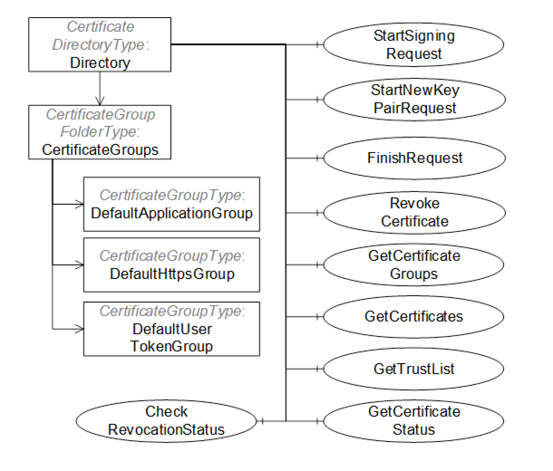  

Figure 22 - The Certificate Management AddressSpace for the GlobalDiscoveryServer  

#### 7.9.2 CertificateDirectoryType  

This *ObjectType* is the *TypeDefinition* for the root of the *CertificateManager* *AddressSpace* . It provides additional *Methods* for *Certificate* management which are shown in [Table 74](/§\_Ref293576453) .  

Table 74 - CertificateDirectoryType ObjectType Definition  

| **Attribute** | **Value** |
|---|---|
|BrowseName|2:CertificateDirectoryType|
|IsAbstract|False|
  
| **References** | **NodeClass** | **BrowseName** | **DataType** | **TypeDefinition** | **Modelling Rule** |
|---|---|---|---|---|---|
|Subtype of the 2: *DirectoryType* defined in [6.5.3](/§\_Ref345577920) .|
|||||||
|0:Organizes|Object|2:CertificateGroups||0:CertificateGroup FolderType|Mandatory|
|0:HasComponent|Method|2:StartSigningRequest|Defined in [7.9.3](/§\_Ref408343693) .|Mandatory|
|0:HasComponent|Method|2:StartNewKeyPairRequest|Defined in [7.9.4](/§\_Ref531748739) .|Mandatory|
|0:HasComponent|Method|2:FinishRequest|Defined in [7.9.5](/§\_Ref408343737) .|Mandatory|
|0:HasComponent|Method|2:RevokeCertificate|Defined in [7.9.6](/§\_Ref517293654) .|Optional|
|0:HasComponent|Method|2:GetCertificateGroups|Defined in [7.9.7](/§\_Ref531748608) .|Mandatory|
|0:HasComponent|Method|2:GetCertificates|Defined in [7.9.8](/§\_Ref43068580) .|Optional|
|0:HasComponent|Method|2:GetTrustList|Defined in [7.9.9](/§\_Ref419568906) .|Mandatory|
|0:HasComponent|Method|2:GetCertificateStatus|Defined in [7.9.10](/§\_Ref408344457) .|Mandatory|
|0:HasComponent|Method|2:CheckRevocationStatus|Defined in [7.9.11](/§\_Ref43060664) .|Optional|
||
  
| **Conformance Units** |
|---|
|GDS Certificate Manager Pull Model|
  

  

The *CertificateGroups* *Object* organizes the *CertificateGroups* supported by the *CertificateManager* . It is described in [7.8.4.10](/§\_Ref419618249) . *CertificateManagers* shall support the *DefaultApplicationGroup* and may support the *DefaultHttpsGroup* or the *DefaultUserTokenGroup* . *CertificateManagers* may support additional *CertificateGroups* depending on their requirements. For example, a *CertificateManager* with multiple Certificate Authorities would represent each as a *CertificateGroupType* Object organized by *CertificateGroups Folder. Clients* could then request *Certificates* issued by a specific CA by passing the appropriate *NodeId* to the *StartSigningRequest* or *StartNewKeyPairRequest* *Methods* .  

*CertificateGroups* assigned by the *CertificateManager* to specific applications are persisted by *PullManagement Clients* . These *Clients* use the *NodeIds* to relate their local configuration to the *CertificateGroup* in the *CertificateManager* .  

The *StartSigningRequest Method* is used to request a new a *Certificate* that is signed by a CA managed by the *CertificateManager* . This *Method* is recommended when the caller already has a private key.  

The *StartNewKeyPairRequest* *Method* is used to request a new *Certificate* that is signed by a CA ** managed by the *CertificateManager* along with a new private key. This *Method* is used only when the caller does not have a private key and cannot generate one.  

The *FinishRequest* *Method* is used to check that a *Certificate* request has been approved by an entity with access to the *RegistrationAuthorityAdmin Role.* If successful the *Certificate* and *Private Key* (if requested) are returned *.*  

The *GetCertificateGroups Method* returns a list of *NodeIds* for *CertificateGroupType* *Objects* that can be used to request *Certificates* or *TrustLists* for an *Application* .  

The *GetCertificates Method* returns a list of *Certificates* assigned to the *Application* for a *CertificateGroup.*  

The *GetTrustList Method* returns a *NodeId* of a *TrustListType Object* that belongs to a *CertificateGroup* assigned to an *Application* .  

The *GetCertificateStatus* *Method* checks whether the *Application* has to update the *Certificate* identified in the call.  

The *CheckRevocationStatus Method* checks the revocation status of a *Certificate.*  

#### 7.9.3 StartSigningRequest  

*StartSigningRequest* is used to initiate a request to create a *Certificate* which uses the private key which the caller currently has. The new *Certificate* is returned in the *FinishRequest* response.  

 **Signature**   

 **StartSigningRequest**   

[in]  NodeId applicationId  

[in]  NodeId certificateGroupId  

[in]  NodeId certificateTypeId  

[in]  ByteString certificateRequest  

[out] NodeId requestId  

);  

  

| **Argument** | **Description** |
|---|---|
|applicationId|The identifier assigned to the *Application* record ** by the *CertificateManager* .|
|certificateGroupId|The *NodeId* of the CertificateGroup which provides the context for the new request. If null the *CertificateManager* shall choose the *DefaultApplicationGroup* .|
|certificateTypeId|The *NodeId* of the *CertificateType* for the new *Certificate* . If null the *CertificateManager* shall generate a *Certificate* based on the value of the certificateGroupId argument.|
|certificateRequest|A *CertificateRequest* used to prove possession of the *Private Key* . It is a [PKCS \#10](/§PKCS10) encoded blob in DER format. If the *CertificateRequest* is for an *ApplicationInstance Certificate* then it shall include all fields required by [OPC 10000-6](/§UAPart6) such as the *subjectAltName* .|
|requestId|The *NodeId* that represents the request. This value is passed to *FinishRequest* .|
  

  

The call returns the *NodeId* that is passed to the *FinishRequest Method* .  

The *certificateGroupId* parameter allows the caller to specify a *CertificateGroup* that provides context for the request. If null the *CertificateManager* shall choose the *DefaultApplicationGroup* . If the *Application* does not currently belong to the requested *CertificateGroup* the *CertificateManager* shall verify that the *Application* is allowed to join the *CertificateGroup and* then, if permitted, add the *Application* to the *CertificateGroup.* The *CertificateGroup* verification and assignment may occur anytime before *FinishRequest* returns success *.*  

The set of available *CertificateGroups* are found in the *CertificateGroups* folder described in [7.9.2](/§\_Ref367629082) . The *CertificateGroups* allowed for an *Application* are returned by the *GetCertificateGroups* *Method* (see [7.9.7](/§\_Ref531748608) ).  

The *certificateTypeId* parameter specifies the type of *Certificate* to return. The permitted values are specified by the CertificateTypes Property of the Object specified by the *certificateGroupId* parameter.  

The *certificateRequest* parameter is a DER encoded *CertificateRequest* . The *subject* , *subjectAltName* and *Public Key* are copied into the new *Certificate* .  

If the *certificateTypeId* is a subtype of *ApplicationCertificateType* the *subject* conforms to the requirements defined in [OPC 10000-6](/§UAPart6) . The public key length shall meet the length restrictions for the *CertificateType.* If the *certificateType* is a subtype of *HttpsCertificateType* the *Certificate* common name (CN=) shall be the same as a domain from a *DiscoveryUrl* which uses HTTPS and the *subject* shall have an organization (O=) field.  

The *ApplicationUri* shall be specified in the CSR. The *CertificateManager* shall return *Bad\_CertificateUriInvalid* if the stored *ApplicationUri* for the Application is different from what is in the CSR.  

The subject in the CSR may be ignored by the *CertificateManager.* The *CertificateManager* may update the subject to comply with policy requirements and to ensure global uniqueness.  

Any bits set in *basicConstraints* or *extendedKeyUsage* fields in the CSR are ignored by the *CertificateManager* . The *CertificateManager* uses values that are appropriate and compliant with requirements defined for *Application Instance Certificates* in [OPC 10000-6](/§UAPart6) .  

For *Servers* , the list of domain names shall be specified in the CSR. The domains shall include the domain(s) in the *DiscoveryUrls* known to the *CertificateManager* .  

This *Method* shall be called from an encrypted *SecureChannel* and from a *Session* that has access to the *CertificateAuthorityAdmin Role,* the *ApplicationAdmin Privilege* , or the *ApplicationSelfAdmin Privilege* (see [7.2](/§\_Ref100529418) ) *.*  

If auditing is supported, the *CertificateManager* shall generate the *CertificateRequested AuditEventType* (see [7.9.12](/§\_Ref43143875) ) if this *Method* succeeds or fails.  

 **Method Result Codes (defined in Call Service)**   

| **Result Code** | **Description** |
|---|---|
|Bad\_NotFound|The *applicationId* does not refer to a registered *Application* .|
|Bad\_InvalidArgument|One or more of the certificateGroupId, *certificateTypeId* or *certificateRequest* arguments is not valid. The text associated with the error shall indicate the exact problem.|
|Bad\_UserAccessDenied|The current user does not have the rights required.|
|Bad\_RequestNotAllowed|The current configuration of the *CertificateManager* does not allow the request. The text associated with the error should indicate the exact reason.|
|Bad\_CertificateUriInvalid|The ApplicationUri was not specified in the CSR or does not match the Application record.|
|Bad\_NotSupported|The signing algorithm, public algorithm or public key size are not supported by the *CertificateManager.* The text associated with the error shall indicate the exact problem.|
|Bad\_SecurityModeInsufficient|The SecureChannel is not encrypted.|
  

  

[Table 75](/§\_Ref412150159) specifies the *AddressSpace* representation for the *StartSigningRequest Method* .  

Table 75 - StartSigningRequest Method AddressSpace Definition  

| **Attribute** | **Value** |
|---|---|
|BrowseName|2:StartSigningRequest|
  
| **References** | **NodeClass** | **BrowseName** | **DataType** | **TypeDefinition** | **ModellingRule** |
|---|---|---|---|---|---|
|0:HasProperty|Variable|0:InputArguments|0:Argument[]|0:PropertyType|Mandatory|
|0:HasProperty|Variable|0:OutputArguments|0:Argument[]|0:PropertyType|Mandatory|
  

  

#### 7.9.4 StartNewKeyPairRequest  

This *Method* is used to start a request for a new *Certificate* and *Private Key* . The *Certificate* and *Private Key* . are returned in the *FinishRequest* response.  

 **Signature**   

 **StartNewKeyPairRequest**   

[in]  NodeId applicationId  

[in]  NodeId certificateGroupId  

[in]  NodeId certificateTypeId  

[in]  String subjectName  

[in]  String[] domainNames  

[in]  String privateKeyFormat  

[in]  String privateKeyPassword  

[out] NodeId requestId  

);  

  

| **Argument** | **Description** |
|---|---|
|applicationId|The identifier assigned to the *Application Instance* by the *CertificateManager* .|
|certificateGroupId|The *NodeId* of the CertificateGroup which provides the context for the new request. If null the *CertificateManager* shall choose the *DefaultApplicationGroup* .|
|certificateTypeId|The *NodeId* of the *CertificateType* for the new *Certificate* . If null the *CertificateManager* shall generate a *Certificate* based on the value of the certificateGroupId argument.|
|subjectName|The subject to use for the *Certificate* . If not specified the ApplicationName and/or domainNames are used to create a suitable default value. The format of the subject is a sequence of name value pairs separated by a '/'. The name shall be one of 'CN', 'O', 'OU', 'DC', 'L', 'S' or 'C' and shall be followed by a '=' and then followed by the value. The value may be any printable character except for '"'. If the value contains a '/' or a '=' then it shall be enclosed in double quotes ('"').|
|domainNames|The domain names to include in the *Certificate* . If not specified the *DiscoveryUrls* are used to create suitable defaults.|
|privateKeyFormat|The format of the private key. The following values are always supported: PFX PKCS \#12 encoded PEM PKCS \#8 Base64 encoded DER (see [RFC 5958](/§RFC5958) ).|
|privateKeyPassword|The password to use for the private key.|
|requestId|The *NodeId* that represents the request. This value is passed to *FinishRequest* .|
  

  

The call returns the *NodeId* that is passed to the *FinishRequest Method* .  

The *certificateGroupId* parameter allows the caller to specify a *CertificateGroup* that provides context for the request. If null the *CertificateManager* shall choose the *DefaultApplicationGroup* . If the *Application* does not currently belong to the requested *CertificateGroup* the *CertificateManager* shall verify that the application is allowed to join the *CertificateGroup and* then, if permitted, add the *Application* to the *CertificateGroup.*  

The set of available *CertificateGroups* are found in the *CertificateGroups* folder described in [7.9.2](/§\_Ref367629082) . The *CertificateGroups* allowed for an application are returned by the *GetCertificateGroups* *Method* (see [7.9.7](/§\_Ref531748608) ).  

The *certificateTypeId* parameter specifies the type of *Certificate* to return. The permitted values are specified by the *CertificateTypes* *Property* of the *Object* specified by the certificateGroupId parameter.  

The *subjectName* parameter is a sequence of [X.500](/§X500) name value pairs separated by a '/'. For example: CN=ApplicationName/OU=Group/O=Company.  

If the *certificateType* is a subtype of *ApplicationCertificateType* the *Certificate* *subject* shall have an organization (O=) or domain name (DC=) field. The public key length shall meet the length restrictions for the *CertificateType.* The domain name field specified in the *subject* is a logical domain used to qualify the *subject* that is not necessarily the same as a domain or IP address in the *subjectAltName* field of the *Certificate* . The common name (CN=) field shall be specified and should be the *ApplicationName* or a suitable equivalent.  

If the *certificateType* is a subtype of *HttpsCertificateType* the *Certificate* common name (CN=) shall be the same as a domain from a *DiscoveryUrl* which uses HTTPS and the *subject* shall have an organization (O=) field.  

If the subjectName is blank or null the *CertificateManager* generates a suitable default.  

The requested subject may be ignored by the *CertificateManager.* The *CertificateManager* may update the subject to comply with policy requirements and to ensure global uniqueness.  

The *domainNames* parameter is list of domains to be includes in the *Certificate* . If it is null or empty the GDS uses the *DiscoveryUrls* of the *Server* to create a list. For *Clients* the *domainNames* are omitted from the *Certificate* if they are not explicitly provided.  

The *privateKeyFormat* specifies the format of the private key returned. All *CertificateManager* implementations shall support "PEM" and "PFX". If PFX is used the packet shall include the *Certificate* and the *PrivateKey* .  

The *privateKeyPassword* specifies the password on the private key. The *CertificateManager* shall not persist this information and shall discard it once the new private key is generated.  

This *Method* shall be called from an encrypted *SecureChannel* and from a *Session* that has access to the *CertificateAuthorityAdmin Role,* the *ApplicationAdmin Privilege* , or the *ApplicationSelfAdmin Privilege* (see [7.2](/§\_Ref100529418) ).  

If auditing is supported, the *CertificateManager* shall generate the *CertificateRequested AuditEventType* (see [7.9.12](/§\_Ref43143875) ) if this *Method* succeeds or fails.  

 **Method Result Codes (defined in Call Service)**   

| **Result Code** | **Description** |
|---|---|
|Bad\_NodeIdUnknown|The *applicationId* does not refer to a registered *Application* (deprecated).|
|Bad\_NotFound|The *applicationId* does not refer to a registered *Application* .|
|Bad\_InvalidArgument|One or more of the certificateGroupId, *certificateTypeId* , *subjectName* , *domainNames or privateKeyFormat* parameters is not valid. The text associated with the error shall indicate the exact problem.|
|Bad\_UserAccessDenied|The current user does not have the rights required.|
|Bad\_RequestNotAllowed|The current configuration of the CertificateManager does not allow the request. The text associated with the error should indicate the exact reason.|
|Bad\_SecurityModeInsufficient|The SecureChannel is not encrypted.|
  

  

[Table 76](/§\_Ref412150160) specifies the *AddressSpace* representation for the *StartNewKeyPairRequest Method* .  

Table 76 - StartNewKeyPairRequest Method AddressSpace Definition  

| **Attribute** | **Value** |
|---|---|
|BrowseName|2:StartNewKeyPairRequest|
  
| **References** | **NodeClass** | **BrowseName** | **DataType** | **TypeDefinition** | **ModellingRule** |
|---|---|---|---|---|---|
|0:HasProperty|Variable|0:InputArguments|0:Argument[]|0:PropertyType|Mandatory|
|0:HasProperty|Variable|0:OutputArguments|0:Argument[]|0:PropertyType|Mandatory|
  

  

#### 7.9.5 FinishRequest  

*FinishRequest* is used to finish a certificate request started with a call to *StartNewKeyPairRequest* or *StartSigningRequest* .  

 **Signature**   

 **FinishRequest**   

[in]  NodeId applicationId  

[in]  NodeId requestId  

[out] ByteString certificate  

[out] ByteString privateKey  

[out] ByteString[] issuerCertificates  

);  

  

| **Argument** | **Description** |
|---|---|
|applicationId|The identifier assigned to the *Application Instance* by the GDS.|
|requestId|The *NodeId* returned by *StartNewKeyPairRequest* or *StartSigningRequest* .|
|certificate|The DER encoded *Certificate* .|
|privateKey|The private key encoded in the format requested. If a password was supplied the blob is protected with it. This field is null if no private key was requested.|
|issuerCertificates|The *Certificates* required to validate the new *Certificate* .|
  

  

This call is passes the *NodeId* returned by a previous call to *StartNewKeyPairRequest* or *StartSigningRequest* .  

It is expected that a *Client* will periodically call this *Method* until an entity with access to the *RegistrationAuthorityAdmin* *Role* has approved the request.  

If the *Client* experiences a network failure while waiting for a completed request it may receive a *Bad\_InvalidArgument* error when it calls the *Method* again. Recovering from this error is done by:  

* If the *Client* originally called *StartSigningRequest* it can retrieve the *Certificate* by calling *GetCertificates* (see [7.9.8](/§\_Ref43068580) ).  

* If the *Client* originally called *StartNewKeyPairRequest* it shall restart the process by calling *StartNewKeyPairRequest again.*  

This *Method* shall be called from an encrypted *SecureChannel* and from a *Session* that has access to the *CertificateAuthorityAdmin Role,* the *ApplicationAdmin Privilege* , or the *ApplicationSelfAdmin Privilege* (see [7.2](/§\_Ref100529418) ). In addition, the *Client Certificate* shall be the same as the one used to call *StartSigningRequest* or *StartNewKeyPairRequest* .  

If auditing is supported, the *CertificateManager* shall generate the *CertificateDeliveredAuditEventType* (see [7.9.13](/§\_Ref362555113) ) if this *Method* succeeds.  

 **Method Result Codes (defined in Call Service)**   

| **Result Code** | **Description** |
|---|---|
|Bad\_NotFound|The *applicationId* does not refer to a registered *Application* .|
|Bad\_InvalidArgument|The *requestId* is does not reference to a valid request for the *Application* .|
|Bad\_NothingToDo|There is nothing to do because request has not yet completed.|
|Bad\_UserAccessDenied|The current user does not have the rights required.|
|Bad\_RequestNotAllowed|The *CertificateManager* rejected the request. The text associated with the error should indicate the exact reason.|
|Bad\_SecurityModeInsufficient|The SecureChannel is not encrypted.|
  

  

[Table 77](/§\_Ref412150161) specifies the *AddressSpace* representation for the *FinishRequest Method* .  

Table 77 - FinishRequest Method AddressSpace Definition  

| **Attribute** | **Value** |
|---|---|
|BrowseName|2:FinishRequest|
  
| **References** | **NodeClass** | **BrowseName** | **DataType** | **TypeDefinition** | **ModellingRule** |
|---|---|---|---|---|---|
|0:HasProperty|Variable|0:InputArguments|0:Argument[]|0:PropertyType|Mandatory|
|0:HasProperty|Variable|0:OutputArguments|0:Argument[]|0:PropertyType|Mandatory|
  

  

#### 7.9.6 RevokeCertificate  

*RevokeCertificate* is used to revoke a *Certificate* issued by the *CertificateManager* .  

When a *Certificate* is revoked it shall be removed from any *TrustLists* that it is in and *TrustLists* with the issuer *Certificate* shall be updated with the new CRL.  

*Certificates* assigned to an *Application* are automatically revoked when the *UnregisterApplication Method* is called (see [6.5.8](/§\_Ref114603484) ).  

This *Method* shall be called from an authenticated *SecureChannel* and from a *Client* that has access to the *CertificateAuthorityAdmin Role* (see [7.2](/§\_Ref100529418) ).  

If auditing is supported, the *CertificateManager* shall generate the *CertificateRevokedAuditEventType* on success.  

 **Signature**   

 **RevokeCertificate**   

[in] NodeId applicationId  

[in] ByteString certificate  

);  

  

| **Argument** | **Description** |
|---|---|
|applicationId|The identifier assigned to the *Application* by the *CertificateManager* .|
|certificate|The DER encoded *Certificate* to revoke.|
  

  

 **Method Result Codes (defined in Call Service)**   

| **Result Code** | **Description** |
|---|---|
|Bad\_NotFound|The *applicationId* does not refer to a registered *Application* .|
|Bad\_InvalidArgument|The *certificate* is not a *Certificate* for the specified *Application* that was issued by the *CertificateManager* .|
|Bad\_UserAccessDenied|The current user does not have the rights required.|
|Bad\_SecurityModeInsufficient|The SecureChannel is not authenticated.|
  

  

[Table 78](/§\_Ref113666630) specifies the *AddressSpace* representation for the *RevokeCertificate Method* .  

Table 78 - RevokeCertificate Method AddressSpace Definition  

| **Attribute** | **Value** |
|---|---|
|BrowseName|2:RevokeCertificate|
  
| **References** | **NodeClass** | **BrowseName** | **DataType** | **TypeDefinition** | **ModellingRule** |
|---|---|---|---|---|---|
|0:HasProperty|Variable|0:InputArguments|0:Argument[]|0:PropertyType|Mandatory|
||
  
| **Conformance Units** |
|---|
|GDS Certificate Manager RevokeCertificate|
  

  

#### 7.9.7 GetCertificateGroups  

*GetCertificateGroups* returns the CertificateGroups assigned to *Application* .  

 **Signature**   

 **GetCertificateGroups**   

[in]  NodeId   applicationId  

[out] NodeId[] certificateGroupIds  

);  

  

| **Argument** | **Description** |
|---|---|
|applicationId|The identifier assigned to the *Application* by the GDS.|
|certificateGroupIds|An identifier for the *CertificateGroups* assigned to the *Application* .|
  

  

A *CertificateGroup* provides a *TrustList* and one or more *CertificateTypes* which may be assigned to an *Application* .  

This *Method* shall be called from an authenticated *SecureChannel* and from a *Client* that has access to the *CertificateAuthorityAdmin Role,* the *ApplicationAdmin Privilege* , or the *ApplicationSelfAdmin Privilege* (see [7.2](/§\_Ref100529418) ).  

 **Method Result Codes (defined in Call Service)**   

| **Result Code** | **Description** |
|---|---|
|Bad\_NotFound|The *applicationId* does not refer to a registered *Application* .|
|Bad\_UserAccessDenied|The current user does not have the rights required.|
|Bad\_SecurityModeInsufficient|The SecureChannel is not authenticated.|
  

  

[Table 79](/§\_Ref203096553) specifies the *AddressSpace* representation for the *GetCertificateGroups* *Method* .  

Table 79 - GetCertificateGroups Method AddressSpace Definition  

| **Attribute** | **Value** |
|---|---|
|BrowseName|2:GetCertificateGroups|
  
| **References** | **NodeClass** | **BrowseName** | **DataType** | **TypeDefinition** | **ModellingRule** |
|---|---|---|---|---|---|
|0:HasProperty|Variable|0:InputArguments|0:Argument[]|0:PropertyType|Mandatory|
|0:HasProperty|Variable|0:OutputArguments|0:Argument[]|0:PropertyType|Mandatory|
  

  

#### 7.9.8 GetCertificates  

*GetCertificates* returns the *Certificates* assigned to the application and associated with the *CertificateGroup* .  

This *Method* shall be called from an authenticated *SecureChannel* and from a *Client* that has access to the *CertificateAuthorityAdmin Role,* the *ApplicationAdmin Privilege* , or the *ApplicationSelfAdmin Privilege* (see [7.2](/§\_Ref100529418) ).  

 **Signature**   

 **GetCertificates**   

[in]  NodeId applicationId  

[in]  NodeId certificateGroupId  

[out] NodeId[] certificateTypeIds  

[out] ByteString[] certificates  

);  

  

| **Argument** | **Description** |
|---|---|
|applicationId|The identifier assigned to the *Application* by the GDS.|
|certificateGroupId|An identifier for the *CertificateGroup* that the *Certificates* belong to. If null, the *CertificateManager* shall return the *Certificates* for all *CertificateGroups* assigned to the *Application* .|
|certificateTypeIds|The *CertificateTypes* that currently have a *Certificate* assigned. The length of this list is the same as the length as *certificates* list.|
|certificates|A list of DER encoded *Certificates* assigned to *Application* . This list only includes *Certificates* that are currently valid.|
  

  

 **Method Result Codes (defined in Call Service)**   

| **Result Code** | **Description** |
|---|---|
|Bad\_NotFound|The *applicationId* does not refer to a registered *Application* .|
|Bad\_InvalidArgument|The *certificateGroupId* is not recognized or not valid for the *Application* .|
|Bad\_UserAccessDenied|The current user does not have the rights required.|
|Bad\_SecurityModeInsufficient|The SecureChannel is not authenticated.|
  

  

[Table 80](/§\_Ref43068205) specifies the *AddressSpace* representation for the *GetCertificates* *Method* .  

Table 80 - GetCertificates Method AddressSpace Definition  

| **Attribute** | **Value** |
|---|---|
|BrowseName|2:GetCertificates|
  
| **References** | **NodeClass** | **BrowseName** | **DataType** | **TypeDefinition** | **ModellingRule** |
|---|---|---|---|---|---|
|0:HasProperty|Variable|0:InputArguments|0:Argument[]|0:PropertyType|Mandatory|
|0:HasProperty|Variable|0:OutputArguments|0:Argument[]|0:PropertyType|Mandatory|
||
  
| **Conformance Units** |
|---|
|GDS Certificate Manager GetCertificates|
  

  

#### 7.9.9 GetTrustList  

*GetTrustList* is used to retrieve the *NodeId* of a *TrustList* assigned to an application.  

 **Signature**   

 **GetTrustList**   

[in]  NodeId applicationId  

[in]  NodeId certificateGroupId  

[out] NodeId trustListId   

);  

  

| **Argument** | **Description** |
|---|---|
|applicationId|The identifier assigned to the *Application* by the GDS.|
|certificateGroupId|An identifier for a *CertificateGroup* that the *Application* belongs to. If null, the *CertificateManager* shall return the *trustListId* for a suitable default group for the *Application* .|
|trustListId|The *NodeId* for a *TrustList Object* that can be used to download the *TrustList* assigned to the *Application* .|
  

  

Access permissions also apply to the *TrustList Objects* which are returned by this *Method* . This *TrustList* includes any *Certificate Revocation Lists* (CRLs) associated with issuer *Certificates* in the *TrustList* .  

This *Method* shall be called from an authenticated *SecureChannel* and from a *Client* that has access to the *CertificateAuthorityAdmin Role,* the *ApplicationAdmin Privilege* , or the *ApplicationSelfAdmin Privilege* (see [7.2](/§\_Ref100529418) ).  

 **Method Result Codes (defined in Call Service)**   

| **Result Code** | **Description** |
|---|---|
|Bad\_NotFound|The *applicationId* does not refer to a registered *Application* .|
|Bad\_InvalidArgument|The certificateGroupId parameter is not valid. The text associated with the error shall indicate the exact problem.|
|Bad\_UserAccessDenied|The current user does not have the rights required.|
|Bad\_SecurityModeInsufficient|The SecureChannel is not authenticated.|
  

[Table 81](/§\_Ref412150162) specifies the *AddressSpace* representation for the *GetTrustList Method* .  

Table 81 - GetTrustList Method AddressSpace Definition  

| **Attribute** | **Value** |
|---|---|
|BrowseName|2:GetTrustList|
  
| **References** | **NodeClass** | **BrowseName** | **DataType** | **TypeDefinition** | **ModellingRule** |
|---|---|---|---|---|---|
|0:HasProperty|Variable|0:InputArguments|0:Argument[]|0:PropertyType|Mandatory|
|0:HasProperty|Variable|0:OutputArguments|0:Argument[]|0:PropertyType|Mandatory|
  

  

#### 7.9.10 GetCertificateStatus  

*GetCertificateStatus* is used to check if an *Application* has to update its *Certificate* .  

If this *Method* is called for a *CertificateGroup* which the application does not belong to then the *Method* shall return *updateRequired* =TRUE.  

This *Method* shall be called from an authenticated *SecureChannel* and from a *Client* that has access to the *CertificateAuthorityAdmin Role,* the *ApplicationAdmin Privilege* , or the *ApplicationSelfAdmin Privilege* (see [7.2](/§\_Ref100529418) ).  

 **Signature**   

 **GetCertificateStatus**   

[in]  NodeId applicationId  

[in]  NodeId certificateGroupId  

[in]  NodeId certificateTypeId  

[out] Boolean updateRequired  

);  

  

| **Argument** | **Description** |
|---|---|
|applicationId|The identifier assigned to the *Application Instance* by the GDS.|
|certificateGroupId|The *NodeId* of the *CertificateGroup* which provides the context. If null the *CertificateManager* shall choose the *DefaultApplicationGroup* .|
|certificateTypeId|The *NodeId* of the *CertificateType* for the *Certificate* . If null the *CertificateManager* shall select a *Certificate* based on the value of the certificateGroupId argument.|
|updateRequired|TRUE if the *Application* has to request a new *Certificate* from the GDS. FALSE if the *Application* can keep using the existing *Certificate* .|
  

  

 **Method Result Codes (defined in Call Service)**   

| **Result Code** | **Description** |
|---|---|
|Bad\_NotFound|The *applicationId* does not refer to a registered *Application* .|
|Bad\_InvalidArgument|The *certificateGroupId* or *certificateTypeId* parameter is not valid. The text associated with the error shall indicate the exact problem.|
|Bad\_UserAccessDenied|The current user does not have the rights required.|
|Bad\_SecurityModeInsufficient|The SecureChannel is not authenticated.|
  

  

[Table 82](/§\_Ref412150163) specifies the *AddressSpace* representation for the *GetCertificateStatus Method* .  

Table 82 - GetCertificateStatus Method AddressSpace Definition  

| **Attribute** | **Value** |
|---|---|
|BrowseName|2:GetCertificateStatus|
  
| **References** | **NodeClass** | **BrowseName** | **DataType** | **TypeDefinition** | **ModellingRule** |
|---|---|---|---|---|---|
|0:HasProperty|Variable|0:InputArguments|0:Argument[]|0:PropertyType|Mandatory|
|0:HasProperty|Variable|0:OutputArguments|0:Argument[]|0:PropertyType|Mandatory|
  

  

#### 7.9.11 CheckRevocationStatus  

*CheckRevocationStatus Method* is used to check the revocation status of an *Certificate.*  

*Clients* or *Servers* may use this *Method* if the issuer *Certificate* has a crlDistributionPoint extension, an authorityInformationAccess extension (see RFC 6960) or the *TrustList* is configured to require online *Certificate* revocation checks (see [7.8.2.1](/§\_Ref43057654) ).  

The *CertificateManager* will typically use a protocol such as OCSP (see RFC 6960) to verify the *Certificate* status using the endpoint in the CDP extension, however, it may also optimize performance by maintaining a cache of recently verified *Certificate* and/or maintaining its own offline CRLs. The *validityTime* parameter provides guidance on how long a result can be kept in a local cache.  

The caller shall perform all validation checks other than the revocation status check (see [OPC 10000-4](/§UAPart4) ) on the *Certificate* before calling this *Method* . The *CertificateManager* shall check the *Signature* on the *Certificate* and may do additional validation.  

This *Method* shall be called from an authenticated *SecureChannel* .  

 **Signature**   

 **CheckRevocationStatus**   

[in]  ByteString certificate  

[out] StatusCode certificateStatus  

[out] UtcTime validityTime  

);  

  

| **Argument** | **Description** |
|---|---|
  
| **INPUTS** |
|---|
|certificate|The DER encoded form of the Certificate to check.|
  
| **OUTPUTS** |
|---|
|certificateStatus|The first error encountered when validating the *Certificate* .|
|validityTime|When the result expires and should be rechecked. DateTime.MinValue is this is unknown.|
  

  

 **Method Result Codes (defined in Call Service)**   

| **Result Code** | **Description** |
|---|---|
|Bad\_SecurityModeInsufficient|The SecureChannel is not authenticated.|
  

  

[Table 83](/§\_Ref113664563) specifies the *AddressSpace* representation for the *CheckRevocationStatus Method* .  

Table 83 - CheckRevocationStatus Method AddressSpace Definition  

| **Attribute** | **Value** |
|---|---|
|BrowseName|2:CheckRevocationStatus|
  
| **References** | **NodeClass** | **BrowseName** | **DataType** | **TypeDefinition** | **ModellingRule** |
|---|---|---|---|---|---|
|0:HasProperty|Variable|0:InputArguments|0:Argument[]|0:PropertyType|Mandatory|
|0:HasProperty|Variable|0:OutputArguments|0:Argument[]|0:PropertyType|Mandatory|
||
  
| **Conformance Units** |
|---|
|GDS Certificate Manager CheckRevocationStatus|
  

  

#### 7.9.12 CertificateRequestedAuditEventType  

This event is raised when a new certificate request has been accepted or rejected by the *CertificateManager* .  

This can be the result of a *StartNewKeyPairRequest* or *StartSigningRequest* *Method* calls.  

Its representation in the *AddressSpace* is formally defined in [Table 84](/§\_Ref359184761) .  

Table 84 - CertificateRequestedAuditEventType Definition  

| **Attribute** | **Value** |
|---|---|
|BrowseName|2:CertificateRequestedAuditEventType|
|IsAbstract|True|
  
| **References** | **NodeClass** | **BrowseName** | **DataType** | **TypeDefinition** | **Modelling Rule** |
|---|---|---|---|---|---|
|Subtype of the 0: *AuditUpdateMethodEventType* defined in [OPC 10000-5](/§UAPart5) .|
|0:HasProperty|Variable|2:CertificateGroup|0:NodeId|0:PropertyType|Mandatory|
|0:HasProperty|Variable|2:CertificateType|0:NodeId|0:PropertyType|Mandatory|
||
  
| **Conformance Units** |
|---|
|GDS Certificate Manager Pull Model|
  

  

This *EventType* inherits all *Properties* of the *AuditUpdateMethodEventType* . Their semantic is defined in [OPC 10000-5](/§UAPart5) .  

The *CertificateGroup Property* specifies the *CertificateGroup* that was affected by the update.  

The *CertificateType Property* specifies the type of *Certificate* that was updated.  

#### 7.9.13 CertificateDeliveredAuditEventType  

This event is raised when a certificate is delivered by the *CertificateManager* to a *Client* .  

This is the result of a *FinishRequest* *Method* completing successfully.  

Its representation in the *AddressSpace* is formally defined in [Table 85](/§\_Ref359185432) .  

Table 85 - CertificateDeliveredAuditEventType Definition  

| **Attribute** | **Value** |
|---|---|
|BrowseName|2:CertificateDeliveredAuditEventType|
|IsAbstract|True|
  
| **References** | **NodeClass** | **BrowseName** | **DataType** | **TypeDefinition** | **Modelling Rule** |
|---|---|---|---|---|---|
|Subtype of the 0: *AuditUpdateMethodEventType* defined in [OPC 10000-5](/§UAPart5) .|
|0:HasProperty|Variable|2:CertificateGroup|0:NodeId|0:PropertyType|Mandatory|
|0:HasProperty|Variable|2:CertificateType|0:NodeId|0:PropertyType|Mandatory|
||
  
| **Conformance Units** |
|---|
|GDS Certificate Manager Pull Model|
  

  

This *EventType* inherits all *Properties* of the *AuditUpdateMethodEventType* . Their semantic is defined in [OPC 10000-5](/§UAPart5) .  

The *CertificateGroup Property* specifies the *CertificateGroup* that was affected by the update.  

The *CertificateType Property* specifies the type of *Certificate* that was updated.  

#### 7.9.14 CertificateRevokedAuditEventType  

This event is raised when a certificate is revoked by the *CertificateManager* .  

This is the result of a *RevokeCertificate Method* completing successfully.  

Its representation in the *AddressSpace* is formally defined in [Table 86](/§\_Ref184345496) .  

Table 86 - CertificateRevokedAuditEventType Definition  

| **Attribute** | **Value** |
|---|---|
|BrowseName|2:CertificateRevokedAuditEventType|
|IsAbstract|True|
  
| **References** | **NodeClass** | **BrowseName** | **DataType** | **TypeDefinition** | **Modelling Rule** |
|---|---|---|---|---|---|
|Subtype of the 0: *AuditUpdateMethodEventType* defined in [OPC 10000-5](/§UAPart5) .|
||
  
| **Conformance Units** |
|---|
|GDS Certificate Manager Pull Model|
  

  

This *EventType* inherits all *Properties* of the *AuditUpdateMethodEventType* . Their semantic is defined in [OPC 10000-5](/§UAPart5) .  

### 7.10 Information Model for Push Certificate Management  

#### 7.10.1 Overview  

If a *Server* supports *PushManagement* it is required to support an information model as part of its *AddressSpace* . It shall support the *ServerConfiguration* *Object* shown in [Figure 23](/§\_Ref336527655) .  

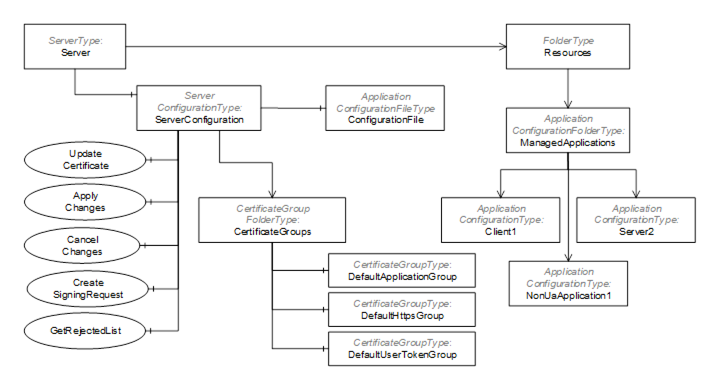  

Figure 23 - The AddressSpace for the Server that supports Push Management  

The *ServerConfiguration Object* is used to manage the *Server* . The *ManagedApplications* *Folder* collects *ApplicationConfiguration* *Objects* for other applications which the *Server* is able to manage. For example, a *Server* may have associated *Client* applications that do not support *PushManagement* so the *Server* can become a proxy for these *Clients* .  

#### 7.10.2 Transaction Lifecycle  

The *CertificateGroups* and *TrustLists* used by a *Server* may be updated as part of a transaction where multiple *Methods* are invoked, however, no changes will have any effect until *ApplyChanges* is called (see [7.10.9](/§\_Ref88990712) ). These transactions are created automatically and the *Server* returns *applyChangesRequired* =TRUE in a *Method* response to tell the *Client* that a transaction is active. *Servers* that do not support transactions return *applyChangesRequired* =FALSE and apply any changes before returning a *Method* response.  

If a *Method* called within a transaction fails (e.g. a parameter was invalid) the transaction state shall not change and all previous changes are applied when *ApplyChanges* is called.  

Once a transaction is created, a *Server* shall queue the changes in the order that they were requested within the current *Session* . When *ApplyChanges* is called the *Server* verifies that all the changes are consistent and can be applied without errors. If any errors are found then all changes are discarded. If no errors are found, the *Server* applies all changes.  

Using the *ApplicationConfigurationFileType* to update the configuration blocks the creation of new transactions. *Methods* that would normally create a new transaction shall return *Bad\_TransactionPending* if a configuration update via a file is in progress (see [7.10.20](/§\_Ref163566389) ).  

If errors occur, they are reported in the *TransactionDiagnostics Object* (see [7.10.3](/§\_Ref197436590) ).  

The life cycle of a transaction is shown in [Figure 24](/§\_Ref106063639) .  

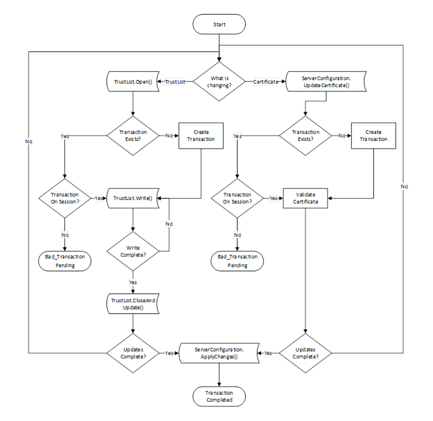  

Figure 24 - The Transaction Lifecycle when using PushManagement  

*Servers* that implement the transaction model shall support the *CancelChanges Method* and always set *applyChangesRequired* to TRUE.  

*Servers* that support the transaction model are expected to support exactly one active transaction. Once a transaction has started in *Session* all other *Sessions* will not be able to modify *TrustLists* or *Certificates* . Transactions are automatically cancelled when the *Session* that created it is closed or when the *CancelChanges Method* is called.  

If the transaction model is not supported and *applyChangesRequired* is TRUE then the behaviour of the *Server* for multiple changes is undefined.  

If *applyChangesRequired* is FALSE then any changes are applied before the *Method* response is sent.  

#### 7.10.3 ServerConfigurationType  

This type defines a concrete *ObjectType* which represents the configuration of the local *Server* that supports *PushManagement* . The *ServerConfiguration Object* (see [7.10.4](/§\_Ref106623139) ) is the single instance of this *Object* that appears in the *Server AddressSpace* .  

Its components are defined in [Table 87](/§\_Ref199912551) .  

Table 87 -ServerConfigurationType Definition  

| **Attribute** | **Value** |
|---|---|
|BrowseName|0:ServerConfigurationType|
|IsAbstract|False|
  
| **References** | **NodeClass** | **BrowseName** | **DataType** | **Type**   **Definition** | **Modelling Rule** |
|---|---|---|---|---|---|
|Subtype of the *BaseObjectType* defined in [OPC 10000-5](/§UAPart5) .|
|0:HasProperty|Variable|0:ApplicationUri|0:UriString|0:PropertyType|Optional|
|0:HasProperty|Variable|0:ProductUri|0:UriString|0:PropertyType|Optional|
|0:HasProperty|Variable|0:ApplicationType|0:ApplicationType|0:PropertyType|Optional|
|0:HasProperty|Variable|0:ApplicationNames|0:LocalizedText[]|0:PropertyType|Optional|
|0:HasProperty|Variable|0:ServerCapabilities|0:String[]|0:PropertyType|Mandatory|
|0:HasProperty|Variable|0:SupportedPrivateKeyFormats|0:String[]|0:PropertyType|Mandatory|
|0:HasProperty|Variable|0:MaxTrustListSize|0:UInt32|0:PropertyType|Mandatory|
|0:HasProperty|Variable|0:MulticastDnsEnabled|0:Boolean|0:PropertyType|Mandatory|
|0:HasProperty|Variable|0:HasSecureElement|0:Boolean|0:PropertyType|Optional|
|0:HasProperty|Variable|0:SupportsTransactions|0:Boolean|0:PropertyType|Optional|
|0:HasProperty|Variable|0:InApplicationSetup|0:Boolean|0:PropertyType|Optional|
|0:HasComponent|Method|0:UpdateCertificate|See [7.10.5](/§\_Ref361316542) .|Mandatory|
|0:HasComponent|Method|0:CreateSelfSignedCertificate|See [7.10.6](/§\_Ref178220129) .|Optional|
|0:HasComponent|Method|0:DeleteCertificate|See [7.10.7](/§\_Ref178220148) .|Optional|
|0:HasComponent|Method|0:GetCertificates|See [7.10.8](/§\_Ref106622667) .|Optional|
|0:HasComponent|Method|0:ApplyChanges|See [7.10.9](/§\_Ref401495224) .|Mandatory|
|0:HasComponent|Method|0:CancelChanges|See [7.10.11](/§\_Ref97324017) .|Optional|
|0:HasComponent|Method|0:CreateSigningRequest|See [7.10.10](/§\_Ref409164743) .|Mandatory|
|0:HasComponent|Method|0:GetRejectedList|See [7.10.12](/§\_Ref32253794) .|Mandatory|
|0:HasComponent|Method|0:ResetToServerDefaults|See [7.10.13](/§\_Ref100597505) .|Optional|
|0:HasComponent|Object|0:CertificateGroups||0:CertificateGroupFolderType|Mandatory|
|0:HasComponent|Object|0:TransactionDiagnostics||0:TransactionDiagnosticsType|Optional|
|0:HasComponent|Object|0:ConfigurationFile||0:ApplicationConfigurationFileType|Optional|
||
  
| **Conformance Units** |
|---|
|Push Model for Global Certificate and TrustList Management|
  

  

The *ApplicationUri* *Property* specifies the *ApplicationUri* assigned to the application.  

The *ProductUri Property* specifies the *ProductUri* for the application that appears in the *ApplicationDescription* .  

The *ApplicationType* *Property* specifies whether the *Application* is a *Client* , a *Server* or both. Applications which do not support OPC UA specify an *ApplicationType* of *Client* . Note that non-OPC UA applications often have network endpoints, however, from the perspective of the *CertificateManager* , the applications are not *Servers.*  

The *ApplicationNames Property* is a list of localized names for the application that may be used to when registering with a GDS.  

The *ServerCapabilities Property* specifies the capabilities from [Annex D](/§\_Ref404520945) which the *Server* supports. The value is the same as the value reported to the *LocalDiscoveryServer* when the *Server* calls the *RegisterServer2 Service* .  

The *SupportedPrivateKeyFormats* specifies the *PrivateKey* formats supported by the *Server* . Possible values include "PEM" (see [RFC 5958](/§RFC5958) ), "PFX" (see [PKCS \#12](/§PKCS12) ) or "PKCS8" (see [PKCS \#8](/§PKCS8) ). The array is empty if the *Server* does not allow external *Clients* to update the *PrivateKey* .  

The *MaxTrustListSize* is the maximum size of the *TrustList* in bytes. 0 means no limit. The default is 65 535 bytes.  

If *MulticastDnsEnabled* is TRUE then the application announces itself using multicast DNS. It can be changed by writing to the *Variable* .  

If *HasSecureElement* is TRUE then the application has access to hardware based secure storage for the *PrivateKeys* associated with its *Certificates* .  

If the *SupportsTransactions* *Property* is TRUE, the *Server* supports the transaction lifecyle defined in [7.10.2](/§\_Ref168998154) . If it is FALSE or not present, the *Server* only supports delaying application of changes until *ApplyChanges* is called.  

If the *InApplicationSetup Property* is TRUE then the application is in the application setup state described in [G.2](/§\_Ref176464985) .  

The *UpdateCertificate* *Method* is used to update a *Certificate* .  

The *CreateSelfSignedCertificate Method* creates a new self-signed *Certificate* assigned to a *CertificateType in a CertificateGroup.*  

  

The *DeleteCertificate Method* deletes *Certificate* that is currently assigned to a *CertificateType in a CertificateGroup.*  

  

The *GetCertificates* *Method* returns the *Certificates* assigned to each of the *CertificateTypes in a CertificateGroup.*  

The *ApplyChanges* *Method* is used complete changes made to *CertificateGroups* and/or *TrustLists* within the context of a transaction.  

The *CancelChanges Method* is used to cancel an existing transaction.  

The *CreateSigningRequest* *Method* asks the *Server* to create a [PKCS \#10](/§PKCS10) encoded *Certificate Request* that is signed with the *Server's* private key.  

The *GetRejectedList* *Method* returns the list of *Certificates* which have been rejected by the *Server* . It can be used to track activity or allow administrators to move a rejected *Certificate* into the *TrustList* . This *Method* is the a shortcut for the *GetRejectedList Method* (see [7.8.3.2](/§\_Ref106623138) ) on the *DefaultApplicationGroup CertificateGroup* (see [7.8.3.3](/§\_Ref43069563) ).  

The *ResetToServerDefaults Method* is used reset the application security configuration to a default state.  

The *CertificateGroups* *Object* organizes the *CertificateGroups* supported by the application. It is described in [7.8.4.10](/§\_Ref419618249) . All applications shall support the *DefaultApplicationGroup* and may support the *DefaultHttpsGroup* or the *DefaultUserTokenGroup* . Applications may support additional *CertificateGroups* depending on their requirements. For example, a *Server* with two network interfaces should have a different *TrustList* for each interface. The second *TrustList* would be represented as a new *CertificateGroupType* Object organized by *CertificateGroups Folder.*  

The *TransactionDiagnostics Object* reports detailed error information for the current or most recently completed transaction. The *TransactionDiagnostics Object* is only visible to *Clients* with access to the *SecurityAdmin Role* .  

The *ConfigurationFile Object* allows the current configuration to be read and updated.  

#### 7.10.4 ServerConfiguration  

This *Object* allows access to the *Server's* configuration and it is the target of an *HasComponent* reference from the *Server* *Object* defined in [OPC 10000-5](/§UAPart5) .  

This *Object* and its immediate children shall be visible (i.e. browse access is available) to users who can access the *Server Object.* The children of the *CertificateGroups* *Object* should only be visible to *Clients* with access to the *SecurityAdmin Role* .  

Its representation in the *AddressSpace* is formally defined in [Table 88](/§\_Ref486851751) .  

Table 88 - ServerConfiguration Object Definition  

| **Attribute** | **Value** |
|---|---|
|BrowseName|0:ServerConfiguration|
|TypeDefinition|0:ServerConfigurationType defined in [7.10.3](/§\_Ref197436590) .|
  
| **References** | **NodeClass** | **BrowseName** | **DataType** | **TypeDefinition** | **Modelling Rule** |
|---|---|---|---|---|---|
||
  
| **Conformance Units** |
|---|
|Push Model for Global Certificate and TrustList Management|
  

  

#### 7.10.5 UpdateCertificate  

*UpdateCertificate* is used to update a *Certificate* .  

There are the following two use cases for this *Method* :  

* The *PrivateKey* is already known to the *Server* (i.e. it was created with the *CreateSigningRequest* (see [7.10.10](/§\_Ref409164743) ) or *CreateSelfSignedCertificate* (see [7.10.6](/§\_Ref178220129) ) *Method* ).  

* The *PrivateKey* was created outside the *Server* and is updated with this *Method* .  

  

The *Server* shall follow the validation process defined in [OPC 10000-4](/§UAPart4) on the *Certificate* and all of the issuer *Certificates* . Note that the validation process requires that the *TrustList* associated with the *CertificateGroup* already contain the *Issuer Certificates* and any CRLs or that the issuers support online CRL checks. This *Method* may be called within the context of an *ApplicationConfiguration Object* (see [7.10.14](/§\_Ref208868285) ) which means the *Certificate* may be used by a *Client* or a non-OPC UA application. Not all of the steps in the validation process will apply.  

The *Server* shall report an error if the *PublicKey* does not match the existing *Certificate* and the *PrivateKey* was not provided.  

If the *Server* returns *applyChangesRequired* =FALSE then it is indicating that it is able to satisfy the requirements specified for the *ApplyChanges* *Method* .  

This *Method* shall be called from an encrypted *SecureChannel* and from a *Client* that has access to the *SecurityAdmin Role* (see [7.2](/§\_Ref100529418) ).  

 **Signature**   

 **UpdateCertificate**   

[in]  NodeId certificateGroupId  

[in]  NodeId certificateTypeId  

[in]  ByteString certificate  

[in]  ByteString[] issuerCertificates  

[in]  String privateKeyFormat  

[in]  ByteString privateKey  

[out] Boolean applyChangesRequired  

);  

  

| **Argument** | **Description** |
|---|---|
|certificateGroupId|The NodeId of the *CertificateGroup Object* which is affected by the update. If null the *DefaultApplicationGroup* is used.|
|certificateTypeId|The type of *Certificate* being updated. The set of permitted types is specified by the *CertificateTypes* *Property* belonging to the *CertificateGroup* .|
|certificate|The DER encoded *Certificate* which replaces the existing Certificate.|
|issuerCertificates|The issuer *Certificates* required to verify the signature on the new *Certificate* .|
|privateKeyFormat|The format of the *Private Key* (PKCS \#12 encoded and PKCS \#8 Base64 encoded DER (see [RFC 5958](/§RFC5958) ) ). If the *privateKey* is not specified the *privateKeyFormat* is null or empty.|
|privateKey|The *Private Key* encoded in the *privateKeyFormat* .|
|applyChangesRequired|Indicates that the *ApplyChanges* *Method* shall be called before the new *Certificate* will be used.|
  

  

 **Method Result Codes (defined in Call Service)**   

| **Result Code** | **Description** |
|---|---|
|Bad\_InvalidArgument|The certificateTypeId or certificateGroupId is not valid.|
|Bad\_CertificateInvalid|The *Certificate* is invalid or the format is not supported.|
|Bad\_NotSupported|The *PrivateKey* is invalid or the format is not supported.|
|Bad\_UserAccessDenied|The current user does not have the rights required.|
|Bad\_SecurityChecksFailed|Some failure occurred verifying the integrity of the *Certificate* .|
|Bad\_TransactionPending|There is already a transaction active for another session.|
|Bad\_SecurityModeInsufficient|The SecureChannel is not encrypted.|
  

  

[Table 89](/§\_Ref412150175) specifies the *AddressSpace* representation for the *UpdateCertificate Method* .  

Table 89 - UpdateCertificate Method AddressSpace Definition  

| **Attribute** | **Value** |
|---|---|
|BrowseName|0:UpdateCertificate|
  
| **References** | **NodeClass** | **BrowseName** | **DataType** | **TypeDefinition** | **ModellingRule** |
|---|---|---|---|---|---|
|HasProperty|Variable|InputArguments|Argument[]|PropertyType|Mandatory|
|HasProperty|Variable|OutputArguments|Argument[]|PropertyType|Mandatory|
  

  

#### 7.10.6 CreateSelfSignedCertificate  

*CreateSelfSignedCertificate* *Method* creates a new self-signed *Certificate* and associates it with a *CertificateGroup* .  

This *Method* allows an administration *Client* to create a *Certificate* used by the *Server* . The *Purpose* of the *CertificateGroup* specifies what the *Certificate* is used for. For example, a *CertificateGroup* that contains *ApplicationInstance Certificates* would only contain *Certificates* that are valid *ApplicationInstance Certificates* as defined in [OPC 10000-6](/§UAPart6) .The new *Certificate* shall be an instance of the certificateTypeId.  

If a *Certificate* is already assigned to the *CertificateType* slot then a *Bad\_InvalidState* error is returned.  

If a transaction is in progress (see [7.10.9](/§\_Ref88990712) ) on another *Session* then the *Server* shall return *Bad\_TransactionPending* . If the *SecureChannel* is not authenticated the *Server* shall return *Bad\_SecurityModeInsufficient* .  

The *Server* shall continue an existing transaction or create a new transaction if an existing transaction does not exist.  

The *Server* may use an existing *PrivateKey* or create a new *PrivateKey* . If a *Server* cannot generate *PrivateKeys* for the specified *CertificateType* then the *Server* shall return *Bad\_NotSupported* .  

This *Method* shall be called from an authenticated *SecureChannel* and from a *Client* that has access to the *SecurityAdmin Role* (see [7.2](/§\_Ref100529418) ).  

 **Signature**   

 **CreateSelfSignedCertificate**   

[in]  NodeId certificateGroupId  

[in]  NodeId certificateTypeId  

[in]  String subjectName  

[in]  String[] dnsNames  

[in]  String[] ipAddresses  

[in]  UInt16 lifetimeInDays  

[in]  UInt16 keySizeInBits  

[out] ByteString certificate  

);  

  

| **Argument** | **Description** |
|---|---|
|certificateGroupId|The identifier for the *CertificateGroup* .|
|certificateTypeId|The *CertificateType* that the new *Certificate* is assigned to.|
|subjectName|The subjectName to use with the *Certificate* . For *HttpsCertificateTypes* the subjectName shall be specified and have the dnsName or IP Address as the common name. For *ApplicationCertificateTypes* the subjectName may be omitted and the *Server* creates a suitable default based on the *Server's ApplicationIdentity* (see 7.10.21)|
|dnsNames|The list of DNS names that appear in the subjectAltName. There shall be at least one entry in dnsName or IP address lists.|
|ipAddresses|The list of IP Addresses that appear in the subjectAltName. There shall be at least one entry in dnsName or IP address lists.|
|lifetimeInDays|The lifetime of the *Certificate* in days. The validity period shall begin 1 day prior to calling this *Method* .|
|keySizeInBits|The size of the *PublicKey* and *PrivateKey* in bits. The *certificateTypeId* limits the values that may be set. A value of 0 indicates that a suitable default value is used.|
|certificate|The DER encoded form of the *Certificate* created by the *Server.*|
  

  

 **Method Result Codes (defined in Call Service)**   

| **Result Code** | **Description** |
|---|---|
|Bad\_UserAccessDenied|The current user does not have the rights required.|
|Bad\_SecurityModeInsufficient|The SecureChannel is not authenticated.|
|Bad\_TransactionPending|There is already a transaction active for another session.|
|Bad\_InvalidState|There is already a *Certificate* assigned to the *CertificateType* slot.|
|Bad\_NotSupported|A *Certificate* cannot be created that matches the parameters provided.|
|Bad\_OutOfRange|The keySizeInBits is not supported.|
  

  

[Table 42](/§\_Ref113664481) specifies the *AddressSpace* representation for the *CreateSelfSignedCertificate* *Method* .  

Table 90 - CreateSelfSignedCertificate Method AddressSpace Definition  

| **Attribute** | **Value** |
|---|---|
|BrowseName|0:CreateSelfSignedCertificate|
  
| **References** | **NodeClass** | **BrowseName** | **DataType** | **TypeDefinition** | **ModellingRule** |
|---|---|---|---|---|---|
|0:HasProperty|Variable|0:InputArguments|0:Argument[]|0:PropertyType|Mandatory|
|0:HasProperty|Variable|0:OutputArguments|0:Argument[]|0:PropertyType|Mandatory|
||
  
| **Conformance Units** |
|---|
|Server ServerConfiguration CreateSelfSignedCertificate|
  

  

#### 7.10.7 DeleteCertificate  

*DeleteCertificate* *Method* a *Certificate* that is associated with a *CertificateGroup* .  

If no *Certificate* is assigned to the *CertificateType* slot then a *Bad\_InvalidState* error is returned.  

If a transaction is in progress (see [7.10.9](/§\_Ref88990712) ) on another *Session* then the *Server* shall return *Bad\_TransactionPending* . If the *SecureChannel* is not authenticated the *Server* shall return *Bad\_SecurityModeInsufficient* .  

The *Server* shall continue an existing transaction or create a new transaction if a transaction does not exist.  

*Certificates* that are referenced by *EndpointDescriptions* shall not be deleted. This determination happens when *ApplyChanges* is called. *ApplyChanges* is always required when this *Method* is called.  

The *Server* is responsible for managing the lifetime of the *PrivateKeys* associated with the *Certificate* . When the *Certificate* is deleted, the *Server* should delete the associated *PrivateKey* if no longer needed.  

This *Method* shall be called from an authenticated *SecureChannel* and from a *Client* that has access to the *SecurityAdmin Role* (see [7.2](/§\_Ref100529418) ).  

 **Signature**   

 **DeleteCertificate**   

[in] NodeId certificateGroupId  

[in] NodeId certificateTypeId  

);  

  

| **Argument** | **Description** |
|---|---|
|certificateGroupId|The identifier for the *CertificateGroup* .|
|certificateTypeId|The *CertificateType* for the *Certificate* to be deleted.|
  

  

 **Method Result Codes (defined in Call Service)**   

| **Result Code** | **Description** |
|---|---|
|Bad\_UserAccessDenied|The current user does not have the rights required.|
|Bad\_SecurityModeInsufficient|The SecureChannel is not authenticated.|
|Bad\_TransactionPending|There is already a transaction active for another session.|
|Bad\_InvalidState|There is no *Certificate* assigned to the *CertificateType* slot.|
  

  

[Table 42](/§\_Ref113664481) specifies the *AddressSpace* representation for the *DeleteCertificate* *Method* .  

Table 91 - DeleteCertificate Method AddressSpace Definition  

| **Attribute** | **Value** |
|---|---|
|BrowseName|0:DeleteCertificate|
  
| **References** | **NodeClass** | **BrowseName** | **DataType** | **TypeDefinition** | **ModellingRule** |
|---|---|---|---|---|---|
|0:HasProperty|Variable|0:InputArguments|0:Argument[]|0:PropertyType|Mandatory|
||
  
| **Conformance Units** |
|---|
|Server ServerConfiguration DeleteCertificate|
  

  

#### 7.10.8 GetCertificates  

*GetCertificates* returns the *Certificates* assigned to *CertificateTypes* associated with a *CertificateGroup* .  

This *Method* shall be called from an authenticated *SecureChannel* and from a *Client* that has access to the *SecurityAdmin Role* (see [7.2](/§\_Ref100529418) ).  

 **Signature**   

 **GetCertificates**   

[in]  NodeId certificateGroupId  

[out] NodeId[] certificateTypeIds  

[out] ByteString[] certificates  

);  

  

| **Argument** | **Description** |
|---|---|
|certificateGroupId|The identifier for the *CertificateGroup* .|
|certificateTypeIds|The *CertificateTypes* that currently have a *Certificate* assigned. The length of this list is the same as the length as *certificates* list. An empty list if the *CertificateGroup* does not have any *CertificateTypes* .|
|certificates|A list of DER encoded *Certificates* assigned to *CertificateGroup* . The *certificateType* for the *Certificate* is specified by the corresponding element in the *certificateTypes* parameter.|
  

  

 **Method Result Codes (defined in Call Service)**   

| **Result Code** | **Description** |
|---|---|
|Bad\_UserAccessDenied|The current user does not have the rights required.|
|Bad\_InvalidArgument|The certificateGroupId is not valid.|
|Bad\_SecurityModeInsufficient|The SecureChannel is not authenticated.|
  

  

[Table 92](/§\_Ref106620289) specifies the *AddressSpace* representation for the *GetCertificates* *Method* .  

Table 92 - GetCertificates Method AddressSpace Definition  

| **Attribute** | **Value** |
|---|---|
|BrowseName|0:GetCertificates|
  
| **References** | **NodeClass** | **BrowseName** | **DataType** | **TypeDefinition** | **ModellingRule** |
|---|---|---|---|---|---|
|0:HasProperty|Variable|0:InputArguments|0:Argument[]|0:PropertyType|Mandatory|
|0:HasProperty|Variable|0:OutputArguments|0:Argument[]|0:PropertyType|Mandatory|
||
  
| **Conformance Units** |
|---|
|Server ServerConfiguration GetCertificates|
  

  

#### 7.10.9 ApplyChanges  

ApplyChanges is used to apply pending *Certificate* and *TrustList* updates and to complete a transaction as described in [7.10.2](/§\_Ref168998154) .  

*ApplyChanges* returns *Bad\_InvalidState* if any *TrustList* is still open for writing. No changes are applied and *ApplyChanges* can be called again after the *TrustList* is closed.  

If a *Session* is closed or abandoned then the transaction is closed and all pending changes are discarded.  

If *ApplyChanges* is called and there is no active transaction then the *Server* returns *Bad\_NothingToDo.* If there is an active transaction, however, no changes are pending the result is *Good* and the transaction is closed.  

When a *Server Certificate* or *TrustList* changes active *SecureChannels* are not immediately affected. This ensures the caller of *ApplyChanges* can get a response to the *Method* call. Once the *Method* response is returned the *Server* shall force existing *SecureChannels* affected by the changes to renegotiate and use the new *Server Certificate* and/or *TrustLists.*  

*Servers* may close *SecureChannels* without discarding any *Sessions* or *Subscriptions.* This will seem like a network interruption from the perspective of the *Client* and the *Client* reconnect logic (see [OPC 10000-4](/§UAPart4) ) allows them to recover their *Session* and *Subscriptions* . Note that some *Clients* may not be able to reconnect because they are no longer trusted.  

Other *Servers* do a complete shutdown. In this case, the *Server* shall advertise its intent to interrupt connections by setting the *SecondsTillShutdown* and *ShutdownReason* *Properties* in the *ServerStatus* *Variable* .  

If a *TrustList* change only affects *UserIdentity* associated with a *Session* then *Servers* shall re-evaluate the UserIdentity and if it is no longer valid the *Session* and associated *Subscriptions* are closed.  

This *Method* shall be called from an authenticated *SecureChannel* and from the *Session* that created the transaction and has access to the *SecurityAdmin Role* (see [7.2](/§\_Ref100529418) ).  

 **Signature**   

 **ApplyChanges**   

 **Method Result Codes (defined in Call Service)**   

| **Result Code** | **Description** |
|---|---|
|Bad\_UserAccessDenied|The current user does not have the rights required.|
|Bad\_SecurityModeInsufficient|The SecureChannel is not authenticated.|
|Bad\_NothingToDo|There is no active transaction.|
|Bad\_BadSessionIdInvalid|The session is not valid for the active transaction.|
|Bad\_InvalidState|TrustList(s) are open for writing and changes cannot be applied.|
  

  

[Table 93](/§\_Ref412150186) specifies the *AddressSpace* representation for the *ApplyChanges Method* .  

Table 93 - ApplyChanges Method AddressSpace Definition  

| **Attribute** | **Value** |
|---|---|
|BrowseName|0:ApplyChanges|
||
  
| **Conformance Units** |
|---|
|Server PushManagement Transactions|
  

  

#### 7.10.10 CreateSigningRequest  

*CreateSigningRequest* *Method* asks the *Server* to create a [PKCS \#10](/§PKCS10) DER encoded *Certificate Request* that is signed with the *Server's* private key. The *Certificate Request* can be then used to request a *Certificate* from a CA.  

*Servers* shall support a least one active and one new key pair for each combination of *certificateGroupId* and *certificateTypeId* . If this *Method* is called multiple times with the same *certificateGroupId* and *certificateTypeId* then any previously generated new key pair, that has not been made active, is discarded. If a key pair is made active by a call to *UpdateCertificate* then the previously active key pair is deleted if it is no longer used.  

If *Certificate* associated with the *certificateGroupId* and *certificateTypeId* is deleted or replaced via *CreateSelfSignedCertificate* (see [7.10.6](/§\_Ref178220129) ) or *DeleteCertificate* (see [7.10.7](/§\_Ref178220148) ) then the new key pair is discarded.  

The new key pair created with *CreateSigningRequest* shall be persisted and shall be available for *UpdateCertificate* even if it is called from a different *Session* .  

This *Method* shall be called from an encrypted *SecureChannel* and from a *Client* that has access to the *SecurityAdmin Role* (see [7.2](/§\_Ref100529418) ).  

 **Signature**   

 **CreateSigningRequest**   

[in]  NodeId certificateGroupId  

[in]  NodeId certificateTypeId  

[in]  String subjectName  

[in]  Boolean regeneratePrivateKey  

[in]  ByteString nonce  

[out] ByteString certificateRequest  

);  

  

| **Argument** | **Description** |
|---|---|
|certificateGroupId|The NodeId of the *CertificateGroup Object* which is affected by the request. If null the *DefaultApplicationGroup* is used.|
|certificateTypeId|The type of *Certificate* being requested. The set of permitted types is specified by the *CertificateTypes* *Property* belonging to the *CertificateGroup* .|
|subjectName|The subject name to use in the *Certificate Request* . If not specified the *SubjectName* from the current *Certificate* is used. The format of the *subjectName* is defined in [7.9.4](/§\_Ref408343644) .|
|regeneratePrivateKey|If TRUE the *Server* shall create a new *Private Key* which it stores until the matching signed *Certificate* is uploaded with the *UpdateCertificate* *Method* . Previously created *Private Keys* may be discarded if *UpdateCertificate* was not called before calling this method again. If FALSE the *Server* uses its existing *Private Key.*|
|nonce|Additional entropy which the caller shall provide if regeneratePrivateKey is TRUE. It shall be at least 32 bytes long.|
|certificateRequest|The [PKCS \#10](/§PKCS10) DER encoded *Certificate Request.* If the *CertificateRequest* is for an *ApplicationInstance Certificate* then it shall include all fields required by [OPC 10000-6](/§UAPart6) such as the *subjectAltName* .|
  

 **Method Result Codes (defined in Call Service)**   

| **Result Code** | **Description** |
|---|---|
|Bad\_InvalidArgument|One or more of the *certificateTypeId, certificateGroupId,* nonce, or *subjectName* paremeters is not valid.|
|Bad\_UserAccessDenied|The current user does not have the rights required.|
|Bad\_TransactionPending|There is already a transaction active for another session.|
|Bad\_SecurityModeInsufficient|The SecureChannel is not encrypted.|
  

  

[Table 94](/§\_Ref412150198) specifies the *AddressSpace* representation for the *CreateSigningRequest Method* .  

Table 94 - CreateSigningRequest Method AddressSpace Definition  

| **Attribute** | **Value** |
|---|---|
|BrowseName|0:CreateSigningRequest|
  
| **References** | **NodeClass** | **BrowseName** | **DataType** | **TypeDefinition** | **ModellingRule** |
|---|---|---|---|---|---|
|0:HasProperty|Variable|0:InputArguments|0:Argument[]|0:PropertyType|Mandatory|
|0:HasProperty|Variable|0:OutputArguments|0:Argument[]|0:PropertyType|Mandatory|
  

  

#### 7.10.11 CancelChanges  

*CancelChanges* is used to tell the *Server* to discard changes to the *TrustLists* or *Certificates* which were waiting for the *Client* to *ApplyChanges* .  

This *Method* shall be called from an authenticated *SecureChannel* and from the *Session* that created the transaction and has access to the *SecurityAdmin Role* (see [7.2](/§\_Ref100529418) ).  

 **Signature**   

 **CancelChanges**   

Method Result Codes (defined in Call Service)  

| **Result Code** | **Description** |
|---|---|
|Bad\_UserAccessDenied|The current user does not have the rights required.|
|Bad\_SecurityModeInsufficient|The SecureChannel is not authenticated.|
  

  

[Table 93](/§\_Ref412150186) specifies the *AddressSpace* representation for the *CancelChanges Method* .  

Table 95 - CancelChanges Method AddressSpace Definition  

| **Attribute** | **Value** |
|---|---|
|BrowseName|0:CancelChanges|
||
  
| **Conformance Units** |
|---|
|Server ServerConfiguration Transactions|
  

  

#### 7.10.12 GetRejectedList  

*GetRejectedList* *Method* returns the list of *Certificates* that have been rejected by the *Server* .  

No rules are defined for how the *Server* updates this list or how long  a *Certificate* is kept in the list. It is recommended that every valid but untrusted *Certificate* be added to the rejected list as long as storage is available. *Servers* should omit older entries from the list returned if the maximum message size is not large enough to allow the entire list to be returned.  

This *Method* shall be called from an authenticated *SecureChannel* and from a *Client* that has access to the *SecurityAdmin Role* (see [7.2](/§\_Ref100529418) ).  

 **Signature**   

 **GetRejectedList**   

[out] ByteString[] certificates  

);  

  

| **Argument** | **Description** |
|---|---|
|certificates|The DER encoded form of the Certificates rejected by the Server *.*|
  

  

 **Method Result Codes (defined in Call Service)**   

| **Result Code** | **Description** |
|---|---|
|Bad\_UserAccessDenied|The current user does not have the rights required.|
|Bad\_SecurityModeInsufficient|The SecureChannel is not authenticated.|
  

  

[Table 96](/§\_Ref412150216) specifies the *AddressSpace* representation for the *GetRejectedList Method* .  

Table 96 - GetRejectedList Method AddressSpace Definition  

| **Attribute** | **Value** |
|---|---|
|BrowseName|0:GetRejectedList|
  
| **References** | **NodeClass** | **BrowseName** | **DataType** | **TypeDefinition** | **ModellingRule** |
|---|---|---|---|---|---|
|0:HasProperty|Variable|0:OutputArguments|0:Argument[]|0:PropertyType|Mandatory|
  

  

#### 7.10.13 ResetToServerDefaults  

The *ResetToServerDefaults Method* resets an application configuration to its default settings.  

If the application is running on a *Device* that supports [OPC 10000-21](/§UAPart21) , the *Device* is placed in a state where the *Onboarding* process has to restart. If the *Device* does not support [OPC 10000-21](/§UAPart21) , the *Server* repeats the Application Setup process described in [Annex G](/§\_Ref106174710) .  

If the application is a *Server* , after this *Method* completes the *Server* shall set the *ServerState* to SHUTDOWN and the *shutdownReason* to a localized message that warns *Clients* that their credentials may not work when the *Server* restarts. The *Server* should set the *secondsTillShutdown* to a time that gives the *Client* a chance to receive the response to this *Method* .  

Note that the default configuration for a application is set by configuration and is not necessarily the "factory default". For example, a machine builder could update the default configuration to ensure that the application can still communicate with other applications within the machine after the reset.  

The mechanisms for setting the default configuration are vendor specific.  

This *Method* shall be called from an authenticated *SecureChannel* and from a *Client* that has access to the *SecurityAdmin Role* (see [7.2](/§\_Ref100529418) ).  

 **Signature**   

 **ResetToServerDefaults**   

  

 **Method Result Codes (defined in Call Service)**   

| **Result Code** | **Description** |
|---|---|
|Bad\_UserAccessDenied|The current user does not have the rights required.|
|Bad\_SecurityModeInsufficient|The SecureChannel is not authenticated.|
  

  

[Table 97](/§\_Ref531977318) specifies the *AddressSpace* representation for the *ResetToServerDefaults Method* .  

Table 97 - ResetToServerDefaults Method AddressSpace Definition  

| **Attribute** | **Value** |
|---|---|
|BrowseName|0:ResetToServerDefaults|
|||
  
| **Conformance Units** |
|---|
|Server ServerConfiguration ResetToServerDefaults|
  

  

#### 7.10.14 ApplicationConfigurationType  

The *ApplicationConfigurationType* *ObjectType* defines a model which represents the configuration of another application. A *Server* acting as a proxy will add the *Objects* that represent the application it manages to the *ManagedApplications Object* (see [7.10.16](/§\_Ref184917155) ).  

Table 98 - ApplicationConfigurationType Definition  

| **Attribute** | **Value** |
|---|---|
|BrowseName|0:ApplicationConfigurationType|
|IsAbstract|False|
  
| **References** | **NodeClass** | **BrowseName** | **DataType** | **Type**   **Definition** | **Modelling Rule** |
|---|---|---|---|---|---|
|Subtype of the *ServerConfigurationType* defined in **** .|
|0:HasProperty|Variable|0:Enabled|0:Boolean|0:PropertyType|Mandatory|
|0:HasProperty|Variable|0:ProductUri|0:UriString|0:PropertyType|Mandatory|
|0:HasProperty|Variable|0:ApplicationUri|0:UriString|0:PropertyType|Mandatory|
|0:HasProperty|Variable|0:ApplicationType|0:ApplicationType|0:PropertyType|Mandatory|
|0:HasProperty|Variable|0:IsNonUaApplication|0:Boolean|0:PropertyType|Optional|
|0:HasComponent|Object|0:KeyCredentials||0:KeyCredentialConfigurationFolderType|Optional|
|0:HasComponent|Object|0:AuthorizationServices||0:AuthorizationServicesConfigurationFolderType|Optional|
||
  
| **Conformance Units** |
|---|
|Managed Application Configuration|
  

  

The *Enabled Property* indicates whether the application is enabled. If FALSE the application will not run. If TRUE the *Application* runs.  

The *KeyCredentials Folder* that contains credentials assigned to the application. It is described in [8.6](/§\_Ref196246820) .  

The *AuthorizationServices Folder* contains the *AuthorizationServiceConfiguration Objects* which the application supports. It is described in [9.7](/§\_Ref196250688) .  

If *ApplicationType* is *Client* then the *ApplicationsNames Property* shall not be present and the ServerCapabilities shall be "NA" or "RCP".  

If *ApplicationType* is *Server* or *ClientAndServer* then the *ApplicationsNames Property* shall be present and the *ServerCapabilities* shall be set".  

If ApplicationType is *DiscoveryServer* then the *ApplicationsNames Property* shall not be present and the *ServerCapabilities* shall be "LDS".  

For *NonUaApplications* , the *ApplicationType* shall be *Client* , the *ApplicationsNames* shall not be present, the *ServerCapabilities* shall be "NA" and *MulticastDnsEnabled* shall be FALSE.  

The *IsNonUaApplication Property* indicates that the application is a *NonUaApplication.*  

Additional requirements for some components inherited from *ServerConfigurationType* are specified in [Table 99](/§\_Ref197427835) .  

Table 99 - ApplicationConfigurationType Component Requirements  

| **Component** | **OPC UA Client** | **OPC UA Server** | **LDS** | **NonUaApplication** |
|---|---|---|---|---|
|0:ApplicationUri|Required|Required|Required|Optional. The syntax and conventions for the URI may not conform to the requirements for OPC UA *ApplicationUris* .|
|0:ApplicationType|"Client"|"Server" or "ClientAndServer"|"DiscoveryServer"|"Client"|
|0:IsNonUaApplication|Omitted or FALSE|Omitted or FALSE|Omitted or FALSE|TRUE|
|0:ApplicationNames|Omitted|Required|Omitted|Omitted|
|0:ServerCapabilities|"NA" or "RCP"|Required|"LDS"|"NA"|
|0:MulticastDnsEnabled|"TRUE" or "FALSE"|"TRUE" or "FALSE"|"TRUE" or "FALSE"|"FALSE"|
|0:AuthorizationServices|Optional|Optional|Omitted|Omitted|
|0:KeyCredentials|Optional|Optional|Omitted|Omitted|
|0:InApplicationSetup|Optional|Optional|Omitted|Optional|
  

  

The application may require software updates. In this case, the software update model described in [OPC 10000-100](/§UAPart100) specifies an instance of the *SoftwareUpdateType* that may be added to the *ApplicationConfiguration* instance.  

#### 7.10.15 ApplicationConfigurationFolderType  

A *Folder* for *ApplicationConfiguration Objects* which a *Server* exposes in its *AddressSpace* .  

Table 100 - ApplicationConfigurationFolderType Definition  

| **Attribute** | **Value** |
|---|---|
|BrowseName|0:ApplicationConfigurationFolderType|
|IsAbstract|False|
  
| **References** | **NodeClass** | **BrowseName** | **DataType** | **Type**   **Definition** | **Modelling Rule** |
|---|---|---|---|---|---|
|Subtype of the *FolderType* defined in OPC 10000-5.|
|0:Organizes|Object|0:\<ApplicationName\>||0:ApplicationConfigurationType|OptionalPlaceholder|
||
  
| **Conformance Units** |
|---|
||
|Managed Application Configuration|
  

  

#### 7.10.16 ManagedApplications  

This *Object* allows access to the application configurations and it is the target of an *Organizes* reference from the *Resources* *Object* defined in [OPC 10000-22](/§UAPart22) .  

Its representation in the *AddressSpace* is formally defined in [Table 101](/§\_Ref184917603) .  

Table 101 - ManagedApplications Object Definition  

| **Attribute** | **Value** |
|---|---|
|BrowseName|0:ManagedApplications|
|TypeDefinition|0:ApplicationConfigurationFolderType defined in [7.10.15](/§\_Ref184917633) .|
  
| **References** | **NodeClass** | **BrowseName** | **DataType** | **TypeDefinition** | **Modelling Rule** |
|---|---|---|---|---|---|
||
  
| **Conformance Units** |
|---|
|Managed Application Configuration|
  

  

#### 7.10.17 TransactionDiagnosticsType  

This type defines an *ObjectType* which represents the diagnostics for the last transaction (see [7.10.1](/§\_Ref106036863) . If no transaction has started the values of all *Variables* have a status of *Bad\_OutOfService.* All existing results are discarded when a new transaction starts.  

Table 102 - TransactionDiagnosticsType Definition  

| **Attribute** | **Value** |
|---|---|
|BrowseName|0:TransactionDiagnosticsType|
|IsAbstract|False|
  
| **References** | **NodeClass** | **BrowseName** | **DataType** | **Type**   **Definition** | **Modelling Rule** |
|---|---|---|---|---|---|
|Subtype of the *BaseObjectType* defined in [OPC 10000-5](/§UAPart5) .|
|0:HasProperty|Variable|0:StartTime|0:UtcTime|0:PropertyType|Mandatory|
|0:HasProperty|Variable|0:EndTime|0:UtcTime|0:PropertyType|Mandatory|
|0:HasProperty|Variable|0:Result|0:StatusCode|0:PropertyType|Mandatory|
|0:HasProperty|Variable|0:AffectedTrustLists|0:NodeId []|0:PropertyType|Mandatory|
|0:HasProperty|Variable|0:AffectedCertificateGroups|0:NodeId []|0:PropertyType|Mandatory|
|0:HasProperty|Variable|0:Errors|0:TransactionErrorType []|0:PropertyType|Mandatory|
||
  
| **Conformance Units** |
|---|
|Server PushManagement Transactions|
  

  

The *StartTime Property* indicates when transaction started. It has a status of *Bad\_OutOfService* if a transaction has not started  

The *EndTime Property* indicates when transaction ended. It has a value of *DateTime.MinValue* if the transaction has not completed.  

The *Result Property* indicates the overall transaction result. It has a status of Bad\_InvalidState if a transaction has started but not completed. If the transaction has completed the status is *Good* and the value is the *StatusCode* that was returned from the *ApplyChanges Method* . If the *CancelChanges Method* was called the value is Bad\_RequestCancelledByClient.  

The *AffectedTrustLists Property* specifies the *NodeIds* of the *TrustLists* that are included in the transaction. It is updated each time as soon as a *TrustList* is added to the transaction.  

The *AffectedCertificateGroups* *Property* specifies the *NodeIds* of the *CertificateGroups* are included in the transaction. It is updated each time as soon as a *CertificateGroup* is added to the transaction.The *Errors Property* has a list of errors that occurred when the changes were applied. Empty if no errors occurred. The *TransactionErrorType* is defined in [7.10.18](/§\_Ref106055363) .  

#### 7.10.18 TransactionErrorType  

This type defines a *DataType* which stores an error that occurred when processing a transaction. Its values are defined in [Table 103](/§\_Ref106054181) .  

Table 103 - TransactionErrorType Structure  

| **Name** | **Type** | **Description** |
|---|---|---|
|TransactionErrorType|Structure|Subtype of the *Structure DataType* defined in [OPC 10000-5](/§UAPart5)|
|targetId|NodeId|The *NodeId* of the Object that had the error. It is either a *TrustListId* or a *CertificateGroupId* .|
|error|StatusCode|The code describing the error.|
|message|LocalizedText|A description of the error. It should include enough information to allow the *Client* to understand which *Certificate(s)* and/or *CRL(s)* are the source of the problem.|
  

  

Its representation in the *AddressSpace* is defined in [Table 104](/§\_Ref106054210) .  

Table 104 - TransactionErrorType Definition  

| **Attribute** | **Value** |
|---|---|
|BrowseName|0:TransactionErrorType|
|IsAbstract|False|
  
| **References** | **NodeClass** | **BrowseName** | **DataType** | **TypeDefinition** | **Other** |
|---|---|---|---|---|---|
|Subtype of the 0: *Structure DataType* defined in [OPC 10000-5](/§UAPart5) .|
||
  
| **Conformance Units** |
|---|
|Server PushManagement Transactions|
  

  

#### 7.10.19 ApplicationConfigurationDataType  

This is the *DataType* used to serialize application configurations. It is defined in [Table 105](/§\_Ref163561726) .  

The fields that are used depend on the *ApplicationType* .  

Each *ServerEndpoint* has a unique combination of *NetworkName* and *Port.* Each *ClientEndpoint* has a unique combination of *NetworkName* and *Port.*  

At least one *CertificateGroup* linked to a *ServerEndpoint* (see [7.10.23](/§\_Ref165231704) ) shall have a *CertificateType* slot compatible with the *Server* *Certificate* used for the current *Session* . If no such slot exists the configuration update is rejected. The *TrustList* associated with that *CertificateGroup* shall trust the *Client Certificate* used for the current *Session.*  

Updates to the configuration are applied in the following order:  

1. ApplicationIdentity  

1. CertificateGroups  

1. UserTokenSettings  

1. SecuritySettings  

1. ServerEndpoints  

1. ClientEndpoints  

1. AuthorizationServices  

  

While processing a single record type updates are applied in the order they appear in the array.  

Client shall put updates in this order: Delete =\> Insert =\> Replace.  

For Insert/Replace operations, a record name shall never appear more than once.  

References to other records by name are only verified after all records have been processed.  

Table 105 - ApplicationConfigurationDataType Structure  

| **Name** | **Type** | **Description** |
|---|---|---|
|ApplicationConfigurationDataType|Structure||
|ApplicationIdentity|0:ApplicationIdentityDataType|The application identity used to create new *Certificates* .|
|CertificateGroups|0:CertificateGroupDataType []|The list *CertificateGroups* .|
|ServerEndpoints|0:ServerEndpointDataType []|A list of *Server* *Endpoints.* Not specified for *Clients* .|
|ClientEndpoints|0:EndpointDataType []|A list of *Client* *Endpoints* which allow reverse connections. Not specified for *Servers* .|
|SecuritySettings|0:SecuritySettingsDataType []|A list of security settings. Not specified for *Clients* .|
|UserTokenSettings|0:UserTokenSettingsDataType []|A list of settings for UserTokenPolicies. Not specified for *Clients* .|
|AuthorizationServices|0:AuthorizationServiceConfigurationDataType []|List of AuthorizationServices supported by a *Server* .|
  

  

Its representation in the *AddressSpace* is defined in [Table 106](/§\_Ref163562465) .  

Table 106 - ApplicationConfigurationDataType Definition  

| **Attribute** | **Value** |
|---|---|
|BrowseName|0:ApplicationConfigurationDataType|
|IsAbstract|False|
  
| **References** | **NodeClass** | **BrowseName** | **DataType** | **TypeDefinition** | **Other** |
|---|---|---|---|---|---|
|Subtype of the 0: *BaseConfigurationDataType DataType* defined in [7.8.5.4](/§\_Ref152709549)|
||
  
| **Conformance Units** |
|---|
|Application Configuration Management|
  

  

#### 7.10.20 ApplicationConfigurationFileType  

A *File Object* that supports the reading and writing of an *ApplicationConfiguration* defined in [7.10.19](/§\_Ref157182055) .  

If a transaction is in progress (see [7.10.9](/§\_Ref88990712) ) on another *Session* then the *Server* shall return *Bad\_TransactionPending* if *Open* is called with *Write Mode* bit set.  

*Open* is called with *Write Mode* bit set then new transactions (see [7.10.2](/§\_Ref168998154) ) cannot be started. The block on new transactions lasts until the update was applied or rolled back. This may occur when *ConfirmUpdate* is called.  

*Methods* that update the configuration shall be called from an authenticated *SecureChannel* and from a *Client* that has access to the *SecurityAdmin Role* (see [7.2](/§\_Ref100529418) ).  

Table 107 - ApplicationConfigurationFileType Definition  

| **Attribute** | **Value** |
|---|---|
|BrowseName|0:ApplicationConfigurationFileType|
|IsAbstract|False|
  
| **References** | **NodeClass** | **BrowseName** | **DataType** | **Type**   **Definition** | **Modelling Rule** |
|---|---|---|---|---|---|
|Subtype of the *ConfigurationFileType* defined in [7.8.5.1](/§\_Ref163568145) .|
|0:HasProperty|Variable|0:AvailableNetworks|0:String[]|0:PropertyType|Mandatory|
|0:HasProperty|Variable|0:AvailablePorts|0:NumericRange|0:PropertyType|Mandatory|
|0:HasProperty|Variable|0:MaxEndpoints|0:UInt16|0:PropertyType|Mandatory|
|0:HasProperty|Variable|0:MaxCertificateGroups|0:UInt16|0:PropertyType|Mandatory|
|0:HasProperty|Variable|0:SecurityPolicyUris|0:UriString[]|0:PropertyType|Mandatory|
|0:HasProperty|Variable|0:UserTokenTypes|0:UserTokenPolicy[]|0:PropertyType|Mandatory|
|0:HasProperty|Variable|0:CertificateTypes|0:NodeId[]|0:PropertyType|Mandatory|
|0:HasProperty|Variable|0:CertificateGroupPurposes|0:NodeId[]|0:PropertyType|Mandatory|
||
  
| **Conformance Units** |
|---|
|Server Endpoint Management|
  

  

The *AvailableNetworks Property* specifies the valid values for *NetworkName* for an *Endpoint* (see [7.10.22](/§\_Ref157182441) ).  

The *AvailablePorts Property* the range of ports that may be specified for an *Endpoint* . If it is empty then all *Ports* are valid.  

The *SecurityPolicyUris* *Property* is a list of URIs that may be used in a *SecuritySettings* (see [7.10.24](/§\_Ref163567021) ). If empty then all URIs are supported.  

The *UserTokenTypes Property* is the list of *UserTokenTypes* that may be used in a *UserTokenSetting* (see [7.10.24](/§\_Ref163567021) ). If empty then all *UserTokenTypes* are supported. The *PolicyId* , *IssuerEndpointUrl* and *SecurityPolicyUrl* fields in the *UserTokenPolicy Structure* are not used and are always ignored. There may only be one combination of *TokenType and IssuedTokenType* in the list.  

The *CertificateTypes Property* is a list of *CertificateTypeIds* that may be used in a *CertificateGroup* (see [7.8.3.4](/§\_Ref163568036) ). It shall have at least one element specified.  

The *CertificateGroupPurposes Property* is a list of *Purposes* that may be used in a *CertificateGroup* (see [7.8.3.4](/§\_Ref163568036) ). It shall have at least one element specified.  

The *MaxEndpoints Property* specifies the maximum total number of *Endpoints* ( *Client* plus *Server* ) that may be defined. 0 means no limit.  

The *MaxCertificateGroups Property* specifies the maximum number of *CertificateGroups* that may be defined. 0 means no limit.  

#### 7.10.21 ApplicationIdentityDataType  

This type is used to serialize the *ApplicationIdentity* configuration *.* It is defined in [Table 108](/§\_Ref160194414) .  

The *ApplicationIdentity* affects *Certificates* , *CertificateRequests* and *ApplicationDescriptions* created by a *Client* or *Server* . When the *ApplicationIdentity* is changed, existing *Certificates* are not affected, however, they may no longer be valid for use by the application because the *ApplicationUri* does not match the *ApplicationUri* in the *Certificate* . Applications shall continue to use the invalid *Certificates* which allows the configuration *Client* , which is aware of the mismatch, to complete the process needed to update *Certificates* . The new *ApplicationUri* shall be used in any subsequent signing requests.  

Table 108 - ApplicationIdentityDataType Structure  

| **Name** | **Type** | **Description** |
|---|---|---|
|ApplicationIdentityDataType|Structure||
|ApplicationUri|0:UriString|The *Uri* that identifies the application.|
|ApplicationNames|0:LocalizedText[]|The human readable names for the application in multiple locales.|
|AdditionalServers|0:ApplicationDescription[]|The list of additional *Servers* returned by *FindServers.* This is typically used to provide information about other *Servers* in a redundant set.|
  

  

Its representation in the *AddressSpace* is defined in [Table 109](/§\_Ref160194437) .  

Table 109 - ApplicationIdentityDataType Definition  

| **Attribute** | **Value** |
|---|---|
|BrowseName|0:ApplicationIdentityDataType|
|IsAbstract|False|
  
| **References** | **NodeClass** | **BrowseName** | **DataType** | **TypeDefinition** | **Other** |
|---|---|---|---|---|---|
|Subtype of the 0: *BaseConfigurationRecordDataType* defined in [7.8.5.5](/§\_Ref161597878) .|
||
  
| **Conformance Units** |
|---|
|Server Endpoint Management|
  

  

#### 7.10.22 EndpointDataType  

This type is used to serialize a single *Endpoint* configuration. It is defined in [Table 110](/§\_Ref152714143) .  

The *DiscoveryUrls* associated with the *Endpoint* . They are reported as part of the *ApplicationDescription* returned by *FindServers* (see [OPC 10000-4](/§UAPart4) ) and by *QueryApplications* ( [6.5.10](/§\_Ref481330087) ). If multiple *Endpoints* are specified the *DiscoveryUrls* from each *Endpoint* are collected into a single list with any duplicates removed. If this list is empty the *Endpoint* is not included in the *ApplicationDescription* returned by *FindServers* or *QueryApplications* .  

The *DiscoveryUrls* returned to *Clients* includes one of the URLs in the *DiscoveryUrls* list based on the *EndpointUrl* filter provided in the *FindServers Request* . If the filter provided is not one of the *DiscoveryUrls* then the first entry in the *DiscoveryUrls* list is returned.  

*NetworkName* and *Port* specify the information the application needs listen for incoming connections. ** Only one *Endpoint* may be specified for each combination of *NetworkName* and *Port.*  

Table 110 - EndpointDataType Structure  

| **Name** | **Type** | **Description** |
|---|---|---|
|EndpointDataType|Structure||
|DiscoveryUrls|0:UriString[]|The list of *DiscoveryUrls* . The domain portion of the URLs may include DNS names or IP addresses that the application cannot access because they are only resolvable on the other side of a NAT firewall. For this reason, the application shall not attempt to validate the domains or the ports. *EndpointUrls* that are used for reverse connect have the 'rcp+' prefix (see [6.5.5](/§\_Ref478009950) ).|
|NetworkName|0:String|The name of the network interface or the IP address the application should bind to when listening on these *EndpointUrls* . The default value is an empty *String* . In this case the application binds to all available IPs. The name is either one of the *AvailableNetworks* *Property* on the *ApplicationConfigurationFile Object* or a valid IPv4 or IPv6 address.|
|Port|0:UInt16|The port to bind to when listening for incoming requests.|
  

  

Its representation in the *AddressSpace* is defined in [Table 111](/§\_Ref152741801) .  

Table 111 - EndpointDataType Definition  

| **Attribute** | **Value** |
|---|---|
|BrowseName|0:EndpointDataType|
|IsAbstract|False|
  
| **References** | **NodeClass** | **BrowseName** | **DataType** | **TypeDefinition** | **Other** |
|---|---|---|---|---|---|
|Subtype of the 0: *BaseConfigurationRecordDataType* defined in [7.8.5.5](/§\_Ref161597878) .|
||
  
| **Conformance Units** |
|---|
|Server Endpoint Management|
  

  

#### 7.10.23 ServerEndpointDataType  

This type is used to serialize a single *Endpoint* configuration for a *Server* . It is defined in [Table 112](/§\_Ref165224865) .  

The information in the *Endpoint* is used to generate a list of *EndpointDescriptions* that could be returned by the *Server* when *GetEndpoints* is called. The basic algorithm generates an *EndpointDescription* for each valid combination of *SecurityPolicyUri, SecurityMode and Certificate* (specified in the *SecuritySettings* ). The *EndpointDescription* returned to *Clients* includes one of the URLs in the *EndpointUrls* list based on the *EndpointUrl* filter provided in the *GetEndpoints Request* . If the filter provided is not one of the *EndpointUrls* then the first entry in the *EndpointUrls* list is returned.  

The complete set of *EndpointDescriptions* is built by repeating the process for all enabled *Endpoints.*  

The *UserTokenSettings* array may specify a *UserTokenPolicy* with a *SecurityPolicyUri* . Any *UserTokenSetting* that is not valid for *ServerCertificate* associated with a generated *EndpointDescription* is rejected.  

The *Server* chooses unique values for *PolicyIds* in *UserTokenPolicies* when building the *EndpointDescriptions* .  

The *ReverseConnectUrls* are the URLs that the *Server* connects to and sends a *ReverseHello* . The *EndpointDescriptions* generated from the *ServerEndpoint* are available to *Clients* connecting via the socket.  

Table 112 - ServerEndpointDataType Structure  

| **Name** | **Type** | **Description** |
|---|---|---|
|ServerEndpointDataType|Structure||
|EndpointUrls|0:UriString[]|The list of *EndpointUrls* that may be return ed in an *EndpointDescription* .|
|SecuritySettingNames|0:String[]|The names of the *SecuritySettings* used to build the *EndpointDescriptions* .|
|TransportProfileUri|0:UriString|The TransportProfileUri.|
|UserTokenSettingNames|0:String[]|The names of the *UserTokenSettings* used to build the *UserTokenPolicies* that appear in the *EndpointDescriptions* .|
|ReverseConnectUrls|0:String[]|A list of URLs that a *Server* connects to and waits for incoming *Client* connections.|
  

  

Its representation in the *AddressSpace* is defined in [Table 113](/§\_Ref165224850) .  

Table 113 - ServerEndpointDataType Definition  

| **Attribute** | **Value** |
|---|---|
|BrowseName|0:ServerEndpointDataType|
|IsAbstract|False|
  
| **References** | **NodeClass** | **BrowseName** | **DataType** | **TypeDefinition** | **Other** |
|---|---|---|---|---|---|
|Subtype of the 0: *EndpointDataType* defined in [7.10.22](/§\_Ref157182441) .|
||
  
| **Conformance Units** |
|---|
|Server Endpoint Management|
  

  

#### 7.10.24 SecuritySettingsDataType  

This type is used to specify the *SecuritySettings* for a *Server Endpoint* . It is defined in [Table 114](/§\_Ref163504845) .  

The *CertificateGroup* specifies one or more *Certificates* that are assigned to a *Server* . When generating *EndpointDescriptions* any *SecurityPolicyUris* (other than *None* ) that are not valid for one of the *Certificates* associated with the *CertificateGroup* are ignored.  

If a *SecurityPolicyUri* is valid for more than one *Certificate* in the *CertificateGroup,* then an *EndpointDescription* is generated for each *Certificate.*  

*EndpointDescriptions* generated with a *None* *SecurityMode* only use the *SecurityPolicyUris* and the *CertificateGroupName* to restrict the *SecurityPolicies* that may be used in the *UserTokenPolicies.*  

Table 114 - SecuritySettingsDataType Structure  

| **Name** | **Type** | **Description** |
|---|---|---|
|SecuritySettingsDataType|Structure||
|SecurityModes|0:MessageSecurityMode[]|The list of SecurityModes.|
|SecurityPolicyUris|0:String[]|The list of SecurityPolicyUris.|
|CertificateGroupName|0:String|The name of the *CertificateGroup* in the CertificateGroups list.|
  

  

Its representation in the *AddressSpace* is defined in [Table 115](/§\_Ref165224830) .  

Table 115 - SecuritySettingsDataType Definition  

| **Attribute** | **Value** |
|---|---|
|BrowseName|0:SecuritySettingsDataType|
|IsAbstract|False|
  
| **References** | **NodeClass** | **BrowseName** | **DataType** | **TypeDefinition** | **Other** |
|---|---|---|---|---|---|
|Subtype of the 0: *BaseConfigurationRecordDataType* defined in [7.8.5.5](/§\_Ref161597878) .|
||
  
| **Conformance Units** |
|---|
|Server Endpoint Management|
  

  

#### 7.10.25 UserTokenSettingsDataType  

This type is used to serialize the configuration for a *UserTokenPolicy* . It is defined in [Table 116](/§\_Ref152744068) .  

The *UserTokenSettingsDataType* in the is used to configure how to validate *UserIdentityTokens* .  

If a *CertificateGroup* is specified it refers to the *TrustList* used to verify credentials by either verifying that an *X509IdentityToken* is trusted or by using a *Certificate* in the *TrustList* to verify the *Signature* on an *IssuedIdentityToken* . The *CertificateGroup* is not specified for *UserName* or *Anonymous* *TokenTypes* .  

The *KeyCredentialName* is only specified for *IssuedIdentityTokens* and refers to a *KeyCredential* needed to access network resources used to validate *IssuedIdentityTokens* .  

Table 116 - UserTokenSettingsDataType Structure  

| **Name** | **Type** | **Description** |
|---|---|---|
|UserTokenSettingsDataType|Structure||
|TokenType|0:UserTokenType|The type of *UserIdentityToken*|
|IssuedTokenType|0:String|A URI identifying the type of IssuedIdentityToken (i.e. JWT).|
|IssuerEndpointUrl|0:String|An optional string which depends on the *[Authorization Service](Service)* . The meaning of this value depends on the *[IssuedTokenType.](https://reference.opcfoundation.org/search/357?t=issuedTokenType.)* Further details for the different *Token* types are defined in [OPC 10000-6](/§UAPart6) .|
|SecurityPolicyUri|0:String|The *SecurityPolicy* to use when encrypting or signing the *UserIdentityToken* when it is passed to the *Server* in the *ActivateSession* request. For X509 *UserIdentityTokens* this value shall specify the *SecurityPolicy* that matches the *Certificates* that the *Server* will accept. For other *UserIdentityTokens* this value shall specify the *SecurityPolicy* to use when the *SecureChannel* uses *SecurityPolicy* = None.|
|CertificateGroupName|0:String|The name of the corresponding entry in the *CertificateGroups* list of the *ApplicationConfiguration* . It contains the *TrustList* used to verify an *X509IdentityToken* . Only specified if the *TokenType* is an *X509IdentityToken* .|
|AuthorizationServiceName|0:String|The name of the corresponding entry in the *AuthorizationServices* list of the *ApplicationConfiguration* . This is the AuthorizationService which issues tokens accepted by the *Server* . Only specified if the *TokenType* is an *IssuedIdentityToken* .|
  

  

  

Its representation in the *AddressSpace* is defined in [Table 117](/§\_Ref152748347) .  

Table 117 - UserTokenSettingsDataType Definition  

| **Attribute** | **Value** |
|---|---|
|BrowseName|0:UserTokenSettingsDataType|
|IsAbstract|False|
  
| **References** | **NodeClass** | **BrowseName** | **DataType** | **TypeDefinition** | **Other** |
|---|---|---|---|---|---|
|Subtype of the 0: *BaseConfigurationRecordDataType* defined in [7.8.5.5](/§\_Ref161597878) .|
||
  
| **Conformance Units** |
|---|
|Server Endpoint Management|
  

  

#### 7.10.26 CertificateUpdateRequestedAuditEventType  

This event is raised when the *UpdateCertificate* *Method* is called.  

If a *PrivateKey* was one of the *InputArguments* then that argument is set to NULL before generating this *Event* .  

Its representation in the *AddressSpace* is formally defined in [Table 118](/§\_Ref106064311) .  

Table 118 - CertificateUpdateRequestedAuditEventType Definition  

| **Attribute** | **Value** |
|---|---|
|BrowseName|0:CertificateUpdateRequestedAuditEventType|
|IsAbstract|True|
  
| **References** | **NodeClass** | **BrowseName** | **DataType** | **TypeDefinition** | **ModellingRule** |
|---|---|---|---|---|---|
|Subtype of the 0: *AuditUpdateMethodEventType* defined in [OPC 10000-5](/§UAPart5) .|
||
  
| **Conformance Units** |
|---|
|Push Model for Global Certificate and TrustList Management|
  

  

This *EventType* inherits all *Properties* of the *AuditUpdateMethodEventType* . Their semantic is defined in [OPC 10000-5](/§UAPart5) .  

#### 7.10.27 CertificateUpdatedAuditEventType  

This event is raised when a *Certificate* is actually changed as a result of a *Method* call.  

This is the result of a successful call to *UpdateCertificate* or *ApplyChanges* on a *ServerConfigurationType Object* . No *Event* is raised if the *Method* call fails. If *ApplyChanges* affects multiple *Certificates* then this *Event* is raised for each changed *Certificate* .  

Its representation in the *AddressSpace* is formally defined in [Table 119](/§\_Ref106064505) .  

Table 119 - CertificateUpdatedAuditEventType Definition  

| **Attribute** | **Value** |
|---|---|
|BrowseName|0:CertificateUpdatedAuditEventType|
|IsAbstract|True|
  
| **References** | **NodeClass** | **BrowseName** | **DataType** | **TypeDefinition** | **ModellingRule** |
|---|---|---|---|---|---|
|Subtype of the 0: *AuditUpdateMethodEventType* defined in [OPC 10000-5](/§UAPart5) .|
|0:HasProperty|Variable|0:CertificateGroup|0:NodeId|0:PropertyType|Mandatory|
|0:HasProperty|Variable|0:CertificateType|0:NodeId|0:PropertyType|Mandatory|
||
  
| **Conformance Units** |
|---|
|Push Model for Global Certificate and TrustList Management|
  

  

This *EventType* inherits all *Properties* of the *AuditUpdateMethodEventType* . Their semantic is defined in [OPC 10000-5](/§UAPart5) .  

The *SourceNode Property* for *Events* of this type shall be assigned to the *NodeId* of the *Object* with the *Method* that triggered the *Event* .  

The *CertificateGroup Property* specifies the *CertificateGroup* that was affected by the update.  

The *CertificateType Property* specifies the type of *Certificate* that was updated.  

## 8 KeyCredentialManagement  

### 8.1 Overview  

*KeyCredential* management functions allow the management and distribution of *KeyCredentials* which *OPC UA Applications* use to access *AuthorizationServices* and/or *Brokers* . An application that provides the *KeyCredential* management functions is called a *KeyCredentialService* and is typically combined with the GDS into a single application.  

There are two primary models for *KeyCredential* management: pull and *PushManagement* . In *PullManagement* , the application acts as a *Client* and uses the *Methods* on the *KeyCredentialService* to request and update *KeyCredentials* . The application is responsible for ensuring the *KeyCredentials* are kept up to date. In *PushManagement* the application acts as a *Server* and exposes *Methods* which the *KeyCredentialService* can call to update the *KeyCredentials* as required.  

A *KeyCredentialService* can directly manage the *KeyCredentials* it supplies or it may act as an intermediary between a *Client* and a system that does not support OPC UA such as Azure AD or LDAP.  

Note that *KeyCredentials* are secrets that are directly passed to *AuthorizationServices* and/or *Brokers* and are not *Certificates* with private keys. *Certificate* distribution is managed by the *Certificate* management model described in [7](/§\_Ref410633217) . For example, *AuthorizationServices* that support OAuth2 often require the client to provide a client\_id and client\_secret parameter with any request. The *KeyCredentials* are the values that the application shall place in these parameters.  

### 8.2 Roles and Privileges  

*KeyCredentialServices* restrict access to many of the features they provide. These restrictions are described either by referring to well-known *Roles* which a *Session* must have access to or by referring to *Privileges* which are assigned to *Sessions* using mechanisms other than the well-known *Roles* . The well-known *Roles* used for a *KeyCredentialService* are listed in [Table 120](/§\_Ref100647001) .  

Table 120 - Well-known Roles for a KeyCredentialService  

| **Name** | **Description** |
|---|---|
|KeyCredentialAdmin|This *Role* grants rights to request or revoke any *KeyCredential* .|
|SecurityAdmin|This *Role* grants the right to change the security configuration of a *KeyCredentialService.*|
  

  

The well-known *Roles* for *Server* managed by a *KeyCredentialService* are listed in [Table 121](/§\_Ref100646891) .  

Table 121 - Well-known Roles for Server managed by a KeyCredentialService  

| **Name** | **Description** |
|---|---|
|SecurityAdmin|For *PushManagement* , this *Role* grants the right to change the security configuration of a *Server* managed by a *KeyCredentialService.*|
  

  

The *Privileges* used for a *KeyCredentialService* are listed in [Table 122](/§\_Ref100646992) .  

Table 122 - Privileges for a KeyCredentialService  

| **Name** | **Description** |
|---|---|
|ApplicationSelfAdmin|This *Privilege* grants an *OPC UA Application* the right to request its own *KeyCredentials* . The *Certificate* used to create the *SecureChannel* is used to determine the identity of the *OPC UA Application.*|
|ApplicationAdmin|This *Privilege* grants rights to request *KeyCredentials* for one or more *OPC UA Applications.* The *Certificate* used to create the *SecureChannel* is used to determine the identity of the *OPC UA Application* and the set of *OPC UA Applications* that ** it is authorized to manage.|
  

  

### 8.3 Pull Management  

Pull management is performed by using a *KeyCredentialManagement* *Object* (see [8.5.4](/§\_Ref475274298) ). It allows Clients to request credentials for *AuthorizationServices* or *Brokers* which are supported by the *KeyCredentialService* . The interactions between the *Client* and the *KeyCredentialService* during *PullManagement* are illustrated in [Figure 25](/§\_Ref464906093) .  

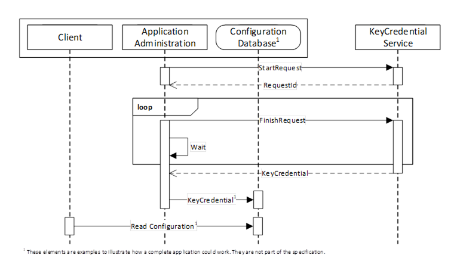  

Figure 25 - The Pull Model for KeyCredential Management  

The Application Administration component may be part of the *Client* or a standalone utility that understands how the *Client* persists its configuration information in its Configuration Database. The administration and database components are examples to illustrate how an application could be built and are not a requirement.  

Requesting credentials is a two-stage process because some *KeyCredentialServices* require a human to review and approve requests. The calls to the *FinishRequest Method* may not be periodic and could be initiated by events such as a user starting up the application or interacting with a UI element such as a button.  

*KeyCredentials* shall only be returned to applications which are authorized by the *KeyCredentialService* .  

Security in *PullManagement* requires an encrypted channel and *Clients* with access to the *KeyCredentialAdmin Role,* the *ApplicationAdmin* *Priviledge* or the *ApplicationSelfAdmin* *Priviledge* .  

### 8.4 Push Management  

Push management is performed by using a *KeyCredentialConfiguration* *Object* (see [8.6.5](/§\_Ref481350059) ) which is a component of the *KeyCredentialConfigurationFolder* *Object* which, in turn, is component of the *ServerConfiguration* *Object* in a *Server* . The interactions between the Administration application and the *KeyCredentialService* during *PushManagement* are illustrated in [Figure 26](/§\_Ref464848145) .  

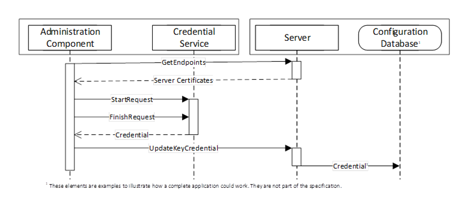  

Figure 26 - The Push Model for KeyCredential Management  

The Administration Component may use internal APIs to manage *KeyCredentials* or it could be a standalone utility that uses OPC UA to communicate with a *Server* which supports the pull model (see [8.3](/§\_Ref473884513) ). The Configuration Database is used by the *Server* to persist its configuration information. The administration and database components are examples to illustrate how an application could be built and are not a requirement.  

To ensure security of the *KeyCredentials,* the *KeyCredentialService* component can require that secrets be encrypted with a key only known to the intended recipient of the *KeyCredentials* . For this reason, the Administration Component uses the *GetEndpoints Service* to read the *Certificate* from the *Server* before initiating the credential request on behalf of the *Server* .  

Security, when using the *PushManagement* model, requires an encrypted channel and *Clients* with acccess to the *SecurityAdmin Role* .  

### 8.5 Information Model for Pull Management  

#### 8.5.1 Overview  

The *AddressSpace* used for *PullManagement* is shown in [Figure 27](/§\_Ref475274300) . *Clients* interact with the *Nodes* defined in this model when they request or revoke *KeyCredentials* for themselves or for another application. The *KeyCredentialManagement* *Folder* is a well-known *Object* that appears in the *AddressSpace* of any *Server* which supports *KeyCredential* management.  

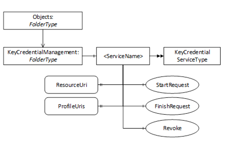  

Figure 27 - The Address Space used for Pull KeyCredential Management  

#### 8.5.2 KeyCredentialManagementFolderType  

This *ObjectType* represents a *Folder* that contains *KeyCredentialService Objects* which may be accessed via the *Server* . It is defined in [Table 123](/§\_Ref50895500) .  

Table 123 - KeyCredentialManagementFolderType Definition  

| **Attribute** | **Value** |
|---|---|
|BrowseName|2:KeyCredentialManagementFolderType|
|IsAbstract|False|
  
| **References** | **NodeClass** | **BrowseName** | **TypeDefinition** | **Modelling Rule** |
|---|---|---|---|---|
|Subtype of the 0: *FolderType* defined in [OPC 10000-5](/§UAPart5) .|
|0:HasComponent|Object|2:\<ServiceName\>|2:KeyCredentialServiceType|OptionalPlaceholder|
||
  
| **Conformance Units** |
|---|
|Pull Model for KeyCredential Service|
  

  

#### 8.5.3 KeyCredentialManagement  

This *Object* contains the *KeyCredentialService Objects* which may be accessed via the *Server* . It is the target of an *Organizes* reference from the *Objects Folder* defined in [OPC 10000-5](/§UAPart5) . It is defined in [Table 124](/§\_Ref475241859) .  

Table 124 - KeyCredentialManagement Object Definition  

| **Attribute** | **Value** |
|---|---|
|BrowseName|2:KeyCredentialManagement|
|TypeDefinition|2: *KeyCredentialManagementFolderType* defined in [8.5.2](/§\_Ref89912676) .|
  
| **References** | **NodeClass** | **BrowseName** | **TypeDefinition** | **Modelling Rule** |
|---|---|---|---|---|
||
  
| **Conformance Units** |
|---|
|Pull Model for KeyCredential Service|
  

  

#### 8.5.4 KeyCredentialServiceType  

This *ObjectType* is the *TypeDefinition* for an *Object* that allows the management of *KeyCredentials* . It is defined in [Table 125](/§\_Ref475274304) .  

Table 125 - KeyCredentialServiceType Definition  

| **Attribute** | **Value** |
|---|---|
|BrowseName|2:KeyCredentialServiceType|
|IsAbstract|False|
  
| **References** | **NodeClass** | **BrowseName** | **DataType** | **TypeDefinition** | **Modelling Rule** |
|---|---|---|---|---|---|
|Subtype of the *BaseObjectType* defined in [OPC 10000-5](/§UAPart5) .|
|0:HasProperty|Variable|2:ResourceUri|0:String|0:PropertyType|Mandatory|
|0:HasProperty|Variable|2:ProfileUris|0:String[]|0:PropertyType|Mandatory|
|0:HasProperty|Variable|2:SecurityPolicyUris|0:String[]|0:PropertyType|Optional|
|0:HasComponent|Method|2:StartRequest||Defined in [8.5.5](/§\_Ref475274317) .|Mandatory|
|0:HasComponent|Method|2:FinishRequest||Defined in [8.5.6](/§\_Ref475274318) .|Mandatory|
|0:HasComponent|Method|2:Revoke||Defined in [8.5.7](/§\_Ref475274319) .|Optional|
||
  
| **Conformance Units** |
|---|
|Pull Model for KeyCredential ServicePull Model for KeyCredential Service|
  

The *ResourceUri* *Property* uniquely identifies the resource that accepts the *KeyCredentials* provided by the *KeyCredentialService* *Object* .  

The *ProfileUris* *Property* specifies URIs assigned in [OPC 10000-7](/§UAPart7) to the authentication mechanism used to communicate with the resource that accepts *KeyCredentials* provided by the *Object* . Examples of *ProfileUris* are:  

* [http://opcfoundation.org/UA-Profile/Authentication/mqtt-username](http://opcfoundation.org/UA-Profile/Authentication/mqtt-username) ;  

* [http://opcfoundation.org/UA-Profile/Security/UserToken/Server/UserNamePassword](http://opcfoundation.org/UA-Profile/Security/UserToken/Server/UserNamePassword) ;  

* [http://opcfoundation.org/UA-Profile/Authentication/amqp-sasl-plain](http://opcfoundation.org/UA-Profile/Authentication/amqp-sasl-plain) .  

  

The *SecurityPolicyUris* *Property* is the list of *SecurityPolicies* that may be used when encrypting the *KeyCredentials* . One of these URIs is passed in the *StartRequest Method* . If not present, The *Server* shall support all of the *SecurityPoliciesUris* returned by *GetEndpoints* ,  

The *StartRequest* *Method* is used to initiate a request for new *KeyCredentials* for an application. This request may complete immediately or it can require offline approval by an administrator.  

The *FinishRequest* *Method* is used to complete a request created by calling *StartRequest* . If the *KeyCredential* is available it is returned. If request is not yet completed it returns *Bad\_NothingToDo* .  

The *Revoke* *Method* is used to revoke a previously issued *KeyCredential* .  

#### 8.5.5 StartRequest  

*StartRequest* is used to request a new *KeyCredential* .  

The *KeyCredential* secret may be encrypted with the public key of the *Certificate* supplied in the request. The *SecurityPolicyUri* specifies the security profile used for the encryption.  

This *Method* shall be called from an encrypted *SecureChannel* and from a *Client* that has access to the *KeyCredentialAdmin Role,* the *ApplicationAdmin Privilege* , or the *ApplicationSelfAdmin Privilege* (see [8.2](/§\_Ref100530719) ) *.*  

 **Signature**   

 **StartRequest**   

[in]  String applicationUri  

[in]  ByteString publicKey  

[in]  String securityPolicyUri  

[in]  NodeId[] requestedRoles  

[out] NodeId requestId  

);  

  

| **Argument** | **Description** |
|---|---|
|applicationUri|The *applicationUri* of the application receiving the *KeyCredentials* . The request is rejected *applicationUri* does not uniquely identify an application known to the GDS (see [6.5.6](/§\_Ref482440512) ). If the requestor is not the same as the application used to create the *Secure Channel* then a *Certificate* should be provided.|
|publicKey|A *Public Key* used to encrypt the returned *KeyCredential* secret. For RSA *SecurityPolicies* this is the DER encoded form of an X.509 v3 *Certificate* as described in [OPC 10000-6](/§UAPart6) . For ECC *SecurityPolicies* this is an ephemeral key created by the owner of the *KeyCredentials* . Not specified if no encryption is required. If the *securityPolicyUri* is provided this field shall be provided.|
|securityPolicyUri|The *SecurityPolicy* used to encrypt the secret. If the *certificate* is provided this field shall be provided.|
|requestedRoles|A list of *Roles* which should be assigned to the *KeyCredential* . If not provided the *Server* chooses suitable defaults. The *Server* ignores *Roles* which it does not recognize or if the caller is not authorized to request access to the *Role* .|
|requestId|A unique identifier for the request. This identifier shall be passed to the *FinishRequest* (see [8.5.6](/§\_Ref475274305) ).|
  

  

 **Method Result Codes (defined in Call Service)**   

| **Result Code** | **Description** |
|---|---|
|Bad\_NotFound |The *applicationUri* is not known to the GDS.|
|Bad\_ConfigurationError|The *applicationUri* is used by multiple records in the GDS.|
|Bad\_CertificateInvalid|The *Certificate* is invalid.|
|Bad\_SecurityPolicyRejected|The *SecurityPolicy* is unrecognized or not allowed or does not match the *Certificate* .|
|Bad\_UserAccessDenied|The current user does not have the rights required.|
|Bad\_SecurityModeInsufficient|The SecureChannel is not encrypted.|
  

  

[Table 126](/§\_Ref475274321) specifies the *AddressSpace* representation for the *StartRequest Method* .  

Table 126 - StartRequest Method AddressSpace Definition  

| **Attribute** | **Value** |
|---|---|
|BrowseName|2:StartRequest|
  
| **References** | **NodeClass** | **BrowseName** | **DataType** | **TypeDefinition** | **ModellingRule** |
|---|---|---|---|---|---|
|0:HasProperty|Variable|0:InputArguments|0:Argument[]|0:PropertyType|Mandatory|
|0:HasProperty|Variable|0:OutputArguments|0:Argument[]|0:PropertyType|Mandatory|
  

  

#### 8.5.6 FinishRequest  

*FinishRequest* is used to retrieve a *KeyCredential* .  

If a *Certificate* was provided in the request, then the *KeyCredential* secret is encrypted using an asymmetric encryption algorithm specified by the *SecurityPolicyUri* provided in the request.  

The *credentialId* is the identifier, such as a user name, which often needs to be presented when using the *credentialSecret* .  

The *credentialSecret* is a UA Binary encoded form of one of the *EncryptedSecret DataTypes* defined in [OPC 10000-4](/§UAPart4) . If the *securityPolicyUri* requires an RSA *Certificate* then the RsaEncryptedSecret DataType is used. If the *securityPolicyUri* requires an ECC *Certificate* then the EccEncryptedSecret DataType is used.  

The *Signing Certificate* is owned by the source of the *KeyCredential.* The *KeyCredentialService* determines the most appropriate *Certificate* to use.  

If the return code is *Bad\_RequestNotComplete* then the request has not been processed and the *Client* should call again. It is expected that a *Client* will periodically call this *Method* until the *KeyCredentialService* has completed the request.  

This *Method* shall be called from an encrypted *SecureChannel* and from a *Client* that has access to the *KeyCredentialAdmin Role,* the *ApplicationAdmin Privilege* , or the *ApplicationSelfAdmin Privilege* (see [8.2](/§\_Ref100530719) ) *. In addition,* this *Method* shall only be called *SecureChannel* using that same *Certificate* that *Client* used to call *StartRequest* .  

 **Signature**   

 **FinishRequest**   

[in]  NodeId requestId  

[in]  Boolean cancelRequest  

[out] String credentialId  

[out] ByteString credentialSecret  

[out] String certificateThumbprint  

[out] String securityPolicyUri  

[out] NodeId[] grantedRoles  

);  

  

| **Argument** | **Description** |
|---|---|
|requestId|The identifier returned from a previous call to *StartRequest.*|
|cancelRequest|If TRUE the request is cancelled and no *KeyCredentials* are returned. If FALSE the normal processing proceeds.|
|credentialId|The unique identifier for the *KeyCredential* .|
|credentialSecret|The secret associated with the *KeyCredential* .|
|certificateThumbprint|The thumbprint of the *Certificate* used to encrypt the secret for RSA *SecurityPolicies* . Set to NULL for ECC *SecurityPolicies* .|
|securityPolicyUri|The *SecurityPolicy* used to create the *credentialSecret* .|
|grantedRoles|A list of *Roles* which have been granted to *KeyCredential* . If empty then the information is not relevant or not available.|
  

  

 **Method Result Codes (defined in Call Service)**   

| **Result Code** | **Description** |
|---|---|
|Bad\_InvalidArgument|The *requestId* is does not reference to a valid request for the *Application* .|
|Bad\_RequestNotComplete|The request has not been processed by the *Server* yet.|
|Bad\_UserAccessDenied|The current user does not have the rights required.|
|Bad\_RequestNotAllowed|The *KeyCredential* manager rejected the request. The text associated with the error should indicate the exact reason.|
|Bad\_SecurityModeInsufficient|The SecureChannel is not encrypted.|
  

  

[Table 127](/§\_Ref475274306) specifies the *AddressSpace* representation for the *FinishRequest Method* .  

Table 127 - FinishRequest Method AddressSpace Definition  

| **Attribute** | **Value** |
|---|---|
|BrowseName|2:FinishRequest|
  
| **References** | **NodeClass** | **BrowseName** | **DataType** | **TypeDefinition** | **ModellingRule** |
|---|---|---|---|---|---|
|0:HasProperty|Variable|0:InputArguments|0:Argument[]|0:PropertyType|Mandatory|
|0:HasProperty|Variable|0:OutputArguments|0:Argument[]|0:PropertyType|Mandatory|
  

  

#### 8.5.7 Revoke  

*Revoke* is used to revoke a *KeyCredential* used by a *Client* or *Server* .  

*KeyCredentials* shall be deleted when revoked.  

This *Method* shall be called from an encrypted *SecureChannel* and from a *Client* that has access to the *KeyCredentialAdmin Role,* the *ApplicationAdmin Privilege* , or the *ApplicationSelfAdmin Privilege* (see [8.2](/§\_Ref100530719) ) *.*  

 **Signature**   

 **Revoke**   

[in] String credentialId  

);  

  

| **Argument** | **Description** |
|---|---|
|credentialId|The unique identifier for the *KeyCredential* .|
  

  

 **Method Result Codes (defined in Call Service)**   

| **Result Code** | **Description** |
|---|---|
|Bad\_InvalidArgument|The *credentialId* is does not reference a valid *KeyCredential* .|
|Bad\_UserAccessDenied|The current user does not have the rights required.|
|Bad\_SecurityModeInsufficient|The SecureChannel is not encrypted.|
  

  

[Table 128](/§\_Ref475274307) specifies the *AddressSpace* representation for the *RevokeCredential Method* .  

Table 128 - Revoke Method AddressSpace Definition  

| **Attribute** | **Value** |
|---|---|
|BrowseName|2:Revoke|
  
| **References** | **NodeClass** | **BrowseName** | **DataType** | **TypeDefinition** | **ModellingRule** |
|---|---|---|---|---|---|
|HasProperty|Variable|0:InputArguments|Argument[]|0:PropertyType|Mandatory|
  

  

#### 8.5.8 KeyCredentialAuditEventType  

This abstract event is raised when an operation affecting *KeyCredentials* occur  

This *Event* and it subtypes are security related and *Servers* shall only report them to users authorized to view security related audit events.  

Its representation in the *AddressSpace* is formally defined in [Table 130](/§\_Ref475274308) .  

Table 129 - KeyCredentialAuditEventType Definition  

| **Attribute** | **Value** |
|---|---|
|BrowseName|0:KeyCredentialAuditEventType|
|IsAbstract|True|
  
| **References** | **NodeClass** | **BrowseName** | **DataType** | **TypeDefinition** | **Modelling Rule** |
|---|---|---|---|---|---|
|Subtype of the 0: *AuditUpdateMethodEventType* defined in [OPC 10000-5](/§UAPart5) .|
|0:HasProperty|Variable|ResourceUri|String|0:PropertyType|Mandatory|
||
  
| **Conformance Units** |
|---|
|Pull Model for KeyCredential Service|
  

  

This *EventType* inherits all *Properties* of the *AuditUpdateMethodEventType* . Their semantic is defined in [OPC 10000-5](/§UAPart5) .  

The *ResourceUri Property* specifies the URI for the resource which accepts the *KeyCredential.*  

#### 8.5.9 KeyCredentialRequestedAuditEventType  

This event is raised when a new *KeyCredential* request has been accepted or rejected by the *Server* .  

This can be the result of a *StartRequest* *Method* call.  

Its representation in the *AddressSpace* is formally defined in [Table 130](/§\_Ref475274308) .  

Table 130 - KeyCredentialRequestedAuditEventType Definition  

| **Attribute** | **Value** |
|---|---|
|BrowseName|2:KeyCredentialRequestedAuditEventType|
|IsAbstract|False|
  
| **References** | **NodeClass** | **BrowseName** | **DataType** | **TypeDefinition** | **Modelling Rule** |
|---|---|---|---|---|---|
|Subtype of the 0: *KeyCredentialAuditEventType* defined in [8.5.8](/§\_Ref481338684) .|
||
  
| **Conformance Units** |
|---|
|Pull Model for KeyCredential Service|
  

  

This *EventType* inherits all *Properties* of the *KeyCredentialAuditEventType* .  

#### 8.5.10 KeyCredentialDeliveredAuditEventType  

This event is raised when a *KeyCredential* is delivered by the *Server* to an application.  

This is the result of a *FinishRequest* *Method* completing.  

Its representation in the *AddressSpace* is formally defined in [Table 131](/§\_Ref475274309) .  

Table 131 - KeyCredentialDeliveredAuditEventType Definition  

| **Attribute** | **Value** |
|---|---|
|BrowseName|2:KeyCredentialDeliveredAuditEventType|
|IsAbstract|False|
  
| **References** | **NodeClass** | **BrowseName** | **DataType** | **TypeDefinition** | **Modelling Rule** |
|---|---|---|---|---|---|
|Subtype of the 0: *KeyCredentialAuditEventType* defined in [8.5.8](/§\_Ref481338684) .|
||
  
| **Conformance Units** |
|---|
|Pull Model for KeyCredential Service|
  

  

This *EventType* inherits all *Properties* of the *KeyCredentialAuditEventType* .  

#### 8.5.11 KeyCredentialRevokedAuditEventType  

This event is raised when a *KeyCredential* is revoked.  

This is the result of a *RevokeKeyCredential* *Method* completing.  

Its representation in the *AddressSpace* is formally defined in [Table 132](/§\_Ref475274310) .  

Table 132 - KeyCredentialRevokedAuditEventType Definition  

| **Attribute** | **Value** |
|---|---|
|BrowseName|2:KeyCredentialRevokedAuditEventType|
|IsAbstract|False|
  
| **References** | **NodeClass** | **BrowseName** | **DataType** | **TypeDefinition** | **Modelling Rule** |
|---|---|---|---|---|---|
|Subtype of the 0: *KeyCredentialAuditEventType* defined in [8.5.8](/§\_Ref481338684) .|
||
  
| **Conformance Units** |
|---|
|Pull Model for KeyCredential Service|
  

  

This *EventType* inherits all *Properties* of the *KeyCredentialAuditEventType* .  

### 8.6 Information Model for Push Management  

#### 8.6.1 Overview  

The *AddressSpace* used for *PushManagement* is shown in [Figure 28](/§\_Ref477760640) . *Clients* interact with the *Nodes* defined in this model when they update the *KeyCredentials* used by a *Server* to access resources such as *Brokers* or *Authorization Servers* . The *KeyCredentialConfiguration* *Folder* is a well-known *Object* that appears in the *AddressSpace* of any *Server* which supports *KeyCredential* management.  

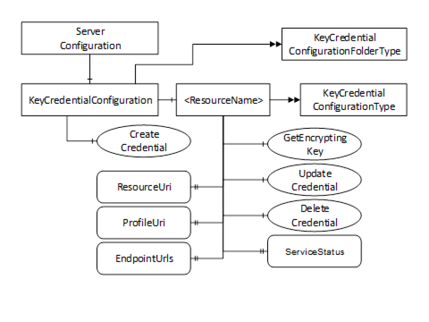  

Figure 28 - The Address Space used for Push KeyCredential Management  

  

#### 8.6.2 KeyCredentialConfigurationFolderType  

This *ObjectType* is the *TypeDefinition* for an *Folder* *Object* that contains the *KeyCredentialConfiguration* *Objects* which may be accessed via the *Server* .  

Table 133 - KeyCredentialConfigurationFolderType Definition  

| **Attribute** | **Value** |
|---|---|
|BrowseName|0:KeyCredentialConfigurationFolderType|
|IsAbstract|False|
  
| **References** | **NodeClass** | **BrowseName** | **TypeDefinition** | **Modelling Rule** |
|---|---|---|---|---|
|Subtype of the 0: *FolderType* defined in [OPC 10000-5](/§UAPart5) .|
|0:HasComponent|Object|0:\<ServiceName\>|0:KeyCredentialConfigurationType|Optional Placeholder|
|0:HasComponent|Method|0:CreateCredential|Defined in [8.6.3](/§\_Ref508641113) .|Optional|
||
  
| **Conformance Units** |
|---|
|Push Model for KeyCredential Service|
  

  

#### 8.6.3 CreateCredential  

*CreateCredential* is used to add a new *KeyCredentialConfiguration Object* .  

This *Method* shall be called from an encrypted *SecureChannel* and from a *Client* that has access to the *SecurityAdmin Role* (see [8.2](/§\_Ref100530719) ) *.*  

 **Signature**   

 **CreateCredential**   

[in]  String name  

[in]  String resourceUri  

[in]  String profileUri  

[in]  String[] endpointUrls  

[out] NodeId credentialNodeId  

);  

  

| **Argument** | **Description** |
|---|---|
|name|This the *BrowseName* of the new *Object* .|
|resourceUri|The *resourceUri* uniquely identifies the resource that accepts the *KeyCredentials* . A valid URI shall be provided.|
|profileUri|The specified URI assigned in [OPC 10000-7](/§UAPart7) to the protocol used to communicate with the resource identified by the *resourceUri* . A valid URI shall be provided.|
|endpointUrls|The specifies URLs used by the *Server* to communicate with the resource identified by the *resourceUri* . Valid URLs shall be provided.|
|credentialNodeId|A unique identifier for the new *KeyCredentialConfiguration Object* *Node* .|
  

  

 **Method Result Codes (defined in Call Service)**   

| **Result Code** | **Description** |
|---|---|
|Bad\_InvalidArgument |The *resourceUri, profileUri,* or one or more *endpointUrls* are not valid.|
|Bad\_UserAccessDenied|The current user does not have the rights required.|
|Bad\_SecurityModeInsufficient|The SecureChannel is not encrypted.|
  

  

[Table 134](/§\_Ref113664605) specifies the *AddressSpace* representation for the *CreateCredential Method* .  

Table 134 - CreateCredential Method AddressSpace Definition  

| **Attribute** | **Value** |
|---|---|
|BrowseName|0:CreateCredential|
  
| **References** | **NodeClass** | **BrowseName** | **DataType** | **TypeDefinition** | **ModellingRule** |
|---|---|---|---|---|---|
|0:HasProperty|Variable|0:InputArguments|Argument[]|0:PropertyType|Mandatory|
|0:HasProperty|Variable|0:OutputArguments|Argument[]|0:PropertyType|Mandatory|
  

  

#### 8.6.4 KeyCredentialConfiguration  

This *Object* is an instance of *FolderType.* It contains The *Objects* which may be accessed via the *Server* . It is the target of an *HasComponent* reference from the *ServerConfiguration Object* defined in [7.10.4](/§\_Ref106623152) . It is defined in [Table 135](/§\_Ref113664627) .  

Table 135 - KeyCredentialConfiguration Object Definition  

| **Attribute** | **Value** |
|---|---|
|BrowseName|0:KeyCredentialConfiguration|
|TypeDefinition|0: *KeyCredentialConfigurationFolderType* defined in [8.6.2](/§\_Ref508641482) .|
  
| **References** | **NodeClass** | **BrowseName** | **TypeDefinition** || **Modelling Rule** |
|---|---|---|---|---|---|
||
  
| **Conformance Units** |
|---|
|Push Model for KeyCredential Service|
  

  

#### 8.6.5 KeyCredentialConfigurationType  

This *ObjectType* is the *TypeDefinition* for an *Object* that allows the configuration of *KeyCredentials* used by the *Server* . It also includes basic status information which report problems accessing the resource that might be related to bad *KeyCredentials* . It is defined in [Table 136](/§\_Ref475274311) .  

Table 136 - KeyCredentialConfigurationType Definition  

| **Attribute** | **Value** |
|---|---|
|BrowseName|0:KeyCredentialConfigurationType|
|IsAbstract|False|
  
| **References** | **NodeClass** | **BrowseName** | **DataType** | **TypeDefinition** | **Modelling Rule** |
|---|---|---|---|---|---|
|Subtype of the *BaseObjectType* defined in [OPC 10000-5](/§UAPart5) .|
|0:HasProperty|Variable|0:ResourceUri|0:String|0:PropertyType|Mandatory|
|0:HasProperty|Variable|0:ProfileUri|0:String|0:PropertyType|Mandatory|
|0:HasProperty|Variable|0:EndpointUrls|0:String[]|0:PropertyType|Optional|
|0:HasProperty|Variable|0:CredentialId|0:String|0:PropertyType|Optional|
|0:HasProperty|Variable|0:ServiceStatus|0:StatusCode|0:PropertyType|Optional|
|0:HasComponent|Method|0:GetEncryptingKey||Defined in [8.6.6](/§\_Ref516415176) .|Optional|
|0:HasComponent|Method|0:UpdateCredential||Defined in [8.6.7](/§\_Ref516415205) .|Optional|
|0:HasComponent|Method|0:DeleteCredential||Defined in [8.6.8](/§\_Ref481333086) .|Optional|
||
  
| **Conformance Units** |
|---|
|Push Model for KeyCredential Service|
  

The *ResourceUri* *Property* uniquely identifies the resource that accepts the *KeyCredentials* .  

The *ProfileUri* *Property* specifies on of the URIs assigned in [OPC 10000-7](/§UAPart7) to the authentication mechanism used to communicate with the resource that accepts *KeyCredentials* provided by the *Object* . Examples of *ProfileUris* are:  

* [http://opcfoundation.org/UA-Profile/Authentication/mqtt-username](http://opcfoundation.org/UA-Profile/Authentication/mqtt-username) ;  

* [http://opcfoundation.org/UA-Profile/Security/UserToken/Server/UserNamePassword](http://opcfoundation.org/UA-Profile/Security/UserToken/Server/UserNamePassword) ;  

* [http://opcfoundation.org/UA-Profile/Authentication/amqp-sasl-plain](http://opcfoundation.org/UA-Profile/Authentication/amqp-sasl-plain) .  

The *EndpointUrls Property* specifies the URLs that the *Server* uses to access the resource.  

The *CredentialId* *Property* is the identifier, such as a user name, which often needs to be presented when using the credentialSecret.  

The *ServiceStatus Property* indicates the result of the last attempt to communicate with the resource. The following common error values are defined:  

| **ServiceStatus** | **Description** |
|---|---|
|Bad\_OutOfService|Communication was not attempted by the *Server* because *Enabled* is FALSE.|
|Bad\_IdentityTokenRejected|Communication failed because the *KeyCredentials* are not valid.|
|Bad\_NoCommunication|Communication failed because the endpoint is not reachable. Where possible a more specific error code should be used. See [OPC 10000-4](/§UAPart4) for a complete list of standard *StatusCodes* .|
  

  

The *GetEncryptingKey Method* is used request a *Public Key* that can be used to encrypt the *KeyCredentials* .  

The *UpdateKeyCredential* *Method* is used to change the *KeyCredentials* used by the *Server* .  

The *DeleteKeyCredential* *Method* is used to delete the *KeyCredentials* stored by the *Server* .  

#### 8.6.6 GetEncryptingKey  

*GetEncryptingKey* is used to request a key that can be used to encrypt a *KeyCredential* .  

This *Method* shall be called from an encrypted *SecureChannel* and from a *Client* that has access to the *SecurityAdmin Role* (see [8.2](/§\_Ref100530719) ) *.*  

 **Signature**   

 **GetEncryptingKey**   

[in]  String credentialId  

[in]  String requestedSecurityPolicyUri  

[out] ByteString publicKey  

[out] String revisedSecurityPolicyUri  

);  

  

| **Argument** | **Description** |
|---|---|
|credentialId|The unique identifier associated with the *KeyCredential* .|
|requestedSecurityPolicyUri|The *SecurityPolicy* used to encrypt the secret. If not specified the *Server* chooses a suitable default.|
|publicKey|The Public Key used to encrypt the secret. The format depends on the *SecurityPolicyUri* .|
|revisedSecurityPolicyUri|The *SecurityPolicy* used to encrypt the secret. It also specifies the contents of the *publicKey* . This may be different from the *requestedSecurityPolicyUri.*|
  

  

 **Method Result Codes (defined in Call Service)**   

| **Result Code** | **Description** |
|---|---|
|Bad\_InvalidArgument|The credentialId is not valid.|
|Bad\_UserAccessDenied|The current user does not have the rights required.|
|Bad\_SecurityModeInsufficient|The SecureChannel is not encrypted.|
  

  

[Table 137](/§\_Ref113664655) specifies the *AddressSpace* representation for the *GetEncryptingKey Method* .  

Table 137 - GetEncryptingKey Method AddressSpace Definition  

| **Attribute** | **Value** |
|---|---|
|BrowseName|0:GetEncryptingKey|
  
| **References** | **NodeClass** | **BrowseName** | **DataType** | **TypeDefinition** | **ModellingRule** |
|---|---|---|---|---|---|
|0:HasProperty|Variable|0:InputArguments|0:Argument[]|0:PropertyType|Mandatory|
|0:HasProperty|Variable|0:OutputArguments|0:Argument[]|0:PropertyType|Mandatory|
  

  

#### 8.6.7 UpdateCredential  

*UpdateCredential* is used to update a *KeyCredential* used by a *Server* .  

The *KeyCredential* secret may be encrypted using the key returned by *GetEncryptingKey* . The *SecurityPolicyUri* species the algorithm used for encryption. The format of the encrypted data is described in [8.5.6](/§\_Ref475274305) .  

This *Method* shall be called from an encrypted *SecureChannel* and from a *Client* that has access to the *SecurityAdmin Role* (see [8.2](/§\_Ref100530719) ) *.*  

 **Signature**   

 **UpdateCredential**   

[in] String credentialId  

[in] ByteString credentialSecret  

[in] String certificateThumbprint  

[in] String securityPolicyUri  

);  

  

| **Argument** | **Description** |
|---|---|
|credentialId|The *credentialId* is the identifier, such as a user name, which often needs to be presented when using the credentialSecret.|
|credentialSecret|The secret associated with the *KeyCredential* .|
|certificateThumbprint|The thumbprint of the *Certificate* used to encrypt the secret. For RSA *SecurityPolicies* this shall be one of the *Application Instance Certificates* assigned to the *Server* . For ECC *SecurityPolicies* this field is not specified.Not specified if the secret is not encrypted.|
|securityPolicyUri|The *SecurityPolicy* used to encrypt the secret. If not specified the secret is not encrypted.|
  

  

 **Method Result Codes (defined in Call Service)**   

| **Result Code** | **Description** |
|---|---|
|Bad\_InvalidArgument|The credentialId or credentialSecret is not valid.|
|Bad\_CertificateInvalid|The *Certificate* is invalid or it is not one of the *Server's* *Certificates* .|
|Bad\_SecurityPolicyRejected|The *SecurityPolicy* is unrecognized or not allowed.|
|Bad\_UserAccessDenied|The current user does not have the rights required.|
|Bad\_SecurityModeInsufficient|The SecureChannel is not encrypted.|
  

  

[Table 139](/§\_Ref113664688) specifies the *AddressSpace* representation for the *UpdateKeyCredential Method* .  

Table 138 - UpdateCredential Method AddressSpace Definition  

| **Attribute** | **Value** |
|---|---|
|BrowseName|0:UpdateCredential|
  
| **References** | **NodeClass** | **BrowseName** | **DataType** | **TypeDefinition** | **ModellingRule** |
|---|---|---|---|---|---|
|0:HasProperty|Variable|0:InputArguments|0:Argument[]|0:PropertyType|Mandatory|
  

  

#### 8.6.8 DeleteCredential  

*DeleteCredential* is used to delete a *KeyCredential* used by a *Server* .  

This *Method* shall be called from an encrypted *SecureChannel* and from a *Client* that has access to the *SecurityAdmin Role* (see [8.2](/§\_Ref100530719) ) *.*  

 **Signature**   

 **DeleteCredential**   

  

 **Method Result Codes (defined in Call Service)**   

| **Result Code** | **Description** |
|---|---|
|Bad\_UserAccessDenied|The current user does not have the rights required.|
|Bad\_SecurityModeInsufficient|The SecureChannel is not encrypted.|
  

  

[Table 138](/§\_Ref475274313) specifies the *AddressSpace* representation for the *DeleteKeyCredential Method* .  

Table 139 - DeleteCredential Method AddressSpace Definition  

| **Attribute** | **Value** |
|---|---|
|BrowseName|0:DeleteCredential|
  
| **References** | **NodeClass** | **BrowseName** | **DataType** | **TypeDefinition** | **ModellingRule** |
|---|---|---|---|---|---|
  

  

#### 8.6.9 KeyCredentialUpdatedAuditEventType  

This event is raised when a *KeyCredential* is updated.  

This *Event* and its subtypes report sensitive security related information. Servers shall only report these *Events* to Clients which are authorized to view such information.  

This is the result of a *UpdateCredential* *Method* completing.  

Its representation in the *AddressSpace* is formally defined in [Table 140](/§\_Ref481333235) .  

Table 140 - KeyCredentialUpdatedAuditEventType Definition  

| **Attribute** | **Value** |
|---|---|
|BrowseName|0:KeyCredentialUpdatedAuditEventType|
|IsAbstract|False|
  
| **References** | **NodeClass** | **BrowseName** | **DataType** | **TypeDefinition** | **Modelling Rule** |
|---|---|---|---|---|---|
|Subtype of the 0: *KeyCredentialAuditEventType* defined in [8.5.8](/§\_Ref481338684) .|
||
  
| **Conformance Units** |
|---|
|Push Model for KeyCredential Service|
  

  

This *EventType* inherits all *Properties* of the *KeyCredentialAuditEventType* .  

#### 8.6.10 KeyCredentialDeletedAuditEventType  

This event is raised when a *KeyCredential* is updated.  

This is the result of a *DeleteCredential* *Method* completing.  

Its representation in the *AddressSpace* is formally defined in [Table 141](/§\_Ref481333215) .  

Table 141 - KeyCredentialDeletedAuditEventType Definition  

| **Attribute** | **Value** |
|---|---|
|BrowseName|0:KeyCredentialDeletedAuditEventType|
|IsAbstract|False|
  
| **References** | **NodeClass** | **BrowseName** | **DataType** | **TypeDefinition** | **Modelling Rule** |
|---|---|---|---|---|---|
|Subtype of the 0: *KeyCredentialAuditEventType* defined in [8.5.8](/§\_Ref481338684) .|
||
  
| **Conformance Units** |
|---|
|Push Model for KeyCredential Service|
  

  

This *EventType* inherits all *Properties* of the *KeyCredentialAuditEventType* .  

## 9 AuthorizationServices  

### 9.1 Overview  

*AuthorizationServices* provide *AccessTokens* to *Clients* that may use them to access resources. A *Server,* such as a GDS *,* with *AuthorizationService* capabilities may support one or more *AuthorizationService* *Objects* (see [9.6.4](/§\_Ref192458110) ) which may represent an internal *AuthorizationService* or be an API to an external *AuthorizationService* . The *AuthorizationService* is best used in conjunction with the *Role* model defined in [OPC 10000-5](/§UAPart5) . In this scenario, the mapping rules assigned to the *Roles* known to the *Server* are used to populate an *AccessToken* with the *Roles* associated with the *UserIdentity* provided when the *Client* submits the request. This scenario is illustrated in [Figure 29](/§\_Ref473912550) .  

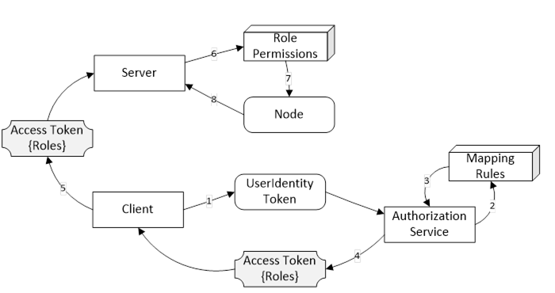  

Figure 29 - Roles and AuthorizationServices  

When requesting *AccessTokens* from an *AuthorizationService* *Object* there are three primary use cases based on where the *UserIdentityToken* comes from: Implicit, Explicit and Chained. These use cases are discussed below. The Implicit and Explicit use cases are implementations of the 'Indirect' model for *AuthorizationServices* described in [OPC 10000-4](/§UAPart4) . The Chained use case is an implementation of the 'Direct' model.  

### 9.2 Roles and Privileges  

*AuthorizationServices* restrict access to many of the features they provide. These restrictions are described either by referring to well-known *Roles* which a *Session* must have access to or by referring to *Privileges* which are assigned to *Sessions* using mechanisms other than the well-known *Roles* . The well-known *Roles* for an *AuthorizationService* are listed in [Table 142](/§\_Ref100431995) .  

Table 142 - Well-known Roles for an AuthorizationService  

| **Name** | **Description** |
|---|---|
|AuthorizationServiceAdmin|This *Role* grants the right to manage the configuration of an *AuthorizationService* .|
|SecurityAdmin|This *Role* grants the right to change the security configuration of an *AuthorizationService* .|
  

  

The *Privileges* for an *AuthorizationService* are listed in [Table 143](/§\_Ref100431645) .  

Table 143 - Privileges for an AuthorizationService  

| **Name** | **Description** |
|---|---|
|*AccessToken* Requestor|This *Privilege* grants an *OPC UA Application* the right to request *AccessTokens* . The *Certificate* used to create the *SecureChannel* is used to determine the identity of the *OPC UA Application.* A *KeyCredential* (see [8](/§\_Ref192458923) ) provided as a *UserIdentityToken* may also be used to determine if the *Client* has access to this *Privilege* .|
  

  

### 9.3 Implicit  

The implicit use case means the *Client's Application Certificate* and any *UserIdentityToken* associated with the *Session* is used to determine whether an *AccessToken* is permitted and what claims are available. This use case is illustrated in [Figure 30](/§\_Ref473976833) .  

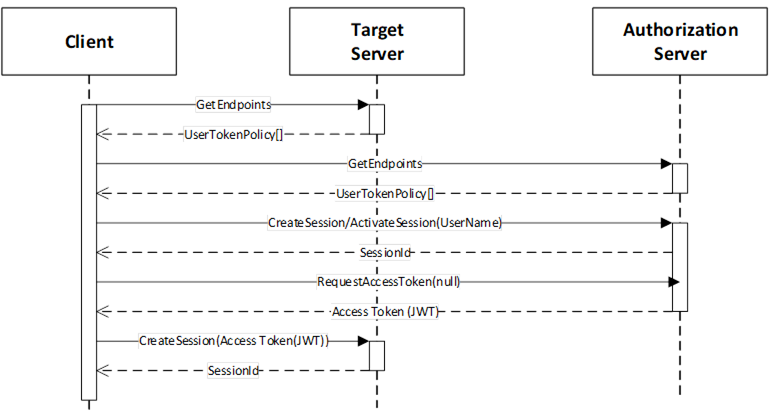  

Figure 30 - Implicit Authorization  

The Target *Server* is the *Server* that the *Client* wishes to access. It publishes a *UserTokenPolicy* that indicates that it accepts *AccessTokens* from an Authorization Server. The parameters needed to connect to the Authorization Server are stored in the *IssuerEndpointUrl* field of the *UserTokenPolicy* and are defined in [OPC 10000-6](/§UAPart6) . Note these parameters are specified as a JSON object rather than a URL as implied by the field name. The ua:tokenEndpoint field specifies the *NodeId* of the *AuthorizationService* *Object* encoded using the URI qualified syntax defined in [OPC 10000-6](/§UAPart6) . It is then is used to request the *AccessToken* .  

The *Client* shall be trusted by the Authorization Server and this could require the *Client* to present user credentials. These credentials can be provided to the *Client* out-of-band (e.g. an administrator specified them in the *Client* configuration file). The user credentials used can be any type of user credential including X.509 and JWT.  

The *Session* with the Authorization Server may be created explicitly with a call to *CreateSession* or it can be implicit via a *Session*\-less *Method* *Call* . The *DiscoveryUrl* for the *Server* containing the *AuthorizationService* is a parameter in the *UserTokenPolicy.*  

With this use case, the *Client* uses the *EndpointDescriptions* provided by the Authorization Server to determine what credentials to provide when creating a *Session* . The *NodeId* of the *UserTokenPolicies Property* is the ua:authorizationEndpoint field in the *UserTokenPolicy* provided by the *Server* (see [OPC 10000-6](/§UAPart6) ). If this *NodeId* is null Implicit authorization is required.  

After creating the *Session,* the *Client* calls the *RequestAccessToken* *Method* on the *AuthorizationService* *Object* . The *NodeId* of the *AuthorizationService* *Object* is the ua:tokenEndpoint in the *UserTokenPolicy* . The Authorization Server determines if the *Client* is permitted to receive an *AccessToken* and populates it with any claims granted to the *Client* . This claim may include *Roles* granted to the *Session* by applying the mapping rules for the Roles (see [OPC 10000-3](/§UAPart3) ).  

Once the *Client* has the *AccessToken,* it passes the *AccessToken* to the Target *Server* which validates the *AccessToken* , as described in [OPC 10000-4](/§UAPart4) . The Target *Server* is configured out-of-band with the *Certificate* used to validate the *AccessTokens* issued by the Authorization *Server* .  

### 9.4 Explicit  

The explicit use case means the *Client* provides the *UserIdentityToken* used to determine whether an *AccessToken* is permitted and what claims are available in the call to *RequestAccessToken* . This use case is illustrated in [Figure 31](/§\_Ref473977898) .  

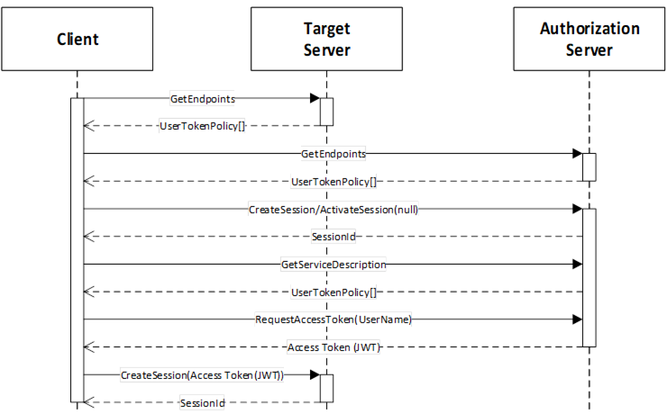  

Figure 31 - Explicit Authorization  

The Target *Server* is the *Server* that the *Client* wishes to access. It publishes a *UserTokenPolicy* that indicates that it accepts *AccessTokens* from an Authorization Server. The parameters needed to connect to the Authorization Server are stored in the *IssuerEndpointUrl* field of the *UserTokenPolicy* and are defined in [OPC 10000-6](/§UAPart6) . More details are described by the Implicit use case in [9.3](/§\_Ref106179099) .  

With this use case, the *Client* reads the *UserTokenPolicies Property* of the *AuthorizationService* to determine what credentials to provide in the *RequestAccessToken Method* . The *NodeId* of the *UserTokenPolicies Property* is the ua:authorizationEndpoint field in the *UserTokenPolicy* provided by the *Server* (see [OPC 10000-6](/§UAPart6) ).  

The *Session* may be created explicitly with a call to *CreateSession* or it can be implicit via a *Session*\-less *Method* *Call* .  

After creating the *Session* , the *Client* reads the available *UserTokenPolicies* from the *AuthorizationService* *Object* if it has not previously cached the information *.* It then chooses one that matches credentials that it has been provided out-of-band. The *Client* then calls the *RequestAccessToken* *Method* on the *AuthorizationService* *Object* .  

The Authorization *Server* determines if the *Client* is permitted to receive an *AccessToken* . The rest of the interactions are the same as described in [9.3](/§\_Ref106179099) .  

### 9.5 Chained  

The chained use case means the *Client* provides an *AccessToken* issued by another *AuthorizationService* acting as an *Identity Provider* . This use case is illustrated in [Figure 32](/§\_Ref473983398) .  

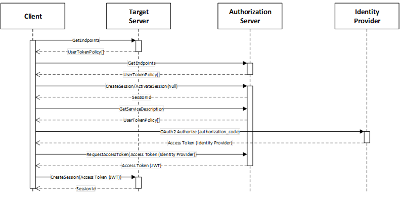  

Figure 32 - Chained Authorization  

The Target *Server* is the *Server* that the *Client* wishes to access. The initial interactions are the same as with the Implicit use case described in [9.3](/§\_Ref106179099) .  

The *Session* may be created explicitly with a call to *CreateSession* or it can be implicit via a *Session*\-less *Method* *Call* .  

After creating the *Session* , the *Client* reads the available *UserTokenPolicies* from the *AuthorizationService* *Object* if it has not previously cached the information *.* It then chooses one that references an *Identity Provider* for the user identities that it has available. The user identities may be provided out-of-band or they may be provided by an interactive user. The *Client* then requests an *AccessToken* from the *Identity Provider* .  

The *Client* then calls the *RequestAccessToken* *Method* on the *AuthorizationService* *Object* and passes the *AccessToken* from the *Identity Provider* .  

The Authorization *Server* determines if the *Client* is permitted to receive an *AccessToken* based on the claims granted by the *Identity Provider* . The rest of the interactions are the same as described in [9.3](/§\_Ref106179099) .  

### 9.6 Information Model for Requesting AccessTokens  

#### 9.6.1 Overview  

The information model for *AuthorizationServices* which allow *Clients* to request *AccessTokens* from a *Server* is shown in [Figure 33](/§\_Ref475268055) .  

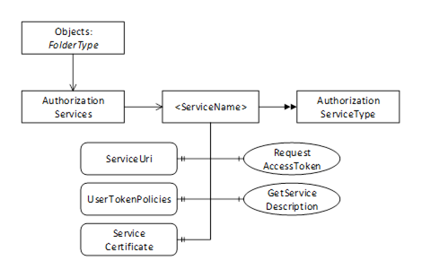  

Figure 33 - The Model for Requesting AccessTokens from AuthorizationServices  

#### 9.6.2 AuthorizationServicesFolderType  

This *ObjectType* represents a folder that contains *AuthorizationService Objects* which may be accessed via the *Server* . It is defined in [Table 144](/§\_Ref50895792) .  

Table 144 - AuthorizationServicesFolderType Definition  

| **Attribute** | **Value** |
|---|---|
|BrowseName|2:AuthorizationServicesFolderType|
|IsAbstract|False|
  
| **References** | **NodeClass** | **BrowseName** | **TypeDefinition** | **Modelling Rule** |
|---|---|---|---|---|
|Subtype of the *FolderType* defined in [OPC 10000-5](/§UAPart5) .|
|0:Organizes|Object|2:\<ServiceName\>|2:AuthorizationServiceType|OptionalPlaceholder|
||
  
| **Conformance Units** |
|---|
|GDS Authorization Service Server|
  

  

#### 9.6.3 AuthorizationServices  

This *Object* is an instance of *AuthorizationServicesFolderType.* It contains the *AuthorizationService Objects* which may be accessed via the GDS. It is the target of an *Organizes* reference from the *Objects Folder* defined in [OPC 10000-5](/§UAPart5) . It is defined in [Table 145](/§\_Ref475267851) .  

Table 145 - AuthorizationServices Object Definition  

| **Attribute** | **Value** |
|---|---|
|BrowseName|2:AuthorizationServices|
|TypeDefinition|*2:AuthorizationServicesFolderType* defined in [9.6.2](/§\_Ref89913374) .|
  
| **References** | **NodeClass** | **BrowseName** | **TypeDefinition** | **Modelling Rule** |
|---|---|---|---|---|
||
  
| **Conformance Units** |
|---|
|GDS Authorization Service Server|
  

  

#### 9.6.4 AuthorizationServiceType  

This *ObjectType* is the *TypeDefinition* for an *Object* that allows access to an *AuthorizationService* . It is defined in [Table 146](/§\_Ref474001905) .  

Table 146 - AuthorizationServiceType Definition  

| **Attribute** | **Value** |
|---|---|
|BrowseName|2:AuthorizationServiceType|
|IsAbstract|False|
  
| **References** | **NodeClass** | **BrowseName** | **DataType** | **TypeDefinition** | **Modelling Rule** |
|---|---|---|---|---|---|
|Subtype of the *BaseObjectType* defined in [OPC 10000-5](/§UAPart5) .|
|0:HasProperty|Variable|2:ServiceUri|0:String|0:PropertyType|Mandatory|
|0:HasProperty|Variable|2:ServiceCertificate|0:ByteString|0:PropertyType|Mandatory|
|0:HasProperty|Variable|2:UserTokenPolicies|0:UserTokenPolicy []|0:PropertyType|Optional|
|0:HasComponent|Method|2:GetServiceDescription|Defined in [0](/§\_Ref481579353) .|Mandatory|
|0:HasComponent|Method|2:Request *AccessToken*|Defined in [9.6.5](/§\_Ref475274315) .|Optional|
||
  
| **Conformance Units** |
|---|
|GDS Authorization Service Server|
  

The *ServiceUri* is a globally unique identifier that allows a *Client* to correlate an instance of *AuthorizationServiceType* with instances of *AuthorizationServiceConfigurationType* (see [9.7.4](/§\_Ref481578349) ).  

The *ServiceCertificate* is the *Certificate* required to check any *Signature* that is included with the *AccessTokens.* The *ServiceCertificate* may be a complete chain (see [OPC 10000-6](/§UAPart6) for information on encoding chains).  

The *UserTokenPolicies* *Property* specifies the *UserIdentityTokens* which are accepted by the *RequestAccessToken Method.*  

The *GetServiceDescription* *Method* is used to read the metadata used to request *AccessTokens.*  

The *RequestAccessToken Method* is used to request an *AccessToken* from the *AuthorizationService.*  

#### 9.6.5 RequestAccessToken  

*RequestAccessToken* is used to request an *AccessToken* from an *AuthorizationService* . The scenarios where this *Method* is used are described fully in [9.3](/§\_Ref106179099) , [9.4](/§\_Ref475271792) and [9.5](/§\_Ref475271794) .  

The *PolicyId* and *UserTokenType* of the *identityToken* shall match one of the elements of the *UserTokenPolicies* *Property* . If the *identityToken* is not provided the *Server* should use the *ApplicationInstanceCertificate* and/or the *UserIdentityToken* provided for the *Session* (or the request if using a *Session*\-less *Method Call* ) to determine privileges.  

If the associated *UserTokenPolicy* provides a *SecurityPolicyUri* , then the *identityToken* is encrypted and digitally signed using the format defined for *UserIdentityToken* secrets in [OPC 10000-4](/§UAPart4) .  

This *Method* shall be called from an encrypted *SecureChannel* and from a *Client* that has access to the *AccessTokenRequestor Privilege* (see [9.2](/§\_Ref100531759) ) *.*  

 **Signature**   

 **RequestAccessToken**   

[in]  UserIdentityToken identityToken  

[in]  String resourceId  

[out] String accessToken  

);  

  

| **Argument** | **Description** |
|---|---|
|identityToken|The identity used to authorize the *AccessToken* request.|
|resourceId|The identifier for the Resource that the *AccessToken* is used to access. This is usually the *ApplicationUri* for a *Server* . The recommended source of this value is the *resourceId* in the *UserTokenPolicy* provided by the *Server* that the caller wants to connect to (see [OPC 10000-6](/§UAPart6) ).|
|accessToken|The *AccessToken* granted to the application.|
  

  

 **Method Result Codes (defined in Call Service)**   

| **Result Code** | **Description** |
|---|---|
|Bad\_IdentityTokenInvalid|The *identityToken* does not match one of the allowed *UserTokenPolicies* .|
|Bad\_IdentityTokenRejected|The *identityToken* was rejected.|
|Bad\_NotFound|The *resourceId* is not known to the *Server* .|
|Bad\_UserAccessDenied|The current user does not have the rights required.|
|Bad\_SecurityModeInsufficient|The SecureChannel is not encrypted.|
  

  

[Table 147](/§\_Ref465773321) specifies the *AddressSpace* representation for the *RequestAccessToken* *Method* .  

Table 147 - RequestAccessToken Method AddressSpace Definition  

| **Attribute** | **Value** |
|---|---|
|BrowseName|2:Request *AccessToken*|
  
| **References** | **NodeClass** | **BrowseName** | **DataType** | **TypeDefinition** | **ModellingRule** |
|---|---|---|---|---|---|
|0:HasProperty|Variable|0:InputArguments|0:Argument[]|0:PropertyType|Mandatory|
|0:HasProperty|Variable|0:OutputArguments|0:Argument[]|0:PropertyType|Mandatory|
  

  

#### 9.6.6 GetServiceDescription  

*GetServiceDescription* is used to read the metadata needed to request *AccessTokens* from the *AuthorizationService* .  

 **Signature**   

 **GetServiceDescription**   

[out] String serviceUri  

[out] ByteString serviceCertificate  

[out] UserTokenPolicy[] userTokenPolicies  

);  

  

| **Argument** | **Description** |
|---|---|
|serviceUri|A globally unique identifier for the *AuthorizationService* .|
|serviceCertificate|The complete chain of *Certificates* used to to validate the *AccessTokens* provided by the *AuthorizationService.*|
|userTokenPolicies|The *UserIdentityTokens* accepted by the *AuthorizationService.*|
  

  

 **Method Result Codes (defined in Call Service)**   

| **Result Code** | **Description** |
|---|---|
|Bad\_UserAccessDenied|The current user does not have the rights required.|
  

  

[Table 148](/§\_Ref481578994) specifies the *AddressSpace* representation for the *GetServiceDescription* *Method* .  

Table 148 - GetServiceDescription Method AddressSpace Definition  

| **Attribute** | **Value** |
|---|---|
|BrowseName|2:GetServiceDescription|
  
| **References** | **NodeClass** | **BrowseName** | **DataType** | **TypeDefinition** | **ModellingRule** |
|---|---|---|---|---|---|
|0:HasProperty|Variable|0:OutputArguments|0:Argument[]|0:PropertyType|Mandatory|
  

  

#### 9.6.7 AccessTokenIssuedAuditEventType  

This event is raised when a *AccessToken* is issued.  

This is the result of a *RequestAccessToken Method* completing.  

This *Event* and it subtypes are security related and *Servers* shall only report them to users authorized to view security related audit events.  

Its representation in the *AddressSpace* is formally defined in [Table 149](/§\_Ref481342818) .  

Table 149 - AccessTokenIssuedAuditEventType Definition  

| **Attribute** | **Value** |
|---|---|
|BrowseName|2: *AccessToken* IssuedAuditEventType|
|IsAbstract|True|
  
| **References** | **NodeClass** | **BrowseName** | **DataType** | **TypeDefinition** | **Modelling Rule** |
|---|---|---|---|---|---|
|Subtype of the *0:AuditUpdateMethodEventType* defined in [OPC 10000-5](/§UAPart5) .|
||
  
| **Conformance Units** |
|---|
|GDS Authorization Service Server|
  

  

This *EventType* inherits all *Properties* of the *AuditUpdateMethodEventType* . Their semantic is defined in [OPC 10000-5](/§UAPart5) .  

### 9.7 Information Model for Configuring Servers  

#### 9.7.1 Overview  

The information model used to provide *Servers* with the information used to accept *AccessTokens* from *AuthorizationServices* in [Figure 34](/§\_Ref113664725) .  

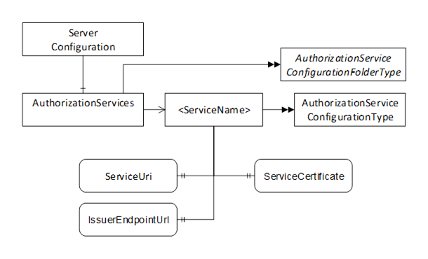  

Figure 34 - The Model for Configuring Servers to use AuthorizationServices  

If a *Server* is also a *Client* that has to access the *AuthorizationService,* the necessary *KeyCredentials* can be provided with the push configuration management model (see [8.4](/§\_Ref477748191) ).  

#### 9.7.2 AuthorizationServiceConfigurationFolderType  

This *ObjectType* represents a folder that contains *AuthorizationServiceConfiguration Objects* which may be accessed via the *Server* . It is defined in [Table 150](/§\_Ref50901718) .  

Table 150 - AuthorizationServicesConfigurationFolderType Definition  

| **Attribute** | **Value** |
|---|---|
|BrowseName|0:AuthorizationServicesConfigurationFolderType|
|IsAbstract|False|
  
| **References** | **NodeClass** | **BrowseName** | **TypeDefinition** | **Modelling Rule** |
|---|---|---|---|---|
|Subtype of the *0:FolderType* defined in [OPC 10000-5](/§UAPart5) .|
|0:HasComponent|Object|0:\<ServiceName\>|0:AuthorizationServiceConfigurationType|OptionalPlaceholder|
||
  
| **Conformance Units** |
|---|
|Authorization Service Configuration Server|
  

  

#### 9.7.3 AuthorizationServices  

This *Object* is an instance of *AuthorizationServicesConfigurationFolderType.* It contains The *AuthorizationServiceConfiguration Objects* which may be accessed via the *Server* . It is the target of an *HasComponent* reference from the *ServerConfiguration Object* defined in [7.10.4](/§\_Ref106623323) . It is defined in [Table 151](/§\_Ref113664757) .  

Table 151 - AuthorizationServices Object Definition  

| **Attribute** | **Value** |
|---|---|
|BrowseName|0:AuthorizationServices|
|TypeDefinition|*0:AuthorizationServicesConfigurationFolderType* defined in [9.6.2](/§\_Ref89913374) .|
  
| **References** | **NodeClass** | **BrowseName** | **TypeDefinition** | **Modelling Rule** |
|---|---|---|---|---|
||
  
| **Conformance Units** |
|---|
|Authorization Service Configuration Server|
  

  

#### 9.7.4 AuthorizationServiceConfigurationType  

This *ObjectType* is the *TypeDefinition* for an *Object* that allows the configuration of an *AuthorizationService* used by a *Server* . It is defined in [Table 152](/§\_Ref475274316) .  

Table 152 - AuthorizationServiceConfigurationType Definition  

| **Attribute** | **Value** |
|---|---|
|BrowseName|0:AuthorizationServiceConfigurationType|
|IsAbstract|False|
  
| **References** | **NodeClass** | **BrowseName** | **DataType** | **TypeDefinition** | **Modelling Rule** |
|---|---|---|---|---|---|
|Subtype of the *0:BaseObjectType* defined in [OPC 10000-5](/§UAPart5) .|
|0:HasProperty|Variable|0:ServiceUri|0:String|0:PropertyType|Mandatory|
|0:HasProperty|Variable|0:ServiceCertificate|0:ByteString|0:PropertyType|Mandatory|
|0:HasProperty|Variable|0:IssuerEndpointUrl|0:String|0:PropertyType|Mandatory|
||
  
| **Conformance Units** |
|---|
|Authorization Service Configuration Server|
  

The *ServiceUri* *Property* uniquely identifies the *AuthorizationService* .  

The *ServiceCertificate* *Property* has the *Certificate(s)* used to verify *AccessTokens* issued by the *AuthorizationService* . The value is the complete chain of Certificate used for verification (see [OPC 10000-6](/§UAPart6) for information on encoding chains).  

The *IssuerEndpointUrl* is the value of the *IssuerEndpointUrl* in *UserTokenPolicies* which require the use of the AuthorizationService. The contents of this field depend on the *AuthorizationService* and are described in [OPC 10000-6](/§UAPart6) .  

#### 9.7.5 AuthorizationServiceConfigurationDataType  

This type is used to serialize the *AuthorizationService* configuration *.* It is defined in [Table 153](/§\_Ref192747604) .  

This type is used as part of the *ApplicationConfigurationDataType* defined in [7.10.19](/§\_Ref157182055) which allows multiple of *AuthorizationServices* in a *Server* to be updated at once.  

The *Name* of the record is the name portion of the *BrowseName* of the associated *AuthorizationServiceConfiguration Object* in the *AddressSpace* .  

If multiple *ServiceCertificates* are specified the first entry in the list is exposed with the *ServerCertificate* *Property* on the *AuthorizationServiceConfiguration Object.*  

Note that when a new *AuthorizationServiceConfiguration* is added, *Clients* need to browse the *AuthorizationServices* folder to discover the *NodeId* assigned by the *Server* that is needed for *Certificate Management* *Methods* .  

Table 153 - AuthorizationServiceConfigurationDataType Structure  

| **Name** | **Type** | **Description** |
|---|---|---|
|AuthorizationServiceConfigurationDataType|Structure||
|ServiceUri|0:UriString|A URI uniquely identifies the *AuthorizationService* .|
|ServiceCertificates|0:ServiceCertificateDataType[]|A list of *Certificates* used by the *AuthorizationService* to verify *AccessTokens* .|
|Certificate|0:ByteString|The *Certificate* needed to verify *AccessTokens* issued by the *AuthorizationService.*|
|Issuers|0:ByteString[]|The *Issuers* needed to verify the *Certificate.* The *Certificates* appear in the array starting with the issuer of the Certificate. The CRLs are not part of to the AuthorizationService configuration so the administration *Client* shall check any CRLs and update the configuration if a *Certificate* in the chain is revoked.|
|ValidFrom|0:UtcTime|When the *Certificate* may be used to verify *AccessTokens* . If null then the *Certificate* can be used any time after ValidFrom field within the *Certificate* .|
|ValidTo|0:UtcTime|After this time, the *Certificate* may not be used to verify *AccessTokens* . If null there is no expiry time other than the ValidTo field within the *Certificate* .|
|IssuerEndpointSettings|0:String|The *AuthorizationService* specific settings that *Clients* need to know before requesting *AccessTokens* from the *AuthorizationService* . The syntax depends on the *AuthorizationService.*|
  

  

Its representation in the *AddressSpace* is defined in [Table 154](/§\_Ref192747673) .  

Table 154 - AuthorizationServiceConfigurationDataType Definition  

| **Attribute** | **Value** |
|---|---|
|BrowseName|0:AuthorizationServiceConfigurationDataType|
|IsAbstract|False|
  
| **References** | **NodeClass** | **BrowseName** | **DataType** | **TypeDefinition** | **Other** |
|---|---|---|---|---|---|
|Subtype of the 0: *BaseConfigurationRecordDataType* defined in [7.8.5.5](/§\_Ref161597878) .|
||
  
| **Conformance Units** |
|---|
|Authorization Service Configuration Server|
  

  

## 10 Namespaces  

### 10.1 Namespace Metadata  

[Table 155](/§\_Ref16863029) defines the namespace metadata for this document. The *Object* is used to provide version information for the namespace and an indication about static *Nodes* . Static *Nodes* are identical for all *Attributes* in all *Servers* , including the *Value Attribute* . See [OPC 10000-5](/§UAPart5) for more details.  

The information is provided as *Object* of type *NamespaceMetadataType* . This *Object* is a component of the *Namespaces* *Object* that is part of the *Server Object* . The *NamespaceMetadataType ObjectType* and its *Properties* are defined in [OPC 10000-5](/§UAPart5) .  

The version information is also provided as part of the ModelTableEntry in the UANodeSet XML file. The UANodeSet XML schema is defined in [OPC 10000-6](/§UAPart6) .  

Table 155 - NamespaceMetadata Object for this Document  

| **Attribute** | **Value** |
|---|---|
|BrowseName|2:http://opcfoundation.org/UA/GDS/|
  
| **Property** | **DataType** | **Value** |
|---|---|---|
|0:NamespaceUri|0:String|http://opcfoundation.org/UA/GDS/|
|0:NamespaceVersion|0:String|1\.05.06|
|0:NamespacePublicationDate|0:DateTime||
|0:IsNamespaceSubset|0:Boolean|False|
|0:StaticNodeIdTypes|0:IdType []|0|
|0:StaticNumericNodeIdRange|0:NumericRange []||
|0:StaticStringNodeIdPattern|0:String||
  

  

### 10.2 Handling of OPC UA Namespaces  

Namespaces are used by OPC UA to create unique identifiers across different naming authorities. The *Attributes* *NodeId* and *BrowseName* are identifiers. A *Node* in the UA *AddressSpace* is unambiguously identified using a *NodeId* . Unlike *NodeIds* , the *BrowseName* cannot be used to unambiguously identify a *Node* . Different *Nodes* may have the same *BrowseName* . They are used to build a browse path between two *Nodes* or to define a standard *Property* .  

*Servers* may often choose to use the same namespace for the *NodeId* and the *BrowseName* . However, if they want to provide a standard *Property* , its *BrowseName* shall have the namespace of the standards body although the namespace of the *NodeId* reflects something else, for example the *EngineeringUnits* *Property* . All *NodeIds* of *Nodes* not defined in this document shall not use the standard namespaces.  

[Table 156](/§\_Ref16577438) provides a list of namespaces and their index used for *BrowseNames* in this document. The default namespace of this document is not listed since all *BrowseNames* without prefix use this default namespace.  

Table 156 - Namespaces used in this document  

| **NamespaceURI** | **Namespace Index** | **Example** |
|---|---|---|
|http://opcfoundation.org/UA/|0|0:EngineeringUnits|
|http://opcfoundation.org/UA/GDS/|2|2:ApplicationRecordDataType|
  

  

## Annex A (informative)Deployment and Configuration  

### A.1 Firewalls and Discovery  

Many systems will have multiple networks that are isolated by firewalls. These firewalls will frequently hide the network addresses of the hosts behind them unless the Administrator has specifically configured the firewall to allow external access. In some networks the Administrator will place hosts with externally available *Servers* outside the firewall as shown in [Figure A.](/§\_Ref181842535) .  

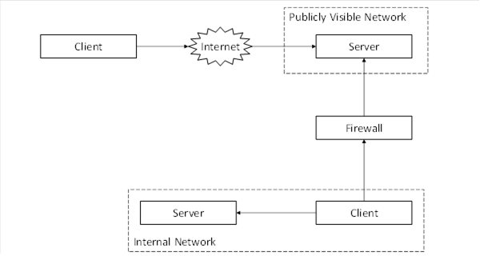  

Figure A. 1 - Discovering Servers Outside a Firewall  

In this configuration *Servers* running on the publicly visible network will have the same network address from the perspective of all *Clients* which means the URLs returned by *DiscoveryServers* are not affected by the location of the *Client* .  

In other networks the Administrator will configure the firewall to allow access to selected *Servers.* An example is shown in [Figure A.2](/§\_Ref181903604) .  

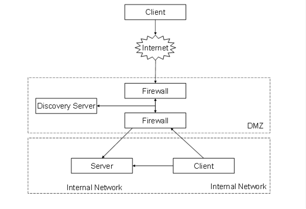  

Figure A. 2 - Discovering Servers Behind a Firewall  

In this configuration the address of the *Server* that the Internet *Client* sees will be different from the address that the internal *Client* sees. This means that the *Server's DiscoveryEndpoint* would return incorrect URLs to the Internet *Client* (assuming it was configured to provide the internal URLs).  

*Administrators* can correct this problem by configuring the *Server* to use multiple *HostNames* . A *Server* that has multiple *HostNames* shall look at the *EndpointUrl* passed to the *GetEndpoints* or *CreateSession* services and return *EndpointDescriptions* with URLs that use the same *HostName* . A Server with multiple *HostNames* shall also return an *Application Instance Certificate* that specifies the *HostName* used in the URL it returns. An Administrator may create a single *Certificate* with multiple HostNames or assign different *Certificates for each HostName* that the *Server* supports *.*  

Note that *Servers* may not be aware of all *HostNames* which can be used to access the *Server* (i.e. a NAT firewall) so *Clients* shall handle the case where the URL used to access the *Server* is different from the *HostNames* in the *Certificate* . This is discussed in more detail in [OPC 10000-4](/§UAPart4) .  

*Administrators* can set up a *DiscoveryServer* that is configured with the *ApplicationDescriptions* for *Servers* that are ** accessible to external *Clients* . This *DiscoveryServer* would have to substitute its own *Endpoint* for the *DiscoveryUrls* in all *ApplicationDescriptions* that it returns when a *Client* calls *FindServers* . This would tell the *Client* to call the *DiscoveryServer* back when it wishes to connect to the *Server* . The *DiscoveryServer* would then request the *EndpointDescriptions* from the actual Server as shown in **** . At this point the *Client* would have all the information required to establish a secure channel with the *Server* behind the firewall.  

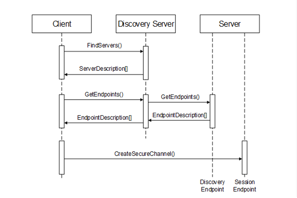  

Figure A. 3 - Using a Discovery Server with a Firewall  

In this example, the *DiscoveryServer* outside of the firewall allows the *Administrator* to close off the *Server's DiscoveryEndpoints* to every Client other than the *DiscoveryServer* . The Administrator could eliminate that hole as well if it stored the *EndpointDescriptions* on the *DiscoveryServer* . This allows an Administrator to configure a system in which no public access is allowed to any application behind the firewall.  The only access behind the firewall is via a secure connection.  

The *DiscoveryServer* could also be replaced with a *DirectoryService* that stores the *ApplicationDescriptions* and/or the *EndpointDescriptions* for the *Servers* behind the firewalls.  

### A.2 Resolving References to Remote Servers  

The UA *AddressSpace* supports references between *Nodes* that exist in different *Server* *AddressSpace* spaces. These references are specified with a *ExpandedNodeId* that includes the URI of the *Server* which owns the *Node* . A *Client* that wishes to follow a reference to an external *Node* should map the *ApplicationUri* onto an *EndpointUrl* that it can use. A *Client* can do this by using the *GlobalDiscoveryServer* that knows about the *Server* . The process of connecting to a *Server* containing a remote *Node* is illustrated in [Figure A.4](/§\_Ref182069398) .  

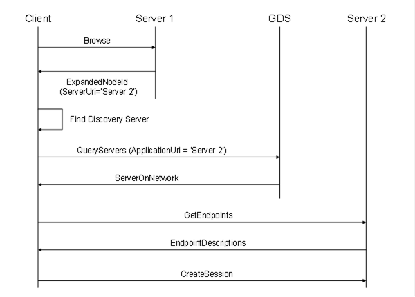  

Figure A. 4 - Following References to Remote Servers  

If a GDS not available *Client* may use other strategies to find the *Server* associated with the URI.  

  

## Annex B (normative)NodeSet and Constants  

### B.1 NodeSet  

The OPC UA NodeSet includes the complete Information Model defined in this document. It follows the XML Information Model schema syntax defined in [OPC 10000-6](/§UAPart6) and can thus be read and processed by a computer program.  

The complete Information Model Schema for this version of this document (including any amendments and errata) can be found here:  

http://www.opcfoundation.org/UA/schemas/1.05/Opc.Ua.Gds.NodeSet2.xml  

NOTE The latest Information Model schema that is compatible with this version of this document can be found here:  

http://www.opcfoundation.org/UA/schemas/Opc.Ua.Gds.NodeSet2.xml  

The complete Information Model Schema includes many types which are only used in *Service* *Requests* and *Responses* and should not be used by *Servers* to populate their *Address Space* .  

### B.2 Numeric Node Ids  

This document defines *Nodes* which are part of the base OPC UA Specification. The numeric identifiers for these *Nodes* are part of the complete list of identifiers defined in [OPC 10000-6](/§UAPart6) .  

In addition, this document defines *Nodes* which are only used by *GlobalDiscoveryServers* .  

The *NamespaceUri* for any GDS specific *NodeIds* is [http://opcfoundation.org/UA/GDS](http://opcfoundation.org/UA/GDS) /  

The CSV released with this version of the standards can be found here:  

[http://www.opcfoundation.org/UA/schemas/1.05/Opc.Ua.Gds.NodeIds.csv](http://www.opcfoundation.org/UA/schemas/1.05/Opc.Ua.Gds.NodeIds.csv)  

NOTE The latest CSV that is compatible with this version of the standard can be found here:  

[http://www.opcfoundation.org/UA/schemas/Opc.Ua.Gds.NodeIds.csv](http://www.opcfoundation.org/UA/schemas/Opc.Ua.Gds.NodeIds.csv)  

## Annex C (normative)OPC UA Mapping to mDNS  

### C.1 DNS Server (SRV) Record Syntax  

[Annex C](/§\_Ref419139646) describes the OPC UA specific requirements which are above and beyond the more general requirements of the [mDNS](/§mDNS) specification.  

[mDNS](/§mDNS) uses DNS SRV records to advertise the services (a.k.a. the *DiscoveryUrls* for the *Servers* ) available on the network.  

An SRV record has the form:  

\_service.\_proto.name TTL class SRV priority weight port target  

*service* : the symbolic name of the desired service. For OPC UA this field shall be one of service names for OPC UA which are defined in [Table](/§\_Ref362332508) . **  

Table C. 1 - Allowed mDNS Service Names  

| **Service Name** | **Description** |
|---|---|
|\_opcua-tcp|The *DiscoveryUrl* supports the OPC UA TCP mapping (see [OPC 10000-6](/§UAPart6) ). This name is assigned by IANA.|
|\_opcua-tls|The *DiscoveryUrl* supports the OPC UA WebSockets mapping (see [OPC 10000-6](/§UAPart6) ). Note that WebSockets mapping supports multiple encodings. If a *Client* supports more than one encoding it should attempt to use the alternate encodings if an error occurs during connect. This name is assigned by IANA.|
  

*proto* : the transport protocol of the desired service; For OPC UA this field shall be '\_tcp'.  

The other fields have no OPC UA specific requirements.  

An example SRV record in textual form that might be found in a [zone file](http://en.wikipedia.org/wiki/Zone\_file) might be the following:  

\_opcua-tcp.\_tcp.example.com. 86400 IN SRV 0 5 4840 uaserver.example.com.  

This points to a server named uaserver.example.com listening on TCP port 4840 for OPC UA TCP requests. The priority given here is 0, and the weight is 5 (the priority and weights are not important for OPC UA). The [mDNS](/§mDNS) specification describes the rest of the fields in detail.  

### C.2 DNS Text (TXT) Record Syntax  

The SRV record has a TXT record associated with it that provides additional information about the *DiscoveryUrl* . The format of this record is a sequence of strings prefixed by a length. This specification adopts the key-value syntax for TXT records described in [DNS-SD](/§DNSSD) .  

[Table C.2](/§\_Ref354669723) defines the syntax for strings that may in the TXT record. **  

Table C. 2 - DNS TXT Record String Format  

| **Key-Value Format** | **Description** |
|---|---|
|path=/\<path\>|Specifies the text that appears after the port number when constructing a URL. This text always starts with a forward slash (/).|
|caps=\<capability1\>,\<capability2\>|Specifies the capabilities supported by the *Server* . These are short (\<=8 character) strings which are published by the OPC Foundation (see [Annex D](/§\_Ref354721284) ). The number of capabilities supported by a Server should be less than 10.|
  

The *MulticastExtension* shall convert *DiscoveryUrls* to and from these SRV records.  

### C.3 DiscoveryUrl Mapping  

An *DiscoveryUrl* has the form:  

scheme://hostname:port/path  

scheme: the protocol used to establish a connection.  

hostname: the domain name or *IPAddress* of the host where the *Server* is running.  

port: the TCP port on which the *Server* is to be found.  

path: additional data used to identify a specific *Server* .  

Table C. 3 - DiscoveryUrl to DNS SRV and TXT Record Mapping  

| **URL Field** | **Mapping** |
|---|---|
|scheme|The scheme maps onto SRV record service field. The following mappings are defined at this time: opc.tcp|\_opcua-tcp.\_tcp.|opc.wss|\_opcua-tls.\_tcp.|The OPC UA service names are assigned by IANA.Additional service names may be added in the future.The endpoint shall support the default transport profile for the scheme.|
|hostname|The hostname maps onto the SRV record target field. If the hostname is an *IPAddress* then it shall be converted to a domain name. If this cannot be done then LDS shall report an error.|
|port|The port maps onto the SRV record port field.|
|path|The path maps onto the path string in the TXT record (see [Table C.2](/§\_Ref354669723) ).|
  

Suitable default values should be chosen for fields in a SRV record that do not have a mapping specified in [Table C.3](/§\_Ref354671341) . e.g. TTL=86400, class=IN, priority=0, weight=5  

## Annex D (normative)Server Capability Identifiers  

*Clients* benefit if they have more information about a *Server* before they connect, however, providing this information imposes a burden on the mechanisms used to discover *Servers* . The challenge is to find the right balance between the two objectives.  

*CapabilityIdentifiers* are the way this specification achieves the balance. These identifiers are short and map onto a subset of OPC UA features which are likely to be useful during the discovery process. The identifiers are short because of length restrictions for fields used in the mDNS specification. [Table](/§\_Ref354722493) is a non-normative list of possible identifiers.  

Table D. 1 - Examples of CapabilityIdentifiers  

| **Identifier** | **Description** |
|---|---|
|NA|No capability information is available. Cannot be used in combination with any other capability.|
|DA|Provides current data.|
|HD|Provides historical data.|
|AC|Provides alarms and conditions that may require operator interaction.|
|HE|Provides historical alarms and events.|
|GDS|Supports the Global Discovery Server information model.|
|LDS|The *ApplicationType* is *DiscoveryServer* . Only used by a standalone LDS implementation.|
|DI|Supports the Device Integration (DI) information model (see [DI](/§OLE\_LINK41) ).|
|ADI|Supports the Analyser Device Integration (ADI) information model (see [ADI](/§ADI) ).|
|FDI|Supports the Field Device Integration (FDI) information model (see [FDI](/§FDI) ).|
|FDIC|Supports the Field Device Integration (FDI) Communication Server information model (see [FDI](/§FDI) ).|
|PLC|Supports the PLCopen information model (see [PLCopen](/§PLCopen) ).|
|S95|Supports the ISA95 information model (see [ISA-95](/§ISA95) ).|
|RCP|Accepts reverse connect requests as defined in [OPC 10000-6](/§UAPart6) .|
|PUB|Supports the *Publisher* capabilities defined in [OPC 10000-14](/§UAPart14) .|
|PSC|Supports the *PubSub Configuration* model defined in [OPC 10000-14](/§UAPart14) .|
|ALIAS|Supports the *Alias Names* capabilities defined in [OPC 10000-17](/§Part17) .|
|SKS|Supports the Security Key Server (SKS) capabilities defined in [OPC 10000-14](/§UAPart14) .|
|REG|Supports the Registrar model defined in [OPC 10000-21](/§UAPart21) .|
|DCA|Supports the Device Configuration Application (DCA) model defined in [OPC 10000-21](/§UAPart21) .|
  

The normative set of *CapabilityIdentifiers* can be found here:  

[http://www.opcfoundation.org/UA/schemas/ServerCapabilities.csv](http://www.opcfoundation.org/UA/schemas/ServerCapabilities.csv)  

This CSV will be changed to meet the needs of companion specifications and will not trigger an update to this document. Application developers shall always use the linked CSV.  

*Applications* that support the PUB capability can send *PubSub Messages* but may not support the PubSub information model.  

*Client* applications that support the RCP capability allow *Servers* to connect, however, they do not support *GetEndpoints Service.*  

## Annex E (normative)DirectoryServices  

### E.1 Global Discovery via Other DirectoryServices  

Many organizations will deploy *DirectoryServices* such as LDAP or UDDI to manage resources available on their network. A *Client* can use these services as a way to find *Servers* by using APIs specific to *DirectoryService* to query for UA *Servers* or UA *DiscoveryServers* available on the network. The *Client* would then use the URLs for *DiscoveryEndpoints* stored in the *DirectoryService* to request the *EndpointDescriptions* necessary to connect to an individual servers  

Some implementations of a *GlobalDiscoveryServer* will be a front-end for a standard *Directory Service* . In these cases, the *QueryApplications* method will return the same information as the *DirectoryService* API. The discovery process for this scenario is illustrated in [Figure](/§\_Ref151019149) .  

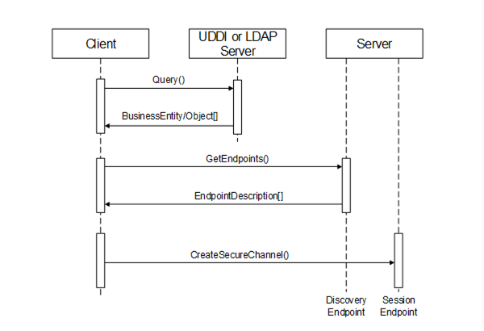  

Figure E. 1 - The UDDI or LDAP Discovery Process  

### E.2 UDDI  

UDDI registries contain *businessEntities* which provide one or more *businessServices* . The *businessServices* have one or more *bindingTemplates* . *bindingTemplates* specify a physical address and a *Server* Interface (called a tModel). [Figure E.2](/§\_Ref182063711) illustrates the relationships between the UDDI registry elements.  

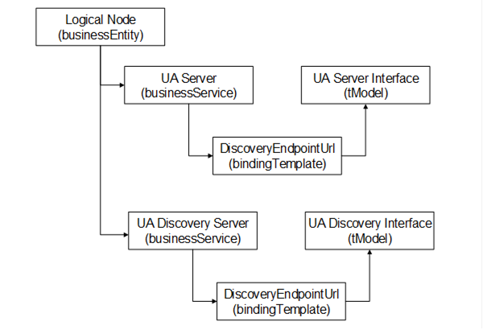  

Figure E. 2 - UDDI Registry Structure  

This specification defines standard tModels which shall be referenced by businessServices that support UA. The standard UA tModels shown in [Table](/§\_Ref151122697) .  

Table E. 1 - UDDI tModels  

||||
|---|---|---|
|Name|domainKey|uuidKey|
|Server|uddi:server.ua.opcfoundation.org|uddi:AA206B41-EC9E-49a4-B789-4478C74120B5|
|*DiscoveryServer*|uddi:discoveryserver.ua.opcfoundation.org|uddi:AA206B42-EC9E-49a4-B789-4478C74120B5|
  

  

The name of the businessService elements should be the same as the *ApplicationName* for the UA application. The serviceKey shall be the *ApplicationUri* . At least one bindingTemplate shall be present and the accessPoint shall be the URL of the *DiscoveryEndpoint* for the UA server identified by the serviceKey. Servers with multiple *DiscoveryEndpoints* would have multiple bindingTemplates  

A UDDI registry will generally only contain UA servers, however, there are situations where the administrators cannot know what *Servers* are available at any given time and will find it more convenient to place a *DiscoveryServer* in the registry instead.  

### E.3 LDAP  

LDAP servers contain *objects* organized into hierarchies. Each object has an *objectClass* which specifies a number of *attributes* . *Attributes* have values which describe an *object* . [Figure E.3](/§\_Ref182066540) illustrates a sample LDAP hierarchy which contains entries describing UA servers.  

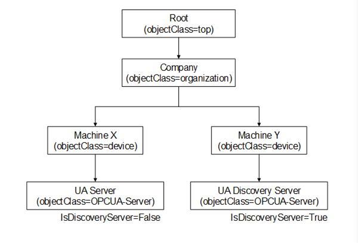  

Figure E. 3 - Sample LDAP Hierarchy  

UA applications are stored in LDAP servers as entries with the UA defined objectClasses associated with them. The schema for the objectClasses defined for UA are shown in [Table E.2](/§\_Ref151129632) .  

Table E. 2 - LDAP Object Class Schema  

|||||
|---|---|---|---|
|Name|LDAP Name|Type|OID|
|Application|opcuaApplication|Structural|1\.2.840.113556.1.8000.2264.1.12.1|
|ApplicationName|cn|String (Required)|Built-in|
|HostName|dNSName|String|Built-in|
|ApplicationUri|opcuaApplicationUri|Name|1\.2.840.113556.1.8000.2264.1.12.1.1|
|ApplicationType|opcuaApplicationType|Boolean|1\.2.840.113556.1.8000.2264.1.12.1.3|
|DiscoveryUrl|opcuaDiscoveryUrl|String, Multi-valued|1\.2.840.113556.1.8000.2264.1.12.1.4|
  

This OID is globally unique and can use used with any LDAP implementation.  

Administrators may extend the LDAP schema by adding new attributes.  

## Annex F (normative)Local Discovery Server  

### F.1 Certificate Store Directory Layout  

A recommended directory layout for *Applications* that store their *Certificates* on a file system is shown in [Table](/§\_Ref400544332) . The Local Discovery Server shall use this structure.  

This structure is based on the rules defined in [OPC 10000-6](/§UAPart6) .  

Table F. 1 - Application Certificate Store Directory Layout  

| **Path** | **Description** |
|---|---|
|\<root\>|A descriptive name for the TrustList.|
|||
|\<root\>/own|The *Certificate* store which contains private keys used by the application.|
|\<root\>/own/certs|Contains the X.509 v3 *Certificates* associated with the private keys in the ./private directory.|
|\<root\>/own/private|Contains the private keys used by the application.|
|||
|\<root\>/trusted|The *Certificate* store which contains trusted *Certificates* .|
|\<root\>/trusted/certs|Contains the X.509 v3 *Certificates* which are trusted.|
|\<root\>/trusted/crl|Contains the X.509 v3 CRLs for any *Certificates* in the ./certs directory.|
|||
|\<root\>/issuer|The *Certificate* store which contains the CA *Certificates* required for validation.|
|\<root\>/issuer/certs|Contains the X.509 v3 *Certificates* which are required for validation.|
|\<root\>/issuer/crl|Contains the X.509 v3 CRLs for any *Certificates* in the ./certs directory.|
|||
|\<root\>/rejected|The *Certificate* store which contains certificates which have been rejected.|
|\<root\>/rejected/certs|Contains the X.509 v3 *Certificates* which have been rejected.|
  

All X.509 v3 certificates are stored in DER format and have a '.der' extension on the file name.  

All CRLs are stored in DER format and have a '.crl' extension on the file name.  

Private keys should be in [PKCS \#12](/§PKCS12) format with a '.pfx' extension or in the OpenSSL PEM format. The OpenSSL PEM format is not formally defined and should only be used by applications which use the OpenSSL libraries to implement security. Other private key formats may exist.  

The base name of the Private Key file shall be the same as the base file name for the matching Certificate file stored in the ./certs directory.  

A recommended naming convention is:  

\<CommonName\>-[\<Algorithm\>-\<Thumbprint\>].(der | pem | pfx)  

Where the CommonName is the CommonName of the Certificate, the Algorithm is the key-pair algorithm and the Thumbprint is the *CertificateDigest* of the certificate formatted as a hexadecimal string.  

The currently supported key-pair algorithms are: RSA, nistP256, nistP384, brainpoolP256r1, brainpoolP384r1, curve25519 and curve448.  

### F.2 Installation Directories on Windows  

The *LocalDiscoveryServer* executable shall be installed in the following location:  

%CommonProgramFiles%\\OPC Foundation\\UA\\Discovery  

where %CommonProgramFiles% is the value of the *CommonProgramFiles* environment variable on 32-bit systems. On 64-bit systems the value of the *CommonProgramFiles(x86)* environment variable is used instead.  

The configuration files used by the *LocalDiscoveryServer* executable shall be installed in the following location:  

%CommonApplicationData%\\OPC Foundation\\UA\\Discovery  

where %CommonApplicationData% is the location of the application data folder shared by all users. The exact location depends on the operating system, however, under Windows 7 or later the common application data folder is usually C:\\ProgramData.  

The certificates stores used by the *LocalDiscoveryServer* shall be organized as described in [F.1](/§\_Ref400548794) . The root of the certificates stores shall be in the following location:  

%CommonApplicationData%\\OPC Foundation\\UA\\pki  

  

## Annex G (normative)Application Setup  

### G.1 Application Setup with PullManagement  

*Applications* that use *PullManagement* (see [7.3](/§\_Ref105573170) ) to setup their configuration shall know the location of the *CertificateManager* which they can use to request *Certificates* and download *TrustLists* . This location may be auto-discovered via mDNS by looking for *Servers* with the GDS capability (see [Annex D](/§\_Ref404520945) ) or by providing a URL via and out of band mechanism such as e-mail or a web page.  

Once the location is known the *Application* can connect to the *CertificateManager* and establish a *SecureChannel* . The Application may choose to connect even if it has not been pre-configured to trust the CertificateManager, however, Applications should not provide any secret information to a *CertificateManager* that is not trusted.  

After establishing a *SecureChannel* with the *CertificateManager* , the *Application* needs to demonstrate that it has permission to request *Certificates* and *TrustLists* . This permission may be granted if the *CertificateManager* is pre-configured with CAs and/or *Certificates* used by *Applications* on the network (see [OPC 10000-21](/§UAPart21) ).  

Permissions can also be granted if the *Application* provides user credentials that give it *ApplicationAdmin* rights (see [7.2](/§\_Ref100529418) ). If the *CertificateManager* is not pre-configured to be trusted by the *Application* then the *Application* shall not provide any secrets, such as passwords, to the *CertificateManager* . It may use *UserIdentityTokens* , such as *X509IdentityTokens* , that do not require a secret to be sent to a potentially malicious *CertificateManager* .  

If an *Application* prompts the user to enter the credentials to use it shall not persist these credentials for use in the future.  

A *CertificateManager* may accept a *CertificateRequest* from unknown *Applications* that provide anonymous credentials if there is a process for manual review by a *CertificateManager* administrator. The *Certificate* is not issued until the *CertificateRequest* is approved.  

Once an *Application* has received its first *Certificate* then the *Certificate* can be used in lieu of user credentials when the Application has to renew its *Certificate* or update its *TrustList* .  

### G.2 Application setup with the PushManagement  

Applications that support *PushManagement* (see [7.4](/§\_Ref404522549) ) to initialize their configuration shall have a default *Certificate* assigned before the *PushManagement* process can start.  

In addition, applications shall go into an application setup state (for example, see [OPC 10000-21](/§UAPart21) ) that makes it possible for remote *Clients* to update the security configuration via the *ServerConfiguration* *Object* (see [7.10.4](/§\_Ref106623367) ). When an application is in the application setup state it shall limit the available functionality. If the application is a *Server* , then the value of the *ServerState* *Property* shall be *NoConfiguration* . Note that the *ServerState* for a managed *Server* is not available when it is being managed by a proxy *Server* (see [7.10.14](/§\_Ref209688083) and [7.10.16](/§\_Ref208873698) ).  

When a *Client* is directly configuring a *Server* , it is good practice for a *Client* to always check the *ServerState* after creating a *Session* . If the *ServerState* is *NoConfiguration* then the *Client* should check the *InApplicationSetup Property* on the *ServerConfiguration Object* to confirm that the *Server* is in the application setup state.  

In some cases, cached user credentials will no longer work because of *Server* has been reset. *Clients* can determine that the Server is in the Application Setup state by reconnecting using Anonymous user credentials and checking the *ServerState Property* .  

Once an application has been configured it automatically leaves the application setup state. This step is necessary to ensure that security is not compromised.  

A possible workflow for implementing the Application Setup state is:  

1. A flag in the configuration file that defaults to ON;  

1. Always allow *Clients* to connect securely and assign the *SecurityAdmin* *Role* to *Anonymous* user if the *TrustList* is empty;  

1. Connect to the *Server* after toggling a physical switch on the device which enables access for a short period.  

1. Add *Client* *ApplicationUri* to *SecurityAdmin* *Role* , remove Anonymous from *SecurityAdmin* *Role* ;  

1. Provide a new *Certificate* and *TrustList* ;  

1. Set the configuration flag to OFF.  

Subsequent updates to *TrustLists* or *Certificates* can be allowed if the *Client* has a trusted *Certificate* and has access to the *SecurityAdmin Role* . During the setup state the *Client* shall configure the *SecurityAdmin* *Role* . If the *Client* fails to do this Server shall stay in application setup state.  

In some cases, the application distributor or installer will know the CA used to sign the *Certificate* used by the *CertificateManager* and can add this CA to the Application's *TrustList* during installation. If practical, this approach provides the best protection against accidental configuration by malicious *Clients.*  

If the device is automatically discovered by the *CertificateManager* the *CertificateManager* needs some way to ensure that the device belongs on the network. The manufacturer can provide a unique *ApplicationInstance* *Certificate* during manufacture and provide the serial numbers to the device installer. The installer would then register the serial number or *Certificate* with the *CertificateManager* . When the *CertificateManager* discovers the device it would ** check that the *Certificate* is for one of the pre-authorized devices and continue with automatic onboarding of the device. [OPC 10000-21](/§UAPart21) formally defines mechanisms for onboarding new devices when they are connected to the network.  

### G.3 Setting Permissions  

If a *Private Key* is stored on a regular file system it shall be protected from unauthorized access. This is best done by setting operating system permissions on the private key file that deny read/write access to anyone who is not using an account authorized to run the *Application* .  

In some cases, additional protection can be added by protecting the *Private Key* with a password. Saving *Private Key* passwords in files should be avoided. This mode may also work in conjunction with "smart cards" that use hardware to protect the *Private Key* .  

In addition to the *Private Key* , *Applications* shall be protected from unauthorized updates to their *TrustList* . This can also be done by setting operating system permissions on the directory where the *TrustList* is stored that deny write access to anyone who is not using an account authorized to administer the *Application* .  

Finally, *Applications* may depend on one or more configuration files and/or databases which tell them where their *TrustList* and *Private Key* can be found. The source of any security related configuration information shall be protected from unauthorized updates. The exact mechanism used to implement these protections depends on the source of the information.  

## Annex H (informative) Comparison with RFC 7030  

### H.1 Overview  

RFC 7030 (Enrolment over Secure Transport or EST) defines a mechanism for the distribution of *Certificates* to devices. This appendix summarizes the capabilities provided by EST and how the same capabilities are provided by the *CertificateManager* defined in [7](/§\_Ref410633217) .  

### H.2 Obtaining CA Certificates  

In EST a web operation returns the CA certificates. In OPC UA the CA *Certificates* are returned when the *CertificateManager* client reads the *TrustList* assigned to the application from the *CertificateManager* . Prior to these operations the *Client* should verify that the server is authorized to provide CAs. [Table](/§\_Ref410634019) compares how EST clients verify the EST server with how *CertificateManager* clients verify a *CertificateManager* .  

Table H. 1 - Verifying that a Server is allowed to Provide Certificates  

| **EST** | **OPC UA** |
|---|---|
|Compare the URL for the EST server with the HTTPS certificate returned in the TLS handshake.|Compare the URL for the *CertificateManager* with the OPC UA *Certificate* returned in *GetEndpoints* .|
|Preconfigure the client to trust the EST *Server's* HTTPS certificate.|Preconfigure the client by adding the *CertificateManager* *Certificate* to the client *TrustList* .|
|Manual approval of the CA *Certificate* after comparing the certificate with out of band information.|Manual approval of the *CertificateManager* *Certificate* after comparing the *Certificate* with out of band information.|
|Pre-shared credentials for use with certificate-less TLS.|No equivalent.|
  

  

### H.3 Initial Enrolment  

In EST a web operation is used to enrol a client. The EST server authenticates and authorizes the EST client before allowing the operation to proceed. In OPC UA, a *Method* is used to request a *Certificate* . The *CertificateManager* also authenticates and authorizes the client before allowing the operation to proceed. [Table H.2](/§\_Ref410634350) compares how EST servers verify the EST client with how a *CertificateManager* verifies a *CertificateManager* client.  

Table H. 2 - Verifying that a Client is allowed to request Certificates  

| **EST** | **OPC UA** |
|---|---|
|TLS with a client certificate which is previously issued by the EST server.|The *CertificateManager* client has a previously certificate previously issued by the GDS.|
|TLS with a previously installed certificate which is trusted by the EST server.|The *CertificateManager* client has a certificate which is trusted by the *CertificateManager* .|
|Shared credentials distributed out of band which are used for certificate-less TLS.|No equivalent.|
|HTTPS username/password authentication.|The *CertificateManager* client provides appropriate user credentials when it establishes the session.|
  

  

### H.4 Client Certificate Reissuance  

In EST a certificate issued by the EST server can be used as an HTTPS client certificate. This can be used to authorize the re-issue of the certificate. In OPC UA a certificate issued by the GDS can be used to establish a secure channel. This would then allow the GDS client to request that the certificate be re-issued.  

In both EST and OPC UA clients can fall back to the authentication mechanisms used for Initial Enrolment if it is not possible to use the current certificate to establish a secure channel with the server.  

### H.5 Server Key Generation  

Both EST and OPC UA allow clients to request new private keys. Both specifications require that encryption be used when returning private key data.  

EST allows clients to explicitly request that separate encryption be applied to the private key. The algorithms are specified in the CSR (certificate signing request).  

OPC UA allows clients to password protect the key (which uses encryption), however, OPC UA does not allow the client to directly specify the algorithm used. That said, the envelope used to transport private keys can be specified with the *PrivateKeyFormat* parameter and the set of envelope formats supported by the *CertificateManager* is published in the *AddressSpace* . It is expected that the envelope format will specify the algorithms used either by explicitly encoding the algorithm within the envelope or as part of the definition of the envelope.  

### H.6 Certificate Signing Request (CSR) Attributes Request  

EST allows the client to request the list of CSR attributes the EST server supports. The attributes can indicate what additional metadata the client can provide or the algorithms that will be used.  

In OPC UA the CSR metadata required is fixed by the specification and there is no mechanism to publish extensions. Clients are free to include additional metadata in the CSR, however, the *CertificateManager* may ignore it.  

There is no mechanism in OPC UA to publish the algorithms which are used for the CSR, however, the *CertificateManager* will reject CSRs that do not meet its requirements.  

\_\_\_\_\_\_\_\_\_\_\_\_  

