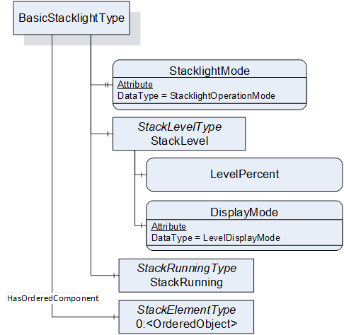
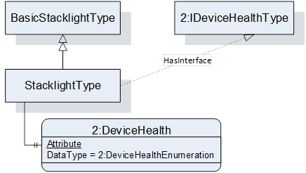
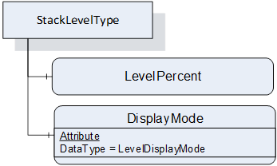
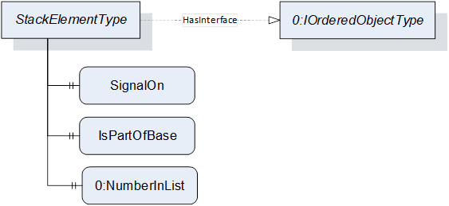
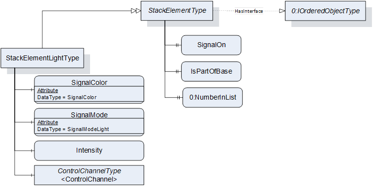
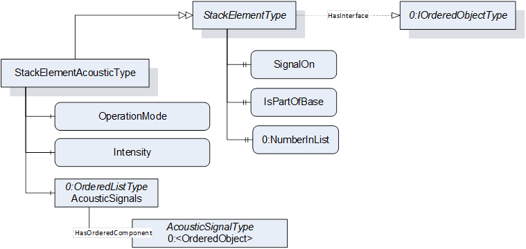
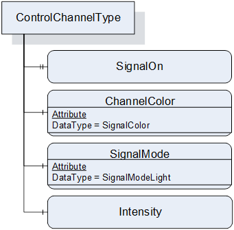
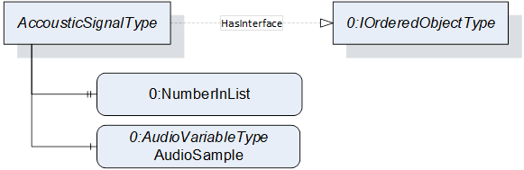
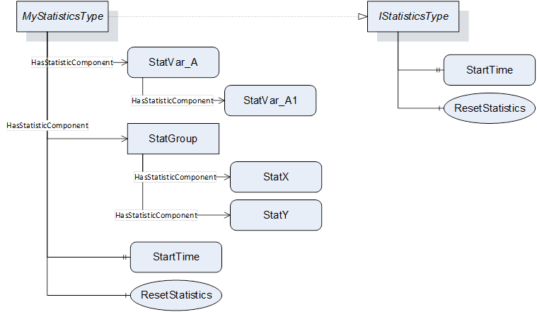
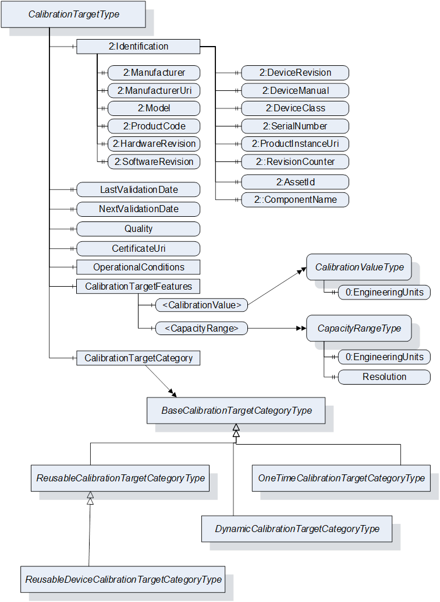

## 1 Scope  

This specification contains modelling concepts used in industrial automation.  

This version of the specification contains modelling concepts for:  

* Stacklights  

* Statistical Data  

* Calibration Target Management  

## 2 Normative references  

The following referenced documents are indispensable for the application of this OPC UA part. For dated references, only the edition cited applies. For undated references, the latest edition of the referenced document (including any amendments and errata) applies.  

  

OPC 10000-1, *OPC Unified Architecture - Part 1: Overview and Concepts*  

[http://www.opcfoundation.org/UA/Part1/](http://www.opcfoundation.org/UA/Part1/)  

OPC 10000-2, *OPC Unified Architecture - Part 2: Security Model*  

[http://www.opcfoundation.org/UA/Part2/](http://www.opcfoundation.org/UA/Part2/)  

OPC 10000-3, *OPC Unified Architecture - Part 3: Address Space Model*  

[http://www.opcfoundation.org/UA/Part3/](http://www.opcfoundation.org/UA/Part3/)  

OPC 10000-4, *OPC Unified Architecture - Part 4: Services*  

[http://www.opcfoundation.org/UA/Part4/](http://www.opcfoundation.org/UA/Part4/)  

OPC 10000-5, *OPC Unified Architecture - Part 5: Information Model*  

[http://www.opcfoundation.org/UA/Part5/](http://www.opcfoundation.org/UA/Part5/)  

OPC 10000-6, *OPC Unified Architecture - Part 6: Mappings*  

[http://www.opcfoundation.org/UA/Part6/](http://www.opcfoundation.org/UA/Part6/)  

OPC 10000-7, *OPC Unified Architecture - Part 7: Profiles*  

[http://www.opcfoundation.org/UA/Part7/](http://www.opcfoundation.org/UA/Part7/)  

OPC 10000-8, *OPC Unified Architecture - Part 8: Data Access*  

[http://www.opcfoundation.org/UA/Part8/](http://www.opcfoundation.org/UA/Part8/)  

OPC 10000-9, *OPC Unified Architecture - Part 9: Alarms and Conditions*  

[http://www.opcfoundation.org/UA/Part9/](http://www.opcfoundation.org/UA/Part9/)  

OPC 10000-10, *OPC Unified Architecture - Part 10: Programs*  

[http://www.opcfoundation.org/UA/Part10/](http://www.opcfoundation.org/UA/Part10/)  

OPC 10000-11, *OPC Unified Architecture - Part 11: Historical Access*  

[http://www.opcfoundation.org/UA/Part11/](http://www.opcfoundation.org/UA/Part11/)  

OPC 10000-12, *OPC Unified Architecture - Part 12: Discovery and Global Services*  

[http://www.opcfoundation.org/UA/Part12/](http://www.opcfoundation.org/UA/Part12/)  

OPC 10000-13, *OPC Unified Architecture - Part 13: Aggregates*  

[http://www.opcfoundation.org/UA/Part13/](http://www.opcfoundation.org/UA/Part13/)  

OPC 10000-14, *OPC Unified Architecture - Part 14: PubSub*  

[http://www.opcfoundation.org/UA/Part14/]()  

OPC 10001-1, *OPC Unified Architecture V1.04 - Amendment 1: AnalogItem Types*  

[http://www.opcfoundation.org/UA/Amendment1/](http://www.opcfoundation.org/UA/Amendment1/)  

OPC 10001-3, *OPC Unified Architecture V1.04 - Amendment 3: Method Metadata*  

[http://www.opcfoundation.org/UA/Amendment3/](http://www.opcfoundation.org/UA/Amendment3/)  

OPC 10001-5, *OPC Unified Architecture V1.04 - Amendment 5: Dictionary Reference*  

[http://www.opcfoundation.org/UA/Amendment5/](http://www.opcfoundation.org/UA/Amendment5/)  

OPC 10001-7, *OPC Unified Architecture V1.04 - Amendment 7: Interfaces and AddIns*  

[http://www.opcfoundation.org/UA/Amendment7/](http://www.opcfoundation.org/UA/Amendment7/)  

OPC 10001-11, *OPC Unified Architecture V1.04 - Amendment 11: Spatial Types*  

[http://www.opcfoundation.org/UA/Amendment11/](http://www.opcfoundation.org/UA/Amendment11/)  

OPC 10001-13, *OPC Unified Architecture V1.04 - Amendment 13: Ordered Lists*  

[http://www.opcfoundation.org/UA/Amendment13/](http://www.opcfoundation.org/UA/Amendment13/)  

OPC 10000-100, *OPC Unified Architecture - Part 100: Devices*  

[http://www.opcfoundation.org/UA/Part100/](http://www.opcfoundation.org/UA/Part100/)  

IEC60073, *Basic and Safety Principles for Man-Machine Interface, Marking and Identification - Coding Principles for Indicators and Actuators*  

RFC 3986, Uniform Resource Identifier (URI): Generic Syntax:  

[https://www.ietf.org/rfc/rfc3986.txt](https://www.ietf.org/rfc/rfc3986.txt)  

## 3 Terms, definitions, abbreviated terms, and conventions  

### 3.1 Terms and definitions  

For the purposes of this document, the terms and definitions given in OPC 10000-1, OPC 10000-3, OPC 10000-4, OPC 10000-5, OPC 10000-7, and OPC 10000-100 apply.  

All used terms are *italicized* in this document.  

### 3.2 Abbreviated terms  

  

UA Unified Architecture  

  

### 3.3 Conventions used in this document  

#### 3.3.1 Conventions for Node descriptions  

*Node* definitions are specified using tables (see [Table 2](/§\_Ref81297423) ).  

*Attributes* are defined by providing the *Attribute* name and a value, or a description of the value.  

*References* are defined by providing the *ReferenceType* name, the *BrowseName* of the *TargetNode* and its *NodeClass* .  

* If the *TargetNode* is a component of the *Node* being defined in the table the *Attributes* of the composed *Node* are defined in the same row of the table.  

* The *DataType* is only specified for *Variables* ; "[\<number\>]" indicates a single-dimensional array, for multi-dimensional arrays the expression is repeated for each dimension (e.g. [2][3] for a two-dimensional array). For all arrays the *ArrayDimensions* is set as identified by \<number\> values. If no \<number\> is set, the corresponding dimension is set to 0, indicating an unknown size. If no number is provided at all the *ArrayDimensions* can be omitted. If no brackets are provided, it identifies a scalar *DataType* and the *ValueRank* is set to the corresponding value (see [OPC 10000-3](/§UAPart3) ). In addition, *ArrayDimensions* is set to null or is omitted. If it can be Any or *ScalarOrOneDimension* , the value is put into "\{\<value\>\}", so either "\{Any\}" or "\{ *ScalarOrOneDimension* \}" and the *ValueRank* is set to the corresponding value (see [OPC 10000-3](/§UAPart3) ) and the *ArrayDimensions* is set to null or is omitted. Examples are given in [Table 1](/§\_Ref499807960) .  

Table 1 - Examples of DataTypes  

| **Notation** | **DataType** | **ValueRank** | **ArrayDimensions** | **Description** |
|---|---|---|---|---|
|0:Int32|0:Int32|\-1|omitted or null|A scalar Int32.|
|0:Int32[]|0:Int32|1|omitted or \{0\}|Single-dimensional array of Int32 with an unknown size.|
|0:Int32[][]|0:Int32|2|omitted or \{0,0\}|Two-dimensional array of Int32 with unknown sizes for both dimensions.|
|0:Int32[3][]|0:Int32|2|\{3,0\}|Two-dimensional array of Int32 with a size of 3 for the first dimension and an unknown size for the second dimension.|
|0:Int32[5][3]|0:Int32|2|\{5,3\}|Two-dimensional array of Int32 with a size of 5 for the first dimension and a size of 3 for the second dimension.|
|0:Int32\{Any\}|0:Int32|\-2|omitted or null|An Int32 where it is unknown if it is scalar or array with any number of dimensions.|
|0:Int32\{ScalarOrOneDimension\}|0:Int32|\-3|omitted or null|An Int32 where it is either a single-dimensional array or a scalar.|
  

  

* The TypeDefinition is specified for *Objects* and *Variables* .  

* The TypeDefinition column specifies a symbolic name for a *NodeId* , i.e. the specified *Node* points with a *HasTypeDefinition* *Reference* to the corresponding *Node* .  

* The *ModellingRule* of the referenced component is provided by specifying the symbolic name of the rule in the *ModellingRule* column. In the *AddressSpace* , the *Node* shall use a *HasModellingRule* *Reference* to point to the corresponding *ModellingRule* *Object* .  

If the *NodeId* of a *DataType* is provided, the symbolic name of the *Node* representing the *DataType* shall be used.  

Note that if a symbolic name of a different namespace is used, it is prefixed by the *NamespaceIndex* (see [Table 71](/§\_Ref16577438) ).  

*Nodes* of all other *NodeClasses* cannot be defined in the same table; therefore, only the used *ReferenceType* , their *NodeClass* and their *BrowseName* are specified. A reference to another part of this document points to their definition.  

[Table 2](/§\_Ref81297423) illustrates the table. If no components are provided, the DataType, TypeDefinition and Other columns may be omitted and only a Comment column is introduced to point to the *Node* definition.  

Table 2 - Type Definition Table  

| **Attribute** | **Value** |
|---|---|
|Attribute name|Attribute value. If it is an optional Attribute that is not set "--" is used.|
|||
  
| **References** | **NodeClass** | **BrowseName** | **DataType** | **TypeDefinition** | **Other** |
|---|---|---|---|---|---|
|*ReferenceType* name|*NodeClass* of the *TargetNode* .|*BrowseName* of the target *Node* . If the *Reference* is to be instantiated by the server, then the value of the target Node's BrowseName is "--".|*DataType* of the referenced *Node* , only applicable for *Variables* .|*TypeDefinition* of the referenced *Node* , only applicable for *Variables* and *Objects* .|Additional characteristics of the *TargetNode* such as the *ModellingRule* or *AccessLevel* .|
|NOTE Notes referencing footnotes of the table content.|
  

  

Components of *Nodes* can be complex that is containing components by themselves. The *TypeDefinition* , *NodeClass* and *DataType* can be derived from the type definitions, and the symbolic name can be created as defined in [Annex A](/§\_Ref36217027) . Therefore, those containing components are not explicitly specified; they are implicitly specified by the type definitions.  

The Other column defines additional characteristics of the Node. Examples of characteristics that can appear in this column are show in [Table 3](/§\_Ref16778333) .  

Table 3 - Examples of Other Characteristics  

| **Name** | **Short Name** | **Description** |
|---|---|---|
|0:Mandatory|M|The *Node* has the *Mandatory* *ModellingRule* .|
|0:Optional|O|The *Node* has the *Optional* *ModellingRule.*|
|0:MandatoryPlaceholder|MP|The *Node* has the *MandatoryPlaceholder ModellingRule.*|
|0:OptionalPlaceholder|OP|The *Node* has the *OptionalPlaceholder ModellingRule.*|
|ReadOnly|RO|The *Node* *AccessLevel* has the *CurrentRead* bit set but not the *CurrentWrite* bit.|
|ReadWrite|RW|The *Node* *AccessLevel* has the *CurrentRead* and *CurrentWrite* bits set.|
|WriteOnly|WO|The Node AccessLevel has the *CurrentWrite* bit set but not the *CurrentRead* bit.|
  

If multiple characteristics are defined, they are separated by commas. The name or the short name may be used.  

##### 3.3.1.1 Additional References  

To provide information about additional *References* , the format as shown in [Table 4](/§\_Ref55118538) is used.  

Table 4 - \<some\>Type Additional References  

| **SourceBrowsePath** | **Reference Type** | **Is Forward** | **TargetBrowsePath** |
|---|---|---|---|
|SourceBrowsePath is always relative to the *TypeDefinition* . Multiple elements are defined as separate rows of a nested table.|*ReferenceType* name|True = forward *Reference* .|TargetBrowsePath points to another *Node* , which can be a well-known instance or a *TypeDefinition* . You can use *BrowsePaths* here as well, which is either relative to the *TypeDefinition* or absolute. If absolute, the first entry needs to refer to a type or well-known instance, uniquely identified within a namespace by the *BrowseName* .|
  

  

*References* can be to any other *Node* .  

##### 3.3.1.2 Additional sub-components  

To provide information about sub-components, the format as shown in [Table 5](/§\_Ref55125045) is used.  

Table 5 - \<some\>Type Additional Subcomponents  

| **BrowsePath** | **References** | **NodeClass** | **BrowseName** | **DataType** | **TypeDefinition** | **Others** |
|---|---|---|---|---|---|---|
|BrowsePath is always relative to the *TypeDefinition* . Multiple elements are defined as separate rows of a nested table|NOTE Same as for [Table 2](/§\_Ref81297423)|
  

  

  

##### 3.3.1.3 Additional Attribute values  

The type definition table provides columns to specify the values for required *Node* *Attributes* for *InstanceDeclarations* . To provide information about additional *Attributes* , the format as shown in [Table 6](/§\_Ref55119200) is used.  

Table 6 - \<some\>Type Attribute values for child Nodes  

| **BrowsePath** | **\<Attribute name\> Attribute** |
|---|---|
|BrowsePath is always relative to the *TypeDefinition* . Multiple elements are defined as separate rows of a nested table|The values of attributes are converted to text by adapting the reversible JSON encoding rules defined in OPC 10000-6. If the JSON encoding of a value is a JSON string or a JSON number then that value is entered in the value field. Double quotes are not included. If the DataType includes a NamespaceIndex (QualifiedNames, NodeIds or ExpandedNodeIds) then the notation used for BrowseNames is used. If the value is an Enumeration the name of the enumeration value is entered. If the value is a Structure then a sequence of name and value pairs is entered. Each pair is followed by a newline. The name is followed by a colon. The names are the names of the fields in the DataTypeDefinition. If the value is an array of non-structures then a sequence of values is entered where each value is followed by a newline. If the value is an array of Structures or a Structure with fields that are arrays or with nested Structures then the complete JSON array or JSON object is entered. Double quotes are not included.|
  

  

There can be multiple columns to define more than one *Attribute* .  

#### 3.3.2 NodeIds and BrowseNames  

##### 3.3.2.1 NodeIds  

The *NodeIds* of all *Nodes* described in this standard are only symbolic names. [Annex A](/§\_Ref36389465) defines the actual *NodeIds* .  

The symbolic name of each *Node* defined in this document is its *BrowseName* , or, when it is part of another *Node* , the *BrowseName* of the other *Node* , a ".", and the *BrowseName* of itself. In this case "part of" means that the whole has a *HasProperty* or *HasComponent* *Reference* to its part. Since all *Nodes* not being part of another *Node* have a unique name in this document, the symbolic name is unique.  

The *NamespaceUri* for all *NodeIds* defined in this document is defined in Annex A. The *NamespaceIndex* for this *NamespaceUri* is vendor-specific and depends on the position of the *NamespaceUri* in the server namespace table.  

Note that this document not only defines concrete *Nodes* , but also requires that some *Nodes* shall be generated, for example one for each *Session* running on the *Server* . The *NodeIds* of those *Nodes* are *Server*\-specific, including the namespace. But the *NamespaceIndex* of those *Nodes* cannot be the *NamespaceIndex* used for the *Nodes* defined in this document, because they are not defined by this document but generated by the *Server* .  

##### 3.3.2.2 BrowseNames  

The text part of the *BrowseNames* for all *Nodes* defined in this document is specified in the tables defining the *Nodes* . The *NamespaceUri* for all *BrowseNames* defined in this document is defined in Annex A.  

For *InstanceDeclarations* of *NodeClass* *Object* and *Variable* that are placeholders ( *OptionalPlaceholder* and *MandatoryPlaceholder* *ModellingRule* ), the *BrowseName* and the *DisplayName* are enclosed in angle brackets (\<\>) as recommended in [OPC 10000-3](/§UAPart3) . If the *BrowseName* is not defined by this document, a namespace index prefix is added to the *BrowseName* (e.g., prefix '0' leading to '0:EngineeringUnits' or prefix '2' leading to '2:DeviceRevision'). This is typically necessary if a *Property* of another specification is overwritten or used in the OPC UA types defined in this document. [Table 71](/§\_Ref16577438) provides a list of namespaces and their indexes as used in this document.  

#### 3.3.3 Common Attributes  

##### 3.3.3.1 General  

The *Attributes* of *Nodes* , their *DataTypes* and descriptions are defined in [OPC 10000-3](/§UAPart3) . Attributes not marked as optional are mandatory and shall be provided by a *Server* . The following tables define if the *Attribute* value is defined by this document or if it is server-specific.  

For all *Nodes* specified in this document, the *Attributes* named in [Table 7](/§\_Ref499807592) shall be set as specified in the table.  

Table 7 - Common Node Attributes  

| **Attribute** | **Value** |
|---|---|
|DisplayName|The *DisplayName* is a *LocalizedText* . Each server shall provide the *DisplayName* identical to the *BrowseName* of the *Node* for the *LocaleId* "en". Whether the server provides translated names for other *LocaleIds* are server-specific.|
|Description|Optionally a server-specific description is provided.|
|NodeClass|Shall reflect the *NodeClass* of the *Node.*|
|NodeId|The *NodeId* is described by *BrowseNames* as defined in [3.3.2.1](/§\_Ref499808407) .|
|WriteMask|Optionally the *WriteMask* *Attribute* can be provided. If the *WriteMask* *Attribute* is provided, it shall set all non-server-specific *Attributes* to not writable. For example, the *Description* *Attribute* may be set to writable since a *Server* may provide a server-specific description for the *Node* . The *NodeId* shall not be writable, because it is defined for each *Node* in this document.|
|UserWriteMask|Optionally the *UserWriteMask* *Attribute* can be provided. The same rules as for the *WriteMask* *Attribute* apply.|
|RolePermissions|Optionally server-specific role permissions can be provided.|
|UserRolePermissions|Optionally the role permissions of the current Session can be provided. The value is server-specific and depends on the *RolePermissions* *Attribute* (if provided) and the current *Session* .|
|AccessRestrictions|Optionally server-specific access restrictions can be provided.|
  

  

##### 3.3.3.2 Objects  

For all *Objects* specified in this document, the *Attributes* named in [Table 8](/§\_Ref499807626) shall be set as specified in the [Table 8](/§\_Ref499807626) . The definitions for the *Attributes* can be found in [OPC 10000-3](/§UAPart3) .  

Table 8 - Common Object Attributes  

| **Attribute** | **Value** |
|---|---|
|EventNotifier|Whether the *Node* can be used to subscribe to *Events* or not is server-specific.|
  

  

##### 3.3.3.3 Variables  

For all *Variables* specified in this document, the *Attributes* named in [Table 9](/§\_Ref499807645) shall be set as specified in the table. The definitions for the *Attributes* can be found in [OPC 10000-3](/§UAPart3) .  

Table 9 - Common Variable Attributes  

| **Attribute** | **Value** |
|---|---|
|MinimumSamplingInterval|Optionally, a server-specific minimum sampling interval is provided.|
|AccessLevel|The access level for *Variables* used for type definitions is server-specific, for all other *Variables* defined in this document, the access level shall allow reading; other settings are server-specific.|
|UserAccessLevel|The value for the *UserAccessLevel* *Attribute* is server-specific. It is assumed that all *Variables* can be accessed by at least one user.|
|Value|For *Variables* used as *InstanceDeclarations,* the value is server-specific; otherwise it shall represent the value described in the text.|
|ArrayDimensions|If the *ValueRank* does not identify an array of a specific dimension (i.e. *ValueRank* \<= 0) the *ArrayDimensions* can either be set to null or the *Attribute* is missing. This behaviour is server-specific. If the *ValueRank* specifies an array of a specific dimension (i.e. *ValueRank* \> 0) then the *ArrayDimensions* *Attribute* shall be specified in the table defining the *Variable* .|
|Historizing|The value for the *Historizing* *Attribute* is server-specific.|
|AccessLevelEx|If the *AccessLevelEx* *Attribute* is provided, it shall have the bits 8, 9, and 10 set to 0, meaning that read and write operations on an individual *Variable* are atomic, and arrays can be partly written.|
  

  

##### 3.3.3.4 VariableTypes  

For all *VariableTypes* specified in this document, the *Attributes* named in [Table 10](/§\_Ref499807679) shall be set as specified in the table. The definitions for the *Attributes* can be found in [OPC 10000-3](/§UAPart3) .  

Table 10 - Common VariableType Attributes  

| **Attributes** | **Value** |
|---|---|
|Value|Optionally a server-specific default value can be provided.|
|ArrayDimensions|If the *ValueRank* does not identify an array of a specific dimension (i.e. *ValueRank* \<= 0) the *ArrayDimensions* can either be set to null or the *Attribute* is missing. This behaviour is server-specific. If the *ValueRank* specifies an array of a specific dimension (i.e. *ValueRank* \> 0) then the *ArrayDimensions* *Attribute* shall be specified in the table defining the *VariableType* .|
  

  

##### 3.3.3.5 Methods  

For all *Methods* specified in this document, the *Attributes* named in [Table 11](/§\_Ref497310130) shall be set as specified in the table. The definitions for the *Attributes* can be found in [OPC 10000-3](/§UAPart3) .  

Table 11 - Common Method Attributes  

| **Attributes** | **Value** |
|---|---|
|Executable|All *Methods* defined in this document shall be executable ( *Executable* *Attribute* set to "True"), unless it is defined differently in the *Method* definition.|
|UserExecutable|The value of the *UserExecutable* *Attribute* is server-specific. It is assumed that all *Methods* can be executed by at least one user.|
  

  

## 4 Concept  

This specification contains modelling concepts for industrial automation. The concepts can be used independent of each other and are organized in individual sections.  

## 5 Stacklights  

### 5.1 Overview  

A stacklight is used to visually or acoustically indicate the state or a specific event of an automation component. This section defines a base modelling constructs to represent stacklights in an OPC UA Information Model.  

### 5.2 OPC UA ObjectTypes  

#### 5.2.1 BasicStacklightType  

  

 **Figure 1 BasicStacklightType overview**   

The *BasicStacklightType* is the entry point to a stacklight. It contains the elements of the stacklight as well as additional information valid for the whole unit. In [Figure 1](/§\_Ref36540195) , a graphical overview is given. It is formally defined in [Table 12](/§\_Ref24993648) .  

Table 12 - BasicStacklightType Definition  

| **Attribute** | **Value** |
|---|---|
|BrowseName|BasicStacklightType|
|IsAbstract|False|
|Description|Entry point to a stacklight containing elements of the stacklight as well as additional information valid for the whole unit.|
  
| **References** | **Node Class** | **BrowseName** | **DataType** | **TypeDefinition** | **Other** |
|---|---|---|---|---|---|
|Subtype of the OrderedListType defined in [OPC 10001-13](/§UaAmendmentxx) , i.e. inheriting the InstanceDeclarations of that Node.|
|0:HasProperty|Variable|StacklightMode|StacklightOperationMode|0:PropertyType|M|
|0:HasComponent|Object|StackLevel||StackLevelType|O|
|0:HasComponent|Object|StackRunning||StackRunningType|O|
|0:HasOrderedComponent|Object|0:\<OrderedObject\>||StackElementType|OP|
  

  

*StacklightMode* shows in what way (stack of individual lights, level meter, running light) the stacklight unit is used.  

*StackLevel* is only valid if the stacklight is used in "Levelmeter" *StacklightMode* . If so, the whole stack is controlled by a single percentual value. In this case, the *SignalOn* parameter of any \< *OrderedObject* \> of *StackElementLightType* has no meaning.  

*StackRunning* is only valid if the stacklight is used in "Running\_Light" *StacklightMode* .  

The ordered component(s) \< *OrderedObject* \> represent the stack elements (lamps and acoustic elements) the stacklight is composed of. The *HasOrderedComponent* *Reference* shall represent the ordering from the base of the stacklight.  

The *InstanceDeclarations* of the *BasicStacklightType* have the *Attribute* values defined in [Table 13](/§\_Ref37190764) .  

Table 13 - BasicStacklightType Attribute values for child Nodes  

| **Source Path** | **Value** | **Description** |
|---|---|---|
|StacklightMode|\-|Shows in what way (stack of individual lights, level meter, running light) the stacklight unit is used.|
|StackLevel|\-|Valid if the stacklight is used in "Levelmeter" StacklightMode. If so, the whole stack is controlled by a single percentual value. In this case, the SignalOn parameter of any stack element of StackElementLightType has no meaning.|
|StackRunning|\-|Valid if the stacklight is used in "Running\_Light" StacklightMode.|
|0:\<OrderedObject\>|\-|Represent the stack elements (lamps and acoustic elements) the stacklight is composed of. The HasOrderedComponent Reference shall represent the ordering from the base of the stacklight.|
  

  

#### 5.2.2 StacklightType  

  

 **Figure 2 StacklightType overview**   

The *StacklightType* is a subtype of the *BasicStacklightType* . It adds the possibility to show the stacklight's health status. In [Figure 2](/§\_Ref36540351) , a graphical overview is given. It is formally defined in [Table 14](/§\_Ref34059756) .  

Table 14 - StacklightType Definition  

| **Attribute** | **Value** |
|---|---|
|BrowseName|StacklightType|
|IsAbstract|False|
|Description|Entry point to a stacklight with the possibility to show the stacklight's health status.|
  
| **References** | **Node Class** | **BrowseName** | **DataType** | **TypeDefinition** | **Other** |
|---|---|---|---|---|---|
|Subtype of the BasicStacklightType defined in [5.2.1](/§\_Ref36541663) , i.e. inheriting the InstanceDeclarations of that Node.|
|0:HasInterface|ObjectType|2:IDeviceHealthType||||
|Properties of the 2:IDeviceHealthType|
|0:HasComponent|Variable|2:DeviceHealth|2:DeviceHealthEnumeration|0:BaseDataVariableType|O|
|0:HasComponent|Object|2:DeviceHealthAlarms||0:FolderType|O|
  

  

*DeviceHealth* , defined in *IDeviceHealthType,* indicates the health status of the stacklight and shall be used as specified in [OPC 10000-100](/§UAPart100) .  

*DeviceHealthAlarms* , defined in *IDeviceHealthType,* can be used to expose alarm instances and shall be used as specified in [OPC 10000-100](/§UAPart100) .  

The *InstanceDeclarations* of the *StacklightType* have the *Attribute* values defined in [Table 15](/§\_Ref37191032) .  

Table 15 - StacklightType Attribute values for child Nodes  

| **Source Path** | **Value** | **Description** |
|---|---|---|
|2:DeviceHealth|\-|Contains the health status information of the stacklight.|
|2:DeviceHealthAlarms|\-|Contains alarms of the stacklights providing more detailed information on the health of the stacklight.|
  

  

#### 5.2.3 StackLevelType  

  

 **Figure 3 StackLevelType overview**   

The *StackLevelType* contains the information relevant to a stacklight operating as a level meter. The whole stack is controlled by a percentual value. In [Figure 3](/§\_Ref36540813) , a graphical overview is given. It is formally defined in [Table 16](/§\_Ref34060649) .  

Table 16 - StackLevelType Definition  

| **Attribute** | **Value** |
|---|---|
|BrowseName|StackLevelType|
|IsAbstract|False|
|Description|Contains information relevant to a stacklight operating as a level meter. The whole stack is controlled by a percentual value.|
  
| **References** | **Node Class** | **BrowseName** | **DataType** | **TypeDefinition** | **Other** |
|---|---|---|---|---|---|
|Subtype of the BaseObjectType defined in OPC 10000-5 i.e. inheriting the InstanceDeclarations of that Node.|
|0:HasComponent|Variable|LevelPercent|0:Float|0:AnalogItemType|M|
|0:HasComponent|Variable|DisplayMode|LevelDisplayMode|0:BaseDataVariableType|M|
  

  

*LevelPercent* shows the percentual value the stacklight is representing. The mandatory EURange *Property* of the *Variable* indicates the lowest and highest value and thereby allows to calculate the percentage represented by the value. The lowest value is interpreted as 0 percent, the highest is interpreted as 100 percent.  

*DisplayMode* indicates in what way the percentual value is displayed with the stacklight.  

The *InstanceDeclarations* of the *StackLevelType* have the *Attribute* values defined in [Table 17](/§\_Ref37191272) .  

Table 17 - StackLevelType Attribute values for child Nodes  

| **Source Path** | **Value** | **Description** |
|---|---|---|
|LevelPercent|\-|Shows the percentual value the stacklight is representing. The mandatory EURange Property of the Variable indicates the lowest and highest value and thereby allows to calculate the percentage represented by the value. The lowest value is interpreted as 0 percent, the highest is interpreted as 100 percent.|
|DisplayMode|\-|Indicates in what way the percentual value is displayed with the stacklight.|
  

  

#### 5.2.4 StackRunningType  

The *StackRunningType* contains the information relevant to a stacklight operating as a running light. This base type does not define any specific information, but can be extended. This *Object* is only of relevance when the *StacklightMode* is in mode "Running\_Light". It is formally defined in [Table 18](/§\_Ref34060787) .  

Table 18 - StackRunningType Definition  

| **Attribute** | **Value** |
|---|---|
|BrowseName|StackRunningType|
|IsAbstract|False|
|Description|Contains information relevant to a stacklight operating as a running light. This base type does not define any specific information, but can be extended.|
  
| **References** | **Node Class** | **BrowseName** | **DataType** | **TypeDefinition** | **Other** |
|---|---|---|---|---|---|
|Subtype of the BaseObjectType defined in OPC 10000-5 i.e. inheriting the InstanceDeclarations of that Node.|
  

  

#### 5.2.5 StackElementType  

  

 **Figure 4 StackElementType overview**   

The *StackElementType* is the base class for elements in a stacklight. The elements are used in an ordered list. In [Figure 4](/§\_Ref36541037) , a graphical overview is given. It is formally defined in [Table 19](/§\_Ref34061253) .  

Table 19 - StackElementType Definition  

| **Attribute** | **Value** |
|---|---|
|BrowseName|StackElementType|
|IsAbstract|True|
|Description|Base class for elements in a stacklight.|
  
| **References** | **Node Class** | **BrowseName** | **DataType** | **TypeDefinition** | **Other** |
|---|---|---|---|---|---|
|Subtype of the BaseObjectType defined in OPC 10000-5 i.e. inheriting the InstanceDeclarations of that Node.|
|0:HasInterface|ObjectType|0:IOrderedObjectType||||
|0:HasProperty|Variable|SignalOn|0:Boolean|0:PropertyType|O|
|0:HasProperty|Variable|IsPartOfBase|0:Boolean|0:PropertyType|O|
|0:HasProperty|Variable|0:NumberInList|0:UInteger|0:PropertyType|M|
  

  

*SignalOn* indicates if the signal emitted by the stack element is currently switched on or not.  

*IsPartOfBase* indicates, if the element is contained in the mounting base of the stacklight. All elements contained in the mounting base shall be at the beginning of the list of stack elements.  

*NumberInList* is defined in the *IOrderedObjectType* and used in conjunction with the *HasOrderedComponent* *Reference* of the *BasicStacklightType* . It shall contain the same ordering information as the *Reference* and enumerate the stacklight elements counting upwards beginning from the base of the stacklight.  

The *InstanceDeclarations* of the *StackElementType* have the *Attribute* values defined in [Table 20](/§\_Ref37191957) .  

Table 20 - StackElementType Attribute values for child Nodes  

| **Source Path** | **Value** | **Description** |
|---|---|---|
|SignalOn|\-|Indicates if the signal emitted by the stack element is currently switched on or not.|
|IsPartOfBase|\-|Indicates, if the element is contained in the mounting base of the stacklight. All elements contained in the mounting base shall be at the beginning of the list of stack elements.|
|0:NumberInList|\-|Enumerate the stacklight elements counting upwards beginning from the base of the stacklight.|
  

  

#### 5.2.6 StackElementLightType  

  

 **Figure 5 StackElementLightType overview**   

The *StackElementLightType* represents a lamp element in a stacklight. In [Figure 5](/§\_Ref36541497) , a graphical overview is given. It is formally defined in [Table 21](/§\_Ref36541521) .  

Table 21 - StackElementLightType Definition  

| **Attribute** | **Value** |
|---|---|
|BrowseName|StackElementLightType|
|IsAbstract|False|
|Description|Represents a lamp element in a stacklight.|
  
| **References** | **Node Class** | **BrowseName** | **DataType** | **TypeDefinition** | **Other** |
|---|---|---|---|---|---|
|Subtype of the StackElementType defined in [5.2.5](/§\_Ref36541712) , i.e. inheriting the InstanceDeclarations of that Node.|
|0:HasComponent|Variable|SignalColor|SignalColor|0:BaseDataVariableType|O|
|0:HasComponent|Variable|SignalMode|SignalModeLight|0:BaseDataVariableType|O|
|0:HasComponent|Variable|Intensity|0:Float|0:AnalogItemType|O|
|0:HasComponent|Object|\<ControlChannel\>||ControlChannelType|OP|
  

  

For the *StackElementLightType* , either the *Variables* *SignalColor* , *SignalOn* , *SignalMode* and *Intensity* shall be used to indicate the respective values for the lamp element or separate *ControlChannels* per available and individually controllable colour channel shall be used (e.g. in RGB or RGBW lamp elements). The two concepts shall not be used in conjunction in a single *StackElementLightType* instance.  

*SignalColor* indicates the colour the lamp element has when switched on.  

*SignalMode* shows in what way the lamp is used (continuous light, flashing, blinking) when switched on.  

*Intensity* shows the intensity of the lamp, thus its brightness. The mandatory EURange *Property* of the *Variable* indicates the lowest and highest value and thereby allows to calculate the percentage represented by the value. The lowest value is interpreted as 0 percent, the highest is interpreted as 100 percent.  

The list of *\<ControlChannel\>* instances shows the control information for each independent colour channel of the stacked element.  

The *InstanceDeclarations* of the *StackElementLightType* have the *Attribute* values defined in [Table 22](/§\_Ref37192056) .  

Table 22 - StackElementLightType Attribute values for child Nodes  

| **Source Path** | **Value** | **Description** |
|---|---|---|
|SignalColor|\-|Indicates the colour the lamp element has when switched on.|
|SignalMode|\-|Shows in what way the lamp is used (continuous light, flashing, blinking) when switched on.|
|Intensity|\-|Intensity of the lamp, thus its brightness. The mandatory EURange Property of the Variable indicates the lowest and highest value and thereby allows to calculate the percentage represented by the value. The lowest value is interpreted as 0 percent, the highest is interpreted as 100 percent.|
|\<ControlChannel\>|\-|The list of \<ControlChannel\> instances shows the control information for each independent colour channel of the stacked element.|
  

  

#### 5.2.7 StackElementAcousticType  

  

 **Figure 6 StackElementAcousticType overview**   

The *StackElementAcousticType* represents an acoustic element in a stacklight. In [Figure 6](/§\_Ref36541832) , a graphical overview is given. It is formally defined in [Table 23](/§\_Ref34062562) .  

Table 23 - StackElementAcousticType Definition  

| **Attribute** | **Value** |
|---|---|
|BrowseName|StackElementAcousticType|
|IsAbstract|False|
|Description|Represents an acoustic element in a stacklight.|
  
| **References** | **Node Class** | **BrowseName** | **DataType** | **TypeDefinition** | **Other** |
|---|---|---|---|---|---|
|Subtype of the StackElementType defined in [5.2.5](/§\_Ref36541712) , i.e. inheriting the InstanceDeclarations of that Node.|
|0:HasComponent|Variable|OperationMode|0:UInteger|0:BaseDataVariableType|M|
|0:HasComponent|Variable|Intensity|0:Float|0:AnalogItemType|O|
|0:HasComponent|Object|AcousticSignals||0:OrderedListType|M|
  

  

*OperationMode* indicates what signal of the list of *AcousticSignalType* nodes is played when the acoustic element is switched on. It shall contain an index matching the *NumberInList* *Property* of the respective *AcousticSignalType* *Object* of *AcousticSignals* .  

*Intensity* indicates the sound pressure level of the acoustic signal when switched on. This value shall only have positive values. The mandatory EURange *Property* of the *Variable* indicates the lowest and highest value and thereby allows to calculate the percentage represented by the value. The lowest value is interpreted as 0 percent, the highest is interpreted as 100 percent.  

*AcousticSignals* contains a list of audio signals used by this acoustic stacklight element.  

The components of the *StackElementAcousticType* have additional *References* which are defined in [Table 24](/§\_Ref26525827) .  

Table 24 - StackElementAcousticType Additional Subcomponents  

| **Source Path** | **References** | **NodeClass** | **BrowseName** | **DataType** | **TypeDefinition** | **Others** |
|---|---|---|---|---|---|---|
|AcousticSignals|0:HasOrderedComponent|Object|0:\<OrderedObject\>||AcousticSignalType|MP|
  

  

The *InstanceDeclarations* of the *StackElementAcousticType* have the *Attribute* values defined in [Table 25](/§\_Ref37192583) .  

Table 25 - StackElementAcousticType Attribute values for child Nodes  

| **Source Path** | **Value** | **Description** |
|---|---|---|
|OperationMode|\-|Indicates what signal of the list of AcousticSignalType nodes is played when the acoustic element is switched on. It shall contain an index into the NumberInList of the respective AcousticSignalType Object of AcousticSignals.|
|Intensity|\-|Indicates the sound pressure level of the acoustic signal when switched on. This value shall only have positive values. The mandatory EURange Property of the Variable indicates the lowest and highest value and thereby allows to calculate the percentage represented by the value. The lowest value is interpreted as 0 percent, the highest is interpreted as 100 percent.|
|AcousticSignals|\-|Contains a list of audio signals used by this acoustic stacklight element.|
AcousticSignals|0:\<OrderedObject\>||\-|Represents an acoustic signal.|
  

  

#### 5.2.8 ControlChannelType  

  

 **Figure 7 ControlChannelType overview**   

The *ControlChannelType* is used for control channels of single colour elements within a stack element (e.g. RGB elements would use three *ControlChannels* , one for each controllable colour). In [Figure 7](/§\_Ref36541939) , a graphical overview is given. It is formally defined in [Table 26](/§\_Ref34063872) .  

Table 26 - ControlChannelType Definition  

| **Attribute** | **Value** |
|---|---|
|BrowseName|ControlChannelType|
|IsAbstract|False|
|Description|Used for control channels of single colour elements within a stack element (e.g. RGB elements would use three ControlChannels, one for each controllable colour).|
  
| **References** | **Node Class** | **BrowseName** | **DataType** | **TypeDefinition** | **Other** |
|---|---|---|---|---|---|
|Subtype of the BaseObjectType defined in OPC 10000-5 i.e. inheriting the InstanceDeclarations of that Node.|
|0:HasProperty|Variable|SignalOn|0:Boolean|0:PropertyType|M|
|0:HasComponent|Variable|ChannelColor|SignalColor|0:BaseDataVariableType|M|
|0:HasComponent|Variable|SignalMode|SignalModeLight|0:BaseDataVariableType|M|
|0:HasComponent|Variable|Intensity|0:Float|0:AnalogItemType|O|
  

  

*SignalOn* indicates if the colour is switched on.  

*ChannelColor* shows the channel's colour.  

*SignalMode* indicates in what mode (continuously on, blinking, flashing) the channel operates when switched on.  

*Intensity* shows the channel's intensity, thus its brightness. The mandatory EURange *Property* of the *Variable* indicates the lowest and highest value and thereby allows to calculate the percentage represented by the value. The lowest value is interpreted as 0 percent, the highest is interpreted as 100 percent.  

The *InstanceDeclarations* of the *ControlChannelType* have the *Attribute* values defined in [Table 27](/§\_Ref37192629) .  

Table 27 - ControlChannelType Attribute values for child Nodes  

| **Source Path** | **Value** | **Description** |
|---|---|---|
|SignalOn|\-|Indicates if the colour is switched on.|
|ChannelColor|\-|Indicates in what mode (continuously on, blinking, flashing) the channel operates when switched on.|
|SignalMode|\-|Contains a list of audio signals used by this acoustic stacklight element.|
|Intensity|\-|Shows the channel's intensity, thus its brightness. The mandatory EURange Property of the Variable indicates the lowest and highest value and thereby allows to calculate the percentage represented by the value. The lowest value is interpreted as 0 percent, the highest is interpreted as 100 percent.|
  

  

#### 5.2.9 AcousticSignalType  

  

 **Figure 8 AcousticSignalType overview**   

The *AcousticSignalType* represents an acoustic signal. It is used in an ordered list. In [Figure 8](/§\_Ref36546173) , a graphical overview is given. It is formally defined in [Table 28](/§\_Ref36546192) .  

Table 28 - AcousticSignalType Definition  

| **Attribute** | **Value** |
|---|---|
|BrowseName|AcousticSignalType|
|IsAbstract|False|
|Description|Represents an acoustic signal.|
  
| **References** | **Node Class** | **BrowseName** | **DataType** | **TypeDefinition** | **Other** |
|---|---|---|---|---|---|
|Subtype of the BaseObjectType defined in [OPC 10000-5](/§UAPart5) , i.e. inheriting the InstanceDeclarations of that Node.|
|0:HasInterface|ObjectType|0:IOrderedObjectType||||
|0:HasProperty|Variable|0:NumberInList|0:UInteger|0:PropertyType|M|
|0:HasComponent|Variable|AudioSample|0:AudioDataType|0:BaseDataVariableType|O|
  

  

The *Description* *Attribute* of each *Object* of type *AcousticSignalType* should be used as textual description of the audio signal, e.g. "Buzzer 100Hz".  

*NumberInList* is defined in *IOrderedObjectType* and used in conjunction with the *HasOrderedComponent* *Reference* of the *AcousticSignals Object* . Instances of *StackElementAcousticType* index into this number using the *OperationMode* *Property* .  

*AudioSample* contains the audio data, e.g. for devices capable of audio playback.  

The *InstanceDeclarations* of the *AcousticSignalType* have the *Attribute* values defined in [Table 29](/§\_Ref45892604) .  

Table 29 - AcousticSignalType Attribute values for child Nodes  

| **Source Path** | **Value** | **Description** |
|---|---|---|
|0:NumberInList|\-|Enumerate the acoustic signals. Instances of StackElementAcousticType index into this number using the OperationMode Property.|
|AudioSample|\-|Contains the audio data, e.g. for devices capable of audio playback.|
  

  

### 5.3 OPC UA DataTypes  

#### 5.3.1 StacklightOperationMode  

The *StacklightOperationMode* *Enumeration* *DataType* contains the values used to indicate how a stacklight (as a whole unit) is used. The contents of its *EnumStrings* are defined in [Table 30](/§\_Ref24981902) .  

Table 30 - StacklightOperationMode EnumStrings Fields  

| **Name** | **Value** | **Description** |
|---|---|---|
|Segmented|0|Stacklight is used as stack of individual lights|
|Levelmeter|1|Stacklight is used as level meter|
|Running\_Light|2|The whole stack acts as a running light|
|Other|3|Stacklight is used in a way not defined in this version of the specification|
  

  

Its representation in the *AddressSpace* is defined in [Table 31](/§\_Ref24981909) .  

Table 31 - StacklightOperationMode Definition  

| **Attribute** | **Value** |
|---|---|
|BrowseName|StacklightOperationMode|
|IsAbstract|False|
|Description|Contains the values used to indicate how a stacklight (as a whole unit) is used.|
  
| **References** | **NodeClass** | **BrowseName** | **DataType** | **TypeDefinition** | **Other** |
|---|---|---|---|---|---|
|Subtype of the Enumeration type defined in OPC 10000-3|
|0:HasProperty|Variable|0:EnumValues|0:EnumValueType[]|0:PropertyType|M|
  

  

#### 5.3.2 LevelDisplayMode  

The *LevelDisplayMode* *Enumeration* *DataType* contains the values used to indicate how a percentual value is displayed if the stacklight unit works in Levelmeter mode. The contents of its *EnumStrings* are defined in [Table 32](/§\_Ref34132000) .  

Table 32 - LevelDisplayMode EnumStrings Fields  

| **Name** | **Value** | **Description** |
|---|---|---|
|Dimmed|0|Uses dimming to display fractions.|
|Blinking|1|Uses blinking to display fractions.|
|Other|2|Display fractions in a way not defined in this version of the specification.|
  

  

Its representation in the *AddressSpace* is defined in [Table 33](/§\_Ref34132009) .  

Table 33 - LevelDisplayMode Definition  

| **Attribute** | **Value** |
|---|---|
|BrowseName|LevelDisplayMode|
|IsAbstract|False|
|Description|Contains the values used to indicate how a percentual value is displayed if the stacklight unit works in Levelmeter mode.|
  
| **References** | **NodeClass** | **BrowseName** | **DataType** | **TypeDefinition** | **Other** |
|---|---|---|---|---|---|
|Subtype of the Enumeration type defined in OPC 10000-3|
|0:HasProperty|Variable|0:EnumValues|0:EnumValueType[]|0:PropertyType|M|
  

  

#### 5.3.3 SignalColor  

The *SignalColor* *Enumeration* *DataType* holds the possible colour values for stacklight lamps. The contents of its *EnumStrings* are defined in [Table 34](/§\_Ref34132246) .  

Table 34 - SignalColor EnumStrings Fields  

| **Name** | **Value** | **Description** |
|---|---|---|
|Off|0|Element is disabled.|
|Red|1|This value indicates a red lamp colour.|
|Green|2|This value indicates a green lamp colour.|
|Blue|3|This value indicates a blue lamp colour.|
|Yellow|4|This value indicates a yellow lamp colour (R+G).|
|Purple|5|This value indicates a purple lamp colour (R+B).|
|Cyan|6|This value indicates a cyan lamp colour (G+B).|
|White|7|This value indicates a white lamp colour (R+G+B).|
  

  

Note: If you are using the [IEC60073](/§IEC600073) you shall use the colours Red, Green, Blue, Yellow and White.  

Its representation in the *AddressSpace* is defined in [Table 35](/§\_Ref34132258) .  

Table 35 - SignalColor Definition  

| **Attribute** | **Value** |
|---|---|
|BrowseName|SignalColor|
|IsAbstract|False|
|Description|Holds the possible colour values for stacklight lamps.|
  
| **References** | **NodeClass** | **BrowseName** | **DataType** | **TypeDefinition** | **Other** |
|---|---|---|---|---|---|
|Subtype of the Enumeration type defined in OPC 10000-3|
|0:HasProperty|Variable|0:EnumValues|0:EnumValueType[]|0:PropertyType|M|
  

  

#### 5.3.4 SignalModeLight  

*SignalModeLight* contains the values used to indicate in what way a lamp behaves when switched on. The contents of its *EnumStrings* are defined in [Table 36](/§\_Ref34132354) .  

Table 36 - SignalModeLight EnumStrings Fields  

| **Name** | **Value** | **Description** |
|---|---|---|
|Continuous|0|This value indicates a continuous light.|
|Blinking|1|This value indicates a blinking light (blinking in regular intervals with equally long on and off times).|
|Flashing|2|This value indicates a flashing light (blinking in intervals with longer off times than on times, per interval multiple on times are possible).|
|Other|3|The light is handled in a way not defined in this version of the specification.|
  

  

Its representation in the *AddressSpace* is defined in [Table 37](/§\_Ref34132364) .  

Table 37 - SignalModeLight Definition  

| **Attribute** | **Value** |
|---|---|
|BrowseName|SignalModeLight|
|IsAbstract|False|
|Description|Contains the values used to indicate in what way a lamp behaves when switched on.|
  
| **References** | **NodeClass** | **BrowseName** | **DataType** | **TypeDefinition** | **Other** |
|---|---|---|---|---|---|
|Subtype of the Enumeration type defined in OPC 10000-3|
|0:HasProperty|Variable|0:EnumValues|0:EnumValueType[]|0:PropertyType|M|
  

  

  

## 6 Statistical Data  

### 6.1 Overview  

The *Interfaces* defined in this chapter can be used to manage statistical data. It provides an infrastructure to manage the statistical data, but no concrete statistical data are defined in this chapter.  

### 6.2 OPC UA ObjectTypes  

#### 6.2.1 IStatisticsType  

##### 6.2.1.1 Overview  

The *IStatisticsType* is an *Interface* to manage statistical data of any kind, and provides general information about those statistical data.  

The concrete statistical data are managed in *DataVariables* referenced from the *Object* or *ObjectType* implementing the *Interface* with a *HasStatisticComponent* *Reference* , either directly or indirectly. Those *Variables* are not predefined by the *Interface* , but added by the concrete *Objects* or *ObjectTypes* implementing the *Interface* . In [Figure 9](/§\_Ref37169853) , an example is given. The MyStatisticsType is implementing *IStatisticsType* and provides the statistical Variables StatVar\_A and its sub-variable StatVar\_A1, as well as StatX and StatY, groups by the *Object* StatGroup. The *Property* *StartTime* applies to all of them, as well as the *Method* *ResetStatistics* .  

  

 **Figure 9 Example of the usage of the IStatisticsType Interface**   

*IStatisticsType* is formally defined in [Table 38](/§\_Ref45892568) .  

Table 38 - IStatisticsType Definition  

| **Attribute** | **Value** |
|---|---|
|BrowseName|IStatisticsType|
|IsAbstract|True|
|Description|Base interface for managing statistical data.|
  
| **References** | **Node Class** | **BrowseName** | **DataType** | **TypeDefinition** | **Other** |
|---|---|---|---|---|---|
|Subtype of the BaseInterfaceType defined in OPC 10000-5 i.e. inheriting the InstanceDeclarations of that Node.|
|0:HasProperty|Variable|StartTime|0:DateTime|0:PropertyType|O|
|0:HasComponent|Method|ResetStatistics|||O|
  

  

*StartTime* provides the information, at what point in time all statistical data, provided by the *Object* implementing the *Interface* , have been started to be collected. The *StartTime* changes when the collection of the statistical data is reset.  

Note that the *StartTime* does not indicate, if the statistical data is aggregated from the start time, or rolled over after some specific condition. This is defined by subtypes of the IStatisticsType. Therefore, it is recommended not to use the IStatisticsType directly, but only subtypes of it.  

The *InstanceDeclarations* of the *IStatisticsType* have the *Attribute* values defined in [Table 39](/§\_Ref26531010) .  

Table 39 - IStatisticsType Attribute values for child Nodes  

| **Source Path** | **Value** | **Description** |
|---|---|---|
|StartTime|\-|Indicates the point in time at which the collection of the statistical data has been started.|
|ResetStatistics|\-|Restarts all statistical data, including a reset of the StartTime to the current time.|
  

  

##### 6.2.1.2 ResetStatistics Method  

The *ResetStatistics* *Method* resets all statistical data provided by the *Object* implementing the *Interface* . That includes, that the *StartTime* is reset to the current time.  

The signature of this *Method* is specified below. The *Method* does not have *Input*\- or *OutputArguments* .  

 **Signature**   

 **ResetStatistics**   

);  

  

 **Method Result Codes (defined in Call Service)**   

| **Result Code** | **Description** |
|---|---|
|Bad\_UserAccessDenied|See OPC 10000-4 for a general description.|
  

  

Its formal representation in the *AddressSpace* is defined in [Table 40](/§\_Ref35423760) .  

Table 40 - ResetStatistics Method Definition  

| **Attribute** | **Value** |
|---|---|
|BrowseName|ResetStatistics|
  
| **References** | **NodeClass** | **BrowseName** | **DataType** | **TypeDefinition** | **ModellingRule** |
|---|---|---|---|---|---|
|||||||
  

  

#### 6.2.2 IAggregateStatisticsType  

The *IAggregateStatisticsType* is a subtype of the *IStatisticsType* *Interface* . The statistical data managed by *Objects* or *ObjectTypes* implementing this *Interface* is not rolling over, i.e. all data from the start of tracking the statistical data are considered, until the tracking gets reset. It is formally defined in [Table 41](/§\_Ref35423858) .  

Table 41 - IAggregateStatisticsType Definition  

| **Attribute** | **Value** |
|---|---|
|BrowseName|IAggregateStatisticsType|
|IsAbstract|True|
|Description|Base interface for managing statistical data that is not rolled over all data from the start of  tracking the statistical data are considered, until the tracking gets reset.|
  
| **References** | **Node Class** | **BrowseName** | **DataType** | **TypeDefinition** | **Other** |
|---|---|---|---|---|---|
|Subtype of the IStatisticsType defined in [6.2.1](/§\_Ref38976361) , i.e. inheriting the InstanceDeclarations of that Node.|
|0:HasProperty|Variable|ResetCondition|0:String|0:PropertyType|O|
  

  

*ResetCondition* describes the reason and context for the reset of the statistics, which is done without a trigger from an OPC UA *Client* , like calling the *ResetStatistics* *Method* . *ResetCondition* is a vendor-specific, human readable string. *ResetCondition* is non-localized and might contain an expression that can be parsed by certain clients *.* Examples are: "AFTER 4 HOURS", "AFTER 1000 ITEMS", "OPERATOR". "OPERATOR" means, that an operator resets the statistics on a local HMI.  

The *InstanceDeclarations* of the *IAggregateStatisticsType* have the *Attribute* values defined in [Table 42](/§\_Ref35442263) .  

Table 42 - IAggregateStatisticsType Attribute values for child Nodes  

| **Source Path** | **Value** | **Description** |
|---|---|---|
|ResetCondition|\-|The reason and context for the reset of the statistics, which is done without a trigger from an OPC UA Client, like calling the ResetStatistics Method. ResetCondition is a vendor-specific, human readable string. ResetCondition is non-localized and might contain an expression that can be parsed by certain clients. Examples are: "AFTER 4 HOURS", "AFTER 1000 ITEMS", "OPERATOR". "OPERATOR" means, that an operator resets the statistics on a local HMI.|
  

  

#### 6.2.3 IRollingStatisticsType  

The *IRollingStatisticsType* is a subtype of the *IStatisticsType* *Interface* . The statistical data managed by *Objects* or *ObjectTypes* implementing this *Interface* is rolling over, i.e. only a certain amount of data is considered for statistical data. It is formally defined in [Table 43](/§\_Ref35424124) .  

Table 43 - IRollingStatisticsType Definition  

| **Attribute** | **Value** |
|---|---|
|BrowseName|IRollingStatisticsType|
|IsAbstract|True|
|Description|Base interface for managing statistical data that is rolled over, i.e. only a certain amount of data is considered for statistical data.|
  
| **References** | **Node Class** | **BrowseName** | **DataType** | **TypeDefinition** | **Other** |
|---|---|---|---|---|---|
|Subtype of the IStatisticsType defined in [6.2.1](/§\_Ref38976343) , i.e. inheriting the InstanceDeclarations of that Node.|
|0:HasProperty|Variable|WindowDuration|0:Duration|0:PropertyType|O|
|0:HasProperty|Variable|WindowNumberOfValues|0:UInt32|0:PropertyType|O|
  

  

*WindowDuration* describes the duration after the statistical data are rolled over. Only the data that were gathered during that duration are considered for the statistical data, even if the time intervals between the *StartTime* and the current time is longer.  

*WindowNumberOfValues* describes the maximum number of values before the data gets rolled over. For the statistical data, only the data fitting into the number of values is considered, even if more data were gathered since *StartTime* .  

An *Object* or *ObjectType* implementing *IRollingStatisticsType* shall never provide *WindowDuration* and *WindowNumberOfValues* together It shall provide a maximum of one of those *Properties* .  

The *InstanceDeclarations* of the *IRollingStatisticsType* have the *Attribute* values defined in [Table 44](/§\_Ref35442197) .  

Table 44 - IRollingStatisticsType Attribute values for child Nodes  

| **Source Path** | **Value** | **Description** |
|---|---|---|
|WindowDuration|\-|The duration after the statistical data are rolled over. Only the data that were gathered during that duration are considered for the statistical data, even if the time intervals between the *StartTime* and the current time is longer.|
|WindowNumberOfValues|\-|The number of values before the data gets rolled over. For the statistical data, only the data fitting into the number of values is considered, even if more data were gathered since StartTime.|
  

  

### 6.3 OPC UA ReferenceTypes  

#### 6.3.1 HasStatisticComponent  

The *HasStatisticComponent* is a concrete *ReferenceType* and can be used directly. It is a subtype of 0: *HasComponent* .  

The semantic of this *ReferenceType* is to link *Variables* to an *Object* or *ObjectType* managing statistical data, either directly or indirectly.  

The *SourceNode* of *References* of this type shall be an *Object* or *ObjectType* implementing the *IStatisticsType* *Interface* , or one of its subtypes.  

The *TargetNode* of this *ReferenceType* shall be an *Object* or *DataVariable* . If an *Object* is referenced, the *Object* shall not implement the *IStatisticsType* *Interface* , in order to avoid ambiguity on which implementation of *IStatisticsType* implementation is applied to the statistical data.  

The *HasStatisticComponent* is formally defined in [Table 45](/§\_Ref16854066) .  

Table 45 - HasStatisticComponent Definition  

| **Attributes** | **Value** |
|---|---|
|BrowseName|HasStatisticComponent|
|InverseName|StatisticComponentOf|
|Symmetric|False|
|IsAbstract|False|
|Description|References of this type link Variables managing statistical data either directly or indirectly to an Object or ObjectType implementing the IStatisticsType interface.|
  
| **References** | **NodeClass** | **BrowseName** | **Comment** |
|---|---|---|---|
|Subtype of 0:HasComponent defined in OPC 10000-5|
  

  

## 7 Calibration Target Management  

### 7.1 Overview  

A calibration target is a "thing" that provides a specific value of a quantity with high precision, which is used to calibrate a "device under calibration". For example, a calibration target could be a piece of metal providing a very precise distance of 10cm between its edges. Therefore, it can be used to calibrate the quantity "length" of a sensor measuring the distance between these edges. A calibration target can also be a device providing a quantity. For example, a precision voltage source used to calibrate a voltage meter.  

### 7.2 Use Cases  

#### 7.2.1 Base information on calibration targets  

The operator wants to be able to see what calibration targets are available, what their properties are (quantity and value the target represents) and the environmental conditions they may be used in. Additionally, the operator wants to be able to uniquely identify each target.  

#### 7.2.2 Information on validity of calibration targets  

A member of the Quality Management department wants to be able to see the last validation date of a target and if available, the quality (Information on the wear and tear of that target) and the date the target has to be revalidated next. If available, the member wants to access external certificates associated with this target.  

#### 7.2.3 Using devices as calibration targets  

The operator wants to be able to use devices providing a specific value of a quantity as calibration targets.  

#### 7.2.4 Qualification of calibration targets  

The operator wants to be able to qualify workpieces as calibration targets, by using precision measuring equipment on them and use those qualified pieces as calibration targets.  

Note: Instead of the workpiece the calibration target can also be the measurement of the quantity provided by a device with the precision measuring equipment.  

#### 7.2.5 Management of calibration targets destroyed during calibration  

The operator wants to be able to manage batches of calibration targets, that are used for calibration processes destroying the target.  

### 7.3 Calibration Target Information Model overview  

The Calibration Target Management Information Model defines the *CalibrationTargetType* (see [Figure 10](/§\_Ref62212540) , and [7.4.1](/§\_Ref499032398) for details). It represents a calibration target and contains base information about the last validation date of the calibration target, its identification, operational conditions, etc. What the calibration target can be used for is provided in a folder of calibration target features, potentially supporting several features. This specification distinguishes different categories of calibration targets, which is provided by the calibration target category.  

The information model only provides the *TypeDefinitions* to manage calibration targets. It does not provide, how to organize several calibration targets in an OPC UA Server. This is either done in a vendor-specific manner or defined by some other companion specifications.  

  

 **Figure 10 Calibration Target Management Overview**   

### 7.4 OPC UA ObjectTypes  

#### 7.4.1 CalibrationTargetType ObjectType  

The *CalibrationTargetType* provides information about a calibration target and is formally defined in [Table 46](/§\_Ref96249224) . This concrete *ObjectType* can directly be used to represent a calibration target, or subtyped to define specific types of calibration targets.  

Table 46 - CalibrationTargetType Definition  

| **Attribute** | **Value** |
|---|---|
|BrowseName|CalibrationTargetType|
|IsAbstract|False|
|Description|Provides information about a calibration target.|
  
| **References** | **Node Class** | **BrowseName** | **DataType** | **TypeDefinition** | **Other** |
|---|---|---|---|---|---|
|Subtype of the 0:BaseObjectType defined in [OPC 10000-5](/§UAPart5) , i.e. inheriting the InstanceDeclarations of that Node.|
|0:HasComponent|Object|2:Identification|\--|2:FunctionalGroupType|M|
|0:HasProperty|Variable|LastValidationDate|0:UtcTime|0:PropertyType|O|
|0:HasProperty|Variable|NextValidationDate|0:UtcTime|0:PropertyType|O|
|0:HasProperty|Variable|Quality|0:Byte|0:PropertyType|O|
|0:HasProperty|Variable|CertificateUri|0:String|0:PropertyType|O|
|0:HasComponent|Object|CalibrationTargetCategory|\-|BaseCalibrationTargetCategoryType|M|
|0:HasComponent|Object|OperationalConditions|\-|0:FolderType|O|
|0:HasComponent|Object|CalibrationTargetFeatures|\-|0:FolderType|M|
  

  

The *2:Identification* *Object* , using the standardized name defined in [OPC 10000-100](/§UAPart100) , provides identification information about the calibration target. It implements the 2: *IVendorNameplateType* and 2: *ITagNameplateType* , see [Table 49](/§\_Ref16283617) . The *Properties* defined by those interfaces are listed in [Table 24](/§\_Ref26525827) . All *Properties* are defined as optional. It is recommended to provide the 2: *ProductInstanceUri* to uniquely identify the calibration target. Other *Properties* , like 2: *SoftwareRevision* , will in most cases not be provided. If the calibration target is a device ( *ReusableDeviceCalibrationTargetCategoryType* , see [7.4.4](/§\_Ref62234386) ), they might be provided.  

The optional *LastValidationDate* provides the date, the calibration target was validated the last time. If there is no specific validation date known, the date when the calibration target was bought or created should be used. If the *CalibrationTargetCategory* is of type *ReusableCalibrationTargetCategoryType* or a subtype, the *LastValidationDate* shall be provided.  

The optional *NextValidationDate* provides the date, when the calibration target should be validated the next time. If this date is not known, the Property should be omitted.  

Note: Potentially the *NextValidationDate* is in the past, when the next validation did not take place.  

The optional *Quality* provides the quality of the calibration target in percentage, this is, the value shall be between 0 and 100. 100 means the highest quality, 0 the lowest. The semantic of the quality is application-specific and not further defined in this specification.  

The optional *CertificateUri* contains the URI of a certificate of the calibration target, in case the calibration target is certified and the information available. Otherwise, the *Property* should be omitted. The *String* shall be a URI ** as defined by ** [RFC 3986](/§RFC3986) *.*  

Note: In many cases, the *NextValidationDate* , *Quality* , and *CertificateUri* will be writable and maintained from outside the *Server* by updating the values.  

The *CalibrationTargetCategory* defines what category the calibration target is of. The *BaseCalibrationTargetCategoryType* is defined in [7.4.2](/§\_Ref62213687) . Instances of *CalibrationTargetType* shall use a subtype of this abstract *ObjectType* , and thereby provide the category of the calibration target.  

The optional *OperationalConditions* is a folder containing information about operational conditions of the calibration target. For example, it might provide in what ranges of humidity the calibration target can be operated. It might also provide correction information, for example, depending on the temperature the calibration values need to be corrected (in case of a length, the length might increase with high temperatures). This specification just provides this folder as grouping construct for this information. The concrete information is either vendor-specific or needs to be defined by other companion specifications. If no operational conditions are provided, this folder should be omitted.  

The mandatory *CalibrationTargetFeatures* is a folder containing information about the features of a calibration target, that is, what can be calibrated with the calibration target.  

* It can contain one or more calibration values. A calibration value indicates the value the calibration target provides for calibration and includes its quantity and engineering unit. The *VariableType* representing calibration values is defined in [7.5.1](/§\_Ref133821199) .  

* It can contain one or more capacity ranges. A capacity range indicates a range (low and high value) as well as a resolution, and thus defines a number of values the calibration target provides for calibration and includes the quantity and engineering unit. The *VariableType* representing capacity ranges is defined in [7.5.2](/§\_Ref62214820) .  

* It can contain other mechanisms to define the features of a calibration target not defined in this specification.  

Although all components of *CalibrationTargetFeatures* are defined as optional, each instance shall have at least one feature.  

The components of the *CalibrationTargetType* have additional subcomponents which are defined in [Table 47](/§\_Ref72947609) .  

Table 47 - CalibrationTargetType Additional Subcomponents  

| **BrowsePath** | **References** | **Node Class** | **BrowseName** | **DataType** | **TypeDefinition** | **Others** |
|---|---|---|---|---|---|---|
|CalibrationTargetFeatures|0:HasComponent|Variable|\<CalibrationValue\>|0:Number|CalibrationValueType|OP|
|CalibrationTargetFeatures|0:HasComponent|Variable|\<CapacityRange\>|0:Range|CapacityRangeType|OP|
|Properties of the 2:IVendorNameplateType defined in [OPC 10000-100](/§UAPart100)|
|2:Identification|0:HasProperty|Variable|2:Manufacturer|0:LocalizedText|0:PropertyType|O|
|2:Identification|0:HasProperty|Variable|2:ManufacturerUri|0:String|0:PropertyType|O|
|2:Identification|0:HasProperty|Variable|2:Model|0:LocalizedText|0:PropertyType|O|
|2:Identification|0:HasProperty|Variable|2:ProductCode|0:String|0:PropertyType|O|
|2:Identification|0:HasProperty|Variable|2:HardwareRevision|0:String|0:PropertyType|O|
|2:Identification|0:HasProperty|Variable|2:SoftwareRevision|0:String|0:PropertyType|O|
|2:Identification|0:HasProperty|Variable|2:DeviceRevision|0:String|0:PropertyType|O|
|2:Identification|0:HasProperty|Variable|2:DeviceManual|0:String|0:PropertyType|O|
|2:Identification|0:HasProperty|Variable|2:DeviceClass|0:String|0:PropertyType|O|
|2:Identification|0:HasProperty|Variable|2:SerialNumber|0:String|0:PropertyType|O|
|2:Identification|0:HasProperty|Variable|2:ProductInstanceUri|0:String|0:PropertyType|O|
|2:Identification|0:HasProperty|Variable|2:RevisionCounter|0:Int32|0:PropertyType|O|
|Properties of the 2:ITagNameplateType defined in [OPC 10000-100](/§UAPart100)|
|2:Identification|0:HasProperty|Variable|2:AssetId|0:String|0:PropertyType|O|
|2:Identification|0:HasProperty|Variable|2:ComponentName|0:LocalizedText|0:PropertyType|O|
  

  

The child *Nodes* of the *CalibrationTargetType* have additional *Attribute* values defined in [Table 48](/§\_Ref72947622) .  

Table 48 - CalibrationTargetType Attribute values for child Nodes  

| **BrowsePath** | **Description Attribute** |
|---|---|
|2:Identification|Provides identification information.|
|LastValidationDate|Provides the date, the calibration target was validated the last time. If there is no specific validation date known, the date when the calibration target was bought or created should be used.|
|NextValidationDate|Provides the date, when the calibration target should be validated the next time. If this date is not known, the Property should be omitted. Note: Potentially the NextValidationDate is in the past, when the next validation did not take place.|
|Quality|Provides the quality of the calibration target in percentage, this is, the value shall be between 0 and 100. 100 means the highest quality, 0 the lowest. The semantic of the quality is application-specific.|
|CertificateUri|Contains the Uri of a certificate of the calibration target, in case the calibration target is certified and the information available. Otherwise, the Property should be omitted.|
|CalibrationTargetCategory|Defines what category the calibration target is of.|
|OperationalConditions|A folder containing information about operational conditions of the calibration target. For example, it might provide in what ranges of humidity the calibration target can be operated. It might also provide correction information, for example, depending on the temperature the calibration values need to be corrected (in case of a length, the length might increase with high temperatures). If no operational conditions are provided, this folder should be omitted.|
|CalibrationTargetFeatures|A folder containing information about the features of a calibration target, that is, what can be calibrated with the calibration target.|
CalibrationTargetFeatures|\<CalibrationValue\>||A calibration value indicates the value the calibration target provides for calibration and includes its quantity and engineering unit.|
CalibrationTargetFeatures|\<CapacityRange\>||A capacity range indicates a range (low and high value) as well as a resolution, and thus defines a number of values the calibration target provides for calibration and includes the quantity and engineering unit.|
  

  

The components of the *CalibrationTargetType* have additional references which are defined in [Table 49](/§\_Ref16283617) .  

Table 49 - CalibrationTargetType Additional References  

| **SourceBrowsePath** | **Reference Type** | **Is Forward** | **TargetBrowsePath** |
|---|---|---|---|
|2:Identification|0:HasInterface|True|2:IVendorNameplateType|
|2:Identification|0:HasInterface|True|2:ITagNameplateType|
  

  

#### 7.4.2 BaseCalibrationTargetCategoryType ObjectType  

The *BaseCalibrationTargetCategoryType* is an abstract *ObjectType* used for categorizing calibration targets and is formally defined in [Table 50](/§\_Ref62217067) .  

Table 50 - BaseCalibrationTargetCategoryType Definition  

| **Attribute** | **Value** |
|---|---|
|BrowseName|BaseCalibrationTargetCategoryType|
|IsAbstract|True|
|Description|Abstract base type for categorizing calibration targets. Subtypes define the concrete categories.|
  
| **References** | **Node Class** | **BrowseName** | **DataType** | **TypeDefinition** | **Other** |
|---|---|---|---|---|---|
|Subtype of the 0:BaseObjectType defined in [OPC 10000-5](/§UAPart5) , i.e. inheriting the InstanceDeclarations of that Node.|
|||||||
  

  

This *ObjectType* does not define any *InstanceDeclarations* .  

#### 7.4.3 ReusableCalibrationTargetCategoryType ObjectType  

The *ReusableCalibrationTargetCategoryType* categorizes a calibration target to be reused several times. For example, a calibration target like a meter, that is bought specifically for calibration and not destroyed by an individual usage is of this category. The *ObjectType* is formally defined in [Table 51](/§\_Ref62217074) .  

Table 51 - ReusableCalibrationTargetCategoryType Definition  

| **Attribute** | **Value** |
|---|---|
|BrowseName|ReusableCalibrationTargetCategoryType|
|IsAbstract|False|
|Description|Categorizes a calibration target to be reused several times. For example, a calibration target like a meter, that is bought specifically for calibration and not destroyed by an individual usage is of this category.|
  
| **References** | **Node Class** | **BrowseName** | **DataType** | **TypeDefinition** | **Other** |
|---|---|---|---|---|---|
|Subtype of the BaseCalibrationTargetCategoryType defined in [7.4.2](/§\_Ref62213687) , i.e. inheriting the InstanceDeclarations of that Node.|
|||||||
  

  

This *ObjectType* does not define any *InstanceDeclarations* .  

#### 7.4.4 ReusableDeviceCalibrationTargetCategoryType ObjectType  

The *ReusableDeviceCalibrationTargetCategoryType* is a subtype of the *ReusableCalibrationTargetCategoryType* and categorizes a calibration target to be a reusable device that produces a certain environment like pressure that can be used for calibration. The *ObjectType* is formally defined in [Table 52](/§\_Ref62217083) .  

Table 52 - ReusableDeviceCalibrationTargetCategoryType Definition  

| **Attribute** | **Value** |
|---|---|
|BrowseName|ReusableDeviceCalibrationTargetCategoryType|
|IsAbstract|False|
|Description|Categorizes a calibration target to be a reusable device that produces a certain environment like pressure that can be used for calibration.|
  
| **References** | **Node Class** | **BrowseName** | **DataType** | **TypeDefinition** | **Other** |
|---|---|---|---|---|---|
|Subtype of the ReusableCalibrationTargetCategoryType defined in [7.4.3](/§\_Ref62218031) , i.e. inheriting the InstanceDeclarations of that Node.|
|||||||
  

  

This *ObjectType* does not define any *InstanceDeclarations* .  

#### 7.4.5 OneTimeCalibrationTargetCategoryType ObjectType  

The *OneTimeCalibrationTargetCategoryType* categorizes a calibration target to be used only once, for example because the calibration destroys the target. Typically, *Objects* of this *ObjectType* do not represent one individual calibration target, but a batch of calibration targets with the same characteristics. In that case, the information provided by the *CalibrationTargetType* , like 2: *Identification* , represents the batch of calibration targets. The *ObjectType* is formally defined in [Table 53](/§\_Ref62217094) .  

Table 53 - OneTimeCalibrationTargetCategoryType Definition  

| **Attribute** | **Value** |
|---|---|
|BrowseName|OneTimeCalibrationTargetCategoryType|
|IsAbstract|False|
|Description|Categorizes a calibration target to be used only once, for example because the calibration destroys the target. Typically, Objects of this ObjectType do not represent one individual calibration target, but a batch of calibration targets with the same characteristics.|
  
| **References** | **Node Class** | **BrowseName** | **DataType** | **TypeDefinition** | **Other** |
|---|---|---|---|---|---|
|Subtype of the BaseCalibrationTargetCategoryType defined in [7.4.2](/§\_Ref62213687) , i.e. inheriting the InstanceDeclarations of that Node.|
|||||||
  

  

This *ObjectType* does not define any *InstanceDeclarations* .  

#### 7.4.6 DynamicCalibrationTargetCategoryType ObjectType  

The *DynamicCalibrationTargetCategoryType* characterizes a calibration target that is created by using a high precision measurement instrument, to determine the measures of an item to use it later on to calibrate lower precision equipment with it. This Item can be a piece created during the normal production process or an item specifically created for calibration purposes. Such targets are usually short lived as they are not made from special wear resistant materials, which distinguishes them from the *ReusableCalibrationTargetCategoryType.* The calibration target represents an individual piece or item, that is, if a new piece should be used or item is created, a new *Object* of this *ObjectType* shall be created. The *ObjectType* is formally defined in [Table 54](/§\_Ref62217105) .  

Table 54 - DynamicCalibrationTargetCategoryType Definition  

| **Attribute** | **Value** |
|---|---|
|BrowseName|DynamicCalibrationTargetCategoryType|
|IsAbstract|False|
|Description|Characterizes a calibration target to be used together with a measurement instrument, that determines the values to be calibrated. It can be a piece created during the normal production process or an item specifically created for calibration purposes. The calibration target represents an individual piece or item, that is, if a new piece should be used or item is created, a new Object of this ObjectType is created.|
  
| **References** | **Node Class** | **BrowseName** | **DataType** | **TypeDefinition** | **Other** |
|---|---|---|---|---|---|
|Subtype of the BaseCalibrationTargetCategoryType defined in [7.4.2](/§\_Ref62213687) , i.e. inheriting the InstanceDeclarations of that Node.|
|||||||
  

  

This *ObjectType* does not define any *InstanceDeclarations* .  

*Objects* of this *ObjectType* should use *References* of the *ReferenceType* *HasReferenceMeasurementInstrument* defined in [7.6.1](/§\_Ref62219589) , or a subtype of it, to relate the calibration target to the measurement instrument used to determine its features.  

In case the piece or item used as calibration target is also managed otherwise by the OPC UA Server, *Objects* of this *ObjectType* may reference the other representation to make the relationship explicit.  

### 7.5 OPC UA VariableType  

#### 7.5.1 CalibrationValueType  

The *CalibrationValueType* is a subtype of the *DataItemType* . It represents the specific quantity and value (with engineering unit) that a calibration target provides for calibration of equipment. The *VariableType* is formally defined in [Table 55](/§\_Ref134949602) .  

Table 55 - CalibrationValueType Definition  

| **Attribute** | **Value** |
|---|---|
|BrowseName|CalibrationValueType|
|IsAbstract|False|
|ValueRank|−2 (−2 = Any)|
|DataType|0:Number|
|Description|Represents the specific quantity and value (with engineering unit) that a calibration target provides for calibration of equipment.|
  
| **References** | **NodeClass** | **BrowseName** | **DataType** | **TypeDefinition** | **Other** |
|---|---|---|---|---|---|
|Subtype of the 0:DataItemType defined in [OPC 10000-8](/§UAPart8) , i.e. inheriting the InstanceDeclarations of that Node|
|0:HasProperty|Variable|0:EngineeringUnits|0:EUInformation|0:PropertyType|M|
  

  

The *CalibrationValueType* inherits the *Properties* of the *DataItemType* . That does include the optional 0: *ValuePrecision* , defining the precision of the calibration value.  

The mandatory 0: *EngineeringUnits* defines the engineering unit of the calibration values.  

Remark: The quantity of the calibration value is of importance. This specification waits for this to be solved in the base OPC UA specification ( [OPC 10000-8](/§UAPart8) ), and will use this afterwards.  

The *VariableType* can be used with an (multi-dimensional) array or scalar values. When a calibration target provides several independent values, e.g., lengths, that can be used for calibration, each one should get its own instance of *CalibrationValueType* . If the calibration target provides for example a scale for length, the *CapacityRangeType* should be used. The array of the *CalibrationValueType* shall only be used, when it represents one overall value consisting of a number of distinct values for example the spatial frequency of line pattern blocks on a resolution test chart for calibration of optical instruments.  

#### 7.5.2 CapacityRangeType  

The *CapacityRangeType* is a subtype of the *DataItemType* . It is used to represent a scale of calibration values. The value of the *Variable* defines the range (lowest and highest value), and the resolution the size of each step. The *VariableType* is formally defined in [Table 55](/§\_Ref134949602) .  

Table 56 - CapacityRangeType Definition  

| **Attribute** | **Value** |
|---|---|
|BrowseName|CapacityRangeType|
|IsAbstract|False|
|ValueRank|−1 (−1 = Scalar)|
|DataType|0:Range|
|Description|Represent a scale of calibration values. The value defines the range (lowest and highest value), and the resolution property the size of each step.|
  
| **References** | **NodeClass** | **BrowseName** | **DataType** | **TypeDefinition** | **Other** |
|---|---|---|---|---|---|
|Subtype of the DataItemType defined in [OPC 10000-8](/§UAPart8) , i.e. inheriting the InstanceDeclarations of that Node|
|0:HasProperty|Variable|0:EngineeringUnits|0:EUInformation|0:PropertyType|M|
|0:HasProperty|Variable|Resolution|0:Double|0:PropertyType|M|
  

  

The *CapacityRangeType* inherits the Properties of the *DataItemType* . That does include the optional 0: *ValuePrecision* , defining the precision of the calibration value.  

The mandatory 0: *EngineeringUnits* defines the engineering unit of the calibration values.  

The *Resolution* defines the step size and is used in combination with the *Range* provided in the *Value* *Attribute* to determine, what individual calibration values can be used for calibration.  

Remark: The quantity of the calibration value is of importance. This specification waits for this to be solved in the base OPC UA specification ( [OPC 10000-8](/§UAPart8) ), and will use this afterwards.  

### 7.6 OPC UA ReferenceTypes  

#### 7.6.1 HasReferenceMeasurementInstrument  

The *HasReferenceMeasurementInstrument* is a concrete *ReferenceType* and can be used directly. It is a subtype of *NonHierarchicalReferences* .  

The semantic of this *ReferenceType* is to link a Node using a reference measurement instrument to such an instrument, like for example a calibration target using a reference measurement instrument.  

The *SourceNode* of *References* of this type can be any *Node* using a reference measurement instrument, like for example instances of DynamicCalibrationTargetCategoryType.  

The *TargetNode* of this *ReferenceType* can be any *Node* representing a measurement instrument.  

The *HasReferenceMeasurementInstrument* is formally defined in [Table 45](/§\_Ref16854066) .  

Table 57 - HasReferenceMeasurementInstrument Definition  

| **Attributes** | **Value** |
|---|---|
|BrowseName|HasReferenceMeasurementInstrument|
|InverseName|ReferenceMeasurementInstrumentOf|
|Symmetric|False|
|IsAbstract|False|
|Description|Relates the source node to a reference measurement instrument, like for example a calibration target using a reference measurement instrument.|
  
| **References** | **NodeClass** | **BrowseName** | **Comment** |
|---|---|---|---|
|Subtype of NonHierarchicalReferences defined in [OPC 10000-5](/§UAPart5)|
  

  

## 8 Profiles and ConformanceUnits  

### 8.1 Conformance Units  

This chapter defines the corresponding *Conformance Units* for the OPC UA Information Model for Industrial Automation (see [Table 58](/§\_Ref45892850) ).  

Table 58 - Conformance Units for Industrial Automation  

| **Category** | **Title** | **Description** |
|---|---|---|
|Server|IA Stacklight|Supports the base functionality defined in the BasicStacklightType.|
|Server|IA Statistical Data|Supports the base functionality defined in the IStatisticsType.|
|Server|IA CT Base Elements|Supports the CalibrationTargetType and referenced TypeDefinitions in the AddressSpace and at least one instance of CalibrationTargetType or a subtype having the mandatory Identification and CalibrationTargetFeatures subcomponents.|
|Server|IA CT Reusable Calibration Target|Supports the ReusableCalibrationTargetCategoryType in the AddressSpace and at least one instance of CalibrationTargetType or a subtype having an instance of ReusableCalibrationTargetCategoryType or a subtype as CalibrationTargetCategory.|
|Server|IA CT Reusable Device Calibration Target|Supports the ReusableDeviceCalibrationTargetCategoryType in the AddressSpace and at least one instance of CalibrationTargetType or a subtype having an instance of ReusableDeviceCalibrationTargetCategoryType or a subtype as CalibrationTargetCategory.|
|Server|IA CT One-Time Calibration Target|Supports the OneTimeCalibrationTargetCategoryType in the AddressSpace and at least one instance of CalibrationTargetType or a subtype having an instance of OneTimeCalibrationTargetCategoryType or a subtype as CalibrationTargetCategory.|
|Server|IA CT Dynamic Calibration Target|Supports the DynamicCalibrationTargetCategoryType in the AddressSpace and at least one instance of CalibrationTargetType or a subtype having an instance of DynamicCalibrationTargetCategoryType or a subtype as CalibrationTargetCategory.|
|Server|IA CT Manufactured Target|Supports at least one instance of CalibrationTargetType or a subtype having OperationalConditions Object and optionally vendor-specific subcomponents and the Identification Object and at least the Manufacturer, Model, and SerialNumber Properties and optionally the other Properties defined for the Identification Object.|
|Server|IA CT Quality Controlled Target|Supports at least one instance of CalibrationTargetType or a subtype providing the Quality Property.|
|Server|IA CT Validated Target|Supports at least one instance of CalibrationTargetType or a subtype providing the LastValidationDate Property and optionally the NextValidationDate and CertificateUri Properties.|
|Server|IA CT Distinct Quantity Value Target|Supports at least one instance of CalibrationTargetType or a subtype having at least one instance of CalibrationValueType or a subtype in its CalibrationTargetFeatures. The instance of CalibrationValueType or a subtype shall have all mandatory Properties and optionally the optional Properties.|
|Server|IA CT Quantity Range Target|Supports at least one instance of CalibrationTargetType or a subtype having at least one instance of CapacityRangeType or a subtype in its CalibrationTargetFeatures. The instance of CapacityRangeType or a subtype shall have all mandatory Properties and optionally the optional Properties.|
|Server|IA CT Custom Featured Target|Supports at least one instance of CalibrationTargetType or a subtype having at least one component in its CalibrationTargetFeatures which is not of TypeDefinition CalibrationValueType or CapacityRangeType or one of their subtypes.|
|Client|IA CT Client Base|The client can make use of the instances of CalibrationTargetType and its subtypes and can make use of the Manufacturer, Model and SerialNumber and optionally the other Properties of the Identification Object.|
|Client|IA CT Client CalibrationTargetCategory|The client can make use of the CalibrationTargetCategory Object of instances of CalibrationTargetType and can distinguish the subtypes defined for the BaseCalibrationTargetCategoryType.|
|Client|IA CT Client CalibrationTargetFeatures|The client can make use of all components provided in the CalibrationTargetFeatures Object of instances of CalibrationTargetType. If the component is of type CalibrationValueType or CapacityRangeType, the client shall be capable to interpret the DataTypes and all mandatory and option Properties. If the component is of another type, the client shall at least at least notice the component and use its base features like DisplayName.|
|Client|IA CT Client Quality Monitoring|The client can make use of the Properties LastValidationDate, NextValidationDate, Quality, and CertificateUri provided by instances of CalibrationTargetType or a subtype.|
  

  

### 8.2 Profiles  

#### 8.2.1 Profile list  

[Table 59](/§\_Ref18152903) lists all Profiles defined in this document and defines their URIs.  

Table 59 - Profile URIs for Industrial Automation  

| **Profile** | **URI** |
|---|---|
|IA Stacklight Server Profile|[http://opcfoundation](http://opcfoundation/) .org/UA-Profile/IA/Server/Stacklight|
|IA Statistical Data Server Profile|[http://opcfoundation](http://opcfoundation/) .org/UA-Profile/IA/Server/StatisticalData|
|IA CT Reusable Calibration Target Handling Server Facet|http://opcfoundation.org/UA-Profile/IA/Server/CalibrationTargetReusable|
|IA CT Reusable Device Calibration Target Handling Server Facet|http://opcfoundation.org/UA-Profile/IA/Server/CalibrationTargetReusableDevice|
|IA CT One-Time Calibration Target Handling Server Facet|http://opcfoundation.org/UA-Profile/IA/Server/CalibrationTargetOneTime|
|IA CT Dynamic Calibration Target Handling Server Facet|http://opcfoundation.org/UA-Profile/IA/Server/CalibrationTargetDynamic|
|IA CT Full Calibration Target Handling Server Facet|http://opcfoundation.org/UA-Profile/IA/Server/CalibrationTargetFull|
|IA CT Calibration Target Quality Monitoring Client|[http://opcfoundation.org/UA-Profile/IA/Client/CalibrationTargetQuality](http://opcfoundation.org/UA-Profile/IA/Client/CalibrationTargetQuality) Monitoring|
|IA CT Calibration Target Handling Client|http://opcfoundation.org/UA-Profile/IA/Client/CalibrationTargetHandling|
  

  

#### 8.2.2 Server Facets  

##### 8.2.2.1 Overview  

The following sections specify the *Facets* available for *Servers* that implement the Industrial Automation companion specification. Each section defines and describes a *Facet* or *Profile* .  

##### 8.2.2.2 IA Stacklight Server Profile  

[Table 60](/§\_Ref18071949) defines a *Profile* that describes the capability of a Server to provide stacklight information.  

Table 60 - IA Stacklight Server Profile  

| **Group** | **Conformance Unit / Profile Title** | **Mandatory / Optional** |
|---|---|---|
|IA|IA Stacklight|M|
  

  

##### 8.2.2.3 IA Statistical Data Server Profile  

[Table 61](/§\_Ref37189487) defines a *Profile* that describes the capability of a Server to provide statistical data.  

Table 61 - IA Statistical Data Server Profile  

| **Group** | **Conformance Unit / Profile Title** | **Mandatory / Optional** |
|---|---|---|
|IA|IA Statistical Data|M|
  

  

##### 8.2.2.4 IA CT Reusable Calibration Target Handling Server Facet  

This *Facet* describes that a *Server* supports calibration targets of category reusable calibration targets. All instances of *CalibrationTargetType* or a subtype in the *Server* having the *CalibrationTargetCategory* of type *ReusableCalibrationTargetCategoryType* or a subtype shall support the requirements as defined in the mandatory *Conformance* *Units* , and optionally the optional *Conformance* *Units* . Each of those instances shall support at least one of the following optional *Conformance* *Units* IA CT Distinct Quantity Value Target, IA CT Quantity Range Target or IA CT Custom Featured Target.  

[Table 60](/§\_Ref18071949) defines *Conformance* *Units* of the *Facet* .  

Table 62 - IA CT Reusable Calibration Target Handling Server Facet  

| **Group** | **Conformance Unit / Profile Title** | **Mandatory / Optional** |
|---|---|---|
|IA|IA CT Base Elements|M|
|IA|IA CT Reusable Calibration Target|M|
|IA|IA CT Manufactured Target|M|
|IA|IA CT Quality Controlled Target|O|
|IA|IA CT Validated Target|M|
|IA|IA CT Distinct Quantity Value Target|O|
|IA|IA CT Quantity Range Target|O|
|IA|IA CT Custom Featured Target|O|
  

  

##### 8.2.2.5 IA CT Reusable Device Calibration Target Handling Server Facet  

This *Facet* describes that a *Server* supports calibration targets of category reusable calibration targets. All instances of *CalibrationTargetType* or a subtype in the *Server* having the *CalibrationTargetCategory* of type *ReusableDeviceCalibrationTargetCategoryType* or a subtype shall support the requirements as defined in the mandatory *Conformance* *Units* , and optionally the optional *Conformance* *Units* . Each of those instances shall support at least one of the following optional *Conformance* *Units* IA CT Distinct Quantity Value Target, IA CT Quantity Range Target or IA CT Custom Featured Target.  

[Table 63](/§\_Ref64885846) defines *Conformance* *Units* of the *Facet* .  

Table 63 - IA CT Reusable Device Calibration Target Handling Server Facet  

| **Group** | **Conformance Unit / Profile Title** | **Mandatory / Optional** |
|---|---|---|
|IA|IA CT Base Elements|M|
|IA|IA CT Reusable Device Calibration Target|M|
|IA|IA CT Manufactured Target|M|
|IA|IA CT Quality Controlled Target|O|
|IA|IA CT Validated Target|M|
|IA|IA CT Distinct Quantity Value Target|O|
|IA|IA CT Quantity Range Target|O|
|IA|IA CT Custom Featured Target|O|
  

  

##### 8.2.2.6 IA CT One-Time Calibration Target Handling Server Facet  

This *Facet* describes that a *Server* supports calibration targets of category reusable calibration targets. All instances of *CalibrationTargetType* or a subtype in the *Server* having the *CalibrationTargetCategory* of type *OneTimeCalibrationTargetCategoryType* or a subtype shall support the requirements as defined in the mandatory *Conformance* *Units* , and optionally the optional *Conformance* *Units* . Each of those instances shall support at least one of the following optional *Conformance* *Units* IA CT Distinct Quantity Value Target, IA CT Quantity Range Target or IA CT Custom Featured Target.  

[Table 64](/§\_Ref64885978) defines *Conformance* *Units* of the *Facet* .  

Table 64 - IA CT One-Time Calibration Target Handling Server Facet  

| **Group** | **Conformance Unit / Profile Title** | **Mandatory / Optional** |
|---|---|---|
|IA|IA CT Base Elements|M|
|IA|IA CT One-Time Calibration Target|M|
|IA|IA CT Manufactured Target|O|
|IA|IA CT Validated Target|O|
|IA|IA CT Distinct Quantity Value Target|O|
|IA|IA CT Quantity Range Target|O|
|IA|IA CT Custom Featured Target|O|
  

  

##### 8.2.2.7 IA CT Dynamic Calibration Target Handling Server Facet  

This *Facet* describes that a *Server* supports calibration targets of category reusable calibration targets. All instances of *CalibrationTargetType* or a subtype in the *Server* having the *CalibrationTargetCategory* of type *DynamicCalibrationTargetCategoryType* or a subtype shall support the requirements as defined in the mandatory *Conformance* *Units* , and optionally the optional *Conformance* *Units* . Each of those instances shall support at least one of the following optional *Conformance* *Units* IA CT Distinct Quantity Value Target, IA CT Quantity Range Target or IA CT Custom Featured Target.  

[Table 60](/§\_Ref18071949) defines *Conformance* *Units* of the *Facet* .  

Table 65 - IA CT Dynamic Calibration Target Handling Server Facet  

| **Group** | **Conformance Unit / Profile Title** | **Mandatory / Optional** |
|---|---|---|
|IA|IA CT Base Elements|M|
|IA|IA CT Dynamic Calibration Target|M|
|IA|IA CT Manufactured Target|O|
|IA|IA CT Distinct Quantity Value Target|O|
|IA|IA CT Quantity Range Target|O|
|IA|IA CT Custom Featured Target|O|
  

  

##### 8.2.2.8 IA CT Full Calibration Target Handling Server Facet  

This *Facet* describes that a *Server* supports calibration targets of the categories: reusable calibration targets, reusable device calibration targets, one-time calibration targets and dynamic calibration targets.  

[Table 60](/§\_Ref18071949) defines contained *Facets* of the *Facet* .  

Table 66 - IA CT Reusable Calibration Target Handling Server Facet  

| **Group** | **Conformance Unit / Profile Title** | **Mandatory / Optional** |
|---|---|---|
|Profile|IA CT Reusable Calibration Target Handling Server Facet||
|Profile|IA CT Reusable Device Calibration Target Handling Server Facet||
|Profile|IA CT One-Time Calibration Target Handling Server Facet||
|Profile|IA CT Dynamic Calibration Target Handling Server Facet||
  

  

#### 8.2.3 Client Facets  

##### 8.2.3.1 Overview  

The following sections specify the *Facets* available for *Clients* that implement the Industrial Automation companion specification. Each section defines and describes a *Facet* or *Profile* .  

##### 8.2.3.2 IA CT Calibration Target Quality Monitoring Client Facet  

This Facet describes that a Client can make use of the base information of calibration targets to monitor the quality and validation dates of the calibration targets.  

[Table 67](/§\_Ref442394485) defines *Conformance* *Units* of the *Facet* .  

Table 67 - IA CT Calibration Target Quality Monitoring Client Facet  

| **Group** | **Conformance Unit / Profile Title** | **Mandatory / Optional** |
|---|---|---|
|IA|IA CT Client Base|M|
|IA|IA CT Client Quality Monitoring|M|
  

  

##### 8.2.3.3 IA CT Calibration Target Handling Client Facet  

This Facet describes that a Client can make use of the base information of calibration targets and handle the calibration targets by using the information about the category and the features, and optionally the quality information.  

[Table 67](/§\_Ref442394485) defines *Conformance* *Units* of the *Facet* .  

Table 68 - IA CT Calibration Target Handling Client Facet  

| **Group** | **Conformance Unit / Profile Title** | **Mandatory / Optional** |
|---|---|---|
|IA|IA CT Client Base|M|
|IA|IA CT Client CalibrationTargetCategory|M|
|IA|IA CT Client CalibrationTargetFeatures|M|
|IA|IA CT Client Quality Monitoring|O|
  

  

  

## 9 Namespaces  

### 9.1 Namespace Metadata  

[Table 69](/§\_Ref16863029) defines the namespace metadata for this document. The *Object* is used to provide version information for the namespace and an indication about static *Nodes* . Static *Nodes* are identical for all *Attributes* in all *Servers* , including the *Value Attribute* . See [OPC 10000-5](/§UAPart5) for more details.  

The information is provided as *Object* of type *NamespaceMetadataType* . This *Object* is a component of the *Namespaces* *Object* that is part of the *Server Object* . The *NamespaceMetadataType ObjectType* and its *Properties* are defined in [OPC 10000-5](/§UAPart5) .  

The version information is also provided as part of the ModelTableEntry in the UANodeSet XML file. The UANodeSet XML schema is defined in [OPC 10000-6](/§UAPart6) .  

Table 69 - NamespaceMetadata Object for this Document  

| **Attribute** | **Value** |
|---|---|
|BrowseName|http://opcfoundation.org/UA/IA/|
  
| **Property** | **DataType** | **Value** |
|---|---|---|
|NamespaceUri|String|http://opcfoundation.org/UA/IA/|
|NamespaceVersion|String|1\.01.2|
|NamespacePublicationDate|DateTime|2022-06-15|
|IsNamespaceSubset|Boolean|False|
|StaticNodeIdTypes|IdType []|0|
|StaticNumericNodeIdRange|NumericRange []||
|StaticStringNodeIdPattern|String||
  

  

Note: The *IsNamespaceSubset* *Property* is set to False as the UaNodeSet XML file contains the complete Namespace. *Servers* only exposing a subset of the Namespace need to change the value to True.  

### 9.2 Handling of OPC UA Namespaces  

Namespaces are used by OPC UA to create unique identifiers across different naming authorities. The *Attributes* *NodeId* and *BrowseName* are identifiers. A *Node* in the UA *AddressSpace* is unambiguously identified using a *NodeId* . Unlike *NodeIds* , the *BrowseName* cannot be used to unambiguously identify a *Node* . Different *Nodes* may have the same *BrowseName* . They are used to build a browse path between two *Nodes* or to define a standard *Property* .  

*Servers* may often choose to use the same namespace for the *NodeId* and the *BrowseName* . However, if they want to provide a standard *Property* , its *BrowseName* shall have the namespace of the standards body although the namespace of the *NodeId* reflects something else, for example the *EngineeringUnits* *Property* . All *NodeIds* of *Nodes* not defined in this document shall not use the standard namespaces.  

[Table 70](/§\_Ref16778538) provides a list of mandatory and optional namespaces used in an Industrial Automation OPC UA *Server* .  

Table 70 - Namespaces used in an Industrial Automation Server  

| **NamespaceURI** | **Description** | **Use** |
|---|---|---|
|http://opcfoundation.org/UA/|Namespace for *NodeIds* and *BrowseNames* defined in the OPC UA specification. This namespace shall have namespace index 0.|Mandatory|
|Local Server URI|Namespace for nodes defined in the local server. This namespace shall have namespace index 1.|Mandatory|
|http://opcfoundation.org/UA/DI/|Namespace for *NodeIds* and *BrowseNames* defined in [OPC 10000-100](/§UAPart100) . The namespace index is *Server* specific.|Mandatory|
|http://opcfoundation.org/UA/IA/|Namespace for *NodeIds* and *BrowseNames* defined in this document. The namespace index is *Server* specific.|Mandatory|
|Vendor specific types|A *Server* may provide vendor-specific types like types derived from *ObjectTypes* defined in this document in a vendor-specific namespace.|Optional|
|Vendor specific instances|A *Server* provides vendor-specific instances of the standard types or vendor-specific instances of vendor-specific types in a vendor-specific namespace. It is recommended to separate vendor specific types and vendor specific instances into two or more namespaces.|Mandatory|
  

  

[Table 71](/§\_Ref16577438) provides a list of namespaces and their index used for *BrowseNames* in this document. The default namespace of this document is not listed since all *BrowseNames* without prefix use this default namespace.  

Table 71 - Namespaces used in this document  

| **NamespaceURI** | **Namespace Index** | **Example** |
|---|---|---|
|http://opcfoundation.org/UA/|0|0:EngineeringUnits|
|http://opcfoundation.org/UA/DI/|2|2:DeviceRevision|
  

  

## Annex A (normative) Industrial Automation Namespace and mappings  

### A.1 Namespace and identifiers for Industrial Automation Information Model  

This appendix defines the numeric identifiers for all of the numeric *NodeIds* defined in this document. The identifiers are specified in a CSV file with the following syntax:  

\<SymbolName\>, \<Identifier\>, \<NodeClass\>  

Where the *SymbolName* is either the *BrowseName* of a *Type Node* or the *BrowsePath* for an *Instance Node* that appears in the specification and the *Identifier* is the numeric value for the *NodeId* .  

The *BrowsePath* for an *Instance Node* is constructed by appending the *BrowseName* of the instance *Node* to the *BrowseName* for the containing instance or type. An underscore character is used to separate each *BrowseName* in the path. Let's take for example, the *StackElementType* *ObjectType* *Node* which has the *SignalOn Property* . The **Name** *SignalOn* *InstanceDeclaration* within the *StackElementType* declaration is: *StackElementType\_SignalOn* .  

The *NamespaceUri* for all *NodeIds* defined here is [http://opcfoundation.org/UA/IA/](http://opcfoundation.org/UA/IA/)  

The CSV released with this version of the specification can be found here:  

[http://www.opcfoundation.org/UA/schemas/IA/1.01/NodeIds.csv](http://www.opcfoundation.org/UA/schemas/IA/1.01/NodeIds.csv)  

NOTE    The latest CSV that is compatible with this version of the specification can be found here:  

[http://www.opcfoundation.org/UA/schemas/IA/NodeIds.csv](http://www.opcfoundation.org/UA/schemas/IA/NodeIds.csv)  

A computer processible version of the complete Information Model defined in this document is also provided. It follows the XML Information Model schema syntax defined in [OPC 10000-6](/§UAPart6) .  

The Information Model Schema for this version of the document (including any revisions, amendments or errata) can be found here:  

[http://www.opcfoundation.org/UA/schemas/IA/1.01/Opc.Ua.IA.NodeSet2.xml](http://www.opcfoundation.org/UA/schemas/IA/1.01/Opc.Ua.IA.NodeSet2.xml)  

NOTE    The latest Information Model schema that is compatible with this version of the document can be found here:  

[http://www.opcfoundation.org/UA/schemas/IA/Opc.Ua.IA.NodeSet2.xml](http://www.opcfoundation.org/UA/schemas/IA/Opc.Ua.IA.NodeSet2.xml)  

\_\_\_\_\_\_\_\_\_\_\_\_\_  

  

