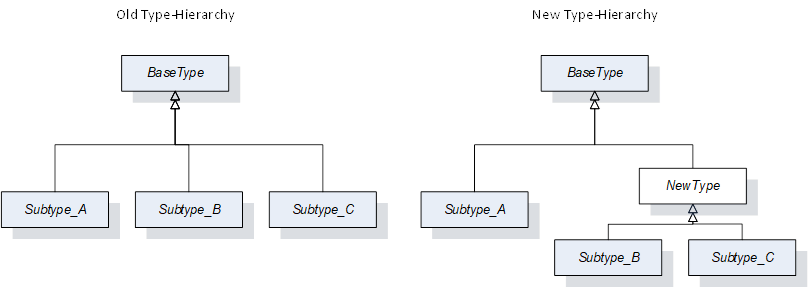
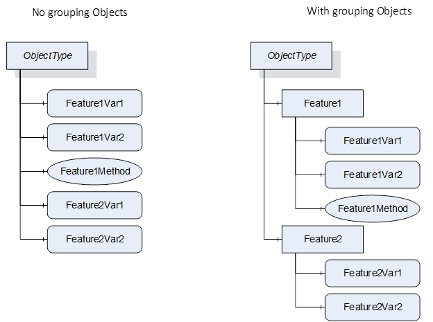
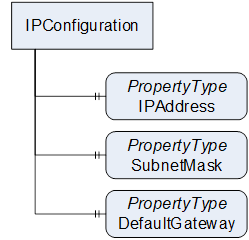
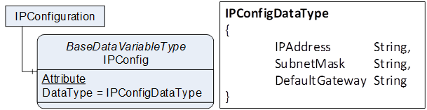
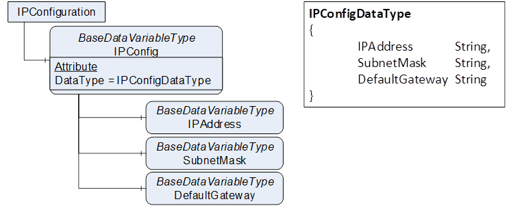
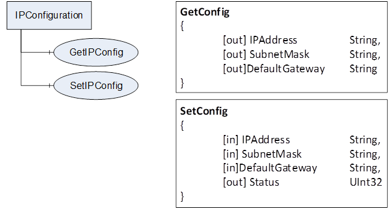
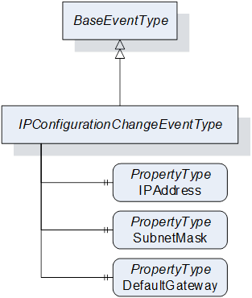
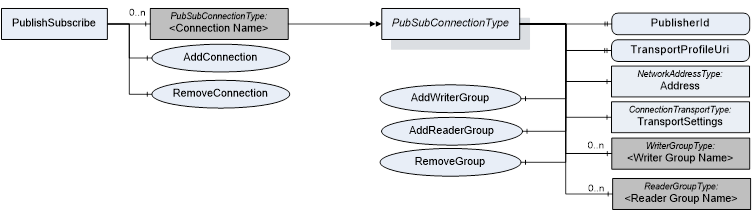
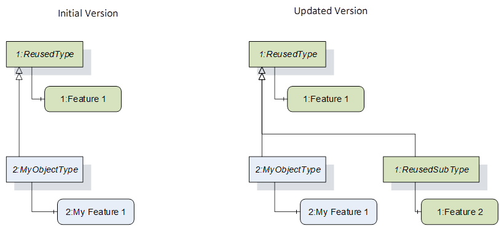
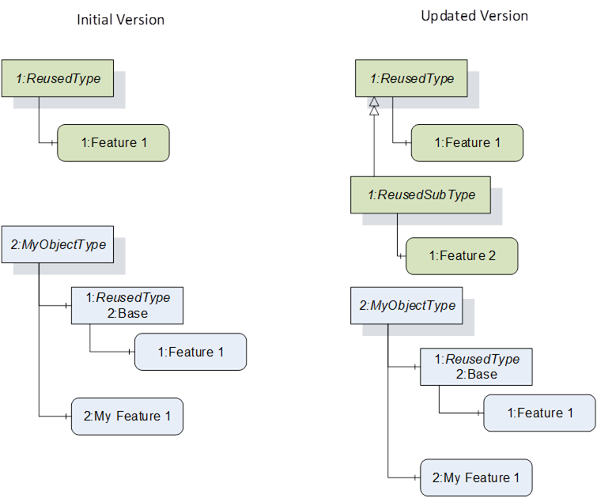

### 1. Scope  

This whitepaper is intended to provide guidelines and best practice for information modellers creating OPC UA based Information Models. It is not a formal specification, i.e. it is not required to follow the recommendations in this whitepaper, but highly recommended.  

The whitepaper is organized in several sections addressing different aspects of information modelling, from naming conventions to concrete modelling patterns for specific purposes.  

The document is a living document, i.e. it will get extended with additional aspects over time and will be published at a higher frequency than specifications would be.  

Note: This whitepaper describes the usage of various OPC UA modelling concepts. Not every Server has to use all those concepts, only the ones needed.  

### 2. Naming Conventions  

#### 2.1. Naming Conventions for Nodes  

##### 2.1.1. Overview  

OPC UA defines two attributes containing naming information about an OPC UA Node, the BrowseName and the DisplayName.  

Recommendations for DisplayName will be given in a later version of this document.  

The BrowseName is of DataType QualifiedName, containing a NamespaceIndex and a String. Unless the BrowseName is defined in some other Namespace or there is some specific handling for the BrowseName, the Namespace for the BrowseName should be the one the Node is defined in (i.e. the same Namespace as the NodeId). Nodes defined in a Companion Specification should use the Namespace of the Companion Specification for their NodeIds and BrowseNames.  

For the string-part the following naming conventions apply:  

##### 2.1.2. General Rules for BrowseNames  

All BrowseNames should be PascalCase (also known as upper camel case), that is, all words written without spaces, and the first character of each word is upper case, the other characters are lower case. Examples: ReferenceType, BaseObjectType, Int32  

If an acronym or abbreviation is used, PascalCase should also be used. Examples: PortMacAddress (where MAC is an acronym for Media Access Control), NodeId (where ID is an abbreviation for identification), UInt32 (where U is an abbreviation for unsigned).  

In general, it is recommended to only use letters, digits or the underscore ('\_') as characters for the BrowseName for TypeDefinitions (ObjectTypes, VariableTypes, DataTypes, ReferenceTypes and InstanceDeclarations), unless it is explicitly defined like "\<" and "\>" for optional placeholders. This also applies for field names of Structure DataTypes and EnumStrings or EnumValues of Enumerations.  

Remark: If special chars like "&", "\<", etc. are used, the UaNodeSet should define the optional SymbolicName for that Node. This can then be used for code generation.  

There is no recommendation on the use of prefixes. Companion specifications may use a prefix because it suits their model. For example, if the Vision Companion Specification were to define types based on generic concepts (say a state machine), then using the prefix "Vision" may make sense (as in "VisionStateMachineType").  

##### 2.1.3. Rules for specific NodeClasses  

The BrowseNames for **ObjectTypes**   

The BrowseNames for **VariableTypes** [ambiguity](https://dict.leo.org/englisch-deutsch/ambiguity) with other Nodes, then the suffix "VariableType" should be used. Examples: PropertyType, BaseDataVariableType.  

The BrowseNames for **DataTypes**   

* For Structured DataTypes (subtypes of the Structure DataType) the suffix should be "DataType". Examples: RedundantServerDataType, TimeZoneDataType. Note that the base OPC UA specification does not always follow this pattern.  

* Enumeration DataTypes (subtypes of the Enumeration DataType) should not have a suffix. If suffix is used, it should be "Enum". Examples: NodeClass, ServerState.  

* Built-in DataTypes can only be defined by the base OPC UA specification. They should not have a suffix. Examples: String, Int32, Byte.  

* Simple DataTypes (subtypes of the built-in DataTypes) should not have a suffix. Examples: Image, UtcTime, LocaleId.  

The BrowseNames for **ReferenceTypes**   

The InverseName of a ReferenceType is only provided for asymmetric References. It should be the inverse Name of the BrowseName, e.g. ComponentOf as the inverse for HasComponent.  

The BrowseNames for **Objects**  **Variables**  **Methods**  **Views**   

##### 2.1.4. Additional Considerations  

The BrowseNames for TypeDefinitionNodes (ObjectTypes, VariableTypes, and DataTypes) shall be unique (as defined in the base OPC UA specification). That means, that you need to make sure that you do not create duplicates inside the Namespace you are creating.  

As OPC UA Clients typically only display the string-part of the BrowseName (and thus not the NamespaceIndex), it is desirable not to use the same name across Namespaces. As there are many Companion Specifications, this cannot be guaranteed, but should be avoided as much as possible, for example by not using names from the base OPC UA specification.  

For InstanceDeclarations the BrowsePath shall be unique (defined in the base OPC UA specification). OPC UA Servers are allowed to treat BrowseNames in a case-insensitive manner. OPC UA Clients shall consider case sensitivity of the BrowseNames. Since OPC UA Servers might not handle case sensitivity, Information Models should not rely on case sensitivity for the uniqueness of BrowsePaths, but instead define BrowsePaths that are also unique when not considering case sensitivity. For example, one TypeDefinitionNode should not have the Properties "Id" and "ID". Instead, prefix the name with the intended use, such as "NetworkId" and "DeviceId".  

#### 2.2. Naming Conventions for structure Fields  

When creating Structured DataTypes, each field of a structure must have a unique name (as defined in the base OPC UA specification). The naming convention is to use PascalCase for those names. Examples: Offset, DaylightSavingInOffset  

Note: In many Companion Specifications, and in the base OPC UA specifications, lower camel case (e.g. first word starts with a lower character) is used in the specification. However, the UaNodeSet uses PascalCase, and thus the OPC UA Server provides everything as PascalCase.  

#### 2.3. Naming Conventions for Enums  

When creating Enum DataTypes, each possible value of an Enum must have a unique name. The naming convention is to use PascalCase for those names. Examples: NoConfiguration, Running.  

#### 2.4. Naming Conventions for UaNodeSets  

When creating a UaNodeSet for a Companion Specification, the file name should be "Opc.Ua.\<ShortName\>.NodeSet2.xml". For vendor-specific UaNodeSets the file name should end with "NodeSet2.xml".  

#### 2.5. Naming Conventions for NamespaceUris  

OPC 10000-3 defines rules for NamespaceUris.  

When creating a NamespaceUri for a Companion Specification, the template for Companion Specifications already suggests the URI " [http://opcfoundation.org/UA/\<short](http://opcfoundation.org/UA/\<short) name\>". As a general recommendation, also for vendor-specific NamespaceUris, the use of %-escaped characters is strongly discouraged.  

How to create a new NamespaceUri for a breaking change is described in [11.3](/§\_Ref112839395) .  

### 3. Rules for backward compatibility of Information Models  

#### 3.1. Overview  

An Information Model defines a contract between OPC UA Applications. OPC UA Clients can rely on the mandatory parts defined in such an Information Model and OPC UA Servers are not required to provide more than the specified mandatory information.  

Elements defined in an Information Model are qualified by their Namespace, which is a unique URI. When a new version of such an Information Model is defined, some rules need to be considered to re-use the existing Namespace. If those rules cannot be followed, the existing NamespaceUri should not be used. However, a new NamespaceUri implies that all information is new, that is, even using the same name and NodeId (without NamespaceIndex) for a type, OPC UA Applications will consider it to be a completely different Node with no relation to the one qualified by the old Namespace.  

The next clauses describe the rules that must be followed to re-use the existing Namespace when versioning an Information Model.  

#### 3.2. Rules  

##### 3.2.1. Adding mandatory components to ObjectTypes and VariableTypes  

It is not allowed to add new mandatory InstanceDeclarations using the ModellingRules Mandatory and MandatoryPlaceholder. To add a mandatory InstanceDeclaration, either create a new Subtype having the mandatory InstanceDeclaration, or a new type independent of the previous one. As alternative, make the new InstanceDeclaration optional but define a Profile requiring the new InstanceDeclaration.  

This rule avoids the incompatibility when an OPC UA Client aware of the new version connects to an OPC UA Server only supporting the old version, and the OPC UA Client expects a new mandatory feature not provided by the OPC UA Server.  

##### 3.2.2. Adding optional components to ObjectTypes and VariableTypes  

It is allowed to add new optional InstanceDeclarations using the ModellingRules Optional and OptionalPlaceholder.  

Old OPC UA Servers will just not provide those, and new OPC UA Clients will not expect them to be available in all OPC UA Servers, since they are optional. Since OPC UA Servers are allowed to add anything to the instances, an old OPC UA Client can also easily connect to a new OPC UA Server, potentially just ignoring the new information.  

##### 3.2.3. Adding Interfaces to ObjectTypes  

It is allowed to add Interfaces to ObjectTypes as long as no new mandatory InstanceDeclarations are added to the ObjectType. That means, a new Interface can be defined based on an existing ObjectType by using some InstanceDeclarations of that ObjectType. Such an Interface may have mandatory InstanceDeclarations already defined in the ObjectType, and in that case the ObjectType can implement the Interface.  

##### 3.2.4. Changing the values of an Enumeration DataType  

It is not allowed to add or remove values of an Enumeration DataType. It is allowed to limit the enumeration values, creating a subtype with a subset of the existing values defined by the supertype.  

Old OPC UA Clients would not expect new values, and old OPC UA Servers might provide removed values to new OPC UA Clients that would not be able to interpret these based on their built-in knowledge.  

If it is foreseeable that future specification versions would need to add or remove enumeration values, or that derived Companion Specifications would want to extend them, then one of the MultiState VariableTypes should be used instead of an Enumeration DataType.  

##### 3.2.5. Changing the fields of a Structure DataType  

It is not allowed to add or remove optional or mandatory fields of a Structured DataType or change the name or DataType (including ValueRank and ArrayDimensions) of a field.  

This would change the encoding and OPC UA applications might not be able to encode / decode the information anymore with built-in knowledge.  

##### 3.2.6. Changing the fields of a Union DataType  

It is not allowed to add or remove fields of a Union or change the DataType of a field.  

This would change the allowed types and interoperability between two versions is not given anymore.  

##### 3.2.7. Changing the bits of an OptionSet based on numeric DataTypes  

It is not allowed to add or remove entries of the OptionSetValues Property as it would change the interpretation of the DataType. It is allowed to change the text of an entry if the semantic is not changed, e.g. by fixing typos or improving the formulation.  

##### 3.2.8. Changing the bits of an OptionSet based on OptionSet DataType  

It is not allowed to add or remove entries to the OptionSetValues Property. It is allowed to change the text of an entry if the semantic is not changed, e.g. by fixing typos or improving the formulation.  

If a specification intends to deprecate a bit, it can require that the validBit shall always be set to false. Adding entries is forbidden, because subtypes might have been defined using those bits already.  

If a specification intends to extend the OptionSet, it needs to define subtypes with additional bits. Subtypes may also refine the semantic of existing entries (see OPC 10000-3). Note that the initial defined length cannot be changed in any subtype (see OPC 10000-3).  

##### 3.2.9. Changing the Type Hierarchy of ObjectTypes or VariableTypes  

It is allowed to add subtypes into the existing type hierarchy.  

It is not recommended to insert new types inside the existing hierarchy, as shown in [Figure 1](/§\_Ref35589907) . In the example, NewType is added as supertype of Subtype\_B and Subtype\_C.  

If a new type is absolutely necessary, the following rules apply:  

* The new type shall not add mandatory InstanceDeclarations unless they have been defined before on each subtype.  

* The new type shall not define additional constraints (defined in the text of the specification), unless those constraints were already valid for all its subtypes before.  

* The newly added type may be abstract or concrete.  

In a nutshell, the new type shall not add anything to the subtypes that would not be allowed to be added to the subtypes directly.  

It is not allowed to add new types inside the EventType hierarchy, i.e. in the part of the ObjectType hierarchy inheriting from the BaseEventType, as EventTypes are used for filtering, and new OPC UA Clients might use the new EventType as a filter in an old Server, which would not work.  

  

 **Figure 1\- Example of adding types inside an existing type hierarchy**   

OPC UA Clients that are pre-programmed with knowledge of the type hierarchy do not need to browse the type hierarchy in the OPC UA Server. Therefore an old OPC UA Client would work with a new OPC UA Server, since all types that are built into the old OPC UA Client would exist. A new OPC UA Client would also work since the old OPC UA Server would not have any instances of the newly added types. An OPC UA Client has to expect that not all defined types will have instances.  

It is allowed to add new subtypes of events that extend the existing types, but these subtypes have to maintain the concepts expressed by the parent type. A limit alarm could have a subtype that makes some of the limits mandatory or even adds more limits, but all subtypes would have to still be limit alarms.  

##### 3.2.10. Changing the Type Hierarchy of DataTypes  

It is allowed to create new subtypes of existing DataTypes.  

It is not recommended to insert types inside the type hierarchy of DataTypes (similar to ObjectTypes and VariableTypes, see [Figure 1](/§\_Ref35589907) ). If absolutely necessary, the following rules apply:  

* For all DataTypes no new constraints (written as text in the specification) should be added, but existing constraints common to all the subtypes can be added to the new supertype.  

* For abstract DataTypes there are no additional rules.  

* For simple DataTypes (using the encodings of the built-in DataTypes) there are no additional rules.  

* For Enumeration DataTypes the new supertype may have more Enumeration Values than the subtypes. In that case, it shall have at least a union of all Enumeration values defined in any of its subtypes. If the numeric values would conflict, it is not possible to create such a supertype.  

* For Structured DataTypes, the supertype shall only have fields that are already defined in all subtypes. It shall be legal to create all existing subtypes, considering DataType, ValueRank and ArrayDimensions.  

##### 3.2.11. Changing the Signature of a Method  

It is not allowed to change the signature of a Method. Even adding new optional Arguments to an existing Method would change the signature, so this is not allowed.  

It is allowed to add metadata to the existing arguments of a Method, e.g. the EngineeringUnits Property (done with HasArgumentDescription References, see section [5](/§\_Ref37351998) for an example). This does not include changing arguments from mandatory to optional or vice versa.  

It is also allowed to change the description text of a Method parameter as long as this does not change the semantics of the argument.  

If the signature of a Method would change, new OPC UA Clients might call old OPC UA Servers with the wrong signature (e.g. if an argument has become optional), or old OPC UA Clients may call the new OPC UA Server with the wrong arguments (e.g. if an argument has become mandatory). OPC UA Clients with prior knowledge of the Information Model do not necessarily read the Method arguments from the OPC UA Server, and even if they would, their implementation to call the Method would not work anymore.  

If the intention is to change the signature of a Method, then a new Method with a new signature and a new BrowseName shall be defined instead. A common practice for the new name is to add a number to the existing name, i.e. the new Refresh Method is Refresh2.  

##### 3.2.12. Changing the DataType of a Variable  

It is not allowed to change the DataType, ValueRank or ArrayDimensions of a Variable, neither for an InstanceDeclaration, nor for a standardized Variable like ServerStatus.  

Even refining an existing DataType to a subtype is a breaking change. New OPC UA Clients connecting to an old OPC UA Server would expect the subtype but might get the supertype instead.  

##### 3.2.13. Changing the TypeDefinition of an InstanceDeclaration  

Changing the TypeDefinition of an InstanceDeclaration is not allowed unless it is being changed to a subtype of the already specified one. Using a subtype is only allowed if the subtype does not add any mandatory InstanceDeclarations or constraints (defined in the text of the specification), and does not refine the DataType (in case of a Variable).  

##### 3.2.14. Changing the Semantics of ReferenceTypes  

ReferenceTypes typically restrict their usage by limiting which SourceNodes and TargetNodes are allowed. Currently such restrictions are only specified in text in specifications.  

Changing the rules, either allowing more or fewer restrictions, should be avoided. However, OPC UA Clients should consider the results when following References (e.g., the ReferenceDescription containing NodeClass and TypeDefinition) and they should be able to handle unexpected results. Therefore, changing the rules is not forbidden, as long as it does not contradict other parts of the Information Model e.g., because a TypeDefinition is using the ReferenceType in a way that is no longer allowed in the new version.  

##### 3.2.15. Changing the Type Hierarchy of ReferenceTypes  

It is allowed to add subtypes to the existing ReferenceType hierarchy. It is not allowed to move types in that Hierarchy, e.g. making a hierarchical ReferenceType a non-hierarchical ReferenceType, as the filtering would behave differently. It is also not allowed to add new ReferenceTypes inside the Hierarchy. This would work for old OPC UA Clients, since they would just not use those unknown ReferenceTypes for filtering, but not for new OPC UA Clients connecting to old OPC UA Servers, since they would expect the ReferenceType to be available and use it for filtering information available in the OPC UA Server.  

##### 3.2.16. Removing Nodes  

It is not allowed to remove any Node that has been defined before. That includes DataTypes, VariableTypes, ObjectTypes as well as standardized Instances or InstanceDeclarations. Servers may not expose all Nodes of an Information Model, if they do not use them, but the Information Model itself has to keep them for backward combability. This does include optional InstanceDeclarations.  

This rule avoids that any NodeId or BrowseName in the hierarchy is used in later versions again for a different purpose.  

#### 3.3. Strategies for Breaking Changes  

It is highly recommended that Companion Specifications do not have breaking changes in new versions. There are strategies that can be used to avoid breaking changes:  

1. Create subtypes and add mandatory elements to the subtypes. Create new conformance units and profiles requiring the use of the subtypes. This approach only works to add new mandatory things, and is a compatible change, such that an old client works with a new server. A new client can be designed to also accept the old types, or it may not work with old servers. That is a decision of the client developer. Note that depending on what type gets subtyped by a new version, many other types using this type may need to be changed as well.  

1. Add optional components to existing types and make them mandatory by conformance units and profiles. This avoids creating subtypes which might require creating other subtypes, etc. Otherwise, the same logic as for approach 1 applies. Old clients will work with new servers, and new clients may work with old servers if they do not require the new mandatory things.  

When it cannot be avoided to break something from an existing specification in a new version, there are different options:  

1. Create a new Namespace and thus define, conceptionally, a completely new Information Model. It is recommended to change the NamespaceUri and add a version number at the end (for example, V2 at the end for the second version, see [11.3](/§\_Ref112839395) ). This is on one hand the cleanest solution; on the other hand, this is a completely incompatible change of the model. No old client will directly work with a new server and vice versa.  

1. Create new types independent of the old when needed, e.g. DeviceType2 for DeviceType. This allows also to remove mandatory things, that have been proven to be problematic. Depending on how many types have been changed, old clients may or may not be able to do reasonable things with new servers. If old servers should be supported, new clients have to be designed to support both types. Note that depending on what type gets exchanged by a new version, many other types using this type need to be changed as well.  

### 4. How to define StatusCodes in Companion Specifications  

In OPC UA StatusCodes are used on different levels to indicate:  

* if service calls have been executed successfully (e.g. a Read call was successful)  

* if operations inside the service calls have been executed successfully (e.g. for each Attribute to be read in a Read call), or the status of individual data like in MonitoredItems.  

The base OPC UA specification defines those StatusCodes. It is not allowed for Companion Specifications or vendors to define additional StatusCodes. OPC UA provides the mechanism of DiagnosticInfo (see OPC 10000-4) to provide more specific information.  

In very rare cases, Companion Specifications may have the need for additional StatusCodes. For example, the FDI specification had a need to indicate if a value was currently edited by the specific OPC UA Client. In this case, the Companion Specification authors shall contact the base OPC UA working group and the needed StatusCodes will be added to the base specification.  

### 5. How to return application-specific statuses in Methods  

#### 5.1. Overview  

OPC UA uses StatusCodes to identify the success of operations, including Method calls. However, StatusCodes cannot be extended, and often it is desirable to receive a more detailed application-specific, program-readable reason, why a Method call was not successful.  

The following pattern should be used to return application-specific statuses of a Method. The last argument of the output arguments of a Method should contain an application-specific error code. The DataType should be an Integer, preferably an Int32. The Information Model might provide a description of the values in the Method metadata.  

In the following, an example of such a Method definition is given, using the template for Companion Specifications.  

#### 5.2. Example  

If there is an application-specific error in the Method execution, the Method should return an Uncertain StatusCode and the application calling the Method shall only consider the Status output argument of the Method providing the application-specific error code.  

 **Signature**   

\<SomeMethod\> (  

[in]  String       \<SomeInput\>,  

[out] UInt32       \<SomeOutput\>,  

[out] Int32        Status);  

Table 1 - \<SomeMethod\> Method Arguments  

| **Argument** | **Description** |
|---|---|
|\<SomeInput\>|\<description\>|
|\<SomeOutput\>|\<description\>|
|Status|This is an example where the Method needs to return special status information. 0 - OK - Everything is OK \-1 - E\_FirstError - Error FirstError occurred \-2 - E\_SecondError - Error SecondError occurred|
  

  

 **Method Result Codes (defined in Call Service)**   

| **Result Code** | **Description** |
|---|---|
|Uncertain|The value is uncertain. A concrete reason is defined in the Status Output-Argument.|
  

  

Table 2 - \<SomeMethod\> Method AddressSpace definition  

| **Attribute** | **Value** |
|---|---|
|BrowseName|\<SomeMethod\>|
  
| **References** | **NodeClass** | **BrowseName** | **DataType** | **TypeDefinition** | **Others** |
|---|---|---|---|---|---|
|HasProperty|Variable|InputArguments|Argument[]|PropertyType|M|
|HasProperty|Variable|OutputArguments|Argument[]|PropertyType|M|
|HasArgumentDescription|Variable|Status|Int32|MultiStateValueDiscreteType|M|
  

  

The InstanceDeclarations of the \<some\> *Type* have additional *Attributes* defined in [Table 3](/§\_Ref26531010) .  

Table 3 - \<some\>Type Additional Attributes  

| **Source Path** | **Value** |
|---|---|
\<SomeMethod\>|Status|EnumValues||[\{"value":0, "displayName":\{"locale":"en", "text":"OK"\}, "description":\{"locale":"en", "text":"Everything is OK"\}\}, \{"value":-1, "displayName":\{"locale":"en", "text":"E\_FirstError"\}, "description":\{"locale":"en", "text":"Error FirstError occurred"\}\}, \{"value":-2, "displayName":\{"locale":"en", "text":"E\_SecondError"\}, "description":\{"locale":"en", "text":"Error SecondError occurred"\}\}]|
  

  

Note that the last table is defined in the context of the ObjectType \<some\>Type containing the Method \<SomeMethod\>.  

### 6. How to create a Companion Specification  

#### 6.1. What is a Companion Specification?  

A Companion Specification is the specification of a domain-specific Information Model based on OPC UA. Typically, a Companion Specification is defined in a working group of the OPC Foundation or a joint working group of the OPC Foundation with other organizations like the VDMA. Potentially, a Companion Specification can be defined without explicit cooperation with the OPC Foundation, for example by a standardization organization or a company.  

A Companion Specification consists of a document defining the Information Model and a UaNodeSet as a machine-readable file used by implementations of the Companion Specification.  

#### 6.2. How to create a joint Working Group  

Although not required, it is recommended to create a Companion Specification in cooperation with the OPC Foundation.  

How to create such a Working Group is described here:  

[https://opcfoundation.org/joint-working-groups/](https://opcfoundation.org/joint-working-groups/)  

This web page contains links to  

* A template for a charter of a working group  

* A template for a MOCA (multi organizations cooperation agreement)  

* A list of existing joint working groups  

#### 6.3. Tools to create a Companion Specification  

There are tools helping in the creation of a Companion Specification, which can be found here:  

[https://opcfoundation.org/Guidelines-And-Templates/](https://opcfoundation.org/Guidelines-And-Templates/)  

The web page contains links to:  

* Word template for Companion Specifications  

* Guideline document for Companion Specifications, including a section on certification and how to create test cases  

* Visio-Shapes to create standardized figures of OPC UA Information Models  

Those documents help creating the document defining the Information Model. For joint working groups, the template needs to be followed since the document is also published in the Online Reference (https://reference.opcfoundation.org/) and therefore needs to be processed and converted into a web page.  

There are various tools available to create a UaNodeSet which can be found in the OPC Foundation Marketplace ( [https://opcfoundation.org/products/](https://opcfoundation.org/products/)\- filter for tools / information modelling).  

In order to validate that the UaNodeSet and the specification document are in sync, the OPC Foundation provides the NodeSet-Validator ( [https://apps.opcfoundation.org/NodeSetValidator](https://apps.opcfoundation.org/NodeSetValidator) ). This validator needs to be passed before a Companion Specification is published by the OPC Foundation.  

Note that the word template is not bound to working groups of the OPC Foundation, everybody creating an OPC UA based Information Model can use this template as a base to document their Information Model.  

Note that the OPC UA specification has changed how it defines structured and enumeration data types. Instead of a DataTypeDictionary (see OPC 10000-5) having additional Nodes in the AddressSpace, the attribute DataTypeDefinition (see OPC 10000-3) is used. UaNodeSets of a Companion Specification should still contain the DataTypeDictionary Nodes in order to have the NodeIds standardized, in case applications still want to support the old mechanism.  

#### 6.4. How to Create Test Cases  

The OPC Foundation provides test tools and certification for its specifications, and it is highly recommended that Companion Specifications also provide test cases. In addition to certification, testing is crucial for interoperability of OPC UA products. Each product designed to work with a Companion Specification needs to make sure the Companion Specification model is implemented correctly. Using the test tool and test cases provided by the OPC Foundation, automated testing can be carried out without additional need to create a testing environment. Testing and certification are based on Profiles and Facets. With actual test cases defined for each ConformanceUnit. Profiles and Facets can be nested and are composed of ConformanceUnits, a ConformanceUnit is the smallest testable item. The minimum test cases are checking the simple adherence to the defined Information Model (i.e., the instance correctly reflect the types it is based on). For Companion Specifications that describe expected functionality, it is important that test cases be created to test the defined functionality. For example, when a Method is defined in an Information Model, there is some expected behaviour associated with the Method and test cases are strongly recommended to be defined for this behaviour.  

The OPC Foundation Certification working group (CMP) provides assistance to Companion Specification authors in defining and developing testing. The CMP group can provide an Excel Template that is filled out with test case definition. The CMP group can also provide examples of test cases defined for other companion standards.  

It is highly recommended that development of test cases be started as soon as the Information Model starts to become stable. It is not uncommon for the process of defining test cases to identify modelling issues, such as minor issues just requiring clarifications in the text, but there may also be inconsistent definitions and unintended usage.  

The CMP group can be reached at [Compliance@opcfoundation.org](mailto:Compliance@opcfoundation.org)  

  

### 7. How to use OPC UA Modelling Concepts  

#### 7.1. Overview Base Modelling Concepts  

OPC UA provides various modelling concepts (see OPC 10000-3).  

* Objects structuring the AddressSpace  

* Variables providing Values  

* Methods that can be called by a Client and are executed by the Server  

* ObjectTypes defining the semantic and structure of Objects  

* VariableTypes defining the semantic and structure of Variables  

* DataTypes defining the semantic and structure of Values  

* Events generated by the Server that can be received by Clients  

* EventTypes describing the semantic and structure of Events  

* References defining relationships between Nodes  

* ReferenceTypes defining the semantic of References  

Based on those fundamental concepts, additional base concepts are defined like  

* Conditions and Alarms as Events that are always in a state and can therefore be represented as Objects in the AddressSpace (OPC 10000-9)  

* State Machines (OPC 10000-16)  

* Interfaces and AddIns allowing extensibility into various ObjectType hierarchies (OPC 10000-3)  

* Alias Names as searchable entry points to Nodes (OPC 10000-17)  

* Dictionary References to reference external dictionaries (OPC 10000-19)  

In OPC 10000-3 there is already an Annex describing how to use the modelling concepts in general, and in OPC 10000-5 there is an Annex, describing the design decisions for creating the server information (ServerType).  

#### 7.2. ObjectTypes  

##### 7.2.1. Overview  

ObjectTypes are a very common modelling concept in OPC UA. Typically, each Companion Specification defines one or more ObjectTypes. Defining an ObjectType makes sense when it is expected that the ObjectType is used several times, either in one Server or across various Servers to provide interoperability on the model.  

An ObjectType can be simple without defining any substructure, like the FolderType of the base specification. Typically, an ObjectType defines a substructure with Objects, Variables and / or Methods.  

##### 7.2.2. Where to derive from?  

When defining an ObjectType, it needs to be considered if there is already an appropriate ObjectType it can derive from. That includes the defined semantic of the ObjectType as well as the defined substructure. The ObjectType may contain an optional substructure that is not needed but should not have any mandatory substructure that is not wanted / needed. Not only ObjectTypes of the base specification should be considered, but also ObjectTypes defined in existing Companion Specifications. The OPC Foundation provides an online search on all specifications ( [https://reference.opcfoundation.org/](https://reference.opcfoundation.org/) ). When there is no more appropriate ObjectType defined, the BaseObjectType shall be used as base (as defined in the OPC UA Specification).  

##### 7.2.3. Abstract or concrete?  

When designing a type hierarchy, the base type(s) may either be abstract or concrete.  

Design decision in favour of abstract types: The main type is a template that contains all the common elements of the child types but is not "whole" itself, thus shall never be instantiated. Example: a biological parent is either a mother or a father and in the application context it makes no sense to instantiate "parent" without this information. However, both mother and father are parents.  

Design decision in favour of concrete types: The super type might directly be used if no more detailed information exists. Example: To know how long a tool has been used, only the time and identifier are needed. A base type for the tool can contain only those two. For other use cases, more specific tools like drills, saws or punches may be defined, adding specific information.  

##### 7.2.4. Composition versus Inheritance  

Potentially, not only one ObjectType needs to be defined, but many. In this case, consider creating base ObjectTypes for common semantics and substructures.  

On the other hand, it is not practical to have a very deep type hierarchy with many levels. In addition OPC UA only supports single inheritance (multiple inheritance is not supported), thus an ObjectType can be derived from only one supertype so the type hierarchy can only be organized by one aspect.  

If additional aspects need to be added, composition must be used. Composition can be either done by:  

* an AddIn (see OPC 10000-3), having an Object as substructure defined by an ObjectType providing a standardized BrowseName (DefaultInstanceBrowseName) and adding the aspect as defined by the AddIn-ObjectType or by  

* an Interface (see OPC 10000-3), defining a substructure that is directly deployed (without grouping Object) on the ObjectType.  

Composition allows definition of an aspect that can be deployed on various places in the type hierarchy, or even only on specific instances.  

Therefore, subtyping should be used to refine the main characteristic of Objects of the ObjectType, and additional aspects should be defined by composition.  

For example, the type hierarchy may define different types of devices (SensorType as common base type and derived a TemperatureSensorType, FlowSensorType, etc.) whereas additional aspects like the capability to lock an Object are defined by AddIns or Interfaces and added to the types.  

However, even the above-mentioned example can lead to problems without multiple inheritance, as a device may support measuring temperature and flow. In this case, also the characteristic to measure a temperature and a flow should be modelled by composition (see PA-DIM for an example).  

##### 7.2.5. Grouping of Substructures  

When defining a substructure of an ObjectType addressing different aspects (e.g. Identification information, measurement values, configuration parameters) everything can be referenced directly from the ObjectType, or grouping Objects can be used to address the different aspects.  

  

 **Figure 2\- Example of grouping Objects**   

From a pure programmatical access perspective no grouping information is required, as all individual subcomponents have their standardized names. However, from a human-readability perspective, having grouping objects increases the understandability of the provided substructure.  

Grouping Objects make sense:  

* if they contain several standardized subcomponents that logically belong together (like serial number, manufacturer and model for identification).  

* If they contain subcomponents with no standardized BrowseNames (e.g. using the Placeholder ModellingRules, see also [7.2.8](/§\_Ref112659144) ).  

As a general rule of thumb, when the ObjectType has more than 30 subcomponents, having grouping Objects may be helpful. This also applies inside such a grouping Object, i.e., if the grouping Object would have more than 30 subcomponents, grouping the subcomponents with Objects as subcomponents of the grouping Object make sense. When applying the rule, potential subtypes should be considered. For example, if a base ObjectType only addresses identification but it is expected that subtypes with additional substructures are defined, it makes sense to already group the identification.  

When using grouping Objects, it must be considered what ObjectType the grouping Object should have. If it groups an aspect that is expected to be used only in one place (the ObjectType the grouping Object is used), it is not necessary to create a specific ObjectType for the grouping Object, and instead it is recommended to use the FolderType. If the grouping may be used in various places, it is recommended to define an ObjectType (as AddIn), allowing to use the same grouping easily in other places.  

##### 7.2.6. Interfaces or AddIns?  

The question whether to define an Interface or AddIn has two aspects.  

1. The interface is intentionally a simple and therefore limited construct (see OPC 10000-3). Therefore, depending on what needs to be defined an interface may not be an option.  

1. An AddIn implies a grouping Object with a standardized default name, whereas an interface can be deployed without grouping Object. Of course, even with an interface an additional grouping Object can be created and the interface gets deployed on the grouping Object.  

Therefore, it is recommended to use an interface if something rather small and simple is defined (with maybe a handful of Variables and Methods) that potentially should be deployed directly on an ObjectType (without grouping Object).  

In all other cases, it is recommended to define an AddIn. Potentially, an Interface can be defined and in addition an AddIn using the Interface.  

##### 7.2.7. Optional versus Mandatory  

As a general consideration:  

* From a consumer (client) perspective, making a functionality mandatory, like a Method or Variable, is desirable because then the consumer can rely on its availability.  

* From a provider (server) side making functionality mandatory can be challenging, if it cannot be provided in all cases. Therefore, as a compromise functionally is often defined as optional.  

There are two ways to deal with optional functionality. One obvious way is to define the InstanceDeclaration as optional, and then the server may or may not provide the functionality.  

A second option is, at least for variables, to define a specific default value implying that the information is not provided. Depending on the DataType, this might be the NULL value (if the DataType provides a NULL value (see OPC 10000-6)). Or it might be a specific value like "-1" or an empty string.  

It is recommended to use the Optional ModellingRule if the provider does not support the functionality at all. If it is a Variable, where the value can also be written and thus the information can be provided by the Client, it is recommended to use the Mandatory ModellingRule and define a default behaviour, if the functionality is not available. If the Variable is not there at all, the Client does not have an option to write a value into the Variable.  

Note that as an additional option, it would also be possible to have mandatory Variables and Methods, that just provide a BAD status code if not supported. It is not recommended to use this approach.  

Note that optional functionality can be made mandatory by conformance units and profiles (see [3.3](/§\_Ref112685001) ). In this case, the Server implementation can decide whether the conformance units or profiles are supported. Clients can discover the supported conformance units and profiles of a Server.  

##### 7.2.8. Optional Grouping Elements with Mandatory Placeholders or vice versa?  

When an ObjectType needs to expose several subcomponents of a specific type without defining the exact number or the BrowseName, the MandatoryPlaceholder (at least one) or the OptionalPlaceholder ModellingRules are used. Often, this might be combined with a grouping Object in order to easily browse all subcomponents of that type.  

When an ObjectType requires at least one subcomponent of the specific type, the grouping Object must be Mandatory and the subcomponent of the specific type must use MandatoryPlaceholder.  

When the ObjectType is not required to have at least one subcomponent, options are:  

1. The grouping Object is Mandatory and the subcomponent uses OptionalPlaceholder  

1. The grouping Object is Optional and the subcomponent uses MandatoryPlaceholder  

1. The grouping Object is Optional and the subcomponent uses OptionalPlaceholder  

When the grouping Object has additional functionality like a Method to add to its subcomponents it is recommended to make the grouping Object Mandatory and therefore the subcomponent has to use OptionalPlaceholder (Option 1).  

When the grouping Object does not have any additional functionality like a Method to add to subcomponents, it is recommended to make the grouping Object optional so a client does not have to browse the empty grouping Object to figure out that it is empty. In this case, it makes sense to define the subcomponent as MandatoryPlaceholder so the grouping Object is only available when a subcomponent is included (Option 2).  

However, when the model is built to be extended and a subtype may add additional functionality to the grouping Object, defining the subcomponent as OptionalPlaceholder allows subtypes to change the ModellingRule of the grouping Object without requiring a subcomponent of the specific type (Option 3).  

#### 7.3. VariableTypes  

##### 7.3.1. Overview  

VariableTypes are used to define the substructure, semantic and DataType of Variables. Defining VariableTypes only makes sense, if it is expected that the VariableType is used several times. Variables are typically defined in the context of an ObjectType which already defines the semantic of the Variable. Therefore, often the VariableTypes of the base specification (specifically OPC 10000-8 with VariableTypes providing ranges and engineering unit) are sufficient and no new VariableTypes need to be defined.  

##### 7.3.2. Properties versus DataVariables  

OPC UA distinguishes between light-weight Variables called Properties and DataVariables (see OPC 10000-3).  

Properties are expected to describe the Node they belong to and have several special rules (see OPC 10000-3). They are always of VariableType PropertyType (which is not allowed to be subtyped) and referenced with a HasProperty Reference. The BrowseName defines the sematic. They are the leaf of any hierarchy, meaning they cannot be the source of any hierarchical Reference and therefore not have any Properties by themselves.  

Property values typically don't change very often, and are usually read once and not subscribed to for changes.  

DataVariables are of VariableType BaseDataVariableType or any subtype and do not have the restrictions of the Properties.  

The decision to use a Property or DataVariable can to a certain degree be made on a semantic level. If the value describes the Node (like the engineering unit of a Variable), it is a Property; if it is something from the real world (like a measured temperature), it is a DataVariable. However, making the decision based on the semantic is not always that clear.  

There are also the functional differences between Property and DataVariable. If your Variable needs Properties (like the engineering unit), you have to use a DataVariable, even if the semantic suggests that it should be defined as a Property.  

As Properties have limited functionality, the recommendation is to use Properties when it is clear from the semantic that it is just describing the characteristics of the Node and there is no need to add additional information to the Variable, also not as extensible mechanism in vendor-models or other Companion Specifications. Otherwise, it is recommended to use DataVariables.  

##### 7.3.3. Properties versus Attributes  

Nodes in OPC UA have a predefined set of Attributes. They are not extensible by Companion Specifications, only the base specification may add new optional Attributes over time. If there is the need to add more description to a Node, a Property needs to be used. Common Properties are EngineeringUnits or InstrumentRange.  

When considering defining a Property, check the set of Attributes defined in the base specification to determine if one of them is suitable. For example, instead of defining a Property called Description, use the corresponding Attribute. OPC UA allows all Attributes to be writable, so even if the requirement is to have a writeable description, the Attribute can be used, and no additional Property should be defined.  

##### 7.3.4. When to create VariableTypes?  

VariableTypes can be used to define the semantic and substructure of a Variable. A common example is the AnalogItemType providing the EngineeringUnits and InstrumentRange Properties. Sometimes, it may be helpful to define a VariableType just to describe the semantic, for example a VariableType representing SetPoints. This makes sense if the same VariableType is intended to be used in various places. The semantic of a Variable used in an ObjectType is already defined by the ObjectType and does not need to have a specific VariableType.  

#### 7.4. Methods  

Typically a Method is defined on an ObjectType having the ModellingRule Optional or Mandatory. Such a Method then also appears optionally or mandatorily on the Objects of the ObjectType.  

Methods defined on an ObjectType may have the ModellingRule OptionalPlaceholder or MandatoryPlaceholder. In this case, the ObjectType does not define the input and output arguments, but just the name of the Method. Instances can then use an appropriate signature. This approach should only be used when the signature cannot be standardized.  

ObjectTypes may also have Methods without a ModellingRule. In this case, it is a class Method called on the ObjectType. In [8.4.1](/§\_Ref153357479) , an example is given, where such a class Method creates instances of the ObjectType.  

#### 7.5. Granularity of Data: Variables, Structured DataTypes, Methods, and Event  

##### 7.5.1. Overview  

OPC UA allows to model structured data in different ways. As a simple example, an IP-configuration may consist of an IP-Address, a Subnet-Mask, and a Default-Gateway.  

This may be modelled as  

* Individual Variables  

* Structured DataType and one Variable using the DataType  

* Structured DataType and one Variable and individual Variables as subvariables  

* Methods  

* Events  

##### 7.5.2. Individual Variables  

As shown in [Figure 3](/§\_Ref117606534) , the IP configuration is modelled as individual Variables.  

  

 **Figure 3\- Example of individual Variables**   

The advantages of this approach are that the complex structure of the data is visible in the AddressSpace. A generic Client can easily access the data without knowledge of user-defined DataTypes and the Client can access individual parts of the structured data. The Information Model may add additional information to parts of the structure (like engineering unit or precision information) or reference the individual parts of the structure from other places. Clients can write individual parts of the structure without changing other parts.  

The disadvantages of this approach are that accessing the individual data does not provide any transactional context and each provides an individual timestamp. In the worst case, a Client may read part of the IP configuration before a change and other parts after a change of the configuration and therefore get an inconsistent configuration. For a specific Client the Server first has to convert the data and the Client has to convert the data, again, to get the data structure the underlying system provides. When writing the data, each part is written individually, so a part of the configuration may be accepted while other parts are invalid and rejected, leading to an unwanted configuration.  

##### 7.5.3. Structured DataType and one Variable using the DataType  

As shown in [Figure 4](/§\_Ref117606743) , the IP configuration can be modelled in one Variable using a structured DataType.  

  

 **Figure 4\- Example of structured DataType and one Variable using the DataType**   

The advantages of this approach are, that the data is accessed in a transactional context and the Server can provide a consistent configuration. The structured DataType can be constructed in a way that the Server does not have to convert the data. The server can pass the data directly to the specific Client. When writing the data, this is also done in a transactional context, the Server can either accept or reject the full new configuration.  

The disadvantages are that the generic Client might not be able to access and interpret the data or at least has the burden to read the DataTypeDefinition to interpret the data. The structure of the data is not visible as Nodes in the AddressSpace; additional Properties describing elements of the data structure cannot be added to the adequate places since they do not exist in the AddressSpace. Individual parts of the data cannot be read without accessing the whole data structure. This is also true for writing. The Client has to write all data of the structure, even if it only wants to change a part of it.  

##### 7.5.4. Structured DataType and one Variable and individual Variables as subvariables  

As shown in [Figure 5](/§\_Ref117607757) , the IP configuration can be modelled combining the first two approaches, using one Variable with the structured DataType and subvariables for the individual content.  

  

 **Figure 5\- Example of structured DataType and one Variable and individual Variables as subvariables**   

This approach combines the first two approaches and therefore also their advantages. A specific Client can access data in its native format, whereas a generic Client can access simple DataTypes of the components of the complex Variable. Additional information and references can be added to the subvariables. The data can be accessed with a transactional context or individually.  

The disadvantage is that the Server must be able to provide the native format and interpret it to be able to provide the information in simple DataTypes. In general, it is more effort for the Server to provide the data individually and in a structure.  

##### 7.5.5. Methods  

In [Figure 6](/§\_Ref117608117) , it is shown how Methods can be used to provide access to the IP configuration. In this case, one Method allows accessing the combined data, and another one allows changing the IP configuration.  

  

 **Figure 6\- Example of Methods**   

The advantages of this approach are that the data is accessed in a transactional context and the data is only provided on an explicit Client request. The second one is not necessarily an advantage, but when the values are calculated it may be reasonable not doing this on a subscription, but only if the Client triggers a recalculation.  

The disadvantages of this approach are, that a Client cannot subscribe to changes, but only poll by calling the Method. Therefore, the example of the IP configuration using Methods is not very suitable.  

Note that the Method signature could also use a structured DataType instead of the individual arguments.  

##### 7.5.6. Events  

The IP configuration can also be provided by the eventing mechanism of OPC UA, as shown in [Figure 7](/§\_Ref117611044) . In this case, the Server can generate an Event whenever the configuration has changed. The Client can receive the changes in a transactional context, but also subscribe to only parts of the IP configuration. Changing the IP configuration from the Client is not possible with the eventing mechanism. Receiving the current configuration requires the Server to either provide the history of Events or use the condition mechanism. Therefore, the example of the IP configuration is not preferred to use eventing. A better example using events is quality data created in the Server when something is produced.  

  

 **Figure 7\- Example of Events**   

The general advantages of this approach are that the data is provided in a transactional context. Clients still can select which parts of the data they want to receive. In addition, the data can be provided exactly when it is relevant, for example, because a new part is produced, with all the needed context like job information.  

The disadvantages are that this approach is read-only and only provides the data when something is happening in the server.  

Note that the EventType could also be modelled using the structured DataType, potentially with individual subvariables, to provide the data in a structure.  

##### 7.5.7. Conclusion  

If no transactional context is needed, it is recommended to use the first approach (see [7.5.2](/§\_Ref120544492) ). If a transactional context is needed or the Client should be able to get a large amount of data instead of subscribing to individual Variables, then the third approach is recommended (see [7.5.4](/§\_Ref120544516) ).  

However, if the Server does not have the knowledge to interpret the structured data of the underlying system it should use the second approach (see [7.5.3](/§\_Ref120544764) ). Another reason for using the second approach is, that the data is always accessed in a transaction context from an application perspective.  

The approach using Methods (see [7.5.5](/§\_Ref120544780) ) makes sense when additional data should be provided or the Client is triggering calculations on the Server.  

The eventing mechanism ( [7.5.6](/§\_Ref120544798) ) should be used when the creation of the data is triggered by the server, independent from a sampling rate defined by the client, or additional data like job information or the ID of the user performing some changes in the server should be provided.  

The pros and cons of the first three approaches are also described in the modelling annex of OPC 10000-3.  

#### 7.6. Lists / Arrays of Objects, Variables and Values  

When modelling information, there is often the need to expose a set of things. This can be a set of values, or a set of Objects. The order of those may be of importance, or not.  

There are different approaches doing this in OPC UA.  

1. Variable with an array of potentially structured data  

1. Variable with an array exposing the entries as subvariables  

1. Referenced Objects, often grouped by a grouping Object  

1. Ordered Objects using the OrderedListType (see OPC 10000-5)  

The simplest approach is providing a Variable with an array of values (approach 1). The array automatically has an order. Clients can subscribe to any changes in the array, and the array can be written at once. If the server supports this, even individual entries or ranges can be read from the array. The disadvantages are, that no individual entries of the array can be referenced and no additional information (e.g., engineering unit) can be added to the entries of the array.  

The second approach keeps the advantages of the first, and also allows to reference individual entries of the array from other Nodes in the Information Model by referencing the subvariables. Also, it is possible to add information to the individual subvariables, like Properties. There are two ways to model this, one using the ModellingRule ExposesItsArray, and the second using the ReferenceType HasStructuredComponent. OPC 10000-3 describes the differences. The first keeps the subvariable independent of its place in the array, the second represents the order in the array, i.e., if the order changes, the values change as well. Depending whether the individual entry is of importance, or the order, one or the other approach should be used.  

The third approach is to expose Objects for entries and thereby having the full capabilities of Objects, including Methods, but not providing any order. Each Object needs to be accessed individually. If the set of Objects is dynamic, the NodeVersion and ModelChangeEvent can be used to inform the Client about changes. This approach is typically combined with a grouping Object (see [7.2.8](/§\_Ref112659144) ).  

If the order of the Objects is of importance, the fourth approach should be used, using the OrderedObjectType. Details on the ObjectType are defined in OPC 10000-5.  

#### 7.7. EventTypes  

The general considerations for ObjectTypes also apply for EventTypes (which are specific ObjectTypes). As EventTypes typically use Properties, a reasonable extensibility mechanism across the Type-Hierarchy of EventTypes is to define specific Interfaces to be implemented.  

Events provide information at a server-defined time, so unlike Variables, which a Client either reads or which are subscribed to with a specific sample interval, an Event is generated at a specific incident (e.g. when a part has been produced) and the data can be collected so that they are consistent and exactly from the time the incident occurred, enriched with data like the job id, etc. If for a long time period nothing happens, no event is generated, and if in a short time period many events occur, all those are generated and can be received by the Client.  

#### 7.8. ReferenceTypes  

ReferenceTypes are used to expose the semantic of References between Nodes. The base specification already defines various ReferenceTypes (see specifically OPC 10000-5 and OPC 10000-23). If a specific semantic shall be exposed, that is not already defined, a new ReferenceType should be created. OPC UA distinguishes between hierarchical References and non-hierarchical References. For TypeDefinitions, the key aspects of the model structure are represented with hierarchical References (see OPC 10000-3).  

#### 7.9. DataTypes  

OPC UA provides different types of DataTypes  

* Abstract DataTypes which group the type hierarchy of DataTypes and can be used in VariableTypes and Variables, but not on an actual value,  

* Built-in DataTypes defined in the base specification which are not extensible,  

* Simple DataTypes as subtypes of Built-in DataTypes, which are transferred like the built-in DataTypes but can add additional semantic or rules,  

* Enumeration DataTypes, which define the semantic of each enumeration value,  

* Structured DataTypes, which define a structure based on other DataTypes,  

* OptionSets, which can either be subtypes of the OptionSet DataType or subtypes of a numeric DataType  

* Unions, which use structured DataTypes as base and define the allowed DataTypes  

Some recommendations for DataTypes are:  

* Use appropriate DataTypes, for example use the already defined DateTime instead of a Structure with Integer Values)  

* Use the least complex ones doing the job (e.g., integer instead of floating point, OptionSets based on numeric values instead of based on OptionSet DataType)  

* If there are several Booleans, consider combining them to an OptionSet  

Structured DataTypes are the most complex DataTypes, and they do contain a few limitations that are important to understand when creating structured DataTypes. When a Server exposes information about how a DataType is used within a context (such as a Value of a Variable or a field in a Structure), it includes the information whether a subtype of the DataType is allowed to be used. This is specifically valuable when writing values. Structured DataTypes use other DataTypes to define their structure, which might include other structured DataTypes. However, there are some limitations based on how the encoding of structured DataTypes is done. If a field in a structured DataType uses a concrete structured DataType, per default it is not allowed to use a subtype of that structured DataType as it would break the encoding. The specification has added the capability to explicitly state that subtypes are allowed, and in this case the encoding is done differently (like for abstract Structure DataType, using an extension Object). If an abstract DataType other than BaseDataType or Structure should be used inside a structured DataType, the capability to use subtypes must be used. That means, if a structured DataType is defined, the capability to use subtypes has to be considered and defined accordingly.  

In addition, a structured DataType may have optional fields, i.e., fields that do not have to be provided. Also, this needs to be explicitly stated. Allowing subtypes and having optional fields cannot both be combined.  

Therefore, if the structured DataType requires subtypes in the fields and optional fields are also required, there are three options:  

* Option 1: Use either the BaseDataType (allowing all DataTypes) or the Structure DataType (allowing all structured DataTypes) for each field that should be subtyped. Concrete DataTypes can be defined that can be used if an implementation does not need to use a subtype.  

* Option 2: Define default values for all optional fields (including NULL) and use those instead of optional fields.  

* Option 3: Define additional structured DataTypes used in the structured DataType, one with all optional Fields and one with all Fields allowing subtypes (or other, more semantic groupings).  

All options will work but all have weaknesses. With the first option there is no type safety, because any DataType or any structured DataType can be used. The second option may lead to unclear default values (e.g., for integer values no NULL is allowed and each entry might already have a meaning). The third option provides a potentially unnecessary nesting of substructures.  

Using subtypes of structured DataTypes is in several places challenging or not allowed, therefore it should be considered if the extension of a structured DataType is required. If yes, either  

* all places where the DataType is used should be prepared allowing subtypes, or  

* the structure already contains the extension with an array of for example key / value pairs, allowing more data in the existing structure. Depending on the usage, other information may be added as well, like engineering unit. However, the structure is always transferred as one thing, so meta data only used once should not be mixed with data transferred in a high frequency.  

Note that the number of optional fields in a Structure is limited to 32 optional fields per Structure.  

#### 7.10. Recursive containment  

Recursive structures should be avoided when creating DataTypes, ObjectTypes or VariableTypes. Recursive means, that for example an ObjectType contains, either directly or indirectly, an InstanceDeclaration of itself.  

However, sometimes recursive structures are helpful and cannot be avoided. In this case, the following rules should be followed:  

If an ObjectType or VariableType contains an InstanceDeclaration of itself, neither Mandatory or MandatoryPlaceholder ModellingRules should be used, as this would make it either impossible to instantiate or has to lead to indirect self-references. Optional or OptionalPlaceholder ModellingRules can be used, however, implementations need to make sure that they do not end in an infinite loop when instantiating.  

If a Structured DataType contains itself in a field, it needs to provide mechanisms allowing to end the recursion. In case of DataTypes a self-reference is not possible. Mechanisms allowing to end the recursion is either to define the field as optional or have an array of the DataType (potentially indirectly) that is allowed to be empty or to define mandatory fields that allow NULL values. This way, the recursion can be ended. Nevertheless, implementations need to make sure that creating a value does not end in an infinite loop and also receivers of potentially recursive values should implement a maximum level of depth they support.  

Note that a structured DataType containing itself (without indirection of an array or having a field allowing subtypes) will produce issues with code generation.  

#### 7.11. Instances  

Typically, instances of an OPC UA Server depend on the configuration of the Server and are based on TypeDefinitions. However, sometimes there are also standardized Instances defined by Companion Specifications.  

Mostly, those are static Nodes which are entry points into the AddressSpace like the "Root" and "Objects" folders of the base specification or the "DeviceSet" of the Devices specification.  

Sometimes, there are also standardized Variables (like all the capability and diagnostic information defined in OPC 10000-5). Those are not static but bound to a specific server. To work correctly in an aggregating server, it is important to mark those Nodes in the NamespaceMetadata Object of the Namespace as non-static.  

#### 7.12. Predefined numeric values (Enums, MultiState VariableTypes, etc.)  

##### 7.12.1. Overview  

It is a common requirement in Companion Specifications to define discrete values which have a string representation. A typical approach (independent of OPC UA) is to use enumeration data types, defining specific strings for internally used numeric values. The drawback on standardizing such Enumeration DataTypes in OPC UA is, that they are restricted exactly to those values. It is not allowed for a vendor to extend and even not in a new version of the specification (see [3.2.4](/§\_Ref112839952) ).  

There are different workarounds for this issue.  

##### 7.12.2. Special Enumeration Value for Extensibility  

In order to allow other values, a special Enumeration "Other" can be defined. If this is selected, it is clear, that none of the regular enumerations apply. However, the drawback is that there is also no hint where to find what other value is applied. Therefore, it is not recommended to use this approach.  

##### 7.12.3. MultiState VariableTypes  

The MultiStateDiscreteType and MultiStateValueDisctreType work similar to an enumeration but allow different enumeration values per instance. Many Companion Specifications use this approach allowing future versions and vendors to extend the allowed enumeration values. The drawback of this approach is, that potentially (from the pure model) vendors may use completely different enumerations, not the once defined in the specification. Therefore, they need to explicitly state (by written text) in the specification, that some predefined values are to be used. This approach forces clients into looking at the instance into the enumeration values and therefore forces them into considering the extensibility and is therefore an adequate approach when extensibility is expected.  

##### 7.12.4. NodeIds referencing abstract ObjectTypes  

Another approach, used for example in the ConditionClass of Alarms (and with version 1.05.02 also in normal Events). The ConditionClassId Variable and also the ConditionSubClassId Variable are of DataType NodeId and point to specific ObjectTypes (either BaseConditionClassType or a subtype). This approach is actually more than an enumeration, as it allows the specialization of enumeration values in the ObjectType hierarchy. If such a specialization is required, it is recommended to use this approach.  

##### 7.12.5. StateMachines  

StateMachines do provide a set of States that can be reached and therefore define kind of an enumeration with additional information like the allowed transitions and potentially causes and effects. A StateMachine itself is fix and no new States can be added, but SubStateMachines for individual States allowing to refine those. This is a more complex approach that should only be used when additional functionality of a StateMachine is needed or may be needed when refined, like defining effects or Methods that trigger the transition by a Client.  

#### 7.13. NodeIds and Namespaces  

A Server managing Nodes needs to uniquely identify them in its AddressSpace. As a NodeId consists of a Namespace(Index) and an Identifier part, both parts can be used to guarantee uniqueness. Selecting the best approach depends on implementation details of the server. However, as a general guideline managing a namespace is the more expensive operation than managing another identifier in an existing namespace. Therefore, Server implementations should avoid to create many (hundreds of) namespaces and rather manage many Nodes in one namespace.  

In the case of a Client creating Nodes (and thereby NodeIds) in a Server, it is recommended that the Client does not define the NodeId, but instead allows the Server to define a NodeId and return it to the Client.  

### 8. How to model configuration changes affecting the AddressSpace  

#### 8.1. Overview  

In general, changing the configuration of an application accessible via an OPC UA Server can be done by writing Variables or calling Methods. Sometimes, configuration changes also lead to changes of the AddressSpace, that is, adding or removing Nodes or References from the AddressSpace. This section focuses on this case and provides different options with their pros and cons.  

The recommended option is to use Methods, as described in [8.4](/§\_Ref118112415) .  

Note that some Servers will not allow dynamic changes of the AddressSpace via the OPC UA interface. They either have a static AddressSpace specific to the product version (never changed for a specific product like maybe a temperature sensor with a fixed set of configuration parameters) or a configuration that can only be changed outside the OPC UA interface (like a PLC where the configuration is only changed via the proprietary engineering tools of the PLC vendor).  

#### 8.2. NodeManagement Services  

The NodeManagement Services defined in OPC 10000-4 are designed to add or remove Nodes and References from an OPC UA Server. They might be seen as an obvious fit to change the configuration of the AddressSpace. However, there are various challenges with those Services:  

* The Services take the information exactly according to the OPC UA meta model, i.e., for each added Node you provide all the Attributes of the Node. If the Server would need some additional information not exposed in the AddressSpace (like a field bus address) the Services are not suitable. Servers can of course extend the AddressSpace with for example a Property containing the field bus address, but this might not be wanted to be generally accessible.  

* The Services do not provide a transactional context. There is an individual Service for adding Nodes, one for removing Nodes, one to add References and one to remove References. If the configuration change requires a transactional context (e.g. deleting some Nodes and adding various new ones including References between them), the Services are not suitable.  

* The Services do not provide any information where it is allowed to add what Nodes. Often, a Server does not allow to add or remove all Nodes, but only specific Nodes at specific places of the AddressSpace. The Services are generic and do not make any restrictions. That means, the Client would need to guess where it is allowed to use them and where not, or additional information would need to be added to the AddressSpace.  

Therefore, using the NodeManagement Services is in most cases not the best approach and it is recommended to use one of the other approaches described in this whitepaper.  

#### 8.3. Writing Variables  

Writing Variables can be used to change the structure of an AddressSpace. A Server may, for example, have a Variable "NumberOfSubmodules" and an Object for each submodule. If the Variable is written, either Objects are added (if the number increases) or removed (if the number decreases). This approach is limited and has the issue that it is not clear which Nodes to delete (which submodule in the example) and does not provide a configuration for new added Nodes (new submodules), so they need to be created with some default values and may need to be changed afterwards. Therefore, in general it is not recommended to use this approach.  

However, as a special case a server may expose the elements of an array as subvariables. In this case, writing the array may lead to the creation or deletion of subvariables. OPC 10000-5 uses the ModellingRule "ExposesItsArray" in the diagnostics information for this approach. Servers may also use the "HasStructuredComponent" References to expose the entries of an array as subvariables. The slight differences of both approaches are described in [7.6](/§\_Ref118120923) and OPC 10000-3.  

#### 8.4. Calling Methods  

By providing Methods to change the AddressSpace, using the arguments of those Methods provides the highest flexibility and is therefore the recommended approach to change the structure of the AddressSpace. The specific arguments allow, for example, to provide the full configuration of a newly added Node or set of Nodes, to define exactly which Nodes should be removed with which options, etc.  

There are different patterns that can be used when using Methods. They are described in the following.  

##### 8.4.1. Methods on the TypeDefinition  

In this case, the TypeDefinition provides Methods to add or remove instances of the type.  

Note that Methods can only be applied to Objects and ObjectTypes, therefore this only works with ObjectTypes, not with VariableTypes.  

OPC 10000-3 already defines a standardized BrowseName to create Objects of an ObjectType, "0:Create". It is supposed to be a class Method on the ObjectType which is called on the ObjectType to create a new instance of the ObjectType. The arguments of the Method should provide the place where to put the new Object (e.g. the parent NodeId), and the configuration of the new Object (like what optional components should be available).  

The deletion of an Object can be a normal instance Method, which is called on the instance in order to delete it. As an alternative, a class Method could be used taking identification of the instance to be deleted as an input argument.  

##### 8.4.2. Methods at the place the instance is located  

An alternative approach, taking the ownership of the instance into account, is to provide Methods to add or remove Nodes on the parent where the new Node is to be added or removed.  

This is a more intuitive approach for client users as they directly experience where the new Node is added or an existing one can be removed, and from a server developer's perspective fits better to the place where the functionality would be implemented.  

Examples of this approach can be found in the PubSub configuration of OPC 10000-14. For example, the PubSubConnectionType allows you to add a WriterGroup with the AddWriteGroup Method or a ReaderGroup with a AddReaderGroup Method, and to delete them with the RemoveGroup Method. Those added groups become direct children of instances of the PubSubConnectionType. See [Figure 8](/§\_Ref118119111) for a graphical representation, taken from OPC 10000-14. A Server may have several instances of those, and the Object on which the Method is called, gives the context where an instance is added or removed.  

  

 **Figure 8\- Example of Methods at the place the instance is located (taken from OPC 10000-14)**   

##### 8.4.3. FileTransfer  

As a special case of Method calls, the standardized file transfer of OPC UA can be used to provide larger changes of the AddressSpace. This is useful, when many things need to change in the AddressSpace in one atomic operation, and not just individual instances or a small set of Nodes based on a TypeDefinition.  

OPC 10000-14 provides this approach as well for larger changes of the PubSub Configuration. The PubSubConfigurationType is a subtype of the FileType defined in OPC 10000-20 and allows to either read a whole PubSubConfiguration or deploy a new configuration to the server. A specific file format is used for this case. Depending on the use case, different file formats may be used, for example, when downloading a recipe to a machine.  

#### 8.5. Conclusion  

In order to provide smaller changes to the AddressSpace it is recommended to use the approach described in [8.4.2](/§\_Ref118112262) where the Methods are located at the place the instance is managed. In case, a larger configuration change should be deployed, it is recommended to use the file transfer described in [8.4.3](/§\_Ref118112339) .  

### 9. Handling UaNodeSets for Dictionary References  

#### 9.1. Overview Dictionary References  

Dictionary References allow to reference externally defined Dictionaries like ECLASS or the Common Data Dictionary of the IEC to bind an OPC UA Node to the semantic defined in that dictionary. OPC 10000-19 defines the OPC UA mechanism for this. This includes, that the NodeIds of the Dictionary Entries use a specific NodeId in a specific Namespace, one Namespace for IRDIs and one for URIs.  

In theory, the Server does not need to provide the Nodes of those NodeIds, but Clients would look up the dictionaries or already have internal knowledge about those dictionaries.  

#### 9.2. UaNodeSets for Dictionaries  

Companion specifications like PA-DIM define specific Dictionary Entries to be referenced from some of their standardized Nodes. Accordingly, they have references in their UaNodeSet to Nodes not defined in their Namespace. Therefore, they need to reference to another UaNodeSet containing those Dictionary Entries. Such UaNodeSets do not necessarily exist for the external Dictionary and there would also not be the need to have a full UaNodeSet with all entries of such a Dictionary. And since there are exactly two Namespaces, all dictionaries would need to be in one of those files, each representing one namespace.  

Therefore, Companion Specifications using Dictionary References should create an individual UaNodeSet containing all Dictionary Entries they are references as a flat list (like PA-DIM provides) and reference from their UaNodeSet to that file.  

If a server implementer is using the specification, and potentially other specifications or models using dictionary references as well, it is their responsibility to merge those Dictionary-Entry-UaNodeSets and provide those in the server (or leave the Nodes out, see [9.1](/§\_Ref112682730) ).  

### 10. How to use existing Companion Specifications  

#### 10.1. Overview  

It is recommended to use existing Companion Specifications for vendors as well as when defining new Companion Specifications in order to increase interoperability on the Information Model level.  

The Online Reference ( [https://reference.opcfoundation.org/](https://reference.opcfoundation.org/) ) can help identifying if Companion Specifications exist that either address specific domains or provide general concepts that can be reused.  

There are Companion Specifications addressing specific domains like robots, vision systems, machine tools, injection-moulding machines, but also more generic Companion Specifications that are already designed to be the base for more specific Companion Specifications.  

In addition to the base specification this includes:  

* OPC 10000-100 Devices: General model how to manage any kind of device (field device, PLC, machine, etc.). This includes mechanisms for device identification, health status, parameter handling, modular devices, firmware update, backup and restore, locking, online and offline handling and device support information.  

* OPC 10000-110 Asset Management Basics: Addresses base concepts for asset management use cases for any assets including identification, discovery, skills / capabilities, requirements, version information, health status including tracking, log of maintenance, localization, structure, and classification of assets, already using the devices specification as base.  

* OPC 10000-200 Industrial Automation: Building blocks for industrial automation including a model for stacklights, statistical data and calibration target management.  

* OPC 10031-4 ISA-95 Job Control: Contains a model to manage jobs.  

* OPC 30050 PackML: Is per se a domain specific Information Model for the packaging industry but contains a rather generic state machine based on ISA-88 that is already reused in several other Companion Specifications.  

* OPC 40001-1 Machinery - Basic Building Blocks: Contains basic building blocks addressing different use cases for machinery including the identification of machines and its components, discovering machines and their components and monitoring machine states.  

Those specifications are typically built using some kind of building blocks, so that it can be picked which concepts to use, and it is not an all-or-nothing approach. How to use the concrete part of the Companion Specification of course depends on the concrete model. More recent specifications rather use interfaces and AddIns (see OPC 10000-3) to simplify the reuse. The Devices specification is one of the first Companion Specifications and also the one reused the most. It started with an approach requiring inheritance and contains an annex describing how to best use this as a composition approach in order to avoid problems with multiple inheritance.  

#### 10.2. What if used Companion Specs are changing?  

When using an existing Companion Specification often questions pop up about what will happen if the Companion Specification is changing. The good news is, that based on the rules in section [3](/§\_Ref112835039) the backward compatibility is given and therefore no real harm can happen.  

What might happen, is, that the used Companion Specification is adding helpful features by creating subtypes. If the model using the Companion Specification has also created subtypes of the same type, it is not easily possible to use the new features as well.  

Therefore, it is recommended, rather to use composition than subtyping when using concepts of another Companion Specification, if possible. An example, illustrating this, is given in [Figure 9](/§\_Ref112835955) and [Figure 10](/§\_Ref112836025) .  

In [Figure 9](/§\_Ref112835955) , subtyping is used. The "ReusedType" has a feature 1, and in another model a subtype "MyObjectType" is created. When, in a new version of the Companion Specification, the "ReusedType" is extended by a subtype "ReusedSubType" adding a mandatory feature 2, "MyObjectType" is still derived from "ReusedType" and cannot use the new feature.  

  

 **Figure 9\- Reusing extended Companion Specifications by inheritance**   

In [Figure 10](/§\_Ref112836025) , composition is used. The "ReusedType" is added as component to "MyObjectType". This allows, that any instance of "MyObjectType" can use the new created "ReusedSubType" and therefore the new feature 2, even without changing the model. Not shown in the figure, it is of course also possible (but not required) to create a subtype of "MyObjectType" changing the component to "ReusedSubType" and thereby requiring feature 2.  

Note that composition does not always work perfectly, for example when the "ReusedType" is used in other places of the Companion Specification and the "my feature 1" of the new model should be made available at that place as well. In this case, the composition would require inverse browsing to the instance of "MyObjectType".  

  

 **Figure 10\- Reusing extended Companion Specifications by composition**   

### 11. How to extend an existing Companion Specification  

#### 11.1. Overview  

Once a Companion Specification is released, there are rules what is allowed, and what is not allowed to create a new version with extended functionality as described in section [3](/§\_Ref112838433) . The next sections provide recommendations how to add functionality to a new version of the same namespace, and section [11.3](/§\_Ref112839395) finally gives recommendations on how to create a new namespace for a breaking change.  

#### 11.2. How to add new functionality  

##### 11.2.1. InstanceDeclarations (Variables, Methods, and Objects)  

InstanceDeclarations can be added optionally on each place without the need to create subtypes. This does not only include InstanceDeclaration on an TypeDefinition directly, but also on an InstanceDeclaration of the TypeDefinition (without the need to change the type of the owning InstanceDeclaration). If InstanceDeclarations need to be added mandatory, either a subtype needs to be created with the mandatory InstanceDeclaration, or the InstanceDeclaration is only added optional and a new Conformance Unit requires the InstanceDeclaration to be present.  

##### 11.2.2. A set of InstanceDeclarations on various TypeDefinitions  

If not only a single InstanceDeclaration, but a grouped set that belongs together, should be added to potentially several TypeDefinitions, an Interface or AddIn should be defined first and used in all places (see OPC 10000-3).  

##### 11.2.3. Adding new Enumeration values  

As stated in [3.2.4](/§\_Ref112848981) this is not allowed for Enumeration DataType. Ideally, an approach as described in [7.12](/§\_Ref112849031) had been used allowing the extension. If not, the only option is to deprecate the old Enumeration (and all its usage in Variables, Method Signatures, Structured DataTypes etc.) and define a new Enumeration (or preferable an extensible approach). This is very cumbersome, specifically if the DataType has been used directly or indirectly in various places.  

##### 11.2.4. Adding new Structure Fields  

It is not allowed to add new fields to a Structured DataType. However, a subtype can be created having additional fields. It depends on the usage of the DataType, whether the subtype can be used. If it is used in another structured DataType not stating, that subtypes are allowed, this does not work (see [7.9](/§\_Ref112850054) ). For Variables, it can be specified if subtypes of the DataType are allowed. If not, this can also not be used. For Method arguments, the meta data may define whether subtypes are allowed, but the Method cannot be changed requiring the subtype. Therefore, in those cases ideally the structure would already have an integrated extension mechanism (see [7.9](/§\_Ref112850054) ).  

If this is not the case, a new subtype needs to be created and all its usages replaces, which might be very cumbersome, specifically if the DataType has been used directly or indirectly in various places.  

##### 11.2.5. Adding new OptionSet Options  

For OptionSets based on numeric DataTypes it is not allowed to add new Bits (see [3.2.7](/§\_Ref112684042) ). Therefore, either a new DataType is created having the old and new bits (with all the implications), or a new DataType is created just having the additional bits and the usage of that new OptionSet is added, wherever the old one is used.  

For OptionSets based on the OptionSet DataType, it is also not allowed to add new Bits (see [3.2.8](/§\_Ref112684044) ). However, subtypes can be created supporting additional Bits, as long as the overall length is not changed. As alternative, the same approach as for numeric OptionSets apply.  

##### 11.2.6. Replacing a TypeDefinition  

When the old model has some base functionality missing or mandatory functionality wrongly defined, it might be required to deprecated some old TypeDefinition and define new once instead. Although this could be considered as a breaking change (see [11.3](/§\_Ref112839395) ), it may also be solved in the existing Namespace by deprecating the old TypeDefinitions and define new ones. If one TypeDefinition is replaced with exactly one new one, it is recommended to use the same name with a version number (e.g. 2) at the end. This approach requires, that also all usages of the old TypeDefinition are replaced with the new one, which in turn might require new versions of other TypeDefinitions as well.  

#### 11.3. How to create a new Namespace for a breaking change  

In case it is required or desirable to create a new version independent of the old model of a Companion Specification, for example because something fundamental was done wrong or with bad modelling practices that is hindering the application of the specification, a new NamespaceUri has to be used. In this case, it is recommended to use the old NamespaceUri and extend it with "V\<VersionNumber\>/", like "V2/" for version 2. It should only contain the major version number, as only major version number changes should indicate a breaking change. In case a new Namespace is created, also new ConformanceUnits and Profiles have to be created, as the old ones reference to the old Namespace.  

### 12. How to define Conformance Units and Profiles  

#### 12.1. ConformanceUnits  

A ConformanceUnit is supposed to describe an individual testable functionality. In the context of Companion Specifications this means that some functionality of the Information Model or additional rules in the context of the Information Model are described.  

When defining ConformanceUnits, both ConformanceUnits that concern the model contents and ConformanceUnits that concern the model behaviour are beneficial to be considered. ConformanceUnits concerning the model are used to verify all model elements have been implemented correctly. Their granularity can be chosen such that independent parts of the model can be both implemented and tested independently, e.g. model parts about energy usage can be tested and implemented independently of model parts about the component structure of a device. ConformanceUnits concerning the behaviour of the model can be used to ensure that all functionality that can't be included in the model itself is implemented correctly. That might be special constraints on optional model elements (e.g. exclusive or, if a then b, etc.) or the behaviour of Methods and other application logic.  

ConformanceUnits are referenced by Profiles and used for testing and certification. In a nutshell, it is possible to figure out what ConformanceUnits a product supports (also via the OPC UA interface). Especially for optional features it has to be decided, whether it is important to know if the optional feature is supported or not. As an example, an ObjectType may have ten optional Variables. It is possible to define just one ConformanceUnit for the ObjectType (not preferred), or one for the ObjectType and one for each optional Variable, or maybe putting three related optional Variables in one ConformanceUnit. All approaches may make sense, depending on the Variables.  

The recommendation is: If an optional feature is important to be exposed there should be an individual ConformanceUnit. Many optional components should be grouped, if they belong together. If not, it should be grouped into an overall ConformanceUnit. Providing separate ConformanceUnits for optional Nodes, simplifies testing and allow better reuse of Information Models. A derived model may require an optional item, but if the optional Item does not have a unique ConformanceUnit, then the derived model needs to define a ConformanceUnit for functionality defined in the reused model.  

ConformanceUnits may require that the TypeDefinition is available in the AddressSpace. They may also require, that at least one instance exists and behaves as expected. It is recommended to split those requirements.  

For optional features, it may be required that at least one instance supports the feature, or that all instances support the optional feature. Those are very different requirements and it should clearly be stated what is expected. For example, a ConformanceUnit may just exist to test if the asset identification is implemented correctly (if present) whereas a ConformanceUnit may also require that all assets of the server have an asset identification (implemented correctly).  

Since many products are configurable, it is recommended to state for any requirements on instances, that the product is configurable to support at least one instance of something.  

#### 12.2. Profiles  

Profiles should combine several ConformanceUnits. It is recommended, that concrete domain-specific Companion Specifications define at least one application profile (defining everything that is needed for a product including protocol etc.) to improve interoperability in that domain.  

Generic Companion Specifications designed to be used by others may only define Facets or even only ConformanceUnits which then may be used by other Companion Specifications. If a group of functionalities is expected to be added into other specification it is recommended that that group be defined in a Facet, which can make it much easier to reuse a model. These Facets can be used in an overall Profile that is defined in a Companion Specification.  

### 13. How to use BrowseNames in text  

#### 13.1. Overview  

The BrowseName is a QualifiedName with a NamespaceIndex and a Name. For example, the BrowseName of the engineering units property is "0:EngineeringUnits", where 0 is the NamespaceIndex and EngineeringUnits the Name. The NamespaceIndex is defined in a specific context (typically in the NamesapceArray of the OPC UA Server), and the same NamespaceUri might have different NamespaceIndexes in different contexts.  

#### 13.2. Using BrowseNames in text only showing up in a Companion Specification  

A Companion Specification defines a table where the assignment of NamespaceIndex to NamespaceUri is defined, similar to the NamespaceArray of an OPC UA Server.  

Therefore, when using a BrowseName in normal text of a Companion Specification, the NamespaceIndex should be used as well, like "0:EngineeringUnits". This avoids ambiguities.  

#### 13.3. Using BrowseNames in text used in UaNodeSets  

When text is used in a UaNodeSet, for example in the Description Attribute, this text will show up in the AddressSpace of OPC UA Servers, where in each Server the NamespaceIndex very likely will be different than defined in the Companion Specification.  

Therefore, it is recommended to omit the NamespaceIndex in those places and just use the Name-part of the BrowseName. For example, "The unit is defined in the EngineeringUnits property." In almost all cases, there will not be two BrowseNames in the context of the Description, where the same Name is used twice with different Namespaces. In very rare cases, where it can be foreseen that this will or may happen, the text should explicitly reference the Namespace, not the NamespaceIndex. For example: "The unit is defined in the EngineeringUnits property specified by 'http://opcfoundation.org/UA/'".  

### 14. Deprecation  

#### 14.1. Overview  

In general, deprecation is used to identify something as not available in future versions and therefore should be avoided. Something is deprecated when its capabilities are replaced by something else or when it does not support necessary requirements.  

#### 14.2. Deprecation in Information Models  

OPC UA defines a mechanism to identify Nodes in an Information Model as deprecated by using the IsDeprecated ReferenceType pointing from the deprecated Node to some information identifying the version when it has been first deprecated.  

In general, the reason to use this feature in an Information Model is to mark some Nodes not to be used anymore, if possible. Often, there are other Nodes in the Information Model to be used instead of. The deprecated Nodes are still available so that Clients developed and configured against an older version of the Information Model are still working. New Clients or new configurations of the old Clients should not use the deprecated Nodes anymore as future versions of the Information Model will not have those Nodes anymore. This allows a smooth transition from the old, deprecated Nodes to the new Nodes without immediately breaking the Clients, and still avoids that a new Client or the configuration of an old Client uses the deprecated Nodes.  

From a Client's perspective, it should avoid using the deprecated Nodes. The only reason to use them is to be compatible with older versions of the Information Model. If this is required, the Client should ideally have two paths to access the Information Model. The default should be the access using the new Nodes. If the new Nodes are not available in older versions of the Information Model, the deprecated Nodes may be used as a backup access path.  

#### 14.3. Deprecation in Companion Specification Information Models  

##### 14.3.1. General  

Breaking changes are not allowed in a released NamespaceUri of a Companion Specification. If a Companion Specification needs a breaking change, it needs to create a new NamespaceUri and thereby create a new Information Model (see [3.3](/§\_Ref112685001) ).  

Marking a Node as deprecated is less helpful in a Companion Specification because that deprecated Node can never be removed from the existing NamespaceUri. However, a Companion Specification may still define a new mechanism for a specific functionality and deprecate the old mechanism without a breaking change. This gives Clients at least a hint that there is a better way to access the information. Nevertheless, Clients need to consider that old versions of the Companion Specification only had the deprecated mechanism, and they still need to be able to use it, if they want to support older versions of the Companion Specification. Servers may still support the deprecated and the new mechanism, in order to support old Clients. If the deprecated Node is Mandatory, the Servers have to support the old, deprecated mechanism, even if no Client uses the old, deprecated Node.  

An alternative to marking Nodes as deprecated is to create a new NamespaceUri (see [3.3](/§\_Ref112685001) ). This makes it clear what a Server supports and what a Client can access. A potential transition phase of a product supporting the Companion Specification is supporting both NamespaceUris.  

For Companion Specifications, it is recommended to create a new NamespaceUri with the new mechanism instead of marking Nodes as deprecated and adding the new mechanism to the existing NamespaceUri. A new NamespaceUri introduces a model free of ambiguity. The exceptions to the recommendation are small changes like deprecating an optional InstanceDeclaration, and DataTypes, ObjectTypes and VariableTypes only used for this InstanceDeclaration.  

In order to manage several changes over time, Companion Specifications may use the deprecation mechanism in one version if they can already foresee a breaking change in another upcoming version, in order to avoid too many new NamespaceUris.  

##### 14.3.2. How to mark Nodes as Deprecated?  

When Nodes are marked as deprecated in a Companion Specification, it is recommended to create an Object as child of the NamespaceMetadata Object of the Companion Specification and point to that Object using the IsDeprecated ReferenceType. The BrowseName of the Object should indicate the deprecation and the version of the deprecation, e.g., "\<SpecName\>Version1\_02". An example is the version 1.02 of OPC 40501-1.  

\_\_\_\_\_\_\_\_\_\_\_  

