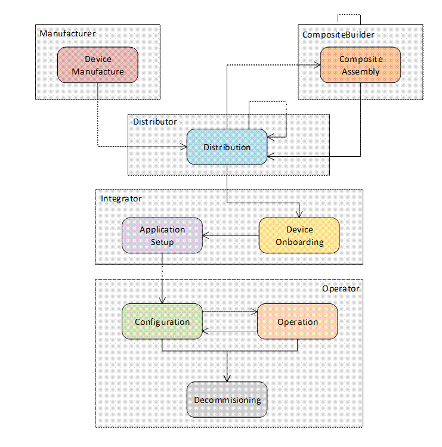
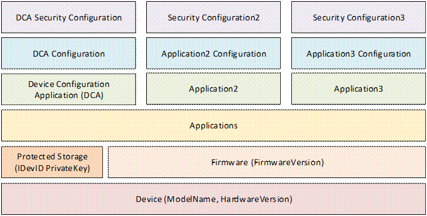
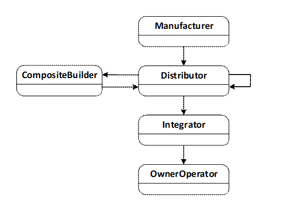
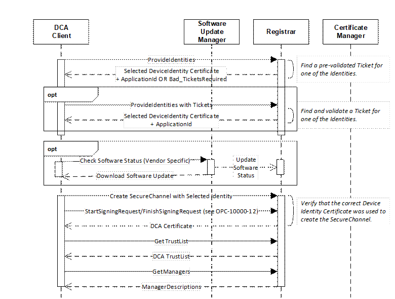
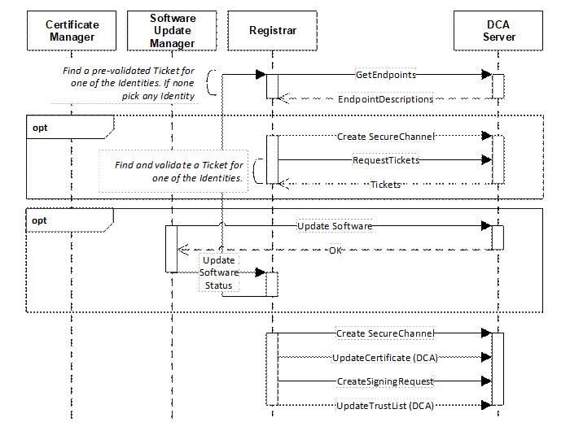
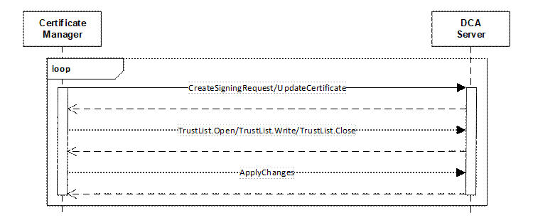
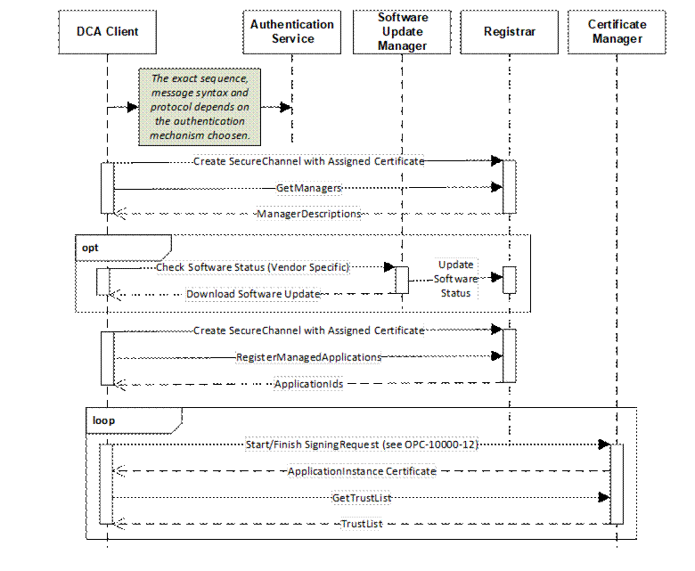
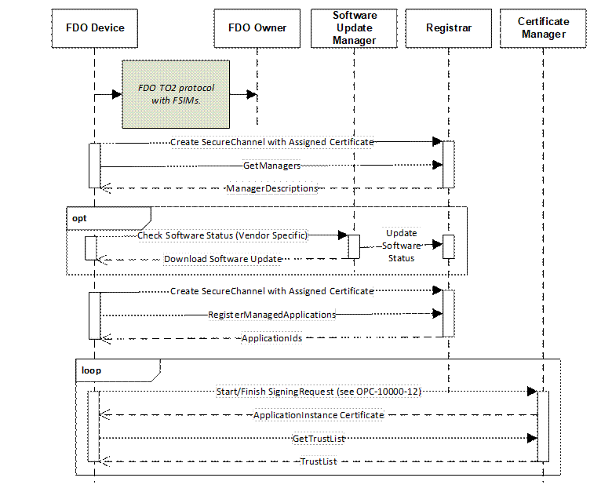
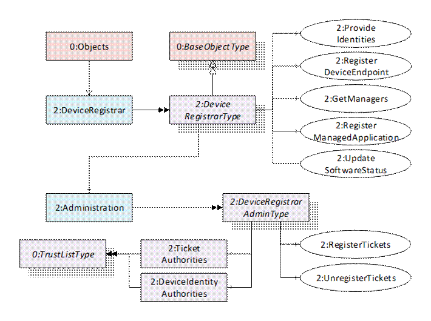
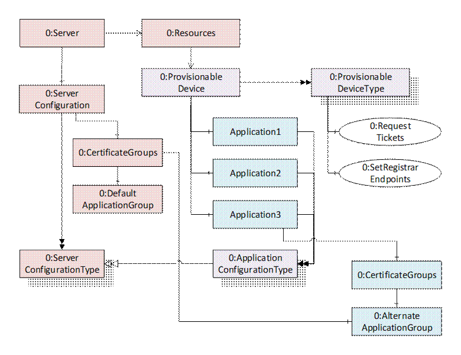

## 1 Scope  

This part defines the life cycle of *Devices* and *Composites* and mechanisms to verify their authenticity, set up their security and maintain their configuration.  

## 2 Normative references  

The following documents, in whole or in part, are normatively referenced in this document and are indispensable for its application. For dated references, only the edition cited applies. For undated references, the latest edition of the referenced document (including any amendments and errata) applies.  

OPC 10000-1, *OPC Unified Architecture - Part 1: Overview and Concepts*  

[http://www.opcfoundation.org/UA/Part1/](http://www.opcfoundation.org/UA/Part1/)  

OPC 10000-2, *OPC Unified Architecture - Part 2: Security Model*  

[http://www.opcfoundation.org/UA/Part2/](http://www.opcfoundation.org/UA/Part2/)  

OPC 10000-3, *OPC Unified Architecture - Part 3: Address Space Model*  

[http://www.opcfoundation.org/UA/Part3/](http://www.opcfoundation.org/UA/Part3/)  

OPC 10000-4, *OPC Unified Architecture - Part 4: Services*  

[http://www.opcfoundation.org/UA/Part4/](http://www.opcfoundation.org/UA/Part4/)  

OPC 10000-5, *OPC Unified Architecture - Part 5: Information Model*  

[http://www.opcfoundation.org/UA/Part5/](http://www.opcfoundation.org/UA/Part5/)  

OPC 10000-6, *OPC Unified Architecture - Part 6: Mappings*  

[http://www.opcfoundation.org/UA/Part6/](http://www.opcfoundation.org/UA/Part6/)  

OPC 10000-7, *OPC Unified Architecture - Part 7: Profiles*  

[http://www.opcfoundation.org/UA/Part7/](http://www.opcfoundation.org/UA/Part7/)  

OPC 10000-9, *OPC Unified Architecture - Part 9: Alarms and Conditions*  

[http://www.opcfoundation.org/UA/Part9/](http://www.opcfoundation.org/UA/Part9/)  

OPC 10000-12, *OPC Unified Architecture - Part 12: Discovery and Global Services*  

[http://www.opcfoundation.org/UA/Part12/](http://www.opcfoundation.org/UA/Part12/)  

OPC 10000-14, OPC UA Specification: Part 14 - PubSub  

[http://www.opcfoundation.org/UA/Part14/](http://www.opcfoundation.org/UA/Part14/)  

OPC 10000-22, OPC UA Specification: Part 22 - Base Network Model  

[http://www.opcfoundation.org/UA/Part22](http://www.opcfoundation.org/UA/Part22) /  

OPC 10000-100, OPC UA Specification: Part 100 - Devices  

[http://www.opcfoundation.org/UA/Part100/](http://www.opcfoundation.org/UA/Part100/)  

ISO/IEC 11889, Information technology — Trusted platform module library  

[https://www.iso.org/standard/66510.html](https://www.iso.org/standard/66510.html)  

802\.1AR, Secure Device Identity  

[https://1.ieee802.org/security/802-1ar/](https://1.ieee802.org/security/802-1ar/)  

RFC 3161, Internet X.509 Public Key Infrastructure Time-Stamp Protocol (TSP)  

[https://tools.ietf.org/html/rfc3161](https://tools.ietf.org/html/rfc3161)  

RFC 5280, Internet X.509 Public Key Infrastructure Certificate  

[https://tools.ietf.org/html/rfc5280](https://tools.ietf.org/html/rfc5280)  

RFC 7515, JSON Web Signature (JWS)  

[https://tools.ietf.org/html/rfc7515](https://tools.ietf.org/html/rfc7515)  

RFC 7518, JSON Web Algorithms (JWA)  

[https://tools.ietf.org/html/rfc7518](https://tools.ietf.org/html/rfc7518)  

RFC 2045, Multipurpose Internet Mail Extensions (MIME) Part One  

[https://tools.ietf.org/html/rfc2045](https://tools.ietf.org/html/rfc2045)  

RFC 4648, The Base16, Base32, and Base64 Data Encodings  

[https://tools.ietf.org/html/rfc4648](https://tools.ietf.org/html/rfc4648)  

DIN 91406, Automatic identification of physical objects and information on physical objects in IT systems  

[https://www.dinmedia.de/en/technical-rule/din-spec-91406/314564057](https://www.dinmedia.de/en/technical-rule/din-spec-91406/314564057)  

FDO, FIDO Device Onboard Specification 1.1  

[https://fidoalliance.org/specs/FDO/FIDO-Device-Onboard-PS-v1.1-20220419/FIDO-Device-Onboard-PS-v1.1-20220419.html](https://fidoalliance.org/specs/FDO/FIDO-Device-Onboard-PS-v1.1-20220419/FIDO-Device-Onboard-PS-v1.1-20220419.html)  

  

## 3 Terms, definitions, and conventions  

### 3.1 Terms and definitions  

For the purposes of this document the following terms and definitions as well as the terms and definitions given in [OPC 10000-1](/§UAPart1) , [OPC 10000-2](/§UAPart2) , [OPC 10000-3](/§UAPart3) , [OPC 10000-4](/§UAPart4) , [OPC 10000-6](/§UAPart6) , [OPC 10000-9](/§UAPart9) and [OPC 10000-100](/§UAPart100) apply.  

#### 3.1.1 Application  

a program that runs on a *Device* and communicates with other *Applications* on the network.  

Note 1 to entry: Each *Application* has an identifier that is unique within the network.  

Note 2 to entry: An *OPC UA Application* is an *Application* that supports OPC UA.  

  

#### 3.1.2 ApplicationUri  

a globally unique identifier for an *OPC UA Application* running on a particular *Device* .  

Note 3 to entry: The *Application Instance Certificate* has the *ApplicationUri* in the *subjectAltName* field.  

#### 3.1.3 Composite  

a collection of *Devices* or *Composites* assembled into a single unit.  

Note 1 to entry: Each *Composite* has a globally unique identifier.  

Note 2 to entry: A *Composite* may act as a single *Device* when connected to a network.  

Note 3 to entry: A *Composite* may appear as multiple *Devices* when connected to a network.  

#### 3.1.4 CompositeBuilder  

an organization that creates *Composites.*  

#### 3.1.5 CompositeInstanceUri  

a globally unique resource identifier assigned by a builder to a *Composite* .  

#### 3.1.6 DCA Client  

a DCA which is a *Client* and supports *PullManagement* .  

#### 3.1.7 DCA Server  

a DCA which is a *Server* and supports *PushManagement* .  

#### 3.1.8 Device  

As defined in [OPC 10000-100](/§UAPart100) .  

Note 1 to entry: For this document a *Device* also executes one or more *OPC UA Applications.*  

Note 2 to entry: a generic computer or mobile device may be a *Device* if it has a *DeviceIdentity* *Certificate*  

  

#### 3.1.9 Device Configuration Application (DCA)  

a *Client* or *Server* installed on a *Device* used to configure other applications installed on the same *Device* .  

Note 1 to entry: a DCA which is a *Client* uses *PullManagement* (see [7.2](/§\_Ref99376121) ) to interact with the *Registrar.*  

Note 2 to entry: the *Registrar* uses *PushManagement* (see [7.3](/§\_Ref99376253) ) to interact with a DCA which is a *Server.*  

#### 3.1.10 DeviceIdentity Certificate  

a *Certificate* issued to a *Device* that identifies the *Device* .  

Note 1 to entry: All *DeviceIdentity Certificates* have the *ProductInstanceUri* as a *subjectAltName* .  

Note 2 to entry: All *DeviceIdentity Certificates* are IDevID or LDevID Certificates as defined by [802.1AR](/§IEEE8021AR) .  

Note 3 to entry: The *ProductInstanceUri* is the *ApplicationUri* when the *DeviceIdentity Certificate* is used to create a *SecureChannel* .  

#### 3.1.11 Distributor  

an organization that re-sells *Devices* and/or Composites.  

Note 1 to entry: A *Distributor* may enhance *Devices* and *Composites* by adding customized products or services *.*  

#### 3.1.12 Manufacturer  

an organization that creates *Devices.*  

#### 3.1.13 OwnerOperator  

an organization deploying and operating a system that comprises of *Devices* , *Composites* or other computers connected via a network.  

#### 3.1.14 Privilege  

a named set of permissions or access rights which are needed to perform a task.  

#### 3.1.15 ProductInstanceUri  

a globally unique resource identifier assigned by the manufacturer to a *Device* .  

#### 3.1.16 Registrar  

an *OPC UA Application* that registers and authenticates *Devices* added to the network.  

#### 3.1.17 SystemIntegrator  

an organization that installs and configures a system for an *OwnerOperator* that comprises of *Devices* , *Composites* or other computers connected via a network.  

#### 3.1.18 SecureElement  

a hardware component that protects *Private Keys* from unauthorized access and disclosure.  

#### 3.1.19 Ticket  

a document that identifies a *Device* or *Composite* and has a *DigitalSignature* .  

### 3.2 Abbreviations and symbols  

API Application Programming Interface  

ASN.1 Abstract Syntax Notation \#1  

CA Certificate Authority  

CRL Certificate Revocation List  

DCA Device Configuration Application  

DER ASN.1 Distinguished Encoding Rules  

DHCP Dynamic Host Configuration Protocol  

DNS Domain Name System  

ERP Enterprise Resource Planning  

GDS Global Discovery Server  

IDevID Initial Device Identifier  

LDevID Locally Significant Device Identifier  

LDS Local Discovery Server  

mDNS Multicast Domain Name System  

NAT Network Address Translation  

PKCS Public Key Cryptography Standards  

TLS Transport Layer Security  

TPM Trusted Platform Module  

UA Unified Architecture  

URI Uniform Resource Identifier  

URN Uniform Resource Name  

  

## 4 Onboarding Model  

### 4.1 Device Lifecycle  

The Onboarding model is designed to allow the configuration of a *Device* to be managed over the complete lifecycle of the *Device* from manufacture to decommissioning. The entire lifecycle approach is needed because *Devices* , unlike PC-class computers, are often shipped with automation software pre-installed and are connected directly to sensitive networks. This requires a process to authenticate *Devices* before they are given access to a sensitive network.  

The complete life cycle of a *Device* is shown in [Figure 1](/§\_Ref2246750) .  

  

Figure 1 - The Lifecycle of a Device  

The actors in the *Device* lifecycle are described in [Table 1](/§\_Ref17497465) .  

Table 1 - The Actors in the Device Lifecycle  

| **Actor** | **Description** |
|---|---|
|Device|A computer that is able to communicate via a network. A *Device* has a unique identifier and may have one or more *Applications* (see [3.1.4](/§\_Ref100261757) ).|
|Composite|A collection of *Devices* or *Composites* assembled into a single unit. Each *Composite* has a unique identifier and may appear as a single *Device* on a network or it may appear as multiple *Devices* (see [3.1.3](/§\_Ref100261510) ).|
|Application|A program that runs on a *Device* . Each *Application* has a unique identifier and communicates with other *Applications* on the network (see [3.1.1](/§\_Ref100261616) ).|
|OwnerOperator|An organization deploying and operating a system that comprises of *Devices* , *Composites* or other computers connected via a network (see [3.1.13](/§\_Ref100261695) ).|
|Manufacturer|An organization that creates *Devices* (see [3.1.12](/§\_Ref100261720) ).|
|CompositeBuilder|An organization that creates *Composites* (see [3.1.4](/§\_Ref100261757) ).|
|Distributor|An organization that re-sells *Devices* and/or *Composites* . A *Distributor* enhances *Devices* and *Composites* by adding customized products or services before resale (see [3.1.11](/§\_Ref100261777) ).|
|SystemIntegrator|An organization that installs and configures a system for an *OwnerOperator* that comprises of *Devices* , *Composites* or other computers connected via a network (see [3.1.17](/§\_Ref100261808) ).|
|RegistrarAdmin|A user authorized to change the configuration of the *Registrar* .|
|SoftwareUpdateAdmin|A user authorized to update the firmware running on a Device.|
|SecurityAdmin|A user authorized to make changes to security configuration for *Clients* and *Servers* running on the network.|
  

  

The stages in the lifecycle for a single *Device* are described in [Table 2](/§\_Ref17505968) . This information model defines mechanisms to automate some of the tasks necessary for each stage.  

Table 2 - The Stages in the Device Lifecycle  

| **Stage** | **Description** |
|---|---|
|Device Manufacture|A *Device* is created and a *DeviceIdentity Certificate* is assigned. This *Certificate* is provided when the *Device* is transferred to other actors. During *Device* *Manufacture,* *Applications* may be installed on the *Device* . A *Ticket* describing the *Device* is created and signed by the *Manufacturer.*|
|Composite Assembly|A *Composite* is created from *Devices* and a unique identity is assigned to the *Composite* . This identity is provided when the *Composite* is transferred to other actors. During *Composite* *Assembly,* *Applications* may be installed on the *Devices* contained in the *Composite* . ** A *Ticket* describing the *Composite* is created and signed by the *CompositeBuilder.*|
|Distribution|The *Device* or *Composite* is stored until it is delivered to a *CompositeBuilder* , *SystemIntegrator* , *OwnerOperator* or another *Distributor* .|
|Onboarding|The *SystemIntegrator* connects a *Device* to the network and verifies that the identity reported by the *Device* matches the identity in a *Ticket* provided by the *Manufacturer* or *CompositeBuilder* .|
|Application Setup|The *SystemIntegrator* configures the *Applications* running on the *Device* or *Composite* so they can communicate with other *Applications* running in the system. This process includes distributing *TrustLists* and issuing *Certificates* .|
|Configuration|The *OwnerOperator* performs tasks that are not done while the *Device* is in full operation, such as updating firmware, installing new *Applications,* or changing *Application* configuration.|
|Operation|The *Device* does the tasks it was deployed to do.|
|Decommissioning|The *Device* has all access revoked and, if the *Device* is still functional, then it is reset to the default factory settings.|
  

  

The commonly understood concept of "Commissioning" is represented by the Onboarding, Application ** Setup and Configuration stages.  

The stages in the *Device* lifecycle map onto workflows that are defined in this specification. The workflows are described in [4.2](/§\_Ref94564828) .  

### 4.2 Concepts  

#### 4.2.1 Secure Elements  

*SecureElements* are a hardware-based storage for cryptographic secrets that protect them against authorized access and disclosure. The mechanisms defined for *Device* authentication depend on *PrivateKeys* that are stored in *SecureElements* . *PrivateKeys* stored on *Devices* without *SecureElements* can be stolen and reused on counterfeit *Devices* .  

*OwnerOperators* may provision *Devices* without *SecureElements* if they have other ways to ensure their authenticity.  

#### 4.2.2 Firmware and Applications  

Every *Device* has multiple layers of hardware and software that are installed and managed at different stages in the lifecycle by different actors. The layers are shown in [Figure 2](/§\_Ref94586542) .  

  

Figure 2 - Device Hardware and Software Layers  

A *Device* has firmware that is generally not changed during normal operation. Firmware updates may be provided by the *Manufacturer* to correct software bugs or patch security flaws. A *Device* should have a mechanism to ensure the integrity of the system, including the firmware, during the boot process. A *Device* should have a way to update firmware after onboarding in the *OwnerOperator's* system.  

A *Device* should have *SecureElement* storage used for security sensitive elements such as *Private Keys* . This storage cannot be backed up nor is it affect by a firmware update. The *Private Key* of *DeviceIdentity Certificates* (IDevID and LDevID) shall be placed in this storage.  

A *Device* shall have a *Device Configuration* *Application* (DCA) which is used for *Device* authentication and setup of other *Applications* on the *Device* .  

A *Device* may have storage used for *Applications* and their configuration. A *Device* should have a mechanism to back up and restore configurations. A *Device* may support multiple *Applications* which have their own configuration and security configuration.  

A *Device* has storage for the *Application* security configuration that does not need to be in the protected storage. This storage is separate from the storage for *Applications* and configurations. *Certificates, Trust Lists* , administrator credentials are examples of information that is part of the security configuration. The *Device* shall have mechanisms to ensure that only authorized actors are able to alter the security configuration or access sensitive data such as the *PrivateKeys* . If a *Device* supports multiple *Applications,* the set of authorized actors may be different for each *Application* .  

#### 4.2.3 Transfer of Physical Control  

Implicit in the *Device* lifecycle is the notion that *Devices* and *Composites* will be physically delivered to different actors. The transfers of physical control that may occur are shown in [Figure 3](/§\_Ref94586543) .  

  

Figure 3 - Possible Transfers of Physical Control  

In many cases, the *Distributor* belongs to the same organization as the *Manufacturer* or *CompositeBuilder* . Similarly, the *Integrator* and the *OwnerOperator* may be the same organization.  

When a transfer of physical control occurs, the supplier ships the equipment (a *Device* or *Composite* ) and an electronic *Ticket* (see [6](/§\_Ref25765793) ) that describes the equipment. The receiver may use the *Ticket* to authenticate the origin of the equipment using the mechanisms defined in this standard or save it so it can be provided when the equipment is transferred to another actor.  

While an actor has physical control, the actor may *Install* , *Provision* , *Configure* or *Operate* (see [Table 2](/§\_Ref17505968) ) the equipment. For example, if an actor (e.g., a *CompositeBuilder* ) makes changes to a *Device* and then transfers this *Device* to another actor (e.g., an *OwnerOperator* ) then those changes may restrict what the new owner is able to do, i.e., *CompositeBuilder* may install an *Application* used for maintenance that the *OwnerOperator* cannot access.  

The workflows (see [4.3](/§\_Ref94586426) ) describe this process in more detail.  

#### 4.2.4 Trust on First Use (TOFU)  

The onboarding process defined in this document describes how an *OwnerOperator* can authenticate *Devices* added to the network. This document does not define any mechanisms to allow *Devices* to authenticate the network it is connected to. This implies that a *Device* connected to a network will allow itself to be configured via any network that it is connected to. This behaviour is called "Trust on First Use" or TOFU.  

When first connected to a network the *DCA* will be in an initial state where it will either attempt to discover a network service that it can get its configuration ( *PullManagement* , see [7.2](/§\_Ref99376121) ) or wait for another application to provide its configuration ( *PushManagement* , see [7.3](/§\_Ref99376253) ).  

Once the onboarding process completes the *DCA* is supplied with credentials that authorize *Applications* that are allowed to make changes to its security configuration. *Devices* should have a mechanism to return the *DCA* to an initial state which discards all configuration, including all credentials and *TrustLists* that were assigned in a previous onboarding process.  

The new state allows the TOFU onboarding process to start again. Note the initial state is not the same as a factory reset which typically deletes all software installed on the *Device* . The reset mechanism should require proof of physical possession of the *Device* to ensure it cannot be exploited remotely.  

The TOFU model exposes the *Device* to malicious actors that are running on the network. This means the network used for configuration has to be protected to make it harder for a malicious actor to gain access to the network. *OwnerOperators* should also have network services designed to detect and eliminate malicious applications that attempt to interfere with the onboarding process.  

*Devices* may have other ways to assign the credentials provided by the onboarding process in order to avoid the risks associated with TOFU.  

#### 4.2.5 SoftwareUpdateManager  

The *SoftwareUpdateManager* is a system component that provides updates to firmware or software running on a *Device* . The *SoftwareUpdateManager* may implement the standard model defined in [OPC 10000-100](/§UAPart100) , however, it often will be specific to the *Manufacturer* . This document defines APIs that allow any *SoftwareUpdateManager* to coordinate with the components defined in this document.  

The *SoftwareUpdateManager* is an important part of the onboarding process because it is necessary to ensure that *Devices* with out-of-date firmware are not allowed on the network. The interactions between the *SoftwareUpdateManager* and the other components are described in clause ** [7](/§\_Ref94586663) . The *SoftwareUpdateManager* may not be present in systems where the *OwnerOperator* has other mechanisms in place to ensure the *Devices* have up to date firmware.  

#### 4.2.6 Roles and Privileges  

*Registrars* and DCA *Servers* need to restrict access to many of the features they provide. These restrictions are described either by referring to well-known *Roles* which a *Session* must have access to or by referring to named *Privileges* which are assigned to *Sessions* using mechanisms other than the well-known *Roles* . *Privileges* are needed because not all restrictions can be expressed simply by granting *Role* permissions on *Nodes* . For example, authenticated *Devices* are granted the ability to update only their own information which means the decision on granting access can depend on the values of the arguments passed to a *Method* call rather than the permissions on the *Method Node* . The well-known *Roles* used in this document are listed in [Table 3](/§\_Ref100125122) .  

Table 3 - Well-known Roles for Onboarding  

| **Name** | **Description** |
|---|---|
|RegistrarAdmin|The *Role* grants rights to manage the *Tickets* known the *Registrar* and approve *Devices* when automatic authentication was not possible.|
|SoftwareUpdateAdmin|The *Role* grants rights to set the software status for a *Device* .|
|SecurityAdmin|The Role grants the right to changes the security configuration of a *Registrar* or a DCA *Server* . For the DCA *Server* this includes the right to set the location of the *Registrar* or to force the *Server* to restart the authentication process.|
  

  

The Privileges used in this document are listed in [Table 4](/§\_Ref100125140) .  

Table 4 - Privileges for Onboarding  

| **Name** | **Description** |
|---|---|
|DeviceSelfAdmin|The *Device* has rights to modify its own registration.|
|DCA|The *Client* is a DCA that has rights to request *Certificates* and *TrustLists* for *Applications* that it has been granted rights to.|
  

For a detailed description of *Roles,* see [OPC 10000-3](/§UAPart3) .  

### 4.3 Device Workflows  

#### 4.3.1 Distribution  

Distribution is the process of transferring physical control of *Devices* and *Composites* from one organization to another. This transfer of physical control is accompanied by the electronic transfer of *Tickets* as described in [6.2](/§\_Ref33994164) .  

#### 4.3.2 Onboarding  

*Onboarding* is the process where a *Device* or *Composite* is connected to the network managed by an organization. When this happens the authenticity of the *Device* is verified via interactions with a *Registrar* running on the network.  

Every *Device* has a *Device Configuration Application* (DCA) which interacts with the *Registrar* using the interactions described in *PullManagement* ( [7.2](/§\_Ref99376121) ) or *PushManagement* ( [7.3](/§\_Ref99376253) ). These interactions are secured with a *DeviceIdentity Certificate* .  

After authentication completes, the DCA is issued a *Certificate* by the *Registrar* that allows the DCA to configure other *Applications* running on the *Device* . The *Registrar* is responsible for determining if a DCA is authorized to request *Certificates* on behalf a specific *Application* . For example, the DCA rights may be limited to *Applications* with the same hostname as the DCA.  

During *Onboarding* , the *Device* may need to have software updated before the process can complete. The DCA uses the software update model described in [OPC 10000-100](/§UAPart100) to manage the software update process.  

#### 4.3.3 Application Setup  

Application Setup is the process of issuing an *Application Instance* *Certificate* and a *TrustList* to one or more *Applications* running on a *Device* that will allow the *Applications* to communicate with other *OPC UA Applications* running on the network. These mechanisms are provided by the *CertificateManager* Information Model and are described in [OPC 10000-12](/§UAPart12) .  

During the *Onboarding* step, the DCA is issued a *Certificate* that allows it to request or accept *Certificates* on behalf of any *Application* running on the *Device* . If the DCA is a *Client* it can connect to *CertificateManager* and request the additional *Certificates* and *TrustLists* without the need for additional approvals. If the DCA is a *Server* the *CertificateManager* can locate *Applications* within the DCA *AddressSpace* and provide *Certificates* and *TrustLists* to them.  

Some *Applications* on a *Device* could have access rights that prevent the *Integrator* or *OwnerOperator* from changing the setup for the *Application* . This could occur if *Applications* are used for maintenance or protect intellectual property.  

#### 4.3.4 Configuration  

*Configuration* occurs when the *Applications* running on the *Device* are installed, modified, backed up or restored. *Configuration* is also the mode that allows a new *Device* to be dropped in as a replacement for an existing *Device* that is no longer functioning.  

Some *Devices* may allow individual *Applications* to be configured while other *Applications* continue in *Operation* state described in [4.3.5](/§\_Ref94586591) .  

  

#### 4.3.5 Operation  

*Operation* occurs when one or more *Applications* on a *Device* are running normally performing whatever task it was deployed to do. In this stage it is possible to update the *TrustList* and/or renew the *Application Instance* *Certificate* using the *CertificateManager* *PushManagement* or *PullManagement* described in [OPC 10000-12](/§UAPart12) . Some *Devices* may allow the *Application* configuration to be changed while in this stage.  

#### 4.3.6 Decommissioning  

*Decommissioning* is the final state for the *Device* where it is reset to an initial state to ensure that all sensitive data is deleted. Any permissions granted to the *Device* on the *OwnerOperator* network are revoked.  

The *DeviceIdentity Certificates* and their associated *PrivateKeys* are not affected by a reset.  

A *Device* that was *Decommissioned* by mistake can be *Onboarded* again as described in [4.3.2](/§\_Ref103335274) .  

In some cases, the *OwnerOperator* may wish to prevent the *Device* from being used again by removing/destroying the *SecureElement* or some other method to physically disable the *Device* .  

## 5 Identities  

### 5.1 Device Identity  

Every *Device* shall have an "Initial Device Identifier" (IDevID) *Certificate* (see [802.1AR](/§IEEE8021AR) ) that is used to prove the origin of the *Device* . This identity shall include a *Private Key* and an X.509v3 *Certificate* .  

IDevID *Certificate* should have the *ProductInstanceUri* (see [5.2](/§\_Ref38287970) ) as a *uniformResourceIdentifier* in the *subjectAltName* field (see [RFC 5280](/§RFC5280) ). If the IDevID *Certificate* does not have the *ProductInstanceUri* the *Device* shall have an LDevID (Locally Significant Device Identifier) *Certificate* with the *ProductInstanceUri* in the *subjectAltName* . **  

If an LDevID *Certificate* is used it should be installed by the *Manufacturer* and signed by the *Manufacturer* CA. If the LDevID *Certificate* is signed by another organization, such as a *Distributor,* then this implies the other organization is trusted as an authority capable of assuring the origin of the *Device* .  

The LDevID *Certificate* may use the same keypair as the IDevID *Certificate* . The *Private Key* should be placed in *SecureElement* storage on the *Device* .  

The *ProductInstanceUri* should also be affixed to the *Device* in a form that allows electronic reading (e.g. RFID, QR code, bar code, et. al.).  

The IDevID and LDevID *Certificates* shall conform to [802.1AR](/§IEEE8021AR) . The term *DeviceIdentity Certificate* is used to describe IDevID and LDevID *Certificates* that meet the requirements of this document.  

The mechanisms for creating, installing, securing and revoking the IDevID and LDevID *Certificates* depend on the *Manufacturer* , however, *Devices* should provide a *SecureElement* storage (for an example, see [ISO/IEC 11889](/§ISOIEC11889) ) to ensure the associated *Private Keys* cannot be copied off the *Device* .  

The IDevID and LDevID *Certificates* may have expiry dates that should be far in the future ( [802.1AR](/§IEEE8021AR) recommends the GeneralizedTime value 99991231235959Z in the notAfter field). The *Manufacturer* is responsible for creating the *Certificate Authority* used to issue the *Certificates.* Properly verifying the *Certificates* requires that the CA *Certificate* be acquired out-of-band via a mechanism that allows the receiver to authenticate the origin of the CA *Certificate* (see [6](/§\_Ref25765793) ).  

Any long-lived *Certificate* shall only be used for *Device* authentication during *Onboarding* stage (see [Table 2](/§\_Ref17505968) ).  

Note that even if the IDevID or LDevID *Certificate* does not expire the CA *Certificate* could expire. When this happens, it is no longer possible to completely verify a *DeviceIdentity* *Certificate* . *OwnerOperators* need to be cautious and develop strategies to protect against risks created by these unverifiable *Devices* . *Manufacturers* should develop strategies to ensure these *Certificates* are verifiable for the expected lifetime of the *Device.*  

The *Ticket* mechanism described in [6](/§\_Ref17650428) includes the option to extend the validity period by adding *Signatures* created by trusted *Certificate Authorities* that have not expired.  

### 5.2 ProductInstanceUri  

*ProductInstanceUri* is a globally unique resource identifier assigned by the *Manufacturer* to a *Device* . This is often stamped on the outside of a physical component and may be used for traceability and warranty purposes. The identifier shall be a valid URI that meets the following requirements:  

Have a length which does not exceed the limits imposed by the labelling technology chosen by the manufacturer;  

Truly globally unique with a structure that enforces it.  

Other standards, such as [DIN 91406](/§DIN91406) , define specific syntaxes that could meet these requirements.  

Examples of *ProductInstanceUris:*  

urn:some-company.com:5ff40f78-9210-494f-8206-c2c082f0609c  

urn:some-company.com:model-xyz:snr-16273849  

  

### 5.3 Composite Identity  

A *Composite* is a piece of equipment that contains a network of *Devices* . All of these *Devices* are internal to the *Composite* and can be accessed by other *Devices* within the *Composite* . Some of these *Devices* are also visible on an external network and have one or more *Applications* that need to be provisioned. *Composites* are an abstraction on a network and can only be physically accessed via one or more of the externally visible *Devices* .  

A *Machine* is a common example of a *Composite* .  

A *Device* which is visible on an external network may have an LDevID *Certificate* (see [802.1AR](/§IEEE8021AR) ) created by the *CompositeBuilder* that can be used to prove the *Device* belongs to the *Composite* .  

The *CompositeInstanceUri* is an identifier for the *Composite* assigned by the *CompositeBuilder* . All *Devices* in the same *Composite* shall have the same *CompositeInstanceUri* . The *CompositeInstanceUri* follows the same rules as *ProductInstanceUri* (see [5.2](/§\_Ref38304676) ).  

The *subjectAltName* is an array of alternate names for the *Device* . Each entry in the *subjectAltName* has a datatype and a value *.* An IDevID and LDevID shall have at least one URI name which is the *ProductInstanceUri.* LDevIDs created for a *Composite* shall have at least two URI names, the *ProductInstanceUri* and the *CompositeInstanceUri.* If a *Device* is in a *Composite* that is contained by another *Composite,* then only the outermost *CompositeInstanceUri* is present.  

Note that the *subjectAltName* is a generic field that contains names used for purposes outside the scope of this specification. The URI names with the *CompositeInstanceUri* and *ProductInstanceUri* are identified by finding a *Ticket* that contains the values. URI names that cannot be matched to a *Ticket* are ignored.  

*Composites* may contain other *Composites* and *Devices.* The contained *Composite* may be externally visible outside of the container *Composite* . In these scenarios, the *CompositeBuilder* may treat the contained *Composites* as *Devices* and add additional LDevID *Certificates* that identify the *Devices* as a component of the container *Composite* .  

The additional LDevID *Certificate* has the *Device* *ProductInstanceUri* and the *CompositeInstanceUri* for the containing *Composite.*  

The *CompositeBuilder* is responsible for installing and setup all *Devices* so they can interact with each other before the *Composite* is delivered.  

When a *Composite* is connected to an external network it may be necessary to install and re-provision some of the *Applications* on each externally visible *Device* . This requires that additional *Trust Lists* be provided and new *Certificates* be issued to the *Applications* . *CompositeBuilders* may limit access to *Applications* running on the *Devices* and/or prevent management Applications on the external network from installing new *Applications* .  

Each *Client* or *Server* on a network has a unique *ApplicationUri* . An *ApplicationUri* chosen by the *CompositeBuilder* may not be appropriate when the *Composite* is connected to the external ** network. For this reason, all externally visible *Applications* shall create their default *ApplicationUri* derived from the *Device* *ProductInstanceUri* which is specified in the subjectAltName field of the *DeviceIdentity Certificate* .  

## 6 Ticket Semantics  

### 6.1 Tickets  

The *Device* lifecycle shown in [Figure 1](/§\_Ref2246750) implies information needs to flow between businesses when there is a transfer of physical control over a *Device* (see [4.2.3](/§\_Ref94586636) ). How this information is transmitted is out of scope but it could be email, a block chain ledger, cloud based webservice, a file on a USB stick or some other mechanism. This specification defines the format of a document that contains information that needs to be provided with a *Device* . A *Ticket* is the term used for a document that describes one or more *Devices* and has a *Digital Signature* that can be used to verify that the contents of the document have not been altered and that they confirm the origin of the *Device* .  

*Tickets* are long lived documents which means the signing *Certificate* should be issued by a widely trusted root *Certificate Authority* that is likely to be in business even if the *Manufacturer* or *CompositeBuilder* has gone out of business. *Tickets* allow additional *Signatures* to be added at any time by an entity in the chain of physical control. The current owner of a *Device* validates the *Ticket* by choosing a *Signature* created by an authority it trusts.  

For example, a *CompositeBuilder* re-signs the *Tickets* for the *Devices* to associate the *CompositeInstanceUri* with the *Device Ticket* (see [8.1](/§\_Ref51594798) ). Customers of the *CompositeBuilder* will not need a relationship with the *Manufacturer* of the *Device* to validate the *Ticket* .  

*DeviceIdentity Certificates* are typically signed with a chain ending in a root CA owned by the *Manufacturer* or *CompositeBuilder* . *Tickets* are typically signed with a *Certificate* issued to the *Manufacturer* by a well-known root CA. *Issuer* *Certificates* for *Certificates* used to sign *Tickets* shall have the *cRLDistributionPoints* or *authorityInfoAccess* extensions defined (see [RFC 5280](/§RFC5280) ).  

### 6.2 Ticket Distribution  

When physical control over *Devices* and/or *Composites* is transferred from one organization to another there needs to be a physical transfer of goods and an electronic transfer of the *Tickets* associated with the *Devices* and *Composites* . The *Tickets* allow the new user to verify the authenticity of the *Devices* and *Composites* they received by using the handshake defined in [7](/§\_Ref94586663) . **  

When transferring *Devices,* the sender provides a *DeviceIdentityTicket* (see [8.2.1](/§\_Ref39651213) ) ** for each *Device.* When transferring *Composites,* the sender provides a *CompositeIdentityTicket* (see [8.2.4](/§\_Ref18575515) ) for each *Composite* and a *DeviceIdentityTicket* for each externally visible *Device in the Composite.* The *DeviceIdentityTickets* and *CompositeIdentityTickets* should be created and signed by the original *Manufacturer* and/or *CompositeBuilder* , however, a trusted intermediary, such as a *Distributor* , could create the *Tickets* or add additional *Signatures* to the existing *Tickets* .  

Properly verifying the origin of *Devices* requires that *OwnerOperators* and other downstream users of *Devices* have access to the *Tickets* and the CA that issued the signing *Certificates* . This usually requires a network connection that allows the revocation status to be checked. The *Tickets* are used to build a list of *Devices* and *Composites* which are allowed on the network. The *ProductInstanceUri* and *CompositeInstanceUri* are used to correlate a *Device* with a *Ticket* . A *Ticket* can be verified before the *Devices* are connected to the network or done when a new *Device* is detected.  

When an *OwnerOperator* initially receives a *Ticket,* it may wish to validate them immediately and add a *Signature* with their own *Certificate.* A *Signature* shall only be applied to a *Ticket* that has been validated. ** This allows the *Device* to be stored until it is needed without any further need for access to an external system to check revocation lists. The *OwnerOperator* can also manage the issue of expiring *Certificates* by periodically re-validating and adding a new *Signature* before the previous *Certificate* that created the previous *Signature* expires. The re-signed *Tickets* should be stored in systems controlled by the *OwnerOperator.*  

Automatic validation of *Devices* requires a service, called a *Registrar* , running on the network. The *Registrar* is able to communicate with new *Devices* and see if they match a *Ticket* known to the *Registrar* . The mechanism for providing the *Tickets* to the *Registrar* depends on the *Registrar* . A completely automated solution would integrate the *Registrar* with the corporate ERP system. This would allow the *Registrar* to receive the *Tickets* as part of the purchasing process. When such integration is not available, the *Tickets* could be uploaded manually by the technician installing the *Devices* or they could be read from the *Device* itself. If a *Ticket* is provided with the *Device* , the *RegistrarAdmin* shall provide the *Registrar* with the CAs that can sign *Tickets* which are trusted.  

### 6.3 Authentication  

When a *CompositeBuilder* or *Integrator* receives a shipment of *Devices* it needs to connect them to their network and verify their authenticity. This process is automated by the use of a *Registrar* that detects new *Devices* added to the network, inspects their *DeviceIdentity Certificates* and finds the corresponding *DeviceIdentityTicket* . If a match was found the *Device* is accepted and can be provisioned for use on the network. See [7](/§\_Ref45035977) for a complete description of this process.  

There are two modes of operation that a *Device* can use depending on whether it is a *Client* or a *Server* . *Clients* use *PullManagement* which is defined in [7.2](/§\_Ref99376121) . *Servers* use *PushManagement* which is described in [7.3](/§\_Ref99376253) . *Devices* which are a *Client* and a *Server* may use either model.  

The authentication process requires secure communication using OPC UA. A *Device* shall have a *Client* or *Server* installed on the *Device* which is used for *Device* *Onboarding* , Application Setup and Configuration. This *Application* is called the "Device Configuration Application" or DCA. When a *Device* is first connected the DCA is configured to use any of its *DeviceIdentity Certificates* as its *Application Instance Certificate* . Note that *DeviceIdentity Certificates* will not have a DNS name or IP address because these values are not known when the *DeviceIdentity Certificate* is created. Therefore, the *Registrar* shall suppress host name validation errors when communicating with a DCA. The *Registrar* should verify that the DCA is running on a network designated by the *RegistrarAdmin* as a source for new *Devices* . **  

Once the *Device* has been authenticated by the *Registrar,* it is provided with an *Application Instance Certificate,* called a ** DCA *Certificate* , that is used for any subsequent communication. The DCA *Certificate* will have a shorter lifespan and a CA which is managed by the *OwnerOperator* . This *Certificate* allows all *Applications* running on the *Device* to automatically be onboarded and configured without human intervention.  

When a *Device* is first deployed it may have out of date firmware that needs to be upgraded before it can participate in the network. The *SoftwareUpdateManager* may use the software update model ( *PushManagement* only) in [OPC 10000-100](/§UAPart100) or it may rely on proprietary mechanisms that are specific to the *Device* . The *Device* will not get access to the network until the *SoftwareUpdateManager* indicates that the *Device* is up to date and whether a software update was applied. Once the firmware is updated, the *Registrar* can issue an *Application Instance Certificate* to the DCA.  

*Application Instance Certificates* issued to a DCA shall not be used for communication with any application other than the *Registrar* , *SoftwareUpdateManager, CertificateManager* or a configuration application that acts on behalf of those agents. The *CertificateManager* shall restrict the *Applications* that a DCA is permitted to manage. A simple restriction would limit *Certificate* *Requests* to the host names/IP addresses that appear in the DCA Certificates. More complex rules could exist for complex Devices. *OwnerOperators* may choose to create a special VLAN (Virtual LAN) that is only used for communication using the DCA *Certificates* .  

The registration process here also applies to externally visible *Devices* that are contained in a *Composite* . In these cases, the *CompositeBuilder* provides the list of *Devices* .  

When a *Device* is first connected to the network it may not have a properly synchronized clock (e.g., a battery backed clock set by the manufacturer). This means it will not be possible for the *Device* to check the validity period of the *Certificates* used to establish secure communication with the *Registrar* . In these situations, the *Device* should use a time synchronization protocol such as NTP to update the system clock at boot. If a time synchronization server is not available the *Device* may ignore the validity period for the *Certificates* provided by the *Registrar* .  

### 6.4 Acquiring and Validating Tickets  

*Device* authentication depends on a process for creating, distributing and validating *Tickets* which contain information needed to determine if any given *Device* is allowed to be connected to the *OwnerOperator's* network.  

There are two strategies for validating *Tickets* that depend on how the *Tickets* are acquired. The recommended approach is to rely on an out-of-band mechanism which provides the *Tickets* for the *Devices* and *Composites* that will be delivered to the facility before the *Devices* are connected to the network. This could be done automatically if the *Registrar* is integrated with the ERP. It can also be a manual process where a digital file is delivered to an *RegistrarAdmin* that uploads it to *Registrar* . When a new *Device* is detected on the network the matching *Ticket* is found which confirms that the *Device* is authorized.  

The second strategy uses a *Ticket* that is distributed with the *Device* or *Composite* . This *Ticket* could be stored on the *Device* or on physical media that was delivered with the *Device* . When a *Device* is connected to the network the *Ticket* is either manually uploaded to the *Registrar* by the technician installing the *Device* or is read from the *Device* during the authentication process. For this strategy to be secure the *Certificates* used to sign the *Tickets* are provided to the *Registrar* in advance by the *RegistrarAdmin* . A *Device* is authorized to be on the network if the *Ticket* is valid, it matches the *Device* and is signed by a trusted *Ticket* authority.  

The steps to validate a *Ticket* are as follows:  

1. Verify that a signing *Certificate* is valid and trusted;  

1. Verify the *Signature* is valid;  

  

*Tickets* that are not valid shall not be used.  

*Tickets* may have multiple signatures added by different actors in the supply chain. The *Registrar* only needs to find one *Signature* created by a trusted authority. This assumes that actors in the supply chain only add a *Signature* if at least one of the existing *Signatures* is valid and created by an authority the actor trusts. *Registrars* shall not trust authorities unless they are confident that the authority is properly validating *Tickets* before adding a *Signature* .  

A signing *Certificate* is trusted if it is valid and the *Certificate* is recorded as a trusted *Ticket* signing *Certificate* with the *Registrar* or if the issuer is a trusted root *CertificateAuthority* . The latter criteria is only allowed if the *Ticket* was provided out of band.  

The process of verifying a *Certificate* is described completely in [OPC 10000-4](/§UAPart4) , however, checks that are specific to *Application Instance* *Certificates* do not apply (e.g. the *HostName* and *ApplicationUri* checks).  

Trusted root *CertificateAuthorities* used to issue *Ticket* signing *Certificates* are companies that maintain Internet accessible online revocation status checks. For example, companies that provide C *ertificates* for code/document signing could be a root *CertificateAuthority* for *Ticket* signing. Each *OwnerOperator* is responsible for maintaining a list of trusted root *CertificateAuthorities* which are accepted by the organization.  

## 7 Device Authentication  

### 7.1 Overview  

*Registrars* shall not accept *Devices* they do not trust. The steps to determine trust are:  

1. Read all *DeviceIdentity Certificates* from the *Device* ;  

1. Locate a *Ticket* that has a *ProductInstanceUri* that matches one or more *DeviceIdentity* *Certificates* ;  

1. Validate the *Ticket* if it has not already been validated (see [6.4](/§\_Ref45026545) );  

1. Select and Validate *DeviceIdentity* *Certificate* that matches the *Ticket* ;  

1. Establish a secure connection to the *Device* using the selected *DeviceIdentity Certificate.*  

1. Issue a DCA *Application Instance* *Certificate* to the *Device* that indicates that it has been authenticated.  

  

The initial communication between the *Registrar and the Device* is secured with a *DeviceIdentity Certificate* . When using *PushManagement* ( [7.3](/§\_Ref99376253) ), the *Registrar* is a *Client* that calls *GetEndpoints* via connection without security on the *Device Configuration Application* (DCA). The DCA shall provide at least one *EndpointDescription* for each *DeviceIdentity Certificate* . The *Registrar* chooses a *DeviceIdentity Certificate,* establishes a secure connection using an *EndpointDescription* that uses that *Certificate.* This provides proof that the *Device* possesses the *PrivateKey* associated with the *Certificate* . The *Registrar* uses the *SecureChannel* to provide an *Application Instance Certificate* to the DCA which will allow the DCA to be used to provision the other *Applications* running on the *Device.* This *Certificate* is called the DCA *Certificate* .  

When using *PullManagement* ( [7.2](/§\_Ref99376121) ) the DCA connects to the *Registrar* without security and calls the *ProvideIdentities* *Method.* The *Registrar* chooses a valid *DeviceIdentity Certificate* and returns it in the response along with a *ApplicationId* which is used to request new *Certificates* . The DCA reconnects using a new *SecureChannel* with the selected *Certificate* which provides proof that the *Device* possesses the *PrivateKey* associated with the *Certificate.* The DCA uses the *SecureChannel* to request a new *Application Instance Certificate* which will allow the DCA to provision the other *Applications* running on the *Device.* The DCA *Application Instance Certificate* cannot be used for any action other than configuring the DCA or other *Applications* managed by that DCA (for example, the host name/IP address of the *Application* being configured has the same host name/IP addresses assigned to the *Device* where the DCA is running).  

*Registrar* first looks for a *Certificate* that has a *ProductInstanceUri* as a value in the subjectAltName of the *Certificate* . The *Registrar* first searches the set of pre-validated *Tickets* that were provided out-of-band for a match. If that fails it either calls the *RequestTickets* *Method* on the DCA (see *PushManagement* in [7.3](/§\_Ref99376253) ), or returns a code from *ProvideIdentities Method* that tells the DCA to call the *ProvideTickets Method* (see pull management in [7.2](/§\_Ref99376121) ).  

If the matching *DeviceIdentityTicket* is referenced by a *Composite* *Ticket* (see *CompositeIdentityTicketType* in [8.2.4](/§\_Ref18575515) ) then the *Registrar* looks for a *Certificate* that has both the *CompositeInstanceUri* and the *ProductInstanceUri* as values in the *subjectAltName* .  

A *Device* that is part of a *Composite* should provide the *Composite Tickets* in the *RequestTickets* or *ProvideTickets Method.*  

Partial matches to *DeviceIdentityTickets in* *CompositeIdentityTickets* are rejected (i.e. *Certificates* with the *ProductInstanceUri* but no *CompositeInstanceUri* ).  

If more than one *Certificate* had a matching *Ticket* the *Registrar* may choose any one of them. The one selected is logged.  

If the matching *Ticket* came from the *Device* , the *Registrar* validates the *Ticket* (see [6.4](/§\_Ref45026545) ).  

Once the *Registrar* has found a valid *Ticket* that matches a *DeviceIdentity Certificate* , it can use the *CertificateAuthority* in the *Ticket* to validate the selected *Certificate* using the process described in [OPC 10000-4](/§UAPart4) for *Application Instance* *Certificates* . The revocation status check may be online if the *Manufacturer* or *CompositeBuilder* adds the *cRLDistributionPoints* or *authorityInfoAccess* extensions (see [RFC 5280](/§RFC5280) ) to the *DeviceIdentity Certificates* . If those extensions do not exist then the revocation check may be skipped. Skipped revocation checks shall be logged. If the *Ticket* is signed by a trusted *Ticket* signing authority and the timestamp is valid then expired CA *Certificates* may be ignored since the lifetime of a *Device* is usually longer than the lifetime of a CA *Certificate* .  

The *Registrar,* and the storage it needs, is a critical part of the authentication process and needs to be protected from access by malicious actors.  

### 7.2 Pull Management  

*Clients* may use pull management which is illustrated in [Figure 4](/§\_Ref45040284) .  

  

Figure 4 - Device Authentication using Pull Management  

See [7](/§\_Ref45035977) for a complete description of the *Device* authentication process.  

The sequence begins when the *Device* discovers the location of the *Registrar* via mDNS (see [OPC 10000-12](/§UAPart12) ), the *SetRegistrarEndpoints* *Method* is called ( *Servers* only) or the *Endpoints* are provided via a *Device* specific mechanism. The sequence automatically repeats until the *Device* receives its DCA *Certificate* and no software update is required. Any errors occur the sequence restarts from the beginning. Note that step requires that the DCA trust any *Registrar* it finds since it does not have a valid *TrustList* (see [4.2.4](/§\_Ref99366278) ).  

If multiple *Registrars* are on the network, the DCA shall attempt to connect to each one until it finds one that accepts it and allows it to request *a* DCA *Certificate* and a *TrustList* . Once configured, the DCA shall not attempt to connect to *Registrars* that are not in the *TrustList* . *Devices* that support pull management shall have a way for a person with physical access to the *Device* to reset the DCA *TrustList* and restart the *Device* authentication process.  

The *OwnerOperator* should have a strategy to detect and remove rogue *Registrars* since the DCA always trusts the first *Registrar* that provides an *Application Instance Certificate* .  

Once connected to a *Registrar* the *Device* provides all of its *DeviceIdentity Certificates* to the *Registrar* which then attempts to locate a valid *Ticket* that matches one of the *Certificates* . If a *Composite Ticket* that matches the *Device ProductInstanceUri* exists then only *DeviceIdentity Certificates* with the *CompositeInstanceUri* are considered by the *Registrar* .  

If no *Ticket* is found the *Registrar* asks the *Device* to provide any *Tickets* that it has by returning a *Bad\_TicketRequired* error.  

If a valid *Ticket* is found the *Registrar* returns a *DeviceIdentity Certificate* and *ApplicationId* which the *Device* is expected to used to request the DCA *Certificate and* the DCA *TrustList.*  

The *Registrar* also uses the *Ticket* to determine if a software update is required before it provides a *Certificate* to a *Device* . If one is required it returns a *Endpoint* to the *SoftwareUpdateManager* that the *Device* is expected to use.  

When the *Device* connects to *SoftwareUpdateManager* it provides the current version number of the software that is installed. If it is the required version, the *SoftwareUpdateManager* calls the *UpdateSoftwareStatus* *Method.* Otherwise, the *Device* downloads the update, applies it and then connects to *SoftwareUpdateManager* again ** and provides the new version number. The process repeats until the required software version is installed.  

The complete process for requesting a *Certificate* and a *TrustList* are described in [OPC 10000-12](/§UAPart12) . Note that the DCA does not call *RegisterApplication* on the *CertificateManager* since the *Registrar* does that on behalf of the DCA when it finds a valid *Ticket* for the *Device* . Note that the *Methods* exposed by the *Registrar* rather than the *CertificateManager* . The expectation is the *Registrar* and the *CertificateManager* share a common backend so *Certificates* and *Applications* created via the *Registrar* will be known to the *CertificateManager* . In some cases, the *Registrar* and the *CertificateManager* will be the same *Server* .  

The *GetManagers* call returns the *Endpoints* for the *CertificateManager* which the DCA is expected to use.  

The DCA shall not connect to an untrusted *Registrar* once it has a *TrustList* .  

The process for requesting *Application Instance Certificates* is shown in [Figure 5](/§\_Ref99367428) .  

  

Figure 5 - Requesting Certificates using Pull Management  

The DCA registers all *Applications* it intends to manage with the *Registrar* which verifies that the DCA is authorized to manage the *Applications* and provides *ApplicationIds* needed to request *Certificates* from the *CertificateManager* . This authorization process is specific to the *Registrar* implementation and can include communication with an external authorization service or manual approval by a *RegistrarAdmin* .  

### 7.3 Push Management  

*Servers* may use *PushManagement* which is illustrated in [Figure 6](/§\_Ref45040285) .  

  

Figure 6 - Device Authentication using Push Management  

See [7](/§\_Ref45035977) for a complete description of the authentication process.  

Each of the *DeviceIdentity Certificates* is returned in *EndpointDescriptions* returned by *GetEndpoints* . The *Registrar* looks for a pre-validated *Ticket* that matches the *Certificate* in one of the *Endpoints* . If none found it chooses any one and establishes a *SecureChannel* and calls *RequestTickets* . The *Registrar* needs to validate the *Tickets* returned by the *Device* which requires access to the *Certificate* that created one of the *Signatures* and the ability to check its revocation status.  

If the *Registrar* finds an *EndpointDescription* that matches a valid *Ticket* it will create a new *SecureChannel* using that *EndpointDescription* . It provides the DCA *Certificate* and *TrustList* to the *Device* . Once a *Device* has a DCA *TrustList* and all software updates have been applied, it will not accept connections from untrusted *Registrars* . In this state, the DCA shall only return *EndpointDescriptions* that use the DCA *Certificate* when *GetEndpoints* is called.  

The *Registrar* may then pass control to the *SoftwareUpdateManager* which is responsible for checking if the *Device* software is up to date and uploading a new image if required. Once complete the *SoftwareUpdateManager* or an agent acting on its behalf calls *UpdateSoftwareStatus Method* on the *Registrar* .  

Once the *Device* has updated software the *CertificateManager* will be able to push *Application Instance Certificates* and *TrustLists* for all *Applications* exposed via an *ApplicationConfiguration Object* (see [Figure 7](/§\_Ref100005144) ) in the DCA *AddressSpace* . This process is shown in [Figure 7](/§\_Ref100005144) .  

  

Figure 7 - Updating Certificates using Push Management  

If multiple *Registrars* are on the network, the DCA shall accept the first one to provide an *Application Instance Certificate* and a *TrustList* . Once configured, the DCA shall reject connections from *Registrars* that are not in the *TrustList* . The *OwnerOperator* should have a strategy to detect and remove rogue *Registrars* since the DCA always trusts the first *Registrar* that provides a *Certificate* .  

Some *Devices* with limited resources may only support a single *Server* which acts as both the DCA and the operational *Application* . DCAs report this requirement to the *Registrar* by setting the *IsSingleton Property* to TRUE on the *ProvisionableDevice* *Object* (see [9.3.2](/§\_Ref90057728) ). *Registrar* that shall provide a normal *Application Instance Certificate* to the DCA that cannot be used to configure other *Applications* .  

### 7.4 Alternate Authentication Models  

#### 7.4.1 Overview  

There are different standards for Device Authentication which do not meet the complete set of requirements described in this specification. However, an *OwnerOperator* may have reasons to use one of these other mechanisms (i.e. they have the infrastructure and wish to reuse it).  

In some cases, the *OwnerOperator* have a complete solution that manages the entire life cycle of the *Certificates* installed on the *Device* . In these cases, the onboarding mechanisms described in this specification are not used and it is responsibility of the alternate mechanism to issue and renew *Application Instance Certificates* to all *Applications* running on the *Device* and to maintain their *Trust Lists* .  

In other cases, the alternate mechanism will only authenticate the *Device* and install a single *Certificate* . In these cases, the mechanism described in this specification takes over and manages the life cycle of *Application Instance Certificates* and the *Trust Lists.* This pull management version of this case is illustrated in [Figure 8](/§\_Ref99382478) .  

  

Figure 8 - Alternate Authentication Models with Pull Management  

In this case, it is responsibility of the Authentication Service to verify the authenticity of the *Device* and supply a *Certificate* to the DCA that is trusted by the *Registrar, SoftwareUpdateManager* and *CertificateManager* . This *Certificate* shall also contain a *ProductInstanceUri* (see [5.2](/§\_Ref38304676) ) which uniquely identifies the *Device* .  

If a software update check is required the DCA needs the *Endpoint* for the *SoftwareUpdateManager* . If the Authentication Service cannot supply this *Endpoint,* the DCA can get it from the *Registrar* which may be discovered with mDNS and then calling the *GetManagers Method* . Once any software update is completed, the DCA calls *RegisterManagedApplications* on the *Registrar* to get permission to request *Certificates* and *TrustLists* on behalf of those *Applications* .  

The location of the *CertificateManager* is returned by the *GetManagers Method* . The DCA can use the mechanisms defined in [OPC 10000-12](/§UAPart12) to request the *Certificates* and *TrustLists* for all of the Applications which it is authorized to manage.  

The Authentication Service may also provide a DCA Certificate to a Server which would then annouce its presence via mDNS. The *Registrar* would then follow the process described in [7.3](/§\_Ref99376253) to discover the Applications managed by the DCA and providing their *Certificates* and *TrustLists* .  

#### 7.4.2 FDO  

##### 7.4.2.1 Overview  

FIDO Device Onboard ( [FDO](/§FIDO) ) is an onboarding protocol from the FIDO Alliance, an open industry association.  The current version is FDO 1.1. FDO can be used as an alternate authentication model, as described in [7.4.1](/§\_Ref150856279) .  

When a FDO Device is connected to a network it searches for one of the preconfigured DNS addresses for a FDO Rendezvous Server (TO1 in the FDO specification). When it finds one, it asks for the FDO Owner that has a digital document, called the FDO Ownership Voucher, that allows the onboarding process to start. The FDO Owner registers with a FDO Rendezvous Server when it recieves the FDO Ownership Voucher via mechanisms independent from the delivery of the FDO Device (TO0 in the FDO specification).  

The FDO Device then creates a connection to the FDO Owner (TO2 in the FDO specification). The FDO Device identifies itself to the FDO Owner and creates a *Signature* with a *PrivateKey* preinstalled on the FDO Device. Then the FDO Owner verifies the *Signature* and determines if the FDO Device can be trusted by checking a *TrustList* provided to the *FDO Owner* . The FDO Owner presents the FDO Ownership Voucher for FDO Device with a *Signature* created by the FDO Owner. The FDO then allows communication to continue if it is able to verify the FDO Ownership Voucher.  

The FDO Ownership Voucher is a digital document distributed by the manufacturer and is delivered via a mechanism independent from FDO as the FDO Device moves through the supply chain. The FDO Ownership Voucher has multiple *Signatures* provided by each intermediary in the supply chain. However, the FDO Device only knows the first *PublicKey* in the chain but this is sufficient to allow the FDO Device to verify the entire chain when it receives it from the FDO Owner.  

Once FDO authentication is complete, the FDO Device creates an encrypted tunnel that is used to complete the onboarding process. The information exchanged during this stage can be application specific. FDO ServiceInfo Modules (FSIMs) are subprotocols that defined the messages exchanged during the onboarding process. The FSIMs to use are negotiated once the encrypted tunnel has been established.  

##### 7.4.2.2 Integration with the Registrar  

[Figure 9](/§\_Ref150859321) illustrates the handoff from the FDO protocol to the mechanisms defined in this document.  

  

Figure 9 - Device Authentication with the FDO Protocol  

Specifically, the FDO Owner supplies the FDO device with a *Certificate* that can be used to create a *SecureChannel* with the *Registrar* . The *Registrar* is preconfigured with the CA *Certificate* used by the FDO Owner to issue the *Certificates* to authenticated FDO Devices. The FDO Owner uses a FSIM (fdo.csr) that creates a new LDevID that can be installed on the FDO Device as part of the onboarding process described in [7.4.2.1](/§\_Ref150859952) . This LDevID shall contain the information specified in Clause [5](/§\_Ref150859865) . The rest of onboarding process is the same as when the OPC UA device authentication mechanisms are used.  

A FDO *Device* that supports integration with OPC UA shall have an OPC UA *Client* that can communicate with the Registrar. The OPC UA *Client* (a.k.a., a DCA using Pull Management as described in [7.2](/§\_Ref99376121) ) may be installed by the Manufacturer or could be installed by the FDO Owner as part of the FDO onboarding process.  

## 8 Ticket Syntax  

### 8.1 Signed Ticket Encoding  

All *Tickets* (see [8.2.3](/§\_Ref100126215) and [8.2.4](/§\_Ref18575515) ) are encoded as JSON documents. These JSON documents secured with digital signature applied to the general serialization described by [RFC 7515](/§RFC7515) . The structure of an [RFC 7515](/§RFC7515) document is as follows.  

  

\{  

"payload":" **BASE64URL(UTF8(JSON encoded Ticket))**   

"signatures":[  

\{"protected":" **BASE64URL(UTF8(JSON encoded protected header))**   

"header": **JSON encoded header**   

"signature":" **BASE64URL(JWS Signature)**   

...  

\{"protected":" **BASE64URL(UTF8(JSON encoded protected header))**   

"header": **JSON encoded header**   

"signature":" **BASE64URL(JWS Signature)**   

\}  

Appendix A.6 in [RFC 7515](/§RFC7515) provides an example of a document encoding using this structure.  

The BASE64URL transform which allows binary data (e.g., UTF-8 encoded text) to be represented as ASCII.  

The *Ticket* is encoded as a JSON object using the reversible JSON encoding defined in [OPC 10000-6](/§UAPart6) . This JSON object is converted to an UTF-8 byte array and then BASE64URL before being added to the document.  

The protected header specifies the signing *Certificate* and other information needed to verify the *Signature* . The required fields are defined in [Table 5](/§\_Ref51593927) .  

The unprotected header is generally not used; however, it could be used for additional vendor specific information such as a [RFC 3161](/§RFC3161) timestamp or other anti-forgery or validation metadata.  

A *Signature* is computed on the following byte array:  

\<protected header\>.\<payload\>  

*Tickets* may have additional signatures added by any actor in the supply chain. For example, a *CompositeBuilder* shall add *Signatures* to all *Tickets* for *Devices* incorporated into the *Composite.* The protected header shall have the *CompositeInstanceUri* .  

The *Certificate* and algorithms used to create the payload *Signature* are the same as the *Certificate* and algorithms used to create the [RFC 7515](/§RFC7515) *Signature* . The [RFC 7515](/§RFC7515) header provides the information needed to calculate the size of payload *Signature* .  

Table 5 - RFC 7515 Header Fields  

| **Header Field** | **Type** | **Description** |
|---|---|---|
|alg|String|The cryptographic algorithm used to sign the Ticket. The possible values are defined by [RFC 7518](/§RFC7518) . The default when using RSA public keys is "RS256".|
|x5c|String []|The signing *Certificate* and all of its issuers. Each array element is base64 encoded (see [RFC 4648](/§RFC4648) ) DER encoding. The first element is the signing *Certificate* .|
|cty|String|The type of *Ticket* contained in the payload. This is media type defined by [RFC 2045](/§RFC2045) with the leading "application/" omitted. The subtype is "opc-ticket+json". The type parameter is the name from *BrowseName* of the *Structure* . For example, the value for a *DeviceIdentityTicketType* is: opc-ticket+json;type=DeviceIdentityTicketType|
|opc-uri|String|The *CompositeInstanceUri* if the Signature was created by a *CompositeBuilder* who has incorporated the *Device* into a *Composite.*|
  

  

### 8.2 Ticket Types  

#### 8.2.1 EncodedTicket  

The *EncodedTicket* is a simple DataType representing a JSON encoded Ticket.  

Its representation in the *AddressSpace* is defined in [Table 8](/§\_Ref42881538) .  

Table 6 - EncodedTicket Definition  

| **Attribute** | **Value** |
|---|---|
|BrowseName|0:EncodedTicket|
|IsAbstract|False|
  
| **References** | **NodeClass** | **BrowseName** | **DataType** | **TypeDefinition** | **Other** |
|---|---|---|---|---|---|
|Subtype of the 0: *String* *DataType* defined in [OPC 10000-5](/§UAPart5) .|
||
  
| **Conformance Units** |
|---|
|Onboarding Ticket Reader|
  

  

#### 8.2.2 BaseTicketType  

The *BaseTicketType* is an abstract base class for a *Ticket* .  

The fields of this *DataType* are defined in [Table 7](/§\_Ref50210437) .  

Table 7 - BaseTicketType Structure  

| **Name** | **Type** | **Description** |
|---|---|---|
|BaseTicketType|0:Structure|Subtype of the *Structure* *DataType* defined in [OPC 10000-5](/§UAPart5) .|
|manufacturerName|0:String|The name of the *Manufacturer* for the *Device* .|
|modelName|0:String|The model name assigned by the *Manufacturer* . Not specified if no ** model name was assigned or known.|
|modelVersion|0:String|The model version assigned by the *Manufacturer* . Not specified if no ** model version was assigned or known.|
|hardwareRevision|0:String|The hardware revision assigned by the *Manufacturer* . Not specified if no ** hardware revision was assigned or known.|
|softwareRevision|0:String|The software revision assigned by the *Manufacturer* . May not be the same as the current version of software installed on the *Device* . Not specified if no ** software revision was assigned or known.|
|serialNumber|0:String|The serial number assigned by the *Manufacturer* . Not specified if no ** serial number was assigned or known.|
|manufactureDate|0:DateTime|When the *Device* was manufactured. DateTime.MinValue if the date is not known.|
|authorities|2:CertificateAuthorityType []|A list of CAs need to validate *DeviceIdentity Certificates* on the *Device* that were installed when the *Ticket* was created.|
  

  

Its representation in the *AddressSpace* is defined in [Table 8](/§\_Ref42881538) .  

Table 8 - BaseTicketType Definition  

| **Attribute** | **Value** |
|---|---|
|BrowseName|2:BaseTicketType|
|IsAbstract|True|
  
| **References** | **NodeClass** | **BrowseName** | **DataType** | **TypeDefinition** | **Other** |
|---|---|---|---|---|---|
|Subtype of the *Structure* *DataType* defined in [OPC 10000-5](/§UAPart5) .|
||
  
| **Conformance Units** |
|---|
|Onboarding Ticket Reader|
  

  

#### 8.2.3 DeviceIdentityTicketType  

The *DeviceIdentityTicketType* describes a single *Device* produced by a *Manufacturer* .  

The fields of this *DataType* are defined in [Table 9](/§\_Ref17645817) .  

Table 9 - DeviceIdentityTicketType Structure  

| **Name** | **Type** | **Description** |
|---|---|---|
|DeviceIdentityTicketType|0:Structure|Subtype of the 2: *BaseTicketType DataType* defined in [8.2.1](/§\_Ref50203772) .|
|productInstanceUri|0:UriString|The *ProductInstanceUri* for the *Device* .|
  

  

Its representation in the *AddressSpace* is defined in [Table 10](/§\_Ref50203857) .  

Table 10 - DeviceIdentityTicketType Definition  

| **Attribute** | **Value** |
|---|---|
|BrowseName|2:DeviceIdentityTicketType|
|IsAbstract|False|
  
| **References** | **NodeClass** | **BrowseName** | **DataType** | **TypeDefinition** | **Other** |
|---|---|---|---|---|---|
|Subtype of the *BaseTicketType DataType* defined in [8.2.1](/§\_Ref50203772) .|
||
  
| **Conformance Units** |
|---|
|Onboarding Ticket Reader|
  

  

#### 8.2.4 CompositeIdentityTicketType  

The *CompositeIdentityTicketType* describes a single *Composite* produced by a *CompositeBuilder* .  

The fields of this *DataType* are defined in [Table 11](/§\_Ref25757941) .  

Table 11 - CompositeIdentityTicketType Structure  

| **Name** | **Type** | **Description** |
|---|---|---|
|CompositeIdentityTicketType|0:Structure|Subtype of the 2: *BaseTicketType DataType* defined in [8.2.2](/§\_Ref102548443) .|
|compositeInstanceUri|0:UriString|The *ProductInstanceUri* assigned to the *Composite.* This ** value appears in LDevID *Certificates* assigned to *Devices* by the *CompositeBuilder* (see [5.3](/§\_Ref26042653) ).|
|devices|0:UriString []|A list of *ProductInstanceUris* for the *Devices* in the *Composite* that are externally visible.|
|composites|0:UriString []|A list of *CompositeInstanceUris* for the sub-components in the *Composite* that are externally visible.|
  

  

Its representation in the *AddressSpace* is defined in [Table 12](/§\_Ref50203987) .  

Table 12 - CompositeIdentityTicketType Definition  

| **Attribute** | **Value** |
|---|---|
|BrowseName|2:CompositeIdentityTicketType|
|IsAbstract|False|
  
| **References** | **NodeClass** | **BrowseName** | **DataType** | **TypeDefinition** | **Other** |
|---|---|---|---|---|---|
|Subtype of the *BaseTicketType DataType* defined in [8.2.2](/§\_Ref102548443) .|
||
  
| **Conformance Units** |
|---|
|Onboarding Ticket Reader|
  

  

#### 8.2.5 TicketListType  

The *TicketListType* describes a list of *Device* s and *Composites* which are part of a shipment from one organization to another.  

The fields of this *DataType* are defined in [Table 13](/§\_Ref25933406) .  

Table 13 - TicketListType Structure  

| **Name** | **Type** | **Description** |
|---|---|---|
|TicketListType|0:Structure|Subtype of the 0: *Structure* *DataType* defined in [OPC 10000-5](/§UAPart5) .|
|devices|0:EncodedTicket []|A list of signed *DeviceIdentityTickets* . The format is described in [8.1](/§\_Ref51594798) .|
|composites|0:EncodedTicket []|A list of signed *CompositeIdentityTickets* . The format is described in [8.1](/§\_Ref51594798) .|
  

  

Its representation in the *AddressSpace* is defined in [Table 14](/§\_Ref50204152) .  

Table 14 - TicketListType Definition  

| **Attribute** | **Value** |
|---|---|
|BrowseName|2:TicketListType|
|IsAbstract|False|
  
| **References** | **NodeClass** | **BrowseName** | **DataType** | **TypeDefinition** | **Other** |
|---|---|---|---|---|---|
|Subtype of the *Structure* *DataType* defined in [OPC 10000-5](/§UAPart5) .|
||
  
| **Conformance Units** |
|---|
|Onboarding Ticket Reader|
  

  

#### 8.2.6 CertificateAuthorityType  

The *CertificateAuthorityType* describes a *Certificate Authority* (CA) used to issue *Certificates* to *Devices* , *Composites* or to organizations that create *Tickets* .  

The fields of this *DataType* are defined in [Table 15](/§\_Ref50210438) .  

Table 15 - CertificateAuthorityType Structure  

| **Name** | **Type** | **Description** |
|---|---|---|
|CertificateAuthorityType|0:Structure|Subtype of the 0: *Structure* *DataType* defined in [OPC 10000-5](/§UAPart5) .|
|authorityCertificate|0:ByteString|The DER encoded *Certificate* used to issue *Certificates.*|
|issuerCertificates|0:ByteString []|The DER encoded form of the *Issuer* for the *authorityCertificate.* It should include the entire chain.|
  

  

Its representation in the *AddressSpace* is defined in [Table 16](/§\_Ref50204056) .  

Table 16 - CertificateAuthorityType Definition  

| **Attribute** | **Value** |
|---|---|
|BrowseName|2:CertificateAuthorityType|
|IsAbstract|False|
  
| **References** | **NodeClass** | **BrowseName** | **DataType** | **TypeDefinition** | **Other** |
|---|---|---|---|---|---|
|Subtype of the 0:S *tructure* *DataType* defined in [OPC 10000-5](/§UAPart5) .|
||
  
| **Conformance Units** |
|---|
|Onboarding Ticket Reader|
  

  

## 9 Information Model  

### 9.1 Overview  

The workflows described in [4.3](/§\_Ref94586426) define interactions between *OPC UA Applications* . Implementing these workflows requires an OPC UA *Information Model* . This section builds on existing *Information Models* and defines the additional types and instances needed to completely implement the workflows. Clause [9.2](/§\_Ref100130657) defines the *Information Model* implemented in a *Registrar* that provides support for *PullManagement* defined in [7.2](/§\_Ref99376121) . Clause [9.3](/§\_Ref90041974) defines the *Information Model* implemented in a DCA *Server* that provides support for *PushManagement* defined in [7.3](/§\_Ref99376253) .  

### 9.2 Registrar  

#### 9.2.1 Overview  

The *Registrar* described in [7](/§\_Ref94586663) is a *Server* that implements the Information Model shown in [Figure 10](/§\_Ref26044246) . This Information Model allows new *Devices* to use pull management described in [7.2](/§\_Ref99376121) to authenticate themselves. It also allows *Endpoints* for new *Devices* to be manually registered for *PushManagement* when no multicast discovery mechanism is available.  

  

Figure 10 - Registrar Address Space for Onboarding Workflow  

#### 9.2.2 DeviceRegistrarType  

The *DeviceRegistrarType* O *bjectType* represents an entity that provides the services needed when authenticating *Devices* on a network. The *ObjectType* is defined in [Table 17](/§\_Ref25960558) .  

Table 17 - DeviceRegistrarType Definition  

| **Attribute** | **Value** |
|---|---|
|BrowseName|2:DeviceRegistrarType|
|IsAbstract|False|
  
| **References** | **NodeClass** | **BrowseName** | **DataType** | **TypeDefinition** | **Modelling Rule** |
|---|---|---|---|---|---|
|Subtype of the 0: *BaseObjectType* defined in [OPC 10000-5](/§UAPart5) .|
|0:HasComponent|Method|2:ProvideIdentities|Defined in [9.2.3](/§\_Ref90051406) .|Mandatory|
|0:HasComponent|Method|2:UpdateSoftwareStatus|Defined in [9.2.4](/§\_Ref90051429) .|Mandatory|
|0:HasComponent|Method|2:RegisterDeviceEndpoint|Defined in [9.2.5](/§\_Ref90051421) .|Mandatory|
|0:HasComponent|Method|2:GetManagers|Defined in [9.2.6](/§\_Ref100130901) .|Mandatory|
|0:HasComponent|Method|2:RegisterManagedApplication|Defined in [9.2.8](/§\_Ref100284799) .|Mandatory|
|0:HasComponent|Object|2:Administration||2:DeviceRegistrarAdminType|Optional|
||
  
| **Conformance Units** |
|---|
|[Onboarding Registrar PullManagement](https://profiles.opcfoundation.org/conformanceunit/4437)|
  

  

The *ProvideIdentities* *Method* allows a *Device* to request that it be authenticated so it can have access to the network.  

The *UpdateSoftwareStatus Method* is used by the *SoftwareUpdateManager* to tell the *Registrar* that the *Device* has up to date software. **  

The *RegisterDeviceEndpoint* *Method* allows an administration *Client* to provide the location of a *Device* on the network that needs to be authenticated. The expectation is calling this *Method* would start a background task register the *Device* using *PullManagement* . If an administration *Client* needs to register many *Devices* it can call the *RegisterDeviceEndpoint* *Method* multiple times in a single *Call* request.  

The *GetManagers* Method returns the location of the *SoftwareUpdateManager* and *CertificateManager* which an authenticated DCA needs to use to complete the onboarding process.  

The *RegisterManagedApplication* *Method* allows the DCA to register *Applications* that it needs to manage with the *Registrar* .  

The *Administration Object* allows an administration *Client* to manage *Tickets* and *Certificates* received out of band that are needed for the automated registration process.  

#### 9.2.3 ProvideIdentities  

The *ProvideIdentities* *Method* allows a *Device* to request that it be authenticated so it can have access to the network. It is called by a *Device* using *PullManagement* to provide the *Registrar* with its *DeviceIdentity Certificates* . The *Registrar* follows the process described in [7](/§\_Ref45035977) to select and validate one of the *Certificates* .  

This *Method* shall be called from an authenticated *SecureChannel* .  

 **Signature**   

 **ProvideIdentities**   

[in] 0:ByteString []  identities,  

[in] 0:ByteString []  issuers,  

[in] 0:EncodedTicket [] tickets,  

[out] 0:ByteString  selectedIdentity,  

[out] 2:BaseTicketType  matchingTicket,  

[out] 0:NodeId   applicationId,  

[out] 2:ManagerDescription softwareUpdateManager  

);  

  

| **Argument** | **Description** |
|---|---|
|identities|The DER encoded *DeviceIdentity* *Certificates* issued to the *Device* . The first *Certificates* shall be the IDevID *Certificates.*|
|issuers|The DER encoded *Certificates* needed to verify the *DeviceIdentity* *Certificates* . *Certificates* that cannot be verified are ignored.|
|tickets|The signed *Tickets* stored on the *Device* . This argument may be null. If the *Registrar* returns a Bad\_TicketRequired error this *Method* needs to called again with any available *Tickets* . *Tickets* that cannot be verified are ignored.|
|selectedIdentity|The DER encoded *DeviceIdentity* *Certificate* that the DCA needs to use to complete the registration process.|
|matchingTicket|The *Ticket* describing the *Device* which the *Registrar* accepted.|
|applicationId|The identifier assigned by the *CertificateManager* to the *Device* . This identifier is needed to request *Certificates* from the *CertificateManager* .|
|softwareUpdateManager|The *Endpoint* for the *SoftwareUpdateManager* which the caller contacts to complete the onboarding process. Set to NULL if a software update is not required or not supported.|
  

 **Method Result Codes (defined in Call Service)**   

| **Result Code** | **Description** |
|---|---|
|Bad\_CertificateInvalid|None of the identity *Certificates* can be verified.|
|Bad\_TicketRequired|The *Device* has to provide a *Ticket* before it can be accepted.|
|Bad\_NotFound|No valid *Ticket* was found.|
  

  

[Table 18](/§\_Ref26026723) specifies the *AddressSpace* representation for the *ProvideIdentities* *Method* .  

Table 18 - ProvideIdentities Method AddressSpace Definition  

| **Attribute** | **Value** |
|---|---|
|BrowseName|2:ProvideIdentities|
  
| **References** | **NodeClass** | **BrowseName** | **DataType** | **TypeDefinition** | **ModellingRule** |
|---|---|---|---|---|---|
|HasProperty|Variable|0:InputArguments|0:Argument []|0:PropertyType|Mandatory|
|HasProperty|Variable|0:OutputArguments|0:Argument []|0:PropertyType|Mandatory|
  

  

#### 9.2.4 UpdateSoftwareStatus  

The *UpdateSoftwareStatus Method* allows a *Client* to provide the firmware status for a *Device* on the network.  

The *Client* may be the *SoftwareUpdateManager* (see [4.2.5](/§\_Ref98272866) ) or other administrative application that allows a human to provide information about a manual process.  

This *Method* shall be called from an authenticated *SecureChannel* and from a *Session* that has access to the *SoftwareUpdateAdmin Role* (see [4.2.6](/§\_Ref99387278) ).  

 **Signature**   

 **UpdateSoftwareStatus**   

[in] 0:String productInstanceUri,  

[in] 0:Boolean status,  

[in] 0:String softwareRevision  

);  

  

| **Argument** | **Description** |
|---|---|
|productInstanceUri|The unique identifier for the *Device* .|
|status|The status of the software. If TRUE the firmware is up to date, otherwise, an update is required before the Device can be used on the network.|
|softwareRevision|The version of the software which is running on the *Device* (status=TRUE) or needs to be installed on the *Device* (status=FALSE).|
  

 **Method Result Codes (defined in Call Service)**   

| **Result Code** | **Description** |
|---|---|
|Bad\_UserAccessDenied|The *Session* does not have the permissions needed to call the *Method* .|
|Bad\_NotFound|The *productInstanceUri* does not refer to a known *Device* .|
  

  

[Table 19](/§\_Ref90057532) specifies the *AddressSpace* representation for the *UpdateSoftwareStatus Method* .  

Table 19 - UpdateSoftwareStatus Method AddressSpace Definition  

| **Attribute** | **Value** |
|---|---|
|BrowseName|2:UpdateSoftwareStatus|
  
| **References** | **NodeClass** | **BrowseName** | **DataType** | **TypeDefinition** | **ModellingRule** |
|---|---|---|---|---|---|
|0:HasProperty|Variable|0:InputArguments|0:Argument []|0:PropertyType|Mandatory|
  

  

#### 9.2.5 RegisterDeviceEndpoint  

The *RegisterDeviceEndpoint Method* allows a *Client* to provide the location of a *Device* on the network that needs to be authenticated.  

The *Client* may be an engineering tool or other administrative application that allows a human to provide information that cannot be discovered automatically.  

Once the *Registrar* knows the location of a *Device* it schedules a task that uses *PushManagement* to complete the onboarding process.  

This *Method* shall be called from an authenticated *SecureChannel* and from a *Session* that has access to the *RegistrarAdmin* *Role* (see [4.2.6](/§\_Ref99387278) ).  

 **Signature**   

 **RegisterDeviceEndpoint**   

[in] 0:ApplicationDescription application  

);  

  

| **Argument** | **Description** |
|---|---|
|application|The *Server* which allows a *Device* to be authenticated via the Push Model.|
  

  

 **Method Result Codes (defined in Call Service)**   

| **Result Code** | **Description** |
|---|---|
|Bad\_UserAccessDenied|The *Session* does not have the permissions needed to call the *Method* .|
  

  

[Table 20](/§\_Ref26043394) specifies the *AddressSpace* representation for the *RegisterDeviceEndpoint Method* .  

Table 20 - RegisterDeviceEndpoint Method AddressSpace Definition  

| **Attribute** | **Value** |
|---|---|
|BrowseName|2:RegisterDeviceEndpoint|
  
| **References** | **NodeClass** | **BrowseName** | **DataType** | **TypeDefinition** | **ModellingRule** |
|---|---|---|---|---|---|
|0:HasProperty|Variable|0:InputArguments|0:Argument []|0:PropertyType|Mandatory|
  

  

#### 9.2.6 GetManagers  

The *GetManagers Method* allows a *Registrar* to provide the location of other managers on a network which are needed to support onboarding of *Devices* . The managers have network *Endpoints* that may support non-OPC UA protocols. The DCA has knowledge of what managers it can use and what protocol they use.  

The response is a list of *ManagerDescriptions* that includes a URI which defines the purpose of the manager and a flag indicating whether the DCA is required to interact with the manager to complete the onboarding process.  

Each *ManagerDescription* has 1 or more URLs which are network *Endpoints* accessible to the DCA.  

This *Method* shall be called from an authenticated *SecureChannel* and from a *Session* that has access to the DCA Privilege (see [4.2.6](/§\_Ref99387278) ).  

 **Signature**   

 **GetManagers**   

[out] 2:ManagerDescription [] managers  

);  

  

| **Argument** | **Description** |
|---|---|
|managers|The managers which the DCA has access to.|
  

 **Method Result Codes (defined in Call Service)**   

| **Result Code** | **Description** |
|---|---|
|Bad\_UserAccessDenied|The *Session* does not have the permissions needed to call the *Method* .|
  

  

[Table 21](/§\_Ref100004205) specifies the *AddressSpace* representation for the *GetManagers Method* .  

Table 21 - GetManagers Method AddressSpace Definition  

| **Attribute** | **Value** |
|---|---|
|BrowseName|2:GetManagers|
  
| **References** | **NodeClass** | **BrowseName** | **DataType** | **TypeDefinition** | **ModellingRule** |
|---|---|---|---|---|---|
|0:HasProperty|Variable|0:OutputArguments|0:Argument []|0:PropertyType|Mandatory|
  

  

#### 9.2.7 ManagerDescription  

The *ManagerDescription* provides metadata and the location of a manager on the network such as a *SoftwareUpdateManager* or a *CertificateManager* .  

The following *purposeUris* are defined by this specification:  

http://opcfoundation.org/UA/Onboarding/CertificateManager  

http://opcfoundation.org/UA/Onboarding/SoftwareUpdateManager  

Other purposes may be defined by the *Registrar* .  

The fields of this *DataType* are defined in [Table 7](/§\_Ref50210437) .  

Table 22 - ManagerDescription Structure  

| **Name** | **Type** | **Description** |
|---|---|---|
|ManagerDescription|0:Structure|Subtype of the *Structure* *DataType* defined in [OPC 10000-5](/§UAPart5) .|
|name|0:LocalizedText|A human readable name for the manager.|
|isRequired|0:Boolean|If TRUE then interaction with this manager is required to complete the onboarding process.|
|purposeUri|0:UriString|A unique identifier for the purpose of the manager.|
|protocolUri|0:UriString|A unique identifier for the communication protocol used by the manager endpoints. If not specified the protocol is OPC UA.|
|endpointUrls|0:String []|A list of network endpoints.|
  

  

Its representation in the *AddressSpace* is defined in [Table 23](/§\_Ref100287823) .  

Table 23 - ManagerDescription Definition  

| **Attribute** | **Value** |
|---|---|
|BrowseName|2:ManagerDescription|
|IsAbstract|False|
  
| **References** | **NodeClass** | **BrowseName** | **DataType** | **TypeDefinition** | **Other** |
|---|---|---|---|---|---|
|Subtype of the *Structure* *DataType* defined in [OPC 10000-5](/§UAPart5) .|
||
  
| **Conformance Units** |
|---|
|[Onboarding Registrar PullManagement](https://profiles.opcfoundation.org/conformanceunit/4437)|
  

  

#### 9.2.8 RegisterManagedApplication  

The *RegisterManagedApplication Method* allows a DCA using pull management to register an application that it manages. The *Registrar* creates whatever records are needed in the *CertificateManager* and returns the *ApplicationIds* which are needed to request *Certificates* and *TrustLists* for the *Application* .  

The *ProtocolUri* is only specified when the *Application* does not support OPC UA *.* It indicates what protocol the *Application* supports.  

The *Registrar* shall have some mechanism to verify that a DCA is authorized to manage *Application* (e.g. DNS name check, pre-populated permission list, human review, et. al.). If the DCA is not authorized the *Registrar* returns *Bad\_RequestNotAllowed* .  

This *Method* shall be called from an authenticated *SecureChannel* and from a *Session* that has access to the DCA Privilege (see [4.2.6](/§\_Ref99387278) ).  

 **Signature**   

 **RegisterManagedApplication**   

[in] 3:ApplicationRecordDataType application,  

[in] 0:UriString protocolUri,  

[out] 0:NodeId applicationId  

);  

  

| **Argument** | **Description** |
|---|---|
|application|The application to register.|
|protocolUri|The URI identifying the protocol supported by a non- *OPC UA Application* .|
|applicationId|The applicationId assigned to the application.|
  

 **Method Result Codes (defined in Call Service)**   

| **Result Code** | **Description** |
|---|---|
|Bad\_UserAccessDenied|The caller does not have the rights to call the *Method* .|
|Bad\_RequestNotAllowed|The caller is not allowed to manage the specified *Application* .|
  

  

[Table 24](/§\_Ref100002904) specifies the *AddressSpace* representation for the *RegisterManagedApplication Method* .  

Table 24 - RegisterManagedApplication Method AddressSpace Definition  

| **Attribute** | **Value** |
|---|---|
|BrowseName|2:RegisterManagedApplication|
  
| **References** | **NodeClass** | **BrowseName** | **DataType** | **TypeDefinition** | **ModellingRule** |
|---|---|---|---|---|---|
|0:HasProperty|Variable|0:InputArguments|0:Argument []|0:PropertyType|Mandatory|
|0:HasProperty|Variable|0:OutputArguments|0:Argument []|0:PropertyType|Mandatory|
  

  

#### 9.2.9 DeviceRegistrar  

The *DeviceRegistrar* *Object* is a well-known *Object* that is present in the *AddressSpace* of a *Server* that is a *Registrar* . It is formally defined in **** .  

Table 25 - DeviceRegistrar Definition  

| **Attribute** | **Value** |
|---|---|
|BrowseName|2:DeviceRegistrar|
|TypeDefinition|2:DeviceRegistrarType defined in [9.2.2](/§\_Ref90056367) .|
  
| **References** | **Node Class** | **BrowseName** | **DataType** | **TypeDefinition** | **Modelling Rule** |
|---|---|---|---|---|---|
|OrganizedBy the *Objects* *Object* defined in [OPC 10000-5](/§UAPart5) .|
||
  
| **Conformance Units** |
|---|
|[Onboarding Registrar PullManagement](https://profiles.opcfoundation.org/conformanceunit/4437)|
  

  

#### 9.2.10 DeviceRegistrarAdminType  

The *DeviceRegistrarAdminType* O *bjectType* that provides an interface to manage the *TrustLists* and *Tickets* used by the *Registrar* when authenticating *Devices* on a network. The *ObjectType* is defined in [Table 26](/§\_Ref50226697)  

Table 26 - DeviceRegistrarAdminType Definition  

| **Attribute** | **Value** |
|---|---|
|BrowseName|2:DeviceRegistrarAdminType|
|IsAbstract|False|
  
| **References** | **NodeClass** | **BrowseName** | **DataType** | **TypeDefinition** | **Modelling Rule** |
|---|---|---|---|---|---|
|Subtype of the *BaseObjectType* defined in [OPC 10000-5](/§UAPart5) .|
|0:HasComponent|Method|2:RegisterTickets|Defined in [9.2.11](/§\_Ref90051368) .|Mandatory|
|0:HasComponent|Method|2:UnregisterTickets|Defined in [9.2.12](/§\_Ref90051380) .|Mandatory|
|0:HasComponent|Object|2:TicketAuthorities||0:TrustListType|Mandatory|
|0:HasComponent|Object|2:DeviceIdentityAuthorities||0:TrustListType|Mandatory|
||
  
| **Conformance Units** |
|---|
|Onboarding Registrar Administration|
  

  

The *RegisterTickets* *Method* allows an ** administration *Client* to provide a list of *Tickets* for *Devices* and *Composites* that it is expecting to install on the network. Any *Device* which matches one of these Tickets will be accepted automatically.  

The *UnregisterTickets* *Method* allows an ** administration *Client* to remove *Tickets* for *Devices* and *Composites* that it previously provided. Removing *Tickets* does not affect *Devices* that were previously accepted using the *Tickets* .  

The *TicketAuthorities Object* allows an ** administration *Client* to manage the *Certificates* for authorities that sign *Tickets* . If a *Device* provides a *Ticket,* it is accepted automatically if and only if the signing *Certificate* is in this list.  

The *DeviceIdentityAuthorities Object* allows an *RegistrarAdmin* manage the trusted *DeviceIdentity Certificates* . This list can contain individual *DeviceIdentity Certificates* that have a valid *Ticket* or it can contain the issuers for *DeviceIdentity Certificates* that are provided out of band.  

#### 9.2.11 RegisterTickets  

The *RegisterTickets* *Method* allows an ** administration *Client* to provide a list of *Tickets* for *Devices* and *Composites* that it is expecting to install on the network. Any *Device* which can be correlated with one of these *Tickets* will be accepted automatically.  

This *Method* validates each *Ticket* . Invalid *Tickets* are rejected. Validation errors are returned in the *results* output argument.  

This *Method* shall be called from a *Session* that has access to the *RegistrarAdmin* *Role* (see [4.2.6](/§\_Ref99387278) ).  

 **Signature**   

 **RegisterTickets**   

[in] 0:EncodedTicket [] tickets,  

[out] 0:StatusCode [] results  

);  

  

| **Argument** | **Description** |
|---|---|
|tickets|The signed *Tickets* which should be treated as trusted.|
|results|The result of the *Ticket* validation process described in [6.4](/§\_Ref45026545) . If validation fails the returned value is *Bad\_TicketInvalid* .|
  

 **Method Result Codes (defined in Call Service)**   

| **Result Code** | **Description** |
|---|---|
|Bad\_UserAccessDenied|The *Client* is not authorized to update the set of known *Tickets.*|
  

  

[Table 27](/§\_Ref77364044) specifies the *AddressSpace* representation for the *RegisterTickets* *Method* .  

Table 27 - RegisterTickets Method AddressSpace Definition  

| **Attribute** | **Value** |
|---|---|
|BrowseName|2:RegisterTickets|
  
| **References** | **NodeClass** | **BrowseName** | **DataType** | **TypeDefinition** | **ModellingRule** |
|---|---|---|---|---|---|
|0:HasProperty|Variable|0:InputArguments|0:Argument []|0:PropertyType|Mandatory|
|0:HasProperty|Variable|0:OutputArguments|0:Argument []|0:PropertyType|Mandatory|
  

  

#### 9.2.12 UnregisterTickets  

The *UnregisterTickets* *Method* allows a *RegistrarAdmin* to remove *Tickets* for *Devices* and *Composites* that it previously provided. Removing *Tickets* does not affect *Devices* that were previously accepted using the *Tickets* .  

If the Ticket does not exist an error is returned in the *results* output argument.  

If an error processing a *Ticket* occurs the error for that *Ticket* is returned in the results argument. If a Ticket does not exist the error is *Bad\_NotFound* .  

This *Method* shall be called from a *Session* that has access to the *RegistrarAdmin* *Role* (see [4.2.6](/§\_Ref99387278) ).  

 **Signature**   

 **UnregisterTickets**   

[in] 0:EncodedTicket [] tickets,  

[out] 0:StatusCode [] results  

);  

  

| **Argument** | **Description** |
|---|---|
|tickets|The signed *Tickets* which should no longer be treated as trusted.|
|results|Indicates whether a previously registered *Ticket* was found. If not found the returned value is *Bad\_NotFound* .|
  

  

 **Method Result Codes (defined in Call Service)**   

| **Result Code** | **Description** |
|---|---|
|Bad\_UserAccessDenied|The *Client* is not authorized to update the set of known *Tickets.*|
  

  

[Table 28](/§\_Ref90057493) specifies the *AddressSpace* representation for the *UnregisterTickets* *Method* .  

Table 28 - UnregisterTickets Method AddressSpace Definition  

| **Attribute** | **Value** |
|---|---|
|BrowseName|2:UnregisterTickets|
  
| **References** | **NodeClass** | **BrowseName** | **DataType** | **TypeDefinition** | **ModellingRule** |
|---|---|---|---|---|---|
|0:HasProperty|Variable|0:InputArguments|0:Argument []|0:PropertyType|Mandatory|
|0:HasProperty|Variable|0:OutputArguments|0:Argument []|0:PropertyType|Mandatory|
  

  

#### 9.2.13 DeviceRegistrationAuditEventType  

This abstract *Event* is a base type for events raised when a change affecting *Device* registration occurs.  

This *Event* and its subtypes are security related and *Servers* shall only report them to *Sessions* with access to the *SecurityAdmin Role.*  

Its representation in the *AddressSpace* is formally defined in **** .  

Table 29 - DeviceRegistrationAuditEventType Definition  

| **Attribute** | **Value** |
|---|---|
|BrowseName|2:DeviceRegistrationAuditEventType|
|IsAbstract|True|
  
| **References** | **NodeClass** | **BrowseName** | **DataType** | **TypeDefinition** | **Modelling Rule** |
|---|---|---|---|---|---|
|Subtype of the 0:AuditEventType defined in [OPC 10000-5](/§UAPart5) .|
|0:HasProperty|Variable|2:ProductInstanceUri|0:UriString|0:PropertyType|Mandatory|
|0:HasSubtype|ObjectType|2:DeviceIdentityAcceptedAuditEventType|Defined in [9.2.14](/§\_Ref98270558) .||
|0:HasSubtype|ObjectType|2:DeviceSoftwareUpdatedAuditEventType|Defined in [9.2.15](/§\_Ref98270570) .||
||
  
| **Conformance Units** |
|---|
|[Onboarding Registrar PullManagement](https://profiles.opcfoundation.org/conformanceunit/4437)|
  

  

This *EventType* inherits all *Properties* of the AuditEventType. Their semantic is defined in [OPC 10000-5](/§UAPart5) .  

The *ProductInstanceUri Property* specifies the identity for the Device that was affected by the change.  

#### 9.2.14 DeviceIdentityAcceptedAuditEventType  

This abstract *Event* is raised when the *Registrar* accepts a *DeviceIdentity* . This occurs when the *Registrar* finds a matching validated *Ticket* and is able to validate a *DeviceIdentity* *Certificate* .  

This *Event* and it subtypes are security related and *Servers* shall only report them to *Sessions* with access to the *SecurityAdmin Role.*  

Its representation in the *AddressSpace* is formally defined in [Table 30](/§\_Ref98273645) .  

Table 30 - DeviceIdentityAcceptedAuditEventType Definition  

| **Attribute** | **Value** |
|---|---|
|BrowseName|2:DeviceIdentityAcceptedAuditEventType|
|IsAbstract|True|
  
| **References** | **NodeClass** | **BrowseName** | **DataType** | **TypeDefinition** | **Modelling Rule** |
|---|---|---|---|---|---|
|Subtype of the 2: *DeviceRegistrationAuditEventType defined* in [9.2.13](/§\_Ref481338684)|
|0:HasProperty|Variable|2:Certificate|0:ByteString|0:PropertyType|Mandatory|
|0:HasProperty|Variable|2:Ticket|0:EncodedTicket|0:PropertyType|Mandatory|
|0:HasProperty|Variable|2:Composite|0:EncodedTicket|0:PropertyType|Mandatory|
||
  
| **Conformance Units** |
|---|
|[Onboarding Registrar PullManagement](https://profiles.opcfoundation.org/conformanceunit/4437)|
  

  

This *EventType* inherits all *Properties* of the AuditEventType. Their semantic is defined in [OPC 10000-5](/§UAPart5) .  

The *Certificate Property* is the DER encoded form of the *DeviceIdentity Certificate* that was validated.  

The *Ticket Property* is the signed *Ticket* (see [8.1](/§\_Ref51594798) ) that matches the *DeviceIdentity Certificate* .  

The Composite *Property* is the signed *Ticket* (see [8.1](/§\_Ref51594798) ) for the Composite that contains the *Device* .  

#### 9.2.15 DeviceSoftwareUpdatedAuditEventType  

This abstract *Event* is raised when the *Registrar* receives the *Device* software status has changed.  

This *Event* and it subtypes are security related and *Servers* shall only report them to *Sessions* with access to the *SecurityAdmin Role.*  

Its representation in the *AddressSpace* is formally defined in [Table 31](/§\_Ref98273646) .  

Table 31 - DeviceSoftwareUpdatedAuditEventType Definition  

| **Attribute** | **Value** |
|---|---|
|BrowseName|2:DeviceSoftwareUpdatedAuditEventType|
|IsAbstract|True|
  
| **References** | **NodeClass** | **BrowseName** | **DataType** | **TypeDefinition** | **Modelling Rule** |
|---|---|---|---|---|---|
|Subtype of the 2: *DeviceRegistrationAuditEventType defined* in [9.2.13](/§\_Ref481338684) .|
|0:HasProperty|Variable|2:Status|0:Boolean|0:PropertyType|Mandatory|
|0:HasProperty|Variable|2:SoftwareRevision|0:String|0:PropertyType|Mandatory|
||
  
| **Conformance Units** |
|---|
|[Onboarding Registrar PullManagement](https://profiles.opcfoundation.org/conformanceunit/4437)|
  

  

This *EventType* inherits all *Properties* of the AuditEventType. Their semantic is defined in [OPC 10000-5](/§UAPart5) .  

The *Status Property* is the TRUE if the *Device* firmware is up to date.  

The *SoftwareRevision Property* is the version of the firmware that was installed (if Status=TRUE) or needs to be installed (Status=FALSE).  

### 9.3 Device Configuration Application (DCA)  

#### 9.3.1 Overview  

*Devices* that support *PushManagement* described in [7.3](/§\_Ref99376253) have a *Server* that implements the Information Model shown in [Figure 11](/§\_Ref90049507) . This Information Model allows *Registrars* to authenticate *Devices* on the network. It also allows the location of the *Registrars* to be manually provided if the *Device* needs to use *PullManagement* and no multicast discovery capabilities are available.  

  

Figure 11 - Device Address Space for Onboarding Workflows  

The *ProvisionableDevice Object* shall be organized by the *Resources* *Object* (see [OPC 10000-22](/§UAPart22) ) used to provision the *Device* the *Server* is running on. It is an instance of the *ProvisionableDeviceType* *ObjectType* which defines *Methods* used by the *Registrar* when it authenticates a *Device* .  

The *DefaultApplicationGroup* *Object* is a well-known *CertificateGroup* that stores the *Application Instance Certificate* and *TrustList* for the DCA provided by the *Registrar* . This group is initially empty when the *Device* is first connected to the network. It is updated by the *Registrar* when the *Device Authentication* process completes.  

The *Applications* that may be configured via the *Server* are components of the *ProvisionableDevice Object* . They are instances of *ApplicationConfigurationType* . The *Server* itself is configured via the *ServerConfiguration Object.* Some DCAs may choose to have *CertificateGroups* for individual *Applications* organized by the *CertificateGroups Folder* in the *ServerConfiguration Object.* In these cases, ** DCAs shall add a *Reference* from the *ServerConfiguration CertificateGroups Folder* to the *CertificateGroup Object* under the *Application* .  

#### 9.3.2 ProvisionableDevice  

This *Object* is an instance of *ProvisionableDeviceType.* It is the well-known *Resource* which is used to authenticate a *Device* using *PushManagement* .  

It is a target of an *Organizes Reference* from the *Resources Object* defined in [OPC 10000-22](/§UAPart22) .  

It It is defined in [Table 32](/§\_Ref475267851) .  

Table 32 - ProvisionableDevice Object Definition  

| **Attribute** | **Value** |
|---|---|
|BrowseName|0:ProvisionableDevice|
|TypeDefinition|0:ProvisionableDeviceType defined in [9.3.3](/§\_Ref107507582) .|
  
| **References** | **Node Class** | **BrowseName** | **DataType** | **TypeDefinition** | **Modelling Rule** |
|---|---|---|---|---|---|
|OrganizedBy the *Resources Object* defined in [OPC 10000-22](/§UAPart22) .|
||
  
| **Conformance Units** |
|---|
|Onboarding Server PushManagement|
  

  

#### 9.3.3 ProvisionableDeviceType  

The *ProvisionableDeviceType ObjectType* defines *Objects* that support *PushManagement* described in [7.3](/§\_Ref99376253) . The *ObjectType* is defined in [Table 33](/§\_Ref26047050) .  

Table 33 - ProvisionableDeviceType Definition  

| **Attribute** | **Value** |
|---|---|
|BrowseName|0:ProvisionableDeviceType|
|IsAbstract|False|
  
| **References** | **NodeClass** | **BrowseName** | **DataType** | **TypeDefinition** | **Modelling Rule** |
|---|---|---|---|---|---|
|Subtype of the *BaseObjectType* defined in [OPC 10000-5](/§UAPart5) .|
|0:HasProperty|Variable|0:IsSingleton|0:Boolean|0:PropertyType|Mandatory|
|0:HasComponent|Method|0:RequestTickets|Defined in [9.3.4](/§\_Ref90050499) .|Mandatory|
|0:HasComponent|Method|0:SetRegistrarEndpoints|Defined in [9.3.5](/§\_Ref90050527) .|Optional|
|0:HasComponent|Object|0:\<ApplicationName\>||0:ApplicationConfigurationType|OptionalPlaceholder|
  
| **Conformance Units** |
|---|
|Onboarding Server PushManagement|
  

  

The *IsSingleton Property* indicates whether the DCA and the operational *Server* are the same. If TRUE, it tells *Registrar* that the DCA *Certificate* shall have rights associated with a *Application Instance Certificate* (i.e., it cannot be used to access the security configuration for different *Applications* ). A *ProvisionableDevice* shall not have any *ApplicationConfiguration* components if *IsSingleton* is TRUE.  

The *RequestTickets Method* allows the *Registrar* to request the list of *Tickets* stored on the *Device* .  

The *SetRegistrarEndpoints Method* allows a configuration *Client* to provide the location of one or more *Registrars* which the *Device* can use to authenticate itself via *PullManagement* .  

The *:\<ApplicationName\>* *Objects* defines an API which represents the configuration of an *Client or Server* running on a *Device* . The *ApplicationConfigurationType* is defined in [OPC 10000-12](/§UAPart12) .  

#### 9.3.4 RequestTickets  

The *RequestTickets Method* allows a *Client* to request the list of *Tickets* stored on the *Device* . It is called by a *Client* using *PushManagement* to authenticate a Device. The *Registrar* follows the process described in [7](/§\_Ref45035977) to select and validate one of the *Tickets* .  

 **Signature**   

 **RequestTickets**   

[out] 0:EncodedTicket [] tickets  

);  

  

| **Argument** | **Description** |
|---|---|
|tickets|The signed *Tickets* stored on the *Device* .|
  

 **Method Result Codes (defined in Call Service)**   

| **Result Code** | **Description** |
|---|---|
|||
  

  

[Table 34](/§\_Ref90057242) specifies the *AddressSpace* representation for the *RequestTickets* *Method* .  

Table 34 - RequestTickets Method AddressSpace Definition  

| **Attribute** | **Value** |
|---|---|
|BrowseName|0:RequestTickets|
  
| **References** | **NodeClass** | **BrowseName** | **DataType** | **TypeDefinition** | **ModellingRule** |
|---|---|---|---|---|---|
|0:HasProperty|Variable|0:OutputArguments|0:Argument []|0:PropertyType|Mandatory|
  

  

#### 9.3.5 SetRegistrarEndpoints  

The *SetRegistrarEndpoints* *Method* allows a *Client* to provide the location of one or more *Registrars* which the *Device* can use to authenticate itself via *PullManagement* .  

The *Client* may be an engineering tool or other administrative application that allows a human to provide information that cannot be discovered automatically.  

This *Method* shall be called from a *Session* that has access to the *SecurityAdmin Role* (see [4.2.6](/§\_Ref99387278) ).  

 **Signature**   

 **SetRegistrarEndpoints**   

[in] 0:ApplicationDescription [] registrars  

);  

  

| **Argument** | **Description** |
|---|---|
|registrars|The *Servers* which allow a *Device* to be authenticated via *PullManagement* .|
  

  

 **Method Result Codes (defined in Call Service)**   

| **Result Code** | **Description** |
|---|---|
|Bad\_UserAccessDenied|The Session does not have rights to call the *Method* .|
  

  

[Table 35](/§\_Ref90057424) specifies the *AddressSpace* representation for the *SetRegistrarEndpoints Method* .  

Table 35 - SetRegistrarEndpoints Method AddressSpace Definition  

| **Attribute** | **Value** |
|---|---|
|BrowseName|0:SetRegistrarEndpoints|
  
| **References** | **NodeClass** | **BrowseName** | **DataType** | **TypeDefinition** | **ModellingRule** |
|---|---|---|---|---|---|
|0:HasProperty|Variable|0:InputArguments|0:Argument []|0:PropertyType|Mandatory|
  

  

## 10 Namespaces  

### 10.1 Namespace Metadata  

[Table 36](/§\_Ref16863029) defines the namespace metadata for this document. The *Object* is used to provide version information for the namespace and an indication about static *Nodes* . Static *Nodes* are identical for all *Attributes* in all *Servers* , including the *Value Attribute* . See [OPC 10000-5](/§UAPart5) for more details.  

The information is provided as *Object* of type *NamespaceMetadataType* . This *Object* is a component of the *Namespaces* *Object* that is part of the *Server Object* . The *NamespaceMetadataType ObjectType* and its *Properties* are defined in [OPC 10000-5](/§UAPart5) .  

The version information is also provided as part of the ModelTableEntry in the UANodeSet XML file. The UANodeSet XML schema is defined in [OPC 10000-6](/§UAPart6) .  

Table 36 - NamespaceMetadata Object for this Document  

| **Attribute** | **Value** |
|---|---|
|BrowseName|2: [http://opcfoundation.org/UA/Onboarding](http://opcfoundation.org/UA/Onboarding) /|
  
| **Property** | **DataType** | **Value** |
|---|---|---|
|0:NamespaceUri|0:String|http://opcfoundation.org/UA/Onboarding/|
|0:NamespaceVersion|0:String|1\.05.04|
|0:NamespacePublicationDate|0:DateTime|2024-12-01|
|0:IsNamespaceSubset|0:Boolean|False|
|0:StaticNodeIdTypes|0:IdType []|0|
|0:StaticNumericNodeIdRange|0:NumericRange []||
|0:StaticStringNodeIdPattern|0:String||
  

  

### 10.2 Handling of OPC UA Namespaces  

Namespaces are used by OPC UA to create unique identifiers across different naming authorities. The *Attributes* *NodeId* and *BrowseName* are identifiers. A *Node* in the UA *AddressSpace* is unambiguously identified using a *NodeId* . Unlike *NodeIds* , the *BrowseName* cannot be used to unambiguously identify a *Node* . Different *Nodes* may have the same *BrowseName* . They are used to build a browse path between two *Nodes* or to define a standard *Property* .  

*Servers* may often choose to use the same namespace for the *NodeId* and the *BrowseName* . However, if they want to provide a standard *Property* , its *BrowseName* shall have the namespace of the standards body although the namespace of the *NodeId* reflects something else, for example the *EngineeringUnits* *Property* . All *NodeIds* of *Nodes* not defined in this document shall not use the standard namespaces.  

[Table 37](/§\_Ref16577438) provides a list of namespaces and their index used for *BrowseNames* in this document. The default namespace of this document is not listed since all *BrowseNames* without prefix use this default namespace.  

Table 37 - Namespaces used in this document  

| **NamespaceURI** | **Namespace Index** | **Example** |
|---|---|---|
|http://opcfoundation.org/UA/|0|0:EngineeringUnits|
|http://opcfoundation.org/UA/Onboarding/|2|2:Registrar|
|http://opcfoundation.org/UA/GDS/|3|3:ApplicationRecordDataType|
  

  

## Annex A (normative)Namespaces and Identifiers  

### A.1 Namespace and Identifiers for the Onboarding Information Model  

This document defines *Nodes* which are part of the base OPC UA Specification. The numeric identifiers for these *Nodes* are part of the complete list of identifiers defined in [OPC 10000-6](/§UAPart6) .  

In addition, this document defines *Nodes* which are only used by *Registrars* .  

The *NamespaceUri* for any Device Onboarding specific *NodeIds* is:  

http://opcfoundation.org/UA/Onboarding/  

The CSV released with this version of the standards can be found here:  

[http://www.opcfoundation.org/UA/schemas/1.05/Opc.Ua.Onboarding.NodeIds.csv](http://www.opcfoundation.org/UA/schemas/1.05/Opc.Ua.Onboarding.NodeIds.csv)  

NOTE The latest CSV that is compatible with this version of the standard can be found here:  

[http://www.opcfoundation.org/UA/schemas/Opc.Ua.Onboarding.NodeIds.csv](http://www.opcfoundation.org/UA/schemas/Opc.Ua.Onboarding.NodeIds.csv)  

A computer processible version of the Information Model defined in the Onboarding namespace is also provided. It follows the XML Information Model schema syntax defined in [OPC 10000-6](/§UAPart6) .  

The Information Model Schema for this version of the document (including any revisions, amendments or errata) can be found here:  

http://www.opcfoundation.org/UA/schemas/1.05/Opc.Ua.Onboarding.NodeSet2.xml  

" http://www.opcfoundation.org/UA/schemas/1.05/Opc.Ua.Onboarding.NodeSet2.xml  

NOTE    The latest Information Model schema that is compatible with this version of the document can be found here:  

[http://www.opcfoundation.org/UA/schemas/Opc.Ua.Onboarding.NodeSet2.xml](http://www.opcfoundation.org/UA/schemas/Opc.Ua.Onboarding.NodeSet2.xml)  

\_\_\_\_\_\_\_\_\_\_\_\_\_\_\_\_  

