## 1 Scope  

This document describes a *safety communication layer* (services and a protocol) for the exchange of *SafetyData* using OPC UA mechanisms. It identifies the principles for functional safety communications defined in IEC 617843 that are relevant for this *safety communication layer* . This *safety communication layer* is intended for implementation in *safety* devices only.  

NOTE 1 This document targets controller-to-controller communication. However, easy expandability to other use-cases (e.g. OPC UA field level communication) has already been considered in the design of this document.  

NOTE 2 This document does not cover electrical safety and intrinsic safety aspects. Electrical safety relates to hazards such as electrical shock. Intrinsic safety relates to hazards associated with potentially explosive atmospheres.  

This document defines mechanisms for the transmission of safety-relevant messages among participants within a network using OPC UA technology in accordance with the requirements of the IEC 61508 series and IEC 61784-3 for functional safety. These mechanisms can be used in various industrial applications such as process control, manufacturing, automation, and machinery.  

This document provides guidelines for both developers and assessors of compliant devices and systems.  

NOTE 3 The resulting *SIL* claim of a system depends on the implementation of this document within the system - implementation of this document in a standard device is not sufficient to qualify it as a safety device.  

## 2 Normative references  

The following documents are referred to in the text in such a way that some or all of their content constitutes requirements of this document. For dated references, only the edition cited applies. For undated references, the latest edition of the referenced document (including any amendments) applies.  

IEC 61508 (all parts), Functional safety of electrical/electronic/programmable electronic safety-related systems  

IEC 617843:2021, Industrial communication networks - Profiles - Part 3: Functional safety fieldbuses - General rules and profile definitions  

IEC 62443 (all parts), *Industrial communication networks - Network and system security*  

OPC 10000-1, OPC Unified Architecture - Part 1: Overview and Concepts  

OPC *10000*\-3, OPC Unified Architecture - Part 3: Address Space Model  

OPC 10000-4, OPC Unified Architecture - Part 4: Services  

OPC 10000-5, OPC Unified Architecture - Part 5: Information Model  

OPC 10000-6, OPC Unified Architecture - Part 6: Mappings  

OPC 10000-14, OPC Unified Architecture - Part 14: PubSub  

ISO/IEC 9834-8:2014, Information technology - Procedures for the operation of object identifier registration authorities - Part 8: Generation of universally unique identifiers (UUIDs) and their use in object identifiers  

## 3 Terms, definitions, symbols, abbreviated terms and conventions  

### 3.1 Terms and definitions  

For the purposes of this document, the terms and definitions given in OPC 10000-1, OPC 10000-3, OPC 100004, OPC 10000-6 and the following apply.  

ISO and IEC maintain terminology databases for use in standardization at the following addresses:  

* IEC Electropedia: available at [https://www.electropedia.org/](https://www.electropedia.org/)  

* ISO Online browsing platform: available at [https://www.iso.org/obp](https://www.iso.org/obp)  

  

NOTE This document uses concepts of OPC UA information modeling to describe the concepts in this document.  

#### 3.1.1 Common terms and definitions  

##### 3.1.1.1 Cyclic Redundancy Check  

 **CRC**   

\<value\> redundant data derived from, and stored or transmitted together with, a block of data in order to detect data corruption  

\<method\> procedure used to calculate the redundant data  

Note 1 to entry: Terms "CRC code" and "CRC signature", and labels such as CRC1, CRC2, may also be used in this document to refer to the redundant data.  

[SOURCE: IEC 61784-3:2021, 3.10]  

##### 3.1.1.2 error  

discrepancy between a computed, observed or measured value or condition and the true, specified or theoretically correct value or condition  

Note 1 to entry: Errors may be due to design mistakes within hardware/software and/or corrupted information due to electromagnetic interference and/or other effects.  

Note 2 to entry: Errors do not necessarily result in a failure or a fault.  

[SOURCE: IEC 60050-192:2024, 192-03-02, modified - notes added]  

##### 3.1.1.3 failure  

termination of the ability of a functional unit to perform a required function or operation of a functional unit in any way other than as required  

Note 1 to entry: Failure may be due to an error (for example, problem with hardware/software design or message disruption).  

[SOURCE: IEC 615084:2010, 3.6.4, modified - notes and figures deleted, new note to entry added]  

##### 3.1.1.4 fault  

abnormal condition that may cause a reduction in, or loss of, the capability of a functional unit to perform a required function  

Note 1 to entry: IEV 1910501 defines "fault" as a state characterized by the inability to perform a required function, excluding the inability during preventive maintenance or other planned actions, or due to lack of external resources.  

[SOURCE: IEC 615084:2010, 3.6.1, modified - figure reference deleted]  

##### 3.1.1.5 message  

\<information theory and communication theory\> ordered sequence of characters (usually octets) intended to convey information  

[SOURCE: ISO/IEC 2382:2015, 2123031, modified - insertion of "(usually octets)", deletion of notes and source]  

##### 3.1.1.6 performance level  

 **PL**   

discrete level used to specify the ability of safety-related parts of control systems to perform a safety function under foreseeable conditions  

[SOURCE: ISO 138491:2023, 3.1.5]  

##### 3.1.1.7 residual error probability  

probability of an error undetected by the SCL safety measures  

[SOURCE: IEC 61784-3:2021 3.1]  

##### 3.1.1.8 residual error rate  

statistical rate at which the SCL safety measures fail to detect errors  

[SOURCE: IEC 61784-3:2021, 3.1.35]  

##### 3.1.1.9 safety communication layer  

 **SCL**   

communication layer above the OPC UA communication stack that includes all necessary additional measures to ensure safe transmission of data in accordance with the requirements of IEC 61508  

Note 1 to entry: The SCL provides several services, the most important ones being the SafetyProvider and the SafetyConsumer.  

[SOURCE: IEC 61784-3:2021, 3.1.39 modified - "FAL" replaced by "OPC UA communication stack", not to entry added]  

##### 3.1.1.10 safety function response time  

worst case elapsed time following an actuation of a safety sensor connected to a fieldbus, until the corresponding safe state of its safety actuator(s) is achieved in the presence of errors or failures in the safety function  

Note 1 to entry: This concept is introduced in IEC 617843:2021, 5.2.4 and is addressed by the functional safety communication profiles defined in the IEC 61784-3 series of documents.  

[SOURCE: IEC 61784-3:2021, 3.1.44]  

##### 3.1.1.11 safety integrity level  

 **SIL**   

discrete level (one out of a possible four), corresponding to a range of safety integrity values, where safety integrity level 4 has the highest level of safety integrity and safety integrity level1 has the lowest  

Note 1 to entry:  The target failure measures (see IEC 615084:2010, 3.5.17) for the four safety integrity levels are specified in Table 2 and Table 3 of IEC 615081:2010.  

Note 2 to entry:  Safety integrity levels are used for specifying the safety integrity requirements of the safety functions to be allocated to the E/E/PE safety-related systems.  

Note 3 to entry:  A safety integrity level (SIL) is not a property of a system, subsystem, element or component. The correct interpretation of the phrase "SIL n safety-related system" (where n is 1, 2, 3 or 4) is that the system is potentially capable of supporting safety functions with a safety integrity level up to n.  

[SOURCE: IEC 615084:2010, 3.5.8]  

##### 3.1.1.12 safety measure  

measure to control possible communication errors that is designed and implemented in compliance with the requirements of IEC 61508  

Note 1 to entry:  In practice, several safety measures are combined to achieve the required safety integrity level.  

Note 2 to entry:  Communication errors and related safety measures are detailed in IEC 617843:2021, 5.3 and 5.4.  

[SOURCE: IEC 61784-3:2021, 3.1.46]  

##### 3.1.1.13 safety PDU  

 **SPDU**   

PDU transferred through the safety communication channel  

Note 1 to entry: The SPDU may include more than one copy of the *SafetyData* using differing coding structures and hash functions together with explicit parts of additional protections such as a key, a sequence count, or a time stamp mechanism.  

Note 2 to entry: Redundant SCLs may provide two different versions of the SPDU for insertion into separate fields of the OPC UA frame.  

[SOURCE: IEC 61784-3:2021, 3.1.47]  

#### 3.1.2 Additional terms and definitions  

##### 3.1.2.1 fail-safe  

ability of a system that, by adequate technical or organizational measures, prevents from hazards either deterministically or by reducing the risk to a tolerable measure  

Note 1 to entry:  Equivalent to functional safety.  

##### 3.1.2.2 fail-safe substitute values  

 **FSV**   

values which are issued or delivered instead of process values when the safety function is set to a fail-safe state  

Note 1 to entry:  In this document, the fail-safe substitute values (FSV) are always set to binary "0".  

##### 3.1.2.3 flag  

one-bit value used to indicate a certain status or control information  

##### 3.1.2.4 Globally Unique Identifier  

 **GUID**   

128-bit number used to identify information in computer systems  

Note 1 to entry:  The term universally unique identifier (UUID) is also used.  

Note 2 to entry:  In this document, UUID version 4 is used.  

##### 3.1.2.5 MonitoringNumber  

 **MNR**   

means used to ensure the correct order among transmitted safety PDUs and to monitor the communication delay  

Note 1 to entry:  Instance of sequence number as described in IEC 617843.  

Note 2 to entry:  The MNR starts at a random value and is incremented with each request. It rolls over to a minimum threshold value that is not zero.  

Note 3 to entry:  The transmitted MNR is protected by the transmitted CRC signature of the ResponseSPDU.  

##### 3.1.2.6 Non-safety-  

predicate meaning that the respective object is a "standard" object and has not been designed and implemented to fulfil any requirements with respect to functional safety  

##### 3.1.2.7 OPC UA Mapper  

non-safety-related part of the implementation of this document which maps the SPDU to the actual OPC UA services  

Note 1 to entry:  Depending on which services of OPC UA are being used (e.g. Client/Server or PubSub), different mappers can be specified.  

##### 3.1.2.8 process values  

 **PV**   

input and output data (in a safety PDU) that are required to control an automated process  

##### 3.1.2.9 qualifier  

attribute (bit or Boolean), indicating whether the corresponding value is valid or not (e.g. being a fail-safe substitute value)  

##### 3.1.2.10 SafetyAutomationComponent  

 **SafetyAC**   

communication partner in a unidirectional safety link  

Note 1 to entry:  A SafetyAutomationComponent can be a SafetyProvider (data source), a SafetyConsumer (data sink), or both.  

##### 3.1.2.11 SafetyConsumer  

entity (usually software) that implements the data sink of a unidirectional safety link  

##### 3.1.2.12 SafetyData  

application data transmitted across a safety network using a safety protocol  

Note 1 to entry;  The safety communication layer does not ensure the safety of the data itself, but only that the data is transmitted safely.  

##### 3.1.2.13 SafetyProvider  

entity (usually software) that implements the data source of a unidirectional safety link  

##### 3.1.2.14 SafetyBaseID  

randomly generated authenticity ID which is used to safely authenticate SafetyProviders having the same SafetyProviderID  

Note 1 to entry:  Together with the SafetyProviderID, it is an instance of connection authentication as described in IEC 617843.  

##### 3.1.2.15 SafetyProviderID  

user-assigned, locally unique identifier which is used to safely authenticate SafetyProviders within a certain area  

Note 1 to entry:  Together with the SafetyBaseID, it is an instance of connection authentication as described in IEC 617843.  

Note 1 to entry:  All SafetyProviders within an area such defined may share an identical SafetyBaseID.  

##### 3.1.2.16 standard transmission system  

part of the transmission system (implemented in hardware and software) that is not implemented according to any safety standards  

Note 1 to entry:  This document is using the services of the standard transmission system to transmit prebuilt safety packets.  

### 3.2 Symbols and abbreviated terms  

For the purposes of this document, the following symbols and abbreviated terms apply.  

#### 3.2.1 Abbreviated terms from IEC 61784-3  

||||
|---|---|---|
|CRC|Cyclic Redundancy Check||
|PDU|Protocol Data Unit|[ISO/IEC 74981]|
|PL|Performance Level|[ISO 138491]|
|PLC|Programmable Logic Controller||
|SCL|Safety Communication Layer||
|SIL|safety integrity level|[IEC 615084]|
|SPDU|Safety PDU, Safety Protocol Data Unit||
  

  

#### 3.2.2 Additional symbols and abbreviated terms  

##### 3.2.2.1 Abbreviated terms  

||||
|---|---|---|
|FSV|Fail-safe substitute Values||
|HMI|Human-machine interface||
|ID|Identifier||
|LSB|Least significant bit||
|MNR|MonitoringNumber||
|MSB|Most significant bit||
|OA|Operator Acknowledgment||
|OPC UA PI|OPC UA Platform Interface||
|PI|Platform Interface||
|PV|Process Values||
|SAPI|Safety Application Program Interface||
|SFRT|Safety Function Response Time||
|SPI|Safety Parameter Interface||
|STrailer|Safety Trailer||
|TRA|threat and risk analysis||
  

  

##### 3.2.2.2 Symbols  

||||
|---|---|---|
|p|Bit error probability||
|Pre,cond|Conditional residual error probability||
  

  

### 3.3 Conventions  

#### 3.3.1 General conventions  

Italics are used to denote a defined term or definition that appears in [3.1](/§\_Ref144134602) .  

Italics are also used to denote the name of a service input or output parameter or the name of a structure or element of a structure that are usually defined in tables.  

The italicized terms and names are also often written in camel-case (the practice of writing compound words or phrases in which the elements are joined without spaces, with each element's initial letter capitalized within the compound). For example, the defined term is AddressSpace instead of Address Space. This makes it easier to understand that there is a single definition for AddressSpace, not separate definitions for Address and Space. Terms or names where two capital letters of abbreviations are in sequence or for separation to a suffix are written with underscores in between.  

The abbreviation "F" is an indication for *safety-* *related* items, technologies, systems, and units ( *fail-safe* , functional safe).  

The default data that are used in case of unit failures or errors, are called *fail-safe substitute values* ( *FSV* ) and are set to binary "0".  

Reserved bits ("res") are set to "0" and ignored by the receiver to avoid problems with future versions of this document.  

The notation 0x… represents a hexadecimal value.  

#### 3.3.2 Conventions for requirements numbering  

Requirements in this document are designated as [RQx.yz], where x denotes the chapter number, y is a counter and z is an optional character to link closely related requirements. The following are examples of valid requirements designations: [RQ8.15] (requirement 15 in chapter 8); [RQ47.11a], [RQ47.11b] (requirements 11a and 11b in chapter 47, which are closely related).  

The initial numbering of requirements was chosen such that counters within each chapter are in ascending order. However, the addition of further requirements leads to deviations from this rule since existing requirements shall keep their initial designation.  

For an informative index of all the requirements in this document, see [10.3](/§\_Ref141792140) .  

#### 3.3.3 Conventions in state machines  

See [Table 1](/§\_Ref156572112) for the conventions used in state machines.  

Table 1 - Conventions used in state machines  

| **Convention** | **Meaning** |
|---|---|
|:=|Assignment: value of an item on the left is replaced by value of the item on the right.|
|\<|Less than: a logical condition yielding TRUE if and only if an item on the left is less than the item on the right.|
|\<=|Less or equal than: a logical condition yielding TRUE if and only if an item on the left is less or equal than the item on the right.|
|\>|Greater than: a logical condition yielding TRUE if and only if the item on the left is greater than the item on the right.|
|\>=|Greater or equal than: a logical condition yielding TRUE if and only if the item on the left is greater or equal than the item on the right.|
|==|Equality: a logical condition yielding TRUE if and only if the item on the left is equal to an item on the right.|
|\<\>|Inequality: a logical condition yielding TRUE if and only if the item on the left is not equal to an item on the right.|
|&&|Logical "AND" (Operation on binary values or results).|
||||Logical "OR" (Operation on binary values or results).|
||Logical "XOR" (Operation on binary values or digital values).|
|[..]|UML Guard condition, if and only if the guard is TRUE the respective transition is enabled.|
  

  

## 4 Overview of OPC UA Safety  

### 4.1 General  

This document specifies a *safety communication layer* ( *SCL* ) allowing safety-related devices to use the services of OPC UA for the safe exchange of safety-related data. A safety device that implements OPC UA Safety correctly will be able to exchange safety-related data and hereby fulfill the requirements of the IEC 61508 series and IEC 61784-3. This document uses a *MonitoringNumber* , a timeout, a set of IDs and a *cyclic redundancy check* ( *CRC* )code for the detection of all possible communication errors which can happen in the underlying OPC UA *standard transmission system.* These *safety measures* have been quantitatively evaluated and offer a probability of dangerous failure per hour (PFH) and a probability of dangerous failure on demand (PFD) sufficing to build *safety-related* applications with a *safety integrity level* of up to *SIL* 4\.  

OPC UA Safety itself is an application-independent, general solution. The length and structure of the data sent is defined by the safety application. However, application-dependent companion specifications (addressing for example electro-sensitive protective equipment, electric drives with safety functions, forming presses, robot safety, and automated guided vehicles) are expected to be defined by application-experts in appropriate OPC UA companion specifications.  

### 4.2 Implementation aspects  

[RQ4.1] All technical measures for error detection described in this document shall be implemented within the *SCL* in devices designed in accordance with the IEC 61508 series and shall meet the target *SIL* .  

### 4.3 Features  

* Runs on top of:  

* OPC UA *Client/Server* with the *Method Service Set* .  

* OPC UA *PubSub* .  

* From an architectural point of view: easy extensibility for other ways of communication.  

* goal: no modification of existing OPC UA framework.  

* The state machines of this document are independent from the *OPC UA Mapper* , allowing for a simplified exchange of the mapper.  

* Ready for wireless transmission channels.  

* Modest requirements on safety network nodes:  

* No clock synchronization is necessary (no requirements regarding the accuracy between clocks at different nodes).  

* Within the *SafetyConsumer* , a safety-related, local timer is required for implementing the *SafetyConsumerTimeout* . The accuracy of this timer depends on the timing requirements of the safety application.  

* End-to-End Safety: functional *SafetyData* is transported between two safety endpoint devices across a standard network that is not functionally safety compliant. This includes the lower transport layers such as the OPC UA stack, underlying physical media, and *non-safety* network elements (e.g. routers and switches).  

* "Dynamic" systems:  

* Safety communication partners can change during runtime,  

* either an increase or decrease, or both, in the number of safety communication partners can occur.  

* Well-defined text-strings are used for diagnostic purposes.  

* Safety communication and standard communication are independent. However, standard devices and safety devices can use the same *standard transmission system* at the same time.  

* Functional safety can be achieved without using structurally redundant *standard transmission systems* i.e. a single channel approach can be used. Redundancy can be used optionally for increased availability.  

* For diagnostic purposes, the last *SPDU* sent and received is accessible in the *Information Model* of the *SafetyProvider* .  

* Length of user data: 1 octet to 1 500 octets, structures of basic *DataTypes* , see [6.2.5](/§\_Ref3632720) .  

### 4.4 Security policy  

In the final application, an appropriate security environment is necessary to protect both the operational environment and the safety-related systems.  

This document does not cover security aspects, nor does it provide any requirements for security.  

A threat and risk analysis (TRA) according to the IEC 62443 series shall be carried out on a final application system level.  

During compliance tests for this document, security aspects are not part of the scope, as it is assumed that the underlying base mechanisms (i.e. *Methods* ) already provide adequate security.  

## 5 General  

### 5.1 External documents providing specifications for the profile  

No other external documents are providing specifications in addition to the Normative references given in Clause [2](/§\_Ref141357123) .  

### 5.2 Safety functional requirements  

The following requirements apply for the development of this document:  

Safety communication suitable for *safety integrity level* up to *SIL* 4 (see the IEC 61508 series) and PL e (see ISO 138491).  

Combination of *SIL* 1 to 4 devices according to this document as well as *non-safety* devices on one communication network.  

Implementation of the safety transmission protocol is restricted to the safety layer.  

The safety-relevant time-out monitoring is implemented in the safety layer.  

Safety communication meet the requirements of IEC 617843.  

[RQ5.1] This document is intended for implementation in safety devices exclusively. Exceptions (e.g. for debugging, simulation, testing, and commissioning) shall be discussed with a notified body.  

### 5.3 Safety measures  

[RQ5.2] For an implementation of this document, the following *safety measures* shall be implemented: *MonitoringNumber* ; timeout with receipt in the *SafetyConsumer* ; set of IDs for the *SafetyProvider* ; Data Integrity check.  

Together, these *safety measures* address all possible transmission errors as listed in IEC 617843:2021, 5.5, see [Table 2](/§\_Ref144121226) .  

[RQ5.3] The *safety measures* shall be processed and monitored within the *SCL* .  

Table 2 - Deployed safety measures to detect communication errors  

| **Communication error** | **Safety measures** |
|---|---|
  
|| **MonitoringNumber a** | **Timeout with receipt b** | **Set of IDs for SafetyProvider c** | **Data integrity check d** |
|---|---|---|---|---|
|Corruption|\-|\-|\-|X|
|Unintended repetition|X|X|\-|\-|
|Incorrect sequence|X|\-|\-|\-|
|Loss|X|X|\-|\-|
|Unacceptable delay|\-|X|\-|\-|
|Insertion|X|\-|\-|\-|
|Masquerade|X|\-|X|X|
|Addressing|\-|\-|X|\-|
|a Instance of "sequence number" of IEC 617843. b Instance of "time expectation" (timeout) and "feedback message" (receipt) of IEC 617843. c Instance of "connection authentication" of IEC 617843. d Instance of "data integrity assurance" of IEC 617843, based on *CRC* signature.|
  

  

The *SafetyConsumer* is specified in such a way that for any communication error according to [Table 2](/§\_Ref144121226) , a defined fault reaction will occur.  

In all cases, the faulty *SPDU* will be discarded, and not forwarded to the safety application.  

Moreover, if the error rate is too high, the *SafetyConsumer* is defined in such a way that it will cease to deliver actual *process values* to the safety application but will deliver *fail-safe* *substitute values* instead. In addition, an indication at the *Safety Application Program Interface* is set which can be queried by the safety application.  

In case the error rate is still considered acceptable, the state machine repeats the request, see [9.4](/§\_Ref535518125) .  

### 5.4 Safety communication layer structure  

This document is based on:  

* the *standard transmission system* according to OPC UA  

* an additional safety transmission protocol on top of this *standard transmission system*  

Safety applications and standard applications share the same standard OPC UA communication systems at the same time. The safe transmission function incorporates *safety measures* to detect faults or hazards that originate in the *standard transmission system* which have a potential to compromise the safety subsystems. This includes faults such as:  

* Random errors, for example due to electromagnetic interference on the transmission channel;  

* Failures or faults of the standard hardware;  

* Systematic malfunctions of components within the standard hardware and software.  

This principle delimits the assessment effort to the "safe transmission functions". The *standard transmission system* does not require any additional functional safety assessment.  

The basic communication layers of this document are shown in [Figure 2](/§\_Ref144121318) .  

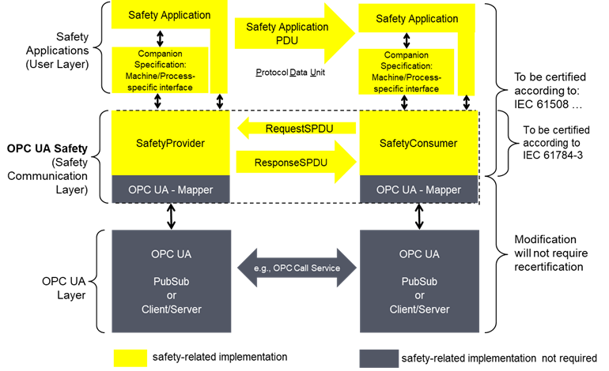  

Figure 2 - Safety layer architecture  

Summary of the architecture:  

Part: User Layer  

The safety applications in the User Layer are either directly connected to the *SafetyProvider* or *SafetyConsumer* , or they are connected via a machine-specific or process-specific interface, which is described in companion specifications (e.g. sectoral).  

The safety applications are expected to be designed and implemented according to the IEC 61508 series.  

The Safety applications in the User Layer are not within the scope of this document.  

Part: OPC UA Safety (Safety Communication Layer)  

This layer is within the scope of this document. It defines the two services *SafetyProvider* and *SafetyConsumer* as basic building blocks. Together, they form the *safety communication layer* ( *SCL* ), implemented in a safety-related way according to the IEC 61508 series.  

*SafetyData* is transmitted using point-to-point communication (unidirectional). Each unidirectional data flow internally communicates in both directions, using a requestand response pattern. This allows for checking the timeliness of messages using a single clock in the *SafetyConsumer* , thus eliminating the necessity for synchronized clocks.  

When *SafetyConsumers* connect to *SafetyProviders* , they have prior expectations regarding the pair of *SafetyProviderID* and *SafetyBaseID* (e.g. by configuration). If this expectation is not fulfilled by the *SafetyProvider* , *fail-safe* *substitute values* are delivered to the safety application instead of the received *process values* . In contrast, it is not necessary for a *SafetyProvider* to know the *SafetyConsumerID* of the *SafetyConsumer* and will provide its *process values* to any *SafetyConsumer* requesting it.  

*SafetyProviders* can not detect communication errors. All required error detection is performed by the *SafetyConsumer* .  

If it is necessary for a pair of safety applications to exchange SafetyData in both directions, two pairs of *SafetyProviders* and *SafetyConsumers* shall be established, one pair for each direction.  

The OPC UA Mapper implements the parts of the *safety communication layer* which are specific for the OPC UA communication *Service* in use, i.e. *PubSub* or *Client/Server* . Therefore, the remaining parts of the *safety communication layer* can be implemented independent of the OPC UA *Service* being used.  

Part: OPC UA Layer  

*Client/Server* :  

* The *SafetyProvider* is implemented using an OPC UA *Server* providing a *Method* .  

* The *SafetyConsumer* is implemented using an OPC UA *Client* calling the *Method* provided by the *SafetyProvider* .  

*PubSub* :  

* The *SafetyProvider* publishes the *ResponseSPDU* and subscribes to the *RequestSPDU* .  

* The *SafetyConsumer* publishes the *RequestSPDU* and subscribes to the *ResponseSPDU* .  

### 5.5 Requirements for CRC calculation  

[RQ5.4] Any *CRC* signature calculation shall start with a preset value of "1".  

[RQ5.5] Any *CRC* signature calculation resulting in a "0" value, shall use the value "1" instead.  

[RQ5.6] *SPDUs* with all values (incl. *CRC* signature) being zero shall be ignored by the receiver ( *SafetyConsumer* and *SafetyProvider* ). For *Client/Server* communication, this means that a *Method Call* with all fields making up the *RequestSPDU* being zero shall be answered with all fields making up the *ResponseSPDU* being zero. Neither of these *SPDUs* shall be presented to the respective state machines.  

## 6 Safety communication layer services  

### 6.1 General  

Clause [6](/§\_Ref144123347) describes the integration of this document into the OPC UA *Information Models* in [6.2](/§\_Ref141287512) and the resulting *Service* interfaces in [6.3](/§\_Ref141287513) . Diagnostic services are described in [6.4](/§\_Ref141343942) .  

### 6.2 Information models  

#### 6.2.1 General  

Subclause [6.2](/§\_Ref141287512) describes the identifiers, types and structure of the *Objects* and *Methods* that are used to implement the *OPC UA mappers* defined in this document. This implementation serves three purposes:  

* support of the safe exchange of *SPDUs* at runtime  

* online browsing, to identify *SafetyConsumers* and *SafetyProviders* , and to check their parameters for diagnostic purposes  

* offline engineering: the *Information Model* of one controller can be exported in a standardized file on its engineering system, be imported in another engineering system, and finally deployed on another controller. This allows for a vendor-independent exchange of the communication interfaces of safety applications, e.g. for establishing connections between devices.  

NOTE Neither online browsing nor offline engineering currently supports any features to detect errors. Hence, no guarantees with respect to functional safety are made. This means that online browsing can only be used for diagnostic purposes, and not for exchanging safety-relevant data. It is assumed that errors can occur during the transfer of the *Information Model* from one engineering system to another in the context of offline engineering. Therefore, the programmer of the safety application is responsible for the verification and validation of the safety application.  

Consequently, all type values described in [6.2](/§\_Ref141287512) are defined as read-only, i.e. they cannot be written by general OPC UA write commands.  

#### 6.2.2 Object and ObjectType Definitions  

##### 6.2.2.1 SafetyACSet Object  

[RQ6.1] Each *Server* shall have a singleton *Folder* called *SafetyACSet* with a fixed *NodeID* in the *Namespace* of this document. Because all *SafetyProviders* and *SafetyConsumers* on this *Server* contain a hierarchical *Reference* from this *Object* to themselves, it can be used to directly access all *SafetyProviders* and *SafetyConsumers* . *SafetyACSet* is intended for safety-related purposes only. It should not reference *non-safety*\-related items.  

See [Table 3](/§\_Ref330292856) for the definition of the SafetyACSet.  

Table 3 - SafetyACSet definition  

| **Attribute** | **Value** |
|---|---|
|BrowseName|SafetyACSet|
  
| **References** | **NodeClass** | **BrowseName** | **Comment** |
|---|---|---|---|
|OrganizedBy by the Objects Folder defined in OPC 10000-5.|
|HasTypeDefinition|ObjectType|FolderType|Entry point for all *SafetyProviders* and *SafetyConsumers*|
  
| **Conformance Units** |
|---|
|SafetyACSet|
  

  

[RQ6.2] In addition, a *Server* shall comprise one OPC UA *Object* derived from *DataType* *SafetyProviderType* for each *SafetyProvider* it implements, and one OPC UA *Object* derived from *DataType* *SafetyConsumerType* for each *SafetyConsumer* it implements. The corresponding *Information Models* shown in [Figure 3](/§\_Ref535322355) and [Figure 4](/§\_Ref1222645) shall be used.  

A description of the graphical notation for the different types of *Nodes* and *References* (shown in [Figure 3](/§\_Ref535322355) , [Figure 4](/§\_Ref1222645) , and [Figure 6](/§\_Ref44338718) ) can be found in OPC UA 10000-3.  

[Figure 3](/§\_Ref535322355) describes the *SafetyProvider* and the *SafetyConsumer* .  

NOTE 1 This document assumes (atomic) consistent data exchange between OPC mappers of the two endpoints.  

[RQ6.3a] For implementations supporting OPC UA *Client/Server* , the *Call Service* of the *Method Service Set* (see OPC UA 10000-4) shall be used. The *Method* *ReadSafetyData* has a set of input arguments that make up the *RequestSPDU* and a set of output arguments that make up the *ResponseSPDU* . The *SafetyConsumer* uses the OPC UA *Client* with the OPC UA *Service Call* .  

[RQ6.3b] For implementations supporting OPC UA *PubSub* , the OPC UA *Object* *SafetyPDUs* with its *Properties* *RequestSPDU* and *ResponseSPDU* shall be used. *RequestSPDU* is published by the *SafetyConsumer* and subscribed by the *SafetyProvider* . *ResponseSPDU* is published by the *SafetyProvider* and subscribed by the *SafetyConsumer* .  

NOTE 2 The terms "request" and "response" refer to the behaviour on the layer of this document. Within the *PubSub* context, both requests and responses are realized by repeatedly publishing and subscribing *Messages* , see [Figure 14](/§\_Ref34665139) .  

[RQ6.4] For diagnostic purposes, the *SPDUs* received and sent shall be accessible by calling the *Method* *ReadSafetyDiagnostics* .  

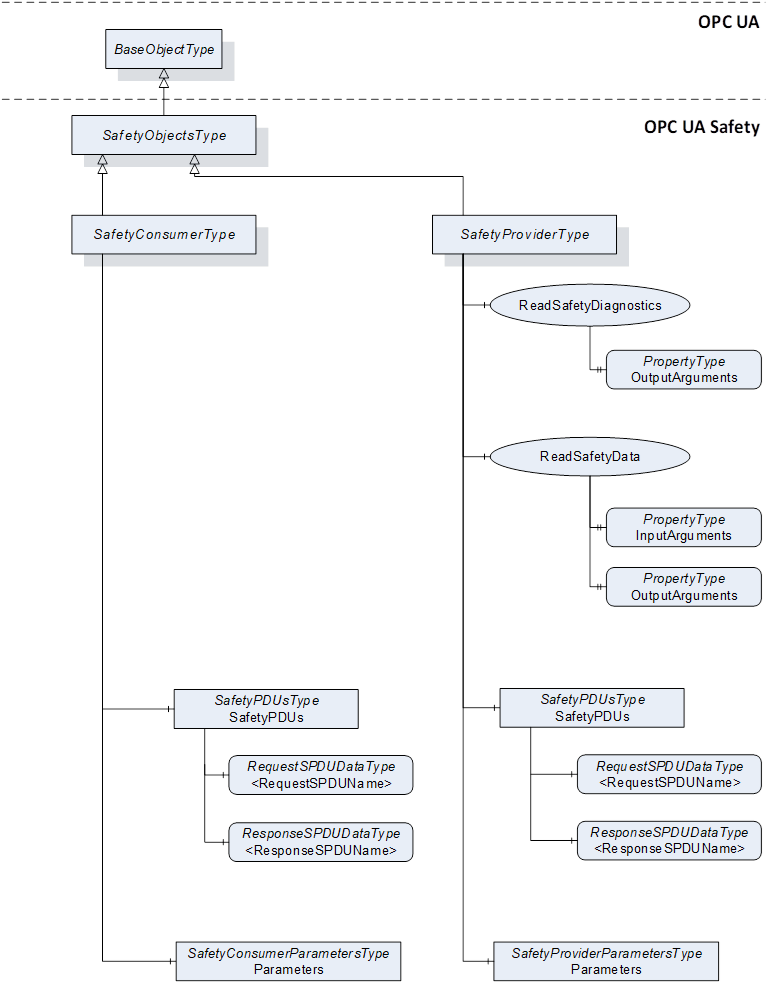  

Figure 3 - Server Objects for OPC UA Safety  

NOTE 3 For the input/output arguments of the *Methods* *ReadSafetyData* and *ReadSafetyDiagnostics* , see [6.2.2.3](/§\_Ref21078071) and [6.2.2.4](/§\_Ref42087187) . For the parameters of the *SafetyProvider* and *SafetyConsumer* , see [Figure 6](/§\_Ref44338718) , [Table 12](/§\_Ref156555677) , and [Table 13](/§\_Ref54856173) . For *RequestSPDU* and *ResponseSPDU* , see [Table 7](/§\_Ref4397969) , [Table 18](/§\_Ref54856290) , [Table 20](/§\_Ref69894660) , and [7.2.1](/§\_Ref30600805) .  

[Figure 4](/§\_Ref1222645) shows the instances of *Server* *Objects* for this document. The *ObjectType* for the *SafetyProviderType* contains *Methods* having outputs of the abstract *DataType* *Structure* . Each instance of a *SafetyProvider* requires its own copy of the *Methods* which contain the concrete *DataTypes* for *OutSafetyData* and *OutNonSafetyData* .  

  

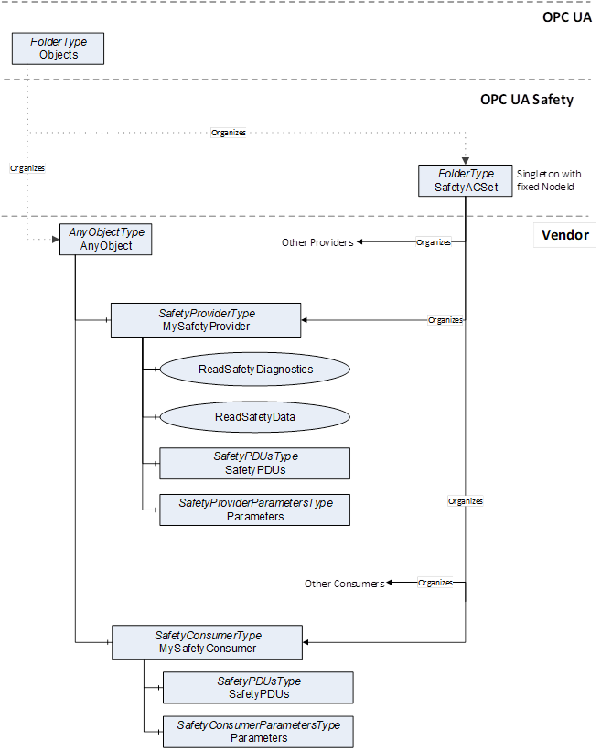  

Figure 4 - Instances of Server Objects for this document  

##### 6.2.2.2 Safety ObjectType definitions  

[RQ6.5] To reduce the number of variations and to alleviate validation testing, the following restrictions apply to instances of *SafetyProviderType* and *SafetyConsumerType* (or instances of *DataTypes* derived from *SafetyProviderType* or *SafetyConsumerType* ):  

The references shown in [Figure 4](/§\_Ref1222645) originating at *SafetyProviderType* or *SafetyConsumerType* and below shall be of *ReferenceType* *HasComponent* (and shall not be derived from *ReferenceType HasComponent* ) for *Object References* or *ReferenceType* *HasProperty* (and shall not be derived from *ReferenceType HasProperty* ) for *Property References* .  

As *BrowseNames* (i.e. name and *Namespace* ) are used to find *Methods* , the names of *Objects* and *Properties* shall be locally unique.  

The *DataType* of both *Properties* and *MethodArguments* shall be used as specified, and no derived *DataTypes* shall be used (exception: *OutSafetyData* and *OutNonSafetyData* ).  

In IEC 62541, the order of *Method* arguments is relevant.  

See [Table 4](/§\_Ref156572366) for the definition of the SafetyObjectsType.  

Table 4 - SafetyObjectsType definition  

| **Attribute** | **Value** |
|---|---|
|BrowseName|SafetyObjectsType|
|IsAbstract|True|
  
| **References** | **Node class** | **BrowseName** | **DataType** | **TypeDefinition** | **Modelling rule** |
|---|---|---|---|---|---|
|Subtype of BaseObjectType|
  
| **Conformance units** |
|---|
|SafetySupport|
  

  

See [Table 5](/§\_Ref156572455) for the definition of the SafetyProviderType.  

Table 5 - SafetyProviderType definition  

| **Attribute** | **Value** |
|---|---|
|BrowseName|SafetyProviderType|
|IsAbstract|False|
  
| **References** | **Node class** | **BrowseName** | **DataType** | **TypeDefinition** | **Modelling rule** |
|---|---|---|---|---|---|
|Subtype of SafetyObjectsType|
|HasComponent|Method|ReadSafetyData|||Optional|
|HasComponent|Method|ReadSafetyDiagnostics|||Optional|
|HasComponent|Object|SafetyPDUs||SafetyPDUsType|Optional|
|HasComponent|Object|Parameters||SafetyProviderParametersType|Mandatory|
  
| **Conformance units** |
|---|
|SafetyProviderParameters|
  

  

[RQ6.6] Instances of *SafetyProviderType* shall use non-abstract *DataTypes* for the arguments *OutSafetyData* and *OutNonSafetyData* .  

See [Table 6](/§\_Ref156572511) for the definition of the SafetyConsumerType.  

Table 6 - SafetyConsumerType definition  

| **Attribute** | **Value** |
|---|---|
|BrowseName|SafetyConsumerType|
|IsAbstract|False|
  
| **References** | **Node class** | **BrowseName** | **DataType** | **TypeDefinition** | **Modelling rule** |
|---|---|---|---|---|---|
|Subtype of SafetyObjectsType|
|HasComponent|Object|SafetyPDUs||SafetyPDUsType|Optional|
|HasComponent|Object|Parameters||SafetyConsumerParametersType|Mandatory|
  
| **Conformance units** |
|---|
|SafetyConsumerParameters|
  

  

##### 6.2.2.3 Method ReadSafetyData  

This *Method* is mandatory for the *Facet* *SafetyProviderServerMapper* . It is used to read *SafetyData* from the *SafetyProvider* . It is in the responsibility of the safety application that this *Method* is not concurrently called by multiple *SafetyConsumers* . Otherwise, the *SafetyConsumer* can receive invalid responses resulting in a safe reaction which can lead to either spurious trips or system unavailability, or both.  

See [Table 7](/§\_Ref4397969) for *Method* ReadSafetyData's arguments and [Table 8](/§\_Ref276122162) for its *AdressSpace* definition.  

The *Method* argument *OutSafetyData* has an application-specific *DataType* derived from *Structure* . This *DateType* (including the *DataTypeID* ) is expected to be the same in both the *SafetyProvider* and the *SafetyConsumer* . Otherwise, the *SafetyConsumer* will not accept the transferred data and switch to *fail-safe substitute values* instead (see state S16 in [Table 34](/§\_Ref156560397) as well as [7.2.3.2](/§\_Ref19617961) and [7.2.3.5](/§\_Ref10563173) ). The *Method* argument *OutNonSafetyData* has an application-specific *DataType* derived from *Structure* .  

 **Signature**   

 **ReadSafetyData**   

[in] UInt32 InSafetyConsumerID,  

[in] UInt32 InMonitoringNumber,  

[in] InFlagsType InFlags,  

[out] Structure OutSafetyData,  

[out] OutFlagsType OutFlags,  

[out] UInt32 OutSPDU\_ID\_1,  

[out] UInt32 OutSPDU\_ID\_2,  

[out] UInt32 OutSPDU\_ID\_3,  

[out] UInt32 OutSafetyConsumerID,  

[out] UInt32 OutMonitoringNumber,  

[out] UInt32 OutCRC,  

[out] Structure OutNonSafetyData)  

;  

Table 7 - ReadSafetyData Method arguments  

| **Argument** | **Description** |
|---|---|
|InSafetyConsumerID|"Safety Consumer Identifier", see *SafetyConsumerID* in [Table 23](/§\_Ref3374165) .|
|InMonitoringNumber|" *MonitoringNumber* of the *RequestSPDU* ", see [7.2.1.3](/§\_Ref16252822) and *MonitoringNumber* in [Table 23](/§\_Ref3374165) .|
|InFlags|"Octet with *non-safety*\-related *flags* from *SafetyConsumer* ", see [6.2.3.1](/§\_Ref68165590) **.** |
|OutSafetyData|" *SafetyData* ", see [7.2.1.5](/§\_Ref1395768) .|
|OutFlags|"Octet with safety-related *flags* from *SafetyProvider* ", see [6.2.3.2](/§\_Ref68165966) .|
|OutSPDU\_ID\_1|"Safety PDU Identifier Part1", see [7.2.3.2](/§\_Ref10564098) .|
|OutSPDU\_ID\_2|"Safety PDU Identifier Part2", see [7.2.3.2](/§\_Ref10564098) .|
|OutSPDU\_ID\_3|"Safety PDU Identifier Part3", see [7.2.3.2](/§\_Ref10564098) .|
|OutSafetyConsumerID|"Safety Consumer Identifier", see *SafetyConsumerID* in [Table 23](/§\_Ref3374165) and [Table 26](/§\_Ref529177826) .|
|OutMonitoringNumber|*MonitoringNumber* of the *ResponseSPDU* , see [7.2.1.9](/§\_Ref16253086) , [7.2.3.1](/§\_Ref10562249) , and [Figure 11](/§\_Ref514264524) .|
|OutCRC|*CRC* over the *ResponseSPDU* , see [7.2.3.6](/§\_Ref10562546) .|
|OutNonSafetyData|"Non-safe data" see [7.2.1.11](/§\_Ref19279838) .|
  

  

Table 8 - ReadSafetyData Method AddressSpace definition  

| **Attribute** | **Value** |
|---|---|
|BrowseName|ReadSafetyData|
  
| **References** | **NodeClass** | **BrowseName** | **DataType** | **TypeDefinition** | **ModellingRule** |
|---|---|---|---|---|---|
|HasProperty|Variable|InputArguments|Argument[]|PropertyType|Mandatory|
|HasProperty|Variable|OutputArguments|Argument[]|PropertyType|Mandatory|
  
| **Conformance units** |
|---|
|ReadSafetyData|
  

  

##### 6.2.2.4 Method ReadSafetyDiagnostics  

This *Method* is mandatory for the *Facet* *SafetyProviderServerMapper* and optional for the *Facet* *SafetyProviderPubSubMapper* . It is provided for each *SafetyProvider* serving as a *Diagnostic Interface* , see [6.4.3](/§\_Ref1397526) .  

See [Table 9](/§\_Ref156572734) for the arguments of *Method* ReadSafetyDiagnostics and [Table 10](/§\_Ref156572765) for its *AddressSpace* definition.  

The *Method* arguments *OutSafetyData* and *OutNonSafetyData* are application-specific types derived from *Structure* .  

 **Signature**   

 **ReadSafetyDiagnostics**   

[out] UInt32 InSafetyConsumerID,  

[out] UInt32 InMonitoringNumber,  

[out] InFlagsType InFlags,  

[out] Structure OutSafetyData,  

[out] OutFlagsType OutFlags,  

[out] UInt32 OutSPDU\_ID\_1,  

[out] UInt32 OutSPDU\_ID\_2,  

[out] UInt32 OutSPDU\_ID\_3,  

[out] UInt32 OutSafetyConsumerID,  

[out] UInt32 OutMonitoringNumber,  

[out] UInt32 OutCRC,  

[out] Structure OutNonSafetyData)  

;  

Table 9 - ReadSafetyDiagnostics Method arguments  

| **Argument** | **Description** |
|---|---|
|InSafetyConsumerID|see [Table 7](/§\_Ref4397969)|
|InMonitoringNumber|see [Table 7](/§\_Ref4397969)|
|InFlags|see [Table 7](/§\_Ref4397969)|
|OutSafetyData|see [Table 7](/§\_Ref4397969)|
|OutFlags|see [Table 7](/§\_Ref4397969)|
|OutSPDU\_ID\_1|see [Table 7](/§\_Ref4397969)|
|OutSPDU\_ID\_2|see [Table 7](/§\_Ref4397969)|
|OutSPDU\_ID\_3|see [Table 7](/§\_Ref4397969)|
|OutSafetyConsumerID|see [Table 7](/§\_Ref4397969)|
|OutMonitoringNumber|see [Table 7](/§\_Ref4397969)|
|OutCRC|see [Table 7](/§\_Ref4397969)|
|OutNonSafetyData|see [Table 7](/§\_Ref4397969)|
  

  

Table 10 - ReadSafetyDiagnostics Method AddressSpace definition  

| **Attribute** | **Value** |
|---|---|
|BrowseName|ReadSafetyDiagnostics|
  
| **References** | **NodeClass** | **BrowseName** | **DataType** | **TypeDefinition** | **ModellingRule** |
|---|---|---|---|---|---|
|HasProperty|Variable|OutputArguments|Argument[]|PropertyType|Mandatory|
  
| **Conformance units** |
|---|
|ReadSafetyDiagnostics|
  

  

##### 6.2.2.5 Object SafetyPDUs  

This *Object* is mandatory for the *Facet* *SafetyProviderPubSubMapper* and the *Facet* *SafetyConsumerPubSubMapper* It is used by the *SafetyProvider* to subscribe to the *RequestSPDU* and to publish the *ResponseSPDU* . The *DataType* of *RequestSPDU* is structured in the same way as the input arguments of *ReadSafetyData* . The *DataType* of *ResponseSPDU* is structured in the same way as the output arguments of *ReadSafetyData* .  

See [Table 11](/§\_Ref156576705) for the definition of the SafetyPDUsType.  

Both variables in the SafetyPDUsType have a counterpart within the *Information Model* of the *SafetyConsumer* . The *SafetyConsumer* publishes the *RequestSPDU* and subscribes to the *ResponseSPDU* .  

Table 11 - SafetyPDUsType definition  

| **Attribute** | **Value** |
|---|---|
|BrowseName|SafetyPDUsType|
|IsAbstract|False|
  
| **References** | **Node class** | **BrowseName** | **DataType** | **TypeDefinition** | **Modelling rule** |
|---|---|---|---|---|---|
|Subtype of BaseObjectType|
|HasComponent|Variable|\<RequestSPDU\>|RequestSPDUDataType|BaseDataVariableType|Mandatory Placeholder|
|HasComponent|Variable|\<ResponseSPDU\>|ResponseSPDUDataType|BaseDataVariableType|Mandatory Placeholder|
  
| **Conformance units** |
|---|
|SafetyPDUs|
  

  

The *Object* *SafetyPDUs* shall contain exactly one *Reference* to a *Variable* of *DataType* *RequestSPDUDataType* and exactly one *Reference* to a *Variable* of a subtype of *DataType* *ResponseSPDUDataType* .  

For example, [Figure 5](/§\_Ref83735913) shows a distributed safety application with four *SafetyAutomationComponents* . It is assumed that *SafetyAutomationComponent 1* sends a value to the other three *SafetyAutomationComponents* using three *SafetyProviders* , each comprising a pair of *SPDUs* . For each recipient, there is an individual pair of *SPDUs* .  

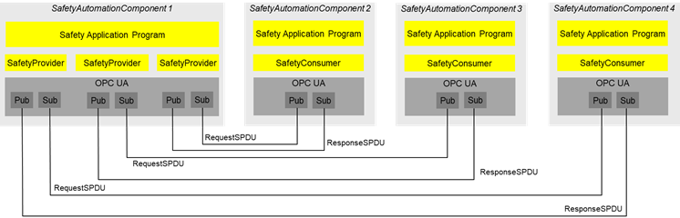  

Figure 5 - Safety multicast with three recipients using IEC 62541 PubSub  

##### 6.2.2.6 Objects SafetyProviderParameters and SafetyConsumerParameters  

[Figure 6](/§\_Ref44338718) shows the safety parameters for the *SafetyProvider* and the *SafetyConsumer* .  

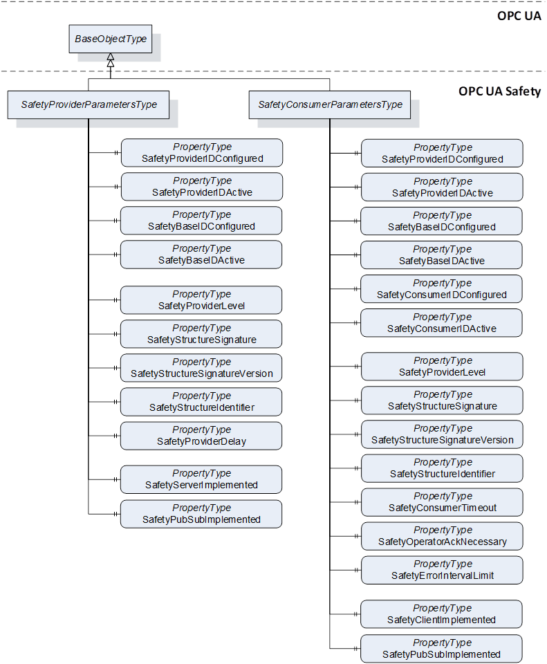  

Figure 6 - Safety parameters for the SafetyProvider and the SafetyConsumer  

[Table 12](/§\_Ref156555677) shows the definition for the SafetyProviderParametersType. Refer to [6.3.3.3](/§\_Ref519172571) for more details on the *Safety Parameter Interface* ( *SPI* ) of the *SafetyProvider* .  

Table 12 - SafetyProviderParametersType definition  

| **Attribute** | **Value** |
|---|---|
|BrowseName|SafetyProviderParametersType|
|IsAbstract|False|
  
| **References** | **Node class** | **BrowseName** | **DataType** | **TypeDefinition** | **Modelling rule** |
|---|---|---|---|---|---|
|Subtype of BaseObjectType|
|HasProperty|Variable|SafetyProviderIDConfigured|UInt32|PropertyType|Mandatory|
|HasProperty|Variable|SafetyProviderIDActive|UInt32|PropertyType|Mandatory|
|HasProperty|Variable|SafetyBaseIDConfigured|Guid|PropertyType|Mandatory|
|HasProperty|Variable|SafetyBaseIDActive|Guid|PropertyType|Mandatory|
|HasProperty|Variable|SafetyProviderLevel|Byte|PropertyType|Mandatory|
|HasProperty|Variable|SafetyStructureSignature|UInt32|PropertyType|Mandatory|
|HasProperty|Variable|SafetyStructureSignatureVersion|UInt16|PropertyType|Mandatory|
|HasProperty|Variable|SafetyStructureIdentifier|String|PropertyType|Mandatory|
|HasProperty|Variable|SafetyProviderDelay|UInt32|PropertyType|Mandatory|
|HasProperty|Variable|SafetyServerImplemented|Boolean|PropertyType|Mandatory|
|HasProperty|Variable|SafetyPubSubImplemented|Boolean|PropertyType|Mandatory|
  
| **Conformance units** |
|---|
|SafetyProviderParameters|
  

  

The parameters for *SafetyProviderID* and *SafetyBaseID* exist in pairs for "Configured" and "Active" states:  

* *SafetyProviderIDConfigured* and *SafetyProviderIDActive* ,  

* *SafetyBaseIDConfigured* and *SafetyBaseIDActive* .  

The "[...]Configured" parameters shall always deliver the values as configured via the *SPI* . The "[...]Active" parameters shall deliver:  

* the corresponding "[...]Configured" values if the system is still offline;  

* the values which have been set during runtime via the *SAPI* parameters ( *SafetyProviderID* , *SafetyBaseID* );  

* the corresponding "[...]Configured" values if the active values have been set to zero via the *SAPI* parameters ( *SafetyProviderID* , *SafetyBaseID* ).  

The *Property* *SafetyBaseIDConfigured* is shared for all *SafetyProviders* with the same *SafetyBaseIDConfigured* value. If multiple instances of *SafetyObjectsType* are running on the same *Node* , it is a viable optimization that a *Property* *SafetyBaseIDConfigured* is referenced by either multiple *SafetyProviders* or *SafetyConsumers* , or both.  

For releases up to Release 2.0 of the document, the value for the *SafetyStructureSignatureVersion* shall be 0x0001 (see RQ7.21 in [7.2.3.5](/§\_Ref10563173) ).  

[Table 13](/§\_Ref54856173) shows the definition of the SafetyConsumerParametersType. The *Properties* *SafetyStructureIdentifier* and *SafetyStructureSignatureVersion* are optional, because *SafetyStructureSignature* is typically calculated in an offline engineering tool. For small devices, it could be beneficial to only upload the *SafetyStructureSignature* to the device, but not *SafetyStructureIdentifier* and *SafetyStructureSignatureVersion* in order to save either bandwidth or memory, or both. Refer to [6.3.4.4](/§\_Ref519173522) for more details on the *Safety Parameter Interface* ( *SPI* ) of the *SafetyConsumer* .  

Table 13 - SafetyConsumerParametersType definition  

| **Attribute** | **Value** |
|---|---|
|BrowseName|SafetyConsumerParametersType|
|IsAbstract|False|
  
| **References** | **Node class** | **BrowseName** | **DataType** | **TypeDefinition** | **Modelling rule** |
|---|---|---|---|---|---|
|Subtype of BaseObjectType|
|HasProperty|Variable|SafetyProviderIDConfigured|UInt32|PropertyType|Mandatory|
|HasProperty|Variable|SafetyProviderIDActive|UInt32|PropertyType|Mandatory|
|HasProperty|Variable|SafetyBaseIDConfigured|Guid|PropertyType|Mandatory|
|HasProperty|Variable|SafetyBaseIDActive|Guid|PropertyType|Mandatory|
|HasProperty|Variable|SafetyConsumerIDConfigured|UInt32|PropertyType|Mandatory|
|HasProperty|Variable|SafetyConsumerIDActive|UInt32|PropertyType|Mandatory|
|HasProperty|Variable|SafetyProviderLevel|Byte|PropertyType|Mandatory|
|HasProperty|Variable|SafetyStructureSignature|UInt32|PropertyType|Mandatory|
|HasProperty|Variable|SafetyStructureSignatureVersion|UInt16|PropertyType|Optional|
|HasProperty|Variable|SafetyStructureIdentifier|String|PropertyType|Optional|
|HasProperty|Variable|SafetyConsumerTimeout|UInt32|PropertyType|Mandatory|
|HasProperty|Variable|SafetyOperatorAckNecessary|Boolean|PropertyType|Mandatory|
|HasProperty|Variable|SafetyErrorIntervalLimit|UInt16|PropertyType|Mandatory|
|HasProperty|Variable|SafetyClientImplemented|Boolean|PropertyType|Mandatory|
|HasProperty|Variable|SafetyPubSubImplemented|Boolean|PropertyType|Mandatory|
  
| **Conformance units** |
|---|
|SafetyConsumerParameters|
  

  

The parameters for *SafetyProviderID* , *SafetyBaseID* and *SafetyConsumerID* exist in pairs for "Configured" and "Active" states: *SafetyProviderIDConfigured* and *SafetyProviderIDActive* , *SafetyBaseIDConfigured* and *SafetyBaseIDActive* , and *SafetyConsumerIDConfigured* and *SafetyConsumerIDActive* .  

The "[...]Configured" parameters shall always deliver the values as configured via the *SPI* . The "[...]Active" parameters shall deliver:  

* the corresponding "[...]Configured" values if the system is still offline;  

* the values which have been set during runtime via the *SAPI* parameters ( *SafetyProviderID* , *SafetyBaseID* , *SafetyConsumerID* );  

* the corresponding "[...]Configured" values if the active values have been set to zero via the *SAPI* parameters ( *SafetyProviderID* , *SafetyBaseID* , *SafetyConsumerID* ).  

#### 6.2.3 DataType definition  

##### 6.2.3.1 InFlagsType  

The InFlagsType a subtype of the Byte DataType with the OptionSetValues Property defined. The InFlagsType is formally defined in [Table 14](/§\_Ref494187161) .  

CommunicationError can be used as a trigger, e.g. for a communication analysis tool. It is not forwarded to the safety application by the *SafetyProvider* . If CommunicationError is necessary in the safety application, bidirectional communication can be implemented and the value of CommunicationError can be put into the user data.  

Table 14 - InFlagsType values  

| **Value** | **Bit no.** | **Description** |
|---|---|---|
|CommunicationError|0|0: No error 1: An error was detected in the previous *ResponseSPDU* .|
|OperatorAckRequested|1|Used to inform the *SafetyProvider* that operator acknowledgment is requested.|
|FSV\_Activated|2|Used for conformance test of SafetyConsumer.SAPI.FSV\_Activated.|
  

  

Bits 3 to 7 are reserved for future use and shall be set to zero by the *SafetyConsumer* . They shall not be evaluated by the *SafetyProvider* .  

The InFlagsType representation in the AddressSpace is defined in [Table 15](/§\_Ref16863028) .  

Table 15 - InFlagsType dDefinition  

| **Attribute** | **Value** |
|---|---|
|BrowseName|InFlagsType|
|IsAbstract|False|
  
| **References** | **NodeClass** | **BrowseName** | **DataType** | **TypeDefinition** | **Other** |
|---|---|---|---|---|---|
|Subtype of the *Byte* *DataType* defined in OPC 10000-3|
|0:HasProperty|Variable|0:OptionSetValues|0:LocalizedText []|0:PropertyType||
  
| **Conformance units** |
|---|
|SafetySupport|
  

  

##### 6.2.3.2 OutFlagsType  

The OutFlagsType is a subtype of the Byte DataType with the OptionSetValues Property defined. The OutFlagsType is formally defined in [Table 16](/§\_Ref68165295) .  

Table 16 - OutFlagsType values  

| **Value** | **Bit no.** | **Description** |
|---|---|---|
|OperatorAckProvider|0|Operator acknowledgment at the provider, hereby forwarded to the *SafetyConsumer* , see OperatorAckProvider in the *SAPI* of the *SafetyProvider* , [6.3.3.2](/§\_Ref532826098) .|
|ActivateFSV|1|Activation of *fail-safe* values by the safety application at the *SafetyProvider* , hereby forwarded to the *SafetyConsumer* , see ActivateFSV in the *SAPI* of the *SafetyProvider* , [6.3.3.2](/§\_Ref532826098) .|
|TestModeActivated|2|Enabling and disabling of test mode in the SafetyProvider, hereby forwarded to the *SafetyConsumer* , see EnableTestMode in the *SAPI* of the *SafetyProvider* , [6.3.3.2](/§\_Ref532826098) .|
  

  

Bits 3 to 7 are reserved for future use and shall be set to zero by the *SafetyProvider* . They shall not be evaluated by the *SafetyConsumer* .  

The OutFlagsType representation in the AddressSpace is defined in [Table 17](/§\_Ref69908870) .  

Table 17 - OutFlagsType dDefinition  

| **Attribute** | **Value** |
|---|---|
|BrowseName|OutFlagsType|
|IsAbstract|False|
  
| **References** | **NodeClass** | **BrowseName** | **DataType** | **TypeDefinition** | **Other** |
|---|---|---|---|---|---|
|Subtype of the *Byte DataType* defined in OPC 10000-3|
|0:HasProperty|Variable|0:OptionSetValues|0:LocalizedText []|0:PropertyType||
  
| **Conformance units** |
|---|
|SafetySupport|
  

  

##### 6.2.3.3 RequestSPDUDataType  

[Table 18](/§\_Ref54856290) shows the definition of the RequestSPDUDataType. The Prefix "In" is interpreted from the *SafetyProvider* 's point of view and is used in a consistent manner to the parameters of the *Method* *ReadSafetyData* (see [6.2.2.3](/§\_Ref21078071) ).  

Table 18 - RequestSPDUDataType structure  

| **Name** | **Type** | **Description** |
|---|---|---|
|RequestSPDUDataType|structure||
|InSafetyConsumerID|UInt32|See corresponding *Method* argument in [Table 7](/§\_Ref4397969) .|
|InMonitoringNumber|UInt32|See corresponding *Method* argument in [Table 7](/§\_Ref4397969) .|
|InFlags|InFlagsType|See corresponding *Method* argument in [Table 7](/§\_Ref4397969) .|
  

  

The representation in the AddressSpace of the RequestSPDUDataType is defined in [Table 19](/§\_Ref69193706) .  

Table 19 - RequestSPDUDataType definition  

| **Attributes** | **Value** |
|---|---|
  
| **BrowseName** | **RequestSPDUDataType** |
|---|---|
|IsAbstract|False|
  
| **References** | **NodeClass** | **BrowseName** | **DataType** | **TypeDefinition** | **ModellingRule** |
|---|---|---|---|---|---|
|Subtype of *Structure* defined in OPC 10000-3.|
  
| **Conformance units** |
|---|
|SafetyPDUs|
  

  

##### 6.2.3.4 ResponseSPDUDataType  

[Table 20](/§\_Ref69894660) shows the ResponseSPDUDataType *Structure* . The Prefix "Out" is interpreted from the *SafetyProvider* 's point of view and is used in a consistent manner to the parameters of the *Method* *ReadSafetyData* (see [6.2.2.3](/§\_Ref21078071) ).  

Table 20 - ResponseSPDUDataType structure  

| **Name** | **Type** | **Description** |
|---|---|---|
|ResponseSPDUDataType|structure||
|OutFlags|OutFlagsType|See corresponding *Method* argument in [Table 7](/§\_Ref4397969) .|
|OutSPDU\_ID\_1|UInt32|See corresponding *Method* argument in [Table 7](/§\_Ref4397969) .|
|OutSPDU\_ID\_2|UInt32|See corresponding *Method* argument in [Table 7](/§\_Ref4397969) .|
|OutSPDU\_ID\_3|UInt32|See corresponding *Method* argument in [Table 7](/§\_Ref4397969) .|
|OutSafetyConsumerID|UInt32|See corresponding *Method* argument in [Table 7](/§\_Ref4397969) .|
|OutMonitoringNumber|UInt32|See corresponding *Method* argument in [Table 7](/§\_Ref4397969) .|
|OutCRC|UInt32|See corresponding *Method* argument in [Table 7](/§\_Ref4397969) .|
  

  

[RQ6.7] To define the concrete *DataType* for the *ResponseSPDU* (which specifies the concrete *DataTypes* for *SafetyData* and *NonSafetyData* , respectively), proceed as follows: (1) Derive a concrete *DataType* from the abstract *ResponseSPDUDataType* . (2) In doing so, add the following fields to the *Structure* in the given order: (a) First, field OutSafetyData with the concrete *Structure* *DataType* for the *SafetyData* (see [7.2.1.5](/§\_Ref20137323) ). (b) Second, field NonSafetyData with the concrete *Structure* *DataType* for the *NonSafetyData* (or a placeholder *DataType* , see requirement RQ6.8).  

[RQ6.8] To avoid possible problems with empty *Structures* , the dummy *Structure* *NonSafetyDataPlaceholder* shall be used as *DataType* for *OutNonSafetyData* when no *NonSafetyData* is used. The *DataType Node* defining this *Structure* has a fixed *NodeID* and contains a single *Boolean* .  

The representation in the AddressSpace of the ResponseSPDUDataType is defined in [Table  21](/§\_Ref72588221) .  

Table 21 - ResponseSPDUDataType definition  

| **Attributes** | **Value** |
|---|---|
|BrowseName|ResponseSPDUDataType|
|IsAbstract|True|
  
| **References** | **NodeClass** | **BrowseName** | **DataType** | **TypeDefinition** | **ModellingRule** |
|---|---|---|---|---|---|
|Subtype of *Structure* defined in OPC 10000-3|
  
| **Conformance units** |
|---|
|SafetyPDUs|
  

  

##### 6.2.3.5 NonSafetyDataPlaceholderDataType  

[Table 22](/§\_Ref156558902) shows the definition of the NonSafetyDataPlaceholderDataType. The receiver shall not evaluate the value of 'dummy'.  

Table 22 - NonSafetyDataPlaceholderDataType structure  

| **Name** | **Type** | **Description** |
|---|---|---|
|NonSafetyDataPlaceholderDataType|Structure||
|Dummy|Boolean|Dummy *Variable* to avoid empty structures.|
  

  

#### 6.2.4 SafetyProvider version  

Future versions may use different identifiers (such as *ReadSafetyDataV2* for the *Method* when using *Client/Server* communication or *RequestSPDUV2DataType* and *ResponseSPDUV2DataType* for the *SPDU* *DataTypes* when using *PubSub* communication), allowing a *SafetyProvider* to implement multiple versions of this document at the same time. Hence, the same *SafetyProvider* can be accessed by *SafetyConsumers* of different versions.  

#### 6.2.5 DataTypes and length of SafetyData  

This document supports sending of the *Built-in* and *Simple* *DataTypes* specified in OPC UA (see OPC 10000-3 and OPC 10000-6) within *SafetyData* . The supported *DataTypes* are vendor-specific.  

[RQ6.9] Only scalar *DataTypes* shall be used. Arrays are currently not supported by this document.  

The supported maximum length of the *SafetyData* is vendor-specific but still limited to 1 500 octets. Typical values for the maximum length include 1 octet, 16 octets, 64 octets, 256 octets, 1 024 octets, and 1 500 octets.  

[RQ6.10] For controller-like devices, the supported *DataTypes* and the maximum length of the *SafetyData* shall be listed in the user manual.  

[RQ6.11] For the *DataType Boolean* , the value 0x01 shall be used for 'true' and the value 0x00 shall be used for 'false'.  

It is recommended to send multiple *Booleans* in separate variables. However, in small devices, it can be necessary to combine a set of 8 *Booleans* in one *Variable* for performance reasons. In this case, the *DataType* *Byte* can be used.  

#### 6.2.6 Connection establishment  

This document uses the OPC UA services for connection establishment, it poses no additional requirement to these services.  

This version of the document describes configuration only at engineering time. This means that the parameters defined in the *SPI* (see [6.3.3.3](/§\_Ref519172571) and [6.3.4.4](/§\_Ref519173522) ) are read-only via the interface described in this document. Changing of parameters is expected to be done in a safety-related way, using the respective tools and interfaces provided by the vendor. Future versions of this document may specify a vendor-independent interface for configuration.  

### 6.3 Service interfaces  

#### 6.3.1 Overview  

[Figure 7](/§\_Ref84353187) gives an overview of the *safety communication layer* and its interfaces. It thereby also shows the scope of this document. The main function of the layer services is the state machine which handles the protocol. The state machines interact with the following interfaces:  

* The *Safety Application Program Interface* ( *SAPI* ) is accessed by the safety application for exchanging *SafetyData* during runtime.  

* The *Safety Parameter Interface* ( *SPI* ) is accessed during commissioning for setting safety parameters such as IDs or the timeout value in the *SafetyConsumer* .  

* The *non-safety* related *Diagnostic Interface* ( *DI* ) can be accessed at runtime for troubleshooting the safety communication.  

The *OPC UA Platform Interface* ( *OPC UA PI* ) connects the *SCL* to the *non-safe* OPC UA stack and is used during runtime.  

The interfaces ( *SAPI* , *SPI* , *DI* and *OPC UA PI* ) described in [6.3](/§\_Ref141287513) are abstract and informative. They represent logical data inputs and outputs to this layer that are necessary for the proper operation of the state machine. No normative, concrete mappings are specified. The concrete implementations are vendor-specific and do no necessarily exactly match the abstract interfaces described in this document.  

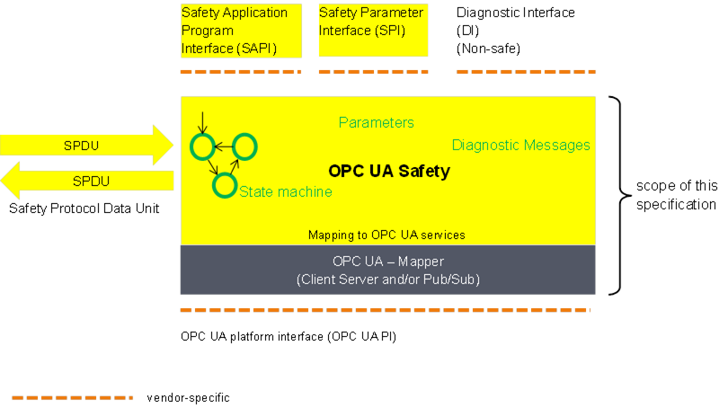  

Figure 7 - Safety communication layer overview  

#### 6.3.2 OPC UA Platform interface (OPC UA PI)  

The state machines of this document are independent from the actual OPC UA services used for data transmission. This is accomplished by introducing a so-called OPC UA Mapper, serving as an interface between the safety communication layer and the OPC UA stack.  

The mapper can either make use of OPC UA *Client/Server* and remote *Method* invocation or the publishing of and subscribing to remote *Variables* as defined in OPC 10000-14. The requirements on the implementation of the mapper are implicitly given in [6.2](/§\_Ref141287512) .  

#### 6.3.3 SafetyProvider interfaces  

##### 6.3.3.1 General  

[Figure 8](/§\_Ref532825993) shows an overview of the *SafetyProvider* interfaces. The *SAPI* is specified in [6.3.3.2](/§\_Ref532826098) , the *SPI* is specified in [6.3.3.3](/§\_Ref519172571) .  

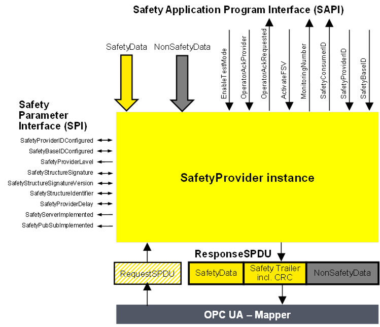  

Figure 8 - SafetyProvider interfaces  

##### 6.3.3.2 SAPI of SafetyProvider  

[RQ6.12] The *SAPI* of the *SafetyProvider* represents the *safety communication layer* services of the *SafetyProvider* . [Table 23](/§\_Ref3374165) lists all inputs and outputs of the *SAPI* of the *SafetyProvider* . Each *SafetyProvider* shall implement the *SAPI* as shown in [Table 23](/§\_Ref3374165) , however, the details are vendor-specific.  

Table 23 - SAPI of the SafetyProvider  

| **SAPI Term** | **Type** | **I/O** | **Definition** |
|---|---|---|---|
|SafetyData|Structure|I|This input is used to accept the user data which is then transmitted as *SafetyData* in the *SPDU* . NOTE Whenever a new *MNR* is received from a *SafetyConsumer* , the state machine of the *SafetyProvider* will read a new value of the *SafetyData* from its corresponding Safety Application and use it until the next *MNR* is received. If no valid user data is available at the Safety Application, ActivateFSV can be set to "1" by the Safety Application.|
|NonSafetyData|Structure|I|Used to consistently transmit *NonSafetyData* values (e.g. diagnostic information) together with safe data, see [7.2.1.11](/§\_Ref19279865)|
|EnableTestMode|Boolean|I|By setting this input to "1" the **remote** *SafetyConsumer* is informed (by Bit 2 in *ResponseSPDU.Flags* , see [6.2.3.2](/§\_Ref68165966) ) that the *SafetyData* are test data, and are not to be used for safety-related decisions. NOTE This document is intended for implementation in safety devices exclusively, see requirement RQ4.1.|
|OperatorAckProvider|Boolean|I|This input is used to implement an operator acknowledgment on the *SafetyProvider* side. The value will be forwarded to the *SafetyConsumer* , where it can be used to trigger a return from *fail-safe* substitute values ( *FSV* ) to actual *process values* ( *PV* ), see [B.3.4](/§\_Ref1224036) .|
|OperatorAckRequested|Boolean|O|Indicates that an operator acknowledge is requested by the *SafetyConsumer* . This *flag* is received within the *RequestSPDU* .|
|ActivateFSV( *Fail-safe* substitutevalues)|Boolean|I|By setting this input to "1" the *SafetyConsumer* is instructed (via Bit 1 in *ResponseSPDU.Flags* , see [6.2.3.2](/§\_Ref68165966) ) to deliver *FSV* instead of *PV* to the safety application program. NOTE If the replacement of *process values* by *FSV* is to be controllable in a more fine-grained way, this can be realized by using *qualifiers* within the *SafetyData* , see [6.3.6](/§\_Ref141704219) .|
|SafetyConsumerID|UInt32|O|This output yields the ConsumerID used in the last access to this *SafetyProvider* by a *SafetyConsumer* (see [6.2.2.3](/§\_Ref21078076) ). Since all safety-related checks are executed by an implementation of this document, the safety application is not required to check this *SafetyConsumerID* .|
|MonitoringNumber|UInt32|O|This output yields the *MonitoringNumber* ( *MNR* ). It is updated whenever a new request comes in from the *SafetyConsumer* . Since all safety-related checks are executed by an implementation of this document, the safety application is not required to check this *MonitoringNumber* .|
|SafetyProviderID|UInt32|I|For dynamic systems, this input can be set to a non-zero value. In this case, the *SafetyProvider* uses this value instead of the value from the *SPI* parameter *SafetyProviderIDConfigured* . If the value is changed to "0", the value of parameter *SafetyProviderIDConfigured* from the *SPI* will be used (again). See [Figure 8](/§\_Ref532825993) , [3.1.2.15](/§\_Ref178076852) , and [9.1.1](/§\_Ref532548) . For static systems, this input is usually always kept at value "0".|
|SafetyBaseID|Guid|I|For dynamic systems, this input can be set to a non-zero value. In this case, the *SafetyProvider* uses this value instead of the value of the *SPI* parameter *SafetyBaseIDConfigured* . If the value is changed to "0", the value of parameter *SafetyBaseIDConfigured* from the *SPI* will be used (again). See [Figure 8](/§\_Ref532825993) , [3.1.2.14](/§\_Ref178076874) , and [9.1.1](/§\_Ref532548) . For static systems, this input is usually always kept at value "0".|
  

  

##### 6.3.3.3 SPI of SafetyProvider  

[RQ6.13a] Each *SafetyProvider* shall implement the parameters and constants [RQ6.13b] as shown in [Table 24](/§\_Ref66192636) . The parameters (R/W in column "Access") can be set via the *SPI* , whereas the constants (R in column "Access") are read-only. The mechanisms for setting the parameters are vendor-specific. The attempt of setting a parameter to a value outside its range, or of the setting of a read-only parameter, shall not become effective, and a diagnostic message should be shown when appropriate. The values of the constants depend on the way the *SafetyProvider* is implemented. They never change and are therefore not writable via any of the interfaces.  

Table 24 - SPI of the SafetyProvider  

| **Identifier** | **Type** | **Range** | **Initial value**   **(before configuration)** | **Access** | **Note** |
|---|---|---|---|---|---|
|SafetyProviderIDConfigured|UInt32|0x0 to 0xFFFFFFFF|0x0|R/W|*SafetyProviderID* of the *SafetyProvider* that is normally used, see [3.1.2.15](/§\_Ref178076852) and [9.1.1](/§\_Ref532548) . For dynamic systems, the safety application program can overwrite this ID by providing a non-zero value at the input *SafetyProviderID* of the *SafetyProvider* 's *SAPI* . This runtime value can be queried using the *SafetyProviderIDActive* parameter. See [6.2.2.6](/§\_Ref153276111) for details on configured and active values. NOTE If both the values provided at the *SPI* and the *SAPI* are 0x0, this means that the *SafetyProvider* is not properly configured. *SafetyConsumers* will never try to communicate with *SafetyProviders* having a *SafetyProviderID* of 0x0, see Transitions T13/T27 in [Table 35](/§\_Ref2355647) and the macro \<ParametersOK?\> in [Table 33](/§\_Ref156560325) .|
|SafetyBaseIDConfigured|Guid|Any value which can be represented with sixteen octets|All sixteenoctets are 0x00|R/W|*SafetyBaseID* of the *SafetyProvider* that is normally used, see [3.1.2.14](/§\_Ref178076874) and [9.1.1](/§\_Ref532548) . For dynamic systems, the safety application program can overwrite this ID by providing a non-zero value at the input *SafetyBaseID* of the *SafetyProvider* 's *SAPI* . This runtime value can be queried using the *SafetyBaseIDActive* parameter. See [6.2.2.6](/§\_Ref153276111) for details on configured and active values. NOTE If both the values provided at the *SPI* and the *SAPI* are 0x0, this means that the *SafetyProvider* is not properly configured. *SafetyConsumers* will never try to communicate with *SafetyProviders* having a *SafetyBaseID* of 0x0, see Transitions T13/T27 in [Table 35](/§\_Ref2355647) and the macro \<ParametersOK?\> in [Table 33](/§\_Ref156560325) . See [9.1.1](/§\_Ref532548) for more information on *GUID* .|
|SafetyProviderLevel|Byte|0x01 to 0x04|n.a.|R|The *SIL* the *SafetyProvider* implementation (hardware and software) is capable of, see [Figure 9](/§\_Ref3374952) . NOTE 1 It is independent from the generation of the *SafetyData* at *SAPI* . NOTE 2 The *SafetyProviderLevel* is used to distinguish devices of a different *SIL* . As a result, *SPDUs* coming from a device with a low *SIL* will never be accepted when a *SafetyConsumer* is parameterized to implement a safety function with a high *SIL* .|
|SafetyStructureSignature|UInt32|0x0 to 0xFFFFFFFF|0x0|R/W|Signature of the *SafetyData* structure, for calculation see [7.2.3.5](/§\_Ref10563173) . NOTE "0" would not be a valid signature and thus indicates a *SafetyProvider* which is not properly configured. *SafetyConsumers* will never try to communicate with *SafetyProviders* having a *SafetyStructureSignature* of 0x0, see Transitions T13/T27 in [Table 35](/§\_Ref2355647) and the macro \<ParametersOK?\> in [Table 33](/§\_Ref156560325) .|
|SafetyStructureSignatureVersion|UInt16|0x1|0x1|R/W|Version used to calculate *SafetyStructureSignature* , see [7.2.3.5](/§\_Ref10563173)|
|SafetyStructureIdentifier|String|all strings|"" (the empty string)|R/W|Identifier describing the *DataType* of the *SafetyData* , see [7.2.3.5](/§\_Ref10563173) .|
|SafetyProviderDelay|UInt32|0x0 to 0xFFFFFFFF|0x0|R/W|In microseconds (µs). It can be set during the engineering phase of the *SafetyProvider* or set during online configuration as well. *SafetyProviderDelay* is the maximum time at the *SafetyProvider* from receiving the *RequestSPDU* to start the transmission of *ResponseSPDU* , see [8.1](/§\_Hlk1381760) . The parameter *SafetyProviderDelay* has no influence on the functional behaviour of the *SafetyProvider* . Therefore, it is not necessary for this value to be generated in a safety-related way. However, it will be provided in the OPC UA *Information Model* of a *SafetyProvider* to inform about its worst-case delay time. The value can be used during commissioning to check whether the timing behaviour of the *SafetyProvider* is suitable to fulfill the watchdog delay of the corresponding *SafetyConsumer* .|
|SafetyServerImplemented|Boolean|0x0 or 0x1|n.a.|R|This read-only parameter indicates whether the *SafetyProvider* has implemented the *Server* part of OPC UA *Client/Server* communication (see [5.4](/§\_Ref144122070) ): 1: *Server* for OPC UA *Client/Server* communication is implemented. 0: *Server* for OPC UA *Client/Server* communication is not implemented. The corresponding *Facets* are SafetyProviderServer and SafetyProviderServerMapper.|
|SafetyPubSubImplemented|Boolean|0x0 or 0x1|n.a.|R|This read-only parameter indicates whether the *SafetyProvider* has implemented the necessary publishers and subscribers for OPC UA *PubSub* communication (see [5.4](/§\_Ref144122107) ): 1: OPC UA *PubSub* communication is implemented. 0: OPC UA *PubSub* communication is not implemented. The corresponding *Facets* are SafetyProviderPubSub and SafetyProviderPubSubMapper.|
  

  

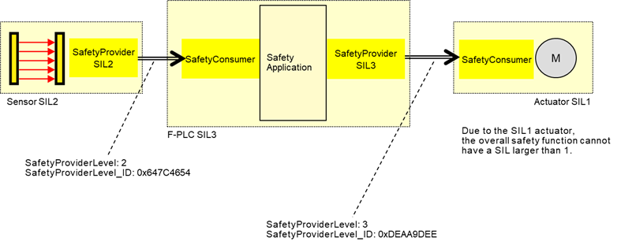  

Figure 9 - Example combinations of SIL capabilities  

The constant *SafetyProviderLevel* determines the value that is used for *SafetyProviderLevel\_ID* when calculating the *SPDU\_ID* , see [7.2.3.4](/§\_Ref10563664) .  

NOTE *SafetyProviderLevel* is defined as the *SIL* the *SafetyProvider* implementation (hardware and software) is capable of, not to be confused with the *SIL* of the implemented safety function. For instance, [Figure 9](/§\_Ref3374952) shows a safety function which is implemented using a *SIL* 2-capable sensor, a *SIL* 3-capable PLC, and a *SIL* 1-capable actuator. The overall *SIL* of the safety function is considered to be *SIL* 1\. Nevertheless, the *SafetyProvider* implemented on the sensor will use the constant value "2" as *SafetyProviderLevel* , whereas the *SafetyProvider* implemented on the PLC will use the constant value "3" as *SafetyProviderLevel* .  

It is necessary for the respective *SafetyConsumers* (on the PLC and the actuator) to know the *SafetyProviderLevel* of their *SafetyProviders* in order to check the *SPDU\_ID* (see [7.2.3.2](/§\_Ref19280103) ).  

#### 6.3.4 SafetyConsumer interfaces  

##### 6.3.4.1 General  

[Figure 10](/§\_Ref1224619) shows an overview of the *SafetyConsumer* interfaces. The *Safety Application Program Interface* ( *SAPI* ) is specified in [6.3.4.2](/§\_Ref532807190) , the *Safety Parameter Interface* ( *SPI* ) is specified in [6.3.4.4](/§\_Ref532807195) .  

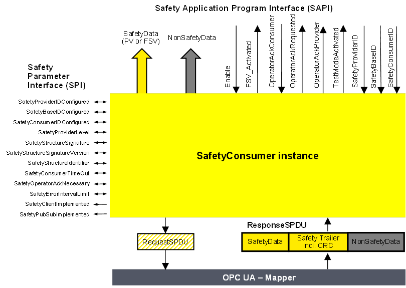  

Figure 10 - SafetyConsumer interfaces  

##### 6.3.4.2 SAPI of SafetyConsumer  

The *SAPI* of the *SafetyConsumer* represents the *safety communication layer* services of the *SafetyConsumer* . [Table 25](/§\_Ref14077992) lists all inputs and outputs of the *SAPI* of the *SafetyConsumer* .  

[RQ6.14] Each *SafetyConsumer* shall implement the *SAPI* as shown in [Table 25](/§\_Ref14077992) , however, the details are vendor-specific.  

Table 25 - SAPI of the SafetyConsumer  

| **SAPI Term** | **Type** | **I/O** | **Definition** |
|---|---|---|---|
|SafetyData|Structure|O|This output either delivers the *process values* received from the *SafetyProvider* in the *SPDU* field *SafetyData* , or *FSV* .|
|NonSafetyData|Structure|O|This output delivers the *non-safety* *process values* (e.g. diagnostic information) which were sent together with safe data, see [7.2.1.11](/§\_Ref19279865)|
|Enable|Boolean|I|By changing this input to "0" the *SafetyConsumer* will change each and every *Variable* of the *SafetyData* to "0"1 and stop sending requests to the *SafetyProvider* . When changing Enable to "1" the *SafetyConsumer* will restart safe communication. The variable can be used to delay the start of the safety communication according to this document, after power on until "OPC UA connection ready" is set.The delay time is not monitored while enable is set to "0".|
|FSV\_Activated|Boolean|O|This output indicates via "1" that on the output *SafetyData* *FSV* (all binary "0") are provided1. NOTE A *ResponseSPDU* which is checked with an error results in FSV\_Activated being set to "1", see T24 in [Table 35](/§\_Ref2355647) . There could be other reasons.|
|OperatorAckConsumer|Boolean|I|For motivation, see [6.3.4.3](/§\_Ref3296204) . After an indication of OperatorAckRequested this input can be used to signal an operator acknowledgment. By changing this input from "0" to "1" (rising edge) the *SafetyConsumer* is instructed to switch *SafetyData* from *FSV* to *PV* . OperatorAckConsumer is processed only if this rising edge arrives after OperatorAckRequested was set to "1", see [Figure 19](/§\_Ref2354720) . If a rising edge of OperatorAckConsumer arrives before OperatorAckRequested becomes 1, this rising edge is ignored.|
|OperatorAckRequested|Boolean|O|This output indicates the request for operator acknowledgment. The bit is set to "1" by the *SafetyConsumer* , when three conditions are met: 1) Too many communication errors were detected in the past, so the *SafetyConsumer* decided to switch to *fail-safe* substitute values. 2) Currently, no communication errors occur, and hence operator acknowledgment is possible. 3) Operator acknowledgment (rising edge at input OperatorAckConsumer) has not yet occurred. The bit is reset to "0" when a rising edge at OperatorAckConsumer is detected.|
|OperatorAckProvider|Boolean|O|This output indicates that an operator acknowledgment has taken place on the *SafetyProvider* . If operator acknowledgment at the *SafetyProvider* should be allowed, this output is connected to OperatorAckConsumer, see [B.3.4](/§\_Ref1225799) and [B.3.5](/§\_Ref3534924) . NOTE If the *ResponseSPDU* is checked with error, this output remains at its last value, see T24 in [Table 35](/§\_Ref2355647) .|
|TestModeActivated|Boolean|O|The safety application program is expected to evaluate this output for determining whether the communication partner is in test mode or not. A value of "1" indicates that the communication partner (source of data) is in test mode, e.g. during commissioning. Data coming from a device in test mode may be used for testing but is not intended to be used to control safety-critical processes. A value of "0" represents the "normal" safety-related mode. The test mode enables the programmer and commissioner to validate the safety application using test data. NOTE If the *ResponseSPDU* check results in an error and the *ErrorIntervalTimer* (see [6.3.4.4](/§\_Ref519173522) ) is also not expired, TestModeActivated is reset, see state S17\_Error in [Table 34](/§\_Ref156560397) .|
|SafetyProviderID|UInt32|I|For dynamic systems, this input can be set to a non-zero value. In this case, the *SafetyConsumer* uses this variable instead of the *SPI* parameter *SafetyProviderIDConfigured* . This input is only read in the first cycle, or when a rising edge occurs at the input Enable. See also [Table 26](/§\_Ref529177826) . If it is changed to "0", the value of *SPI* parameter *SafetyProviderIDConfigured* will be used (again). For static systems, this input is usually always kept at value "0".|
|SafetyBaseID|Guid|I|For dynamic systems, this input can be set to a non-zero value. In this case, the *SafetyConsumer* uses this variable instead of the *SPI* parameter *SafetyBaseIDConfigured* . This input is only read in the first cycle, or when a rising edge occurs at the input Enable. See also [Table 26](/§\_Ref529177826) . If it is changed to "0", the *SPI* parameter *SafetyBaseIDConfigured* will become activated. For static systems, this input is usually always kept at value "0".|
|SafetyConsumerID|UInt32|I|For dynamic systems, this input can be set to a non-zero value. In this case, the *SafetyConsumer* uses this variable instead of the *SPI* parameter *SafetyConsumerID* . This input is only read in the first cycle, or when a rising edge occurs at the input Enable. See also [Table 26](/§\_Ref529177826) . If it is changed to "0", the *SPI* parameter *SafetyConsumerID* will become activated. For static systems, this input is usually always kept at value "0".|
|1 If an application requires different *FSV* than "all binary 0", it is expected to use appropriate constants and ignore the output of *SafetyData* whenever *FSV\_Activated* is set.|
  

  

##### 6.3.4.3 Motivation for SAPI Operator Acknowledge (OperatorAckConsumer)  

The safety argumentation assumes that random errors in the underlying OPC UA stack including its communication links are not too frequent, i.e. that its failure rate is lower than a given threshold, depending on the desired *SIL* (see [9.3.1](/§\_Ref78902775) ).  

Whenever the *SafetyConsumer* detects a faulty message, it checks whether the assumption is still valid, and switches to *fail-safe* substitute values otherwise. Returning to *process values* then requires an operator acknowledgment.  

Operator Acknowledge is expected to be initiated by a human operator who is responsible to check the installation, see [Table 40](/§\_Ref136165648) , row "Operator Acknowledge". For this reason, the parameter OperatorAckRequested is delivered by the *SafetyConsumer* to the safety application. See Clause [B.2](/§\_Ref10719705) for details on operator acknowledgment scenarios.  

Timeout errors do only require an operator acknowledgment if operator acknowledgment is required by the safety function itself. In this case, SafetyOperatorAckNecessary is set to indicate that operator acknowledgments are required. See [6.3.4.5](/§\_Ref170718116) for details.  

##### 6.3.4.4 SPI of the SafetyConsumer  

[RQ6.15a] Each *SafetyConsumer* shall implement the parameters and constants [RQ6.15b] as shown in [Table 26](/§\_Ref529177826) . The parameters (R/W in column "Access") can be set via the *SPI* , whereas the constants (R in column "Access") are read-only. The mechanisms for setting these parameters are vendor-specific. The attempt of setting a parameter to a value outside its range, or of the setting of a read-only parameter, shall not become effective, and a diagnostic message should be shown when appropriate. The *SPI* of the *SafetyConsumer* represents the parameters of the *safety communication layer* management of the *SafetyConsumer* . The values of the constants depend on the way the *SafetyConsumer* is implemented. They never change and are therefore not writable via any of the interfaces.  

Table 26 - SPI of the SafetyConsumer  

| **Identifier** | **Type** | **Valid range** | **Initial value**   **(before configuration)** | **Access** | **Note** |
|---|---|---|---|---|---|
|SafetyProviderIDConfigured|UInt32|0x0 to 0xFFFFFFFF|0x0|R/W|The default *SafetyProviderID* of the *SafetyProvider* this *SafetyConsumer* uses to make a connection, see [Figure 8](/§\_Ref532825993) and [3.1.2.15](/§\_Ref178076852) . For dynamic systems, the safety application program can overwrite this ID by providing a non-zero value at the input *SafetyProviderID* of the *SafetyConsumer* 's *SAPI* . This runtime value can be queried using the *SafetyProviderIDActive* parameter. See [6.2.2.6](/§\_Ref153276111) for details on configured and active values.|
|SafetyBaseIDConfigured|Guid|Any value which can be represented with sixteen octets.|All sixteen octets are 0x0|R/W|The default *SafetyBaseID* of the *SafetyProvider* this *SafetyConsumer* uses to make a connection, see [3.1.2.14](/§\_Ref178076874) . For dynamic systems, the safety application program can overwrite this ID by providing a non-zero value at the input *SafetyBaseID* of the *SafetyConsumer* 's *SAPI* . This runtime value can be queried using the *SafetyBaseIDActive* parameter. See [6.2.2.6](/§\_Ref153276111) for details on configured and active values. See [9.1.1](/§\_Ref532548) for more information on *GUID* .|
|SafetyConsumerIDConfigured|UInt32|0x0 to 0xFFFFFFFF|0x0|R/W|*SafetyConsumerID* of the *SafetyConsumer* , see [9.1.2](/§\_Ref19280224) . For dynamic systems, the safety application program can overwrite this ID by providing a non-zero value at the input *SafetyConsumerID* of the *SafetyConsumer* 's *SAPI* . This runtime value can be queried using the *SafetyConsumerIDActive* parameter. See [6.2.2.6](/§\_Ref153276111) for details on configured and active values.|
|SafetyProviderLevel|Byte|0x01 to 0x04|0x04|R/W|*SafetyConsumer* 's expectation on the *SIL* the *SafetyProvider* implementation (hardware and software) is capable of. See [3.1](/§\_Ref44339780) , [7.2.3.4](/§\_Ref10563664) , and [Figure 9](/§\_Ref3374952) .|
|SafetyStructureSignature|UInt32|0x0 to 0xFFFFFFFF|0x0|R/W|Signature over the *SafetyData* structure, see [7.2.3.5](/§\_Ref10563173) .|
|SafetyStructureSignatureVersion|UInt16|0x1|0x1|R/W|Version used to calculate *SafetyStructureSignature* , see [7.2.3.5](/§\_Ref10563173) . For the *SafetyConsumer* , this parameter is optional.|
|SafetyStructureIdentifier|String||""|R/W|Identifier describing the *DataType* of the *SafetyData* , see [7.2.3.5](/§\_Ref10563173) . For the *SafetyConsumer* , this parameter is optional.|
|SafetyConsumerTimeout|UInt32|0x0 to 0xFFFFFFFF|0x0|R/W|Watchdog-time in microseconds (µs). Whenever the *SafetyConsumer* sends a request to a *SafetyProvider* , its watchdog timer is set to this value. The expiration of this timer prior to receiving an error-free reply by the *SafetyProvider* indicates an unacceptable delay. See [8.1](/§\_Hlk1381760)|
|SafetyOperatorAckNecessary|Boolean|0x0 or 0x1|0x1|R/W|This parameter controls whether an operator acknowledgment (OA) is necessary in case of errors of type "unacceptable delay" or "loss", or when the *SafetyProvider* has activated *FSV* (ActivateFSV). 1: *FSV* are provided at the output SafetyData of the *SAPI* until OA. 0: *PV* are provided at SafetyData of the *SAPI* as soon as the communication is free of errors. In case of ActivateFSV the values change from *FSV* to *PV* as soon as ActivateFSV returns to "0". NOTE This parameter does not have an influence on the behaviour of the *SafetyConsumer* following the detection of other types of communication errors, such as data corruption or an error detected by the *SPDU\_ID* . For these types of errors, OA is mandatory, see [6.3.4.3](/§\_Ref3296204) .|
|SafetyErrorIntervalLimit|UInt16|6, 60, 600|600|R/W|Value in minutes. The parameter *SafetyErrorIntervalLimit* determines the minimal time interval between two consecutive communication errors so that they do not trigger a switch to *FSV* in the *SafetyConsumer* , see [6.3.4.3](/§\_Ref3296204) . It affects the availability and either the *PFH* or *PFDavg* , or both, of the safety communication link according to this document, see [9.4](/§\_Ref535518125) .|
|SafetyClientImplemented|Boolean|0x0 or 0x1|n.a.|R|This read-only parameter indicates whether the *SafetyConsumer* has implemented the client part of OPC UA *Client/Server* communication (see [5.4](/§\_Ref144122228) ): 1: Client for OPC UA *Client/Server* communication is implemented. 0: Client for OPC UA *Client/Server* communication is not implemented. The corresponding *Facet* is SafetyConsumerClient.|
|SafetyPubSubImplemented|Boolean|0x0 or 0x1|n.a.|R|This read-only parameter indicates whether the *SafetyConsumer* has implemented the necessary publishers and subscribers for OPC UA *PubSub* communication (see [5.4](/§\_Ref144122241) ): 1: OPC UA *PubSub* communication is implemented. 0: OPC UA *PubSub* communication is not implemented. The corresponding *Facets* are SafetyConsumerPubSub and SafetyConsumerPubSubMapper.|
  

  

##### 6.3.4.5 Motivation for SPI SafetyOperatorAckNecessary  

This parameter determines whether automatic restart (i.e. automatically switching back from *fail-safe* values to *process values* ) is possible for the safety function or not. It is expected to be set to 1 for safety functions where automatic restart is not allowed and restart always requires human interaction.  

If automatic restart of the safety function is safe, the parameter can be set to 0.  

#### 6.3.5 Cyclic and acyclic safety communication  

This document supports cyclic and acyclic safety communication.  

For most safety functions it is necessary to react in a timely manner to external events, such as an emergency stop button being pressed or a light curtain being interrupted. In these applications, cyclic safety communication is established. That means the *SafetyConsumer* is executed cyclically, and the time between two consecutive executions is safely bounded. The maximum time between two executions of the *SafetyConsumer* will contribute to the *safety function response time* ( *SFRT* ).  

Some safety functions, such as the transfer of safe configuration data at startup, do not have to react on external events. In this case, it is not required to execute the *SafetyConsumer* cyclically.  

#### 6.3.6 Principle for "application variables with qualifier"  

*Qualifiers* allow the *SafetyProvider* to indicate the correctness of values on a fine-grained level. It is good practice to attach *qualifiers* to each individual value sent within an *SPDU* . The *qualifiers* are part of the *SafetyData* and hence not within the scope of this document.  

[RQ6.16] However, whenever *qualifiers* are used, the values shown in [Table 27](/§\_Ref149646245) shall be used, i.e. 0x1 for a valid value ("good"), and 0x0 for an invalid value ("bad").  

Table 27 - Example "application variables with qualifier"  

| **Value** | **Qualifier** |
|---|---|
|valid|0x1 (= good)|
|invalid|0x0 (= bad)|
  

  

Checking of the *qualifiers* is done in the safety application.  

### 6.4 Diagnostics  

#### 6.4.1 General  

Diagnostics according to this document may be implemented in a *non-safety*\-related way. This allows for categorization and localization of safety communication errors.  

This document provides two types of diagnostics:  

* Diagnostics messages generated by the *SafetyConsumer* and provided in a vendor-specific way.  

* The *Method* *ReadSafetyDiagnostics* , defined in the OPC UA *Information Model* (see [6.2.2.4](/§\_Ref399137818) and [6.4.3](/§\_Ref1397526) ).  

#### 6.4.2 Diagnostics messages of the SafetyConsumer  

[RQ6.17] Every time the macro \<Set Diag(SD\_IDerrOA, isPermanent)\> is executed within the *SafetyConsumer* , the textual representation shown in [Table 28](/§\_Ref106421779) shall be presented. The details and location of this representation (display, logfile, etc.) are vendor-specific.  

Table 28 - Safety layer diagnostic messages  

| **Internal identifier**   **(as used in the state-machines)** | **General error type(String)** | **Extended error type (String)** | **Error code(offset)1** | **Classification \*)(optional)** | **Mandatory** |
|---|---|---|---|---|---|
|SD\_IDerrIgn|The *SafetyConsumer* has discarded a message due to an incorrect ID.||0x01|A|Yes|
|SD\_IDerrOA|The *SafetyConsumer* has switched to *fail-safe* *substitute values* due to an incorrect ID. Operator acknowledgment is required.|Mismatch of *SafetyBaseID* .2|0x11|B, E|Yes|
|SD\_IDerrOA|The *SafetyConsumer* has switched to *fail-safe* *substitute values* due to an incorrect ID. Operator acknowledgment is required.|Mismatch of *SafetyProviderID* .|0x12|B, E|Yes|
|SD\_IDerrOA|The *SafetyConsumer* has switched to *fail-safe* *substitute values* due to an incorrect ID. Operator acknowledgment is required.|Mismatch of *SafetyData* structure or identifier.3|0x13|B, E|Yes|
|SD\_IDerrOA|The *SafetyConsumer* has switched to *fail-safe* *substitute values* due to an incorrect ID. Operator acknowledgment is required.|Mismatch of *SafetyProviderLevel* .4|0x14|B, E|Yes|
|CRCerrIgn|The *SafetyConsumer* has discarded a message due to a *CRC* error (data corruption).||0x05|A|Yes|
|CRCerrOA|The *SafetyConsumer* has switched to *fail-safe* *substitute values* due to a *CRC* error (data corruption). Operator acknowledgment is required.||0x15|B, C|Yes|
|CoIDerrIgn|The *SafetyConsumer* has discarded a message due to an incorrect ConsumerID.||0x06|A|Yes|
|CoIDerrOA|The *SafetyConsumer* has switched to *fail-safe* *substitute values* due to an incorrect *SafetyConsumerID* . Operator acknowledgment is required.||0x16|B|Yes|
|MNRerrIgn|The *SafetyConsumer* has discarded a message due to an incorrect *MonitoringNumber* .||0x07|A|Yes|
|MNRerrOA|The *SafetyConsumer* has switched to *fail-safe* *substitute values* due to an incorrect monitoring number. Operator acknowledgment is required.||0x17|B, C|Yes|
|CommErrTO|The *SafetyConsumer* has switched to *fail-safe* *substitute values* due to timeout.||0x08|B|Yes|
|ApplErrTO|The *SafetyConsumer* has switched to *fail-safe* *substitute values* at the request of the safety application.||0x09|D|No|
|ParametersInvalid|The *SafetyConsumer* has been configured with invalid parameters.||0x0A|B, E|Yes|
|FSV\_Requested|The *SafetyConsumer* has switched to *fail-safe* *substitute values* at the request of the *SafetyProvider* . Operator acknowledgment is required.5||0x20|F|Yes|
|1 An offset of 0x10 or larger indicates an error requiring operator acknowledgment. 2 This text may also be shown when the error in the *SPDU\_ID* is due to an incorrect *SafetyBaseID* . 3 This text may also be shown when the error in the *SPDU\_ID* is due to an incorrect *SafetyStructureID* . 4 This text may also be shown when the error in the *SPDU\_ID* is due to an incorrect *SafetyProviderLevel* . 5 A diagnostic message is generated only if the parameter *SPI.SafetyOperatorAckNecessary* is true, see transition T22 in [Table 35](/§\_Ref2355647) .|
|\*) The following classification is specified: A) Transient communication error B) Permanent communication error C) Transmission quality seems not to be sufficient D) Application error E) Parameter error F) Error does not affect communication itself.|
  

  

To avoid a flood of diagnostic messages in case of transmission errors, only up to two messages are shown even if multiple communication errors occur in sequence. This is ensured by the behaviour defined in the *SafetyConsumer* 's state machine.  

Optional features (vendor-specific):  

* Extend diagnostic data by expected value and received value, e.g.: Mismatch of *SafetyProviderID* : Expected *SafetyProviderID* : 0x00000005 Received *SafetyProviderID* : 0x00000007  

* Extend diagnostic data if a parameter of the *SafetyConsumer* is invalid. Example 1: The *SafetyConsumer* has been configured with invalid parameters. The value 0x00000000 is an invalid *SafetyProviderID* .  

#### 6.4.3 Method ReadSafetyDiagnostics of the SafetyProvider  

This *Method* (as part of the *OPC UA Mapper* ) serves as a *Diagnostic Interface* and exists for each *SafetyProvider* . For time series observation, this interface can be polled, e.g. by a diagnostic device. For details, refer to the OPC UA *Information Model* described, see [6.2.2.4](/§\_Ref399137818) .  

The *Diagnostic Interface* *Method* does not take any input parameters and returns both the input and output parameters of the last call of the *Method* *ReadSafetyData* .  

Additionally, a 2-octet sequence number is added to the *Diagnostic Interface* , allowing for a detection of missed calls due to polling. The sequence number counts the number of accesses to *ReadSafetyData* .  

A best practice recommendation is to store all input and output parameters if SComErr\_diag is \<\> 0.  

## 7 Safety communication layer protocol  

### 7.1 General  

This chapter describes in detail the protocol that is used for the *safety communication layer* .  

### 7.2 SafetyProvider and SafetyConsumer  

#### 7.2.1 SPDU formats  

##### 7.2.1.1 General  

[Figure 11](/§\_Ref514264524) shows the structure of a *RequestSPDU* which originates at the *SafetyConsumer* and contains a *SafetyConsumerID* , a *MonitoringNumber* ( *MNR* ), and one octet of ( *non-safety*\-related) *Flags* . See [7.2.1.2](/§\_Ref19280148) to [7.2.1.4](/§\_Ref20137260) for details. See [6.2.3.3](/§\_Ref156564345) for details on the RequestSPDUDataType definition.  

NOTE 1 The *RequestSPDU* does not contain a *CRC* signature.  

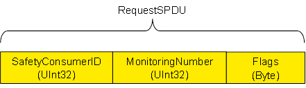  

Figure 11 - RequestSPDU  

[Figure 12](/§\_Ref519696240) shows the structure of a *ResponseSPDU* which originates at the *SafetyProvider* and contains the *SafetyData* (1 to 1 500 octets), an additional 25 octet safety code ( *STrailer* ) and the *NonSafetyData* . See [7.2.1.5](/§\_Ref20137323) to [7.2.1.11](/§\_Ref19279838) for details. See [6.2.3.4](/§\_Ref78961410) for details on the ResponseSPDUDataType definition.  

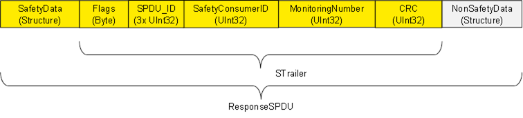  

Figure 12 - ResponseSPDU  

NOTE 2 To avoid spurious trips, the *ResponseSPDU* is transmitted in an atomic (consistent) way from the *OPC UA Platform Interface* of the *SafetyProvider* to the *OPC UA Platform Interface* of the *SafetyConsumer* . This is the task of the respective *OPC UA mapper* , see [Figure 2](/§\_Ref144121318) .  

##### 7.2.1.2 RequestSPDU: SafetyConsumerID  

Identifier of the *SafetyConsumer* instance, for diagnostic purposes, see [9.1.2](/§\_Ref19280304) .  

##### 7.2.1.3 RequestSPDU: MonitoringNumber  

The *SafetyConsumer* uses the *MNR* to detect *SPDUs* with timeliness errors, e.g. such *SPDUs* which are continuously repeated by an erroneous network element which stores data. A different *MNR* is used in every *RequestSPDU* of a given *SafetyConsumer* , and a *ResponseSPDU* will only be accepted if its *MNR* matches the *MNR* of the corresponding *RequestSPDU* .  

The checking for correctness of the *MNR* is only performed by the *SafetyConsumer* .  

##### 7.2.1.4 RequestSPDU: Flags  

[RQ7.1] The *flags* of the *SafetyConsumer* ( *RequestSPDU.Flags* ) shall be used as shown in [6.2.3.1](/§\_Ref68165590) .  

##### 7.2.1.5 ResponseSPDU: SafetyData  

[RQ7.2] *SafetyData* shall contain the safety-related application data transmitted from the *SafetyProvider* to the *SafetyConsumer* . It is comprised of a single or multiple basic OPC UA *Variables* (see [6.2.5](/§\_Ref25164079) ). For the sake of reducing distinctions of cases, *SafetyData* shall always be a *Structure* , even if it comprised of only a single basic OPC UA *Variable* .  

For the calculation of the *CRC* signature, the order in which this data is processed by the calculation is important. *SafetyProvider* and *SafetyConsumer* shall agree upon the number, type and order of application data transmitted in *SafetyData* . The sequence of *SafetyData* is fixed.  

*SafetyData* may contain *qualifiers* for a fine-grained activation of *fail-safe* substitute values. For valid *process values* , the respective *qualifiers* are set to 1 (good), whereas the value 0 (bad) is used for invalid values. Invalid *process values* are replaced by *fail-safe* *substitute values* in the *SafetyConsumer* 's safety application. See [6.3.6](/§\_Ref141704219) .  

##### 7.2.1.6 ResponseSPDU: Flags  

[RQ7.3] The *flags* of the *SafetyProvider* ( *ResponseSPDU.Flags* ) shall be used as shown in [6.2.3.2](/§\_Ref68165966) .  

[RQ7.4] *Flags* in the *ResponseSPDU.Flags* which are reserved for future use shall be set to zero by the *SafetyProvider* and shall not be evaluated by the *SafetyConsumer* .  

##### 7.2.1.7 ResponseSPDU: SPDU_ID  

This field is used by the *SafetyConsumer* to check whether the *ResponseSPDU* is coming from the correct *SafetyProvider* . For details, see [7.2.3.1](/§\_Ref10562249) .  

##### 7.2.1.8 ResponseSPDU: SafetyConsumerID  

[RQ7.5] The *SafetyConsumerID* in the *ResponseSPDU* shall be a copy of the *SafetyConsumerID* received in the corresponding *RequestSPDU* . See [7.2.3.1](/§\_Ref10562249) .  

##### 7.2.1.9 ResponseSPDU: MonitoringNumber  

[RQ7.6] The *MonitoringNumber* in the *ResponseSPDU* shall be a copy of the *MonitoringNumber* received in the corresponding *RequestSPDU* . See [7.2.3.1](/§\_Ref10562249) .  

NOTE The *SafetyConsumer* uses the *ResponseSPDU.MonitoringNumber* to detect *SPDUs* received with timeliness error, e.g. *SPDUs* which are continuously repeated by an erroneous network element which stores data. A different *MonitoringNumber* is used in every *RequestSPDU* of a given *SafetyConsumer* , and a *ResponseSPDU* will only be accepted if its *MonitoringNumber* matches the *MonitoringNumber* in the corresponding *RequestSPDU* .  

##### 7.2.1.10 ResponseSPDU: CRC  

[RQ7.7] The *ResponseSPDU* *CRC* shall be used to detect data corruption. See [7.2.3.6](/§\_Ref10562546) on how it is calculated in the *SafetyProvider* and how it is checked in the *SafetyConsumer* .  

##### 7.2.1.11 ResponseSPDU: NonSafetyData  

[RQ7.8] This structure shall be used to transmit *NonSafetyData* values (e.g. diagnostic information) together with *SafetyData* consistently. *NonSafetyData* is not *CRC*\-protected and can stem from an unsafe source.  

[RQ7.9] When presented to the safety application (e.g. at an output of the *SafetyConsumer* ), non-safety values shall clearly be indicated as "non-safety" by an appropriate vendor-specific mechanism (e.g. by using a different colour).  

To avoid possible problems with empty structures, the dummy structure *NonSafetyDataPlaceholder* shall be used when no *NonSafetyData* is used (see requirement RQ6.8).  

#### 7.2.2 Behaviour  

##### 7.2.2.1 General  

The two *SCL* services *SafetyProvider* and *SafetyConsumer* are specified using state diagrams.  

##### 7.2.2.2 SafetyProvider and SafetyConsumer Sequence diagram  

[Figure 13](/§\_Ref530485514) and [Figure 14](/§\_Ref34665139) show sequences of requests and responses with *SafetyData* for this document using OPC UA *Client/Server* and *PubSub* communication mechanisms, respectively. The figures show selected scenarios only and are therefore informative.  

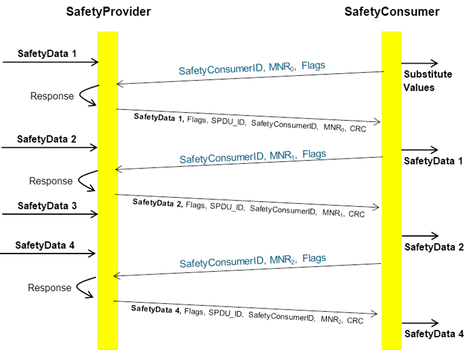  

Figure 13(informative) - Sequence diagram for requests and responses (Client/Server)  

[RQ7.10] In the case of *Client/Server* communication, a *SafetyConsumer* 's *OPC UA Mapper* may call a *SafetyProvider* (either the state machine implementation itself or the *SafetyProvider* 's *OPC UA Mapper* ) with an identical *RequestSPDU* multiple times in a row. In that case, the *SafetyProvider* (state machine or *OPC UA Mapper* ) shall answer all requests. The returned *ResponseSPDUs* may contain different values (e.g. currently available *process values* ) or contain the initially returned values.  

[RQ7.11] For each *SafetyProvider* , the implemented choice of behaviour according to RQ7.10 (i.e. whether currently available *process values* or initially returned values will be used) shall be documented in the corresponding safety manual.  

NOTE 2 Since a *SafetyConsumer* checks for changed *MNRs* in *ResponseSPDUs* (see *SafetyConsumer* state S14\_WaitForChangedSPDU in [Table 34](/§\_Ref156560397) and transition T17 in [Table 35](/§\_Ref2355647) ), and therefore will use only the first evaluated *ResponseSPDU* for a given *MNR* and all further *ResponseSPDUs* with the same *MNR* will be ignored.  

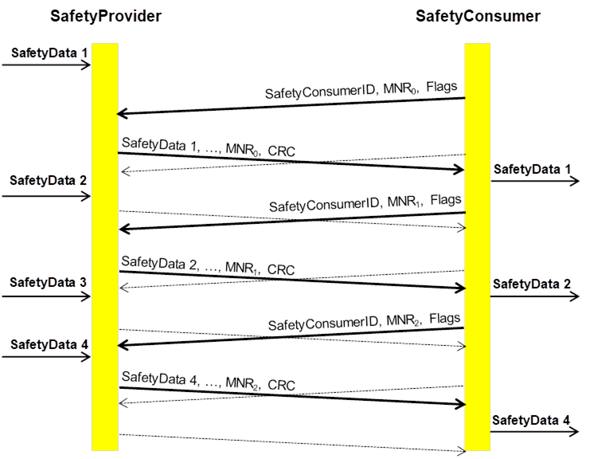  

NOTE The bold arrows represent communication with new data values, whereas dashed arrows contain repeated data values.  

Figure 14(informative) - Sequence diagram for requests and responses (PubSub)  

NOTE 3 The state machines according to this document do not contain any retry-mechanisms to increase fault tolerance. In contrast, it is assumed that retry is already handled within the OPC UA stack (e.g. when using *Client/Server* , or by choosing a higher update rate for *PubSub* ). The dashed lines therefore are not part of this document, but rather symbolize the repeated sending of data implemented in the OPC UA stack.  

The *SafetyConsumerTimeout* is the watchdog time checked in the *SafetyConsumer* . The watchdog is restarted immediately before a new *RequestSPDU* is generated (transitions T14 and T28 of the *SafetyConsumer* in [Table 35](/§\_Ref2355647) ). If an appropriate *ResponseSPDU* is received in time, and the checks for data integrity, authenticity, and timeliness are all valid, the timer will not expire before it is restarted.  

Otherwise, the watchdog timer expires, and the *SafetyConsumer* triggers a safe reaction. To duly check its timer, the *SafetyConsumer* is executed cyclically, with period *ConsumerCycleTime* . *ConsumerCycleTime* is expected to be smaller than *SafetyConsumerTimeout* .  

The *ConsumerCycleTime* is the maximum time for the cyclic update of the *SafetyConsumer* . It is the timeframe from one execution of the *SafetyConsumer* to the next execution of the *SafetyConsumer* . The implementation of the monitoring of the *ConsumerCycleTime* and the reaction in case of exceeding the *ConsumerCycleTime* are not part of this document; these are vendor-specific.  

[RQ7.12] The *ConsumerCycleTime* shall be monitored in a safety-related way.  

[RQ7.26] A change of the *SafetyConsumerTimeout* parameter value shall take immediate effect on the *ConsumerTimer* .  

##### 7.2.2.3 Duration of demand  

In case it is necessary to ensure that a given *SafetyData* (e.g. a *safety* demand or a command value) that originates in the *SafetyProvider* 's safety application is being received by a *SafetyConsumer* and forwarded to the *SafetyConsumer* 's *safety* application, i.e. if no *SafetyData* in a series of *SafetyData* is to be missed, the following two cases shall be considered.  

In case A, repeated identical *RequestSPDUs* are being answered by the *SafetyProvider* with *ResponseSPDUs* which contain the initially returned value. This is the case for *PubSub* communication and is a choice for *Client/Server* communication, see RQ7.11. In this case, the *SafetyProvider* 's safety application shall provide the respective *SafetyData* at the *SafetyProvider* 's *SAPI* until at least one change of the *MNR* is detected.  

In case B, repeated identical *RequestSPDUs* are being answered by the *SafetyProvider* with the currently available *SafetyData* . This is a choice for *Client/Server* communication, see RQ7.11. In this case, the *SafetyProvider* 's *safety* application shall provide the respective *SafetyData* at the *SafetyProvider* 's *SAPI* until at least two changes of the *MNR* have been detected.  

[Figure 15](/§\_Ref158115514) and [Figure 16](/§\_Ref158125823) show examples justifying case B by depicting two sequences of *ResponseSPDUs* as sent by a *SafetyProvider* . Due to the cycles of *SafetyProvider* and *SafetyConsumer* not being synchronized, a *SafetyConsumer* can evaluate any one of a given number of *ResponseSPDUs* for a given *RequestSPDU* .  

In the examples, the *SafetyData* is made up of two components: the "respective *safety* data", i.e. a *safety* demand that is not to be missed (one of the values "A", "B" or "C") and non-demand numerical measurement values for which it does not matter whether some are not received by the *SafetyConsumer* .  

The worst-case time to make sure that the respective safety data from the *SafetyProvider* is made available to the *SafetyConsumer* is two times the *SafetyConsumerTimeout* . This worst-case time occurs when the two transmissions of a *RequestSPDU* and its corresponding *ResponseSPDU* , which are necessary according to the descriptions above, each take a time of just slightly under one *SafetyConsumerTimeout* .  

If the *SafetyConsumer's* *SafetyConsumerTimeout* is known at the *SafetyProvider* , the *SafetyProvider* may alternatively provide the respective safety data for at least two times the *SafetyConsumerTimeout* to ensure that the respective safety data reaches the *SafetyConsumer* .  

Since *NonSafetyData* is consistently transmitted with *SafetyData* , the same considerations apply for *NonSafetyData* .  

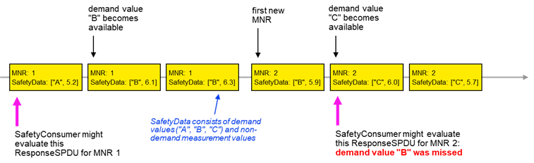  

Figure 15 - Duration of demand example for missed demand value in case of currently available SafetyData not being provided until second change of MNR  

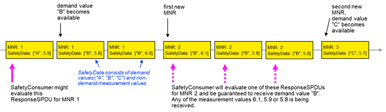  

Figure 16 - Duration of demand example for received demand value in case of currently available SafetyData being provided  

##### 7.2.2.4 SafetyProvider state diagram  

[RQ7.13] [Figure 17](/§\_Ref518503784) shows a simplified representation of the state diagram of the *SafetyProvider* . The exact behaviour is described in [Table 30](/§\_Ref16167220) , [Table 31](/§\_Ref360118152) , and [Table 32](/§\_Ref156560211) . The *SafetyProvider* shall implement that behaviour. It is not required to literally follow the entries given in the tables, if the externally observable behaviour does not change.  

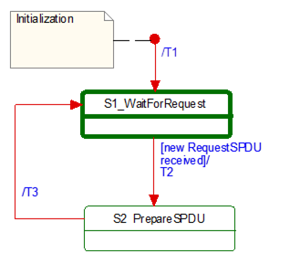  

Figure 17 - Simplified representation of the state diagram for the SafetyProvider  

[Table 29](/§\_Ref156576978) shows the symbols used for state machines.  

Table 29 - Symbols used for state machines  

| **Graphical representation** | **Type** | **Description** |
|---|---|---|
||Activity state|Within these interruptible activity states the *SafetyProvider* waits for new input.|
||Action state|Within these non-interruptible action states events like new requests are deferred until the next activity state is reached, see [[1]](/§\_Ref506543300) .|
  

  

The transitions are fired in case of an event. "Event" in this context means either a *Method* call in the case of *Client/Server* communication or the detection of a changed *RequestSPDU* by the *OPC UA Mapper* in the case of *PubSub* communication.  

In case of several possible transitions, so-called guard conditions (refer to […] in UML diagrams) define which transition to fire.  

The diagram consists of activity and action states. Activity states are surrounded by bold lines, action states are surrounded by thin lines. While activity states can be interruptible by new events, action states are not. External events occurring while the state machine is in an action state, are deferred until the next activity state is reached.  

NOTE The details on how to implement activity states and action states are vendor-specific. Typically, in a real-time system the task performing the *SafetyProvider* or *SafetyConsumer* state machine is executed cyclically (see [6.3.5](/§\_Ref144122471) ). Whenever the task is woken up by the scheduler of the operating system while it is in an action state, it executes action states until its time slice is used up, or an activity state is reached. Whenever a task being in an activity state is woken up, it checks for input. If no new input is available, it immediately returns to the sleep state without changing state.  

If input is available, it starts executing action states until its time-slice is up or until the next activity state is reached.  

[Table 30](/§\_Ref16167220) shows the internal items of a *SafetyProvider* instance.  

Table 30 - SafetyProvider instance internal items  

| **Internal items** | **Type** | **Definition** |
|---|---|---|
|RequestSPDU\_i|Variable|Local memory for *RequestSPDU* (required to react on changes).|
|SPDU\_ID\_1\_i|UInt32|Local variable to store *SPDU\_ID\_1* .|
|SPDU\_ID\_2\_i|UInt32|Local variable to store *SPDU\_ID\_2* .|
|SPDU\_ID\_3\_i|UInt32|Local variable to store *SPDU\_ID\_3* .|
|BaseID\_i|Guid|Local variable containing the BaseID (taken either from the *SPI* or *SAPI* ).|
|ProviderID\_i|UInt32|Local variable containing the ProviderID (taken either from the *SPI* or *SAPI* ).|
|\<Get RequestSPDU\>|Macro|Instruction to take the whole *RequestSPDU* from the *OPC UA Mapper* .|
|\<Set ResponseSPDU\>|Macro|Instruction to transfer the whole *ResponseSPDU* to the *OPC UA Mapper.*|
|\<Calc SPDU\_ID\_i\>|Macro|const uint32 SafetyProviderLevel\_ID:= … // see [7.2.3.4](/§\_Ref10563664) If(SAPI.SafetyBaseID == 0) then BaseID\_i:= SPI.SafetyBaseIDConfiguredElse BaseID\_i:= SAPI.SafetyBaseID EndifIf(SAPI.SafetyProviderID == 0) then ProviderID\_i:= SPI.SafetyProviderIDConfiguredElse ProviderID\_i:= SAPI.SafetyProviderID Endif SPDU\_ID\_1\_i:= BaseID\_i (octets 0…3)   XOR SafetyProviderLevel\_ID SPDU\_ID\_2\_i:= BaseID\_i (octets 4…7)   XOR SPI.SafetyStructureSignature SPDU\_ID\_3\_i:= BaseID\_i (octets 8…11)   XOR BaseID\_i (octets 12…15)   XOR ProviderID\_i // see [7.2.3.2](/§\_Ref10564098) for clarification|
|\<build ResponseSPDU\>|Macro|Take the *MNR* and the *SafetyConsumerID* of the received *RequestSPDU* . Add the SPDU\_ID\_1\_i, SPDU\_ID\_2\_i, SPDU\_ID\_3\_i, Flags, the *SafetyData* and the *NonSafetyData* , as well as the calculated *CRC* . See [7.2.3.1](/§\_Ref10562249)|
  

  

[Table 31](/§\_Ref360118152) shows the states of a *SafetyProvider* instance. The *SafetyProvider* does not check for correct configuration. It will reply to requests even if it is incorrectly configured (e.g. its *SafetyProviderID* is zero). However, *SafetyConsumers* will never try to communicate with *SafetyProviders* having incorrect parameters, see Transitions T13 and T27 in [Table 35](/§\_Ref2355647) and the macro \<ParametersOK?\> in [Table 33](/§\_Ref156560325) .  

Table 31 - States of SafetyProvider instance  

| **State name** | **State description** |
|---|---|
|Initialization|// Initial state SAPI.SafetyData:= 0 SAPI.NonSafetyData:= 0SAPI.MonitoringNumber:= 0SAPI.SafetyConsumerID:= 0 SAPI.OperatorAckRequested:= 0 RequestSPDU\_i:= 0|
|S1\_WaitForRequest|// waiting on next *RequestSPDU* from *SafetyConsumer* \<Get RequestSPDU\>|
|S2\_PrepareSPDU|ResponseSPDU.Flags.ActivateFSV:= SAPI.ActivateFSVResponseSPDU.Flags.OperatorAckProvider:= SAPI.OperatorAckProvider ****  \<Calc SPDU\_ID\_i\> \<build ResponseSPDU\>   // see [7.2.3.1](/§\_Ref10562249)|
  

  

[Table 32](/§\_Ref156560211) shows the transitions of the *SafetyProvider* .  

Table 32 - SafetyProvider transitions  

| **Transition** | **Source state** | **Target state** | **Guard condition** | **Activity** |
|---|---|---|---|---|
|T1|Init|S1|||
|T2|S1|S2| **//**  \-|// Process request RequestSPDU\_i:= RequestSPDU SAPI.MonitoringNumber:= RequestSPDU.MonitoringNumber SAPI.SafetyConsumerID:= RequestSPDU.SafetyConsumerID SAPI.OperatorAckRequested:= RequestSPDU.Flags.OperatorAckRequested|
|T3|S2|S1|// SPDU is prepared  **\-** |\<Set ResponseSPDU\>|
|1 See the preceding explanation in [7.2.2.4](/§\_Ref144208140) of what constitutes events which trigger this transition.|
  

  

##### 7.2.2.5 SafetyConsumer state diagram  

[RQ7.14] [Figure 18](/§\_Ref514837892) shows a simplified representation of the state diagram of the *SafetyConsumer* . The exact behaviour is described in [Table 33](/§\_Ref156560325) , [Table 34](/§\_Ref156560397) , and [Table 35](/§\_Ref2355647) . The *SafetyConsumer* shall implement this behaviour. It is not required to literally follow the entries given in the tables, if the externally observable behaviour does not change.  

To avoid unnecessary spurious trips requiring operator acknowledgment, it is recommended that a *SafetyConsumer* is started after an OPC UA connection to a running *SafetyProvider* has been established, or that the setting of input *SAPI.Enable* to "1" is delayed until the *SafetyProvider* is running.  

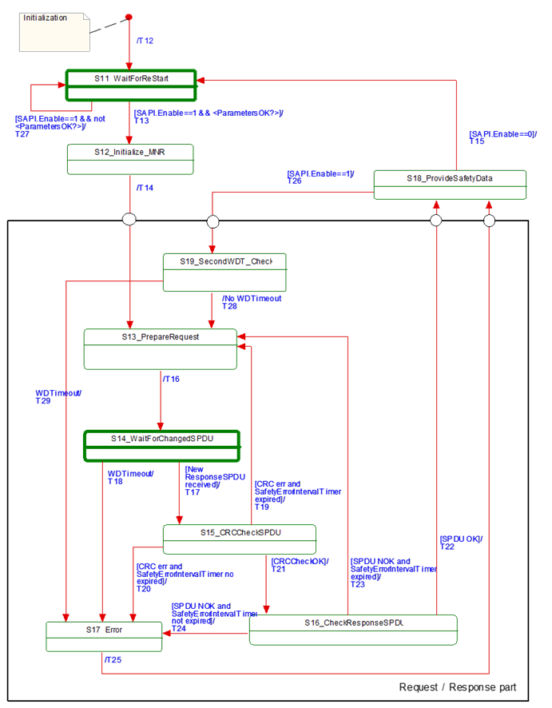  

Figure 18 - Principle state diagram for SafetyConsumer  

[Table 33](/§\_Ref156560325) shows the internal items of a *SafetyConsumer* . A macro is a shorthand representation for operations described in the according definition.  

Table 33 - SafetyConsumer internal items  

| **Internal items** | **Type** | **Definition** |
|---|---|---|
|Constants|||
|MNR\_min:= 0x100|UInt32|// 0x100 is the start value for *MNR* , also used after wrap-around // The values 0…0xFF are reserved for future use|
|Variables|||
|FaultReqOA\_i|Boolean|Local memory for errors which request operator acknowledgment|
|OperatorAckConsumerAllowed\_i|Boolean|Auxiliary *flag* indicating that operator acknowledgment is allowed. It is true if the input *SAPI.OperatorAckConsumer* has been 'false' since FaultReqOA\_i was set|
|MNR\_i|UInt32|Local *MonitoringNumber* ( *MNR* )|
|prevMNR\_i|UInt32|Local memory for previous *MNR*|
|ConsumerID\_i|UInt32|Local memory for *SafetyConsumerID* in use|
|CRCCheck\_i|Boolean|Local variable used to store the result of the *CRC* check|
|SPDUCheck\_i|Boolean|Local variable used to store the result of the additional *SPDU* checks|
|SPDU\_ID\_1\_i|UInt32|Local variable to store the expected *SPDU\_ID\_1*|
|SPDU\_ID\_2\_i|UInt32|Local variable to store the expected *SPDU\_ID\_2*|
|SPDU\_ID\_3\_i|UInt32|Local variable to store the expected *SPDU\_ID\_3*|
|SPI\_SafetyConsumerID\_i|UInt32|Local variable to store the parameter SafetyConsumerID|
|SPI\_SafetyProviderID\_i|UInt32|Local variable to store the parameter *SafetyProviderID*|
|SPI\_SafetyBaseID\_i|UInt128|Local variable to store the parameter *SafetyBaseID*|
|SPI\_SafetyStructureSignature\_i|UInt32|Local variable to store the parameter *SafetyStructureSignature*|
|SPI\_SafetyOperatorAckNecessary\_i|Boolean|Local variable to store the parameter SafetyOperatorAckNecessary|
|SPI\_SafetyErrorIntervalLimit\_i|UInt16|Local variable to store the parameter *SafetyErrorIntervalLimit*|
|MNR\_re\_sync\_i|Boolean|Local variable used to support re-synchronization of *MNR* after detected error|
|Timers|||
|ConsumerTimer|Timer|This timer is used to check whether the next valid *ResponseSPDU* has arrived on time. It is initialized using the parameter *SPI.SafetyConsumerTimeout* . NOTE As opposed to other parameters, a modification of the parameter value *SafetyConsumerTimeout* takes effect immediately, i.e. not only when state S11 is visited, see RQ7.26.|
|ErrorIntervalTimer|Timer|This timer is used to check the elapsed time between errors. If the elapsed time between two consecutive errors is smaller than the value *SafetyErrorIntervalLimit* , *FSV* will be activated. Otherwise, the *ResponseSPDU* is discarded and the *SafetyConsumer* waits for the next *ResponseSPDU* . This timer is initialized using the local variable SPI\_SafetyErrorIntervalLimit\_i. See [Table 26](/§\_Ref529177826) , [6.3.4.3](/§\_Ref3296204) , and [9.4](/§\_Ref10731748) for more information. NOTE The local variable SPI\_SafetyErrorIntervalLimit\_i is not to be confused with the parameter *SPI.SafetyErrorIntervalLimit* . The local variable is copied from the parameter in state S11 (restart). Hence, if the parameter value changes during runtime, the new value will only be used after the connection has been restarted.|
|Macros \<...\>\<...\>|||
|\<risingEdge x\>|Macro|// detection of a rising edge: If x==true && tmp==false Then result:= trueElse result:= falseEndif tmp:= x|
|\<Get ResponseSPDU\>|Macro|Instruction to take the whole *ResponseSPDU* from the *OPC UA Mapper* .|
|\<Use FSV\>|Macro|SAPI.SafetyData is set to binary 0 If **** SAPI.NonSafetyData is set to binary 0 Else SAPI.NonSafetyData is set to ResponseSPDU.NonSafetyData Endif SAPI.FSV\_Activated:= 1 RequestSPDU.Flags.FSV\_Activated:= 1 NOTE 1 If a safety application prefers *fail-safe* values other than binary 0, this can be implemented in the safety application by querying SAPI.FSV\_Activated. NOTE 2 The *NonSafetyData* is always updated if data is available. In case of a timeout, no data is available, which is indicated using binary zero. If it is necessary for an application to distinguish between "no data available" and "binary zero received", it can add a Boolean variable to the *NonSafetyData* . This value is set to "1" during normal operation, and to "0" for indicating that no data is available.|
|\<Use PV\>|Macro|SAPI.SafetyData is set to ResponseSPDU.SafetyData SAPI.NonSafetyData is set to ResponseSPDU.NonSafetyData SAPI.FSV\_Activated:= 0 RequestSPDU.Flags.FSV\_Activated:= 0 RequestSPDU.Flags.CommunicationError:= 0|
|\<Set RequestSPDU\>|Macro|Instruction to transfer the whole *RequestSPDU* to the *OPC UA Mapper* .|
|\<(Re)Start ConsumerTimer\>|Macro|Restarts the *ConsumerTimer* .|
|\<(Re)Start ErrorIntervalTimer\>|Macro|Restarts the *ErrorIntervalTimer* .|
|\<ConsumerTimer expired?\>|Macro|Yields "true" if the timer is running longer than SPI.SafetyConsumerTimeout since last restart, "false" otherwise.|
|\<ErrorIntervalTimer expired?\>|Macro|Yields "true" if the timer is running longer than SPI.SafetyErrorIntervalLimit since last restart, "false" otherwise.|
|\<Assign ConsumerID\>|Macro|If SAPI.SafetyConsumerID \!= 0 Then ConsumerID\_i:= SAPI.SafetyConsumerID Else ConsumerID\_i:= SPI\_SafetyConsumerID\_i EndifRequestSPDU.SafetyConsumerID:= ConsumerID\_i|
|\<Calc SPDU\_ID\_i\>|Macro|uint128 BaseID uint32 ProviderID const uint32 SafetyProviderLevel\_ID:= … // see [7.2.3.4](/§\_Ref10563664) If(SAPI.SafetyBaseID == 0) Then BaseID:= SPI\_SafetyBaseID\_iElse BaseID:= SAPI.SafetyBaseID EndifIf(SAPI.SafetyProviderID == 0) Then ProviderID:= SPI\_SafetyProviderID\_iElse ProviderID:= SAPI.SafetyProviderID Endif SPDU\_ID\_1\_i:= BaseID (octets 0…3)   XOR SafetyProviderLevel\_ID SPDU\_ID\_2\_i:= BaseID (octets 4…7)   XOR SPI\_SafetyStructureSignature\_i SPDU\_ID\_3\_i:= BaseID (octets 8…11)   XOR BaseID (octets 12…15)   XOR ProviderID // see [7.2.3.2](/§\_Ref10564098) for clarification|
|\<ParametersOK?\>|Macro|Boolean result:= trueIf(SAPI.SafetyBaseID == 0 && SPI\_SafetyBaseID\_i==0)Then result:= falseElseEndif If(SAPI.SafetyProviderID == 0 && SPI\_SafetyProviderID\_i==0)Then result:= falseElseEndif If(SAPI.SafetyConsumerID == 0 && SPI\_SafetyConsumerID\_i==0)Then result:= falseElseEndif If(SPI\_SafetyStructureSignature\_i==0)Then result:= falseElseEndif yield result|
|\<Set Diag(ID, Boolean isPermanent)\>|Macro|// ID is the identifier for the type of diagnostic output, see [Table 28](/§\_Ref106421779) .// Parameter *isPermanent* is used to indicate a permanent error.// Only one diagnostic message is created for multiple permanent// errors in sequence If(RequestSPDU.Flags.CommunicationError == 0) Then \<do vendor-specific function for diagnostic output using ID\>Else //do nothingEndif RequestSPDU.Flags.CommunicationError:= isPermanent// NOTE See [Table 28](/§\_Ref106421779) for possible values for "ID" and their codes.|
|\<ResponseSPDUready for checks\>|Macro|Boolean result:= false  **If**  Then If ResponseSPDU.MNR \<\> prevMNR\_i Then result:= true Else //do nothing Endif Else If ResponseSPDU.MNR == MNR\_i Then result:= true Else //do nothing Endif Endif yield result|
|\<Handle WDTimeout\>|Macro|\<Set Diag(CommErrTO,isPermanent:=true)\>\<Use FSV\> If SPI\_SafetyOperatorAckNecessary\_i == 1Then FaultReqOA\_i:= 1 SAPI.OperatorAckRequested:= 0 RequestSPDU.Flags.OperatorAckRequested:= 0Else // do nothingEndif|
|External event|||
|Restart cycle|Event|The external call of *SafetyConsumer* can be interpreted as event "restart cycle"|
  

  

[Table 34](/§\_Ref156560397) shows the states of the *SafetyConsumer* . The *SafetyConsumer* parameters are accessed only in state S11. In this state, a copy is made, and in all other states and transitions the copied values are used. This ensures that a change of one of these parameters takes effect only when a new safety connection is established. The only exception from this rule is the parameter *SafetyConsumerTimeout* . A change of this parameter becomes effective immediately (see RQ7.26). If this is not the desired behaviour, i.e. if parameters should be changeable during runtime, this can be accomplished by establishing a second safety connection according to this document with the new parameters, and then switching between these two safety connections at runtime.  

Table 34 - SafetyConsumer states  

| **State name** | **State description** |
|---|---|
|Initialization|// Initial state of the *SafetyConsumer* instance. \<Use FSV\> SAPI.OperatorAckRequested:= 0RequestSPDU.Flags.OperatorAckRequested:= 0SAPI.OperatorAckProvider:= 0FaultReqOA\_i:= 0OperatorAckConsumerAllowed\_i:= 0SAPI.TestModeActivated:= 0RequestSPDU.Flags.CommunicationError:= 0 MNR\_re\_sync\_i:= false|
|S11\_Wait for (Re)Start|// Safety layer is waiting for (Re)Start // Changes to these parameters are only considered in this state // Exception: a change of *SafetyConsumerTimeout* is possible during operation // Read parameters from the *SPI* and store them in local variables: SPI\_SafetyConsumerID\_i:= SPI.SafetyConsumerID SPI\_SafetyProviderID\_i:= SPI.SafetyProviderIDConfigured SPI\_SafetyBaseID\_i:= SPI.SafetyBaseIDConfigured SPI\_SafetyStructureSignature\_i:= SPI.SafetyStructureSignature SPI\_SafetyOperatorAckNecessary\_i:= SPI.SafetyOperatorAckNecessary SPI\_SafetyErrorIntervalLimit\_i:= SPI\_SafetyErrorIntervalLimit|
|S12\_initialize MNR|// Use previous *MNR* if known// or random *MNR* within the allowed range (e.g. after cold start), see [9.2](/§\_Ref3544099) . MNR\_i:= (previous MNR\_i if known) or (random *MNR* ) MNR\_i:= max(MNR\_i, MNR\_min)1|
|S13\_PrepareRequest|// Build *RequestSPDU* and send (done in T16)|
|S14\_WaitForChangedSPDU|// Safety Layer is waiting for next *ResponseSPDU* from *SafetyProvider* . // A new *ResponseSPDU* is characterized by a change in the *MNR* .|
|S15\_CRCCheckSPDU|// Check *CRC* uint32 CRC\_calcCRCCheck\_i:= (CRC\_calc == ResponseSPDU.CRC) // see [7.2.3.6](/§\_Ref10562546) on how to calculate CRC\_calc|
|S16\_CheckResponseSPDU|// Check *SafetyConsumerID* and *SPDU\_ID* and *MNR* (see T22, T23, T24) SPDUCheck\_i:= ResponseSPDU.SPDU\_ID\_1 == SPDU\_ID\_1\_i && ResponseSPDU.SPDU\_ID\_2 == SPDU\_ID\_2\_i && ResponseSPDU.SPDU\_ID\_3 == SPDU\_ID\_3\_i && ResponseSPDU.SafetyConsumerID == ConsumerID\_i && ResponseSPDU.MNR == MNR\_i|
|S17\_Error|SAPI.TestModeActivated:= 0|
|S18\_ProvideSafetyData|// Provide SafetyData to the application program|
|S19\_SecondWDT\_Check|// Second check of WDTimeout // Prevents restarting of *ConsumerTimer* if it expired since initial check|
|1 This ensures that the *MNR* is greater or equal to MNR\_min, in cases the random number generator yielded a smaller value.|
  

  

[Table 35](/§\_Ref2355647) shows the transitions of the *SafetyConsumer* .  

Table 35 - SafetyConsumer transitions  

| **Transition** | **Source state** | **Target state** | **Guard condition** | **Activity** |
|---|---|---|---|---|
|T12|Init|S11|\-||
|T13|S11|S12|//Start [SAPI.Enable==1 && \<ParametersOK?\>]|\<(Re)Start ErrorIntervalTimer\>\<calc SPDU\_ID\_i\>// see [7.2.3.2](/§\_Ref10564098) for clarification|
|T14|S12|S13|// *MNR* initialized|\<(Re)Start ConsumerTimer\> \<Assign ConsumerID\>|
|T15|S18|S11|// Termination [SAPI.Enable==0]|\<Use FSV\> RequestSPDU.Flags.CommunicationError:= 0 // necessary to make sure that no diagnostic // message is lost, see macro \<Set Diag ...\> // NOTE Depending on its implementation, it could // be necessary to stop the *ConsumerTimer* here.|
|T16|S13|S14|// Build RequestSPDU // and send it|prevMNR\_i:= MNR\_i If MNR\_i == 0xFFFFFFFFFThen MNR\_i:= MNR\_minElse MNR\_i:= MNR\_i + 1Endif RequestSPDU.MonitoringNumber:= MNR\_i \<Set RequestSPDU\>|
|T17|S14|S15|// Changed ResponseSPDU// is received1 \<Get ResponseSPDU\>2 \<ResponseSPDU ready for checks\>|// A changed *ResponseSPDU* is characterized by a change in the *MNR* .|
|T18|S14|S17|// WDTimeout [\<ConsumerTimer expired?\>]|\<Handle WDTimeout\>|
|T19|S15|S13|// When CRC err and ErrorIntervalTimer expired[(crcCheck\_i == 0) && \<ErrorIntervalTimer expired?\>]|MNR\_re\_sync\_i:= true \<(Re)Start ErrorIntervalTimer\>\<Set Diag(CRCerrIgn, isPermanent:=false)\>|
|T20|S15|S17|// When CRC err and ErrorIntervalTimer not expired [(crcCheck\_i == 0) && not \<ErrorIntervalTimer expired?\>]|\<(Re)Start ErrorIntervalTimer\>\<Set Diag(CRCerrOA, isPermanent:=true)\>\<Use FSV\> FaultReqOA\_i:= 1SAPI.OperatorAckRequested:= 0RequestSPDU.Flags.OperatorAckRequested:= 0|
|T21|S15|S16|// When CRCCheckOK [crcCheck\_i == 1]|\-|
|T22|S16|S18|// SPDU OK [SPDUCheck\_i==true]|// For clarification, refer to [Figure 19](/§\_Ref2354720) ; MNR\_re\_sync\_i:= false // indicate OA from provider SAPI.OperatorAckProvider:= ResponseSPDU.Flags.OperatorAckProvider // OA requested due to rising edge at ActivateFSV? If (\<risingEdge ResponseSPDU.Flags.ActivateFSV\>&& SPI\_SafetyOperatorAckNecessary\_i == true)Then FaultReqOA\_i:= 1; \<Set Diag(FSV\_Requested,isPermanent:=true)\> Else // do nothing Endif // Set Flags if OA requested: If FaultReqOA\_i==1 Then SAPI.OperatorAckRequested:= 1, RequestSPDU.Flags.OperatorAckRequested:= 1, OperatorAckConsumerAllowed\_i:= 0, FaultReqOA\_i:= 0Else //do nothingEndif // Wait until OperatorAckConsumer is not active If SAPI.OperatorAckConsumer==0 Then OperatorAckConsumerAllowed\_i:= 1 Else //do nothing Endif // Reset Flags after OA: If SAPI.OperatorAckConsumer ==1 && OperatorAckConsumerAllowed\_i == 1 Then SAPI.OperatorAckRequested:= 0, RequestSPDU.Flags.OperatorAckRequested:= 0Else // do nothing Endif If SAPI.OperatorAckRequested==1 || ResponseSPDU.Flags.ActivateFSV==1Then \<Use FSV\> Else \<Use PV\>Endif // Notify safety application that *SafetyProvider* is in test mode: SAPI.TestModeActivated:= ResponseSPDU.Flags.TestModeActivated|
|T23|S16|S13|// SPDU NOK and ErrorIntervalTimer expired[SPDUCheck\_i == false && \<ErrorIntervalTimer expired?\>]|\<(Re)Start ErrorIntervalTimer\>, MNR\_re\_sync\_i:= true // Send diagnostic message according to the// detected error: If ResponseSPDU.SafetyConsumerID \<\> ConsumerID\_iThen \<Set Diag(CoIDerrIgn, isPermanent:=false)\>Else If ResponseSPDU.MNR\<\>MNR\_i Then \<Set Diag(MNRerrIgn, isPermanent:=false)\> Else  //do nothing EndIf If ResponseSPDU.SPDU\_ID\_1\<\> SPDU\_ID\_1\_i || ResponseSPDU.SPDU\_ID\_2\<\> SPDU\_ID\_2\_i || ResponseSPDU.SPDU\_ID\_3\<\> SPDU\_ID\_3\_i Then  \<Set Diag(SD\_IDerrIgn,   isPermanent:=false)\>3 Else  // do nothing EndifEndif|
|T24|S16|S17|// SPDU NOK and ErrorIntervalTimer not expired [SPDUCheck\_i == 0 && not \<ErrorIntervalTimer expired?\>]|\<(Re)Start ErrorIntervalTimer\>// Send diagnostic message according to the // detected error: If ResponseSPDU.SafetyConsumerID\<\> ConsumerID\_iThen \<Set Diag(CoIDerrOA, isPermanent:=true)\>Else If ResponseSPDU.MNR\<\>MNR\_i Then  \<Set Diag(MNRerrOA,isPermanent:=true)\> Else  //do nothing Endif If ResponseSPDU.SPDU\_ID\_1\<\> SPDU\_ID\_1\_i || ResponseSPDU.SPDU\_ID\_2\<\> SPDU\_ID\_2\_i || ResponseSPDU.SPDU\_ID\_3\<\> SPDU\_ID\_3\_i Then \<Set Diag(SD\_IDerrOA,isPermanent:=true)\> Else  //do nothing EndifEndif FaultReqOA\_i:= 1 SAPI.OperatorAckRequested:= 0RequestSPDU.Flags.OperatorAckRequested:= 0\<Use FSV\>|
|T25|S17|S18|// SPDU NOK \-|MNR\_re\_sync\_i:= true|
|T26|S18|S19|// Restart Cycle [SAPI.Enable==1]|\-|
|T27|S11|S11|// Invalid parameters [SAPI.Enable==1 && not \<ParametersOK?\>]|\<Set Diag(ParametersInvalid, isPermanent:=true)\>|
|T28|S19|S13|// No WDTimeout|\<(Re)Start ConsumerTimer\>|
|T29|S19|S17|// WDTimeout [\<ConsumerTimer expired?\>]|\<Handle WDTimeout\>|
|1 Another event like " *Method* completion successful" can be used as guard condition of "Changed *ResponseSPDU* received" as well. 2  *SPDUs* with all values (incl. *CRC* signature) being zero shall be ignored, see requirement RQ5.6. 3 See [Table 28](/§\_Ref106421779) .|
  

  

##### 7.2.2.6 SafetyConsumer sequence diagram for operator acknowledgment (informative)  

[Figure 19](/§\_Ref2354720) shows the sequence after the detection of an error requiring operator acknowledge until communication returns to delivering process values again.  

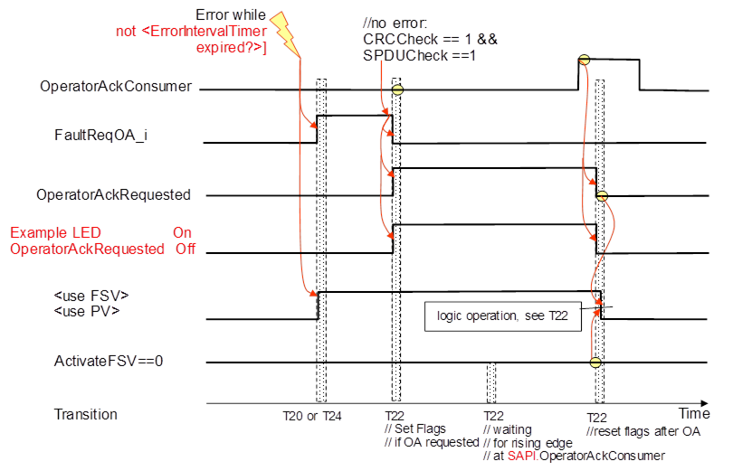  

Figure 19 - Sequence diagram for OA  

After the error is gone the sequence follows the logic of T22 in [Table 35](/§\_Ref2355647) .  

#### 7.2.3 Subroutines  

##### 7.2.3.1 Build ResponseSPDU  

[RQ7.15] The *ResponseSPDU* shall be built by the *SafetyProvider* by copying *RequestSPDU.MonitoringNumber* and *RequestSPDU.SafetyConsumerID* into the *ResponseSPDU* . In addition, *SPDU\_ID* , *Flags* , the *SafetyData* and the *NonSafetyData* shall be updated. Finally, *ResponseSPDU.CRC* shall be calculated and appended.  

[Figure 20](/§\_Ref156571792) gives an overview over the task of building the *ResponseSPDU* .  

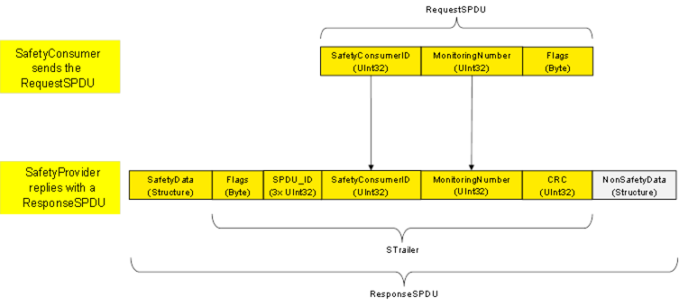  

Figure 20 - Overview of task for SafetyProvider  

For the *ResponseSPDU.Flags* , see [7.2.1.6](/§\_Ref1395589) . For the calculation of the *SPDU\_ID* , see [7.2.3.2](/§\_Ref10564098) . For the calculation of the *CRC* , see [7.2.3.6](/§\_Ref10562546) .  

##### 7.2.3.2 Calculation of the SPDU_ID_1, SPDU_ID_2, SPDU_ID_3  

[RQ7.16] *SPDU\_ID\_1* , *SPDU\_ID\_2* and *SPDU\_ID\_3* shall be calculated according to [Figure 21](/§\_Ref14078965) and [Table 36](/§\_Ref11341093) .  

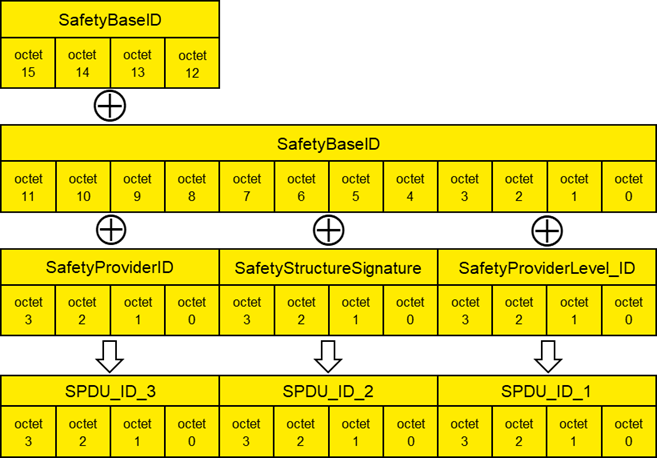  

Figure 21 - Calculation of the SPDU\_ID  

  

Table 36 - Presentation of the SPDU\_ID  

||
|---|
|SPDU\_ID\_1:= SafetyBaseID (octets 0…3) XOR SafetyProviderLevel\_ID (octets 0…3)|
|SPDU\_ID\_2:= SafetyBaseID (octets 4…7) XOR SafetyStructureSignature (octets 0…3)|
|SPDU\_ID\_3:= SafetyBaseID (octets 8…11) XOR SafetyBaseID (octets 12…15) XOR SafetyProviderID (octets 0…3)|
  

  

In case of a mismatch between expected *SPDU\_ID* and actual *SPDU\_ID* , the following rules can be used for diagnostic purposes:  

* If all of *SPDU\_ID\_1* , *SPDU\_ID\_2* , and *SPDU\_ID\_3* differ, there probably is a mismatching *SafetyBaseID* .  

* If *SPDU\_ID\_3* differs, but *SPDU\_ID\_1* and *SPDU\_ID\_2* do not, there is a mismatching *SafetyProviderID* .  

* If *SPDU\_ID\_2* differs, but *SPDU\_ID\_1* and *SPDU\_ID\_3* do not, the structure or identifier of the *SafetyData* do not match.  

* If *SPDU\_ID\_1* differs, but *SPDU\_ID\_2* and *SPDU\_ID\_3* do not, the *SafetyProviderLevel* does not match.  

By these rules, there is a very low probability (\<10-9) that a mismatching *SafetyBaseID* will be misinterpreted. From a practical view, this probability can be ignored.  

##### 7.2.3.3 Example for the calculation of SPDU_ID_1, SPDU_ID_2 and SPDU_ID_3 (informative)  

[Figure 22](/§\_Ref158111814) shows a concrete example of the calculation of *SPDU\_ID\_1* , *SPDU\_ID\_2* and *SPDU\_ID\_3* . The following input values were chosen for the calculation: *SafetyBaseID* is the *GUID* "72962B91-FA75-4AE6-8D28-B404DC7DAF63", *SafetyProviderID* has the value 0xE0EA6B40, *SafetyStructureSignature* has the value 0xDE7329FD and the *SafetyProviderLevel\_ID* is chosen as 0xDEAA9DEE (representing *SIL* 3).  

See OPC 10000-6, 5.2.2.6 for details on the encoding of *Guids* . The octets from the resulting octet stream are used according to [Figure 21](/§\_Ref14078965) , i.e. in "reverse order".  

The resulting *SPDU\_IDs* are as follows: *SPDU\_ID\_1* has the value of 0xAC3CB67F, *SPDU\_ID\_2* has the value of 0x9495D388 and *SPDU\_ID\_3* has the value of 0x87F13E11.  

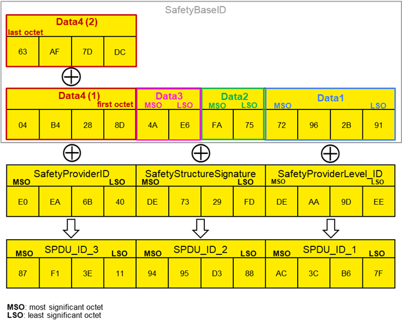  

Figure 22(informative) - Example for the calculation of SPDU\_ID\_1, SPDU\_ID\_2 and SPDU\_ID\_3  

##### 7.2.3.4 Coding of the SafetyProviderLevel_ID  

The *SafetyProviderLevel* is the *SIL* the *SafetyProvider* implementation (hardware and software) is capable of.  

Table 37 - Coding for the SafetyProviderLevel\_ID  

| **SafetyProviderLevel** | **Value of SafetyProviderLevel\_ID** |
|---|---|
|*SIL* 1 *SIL* 2 *SIL* 3 *SIL* 4|0x119128810x647C46540xDEAA9DEE0xAB47F33B|
  

  

[RQ7.17] Exactly one of the values provided in [Table 37](/§\_Ref14078966) shall be used as constant code value for *SafetyProviderLevel\_ID* . The values were chosen in such a way that the hamming distance between them becomes maximal (hamming distance of 21).  

[RQ7.18] Measures shall be taken to avoid that a *SafetyProvider* is erroneously using a code value belonging to a *SIL* that is higher than the *SIL* it is capable of. For instance, a *SafetyProvider* capable of *SIL* 1 to *SIL* 3 should not be able to accidently use the value 0xAB47F33B used for *SIL* 4\. One way to achieve this is to avoid that this constant appears in the source code of the *SafetyProvider* at all.  

The *SafetyProviderLevel* is independent to the *SIL* capability of the provided *SafetyData* , see [3.1.2.12](/§\_Ref178077347) .  

##### 7.2.3.5 Signature over the SafetyData Structure (SafetyStructureSignature)  

*SafetyStructureSignature* is used to check the number, *DataTypes* , and order of application data transmitted in *SafetyData* . If the *SafetyConsumer* is expecting anything different than what the *SafetyProvider* actually provides, *SafetyStructureSignature* will differ, allowing the *SafetyConsumer* to enable *fail-safe substitute values* .  

In addition, the identifier of the *Structure DataType* ( *SafetyStructureIdentifier* ) is also taken into account when calculating *SafetyStructureSignature* . This ensures that the *SafetyProvider* and the *SafetyConsumer* are using the same identifier for the *Structure DataType* , effectively avoiding any confusion.  

For instance, if a *SafetyProvider* defines a *Structure* with identifier "vec3D\_m" comprising three *Floats* containing a three-dimensional vector in the metric system, this *Structure* could not be used by a *SafetyConsumer* expecting a *Structure* of *DataType* "vec3D\_in" where the vector components are given in inches, or even at a *SafetyConsumer* expecting a *Structure* of *DataType* "orientation", containing three *Floats* to define an orientation using Euler angles.  

[RQ7.19] *SafetyStructureSignature* shall be calculated as a 32 bit *CRC* signature (polynomial: *0x* F4ACFB13, see Clause [B.1](/§\_Ref19525422) ) over *SafetyStructureIdentifier* (encoding: UTF-8), *SafetyStructureSignatureVersion* and the sequence of the *DataTypeEncodingIDs* . After each *DataTypeEncodingID* , a 16-bit zero-value (0x0000) shall be inserted. All integers shall be encoded using little endian octet ordering. Data shall be processed in reverse order, see Clause [B.1](/§\_Ref19525422) . The value "0" shall not be used as a signature. Instead, the value "1" shall be used in this case.  

The terminating zero of *SafetyStructureIdentifier* shall not be considered when calculating the *CRC* .  

[RQ7.20] *SafetyStructureIdentifier* may be visible in the OPC UA *Information Model* for diagnostic purposes but shall not be evaluated by the *SafetyConsumer* during runtime.  

[RQ7.21] For all releases up to Release 2.0 of the specification, the value for *SafetyStructureSignatureVersion* shall be 0x0001.  

Example:  

*SafetyStructureIdentifier* ,e.g. "Motörhead" = 0x4d 0x6f 0x74 0xc3 0xb6 0x72 0x68 0x65 0x61 0x64  

*SafetyStructureSignatureVersion* := 0x0001  

1\. *DataType Int16* : ( *DataTypeEncodingId* = 0x0004), // see [6.2.5](/§\_Ref25164079)  

2\. *DataType Boolean* : ( *DataTypeEncodingId* = 0x0001),  

3\. *DataType Float* : ( *DataTypeEncodingId* =0x000a)  

  

*SafetyStructureSignature* =  

= CRC32\_Backward(0x4d, 0x6f, 0x74, 0xc3, 0xb6, 0x72, 0x68, 0x65, 0x61, 0x64,  

0x01,0x00,  

0x04,0x00, 0x00,0x00,  

0x01,0x00, 0x00,0x00,  

0x0A, 0x00, 0x00, 0x00)  

  

= CRC32\_Forward(  

0x00, 0x00, 0x00, 0x0A,  

0x00, 0x00, 0x00, 0x01,  

0x00, 0x00, 0x00, 0x04,  

0x00,0x01,  

0x64, 0x61, 0x65, 0x68, 0x72, 0xb6, 0xc3, 0x74, 0x6f, 0x4d)  

  

= 0xe2e86173  

  

NOTE 1 The insertion of 0x0000 values after each *DataTypeEncodingID* allows for introducing arrays in later versions of this document.  

NOTE 2 *SafetyStructureSignatureVersion* is the version of the procedure used to calculate the signature, as defined in requirement RQ7.19. If future releases of this document define an alternative procedure, they will indicate this by using a different version number.  

OPC 10000-3, 5.8.2 defines different categories of *DataTypes* . Regarding the *DataTypeEncodingID* which is to be used within the *SafetyStructureSignature* , the following holds:  

* For *Built-in DataTypes* , the ID from Table 1 of OPC 10000-6 is used as *DataTypeEncodingID* .  

* For *Simple DataTypes* , the *DataTypeEncodingID* of the *Built-in DataType* from which they are derived is used.  

* As of now, *Structured DataTypes* (including *OptionSets* ) shall not be used within *SafetyData* . *Arrays* are not supported. Instead, multiple variables of the same type are used.  

* *Enumeration DataTypes* are encoded on the wire as *Int32* and therefore shall use the *DataTypeEncodingID* of the *Int32* *Built-in DataType* .  

##### 7.2.3.6 Calculation of a CRC signature  

The *SafetyProvider* calculates the *CRC* signature ( *ResponseSPDU.CRC* ) and sends it to the *SafetyConsumer* as part of the *ResponseSPDU* . This enables the *SafetyConsumer* to check the correctness of the *ResponseSPDU* including the *SafetyData* , *flags* , *MNR* , *SafetyConsumerID* and *SPDU\_ID* by recalculating the *CRC* signature (CRC\_calc).  

[RQ7.22] The generator polynomial *0x* F4ACFB13 shall be used for the 32-Bit *CRC* signature.  

[RQ7.23] If *SafetyData* is longer than one octet (e.g. if it is of *DataType* *UInt16* , *Int16* or *Float* ), it shall be decoded and encoded using little endian order in which the least significant octet appears first in the incremental memory address stream.  

[RQ7.24] The calculation sequence shall begin with the highest memory address (n) of the STrailer counting back to the lowest memory address (0) and then include also the *SafetyData* beginning with the highest memory address.  

[Figure 23](/§\_Ref25165209) shows the calculation sequence of a *ResponseSPDU* *CRC* on a little-endian machine, using an example *SafetyData* with the following fields:  

Int32 var1  

UInt32 var2  

UInt16 var3  

Int16 var4  

Boolean var5  

For the example given above, the STrailer (without *CRC* ) and *SafetyData* have a combined length of 34 octets (16 octets STrailer without *CRC* , 12 octets of *SafetyData* ). The calculation of *ResponseSPDU.CRC* ( *SafetyProvider* ) or CRC\_calc ( *SafetyConsumer* ) is done in reverse order, from bottom to top. In the example shown in [Figure 23](/§\_Ref25165209) , *CRC* calculation starts at octet index 33 (most significant octet of the *MNR* ) and ends at octet index 0.  

  

NOTE The reverse order ensures that the effectiveness of the *CRC* mechanism remains independent of any *CRCs* used within the underlying OPC UA channel, even if it would coincidentally use the same *CRC* polynomial.  

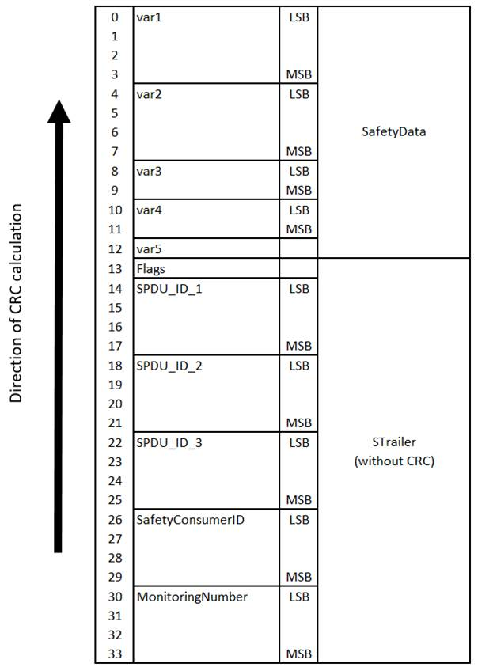  

Figure 23 - Calculation of the CRC (on little-endian machines, CRC32\_Backward)  

An alternative way to calculate the *CRC* (particularly useful on big-endian machines) is shown in [Figure 24](/§\_Ref54709683) . Here, the individual elements of the *ResponseSPDU* are already arranged in memory in reversed order, and *CRC* calculation is executed from octet 0 to octet 33.  

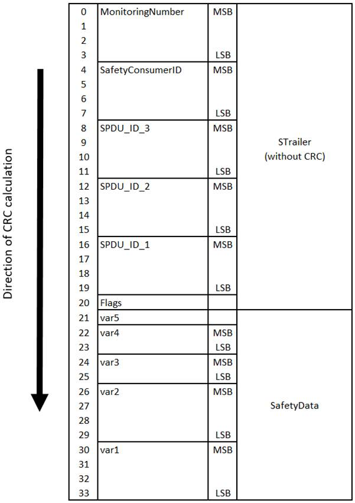  

Figure 24 - Calculation of the CRC (on big-endian machines, CRC32\_Forward)  

[RQ7.25] On the *SafetyConsumer* , CRC\_calc shall be calculated using data received in the *ResponseSPDU* , and not from expected values.  

## 8 Safety communication layer management  

### 8.1 General  

This chapter gives details about the management of the *safety communication layer* .  

### 8.2 Safety function response time part of communication  

For cyclic communication, the part of the *safety function response time* attributable to a safety communication according to this document (SFRTOPCSafety) is specified in Formula [(1)](/§\_Ref164930254) .  

Calculation of safety function response time part of OPC UA safety  

||||
|---|---|---|
||SFRTOPCSafety \<= 2 × SafetyConsumerTimeout  \+ ConsumerCycleTime|( 1 )|
  

  

where  

SFRTOPCSafety: Part of the *safety function response time* attributable to the safety communication according to this document.  

SafetyConsumerTimeout: Watchdog timer running in the *SafetyConsumer* . It is started immediately before a new *RequestSPDU* is sent (T14 or T28). If the timer runs out a timeout error is triggered (T18 or T29).  

ConsumerCycleTime: The maximum time for the cyclic execution of the *SafetyConsumer* , see [7.2.2.2](/§\_Ref11411829) .  

NOTE 1 Formula [(1)](/§\_Ref164930254) only addresses the part of the *SFRT* attributable to OPC UA Safety. The overall *SFRT* also depends on the implementation of the devices the *SafetyProvider* and *SafetyConsumer* are running on. Details on how these fractions of the *SFRT* are calculated are vendor-specific.  

If multiple safety connections according to this document are used within a safety function in series, their respective attributions to the *SFRT* shall be summed up.  

  

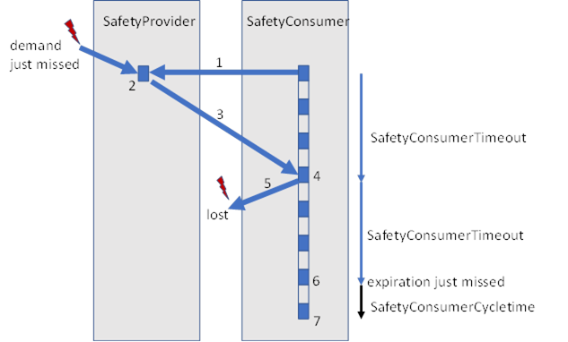  

Figure 25 - Overview of delay times and watchdogs  

Formula [(1)](/§\_Ref164930254) is justified by [Figure 25](/§\_Ref79480875) and the following explanation:  

The *SafetyConsumer* sends a *RequestSPDU* . At about the same time, a dangerous event occurs at the *SafetyProvider* , demanding the safety function to trigger.  

However, in the worst case, the *RequestSPDU* is processed at the *SafetyProvider* just before the dangerous event becomes known.  

Hence, the *ResponseSPDU* does not yet contain any information about the dangerous event.  

In the worst case, the *ResponseSPDU* is processed in the *SafetyConsumer* just before the *SafetyConsumerTimeout* expires.  

An error leads to a loss or unacceptable delay of either the *RequestSPDU* or the *ResponseSPDU* .  

Hence, the *SafetyConsumerTimeout* expires.  

In the worst case, the timer expires immediately after it was checked. Hence, it takes another cycle of the *SafetyConsumer* to detect the error.  

*SafetyConsumerTimeout* is a parameter of the *SafetyConsumer* . *ConsumerCycleTime* depends on the maximum sample time of the *SafetyConsumer* application. At commissioning, the integrator should be advised to design it shorter than a quarter of the target SFRTOPCSafety. If the watchdog time *SafetyConsumerTimeout* is too small, spurious trips can occur. To avoid this, *SafetyConsumerTimeout* should be chosen as shown in Formula [(2)](/§\_Ref164930327) .  

Selection of the watchdog parameter SafetyConsumerTimeout  

||||
|---|---|---|
||SafetyConsumerTimeout \>= T\_CD\_RequestSPDU +  SafetyProviderDelay +  T\_CD\_ResponseSPDU +  SafetyConsumerDelay|( 2 )|
  

  

where  

T\_CD\_RequestSPDU: The worst-case communication delay for the *RequestSPDU* .  

NOTE 2 T\_CD\_RequestSPDU can include the occurrence of dropped messages in the *standard transmission system* .  

T\_CD\_ResponseSPDU: The worst-case communication delay for the *ResponseSPDU* .  

NOTE 3 T\_CD\_ResponseSPDU can include the occurrence of dropped messages in the *standard transmission system* .  

SafetyProviderDelay: The worst-case *SafetyProvider* delay. Typically, one scan time period of the *SafetyProvider* .  

SafetyConsumerDelay: The worst-case *SafetyConsumer* delay. Typically, one scan time period of the *SafetyConsumer* .  

NOTE 4 The reason why SafetyConsumerDelay is part of the summation is that it can take one cycle after the asynchronous reception of the *ResponseSPDU* to execute the checks.  

[RQ8.1] To support the calculation of *SafetyConsumerTimeout* the *SafetyProvider* shall provide the *SafetyProviderDelay* as a *Variable* in the OPC UA *Information Model* , see [Table 12](/§\_Ref156555677) .  

Vendors may provide their individual adapted calculation method if necessary.  

## 9 System requirements (SafetyProvider and SafetyConsumer)  

### 9.1 Constraints on the SPDU parameters  

#### 9.1.1 SafetyBaseID and SafetyProviderID  

The pair of *SafetyProviderID* and *SafetyBaseID* is used by the *SafetyConsumer* to check the authenticity of the *ResponseSPDU* . *SafetyProviderID* and *SafetyBaseID* are usually assigned during engineering or during commissioning. It is in the responsibility of the end user or OEM to assign unique *SafetyProviderID* to individual *SafetyProviders* whenever this is reasonable possible. For instance, a machine builder should assign unique *SafetyProviderIDs* within a single machine containing multiple devices which run implementations of this document.  

As the effort for the administration of unique *SafetyProviderIDs* will reach its limits when the system becomes large, this document uses the *SafetyBaseID* for cases where guaranteeing unique *SafetyProviderIDs* is not possible.  

A *SafetyBaseID* is a universal unique identifier version4 (UUIDv4, also called *globally unique identifier* ( *GUID* )), as described in ISO/IEC 9834-8:2014, Clause 15.It is a 128-bit number where at least 96 bits were chosen randomly. The probability that two randomly generated UUIDs are identical is extremely low (2-96 \< 10-28), and can therefore be neglected, even when considering applications with a *safety integrity level* of 4.  

It is not necessary to generate an individual *SafetyBaseIDs* for all *SafetyProviders* . If two *SafetyProviders* can be discriminated by their *SafetyProviderIDs* , they may share the same *SafetyBaseID* . For instance, a machine builder could generate a unique *SafetyBaseID* for each instance of a machine, which is reused for all *SafetyProviders* within a machine.  

When implementing or using a generator for the UUIDs, it shall be ensured that each possible value is generated with equal probability (discrete uniform distribution), and that any two values are independent from each other. When a pseudo random number generator (PNRG) is used, it is 'seeded' with a random source having enough collision entropy (e.g. seeds of at least 128 bits that are uniformly distributed, too; and all seeds being pairwise independent from each other).  

Most commercial systems offer random number generators for applications within a cryptographic context. These applications pose even harder requirements on the quality of random numbers than the ones mentioned above. Hence, cryptographically strong random number generators are applicable to this document as well. See References [[2]](/§\_Ref11672064) to [[5]](/§\_Ref11672072) , as well as OPC 10000-2, for detailed information.  

[Table 38](/§\_Ref21082876) shows implementations of cryptographically strong random number-generators that can be used to calculate the random part of the UUIDv4:  

Table 38 - Examples for cryptographically strong random number generators  

| **Environment** | **Function** |
|---|---|
|Microsoft® Windows® Operating Systems|BCryptGenRandomfound in Bcrypt.dll|
|Unix ®\-like OS (e.g. Linux® / FreeBSD® / Solaris®)|Read from the file:/dev/urandom/|
|.NET ®|RandomNumberGeneratorfrom System.Security.Cryptography|
|JavaScript ®|Crypto.getRandomValues()|
|Java ®|java.security.SecureRandom|
|Python ®|os.urandom(size)|
  

  

While being evaluated from a security point of view, probably none of these implementations has been validated with safety in mind. Therefore, there is a remaining risk that these implementations are subject to systematic implementation errors which could decrease the effectiveness of these random numbers. To overcome this problem, the output of the random number generator is not used directly, but a SHA256-hash is calculated over (1) the generator's output, (2) a timestamp (wall-clock-time or persistent logical clock) and (3) a unique domain name. Any bits of the SHA256-hash can then be used to construct the random parts of the UUIDv4.  

[RQ9.1] The parameters *SafetyBaseID* and *SafetyProviderID* shall be stored in a non-volatile, i.e. persistent, way.  

#### 9.1.2 SafetyConsumerID  

The *SafetyConsumerID* allows for discrimination between *RequestSPDUs* and *ResponseSPDUs* belonging to different *SafetyConsumers* . It is mainly used for diagnostic purposes, such as detecting unintentional concurrent access of a single *SafetyProvider* by multiple *SafetyConsumers* . *Safety-related* communication errors which are detected by checking the *SafetyConsumerID* would also be detected by other mechanisms, including the *MNR* , the *SafetyProviderID* , and the *SafetyConsumerTimeout* .  

From a safety point of view, there are no qualitative requirements regarding the generation or administration of the *SafetyConsumerID* . It may be assigned during engineering, commissioning, at startup, and may even change during runtime. It is not required to check for uniqueness of *SafetyConsumerIDs* .  

However, assigning identical *SafetyConsumerIDs* to multiple consumers is not recommended because fault localization can become more difficult.  

### 9.2 Initialization of the MNR in the SafetyConsumer  

The *MNR* is used to discriminate messages stemming from the same *SafetyProvider* and is therefore used to detect timeliness errors such as outdated messages, messages received out-of-order, or streams of messages erroneously repeated by a network storing element (e.g. a router).  

To be effective, the set of used *MNR* values shall not be restricted to a small set. This could happen for connections which are restarted frequently, and which start counting from the same *MNR* value each time.  

There are at least two ways to address this potential problem:  

Option 1: [RQ9.2a] Whenever the connection is terminated, the current value of the *MNR* shall be safely stored within non-volatile memory of the *SafetyConsumer* . After restart, the previously stored *MNR* is used for initialization of the *MNR* (i.e. in state S12 of the *SafetyConsumer* state machine).  

Option 2: [RQ9.2b] Whenever the *SafetyConsumer* is restarted (i.e. in state S12 of the *SafetyConsumer* state machine), the *MNR* is initialized with a 32-bit random number.  

Either requirement RQ9.2a or requirement RQ9.2b, or an equivalent solution shall be fulfilled.  

### 9.3 Constraints on the calculation of system characteristics  

#### 9.3.1 Probabilistic considerations (informative)  

Following IEC 61784-3, this document detects all communication errors which can possibly occur in the underlying *standard transmission system* , including the OPC UA stack. If an error is detected, the erroneous data is discarded. Moreover, this document is designed in such a way that a safety function becomes practically unusable if the failure rate in the underlying, *standard transmission system* is higher than one error per safety error interval limit (6, 60, or 600 minutes), depending on the desired *SIL* of the safety function (see [Table 26](/§\_Ref529177826) and [Table 39](/§\_Ref535515497) ).  

Thus, for operational safety functions a failure rate of 0,1 h-1, 1 h-1, or 10 h-1 can be assumed for communication errors occurring in the OPC UA stack. In order to obtain the communication's contribution to the PFH value of the safety function, this value has to be multiplied by the so-called conditional residual error probability Pre,cond. For the *CRC* mechanism used in this document, it holds:  

Pre,cond ≤ 4,0 × 10-10  

This leads to the PFH and PFD values shown in [Table 39](/§\_Ref535515497) .  

The value 4,0 × 10-10 was justified by extensive numerical evaluation of the 32-bit *CRC* generator polynomial in use ( *0x* F4ACFB13). The results of this evaluation, executed for all relevant data lengths and all relevant values for the bit error probability p up to p = 0,5, is shown in [Figure 26](/§\_Ref22752557) . As can be seen, Pre,cond never exceeds the value 4,0 × 10-10.  

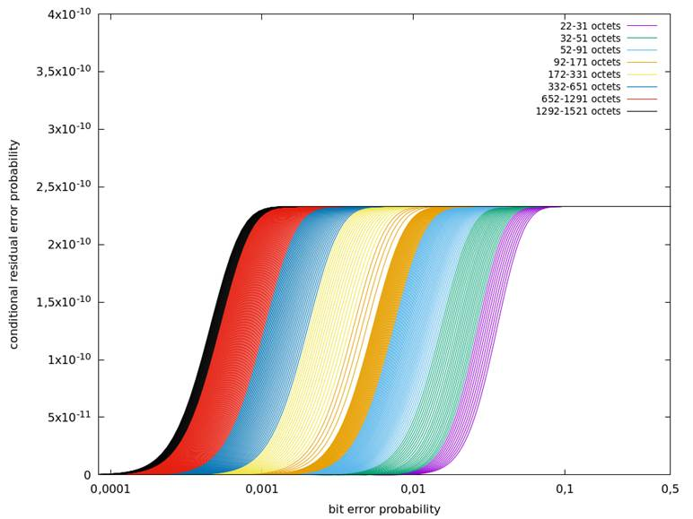  

Figure 26 - Conditional residual error probability of the CRC check  

An explanation that it is indeed necessary to calculate Pre,cond for all data lengths and all relevant values of p can be found in [Figure 27](/§\_Ref21102230) . For the data lengths shown in this figure, Pre,cond exceeds the desired value by several orders of magnitudes. The maximum value of Pre,cond is not obtained when p becomes maximal.  

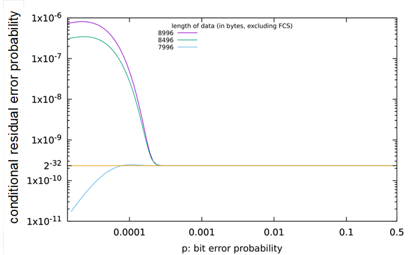  

Figure 27 - Counter example: data lengths not supported by OPC Safety  

#### 9.3.2 Safety related assumptions (informative)  

The boundary conditions and assumptions for safety assessments and calculations of *residual error rates* are listed here.  

Generally:  

* Number of retries in the underlying *standard transmission system* : No restrictions  

* *CRC* polynomials used inside the underlying *standard transmission system* (e.g. Ethernet, TCP, …): No restrictions  

* Message storing elements: No restrictions; any number of message storing elements is permitted  

* Size of *SafetyData* within one *ResponseSPDU* : ≤ 1 500 octets  

Even for safety functions that do not require manual operator acknowledgment for restart, manual operator acknowledgment is mandatory whenever the *SafetyConsumer* has detected certain types of errors and indicates this using OperatorAckRequested. Hence, operator acknowledgment is expected to be implemented by the safety application whenever OPC UA Safety is used. For details, see [6.3.4.3](/§\_Ref3296204) and Clause [B.2](/§\_Ref10719705) .  

### 9.4 PFH and PFD values of a logical safety communication link  

The PFH value of a logical safety communication link according to this document depends on the parameter of *SafetyErrorIntervalLimit* (see [Table 26](/§\_Ref529177826) ) of the link's *SafetyConsumer* . Whenever the *SafetyConsumer* detects a mismatch of the *SafetyConsumerID* , *SPDU\_ID* , *MNR* or *CRC* , it will only continue operating if the last occurrence of such an error happened more than *SafetyErrorIntervalLimit* time units ago. Otherwise, it will make a transition to *fail-safe* values, which can only be left by manual operator acknowledgment, see [6.3.4.3](/§\_Ref3296204) .  

This directly limits the rate of detected errors, and indirectly limits the rate of undetected (residual) errors.  

See [Table 39](/§\_Ref535515497) for numeric PFH and PFD values.  

Table 39 - The total residual error rate for the safety communication channel  

| **SafetyErrorIntervalLimit** | **Allowed for SIL range** | **Total residual error rate for one logical connection of the safety function**   **(PFH)** | **Total residual error probability for one logical connection of the safety function, for a mission time of 20 years**   **(PFDavg)** |
|---|---|---|---|
|6 min|Up to *SIL* 2|\< 4,0 × 10-9 / h|\< 1,0 × 10-6|
|60 min|Up to *SIL* 3|\< 4,0 × 10-10 / h|\< 2,5 × 10-7|
|600 min|Up to *SIL* 4|\< 4,0 × 10-11 / h|\< 8,0 × 10-8|
  

  

The parameter *SafetyErrorIntervalLimit* affects either the PFH or the PFD, or both of only the *safety communication channel* . There is no effect on the PFH and PFD values of the components the *SafetyProviders* and *SafetyConsumers* are running on. The requirements for the implementation of these components are specified in the IEC 61508 series.  

### 9.5 Safety manual  

[RQ9.3] According to IEC 61508-2, the suppliers of equipment implementing an implementation of this document shall provide a safety manual. The instructions, information and parameters of [Table 40](/§\_Ref136165648) shall be included in that safety manual unless they are not relevant for a specific device.  

Table 40 - Information to be included in the safety manual  

|| **Item** | **Instruction or parameter** | **Remark** |
|---|---|---|---|
|1|Safety handling|Instructions on how to configure, parameterize, commission and test the device safely in accordance with the IEC 61508 series and IEC 61784-3.||
|2|PFH, respectively PFDavg|The PFH, respectively PFDavg, per logical connection of the safety function.|See [9.3.2](/§\_Ref535912462) and [9.4](/§\_Ref535518125)|
|3|SFRTOPCSafety|Information on how this value can be calculated by the end user or OEM.|See [8.1](/§\_Hlk1381760) The implementation and error reaction of *ConsumerCycleTime* is in the responsibility of the either the vendor or the integrator, or both.|
|4|*SafetyBaseID* / *SafetyProviderID*|Information on how the *SafetyBaseID* and *SafetyProviderID* are generated and assigned.|See [9.1.1](/§\_Ref532548)|
|5|Commissioning|Either the end user or the OEM, or both, are responsible for verification and validation of correct cabling and assignment of network addresses. The safety manual shall address how this can be accomplished.||
|6|Operator acknowledgment|If the *SafetyConsumers* makes a transition to *fail-safe substitute values* requiring operator acknowledgment "frequently", this is an indication that a check of the installation (for example electromagnetic interference), network traffic load, or transmission quality is required. It shall be mentioned in the manual that it is potentially unsafe to simply omit these checks."Frequently" in this context is defined as \- more than once per day in *SIL* 2 and *SIL* 3 applications \- more than once per week in *SIL* 4 applications||
|7|High demand and low demand applications|The *SafetyConsumer* shall be executed cyclically within a shorter time frame than the *SafetyConsumerTimeout* .||
|8|Maintenance|Specific requirements for device repair and device replacement.||
|9|Relevant safety standards|A safety device according to this document shall fulfill the requirements of the relevant safety standards, such as the IEC 61508 series (according to the *SIL* as described) when used in live operation.|For usage in live operation|
  

  

### 9.6 Indicators and displays  

[RQ9.4] The device a *SafetyConsumer* is running on shall be able to indicate if *SAPI.OperatorAckRequested* is enabled. This can be done for example by an indicator LED or by using an HMI.  

[RQ9.5] If an LED is used for indication, it shall blink in green colour with frequency of 0,5 Hz whenever the output *SAPI.OperatorAckRequested* is true of at least one of the *SafetyConsumers* running on the device.  

This LED may also be used for other purposes. For instance, normal operation may be indicated by a non-flashing LED, or erroneous behaviour may be indicated by an LED blinking with a frequency higher than 0,5 Hz. Thus, this document does not contain any requirements for the behaviour of the LED if *SAPI.OperatorAckRequested* is false.  

The message shown on an HMI is application-specific. For instance, the text "machine has stopped for safety reasons. For restart, please check for obstacles and press the green button." can be shown.  

NOTE 2 How to realize operator acknowledgment (physical button, element in HMI etc.) is vendor-specific.  

## 10 Assessment  

### 10.1 Safety policy  

Users of this document shall take into account the following constraints to avoid misunderstanding or wrong expectations regarding safety-related developments and applications.  

NOTE 1 This includes for example use for training, seminars, workshops and consultancy.  

The communication technologies specified in this document shall only be implemented in devices designed in accordance with the requirements of the relevant safety standards.  

The use of communication technologies specified in this document in a device does not ensure that all necessary technical, organizational and legal requirements related to safety-related applications of the device have been fulfilled in accordance with the requirements of the relevant safety standards.  

For a device based on this document to be suitable for use in safety-related applications, appropriate functional safety management life-cycle processes according to the relevant safety standards shall be observed. This shall be assessed in accordance with the independence and competence requirements of the relevant safety standards. Safety-related applications of the device can be subject to local regulations and legal requirements.  

NOTE 2 Examples for relevant safety standards include the IEC 61508 series, IEC 61511, IEC 602041, IEC 62061, ISO 13849-1 and ISO 13849-2.  

The manufacturer of a device using communication technologies specified in this document is responsible for the correct implementation of the standard, the correctness and completeness of the device documentation and information.  

Additional important information including corrigenda and errata published by the OPC Foundation or PI shall be considered for implementation and assessment.  

It is strongly recommended that implementers of this document comply with the appropriate conformance tests and validations provided by the related technology-specific organization.  

NOTE 3 These requirements and recommendations are included because incorrect implementations could lead to serious injury or loss of life.  

### 10.2 Obligations  

Since safety technology in automation is relevant to occupational safety and the concomitant insurance risks in a country,  local regulations and legal requirements can apply. The national authorities (notified bodies) decide on the recognition of assessment reports.  

NOTE Examples of such authorities are the IFA (Institut für Arbeitsschutz der Deutschen Gesetzlichen Unfallversicherung/Institute for Occupational Safety and Health of the German Social Accident Insurance) in Germany, HSE (Health and Safety Executive) in UK, FM (Factory Mutual/Property Insurance and Risk Management Organization), UL (Underwriters Laboratories Inc./Product Safety Testing and Certification Organization), or the INRS (Institut National de Recherche et de Sécurité) in France.  

### 10.3 Index of requirements (informative)  

[Table 41](/§\_Ref156577220) gives an informative overview of all the requirements (safety and *non-safety* ) which are described in this document. A summary requirement description and the corresponding clause or subclause where the requirement is defined are given. To fully understand a requirement and its context, it is necessary to consult its original definition. [Table 41](/§\_Ref156577220) serves as a tool for quick navigation and as a checklist for an overview over all requirements.  

For the conventions used for numbering requirements, see [3.3.2](/§\_Ref106103969) .  

Table 41 - Index of requirements (informative)  

| **Requirement number** | **Requirement summary** | **Clause or subclause** |
|---|---|---|
|RQ4.1|Implement in devices designed according to the IEC 61508 series with appropriate SIL|[4.2](/§\_Ref141699094) [Implementation aspects](/§\_Ref141699100)|
|RQ5.1|Implement in safety devices only|[5.2](/§\_Ref141699503) [Safety functional requirements](/§\_Ref141699507)|
|RQ5.2|Implement *safety measures* ( *MNR* , timeout with receipt, IDs, data integrity check)|[5.3](/§\_Ref141699544) [Safety measures](/§\_Ref141699552)|
|RQ5.3|Process and monitor *safety measures* in the *SCL*|[5.3](/§\_Ref141699544) [Safety measures](/§\_Ref141699552)|
|RQ5.4|Start *CRC* calculation with value "1"|[5.5](/§\_Ref143784935) [Requirements for CRC calculation](/§\_Ref143784935)|
|RQ5.5|Use *CRC* result "1" instead of "0"|[5.5](/§\_Ref143784935) [Requirements for CRC calculation](/§\_Ref143784935)|
|RQ5.6|Ignore all-zero *SPDUs*|[5.5](/§\_Ref143784935) [Requirements for CRC calculation](/§\_Ref143784935)|
|RQ6.1|Singleton *SafetyACSet Folder*|[6.2.2.1](/§\_Ref141699821) [SafetyACSet Object](/§\_Ref141699821)|
|RQ6.2|*Objects* for *SafetyProviders* and *SafetyConsumers*|[6.2.2.1](/§\_Ref141699821) [SafetyACSet Object](/§\_Ref141699821)|
|RQ6.3a|Usage of *Call Service* for *Client/Server*|[6.2.2.1](/§\_Ref141699821) [SafetyACSet Object](/§\_Ref141699821)|
|RQ6.3b|Usage of *SafetyPDUs* for *PubSub*|[6.2.2.1](/§\_Ref141699821) [SafetyACSet Object](/§\_Ref141699821)|
|RQ6.4|Provide *SPDUs* for diagnostics in *Method* *ReadSafetyDiagnostics*|[6.2.2.1](/§\_Ref141699821) [SafetyACSet Object](/§\_Ref141699821)|
|RQ6.5|Restrictions on *DataTypes*|[6.2.2.2](/§\_Ref141700094) [Safety ObjectType definitions](/§\_Ref141700094)|
|RQ6.6|Non-abstract *DataTypes* for out data|[6.2.2.2](/§\_Ref141700094) [Safety ObjectType definitions](/§\_Ref141700094)|
|RQ6.7|Definition of concrete *DataTypes* for *ResponseSPDU*|[6.2.3.4](/§\_Ref78961410) [ResponseSPDUDataType](/§\_Ref78961410)|
|RQ6.8|Usage of *NonSafetyDataPlaceHolder*|[6.2.3.4](/§\_Ref78961410) [ResponseSPDUDataType](/§\_Ref78961410)|
|RQ6.9|Restriction to scalar types|[6.2.5](/§\_Ref141702142) [DataTypes and length of SafetyData](/§\_Ref141702148)|
|RQ6.10|List supported *DataTypes* in user manual|[6.2.5](/§\_Ref141702142) [DataTypes and length of SafetyData](/§\_Ref141702148)|
|RQ6.11|Values for *Boolean* *DataType*|[6.2.5](/§\_Ref141702142) [DataTypes and length of SafetyData](/§\_Ref141702148)|
|RQ6.12|Implementation of *SafetyProvider* *SAPI*|[6.3.3.2](/§\_Ref532826098) [SAPI of SafetyProvider](/§\_Ref532826098)|
|RQ6.13a|Implementation of *SafetyProvider* *SPI*|[6.3.3.3](/§\_Ref519172571) [SPI of SafetyProvider](/§\_Ref519172571)|
|RQ6.13b|Parameters of *SafetyProvider* *SPI*|[6.3.3.3](/§\_Ref519172571) [SPI of SafetyProvider](/§\_Ref519172571)|
|RQ6.14|Implementation of *SafetyConsumer* *SAPI*|[6.3.4.2](/§\_Ref532807190) [SAPI of SafetyConsumer](/§\_Ref532807190)|
|RQ6.15a|Implementation of *SafetyConsumer* *SPI*|[6.3.4.4](/§\_Ref519173522) [SPI of the SafetyConsumer](/§\_Ref519173522)|
|RQ6.15b|Parameters of *SafetyConsumer* *SPI*|[6.3.4.4](/§\_Ref519173522) [SPI of the SafetyConsumer](/§\_Ref519173522)|
|RQ6.16|Values for *qualifiers*|[6.3.6](/§\_Ref141704219) [Principle for "application variables with qualifier"](/§\_Ref141704230)|
|RQ6.17|*SafetyConsumer* diagnostic message texts|[6.4.2](/§\_Ref141704371) [Diagnostics messages of the SafetyConsumer](/§\_Ref141704379)|
|RQ7.1|*RequestSPDU* Flags|[7.2.1.4](/§\_Ref20137260) [RequestSPDU: Flags](/§\_Ref20137260)|
|RQ7.2|Contents and structure of *SafetyData* in *ResponseSPDU*|[7.2.1.5](/§\_Ref20137323) [ResponseSPDU: SafetyData](/§\_Ref20137323)|
|RQ7.3|Usage of *ResponseSPDU.Flags*|[7.2.1.6](/§\_Ref1395589) [ResponseSPDU: Flags](/§\_Ref1395589)|
|RQ7.4|Zero out reserved *flags*|[7.2.1.6](/§\_Ref1395589) [ResponseSPDU: Flags](/§\_Ref1395589)|
|RQ7.5|Copy *SafetyConsumerID* into *ResponseSPDU*|[7.2.1.8](/§\_Ref141722726) [ResponseSPDU: SafetyConsumerID](/§\_Ref141722733)|
|RQ7.6|Copy *MonitoringNumber* into *ResponseSPDU*|[7.2.1.9](/§\_Ref141722834) [ResponseSPDU: MonitoringNumber](/§\_Ref141722840)|
|RQ7.7|Usage of *CRC* signature|[7.2.1.10](/§\_Ref141722888) [ResponseSPDU: CRC](/§\_Ref141722895)|
|RQ7.8|Usage of *NonSafetyData*|[7.2.1.11](/§\_Ref19279838) [ResponseSPDU: NonSafetyData](/§\_Ref19279838)|
|RQ7.9|Indication of *NonSafetyData*|[7.2.1.11](/§\_Ref19279838) [ResponseSPDU: NonSafetyData](/§\_Ref19279838)|
|RQ7.10|Answer repeated *RequestSPDUs* in *Client/Server* communication|[7.2.2.2](/§\_Ref141723354) [SafetyProvider and SafetyConsumer Sequence diagram](/§\_Ref141723359)|
|RQ7.11|Document behaviour chosen in RQ7.10 in safety manual|[7.2.2.2](/§\_Ref141723354) [SafetyProvider and SafetyConsumer Sequence diagram](/§\_Ref141723359)|
|RQ7.12|Monitor *ConsumerCycleTime* in safety-related way|[7.2.2.2](/§\_Ref141723354) [SafetyProvider and SafetyConsumer Sequence diagram](/§\_Ref141723359)|
|RQ7.13|Implement *SafetyProvider* behaviour|[7.2.2.4](/§\_Ref170721682) [SafetyProvider state diagram](/§\_Ref170721682)|
|RQ7.14|Implement *SafetyConsumer* behaviour|[7.2.2.5](/§\_Ref190489) [SafetyConsumer state diagram](/§\_Ref190489)|
|RQ7.15|Rules for building the *ResponseSPDU*|[7.2.3.1](/§\_Ref10562249) [Build ResponseSPDU](/§\_Ref10562249)|
|RQ7.16|Rules for calculating *SPDU\_ID* fields|[7.2.3.2](/§\_Ref19280103) [Calculation of the SPDU\_ID\_1, SPDU\_ID\_2, SPDU\_ID\_3](/§\_Ref19280103)|
|RQ7.17|Values to indicate *SafetyProviderLevel\_ID*|[7.2.3.4](/§\_Ref170721795) [Coding of the SafetyProviderLevel\_ID](/§\_Ref170721795)|
|RQ7.18|Avoid accidental use of higher SIL indicator|[7.2.3.4](/§\_Ref170721795) [Coding of the SafetyProviderLevel\_ID](/§\_Ref170721795)|
|RQ7.19|Calculation of *SafetyStructureSignature*|[7.2.3.5](/§\_Ref10563173) [Signature over the SafetyData Structure (SafetyStructureSignature)](/§\_Ref10563173)|
|RQ7.20|No evaluation of *SafetyStructureSignature*|[7.2.3.5](/§\_Ref10563173) [Signature over the SafetyData Structure (SafetyStructureSignature)](/§\_Ref10563173)|
|RQ7.21|Value of *SafetyStructureSignatureVersion*|[7.2.3.5](/§\_Ref10563173) [Signature over the SafetyData Structure (SafetyStructureSignature)](/§\_Ref10563173)|
|RQ7.22|Generator polynomial for *CRC* signature|[7.2.3.6](/§\_Ref10562546) [Calculation of a CRC signature](/§\_Ref10562546)|
|RQ7.23|Endianess encoding of *SafetyData*|[7.2.3.6](/§\_Ref10562546) [Calculation of a CRC signature](/§\_Ref10562546)|
|RQ7.24|*CRC* calculation sequence|[7.2.3.6](/§\_Ref10562546) [Calculation of a CRC signature](/§\_Ref10562546)|
|RQ7.25|Calculate *CRC* in *SafetyConsumer* from *ResponseSPDU* values|[7.2.3.6](/§\_Ref10562546) [Calculation of a CRC signature](/§\_Ref10562546)|
|RQ7.26|Immediate effect of *SafetyConsumerTimeout*|[7.2.2.2](/§\_Ref153288907) [SafetyProvider and SafetyConsumer Sequence diagram](/§\_Ref153288916)|
|RQ8.1|Provision of SafetyProviderDelay|[8.2](/§\_Ref141791215) [Safety function response time part of communication](/§\_Ref141791224)|
|RQ9.1|Storage of *SafetyBaseID* and *SafetyProviderID*|[9.1.1](/§\_Ref141791409) [SafetyBaseID and SafetyProviderID](/§\_Ref141791418)|
|RQ9.2a|(Option 1) Use stored *MNR* after restart|[9.2](/§\_Ref141791574) [Initialization of the MNR in the SafetyConsumer](/§\_Ref141791583)|
|RQ9.2b|(Option 2) Use random *MNR* after restart|[9.2](/§\_Ref141791574) [Initialization of the MNR in the SafetyConsumer](/§\_Ref141791583)|
|RQ9.3|Provision of and information in safety manual|[9.5](/§\_Ref141791690) [Safety manual](/§\_Ref141791698)|
|RQ9.4|Indication of *SAPI.OperatorAckRequested*|[9.6](/§\_Ref141791774) [Indicators and displays](/§\_Ref141791780)|
|RQ9.5|Properties of LED indication of *SAPI.OperatorAckRequested*|[9.6](/§\_Ref141791774) [Indicators and displays](/§\_Ref141791780)|
|RQ12.1|Namespaces|[12.2](/§\_Ref141791974) [Handling of OPC UA namespaces](/§\_Ref141791966)|
  

  

## 11 Profiles and Conformance Units  

[Figure 28](/§\_Ref149570235) shows an informative overview of the Facets and *ConformanceUnits* pertaining to this document. For normative reference consult the Profile Reporting at https://profiles.opcfoundation.org/.  

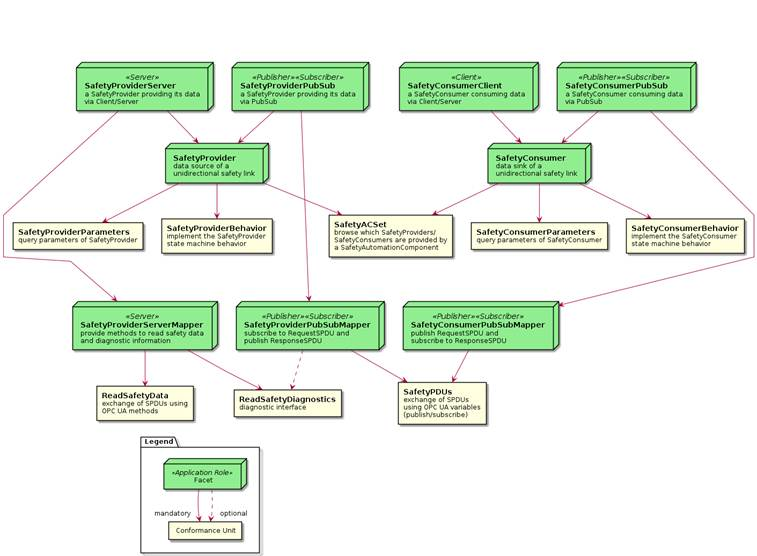  

Figure 28(informative) - Facets and ConformanceUnits  

## 12 Namespaces  

### 12.1 Namespace metadata  

[Table 42](/§\_Ref16863029) defines the *Namespace* metadata for this document. The Object is used to provide version information for the *Namespace* and an indication about static Nodes. Static Nodes are identical for all Attributes in all Servers, including the Value Attribute. See OPC 10000-5 for more details.  

The information is provided as Object of type NamespaceMetadataType. This Object is a component of the Namespaces Object that is part of the Server Object. The NamespaceMetadataType ObjectType and its Properties are defined in OPC 10000-5.  

The version information is also provided as part of the *ModelTableEntry* in the *UANodeSet* XML file. The *UANodeSet* XML schema is defined in OPC 10000-6.  

Table 42 - NamespaceMetadata Object for this document  

| **Attribute** | **Value** |
|---|---|
|BrowseName|[http://opcfoundation.org/UA/Safety](http://opcfoundation.org/UA/Safety)|
  
| **Property** | **DataType** | **Value** |
|---|---|---|
|NamespaceUri|String|[http://opcfoundation.org/UA/Safety](http://opcfoundation.org/UA/Safety)|
|NamespaceVersion|String|1\.05.04|
|NamespacePublicationDate|DateTime|2024-06-12|
|IsNamespaceSubset|Boolean|False|
|StaticNodeIdTypes|IdType []|0|
|StaticNumericNodeIdRange|NumericRange []||
|StaticStringNodeIdPattern|String||
  

  

### 12.2 Handling of OPC UA namespaces  

*Namespaces* are used by OPC UA to create unique identifiers across different naming authorities. The Attributes NodeId and BrowseName are identifiers. A Node in the UA AddressSpace is unambiguously identified using a NodeId. Unlike NodeIds, the BrowseName cannot be used to unambiguously identify a Node. Different Nodes canmay have the same BrowseName. They are used to build a browse path between two Nodes or to define a standard Property.  

Servers canmay often choose to use the same *N* n *amespace* for the NodeId and the BrowseName. However, if they want to provide a standard Property, its BrowseName shall have the *N* n *amespace* of the standards body although the *N* n *amespace* of the NodeId reflects something else, for example the EngineeringUnits Property. All NodeIds of Nodes not defined in this document shall not use the standard namespaces.  

[RQ12.1] [Table 43](/§\_Ref57983057) provides a list of mandatory and optional *Namespaces* used in an OPC UA *Server* according to this document.  

Table 43 - Namespaces used in a safety Server  

| **NamespaceURI** | **Description** | **Use** |
|---|---|---|
|http://opcfoundation.org/UA/|*Namespace* for NodeIds and BrowseNames defined in the OPC UA specification. This *Namespace* shall have *Namespace* index 0.|Mandatory|
|Local server URI|*Namespace* for Nodes defined in the local *Server* . This can include types and instances used in an AutoID Device represented by the *Server* . This *Namespace* shall have *Namespace* index 1.|Mandatory|
|http://opcfoundation.org/UA/Safety|*Namespace* for NodeIds and BrowseNames defined in this document. The *Namespace* index is Server-specific.|Mandatory|
|Vendor-specific types|A Server can provide vendor-specific types like types derived from ObjectTypes defined in this document in a vendor-specific *Namespace* .|Optional|
|Vendor-specific instances|A Server provides vendor-specific instances of the standard types or vendor-specific instances of vendor-specific types in a vendor-specific *Namespace* . It is recommended to separate vendor-specific types and vendor-specific instances into two or more namespaces.|Mandatory|
  

  

## Annex A (normative)Safety Namespace and mappings  

This [Annex A](/§\_Ref144135209) defines the numeric identifiers for the numeric NodeIds defined in the *Namespace* of this document. The identifiers are specified in a CSV file with the following syntax:  

\<SymbolName\>, \<Identifier\>, \<NodeClass\>  

Where the SymbolName is either the BrowseName of a Type Node or the BrowsePath for an Instance Node that appears in the specification and the Identifier is the numeric value for the NodeId.  

The NamespaceUri for all NodeIds defined here is http://opcfoundation.org/UA/Safety  

The CSV released with this version of the specification can be found here:  

[http://www.opcfoundation.org/UA/schemas/1.05/Opc.Ua.Safety.NodeIds.csv](http://www.opcfoundation.org/UA/schemas/1.05/Opc.Ua.Safety.NodeIds.csv)  

The latest CSV that is compatible with this version of the specification can be found here:  

[http://www.opcfoundation.org/UA/schemas/Opc.Ua.Safety.NodeIds.csv](http://www.opcfoundation.org/UA/schemas/Opc.Ua.Safety.NodeIds.csv)  

A computer processible version of the complete *Information Model* defined in this document is also provided. It follows the XML *Information Model* schema syntax defined in OPC 10000-6.  

The *Information Model* schema released with this version of the specification can be found here:  

[http://www.opcfoundation.org/UA/schemas/1.05/Opc.Ua.Safety.NodeSet2.xml](http://www.opcfoundation.org/UA/schemas/1.05/Opc.Ua.Safety.NodeSet2.xml)  

The latest *Information Model* schema that is compatible with this version of the specification can be found here:  

[http://www.opcfoundation.org/UA/schemas/Opc.Ua.Safety.NodeSet2.xml](http://www.opcfoundation.org/UA/schemas/Opc.Ua.Safety.NodeSet2.xml)  

  

## Annex B (informative)Additional information  

### B.1 CRC calculation using tables, for the polynomial 0xF4ACFB13  

The calculation of a 32-bit *CRC* signature over an array of N octets with the help of lookup tables, using "C" as programming language, is shown below:  

||
|---|
|// VARIANT A: presumably easier to implement on little endian machines uint32\_t crctab32[256];      // lookup table uint32\_t CRC32\_Backward(char \*array, int16\_t N)\{ // input is array of N octets          // containing the data,          see [Figure 23](/§\_Ref25165209)  uint32\_t result = 1;    // seed value for the calculated *CRC* int16\_t i;      // index for(i=N-1;i\>=0;i--)    // process array in reversed order  result = crctab32 [((result \>\> 24) ^ array[i]) & 0xff] ^ (result \<\< 8); if (result==0)  return 1;else  return result; \}|
  

  

where the lookup-table crctab32 has to be initialized as shown in [Table B.1](/§\_Ref114675193) .  

||
|---|
|// VARIANT B: presumably easier to implement on big endian machines uint32\_t crctab32[256];      // lookup table uint32\_t CRC32\_Forward(char \*array, int16\_t N)\{ // input is array of N octets          // containing the data in reversed          // order, see e. g. [Figure 24](/§\_Ref54709683) uint32\_t result = 1;    // seed value for the calculated *CRC* int16\_t i;      // index for(i=0;i\<N;i++)     // process array  result = crctab32 [((result \>\> 24) ^ array[i]) & 0xff] ^ (result \<\< 8); if (result==0)  return 1;else  return result; \}|
  

  

where the lookup-table crctab32 has to be initialized as shown in [Table B.1](/§\_Ref114675193) .  

Table B. 1 - The CRC32 lookup table for 32-bit CRC signature calculations  

| **CRC32 lookup table (0 to 255)** |
|---|
|00000000|F4ACFB13|1DF50D35|E959F626|3BEA1A6A|CF46E179|261F175F|D2B3EC4C|
|77D434D4|8378CFC7|6A2139E1|9E8DC2F2|4C3E2EBE|B892D5AD|51CB238B|A567D898|
|EFA869A8|1B0492BB|F25D649D|06F19F8E|D44273C2|20EE88D1|C9B77EF7|3D1B85E4|
|987C5D7C|6CD0A66F|85895049|7125AB5A|A3964716|573ABC05|BE634A23|4ACFB130|
|2BFC2843|DF50D350|36092576|C2A5DE65|10163229|E4BAC93A|0DE33F1C|F94FC40F|
|5C281C97|A884E784|41DD11A2|B571EAB1|67C206FD|936EFDEE|7A370BC8|8E9BF0DB|
|C45441EB|30F8BAF8|D9A14CDE|2D0DB7CD|FFBE5B81|0B12A092|E24B56B4|16E7ADA7|
|B380753F|472C8E2C|AE75780A|5AD98319|886A6F55|7CC69446|959F6260|61339973|
|57F85086|A354AB95|4A0D5DB3|BEA1A6A0|6C124AEC|98BEB1FF|71E747D9|854BBCCA|
|202C6452|D4809F41|3DD96967|C9759274|1BC67E38|EF6A852B|0633730D|F29F881E|
|B850392E|4CFCC23D|A5A5341B|5109CF08|83BA2344|7716D857|9E4F2E71|6AE3D562|
|CF840DFA|3B28F6E9|D27100CF|26DDFBDC|F46E1790|00C2EC83|E99B1AA5|1D37E1B6|
|7C0478C5|88A883D6|61F175F0|955D8EE3|47EE62AF|B34299BC|5A1B6F9A|AEB79489|
|0BD04C11|FF7CB702|16254124|E289BA37|303A567B|C496AD68|2DCF5B4E|D963A05D|
|93AC116D|6700EA7E|8E591C58|7AF5E74B|A8460B07|5CEAF014|B5B30632|411FFD21|
|E47825B9|10D4DEAA|F98D288C|0D21D39F|DF923FD3|2B3EC4C0|C26732E6|36CBC9F5|
|AFF0A10C|5B5C5A1F|B205AC39|46A9572A|941ABB66|60B64075|89EFB653|7D434D40|
|D82495D8|2C886ECB|C5D198ED|317D63FE|E3CE8FB2|176274A1|FE3B8287|0A977994|
|4058C8A4|B4F433B7|5DADC591|A9013E82|7BB2D2CE|8F1E29DD|6647DFFB|92EB24E8|
|378CFC70|C3200763|2A79F145|DED50A56|0C66E61A|F8CA1D09|1193EB2F|E53F103C|
|840C894F|70A0725C|99F9847A|6D557F69|BFE69325|4B4A6836|A2139E10|56BF6503|
|F3D8BD9B|07744688|EE2DB0AE|1A814BBD|C832A7F1|3C9E5CE2|D5C7AAC4|216B51D7|
|6BA4E0E7|9F081BF4|7651EDD2|82FD16C1|504EFA8D|A4E2019E|4DBBF7B8|B9170CAB|
|1C70D433|E8DC2F20|0185D906|F5292215|279ACE59|D336354A|3A6FC36C|CEC3387F|
|F808F18A|0CA40A99|E5FDFCBF|115107AC|C3E2EBE0|374E10F3|DE17E6D5|2ABB1DC6|
|8FDCC55E|7B703E4D|9229C86B|66853378|B436DF34|409A2427|A9C3D201|5D6F2912|
|17A09822|E30C6331|0A559517|FEF96E04|2C4A8248|D8E6795B|31BF8F7D|C513746E|
|6074ACF6|94D857E5|7D81A1C3|892D5AD0|5B9EB69C|AF324D8F|466BBBA9|B2C740BA|
|D3F4D9C9|275822DA|CE01D4FC|3AAD2FEF|E81EC3A3|1CB238B0|F5EBCE96|01473585|
|A420ED1D|508C160E|B9D5E028|4D791B3B|9FCAF777|6B660C64|823FFA42|76930151|
|3C5CB061|C8F04B72|21A9BD54|D5054647|07B6AA0B|F31A5118|1A43A73E|EEEF5C2D|
|4B8884B5|BF247FA6|567D8980|A2D17293|70629EDF|84CE65CC|6D9793EA|993B68F9|
|This table contains 32-bit values in hexadecimal representation for each value (0 to 255) of the argument a in the function crctab32 [a]. The table should be used line-by-line in ascending order from top left (0) to bottom right (255). For instance, crctab32[10] is highlighted using a darker background and red colour.|
  

  

### B.2 Use cases  

#### B.2.1 Unidirectional communication  

The most basic type of communication is unidirectional communication, where a safety application on one device (Controller A in [Figure B.1](/§\_Ref56412828) ) sends data to a safety application on another device (Controller B in [Figure B.1](/§\_Ref56412828) ).  

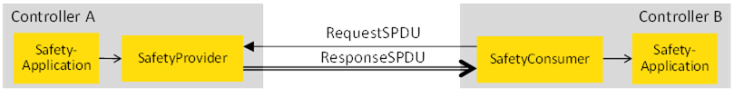  

Figure B. 1 - Unidirectional communication  

This is accomplished by placing a *SafetyProvider* on Controller A and a *SafetyConsumer* on Controller B. The connection between *SafetyProvider* and *SafetyConsumer* can be established and terminated during runtime, allowing different consumers to connect to the same *SafetyProvider* at different times. Furthermore, the protocol is designed in such a way, that it is necessary for the *SafetyConsumer* to know the parametrized set of IDs of the *SafetyProvider* such that it is able to safely check whether the received data is coming from the expected source. On the other hand, as *SafetyData* flows in one direction only, it is not necessary for the *SafetyProvider* to check the ID of the *SafetyConsumers* . Hence, Controller A can - one after another - serve an arbitrarily large number of *SafetyConsumers* , and new *SafetyConsumers* can be introduced into the system without having to update Controller A.  

#### B.2.2 Bidirectional communication  

Bidirectional communication means the exchange of data in both directions, which is accomplished by placing a *SafetyProvider* and a *SafetyConsumer* on each controller. Hence, bidirectional communication is realized using two safety connections according to this document. See [Figure B.2](/§\_Ref156571919) for an example.  

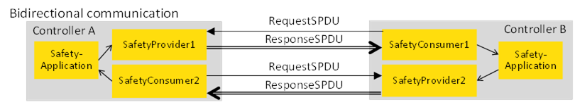  

Figure B. 2 - Bidirectional communication  

NOTE Connections can be established and terminated during runtime.  

#### B.2.3 Safety Multicast  

Multicast is defined as sending the same set of data from one device (Controller A) to several other devices (Controller B1, B2,…,BN) simultaneously.  

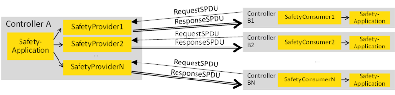  

Figure B. 3 - Safety multicast  

Safety multicast is accomplished by placing multiple *SafetyProviders* on Controller A, and one *SafetyConsumer* on each of the Controllers B1, B2, … BN. Each of the *SafetyProviders* running on Controller A is connecting to one of the *SafetyConsumers* running on one of the Controllers B1, B2, … BN. See [Figure B.3](/§\_Ref156571963) for an example.  

The safety protocol in this document is designed in such a way that:  

* the state machine of the *SafetyProvider* has a low number of states, and thus very low memory demands,  

* all safety-related message-checks are executed on the consumer and thus the computational demand on the *SafetyProvider* is low.  

Therefore, even if many *SafetyProviders* are instantiated on a device, the performance requirements will still be moderate.  

The properties of simple unicast are also valid for safety multicast; different sets of consumers can connect to *SafetyProviders* at different times, and new *SafetyConsumers* can be introduced into the system without having to reconfigure the *SafetyProvider* instances. As all *SafetyProvider* instances send the same safety application data (the same data source), it is irrelevant from a safety point of view to which *SafetyProvider* instance a given *SafetyConsumer* is connected. Thus, all *SafetyProvider* instances can be parametrized with the same set of IDs for the *SafetyProvider* .  

### B.3 Use cases for Operator Acknowledgment  

#### B.3.1 Explanation  

This document supports operator acknowledgment both on the *SafetyProvider* side and on the *SafetyConsumer* side. For this purpose, both the interface of the *SafetyProvider* and the *SafetyConsumer* comprise a *Boolean* input called *OperatorAckProvider* and *OperatorAckConsumer* , respectively. The safety application can get the values of these parameters on the consumer side via the *Boolean* outputs *OperatorAckRequested* and *OperatorAckProvider* on the *SafetyConsumer* 's *SAPI* (see [6.3.4.2](/§\_Ref532807190) ).  

Subclauses [B.3.2](/§\_Ref156563728) to [B.3.5](/§\_Ref3534924) show some examples on how to use these inputs and outputs. Dashed lines indicate that the corresponding input or output is not used in the use case. For details, see [6.3.3](/§\_Ref180531) and [6.3.4](/§\_Ref180543) .  

#### B.3.2 Use case 1: unidirectional communication and OA on the SafetyConsumer side  

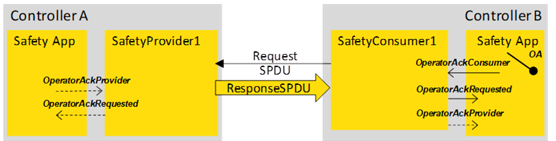  

Figure B. 4 - OA in unidirectional safety communication  

In the scenario shown in [Figure B.4](/§\_Ref156570001) , operator acknowledgment is done on the *SafetyConsumer* side, operator acknowledgment on the *SafetyProvider* side is not possible.  

#### B.3.3 Use case 2: bidirectional communication and dual OA  

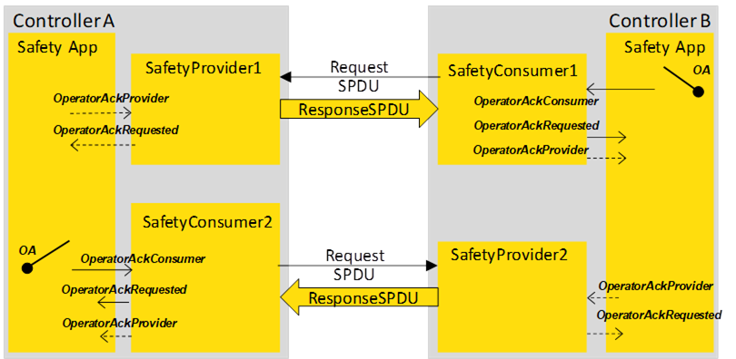  

Figure B. 5 - Two-sided OA in bidirectional safety communication  

In the scenario shown in [Figure B.5](/§\_Ref79751488) , operator acknowledgment is done independently for both directions.  

#### B.3.4 Use case 3: bidirectional communication and single, one-sided OA  

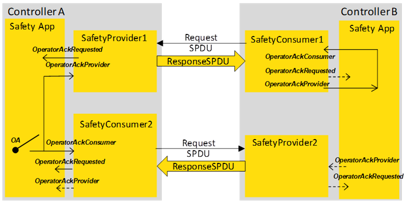  

Figure B. 6 - One sided OA in bidirectional safety communication  

In the scenario of [Figure B.6](/§\_Ref531268077) , an operator acknowledgment activated at controller A suffices for re-establishing the bidirectional connection. Both sides will cease delivering *fail-safe* values and continue sending *process values* . This is accomplished by connecting *OperatorAckProvider* with *OperatorAckConsumer* at the *SafetyConsumer* of controller B. Activating operator acknowledgment at controller B is not possible in this scenario.  

#### B.3.5 Use case 4: bidirectional communication and single, two-sided OA  

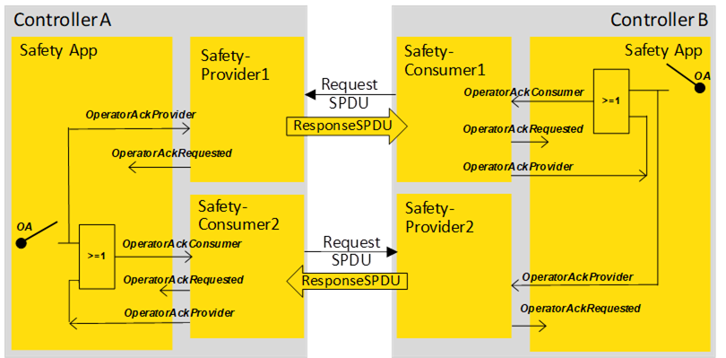  

Figure B. 7 - One sided OA on each side is possible  

[Figure B.7](/§\_Ref531268087) shows a scenario where an operator acknowledgment activated at controller A or controller B suffices for re-establishing the bidirectional connection. Both sides will cease delivering *fail-safe* values and continue sending *process values* . This is accomplished by the logic circuits shown in the safety applications.  

## Annex C (informative)Information for assessment  

This document does not make a statement on how to validate conformance. However, testing and validation of compliance can be subject to regulatory requirements.  

Corresponding information regarding the testing and compliance with this document can be retrieved from the local National Committees of the IEC or from the relevant technology-specific organization for this document.  

NOTE For this document, the relevant technology-specific organization is the OPC Foundation, see [www.opcfoundation.com](http://www.opcfoundation.com/) .  

  

  

Bibliography  

1. Object Management Group, Unified Modeling Language (UML), V2.5.1, 2017, [https://www.omg.org/spec/UML/2.5.1/](https://www.omg.org/spec/UML/2.5.1/)  

1. National Institute of Standards and Technology (NIST), Computer Security Resource Center, Recommendation for Random Number Generation Using Deterministic Random Bit Generators, SP 800-90A Rev. 1, June 2015  

1. Anwendungshinweise und Interpretationen (AIS) 20, Functionality classes and evaluation methodology for physical random number generators. Bundesamt für Sicherheit in der Informationstechnik (BSI), 1999  

1. Anwendungshinweise und Interpretationen (AIS) 31, functionality classes and evaluation methodology for physical random number generators, Bundesamt für Sicherheit in der Informationstechnik (BSI), 2001  

1. ISO/IEC 18031, Information technology, Security techniques. Random Bit Generation  

1. IEC 61000-6-7, *Electromagnetic compatibility (EMC) - Part 6-7: Generic standards - Immunity requirements for equipment intended to perform functions in a safety related system (functional safety) in industrial locations*  

1. IEC 61511 (all parts), *Functional safety - Safety instrumented systems for the process industry sector*  

1. IEC 62061, *Safety of machinery - Functional safety of safety-related control systems*  

1. ISO 13849 (all parts), Safety of machinery - Safety-related parts of control systems  

1. ISO 13849-1, Safety of machinery - Safety-related parts of control systems - Part 1: General principles for design  

1. IEC 62541-2, OPC Unified Architecture - Part 2: Security  

1. ISO 13849-2, Safety of machinery - Safety-related parts of control systems - Part 2: Validation  

1. IEC 62541-7, OPC Unified Architecture - Part 7: Profiles  

1. IEC 62541-8, OPC Unified Architecture - Part 8: Data Access  

1. OPC 10010 (all parts), OPC Test Lab Specification  

\_\_\_\_\_\_\_\_\_\_\_  

