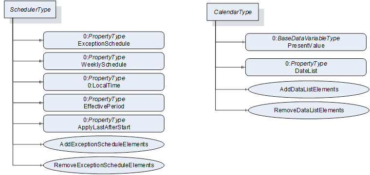

## 1 Scope  

This document specifies an OPC UA information model to expose information, at what dates and times specific actions are executed by the OPC UA *Server* . Those schedules can optionally also be manipulated via the information model.  

The schedule defines on which dates they are active, and can also reference global calendars representing specific dates, for example public holidays. In addition, the schedule defines times and actions that should be executed at that time. The model defines writing *Variables* and calling *Methods* , but can be extended to other actions as well.  

## 2 Normative references  

The following referenced documents are indispensable for the application of this document. For dated references, only the edition cited applies. For undated references, the latest edition of the referenced document (including any amendments and errata) applies.  

OPC 10000-1, *OPC Unified Architecture - Part 1: Overview and Concepts*  

[http://www.opcfoundation.org/UA/Part1/](http://www.opcfoundation.org/UA/Part1/)  

OPC 10000-3, *OPC Unified Architecture - Part 3: Address Space Model*  

[http://www.opcfoundation.org/UA/Part3/](http://www.opcfoundation.org/UA/Part3/)  

OPC 10000-4, *OPC Unified Architecture - Part 4: Services*  

[http://www.opcfoundation.org/UA/Part4/](http://www.opcfoundation.org/UA/Part4/)  

OPC 10000-5, *OPC Unified Architecture - Part 5: Information Model*  

[http://www.opcfoundation.org/UA/Part5/](http://www.opcfoundation.org/UA/Part5/)  

OPC 10000-6, *OPC Unified Architecture - Part 6: Mappings*  

[http://www.opcfoundation.org/UA/Part6/](http://www.opcfoundation.org/UA/Part6/)  

OPC 10000-7, *OPC Unified Architecture - Part 7: Profiles*  

[http://www.opcfoundation.org/UA/Part7/](http://www.opcfoundation.org/UA/Part7/)  

## 3 Terms, abbreviated terms and conventions  

### 3.1 Overview  

It is assumed that basic concepts of OPC UA information modelling are understood in this document. This document will use these concepts to describe the Scheduler Information Model. For the purposes of this document, the terms and definitions given in OPC 10000-1, OPC 10000-3, OPC 10000-4, OPC 10000-5, OPC 10000-7 as well as the following apply.  

Note that OPC UA terms and terms defined in this document are *italicized* in the document.  

### 3.2 Abbreviated terms  

  

HTTP Hypertext Transfer Protocol  

PMS Production Management System  

URI Uniform Resource Identifier  

XML Extensible Markup Language  

## 4 General information to Scheduler  

Schedulers allow to define per day of the week specific times at which specific actions are executed in the OPC UA *Server* .  

In addition, schedulers can define special dates and times at which specific actions are executed in the OPC UA *Server* . If such a date occurs, the actions of the special date are executed, and the weekly schedule is ignored.  

A scheduler can define the special dates by either  

* defining a concrete date (e.g. 2022-01-17),  

* defining a range of dates (e.g. 2022-01-17 until 2022-04-13)  

* defining repeating dates with wildcards (e.g. every 1 st January)  

* or referencing global calendars containing for example all public holidays of a year  

Per date an array of times and corresponding actions including parameterization is defined, when the action is executed. Actions can be the writing of *Variables* or calling *Methods* , but can also be extended to other actions.  

## 5 Use cases  

### 5.1 UC01: Scheduling actions on specific times on each weekday  

The user wants to schedule that at specific times on each individual weekday a specific action is executed, for example the heating is set to a specific setpoint. In [Table 1](/§\_Ref93656717) , an example of such a schedule is given. It contains the schedule for the heating of a school building, that is not used over the weekend. It may be needed to disable the schedule, e.g. when it is warm outside during summer.  

Table 1 - Example Weekly Schedule  

||||||||
|---|---|---|---|---|---|---|
|Monday|Tuesday|Wednesday|Thursday|Friday|Saturday|Sunday|
  
| **00:00Night** |07:00On|07:00On|07:00On|07:00On|00:00Off|00:00Off|
|---|---|---|---|---|---|---|
  
| **07:00On** |16:30Night|16:30Night|16:30Night|16:30Off|||
|---|---|---|---|---|---|---|
  
| **16:30Night** |||||||
|---|---|---|---|---|---|---|
  

  

### 5.2 UC02: Scheduling actions on special dates  

#### 5.2.1 Overview  

The user wants to schedule that on special dates or date periods a specific action is executed, for example switching off the heating during public holidays. The user wants to be able to define those dates individual or reference predefined dates that can be used in several schedules. In [Table 2](/§\_Ref93658886) , an example is given.  

Table 2 - Example Exception Schedule  

|||||
|---|---|---|---|
|Date|Time|Value|Priority|
  
|Day| **Interval** | **Recurring** | **Reference** ||||
|---|---|---|---|---|---|---|
|||Every Saturday of March 2022||05:00|On|11 (School board)|
|||||12:00|Off||
||2022-04-03 - 2022-04-07|||05:00|On|12(IT user)|
|||||16:30|Off||
  
| **2022-04-01** ||||05:00|On|13(facility manager)|
|---|---|---|---|---|---|---|
||||||||
||||CAL1Variable Holidays|00:00|Off|14|
||||CAL2Set Holidays|00:00|Off|15|
||||CAL3School Vacation|00:00|Off|16|
  

  

The referenced calendars are defined in [Table 3](/§\_Ref93662361) .  

Table 3 - Example Calendars  

|Day| **Interval** | **Recurring** | **Note** |
|---|---|---|---|
|CAL1: Variable Holidays|
  
| **2022-04-18** |||Easter Monday|
|---|---|---|---|
  
| **2022-05-26** |||Ascension Day|
|---|---|---|---|
|CAL2: Set Holidays|
|||Jan 01.|New Year's|
|||Jan 06.|Epiphany|
|||Dec 24.|Christmas Eve|
|||Dec 25.|Christmas Day|
|||Dec 26.|Christmas Day|
|CAL3: School Vacation|
||2022-02-21 - 2022-02-25|||
||2022-07-25 - 2022-09-02|||
||2022-12-23 - 2023-01-02|||
  

  

The example shows more detailed use cases, summarized in the following subsections.  

#### 5.2.2 UC002.1: Schedule actions at a specific date  

As shown in [Table 2](/§\_Ref93658886) in the third entry, a special schedule on a specific date (2022-04-01) shall be applied.  

#### 5.2.3 UC002.2: Schedule actions at an interval from a specific date to a specific date  

As shown in [Table 2](/§\_Ref93658886) in the second entry, a special schedule on a specific interval (2022-04-03 - 2022-04-07) shall be applied.  

#### 5.2.4 UC002.3 Schedule actions at a recurring interval  

As shown in [Table 2](/§\_Ref93658886) in the first entry, a special schedule on a recurring interval (every Saturday per of March 2022) shall be applied.  

#### 5.2.5 UC002.4 Schedule actions at specific dates defined globally  

As shown in [Table 2](/§\_Ref93658886) in the last three entries, a special schedule shall be applied on dates defined globally. The global definition shall support concrete dates (CAL1), recurring dates (CAL2) and concrete ranges (CAL3).  

## 6 Scheduler Information Model overview  

### 6.1 Overview  

This specification defines two main *ObjectTypes* :  

* an instance of *CalendarType* represent a globally defined set of dates that can be referenced by schedule *Objects* ;  

* an instance of ScheduleType represent a schedule, that defines for specific dates or weekdays specific times and actions, that shall be executed at those times.  

An overview is given in [Figure 1](/§\_Ref94545155) . Instances of *ScheduleType* can have a *WeeklySchedule* , defining per weekday specific times and per specific time a list of actions that shall be executed at that time. Optionally, the *WeeklySchedule* can be configured by OPC UA *Clients* .  

In addition, or as alternative, a schedule *Object* can have a *ExceptionSchedule* . This defines special dates (days), either by defining a concrete date, a range of dates, or recurring dates, or by referencing instances of *CalendarType* . The optional *Methods* *AddExceptionScheduleElements* and *RemoveExceptionScheduleElements* can be used to configure the *ExceptionSchedule* by an OPC UA *Client* .  

  

Figure 1 - Overview Scheduler Information Model  

The *CalendarType* defines a *DateList* with specific dates. The optional *AddDateListElements* and *RemoveDateListElements* *Methods* can be used to manipulate the *DateList* *Property* by OPC UA *Clients* .  

This specification does not define any specific entry points where to find schedule or calendar *Objects* . It is expected that they are placed reasonable in the AddressSpace, for example as child *Object* of an *Object* that is manipulated by actions of the schedule *Object* .  

This specification does not define any specific mechanism how new schedule or calendar Objects are added or removed via OPC UA. Information Models using those *Objects* might define specific mechanisms like *Methods* or using the *NodeManagement Service Set* .  

### 6.2 Scheduling Times and Priorities  

A schedule *Object* can contain a *WeeklySchedule* with one entry per weekday and / or an *ExceptionSchedule* . One of both shall be defined. The *WeeklySchedule* contains for each day actions, that should be taken at specific times. The *ExceptionSchedule* contains specific dates or ranges of dates, and the corresponding actions that should be taken at specific times. For example, the *ExceptionSchedule* can contain an entry with all public holidays and another with plant holidays. Since the different entries of the *ExceptionSchedule* might overlap, each entry contains a priority. If overlapping entries exist, the one with the highest priority is used. If both, *WeeklySchedule* and *ExceptionSchedule* exist, the exception schedule has priority over the *WeeklySchedule* . That is, if the exception schedule has a matching date, the exception schedule is used, otherwise the weekly schedule.  

### 6.3 Start-up of Schedules  

When a Server restarts or starts the first time, and when a schedule *Object* becomes active (by reaching its *EffectivePeriod* , see [7.2.2](/§\_Ref94540214) ) there are two options how a schedule *Object* shall react.  

If the *ApplyLastAfterStart* *Property* is set to TRUE, the *Server* shall find the last set of actions to be executed before the current time and execute those actions. The mechanism to find the last set of actions is to find the last element in the list of TimeActionsType that occurs on or before the current time, and then use that element's actions. If no such element is found, then no action is executed.  

If the *ApplyLastAfterStart* *Property* is set to FALSE, the *Server* does not consider any previous actions and starts executing actions according to the defined schedule defined in the future.  

## 7 OPC UA ObjectTypes  

### 7.1 CalendarType  

#### 7.1.1 Overview  

The *CalendarType* provides a list of calendar dates. Each entry in the list describes a specific date or date pattern, or range of dates. The *CalendarType ObjectType* is formally defined in [Table 4](/§\_Ref345281570) .  

#### 7.1.2 ObjectType definition  

Table 4 - CalendarType Definition  

| **Attribute** | **Value** |
|---|---|
|BrowseName|CalendarType|
|IsAbstract|False|
|Description|Provides a list of calendar dates. Each entry in the list describes a specific date or date pattern, or range of dates|
  
| **References** | **NodeClass** | **BrowseName** | **DataType** | **TypeDefinition** | **Other** |
|---|---|---|---|---|---|
|Subtype of the *0:BaseObjectType*|
|0:HasComponent|Variable|PresentValue|0:Boolean|0:BaseDataVariableType|M|
|0:HasProperty|Variable|DateList|CalendarEntryType[]|0:PropertyType|M|
|0:HasComponent|Method|AddDateListElements|||O|
|0:HasComponent|Method|RemoveDateListElements|||O|
  
| **Conformance Units** |
|---|
|Scheduler Calendar Base|
  

  

This *PresentValue* indicates the current value of the calendar: True if the current date is in the *DateList* and False if it is not. For the current date that local time of the OPC UA Server shall be considered.  

The *DateList* is an array of elements of which each is either a specific date or date pattern, or range of dates.  

The child *Nodes* of the *CalendarType* have additional *Attribute* values defined in [Table 5](/§\_Ref93655813) .  

Table 5 - CalendarType Attribute values for child Nodes  

| **BrowsePath** | **Description Attribute** |
|---|---|
|PresentValue|Indicates if the current date is in the DateList (true) or not (false)|
|DateList|Array of elements each defining either a specific date or date pattern, or range of dates|
|AddDateListElements|Adds elements to the DateList|
|RemoveDateListElements|Removes elements of the DateList|
  

  

#### 7.1.3 Method AddDateListElements  

This *Method* adds entries to the *DateList* *Property* . Even if one entry cannot be added, the other entries are still processed and added, if possible. The signature of this *Method* is specified below. [Table 6](/§\_Ref93650757) and [Table 7](/§\_Ref93650764) specify the *Arguments* and *AddressSpace* representation, respectively.  

 **Signature**   

 **AddDateListElements**   

[in]  CalendarEntryType[]  CalendarEntries  

[out] 0:Int32[]    EntryResults  

);  

Table 6 - AddDateListElements Method Arguments  

| **Argument** | **Description** |
|---|---|
|CalendarEntries|An array of calendar entries to be added to the DateList Property.|
|EntryResults|An array of results, one entry per entry in CalendarEntries, indicating if the individual entry could be added. Each result \<\> 0 indicates, that adding this calendar entry was not successful. 0 - OK \-1 - Duplicate - Entry already in DateList \-2 - Invalid Format - The entry contains an invalid format, e.g. an invalid range Values larger 0 can be used for vendor-specific errors.|
  

  

 **Method Result Codes (defined in Call Service)**   

| **Result Code** | **Description** |
|---|---|
|BadNodeIdUnknown|See [OPC 10000-4](/§UAPart4) for a general description.|
|BadNotWritable|See [OPC 10000-4](/§UAPart4) for a general description.|
|BadOutOfMemory|See [OPC 10000-4](/§UAPart4) for a general description.|
  

  

Table 7 - AddDateListElements Method AddressSpace definition  

| **Attribute** | **Value** |
|---|---|
|BrowseName|AddDateListElements|
  
| **References** | **NodeClass** | **BrowseName** | **DataType** | **TypeDefinition** | **ModellingRule** |
|---|---|---|---|---|---|
|0:HasProperty|Variable|0:InputArguments|0:Argument[]|0:PropertyType|0:Mandatory|
|0:HasProperty|Variable|0:OutputArguments|0:Argument[]|0:PropertyType|0:Mandatory|
  

  

#### 7.1.4 Method RemoveDateListElements  

This *Method* removes entries from the *DateList* *Property* . Even if one entry cannot be removed, the other entries are still processed and removed, if possible. The signature of this *Method* is specified below. [Table 8](/§\_Ref93651018) and [Table 9](/§\_Ref93651027) specify the *Arguments* and *AddressSpace* representation, respectively.  

 **Signature**   

 **RemoveDateListElements**   

[in]  CalendarEntryType[]  CalendarEntries  

[out] 0:Int32[]    EntryResults  

);  

Table 8 - RemoveDateListElements Method Arguments  

| **Argument** | **Description** |
|---|---|
|CalendarEntries|An array of calendar entries to be removed from the DateList Property.|
|EntryResults|An array of results, one entry per entry in CalendarEntries, indicating if the individual entry could be removed. Each result \<\> 0 indicates, that removing this calendar entry was not successful. 0 - OK \-1 - Not found - Entry is not in DateList Values larger 0 can be used for vendor-specific errors.|
  

  

 **Method Result Codes (defined in Call Service)**   

| **Result Code** | **Description** |
|---|---|
|BadNodeIdUnknown|See [OPC 10000-4](/§UAPart4) for a general description.|
|BadNotWritable|See [OPC 10000-4](/§UAPart4) for a general description.|
  

  

Table 9 - RemoveDateListElements Method AddressSpace definition  

| **Attribute** | **Value** |
|---|---|
|BrowseName|RemoveDateListElements|
  
| **References** | **NodeClass** | **BrowseName** | **DataType** | **TypeDefinition** | **ModellingRule** |
|---|---|---|---|---|---|
|0:HasProperty|Variable|0:InputArguments|0:Argument[]|0:PropertyType|0:Mandatory|
|0:HasProperty|Variable|0:OutputArguments|0:Argument[]|0:PropertyType|0:Mandatory|
  

  

### 7.2 ScheduleType definition  

#### 7.2.1 Overview  

The *ScheduleType* defines a periodic schedule that can recur over a range of dates. The schedule may have optional exceptions at arbitrary times or dates. The basic unit of a schedule is days, which are divided into two types: normal days within a week and exception days. A priority mechanism defines which scheduled event is currently valid. The *ScheduleType* is formally defined in [Table 10](/§\_Ref96249224) .  

#### 7.2.2 ObjectType definition  

Table 10 - ScheduleType definition  

| **Attribute** | **Value** |
|---|---|
|BrowseName|ScheduleType|
|IsAbstract|False|
|Description|Defines a periodic schedule that can recur over a range of dates. The schedule may have optional exceptions at arbitrary times or dates. The basic unit of a schedule is days, which are divided into two types: normal days within a week and exception days. A priority mechanism defines which scheduled event is currently valid. The schedule includes a PresentValue Variable whose value describes the current state of the schedule, including a default value when no schedules are in effect.|
  
| **References** | **Node Class** | **BrowseName** | **DataType** | **TypeDefinition** | **Other** |
|---|---|---|---|---|---|
|Subtype of the 0:BaseObjectType|
|0:HasProperty|Variable|ExceptionSchedule|SpecialEventType[]|0:PropertyType|O|
|0:HasComponent|Method|AddExceptionScheduleElements|||O|
|0:HasComponent|Method|RemoveExceptionScheduleElements|||O|
|0:HasProperty|Variable|WeeklySchedule|DailyScheduleType[7]|0:PropertyType|O|
|0:HasProperty|Variable|0:LocalTime|0:TimeZoneDataType|0:PropertyType|M|
|0: HasProperty|Variable|EffectivePeriod|DateRangeType|0:PropertyType|O|
|0:HasProperty|Variable|ApplyLastAfterStart|0:Boolean|0:PropertyType|M|
  
| **Conformance Units** |
|---|
|Scheduler Scheduling Base|
  

  

The *ExceptionSchedule* provides an array of *SpecialEventType* . If present, each of those special events describes a sequence of schedule actions that take precedence over a normal day's behaviour on a special day or days.  

The *WeeklySchedule* provides an array of seven *DailyScheduleType* . Each entry represents one day of the week. The first entry in the array represents Monday, the last Sunday. Each element describes a sequence of times and a list of actions that provides a sequence of schedule actions on one day of the week when no *ExceptionSchedule* is in effect.  

At least one of the two *Properties* *ExceptionSchedule* and *WeeklySchedule* shall be present.  

To manipulate the *ExceptionSchedule* , the *Methods* *AddExceptionScheduleElements* and *RemoveExceptionScheduleElements* should be used. This simplifies adding and removing entries of the array. As the *WeeklySchedule* is a fixed-size array with a length of 7, there are no corresponding *Methods* . Instead, an individual entry of the array may be written by the *Client* to change only the schedule of one weekday.  

The 0: *LocalTime* provides information about the local time of the schedule *Object* . All scheduled times are UTC time. Clients need to consider this *Property* to calculate the local time of the schedule. If this Property is changed, it is server-specific whether the times of the schedule are adjusted or not. If the *Server* and the *Object* the schedule is defined for are in the same local time, the *Object* may reference the 0: *LocalTime* Property of the 0: *Server* *Object* .  

The *EffectivePeriod* specifies the range of dates within which the schedule *Object* is active. Upon entering its effective period, the object shall execute the defined actions at the defined times, otherwise it shall not execute any actions.  

The *ApplyLastAfterStart* *Property* defines if the last set of actions shall be applied when starting the schedule *Object* (see [6.3](/§\_Ref94541793) for details).  

The child *Nodes* of the *ScheduleType* have additional *Attribute* values defined in [Table 11](/§\_Ref56780683) .  

Table 11 - ScheduleType Attribute values for child Nodes  

| **BrowsePath** | **Description Attribute** |
|---|---|
|ExceptionSchedule|An array of special events. If present, each of those special events describes a sequence of schedule actions that take precedence over a normal day's behaviour on a special day or days.|
|AddExceptionScheduleElements|Adds elements to the ExceptionSchedule|
|RemoveExceptionScheduleElements|Removes elements from the ExceptionSchedule|
|WeeklySchedule|Each entry represents one day of the week. The first entry in the array represents Monday, the last Sunday. Each element describes a sequence of times and a list of actions that provides a sequence of schedule actions on one day of the week when no ExceptionSchedule is in effect.|
|0:LocalTime|Provides information about the local time of the schedule Object. All scheduled times are UTC time. Clients need to consider this Property to calculate the local time of the schedule. If this Property is changed, it is server-specific whether the times of the schedule are adjusted or not.|
|EffectivePeriod|Specifies the range of dates within which the schedule Object is active. Upon entering its effective period, the object shall execute the defined actions at the defined times, otherwise it shall not execute any actions.|
|ApplyLastAfterStart|The ApplyLastAfterStart Property defines if the last set of actions shall be applied when starting the schedule Object|
  

  

#### 7.2.3 Method AddExceptionScheduleElements  

This *Method* adds entries to the *ExceptionSchedule* *Property* . Even if one entry cannot be added, the other entries are still processed and added, if possible. The signature of this *Method* is specified below. [Table 12](/§\_Ref94541322) and [Table 13](/§\_Ref94541323) specify the *Arguments* and *AddressSpace* representation, respectively.  

 **Signature**   

 **AddExceptionScheduleElements**   

[in]  SpecialEventType[]  SpecialEvents  

[out] 0:Int32[]    EntryResults  

);  

Table 12 - AddExceptionScheduleElements Method Arguments  

| **Argument** | **Description** |
|---|---|
|SpecialEvents|An array of special events to be added to the ExceptionSchedule Property.|
|EntryResults|An array of results, one entry per entry in SpecialEvents, indicating if the individual entry could be added. Each result \<\> 0 indicates, that adding this special event entry was not successful. 0 - OK \-1 - Duplicate - Entry already in ExceptionSchedule \-2 - Invalid Format - The entry contains an invalid format, e.g. an invalid range Values larger 0 can be used for vendor-specific errors.|
  

  

 **Method Result Codes (defined in Call Service)**   

| **Result Code** | **Description** |
|---|---|
|BadNodeIdUnknown|See [OPC 10000-4](/§UAPart4) for a general description.|
|BadNotWritable|See [OPC 10000-4](/§UAPart4) for a general description.|
|BadOutOfMemory|See [OPC 10000-4](/§UAPart4) for a general description.|
  

  

Table 13 - AddExceptionScheduleElements Method AddressSpace definition  

| **Attribute** | **Value** |
|---|---|
|BrowseName|AddExceptionScheduleElements|
  
| **References** | **NodeClass** | **BrowseName** | **DataType** | **TypeDefinition** | **ModellingRule** |
|---|---|---|---|---|---|
|0:HasProperty|Variable|0:InputArguments|0:Argument[]|0:PropertyType|0:Mandatory|
|0:HasProperty|Variable|0:OutputArguments|0:Argument[]|0:PropertyType|0:Mandatory|
  

  

#### 7.2.4 Method RemoveExceptionScheduleElements  

This *Method* removes entries from the *ExceptionSchedule* *Property* . Even if one entry cannot be removed, the other entries are still processed and removed, if possible. The signature of this *Method* is specified below. [Table 14](/§\_Ref94541324) and [Table 15](/§\_Ref94541325) specify the *Arguments* and *AddressSpace* representation, respectively.  

 **Signature**   

 **RemoveExceptionScheduleElements**   

[in]  SpecialEventType[]  SpecialEvents  

[out] 0:Int32[]    EntryResults  

);  

Table 14 - RemoveExceptionScheduleElements Method Arguments  

| **Argument** | **Description** |
|---|---|
|SpecialEvents|An array of special events to be removed from the ExceptionSchedule Property.|
|EntryResults|An array of results, one entry per entry in SpecialEvents, indicating if the individual entry could be removed. Each result \<\> 0 indicates, that removing this special event entry was not successful. 0 - OK \-1 - Not found - Entry is not in ExceptionSchedule Values larger 0 can be used for vendor-specific errors.|
  

  

 **Method Result Codes (defined in Call Service)**   

| **Result Code** | **Description** |
|---|---|
|BadNodeIdUnknown|See [OPC 10000-4](/§UAPart4) for a general description.|
|BadNotWritable|See [OPC 10000-4](/§UAPart4) for a general description.|
  

  

Table 15 - RemoveExceptionScheduleElements Method AddressSpace definition  

| **Attribute** | **Value** |
|---|---|
|BrowseName|RemoveExceptionScheduleElements|
  
| **References** | **NodeClass** | **BrowseName** | **DataType** | **TypeDefinition** | **ModellingRule** |
|---|---|---|---|---|---|
|0:HasProperty|Variable|0:InputArguments|0:Argument[]|0:PropertyType|0:Mandatory|
|0:HasProperty|Variable|0:OutputArguments|0:Argument[]|0:PropertyType|0:Mandatory|
  

  

## 8 OPC UA DataTypes  

### 8.1 SpecialEventType  

This structure contains a period, a list of time actions, and a priority. It is a means to identify moments in time over one or more days. How the priority is used is defined in section [6.2](/§\_Ref93653969) . The structure is defined in [Table 16](/§\_Ref109726409) .  

Table 16 - SpecialEventType Structure  

| **Name** | **Type** | **Description** |
|---|---|---|
|SpecialEventType|structure||
|Period|SpecialEventPeriodType|A period where the special event is active|
|ListOfTimeActions|TimeActionsType[]|Points in time where the special event occurs and the associated actions|
|EventPriority|0:Byte|Priority of this special event. The lower the number, the higher the priority.|
  

  

Its representation in the *AddressSpace* is defined in [Table 17](/§\_Ref46498488) .  

Table 17 - SpecialEventType Definition  

| **Attribute** | **Value** |
|---|---|
|BrowseName|SpecialEventType|
|IsAbstract|False|
|Description|This structure contains a period, a list of time values, and a priority. It is a means to identify moments in time over one or more days.|
  
| **References** | **NodeClass** | **BrowseName** | **DataType** | **TypeDefinition** | **Other** |
|---|---|---|---|---|---|
|Subtype of the 0:Structure|
  
| **Conformance Units** |
|---|
|Scheduler Scheduling Base|
||
  

  

  

### 8.2 SpecialEventPeriodType  

This union contains a calendar entry or a reference to a calendar *Object* . The union is defined in [Table 18](/§\_Ref370760614) .  

Table 18 - SpecialEventPeriodType Union  

| **Name** | **Type** | **Description** |
|---|---|---|
|SpecialEventPeriodType|union||
|CalendarEntry|CalendarEntryType|A calendar entry|
|CalendarReference|0:NodeId|Reference to a calendar object|
  

  

Its representation in the *AddressSpace* is defined in [Table 19](/§\_Ref370760615) .  

Table 19 - SpecialEventPeriodType definition  

| **Attributes** | **Value** |
|---|---|
|BrowseName|SpecialEventPeriodType|
|IsAbstract|False|
|Description|This union contains a calendar entry or a reference to a calendar object|
  
| **References** | **NodeClass** | **BrowseName** | **DataType** | **TypeDefinition** | **Other** |
|---|---|---|---|---|---|
|Subtype of 0:Union|
  
| **Conformance Units** |
|---|
|Scheduler Scheduling Base|
||
  

  

### 8.3 CalendarEntryType  

This union that defines various calendar date values. The union is defined in [Table 18](/§\_Ref370760614) .  

Table 20 - CalendarEntryType Union  

| **Name** | **Type** | **Description** |
|---|---|---|
|CalendarEntryType|union||
|Date|DateType|A calendar date, potentially partly defined and repeating|
|DateRange|DateRangeType|A range of dates|
  

  

Its representation in the AddressSpace is defined in [Table 19](/§\_Ref370760615) .  

Table 21 - CalendarEntryType Definition  

| **Attributes** | **Value** |
|---|---|
|BrowseName|CalendarEntryType|
|IsAbstract|False|
|Description|This union that defines various calendar date values|
  
| **References** | **NodeClass** | **BrowseName** | **DataType** | **TypeDefinition** | **Other** |
|---|---|---|---|---|---|
|Subtype of 0:Union|
  
| **Conformance Units** |
|---|
|Scheduler Scheduling Base|
|Scheduler Calendar Base|
  

  

### 8.4 DateType  

This structure defines a calendar date. It allows to define a concrete date, e.g. 2022-02-12. By using wildcards, it also allows to define repeating dates, like every Wednesday, every odd day of a month, every 24 th of December, every last day of a month in 2023, etc. Its composition is formally defined in [Table 22](/§\_Ref370797599) .  

Table 22 - DateType Structure  

| **Name** | **Type** | **Description** |
|---|---|---|
|DateType|structure||
|Year|0:UInt16|Years based on the Gregorian calendar, 0 is used as "unspecific".|
|Month|Month|A specific Gregorian calendar month or relative (e.g. "odd", "even")|
|DayOfMonth|DayOfMonth|A specific day of the month or relative (e.g. "last day"). Shall be "unspecific" if DayOfWeek is not "unspecific".|
|DayOfWeek|DayOfWeek|A specific day of the week. Shall be "unspecific" if DayOfMonth is not "unspecific".|
  

  

Its representation in the AddressSpace is defined in [Table 23](/§\_Ref370797600) .  

Table 23 - DateType Definition  

| **Attribute** | **Value** |
|---|---|
|BrowseName|DateType|
|IsAbstract|False|
|Description|This structure defines a calendar date. It allows to define a concrete date, e.g. 2022-02-12. By using wildcards, it also allows to define repeating dates, like every Wednesday, every odd day of a month, every 24 th of December, every last day of a month in 2023, etc.|
  
| **References** | **NodeClass** | **BrowseName** | **DataType** | **TypeDefinition** | **Other** |
|---|---|---|---|---|---|
|Subtype of the 0:Structure|
  
| **Conformance Units** |
|---|
|Scheduler Scheduling Base|
|Scheduler Calendar Base|
  

  

  

### 8.5 Month  

This enumeration indicates either a specific Gregorian calendar month, or a relative relationship ("odd", "even", and "unspecified"). The enumeration is defined in [Table 24](/§\_Ref377027377) .  

Table 24 - Month Values  

| **Name** | **Value** | **Description** |
|---|---|---|
|Unspecified|0||
|January|1||
|February|2||
|March|3||
|April|4||
|May|5||
|June|6||
|July|7||
|August|8||
|September|9||
|October|10||
|November|11||
|December|12||
|Odd|13||
|Even|14||
  

  

Its representation in the AddressSpace is defined in [Table 25](/§\_Ref377027384) .  

Table 25 - Month Definition  

| **Attribute** | **Value** |
|---|---|
|BrowseName|Month|
|IsAbstract|False|
|Description|This enumeration indicates either a specific Gregorian calendar month, or a relative relationship ("odd", "even", and "unspecified").|
  
| **References** | **NodeClass** | **BrowseName** | **DataType** | **TypeDefinition** | **Other** |
|---|---|---|---|---|---|
|Subtype of the 0:Enumeration|
|0:HasProperty|Variable|0:EnumStrings|0:LocalizedText[]|0:PropertyType||
  
| **Conformance Units** |
|---|
|Scheduler Scheduling Base|
|Scheduler Calendar Base|
  

  

### 8.6 DayOfMonth  

This enumeration indicates specific days of the month by specific date ("1", "22", and so on) or by relative position ("last day of month", "even day of month", and so on). The enumeration is defined in [Table 26](/§\_Ref377034996) .  

Table 26 - DayOfMonth Values  

| **Name** | **Value** | **Description** |
|---|---|---|
|Unspecified|0||
|Day1|1||
|Day2|2||
|Day3|3||
|Day4|4||
|Day5|5||
|Day6|6||
|Day7|7||
|Day8|8||
|Day9|9||
|Day10|10||
|Day11|11||
|Day12|12||
|Day13|13||
|Day14|14||
|Day15|15||
|Day16|16||
|Day17|17||
|Day18|18||
|Day19|19||
|Day20|20||
|Day21|21||
|Day22|22||
|Day23|23||
|Day24|24||
|Day25|25||
|Day26|26||
|Day27|27||
|Day28|28||
|Day29|29||
|Day30|30||
|Day31|31||
|LastDayOfMonth|32||
|OddDayOfMonth|33||
|EvenDayOfMonth|34||
  

  

Its representation in the *AddressSpace* is defined in [Table 27](/§\_Ref377035247) .  

Table 27 - DayOfMonth Definition  

| **Attribute** | **Value** |
|---|---|
|BrowseName|DayOfMonth|
|IsAbstract|False|
|Description|This enumeration indicates specific days of the month by specific date ("1", "22", and so on) or by relative position ("last day of month", "even day of month", and so on).|
  
| **References** | **NodeClass** | **BrowseName** | **DataType** | **TypeDefinition** | **Other** |
|---|---|---|---|---|---|
|Subtype of the 0:Enumeration|
|0:HasProperty|Variable|0:EnumStrings|0:LocalizedText[]|0:PropertyType||
  
| **Conformance Units** |
|---|
|Scheduler Scheduling Base|
|Scheduler Calendar Base|
  

  

### 8.7 DayOfWeek  

This enumeration indicates each of the seven days of the week, or "unspecified". The enumeration is defined in [Table 28](/§\_Ref377035251) .  

Table 28 - DayOfWeek Values  

| **Name** | **Value** | **Description** |
|---|---|---|
|Unspecified|0||
|Monday|1||
|Tuesday|2||
|Wednesday|3||
|Thursday|4||
|Friday|5||
|Saturday|6||
|Sunday|7||
  

  

Its representation in the *AddressSpace* is defined in [Table 29](/§\_Ref377035255) .  

Table 29 - DayOfWeek Definition  

| **Attribute** | **Value** |
|---|---|
|BrowseName|DayOfWeek|
|IsAbstract|False|
|Description|This enumeration indicates each of the seven days of the week, or "unspecified".|
  
| **References** | **NodeClass** | **BrowseName** | **DataType** | **TypeDefinition** | **Other** |
|---|---|---|---|---|---|
|Subtype of the 0:Enumeration type defined in [OPC 10000-5](/§UAPart5)|
|0:HasProperty|Variable|0:EnumStrings|0:LocalizedText[]|0:PropertyType||
  
| **Conformance Units** |
|---|
|Scheduler Scheduling Base|
|Scheduler Calendar Base|
  

  

  

### 8.8 DateRangeType  

This structure defines a time span, with start and end dates that are either open or absolute. The structure is defined in [Table 30](/§\_Ref370797601) .  

The *StartDate* and *EndDate* are limited to either use specific dates, i.e., wild cards like odd months are not allowed, or unspecified dates, i.e. only use wild cards.  

In case a specific date is provided, the *Year* field shall not be 0; the *Month* field shall be a value between 1 to 12; the *DayOfMonth* field shall be between 1 to 31 and the *DayOfWeek* field shall be "unspecified".  

In case an unspecified date is provided, the *Year* field shall be 0, the *Month* field shall be "unspecified", the *DayOfMonth* field shall be "unspecified", and the *DayOfWeek* field shall be "unspecified".  

No other values shall be used for *StartDate* and *EndDate.*  

Table 30 - DateRangeType Structure  

| **Name** | **Type** | **Description** |
|---|---|---|
|DateRangeType|structure||
|StartDate|DateType|The start date of the date range. The start day is included in the range.|
|EndDate|DateType|The end date of the date range. The end day is included in the range.|
  

  

Its representation in the *AddressSpace* is defined in [Table 31](/§\_Ref370797602) .  

Table 31 - DateRangeType Definition  

| **Attribute** | **Value** |
|---|---|
|BrowseName|DateRangeType|
|IsAbstract|False|
|Description|This structure defines a time span, with absolute start and end dates. The StartDate and EndDate are limited to specific values, i.e., wild cards like odd months are not allowed. The Year field shall not be 0; the Month field shall be a value between 1 to 12; the DayOfMonth field shall be between 1 to 31 and the DayOfMonth field shall be "unspecified".|
  
| **References** | **NodeClass** | **BrowseName** | **DataType** | **TypeDefinition** | **Other** |
|---|---|---|---|---|---|
|Subtype of the 0:Structure|
  
| **Conformance Units** |
|---|
|Scheduler Scheduling Base|
|Scheduler Calendar Base|
  

  

### 8.9 TimeActionsType  

This structure contains a time and an array of actions. It is used to define which actions shall be executed at a specific point in time. The structure is defined in [Table 16](/§\_Ref109726409) .  

Table 32 - TimeActionsType Structure  

| **Name** | **Type** | **Description** | **AllowSubtypes** |
|---|---|---|---|
|TimeActionsType|structure|||
|Time|TimeType|A point in time during a day||
|Actions|BaseActionType[]|A list of actions to be executed at the defined Time Note: Here, subtypes are allowed. The table format will be updated, once a final format is defined.|True|
  

  

Its representation in the *AddressSpace* is defined in [Table 17](/§\_Ref46498488) .  

Table 33 - TimeActionsType Definition  

| **Attribute** | **Value** |
|---|---|
|BrowseName|TimeActionsType|
|IsAbstract|False|
|Description|This structure contains a time and an array of actions. It is used to define actions to be executed at a specific point in time.|
  
| **References** | **NodeClass** | **BrowseName** | **DataType** | **TypeDefinition** | **Other** |
|---|---|---|---|---|---|
|Subtype of the 0:Structure|
  
| **Conformance Units** |
|---|
|Scheduler Scheduling Base|
||
  

  

### 8.10 BaseActionType  

This abstract structure defines the base of an action. The base only contains information, if the last execution of the action was successful. The structure is defined in [Table 34](/§\_Ref94281088) .  

Table 34 - BaseActionType Structure  

| **Name** | **Type** | **Description** |
|---|---|---|
|BaseActionType|structure||
|LastActionResult|0:StatusCode|Contains information, whether the last execution of the action was successful. Shall be Uncertain, if action was never executed or last execution not known by Server anymore, e.g., because of a restart. Shall be a good status code when execution of action was successful, and a bad status code, when execution was not successful. Subtypes might add additional information on execution of action, e.g. output arguments.|
  

  

Its representation in the *AddressSpace* is defined in [Table 35](/§\_Ref94281114) .  

Table 35 - BaseActionType Definition  

| **Attribute** | **Value** |
|---|---|
|BrowseName|BaseActionType|
|IsAbstract|True|
|Description|This abstract structure defines the base of an action. The base only contains information, if the last execution of the action was successful.|
  
| **References** | **NodeClass** | **BrowseName** | **DataType** | **TypeDefinition** | **Other** |
|---|---|---|---|---|---|
|Subtype of the 0:Structure|
  
| **Conformance Units** |
|---|
|Scheduler Scheduling Base|
||
  

  

### 8.11 WriteLocalVariableActionType  

This structure defines an action to write the value of a *Variable* managed in the same *Server* where the action is used. The structure is defined in [Table 36](/§\_Ref94539287) .  

Table 36 - WriteLocalVariableActionType Structure  

| **Name** | **Type** | **Description** |
|---|---|---|
|WriteLocalVariableActionType|structure||
|Variable|0:NodeId|The NodeId of the Variable to be written|
|Value|0:BaseDataType|The value to be written to the Variable|
  

  

Its representation in the *AddressSpace* is defined in [Table 37](/§\_Ref94539307) .  

Table 37 - WriteLocalVariableActionType Definition  

| **Attribute** | **Value** |
|---|---|
|BrowseName|WriteLocalVariableActionType|
|IsAbstract|False|
|Description|This structure defines an action to write the value of a Variable managed in the same Server where the action is used.|
  
| **References** | **NodeClass** | **BrowseName** | **DataType** | **TypeDefinition** | **Other** |
|---|---|---|---|---|---|
|Subtype of the BaseActionType|
  
| **Conformance Units** |
|---|
|Scheduler Scheduling Base|
||
  

  

### 8.12 CallLocalMethodActionType  

This structure defines an action to call a *Method* of an *Object* managed in the same *Server* where the action is used. The structure is defined in [Table 38](/§\_Ref94539519) .  

Table 38 - CallLocalMethodActionType Structure  

| **Name** | **Type** | **Description** |
|---|---|---|
|CallLocalMethodActionType|structure||
|ObjectId|0:NodeId|The NodeId of the Object the Method should be called on|
|MethodId|0:NodeId|The NodeId of the Method to be called|
|InputValues|0:BaseDataType[]|An array of input values to be used in the Method call|
|LastOutputValues|0:BaseDataType[]|An array of the output values the last time the Method was called. Shall be an empty array if no outputs arguments, the LastActionResult is a bad status code or the action was never executed or last execution is unknown.|
  

  

Its representation in the *AddressSpace* is defined in [Table 39](/§\_Ref94539529) .  

Table 39 - CallLocalMethodActionType Definition  

| **Attribute** | **Value** |
|---|---|
|BrowseName|CallLocalMethodActionType|
|IsAbstract|False|
|Description|This structure defines an action to call a Method of an Object managed in the same Server where the action is used.|
  
| **References** | **NodeClass** | **BrowseName** | **DataType** | **TypeDefinition** | **Other** |
|---|---|---|---|---|---|
|Subtype of the BaseActionType|
  
| **Conformance Units** |
|---|
|Scheduler Scheduling Base|
||
  

  

### 8.13 TimeType  

This structure that represents a point in time during a day. The structure is defined in [Table 40](/§\_Ref379490350) .  

Table 40 - TimeType Structure  

| **Name** | **Type** | **Description** |
|---|---|---|
|TimeType|structure||
|Hour|0:Byte|Allowed values between 0 and 23 - 255 as unspecific|
|Minute|0:Byte|Allowed values between 0 and 59 - 255 as unspecific|
|Second|0:Byte|Allowed values between 0 and  59 - 255 as unspecific|
  

  

Its representation in the *AddressSpace* is defined in [Table 41](/§\_Ref379490351) .  

Table 41 - TimeType Definition  

| **Attribute** | **Value** |
|---|---|
|BrowseName|TimeType|
|IsAbstract|False|
|Description|This structure that represents a point in time during a day|
  
| **References** | **NodeClass** | **BrowseName** | **DataType** | **TypeDefinition** | **Other** |
|---|---|---|---|---|---|
|Subtype of the 0:Structure|
  
| **Conformance Units** |
|---|
|Scheduler Scheduling Base|
||
  

  

### 8.14 DailyScheduleType  

This structure defines a sequence of *TimeActionsType* structures. Each element in the sequence defines a time and a list of actions that shall be executed at that point in time. The structure is defined in [Table 42](/§\_Ref379490344) .  

Table 42 - DailyScheduleType Structure  

| **Name** | **Type** | **Description** |
|---|---|---|
|DailyScheduleType|structure||
|DaySchedule|TimeActionsType[]|A sequence of time / value pairs describing the value at a given point in the day.|
  

  

Its representation in the *AddressSpace* is defined in [Table 43](/§\_Ref379490345) .  

Table 43 - DailyScheduleType Definition  

| **Attribute** | **Value** |
|---|---|
|BrowseName|DailyScheduleType|
|IsAbstract|False|
|Description|This structure defines a sequence of TimeActionsType structures. Each element in the sequence defines a time/actions pair that describes the actions to be executed at a given point in the day.|
  
| **References** | **NodeClass** | **BrowseName** | **DataType** | **TypeDefinition** | **Other** |
|---|---|---|---|---|---|
|Subtype of the 0:Structure|
  
| **Conformance Units** |
|---|
|Scheduler Scheduling Base|
||
  

  

  

## 9 Profiles and Conformance Units  

Editor comment: This section will not be published in this document, but in the Profile database and OPC 10000-7 Profiles  

### 9.1 Conformance Units  

[Table 44](/§\_Ref46497388) defines the corresponding *ConformanceUnits* for the OPC UA Information Model for Scheduler.  

Table 44 - Conformance Units for Scheduler  

| **Category** | **Title** | **Description** |
|---|---|---|
|Server|Scheduler Scheduling Base|Exposes the ObjectType ScheduleType, the DataTypes SpecialEventType, SpecialEventPeriodType, CalendarEntryType, DateType, Month, DayOfMonth, DayOfWeek, DateRangeType, TimeActionsType, BaseActionType, WriteLocalVariableActionType, CallLocalMethodActionType, TimeType and DailyScheduleType and all their supertypes in the AddressSpace. Supports a configuration with at least two instances of ScheduleType having at least 12 entries of DaySchedule in their WeeklySchedule (overall, not per day), and 6 entries in the ExceptionSchedule each having at least 6 entries of ListOfTimeActions.|
|Server|Scheduler Calendar Base|Exposes the ObjectType CalendarType, the DataTypes CalendarEntryType, DateType, Month, DayOfMonth, DayOfWeek, and DateRangeType and all their supertypes in the AddressSpace. Supports a configuration with at least three instances of CalendarType, each having at least 10 entries in DateList.|
|Server|Scheduler Scheduling Configuration|Supports at least on instance of ScheduleType supporting the Methods AddExceptionScheduleElements and RemoveExceptionScheduleElements to change the ExceptionSchedule Property and allowing writing the WeeklySchedule Property.|
|Server|Scheduler Calendar Configuration|Supports at least on instance of CalendarType supporting the Methods AddDateListElements and RemoveDateListElements to change the DateList Property.|
|Client|Scheduler Client Configuration|The client supports the configuration of instances of ScheduleType and CalendarType, by changing the configuration of existing Objects.|
  

  

### 9.2 Profiles  

#### 9.2.1 Profile list  

[Table 45](/§\_Ref18152903) lists all Profiles defined in this document and defines their URIs.  

Table 45 - Profile URIs for Scheduler  

| **Profile** | **URI** |
|---|---|
|Scheduler Base Server Profile|http://opcfoundation.org/UA-Profile/Scheduler/Server/Base|
|Scheduler Configuration Server Facet|http://opcfoundation.org/UA-Profile/Scheduler/Server/Configuration|
|Scheduler Configuration Client Facet|http://opcfoundation.org/UA-Profile/Scheduler/Client/Configuration|
  

  

#### 9.2.2 Server Facets  

##### 9.2.2.1 Overview  

The following sections specify the *Facets* available for *Servers* that implement the Scheduler companion specification. Each section defines and describes a *Facet* or *Profile* .  

  

  

##### 9.2.2.2 Scheduler Base Server Facet  

[Table 46](/§\_Ref18071949) defines a *Profile* that describes the describes the base characteristics for all OPC UA *Servers* that support exposing schedules.  

Table 46 - Scheduler Base Server Facet  

| **Group** | **Conformance Unit / Profile Title** | **Mandatory / Optional** |
|---|---|---|
|Profile|0:Core 2022 Server Facethttp://opcfoundation.org/UA-Profile/Server/Core2022Facet||
|Profile|0:Method 2021 Server Facethttp://opcfoundation.org/UA-Profile/Server/Methods2021||
|Scheduler|Scheduler Scheduling Base|M|
|Scheduler|Scheduler Calendar Base|O|
  

  

##### 9.2.2.3 Scheduler Configuration Server Facet  

[Table 47](/§\_Ref18071980) defines a *Facet* that describes the base characteristics for all OPC UA *Servers* that support configuring schedules.  

Table 47 - Scheduler Configuration Server Facet  

| **Group** | **Conformance Unit / Profile Title** | **Mandatory / Optional** |
|---|---|---|
|Profile|Scheduler Base Server Facet|M|
|Scheduler|Scheduler Scheduling Configuration|M|
|Scheduler|Scheduler Calendar Configuration|O|
  

  

#### 9.2.3 Client Facets  

##### 9.2.3.1 Overview  

The following tables specify the *Facets* available for *Clients* that implement the Scheduler companion specification.  

##### 9.2.3.2 Scheduler Configuration Client Facet  

[Table 48](/§\_Ref442394485) defines a *Facet* that describes the base characteristics for all OPC UA *Clients* that support the configuration of schedules.  

Table 48 - Scheduler Configuration Client Facet  

| **Group** | **Conformance Unit / Profile Title** | **Mandatory / Optional** |
|---|---|---|
|Profile|0:AddressSpace Lookup Client Facethttp://opcfoundation.org/UA-Profile/Client/AddressSpaceLookup||
|Profile|0:DataAccess Client Facethttp://opcfoundation.org/UA-Profile/Client/DataAccess||
|Scheduler|Scheduler Client Configuration|M|
  

  

## 10 Namespaces  

### 10.1 Namespace Metadata  

[Table 49](/§\_Ref16863029) defines the namespace metadata for this document. The *Object* is used to provide version information for the namespace and an indication about static *Nodes* . Static *Nodes* are identical for all *Attributes* in all *Servers* , including the *Value Attribute* . See [OPC 10000-5](/§UAPart5) for more details.  

The information is provided as *Object* of type *NamespaceMetadataType* . This *Object* is a component of the *Namespaces* *Object* that is part of the *Server Object* . The *NamespaceMetadataType ObjectType* and its *Properties* are defined in [OPC 10000-5](/§UAPart5) .  

The version information is also provided as part of the ModelTableEntry in the UANodeSet XML file. The UANodeSet XML schema is defined in [OPC 10000-6](/§UAPart6) .  

Table 49 - NamespaceMetadata Object for this Document  

| **Attribute** | **Value** |
|---|---|
|BrowseName|http://opcfoundation.org/UA/Scheduler/|
  
| **Property** | **DataType** | **Value** |
|---|---|---|
|NamespaceUri|String|http://opcfoundation.org/UA/Scheduler/|
|NamespaceVersion|String|1\.05.02|
|NamespacePublicationDate|DateTime|2022-10-01|
|IsNamespaceSubset|Boolean|False|
|StaticNodeIdTypes|IdType[]|0|
|StaticNumericNodeIdRange|NumericRange []|\-|
|StaticStringNodeIdPattern|String|\-|
  

  

Note: The *IsNamespaceSubset* *Property* is set to False as the UaNodeSet XML file contains the complete Namespace. *Servers* only exposing a subset of the Namespace need to change the value to True.  

  

### 10.2 Handling of OPC UA Namespaces  

Namespaces are used by OPC UA to create unique identifiers across different naming authorities. The *Attributes* *NodeId* and *BrowseName* are identifiers. A *Node* in the UA *AddressSpace* is unambiguously identified using a *NodeId* . Unlike *NodeIds* , the *BrowseName* cannot be used to unambiguously identify a *Node* . Different *Nodes* may have the same *BrowseName* . They are used to build a browse path between two *Nodes* or to define a standard *Property* .  

*Servers* may often choose to use the same namespace for the *NodeId* and the *BrowseName* . However, if they want to provide a standard *Property* , its *BrowseName* shall have the namespace of the standards body although the namespace of the *NodeId* reflects something else, for example the *EngineeringUnits* *Property* . All *NodeIds* of *Nodes* not defined in this document shall not use the standard namespaces.  

[Table 50](/§\_Ref16778538) provides a list of namespaces typically used in a Scheduler OPC UA *Server* .  

Table 50 - Namespaces used in a Scheduler Server  

| **NamespaceURI** | **Description** |
|---|---|
|http://opcfoundation.org/UA/|Namespace for *NodeIds* and *BrowseNames* defined in the OPC UA specification. This namespace shall have namespace index 0.|
|Local Server URI|Namespace for nodes defined in the local server. This namespace shall have namespace index 1.|
|http://opcfoundation.org/UA/Scheduler/|Namespace for *NodeIds* and *BrowseNames* defined in this document. The namespace index is *Server* specific.|
|Vendor specific types|A *Server* may provide vendor-specific types like types derived from *ObjectTypes* defined in this document in a vendor-specific namespace.|
|Vendor specific instances|A *Server* provides vendor-specific instances of the standard types or vendor-specific instances of vendor-specific types in a vendor-specific namespace. It is recommended to separate vendor specific types and vendor specific instances into two or more namespaces.|
  

  

[Table 51](/§\_Ref16577438) provides a list of namespaces and their indices used for *BrowseNames* in this document. The default namespace of this document is not listed since all *BrowseNames* without prefix use this default namespace.  

Table 51 - Namespaces used in this document  

| **NamespaceURI** | **Namespace Index** | **Example** |
|---|---|---|
|http://opcfoundation.org/UA/|0|0:EngineeringUnits|
  

  

## Annex A (normative) Scheduler Namespace and Identifiers  

### A.1 Namespace and Identifiers for the Scheduler Information Model  

This appendix defines the numeric identifiers for all of the numeric *NodeIds* defined in this document. The identifiers are specified in a CSV file with the following syntax:  

\<SymbolName\>, \<Identifier\>, \<NodeClass\>  

Where the *SymbolName* is either the *BrowseName* of a *Type Node* or the *BrowsePath* for an *Instance Node* that appears in the specification and the *Identifier* is the numeric value for the *NodeId* .  

The *BrowsePath* for an *Instance Node* is constructed by appending the *BrowseName* of the instance *Node* to the *BrowseName* for the containing instance or type. An underscore character is used to separate each *BrowseName* in the path. Let's take for example, the *ScheduleType* *ObjectType* *Node* which has the *ExceptionSchedule Property* . The **Name** *ExceptionSchedule InstanceDeclaration* within the *ScheduleType* declaration is: ScheduleType\_ExceptionSchedule.  

The *NamespaceUri* for all *NodeIds* defined here is [http://opcfoundation.org/UA/Scheduler/](http://opcfoundation.org/UA/Scheduler/)  

The CSV released with this version of the specification can be found here:  

[http://www.opcfoundation.org/UA/schemas/1.05/Opc.Ua.Scheduler.NodeIds.csv](http://www.opcfoundation.org/UA/schemas/1.05/Opc.Ua.Scheduler.NodeIds.csv)  

NOTE    The latest CSV that is compatible with this version of the specification can be found here:  

[http://www.opcfoundation.org/UA/schemas/Opc.Ua.Scheduler.NodeIds.csv](http://www.opcfoundation.org/UA/schemas/Opc.Ua.Scheduler.NodeIds.csv)  

A computer processible version of the complete Information Model defined in this document is also provided. It follows the XML Information Model schema syntax defined in [OPC 10000-6](/§UAPart6) .  

The Information Model Schema for this version of the document (including any revisions, amendments or errata) can be found here:  

[http://www.opcfoundation.org/UA/schemas/1.05/Opc.Ua.Scheduler.NodeSet2.xml](http://www.opcfoundation.org/UA/schemas/Scheduler/1.0/Opc.Ua.Scheduler.NodeSet2.xml) http://www.opcfoundation.org/UA/schemas/1.05/Opc.Ua.Scheduler.NodeSet2.xml  

NOTE    The latest Information Model schema that is compatible with this version of the document can be found here:  

[http://www.opcfoundation.org/UA/schemas/Opc.Ua.Scheduler.NodeSet2.xml](http://www.opcfoundation.org/UA/schemas/Opc.Ua.Scheduler.NodeSet2.xml)  

\_\_\_\_\_\_\_\_\_\_\_\_\_  

  

